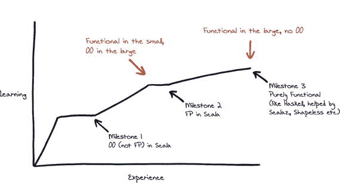
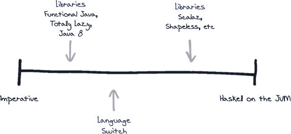

# 21. 可以期待什么

## 学习曲线

如果你刚开始学习 Scala，并想知道可以期待什么，典型的体验是技能快速提升，随后对更复杂特性的掌握会慢下来。在本章中，我将讨论我认为典型的学习曲线。

根据我的经验以及与多个 Scala 团队的交流，我们可以绘制出一条典型的 Scala 学习曲线，如图 21-1 所示，其中 `x` 轴代表经验（或时间），`y` 轴代表某种“学习”度量。

图 21-1

典型的 Scala 采用学习曲线

### 里程碑 1：Scala 中的面向对象编程

刚开始时，你可以预期语言的学习曲线会相当陡峭。

“陡峭”但也“短暂”。达到第一个平台期并不困难，因此你可以预期学习会有相对较快的增长。

你可能会在这个阶段停留一段时间，应用你所学到的东西。我认为这是第一个里程碑：能够使用语言特定的结构和特性构建面向对象或命令式应用程序，但不一定采用函数式编程。这就像学习 Java/C 家族中的任何其他语言一样。

### 里程碑 2：小范围函数式编程，大范围面向对象编程

下一个里程碑涉及采用函数式编程技术。

这是一个更具挑战性的步骤，曲线可能会更平缓。通常，这涉及使用传统的架构设计，但在小范围内实现函数式编程技术。你可以将这种方法视为“小范围函数式，大范围面向对象”。开始接受一种新的函数式思维方式，并摒弃一些传统技术，可能很困难，因此曲线更平缓。

这里的具体例子不仅仅是语言语法：比如高阶函数和纯函数、引用透明性、不可变性、无副作用、更具声明性的编码；这些都是纯函数式语言通常提供的特性。关键在于，它们被应用于小而孤立的区域。

### 里程碑 3：大范围函数式编程

下一个挑战是朝着更具凝聚力的函数式设计努力；这实际上意味着在系统级别采用函数式风格；将整个应用程序架构为函数，并完全放弃面向对象风格。因此，目标是构建类似 Haskell 的应用程序。

这里提到的所有具体函数式编程机制都适用，但这次是贯穿整个系统；不是应用于孤立区域，而是提升到应用程序级别的关注点。采用像 Scalaz 这样的高级库与曲线这一部分密切相关。

## 学习连续体

你也可以将 Scala 的采用视为一个连续体，左侧是传统的命令式编程，右侧是纯函数式编程（见图 21-2）。

图 21-2

命令式（Java）到纯函数式编程（Haskell）连续体

你可以将最右侧视为 JVM 上的 Haskell。Haskell 是一种纯函数式语言，因此你别无选择，只能以函数式方式设计应用程序。Scala 是一种面向对象/函数式混合语言；它只能为你提供工具。它不能强制进行函数式编程；你需要纪律和 Scala 经验来避免，例如，改变状态，而 Haskell 实际上会阻止你。

当你从使用 Java 开始沿着连续体向右移动时，像 Functional Java、¹ Totally Lazy、² 甚至 Java 8 特性³ 这样的库将帮助你采用更具函数式的风格。到了某个点，切换语言会更有帮助。函数式惯用法成为语言特性而非库特性。`for` 推导式的语法糖就是一个很好的例子。

随着你继续前进，使用像 Scalaz⁴ 这样的库可以更容易地向纯函数式编程迈进，但请记住，达到最右侧，或学习曲线的右上象限，本身并不是目标。有许多团队在整个连续体上高效运作。

当你采用 Scala 时，要深思熟虑地决定你想在连续体上处于什么位置，明确原因，并使用我的学习曲线来衡量你的进展。

### 目标

达成纯函数式编程的里程碑将会很困难。这对你的团队来说甚至可能并非正确的选择。纯函数式系统并不一定更好；我建议大多数尝试采用 Scala 的 Java 团队应将目标设定在里程碑 1 和 2 之间，即这个连续谱系的中间位置。

我认为这是在体验语言优势与避免过度承压之间取得的一个良好平衡。如果你在商业环境中工作，你仍然需要交付软件。请记住，随着你向右端（指更函数式的方向）移动，你可能会用经验丰富的开发者来换取新手。在交付承诺与学习之间取得平衡可能更好，因为随着你向右移动，交付风险也会增加。

脚注 1

[`http://www.functionaljava.org/`](http://www.functionaljava.org/)

  2

[`https://code.google.com/p/totallylazy/`](https://code.google.com/p/totallylazy/)

  3

[`https://leanpub.com/whatsnewjava8`](https://leanpub.com/whatsnewjava8)

  4

[`http://eed3si9n.com/learning-scalaz/index.html`](http://eed3si9n.com/learning-scalaz/index.html)

