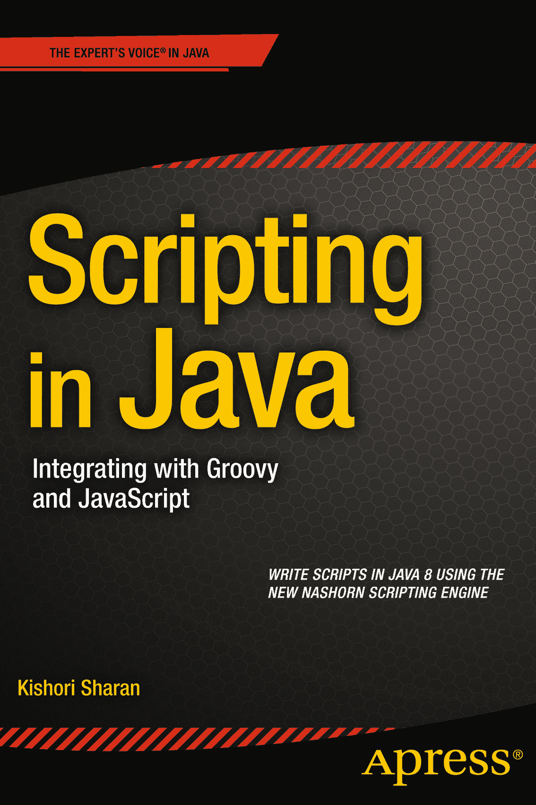

Kishori Sharan 著《Java 脚本编程：与 Groovy 和 JavaScript 集成》

ISBN 978-1-4842-0714-7 电子书 ISBN 978-1-4842-0713-0 DOI 10.1007/978-1-4842-0713-0 © Apress 2014 《Java 脚本编程：与 Groovy 和 JavaScript 集成》 常务董事：Welmoed Spahr 主编：Steve Anglin 技术审校：Vinay Kumar 和 Massimo Nardone 编委会：Steve Anglin, Mark Beckner, Gary Cornell, Louise Corrigan, Jim DeWolf, Jonathan Gennick, Robert Hutchinson, Michelle Lowman, James Markham, Matthew Moodie, Jeff Olson, Jeffrey Pepper, Douglas Pundick, Ben Renow-Clarke, Gwenan Spearing, Matt Wade, Steve Weiss 协调编辑：Kevin Walter 文字编辑：Laura Lawrie 排版：SPi Global 索引编制：SPi Global 插图制作：SPi Global 封面设计：Anna Ishchenko 全球图书贸易发行由 Springer Science+Business Media New York, 233 Spring Street, 6th Floor, New York, NY 10013 负责。电话 1-800-SPRINGER，传真 (201) 348-4505，电子邮件 `orders-ny@springer-sbm.com`，或访问 [`www.springeronline.com`](http://www.springeronline.com/) 。Apress Media, LLC 是一家加利福尼亚有限责任公司，其唯一成员（所有者）是 Springer Science + Business Media Finance Inc (SSBM Finance Inc)。SSBM Finance Inc 是一家特拉华州公司。如需翻译信息，请发送电子邮件至 `rights@apress.com`，或访问 [`www.apress.com`](http://www.apress.com/) 。Apress 和 friends of ED 的书籍可批量购买用于学术、企业或促销用途。大多数图书也提供电子书版本和许可证。更多信息，请参考我们的特殊批量销售–电子书许可网页：[`www.apress.com/bulk-sales`](http://www.apress.com/bulk-sales) 。作者在本文中引用的任何源代码或其他补充材料，读者可在 [`www.apress.com`](http://www.apress.com/) 获取。有关如何找到本书源代码的详细信息，请访问 [www.​apress.​com/​source-code/​](http://www.apress.com/source-code/)。本作品受版权保护。出版商保留所有权利，无论涉及材料的全部或部分，特别是翻译、重印、重用插图、朗诵、广播、微缩胶片复制或任何其他物理方式复制，以及信息存储与检索、电子改编、计算机软件，或现在已知或以后开发的类似或不同方法的权利。与评论或学术分析相关的简短摘录，或专门为输入和执行于计算机系统而提供、仅供购买者独家使用的材料，不受此法律保留限制。仅允许在出版商所在地现行版权法的规定下复制本出版物或其部分内容，且必须始终从 Springer 获得使用许可。使用许可可通过 RightsLink 在版权清算中心获得。违反者将根据相应版权法被起诉。本书中可能出现商标名称、标识和图像。我们并非在每次出现商标名称、标识或图像时都使用商标符号，而是仅以编辑方式使用这些名称、标识和图像，以利于商标所有者，且无意侵犯商标权。本出版物中使用商品名称、商标、服务标志和类似术语（即使未明确标识）不应被视为对其是否受专有权利保护的看法。尽管本书中的建议和信息在出版时被认为是真实准确的，但作者、编辑和出版商均不对可能存在的任何错误或遗漏承担法律责任。出版商对本文所含内容不作任何明示或暗示的保证。 献给我的妻子 Ellen 关于作者

 Kishori Sharan 是一名高级软件顾问。他拥有阿拉巴马州蒙哥马利市特洛伊州立大学计算机信息系统理学硕士学位。他是 Sun 认证 Java 程序员和 Sybase 认证 PowerBuilder 开发专家。他专攻使用 Java SE、Java EE、PowerBuilder 和 Oracle 数据库开发企业应用程序。他在软件行业拥有超过 17 年的工作经验。他曾帮助多个客户将遗留应用程序迁移到 Web。他喜欢在空闲时间撰写技术书籍。他维护着自己的网站 [www.​jdojo.​com](http://www.jdojo.com/)，并在上面发布关于 Java 和 JavaFX 的博客。

关于技术审校

 Vinay Kumar 是一名技术布道师。他在多家咨询和系统集成公司拥有超过七年的企业技术大型项目设计与实施经验。他的热情帮助他获得了 Oracle ADF、Webcenter Portal 和 Java 认证。丰富的经验和深入的知识使他成长为一名专注的领域专家和知名的技术博主。他喜欢花时间指导他人、撰写技术博客、发表白皮书，并在 YouTube 上维护一个专门针对 ADF/Webcenter 的教育频道。Vinay 通过在其个人博客 Techartifact.com 上发表超过 250 篇技术文章，为 Java/Oracle ADF/Webcenter 社区做出了贡献。他于 2014 年 6 月被授予 Oracle ACE 称号。您可以通过 @vinaykuma201 或 [in.​linkedin.​com/​in/​vinaykumar2](http://in.linkedin.com/in/vinaykumar2) 关注他。

 Massimo Nardone 拥有意大利萨莱诺大学计算机科学理学硕士学位。他曾多年担任 PCI QSA 和高级首席 IT 安全/云/SCADA 架构师，目前担任 Hewlett Packard Finland 的安全、云和 SCADA 首席 IT 架构师。他在 IT 领域拥有超过 20 年的工作经验，涵盖安全、SCADA、云计算、IT 基础设施、移动安全和 WWW 技术领域，参与过国内和国际项目。Massimo 曾担任项目经理、云/SCADA 首席 IT 架构师、软件工程师、研究工程师、首席安全架构师和软件专家。他曾是赫尔辛基理工大学（阿尔托大学）网络实验室的客座讲师和练习导师。他使用 Perl、PHP、Java、VB、Python、C/C++ 和 MySQL 进行编程，并教授过这些语言。他是《Beginning PHP and MySQL》（Apress, 2014）和《Pro Android Games》（Apress, 2015）的作者。

他拥有四项国际专利（PKI、SIP、SAML 和代理领域）。本书献给 Pia、Luna、Leo 和 Neve，他们是他生命中的美好理由。

引言

在 2012 年撰写三卷本的《Harnessing Java 7》时，由于每卷篇幅有限，我没有包含关于 Java 脚本 API 的章节。请注意短语“Java Scripting”，它由两个独立的单词组成：“Java”和“Scripting”。“JavaScript”是一种脚本语言的名称，与 Java 编程语言无关；而短语“Java Scripting API”是允许 Java 应用程序与脚本语言交互的 Java API。

在最初版本中，我将本书命名为《驾驭 Java 脚本编程》，内容仅涵盖 Java 脚本 API 和 Rhino 脚本引擎。该版本并未涉及 JavaScript 语言。JDK 8 搭载了一个名为 Nashorn 的轻量级高性能 JavaScript 引擎，它取代了 JDK 7 中附带的 Rhino 引擎。本书全面介绍了 JavaScript 语言，并对 Nashorn 引擎进行了详尽阐述。

学习 Java 6 中引入的 Java 脚本 API，并非对所有 Java 开发者都必不可少，但如果你熟悉 Rhino JavaScript、Groovy、Jython、JRuby 等脚本语言，并希望在这些 Java 应用中充分利用这些脚本语言，那么它就显得非常重要且实用。

我最初通过阅读一些在线博客和文章来学习 Java 脚本 API；它们虽有所帮助，但未能全面清晰地描绘出 Java 脚本 API 如何帮助 Java 应用与脚本语言交互的全貌。学习过程的下一步是阅读 JSR-223（Java 平台脚本规范）以及 `javax.script` 包的 Java API 文档。阅读 JSR-223 规范让我对 Java 脚本 API 有了完整的认识；然而，我仍未准备好撰写本书。我仍缺少一些关键拼图。因此，我决定阅读 `javax.script` 包中类的源代码。我还阅读了一些脚本语言的源代码。最后，在学习该 API 的过程中，我开发了一个简单的脚本引擎，并将其命名为 JKScript。最终，我阅读了 ECMAScript 5.1 规范，以全面了解 JavaScript 语言本身。撰写本书时面临的主要困难是获取关于 Nashorn 引擎及其特性的信息。在 [`​wiki.​openjdk.​java.​net/​display/​Nashorn/​Main`](https://wiki.openjdk.java.net/display/Nashorn/Main) 上维护着一个 Wiki，它零散地提供了关于 Nashorn 引擎的信息。如何将这些信息与书中的连贯示例整合在一起，是一项挑战。

我衷心希望读者能喜欢本书并从中受益。

## 本书结构

本书包含 13 章：每章都介绍 Java 脚本 API 和 JavaScript 语言的一个新主题。每章都会用到前面章节介绍的内容。

第 1 章“入门”向您介绍 Java 脚本 API，并演示如何编写第一个 Java 程序来执行用 Nashorn 编写的脚本。它逐步介绍了下载和安装其他脚本语言（如 Groovy、Jython 和 JRuby）所需的步骤。最后，本章简要介绍了 `javax.script` 包中包含的类和接口，描述了它们的用法以及与其他类的关系。

第 2 章“执行脚本”展示了如何执行存储在文件中的脚本。它还演示了如何将参数从 Java 应用传递到脚本引擎，反之亦然。

第 3 章“向脚本传递参数”讨论了在 Java 应用和脚本引擎之间传递参数所涉及的高级技术和所有内部设置。它从详细描述绑定、作用域和脚本上下文这些术语开始。随后，通过多个示例详细解释了绑定、作用域和脚本上下文如何在 Java 脚本 API 中协同工作。每个解释都配有一段代码片段、一个完整程序，或两者兼有。本章以一个演示如何将脚本输出重定向到文件的程序结束。

第 4 章“在 Nashorn 中编写脚本”非常详细地介绍了 JavaScript 语言，内容涵盖 Nashorn 引擎所支持的 ECMAScript 5.1 规范。

第 5 章“过程与编译脚本”解释了如何从 Java 应用调用用脚本语言编写的顶层过程、函数和对象级方法。它解释了如何在脚本引擎支持的情况下，以中间形式编译脚本并重复执行它们。

第 6 章“在 Nashorn 中使用 Java”解释了如何在脚本语言内部使用 Java 编程语言的特性与结构。讨论的 Java 特性包括导入 Java 类、创建 Java 对象、使用 Java 重载方法、实现 Java 接口等。

第 7 章“集合”解释了 Nashorn 中的无类型数组和类型化数组。它还解释了如何在 Nashorn 中使用 Java 集合类，例如 `java.util.Set` 和 `java.util.Map`。

第 8 章“实现脚本引擎”讨论了实现新脚本引擎所需的步骤。它解释了 Java 脚本 API 中涉及创建新脚本引擎的所有类和接口。它逐步介绍了使脚本引擎能被脚本引擎管理器自动发现的部署设置。在此过程中，它创建了一个简单的脚本引擎，我们称之为 JKScript，它能够执行算术表达式。

第 9 章“jrunscript 命令行 Shell”解释了如何使用 `jrunscript` 命令行 Shell 通过不同的脚本引擎执行脚本。

第 10 章“jjs 命令行工具”解释了如何使用 `jjs` 命令行工具以不同模式执行 Nashorn 脚本。它详细介绍了该命令行工具的语法和选项。提供了多个示例来说明该 Shell 的用法。

第 11 章“在 Nashorn 中使用 JavaFX”解释了如何使用 `jjs` 命令行工具编写和运行 JavaFX 程序。

第 12 章“Nashorn 的 Java API”涵盖了可用于在 Java 程序中处理 JavaScript 对象的 Java 类和接口。

第 13 章“调试、跟踪和分析脚本”解释了 NetBeans 8.0 中对调试 Nashorn 脚本的支持。它还解释了如何跟踪和分析 Nashorn 脚本。

### 目标读者

本书旨在为任何希望学习 Java 中的 Java 脚本 API 和 Nashorn JavaScript 的人提供帮助。使用本书需要具备 Java 基础知识。虽然事先了解 Rhino JavaScript、Groovy、JRuby、Jython 等脚本语言会有所帮助，但并非必需。

本书中的示例均使用 Nashorn JavaScript 编写。示例特意保持简单短小，以便读者无需任何脚本语言经验即可理解。如果你没有使用脚本语言的经验，则需要按章节顺序依次阅读本书。

## 源代码与勘误

本书的源代码和勘误表可从 [`www.apress.com/source-code`](http://www.apress.com/source-code) 下载。

## 问题与评论

请将所有问题与评论直接发送给作者：`ksharan@jdojo.com`。

致谢

我要感谢我的朋友理查德·卡斯蒂略（Richard Castillo）在阅读本书初稿时付出的辛勤劳动，并纠正了多处错误。理查德在运行所有示例并指出错误方面发挥了关键作用。

我要感谢我的家人和朋友在撰写本书过程中给予的鼓励和支持：我的兄长詹基·沙兰（Janki Sharan）和西塔·沙兰博士（Dr. Sita Sharan）；我的姐姐和姐夫拉特纳（Ratna）与阿布海（Abhay）；我的侄子们巴布鲁（Babalu）、达布鲁（Dabalu）、高拉夫（Gaurav）、索拉夫（Saurav）和奇特兰詹（Chitranjan）；我的朋友希瓦尚卡尔·拉文德拉纳特（Shivashankar Ravindranath）、坎南·索马塞卡（Kannan Somasekar）、马赫布布·乔杜里（Mahbub Choudhury）、比朱·奈尔（Biju Nair）、斯里尼瓦斯·卡克拉（Srinivas Kakkera）、阿尼尔·库马尔·辛格（Anil Kumar Singh）、克里斯·科利（Chris Coley）、威利·巴蒂斯特（Willie Baptiste）、拉胡尔·贾因（Rahul Jain）、拉里·布鲁斯特（Larry Brewster）、格雷格·朗厄姆（Greg Langham）、拉姆·阿特马库里（Ram Atmakuri）、拉通德拉·奥克克（LaTondra Okeke）、拉胡尔·纳格帕尔（Rahul Nagpal）、拉维·达特拉（Ravi Datla）、普拉卡什·钱德拉（Prakash Chandra），以及许多未在此提及的朋友。

我衷心感谢 Apress 出版社的优秀团队在本书出版过程中给予的支持。感谢高级协调编辑凯文·沃尔特（Kevin Walter）在编辑过程中提供的出色支持以及对我异乎寻常的耐心。感谢马修·穆迪（Matthew Moodie）、维奈·库马尔（Vinay Kumar）和马西莫·纳尔多内（Massimo Nardone）在技术编辑过程中提供的技术见解和反馈。最后但同样重要的是，我衷心感谢 Apress 出版社的首席编辑史蒂夫·安格林（Steve Anglin）为本书出版所付出的努力。

目录 第 1 章：入门 1 Java 中的脚本是什么？ 1 执行你的第一个脚本 3 使用 jjs 命令行工具 5 在 Nashorn 中打印文本 6 使用其他脚本语言 7 探索 javax.script 包 11 ScriptEngine 和 ScriptEngineFactory 接口 11 AbstractScriptEngine 类 12 ScriptEngineManager 类 12 Compilable 接口和 CompiledScript 类 12 Invocable 接口 12 Bindings 接口和 SimpleBindings 类 12 ScriptContext 接口和 SimpleScriptContext 类 13 ScriptException 类 13 发现并实例化 ScriptEngine 13 小结 15 第 2 章：执行脚本 17 使用 eval()方法 17 传递参数 19 从 Java 代码向脚本传递参数 19 从脚本向 Java 代码传递参数 22 小结 23 第 3 章：向脚本传递参数 25 绑定、作用域和上下文 25 绑定 25 作用域 27 定义脚本上下文 28 综合运用 33 使用自定义 ScriptContext 40 eval()方法的返回值 43 引擎作用域绑定的保留键 45 更改默认的 ScriptContext 46 将脚本输出发送到文件 47 小结 49 第 4 章：在 Nashorn 中编写脚本 51 严格模式与非严格模式 52 标识符 53 注释 54 声明变量 55 数据类型 56 Undefined 类型 56 Null 类型 57 Number 类型 57 Boolean 类型 58 String 类型 58 运算符 61 类型转换 66 转换为 Boolean 66 转换为 Number 68 转换为 String 69 语句 71 块语句 74 变量语句 75 空语句 75 表达式语句 75 if 语句 76 迭代语句 77 continue、break 和 return 语句 79 with 语句 80 switch 语句 81 带标签的语句 82 throw 语句 83 try 语句 83 debugger 语句 87 定义函数 88 函数声明 88 函数表达式 92 Function()构造函数 95 Object 类型 96 使用对象字面量 97 使用构造函数 108 对象继承 113 使用 Object.create()方法 123 绑定对象属性 124 锁定对象 128 访问缺失的属性 129 序列化对象 131 动态评估脚本 132 变量作用域与提升 133 使用严格模式 136 内置全局对象 136 Object 对象 136 Function 对象 139 String 对象 143 Number 对象 145 Boolean 对象 147 Date 对象 148 Math 对象 150 RegExp 对象 151 了解脚本位置 162 内置全局函数 163 parseInt()函数 163 parseFloat()函数 164 isNaN()函数 165 isFinite()函数 166 decodeURI()函数 166 decodeURIComponent()函数 167 encodeURI()函数 167 encodeURIComponent()函数 168 load()和 loadWithNewGlobal 函数 168 小结 172 第 5 章：过程与编译脚本 175 调用脚本中的过程 175 在脚本中实现 Java 接口 181 使用编译脚本 187 小结 189 第 6 章：在脚本语言中使用 Java 191 导入 Java 类型 191 使用 Packages 全局对象 192 使用 Java 全局对象 192 使用 importPackage()和 importClass()函数 193 使用 JavaImporter 对象 195 创建和使用 Java 对象 195 使用重载的 Java 方法 197 使用 Java 数组 199 扩展 Java 类并实现接口 201 使用脚本对象 201 使用匿名类式语法 203 使用 JavaAdapter 对象 203 使用 Java.extend()方法 204 使用 JavaScript 函数 206 访问超类的方法 206 使用 Lambda 表达式 208 小结 209 第 7 章：集合 211 Nashorn 中的数组是什么？ 211 创建数组 212 使用数组字面量 212 使用 Array 对象 218 不传递参数 219 传递一个参数 219 传递两个或更多参数 220 删除数组元素 221 数组的长度 222 遍历数组元素 223 使用 for 循环 223 使用 forEach()方法 225 使用 for-in 循环 226 检查是否为数组 227 多维数组 228 Array 对象的方法 228 连接元素 229 连接数组元素 229 反转数组元素 229 切片数组 230 拼接数组 230 排序数组 231 在两端添加和删除元素 232 搜索数组 235 评估谓词 236 将数组转换为字符串 237 数组的流式处理 237 类数组对象 240 类型化数组 242 ArrayBuffer 对象 242 ArrayBuffer 的视图 243 使用 List、Map 和 Set 251 将 Java List 用作 Nashorn 数组 251 将 Java Map 用作 Nashorn 对象 253 使用 Java 数组 254 数组到 Java 集合的转换 258 小结 260 第 8 章：实现脚本引擎 263 引言 263 Expression 类 265 实例变量 269 构造函数 269 parse()方法 269 getOperandValue()方法 270 eval()方法 270 JKScriptEngine 类 270 JKScriptEngineFactory 类 272 准备部署 274 打包 JKScript 文件 275 使用 JKScript 脚本引擎 275 小结 279 第 9 章：jrunscript 命令行 Shell 281 语法 281 Shell 的执行模式 283 单行模式 283 批处理模式 283 交互模式 284 列出可用的脚本引擎 285 向 Shell 添加脚本引擎 285 使用其他脚本引擎 285 向脚本传递参数 286 全局函数 287 小结 293 第 10 章：jjs 命令行工具 295 语法 295 选项 296 在交互模式下使用 jjs 299 向 jjs 传递参数 300 在脚本模式下使用 jjs 301 小结 306 第 11 章：在 Nashorn 中使用 JavaFX 307 jjs 中的 JavaFX 支持 307 脚本中 JavaFX 应用程序的结构 307 导入 JavaFX 类型 314 小结 318 第 12 章：Nashorn 的 Java API 319 Nashorn 的 Java API 是什么？ 319 实例化 Nashorn 引擎 322 共享引擎全局变量 323 在 Java 代码中使用脚本对象 327 使用脚本对象的属性 330 在 Java 中创建 Nashorn 对象 334 从 Java 调用脚本函数 337 将脚本日期转换为 Java 日期 340 小结 341 第 13 章：调试、跟踪和分析脚本 343 调试独立脚本 344 从 Java 代码调试脚本 347 跟踪和分析脚本 351 小结 354 索引 355 内容一览 第 1 章：入门 1   第 2 章：执行脚本 17   第 3 章：向脚本传递参数 25   第 4 章：在 Nashorn 中编写脚本 51   第 5 章：过程与编译脚本 175   第 6 章：在脚本语言中使用 Java 191   第 7 章：集合 211   第 8 章：实现脚本引擎 263   第 9 章：jrunscript 命令行 Shell 281   第 10 章：jjs 命令行工具 295   第 11 章：在 Nashorn 中使用 JavaFX 307   第 12 章：Nashorn 的 Java API 319   第 13 章：调试、跟踪和分析脚本 343   索引 355

