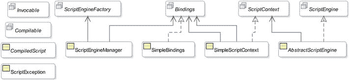

# 1. 入门指南

在本章中，你将学习：

*   什么是 Java 中的脚本编程
*   如何从 Java 执行你的第一个脚本
*   如何在 Java 中使用其他脚本语言，如 JRuby、Jython
*   `javax.script` API
*   脚本引擎是如何被发现和实例化的

## 什么是 Java 中的脚本编程？

有些人认为 Java 虚拟机（JVM）只能执行用 Java 编程语言编写的程序。然而，事实并非如此。JVM 执行的是与语言无关的字节码。只要程序能被编译成 Java 字节码，JVM 就能执行用任何编程语言编写的程序。

脚本语言是一种编程语言，它使你能够编写由称为脚本引擎（或解释器）的运行时环境评估（或解释）的脚本。脚本是一系列字符，使用脚本语言的语法编写，并作为由解释器执行的程序的源代码。解释器解析脚本，生成中间代码（即程序的内部表示），然后执行中间代码。解释器将脚本中使用的变量存储在称为符号表的数据结构中。

通常，与编译型编程语言不同，脚本语言中的源代码（称为脚本）不会被编译，而是在运行时被解释。然而，用某些脚本语言编写的脚本可能会被编译成可由 JVM 运行的 Java 字节码。

Java 6 为 Java 平台增加了脚本支持，使得 Java 应用程序能够执行用 Rhino JavaScript、Groovy、Jython、JRuby、Nashorn JavaScript 等脚本语言编写的脚本。它支持双向通信。它还允许脚本访问宿主应用程序创建的 Java 对象。Java 运行时和脚本语言运行时可以相互通信并利用彼此的特性。

Java 对脚本语言的支持是通过 Java 脚本 API 实现的。Java 脚本 API 中的所有类和接口都在 `javax.script` 包中。

在 Java 应用程序中使用脚本语言有几个优点：

*   大多数脚本语言是动态类型的，这使得编写程序更简单。
*   它们提供了一种更快速开发和测试小型应用程序的方法。
*   最终用户可以进行定制。
*   脚本语言可能提供 Java 中没有的领域特定功能。

脚本语言也有一些缺点。例如，动态类型有利于编写更简单的代码；然而，当类型被错误解释，并且你必须花费大量时间调试时，它就变成了一个缺点。

Java 中的脚本支持让你能够两全其美：它允许你使用 Java 编程语言开发应用程序中静态类型、可扩展和高性能的部分，同时使用适合其他部分领域特定需求的脚本语言。

我将在本书中频繁使用术语“脚本引擎”。脚本引擎是一个软件组件，用于执行用特定脚本语言编写的程序。通常（但不一定），脚本引擎是某种脚本语言解释器的实现。几种脚本语言的解释器已经在 Java 中实现。它们公开了编程接口，以便 Java 程序可以与它们交互。

JDK 7 附带了一个名为 Rhino JavaScript 的脚本引擎。JDK 8 将 Rhino JavaScript 引擎替换为一个更轻量、更快的脚本引擎，称为 Nashorn JavaScript。本书讨论的是 Nashorn JavaScript，而非 Rhino JavaScript。有关 Rhino JavaScript 文档的更多详细信息，请访问 [`www.mozilla.org/rhino`](http://www.mozilla.org/rhino)。如果你想将用 Rhino JavaScript 编写的程序迁移到 Nashorn，请访问位于 [`https://wiki.openjdk.java.net/display/Nashorn/Rhino+Migration+Guide`](https://wiki.openjdk.java.net/display/Nashorn/Rhino+Migration+Guide) 的 Rhino 迁移指南。如果你有兴趣在 JDK 8 中使用 Rhino JavaScript，请访问页面 [`https://wiki.openjdk.java.net/display/Nashorn/Using+Rhino+JSR-223+engine+with+JDK8`](https://wiki.openjdk.java.net/display/Nashorn/Using+Rhino+JSR-223+engine+with+JDK8)。

Java 包含一个名为 `jrunscript` 的命令行 shell，可用于以交互模式或批处理模式运行脚本。`jrunscript` shell 是与脚本语言无关的；在 JDK 7 中默认语言是 Rhino JavaScript，在 JDK 8 中是 Nashorn。我将在第 9 章中详细讨论 `jrunscript` shell。JDK 8 还包含另一个名为 `jjs` 的命令行工具，它调用 Nashorn 引擎并提供 Nashorn 特定的命令行选项。如果你使用 Nashorn，你应该优先使用 `jjs` 命令行工具而不是 `jrunscript`。我将在第 10 章中讨论 `jjs` 命令行工具。

Java 可以执行任何提供了脚本引擎实现的脚本语言编写的脚本。例如，Java 可以执行用 Nashorn JavaScript、Rhino JavaScript、Groovy、Jython、JRuby 等编写的脚本。本书中的示例使用 Nashorn JavaScript 语言。

在本书中，术语“Nashorn”、“Nashorn 引擎”、“Nashorn JavaScript”、“Nashorn JavaScript 引擎”、“Nashorn 脚本语言”和“JavaScript”被同义使用。

Nashorn 脚本引擎可以通过两种方式调用：

*   将引擎嵌入到 JVM 中
*   使用 `jjs` 命令行工具

在本章中，我将讨论使用 Nashorn 脚本引擎的这两种方式。

## 执行你的第一个脚本

在本节中，你将使用 Nashorn 在标准输出上打印一条消息。你将通过 Java 代码访问 Nashorn 引擎。同样的步骤也可用于使用其他脚本语言打印消息，但有一个区别：你需要使用特定于该脚本语言的代码来打印消息。在 Java 中运行脚本需要执行三个步骤：

*   创建一个脚本引擎管理器。
*   从脚本引擎管理器获取一个脚本引擎实例。
*   调用脚本引擎的 `eval()` 方法来执行脚本。

脚本引擎管理器是 `ScriptEngineManager` 类的一个实例。你可以像这样创建一个脚本引擎：

`// 创建一个脚本引擎管理器`

`ScriptEngineManager manager = new ScriptEngineManager();`

`ScriptEngine` 接口的实例代表 Java 程序中的一个脚本引擎。`ScriptEngineManager` 的 `getEngineByName(String engineShortName)` 方法用于获取脚本引擎的实例。要获取 Nashorn 引擎的实例，请使用 `JavaScript` 作为引擎的短名称，如下所示：

`// 获取 Nashorn 引擎的引用`

`ScriptEngine engine = manager.getEngineByName("JavaScript");`

提示

脚本引擎的短名称是区分大小写的。有时一个脚本引擎有多个短名称。Nashorn 引擎有以下短名称：`nashorn`、`Nashorn`、`js`、`JS`、`JavaScript`、`javascript`、`ECMAScript`、`ecmascript`。你可以使用引擎的任何一个短名称，通过 `ScriptEngineManager` 类的 `getEngineByName()` 方法来获取其实例。

在 Nashorn 中，`print()` 函数在标准输出上打印一条消息，字符串字面量是用单引号或双引号括起来的字符序列。以下代码片段将一个脚本存储在一个 `String` 对象中，该脚本在标准输出上打印 `Hello Scripting!`：

`// 将 Nashorn 脚本存储在一个字符串中`

`String script = "print('Hello Scripting!')";`

如果你想在 Nashorn 中使用双引号来括住字符串字面量，语句将如下所示：

`// 将 Nashorn 脚本存储在一个字符串中`

`String script = "print(\"Hello Scripting!\")";`

要执行脚本，你需要将其传递给脚本引擎的 `eval()` 方法。脚本引擎在运行脚本时可能会抛出 `ScriptException`。因此，在调用 `ScriptEngine` 的 `eval()` 方法时，你需要处理此异常。以下代码片段执行存储在 `script` 变量中的脚本：

`try {`

`engine.eval(script);`

`}`

`catch (ScriptException e) {`

`e.printStackTrace();`

`}`

清单 1-1 包含了在标准输出上打印消息的完整程序代码。

清单 1-1\. 使用 Nashorn 在标准输出上打印消息

`// HelloScripting.java`

`package com.jdojo.script;`

`import javax.script.ScriptEngine;`

`import javax.script.ScriptEngineManager;`

`import javax.script.ScriptException;`

`public class HelloScripting {`

`public static void main(String[] args) {`

`// 创建一个脚本引擎管理器`

`ScriptEngineManager manager = new ScriptEngineManager();`

`// 从管理器获取一个 Nashorn 脚本引擎`

`ScriptEngine engine = manager.getEngineByName("JavaScript");`

`// 将脚本存储在一个字符串中`

`String script = "print('Hello Scripting!')";`

`try {`

`// 执行脚本`

`engine.eval(script);`

`}`

`catch (ScriptException e) {`

`e.printStackTrace();`

`}`

`}`

`}`

`Hello Scripting!`

## 使用 jjs 命令行工具

在上一节中，你了解了如何从 Java 程序中使用 Nashorn 脚本引擎。在本节中，我将向你展示如何使用 `jjs` 命令行工具执行相同的任务。该工具存储在 `JDK_HOME\bin` 和 `JRE_HOME\bin` 目录中。例如，如果你在 Windows 上将 JDK8 安装在 `C:\java8` 目录中，那么 `jjs` 工具的路径将是 `C:\java8\bin\jjs.exe`。`jjs` 工具可用于执行文件中的 Nashorn 脚本，或以交互方式执行脚本。

以下是在 Windows 命令提示符下调用 `jjs` 工具的示例。输入并执行脚本。你可以使用 `quit()` 或 `exit()` 函数退出 `jjs` 工具：

`C:\>jjs`

`jjs> print('Hello Scripting!');`

`Hello Scripting!`

`jjs> quit()`

`C:\>`

执行 `jjs` 命令时，你可能会遇到以下错误：

`'jjs' 不是内部或外部命令，也不是可运行的程序或批处理文件。`

该错误表明命令提示符无法找到 `jjs` 工具。在这种情况下，你可以输入 `jjs` 工具的完整路径，或者将包含该工具的目录添加到系统 PATH 中。

考虑清单 1-2 中列出的代码。这是使用 `print()` 函数在标准输出上打印消息的 Nashorn 代码。该代码保存在名为 `helloscripting.js` 的文件中。

清单 1-2：helloscripting.js 文件的内容

`// helloscripting.js`

`// 在标准输出上打印一条消息`

`print('Hello Scripting!');`

以下命令执行存储在 `helloscripting.js` 文件中的脚本，假设该文件存储在当前目录中：

`C:\>jjs helloscripting.js`

`Hello Scripting!`

`C:\>`

如果此命令给你一个类似于以下的错误，则表示该命令无法找到指定的文件，你需要指定 `helloscripting.js` 文件的完整路径：

`java.io.FileNotFoundException: C:\helloscripting.js (系统找不到指定的文件)`

`jjs` 命令行工具是一个大话题，我将用一整章来介绍它。我将在第 10 章中详细讨论它。

## 在 Nashorn 中打印文本

Nashorn 提供了三个函数用于在标准输出上打印文本：

*   `print()` 函数
*   `printf()` 函数
*   `echo()` 函数

`print()` 函数是一个可变参数函数。你可以向它传递任意数量的参数。它会将其参数转换为字符串，并用空格分隔打印它们。最后，它会打印一个新行。以下两次 `print()` 函数的调用是相同的：

`print("Hello", "World!"); // 打印 Hello World!`

`print("Hello World!");    // 打印 Hello World!`

`printf()` 函数用于使用 printf 风格的格式化打印。它与调用 Java 方法 `System.out.printf()` 相同：

`printf("%d + %d = %d", 10, 20, 10 + 20); // 打印 10 + 20 = 30`

`echo()` 函数与 `print()` 函数相同，区别在于它仅在脚本模式下工作。脚本模式将在第 10 章中讨论。

## 使用其他脚本语言

在 Java 程序中使用除 Nashorn 之外的脚本语言非常简单。在使用脚本引擎之前，你只需要完成一项任务：将特定脚本引擎的 JAR 文件包含到应用程序的 CLASSPATH 中。脚本引擎的实现者会提供这些 JAR 文件。

Java 使用一种发现机制来列出所有其 JAR 文件已包含在应用程序 CLASSPATH 中的脚本引擎。`ScriptEngineFactory` 接口的实例用于创建和描述脚本引擎。脚本引擎的提供者会为 `ScriptEngineFactory` 接口提供实现。`ScriptEngineManager` 的 `getEngineFactories()` 方法会返回一个包含所有可用脚本引擎工厂的 `List<ScriptEngineFactory>`。`ScriptEngineFactory` 的 `getScriptEngine()` 方法会返回一个 `ScriptEngine` 实例。工厂的其他几个方法会返回关于引擎的元数据。

表 1-1 列出了在 Java 应用程序中使用脚本引擎之前如何安装它们的详细信息。这些网站和说明列表在撰写本文时是有效的；在阅读时它们可能已失效。不过，它们展示了如何安装某种脚本语言的脚本引擎。如果你有兴趣使用 Nashorn，则无需在机器上安装任何东西。Nashorn 在 JDK 8 中可用。

表 1-1.

安装某些脚本引擎的详细信息

| 脚本引擎 | 版本 | 网站 | 安装说明 |
| --- | --- | --- | --- |
| Groovy | 2.3 | `groovy.codehaus.org` | 下载 Groovy 的安装文件；它是一个 ZIP 文件。解压它。在 `embeddable` 文件夹中查找名为 `groovy-all-2.0.0-rc-2.jar` 的 JAR 文件。将此 JAR 文件添加到 CLASSPATH。 |
| Jython | 2.5.3 | [`www.jython.org`](http://www.jython.org/) | 下载 Jython 安装程序文件，它是一个 JAR 文件。解压 `jython.jar` 文件并将其添加到 CLASSPATH。 |
| JRuby | 1.7.13 | [`www.jruby.org`](http://www.jruby.org/) | 下载 JRuby 安装文件。你可以选择下载一个 ZIP 文件。解压它。在 `lib` 文件夹中，你会找到一个 `jruby.jar` 文件，你需要将其包含到 CLASSPATH 中。 |

清单 1-3 展示了如何打印所有可用脚本引擎的详细信息。输出显示 Groovy、Jython 和 JRuby 的脚本引擎是可用的。它们之所以可用，是因为我已经将它们的引擎 JAR 文件添加到了我机器上的 CLASSPATH 中。当你已将脚本引擎的 JAR 文件包含在 CLASSPATH 中，并且想要知道该脚本引擎的短名称时，这个程序会很有帮助。当你运行该程序时，可能会得到不同的输出。

清单 1-3\. 列出所有可用的脚本引擎

`// ListingAllEngines.java`

`package com.jdojo.script;`

`import java.util.List;`

`import javax.script.ScriptEngineFactory;`

`import javax.script.ScriptEngineManager;`

`public class ListingAllEngines {`

`public static void main(String[] args) {`

`ScriptEngineManager manager = new ScriptEngineManager();`

`// 获取所有可用引擎的列表`

`List<ScriptEngineFactory> list = manager.                getEngineFactories();`

`// 打印每个引擎的详细信息`

`for (ScriptEngineFactory f : list) {`

`System.out.println("引擎名称:" +                         f.getEngineName());`

`System.out.println("引擎版本:" +`

`f.getEngineVersion());`

`System.out.println("语言名称:" +                         f.getLanguageName());`

`System.out.println("语言版本:" +                         f.getLanguageVersion());`

`System.out.println("引擎短名称:" +                         f.getNames());`

`System.out.println("MIME 类型:" +                         f.getMimeTypes());`

`System.out.println("----------------------------");`

`}`

`}`

`}`

`引擎名称:jython`

`引擎版本:2.5.3`

`语言名称:python`

`语言版本:2.5`

`引擎短名称:[python, jython]`

`MIME 类型:[text/python, application/python, text/x-python, application/x-python]`

`----------------------------`

`引擎名称:JSR 223 JRuby 引擎`

`引擎版本:1.7.0.preview1`

`语言名称:ruby`

`语言版本:jruby 1.7.0.preview1`

`引擎短名称:[ruby, jruby]`

`MIME 类型:[application/x-ruby]`

`----------------------------`

`引擎名称:Groovy 脚本引擎`

`引擎版本:2.0`

`语言名称:Groovy`

`语言版本:2.0.0-rc-2`

`引擎短名称:[groovy, Groovy]`

`MIME 类型:[application/x-groovy]`

`----------------------------`

`引擎名称:Oracle Nashorn`

`引擎版本:1.8.0_05`

`语言名称:ECMAScript`

`语言版本:ECMA - 262 Edition 5.1`

`引擎短名称:[nashorn, Nashorn, js, JS, JavaScript, javascript, ECMAScript, ecmascript]`

`MIME 类型:[application/javascript, application/ecmascript, text/javascript, text/ecmascript]`

`----------------------------`

清单 1-4 展示了如何使用 JavaScript、Groovy、Jython 和 JRuby 在标准输出上打印一条消息。如果某个脚本引擎不可用，程序会打印一条相应的消息。

清单 1-4\. 使用不同脚本语言在标准输出上打印消息

`// HelloEngines.java`

`package com.jdojo.script;`

`import javax.script.ScriptEngine;`

`import javax.script.ScriptEngineManager;`

`import javax.script.ScriptException;`

`public class HelloEngines {`

`public static void main(String[] args) {`

`// 获取脚本引擎管理器`

`ScriptEngineManager manager = new ScriptEngineManager();`

`// 尝试在 Nashorn、Groovy、Jython 和 JRuby 中执行脚本`

`execute(manager, "JavaScript", "print('Hello JavaScript')");`

`execute(manager, "Groovy", "println('Hello Groovy')");`

`execute(manager, "jython", "print 'Hello Jython'");`

`execute(manager, "jruby", "puts('Hello JRuby')");`

`}`

`public static void execute(ScriptEngineManager manager,`

`String engineName,`

`String script) {`

`// 尝试获取引擎`

`ScriptEngine engine = manager.getEngineByName(engineName);`

`if (engine == null) {`

`System.out.println(engineName + " 不可用。");`

`return;`

`}`

`// 如果执行到这里，说明我们已经安装了该引擎。                 // 所以，运行脚本`

`try {`

`engine.eval(script);`

`}`

`catch (ScriptException e) {`

`e.printStackTrace();`

`}`

`}`

`}`

`Hello JavaScript`

`Hello Groovy`

`Hello Jython`

`Hello JRuby`

有时你可能只是想玩玩脚本语言，但不知道在标准输出上打印消息所用的语法。`ScriptEngineFactory` 类包含一个名为 `getOutputStatement(String toDisplay)` 的方法，你可以使用它来查找在标准输出上打印文本的语法。以下代码片段展示了如何获取 Nashorn 的语法：

`// 获取 Nashorn 的脚本引擎工厂`

`ScriptEngineManager manager = new ScriptEngineManager();`

`ScriptEngine engine = manager.getEngineByName("JavaScript");`

`ScriptEngineFactory factory = engine.getFactory();`

`// 获取脚本`

`String script = factory.getOutputStatement("\"Hello JavaScript\"");`

`System.out.println("语法: " + script);`

`// 评估脚本`

`engine.eval(script);`

`语法: print("Hello JavaScript")`

`Hello JavaScript`

对于其他脚本语言，请使用它们的引擎工厂来获取语法。

## 探索 javax.script 包

Java 中的 Java 脚本 API 由少量类和接口组成。它们位于 `javax.script` 包中。本章简要描述了该包中的类和接口。我将在后续章节中讨论它们的用法。图 1-1 展示了 Java 脚本 API 中类和接口的类图。

图 1-1.

Java 脚本 API 中类和接口的类图

### ScriptEngine 与 ScriptEngineFactory 接口

`ScriptEngine` 接口是 Java 脚本 API 的主要接口，其实例有助于执行以特定脚本语言编写的脚本。

`ScriptEngine` 接口的实现者也需要提供 `ScriptEngineFactory` 接口的实现。一个 `ScriptEngineFactory` 执行两项任务：

*   创建脚本引擎的实例。
*   提供关于脚本引擎的信息，例如引擎名称、版本、语言等。

### AbstractScriptEngine 类

`AbstractScriptEngine` 类是一个抽象类。它为 `ScriptEngine` 接口提供了部分实现。除非你在实现一个脚本引擎，否则你不会直接使用这个类。

### ScriptEngineManager 类

`ScriptEngineManager` 类为脚本引擎提供了一种发现和实例化机制。它还维护一个键值对映射，作为 `Bindings` 接口的一个实例，用于存储它创建的所有脚本引擎所共享的状态。

### Compilable 接口与 CompiledScript 类

`Compilable` 接口可以由脚本引擎选择性地实现，该接口允许编译脚本以便重复执行而无需重新编译。

`CompiledScript` 类是一个抽象类。它由脚本引擎的提供者进行扩展。它以编译形式存储脚本，可以重复执行而无需重新编译。请注意，使用 `ScriptEngine` 重复执行脚本会导致每次重新编译，从而降低性能。

脚本引擎不需要支持脚本编译。如果它支持脚本编译，则必须实现 `Compilable` 接口。

### Invocable 接口

`Invocable` 接口可以由脚本引擎选择性地实现，该接口允许调用先前已编译脚本中的过程、函数和方法。

### Bindings 接口与 SimpleBindings 类

实现了 `Bindings` 接口的类的实例是一个键值对映射，其限制是键必须是非空、非空的 `String`。它扩展了 `java.util.Map` 接口。`SimpleBindings` 类是 `Bindings` 接口的一个实现。

### ScriptContext 接口与 SimpleScriptContext 类

`ScriptContext` 接口的实例充当 Java 宿主应用程序和脚本引擎之间的桥梁。它用于将 Java 宿主应用程序的执行上下文传递给脚本引擎。脚本引擎在执行脚本时可能会使用上下文信息。脚本引擎可以将其状态存储在实现了 `ScriptContext` 接口的类的实例中，该实例可能对 Java 宿主应用程序可访问。

`SimpleScriptContext` 类是 `ScriptContext` 接口的一个实现。

### ScriptException 类

`ScriptException` 类是一个异常类。如果在脚本的执行、编译或调用过程中发生错误，脚本引擎会抛出 `ScriptException`。该类包含三个有用的方法，分别称为 `getLineNumber()`、`getColumnNumber()` 和 `getFileName()`。这些方法报告发生错误的脚本的行号、列号和文件名。`ScriptException` 类重写了 `Throwable` 类的 `getMessage()` 方法，并在其返回的消息中包含行号、列号和文件名。

## 发现和实例化 ScriptEngine

你可以使用 `ScriptEngineFactory` 或 `ScriptEngineManager` 创建脚本引擎。谁实际负责创建脚本引擎：`ScriptEngineFactory`、`ScriptEngineManager`，还是两者都有？简而言之，`ScriptEngineFactory` 始终负责创建脚本引擎的实例。下一个问题是“`ScriptEngineManager` 的作用是什么？”

`ScriptEngineManager` 使用服务提供者机制来定位所有可用的脚本引擎工厂。它搜索 CLASSPATH 和其他标准目录中的所有 JAR 文件。它查找一个资源文件，该文件是一个名为 `javax.script.ScriptEngineFactory` 的文本文件，位于名为 `META-INF/services` 的目录下。该资源文件由实现 `ScriptEngineFactory` 接口的类的完全限定名组成。每个类名单独占一行。该文件可以包含以 `#` 字符开头的注释。一个示例资源文件可能包含以下内容，其中包括两个脚本引擎工厂的类名：

`#Java Kishori 脚本引擎工厂类`

`com.jdojo.script.JKScriptEngineFactory`

`#另一个工厂类`

`com.jdojo.script.FunScriptFactory`

`ScriptEngineManager` 定位并实例化所有可用的 `ScriptEngineFactory` 类。你可以使用 `ScriptEngineManager` 类的 `getEngineFactories()` 方法获取所有工厂类实例的列表。当你调用管理器的某个方法（例如根据名称获取引擎的 `getEngineByName(String shortName)` 方法）来获取脚本引擎时，管理器会搜索所有工厂以查找该条件，并返回匹配的脚本引擎引用。如果没有工厂能够提供匹配的引擎，管理器将返回 `null`。有关列出所有可用工厂和描述它们可以创建的脚本引擎的更多详细信息，请参考清单 1-3。

现在你知道 `ScriptEngineManager` 并不创建脚本引擎的实例。相反，它查询所有可用的工厂，并将由工厂创建的脚本引擎的引用返回给调用者。

为了使讨论完整，让我们为创建脚本引擎的方式增加一点变化。你可以通过三种方式创建脚本引擎的实例：

*   直接实例化脚本引擎类。
*   直接实例化脚本引擎工厂类并调用其 `getScriptEngine()` 方法。
*   使用 `ScriptEngineManager` 类的某个 `getEngineByXxx()` 方法。

建议使用 `ScriptEngineManager` 类来获取脚本引擎的实例。这种方法允许由同一管理器创建的所有引擎共享一个状态，该状态是一组作为 `Bindings` 接口实例存储的键值对。`ScriptEngineManager` 实例存储此状态。

提示

在一个应用程序中可以有多个 `ScriptEngineManager` 类的实例。在这种情况下，每个 `ScriptEngineManager` 实例维护一个对其创建的所有引擎通用的状态。也就是说，如果两个引擎是由 `ScriptEngineManager` 类的两个不同实例获得的，那么这些引擎将不会共享其管理器维护的公共状态，除非你通过编程方式实现。

## 摘要

脚本语言是一种编程语言，它使你能够编写由称为脚本引擎（或解释器）的运行时环境评估（或解释）的脚本。脚本是使用脚本语言的语法编写的一系列字符，并作为由解释器执行的程序的源代码。Java 脚本 API 允许你从 Java 应用程序执行任何可编译为 Java 字节码的脚本语言编写的脚本。JDK 6 和 7 附带了一个名为 Rhino JavaScript 引擎的脚本引擎。在 JDK 8 中，Rhino JavaScript 引擎已被名为 Nashorn 的脚本引擎取代。

Nashorn 引擎可以通过两种方式使用：它可以嵌入到 JVM 中并从 Java 程序直接调用，或者可以使用 `jjs` 命令行工具从命令提示符调用。

Nashorn 提供了三个在标准输出上打印文本的函数：`print()`、`printf()` 和 `echo()`。`print()` 函数接受可变数量的参数；它会打印所有参数，用空格分隔，并在末尾打印一个新行。`printf()` 函数打印格式化文本；其工作方式与 Java 编程语言中 printf 风格的格式化相同。`echo()` 函数的工作方式与 `print()` 函数相同，区别在于前者仅在脚本模式下调用 Nashorn 引擎时可用。

脚本使用 `ScriptEngine` 接口的实例（即脚本引擎）来执行。`ScriptEngine` 接口的实现者还提供了 `ScriptEngineFactory` 接口的实现，其职责是创建脚本引擎的实例并提供有关脚本引擎的详细信息。`ScriptEngineManager` 类为脚本引擎提供了发现和实例化机制。`ScriptManager` 维护一个键值对映射，作为 `Bindings` 接口的实例，该映射由其创建的所有脚本引擎共享。

