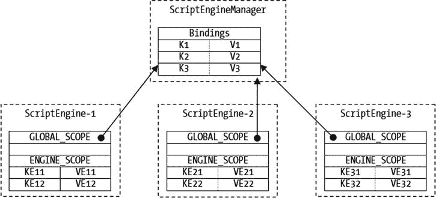
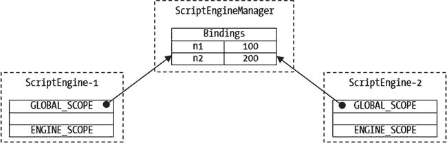
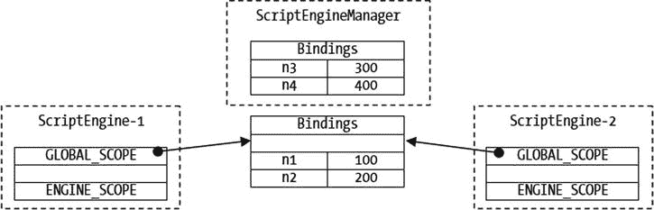
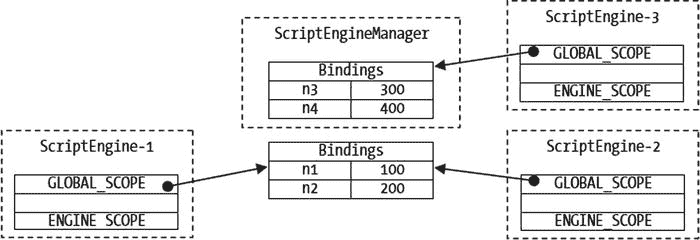
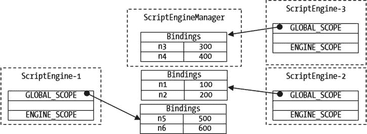

# 3. 向脚本传递参数

在本章中，你将学习：

*   用于从 Java 程序向脚本传递参数的类
*   如何创建并使用 `Bindings` 对象来保存参数
*   如何定义参数的作用域
*   如何使用不同的对象和作用域向脚本传递参数
*   不同参数传递方式的优缺点
*   如何将脚本输出写入文件

## 绑定、作用域与上下文

要理解参数传递机制的细节，必须清晰理解三个术语：绑定、作用域和上下文。这些术语起初容易混淆。本章通过以下步骤解释参数传递机制：

*   首先，定义这些术语
*   其次，定义这些术语之间的关系
*   第三，解释如何在 Java 程序中使用它们

### 绑定

`Bindings` 是一组键值对，其中所有键必须是非空、非 null 的字符串。在 Java 代码中，`Bindings` 是 `Bindings` 接口的一个实例。`SimpleBindings` 类是 `Bindings` 接口的一个实现。脚本引擎可能提供其自身的 `Bindings` 接口实现。

提示

如果你熟悉 `java.util.Map` 接口，就很容易理解 `Bindings`。`Bindings` 接口继承自 `Map<String,Object>` 接口。因此，`Bindings` 本质上就是一个 `Map`，只是其键必须是非空、非 null 的字符串。

清单 3-1 展示了如何使用 `Bindings`。它创建了一个 `SimpleBindings` 实例，向其添加一些键值对，检索键的值，移除一个键值对等。如果键不存在，或者键存在但其值为 `null`，`Bindings` 接口的 `get()` 方法会返回 `null`。如果要测试键是否存在，需要使用其 `contains()` 方法。

清单 3-1. 使用 Bindings 对象

`// BindingsTest.java`

`package com.jdojo.script;`

`import javax.script.Bindings;`

`import javax.script.SimpleBindings;`

`public class BindingsTest {`

`public static void main(String[] args) {`

`// 创建一个 Bindings 实例`

`Bindings params = new SimpleBindings();`

`// 添加一些键值对`

`params.put("msg", "Hello");`

`params.put("year", 1969);`

`// 获取值`

`Object msg = params.get("msg");`

`Object year = params.get("year");`

`System.out.println("msg = " + msg);`

`System.out.println("year = " + year);`

`// 从 Bindings 中移除 year`

`params.remove("year");`

`year = params.get("year");`

`boolean containsYear = params.containsKey("year");`

`System.out.println("year = " + year);`

`System.out.println("params contains year = " + containsYear);`

`}`

`}`

`msg = Hello`

`year = 1969`

`year = null`

`params contains year = false`

你不会单独使用 `Bindings`。通常，你会用它来将参数从 Java 代码传递给脚本引擎。`ScriptEngine` 接口包含一个 `createBindings()` 方法，该方法返回 `Bindings` 接口的一个实例。此方法让脚本引擎有机会返回 `Bindings` 接口的专用实现实例。你可以像下面这样使用此方法：

`// 获取 Nashorn 引擎`

`ScriptEngineManager manager = new ScriptEngineManager();`

`ScriptEngine engine = manager.getEngineByName("JavaScript");`

`// 不要实例化 SimpleBindings 类，而是使用引擎的 createBindings() 方法`

`Bindings params = engine.createBindings();`

`// 像往常一样使用 params`

### 作用域

接下来看下一个术语：作用域。作用域用于 `Bindings`。`Bindings` 的作用域决定了其键值对的可见性。你可以有多个 `Bindings` 分布在多个作用域中。但是，一个 `Bindings` 只能出现在一个作用域中。如何为 `Bindings` 指定作用域？我稍后会介绍。

使用 `Bindings` 的作用域可以让你按层次顺序为脚本引擎定义参数变量。如果在引擎状态中搜索变量名，会先搜索优先级较高的 `Bindings`，然后搜索优先级较低的 `Bindings`。返回的是该变量第一个找到的值。

Java 脚本 API 定义了两个作用域。它们在 `ScriptContext` 接口中定义为两个 `int` 常量。它们是：

*   `ScriptContext.ENGINE_SCOPE`
*   `ScriptContext.GLOBAL_SCOPE`

引擎作用域的优先级高于全局作用域。如果你向两个 `Bindings`（一个在引擎作用域，一个在全局作用域）中添加了具有相同键的键值对，那么每当需要解析与该键同名的变量时，将使用引擎作用域中的键值对。

理解 `Bindings` 作用域的角色非常重要，我将用另一个类比来解释。想象一个 Java 类有两组变量：一组包含类中的所有实例变量，另一组包含方法中的所有局部变量。这两组变量及其值就是两个 `Bindings`。`Bindings` 中变量的类型定义了作用域。仅为了讨论方便，我将定义两个作用域：实例作用域和局部作用域。当执行一个方法时，会先在局部作用域的 `Bindings` 中查找变量名，因为局部变量的优先级高于实例变量。如果在局部作用域的 `Bindings` 中找不到变量名，则会在实例作用域的 `Bindings` 中查找。当执行脚本时，`Bindings` 及其作用域扮演着类似的角色。

### 定义脚本上下文

脚本引擎在上下文中执行脚本。你可以将上下文视为脚本执行的环境。Java 宿主应用程序向脚本引擎提供两样东西：脚本以及脚本需要执行的上下文。`ScriptContext` 接口的实例代表脚本的上下文。`SimpleScriptContext` 类是 `ScriptContext` 接口的一个实现。一个脚本上下文由四个组件组成：

*   一组 `Bindings`，其中每个 `Bindings` 都与一个不同的作用域相关联
*   一个供脚本引擎读取输入的 `Reader`
*   一个供脚本引擎写入输出的 `Writer`
*   一个供脚本引擎写入错误输出的错误 `Writer`

上下文中的 `Bindings` 集合用于向脚本传递参数。上下文中的读取器和写入器分别控制脚本的输入源和输出目标。例如，通过将文件写入器设置为写入器，你可以将脚本的所有输出发送到一个文件。

每个脚本引擎都维护一个默认的脚本上下文，并使用它来执行脚本。到目前为止，你已经执行了几个脚本，但并未提供脚本上下文。在这些情况下，脚本引擎使用的是它们的默认脚本上下文来执行脚本。在本节中，我将介绍如何单独使用 `ScriptContext` 接口的实例。在下一节中，我将介绍如何在脚本执行期间将 `ScriptContext` 接口的实例传递给 `ScriptEngine`。

你可以使用 `SimpleScriptContext` 类创建 `ScriptContext` 接口的实例，如下所示：

`// 创建一个脚本上下文`

`ScriptContext ctx = new SimpleScriptContext();`

`SimpleScriptContext` 类的实例维护两个 `Bindings` 实例：一个用于引擎作用域，一个用于全局作用域。当你创建 `SimpleScriptContext` 实例时，引擎作用域中的 `Bindings` 会被创建。要使用全局作用域的 `Bindings`，你需要创建一个 `Bindings` 接口的实例。

默认情况下，`SimpleScriptContext` 类将上下文的输入读取器、输出写入器和错误写入器分别初始化为标准输入 `System.in`、标准输出 `System.out` 和标准错误输出 `System.err`。你可以使用 `ScriptContext` 接口的 `getReader()`、`getWriter()` 和 `getErrorWriter()` 方法分别从 `ScriptContext` 获取读取器、写入器和错误写入器的引用。还提供了设置方法来设置读取器和写入器。以下代码片段展示了如何获取读取器和写入器。它还展示了如何将写入器设置为 `FileWriter`，以便将脚本输出写入文件：

`// 从脚本上下文获取读取器和写入器`

`Reader inputReader = ctx.getReader();`

`Writer outputWriter = ctx.getWriter();`

`Writer errWriter = ctx.getErrorWriter();`

`// 将所有脚本输出写入 out.txt 文件`

`Writer fileWriter = new FileWriter("out.txt");`

`ctx.setWriter(fileWriter);`

创建 `SimpleScriptContext` 后，你可以开始将键值对存储在引擎作用域的 `Bindings` 中，因为当你创建 `SimpleScriptContext` 对象时，引擎作用域中会创建一个空的 `Bindings`。`setAttribute()` 方法用于向 `Bindings` 添加键值对。你必须提供键名、值以及 `Bindings` 的作用域。以下代码片段添加了三个键值对：

`// 向引擎作用域绑定添加三个键值对`

`ctx.setAttribute("year", 1969, ScriptContext.ENGINE_SCOPE);`

`ctx.setAttribute("month", 9, ScriptContext.ENGINE_SCOPE);`

`ctx.setAttribute("day", 19, ScriptContext.ENGINE_SCOPE);`

如果你想向全局作用域的 `Bindings` 添加键值对，你需要先创建并设置 `Bindings`，如下所示：

`// 向上下文添加一个全局作用域绑定`

`Bindings globalBindings = new SimpleBindings();`

`ctx.setBindings(globalBindings, ScriptContext.GLOBAL_SCOPE);`

现在，你可以使用 `setAttribute()` 方法向全局作用域的 `Bindings` 添加键值对，如下所示：

`// 向全局作用域绑定添加两个键值对`

`ctx.setAttribute("year", 1982, ScriptContext.GLOBAL_SCOPE);`

`ctx.setAttribute("name", "Boni", ScriptContext.GLOBAL_SCOPE);`

此时，你可以将 `ScriptContext` 实例的状态可视化为图 3-1 所示。

图 3-1.

SimpleScriptContext 类实例的图示

你可以对 `ScriptContext` 执行多种操作。你可以使用 `setAttribute(String name, Object value, int scope)` 方法为已存储的键设置不同的值。你可以使用 `removeAttribute(String name, int scope)` 方法移除指定键和作用域的键值对。你可以使用 `getAttribute(String name, int scope)` 方法获取指定作用域中某个键的值。

使用 `ScriptContext` 最有趣的事情是，你可以通过其 `getAttribute(String name)` 方法在不指定作用域的情况下检索键值。`ScriptContext` 会首先在引擎作用域的 `Bindings` 中搜索该键。如果在引擎作用域中未找到，则会在全局作用域的 `Bindings` 中搜索。如果在该作用域中找到了该键，则返回最先找到该键的作用域中的对应值。如果两个作用域都不包含该键，则返回 `null`。

在你的示例中，你将名为 `year` 的键同时存储在引擎作用域和全局作用域中。以下代码片段为键 `year` 返回 1969，该值来自引擎作用域，因为引擎作用域首先被搜索。`getAttribute()` 方法的返回类型是 `Object`。

`// 获取键 year 的值，不指定作用域。`

`// 它从引擎作用域的绑定中返回 1969。`

`int yearValue = (Integer)ctx.getAttribute("year");`

你仅将名为 `name` 的键存储在全局作用域中。如果你尝试检索其值，会首先搜索引擎作用域，但不会返回匹配项。随后，会搜索全局作用域并返回值 `"Boni"`，如下所示：

`// 获取键 name 的值，不指定作用域。`

`// 它从全局作用域的绑定中返回 "Boni"。`

`String nameValue = (String)ctx.getAttribute("name");`

你也可以检索特定作用域中某个键的值。以下代码片段从引擎作用域和全局作用域中检索键“`year`”的值：

`// 将 1969 赋值给 engineScopeYear，将 1982 赋值给 globalScopeYear`

`int engineScopeYear = (Integer)ctx.getAttribute("year", ScriptContext.ENGINE_SCOPE);`

`int globalScopeYear = (Integer)ctx.getAttribute("year", ScriptContext.GLOBAL_SCOPE);`

提示

Java 脚本 API 仅定义了两个作用域：引擎作用域和全局作用域。`ScriptContext` 接口的子接口可能会定义额外的作用域。`ScriptContext` 接口的 `getScopes()` 方法以 `List<Integer>` 的形式返回支持的作用域列表。请注意，作用域用整数表示。`ScriptContext` 接口中的两个常量 `ENGINE_SCOPE` 和 `GLOBAL_SCOPE` 分别被赋值为 100 和 200。当在多个作用域的多个 `Bindings` 中搜索一个键时，会首先搜索整数值较小的作用域。由于引擎作用域的值 100 小于全局作用域的值 200，因此当你未指定作用域时，会首先在引擎作用域中搜索键。

清单 3-2 展示了如何使用实现了 `ScriptContext` 接口的类的实例。请注意，你并不会在应用程序中单独使用 `ScriptContext`。它是在脚本执行期间由脚本引擎使用的。大多数情况下，你通过 `ScriptEngine` 和 `ScriptEngineManager` 间接操作 `ScriptContext`，下一节将详细讨论这一点。

清单 3-2\. 使用 ScriptContext 接口的实例

`// ScriptContextTest.java`

`package com.jdojo.script;`

`import java.util.List;`

`import javax.script.Bindings;`

`import javax.script.ScriptContext;`

`import javax.script.SimpleBindings;`

`import javax.script.SimpleScriptContext;`

`import static javax.script.ScriptContext.ENGINE_SCOPE;`

`import static javax.script.ScriptContext.GLOBAL_SCOPE;`

`public class ScriptContextTest {`

`public static void main(String[] args) {`

`// 创建一个脚本上下文`

`ScriptContext ctx = new SimpleScriptContext();`

`// 获取脚本上下文支持的作用域列表`

`List<Integer> scopes = ctx.getScopes();`

`System.out.println("支持的作用域: " + scopes);`

`// 向引擎作用域绑定中添加三个键值对`

`ctx.setAttribute("year", 1969, ENGINE_SCOPE);`

`ctx.setAttribute("month", 9, ENGINE_SCOPE);`

`ctx.setAttribute("day", 19, ENGINE_SCOPE);`

`// 向上下文中添加一个全局作用域绑定`

`Bindings globalBindings = new SimpleBindings();`

`ctx.setBindings(globalBindings, GLOBAL_SCOPE);`

`// 向全局作用域绑定中添加两个键值对`

`ctx.setAttribute("year", 1982, GLOBAL_SCOPE);`

`ctx.setAttribute("name", "Boni", GLOBAL_SCOPE);`

`// 不指定作用域获取 year 的值`

`int yearValue = (Integer)ctx.getAttribute("year");`

`System.out.println("yearValue = " + yearValue);`

`// 获取 name 的值`

`String nameValue = (String)ctx.getAttribute("name");`

`System.out.println("nameValue = " + nameValue);`

`// 从引擎和全局作用域中获取 year 的值`

`int engineScopeYear = (Integer)ctx.getAttribute("year", ENGINE_SCOPE);`

`int globalScopeYear = (Integer)ctx.getAttribute("year", GLOBAL_SCOPE);`

`System.out.println("engineScopeYear = " + engineScopeYear);`

`System.out.println("globalScopeYear = " + globalScopeYear);`

`}`

`}`

`支持的作用域: [100, 200]`

`yearValue = 1969`

`nameValue = Boni`

`engineScopeYear = 1969`

`globalScopeYear = 1982`

### 整合在一起

在本节中，我将向你展示 `Bindings` 及其作用域、`ScriptContext`、`ScriptEngine`、`ScriptEngineManager` 以及宿主应用程序的实例是如何协同工作的。重点将放在如何使用 `ScriptEngine` 和 `ScriptEngineManager` 来操作存储在不同作用域 `Bindings` 中的键值对。

一个 `ScriptEngineManager` 在一个 `Bindings` 中维护一组键值对。它允许你通过以下四种方法来操作这些键值对：

*   `void put(String key, Object value)`
*   `Object get(String key)`
*   `void setBindings(Bindings bindings)`
*   `Bindings getBindings()`

`put()` 方法向 `Bindings` 中添加一个键值对。`get()` 方法返回指定键的值；如果未找到该键，则返回 `null`。可以使用 `setBindings()` 方法替换引擎管理器的 `Bindings`。`getBindings()` 方法返回 `ScriptEngineManager` 的 `Bindings` 的引用。

默认情况下，每个 `ScriptEngine` 都有一个 `ScriptContext`，称为其默认上下文。回想一下，除了读取器和写入器之外，`ScriptContext` 还有两个 `Bindings`：一个在引擎作用域中，一个在全局作用域中。当创建一个 `ScriptEngine` 时，其引擎作用域的 `Bindings` 是空的，而其全局作用域的 `Bindings` 引用的是创建它的 `ScriptEngineManager` 的 `Bindings`。

默认情况下，由同一个 `ScriptEngineManager` 创建的所有 `ScriptEngine` 实例共享该 `ScriptEngineManager` 的 `Bindings`。在同一个 Java 应用程序中可以有多个 `ScriptEngineManager` 实例。在这种情况下，由同一个 `ScriptEngineManager` 创建的所有 `ScriptEngine` 实例，都会共享该 `ScriptEngineManager` 的 `Bindings` 作为其默认上下文的全局作用域 `Bindings`。

以下代码片段创建了一个 `ScriptEngineManager`，并用它创建了三个 `ScriptEngine` 实例：

`// 创建一个 ScriptEngineManager`

`ScriptEngineManager manager = new ScriptEngineManager();`

`// 使用同一个 ScriptEngineManager 创建三个 ScriptEngine`

`ScriptEngine engine1 = manager.getEngineByName("JavaScript");`

`ScriptEngine engine2 = manager.getEngineByName("JavaScript");`

`ScriptEngine engine3 = manager.getEngineByName("JavaScript");`

现在，让我们向 `ScriptEngineManager` 的 `Bindings` 中添加三个键值对，并向每个 `ScriptEngine` 的引擎作用域 `Bindings` 中添加两个键值对：

`// 向 manager 的 Bindings 中添加三个键值对`

`manager.put("K1", "V1");`

`manager.put("K2", "V2");`

`manager.put("K3", "V3");`

`// 向每个引擎添加两个键值对`

`engine1.put("KE11", "VE11");`

`engine1.put("KE12", "VE12");`

`engine2.put("KE21", "VE21");`

`engine2.put("KE22", "VE22");`

`engine3.put("KE31", "VE31");`

`engine3.put("KE32", "VE32");`

图 3-2 展示了执行上述代码片段后 `ScriptEngineManager` 和三个 `ScriptEngine` 的状态示意图。从图中可以明显看出，所有 `ScriptEngine` 的默认上下文都共享 `ScriptEngineManager` 的 `Bindings` 作为其全局作用域 `Bindings`。

图 3-2.

由同一个 ScriptEngineManager 创建的三个 ScriptEngine 的示意图

可以通过以下方式修改 `ScriptEngineManager` 中的 `Bindings`：

*   使用 `ScriptEngineManager` 的 `put()` 方法
*   通过 `ScriptEngineManager` 的 `getBindings()` 方法获取 `Bindings` 的引用，然后对 `Bindings` 使用 `put()` 和 `remove()` 方法
*   通过 `ScriptEngine` 的 `getBindings()` 方法获取其默认上下文全局作用域中 `Bindings` 的引用，然后对 `Bindings` 使用 `put()` 和 `remove()` 方法

当修改 `ScriptEngineManager` 中的 `Bindings` 时，由该 `ScriptEngineManager` 创建的所有 `ScriptEngine` 的默认上下文中的全局作用域 `Bindings` 也会被修改，因为它们共享同一个 `Bindings`。

每个 `ScriptEngine` 的默认上下文会分别维护一个引擎作用域 `Bindings`。要向某个 `ScriptEngine` 的引擎作用域 `Bindings` 添加键值对，请使用其 `put()` 方法，如下所示：

`ScriptEngine engine1 = null; // 获取一个引擎`

`// 向 engine1 的默认上下文的引擎作用域 Bindings 中添加`

`// 一个键为 "engineName"、值为 "Engine-1" 的键值对`

`engine1.put("engineName", "Engine-1");`

`ScriptEngine` 的 `get(String key)` 方法会从其引擎作用域 `Bindings` 中返回指定 `key` 的值。以下语句将返回 "Engine-1"，即 `engineName` 键对应的值：

`String eName = (String)engine1.get("engineName");`

要获取 `ScriptEngine` 默认上下文中全局作用域 `Bindings` 的键值对，需要经过两步。首先，你需要使用其 `getBindings()` 方法获取全局作用域 `Bindings` 的引用，如下所示：

`Bindings e1Global = engine1.getBindings(ScriptContext.GLOBAL_SCOPE);`

现在，你可以使用 `e1Global` 引用来修改引擎的全局作用域 `Bindings`。以下语句向 `e1Global Bindings` 添加了一个键值对：

`e1Global.put("id", 89999);`

由于所有 `ScriptEngine` 共享同一个 `ScriptEngineManager` 的全局作用域 `Bindings`，这段代码会将键 `"id"` 及其值添加到由创建 `engine1` 的同一个 `ScriptEngineManager` 创建的所有 `ScriptEngine` 的默认上下文的全局作用域 `Bindings` 中。不建议像这样通过代码修改 `ScriptEngineManager` 中的 `Bindings`。你应该改用 `ScriptEngineManager` 引用来修改 `Bindings`，这样能使代码的逻辑对阅读者更清晰。

清单 3-3 演示了本节讨论的概念。一个 `ScriptEngineManager` 向其 `Bindings` 添加了两个键值对，键分别为 `n1` 和 `n2`。创建了两个 ScriptEngine；它们向各自的引擎作用域 `Bindings` 添加了一个名为 `engineName` 的键。执行脚本时，脚本中 `engineName` 变量的值取自 `ScriptEngine` 的引擎作用域。脚本中变量 `n1` 和 `n2` 的值则从 `ScriptEngine` 的全局作用域 `Bindings` 中获取。首次执行脚本后，每个 `ScriptEngine` 都向其引擎作用域 `Bindings` 添加了一个名为 `n2` 但值不同的键。当第二次执行脚本时，变量 `n1` 的值从引擎的全局作用域 `Bindings` 中获取，而变量 `n2` 的值则从引擎作用域 `Bindings` 中获取，如输出所示。

清单 3-3\. 使用同一 ScriptEngineManager 创建的引擎的全局作用域和引擎作用域 Bindings

`// GlobalBindings.java`

`package com.jdojo.script;`

`import javax.script.ScriptEngine;`

`import javax.script.ScriptEngineManager;`

`import javax.script.ScriptException;`

`public class GlobalBindings {`

`public static void main(String[] args) {`

`ScriptEngineManager manager = new ScriptEngineManager();`

`// 向 manager 的 Bindings 中添加两个数字，这些数字将`

`// 被其所有引擎共享`

`manager.put("n1", 100);`

`manager.put("n2", 200);`

`// 创建两个 JavaScript 引擎，并在引擎的默认上下文的`

`// 引擎作用域中添加引擎名称`

`ScriptEngine engine1 = manager.getEngineByName("JavaScript");`

`engine1.put("engineName", "Engine-1");`

`ScriptEngine engine2 = manager.getEngineByName("JavaScript");`

`engine2.put("engineName", "Engine-2");`

`// 执行一个将两个数字相加并打印结果的脚本`

`String script = "var sum = n1 + n2; "`

`+ "print(engineName + ' - Sum = ' + sum)";`

`try {`

`// 在两个引擎中执行脚本`

`engine1.eval(script);`

`engine2.eval(script);`

`// 现在为每个引擎设置不同的 n2 值`

`engine1.put("n2", 1000);`

`engine2.put("n2", 2000);`

`// 再次在两个引擎中执行脚本`

`engine1.eval(script);`

`engine2.eval(script);`

`}`

`catch (ScriptException e) {`

`e.printStackTrace();`

`}`

`}`

`}`

`Engine-1 - Sum = 300`

`Engine-2 - Sum = 300`

`Engine-1 - Sum = 1100`

`Engine-2 - Sum = 2100`

关于由 `ScriptEngineManager` 创建的所有 `ScriptEngine` 共享的全局作用域 `Bindings` 的故事还没有结束。它可能变得极其复杂和令人困惑！现在，我们将重点讨论使用 `ScriptEngineManager` 类的 `setBindings()` 方法和 `ScriptEngine` 接口的 `setBindings()` 方法所带来的影响。请考虑以下代码片段：

`// 创建一个 ScriptEngineManager 和两个 ScriptEngine`

`ScriptEngineManager manager = new ScriptEngineManager();`

`ScriptEngine engine1 = manager.getEngineByName("JavaScript");`

`ScriptEngine engine2 = manager.getEngineByName("JavaScript");`

`// 向 manager 添加两个键值对`

`manager.put("n1", 100);`

`manager.put("n2", 200);`

图 3-3 展示了上述脚本执行后引擎管理器及其引擎的状态。此时，`ScriptEngineManager` 中只存储了一个 `Bindings`，两个 `ScriptEngine` 都将其作为自己的全局作用域 `Bindings` 进行引用。

图 3-3.

ScriptEngineManager 和两个 ScriptEngine 的初始状态

让我们创建一个新的 `Bindings`，并使用 `ScriptEngineManager` 的 `setBindings()` 方法将其设置为该管理器的 `Bindings`，如下所示：

`// 创建一个 Bindings，向其添加两个键值对，并将其设置为 manager 的新 Bindings`

`Bindings newGlobal = new SimpleBindings();`

`newGlobal.put("n3", 300);`

`newGlobal.put("n4", 400);`

`manager.setBindings(newGlobal);`

图 3-4 展示了代码执行后 `ScriptEngineManager` 和两个 `ScriptEngine` 的状态。请注意，`ScriptEngineManager` 有了一个新的 `Bindings`，而两个 `ScriptEngine` 仍然引用旧的 `Bindings` 作为它们的全局作用域 `Bindings`。

图 3-4.

为 ScriptEngineManager 设置新的 Bindings 后，ScriptEngineManager 和两个 ScriptEngine 的状态

此时，对 `ScriptEngineManager` 的 `Bindings` 所做的任何更改都不会反映到两个 `ScriptEngine` 的全局作用域 `Bindings` 中。你仍然可以对两个 `ScriptEngine` 共享的 `Bindings` 进行更改，并且两个 `ScriptEngine` 都会看到彼此所做的更改。

让我们创建一个新的 `ScriptEngine`，如下所示：

`// 创建一个新的 ScriptEngine`

`ScriptEngine engine3 = manager.getEngineByName("JavaScript");`

回想一下，`ScriptEngine` 在创建时会获得一个全局作用域 `Bindings`，并且该 `Bindings` 与 `ScriptEngineManager` 的 `Bindings` 相同。此语句执行后，`ScriptEngineManager` 和三个 ScriptEngine 的状态如图 3-5 所示。

图 3-5.

创建第三个 ScriptEngine 后，ScriptEngineManager 和三个 ScriptEngine 的状态

关于 `ScriptEngine` 全局作用域所谓的“全局性”，还有另一个转折点。这次，你将使用 `ScriptEngine` 的 `setBindings()` 方法来设置其全局作用域 `Bindings`。图 3-6 展示了执行以下代码片段后 `ScriptEngineManager` 和三个 ScriptEngine 的状态：

`// 为 engine1 的全局作用域设置一个新的 Bindings`

`Bindings newGlobalEngine1 = new SimpleBindings();`

`newGlobalEngine1.put("n5", 500);`

`newGlobalEngine1.put("n6", 600);`

`engine1.setBindings(newGlobalEngine1, ScriptContext.GLOBAL_SCOPE);`

图 3-6.

为 engine1 设置新的全局作用域 Bindings 后，ScriptEngineManager 和三个 ScriptEngine 的状态

提示

默认情况下，`ScriptEngineManager` 创建的所有 `ScriptEngine` 都共享其 `Bindings` 作为它们的全局作用域 `Bindings`。如果你使用 `ScriptEngine` 的 `setBindings()` 方法来设置其全局作用域 `Bindings`，或者使用 `ScriptEngineManager` 的 `setBindings()` 方法来设置其 `Bindings`，就会像本节讨论的那样打破“全局性”链条。为了保持“全局性”链条的完整性，你应该始终使用 `ScriptEngineManager` 的 `put()` 方法向其 `Bindings` 添加键值对。要从由 `ScriptEngineManager` 创建的所有 ScriptEngine 的全局作用域中移除一个键值对，你需要使用 `ScriptEngineManager` 的 `getBindings()` 方法获取 `Bindings` 的引用，然后对该 `Bindings` 使用 `remove()` 方法。

## 使用自定义 ScriptContext

在上一节中，您了解到每个 `ScriptEngine` 都有一个默认脚本上下文。`ScriptEngine` 的 `get()`、`put()`、`getBindings()` 和 `setBindings()` 方法操作的是其默认的 `ScriptContext`。当 `ScriptEngine` 的 `eval()` 方法未指定 `ScriptContext` 时，将使用引擎的默认上下文。`ScriptEngine` 的 `eval()` 方法的以下两个版本使用其默认上下文来执行脚本：

*   `Object eval(String script)`
*   `Object eval(Reader reader)`

您可以将 `Bindings` 传递给 `eval()` 方法的以下两个版本：

*   `Object eval(String script, Bindings bindings)`
*   `Object eval(Reader reader, Bindings bindings)`

这些版本的 `eval()` 方法不使用 `ScriptEngine` 的默认上下文。它们使用一个新的 `ScriptContext`，其引擎作用域的 `Bindings` 是传递给这些方法的那个，而全局作用域的 `Bindings` 与引擎默认上下文中的相同。请注意，这两个版本的 `eval()` 方法不会修改 `ScriptEngine` 的默认上下文。

您可以将 `ScriptContext` 传递给 `eval()` 方法的以下两个版本：

*   `Object eval(String script, ScriptContext context)`
*   `Object eval(Reader reader, ScriptContext context)`

这些版本的 `eval()` 方法使用指定的上下文来执行脚本。它们不会修改 `ScriptEngine` 的默认上下文。

这三组 `eval()` 方法允许您使用不同的隔离级别来执行脚本：

*   第一组允许所有脚本共享默认上下文
*   第二组允许脚本使用不同的引擎作用域 `Bindings`，并共享全局作用域 `Bindings`
*   第三组允许脚本在隔离的 `ScriptContext` 中执行

清单 3-4 展示了如何使用不同版本的 `eval()` 方法在不同隔离级别下执行脚本。该程序使用了三个名为 `msg`、`n1` 和 `n2` 的变量。它显示存储在 `msg` 变量中的值。`n1` 和 `n2` 的值相加，并显示总和。脚本会打印出计算总和时使用的 `n1` 和 `n2` 的值。`n1` 的值存储在 `ScriptEngineManager` 的 `Bindings` 中，该 `Bindings` 被所有 `ScriptEngine` 的默认上下文共享。`n2` 的值存储在默认上下文和自定义上下文的引擎作用域中。脚本使用引擎的默认上下文执行两次，一次在开头，一次在结尾，以证明在 `eval()` 方法中使用自定义 `Bindings` 或 `ScriptContext` 不会影响 `ScriptEngine` 默认上下文中的 `Bindings`。该程序在其 `main()` 方法中声明了一个 `throws` 子句，以使代码更简洁。

清单 3-4\. 使用不同的隔离级别执行脚本

`// CustomContext.java`

`package com.jdojo.script;`

`import javax.script.Bindings;`

`import javax.script.ScriptContext;`

`import javax.script.ScriptEngine;`

`import javax.script.ScriptEngineManager;`

`import javax.script.ScriptException;`

`import javax.script.SimpleScriptContext;`

`import static javax.script.SimpleScriptContext.ENGINE_SCOPE;`

`import static javax.script.SimpleScriptContext.GLOBAL_SCOPE;`

`public class CustomContext {`

`public static void main(String[] args) throws ScriptException {`

`ScriptEngineManager manager = new ScriptEngineManager();`

`ScriptEngine engine = manager.getEngineByName("JavaScript");`

`// 将 n1 添加到管理器的 Bindings 中，该 Bindings 将作为所有引擎的全局作用域 Bindings 被共享`

`manager.put("n1", 100);`

`// 准备脚本`

`String script = "var sum = n1 + n2;" +`

`"print(msg + " +`

`"' n1=' + n1 + ', n2=' + n2 + " +`

`"', sum=' + sum);";`

`// 将 n2 添加到引擎默认上下文的引擎作用域中`

`engine.put("n2", 200);`

`engine.put("msg", "使用默认上下文:");`

`engine.eval(script);`

`// 使用 Bindings 执行脚本`

`Bindings bindings = engine.createBindings();`

`bindings.put("n2", 300);`

`bindings.put("msg", "使用 Bindings:");`

`engine.eval(script, bindings);`

`// 使用 ScriptContext 执行脚本`

`ScriptContext ctx = new SimpleScriptContext();`

`Bindings ctxGlobalBindings = engine.createBindings();`

`ctx.setBindings(ctxGlobalBindings, GLOBAL_SCOPE);`

`ctx.setAttribute("n1", 400, GLOBAL_SCOPE);`

`ctx.setAttribute("n2", 500, ENGINE_SCOPE);`

`ctx.setAttribute("msg", "使用 ScriptContext:", ENGINE_SCOPE);`

`engine.eval(script, ctx);`

`// 再次使用默认上下文执行脚本，以证明默认上下文未受影响。`

`engine.eval(script);`

`}`

`}`

`使用默认上下文: n1=100, n2=200, sum=300`

`使用 Bindings: n1=100, n2=300, sum=400`

`使用 ScriptContext: n1=400, n2=500, sum=900`

`使用默认上下文: n1=100, n2=200, sum=300`

## eval() 方法的返回值

`ScriptEngine` 的 `eval()` 方法返回一个 `Object`，即脚本中的最后一个值。如果脚本中没有最后一个值，则返回 `null`。依赖脚本中的最后一个值既容易出错，又令人困惑。以下代码片段展示了在 Nashorn 中使用 `eval()` 方法返回值的一些示例。代码中的注释指明了 `eval()` 方法的返回值：

`Object result = null;`

`// 将 3 赋值给 result，因为最后一个表达式 1 + 2 的计算结果为 3`

`result = engine.eval("1 + 2;");`

`// 将 7 赋值给 result，因为最后一个表达式 3 + 4 的计算结果为 7`

`result = engine.eval("1 + 2; 3 + 4;");`

`// 将 6 赋值给 result，因为最后一个语句 v = 6 的计算结果为 6`

`result = engine.eval("1 + 2; 3 + 4; var v = 5; v = 6;");`

`// 将 7 赋值给 result。最后一个语句 "var v = 5" 是一个`
`// 声明，它不会计算出一个值。因此，最后一个`
`// 被计算的值是 3 + 4 (=7)。`

`result = engine.eval("1 + 2; 3 + 4; var v = 5;");`

`// 将 null 赋值给 result，因为 print() 函数返回 undefined`
`// 在 Java 中会被转换为 null。`

`result = engine.eval("print(1 + 2)");`

最好不要依赖 `eval()` 方法的返回值。你应该将一个 Java 对象作为参数传递给脚本，并让脚本将脚本的返回值存储在该对象中。执行 `eval()` 方法后，你可以查询该 Java 对象以获取返回值。清单 3-5 包含一个包装整数的 `Result` 类的代码。你将把一个 `Result` 类的对象传递给脚本，脚本会将返回值存储在其中。脚本执行完毕后，你可以在 Java 代码中读取存储在 `Result` 对象中的整数值。`Result` 需要声明为 public，以便脚本引擎可以访问它。清单 3-6 中的程序展示了如何将一个 `Result` 对象传递给脚本，该脚本会用值填充 `Result` 对象。为了保持代码简洁，该程序在 `main()` 方法的声明中包含了一个 `throws` 子句。

清单 3-5. 包装整数的 Result 类

`// Result.java`

`package com.jdojo.script;`

`public class Result {`

`private int val = -1;`

`public void setValue(int x) {`

`val = x;`

`}`

`public int getValue() {`

`return val;`

`}`

`}`

清单 3-6. 在 Result 对象中收集脚本的返回值

`// ResultBearingScript.java`

`package com.jdojo.script;`

`import javax.script.ScriptEngine;`

`import javax.script.ScriptEngineManager;`

`import javax.script.ScriptException;`

`public class ResultBearingScript {`

`public static void main(String[] args) throws ScriptException {`

`// 获取 Nashorn 引擎`

`ScriptEngineManager manager = new ScriptEngineManager();`

`ScriptEngine engine = manager.getEngineByName("JavaScript");`

`// 将一个 Result 对象传递给脚本。脚本会将`
`// 脚本的结果存储在 result 对象中`

`Result result = new Result();`

`engine.put("result", result);`

`// 将脚本存储在一个字符串中`

`String script = "3 + 4; result.setValue(101);";`

`// 执行脚本，该脚本使用传入的`
`// Result 对象来返回一个值`

`engine.eval(script);`

`// 使用 result 对象从脚本中获取返回值`

`int returnedValue = result.getValue(); // 将会是 101`

`System.out.println("Returned value is " + returnedValue);`

`}`

`}`

`Returned value is 101`

## 引擎作用域绑定的保留键

通常，引擎作用域 `Bindings` 中的一个键代表一个脚本变量。有些键是保留的，具有特殊含义。它们的值可能由引擎的实现传递给引擎。一个实现可以定义额外的保留键。

表 3-1 包含了所有保留键的列表。这些键也在 `ScriptEngine` 接口中被声明为常量。脚本引擎的实现不需要在引擎作用域绑定中将所有这些键都传递给引擎。作为开发者，你不应该使用这些键将参数从 Java 应用程序传递给脚本引擎。

表 3-1. 引擎作用域绑定的保留键列表

| 键 | ScriptEngine 接口中的常量 | 键值的含义 |
| --- | --- | --- |
| “javax.script.argv” | `ScriptEngine.ARGV` | 用于传递一个 Object 数组，以传递一组位置参数 |
| “javax.script.engine” | `ScriptEngine.ENGINE` | 脚本引擎的名称 |
| “javax.script.engine_version” | `ScriptEngine.ENGINE_VERSION` | 脚本引擎的版本 |
| “javax.script.filename” | `ScriptEngine.FILENAME` | 用于传递脚本来源的文件或资源的名称 |
| “javax.script.language” | `ScriptEngine.LANGUAGE` | 脚本引擎支持的语言名称 |
| “javax.script.language_version” | `ScriptEngine.LANGUAGE_VERSION` | 引擎支持的脚本语言的版本 |
| “javax.script.name” | `ScriptEngine.NAME` | 脚本语言的短名称 |

## 更改默认的 ScriptContext

你可以分别使用 `ScriptEngine` 的 `getContext()` 和 `setContext()` 方法来获取和设置其默认上下文，如下所示：

`ScriptEngineManager manager = new ScriptEngineManager();`

`ScriptEngine engine = manager.getEngineByName("JavaScript");`

`// 获取 ScriptEngine 的默认上下文`

`ScriptContext defaultCtx = engine.getContext();`

`// 在此处使用 defaultCtx`

`// 创建一个新的上下文`

`ScriptContext ctx = new SimpleScriptContext();`

`// 在此处配置 ctx`

`// 将 ctx 设置为引擎的新默认上下文`

`engine.setContext(ctx);`

请注意，为 `ScriptEngine` 设置新的默认上下文不会使用 `ScriptEngineManager` 的 `Bindings` 作为其全局作用域 `Bindings`。如果你希望新的默认上下文使用 `ScriptEngineManager` 的 `Bindings`，你需要像下面这样显式设置：

`// 创建一个新的上下文`

`ScriptContext ctx = new SimpleScriptContext();`

`// 将 ctx 的全局作用域 Bindings 设置为与 manager 的 Bindings 相同`

`ctx.setBindings(manager.getBindings(), ScriptContext.GLOBAL_SCOPE);`

`// 将 ctx 设置为引擎的新默认上下文`

`engine.setContext(ctx);`

## 将脚本输出发送到文件

你可以自定义脚本执行的输入源、输出目标和错误输出目标。你需要为用于执行脚本的 `ScriptContext` 设置合适的读取器和写入器。以下代码片段会将脚本输出写入当前目录下名为 `jsoutput.txt` 的文件中：

`// 创建一个 FileWriter`

`FileWriter writer = new FileWriter("jsoutput.txt");`

`// 获取引擎的默认上下文`

`ScriptContext defaultCtx = engine.getContext();`

`// 为引擎的默认上下文设置输出写入器`

`defaultCtx.setWriter(writer);`

该代码为 `ScriptEngine` 的默认上下文设置了一个自定义输出写入器，该写入器将在执行使用默认上下文的脚本时被使用。如果你想为某次特定的脚本执行使用自定义输出写入器，则需要使用自定义的 `ScriptContext` 并设置其写入器。

提示

为 `ScriptContext` 设置自定义输出写入器不会影响 Java 应用程序标准输出的目标。要重定向 Java 应用程序的标准输出，你需要使用 `System.setOut()` 方法。

清单 3-7 展示了如何将脚本执行的输出写入名为 `jsoutput.txt` 的文件。该程序会在标准输出上打印输出文件的完整路径。运行程序时，你可能会得到不同的输出。你需要在文本编辑器中打开输出文件才能看到脚本的输出。

清单 3-7. 将脚本输出写入文件

`// CustomScriptOutput.java`

`package com.jdojo.script;`

`import java.io.File;`

`import java.io.FileWriter;`

`import java.io.IOException;`

`import javax.script.ScriptContext;`

`import javax.script.ScriptEngine;`

`import javax.script.ScriptEngineManager;`

`import javax.script.ScriptException;`

`public class CustomScriptOutput {`

`public static void main(String[] args) {`

`// 获取 Nashorn 引擎`

`ScriptEngineManager manager = new ScriptEngineManager();`

`ScriptEngine engine = manager.getEngineByName("JavaScript");`

`// 打印输出文件的绝对路径`

`File outputFile = new File("jsoutput.txt");`

`System.out.println("脚本输出将被写入 " +`

`outputFile.getAbsolutePath());`

`FileWriter writer = null;`

`try {`

`writer = new FileWriter(outputFile);`

`// 为引擎设置自定义输出写入器`

`ScriptContext defaultCtx = engine.getContext();`

`defaultCtx.setWriter(writer);`

`// 执行一个脚本`

`String script =                                  "print('Hello custom output writer')";`

`engine.eval(script);`

`}`

`catch (IOException | ScriptException e) {`

`e.printStackTrace();`

`}`

`finally {`

`if (writer != null) {`

`try {`

`writer.close();`

`}`

`catch (IOException e) {`

`e.printStackTrace();`

`}`

`}`

`}`

`}`

`}`

`脚本输出将被写入 C:\jsoutput.txt`

## 总结

你可以使用 `ScriptContext` 向脚本传递参数。`Bindings` 接口的实例充当参数持有者。`Bindings` 接口继承自 `Map` 接口，并施加了一个限制：其键必须是非空、非 `null` 的 `String`。`SimpleBinding` 类是 `Bindings` 接口的一个实现。建议使用 `ScriptEngine` 的 `createBindings()` 方法来获取 `Bindings` 接口的实例，这给了 `ScriptEngine` 一个返回 `Bindings` 接口专用实现的机会。一个 `Bindings` 与一个作用域相关联，该作用域可以是引擎作用域或全局作用域。在引擎作用域中传递的参数优先于在全局作用域中传递的参数。传递的参数可以是脚本引擎局部的、脚本执行局部的，或者是由一个 `ScriptManager` 创建的所有脚本引擎全局的。

脚本引擎在一个上下文中执行脚本，该上下文由四个组件组成：一组 `Bindings`（每个 `Bindings` 与一个不同的作用域相关联）、一个供脚本引擎读取输入的 `Reader`、一个供脚本引擎写入输出的 `Writer`，以及一个供脚本引擎写入错误输出的错误 `Writer`。`ScriptContext` 接口的实例代表脚本执行的上下文。`SimpleScriptContext` 类是 `ScriptContext` 接口的一个实现。

上下文中的 `Bindings` 集合用于向脚本传递参数。上下文中的读取器和写入器分别控制脚本的输入源和输出目标。例如，通过将文件写入器设置为写入器，你可以将脚本的所有输出发送到文件。每个 `ScriptEngine` 都有一个默认的 `ScriptContext`，当没有 `ScriptContext` 传递给 `eval()` 方法时，将使用该默认上下文来执行脚本。`ScriptEngine` 的 `getContext()` 方法返回引擎的默认上下文。你也可以向 `eval()` 方法传递一个单独的 `ScriptContext`，该上下文将用于执行你的脚本，而引擎的默认 `ScriptContext` 保持不变。

