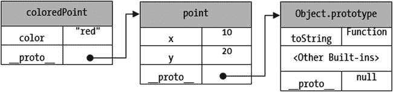
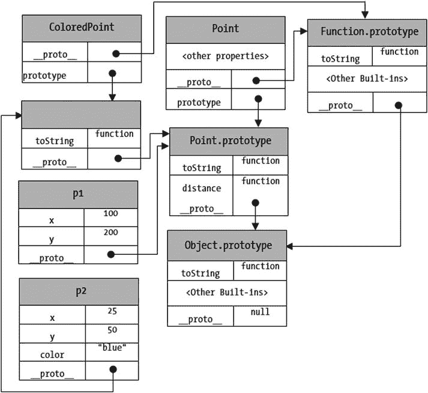

# 4. 在 Nashorn 中编写脚本

在本章中，你将学习：

*   如何在 Nashorn 中编写脚本
*   在严格模式和非严格模式下运行脚本的区别
*   如何声明变量和编写注释
*   原始数据类型和对象数据类型，以及如何将一种数据类型的值转换为另一种数据类型
*   Nashorn 中的运算符、语句以及创建和调用函数
*   创建和使用对象的不同方式
*   变量作用域和提升
*   关于内置的全局对象和函数

Nashorn 是 ECMAScript 5.1 规范在 JVM 上的运行时实现。ECMAScript 定义了其自身的语法和结构，用于声明变量、编写语句、运算符、创建和使用对象、集合、遍历数据集合等。Nashorn 100% 兼容 ECMAScript 5.1，因此当你使用 Nashorn 时，需要学习一套新的语言语法。例如，在 Nashorn 中处理对象与在 Java 中处理对象完全不同。

本章假设你至少具备 Java 编程语言的入门级理解。我不会解释 Nashorn 提供的、与 Java 中工作方式相同的结构和语法细节。例如，我不会解释 Nashorn 中的赋值运算符 `=` 的作用。相反，我只会简单提及赋值运算符 `=` 在 Nashorn 和 Java 中的工作方式相同。Nashorn 的强大之处在于它允许你在脚本内部使用 Java 库。然而，要在 Nashorn 中使用 Java 库，你必须了解 Nashorn 的语法和结构。本章将为你简要介绍 Nashorn 的语法和结构。

## 严格模式与非严格模式

Nashorn 可以在两种模式下运行：严格模式和非严格模式。ECMAScript 的某些特性不能在严格模式下使用。通常，容易出错的特性在严格模式下是不允许的。一些在非严格模式下可以工作的特性，在严格模式下会产生错误。在解释具体特性时，我会列出适用于严格模式的特性。你可以通过两种方式在脚本中启用严格模式：

*   使用 `jjs` 命令的 `–strict` 选项
*   使用 `"use strict"` 或 `'use strict'` 指令

以下命令在严格模式下调用 `jjs` 命令行工具，并尝试将值 10 赋给一个名为 `empId` 的变量，但未声明该变量。你会收到一个错误，提示变量 `empId` 未定义：

`C:\> jjs -strict`

`jjs> empId = 10;`

`<shell>:1 ReferenceError: "empId" is not defined`

`jjs> exit()`

解决方案是在严格模式下使用关键字 `var`（稍后讨论）来声明 `empId` 变量。

以下命令在非严格模式下（不带 `–strict` 选项）调用 `jjs` 命令行工具，并尝试将值 10 赋给一个名为 `empId` 的变量，但未声明该变量。这次，你不会收到错误；相反，会打印出该变量的值（即 `10`）：

`C:\> jjs`

`jjs> empId = 10;`

`10`

`jjs>exit()`

清单 4-1 展示了一个使用 `use strict` 指令的脚本。该指令在脚本或函数的开头指定。`use strict` 指令就是字符串 `"use strict"`。你也可以用单引号将指令括起来，像 `'use strict'` 这样。该脚本将一个值赋给一个未声明的变量，由于启用了严格模式，这会产生一个错误。

清单 4-1\. 包含严格模式指令的脚本

`// strict.js`

`"use strict"; // 这是 use strict 指令。`

`empId = 10;   // 这将产生一个错误。`

## 标识符

标识符是脚本中给变量、函数、标签等起的名称。Nashorn 中的标识符是一系列 Unicode 字符，遵循以下规则：

*   它可以包含字母、数字、下划线和美元符号
*   不能以数字开头
*   不能是保留字之一
*   标识符中的字符可以用 Unicode 转义序列替换，其形式为 `\uxxxx`，其中 `xxxx` 是该字符的十六进制 Unicode 数值

以下是有效标识符的示例：

*   `empId`
*   `emp_id`
*   `_empId`
*   `emp$Id`
*   `num1`
*   `\u0061bc`（等同于 `abc`，因为 `\u0061` 是字符 `a` 的 Unicode 转义序列）

以下是无效标识符的示例：

*   `4num`（不能以数字开头）
*   `emp id`（不能包含空格）
*   `emp+id`（不能包含 + 号）
*   `break`（`break` 是保留字，不能用作标识符）

表 4-1、4-2 和 4-3 列出了 Nashorn 中的保留字。表 4-1 中列出的保留字已被用作关键字。你对 Java 中的大多数这些关键字都很熟悉。在 Nashorn 中，它们具有相同的含义；例如，`for`、`do` 和 `while` 用于表示循环结构，而 `break` 和 `continue` 用于跳出循环或继续循环的下一次迭代。我将在本章中简要解释 Nashorn 特有的关键字。表 4-2 和 4-3 列出了尚未使用但将来会使用的关键字。

使用任何保留字作为标识符都会产生错误。表 4-3 中的保留字仅在严格模式下会产生错误。在非严格模式下使用它们不会产生任何错误。

表 4-3.

Nashorn 严格模式下的未来保留字列表

| `implements` | `let` | `private` | `public` |
| --- | --- | --- | --- |
| `yield` | `interface` | `package` | `protected` |
| `static` |   |   |   |

表 4-2.

Nashorn 中的未来保留字列表

| `class` | `enum` | `extends` | `super` |
| --- | --- | --- | --- |
| `const` | `export` | `import` |   |

表 4-1.

Nashorn 中用作关键字的保留字列表

| `break` | `do` | `instanceof` | `typeof` |
| --- | --- | --- | --- |
| `case` | `else` | `new` | `var` |
| `catch` | `finally` | `return` | `void` |
| `continue` | `for` | `switch` | `while` |
| `debugger` | `function` | `this` | `with` |
| `default` | `if` | `throw` |   |
| `delete` | `in` | `try` |   |

## 注释

Nashorn 支持两种类型的注释：

*   单行注释
*   多行注释

在 Nashorn 中编写注释的语法与 Java 相同。以下是注释的示例：

`// 让我们声明一个名为 empId 的变量（单行注释）`

`var empId;`

`/* 让我们声明一个名为 empList 的变量`

`和另一个名为 deptId 的变量（多行注释）`

`*/`

`var empList;`

`var deptId;`

## 声明变量

脚本语言是弱类型的。变量的类型在编译时是未知的。变量的类型可以在程序执行期间改变。变量的类型是根据存储在变量中的值在运行时确定的。例如，同一个变量可以在某一时刻存储数字，在另一时刻存储字符串。Nashorn 中的这条规则与 Java 显著不同，Java 是一种强类型语言，变量的类型在其声明时就是已知的。

在 Nashorn 中，关键字 `var` 用于声明变量。变量声明在 ECMAScript 术语中被称为变量语句：

`// 声明一个名为 msg 的变量`

`var msg;`

请注意，与 Java 不同，在 Nashorn 中你不需要指定所声明变量的数据类型。你可以在一个变量语句中声明多个变量。变量名之间用逗号分隔：

`// 声明三个变量`

`var empId, deptId, emplList;`

提示

在严格模式下，将变量命名为 `eval` 或 `arguments` 是错误的。

变量在声明时会被初始化为 `undefined`。我将在下一节讨论数据类型和 `undefined` 值。你也可以在声明时用值初始化变量：

`/* 声明并初始化变量 deptId 和 empList。deptId 被`

`初始化为数字 400，empList 被初始化为一个字符串数组。`

`*/`

`var deptId = 400, emplList = ["Ken", "Lydia", "Simon"];`

请注意，你可以在 Nashorn 中使用数组字面量创建数组，该字面量包含一个用逗号分隔的数组元素列表，并括在方括号中。我将在第 7 章中详细讨论数组。

在非严格模式下，你可以在变量声明中省略关键字 `var`：

`// 声明一个名为 greeting 的变量，不使用关键字 var`

`greeting = "Hello";`

## 数据类型

数据类型可以分为两类：原始类型和对象类型。原始类型包括以下五种数据类型：

*   Undefined
*   Null
*   Number
*   Boolean
*   String

### Undefined 类型

Undefined 类型只有一个值，即 `undefined`。在 Nashorn 中，声明但未赋值的变量，其值为 `undefined`。你也可以显式地将 `undefined` 赋值给一个变量。此外，你还可以将其他值与 `undefined` 进行比较。以下代码片段展示了如何使用 `undefined` 值：

`// empId 被隐式初始化为 undefined`

`var empId;`

`// deptId 被显式初始化为 undefined`

`var deptId = undefined;`

`// 打印 empId 和 deptId 的值`

`print("empId is", empId)`

`print("deptId is", deptId);`

`if (empId == undefined) {`

`print("empId is undefined")`

`}`

`if (deptId == undefined) {`

`print("deptId is undefined")`

`}`

`empId is undefined`

`deptId is undefined`

`empId is undefined`

`deptId is undefined`

### Null 类型

Null 类型只有一个值，即 `null`。尽管 `null` 值被认为是原始类型，但它通常用于期望一个对象但没有有效对象可指定的场景。以下代码片段展示了如何使用 `null` 值：

`var person = null;`

`print("person is", person);`

`person is null`

### Number 类型

与 Java 不同，Nashorn 不区分整数和浮点数。它只有一种称为 Number 的类型来表示这两种数值。数字以双精度 64 位 IEEE 浮点格式存储。所有数值常量都称为数字字面量。与 Java 类似，你可以用十进制、十六进制、八进制和科学记数法表示数字字面量。Nashorn 定义了三种特殊的 Number 类型值：非数字、正无穷大和负无穷大。在脚本中，这些特殊值分别由 `NaN`、`+Infinity` 和 `–Infinity` 表示。正无穷大值也可以简单地表示为 `Infinity`，不带前导的 `+` 号。以下代码片段展示了如何使用数字字面量和特殊的 Number 类型值：

`var empId = 100;               // 一个 Number 类型的整数`

`var salary = 1500.678;         // 一个 Number 类型的浮点数`

`var hexNumber = 0x0061;        // 等同于十进制 97`

`var octalNumber = 0141;        // 等同于十进制 97`

`var scientificNumber = 0.97E2; // 等同于十进制 97`

`var notANumber = NaN;`

`var posInfinity = Infinity;`

`var negInfinity = -Infinity;`

`// 打印所有值`

`print("empId =", empId);`

`print("salary =", salary);`

`print("hexNumber =", hexNumber);`

`print("octalNumber =", octalNumber);`

`print("scientificNumber =", scientificNumber);`

`print("notANumber =", notANumber);`

`print("posInfinity =", posInfinity);`

`print("negInfinity =", negInfinity);`

`empId = 100`

`salary = 1500.678`

`hexNumber = 97`

`octalNumber = 97`

`scientificNumber = 97`

`notANumber = NaN`

`posInfinity = Infinity`

`negInfinity = -` `Infinity`

### Boolean 类型

Boolean 类型表示一个逻辑实体，其值可以为 true 或 false。与 Java 类似，Nashorn 有两个 Boolean 类型的字面量：`true` 和 `false`：

`Var isProcessing = true;`

`var isProcessed = false;`

`print("isProcessing =", isProcessing);`

`print("isProcessed =", isProcessed);`

`isProcessing = true`

`isProcessed = false`

### String 类型

String 类型包含所有有限的、有序的零个或多个 Unicode 字符序列。用双引号或单引号括起来的字符序列称为字符串字面量。序列中的字符数称为字符串的长度。以下是使用字符串字面量的示例：

`var greetings = "Hi there";     // 一个长度为 8 的字符串字面量`

`var title = 'Scripting in Java'; // 一个用单引号括起来的字符串字面量`

`var emptyMsg = "";              // 一个长度为零的空字符串`

如果字符串字面量用双引号括起来，它可以包含单引号，反之亦然。如果字符串字面量用双引号括起来，并且你想在字符串中包含双引号，则需要使用反斜杠对双引号进行转义。对于用单引号括起来的字符串也是如此。以下代码片段向你展示了一些示例：

`var msg1 = "It's here and now.";`

`var msg2 = 'He said, "He is happy."';`

`var msg3 = 'It\'s here and now.';`

`var msg4 = "He said, \"He is happy.\"";`

`print(msg1);`

`print(msg2);`

`print(msg3);`

`print(msg4);`

`It's here and now.`

`He said, "He is happy."`

`It's here and now.`

`He said, "He is happy."`

与 Java 不同，Nashorn 中的字符串字面量可以跨越多行。你需要在行尾使用反斜杠作为续行符。请注意，反斜杠和行终止符不属于字符串字面量的一部分。以下是一个将字符串字面量 `Hello World!` 写成三行的示例：

`// 使用多行字符串字面量将字符串 Hello world! 赋值给 msg`

`var msg = "Hello \`

`world\`

`!";`

`print(msg);`

`Hello world!`

如果你想在多行字符串字面量中插入换行符，则需要使用转义序列 `\n`，如下所示。请注意，我将开始和结束的引号放在了单独的行中，这使得多行文本更具可读性：

`// 使用带有嵌入换行符的多行字符串`

`var lucyPoem = "\`

`STRANGE fits of passion have I known:\n\`

`And I will dare to tell,\n\`

`But in the lover's ear alone,\n\`

`What once to me befell.\`

`";`

`print(lucyPoem);`

`STRANGE fits of passion have I known:`

`And I will dare to tell,`

`But in the lover's ear alone,`

`What once to me befell.`

字符串字面量中的字符可以以字面形式出现，也可以以转义序列的形式出现。你可以使用 Unicode 转义序列来表示任何字符。某些字符（如行分隔符、回车符等）不能以字面形式表示，它们必须以转义序列的形式出现。表 4-4 列出了 Nashorn 中定义的转义序列。

表 4-4.

Nashorn 中的单字符转义序列

| 字符转义序列 | Unicode 转义序列 | 字符名称 |
| --- | --- | --- |
| \b | \u0008 | 退格 |
| \t | \u0009 | 水平制表符 |
| \n | \u000A | 换行 |
| \v | \u000B | 垂直制表符 |
| \f | \u000C | 换页 |
| \r | \u000D | 回车 |
| \” | \u0022 | 双引号 |
| \’ | \u0027 | 单引号 |
| \\ | \u005C | 反斜杠 |

Nashorn 和 Java 在解释 Unicode 转义序列方面存在显著差异。与 Java 不同，Nashorn 不会在执行代码之前将 Unicode 转义序列解释为实际字符。Java 中的以下单行注释、字符字面量和字符串字面量将无法编译，因为编译器在编译程序之前会将 `\u000A` 转换为新行：

`// This, \u000A, is a new line, making the single line comment invalid`

`char c = '\u000A';`

`String str = "Hello\u000Aworld!";`

在 Java 中，你必须在此代码中将 `\u000A` 替换为 `\n` 才能正常工作。以下 Nashorn 代码片段可以正常工作：

`// This, \u000A, is a new line that is valid in Nashorn`

`var str = "Hello\u000AWorld!";`

`print(str);`

`Hello`

`World!`

我将把关于 Object 类型的讨论推迟到完成 Nashorn 中基本结构（如运算符、语句、循环等）的解释之后。

## 运算符

Nashorn 支持许多运算符。其中大部分与 Java 运算符相同。我将在本节中列出所有运算符，并在此讨论其中几个。我将在后续章节中适时讨论其他运算符。表 4-5 列出了 Nashorn 中的运算符。

表 4-5.

Nashorn 中的运算符列表

| 运算符 | 名称 | 语法 | 描述 |
| --- | --- | --- | --- |
| `++` | 自增 | `++i` `i++` | 将操作数增加 1。 |
| `--` | 自减 | `--i` `i--` | 将操作数减少 1。 |
| `delete` | 删除 | `delete prop` | 从对象中删除指定的属性。 |
| `void` | 空值 | `void expr` | 丢弃指定表达式的返回值。 |
| `typeof` | 类型检测 | `typeof expr` | 返回一个描述指定表达式类型的字符串。 |
| `+` | 一元正号 | `+op` | 将操作数转换为 Number 类型。 |
| `-` | 一元负号 | `-op` | 将操作数转换为 Number 类型，然后对转换后的值取反。 |
| `∼` | 按位非 | `∼op` | 将操作数作为 32 位有符号整数，翻转其二进制位，并将结果作为 32 位有符号整数返回。 |
| `!` | 逻辑非 | `!expr` | 如果 `expr` 计算结果为 `false`，则返回 `true`。如果 `expr` 计算结果为 `true`，则返回 `false`。 |
| `+` | 数值加法/字符串拼接 | `op1 + op2` | 如果其中一个操作数是字符串或可以转换为字符串，则执行字符串拼接。否则，执行数值加法。 |
| `-` | 减法 | `op1 - op2` | 对两个操作数执行数值减法，如果它们不是数字则将其转换为数字。 |
| `/` | 除法 | `op1 / op2` | 执行除法并返回两个操作数的商。 |
| `*` | 乘法 | `op1 * op2` | 执行乘法并返回操作数的乘积。 |
| `%` | 取余 | `op1 % op2` | 将左操作数作为被除数，右操作数作为除数进行除法运算，并返回余数。 |
| `in` | 存在性检查 | `prop in obj` | 如果 `obj` 包含名为 `prop` 的属性，则返回 `true`。否则返回 `false`。此处 `prop` 是一个字符串或可转换为字符串的值，`obj` 是一个对象。 |
| `instanceof` | 实例检查 | `obj instanceof cls` | 如果 `obj` 是类 `cls` 的实例，则返回 `true`。否则返回 `false`。 |
| `<` | 小于 | `op1 < op2` | 如果 `op1` 小于 `op2`，则返回 `true`。否则返回 `false`。 |
| `<=` | 小于或等于 | `op1 <= op2` | 如果 `op1` 小于或等于 `op2`，则返回 `true`。否则返回 `false`。 |
| `>` | 大于 | `op1 > op2` | 如果 `op1` 大于 `op2`，则返回 `true`。否则返回 `false`。 |
| `>=` | 大于或等于 | `op1 >= op2` | 如果 `op1` 大于或等于 `op2`，则返回 `true`。否则返回 `false`。 |
| `==` | 相等 | `op1 == op2` | 如果 `op1` 和 `op2` 相等，则返回 `true`。否则返回 `false`。必要时会进行类型转换。例如，`"2" == 2` 返回 `true`，因为字符串 `"2"` 被转换为数字 `2`，然后两个操作数相等。 |
| `!=` | 不等 | `op1 != op2` | 如果 `op1` 和 `op2` 不相等，则返回 `true`。否则返回 `false`。必要时会进行类型转换。 |
| `===` | 恒等或严格相等 | `op1 === op2` | 如果两个操作数的类型和值都相同，则返回 `true`。否则返回 `false`。表达式 `"2" === 2` 返回 `false`，因为 `"2"` 是字符串而 `2` 是数字。表达式 `"2" === "2"` 和 `2 === 2` 都返回 `true`。 |
| `!==` | 非恒等或严格不等 | `op1 !== op2` | 如果操作数不相等和/或类型不同，则返回 `true`。表达式 `"2" !== 2` 和 `2 !== 3` 都返回 `true`。在第一个表达式中，操作数的类型不匹配（字符串和数字）；在第二个表达式中，操作数的值不匹配。 |
| `<<` | 按位左移 | `op1 << op2` | 对 `op1` 执行按位左移操作，移动位数由 `op2` 指定。在执行左移之前，`op1` 被转换为 32 位有符号整数。结果也是一个 32 位有符号整数。 |
| `>>` | 按位有符号右移 | `op1 >> op2` | 对 `op1` 执行符号位填充的按位右移操作，移动位数由 `op2` 指定。左侧新增的位用原始的最高有效位填充，以保持 `op1` 的符号，结果符号相同。将 `op1` 转换为 32 位有符号整数，结果也是一个 32 位有符号整数。 |
| `>>>` | 按位无符号右移 | `op1 >>> op2` | 对 `op1` 执行零填充的按位右移操作，移动位数由 `op2` 指定。左侧新增的位用 0 填充，这使得结果成为一个无符号 32 位整数。 |
| `&` | 按位与 | `op1 & op2` | 对 `op1` 和 `op2` 的每一对二进制位执行按位与操作。如果两个位都是 1，则结果位为 1。否则，结果位为 0。 |
| `&#124;` | 按位或 | `op1 &#124; op2` | 对 `op1` 和 `op2` 的每一对二进制位执行按位或操作。如果任意一个位是 1，则结果位为 1。如果两个位都是 0，则结果位为 0。 |
| `^` | 按位异或 | `op1 ^ op2` | 对 `op1` 和 `op2` 的每一对二进制位执行按位异或操作。如果两个位不同，则结果位为 1。否则，结果位为 0。 |
| `&&` | 逻辑与 | `op1 && op2` | 返回 `op1` 或 `op2`。如果 `op1` 为 `false` 或可转换为 `false`，则返回 `op1`。否则，返回 `op2`。 |
| `&#124;&#124;` | 逻辑或 | `op1 &#124;&#124; op2` | 返回 `op1` 或 `op2`。如果 `op1` 为 `true` 或可转换为 `true`，则返回 `op1`。否则，返回 `op2`。 |
| `?:` | 条件（三元）运算符 | `op1 ? op2 : op3` | 如果 `op1` 计算结果为 true，则返回 op2 的值。否则，返回 op3 的值。 |
| `=` | 赋值 | `op1 = op2` | 将 `op2` 的值赋给 `op1` 并返回 `op2`。 |
| `+=, -=, *=, /=, %=, <<=, >>=, >>>=, &=, ^=, &#124;=` | 复合赋值 | `op1 op= op2` | 其执行效果类似于语句 `op1 = op1 op op2`。对 `op1` 和 `op2` 应用运算（+、-、*、/、% 等），将结果赋给 op1 并返回该结果。 |
| `,` | 逗号运算符 | `op1, op2, op3...` | 从左到右依次计算每个操作数，并返回最后一个操作数的值。用于需要一个表达式但希望使用多个表达式的地方，例如在 `for` 循环的头部。 |

运算符具有优先级。在表达式中，优先级高的运算符会先于优先级低的运算符被求值。与 Java 类似，你可以将表达式的一部分用括号括起来，括号拥有最高优先级。以下是运算符的优先级列表。级别 1 的运算符优先级高于级别 2 的运算符。同一级别的运算符优先级相同：

`++`（后缀自增）, `--`（后缀自减）   `!, ∼, +`（一元正号）, `-`（一元负号）, `++`（前缀自增）, `--`（前缀自减）, `typeof`, `void`, `delete`   `*, /, %`   `+`（加法）, `-`（减法）   `<< , >>, >>>`   `<, <=, >, >=, in, instanceof`   `==, !=, ===, !==`   `&`   `^`   `|`   `&&`   `||`   `? :`   `=, +=, -=, *=, /=, %=, <<=, >>=, >>>=, &=,  ^=,  |=`   `,`（逗号运算符）

在本节中，我将讨论其中的几个运算符。这些在 Nashorn 中的运算符要么在 Java 中不存在，要么工作方式截然不同：

*   相等运算符（`==`）和严格相等运算符（`===`）
*   逻辑与（`&&`）和逻辑或（`||`）运算符

`==` 运算符的工作方式与 Java 中几乎相同。它会检查两个操作数是否相等，并在可能的情况下执行类型转换，例如将字符串转换为数字。例如，`"2" == 2` 返回 `true`，因为字符串 `"2"` 被转换为数字 2，然后两个操作数相等。表达式 `2 == 2` 也返回 `true`，因为两个操作数都是数字类型且值相等。相比之下，`===` 运算符会同时检查两个操作数的类型和值是否相等。如果两者中任何一个不相同，则返回 `false`。例如，`"2" === 2` 返回 `false`，因为一个操作数是字符串，另一个是数字。它们的类型不匹配，即使它们的值在转换为字符串或数字后是匹配的。

在 Java 中，`&&` 和 `||` 运算符处理布尔操作数，并返回 `true` 或 `false`。在 Nashorn 中，情况并非如此；这些运算符返回其中一个操作数的值，该值可以是任何类型。在 Nashorn 中，任何类型的值都可以转换为布尔值 `true` 或 `false`。可以转换为 `true` 的值称为真值，可以转换为 `false` 的值称为假值。我将在本章下一节中提供真值和假值的完整列表。

`&&` 和 `||` 运算符处理真值和假值操作数，并返回其中一个操作数的值，该值不一定是布尔值。`&&` 和 `||` 运算符也称为短路运算符，因为如果第一个操作数本身就能确定结果，它们就不会对第二个操作数求值。

如果第一个操作数是假值，`&&` 运算符返回第一个操作数。否则，它返回第二个操作数。考虑以下语句：

`var result = true && 120; // 将 120 赋值给 result`

该语句将 120 赋值给 `result`。`&&` 的第一个操作数是 true，因此它会对第二个操作数求值并返回它。考虑另一条语句：

`var result = false && 120; // 将 false 赋值给 result`

该语句将 `false` 赋值给 result。`&&` 的第一个操作数是 `false`，因此它不会对第二个操作数求值。它直接返回第一个操作数。

如果第一个操作数是真值，`||` 运算符返回第一个操作数。否则，它返回第二个操作数。考虑以下语句：

`var result = true || 120; // 将 true 赋值给 result`

该语句将 true 赋值给 `result`。`||` 的第一个操作数是 `true`，因此它返回第一个操作数。考虑另一条语句：

`var result = false || 120; // 将 120 赋值给 result`

该语句将 `120` 赋值给 result。`||` 的第一个操作数是 `false`，因此它会对第二个操作数求值并返回其值。

## 类型转换

在 Java 中不允许的操作在 Nashorn 中是允许的，例如在需要布尔值的地方使用数字或字符串。考虑以下 Nashorn 中的代码片段，它将一个布尔值加到一个数字上：

`var n1 = true + 120;`

`var n2 = false + 120;`

`print("n1 = " + n1);`

`print("n2 = " + n2);`

`n1 = 121`

`n2 = 120`

表达式 `true + 120` 在 Java 中是不允许的。然而，在 Nashorn 中是允许的。注意，Nashorn 会隐式地将 `true` 转换为数字 1，将 `false` 转换为数字 0。Nashorn 会执行大量隐式转换。你需要很好地理解它们，才能在 Nashorn 中编写无错误的代码。以下各节将详细解释这些转换。

### 转换为布尔值

在 Nashorn 中，你可以在需要布尔值的地方使用真值或假值。例如，`if` 语句中的条件不需要产生布尔值。它可以是任何真值或假值。表 4-6 列出了值的类型及其对应的转换后的布尔值。

表 4-6.

值类型及其对应的转换后布尔值列表

| 值类型 | 转换后的布尔值 |
| --- | --- |
| `Undefined` | `false` |
| `Null` | `false` |
| `Boolean` | 恒等转换 |
| `Number` | 如果参数是 `+0`、`-0` 或 `NaN`，则求值为 `false`；否则求值为 `true` |
| `String` | 空字符串求值为 `false`。所有其他字符串求值为 `true` |
| `Object` | `true` |

你也可以使用全局函数 `Boolean()` 来显式地将一个值转换为布尔类型。该函数将要转换的值作为参数。以下代码片段包含了一些隐式和显式转换为布尔类型的示例：

`var result;`

`result = undefined ? "undefined is truthy" : "undefined is falsy";`

`print(result);`

`result = null ? "null is truthy" : "null is falsy";`

`print(result);`

`result = 100 ? "100 is truthy" : "100 is falsy";`

`print(result);`

`result = 0 ? "0 is truthy" : "0 is falsy";`

`print(result);`

`result = Boolean("") ? "The empty string is truthy"`

`: "The empty string is falsy";`

`print(result);`

`result = 'Hello' ? "'Hello' is truthy" : "'Hello' is falsy";`

`print(result);`

`undefined is falsy`

`null is falsy`

`100 is truthy`

`0 is falsy`

`The empty string is falsy`

`'Hello' is truthy`

### 转换为数字类型

Nashorn 中所有类型的值都可以隐式或显式地转换为数字类型。表 4-7 列出了值的类型及其对应的转换后的数值。

表 4-7.

值类型及其对应转换数值的列表

| 值类型 | 转换后的数值 |
| --- | --- |
| `Undefined` | `NaN` |
| `Null` | `+0` |
| `Boolean` | 布尔值 `true` 转换为 1，`false` 转换为 0 |
| `Number` | 恒等转换 |
| `String` | 空字符串和仅包含空白字符的字符串转换为零。去除首尾空白字符后，其内容可被解释为数字的字符串，将转换为相应的数值。如果字符串的数字内容过大或过小，则分别转换为 `+Infinity` 或 `–Infinity`。所有其他字符串都转换为 `NaN` |
| `Object` | 如果对象的内容可以被解释为数字，则该对象转换为相应的数值；否则，该对象转换为 `NaN` |

你可以使用 `Number()` 全局函数来显式地将一个值转换为数字类型。该函数将要转换的值作为参数，并返回一个数字。以下代码片段包含了一些隐式和显式转换为数字类型的示例：

`var result;`

`result = Number(undefined);`

`print("undefined is converted to", result);`

`// Any number + NaN is NaN`

`result = 10 + undefined;`

`print("10 + undefined is", result);`

`result = Number("");`

`print("The empty string is converted to", result);`

`result = Number('Hello');`

`print("'Hello' is converted to", result);`

`// Convertes to the number 1982, ignoring leading and trailing whitespaces`

`result = Number(' 1982 ');`

`print("' 1982 ' is converted to", result);`

`result = Number(new Object(88));`

`print("new Object(88) is converted to", result);`

`result = Number(new Object());`

`print("new Object() is converted to", result);`

`// A very big number in a string`

`result = Number("10E2000");`

`print("10E2000 is converted to", result);`

`undefined is converted to NaN`

`10 + undefined is NaN`

`The empty string is converted to 0`

`'Hello' is converted to NaN`

`' 1982 ' is converted to 1982`

`new Object(88) is converted to 88`

`new Object() is converted to NaN`

`10E2000 is converted to Infinity`

### 转换为字符串类型

Nashorn 中所有类型的值都可以隐式或显式地转换为字符串类型。表 4-8 列出了值的类型及其对应的转换后的字符串值。

表 4-8.

值类型及其对应转换字符串值的列表

| 值类型 | 转换后的字符串值 |
| --- | --- |
| `Undefined` | `"undefined"` |
| `Null` | `"null"` |
| `Boolean` | 布尔值 `true` 转换为 “true”，`false` 转换为 “false” |
| `Number` | `+0`、`0` 和 `-0` 转换为 “0”；`NaN` 转换为 “NaN”；`Infinity`（或 `+Infinity`）转换为 “Infinity”；`-Infinity` 转换为 “-Infinity”。所有其他数字都转换为十进制或科学记数法对应的字符串表示形式。较大的数字可能无法精确转换 |
| `String` | 恒等转换 |
| `Object` | 如果对象是原始值的包装器，则返回该原始值的字符串形式；否则，通过调用对象的 `toString()` 方法返回其字符串表示形式。如果对象中不存在 `toString()` 方法，则返回 `valueOf()` 方法返回值的字符串表示形式 |

你可以使用 `String()` 全局函数来显式地将一个值转换为字符串类型。该函数将要转换的值作为参数，并返回一个字符串。以下代码片段包含了一些隐式和显式转换为字符串类型的示例：

`var result;`

`result = String(undefined);`

`print("undefined is converted to", result);`

`result = String(true);`

`print("true is converted to", result);`

`result = String(9088);`

`print("9088 is converted to", result);`

`result = String(0x786A);`

`print("0x786A is converted to", result);`

`result = String(900000000000000000000);`

`print("900000000000000000000 is converted to", result);`

`result = String(9000000000000000000000);`

`print("9000000000000000000000 is converted to", result);`

`result = String(new Object(1982));`

`print("new Object(1982) is converted to", result);`

`result = String(new Object());`

`print("new Object() is converted to", result);`

`undefined is converted to undefined`

`true is converted to true`

`9088 is converted to 9088`

`0x786A is converted to 30826`

`900000000000000000000 is converted to 900000000000000000000`

`9000000000000000000000 is converted to 9e+21`

`new Object(1982) is converted to 1982`

`new Object() is converted to [object Object]`

## 语句

Nashorn 包含了 Java 中的大部分语句。大多数语句类型的工作方式与 Java 非常相似。以下是 Nashorn 中的语句类型列表：

*   块语句
*   变量语句
*   空语句
*   表达式语句
*   `if` 语句
*   迭代（或循环）语句
*   `continue` 语句
*   `break` 语句
*   `return` 语句
*   `with` 语句
*   `switch` 语句
*   标签语句
*   `throw` 语句
*   `try` 语句
*   debugger 语句

与 Java 一样，你可以使用分号来终止一条语句。然而，与 Java 不同的是，语句终止符是可选的。Nashorn 会在许多情况下自动插入分号。大多数时候，你可以省略作为语句终止符的分号而不会产生任何问题。Nashorn 会根据需要自动插入它们。在某些情况下，自动插入分号可能会导致对程序的误解。以下是用于自动插入分号的规则：

*   如果解析器遇到当前正在解析的语句中不允许出现的源代码文本，并且该文本前面至少有一个行终止符，则会自动插入一个分号。
*   如果一条语句后面跟着一个右花括号（`}`），则在该语句后插入一个分号。
*   在程序末尾插入一个分号。
*   如果分号会被解析为空语句（我将在本章后面解释空语句），则不会自动插入分号。在 `for` 语句的头部也不会自动插入分号。

考虑以下代码：

`var x = 1, y = 3, z = 5`

`x = y`

`z++`

`printf("x = %d, y = %d, z = %d", x, y, z)`

解析器会自动插入分号作为语句终止符，就好像你编写的代码如下所示：

`var x = 1, y = 3, z = 5;`

`x = y;`

`z++;`

`printf("x = %d, y = %d, z = %d", x, y, z);`

考虑以下代码：

`var x = 10, y = 20`

`if (x > y)`

`else x = y`

解析器会在变量语句和赋值语句 `x = y` 之后插入分号，但不会在 `if` 语句之后插入。转换后的代码如下所示：

`var x = 10, y = 20;`

`if (x > y)`

`else x = y;`

`if` 语句后不会自动插入分号，因为插入的分号会被解释为空语句。这段代码无法编译，因为 `if` 语句有条件但缺少一个语句体。

解析器会持续解析源代码，直到发现一个违规的标记。它并不总是在行终止符前插入分号。考虑以下代码：

`var x`

`x`

`=`

`200`

`printf("x = %d", x)`

解析器会将这三行源代码（第二到第四行）视为一条赋值语句（x = 200），并在 200 之后插入一个分号。转换后的代码如下所示：

`var x;`

`x`

`=`

`200;`

`printf("x = %d", x);`

考虑以下打印 20 的代码：

`var x = 200, y = 200, z`

`z = Math.sqrt`

`(x + y).toString()`

`print(z)`

解析器不会在第三行（`z = Math.sqrt`）的末尾插入分号。它认为下一行的 `(` 是函数 `Math.sqrt` 参数列表的开始。转换后的代码如下所示：

`var x = 200, y = 200, z;`

`z = Math.sqrt`

`(x + y).toString();`

`print(z);`

然而，代码的作者可能本意是将函数引用 `Math.sqrt` 赋值给名为 `z` 的变量。在这种情况下，自动插入分号改变了代码的预期含义。如果你自己在赋值语句后插入分号，代码输出会不同：

`var x = 200, y = 200, z;`

`z = Math.sqrt;      // 将 Math.sqrt 函数引用赋值给 z`

`(x + y).toString(); // 将 x + y 转换为字符串并忽略结果`

`print(z);`

`function sqrt() { [native code] }`

如果你使用关键字 `void` 来忽略表达式 `(x + y).toString()` 的结果来编写相同的代码，解析器会在文本 `z = Math.sqrt` 之后添加一个分号。以下代码的工作方式就如同你本意是将函数引用 `Math.sqrt` 赋值给名为 `z` 的变量：

`var x = 200, y = 200, z   // 此处插入了一个分号`

`z = Math.sqrt             // 此处插入了一个分号`

`void (x + y).toString()   // 此处插入了一个分号`

`print(z)                  // 此处插入了一个分号`

`function sqrt() { [native code] }`

在第二行末尾插入分号的原因是第三行的关键字 `void` 是一个违规标记。关键字 `void` 不能成为从第二行开始的赋值语句的一部分。

提示

我建议在所有需要的地方使用分号作为语句终止符。依赖自动插入分号有时可能会导致难以察觉的错误。

我将在以下各节中简要讨论这些语句类型。

### 块语句

块语句的工作方式与 Java 中的类似。它是由花括号（`{ }`）括起来的零条或多条语句组成的组。与 Java 不同，在块语句内部声明的变量不具有该块的局部作用域。它们可以在声明它们的块语句之前和之后被访问。以下代码片段演示了这一点：

`var empId = 100;`

`// 打印 empId 和 deptId。请注意，deptId 尚未声明，但你可以访问它。`

`print("empId = " + empId + ", deptId = " + deptId);`

`// 一个块语句`

`{`

`var deptId = 200;`

`print("empId = " + empId + ", deptId = " + deptId);`

`// 计算圆的面积`

`var radius = 2.3;`

`var area = Math.PI * radius * radius;`

`printf("Radius = %.2f, Area = %.2f", radius, area);`

`}`

`print("empId = " + empId + ", deptId = " + deptId);`

`empId = 100, deptId = undefined`

`empId = 100, deptId = 200`

`Radius = 2.30, Area = 16.62`

`empId = 100, deptId = 200`

在代码中，变量 `deptId` 被声明为块内的局部变量。然而，你可以在块外部（之前和之后）访问它。这不是 Nashorn 的 bug。根据变量作用域规则，这是按设计工作的。Nashorn 中的变量作用域与 Java 中的工作方式截然不同。我将在“变量作用域与提升”一节中讨论变量的作用域。

### 变量语句

变量语句用于声明变量，并可选择性地初始化变量。我已在“声明变量”一节中讨论过变量语句。变量语句的示例如下：

`// 声明一个名为 empId 的变量`

`var empId;`

`// 声明一个名为 deptId 的变量并将其初始化为 200`

`var deptId = 200;`

### 空语句

分号用作空语句。Nashorn 中的空语句工作方式与 Java 中的相同。它没有任何效果。它可以在任何需要语句的地方使用。与 Java 一样，Nashorn 中的 `for` 语句用于迭代目的。以下代码使用 `for` 语句打印整数 1 到 10。空语句被用作该语句的循环体：

`// 末尾的分号是空语句`

`for(var i = 1; i <= 10; print(i++));`

### 表达式语句

表达式语句是由一个带有或不带有副作用的表达式组成的语句。以下是表达式语句的一些示例：

`var i = 100; // 一个变量语句`

`i++;         // 一个表达式语句`

`print(i);    // 一个表达式语句`

### if 语句

Nashorn 中的 `if` 语句与 Java 中的工作方式相同。其通用语法为：

`if(condition)`

`statement;`

你也可以为 `if` 语句添加一个 `else` 部分：

`if(condition)`

`statement-1;`

`else`

`statement-2;`

如果 `condition` 求值为 `true`，则执行 `statement-1`；否则，执行 `statement-2`。请注意，`condition` 可以是任何类型的表达式，不一定是布尔表达式。`condition` 表达式会被求值并转换为布尔类型的值。以下代码片段展示了如何使用 `if` 和 `if-else` 语句：

`var x = 100, y = 200;`

`if (x <= y)`

`printf("%d <= %d", x, y);`

`// print() 函数返回 undefined，该值会被求值为布尔值 false。`

`if (print(x)) {`

`print("Inside if");`

`}`

`else {`

`print("Inside else")`

`}`

`100 <= 200`

`100`

`Inside else`

请注意，表达式 `print(x)` 被用作第二个 `if` 语句的 `condition`。`print()` 函数会打印变量 `x` 的值并返回 `undefined`。值 `undefined` 会被转换为布尔值 `false`（请参考“转换为布尔值”一节），这将执行与 `else` 部分关联的语句。

### 迭代语句

Nashorn 支持五种类型的迭代语句：

*   `while` 语句
*   `do-while` 语句
*   `for` 语句
*   `for..in` 语句
*   `for..each..in` 语句

Nashorn 中的 `while`、`do-while` 和 `for` 语句与 Java 中的工作方式相同。我不会详细讨论它们，因为作为 Java 开发者，你知道如何使用它们。以下代码演示了它们的用法：

`// 使用 while、do-while 和 for 语句打印前 3 个自然数`

`var count;`

`print("Using the while statement...");`

`count = 1;`

`while (count <= 3) {`

`print(count);`

`count++;`

`}`

`print("Using the do-while statement...");`

`count = 1;`

`do {`

`print(count);`

`count++;`

`} while (count <= 3);`

`print("Using the for statement...");`

`for(var i = 1; i <= 3; i++) {`

`print(i);`

`}`

`Using the while statement...`

`1`

`2`

`3`

`Using the do-while statement...`

`1`

`2`

`3`

`Using the for statement...`

`1`

`2`

`3`

`for..in` 语句用于遍历数组的索引或对象的属性名。它可以与数组、列表、映射、任何 Nashorn 对象等集合一起使用。其语法为：

`for(var index in object)`

`Statement;`

首先，对 `object` 进行求值。如果求值为 `null` 或 `undefined`，则跳过整个 `for..in` 语句。如果求值为一个对象，则该语句会将可枚举属性赋值给 `index` 并执行循环体。`index` 是字符串类型。对于数组，`index` 是数组元素的索引（以字符串形式表示）。对于任何其他集合，如列表或映射（Nashorn 对象也是一个映射），对象的属性会被赋值给 `index`。你可以使用方括号表示法（`object[index]`）来访问属性的值。以下代码演示了如何使用 `for..in` 语句遍历数组的索引：

`// 创建一个包含三个字符串的数组`

`var empNames = ["Ken", "Fred", "Li"];`

`// 使用 for..in 语句遍历数组的索引`

`for(var index in empNames) {`

`var empName = empNames[index];`

`printf("empNames[%s]=%s", index, empName);`

`}`

`empNames[0]=Ken`

`empNames[1]=Fred`

`empNames[2]=Li`

提示

`for...in` 语句中的 `index` 是字符串类型，而不是数字类型。

`for..each..in` 语句不在 ECMAScript 5.1 规范中。它是 Nashorn 支持的 Mozilla JavaScript 1.6 扩展。`for..in` 语句遍历集合的索引/属性名，而 `for..each..in` 语句则遍历集合中的值。它的工作方式与 Java 中的 `for-each` 语句相同。请注意，集合是一组唯一的值，没有为这些值命名。你不能使用 `for..in` 语句遍历集合，但可以使用 `for..each..in` 语句来遍历。其语法为：

`for(var value in object)`

`Statement;`

以下代码展示了如何使用 `for..each..in` 语句遍历数组的元素（而非索引）：

`// 创建一个包含三个字符串的数组`

`var empNames = ["Ken", "Fred", "Li"];`

`// 使用 for..each..in 语句遍历数组的元素`

`for each(var empName in empNames) {`

`printf(empName);`

`}`

`Ken`

`Fred`

`Li`

我将在第 7 章中进一步讨论 `for..in` 和 `for..each..in` 语句。

### continue、break 和 return 语句

Nashorn 中的 `continue`、`break` 和 `return` 语句与 Java 中的工作方式相同。`continue` 和 `break` 语句可以带有标签。`continue` 语句会跳过迭代语句循环体的剩余部分，并跳转到迭代语句的开头以继续下一次迭代。`break` 语句会跳转到它所在的迭代语句和 `switch` 语句的末尾。函数中的 `return` 语句会将控制权返回给函数的调用者。`return` 语句还可以选择向调用者返回一个值。

### with 语句

Nashorn 在一个称为执行上下文的上下文中执行脚本。它使用与执行上下文关联的作用域链来查找脚本中的非限定名称。首先在最近的作用域中搜索该名称。如果未找到，则继续沿作用域链向上搜索，直到找到该名称或搜索到作用域链的顶端。其语法为：

`with(expression)`

`statement`

`with` 语句会将指定的 `expression`（求值为一个对象）添加到作用域链的头部，同时执行 `statement`。

提示

不推荐使用 `with` 语句，因为它会导致混淆，不清楚非限定名称存在于何处——是在 `with` 语句中指定的对象中，还是在作用域链的某处。在严格模式下不允许使用它。

以下代码演示了 `with` 语句的用法：

`var greetings = new String("Hello");`

`// 必须使用 greetings.length 来访问名为 greetings 的 String 对象的 length 属性`

`printf("greetings = %s, length = %d", greetings, greetings.length);`

`with(greetings) {`

`// 在此 with 语句中，你可以将 greetings 对象的 length 属性用作非限定标识符。`

`printf("greetings = %s, length = %d", greetings, length);`

`}`

`with(new String("Hi")) {`

`// toString() 和 length 将使用 new String("Hi") 对象来解析`

`printf("greetings = %s, length = %d", toString(), length);`

`}`

`with(Math) {`

`// 计算圆的面积`

`var radius = 2.3;`

`// PI 和 pow 被解析为 Math 对象的属性`

`var area = PI * pow(radius, 2);`

`printf("Radius = %.2f, Area = %.2f", radius, area);`

`}`

`greetings = Hello, length = 5`

`greetings = Hello, length = 5`

`greetings = Hi, length = 2`

`Radius = 2.30, Area = 16.62`

### switch 语句

Nashorn 中的 `switch` 语句与 Java 中的 `switch` 语句工作方式基本相同。其语法如下：

`switch(expression) {`

`case expression-1:`

`statement-1;`

`case expression-2:`

`statement-2;`

`default:`

`statement-3;`

`}`

`expression` 会使用 `===` 运算符与 `case` 子句中的表达式进行匹配。第一个匹配的 `case` 子句中的语句会被执行。如果该 `case` 子句包含 `break` 语句，则控制权会转移到 `switch` 语句的末尾；否则，会继续执行匹配到的 `case` 子句之后的语句。如果没有找到匹配项，则执行 `default` 子句中的语句。如果存在多个匹配项，则仅执行第一个匹配的 `case` 子句中的语句。在 Java 中，`expression` 必须是 `int`、`String` 或 `enum` 类型，而在 Nashorn 中，`expression` 可以是任何类型，包括 Object、Null 和 Undefined 类型。以下代码片段演示了如何使用 `switch` 语句：

`// 定义一个 match 函数，使用 switch 语句匹配传入的参数`

`function match(value) {`

`switch (value) {`

`case undefined:`

`print("匹配到 undefined:", value);`

`break;`

`case null:`

`print("匹配到 null:", value);`

`break;`

`case '2':`

`print("匹配到字符串 '2':", value);`

`break;`

`case 2:`

`print("匹配到数字 2: ", value);`

`break;`

`default:`

`print("无匹配:", value);`

`break;`

`}`

`}`

`// 使用不同的参数调用 match 函数`

`match(undefined);`

`match(null);`

`match(2);`

`match('2');`

`match("Hello");`

`匹配到 undefined: undefined`

`匹配到 null: null`

`匹配到数字 2: 2`

`匹配到字符串 '2': 2`

`无匹配: Hello`

### 带标签的语句

标签就是一个标识符后跟一个冒号。Nashorn 中的任何语句都可以通过在语句前放置一个标签来标记。实际上，Nashorn 允许一个语句拥有多个标签。一旦你标记了一个语句，就可以在 `break` 和 `continue` 语句中使用相同的标签来跳转到该标签处。通常，你会标记外层迭代语句，以便能够从嵌套循环中继续或跳出。带标签的语句的工作方式与 Java 中相同。以下是一个使用带标签的语句和带有标签的 `continue` 语句来打印 3x3 矩阵左下三角部分的示例：

`// 使用数组的数组创建一个 3x3 矩阵`

`var matrix = [[11, 12, 13],`

`[21, 22, 23],`

`[31, 32, 33]];`

`outerLoop:`

`for(var i = 0; i < matrix.length; i++) {`

`for(var j = 0; j < matrix[i].length; j++) {`

`java.lang.System.out.printf("%d ", matrix[i][j]);`

`if (i === j) {`

`print();`

`continue outerLoop;`

`}`

`}`

`}`

`11`

`21` `22`

`31 32 33`

### throw 语句

`throw` 语句用于抛出一个用户定义的异常。它的工作方式与 Java 中的 `throw` 语句类似。其语法如下：

`throw expression;`

在 Java 中，`throw` 语句抛出的是 `Throwable` 类或其子类的对象；`expression` 必须求值为一个 `Throwable` 实例。在 Nashorn 中，`throw` 语句可以抛出任何类型的值，可能包括数字或字符串。Nashorn 有一些内置对象，可以用作在 `throw` 语句中抛出的错误对象。这些对象包括 `Error`、`TypeError`、`RangeError`、`SyntaxError` 等。以下代码片段展示了当 `empId` 不在 1 到 10000 之间时如何抛出 `RangeError`：

`var empId = -900;`

`if (empId <= 0 || empId >= 10000) {`

`throw new RangeError(`

`"empId 必须在 1 到 10000 之间。发现: " + empId);`

`}`

当你运行这段代码时，它会在标准错误输出上打印错误的堆栈跟踪。与 Java 类似，Nashorn 允许你处理抛出的错误。你需要使用 `try-catch-finally` 语句来处理抛出的错误，我将在下一节讨论这一点。

### try 语句

Nashorn 中的 `try-catch-finally` 语句与 Java 中的工作方式相同。`try` 块包含一个或多个可能抛出错误的待执行语句。如果这些语句抛出错误，控制权会转移到 `catch` 块。最后，`finally` 块中的语句会被执行。与 Java 一样，你可以有三种 `try`、`catch` 和 `finally` 块的组合：`try-catch`、`try-finally` 和 `try-catch-finally`。与 Java 不同的是，ECMAScript 每个 `try` 块只支持一个 `catch` 块。Nashorn 支持 Mozilla JavaScript 1.4 扩展，该扩展允许每个 `try` 块有多个 `catch` 块。使用 `try` 块的语法如下：

`/* 一个 try-catch 块 */`

`try {`

`// 可能抛出错误的语句`

`}`

`catch(identifier) {`

`// 在此处处理错误`

`}`

`/* 一个 try-finally 块 */`

`try {`

`// 可能抛出错误的语句`

`}`

`finally {`

`// 在此处执行清理工作`

`}`

`/* 一个 try-catch-finally 块 */`

`try {`

`// 可能抛出错误的语句`

`}`

`catch(identifier) {`

`// 在此处处理错误`

`}`

`finally {`

`// 在此处执行清理工作`

`}`

提示

在严格模式下，在 `catch` 块中使用 `eval` 或 `arguments` 作为标识符会导致 `SyntaxError`。

以下是一个带有多个 `catch` 块的 `try` 块，这是 Nashorn 扩展支持的，其中 `e` 是一个标识符。你可以使用任何其他标识符代替 `e`：

`/* 一个带有多个 catch 块的 try 块 */`

`try {`

`// 可能抛出错误的语句`

`}`

`catch (e if e instanceof RangeError) {`

`// 在此处处理 RangeError`

`}`

`catch (e if e instanceof TypeError) {`

`// 在此处处理 TypeError`

`}`

`catch (e) {`

`// 在此处处理其他错误`

`}`

考虑清单 4-2 中的代码。它定义了两个函数：`isInteger()` 和 `factorial()`。`isInteger()` 函数在其参数是整数时返回 `true`；否则返回 `false`。`factorial()` 函数计算并返回一个自然数的阶乘。如果其参数不是数字，则抛出 `TypeError`；如果其参数不是大于或等于 1 的数字，则抛出 `RangeError`。

清单 4-2\. factorial.js 文件的内容

`// factorial.js`

`// 如果 n 是整数则返回 true。否则返回 false。`

`function isInteger(n) {`

`return typeof n === "number" && isFinite(n) && n%1 === 0;`

`}`

`// 定义一个计算并返回整数阶乘的函数`

`function factorial(n) {`

`if (!isInteger(n)) {`

`throw new TypeError(`

`"数字必须是整数。发现:" + n);`

`}`

`if(n < 0) {`

`throw new RangeError(`

`"数字必须大于 0。发现: " + n);`

`}`

`var fact = 1;`

`for(var counter = n; counter > 1; fact *= counter--);`

`return fact;`

`}`

清单 4-3 中的程序使用 `factorial()` 函数计算一个数字和一个字符串的阶乘。`load()` 函数用于从 `factorial.js` 文件加载程序。`Error` 对象（或其子类型）的 `message` 属性包含错误消息。该程序使用 `message` 属性来显示错误消息。当将“Hello”作为参数传递给 `factorial()` 函数时，它会抛出一个 `TypeError`。程序处理该错误并显示错误消息。

清单 4-3\. 文件 factorial_test.js 的内容

`// factorial_test.js`

`// 加载包含 factorial() 函数的 factorial.js 文件`

`load("factorial.js");`

`try {`

`var fact3 = factorial(3);`

`print("3 的阶乘是", fact3);`

`var factHello = factorial("Hello");`

`print("3 的阶乘是", factHello);`

`}`

`catch (e if e instanceof RangeError) {`

`print("发生了一个 RangeError。", e.message);`

`print("错误:", e.message);`

`}`

`catch (e if e instanceof TypeError) {`

`print("发生了一个 TypeError。", e.message);`

`}`

`catch (e) {`

`print(e.message);`

`}`

`3 的阶乘是 6`

`发生了一个 TypeError。数字必须是整数。发现:Hello`

Nashorn 扩展了 ECMAScript 提供的 `Error` 对象。它添加了几个有用的属性来获取所抛出错误的详细信息。表 4-9 列出了这些属性及其描述。

表 4-9.

Nashorn 中 Error 对象的属性列表

| 属性 | 类型 | 描述 |
| --- | --- | --- |
| `lineNumber` | Number | 抛出错误对象时在源代码中的行号 |
| `columnNumber` | Number | 抛出错误对象时在源代码中的列号 |
| `fileName` | String | 源脚本的文件名 |
| `stack` | String | 以字符串形式表示的脚本堆栈跟踪 |
| `printStackTrace()` | function | 打印完整的堆栈跟踪，包括所有 Java 帧，从抛出错误的位置开始 |
| `getStackTrace()` | function | 仅针对 ECMAScript 帧返回一个 `java.lang.StackTraceElement` 实例数组 |
| `dumpStack()` | function | 打印当前线程的堆栈跟踪，如同 Java 中的 `java.lang.Thread.dumpStack()` 方法。`dumpStack()` 是 `Error` 对象的一个函数属性，你需要以 `Error.dumpStack()` 的方式调用它 |

清单 4-4 展示了清单 4-3 中程序的另一个版本。这次，你只使用 `catch` 块，并利用 Nashorn 对 `Error` 对象的扩展来打印错误的详细信息。

清单 4-4. 文件 factorial_test2.js 的内容

`// factorial_test2.js`

`load("factorial.js");`

`try {`

`// throw new TypeError("A type error occurred.");`

`var fact3 = factorial(3);`

`print("Factorial of 3 is", fact3);`

`var factHello = factorial("Hello");`

`print("Factorial of 3 is", factHello);`

`}`

`catch (e) {`

`printf("Line %d, column %d, file %s. %s",`

`e.lineNumber, e.columnNumber, e.fileName, e.message);`

`}`

`Factorial of 3 is 6`

`Line 10, column 8, file factorial.js. The number must be an integer. Found:Hello`

### debugger 语句

`debugger` 语句用于调试目的。它本身不执行任何操作。如果调试器处于活动状态，实现可能会触发一个断点，但在遇到 `debugger` 语句时并非必须如此。其语法为：

`debugger;`

NetBeans 8.0 IDE 在调试模式下支持 `debugger` 语句。我将在第 13 章中展示如何使用 `debugger` 语句调试 Nashorn 脚本。

## 定义函数

在 Nashorn 中，函数是一段可执行的、参数化的代码块，它被声明一次，但可以被多次执行。执行一个函数被称为调用该函数。函数是一个对象；它可以拥有属性，可以作为参数传递给另一个函数；也可以赋值给一个变量。一个函数可以包含以下部分：

*   一个名称
*   形式参数
*   一个函数体

函数可以选择性地指定一个名称。当调用函数时，你可以传递一些值，这些值被称为该函数的参数。这些参数会被复制到函数的形式参数中。函数体由一系列语句组成。函数可以选择性地使用 `return` 语句返回一个值。如果没有使用 `return` 语句从函数返回，默认情况下会返回值 `undefined`。在 Nashorn 中，可以通过多种方式定义函数，后续章节将对此进行描述。

提示

你可以将 Nashorn 中的 `function` 视为 Java 中的方法。但是，请注意，Nashorn 中的函数是一个对象，并且它的使用方式多种多样，其中一些方式是 Java 中的方法所不能使用的。

### 函数声明

你可以使用 `function` 语句声明一个函数，如下所示：

`function functionName(param1, param2...) {`

`function-body`

`}`

关键字 `function` 用于声明一个函数。`functionName` 是函数的名称，可以是任何标识符。`param1`、`param2` 等是形式参数名称。一个函数可以有零个形式参数，在这种情况下，函数名后面直接跟一对圆括号。函数体由零个或多个语句组成，并用花括号括起来。

提示

在严格模式下，你不能使用 `eval` 和 `arguments` 作为函数名或函数的形式参数名。

到目前为止，函数声明中的一切看起来都像 Java 中的方法声明。然而，有两个显著的区别：

*   函数声明没有返回类型
*   函数只指定形式参数的名称，而不指定它们的类型

以下是一个名为 `adder` 的函数的示例，它接受两个参数，并对它们应用 `+` 运算符后返回一个值：

`// 对名为 x 和 y 的参数应用 + 运算符，`

`// 并返回结果`

`function adder(x, y) {`

`return x + y;`

`}`

调用函数与在 Java 中调用方法相同。你需要使用函数名，后跟用圆括号括起来的、以逗号分隔的参数列表。以下代码片段使用两个参数（值分别为 5 和 10）调用 `adder` 函数，并将函数返回的值赋给一个名为 `sum` 的变量：

`var sum = adder(5, 10); // 将 15 赋值给 sum`

考虑以下代码片段及其输出：

`var sum1 = adder(5, true); // 将 6 赋值给 sum1`

`var sum2 = adder(5, "10"); // 将 "510" 赋值给 sum2`

`print(sum1, typeof sum1);`

`print(sum2, typeof sum2);`

`6 number`

`510 string`

这可能会让你感到惊讶。你可能在编写 `adder()` 函数时，心里想的是对两个数字进行加法运算。然而，你却能够传递 Number、Boolean 和 String 类型的参数。实际上，你可以向这个函数传递任何类型的参数。这是因为 Nashorn 是一种松散类型的语言，类型检查是在运行时执行的。在给定的上下文中，所有值都会被转换为预期的类型。在第一次调用 `adder(5, true)` 中，布尔值 `true` 被自动转换为数字 1；在第二次调用 `adder(5, "10")` 中，数字 5 被转换为字符串 "5"，并且 `+` 运算符作为字符串连接运算符工作。如果你希望函数中的参数具有类型安全性，你需要像在清单 4-2 的 `factorial()` 函数内部所做的那样，自己进行验证。

提示

每个函数都有一个名为 `length` 的只读属性，它包含函数的形式参数数量。在我们的例子中，`adder.length` 将返回 2，因为 `adder()` 函数声明了两个名为 `x` 和 `y` 的形式参数。

函数是一个对象。函数名是对函数对象的引用。你可以将函数名赋值给另一个变量，并将其传递给其他函数。以下代码片段将 `adder()` 函数的引用赋值给一个名为 `myAdder` 的变量，并使用 `myAdder` 变量调用该函数：

`// 将 adder 函数的引用赋值给变量 myAdder`

`var myAdder = adder;`

`// 调用 myAdder 引用的函数 (adder())`

`var sum = myAdder(5, 10);`

`print(sum);`

`15`

#### 处理函数参数

在讨论函数中参数传递的工作原理之前，请先看下面这段代码，它分别用零到三个参数调用了 `adder()` 函数：

`var sum1 = adder();          // 不传递参数`

`var sum2 = adder(10);        // 只传递一个参数`

`var sum3 = adder(10, 5);     // 传递两个参数`

`var sum4 = adder(10, 5, 9);  // 传递三个参数 - 多了一个`

`print("sum1 = " + sum1)`

`print("sum2 = " + sum2)`

`print("sum3 = " + sum3)`

`print("sum4 = " + sum4)`

`sum1 = NaN`

`sum2 = NaN`

`sum3 = 15`

`sum4 = 15`

首先要注意的是，代码执行时没有任何错误，也就是说，Nashorn 允许你向函数传递少于或多于其形式参数数量的参数。这个特性是好是坏，取决于你如何看待它。从好的方面看，你可以认为 Nashorn 中的所有函数都是可变参数函数，其中部分形式参数可以被命名。从坏的方面看，如果你希望调用者传递的参数数量与声明的形式参数数量相同，那么你就需要验证传递给函数的参数数量。

在每个函数体内部，都有一个名为 `arguments` 的对象引用可用。它用起来像数组，但它是一个对象，而不是数组。它的 `length` 属性表示实际传递给函数的参数个数。实际参数通过索引 0、1、2、3 等存储在 `arguments` 对象中。第一个参数是 `arguments[0]`，第二个参数是 `arguments[1]`，以此类推。函数调用的参数遵循以下规则：

*   传递给函数的参数存储在 `arguments` 对象中
*   如果传递的参数数量少于声明的形式参数，则未填充的形式参数会被初始化为 `undefined`
*   如果传递的参数数量多于形式参数的数量，你可以使用 `arguments` 对象访问额外的参数。实际上，你可以随时使用 `arguments` 对象访问所有参数
*   如果为某个形式参数传递了参数，那么该形式参数名称和 `arguments` 对象中对应形式参数的索引属性会绑定到同一个值。更改参数值或 `arguments` 对象中的相应值，两者都会改变

清单 4-5 展示了一个 `avg()` 函数的代码，该函数用于计算传入参数的平均值。该函数没有声明任何形式参数。它会检查是否至少传递了两个参数，并且所有参数都必须是数字（原始数字或 Number 对象）。

清单 4-5. 使用 arguments 对象访问所有传递参数的函数

`// avg.js`

`function avg() {`

`// 确保至少传递了两个参数`

`If (arguments.length < 2) {`

`throw new Error(`

`"计算平均值至少需要 2 个参数。");`

`}`

`// 计算所有参数的总和`

`var sum = 0;`

`for each (var arg in arguments) {`

`if (!(typeof arg === "number" ||`

`arg instanceof Number)) {`

`throw new Error("不是数字: " + arg);`

`}`

`sum += arg;`

`}`

`// 计算并返回平均值`

`return sum / arguments.length;`

`}`

下面这段代码调用了 `avg()` 函数：

`// 加载 avg.js 文件，以便 avg() 函数可用`

`load("avg.js");`

`printf("avg(1, 2, 3) = %.2f", avg(1, 2, 3));`

`printf("avg(12, 15, 300, 8) = %.2f", avg(12, 15, 300, 8));`

`avg(1, 2, 3) = 2.00`

`avg(12, 15, 300, 8) = 83.75`

### 函数表达式

函数表达式是一种可以在任何可以定义表达式的地方定义的函数。函数表达式看起来与函数声明非常相似，只是函数名是可选的。下面是一个函数表达式的示例，它将一个函数定义为赋值表达式的一部分：

`var fact = function factorial(n) {`

`if (n <= 1) {`

`return 1;`

`}`

`var f = 1;`

`for(var i = n; i > 1; f *= i--);`

`return f;`

`};`

`/* 这里，你可以使用变量名 fact 来调用函数，`

`而不是函数名 factorial。`

`*/`

`var f1 = fact(3);`

`var f2 = fact(7);`

`printf("fact(3) = %d", f1);`

`printf("fact(10) = %d", f2);`

`fact(3) = 6`

`fact(10) = 5040`

请注意函数表达式结尾大括号处的分号，它是赋值语句的终止符。你给这个函数表达式起了一个名字叫 `factorial`。然而，除了在函数体内部，名称 `factorial` 不能作为函数名使用。如果你想调用这个函数，必须使用存储了该函数引用的变量。下面的代码展示了函数表达式名称在函数体内部的使用。这段代码使用递归函数调用来计算阶乘：

`var fact = function factorial (n) {`

`if (n <= 1) {`

`return 1;`

`}`

`// 使用函数名 factorial 来调用自身`

`return n * factorial (n - 1);`

`};`

`var f1 = fact(3);`

`var f2 = fact(7);`

`printf("fact(3) = %d", f1);`

`printf("fact(10) = %d", f2);`

`fact(3) = 6`

`fact(10) = 5040`

函数表达式中的函数名是可选的。代码可以写成如下形式：

`// 函数表达式中没有函数名。这是一个匿名函数。`

`var fact = function (n) {`

`if (n <= 1) {`

`return 1;`

`}`

`var f = 1;`

`for(var i = n; i > 1; f *= i--);`

`return f;`

`};`

`var f1 = fact(3);`

`var f2 = fact(7);`

`printf("fact(3) = %d", f1);`

`printf("fact(10) = %d", f2);`

`fact(3) = 6`

`fact(10) = 5040`

你也可以在同一个表达式中定义并调用函数表达式。下面的代码展示了两种不同的定义并调用函数表达式的方式：

`// 加载 avg.js 文件，以便 avg() 函数可用`

`load("avg.js");`

`// 将整个表达式用 () 括起来。同时定义并调用一个函数表达式。`

`(function printAvg(n1, n2, n3){`

`// 调用 avg() 函数`

`var average = avg(n1, n2, n3);`

`printf("%.2f、%.2f 和 %.2f 的平均值是 %.2f。", n1, n2, n3, average);`

`}(10, 20, 40));`

`// 使用 void 运算符创建一个表达式。同时定义并调用一个函数表达式。`

`void function printAvg(n1, n2, n3) {`

`var average = avg(n1, n2, n3);`

`printf("%.2f、%.2f 和 %.2f 的平均值是 %.2f。", n1, n2, n3, average);`

`}(10, 20, 40);`

`10.00、20.00 和 40.00 的平均值是 23.33。`

`10.00、20.00 和 40.00 的平均值是 23.33。`

首先，加载了定义 `avg()` 函数的 `avg.js` 文件。函数表达式需要用括号括起来，或者前面加上 `void` 运算符，以帮助解析器不会将其误认为是函数声明。函数参数列表跟在函数表达式的大括号后面。在第二种情况下，你使用了 `void` 运算符而不是括号。解析器能够正确解析函数参数，因为它期望在 `void` 运算符之后是一个表达式，而不是一个函数声明。在这两个函数表达式的代码中，你都可以省略函数名。

Nashorn 支持 Mozilla JavaScript 1.8 的一个扩展，该扩展是定义函数体仅包含一个表达式的函数表达式的简写形式。在这种情况下，你可以省略函数体的大括号和 `return` 语句。下面的代码使用简写语法定义了 `adder` 函数表达式：

`// 函数表达式的主体不使用 {} 和 return 语句`

`var adder = function(x, y) x + y;`

`// 使用 adder 变量调用函数`

`printf("adder(10, 5) = %d", adder(10, 5));`

`adder(10, 5) = 15`

作为一名 Java 开发者，你可以将函数表达式与 lambda 表达式和匿名类进行比较。通常，函数表达式用作回调，并用于封装不应暴露给全局作用域的业务逻辑。

### Function() 构造函数

你也可以使用 `Function` 构造函数或 `Function` 函数来创建函数对象。它允许你通过字符串创建函数对象。在 Nashorn 中，构造函数是用于通过 `new` 运算符创建新对象的函数。Nashorn 有一个名为 `Function` 的内置函数，可用作构造函数。使用 `Function` 构造函数创建函数的语法如下：

`var func = new Function("param1", "param2"..., "function-body");`

你也可以直接将 `Function` 作为函数使用，如下所示：

`var func = Function("param1", "param2"..., "function-body");`

`param1`、`param2` 等是所定义新函数的形式参数名称。函数体即函数的主体。传递给 `Function` 的所有参数均以字符串形式传入。如果只传递一个参数，则该参数被视为函数体。你也可以将所有参数名称放在一个字符串中，用逗号分隔，如下所示：

`var func = Function("param1, param2,...", "function-body");`

以下代码创建了我们之前定义的 `adder()` 函数。这次，我们使用 `Function` 对象：

`// 创建一个接受两个参数并返回`

`// 应用 + 运算符后的值的函数`

`var adder = new Function("x", "y", "return x + y;")`

`printf("adder(10, 15) = %d", adder(10, 15));`

`printf("adder('Hello', ' world') = %s", adder('Hello', ' world'));`

`adder(10, 15) = 25`

`adder('Hello', ' world') = Hello world`

有时，你可能需要一个不接受参数且不执行任何逻辑的空函数。空函数在被调用时始终返回 `undefined`。你可以通过不向 `Function` 指定任何参数来创建这样的空函数，如下所示：

`// 定义一个空函数`

`var emptyFunction = Function();`

`// 打印新函数的字符串形式`

`print(emptyFunction);`

`// 调用该函数，它将返回 undefined`

`var nothing = emptyFunction();`

`print(nothing);`

`function () {`

`}`

`undefined`

建议不要使用 `Function` 对象来定义函数，因为运行时无法对包含在字符串中的函数体应用优化，并且每次遇到使用 `Function` 的表达式时都会创建该函数。

## Object 类型

Nashorn 中的 Object 是属性的集合。属性有两种类型：

*   命名数据属性
*   命名访问器属性

命名数据属性将名称与值关联起来。该值可以是原始值、对象或函数。你可以将 Nashorn 中 Object 的命名数据属性视为 Java 对象的实例变量或方法。

命名访问器属性将名称与一个或两个访问器函数关联起来。这些函数也称为 getter 和 setter。访问器函数用于获取或设置值。当使用命名访问器属性（赋值或读取）时，会调用相应的访问器函数。你可以将命名访问器属性视为 Java 对象的 getter/setter 方法。

你还可以为 Object 的属性指定一些布尔属性。例如，你可以将 Object 的 `writable` 属性设置为 `false`，使该属性变为只读。在 Nashorn 中有几种创建对象的方法：

*   使用对象字面量
*   使用构造函数
*   使用 `Object.create()` 方法

以下部分将解释如何使用这些方法创建对象。

### 使用对象字面量

对象字面量是一种创建并初始化对象的表达式。使用对象字面量的语法如下：

`{propName1:value1, propName2:value2, propName3:value3,...}`

对象字面量用花括号括起来。每个属性由一个名称-值对组成。属性的名称和值用冒号分隔。两个属性之间用逗号分隔。最后一个属性值后面允许有尾随逗号。在对象字面量中，`propName1`、`propName2` 等是属性的名称，`value1`、`value2` 等是它们的值。属性名称可以是标识符、用单引号或双引号括起来的字符串，或者只是一个数字。如果属性名称包含空格，则必须用单引号或双引号括起来。你也可以使用空字符串作为对象的属性名称。

以这种方式定义的属性称为对象的自有属性。请注意，对象可能从其原型继承属性，这些属性称为继承属性。以下语句使用对象字面量创建了几个对象：

`// 一个没有自有属性的对象`

`var emptyObject = {};`

`// 一个具有两个自有属性 x 和 y 的对象`

`var origin2D = {x:0, y:0};`

`// 一个具有三个自有属性 x、y 和 z 的对象`

`var origin3D = {x:0, y:0, z:0};`

`// 一个属性名称中包含空格的对象`

`var redColor = {"red value": 1.0,`

`green: 0.0,`

`"black value": 0.0,`

`alpha: 1.0};`

#### 访问对象的属性

你可以使用属性访问表达式，通过以下两种语法之一来访问对象的属性：

*   使用点号表示法
*   使用方括号表示法

点号表示法使用以下语法：

`objectExpression.property`

其中 `objectExpression` 是一个表达式，其计算结果为对象的引用，而 `property` 是属性名称。

方括号表示法使用类似数组的语法：

`objectExpression[propertyExpression]`

其中 `objectExpression` 是一个表达式，其计算结果为对象的引用。它后面跟着一个左方括号和一个右方括号。`propertyExpression` 是一个可以转换为字符串的表达式，并且它是正在被访问的属性名称。

提示

如果属性名称包含空格或存储在变量中，则必须使用方括号表示法，而不是点号表示法，来访问该属性。

考虑上一节中的以下对象：

`// 一个属性名称中包含空格的对象`

`var redColor = {"red value": 1.0,`

`green: 0.0,`

`"black Value": 0.0,`

`alpha: 1.0};`

以下语句将对象的 `alpha` 属性的值读取到一个名为 `alphaValue` 的变量中：

`// 将 1.0 赋值给 alphaValue`

`var alphaValue = redColor.alpha;`

如果属性访问表达式出现在赋值运算符的右侧，则你正在为该属性设置一个新值。以下语句将 `redColor` 对象的 `alpha` 属性设置为 0.5：

`// 使颜色半透明`

`redColor.alpha = 0.5;`

以下代码片段使用方括号表示法执行相同的操作：

`// 将 1.0 赋值给 alphaValue`

`var alphaValue = redColor["alpha"];`

`// 使颜色半透明`

`redColor["alpha"] = 0.5;`

`"red value"` 和 `"black value"` 属性包含空格，因此你只能使用方括号表示法来访问它们：

`// 将 1.0 赋值给 redValue`

`var redValue = redColor["red value"];`

`// 将 0.8 赋值给 "red value" 属性`

`redColor["red value"] = 0.8`

当你使用方括号表示法时，可以使用任何可以转换为属性名称字符串的表达式。以下代码片段以两种方式将值 0.8 赋值给 `"red Value"` 属性：

`var prop = "red value";`

`redColor[prop] = 0.8;                   // 使用变量`

`redColor["red" + " " + "value"] = 0.8;  // 使用表达式`

考虑以下代码，它定义了一个具有两个属性（名为 `x` 和 `y`）的 `point2D` 对象，并尝试读取一个名为 `z` 的不存在的属性：

`// 定义一个 point2D 对象`

`var point2D = {x:10, y:-20};`

`// 尝试访问 x、y 和 z 属性`

`var x = point2D.x;`

`var y = point2D.y;`

`var z = point2D.z;`

`print("x = " + x + ", y =" + y + ", z = " + z);`

`x = 10, y =-20, z = undefined`

你对输出结果感到惊讶吗？在 Nashorn 中访问对象的不存在的属性不会产生错误。如果你读取一个不存在的属性，会返回 `undefined`；如果你设置一个不存在的属性，则会创建一个同名的新属性，并赋予新值。以下代码展示了这种行为：

`// 创建一个具有一个属性 x 的对象`

`var point3D = {x:10};`

`// 创建一个名为 y 的新属性，并将 -20 赋值给它`

`point3D.y = -20;`

`// 创建一个名为 z 的新属性，并将 35 赋值给它`

`point3D.z = 35;`

`// 打印 point3D 的所有属性`

`print("x = " + point3D.x + ", y =" + point3D.y + ", z = " + point3D.z);`

`x = 10, y =-20, z = 35`

你如何区分不存在的属性和值为 `undefined` 的现有属性？你可以使用 `in` 运算符来知道一个属性是否存在于对象中。其语法是：

`propertyNameExpression in objectExpression`

`propertyNameExpression` 计算结果为一个字符串，即属性的名称。`objectExpression` 计算结果为一个对象。如果对象具有指定名称的属性，则 `in` 运算符返回 `true`；否则，返回 `false`。`in` 运算符会搜索对象自身的属性以及继承的属性。以下代码展示了如何使用 `in` 运算符：

`// 创建一个具有 x 和 y 属性的对象`

`var colorPoint2D = {x:10, y:20};`

`// 检查该对象是否具有名为 x 的属性`

`var xExists = "x" in colorPoint2D;`

`print("Property x exists: " + xExists + ", x = " + colorPoint2D.x);`

`// 检查该对象是否具有名为 color 的属性`

`var colorExists = "color" in colorPoint2D;`

`print("Property color exists: " + colorExists + ", color = " + colorPoint2D.color);`

`// 添加一个 color 属性并将其设置为 undefined，然后执行检查`

`colorPoint2D.color = undefined;`

`colorExists = "color" in colorPoint2D;`

`print("Property color exists: " + colorExists + ", color = " + colorPoint2D.color);`

`Property x exists: true, x = 10`

`Property color exists: false, color = undefined`

`Property color exists: true, color =` `undefined`

以下语句创建了一个具有三个属性的对象；其中两个包含数据值，另一个包含一个函数。它向你展示了如何使用作为函数的属性。你需要调用该函数并传递参数（如果有的话）：

`// 一个具有 fName、lName 和 getFullName 属性的 person 对象`

`var john = {fName: "John",`

`lName: "Jacobs",`

`getFullName: function () {`

`return this.fName + " " + this.lName;`

`}`

`};`

`var fullName = john.getFullName();`

`print("Full name is " + fullName);`

`Full name is John Jacobs`

注意函数内部关键字 `this` 的使用。关键字 `this` 指的是调用该函数的对象。

提示

如果对象的数据属性的值是一个函数，那么这样的函数被称为该对象的方法。换句话说，方法是一个定义为对象属性的函数。

你也可以使用方括号表示法来访问作为函数的属性。语法看起来有点别扭。这个使用点号表示法的函数调用可以替换为方括号表示法，如下所示：

`var fullName = john["getFullName"]();`

`print("Full name is " + fullName);`

`Full name is John Jacobs`

#### 定义访问器属性

访问器属性也被称为 getter 和 setter 方法。你可以将访问器属性视为 Java 类中的一组 `getXxx()` 和 `setXxx()` 方法。当读取 `xxx` 属性时，会调用名为 `xxx` 的 getter 方法；当设置 `xxx` 属性时，会调用名为 `xxx` 的 setter 方法。getter 方法不声明形式参数。setter 方法声明一个形式参数。一个属性可以只有 getter 方法、只有 setter 方法，或者两者都有。以下是定义访问器属性的语法：

`{ prop1: value1, /* 一个数据属性 */`

`prop2: value2, /* 一个数据属性 */`

`/* 属性 propName 的 getter */`

`get propName() {`

`// Getter 方法体写在这里`

`},`

`/* 属性 propName 的 setter */`

`set propName(propValue) {`

`// Setter 方法体写在这里`

`}`

`}`

定义访问器属性与声明函数相同，只是将关键字 `function` 替换为关键字 `get` 和 `set`。关键字 `get` 和 `set` 分别用于定义 getter 和 setter 方法。请注意，定义访问器属性时不使用冒号，但仍然需要使用逗号来分隔对象的两个属性。以下代码定义了一个对象，该对象具有两个名为 `fName` 和 `lName` 的数据属性，以及一个名为 `fullName` 的访问器属性：

`// 一个 person 对象，包含 fName 和 lName 作为数据属性`

`// 以及 fullName 作为访问器属性`

`var john = {fName: "John",`

`lName: "Jacobs",`

`get fullName() {`

`return this.fName + " " + this.lName;`

`},`

`set fullName(name) {`

`names = name.split(" ");`

`if(names.length === 2) {`

`this.fName = names[0];`

`this.lName = names[1];`

`}`

`else {`

`throw new Error("全名必须采用 'fName lName' 的格式。");`

`}`

`}`

`};`

`// 使用 fullName 访问器属性获取全名并打印`

`print("全名是 " + john.fullName);`

`// 设置一个新的全名`

`john.fullName = "Ken McEwen";`

`// 获取新的全名并打印`

`print("新的全名是 " + john.fullName);`

`全名是 John Jacobs`

`新的全名是 Ken McEwen`

请注意，你通过设置 `fullName` 属性来设置此人的名和姓。当你设置 `fullName` 属性的值时，该值会被传递给该属性的 setter 方法，该方法会设置名和姓，前提是该值遵循 `"fName lName"` 格式。

#### 设置属性特性

你可以为对象的数据属性和访问器属性设置特性。表 4-10 列出了属性的特性。请注意，并非所有特性都适用于所有类型的属性。

表 4-10.

属性特性列表及其描述

| 特性 | 类型 | 适用于 | 描述 |
| --- | --- | --- | --- |
| `value` | 任意类型 | 仅数据属性 | 属性的值 |
| `writable` | 布尔值 | 仅数据属性 | 指定属性的值是否可以被更改。如果为 `false`，则该属性是只读的。否则，该属性是可读写的。默认值为 `true` |
| `get` | 函数 | 仅访问器属性 | 属性的 getter 方法或 `undefined`。默认值为 `undefined` |
| `set` | 函数 | 仅访问器属性 | 属性的 setter 方法或 `undefined`。默认值为 `undefined` |
| `enumerable` | 布尔值 | 两者 | 如果设置为 `false`，则无法使用 `for..in` 和 `for..each..in` 循环枚举该对象的属性。默认值为 `true` |
| `configurable` | 布尔值 | 两者 | 如果设置为 `false`，则该属性无法被删除，且该属性的特性无法被更改。默认值为 `true` |

你可以使用一个称为属性描述符的对象来读取和设置属性特性。以下语句创建了一个属性描述符，其 `value` 属性为 10，`writable` 属性为 `false`：

`var descriptor = {value:10, writable:false};`

创建属性描述符本身不会执行任何操作。它只是创建了一个对象。你需要使用 `Object` 的以下三种方法之一来定义带有特性的新属性、更改已定义属性的特性，以及读取现有属性的属性描述符：

*   `Object.defineProperty(object, "propertyName", propertyDescriptor)`
*   `Object.defineProperty(object, "propertyName", attributeObject)`
*   `Object.getOwnPropertyDescriptor(object, "propertyName")`

`defineProperty()` 函数允许你定义带有特性的新属性或更改现有属性的特性。使用 `defineProperties()` 函数，你可以对多个属性执行相同的操作。`getOwnPropertyDescriptor()` 函数返回对象指定属性的描述符。这三个函数都作用于对象的自有属性。

以下代码定义了一个 `origin2D` 对象来表示二维坐标系中的原点，并将 `x` 和 `y` 属性都设置为不可写：

`// 定义一个对象`

`var origin2D = {x:0, y:0};`

`// 读取 x 和 y 的属性描述符`

`var xDesc = Object.getOwnPropertyDescriptor(origin2D, "x");`

`var yDesc = Object.getOwnPropertyDescriptor(origin2D, "y");`

`printf("x.value = %d, x.writable = %b", xDesc.value, xDesc.writable);`

`printf("y.value = %d, y.writable = %b", yDesc.value, yDesc.writable);`

`// 将 x 和 y 设置为不可写`

`Object.defineProperty(origin2D, "x", {writable:false});`

`Object.defineProperty(origin2D, "y", {writable:false});`

`print("将 x 和 y 设置为不可写之后... ")`

`// 再次读取 x 和 y 的属性描述符`

`var xDesc = Object.getOwnPropertyDescriptor(origin2D, "x");`

`var yDesc = Object.getOwnPropertyDescriptor(origin2D, "y");`

`printf("x.value = %d, x.writable = %b", xDesc.value, xDesc.writable);`

`printf("y.value = %d, y.writable = %b", yDesc.value, yDesc.writable);`

`x.value = 0, x.writable = true`

`y.value = 0, y.writable = true`

`将 x 和 y 设置为不可写之后...`

`x.value = 0, x.writable = false`

`y.value = 0, y.writable = false`

以下代码展示了如何使用 `Object.defineProperty()` 函数添加一个新属性：

`// 定义一个没有属性的对象`

`var origin2D = {};`

`// 向 origin2D 添加两个不可写的 x 和 y 属性，并将其值设置为 0。`

`Object.defineProperty(origin2D, "x", {value:0, writable:false});`

`Object.defineProperty(origin2D, "y", {value:0, writable:false});`

在这段代码中，你可以使用 `defineProperties()` 函数一次性定义 `x` 和 `y` 属性。`defineProperty()` 和 `defineProperties()` 这两个函数都会返回正在设置属性的对象，以便你可以链式调用它们。以下代码重写了前面的示例：

`// 创建一个空对象`

`var origin2D = {};`

`// 向 origin2D 添加两个不可写的 x 和 y 属性`

`// 并将其值设置为 0`

`Object.defineProperties(origin2D, {x: {value:0, writable: false},`

`y: {value:0, writable: false}});`

提示

当你通过对象字面量或为属性赋值的方式向对象添加属性时，`writable`、`enumerable` 和 `configurable` 属性的默认值会被设置为 `true`。当你使用属性描述符来定义属性或修改属性特性时，这些特性在属性描述符中的默认值为 `false`。使用属性描述符时，请确保为所有需要设置为 `true` 的特性指定值。

一旦将属性的 `writable` 特性设置为 `false`，更改其值将不会生效。在严格模式下，更改不可写属性的值会生成错误：

`var point = {x:0, y:10};`

`printf("x = %d", point.x);`

`// 将 x 设置为不可写`

`Object.defineProperty(point, "x", {writable: false});`

`// 尝试更改 x 的值`

`point.x = 100; // 无效，因为 x 不可写`

`printf("x = %d", point.x);`

`x = 0`

`x = 0`

在 Nashorn 中定义常量并不直接。你需要使用 `Object.defineProperty()` 函数来定义常量。以下代码在全局作用域中定义了一个名为 `MAX_SIZE` 的常量。在以下代码中，关键字 `this` 指向全局对象：

`// 定义一个名为 MAX_SIZE 的常量，值为 100`

`Object.defineProperty(this, "MAX_SIZE", {value:100, writable:false, configurable:false});`

`printf("MAX_SIZE = %d", MAX_SIZE);`

`MAX_SIZE = 100`

你可以使用 `for..in` 和 `for..each..in` 迭代语句来遍历对象的 `enumerable` 属性。以下代码创建了一个包含两个默认可枚举属性的对象，使用 `for..in` 和 `for..each..in` 语句遍历这些属性，将其中一个属性改为不可枚举，然后再次遍历这些属性：

`// 创建一个包含 x 和 y 两个属性的对象`

`var point = {x:10, y:20};`

`// 使用 for..in 会报告 x 和 y 为属性`

`for(var prop in point) {`

`printf("point[%s] = %d", prop, point[prop]);`

`}`

`// 将 x 设置为不可枚举`

`Object.defineProperty(point, "x", {enumerable: false});`

`print("将 x 设置为不可枚举后");`

`// 使用 for..in 只会报告 y 为属性`

`// 因为 x 现在不可枚举`

`for(var prop in point) {`

`printf("point[%s] = %d", prop, point[prop]);`

`}`

`point[x] = 10`

`point[y] = 20`

`将 x 设置为不可枚举后`

`point[y] = 20`

#### 删除对象的属性

你可以使用 `delete` 运算符删除对象的 `configurable` 属性。其语法为：

`delete property;`

以下代码片段创建了一个包含 `x` 和 `y` 两个属性的对象，遍历这些属性，删除名为 `x` 的属性，然后再次遍历这些属性。第二次遍历时，属性 `x` 及其值不会被打印，因为它已被删除：

`// 创建一个包含 x 和 y 两个属性的对象`

`var point = {x:10, y:20};`

`for(var prop in point) {`

`printf("point[%s] = %d", prop, point[prop]);`

`}`

`// 从 point 对象中删除属性 x`

`delete point.x;`

`print("删除 x 后");`

`for(var prop in point) {`

`printf("point[%s] = %d", prop, point[prop]);`

`}`

`point[x] = 10`

`point[y] = 20`

`删除 x 后`

`point[y] = 20`

在严格模式下，删除 `configurable` 特性设置为 `false` 的属性会报错。在非严格模式下，删除不可配置的属性无效。

### 使用构造函数

构造函数（或简称为构造器）是一种与 `new` 运算符配合使用来创建对象的函数。按照惯例，构造函数名称应以大写字母开头。以下代码创建了一个名为 `Person` 的函数，旨在用作构造函数：

`// 声明一个名为 Person 的构造函数`

`function Person(fName, lName) {`

`this.fName = fName;`

`this.lName = lName;`

`this.fullName = function () {`

`return this.fName + " " + this.lName;`

`}`

`}`

请注意，构造函数与其他任何函数一样，只是一个普通函数，它也可以在不使用 `new` 关键字的情况下作为普通函数调用。根据函数的编写方式，其结果可能大相径庭。我稍后将讨论此类情况。

当使用 `new` 运算符调用构造函数时，构造函数内部的 `this` 关键字指向正在构造的对象。在这种情况下，`Person` 函数内部的 `this.fName` 指向正在构造的新对象的 `fName` 属性。`lName` 和 `toString` 也是如此。`Person` 构造函数只是向正在创建的对象添加了三个属性。以下代码片段使用 `Person` 构造函数创建了两个对象，并打印了它们的字符串表示形式：

`// 创建几个 Person 对象`

`var john = new Person("John", "Jacobs");`

`var ken = new Person("Ken", "McEwen");`

`// 当需要将对象转换为字符串时，print() 函数会调用 toString() 方法`

`print(john);`

`print(ken);`

`John Jacobs`

`Ken McEwen`

让我们尝试将 `Person` 作为普通函数（而非构造函数）来使用：

`// 打印详细信息`

`printf("fName = %s, lName = %s", this.fName, this.lName);`

`// 调用 Person 函数`

`var john = Person("John", "Jacobs");`

`// 打印详细信息`

`printf("fName = %s, lName = %s, full name = %s", this.fName, this.lName, this.fullName());`

`// 调用 Person 函数`

`var ken = Person("Ken", "McEwen");`

`// 打印两个 person 引用`

`print("john = " + john);`

`print("ken = " + ken);`

`printf("fName = %s, lName = %s, full name = %s", this.fName, this.lName, this.fullName());`

`fName = undefined, lName = undefined`

`fName = John, lName = Jacobs, full name = John Jacobs`

`john = undefined`

`ken = undefined`

`fName = Ken, lName = McEwen, full name = Ken McEwen`

您可以在代码中观察到以下几点：

*   代码打印了 `this.fName` 和 `this.lName` 的值。`printf()` 函数在全局上下文中被调用，关键字 `this` 指向全局对象。由于您尚未为全局对象定义任何 `fName` 和 `lName` 属性，因此这两个属性的值都返回为 `undefined`。
*   `Person()` 函数被调用，其返回值存储在 `john` 变量中。`Person()` 函数在全局上下文中被调用，因此函数内部的 `this` 关键字指向全局对象。该函数向全局对象添加了三个属性。
*   使用 `printf()` 函数打印全局对象（由 `this` 引用）的详细信息，以确认之前对 `Person()` 函数的调用已将这些属性添加到了全局对象中。
*   使用不同的参数再次调用了 `Person()` 函数。第一次调用已经向全局对象添加了三个属性。这次调用只是用新值更新了它们。通过再次从全局对象读取这些属性可以确认这一点。
*   由于 `Person()` 函数没有显式返回值，因此默认返回 `undefined`，输出中的最后两行证实了这一点。

如果在创建新对象时不为构造函数传递任何参数，则可以省略括号。以下代码将 `Person` 作为构造函数调用，且未传递任何参数，这将导致函数内部的形参默认为 `undefined`。请注意，`new` 运算符后面直接跟了构造函数名称：

`// 创建一个两个名字都为 undefined 的 person 对象`

`var person = new Person;  // 无参数列表`

`print(person.fullName());`

`// 设置人的名字`

`person.fName = "Ken";`

`person.lName = "Smith";`

`print(person.fullName());`

`undefined undefined`

`Ken Smith`

通常，构造函数在其函数体内不会使用 `return` 语句。如果它不返回任何值或返回一个原始值，则会使用新创建的对象，并忽略返回的原始值。如果它返回一个对象，则返回的对象将用作 `new` 运算符调用的结果。构造函数返回的值可能会改变 `new` 运算符返回的对象，这听起来可能有些奇怪；然而，这是该语言的一个强大特性。你可以利用这一点来实现一个既可以作为普通函数调用，也可以作为构造函数调用，并且两者都返回一个对象的函数。你可以用它来缓存一个对象，并在缓存中已存在该对象时返回缓存的对象。清单 4-6 展示了这种技术。

清单 4-6\. Logger.js 文件的内容

`// Logger.js`

`// 声明一个名为 Logger 的函数对象`

`function Logger() {`

`// 一个私有方法`

`function getLogger() {`

`if (!Logger.logger) {`

`// 创建一个新的日志记录器，并将其引用存储在`

`// Logger 函数的 logger 属性中`

`Logger.logger = {log: function(msg) {`

`print(msg);`

`}`

`};`

`}`

`return Logger.logger;`

`}`

`return getLogger();`

`}`

`// 创建两个日志记录器对象`

`var logger1 = new Logger(); // 构造函数调用`

`var logger2 = new Logger(); // 构造函数调用`

`var logger3 = Logger();     // 普通函数调用`

`// 检查日志记录器是否被缓存`

`print("logger1 === logger2 is " + (logger1 === logger2));`

`print("logger1 === logger3 is " + (logger1 === logger3));`

`logger1.log("Hello 1");`

`logger2.log("Hello 2");`

`logger3.log("Hello 3");`

`logger1 === logger2 is true`

`logger1 === logger3 is true`

`Hello 1`

`Hello 2`

`Hello 3`

当 `Logger` 第一次被调用时（无论是作为普通函数还是构造函数），它会创建一个带有 `log()` 方法的对象，将该对象缓存在 `Logger` 函数的 `logger` 属性中，并返回该对象。当 `Logger` 再次被调用时，它只是简单地返回缓存的对象。

使用构造函数，你可以为对象维护私有状态。这是通过闭包实现的。如果你在函数内部使用关键字 `var` 定义一个变量，该变量具有局部作用域。它只能在函数内部访问。嵌套函数会捕获其外部作用域，包括在其外部函数中声明的局部变量。清单 4-7 演示了使用构造函数为对象维护私有状态的概念。它创建了一个 `Sequence` 对象，该对象维护一个当前值，该值只能通过 `curValue()` 和 `nextValue()` 方法访问。请注意，当创建对象时，局部变量 `currentValue` 被两个函数捕获。当这些函数被调用时，它们操作的是同一个被捕获的变量，如输出所示。

清单 4-7\. Sequence.js 文件的内容

`// Sequence.js`

`// 此对象生成严格递增的序列号`

`function Sequence() {`

`var currentValue = 0;`

`// 使用 Nashorn 扩展语法定义单行函数`

`this.nextValue = function () ++currentValue;`

`this.curValue = function () currentValue;`

`}`

`// 创建一个 Sequence 对象`

`var empId = new Sequence();`

`print("empId sequence...");`

`printf("Current Value = %d, next Value = %d", empId.curValue(), empId.nextValue());`

`printf("Current Value = %d, next Value = %d", empId.curValue(), empId.nextValue());`

`printf("Current Value = %d, next Value = %d", empId.curValue(), empId.nextValue());`

`// 创建一个 Sequence 对象`

`var deptId = new Sequence();`

`print("deptId sequence...");`

`printf("Current Value = %d, next Value = %d", deptId.curValue(), deptId.nextValue());`

`printf("Current Value = %d, next Value = %d", deptId.curValue(), deptId.nextValue());`

`printf("Current Value = %d, next Value = %d", deptId.curValue(), deptId.nextValue());`

`empId sequence...`

`Current Value = 0, next Value = 1`

`Current Value = 1, next Value = 2`

`Current Value = 2, next Value = 3`

`deptId sequence...`

`Current Value = 0, next Value = 1`

`Current Value = 1, next Value = 2`

`Current Value = 2, next Value = 3`

### 对象继承

与 Java 不同，Nashorn 没有类。Nashorn 仅处理对象。它支持基于原型的对象继承。除了属性集合之外，Nashorn 中的每个对象都有一个原型，该原型是一个对象或 `null` 值。你可以使用 `__proto__` 属性访问对象的原型引用。请注意，属性名 `__proto__` 中 `proto` 一词的前后各有两个下划线。此属性已被弃用，你可以使用以下两个函数来获取和设置对象的原型：

*   `Object.getPrototypeOf(object)`
*   `Object.setPrototypeOf(object, newPrototype)`

如果访问对象中的某个属性，首先会搜索其自身的属性。如果找到该属性，则返回它。如果未找到该属性，则会搜索该对象的原型。如果仍未找到，则会继续搜索该对象原型的原型，依此类推。搜索会一直持续，直到在原型链中找到该属性，或者搜索完整个原型链。这种搜索与 Java 中基于类的继承相同，在 Java 中，属性会沿着类继承链向上搜索，直到搜索到 `java.lang.Object` 类。

提示

在 Java 中，类继承总是向上延伸到 `java.lang.Object` 类。在 Nashorn 中，`Object.prototype` 是对象的默认原型。但是，你可以将原型设置为任何对象，包括 `null` 值。

考虑清单 4-8 中的代码。

清单 4-8\. prototype.js 文件的内容

`// prototype.js`

`var point = {x: 10,`

`y: 20,`

`print: function() {`

`printf("(%d, %d)", this.x, this.y);`

`}`

`};`

`var coloredPoint = {color: "red",`

`print: function() {`

`printf("(%d, %d, %s)", this.x, this.y, this.color);`

`}`

`};`

`// 将 point 对象设置为 coloredPoint 对象的原型`

`// 也就是说，coloredPoint 对象继承自 point 对象。`

`Object.setPrototypeOf(coloredPoint, point);`

`print("After setting the prototype for coloredPoint...");`

`// 调用两个对象的 print() 方法`

`point.print();`

`coloredPoint.print();`

`// 更改 point 对象中的 x 和 y 值。`

`point.x = 100;`

`point.y = 200;`

`print("After setting the x and y properties for point...");`

`// 再次打印两个点的详细信息`

`point.print();`

`coloredPoint.print();`

`/* 调用在 Object.prototype 对象中定义的 toString() 方法，该方法通过原型链在 point 和 coloredPoint 对象中可用。*/`

`print(point.toString());`

`print(coloredPoint.toString());`

`// 打印对象的原型`

`print("Object.getPrototypeOf(point) === Object.prototype is " +`

`(Object.getPrototypeOf(point) === Object.prototype));`

`print("Object.getPrototypeOf(colorPoint) === point is " +`

`(Object.getPrototypeOf(coloredPoint) === point));`

`print("Object.getPrototypeOf(colorPoint) === Object.prototype is " +`

`(Object.getPrototypeOf(coloredPoint) === Object.prototype));`

`After setting the prototype for coloredPoint...`

`(10, 20)`

`(10, 20, red)`

`After setting the x and y properties for point...`

`(100, 200)`

`(100, 200, red)`

`[object Object]`

`[object Object]`

`Object.getPrototypeOf(point) === Object.prototype is true`

`Object.getPrototypeOf(colorPoint) === point is true`

`Object.getPrototypeOf(colorPoint) === Object.prototype is false`

你可以在代码中观察到以下几点：

*   它定义了一个名为 `point` 的对象，该对象具有三个属性：`x`、`y` 和 `print`。
*   它定义了另一个名为 `coloredPoint` 的对象，该对象具有两个属性：`color` 和 `print`。此时，这两个对象之间没有关联。
*   它使用 `Object.setPrototypeOf()` 函数将 `point` 对象设置为 `coloredPoint` 对象的原型，因此现在 `coloredPoint` 对象继承自 `point` 对象。此时，`coloredPoint` 对象继承了 `point` 对象的所有属性，包括属性 `x` 和 `y`。请注意，`x` 和 `y` 只存在一份副本，并且由 `point` 和 `coloredPoint` 对象共享。
*   它在两个对象上调用 `print()` 方法。输出结果证实两个对象都调用了各自版本的 `print()` 方法。这是属性覆盖的一个例子。`coloredPoint` 对象覆盖了 `point` 对象的 `print()` 方法。其工作方式与 Java 中相同。
*   它更改了 `point` 对象上 `x` 和 `y` 属性的值，并再次调用两个对象的 `print()` 方法。输出结果证实，`point` 和 `coloredPoint` 对象的 `x` 和 `y` 值都已更改。
*   它在两个对象上调用 `toString()` 方法，它们打印出相同的字符串。这是继承的另一个例子。`point` 对象没有设置其原型，因此其原型默认设置为 `Object.prototype` 对象，其中 `Object` 是 Nashorn 中的一个内置对象。`toString()` 方法定义在 `Object.prototype` 中，默认情况下所有对象都继承它。`coloredPoint` 对象从 `point` 对象继承了它，而 `point` 对象又从 `Object.prototype` 对象继承了它。
*   最后，它比较了对象的原型并打印结果。输出结果证实了所讨论的原型链。

图 4-1 描述了 `point` 和 `coloredPoint` 对象的原型链。请注意，`Object.prototype` 的原型设置为 `null`，表示原型链的末端。您可以将 `point` 对象的原型设置为 `null`，从而从原型链中移除 `Object.prototype`。

图 4-1.

point 和 coloredPoint 对象的原型链

在前面的示例中，您看到两个对象共享了名为 `x` 和 `y` 的相同属性。您实际上并不希望共享对象的状态。通常，您希望每个对象拥有自己的状态。您可以通过在 `coloredPoint` 对象中重新声明 `x` 和 `y` 属性来解决此问题。如果您在 `coloredObject` 上设置 `x` 和 `y` 属性，`coloredObject` 将获得自己的新 `x` 和 `y` 属性。以下内容演示了这一点：

`var point = {x: 10,`

`y: 20,`

`print: function() {`

`printf("(%d, %d)", this.x, this.y);`

`}`

`};`

`var coloredPoint = {color: "red",`

`print: function() {`

`printf("(%d, %d, %s)", this.x, this.y, this.color);`

`}`

`};`

`Object.setPrototypeOf(coloredPoint, point);`

`// 调用两个对象的 print() 方法`

`point.print();`

`coloredPoint.print();`

`// 更改 point 对象中的 x 和 y 值`

`point.x = 100;`

`point.y = 200;`

`// 为 coloredPoint 对象添加自己的 x 和 y 属性`

`coloredPoint.x = 300;`

`coloredPoint.y = 400;`

`// 调用两个对象的 print() 方法`

`point.print();`

`coloredPoint.print();`

`(10, 20)`

`(10, 20, red)`

`(100, 200)`

`(300, 400, red)`

提示

原型链是在读取对象属性时搜索的，而不是在更新它们时。回想一下，更新一个不存在的属性会向设置该属性的对象添加一个新属性。

在前面的示例中，您了解了原型继承链在 Nashorn 中是如何工作的。您使用对象字面量创建了对象，并使用 `Object.setPrototypeOf()` 函数设置了对象的原型。您也可以使用函数构造函数来完成相同的操作，尽管方式略有不同。Nashorn 中的函数也是一个对象，默认情况下，函数的原型设置为 `Function.prototype` 对象。`Function.prototype` 的原型是 `Object.prototype`。`Function.prototype` 包含几个有用的方法和属性，可用于所有函数。例如，它覆盖了 `Object.prototype` 的 `toString()` 方法，该方法会打印函数的源代码。以下代码演示了这一点：

`// 创建一个名为 log 的函数对象`

`function log(str) {`

`print(new Date() + ": " + str);`

`}`

`// 在 log 对象上调用 toString() 方法`

`print(log.toString());`

`function log(str) {`

`print(new Date() + ": " + str);`

`}`

Nashorn 中的每个函数都有一个名为 `prototype` 的属性，它是另一个对象。不要将函数的 `prototype` 属性与函数的原型对象（或简称为原型）混淆。函数的 `prototype` 属性会自动设置为使用该函数作为构造函数创建的所有对象的原型。`prototype` 属性有一个名为 `constructor` 的属性，它指向函数本身。

清单 4-9 创建了一个名为 `Point` 的构造函数，并向其 `prototype` 属性添加了两个名为 `toString()` 和 `distance()` 的方法。

清单 4-9. Point.js 文件的内容

`// Point.js`

`// 定义 Point 构造函数`

`function Point(x, y) {`

`this.x = x;`

`this.y = y;`

`}`

`// 覆盖 Object.prototype 中的 toString() 方法`

`Point.prototype.toString = function() {`

`return "Point(" + this.x + ", " + this.y + ")";`

`};`

`// 定义一个名为 distance() 的新方法`

`Point.prototype.distance = function(otherPoint) {`

`var dx = this.x - otherPoint.x;`

`var dy = this.y - otherPoint.y;`

`var dist = Math.sqrt(dx * dx + dy * dy);`

`return dist;`

`};`

清单 4-10 中的代码使用 `Point` 构造函数创建了两个对象，并计算了它们之间的距离。

清单 4-10. PointTest.js 文件的内容

`// PointTest.js`

`load("Point.js");`

`// 创建两个 Point 对象，计算它们之间的距离，并打印结果`

`var p1 = new Point(100, 200);`

`var p2 = new Point(-100, -200);`

`var dist = p1.distance(p2);`

`printf("Distance between %s and %s is %.2f.", p1.toString(), p2.toString(), dist);`

`Distance between Point(100, 200) and Point(-100, -200) is 447.21.`

如果您创建一个 `Point` 对象，其原型将自动设置为 `Point.prototype` 对象，因此新对象将继承 `toString` 和 `distance` 方法。以下代码片段演示了这一点：

`// 创建两个 Point 对象，计算并打印它们之间的距离`

`var p1 = new Point(100, 200);`

`var p2 = new Point(-100, -200);`

`var dist = p1.distance(p2);`

`printf("Distance between %s and %s is %.2f.", p1.toString(), p2.toString(), dist);`

`Distance between Point(100, 200) and Point(-100, -200) is 447.21`

清单 4-11 包含了 `ColoredPoint` 构造函数的代码。我将在清单之后对此进行更多解释。

清单 4-11. ColoredPoint.js 文件的内容

`// ColoredPoint.js`

`load("Point.js");`

`function ColoredPoint(x, y, color) {`

`// 调用 Point 构造函数，绑定 this，`

`// 即当前的 ColoredPoint 对象上下文`

`// 作为 Point 调用的 this，因此 x 和 y`

`// 属性将被添加到当前的 ColoredPoint 对象中`

`Point.call(this, x, y);`

`// 向新对象添加一个 color 属性`

`this.color = color;`

`};`

`// 将一个原型为 Point.prototype 的新对象设置为`

`// ColoredPoint 函数的原型`

`ColoredPoint.prototype = Object.create(Point.prototype);`

`// 设置原型的 constructor 属性`

`ColoredPoint.prototype.constructor = ColoredPoint;`

`// 重写 Point.prototype 对象的 toString() 方法`

`ColoredPoint.prototype.toString = function() {`

`return "ColoredPoint(" + this.x + ", " + this.y + ", " + this.color + ")";`

`};`

首先，代码加载了包含 `Point` 构造函数定义的 `Point.js` 文件。

`ColoredPoint` 构造函数中的第一条语句调用了 `Point()` 函数，并传入了 `x` 和 `y` 参数。理解这条语句的意图非常重要。它类似于在 Java 中从子类构造函数调用父类构造函数。此时你正在创建一个 `ColoredPoint` 对象，并希望将 `Point` 函数作为构造函数来调用，因此正在创建的 `ColoredPoint` 对象会先被初始化为一个 `Point`。你可能会倾向于使用 `Point(x, y)` 而不是 `Point.call(this, x, y)`。然而，这样是行不通的。这种混淆源于关键字 `this` 的含义。当你从 `ColoredPoint` 函数中调用 `Point()` 函数时，需要将 `Point()` 函数中的关键字 `this` 指向正在创建的新 `ColoredPoint` 对象。当你调用 `Point(x, y)` 时，`Point()` 函数内部的关键字 `this` 指向的是全局对象，而不是正在创建的 `ColoredPoint` 对象。函数的 `call()` 方法允许你将 `this` 引用作为第一个参数传入。在这种情况下，你传入了 `ColoredPoint()` 函数中可用的 `this` 引用，因此 `Point()` 函数会在与 `ColoredPoint` 函数相同的上下文中执行。`Point()` 函数内部的语句 `this.x = x` 和 `this.y = y` 会将 `x` 和 `y` 属性添加到新的 `ColoredPoint` 对象上。

现在，你需要为将要使用 `ColoredPoint` 函数创建的对象设置原型链。这是通过将 `ColoredPoint` 函数的 `prototype` 属性设置为一个原型为 `Point.prototype` 的对象来实现的。`Object.create()` 函数可以完成此操作，如下所示：

`// 设置一个新对象，其原型为 Point.prototype，作为`

`// ColoredPoint 函数的原型`

`ColoredPoint.prototype = Object.create(Point.prototype);`

这条语句替换了 `ColoredPoint` 函数的 `prototype` 属性，这也会重置 `prototype` 属性的 `constructor` 属性。下面的语句恢复了 `constructor` 属性：

`// 设置原型的 constructor 属性`

`ColoredPoint.prototype.constructor = ColoredPoint;`

`ColoredPoint` 对象将继承 `Point.prototype` 的 `toString()` 方法。为了确保当在 `ColoredPoint` 对象上调用 `toString()` 方法时，它能返回其颜色分量。为了实现这一点，你需要重写 `toString()` 方法，如下所示：

`// 重写 Point.prototype 对象的 toString() 方法`

`ColoredPoint.prototype.toString = function() {`

`return "ColoredPoint(" + this.x + ", " + this.y + ", " + this.color + ")";`

`};`

清单 4-12 展示了测试 `Point` 和 `ColoredPoint` 函数的代码。它创建了每种类型的一个对象，并计算它们之间的距离。最后，打印出结果。

清单 4-12\. ColoredPointTest.js 文件的内容

`// ColoredPointTest.js`

`load("Point.js");`

`load("ColoredPoint.js")`

`// 创建一个 Point 对象和一个 ColoredPoint 对象`

`var p1 = new Point(100, 200);`

`var p2 = new ColoredPoint(25, 50, "blue");`

`// 计算两点之间的距离`

`var p1Top2 = p1.distance(p2);`

`var p2Top1 = p2.distance(p1);`

`printf("Distance of %s from %s = %.2f", p1.toString(), p2.toString(), p1Top2);`

`printf("Distance of %s from %s = %.2f", p2.toString(), p1.toString(), p2Top1);`

`Distance of Point(100, 200) from ColoredPoint(25, 50, red) = 167.71`

`Distance of ColoredPoint(25, 50, red) from Point(100, 200) = 167.71`

图 4-2 描述了 `Point` 和 `ColoredPoint` 函数及其对象的原型链。该图乍看之下可能令人望而生畏。一旦你理解了对象通过 `__proto__` 属性与其原型以及函数的 `prototype` 属性之间的链接关系，剩下的就只是对象通过其引用进行的链接了。

图 4-2.

Point 和 ColoredPoint 函数及其对象的原型链

### 使用 Object.create( ) 方法

`Object.create()` 方法是另一种通过指定对象的原型和初始属性来创建对象的方式。其语法为：

`Object.create(prototypeObject, propertiesObject)`

该函数返回新对象的引用。`prototypeObject` 是一个对象或 `null`，它被设置为新对象的原型。`propertiesObject` 是可选的；它是一个属性描述符，包含新对象的初始属性列表。以下两条语句是等价的。两者都创建了一个原型为 `Object.prototype` 的空对象：

`var obj1 = {};`

`var obj2 = Object.create(Object.prototype);`

下面的语句创建了一个原型为 `null` 的空对象：

`var obj = Object.create(null);`

清单 4-13 创建了一个对象来表示二维平面中的原点。它使用 `Point.prototype` 作为新对象的原型。它为对象指定了 `x` 和 `y` 属性。请注意，在属性描述符中，`writable`、`enumerable` 和 `configurable` 属性默认设置为 `false`。因此，`origin2D` 对象是不可变的。代码还打印了新对象的属性，这证明了 `x` 和 `y` 属性是不可枚举的。请注意，新对象从 `Point.prototype` 对象继承了 `toString` 和 `distance` 属性。

清单 4-13\. 使用 Object.create() 创建对象

`// ObjectCreate.js`

`load("Point.js");`

`// 创建一个不可写、不可枚举、不可配置的`

`// Point 对象来表示原点`

`var origin2D = Object.create(Point.prototype, {x:{value:0}, y:{value:0}});`

`print("After creating:", origin2D);`

`// 无法更改 origin2D 的 x 和 y 属性。`

`// 默认情况下它们是不可写的。`

`origin2D.x = 100; // 无效果`

`origin2D.y = 100; // 无效果`

`print("After changing x and y:", origin2D);`

`print("origin2D instanceof Point = " + (origin2D instanceof Point));`

`print("origin2D properties:");`

`for(var x in origin2D) {`

`print(x);`

`}`

`After creating: Point(0, 0)`

`After changing x and y: Point(0, 0)`

`origin2D instanceof Point = true`

`origin2D properties:`

`toString`

`distance`

## 绑定对象属性

Nashorn 允许你使用 `Object.bindProperties(target, source)` 方法将一个对象的属性绑定到另一个对象，其中 `target` 是其属性将被绑定到 `source` 属性的对象。清单 4-14 展示了如何将一个对象的属性绑定到另一个对象。

清单 4-14\. 将一个对象的属性绑定到另一个对象

`// bindproperties.js`

`var trg = {};`

`var src = {x:100, y:200, z:300};`

`// 将 sourceObject 的属性绑定到 targetObject`

`Object.bindProperties(trg, src);`

`// 使用 trg 打印属性`

`printf("trg-1: x=%d, y=%d,z=%d", trg.x, trg.y, trg.z);`

`// 现在使用 trg 修改 z`

`trg.z = 30;  // 使用 src.z = 30 会产生相同效果`

`// 使用两个对象打印属性，两者都应显示 z 的新值为 30`

`printf("trg-2: x=%d, y=%d,z=%d", trg.x, trg.y, trg.z);`

`printf("src-2: x=%d, y=%d,z=%d", src.x, src.y, src.z);`

`// 现在向 trg 添加一个新属性`

`trg.u = 30;`

`// 此时，trg 拥有名为 u 的属性，但 src 没有。`

`printf("trg-3: x=%d, y=%d,z=%d, u=%d", trg.x, trg.y, trg.z, trg.u);`

`printf("src-3: x=%d, y=%d,z=%d, u=%s", src.x, src.y, src.z, src.u);`

`// 现在向 src 添加一个新属性`

`src.v = 30;`

`// 与我们的预期相反，trg.v 并不存在。这可能表明存在一个 bug。`

`printf("trg-4: x=%d, y=%d,z=%d, u=%d, v=%s", trg.x, trg.y, trg.z, trg.u, trg.v);`

`printf("src-4: x=%d, y=%d,z=%d, u=%s, v=%d", src.x, src.y, src.z, src.u, src.v);`

`trg-1: x=100, y=200,z=300`

`trg-2: x=100, y=200,z=30`

`src-2: x=100, y=200,z=30`

`trg-3: x=100, y=200,z=30, u=30`

`src-3: x=100, y=200,z=30, u=undefined`

`trg-4: x=100, y=200,z=30, u=30, v=undefined`

`src-4: x=100, y=200,z=30, u=undefined, v=30`

`Object.bindProperties()` 方法有两个实际用途：

*   在 Nashorn 脚本中枚举 Java 对象的属性
*   你可以将对象的属性导入全局作用域，就像这些属性是全局声明的一样

在 Nashorn 中，你不能使用 `for..in` 或 `for..each..in` 语句枚举 Java 对象的属性。请注意，我们讨论的是 Java 对象，而不是 Nashorn 对象。解决方案是将 Java 对象的属性绑定到一个 Nashorn 对象，然后在该 Nashorn 对象上使用这些迭代语句之一。清单 4-15 展示了如何迭代 `java.util.HashSet` 对象的属性。

清单 4-15\. 迭代 Java 对象的属性

`// bindjavaobject.js`

`var trg = {};`

`var src = new java.util.HashSet();`

`// 尝试迭代 src 的属性`

`print("Iterating over src properties:");`

`for (var propName in src) {`

`print(propName); // 不会执行到这里`

`}`

`// 将 src 引用的 java.util.HashSet 对象的属性绑定到 trg`

`Object.bindProperties(trg, src);`

`// 尝试迭代 src 的属性`

`print("Iterating over trg properties:");`

`for (var propName in trg) {`

`print(propName);`

`}`

`Iterating over src properties:`

`Iterating over trg properties:`

`getClass`

`wait`

`notifyAll`

`notify`

`remove`

`removeAll`

`iterator`

`stream`

`hashCode`

`toArray`

`parallelStream`

`add`

`spliterator`

`forEach`

`containsAll`

`clear`

`isEmpty`

`removeIf`

`contains`

`size`

`addAll`

`equals`

`clone`

`toString`

`retainAll`

`class`

`empty`

清单 4-16 展示了一段代码，它创建了一个 logger 对象，该对象只有一个名为 `log` 的属性，该属性是一个函数。它使用 `Object.bindProperties()` 方法将该对象的属性绑定到由 `this` 引用的全局对象。一旦绑定完成，你就可以像使用全局函数一样使用 `log()` 函数。当代码被加载时，它会打印日志文件的位置。

清单 4-16\. 将对象的属性绑定到全局对象

`// loadglobals.js`

`// 使用函数表达式创建一个函数对象`

`var Logger = function () {`

`var LOG_FILE = new java.io.File("nashorn_app.log");`

`var printer = new java.io.PrintWriter(`

`new java.io.FileWriter(LOG_FILE, true /*追加*/), true /*自动刷新*/);`

`this.log = function (msg) {`

`printer"println(String)" + ": " + msg);`

`};`

`// 打印日志文件的路径`

`print("Logs using the log(msg) global function will be written to " +`

`LOG_FILE.absolutePath);`

`};`

`// 将一个 Logger 对象绑定到全局对象。`

`// 这里，this 指向全局对象`

`Object.bindProperties(this, new Logger());`

以下代码加载了 `loadglobals.js` 文件，并像使用全局函数一样使用 `log()` 函数。你可能会得到不同的输出。记录的消息将存储在输出中打印的文件路径中。你可以使用此技术将任意数量的全局对象导入到所需的全局作用域中。你只需要将所有此类属性添加到一个对象，然后将该对象绑定到全局对象 `this`：

`// 加载全局变量`

`load("loadglobals.js");`

`// 现在你可以像使用全局函数一样使用 log() 方法`

`log("Hello logger!");`

`Logs using the log(msg)  global function will be written to C:\nashorn_app.log`

## 锁定对象

`Object` 提供了几种方法来锁定对象。这些方法让你能够更精细地控制对象的哪些部分或特性被锁定：

*   你可以阻止对象扩展（或使其不可扩展），这样就不能向其添加新属性。
*   你可以密封对象，这样现有属性不能被删除，也不能添加新属性。
*   你可以冻结对象，这样现有属性不能被删除，不能添加新属性，并且属性是只读的。

`Object.preventExtensions(obj)` 方法让你能够使指定对象不可扩展。`Object.seal(obj)` 方法密封指定对象。`Object.freeze(obj)` 方法冻结指定对象。请注意，一旦你使对象不可扩展、密封或冻结，就无法逆转这些属性。你可以使用 `Object.isExtensible(obj)`、`Object.isSealed(obj)` 和 `Object.isFrozen(obj)` 方法来分别检查指定对象是否可扩展、已密封和已冻结。在严格模式下，如果你试图对对象进行不允许的更改，则会抛出错误；例如，向不可扩展对象添加新属性会抛出错误。

提示

阻止扩展、密封和冻结对象只会影响该对象本身，而不会影响其原型。仍然可以对其原型进行更改，并且该对象将继承这些更改。如果你想完全冻结对象，则需要冻结对象原型链上的所有对象。

清单 4-17 展示了如何阻止对象扩展。它还展示了你可以向一个原本不可扩展的对象的原型添加属性，并且该对象会继承该属性。代码使 `point` 对象不可扩展，添加一个名为 `z` 的属性并不会将该属性添加到该对象。但是，你可以将相同的属性添加到 `Object.prototype`，并且 `point` 对象会继承它。

清单 4-17\. 阻止对象扩展

`// preventextensions.js`

`var point = {x:1, y:1};`

`print("isExtensible() = " + Object.isExtensible(point));`

`// 使 point 不可扩展`

`Object.preventExtensions(point);`

`print("isExtensible() = " + Object.isExtensible(point));`

`// 尝试向 point 添加新属性`

`point.z = 1; // 在严格模式下会抛出错误`

`// 检查属性 z 是否已添加到 point`

`print("point has property z = " + ("z" in point));`

`// point 继承自 Object.prototype。让我们在 Object.prototype 中添加一个名为 z 的属性`

`Object.prototype.z = 1;`

`// 检查属性 z 是否已添加到 point。现在 point 从 Object.prototype 继承了名为 z 的属性。`

`print("point has property z = " + ("z" in point));`

`// 以下语句无效，因为 point 对象仍然不可扩展。`

`point.z = 100;`

`print("z = " + point.z); // 读取 Object.prototype.z`

`isExtensible() = true`

`isExtensible() = false`

`point has property z = false`

`point has property z = true`

`z = 1`

## 访问缺失属性

Nashorn 提供了一个扩展，允许你向对象添加一个方法，当访问该对象的不存在属性时，会调用此方法。你也可以为不存在的方法提供这样的方法。属性名称是 `__noSuchProperty__` 和 `__noSuchMethod__`。请注意属性名称前后的两个下划线。这两个属性都是函数。如果你正在处理一个项目并且到处都需要此行为，你应该将这些钩子添加到 `Object.prototype` 中，这样默认情况下所有对象都可以使用它们。清单 4-18 展示了如何将这些属性添加到 `Object.prototype`。`__noSuchProperty__` 的函数会接收正在被访问的属性名称。`__noSuchMethod__` 的函数会接收方法名称以及方法调用中使用的所有参数。你可以在函数内部使用 `arguments` 对象访问所有参数。

清单 4-18\. 添加缺失属性和方法钩子

`// missingprops.js`

`var point = {x:10, y:20};`

`// 添加无此属性和无此方法的钩子`

`Object.prototype.__noSuchProperty__ = function (prop) {`

`throw Error("No such property: " + prop);`

`};`

`Object.prototype.__noSuchMethod__ = function () {`

`var desc = arguments[0] + "(";`

`if (arguments.length > 1) {`

`desc += arguments[1];`

`}`

`for (var i = 2; i < arguments.length; i++) {`

`desc += ", " + arguments[i];`

`}`

`desc += ")";`

`throw Error("No matching method found: " + desc);`

`};`

`// 尝试访问 point.z。将抛出错误。`

`try {`

`var z = point.z;`

`}`

`catch(e) {`

`print(e.message);`

`}`

`// 尝试调用一个名为 dustance 的不存在方法`

`try {`

`point.distance(10, 20);`

`}`

`catch(e) {`

`print(e.message);`

`}`

`No such property: z`

`No matching method found: distance(10, 20)`

## 序列化对象

Nashorn 支持使用名为 `JSON` 的内置对象来序列化和反序列化对象。JSON 也是一个缩写，全称为 JavaScript Object Notation，它规定了如何将 JavaScript 对象转换为字符串，反之亦然。JSON 是一种数据交换格式，在 [`http://www.ietf.org/rfc/rfc4627.txt`](http://www.ietf.org/rfc/rfc4627.txt) 的 RFC 4627 中进行了描述。`JSON` 对象包含两个方法：

*   `JSON.stringify(value, replacer, indentation)`
*   `JSON.parse(text, reviver)`

`JSON.stringify()` 方法将 Nashorn 值转换为字符串。`JSON.parse()` 方法将 JSON 格式的字符串转换为 Nashorn 值。

`stringify()` 方法中的 `value` 参数可以是一个对象或一个原始值。并非所有类型的值都能被字符串化。例如，`undefined` 不能被字符串化。`NaN` 和 `Infinity` 会被字符串化为 `null`。

`replacer` 参数是一个 `function` 或一个数组。如果 `replacer` 是一个函数，它接受两个参数。第一个参数是被字符串化的属性名称，第二个参数是该属性的值。该函数的返回值将作为最终被字符串化的值。如果函数返回 `undefined` 或不返回任何值，则该属性不会被字符串化。第一次调用 `replacer` 时，属性名称为空字符串，值为被字符串化的对象。后续调用则传入被字符串化属性的属性名称和属性值。如果 `replacer` 是一个数组，它包含要字符串化的属性名称。数组中未出现的任何属性都不会被字符串化。

`indentation` 是一个数字或字符串，用于输出中的缩进。如果它是一个数字，则表示用于缩进的空格数。其值上限为 10。如果它是一个字符串，例如 `"\t"`，则用于每一级的缩进。`replacer` 和 `indentation` 参数在 `stringify()` 方法中是可选的。

`reviver` 是一个函数，在将 JSON 文本解析为对象时调用。它接受两个参数。第一个参数是被解析的属性名称，第二个参数是该属性的值。如果函数返回 `null` 或 `undefined`，则相应的属性会被删除。

清单 4-19 演示了 `JSON` 对象的使用。它序列化一个对象。在序列化过程中，它将属性的值乘以 2。在解析过程中，它应用反向逻辑来恢复对象。

清单 4-19\. 使用 JSON 对象序列化和解析对象

`// json.js`

`var point = {x: 10, y: 20};`

`function replacer (key, value) {`

`if (key === "x" || key === "y") {`

`// 将值乘以 2`

`return value * 2;`

`}`

`else {`

`// 直接返回值`

`return value;`

`}`

`}`

`function reviver (key, value) {`

`if (key === "x" || key === "y") {`

`// 将值除以 2`

`return value / 2;`

`}`

`else {`

`return value;`

`}`

`}`

`var pointString = JSON.stringify(point, replacer, "  ");`

`print("序列化后的对象是");`

`print(pointString);`

`var obj = JSON.parse(pointString, reviver);`

`print("解析后的对象属性是");`

`for(var prop in obj) {`

`print("obj[" + prop + "] =  " + obj[prop]);`

`}`

`序列化后的对象是`

`{`

`"x": 20,`

`"y": 40`

`}`

`解析后的对象属性是`

`obj[x] =  10`

`obj[y] = 20`

## 动态评估脚本

Nashorn 包含一个名为 `eval(string)` 的全局函数。它接受一个包含 Nashorn 代码的字符串作为参数，执行该代码，并返回代码中最后一个被评估的值。以下代码片段展示了一个使用 `eval()` 函数将两个数字相加的简单示例：

`// 将 300 赋值给 sum`

`var sum = eval("100 + 200");`

你不会为了如此简单的计算而使用 `eval()` 函数。Nashorn 可以在不使用 `eval()` 函数的情况下执行像 100 + 200 这样的算术表达式。当你需要在运行时获取 Nashorn 代码字符串时，才会使用它。

`eval()` 函数在调用者的上下文中执行。如果从全局上下文中调用，它就在全局上下文中执行。如果从一个函数中调用，它就在该函数的上下文中执行。

清单 4-20 演示了 `eval()` 函数执行的上下文。第一次，它在全局上下文中被调用，因此它在全局上下文中定义了一个新变量 `z` 并将其设置为 300。它从全局上下文中读取 `x` 的值，将其乘以 2，并返回 200 赋值给 `y`。第二次，它从函数内部被调用，并作用于该函数的局部变量 `x`、`y` 和 `z`。

清单 4-20\. EvalTest.js 文件的内容

`// EvalTest.js`

`var x = 100;`

`var y = eval("var z = 300; x * 2;"); // 从全局上下文调用`

`print(x, y, z);`

`function testEval() {`

`var x = 300;`

`// 从函数上下文调用`

`var y = eval("var z = 900; x * 2;");`

`print(x, y, z);`

`}`

`testEval();`

`100 200 300`

`300 600 900`

## 变量作用域与提升

Java 支持块级作用域。在块中声明的变量是该块的局部变量，在块之前和之后都无法访问。Nashorn（以及所有 JavaScript 实现）支持两种作用域：

*   全局作用域
*   函数作用域

全局代码中的变量和函数声明在全局作用域内的任何地方都是可用的。同样，函数内部的变量和函数声明在该函数内部的任何地方都是可用的。

请查看清单 4-21 中的代码及其输出。如果你之前没有接触过 JavaScript，这个输出会让你感到惊讶。

清单 4-21\. Nashorn 中的声明提升

`// beforehoisting.js`

`// 尝试在声明 empId 变量之前访问它`

`print("1\. empId = " + empId);`

`// 现在声明并初始化 empId`

`var empId = 100;`

`function test() {`

`if (empId === undefined) {`

`var empId = 200;`

`}`

`print("2\. empId = " + empId);`

`}`

`// 调用 test 函数`

`test();`

`print("3\. empId = " + empId);`

`1\. empId = undefined`

`2\. empId = 200`

`3\. empId = 100`

第一个输出显示，你可以在声明变量之前访问它。该变量的值是 `undefined`。在 `test()` 函数内部，你可能会期望表达式 `empId === undefined` 会从全局作用域读取 `empId` 的值，并且计算结果为 `false`。然而，输出结果却相反。第二个输出显示 `test()` 函数内部的 `if` 条件计算结果为 `true`，并且局部变量 `empId` 被设置为 200。第三个输出显示函数调用并未影响全局变量 `empId`，其值仍为 100。

你可以通过两种方式来理解这种变量的作用域行为：

*   作为一个两阶段过程：首先，处理所有声明。其次，执行代码。由于所有声明都在执行代码之前处理完毕，因此当代码执行时，所有变量和函数声明都是可用的，无论它们声明在何处。当然，你需要考虑这些声明的全局作用域和函数作用域。
*   作为声明提升：这仅仅意味着所有变量和函数声明都被移动到其各自作用域的顶部。这等同于说，你已经在全局作用域和函数作用域的顶部声明了所有变量和函数。

清单 4-22 展示了与清单 4-21 相同的代码，但这是在声明被提升之后。这一次，你在理解输出时将不会有任何问题。

清单 4-22\. 声明提升后的重组代码

`// afterhoisting.js`

`var empId; // 已提升`

`function test() {`

`var empId; // 已提升`

`if (empId === undefined) {`

`empId = 200; // 提升后保留`

`}`

`print("2\. empId = " + empId);`

`}`

`// 尝试在声明 empId 变量之前访问它`

`print("1\. empId = " + empId);`

`// 现在声明并初始化 empId`

`empId = 100; // 提升后保留`

`// 调用 test 函数`

`test();`

`print("3\. empId = " + empId);`

`1\. empId = undefined`

`2\. empId = 200`

`3\. empId = 100`

请注意，提升发生在函数声明上，而不是函数表达式上，这使得你可以在函数声明之前调用它们。还有一点需要记住：只有变量声明被提升，而不是变量声明中的赋值部分，如清单 4-22 所示。

## 使用严格模式

你可以通过使用 `"use strict"` 指令在 Nashorn 脚本中使用严格模式。它被用在全局代码的开头或函数代码的开头。如果它被用在全局代码的开头，则所有代码都被视为在严格模式下执行。如果它出现在函数代码的开头，则只有该函数代码在严格模式下执行。你也可以在由 `eval()` 函数执行的脚本中使用 `"use strict"` 指令。

以下代码片段为全局作用域使用了 `"use strict"` 指令：

`"use strict";`

`// 错误。使用变量时未用 var 声明`

`x = 10;`

`// 其他代码在此处`

当调用 `test()` 函数时，以下代码将抛出错误，因为该函数使用了 `"use strict"` 指令，并且它使用了一个名为 `y` 的变量，但未使用关键字 `var` 进行声明：

`x = 10; // 没问题。全局代码不在严格模式下`

`function test() {`

`"use strict";`

`y = 100; // 执行时会导致错误`

`}`

`test();`

## 内置全局对象

Nashorn 定义了许多内置对象。我将在后续章节中讨论其中的一些。

### Object 对象

Nashorn 提供了一个名为 `Object` 的内置对象。你可以将其视为类似于 Java 中的 `java.lang.Object` 类。Nashorn 中的 `Object` 充当其他对象的基对象。它有几个有用的属性，用于处理所有类型的对象。我已在之前的章节中讨论过其中许多属性。

`Object` 是一个函数，也可以用作构造函数。它接受一个可选参数。如果你调用 `Object` 函数，其效果与使用 `new` 运算符调用 `Object` 构造函数相同。如果你向该函数传递一个对象，它将返回同一对象的引用。如果你传递一个原始值，它将返回一个包装该原始值的包装器对象。你可以使用返回对象上的 `valueOf()` 方法获取原始值。不带参数调用该函数会创建一个空对象。以下代码说明了如何使用 `Object`：

`var str = "Hello";`

`// 为 str 分配一个包装器给 p1，因为 str 是原始类型`

`var p1 = new Object(str);`

`print("p1.valueOf() is", p1.valueOf());`

`print("typeof p1 is", typeof p1);`

`print("p1.valueOf() === str is", p1.valueOf() === str);`

`var msg = new String("Hello");`

`// 将 msg 的引用分配给 p2。new Object(msg) 返回`

`// msg 的引用，因为 msg 是一个对象。`

`var p2 = new Object(msg);`

`print("p2 === msg is", p2 === msg);`

`print("p2.valueOf() is", p2.valueOf());`

`print("typeof p2 is", typeof p2);`

`print("p2.valueOf() === msg is", p2.valueOf() === msg);`

`p1.valueOf() is Hello`

`typeof p1 is object`

`p1.valueOf() === str is true`

`p2 === msg is true`

`p2.valueOf() is Hello`

`typeof p2 is object`

`p2.valueOf() === msg is` `false`

表 4-11 包含了 `Object` 的属性及方法列表及其描述。

表 4-11.

Object 的属性及方法列表及其描述

| 属性/方法 | 描述 |
| --- | --- |
| `Object.prototype` | 它是 `Object` 的原型对象。其 `writable`、`enumerable` 和 `configurable` 属性均被设置为 `false` |
| `Object.prototype.constructor` | 包含对创建该对象的 `constructor` 函数的引用 |
| `Object.create(p, descriptor)` | 创建一个新对象，将指定的 `p` 设置为原型，并将 `descriptor` 中的所有属性添加到新对象中。`descriptor` 参数是可选的 |
| `Object.defineProperties(obj, descriptors)` | 创建或更新指定对象的属性 |
| `Object.defineProperty(obj, prop, descriptor)` | 创建或更新指定对象的指定属性 |
| `Object.freeze(obj)` | 冻结指定对象，使其不可扩展、不可配置，并将其所有属性设置为只读 |
| `Object.getOwnPropertyDescriptor(obj, prop)` | 返回指定对象指定属性的属性描述符 |
| `Object.getOwnPropertyNames(obj)` | 返回一个数组，包含指定对象所有自有属性的名称。该数组也包含不可枚举的属性 |
| `Object.getPrototypeOf(obj)` | 返回指定对象的原型 |
| `Object.isExtensible(obj)` | 如果指定对象是可扩展的，返回 `true`，否则返回 `false` |
| `Object.isFrozen(obj)` | 如果指定对象是冻结的，返回 `true`，否则返回 `false` |
| `Object.isSealed(obj)` | 如果指定对象是密封的，返回 `true`，否则返回 `false` |
| `Object.keys(obj)` | 返回一个数组，包含指定对象所有可枚举、非继承属性的名称 |
| `Object.preventExtensions(object)` | 使指定对象不可扩展，从而无法向该对象添加新属性 |
| `Object.prototype.hasOwnProperty(prop)` | 如果对象拥有指定的自有属性，返回 `true`；否则返回 `false` |
| `Object.prototype.isPrototypeOf(obj)` | 如果指定对象是调用 `isPrototypeOf()` 方法的对象的原型，返回 `true`；否则返回 `false` |
| `Object.prototype.propertyIsEnumerable(prop)` | 如果指定属性是可枚举的，返回 `true`；否则返回 `false` |
| `Object.prototype.toLocaleString()` | 返回对象的本地化字符串表示。此方法旨在被子类重写。默认情况下，它返回 `toString()` 方法返回的字符串 |
| `Object.prototype.toString()` | 返回对象的字符串表示。此方法旨在被子类重写。默认情况下，它返回字符串 `[object class]`，其中 `class` 是对象的类名，例如 `String`、`Date`、`Object` 等 |
| `Object.prototype.valueOf()` | 如果对象包装了一个原始值，则返回该原始值。否则，返回对象本身 |
| `Object.seal(obj)` | 密封指定对象 |
| `Object.setPrototypeOf(obj, proto)` | 将指定的 `proto` 设置为指定 `obj` 的原型 |

### 函数对象

`Function` 对象是一个可以作为函数或构造函数调用的函数。将其作为函数调用与作为构造函数调用的方式相同。它根据字符串创建一个新的函数对象。它接受可变数量的参数，并具有以下签名：

`Function(p1, p2, p3,..., body);`

其中，`p1`、`p2`、`p3` 等是新函数的形式参数名称，`body` 是函数体。最后一个参数始终是函数体。如果调用时不带任何参数，它将创建一个没有形式参数和空函数体的空函数。以下代码片段创建了一个接受两个参数并返回对两个参数应用 `+` 运算符结果的函数。调用 `adder(10, 20)` 将返回 30：

`var adder = new Function("p1", "p2", "return p1 + p2");`

`Function.prototype` 是一个对象，它本身也是一个 `Function` 对象。`Function.prototype` 被设置为所有你创建的函数的原型对象。因此，`Function.prototype` 中所有可用的属性在所有函数中都是可用的。`Function.prototype` 中定义了以下属性：

*   `Function.prototype.constructor`
*   `Function.prototype.toString()`
*   `Function.prototype.apply(thisArg, argArray)`
*   `Function.prototype.call(thisArg, arg1, arg2,...)`
*   `Function.prototype.bind(thisArg, arg1, arg2,...)`

`Function.prototype.constructor` 属性被设置为内置的 `Function` 构造函数。

`Function.prototype.toString()` 方法返回函数对象的与实现相关的表示。以下代码展示了如何使用此方法以及它为不同类型对象返回的值。请注意，对于用户定义的函数，它返回函数声明字符串；对于内置函数，函数体返回为 `[native code]`：

`function adder(n1, n2) {`

`return n1 + n2;`

`}`

`// 调用用户定义的 adder 函数的 toString() 方法`

`var adderStr = adder.toString();`

`// 调用内置 print 函数的 toString() 方法`

`var printStr = print.toString;`

`print("adderStr: \n" + adderStr);`

`print("printstr:\n" + printStr);`

`adderStr:`

`function adder(n1, n2) {`

`return n1 + n2;`

`}`

`printstr:`

`function toString() { [native code] }`

`apply()` 和 `call()` 方法用于相同的目的。两者都用于为对象调用方法。它们仅在参数类型上有所不同。这两个方法的第一个参数都是调用该方法的上下文对象。`apply()` 方法允许你以数组形式指定方法的参数，而 `call()` 方法允许你分别指定每个参数。这些方法允许你在任何其他对象上调用一个对象的方法。你可以使用这些方法来调用对象的被重写方法。

以下代码展示了如何在 `String` 对象上调用 `Object.prototype` 的 `toString()` 方法：

`// 创建一个 String 对象`

`var str = new String("Hello");`

`// 调用 String 对象的 toString() 方法`

`var stringToString = str.toString();`

`// 在 str 上调用 Object.prototype 对象的 toString() 方法`

`var objectToString = Object.prototype.toString.call(str);`

`print("String.toString(): " + stringToString);`

`print("Object.prototype.toString(): " + objectToString);`

`String.toString(): Hello`

`Object.prototype.toString(): [object String]`

`bind()` 方法将一个函数绑定到一个对象，并返回一个新的函数对象。当调用新函数时，它会在绑定对象的上下文中执行。它接受可变长度的参数。第一个参数是你想要绑定到函数的对象。其余参数是你想要绑定到函数的参数。如果你将任何参数绑定到函数，那么当你调用绑定函数时，这些参数将被使用。

假设你想为 `Point` 对象创建一个函数，用于计算某个 `Point` 到原点的距离。你可以创建一个 `Point` 来表示原点，并将 `Point.prototype.distance` 函数绑定到这个对象上，从而得到一个新函数。清单 4-23 演示了这种技术。

清单 4-23\. 将函数绑定到对象

`// functionbind.js`

`load("Point.js");`

`// 创建一个二维原点`

`var origin = new Point(0, 0);`

`// 通过将 Point 的 distance() 方法绑定到 origin 对象，创建一个名为 distanceFromOrigin() 的新方法`

`var distanceFromOrigin = Point.prototype.distance.bind(origin);`

`var dist = distanceFromOrigin(new Point(0, 10));`

`print(dist);`

`// 上述 distanceFromOrigin() 等同于以下写法`

`var dist2 = origin.distance(new Point(0, 10));`

`print(dist2);`

`10`

`10`

关于 `Function()` 构造函数，一个重要的点是：它创建的函数不使用词法作用域；相反，它们总是被编译成顶级函数。清单 4-24 演示了这个微妙的点。

清单 4-24\. 测试由 Function 对象创建的函数的捕获作用域

`// functioncapture.js`

`var empId = 100; // 全局变量`

`function createFunction1() {`

`var empId = 200;  // 局部变量`

`// 不捕获局部变量 empId`

`var test = new Function("print(empId)");`

`return test;`

`}`

`function createFunction2() {`

`var empId = 200; // 局部变量`

`function test () {`

`print(empId); // 捕获局部变量 empId`

`}`

`return test;`

`}`

`createFunction1()(); // 输出 100（全局变量 empId）`

`createFunction2()(); // 输出 200（局部变量 empId）`

`100`

`200`

当 `createFunction1()` 使用 `Function` 对象创建一个新函数时，新函数不会捕获局部变量 `empId`，而是捕获全局变量 `empId`。然而，当在 `createFunction2()` 函数内部声明一个嵌套函数时，新函数会捕获局部变量 `empId`。输出结果验证了这一规则。

### String 对象

String 对象是一个函数。它可以简单地作为函数或构造函数使用。当它作为函数使用时，它会将参数转换为原始类型的字符串值。以下是使用 `String` 作为函数的示例：

`var str1 = String(100); // 返回 "100"`

`var str2 = String();    // 返回 ""`

当 `String` 作为构造函数使用时，它会创建一个新的 `String` 对象，其内容为传入的参数：

`// 创建一个 String 对象`

`var str = new String("Hello");`

String 对象中的每个字符都被分配了一个索引。第一个字符的索引为 0，第二个为 1，依此类推。每个 String 对象都有一个名为 `length` 的只读属性，其中包含字符串中的字符数。

`String.prototype` 包含许多有用的方法，用于操作 String 对象并以不同方式获取其内容。表 4-12 列出了这些方法。请注意，你可以在原始字符串值上使用所有 String 对象方法；在应用方法之前，原始字符串会自动转换为 String 对象。

表 4-12.

String.prototype 中的方法列表及其描述

| 方法 | 描述 |
| --- | --- |
| `charAt(index)` | 返回指定 `index` 处的字符，作为原始字符串值 |
| `charCodeAt(index)` | 返回指定 `index` 处字符的 Unicode 值 |
| `concat(arg1, arg2, ...)` | 返回一个原始字符串，该字符串由对象的内容和指定的参数拼接而成 |
| `indexOf(substring, start)` | 返回子字符串在对象中首次出现的索引。搜索从 `start` 开始。如果未传递 `start`，则从索引 0 开始搜索 |
| `lastIndexOf(substring, start)` | 与 `indexOf()` 方法的工作方式相同，区别在于它从字符串末尾开始搜索 `substring` |
| `localeCompare(target)` | 返回一个数字。如果字符串小于 `target`，则返回负数；如果字符串大于 `target`，则返回正数；否则返回零 |
| `match(regexp)` | 在字符串中搜索指定的正则表达式 `regexp`，并将结果以数组形式返回 |
| `replace(regexp, replacement)` | 使用正则表达式 `regexp` 搜索字符串，将匹配的子字符串替换为 replacement，并将结果作为原始字符串值返回 |
| `search(regexp)` | 在字符串中搜索指定的正则表达式，并返回首次出现的索引。如果未找到匹配项，则返回 –1 |
| `slice(start, end)` | 返回一个子字符串，包含字符串中从 `start` 到 `end` 索引之间的字符，其中 `start` 包含在内，`end` 不包含在内。如果未指定 `end`，则返回从 `start` 开始的所有字符。如果 `end` 为负数，则从末尾开始计算索引。`"Hello".slice(1, 2)` 返回 `"e"`，`"Hello".slice(1, -2)` 返回 `"el"` |
| `split(delimiter, limit)` | 通过围绕指定的 `delimiter` 分割字符串来返回一个数组。`limit` 是可选的，它指定数组中返回的最大元素数量 |
| `substring(start, end)` | 返回字符串的一个子字符串，从 `start` 开始，到 `end` 结束（但不包括 `end`）。如果任一参数为 `NaN` 或负数，则将其替换为零。如果它们大于字符串的长度，则将其替换为字符串的长度。如果 `start` 大于 `end`，则交换它们。`"Hello".slice(1, 2)` 返回 `"e"`，`"Hello".slice(1, -2)` 返回 `"H"` |
| `toLowerCase()` | 通过将大写字符替换为对应的小写字符，返回字符串的小写形式 |
| `toLocaleLowerCase()` | 与 `toLowerCase()` 工作方式相同，区别在于它使用特定于区域设置的大写字母到小写字母的映射 |
| `toUpperCase()` | 通过将小写字符替换为对应的大写字符，返回字符串的大写形式 |
| `toLocaleUpperCase()` | 与 `toUpperCase()` 工作方式相同，区别在于它使用特定于区域设置的小写字母到大写字母的映射 |
| `toString()` | 将 String 对象的内容作为原始字符串值返回 |
| `trim()` | 通过移除字符串中的空白字符，返回一个原始字符串值 |
| `valueOf()` | 与 `toString()` 相同 |

### Number 对象

`Number` 对象是一个函数。它可以作为函数或构造函数调用。当作为函数调用时，它会将提供的参数转换为原始数值。如果不带参数调用，则返回原始数值零。当作为构造函数调用时，它会返回一个包装了指定参数的 Number 对象。你可以将 Number 对象视为 Java 中的包装对象 `Integer`、`Long`、`Float`、`Double`、`Short` 和 `Byte` 类型。Number 对象的 `valueOf()` 方法返回存储在对象中的原始数值。以下代码展示了如何将 Number 对象用作函数和构造函数：

`// 将字符串 "24" 转换为数字 24，并将 24 赋值给 n1`

`var n1 = Number("24");`

`// 将零赋值给 n2`

`var n2 = Number();`

`// 为数字 100.43 创建一个 Number 对象`

`var n3 = new Number(100.43);`

`printf("n1 = %d, n2 = %d, n3 = %f", n1, n2, n3.valueOf());`

`n1 = 24, n2 = 0, n3 = 100.430000`

Number 对象包含几个用于处理数字的有用属性。它们列在表 4-13 中。所有列出的方法都定义在 `Number.prototype` 对象中。

表 4-13.

Number 对象的属性和方法列表及其描述

| 属性/方法 | 描述 |
| --- | --- |
| `Number.MAX_VALUE` | 这是 Number 类型中最大的正有限值。大约为 1.7976931348623157e+308 |
| `Number.MIN_VALUE` | 这是 Number 类型中最小的正有限值。大约为 4.9e-324 |
| `Number.NaN` | 与表示非数字的全局变量 `NaN` 相同 |
| `Number.NEGATIVE_INFINITY` | 表示负无穷大。与全局变量 `–Infinity` 相同 |
| `Number.POSITIVE_INFINITY` | 表示正无穷大。与全局变量 `Infinity` 相同 |
| `toString(radix)` | 将 Number 转换为指定的 `radix`（进制）。如果未指定 radix，则使用 10。radix 必须是介于 2 到 36（含）之间的数字 |
| `toLocaleString()` | 将数字格式化为本地特定格式，并作为原始字符串值返回。目前，它返回与 `toString()` 方法相同的值 |
| `valueOf()` | 返回存储在 Number 对象中的原始值 |
| `toFixed(digits)` | 返回数字的字符串表示形式，该表示形式在小数点后恰好包含指定的 `digits`（位数）。必要时会对数字进行四舍五入。如果小数点后的位数少于指定的 `digits`，则用零填充。如果数字大于 1e+21，它将返回以指数表示法表示的数字字符串。如果未指定 `digits`，则假定为零。`digits` 可以在 0 到 20 之间 |
| `toExponential(digits)` | 返回以指数表示法表示的数字字符串。小数点前包含一位数字，小数点后包含 `digits` 位数字。`digits` 可以在 0 到 20 之间 |
| `toPrecision(precision)` | 返回具有 `precision`（精度）个有效数字的数字字符串表示形式。它可能以十进制或指数表示法返回数字。如果未指定 `precision`，则会将数字转换为字符串并返回结果 |

你可以在所有原始数字上调用 Number 对象的所有方法。但是，在原始数值上调用方法时必须小心。数字也可以有小数部分。解析器在以下语句中会混淆：

`var x = 1969.toString(16); // 语法错误`

解析器不知道 1969 后面的小数点是数字的一部分，还是用于调用 `toString()` 方法的点。你有两种方法可以解决这个问题：

*   你需要在数字中使用两个小数点。最后一个小数点将被视为调用后续方法的点，例如 `1969..toString(16)`。
*   将数字括在一对括号中，例如 `(1969).toString(16)`。

以下代码展示了如何将 Number 对象的方法与原始数字一起使用：

`var n1 = 1969..toString(16);`

`print("1969..toString(16) 的结果是 " + n1);`

`var n2 = (1969).toString(16);`

`print("(1969).toString(16) 的结果是 " + n2);`

`var n3 = (1969.79).toFixed(1);`

`print("(1969.79).toFixed(1) 的结果是 " + n3);`

`1969..toString(16) 的结果是 7b1`

`(1969).toString(16) 的结果是 7b1`

`(1969.79).toFixed(1) 的结果是 1969.8`

### Boolean 对象

Boolean 对象是一个函数。它可以作为函数或构造函数调用。它接受一个可选参数。如果作为函数调用，它会将指定的参数转换为布尔原始值（`true` 或 `false`）。如果未指定参数，该函数返回 `false`。作为构造函数，它将指定的参数包装到 Boolean 对象中。请注意，如果参数不是布尔类型，则首先将参数转换为布尔原始值。例如，参数 100 将被转换为布尔值 `true` 并存储为 `true`，而不是 100。它的 `toString()` 方法根据 Boolean 对象中包装的值返回字符串 “true” 或 “false”。`valueOf()` 方法返回包装在对象中的原始布尔值。Boolean 对象没有任何其他有趣的属性或方法。以下代码展示了如何使用 Boolean 对象：

`var b1 = Boolean(100);      // 将 true 赋值给 b1`

`var b2 = Boolean(0);        // 将 false 赋值给 b2`

`var b3 = Boolean();         // 将 false 赋值给 b3`

`var b4 = new Boolean(true); // 将一个 Boolean 对象赋值给 b4`

`print("Boolean(100) 返回 " + b1);`

`print("Boolean(0) 返回 " + b2);`

`print("Boolean() 返回 " + b3);`

`print("b4.valueOf() 返回 " + b4.valueOf());`

`Boolean(100) 返回 true`

`Boolean(0) 返回 false`

`Boolean() 返回 false`

`b4.valueOf() 返回 true`

### Date 对象

Date 对象是一个函数。它可以作为函数或构造函数调用。其签名如下：

`Date(year, month, date, hours, minutes, seconds, milliseconds)`

Date 对象中的所有参数都是可选的。当它作为函数调用时，会以字符串形式返回当前的日期和时间。作为函数调用时，你可以向其传递参数；但是，所有参数都会被忽略。当它作为构造函数调用时，参数代表日期组件，并用于初始化 Date 对象。以下代码展示了如何将 Date 对象作为函数使用，以获取当前日期和时间。运行代码时，你可能会得到不同的输出：

`// 将 Date 作为函数调用`

`print(Date());`

`print(Date(2014, 10, 4, 19, 2)); // 传递给 Date 的参数被忽略`

`Sat Oct 04 2014 19:07:20 GMT-0500 (CDT)`

`Sat Oct 04 2014 19:07:20 GMT-0500 (CDT)`

Date 对象可以作为构造函数调用，并以以下形式传递参数：

*   `new Date()`
*   `new Date(milliseconds)`
*   `new Date(dateString)`
*   `new Date(year, month, day, hours, minutes, seconds, milliseconds)`

如果参数数量少于两个，则使用前三种形式之一。如果参数数量为两个或更多，则使用第四种形式。如果没有传递参数，它会创建一个包含当前日期和时间的 Date 对象。如果只传递一个数字参数，它将被视为自 1970 年 1 月 1 日午夜（UTC）以来经过的毫秒数。如果只传递一个字符串参数，则会解析该字符串中的日期和时间，并将其用作新 Date 对象的日期和时间值。如果传递了两个或更多参数，则会构造一个 Date 对象；剩余的值中，日期默认为 1，小时、分钟、秒和毫秒默认为 0。Date 对象有一个静态方法 `Date.now()`，它返回自 1970 年 1 月 1 日午夜（UTC）到当前时间之间经过的毫秒数。

以下代码展示了如何通过向构造函数传递不同数量的参数来创建 Date 对象：

`// 当前日期和时间`

`print("new Date() =", new Date());`

`// 传递 2000 毫秒`

`print("new Date(2000) =", new Date(2000));`

`// 传递 2000 毫秒并转换为 UTC 日期时间字符串`

`print("new Date(2000).toUTCString() =", new Date(2000).toUTCString());`

`// 将日期作为字符串传递。日期被视为 UTC 时间`

`print('new Date("2014-14-04") =', new Date("2014-14-04"));`

`// 传递年份和月份。日期将默认为 1`

`print("new Date(2014, 10) = ", new Date(2014, 10));`

`// 传递年份、月份、日期和小时。其他部分将默认为 0`

`print("new Date(2014, 10, 4, 10) = ", new Date(2014, 10, 4, 10));`

`// 自 1970 年 1 月午夜以来经过的毫秒数`

`print("Date.now() = ", Date.now());`

`new Date() = Sat Oct 04 2014 19:38:46 GMT-0500 (CDT)`

`new Date(2000) = Wed Dec 31 1969 18:00:02 GMT-0600 (CST)`

`new Date(2000).toUTCString() = Thu, 01 Jan 1970 00:00:02 GMT`

`new Date("2014-14-04") = Fri Oct 03 2014 19:00:00 GMT-0500 (CDT)`

`new Date(2014, 10) =  Sat Nov 01 2014 00:00:00 GMT-0500 (CDT)`

`new Date(2014, 10, 4, 10) =  Tue Nov 04 2014 10:00:00 GMT-0600 (CST)`

`Date.now() =` `1412469527013`

Date 对象有超过四十种方法。我将简要解释它们。这些方法的工作方式相同，只是作用于日期和时间的不同组件。它包含 `getYear()`、`getFullYear()`、`getDate()`、`getMonth()`、`getHours()`、`getMinutes()`、`getSeconds()` 和 `getMilliseconds()` 方法，这些方法分别返回 Date 对象的两位数年份、完整年份、日期、月份、小时、分钟、秒和毫秒组件。它还包含一个 `getDay()` 方法，该方法返回星期几（0 代表星期日，6 代表星期六）。还有相应的 setter 方法，例如 `setHours()`、`setDate()` 等，用于设置日期和时间组件。还有另一组 getter 和 setter 方法用于处理 UTC 日期和时间；它们的名称基于 `getUTCXxx` 和 `setUTCXxx` 模式，例如 `getUTCYear()`、`getUTCHours()`、`setUTCYears()`、`setUTCHours()` 等。`getTime()` 和 `setTime()` 方法用于处理自 1970 年 1 月午夜以来经过的毫秒数。`Date` 对象包含几个名为 `toXxxString()` 的方法，用于将日期转换为特定的字符串格式。例如，`toDateString()` 返回日期部分的人类可读字符串格式，而 `toTimeString()` 的工作方式相同，但作用于时间部分。

`Date.parse(str)` 静态方法将指定的 `str` 解析为 `YYYY-MM-DDTHH:mm:ss.sssZ` 格式的日期和时间，并返回自 1970 年 1 月 1 日午夜（UTC）到解析出的日期和时间之间经过的毫秒数。

### Math 对象

Math 对象包含作为数学常量和函数的属性。表 4-14 列出了 Math 对象的属性及其描述。Math 对象的属性不言自明；我将不讨论使用它们的任何示例。

表 4-14.

Math 对象的属性和方法列表

| 属性/方法 | 描述 |
| --- | --- |
| `Math.E` | 自然对数的底数 e 的数值，约等于 2.7182818284590452354 |
| `Math.LN10` | 10 的自然对数的数值，约等于 2.302585092994046 |
| `Math.LN2` | 2 的自然对数的数值，约等于 0.6931471805599453 |
| `Math.LOG2E` | 以 2 为底的 e 的对数的数值，约等于 1.4426950408889634 |
| `Math.LOG10E` | 以 10 为底的 e 的对数的数值，约等于 0.4342944819032518 |
| `Math.PI` | 圆周率 π 的数值，即圆的周长与其直径之比，约等于 3.1415926535897932 |
| `Math.SQRT1_2` | 0.50 的平方根的数值，约等于 0.7071067811865476 |
| `Math.SQRT2` | 2 的平方根的数值，约等于 1.4142135623730951 |
| `Math.abs(x)` | 返回 x 的绝对值。例如，`Math.abs(2)` 和 `Math.abs(-2)` 都返回 2 |
| `Math.acos(x), Math.asin(x), Math.atan(x)` | 返回 x 的反余弦、反正弦和反正切 |
| `Math.atan(y, x)` | 返回参数 y 和 x 的商 y/x 的反正切，其中 y 和 x 的符号用于确定结果的象限 |
| `Math.ceil(x)` | 返回大于或等于 x 的最接近整数 |
| `Math.cos(x), Math.sin(x), Math.tan(x)` | 返回 x 的余弦、正弦和正切 |
| `Math.exp(x)` | 返回 e 的 x 次幂，其中 e 是 `Math.E` |
| `Math.floor(x)` | 返回小于或等于 x 的最接近整数 |
| `Math.log(x)` | 返回 x 的自然对数。即计算以 e 为底的 x 的对数 |
| `Math.max(v1, v2,...)` | 返回所有参数 v1、v2 等的最大值，必要时将参数转换为 Number 类型。如果没有传递参数，则返回 `–Infinity` |
| `Math.min(v1, v2,...)` | 返回所有参数 v1、v2 等的最小值，必要时将参数转换为 Number 类型。如果没有传递参数，则返回 `Infinity` |
| `Math.pow(x, y)` | 返回 x 的 y 次幂的结果 |
| `Math.random()` | 返回一个介于 0（包含）和 1（不包含）之间的随机数 |
| `Math.round(x)` | 返回最接近 x 的整数。如果两个整数同样接近，则返回更接近正无穷大的整数。例如，`Math.round(2.3)` 返回 2，`Math.round(2.9)` 返回 3，`Math.round(2.5)` 返回 3 |
| `Math.sqrt(x)` | 返回 x 的平方根 |

### RegExp 对象

正则表达式表示输入文本中的一种模式。`RegExp` 对象是一个函数。它代表一个正则表达式，并包含多个用于在输入文本中匹配该模式的方法和属性。`RegExp` 既可以作为函数使用，也可以作为构造函数使用。其签名如下：

`RegExp(pattern, flags)`

其中，`pattern` 是要在输入文本中匹配的模式。它可以是另一个 `RegExp` 对象，也可以是表示该模式的字符串。`flags` 是一个定义文本匹配规则的字符串。它可以是空字符串、`undefined`，或者包含一个或多个字符 `g`、`i` 和 `m` 的字符串。在 `RegExp` 对象中重复使用标志会导致 `SyntaxError`。表 4-15 列出了这些标志及其描述。

表 4-15.

正则表达式中使用的标志列表

| 标志 | 描述 |
| --- | --- |
| `g` | 执行全局匹配。默认在首次匹配后停止匹配 |
| `i` | 执行不区分大小写的匹配。默认执行区分大小写的匹配 |
| `m` | 启用多行模式。默认为单行模式。在单行模式下，模式中的 `^` 和 `$` 字符分别匹配输入文本的开头和结尾。在多行模式下，它们匹配输入文本的开头和结尾，以及每行的开头和结尾 |

`RegExp` 对象可以作为函数或构造函数使用，遵循以下规则：

*   如果 `pattern` 是一个 `RegExp` 对象且 `flags` 是 `undefined`，则返回 `pattern`
*   如果 `pattern` 是一个 `RegExp` 对象且 `flags` 不是 `undefined`，则生成一个 `SyntaxError`
*   否则，返回一个 `RegExp` 对象，该对象表示由 `pattern` 和 `flags` 指定的模式

以下是创建 `RegExp` 对象的示例：

`// 创建一个 RegExp 对象，其模式用于在输入文本中匹配单词`

`// "Java"。g 标志将执行全局匹配，m 标志将使用多行模式。`

`var pattern1 = new RegExp("Java", "gm");`

`// 将 pattern1 赋值给 pattern2。构造函数返回`

`// pattern1，因为其第一个参数 pattern1 是一个 RegExp 对象。`

`var pattern2 = new RegExp(pattern1);`

`// 输出 true`

`print(pattern1 === pattern2);`

你也可以使用正则表达式字面量来创建正则表达式。使用正则表达式字面量的语法是：

`/pattern/flags`

以下是使用正则表达式字面量创建正则表达式的示例：

`var pattern1 = /Java/gm;  // 等同于 new RegExp("Java", "gm")`

`var pattern2 = /Nashorn/; // 等同于 new RegExp("Nashorn")`

每次对正则表达式字面量求值时，它都会被转换为一个 `RegExp` 对象。根据此规则，如果同一个程序中出现两个内容相同的正则表达式字面量，它们将被求值为两个不同的 `RegExp` 对象，如下所示：

`// pattern1 和 pattern2 内容相同，但被求值为不同的 RegExp 对象`

`var pattern1 = /Java/gm;`

`var pattern2 = /Java/gm;`

`// 两种情况均输出 false`

`print(pattern1 === pattern2);`

`print(/Nashoern/ === /Nashorn/);`

`RegExp.prototype` 对象包含三个方法，如表 4-16 所列。`test()` 方法是 `exec()` 方法的一个特例。`toString()` 方法返回正则表达式的字符串形式。你只需详细了解 `exec()` 方法。

表 4-16.

RegExp.prototype 对象中的方法列表

| 方法 | 描述 |
| --- | --- |
| `exec(string)` | 对 `string` 执行正则表达式匹配。返回一个包含匹配结果的 `Array` 对象，如果没有匹配则返回 `null` |
| `test(string)` | 调用 `exec(string)` 方法。如果 `exec()` 方法返回非 `null` 则返回 `true`，否则返回 `false`。如果你只关心是否存在匹配，请使用此方法代替 `exec()` 方法 |
| `toString()` | 返回一个形如 `/pattern/gim` 的字符串，其中 `gim` 是创建 `RegExp` 对象时指定的标志 |

正则表达式是任何编程语言中都非常强大的特性。Java 支持正则表达式。如果你熟悉 Java 或 Perl 中的正则表达式，那么接下来的讨论将很容易理解。正则表达式中的模式可能非常复杂。通常，模式中的字母和数字会按字面意思匹配输入文本。例如，正则表达式 `/Java/` 将尝试在输入文本的任何位置匹配单词 `Java`。以下代码使用 `test()` 方法来检查正则表达式是否匹配输入文本：

`var pattern = new RegExp("Java"); // 等同于 var pattern = /Java/;`

`var match = pattern.test("JavaScript");`

`print(pattern + " matches \"JavaScript\": " + match);`

`// 执行默认的区分大小写匹配`

`var match2 = /java/.test("JavaScript");`

`print("/java/ matches \"JavaScript\": " + match2);`

`// 使用 i 标志执行不区分大小写的匹配`

`var match3 = /java/i.test("JavaScript");`

`print("/java/i matches \"JavaScript\": " + match3);`

`/Java/ matches "JavaScript": true`

`/java/ matches "JavaScript": false`

`/java/i matches "JavaScript": true`

`RegExp` 对象有四个属性，如表 4-17 所列。`source`、`global`、`ignoreCase` 和 `multiline` 属性是只读、不可枚举且不可配置的，它们在创建正则表达式时设置。`lastIndex` 属性是可写、不可枚举且不可配置的。

表 4-17.

RegExp.prototype 对象中的属性列表

| 属性 | 描述 |
| --- | --- |
| `source` | 一个字符串，是 `RegExp` 对象的模式部分。如果你使用 `new RegExp("Java", "gm")` 创建正则表达式，则该对象的 `source` 属性被设置为 “Java” |
| `global` | 一个布尔值，如果使用了标志 `g`，则设置为 `true`，否则为 `false` |
| `ignoreCase` | 一个布尔值，如果使用了标志 `i`，则设置为 `true`，否则为 `false` |
| `multiline` | 一个布尔值，如果使用了标志 `m`，则设置为 `true`，否则为 `false` |
| `lastIndex` | 一个整数值，指定输入文本中下一次匹配开始的位置。创建 `RegExp` 对象时，它被设置为零。执行匹配时它可能会自动更改，你也可以在代码中更改它 |

`exec()` 方法根据模式搜索输入文本，并返回 `null` 或一个 `Array` 对象。当未找到匹配时，返回 `null`。当找到匹配时，返回的 `Array` 对象包含以下信息：

*   数组的第一个元素是输入文本中匹配到的文本。数组中的后续元素（如果有）是模式中捕获括号匹配到的文本。（我将在本章后面讨论捕获括号。）
*   该数组有一个 `index` 属性，设置为匹配开始的位置。
*   该数组有一个 `input` 属性，设置为输入文本。
*   如果搜索是全局的（使用标志 `g`），则 `RegExp` 对象的 `lastIndex` 属性被设置为输入文本中紧跟在匹配文本之后的位置。如果对于全局搜索未找到匹配，则 `RegExp` 对象的 `lastIndex` 属性被设置为零。对于非全局匹配，`lastIndex` 属性保持不变。

好的，作为一名高级文档工程师和翻译员，我将严格遵循您的注意事项和示例格式，将给定的英文文本翻译成中文。

请注意，`exec()` 方法从 `RegExp` 对象的 `lastIndex` 属性定义的位置开始搜索。如果执行全局搜索，可以使用循环在输入文本中查找所有匹配项。清单 4-25 演示了如何使用 `exec()` 方法。

清单 4-25\. 使用 RegExp 对象的 exec() 方法进行全局匹配

`// regexexec.js`

`var pattern = /Java/g;`

`var text = "Java and JavaScript are not the same";`

`var result;`

`while((result = pattern.exec(text)) !== null) {`

`var msg = "Matched '" + result[0] + "'" + " at " + result.index +`

`". Next match will begin at " + pattern.lastIndex;`

`print(msg);`

`}`

`print("After the search finishes, lastIndex = " + pattern.lastIndex);`

`Matched 'Java' at 0\. Next match will begin at 4`

`Matched 'Java' at 9\. Next match will begin at 13`

`After the search finishes, lastIndex = 0`

当搜索不是全局时，请小心不要在循环中使用 `exec()` 方法，因为对于非全局匹配，它不会更改 `lastIndex` 属性，这将导致循环成为无限循环。对于非全局匹配，您应该只调用该方法一次。以下代码将永远运行：

`var pattern = /Java/; // 非全局模式`

`var text = "Java and JavaScript are not the same";`

`var result;`

`/* 不要使用此循环。因为 pattern 是非全局的，它将永远运行。*/`

`while((result = pattern.exec(text)) !== null) {`

`// 代码写在这里`

`}`

某些字符在特定上下文中使用时具有特殊含义。这些字符被称为元字符，它们是 `(, )`、`[`、`]`、`{`、`}`、`\`、`^`、`$`、`|`、`?`、`*`、`+` 和点号。我将在本节适当的位置讨论这些字符的特殊含义。

在正则表达式中，用一对括号括起来的一组字符称为字符类。正则表达式将匹配该组中的任何字符。例如，`/[abc]/` 将匹配输入文本中的 `a`、`b` 或 `c`。您还可以使用字符类指定字符范围。范围使用连字符表示。例如，`[a-z]` 代表任何小写英文字母；`[0-9]` 代表 0 到 9 之间的任何数字。如果在字符类的开头使用字符 `^`，则表示补集（即“非”的意思）。例如，`[^abc]` 表示除 `a`、`b` 和 `c` 之外的任何字符。字符类 `[^a-z]` 表示除小写英文字母之外的任何字符。如果在字符类中的任何位置（开头除外）使用字符 `^`，它将失去特殊含义，仅匹配一个 `^` 字符。例如，`[abc^]` 将匹配 `a`、`b`、`c` 或 `^`。字符类还支持多个范围以及对这些范围进行并集、交集、差集等操作。表 4-18 展示了一些在字符类中使用范围的示例。Nashorn 有一些预定义的字符类，如表 4-19 所列。

表 4-19.

预定义字符类列表

| 预定义字符类 | 含义 |
| --- | --- |
| . (点号) | 任何字符（可能匹配也可能不匹配行终止符） |
| `\d` | 一个数字。等同于 `[0-9]` |
| `\D` | 一个非数字。等同于 `[⁰-9]` |
| `\s` | 一个空白字符。等同于 `[\t\n\x0B\f\r]`。该列表包括空格、制表符、换行符、垂直制表符、换页符和回车符 |
| `\S` | 一个非空白字符。等同于 `[^\s]` |
| `\w` | 一个单词字符。等同于 `[a-zA-Z_0-9]`。该列表包括小写字母、大写字母、下划线和十进制数字 |
| `\W` | 一个非单词字符。等同于 `[^\w]` |

表 4-18.

字符类的一些示例

| 字符类 | 含义 | 类别 |
| --- | --- | --- |
| `[abc]` | 字符 `a`、`b` 或 `c` | 简单字符类 |
| `[^xyz]` | 除 `x`、`y` 和 `z` 之外的字符 | 补集或否定 |
| `[a-p]` | 字符 `a` 到 `p` | 范围 |
| `[a-cx-z]` | 字符 `a` 到 `c`，或 `x` 到 `z`，将包括 `a`、`b`、`c`、`x`、`y` 或 `z`。 | 并集 |
| `[0-9&&[4-8]]` | 两个范围的交集（`4`、`5`、`6`、`7` 或 `8`） | 交集 |
| `[a-z&&[^aeiou]]` | 所有小写字母减去元音。换句话说，一个不是元音的小写字母。即所有小写辅音。 | 差集 |

您还可以指定正则表达式中的字符可以匹配字符序列的次数。如果要匹配所有两位整数，正则表达式应为 `/\d\d/`，这与 `/[0-9][0-9]/` 相同。匹配一个整数的正则表达式是什么？根据目前所学的知识，您无法写出匹配整数的正则表达式。您需要使用正则表达式来表达“一个或多个数字”的模式。量词及其含义已列在表 4-20 中。

表 4-20.

量词及其含义

| 量词 | 含义 |
| --- | --- |
| `*` | 零次或多次 |
| `+` | 一次或多次 |
| `?` | 一次或根本不匹配 |
| `{m}` | 恰好 `m` 次 |
| `{m, }` | 至少 `m` 次 |
| `{m, n}` | 至少 `m` 次，但不超过 `n` 次 |

需要注意的是，量词必须跟在为其指定数量的字符或字符类之后。匹配任何整数的正则表达式是 `/\d+/`，它指定：“匹配一个或多个数字”。这个匹配整数的解决方案正确吗？不，不正确。假设文本是“This is text123 which contains 10 and 120”。如果我们用模式 `/\d+/` 匹配文本，它将匹配 123、10 和 120。以下代码演示了这一点：

`var pattern = /\d+/g;`

`var text = "This is text123 which contains 10 and 120";`

`var result;`

`while((result = pattern.exec(text)) !== null) {`

`print("Matched '" + result[0] + "' at " + result.index +`

`". Next match will begin at " + pattern.lastIndex);`

`}`

`Matched '123' at 12\. Next match will begin at 15`

`Matched '10' at 31\. Next match will begin at 33`

`Matched '120' at 38\. Next match will begin at 41`

请注意，123 并未用作整数，而是单词 text123 的一部分。如果您在文本中查找整数，text123 中的 123 当然不符合整数的条件。您希望匹配所有构成文本中单词的整数。您需要指定匹配应仅在单词边界上执行，而不是在包含嵌入整数的文本内部。这对于从结果中排除整数 123 是必要的。表 4-21 列出了在正则表达式中匹配边界的元字符。

表 4-21.

正则表达式内部边界匹配器列表

| 边界匹配器 | 含义 |
| --- | --- |
| ^ | 一行的开头 |
| `$` | 一行的结尾 |
| `\b` | 一个单词边界 |
| `\B` | 一个非单词边界 |
| `\A` | 输入的开头 |
| `\G` | 上一个匹配的结尾 |
| `\Z` | 输入的结尾，但如果有最终终止符，则在其之前 |
| `\z` | 输入的结尾 |

了解了边界匹配器后，您可以重写前面的示例，以仅匹配输入文本中的整数：

`var pattern = /\b\d+\b/g;`

`var text = "This is text123 which contains 10 and 120";`

`var result;`

`while((result = pattern.exec(text)) !== null) {`

`print("Matched '" + result[0] + "' at " + result.index +`

`". Next match will begin at " + pattern.lastIndex);`

`}`

`Matched '10' at 31\. Next match will begin at 33`

`Matched '120' at 38\. Next match will begin at 41`

`String` 对象有一个 `replace(regExp, replacement)` 方法，可用于在文本中执行查找和替换操作。以下代码会查找文本中所有出现的单词 `apple`，并将其替换为单词 `orange`：

`var pattern = /\bapple\b/g;`

`var text = "I have an apple and five pineapples.";`

`var replacement = "orange";`

`var newText = text.replace(pattern, replacement);`

`print("Regular Expression: " + pattern + ", Input Text: " + text);`

`print("Replacement Text: " + replacement + ", New Text: " + newText);`

`Regular Expression: /\bapple\b/g, Input Text: I have an apple and five pineapples.`

`Replacement Text: orange, New Text: I have an orange and five pineapples.`

你可以通过将多个字符作为一个组来将它们视为一个单元。组是在正则表达式中通过将一个或多个字符括在圆括号内创建的。`(ab)`、`ab(z)`、`ab(ab)(xyz)` 和 `(the((is)(are)))` 都是组的示例。正则表达式中的每个组都有一个组号。组号从 1 开始。左括号表示开始一个新组。你可以在正则表达式中反向引用组号。假设你想匹配以 `ab` 开头，后跟 `xy`，再后跟 `ab` 的文本。你可以将正则表达式写为 `/abxyab/`。你也可以通过创建一个包含 `ab` 的组并反向引用它来实现相同的结果，例如 `/(ab)xy\1/`，其中 `\1` 引用组 1，在本例中即 `(ab)`。请注意，从 `RegExp` 对象的 `exec()` 方法返回的 `Array` 对象，其第一个元素包含匹配的文本，后续元素包含所有匹配的组。如果你希望有一个组但不想捕获其结果或反向引用它，可以在组的开头添加字符序列 `?:`；例如，`(?:ab)xy` 包含一个模式为 `ab` 的组，但你无法将其引用为 \1，并且其匹配的文本也不会填充到 `exec()` 方法返回的 `Array` 对象中。以 `?:` 开头的组称为非捕获组，不以 `?:` 开头的组称为捕获组。你还可以在 `String` 对象的 `replace()` 方法的替换文本中，以 `$1`、`$2`、`$3` 等形式引用捕获的文本，其中 1、2、3 是组号。表 4-22 列出了可在替换文本中用于反向引用匹配文本的所有字符组合。

表 4-22.

正则表达式中的边界匹配器列表

| 字符 | 替换文本 |
| --- | --- |
| `$$` | $ |
| `$&` | 匹配的子字符串 |
| `` $` `` | 匹配子字符串之前的字符串部分。它是一个 $ 后跟一个反引号 |
| `$'` | 匹配子字符串之后的字符串部分。它是一个 $ 后跟一个单引号 |
| `$n` | 引用组 `n` 的匹配文本，其中 `n` 是 1 到 99 范围内的整数。如果组 `n` 为 `undefined`，则使用空字符串。如果 n 大于组数，则结果为 $n |

通过在替换文本中使用组和反向引用，你可以将 10 位电话号码 `nnnnnnnnnn` 格式化为 `(nnn) nnn-nnnn`，如清单 4-26 所示。

清单 4-26\. 格式化 10 位电话号码

`// tendigitsphonesformatter.js`

`var pattern = /\b(\d{3})(\d{3})(\d{4})\b/g;`

`var text = "3342449999, 2229822, and 6152534734";`

`var replacement = "($1) $2-$3";`

`var formattedPhones = text.replace(pattern, replacement);`

`print("Phones: " + text);`

`print("Formatted Phones: " + formattedPhones);`

`Phones: 3342449999, 2229822, and 6152534734`

`Formatted Phones: (334) 244-9999, 2229822, and (615) 253-4734`

在该示例中，7 位电话号码未被格式化。假设你想将 7 位电话号码格式化为 `nnn-nnnn`。你可以通过使用替换函数作为 `String` 对象的 `replace()` 方法的第二个参数来实现这一点。对于每个匹配项，替换函数会使用以下参数进行调用：

*   参数数量等于正则表达式中的组数加 3
*   第一个参数是匹配的文本
*   第二个及后续参数（如果有）是从组 1 开始的组的匹配文本
*   最后一个组的匹配文本之后是输入文本中找到匹配项的位置
*   最后一个参数是输入文本本身

替换函数的返回值会替换 `replace()` 方法返回的结果中的匹配文本。清单 4-27 展示了如何使用替换函数来格式化 7 位和 10 位电话号码。请注意，模式中的第一个三位数组是可选的。如果某个组在匹配文本中不匹配，则反向引用该组会返回 `undefined`。此逻辑在 `phoneFormatter()` 函数中使用。如果名为 `group1` 的参数是 `undefined`，则表示匹配到了 7 位电话号码；否则，匹配到了 10 位电话号码。

清单 4-27\. 使用替换函数格式化 7 位和 10 位电话号码

`// phoneformatter.js`

`// 格式化 10 位和 7 位电话号码`

`function phoneFormatter(macthedText, group1, group2, group3, startIndex, inputText) {`

`if (group1 === undefined) {`

`// 匹配到 7 位电话号码`

`return group2 + "-" + group3;`

`}`

`else {`

`// 匹配到 10 位电话号码`

`return "(" + group1 + ") " + group2 + "-" + group3;`

`}`

`}`

`// 使用 ? 元字符使第一个 3 位数组变为可选`

`var pattern = /\b(\d{3})?(\d{3})(\d{4})\b/g;`

`var text = "3342449999, 2229822, and 6152534734";`

`// 在 replace() 方法中使用 phoneFormatter() 函数作为替换内容`

`var formattedPhones = text.replace(pattern, phoneFormatter);`

`print("Phones: " + text);`

`print("Formatted Phones: " + formattedPhones);`

`Phones: 3342449999, 2229822, and 6152534734`

`Formatted Phones: (334) 244-9999, 222-9822, and (615) 253-4734`

### 了解脚本位置

Nashorn 提供了三个全局对象：

*   `__FILE__`
*   `__DIR__`
*   `__LINE__`

请注意这些属性名称前后的两个下划线。它们包含脚本文件名、脚本文件的目录名以及读取 `__LINE__` 属性的脚本所在的行号。如果 `__FILE__` 和 `__DIR__` 属性不可用（例如从标准输入读取脚本时），它们可能会报告为 `null`。有时，你得到的文件名并非脚本的真实文件名。你可能通过 Java 程序使用 `Reader` 从文件中运行脚本，在这种情况下，文件名将报告为 `<eval>`。清单 4-28 包含打印这些属性的代码。该代码存储在一个名为 `scriptdetails.js` 的文件中。

清单 4-28\. scriptdetails.js 文件的内容

`// scriptdetails.js`

`// 打印以下语句的位置详细信息`

`print("File Name =", __FILE__, ", Directory =",__DIR__, ", Line # =" ,__LINE__);`

以下命令使用 `jjs` 命令在命令行上运行 `scriptdetails.js` 文件，该命令会打印脚本详细信息：

`c:\>jjs c:\kishori\scriptdetails.js`

`File Name = c:\kishori\scriptdetails.js, Directory = c:\kishori\, Line # =` `4`

提示

通常，`__FILE__`、`__DIR__` 和 `__LINE__` 全局属性用于调试目的。你还可以使用 `__DIR__` 属性从相对于当前运行脚本文件的位置加载脚本。

## 内置全局函数

Nashorn 定义了内置的全局函数。我已经讨论过其中一个名为 `eval()` 的函数，它用于评估存储在字符串中的脚本。在本节中，我将讨论更多内置的全局函数。

### parseInt() 函数

`parseInt()` 函数用于从字符串中解析出一个整数。其函数签名如下：

`parseInt(string, radix)`

该函数通过解析指定的 `string` 返回一个整数。如果指定了 `radix`，则将其视为 `string` 中整数的基数。`string` 中的前导空格会被忽略。如果未指定 `radix`，或 `radix` 为 `undefined` 或 0，则 `radix` 默认为 10，除非 `string` 以 0x 或 0X 开头（忽略前导空格），在这种情况下 `radix` 默认为 16。如果 `radix` 小于 2 或大于 36，该函数返回 `NaN`。

`parseInt()` 函数仅解析 `string` 中能够作为指定 `radix` 下整数有效数字的前导部分。当遇到无效字符时，它会停止解析并返回已解析的整数值。如果没有任何前导字符可以被解析为整数，则返回 `NaN`。请注意，当 `string` 包含无效字符时，你不会收到任何错误。该函数始终返回一个值。

提示

Nashorn 中的 `parseInt()` 函数与 Java 中的 `Integer.parseInt()` 方法工作方式类似，区别在于前者非常宽松，不会抛出异常。

以下代码片段展示了使用不同参数调用 `parseInt()` 函数的输出：

`printf("parseInt('%s') = %d", "1969", parseInt('1969'));`

`printf("parseInt('%s') = %d", "  1969", parseInt('  1969'));`

`printf("parseInt('%s') = %d", "  1969 Hello", parseInt('  1969 Hello'));`

`printf("parseInt('%s') = %s", "Hello1969", parseInt('Hello1969'));`

`printf("parseInt('%s') = %d", "0x1969", parseInt('0x1969'));`

`printf("parseInt('%s', 16) = %d", "0x1969", parseInt('0x1969', 16));`

`printf("parseInt('%s', 2) = %d", "1001001", parseInt('1001001', 2));`

`printf("parseInt('%s') = %d", "-1969", parseInt('-1969'));`

`printf("parseInt('%s') = %s", "-  1969", parseInt('-  1969'));`

`printf("parseInt('%s') = %s", "xyz", parseInt('xyz'));`

`parseInt('1969') = 1969`

`parseInt('  1969') = 1969`

`parseInt('  1969 Hello') = 1969`

`parseInt('Hello1969') = NaN`

`parseInt('0x1969') = 6505`

`parseInt('0x1969', 16) = 6505`

`parseInt('1001001', 2) = 73`

`parseInt('-1969') = -1969`

`parseInt('-  1969') = NaN`

`parseInt('xyz') =` `NaN`

### parseFloat() 函数

`parseFloat()` 函数用于从字符串中解析出一个浮点数。其函数签名如下：

`parseFloat(string)`

`parseFloat()` 函数的工作方式与 `parseInt()` 函数相同，区别在于前者解析 `string` 以获取浮点数。如果 `string` 不包含数字，则返回 `NaN`。以下代码展示了使用不同参数调用 `parseFloat()` 函数的输出：

`printf("parseFloat('%s') = %f", "1969.0919", parseFloat('1969.0919'));`

`printf("parseFloat('%s') = %f", "  1969.0919", parseFloat('  1969.0919'));`

`printf("parseFloat('%s') = %f", "-1969.0919", parseFloat('-1969.0919'));`

`printf("parseFloat('%s') = %f", "-1.9690919e3", parseFloat('1.9690919e3'));`

`printf("parseFloat('%s') = %f", "1969Hello", parseFloat('1969Hello'));`

`printf("parseFloat('%s') = %f", "Hello", parseFloat('Hello'));`

`parseFloat('1969.0919') = 1969.091900`

`parseFloat('  1969.0919') = 1969.091900`

`parseFloat('-1969.0919') = -1969.091900`

`parseFloat('-1.9690919e3') = 1969.091900`

`parseFloat('1969Hello') = 1969.000000`

`parseFloat('Hello') = NaN`

### isNaN() 函数

`isNaN()` 函数的函数签名如下：

`isNaN(value)`

如果 `value` 在转换为 Number 类型后结果为 `NaN`，则返回 `true`；也就是说，如果 `Number(value)` 返回 `NaN`，则返回 `true`。如果该值表示一个数字，则 `isNaN()` 返回 `false`。请注意，`isNaN()` 不仅检查 `value` 是否为 `NaN`；它还检查 `value` 是否为一个数字。`NaN` 不被视为一个数字，因此 `isNaN(NaN)` 返回 `true`。如果你只关心检查 `value` 是否为 `NaN`，请使用表达式 `value !== value`。`NaN` 是唯一一个不等于自身的值。因此，当且仅当 `value` 是 `NaN` 时，`value !== value` 才会返回 `true`。以下代码展示了如何使用 `isNaN()` 函数：

`printf("isNaN(%s) = %b", NaN, isNaN(NaN));`

`printf("isNaN('%s') = %b", "123", isNaN('123'));`

`printf("isNaN('%s') = %b", "Hello", isNaN('Hello'));`

`printf("isNaN('%s') = %b", "97Hello", isNaN('97Hello'));`

`printf("isNaN('%s') = %b", "Infinity", isNaN('Infinity'));`

`printf("isNaN(%s) = %b", "1.89e23", isNaN(1.89e23));`

`var value = NaN;`

`if (value !== value) {`

`print("value is NaN")`

`}`

`else {`

`print("value is not NaN")`

`}`

`isNaN(NaN) = true`

`isNaN('123') = false`

`isNaN('Hello') = true`

`isNaN('97Hello') = true`

`isNaN('Infinity') = false`

`isNaN(1.89e23) = false`

`value is` `NaN`

### isFinite() 函数

`isFinite()` 函数的函数签名如下：

`isFinite(value)`

如果 `value` 是一个有限数字，或者可以被转换为一个有限的 Number 值，则返回 `true`。否则返回 `false`。换句话说，如果 `Number(value)` 返回 `NaN`、`+Infinity` 或 `–Infinity`，则 `isFinite(value)` 函数返回 `false`；否则返回 `true`。以下代码展示了如何使用 `isFinite()` 函数：

`printf("isFinite(%s) = %b", NaN, isFinite(NaN));`

`printf("isFinite(%s) = %b", Infinity, isFinite(Infinity));`

`printf("isFinite(%s) = %b", -Infinity, isFinite(-Infinity));`

`printf("isFinite(%s) = %b", 1089, isFinite(1089));`

`printf("isFinite('%s') = %b", "1089", isFinite('1089'));`

`printf("isFinite('%s') = %b", "Hello", isFinite('Hello'));`

`printf("isFinite(%s) = %b", "true", isFinite(true));`

`printf("isFinite(%s) = %b", "new Object()", isFinite(new Object()));`

`printf("isFinite(%s) = %b", "new Object(7889)", isFinite(new Object(7889)));`

`isFinite(NaN) = false`

`isFinite(Infinity) = false`

`isFinite(-Infinity) = false`

`isFinite(1089) = true`

`isFinite('1089') = true`

`isFinite('Hello') = false`

`isFinite(true) = true`

`isFinite(new Object()) = false`

`isFinite(new Object(7889)) =` `true`

### decodeURI() 函数

`decodeURI()` 函数的函数签名如下：

`decodeURI(encodedURI)`

`decodeURI()` 函数将 `encodedURI` 中的转义序列替换为它们所代表的字符后返回。以下代码解码了一个 URI，其中包含一个被转换为空格的转义序列 %20：

`var encodedUri = "` [`http://www.jdojo.com/hi%20there`](http://www.jdojo.com/hi%20there) `";`

`var decodedUri = decodeURI(encodedUri);`

`print("Encoded URI:", encodedUri);`

`print("Decoded URI:", decodedUri);`

`Encoded URI:` [`http://www.jdojo.com/hi%20there`](http://www.jdojo.com/hi%20there)

`Decoded URI:` [`http://www.jdojo.com/hi`](http://www.jdojo.com/hi) `there`

### decodeURIComponent() 函数

`decodeURIComponent()` 函数的函数签名如下：

`decodeURIComponent(encodedURIComponent)`

`decodeURIComponent()` 函数用于将 URI 组件（URI 查询部分中的值）中的转义序列替换为相应的字符。例如，%26 需要用作与号（&）值的转义序列。此函数会将 %26 转换为一个与号（&）。以下代码展示了如何使用此函数：

`var encodedUriComponent = "Ken%26Donna";`

`var decodedUriComponent = decodeURIComponent(encodedUriComponent);`

`print("Encoded URI Component:", encodedUriComponent);`

`print("Decoded URI Component:", decodedUriComponent);`

`Encoded URI Component: Ken%26Donna`

`Decoded URI Component: Ken&Donna`

### encodeURI( ) 函数

`encodeURI()` 函数的签名如下：

`encodeURI(uri)`

该函数将 URI 中的某些字符替换为转义序列后返回结果。以下代码对一个包含空格的 URI 进行编码，空格字符被编码为 %20。

`var uri = "` [`http://www.jdojo.com/hi`](http://www.jdojo.com/hi) `there";`

`var encodedUri = encodeURI(uri);`

`print("URI:", uri);`

`print("Encoded URI:", encodedUri);`

`URI:` [`http://www.jdojo.com/hi`](http://www.jdojo.com/hi) `there`

`Encoded URI:` [`http://www.jdojo.com/hi%20there`](http://www.jdojo.com/hi%20there)

### encodeURIComponent( ) 函数

`encodeURIComponent()` 函数的签名如下：

`encodeURIComponent(uriComponent)`

该函数用于将 URI 组件（URI 查询部分中的值）中的某些字符替换为转义序列。例如，URI 组件中的 & 符号会被转义为 %26。以下代码展示了如何使用该函数：

`var uriComponent = "Ken&Donna";`

`var encodedUriComponent = encodeURIComponent(uriComponent);`

`print("URI Component:", uriComponent);`

`print("Encoded URI Component:", encodedUriComponent);`

`URI Component: Ken&Donna`

`Encoded URI Component: Ken%26Donna`

### load( ) 和 loadWithNewGlobal 函数

`load()` 和 `loadWithNewGlobal()` 函数用于加载并执行存储在文件（本地或远程）或脚本对象中的脚本。它们的签名如下：

*   `load(scriptPath)`
*   `load(scriptObject)`
*   `loadWithNewGlobal(scriptPath, args1, arg2, ...)`
*   `loadWithNewGlobal(scriptObject, arg1, arg2,...)`

这两个函数都会加载并执行脚本。`load()` 函数在同一个全局作用域中加载脚本。全局作用域中已有的名称与加载脚本中的名称可能发生冲突，加载的脚本可能会覆盖已有的全局值。

`loadWithNewGlobal()` 函数在新的全局作用域中加载脚本，因此加载脚本中的名称不会与加载该脚本的全局作用域中已有的名称发生冲突。该函数允许你向新的全局作用域传递参数。你可以在脚本路径或脚本对象之后指定这些参数。这样，现有的全局作用域可以向新的全局作用域传递信息。传递的参数可以在加载的脚本中通过 `arguments` 全局对象访问。当新全局作用域中的加载脚本修改了内置全局对象（如 `String`、`Object` 等）时，这些修改在调用方的全局作用域中不可用。

提示

`loadWithNewGlobal()` 函数适用于在新线程中使用新的全局作用域执行脚本，从而消除线程覆盖现有全局变量的可能性。这两个函数都会返回一个值，即加载脚本中最后一个被求值的表达式的值。

你在本章中已经使用过 `load()` 函数来加载脚本。你可以指定脚本的本地路径（绝对或相对路径）或 URL：

`// 从当前目录的本地路径加载脚本`

`load("Point.js");`

`// 在 Windows 上使用绝对路径从本地路径加载脚本`

`load("C:\\scripts\\Point.js");`

`// 从互联网加载脚本`

`load("` [`http://jdojo.com/scripts/Point.js`](http://jdojo.com/scripts/Point.js) `");`

`load()` 和 `loadWithNewGlobal()` 函数还支持伪 URL 方案，例如 `nashorn` 和 `fx`。`nashorn` 方案用于加载 Nashorn 脚本；例如，`load("nashorn:mozilla_compat.js")` 会加载内置的 Mozilla 兼容性脚本，以便你可以在 Nashorn 中使用 Mozilla 功能。`fx` 方案用于加载 JavaFX 相关脚本；例如，`load("fx:controls.js")` 会加载内置的 JavaFX 脚本，该脚本将所有 JavaFX 控件类名导入到 Nashorn 代码中，因此你可以使用它们的简单名称。

`load()` 和 `loadWithNewGlobal()` 方法还可以加载并执行一个称为脚本对象的对象中的脚本。脚本对象应包含两个属性：`name` 和 `script`。`name` 属性为脚本指定一个名称，当抛出错误时，该名称将用作脚本名称。你可以为脚本指定任意名称。`script` 属性包含要加载和执行的脚本。这两个属性都是必需的。以下代码创建了一个脚本对象，该对象在标准输出上打印当前日期，然后使用 `load()` 函数加载并执行该脚本。由于脚本会打印当前日期和时间，你可能会得到不同的输出：

`// 创建一个脚本对象`

`var scriptObject = {`

`name: "myscript",`

`script: "var today = new Date; print('Today is', today);"`

`};`

`// 加载并执行脚本对象`

`load(scriptObject);`

`Today is Wed Oct 08 2014 11:56:50 GMT-0500 (CDT)`

让我们看一些示例，了解 `load()` 和 `loadWithNewGlobal()` 函数之间的区别。为了保持代码简短且集中，我在示例中使用了脚本对象。你也可以从文件或 URL 加载脚本。

以下代码声明了一个名为 `x` 的全局变量，并为其赋值为 100。它加载了一个脚本对象，该对象也声明了一个同名全局变量 `x`，并赋值为 200。当使用 `load()` 函数加载该脚本对象时，它会覆盖现有全局变量 `x` 的值，如下输出所示：

`// 声明并初始化一个名为 x 的全局变量`

`var x = 100;`

`print("加载脚本对象之前：x =", x);  // x 为 100`

`// 创建一个声明了全局变量 x 的脚本对象`

`var scriptObject = {name: "myscript", script: "var x = 200;"};`

`// 加载并执行脚本对象`

`load(scriptObject);`

`print("加载脚本对象之后：x =", x); // x 为 200`

`加载脚本对象之前：x = 100`

`加载脚本对象之后：x = 200`

以下代码与上一段相同，只是使用了 `loadWithNewGlobal()` 函数来加载同一个脚本对象。由于 `loadWithNewGlobal()` 函数会创建一个新的全局作用域，其全局变量 x 不会影响现有的全局作用域。输出结果证实，现有的全局变量 x 保持不变：

`// 声明并初始化一个名为 x 的全局变量`

`var x = 100;`

`print("加载脚本对象之前：x =", x);  // x 为 100`

`// 创建一个声明了全局变量 x 的脚本对象`

`var scriptObject = {name: "myscript", script: "var x = 200;"};`

`// 加载并执行脚本对象`

`loadWithNewGlobal(scriptObject);`

`print("加载脚本对象之后：x =", x); // x 为 200`

`加载脚本对象之前：x = 100`

`加载脚本对象之后：x = 100`

以下代码展示了如何向 `loadWithNewGlobal()` 函数传递参数。该代码仅打印传递的参数：

`// 创建一个打印所传递参数的脚本对象`

`var scriptObject = {`

`name: "myscript",`

`script: "for each(var arg in arguments) {print(arg)}"`

`};`

`// 加载并执行脚本对象，传递三个参数`

`loadWithNewGlobal(scriptObject, 10, 20, 30);`

`10`

`20`

`30`

你不仅限于向新的全局作用域传递原始值，还可以传递函数。你可以使用函数在两个全局作用域之间进行通信。以下代码向新的全局作用域传递了一个回调函数。请注意，当从新的全局作用域调用传递的函数时，该函数仍然使用其创建者全局作用域中定义的变量 `x`，而不是新的全局作用域中的变量：

`var x = 100;`

`// 创建一个打印所传递参数的脚本对象`

`var scriptObject = {`

`name: "myscript",`

`script: "var x = 200; print('新全局作用域内部。x =', x); " +                 "arguments[0]();"`

`};`

`// 加载并执行脚本对象，传递一个函数对象`

`loadWithNewGlobal(scriptObject, function () {`

`print("从新全局作用域回调。x = " + x);`

`});`

`新全局作用域内部。x = 200`

`从新全局作用域回调。x = 100`

## 总结

Nashorn 是 JVM 上 ECMAScript 5.1 规范的一种运行时实现。ECMAScript 定义了其自身的语法和结构，用于声明变量、编写语句和操作符、创建和使用对象与集合、遍历数据集合等。Nashorn 100% 符合 ECMAScript 5.1 规范，因此在使用 Nashorn 时，你需要学习一套新的语言语法。

Nashorn 以两种模式运行：严格模式和非严格模式。通常，容易出错的功能在严格模式下是不允许的。你可以在脚本或函数的开头使用 `"use strict"` 指令，以在严格模式下执行该脚本或函数。

Nashorn 语法支持两种类型的注释：单行注释和多行注释。它们的语法与 Java 中的单行和多行注释相同。单行注释以 `//` 开头，延伸到行尾。多行注释以 `/*` 开头，以 `*/` 结束；它们可以跨越多行。

Nashorn 定义了几个关键字和保留字。你不能将它们用作标识符来命名变量和函数。关键字 `var` 用于声明变量。关键字 `function` 用于声明函数。

Nashorn 定义了两种数据类型：原始类型和对象类型。Undefined、Null、Number、Boolean 和 String 是原始数据类型；其他所有类型都是对象类型。Nashorn 中的函数也是对象。如果需要，原始值会自动转换为对象。

Nashorn 定义了几个操作符和语句，让你能够编写脚本。它们中的大多数与 Java 中的相同。Nashorn 与 Java 之间最大的区别之一在于 Nashorn 处理布尔表达式的方式。Nashorn 处理真值（truthy）和假值（falsy），这些值可以转换为布尔值 `true` 或 `false`。这使得在 Nashorn 中可以在期望布尔值的任何地方使用任何值。

函数是一个参数化的、命名的代码块，它被定义一次并按需执行。函数是一等对象。你也可以将函数定义为函数表达式，或使用包含函数代码的字符串来定义。函数还可以与 `new` 操作符一起用作构造函数来创建新对象。当一个函数被作为值赋给对象的属性时，该函数被称为方法。

Nashorn 中的对象本质上是一个映射，即命名属性的集合。对象的属性可以具有简单数据值、对象或函数作为其值。Nashorn 支持三种创建新对象的方式：使用对象字面量、使用构造函数以及使用 `Object.create()` 方法。对象的属性还可以具有控制属性使用方式的特性。例如，将属性的 `writable` 特性设置为 `false` 会使该属性变为只读。你可以使用点号表示法或方括号表示法来访问对象的属性。为对象的不存在的属性赋值，会创建一个具有该名称的新属性，并将值赋给它。Nashorn 支持基于原型的对象继承。

Nashorn 包含一个名为 `JSON` 的内置对象，它支持将 Nashorn 对象序列化为字符串以及将字符串解析为 Nashorn 对象。

在 Nashorn 中，变量和函数声明没有块级作用域。也就是说，块内的声明在块外部也是可见的。这被称为声明提升。你可以将声明提升理解为所有声明都被提升到它们所在作用域的顶部。

Nashorn 包含几个内置的全局对象和函数。`Object`、`Function`、`String`、`Number` 和 `Boolean` 是内置对象的例子。`parseInt()`、`parseFloat()`、`load()` 和 `loadWithNewGlobal()` 是全局函数的例子。

正则表达式表示文本中的一种模式。Nashorn 包含一个 `RegExp` 内置对象，其实例表示正则表达式。你也可以使用正则表达式字面量来表示 `RegExp` 对象。正则表达式字面量用正斜杠括起来，并可选择后跟定义高级文本匹配规则的标志。`/Java/gi` 是一个正则表达式字面量的例子，它将执行全局、不区分大小写的文本 `Java` 匹配。`RegExp` 对象包含 `test()` 和 `exec()` 方法，用于对输入文本执行匹配。`String` 对象的几个方法（如 `replace()` 和 `match()`）将正则表达式作为参数，以执行匹配和查找替换等操作。

