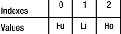

# 7. 集合

在本章中，你将学习：

*   Nashorn 中的数组是什么
*   如何使用数组字面量和 `Array` 对象在 Nashorn 中创建数组
*   如何使用 `Array` 对象的不同方法
*   如何处理类数组对象
*   如何在 Nashorn 中创建和使用类型化数组
*   如何在 Nashorn 中使用 Java 集合
*   如何在 Nashorn 中创建 Java 数组
*   如何将 Java 数组转换为 Nashorn 数组，反之亦然

## Nashorn 中的数组是什么？

Nashorn 中的数组是一种特殊对象，称为 `Array` 对象，用于表示有序的值集合。`Array` 对象会以特殊方式处理某些属性名。如果一个属性名可以转换为介于 0 到 2³²-2（含）之间的整数，则该属性名被称为数组索引，该属性被称为元素。换句话说，数组中的元素是一种特殊的属性，其名称是一个数组索引。除了向数组添加元素外，你还可以像操作 Nashorn 对象一样添加任何其他属性。请注意，在 `Array` 对象中，每个数组索引都是一个属性，但并非每个属性都是数组索引。例如，你可以向数组添加两个名为“0”和“name”的属性，其中“0”是数组索引，因为它可以转换为整数，而“name”则只是一个普通属性。

每个 `Array` 对象都有一个名为 `length` 的属性，其值大于所有元素的索引。当添加元素时，`length` 会自动调整。如果更改了 `length`，则索引大于或等于新 `length` 的元素将被删除。请注意，与 Java 数组不同，Nashorn 数组是可变长度数组。也就是说，Nashorn 数组不是固定长度的数组；当添加或删除元素，或更改 `length` 属性时，它们可以扩展和收缩。

数组有两种类型：密集数组和稀疏数组。在密集数组中，所有元素的索引是连续的。Java 数组始终是密集数组。在稀疏数组中，所有元素的索引可能不连续。Nashorn 数组是稀疏数组。例如，你可以在 Nashorn 中拥有一个数组，该数组在索引 1000 处有一个元素，而从索引 0 到 999 没有任何元素。

与 Java 不同，Nashorn 中的数组没有类型。数组中的元素可以是混合类型——一个元素可以是 Number，另一个是 String，另一个是 Object，等等。Nashorn 也支持类型化数组，但它们的工作方式与 Java 数组截然不同。我将在本章的“类型化数组”部分讨论类型化数组。

## 创建数组

在 Nashorn 中创建数组有两种方法：

*   使用数组字面量
*   使用 `Array` 对象

### 使用数组字面量

数组字面量是表示 `Array` 对象的表达式。数组字面量也称为数组初始化器。它是一个用方括号括起来的、逗号分隔的表达式列表；列表中的每个表达式代表数组的一个元素。以下是使用数组字面量的示例：

`// 没有元素的数组，也称为空数组`

`var emptyArray = [];`

`// 包含两个元素的数组`

`var names = ["Ken", "Li"];`

`// 包含四个元素的数组。元素类型混合。`

`var misc = [1001, "Ken", 1003, new Object()];`

`// 打印数组长度及其元素`

`print("数组长度: " + emptyArray.length + ", 元素: " + emptyArray);`

`print("数组长度: " + names.length + ", 元素: " + names);`

`print("数组长度: " + misc.length + ", 元素: " + misc);`

`数组长度: 0, 元素:`

`数组长度: 2, 元素: Ken,Li`

`数组长度: 4, 元素: 1001,Ken,1003,[object Object]`

每个 `Array` 对象都包含一个 `toString()` 方法，该方法返回一个以逗号分隔的数组元素列表字符串。在添加到列表之前，每个元素都会被转换为字符串。示例中调用了所有数组的 `toString()` 方法来打印其内容。

数组字面量中的尾随逗号会被忽略。以下两个数组字面量被视为相同。两者都有三个元素：

`var empIds1 = [10, 20, 30];  // 无尾随逗号。empIds1.length 为 3`

`var empIds2 = [10, 20, 30,]; // 等同于 [10, 20, 30]。empIds2.length 为 3`

数组字面量中的元素是数组对象的索引属性。对于密集数组，第一个元素的索引为 0，第二个元素的索引为 1，第三个元素的索引为 2，依此类推。稍后我将讨论稀疏数组的索引方案。考虑以下包含三个元素的密集数组。图 7-1 显示了数组中元素的值及其索引。

`var names = ["Fu", "Li", "Ho"]`

图 7-1.

三元素密集数组中的数组元素及其索引

你可以像访问对象的属性一样访问数组的元素。唯一的区别是元素的属性名是一个整数。例如，在 `names` 数组中，`names[0]` 引用第一个元素 `"Fu"`，`names[1]` 引用第二个元素 `"Li"`，`names[2]` 引用第三个元素 `"Ho"`。以下代码创建了一个密集数组，并使用 `for` 循环访问并打印数组的所有元素：

`// 创建一个包含三个元素的数组`

`var names = ["Fu", "Li", "Ho"]`

`// 打印所有数组元素`

`for(var i = 0, len = names.length; i < len; i++) {`

`print("names[" + i + "] = " + names[i]);`

`}`

`names[0] = Fu`

`names[1] = Li`

`names[2] = Ho`

向数组添加元素等同于在不存在的索引处赋值。以下代码创建了一个包含三个元素的数组，并添加了第四个和第五个元素。最后，代码打印了数组中的所有元素：

`// 创建一个包含三个元素的数组`

`var names = ["Fu", "Li", "Ho"]`

`// 添加第四个元素`

`names[3] = "Su"; // 在索引 3 处添加一个元素`

`// 添加第五个元素`

`names[4] = "Bo"; // 在索引 4 处添加一个元素`

`// 打印所有数组元素`

`for(var i = 0, len = names.length; i < len; i++) {`

`print("names[" + i + "] = " + names[i]);`

`}`

`names[0] = Fu`

`names[1] = Li`

`names[2] = Ho`

`names[3] = Su`

`names[4] = Bo`

回想一下，数组是一个对象，因此你可以像向任何其他对象添加属性一样向数组添加属性。如果属性名不是索引，则该属性只是一个普通属性，而不是元素。非元素属性不会影响数组的 `length`。以下代码创建了一个数组，添加了一个元素和一个非元素属性，并打印了详细信息：

`// 创建一个包含三个元素的数组`

`var names = ["Fu", "Li", "Ho"]`

`// 添加第四个元素`

`names[3] = "Su"; // 在索引 3 处添加一个元素`

`// 为数组添加一个非元素属性。属性名称为`

`// "nationality"，它不是一个索引，因此不定义元素。`

`// 相反，它只是一个普通属性。`

`names["nationality"] = "Chinese";`

`print("names.length = " + names.length);`

`// 使用 for 循环打印所有数组元素`

`print("使用 for 循环:");`

`for(var i = 0, len = names.length; i < len; i++) {`

`print("names[" + i + "] = " + names[i]);`

`}`

`// 使用 for..in 循环打印数组的所有属性`

`print("使用 for..in 循环:");`

`for(var prop in names) {`

`print("names[" + prop + "] = " + names[prop]);`

`}`

`names.length = 4`

`使用 for 循环:`

`names[0] = Fu`

`names[1] = Li`

`names[2] = Ho`

`names[3] = Su`

`使用 for..in 循环:`

`names[0] = Fu`

`names[1] = Li`

`names[2] = Ho`

`names[3] = Su`

`names[nationality] = Chinese`

关于此示例，有几点需要注意：

*   它创建了一个包含三个元素的数组，这些元素分别位于索引 0、1 和 2。此时，数组的 `length` 为 3。
*   它在索引 3 处添加了一个值为“Su”的元素。通过添加此元素，数组的 `length` 自动增加到 4。
*   它添加了一个名为“nationality”的属性。此属性只是一个普通属性，而不是一个元素，因为其名称是一个无法转换为索引的字符串。添加此属性不会影响数组的 `length`。也就是说，`length` 保持为 4。
*   当使用 for 循环打印数组时，名为 `"nationality"` 的属性不会被打印，因为该循环遍历的是索引，而不是所有属性。
*   当使用 `for..in` 循环时，所有元素以及“nationality”属性都会被打印，因为 `for..in` 循环会遍历对象的所有属性。这证明了数组的所有元素都是属性，但并非所有属性都是元素。

请注意，如果一个属性名称可以转换为 0 到 2³²-2（含）之间的整数，则该属性名称被视为一个索引。检查属性名称是否为索引的真正测试是应用以下条件。假设属性名称为 `prop` 且它是一个字符串。如果以下表达式返回 `true`，则该属性名称是一个索引；否则，它只是一个属性名称：

`ToString(ToUint32(prop)) = prop`

这里，假设 `ToUint32()` 是将属性名称转换为无符号 32 位整数的函数，而 `ToString()` 是将整数转换为字符串的函数。换句话说，如果一个字符串属性名称被转换为无符号 32 位整数，然后再转换回字符串，结果与原始属性名称相同，那么这样的属性名称就是一个索引。如果属性名称只是有效范围内的一个数字，并且不包含小数部分，那么它就是一个索引。以下代码演示了此规则：

`// 创建一个包含两个元素的数组`

`var names = ["Fu", "Li"]`

`// 在索引 2 处添加一个元素`

`names[2.0] = "Su";`

`// 添加一个名为 "2.0" 的属性，而不是索引 2 处的元素`

`names["2.0"] = "Bo";`

`// 在索引 3 处添加一个元素`

`names["3"] = "Do";`

`print("names.length = " + names.length);`

`// 使用 for..in 循环打印数组的所有属性`

`print("使用 for..in 循环:");`

`for(var prop in names) {`

`print("names[" + prop + "] = " + names[prop]);`

`}`

`names.length = 4`

`使用 for..in 循环:`

`names[0] = Fu`

`names[1] = Li`

`names[2] = Su`

`names[3] = Do`

`names[2.0] = Bo`

你可以向数组添加一个负数的属性。请注意，负数作为属性名称不符合索引的条件，因此它只会添加一个属性，而不是一个元素：

`// 创建一个包含两个元素的数组`

`var names = ["Fu", "Li"]`

`// 添加名称为 "-1" 的属性，而不是元素。`

`names[-1] = "Do"; // names.length 仍然是 2`

`print("names.length = " + names.length);`

`names.length = 2`

你也可以使用数组字面量创建一个稀疏数组。在元素列表中使用逗号而不指定元素会创建一个稀疏数组。请注意，在稀疏数组中，元素的索引不是连续的。以下代码创建了一个稀疏数组：

`var names = ["Fu",,"Lo"];`

`names` 数组包含两个元素。它们位于索引 0 和 2。索引 1 处的元素缺失，这由两个连续的逗号表示。`names` 数组的 `length` 是多少？是 3，而不是 2。回想一下，数组的 `length` 总是大于所有元素的最大索引。数组中的最大索引是 2，所以 `length` 是 3。当你尝试读取不存在的元素 `names[1]` 时会发生什么？读取 `names[1]` 被简单地视为从 `names` 对象中读取一个名为“1”的属性，而该属性“1”并不存在。回想一下`第 4 章`，读取对象的不存在属性会返回 `undefined`。因此，`names[1]` 将简单地返回 `undefined`，而不会引起任何错误。如果你给 `names[1]` 赋值，你就是在索引 1 处创建一个新元素，并且该数组将不再是稀疏数组。以下代码展示了此规则：

`// 创建一个包含 2 个现有元素和 1 个缺失元素的稀疏数组`

`var names = ["Fu",,"Lo"]; // names.length 是 3`

`print("names.length = " + names.length);`

`for(var prop in names) {`

`print("names[" + prop + "] = " + names[prop]);`

`}`

`// 在索引 1 处添加一个元素。`

`names[1] = "Do";  // names.length 仍然是 3`

`print("names.length = " + names.length);`

`for(var prop in names) {`

`print("names[" + prop + "] = " + names[prop]);`

`}`

`names.length = 3`

`names[0] = Fu`

`names[2] = Lo`

`names.length = 3`

`names[0] = Fu`

`names[1] = Do`

`names[2] = Lo`

以下是更多稀疏数组的示例。注释解释了这些数组：

`var names = [,];   // 一个稀疏数组。length = 1 且没有元素`

`names = [,,];      // 一个稀疏数组。length = 2 且没有元素`

`names = [,,,];     // 一个稀疏数组。length = 3 且没有元素`

`names = [,,,7,,2]; // 一个稀疏数组。length = 6 且有 2 个元素`

你能区分以下两个数组吗？

`var names1 = [,,];`

`var names2 = [undefined,undefined];`

两个数组的 `length` 都是 2。名为 `names1` 的数组是一个稀疏数组。`names1` 中索引 0 和 1 处的元素不存在。读取 `names1[0]` 和 `names1[1]` 将返回 `undefined`。名为 `names2` 的数组是一个密集数组。`names2` 中索引 0 和 1 处的元素存在，并且都被设置为 `undefined`。读取 `names2[0]` 和 `names2[1]` 将返回 `undefined`。

你如何知道一个数组是否是稀疏的？`Array` 对象中没有内置的方法来检查稀疏数组。你需要自己检查，记住如果一个属性名称（从 0 到 `length`）在数组中不存在，那么它就是一个稀疏数组。我将在“遍历数组元素”一节中讨论几种检查稀疏数组的方法。

### 使用 Array 对象

Nashorn 包含一个名为 `Array` 的内置函数对象。它用于创建和初始化数组。它可以作为函数或构造函数调用。它作为函数或构造函数的使用方式相同。其签名是：

`Array(arg1, arg2, arg3,...)`

`Array` 对象可以接受零个或多个参数。其初始化行为取决于传递参数的数量和类型，可分为三类：

*   未传递参数
*   传递一个参数
*   传递两个或更多参数

### 不传递参数

当没有参数传递给 `Array` 构造函数时，它会创建一个空数组，并将数组的 `length` 设置为零：

`var names1 = new Array(); // 等同于：var names = [];`

### 传递一个参数

当向 `Array` 构造函数传递一个参数时，参数的类型决定了新数组的创建方式：

*   如果参数是一个数字，并且是 0 到 2³²-1（含）范围内的整数，则该参数被视为数组的 `length`。否则，会抛出一个 `RangeError` 异常。
*   如果参数不是数字，则会创建一个数组，该数组以传递的参数作为其唯一元素。数组的 `length` 被设置为 1。

以下代码在 Nashorn 中创建了可能的最大数组：

`var names = new Array(Math.pow(2, 32) -1); // 可能的最大数组`

`print("names.length = " + names.length);`

`names.length = 4294967295`

以下语句创建了一个 `length` 为 10 的数组。数组中尚不存在任何元素：

`var names = new Array(10);`

以下数组创建表达式会抛出 `RangeError` 异常，因为参数是一个数字，但它要么不是有效范围内的整数，要么超出了范围：

`var names1 = new Array(34.89);           // 不是整数`

`var names1 = new Array(Math.pow(2, 32)); // 超出范围`

`var namess = new Array(-10);             // 超出范围`

以下代码向 `Array` 构造函数传递了一个非数字参数，该构造函数创建了一个数组，以传递的参数作为其唯一元素，并将数组的 `length` 设置为 1：

`var names1 = new Array("Fu"); // 创建一个包含单个元素 "Fu" 的数组`

`var names2 = new Array(true); // 创建一个包含单个元素 true 的数组`

### 传递两个或更多参数

当向 `Array` 构造函数传递两个或更多参数时，它会创建一个包含指定参数的密集数组。`length` 被设置为传递的参数数量。以下语句创建了一个包含三个传递参数的数组，并将 `length` 设置为 3：

`var names = new Array("Fu", "Li". "Do");`

你不能使用 `Array` 构造函数创建稀疏数组。在 `Array` 构造函数中使用连续逗号或尾随逗号会抛出 `SyntaxError` 异常：

`var names1 = new Array("Fu", "Li",, "Do");  // 一个 SyntaxError`

`var names2 = new Array("Fu", "Li", "Do", ); // 一个 SyntaxError`

你可以通过在不连续的索引处添加元素或删除现有元素来创建稀疏数组，从而使索引变得不连续。我将在下一节讨论删除数组元素。以下代码创建了一个密集数组，并添加了一个不连续的元素使其成为稀疏数组：

`// 创建一个在索引 0 和 1 处有元素的密集数组。`

`var names = new Array("Fu", "Li");  // names.length 被设置为 2`

`print("创建数组后：names.length = " + names.length);`

`// 在索引 4 处添加一个元素，跳过索引 2 和 3。`

`names[4] = "Do"; // names.length 被设置为 5，使 names 成为一个稀疏数组`

`print("在索引 4 处添加元素后：names.length = " + names.length);`

`for(var prop in names) {`

`print("names[" + prop + "] = " + names[prop]);`

`}`

`创建数组后：names.length = 2`

`在索引 4 处添加元素后：names.length = 5`

`names[0] = Fu`

`names[1] = Li`

`names[4] = Do`

## 删除数组元素

删除数组元素或数组的非元素属性与删除对象的属性相同。使用 `delete` 运算符删除数组元素。如果你从密集数组的中间或开头删除一个元素，该数组将变得稀疏。以下代码展示了如何从数组中删除元素：

`// 创建一个在索引 0、1 和 2 处有元素的密集数组。`

`var names = new Array("Fu", "Li", "Do");`

`print("删除前：");`

`print("names.length = " + names.length + ", 元素 = " + names);`

`// 删除索引 1 处的元素`

`delete names[1]; // names.length 保持为 3`

`print("删除后：");`

`print("names.length = " + names.length + ", 元素 = " + names);`

`删除前：`

`names.length = 3, 元素 = Fu,Li,Do`

`删除后：`

`names.length = 3, 元素 = Fu,,Do`

你可以使数组的元素不可配置和不可写，这样它们就无法被删除和修改。删除一个不可配置的元素没有任何效果。在严格模式下，删除一个不可配置的元素会产生错误。以下代码演示了这一点：

`var names = new Array("Fu", "Li", "Do");`

`// 使索引 1 处的元素不可配置`

`Object.defineProperty(names, "1", {configurable: false});`

`print("删除前：");`

`print("names.length = " + names.length + ", 元素 = " + names);`

`delete names[1]; // 不会删除 "Li"，因为它是不可配置的。`

`print("删除后：");`

`print("names.length = " + names.length + ", 元素 = " + names);`

`删除前：`

`names.length = 3, 元素 = Fu,Li,Do`

`删除后：`

`names.length = 3, 元素 = Fu,Li,Do`

## 数组的长度

每个 `Array` 对象都有一个名为 `length` 的属性，当元素被添加和删除时，该属性会自动维护。`length` 属性使数组区别于其他类型的对象。对于密集数组，`length` 比数组中的最大索引大 1。对于稀疏数组，它保证大于所有元素（存在的和缺失的）的最大索引。

数组的 `length` 属性是可写的。也就是说，你也可以在代码中更改它。如果你将 `length` 设置为一个大于当前值的值，`length` 会变为新值，从而在末尾创建一个稀疏数组。如果你将 `length` 设置为一个小于其当前值的值，则会从末尾开始删除所有元素，直到找到一个大于或等于新 `length` 值的不可删除元素。也就是说，将 `length` 设置为一个较小的值会使数组缩小到某个不可删除的元素为止。以下示例将使此规则变得清晰：

`var names = new Array("Fu", "Li", "Do", "Ho");`

`print("names.length = " + names.length + ", 元素 = " + names);`

`print("将 length 设置为 10...");`

`names.length = 10;`

`print("names.length = " + names.length + ", 元素 = " + names);`

`print("将 length 设置为 0...");`

`names.length = 0;`

`print("names.length = " + names.length + ", 元素 = " + names);`

`print("重新创建数组...");`

`names = new Array("Fu", "Li", "Do", "Ho");`

`print("names.length = " + names.length + ", 元素 = " + names);`

`print('使 "Do" 不可配置...');`

`// 使 "Do" 不可配置（不可删除）`

`Object.defineProperty(names, "2", {configurable:false});`

`print("将 length 设置为 0...");`

`names.length = 0; // 只会删除 "Ho"，因为 "Do" 是不可删除的`

`print("names.length = " + names.length + ", 元素 = " + names);`

`names.length = 4, 元素 = Fu,Li,Do,Ho`

`将 length 设置为 10...`

`names.length = 10, 元素 = Fu,Li,Do,Ho,,,,,,`

`将 length 设置为 0...`

`names.length = 0, 元素 =`

`重新创建数组...`

`names.length = 4, 元素 = Fu,Li,Do,Ho`

`使 "Do" 不可配置...`

`将 length 设置为 0...`

`names.length = 3, 元素 = Fu,Li,Do`

`Array` 对象的 `length` 属性是可写的、不可枚举且不可配置的。如果你不希望有人在代码中更改它，你可以使其不可写。当你从数组中添加和删除元素时，不可写的 `length` 属性仍会自动更改。以下代码展示了这一规则：

`var names = new Array("Fu", "Li", "Do", "Ho");`

`// 使 length 属性不可写。`

`Object.defineProperty(names, "length", {writable:false});`

`// length 属性不能再被直接更改`

`names.length = 0; // 无效果`

`// 添加一个新元素`

`names[4] = "Nu"; // names.length 从 4 变为 5`

## 遍历数组元素

如果你有兴趣遍历数组的所有属性（包括元素），可以直接使用 `for..in` 和 `for..each..in` 语句。这些语句不会按特定顺序遍历数组。正如本节标题所示，我将讨论如何仅遍历数组的元素，尤其是在数组稀疏的情况下。如果你只向数组添加元素（不添加任何非元素属性），这在大多数情况下都会这样做，那么使用 `for..in` 和 `for..each..in` 语句对于密集数组和稀疏数组都能很好地工作。

### 使用 for 循环

如果你知道数组是密集的，可以使用简单的 `for` 循环来遍历数组，如下所示：

`// 创建一个密集数组`

`var names = new Array("Fu", "Li", "Do");`

`// 使用 for 循环遍历数组的所有元素`

`for(var i = 0, len = names.length; i < len; i++) {`

`print("names[" + i + "]=" + names[i]);`

`}`

`names[0]=Fu`

`names[1]=Li`

`names[2]=Do`

如果你有一个稀疏数组，`for` 循环就无法正常工作。如果你尝试访问稀疏数组中缺失的元素，它会返回 `undefined`，但这无法告诉你该元素是缺失的，还是现有元素的值为 `undefined`。你可以通过使用 `in` 运算符来检查正在遍历的索引是否存在，从而摆脱这个限制。如果索引存在，则元素存在；如果索引不存在，则它是稀疏数组中的一个缺失元素。以下代码演示了这种方法：

`// 创建一个稀疏数组，其中一个元素设置为 undefined`

`var names = ["Fu", "Li", , "Do", undefined, , "Lu"];`

`// 使用 for 循环遍历数组的所有元素`

`for (var i = 0, len = names.length; i < len; i++) {`

`// 检查正在访问的索引是否存在于数组中`

`if (i in names) {`

`print("names[" + i + "]=" + names[i]);`

`}`

`}`

`names[0]=Fu`

`names[1]=Li`

`names[3]=Do`

`names[4]=undefined`

`names[6]=Lu`

考虑以下代码。它创建了一个只有一个元素的稀疏数组。该数组是 Nashorn 中可能的最大数组，并且该元素被添加在数组的最后一个索引处。在实践中，你永远不会拥有这么大的数组。我使用它只是为了证明使用 `for` 循环并不是访问稀疏数组中所有元素的最有效方式：

`// 创建一个空数组`

`var names = new Array();`

`// 在最大可能数组的末尾添加一个元素`

`names[4294967294] = "almost lost";`

`// 使用 for 循环遍历数组的所有元素`

`for (var i = 0, len = names.length; i < len; i++) {`

`// 检查正在访问的索引是否存在于数组中`

`if (i in names) {`

`print("names[" + i + "]=" + names[i]);`

`}`

`}`

在这个例子中使用 `for` 循环效率非常低，因为它必须访问 4294967293 个索引，才能到达最后一个有值的索引。要获取数组中的这一个元素需要花费太长时间。稍后我将使用 `for..in` 循环来解决这个性能低下的 `for` 循环问题。

### 使用 forEach() 方法

`Array.prototype` 对象包含一个名为 `forEach()` 的方法，该方法按升序为数组中的每个元素调用一个回调函数。它只访问稀疏数组中存在的元素。其签名是：

`forEach (callbackFunc [, thisArg])`

这里，`callbackFunc` 是一个函数，按升序为数组中的每个元素调用一次。它接收三个参数：元素的值、元素的索引以及正在被遍历的对象。`thisArg` 是可选的；如果指定了它，它将被用作每次调用 `callbackFunc` 时的 `this` 值。

`forEach()` 方法在开始执行之前会设置它将访问的索引范围。如果在执行过程中添加了超出该范围的元素，这些元素将不会被访问。如果删除了初始设置范围内的元素，这些元素也不会被访问：

`// 创建一个稀疏数组，其中一个元素设置为 undefined`

`var names = ["Fu", "Li", , "Do", undefined, , "Lu"];`

`// 定义回调函数`

`var visitor = function (value, index, array) {`

`print("names[" + index + "]=" + value);`

`};`

`// 打印所有元素`

`names.forEach(visitor);`

`names[0]=Fu`

`names[1]=Li`

`names[3]=Do`

`names[4]=undefined`

`names[6]=Lu`

如果你使用 `forEach()` 方法访问一个大型稀疏数组，你会遇到与上一节讨论的 `for` 循环相同的问题。

### 使用 for-in 循环

让我们使用 `for..in` 循环来解决访问长稀疏数组中元素的低效问题。使用 `for..in` 循环会带来另一个问题，即它会遍历数组的所有属性，而不仅仅是元素。不过，它不会遍历缺失的元素。你需要一种方法来区分简单属性和现有元素。你可以简单地使用数组索引的定义来做到这一点。数组索引是介于 0 和 2³²-2 之间的整数。如果该属性是一个数组索引，那么它就是一个元素；否则，它只是一个属性，而不是一个元素。清单 7-1 包含一个名为 `isValidArrayIndex()` 的函数的代码。该函数接受一个属性名作为参数。如果该属性名是一个有效的数组索引，则返回 `true`；否则返回 `false`。

清单 7-1. isValidArrayIndex( ) 函数的代码

`// arrayutil.js`

`var UPPER_ARRAY_INDEX = Math.pow(2, 32) - 2;`

`Object.defineProperty(this, "UPPER_ARRAY_INDEX", {writable: false});`

`function isValidArrayIndex(prop) {`

`// 将 prop 转换为数字`

`var numericProp = Number(prop);`

`// 检查 prop 是否为数字`

`if (String(numericProp) === prop) {`

`// 检查是否为整数`

`if (Math.floor(numericProp) === numericProp) {`

`// 检查是否在有效的数组索引范围内`

`if (numericProp >= 0 &&                             numericProp <= UPPER_ARRAY_INDEX) {`

`return true;`

`}`

`}`

`}`

`return false;`

`}`

以下代码使用 `for..in` 循环仅遍历稀疏数组的元素。它利用 `isValidArrayIndex()` 函数来确定一个属性是否为有效的数组索引。请注意，该代码在数组中可能的最大索引处添加了一个元素。`for..in` 循环非常快速地访问了数组的所有元素。

`// 加载包含 isValidArrayIndex() 函数的脚本`

`load("arrayutil.js");`

`// 创建一个稀疏数组，其中一个元素设置为 undefined`

`var names = ["Fu", "Li", , "Do", undefined, , "Lu"];`

`// 向数组添加一些属性`

`names["nationality"] = "Chinese";  // 一个属性`

`names[4294967294] = "almost lost"; // 在最大可能数组索引处的元素`

`names[3.2] = "3.2";   // 一个属性`

`names[7.00] = "7.00"; // 一个元素`

`// 打印所有元素，忽略非元素属性`

`for(var prop in names) {`

`if (isValidArrayIndex(prop)) {`

`// 这是一个元素`

`print("names[" + prop + "]=" + names[prop]);`

`}`

`}`

`names[0]=Fu`

`names[1]=Li`

`names[3]=Do`

`names[4]=undefined`

`names[6]=Lu`

`names[7]=7.00`

`names[4294967294]=almost lost`

## 检查是否为数组

`Array` 对象包含一个名为 `isArray()` 的静态方法，可用于检查一个对象是否为数组。以下代码演示了其用法：

`var obj1 = [10, 20];     // 一个数组`

`var obj2 = {x:10, y:20}; // 一个对象，但不是数组`

`print("Array.isArray(obj1) =",  Array.isArray(obj1));`

`print("Array.isArray(obj2) =",  Array.isArray(obj2));`

`Array.isArray(obj1) = true`

`Array.isArray(obj2) = false`

## 多维数组

Nashorn 并没有特殊的结构来支持多维数组。你需要使用数组的数组（即锯齿数组）来创建多维数组，其中数组的元素可以是数组。通常，你需要使用嵌套的 `for` 循环来填充和访问多维数组的元素。以下代码演示了如何创建、填充并打印一个 3x3 矩阵的元素。该代码使用了 `Array` 对象的 `join()` 方法，以制表符作为分隔符来连接数组的元素：

`var ROWS = 3;`

`var COLS = 3;`

`// 创建一个 3x3 数组，预先分配内存`

`var matrix = new Array(ROWS);`

`for(var i = 0; i < ROWS; i++) {`

`matrix[i] = new Array(COLS);`

`}`

`// 填充数组`

`for(var i = 0; i < ROWS; i++) {`

`for(var j = 0; j < COLS; j++) {`

`matrix[i][j] = i + "" + j;`

`}`

`}`

`// 打印数组元素`

`for(var i = 0; i < ROWS; i++) {`

`var rowData = matrix[i].join("\t");`

`print(rowData);`

`}`

`00        01        02`

`10        11        12`

`20        21        22`

## Array 对象的方法

`Array.prototype` 对象定义了几个方法，这些方法可作为所有 `Array` 对象的实例方法使用。在本节中，我将讨论这些方法。所有数组方法都是有意设计为通用的，因此它们不仅可以应用于数组，还可以应用于任何类数组对象。

### 连接元素

`concat(arg1, arg2,...)` 方法创建并返回一个新数组，该数组包含调用该方法的数组对象的所有元素，后跟按顺序指定的参数。如果某个参数是数组，则会连接该数组的元素。如果某个参数是嵌套数组，则会将其展平一层。此方法不会修改原始数组和作为参数传入的数组。如果原始数组或参数包含对象，则会进行对象的浅拷贝。使用 `concat()` 方法的示例如下：

`var names = ["Fu", "Li"];`

`// 将 ["Fu", "Li", "Do", "Su"] 赋值给 names2`

`var names2 = names.concat("Do", "Su");`

`// 将 ["Fu", "Li", "Do", "Su", ["Lu", "Zu"], "Yu"] 赋值给 names3`

`var names3 = names.concat("Do", ["Su", ["Lu","Zu"]], "Yu");`

### 连接数组元素

`join(separator)` 方法将数组的所有元素转换为字符串，使用 `separator` 将它们连接起来，并返回结果字符串。如果未指定 `separator`，则使用逗号作为分隔符。该方法作用于数组中从索引 0 到索引 `length - 1` 的所有元素。如果某个元素是 `undefined` 或 `null`，则使用空字符串。以下是使用 `join()` 方法的一些示例：

`var names = ["Fu", "Li", "Su"];`

`var namesList1 = names.join();    // 将 "Fu,Li,Su" 赋值给 namesList1`

`var namesList2 = names.join("-"); // 将 "Fu-Li-Su" 赋值给 namesList2`

`var ids = [10, 20, , 30, undefined, 40, null]; // 一个稀疏数组`

`var idsList1 = ids.join();    // 将 "10,20,,30,,40," 赋值给 idsList1`

`var idsList2 = ids.join("-"); // 将 "10-20--30--40-" 赋值给 idsList2`

### 反转数组元素

`reverse()` 方法将数组的元素按相反顺序重新排列，并返回该数组。使用此方法的示例如下：

`var names = ["Fu", "Li", "Su"];`

`names.reverse(); // 现在，names 数组包含 ["Su","Li","Fu"]`

`// 将 "Fu,Li,Su" 赋值给 reversedList`

`var reversedList = names.reverse().join();`

### 切片数组

`slice(start, end)` 方法返回一个数组，该数组包含原始数组中从索引 `start` 到 `end`（不包括 `end`）之间的子数组。如果 `start` 和 `end` 为负数，则它们分别被视为 `start + length` 和 `end + length`，其中 `length` 是数组的长度。`start` 和 `end` 都被限制在 0 到 `length`（包含）之间。如果未指定 `end`，则假定为 `length`。如果 `start` 和 `end`（不包括 `end`）包含一个稀疏范围，则生成的子数组将是稀疏的。以下是使用 `slice()` 方法的示例：

`var names = ["Fu", "Li", "Su"];`

`// 将 ["Li","Su"] 赋值给 subNames1。end = 5 将被替换为 end = 3。`

`var subNames1 = names.slice(1, 5);`

`// 将 ["Li","Su"] 赋值给 subNames2。start = -1 被用作 start = 1 (-2 + 3)。`

`var subNames12 = names.slice(-2, 3);`

`var ids = [10, 20,,,30, 40, 40]; // 一个稀疏数组`

`// 将 [20,,,30,40] 赋值给 idsSubList，其 length = 5`

`var idsSubList = ids.slice(1, 6);`

### 拼接数组

`splice()` 方法可以根据传入的参数执行插入、删除或同时执行两种操作。其签名是：

`splice (start, deleteCount, value1, value2,...)`

该方法从索引 `start` 开始删除 `deleteCount` 个元素，并在索引 `start` 处插入指定的参数（`value1`、`value2` 等）。它返回一个包含从原始数组中删除的元素的数组。删除、插入或两者之后，现有元素的索引会被调整，以使它们连续。如果 `deleteCount` 为 0，则插入指定的值而不删除任何元素。以下是使用该方法的示例：

`var ids = [10, 20, 30, 40, 50];`

`// 将数组中的 10 和 20 替换为 100 和 200`

`var deletedIds  = ids.splice(1, 2, 100, 200);`

`print("ids = " + ids);`

`print("deletedIds = " + deletedIds);`

`// 保留前 3 个元素，删除其余元素`

`var deletedIds2  = ids.splice(3, 2);`

`print("ids = " + ids);`

`print("deletedIds2 = " + deletedIds2);`

`ids = 10,100,200,40,50`

`deletedIds = 20,30`

`ids = 10,100,200`

`deletedIds2 = 40,50`

### 排序数组

`sort(compareFunc)` 方法对数组进行原地排序，并返回排序后的数组。`compareFunc` 参数是一个带有两个参数的函数，它是可选的。如果未指定，则数组按字母顺序排序，在比较期间必要时会将元素转换为字符串。未定义的元素会被排序到末尾。

如果指定了 `compareFunc`，则会向其传递两个元素，其返回值决定了这两个元素的顺序。假设传递给它的是 x 和 y。如果 x < y，则返回负值；如果 `x = y`，则返回零；如果 `x > y`，则返回正值。以下代码通过不指定 `compareFunc` 对整数数组进行升序排序。随后，通过指定 `compareFunc` 对同一数组进行降序排序：

`var ids = [30, 10, 40, 20];`

`print("ids = " + ids);`

`// 对数组进行排序`

`ids.sort();`

`print("Sorted ids = " + ids);`

`// 用于对 ids 进行降序排序的比较函数`

`var compareDescending = function (x, y) {`

`if (x > y) {`

`return -1;`

`}`

`else if (x < y) {`

`return 1;`

`}`

`else {`

`return 0;`

`}`

`};`

`ids.sort(compareDescending);`

`print("Sorted in descending order, ids = " + ids);`

`ids = 30,10,40,20`

`Sorted ids = 10,20,30,40`

`Sorted in descending order, ids = 40,30,20,10`

### 在两端添加和删除元素

以下四种方法允许你在数组的开头和结尾添加和删除元素：

*   `unshift(value1, value2,...)`: `unshift()` 方法将参数前置到数组的开头，因此它们会按照作为参数时的相同顺序出现在数组的开头。它返回数组新的 `length` 属性。现有元素的索引会被调整，以便为新元素腾出空间。
*   `shift()`: `shift()` 方法移除并返回数组的第一个元素，并将所有其他元素向左移动一个位置。
*   `push(value1, value2,...)`: `push()` 方法的工作方式与 `unshift()` 方法相同，区别在于它在数组的末尾添加元素。
*   `pop()`: `pop()` 方法的工作方式与 `shift()` 方法相同，区别在于它移除并返回数组的最后一个元素。

以下是使用这些方法的示例：

`var ids = [10, 20, 30];`

`print("ids: " + ids);`

`ids.unshift(100, 200, 300);`

`print("After ids.unshift(100, 200, 300): " + ids);`

`ids.shift();`

`print("After ids.shift(): " + ids);`

`ids.push(1, 2, 3);`

`print("After ids.push(1, 2, 3): " + ids);`

`ids.pop();`

`print("After ids.pop(): " + ids);`

`ids: 10,20,30`

`After ids.unshift(100, 200, 300): 100,200,300,10,20,30`

`After ids.shift(): 200,300,10,20,30`

`After ids.push(1, 2, 3): 200,300,10,20,30,1,2,3`

`After ids.pop(): 200,300,10,20,30,1,2`

使用这些方法，你可以实现栈、队列和双端队列。让我们使用 `push()` 和 `pop()` 方法来实现一个栈。清单 7-2 包含了 `Stack` 对象的代码。它在一个私有的 `Array` 对象中保存栈的数据。它提供了 `isEmpty()`、`push()`、`pop()` 和 `peek()` 方法来执行栈操作。它重写了 `Object.prototype` 的 `toString()` 方法，以字符串形式返回栈中的当前元素。清单 7-3 包含了测试 `Stack` 对象的代码。

清单 7-2. 栈对象声明

`// stack.js`

`// 定义 Stack 对象的构造函数`

`function Stack(/*varargs*/) {`

`// 定义一个私有数组来保存栈元素`

`var data = new Array();`

`// 如果向构造函数传递了任何参数，将它们添加到栈中`

`for (var i in arguments) {`

`data.push(arguments[i]);`

`}`

`// 定义方法`

`this.isEmpty = function () {`

`return (data.length === 0);`

`};`

`this.pop = function () {`

`if (this.isEmpty()) {`

`throw new Error("Stack is empty.");`

`}`

`return data.pop();`

`};`

`this.push = function (arg) {`

`data.push(arg);`

`return arg;`

`};`

`this.peek = function () {`

`if (this.isEmpty()) {`

`throw new Error("Stack is empty.");`

`}`

`else {`

`return data[data.length - 1];`

`}`

`};`

`this.toString = function () {`

`return data.toString();`

`};`

`}`

清单 7-3. 测试栈对象

`// stacktest.js`

`load("stack.js");`

`// 创建一个包含初始 2 个元素的栈`

`var stack = new Stack(10, 20);`

`print("Stack = " + stack);`

`// 压入一个元素`

`stack.push(40);`

`print("After push(40), Stack = " + stack);`

`// 弹出两个元素`

`stack.pop();`

`stack.pop();`

`print("After 2 pops, Stack = " + stack);`

`print("stack.peek() = " + stack.peek());`

`print("stack.isEmpty() = " + stack.isEmpty());`

`// 弹出最后一个元素`

`stack.pop();`

`print("After another pop(), stack.isEmpty() = " + stack.isEmpty());`

`Stack = 10,20`

`After push(40), Stack = 10,20,40`

`After 2 pops, Stack = 10`

`stack.peek() = 10`

`stack.isEmpty() = false`

`After another pop(), stack.isEmpty() = true`

### 搜索数组

有两个方法，`indexOf()` 和 `lastIndexOf()`，允许你在数组中搜索指定的元素。它们的签名是：

*   `indexOf(searchElement, fromIndex)`
*   `lastIndexOf(searchElement, fromIndex)`

`indexOf()` 方法从 `fromIndex` 开始，在数组中搜索指定的 `searchElement`。如果未指定 `fromIndex`，则假定为 0，这意味着搜索整个数组。该方法使用 `===` 运算符返回数组中第一个等于 `searchElement` 的元素的索引。如果未找到 `searchElement`，则返回 -1。

`lastIndexOf()` 方法的工作方式与 `indexOf()` 方法相同，区别在于它从末尾向开头进行搜索。也就是说，它返回数组中最后一个找到的等于 `searchElement` 的元素的索引。以下代码展示了如何使用这些方法：

`var ids = [10, 20, 30, 20];`

`print("ids = " + ids);`

`print("ids.indexOf(20) = " + ids.indexOf(20));`

`print("ids.indexOf(20, 2) = " + ids.indexOf(20, 2));`

`print("ids.lastIndexOf(20) = " + ids.lastIndexOf(20));`

`print("ids.indexOf(25) = " + ids.lastIndexOf(25));`

`ids = 10,20,30,20`

`ids.indexOf(20) = 1`

`ids.indexOf(20, 2) = 3`

`ids.lastIndexOf(20) = 3`

`ids.indexOf(25) = -1`

### 评估谓词

你可以检查一个谓词对于数组中的所有或部分元素是否求值为 `true`。以下两个方法允许你执行此操作：

*   `every(predicate, thisArg)`
*   `some(predicate, thisArg)`

第一个参数 `predicate` 是一个函数，它会为数组中的每个现有元素调用一次。该函数接收三个参数：元素的值、元素的索引和数组对象。第二个参数 `thisArg`，如果指定，则用作 `predicate` 指定的函数调用中的 `this` 值。

如果指定的 `predicate` 函数为数组中的每个现有元素都返回一个真值，则 `every()` 方法返回 `true`。否则，返回 `false`。一旦 `predicate` 为某个元素返回假值，该方法就会返回 `false`。

如果 `predicate` 至少为一个元素返回真值，则 `some()` 方法返回 `true`。否则，返回 `false`。一旦 `predicate` 为某个元素返回真值，该方法就会返回 `true`。以下示例展示了如何检查一个数字数组是否包含任何/全部偶数/奇数：

`var ids = [10, 20, 30, 20];`

`print("ids = " + ids);`

`var hasAnyEven = ids.some(function (value, index, array) {`

`return value %2 === 0;`

`});`

`var hasAllEven = ids.every(function (value, index, array) {`

`return value %2 === 0;`

`});`

`var hasAnyOdd = ids.some(function (value, index, array) {`

`return value %2 === 1;`

`});`

`var hasAllOdd = ids.every(function (value, index, array) {`

`return value %2 === 1;`

`});`

`print("ids has any even numbers: " + hasAnyEven);`

`print("ids has all even numbers: " + hasAllEven);`

`print("ids has any odd numbers: " + hasAnyOdd);`

`print("ids has all odd numbers: " + hasAllOdd);`

`ids = 10,20,30,20`

`ids has any even numbers: true`

`ids has all even numbers: true`

`ids has any odd numbers: false`

`ids has all odd numbers: false`

## 将数组转换为字符串

你可以以任何想要的方式将数组转换为字符串。然而，`toString()` 和 `toLocaleString()` 方法提供了两种内置的实现来将数组元素转换为字符串。`toString()` 方法返回一个字符串，该字符串是通过在数组上调用 `join()` 方法而不指定任何分隔符得到的。也就是说，它返回元素列表作为字符串，其中元素由逗号分隔。`toLocaleString()` 方法调用所有数组元素的 `toLocaleString()` 方法，使用特定于语言环境的分隔符连接返回的字符串，并返回最终的字符串。当你将数组对象用作 `print()` 方法的参数或将其与字符串连接运算符一起使用时，你一直在使用 `Array` 对象的 `toString()` 方法。

## 数组的流式处理

Java 8 引入了 Streams API，它允许你使用 map-filter-reduce 等多种模式将 Java 集合作为流来处理。Nashorn 中的 `Array` 对象提供了对数组进行流式处理的方法。这些方法包括：

*   `map()`
*   `filter()`
*   `reduce()`
*   `reduceRight()`
*   `forEach()`
*   `some()`
*   `every()`

我已经在上一节中详细讨论了最后三种方法。本节将讨论其他方法。

`map()` 方法将数组的元素映射为其他值，并返回一个包含映射后值的新数组。原始数组不会被修改。其签名如下：

`map(callback, thisArg)`

第一个参数 `callback` 是一个函数，它会为数组中的每个元素调用；该函数接收三个参数：元素的值、元素的索引以及数组本身。函数的返回值是新（映射后）数组的元素。第二个参数用作函数调用中的 `this` 值。以下是使用 `map()` 方法的示例。它将数字数组的每个元素映射为其平方：

`var nums = [1, 2, 3, 4, 5];`

`// 将 nums 数组中的每个元素映射为其平方`

`var squaredNums = nums.map(function (value, index, data) value * value);`

`print(nums);`

`print(squaredNums);`

`1,2,3,4,5`

`1,4,9,16,25`

`filter()` 方法返回一个新数组，其中包含原始数组中通过谓词测试的元素。其签名如下：

`filter(callback, thisArg)`

第一个参数 `callback` 是一个函数，它会为数组中的每个元素调用；该函数接收三个参数：元素的值、元素的索引以及数组本身。如果函数返回一个真值，则该元素会被包含在返回的数组中；否则，该元素会被排除。第二个参数用作函数调用中的 `this` 值。以下代码展示了如何使用 `filter()` 方法从数组中过滤出偶数：

`var nums = [1, 2, 3, 4, 5];`

`// 过滤出偶数，只保留奇数`

`var oddNums = nums.filter(function (value, index, data) (value % 2 !== 0));`

`print(nums);`

`print(oddNums);`

`1,2,3,4,5`

`1,3,5`

`reduce()` 方法对数组执行归约操作，将其归约为单个值，例如计算数字数组中所有元素的总和。它返回一个计算后的值。其签名如下：

`reduce(callback, initialValue)`

第一个参数 `callback` 是一个函数，它接收四个参数：前一个值、当前值、当前索引以及数组本身。

如果未指定 `initialValue`：

*   对于第一次调用 `callback`，数组的第一个元素作为前一个值传递，第二个元素作为当前值传递；第二个元素的索引作为索引传递
*   对于后续对 `callback` 的调用，前一次调用的返回值作为前一个值传递。当前值和索引是当前元素的值和索引

如果指定了 `initialValue`：

*   对于第一次调用 `callback`，`initialValue` 作为前一个值传递，第一个元素作为当前值传递；第一个元素的索引作为索引传递
*   对于后续对 `callback` 的调用，前一次调用的返回值作为前一个值传递；当前值和索引是当前元素的值和索引

`reduceRight()` 方法的工作方式与 `reduce()` 方法相同，区别在于它从末尾到开头处理数组的元素。以下代码展示了如何使用 `reduce()` 和 `reduceRight()` 方法计算数组中所有数字的总和以及连接字符串数组的元素：

`var nums = [1, 2, 3, 4, 5];`

`// 定义一个归约器函数来计算数组元素的总和`

`var sumReducer = function(previous, current, index, data) {`

`return previous + current;`

`};`

`var sum = nums.reduce(sumReducer);`

`print("Numbers :" + nums);`

`print("Sum: " + sum);`

`// 定义一个归约器函数来连接数组的元素`

`var concatReducer = function(previous, current, index, data) {`

`return previous + "-" + current;`

`};`

`var names = ["Fu", "Li", "Su"];`

`var namesList = names.reduce(concatReducer);`

`var namesListRight = names.reduceRight(concatReducer);`

`print("Names: " + names);`

`print("Names Reduced List: " + namesList);`

`print("Names Reduced Right List: " + namesListRight);`

`Numbers :1,2,3,4,5`

`Sum: 15`

`Names: Fu,Li,Su`

`Names Reduced List: Fu-Li-Su`

`Names Reduced Right List: Su-Li-Fu`

你还可以链式调用这些方法，对数组执行复杂的处理。以下代码展示了如何在一个语句中计算数组中所有正奇数的平方和：

`var nums = [-2, 1, 2, 3, 4, 5, -11];`

`// 计算所有正奇数的平方和`

`var sum = nums.filter(function (value, index, data) value > 0 && value % 2 !== 0)`

`.map(function (value, index, data) value * value)`

`.reduce(function (prev, curr, index, data) prev + curr, 0);`

`print("Numbers: " + nums);`

`print("Sum of squares of positive odd elements: " + sum);`

`Numbers: -2,1,2,3,4,5,-11`

`Sum of squares of positive odd elements: 35`

## 类数组对象

数组有两个特性使其区别于普通对象：

*   它有一个 `length` 属性
*   它的元素具有整数形式的特殊属性名

你可以定义任何具有这两个特性的对象，并将其称为类数组对象。以下代码定义了一个名为 `list` 的对象，它是一个类数组对象：

`// 创建一个类数组对象`

`var list = {"0":"Fu", "1":"Su", "2":"Li", length:3};`

Nashorn 包含一些类数组对象，例如 String 和 `arguments` 对象。`Array.prototype` 对象中的大多数方法都是通用的，这意味着它们可以在任何类数组对象上调用，而不仅仅限于数组。以下代码展示了如何在类数组对象上调用 `Array.prototype` 对象的 `join()` 方法：

`// 一个类数组对象`

`var list = {"0":"Fu", "1":"Su", "2":"Li", length:3};`

`var joinedList = Array.prototype.join.call(list, "-");`

`print(joinedList);`

`Fu-Su-Li`

String 对象也是一个类数组对象。它维护一个只读的 `length` 属性，并且每个字符都有一个索引作为其属性名。你可以对字符串执行以下类数组操作：

`// 一个 String 对象`

`var str = new String("ZIP");`

`print("str[0] = " + str[0]);`

`print("str[1] = " + str[1]);`

`print("str[2] = " + str[2]);`

`print('str["length"] = ' + str["length"]);`

你也可以使用 String 对象的 `charAt()` 和 `length()` 方法获得相同的结果。以下代码将字符串转换为大写，移除英文字母中的元音，并使用连字符作为分隔符连接所有字符。所有这些操作都使用 `Array.prototype` 对象上的方法完成，就好像该字符串是一个字符数组一样：

`// 一个 String 对象`

`var str = new String("Nashorn");`

`// 在字符串上使用 map-filter-reduce 模式`

`var newStr = Array.prototype.map.call(str, (function (v, i, d) v.toUpperCase()))`

`.filter(function (v, i, d) (v !== "A" && v !== 'E' && v !== 'I' && v !== 'O' && v !== 'U'))`

`.reduce(function(prev, cur, i, data) prev + "-" + cur);`

`print("Original string: " + str);`

`print("New string: " + newStr);`

`Original string: Nashorn`

`New string: N-S-H-R-N`

## 类型化数组

Nashorn 中的类型化数组是类数组对象。它们提供了对称为缓冲区的原始二进制数据的视图。你可以对同一个缓冲区拥有多个类型化视图。假设你有一个 4 字节的缓冲区。你可以拥有该缓冲区的 8 位有符号整数类型化数组视图，它将表示四个 8 位有符号整数。同时，你也可以拥有同一个缓冲区的 32 位无符号整数类型化数组视图，它可以表示一个 32 位无符号整数。

提示

类型化数组是一种类数组对象，它提供了对内存中原始二进制数据的类型化视图。Nashorn 中类型化数组实现的规范可以在 [`https://www.khronos.org/registry/typedarray/specs/latest/`](https://www.khronos.org/registry/typedarray/specs/latest/) 找到。

类型化数组中的缓冲区由一个 `ArrayBuffer` 对象表示。直接或间接地使用 `ArrayBuffer` 对象，你可以创建一个类型化数组视图。一旦你拥有了一个类型化数组视图，你就可以使用类数组语法，写入或读取该类型化数组视图支持的特定类型的数据。在下一节中，我将讨论如何使用 `ArrayBuffer` 对象。在随后的章节中，我将讨论不同类型的类型化数组视图（或简称为类型化数组）。

### ArrayBuffer 对象

一个 `ArrayBuffer` 对象表示一个固定长度的原始二进制数据缓冲区。`ArrayBuffer` 的内容没有类型。你不能直接修改 `ArrayBuffer` 中的数据；你必须在其上创建并使用一个类型化视图才能这样做。它包含少量属性和方法，用于将其内容复制到另一个 `ArrayBuffer` 以及查询其大小。

`ArrayBuffer` 构造函数接受一个参数，即缓冲区的字节长度。`ArrayBuffer` 对象的长度在创建后无法更改。该对象有一个名为 `byteLength` 的只读属性，表示缓冲区的长度。以下语句创建一个 32 字节的缓冲区并打印其长度：

`// 创建一个 32 字节的 ArrayBuffer`

`var buffer = new ArrayBuffer(32);`

`// 将 32 赋值给 len`

`var len = buffer.byteLength;`

提示

当你创建一个 `ArrayBuffer` 时，其内容会被初始化为零。在创建时，无法将其内容初始化为非零值。`ArrayBuffer` 中的每个字节使用从零开始的索引。第一个字节的索引为 0，第二个为 1，第三个为 2，依此类推。

Nashorn 实现的类型化数组规范在 `ArrayBuffer` 对象中包含一个 `isView(args)` 静态方法。然而，在 Java 8u40 中，Nashorn 似乎并未实现此方法。已在 [`bugs.openjdk.java.net/browse/JDK-8061959`](https://bugs.openjdk.java.net/browse/JDK-8061959) 提交了一个错误报告。如果指定的参数表示一个数组缓冲区视图，该方法返回 `true`。例如，如果你将 `Int8Array`、`Int16Array`、`DataView` 等对象传递给此方法，它会返回 `true`，因为这些对象表示一个数组缓冲区视图。如果你将一个简单对象或原始值传递给此方法，它会返回 `false`。以下代码展示了如何使用此方法。请注意，截至 Java 8u40，此方法在 Nashorn 中不存在，代码将抛出异常：

`// 创建一个长度为 4 的数组缓冲区视图`

`var int8View = new Int8Array(4);`

`// 将 true 赋值给 isView1`

`var isView1 = ArrayBuffer.isView(int8View);`

`// 将 false 赋值给 isView2`

`var isView2 = ArrayBuffer.isView({});`

`ArrayBuffer` 对象包含一个 `slice(start, end)` 方法，该方法创建并返回一个新的 `ArrayBuffer`，其内容是原始 `ArrayBuffer` 从索引 `start`（包含）到 `end`（不包含）的副本。如果 `start` 或 `end` 为负数，则它引用缓冲区末尾的索引。如果未指定 `end`，则默认为 `ArrayBuffer` 的 `byteLength` 属性。`start` 和 `end` 都被限制在 0 和 `byteLength—1` 之间。以下代码展示了如何使用 `slice()` 方法：

`// 创建一个 4 字节的 ArrayBuffer。字节的索引为 0、1、2 和 3`

`var buffer = new ArrayBuffer(4);`

`// 在此处使用某个类型化视图操作缓冲区...`

`// 将 buffer 的最后 2 个字节复制到 buffer2`

`var buffer2 = buffer.slice(2, 4);`

`// 将 buffer 中从索引 1 到末尾（最后 3 个字节）的字节复制到 buffer3`

`var buffer3 = buffer.slice(1);`

### ArrayBuffer 的视图

`ArrayBuffer` 有两种类型的视图：

*   类型化数组视图
*   DataView 视图

#### 类型化数组

类型化数组视图是类似数组的对象，用于处理特定类型的值，例如 32 位有符号整数。它们提供了一种向`ArrayBuffer`读写特定类型数据的方法。在类型化数组视图中，所有数据值的大小相同。表 7-1 列出了类型化数组视图及其大小和描述。表中的大小是类型化数组视图中一个元素的大小。例如，`Int8Array`包含每个长度为 1 字节的元素。你可以将`Int8Array`视为 Java 中的`byte`数组类型，将`Int16Array`视为 Java 中的`short`数组类型，将`Int32Array`视为 Java 中的`int`数组类型。

提示

类型化数组是固定长度的密集数组类对象，而`Array`对象是可变长度的数组，可能是稀疏或密集的。

表 7-1. 类型化数组视图列表、大小及描述

| 类型化数组视图 | 字节大小 | 描述 |
| --- | --- | --- |
| `Int8Array` | 1 | 8 位二进制补码有符号整数 |
| `Uint8Array` | 1 | 8 位无符号整数 |
| `Uint8ClampedArray` | 1 | 8 位无符号整数（钳位） |
| `Int16Array` | 2 | 16 位二进制补码有符号整数 |
| `Uint16Array` | 2 | 16 位无符号整数 |
| `Int32Array` | 4 | 32 位二进制补码有符号整数 |
| `Uint32Array` | 4 | 32 位无符号整数 |
| `Float32Array` | 4 | 32 位 IEEE 浮点数 |
| `Float64Array` | 8 | 64 位 IEEE 浮点数 |

让我们区分两种数组类型：`Uint8Array`和`Uint8ClampedArray`。两种数组中的元素都包含 0 到 255 范围内的 8 位无符号整数。`Uint8Array`使用模 256 将值存储到数组中，而`Uint8ClampedArray`将值钳制在 0 到 255（含）之间。例如，如果你在`UInt8array`中存储 260，则存储 4，因为 260 模 256 等于 4。如果你在`Uint8ClampedArray`中存储 260，则存储 255，因为 260 大于 255，上限被钳制在 255。类似地，存储-2 时，`Uint8Array`中存储 254，而`Uint8ClampedArray`中存储 0。

每个类型化数组视图对象都定义了以下两个属性：

*   `BYTES_PER_ELEMENT`
*   `name`

`BYTES_PER_ELEMENT`属性包含类型化数组元素的大小（以字节为单位）。对于某个视图类型，其值与表 0-1 中的“字节大小”列相同。`name`属性包含一个字符串，即视图的名称，与表中的“类型化数组视图”列相同。例如，`Int16Array.BYTES_PR_ELEMNET`为 2，`Int16Array.name`为`"Int16Array"`。

所有类型化数组视图都提供四个构造函数。以下是`Int8Array`的四个构造函数。你可以将名称`Int8Array`替换为其他类型化数组视图的名称，以获取它们的构造函数：

*   `Int8Array(arrayBuffer, byteOffset, elementCount)`
*   `Int8Array(length)`
*   `Int8Array(typedArray)`
*   `Int8Array(arrayObject)`

第一个构造函数从`ArrayBuffer`创建类型化数组视图。你可以创建指定`ArrayBuffer`的完整视图或部分视图。如果未指定`byteOffset`和`elementCount`，则创建`ArrayBuffer`的完整视图。`byteOffset`是缓冲区中从开头算起的字节偏移量，`elementCount`是数组中将要占用缓冲区的元素数量。

第二个构造函数将类型化数组的`length`作为参数，创建适当大小的`ArrayBuffer`，并返回完整`ArrayBuffer`的视图。

第三个和第四个构造函数允许你从另一个类型化数组和`Array`对象创建类型化数组；新类型化数组的内容从指定数组的内容初始化。会创建一个新的、大小合适的`ArrayBuffer`来容纳复制的内容。

以下代码展示了如何使用不同的构造函数创建`Int8Array`对象（字节数组）：

`// 创建一个 8 字节的 ArrayBuffer`

`var buffer = new ArrayBuffer(8);`

`// 创建一个完整视图缓冲区的 Int8Array`

`var fullView = new Int8Array(buffer);`

`// 创建一个缓冲区前半部分视图的 Int8Array`

`var firstHalfView = new Int8Array(buffer, 0, 4);`

`// 创建一个 firstHalfView 数组副本的 Int8Array`

`var copiedView = new Int8Array(firstHalfView);`

`// 使用 Array 对象中的元素创建一个 Int8Array`

`var ids = new Int8Array([10, 20, 30]);`

所有类型化数组对象都具有以下属性：

*   `length`：数组中元素的数量
*   `byteLength`：数组的字节长度
*   `buffer`：类型化数组所使用的底层 `ArrayBuffer` 对象的引用
*   `byteOffset`：从其 `ArrayBuffer` 起始位置的字节偏移量

创建类型化数组后，您可以像使用普通数组对象一样使用它。您可以使用带索引的方括号表示法设置和读取其元素。如果您设置的值与类型化数组的类型不符，该值会被适当转换。例如，将 23.56 设置给 `Int8Array` 中的一个元素，会将值设置为 23。以下代码展示了如何读写类型化数组的内容：

`// 创建一个包含 3 个元素的 Int8Array。每个元素是一个 8 位有符号整数。`

`var ids = new Int8Array(3);`

`// 填充数组`

`ids[0] = 10;`

`ids[1] = 20.89; // 将存储 20`

`ids[2] = 140;   // 将存储 -116，因为字节的范围是 -128 到 127。`

`// 读取元素`

`print("ids[0] = " + ids[0]);`

`print("ids[1] = " + ids[1]);`

`print("ids[2] = " + ids[2]);`

`ids[0] = 10`

`ids[1] = 20`

`ids[2] = -116`

以下代码从一个 `Array` 对象创建了一个 `Int32Array` 并读取了所有元素：

`// 一个 Array 对象`

`var ids = [10, 20, 30];`

`// 从 ids 创建一个 Int32Array`

`var typedIds = new Int32Array(ids);`

`// 从 typedIds 读取元素`

`for(var i = 0, len = typedIds.length; i < len; i++) {`

`print("typedIds[" + i + "] = " + typedIds[i]);`

`}`

`typedIds[0] = 10`

`typedIds[1] = 20`

`typedIds[2] = 30`

也可以使用同一个 `ArrayBuffer` 来存储不同类型的值。回想一下，`ArrayBuffer` 上的视图是类型化的，而 `ArrayBuffer` 本身不是；它仅仅包含原始二进制数据。以下代码创建了一个 8 字节的 `ArrayBuffer`，用于在前 4 个字节存储一个 32 位有符号整数，在后 4 个字节存储一个 32 位有符号浮点数：

`// 创建一个 8 字节的缓冲区`

`var buffer = new ArrayBuffer(8);`

`// 为前 4 个字节创建一个 Int32Array 视图。byteOffset 为 0`

`// 元素个数为 1`

`var id = new Int32Array(buffer, 0, 1);`

`// 为后 4 个字节创建一个 Float32Array 视图。前 4 个字节`

`// 将用于整数值。byteOffset 为 4，元素个数为 1`

`var salary = new Float32Array(buffer, 4, 1);`

`// 使用 Int32Array 视图存储一个整数`

`id[0] = 1001;`

`// 使用 Float32Array 视图存储一个浮点数`

`salary[0] = 129019.50;`

`// 使用两个视图读取并打印这两个值`

`print("id = " + id[0]);`

`print("salary = " + salary[0]);`

`id = 1001`

`salary = 129019.5`

当您通过提供 `ArrayBuffer` 的长度来创建类型化数组时，`ArrayBuffer` 的长度或大小必须是元素大小的倍数。例如，当您创建一个 `Int32Array` 时，其缓冲区的大小必须是 4 的倍数（32 位即 4 字节）。以下代码将抛出异常：

`var buffer = new ArrayBuffer(15);`

`// 抛出异常，因为 Int32Array 的一个元素占用 4 字节，而`

`// 15（视图的缓冲区大小）不是 4 的倍数`

`var id = new Int32Array(buffer);`

以下代码展示了如何使用 `ArrayBuffer` 的 `slice()` 方法复制其一部分，并在复制的缓冲区上创建一个新视图：

`// 创建一个 4 字节的 ArrayBuffer`

`var buffer = new ArrayBuffer(4);`

`// 从 buffer 创建一个 Int8Array`

`var int8View1 = new Int8Array(buffer);`

`// 填充数组`

`int8View1[0] = 10;`

`int8View1[1] = 20;`

`int8View1[2] = 30;`

`int8View1[3] = 40;`

`print("在原始缓冲区中:")`

`for(var i = 0; i < int8View1.length; i++) {`

`print(int8View1[i]);`

`}`

`// 将 buffer 的最后两个字节复制到 buffer2`

`var buffer2 = buffer.slice(2, 4);`

`// 从 buffer2 创建一个 Int8Array`

`var int8View2 = new Int8Array(buffer2);`

`print("在复制的缓冲区中:");`

`for(var i = 0; i < int8View2.length; i++) {`

`print(int8View2[i]);`

`}`

`在原始缓冲区中:`

`10`

`20`

`30`

`40`

`在复制的缓冲区中:`

`30`

`40`

由于类型化数组是类数组对象，您可以在类型化数组上使用 `Array` 对象的大部分方法。以下代码展示了如何使用 `join()` 方法来连接一个 `Int32Array` 的元素：

`// 创建一个包含 4 个元素的 Int32Array`

`var ids = new Int32Array(4);`

`// 填充数组`

`ids[0] = 101;`

`ids[1] = 102;`

`ids[2] = 103;`

`ids[3] = 104;`

`// 调用 Array.prototype 对象的 join() 方法并打印结果`

`var idsList = Array.prototype.join.call(ids);`

`print(idsList);`

`101,102,103,104`

#### DataView 视图

`DataView` 视图提供了用于从 `ArrayBuffer` 读写不同类型数据的底层接口。通常，当 `ArrayBuffer` 中的数据在同一 `ArrayBuffer` 的不同区域包含不同类型的数据时，您会使用 `DataView`。请注意，`DataView` 不是类型化数组；它仅仅是 `ArrayBuffer` 的一个视图。`DataView` 构造函数的签名是：

`DataView(arrayBuffer, byteOffset, byteLength)`

它创建一个指定 `arrayBuffer` 的视图，引用从 `byteOffset` 索引开始的 `byteLength` 个字节。如果未指定 `byteLength`，则引用从 `byteOffset` 开始到末尾的 `arrayBuffer`。如果 `byteOffset` 和 `byteLength` 都未指定，则引用整个 `arrayBuffer`。

与类型化数组视图类型不同，`DataView` 对象可以使用混合数据类型值，因此它没有 `length` 属性。与类型化数组一样，它具有 `buffer`、`byteOffset` 和 `byteLength` 属性。它包含以下用于读写不同类型值的 getter 和 setter 方法：

*   `getInt8(byteOffset)`
*   `getUint8(byteOffset)`
*   `getInt16(byteOffset, littleEndian)`
*   `getUint16(byteOffset, littleEndian)`
*   `getInt32(byteOffset, littleEndian)`
*   `getUint32(byteOffset, littleEndian)`
*   `getFloat32(byteOffset, littleEndian)`
*   `getFloat64(byteOffset, littleEndian)`
*   `setInt8(byteOffset, value)`
*   `setUint8(byteOffset, value)`
*   `setInt16(byteOffset, value, littleEndian)`
*   `setUint16(byteOffset, value, littleEndian)`
*   `setInt32(byteOffset, value, littleEndian)`
*   `setUint32(byteOffset, value, littleEndian)`
*   `setFloat32(byteOffset, value, littleEndian)`
*   `setFloat64(byteOffset, value, littleEndian)`

用于多字节值类型的 getter 和 setter 有一个名为 `littleEndian` 的可选布尔型最后一个参数。它指定正在读取和设置的值是小端序还是大端序格式。如果未指定，则假定该值为大端序。当您读取的数据来自具有不同字节序的不同源时，这很有用。以下代码使用 `DataView` 从 `ArrayBuffer` 写入和读取一个 32 位有符号整数和一个 32 位浮点数：

`// 创建一个 8 字节的 ArrayBuffer`

`var buffer = new ArrayBuffer(8);`

`// 从 ArrayBuffer 创建一个 DataView`

`var data = new DataView(buffer);`

`// 使用前 4 个字节存储一个 32 位有符号整数`

`data.setInt32(0, 1001);`

`// 使用后 4 个字节存储一个 32 位浮点数`

`data.setFloat32(4, 129019.50);`

`var id = data.getInt32(0);`

`var salary = data.getFloat32(4);`

`print("id = " + id);`

`print("salary = " + salary);`

`id = 1001`

`salary = 129019.5`

## 使用列表、映射和集合

Nashorn 并未提供内置对象来表示通用的映射和集合。你可以将 Nashorn 中的任何对象用作键为字符串的映射。也可以在 Nashorn 中创建对象来表示映射和集合，但这无异于重新发明轮子。Java 编程语言提供了多种集合类型，包括映射和集合。你可以直接在 Nashorn 中使用这些集合。关于如何在 Nashorn 脚本中使用 Java 类的更多细节，请参考`第 6 章`。本节将讨论在 Nashorn 中得到特殊处理的 Java `List`和`Map`。

### 将 Java 列表用作 Nashorn 数组

Nashorn 允许你将 Java `List` 当作 Nashorn 数组来读取和更新其中的元素。请注意，它不允许你使用数组索引向 `List` 添加元素。你可以使用索引来访问和更新 `List` 中的元素。Nashorn 会为 Java `List` 的实例添加一个 `length` 属性，因此你可以将 `List` 视为一个类数组对象。清单 7-4 展示了在 Nashorn 脚本中使用 Java `List` 的示例。

清单 7-4\. 在 Nashorn 脚本中将 java.util.List 作为数组对象访问和更新

`// list.js`

`var ArrayList = Java.type("java.util.ArrayList");`

`var nameList = new ArrayList();`

`// 使用 List.add() Java 方法添加几个名字`

`nameList.add("Lu");`

`nameList.add("Do");`

`nameList.add("Yu");`

`// 打印列表`

`print("添加名字后：");`

`for(var i = 0, len = nameList.size(); i < len; i++) {`

`print(nameList.get(i));`

`}`

`// 使用数组索引更新名字`

`nameList[0] = "Su";`

`nameList[1] = "So";`

`nameList[2] = "Bo";`

`// 以下语句将抛出 IndexOutOfBoundsException，因为`

`// 它试图使用数组语法添加新元素。使用数组语法只能`

`// 更新元素，不能添加新元素。`

`// nameList[3] = "An";`

`print("更新名字后：");`

`for(var i = 0, len = nameList.length; i < len; i++) {`

`print(nameList[i]);`

`}`

`// 按自然顺序对列表排序`

`nameList.sort(null);`

`// 使用 Array.prototype.forEach() 方法打印列表`

`print("排序后：");`

`Array.prototype.forEach.call(nameList, function (value, index, data) {`

`print(value);`

`});`

`添加名字后：`

`Lu`

`Do`

`Yu`

`更新名字后：`

`Su`

`So`

`Bo`

`排序后：`

`Bo`

`So`

`Su`

该示例执行了以下几项操作：

*   创建了一个 `java.util.ArrayList` 的实例
*   使用 Java `List` 接口的 `add()` 方法向列表中添加了三个元素
*   使用 `List` 接口的 `size()` 和 `get()` 方法打印元素
*   更新元素并使用 Nashorn 语法访问数组元素来打印它们。它使用 Nashorn 属性 `length` 来获取列表的大小
*   使用 Java `List.sort()` 方法按自然顺序对元素进行排序
*   使用 `Array.prototype.forEach()` 方法打印排序后的元素

### 将 Java 映射用作 Nashorn 对象

你已经了解到，Nashorn 对象本质上是存储字符串-对象对的映射。Nashorn 允许将 Java `Map` 用作 Nashorn 对象，这样你可以将 `Map` 中的键用作对象的属性。清单 7-5 展示了如何将 Java `Map` 用作 Nashorn 对象。

清单 7-5\. 将 Java 映射用作 Nashorn 对象

`// map.js`

`// 创建一个 Map 实例`

`var HashMap = Java.type("java.util.HashMap");`

`var map = new HashMap();`

`// 使用 Java 方法向映射添加键值对`

`map.put("Li", "999-11-0001");`

`map.put("Su", "999-11-0002");`

`// 你可以将 Map 视为一个对象，并像添加对象属性一样添加键值对`

`map["Yu"] = "999-11-0003";`

`map["Do"] = "999-11-0004";`

`// 使用 Java Map.get() 方法和方括号表示法访问值`

`var liPhone = map.get("Li");  // Java 方式`

`var suPhone = map.get("Su");  // Java 方式`

`var yuPhone = map["Yu"];      // Nashorn 方式`

`var doPhone = map["Do"];      // Nashorn 方式`

`print("李的电话：" + liPhone);`

`print("苏的电话：" + suPhone);`

`print("余的电话：" + yuPhone);`

`print("杜的电话：" + doPhone);`

`李的电话：999-11-0001`

`苏的电话：999-11-0002`

`余的电话：999-11-0003`

`杜的电话：999-11-0004`

## 使用 Java 数组

你可以在 Nashorn 脚本中使用 Java 数组。在 Rhino 和 Nashorn 中，创建 Java 数组的方式有所不同。在 Rhino 中，你需要使用 `java.lang.reflect.Array` 类的 `newInstance()` 静态方法来创建 Java 数组，这种方式效率低下且功能有限。Nashorn 支持一种创建 Java 数组的新方法，我稍后会讨论。这种语法在 Nashorn 中也受支持。以下代码展示了如何使用 Rhino 语法创建和访问 Java 数组：

`// 创建一个包含 2 个元素的 java.lang.String 数组，填充它，并打印`

`// 元素。在 Rhino 中，你可以使用 java.lang.String 作为第一个`

`// 参数；在 Nashorn 中，你需要改用 java.lang.String.class。`

`var strArray = java.lang.reflect.Array.newInstance(java.lang.String.class, 2);`

`strArray[0] = "Hello";`

`strArray[1] = "Array";`

`for(var i = 0; i < strArray.length; i++) {`

`print(strArray[i]);`

`}`

`Hello`

`Array`

要创建基本类型数组，例如 `int`、`double` 等类型的数组，你需要使用它们对应包装类的 `TYPE` 常量，如下所示：

`// 创建一个包含 2 个元素的 int 数组，填充它，并打印元素`

`var intArray = java.lang.reflect.Array.newInstance(java.lang.Integer.TYPE, 2);`

`intArray[0] = 100;`

`intArray[1] = 200;`

`for(var i = 0; i < intArray.length; i++) {`

`print(intArray[i]);`

`}`

`100`

`200`

Nashorn 支持一种创建 Java 数组的新语法。首先，使用 `Java.type()` 方法创建相应的 Java 数组类型，然后使用熟悉的 `new` 运算符来创建数组。以下代码展示了如何在 Nashorn 中创建一个包含两个元素的 `String[]`：

`// 获取 java.lang.String[] 类型`

`var StringArray = Java.type("java.lang.String[]");`

`// 创建一个包含 2 个元素的 String[] 数组`

`var strArray = new StringArray(2);`

`// 填充数组`

`strArray[0] = "Hello";`

`strArray[1] = "Array";`

`for(var i = 0; i < strArray.length; i++) {`

`print(strArray[i]);`

`}`

`Hello`

`Array`

Nashorn 支持以相同方式创建基本类型数组。以下代码在 Nashorn 中创建了一个包含两个元素的 `int[]`：

`// 获取 int[] 类型`

`var IntArray = Java.type("int[]");`

`// 创建一个包含 2 个元素的 int[] 数组`

`var intArray = new IntArray(2);`

`intArray[0] = 100;`

`intArray[1] = 200;`

`for(var i = 0; i < intArray.length; i++) {`

`print(intArray[i]);`

`}`

`100`

`200`

提示

如果你想在 Nashorn 中创建多维 Java 数组，数组类型将与你用 Java 声明数组时一致。例如，`Java.type("int[][]")` 会导入一个 Java `int[][]` 数组类型；对导入的类型使用 `new` 运算符将创建 `int[][]` 数组。

当需要 Java 数组时，你可以使用 Nashorn 数组。Nashorn 会执行必要的转换。假设你有一个 `PrintArray` 类，如清单 7-6 所示，其中包含一个接受 `String` 数组作为参数的 `print()` 方法。

清单 7-6. PrintArray 类

`// PrintArray.java`

`package com.jdojo.script;`

`public class PrintArray {`

`public void print(String[] list) {`

`System.out.println("Inside print(String[] list):" + list.length);`

`for(String s : list) {`

`System.out.println(s);`

`}`

`}`

`}`

以下脚本将一个 Nashorn 数组传递给 `PrintArray.print(String[])` 方法。Nashorn 负责将原生数组转换为 `String` 数组，如输出所示：

`// 创建一个 JavaScript 数组并用三个字符串填充它`

`var names = new Array();`

`names[0] = "Rhino";`

`names[1] = "Nashorn";`

`names[2] = "JRuby";`

`// 创建一个 PrintArray 类的对象`

`var PrintArray = Java.type("com.jdojo.script.PrintArray");`

`var pa = new PrintArray();`

`// 将 JavaScript 数组传递给 PrintArray.print(String[] list) 方法`

`pa.print(names);`

`Inside print(String[] list):3`

`Rhino`

`Nashorn`

`JRuby`

Nashorn 支持使用 `Java.to()` 和 `Java.from()` 方法在 Java 数组和 Nashorn 数组之间进行类型转换。`Java.to()` 方法将 Nashorn 数组类型转换为 Java 数组类型；它接受数组对象作为第一个参数，目标 Java 数组类型作为第二个参数。目标数组类型可以指定为字符串或类型对象。以下代码片段将一个 Nashorn 数组转换为 Java `String[]`：

`// 创建一个 JavaScript 数组并用三个整数填充它`

`var personIds = [100, 200, 300];`

`// 将 JavaScript 整数数组转换为 Java String[]`

`var JavaStringArray = Java.to(personIds, "java.lang.String[]")`

如果省略 `Java.to()` 函数中的第二个参数，Nashorn 数组将被转换为 Java `Object[]`。

`Java.from()` 方法将 Java 数组类型转换为 Nashorn 数组。该方法接受 Java 数组作为参数。以下代码片段展示了如何将 Java `int[]` 转换为 JavaScript 数组：

`// 创建一个 Java int[]`

`var IntArray = Java.type("int[]");`

`var personIds = new IntArray(3);`

`personIds[0] = 100;`

`personIds[1] = 200;`

`personIds[2] = 300;`

`// 将 Java int[] 数组转换为 Nashorn 数组`

`var jsArray = Java.from(personIds);`

`// 打印 Nashorn 数组中的元素`

`for(var i = 0; i < jsArray.length; i++) {`

`print(jsArray[i]);`

`}`

`100`

`200`

`300`

提示

从 Nashorn 函数向 Java 代码返回一个 Nashorn 数组是可行的。你需要在 Java 代码中提取原生数组的元素，因此需要在 Java 中使用 Nashorn 特定的类。不建议采用这种方法。你应该将 Nashorn 数组转换为 Java 数组，然后从 Nashorn 函数返回 Java 数组，这样 Java 代码就只处理 Java 类。

## 数组到 Java 集合的转换

只要可能，Nashorn 会自动将 Nashorn 数组转换为 Java 数组、`List` 和 `Map`。将 Nashorn 数组转换为 Java 数组和 `List` 是直接的。当 Nashorn 数组转换为 Java `Map` 时，数组元素的索引会成为 `Map` 中的键，元素的值会成为对应索引的值。考虑一个名为 `ArrayConversion` 的 Java 类，如清单 7-7 所示。它包含四个方法，分别接受数组、`List` 和 `Map` 作为参数。

**清单 7-7. 一个名为 ArrayConversion 的 Java 类**

`// ArrayConversion.java`

`package com.jdojo.script;`

`import java.util.Arrays;`

`import java.util.List;`

`import java.util.Map;`

`public class ArrayConversion {`

`public static void printInts(int[] ids) {`

`System.out.print("Inside printInts():");`

`System.out.println(Arrays.toString(ids));`

`}`

`public static void printDoubles(double[] salaries) {`

`System.out.print("Inside printDoubles(double[]):");`

`System.out.println(Arrays.toString(salaries));`

`}`

`public static void printList(List<Integer> idsList) {`

`System.out.print("Inside printList():");`

`System.out.println(idsList);`

`}`

`public static void printMap(Map<?,?> phoneMap) {`

`System.out.println("Inside printMap():");`

`phoneMap.forEach((key, value) -> {`

`System.out.println("key = " + key + ", value = " + value);`

`});`

`}`

`}`

考虑如清单 7-8 所示的 Nashorn 脚本。它将 Nashorn 数组传递给期望数组、`List` 和 `Map` 的 Java 方法。输出证明所有方法都被调用，并且 Nashorn 运行时提供了自动转换。请注意，当 Nashorn 数组包含与 Java 类型不匹配的元素时，这些元素会根据 Nashorn 类型转换规则转换为适当的 Java 类型。例如，Nashorn 中的字符串会被转换为 Java `int` 类型的 0。

**清单 7-8. 用于测试 ArrayConversion 类的 Nashorn 脚本**

`// arrayconversion.js`

`var ArrayConversion = Java.type("com.jdojo.script.ArrayConversion");`

`ArrayConversion.printInts([1, 2, 3]);`

`ArrayConversion.printInts([1, "Hello", 3]); // "hello" 被转换为 0`

`// 根据 Nashorn 规则，非整数在 Nashorn 数组转换为 Java 数组时会被转换为相应的整数。true 和 false 被`

`// 转换为 1 和 0，10.3 被转换为 10。`

`ArrayConversion.printInts([1, true, false, 10.3]);`

`// Nashorn 数组到 Java double[] 的转换`

`ArrayConversion.printDoubles([10.89, "Hello", 3]);`

`// Nashorn 数组到 Java List 的转换`

`ArrayConversion.printList([10.89, "Hello", 3]);`

`// Nashorn 数组到 Java Map 的转换`

`ArrayConversion.printMap([10.89, "Hello", 3]);`

`Inside printInts():[1, 2, 3]`

`Inside printInts():[1, 0, 3]`

`Inside printInts():[1, 1, 0, 10]`

`Inside printDoubles(double[]):[10.89, NaN, 3.0]`

`Inside printList():[10.89, Hello, 3]`

`Inside printMap():`

`key = 0, value = 10.89`

`key = 1, value = Hello`

`key = 2, value = 3`

有时，Nashorn 无法自动将 Nashorn 数组转换为 Java 数组——尤其是在 Java 方法被重载时。考虑以下会抛出异常的代码：

`var Arrays = Java.type("java.util.Arrays");`

`var str = Arrays.toString([0, 1, 2]); // 抛出 java.lang.NoSuchMethodException`

`Arrays.toString()` 方法被重载，Nashorn 无法决定调用哪个版本的方法。在这种情况下，你必须显式地将 Nashorn 数组转换为特定的 Java 数组类型，或者选择要调用的特定 Java 方法。以下代码展示了这两种方法：

`var Arrays = Java.type("java.util.Arrays");`

`// 显式地将 Nashorn 数组转换为 Java int[]`

`var str1 = Arrays.toString(Java.to([1, 2, 3], "int[]"));`

`// 显式选择调用 Arrays.toString(int[]) 方法`

`var str2 = Arrays["toString(int[])"]([1, 2, 3]);`

## 总结

Nashorn 中的数组是一个专门的对象，称为 `Array` 对象，用于表示有序的值集合。`Array` 对象以特殊方式处理某些属性名称。如果属性名称可以转换为介于 0 和 2³²-2（含）之间的整数，则此类属性名称称为数组索引，该属性称为元素。`Array` 对象有一个名为 `length` 的特殊属性，表示数组中的元素数量。

可以使用数组字面量或 `Array` 对象的构造函数创建数组。数组字面量是用方括号括起来的逗号分隔的表达式列表，这些表达式构成数组的元素。Nashorn 中的数组长度可变，可以是密集的或稀疏的。数组中的元素也可以是不同类型的。

你可以使用方括号表示法和数组元素的索引来访问数组元素。你可以使用 `delete` 运算符删除数组元素。你可以使用 `for` 循环、`for..in` 循环和 `for..each..in` 循环来迭代数组元素。`for..in` 和 `for..each..in` 循环会迭代数组的元素以及非元素属性。`Array.prototype` 对象包含一个 `forEach()` 方法，该方法仅迭代数组元素，并为每个元素回调传递的函数。

`Array` 对象包含几个有用的方法来处理数组元素。`Array.isArray(object)` 静态方法如果指定的 `object` 是数组则返回 `true`；否则返回 `false`。其他方法如 `concat()`、`join()`、`slice()`、`splice()`、`sort()` 等位于 `Array.prototype` 对象中。

类数组对象是一个具有 `length` 属性和有效数组索引属性名称的 Nashorn 对象。`String` 对象和 `arguments` 对象是类数组对象的例子。`Array` 对象中的大多数方法是通用的，可以在任何类数组对象上使用。

Nashorn 支持类型化数组。类型化数组是包含原始二进制数据的 `ArrayBuffer` 对象的类型化视图。可以使用不同类型的类型化数组，例如用于处理 8 位有符号整数的 `Int8Array`、用于处理 32 位有符号整数的 `Int32Array` 等。一旦创建了类型化数组，就可以像使用数组一样处理特定类型的值。`DataView` 对象提供了一个低级接口来处理 `ArrayBuffer` 对象，其二进制数据可能包含不同类型的数值。

所有 Nashorn 对象都是映射。Nashorn 允许你以特殊方式处理 Java `Map`，允许你使用方括号表示法以键作为索引来访问它们的值。Nashorn 允许你将 Java `List` 视为 Nashorn 数组。你可以使用方括号表示法读取和更新 Java `List` 的元素，其中元素的索引被视为数组中的索引。Nashorn 为 Java `List` 对象创建一个名为 `length` 的特殊属性，该属性表示 `List` 中的元素数量。如果你在 Nashorn 中需要任何其他类型的集合，可以使用 Java 中的相应集合。

Nashorn 允许你在脚本中使用 Java 数组。你需要使用 `Java.type()` 方法在脚本中导入 Java 数组类型。例如，`Java.type("int[]")` 返回一个表示 Java `int[]` 的 Java 类型。一旦获得 Java 数组类型，你需要使用 `new` 运算符来创建数组。Nashorn 还支持 Nashorn 到 Java 以及 Java 到 Nashorn 的数组转换。`Java.to()` 方法将 Nashorn 数组转换为 Java 数组，`Java.from()` 方法将 Java 数组转换为 Nashorn 数组。只要类型转换的选择是唯一的，Nashorn 就会尝试自动将 Nashorn 数组转换为 Java 数组、`List` 和 `Map`。在其他情况下，你需要执行从 Nashorn 数组到集合的显式转换。

