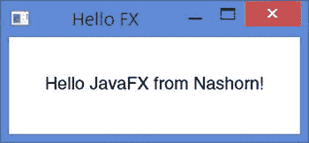
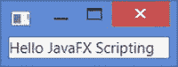
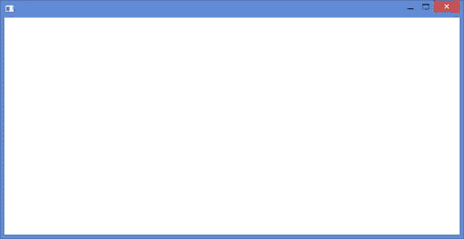
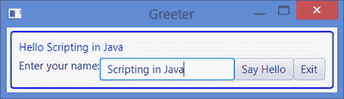

# 11. 在 Nashorn 中使用 JavaFX

在本章中，你将学习：

*   `jjs` 命令行工具中的 JavaFX 支持
*   在脚本中为 JavaFX `Application` 类的 `init()`、`start()` 和 `stop()` 方法提供实现
*   如何使用预定义脚本加载和使用 JavaFX 包和类
*   使用 Nashorn 脚本创建并启动一个简单的 JavaFX 应用程序

在本章中，假设你具备 JavaFX 8 的初级经验。如果你没有 JavaFX 经验，请在阅读本章之前先学习 JavaFX。

## jjs 中的 JavaFX 支持

`jjs` 命令行工具允许你启动在 Nashorn 脚本中创建的 JavaFX 应用程序。你需要使用 `jjs` 工具的 `–fx` 选项来将脚本作为 JavaFX 应用程序运行。以下命令将存储在 `myfxapp.js` 文件中的脚本作为 JavaFX 应用程序运行：

`jjs –fx myfxapp.js`

好的，作为一名高级文档工程师和翻译员，我将严格遵循您提供的注意事项和示例，将给定的英文文本翻译成中文。

## 脚本中 JavaFX 应用程序的结构

在 JavaFX 应用程序中，您需要重写 `Application` 类的以下三个方法来管理应用程序的生命周期：

*   `init()` 方法
*   `start()` 方法
*   `stop()` 方法

在 Nashorn 脚本中，您可以像在 Java 中一样管理 JavaFX 应用程序的生命周期。您可以在脚本中定义三个名为 `init()`、`start()` 和 `stop()` 的函数。请注意，在 Nashorn 脚本中，这三个函数都是可选的。这些函数对应于 Java 类中的三个方法，并按以下顺序调用：

首先调用 `init()` 函数。您可以在此函数中初始化应用程序。  
然后调用 `start()` 函数。与 Java 应用程序一样，`start()` 函数会接收到应用程序主舞台（primary stage）的引用。您需要填充场景（scene），将场景添加到主舞台，并显示舞台。  
当 JavaFX 应用程序退出时，会调用 `stop()` 函数。  
提示

如果您的 JavaFX 应用程序脚本中没有 `start()` 函数，那么全局作用域中的整个脚本将被视为 `start()` 函数的代码。您可以拥有除这三个函数之外的其他函数。它们将被视为普通函数，不会赋予任何特殊含义。这些函数不会被自动调用；您需要在脚本中手动调用它们。

清单 11-1 包含一个用 Java 编写的简单 JavaFX 应用程序的代码。它显示一个窗口，其中包含一个 `StackPane` 中的 `Text` 节点。`HelloFX` 类包含了 `init()`、`start()` 和 `stop()` 方法。图 11-1 显示了 `HelloFX` 应用程序显示的窗口。当您退出应用程序时，`stop()` 方法会在标准输出上显示一条消息。

清单 11-1\. Java 中的 HelloFX 应用程序

`// HelloFX.java`

`package com.jdojo.script;`

`import javafx.application.Application;`

`import javafx.scene.Scene;`

`import javafx.scene.layout.StackPane;`

`import javafx.scene.text.Font;`

`import javafx.scene.text.Text;`

`import javafx.stage.Stage;`

`public class HelloFX extends Application {`

`private Text msg;`

`private StackPane sp;`

`public static void main(String[] args) {`

`Application.launch(HelloFX.class);`

`}`

`@Override`

`public void init() {`

`msg = new Text("Hello JavaFX from Nashorn!");`

`msg.setFont(Font.font("Helvetica", 18));`

`sp = new StackPane(msg);`

`}`

`@Override`

`public void start(Stage stage) throws Exception {`

`stage.setTitle("Hello FX");`

`stage.setScene(new Scene(sp, 300, 100));`

`stage.sizeToScene();`

`stage.show();`

`}`

`@Override`

`public void stop() {`

`System.out.println("Hello FX application is stopped.");`

`}`

`}`

`Hello FX application is stopped.`

图 11-1.

HelloFX 应用程序显示的窗口

清单 11-2 包含了 `HelloFX` 应用程序的 Nashorn 脚本。它是清单 11-1 中 Java 代码的一对一翻译。请注意，用 Nashorn 编写的同一应用程序的代码要短得多。该脚本存储在 `hellofx.js` 文件中。您可以使用如下命令提示符运行该脚本，它将显示与图 11-1 相同的窗口：

`jjs –fx hellofx.js`

清单 11-2\. 存储在 hellofx.js 中的 HelloFX 应用程序的 Nashorn 脚本

`// hellofx.js`

`var msg;`

`var sp;`

`function init() {`

`msg = new javafx.scene.control.Label("Hello JavaFX from Nashorn!");`

`msg.font = javafx.scene.text.Font.font("Helvetica", 18);`

`sp = new javafx.scene.layout.StackPane(msg);`

`}`

`function start(stage) {`

`stage.setTitle("Hello FX");`

`stage.setScene(new javafx.scene.Scene(sp, 300, 100));`

`stage.sizeToScene();`

`stage.show();`

`}`

`function stop() {`

`java.lang.System.out.println("Hello FX application is stopped.");`

`}`

您不需要在脚本中包含 `init()`、`start()` 和 `stop()` 函数中的任何一个。清单 11-3 包含了 `HelloFX` 应用程序的另一个版本。其中不包含 `init()` 和 `stop()` 函数。`init()` 函数中的代码已被移至全局作用域。`stop()` 方法已被移除，因此当应用程序退出时，您将不会在标准输出上看到消息。Nashorn 将首先执行全局作用域中的代码，然后调用 `start()` 方法。该脚本存储在 `hellofx2.js` 文件中。运行它将显示与图 11-1 相同的窗口。您可以运行该脚本：

`jjs –fx hellofx2.js`

清单 11-3\. 没有 init() 和 stop() 方法的 HelloFX 应用程序的另一个版本

`// hellofx2.js`

`var msg = new javafx.scene.control.Label("Hello JavaFX from Nashorn!");`

`msg.font = javafx.scene.text.Font.font("Helvetica", 18);`

`var sp = new javafx.scene.layout.StackPane(msg);`

`function start(stage) {`

`stage.setTitle("Hello FX");`

`stage.setScene(new javafx.scene.Scene(sp, 300, 100));`

`stage.sizeToScene();`

`stage.show();`

`}`

您可以进一步简化 HelloFX 应用程序的脚本。您可以从脚本中移除 `start()` 函数。JavaFX 运行时创建主舞台并将其引用传递给 `start()` 函数。如果没有 `start()` 函数，您将如何获取主舞台的引用？Nashorn 会创建一个名为 `$STAGE` 的全局对象，它就是主舞台的引用。您可以使用这个全局对象来处理主舞台。您甚至不需要显示主舞台；Nashorn 会自动为您显示它。

清单 11-3 包含了同一 HelloFX 应用程序的另一个版本的脚本。它使用全局对象 `$STAGE` 来引用主舞台。我已经移除了 `init()` 函数。这次，您甚至没有调用主舞台的 `show()` 方法。您让 Nashorn 自动为您显示主舞台。该脚本保存在 `hellofx3.js` 文件中。您可以运行该脚本：

`jjs –fx hellofx3.js`

清单 11-4\. 没有 init()、start() 和 stop() 函数的 HelloFX 应用程序的另一个版本

`// hellofx3.js`

`var msg = new javafx.scene.control.Label("Hello JavaFX from Nashorn!");`

`msg.font = javafx.scene.text.Font.font("Helvetica", 18);`

`var sp = new javafx.scene.layout.StackPane(msg);`

`$STAGE.setTitle("Hello FX");`

`$STAGE.setScene(new javafx.scene.Scene(sp, 300, 100));`

`$STAGE.sizeToScene();`

`// $STAGE.show(); // 无需显示主舞台。Nashorn 将 // 自动显示它。`

让我们再尝试一种函数组合。您将提供 `init()` 函数，但不提供 `start()` 函数。清单 11-5 包含了同一个 HelloFX 应用程序的代码。它包含了创建控件的 `init()` 方法，但 `start()` 方法已被移除。

清单 11-5\. Nashorn 脚本中 JavaFX 应用程序的错误实现

`//` `incorrectfxapp.js`

`var msg;`

`var sp;`

`function init() {`

`msg = new javafx.scene.control.Label("Hello JavaFX from Nashorn!");`

`msg.font = javafx.scene.text.Font.font("Helvetica", 18);`

`sp = new javafx.scene.layout.StackPane(msg);`

`}`

`$STAGE.setTitle("Hello FX");`

`$STAGE.setScene(new javafx.scene.Scene(sp, 300, 100));`

`$STAGE.sizeToScene();`

当您运行清单 11-5 中的脚本时，它会抛出一个异常，如下所示：

`jjs –fx incorrectfxapp.js`

`Exception in Application start method`

`Exception in thread "main" java.lang.RuntimeException: Exception in Application start method`

`at com.sun.javafx.application.LauncherImpl.launchApplication1(LauncherImpl.java:875)`

`at com.sun.javafx.application.LauncherImpl.lambda$launchApplication$149(LauncherImpl.java:157)`

`at com.sun.javafx.application.LauncherImpl$$Lambda$1/23211803.run(Unknown Source)`

`at java.lang.Thread.run(Thread.java:745)`

`Caused by: java.lang.ClassCastException: Cannot cast jdk.nashorn.internal.runtime.Undefined to javafx.scene.Parent`

`at java.lang.invoke.MethodHandleImpl.newClassCastException(MethodHandleImpl.java:364)`

`...`

当你尝试使用全局变量 `sp`（它是对 `StackPane` 的引用）创建场景时，会抛出此异常。与预期相反，在运行全局作用域中的代码之前，`init()` 方法并未被调用。全局作用域中的代码会在 `init()` 函数被自动调用之前执行。在脚本中，`init()` 方法创建了要添加到场景中的控件。当场景正在创建时，变量 `sp` 仍然是 `undefined`，这导致了异常。如果你在脚本中显示主舞台，`init()` 函数会在主舞台已经显示之后才被调用。如果你让 Nashorn 为你显示主舞台，`init()` 函数会在主舞台之前被调用。

提示

如果你在 JavaFX 脚本中没有提供 `start()` 函数，那么提供 `init()` 函数几乎毫无用处，因为这样的 `init()` 函数会在主舞台构建完成后才被调用。如果你想使用 `init()` 函数来初始化你的 JavaFX 应用程序，你应该同时提供 `init()` 和 `start()` 方法，以便它们按顺序被调用。

最后，我将向你展示最简单的 JavaFX 应用程序，它只需一行脚本即可编写。它会在一个窗口中显示一条消息。不过，该窗口将没有标题文本。清单 11-6 包含了这一行脚本。它展示了 Nashorn 的魅力，将 10 到 15 行的 Java 代码缩减为 1 行脚本！以下命令运行该脚本，会显示一个窗口，如图 11-2 所示：

`jjs –fx simplestfxapp.js`

清单 11-6\. Nashorn 中最简单的 JavaFX 应用程序

`// simplestfxapp.js`

`$STAGE.scene = new javafx.scene.Scene(new javafx.scene.control.Label("Hello JavaFX Scripting"));`

图 11-2.

使用 Nashorn 脚本的最简单 JavaFX 应用程序

说在 Nashorn 中编写最简单的 JavaFX 应用程序需要写一行代码，这还是一种保守的说法。更准确的说法是，在 Nashorn 中，你甚至不需要写一行代码就能显示一个窗口。创建一个名为 `empty.js` 的脚本文件，并且不在其中编写任何代码。你可以随意命名该文件。使用以下命令运行 `empty.js` 文件：

`jjs –fx empty.js`

该命令将显示一个窗口，如图 11-3 所示。Nashorn 是如何在你一行代码都没写的情况下显示一个窗口的呢？回想一下，Nashorn 会创建主舞台和一个全局对象 `$STAGE` 来表示该主舞台。如果它发现你没有显示主舞台，它会为你显示它。这就是本例中发生的情况。脚本文件是空的，Nashorn 自动显示了空的主舞台。

图 11-3.

使用 Nashorn 脚本且无需编写一行代码的最简单 JavaFX 应用程序

## 导入 JavaFX 类型

你可以使用 JavaFX 类的完全限定名，或者使用 `Java.type()` 函数导入它们。在上一节中，你使用了所有 JavaFX 类的完全限定名。以下代码片段展示了在 JavaFX 中创建 `Label` 的两种方法：

`// 使用 Label 类的完全限定名`

`var msg = new javafx.scene.control.Label("Hello JavaFX!");`

`// 使用 Java.type() 函数`

`var Label = Java.type("javafx.scene.control.Label");`

`var msg = new Label("Hello JavaFX!");`

输入所有 JavaFX 类的完全限定名可能很繁琐。脚本难道不应该比 Java 代码更短吗？Nashorn 有一种方法可以让你的 JavaFX 脚本更短。它包含几个脚本文件，这些文件以简单名称导入 JavaFX 类型。在脚本中使用 JavaFX 类的简单名称之前，你需要使用 `load()` 方法加载这些脚本文件。例如，Nashorn 包含一个 `fx:controls.js` 脚本文件，该文件将所有 JavaFX 控件类以其简单类名导入。表 11-1 包含了脚本文件及其导入的类/包的列表。

表 11-1.

Nashorn 脚本文件及其导入的类/包列表

| Nashorn 脚本文件 | 导入的类/包 |
| --- | --- |
| `fx:base.js` | `javafx.stage.Stage` `javafx.scene.Scene` `javafx.scene.Group` `javafx/beans` `javafx/collections` `javafx/events javafx/util` |
| `fx:graphics.js` | `javafx/animation` `javafx/application` `javafx/concurrent` `javafx/css` `javafx/geometry` `javafx/print` `javafx/scene` `javafx/stage` |
| `fx:controls.js` | `javafx/scene/chartjavafx/scene/control` |
| `fx:fxml.js` | `javafx/fxml` |
| `fx:web.js` | `javafx/scene/web` |
| `fx:media.js` | `javafx/scene/media` |
| `fx:swing.js` | `javafx/embed/swing` |
| `fx:swt.js` | `javafx/embed/swt` |

以下代码片段展示了如何加载此脚本文件并使用 `javafx.scene.control.Label` 类的简单名称：

`// 导入所有 JavaFX 控件类名`

`load("fx:controls.js")`

`// 使用 Label 控件的简单名称`

`var msg = new Label("Hello JavaFX!");`

清单 11-7 包含了一个 JavaFX 问候应用程序的代码，该代码保存在名为 `greeter.js` 的文件中。你可以按如下方式运行该脚本：

`jjs –fx greeter.js`

清单 11-7\. 使用 Nashorn 脚本的 JavaFX 应用程序

`// greeter.js`

`// 加载 Nashorn 预定义脚本以导入 JavaFX 特定类和包`

`load("fx:base.js");`

`load("fx:controls.js");`

`load("fx:graphics.js");`

`// 定义 JavaFX 应用程序类的 start() 方法`

`function start(stage) {`

`var nameLbl = new Label("Enter your name:");`

`var nameFld = new TextField();`

`var msg = new Label();`

`msg.style = "-fx-text-fill: blue;";`

`// 创建按钮`

`var sayHelloBtn = new Button("Say Hello");`

`var exitBtn = new Button("Exit");`

`// 为 Say Hello 按钮添加事件处理器`

`sayHelloBtn.onAction = sayHello;`

`// 当用户按下回车键时，也调用相同的 sayHello() 函数`

`nameFld.onAction = sayHello;`

`// 为 Exit 按钮添加事件处理器`

`exitBtn.onAction = function() {`

`Platform.exit();`

`};`

`// 创建根节点`

`var root = new VBox();`

`root.style = "-fx-padding: 10;" +`

`"-fx-border-style: solid inside;" +`

`"-fx-border-width: 2;" +`

`"-fx-border-insets: 5;" +`

`"-fx-border-radius: 5;" +`

`"-fx-border-color: blue;";`

`// 设置子节点之间的垂直间距为 5px`

`root.spacing = 5;`

`// 向根节点添加子节点`

`root.children.addAll(msg, new HBox(nameLbl, nameFld, sayHelloBtn, exitBtn));`

`// 为舞台设置场景和标题`

`stage.scene = new Scene(root);`

`stage.title = "Greeter";`

`// 显示舞台`

`stage.show();`

`// 一个嵌套函数，根据输入的名字打招呼`

`function sayHello(evt) {`

`var name = nameFld.getText();`

`if (name.trim().length() > 0) {`

`msg.text = "Hello " + name;`

`}`

`else {`

`msg.text = "Hello there";`

`}`

`}`

`}`

问候应用会显示一个窗口，如图 11-4 所示。输入姓名后按下 `Enter` 键或点击 `Say Hello` 按钮，便会显示一条包含问候语的消息。

图 11-4.

正在运行的问候 JavaFX 应用

在 Nashorn 中开发 JavaFX 应用要容易得多。在脚本中，你可以使用属性来调用 Java 对象的 getter 和 setter 方法。你可以直接访问所有 Java 对象的属性，而不仅仅是 JavaFX 对象。例如，在 Java 中你需要编写 `root.setSpacing(5)`，而在 Nashorn 中你可以直接编写 `root.spacing = 5`。

为按钮添加事件处理器也更加简单。你可以将一个匿名函数设置为按钮的事件处理器。请注意，你可以使用 `onAction` 属性来设置事件处理器，而无需调用 `Button` 类的 `setOnAction()` 方法。以下代码片段展示了如何使用函数引用 `sayHello` 为按钮设置 `ActionEvent` 处理器：

`// 为 Say Hello 按钮添加事件处理器`

`sayHelloBtn.onAction = sayHello`

请注意，在示例中，你在 `start()` 函数内部使用了一个嵌套函数 `sayHello()`。该函数的引用被用作事件处理器。事件处理器接收一个参数，而 `sayHello()` 函数中的 `evt` 形式参数就是这个事件对象。

## 总结

Nashorn 中的 `jjs` 命令行工具支持启动用脚本编写的 JavaFX 应用。`–fx` 选项与 `jjs` 一起使用，用于启动 JavaFX 应用。JavaFX 应用的脚本可以包含 `init()`、`start()` 和 `stop()` 函数，这些函数对应于 JavaFX `Application` 类的 `init()`、`start()` 和 `stop()` 方法。Nashorn 会按照与 JavaFX 应用中相同的顺序调用这些函数。

`start()` 函数会接收到一个对主舞台（primary stage）的引用。如果你没有提供 `start()` 函数，那么整个脚本将被视为 `start()` 函数。Nashorn 提供了一个名为 `$STAGE` 的全局对象，它是对主舞台的引用。如果你没有提供 `start()` 函数，则需要使用 `$STAGE` 全局变量来访问主舞台。如果你既没有提供 `start()` 方法，也没有显示主舞台，Nashorn 将为你调用 `$STAGE.show()` 方法。

