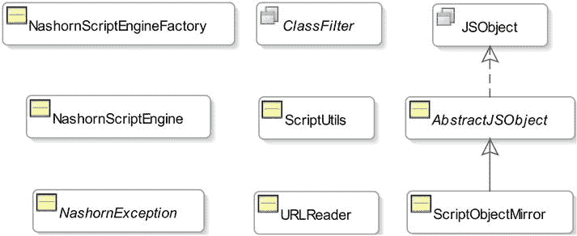

# 12. Nashorn 的 Java API

在本章中，你将学习：

*   什么是 Nashorn 的 Java API
*   如何直接实例化 Nashorn 引擎
*   如何在 Java 代码和命令行中向 Nashorn 引擎传递选项
*   如何在 Nashorn 引擎中的脚本上下文之间共享全局变量
*   如何在 Java 代码中添加、更新、删除和读取脚本对象的属性
*   如何在 Java 代码中创建脚本对象并调用其方法
*   如何从 Java 代码调用脚本函数
*   如何将脚本日期转换为 Java 日期

## 什么是 Nashorn 的 Java API？

在 Nashorn 脚本中使用 Java 类非常直接。有时你可能希望在 Java 代码中使用 Nashorn 对象。你可以将 Nashorn 对象传递给 Java 代码，或者 Java 代码可以评估 Nashorn 脚本并获取 Nashorn 对象的引用。当 Nashorn 对象跨越边界（脚本到 Java）时，它们需要被表示为 Java 类的对象，并且你应该能够像使用任何其他 Java 对象一样使用它们。

如果你的应用仅使用 Nashorn，为了充分利用 Nashorn 引擎，你可能希望使用 Nashorn 中可用的选项和扩展。你将需要在 Java 代码中实例化 Nashorn 引擎，使用特定于 Nashorn 引擎的类，而不是使用 Java 脚本 API 中的类。

Nashorn 的 Java API 提供了 Java 类和接口，让你能够在 Java 代码中直接处理 Nashorn 脚本引擎和 Nashorn 对象。图 12-1 描绘了当你处理 Nashorn 引擎时，在客户端代码中应该使用的那些类和接口的类图。它们位于 `jdk.nashorn.api.scripting` 包中。

图 12-1.

jdk.nashorn.api.scripting 包中 Nashorn Java API 的类图

请注意，Nashorn 脚本引擎在内部使用了其他包中的许多其他类。但是，除了 `jdk.nashorn.api.scripting` 包中的类之外，你不应该在应用中直接使用它们。[`wiki.openjdk.java.net/display/Nashorn/Nashorn+jsr223+engine+notes`](https://wiki.openjdk.java.net/display/Nashorn/Nashorn+jsr223+engine+notes) 上的网页包含了 `jdk.nashorn.api.scripting` 包的文档链接。

注意

`jdk.nashorn.api.scripting` 包中的 `ClassFilter` 接口是在 JDK8u40 中添加的，该版本计划于 2015 年第一季度末发布。如果你想更早使用此接口，则需要下载 JDK8u40 的早期访问构建版本。

我将在后续章节中详细讨论一些特定于 Nashorn 的 Java 类和接口。表 12-1 列出了 `jdk.nashorn.api.scripting` 包中的类和接口及其描述。

表 12-1.

与 Nashorn 脚本引擎一起使用的 Java 类/接口列表

| 类/接口 | 描述 |
| --- | --- |
| `NashornScriptEngineFactory` | 这是 Nashorn 引擎的脚本引擎工厂实现。当你想要创建使用 Nashorn 特定选项和扩展的 Nashorn 引擎时，需要实例化此类。 |
| `NashornScriptEngine` | 这是 Nashorn 引擎的脚本引擎实现类。你不直接实例化此类。其实例是通过 `NashornScriptEngineFactory` 对象的 `getScriptEngine()` 方法获得的。 |
| `NashornException` | 这是从 Nashorn 脚本抛出的所有异常的基础异常类。当你使用 Java 脚本 API 时，你的 Java 代码会收到一个 `ScriptException` 类的实例，该实例将是 `NashornException` 的包装器。如果你直接从 Java 代码访问脚本（例如，通过在脚本中实现 Java 接口并在 Java 代码中使用该接口的实例），则可能会在 Java 代码中直接抛出 `NashornException` 的实例。此类包含许多方法，使你可以访问脚本错误的详细信息，例如行号、列号、脚本的错误对象等。 |
| `ClassFilter` | `ClassFilter` 是一个接口。你可以使用其实例来限制 Nashorn 脚本中某些或所有 Java 类的可用性。当你使用 `NashornScriptEngineFactory` 实例化 `NashornScriptEngine` 时，需要传递此接口的一个实例。 |
| `ScriptUtils` | 一个旨在 Nashorn 脚本中使用的工具类。 |
| `URLReader` | 读取 URL 的内容。它继承自 `java.io.Reader` 类。 |
| `JSObject` | 此接口的实例表示 Java 代码中的 Nashorn 对象。如果你想将一个 Java 对象传递给 Nashorn 脚本，并且该对象应被视为 Nashorn 对象，则需要传递此接口的一个实例。你可以在 Nashorn 脚本中使用方括号表示法来访问和设置此类 Java 对象的属性。 |
| `AbstractJSObject` | 这是一个实现 `JSObject` 接口的抽象类。 |
| `ScriptObjectMirror` | 这是一个包装 Nashorn 脚本对象的镜像对象。它继承自 `AbstractJSObject` 类并实现 `Bindings` 接口。当 Java 代码从脚本接收 Nashorn 对象时，该脚本对象在被传递给 Java 代码之前会被包装在 `ScriptObjectMirror` 实例中。 |

## 实例化 Nashorn 引擎

在前面的章节中，你一直在 Java 代码中使用标准的 Java Scripting API 来实例化 Nashorn 引擎。Nashorn 引擎提供了若干自定义特性。要利用这些特性，你需要直接实例化 Nashorn 引擎。首先，你需要创建一个 `NashornScriptEngineFactory` 类的对象，然后调用 `getScriptEngine()` 方法的某个重载版本来创建 Nashorn 引擎：

`// 创建一个 Nashorn 引擎工厂`

`NashornScriptEngineFactory factory = new NashornScriptEngineFactory();`

`// 使用默认选项创建一个 Nashorn 引擎`

`ScriptEngine engine = factory.getScriptEngine();`

默认情况下，Nashorn 引擎工厂会创建一个启用了 `--dump-on-error` 选项的 Nashorn 引擎。我将在下一个示例中向你展示如何为 Nashorn 引擎设置其他选项。

以下代码片段创建了一个带有 `--no-java` 和 `–strict` 选项的 Nashorn 引擎：

`// 创建一个 Nashorn 引擎工厂`

`NashornScriptEngineFactory factory = new NashornScriptEngineFactory();`

`// 将 Nashorn 选项存储在一个字符串数组中`

`String[] options = {"--no-java", "-strict"};`

`// 使用这些选项创建 Nashorn 引擎`

`ScriptEngine engine = factory.getScriptEngine(options);`

由于 `--no-java` 选项的存在，你无法在此引擎执行的脚本中使用任何 Java 类。`–strict` 选项将强制引擎以严格模式执行所有脚本。

你也可以在命令行中使用 `nashorn.args` 系统属性将选项传递给 Nashorn 引擎。以下命令运行 `com.jdojo.script.Test` 类，并向 Nashorn 引擎传递了四个选项：

`java -Dnashorn.args="--global-per-engine -strict --no-java --language=es5" com.jdojo.script.Test`

请注意，选项之间用空格分隔，并且它们都作为一个字符串传递。如果你只需要传递一个选项，可以省略选项值周围的双引号。以下命令只向引擎传递了一个选项 `--no-java`：

`java -Dnashorn.args=--no-java com.jdojo.script.Test`

以下代码片段使用一个类过滤器（即 `ClassFilter` 接口的实例）来创建 Nashorn 引擎，以限制使用 `com.jdojo` 包及其子包中的任何类。请注意，`ClassFilter` 接口是在 JDK8u40 中添加的；它在 JDK8 中不可用：

`NashornScriptEngineFactory factory = new NashornScriptEngineFactory();`

`ScriptEngine engine = factory.getScriptEngine(clsName -> clsName.startsWith("com.jdojo"));`

`ClassFilter` 是一个函数式接口。它的方法接收 Nashorn 脚本试图使用的 Java 类的完全限定名。如果该方法返回 `true`，则该类可以在脚本中使用；否则，该类不能在脚本中使用。

提示

如果你不希望脚本中暴露任何 Java 类，可以使用 `clsName -> false` 作为 `ClassFilter` 的 lambda 表达式。在脚本中使用被 `ClassFilter` 限制的 Java 类会抛出 `java.lang.ClassNotFound` 异常。

以下是 `NashornScriptEngineFactory` 类中 `getScriptEngine()` 方法的重载版本列表：

*   `ScriptEngine getScriptEngine()`
*   `ScriptEngine getScriptEngine(String... args)`
*   `ScriptEngine getScriptEngine(ClassFilter classFilter)`
*   `ScriptEngine getScriptEngine(ClassLoader appLoader)`
*   `ScriptEngine getScriptEngine(String[] args, ClassLoader appLoader)`
*   `ScriptEngine getScriptEngine(String[] args, ClassLoader appLoader, ClassFilter classFilter)`

## 共享引擎全局变量

默认情况下，Nashorn 引擎会为每个脚本上下文维护全局对象。在此讨论中，术语“全局变量”指的是存储在 Nashorn 脚本全局作用域中的全局变量和声明，你在顶层脚本中通过 `this` 来引用它们。不要将脚本上下文中的全局作用域绑定与脚本中的全局变量混淆。当你在脚本中引用任何变量或创建变量时，会首先搜索脚本全局变量。如果你在脚本中引用一个在脚本全局变量中找不到的变量，引擎将在脚本上下文的全局作用域 `bindings` 中搜索它。例如，脚本对象 `Object`、`Math`、`String` 等都属于脚本全局变量。请考虑清单 12-1 中的程序及其输出。

清单 12-1\. 每个 Nashorn 引擎使用多个脚本全局变量

`// MultiGlobals.java`

`package com.jdojo.script;`

`import javax.script.ScriptContext;`

`import javax.script.ScriptEngine;`

`import javax.script.ScriptEngineManager;`

`import javax.script.SimpleScriptContext;`

`public class MultiGlobals {`

`public static void main(String[] args) {`

`// 获取 Nashorn 脚本引擎`

`ScriptEngineManager manager = new ScriptEngineManager();`

`ScriptEngine engine = manager.getEngineByName("JavaScript");`

`try {`

`// 向脚本全局变量添加一个名为 msg 的变量`

`engine.eval("var msg = 'Hello globals'");`

`// 打印 msg 变量的值`

`engine.eval("print(this.msg);");`

`// 使用一个新的 ScriptContext 对象执行与上面相同的脚本。`

`// 引擎将使用一份全新的全局变量副本，并且找不到之前`

`// 创建并与引擎默认脚本上下文关联的 this.msg。`

`ScriptContext ctx = new SimpleScriptContext();`

`engine.eval("print(this.msg);", ctx);`

`}`

`catch (Exception e) {`

`e.printStackTrace();`

`}`

`}`

`}`

`Hello globals`

`undefined`

该程序执行了以下步骤：

*   使用默认选项创建一个 Nashorn 引擎。
*   使用 `eval()` 方法执行一个脚本，该方法使用引擎的默认脚本上下文。该脚本创建了一个名为 `msg` 的全局变量，该变量存储在脚本全局变量中。你可以在全局作用域中使用其简单名称 `msg` 或 `this.msg` 来引用该变量。
*   使用 `eval()` 方法执行一个脚本，该方法使用引擎的默认脚本上下文，打印 `msg` 变量的值。输出中的第一行确认打印了 `msg` 变量的正确值。
*   使用 `eval()` 方法执行一个脚本，该方法使用一个新的脚本上下文。该脚本尝试打印全局变量 `msg` 的值。输出中的第二行通过打印 `undefined` 确认了名为 `msg` 的变量在脚本全局变量中不存在。

这是 Nashorn 引擎的默认行为。它会为每个脚本上下文创建一份全新的全局变量副本。如果你想使用默认上下文的全局变量（如果你想共享全局变量），可以通过将默认上下文的引擎作用域 `Bindings` 复制到你的新脚本上下文来实现。清单 12-2 使用这种方法在两个脚本上下文之间共享脚本全局变量。

清单 12-2\. 通过复制引擎默认上下文的引擎作用域绑定来共享脚本全局变量

`// CopyingGlobals.java`

`package com.jdojo.script;`

`import javax.script.Bindings;`

`import javax.script.ScriptContext;`

`import static javax.script.ScriptContext.ENGINE_SCOPE;`

`import javax.script.ScriptEngine;`

`import javax.script.ScriptEngineManager;`

`import javax.script.SimpleScriptContext;`

`public class CopyingGlobals {`

`public static void main(String[] args) {`

`// 获取 Nashorn 脚本引擎`

`ScriptEngineManager manager = new ScriptEngineManager();`

`ScriptEngine engine = manager.getEngineByName("JavaScript");`

`try {`

`// 向脚本的全局作用域添加一个名为 msg 的变量`

`engine.eval("var msg = 'Hello globals'");`

`// 打印 msg 变量的值`

`engine.eval("print(this.msg);");`

`// 创建一个新的 ScriptContext，并将默认脚本上下文的 ENGINE_SCOPE // 绑定复制到新 ScriptContext 中`

`ScriptContext ctx = new SimpleScriptContext();`

`ScriptContext defaultCtx = engine.getContext();`

`Bindings engineBindings = defaultCtx.getBindings(ENGINE_SCOPE);`

`ctx.setBindings(engineBindings, ENGINE_SCOPE);`

`// 使用新的 ScriptContext 执行脚本`

`engine.eval("print(this.msg);", ctx);`

`}`

`catch (Exception e) {`

`e.printStackTrace();`

`}`

`}`

`}`

`Hello globals`

`Hello globals`

Nashorn 引擎的 `--global-per-engine` 选项实现了与前一示例相同的功能。它会在所有脚本上下文之间共享脚本全局变量。清单 12-3 展示了如何为引擎设置此选项。输出结果证实，引擎仅使用一份全局变量副本来执行所有脚本。

**清单 12-3. 在 Nashorn 引擎的所有脚本上下文之间共享脚本全局变量**

`// SharedGlobals.java`

`package com.jdojo.script;`

`import javax.script.Bindings;`

`import javax.script.ScriptContext;`

`import static javax.script.ScriptContext.ENGINE_SCOPE;`

`import javax.script.ScriptEngine;`

`import javax.script.ScriptEngineManager;`

`import javax.script.SimpleScriptContext;`

`import jdk.nashorn.api.scripting.NashornScriptEngineFactory;`

`public class SharedGlobals {`

`public static void main(String[] args) {`

`// 使用 --global-per_engine 选项获取 Nashorn 脚本引擎`

`NashornScriptEngineFactory factory = new NashornScriptEngineFactory();`

`ScriptEngine engine = factory.getScriptEngine("--global-per-engine");`

`try {`

`// 在脚本的全局作用域中添加一个名为 msg 的变量`

`engine.eval("var msg = 'Hello globals'");`

`// 打印 msg 变量的值`

`engine.eval("print(this.msg);");`

`// 使用新的 ScriptContext 执行相同的脚本。注意，脚本全局变量是共享的，此脚本将能找到第一次脚本执行时创建的 this.msg 变量。`

`ScriptContext ctx = new SimpleScriptContext();`

`engine.eval("print(this.msg);", ctx);`

`}`

`catch (Exception e) {`

`e.printStackTrace();`

`}`

`}`

`}`

`Hello globals`

`Hello globals`

## 在 Java 代码中使用脚本对象

当 Nashorn 中的对象和值跨越脚本-Java 边界进入 Java 代码时，它们需要被表示为 Java 对象和值。表 12-2 列出了脚本对象类与其对应 Java 对象类之间的映射关系。

**表 12-2. 脚本对象类与 Java 对象类之间的映射列表**

| 脚本对象类型 | Java 对象类型 |
| --- | --- |
| Undefined | `jdk.nashorn.internal.runtime.Undefined` |
| Null | `null` |
| Number | `java.lang.Number` |
| Boolean | `java.lang.Boolean` |
| 原始字符串类型 | `java.lang.String` |
| 任意脚本对象 | `jdk.nashorn.api.scripting.ScriptObjectMirror` |
| 任意 Java 对象 | `与脚本中的 Java 对象相同` |

请注意，你不应该使用 `jdk.nashorn.internal` 包及其子包中的类和接口。表中列出它们仅用于提供信息。在此表中，Nashorn Number 类型的映射显示为 `java.lang.Number` 类型。尽管 Nashorn 会尽可能为数值传递 `java.lang.Integer` 和 `java.lang.Double` 对象，但依赖这些特定的 Java 类型并不可靠。当 Nashorn Number 从脚本传递到 Java 代码时，你应该期望得到一个 `java.lang.Number` 实例。必要时，Nashorn 中的 Number 和 Boolean 类型的值会被转换为相应的 Java 原始类型，例如 `int`、`double`、`boolean` 等。

在 Nashorn 中，脚本对象被表示为 `jdk.nashorn.internal.runtime.ScriptObject` 类的实例。当脚本对象被传递给 Java 代码时，它会被包装在一个 `ScriptObjectMirror` 对象中。在 JDK8u40 之前，如果你将一个脚本对象传递给一个声明其参数为 `java.lang.Object` 类型的 Java 方法，传递的是 `ScriptObject`，而不是 `ScriptObjectMirror`。JDK8u40 改变了这一行为，每次都将脚本对象作为 `ScriptObjectMirror` 传递给 Java 代码。如果你在 Java 中将方法的参数声明为 `JSObject` 或 `ScriptObjectMirror`，Nashorn 始终会将脚本对象作为 `ScriptObjectMirror` 传递给 Java。

**提示**

脚本有可能将值 `undefined` 传递给 Java 代码。你可以使用 `ScriptObjectMirror` 类的 `isUndefined(Object obj)` 静态方法来检查传递给 Java 的脚本对象是否为 `undefined`。如果指定的 `obj` 是 `undefined`，该方法返回 true；否则返回 false。

`ScriptObjectMirror` 类实现了 `JSObject` 和 `Bindings` 接口。该类添加了更多方法来处理脚本对象。你可以在 Java 代码中使用三种类型的变量来存储脚本对象的引用：`JSObject`、`Bindings` 或 `ScriptObjectMirror`。使用哪种类型取决于你的需求。使用 `ScriptObjectMirror` 类型可以提供更大的灵活性，并允许访问脚本对象的所有特性。表 12-3 包含了 `JSObject` 接口中声明的方法列表。

我将在后续章节中展示如何使用这些方法以及 `ScriptObjectMirror` 类的一些方法。任何 Java 类都可以实现 `JSObject` 接口。此类对象可以像脚本对象一样使用，并且可以在脚本中使用 `obj.func()`、`obj[prop]`、`delete obj.prop` 等语法来操作其方法和属性。

**表 12-3. JSObject 接口中声明的方法列表及其描述**

| 方法 | 描述 |
| --- | --- |
| `Object call(Object thiz, Object... args)` | 将此对象作为函数调用。当 `JSObject` 包含对 Nashorn 函数或方法的引用时，你将使用此方法。参数 `thiz` 用作函数调用中 `this` 的值。`args` 中的参数作为参数传递给被调用的函数。此方法在 Java 中的工作方式与 `func.apply(thiz, args)` 在 Nashorn 脚本中的工作方式相同。 |
| `Object eval(String script)` | 执行指定的脚本。 |
| `String getClassName()` | 返回对象的 ECMAScript 类名。这与 Java 中的类名不同。 |
| `Object getMember(String name)` | 返回脚本对象指定名称属性的值。 |
| `Object getSlot(int index)` | 返回脚本对象指定索引属性的值。 |
| `boolean hasMember(String name)` | 如果脚本对象具有指定名称的属性，则返回 true；否则返回 false。 |
| `boolean hasSlot(int index)` | 如果脚本对象具有指定索引的属性，则返回 true；否则返回 false。 |
| `boolean isArray()` | 如果脚本对象是数组对象，则返回 true；否则返回 false。 |
| `boolean isFunction()` | 如果脚本对象是函数对象，则返回 true；否则返回 false。 |
| `boolean isInstance(Object instance)` | 如果指定的 `instance` 是此对象的实例，则返回 true；否则返回 false。 |
| `boolean isInstanceOf(Object clazz)` | 如果此对象是指定 `clazz` 的实例，则返回 true；否则返回 false。 |
| `boolean isStrictFunction()` | 如果此对象是严格函数，则返回 true；否则返回 false。 |
| `Set<String> keySet()` | 将此对象的所有属性名称作为字符串集合返回。 |
| `Object newObject(Object... args)` | 调用此方法的对象应是一个构造函数对象。调用此构造函数以创建一个新对象。这相当于 Nashorn 脚本中的 `new func(arg1, arg2...)`。 |
| `void removeMember(String name)` | 从对象中移除指定的属性。 |
| `void setMember(String name, Object value)` | 将指定的 `value` 设置为此对象的指定属性名称。如果属性名称不存在，则添加一个具有指定 `name` 的新属性。 |
| `void setSlot(int index, Object value)` | 将指定的 `value` 设置为此对象的指定索引属性。如果 `index` 不存在，则添加一个具有指定 `index` 的新属性。 |
| `double toNumber()` | 返回对象的数值。通常，如果脚本对象是数值的包装器，例如在 Nashorn 中使用表达式 `new Object(234.90)` 创建的脚本对象，你将使用此方法。对于其他脚本对象，它返回值 `Double.NAN`。 |
| `Collection<Object> values()` | 在一个 `Collection` 中返回此对象的所有属性值。 |

### 使用脚本对象的属性

`ScriptObjectMirror` 类实现了 `JSObject` 和 `Bindings` 接口。你可以使用这两个接口的方法来访问属性。你可以使用 `JSObject` 的 `getMember()` 和 `getSlot()` 方法来读取脚本对象的命名属性和索引属性。你可以使用 `Bindings` 的 `get()` 方法来获取属性的值。你可以使用 `JSObject` 的 `setMember()` 和 `setSlot()` 方法来添加和更新属性。`Bindings` 的 `put()` 方法允许你执行相同的操作。

你可以使用 `JSObject` 的 `hasMember()` 和 `hasSlot()` 方法来检查命名属性和索引属性是否存在。同时，你可以使用 `Bindings` 接口的 `containsKey()` 方法来检查属性是否存在。你可以将 `ScriptObjectMirror` 类实现的 `JSObject` 和 `Bindings` 接口视为提供了同一个脚本对象的两种视图——前者作为一个简单对象，后者作为一个映射。

清单 12-4 包含一个 Nashorn 脚本，该脚本创建两个脚本对象并调用一个 Java 类的两个方法，如清单 12-5 所示。该脚本将脚本对象传递给 Java 方法。Java 方法打印传递对象的属性，并向两个脚本对象添加一个新属性。脚本在方法返回后打印属性，以确认在 Java 代码中添加到脚本对象的新属性仍然存在。

清单 12-4. 一个调用 Java 方法并将脚本对象传递给它们的 Nashorn 脚本

`// scriptobjectprop.js`

`// 创建一个对象`

`var point = {x: 10, y: 20};`

`// 创建一个数组`

`var empIds = [101, 102];`

`// 获取 Java 类型`

`var ScriptObjectProperties = Java.type("com.jdojo.script.ScriptObjectProp");`

`// 将对象传递给 Java`

`ScriptObjectProperties.propTest(point);`

`// 打印 point 对象的所有属性`

`print("在脚本中，调用 Java 方法 propTest() 之后...");`

`for(var prop in point) {`

`var value = point[prop];`

`print(prop + " = " + value);`

`}`

`// 将数组对象传递给 Java`

`ScriptObjectProperties.arrayTest(empIds);`

`// 打印 empIds 数组的所有元素`

`print("在脚本中，调用 Java 方法 arrayTest() 之后...");`

`for(var i = 0, len = empIds.length; i < len; i++) {`

`var value = empIds[i];`

`print("empIds[" + i + "] = " + value);`

`}`

清单 12-5. 一个其方法访问脚本对象属性的 Java 类

`// ScriptObjectProp.java`

`package com.jdojo.script;`

`import java.nio.file.Files;`

`import java.nio.file.Path;`

`import java.nio.file.Paths;`

`import javax.script.ScriptEngine;`

`import javax.script.ScriptEngineManager;`

`import javax.script.ScriptException;`

`import jdk.nashorn.api.scripting.ScriptObjectMirror;`

`public class ScriptObjectProp {`

`public static void main(String[] args) {`

`// 构造脚本文件路径`

`String scriptFileName = "scriptobjectprop.js";`

`Path scriptPath = Paths.get(scriptFileName);`

`// 确保脚本文件存在。如果不存在，则打印脚本文件的完整路径并终止程序。`

`if (!Files.exists(scriptPath)) {`

`System.out.println(scriptPath.toAbsolutePath()`

`+ " 不存在。");`

`return;`

`}`

`// 创建一个脚本引擎管理器`

`ScriptEngineManager manager = new ScriptEngineManager();`

`// 从管理器获取一个 Nashorn 脚本引擎`

`ScriptEngine engine = manager.getEngineByName("JavaScript");`

`try {`

`// 执行脚本，该脚本将调用此类的 propTest() 和`

`// arrayTest() 方法`

`engine.eval("load('" + scriptFileName + "')");`

`}`

`catch (ScriptException e) {`

`e.printStackTrace();`

`}`

`}`

`public static void propTest(ScriptObjectMirror point) {`

`// 列出所有属性`

`System.out.println("在 Java 中接收到的 point 的属性...");`

`for (String prop : point.keySet()) {`

`Object value = point.getMember(prop);`

`System.out.println(prop + " = " + value);`

`}`

`// 让我们添加一个名为 z 的属性`

`System.out.println("在 Java 中向 point 添加 z = 30... ");`

`point.setMember("z", 30);`

`}`

`public static void arrayTest(ScriptObjectMirror empIds) {`

`if (!empIds.isArray()) {`

`System.out.println("传入的对象不是数组。");`

`return;`

`}`

`// 获取数组的 length 属性`

`int length = ((Number) empIds.getMember("length")).intValue();`

`System.out.println("在 Java 中接收到的 empIds...");`

`for (int i = 0; i < length; i++) {`

`int value = ((Number) empIds.getSlot(i)).intValue();`

`System.out.printf("empIds[%d] = %d%n", i, value);`

`}`

`// 让我们向数组中添加一个元素`

`System.out.println("在 Java 中添加 empIds[2] = 103... ");`

`empIds.setSlot(length, 103);`

`}`

`}`

`在 Java 中接收到的点的属性...`

`x = 10`

`y = 20`

`在 Java 中向点添加 z = 30...`

`在脚本中，调用 Java 方法 propTest() 之后...`

`x = 10`

`y = 20`

`z = 30`

`在 Java 中接收到的 empIds...`

`empIds[0] = 101`

`empIds[1] = 102`

`在 Java 中添加 empIds[2] = 103...`

`在脚本中，调用 Java 方法 arrayTest() 之后...`

`empIds[0] = 101`

`empIds[1] = 102`

`empIds[2] = 103`

### 在 Java 中创建 Nashorn 对象

你可能在脚本中有构造函数，并希望在 Java 中使用这些构造函数创建对象。`ScriptObjectMirror` 类的 `newObject()` 方法允许你在 Java 中创建脚本对象。该方法声明如下：

`Object newObject(Object... args)`

该方法的参数是要传递给构造函数的参数。该方法返回新的对象引用。此方法需要在构造函数上调用。首先，你需要在 Java 中将构造函数的引用获取为 `ScriptObjectMirror` 对象，然后调用此方法以使用该构造函数创建一个新的脚本对象。

你可以使用 `ScriptObjectMirror` 类的 `callMember()` 方法调用脚本对象的方法。该方法的声明如下：

`Object callMember(String methodName, Object... args)`

在第 4 章中，你创建了一个名为 `Point` 的构造函数。其声明如清单 12-6 所示，供你参考。在此示例中，你将在 Java 中创建 `Point` 类型的对象。

清单 12-6\. 在 Nashorn 中名为 Point 的构造函数的声明

`// Point.js`

`// 定义 Point 构造函数`

`function Point(x, y) {`

`this.x = x;`

`this.y = y;`

`}`

`// 重写 Object.prototype 中的 toString() 方法`

`Point.prototype.toString = function() {`

`return "Point(" + this.x + ", " + this.y + ")";`

`};`

`// 定义一个名为 distance() 的新方法`

`Point.prototype.distance = function(otherPoint) {`

`var dx = this.x - otherPoint.x;`

`var dy = this.y - otherPoint.y;`

`var dist = Math.sqrt(dx * dx + dy * dy);`

`return dist;`

`};`

清单 12-7 包含执行以下步骤的 Java 程序：

*   加载 `point.js` 脚本文件，该文件将加载 `Point` 构造函数的定义
*   通过调用 `engine.get("Point")` 获取 `Point` 构造函数的引用
*   通过在 `Point` 构造函数上调用 `newObject()` 方法创建两个名为 `p1` 和 `p2` 的 `Point` 对象
*   在 `p1` 上调用 `callMember()` 方法以调用其 `distance()` 方法，计算 `p1` 和 `p2` 之间的距离
*   在 `p1` 和 `p2` 上调用 `callMember()` 方法，通过调用它们在 `Point` 构造函数中声明的 `toString()` 方法获取它们的字符串表示形式
*   最后，打印两点之间的距离

清单 12-7\. 在 Java 代码中创建 Nashorn 对象

`// CreateScriptObject.java`

`package com.jdojo.script;`

`import java.nio.file.Files;`

`import java.nio.file.Path;`

`import java.nio.file.Paths;`

`import javax.script.ScriptEngine;`

`import javax.script.ScriptEngineManager;`

`import jdk.nashorn.api.scripting.ScriptObjectMirror;`

`public class CreateScriptObject {`

`public static void main(String[] args) {`

`// 构造脚本文件路径`

`String scriptFileName = "point.js";`

`Path scriptPath = Paths.get(scriptFileName);`

`// 确保脚本文件存在。如果不存在，则打印脚本文件的完整路径并终止程序。`

`if (! Files.exists(scriptPath) ) {`

`System.out.println(scriptPath.toAbsolutePath() +`

`" 不存在。");`

`return;`

`}`

`// 获取 Nashorn 脚本引擎`

`ScriptEngineManager manager = new ScriptEngineManager();`

`ScriptEngine engine = manager.getEngineByName("JavaScript");`

`try {`

`// 执行文件中的脚本`

`engine.eval("load('" + scriptFileName + "');");`

`// 将 Point 构造函数作为 ScriptObjectMirror 对象获取`

`ScriptObjectMirror pointFunc = (ScriptObjectMirror)engine.get("Point");`

`// 创建两个 Point 对象。以下语句等同于在 Nashorn 脚本中执行 var p1 = new Point(10, 20);`

`// 和 var p2 = new Point(13, 24);`

`ScriptObjectMirror p1 = (ScriptObjectMirror)pointFunc.newObject(10, 20);`

`ScriptObjectMirror p2 = (ScriptObjectMirror)pointFunc.newObject(13, 24);`

`// 通过调用 Point 对象的 distance() 方法计算 p1 和 p2 之间的距离`

`Object result = p1.callMember("distance", p2);`

`double dist = ((Number)result).doubleValue();`

`// 通过调用它们的 toString() 方法获取 p1 和 p2 的字符串形式`

`String p1Str = (String)p1.callMember("toString");`

`String p2Str = (String)p2.callMember("toString");`

`System.out.printf("%s 和 %s 之间的距离是 %.2f.%n",`

`p1Str, p2Str, dist);`

`}`

`catch (Exception e) {`

`e.printStackTrace();`

`}`

`}`

`}`

`Point(10, 20) 和 Point(13, 24) 之间的距离是 5.00。`

### 从 Java 调用脚本函数

你可以从 Java 代码中调用脚本函数。Java 代码可以从脚本中获取脚本函数对象，也可以通过脚本引擎获取函数对象的引用。你可以对作为函数对象引用的 `ScriptObjectMirror` 调用 `call()` 方法。该方法的声明如下：

`Object call(Object thiz, Object... args)`

第一个参数是在函数调用中用作 `this` 的对象引用。第二个参数是传递给函数的参数列表。要在全局作用域中调用该函数，请将第一个参数设为 `null`。

在第 4 章中，你创建了一个 `factorial()` 函数来计算一个数的阶乘。该函数的声明如清单 12-8 所示。

**清单 12-8\. factorial() 函数的声明**

`// factorial.js`

`// 如果 n 是整数，则返回 true。否则返回 false。`

`function isInteger(n) {`

`return typeof n === "number" && isFinite(n) && n%1 === 0;`

`}`

`// 定义一个计算并返回整数阶乘的函数`

`function factorial(n) {`

`if (!isInteger(n)) {`

`throw new TypeError("The number must be an integer. Found:" + n);`

`}`

`if(n < 0) {`

`throw new RangeError("The number must be greater than 0\. Found: " + n);`

`}`

`var fact = 1;`

`for(var counter = n; counter > 1; fact *= counter--);`

`return fact;`

`}`

清单 12-9 包含一个 Java 程序，该程序从 `factorial.js` 文件加载脚本，在 `ScriptObjectMirror` 中获取 `factorial()` 函数的引用，使用 `call()` 方法调用 `factorial()` 函数，并打印结果。最后，该程序使用 `ScriptObjectMirror` 类的 `call()` 方法，在一个 `String` 对象上调用 `Array.prototype.join()` 函数。

**清单 12-9\. 从 Java 代码调用脚本函数**

`// InvokeScriptFunctionInJava.java`

`package com.jdojo.script;`

`import java.nio.file.Files;`

`import java.nio.file.Path;`

`import java.nio.file.Paths;`

`import javax.script.ScriptEngine;`

`import javax.script.ScriptEngineManager;`

`import jdk.nashorn.api.scripting.ScriptObjectMirror;`

`public class InvokeScriptFunctionInJava {`

`public static void main(String[] args) {`

`// 构造脚本文件路径`

`String scriptFileName = "factorial.js";`

`Path scriptPath = Paths.get(scriptFileName);`

`// 确保脚本文件存在。如果不存在，则打印脚本文件的完整路径并终止程序。`

`if (!Files.exists(scriptPath)) {`

`System.out.println(scriptPath.toAbsolutePath()`

`+ " does not exist.");`

`return;`

`}`

`// 获取 Nashorn 脚本引擎`

`ScriptEngineManager manager = new ScriptEngineManager();`

`ScriptEngine engine = manager.getEngineByName("JavaScript");`

`try {`

`// 执行文件中的脚本，以便加载 factorial() 函数`

`engine.eval("load('" + scriptFileName + "');");`

`// 获取 factorial() 脚本函数的引用`

`ScriptObjectMirror factorialFunc =                                  (ScriptObjectMirror)engine.get("factorial");`

`// 调用 factorial 函数并打印结果`

`Object result = factorialFunc.call(null, 5);`

`double factorial = ((Number) result).doubleValue();`

`System.out.println("Factorial of 5 is " + factorial);`

`/* 在一个 String 对象上调用 Array.prototype.join() 函数 */`

`// 获取 Array.prototype.join 方法的引用`

`ScriptObjectMirror arrayObject =`

`(ScriptObjectMirror)engine.eval("Array.prototype");`

`ScriptObjectMirror joinFunc =`

`(ScriptObjectMirror)arrayObject.getMember("join");`

`// 在一个字符串对象上调用 Array.prototype 的 join() 函数，并传递连字符作为分隔符`

`String thisObject = "Hello";`

`String separator = "-";`

`String joinResult = (String)joinFunc.call(thisObject, separator);`

`System.out.println(joinResult);`

`}`

`catch (Exception e) {`

`e.printStackTrace();`

`}`

`}`

`}`

`Factorial of 5 is 120.0`

`H-e-l-l-o`

`ScriptObjectMirror` 类包含其他几个用于在 Java 代码中处理脚本对象的方法。你可以使用 `seal()`、`freeze()` 和 `preventExtensions()` 方法来密封、冻结和阻止扩展脚本对象；它们的工作方式与 Nashorn 脚本中的 `Object.seal()`、`Object.freeze()` 和 `Object.preventExtensions()` 方法相同。该类包含一个名为 `to()` 的实用方法，其声明如下：

`<T> T to(Class<T> type)`

你可以使用 `to()` 方法将脚本对象转换为指定的 `type`。

### 将脚本日期转换为 Java 日期

如何从脚本 `Date` 对象在 Java 中创建一个日期对象，例如 `java.time.LocalDate` 对象？将脚本日期转换为 Java 日期并不直接。两种日期类型有一个共同点：它们使用相同的纪元，即 UTC 时间 1970 年 1 月 1 日午夜。你需要获取 JavaScript 日期自纪元以来经过的毫秒数，创建一个 `Instant`，然后从该 `Instant` 创建一个 `ZonedDateTime`。清单 12-10 包含一个完整的程序，演示了 JavaScript 和 Java 之间的日期转换。运行此程序时，你可能会得到不同的输出。在输出中，JavaScript 日期的字符串形式不包含毫秒部分，而 Java 日期则包含。但是，两个日期在内部表示的是同一个时刻。

**清单 12-10\. 将脚本日期转换为 Java 日期**

`// ScriptDateToJavaDate.java`

`package com.jdojo.script;`

`import java.time.Instant;`

`import java.time.ZoneId;`

`import java.time.ZonedDateTime;`

`import javax.script.ScriptEngine;`

`import javax.script.ScriptEngineManager;`

`import jdk.nashorn.api.scripting.ScriptObjectMirror;`

`public class ScriptDateToJavaDate {`

`public static void main(String[] args) {`

`// 获取 Nashorn 脚本引擎`

`ScriptEngineManager manager = new ScriptEngineManager();`

`ScriptEngine engine = manager.getEngineByName("JavaScript");`

`try {`

`// 在脚本中创建一个 Date 对象`

`ScriptObjectMirror jsDt = (ScriptObjectMirror)engine.eval("new Date()");`

`// 获取脚本日期的字符串表示形式`

`String jsDtString = (String) jsDt.callMember("toString");`

`System.out.println("JavaScript Date: " + jsDtString);`

`// 从脚本日期获取纪元毫秒数`

`long jsMillis = ((Number) jsDt.callMember("getTime")).longValue();`

`// 将 JavaScript 日期的毫秒数转换为 Java Instant`

`Instant instant = Instant.ofEpochMilli(jsMillis);`

`// 获取系统默认时区的 ZonedDateTime`

`ZonedDateTime zdt =`

`ZonedDateTime.ofInstant(instant, ZoneId.systemDefault());`

`System.out.println("Java ZonedDateTime: " + zdt);`

`}`

`catch (Exception e) {`

`e.printStackTrace();`

`}`

`}`

`}`

`JavaScript Date: Fri Oct 31 2014 18:17:02 GMT-0500 (CDT)`

`Java ZonedDateTime: 2014-10-31T18:17:02.489-05:00[America/Chicago]`

## 摘要

Nashorn 的 Java API 提供了 Java 类和接口，让你能够在 Java 代码中直接处理 Nashorn 脚本引擎和 Nashorn 对象。Nashorn 的 Java API 中的所有类都位于 `jdk.nashorn.api.scripting` 包中。请注意，Nashorn 脚本引擎在内部使用了其他包中的许多其他类。但是，除了 `jdk.nashorn.api.scripting` 包中的类之外，你不应该在应用程序中直接使用它们。

Nashorn 脚本可以使用不同类型的值和对象，例如 Number、String、Boolean 类型的原始值，以及 Object、String、Date 和自定义对象。你也可以在脚本中创建 Java 对象。Number 和 Boolean 类型的脚本值在 Java 中表示为 `java.lang.Number` 和 `java.lang.Boolean`。脚本中的 Null 类型在 Java 中表示为 `null`。脚本中的 String 原始类型在 Java 中表示为 `java.lang.String`。脚本对象在 Java 中表示为 `ScriptObjectMirror` 类的对象。

`jdk.nashorn.api.scripting` 包中的 `NashornScriptEngineFactory` 和 `ScriptEngine` 类分别代表 Nashorn 脚本引擎工厂和脚本引擎。如果你想向 Nashorn 引擎传递选项，则需要直接使用这些类。你也可以在命令行中使用 `-Dnashorn.args="<options>"` 向 Nashorn 引擎传递选项。如果你向 Nashorn 引擎传递 `--globals-per-engine`，则所有脚本上下文将共享全局变量。默认情况下，脚本上下文不共享全局变量。

`ScriptObjectMirror` 类包含多个用于添加、更新和删除脚本对象属性的方法。该类实现了 `JSObject` 和 `Bindings` 接口。`JSObject` 接口允许你将脚本对象视为一个简单的 Java 类，而 `Bindings` 接口允许你将脚本对象视为一个映射。你可以使用 `getMember()`、`getSlot()` 和 `get()` 方法来获取脚本对象属性的值。你可以使用 `setMember()`、`setSlot()` 和 `put()` 方法来添加或更新属性的值。你可以使用 `callMember()` 方法来调用脚本对象的方法。`call()` 方法允许你调用脚本函数，并允许你为函数调用传递 `this` 值。`ScriptObjectMirror` 类还包含其他几个方法，让你能够在 Java 程序中处理脚本对象。

