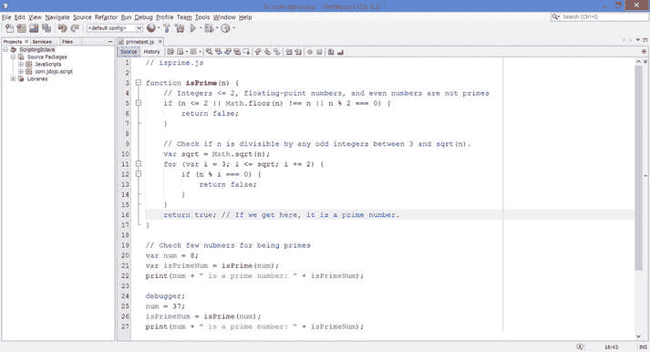
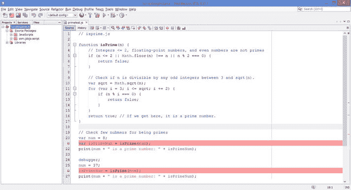
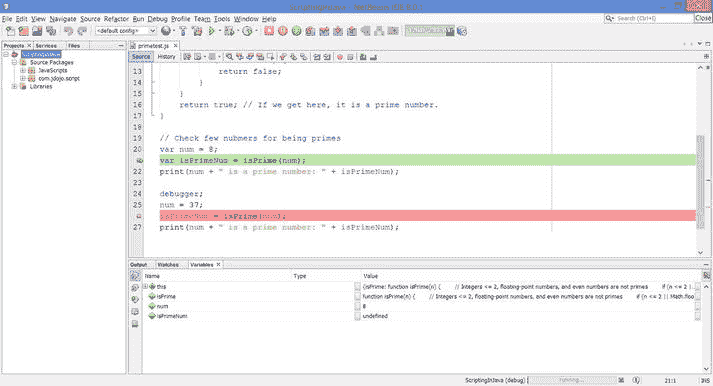
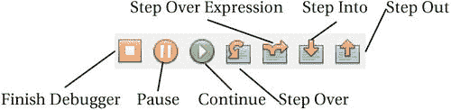
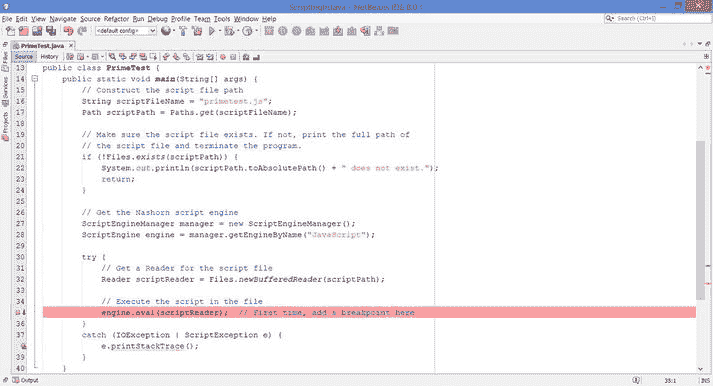
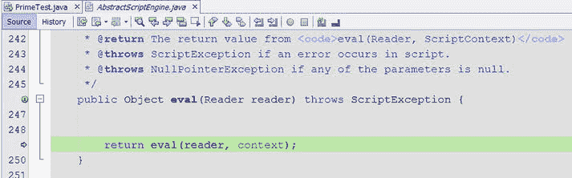
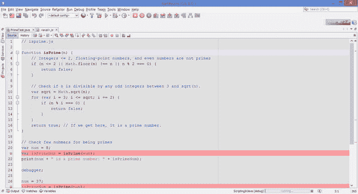

# 13. 调试、跟踪和分析脚本

在本章中，你将学习：

*   如何在 NetBeans IDE 中调试独立的 Nashorn 脚本
*   如何在 NetBeans IDE 中调试从 Java 代码调用的 Nashorn 脚本
*   如何跟踪和分析 Nashorn 脚本

JDK 8 或更高版本中的 NetBeans 8 支持调试、跟踪和分析 Nashorn 脚本。你可以在 NetBeans IDE 中运行和调试独立的 Nashorn 脚本。当 Nashorn 脚本从 Java 代码调用时，你也可以对其进行调试。你可以使用所有用于调试 Java 代码的调试功能来调试脚本；你可以设置断点、显示变量值、添加监视、监控调用堆栈等。在调试 Nashorn 脚本时，调试器会显示 Nashorn 堆栈。

在 NetBeans 中，所有与调试器相关的窗格都可以通过菜单项 `Windows ➤ Debugging` 打开。有关 NetBeans 中完整调试功能的列表，请参考 NetBeans 中的帮助页面。当 NetBeans 应用程序处于活动状态时，你可以按 `F1` 键打开帮助页面。在本章中，我将使用清单 13-1 中的脚本作为调试脚本的示例。

**清单 13-1. 一个包含 `isPrime()` 函数及对该函数调用的测试脚本**

`// primetest.js`

`function isPrime(n) {`

`// 整数 <= 2、浮点数和偶数不是质数`
`if (n <= 2 || Math.floor(n) !== n || n % 2 === 0) {`

`return false;`

`}`

`// 检查 n 是否能被 3 到 sqrt(n) 之间的任何奇数整除。`
`var sqrt = Math.sqrt(n);`
`for (var i = 3; i <= sqrt; i += 2) {`

`if (n % i === 0) {`

`return false;`

`}`

`}`

`return true; // 如果执行到这里，它是一个质数。`
`}`

`// 检查几个数字是否为质数`
`var num = 8;`
`var isPrimeNum = isPrime(num);`
`print(num + " is a prime number: " + isPrimeNum);`

`debugger;`

`num = 37;`
`isPrimeNum = isPrime(num);`
`print(num + " is a prime number: " + isPrimeNum);`

## 调试独立脚本

要在 NetBeans 中运行或调试独立的 Nashorn 脚本，首先需要在 NetBeans IDE 中打开脚本文件。图 13-1 显示了在 NetBeans 中打开的清单 13-1 中的脚本。要运行该脚本，请在显示脚本的编辑器中右键单击，然后选择 `Run File` 菜单项。或者，在脚本窗格处于活动状态时按 `Shift + F6`。

**图 13-1. 在 NetBeans IDE 中打开的 Nashorn 脚本**

要调试脚本，你需要使用以下三种方法之一添加断点：

*   将光标放在要设置/取消断点的行上。右键单击并选择菜单项 `Toggle Line Breakpoint` 来设置和取消断点。
*   将光标放在要设置/取消断点的行上，然后按 `Ctrl + F8`。首次按下此组合键会设置断点。如果断点已设置，再次按下相同的组合键会取消断点。
*   在脚本中添加 `debugger` 语句。当调试会话处于活动状态时，`debugger` 语句的作用类似于断点。否则，它没有任何效果。

图 13-2 显示了同一脚本在第 21 行和第 26 行有两个断点。

**图 13-2. 在 NetBeans IDE 中打开的 Nashorn 脚本，包含两个断点**

现在你可以调试该脚本了。在脚本窗格中右键单击，然后选择 `Debug File` 菜单项。或者，在脚本窗格处于活动状态时按 `Ctrl + Shift + F5`。这将启动调试会话，如图 13-3 所示。如图所示，调试器在第一个断点处停止。在底部，你会看到 `Variables` 窗格打开，其中显示了作用域内所有变量及其值。如果你想查看调试会话的其他详细信息，请使用主菜单 `Window ➤ Debugging` 下的某个菜单项。如果你关闭了任何调试窗格（例如 `Variables` 窗格），可以使用 `Window ➤ Debugging` 菜单重新打开它们。

**图 13-3. 在 NetBeans IDE 中打开的 Nashorn 脚本，处于活动调试会话中**

当调试器会话处于活动状态时，你可以使用调试操作，例如单步进入、单步跳过、单步跳出、继续等。这些操作可以从名为 `Debug` 的主菜单项以及调试器工具栏中获得。图 13-4 显示了调试器工具栏。当调试器会话处于活动状态时，默认会显示该工具栏。如果在调试器会话处于活动状态时它不可见，请在工具栏区域右键单击并选择 `Debug` 菜单项使其可见。表 13-1 包含了可用于脚本的调试操作及其快捷键和描述。

**表 13-1. NetBeans 中的调试器操作列表**

| 调试操作 | 快捷键 | 描述 |
| --- | --- | --- |
| 结束调试器 | `Shift + F5` | 结束调试会话。 |
| 暂停 |   | 停止当前会话中的所有线程。 |
| 继续 | `Ctrl + F5` | 恢复程序执行，直到下一个断点。 |
| 单步跳过 | `F8` | 执行当前行，并将程序计数器移动到文件中的下一行。如果执行的行是函数调用，则函数中的代码也会被执行。 |
| 单步跳过表达式 | `Shift + F8` | 允许你逐步执行表达式中的每个方法调用，并查看每个方法调用的输入参数以及输出结果值。如果没有更多的方法调用，其行为与单步跳过操作相同。 |
| 单步进入 | `F7` | 执行当前行。如果该行是函数调用，并且存在被调用函数的源代码，则程序计数器会移动到该函数的声明处。否则，程序计数器会移动到脚本中的下一行。 |
| 单步跳出 | `Ctrl + F7` | 执行当前函数中的其余代码，并将程序计数器移动到函数调用者之后的行。如果你已经进入了一个不再需要调试的函数，请使用此操作。 |

图 13-4.

NetBeans IDE 中调试器工具栏的项目

## 从 Java 代码调试脚本

调试从 Java 代码调用的脚本时，操作方式略有不同。仅仅在脚本文件中设置断点并启动调试器，或者从 Java 代码单步进入脚本，是行不通的。你将使用清单 13-2 中所示的 Java 程序来调试清单 13-1 中所示的脚本。该 Java 程序使用一个 `Reader` 来执行来自 `primetest.js` 文件的脚本。不过，你也可以使用 `load()` 函数。在清单 13-2 中，你可以将 `try-catch` 块中的代码替换为以下代码片段，程序将以相同方式运行；你需要移除两个从 `java.io` 包导入类的 import 语句：

`try {`

`// 执行文件中的脚本`

`engine.eval("load('" + scriptFileName + "');"); // 第一次，在此处添加一个断点`

`}`

`catch (ScriptException e) {`

`e.printStackTrace();`

`}`

清单 13-2. 调试从 Java 代码调用的脚本

`// PrimeTest.java`

`package com.jdojo.script;`

`import java.io.IOException;`

`import java.io.Reader;`

`import java.nio.file.Files;`

`import java.nio.file.Path;`

`import java.nio.file.Paths;`

`import javax.script.ScriptEngine;`

`import javax.script.ScriptEngineManager;`

`import javax.script.ScriptException;`

`public class PrimeTest {`

`public static void main(String[] args) {`

`// 构造脚本文件路径`

`String scriptFileName = "primetest.js";`

`Path scriptPath = Paths.get(scriptFileName);`

`// 确保脚本文件存在。如果不存在，则打印脚本文件的完整路径并终止程序。`

`if (!Files.exists(scriptPath)) {`

`System.out.println(scriptPath.toAbsolutePath() +"                  "不存在。");`

`return;`

`}`

`// 获取 Nashorn 脚本引擎`

`ScriptEngineManager manager = new ScriptEngineManager();`

`ScriptEngine engine = manager.getEngineByName("JavaScript");`

`try {`

`// 为脚本文件获取一个 Reader`

`Reader scriptReader = Files.newBufferedReader(scriptPath);`

`// 执行文件中的脚本`

`engine.eval(scriptReader);  // 第一次，在此处添加一个断点`

`}`

`catch (IOException | ScriptException e) {`

`e.printStackTrace();`

`}`

`}`

`}`

调试脚本的第一步，需要在调用脚本引擎 `eval()` 方法的代码行上设置一个断点。如果不执行此步骤，你将无法从调试器单步进入脚本。图 13-5 显示了 `PrimeTest` 类的代码，在第 35 行设置了一个断点。

图 13-5.

在 NetBeans IDE 中，PrimeTest 类的代码在第 35 行设置了一个断点

下一步是启动调试器。当包含 `PrimeTest` 类的编辑器窗格处于活动状态时，你可以使用 `Ctrl + Shift + F5`。调试器将在第 35 行的断点处停止。你需要按 `F7` 单步进入 `eval()` 方法调用；这将带你进入 `AbstractScriptEngine.java` 文件，如图 13-6 所示。

图 13-6.

调试 `AbstractScriptEngine.java` 文件时的调试器窗口

按 `F7` 单步进入 `eval()` 方法调用。调试器将打开一个名为 `<eval>.js` 的文件，其中包含你试图通过 Java 代码使用 `Reader` 加载的 `primetest.js` 文件中的脚本。你可以滚动浏览脚本，并在 `<eval>.js` 文件中设置断点。图 13-7 显示了带有两个断点的文件——一个在第 21 行，另一个在第 27 行。

图 13-7.

调试器窗口显示 `<eval>.js` 文件中已加载的脚本

在 `<eval>.js` 文件的脚本中设置好断点后，你就可以继续进行正常的调试操作了。例如，`继续` 调试操作（`F5`）将在下一个断点处停止执行。

调试结束后，你可以移除 Java 代码中的断点，在本例中即 `PrimeTest.java` 文件。如果你启动一个新的调试会话，调试器将停止在你之前在 `<eval>.js` 文件中设置的断点处。请注意，你只需单步进入 `<eval>.js` 文件一次。所有后续的调试会话都会记住之前会话中的断点。

提示

尽管 Nashorn 支持 `debugger` 语句，但 NetBeans IDE 似乎并不将其识别为 Nashorn 脚本中的断点。在脚本中添加 `debugger` 语句不会在调试器激活时暂停执行。

## 追踪与性能分析脚本

Nashorn 支持调用点追踪和性能分析。你可以在 `jjs` 命令行工具以及嵌入式 Nashorn 引擎中启用这些选项。你可以为引擎运行的所有脚本启用追踪和性能分析，也可以为单个脚本或函数启用。`–tcs` 选项为所有脚本启用调用点追踪，并将调用点追踪信息打印到标准输出。`-pcs` 选项为所有脚本启用调用点性能分析，并将调用点性能分析数据打印到当前目录下名为 `NashornProfile.txt` 的文件中。

你可以在脚本或函数的开头使用以下四个 Nashorn 指令，来选择性地追踪和性能分析整个脚本或函数：

*   `"nashorn callsite trace enterexit"; // 等同于 -tcs=enterexit`
*   `"nashorn callsite trace miss";      // 等同于 -tcs=miss`
*   `"nashorn callsite trace objects";   // 等同于 -tcs=objects`
*   `"nashorn callsite profile";         // 等同于 -pcs`

提示

`–tcs` 和 `–pcs` 选项基于每个脚本引擎工作，而四个追踪和性能分析指令则基于每个脚本和每个函数工作。

这些 Nashorn 指令仅在调试模式下启用。你可以通过将 `nashorn.debug` 系统属性设置为 true 来启用 Nashorn 调试模式。这些指令在 JDK8u40 及更高版本中可用。在编写本书时，JDK8u40 仍在开发中。清单 13-3 展示了一个脚本，其中为某个函数启用了 Nashorn 调用点性能分析选项。该脚本已保存在名为 `primeprofiler.js` 的文件中。

清单 13-3\. 为函数启用了 Nashorn 调用点性能分析指令的脚本

`// primeprofiler.js`

`function isPrime(n) {`

`// 仅对此函数进行性能分析`

`"nashorn callsite profile";`

`// 整数 <= 2、浮点数和偶数不是质数`

`if (n <= 2 || Math.floor(n) !== n || n % 2 === 0) {`

`return false;`

`}`

`// 检查 n 是否能被 3 到 sqrt(n) 之间的任何奇数整除。`

`var sqrt = Math.sqrt(n);`

`for (var i = 3; i <= sqrt; i += 2) {`

`if (n % i === 0) {`

`return false;`

`}`

`}`

`return true; // 如果执行到这里，说明它是一个质数。`

`}`

`// 检查几个数字是否为质数`

`var num = 8;`

`var isPrimeNum = isPrime(num);`

`print(num + " 是一个质数: " + isPrimeNum);`

`num = 37;`

`isPrimeNum = isPrime(num);`

`print(num + " 是一个质数: " + isPrimeNum);`

以下命令在启用 Nashorn 调试选项的情况下运行 `primeprofile.js` 文件中的脚本：

`c:\>jjs -J-Dnashorn.debug=true primeprofile.js`

`8 是一个质数: false`

`37 是一个质数: true`

`C:\`

该命令将在当前目录下生成一个名为 `NashornProfile.txt` 的文件，其中包含 `isPrime()` 函数调用的性能分析数据。该文件的内容如清单 13-4 所示。

清单 13-4\. NashornProfile.txt 文件的内容

`0        dyn:getProp|getElem|getMethod:Math        438462        2`

`1        dyn:getMethod|getProp|getElem:floor       433936        2`

`2        dyn:call                                  650602        2`

`3        dyn:getProp|getElem|getMethod:Math        313834        1`

`4        dyn:getMethod|getProp|getElem:sqrt        283356        1`

`5        dyn:call                                       0        1`

清单 13-5 包含一个 Java 程序，该程序设置了 `nashorn.debug` 系统属性并运行了清单 13-3 中所示的脚本。运行该程序将在当前目录下创建一个 `NashornProfile.txt` 文件，文件内容与清单 13-2 所示相同。

清单 13-5\. 设置 nashorn.debug 系统属性和性能分析脚本

`// ProfilerTest.java`

`package com.jdojo.script;`

`import java.io.IOException;`

`import java.io.Reader;`

`import java.nio.file.Files;`

`import java.nio.file.Path;`

`import java.nio.file.Paths;`

`import javax.script.ScriptEngine;`

`import javax.script.ScriptEngineManager;`

`import javax.script.ScriptException;`

`public class ProfilerTest {`

`public static void main(String[] args) {`

`// 设置 nashorn.debug 系统属性，以便追踪和`

`// 性能分析指令能够被识别`

`System.setProperty("nashorn.debug", "true");`

`// 构造脚本文件路径`

`String scriptFileName = "primeprofiler.js";`

`Path scriptPath = Paths.get(scriptFileName);`

`// 确保脚本文件存在。如果不存在，则打印脚本文件的完整`

`// 路径并终止程序。`

`if (!Files.exists(scriptPath)) {`

`System.out.println(scriptPath.toAbsolutePath() +                    " 不存在。");`

`return;`

`}`

`// 获取 Nashorn 脚本引擎`

`ScriptEngineManager manager = new ScriptEngineManager();`

`ScriptEngine engine = manager.getEngineByName("JavaScript");`

`try {`

`// 为脚本文件获取一个 Reader`

`Reader scriptReader = Files.newBufferedReader(scriptPath);`

`// 执行文件中的脚本`

`engine.eval(scriptReader);`

`}`

`catch (IOException | ScriptException e) {`

`e.printStackTrace();`

`}`

`}`

`}`

`8 是一个质数: false`

`37 是一个质数: true`

## 总结

支持 JDK 8 或更高版本的 NetBeans 8 支持在 NetBeans IDE 中调试 Nashorn 脚本。你可以在 NetBeans IDE 中运行和调试独立的 Nashorn 脚本。当从 Java 代码调用 Nashorn 脚本时，你也可以对其进行调试。调试器可以无缝地从 Java 代码跳转到 Nashorn 脚本。

Nashorn 支持调用点追踪和性能分析。你可以在 `jjs` 命令行工具以及嵌入式 Nashorn 引擎中启用这些选项。你可以为引擎运行的所有脚本启用追踪和性能分析，也可以为单个脚本或函数启用。`–tcs` 选项为引擎运行的所有脚本启用调用点追踪。`-pcs` 选项为引擎运行的所有脚本启用调用点性能分析，并将调用点性能分析数据打印到当前目录下名为 `NashornProfile.txt` 的文件中。JDK8u40 新增了四个 Nashorn 指令：`"nashorn callsite trace enterexit"`、`"nashorn callsite trace miss"`、`"nashorn callsite trace objects"` 和 `"nashorn callsite profile"`。这些指令可以添加到脚本和函数的开头，以选择性地追踪和性能分析脚本和函数。它们仅在调试模式下工作，可以通过将系统属性 `nashorn.debug` 设置为 true 来启用调试模式。

索引 A AbstractScriptEngine 类 脚本引擎 avg() 函数 B Bindings 接口 C Compilable 接口 CompiledScript 类 compile() 方法 contains() 方法 createBindings() 方法 自定义 ScriptContext D decodeURIComponent() 函数 decodeURI() 函数 defineProperty() 函数 E encodeURIComponent() 函数 encodeURI() 函数 引擎作用域绑定 eval() 函数 eval() 方法 helloscript.js 文件 Reader 对象 脚本执行 String 对象 exec() 方法 F factorial() 函数 Function 参数 adder() 函数 avg() 函数 规则 函数表达式 adder 函数赋值表达式 avg() 函数 函数名 递归函数 G getBindings() 方法 getEngine() 方法 getInterface() 方法 get() 方法 getScopes() 方法 get(String key) 方法 H HelloFX 应用 在 Java Nashorn 脚本中 show() 方法 $STAGE 无需 init()、start() 和 stop() 函数 I 继承 call() 方法 coloredPoint 对象 ColoredPointTest.js 文件 constructor 属性 get 和 set 函数 Object.create() 函数 Object.setPrototypeOf() 函数 Point.js 文件 Point 对象 PointTest.js 文件 print() 方法 原型链 prototype.js 文件 toString() 方法 Invocable 接口 factorial() 和 avg() 函数 getInterface() 方法 接口类型 invokeFunction() 方法 invokeMethod() 方法 Nashorn 脚本 脚本引擎实现 脚本求值 invokeFunction() 方法 isFinite() 函数 isInteger() 函数 isNaN() 函数 J, K JavaFX 应用 完全限定名 greeter JavaFX 应用 HelloFX 应用 参见（参见 HelloFX 应用） incorrectfxapp.js init() 函数 load() 方法 myfxapp.js 文件 Nashorn 脚本文件 setOnAction() 方法 最简单的 JavaFX 应用 start() 函数 stop() 函数 Java 接口实现 calculatorasfunctions.js 文件 calculator 接口 getInterface() 方法 实例方法 顶层函数 JavaScript 对象表示法 (JSON) Java.to() 函数 Java.type() 方法 Java 虚拟机 (JVM) JDK 7 JDK 8 JKScriptEngine 类 JKScriptEngineFactory 类 JRuby 脚本 jrunscript 命令行 shell 批处理模式 -classpath/-cp 选项 -cp/-classpath 选项 全局对象 交互模式 JAR 文件 jlist() 函数 jmap() 函数 JSInvoker 对象 -l 选项 Nashorn JavaScript 引擎 单行模式 选项 传递参数 -q 选项 脚本模式 $ARG 全局对象 $ENV 全局对象 $EXEC() 全局函数 表达式替换特性 全局对象 heredocs jjscomments.js shebang 单行注释风格语法 jrunscript shell L length() 方法 load() 函数 loadWithNewGlobal() 函数 Logger 函数 M msg 变量 N Nashorn 块语句 Boolean 类型 代码转换 continue、break 和 return 语句 debugger 语句 空语句 表达式语句 函数 参数 声明 decodeURIComponent() 函数 decodeURI() 函数 定义 encodeURIComponent() 函数 encodeURI() 函数 表达式 参见（参见函数表达式） Function() 构造函数 isFinite() 函数 isNaN() 函数 load() 函数 loadWithNewGlobal() 函数 parseFloat() 函数 parseInt() 函数 提升 声明 if 语句 无效标识符 迭代语句 for..each..in 语句 for..in 语句 while、do-while 和 for 语句 带标签语句 Math.sqrt 多行注释 非严格模式 null 类型 number 类型 Object 类型 参见（参见 Object 类型） 运算符 分号插入 单行注释 with 语句 严格模式 jjs 命令行工具 保留字 use strict 指令 String 类型 续行字符 转义序列 多行字符串字面量 单引号和双引号 switch 语句 throw 语句 try 语句 factorial() 函数 isInteger() 函数 属性 try 块 类型转换 Boolean 值 隐式转换 Number 转换 String 类型 undefined 类型 有效标识符 变量声明 变量作用域 变量语句 Nashorn 脚本引擎 eval() 方法 jjs 命令行工具 print() 函数 打印消息 语法 O Object.create() 方法 Object 字面量 访问属性 alpha 属性 属性特性 括号表示法 数据值和函数 defineProperty() 函数 定义 删除 点表示法 存在和不存在的属性 for..in 和 for..each..in 语句 getOwnPropertyDescriptor() 函数 Object.defineProperty() 函数 in 运算符 origin2D 对象 point2D 对象 表达式 继承属性 Object 类型 Boolean 对象 构造函数 函数 创建 curValue() 方法 Logger 函数 new 运算符 nextValue() 方法 Person() 函数 printf() 函数 Date 对象 构造函数 传递参数 创建方法 输出 定义 描述 eval() 函数 特性 函数对象 apply() 方法 参数 bind() 方法 call() 方法 创建 Function.prototype.constructor 属性 Function.prototype.toString() 方法 toString() 方法 继承 参见（参见继承） 字面量 参见（参见 Object 字面量） Math 对象 命名访问器属性 命名数据属性 __noSuchMethod__ __noSuchProperty__ Number 对象 原始数字 属性和方法 语句 toString() 方法 valueOf() 方法 Object.bindProperties() 方法 java.util.HashSet 对象 log() 函数 使用 Object.create() 方法 Object.freeze(obj) 方法 Object.preventExtensions(obj) 方法 Object.seal(obj) 方法 正则表达式 边界匹配器 字符类 创建 exec() 方法 标志 字面量 属性 量词 replace() 方法 规则 签名 String 对象 test() 方法 toString() 方法 脚本位置 序列化对象 String 对象 valueOf() 方法 P, Q 参数传递机制 绑定 创建第三个 ScriptEngine getBindings() 方法 get() 方法 get(String key) 方法 全局和引擎作用域绑定 全局作用域绑定 键值对 put() 方法 作用域 脚本上下文 Bindings 组件 引擎和全局作用域 FileWriter getAttribute() 方法 getErrorWriter() 方法 getReader() 方法 getWriter() 方法 接口 jsoutput.txt 输出 脚本 setAttribute() 方法 SimpleScriptContext 类 ScriptEngineManager setBindings() 方法 两个 ScriptEngines parseFloat() 函数 parseInt() 函数 parse() 方法 从 Java 代码向脚本传递参数 在 JRuby 程序中 put() 方法 String 对象 toString() 方法 从脚本向 Java 代码传递参数 全局变量 year 变量 put() 方法 R RegExp 对象 边界匹配器 字符类 创建 exec() 方法 标志 字面量 属性 量词 replace() 方法 规则 签名 String 对象 test() 方法 toString() 方法 Rhino JavaScript S ScriptContext 接口 脚本引擎 算术表达式 规则 创建实例 自定义 ScriptContext 默认 ScriptContext eval() 方法 Expression 类 eval() 方法 getOperandValue() 方法 实例变量 parse() 方法 安装 JAR 文件 JKScriptEngine 类 JKScriptEngineFactory 类 JKScript 脚本引擎 manifest.mf 文件 Nashorn 脚本引擎 参见（参见 Nashorn 脚本引擎） 从 Java 代码向脚本传递参数 从脚本向 Java 代码传递参数 打印消息 ScriptEngine 接口 ScriptEngineManager ScriptEngineFactory 接口 ScriptEngine 接口 ScriptEngineManager 类 ScriptException 类 脚本语言 优势 定义 缺点 getEngineFactories() 方法 getScriptEngine() 方法 Java 中的数组 Calculator 接口 with 子句 全局变量 importClass() 函数 importPackage() 函数 JavaAdapter 对象 Java.extend() 方法 lambda 表达式 方法重载 Runnable 接口 String 对象 创建 type() 函数 javax.script 包 AbstractScriptEngine 类 Bindings 接口 Compilable 接口 CompiledScript 类 Invocable 接口 ScriptContext 接口 ScriptEngineFactory 接口 ScriptEngine 接口 ScriptEngineManager 类 ScriptException 类 SimpleBindings 类 SimpleScriptContext 类 jrunscript shell 脚本引擎 创建实例 安装 JAR 文件 Nashorn 脚本引擎 参见（参见 Nashorn 脚本引擎） 打印消息 ScriptEngine 接口 ScriptEngineManager setBindings() 方法 SimpleBindings 类 SimpleScriptContext 类 符号表 System.setOut() 方法 T, U, V, W, X Thread 类 Y, Z year 变量
