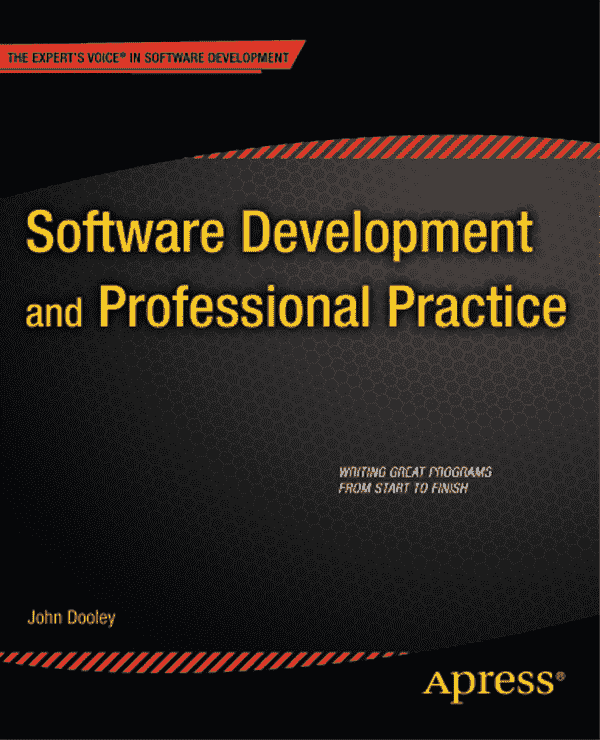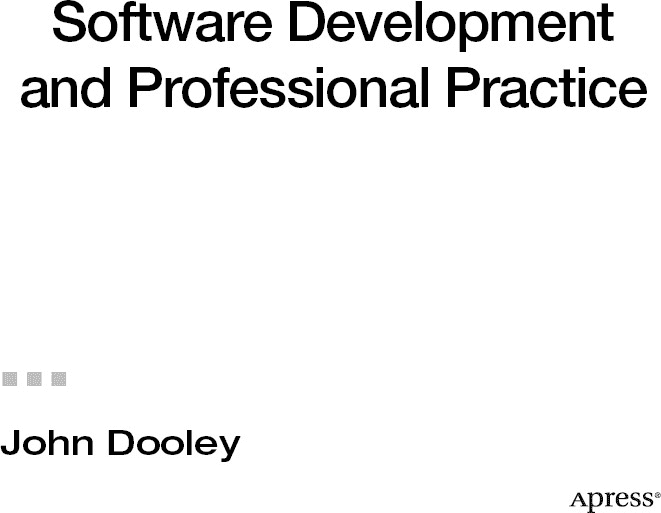

**软件开发与专业实践**

版权所有 © 2011 约翰·杜利

保留所有权利。未经版权所有者及出版人事先书面许可，本作品的任何部分均不得以任何形式或通过任何方式（电子或机械，包括影印、录制，或任何信息存储或检索系统）进行复制或传播。

ISBN-13（平装本）：978-1-4302-3801-0

ISBN-13（电子版）：978-1-4302-3802-7

在美国印刷并装订 9 8 7 6 5 4 3 2 1

本书中可能出现商标名称、标识和图像。对于商标名称、标识或图像的每次出现，我们并非都使用商标符号，而仅以编辑方式使用这些名称、标识和图像，以维护商标所有者的利益，且无意侵犯商标权。

本出版物中使用的商品名称、商标、服务标志及类似术语，即使未被明确标识，也不应被视为对其是否受所有权保护的表达意见。

总裁与出版人：保罗·曼宁
    首席编辑：多米尼克·谢克沙夫特
    技术审校：约翰·祖科夫斯基
    编辑委员会：史蒂夫·安格林、詹姆斯·马卡姆、尤安·白金汉、加里·康奈尔、乔纳森·根尼克、
        乔纳森·哈塞尔、米歇尔·洛曼、詹姆斯·马卡姆、马修·穆迪、杰夫·奥尔森、杰弗里·佩珀、弗兰克·
        波尔曼、道格拉斯·庞迪克、本·雷诺-克拉克、多米尼克·谢克沙夫特、马特·韦德、汤姆·韦尔什
    协调编辑：亚当·希思
    文字编辑：特雷西·布朗
    排版：Bytheway Publishing Services
    索引编制：托马·穆里根
    插图：艾普丽尔·米尔恩
    封面设计：安娜·伊什琴科

本书通过 Springer Science+Business Media, LLC. 在全球图书贸易中发行，地址：233 Spring Street, 6th Floor, New York, NY 10013。电话：1-800-SPRINGER，传真：(201) 348-4505，电子邮件：`orders-ny@springer-sbm.com`，或访问 [`www.springeronline.com`](http://www.springeronline.com)。

如需翻译相关信息，请发送电子邮件至 `rights@apress.com`，或访问 [`www.apress.com`](http://www.apress.com)。

Apress 及 friends of ED 的书籍可批量购买用于学术、企业或促销用途。大多数图书也提供电子书版本和许可。如需更多信息，请参考我们的特殊批量销售–电子书许可网页：[`www.apress.com/info/bulksales`](http://www.apress.com/info/bulksales)。

本书中的信息按“原样”分发，不提供任何担保。尽管在编写本作品时已采取一切预防措施，但作者和 Apress 均不对因本作品所含信息直接或间接引起的任何损失或损害对任何个人或实体承担责任。

本书的源代码可供读者在 [www.apress.com](http://www.apress.com) 获取。您需要回答与本书相关的问题才能成功下载代码。

*献给黛安，她始终陪伴左右；
献给帕特里克，一个男人所能拥有的最好的儿子；以及
献给玛格丽特·特蕾莎·休姆·杜利（1926–1976），
妈妈，这第一本书是献给你的。*

## 目录概览

 关于作者

 关于技术审校

 致谢

 前言

 第 1 章：软件开发简介

 第 2 章：过程生命周期模型

 第 3 章：项目管理基础

 第 4 章：需求

 第 5 章：软件架构

 第 6 章：设计原则

 第 7 章：结构化设计

 第 9 章：面向对象分析与设计

 第 10 章：面向对象设计原则

 第 11 章：设计模式

 第 12 章：代码构建

 第 13 章：调试

 第 14 章：单元测试

 第 15 章：走查、代码审查与检查

 第 16 章：总结

 索引

## 目录

 关于作者

 关于技术审校

 致谢

 前言

 第 1 章：软件开发简介

我们正在做什么

那么，如何开发软件？

结论

参考文献

 第 2 章：流程生命周期模型

一个根本不是模型的模型：编码与修复

畅游瀑布模型

为瀑布模型提供支持

循环是你的朋友

演进增量模型

敏捷即敏捷所为

极限编程（XP）

XP 概述

XP 动机

四个变量

四个价值观

15 条原则

四项基本活动

实施 XP：12 项实践

XP 生命周期

Scrum，伙计

结论

参考文献

 第 3 章：项目管理要点

项目规划

项目组织

风险分析

资源需求

工作分解与任务估算

项目进度

项目监督

状态评审与演示

缺陷

事后分析

结论

参考文献

 第 4 章：需求

我们在这里讨论的是哪种类型的需求？

功能规格说明书？

但我不喜欢写作！

那个自然语言的东西

功能规格说明书大纲

概述

免责声明

作者姓名

典型使用场景

详细的逐屏幕规格说明

非需求

未决问题

设计与功能构想

待办事项列表

还有一件事

需求类型

用户需求

领域需求

非功能性需求

非需求

需求挖掘

为何需求挖掘如此困难

分析需求

结论

参考文献

 第 5 章：软件架构

通用架构模式

管道-过滤器架构

面向对象架构模式

MVC 示例：让我们开始狩猎！

问题描述

模型

视图

控制器

模型

客户端-服务器架构模式

分层方法

主程序-子程序架构模式

结论

参考文献

 第 6 章：设计原则

设计过程

理想的设计特性（你的设计应具备的要素）

设计启发式方法

设计师与创造力

结论

参考文献

 第 7 章：结构化设计

结构化编程

逐步求精

逐步求精示例：八皇后问题

模块分解

示例：上下文关键词——为你我准备的索引

自顶向下分解

结论

参考文献

附录：完整的非递归八皇后程序

第 8 章：面向对象分析与设计概述

面向对象分析与设计过程

执行过程

问题陈述

功能列表

用例

分解问题

类图

代码来了？

结论

参考文献

 第 9 章：面向对象分析与设计

多幕剧

序幕：场景设定

第一幕第一场：探究分析

第一幕第二场：着手设计

第二幕第一场：朝着正确方向改变

鸣禽永存

第二幕第二场：设计也将随之改进

第三幕，第一场：我们如何做设计

第四幕，第一场：我们如何对抽象进行哲学思考

结论

参考文献

 第 10 章：面向对象设计原则

我们的基本面向对象设计原则列表

在你的设计中封装那些可能变化的部分

针对接口编程，而非针对实现编程

开闭原则 (OCP)

不要重复自己原则 (DRY)

单一职责原则 (SRP)

里氏替换原则 (LSP)

依赖倒置原则 (DIP)

接口隔离原则 (ISP)

最少知识原则 (PLK)

为了乐趣和享受的类设计指南

结论

参考文献

 第 11 章：设计模式

设计模式与四人组

经典设计模式

我们可以使用的模式

创建型模式

结构型模式

行为型模式

结论

参考文献

 第 12 章：代码构建

一个编码示例

函数、方法及其规模，哦天哪！

格式化、布局与风格

通用布局问题与技术

空白

代码块与语句风格指南

声明风格指南

注释风格指南

标识符命名约定

防御性编程

断言可以成为你的朋友

异常与错误处理

错误处理

Java 中的异常

关于编码的最后一句话

参考文献

 第 13 章：调试

到底什么是错误？

不该做什么

一种调试方法

可靠地重现问题

找到错误的根源

修复错误（仅此一个）！

测试修复

寻找更多错误

源代码控制

使用锁定-修改-解锁

使用复制-修改-合并

关于编码和调试的最后一个想法——结对编程

结论

参考文献

 第 14 章：单元测试

测试的问题

那种测试思维

何时测试？

测试什么？

代码覆盖率：测试每条语句

数据覆盖率：坏数据是你的朋友？

测试的特性

如何编写测试

故事

任务

测试

JUnit：一个测试框架

测试是好的

结论

参考文献

 第 15 章：走查、代码评审与审查

走查、评审与审查——哦天哪！

走查

代码评审

代码审查

审查角色

审查阶段与流程

评审方法论总结

缺陷跟踪系统

结论

参考文献

 第 16 章：总结

你学到了什么？

接下来做什么？

参考文献

 索引

## 关于作者

  **约翰·杜利**在 40 年前编写了他的第一个程序——使用 Fortran IV 语言在穿孔卡片上。自那以后，他在工业界工作了超过 18 年，曾为贝尔实验室、IBM、麦克唐纳·道格拉斯和摩托罗拉等公司工作，并在一家初创公司有过一段必要的任职经历。他还花了 17 年时间教授本科生计算机科学，包括在伊利诺伊州盖尔斯堡的诺克斯学院，他在那里担任计算机科学系主任，并已任教 10 年。作为一名软件专业人士，他编写过从设备驱动程序到编译器、嵌入式电话软件再到金融应用程序的各种代码。他还管理过从 5 人到 30 人不等的开发团队，公司规模有大有小。他拥有数学、计算机科学和电气工程学位。

## 关于技术审校

  **约翰·祖科夫斯基**从事专业软件开发已超过 20 年。他最初在 Commodore Vic-20 上用 BASIC 语言编程，随后转向 Commodore 64。他曾在 VAX/VMS 系统上使用 FORTRAN 开发，在早期的 Sun3/4 Solaris 平台上使用 C 和 C++，并在过去 15 年间专注于微设备、桌面和服务器端的 Java 平台开发。约翰还撰写了十本与 Java 技术相关的书籍，从第一本《*Java AWT 参考手册*》（O'Reilly，1997）到最新著作《*Java 6 平台揭秘*》（Apress，2006）。闲暇时，你可能会发现他在 Facebook 上玩《黑帮战争》，或在 Twitter（@JavaJohnZ）上参加竞赛。

## 前言

这本书究竟讲什么？简而言之，它从个人视角探讨如何开发软件。我们将审视从理解问题到最终编写出解决方案的完整过程。正因如此，本书着重关注设计。你如何设计软件？需要考虑哪些因素？什么是优秀的设计？设计软件有哪些方法和流程？小型程序的设计与大型程序有何不同？如何区分设计的好坏？

其次，本书涉及代码构建。你如何编写程序并使其正常运行？“什么？”你可能会说，“我已经写过无数程序了！我当然知道怎么写代码！”但在本书中，我们将深入剖析你已有的实践，并探索改进之道。我们会花时间讨论编码标准、调试、单元测试、模块化以及优秀程序的特征。我们还会探讨代码阅读以及如何让程序更具可读性。优秀的、可读性强的代码能否替代文档？你究竟需要多少文档？

第三，本书也涉及软件工程，它通常被定义为“将工程原理应用于软件开发”。什么是“工程原理”？首先，所有工程工作都遵循一个明确的流程。因此，我们会花一些时间讨论如何运作一个软件开发项目，以及项目包含哪些阶段。所有工程工作都基于将科学和数学应用于现实世界的问题。软件开发也是如此。正如我所说，我们会花大量时间研究如何设计和实现解决特定问题的程序。

顺便提一句，至少还有一个人（除了我）认为软件开发不是一门工程学科。我指的是阿里斯泰尔·科伯恩，你可以在[`http://alistair.cockburn.us/The+end+of+software+engineering+and+the+start+of+economic-cooperative+gaming`](http://alistair.cockburn.us/The+end+of+software+engineering+and+the+start+of+economic-cooperative+gaming)阅读他的论文《软件工程的终结与经济合作博弈的开始》。

最后，本书还涉及专业实践，包括作为软件开发者的道德与责任、社会问题、隐私、如何编写安全稳健的代码等等。简而言之，就是成为一名*专业*软件开发者所需的其他那些模糊但重要的事项。

本书涵盖了 ACM 计算课程 2001 年课程 C292c“软件开发与专业实践”（[`www.acm.org/education/education/curricula-recommendations`](http://www.acm.org/education/education/curricula-recommendations)）中描述的许多主题。它旨在成为一本面向在职专业人士的教科书和手册。虽然章节顺序大致遵循标准的软件开发流程，但读者可以独立、不按顺序阅读各章。我假设你已经知道如何编程，并且熟悉 Java、C 或 C++中的至少一种。我还假设你熟悉基本的数据结构，包括列表、队列、栈、映射和树，以及操作它们的算法。

我在一门面向大三学生的软件开发课程中使用了这本书。它源于我过去五年为这门课编写的讲义。我之所以编写自己的讲义，是因为我找不到一本涵盖我认为软件开发课程（而非软件工程课程）所必需的所有主题的书。软件工程书籍往往更侧重于流程和项目管理，而不是设计和实际开发。我希望专注于设计和编写真正的代码，而不是如何运作大型项目。在开始教学之前，我在计算机行业工作了超过 18 年，先后为大公司和初创公司工作，编写软件并管理其他编写软件的人。这本书是我对如何在一个中小型团队中成为一名软件开发者并帮助开发出优秀软件的见解。

我希望在读完本书后，你能更清楚地了解优秀程序的设计是什么样的，什么造就了一个高效且富有成效的开发者，以及如何开发更大规模的软件。你会对设计问题有更深入的了解。你会思考如何在团队中工作，按照书面计划交付产品。你将开始理解项目管理，了解一些度量标准，知道如何评审工作产品，并理解配置管理。我远未涵盖软件开发的全部内容，我们只会粗略地审视软件工程的管理方面，但无论你是独立工作还是团队协作，你都将处于一个更好的位置，去构思、设计、实现和测试各种规模的软件。

## 第 1 章

## 软件开发导论

> *“不仅目前看不到银弹，而且软件的本质决定了未来也不太可能出现——没有任何发明能像电子、晶体管和大规模集成电路对计算机硬件那样，对软件的生产力、可靠性和简洁性产生革命性影响。我们永远不能指望每两年看到两倍的收益。”*
>
> —— 小弗雷德里克·J·布鲁克斯 ^(1)

那么，你可能会问自己，为什么这本书叫《*软件开发与专业实践*》？为什么不叫《编程大全》或《软件工程》？毕竟，软件开发不就是这些吗？嗯，不是。编程是软件开发的一部分，但肯定不是全部。同样，软件开发是软件工程的一部分，但也不是全部。

以下是本书将使用的软件开发定义：软件开发是一个过程，它从用户那里获取一组需求（问题陈述），对其进行分析，设计问题的解决方案，然后在计算机上实现该解决方案。

那么，你可能会问，这不就是编程吗？嗯，不是。编程实际上只是软件开发的实现部分，或者可能包括设计和实现部分。编程是软件开发的核心，但并非全部。

那么，它不就是软件工程吗？同样，不是。软件工程也涉及一个过程，并包含软件开发，但它还包括创建人们将使用的计算机程序的整个管理方面。软件工程包括项目管理、配置管理、进度安排与估算、基线建立与调度、人员管理以及其他若干事项。软件开发是软件工程中有趣的部分。

因此，软件开发是将软件工程的焦点缩小到仅与创建实际软件相关的部分。同时，它也是将编程的焦点扩展到包括分析、设计和发布问题。

__________

¹ 布鲁克斯，弗雷德里克。“没有银弹。”《*IEEE 计算机*》（1987 年）。20(4): 10-19。

### 我们正在做什么

事实证明，在使用了计算机大约 60 多年后，我们发现开发软件是困难的。学习如何正确、高效且优雅地开发软件同样困难。你并非生来就懂得如何去做，而且大多数人，即使是那些参加过编程课程并在行业工作多年的人，也做得并不特别出色。这是一项你需要去掌握并不断练习的技能——大量地练习。你无法通过阅读书籍来学会编程和开发——即使是这本书也不行。你只能通过实践来学习。当然，这正是其魅力所在：致力于解决有趣且困难的问题。挑战在于去处理你从未做过的事情，甚至是你可能不确定自己能否解决的问题。正是这一点让你一次又一次地回来创建新的程序。

学习软件开发可能有几种方法。但我认为，所有这些方法都包括阅读优秀的设计、阅读大量的代码、编写大量的代码，以及深入思考你如何解决问题并为其设计解决方案。阅读大量代码，尤其是那些真正优美且高效的代码，会为你提供许多关于如何思考问题并以特定风格寻求解决方案的优秀范例。编写大量代码则让你能够尝试你在阅读中看到的风格和范例。深入思考问题解决过程，让你能够审视自己是如何工作、如何进行设计的，并让你从自己的劳动中提炼出那些对你有效的模式；这会让你的编程更具目的性。

### 那么，如何开发软件呢？

嗯，你应该做的第一件事就是阅读这本书。它当然不会告诉你所有事情，但它会为你提供一个很好的入门介绍，让你了解软件开发究竟是怎么回事，以及你需要做些什么才能编写出优秀的代码。它有其自身的视角，但这个视角是基于 20 年的专业代码编写经验，以及另外 16 年试图弄清楚如何教会他人做这件事的经验。

尽管软件开发只是软件工程的一部分，但软件开发是每个软件项目的核心。毕竟，最终交付给用户的是能正常工作的代码。而这些代码通常是由一个协同工作的开发团队创建的。因此，首先，我们或许应该从外部审视一个软件项目，并问问那个团队需要做些什么才能让这个项目取得成功。

为了做好软件开发，你需要具备以下几点：

> *小而整合的团队*。小团队的沟通线路比大团队少。在小团队中，更容易了解你的队友。你可以了解队友的优势和劣势，谁了解什么，以及谁是特定问题或特定工具的“专家”。整合良好的团队通常一起完成过多个项目。让一个团队在多个项目中保持稳定是团队经理的主要职责。整合良好的团队效率更高，更能坚持按计划行事，并且在发布时产生的代码缺陷更少。保持团队稳定的关键在于给他们有趣的工作去做，然后让他们自主工作。
>
> *团队成员之间良好的沟通*。团队成员之间持续的沟通对于日常进展和成功完成项目至关重要。同地办公的团队比地理上分散的团队（即使他们只是位于同一栋楼的不同楼层或侧翼）沟通得更好、更频繁。这对于拥有遍布全球的软件开发站点的大型公司来说是一个主要问题。
>
> *团队与客户之间良好的沟通*。与客户的沟通对于控制项目中的需求和需求变更至关重要。现场或附近的客户允许与开发团队进行持续互动。客户可以对新版本提供即时反馈，并参与创建产品的系统和验收测试。极限编程敏捷开发方法论要求客户成为开发团队的一部分，并且每天在现场。关于极限编程的快速介绍，请参见第 2 章。
>
> *每个人都认同的流程*。每个项目，无论大小，都遵循一个流程。较大的项目和较大的团队往往更受计划驱动，并遵循需要更多规则和文档的流程。较大的项目确实需要更多的协调以及对沟通和配置管理更严格的控制。如今，较小的项目和较小的团队往往倾向于遵循更敏捷的开发流程，具有更大的灵活性和更少的文档要求。这当然并不意味着敏捷项目*没有*流程，它只是意味着你为正在编写的项目做有意义的事情，以便能够满足所有需求、按时完成并交付高质量的产品。关于流程和软件生命周期的更多细节，请参见第 2 章。
>
> *对该流程保持灵活的能力*。没有哪个项目会完全按照你第一天设想的那样进行。需求会变化，人员会流动，工具会失效，等等。这一点完全关乎如何处理项目中的风险。如果你识别出风险，计划如何减轻它们，然后制定一个应急计划来应对风险实际发生的情况，你的处境会好得多。第 4 章讨论了需求和风险。
>
> *每个人都认同的计划*。你不会在没有算法的情况下编写排序程序，所以你也不应该在没有计划的情况下启动一个软件开发项目。项目计划概括了你将如何实施你的项目。它涉及流程、风险、资源、工具、需求管理、估算、进度、配置管理和交付。它不必很长，也不需要包含项目日常生活的所有细微细节，但团队中的每个人都需要参与其中，他们需要理解它，并且需要同意它。除非每个人都认同这个计划，否则你注定会失败。关于项目计划的更多细节，请参见第 3 章。
>
> *时刻了解项目所处的位置*。这又是关于沟通的事情。大多数项目都有定期的状态会议，以便开发人员可以“同步”他们当前的状态，并了解整个项目的状态。这对于较小的团队（比如，最多约 20 名开发人员）非常有效。许多小团队会在每天开始时召开每日会议进行同步。不同的流程模型处理这种“碰头”会议的方式不同。许多计划驱动的模型不要求这些会议，而是依赖团队经理之间相互沟通。敏捷流程通常要求每日会议，以改善团队成员之间的沟通，并在团队内部营造一种同志情谊。
>
> *有勇气说“嘿，我们落后了！”*。几乎所有的软件项目在开始时都有过于乐观的进度。我们就是这样。软件开发者通常是一群乐观的人，这体现在他们对工作的估算中。“当然，我一周内就能搞定！”“我今天下班前给你。”“明天？没问题。”不，不，不，不，不。面对现实吧。在某个时候你会落后。而最好的做法是立即告诉你的经理。当然，她可能会生气。但如果你最终落后了一个月而她毫不知情，她会更生气。弗雷德·布鲁克斯对软件项目是如何变得如此落后的著名回答是“一天一天地落后”。不过，好消息是，你越早发现自己落后，你拥有的选择就越多。这些选择包括延长进度（不太可能，但确实会发生）、将一些需求移到未来的版本、获得额外的帮助等。重要的是让你的经理随时了解情况。
>
> *适合此项目的正确工具和正确实践*。软件开发最好的事情之一就是每个项目都是不同的。即使你在做现有产品的 8.0 版本，情况也会发生变化。这意味着，对于每个项目，都需要检查并为*这个*特定项目选择正确的开发工具集。选择不合适的工具就像试图用螺丝刀钉钉子；你最终也许能钉进去，但肯定不容易也不美观，而且用锤子可以在更短的时间内钉更多的钉子。选择工具的三个最重要因素是：你正在编写的应用程序类型、目标平台和开发平台。你通常无法改变这三件事中的任何一件，所以一旦你知道了它们是什么，你就可以选择能够提高生产力的工具。工具选择的第四个几乎同样重要的因素是开发团队的组成和经验。如果你的团队都是经验丰富的开发者，熟悉多个平台，那么工具选择就容易得多。另一方面，如果你有一群刚毕业的新手，并且你的目标平台对你们所有人来说都是新的，那么你需要谨慎选择工具，并预留时间进行新工具的培训和实践。
>
> *意识到在项目开始时你并非无所不知*。软件开发项目不是这样运作的。你总会发现新的需求；其他需求会被发现并不像客户想象的那么重要；还有一些原本计划在下一个版本中实现的需求突然变成了第一需求。管理项目中的需求变更是一个软件开发人员可以拥有的最重要的技能之一。如果你正在使用新的开发工具（比如那个新的 Web 开发框架），你会发现自己之前没有意识到的限制和副作用，这迫使你必须学习，例如，另外三个工具才能理解它们。（那个 Web 开发工具是基于 Python 的，需要特定的关系数据库系统才能运行，并且需要特定配置的 Apache 才能正常工作。）

### 结论

软件开发是每个软件项目的核心，也是软件工程的核心。其目标是在不断变化的需求面前，按时、在预算内为用户交付卓越、无缺陷的代码。这使得开发工作变得尤为艰巨。然而，为难题找到解决方案并让代码正确运行，是世界上最酷的感觉之一。

> *“（编程是）我能想到的唯一一份让我同时成为工程师和艺术家的工作。它有着令人难以置信的、严谨的技术元素，我喜欢这一点，因为你必须进行非常精确的思考。另一方面，它又有着极具创造力的一面，唯一的限制就是想象力的边界。这两者的结合正是编程的独特之处。你可以同时成为艺术家和科学家。我喜欢这一点。我喜欢创造位于核心的魔法把戏，这才是编写程序的真正基础。第一次看到那个魔法把戏，也就是你程序的精髓，能够正确运行，是编写程序过程中最激动人心的部分。”*
> 
> — 安迪·赫兹菲尔德（第一代 Mac OS 的设计者）^(2)

## 第 2 章

## 流程生命周期模型

> *如果你不知道要去哪里，那么走哪条路都行。*
> 
> *如果你不知道自己在哪里，那么地图也没用。*
> 
> - 瓦茨·汉弗莱

每个程序都有一个生命周期。无论程序是大是小，无论项目有多少人参与——所有程序都经历相同的步骤：

1.  构思
2.  需求收集/探索/建模
3.  设计
4.  编码与调试
5.  测试
6.  发布
7.  维护/软件演进
8.  退役

某个程序可能会压缩其中一些步骤，或者将两个或多个步骤合并为一项工作，但所有程序都会经历所有步骤。

尽管每个程序都有生命周期，但包含这些步骤的流程有许多不同的变体。然而，每个生命周期模型都是两种基本类型的变体。在第一种类型中，项目团队通常会完成一个完整的生命周期——至少是步骤 2 到 7——然后才回头开始产品的下一个版本。在第二种类型中（这在当今更为普遍），项目团队通常会完成部分生命周期——通常是步骤 3 到 5——并在进入发布步骤之前，多次迭代这些步骤。

如今，软件开发项目的管理通常分为两种不同类型：传统的*计划驱动模型*¹和较新的*敏捷开发模型*²。在计划驱动模型中，流程在步骤和发布时间方面往往更为严格。计划驱动模型有更清晰定义的阶段，并且在进入下一阶段之前，对阶段完成有更多的签核要求。计划驱动模型需要对每个阶段进行更多文档记录，并验证每个工作产品的完成情况。这些模型通常适用于具有明确定义交付成果的新软件政府合同。敏捷模型本质上是增量式的，并假设小而频繁的发布比大而不频繁的发布能产生更健壮的产品。敏捷模型中的阶段往往比计划驱动模型中的阶段更模糊，并且所需的工作产品文档通常更少，其基本思想是代码才是正在产出的东西，因此文档工作应聚焦于此。请访问敏捷宣言网页 [`agilemanifesto.org`](http://agilemanifesto.org) 以深入了解敏捷开发模型和目标。

我们将审视几种生命周期模型，包括计划驱动型和敏捷型，并对它们进行比较。没有一种开发软件的最佳流程。每个项目必须根据其特定应用决定最适合的模型，并基于项目领域、项目规模、团队经验和项目时间线做出决定。

### 一个根本不是模型的模型：编码与修复

我们要讨论的第一个软件开发模型实际上根本不是一个模型。但这是我们在独自处理小型项目，或者可能只有一个合作伙伴时，大多数人会做的事情。它就是*编码与修复模型*。

如图 2-1 所示的编码与修复模型，通常被用来替代实际的项目管理。在这个模型中，没有正式的需求，没有必需的文档，没有质量保证或正式测试，发布也充其量是随意的。使用此模型时，甚至不要考虑工作量估算或进度安排。

编码与修复意味着花最少的时间理解问题，然后开始编码。编译你的代码并尝试运行。如果它不工作，修复你看到的第一个问题，然后再次尝试。继续这个“输入-编译-运行-修复”的循环，直到程序按你的意愿运行且没有致命错误，然后发布它。

每个程序员都知道这个模型。我们都用过它不止一次，而且它在某些情况下确实有效：用于快速、一次性的任务。例如，它适用于概念验证程序。它不涉及维护，并且适用于小型、单人程序。然而，对于任何其他类型的程序来说，这是一个*非常危险的*模型。

由于没有真正提及配置管理，几乎没有测试，没有架构规划，可能除了对程序进行桌面检查作为代码审查之外别无他物，这个模型只适用于快速而粗糙的原型，仅此而已。使用此模型创建的软件规模小，用户界面细节欠缺，且风格独特。

_____________

¹Paulk, M. C. *能力成熟度模型：改进软件过程的指南*。（雷丁，马萨诸塞州：Addison-Wesley，1995 年。）

²Martin, R. C. *敏捷软件开发：原则、模式与实践*。（上 saddle 河，新泽西州：Prentice Hall，2003 年。）

话虽如此，这是进行快速而粗糙的原型和简短、一次性程序的绝佳方式。它对于验证架构决策和展示用户界面设计的快速版本很有用。用它来理解你正在处理的更大问题。

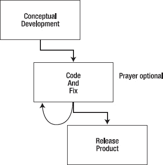

***图 2-1.** 编码与修复流程（非）模型*

### 瀑布模型概述

在计划驱动的过程模型中，最早且最传统的当属*瀑布*模型。如图 2-2 所示，该模型由温斯顿·罗伊斯于 1970 年提出³，涵盖了标准生命周期中的所有阶段。它依次流畅地推进需求收集与分析、架构设计、详细设计、编码、调试、系统测试、发布和维护。该模型要求在每个阶段提供详细的文档，并伴随评审、文档归档、各流程阶段的签字确认、配置管理以及整个项目的严密管理。这是一种计划驱动的过程模型。

_____________

³ 罗伊斯，W. W. *大型软件系统的开发管理.* IEEE WESCON 会议论文集，IEEE 出版社。（1970）

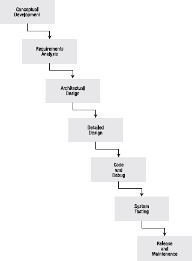

***图 2-2.** 瀑布过程模型*

然而，这个模型也行不通。

瀑布模型存在两个根本性的相关问题，阻碍了其被广泛接受，并使其极难实施。首先，它通常要求你在完成阶段 N 之后，才能继续进入阶段 N+1。举个最简单的例子，这意味着你必须在开始架构设计之前，敲定*所有*需求；在开始除单元测试之外的任何工作之前，完成编码和调试，等等。理论上，这很棒。你将拥有一套完整的需求，完全理解客户想要什么以及客户想要的一切，从而可以自信地进入系统设计阶段。

但在实践中，这种情况从未发生过。我从未参与过一个项目，能在工作开始时就把所有需求都敲定下来。我也从未见过一个项目，在开发过程中没有发生重大变更。因此，在一个阶段完全结束后才开始另一个阶段，这种做法是有问题的。

瀑布模型的第二个问题是，如前所述，它没有提供回溯的机制。它从根本上基于一种装配线的思维来开发软件。这个漂亮的小图表没有显示，如果在实施过程中发现问题，该如何返回并重新设计。这与上述第一个问题类似。其含义是，你必须在进入下一阶段之前，真正敲定当前阶段，并详细审查所有内容。在实践中，这根本不——现实。世界不是这样运作的。你永远无法在你需要知道某个信息的那个确切时刻，就知道所有需要知道的信息。这就是为什么软件是一个棘手的问题。

话虽如此，瀑布模型仍然是一个出色的理论模型。它将生命周期的不同阶段隔离开来，迫使你在进入下一阶段之前思考你真正需要知道什么。它也是开始思考超大型项目的一个好方法；它给管理者带来一种温暖而模糊的掌控感，因为它让他们以为自己知道正在发生什么（其实他们不知道，但那是另一个故事了）。对于经验不足的团队来说，在处理定义明确的新项目时，它也是一个好模型，因为它能引导他们走完整个生命周期。

因此，由于瀑布模型不是一个好的实践模型，它很快就演变成了一个略有不同的模型。

### 带反馈的瀑布模型

瀑布模型发生的第一个变化是，它变成了带反馈的瀑布模型，如图 2-3 所示。这承认了直线型瀑布模型行不通，并且你需要有能力在发现当前阶段的问题时，回溯到前一个阶段。

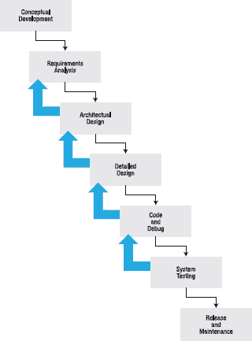

***图 2-3.** 带反馈的瀑布过程模型*

带反馈的瀑布模型认识到，你必须在需求、设计、测试计划等不完整的情况下开始工作。它还明确地构建了这样一种理念：随着项目新信息的发现，你将不得不回溯到之前的流程步骤。这些新信息可能是新需求、更新的需求、设计缺陷、测试计划中的缺陷等等。任何此类情况都需要你重新审视之前的流程步骤以纠正问题。

这种过程模型仍然相当僵化，并且在涉及非常大的新项目和经验不足的团队时，它仍然具有与瀑布模型相同的优势。带反馈的瀑布模型的两个主要缺点是：它会严重打乱你的时间安排，并且让你更难知道项目何时完成。它会打乱你的时间安排，因为在任何阶段都可能出现意料之外的回溯到前一个开发阶段的情况。这也意味着更难知道项目何时完成。

由于这些缺点，带反馈的瀑布模型也演变成了一种新模型，一种试图解决时间安排和不确定性问题的新模型。

### 循环是你的朋友

> *最佳实践是迭代并增量交付，将每次迭代视为一个封闭的“迷你项目”，包括完整的需求、设计、编码集成、测试和内部交付。在迭代截止日期，向内部利益相关者交付迄今为止（经过全面测试、全面集成）的系统。征求他们对这项工作的反馈，并将该反馈纳入下一次迭代的计划中。*
>
> （摘自《敏捷项目如何成功》⁴）

虽然带反馈的瀑布模型认识到并非所有需求都能提前知晓，并且在架构设计和详细设计中会犯错误，但它并未将这些认识充分融入流程中。迭代流程模型使流程步骤中所需的这种变更更加明确，并创建了逐步构建产品的流程模型。

在大多数迭代流程模型中，你会获取已知的需求——在流程早期某个时间点对需求进行快照——并根据客户对哪些功能最重要、需要优先交付的排序，对这些需求进行优先级排序。

然后，你选择最高优先级的需求，并规划一系列迭代，其中每次迭代都是一个完整的项目。对于每次迭代，你将添加一组次高优先级的需求（包括你在前一次迭代中可能发现的一些需求），并重复该项目。通过在每次迭代结束时，使用需求子集完成一个完整的项目，你最终会得到一个完整、可运行且健壮的产品，尽管其功能比最终产品要少。

根据汤姆·德马科的说法，这些迭代过程遵循一条基本规则：

> *你的项目，整个项目，有一个二元交付物。在计划完成的那一天，项目要么交付了一个被用户接受的系统，要么没有。每个人在那一天都知道结果。*
>
> *构建项目模型的目标是将项目划分为多个组成部分，每个部分都具有相同的特征：每个活动必须由一个具有客观完成标准的交付物来定义。这些交付物要么明确完成，要么未完成。* ⁵

那么，如果你的估算错误会发生什么？如果你决定在一次迭代中包含太多新功能呢？如果出现意外延迟呢？

______________

⁴[www.adaptionsoft.com/on_time.html](http://www.adaptionsoft.com/on_time.html)

⁵德马科，T. *《控制软件项目：管理、度量与估算》*。（上 saddle 河，新泽西州：Yourdon 出版社，1983 年。）

嗯，如果看起来你无法赶上迭代截止日期，那么只有两种现实的选择：推迟截止日期，或移除功能。当我们讨论估算和进度安排时，会再回到这个问题。

迭代开发的关键在于“过一种平衡的生活——每天学一点、想一点、画一点、唱一点、跳一点、玩一点、工作一点”，⁶ 或者在软件开发领域，每天*分析*一点、*设计*一点、*编码*一点、*测试*一点。当我们讨论敏捷开发模型时，会再次探讨这个想法。

### 增量模型的演进

实现增量模型的传统方式被称为*演进式原型法*。⁷ 在演进式原型法中，随着需求的接收，人们对其进行优先级排序，并生成一系列功能日益丰富的产品版本。每个版本都根据客户反馈以及集成测试和系统测试的结果进行改进。对于需求不断变化或模糊不清的环境，或者对应用领域理解不足的情况，这是一个极好的模型。这也是演变为现代敏捷开发流程的模型。参见图 2-4。

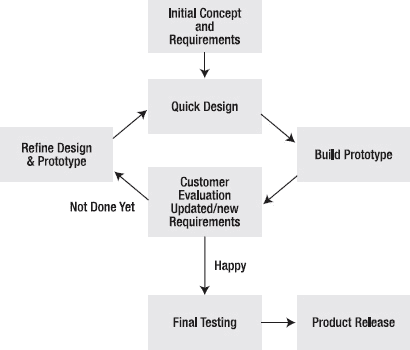

***图 2-4.** 演进式原型法流程模型*

______________

⁶富尔格姆，R. *《我真正需要知道的一切，在幼儿园就学会了》*。修订版。（纽约，纽约州：Ballantine 图书，2004 年。）

⁷麦康奈尔，S. *《快速开发：驯服疯狂软件进度》*。（雷德蒙德，华盛顿州：微软出版社，1996 年。）

演进式原型法认识到，从一开始就规划整个项目非常困难，并且反馈是良好分析和设计的关键要素。从进度安排的角度来看，它有一定风险，但与瀑布模型的任何变体相比，它有着非常好的成功记录。演进式原型法为客户和项目管理提供了更好的进度可见性。它还能为产品需求提供良好的客户和最终用户输入，并在对这些需求进行优先级排序方面表现出色。

不利的一面是，演进式原型法可能导致不切实际的进度、预算超支以及过于乐观的进度预期。这些情况之所以会发生，是因为原型中实现的需求数量有限，可能会让人误以为少量工作就能取得真正的进展。另一方面，在原型中放入过多需求可能导致进度延误，原因在于过于乐观的估算。这是一个难以维持的微妙平衡。由于设计会随着需求的变化而随时间演进，因此存在设计不良的可能性，除非有重新设计的准备——随着项目的推进以及客户对某个特定产品版本的投入越来越大，重新设计会变得越来越困难。此外，还存在可维护性低的可能性，同样是因为设计和代码会随着需求的变化而演进。这可能导致大量返工、进度延误，以及发布后修复缺陷的难度增加。

演进式原型法最适合那些紧密合作、曾共同完成多个项目的经验丰富的团队。这种凝聚力强的团队高效且灵活，能够专注于每次迭代，并且通常能产生一系列原型所需的连贯、可扩展的设计。通常不建议经验不足的团队采用此模型。

### 敏捷即敏捷

自 20 世纪 90 年代中期起，一群流程专家开始倡导一种新的软件开发模式。与上述由卡内基梅隆大学软件工程研究所（SEI）等团体所推崇的、以计划为驱动的重型模型⁸相反，这种新流程模型是轻量级的。它需要的文档更少，流程控制也更少。它针对的是中小型软件项目和较小的开发团队。其目的是让这些开发团队能够快速适应不断变化的需求和客户要求，并且它提出要比计划驱动模型更快地发布完成的软件。简而言之，它就是敏捷。⁹

敏捷开发基于这样一个命题：任何软件开发项目的目标都是可运行的代码。并且由于重点在于可运行的软件，因此开发团队应该将大部分时间花在编写代码上，而不是编写文档上。这使得这些流程被称为轻量级。

轻量级方法论有几个特点。它们倾向于强调在编写代码之前编写测试、频繁发布产品、客户深度参与开发、代码共同所有权以及重构——即重写代码以使其更简单、更易于维护。轻量级方法论也伴随着一些误解。其中两个最有害的误解可能是：轻量级流程只适用于非常小的项目，以及在轻量级项目中不需要任何流程纪律。

事实是，轻量级方法论已在许多中小型项目中成功应用——比如代码量高达约 50 万行的项目。轻量级方法论同样需要流程纪律，尤其是在项目初期，当初始需求和迭代周期被创建时，以及在作为编码过程核心的测试驱动开发中。

______________

⁸Paulk, M. C. (1995)

⁹Cockburn, A. *敏捷软件开发.* (波士顿, 马萨诸塞州: Addison-Wesley, 2002.)

我们将探讨两种轻量级/敏捷方法论：极限编程和 Scrum。

### 极限编程（XP）

极限编程大约在 1995 年由肯特·贝克和沃德·坎宁安创立。XP 是一种“轻量级、高效、低风险、灵活、可预测、科学且有趣的软件开发方式”。¹⁰

### XP 概述

XP 依赖于以下四个基本理念：

*   *客户深度参与*：XP 要求客户代表成为开发团队的一员，并始终在现场。客户代表与团队合作，共同创建产品每个迭代的内容，并为每个中间版本创建所有验收测试。
*   *持续单元测试*（也称为测试驱动开发 [TDD]）：XP 要求开发人员在编写任何代码之前，先为任何新功能编写单元测试。这样一来，测试最初当然都会失败，但这为开发人员提供了一个清晰的成功衡量标准。当所有单元测试通过时，你就完成了该功能的实现。
*   *结对编程*：XP 要求所有代码都由成对的开发人员编写。简而言之，结对编程需要两名程序员——一名驾驶员和一名领航员——他们共享一台计算机。驾驶员实际编写代码，而领航员则在一旁观察，捕捉拼写错误、提出建议、思考设计和测试等。两人会定期交换角色（大约每 30 分钟，或者当其中一人认为有更好的方式来实现某段代码时）。结对编程基于“三个臭皮匠，顶个诸葛亮”的理论。虽然就单位时间内编写的代码行数而言，一对程序员的生产力不如两个单独工作的程序员，但他们编写的代码通常缺陷更少，并且他们有一套单元测试来证明代码能正常工作。这使得他们整体上更具生产力。结对编程还为团队提供了重构现有代码的机会——即重新设计代码，使其在满足客户需求的同时尽可能简单。结对编程并非 XP 独有，但 XP 是第一个专门使用它的方法论。
*   *短迭代周期和频繁发布*：XP 通常使用仅几个月的发布周期，每个发布由多个迭代组成，每个迭代大约 4-6 周。频繁发布与现场客户代表的结合，使得 XP 团队能够获得关于新功能的即时反馈，并及早发现设计和需求问题。XP 还要求持续集成和构建产品。每当一个编程对完成一个功能并且该功能通过了他们所有的单元测试时，他们就会立即集成并构建整个产品。然后，他们使用所有单元测试作为回归测试套件，以确保新功能没有破坏任何已检入的代码。如果确实破坏了某些东西，他们会立即修复。因此，在一个 XP 项目中，集成和构建一天可能发生多次。这个过程让团队每天都能很好地了解他们在发布周期中的位置，并为客户提供一个可运行的构建版本，以便运行验收测试。

______________

¹⁰这只是对 XP 工作方式的非常简短的描述；要获得更详尽、更精彩的解释，真正堪称 XP 圣经的著作，请参阅：
Beck, K. *解析极限编程：拥抱变化.* (波士顿, 马萨诸塞州: Addison-Wesley, 2000.)

### XP 的动机

风险是软件中最基本的问题。风险以多种方式显现：进度延迟、项目取消、缺陷率上升、对业务问题的误解、虚假功能丰富（你添加了客户并不真正想要或需要的功能）以及人员流失。管理风险是一个非常困难且耗时的管理问题。最小化和处理风险是风险管理的关键领域。XP 试图通过控制软件开发的四个变量来最小化风险。

### 四个变量

软件开发项目的四个变量如下：

*   成本
*   时间
*   功能
*   质量

*成本*可能是最受约束的变量；你无法通过花钱来换取质量或进度，而且作为开发者，你对成本的控制非常有限。成本也是布鲁克斯法则发挥作用的地方（向一个已经延期的项目增加人手，只会让它更延期）。

*时间*是你的交付日程，不幸的是，它通常是由外部强加给你的。例如，大多数消费产品（无论是硬件还是软件）的交付日期都会定在夏末或初秋，以便赶上假日购物季。你无法改变圣诞节。如果你延期了，解决问题的唯一办法就是削减功能或降低质量；这两者都不太理想。

*质量*是指你愿意在发布时容忍的缺陷数量及其严重程度。你可以通过牺牲质量来在交付日程上获得短期收益，但代价是巨大的。修复下一个版本需要花费更多时间，而且你的信誉也会大打折扣。

*功能*（也称为*范围*）是指产品实际能做什么。这应该是开发者始终关注的重点。从客户的角度来看，它是最重要的变量，同时也是作为开发者的你最能掌控的变量。控制范围能让你为管理者和客户提供对质量、时间和成本的控制。

极限编程（XP）认识到，为了最小化风险，开发者需要尽可能多地控制变量，但尤其需要控制项目的范围。XP 使用了“学开车”的比喻。学开车不是把车指向正确的方向。而是指向车，持续关注，并不断做出必要的微小修正，以保持车辆在道路上行驶。在编程中，唯一不变的就是变化。如果你能关注变化并随其发生而应对，就能将变化的成本控制在可管理的范围内。

### 四个价值观

为了使 XP 成为一种可行的开发规范，参与 XP 项目的每个人都必须认同并接受一套共同的价值观，这些价值观将渗透到构成该规范的所有规则中。在 XP 中，有以下四个核心价值观使其能够运作：

*   沟通
*   简单
*   反馈
*   勇气

沟通实际上意味着将团队的集体知识传播给所有成员。保持 XP 团队规模小，通过减少沟通线路的数量来促进沟通。结对编程和代码的集体所有权也通过将整个代码库的知识传播到整个团队来促进沟通。XP 开发者被鼓励修复他们发现的错误，并重新设计功能使其更简单（见下文）；这会将代码知识广泛地传播到团队中。

*简单*是关键。XP 专注于开发解决当前任务的最简单的软件。XP 开发者相信：“……今天做一件简单的事，如果以后需要改变，明天多花一点代价，也比今天做一件可能永远用不上的复杂事情要好。”XP 团队中的所有开发者都被允许并鼓励随时重新设计代码以使其更简单。这种做法被称为“重构”。“关于系统当前状态的*具体反馈*是绝对无价的。乐观是编程的职业病。反馈就是治疗。”¹¹ XP 程序员被要求先写测试再写代码，这样他们总能立即获得关于其代码及其对系统影响的反馈。此外，客户也在编写功能（验收）测试，因此这些测试可用于衡量系统在多大程度上符合用于开发它的“用户故事”。

XP 开发者必须有*勇气*。他们必须愿意在设计不再合适时随时做出改变。他们需要准备好抛弃不工作的代码。简单性支持勇气，因为你不太可能破坏一个简单的系统。XP 团队成员每天跟踪进度，并在需要时立即让客户参与重新确定功能的优先级。

### 15 条原则

从上述四个价值观出发，XP 衍生出一些基本原则。列表如下：

> *快速反馈*：获取反馈，解读它，并尽快将其重新纳入系统。自动化测试在此至关重要，因为你可以随时运行单元测试，并在想要集成更改时运行整个回归测试套件。
> 
> ______________
> 
> ¹¹Beck, K. (2000)
> 
> *假设简单*：专注于今天的任务，并以最简单的方式解决它。这也意味着，在进行更改时，你应该寻找简化代码的方法。重构能使代码尽可能简单，并减少缺陷。
> 
> *增量变更*：每天将你的新代码集成到系统中。事实上，每当你完成一个任务时就进行集成。这能让你快速发现接口和交互错误，并至少每天为客户提供一个可供检查的新基线。
> 
> *拥抱变化*：变化总会发生，所以要为此做好准备。像极限编程（XP）这样的敏捷方法论，其整个基础就在于变化是软件开发中的常态，你的规程越能适应变化，你的开发过程就会越好。
> 
> *高质量工作*：质量并非免费；要努力追求无缺陷的代码。结对编程带来了“三个臭皮匠，顶个诸葛亮”的好处，而测试驱动开发则让你的代码专注于满足需求。这两者都有助于减少代码中的缺陷。
> 
> *教导学习*：教导如何更好地学习进行测试、重构和编码，而不是制定一套规则说“你必须这样测试”。
> 
> *小规模初始投入*：这里的重点是小型团队，尤其是在项目开始时，要谨慎且保守地管理资源。如果你以较少的资源和紧凑的预算开始，这将迫使你的思维聚焦于精益设计和代码。这强化了简单性。
> 
> *为赢而战*：与“为不输而战”相对。如果你不担心进度或需求变更，你的日子会更轻松，你将能够专注于手头的问题（而不是下一个截止日期），你的代码会更整洁，你会更放松，效率也更高。放松心态，赢得胜利。
> 
> *具体实验*：每一个抽象决策（需求或设计）都应该被测试。在 XP 和其他敏捷方法论中，鼓励你创建一种称为*探针*的东西。探针是一段快速而粗糙的概念验证代码，它至少实现了你决策的轮廓，以便你能检验自己是否正确。或者，如果你错了，也不会浪费大量时间去发现这一点。
> 
> *开放、诚实的沟通*：你必须能够进行建设性的批评，并且既能传递好消息也能传递坏消息。这是良好设计或代码审查的基础。团队的文化必须是你可以随时提出建设性的批评。这有两层含义：首先，你们都在努力改进代码，所以批评是好事；其次，公共代码所有权意味着每个人都有权进行更改，而不必担心伤害他人的感情。
> 
> *顺应人的本能，而非对抗*：人们通常喜欢赢，喜欢与他人合作，喜欢成为团队的一员，尤其喜欢看到自己的代码能工作。不要做违背这一点的事情。
> 
> *接受责任*：整个团队对产品负责。责任由整个团队承担，任务不是被分配的，而是被请求的。公共代码所有权导致共同的项目所有权。XP 团队通常没有分配工作的经理；他们有一位教练来协助流程，以及一位项目经理来处理行政事务。开发团队成员自己选择任务并确保完成。
> 
> *本地适应*：根据你的本地情况和项目调整 XP。这是接受责任原则的应用。团队拥有项目，因此团队也拥有流程，他们需要就调整达成共识。
> 
> *轻装上阵*：你维护的团队和流程工件应该少而精，并且有价值。这意味着你应该愿意快速改变方向，并抛弃那些不起作用的东西（代码、设计），转而采用有效的。
> 
> *诚实度量*：在正确的细节层面进行度量，并且只度量对你的项目有意义的内容。记住准确度与精密度之间的区别。

### 四项基本活动

为了让 XP 能够采纳上述价值观和原则，并从中创建一套规程，我们需要描述将作为基础的活动。XP 描述了构成该规程基石的四个活动。

*   *编码*：代码是系统知识所在之处，因此它是你的主要活动。计划驱动模型与敏捷模型之间的根本区别就在于对代码的重视程度。在计划驱动模型中，重点在于生成一组工作产品，这些产品共同代表项目的全部工作，而代码只是其中一个工作产品。在敏捷方法论中，代码是唯一的可交付成果，因此重点完全放在代码上；此外，通过恰当地组织代码并保持注释更新，代码本身就成了项目的文档。
*   *测试*：测试告诉你何时完成了编码。测试驱动开发对于管理变更的理念至关重要。XP 高度依赖于在编写被测试的代码之前先编写单元测试，并且使用自动化测试框架在集成更改时运行所有单元测试。
*   *倾听*：倾听你的伙伴和客户。在任何给定的软件开发项目中，都存在两种类型的知识。客户拥有关于正在编写的业务应用程序及其预期功能的知识。这是项目的领域知识。开发人员拥有关于目标平台、编程语言以及实现问题的知识。这是项目的技术知识。客户不了解技术方面，开发人员不具备领域知识，因此倾听——双方都倾听——是开发产品的关键活动。
*   *设计*：边编码边设计。“设计是创建一种结构来组织系统中的逻辑。好的设计能组织逻辑，使得系统某一部分的变更不总是需要系统另一部分的变更。好的设计确保系统中的每一段逻辑都有一个且只有一个归属地。好的设计将逻辑放在其操作的数据附近。好的设计允许仅在一个地方进行更改就能扩展系统。”¹²

### 实施 XP：12 个实践

我们（终于）谈到了 XP 的实施。以下是每个 XP 团队在项目期间遵循的规则。这些规则可能因团队和项目而异，但要想自称为 XP 团队，你需要以某种形式做到这些事情。这里描述的实践借鉴了之前描述的所有内容：四个价值观、15 个原则和四个活动。这才是真正的 XP。

*   **计划游戏**：通过结合业务优先级和技术评估来确定下一个版本的范围。客户和开发团队需要决定哪些故事（即功能特性）将包含在下一个版本中，每个故事的优先级，以及版本需要何时完成。开发人员负责将故事分解成一组任务，并估算每项任务的持续时间。这些持续时间的总和能让团队了解他们真正认为在版本交付日期前能完成多少工作。如果数字对不上，必要时会将一些故事移出版本。请注意，估算是开发人员的责任，而不是客户或经理的责任。在极限编程中，*只有*开发人员进行估算。
*   **小型发布**：快速将一个简单的系统投入生产，然后以非常短的周期发布新版本。每个版本从业务角度来看都必须有意义，因此版本规模会有所不同。最好规划一两个月时长的版本，而不是六个月或十二个月。版本周期越长，就越难估算。
*   **隐喻**：“一个关于整个系统如何运作的简单共享故事。”隐喻取代了你的架构。它需要对系统进行连贯的解释，并且能够分解成更小的部分——故事。故事应始终使用隐喻的词汇来表达，并且隐喻的语言应为客户和开发人员所共同理解。
*   **简单设计**：每天尽可能保持设计简单。经常重新设计以保持其简洁。根据贝克的看法，一个简单的设计应满足：(1) 通过所有单元测试，(2) 没有重复代码，(3) 在代码中表达每个故事的含义，以及 (4) 使用最少数量的、对实现当前故事有意义的类和方法的数量。¹³
*   **测试**：程序员持续编写单元测试。在集成之前，所有测试必须通过。贝克坚持严格的原则：“任何没有自动化测试的程序功能根本就不存在。”¹⁴ 尽管这对大多数验收测试有效，并且当然应该对所有单元测试有效，但这种类比在某些情况下会失效，尤其是在测试图形用户界面（GUI）的用户界面时。如果你的测试框架能够处理 GUI 交互生成的事件，即使是这种情况也可以实现自动化。除此之外，拥有一套良好的书面说明通常也能满足需求。
*   **重构**：在不改变系统行为的前提下重组系统，使其更简单——消除冗余、删除不必要的代码层，或增加灵活性。重构的关键在于识别出可以变得更简单的代码区域，并在你处理这些代码时立即进行。重构与集体所有权和简单设计密切相关。集体所有权允许你修改代码，而简单设计则要求你在发现需要修改时承担起修改的责任。
*   **结对编程**：在极限编程项目中，所有生产代码必须由两名程序员在一台机器上共同编写。任何单独编写的代码都将被丢弃。结对编程是一个动态过程。你可以像更换要实施的任务一样频繁地更换搭档。这有助于将整个系统的知识传播到整个团队，从而强化集体所有权。它避免了“啤酒车问题”——即那个无所不知的人被啤酒车撞倒，从而导致项目进度倒退数月的情况。
*   **集体所有权**：团队拥有所有东西，这意味着任何人都可以随时更改任何内容。在某些地方，这被称为“无我编程”。程序员需要接受这样一个理念：任何人都可以修改他们的代码，并且集体所有权从代码延伸到整个项目；这是一个团队项目，而非个人项目。
*   **持续集成**：每完成一个任务就进行集成和构建，可能一天多次（只要所有测试都通过）。这有助于隔离代码库中的问题；如果你只集成了一个任务的变更，那么查找问题最可能的地方就在那里。
*   **每周 40 小时工作制**：按常规每周工作 40 小时。永远不要连续两周加班。极限编程的理念与汤姆·德马科在《人件》中的许多论点有很多共同之处。如果人们每周工作 60 或 70 小时，他们的工作效率会比每周工作 40 小时更低。当你过度加班时，会发生几件事。因为你没有时间做家务和与“生活”相关的事情，你会在工作日期间做这些事。持续处于截止日期的压力下，并且从未得到持续的休息，也意味着你会变得疲惫，然后犯更多错误，而这些错误又需要别人来修复。但是，能够掌控项目并每周工作 40 小时（上下浮动一点），会让你有时间享受生活、有时间放松和充电、有时间在工作日专注于工作，从而使你更有效率，而不是更低效。
*   **现场客户**：客户是团队的一部分，在现场工作，编写并执行功能测试，并帮助澄清需求。客户能够对系统的变更提供即时反馈，这也增强了团队的信心，让他们相信每天都在构建正确的系统。
*   **编码标准**：团队拥有编码标准、遵循编码标准，并利用它们来改善沟通。由于代码集体所有权，团队必须拥有编码标准，并且每个人都必须遵守。如果没有一套合理的编码指南，重构所需的时间将大大增加，并且会降低开发人员修改代码的意愿。请注意，我说的是“合理”。你的编码标准应该使代码更易于阅读和维护：它们不应限制创造力。

______________

¹²Beck, K. (2000)

¹³Beck, K. (2000)

¹⁴Beck, K. (2000)

### XP 生命周期

XP 生命周期包含了本章开头所述通用生命周期的所有阶段，但它将中间三个阶段——设计、编码和测试——压缩为一个单一的实现阶段。在实现阶段之后增加了一个产品化阶段，以便在发布前稳定代码。XP 生命周期展示了如何将代码产出作为该方法论的核心。

9\. *探索阶段*：当“客户确信故事卡上的内容足以支撑一个良好的首次发布，并且程序员确信如果不实际实现系统，他们无法做出更准确的估算”时，探索阶段即告完成。¹⁵ 在探索阶段，团队的主要目标是尽可能多地编写需求（故事卡）。这也是他们可以通过快速搭建系统原型来探索架构可能性的时机。估算探索阶段完成的所有任务，以锻炼你的估算技能。在大多数项目中，探索阶段是项目的“模糊前端”。你不太确定需要多长时间，同时你正在收集需求并试图弄清楚产品最终将*做*什么。

10\. *计划博弈*：计划博弈是你发布探索阶段的尾声。在计划博弈中，你需要确定最高优先级、高价值的故事，并与客户就哪些故事将包含在下一个发布中达成一致。每次发布的持续时间应为两到六个月。时间再短，你可能无法完成任何重要工作；时间再长，则计划起来会非常困难。然后，你需要为本次发布规划最初的几个迭代；每个迭代持续 1 到 4 周。每个迭代都会为计划在该迭代中的每个故事生成功能测试用例。第一个迭代有助于你确定项目的隐喻并搭建架构。后续迭代则根据故事优先级列表添加新功能。必要时可重新调整计划。

11\. *实现阶段*：设计、编码、测试，或者更准确地说，设计、测试、编码。一次处理一个任务，直到某个故事的所有任务完成；一次处理一个故事，直到本次迭代的所有故事完成。我们还需要多说吗？

______________

¹⁵Beck, K. (2000)

12\. *产品化阶段*：发生在发布完成前的最后一个迭代。此时，你应该冻结新功能，专注于稳定产品，必要时调整性能，并运行验收测试。

13\. *维护/演进阶段*：嗯，根据敏捷理念，你始终处于维护模式。但在这里，你已经发布了客户将使用的产品，现在必须“同时生产新功能、保持现有系统运行、吸纳新成员加入团队，并告别离开的成员。”¹⁶

14\. *死亡阶段*：如果客户无法提出新故事，则将代码封存。如果系统无法再交付价值，则将代码封存并重新开始。

### Scrum，伙计

我们将要讨论的第二种敏捷方法论是 *Scrum*。Scrum 这个名字来源于橄榄球运动，其中 scrum（争球）是在犯规后重新开始比赛的一种方式。争球使用橄榄球队中的八名前锋（在英式橄榄球联合会形式的比赛中，全队共 15 名球员）试图（重新）获得对球的控制权，并将其向对方球门线推进。敏捷 Scrum 方法论的理念是，一个小团队围绕一个单一目标团结起来，通过冲刺开发来逐步接近该目标。

事实上，Scrum 比 XP 更早出现，其最初的流程管理思想源于 Takeuchi 和 Nonaka 在 1986 年发表的论文《新新产品开发游戏》。¹⁷ “Scrum”一词的首次使用归功于 DeGrace 和 Stahl 在 1990 年出版的著作《棘手问题，正义解决方案》。¹⁸ Scrum 是迭代开发方法的一种变体，并融合了 XP 的许多特性。Scrum 更像是一种管理方法，它不像 XP 那样定义许多详细的开发实践（如结对编程或测试驱动开发），尽管大多数 Scrum 项目会使用这些实践。

Scrum 团队规模不超过 10 名开发者。与其他敏捷方法论一样，Scrum 强调小团队和集体所有权的有效性。

Scrum 的特点在于 *冲刺*，即一个持续 1 到 4 周的迭代。冲刺是有时间盒限制的，因为它们有固定的持续时间，冲刺的输出是团队在冲刺期间能够完成的工作。冲刺的交付日期不会推迟。这意味着有时冲刺可以提前完成，有时冲刺完成时的功能会比计划少。一个冲刺总是交付一个可用的产品。

Scrum 的需求被封装在两个待办事项列表中。产品待办事项列表是项目所有需求的优先级列表；它由 Scrum 团队和产品负责人创建。冲刺待办事项列表是当前冲刺的需求（例如用户故事）优先级列表。一旦冲刺开始，只有开发团队可以向冲刺待办事项列表添加条目——这些通常是测试过程中发现的缺陷。任何外部实体都不能向冲刺待办事项列表添加条目，只能添加到产品待办事项列表中。

______________

¹⁶Beck, K. (2000)

¹⁷Takeuchi, H. and I. Nonaka. “The New New Product Development Game.” *Harvard Business Review* 64(1): 137-146. (1986)

¹⁸DeGrace, P. and L. H. Stahl. Wicked Problems, Righteous Solutions: A Catalogue of Modern Software Engineering Paradigms. (Englewood Cliffs, NJ: Yourdon Press, 1990.)

Scrum 项目由一名 ScrumMaster 推动，其职责是管理待办事项列表、主持每日 Scrum 会议，并在冲刺期间保护团队免受外部影响。ScrumMaster 通常不是开发者。

Scrum 项目每天举行一次每日 Scrum 会议，这是一个持续 15-30 分钟的站立会议，整个团队在会上讨论冲刺进度。每日 Scrum 会议使团队能够共享信息并跟踪冲刺进度。通过每日 Scrum 会议，任何进度延误或实现中的问题都会立即显现，然后团队可以立即处理。“ScrumMaster 确保每个人都在取得进展，记录会议上做出的决定并跟踪行动项，并保持 Scrum 会议简短而专注。”¹⁹

在 Scrum 会议上，每个团队成员依次回答以下三个问题：

1.  自上次 Scrum 会议以来，你完成了哪些任务？
2.  有什么事情阻碍你完成任务吗？
3.  从现在到下次 Scrum 会议之间，你计划完成哪些任务？

除回答这三个问题之外的讨论将推迟到其他会议进行。这种会议类型有若干效果。它能让整个团队每天都能看到冲刺和项目完成的进度。通过分享进展来增强团队精神——每个人都能为已完成的任务感到高兴。最后，它还能将问题摆到台面上来——然后由整个团队共同解决。

开发团队本身是自组织的；Scrum 团队的成员自行决定谁将负责哪些用户故事和任务，共同承担项目的所有权，并决定他们在冲刺期间将使用的开发流程。这种组织方式在每天的 Scrum 会议上得到强化。

在第一个冲刺开始之前，Scrum 有一个初始规划阶段，该阶段会创建初始需求列表，决定实现需求的架构，将用户故事按优先级分组到各个冲刺中，并将第一组用户故事分解为待估算和分配的任务。当他们的估算占用了冲刺允许的所有时间时，他们就会停止。冲刺中的任务不应超过一天的工作量。

每个冲刺结束后，会举行另一个规划会议，Scrum Master 和团队会重新确定产品待办事项列表的优先级，并为下一个冲刺创建待办事项列表。对于大多数 Scrum 团队来说，随着项目的进展，任务的估算会变得更加准确，这主要是因为团队现在有了之前冲刺中如何进行估算的数据。Scrum 中的这种效应被称为“加速”；随着团队的凝聚力和估算任务能力的提高，团队的生产力实际上可以在项目期间得到提升。在这个规划会议上，组织也可以决定项目是否完成，或者是否完全终止项目。

在最后一个计划好的冲刺之后，会进行一个最终冲刺来结束项目。这个冲刺不实现新功能，而是为产品发布准备最终的可交付成果。它修复所有现有错误，完成文档，并通常将代码产品化。产品待办事项列表中剩余的任何需求都将转移到下一个版本。在下一个冲刺开始之前，会举行一次 Scrum 回顾会议，反思上一个冲刺，看看是否有任何流程改进可以进行。Scrum 是一种项目管理方法论，通常对开发流程不作具体规定。尽管如此，Scrum 团队通常使用上述 XP 实践部分中描述的许多实践。公共代码所有权、结对编程、小型发布、简单设计、测试驱动开发、持续集成和编码标准都是 Scrum 项目中的常见实践。

______________

¹⁹Rising, L. and N. S. Janoff. “The Scrum Software Development Process for Small Teams.” IEEE Software 17(4): 26-32. (2000)

### 结论

从本章描述的方法论可以看出，迭代是关键，无论你使用的是演进的计划驱动流程还是敏捷开发流程。要认识到构建复杂软件的最佳方式是增量式的。要明白，设计、编写、测试和交付增量式改进的代码是编写优秀软件的第一步。

## 第 3 章

## 项目管理基础

> *质量、功能、进度——三者选其二。*

项目管理？这不是一本软件开发的书吗？

是的，但在一个规模大于一人的开发项目中工作意味着在团队中工作；而在团队中工作意味着被管理。因此，从双方的角度学习一些项目管理知识是学习软件开发的重要组成部分。

项目管理是一系列复杂且涉及面广的任务。我们将把自己限制在对你作为开发者影响最大的几个任务上。它们如下：

*   项目规划
*   估算与进度安排
*   资源管理
*   项目监督
*   项目评审与演示
*   项目事后分析

### 项目规划

项目规划是永恒的。我的意思是，项目规划贯穿项目的整个生命周期。“计划”从来都不是一成不变的，因为典型软件项目中的事物通常处于不断变化之中。在大多数项目中，尤其是那些使用计划驱动流程模型的项目中，项目计划是由项目经理编写的实际文档，并由开发团队和高层管理人员批准和签署。它实际上是一份合同，尽管是一份滚动合同，规定了团队将要做什么以及他们将如何去做。它还说明了项目将如何管理，在极端的计划驱动案例中，甚至规定了文档本身将如何以及何时被修改。

项目计划里有什么？通常，项目计划包含以下七个部分：

*   项目介绍与说明
*   项目组织
*   风险分析
*   硬件、软件和人力资源需求
*   工作分解与任务估算
*   项目进度表
*   项目监控与报告机制，统称为项目监督

并非所有这些部分对所有项目或项目方法论都是必需的。特别是，计划驱动型项目会使用所有这些部分，而敏捷项目可能只在一页纸上使用其中几个。

项目计划是一个很好的工具，用于确定你认为自己在做什么，概述将如何完成，以及你计划如何执行该概述。项目计划的问题在于它是静态的。一旦它被编写并签署，高层管理人员就会认为项目将完全按照计划中所述的方式运行。但项目的现实情况往往会挫败计划。

### 项目组织

计划中的项目组织部分包含以下三项内容：

*   你将如何组织团队
*   项目将使用什么流程模型
*   项目将如何进行日常运作

如果你与一个有经验的团队合作，所有这些对每个人来说都是已知的，那么你的项目组织部分可以是，“我们将按我们通常的方式行事。” 然而，对于全新的项目和缺乏经验的团队来说，这一部分是必要的，因为组织部分让你在开始实际项目工作时有了一个可以依靠的依据。

### 风险分析

在风险分析部分，你需要考虑不好的事情。¹ 这个项目可能会出什么问题？可能发生的最坏情况是什么？如果发生了，我们将怎么做？

需要注意的一些风险包括：

______________

¹McConnell, S. *Rapid Development:* Taming Wild Software Schedules. (Redmond, WA: Microsoft Press, 1996.)

*   **进度延误**：你预估需要三天完成的任务，结果花了三周。在计划驱动的项目中，如果你没有定期召开状态会议，这可能会成为一个问题。等了三周才告诉老板你迟了，总比你一知道会迟到就告诉她更糟糕。在敏捷项目中，这种情况不太可能发生，因为大多数敏捷项目都有每日状态会议（参见第 2 章的 Scrum 会议部分）。
*   **缺陷率过高**：你的测试发现了大量错误。你是继续添加新功能，还是停下来修复错误？同样，在那些按固定计划（比如每周一次）进行集成构建的项目中，这可能是一个真正的问题。在每天进行集成的项目中，你可以更容易地跟上缺陷修复的节奏。无论哪种情况，如果你遇到了高缺陷率，最好的做法是停下来，审视全局，在添加更多功能之前找到缺陷的根本原因。从项目管理的角度来看，这很难做到，但你最终会感谢自己的决定。
*   **需求误解**：你所做的并非客户想要的。这个经典问题源于客户和开发者生活在两个不同的世界。客户生活在应用领域，从用户的角度理解他希望产品做什么。开发者则从技术角度理解产品将如何工作。有时这两个世界会交汇，这很好；但很多时候它们不会，这就导致了需求误解。避免这种情况的最佳方法是尽可能让客户在场，并尽可能频繁地交付可交付的产品。
*   **需求变更**：新功能、修改功能、删除功能……这种痛苦何时是个头？需求变更很可能是导致交付日期延误、缺陷率高和项目失败的最大单一原因。当客户（或你自己的市场人员，或开发团队本身）在开发过程中不断更改需求时，就会发生需求变更。它会导致大量的代码返工、基线重新测试以及一次又一次的延误。管理需求是项目经理最重要的工作。在计划驱动的流程中，这通常由一个变更控制委员会（CCB）来完成，该委员会审查每个新需求，并决定是否将其添加到待实现的功能列表中。CCB 中可能有一名开发团队成员，但这并非必需，因此这里的风险在于，CCB 可能会在不完全了解所有进度和人力影响的情况下添加新功能。在敏捷流程中，开发团队通常控制着优先级排序的需求列表（在 Scrum 中称为产品待办列表），并且只在项目的特定时间点调整该列表——在 XP 中是在每次迭代之后，在 Scrum 中是在每个冲刺之后。
*   **人员流失**：你最资深的开发人员在产品交付前三周决定加入一家初创公司。减少人员流失的最佳方法是：(1) 给开发人员有趣的工作，(2) 让他们在愉快的环境中工作，(3) 让他们掌控自己的进度安排。奇怪的是，金钱并不是软件开发人员的主要激励因素之一。这并不意味着他们不想获得高薪，但确实意味着为了让他们更努力工作或防止他们离职而给他们更多钱通常不起作用。而且，如果你尽了最大努力，你最好的开发人员还是离开了，你只能继续前进。相信我，这不会是世界末日。减轻人员流失影响的最佳方法是在开发团队的所有成员之间分散项目知识。像**代码集体所有制**这样的原则和**结对编程**这样的技术，有助于让所有团队成员都投入到产品中，并将代码知识分散到整个团队。关于管理和留住软件开发人员的最佳书籍之一是 Tom DeMarco 所著、由 Dorset House 出版的《人件》。²

一旦你列出了项目的风险清单，就需要逐一处理，并讨论两件事：**规避**和**缓解**。针对每个风险，思考如何规避它。在你的进度中预留缓冲时间，进行持续的代码审查，尽早冻结需求，频繁发布，要求结对编程以分散代码知识，等等。然后你需要考虑，如果最坏的情况真的发生了，你该怎么做；这就是**缓解**。从发布中移除功能，停止新功能开发并进行错误排查，将新功能协商到未来的发布中，等等。如果一个风险变成了现实，你必须对此采取**某些**措施；提前计划好你要做什么会更好。

一旦你处理了规避和缓解措施，你就会有一个如何处理可识别风险的计划。这并不能让你完全摆脱困境，因为肯定会有你遗漏的风险；但是，处理你确实想到的风险的经验，将使你能够更好地处理项目中那些让你措手不及的新风险。如果你的项目使用迭代过程模型，那么最好在每个迭代之后重新审视你的风险，看看哪些发生了变化，识别任何新风险，并移除那些不再可能发生的风险。

### 资源需求

这一部分是小菜一碟。你的项目需要多少人？他们都需要同时开始，还是他们的项目开始日期可以随着阶段的启动而错开？你需要多少台电脑？你将使用什么软件进行开发？你需要什么样的开发环境？每个人都接受过该环境的培训吗？你需要哪些支持软件和硬件？是的，无论你使用什么过程模型，你都需要一个配置管理系统和一台独立的构建机器。

许多这些资源问题通常会由你针对的平台和你工作的应用领域来回答。这是容易的部分。关于团队规模、开始日期和项目阶段的问题，很可能要等到你首次进行工作量估算和进度安排后才能回答。

______________

²DeMarco, T. 和 T. Lister. 《人件：富有成效的项目与团队，第二版》。（纽约，纽约州：Dorset House Publishing Company, 1999 年。）

### 工作分解与任务估算

制定项目时间表的第一步，是明确你要做什么以及每个步骤需要多长时间。这就像经典的“先有鸡还是先有蛋”问题。在将工作详细分解为具体任务之前，你无法真正进行估算。但你的经理总是希望在开始设计之前就拿到工作量估算和时间表数据。要抵制这种做法。一旦你对需求有了初步了解，就应将设计作为首要任务。如果你选择一小部分高优先级的需求，并为该功能集设计解决方案，那么你就可以对该迭代进行工作量估算。不必担心需求可能会变化——它们肯定会变。在进行工作量估算之前，你需要将功能详细分解为任务。

*永远不要*相信任何告诉你“那个功能需要六个月才能完成”的人。那只是一个胡乱猜测（WAG），与现实几乎毫无关系。你*根本*无法估算那么大的东西。你最多只能说：“我曾经在六个月内实现过一个类似的功能。”即便如此，这也只是略有帮助。

你必须将工作分解为持续时间不超过一周左右的任务。一两天是更好的选择。甚至更好的是，永远只用人时作为估算单位。这样，你更倾向于以小时为单位进行小增量工作，并将较大的任务分解成你实际知道如何完成的较小任务。一旦你有了一个可信的任务列表，你就可以开始进行规模估算，然后是工作量估算。规模总是需要优先考虑，因为只有了解了任务的大小，你才能弄清楚它需要多长时间。

规模可以指代多种事物，具体取决于你的工作分解和开发模型：功能模块、类数量、方法数量、功能点数量、对象点数量，或者那个老掉牙的指标——未注释的代码行数。实际上，无论你最初用什么来衡量规模，最终你都会以千行未注释代码（KLOC）为单位进行估算。

有几种获取工作量估算的技术——COCOMO II [Boehm00]、功能点分析和德尔菲法只是其中三种。然而，所有这些方法都依赖于能够统计你设计中的各项内容。估算的口诀是：先规模，再工作量和成本估算，最后是时间表。

在其他条件相同的情况下，德尔菲法是一种快速且相对高效的估算技术。以下是它的一种工作方式：找到你团队中三位最资深的开发人员——他们是经验最丰富的人，因此应该能够给出不错的猜测。然后给他们任务分解（假设他们之前没有参与初始分解——这是理想情况）。接着请他们为每个任务给出三个数字：最短所需时间、最长所需时间以及“正常”所需时间，全部以人时为单位。一旦你得到这些数字，将它们分别相加：最短的加在一起，最长的加在一起，“正常”的加在一起，然后取平均值。这些就是你对每个任务的估算值。这是你最好的开发人员对每个任务的最佳猜测的平均值。根据你的性格——以及你的老板催得有多紧——为每个任务选择三个值中的一个作为（暂时的）官方工作量估算，然后着手制定时间表。

最后，应该让合适的人——即实际执行工作的开发人员——来完成项目的所有估算。经理*永远不应*进行开发估算。即使经理过去曾是开发人员，除非他深度参与实际的开发工作，否则也不应该从事开发估算的工作。

### 项目时间表

一旦你有了第一个发布版本或迭代中任务的估算，并且有了人员资源估算，你就可以创建时间表了。在你能看到那张带有标记发布日期的漂亮黑色菱形块的甘特图之前，有几件事需要考虑。列表如下：

*   让你的开发人员告诉你任务之间的依赖关系。有些任务必须等其它任务完成后才能开始。有些任务可能在其它任务完成一半时就可以开始。还有一些任务可以同时开始。你需要了解这些，因为任务依赖关系会推迟你的交付日期。
*   弄清楚你的实际工作周期。在每个八小时工作日中，你的开发人员实际用于开发的时间有多少小时？你需要记住，阅读邮件、参加会议、进行代码审查、休息、上厕所，这些都会消耗时间。你不能假设一个八小时的任务能在一天内完成。实际上，在每个八小时工作日中，有两到四个小时被其他事情消耗掉了，所以你的实际工作周期可能低至每天四小时。实际工作周期会因公司文化而异，因此在开始制定时间表之前，你需要弄清楚你自己的情况。
*   在制定时间表时，要考虑周末、假期、病假、培训和缓冲时间。如果你的资深开发人员有一个处于项目关键路径上的任务，你可能需要知道她五月份要休三周假。
*   你不能安排一个开发人员同时处理两个任务。大多数项目排程软件默认不允许这样做，但大多数也允许你覆盖这个设置。不要这样做。你可能会想这样做，以便你的时间表不会超出经理或市场团队想要的任何截止日期，但要抵制住诱惑。否则，当你错过日期时，你终究还是得修改时间表。

最后，使用项目排程软件来制定你的时间表。你不一定非要这样做，对于小型项目，仅使用像 Joel Spolsky 在 Apress 出版的《Joel on Software》第 9 章中提出的那种简单电子表格技术³也能奏效。但使用像 Microsoft Project、Fast Track Scheduling 或 Merlin 这样的真正项目管理软件，能提供许多功能，使保持时间表更新变得容易得多。项目管理软件能做而你的电子表格做不到的一件大事是跟踪依赖关系。Joel 不理解 Microsoft Project 在这方面有何用处；事实上，他说：“我发现，对于软件来说，依赖关系是如此明显，以至于不值得费心去正式跟踪它们。”⁴ 这对于小型项目来说可能是真的，但当你的团队达到 10 名或更多开发人员，并且你正在处理 100 多个任务时，了解项目依赖关系的*某些情况*可以帮助管理谁在做什么以及何时做。Joel 说得对，Project 对许多项目来说是大材小用，对于这些项目，你可以使用一种只列出你当前能看到的特性和任务的电子表格方法（参见表 3-1）；但当你需要时，项目管理软件确实很方便。

______________

³ Spolsky, J. *Joel on Software.* (Berkeley, CA: Apress, 2004.)

⁴ Spolksy, 2004.

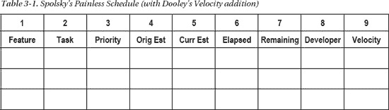

Spolsky 的无痛时间表列出了每个时间表都应包含的以下七列：

*   *功能名称*
*   功能内的*任务*
*   任务的*优先级*
*   *原始估算*（以人时为单位）
*   *当前估算*（以人时为单位）
*   任务已花费的*已用时间*（以人时为单位）
*   任务的*剩余时间*（也以人时为单位）

乔尔正确地强调，任务需要细化，且工作量要小。否则，如前所述，你的估算很可能会严重偏离。他还建议，要么每个开发者都有一份单独的电子表格，要么像这里展示的那样，添加第八列，注明负责该任务的开发者。将所有任务放在同一张表上会让表格更拥挤，但更容易一次性查看所有任务。虽然这种方法并非完全“无痛”，但对于任务数量相当有限的小型项目来说，这种制定进度表的方式还是很有用的。

我建议添加第九列来衡量每个任务的*速率*。速率是极限编程（XP）中的一个术语⁵，定义为任务的预估工作量除以实际工作量。在我们的案例中，我们会使用任务的原始预估时间和已耗用时间。如果你高估了任务，你的速率将大于 1（任务实际花费的时间比你最初想的要少）；如果你低估了，速率将小于 1（任务实际花费的时间比你最初想的要长）。理想情况下，你的速率应该是 1.0，但这几乎从未发生过。

使用速率的原因是为了让每个开发者和项目经理了解开发者估算的准确程度，并帮助他们在下次估算时做得更好。理想情况下，随着开发者经验的增长，其每个任务的速率都会接近 1.0。或者，如果某个开发者的速率波动很大（一个任务是 0.6，另一个是 1.8，第三个是 1.2），那么可能就需要上一堂关于估算技巧的速成课。根据我的经验，新开发者的速率一开始会剧烈波动，大部分数值远低于 1.0——新开发者往往过于乐观。但随着时间的推移，速率会稳定在 1.0 左右的一个范围内，也许是从 0.85 到 1.15。随着开发者积累经验，项目经理就可以开始更多地依赖他们的估算，进度表也会更加准确。

______________

⁵ Beck, K. *《解析极限编程：拥抱变化》*。（波士顿，马萨诸塞州：Addison-Wesley 出版社，2000 年。）

### 项目监督

项目监督是指在你制定好进度表之后所要做的事情。一旦项目启动，工作就需要被管理。具体如何管理取决于你所使用的流程。但无论流程如何，你都需要管理进度表、管理开发者、管理流程本身，最重要的是，管理你的经理。

经理的管理技巧对于让项目按计划进行至关重要。恐惧不是激励因素。然而，激发职业自豪感却是。如果你的老板不支持你，你就完蛋了。

如果没有富有创造力且给予支持的管理，你就完蛋了。如果你的团队成员不开心，你就没有希望。要把你的开发者当作人，而不是资源。支持你的团队，让他们免受干扰，这是你的首要任务。记住，项目是合作性的社会活动。⁶

### 状态评审与演示

状态评审与演示是任何项目中都不可避免的一部分。项目越大，评审就越正式。请记住，报告状态并不能解决问题，而且高层管理人员通常不喜欢听到问题。但这是没办法的事。当你做项目状态报告时，只需告诉他们你的项目目前处于什么状态，以及在下次状态报告之前这段时间内项目将走向何方。不要添油加醋，也不要找借口；要诚实地面对问题以及你在进度表中所处的位置。只报喜不报忧通常对你的声誉不利；某个时候总会出问题，所以最好立刻把它摆到明面上。你必须尽快传达关于项目的坏消息。这是缓解问题并让其他人参与寻找解决方案的最佳方式。

在进行演示时，无论是状态评审还是技术演示，都要确保你了解你的听众。将你的演示设定在听众的水平上，并且始终让你和听众都清楚你演示的目的。PowerPoint 在业界无处不在，所以要学会有效使用它。保持你的 PowerPoint 演示文稿简短且切中要点。避免在幻灯片中塞满大量要点。不要把你的要点写成完整的句子，这主要是因为你可能会忍不住去读它们。这是致命的，原因有二：一是太耗时，二是会分散听众对你实际所说内容的注意力。

这也会冒犯听众。他们当然会阅读，不是吗？

你的要点应该是你可以展开阐述的谈话要点。这能让你的听众专注于你——演讲者，而不是幻灯片。当你制作 PowerPoint 演示文稿时，要尽可能少用文字。

______________

⁶ Cockburn, A. “软件工程的终结与经济合作博弈的开始。” *《计算机科学与信息系统》* 1(1): 1 - 32。（2004 年）

### 缺陷

你不可避免地会在程序中引入缺陷（错误）。缺陷不会凭空出现；是开发者把它们放进去的。作为开发者，你的目标有两个：

*   在你编写的代码中尽可能少地引入缺陷。
*   在发布代码之前，尽可能多地找出它们。

 **注意：** 顺便说一句，我在这里故意不使用*bug*这个词，因为它听起来既无害又可爱。缺陷则不是。它们是你*自己*放进代码里的错误。关于错误的更详细讨论，请参见第 13 章。

然而，尽管你尽了最大努力，你发布的代码中仍然会包含缺陷。这是不可避免的。对于任何规模的程序来说，程序中可能的路径太多了（称为*组合爆炸*），引入错误数据的方式也太多了，因此不可能没有缺陷。你的目标是尽可能少地带缺陷发布，并且让这些缺陷不会真正影响产品或其性能。为了实现这一目标，大多数开发组织都有一套缺陷等级，用来描述一个缺陷到底有多严重。一套等级标准如下所示：

1.  *致命*：该缺陷要么导致产品崩溃，要么一项基本功能无法工作。
2.  *严重*：一项主要功能无法工作，并且用户没有可用的变通方法。
3.  *较重*：一项功能无法工作，但客户有可用的变通方法。
4.  *烦人*：文档中的小缺陷或错误，可能会惹恼用户，但不影响程序的工作方式。
5.  *新功能请求*：这不是缺陷，而是要求产品实现新功能。

每当你在代码中发现一个缺陷时，你都会提交一份缺陷报告（以跟踪你发现了多少缺陷、它们是什么类型以及严重程度如何），并且你会根据严重级别来描述该缺陷。当开发者修复缺陷时，他们会从第 1 级开始，然后依次向下处理。

在几乎所有组织中，任何产品都不能在已知存在第 1 级或第 2 级缺陷的情况下发布。大多数组织也会尽力移除所有第 3 级缺陷。

### 事后复盘

大多数开发团队会在每个项目结束后进行事后复盘。事后复盘是一个反思刚完成的项目并回答几个问题的机会。通常，问题会如下所示：

*   哪些地方做得好？我们的流程是否按预期运行？我们是否按时完成了计划？我们是否实现了客户要求的所有功能？
*   哪些地方出了问题？为什么会有这么多缺陷？为什么在项目的最后一个月我们需要每周工作 60 小时？
*   出现了哪些流程问题？我们是否遵循了流程？如果没有，哪些部分存在问题？
*   下次需要修复什么？基于问题 1、2 和 3，我们下次需要在流程、工作习惯或环境中修复什么？
*   谁负责修复？必须有人负责流程的变更；这个人是谁？（不要指定经理；开发团队应该拥有流程的所有权。）

### 结论

那么，我们最终会走向何方？我们已经了解了项目管理的一般部分，并介绍了一些项目管理的替代方法。最重要的部分是：开发人员应该拥有流程的所有权，管理层应该提供支持并倾听开发人员的意见——尤其是在进度和估算方面——并成为开发人员与外界之间的缓冲。如果你能在一个具备这些条件的组织中工作，那就做一个快乐的程序员吧，因为你将能够编写出优秀的代码。

## 第 4 章

## 需求

> *构建软件系统最困难的部分是决定要构建什么。在确立详细的技术需求方面，包括与人员、机器和其他软件系统的接口，没有其他概念性工作比这更困难。如果做错了，没有其他部分会如此严重地破坏结果。没有其他部分在事后更难纠正。因此，软件构建者为客户执行的最重要功能是迭代地提取和细化产品需求。*

——弗雷德·布鲁克斯^(1)

在你开始编码之前——是的，*在*你开始编码之前——你需要知道你要构建什么。这就是需求：一份你需要实现的东西的清单，以便创建你的出色程序。大多数开发人员讨厌需求。实际上，我们只想坐下来开始编码。我们所有人都有那种超级程序员的心态；只要把问题给我，我就能坐下来即时设计和编码。才不是！如果你想成为一名高效的开发人员，减少错误，并设计出良好、干净的代码，你需要需求——越详细越好。一套好的需求会告诉你程序应该做什么。它为你提供了设计所依赖的框架。无论如何你都需要做需求——这是标准开发生命周期中无法避免的步骤之一，但如果你不在项目中为它留出空间，你就会创建一个相当糟糕的程序。有意识地对待需求会迫使你思考程序的细节，同时也让你倾听用户的声音，从而更好地了解他们真正想要什么。那么，让我们来谈谈需求。

### 我们在这里谈论的是哪种类型的需求？

我们实际上在谈论*功能需求*。也就是说，用户启动你的程序时会看到并能够使用的功能列表。这些是展示程序外部行为的“黑盒”需求。它们肯定会引出更低层次的需求，这些需求更多地谈论程序*如何*工作，而不是*做什么*。识别需求过程的输出是一份关于软件系统应该做什么的*功能规格说明*。

____________________________

¹ 布鲁克斯，F. P. *《人月神话：软件工程随笔，银版纪念版》*。（波士顿，马萨诸塞州：Addison-Wesley，1995 年。）

### 功能规格说明？

功能规格说明完全从用户的角度描述程序将做什么。它不关心软件是如何实现的。它谈论程序的功能，并指定屏幕、菜单、对话框等。可以把它看作是一本写得不好的用户手册。第二种规格说明可以称为*技术规格说明*。技术规格说明描述程序的内部实现细节。也就是说，它谈论数据结构、使用的算法、数据库模型、编程语言的选择等等。我们本章不打算讨论技术规格说明，只讨论功能规格说明。

“等等，”你说。“我们在第 2 章中讨论的那些敏捷方法论呢？*它们*不写功能规格说明。所以你看！我可不用操心了。”实际上，敏捷方法论*确实*会编写功能规格说明。只是它们的格式不同于某些计划驱动方法论所要求的 300 页单倍行距的需求文档。XP 要求你与客户代表一起编写*用户故事*，这些故事阐述了程序将做什么。这就是一份规格说明。本章的重点和核心理念是*在开始编码之前，写下你的程序应该做什么*。

### 但我不喜欢写作！

软件开发人员提出的一个常见论点是他们不会写作。胡说！每个人都能学会编写功能规格说明。但写作是项工作。你必须投入其中并练习写作，然后才能擅长它。如果你还在上学（无论是本科还是研究生），可以选修一门写作课程，一门要求你每周都要写论文、日记、故事或诗歌的课程。你还应该批判性地阅读其他作品；阅读他人的写作，无论好坏，都是学习如何写得更好的好方法。

### 关于自然语言

功能规格说明应该始终用自然语言编写。为什么？嗯，你不知道萨丕尔-沃尔夫语言相对论假说吗？^(2)简而言之，语言不仅决定了你*会*说什么，还决定了你*能*说什么（和想什么）。也就是说，你使用的语言决定了你能够拥有什么样的思想，从而决定了你能思考什么以及如何表达你的思想。如果语言没有为某些类型的思想留出空间，你就不太可能想到它们。自然语言比编程语言更具表现力和多样性，因此你应该用自然语言进行设计，将编程语言留到以后的实现阶段。无论你是否相信萨丕尔-沃尔夫假说，用自然语言开发功能规格说明几乎总是一个好主意，这样你就不会在需要之前陷入编程语言的语法和语义细节中。这并不意味着你在做功能规格说明时不能考虑实现（相信我，你会考虑的），但只需将这些想法分流到规格说明的“技术说明”边栏中。^(3)你也可以看看肯尼斯·艾弗森的图灵奖演讲《符号作为思维的工具》，其中也有类似的讨论。^(4)

____________________________

² [`en.wikipedia.org/wiki/Linguistic_relativityretrieved`](http://en.wikipedia.org/wiki/Linguistic_relativityretrieved)，2009 年 9 月 15 日。

### 功能规格说明书大纲

每份功能规格说明书都各不相同，正如每个软件开发项目都独一无二。因此，请对这份大纲持保留态度，只采用适用于你项目的部分。其中许多想法源自参考资料。^(5) 每份功能规格说明书都应包含以下各节讨论的要素。

### 概述

这是你的执行摘要。用一段或至多两段文字说明该程序应实现的功能。“该程序用于控制你的微波炉。它与一个键盘和一个液晶显示屏交互，提供用户输入和输出功能。其功能仅限于标准微波炉所具备的功能，并增加了用于加热披萨和咖啡的专用按钮。它还能运行一个实时时钟和一个独立的倒计时定时器。它不控制照明灯。它配备了一个安全联锁装置，可在门打开时阻止微波炉启动。”

### 免责声明

你应该始终在文档开头声明：“本规格说明书尚未完成。如果你认为有遗漏或错误之处，请发送电子邮件告知我。”这有助于让所有市场人员不再纠缠你，并让你能够将新的功能请求归档到邮件垃圾箱中。许多人会在文档的页眉或页脚放置一个醒目的黑色“草稿”字样。这也能起到一定作用，但人们往往容易忽略它。有些人会在规格说明书中使用一个巨大的“草稿”水印，这样每一页的文字背后都嵌入了这个词。但这同样无法阻止人们对你的指责。在某个阶段，你的免责声明应改为类似这样的内容：“本规格说明书对于本次发布版本已尽可能完整。如果你认为有遗漏或错误之处，请发送电子邮件给作者，我们将在下一个版本中予以考虑。”

### 作者姓名

需要有人对功能规格说明书负责。不是委员会，不是开发团队，而是*一个人*。这通常是开发经理、项目经理或首席架构师，具体取决于你公司如何组织开发项目。不同的组织架构安排各有利弊。

如果由开发经理（即开发人员向其汇报的人）负责功能规格说明书，那么此人通常对项目的所有技术方面了如指掌。这很好。另一方面，如果你的老板编写功能规格说明书，你可能更难向她指出规格说明书中存在的问题，或者表达你不同意设计方案。此外，开发经理可能曾经是开发人员，因此他们可能不具备与市场、客户、文档、测试等团队沟通所必需的人际交往能力（即：魅力和交际技巧）。

____________________________

³ 斯波尔斯基，J.，《Joel 谈软件》。（伯克利，加利福尼亚州：Apress 出版社，2004 年。）

⁴ 艾弗森，K. E.，“作为思维工具的符号表示法。”《美国计算机学会通讯》23(8): 444–465。（1980 年。）

⁵ 斯波尔斯基，2004 年。

如果你的公司使用项目经理来负责规格说明书、设计和进度安排，但开发人员并不直接向他们汇报，那么你可能会遇到一个技术敏锐度不如前开发人员的人。另一方面，这些人通常能够轻松赢得其他团队的好感，因此谈判会顺利得多。项目经理需要具备一定的技术技能，并且非常擅长让所有利益相关者就功能规格说明书的内容达成共识。

首席架构师模式类似于项目经理模式，不同之处在于架构师本身就是一名开发人员，因此技术能力更强，通常负责功能规格说明书和所有程序设计问题。这类似于布鲁克斯在《人月神话》中提出的首席程序员模式。由另一个人负责与其他团队对接、管理进度安排以及处理所有与人互动相关的事务。如果架构师纪律严明，并且不让任何需求蔓延干扰良好的设计，那么这种模式效果不错。

### 典型使用场景

让客户对你的需求列表做出反馈的一个好方法是，在规格说明书中向他们展示几个程序的典型使用场景。这有几个优点。

*   首先，如果你像编写用户故事一样编写这些场景，客户更有可能去阅读它们。
*   其次，客户更有可能理解你所做的事情，并提出你遗漏或理解错误的想法。这总是一件好事，因为在流程早期获得的客户输入越多，你最终创造出他们真正想要的东西的可能性就越大。

在许多敏捷方法中，包括极限编程，用户故事通常像场景一样编写。在极限编程中，客户是项目团队的一部分，因此你可以持续获得关于用户故事和每日程序构建的反馈。在统一建模语言中（UML，参见[www.uml.org](http://www.uml.org)），有一种完整的符号表示法用于创建用例（场景的另一种说法）。但正如我们上面讨论的，在描述使用场景方面，没有什么比自然语言更好的了。我们将在第 8 章中再次讨论用例。

### 详细的逐屏规格说明

一旦你编写了几个场景，你就会对程序的流程以及需要哪些屏幕、对话框、菜单等有更清晰的认识。这使你能够逐一审视每个屏幕，并充实其布局细节，包括它们将具有哪些按钮、文本框、图标、图形等，以及它们连接到哪些其他屏幕。使用图片！一张屏幕或对话框的图片胜过千言万语。它能让读者有所反应，并促使他们思考程序流程和用户界面问题。除了将要实现这些功能的开发人员和将要编写用户手册（没人会读）的技术文档撰写人员之外，不要指望其他人会阅读这些内容。

### 非功能性需求

这可能是功能规格说明书中最重要的部分。它向外界说明你*不*打算做什么。确实，你需要将其包含在内，因为在阐述了程序将做什么之后，功能规格说明书最重要的作用是*管理期望*。在发布前的最终演示中，客户可能说出的最糟糕的话之一是：“但我以为它还能做……”。你需要告知项目中的所有利益相关者程序将做什么，以及它不会做什么。“此微波炉软件不会帮你核对支票簿。”好吧，这有点夸张，但你确实需要让他们知道有些需求不会被实现——至少在当前版本中不会。“一次只能运行一个倒计时定时器。”“不会提供允许按食物类型选择解冻模式的解冻周期。”客户很可能不会阅读这一节，但至少当他们提出要求时，你可以指出这一点。

### 待定问题

当你初次编写功能规格说明书时，会有一两个（或上千个）你不知道的事情。这没关系。只需将它们放在“待定问题”一节中。然后，每次与客户会面时，指出这一节并尝试获得答案。在获得这些答案后，其中一些问题将移至需求部分，而另一些最终将进入“非功能性需求”部分。不过，到项目结束时，这一节应该为空。如果不是，那么，你就有一些会困扰你的问题了。

### 设计与功能构想

如果你和我一样，在收集和分析需求的过程中，会一直尝试设计和编写程序代码。这正是开发者的常态。为了避免因这些绝妙的设计与实现想法（却因为正在撰写需求文档而无法记录下来）而让大脑爆炸，请另建一个单独的笔记本。这个笔记本就是一个独立的文档——在桌面上打开一个文本文件来存放它——用于记录待办事项。我通常会创建两种类型的笔记：一种是技术笔记，包含面向开发者的设计或编码思路；另一种是营销笔记，包含面向营销人员和客户的功能构想。

### 待办事项清单

随着项目进入开发阶段，新的需求会不断涌现。请习惯这一点；这总是会发生。但如果你想按计划推进并交付可用的产品，你*绝不能*实现所有冒出来的需求。这就是“待办事项清单”部分的作用——它用于存放你计划在下一个产品版本中考虑的所有需求。大多数功能规格说明书没有“待办事项清单”部分，但如果你希望功能规格说明书是一份活文档，你就需要一个地方来放置所有后续要完成的任务。这能带来几个好处：它告诉客户你没有忘记这些功能，并且通过将它们移至下一个版本，你承诺会尽可能按已公布的时间表交付当前版本；同时它也告诉开发者，项目仍在掌控之中，并且有很大机会高质量、按时完成。关于待办事项清单的更多信息，请参考任意 Scrum 敏捷方法论的描述。^(6)

____________________________

⁶ Schwaber, K. 和 M. Beedle. *《使用 Scrum 进行敏捷软件开发》*。（Upper Saddle River, NJ: Prentice Hall, 1980 年。）

### 还有一件事

关于功能规格说明书还有一件事——不要过度纠结。你很可能会很好地挑选出需求并将其写入功能规格说明书，但它可能不会像你希望的那样详细，也不会完整。别担心，开心点。功能规格说明书只有在发布版本时才算真正完成。不要花时间试图把每一个细节都弄对，也不要花时间试图从客户那里挖掘出每一个需求。这根本不可能。设定一个时间限制，尽力而为，然后放手。你总不希望一群开发者无所事事地坐着，等着规格说明书吧？

### 需求的类型

在功能规格说明书中，你通常会看到四种不同类型的需求：用户需求、领域需求、非功能性需求以及非需求。

### 用户需求

用户需求几乎总是用自然语言表达。它们是用户在使用程序时期望看到的具体细节。它们还包括对屏幕布局、对话框和菜单的描述。程序中任何交互元素都应在用户需求中描述。例如：

> *登录系统*：当 Gloria 点击主页上的“登录”按钮时，一个登录对话框会出现在屏幕中央。该登录对话框必须包含两个文本框，分别标注为“用户名”和“密码”。对话框中还必须有两个按钮，分别标注为“提交”和“取消”。如果 Gloria 在任何时候按下“取消”按钮，对话框应消失，她将返回上一个屏幕。在正常使用中，她会点击“用户名”文本框并输入用户名，然后点击（或按 Tab 键）进入“密码”文本框并输入密码。在“密码”文本框中输入的文本必须被隐藏。Gloria 输入完用户名和密码后，必须按下“提交”按钮。如果她输入了正确的用户名/密码组合，她将进入主菜单页面。如果 Gloria 的用户名/密码组合不正确，对话框中应显示“用户名或密码无效，请重试”的消息，文本框将被清空，她将有机会重新登录。

如本节所示，你可以将用户需求表达为场景，或逐屏的详细描述。记住，在编写用户需求时，尽可能多地使用图片。如果你的程序是基于 Web 的，制作大量快速粗糙的 HTML 页面并将其粘贴到规格说明书中。如果不是基于 Web 的，请使用绘图程序创建用户将看到的界面图片。

### 领域需求

这些需求是由程序的应用程序领域强加给你的。如果你正在编写 TurboTax® 的新版本，你将受到最新 IRS 法规的约束。总账程序必须遵守最新版的《公认会计原则》（GAAP），而 AT&T 品牌的 iPhone 则需要实现最新的 GSM 协议。你不需要写下所有这些需求，只需引用它们即可。一套详细的领域需求能为开发者在设计程序时提供所需的信息。领域需求通常被视为“中间层”软件，因为它们是应用程序的核心，位于用户界面之下，操作系统、网络或数据库软件之上。许多领域需求将作为独立的类或库来实现，并拥有自己的 API。

### 非功能性需求

非功能性需求是对程序服务和功能的约束，以及对性能的期望。它们可以包括目标平台规格、时间约束、性能要求、内存使用要求、文件访问权限、安全要求、响应时间、每秒最小事务数等等。这些通常是用户可能看不到，但确实会影响用户体验的需求。

### 非需求

这些是你不会去做的事情。请参阅前一节关于非需求的描述。

### 需求挖掘

大多数软件工程文本使用“需求获取”这个短语来谈论让用户告诉你他们想要什么的过程。亨特和托马斯在他们的著作《程序员修炼之道》中使用了更具描述性的短语“需求挖掘”，以强调你真正要做的是挖掘那些你的客户自己都还不知道他们想要的需求。^(7) 亨特和托马斯还对需求、策略和实现做出了绝妙的区分，以此来说明需求挖掘的过程。

例如，“系统必须让用户选择贷款期限”是一个简洁明了的需求。它表明有某件事是你必须去做的。它对于实现来说还不够具体，但它告诉了开发者一些必须构建的具体内容。

“贷款期限必须在 6 个月到 30 年之间”并不是一个需求，尽管它看起来有点像。这个陈述是一个*业务策略*的例子。当这样的陈述作为需求呈现给开发者时，他们倾向于将其硬编码到程序中。错，错，错。像这样的策略可能会改变，所以你需要非常小心地将业务策略放入你的需求中。通常情况下，你需要实现一个比所陈述的业务策略更通用的版本。真正的需求可能类似于“贷款期限是有限的，但贷款的长度会因贷款类型而异”。这告诉你，你可能需要构建一个表驱动的子系统来处理这个特性。这样，特定类型贷款的期限就可以通过修改数据表中的单个条目来改变，而代码完全不需要改动。

“用户必须能够使用下拉列表框选择贷款期限”也不是一个需求，尽管它可能看起来像一个。只有当客户绝对必须有一个下拉菜单来选择他们的贷款期限时，这才是一个需求。否则，这只是客户希望看到的实现的一个例子，它可能不是一个需求。正如亨特和托马斯在他们的书中所说，“发现用户做某件事的*根本原因*，而不仅仅是他们*当前做这件事的方式*，这一点非常重要。归根结底，你的开发必须解决他们的*业务问题*，而不仅仅是满足他们陈述的需求。记录需求背后的原因，将为你的团队在日常实现决策中提供宝贵的信息。”

____________________________

⁷ Hunt, A. and D. Thomas. *The Pragmatic Programmer: From Journeyman to Master*. (Boston, MA: Addison-Wesley, 2000.)

### 为什么需求挖掘很困难

从客户那里挖掘需求是一项非常困难的工作，原因有几个。我们来看几个。

##### 范围问题

很多时候，你的程序实际应该做什么的边界是模糊的。这可能是由几个原因造成的。程序可能是一个更大系统的一部分，而各个部分的集成定义不清。客户可能没有想清楚他们到底希望程序做什么，所以他们开始抛出各种各样的想法，其中许多甚至可能不适用于当前的问题。最后，客户可能陷入了实现层面的思考，并提供了不必要的细节层次。

要克服范围问题，需要大量的耐心、纪律、反复说“不”，以及反复问“为什么这需要成为程序的一部分？”。范围与需求蔓延直接相关，所以要当心。

##### 理解问题

让我们面对现实吧；客户和你作为开发者说的是不同的语言。你的客户是领域专家，他们说领域语言（应收账款、应付账款、对账、总账等等）。你说的是设计和实现语言（类、对象、方法、用例、递归、活动记录等等）。这通常比一个美国人在巴黎还要糟糕；至少在那里，双方都可以通过比划来表达需求并弄清楚事情。而对于领域理解的问题，你通常最多只能和对方一起点杯饮料。

通常有两种方法可以克服理解问题。第一种是让一个在双方领域都待过、能在两者之间进行翻译的人居中协调。一些公司有被称为*系统工程师*或*技术营销人员*的人来扮演这个角色。这些人做过开发，也处理过客户方面的事务，所以他们能说两种语言。优秀的系统工程师的价值堪比用例。第二种促进理解的方法是让客户成为开发团队的一部分。这是一些敏捷方法论（特别是 XP）所采用的方法。当客户成为开发团队的一部分时，你可以每天与他们交谈，向他们提问，教他们技术知识。双方都受益。而且，因为现场客户能在中间产品一从构建机器中出来时就立即看到，你就能得到即时反馈。赢，赢，赢。

##### 易变性问题

事情会变。这是需求收集和分析中最困难的部分，也是导致进度延误的最大原因。你对此无能为力。习惯它吧。正如 Kent Beck 所说，“拥抱变化。”你能做的是*管理*变化。创建一个新功能积压列表，当新功能出现时就添加进去。在 Scrum 方法论中，新需求总是被添加到发布积压列表中，而不是添加到当前迭代中；这允许当前的冲刺正常进行，所有需求都在冲刺结束时进行评审。另一种管理变化的方法是把决定权推给用户；给用户一个选择——“如果我们实现这个新功能，将会给进度增加 6 周时间。你还想要它吗？”或者，“如果你想保持原定进度，我们只能实现并测试 A、B、C 中的其中一个。你选择你最想要的那个。”这就是敏捷人士所说的“勇气”的含义之一；^(8) 有时候你必须坚持立场，选择对整个项目最有利的方案。

##### 非技术问题

从开发者的角度来看，与需求相关的非技术问题是你将遇到的最糟糕的问题。事实上，这些是开发者永远不应该看到的问题；他们的经理应该保护他们免受非技术问题的困扰。非技术性的需求问题本质上是政治性的。例子比比皆是。组织中的一个客户群体对程序需求的看法与另一个群体不同。或者更糟，一个经理的看法与另一个经理不同。正在开发的程序将通过自动化某个部门曾经是唯一来源的功能来削弱该部门的影响力。该程序将把数据处理分散到多个部门，而以前这些处理集中在一个部门。这样的例子不胜枚举。对于非技术问题，最好的建议是——赶紧跑。让你的副总裁去处理；这就是为什么她拿高薪的原因。

### 分析需求

一旦你写下了一组需求，就需要确保这些需求对程序来说是合适的；你需要对它们进行*分析*。分析包含三个基本部分。

首先，你要对需求进行*分类*，并将它们组织到相关的领域中。这将对设计人员有很大帮助。

其次，你需要根据客户的意见对它们进行*优先级排序*。这一点至关重要，因为你无法在第一个产品版本中实现所有需求（相信我，你做不到）。因此，这个优先级列表将用于确定每个中间版本的内容。

最后，你需要将每个需求与其他所有需求进行*对照检查*，以确保它们能构成一个连贯的整体。问自己一系列问题：

1.  每个需求是否与项目的总体目标*一致*？如果你的程序旨在向用户销售书籍，那它就不必同时计算他们的高尔夫差点。
2.  这个需求是否*真的必要*？你是否添加了某些内容，即使移除也不会损害程序的基本功能？如果你的第一个版本旨在允许用户购买书籍，那么你可能不需要同时允许他们购买帆船。
3.  这个需求是否*可测试*？这可能是你在进行需求分析时最重要的问题。如果你无法弄清楚如何测试一个需求，那么你就无法知道你是否正确实现了它，或者是否已经完成。所有需求*必须*是可测试的，否则它们就不是需求。在大多数敏捷方法中，规则是先编写测试，再编写代码。
4.  这个需求在你必须工作的技术环境中是否*可行*？这个问题通常适用于之前提到的那些非功能性需求。考虑到你在此项目中必须使用的特定目标平台或硬件约束，你的需求是否可行？例如，如果你的目标平台是运行 OS X 的 Macintosh，那么要求使用 DirectX 图形库的需求是不可行的，因为 DirectX 是仅适用于 Windows 的库。
5.  这个需求是否*无歧义*？你的需求需要尽可能精确（请参考之前的可测试性问题），因为就像你现在坐在这里阅读本文一样肯定的是，有人会误解一个有歧义的需求，而你会在产品发布后的第二天才发现这个错误。你的需求中绝不应包含“或”或“可能”这类词语。

____________________________

⁸ Beck, K. *极限编程解析：拥抱变化*。（波士顿，马萨诸塞州：Addison-Wesley，2000 年。）

### 结论

一旦你完成了功能规格说明和需求分析，需求阶段就结束了，对吧？嗯，当然不是。正如我们之前所说——需求是会变化的。所以，放轻松，不要对需求过于执着，尽你所能获得一份清晰、可测试的初始需求列表，然后进入设计阶段。你以后总会再回到这里的。

## 第 5 章

## 软件架构

> *我们所说的软件架构是什么意思？对我来说，架构一词传达的是系统核心元素的概念，即那些难以改变的部分。它是其余部分必须赖以建立的基础。*

——马丁·福勒^(1)

一旦你对你将要构建的*内容*有了想法，就可以开始思考*如何*构建它了。当然，从第一个需求开始你就已经在思考这个问题了，但现在你被允许正式着手了。现在我们开始深入探讨设计。

软件设计实际上有两个层次。我们在编写程序时通常想到的层次通常被称为*详细设计*。我们需要哪些操作？需要哪些数据结构？我们使用什么算法？数据库将如何组织？用户界面看起来是什么样？调用顺序是什么？这些都是非常详细的问题，需要在你能真正开始进行详细的编码工作之前得到回答（嗯，差不多是这样——我们稍后会谈到这一点）。

但还有另一个层次的设计。这种设计完全是关于*风格*的。如果你在建造一所房子，这个设计层次会问这样的问题：是牧场风格还是多层风格？都铎风格还是科德角风格？卧室窗户朝哪个方向？强制送风还是热水供暖？三间卧室还是四间？开放式概念平面图还是封闭式？这些问题在一定程度上关注细节，但它们更多地是关于房子的风格以及你将如何使用它，而不是像电气系统用 12 号还是 14 号电线，或者空调管道的直径这类事情。这种对风格的强调正是*软件架构*的全部意义所在。正如福勒在本章开篇引言中所说，你需要先有基础，才能构建结构的其余部分。软件架构是一套理念，它告诉你哪个基础适合你的程序。

软件架构的概念最初是为了应对程序规模和复杂性的日益增长而出现的。“随着软件系统规模和复杂性的增加，设计问题已超越了计算中的算法和数据结构：设计和规定整个系统结构成为了一种新型问题……这就是软件架构层面的设计。”^(2) 然而，事实上，*所有*具有一定规模和复杂性的程序都有其架构。只是对于较大的程序，你需要更有意识地去思考架构，以确保在你的系统设计中融入了正确的架构模式集。你必须这样做。一旦程序编写完成，在架构层面进行更改要困难得多，因为架构特性对程序的结构是如此基础。

____________________________

¹ “设计已死？” 取自 [`martinfowler.com/articles/designDead.html`](http://martinfowler.com/articles/designDead.html)

² Garlan, D. 和 M. Shaw (1994)。《软件架构导论》。匹兹堡，宾夕法尼亚州：卡内基梅隆大学：49。CMU/SEI-94-TR-21。(1994)

有许多不同风格的软件架构，在任何给定的项目中，你可能会使用不止一种。程序所使用的架构风格取决于你正在做什么。正如我们将看到的，不同领域中的不同类型程序会引导我们采用不同的架构风格；我们也可以将这些称为*架构模式*，因为它们具有我们稍后将看到的*设计模式*的许多特征。首先，让我们掌握一些通用词汇。

### 通用架构模式

每当软件架构师开始思考程序的架构时，她通常从画图开始。架构图能让人们比文本更容易地看到程序的结构和框架。软件架构通常表示为黑盒*图*，其中图节点是*计算结构*，图边是结构之间的*通信管道*。管道可以表示数据流、对象消息传递或过程调用。此类表示法多种多样，并且有几种标准表示法，特别是统一建模语言（UML）。架构的可视化描述通常更容易理解。特定的架构风格是一种可以表示一组相似结构的模式。让我们来看几种不同的常见架构风格。

### 管道-过滤器架构

在管道-过滤器架构风格中，计算组件被称为*过滤器*，它们充当转换器，接收输入，根据一个或多个算法对其进行转换，然后将结果输出到通信管道。输入和输出管道被称为*管道*。

典型的管道-过滤器架构是线性的，如图 5-1 所示。

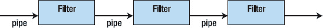

***图 5-1.** 管道-过滤器架构*

过滤器必须是独立的组件。这正是管道-过滤器架构的优点之一。你可以通过不同的排列组合来连接集合中的不同过滤器，从而获得不同的结果。管道-过滤器架构风格的经典示例是 Unix shell，其中有大量通常只做一件事的小程序，并且可以通过 Unix 管道机制将它们串联在一起。下面是一个展示管道-过滤器如何工作的示例。这个问题来自 Jon Bentley 的著作 *编程珠玑*。^(3)

_______________________

³ Bentley, J. *编程珠玑（第二版）*。（波士顿，马萨诸塞州：Addison-Wesley，2000 年。）

> *问题*：给定一个英语单词词典，找出词典中所有的变位词。也就是说，找出所有互为排列的单词。例如，“pots”、“stop”和“spot”互为变位词。

那么我们知道些什么？首先，所有变位词都包含相同的字母，并且每个单词的字母数量相同。这为我们提供了寻找变位词的方法线索。想到了吗？别担心，我等你。

没错！如果你对每个单词进行排序，最终会得到一个字符串，其中包含该单词的所有字母，并按字母顺序排列。我们称之为创建单词的*签名*。然后，如果你对结果列表进行排序，所有变位词最终会聚集在排序后的列表中，因为它们排序后的字母是相同的。如果你接着记录下你排序了哪些单词，就可以简化列表并创建一个新列表，例如，将每组变位词放在输出文件的同一行。这正是 Bentley 的做法。

但你可能会问，这与管道-过滤器架构有什么关系？问得好。让我们再次分解这个解决方案。

1.  通过对列表中的每个单词的字母进行排序，为每个单词创建一个签名；将签名和单词保持在一起。
2.  根据签名对结果列表进行排序；现在所有变位词应该都在一起了。
3.  通过将每组变位词放在同一行来压缩列表，同时移除签名。

现在看出管道-过滤器了吗？用 Unix 术语来说，它看起来像这样：

`sign <dictionary.txt | sort | squash >anagrams.txt`

其中 `sign` 是我们用来执行步骤 1 的过滤器，输入文件是 dictionary.txt。`sign` 输出一个签名及其关联单词的列表，该列表通过管道传递给 Unix 的 `sort` 工具（我们不需要编写这个工具）。然后 `sort` 根据每行的第一个字段（这是它的默认行为）对列表进行排序，恰好这个字段就是每个单词的签名。接着它将排序后的列表输出到下一个管道。`Squash` 从传入的管道中获取排序后的列表，并通过将所有具有相同签名的单词放在同一行来压缩它，同时消除签名。这个最终的列表通过最后一个管道（这次是 Unix I/O 重定向）发送到输出文件 anagrams.txt。

请注意，这个示例具有标准管道-过滤器架构的所有特征：对其输入数据执行转换的独立计算组件，以及将数据从一个组件的输出传输到下一个组件输入的通信管道。同时也要注意，并非所有应用程序都应使用管道-过滤器架构。例如，它对于交互式应用程序或响应事件或中断的应用程序效果不佳。这就是为什么我们要研究更多的架构风格。

### 面向对象架构模式

20 世纪 80 年代初（实际上它始于 60 年代，但当时无人关注），面向对象分析、设计和编程的出现带来了许多架构和设计模式。我们这里只关注一种面向对象架构模式，其余讨论留到关于设计模式的章节。

*模型-视图-控制器*（MVC）架构模式是一种将应用程序，甚至只是应用程序界面的一部分，分解为三个部分的方法：模型、视图和控制器。MVC 最初是为了将许多程序的传统输入、处理、输出角色映射到 GUI 领域而开发的：

> 输入  处理  输出
> 
> 控制器  模型  视图

用户输入、外部世界的建模以及向用户提供的视觉反馈被分离，并由模型、视图和控制器*对象*处理，如图 5-2 所示。

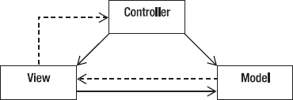

***图 5-2.** 模型-视图-控制器架构*

*   *控制器*解释来自用户的鼠标和键盘输入，并将这些用户操作映射为发送给模型和/或视口的命令，以实现相应的更改。
*   *模型*管理一个或多个数据元素，响应关于其状态的查询，并响应更改状态的指令。模型知道应用程序应该做什么，并且是架构的主要计算结构——它*建模*了你试图解决的问题。
*   *视图*或*视口*管理显示器的矩形区域，负责通过图形和文本的组合向用户呈现数据。视图对程序实际在做什么一无所知；它所做的只是接收来自控制器的指令和来自模型的数据并进行显示。它会向模型和控制器反馈状态。

MVC 程序的典型流程如下所示：

> 1.  *用户*与用户界面交互（例如，用户按下一个按钮），控制器处理来自用户界面的输入事件，通常通过注册的处理程序或回调。用户界面由视图显示，但由控制器控制。奇怪的是，控制器并不直接知道视图是一个对象；它只是在需要更新屏幕上的某些内容时发送消息。
> 2.  *控制器*访问模型，可能以适合用户操作的方式更新它（例如，控制器使模型更新用户的购物车）。这通常会导致模型的状态及其数据发生变化。
> 3.  *视图*使用模型生成适当的用户界面（例如，视图生成一个列出购物车内容的屏幕）。视图从模型获取自己的数据。模型不直接知道视图。它只是响应来自任何人的数据请求以及来自控制器的数据转换请求。
> 4.  控制器作为用户界面管理器，等待进一步的用户交互，从而开始新一轮循环。

这里的主要思想是关注点分离——以及代码分离。目标是分离程序的工作方式、它显示的内容以及它如何获取输入数据。这是经典的面向对象编程；创建隐藏其数据以及如何操作数据的对象，然后仅向外界提供一个简单的接口以与其他对象交互。我们将在第 9 章中再次看到这一点。

### 一个 MVC 示例：让我们来狩猎！

一个使用 MVC 架构模式的经典程序示例是 David Matuszek 博士在 2004 年 SIGCSE 技术研讨会上提出的“绝妙作业”。^(4)

### 问题

该程序是一个简单的狐狸与兔子模拟程序。狐狸试图在网格环境中找到兔子，而兔子则试图逃脱。环境中存在兔子可以躲藏的灌木丛，并且移动受到一些限制。

图 5-3 是该游戏运行时的典型画面。

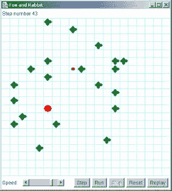

***图 5-3.** 一个典型的狐狸与兔子狩猎实例*

⁴ Matuszek, David. “Rabbit Hunt,” SIGCSE 2004 Technical Symposium, Nifty Assignments Session, retrieved August 17, 2009, [`http://nifty.stanford.edu/2004/RabbitHunt/.`](http://nifty.stanford.edu/2004/RabbitHunt/.) (2004)

狐狸是大圆点，兔子是小圆点，灌木丛是粗十字形。

本次编程作业的目标是让兔子变得更聪明，以便它能从狐狸手中逃脱。我们对此并不真正关心；我们想要关注的是程序的组织方式。图 5-4 展示了程序的组织结构。这是一个取自 BlueJ IDE 的 UML 对象图。程序的关键部分是三个类：Model、View 和 Controller。

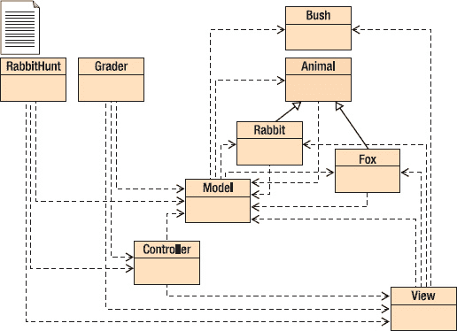

***图 5-4.** 狐狸与兔子狩猎的类结构*

### 模型

模型代表了游戏的规则。它负责所有计算，所有决定轮到谁、每回合发生什么以及是否有人获胜的工作。模型严格来说是内部的，并且与程序的其他部分几乎没有任何关系。

### 视图

视图负责显示正在发生的事情。它在屏幕上呈现图像，以便用户能看到发生了什么。视图是完全被动的；它不会以任何方式影响狩猎过程，它只是一个新闻记者，向你提供模型内部发生情况的（部分）画面。

### 控制器

控制器是程序中负责显示控件（窗口底部的五个按钮和速度控制）的部分。它对模型和视图的了解尽可能少；它基本上就是告诉模型何时开始、何时停止。

### 模型

该程序的模型部分实际上由五个类组成：`Model`（“主”模型类）、`Animal`、`Rabbit`、`Fox` 和 `Bush`。`Rabbit` 和 `Fox` 是 `Animal` 的子类（正如你从 UML 图中的实线箭头所看到的）。这是程序中你真正需要理解的部分。

`RabbitHunt` 类仅创建 `model`、`view` 和 `controller` 对象，并将控制权交给 `controller` 对象。`controller` 对象启动 `model` 对象，然后等待用户按下按钮。当按钮被按下时，会向 `model` 对象发送一条消息，由 `model` 对象决定下一步操作。

`model` 对象会：

*   将狐狸、兔子和灌木丛放置在场地中；
*   给兔子和狐狸各一次移动机会（一个移动，然后另一个移动；它们不会同时移动）；
*   通知视图显示这两次移动的结果；以及
*   判定哪只动物获胜。

将程序分解成这些独立部分的好处有很多。我们可以安全地重写 `Controller` 对象中的 GUI 或 `view` 对象中的显示，而无需更改 `model`。我们可以让狐狸和/或兔子变得更聪明（或更笨！），而无需更改 GUI 或显示。我们可以几乎不费力气地将该 GUI 复用于不同的应用程序。这样的好处不胜枚举。

简而言之，MVC 是你的朋友；请明智且频繁地使用它。

### 客户端-服务器架构模式

转向更传统的架构，我们需要回溯历史。曾几何时，所有程序都运行在大型机上，你的整个程序都在一台机器上运行。如果你足够幸运，能使用分时操作系统，那么几个人可以同时使用同一个程序——尽管通常是不同的副本。然后个人电脑和网络出现了。有人灵机一动，将工作分摊给那台大型机和你的小型台式机。于是，*客户端-服务器架构* 诞生了。

在客户端-服务器架构中，你的程序被分解成两个不同的部分，它们通常运行在两台独立的计算机上。服务器承担大部分繁重的工作和计算；它通过高带宽网络向其客户端提供服务。另一方面，客户端主要处理用户输入、显示输出，并提供与服务器的通信。简而言之，客户端程序向服务器程序发送服务请求。然后，服务器程序评估该请求，执行必要的计算（包括在需要时访问数据库），并给出答案来响应客户端的请求。如今，客户端-服务器架构最常见的例子是万维网。

在网络模型中，你的浏览器就是客户端。它向你呈现用户界面，与网络服务器通信，并将生成的网页渲染到你的屏幕上。网络服务器做很多事情。它提供 HTML 格式的网页，但它也可以充当数据库服务器、文件服务器和计算服务器——想想当你访问亚马逊网站时，它所做的所有事情。

不过，客户端和服务器不必位于不同的计算机上。使用客户端-服务器架构编写的两个程序示例，其中双方可以驻留在同一台计算机上，分别是*打印后台处理程序*和 *X Windows 图形系统*。

在打印后台处理程序应用中，你正在运行的程序——文字处理器、电子表格程序、你的网络浏览器——作为客户端运行，向作为计算机操作系统一部分实现的打印服务发出请求。这项服务通常被称为打印后台处理程序，因为它会维护一个打印作业队列，并控制哪些作业被打印以及它们的打印顺序。因此，在你的文字处理器中，你会从菜单中选择*打印*，设置某些属性并通常选择一台打印机，然后在某个对话框上点击*确定*。这会将一个打印请求发送到你系统上的打印后台处理程序。然后，打印后台处理程序将你的文件添加到它管理的打印作业队列中，联系打印机驱动程序并发出打印请求。这里的区别在于，一旦你点击了确定按钮，你的客户端程序（文字处理器）通常就不再与打印后台处理程序有任何联系，打印*服务*会无人值守地运行。

X Window 系统（参见 [`www.xfree86.org/`](http://www.xfree86.org/)）是一个图形化窗口系统，用于所有基于 Unix 和 Linux 的系统，也可作为附加窗口系统用于 Apple Macintosh 和 Microsoft Windows 系统。X 系统采用客户端-服务器架构，其中客户端程序和服务器通常都驻留在同一台计算机上。X 系统服务器接收来自客户端程序的请求，针对当前系统连接的硬件进行处理，并提供一项输出服务，将结果数据以位图形式显示出来。客户端程序示例包括 *xterm*——一个提供 Unix 命令行界面的窗口化终端程序，*xclock*——你猜对了——一个时钟，以及 *xdm*——X Window 显示管理器。X 系统支持分层和重叠窗口，并提供配置菜单、滚动条、打开和关闭按钮、背景和前景颜色以及图形的能力。X 还可以管理鼠标和键盘。如今，X 系统的主要用途是作为跳板，用于构建更复杂的窗口管理器、图形环境、图形小部件以及像 GNOME 和 KDE 这样的桌面管理窗口系统。

### 分层方法

分层架构方法建议将程序构建为一系列层次，如同地质层一般，各层之间通过定义明确的接口进行连接。这种方法能够将每一层与其上下层隔离开来，从而可以在不改变程序中任何其他层的情况下，修改任意一层的内部实现。当然，前提是你的修改不涉及接口的变更。在分层方法中，接口是神圣不可侵犯的。分层编程方法的两个经典例子是操作系统和通信协议。

操作系统的架构有多个目标，其中包括集中控制有限的硬件资源，以及保护用户免受彼此干扰。操作系统的分层架构方法同时实现了这两个目标。请看一个相当标准的操作系统架构图（参见图 5-5）。

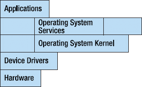

***图 5-5.** 分层架构*

在这个分层模型中，用户应用程序通过系统调用接口请求操作系统服务。这通常是应用程序访问计算机硬件的唯一途径。大多数操作系统服务必须通过内核发出请求，而所有硬件请求都必须经过直接与硬件设备通信的设备驱动程序。这些层中的每一层都有定义明确的接口，因此，例如，开发人员可以为新的磁盘驱动器添加新的设备驱动程序，而无需更改操作系统的任何其他部分。这是信息隐藏的一个很好的例子。

通信协议中也存在相同类型的接口。最著名的分层协议是国际标准化组织（ISO）的开放系统互连（OSI）七层模型。该模型如图 图 5-6 所示。

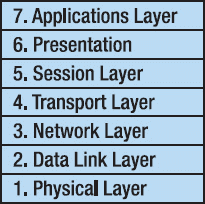

***图 5-6.** ISO-OSI 分层架构*

在此模型中，每一层都包含逻辑上相似且被分组在一起的功能或服务。每一层之间都定义了接口，并且层与层之间的通信仅允许通过接口进行。特定的实现不一定需要包含所有七层，有时会将两层或多层合并以形成更小的协议栈。OSI 模型既定义了七层方法，也定义了所有接口协议。该模型可以从 [`http://www.itu.int/rec/T-REC-X.200/en`](http://www.itu.int/rec/T-REC-X.200/en) 下载为 PDF 文件。（ITU，即国际电信联盟，是 ISO 的新名称。）

表 5-1 展示了在各层实现的协议示例。

***表 5-1.** 使用 ISO-OSI 架构的分层协议示例*

| **层** | **协议** |
| --- | --- |
| 7. 应用层 | http, ftp, telnet |
| 6. 表示层 | MIME, SSL |
| 5. 会话层 | Sockets |
| 4. 传输层 | TCP, UDP |
| 3. 网络层 | IP, IPsec |
| 2. 数据链路层 | PPP, Ethernet, SLIP, 802.11 |
| 1. 物理层 |  |

### 主程序：子程序架构模式

最传统、最古老的架构模式是*主程序 – 子程序模式*。虽然它源自 Niklaus Wirth 在 1971 年发表的论文《通过逐步细化进行程序开发》^(5)，但 Wirth 只是第一个正式定义这种自上而下的问题分解方法的人，这种方法自然会导致主程序 – 子程序模式。

这个想法很简单。你从一个大的问题开始，然后尝试将问题分解成几个较小的子问题或原始问题的片段。例如，几乎所有适合通过自上而下分解来解决的问题都可以立即分为三个部分：输入处理、解决方案的计算和输出处理。

一旦你将一个问题分解成几个部分，你就单独审视每个部分并继续分解，在此过程中忽略所有其他部分。最终，你会得到一个非常小的问题，其解决方案显而易见；这时就该编写代码了。因此，你通常自上而下地解决问题，并自下而上地编写代码。然而，存在许多变体。

引用 Wirth 论文的结论：

> 1.  *程序构造由一系列细化步骤组成。在每一步中，一个给定的任务被分解成若干个子任务。任务描述的每一次细化都可能伴随着数据描述的细化，这些数据构成了子任务之间通信的手段……*
> 2.  *以这种方式获得的模块化程度将决定程序适应目的变更或扩展的难易程度……*
> 3.  *在逐步细化的过程中，应尽可能长时间地使用对当前问题自然的表示法……每次细化都意味着基于一组设计标准做出的一系列设计决策……*
> 4.  *即使是一个简短程序的开发过程的详细阐述也会形成一个很长的故事，这表明仔细编程并非易事。*

⁵ Wirth, N. “Program Development by Stepwise Refinement.” *Communications of the ACM* 14(4): 221-227\. (1971)

图 5-7 展示了主程序子程序架构的工作原理。我们将在第 7 章中更详细地讨论问题的自上而下分解。

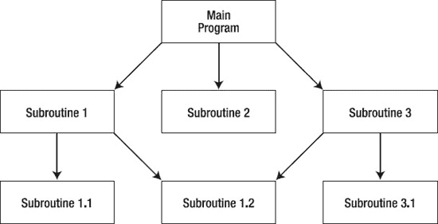

***图 5-7.** 主程序 – 子程序架构*

### 结论

软件架构是应用程序的核心。它是你构建程序其余部分的基础。它驱动着你的其余设计。有许多不同风格的软件架构，在任何给定的项目中，你可能会使用不止一种。程序所使用的架构风格取决于你所做的事情。这正是这些风格的魅力所在；形式追随功能可能并不总是成立，但对于软件而言——设计追随架构。这些基础模式引导你走上设计之路，塑造你的程序将被构建和运行的方式。去构建一个伟大的程序吧。

## 第 6 章

## 设计原则

> *构建软件设计有两种方式。一种是使其简单到明显没有缺陷，另一种是使其复杂到没有明显缺陷。*
> 
> — C. A. R. 霍尔

看待软件问题的一种方式，是采用一个将问题分为两个不同层次的模型：

*   **“棘手”问题**位于上层。这些问题通常来自计算机科学之外的领域（例如生物学、商业、气象学、社会学、政治学等）。这类问题往往是开放式的、定义不清的，并且从需要大量工作的意义上来说规模很大。例如，几乎任何类型的网络商务应用都是一个棘手问题。霍斯特·W·J·里特尔和梅尔文·M·韦伯在 1973 年一篇关于社会政策的论文中¹，给出了用于识别棘手问题的定义和一组特征，我们将在本章后面进行探讨。
*   **“温顺”问题**位于下层。这些问题往往跨越其他问题领域；它们通常定义更清晰、规模更小。排序和搜索是温顺问题的绝佳例子。然而，规模小且定义清晰并不意味着“容易”。温顺问题可能非常复杂且难以解决。只是它们定义明确，并且你知道何时找到了解决方案。这类问题为计算机科学家提供了数据结构和算法方面的基础，用于解决来自其他问题领域的棘手问题。

根据里特尔和韦伯的说法，棘手问题是指只有在问题解决后才能完全了解其需求的问题，或者其需求和解决方案会随时间演变的问题。事实证明，这描述了软件开发中大多数“有趣”的问题。最近，杰夫·康克林修订了里特尔和韦伯对棘手问题的描述，并提供了更简洁的棘手问题特征列表。² 转述如下：

__________

¹ 里特尔，H. W. J. 和 M. M. 韦伯。“一般规划理论中的困境。”《政策科学》4(2): 155-169. (1973)

*   *只有在创建解决方案之后，才能理解棘手问题。* 另一种说法是，问题的定义和解决是同时进行的。³
*   *棘手问题没有停止规则；* 也就是说，你可以创建问题的增量解决方案，但没有任何东西能告诉你已经找到了正确且最终的解决方案。
*   *棘手问题的解决方案没有对错之分；* 它们只有好坏之分，或者足够好与不够好之分。
*   *每个棘手问题本质上都是新颖且独特的。* 由于问题的“棘手性”，即使下周遇到类似的问题，你基本上也必须从头开始，因为需求会有足够大的差异，而解决方案仍然难以捉摸。
*   *每个棘手问题的解决方案都是一次性操作。* 参见上述第 4 点。
*   *棘手问题没有现成的备选解决方案。* 也就是说，没有一小部分有限的解决方案可供选择。

棘手问题无处不在。例如，创建一个文字处理程序就是一个棘手问题。你可能认为你知道文字处理器需要做什么——插入文本、剪切和粘贴、处理段落、打印。但这只是一个人的功能列表。一旦你“完成”了你的文字处理器并发布它，你就会被新的功能请求淹没：拼写检查、脚注、多栏、支持不同字体、颜色、样式，等等。文字处理程序基本上永远不会完成——至少在你发布最后一个版本并终止该产品之前是这样。

文字处理实际上是一个非常明显的棘手问题。其他问题可能包括那些你一开始并不确定是否能解决的问题。专家系统需要一个用户界面、一个推理引擎、一组规则和一个领域信息数据库。对于特定领域，一开始完全无法确定你是否能创建出推理引擎用来得出结论和建议的规则。因此，你必须迭代不同的规则集，发布下一个版本，并观察其表现如何。然后你再次重复，添加和修改规则。直到完成之前，你并不真正知道解决方案是否正确。这就是一个棘手问题。

康克林、里特尔和韦伯认为，当面对一个庞大、复杂的问题（即棘手问题）时，传统的认知研究表明，大多数人会遵循一种线性的问题解决方法，即从上到下从问题到解决方案进行工作。这等同于第 2 章中描述的传统瀑布模型。⁴ 图 6-1 展示了这种线性方法。

__________

² 康克林，J. 《对话映射：构建对棘手问题的共同理解》。（纽约州纽约市：约翰·威利父子出版社，2005 年。）

³ 德格雷斯，P. 和 L. H. 斯塔尔《棘手问题，正义解决方案：现代软件工程范式目录》。（新泽西州恩格尔伍德克利夫斯：约登出版社，1990 年。）

⁴ 康克林，J. 《棘手问题与社会复杂性》。2009 年 9 月 8 日检索自 [`cognexus.org/wpf/wickedproblems.pdf`](http://cognexus.org/wpf/wickedproblems.pdf)。论文最后更新于 2008 年 10 月。

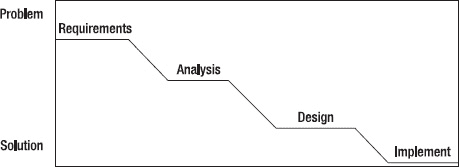

***图 6-1.** 线性问题解决方法*

与这种线性的瀑布式方法不同，真正的棘手问题解决者倾向于使用一种在需求分析和解决方案建模之间来回摆动的方法，直到问题解决方案足够好为止。康克林称此为**机会驱动**或**机会主义**方法，因为设计者正在寻找任何机会来朝着解决方案取得进展。⁵ 与图 6-1 中传统的瀑布图不同，机会驱动方法看起来像图 6-2。

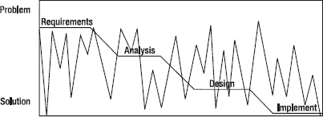

***图 6-2.** 机会驱动开发方法*

在此图中，锯齿线表示设计者的工作从问题移动到解决方案原型，然后再返回，逐渐演变对需求的理解和解决方案的迭代，并收敛到一个足够好、可以发布的实现上。作为示例，让我们快速看一下一个网络应用程序。

假设一个非营利组织为你所在县的青少年维护一个活动列表。该列表定期更新，并分发给全县的图书馆。目前，该列表保存在电子表格中，并以活页夹的纸质形式分发。该非营利组织希望将其所有数据放在网上，并通过网络访问。它还希望能够通过同一个网站更新数据。你说，这很简单。这只是一个带有 HTML 前端和数据库后端的网络应用程序。没问题。

啊，但这实际上是一个伪装起来的棘手问题。首先，客户不知道他们希望网页长什么样。因此，无论你第一次给他们什么，都不会完全符合他们的要求；直到你完成，问题才能被完全理解。其次，随着你开发原型，他们会想要更多的功能——所以问题没有停止规则。最后，随着时间的推移，非营利组织会想要新的功能，所以没有“正确”的答案，只有“足够好”的答案。非常棘手。

__________

⁵ 康克林，J. (2008)

康克林还提供了一组“温顺”问题的特征列表，即那些你可以轻松可靠地找到解决方案的问题。“一个温顺问题：

*   具有明确且稳定的问题陈述；
*   存在确定的终止点，即当解决方案达成时；
*   其解决方案可以被客观地评判为正确或错误；
*   属于一类以相同或类似方式解决的同类型问题；
*   其解决方案易于尝试和放弃；
*   附带有限数量的备选解决方案。

驯良问题的一个绝佳示例是对数据值列表进行排序。

*   问题陈述简单清晰——使用此函数比较数据元素，将列表按升序排序。
*   排序具有确定的终止点——列表已排序完成。
*   排序结果可以被客观评估（列表要么正确排序，要么未正确排序）。
*   排序属于一类以相同方式解决的同类型问题。对整数排序类似于对字符串排序，也类似于使用键对数据库记录排序，以此类推。
*   排序的解决方案易于尝试和放弃。
*   最后，排序的备选解决方案数量有限；基于比较的排序拥有一组已知算法和一个理论下界。

你可能会问，这与设计原则有什么关系？认识到我们遇到的大多数大型软件问题都内嵌了一定程度的“棘手性”，会影响我们思考设计问题的方式，影响我们为大型、结构不良的问题设计解决方案的方法，并让我们对设计过程有更深入的洞察。这也让我们能够问心无愧地放弃瀑布模型，并促使我们寻找可应用于设计问题的统一启发式方法。在本章中，我们将讨论设计的总体原则，并在后续章节中进一步展开。

### 设计过程

*设计是混乱的*。即使你完全理解了问题需求（这是一个驯良问题），在设计软件解决方案时，通常也需要考虑许多备选方案。在得出可行的解决方案之前，你通常还会犯很多错误。正如我们在图 6-2 中所见，随着你对问题的理解逐渐加深，你的设计也会随之变化。这表面上看起来混乱无序，但实际上，你正在取得进展。

*设计关乎权衡与优先级*。大多数软件项目都有时间限制，因此你通常无法实现客户想要的所有功能。你必须找出在可用时间内能为客户带来最大价值的子集。因此，你需要对需求进行优先级排序，并在不同子集之间进行权衡。

*设计是启发式的*。对于绝大多数项目而言，并不存在一套一成不变的规则说：“首先，我们使用技术 Y 设计组件 X。然后，我们使用技术 W 设计组件 Z。”软件设计并非如此。软件设计是通过一套不断变化的启发式方法（经验法则）来完成的，每位设计师在其职业生涯中都会积累这些方法。随着时间的推移，优秀的设计师会学到更多的启发式方法和模式（参见第 11 章），这使他们能够快速处理设计中容易的部分，并直击问题的棘手核心。你能做的最好的事情就是向大师级设计师请教，学习这些启发式方法。

*设计是不断演化的*。最后，优秀的设计师认识到，对于任何问题，无论是驯良的还是棘手的，需求都会随时间变化。这进而会引发设计的变更。因此，你的设计会随时间不断演化。这在产品发布和新增功能时尤其如此。这里的诀窍是创建一个易于变更且对下游设计和代码影响有限的软件架构（第 5 章）。

### 理想的设计特性（你的设计应优先考虑的特性）

无论项目规模大小或采用何种设计流程，每个软件设计都应具备一些理想特性。这些是你在考虑设计时应遵循的原则。你的设计不一定需要具备所有这些特性，但拥有其中大部分特性无疑会使你的软件更易于编写、理解和维护。

*   *目的适用性。* 你的设计必须能够运行，并且运行正确，即它必须满足在软件运行平台的约束下所给定的需求。不要在设计过程中自行添加新需求——客户会为你做这件事。
*   *关注点分离。* 该原则与模块化密切相关，它要求你清晰地将设计中的功能部分分离开来，以利于维护的便捷性和简洁性。模块化是好的。
*   *简洁性。* 让你的设计尽可能简洁。这能让其他人理解你的意图。如果你发现某个地方可以简化，那就去做！如果简化设计意味着需要增加更多的模块或类，那也是可以的。简洁性同样适用于模块或类之间的接口。简单的接口能让其他人看清你设计中的数据流和控制流。在敏捷方法论中，这种简洁的理念始终贯穿其中。大多数敏捷技术都有一条规则：如果你正在处理程序的某一部分，并且有机会简化它（在敏捷术语中称为*重构*），那就立即去做。始终保持你的设计和代码尽可能简洁。
*   *易于维护。* 一个简单、易于理解的设计易于修改。你首先会遇到的一种修改是修复错误。错误可能出现在开发过程的各个阶段：需求、分析、设计、编码和测试。你的设计越连贯、越易于理解，就越容易定位和修复错误。
*   *松散耦合。* 当你将设计划分为模块，或在面向对象设计中划分为类时，类之间相互依赖的程度称为*耦合*。*紧密耦合*的模块可能共享数据或过程。这意味着一个模块的变更极有可能导致另一个模块也需要变更。这会增加维护负担，并使模块更容易包含错误。相反，*松散耦合*的模块仅通过它们的接口连接。它们所需的任何数据都必须通过*接口*在过程或方法之间传递。松散耦合的模块对其他模块隐藏了它们执行操作的细节，仅共享其接口。这减轻了维护负担，因为只要接口不变，一个类实现方式的变更不太可能影响另一个类的运作方式。因此，变更被隔离，错误传播的可能性也大大降低。
*   *高内聚性。* 松散耦合的补充是高内聚性。模块内部的*内聚性*是指该模块在自身所持有的数据以及作用于这些数据的操作方面的自包含程度。一个具有高内聚性的类，几乎将其所需的所有数据都定义在类模板内，并且允许对这些数据执行的所有操作也都在该类内部定义。因此，从该类模板实例化出的任何对象都非常独立，仅通过其公开的接口与其他对象通信。
*   *可扩展性。* 简洁性和耦合性的一个产物是能够轻松地向设计添加新功能。这就是可扩展性。棘手软件问题的特征之一就是它们永远不会真正完成。因此，在产品每次发布之后，接下来发生的事情就是客户要求增加新功能。添加新功能越容易，你的设计就越清晰。
*   *可移植性。* 虽然不在列表前列，但考虑到你的软件可能需要移植到另一个（或两三个）平台，这是一个值得拥有的特性。软件移植涉及许多问题，包括操作系统问题、硬件架构和用户界面问题。对于 Web 应用程序尤其如此。

### 设计启发式方法

说到启发式方法，这里有一份简短且久经考验的优秀启发式方法列表。这份列表显然不全面，而且相当个性化，但你可以反复使用。思考它们，并在你下一次设计练习中尝试其中一些。我们将在后续章节中更详细地讨论所有这些启发式方法。

*寻找要建模的现实世界对象*。Alan Davis⁶ 和 Richard Fairley⁷ 将此称为“智力距离”。它指的是你的设计与现实世界对象之间的距离。这里的启发式方法是尝试找到与你程序中想要建模的事物相近的现实世界对象。在设计程序时牢记现实世界对象，有助于使你的设计更贴近问题本身。Fairley 的建议是尽可能缩小现实世界对象与其模型之间的智力距离。

__________

⁶ Davis, A. M. *《201 条软件开发原则》*。（纽约，NY：McGraw-Hill，1995 年）。

⁷ Fairley, R. E. *《软件工程概念》*。（纽约，NY：McGraw-Hill，1985 年）。

*抽象是关键*。无论你是在进行面向对象设计并创建接口和抽象类，还是在进行更传统的分层设计，你都需要使用抽象。抽象意味着“偷懒”。你通过将需要做的事情推送到设计层次结构的更高层（更抽象）或更下层（更多细节）来推迟处理。抽象是管理大型问题复杂性的关键要素。通过抽象掉细节，你可以看到真正问题的核心。

*信息隐藏是你的朋友*。信息隐藏是指你在程序中隔离信息（包括数据和行为），以便隔离错误和隔离变更；并且只允许通过定义良好的接口访问信息。面向对象设计的一个基本部分是封装，这是一个源于信息隐藏的概念。你隐藏类的细节，只允许通过公共接口进行通信和数据修改。这意味着你的实现可以改变，但只要接口保持一致和恒定，程序中的其他部分就无需更改。如果你不进行面向对象设计，可以考虑使用库来隐藏行为，使用结构体（C 和 C++ 中的 struct）来隐藏状态。

*保持设计模块化*。将你的设计分解成半独立的片段有许多优点。它使设计在你的脑海中易于管理；你可以一次只考虑一个部分，而将其他部分视为黑盒。它利用了信息隐藏和封装的优势。它隔离了变更。它有助于可扩展性和可维护性。模块化本身就是一件好事。去做吧。

*识别设计中可能发生变更的部分*。如果你假设需求会发生变化，那么设计很可能也会随之变化。如果你识别出设计中那些可能发生变更的区域，就可以将它们分离出来，从而减轻任何必要变更所带来的影响。哪些事情可能发生变化？嗯，这取决于你的应用程序，不是吗？业务规则可能会变（想想税法或会计实务），用户界面可能会变，硬件可能会变，等等。这里的要点是预见变更，并划分你的设计，以便将必要的变更限制在局部。

*采用松耦合。使用接口和抽象类*。与模块化、信息隐藏和变更管理一样，采用松耦合将使你的设计更易于理解，并随着时间推移更易于变更。松耦合意味着你应该最小化一个类（或模块）对另一个类的依赖。这样，一个模块的变更就不会引起其他模块的变更。如果一个模块的实现被隐藏，只暴露接口，那么只要保持接口不变，你就可以替换其实现。因此，通过在模块之间使用定义良好的接口，并在面向对象设计中利用抽象类和接口来连接类，就能实现松耦合。

*善用你装满常见设计模式的“锦囊”*。罗伯特·格拉斯⁸将优秀的软件设计师描述为拥有“……一套庞大的标准模式”，他们随身携带这些模式并将其应用于设计中。这就是设计经验的全部意义所在：反复进行设计，并从经验中学习。在苏珊·拉默的著作《程序员在工作》⁹中，巴特勒·兰普森说道：“大多数时候，一个新程序都是对现有程序的改进、扩展、泛化或优化。真正从头开始做全新的事情是非常罕见的……”。这正是设计模式的意义所在：它们是对你已经做过的事情的描述，你可以将其应用于新的问题。瞧！

*遵循“唯一正确位置原则”*。在其著作《编程有方：软件设计随笔》中，P.J. 普劳格说道：“我在这里主要关注的是‘唯一正确位置原则’——对于任何非平凡的代码片段，应该只有一个正确的位置可以找到它；对于任何可能的维护性修改，也应该只有一个正确的位置来进行。”¹⁰ 你的设计应遵循“唯一正确位置原则”；这样调试和维护将变得容易得多。

__________

⁸ 格拉斯，R. L. 《软件创造力 2.0》。佐治亚州亚特兰大，developer.*. (2006)

⁹ 拉默斯，S. 《程序员在工作》。（华盛顿州雷德蒙德：微软出版社，1986 年。）

*使用图表作为设计语言*。我是一个视觉型学习者。对我来说，一张图确实胜过千言万语。在设计和编码时，我会不断地画图，以便可视化我的程序将如何组合在一起，哪些类或模块将相互通信，哪些数据依赖于哪个函数，返回值流向何处，事件的顺序是什么。这种可视化方式可以在你的脑海中固化设计，并能指出设计中的错误或潜在复杂性。白板或纸张很便宜，尽情使用吧！

### 设计师与创造力

不要认为设计是千篇一律的，或者可以强加正式的过程规则来批量生产软件设计。事实远非如此。虽然问题本身、问题领域和目标平台会对你的设计施加一些形式上的限制和约束，但达成设计本身的过程不必是形式化的。它本质上是一种创造性活动。比尔·柯蒂斯在 1987 年对软件设计师进行的一项实证研究中，总结出了一个似乎是大多数设计师遵循的过程：¹¹

1.  理解问题。
2.  将问题分解为目标和对象。
3.  选择并组合方案以解决问题。
4.  执行方案。
5.  反思设计产品和过程。

    坦率地说，这是一个相当通用的列表，并没有真正告诉我们软件设计所需的一切。然而，柯蒂斯随后深入探讨了他列表中的第 3 点“选择并组合方案”，发现他的设计师们使用了以下步骤：

6.  为提议的解决方案构建一个心智模型。
7.  在心智中执行该模型，看它是否能解决问题——构造输入并在脑海中模拟模型。
8.  如果得到的结果不正确，则修改模型以消除错误，然后返回步骤 2 再次模拟。
9.  当你的样本输入产生正确输出时，选择更多的输入值，返回并再次执行步骤 2 和 3。
10. 当你重复这个过程足够多次（凭经验你会知道何时足够）时，你就得到了一个良好的模型，可以停止了。¹²

__________

¹⁰ 普劳格，P. J. 《编程有方：软件设计随笔》。（新泽西州恩格尔伍德克利夫斯：PTR Prentice Hall，1993 年。）

¹¹ 柯蒂斯，B.，R. 金登等。《设计过程的实证研究：第二届程序员实证研究研讨会论文集》。（德克萨斯州奥斯汀，MCC。1987 年）

这种更深层次的技术清晰地揭示了设计的认知性和迭代性。我们看到，设计从根本上说是心智的功能，具有独特性，并且依赖于设计师自身那些超越过程本身的因素。

约翰·内斯特在给软件工程研究所的一份报告中，列出了优秀设计师的一些共同特征。

优秀的设计师

*   拥有大量标准模式；
*   经历过失败的项目；
*   精通开发工具；
*   有追求简洁的冲动；
*   能够预见变化；
*   能够从用户的角度看待问题；并且
*   能够处理复杂性。¹³

### 结论

那么在本章结束时，关于软件设计我们学到了什么？

*设计是临时的、启发式的和混乱的*。它从根本上使用试错和启发式过程，而这个过程是软件设计的自然选择。有许多众所周知的启发式方法，任何优秀的设计师都应该采用。

*设计依赖于对先前设计问题和解决方案的理解*。设计师需要具备一些问题领域的知识。更重要的是，他们需要具备设计知识以及优秀设计的模式。他们需要拥有一个装满这些设计模式的“锦囊”，以便用于解决新问题。这些解决方案是久经考验的。问题虽然是新的，但它们包含了已被解决的问题中的元素。这些模式是可塑的模板，可以应用于新问题中与模式要求相匹配的那些元素。

*设计是迭代的*。需求会变化，你的设计也必须随之变化。即使你拥有一组稳定的需求，随着你在设计活动中的推进，你对需求的*理解*也会发生变化，因此你会回过头来修改设计，以反映这种更深入、更好的理解。迭代过程会在每一步中澄清和简化你的设计。

*设计是一种认知活动*。在这个阶段你并不是在编写代码，所以不需要机器。你的大脑，或许再加上一支铅笔和一张纸或一块白板，就是你进行设计所需的全部工具。正如戴克斯特拉所说：“我们绝不能忘记，我们的任务不是编写程序；我们的任务是设计能展现所需行为的计算类。”¹⁴

__________

¹² 格拉斯，R. L. 《软件创造力 2.0》。（佐治亚州亚特兰大，developer.*. 2006 年）

¹³ 格拉斯，R. L. (2006)

*设计是机会主义的*。格拉斯总结他对设计的讨论时说道：“不受干扰的设计过程是机会主义的——也就是说，优秀的设计师并非按部就班地进行，而是遵循由他们心智决定的、不规则的路径，追求机会而非有序的进程。”¹⁵

以上所有特征都反对僵化的、计划驱动的设计过程，而支持一种创造性的、灵活的设计方式。这让我们回到了本章的第一个主题——设计就是“棘手”的。

最后：

> *设计师可能会为复杂的设计苦思冥想数月。然后突然间，简单、优雅、美丽的解决方案出现在他脑海中。当这种情况发生在你身上时，感觉就像上帝在对你说话！也许他确实在说。*
> 
> ——利奥·弗兰科夫斯基（出自《穿越时空的工程师》）

## 第 7 章

## 结构化设计

> *投资于抽象，而非实现。抽象能够经受住来自不同实现和新技术的变革冲击。*

——安迪·亨特与戴夫·托马斯¹

### 结构化编程

*结构化设计*源于艾兹格·迪杰斯特拉 1968 年写给《ACM 通讯》的著名信件《GOTO 语句有害论》。迪杰斯特拉在论文结尾写道：

> *当前的 **goto** 语句过于原始；它极易诱使程序员把程序搞得一团糟。我们可以将所考虑的语句（编者注：if-then-else、switch、while-do 和 do-while）视为对其使用的约束。我并非声称这些语句已穷尽所有需求，但无论提出何种语句（例如终止语句），它们都应满足一个要求：能够维护一个独立于程序员的坐标系，以便以有益且可管理的方式描述过程。²*

自此以后诞生的编程语言，虽然并未完全消除 goto 语句（Java 除外，它完全没有 goto），但无疑弱化了其使用，教授编程的课程也鼓励学生避免使用它。取而代之的是，问题求解采用自上而下的结构化方式：从问题陈述开始，尝试将问题分解为一组可解决的子问题。这一过程持续进行，直到每个子问题都小到要么微不足道，要么非常容易解决。这种技术被称为*结构化编程*。在 80 年代中期面向对象编程出现并被接受之前，这是问题求解和编程的标准方法。它至今仍是处理大量问题的最佳方式之一。

__________

¹ 亨特，A. 与 D. 托马斯。《程序员修炼之道：从小工到专家》。（马萨诸塞州波士顿：Addison-Wesley，2000 年。）

² 迪杰斯特拉，E. 《GOTO 语句有害论》。《ACM 通讯》11(3)：147-148。（1968 年）

### 逐步求精

尼克劳斯·维尔特在其 1971 年的论文《通过逐步求精进行程序开发》中正式确立了这一技术。³*逐步求精*认为，程序设计由一系列求精步骤组成。在每一步中，一个给定的任务被分解为若干子任务。每次任务求精都必须伴随数据描述和接口的求精。所获得的模块化程度将决定程序适应需求或环境变化的难易程度。

在求精过程中，应使用问题空间自然对应的符号表示。应尽可能避免过早使用编程语言进行描述。每次求精都意味着基于一组设计准则做出若干设计决策。这些准则包括时间和空间效率、清晰度以及结构的规律性（简洁性）。

求精可以按两种方式进行：自上而下或自下而上。自上而下求精的特点是，从问题的总体描述逐步深入到各个模块或例程的具体功能陈述。逐步求精背后的指导原则是，人类一次只能专注于少数几件事；即米勒著名的 7±2 数据块法则。⁴ 其工作方式为：

*   分析问题，尝试识别解决方案的轮廓以及每种可能性的利弊；
*   然后，先设计顶层结构；
*   避免涉及特定语言的细节；
*   将细节向下推，直至到达底层；
*   形式化每一层；
*   验证每一层；
*   然后进入下一层，进行下一组求精。（即重复此过程。）

持续对解决方案进行求精，直到感觉编码比继续分解更容易为止；我们将在本章后面看到这一过程的一个示例。

也就是说，你会一直工作，直到对设计变得如此显而易见和简单而感到不耐烦为止。这里的缺点是，你并没有一个很好的“何时停止”的衡量标准。这只能靠实践来掌握。

如果你无法从顶层开始，那就从底层开始。

*   问自己：“我知道系统需要做什么？”这通常涉及底层 I/O 操作、其他对数据结构的底层操作等。
*   根据这个问题，尽可能多地识别出底层函数和组件。
*   识别底层组件的共同点，并将它们分组。
*   继续处理上一层，或者回到顶层再次尝试向下工作。

__________

³ 维尔特，N. 《通过逐步求精进行程序开发》。《CACM》14(4)：221-227。（1971 年）

⁴ 米勒，G. A. 《神奇的数字七，加减二：我们处理信息能力的一些限制》。《心理学评论》63：81-97。（1956 年）

自下而上的评估通常能早期识别出实用例程，这有助于实现更紧凑的设计。它也有助于促进复用——因为你复用了底层例程。缺点是，自下而上的评估很难单独使用——你几乎总会在某个时刻切换回自上而下的方法，有时你会发现根本无法从底层向上拼凑出一个更大的整体。这并非真正的逐步求精，但它可以帮助你起步。大多数实际的逐步求精过程都涉及自上而下和自下而上设计元素的交替使用。幸运的是，自上而下和自下而上的设计方法可以很好地互补。

#### 逐步求精示例：八皇后问题

八皇后问题对大多数学生来说都很熟悉。问题是要在标准的 8×8 国际象棋棋盘上放置八个皇后，使得任何皇后都不能被其他皇后攻击。该问题的一个可能解如图 7-1 所示。

***图 7-1.** 八皇后问题的一个解*

请记住，皇后可以沿水平、垂直或对角线方向移动任意数量的格子。事实证明，至今尚未有人找到该问题的解析解，而且很可能根本不存在这样的解。那么你会如何解决这个问题呢？请继续，思考一下；我会等你。

……

……

好了吗？好的。让我们看看分解这个问题的一种方式。

##### 方案一

我们首先要做的是审视问题，梳理需求并勾勒出解决方案的轮廓。这将引导我们思考顶层分解应该是什么样子。

首先，你可以考虑用暴力法解决问题：尝试所有可能的皇后摆放位置，然后选出可行的方案。在 8 个皇后和 64 个可选方格的情况下，可能的棋盘配置数为

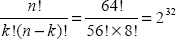

其中 n 是棋盘上的方格数，k 是皇后数，计算结果仅为 4,426,165,368（略多于 40 亿种配置）。如今看来，这个数量并不算大，因此暴力法或许可行。

因此，如果我们生成所有可能棋盘组合的集合 A，就可以创建一个名为 *q(x)* 的测试函数：若棋盘配置 x 是一个解，则返回 *true*；否则返回 *false*。然后我们可以编写如下所示的程序：

      生成所有棋盘配置的集合 A；

      *当* A 中仍有未测试的配置时，*执行*

            x = A 中的下一个配置

            *如果* (q(x) == true) *则* 打印解 x 并停止

            *返回* 顶部并重复执行。

请注意，所有工作都在两个步骤中完成——生成集合 A 和执行测试 *q(x)*。生成 A 只执行一次，但测试 *q(x)* 会对 A 中的每个配置执行一次，直到找到解。虽然这种分解方案肯定可行，但效率并不高。所以我们不妨说，我们希望减少组合数量。毕竟，效率是件好事。

##### 方案二

同样，我们需要从顶层开始。但这次我们已经做了一些分析，因此对需要完成的任务有了更清晰的认识。我们排除了暴力法，但发现可以从棋盘配置的角度来思考。为了减少总可能配置的数量，并设计出更高效的算法，我们需要深入思考这个问题。首先要注意的是，同一列中绝不能有多个皇后，实际上，每列必须*恰好*有一个皇后。这将可能的组合数减少到 2²⁴，即仅 1600 万。虽然这很不错，但并没有真正改变算法。我们提出的解决方案现在看起来是这样的：

      生成受限棋盘配置的集合 B；

      *当* B 中仍有未测试的配置时，*执行*

            x = B 中的下一个配置

            *如果* (q(x) == true) *则* 打印解 x 并停止

            *返回* 顶部并重复执行。

这个版本需要生成集合 B，即每列只有一个皇后的棋盘位置集合，并且仍然需要遍历多达 1600 万个可能的棋盘位置。生成 B 现在比生成 A 更复杂，因为我们必须测试一个候选棋盘位置是否满足每列一个皇后的限制。一定有更好的方法。

##### 方案三

当然，确实有更好的方法。我们只需要更智能地生成棋盘配置，并在生成过程中评估棋盘位置。与其先生成一个完整的棋盘配置再测试，为什么不生成并测试*部分解*呢？如果我们能在确定没有有效解时立即停止，那么事情就会进展得更快。此外，如果我们能从错误的解回溯到上一个正确的部分解，就能更快地排除错误的配置。

现在我们到了可以进行顶层设计、将其形式化，并进入下一层细化阶段的时候了。

##### 细化步骤 1

思路如下。

1.  在下一可用列的下一行放置一个皇后。
2.  测试该皇后是否能攻击到其他任何皇后。（这是上述 *q(x)* 测试的一个变体。）
3.  如果能攻击，则将其拿起，回溯到上一个试验解并重试。
4.  如果不能攻击，则保留该皇后，返回顶部并尝试下一个皇后。

使用这种方法，我们可以保证第 j 列的试验解是正确的。然后我们尝试通过在第 j+1 列添加一个皇后生成新的解。如果失败，我们只需回溯到第 j 列之前正确的试验解并重试。这种创建和测试部分解的技术被 Wirth 称为*试验解的逐步构造*。而回溯技术自然被称为*回溯法*。以下是寻找单个解的更形式化的伪代码：

`do {`
`            while ((row < 8) && (col < 8))  {`
`                if (当前皇后是安全的) then`
`                    前进：保留皇后在棋盘上，并前进到下一列。`
`                else`
`                    皇后不安全，因此移动到下一行。`
`            }`
`            if (我们已经穷尽了该列的所有行) then`
`                回归：后退一列，将该列的皇后上移一行，然后重新开始。`

`      } while ((col < 8) && (col >= 0));`
`      if (我们已经到达第 8 列) then`
`        我们找到了一个解，打印它。`

这个解决方案每次只测试一个皇后。这意味着，在任何给定时刻，棋盘上只有 j 个皇后，因此每次外层循环只需测试 j 个皇后。（只需测试到第 j 列的皇后。）这减少了测试例程的工作量。

这个算法是我们对解决方案的第一次形式化审视。请注意，上述方法中我们使用的是伪代码，而不是真正的编程语言。这是因为我们希望将语言细节推迟到更低的细化层级。此外，虽然我们已经有了方法的大致框架，但仍有许多细节需要考虑。这些细节已被推入我们正在创建的控制层级中，我们将在下一次细化迭代中处理它们。这也是逐步细化的一个特点。

既然我们已经有了算法的描述，我们也可以着手验证它。最终的验证当然是观察程序产生正确的解，但我们目前还不到那一步。不过，我们完全可以拿一个棋盘（或一张纸）手动模拟这个算法，以验证我们能否生成一个符合问题要求的皇后摆放方案。

至此，我们有了一个更形式化的顶层描述，也完成了力所能及的验证，现在可以准备展开上面那些模糊的步骤了。

##### 细化步骤 2

既然我们已经有了程序的初步版本，接下来需要检查程序中的每一步，看看它们由哪些部分构成。我们关注的步骤如下：

1.  检查当前皇后是否安全。
2.  将安全的皇后留在棋盘上，并前进到下一列。
3.  将不安全的皇后向上移动一行。
4.  后退一列，并重置该列中的皇后。

检查当前皇后是否安全，意味着我们需要确认当前皇后所在的两条对角线（上对角线和下对角线）以及所在行上都没有其他皇后。行检查很简单，只需检查同一行中的所有其他格子即可。要检查上对角线和下对角线，请记住，如果当前皇后位于第 j 列，我们只需要检查第 1 列到第 j-1 列。稍加思考你就会发现，上对角线（从左下到右上）上所有格子的行索引与列索引之差是一个常数。类似地，下对角线（从左上到右下）上所有格子的行索引与列索引之和也是一个常数。这使得我们更容易确定哪些格子位于皇后的对角线上，以及如何检查它们。

现在我们可以开始考虑数据结构了。你可能会问，这一步从何而来？嗯，逐步细化主要关注的是描述程序的控制流。但在某个时刻，你需要确定数据的具体形式。对于你试图解决的每个问题，这个时刻会在细化过程中的不同位置出现。对于当前问题，我们正处于这样一个阶段：在下一步细化中，我们应该编写更详细的伪代码。这几乎迫使我们现在就开始思考数据结构，以便能够编写伪代码。

具体来说，我们现在需要问自己：我们打算如何表示棋盘和棋盘上的皇后？我们打算如何表示空单元格？我们需要一种能够高效表示皇后并检查它们是否会被攻击的数据结构。初步设想可能是一个 8×8 的二维数组，我们在相应的行和列交叉点上放置皇后。因为我们不需要对这个矩阵进行任何计算——我们只需要指示皇后的存在与否——我们可以通过将其设为布尔数组来节省空间。这种数据结构也允许我们快速检查行、上对角线和下对角线中是否存在可以攻击当前皇后的皇后。所以我们应该使用一个二维布尔数组，对吧？

嗯，先别急。这并不是思考皇后数据表示的唯一方式。事实上，如果我们考虑在安全检查过程中需要使用的数据结构和操作，我们或许可以简化一些事情。

首先，既然我们知道每列只能有一个皇后，每行也只能有一个皇后，为什么不把这些信息结合起来呢？与其使用二维数组，为什么不直接使用一个一维布尔数组呢？例如：

`boolean column[8];`

其中 `column[i] = true` 表示第 i 列仍然空闲。对于对角线，我们可以利用上对角线和下对角线常数差或常数和的特性，创建另外两个数组：

`boolean up[-7..+7], down[0..14];`

这两个数组将指示哪些对角线格子是空闲的。采用这种安排，检查皇后是否安全的测试条件为：

`(column[i] and up[row-col] and down[row+col])`^(`5`)

好了，这看起来足够简单，所以我们终于可以完成这一步了，对吧？

嗯，不。还有另一种思考方式。回到使用一维数组，但这次使用整数数组：

`int board[8];`

其中，数组的每个*索引*代表一列（在八皇后问题中为 0 到 7），而数组中存储的每个*值*代表皇后所在的行（在八皇后问题中也是 0 到 7）。由于我们现在有了每个皇后确切位置（行和列）的数据，我们就不再需要为上对角线和下对角线分别设置数组了。安全检查稍微复杂一些，但仍然很简单。现在或许是时候编写更多代码了。此时，似乎应该从伪代码过渡到一种真正的编程语言。在细化过程中的某个时刻，你必须进行这种过渡。就像决定何时定义数据结构一样，具体何时引入特定于语言的特性，取决于问题本身以及当前细化步骤的详细程度。一个用于检查安全的 Java 方法可能如下所示：

`public boolean isSafe (int[ ] board) {`
`        boolean safe = true;`
`        for (int i = 0; i < col; i++) {`
`                if ( ( ( board[i] + i) == (row + col) ) ||      // 下对角线测试`
`                        ( ( board[i] - i) == (row - col) ) ||   // 上对角线测试`
`                        ( board[i]  == row) )                   // 行测试`
`                        safe = false;`
`        }`
`        return safe;`
`}`

请记住，由于我们是通过每次向一列添加一个皇后来逐步构建部分解，因此每次只需要测试前 *`col`* 列。

__________

⁵ Dahl, O. J., E. Dijkstra, 等 (1972). *结构化编程.* (英国伦敦: Academic Press, 1972.)

既然我们已经解决了安全过程，并决定使用一个简单的数据结构来表示当前的棋盘配置，我们就可以继续进行分解中的其余过程了。剩下的过程是：

**5.** 将安全的皇后留在棋盘上，并前进到下一列；

**6.** 将不安全的皇后向上移动一行；以及

**7.** 后退一列，并重置该列中的皇后。

这些过程都足够简单，无需进一步分解即可直接编写。这是结构化编程的一个关键点——持续进行分解，直到一个过程变得显而易见，然后你就可以编写代码了。这三个方法用代码编写出来如下所示：

`/*`
` *  将安全的皇后留在棋盘上，并前进到下一列`
` *  位于 (row, col) 的皇后是安全的，因此我们有了一个部分解。`
` *  前进到下一列`
` */`
`public void advance (int[] board) {`
`    board[col] = row;           // 将皇后放置在棋盘上的 (row, col) 位置`
`    col++;                      // 移动到下一列`
`    row = 0;                    // 并从该列的开头开始`
`}`

对于*将不安全的皇后向上移动一行*，我们甚至不需要一个单独的方法。主程序中用于检查安全的测试会在 `isSafe()` 方法确定当前 (row, col) 位置不安全时，将皇后向上移动一行。实现此功能的代码如下：

`       if (isSafe(board))`
`           advance(board);`
`       else`
`           row++;`

最后，我们有：

`    /**`
`     *  后退一列，并重置该列中的皇后`
`     *  我们无法在当前列找到安全行`
`     *  因此后退一列，并将该列的皇后`
`     *  向上移动一行，以便重新开始查找`
`     */`
`    public void retreat (int[] board) {`
`        col--;`
`        row = board[col] + 1;  `
`    }`

完整的 Java 程序见附录。

### 模块化分解

1972 年，大卫·帕纳斯发表了一篇题为《将系统分解为模块时应遵循的标准》的论文，提出可以使用一种称为*模块化*的技术来设计程序。⁶ 帕纳斯的论文也是最早描述基于*信息隐藏*进行分解的论文之一，而信息隐藏正是面向对象编程的关键技术之一。在论文中，帕纳斯强调了基于问题解决方案的*控制流*进行自顶向下分解，与使用*封装*和*信息隐藏*将数据定义及其操作相互隔离的分解方式之间的区别。他的论文显然是面向对象分析与设计（OOA&D）的先驱，我们将在下一章中探讨这一概念。

尽管帕纳斯的论文早于这一概念的提出，但他实际上讨论的是一种称为*关注点分离*的思想。“在计算机科学中，*关注点分离*是指将计算机程序拆分为功能重叠尽可能小的不同特征的过程。关注点是指程序中任何感兴趣或聚焦的部分。通常，关注点与特征或行为是同义词。实现关注点分离的传统途径是通过编程的模块化和封装（或操作的‘透明性’），并借助信息隐藏来实现。”⁷ 传统上，关注点分离主要关注程序功能的分离。帕纳斯则增加了数据分离的思想，使得各个模块既能控制数据，也能控制作用于数据的操作，并且数据只能通过定义良好的接口对外可见。

模块化有三个关键特征，对于创建模块化程序至关重要：

*   封装
*   松散耦合（模块之间的关联程度）
*   信息隐藏

简而言之，*封装*是指将由数据和行为定义的一组服务捆绑成一个模块，并保持其整体性。这组服务应当具有内聚性，并明确属于同一整体。（就像函数一样，一个模块应该只做一件事。）然后，该模块向用户提供一个*接口*，理想情况下，该接口是访问模块内服务和数据的唯一途径。封装服务和数据的目标是实现高内聚。这意味着你的模块应该只做一件事，并且模块内的所有函数都应协同工作以实现这一件事。你越接近这个目标，模块的内聚性就越高。这是一件好事。

与封装相辅相成的是*松散耦合*。松散耦合描述了两个模块之间的关联强度。这意味着我们希望最小化任何一个模块对另一个模块的依赖。我们通过分离模块来最小化交互，并使模块间的所有交互都通过模块接口进行。目标是创建具有内部完整性（高内聚）且与其他模块之间具有少量、直接、可见且灵活的连接（松散耦合）的模块。良好的模块间耦合应足够松散，以便一个模块可以轻松地被其他模块调用。

__________

⁶ Parnas, D. “On the Criteria to be Used in Decomposing Systems into Modules.” *Communications of the ACM* 15(12): 1053-1058. (1972)

⁷ Wikipedia. Separation of Concerns. 2009. [`http://en.wikipedia.org/wiki/Separation_of_concerns`](http://en.wikipedia.org/wiki/Separation_of_concerns). 检索于 2009 年 12 月 7 日。

耦合可分为四大类，从良好到糟糕依次为：

*   *简单数据耦合：* 非结构化数据通过参数列表传递。这是最好的耦合类型，因为它允许接收模块按需自行组织数据，并决定如何处理这些数据。
*   *结构化数据耦合：* 结构化数据通过参数列表传递。这也是一种良好的耦合类型，因为发送模块保持对数据格式的控制，而接收模块则可以按需处理数据。
*   *控制耦合：* 模块 A 的数据传递给模块 B，数据内容告诉模块 B 该做什么。这不是一种好的耦合形式；在这种情况下，A 和 B 耦合过于紧密，因为模块 A 正在控制模块 B 中函数的执行方式。
*   *全局数据耦合：* 两个模块使用相同的全局数据。这非常糟糕。它通过让模块共享数据，违反了封装的基本原则。这会引发不良的副作用，并确保在程序执行的任何时刻，模块 A 和模块 B 都无法确切知道全局共享数据中到底有什么。而且，你到底为什么要使用全局变量？差劲的程序员！

信息隐藏常常与封装混淆，但它们并非同一回事。封装描述的是将数据和行为包装到单个实体（在我们的例子中即模块）中的过程。数据在模块内部可以是公开可见的，因此并未被隐藏。而信息隐藏则指出，模块中的数据和行为应受到控制，并且仅对模块内操作这些数据的函数可见，从而对外部其他模块不可见。这是模块（以及后来的对象）的一个重要特性，因为它将数据的控制权交给了最了解如何操作该数据的模块，并保护数据免受其他模块介入并篡改数据可能带来的副作用。

帕纳斯所讨论的并不仅仅是模块中的数据隐藏。他对信息隐藏的定义更侧重于在模块定义中隐藏设计决策。“我们提议……首先列出一系列困难的设计决策或可能发生变化的设计决策。然后，每个模块的设计目标就是将这些决策对其他模块隐藏起来。”⁸ 以这种方式隐藏信息，使得模块的客户端无需了解构建该模块所涉及的任何设计决策，就能成功使用该模块。同时，它也允许开发人员更改模块的实现，而不会影响客户端使用该模块的方式。

#### 示例：上下文关键词索引——为你我而设的索引

早在 Unix 诞生之初、世界尚新之时，Unix 文档被划分为八（8）个不同的章节，整本手册以一张排列索引开头。Unix 的问题不在于命令行界面，也不在于倒置的树形文件系统结构。不，Unix 的问题在于开发它的三个人——克尼汉、里奇和汤普森——是地球上最懒的三个家伙。我怎么知道的？证据在哪？证据几乎遍布每个 Unix 命令——`ls`、`cat`、`cp`、`mv`、`mkdir`、`ps`、`cc`、`as`、`ld`、`m4`……我还能继续列举。Unix 拥有地球上所有操作系统中最为晦涩的命令行集。创建 Unix 命令行工具的首要规则显然是：“能用两个字符，何必用三个？”

__________

⁸ 帕纳斯，1972 年。

因此，在 Unix 文档的 8 个章节中查找任何内容都可能是一场真正的考验。排列索引应运而生。每个 Unix 手册页都以一行标题开头，其中包含命令名称和该命令功能的简短描述。例如，cat(1) 手册页的开头是：

      cat -- 连接并打印文件

问题是，如果我不知道命令的名称，但我知道它的功能，该怎么办？排列索引通过将描述中大部分单词（冠词被忽略）纳入索引本身来解决这个问题。这样，*cat* 既可以在“cat”下找到，也可以在“concatenate”、“print”和“files”下找到。这被称为**上下文关键词**（KWIC）索引。它工作起来非常方便。

因此，我们的问题是：输入两个文件，第一个文件包含要忽略的单词，第二个文件包含要索引的文本行，然后为它们创建一个 KWIC 索引。例如，假设我们忽略冠词 for、the、and 等，第二个文件内容如下：

      The Sun also Rises

      For Whom the Bell Tolls

      The Old Man and the Sea

我们的 KWIC 索引将如下所示：

                  the sun ALSO rises
          for whom the BELL tolls
                  the old MAN and the sea
                        the OLD man and the sea
            the sun also RISES
      the old man and the SEA
                        the SUN also rises
   for whom the bell TOLLS
                        for WHOM the bell tolls

请注意，每个关键词都采用全大写，每行输入文本会针对该行中的每个索引词出现一次，并且关键词按字母顺序排序。每行文本通过循环移位其中的单词来使其关键词可见。在出现平局（两行文本具有相同的索引词，因此应在输出中相邻出现）的情况下，文本行应按照它们在输入文本文件中出现的顺序排列。因此，我们要回答的问题是：如何创建 KWIC 索引？我们几乎立即需要回答的第二个问题是：如何存储数据？

### 自顶向下分解

我们将从使用自顶向下分解来设计问题解决方案开始。正如我们在本章前面解决八皇后问题时所见，自顶向下分解的核心在于*控制流*。我们要弄清楚如何按顺序解决问题，并在每一步都取得进展。这里假设数据与例程分开存储，并且控制流中的每个子例程都可以访问它所需的数据。另一种方法是在调用每个子例程时将数据传递给它；这可能既繁琐又耗时，因为每次将数据传递给例程时通常都需要复制数据。该问题的首次分解可能如下所示：

1.  输入要忽略的单词和文本。
2.  创建一个包含循环移位后文本行的数据结构，并跟踪该行中哪个单词是索引词。
3.  按索引词对循环移位后的文本行进行排序。
4.  格式化输出行。
5.  输出文本。

请注意，这五个步骤可以轻松地变成五个子例程，它们按顺序从主程序中被调用。用于输入文本的数据结构可以是每行一个字符数组、每行一个字符串，或者整个输入文件的一个字符串数组。也可以使用映射数据结构，将每个索引词作为键，将包含输入文本行的字符串作为映射元素的值。当然还有其他可能的数据结构。排序可以通过任何稳定的排序算法完成，具体使用哪种算法取决于所选的数据结构以及输入文本的预期大小。你的排序必须是稳定的，因为要求相同的索引词对应的文本行按照它们在输入文本文件中出现的顺序排序。根据你使用的编程语言和选择的数据结构，排序可能会自动为你完成。你选择的数据结构将影响循环移位如何执行，以及输出例程如何完成格式化每个输出行的工作。

现在我们对自顶向下分解如何进行有了一个概念，让我们继续考虑模块化分解。

##### KWIC 的模块化分解

KWIC 问题的模块化分解可以基于信息隐藏，即我们将隐藏数据结构与设计决策。我们创建的模块不一定是上面列出的顺序列表，而是可以相互协作并在需要时被调用的模块。KWIC 的一个模块列表如下：

*   一个行模块（用于输入文本行）
*   一个关键词-行对模块
*   一个 KWICIndex 模块，用于创建索引列表本身
*   一个循环移位模块
*   一个用于格式化和打印输出的模块
*   一个主控制模块

行模块将使用关键词-行模块来创建一个映射数据结构，其中每一行是一个关键词以及包含该关键词的行列表。KWICIndex 模块将使用行模块来创建索引列表。循环移位模块将使用 KWICIndex 模块（并递归地使用行模块和关键词-行模块）来创建循环移位后的关键词-行对集合。排序将在 KWICIndex 模块内部处理；理想情况下，索引将作为排序列表创建，并且对列表的任何添加都将保持索引的顺序。格式化和打印模块将组织关键词-行，使得关键词以全大写形式打印并居中显示在输出行上。最后，主控制模块将读取输入，创建 KWICIndex 并使其正确打印。

这些模块的关键在于，可以在不需要了解每个模块如何实现以及数据如何存储的细节的情况下，描述这些模块及其交互。这些细节隐藏在模块描述本身中。其他设计也是可能的。例如，将循环移位操作归入行模块内部可能更好，使其能够存储输入行及其移位结果。无论如何，设计的下一步是为每个模块创建接口，并协调这些接口，以便每个模块无论内部实现如何，都能与其他模块通信。

我们将在下一章关于面向对象设计的内容中，以更详细的方式继续讨论这个话题。

### 结论

结构化设计描述了一套经典的设计方法论。这些设计思想适用于一大类问题。最初的结构化设计思想——逐步求精，要求你采用自顶向下的方式分解问题，重点关注解决方案的控制流。它也与第 5 章中提到的某些架构密切相关，特别是主程序-子程序架构和管道-过滤器架构。模块化分解是现代面向对象方法论的直接前身，并引入了封装和信息隐藏的概念。这些概念是你设计工具箱中的基础。

### 附录：完整的非递归八皇后程序

`/*`
` *  NQueens.java`
` *  八皇后程序`
` *  单解的非递归版本`
` *  jfd`
` */`

`import java.util.*;`

`public class NQueens`
`{`

`        static int totalcount = 0;`
`        static int row = 0;`
`        static int col = 0;`

`    /*`
`     *  (row, col) 处的皇后是安全的，`
`     *  因此我们得到了一个部分解`
`     *  前进到下一列`
`     */`
`    public void advance (int[] board) {`
`        board[col] = row;`
`        col++;`
`        row = 0;`
`    }`

`    /*`
`     *  在当前列中找不到安全的行`
`     *  因此回退一列，并将该皇后`
`     *  上移一行`
`     */`
`    public void retreat (int[] board) {`
`        col--;`
`        row = board[col] + 1;`
`    }`

`    /*`
`     *  检查 (row, col) 处的皇后是否`
`     *  会受到攻击`
`     */`
`    public boolean isSafe (int[] board) {`
`        boolean safe = true;`
`        totalcount++;`
`        /*`
`         *  检查对角线和行是否有攻击`
`         *  由于我们只检查部分解`
`         *  只需检查到当前列即可`
`         */`
`        for (int i=0; i<col; i++)  {`
`           if (( (board[i] + i) == (row + col) ) ||  // 上对角线`
`               ( (board[i] - i) == (row - col) ) ||  // 下对角线`
`               (board[i]  == row) ) {`
`                safe = false;`
`                 }`
`        }`
`        return safe;`
`    }`

`    public static void main(String args[]) {`
`        int N = 8;      // 默认棋盘大小`

`        System.out.print("请输入棋盘大小: ");`
`        Scanner stdin = new Scanner(System.in);`
`        N = stdin.nextInt();`
`        System.out.println();`

`        NQueens queen = new NQueens();`
`        /*`
`         *  棋盘数组的索引是列号`
`         *  棋盘数组中存储的值是行号`
`         *  因此 board[2] = 3; 表示在第 2 列第 3 行放置一个皇后`
`         */`
`        int[] board = new int [N];        /*`
`         *  构建 N 皇后问题部分解的简单算法。`
`         *  在下一个可用列中放置一个皇后，`
`         *  测试它是否会受到攻击。`
`         *  如果不会，则移动到下一列。`
`         *  如果会，则将皇后上移一行并重试。`
`         *  如果某一列的所有行都已尝试完毕，`
`         *  则回退，重置前一列并重试。`
`         */`
`        do {`
`            while ((row < N) && (col < N))  {`
`                if (queen.isSafe(board)) {`
`                    queen.advance(board);`
`                } else {`
`                    row++;`
`                }`
`            }`
`            if (row == N) {`
`                queen.retreat(board);`
`            }`

`        } while ((col < N) && (col >= 0));`

`        /* 如果已放置所有 N 个皇后，则得到一个解 */`
`        if (col == N) {`
`            for (int i = 0; i < N; i++) {`
`                System.out.print(board[i] + " ");`
`            }`
`        } else {`
`            System.out.println("无解。 ");`
`           }`

`        System.out.println();`

`        System.out.println("在尝试了 " + totalcount +`
`                         " 个棋盘位置之后。");`
`    }`
`}`

## 第 8 章

## 面向对象分析与设计概述

> *面向对象编程是一个极其糟糕的想法，这种想法只可能出自加利福尼亚。*
> 
> ——艾兹格·迪杰斯特拉
> 
> *对象具有三个属性，这使其成为一个简单而强大的模型构建块。它具有状态，因此可以模拟记忆。它具有行为，因此可以模拟动态过程。并且它是封装的，因此可以隐藏复杂性。*
> 
> ——特里格夫·雷恩斯考，《与对象共事》

嗯，是的，我们之前都学过面向对象编程范式。但回顾一些基本定义绝无坏处，这样我们在讨论面向对象分析与设计时就能站在同一页面上。

首先，对象是*事物*。它们具有*标识*（即名称）、*状态*（即描述对象内部当前存储数据的一组属性），以及一组定义好的*操作*来作用于该状态。栈是一个对象，汽车、银行账户、窗口或图形用户界面中的按钮也是如此。在面向对象程序中，一组协作的对象之间相互传递消息。这些消息向目标对象发出请求，以调用那些要么对其数据执行操作（从而改变对象状态），要么报告对象当前状态的方法。最终，工作得以完成。对象使用*封装*和*信息隐藏*（记住，它们是不同的）来将数据和操作与程序中的其他对象隔离开来。共享数据区域（通常）被消除。对象是*类*的成员，类定义了属性类型和操作。

类是对象的*模板*。类也可以被视为生成对象的工厂。因此，一个`Automobile`类将生成汽车实例，一个`Stack`类将创建一个新的栈对象，而一个`Queue`类将创建一个新的队列。类可以从其他类继承属性和行为。类可以排列成类层次结构，其中一个类（*超类*或*基类*）是一个或多个其他类（*子类*）的泛化。子类从其超类继承属性和操作，并可以添加自己的新方法或属性。从这个意义上说，子类比其超类更具体、更详细；因此，我们说子类扩展了超类。例如，优先队列是队列的一个更具体的版本；它拥有队列的所有属性和操作，但增加了某些队列元素比其他元素更重要的概念。在 Java 中，此特性称为*继承*，而在 UML 中则称为*泛化*。¹ 真是令人费解。

继承有许多优点。它是一种*抽象机制*，可用于对实体进行分类。在设计和编程层面，它都是一种*复用机制*。继承图是关于领域和系统的组织性知识的来源。

当然，继承也存在问题。它使得对象类不是自包含的；如果不参考其超类，就无法理解子类。继承引入了复杂性，这是不可取的，尤其是在关键系统中。继承通常还允许运算符重载（Java 中的方法），这可能是好事（多态性），也可能是坏事（屏蔽超类中的有用方法）。

面向对象编程（OOP）有许多优点，其中包括更易于维护，因为对象可以被理解为独立的实体。对象也适合作为可复用的组件。但是，对于某些问题，可能无法将现实世界中的对象映射到系统对象，这意味着 OOP 并不适用于所有问题。

### 面向对象分析与设计流程

面向对象分析（OOA）、设计（OOD）与编程（OOP）虽彼此关联，但各有侧重。OOA 致力于开发*应用领域的对象模型*。例如，你需要根据问题陈述生成一组特性及（可能存在的）用例，²从中梳理出对象以及这些对象中用于满足用例的某些方法，并构建出解决方案的整体架构。这就是面向对象分析。

OOD 则致力于开发*满足需求的面向对象系统模型*。你需要将 OOA 阶段生成的对象作为基础，判断是否使用继承、聚合、组合、抽象类、接口等机制，以构建一个连贯且高效的模型；绘制类图，详细定义每个属性的含义及每个方法的功能，并描述接口。这就是设计阶段。

有人偏爱面向对象分析、设计与编程，³也有人不以为然。⁴

因此，面向对象分析让你能够将问题模型转化为对象和类的形式；而面向对象设计则让你能够将分析后的需求串联起来，在你提出的对象之间建立联系，并补充对象属性和方法的细节。但具体该如何操作呢？下面是一个建议流程，它将逐步填充这些细节。⁵ 其余部分我们将在后续过程中逐步明确。

_________

¹ Fowler, M. *UML Distilled.* (波士顿，马萨诸塞州：Addison-Wesley 出版社，2000 年.)

² Cockburn, A. *Writing Effective Use Cases.* (波士顿，马萨诸塞州：Addison-Wesley 出版社，2000 年.)

³ Beck, K., 与 B. Boehm. “Agility through Discipline: A Debate.” IEEE Computer 36 (6):44-46. (2003 年)

⁴ Graham, Paul. “Why Arc isn't Especially Object Oriented,” 2009 年 10 月 12 日检索自 [`www.paulgraham.com/noop.html`](http://www.paulgraham.com/noop.html)

⁵ McLaughlin, Brett D., 等. *Head First Object-Oriented Analysis & Design.* (O'Reilly Media, Inc. 塞瓦斯托波尔，加利福尼亚州：2007 年.)

1.  编写（或接收）问题陈述。据此生成初始特性集。
2.  创建特性列表。特性列表是从问题陈述中推导出的程序特性集合；它包含你的初始需求集。
3.  编写用例。这有助于完善特性、挖掘新需求，并暴露刚创建的特性中存在的问题。我们也会看到，这一步可以使用用户故事。
4.  将问题分解为子系统、模块或任何你喜欢的名称，只要它们是与功能相关的、更小且自包含的单元即可。
5.  将特性、子系统和用例映射到领域对象；创建抽象。
6.  识别程序的对象、方法和算法。
7.  实现本次迭代。
8.  测试本次迭代。
9.  如果特性列表尚未完成，且仍有时间和/或预算，则返回步骤 4 进行下一次迭代；否则……
10. 进行最终验收测试并发布。

请注意，该流程省略了许多细节，例如迭代的时长。一次迭代应包含多少特性？如何以及何时向特性列表添加新特性？我们究竟如何识别对象和操作？如何将对象抽象为类？测试中发现的错误应在何处修复？是否需要对代码及其他项目工作产品进行评审？

在此省略一些步骤是可以接受的。我们主要关注流程中的分析与设计环节。下文将讨论流程其余部分的相关思路，部分答案也可见于项目管理相关的第 3 章。

上述流程步骤如何融入软件开发生命周期？很高兴你问到这个问题。回顾一下，基本的开发生命周期包含四个阶段：

1.  需求收集与分析；
2.  设计；
3.  实现与测试；
4.  发布、维护与演进。

我们可以轻松地将之前的十个步骤归入四个阶段，如下所示：

**需求收集与分析**

1.  问题陈述。
2.  创建特性列表。
3.  生成用例。

**设计**

1.  分解问题。
2.  将特性与用例映射到领域对象。
3.  识别对象、方法和算法。

**实现与测试**

1.  实现本次迭代。
2.  测试本次迭代。
3.  如果特性列表未完成或时间耗尽，则返回步骤 4；否则……

**发布/维护/演进**

1.  进行最终验收测试并发布。

再次强调，目前我们可以忽略每个流程步骤的细节。这些细节实际上取决于你为开发项目选择的流程方法论。上述流程描述采用了迭代方法论，可以轻松适配敏捷流程或更传统的分阶段发布流程。

另请注意，每当进入步骤 4 时，你都需要重新审视需求，因为在每次迭代过程中你很可能会发现或生成新的需求。此外，每当客户看到新的迭代版本时，他们总会提出更多要求（相信我，他们一定会）。这意味着你需要在每次新迭代开始时更新特性列表（并重新确定优先级）。切记！

### 执行流程

接下来，我们通过一个扩展示例来继续探讨，看看问题陈述会引导我们走向何方，以及如何梳理需求并开始面向对象分析。

#### 问题陈述

伯特是“伯特之鸟”的骄傲所有者，他发明了终极喂鸟器。伯特的“鸟之盛宴与浴场”（B⁴）是一款集喂鸟器与鸟浴盆于一体的产品。它有 12 种不同颜色（包括迷彩色），并提供 1 磅、3 磅和 5 磅三种容量规格。其附带的鸟浴盆可容纳多达 1 加仑的水，内置挂钩可悬挂在树枝或杆子上，B⁴正从货架上飞速售罄。爱丽丝和鲍勃对 B⁴渴望至极，但他们希望做一些改动。爱丽丝是个技术迷，也是狂热的鸣禽观察者。她知道她最喜欢的鸣禽只在白天觅食，因此她想要一款定制的 B⁴，能够实现喂食门在日出时自动打开、日落时自动关闭。一贯随和的伯特同意了这一要求，“伯特之鸟”的硬件部门正全力设计专为爱丽丝打造的 B⁴++。你的任务是编写软件，让硬件正常工作。

#### 特性列表

我们首先要弄清楚 B⁴++实际上会*做什么*。这个版本看起来相当简单。我们几乎可以立即写下三个需求：

*   所有喂食门必须同时打开和关闭。
*   喂食门应在日出时自动打开。
*   喂食门应在日落时自动关闭。

看起来并不复杂。需求很简单，且无需用户交互。下一步是创建一个用例，以便我们真正了解这款喂鸟器将如何运作。

#### 用例

*用例*是对程序在特定情境下所执行操作的描述。它是一组详细的步骤，当用户提出请求时，程序会按这些步骤执行。用例总是包含一个*参与者*——即启动流程的外部代理，以及一个*目标*——即用例最终应达成的结果。用例从用户视角描述了如何从某个初始状态达成目标。^(6) 以下是 B⁴++ 的一个简单用例示例：

1.  传感器检测到 40% 亮度的阳光。
2.  喂食门打开。
3.  鸟儿到达，进食并饮水。
4.  鸟儿离开。
5.  传感器检测到阳光亮度降至 25%。
6.  喂食门关闭。

鉴于 B⁴++ 的简单性，这基本上就是我们对一个用例的全部预期。实际上，步骤 3 和 4 严格来说并不属于用例，因为它们并非程序的一部分——但保留它们有助于我们更全面地了解 B⁴++ 的运行方式。用例在需求分析中非常有用，因为它们能让你用通俗语言了解程序在特定情境下需要做什么，并且几乎总能帮助你发现新的需求。请注意，在用例中我们不讨论程序*如何*执行操作，只关注程序为达成目标*必须*做什么。用例是在软件生命周期的需求收集与分析阶段生成的，因此我们目前还不太关心细节，只需将程序视为一个黑盒，让用例描述程序的*外部行为*。大多数情况下，你编写的每个程序都会对应多个用例。我们这里只有一个，因为这个版本的 B⁴++ 非常简单。

#### 分解问题

现在我们已经有了用例，接下来可以分解问题并识别程序中的对象了。你先来，我等着……

__________

⁶ Cockburn, 2000.

完成了？好的。这个问题相当简单；如果你查看上面的用例并找出其中的名词，你会发现我们可以识别出几个对象。每个对象都有特定的特征，并有助于实现喂鸟的目标。（是的，我知道，“鸟儿”在用例中是一个名词，但在这个小场景中它们是参与者，因此为了描述对象，我们忽略它们——它们不是程序的一部分。）另外两个值得关注的名词是“传感器”和“门”。它们是 B⁴++ 的关键部件，因为用例表明，正是这些部件在日出和日落时完成了打开和关闭喂食门的目标。因此，它们成为我们设计中的对象是合乎逻辑的。以下是我为 B⁴++ 第一个版本提出的对象及其简要描述：

> *BirdFeeder*：顶层对象。喂鸟器有一个或多个供鸟儿聚集的喂食门，以及一个用于检测日出和日落的传感器。*BirdFeeder* 类需要控制光传感器的查询以及喂食门的打开和关闭。
>
> *Sensor*：将有一个硬件光传感器用于检测不同的光照水平。我们需要向它查询光照水平。
>
> *FeedingDoor*：喂鸟器上会有几个喂食门。它们需要能够打开和关闭。

目前这些大概就是所有的类了。现在它们各自做什么呢？为了描述类及其组成部分，我们可以使用另一个 UML 特性——*类图*。

#### 类图

*类图*允许你描述类的属性和方法。一组类图将描述程序中的所有对象以及对象之间的关系。我们在类图之间绘制不同类型的箭头来描述这些关系。类图为你提供了程序中创建的对象模型的视觉描述。我们在第 5 章中描述的狐狸与兔子程序里看到过一组类图。

类图包含三个部分：

*   **名称**：类的名称
*   **属性**：类使用的实例数据字段及其类型
*   **方法**：类使用的方法集及其可见性。

我们可以在图 8-1 中看到 `BirdFeeder` 类的类图示例。

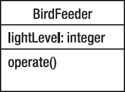

***图 8-1.** BirdFeeder 类*

该图显示 *`BirdFeeder`* 类有一个整数属性 *`lightLevel`* 和一个方法 *`operate()`*。单独的类图本身并不特别有趣，但当你将多个类图放在一起并展示它们之间的关系时，就能获得关于程序的一些有趣信息。那么，我们还需要哪些类图呢？在我们的程序中，*`BirdFeeder`* 类使用了 *`FeedingDoor`* 和 *`Sensor`* 类，但这两个类彼此并不知晓（也不关心）。实际上，虽然 *`BirdFeeder`* 知道 *`FeedingDoor`* 和 *`Sensor`* 并使用了它们，但它们并不知道自己被使用了。啊，这就是面向对象编程之美。这种关系可以用图 8-2 中所有三个类的类图来表示。

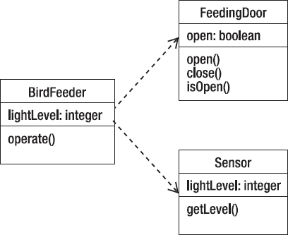

***图 8-2.** BirdFeeder 使用 FeedingDoor 和 Sensor*

在 UML 中，末端带有空心箭头的虚线表示一个类（在我们的例子中是 `BirdFeeder`）通过*使用*与另一个类（在我们的例子中是 `FeedingDoor` 或 `Sensor`）*关联*。

#### 人人都能写代码？

现在我们已经有了类图，知道了属性、方法以及类之间的关联，是时候用代码来充实我们的程序了。

在`BirdFeeder`对象中，`operate()`方法需要检查光照强度，并根据`Sensor`对象报告的当前光照强度来打开或关闭喂食门。如果当前光照强度高于或低于阈值，则不做任何操作。

在`Sensor`对象中，`getLevel()`方法只是从硬件传感器返回当前的光照强度值。

在`FeedingDoor`对象中，`open()`方法会检查门是否关闭。如果门是关闭的，就打开它，并设置一个布尔值来表示门已打开。`close()`方法则执行相反的操作。

以下是所描述的每个类的代码。

`/**`
` * class BirdFeeder`
` *`
` * @author John F. Dooley`
` * @version 1.0`
` */`

`import java.util.ArrayList;`
`import java.util.Iterator;`

`public class BirdFeeder`
`{`
`    /* 实例变量 */`
`    private static final int ON_THRESHOLD = 40;`
`    private static final int OFF_THRESHOLD = 25;`
`    private int lightLevel;`
`    private Sensor s1;`
`    private ArrayList<FeedingDoor> doors = null;`

`    /*`
`     * BirdFeeder 类的默认构造函数`
`     */`
`    public BirdFeeder()`
`    {`
`        doors = new ArrayList<FeedingDoor>();`
`        /* 初始化 lightLevel */`
`        lightLevel = 0;`
`         s1 = new Sensor();`
`        /* 默认情况下，我们的喂食器只有一个门 */`
`        doors.add(new FeedingDoor());`

`    }`
`    /*`
`     * operate() 方法用于操作喂食器。`
`     * 它从 Sensor 获取当前光照强度，`
`     * 并检查是否应该打开或关闭门`
`     */`
`    public void operate()`
`    {`
`        lightLevel = s1.getLevel();`

`        if (lightLevel > ON_THRESHOLD) {`
`            Iterator door_iter = doors.iterator();`
`            while (door_iter.hasNext()) {`
`                FeedingDoor a = (FeedingDoor) door_iter.next();`
`                a.open();`
`                System.out.println("门已打开。");`
`            }`
`        } else if (lightLevel < OFF_THRESHOLD) {`
`             Iterator door_iter = doors.iterator();`
`             while (door_iter.hasNext()) {`
`                FeedingDoor a = (FeedingDoor) door_iter.next();`
`                a.close();`
`                System.out.println("门已关闭。");`
`            }`
`        }`
`    }`
`}`

`/**`
` * class FeedingDoor`
` *`
` * @author John Dooley`
` * @version 1.0`
` */`
`public class FeedingDoor`
`{`
`    /* 实例变量 */`
`    private boolean doorOpen;`

`    /*`
`     * FeedingDoors 类的默认构造函数`
`     */`
`    public FeedingDoor()`
`    {`
`        /* 初始化实例变量 */`
`        doorOpen = false;`
`    }`

`    /*`
`     * 打开喂食门`
`     * 如果门已经打开，则不执行任何操作`
`     */`
`    public void open( )`
`    {`
`        /** 如果门是关闭的，则打开它 */`
`        if (doorOpen == false) {`
`            doorOpen = true;`
`        }`
`    }`

`    /*`
`     * 关闭门`
`     * 如果门已经关闭，则不执行任何操作`
`     */`
`    public void close( )`
`    {`
`        /* 如果门是打开的，则关闭它 */`
`        if (doorOpen == true) {`
`            doorOpen = false;`
`        }`
`    }`
`    /*`
`     * 报告门是打开还是关闭`
`     */`
`    public boolean isOpen()`
`    {`
`        return doorOpen;`
`    }`
`}`

`/**`
` * class Sensor`
` *`
` * @author John Dooley`
` * @version 1.0`
` */`
`public class Sensor`
`{`
`    /* 实例变量 */`
`    private int lightLevel;`

`    /*`
`     * Sensor 类的默认构造函数`
`     */`
`    public Sensor(`
`    {`
`        /** 初始化实例变量 */`
`        lightLevel = 0;`
`    }`

`    /**`
`     * getLevel - 返回光照强度`
`     *`
`     * @return 由硬件传感器返回的光照强度值`
`     */`
`    public int getLevel( )`
`    {`
`        /* 在获得硬件光照传感器之前，我们只是模拟它 */`
`        lightLevel = (int) (Math.random() * 100)`
`        return lightLevel`
`    }`
`}`

最后，我们有一个`BirdFeederTester`类来操作 B⁴++。

`/**`
` * 测试 BirdFeeder、Sensor 和`
` * FeedingDoor 类的类。`
` *`
` * @version 0.1`
` */`
`public class BirdFeederTester`
`{`
`    private BirdFeeder feeder;`

`    /*`
`     * BirdFeederTester 类的构造函数`
`     */`
`    public BirdFeederTester()`
`    {`
`        this.feeder = new BirdFeeder();`
`    }`

`    public static void main(String [] args)`
`    {`
`        BirdFeederTester bfTest = new BirdFeederTester();`

`        for (int i = 0; i < 10; i++) {`
`            System.out.println("测试喂食器");`
`            bfTest.feeder.operate();`
`            try {`
`                Thread.currentThread().sleep(2000);`
`            } catch (InterruptedException e) {`
`                System.out.println("睡眠被中断" + e.getMessage());`
`                System.exit(1);`
`            }`
`        }`
`    }`
`}`

当爱丽丝和鲍勃收到 B⁴++ 时，他们激动不已。门自动打开和关闭，鸟儿们飞来饱餐一顿。鸟鸣声充满了空气。他们还能奢求什么呢？

### 结论

面向对象设计是一种适用于非常广泛问题的方法论。现实世界很容易被描述为相互协作的对象组。这个简单单一的理念促进了设计的简洁性、设计和代码的复用性，以及 Parnas 在其关于模块分解的论文中所倡导的封装和信息隐藏思想。它并非解决所有问题的正确方法，例如通信协议实现这类问题，但它为许多其他问题开辟了一个全新且更优的解决方案世界，并缩短了问题在现实世界中的描述与最终代码之间的“认知距离”。前进吧！

## 第 9 章

## 面向对象分析与设计

### 多幕剧

> *进行分析时，你试图理解问题。在我看来，这不仅仅是列出用例中的需求。……分析还涉及审视表面需求之下的内容，以构建出问题背后运作的心智模型。……某种概念模型是软件开发中不可或缺的一部分，即使是最不受约束的黑客也会这样做。*
> 
> ——马丁·福勒^(1)
> 
> *面向对象设计，就其最简单的形式而言，基于一个看似基础的想法。计算系统对某些对象执行某些操作；为了获得灵活且可重用的系统，最好将软件的结构建立在对象之上，而非操作之上。*
> 
> *一旦你说了这些，你实际上并没有给出定义，而是提出了一系列问题：对象究竟是什么？如何发现并描述对象？程序应如何操作对象？对象之间可能存在哪些关系？如何探索不同种类对象之间可能存在的共性？这些想法如何与经典的软件工程关注点（如正确性、易用性、效率）相关联？*
> 
> *对这些问题的回答依赖于一系列令人印象深刻的技术，用于高效地生产可重用、可扩展且可靠的软件：继承（包括单继承和多继承）；动态绑定与多态；类型与类型检查的新视角；泛型；信息隐藏；断言的使用；契约式设计；安全的异常处理。*
> 
> ——伯特兰·迈耶^(2)

__________

¹ 马丁，罗伯特，单一职责原则。[www.butunclebob.com/ArticleS.UncleBob.PrinciplesOfOod](http://www.butunclebob.com/ArticleS.UncleBob.PrinciplesOfOod)。检索于 2009 年 12 月 10 日。

### 序曲：场景设定

在定义面向对象分析与设计时，最好牢记你的目标。在这两个过程阶段中，我们都在生成一个*工作产品*，它更接近作为最终目标的代码。在*分析*阶段，你正在细化已创建的功能列表，并生成客户所需内容的模型。在设计阶段，你则基于该模型创建最终将成为代码的类。

在分析中，你最终要得到的是对程序应完成功能的描述，即其*本质特征*。这个最终产品以问题域及其解决方案的*概念模型*形式呈现。该模型由若干要素组成，包括用例、用户故事、初步类图、用户界面故事板，以及可能的类接口描述。

在*设计*中，你最终要得到的是对程序将如何实现概念模型并满足客户需求的描述。这个最终产品以解决方案的*对象模型*形式呈现。该模型由一组相关的类图、它们的关联关系以及它们之间如何交互的描述组成。这包括每个类的编程接口。从这里，你应该能够很快进入编码阶段。

### 第一幕，第一场：探究分析

那么什么是面向对象分析呢？嗯，这取决于你和谁讨论。就我们的目的而言，我们将*面向对象分析*定义为一种研究问题本质的方法，旨在*确定其本质特征以及这些特征之间的相互关系。^(3)* 你的目标是最终得到一个问题解决方案的概念模型，然后你可以用它来创建对象模型——即你的设计。这个模型不考虑任何实现细节或目标系统的约束。它着眼于问题所在的领域，并试图创建一组特征、对象和关系，以描述该领域中的解决方案。什么使一个特征成为本质特征？通常，如果一个特征是客户明确表示必须拥有的，或者是一个程序运行所必需的非功能性需求，又或者是程序其他部分所依赖的核心程序元素，那么它就是本质特征。

概念模型描述了解决方案*将做什么*，通常包括用例、^(4) 用户故事、^(5) 以及 UML 序列图。^(6) 它还可以包括用户界面的描述和一组初步的 UML 类图（但这当然就逐渐偏向设计了）。

那么如何创建这个概念模型呢？就像软件开发中的所有其他方法论一样，创建概念模型恰好有一种正确的方法——*才怪*！实际上，就像我们讨论过的所有其他方法论一样，正确答案是：视情况而定。

__________

² 迈耶，伯特兰。*面向对象软件构造*。（上 saddle 河，新泽西州：普伦蒂斯霍尔出版社，1988 年）。

³ 麦克劳克林，布雷特·D. 等。*深入浅出面向对象分析与设计*。（塞瓦斯托波尔，加利福尼亚州：奥莱利媒体公司，2007 年）。

⁴ 科伯恩，A.（2000 年）。*编写有效用例*。（波士顿，马萨诸塞州：艾迪生-韦斯利出版社，2000 年）。

⁵ 贝克，K. *解析极限编程：拥抱变化*。（波士顿，马萨诸塞州：艾迪生-韦斯利出版社，2000 年）。

⁶ 福勒，M. *UML 精粹*。（波士顿，马萨诸塞州：艾迪生-韦斯利出版社，2000 年）。

这取决于对问题领域的理解，取决于对你已经提出的功能列表的理解，还取决于对客户在每次看到程序迭代时如何反应的理解。正如我们将看到的，变化是常态。

面向对象分析的关键部分是创建*用例*。通过用例，你可以从用户的角度创建场景的逐步演练，这种演练让你从外部理解程序应该做什么。任何规模的程序通常都会关联多个用例。事实上，单个用例可能包含场景中的替代路径。稍后会详细介绍这一点。

一旦你创建了几个用例，如何得到类图呢？有几种建议的方法，但我们这里只介绍一种，其余留待以后讨论。我们要看的第一种方法称为*文本分析*。通过文本分析，你检查用例文本，从中寻找程序中类的线索。请记住，面向对象范式完全关乎对象及其行为，因此这两点正是你需要从用例中提取出来的。

在文本分析中，你通过挑选用例中的名词来从文本中提取潜在的对象。因为名词是事物，而对象（通常）也是事物，所以名词很有可能是你程序中的对象。就行为而言，你需要关注用例中的动词。动词为你提供了描述状态变化或报告状态的动作词。这通常不是终点，但它为你提供了方法名和方法参数列表的初步版本。

让我们回到伯特的小鸟自助餐与洗浴中心，也就是 B⁴++。上次我们离开时，B⁴++ 会在日出时自动打开喂食门，并在日落时关闭。B⁴++ 大获成功，爱丽丝和鲍勃对其性能兴奋不已。B⁴ 系列产品再次被抢购一空。

有一天，伯特接到了爱丽丝的电话。她似乎遇到了一个问题。虽然 B⁴++ 运行良好，但爱丽丝注意到她的喂食器吸引了一些不想要的鸟类。要知道，爱丽丝是一位鸣鸟爱好者，当红衣主教鸟、彩绘鹀、猩红比蓝雀、美洲金翅雀和冠山雀出现在喂食器时，她会非常兴奋。但当黑鹂、蓝松鸦和椋鸟赶走鸣鸟并自己大快朵颐时，她就不那么高兴了。所以爱丽丝希望能在坏鸟出现时关闭 B⁴++ 的喂食门，并在鸣鸟回来时再次打开。而你正是做这件事的合适人选。

你问爱丽丝的第一个显而易见的问题是：“你想如何打开和关闭喂食门？”“嗯，”她说，“用遥控器怎么样？这样我就可以待在屋里，等鸟来了再开门关门。”于是，新一轮的游戏又开始了。

和上次一样，我们可以根据这个粗略的问题描述来尝试整理一个用例。我们之前的用例是这样的：

1.  传感器检测到 40% 亮度的阳光。
2.  喂食门打开。
3.  鸟儿们到来，进食和饮水。
4.  鸟儿们离开。
5.  传感器检测到阳光亮度降至 25%。
6.  喂食门关闭。

所以，我们首先需要决定的是，这个新问题属于该用例的备选路径，还是需要一个全新的用例。

让我们尝试一个新用例。为什么？嗯，使用遥控器并不真正符合传感器用例，不是吗？遥控器可以随时激活，并且需要用户交互，这两点都不符合我们的传感器特性。那么，让我们看看能为遥控器用例想出什么：

1.  爱丽丝听到或看到喂食器旁有鸟。
2.  爱丽丝判断它们*不是*鸣鸟。
3.  爱丽丝按下遥控器按钮。
4.  喂食门关闭。
5.  鸟儿们放弃并飞走。
6.  爱丽丝按下遥控器按钮。
7.  喂食门再次打开。

这涵盖了所有情况吗？我们有没有遗漏什么？有两件事需要考虑。首先，在步骤 #1 中，我们有“爱丽丝听到或看到鸟”。问题是这个“或”对我们来说重要吗？在这种情况下，答案是否定的，因为爱丽丝是决策者，她是这个用例中的参与者。我们无法控制参与者；我们只能响应参与者想要做的事情，并提供可供参与者选择的选项。在我们的案例中，程序需要等待来自遥控器的信号，然后执行正确的操作。（先别超前，但我们现在可以把程序看作一个事件驱动系统，程序在执行操作之前必须等待（即监听）一个事件。）

其次，用例中的哪些步骤能帮助我们识别新对象？这就是我们的文本分析发挥作用的地方。在我们之前版本的应用程序中，我们已经有了 *`BirdFeeder`*、*`Sensor`* 和 *`FeedingDoor`* 对象。这些在用例中很容易识别。那么现在有什么新东西呢？这里唯一的新对象就是遥控器。那么遥控器是做什么的？它有多少个按钮？当遥控器按钮被按下时，程序会做什么？

在我们的例子中，遥控器似乎相对简单。打开和关闭喂食门是一个切换操作。如果门是关着的，就打开；如果门是开着的，就关闭。只有这些选项。所以遥控器实际上只需要一个按钮来实现切换功能。

所以最终，我们为 B⁴++ 程序得到了一个新的用例和一个新的类（参见图 9-1）。

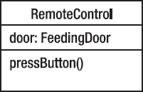

***图 9-1.** 新的 RemoteControl 类*

我认为，这就是我们为这个版本的程序所需的所有分析。

这个练习为我们提供了一些可用于分析的指导原则。

*   首先，通过发送和响应消息来创建*协同工作的简单类*。在我们的例子中，简单的类 *`FeedingDoor`* 和 *`Sensor`* 封装了关于 *`BirdFeeder`* 当前状态的知识，并允许我们通过简单的消息来控制喂食器。这种简单性使我们能够轻松地通过 *`RemoteControl`* 类添加一种控制喂食器的新方式。
*   其次，我们说*类应该只有一个职责*。`FeedingDoor` 和 `Sensor` 不仅简单且易于控制，而且它们各自只做一件事。这使得它们以后更容易修改，也更容易重用。

### 第一幕，第二场：我们屈尊来设计

那么设计呢？假设你已从分析中获得了概念模型，形式是一些用例和类图，你的设计应由此展开。在面向对象设计中，你现在需要巩固类的设计，决定类将包含的方法，确定类之间的关系，并弄清楚每个方法将如何实现其预定功能。

在当前示例中，我们已确定了四个类：*`BirdFeeder`*、*`FeedingDoor`*、*`Sensor`* 和 *`RemoteControl`*。前三个类我们已经开发完成，那么问题来了：为了将 *`RemoteControl`* 类集成到程序中，是否需要修改这些类？图 9-2 展示了我们目前的状况。

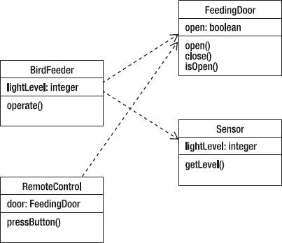

***图 9-2.** 如何集成 RemoteControl 类？*

仔细思考后，似乎 *`FeedingDoor`* 和 *`Sensor`* 都不需要修改。为什么？

这是因为 *`BirdFeeder`* 类使用了这两个类，而它们无需使用或继承任何其他类的内容；它们相当自给自足（不得不爱封装）。如果你还记得，*`BirdFeeder`* 类中的 *`operate()`* 方法承担了所有繁重工作。它需要检查来自 *`Sensor`* 的光照强度，并在适当时向门发送打开或关闭的信号。因此，*`RemoteControl`* 类似乎也会以相同方式工作。那么我们的设计问题就是：*`BirdFeeder`* 类是否也要使用 *`RemoteControl`* 类，还是 *`RemoteControl`* 类独立存在，仅等待“事件”发生？

让我们再次查看 `operate()` 方法的代码：

`  public void operate()`
`    {`
`        lightLevel = s1.getLevel();`

`        if (lightLevel > ON_THRESHOLD) {`
`            Iterator door_iter = doors.iterator();`
`            while (door_iter.hasNext()) {`
`                FeedingDoor a = (FeedingDoor) door_iter.next();`
`                a.open();`
`            }`
`        } else if (lightLevel < OFF_THRESHOLD) {`
`             Iterator door_iter = doors.iterator();`
`             while (door_iter.hasNext()) {`
`                FeedingDoor a = (FeedingDoor) door_iter.next();`
`                a.close();`
`            }`
`        }`
`    }`

在此方法中，我们检查来自 *`Sensor`* 对象的光照强度，如果高于某个阈值（太阳升起），则要求门打开。门本身会检查自己是否已经打开。无论如何，当 `open()` 方法返回时，每扇门都已打开。`close()` 方法也是如此。无论初始状态如何，每次调用 `close()` 返回时，其对应的门都已关闭。这似乎正是我们希望 *`RemoteControl`* 对象具备的行为，只不过它响应的是按钮按下，而非光照阈值。因此，`pressButton()` 的伪代码将如下所示：

`pressButton()`
`        while (仍有门需要处理) do`
`                if (门是打开的) then`
`                        door.close()`
`                else`
`                        door.open()`
`                end-if`
`        end-while`
`end-method.`

由此，你便可以编写代码了。

### 第二幕，第一场：朝着正确的方向改变

前两节的一个关键点是：面向对象分析与设计*完全关乎变化*。分析是关于理解行为和*预见变化*，而设计则是关于实现模型和*管理变化*。在典型的过程方法论中，分析与设计是迭代的。当你开始创建新程序时，会发现新的需求；当用户开始使用你的原型时，他们会发现新想法、不适合他们的地方，以及之前未提及的新功能。所有这些都要求你回头重新思考你对问题的已有认知以及你的设计。为了避免所谓的“分析瘫痪”，你需要管理这种永无止境的新想法和需求流。

有许多技术可以用来观察和处理变化。我们首先来看的是识别设计中可能变化的部分。那么，让我们再次审视 B⁴++。目前，我们的 B⁴++ 会根据传感器返回的光照强度，在日出和日落时打开和关闭鸟食器的门。它也会响应遥控器的按钮按下，打开和关闭喂食门。这里可能会发生什么变化呢？

嗯，硬件可能会变化。如果传感器发生变化，可能会影响 Sensor 类，或者导致你的老板重新思考 Sensor 类的工作方式。你也可能获得新硬件。这就像我们上面添加遥控器一样。正如遥控器示例所示，新硬件可能导致新用例的出现或现有用例的变更。这些变化随后可能波及你的类层次结构。

需求可能会变化。最有可能的是出现新需求。需求变化可能导致用例出现替代路径。这意味着行为会改变需求，进而导致设计变化。设计变化之所以发生，是因为需求发生了变化。

通过思考程序和设计中哪些事物可能变化，你可以开始预见变化。***预见变化*** 能让你在封装、继承、类之间的依赖关系等方面更加谨慎。

#### 鸣鸟永在

既然我们正在讨论变更，不妨再次回顾一下 B⁴++。自从爱丽丝和鲍勃收到他们那台带遥控功能的全新升级版 B⁴++ 以来，已经过去几周了。爱丽丝对它爱不释手。她可以透过厨房窗户观赏鸟儿，当那些黑鹂猛扑过来时，她只需按下遥控器按钮，门就会关上。黑鹂们失望地离开，她再按一下按钮，门又打开了。新版本运行得完美无瑕，实现了他们提出的所有要求。

只是有一件小事……

爱丽丝发现，有时她得去办点事、上个厕所，或者看探索频道她最爱的自然节目。每当这时，她就无法用遥控器关门，黑鹂们就能随心所欲地来觅食，把所有鸣鸟都赶走。真扫兴。

于是，爱丽丝希望 B⁴++ 再做一个微不足道的小改动，小到几乎不值一提。她希望 B⁴++ 能够检测到那些讨厌的鸟，并自动关门。这该怎么做呢？

容我稍等……

那么，新的需求就是：“B⁴++ 必须能够检测到不受欢迎的鸟，并自动关门。”这是一个完整的需求吗？似乎不是，因为它引出了一个显而易见的问题——门什么时候再次打开？看来我们至少有几件事需要决定。

1.  喂鸟器如何检测鸟类？
2.  我们如何区分不受欢迎的鸟和鸣鸟？
3.  门关闭后，喂鸟器何时再次开门？

幸运的是，我们的传感器供应商“传感器之家”刚刚推出了一款可编程的音频传感器，能让我们识别鸟鸣。因此，如果我们把那个硬件集成到 B⁴++ 中，就解决了上面的第 1 点。此外，那些讨厌的鸟的叫声与我们想要吸引的鸣鸟的叫声截然不同，因此可以通过固件对音频传感器进行编程，以区分不同的鸟类。呼！第 2 个问题也解决了。那么第 3 个问题呢，如何让关闭的门再次打开？

看来有两种方法可以让 B⁴++ 再次开门。我们可以设置一个定时器，让门关闭特定时间后再打开。这样做的好处是简单，但这也是一个相当愚蠢的编程方式。说它愚蠢，是因为定时器程序只是实现了一个倒计时，对其运行的*上下文*一无所知。它很可能在周围还有一群讨厌的鸟时就把门打开了。另一种实现鸟类识别器的方法是，让它只在听到鸣鸟叫声时才开门。如果你认为，只要讨厌的鸟还在，鸣鸟就不会出现，那么你听到鸣鸟歌唱的唯一时刻就是周围没有讨厌的鸟的时候。如果是这样，那么打开喂食门就是安全的。

那么，我们来做一个用例。因为使用鸣鸟识别器来开关喂食门与使用遥控器非常相似，我们就从 *`RemoteControl`* 用例开始，并在此基础上进行扩展。

1.  爱丽丝听到或看到喂食器旁有鸟。
    a. 1.1 鸣鸟识别器听到鸟鸣。
2.  爱丽丝确定它们*不是*鸣鸟。
    b. 2.1 鸣鸟识别器识别出该叫声来自不受欢迎的鸟。
3.  爱丽丝按下遥控器按钮。
    c. 3.1 鸣鸟识别器向喂食门发送关闭消息。
4.  喂食门关闭。
5.  鸟儿们放弃并飞走。
    d. 5.1 鸣鸟识别器听到鸟鸣。
    e. 5.2 鸣鸟识别器识别出该叫声来自鸣鸟。
6.  爱丽丝按下遥控器按钮。
    f. 6.1 鸣鸟识别器向喂食门发送打开消息。
7.  喂食门再次打开。

我们在这里创建的是用例中的一个*备选路径*。这个用例现在看起来相当别扭，因为子用例看起来像是从上层用例中衍生出来的，而实际上，应该只执行其中一个。我们可以将用例重写为表 9-1 所示。

***表 9-1.** 鸣鸟识别器用例及其备选路径*

| **主路径** | **备选路径** |
| --- | --- |
| 1\. 爱丽丝听到或看到喂食器旁有鸟。 | 1.1 鸣鸟识别器听到鸟鸣。 |
| 2\. 爱丽丝确定它们*不是*鸣鸟。 | 2.1 鸣鸟识别器识别出该叫声来自不受欢迎的鸟。 |
| 3\. 爱丽丝按下遥控器按钮。 | 3.1 鸣鸟识别器向喂食门发送关闭消息。 |
| 4\. 喂食门关闭。 |  |
| 5\. 鸟儿们放弃并飞走。 | 5.1 鸣鸟识别器听到鸟鸣。 5.2 鸣鸟识别器识别出该叫声来自鸣鸟。 |
| 6\. 爱丽丝按下遥控器按钮。 | 6.1 鸣鸟识别器向喂食门发送打开消息。 |
| 7\. 喂食门再次打开。 |  |

这两条路径并不完全相同。例如，在主路径中，爱丽丝是在看到鸟儿放弃并飞走后才按下遥控器按钮。在备选路径中，鸣鸟识别器必须等到听到鸟鸣，才能考虑再次打开喂食门。因此，我们完全可以将其做成两个不同的用例。这取决于*你*。用例的作用是说明程序使用中的不同场景，因此你可以用任何你喜欢的方式来表示它们。如果你想把这个用例拆分成两个不同的用例，请随意。只要保持一致性即可。你仍然是在管理变更。

### 第二幕，第二场：设计亦将向好而变

正如我们之前所说，将分析与设计完全分开是困难的。每个程序员，尤其是初学者，都忍不住想*立刻*开始写代码。这种冲动会蔓延到同时进行分析、设计和编码，并试图将这三个阶段混为一谈。除非你的程序只有大约 10 行代码，否则这通常是一个*坏主意*。将需求和架构思想从底层设计与编码中抽象出来，几乎总是更好的做法。第 5 章和第 6 章更详细地讨论了这种分离。

将面向对象的分析与设计分开是一项尤为艰巨的任务。在分析阶段，我们试图从面向对象的角度理解问题及其领域。这意味着我们在流程的*非常*早期就开始思考对象以及它们之间的交互。甚至我们的用例中也充斥着带有特定含义的对象术语。当你“进行分析”时，你不可避免地也会“思考设计”，分析与设计几乎密不可分。那么，当你真的想开始思考设计时，应该怎么做呢？

你的设计至少必须产出系统中的类、它们的公共接口，以及它们与其他类（尤其是基类或超类）的关系。如果你的设计方法论产出了更多内容，请问问自己，该方法论产出的所有部分在程序的生命周期中是否都有价值。如果没有，维护它们将会耗费你的成本。开发团队的成员往往不会维护任何对他们生产力没有贡献的东西；这是一个许多设计方法都未能考虑到的现实。

所有软件设计问题都可以通过引入一个额外的概念间接层来简化。这一思想是抽象的基础，也是面向对象编程的主要特征。这就是为什么在 UML 中，我们在 Java 中称为继承的东西被称为泛化。其思想是识别两个或多个类中的共同特征，并将这些特征抽象到一个更高级、更通用的类中，然后让较低级别的类继承它。

设计时，让你的类尽可能原子化；也就是说，赋予每个类单一、明确的目的。这就是我们将在下一章关于设计原则中详细讨论的***单一职责原则***。^(7) 如果你的类或系统设计变得过于复杂，就将复杂的类分解成更简单的类。最明显的指标就是规模：如果一个类很大，它很可能做了太多事情，应该被拆分。

你还需要寻找并分离变化的部分和保持不变的部分。也就是说，寻找程序中那些你希望在不强制重新设计的情况下进行更改的元素，然后将这些元素封装到类中。

所有这些指导原则都是管理设计中变更的关键。最终，你希望得到一个清晰、易于理解且易于维护的设计。

### 第三幕，第一场：我们开始设计

> *你的目标是以一种令人愉悦的方式发明和安排对象。你的应用程序将被划分为多个邻域，每个邻域中的对象集群共同朝着一个共同目标努力。你的设计将由抽象的数量和质量，以及它们之间相互补充的程度所塑造。组合、形式和焦点就是一切。*
>
> ——丽贝卡·沃夫斯-布洛克与艾伦·麦基恩^(8)

识别对象（或对象类）是面向对象设计中困难的部分。对象识别没有“魔法公式”。它依赖于系统设计者（也就是你）的技能、经验和领域知识。对象识别是一个迭代过程。你不太可能第一次就做对。

你可以通过在你的需求中寻找现实世界的类比来开始寻找对象。这能让你起步，但这只是第一步。其他对象隐藏在你领域的抽象层中。到哪里去找这些隐藏的对象呢？你可以利用自己对应用领域的了解，可以寻找需求中以及系统架构概念中出现的操作。你甚至可以利用自己过去设计其他系统的经验。

__________

⁷ Martin, 2009.

⁸ Wirfs-Brock, R. 与 A. McKean. *对象设计：角色、职责与协作.* (波士顿, 马萨诸塞州, Addison-Wesley, 2003).

在系统中寻找候选对象的步骤：

1.  ***编写一组用例***，描述应用程序在多种不同场景下将如何工作。记住，每个用例必须有一个目标。记住，场景是通过用例的一条路径。如果你有如上所述的包含替代路径的用例，那么你的用例可能代表多个场景。
2.  ***识别每个用例中的参与者***、他们需要执行的操作，以及他们在执行操作时需要使用的其他事物。
3.  ***命名并描述每个候选对象***。基于应用领域中的有形事物（如名词）进行识别。采用行为方法，根据哪些对象参与哪些行为（使用动词）来识别对象。
4.  对象可以通过多种方式体现。它们可以是：
    *   产生或消费信息的外部实体。
    *   属于信息领域的事物（报告、显示等）。
    *   系统内发生的事件或事件。
    *   内部生产者（制造某些东西的对象）。
    *   内部消费者（消费生产者所制造东西的对象）。
    *   地点（远程系统、数据库等）。
    *   结构（窗口、框架）。
    *   人（嗯，人是对象，对吧？我们有状态和行为，不是吗？）。
    *   被其他对象拥有或使用的事物（如银行账户或汽车零件）。
    *   其他对象的列表（如零件清单、任何类型的集合等）。

8.  ***将候选对象组织成组***。每个组代表一个对象集群，它们共同解决应用程序中的一个共同问题。每个对象将具有几个特征：

    *   ***所需信息***：对象拥有必须被记住的信息，以便系统能够运行。
    *   ***所需服务***：对象必须提供与系统目标相关的服务。
    *   ***公共属性***：为对象定义的属性必须对该对象的所有实例都是通用的。
    *   ***公共操作***：为对象定义的操作必须对该对象的所有实例都是通用的。

9.  查看你创建的组，***看看它们是否代表了良好的对象抽象***，并且在应用程序中是否有效。良好的抽象将有助于在你不可避免地需要更改应用程序中的某些功能或关系时，使你的应用程序更容易重新调整。

### 第四幕，第一场：关于抽象化的哲学思考

让我们换个话题，讨论一个不同的例子。爱丽丝和鲍勃（还记得他们吗？）刚搬到一个新城市，需要将他们在第二城市银行与信托公司的银行账户转移到第一银河银行。爱丽丝和鲍勃是典型的中产阶级，有几个银行账户需要转移：一个支票账户、一个存折储蓄账户和一个投资账户。（幸运的是，第一银河银行也处理投资业务——金星矿业公司的股票今年特别火爆。）

实际上，没有人会开一个“银行账户”；他们开的是不同类型的账户，每种账户都有不同的特性。你可以在支票账户上开支票，但不能在存折储蓄账户上开支票。储蓄账户可以赚取利息，但支票账户通常不产生利息；相反，你需要支付月度服务费。然而，所有不同类型的银行账户都有一些共同点。它们都使用你的个人信息（姓名、社会安全号码、地址、城市、州、邮政编码），都允许你存钱和取钱。

因此，在编写处理“银行账户”的程序时，你可能会意识到多个类之间会有共同的属性和行为。让我们来看看银行账户示例中的一些类，好吗？

既然我们知道支票账户、储蓄账户和投资账户各不相同，那么首先创建三个不同的类，看看会得到什么结果（见图 9-3）。

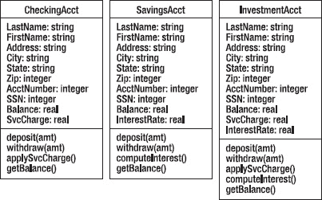

***图 9-3.** 具有许多共同点的银行账户*

注意，这三个类有很多共同之处。无论我们使用何种设计或编码技术，我们始终努力做到的一件事就是避免设计和代码的重复。这正是抽象化的意义所在！如果我们抽象出这三个类的所有共同元素，就可以创建一个新的（父）类 `BankAccount`，它包含了所有这些元素。然后，`CheckingAcct`、`SavingsAcct` 和 `InvestmentAcct` 类可以继承自 `BankAccount`。

这就是 `BankAccount`，如图 9-4 所示。

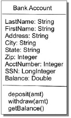

***图 9-4.** 一个更简洁的 BankAccount 类*

但等等！我们是否想要实例化 `BankAccount` 类？如果你仔细观察，会发现其他每个类都比 `BankAccount` 类具体得多。因此，`BankAccount` 类中没有足够的信息供我们使用。这意味着我们总是会继承它，但永远不会实例化它。它是一个完美的*抽象类*。（注意下面的 UML 小图——抽象类的类图将类名以*斜体*显示。）见图 9-5。

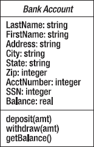

***图 9-5.** 作为抽象类的 BankAccount*

抽象类是实际具体类的模板。它们封装了共享行为，并为所有子类定义了协议。抽象类定义了行为并设定了共同状态，然后具体的子类继承并实现这些行为。你不能实例化一个抽象类；必须创建一个扩展该抽象类的新具体类。每当你在两个或多个地方发现共同行为时，就应该考虑将这些行为抽象到一个类中，然后在共同的具体类中重用这些行为。

以下是将所有个人数据和共同行为抽象到 `BankAccount` 抽象类后得到的结果。注意这里还有一个 UML 细节——新的 UML 箭头类型——开口箭头。这些开口箭头表示*继承*；因此，`CheckingAcct` 类继承了 `BankAccount` 抽象类的所有属性和方法。UML 称之为*泛化*，因为父类概括了子类。这就是为什么箭头指向父类。见图 9-6。

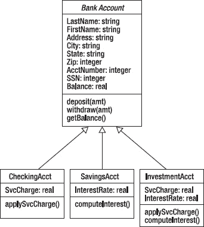

***图 9-6.** 具体账户类继承自 BankAccount*

现在，让我们继续详细解释我们刚刚暗示过的几个面向对象设计原则。

### 结论

在面向对象分析与设计中，最好牢记你的目标。在分析阶段，你是在细化已创建的功能列表，并生成客户需求的模型。你最终要得到的是程序应该做什么的描述，以及它的核心特性。这会创建问题域及其解决方案的概念模型。该模型由许多内容组成，包括用例、用户故事、初步类图、用户界面故事板，以及可能的类接口描述。

在设计阶段，你是在利用那个概念模型，创建最终将变成代码的类。你最终要得到的是程序将如何实现概念模型并满足客户需求的描述。这是解决方案的对象模型。该模型由一组相关的类图、它们的关联关系以及它们之间如何交互的描述组成。这包括每个类的编程接口。这个设计是你稍后将创建的类细节和代码的抽象。从这里，你应该能够很快进入编码阶段。

## 第 10 章

## 面向对象设计原则

> *对事实的投入总会带来认知的愉悦；遵循设计规则，则会带来秩序与确定的愉悦。*
> 
> ——肯尼斯·克拉克
> 
> *我该如何证明我对设计原则不可侵犯性的信念？它们的价值已经得到证明。它们行之有效。*
> 
> ——埃德加·惠特尼

既然我们已经花了一些时间研究面向对象分析与设计，让我们回顾一下已经看到的内容，并补充一些精辟的论述。首先，我们来谈谈一些*常见的设计特性*。

首先，设计是有目的的。它们描述了某物在特定情境下如何工作，并使用需求（功能列表、用户故事和用例）来定义该情境。其次，设计中必须包含足够的信息，以便他人能够实现它。你需要在设计中提供足够的细节，以便后来者能够正确地实现程序。接下来，存在不同的设计风格，就像有不同类型的房屋建筑风格一样。你需要的设计类型取决于你需要构建什么。它取决于情境（看，我们又回到了情境）；如果你是建筑师，你在海边设计的房子会与在山中设计的房子不同。最后，设计可以在不同的细节层次上表达。建造房屋时，框架木匠需要一个层次的细节，电工和水管工需要另一个层次，而精装修木匠又需要另一个层次。

关于面向对象设计，在过去几十年中演变出了许多经验法则。这些*设计原则*作为你（设计师）应遵守的指南，以确保你的设计最终是优秀的、易于实现、易于维护，并且恰好满足客户的需求。在前几章中，我们已经看到了其中的几个原则，在这里，我提炼出了面向对象设计的十个基本设计原则，当你成为那位卓越的设计师时，这些原则很可能对你最为有用。我将在此列出它们，然后在本章剩余部分进行解释并给出示例。

### 面向对象基本设计原则清单

以下是十条基本原则：

1.  在设计中封装那些可能发生变化的部分。
2.  ***针对接口编程***，而非针对实现编程。
3.  ***开闭原则 (OCP)***：类应对扩展开放，对修改关闭。
4.  ***不要重复自己原则 (DRY)***：避免重复代码。只要在两个或更多地方发现共同行为，就要考虑***将该行为抽象***到一个类中，***然后复用***该行为到通用的具体类中。在代码中只在一个地方满足一个需求。
5.  ***单一职责原则 (SRP)***：系统中的每个对象都应只有一个职责，并且该对象的所有服务都应专注于履行这一职责。另一种说法是，一个*内聚*的类只做好一件事，并且不试图做其他任何事。这意味着内聚性越高越好。这也意味着程序中的每个类都应该有***且仅有一个变更理由***。
6.  ***里氏替换原则 (LSP)***：子类型必须能够替换其基类型。（换句话说，继承应该设计良好且行为规范。）
7.  ***依赖倒置原则 (DIP)***：不要依赖具体类；要依赖抽象。
8.  ***接口隔离原则 (ISP)***：客户端不应依赖它们不使用的接口。
9.  ***最少知识原则 (PLK)***（也称为***迪米特法则***）：只与你最直接的朋友交谈。
10. ***松耦合原则***：相互交互的对象应通过定义良好的接口保持松散耦合。

你可能已经注意到，这些原则之间存在一些重叠，并且一个或多个设计原则可能依赖于其他原则。这没关系。重要的是基本原则。让我们逐一进行讲解。

### 在设计中封装那些可能发生变化的部分

这第一条原则意味着，通过将程序中相对稳定的类的特性和方法与那些会变化的特性和方法分离开来，从而保护你的类免受不必要的变更。通过分离这两类特性，我们将那些变化频繁的部分隔离到一个（或多个）独立的类中，这些类是我们预期会变化的，从而提高了灵活性和变更的便利性。同时，我们保持设计中稳定的部分不变，这样我们只需实现它们一次并测试一次。（嗯，希望如此。）这保护了设计中稳定的部分免受任何不必要的变更。

让我们创建一个非常简单的类 `Violinist`。图 10-1 是 `Violinist` 类的类图。

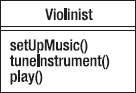

***图 10-1.** 一位小提琴家*

注意，`setUpMusic()` 和 `tuneInstrument()` 方法相当稳定。但是 `play()` 方法呢？事实证明，小提琴有多种不同的演奏风格——仅举三例：古典、蓝草和凯尔特。这意味着 `play()` 方法会根据演奏风格而变化。因为我们有一个会随演奏风格变化的行为，也许我们应该将该行为抽象出来并封装到另一个类中？如果我们这样做，就会得到类似 图 10-2 的结果。

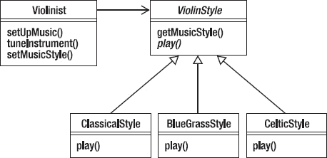

***图 10-2.** 小提琴家与演奏风格*

注意，我们在 `Violinist` 类和 `ViolinStyle` 抽象类之间使用了关联。这允许 `Violinist` 使用那些继承自抽象 `ViolinStyle` 类抽象方法的具体类。我们已经将会变化的 `play()` 方法抽象并封装到一个单独的类中，这样我们就可以将任何想要对演奏风格进行的更改与 `Violinist` 中的其他稳定行为隔离开来。

### 针对接口编程，而非针对实现编程

对这个设计原则的常见反应是，“嗯？这是什么意思？”好吧，思路是这样的。这个原则——就像本章中的许多原则一样——与继承以及如何在程序中使用继承有关。假设你有一个程序，用于模拟二维空间中不同类型的几何形状。我们将有一个 `Point` 类来表示二维空间中的一个点，并且我们将有一个名为 `Shape` 的接口，它将抽象出所有形状共有的几个方面——面积和周长。（好吧，圆形和椭圆称之为圆周；请忍耐一下。）所以，我们得到的是这样的（参见 图 10-3）。

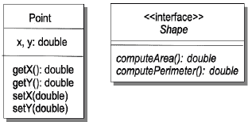

***图 10-3.** 一个简单的 Point 类和通用的 Shape 接口*

如果我们想创建一些不同形状的具体类，我们将*实现* `Shape` 接口。这意味着具体类必须实现 `Shape` 接口中的每一个抽象方法。参见 图 10-4。

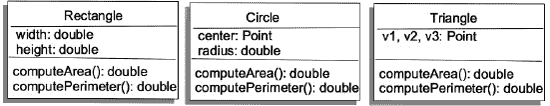

***图 10-4.** Rectangle、Circle 和 Triangle 都实现了 Shape*

现在我们有了许多代表不同几何形状的类。我们如何使用它们呢？假设我们正在编写一个操作几何形状的应用程序。我们可以通过两种不同的方式来实现。首先，我们可以为每种几何形状编写一个单独的应用程序。参见 图 10-5。

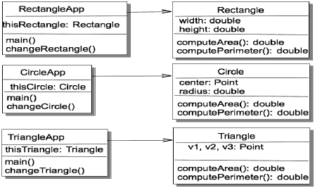

***图 10-5.** 使用几何对象*

这些应用程序有什么问题？嗯，我们有三个不同的应用程序在做同样的事情。如果我们想添加另一个形状，比如菱形，我们就必须编写两个新类：实现 `Shape` 接口的 `Rhombus` 类，以及一个新的 `RhombusApp` 类。哎呀！这效率太低了。我们是针对几何形状的实现进行编程，而不是针对接口本身进行编程。

那么如何解决这个问题呢？需要认识到的是，接口是所有实现该接口的类的类层次结构的顶层。因此，它是一种类类型，我们可以利用它来帮助我们在程序中实现多态。在这种情况下，由于我们有一些实现 `Shape` 接口的几何形状，我们可以创建一个 `Shape` 数组，用不同类型的形状填充它，然后进行迭代。在 Java 中，我们将使用 *`List`* 集合类型来保存我们的形状：

`import java.util.*;`

`/**`
` * ShapeTest - 测试 Shape 接口的实现。`
` *`
` * @author fred`
` * @version 1.0`
` */`
`public class ShapeTest`
`{`
`    public static void main(String [] args)`
`    {`
`        List<Shape> figures = new ArrayList<Shape>();`

`        figures.add(new Rectangle(10, 20));`
`        figures.add(new Circle(10));`
`        Point p1 = new Point(0.0, 0.0);`
`        Point p2 = new Point(5.0, 1.0);`
`        Point p3 = new Point(2.0, 8.0);`
`        figures.add(new Triangle(p1, p2, p3));`

`        Iterator<Shape> iter = figures.iterator();`

`        while (iter.hasNext()) {`
`            Shape nxt =  iter.next();`
`            System.out.printf("area = %8.4f perimeter = %8.4f\n",`
`                nxt.computeArea(), nxt.computePerimeter());`
`        }`
`    }`
`}`

因此，当你针对接口编程时，你的程序将更易于扩展和修改。你的程序将与接口的所有子类无缝协作。

顺便提一下，上述原则让你明白，你应该不断地审视你的设计。由于*重构*的需要，改变你的设计将迫使你的代码发生变化。你的设计是迭代的。骄傲会毁掉好的设计；不要害怕重新审视你的设计决策。（嘿！也许这又是另一条设计原则！）

### 开闭原则（OCP）

类应对扩展开放，对修改封闭。^(1)

找出不变的行为，将其抽象到父类/基类中。这样就将基类代码锁定，避免修改，但所有子类都会继承该行为。你将变化的行为封装在子类（即那些扩展基类的类）中，并对基类封闭修改。关键在于，在你精心设计的代码中，添加新功能不是通过修改现有代码（它对修改是封闭的），而是通过添加新代码（它对扩展是开放的）。

我们在前一章中讲解的 *`BankAccount`* 类示例，就是开闭原则的经典应用。在该示例中，我们将所有个人信息抽象到抽象的 *`BankAccount`* 类中，对其封闭修改，然后将该类扩展为不同类型的银行账户。在这种情况下，只需再次扩展 *`BankAccount`* 类，就能非常轻松地添加新类型的银行账户。我们避免了代码重复，并维护了 *`BankAccount`* 属性的完整性。请参见图 10-6。

___________________

¹ Larman, C. “Protected Variation: The Importance of Being Closed.” *IEEE Software* 18(3): 89-91\. 2001.

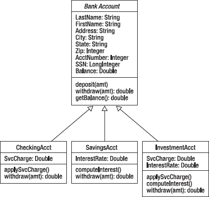

***图 10-6.** 开闭原则的经典 BankAccount 示例*

例如，在 *`BankAccount`* 类中，我们定义了 *`withdraw()`* 方法，允许客户从账户中取款。但在不同的扩展账户类中，取款的具体方式可能有所不同。虽然 *`BankAccount`* 类中的 *`withdraw()`* 方法对修改是封闭的，但它可以在子类中被重写，以实现该类型账户的特定规则，从而扩展该方法的能力。它对修改封闭，但对扩展开放。

开闭原则也不必局限于继承。如果你在一个类中有几个私有方法，这些方法对修改是封闭的；但如果你随后创建了一个或多个使用这些私有方法的公有方法，你就通过在这些公有方法中添加功能，为扩展这些私有方法创造了可能性。要跳出框框——呃，跳出类来思考。

### 不要重复自己原则（DRY）

通过抽象出公共部分并将其放在单一位置，来避免重复代码。^(2)

DRY 是设计原则中的“母亲与苹果派”。自从开发者开始思考编写程序的更好方法以来，它就一直被传承下来。如果你不信，可以回头看看第 6 章和第 7 章。遵循 DRY 原则，你应将每条信息和每个行为都放在设计中的单一位置。理想情况下，一个需求只放在一个地方。这意味着你应该这样设计：每个需求都有一个逻辑上的实现位置。这样，如果你需要更改需求，只需在一个地方查找并修改。同时，你还要移除重复代码，并用方法调用来替代。如果你在重复代码，就是在重复行为。

___________________

² Hunt, A. and D. Thomas. *The Pragmatic Programmer: From Journeyman to Master*. (Boston, MA: Addison-Wesley, 2000.)

DRY 也不仅仅适用于你的代码。梳理你的功能列表和需求以查找重复项，始终是个好主意。重写需求以避免在代码中重复功能，将使你的代码更易于维护。

考虑我们在上一章讨论的 B⁴++ 鸟类喂食器的最终版本。我们最后做的是为喂食器添加一个鸣禽识别器，以便喂食门能够自动开合。但让我们看看我们最终得到的两个用例（参见表 10-1）。

***表 10-1.** 鸣禽识别器用例及其备选路径*

| **主路径** | **备选路径** |
| --- | --- |
| 1. 爱丽丝看到或听到鸟在喂食器旁。 | 1.1 鸣禽识别器听到鸟鸣声。 |
| 2. 爱丽丝确定它们*不是*鸣禽。 | 2.1 鸣禽识别器识别出该鸣声来自不受欢迎的鸟。 |
| 3. 爱丽丝按下遥控器按钮。 | 3.1 鸣禽识别器向喂食门发送关闭消息。 |
| 4. 喂食门关闭。 |   |
| 5. 鸟儿放弃并飞走。 | 5.1 鸣禽识别器听到鸟鸣声。 
5.2 鸣禽识别器识别出该鸣声来自鸣禽。 |
| 6. 爱丽丝按下遥控器按钮。 | 6.1 鸣禽识别器向喂食门发送打开消息。 |
| 7. 喂食门再次打开。 |  |

注意，我们通过遥控器和鸣禽识别器在两个不同的地方打开和关闭喂食门。但仔细想想，无论我们在哪里请求开门或关门，它们的打开和关闭方式总是相同的。因此，这是一个经典的抽象机会：将开门和关门的行为提取出来，放到一个单一的位置，比如 `FeedingDoor` 类。这就是 DRY 原则的体现！

### 单一职责原则（SRP）

该原则指出，一个类应该只有一个，且仅有一个，需要变更的理由。^(3)

以下是上文提到的这些设计原则之间重叠的一个示例：SRP、关于封装的第一条原则以及 DRY 原则，它们表述的内容相似，但侧重点略有不同。封装是关于抽象行为，并将设计中可能发生变化的元素放在同一位置。DRY 是关于通过将相同的行为放在同一位置来避免重复代码。SRP 则是关于设计你的类，使得每个类只做一件事，并且把它做得非常好。

每个对象都应该有一个单一的职责，并且该对象的所有服务都旨在履行这一职责。*每个类应该只有一个需要变更的理由*。简单来说，这意味着要警惕你的类试图承担过多功能。

举个例子，假设我们正在为一款手机编写嵌入式代码。经过与市场部门长达数月（真的）的讨论后，我们对`MobilePhone`类的初版设计如图 10-7 所示。

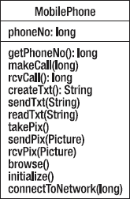

***图 10-7.** 一个非常繁忙的 MobilePhone 类*

这个类似乎囊括了我们期望手机能做的很多事情，但它以多种方式违反了 SRP 原则。这个类并非试图只做一件事，而是试图做太多事情——拨打和接听电话（话说，现在谁还干这个？）、创建、发送和接收短信、创建、发送和接收图片、浏览互联网。这个类没有*单一的职责*。它有很多职责。但我们不希望一个单一的类受到这些完全不同因素的影响。我们不希望每次图片格式改变或浏览器更新时，都要修改`MobilePhone`类。相反，我们希望将这些功能分离到不同的类中，以便它们可以彼此独立地进行变更。那么，我们如何识别哪些东西应该移出这个类，哪些东西应该保留呢？请看图 10-8。

___________________

³ McLaughlin, Brett D., 等，《深入浅出面向对象分析与设计》。(Sebastopol, CA: O'Reilly Media, Inc., 2007.)

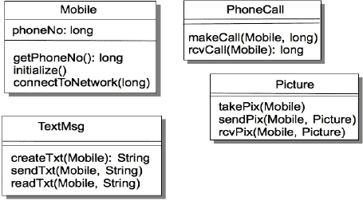

***图 10-8.** 每个都具有单一职责的手机类*

在这个例子中，我们问的问题是：“手机（对自己）做了什么？”而不是“手机提供了哪些服务？”通过提出这样的问题，我们可以开始分离设计中各个对象的职责。在这种情况下，我们可以看到手机本身可以获取自己的电话号码、初始化自身，并连接到移动电话网络。另一方面，所提供的服务实际上与手机本身无关，因此可以分离到`PhoneCall`、`TextMsg`和`Picture`类中。于是，我们将最初的一个类划分成四个独立的类，每个类都有单一的职责。这样，我们可以更改这四个类中的任何一个，而不会影响其他类。我们简化了设计（尽管类变多了），并使其更易于扩展和修改。这难道不是一个很棒的原则吗？

### 里氏替换原则（LSP）

子类必须能够替换其基类。^(4) 该原则指出，继承应该设计良好且行为规范。在任何情况下，用户都应该能够将对象实例化为子类，并透明地使用基类的所有功能。

为了说明 LSP，大多数书籍都会给出一个违反替换原则的例子，并说“不要那样做”。我们为什么要例外呢？违反里氏替换原则最经典、最典型的例子之一就是矩形/正方形示例。这个例子在互联网上随处可见；Robert Martin 在他的书《敏捷软件开发：原则、模式与实践》^(5)中给出了这个例子的一个精彩变体，我们将沿用他的版本。以下是 Java 代码。

___________________

⁴ Wintour, Damien. “里氏替换原则。” 1988 年。下载于 2010 年 9 月 14 日，来自[`www.necessaryandsufficient.net/2008/09/design-guidelines-part3-the-liskov-substitutionprinciple/`](http://www.necessaryandsufficient.net/2008/09/design-guidelines-part3-the-liskov-substitutionprinciple/)。

假设你有一个表示矩形几何形状的类`Rectangle`：

`/**`
` * class Rectangle.`
` */`
`public class Rectangle`
`{`
`    private double width;`
`    private double height;`

`    /**`
`     * Constructor for objects of class Rectangle`
`     */`
`    public Rectangle(double width, double height){`
`        this.width = width;`
`        this.height = height;`
`    }`

`    public void setWidth(double width){`
`        this.width = width;`
`    }`

`    public void setHeight(double height) {`
`        this.height = height;`
`    }`

`    public double getHeight() {`
`        return this.height;`
`    }`

`    public double getWidth() {`
`        return this.width;`
`    }`
`}`

当然，你的一个用户希望能够同时操作正方形和矩形。作为一个聪明的数学学生，你已经知道正方形只是矩形的一种特殊情况；换句话说，`Square` IS-A `Rectangle`。同时，作为一个出色的面向对象设计者，你深谙继承之道。因此，你创建了一个继承自`Rectangle`的`Square`类。

`/**`
` * class Square`
` */`
`public class Square extends Rectangle`
`{`
`    /**`
`     * Constructor for objects of class Square`
`     */`
`    public Square(double side) {`
`        super(side, side);`
`    }`

`    public void setSide(double side) {`
`        super.setWidth(side);`
`        super.setHeight(side);`
`    }`

`    public double getSide() {`
`        return super.getWidth();`
`    }`
`}`

___________________

⁵ Martin, R. C. 《敏捷软件开发：原则、模式与实践》。(Upper Saddle River, NJ: Prentice Hall, 2003.)

嗯，这看起来没问题。注意，因为`Square`的宽度和高度是相同的，我们不能冒险单独更改它们，所以`setSide()`使用`setWidth()`和`setHeight()`来同时设置`Square`的边长。没什么大不了的，对吧？

好吧，如果我们有一个像这样的函数：

`void myFunc(Rectangle r, double newWidth) {`
`        r.setWidth(newWidth);`
`}`

并且我们向`myFunc()`传递一个`Rectangle`对象，它工作得很好，更改了`Rectangle`的宽度。但是，如果我们向`myFunc()`传递一个`Square`对象呢？结果，在 Java 中会发生与之前相同的事情，但这是*错误的*。它只更改了`Square`的宽度而没有同时更改其高度，从而违反了`Square`对象的完整性。因此，我们在这里违反了 LSP，并且`Square`无法在不改变自身行为的情况下替代`Rectangle`。LSP 指出子类（`Square`）应该能够替代超类（`Rectangle`），但在这个例子中它做不到。

现在我们可以解决这个问题。我们可以在`Square`中覆盖`Rectangle`类的`setWidth()`和`setHeight()`方法，如下所示：

`public void setWidth(double w) {`
`        super.setWidth(w);`
`        super.setHeight(w);`
`}`

`    public void setHeight(double h) {`
`        super.setWidth(h);`
`        super.setHeight(h);`
`}`

这两种方法都能正常工作，我们会得到正确的结果，并保持`Square`对象的不变性，但这有什么意义呢？如果我们必须重写继承来的大量方法，那么一开始使用继承的意义何在？这正是里氏替换原则（LSP）所要阐述的：正确实现派生类的*行为*，从而正确运用继承。如果我们将基类视为必须遵守的契约（还记得开闭原则吗？），那么 LSP 指出，即使是派生类也必须遵守该契约。哦，顺便提一下，这在 Java 中可行，因为 Java 的公有方法都是*虚方法*，因此可以被重写。如果我们在`Rectangle`中为`setWidth()`和`setHeight()`方法添加了***`final`***关键字，或者将它们声明为***`private`***，那么我们就无法重写它们了。

在这个例子中，尽管从数学上讲，正方形是一种特殊类型的矩形，且与矩形相关的不变性仍然成立，但这种数学定义在 Java 中行不通。在这种情况下，你不应该让`Square`成为`Rectangle`的子类；继承在这里并不适用，因为我们认为矩形有两种不同的边——长和宽——而正方形只有一种边。因此，如果`Square`类继承自`Rectangle`类，那么`Square`与`Rectangle`在概念上的差异就会干扰代码的实现。继承在这里完全是错误的选择。

如何判断你可能会违反里氏替换原则？违反 LSP 的迹象包括：

*   子类未能保留其超类的所有外部可观察行为。
*   子类修改（而非扩展）了其超类的外部可观察行为。
*   子类抛出异常，试图隐藏其超类中定义的某些行为。
*   子类通过重写超类中定义的虚方法，并使用空实现来隐藏超类中定义的某些行为。
*   派生类中的方法重写是导致 LSP 违规的最大原因。^(6)

有时继承并非正确的选择。幸运的是，你并非无路可走。你还有其他选择。

事实证明，还有其他方式可以共享其他类的行为和属性。最常见的三种方式是：委托、组合和聚合。

*委托*——这正是每个管理者都应该做的事：分配工作，让别人去做。如果你想使用另一个类中的行为，但又不想改变该行为，可以考虑使用委托而非继承。委托意味着将行为的责任交给另一个类；这会在类之间建立关联。这种关联意味着类之间相互关联，通常通过一个属性或一组相关方法来实现。委托还有一个很大的附带好处：它能使你的对象免受程序中其他对象实现变更的影响；由于你没有使用继承，封装性为你提供了保护。^(7) 让我们通过一个例子来展示委托是如何工作的。

上次我们讲到爱丽丝、鲍勃以及他们的 B⁴++时，爱丽丝已经厌倦了用遥控器开关喂食门来驱赶非鸣鸟。于是他们又要求增加一个新功能——自动鸣声识别器。有了鸣声识别器，B⁴++本身就能识别鸣鸟的歌声并打开门，而对于其他所有鸟类则保持门关闭。我们可以从几个角度来思考这个问题。

根据单一职责原则，`BirdFeeder`类不应该负责识别鸟鸣，但它应该知道哪些鸣声是被允许的。我们需要一个新的类`SongIdentifier`，它将负责实际的鸣声识别。我们还需要一个`Song`对象来包含鸟鸣声。图 10-9 展示了我们目前的设计。

___________________

⁶ Wintour, 1998.

⁷ Mclaughlin, 2007

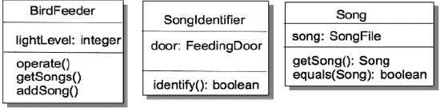

***图 10-9.** 鸣声识别器功能的初步设计*

现在，`BirdFeeder`了解鸟鸣声，并保存了喂食器允许的鸣声列表。`SongIdentifier`的单一职责是识别给定的鸣声。这里有两种实现方式。第一种是`SongIdentifier`类可以在`identify()`方法中自行完成识别工作。这意味着`SongIdentifier`需要有一个`equals()`方法来比较两个鸣声（来自门的允许鸣声，以及 B⁴++新硬件刚刚发送给我们的鸣声）。第二种识别鸣声的方式是让`Song`类使用自己的`equals()`方法自行完成识别。我们应该选择哪一种呢？

嗯，如果我们在`SongIdentifier`类中完成所有识别工作，那么每当`Song`中的任何内容发生变化时，我们就必须同时修改`Song`类*和*`SongIdentifier`类。这听起来并不理想。但是！如果我们将鸣声比较的工作委托给`Song`类，那么`SongIdentifier`的`identify()`方法就可以只接收一个`Song`作为输入参数，并调用该方法，这样我们就能将对`Song`的任何更改隔离在`Song`类内部。图 10-10 展示了修改后的类图。

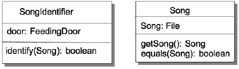

***图 10-10.** 简化 SongIdentifier 和 Song*

我们相应的代码可能如下所示：

`public class SongIdentifier {`
`  private BirdFeeder feeder;`
`  private FeedingDoor door;`
`  public SongIdentifier(BirdFeeder feeder) {`
`    this.door = feeder.getDoor();`
`  }`
`  public void identify(Song song) {`
`   List<Song> songs = feeder.getSongs();`
`   Iterator<Song> song_iter = songs.iterator();`

`   while (song_iter.hasNext()) {`
`       Song nxtSong = song_iter.next();`
`       if (nxtSong.equals(song)) {`
`           door.open();`
`           return;`
`        }`
`    }`
`    door.close();`
`  }`
`}`

`public class Song {`
`  private File song;`
`  public Song(File song) {`
`    this.song = song;`
`  }`
`  public File getSong() {`
`    return this.song;`
`  }`
`  public boolean equals(Object newSong) {`
`    if (newSong instanceof Song) {`
`      Song newSong2 = (Song) newSong;`
`      if (this.song.equals(newSong2.song)) {`
`        return true;`
`      }`
`    }`
`    return false;`
`  }`
`}`

在这个实现中，如果我们对`Song`进行任何更改，那么唯一需要修改的地方就是`Song`类，而`SongIdentifier`则与这些更改隔离开来。`Song`类的*行为*不会改变，尽管其*实现*该行为的方式可能会变。`SongIdentifier`不关心行为是如何实现的，只要它始终是相同的行为即可。`BirdFeeder`将处理鸟鸣声的工作委托给了`SongIdentifier`类，而`SongIdentifier`又将比较鸣声的工作委托给了`Song`类，这一切都没有使用继承。多么巧妙的概念。

委托允许你将某个行为的责任交给另一个类，而无需担心在你的类中改变该行为。你可以信赖被委托类中的行为不会改变。但有时你会希望同时使用一整套行为，而委托无法满足这一点。相反，如果你希望你的程序使用那套行为，就需要使用组合。我们使用*组合*来从其他类中组装行为。

假设你正在设计一款太空角色扮演游戏（RPG）——《太空游侠》。你需要在游戏中模拟的核心元素之一就是飞船本身。飞船会拥有许多不同的特性。例如，有不同类型的飞船：穿梭机、贸易船、战斗机、货船、主力舰。每艘飞船还会具备不同的特性：武器、护盾、货运容量、船员数量等等。但所有飞船的共同点是什么呢？

如果你想要创建一个通用的 `Ship` 类，那么很难将所有这些东西都集中到一个单一的 `Ship` 超类中，以便为 `Shuttle`、`Fighter`、`Freighter` 等创建子类。它们之间的差异实在太大了。这似乎意味着继承并不是解决之道。那么回到我们的问题——所有飞船的共同点到底是什么？

我们可以说，《太空游侠》中所有飞船只有两个共同点——一个飞船类型，以及一组与该飞船类型相关的属性。这就引出了我们的第一个类图，如图 10-11 所示。

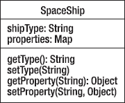

***图 10-11.** 所有飞船的共同点是什么？*

这使我们能够存储飞船类型以及飞船实例的各种属性映射。这意味着我们可以独立于飞船来开发属性，然后不同的飞船可以共享相似的属性。例如，所有飞船都可以拥有武器，但它们可以配备具有不同特性的不同武器。这促使我们开发一个武器接口，然后利用该接口来实现具体的类。我们通过组合的方式在 `SpaceShip` 中使用这些武器。请记住，组合允许我们使用一整套行为，并且可以保证这些行为不会改变。参见图 10-12。

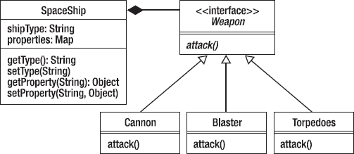

***图 10-12.** 使用组合让 SpaceShip 能够使用武器*

请记住，UML 图中的空心三角形表示继承（或者在接口的情况下，表示实现）。UML 中的实心菱形表示组合。因此，在这个设计中，我们可以将多种武器添加到属性映射中，每种武器可以有不同的特性，但所有武器都表现出相同的行为。*组合*是不是很强大？

你还应该注意，在组合中，组件对象（`Weapons`）成为更大对象（`SpaceShip`）的一部分，当这个更大对象消失时（你被击毁了），组件也会随之消失。由其他行为组成的对象拥有这些行为。当该对象被销毁时，它的所有行为也随之销毁。组合中的行为在组合本身之外是不存在的。当你的 `SpaceShip` 被炸毁时，你所有的武器也会被炸毁。

当然，有时你希望以这样一种方式组合一组对象和行为：当其中一个被移除时，其他对象和行为仍然存在。这就是*聚合*的意义所在。如果行为需要持久存在，那么你必须使用聚合。聚合是指一个类被用作另一个类的一部分，但在这个类之外仍然存在。如果对象本身的存在是有意义的，那么就使用聚合，否则使用组合。例如，图书馆就是聚合的一个例子。每本书本身都是有意义的，但将它们聚合在一起就构成了图书馆。关键在于展示一个场景，在该场景中，在组合之外使用组件是有意义的，这意味着它应该具有独立的存在性。

在《太空游侠》中，除了 `SpaceShip` 对象，我们还可以有 `Pilot` 对象。`Pilot` 也可以携带武器。当然，是不同的武器；`Pilot` 可能不会随身携带 `Cannon` 对象！假设一个 `Pilot` 随身携带了一把 `HandBlaster`，那么用面向对象的说法，他正在使用 `HandBlaster` 的行为。如果这个 `Pilot` 不幸被一头疯狂的 `SpaceCow` 压扁了，武器会随着 `Pilot` 一起被摧毁吗？很可能不会，因此需要一种机制，使得 `HandBlaster` 可以被 `Pilot` 使用，但又在 `Pilot` 类之外独立存在。铛铛！这就是聚合！

因此，我们看到了三种不同的机制，它们允许对象使用其他对象的行为，而且都不需要继承。正如 OOA&D 中所说：“如果你倾向于使用委托、组合和聚合而非继承，那么你的软件通常会更加灵活，并且更易于维护、扩展和重用。”^(8)

### 依赖倒置原则（DIP）

罗伯特·C·马丁在其《C++ Report》中首次提出了依赖倒置原则，随后在其经典著作《敏捷软件开发》中进行了详细阐述。^(9) 马丁在书中将 DIP 定义为：

1.  *高层模块不应依赖低层模块。两者都应依赖抽象。*
2.  *抽象不应依赖细节。细节应依赖抽象。*

其简化版本是：不要依赖具体类，要依赖抽象。马丁认为，面向对象设计是传统结构化设计的逆向思维。在结构化设计中，如第 7 章所述，要么采用自顶向下的方式，将细节和设计决策尽可能推至软件层次结构的底层；要么采用自底向上的方式，先设计底层细节，再将一组底层函数组合成单个高层抽象。在这两种情况下，高层软件都依赖于底层所做的决策，包括接口和行为决策。

马丁认为，对于面向对象设计而言，这种做法是颠倒的。依赖倒置原则意味着，高层（更抽象）的设计层面应创建接口，而低层（更具体）的层面应针对该接口进行编码。这意味着，只要低层（具体）类*遵循高层抽象的接口进行编码*，高层类就是安全的。正如马丁所言：“包含高层业务规则的模块应优先于包含实现细节的模块，并独立于后者。高层模块绝不应以任何方式依赖低层模块。”

___________________

⁸ McLaughlin, 2007.

⁹ Martin, 2003.

下面是一个简单的例子。传统上，在结构化设计中，我们编写许多程序，其通用格式为：

11. 从某处获取输入数据。
12. 处理数据。
13. 将数据写入另一处。

在这个例子中，`Processor` 使用 `Collector` 获取数据，然后打包数据，并使用 `Writer` 将数据写入（例如）数据库。如果我们将此过程绘制出来，会得到类似图 10-13 的结果。

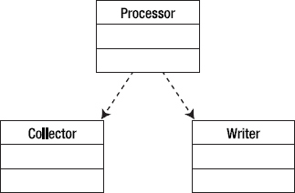

***图 10-13.** 传统的输入-处理-输出模型*

这种实现的一个问题是，`Processor` 必须创建并使用 `Writer`，为了正确写入，它必须了解 `Writer` 的接口和参数类型。这意味着 `Processor` 必须针对 `Writer` 的具体实现来编写，因此如果我们想更改 `Writer` 的类型，就必须重写 `Processor`。假设第一个实现写入 `File`，如果我们随后想写入打印机或数据库，每次都需要更改 `Processor`。这非常不利于复用。因此，依赖倒置原则指出，`Processor` 应针对接口进行编码（我们将 `Processor` 抽象化），然后针对每种 `Writer` 目标类型，在单独的具体类中实现该接口。最终的设计如图 10-14 所示。

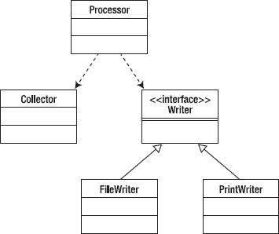

***图 10-14.** 使用接口以支持不同的写入器实现*

通过这种方式，可以添加不同的写入器，只要它们遵循接口，`Processor` 就无需更改。请注意，DIP 与原则#2（针对接口编程）密切相关。

### 接口隔离原则（ISP）

客户端不应依赖它们不使用的接口。特别是，它们不应依赖它们不使用的*方法*。^(10)

本章我们讨论了很多关于接口的内容。针对接口编程、使用接口抽象出公共细节等等。我们使用接口使代码更灵活、更易维护。所以总的来说，接口是很好的东西，对吧？嗯，年轻的 Skywalker，你也必须警惕接口。

关于接口，最大的诱惑之一就是让它们变得更大。如果接口是好的，那么更大的接口一定更好，对吗？毕竟，这样你就可以在更多对象中使用该接口，*而用户只需不实现他们不需要的某些方法即可*。啊！这样做会破坏接口的*内聚性*。过度“泛化”接口，会使你从一组紧密相关、如闪电般聚焦的方法，变成一堆彼此擦肩而过、互不相干的方法。记住***内聚性是好的***。你的应用程序应该具有内聚性，它们所依赖的类和接口也应该具有内聚性。

当你开始向接口添加新方法，仅仅因为实现该接口的某个子类需要它——*而其他子类不需要*——时，你就在降低接口的内聚性，并开始违反接口隔离原则。那么答案是什么？我们如何保持接口的内聚性，同时又能让它们对一系列对象有用？

答案是：创建更多接口。接口隔离原则意味着，与其添加仅适用于一个或少数几个实现类的新方法，不如*创建一个新接口*。将臃肿的接口拆分成两个或更多更小、*更具内聚性*的接口。这样，新类只需实现它们需要的接口，而无需实现它们不需要的接口。

___________________

¹⁰ Martin, 2003.

### 最少知识原则（PLK）

（也称为***迪米特法则***）。只与你最直接的朋友交谈。^(11)

应用程序中高内聚的补充是*松散耦合*。这正是最少知识原则的核心所在。它指出，类应尽可能*间接地*与少数其他类进行协作。^(12) 下面是一个例子。

你的汽车里有一个计算机系统——如今我们都有。假设你正在编写一个应用程序，用于绘制汽车中的温度数据。有一系列传感器提供温度数据，它们是汽车发动机传感器家族的一部分。你的程序应选择一个传感器，收集并绘制其温度数据。（此示例源自 Hunt 书中的一个例子）。^(13) 你的程序部分可能如下所示：

`public void plotTemperature(Sensor theSensor) {`
`        double temp = theSensor.getSensorData().getOilData().getTemp();`
`        …`
`}`

这很可能能工作——但仅此一次。但现在，你的温度绘制方法已经与*`Sensor`*、*`SensorData`* 和 *`OilSensor`* 类耦合在一起。这意味着*其中任何一个*类的变更都可能影响你的 `plotTemperature()` 方法，并迫使你重构代码。这并不理想。

这正是 PLK 敦促你避免的情况。与其将你的方法链接到一个层级结构中，并遍历该层级以获取所需服务，不如直接请求数据：

`public void plotTemperature(double theSensor) {`
`        ...`
`}`
`...`
`plotTemperature(aSensor.getTemp());`

没错，我们不得不在 `Sensor` 类中添加一个方法来为我们获取温度，但为了清理上述混乱（以及可能的错误），这只是一个小小的代价。现在，你的类只与*一个*类直接协作，并让那个类去处理其他类。当然，你的 `Sensor` 类也会对 `SensorData` 做同样的事情，以此类推。

这引出了 PLK 的一个推论——*将依赖关系降至最低*。这是松散耦合的关键。通过仅与少数其他类交互，你的类会变得更加灵活，并且更不容易包含错误。

___________________

¹¹ Martin, 2003.

¹² Lieberherr, K., I. Holland, et al. *Object-Oriented Programming: An Objective Sense of Style*. OOPSLA ’88, Association for Computing Machinery, 1988.

¹³ Hunt, 2000.

### 类设计指南：乐趣与享受

最后，为了不让我们在没有任何列表的情况下结束本章，我们列出了 24 条类设计指南。这些指南比我们上面描述的一般设计指南更为具体，但非常实用。把它们摘录下来，并深深印入你的脑海。

这 24 条类设计指南取自 Davis^(14) 和 McConnell。^(15)

1.  在类接口中呈现*一致的抽象层次*。
2.  确保你理解该类正在实现的抽象。
3.  将不相关的信息移至另一个类（ISP）。
4.  在进行更改时，警惕类接口的侵蚀（ISP）。
5.  不要添加与接口抽象不一致的公共成员。
6.  最小化类和成员的可访问性（OCP）。
7.  不要在公共接口中暴露成员数据。
8.  避免将私有实现细节放入类的接口中。
9.  避免将方法放入公共接口中。
10. 注意耦合是否过于紧密（PLK）。
11. 尝试通过类内的包含关系来实现“has a”关系（SRP）。
12. 通过继承来实现“is a”关系（LSP）。
13. 仅当派生类是基类的一个更具体版本时才进行继承。
14. 确保只继承你想要继承的内容（LSP）。
15. 将公共接口、数据和操作尽可能上移到继承层次结构的高层（DRY）。
16. 对只有一个实例的类保持警惕。
17. 对只有一个派生类的基类保持警惕。
18. 避免过深的继承树（LSP）。
19. 尽量保持类中方法的数量尽可能少。
20. 最小化对其他类的间接方法调用（PLK）。
21. 如果可能，在所有构造函数中初始化所有成员数据。
22. 消除纯数据类。
23. 消除纯操作类。
24. 哦，还有，在外要小心……（好吧，这条是我加的。）

___________________

¹⁴ Davis, A. M. 201 *Principles of Software Development*. (New York, NY: McGraw-Hill, Inc., 1995.)

¹⁵ McConnell, Steve, Code Complete, *2nd Edition.* (Redmond, WA: Microsoft Press, 2004.)

### 结论

在本章中，我们审视了过去几十年中发展起来的许多关于面向对象设计的经验法则。这些设计原则作为指南，指导你（设计者）遵循它们，从而使你的设计最终成为一个优秀的设计——易于实现、易于维护，并且恰好满足客户的需求。重要的是，当你在从功能特性向设计摸索前进时，这些设计原则提供了指导。它们阐述了检查和实现继承、封装、多态和抽象等重要面向对象原则的方法。同时，它们也强化了诸如内聚和耦合等基本设计原则。将这些原则深深印入你的脑海吧，面向对象设计者。

## 第 11 章

## 设计模式

> *每个模式都描述了一个在我们环境中反复出现的问题，然后描述了该问题解决方案的核心，使得你可以无数次地使用这个解决方案，而无需以完全相同的方式重复操作。*
> 
> — 克里斯托弗·亚历山大^(1)

每次编写代码时，你都要重新发明轮子吗？每次编写程序时，你都必须重新学习如何遍历数组吗？在你编写的每个函数中，你都需要重新发明如何修复悬空的 else 吗？每次需要使用插入排序或二分查找时，你都需要重新学习它们吗？当然不是！

在你编写程序的过程中，你已经学会了一套*惯用语法*，每当编写代码时都会使用它们。例如，如果你需要在 Java 中遍历数组的所有元素，你可能会这样做：

`for (int i = 0; i < myArray.length; i++) {`
`         System.out.printf(" %d ", myArray[i]);`
`}`

`或`

`for (int nextElement: myArray) {`
`        System.out.printf(" %d ", nextElement);`
`}`

代码就会随着你的指尖流畅地输出。这些*代码模式*是你随着编写程序经验的积累而积累起来的一套代码规则和模板。

*设计模式*也是同样的道理——只不过针对的是你的设计。著名建筑师克里斯托弗·亚历山大在他的著作《模式语言》中定义了建筑设计的模式。同样的理念也延续到了软件设计中。如果你回头阅读本章开头的亚历山大引言，你会看到亚历山大对设计模式的定义中包含以下三个关键要素：

___________________

¹ Alexander, C., S. Ishikawa, et al. *A Pattern Language: Towns, Buildings, Construction.* (Oxford, UK: Oxford University Press, 1977.)

*   *重复出现*：引发设计模式的问题必须是一个常见问题。
*   *核心解决方案*：模式为解决方案提供了一个模板；它试图提取出解决方案的本质。
*   *可复用性*：当相同的问题出现在不同领域时，该模式必须易于复用。

事实上，到目前为止，你已经在本书中至少看到过一个设计模式：我们在第 5 章中讨论的*模型-视图-控制器*模式（MVC）是最早发表的软件设计模式示例之一。^(2) MVC 设计模式用于使用图形用户界面的程序。它将程序分为三个部分：包含程序处理规则的*模型*，向用户呈现数据和界面的*视图*，以及协调*模型*和*视图*之间通信的*控制器*。在典型的面向对象实现中，这些抽象概念中的每一个都成为一个独立的对象。

*四人组*（Gamma、Helm、Johnson 和 Vlissides）在他们关于设计模式的开创性著作《设计模式：可复用面向对象软件的基础》^(3)中，将设计模式定义为“命名、抽象并识别常见设计结构的关键方面，使其有助于创建可复用的面向对象设计”的东西。换句话说，设计模式是从*具体示例*中提取的*命名抽象*，它代表了针对*特定但常见问题*的*重复出现的解决方案*——重复出现、核心解决方案、可复用性。

但为什么我们首先需要设计模式呢？为什么我们不能仅仅依靠我们在第 10 章中学到的面向对象设计原则，以及我们钟爱的抽象、继承、多态和封装呢？

嗯，事实证明，设计是困难的。这就是原因。面向复用的设计更加困难。设计也更像是一门艺术，而不是一门科学或工程学科。经验丰富的软件设计师很少从基本原理出发；他们会在当前问题中寻找与过去解决过的问题的相似之处。并且他们会将多年来学到的设计惯用语法带到设计工作中。设计模式提供了一种*共享词汇*，使这些专家知识能够为所有人所用。

### 设计模式与四人组

在他们的书中，四人组将设计模式描述为具有四个基本特征：

*   *模式名称*：“……一个我们可以用一两个词来描述设计问题、其解决方案和后果的标识。命名一个模式会立即增加我们的设计词汇量。”
*   *问题*：描述何时使用该模式。“它解释了问题及其上下文。”
*   *解决方案*：“……描述了构成设计的元素、它们的关系、职责和协作……该模式提供了对设计问题的抽象描述，以及元素的通用排列如何解决该问题。”
*   *后果*：将模式应用于问题的结果和权衡。这些包括时间和空间的权衡，也包括灵活性、可扩展性和可移植性等。^(4)

___________________

² Krasner, G. E. and S. T. Pope. “A cookbook for using the Model-View-Controller user interface paradigm in Smalltalk-80.” *Journal of Object-Oriented Programming* 1(3): 26-49\. 1988.

³ Gamma, E., Helm, R., Johnson, R., Vlissides. *Design Patterns: Elements of Reusable Object-Oriented Software.* (Boston, MA: Addison-Wesley, 1995.)

设计模式根据两个标准进行分类：*范围*和*目的*。范围涉及类和对象之间的关系。类之间的静态关系在编译时固定，而动态关系适用于对象，这些关系可以在运行时改变。当然，目的涉及模式对类和对象的作用。模式可以处理对象的创建、类或对象的组合，或者对象在程序中交互和分配职责的方式。

四人组在他们的书中描述了 23 种不同的设计模式，将它们分为三类模式：*创建型*、*结构型*和*行为型*。

*   *创建型设计模式*处理对象何时以及如何创建的问题。这些模式通常会为你创建对象，使你无需直接实例化这些对象。
*   *结构型设计模式*描述对象如何组合成更大的组。
*   *行为型设计模式*通常讨论职责如何在设计中分配以及对象之间如何进行通信。

这个列表并非完整无缺，在四人组的《设计模式》一书出版后的 15 年里，世界各地的开发者已经在这个原始列表中添加了许多模式。最近在 Google 上搜索“设计模式”一词，得到了 250 万条结果，因此许多面向对象开发者已经加入了设计模式的行列。

#### 经典设计模式

四人组描述的 23 种（经典）设计模式如下（在本章剩余部分，我们将介绍斜体标出的六种设计模式）：

**创建型模式**

1.  抽象工厂
2.  建造者
3.  *工厂方法*
4.  原型
5.  *单例*

    **结构型模式**

6.  *适配器*
7.  桥接
8.  组合
9.  装饰器
10.  外观
11.  享元
12.  代理

    **行为型模式**

13.  责任链
14.  命令
15.  解释器
16.  *迭代器*
17.  中介者
18.  备忘录
19.  *观察者*
20.  状态
21.  *策略*
22.  模板方法
23.  访问者

___________________

⁴ Gamma et. al, 1995.

### 我们可以使用的模式

本节中的六种模式是经典设计模式的代表性样本，也是你马上会发现最有用的六种模式。

#### 创建型模式

创建型模式都与对象的创建有关。如果我们将类定义视为生成对象的模板，那么这些模式关注的就是如何创建这些模板。接下来要介绍的两种模式——单例模式和工厂模式——向我们展示了两种不同的对象创建思路。

##### 单例模式

单例模式^(5)几乎可以说是设计模式中最容易理解和编码的一种。其思想很简单：你在编写程序时，需要一个类有且仅有一个实例，并且需要强制实现“仅此一个”的要求。使用单例模式的程序示例包括打印假脱机程序、窗口管理器、设备驱动程序等。

那么，“仅此一个”的要求意味着什么呢？首先，这意味着你的程序只能调用一次“**new** Singleton()”，对吧？但如何阻止程序中的其他对象（或你未编写的程序中的对象）再次调用“**new** Singleton()”呢？答案是——无法阻止！只要你的类可以被实例化一次，其他对象就能反复实例化它。这可就麻烦了。

因此，我们需要创建一个只能被实例化一次、且*不使用* **new** 关键字进行实例化的类。嗯？

你没听错：我们需要一个无需使用 **new** 就能实例化的类。请思考一下。

具体做法如下：对象实例化时调用的方法是构造函数。在 Java 中，你可以写 **new** Singleton()，因为 Singleton() 构造函数是 **public** 的——它在类定义外部可见。如果我们希望保留构造函数以便创建 Singleton 对象实例，但又不想让任何人通过 **new** 来创建，就必须将构造函数设为 **private**。“但等等！”你可能会惊呼，“如果构造函数是私有的，那我们就完全无法实例化对象了！”*恰恰相反*，亲爱的读者。如果构造函数是私有的，它只能从类定义内部访问，因此完全可以在类定义内部实例化对象！

“但再等等！”你又说，“我们如何从*类定义外部*访问构造函数呢？”在 Java 中，有没有一种方法可以在不实例化类的情况下访问类内部的方法？（想想 Math 类。）

啊哈！类方法！如果你创建一个 **public** 且 **static** 的方法（类方法），那么该方法在类定义外部可见，且无需实际实例化对象。因此，如果我们创建一个具有私有构造函数的类，并使用 **static** 方法来创建类的实例，就可以控制创建的实例数量。代码如下：

`public class Singleton {`
`        // 这是将长期存在的实例`
`        private static Singleton uniqueInstance;`
`        // 私有构造函数——无法从外部访问`
`        private Singleton() {`
`                // 在此处执行初始化实例的操作`
`        }`
`        // 这是用于创建实例的静态方法`
`        public static Singleton getInstance() {`
`                if (uniqueInstance == null) {`
`                        uniqueInstance = new Singleton();`
`                }`
`                return uniqueInstance;`
`        }`
`        // 其他方法——毕竟 Singleton 是一个真正的类`
`}`

为了使用 `Singleton` 类，我们可以这样操作：

___________________

⁵ Gamma 等人，1995

`public class SingletonTest {`

`        public static void main(String [] args) {`
`                Singleton mySingle;`
`                mySingle = Singleton.getInstance();`
`                // 在此处执行其他操作`
`        }`
`}`

当我们通过调用 `getInstance()` 方法来实例化 `Singleton` 实例时，它会检查之前是否已经实例化过。如果没有，则使用 `Singleton` 类中的私有构造函数创建实例。如果实例已存在（`uniqueInstance` 变量不为 **`null`**），则直接返回该对象的引用。我说过这很简单吧。

这个版本的单例模式并非没有缺陷；例如，如果你编写的是多线程 Java 程序，它可能会失效。上述解决方案并非“线程安全”。在检查 `Singleton` 实例是否存在与实际创建实例之间，你的程序可能会被切换出去，而另一个线程则继续执行。当程序切换回来时，可能会错误地创建另一个 `Singleton` 实例。对此有相对简单的解决方案。

使单例模式线程安全的最简单方法是将 `getInstance()` 方法设为同步方法。这样它就会完整执行而不会被切换出去。以下是线程安全的 `getInstance()` 方法版本：

`        public synchronized static Singleton getInstance() {`
`                if (uniqueInstance == null) {`
`                        uniqueInstance = new Singleton();`
`                }`
`                return uniqueInstance;`
`        }`

注意，唯一的区别是在方法签名中加入了 `synchronized` 关键字。

接下来进入下一个模式。

##### 工厂模式

假设你经营一家小公司，专门生产冰淇淋。由于公司规模小，你的工厂一次只能生产一种口味的冰淇淋，因此每天都必须告诉工人们当天要生产哪种口味。当然，你不需要每天更换不同的冰淇淋配方，也不需要每天改变工厂的基本配置，但每天生产、包装和运输的冰淇淋种类确实会变化。而且，你有一个程序来模拟你的工厂。那么问题来了：如何编写这个程序，才能避免每天修改它？当你添加一种新的冰淇淋口味时，又如何做到无需修改程序的大部分内容？这就是工厂设计模式的用武之地。

*工厂*模式（也称为*工厂方法*模式）^(6)为你创建对象。当你需要创建几种通常相互关联的对象时——它们通常具有相同的抽象父类，但彼此不同——就可以使用它。你让工厂创建一个类型为 X 的对象，它就会创建一个；你让它创建一个类型为 Y 的对象，它也会创建一个。这迫使具体类的创建被委托给一个知道如何创建具体类的接口的子类，并使你的其他类对修改保持封闭。这一切都无需修改 X、Y 或工厂本身。在我们的例子中，我们可以使用一个 `IceCreamFactory` 类来生成不同类型的冰淇淋，从而创建香草、巧克力或草莓冰淇淋对象。工厂模式允许你定义一个用于创建一族对象的接口，并允许子类决定实例化该族中的哪些成员。它将实例化过程推迟到子类中执行。

___________________

⁶ Gamma 等人，1995 年。

在我们的例子中，我们将有以下几个类：

> *`IceCream`*：一个定义我们冰淇淋对象的接口
>
> `VanillaIceCream`：一个继承自 *`IceCream`* 的具体类
>
> `ChocolateIceCream`：一个继承自 *`IceCream`* 的具体类
>
> `StrawberryIceCream`：一个继承自 *`IceCream`* 的具体类
>
> *`Factory`*：一个定义用于制作 *`IceCream`* 对象的方法的接口
>
> `IceCreamFactory`：`Factory` 接口的具体实现，用于制作不同的 *`IceCream`* 对象
>
> `IceCreamStore`：一个驱动类，让我们可以制作和销售冰淇淋

我们的 `IceCream` 接口可能如下所示：

`public interface IceCream {`
`        public  void yummy();`
`        // 以及其他方法`
`}`

而我们的冰淇淋口味最终会成为具体类：

`public class VanillaIceCream implements IceCream {`
`        public void yummy() {`
`                System.out.println("香草！");`
`        }`
`}`

`public class ChocolateIceCream implements IceCream {`
`        public void yummy() {`
`                System.out.println("巧克力！")`
`        }`

`}`
`public class StrawberryIceCream implements IceCream {`
`        public void yummy() {`
`                System.out.println("草莓！");`
`        }`
`}`

工厂模式依赖于为工厂定义一个接口，然后允许实现该接口的子类实际创建对象；我们的 `Factory` 接口看起来类似于下面这样：

`public interface Factory {`
`        public  IceCream makeIceCream(String type);`
`        // 以及这里用于销售、包装和运输冰淇淋的其他方法`
`}`

最后，我们的具体类 *`IceCreamFactory`* 将实现 *`Factory`* 接口中的 *`makeIceCream()`* 方法，并实际创建一个 `IceCream` 对象，如下所示：

`public class IceCreamFactory implements Factory {`
`        public IceCream makeIceCream(String type) {`
`                IceCream newIceCream = null;`
`                if (type.equals("Vanilla")) {`
`                        newIceCream = new VanillaIceCream();`
`                } else if (type.equals("Chocolate")) {`
`                        newIceCream = new ChocolateIceCream();`
`                } else if (type.equals("Strawberry")) {`
`                        newIceCream = new StrawberryIceCream();`
`                }`
`                return newIceCream;`
`        }`
`}`

为了测试我们的工厂，我们创建一个驱动类——也就是我们的冰淇淋店！

`public class IceCreamStore {`
`        public static void main (String [] args) {`
`                IceCreamFactory myStore = new IceCreamFactory();`
`                IceCream vanilla = myStore.makeIceCream("Vanilla");`
`                vanilla.yummy();`
`                IceCream choco = myStore.makeIceCream("Chocolate");`
`                choco.yummy();`
`                IceCream straw = myStore.makeIceCream("Strawberry");`
`                straw.yummy();`
`        }`
`}`

图 11-1 以 UML 图的形式展示了这些内容。

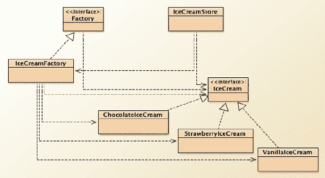

***图 11-1.** 使用 IceCreamFactory 的冰淇淋店*

关于这个工厂模式示例，需要注意什么？嗯，以下几点值得关注：

*   工厂方法（*`makeIceCream()`*）封装了 `IceCream` 对象的创建过程。我们的驱动类只需告诉工厂要制作哪种冰淇淋。
*   *`Factory`* 接口为子类创建实际对象提供了接口。
*   `IceCreamFactory` 具体类通过实现 `makeIceCream()` 方法来实际创建对象。这也意味着其他实现 `Factory` 接口的具体类也可以做同样的事情。
*   这使得 *`IceCream`* 类保持不变，并让 `IceCreamStore` 更容易创建新对象。
*   还要注意，`IceCreamStore` 类只处理 *`IceCream`* 对象。它不需要了解特定类型冰淇淋的任何信息。具体的 *`IceCream`* 对象实现了 *`IceCream`* 接口中的方法，而 `IceCreamStore` 只是使用它们，无论你创建的是哪种类型的 *`IceCream`*。
*   这也意味着，你可以更改特定类型 *`IceCream`* 的实现，而无需更改接口或 `IceCreamStore`。多么棒的概念！

#### 结构型模式

结构型模式帮助你组合对象，以便更轻松地使用它们。它们关注的是将对象分组在一起，并提供对象之间协调工作以完成任务的方法。请记住，组合、聚合、委托和继承都与结构和协调有关。我们在这里要介绍的结构型模式——适配器模式——完全是为了让类能够协同工作。

##### 适配器模式

问题来了。你有一个客户端程序 Foo，它想要访问另一个类、库或包 Bar。问题是，Foo 期望一个特定的接口，而这个接口与 Bar 对外公开的接口不同。你该怎么办？

嗯，你可以重写 Foo，将其期望的接口改为符合 Bar 提供的接口。但如果 Foo 很庞大，或者被其他类所使用，这可能不是一个可行的方案。或者，你也可以重写 Bar，使其提供 Foo 所期望的接口。但也许 Bar 是一个商业包，你根本没有源代码？

这就是适配器设计模式发挥作用的地方。^(7) 你使用适配器模式来创建一个中间类，将 Bar 的接口包装在一组方法中，这些方法提供 Foo 所寻找的接口。思路是这样的：适配器可以在一端与 Foo 交互，在另一端与 Bar 交互。这样，Bar 的接口无需改变，而 Foo 的用户也得到了他们期望的接口。皆大欢喜！顺便提一下，适配器设计模式也被称为*包装器*模式，因为它包装了一个接口。^(8) 参见图 11-2。

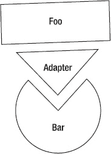

***图 11-2.** 适配器让 Foo 能够使用 Bar*

实现适配器有两种方式：*类适配器*，适配器将继承目标类；以及*对象适配器*，它使用委托来创建适配器。注意区别：*类适配器*继承一个现有类并实现一个目标接口。*对象适配器*继承一个目标类并委托给一个现有类。图 11-3 是一个通用类适配器的 UML 图。

___________________

⁷ Gamma 等人，1995 年。

⁸ Gamma 等人，1995 年。

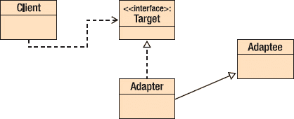

***图 11-3.** 一个类适配器示例*

注意，`Adapter` 类继承自 `Adaptee` 类，并实现了 `Client` 类所使用的同一个 `Target` 接口。以下是此示例的代码：

`public class Client`
`{`
`    public static void main(String [] args) {`
`        Target myTarget = new Adapter();`

`        System.out.println(myTarget.sampleMethod(12));`
`    }`
`}`

`public interface Target`
`{`
`   int sampleMethod(int y);`
`}`

`public class Adapter extends Adaptee implements Target`
`{`
`    public int sampleMethod(int y) {`
`        return myMethod(y);`
`    }`
`}`

`public class Adaptee`
`{`
`   public Adaptee() {`
`   }`

`    public int myMethod(int y) {`
`        return y * y;`
`    }`
`}`

另一方面，对象适配器仍然实现 `Target` 接口，但使用与 `Adaptee` 类的组合来完成包装；它将如下所示：

`public class Adapter implements Target`
`{`
`    Adaptee myAdaptee = new Adaptee();`

`    public int sampleMethod(int y) {`
`        return myAdaptee.myMethod(y);`
`    }`
`}`

在这两种情况下，`Client` 都不需要改变！这就是适配器的美妙之处。你可以通过更改 `Adapter` 而不是 `Client` 来更改所使用的 `Adaptee`。

#### 行为型模式

如果说创建型模式关注的是如何创建新对象，结构型模式关注的是如何让对象通信和协作，那么行为型模式关注的就是如何让对象执行操作。它们研究职责如何在设计中分配，以及对象之间的通信如何发生。我们将在这里讨论的三种模式都描述了如何将行为职责分配给类。迭代器模式是关于如何遍历对象集合。观察者模式告诉我们如何管理推送和拉取状态变化。策略模式让我们能够在单个接口背后选择不同的行为。

##### 迭代器模式

如果你用 Java 编程过，你一定见过迭代器。我们稍后会讲到，但让我们从头开始。如果你有一个*元素集合*，你可以用许多不同的方式组织它们。它们可以是数组、链表、队列、哈希表、集合等等。这些集合中的每一个都有其独特的一组操作，但通常有一个你可能希望对所有集合执行的操作——*从开始到结束，一次一个元素地遍历整个集合*。哦，你还希望以*无需了解集合内部结构*的方式遍历元素。并且你可能希望能够向后遍历集合，还可能希望同时进行多个遍历。

这就是迭代器模式的用途。^(9) 迭代器模式创建了一个对象，允许你一次一个元素地遍历集合。

由于要求无需了解集合的内部结构，迭代器对象不关心排序顺序；它只是按照元素在集合中存储的顺序，从头到尾一次返回一个对象。最简单的迭代器只需要两个方法：

*   *`hasNext()`*：如果还有要检索的元素（即尚未到达集合末尾），则返回 true；如果没有剩余元素，则返回 false。
*   *`getNextElement()`*：返回集合中的下一个元素。

___________________

⁹ Gamma 等人，1995 年。

在迭代器模式中，我们有一个迭代器接口，它被实现以创建一个具体的迭代器对象，该对象被具体的集合对象使用。这两者都被一个客户端使用，该客户端创建集合并从中获取迭代器。图 11-4 是来自 Gamma 等人的 UML 版本。

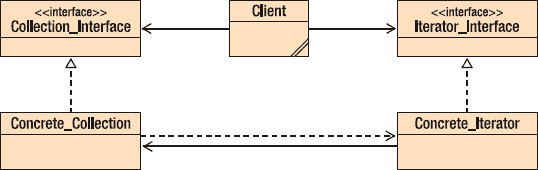

***图 11-4.** 使用迭代器模式的示例*

你可以看到客户端类使用了集合和迭代器接口，而 *`Concrete_Iterator`* 是 *`Concrete_Collection`* 的一部分并使用它。注意，*`Collection_Interface`* 将包含一个抽象方法，用于为集合创建迭代器。该方法在 *`Concrete_Collection`* 类中实现，当客户端调用该方法时，会创建一个 *`Concrete_Iterator`* 并传递给客户端使用。

从 1.2 版本开始，Java 包含了 **Java 集合框架**（JCF），其中包括许多新的类和接口，允许你创建对象集合，其中包含一个 ***`Iterator`*** 接口。所有这些新类型都包含迭代器。Java 甚至（仅针对 `List` 类型的集合）包含了一个扩展的迭代器，称为 ***`ListIterator`***。使用 `ListIterator`，你可以向后遍历列表。

在 Java 中同时使用 *`Iterator`* 和 *`ListIterator`* 实现的典型迭代器代码：

`/**`
` * 使用迭代器遍历 Java ArrayList 中的元素`
` * 然后我们使用 ListIterator 向后遍历同一个`
` * ArrayList`
`*/`

`import java.util.ArrayList;`
`import java.util.Iterator;`
`import java.util.ListIterator;`

`public class ArrayListIterator {`
`    public static void main(String[] args) {`
`        //创建一个 ArrayList 对象`
`        ArrayList<Integer> arrayList = new ArrayList<Integer>();`
`        //向 Arraylist 添加元素`
`        arrayList.add(1);`
`        arrayList.add(3);`
`        arrayList.add(5);`
`        arrayList.add(7);`
`        arrayList.add(11);`
`        arrayList.add(13);`
`        arrayList.add(17);`

`        //为 ArrayList 获取一个迭代器对象`
`        Iterator iter = arrayList.iterator();`

`        System.out.println("正在遍历 ArrayList 元素");`
`        while(iter.hasNext()) {`
`            System.out.println(iter.next());`
`}`

`        ListIterator list_iter = arrayList.listIterator(arrayList.size());`

`        System.out.println("Iterating through ArrayList backwards");`
`        while(list_iter.hasPrevious()) {`
`            System.out.println(list_iter.previous());`
`        }`
`    }`
`}`

请注意，当我们创建 *`ListIterator`* 对象时，我们向其传递了 *`ArrayList`* 中的元素数量。这是为了设置 *`ListIterator`* 对象使用的游标，使其指向 *`ArrayList`* 中最后一个元素之后的位置，从而能够使用 *`hasPrevious()`* 方法向后遍历。在 Java 的 *`Iterator`* 和 *`ListIterator`* 实现中，*游标*始终指向两个元素之间，这样 *`hasNext()`* 和 *`hasPrevious()`* 方法调用才有意义；例如，当您调用 *`iter.hasNext()`* 时，您是在询问迭代器集合中是否还有下一个元素。图 11-5 是游标状态的抽象表示。

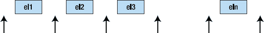

***图 11-5.** 迭代器抽象中的游标*

最后，某些迭代器允许您在迭代器运行时在集合中插入和删除元素。这些迭代器被称为*健壮迭代器*。Java 的 *`ListIterator`* 接口（而非 *Iterator*）允许在有限制的情况下进行插入（通过 *`add()`* 方法）和删除（通过 *`remove()`* 方法）。*`add()`* 方法仅将元素添加到紧邻 *`next()`* 将返回的下一个元素之前的位置，或紧邻 *`previous()`* 方法调用将返回的下一个元素之后的位置。*`remove()`* 方法只能在连续的 *next()* 或 *previous()* 方法调用之间调用，不能连续调用两次，并且绝不能紧跟在 *add()* 方法调用之后。

##### 观察者模式

我喜欢 NPR 的《全民话题：科学星期五》广播节目（[`http://sciencefriday.com`](http://sciencefriday.com)）。但我几乎无法在节目播出时收听，因为它在美国东部时间周五下午 2:00 到 4:00 播出，而我需要工作（偷笑），所以无法收听。但我订阅了播客，因此每周六早上我都会收到一期新的《科学星期五》播客，这样我就可以在修剪草坪时用 iPod 收听。如果我对《科学星期五》感到厌倦，只需取消订阅，就不会再收到新的播客了。女士们先生们，这就是*观察者模式*。

根据“四人帮”的定义，观察者模式“……定义了对象之间的一对多依赖关系，这样当一个对象改变状态时，其所有依赖者都会收到通知并自动更新。”^(10) 因此，在我的《科学星期五》例子中，NPR 是《科学星期五》播客的“发布者”，而我们所有“订阅”（或注册）该播客的人都是观察者。我们等待 *SciFri* 状态发生变化（创建新的播客），然后由发布者自动更新我们。更新的方式区分了两种不同类型的观察者——推模式和拉模式。在*推模式观察者*中，发布者（在面向对象术语中也称为主题）改变状态，然后将新状态*推送*给所有观察者。在*拉模式观察者*中，主题改变状态，但直到观察者请求时才提供完整更新——他们从主题*拉取*更新。在*拉*模式的一种变体中，主题可能会向所有观察者提供最小更新，通知他们状态已更改，但观察者仍需请求新状态的详细信息。

因此，对于观察者模式，我们需要一个主题接口，以便主题、观察者和客户端都能知道他们正在使用的状态接口。我们还需要一个观察者接口，仅用于告知如何更新观察者。我们的发布者将实现主题接口，而不同的“监听器”将实现观察者接口。图 11-6 是此模式的 UML 图。

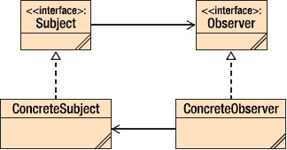

***图 11-6.** 经典观察者模式*

客户端类缺失，但它将同时使用 `ConcreteSubject` 和 `ConcreteObserver` 类。以下是所有这些类的*推模式*版本的简单实现。请记住，这是*推模式*，因为 *`ConcreteSubject`* 对象会通知所有 *观察者*，无论他们是否请求。

首先，是 `Subject` 接口，它定义了如何注册、移除和通知观察者。

`public interface Subject`
`{`
`    public void addObserver(Observer obs);`
`    public void removeObserver(Observer obs);`
`    public void notifyAllObservers();`
`}`

接下来，是 `Subject` 接口的实现。这个类是真正的发布者，因此它还需要构成 `Subject` 状态的属性。在这个简单版本中，我们使用一个 *`ArrayList`* 来保存所有观察者。

___________________

¹⁰ Gamma 等人，1995 年。

`import java.util.ArrayList;`

`public class ConcreteSubject implements Subject`

`    private ArrayList<Observer> observerList;`
`        // 这两个变量是我们的状态`
`    private int foo;`
`    private String bar;`

`    public ConcreteSubject() {`
`        observerList = new ArrayList<Observer>();`
`        this.foo = 0;`
`        this.bar = "Hello";`
`    }`

`    public void addObserver(Observer obs) {`
`        observerList.add(obs);`
`    }`

`    public void removeObserver(Observer obs) {`
`        observerList.remove(obs);`
`    }`

`    public void notifyAllObservers() {`
`        for (Observer obs: observerList) {`
`            obs.update(this.foo, this.bar);`
`           }`
`    }`

`    public void setState(int foo, String bar) {`
`        this.foo = foo;`
`        this.bar = bar;`
`        notifyAllObservers();`
`    }`
`}`

接下来，`Observer` 接口告诉我们如何更新观察者。

`public interface Observer`
`{`
`    public void update(int foo, String bar);`
`}`

然后是 `Observer` 接口的实现。

`public class ConcreteObserver implements Observer`
`{`
`    private int foo;`
`    private String bar;`
`    Subject subj;`

`    /**`
`     * ConcreteObserver 类的构造函数`
`     */`
`    public ConcreteObserver(Subject subj) {`
`        this.subj = subj;`
`        subj.addObserver(this);`
`    }`

`   public void update(int foo, String bar)`
`    {`
`        this.foo = foo;`
`        this.bar = bar;`
`        show();`
`    }`

`    private void show() {`
`        System.out.printf("Foo = %s Bar = %s\n", this.foo, this.bar);`
`    }`
`}`

最后，是创建发布者、每个观察者并将它们组合在一起的驱动程序。

`public class ObserverDriver`
`{`
`    public static void main(String [] args) {`
`        ConcreteSubject subj = new ConcreteSubject();`

`        ConcreteObserver obj = new ConcreteObserver(subj);`

`        subj.setState(12, "Monday");`
`        subj.setState(17, "Tuesday");`
`    }`
`}`

执行驱动程序的输出（全部来自 `ConcreteObserver` 对象中的 `show()` 方法）将如下所示：

* * *

`Foo = 12 Bar = Monday`
`Foo = 17 Bar = Tuesday`

* * *

在许多方面，观察者设计模式的工作方式类似于 Java 事件接口。在 Java 中，你创建一个类，该类注册为特定事件类型的“监听器”（我们的观察者）。你还需要创建一个方法，该方法就是实际的观察者，并在事件发生时做出响应。当该类型的事件发生时，Java 事件对象（我们的主题）会通过调用你编写的方法来通知你的观察者，并将事件中的数据传递给观察者方法——Java 事件使用观察者模式的*推模型*。

例如，如果你在 Java 程序中创建了一个 *`Button`* 对象，你可以使用 *`Button`* 对象的 *`addActionListener()`* 方法来注册观察 *`ActionEvent`*。当 *`ActionEvent`* 发生时，所有 *`ActionListener`* 都会通过调用名为 *`actionPerformed()`* 的方法得到通知。这意味着你的 *`Button`* 对象必须实现 *`actionPerformed()`* 方法来处理该事件。

##### 策略模式

有时，你的应用程序中会有多种方式执行单个操作，或者有几种不同的行为，每种行为都有不同的接口。实现此类功能的一种方法是使用 `switch` 语句，如下所示：

`switch (selectBehavior) {`
`        case Behavior1:`
`                Algorithm1.act(foo);`
`                break;`
`        case Behavior2:`
`                Algorithm2.act(foo, bar);`
`                break;`
`        case Behavior3:`
`                Algorithm3.act(1, 2, 3);`
`                break;`
`}`

这种结构的问题在于，如果你添加另一种行为，就需要修改这段代码，并且可能还需要修改所有其他需要选择不同行为的代码。这并不好。

策略设计模式可以帮你解决这个问题。它指出，如果你有几种需要动态选择的行为（算法），你应该确保它们都遵循相同的接口——一个 `Strategy` 接口——然后通过一个名为 `Context` 的驱动程序动态选择它们，该驱动程序由客户端软件告知调用哪个策略。策略模式体现了我们面向对象设计的两个基本原则——*封装变化的概念*和*针对接口编程，而非针对实现编程*。图 11-7 展示了策略模式的设置。

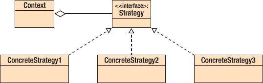

***图 11-7.** 典型的策略模式布局*

一些可能使用策略模式的例子包括：

*   使用不同的压缩算法捕获视频
*   为不同类型的实体（个人、公司、非营利组织）计算税款
*   以不同格式（折线图、饼图、条形图）绘制数据
*   使用不同格式压缩音频文件

在每个例子中，你可以想象让应用程序告诉驱动程序——`Context`——使用哪个策略，然后请求 Context 执行该操作。

举个例子，假设你是一名刚获得执照的注册会计师，正尝试编写自己的软件来计算客户的税款。（为什么注册会计师要编写自己的税务程序，我也不知道；请配合一下。）最初，你将客户分为三类：仅申报个人所得税的个人、申报企业所得税的公司以及几乎不申报任何税款的非营利组织。现在，所有这些群体都需要计算税款，因此计算税款的类行为应该对所有群体相同；但他们会以不同的方式计算税款。所以我们需要一个策略设置，使用相同的接口——封装应用程序中变化的部分，并将具体类编码到接口——并允许我们的客户端类选择使用哪种类型的税务客户。图 11-8 是我们程序的结构图。

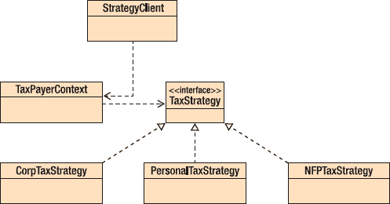

***图 11-8.** 使用策略模式选择税务行为*

我们创建一个 `TaxStrategy` 接口，所有具体的 `TaxStrategy` 类都将实现该接口。

`public interface TaxStrategy {`
`  public double computeTax(double income);`
`}`

由于这里唯一变化的是税款的计算方式，因此我们的 `TaxStrategy` 接口只包含 *`computeTax()`* 方法。

然后我们创建每个具体的 `TaxStrategy` 类，每个类都为特定类型的客户实现税款计算。

`public class PersonalTaxStrategy implements TaxStrategy {`
`    private final double RATE = 0.25;`

`    public double computeTax(double income) {`
`        if (income <= 25000.0) {`
`            return income * (0.75 * RATE);`
`        } else {`
`            return income * RATE;`
`        }`
`    }`
`}`

`public class CorpTaxStrategy implements TaxStrategy {`
`    private final double RATE = 0.45;`

`    public double computeTax(double income) {`
`        return income * RATE ;`
`    }`
`}`

`public class NFPTaxStrategy implements TaxStrategy {`
`    private final double RATE = 0.0;`

`    public double computeTax(double income) {`
`        return income * RATE;`
`    }`
`}`

接下来，我们创建`Context`类，它负责完成客户端程序请求创建策略对象并执行正确策略的繁重工作。

`public class TaxPayerContext {`
`    private TaxStrategy strategy;`
`    private double income;`
`    /** Context 的构造函数 */`
`    public TaxPayerContext(TaxStrategy strategy, double income) {`
`        this.strategy = strategy;`
`        this.income = income;`
`    }`
`    public double getIncome() {`
`        return income;`
`    }`
`    public void setIncome(double income) {`
`        this.income = income;`
`    }`
`    public TaxStrategy getStrategy() {`
`        return strategy;`
`    }`
`    public void setStrategy(TaxStrategy strategy) {`
`        this.strategy = strategy;`
`    }`
`    public double computeTax() {`
`        return strategy.computeTax(income);`
`    }`
`}`

请注意，这里我们编写了一个独立的 *`computeTax()`* 方法版本（我们没有重写该方法，因为我们没有扩展任何具体类——策略模式使用的是组合，而非继承）。此版本会调用客户端所选策略的 *`computeTax()`* 方法。

最后，我们实现控制谁在何时被实例化的客户端。

`public class StrategyClient {`
`        public static void main(String [] args) {`
`                double income;`
`                TaxPayerContext tp;`

`                income = 35000.00;`
`                tp = new TaxPayerContext(new PersonalTaxStrategy();`
`                                                                                 income);`
`                System.out.println("Tax is " + tp.computeTax());`

`                tp.setStrategy(new CorpTaxStrategy());`
`                System.out.println("Tax is " + tp.computeTax());`
`        }`
`}`

客户端类选择要使用的算法，然后让上下文对象执行它。这样，我们就将税收计算封装到了独立的类中。只需添加新的具体`TaxStrategy`类，并在客户端中做出更改以使用该新具体类型，我们就能轻松添加新的客户类型。小菜一碟！

### 结论

设计模式是针对设计问题的可复用、普遍出现的核心解决方案。它们并非一个完成的设计。相反，设计模式是一个模板，你可以用它来解决许多不同领域中的类似问题。设计模式为你提供了久经考验的策略来解决常见问题，因此它们可以帮助加快你的设计过程。而且，由于这些模式描述了*经过验证的解决方案*，它们也有助于减少设计中的缺陷。

不过要小心。像所有设计技术一样，设计模式是启发式的，因此总会有它们不适用的情况。试图将一个模式硬塞进一个根本不合适的问题中，只会自找麻烦。

设计模式的目标是定义一种通用的设计词汇。它们可能无法让我们完全达到目标，但设计模式，加上第 10 章中描述的设计原则，能让我们在这条路上走得很远。

## 第 12 章

## 代码构建

> *大多数时候，当你看到程序员时，他们并没有在做什么。程序员的一个吸引人之处在于，你无法仅通过观察来判断他们是否在工作。他们常常坐在那里，看似在喝咖啡闲聊，或者只是盯着虚空发呆。程序员试图做的是理清那些在他脑海中四处乱窜的、所有独立且不相关的想法。*
> 
> ——查尔斯·M·斯特劳斯
> 
> *同样，伟大的软件需要对美有一种狂热的执着。如果你审视优秀的软件内部，你会发现那些本不该有人看到的部件也同样优美。我并非声称自己编写了伟大的软件，但我知道，在代码方面，我的行为方式如果应用到日常生活中，会让我有资格服用处方药。看到缩进糟糕或使用丑陋变量名的代码，会让我抓狂。*
> 
> ——保罗·格雷厄姆，《黑客与画家》，2003 年

好了，我们终于要触及软件开发的核心——编写代码。这里的前提是你已经*确实*知道如何用至少一种编程语言编写代码；本章会以几种语言为例进行说明，每种语言都是根据要阐述的要点来选择的。本章的目的是提供一些编写*更好*代码的技巧。因为我们都能写出更好的代码。

对于计划驱动流程的人（参见第 2 章）来说，编码是那条摇动开发流程这条狗的尾巴。一旦你完成了详细的需求、架构和详细设计，代码就应该从最终设计中自然流淌出来，对吧？并非如此。在我 20 年的行业软件开发经验中，我从未见过这种情况发生。编码是困难的；即使是一个好的、详细的设计，将其转化为代码也需要大量的思考、经验和知识，即便是小程序也不例外。根据你使用的编程语言和目标系统，编程可能是一项非常耗时且困难的任务。另一方面，对于雇佣数十甚至数百名开发人员的大型项目，拥有非常详细的设计对成功至关重要，所以先别急着否定计划驱动流程。

对于敏捷开发流程的人来说，编码就是一切。敏捷宣言（[`http://agilemanifesto.org`](http://agilemanifesto.org)）在开头就指出：“可工作的软件胜过详尽的文档。”敏捷开发者倾向于尽早并频繁地创建代码；他们相信要频繁地向客户交付软件，并利用客户的反馈来改进代码。他们欢迎需求的变化，并将其视为重构代码、使产品对客户更有用的机会。这并不意味着使用敏捷流程时编码会变得更容易；它意味着你的关注点不同了。在敏捷流程中，你不是专注于尽早确定需求和设计，而是专注于尽可能快速、频繁地向客户交付可工作的代码。你经常更改代码，并且整个团队拥有所有代码，因此只要合适，任何成员都有权更改任何内容。

你的代码有两个受众：

*   作为代码编译版本目标的机器，即实际会被执行的部分。
*   包括你自己在内的、为了理解和修改而*阅读*代码的人。

为此，你的代码需要满足需求、实现设计，同时还要可读且易于理解。我们将首先关注这些目标中的可读性和可理解性部分，然后探讨一些与性能和流程相关的问题。本章不会提供编写优秀代码的所有提示、技巧和技术；这方面有整本书的篇幅，其中一些列在章末的参考文献中。祝你好运！

在继续之前，如果我不推荐两本最好的编程书籍，那将是我的失职。第一本是史蒂夫·麦康奈尔的《代码大全 2：软件构建实践手册》，这是一本厚达 960 页的巨著，带你了解优秀代码的构成要素。^(1) 麦康奈尔讨论了从变量命名、函数组织、代码布局、防御性编程到循环控制等方方面面。“软件构建”这个比喻正是源自麦康奈尔的这本书。这个比喻认为，构建软件应用程序类似于建造建筑物。小型建筑（例如菲多的狗屋）更容易建造，需要的规划更少，出现问题时也更容易更改（重构）。较大的建筑（你的房子）需要更多细节、更多规划以及更多协调，这主要是因为这不是一个人能完成的工作。真正的大型建筑（摩天大楼）需要在设计和规划上都有许多详细的层级，需要紧密协调，并且需要许多流程来处理变更和错误。尽管建筑构建模型并不完美——它不擅长处理增量开发，麦康奈尔也提到了一种“累积模型”，即一层软件被添加到现有层之上，就像珍珠在牡蛎中形成一样——但这个比喻让你清晰地认识到，软件规模越大，其复杂性和构建难度就越高。

第二本经典著作是亨特和托马斯的《程序员修炼之道》。^(2) 这本书由 46 个简短章节组成，包含 70 条技巧，清晰地阐述了程序员应有的行为方式。它提供了从源代码控制、测试、断言到 DRY 原则等一系列主题的实用建议，其中一些内容我们将在本章后面介绍。亨特和托马斯本人对这本书以及“务实编程”的含义做了最好的描述：

__________

¹ 麦康奈尔，S.《代码大全 2：软件构建实践手册》。雷德蒙德，华盛顿州，微软出版社，2004 年。

² 亨特，A. 和 D. 托马斯。《程序员修炼之道：从学徒到大师》。（波士顿，马萨诸塞州：艾迪生-韦斯利出版社，2000 年）。

> *编程是一门手艺。简单来说，就是让计算机做你想让它做的事（或者你的用户想让它做的事）。作为一名程序员，你既是倾听者，又是顾问，既是翻译者，又是决策者。你试图捕捉难以捉摸的需求，并找到一种方式来表达它们，以便一台机器能够妥善处理。你试图记录你的工作，以便他人能够理解，并且你试图设计你的工作，以便他人能够在此基础上进行构建。更重要的是，你试图在项目时钟无情的滴答声中完成所有这些工作。你每天都在创造小小的奇迹。这是一项艰巨的工作。^(3)*

### 一个编码示例

在《代码大全》中，史蒂夫·麦康奈尔给出了一个值得审视的糟糕代码示例，这样我们就能开始理解可读性、可用性和可理解性这些问题。我将其从 C++转换成了 Java，但这个示例基本上是麦康奈尔的原例。^(4) 以下是代码；我们来找出它的问题所在。

`void HandleStuff(CORP_DATA inputRec, int crntQtr, EMP_DATA empRec, Double estimRevenue,`
`   double ytdRevenue, int screenx, int screeny, Color newColor, Color prevColor, StatusType`
`   status, int expenseType) {`
`int i;`
`for ( i = 0; i < 100; i++ )`
`        {`
`        inputRec.revenue[i] = 0;`
`        inputRec.expense[i] = corpExpense[crntQtr][i];`
`        }`
`UpdateCorpDatabase( empRec );`
`estimRevenue = ytdRevenue * 4.0 / (double) crntQtr;`
`newColor = prevColor;`
`status = SUCCESS;`
`if ( expenseType == 1 ) {`
`        for ( i = 0; i < 12; i++ )`
`                profit[i] = revenue[i] – expense.type1[i];`
`        }`
`else if ( expenseType == 2 ) {`
`                profit[i] = revenue[i] – expense.type2[i];`
`        }`
`else if ( expenseType == 3 )`
`                profit[i] = revenue[i] – expense.type3[i];`
`                }`

这段代码有什么问题？嗯，有什么没问题呢？让我们列个清单：

*   因为这是 Java 代码，所以它应该有一个*可见性修饰符*。不，这不是必须的，但你总应该加上一个。你不是在为编译器编写代码，而是在为人编写代码。可见性修饰符能让人类读者更清楚地理解代码。
*   方法名很糟糕。`HandleStuff` 完全没有说明这个方法的功能。
*   哦，而且这个方法做了太多事情。它似乎根据 `expenseType` 计算某个叫做 `profit` 的东西。但它似乎还改变了颜色并指示了成功。方法应该很小。它们应该只做一件事。
*   注释在哪里？没有任何信息说明参数是什么，或者这个方法应该做什么。所有方法至少应该告诉你这些。
*   布局简直糟透了，而且不一致。缩进是错误的。有时花括号是语句的一部分，有时又是分隔符。你确定最后一个右花括号真的结束了这个方法吗？
*   这个方法没有保护自己免受错误数据的影响。如果 `crntQtr` 变量为零，那么第 8 行的除法将引发除零异常。
*   这个方法使用了魔法数字，包括 100、4.0、12、2 和 3。它们从何而来？它们是什么意思？魔法数字是不好的。
*   这个方法有太多输入参数。如果我们知道这个方法应该做什么，也许我们可以改变这一点。
*   至少有两个输入参数——`screenx` 和 `screeny`——根本没有被使用。这表明设计不佳；这个方法的接口可能被用于多个目的，因此它是“臃肿的”，意味着它必须容纳所有可能的用途。
*   变量 `corpExpense` 和 `profit` 没有在方法内部声明，因此它们要么是实例变量，要么是类变量。这可能很危险。因为实例变量和类变量在类的每个方法中都是可见的，我们可以在任何方法中更改它们的值，从而产生副作用。副作用是不好的。
*   最后，这个方法没有一致地遵循 Java 命名约定。啧啧。

所以，这个示例因为多种不同的原因而成为糟糕的代码。在本章的其余部分，我们将看看这里违反的一般编码规则，并给出如何使你的代码正确、可读和可维护的建议。

### 函数、方法以及大小，天哪！

首先，最重要的事情。你的类、函数和方法都应该*只做一件事*。这是封装背后的基本思想。让你的方法只做一件事可以隔离错误，并使它们更容易被发现。它鼓励重用，因为小的、单一功能的方法更容易在不同的类中使用。单一功能（以及单一抽象层级）的类也更容易重用。

单一功能意味着小。你的方法/函数应该很小。我的意思是小——20 行可执行代码是函数的一个良好上限。在任何情况下，你都不应该编写 300 行的函数。我知道，我做过。那并不美观。回到第 7 章，我们讨论了*逐步求精*和*模块分解*。对一个初始函数定义进行重构，使其只做一件小事，会将你的函数分解成两个或更多更小、更容易理解和维护的函数。哦，正如我们将在第 14 章中看到的，较小的函数更容易测试，因为它们需要的单元测试更少（它们通过代码的路径更少）。正如那本书所说，*小即是美*。

### 格式、布局与风格

格式、布局和风格都与代码在页面上的呈现方式有关。正如我们之前所见，代码在页面上的呈现方式也与其正确性相关。麦康奈尔的*格式基本定理*指出：“良好的视觉布局能够展现程序的逻辑结构。”^(5) 良好的视觉布局不仅能让程序更易读，还能通过展示程序的结构来帮助减少错误。反之亦然；良好的逻辑结构也更易于阅读。因此，良好布局和格式的目标应该是：

*   准确呈现程序的逻辑结构；
*   保持一致性，使你选择的布局风格尽可能少有例外；
*   提高人类可读性；
*   便于修改。（你知道你的代码会被修改的，对吧？）

### 通用布局问题与技巧

大多数布局问题都与代码块的布局有关；存在不同类型的块布局，有些是语言内置的，有些则需要你自行选择。三种最常见的块布局是：内置块边界、begin-end 块边界，以及模拟内置块。

有些语言为其所有控制结构都提供了内置的块边界。在这种情况下，你别无选择；因为块边界元素是语言特性，你必须使用它。具有内置块边界的语言包括 Ada、PL/1、Lisp 和 Scheme，以及 Visual Basic。例如，Visual Basic 中的 if-then 语句看起来像这样：

`if income > 25000 then`
`        statement1`
`        statement2`
`else`
`        statement3`
`        …`
`end if`

在 Visual Basic 中，如果不使用结束块元素，就无法编写控制结构，因此块更容易被找到和区分。

__________

⁵ McConnell, 2004.

但是，大多数语言并没有内置的块边界词法元素。大多数语言使用 begin-end 块边界要求。根据这一要求，一个块是由零个或多个语句（其中语句有特定定义）组成的序列，并由 *begin* 和 *end* 词法元素界定。最常见的 begin 和 end 元素是关键字 **`begin`** 和 **`end`**，或者左右花括号 **`{`** 和 **`}`**。例如：

**Pascal:**

`if income > 25000 then`
`        begin`
`                statement1;`
`                statement2`
`        end`
`else`
`        statement3;`

**C/C++/Java:**

`if (income > 25000)`
`{`
`        statement1;`
`        statement2;`
`} else`
`        statement3;`

注意在这两个例子中，单个语句被视为一个块，不需要块分隔符元素。还要注意，在 Pascal 中，分号是语句*分隔符*符号，因此需要在语句之间使用，但由于 **`else`** 和 **`end`** 不是语句的结尾，所以在 **`else`** 或 **`end`** 之前不要使用分号（感到困惑吗？大多数人都会）；而在 C、C++ 和 Java 中，分号是语句*终止符*符号，必须放在每条语句的末尾。这更容易记忆和编写；你几乎可以在任何地方加上分号，除了花括号之后。简洁是好事。

最后，当我们格式化一个块时，可以尝试模拟那些没有内置块边界的语言，通过要求每个块都使用块分隔符词法元素来实现。

**C/C++/Java:**

`if (income > 25000) {`
`        statement1;`
`        statement2;`
`} else {`
`        statement3;`
`}`

在这个例子中，我们想假装左右花括号是控制结构语法的一部分，因此无论块有多大，我们都用它们来界定块。为了强调块分隔符是控制结构的一部分，我们将其放在控制语句起始行的同一行。然后我们可以将结束块边界元素与控制结构的起始位置对齐。这并非对内置块元素语言特性的完美模拟，但它非常接近，并且具有一个优点：你不太可能遇到像下面这样因错误缩进而导致的问题：

**C/C++/Java:**

`if (income > 25000)`
`        statement1;`
`        statement2;`
`        statement3;`

在这个例子中，`statement2` 和 `statement3` 的错误缩进可能会让读者误以为它们是 **`if`** 语句的一部分。编译器可不会产生这种错觉。

总的来说，使用模拟块边界的风格效果很好，可读性强，并能清晰地展示程序的逻辑结构。为每个块（包括仅包含单个语句的块）都加上块边界也是一个好主意。这可以消除上面出现错误缩进的可能性。所以，如果你这样写：

`if (income > 25000) {`
`        statement1;`
`}`

那么，在下面的代码中：

`if (income > 25000) {`
`        statement1;`
`}`
`        statement2;`
`        statement3;`

很明显，无论缩进如何，`statement2` 和 `statement3` 都不属于该块。这也意味着，你现在可以安全地向块中添加额外的语句，而无需担心它们是否在块内：

`if (income > 25000) {`
`        statement1;`
`        statement2;`
`        statement3;`
`        statement4;`
`        statement5;`
`}`

### 空白

空白是你的朋友。你不会写一本单词之间没有空格、段落之间没有换行、或者没有章节划分的书，对吧？那你为什么要编写没有空白的代码呢？空白允许你在逻辑上分隔程序的各个部分，并对齐块分隔符和其他词法元素。它还能让你的眼睛在程序各部分之间得到休息。让眼睛休息是件好事。以下是一些关于使用空白的建议：

*   使用空行来分隔组（就像段落一样）。
*   在块内，将所有语句对齐到相同的制表位（默认制表符宽度通常是四个空格）。
*   使用缩进来展示每个控制结构和块的逻辑结构。
*   在运算符周围使用空格。
*   实际上，在数组引用和函数/方法参数周围也要使用空格。
*   不要在 begin-end 块边界处使用双重缩进。

### 代码块与语句风格指南

如前所述，“模拟代码块边界”的风格对大多数块结构语言都很适用。

*   使用比你认为需要的更多的括号。我尤其会在所有算术表达式周围使用括号——主要是为了确保我没有搞错优先级规则。`fx = ((a + b) * (c + d)) / e;`
*   统一格式化单语句块。使用模拟代码块边界技术：`if (average > MIN_AVG) {`
    `     avg = MIN_AVG;`
    `}`
*   对于复杂的条件表达式，将不同条件放在不同行上。`if ((’0’ <= inChar && inChar <= ’9’) ||`
    `     (’a’ <= inChar && inChar <= ’z’) ||`
    `     (’A’ <= inChar && inChar <= ’Z’)) {`
    `          mytext.addString(inChar);`
    `          mytext.length++;`
    `}`
*   将单条语句在第 70 列左右换行。这是 80 列穿孔卡片时代的遗留习惯，但它也是让代码更易读的好方法。过长的代码行会迫使读者水平滚动，或者让他们忘记行首到底写了什么！
*   不要使用`goto`，不管唐·克努特怎么说。^(6) 有些语言，比如 Java，甚至没有`goto`语句。大多数语言都不需要它（汇编语言除外）。请领会克努特论文的精神，只在真正有意义且能让程序更易读、更易懂的地方使用`goto`。
*   每行只写一条语句。（不要像参加年度国际混乱 C 代码大赛那样写代码！[`www.ioccc.org.`](http://www.ioccc.org)）像 `g.setColor(Color.blue); g.fillOval(100, 100, 200, 200);`
    `mytext.addString(inChar);mytext.length++;System.out.println();`

__________

⁶ Knuth, D. “Structured Programming with goto Statements.” *ACM Computing Surveys* 6(4): 261-301\. 1974.

*   这种写法虽然合法，但看起来并不美观，而且很容易忽略中间那条语句。而像这样 `g.setColor(Color.blue);`
    `g.fillOval(100, 100, 200, 200);`

    `mytext.addString(inChar);`
    `mytext.length++`
    `System.out.println();`
*   看起来就好得多。

### 声明风格指南

就像编写可执行代码一样，你的变量声明也需要整洁且易读。

*   每行只声明一个变量。嗯，对于这一点我持两种态度。虽然我认为 `int max,min,top,left,right,average,bottom,mode;`
*   有点拥挤；我会将其重写为 `int max, min;`
    `int top, bottom;`
    `int left, right;`
    `int average, mode;`
*   虽然不是每行一个，但相关的变量被分组在一起。这对我来说更有意义。
*   在靠近变量使用的地方声明它们。大多数过程式和面向对象编程语言都有*先声明后使用*的规则，要求你在任何表达式中使用变量之前必须先声明它。在过去，比如在 Pascal 中，你必须在程序（或子程序）的顶部声明变量，并且不能在代码块内部声明变量。这有一个缺点：你可能在真正使用变量之前好几页就声明了它。（但请参阅本章后面关于函数应该有多长的部分。）
*   如今，你通常可以在程序的任何代码块中声明变量。该变量的作用域就是它被声明的那个代码块，以及该代码块内部的所有子代码块。
*   这条建议指出，最好在变量被使用的最内层代码块中声明它们。这样你就可以*就在那里*看到声明和变量的使用。
*   合理地排列声明顺序
    *   按类型和用途分组（参见前面的示例）。
    *   使用空白行分隔你的声明。再次强调，空白行是你的朋友。最后这几条建议的核心思想是让你的声明可见，并让它们靠近将要使用它们的代码。
*   永远不要嵌套头文件！（这是针对 C 和 C++程序员的。）头文件的设计初衷是让你只需定义一次常量、声明一次全局变量和函数原型，然后就可以在（可能大量的）源代码文件中重复使用该头文件。嵌套头文件会将其中一些声明隐藏在嵌套的头文件内部。这很糟糕——因为可见性是好事。它可能导致你错误地多次包含同一个头文件，从而引发变量、宏的重定义和错误。

    你可能在自己的头文件中嵌套的唯一头文件是系统头文件，比如 `stdio.h` 或 `stdlib.h`，而且我甚至不确定我是否喜欢这种做法。

*   永远不要将源代码放在头文件中！（再次强调，这是针对 C 和 C++程序员的。）头文件用于声明，而不是用于源代码。库才用于存放源代码。将函数放在头文件中意味着每次包含该头文件时，该函数都会被重新定义。这很容易导致多重定义——编译器可能直到链接阶段才会发现。头文件中唯一应该包含的源代码是`#define`预处理语句中的宏定义，而且即使是这些宏定义也应该谨慎使用。

### 注释风格指南

就像空白行一样，注释是你的朋友。现有的每一本编程书都告诉你要在代码中添加注释——但没有一本（包括本书）会告诉你具体在哪里添加注释，以及好的注释应该是什么样子。这是因为如何编写好的、信息丰富的注释属于“视情况而定”的建议类别。一条好的、信息丰富的注释取决于你编写它的*上下文*，所以泛泛的建议几乎毫无用处。关于编写注释的唯一好建议就是——去写吧。哦，还有，既然你会修改代码——那就再写一次。这是关于注释的第二难的事情——保持它们是最新的。所以我的建议是，在第一次编写程序时就写注释。这会让你对注释应该放在*哪里*有个概念。然后，当你完成某个特定函数的单元测试后，通过更新已有的注释来为该函数编写最终的注释集。这样，你就能在发布的代码中拥有一套相当接近最新的注释。

*   将注释与其对应的语句对齐缩进。这对可读性很重要，因为这样注释和代码就能对齐。`/* make sure we have the right number of arguments */`
    `if (argc < 2) {`
    `    fprintf(stderr, "Usage: %s <filename>\n", argv[0]);`
    `    exit(1);`
    `}`
*   用空行将块注释分隔开。嗯，对于这一点我持两种态度。如果你将块注释的开始和结束标记各自放在单独的行上并对齐，那么就不需要空行。另一方面，如果你将注释结束标记放在一行的末尾，那么你应该使用一个空行将其与源代码分隔开。所以如果你这样做 `/*`
    ` * make sure we have the right number of arguments`
    ` * from the command line`
    ` */`
    `if (argc < 2) {`
    `    fprintf(stderr, "Usage: %s <filename>\n", argv[0]);`
    `    exit(1);`
    `}`
    *   你就不需要空行；但如果你这样做 `/* make sure we have the right number of arguments`
        `   from the command line */`

`if (argc < 2) {`
        `    fprintf(stderr, "Usage: %s <filename>\n", argv[0]);`
        `    exit(1);`
        `}`
    *   那么你可以这样做（但我首先不推荐这种风格）。
*   不要让注释换行——改用块注释。这通常发生在你将注释附加到源代码行末尾时，例如 `if (argc < 2) { // make sure we have the right number of arguments from the`
    `command line`
*   不要这样做。应将其改为 `if` 语句上方的块注释（参见上一条要点）。这样读起来会容易得多。
*   所有函数/方法都应有头部块注释。这条建议的目的是让读者知道该方法的功能。如果你为方法名和输入参数使用了良好的标识符名称，这一必要性会有所降低。尽管如此，你仍应告知用户该方法将执行什么操作，以及返回值（如果有的话）是什么。关于这条建议，请参见下方针对 Java 程序员的版本。在 C++ 中，我们可以这样写：`#include <string>`
    `/*`
    ` * getSubString() - 从输入字符串中获取子字符串。`
    ` *  子字符串从索引 start 开始，`
    ` *  一直到索引 stop 之前（不包括 stop）。`
    ` *  返回结果子字符串。`
    ` */`
    `string getSubString(string str, int start, int stop) { }`
*   在 Java 中，请为所有方法使用 JavaDoc 注释。JavaDoc 内置于 Java 环境中，所有 Java SDK 都附带用于生成 JavaDoc 网页的程序，既然如此，何乐而不为呢？JavaDoc 能以极低的成本为你的类提供清晰的概览。只需确保及时更新这些注释即可！`/**`
    ` * getSubString() - 从输入字符串中获取子字符串。`
    ` *      子字符串从索引 start 开始，`
    ` *      一直到索引 stop 之前（不包括 stop）。`
    ` *  @param str 输入字符串`
    ` *  @param start 整数起始索引`
    ` *  @param stop 整数结束索引`
    ` *  @return 结果子字符串。`
    ` */`
    `String getSubString(String str, int start, int stop) { }`
*   使用更少但更好的注释。这是那种老生常谈、人人都觉得有必要在任何关于注释的讨论中提及的“妈妈和苹果派”式的建议。好吧，你不需要注释每一行代码。大家都知道 `index = index + 1;      // add one to index`
    *   这种做法很愚蠢。所以别这么做。言尽于此。
*   “自文档化代码”是一种理想。自文档化代码是那些不愿花时间向读者解释代码的懒惰程序员的“圣杯”。醒醒吧。自文档化代码是编程中的柏拉图式理想，它假设每个阅读你代码的人都能读懂你的心思。如果你的算法有点复杂，或者输入有点晦涩，你就需要解释它。不要指望读者能领会你代码中的每一个微妙之处。解释清楚。就这么做。

### 标识符命名约定

正如 Rob Pike 在他那篇关于编程风格的精彩白皮书中精辟指出的那样：“名称的长度并非美德；表达的清晰度才是。”^(7) 正如金发姑娘会说的那样，你需要既不太长也不太短、恰到好处的标识符名称。就像注释一样，这对不同的人意味着不同的东西。常识和可读性应占主导地位。

*   所有标识符都应具有描述性。
    请记住，有朝一日你可能会回过头来再看自己的代码。或者，如果你是在为生计而工作，那么其他人也会查看你的代码。描述性标识符能让你（或他人）在凌晨 3 点阅读代码并弄清楚你当时想做什么时，变得容易得多。一个名为 `interestRate` 的变量比 `ir` 更容易理解。当然，`ir` 更短，输入更快，但请相信我，在发布那个程序大约 10 分钟后，你就会忘记它代表什么。合理的描述性标识符可以为你节省大量时间和精力。
*   `OverlyLongVariableNamesAreHardToRead`（且难以输入）
    另一方面，不要让你的标识符太长。首先，它们难以阅读；其次，它们并不会为你的程序上下文增加任何实质内容；再次，它们会占用页面上太多空间；最后，它们简直丑得可以。

__________

⁷ Pike, Rob, *Notes on Programming in C*，检索自 [`http://www.literateprogramming.com/pikestyle.pdf`](http://www.literateprogramming.com/pikestyle.pdf)，检索日期：2010 年 9 月 29 日。1999 年。

*   `Andtheyareevenharderwhenyoudontincludeworddivisions`
    尽管 Rob Pike 说过 [Pike80, p. 2]，但使用驼峰命名法（即标识符中嵌入大写字母来分隔新单词）可以使你的代码更易于阅读。特别是当标识符不太长的时候。至少对我来说，`maxPhysAddr` 比 `maxphysaddr` 更容易阅读。
*   单字母变量名虽然晦涩，但有时很有用。

将单字母变量名用于抵押贷款支付、窗口名称或图形对象等，并不是可读性的好例子。即使在你代码的上下文中，M、w 和 g 也毫无意义。`mortpmnt`、`gfxWindow`、`gfxObj` 则更有意义。一个主要的例外是用作索引值的变量——循环控制变量和数组索引变量。在这种情况下，`i`、`j`、`k`、`l`、`m` 等是易于理解的，尽管我不会反对使用 `index` 或 `indx` 来代替。

`for (int i = 0; i < myArray.length; i++) {`
    `    myArray[i] = 0;`
    `}`
    *   看起来好多了，并且与 `for (int arrayIndex = 0; arrayIndex < myArray.length; arrayIndex++) {`
        `    myArray[arrayIndex] = 0;`
        `}` 一样易于理解。
*   当编程语言命名约定存在时，请遵守它们。
    *   在某个时间、某个地点，你总会遇到一份名为《风格指南》或类似名称的文档。几乎每个有一定规模的软件开发组织都有这样的文档。有时你可以违反这些指南，但有时在代码审查中，你会因为不遵守指南而被扣分，并不得不修改你的代码。
    *   如果你在一个有多个开发者的团队中工作，风格指南是个好主意。它们能让所有代码具有统一的外观和感觉，并使一个开发者更容易修改由其他人编写的代码。
    *   《风格指南》中一套常见的指南是关于命名约定的。命名约定告诉你，对于每种不同类型的标识符，你的标识符名称应该是什么样子。Java 有一套常见的命名约定：
    *   对于类和接口：标识符名称应为名词，使用大写和小写字母数字字符，并且名称的首字母大写。`public class Automobile {}`
        `public interface Shape {}`
    *   对于方法：标识符名称应为动词，使用大写和小写字母数字字符，并且名称的首字母小写。`private double computeAverage(int [] list)`
    *   对于变量：标识符名称应使用大写和小写字母数字字符，并且名称的首字母小写。变量名不应以 $ 或 _（下划线）开头。`double average;`
        `String firstSentence;`
    *   对于所有标识符（常量除外），应使用驼峰命名法，以便内部单词的首字母大写。`long myLongArray;`
    *   对于常量：所有字母应大写，单词之间用下划线分隔。`static final int MAX_WIDTH = 80;`

### 防御性编程

所谓防御性编程，是指你的代码应能自我保护，免受不良数据的侵害。这些不良数据可能来自用户通过命令行、图形文本框或表单的输入，也可能来自文件。此外，不良数据还可能来自程序中其他例程的输入参数，就像上面第一个例子那样。

如何保护你的程序免受不良数据的侵害？验证！尽管听起来很繁琐，但你始终应该检查从例程外部接收到的数据的有效性。这意味着你需要检查以下内容：

*   检查命令行参数的数量和类型。
*   检查文件操作。
    *   文件是否成功打开？
    *   读取操作是否返回了内容？
    *   写入操作是否写入了内容？
    *   是否已到达文件末尾（EOF）？
*   检查函数/方法参数列表中的所有值。
    *   它们的类型和大小是否正确？
*   你应该始终初始化变量，而不是依赖系统为你完成初始化。

还需要检查什么？这里有一个简短的清单：

*   空指针（Java 中的引用）
*   分母为零
*   类型错误
*   值超出范围

举个例子，下面是一个 C 程序，它从一个文件中读取房屋价格列表，并计算列表中的平均房价。该文件通过命令行提供给程序。

`/*`
` * 程序功能：计算一组房屋的平均售价。`
` * 输入：来自通过命令行传递的文件。`
` * 输出：所有房屋的总价和平均售价，以及文件中的价格数量。`
` *`
` * 作者：jfdooley`
` */`
`#include <stdlib.h>`
`#include <stdio.h>`

`int main(int argc, char **argv)`
`{`
`        FILE *fp;`
`        double totalPrice, avgPrice;`
`        double price;`
`        int numPrices;`

`        /* 检查用户是否输入了正确数量的参数 */`
`        if (argc < 2) {`
`                fprintf(stderr,"用法: %s <文件名>\n", argv[0]);`
`                exit(1);`
`        }`

`        /* 尝试打开输入文件 */`
`        fp = fopen(argv[1], "r");`
`        if (fp == NULL) {`
`                fprintf(stderr, "文件未找到: %s\n", argv[1]);`
`                exit(1);`
`        }`
`        totalPrice = 0.0;`
`        numPrices = 0;`

`        while (!feof(fp)) {`
`                fscanf(fp, "%10lf\n", &price);`
`                totalPrice += price;`
`                numPrices++;`
`        }`

`        avgPrice = totalPrice / numPrices;`
`        printf("房屋数量为 %d\n", numPrices);`
`        printf("所有房屋总价为 $%10.2f\n", totalPrice);`
`        printf("每套房屋平均售价为 $%10.2f\n", avgPrice);`

`        return 0;`
`}`

### 断言可以成为你的朋友

防御性编程意味着，如果你的语言支持断言，那么使用断言是一个好主意。Java、C99 和 C++ 都支持断言。断言会测试你提供给它的表达式，如果表达式为假，则会抛出错误并通常中止程序。对于你认为可能发生的错误（例如，用户输入错误），你应该使用错误处理代码；而对于*绝不应该*发生的错误（例如，循环中的差一错误），则应使用断言。断言非常适合测试你的程序，但由于在将程序交付给客户之前应将其移除（你肯定不希望程序在用户面前中止，对吧？），因此它们不适合用于验证输入数据。

### 异常与错误处理

我们已经讨论了使用断言来处理真正严重的错误，即那些在生产环境中绝不应发生的错误。但如何处理“正常”的错误呢？防御性编程的一部分就是处理错误，确保程序或其使用的文件中的数据不受损害，并尽可能让程序持续运行（使你的程序健壮）。

我们先来看异常。你应该利用你所使用的编程语言中内置的异常处理机制。异常处理机制会提供关于刚刚发生的错误的信息。然后由你来决定如何处理。通常，在异常处理机制中，你有两个选择：自己处理异常，或者将其传递给调用你的函数并让它们处理。具体做什么以及如何做，取决于你使用的语言及其提供的能力。稍后我们将讨论 Java 中的异常处理。

#### 错误处理

就像验证一样，你最有可能在输入数据中遇到错误，无论是命令行输入、文件处理，还是来自图形用户界面表单的输入。这里我们讨论的是运行时发生的错误。编译时和测试时的错误将在下一章关于调试和测试的内容中介绍。其他类型的错误可能包括：程序计算错误的数据、与你的程序交互的其他程序（例如操作系统）中的错误、竞态条件，以及你的程序与另一个程序通信时因你的程序导致的交互错误。

错误处理的主要目的是让你的程序尽可能长时间地存活并正确运行。当程序无法继续运行时，它需要尽可能好地报告问题所在，然后优雅地退出。退出是错误处理的最后手段。那么你应该怎么做呢？好吧，我们又回到了“视情况而定”这个答案。你应该做什么取决于错误发生时程序的上下文及其目的。你不会以处理心脏起搏器错误的方式来处理电子游戏中的错误。在任何情况下，你的首要目标都应该是——尝试恢复。

尝试从错误中恢复在不同程序中含义不同。恢复意味着你的程序需要尝试忽略不良数据、修复它，或者用其他有效数据替换不良数据。关于错误处理的进一步讨论，请参见 McConnell^(8)。以下是一些如何从错误中恢复的示例：

*   你可以*忽略不良数据并继续运行*，使用下一个有效的数据。假设你的程序是数字压力表中的嵌入式软件。你每秒采样返回压力的传感器 60 次。如果传感器有一次未能提供压力读数，你是否应该关闭压力表？可能不需要；一个合理的做法是跳过这次读数，并准备读取下一个到达的数据。但如果压力传感器连续跳过多次读数，那么传感器可能出了问题，你应该采取不同的措施（比如发出警报）。

__________

⁸ McConnell, 2004.

*   你可以*用最后一个有效数据*来替代缺失或错误的数据。以数字压力表为例，如果传感器漏读了一次数据，由于每个时间间隔只有六十分之一秒，漏读的数据很可能与上一次读数非常接近。在这种情况下，你可以用最后一个有效数据来替代缺失值。
*   有时你可能没有任何先前记录的有效数据。你的应用程序使用异步事件处理程序，因此没有任何数据历史记录，但程序知道数据应该处于特定范围内。假设你提示用户输入一个工资金额，但返回的值是负数。显然没有人会拿到负数的工资，所以这个值是错误的。处理这种错误的一种方法（可能不是最好的）是*用范围内最接近的有效值*来替代，在这种情况下就是零。虽然不理想，但至少你的程序可以继续运行，并在该字段中保留一个有效的数据值。
*   在 C 程序中，几乎所有系统调用和大多数标准库函数都会返回一个值。你应该测试这些值！大多数函数会返回指示成功（非负整数）或失败（负整数，通常是 -1）的值。有些函数会返回一个指示其成功程度的数值。例如，`printf()` 系列函数返回打印的字符数，而 `scanf()` 系列函数返回读取的输入元素数。大多数 C 函数还会设置一个名为 `errno` 的全局变量，其中包含一个整数，即发生的错误编号。错误编号列表位于名为 `errno.h` 的头文件中。`errno` 变量为零表示成功。任何其他正整数都是发生的错误编号。由于系统会告诉你两件事：（1）发生了错误，以及（2）它认为的错误原因，你可以采取多种不同的方式来处理它，包括仅*报告错误*并退出。例如，如果我们尝试打开一个不存在的文件，程序 `#include <stdio.h>`
    `#include <stdlib.h>`
    `#include <errno.h>`

`int main(int argc, char **argv)`
    `{`
    `    FILE *fd;`
    `    char *fname = "NotAFile.txt";`

`    if ((fd = fopen(fname, "r")) == NULL) {`
    `        perror("File not opened");`
    `        exit(1);`
    `    }`
    `    printf("File exists\n");`
    `    return 0;`
    `}`
    *   如果文件确实不存在，将返回错误消息 `File not opened: No such file or directory`。函数 `perror()` 会读取 `errno` 变量，并使用提供的字符串以及对应于错误编号的标准字符串，将错误消息写入控制台的标准错误输出。该程序也可以提示用户输入不同的文件名，或者替换为默认文件名。这两种方法都能让程序继续运行，而不是在出错时退出。
*   还有其他用于错误处理和恢复的技术。这些示例应该能让你了解在程序中可以做什么。这里要记住的重要思想是，如果可能的话，尝试恢复，但最重要的是，*不要静默失败！*

#### Java 中的异常

一些编程语言内置了错误报告系统，当错误发生时，它会通知你，并让你自行决定如何处理。这些通常会导致程序惨烈崩溃的错误被称为*异常*。异常由遇到错误的代码*抛出*。一旦有东西被抛出，通常最好有人能*捕获*它。异常也是如此。因此，在编写代码时，你需要了解异常的两个方面：

*   当有一段代码可能遇到错误时，你*抛出*一个异常。像 Java 这样的系统会为你抛出一些异常。这些异常在 Java API 文档的 `Exception` 类中列出（参见 [`http://download.oracle.com/javase/6/docs/api`](http://download.oracle.com/javase/6/docs/api)）。你也可以编写自己的代码来抛出异常。我们将在本章后面给出一个示例。
*   一旦抛出异常，就必须有人来*捕获*它。如果你在程序中什么都不做，这个*未捕获的异常*会渗透到 Java 虚拟机（JVM）并在那里被捕获。JVM 会终止你的程序，并提供一个堆栈回溯信息，该信息应能引导你找到最初抛出异常的地方，并显示你是如何到达那里的。另一方面，你也可以编写代码来封装可能产生异常的调用，并使用 Java 的 **`try...catch`** 机制自行捕获它们。Java 要求某些异常必须被捕获。我们稍后会看到一个示例。

Java 有三种不同类型的异常——受检异常、错误和未受检异常。*受检异常*是你应该使用异常处理程序自行捕获和处理的异常；它们是你应该在设计和编写代码时预见并处理的异常。例如，如果你的代码要求用户输入文件名，你应该预见到他们可能会输错，并准备好捕获由此产生的 **`FileNotFoundException`**。受检异常必须被捕获。

另一方面，*错误*通常是发生在程序外部且你无法处理的事情相关的异常，除了优雅地失败之外，你无能为力。你可以尝试捕获错误异常并为用户提供一些输出，但通常仍然需要退出。

第三种类型的异常是*运行时异常*。运行时异常都源于程序运行时内部出现的问题，并且几乎总是表明代码中存在错误。例如，**`NullPointerException`** 几乎总是表明代码中存在错误，并以运行时异常的形式出现。错误和运行时异常统称为*未受检异常*（这是因为你通常不会尝试捕获它们，所以它们未被检查）。在下面的程序中，我们故意制造了一个运行时异常：

`public class TestNull {`
`  public static void main(String[] args) {`
`      String str = null;`
`      int len = str.length();`
`  }`
`}`

这个程序可以正常编译，但当你运行它时，会得到如下输出：

* * *

`Exception in thread "main" java.lang.NullPointerException`

`        at TestNull.main(TestNull.java:4)`

* * *

这是一个经典的运行时异常。没有必要捕获这个异常，因为我们唯一能做的就是退出。如果我们捕获它，程序可能看起来像这样：

`public class TestNullCatch {`
`        public static void main(String[] args) {`
`                String str = null;`

`                try {`
`                        int len = str.length();`
`                } catch (NullPointerException e) {`
`                        System.out.println("Oops: " + e.getMessage());`
`                        System.exit(1);`
`                }`
`        }`
`}`

这会输出：

* * *

`Oops: null`

* * *

请注意，**`getMessage()`** 方法会返回一个字符串，其中包含 Java 认为合适的任何错误信息（如果有的话）。否则，它会返回一个 `null`。这比上面默认的堆栈跟踪信息帮助要小一些。

让我们用 Java 重写上面那个简短的 C 程序，并演示如何捕获一个*受检异常*。

`import java.io.*;`
`import java.util.*;`

`public class FileTest`

`        public static void main(String [] args)`
`        {`
`                File fd = new File("NotAFile.txt");`
`                System.out.println("File exists " + fd.exists());`

`                try {`
`                        FileReader fr = new FileReader(fd);`
`                } catch (FileNotFoundException e) {`
`                        System.out.println(e.getMessage());`
`                }`
`        }`
`}`

当我们执行 `FileTest` 时得到的输出是

* * *

`File exists false`

`NotAFile.txt (No such file or directory)`

* * *

顺便提一下，如果我们在上面的程序中不使用 **`try-catch`** 块，那么它将无法编译。我们会得到如下编译器错误信息

* * *

`FileTestWrong.java:11: unreported exception java.io.FileNotFoundException; must be caught or declared to be thrown`

`                FileReader fr = new FileReader(fd);`

* * *

`                                ^`

* * *

`1 error`

* * *

请记住，受检异常**必须**被捕获。这种类型的错误不会出现在非受检异常中。这远非你需要了解的关于 Java 异常和异常处理的全部内容；开始深入研究 Java 教程和 Java API 吧！

### 关于编码的最后总结

编码是软件开发的核心。代码是你产出的成果。但编码是困难的；即使对于一个很小的程序，将一个良好、详细的设计转化为代码也需要大量的思考、经验和知识。根据你使用的编程语言和目标系统，编程可能是一项非常耗时且困难的任务。这就是为什么花时间让你的代码可读，并使代码布局与设计的逻辑结构相匹配，对于编写人类可理解且能正常工作的代码至关重要。遵循编码标准和约定，保持一致的风格，并包含良好、准确的注释，将在调试和测试过程中极大地帮助你。而且，六个月后当你回过头来试图弄清楚自己当时到底在想什么时，它也会帮到你。

最后，

> *没有什么比花一整天时间编程，让计算机自动完成一件我手动做起来需要足足十秒钟的任务，更让我快乐的了。*
> 
> ——道格拉斯·亚当斯，《最后一眼》

## 第 13 章

## 调试

> *从我们开始编程起，就惊讶地发现，让程序正确运行并不像我们想象的那么容易。调试必须被“发现”。我清楚地记得那一刻，我意识到从那时起，我生命中的很大一部分时间将花在寻找自己程序中的错误上。*
> 
> ——莫里斯·威尔克斯，1949 年
> 
> *看着自己的麻烦，并知道是你自己而非他人造成了它，这是一件痛苦的事。*
> 
> ——索福克勒斯

恭喜！你已经完成了代码编写，所以现在是时候让它运行起来了。我知道。你在想：“我能写出完美的代码；我很细心。我的程序不会有任何错误。” 别这么想。每个程序员都曾在某个时候这么想过。根本不存在完美的程序。人类是不完美的（谢天谢地）。所以我们在编写代码时都会犯错。在编写了 40 多年代码之后，我已经达到了这样一个境界：大多数时候，我那些少于大约 20 行的程序没有任何*明显*的错误，而且很多时候它们甚至能一次编译通过。我认为这是一个相当不错的结果。你也应该以此为目标。

让你的程序运行起来是一个包含三个部分的过程，这三个部分的顺序存在一些争议。这三个部分是：

*   调试
*   评审/审查
*   测试

*调试*是寻找错误的*根本原因*并修复它的过程。这并不意味着通过编写代码绕过错误来治疗其症状，使其消失；而是意味着找到错误的真正原因，并修复那段代码，从而消除错误。调试通常在完成代码编写之后、进行代码评审或单元测试之前进行（但请参见本章后面的测试驱动开发）。

*评审*（或审查）是阅读页面上代码的过程，并***寻找错误***。这些错误可能包括你实现设计的方式中的错误、其他类型的逻辑错误、错误的注释等。评审代码本质上是一个**静态**过程，因为程序并没有在计算机上运行——你是在屏幕或纸上阅读它。因此，尽管评审对于发现静态错误非常有效，但它无法发现代码中的动态或交互错误。这正是测试的目的。我们将在下一章中更多地讨论评审和审查。

*测试*，当然，是**在代码中寻找错误**的过程，而不是修复它们，后者是调试的全部内容。测试至少发生在以下三个不同层面：

*   *单元测试*：测试代码的小片段，尤其是在函数或方法层面。
*   *集成测试*：将几个相互关联的模块或类放在一起，并对它们进行整体测试。
*   *系统测试*：从用户的角度测试整个程序；这也被称为*黑盒测试*，因为测试者不知道代码是如何实现的，他们只知道需求是什么，因此他们测试编写的代码是否正确实现了所有需求。

本章我们将重点讨论调试。

### 那么，究竟什么是错误？

我们将代码中的错误分为三类：

*   语法错误
*   语义错误
*   逻辑错误

*语法错误*是指你在使用编程语言时，违反其语法规则所犯的错误。拼错关键字、使用变量前未声明、忘记在代码块中加上右花括号、忘记函数的返回类型、以及忘记在语句末尾加上分号，这些都是语法错误的典型例子。语法错误是目前最容易发现的，因为编译器几乎能为你找出所有这类错误。在强制执行语言的词法和语法规则方面，编译器是非常严格的“工头”。因此，如果你的代码在编译过程中没有错误**且没有警告**，那么你的程序很可能已经没有语法错误了。请注意上一句中的“且没有警告”。你应该*始终*在开启最严格语法检查的情况下编译代码，并且*始终*在进入审查或测试阶段之前消除所有错误和警告。如果你确信自己在语法上没有犯任何错误，那么在寻找其他错误时，你就少了一件需要操心的事！好消息是，一旦你设置好编译器选项，现代集成开发环境（IDE）会自动为你完成这项工作。因此，一旦你设定了警告和语法检查级别，每次做出更改时，IDE 都会自动重新编译你的文件，并告知你任何语法错误！

另一方面，*语义错误*则发生在你未能用编程语言构建出正确语句的时候。出现这种情况是因为你对语言的语法规则存在一些基本的误解。在 C/C++ 或 Java 中，没有为代码块加上花括号、不小心在 `if` 或 `while` 语句的条件后加上分号、忘记在 `switch` 语句的 `case` 分支末尾使用 `break;` 语句，这些都是语义错误的经典例子。语义错误更难发现，因为它们通常是语法正确的代码片段，因此编译器会通过你的程序，并成功将其编译成目标文件。只有当尝试执行程序时，语义错误才会显现出来。好消息是，它们通常非常明显，几乎会立刻暴露出来。坏消息是，它们也可能非常隐蔽。例如，在以下代码片段中：

`while (j < MAX_LEN);`
`{`
`        // 在此处执行操作`
`        j++;`
`}`

`while` 语句条件表达式末尾的那个分号通常很难被发现，你的眼睛很容易就滑过去了；但它的效果要么是让程序陷入无限循环（因为循环控制变量 j 从未被递增），要么是让循环体永远不会执行，但却错误地执行了该代码块，因为它与 `while` 语句在语义上已不再关联。

第三类错误，*逻辑错误*，是目前最难发现和根除的。逻辑错误的发生是因为你在将设计转化为代码时犯了错误。这些错误包括：计算结果不正确、循环中的“差一错误”（例如，如果你的“差一”错误是因为你不理解数组索引，那么它也可能是一个语义错误）、误解网络协议、从方法中返回了错误类型的值，等等。出现逻辑错误时，你的程序可能看似正常执行，但得到的结果却是错误的；或者程序会突然且可怕地崩溃，因为你访问了数组的越界位置、试图解引用一个空指针、或者试图在数据区域的中间执行代码。这可不是什么好事。

单元测试涉及找出程序中的错误，而调试则涉及找到根本原因并修复这些错误。调试就是找出错误在程序中发生的原因。你可以将错误视为一个机会，借此更深入地了解程序，了解自己是如何工作的，以及如何解决问题。因为归根结底，调试是一项解决问题的活动，就像开发程序本身也是解决问题一样。把调试看作一个了解自己、提升技能的机会。

### 不该做什么

就像在任何努力中一样，尤其是在解决问题的努力中，处理任务有错误的方法，也有正确的方法。以下是你在处理调试问题时不应做的一些事情。^(1)

首先，*不要猜测错误可能在哪里*。这意味着：（1）你对正在调试的程序一无所知；（2）你没有系统地寻找错误的根本原因。停下来，深吸一口气，然后重新开始。

*不要只修复症状，要修复问题本身*。很多时候，你可以通过添加代码来强制错误消失，从而“修复”一个问题。当错误涉及某个数值范围中的异常值时，尤其如此。这里的诱惑是，通过添加仅处理该异常情况的代码来特殊处理它。不要这样做！你并没有修复底层的根本问题；你只是把它粉饰过去了。相信我，还有其他一些特殊情况正等着冒出来，搞垮你的程序。仔细研究程序，弄清楚它在那个位置做了什么，然后修复问题。你以后会感谢我的。

__________

¹ 麦康奈尔，S. 《代码大全 2：软件构建实用手册》。（雷德蒙德，华盛顿州：微软出版社，2004 年）。

*避免否认*。人们总是倾向于说“肯定是编译器错了”或“系统肯定坏了”或“拉尔夫的模块显然给我发了错误的数据”或“那不可能”之类的借口。振作起来，开发者。如果你只是“改了一处地方”，程序就崩溃了，那么猜猜看，是谁很可能刚刚给程序注入了一个错误？或者至少是发现了一个错误？回顾一下本章开头索福克勒斯的名言，“……*是你自己，而不是别人，造成了它*。”你会犯错误。我们都会。最好的态度是展示出：“好家伙，这个程序可难不倒我，我一定要把它修好！”关于谨慎编码以及编写正确程序有多难，最好的讨论之一来自乔恩·本特利的《编程珠玑》第 5 栏中关于如何编写二分查找的讨论。^(2) 你应该读一读。

### 一种调试方法

这里有一种调试方法，可以帮你完成任务。记住，你是在解决一个问题，而最好的方法就是系统地接近问题，然后一击命中。关于调试，另一件需要记住的事情是，就像一桩谋杀悬案一样，你是从结论逆向推理的。^(3) 坏事已经发生了——你的程序失败了。现在你需要检查证据，并逆向推导出解决方案。

1.  可靠地重现问题。
2.  找到错误的根源。
3.  修复错误（仅修复这一个）。
4.  测试修复（这样你就有了一个后续的回归测试）。
5.  （可选）在你刚修复的错误附近，寻找其他错误。

#### 可靠地重现问题

这是关键的第一步。如果你的错误只是偶尔出现，那么找到它的难度会大大增加。一个经典的例子就是“但在我电脑上运行正常”这个问题。这是你最不想听到的一句话。这也是技术支持人员早早退休的原因。重现问题——如果可能的话，用不同的方式——能让你看到发生了什么，并清晰地指示出问题发生的位置。幸运的是，大多数错误都很容易找到。要么你得到了错误的结果，可以找到打印语句的位置并从那里反向推导；要么你的程序悲惨地崩溃，系统为你生成了一个堆栈跟踪。Java 虚拟机会自动为你完成这项工作。对于其他语言，你可能需要使用调试器来获取堆栈跟踪。

请记住，错误并非随机事件。如果你认为问题是随机的，那么它通常属于以下几种情况之一：

*   *初始化问题*：这可能是因为你依赖变量定义的副作用来初始化变量，但它的行为却不符合你的预期。
*   *时序错误*：某些事情发生的时间比你预期的要早或要晚。
*   *悬空指针问题*：你从一个局部变量返回了一个指针，而存储该局部变量的内存已经被归还给系统。
*   *缓冲区溢出或数组越界*：你有一个遍历集合的循环，但访问越界，覆盖了某段代码、另一个变量或系统堆栈。
*   *并发问题（竞态条件）*：在多线程应用程序或使用共享内存的应用程序中，你没有同步代码，导致你需要使用的变量在被你访问之前就被其他线程覆盖了。

__________

² Bentley, J. *编程珠玑，第 2 版*。（雷丁，马萨诸塞州，Addison-Wesley：2000 年）。

³ Kernighan, B. W. 和 R. Pike. *编程实践*。（波士顿，马萨诸塞州，Addison-Wesley，1999 年）。

然而，仅仅重现问题是不够的。你应该使用能引发错误的最简单的测试用例来重现它。这是一个排除所有其他可能性的过程，这样你就能专注于导致错误的单一（好吧，也许是一两个）原因。一种方法是尝试使用第一次数据量的一半来重现问题。选择其中一半。如果错误仍然出现，就再试一次。如果错误没有出现，就尝试另一半数据。如果仍然没有错误，就尝试使用四分之三的数据。你明白这个思路。当你找到最简单的用例时，你会知道的，因为任何更小的数据都会改变程序的行为；要么错误消失，要么你会得到一个略有不同的错误。

#### 找到错误的根源

一旦你能从外部重现问题，就可以开始定位错误发生的位置了。同样，我们需要系统地来做这件事。对于大多数错误来说，这很容易。你可以使用多种技术。

*   *收集数据*：既然你现在有了一个能重现错误的测试用例，那就从运行该测试用例中收集数据。数据可以包括：哪种输入数据会导致错误，你需要做什么才能让它出现——你需要执行的确切步骤，它需要多长时间出现，以及具体发生了什么。一旦你有了这些数据，你就可以对代码中错误的位置形成一个假设。对于大多数类型的错误，你会得到一些正确的输出，然后程序要么崩溃，要么你得到错误的输出。这将有助于隔离错误。
*   *阅读代码*：多么棒的想法！运行测试用例后，你应该做的第一件事是检查输出，猜测错误可能在哪里（查看最后打印的内容，并在程序中找到那个打印语句），然后坐下来，喝杯咖啡，只是阅读代码。理解代码在错误发生区域试图做什么，是找出修复方法的关键。这也是首先找到错误根源的关键。十有八九，如果你只是坐下来阅读代码五分钟左右，你就能找到错误的确切位置。不要直接抓起键盘就开始胡乱修改。先阅读代码。
*   *插入打印语句*：一旦你确定哪个输出不正确，最简单的方法就是开始在那个位置以及代码中其他关键点插入打印语句。关键点可以是函数的入口和出口，例如“进入排序例程”、“退出分区例程”等等。当使用集成开发环境（IDE）时，它有内置的调试功能，包括设置断点、监视点、单步执行代码等，这使得插入打印语句变得不那么必要。我稍后会再提到其中一些方法。
*   你也可以在循环的顶部和底部、`if` 语句的 then 和 else 块的开头、`switch` 语句的 default 分支等处放置打印语句。除非发生了什么非常诡异的事情，否则使用这种方法你应该能够很快地隔离错误发生的位置。再次强调，从你认为错误显现的那个点开始反向推导。请记住，很多时候，错误*表现*其行为的位置，可能距离错误实际*发生*的位置有好多行代码。
*   在某些语言中，你可以将打印语句包裹在调试块中，在编译时可以通过命令行开关来控制这些块。在 C/C++ 中，你可以在不同位置插入如下代码块：
    `        #ifdef DEBUG`
    `                        printf("排序例程中的调试语句\n");`
    `        #endif`
    然后，在编译程序时，你可以在头文件中放入 `#define DEBUG`，或者使用 `gcc -DDEBUG foo.c` 进行编译，这样 `printf` 函数调用就会被包含在你的程序中。省略 `#define` 或 `-DDEBUG` 则会从可执行程序中移除 `printf` 函数调用（但不会影响你的源代码）。但要注意，这种技术会使你的程序更难阅读，因为代码中散布着大量的 `DEBUG` 块。你应该在程序发布前移除 `DEBUG` 块。不幸的是，Java 没有这个功能，因为它没有预处理器。不过，并非无计可施。你可以通过使用一个命名的布尔常量来达到与 `#ifdef DEBUG` 相同的效果。下面是一个代码示例：
    `public class IfDef {`
    `        final static boolean DEBUG = true;`

`        public static void main(String [] args) {`
    `                System.out.printf("Hello, World \n");`

`                if (DEBUG) {`
    `                    System.out.printf("max(5, 8) is %d\n", Math.max(5, 8));`
    `                        System.out.printf("If this prints, the code was included\n");`
    `                }`
    `        }`
    `}`
*   在这个例子中，当我们想要启用`DEBUG`代码块时，将布尔常量`DEBUG`设为`true`；当我们想要关闭它们时，则将其设为`false`。这种方法并不完美，因为每次想要开启或关闭调试功能时都必须重新编译，但上面的 C/C++ 示例也同样需要这样做。
*   *寻找模式*：接下来要尝试的是，看看代码或错误中是否存在你之前见过的模式。随着你积累更多的编程经验，并更深入地了解自己的编程方式和常犯的错误类型，这会变得更容易。
*   上面 while 循环末尾多余的分号就是一个可能成为模式的错误示例。另一个例子是 `for (int j = 0; j <= myArray.length; j++) {`
    `    // 此处为一些代码`
    `}`
*   在这个例子中，你会因为使用了 `<=` 而不是 `<` 而越界访问数组。这就是经典的“差一错误”。
*   C/C++ 中的一个经典错误是在条件表达式中本应使用 `==` 却误用了 `=`。假设你在一个 C/C++ 程序中检查字符数组中的某个特定字符：`        for (int j = 0; j < length; j++) {`
    `                        if (c = myArray[j]) {`
    `                                pos = j;`
    `                                break;`
    `                        }`
    `        }`
*   单等号会导致 if 语句每次都提前停止；`pos` 将始终为零。顺便提一下，Java 不允许你这样做。它会报错，提示赋值表达式的类型不是布尔类型。`        TstEql.java:10: 不兼容的类型`
    `        找到   : char`
    `        需要: boolean`
    `                        if (c = myArray[j]) {`
    `                              ^`
    `        1 个错误`
*   这是因为在 Java 中，与 C 和 C++ 一样，赋值运算符会返回一个结果，并且每个结果都有类型。在这个例子中，结果类型是 `char`，但 if 语句期望那里是一个布尔表达式。Java 编译器会检查这一点，因为它比 C 和 C++ 的类型检查更严格；后两者的编译器不会进行这种检查。
*   在 switch 语句中忘记写 break 语句是另一个常见错误。`        switch(selectOne) {`
    `                        case ’p’:       operation = "print";`
    `                                                break;`
    `                        case ’d’:       operation = "display";`
    `                        default:        operation = "blank";`
    `                                                break;`
    `        }`
*   这段代码会将 *operation* 重置为 *blank*，因为第二个 case 后面没有 break 语句。
*   *向他人解释代码*：你有多少次在向同事解释一个问题时，两分钟后突然就解决了？当你开始向别人解释问题时，其实也是在向自己解释。这时灵感就可能降临。试试看吧。
*   *其他问题*。我仅仅触及了你在代码中可能犯下和发现的错误的皮毛。由于在任何给定的编程语言中，你可以编写的程序几乎是无穷无尽的，因此将错误引入程序的方式也几乎是无穷无尽的。内存泄漏、输入错误、全局变量的副作用、未能关闭文件、在 switch 语句中未添加 default 分支、意外覆盖方法定义、错误的返回类型、用局部变量隐藏全局变量或实例变量——这样的错误有成千上万种。

不过，不要气馁。你犯的大多数错误其实都很简单。其中大部分会在代码审查和单元测试中被发现。那些逃过这些检查，进入系统测试或（但愿不会）发布代码中的错误，才是真正有趣的问题。调试是一项极好的问题解决练习。享受其中吧。

##### 调试工具

到目前为止，我们讨论过的调试工具只有：用于消除语法错误和警告的编译器、可以插入代码中以提供运行位置数据的打印语句，以及可以编译时选择启用或禁用的内联调试语句。还有其他工具可以帮助你找到错误的根源。其中首当其冲的就是调试器。

调试器是特殊的程序，它们执行经过插桩的代码，并允许你在代码运行时窥视其内部，了解正在发生什么。调试器允许你停止正在运行的代码（断点）、在代码执行时检查变量值（监视点）、单步进入和跳出函数，甚至可以在程序运行时修改代码和数据。对于 C 和 C++ 程序来说，调试器是获取堆栈跟踪的最简单方法。对于 C 和 C++ 开发者而言，几乎所有 Unix 和 Linux 系统（以及 Mac OS X 和 Windows 的开发工具包）都附带的 `gdb` 调试器通常是首选。对于 Java，`gdb` 也集成在像 Eclipse ([`www.eclipse.org/`](http://www.eclipse.org/)) 这样的交互式开发环境中，并且 DDD 调试器 ([`www.gnu.org/software/ddd/`](http://www.gnu.org/software/ddd/)) 还为其提供了图形用户界面。NetBeans IDE ([`www.netbeans.org`](http://www.netbeans.org)) 自带其图形化调试器。Eclipse 和 NetBeans 中的 Java 调试器允许你在单行代码上设置断点，通过监视点观察变量值的变化，并允许你一次一行或一次一个方法地单步执行代码。`gdb` 能够完成上述所有功能甚至更多，但你应该谨慎使用它以及任何其他调试器。调试器本质上在审视代码时存在“隧道视野”。它们擅长向你展示当前函数的所有代码，但无法让你感受到整个程序的组织结构。它们也无法让你了解复杂的数据结构，并且使用调试器调试多线程和多进程程序也很困难。多线程程序尤其困难，原因有很多，其中之一是执行时序对于不同线程至关重要，而在调试器中运行多线程程序会改变其时序。

#### 修复错误（就那一个！）

一旦你找到了错误所在，就需要想出一个修复方案。大多数情况下，修复方法显而易见且简单，因为错误本身很简单。这是个好消息。但有时，虽然你能找到错误，修复方法却不明显，或者修复意味着要重写一大段代码。遇到这种情况要小心！花必要的时间理解代码，然后正确地重写代码并修复错误。调试中最大的问题就是急躁。

修复错误时请记住两件事：

*   修复实际的错误，而不是修复症状。
*   一次只修复一个错误。

第二点尤其重要。我们都遇到过这样的情况：你在修复一个错误时，在同一段代码中又发现了另一个错误。诱惑就是当场把它们都修好。要抵制住！修复你本来要修的那个错误。测试它，确保修复正确。将新代码整合回源代码库。然后你可以回到步骤 1，修复第二个错误。你可能会问：“既然我现在就能修好，为什么还要做这些额外的工作？”

嗯，情况是这样的。当你进入调试过程的这一步时，你已经有了针对第一个错误的测试，你已经了解了错误发生的代码，你已经准备好做那一个修复了。为什么现在要修两个东西来把事情搞混呢？此外，你还没有针对第二个错误的测试。那你如何测试那个修复呢？相信我，这确实会多花一点功夫，但一次只做一个修复，从长远来看会为你省去很多头疼的问题。

#### 测试修复

嗯，这听起来显而易见，对吧？但你会惊讶于有多少修复根本没有经过测试。或者即使测试了，也只是用通用的样本数据做一个简单测试，而没有检查你的修复是否破坏了其他东西。

首先，重新运行最初发现错误的那次测试。不仅仅是你在步骤 1 中想出的那个最小测试，而是第一次导致错误出现的那次测试。如果那个测试现在通过了（从错误不再发生的意义上说），那么这是一个好迹象，表明你至少修复了错误的直接原因。然后，运行回归测试套件中的所有其他测试（关于回归测试的更多讨论见下一章），以确保你没有重新破坏已经修复好的东西。最后，将你的代码整合到源代码库中，签出新版本并测试整个系统。如果一切仍然正常，那么你的状态就很好了。去喝杯啤酒吧。

#### 寻找更多错误

嗯，如果某个特定的函数或方法中有一个错误，那么可能还有另一个，对吧？所以，趁你在这里，不妨看看你刚修复的错误附近的一般代码区域，看看是否有类似的情况再次发生。这是寻找模式的另一个例子。模式之所以存在，是因为开发人员会一遍又一遍地犯同样的错误（毕竟我们是人）。再喝杯咖啡，吃个甜甜圈，读读更多的代码。看看整个模块或类，检查是否有其他错误或改进的机会，这没什么坏处。在敏捷开发的世界里，这被称为*重构*。这意味着重写代码使其更简单。让你的代码更简单会使其更清晰、更易读，并且更容易找到下一个错误。所以，喝点咖啡，读读代码吧。

### 源代码控制

在上面的一些段落中，我们提到了源代码库以及将更改整合到该库中。这是一种巧妙的方式，来开始简要讨论*源代码控制*，也称为*软件版本控制*。

无论何时你在做一个项目，无论你是唯一的开发者还是团队的一员，你都应该对你所做的工作进行备份。这就是版本控制系统（VCS）为你做的事情，但有所不同。VCS 不仅会备份你在项目中创建的所有文件，还会跟踪你对它们所做的所有更改，这样除了可以说“给我 PhoneContact.java 的最新版本”之外，你还可以说“我想要上周四的 PhoneContact.java 版本”。

VCS 会为你项目中创建并添加的所有文件维护一个*仓库*。这个仓库可以是一个平面文件，也可以是一个更复杂的数据库。一个客户端程序允许你访问仓库并检索存储在那里的一个或多个文件的不同版本。通常，如果你只是向 VCS 请求某个特定文件或某些文件，你会得到最新版本。无论你从仓库中提取出哪个版本的文件，在 VCS 术语中它都被称为*工作副本*。提取文件的过程称为*签出*。

如果你独自在一个项目上工作，那么你从 VCS 仓库签出的工作副本是唯一存在的副本，当你将文件签回时，你所做的任何更改都会反映在仓库中。这样做很酷的一点是，如果你做了一个更改但发现它是错误的，你可以直接签出一个没有该更改的先前版本。VCS 另一个有趣的地方是当有多个开发人员在一个项目上工作时。当你在一个开发团队中工作时，团队中的其他人很可能会签出与你相同的文件。这就带来了文件共享的问题。这里的问题是，如果你们两个都对文件做了更改，然后都想将文件签回仓库，谁先签入？谁的更改最终会留在仓库中？理想情况下，两者都保留，对吧？

嗯，也许不是。假设 Alice 和 Bob 都从仓库签出了 PhoneContact.java，并且各自对其进行了修改。Bob 将他修改后的 PhoneContact.java 版本签回仓库，然后去吃午饭了。几分钟后，Alice 签入了她的 PhoneContact.java 版本。这时会出现两个问题。(1) 如果 Alice 没有在 Bob 修改过的同一行代码上做任何更改，那么她的版本仍然比 Bob 的新，并且会在仓库中覆盖 Bob 的版本。Bob 的更改仍然存在，但它们现在位于比 Alice 的版本更旧的版本中。(2) 更糟的是，如果 Alice 确实对 Bob 修改过的一些相同代码做了更改，那么她的更改实际上会覆盖 Bob 的更改，导致 main.c 变成一个完全不同的文件。真糟糕。所以我们不希望这两种情况发生。我们如何避免这个问题呢？

版本控制系统使用以下两种不同的策略来避免这种冲突问题：

*   锁定-修改-解锁
*   复制-修改-合并

#### 使用锁定-修改-解锁

第一种策略是*锁定-修改-解锁*。在这种策略中，Bob 签出 PhoneContact.java 并将其锁定以进行编辑。这意味着 Bob 现在拥有唯一一个可以更改的 PhoneContact.java 工作副本。如果 Alice 试图签出 PhoneContact.java，她会收到一条消息，说她只能签出一个只读版本，因此在 Bob 释放他的锁之前无法将其签回。Bob 进行他的更改，将 PhoneContact.java 签回，然后释放锁。Alice 现在可以签出并锁定一个可编辑版本的 PhoneContact.java（现在包含 Bob 的更改），进行她自己的更改，然后将文件签回，并释放她的锁。锁定-修改-解锁策略的效果是将仓库中的更改序列化。

这种*更改的序列化*是锁定-修改-解锁最大的问题。当 Bob 签出文件进行编辑时，Alice 无法进行她的更改。她只能无所事事地等着，直到 Bob 完成。Alice 的老板可不喜欢这种无所事事的情况。不过，还有另一种选择。

#### 使用复制-修改-合并

第二种策略是*复制-修改-合并*。在这种策略中，爱丽丝和鲍勃都可以自由签出 `PhoneContact.java` 的可编辑副本。假设爱丽丝先进行了修改，并将她的新版本文件签回仓库，然后出去喝鸡尾酒了。当鲍勃完成他的修改，尝试将他的新版本 `PhoneContact.java` 签入仓库时，版本控制系统却告诉他，他的文件版本“已过期”；鲍勃无法签入。这是怎么回事呢？原来，版本控制系统会为每个签出的文件打上时间戳和版本号。它还会跟踪哪些文件被签出、谁签出的以及何时签出的。当你尝试签入时，它会检查这些值。

当鲍勃尝试签入时，他的版本控制系统发现他试图签入的代码版本比当前版本（爱丽丝之前签入的新版本）更旧，因此系统通知了他。那么鲍勃该怎么办呢？这就是复制-修改-合并的第三部分发挥作用的地方。鲍勃需要告诉版本控制系统，将他的修改与 `PhoneContact.java` 的当前版本进行合并，然后签入更新后的版本。如果爱丽丝和鲍勃修改了文件的不同部分，这一切都能顺利进行。如果他们的修改没有冲突，版本控制系统可以自动完成合并并签入新文件。但如果爱丽丝和鲍勃修改了文件中相同的代码行，问题就出现了。在这种情况下，鲍勃必须手动合并这两个文件。鲍勃必须这样做，因为版本控制系统不够智能，无法在冲突的修改之间做出选择。通常，版本控制系统会在合并过程中提供一些帮助，但最终的合并决定必须由鲍勃做出。

复制-修改-合并是当今大多数版本控制系统使用的策略，包括流行的开源版本控制系统 Subversion（[`http://subversion.apache.org`](http://subversion.apache.org)）。^(4) 复制-修改-合并存在一个问题（好吧，不止一个，但我们只讨论这一个）。如果你的仓库允许存储二进制文件，你就无法合并它们。假设你有同一个 jpg 文件的两个版本。你如何判断哪些比特是正确的呢？因此，在这种情况下，版本控制系统（包括 Subversion）会要求你使用锁定-修改-解锁。

Git（[`git.scm.com`](http://git.scm.com)）是另一个最流行的开源版本控制系统候选，它采用了一种模型，让每个开发者都拥有一个包含整个开发历史的本地仓库。当开发者修改一个文件时，这些修改会被复制到其他本地仓库。Git 使用一种称为“不完全合并”的模型，并配合许多插件式合并工具来协调跨仓库的合并。Git 的主要优点是速度快。它可能是目前最快的分布式版本控制系统。

### 关于编码和调试的最后一个想法——结对编程

结对编程是一种提高软件质量和程序员绩效的技术。它已经存在多年，但直到最近才被正式化 [Williams00]。在结对编程中，两个人共享一台电脑和一个键盘。一个人“驾驶”，控制键盘并编写代码，另一个人“导航”，观察代码中的错误，提出修改建议和测试用例。驾驶者和导航者会定期交换角色。结对可以长期在同一个项目上合作，也可以随着每个编程任务而改变。结对编程在敏捷开发环境中尤其流行；在*极限编程*流程中，所有开发者都必须进行结对编程，并且任何不是由两个人编写的代码都不允许集成到项目中 [Beck00]。已有几项研究^(5)表明，结对编程可以减少代码中的错误数量，并提高程序员的生产力。所以，这就是我们最后的调试技术——结对编程！

### 结论

就像编写良好、高效的代码一样，调试是所有程序员都需要掌握的技能。做一个细心的编码者意味着你需要进行的调试工作会更少，但调试总是会存在的。程序员都是人，我们总会犯错。掌握一系列调试技能将帮助你更快地找到代码错误的根本原因，并帮助你避免引入更多错误。正如我们将在下一章中看到的，评审（第 15 章）、调试和单元测试的结合，是开发者用来发布无缺陷代码的制胜组合。

__________

⁴ Collins-Sussman, B., Fitzpatrick, B. W., and Pilato, C. M. *使用 Subversion 进行版本控制*。（加利福尼亚州塞巴斯托波尔：O'Reilly Press，2010 年）。2010 年 10 月 15 日检索自 [`http://svnbook.red-bean.com/`](http://svnbook.red-bean.com/)。

⁵ Cockburn, A. 和 L. Williams。结对编程的成本与收益。*极限编程研究*。（马萨诸塞州波士顿：Addison-Wesley Longman，2001 年）。第 592 页。

## 第 14 章

## 单元测试

> *测试行为本身固然重要，但设计测试的行为更是已知最有效的缺陷预防手段之一。为了创建有用测试而必须进行的思考，能够在代码编写之前就发现并消除缺陷——事实上，测试设计的思考能够在软件创建的每个阶段（从概念构思、规格说明、设计、编码到后续环节）发现并消除缺陷。*
> 
> ——鲍里斯·贝泽
> 
> *只需观察，便能洞见许多。*
> 
> ——约吉·贝拉

正如上一章所强调的，没有人是完美的，软件开发人员也不例外。在第 13 章中，我们讨论了当你*知道*代码中存在错误时，应该查找哪些不同的问题。现在，我们将讨论如何*找到*这些错误。在代码的三种错误类型中，编译器会找出语法错误和偶尔的语义错误。在某些语言环境中，运行时系统会找出其他错误（这会让你的用户感到懊恼）。其余的错误则通过两种不同的方式发现——测试，以及代码评审与审查。在本章中，我们将讨论测试：何时进行测试、测试是什么、如何进行测试、测试应覆盖哪些内容，以及测试的局限性。在下一章中，我们将讨论代码评审与审查。

在典型的软件开发项目中，测试分为三个层级：单元测试、集成测试和系统测试。*单元测试*通常由你（开发者）完成。通过单元测试，你测试的是单个方法和类，但通常不测试程序的更大配置。你通常也不测试接口或库的交互——除非你的方法实际使用了它们。由于你在进行单元测试，你了解所有方法的编写方式、数据应有的形态、方法签名，以及返回值和类型。这被称为*白盒测试*。它实际上应该被称为*透明盒测试*，因为其假设是你能够看到被测试代码的所有细节。

*集成测试*通常由独立的测试组织完成。这是对一组相互交互的类或模块进行的测试；其目的是测试模块或类之间的接口以及模块间的交互。测试人员编写测试时，了解接口信息，但不知道每个模块*如何*实现。从这个角度看，测试人员是接口的使用者。因此，集成测试有时被称为*灰盒测试*。集成测试在单元测试后的代码被集成到源代码库之后进行。会构建并测试产品的部分或完整版本，以发现新模块与现有代码交互中的任何错误。当模块中的错误被修复且模块重新集成到代码库时，也会进行此类测试。

*系统测试*通常由独立的测试组织完成。这是对整个程序（系统）进行的测试。系统测试既在软件产品的内部基线版本上进行，也在拟发布给客户的最终基线版本上进行。独立的测试组织根据需求编写自己的测试，而对程序的设计或编写方式一无所知。这被称为*黑盒测试*，因为除了程序接收的输入和产生的输出之外，测试人员无法了解程序内部。此层级测试人员的职责是确保程序实现了所有需求。黑盒测试还可以包括压力测试、可用性测试和验收测试。最终用户可能会参与此类测试。

### 测试的问题

那么，既然我们可以通过测试来发现程序中的错误，为什么不能找出所有错误呢？毕竟，我们编写了程序，或者至少编写了我们刚刚添加的修复或新功能，所以我们一定理解自己刚刚写的内容。我们也编写了测试。那么，为什么仍有这么多错误逃逸到下一测试阶段，甚至落入用户手中呢？

嗯，我们无法找出代码中所有错误的原因有两个。首先，我们并不完美。这似乎是一个反复出现的主题。但事实确实如此。如果我们在编写代码时犯了错误，为什么还要假设我们在阅读代码或尝试测试和修复它时不会犯错误呢？即使是小型程序也会发生这种情况，对于大型程序尤其如此。如果你有一个 5 万行的程序，阅读和理解起来工作量巨大，你必然会遗漏某些东西。此外，静态阅读程序无法帮助你发现模块和接口之间的动态交互。因此，我们需要更智能地进行测试，并结合静态（代码阅读）和动态（测试）技术来发现并修复程序中的错误。

错误从一个测试阶段逃逸到另一个阶段，并最终到达用户手中的第二个原因是，软件比人类制造的任何其他产品都要复杂得多。即使是小型程序，其代码路径也很多，并且可能发生多种不同类型的数据错误。程序中这种大量的路径被称为*组合爆炸*。每次你在程序中添加一个`if`语句，程序的可能路径数量就会翻倍。想想看：如果`if`语句中的条件表达式为真，则有一条代码路径；如果条件表达式为假，则有另一条路径。每次你添加一个新的输入值，都会增加复杂性，并增加可能出现的错误数量。这意味着，对于大型程序，你不可能用所有可能的输入值测试程序中的每一条可能路径。要测试每一条路径，代码路径/数据值的组合数量是指数级的。

那么该怎么办呢？好吧，如果蛮力方法行不通，你就需要一个更好的计划。这个计划就是识别那些最有可能的用例，并对它们进行测试。你需要识别可能的输入数据值和数据的边界条件，并找出可能的代码路径，然后对这些路径进行测试。事实证明，这样做能够发现大部分错误。史蒂夫·麦康奈尔在《代码大全》中指出，良好的测试与代码评审相结合，可以在一个规模适中的程序中发现超过 95%的错误。¹ 这正是我们需要努力达到的目标。

______________

¹ 麦康奈尔，S. 《代码大全 2：软件构建实用手册》。（雷德蒙德，华盛顿州：微软出版社，2004 年。）

### 测试心态

测试其实还有另一个问题——那就是你。嗯，准确地说，是你，开发者。你看，开发者和测试者在代码构建中扮演着两种不同、甚至可以说是对立角色。开发者的职责是根据一组需求，设计出反映需求的方案，并编写实现该方案的代码。作为开发者，你的任务是*让代码跑起来*。

而测试者的工作，则是拿着同样的需求和你的代码，*让代码出问题*。测试者应该对你的代码做一些难以言表、可怕且折磨人的事情，努力让其中的错误暴露在光天化日之下。他们的工作就是搞破坏。然后你作为开发者再去修复。这就是为什么做测试者可能是一份很酷的工作。

你可以看出这可能会形成一种对立关系。你也能明白为什么开发者可能成为糟糕的测试者。如果你的任务是让代码工作，你就不会专注于破坏它。因此，你的测试用例可能不会像那些以破坏你代码为工作的人想出的那样恶毒、刻薄。简而言之，因为他们试图构建美好的东西，*开发者是糟糕的测试者*。开发者倾向于使用典型、干净的数据编写测试。他们往往过于乐观地看待一个测试能覆盖多少代码。他们编写测试时倾向于假设代码能工作；毕竟这是他们自己的代码，对吧？

这就是为什么大多数软件开发组织都有*独立的测试团队*，尤其是在集成测试和系统测试阶段。测试者编写自己的测试代码，创建自己的框架，对所有新基线版本和最终发布代码进行测试，并将所有错误报告给开发者，然后由开发者修复。测试者通常*不做*的一件事就是单元测试。单元测试是开发者的责任，所以你无法推脱。你确实需要考虑测试，学习如何编写测试、如何运行测试以及如何分析结果。你需要学会对你的代码狠一点。而且你仍然需要修复错误。

### 何时测试？

在我开始讨论如何进行单元测试以及测试哪些内容之前，我们先谈谈*何时*测试。当前的主流观点分为两个方向：更传统的方法是先编写代码，使其编译通过（从而消除语法错误），然后在你觉得某个函数或模块的代码完成后，*再*编写测试并进行单元测试。这样做的好处是，你已经理解了需求并编写了代码，在编写代码的过程中你有机会思考测试用例。然后你可以编写清晰的测试用例。在这种策略下，测试和调试是相辅相成的，几乎同时进行。它允许你发现错误、修复它，然后立即重新运行失败的测试。

另一种源自敏捷方法论（尤其是极限编程）的新方法被称为*测试驱动开发*（TDD）。采用 TDD 时，你在编写任何代码*之前*就先编写单元测试。显然，如果你先编写单元测试，它们都会失败——最多你只能有一个在测试中调用的方法存根。但这是件好事，因为在 TDD 中，你编写代码的目标是*让所有测试通过*。所以，如果你编写了一堆测试，然后只需编写刚好能让所有测试通过的代码，你就知道大功告成了！这样做的好处是帮助你保持代码精简，这意味着代码更简单、更容易调试。你可以编写一些新代码，进行测试；如果失败，就再写一些代码；如果通过，就停下来。它还能让你从一开始就拥有一套测试，无论何时你对代码进行修改，都可以运行这些测试。如果所有测试仍然通过，说明你的修改没有破坏任何东西。它同样允许你发现错误、修复它，然后立即重新运行失败的测试。

那么哪种方式更好呢？嗯，答案又是那种“看情况而定”的事情。通常，先编写测试能让你更早进入测试心态，并为实现代码提供明确的目标。另一方面，在你大量实践并使之成为第二天性之前，先写测试可能会比较困难，因为你必须想象出你要测试什么。这也会迫使你尽早去理解需求以及模块或类的设计。这意味着设计、编码和测试几乎同时发生。这可能会让整个代码构建过程变得更加困难。TDD 在中小型项目中效果很好（敏捷技术通常也是如此），但对于非常大型的程序可能会更困难。当你在进行结对编程时，TDD 也相当有效。在结对编程中，驾驶员负责编写代码，而领航员则负责观察错误并思考测试。采用 TDD 时，驾驶员编写的是*测试*，而领航员则在思考更多要编写的测试并提前考虑代码。这个过程往往使编写测试变得更容易，然后自然地过渡到编写代码。

不妨在编写代码之前和之后都尝试一下测试，然后由你自己决定哪种方式最好。

### 测试什么？

既然我们已经讨论了测试的不同阶段以及何时进行单元测试，现在是时候讨论到底*测试什么*了。你要测试的内容分为两大类：*代码覆盖率*和*数据覆盖率*。

*   *代码覆盖率*的目标是使用代表性数据，至少执行程序中每一行代码一次，以便确保所有代码功能正确。听起来很简单？嗯，想想那个五万行程序的组合爆炸问题吧。
*   *数据覆盖率*的目标是测试好数据和坏数据的代表性样本，包括输入数据和程序生成的数据，目的是确保程序能正确处理数据，尤其是数据错误。

当然，代码覆盖率和数据覆盖率之间存在重叠；例如，有时为了让程序的特定部分得以执行，你可能需要输入错误数据。我们会尽可能地将它们分开讨论，并在讨论编写实际测试时再结合起来。

#### 代码覆盖率：测试每条语句

代码覆盖率的目标是测试程序中的每条语句。为此，你需要牢记代码中的几个要点。你的程序由多种不同类型的代码组成，每种代码都需要进行测试。

首先，存在*直线型代码*。直线型代码只贯穿函数或方法中的单一路径。通常，每种不同的数据类型只需要一个测试用例（关于数据覆盖率，请参见下文）。

接下来是*分支覆盖率*。在分支覆盖率中，你需要测试程序可能改变方向的所有位置。这意味着你需要关注控制结构。请检查每一个*`if`*和*`switch`*语句，以及每一个包含 AND 和 OR 运算符的复杂条件表达式。对于每个*`if`*语句，你需要两个测试用例——一个用于条件表达式为`true`的情况，另一个用于其为`false`的情况。对于方法中的每个*`switch`*语句，你需要为 switch 中的每个*`case`*子句（包括*`default`*子句）分别编写一个测试用例（你所有的`switch`语句都应该有`default`子句，对吧？）。逻辑与（`&&`）和逻辑或（`||`）运算符会增加条件表达式的复杂度，因此你需要为它们添加额外的测试用例。

理想情况下，每个运算符需要四个测试用例（F-F、F-T、T-F、T-T），但如果你使用的语言（如 C/C++ 和 Java）对逻辑运算符采用短路求值，那么你可以减少测试用例的数量。对于或运算符，如果第一个子表达式为`false`，你仍然需要两个测试用例；但如果第一个子表达式求值为`true`（整个表达式将始终为真），则只需一个测试用例。对于与运算符，如果第一个子表达式求值为`false`（结果将始终为假），则只需一个测试用例；但如果第一个子表达式求值为`true`，则需要两个测试用例。

然后是*循环覆盖率*。这与上述分支覆盖率类似。区别在于，在*`for`*、*`while`*或*`do`*-*`while`*循环中，最容易出现*差一错误*，你需要明确地对此进行测试。你还需要一个测试用例来验证循环的“正常”运行，但还需要测试其他一些情况。首先，对于前置测试循环，需要考虑永远不进入循环体的情况——即循环条件表达式在第一次判断时就失败。其次，你需要测试无限循环的情况——条件表达式永远不会变为假。这很可能是因为你没有在循环体中修改循环控制变量，或者虽然修改了，但条件表达式从一开始就是错误的。对于读取文件的循环，通常需要测试*文件结束*标记（EOF）。这是另一个可能出错的地方，原因可能是文件过早结束，或者（在使用标准输入的情况下）从未指示文件结束。

最后，还有*返回值*。在许多语言中，标准库函数和操作系统调用都会返回值。例如，在 C 语言中，`fprintf`和`fscanf`函数分别返回打印到输出流的字符数和从输入流中分配到的输入元素个数。但几乎没有人会检查这些返回值。² 你应该检查！

请注意，Java 与 C 或 C++ 略有不同。在 Java 中，许多类似有问题的例程会将返回值声明为`void`，而不是像 C 或 C++ 那样声明为`int`。因此，上述问题在 Java 中出现的频率远低于其他语言。不过，这并不意味着问题完全消失了。虽然 Java 中的`System.out.print()`和`System.out.println()`方法都被声明为返回`void`，但`System.out.printf()`方法返回一个`PrintStream`对象，而这个对象几乎总是被忽略。此外，在 Java 中，调用`Scanner`的`next()`或`nextInt()`方法，或任何读取数据的方法，而不将返回值保存到变量中，是完全合法的。请务必小心。

#### 数据覆盖率：坏数据是你的朋友？

还记得在代码构建章节中我们讨论过的*防御性编程*吗？保护程序的关键在于警惕坏数据，检测并处理它，以便程序能够从坏数据中恢复，或者至少优雅地失败。现在，我们就要检验你的防御是否可靠了。数据覆盖率应检查两种类型的数据：好数据和坏数据。好数据是你的方法预期要处理的典型数据。这些测试将测试类型正确且在有效范围内的数据。它们只是为了检查你的程序是否正常工作。但这并不意味着你可以完全放松警惕。仍然有一些情况需要测试。以下是简要列表：

*   **测试边界条件**。这意味着要测试接近有效数据范围边缘的数据。例如，如果你的程序正在计算课程的平均成绩，那么成绩的取值范围是 0 到 100（包含两端）。因此，你应该测试例如 0、1、99 和 100 这些成绩。这些都是有效成绩。但你也应该测试 -1 和 101。这两个都是无效值，但接近取值范围。此外，如果你正在分配字母等级，则需要检查每个字母等级值的上下边界。例如，如果 F 代表任何低于 60 分的成绩，你需要检查 59、60 和 61。如果会出现差一错误，这就是需要检查的地方。
*   **测试典型数据值**。这些是你通常可能期望得到的有效数据字段。对于上述成绩计算的例子，你可以检查 35、50、67、75、88、93 等值。如果这些值不工作，那说明你还有其他问题。
*   **测试前置条件和后置条件**。每当你进入一个控制结构——循环或选择语句，或进行函数调用时，你都会对数据值和计算状态做出某些假设。这些就是前置条件。而当你退出该控制结构时，你也会对这些值现在是什么做出假设。这些就是后置条件。你应该通过测试前置条件和后置条件来编写测试，确保你的假设是正确的。在支持断言的编程语言（包括 C、C++ 和 Java）中，这是使用断言的好地方。

____________

² Kernighan, B. W. 和 R. Pike. *编程实践.* (波士顿, 马萨诸塞州: Addison-Wesley, 1999.)

测试有效数据和边界条件是一回事，但你还需要测试坏数据。

*   **非法数据值**。你应该测试明显非法的数据，以确保你的数据验证代码正常工作。我们已经提到过测试接近数据范围边界的非法数据。你还应该测试一些明显超出范围的数据。
*   **无数据**。没错，测试当你期望接收数据却什么也没得到的情况。例如，你提示用户输入，但用户没有输入值并按下回车键，而是直接按了回车键。或者你刚刚打开的文件是空的。或者你期望在命令行上接收三个文件，但一个也没得到。所有这些情况你都必须测试。
*   **数据过少或过多**。你必须测试这样的情况：你要求三个数据，却只得到两个。同样，也要测试你要求三个数据，却得到十个数据的情况。
*   **未初始化的变量**。如今大多数语言系统都会为你声明的任何变量提供默认的初始化值。但你仍然应该测试以确保这些变量被正确初始化。（实际上，无论如何你都不应该依赖系统来初始化你的数据；你应该始终自己进行初始化。）

### 测试的特性

罗伯特·马丁在他的著作 *Clean Code* 中，使用缩写 F.I.R.S.T. 描述了所有单元测试应具备的一组特性：³

> **快速（Fast）。** 测试应该快速。如果测试运行时间过长，你就不太可能频繁运行它们。因此，要让你的测试小巧、简单且快速。
> 
> **独立（Independent）。** 测试不应相互依赖。特别是，一个测试不应设置另一个测试所依赖的数据或创建对象。例如，Java 的 JUnit 测试框架提供了独立的 setUp 和 tearDown 方法，使测试相互独立。稍后我们将更详细地介绍 JUnit。
> 
> **可重复（Repeatable）。** 你应该能够随时以任意顺序运行测试，包括在向模块添加更多代码之后。
> 
> **自验证（Self-Validating）。** 测试应该要么通过，要么失败；换句话说，它们的输出应该只是布尔值。你不应该为了查看测试是否通过而阅读一页又一页的日志文件。
> 
> **及时（Timely）。** 这意味着你应该在需要时编写测试，以便在想要运行时它们已经就绪。对于使用 TDD 的敏捷方法论来说，这意味着在编写将被测试的代码之前，先编写单元测试。

_____________

³ 马丁，R. C. *Clean Code：敏捷软件工艺手册。*（上萨德尔河，新泽西州：Prentice-Hall，2009 年。）

最后，重要的是，就像你的函数一样，你的测试应该只测试一件事；每个测试应该只有一个概念。这对你的调试工作非常重要，因为如果每个测试只测试代码中的一个概念，那么测试失败就会像激光一样，精准地指向代码中可能存在错误的位置。

### 如何编写测试

在进一步深入之前，让我们更深入地探讨如何编写单元测试。我们现在将手动进行，以感受编写测试的过程，并在下一节讨论 JUnit 时，了解测试框架如何帮助我们。我们将假设正在编写应用程序的一部分，并由此展开。我们将以用户故事的形式进行，就像在极限编程（XP）环境中可能做的那样。⁴

在 XP 中，开发人员和客户聚在一起讨论客户的需求。这被称为*探索*。在探索期间，客户编写一系列*故事*，描述他们希望在程序中拥有的功能。开发人员接手这些故事，将其分解为*实现任务*并进行估算。成对的程序员领取单个任务，并使用 TDD 实现它们。我们将呈现一个故事，将其分解为几个任务，并为这些任务实现一些测试，以便让你了解单元测试的过程。

#### 故事

我们希望输入一个包含电话联系人的平面文件，并按字母顺序对文件进行排序，生成一个可打印的输出表格。

实际上，仅此而已。XP 项目中的故事通常非常简短——建议将它们写在 3×5 的索引卡上。

因此，我们可以将这个故事分解为一组任务。顺便说一句，这看起来很像一个设计练习；它确实是。

#### 任务

> 我们需要一个表示电话联系人的类。
> 
> 我们需要创建一个电话联系人。
> 
> 我们需要读取一个数据文件并创建一个电话联系人列表。（这看起来像是两件事，但实际上只是一件事——将文件转换为电话联系人列表。）
> 
> 我们需要按姓氏字母顺序对电话联系人进行排序。
> 
> 我们需要打印排序后的列表。

______________

⁴ 纽柯克，J. 和 R. C. 马丁。*实践中的极限编程。*（波士顿，马萨诸塞州，Addison-Wesley，2001 年。）

#### 测试

首先，我们将把上面的前两个任务合并到一个测试中。一旦我们创建了一个电话联系人类，确保我们可以正确地实例化一个对象是有意义的；实际上，我们是在测试该类的构造函数。那么，让我们创建一个测试。

在我们的第一个测试中，我们将创建一个电话联系人对象的实例，并打印出实例变量以证明它被正确创建。我们首先需要做一些设计工作。我们必须弄清楚电话联系人类将被称为什么，以及它将拥有哪些实例变量。

该类的一个合理名称是 `PhoneContact`，只要客户同意，实例变量将是 `firstName`、`lastName`、`phoneNumber` 和 `emailAddr`。哦，它们都可以是字符串变量。这是一个简单的联系人列表。对于这个类，我们可以有两个构造函数。一个默认构造函数，仅将联系人初始化为 null；另一个构造函数，接受所有四个值作为输入参数并进行赋值。目前可能只需要这些。以下是测试可能的样子：

`public class TestPhoneContact`
`{`
`    /**`
`     * 测试类 TestPhoneContact 的默认构造函数`
`     */`
`    public TestPhoneContact() {`
`    }`

`    public void testPhoneContactCreation() {`
`        String fname = "Fred";`
`        String lname = "Flintstone";`
`        String phone = "800-555-1212";`
`        String email = "fred@knox.edu";`

`        PhoneContact t1 = new PhoneContact();`
`        System.out.printf("Phone Contact reference is %H\n", t1);`

`        PhoneContact t2 = new PhoneContact(fname, lname, phone, email);`
`        System.out.printf("Phone Contact:\n Name = %s\n Phone = %s\n Email = %s\n",`
`                          t2.getName(), t2.getPhoneNum(),`
`                          t2.getEmailAddr());`
`    }`
`}`

这个测试一开始会失败，因为我们还没有创建 `PhoneContact` 类。这没关系。那么我们现在就来创建它。`PhoneContact` 类将很简单，只包含实例变量、两个构造函数以及变量的 getter 和 setter 方法。几分钟后，我们有了：

`public class PhoneContact {`
`    /**`
`     * 实例变量`
`     */`
`    private String lastName;`
`    private String firstName;`
`    private String phoneNumber;`
`    private String emailAddr;`

`    /*`
`     * PhoneContact 类对象的构造函数`
`     */`
`    public PhoneContact() {`
`        lastName = "";`
`        firstName = "";`
`        phoneNumber = "";`
`        emailAddr = "";`
`    }`

`    public PhoneContact(String firstName, String lastName,`
`                        String phoneNumber, String emailAddr) {`
`        this.lastName = lastName;`
`        this.firstName = firstName;`
`        this.phoneNumber = phoneNumber;`
`        this.emailAddr = emailAddr;`
`    }`

`    /**`
`     * 每个实例变量的 Getter 和 Setter 方法`
`     */`
`    public String getName() {`
`       return this.lastName + ", " + this.firstName;`
`    }`

`    public String getLastName() {`
`        return this.lastName;`
`    }`

`    public String getFirstName() {`
`        return this.firstName;`
`    }`

`    public String getPhoneNum() {`
`        return this.phoneNumber;`
`    }`

`    public String getEmailAddr() {`
`        return this.emailAddr;`
`    }`

`    public void setLastName(String lastName) {`
`        this.lastName = lastName;`
`    }`

`    public void setFirstName(String firstName) {`
`        this.firstName = firstName;`
`    }`

`    public void setPhoneNum(String phoneNumber) {`
`        this.phoneNumber = phoneNumber;`
`    }`

`    public void setEmailAddr(String emailAddr) {`
`        this.emailAddr = emailAddr;`
`    }`
`}`

最后，我们需要为我们刚刚创建的测试提供一个驱动程序。这将完成此测试环境的*脚手架*。

`public class TestDriver`
`{`
`    public static void main(String [] args)`
`    {`
`        TestPhoneContact t1 = new TestPhoneContact();`

`        t1.testPhoneContactCreation();`
`    }`
`}`

现在，当我们编译并执行 `TestDriver` 时，输出控制台上会显示类似如下的内容：

* * *

`Phone Contact reference is 3D7DC1CB`

`Phone Contact:`

`  Name = Flintstone, Fred`

`  Phone = 800-555-1212`

`  Email = fred@knox.edu`

* * *

下一个任务是读取一个数据文件并创建一个电话联系人列表。在这里，在我们确定测试或代码之前，需要先决定一些数据结构。

由于故事中提到“电话联系人的平面文件”，我们可以假设我们处理的是一个文本文件，其中每一行都包含电话联系人信息。假设其格式与 `PhoneContact` 类一致，为“名 姓 电话号码 电子邮件地址”，每行一个条目。

接下来，我们需要一个电话联系人列表，以便稍后排序并打印出来。因为我们希望按姓氏的字母顺序维护列表，所以可以使用 Java 集合类型 `TreeMap` 来存储所有电话联系人。这样我们甚至不需要对列表进行排序，因为 `TreeMap` 类会帮我们保持列表有序。看起来我们还需要另一个类来整合 `PhoneContact` 对象和列表操作。那么测试看起来是什么样的呢？

为了保持测试的简洁性并遵循“一个测试只做一件事”的原则，我们似乎最终可以使用两个测试：一个用于确认文件存在且可以打开，另一个用于确认我们可以创建 `PhoneContact` 列表数据结构。对于文件打开测试，看起来我们需要一个表示电话联系人列表的新类。我们可以先对这个类进行桩实现，创建一个简单的构造函数和一个我们需要测试的方法的桩。这样我们就可以编写测试（由于还没有真正的方法，测试会失败）。文件打开测试如下所示：

`    public void testFileOpen() {`
`        String fileName = "phoneList.txt";`

`        PhoneContactList pc = new PhoneContactList();`
`        boolean fileOK = pc.fileOpen(fileName);`

`        if (fileOK == false) {`
`            System.out.println("Open Failed");`
`            System.exit(1);`
`        }`
`    }`

我们将此测试添加到之前创建的测试类中。在上面的 `TestDriver` 类中，我们只需在 `main()` 方法中添加一行：

`t1.testFileOpen();`

一旦此测试失败，你就可以实现新类，并填充我们上面创建的桩。新的 `PhoneContactList` 类如下所示：

`import java.util.*;`
`import java.io.*;`

`public class PhoneContactLis`
`{`
`    private TreeMap<String, PhoneContact> phoneList;`
`    private Scanner phoneFile;`

`    /**`
`     * Constructors for objects of class PhoneContactLis`
`     */`
`    public PhoneContactList() {`
`    }`

`    public PhoneContactList(PhoneContact pc)`
`    }`

`         phoneList = new TreeMap<String, PhoneContact>();`
`         phoneList.put(pc.getLastName(), pc);`
`    }`

`   public boolean fileOpen(String name)`
`    {`
`        try {`
`            phoneFile = new Scanner(new File(name));`
`            return true;`
`        } catch (FileNotFoundException e) {`
`            System.out.println(e.getMessage());`
`            return false;`
`        }`

`    }`
`}`

这就是你的测试-设计-开发流程的工作方式。尝试创建我们上面列出的其余测试，并完成 `PhoneContactList` 类代码的实现。祝你好运。

### JUnit：一个测试框架

在上一节中，我们创建了自己的测试脚手架，并将测试挂接到其中。许多开发环境都具备为你完成此操作的功能。Java 中最流行的框架之一是 JUnit 测试框架，由 Eric Gamma 和 Kent Beck 创建（参见 [`www.junit.org`](http://www.junit.org)）。

JUnit 是一个用于开发 Java 类单元测试的框架。它提供了一个名为 `TestCase` 的基类，你可以扩展该类来为你正在创建的类创建一系列测试。JUnit 包含许多其他类，包括一个用于评估单个测试结果的断言库，以及几个用于运行你创建的测试的应用程序。JUnit 的一个非常好的常见问题解答位于 [`http://junit.sourceforge.net/doc/faq/faq.htm#overview_1`](http://junit.sourceforge.net/doc/faq/faq.htm#overview_1)。

要在 JUnit 中编写测试，你必须导入框架类，然后扩展 `TestCase` 基类。一个非常简单的测试如下所示：

`import junit.framework.TestCase;`

`public class SimpleTest extends TestCase {`

`        public SimpleTest(String name) {`
`                super(name);`
`        }`

`        public void testSimpleTest() {`
`                LifeUniverse lu = new LifeUniverse();`
`                int answer = lu.ultimateQuestion();`
`                assertEquals(42, answer);`
`        }`
`}`

请注意，单参数构造函数是必需的。`assertEquals()` 方法是断言库（`junit.framework.Assert`）的方法之一，当然，它用于测试预期答案（第一个参数）是否等于实际答案（第二个参数）。还有许多其他的 `assert*()` 方法。完整列表位于 [`http://junit.sourceforge.net/javadoc/`](http://junit.sourceforge.net/javadoc/)。

由于 JUnit 被打包在一个 Java jar 文件中，你需要将 jar 文件的位置添加到 Java CLASSPATH 环境变量中，或者在从命令行编译测试用例时将其添加到命令行中。例如，要编译我们的简单测试用例，我们会使用以下命令：

`% javac -classpath $JUNIT_HOME/junit.jar SimpleTest.java`

其中 `$JUNIT_HOME` 是你安装 `junit.jar` 文件的目录。

从命令行执行测试与编译一样简单。有两种方法可以做到这一点。第一种是使用 JUnit 预打包的运行器类之一，该类将测试类的名称作为其参数：

`java -cp .:./junit.jar junit.textui.TestRunner SimpleTest`

结果如下：

`.`
`Time: 0.001`

`OK (1 test)`

其中每个运行的测试对应一个点，显示整个测试套件所需的时间以及测试结果。

你也可以直接执行 `JUnitCore` 类，同样将测试类的名称作为参数传递给该类：

`java -cp .:./junit.jar org.junit.runner.JUnitCore SimpleTest`

结果如下：

`JUnit version 4.8.2`
`.`
`Time: 0.004`

`OK (1 test)`

JUnit 包含在许多标准集成开发环境（IDE）中。BlueJ、NetBeans 和 Eclipse 都带有 JUnit 插件，使得创建和运行单元测试用例几乎毫不费力。

例如，使用我们上面的示例和 BlueJ，我们可以创建一个新的单元测试类，并用它来测试我们的 *`PhoneContact`* 和 *`PhoneContactList`* 类。参见 图 14-1。

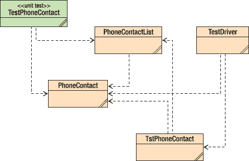

***图 14-1**。PhoneContact 测试 UML 图*

我们的测试类 `TestPhoneContact` 现在看起来像这样：

`public class TestPhoneContact extends junit.framework.TestCase`
`{`
`    /**`
`     * Default constructor for test class TestPhoneContact`
`     */`
`    public TestPhoneContact(String name)`
`    {`
`        super(name);`
`    }`

`    /**`
`     * Sets up the test fixture.`
`     * Called before every test case method.`
`     */`
`    protected void setUp()`
`    {`
`    }`

`    /**`
`     * Tears down the test fixture.`
`     * Called after every test case method.`
`     */`
`    protected void tearDown()`
`    {`
`    }`

`    public void testPhoneContactCreation() {`
`        String fname = "Fred";`
`        String lname = "Flintstone";`
`        String phone = "800-555-1212";`
`        String email = "fred@knox.edu";`

`        PhoneContact pc = new PhoneContact(fname, lname, phone, email);`
`        assertEquals(lname, pc.getLastName());`
`        assertEquals(fname, pc.getFirstName());`
`        assertEquals(phone, pc.getPhoneNum());`
`        assertEquals(email, pc.getEmailAddr());`
`    }`

`    public void testFileOpen() {`
`        String fileName = "phoneList.txt";`

`        PhoneContactList pc = new PhoneContactList();`
`        boolean fileOK = pc.fileOpen(fileName);`
`        assertTrue(fileOK);`

`        if (fileOK == false) {`
`            System.out.println("Open Failed, File Not Found");`
`            System.exit(1);`
`        }`
`    }`
`}`

要在 BlueJ 中运行这组测试，我们从图 14-2 所示的下拉菜单中选择“测试全部”。

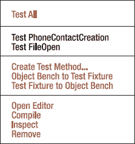

***图 14-2.** JUnit 菜单 - 选择“测试全部”来运行测试*

由于我们还没有创建 `phoneList.txt` 文件，因此会得到图 14-3 所示的输出。

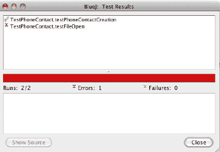

***图 14-3.** JUnit 测试输出*

在这里，我们注意到 `testFileOpen()` 测试失败了。

每当我们对程序进行任何更改时，都可以向 `TestPhoneContact` 类添加另一个测试，并通过一次菜单选择重新运行所有测试。测试框架使得创建单个测试和整个测试套件变得容易得多，这些测试可以在每次对程序进行更改时运行。这让我们每次做出更改时都能知道是否破坏了某些东西。非常酷。

### 测试是好事

归根结底，单元测试是开发过程中至关重要的一部分。如果做得仔细且正确，它可以帮助你在将代码集成到更大的程序之前就消除绝大多数错误。TDD（测试驱动开发）是一种有效的方法，它先编写测试，然后编写使测试通过的代码，这有助于在底层设计和编码中捕获错误，并允许你轻松快速地创建一个回归测试套件，可用于每次集成和每次程序基线。

### 结论

从开发者的角度来看，单元测试是你的程序将经历的最重要的测试类别。它是最基本的测试类型，确保你的代码在最低级别上满足设计要求。尽管开发者更关心确保程序能工作，而不是破坏它，但培养良好的单元测试思维对于你成长为一名成熟、高效的程序员至关重要。测试框架使这项工作比过去容易得多，因此学习本地测试框架的运作方式并学会编写良好的测试是你应该努力掌握的技能。最好是你自己发现自己的错误，而不是让客户发现。

## 第 15 章

## 走查、代码审查和检查

> *我们进行检查的目标是通过更早、更低成本地发现和消除缺陷来降低质量成本。虽然某些测试总是必要的，但我们可以通过减少传播到测试阶段的缺陷数量来降低测试成本。*
> 
> —罗恩·拉迪斯 (2002)
> 
> *当你尽早捕获错误时，你也会遇到更少的复合错误。复合错误是两个相互作用的独立错误：你下楼时绊倒了，当你伸手去抓扶手时，扶手却掉在了你手里。*
> 
> —保罗·格雷厄姆 (2001)

这里有一个令人震惊的事实：你在软件开发中的主要质量目标是向用户交付一个满足所有需求且没有缺陷的可运行程序。没错：你的代码应该是完美的。它满足用户的所有需求，并且在交付时没有任何错误。不可能？你喊道。做不到？好吧，*软件质量保证* 的全部意义就在于尽可能接近完美——尽管要在时间和预算的限制内。（你知道总有难处，对吧？）

软件质量通常从两个不同的角度来讨论：用户的角度和开发者的角度。从用户的角度来看，质量有许多特征——你的程序必须满足这些特征才能被用户接受——其中包括：¹

*   *正确性*：软件必须能工作，就这么简单。
*   *可用性*：它必须易于学习和使用。
*   *可靠性*：它必须保持运行，并在你需要时可用。
*   *安全性*：软件必须防止未经授权的访问，并且必须保护你的数据。
*   *适应性*：应该易于添加新功能。

____________

¹ 麦康奈尔，S. 《代码大全 2：软件构建实践手册》。（雷德蒙德，华盛顿州：微软出版社，2004 年。）

从开发者的角度来看，情况略有不同。开发者希望看到以下几点：

*   *可维护性*：必须易于对软件进行更改。
*   *可移植性*：必须易于将软件迁移到不同的平台。
*   *可读性*：许多开发者不会承认这一点，但你确实需要能够阅读代码。
*   *可理解性*：代码的设计方式需要让新开发者能够理解所有部分是如何组合在一起的。
*   *可测试性*：嗯，至少测试人员认为你的代码应该易于测试。以模块化方式创建的代码，使用只做一件事的短函数，比所有代码都挤在一个巨大的 main() 函数中要容易理解和测试得多。

软件质量保证 (SQA) 有三个支柱：

*   *测试*：发现程序执行时出现的错误，也称为*动态分析*。
*   *调试*：从代码中清除所有明显的错误，即通过测试发现的错误。
*   *审查*：发现代码中固有的错误，也称为*静态分析*。

许多开发者——以及管理者——认为可以通过测试来达到质量目标。你做不到。正如我们在上一章中看到的，测试是有限的。你通常无法探索每条代码路径，无法测试每种可能的数据组合，而且你的测试本身也常常存在缺陷。测试只能帮你走到这一步。正如艾兹格·迪杰斯特拉的名言：“……程序测试可以是一种非常有效的方法来显示错误的存在，但对于证明其不存在，则是完全不够的。”²

审查你的代码——阅读它并在页面上寻找错误——提供了另一种机制，以确保你正确实现了用户的需求和由此产生的设计。事实上，大多数使用计划驱动方法论的开发组织不仅会审查代码，还会审查需求文档、架构、设计规范、测试计划、测试本身以及用户文档。简而言之，就是软件开发组织产生的所有*工作产品*。使用敏捷开发方法论的开发组织不一定拥有上述所有文档，但它们确实有需求、用户故事、用户文档，尤其是需要审查的代码。在本章中，我们将重点讨论审查你的代码。

__________

² 迪杰斯特拉，E. “谦卑的程序员。” *CACM* 15(10): 859-866。1972 年。

### 走查、评审与审查——天哪！

仅靠测试来发现代码中的错误并非特别有效的方法。在许多情况下，单元测试、集成测试和系统测试的组合只能发现程序中大约 50%的错误。³ 但是，如果你在测试方案中加入某种类型的代码审查（通过阅读代码来发现错误），就能将这一比例提升至代码中所有错误的 93%到 99%。这才是值得追求的目标。

通常有三种类型的审查，它们从非常非正式的技术逐步过渡到非常正式的方法。这些审查通常在代码刚通过编译、单元测试之前进行，或者在单元测试完成后立即进行。最好在单元测试之后立即进行审查。这样，你已经完成了修改，代码编译通过，并且完成了第一轮测试。此时正是让其他人查看你代码的好时机。

### 走查

*走查*，也称为*桌面检查*或*代码阅读*，是最不正式的审查类型。走查通常用于确认对代码的小改动，比如一两行刚修复错误的代码。如果你刚刚向类中添加了一个新方法，或者修改了超过 10 行代码，在任何情况下都不应进行走查。而应进行代码评审。

走查涉及两人，最多三人：代码作者和审查者。在走查中，作者的工作是向审查者解释改动应该实现什么功能，并指出改动的位置。审查者的工作是理解改动，然后阅读代码。审查者阅读代码后，会做出两种判断之一：要么同意改动是正确的，要么不同意。如果不同意，作者必须返回，再次修复代码，然后进行另一次走查。如果审查者认为改动正确，那么作者就可以将修改后的代码集成回代码库，进行集成测试。

如果你采用敏捷方法并进行结对编程，那么在实现任务时，代码走查会自然发生。驾驶员在编写代码，而领航员则在一旁查看，检查错误并提前思考。在这种情况下，对较大块的代码进行走查是可以接受的，但对于一个完整的任务，或者更好的是，对于每个已实现的用户故事，你应该进行代码评审或审查。

### 代码评审

另一方面，*代码评审*比走查要正式一些。代码评审是大多数软件开发人员会做的事情。如果你修改了大量代码，或者向现有程序添加了新代码，你应该始终进行代码评审。如前所述，敏捷程序员在完成一个用户故事后应进行代码评审。代码评审是真正的会议。

代码评审通常有三到五人参加。参加代码评审的每个人应带来不同的视角。

____________

³ McConnell, 2004.

*   代码评审的主持人通常是作者。主持人的工作是召集会议，在会议前提前发送待评审的材料，并主持代码评审会议。主持人也可以在会议上做笔记。
*   会议上应有一名或多名开发人员；即与作者在同一项目工作的人。此人将带来项目的详细知识，并以此视角参与会议。
*   代码评审中应有一名测试人员。此人带来测试视角，不仅阅读被评审的代码，还会思考代码应如何被测试。
*   最后，应有一名经验丰富的开发人员在场，且此人不在作者的项目中。此人作为“无利害关系的第三方”，代表质量视角。他们在代码评审中的工作是理解代码，并让作者清晰地解释改动。此人提供关于代码及其如何融入项目的更具战略性的视野。

哦，还有，不允许经理参加代码评审。经理在场会改变会议的动态，使代码评审效果降低。那些在同事中可能愿意诚实评价代码的人，在经理面前会闭口不言；这无助于发现错误。请不要让经理参加。

代码评审的目标是发现代码中的错误，而不是修复它们。代码评审足够非正式，可能会发生一些关于修复的讨论，但这应保持在最低限度。在代码评审会议之前，所有参与者应仔细审阅主持人发送的材料，并准备一份他们发现的错误列表。这一步对于使评审会议高效且成功至关重要。请做好功课！

这份列表应在会议开始时交给主持人。作者（也可能是主持人）逐项讲解代码改动，解释它们如何修复了原本要修复的错误，或添加了所需的新功能。如果某个错误或讨论将评审会议引向原始评审范围之外的代码——停下来！要非常小心地避免进入未经预先阅读的领域。你应该将任何不在评审范围内的代码视为黑盒。改为安排另一次会议。记住，代码评审的重点是单块代码以及在该代码块中查找错误。不要分心。

代码评审中，电脑和投影仪是必不可少的，这样每个人都能随时看到正在发生的事情。应使用第二台电脑，以便有人（通常是作者）记录在代码中发现的错误。一次代码评审不应超过大约两小时，或评审超过 200-500 行代码，因为大约在那段时间或阅读量之后，每个人的效率都会开始下降。

代码评审结束后，笔记会分发给所有参与者，作者负责修复评审期间发现的所有错误。如果时间不够，则安排另一次评审。虽然代码评审不强制要求度量指标，但主持人至少应记录发现了多少错误、评审了多少行代码，以及（如果合适的话）每个错误的严重程度。这些度量指标对于衡量生产力非常有用，并应用于规划下一个项目。

### 代码审查

代码审查是最正式的评审会议类型。审查的唯一目的是发现文档中的缺陷。审查可用于评审规划文档、需求、设计或代码，简而言之，即开发团队产生的任何工作产品。代码审查对于一次审查多少行代码、评审会议必须持续多长时间、评审团队的每位成员应做多少准备工作等方面都有具体规定。审查通常由较大的组织使用，因为它们比走查或代码评审需要更多的时间和精力。它们也用于任务关键型或安全关键型软件，这些软件中的缺陷可能对用户造成伤害。最广为人知的审查方法由迈克尔·费根于 1976 年提出。费根的过程是第一个被提出的正式软件审查过程，因此具有很大的影响力。大多数使用审查的组织都采用原始费根软件代码审查过程的变体。⁴ 代码审查有几个非常重要的标准，包括：

*   审查使用常见错误类型清单来引导审查员。
*   审查会议的焦点完全在于发现错误；不允许提出解决方案。
*   要求评审员提前准备；如果并非所有人都准备好，审查会议将被取消。
*   审查中的每位参与者都有明确的角色。
*   所有参与者都接受过审查培训。
*   主持人不是作者，并且除了常规审查培训外，还接受过特殊培训。
*   始终要求作者与主持人一起跟进会议上报告的错误。
*   在审查会议上始终收集度量数据。

#### 审查角色

以下是代码审查中使用的角色：

*   *主持人*：主持人从作者处获取所有材料，决定审查的其他参与者，并负责分发所有审查材料、安排和协调会议。主持人必须具备技术能力；他们需要理解审查材料并确保会议按计划进行。主持人安排审查会议并分发常见错误清单供评审员仔细阅读。他们还会与作者一起跟进审查中发现的任何错误，因此他们必须理解错误及其修正。主持人参加额外的审查培训课程，以帮助他们为自身角色做好准备。
*   *作者*：作者向主持人分发审查材料。如果需要概述会议，作者主持该会议并向评审员解释整体设计。在代码审查中不鼓励举行概述会议，因为它们可能会在审查会议之前注入作者关于代码和设计的观点，从而“污染证据”。然而，有时如果许多评审员不熟悉项目，概述会议是必要的。作者还负责因审查会议而产生的所有返工。在审查期间，作者回答评审员关于代码的问题，但不做其他事情。
*   *朗读员*：朗读员的角色是朗读代码。实际上，朗读员应该转述代码，而不是朗读它。这意味着朗读员对项目、其设计以及所讨论的代码有很好的理解。朗读员不解释代码；他只是转述它。作者应回答任何关于代码的问题。也就是说，如果作者必须解释太多代码，这通常被视为需要修复的缺陷；代码应该被重构以使其更简单。
*   *评审员*：评审员在审查中承担主要工作。评审员可以是任何对代码感兴趣且不是作者的人。通常，评审员是来自同一项目的其他开发人员。与代码评审一样，让一位不在该项目中的资深人员也担任评审员通常是个好主意。审查会议中通常有两到四名评审员。评审员必须预先阅读审查材料，并应带着他们发现的错误列表来参加会议。此列表交给记录员。
*   *记录员*：每次审查会议都有一名记录员。记录员是评审员之一，负责在审查会议上做笔记。记录员合并评审员的缺陷列表，并对会议期间发现的错误进行分类和记录。记录员准备审查报告并将其分发给会议参与者。如果项目使用缺陷管理系统，则由记录员负责将会议中所有主要缺陷的缺陷报告输入系统。
*   *管理者*：与代码评审一样，管理者不被邀请参加代码审查。

__________

⁴ Fagan, M. “Design and Code Inspections to Reduce Errors in Program Development.” *IBM Systems Journal* 15(3): 182-211. 1976.

#### 审查阶段与流程

费根审查法规定每次审查必须遵循七个阶段：⁵

1.  规划
2.  概述会议
3.  准备
4.  审查会议
5.  审查报告
6.  返工
7.  跟进

______________

⁵ Fagan, M. “Advances in Software Inspections.” *IEEE Trans on Software Engineering* 12(7): 744-751\. 1986.

##### 规划

在规划阶段，主持人组织并安排会议，并挑选参与者。主持人和作者一起讨论审查材料的范围——对于代码审查，通常审查 200 到 500 行无注释代码。然后作者将待审查的代码分发给参与者。

##### 概述会议

如果几位参与者不熟悉项目或其设计，并且他们需要快速了解情况才能有效阅读代码，则概述会议是必要的。如果需要概述会议，作者将召集并主持该会议。会议本身主要是作者对项目架构和设计的演示。如前所述，不鼓励举行概述会议，因为它们有污染证据的倾向。与审查会议本身一样，概述会议不应超过两小时。

##### 准备

在准备阶段，每位评审员阅读待审查的工作产品。准备工作不应超过 2-3 小时。待审查的工作量应在 200 到 500 行无注释代码或 30 到 80 页文本之间。多项研究表明，评审员通常每小时可以审查约 125-200 行代码。在费根审查法中，准备阶段是必需的。如果评审员没有完成准备工作，审查会议可以被取消。每位评审员在准备上花费的时间是在审查会议上收集的度量指标之一。

##### 审查会议

主持人负责主持审查会议。她在会议期间的任务是确保会议按计划进行并保持专注。审查会议不应超过两小时。如果到时间后仍有材料未审查，则安排新的会议。会议开始时，审查人员将之前发现的错误清单交给记录员。

会议期间，朗读者逐段解读代码，审查人员跟随阅读。作者在场是为了澄清任何细节并回答关于代码的问题，除此之外不做其他事情。记录员记录所有报告的缺陷、严重程度和分类。强烈不鼓励讨论问题的解决方案。鼓励参与者另行安排会议讨论解决方案。

我们应简要看一下 Fagan 审查中报告的缺陷类型和严重程度。Fagan 仅指定了两种缺陷类型：*次要*和*主要*。次要缺陷通常是排版错误、文档错误、小的用户界面错误以及其他不会导致软件故障的杂项。所有其他错误都是主要缺陷。这有点极端。对于大多数开发组织来说，两个级别通常不够。大多数组织至少会有五个级别的缺陷结构：

1.  **致命：** 是的，你的程序崩溃了；你能说“核心转储”吗？
2.  **严重：** 主要功能失效，且用户没有变通方法。比如，在一款第一人称射击游戏中，软件不允许你重新装填主武器，也不允许你在战斗中切换武器。这很糟糕。
3.  **较重：** 错误严重，但用户有变通方法。软件不允许你重新装填主武器，但如果你切换武器再切换回来，就可以重新装填。
4.  **轻微：** 小错误，要么是文档错误，要么是像小的用户界面问题。例如，表单中的文本框距离其提示标签远了 10 个像素。
5.  **功能请求：** 期望为程序增加一个全新的功能。这不是错误；而是用户（或市场部门）对软件新功能的需求。在游戏中，这可能是新武器、新角色类型、新地图或环境等。这属于版本 2。

在大多数组织中，不允许将已知存在严重级别 1 和 2 错误的软件交付给用户。但严重级别 3 的错误确实会让用户不满，所以实际上，不允许交付任何已知的严重级别 1 到 3 的错误。当然，理想情况下，不应该交付任何错误，对吧？

在 Fagan 审查会议中，通常由记录员正确分类代码中发现的主要缺陷的严重程度。此分类可以在之后更改。在 Fagan 审查流程中，所有严重级别 1 到 3 的缺陷都必须被修复。

##### 审查报告

会议结束后一天内，记录员将审查报告分发给所有参与者。报告的核心部分是会议期间在代码中发现的缺陷。

报告还包括度量数据，包括：

*   发现的缺陷数量
*   按严重程度和类型划分的每种缺陷的数量
*   准备所花费的时间；总人时数和每位参与者的时间
*   会议所花费的时间；实际时间和总人时数
*   审查的未注释代码行数或页数

##### 返工与后续跟进

作者修复会议期间发现的所有严重级别 1 到 3 的缺陷。如果发现了足够多的缺陷，或者进行了足够多的重构或代码更改，则会安排另一次审查。多少算足够？数量各不相同。McConnell 说是代码的 5%，⁶ 但本文作者通常使用被审查代码的 10%。因此，如果你审查了 200 行代码，并且在返工中必须更改其中 20 行或更多，那么你应该再举行一次审查会议。如果少于 10%，作者和主持人可以进行一次走查。无论更改了多少代码，主持人必须在后续跟进中检查所有更改。作为返工的一部分，应报告另一个度量指标——作者修复每个报告的缺陷所需的时间。这个度量指标，加上项目期间发现的缺陷数量，对于准确规划和安排*下一个*项目至关重要。如果开发人员使用缺陷跟踪系统，这个度量指标更容易跟踪。

### 审查方法总结

表 15-1 总结了我们研究的三种审查方法的特征。每种方法都有其适用场景，你应该了解每种方法的工作原理。需要记住的重要一点是，审查和测试相辅相成，两者都应被用来交付高质量的代码。

___________

⁶ McConnell, 2004.

### 缺陷跟踪系统

大多数软件开发组织和许多开源开发项目会使用自动化的缺陷跟踪系统来跟踪软件中发现的缺陷，并记录对程序新功能的请求。最流行的开源缺陷跟踪系统之一是 Bugzilla ([`www.bugzilla.org`](http://www.bugzilla.org))。

缺陷跟踪系统会跟踪关于每个发现并录入的缺陷的大量信息。一个典型的缺陷跟踪系统至少会跟踪以下内容：

*   缺陷编号（由跟踪系统本身分配）
*   缺陷在系统中的当前状态（新建、已分配、已解决、已集成、已关闭）
*   为纠正错误而进行的修复
*   为进行修复而更改的文件
*   修复被集成到哪个基线中
*   编写了哪些测试以及它们的存储位置（理想情况下，测试与修复一起存储）
*   代码审查或检查的结果

缺陷跟踪系统假设在任何给定时间，缺陷报告都处于某种状态，反映其在修复过程中的位置。一个典型的缺陷跟踪系统可以为每个缺陷报告设置多达十（10）种状态。

图 16-1 显示了一个典型缺陷跟踪系统的状态以及缺陷报告在系统中的流转。简而言之，所有缺陷最初都是“新建”状态。然后它们被分配给开发人员进行“分析”。开发人员决定报告的缺陷是：

*   系统中已有缺陷的重复
*   不是缺陷，因此应被拒绝
*   一个应由某人处理的真实缺陷
*   一个真实缺陷，但其解决方案可以推迟到以后

被处理的缺陷最终被修复并进入“已解决”状态。然后，修复必须经过代码审查。如果代码审查成功，缺陷修复被“批准”。从“批准”状态开始，修复被安排集成到产品的下一个基线中，如果该基线的集成测试成功，则缺陷被“关闭”。呼！

***图 15-1.** 缺陷跟踪系统工作流程*

### 结论

为你的代码增加第二双眼睛总是件好事。经过他人审查的代码会得到改进，并使你更接近无缺陷软件的理想状态。走查、代码审查和正式代码审查在用于提高代码质量的工具集中各有其用武之地。你的工具箱中这些工具越多，你就越是一名优秀的程序员。审查、调试和单元测试的结合将发现代码中的绝大多数缺陷⁷，并且是开发人员为帮助发布优秀代码所能做的最好的事情。

## 第 16 章

## 总结

> *所有程序员都是乐观主义者。或许正是这种现代魔法，尤其吸引那些相信美好结局和仙女教母的人。或许正是那成百上千的琐碎挫折，赶走了所有不习惯专注于最终目标的人。又或许仅仅是因为计算机还年轻，程序员更年轻，而年轻人总是乐观的。*
> 
> ——小弗雷德里克·布鲁克斯^(1)
> 
> *这是我能想到的唯一一份让我同时成为工程师和艺术家的职业。它有着令人难以置信的严谨技术元素，我喜欢这一点，因为你必须进行非常精确的思考。另一方面，它又有着狂野的创造性，在那里，想象力的边界是唯一的真正限制。*
> 
> ——安迪·赫兹菲尔德

阅读亚历克斯·E·贝尔^(2)和马克·古兹迪尔^(3)在 2008 年 8 月《ACM 通讯》上发表的“观点”专栏时，我被这两篇文章的协同效应所震撼。一篇是关于专业软件开发中应使用何种工具的警示故事，另一篇则至少部分是关于编程教学中语言和语法使用的警示故事。这让我思考起我们在开发和教学中尝试过的所有“银弹”，以及为什么它们中的大多数对真正的软件开发无关紧要。这似乎是总结本次软件开发讨论的恰当方式。

__________

¹ Brooks, F. P. *《人月神话：软件工程随笔，银弹纪念版》*。（波士顿，马萨诸塞州：Addison-Wesley，1995 年。）

² Bell, A. E. “银弹呼啸中的软件开发”，《ACM 通讯》，51 卷，8 期（2008 年 8 月），22-24 页。

³ Guzdial, M. “为计算思维铺平道路”，《ACM 通讯》，51 卷，8 期（2008 年 8 月），25-27 页。

### 你学到了什么？

正如我在本书中多次提到的，软件开发是困难的。我不认为每个人都能做到，而在能做到的人中，我认为很少有人能始终做得极其出色。当然，这正是它的吸引力所在。没有人真的想解决简单的问题。挑战在于处理你从未做过的事情，甚至是你不知道能否解决的问题。正是这一点让你一次又一次地回到创建软件的工作中。

软件开发是人类能做的最具创造性的事情之一。从无到有，你拿起一个问题，与之搏斗，探索它，戳弄它，将其拆解，再以不同的形式重组，灵光一现找到解决方案，然后将其转化为他人可以轻松使用的制品。让别人用你的程序解决他们的问题，这简直是最酷的事情。

编写软件是一种令人谦卑的体验。把软件做对是如此困难，而做错却如此容易。在编写软件的过程中，我学会了拥抱失败。失败是这个过程中既令人兴奋又令人沮丧的一部分。从失败中，你了解自己：你了解自己如何解决问题，了解自己容易犯哪些类型的错误，并学会如何规避它们。失败教会你坚持不懈，因为你必须不断努力，直到程序能正常工作。

大多数软件由小团队构建，他们也构建出最好的软件。规模小、积极性高且被赋予权力的团队效率最高。小团队也倾向于使用精简的开发流程。除非你为一家迫切希望达到 SEI 能力成熟度模型 5 级^(4)的大公司工作，否则你的流程可以非常精简。详细的问题描述、头脑风暴式的设计会议、简单的配置管理、代码审查以及一个独立的测试团队，足以处理创建近乎无缺陷代码所需的一切。流程的灵活性、沟通和主人翁精神是项目成功的关键。

每年都有大量真正优秀的软件被编写、测试并发布；数量远多于所谓的“失败”数字所暗示的。^(5) 区分计划驱动开发和敏捷开发的关键问题，在于是否认识到需求的持续变化。敏捷开发最棒的一点是，它承认这一事实，并将重构融入其流程中。

简单的工具最有效。简单的工具能让你直击问题的核心，毫无阻碍地仔细审视它。它们让你能够把问题拿出来，捧在手中，翻来覆去，快速轻松地戳弄它。简单的工具还能让你将它们组合起来，完成更复杂的事情。我直接推荐你阅读斯蒂芬·詹金斯关于“老派”编程的文章。^(6) 他比我讲得好得多。

编码、调试和单元测试至少与设计同等重要。经验赋予优秀程序员深刻的设计感和丰富的模式库；经验赋予卓越程序员对其所用编程语言深入而精通的了解。正是这种深入而精通的了解，才能产生优美的代码。

调试一个冗长复杂的程序，是一项回报极其丰厚的努力。隔离问题、发现自己的错误、搭建调试脚手架、假设解决方案、重新设计、最终定位错误，然后创建正确的修复——这一切带来的兴奋和满足感，有时几乎令人难以承受。

__________

⁴ Paulk, M. C. *《能力成熟度模型：改进软件过程的指南》*。（雷丁，马萨诸塞州：Addison-Wesley，1995 年。）

⁵ Glass, R. “Standish 报告：它真的描述了软件危机吗？”，《ACM 通讯》，49 卷，8 期（2006 年 8 月），15-16 页。

⁶ Jenkins, S. B. “一位‘老派’程序员的思考”，《ACM 通讯》，49 卷，5 期（2006 年 5 月），124-126 页。

### 接下来该做什么？

既然你已经阅读了所有关于软件开发的内容，或许还尝试了一些示例，那么接下来该做什么呢？你如何才能成为一名更优秀的软件开发人员？这里有一些建议。

**编写代码，编写大量代码：** 经验大有裨益。编程是一门需要练习和不断强化的手艺。你很可能需要每隔十年左右学习一套全新的工具和编程语言。因此，编写大量代码会让这项任务变得更容易。

**学习简单的工具：** 简单的工具能为你提供灵活性。它们还能帮助你掌握基本技能，然后你可以将这些技能应用到更复杂的 IDE 中。当这些 IDE 被取代时（这是必然的），你可以退回到使用简单的工具，直到你学会新的 IDE。

**阅读关于问题解决和设计的书籍：** 人类解决问题已有数千年历史，而设计事物也几乎同样悠久。其他领域的著作可以传达通用的解决问题的策略，这些策略同样适用于软件开发。不要忽视波利亚的《怎样解题》一书。这本书是为解决数学问题而写的，但它非常、非常适用于软件领域。^(7) 同样，也不要忽视计算机科学文献中的经典著作，比如戴克斯特拉的《结构化编程》^(8)、布鲁克斯的经典之作《人月神话》^(9)、本特利的《编程珠玑》^(10)、麦康奈尔的《快速软件开发》^(11)，以及贝克的《解析极限编程》^(12)。

**阅读关于编程和程序员的书籍：** 关于编程的文献浩如烟海。前几章已经提到了不少书籍。其中值得再次提及的是亨特和托马斯的《程序员修炼之道》^(13) 以及麦康奈尔的《代码大全 2》^(14)。了解其他程序员是如何工作的也是一个好主意。关于优秀程序员如何思考、工作以及通常如何编写优秀代码的计算机文献正在发展。两本值得注意的书是拉默斯的《编程大师访谈录》^(15) 以及奥拉姆和威尔逊合编的《代码之美》^(16)。

__________

⁷ 波利亚，G.《怎样解题：数学思维的新方法，第二版》。（普林斯顿，新泽西州：普林斯顿大学出版社，1957 年。）

⁸ 达尔，O. J.，E. 戴克斯特拉 等。《结构化编程》。（伦敦，英国：学术出版社，1972 年。）

⁹ 布鲁克斯，1995 年。

¹⁰ 本特利，J.《编程珠玑，第二版》。（雷丁，马萨诸塞州：艾迪生-韦斯利出版社，2000 年。）

¹¹ 麦康奈尔，S.《快速软件开发：驯服狂野的软件进度表》。（雷德蒙德，华盛顿州：微软出版社，1996 年。）

¹² 贝克，K.《解析极限编程：拥抱变化》。（波士顿，马萨诸塞州：艾迪生-韦斯利出版社，2006 年。）

¹³ 亨特，A. 和 D. 托马斯。《程序员修炼之道：从学徒到大师》。（波士顿，马萨诸塞州：艾迪生-韦斯利出版社，2000 年。）

¹⁴ 麦康奈尔，S.《代码大全 2》。（雷德蒙德，华盛顿州：微软出版社，2004 年。）

¹⁵ 拉默斯，S.《编程大师访谈录》。（雷德蒙德，华盛顿州：微软出版社，1986 年。）

**与其他程序员交流：** 书籍是获取信息的一种不错的方式，但与同行交流是无可替代的。结对编程的一个附带好处是，你可以看到别人是如何工作的，他们如何处理问题，如何编码、调试和编写测试。代码评审会议是了解他人工作方式的好方法。代码评审也强化了杰拉尔德·温伯格提出的“无我编程”理念。^(17) 一旦你克服了“拥有”软件产品中代码的想法（你的雇主拥有它；读一读你上班第一天必须签署的那些文件），你就能客观地审视自己以及同事的代码，并从中学习。

**加入 ACM 和 IEEE-CS：** 美国计算机协会 (ACM) [`www.acm.org`](http://www.acm.org) 和 IEEE 计算机学会 (IEEE-CS) [`www.computer.org`](http://www.computer.org) 是计算机科学家的两个主要专业组织。他们的期刊包含大量与计算机和计算相关的信息，他们的会议值得参加，并且他们在线为会员提供免费的书籍和课程。加入其中一个或两个组织，你不会后悔的。

**保持谦逊：** 下面戴克斯特拉的这句引言说明了一切。软件开发是困难的。程序非常复杂，任何规模的程序都极难完全理解。计算机软件不仅是人类做过的最具创造性的事情之一，也是最复杂的事情之一。保持谦逊。努力工作。享受乐趣！

> *称职的程序员完全清楚自己头脑容量的严格限制；因此他以完全的谦逊态度来对待编程任务……*
> 
> ——艾兹格·戴克斯特拉^(18)

最后，我忍不住要引用一句同时包含“魔法”和“计算机”这两个词的引言……

> *神话和传说中的魔法在我们这个时代变成了现实。人们在键盘上敲出正确的咒语，显示屏就会亮起来，显示出从未有过也不可能存在的事物……计算机在这方面也类似于传说中的魔法。如果咒语中有一个字符、一个停顿没有严格遵循正确的形式，魔法就不会奏效。人类不习惯做到完美，也很少有领域要求完美。我认为，适应这种对完美的要求是学习编程最困难的部分。*
> 
> ——弗雷德里克·布鲁克斯

__________

¹⁶ 奥拉姆，A. 和 G. 威尔逊，编。《代码之美：顶尖程序员阐述他们的思考方式》。（塞瓦斯托波尔，加利福尼亚州：奥莱利媒体公司，2007 年。）

¹⁷ 温伯格，G. M.《计算机编程心理学，银禧纪念版》。（纽约，纽约州：多塞特出版社，1988 年。）

¹⁸ 戴克斯特拉，E.“谦逊的程序员”，《ACM 通讯》15(10): 859-866。1972 年。

### 索引

###  A

抽象类，定义，111

抽象

抽象机制，88

管理大型问题的复杂性，65

加速度，定义，24

参与者，定义，91

亚当斯，道格拉斯，179

适配器模式

类适配器，146

代码示例，147

描述，146

对象适配器，146

add()，150

聚合，定义，130

敏捷开发模型

敏捷宣言网页，8

目标，14

描述，8

极限编程 (XP)，15

轻量级方法论，14

重构，14

Scrum，23

*另请参阅* 编码；极限编程 (XP)；面向对象分析与设计 (OOA&D)；软件开发

亚历山大，克里斯托弗，137

分析瘫痪，避免，105

架构模式，48

assertEquals()，204

断言，用于生产中绝不应发生的错误，173

###  B

待办事项

产品待办列表，23

冲刺待办列表，23

回溯，75

银行账户示例

CheckingAcct 类，110

为其创建类，110

InvestmentAcct 类，110

SavingsAcct 类，110

BankAccount 类，withdraw() 方法，120

Beck, Kent，204

begin-end 块边界，163

行为型设计模式

定义，139，148

迭代器模式，148

观察者模式，150

策略模式，154

*另请参阅* 设计模式

Bentley, Jon，184

BirdFeeder 类，103

Burt 的鸟类识别示例

鸟类识别器，设计与实现，105

BirdFeeder 类，93，103

创建类图，92

close() 方法，104

完整代码清单，93

分解问题并识别对象，92

预期设计与程序变更，105

FeedingDoor 类，103

open() 方法，104

operate() 方法，代码清单，104

pressButton() 方法，104

定义问题陈述，90

RemoteControl 类，类图，102–103

RemoteControl 用例，106

建立需求列表，91

Sensor 类，103

简化 SongIdentifier 和 Song 类，代码清单，127

鸟类识别器用例及其备选方案，表格，107

Burt 的鸟类识别示例（续）

SongIdentifier 类与委托，126

创建遥控器用例，102

创建用例，91

黑盒测试，182，194

代码块与语句，样式指南，166

自底向上评估，定义，73

分支覆盖率，196

断点，188

布鲁克斯法则，16

缓冲区溢出问题，184

Bugzilla，218

模拟内置块边界，164，166

###  C

C 语言，164

C++，161，164

管理变更，44

变更控制委员会（CCB），29

CheckingAcct 类，110

类适配器，146

类图，101

定义，92

组成部分，92

类

抽象类，定义，111

抽象机制，88

在类层次结构中排列，87

BankAccount 类，120

将复杂类分解为简单类，108

类设计指南，列表，134–135

类图，92，101

类应仅承担一项职责，103

类作为对象的模板，87

封闭基类以防止修改，120

在子类中封装可变行为，120

泛化，88

正确获取派生类的行为，125

继承，88

创建协同工作的简单类，103

派生类中的方法重写，126

开闭原则（OCP），116，119

多态，88

保护类免受不必要的变更，116

复用机制，88

共享其他类的行为和属性，126

子类，87

超类，87

使用和复用单一特性类，162

使用组合从其他类组装行为，128

*另请参阅* 对象

客户端-服务器架构模式

解释，53

打印假脱机程序，54

X Windows 图形系统，54

close() 方法，104

编码与修复模型

优点与缺点，8

描述，8

代码覆盖率

分支覆盖率，196

检查返回值，197

定义，196

循环覆盖率，196

差一错误，196

直线代码，196

测试每个程序语句，196

测试文件结束（EOF）标记，197

代码审查

描述，212

Fagan, Michael，213

审查会议，215

审查阶段与流程，214

审查报告，216

使用的角色列表，213

次要和主要缺陷的级别，216

概述会议，215

计划阶段，215

准备阶段，215

目的，212

记录的度量指标，217

必要条件列表，213

安排另一次审查会议，217

*另请参阅* 代码评审；评审方法；软件质量保证（SQA）

代码模式，137

代码评审

邀请经验丰富的开发者作为无利益相关的第三方参与，212

时长，212

主持人，212

不允许管理者参与，212

目标，212

记录的指标，212

代码审查中与会者的角色，211

测试人员，212

*另请参阅* 代码审查；审查方法；软件质量保证（SQA）

编码

亚当斯，道格拉斯，179

遵循编程语言的命名约定，171

使用断言，173

糟糕代码示例的批评，161

begin-end 块边界，163

块布局的类型，163

块和语句的样式指南，166

模拟内置块边界，164，166

C 语言，164

C++，161，164

使用驼峰命名法，171

编码标准，22

注释，162，168

公共代码所有权，17–18，30

比较计划驱动和敏捷开发流程，159

先声明后使用规则，167

防御性编程的定义，172

errno 全局变量，175

错误恢复建议，174–176

异常的抛出与捕获，176–178

胖接口，162

getMessage()，177

良好布局和格式化的目标，163

goto 语句，166

处理运行时发生的错误，174

在方法和函数中使用头部块注释，169

让方法只做一件事，162

头文件和源代码，168

亨特，安德鲁，160

标识符命名约定，170

使用缩进，165

单个语句的换行，166

Java，161，164

JavaDoc 注释，169

布局，162

魔法数字，162

麦康奈尔，史蒂夫，160–161

NullPointerException，176

使用括号，166

Pascal，164

派克，罗布，170

printf()，175

保护程序免受错误数据影响的指南，172

将不同条件放在不同行，166

scanf()，175

软件构建隐喻，160

语句分隔符符号，164

语句终止符符号，164

为开发团队使用样式指南，171

利用内置异常处理，174

托马斯，大卫，160

代码的两个受众，160

变量声明的样式指南，167

可见性修饰符，161

Visual Basic，163

使用空白的建议，165

编写良好且信息丰富的注释，168

*另请参阅* 极限编程（XP）；面向对象分析与设计（OOA&D）；软件开发

内聚性，64

注释，162

保持注释更新，168

用空行分隔块注释，168

样式指南，168

编写良好且信息丰富的注释，168

公共代码所有权，17–18，30

常见设计特征，115

通信渠道，48

通信协议，55

编译器

调试语法错误，182

在审查或测试前消除所有编译器错误和警告，182

组合

定义，128

太空游骑兵示例，128–129

计算结构，48

computeTax()，156

并发问题，185

上下文，154

持续集成，21

持续单元测试，15

控制耦合的定义，80

控制器的定义，50

创建型设计模式

定义，139

工厂模式，142

单例模式，141

柯蒂斯，比尔，66

###  D

悬空指针问题，184

数据覆盖

边界条件，测试，197

定义，196

检查好数据与坏数据，197

非法数据值，测试，198

无数据，测试，198

前置条件与后置条件，测试，198

数据量过少或过多，测试，198

典型数据值，测试，197

未初始化变量，测试，198

Davis, Alan，64

调试

Bentley, Jon，184

断点，188

缓冲区溢出问题，184

从版本控制系统（VCS）仓库中检出工作副本，190

编译器与调试，182

并发问题，185

悬空指针问题，184

DDD 调试器，188

使用并移除 `DEBUG` 块，186

调试器，188

调试的回报，222

定义，181，183

Eclipse，188

在审查或测试前消除所有编译器错误和警告，182

找到错误的根本原因并修复，181

系统性地查找错误根源的技巧，185

修复错误，188

一次只修复一个错误，189

修复根本问题，而非症状，183

GDB 调试器，188

不应如何着手处理调试问题，183

初始化问题，184

逻辑错误，定义，183

多线程与多进程程序的调试，188

NetBeans IDE，188

插入打印语句，185

重构，189

可靠地重现错误，184

审查（检查），定义，181

语义错误，定义，182

源代码控制，189

语法错误，定义，182

测试修复，189

测试，定义，182

三种错误类型，182

时序错误，184

使用调试器获取堆栈跟踪，184

使用集成开发环境（IDE）的调试功能，185

版本控制系统（VCS），189

数组越界，184

监视点，188

逆向工作以查找并修复错误，184

*另请参阅* 缺陷；错误；测试

缺陷

缺陷等级列表，35

缺陷跟踪系统，跟踪的信息，218

交付无缺陷代码，209

高缺陷率，29

以尽可能少的缺陷发布程序，35

*另请参阅* 调试；错误；测试

防御性编程

使用断言，173

C 程序代码示例，172

定义，172

`errno` 全局变量，175

错误恢复，建议，174–176

抛出与捕获异常，176–178

`getMessage()`，177

处理运行时发生的错误，174

`NullPointerException`，176

保护程序免受坏数据影响的指南，172

利用内置的异常处理机制，174

委托

定义，126

示例，126–128

简化 `SongIdentifier` 和 `Song` 类的代码清单，127

德尔菲法，描述，31

DeMarco, Tom，12，30

依赖倒置原则（DIP），116

定义，130

示例，131

设计

优秀设计的特征，20

简单设计的特征，20

设计模式

适配器模式，146

Alexander, Christopher，137

行为型设计模式，139，148

代码模式，137

创建型设计模式，139

设计模式分类标准，139

定义，138

要素，138

基本特征，138

工厂模式，142

四人组（Gang of Four），138

四人组经典设计模式列表，139

迭代器模式，148

模型-视图-控制器（MVC）架构模式，138

观察者模式，150

目的，139

范围，139

单例模式，141

策略模式，154

结构型设计模式，139，146

使用，65

为何需要设计模式，138

包装器模式，146

*另请参阅* 行为型设计模式

桌面检查，211

Dijkstra, Edsger，71，210，224

领域需求，42

不要重复自己原则（DRY），116，121

占空比，32

动态分析，210

###  E

Eclipse，188

无我编程，224

八皇后问题

回溯法，75

完整的 Java 代码清单，84

分解问题直至过程清晰，78

问题描述，73

为顶层分解审视问题，73

方案 1，73

方案 2，74

方案 3，75

细化 1，75

细化 2，76

逐步构建试验方案，75

使用伪代码寻找解决方案，76

封装，65，87，122

与信息隐藏的区别，80

封装服务与数据，79

errno 全局变量，175

错误

缓冲区溢出问题，184

编译器与错误，182

并发问题，185

悬空指针问题，184

DEBUG 块，使用与移除，186

缺陷等级列表，35

交付无缺陷代码，209

在审查或测试前消除所有编译器错误和警告，182

错误恢复建议，174–176

异常，抛出与捕获，176–178

系统化定位错误源的技术，185

修复错误，188

getMessage()，177

处理运行时错误，174

高缺陷率，29

初始化问题，184

逻辑错误定义，183

NullPointerException，176

重构，189

以尽可能少的缺陷发布程序，35

可靠地重现错误，184

语义错误定义，182

语法错误定义，182

利用内置异常处理机制，174

三种错误类型，182

时序错误，184

数组越界，184

逆向查找并修复错误，184

*另请参阅* 调试；缺陷；测试

估算项目工期，20

演进式原型法

优点与缺点，14

描述，13

探索阶段描述，22

可扩展性，64

极限编程（XP）

Beck, Kent，15

布鲁克斯法则，16

代码作为唯一可交付物，19

编码标准，22

代码集体所有权，17–18

持续集成，21

持续单元测试，15

Cunningham, Ward，15

由开发者负责估算，20

探索阶段，22

15 条原则，17–19

四项基本活动，19

四个核心价值，17

软件开发的四个变量，16

良好的设计，20

客户深度参与，15

实施阶段，22

实施任务，199

保持变更成本可控，17

生命周期描述，22

维护模式，23

封存代码并重新开始，23

现场客户代表，16

概述，15

结对编程，15，21

规划游戏，22

产品化阶段，23

重构代码以简化，17

重构，17，21

风险最小化与处理，16

控制项目范围，16

短迭代周期与频繁发布，16

探针（Spike）定义，18

以较少资源和紧缩预算起步，18

解释整个系统如何运作的故事，20

XP 项目中的故事，199

追求无缺陷代码，18

测试驱动开发（TDD），15，19

12 项实践，20

使用单元测试作为回归测试套件，16

*另请参阅* 敏捷开发模型；编码；面向对象分析与设计（OOA&D）；软件开发

###  F

工厂模式

描述，142

特性，145

IceCream 接口，代码示例，143

IceCreamFactory 类，代码示例，144

*另请参阅* 设计模式

Fagan, Michael，213

Fairley, Richard，64

FeedingDoor 类，103

Fowler, Martin，100

功能规格说明

作者姓名，39

首席架构师模型，40

定义，38

免责声明，39

区分需求、策略和实现，43

领域需求，42

功能需求，定义，37

功能需求，四种类型，42

让客户响应需求列表，40

包含“未决问题”部分，41

包含详细的逐屏规格说明，40

保留“待办事项”部分，41

将技术和市场笔记记录在笔记本中，41

管理期望，40

切勿硬编码业务策略，43

非功能需求，43

大纲，39

概述，39

项目经理模型，40

需求挖掘，43–46

参加写作课程，38

告知项目干系人程序不会做什么，40

统一建模语言（UML），40

用例，40

用户需求，示例，42

一套良好功能需求的价值，37

用自然语言编写功能规格说明，38

编写用户故事，38，40

*另请参阅* 项目管理；需求挖掘；统一建模语言（UML）；用例

###  G

Gamma, Eric，204

四人帮

经典设计模式，列表，139

设计模式，基本特征，138

GDB 调试器，188

泛化，88，112

getInstance()，142

getMessage()，177

getNextElement()，148

正确实现派生类的行为，125

Git，191

全局数据耦合，定义，80

目标，定义，91

goto 语句，166

灰盒测试，193

###  H

hasNext()，148

hasPrevious()，150

头文件

嵌套，168

源代码与，168

Hertzfeld, Andy，5

启发式方法

使用抽象，65

遵循“唯一正确位置”原则，66

预见变化，65

使用常见设计模式，65

Davis, Alan，64

绘制图表以可视化程序设计，66

封装，65

Fairley, Richard，64

寻找可建模的现实世界对象，64

信息隐藏，65

使用松散耦合，65

模块化，65

软件设计与，63

经过时间检验的启发式方法，列表，64

在模块之间使用定义良好的接口，65

Hunt, Andrew，160

###  I

标识符

使用驼峰命名法，171

命名约定，170

使用描述性标识符，170

实现阶段，22

实现任务，199

使用缩进，165

信息隐藏，65，79，87

与封装的区别，80

继承，123

抽象机制，88

继承图，88

运算符重载，88

多态，88

复用机制，88

当继承不是正确选择时，126

初始化问题，184

审查会议，215

审查报告，216

集成开发环境（IDE），使用其调试功能，185

集成测试

定义，182，193

灰盒测试，193

*另请参阅* 测试；单元测试

接口

将臃肿的接口拆分为两个或多个更小、更内聚的接口，132

接口隔离原则（ISP），116

所有模块间的交互都通过接口进行，79

共享，64

在模块之间使用定义良好的接口，65

InvestmentAcct 类，110

ISO-OSI 分层架构模型，55

迭代过程模型

DeMarco, Tom，12

描述，12

未能满足迭代截止日期，13

迭代器模式

add()，150

代码示例，149

描述，148

getNextElement()，148

hasNext()，148

hasPrevious()，150

Iterator 接口，149

Java 集合框架（JCF），149

ListIterator，149

next()，150

previous()，150

remove()，150

一次遍历一个元素地访问集合，148

*另请参阅* 设计模式

###  J

Java，161，164

Java 集合框架 (JCF)，149

JavaDoc 注释，169

Jenkins, Stephen，222

JUnit

assertEquals()，204

断言库方法列表，204

Beck, Kent，204

定义，204

从命令行执行测试，204

Gamma, Eric，204

JUnitCore 类，直接执行，205

TestCase 基类，扩展，204

TestPhoneContact 类，代码清单，205

在其中编写测试，204

###  K

关键词上下文索引 (KWIC)

使用自顶向下分解创建索引，81

示例，81

模块化分解，82

###  L

迪米特法则，116

定义，133

将依赖关系降至最低，133

分层架构方法

通信协议，55

解释，54

ISO-OSI 分层架构模型，55

操作系统 (OS)，54

生命周期模型

敏捷开发模型，8，14

敏捷宣言网页，8

布鲁克斯法则，16

编码与修复模型，8

DeMarco, Tom，12

演进式原型法，13

极限编程 (XP)，15

极限编程的 15 条原则，17–19

极限编程的四个基本活动，19

极限编程的四个核心价值，17

软件开发的四个变量，16

迭代过程模型，12

控制变更成本，17

轻量级方法论，14

在项目开始时确定需求，10

计划驱动模型，8

重构，14

风险，最小化与处理，16

Royce, Winston，9

项目范围，控制，16

步骤序列，7

软件工程研究所 (SEI)，14

极限编程的 12 种实践，20

类型，7

使用单元测试作为回归测试套件，16

从面向对象分析与设计的视角审视，89

瀑布模型，9

带反馈的瀑布模型，11

*另请参阅* 编码；极限编程 (XP)；面向对象分析与设计 (OOA&D)；软件开发

轻量级方法论

特征，14

破除其迷思，14

线性问题解决方法，60

里氏替换原则 (LSP)

正确获取派生类的行为，125

表明你违反了里氏替换原则的迹象，126

Martin, Robert，124

派生类中的方法重写，126

矩形/正方形示例，123

共享其他类的行为和属性，126

Square 类，124

当继承并非正确选择时，126

ListIterator，149

逻辑错误，定义，183

循环覆盖，196

松散耦合

控制耦合，80

定义，79

四大类别，80

全局数据耦合，80

将依赖关系降至最低，133

松散耦合的模块，64–65

最少知识原则 (PLK)，133

松散耦合原则，116

简单数据耦合，80

结构化数据耦合，80

###  M

魔数，162

主程序 – 子程序架构模式，56

维护模式，23

Martin, Robert，124，198

McConnell, Steve，160–161，194

方法

做了太多事情，162

臃肿的接口，162

为方法和函数添加头部块注释，169

让方法只做一件事，162

魔数，162

命名，162

防范错误数据，162

更小的函数更易于测试，163

使用和重用小型、单一功能的方法，162

使用了过多的输入参数，162

Meyer, Bertrand，100

被误解的需求，29

MobilePhone 类，122

模型-视图-控制器 (MVC) 架构模式，138

控制器，定义，50

描述 MVC 程序的流程，50

解释，49

模型，定义，50

Nifty Assignment 示例，51

视图（视口），定义，50

*另请参阅* 设计模式

模块化分解

追求模块内的高内聚，79

封装，79

信息隐藏，79

接口，79

关键词上下文索引 (KWIC)，81

松散耦合，79

模块化，三个特征，79

Parnas, David，79–80

关注点分离，79

模块化，63，65

###  N

Nestor, John，67

NetBeans IDE，188

new 关键字，141

next()，150

Nifty Assignment 示例

创建模型、视图和控制器对象，53

描述，51

程序的组织结构，UML 对象图，52

非功能性需求，43

###  O

对象适配器，146

面向对象分析与设计（OOA&D）

抽象类，定义，111

聚合，定义，130

避免分析瘫痪，105

银行账户示例，110

BankAccount 类，120

BirdFeeder 类，93

Burt 的鸟类喂食器示例，完整代码清单，93

Burt 的鸟类喂食器示例，定义程序元素，90

将复杂类分解为简单类，108

识别并描述候选对象，108

将候选对象组织成组，109

面向对象分析与设计（OOA&D）（续）

类设计指南，列表，134–135

类图，92，101

类应仅承担一项职责，103

封闭基类以防止修改，120

针对接口而非实现进行编码，117

常见设计特征，115

组合，定义，128

组合，太空游侠示例，128–129

创建概念模型，100

分解问题并识别对象，92

委托，示例，126–128

依赖倒置原则（DIP），116，130

从软件开发生命周期的角度进行描述，89

区分分析与设计，100

不要重复自己原则（DRY），116，121

重复代码即重复行为，121

避免设计与代码的重复，110

在子类中封装可变行为，120

封装，122

本质特征，定义，100

检查功能列表与需求中的重复项，121

Martin Fowler，100

正确实现派生类的行为，125

一个需求只在一个地方出现，121

违反里氏替换原则的迹象，126

继承，123

接口隔离原则（ISP），116，132

迭代性质，105

迪米特法则，116，133

里氏替换原则（LSP），116，123

创建能够协同工作的简单类，103

Robert Martin，124

派生类中的方法重写，126

Bertrand Meyer，100

面向对象分析即预见变化，105

面向对象分析即创建问题域及其解决方案的概念模型，100

面向对象分析，定义，88，100

面向对象分析，与设计分离，107

面向对象设计即创建解决方案的对象模型，100

面向对象设计即管理变化，105

面向对象设计原则，列表，116

面向对象设计，定义，88

面向对象设计，目标，103

开闭原则（OCP），116，119

Point 类，117

最少知识原则（PLK），116，133

松耦合原则，116

私有方法，扩展，120

问题陈述，定义，90

分析与设计中的流程步骤，88

产出工作产品，100

保护类免受不必要的更改，116

矩形/正方形示例，123

重构，119

建立需求列表，91

Shape 接口，117

共享其他类的行为与属性，126

简化 SongIdentifier 和 Song 类，代码清单，127

单一职责原则（SRP），108，116，122

歌曲标识符用例及其变体，表格，121

SongIdentifier 类，126

Square 类，124

文本分析，定义，101

Burt 的鸟类喂食器用例，修订，102

用例，定义，91

创建用例，91，101

Violinist 类，116

ViolinStyle 类，117

虚方法，126

何时继承并非正确选择，126

*另请参阅* 编码；极限编程（XP）；软件开发

对象

对象作为类的成员，87

向对象传递消息，87

拥有标识、状态和操作，87

使用封装与信息隐藏，87

*另请参阅* 类

观察者模式

描述，150

Observer 接口，代码示例，152

拉取式观察者，151

推送式观察者，151

Subject 接口，代码示例，151

*另请参阅* 设计模式

差一错误，196

open()，104

开闭原则（OCP），116，119

operate()，代码清单，104

操作系统（OS），54

机会驱动的问题解决方法，61

运算符重载，88

概览会议，215

###  P, Q

结对编程，30，191，224

其优势，15，21

括号的使用，166

帕纳斯，大卫，79–80

Pascal，164

人时，以人时估算项目任务，31

电话联系人示例

创建测试，200

确立任务，199

文件打开测试，代码示例，203

PhoneContact 类，代码清单，200

PhoneContactList 类，代码清单，203

TestDriver 类，代码示例，202

TestPhoneContact 类，默认构造函数，200

编写故事，199

派克，罗布，170

管道-过滤器架构模式

变位词示例，48

其缺点，49

其解释，48

计划驱动模型

其描述，8

罗伊斯，温斯顿，9

瀑布模型，9

规划游戏，描述，22

规划阶段，215

play()，117

Point 类，117

多态，88

可移植性，64

事后分析，在每个项目之后进行，35

PowerPoint，有效使用，34

准备阶段，215

pressButton()，104

previous()，150

最少知识原则（PLK），116

其定义，133

将依赖关系降至最低，133

松耦合原则，116

唯一正确位置原则，66

打印假脱机程序，54

printf()，175

产品待办事项列表，23，29

产品化阶段，描述，23

项目管理

通过规避和缓解应对可识别的风险，30

变更控制委员会（CCB），29

公共代码所有权，30

传达项目坏消息，34

缺陷等级，列表，35

德尔菲法，描述，31

德马科，汤姆，30

估算项目规模及所需工作量，31

以人时估算项目任务，31

确定实际工作周期，32

高缺陷率，29

忽略胡乱猜测（WAG），31

将缺陷（错误）引入程序，35

了解任务间的依赖关系，32

将功能详细分解为任务，31

衡量每个任务的速度，33

被误解的需求，29

结对编程，30

在每个项目之后进行事后分析，35

PowerPoint，有效使用，34

产品待办事项列表，29

项目计划，内容，27

项目计划，项目组织部分，28

项目计划，项目监督部分，34

项目计划，项目进度部分，31

项目计划，资源需求部分，30

项目计划，风险分析部分，28

项目计划，工作分解与任务估算部分，31

项目状态报告，呈现，34

项目排程软件，使用，32

以尽可能少的缺陷发布程序，35

需求变更，29

进度延误，28

斯波尔斯基，乔尔，32

斯波尔斯基的无痛进度表，33

降低人员流动率，30

*另请参阅* 功能规格说明；需求挖掘

拉取观察者，151

目的，139

推送观察者，151

###  R

矩形/正方形示例，123

重构，63，119，189

其特点，21

其定义，14，17

发布待办事项列表，45

RemoteControl 类

其图示，102

集成到程序中，103

remove()，150

需求挖掘

对需求进行分类，45

其定义，43

管理变更，44

需求中的非技术性问题，45

克服项目范围与需求蔓延问题，44

基于客户输入对需求进行优先级排序，45

领域理解问题，44

审查需求时需提出的问题，45

需求变更，29

*另请参阅* 功能规格说明；项目管理

返回值，检查，197

复用机制，88

评审方法论

Bugzilla，218

代码审查，212

代码评审，三种类型，211

缺陷跟踪系统，跟踪的信息，218

缺陷跟踪系统，典型工作流程，218

桌面检查，211

在单元测试后立即进行代码评审，211

评审（审查），定义，181

总结三种评审方法论的特点，217

走查，211

*另请参阅* 代码审查；代码评审

风险

通过规避和缓解应对可识别的风险，30

最小化与处理，16

罗伊斯，温斯顿，9

###  S

SavingsAcct 类，110

scanf() 函数，175

进度延误，28

作用域，139

控制项目作用域，16

克服项目范围蔓延与需求变更问题，44

Scrum

加速，定义，24

特征，23

每日站会，24

发展历程，23

产品待办列表，23

发布待办列表，45

Scrum Master，24

Scrum 回顾会议，24

冲刺待办列表，23

冲刺，定义，23

语义错误，定义，182

Sensor 类，103

关注点分离，79

setUpMusic() 方法，117

Shape 接口，117

简单数据耦合，80

单一职责原则（SRP），108，116，122

单例模式

代码示例，141

创建只能实例化一次的类，141

描述，141

getInstance() 方法，142

new 关键字，141

synchronized 关键字，142

*另请参阅* 设计模式

软件架构

架构模式，48

客户端-服务器架构模式，53

通信通道，48

计算结构，48

详细设计与风格，47

分层架构方法，54

主程序-子程序架构模式，56

模型-视图-控制器（MVC）架构模式，49

面向对象架构模式，49

管道-过滤器架构模式，48

将软件架构可视化为黑盒图，48

软件设计的两个层次，47

沃斯（Niklaus Wirth），56

*另请参阅* 设计模式

软件设计

康克林（Jeff Conklin），60

柯蒂斯（Bill Curtis），66

设计是迭代的，67

设计是混乱的，62

设计师与创造力，66

理想的设计特征，63

将软件问题分为两个层次，59

易于维护，63

可扩展性，64

目的契合度，63

优秀软件设计师的特征，67

了解问题领域，67

启发式方法，63

模块内高内聚，64

接口，64

线性问题求解方法，60

松散耦合与紧密耦合模块，64

模块化，63

内斯特（John Nestor），67

机会驱动的问题求解方法，61

可移植性，64

重构，63

简洁性，63

解决软件设计问题的步骤，66

驯良问题，59，62

理解设计过程，62

棘手问题，59–60

软件开发

承认项目进度落后，4

与团队成员沟通，2

与客户沟通，3

将调试视为有回报的工作，222

定义，1

良好开发软件所需的条件，2

迪杰斯特拉（Edsger Dijkstra），224

区分软件开发与软件工程，1

无我编程，224

编写软件时拥抱失败，222

采用小而整合良好的团队，2

遵循大家认同的项目计划，3

赫茨菲尔德（Andy Hertzfeld），5

定期召开状态会议，3

詹金斯（Stephen Jenkins），222

加入 ACM 和 IEEE-CS，224

区分计划驱动开发与敏捷开发的关键问题，222

结对编程，224

选择正确的开发工具集，4

大量阅读代码，2

阅读关于伟大程序员如何思考、工作和编码的书籍，223

阅读关于问题解决与设计的书籍，223

管理需求变更，4

灵活处理风险，3

使用简单工具，222

小团队构建最佳软件，222

学习软件开发，2

成为更优秀软件开发者的建议，223

大量编写代码，2, 223

将编写软件视为创造性活动，222

*另见* 编码；极限编程（XP）；生命周期模型；面向对象分析与设计（OOA&D）

软件工程研究所（SEI），14

软件质量保证（SQA）

Bugzilla，218

从用户角度看的软件质量特征，209

将调试视为有回报的工作，222

调试你的代码，210

软件质量保证（SQA）（*续*）

缺陷跟踪系统，跟踪的信息，218

交付无缺陷代码，209

迪杰斯特拉（Edsger Dijkstra），210

动态分析，210

测试的局限性，210

审查你的代码，210

静态分析，210

测试你的代码，210

*另见* 代码审查

源代码控制，189

Space Rangers 示例，使用组合从其他类组装行为，128–129

探针（spike）的定义，18

斯波尔斯基（Joel Spolsky）

使用项目排程软件，32

斯波尔斯基的无痛排程法，33

冲刺（sprints）

定义，23

冲刺待办列表，23

Square 类，124

语句分隔符，164

语句终止符，164

静态分析，210

状态评审与演示，34

逐步求精

回溯，75

自底向上评估的定义，73

分解问题直至过程显而易见，78

定义，72

八皇后问题，73

逐步构建试探解，75

自顶向下细化的定义，72

直线代码，196

策略模式

computeTax()，156

上下文（Context），154

创建 Context 类的代码示例，156

创建 TaxStrategy 类的代码示例，155

描述，154

策略接口，154

使用示例，154

*另见* 设计模式

结构型设计模式

适配器模式，146

定义，139, 146

包装器模式，146

结构化数据耦合，80

结构化编程

自底向上评估的定义，73

定义，71

迪杰斯特拉（Edsger Dijkstra），71

逐步求精，72

自顶向下细化的定义，72

子类，87

Subject 接口，代码示例，151

Subversion，191

超类，87

synchronized 关键字，142

语法错误的定义，182

系统测试

黑盒测试，194

定义，182, 194

###  T

驯服问题

特征，62

定义，59

示例，62

技术规格说明，定义，38

测试驱动开发（TDD），19

定义，15，195

在编码前编写单元测试，195

测试

开发人员与测试人员的对立角色，195

Beck, Kent，204

黑盒测试，182，194

特征，198

代码覆盖率，196

组合爆炸问题，194，196

结合静态（代码阅读）与动态（测试）技术，194

数据覆盖率，196

定义，182

开发人员是不合格的测试者，195

探索，199

Gamma, Eric，204

灰盒测试，193

如何编写测试，199

实现任务，199

代码复杂度增加与潜在错误数量增加，194

集成测试，182，193

JUnit，204

Martin, Robert，198

McConnell, Steve，194

差一错误，196

电话联系人示例，199

极限编程项目中的故事，199

系统测试，182，194

在代码中仅测试单一概念，199

三个层次，193

单元测试，182，193，195

测试什么，196

何时测试，195

白盒测试，193

在编码前后编写单元测试，195

*另请参阅* 调试；缺陷；错误；集成测试；测试；单元测试

文本分析

定义，101

提取用例中的名词和动词，101

Thomas, David，160

紧密耦合的模块，64

时序错误，184

自顶向下分解，81

自顶向下精化，定义，72

tuneInstrument()，117

人员流动

减少人员流动的最佳方法，30

减轻其影响，30

软件设计的两个层次，47

###  U

统一建模语言（UML），40

泛化，定义，112

使用空心箭头表示继承，112

*另请参阅* 功能规格说明；用例

单元测试

特征，198

定义，182，193

开发人员的责任，195

如何编写测试，199

重要性，208

电话联系人示例，199

白盒测试，193

在编码前后编写单元测试，195

*另请参阅* 集成测试；测试

用例，40

参与者，定义，91

参与者，识别，109

创建，101

定义，91

描述多个场景，109

检查程序的外部行为，91

目标，定义，91

识别新对象，102

说明程序使用中的不同场景，107

MobilePhone 类，122

RemoteControl 用例，106

为 Birds by Burt 修订用例，102

歌曲识别用例及其备选方案表，107，121

使用文本分析提取用例中的名词和动词，101

*另请参阅* 功能规格说明；统一建模语言（UML）

用户需求，示例，42

###  V

变量

先声明后使用规则，167

变量声明，风格指南，167

版本控制系统（VCS）

复制-修改-合并策略，190

Git，191

不完全合并策略，191

锁定-修改-解锁策略，190

结对编程，191

在仓库中序列化变更，190

Subversion，191

视图（视口），定义，50

Violinist 类

类图，116

play()，117

setUpMusic()，117

tuneInstrument()，117

ViolinStyle 类，类图，117

虚方法，126

可见性修饰符，161

Visual Basic，163

###  W

走查

修复错误后确认代码的小改动，211

代码作者与审查者的角色，211

监视点，188

瀑布模型

描述，9

缺点，10

带反馈的瀑布模型

优点与缺点，11

描述，11

空白，使用建议，165

白盒测试，193

棘手问题

特征，60

定义，59

示例，60

忽略胡乱猜测（WAG），31

Wirth, Niklaus，56

withdraw()，120

工作副本，190

包装器模式，描述，146

###  X, Y, Z

X Windows 图形系统，54
