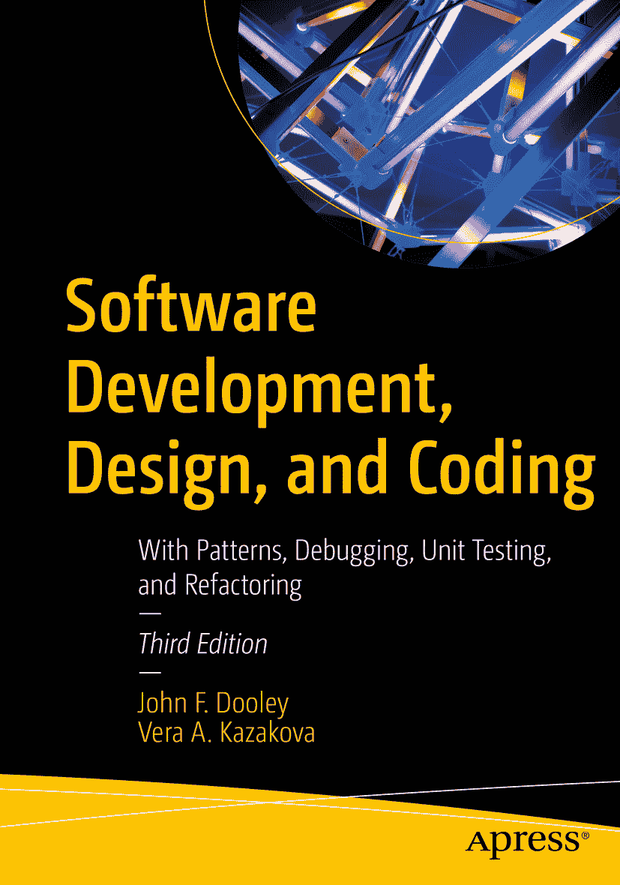

ISBN 979-8-8688-0284-3  
电子书 ISBN 979-8-8688-0285-0 [`doi.org/10.1007/979-8-8688-0285-0`](https://doi.org/10.1007/979-8-8688-0285-0)  
© John F. Dooley 与 Vera A. Kazakova 2011, 2017, 2024  
本作品受版权保护。所有权利均由出版商独家许可，涉及材料的全部或部分内容，具体包括翻译、重印、插图复用、朗诵、广播、微缩胶片或其他任何物理形式的复制、传输或信息存储与检索、电子改编、计算机软件，以及目前已知或未来开发的类似或不同方法。本出版物中使用通用描述性名称、注册商标、商标、服务标志等，即使未作明确声明，也不意味着这些名称不受相关保护性法律和法规的约束，因此可自由使用。出版商、作者和编辑假定，本书中的建议和信息在出版之日是真实准确的。出版商、作者或编辑均不对本书所含材料或可能存在的任何错误或遗漏提供明示或暗示的担保。出版商对已出版地图和机构归属中的管辖权主张保持中立。

本 Apress 印记由注册公司 APress Media, LLC（斯普林格自然集团成员）出版。

注册公司地址为：1 New York Plaza, New York, NY 10004, U.S.A.

*约翰：再次献给黛安。*

*维拉：献给我所有的学生。*

前言

这本书到底讲什么？简单来说，它从个人视角探讨如何开发软件。我们将审视从接手一个问题到最终编写出解决方案程序的完整过程。正因如此，本书重点聚焦于设计。你如何设计软件？需要考虑哪些因素？什么才是好的设计？有哪些方法和流程能帮助你设计软件？设计小型程序与设计大型程序有何不同？如何区分设计的好坏？有哪些通用模式能让你的设计更具可读性和可理解性？

本书也涉及代码构建。你如何编写程序并使其正常运行？“什么？”你可能会说，“我已经写过无数程序了！我当然知道怎么写代码！”在本书中，我们将探索你已有的实践，并研究改进方法。我们会花时间讨论编码标准、调试、单元测试、模块化以及优秀程序的特征。我们还会探讨阅读代码、程序可读性的构成要素，以及如何以改进为目的审查他人编写的代码。优秀、可读的代码能否替代文档？你究竟需要多少文档？

本书还涉及软件工程，它通常被定义为“将工程原理应用于软件开发”。什么是工程原理？首先，所有工程工作都遵循一个明确的流程，因此我们将讨论该流程包含哪些阶段，以及如何通过成为有效的促进者来最好地支持开发。我们会大量讨论敏捷方法论、它们如何适用于小型开发团队，以及它们的项目管理技术如何应用于中小型项目。所有工程工作都基于将科学和数学应用于现实问题。我们通常会通过设计和实现特定问题的解决方案来为理论讨论提供实践基础。

顺便提一句，至少还有一个人（除了本书作者之外）认为软件开发并非一门工程学科。我们指的是 Alistair Cockburn，你可以在[`http://alistair.cockburn.us/The+end+of+software+engineering+and+the+start+of+economic-cooperative+gaming`](http://alistair.cockburn.us/The+end+of+software+engineering+and+the+start+of+economic-cooperative+gaming)阅读他的论文《软件工程的终结与经济合作博弈的开始》。

最后，本书还涉及专业实践、作为软件开发者的道德与责任、社会问题、人际交往技能、隐私、如何编写安全稳健的代码等内容。简而言之，就是成为一名专业软件开发者所需的各种非技术性要素。

本书涵盖了 ACM/IEEE 计算机学会计算机科学本科学位课程指南（即 CS2023）¹中描述的许多主题。具体而言，它涵盖了指南中多个知识领域的主题，包括软件开发基础、软件工程、系统基础、并行与分布式计算、编程语言，以及社会问题与专业实践。本书既可作为大学三年级本科生软件设计与开发课程的教材，也可作为在职专业人士的手册。虽然章节顺序大致遵循标准的软件开发流程，但你可以独立且不按顺序阅读各章。我们假设你已经具备编程能力，并且至少熟悉 Java、C 或 C++中的一种语言。我们还假设你熟悉基本的数据结构，包括列表、队列、栈、映射和树，以及操作它们的算法。

在第三版中，若干章节已被重写，所有章节都进行了更新，包括新增内容和示例。本书讨论了现代软件开发流程与技术；值得注意的是，关于敏捷技术的论述已得到更新和扩展。第二版中许多关于计划驱动流程和项目管理的讨论已被删除或精简，取而代之的是关于敏捷方法论（包括 Scrum、精益软件开发和看板）的更详尽和全新的论述。新增了一章关于知识产权、所有权和义务的内容。最后，关于项目管理基础的章节得到了大幅扩展，新增了对“软意识开发”（Soft-Aware development）的介绍和讨论，这是一种基于以下理念的软件开发方法：学习制作软件不如*在尝试制作软件的过程中学习协作*更为关键。

我们曾在一门高级软件开发课程中使用本书，它源于我们为该课程编写的讲义。我们之所以编写自己的讲义，是因为我们找不到一本涵盖我们认为软件开发课程所必需的所有主题的书籍——不同于软件工程或仅仅编程的课程。软件工程书籍往往更侧重于流程和项目管理，而非设计和实际开发。我们希望聚焦于真实代码的设计与编写，而不是如何管理大型项目。本书代表了我们的观点：在中小型团队中成为一名软件开发者，并协助开发出卓越的软件需要具备哪些素质。

我们相信，在读完本书后，你将更清楚地理解优秀程序的设计是什么样的，什么造就了高效且富有成效的开发者，以及如何开发更大规模的软件。你将更深入地了解设计问题。你会思考如何在团队中协作，按照书面计划交付产品。你将开始理解项目管理，了解一些度量指标，知道如何评审工作产品，并理解配置管理。我们不会涵盖软件开发的所有内容——远非如此——而且我们只会对软件工程的管理方面进行粗略的探讨，但无论你是独立工作还是身处团队之中，你都将更有能力去构想、设计、实现和测试各种规模的软件。

致谢

我们要感谢 Apress 出版社的 Melissa Duffy 和 Shonmirin P. A. 促成了这一新版本的出版。我们的技术审校以及 Apress 出版社的所有员工都给予了极大的帮助和慷慨的支持。本书因他们的审阅、评论和编辑而变得更加出色。

同时，也要感谢多年来 CS 292 课程的所有学生，他们使用了本材料的多个连续版本，最初是作为课程笔记，后来成为成书；还要感谢我们诺克斯学院计算机科学系的同事 David Bunde 和 Jaime Spacco，他们一直倾听我们的想法。最后，感谢诺克斯学院给予我们时间和资源来完成本书的所有版本。

关于作者 关于技术审校 脚注 1

