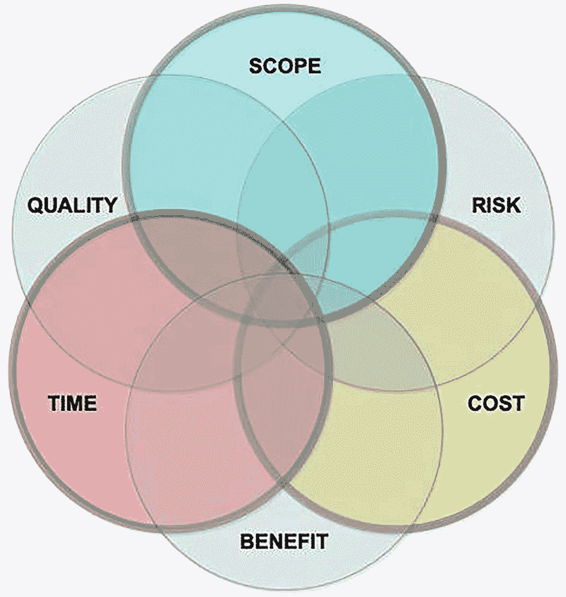
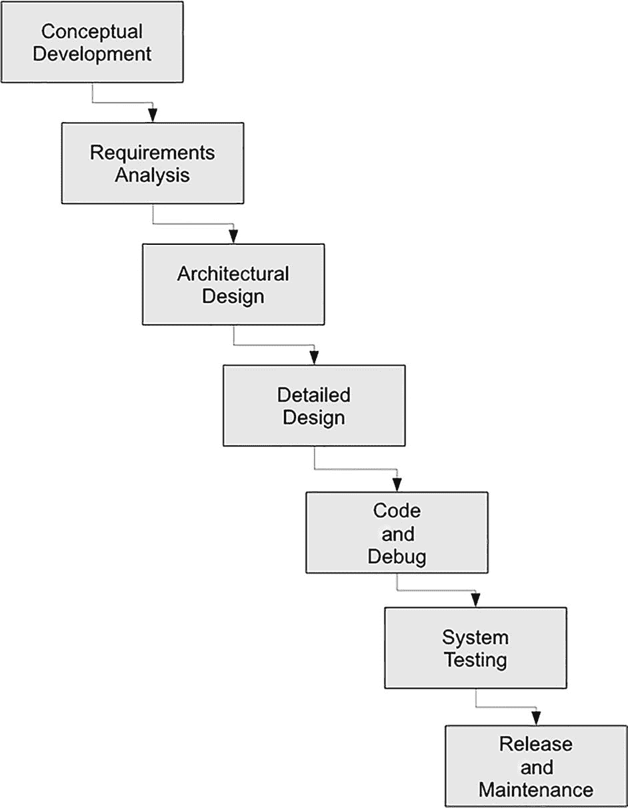
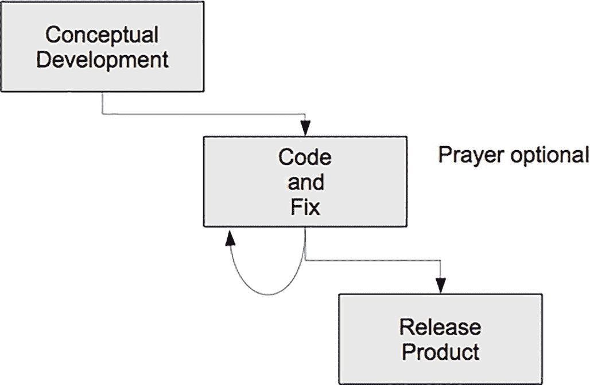
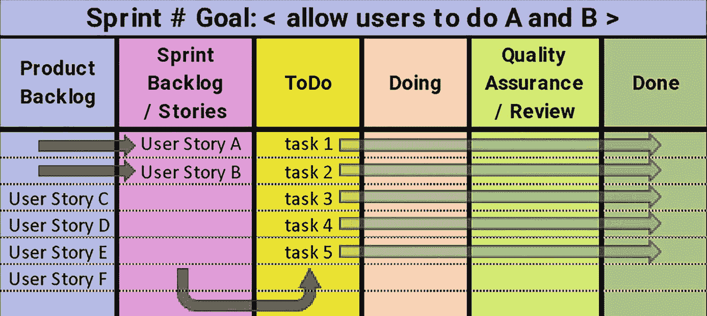
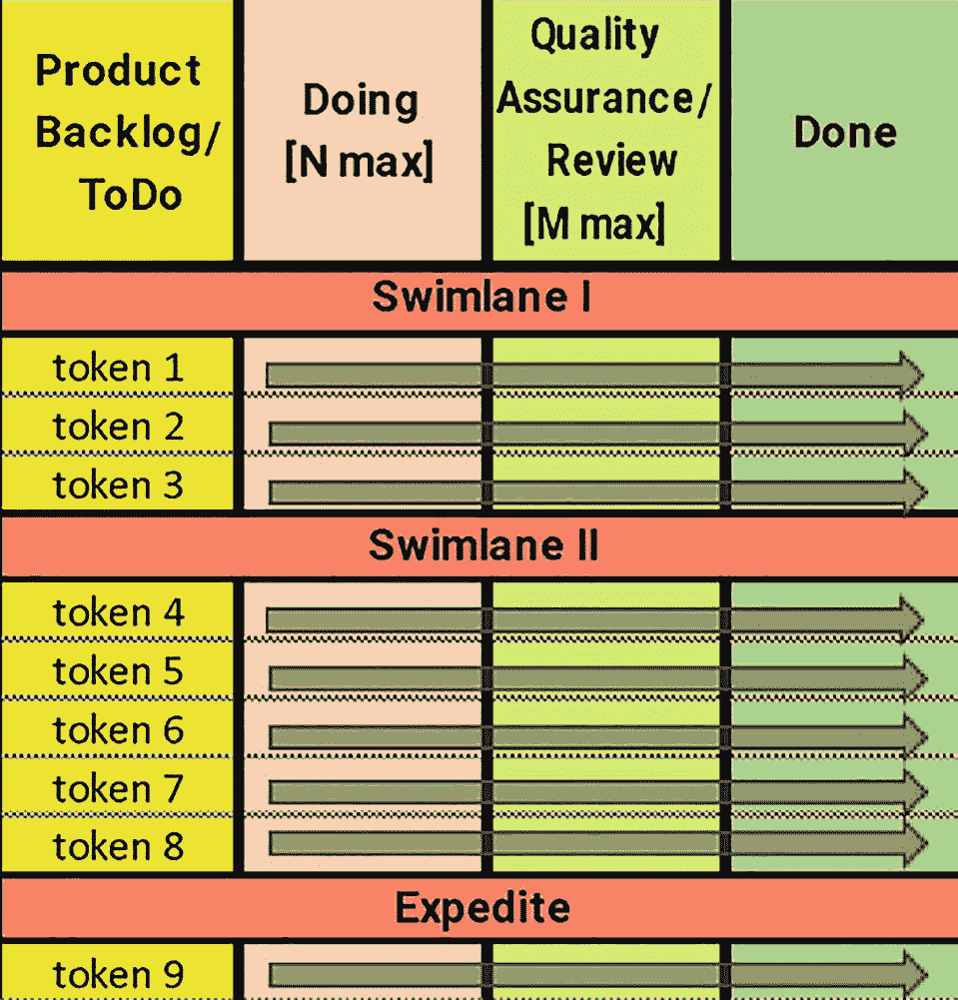

# 2. 软件过程模型

> *如果你不知道要去哪里，那么任何路都可以。*

> *如果你不知道自己在哪里，那么地图也没用。*
> 
> ——瓦茨·汉弗莱

软件开发的过程通常被描述为软件开发生命周期（SDLC）。每个程序，无论多小，都有一个生命周期，大致由以下步骤组成：

1.  构思
2.  需求收集/探索/建模
3.  设计
4.  编码与调试
5.  测试
6.  发布
7.  维护/软件演进
8.  退役

你的开发过程可能会合并多个步骤，或者在发布之间反复迭代部分步骤，但无论以何种形式，所有开发都应包含上述生命周期中的所有步骤，以创建高质量的软件。两种最常见的变体是*基于计划的模型*^(⁵)和较新的*敏捷开发*模型。^(⁶)

采用基于计划的开发时，项目团队通常会在回到 SDLC 开始下一个产品版本的工作之前，完成一个完整的生命周期（至少是步骤 2 到 7）。在计划驱动模型中，方法论在流程步骤和发布时间方面往往更为严格。计划驱动模型有更清晰定义的阶段，并且在进入下一阶段之前，对阶段完成的签核有更多要求。计划驱动模型在每个阶段需要更多的文档，并需要验证每个工作产品的完成情况。它们通常适用于具有明确定义交付成果的新软件的大型合同。

在目前更为普遍的敏捷开发中，项目团队通常会在进入发布步骤之前，多次迭代部分生命周期（通常是步骤 3 到 5）。敏捷模型本质上是增量式的，其运作假设是：小而频繁的发布比大而不频繁的发布能产生更健壮的产品。与计划驱动模型相比，敏捷模型中的阶段往往更加模糊，并且对工作产品文档的要求通常更少，其基本思想是：代码才是最终产出，因此开发者的精力应集中于此。请访问敏捷宣言网页 [`https://agilemanifesto.org`](https://agilemanifesto.org/)，以深入了解敏捷开发模型及其目标。

没有一种开发软件的最佳过程。每个项目都必须根据其特定应用来决定最有效的模型，并基于项目领域、项目范围、团队经验以及项目时间表来做出决定。在本章中，我们首先回顾软件开发项目的共享变量，然后讨论几种广泛定义的不同方法，最后我们将审视几个著名的具体软件模型实现，以及它们如何能够混合使用。

## 软件开发的 3(+3) 个变量

根据项目管理协会的说法，^(⁷) 软件开发的三个主要*变量*是成本、时间和范围。

*   *成本*（即资源）通常是最受约束的；作为开发者，你对成本的控制非常有限，无法通过花钱来获得质量或按时交付。成本会影响团队规模或开发过程中可用的工具类型。对于小型公司和初创企业，成本还会影响开发人员的工作环境。

*   *时间*是你的交付日程，通常由外部强加给你。例如，大多数消费产品（无论是硬件还是软件）的交付日期会在八月到十月之间，以便赶上假日购物季。你无法改变圣诞节。如果你延迟了，解决问题的唯一办法就是削减功能或降低质量，这两者都不理想。时间也是布鲁克斯法则（向一个延迟的项目增加程序员只会让它更延迟）适用的领域。

*   *范围*（即功能）是产品实际能做的事情。这应该是开发者始终关注的重点。从客户的角度来看，它是最重要的变量，也是作为开发者的你控制权最大的变量。控制范围能让你为管理者和客户提供对质量、时间和成本的控制。如果开发者无法控制每个版本的功能集，那么他们很可能会超出计划。这就是为什么开发者应该对软件工作产品进行估算。

成本、时间和范围共同构成了软件开发的*铁三角*，其中指定两个变量就定义了第三个变量。在现实世界中，客户通常会指定任务的时间框架和预算，这将成为你的约束条件，以便在更广泛的任务范围内估算出实际的范围。

有时，会加入第四个变量（通常作为三角形的中心）。

*   *质量*是指你愿意随产品一起发布的缺陷、简化或功能缩减的数量/严重程度。因此，质量可以用来描述范围内功能的非二元特性（例如，对用户查询的响应时间不应超过 n 毫秒，但越低越好）。严格来说，这不像成本、时间和范围那样是一个输入变量，而是衡量你输出质量的指标。你可以通过牺牲质量来在交付计划上获得短期收益，但代价是巨大的。修复下一个版本将花费更多时间，你的信誉也会大打折扣。更常见的情况是，产品有一个预期的最低质量标准，从而固定了这个“变量”。

在某些定义中，任务/产品的范围被认为是固定的，或者与质量相互交织，从而形成了一个由成本、时间和质量组成的铁三角。^(⁸)

最近，又定义了两个变量，作为新的六变量约束集的一部分：^(⁹)

*   *收益*是指交付给产品提供者和客户的价值。随着关于市场、客户需求或目标受众的新信息出现，收益可能会发生变化，从而需要对范围或其他变量进行调整。

*   *风险*是指无法满足其他标准预期值的可能性（例如，未能实现功能、增加开发时间或超出预期预算）。管理一种类型的风险可能会增加另一种类型的风险（例如，增加时间会降低范围的风险，但可能会增加成本）。为了最小化风险，开发者需要尽可能多地控制变量，始终牢记软件开发中唯一不变的就是变化。如果你密切关注并在变化发生时有效应对，就能将变化的风险和成本控制在可管理的范围内。

如图 2-1 所示，所有约束都需要平衡。改变其中一个将需要调整其他约束来补偿。

一张图表展示了多个相交的圆圈，呈圆形排列。这些圆圈分别标记为范围、风险、成本、收益、时间和质量。

图 2-1

软件开发的六个变量

多年来，人们还提出了许多其他对定义软件开发项目的变量的扩展。例如，“方形路线”将铁三角与交付阶段和交付后阶段的项目评估考量相结合。^(¹⁰) 组织和客户之外的其他约束也可能在软件产品的创建中发挥重要作用，包括社会、经济、立法、环境等因素。^(¹¹)

## 软件开发方法

在软件开发方面，有几种通用方法，可以在一个组织内甚至单个项目中单独或结合使用。下面我们讨论计划、通过精益方法论减少浪费，以及通过保持敏捷来适应变化。

### 基于计划的软件开发

基于计划的软件开发的主要特点是制定计划，然后贯彻执行。这看起来很简单……除非要制定一个可靠的计划，你需要掌握所有信息，并且这些信息不能改变。由于我们既非全知也非能预知未来，这就带来了一些问题。我们受制于不精确的语言，这些语言描述的是理解不充分的需求，而这些需求是为了解决不断变化的现实场景中的问题，由一群可预测地不可预测的人类组成的团队所设计的。

尽管如此，计划还是令人安心的。它让我们产生一种错觉，以为我们知道将要发生什么。如果我们遵循一个计划并得到了一个结果，我们希望将来遵循同样的计划能得到同样的结果。当然，控制所有变量（无论是项目内部还是外部的）是不可能的。计划还允许为整个计划层级制定子计划和估算。诚然，步骤越远，我们的估算就越不准确。计划还允许我们评估依赖关系并相应地安排任务。当然，任何变化都可能推倒我们精心设计、估算、排序、安排并部分开发的这座纸牌屋。

假设我们确实有一个计划：我们设计了步骤，并将按顺序逐一完成。对于一个由单一开发者（同时也是客户）负责的小项目来说，这很可能行得通。在更现实的场景中，客户不是我们自己，项目很复杂，我们必须与其他利益相关者协调。假设我们的基本计划包括设计阶段、实施阶段、测试阶段和交付。我们花了几个月时间拿出一个漂亮的设计展示给客户，但客户想要修改。我们又花了几周时间修改设计；客户批准了。我们制定了一个开发计划，并试图在接下来的几个月里实施我们的设计。在这段时间里，我们依赖的一些库被弃用了，一些开发者离开了，新成员加入了团队，市场发生了变化，导致客户要求修改设计，最终我们的开发计划和设计都过时了。一切重来……更糟糕的是，到目前为止，我们还没有为客户交付任何价值，他们开始对我们能否交付失去信心。总结一下，为小项目制定可靠的短期计划是可行的；其他情况都只是美好的愿望。

### 敏捷软件开发

自 20 世纪 90 年代中期起，一群流程专家开始倡导一种新的软件开发模式。这种新方法针对中型软件项目和较小的开发团队，旨在让团队能够快速适应不断变化的需求和客户要求，同时比计划驱动模型更快速、更频繁地发布可运行的软件。简而言之，这种新模式就是*敏捷*。^(¹²)

在大多数*敏捷*过程模型中，我们从“已知”需求（过程中某个早期时间点的需求快照）开始，并对其进行优先级排序，通常基于客户对哪些功能最重要、应优先交付的排序。请记住，我们自认为对这些需求的了解通常只是大致准确：自然语言是不精确的；理解的含义会因沟通者的背景、立场和其他情境而异；而且客户往往并不完全清楚他们需要什么来解决自己的问题。因此，我们在软件开发中最重要的挑战之一就是*通过迭代方式，逐步达成对问题和预期解决方案的准确共识*。根据汤姆·德马科的说法，迭代软件开发遵循一条基本规则：

> *你的项目，整个项目，有一个二进制的可交付成果。在计划的完成日，项目要么交付了一个被用户接受的系统，要么没有。那天每个人都知道结果。*

> *构建项目模型的目标是将项目分解为多个组成部分，每个部分都具有相同的特征：每个活动必须由一个具有* *客观完成标准的可交付成果来定义。这些可交付成果要么明确完成，要么未完成。*^(¹³)

更宽松地说，我们可以设计一系列迭代，其中每次迭代都是一个完整的、可运行且健壮的最小可行产品（MVP），尽管其功能少于最终目标产品。对于每次迭代，我们将选择一组优先级次高的需求（包括你或客户在上一次迭代中发现的一些需求），开发、测试并演示该 MVP，然后收集反馈。这些反馈可能会极大地改变我们的初始计划，这就是为什么我们的初始计划只是对未来开发迭代的一个粗略草图。

那么，如果你估算错误会发生什么？如果你决定在一次迭代中包含太多新功能呢？如果出现意外延迟呢？好吧，如果看起来你无法在迭代截止日期前完成，那么只有两种现实的选择：推迟截止日期或移除功能。我们稍后在讨论估算和进度安排时会回到这个问题。迭代开发的关键在于“过一种平衡的生活——每天学一点、想一点、画一点、唱一点、跳一点、玩一点、工作一点”，^(¹⁴) 或者用软件开发领域的话来说，每天*分析*一点、*设计*一点、*编码*一点、*测试*一点。我们将在本章后面讨论敏捷开发模型时再次探讨这个想法。

总的来说，敏捷由持续的短期实验组成，通过迭代评审来评估产品和实践，并找到适合团队和客户的流程。换句话说，就是一些老式的试错法。虽然某些失败是不可避免的，但在小增量上失败、尽早失败并从中快速学习，信息量更大且成本更低。因此，我们减轻了要求中间决策必须正确的压力，只要求这些决策有助于我们更多地了解实际需求。

敏捷开发基于这样一个命题：任何软件开发项目的目标都是可运行的代码。因此，开发团队应该将大部分时间花在编写代码上，而不是编写文档上。与上述由卡内基梅隆大学软件工程研究所（SEI）等组织倡导的重型计划驱动模型相反，这种新过程模型是*轻量级*的，需要的文档和过程控制更少。轻量级方法论倾向于强调在编写代码之前编写测试、频繁发布产品、客户深度参与开发、公共代码所有权以及重构（重写代码以使其更简单、更易于维护）。不幸的是，轻量级方法论也遭受着几种误解，其中两个最有害的是：轻量级流程只适用于非常小的项目，以及轻量级项目缺乏过程纪律。这两种说法都是错误的。事实是，轻量级方法论已成功应用于许多中小型项目（比如大约 50 万行代码以内），以及非常大的项目。大型项目几乎总是可以组织为一组较小的项目，这些项目共同为单个更大的产品提供服务。轻量级方法论也需要过程纪律，尤其是在项目开始时，当初始需求和迭代周期被创建时，以及在作为编码过程核心的测试驱动开发中。

在本章的剩余部分，我们将回顾多年来定义的敏捷价值观、原则和活动。但请注意，*敏捷性必然延伸到这些概念和实践最终如何被整合到开发中*（即，通过迭代来确定对于每个特定产品/组织/团队等，哪些有效，哪些无效）。

## 敏捷价值观、原则与活动

2001 年初，一群经验丰富且富有创新精神的开发者在美国犹他州斯诺伯德会面，共同探讨软件开发流程的现状。他们均对传统的计划驱动模型感到不满，并一直在尝试新的轻量级开发技术。这次会议催生了《敏捷宣言》。^(¹⁶) 该小组最初提出的描述包含两部分：价值观（宣言本身）和原则。

四项*敏捷价值观*表明，虽然作者们承认右侧条目的价值，但他们认为左侧条目对于成功的软件开发至关重要：

*   **个体与互动**高于流程与工具
*   **可工作的软件**高于详尽的文档
*   **客户合作**高于合同谈判
*   **响应变化**高于遵循计划

作者们定义了以下 12 条*敏捷原则*，以聚焦和指导开发工作：

*   我们的最高优先级是通过尽早并持续地交付有价值的软件来满足客户。
*   欢迎需求变更，即使是在开发后期。敏捷过程利用变更为客户创造竞争优势。
*   频繁地交付可工作的软件，交付的间隔可以从几周到几个月，倾向于更短的时间尺度。
*   业务人员和开发人员必须在项目期间每天一起工作。
*   围绕有动力的个体构建项目。给予他们所需的环境和支持，并信任他们能够完成工作。
*   向开发团队传递信息或在团队内部传递信息，最有效率且最有效果的方法是面对面的交谈。
*   可工作的软件是衡量进度的首要标准。
*   敏捷过程倡导可持续开发。赞助人、开发者和用户应该能够无限期地保持恒定的节奏。
*   持续关注技术卓越和良好设计能增强敏捷性。
*   简单性——最大化未完成工作的艺术——是至关重要的。
*   最好的架构、需求和设计出自自组织团队。
*   团队定期反思如何能变得更有效，然后相应地调整其行为。

以下四项主要的*敏捷活动*（尽管最初是作为敏捷变体“极限编程”的一部分定义的）适用于所有敏捷方法论：

**边编码边设计。** 在现实世界领域中，所有需求通常无法预先完全知晓或正确理解。在架构设计、详细设计和编码过程中，难免会出现错误和疏忽。此外，在产品开发过程中，需求和约束可能会发生变化，因为没有任何项目存在于真空中，能够脱离现实世界事件，例如开发团队人员更替、因市场变化导致的客户需求更新、新技术的发展等等。敏捷软件开发模型一次构建产品的一个部分，每个产品增量都使得几个关键事件能够更早、更频繁地发生：向客户交付价值、收集反馈以及适应变化。边编码边设计让开发者拥有更多自由来选择如何完成任务，在增强开发者自主权的同时，也增加了他们自我管理的责任。

**直接沟通最佳，** 尽管“直接”的含义近年来已发生巨大变化。我们认为“直接沟通”是实时发生的，能够直接接触到言语和非言语线索，这包括面对面讨论、视频会议，甚至先进的虚拟环境。在任何给定的软件开发项目中，存在两种知识：1) 客户拥有领域知识，并理解系统应该做什么；2) 开发者拥有关于目标平台、编程语言以及可能出现的实现问题的技术知识。客户不了解技术方面，开发者不具备领域知识，因此，双方的有效沟通是开发产品的关键活动。频繁的沟通意味着每个人都在从彼此的过程中学习，从而更快地建立起更全面的共同理解。

**代码是主要的可交付成果。** 计划驱动模型与敏捷模型之间的根本区别在于对代码的强调，因为代码是系统知识的所在。在计划驱动模型中，重点在于产出一套工作产品，这些产品共同代表项目的全部工作，而代码只是工作产品之一。在敏捷方法论中，重点明确地放在代码作为可交付成果上；此外，通过恰当地组织代码结构并保持注释更新，代码本身就成了项目的文档。

**测试驱动开发。** 所需功能的测试用例在开发之前编写，并且最初都应失败。一旦某个功能的所有测试都通过，该功能的实现即告完成。测试驱动开发对于管理变更至关重要，因为持续测试会告诉你，新功能何时完成并集成到系统中，且不会破坏任何已有的功能。

### 精益软件开发

精益软件开发源于准时制生产流程（也称为丰田生产系统等），该流程于 20 世纪 70 年代在日本引入，随后在 20 世纪 80 年代和 90 年代传播到世界各地，这得益于 1990 年出版的《改变世界的机器》^(¹⁷)（沃麦克等人著）的推动。准时制生产首先演变为精益制造，进而在整个 20 世纪 90 年代演变为精益产品管理系统。2003 年，波彭代克夫妇所著的《精益软件开发：敏捷工具包》^(¹⁸) 的出版，标志着“精益”思想进入了“敏捷”开发社区。

*精益*软件开发是一套旨在消除*浪费*以提高生产力、质量和客户满意度的原则。*浪费*是指任何不能为产品增加价值的东西。因此，*精益*强调团队应只关注那些能立即为产品增加价值的活动。

波彭代克夫妇¹⁴ 将始于丰田的*精益*原则转化为软件开发的七项关键原则：

*   消除浪费
*   内建质量
*   创造知识
*   延迟决策
*   快速交付
*   尊重他人
*   整体优化

我们将简要介绍每项原则，以说明它们如何应用于软件开发。

## 精益原则一：消除浪费

*精益*软件开发的主要目标是消除*浪费*，即任何不能为产品增值，或会增加其成本或时间的事物。在软件开发中，*浪费*的主要来源如下：

*   *未完成的工作*，因为它无法立即创造价值，并且可能在完成之前就已过时
*   *额外处理*，例如过多的文档/文书工作或不必要的会议
*   *多余的功能*，这些功能很少（甚至从未）被使用，却占用资源并使代码变得混乱
*   *任务/上下文切换*，这会因引入延迟并增加开发人员的认知负荷而降低效率
*   *等待*审批和依赖项会造成浪费性的瓶颈
*   *工件和信息*的*移动*，如果没有必要的规范来确保工件/数据的组织和标签清晰一致且可用，就会造成浪费
*   *缺陷*，随着检测时间距离缺陷产生的时间越远，修复成本会越来越高

在项目中减少各种浪费的一个通用方法是，持续反思团队的开发流程如何运作以及哪些方面可以改进（例如，“哪些是浪费的，我们如何改变它，以便下次减少浪费？”）。对工作流程进行小的迭代调整将导致整体开发*浪费*的减少。

## 精益原则二：内建质量

质量问题会导致各种软件开发浪费。发现和记录缺陷、修复缺陷以及重新测试都会导致我们想要消除的浪费。“内建质量”指的是将质量直接关注并融入到软件开发流程中。

有许多技术可以提高开发流程的质量。两种从源头提升代码质量的流行技术是*结对编程*（两名程序员遵循一组预定义的实践一起编码）和*测试驱动开发*（TDD）（以通过所有先前定义的测试用例为目标来编写软件）。两者都允许开发人员在代码集成到产品代码库之前快速编写、测试和修复代码，因为一旦集成，缺陷将更难发现和修复。一旦新功能完成就立即集成，可以让测试团队尽快获得产品的新版本进行测试，并缩短代码创建与测试之间的时间。另一种相对无痛但有些争议的提高代码质量的方法是：不要将发现的缺陷记录在缺陷跟踪系统中，而是*立即*修复它。一旦发现就修复。这既内建了质量，又同时消除了浪费。^(¹⁹) 另一种提高软件质量的技术是*持续反馈*。促进这种反馈的一种方法是让客户成为开发团队的一部分，允许对新迭代的产品进行直接重复评估，并为开发人员提供关于哪些是合适的、哪些需要更改的关键及时反馈。

## 精益原则三：创造知识

在处理需求、创建设计和实施代码的过程中，团队必然在学习新事物。你通过努力理解需求来学习。你通过从一个初始设计开始，并意识到随着需求被更好地理解，设计必须如何改变来学习。你会学到更多关于领域、客户、工具、依赖项等方面的知识。因此，你们正在共同创造体现在你们所编写和交付的代码中的知识。

为了确保所有这些知识真正被“创造”（意味着它能长期留存，并允许团队通过保留这些知识真正地“学习”），一些短期实践是必要的。例如，如果一位团队成员学到了关于项目需求或依赖项的关键信息，他们必须确保这些信息可供团队其他成员使用。这可以通过一致的代码文档、组织良好的维基页面、依赖管理工具、有针对性的培训等来实现。总的来说，这些实践可以减少工件和信息的移动、额外处理，甚至缺陷。重点在于确保任何新信息不仅仅解决遇到它的人眼前的短期问题，而是真正转化为帮助整个团队提升其理解、技能和产品的知识。

## 精益原则四：延迟承诺

这一精益原则实际上可以追溯到 20 世纪 70 年代初期以及自顶向下结构化设计的出现。延迟承诺意味着尽可能推迟决策（特别是不可逆转或影响重大的决策），并且只在绝对必要时才做出决策。

延迟承诺的一种方法是遵循灵活、分层和模块化的设计。在自顶向下的设计中，你可以从问题解决方案的通用表述开始，增加未来的灵活性，并将实现决策推迟到设计和代码需要变得更详细的时候。创建库和 API 可以让我们实现灵活的功能，而无需承诺其必须如何被调用，将这些决策留给每个功能的独立开发人员。这样，当你到达需要这些细节的层级时，通常可以获得更多信息，从而使代码能够更自然、更轻松地开发。

## 精益原则五：快速交付

我们越快向客户交付价值，就能越早获得关键的客户反馈来指导未来的开发。此外，最小化从需求产生到交付满足这些需求的产品之间的时间，需求以及市场发生变化的时间也就越少。

那么如何快速交付呢？*精益*地运用这些原则（双关语）。保持需求清晰简单。不要添加太多功能，也不要花时间预先规划未来的功能。不要过度设计解决方案。找到合理的方法、合理的数据结构集以及合理的算法来实现你的解决方案。记住，完美是优秀和快速的敌人。追求“满意”而非“优化”：如果它对当前需求是一个合适的解决方案，就继续前进。最后，快速交付的一个关键途径是拥有一个经验丰富、高度整合、善于合作、自我组织、相互尊重且具备适合你产品技能的团队。团队真的可以成就或毁灭一个产品。

## 精益原则六：尊重人

尊重人是建立有凝聚力、高效团队的关键。核心理念是，做工作的人应该做决策。流程和产品创建的决策不应自上而下强加，而应来自一线。从管理者的角度来看，尊重你的团队意味着授权团队做出自己的决策，包括关于任务时间估算与分解、流程、工具和设计的决策。这种授权意味着管理者必须学会倾听他们的团队，并考虑他们的想法和关切。这也意味着管理者必须充当团队的促进者和保护者，让他们能够完成工作。大家必须共同努力，创造一个每个人都能畅所欲言、分歧能以相互尊重的方式解决的环境。这将创建一个具有开放沟通和决策透明度的团队。更多内容将在下一章讨论。

## 精益原则七：优化整体

> *“精益组织会优化整个价值流，从收到满足客户需求的订单开始，直至软件部署并满足需求为止。如果一个组织只专注于优化价值流中的某个环节，那么几乎可以肯定，整个价值流都会受损。”*^(²⁰)

优化整体的核心理念是，在开发过程中始终着眼于整个产品图景。避免短视的方法之一是组建多元化、跨学科、沟通顺畅的团队，该团队应具备交付真正满足客户需求的产品所需的所有技能和产品创建职能。

## 软件开发模型的实现

> *“当我阅读这些内容时，我想大喊：给我画张地图！给我指条路！但所有作者所做的只是描述他们的足迹，谈论他们的鞋子，而这些鞋子总是最好的，是唯一真正的鞋子。”*^(²¹)

在实现任何软件开发模型时，关于通用方法的描述数不胜数，可能的调整方式不计其数，还有大量书籍和其他资源旨在指导你完成整个过程。因此，我们的目标并非提供详尽无遗或规定性的逐步实现细节。相反，在本节中，我们将回顾本章前面所提出理念的最著名实现。我们的目标是勾勒出每种方法的独特关注点，希望这不仅能帮助你区分它们，还能让你将它们混合使用，以更好地适应你的团队、项目、组织和客户需求。

### 瀑布模型：一种流水线方法

计划驱动流程模型中最传统、最早出现的是瀑布模型。如图 2-2 所示，该模型由温斯顿·罗伊斯于 1970 年创建^(²²)，涵盖了所有标准生命周期阶段。它依次经过需求收集与分析、架构设计、详细设计、编码、调试、集成与系统测试、发布和维护。它要求每个阶段都有详细的文档，以及评审、文档归档、每个流程阶段的签核、配置管理和整个项目的严密管理。

一个流程流程图，展示了从概念开发、需求分析、架构设计、详细设计、编码与调试、系统测试，到发布和维护的流程。

图 2-2

瀑布流程模型

它同样行不通（至少对于小型项目以外的项目来说是这样）。*瀑布*模型存在两个根本性的相关问题，阻碍了它的接受度，并使其难以实施。

**问题 1：** *瀑布*模型要求你在完成阶段 N 之后才能进入阶段 N+1。

**问题 2：** *瀑布*模型没有提供回溯到早期阶段进行调整的机制。

*瀑布*模型从根本上来说，就像一条用于开发软件的流水线。最初令人安心的瀑布阶段顺序推进要求所有步骤按顺序完成，并且由于无法返回并返工早期的开发阶段，每个阶段都必须完美完成。举个最简单的例子，这意味着你必须在开始架构设计之前精确确定*所有*需求，在开始单元测试之前完成编码和调试，以此类推。此外，每个阶段都必须有详尽的文档记录。理论上，这很棒。然而在实践中，这从未实现过。毫无疑问，在开始设计系统之前，拥有完整且被完美理解的需求集是理想的。可惜的是，我们从未见过一个项目从一开始就明确了所有需求，或者所有利益相关者都正确理解了这些需求，或者在具有动态现实需求和约束的实际项目开发过程中，重大事项没有发生改变。

因此，在一个阶段开始之前完成上一个阶段是有问题的，更不用说确保在前面的任何阶段中没有遗漏任何内容或需要更新了。你永远无法在你需要知道的时候，确切地知道你需要知道的一切。这就是为什么软件是一个*棘手的问题*。

尽管如此，*瀑布*模型仍然是一个出色的理论模型。它将生命周期的不同阶段隔离开来，迫使你在继续前进之前思考你真正需要知道什么。它也是一种开始思考大型项目的方法，将其分解为更小的阶段，并为管理者提供一个令人感到温暖而模糊的计划幻象。对于在定义明确的小型项目上工作的经验不足的团队来说，它也是一个合理的模型，因为它引导他们经历生命周期，并清晰地标明每个阶段发生了什么。大多数实施*瀑布*模型的组织都会对其进行修改，使其能够回溯一个或多个阶段，以便修复遗漏的需求或不合适的设计决策。这有所帮助，通常使瀑布模型变得可用，但回溯时更新所有相关文档的要求，即使这种版本也存在问题。

### 编码与修复“模型”：一种原型敏捷方法

边编码边修复并不是一个正式的模型，但这是我们在独自或与一个伙伴进行小型项目时大多数人所采用的方式。这种编码与修复“模型”，如图 2-3 所示，常常被用来替代实际的项目管理。在这种方法中，没有正式的需求，没有必需的文档，没有质量保证或正式测试，发布充其量也只是随意的。使用此模型时，甚至不要考虑工作量估算或进度安排。然而，当我们不需要与他人协调时，它又足够有吸引力且有用。

一个流程流程图，展示了从概念开发，到编码、修复和发布产品的流程。在编码和修复之间存在一个循环。

图 2-3

编码与修复流程模型

“*编码与修复*”只需要最少的时间来理解问题（通常是因为我们自己编造了问题/需求），然后直接跳入编码。编译你的代码并尝试运行。如果它不工作，修复你看到的第一个问题，然后再次尝试。继续这个“输入-编译-运行-修复”的循环，直到程序按照你的意愿运行且没有致命错误，然后发布它。我们都用过这种方法不止一次。

使用此模型创建的软件规模小，用户界面不够友好，且具有特殊性。由于没有真正提及配置管理，测试方面也做得很少，没有架构规划，可能对程序进行的代码审查也仅限于桌面检查，这种方法对于大多数软件开发来说可能非常危险。然而，它有一件事做得很好：由 1-2 人小团队开发的快速、一次性、无需维护的项目。换句话说，适用于快速而粗糙的概念验证，例如验证架构决策、快速展示用户界面设计版本，或理解你正在处理的某个更大的问题。如果这让你想起了敏捷的迷你版本，那你的想法没错。这种方法极其灵活，允许我们迭代地从向目标迈进的过程中获得洞察。因此，我们认为*编码与修复*是原型敏捷模型。

### 敏捷开发实践

> *最佳实践是迭代式增量交付，将每次迭代视为一个封闭的“迷你项目”，包含完整的需求、设计、编码、集成、测试和内部交付。在迭代截止日期，向内部利益相关者交付迄今为止（经过全面测试、全面集成）的系统。征求他们对这项工作的反馈，并将该反馈纳入下一次迭代的计划中。*
>
> *（摘自《敏捷项目如何成功》*^(²³)*）*

*敏捷*开发的核心在于适应性，根据项目范围、时间线、开发团队等因素的不同，其表现形式也多种多样。**教条式地应用** ***敏捷*** **开发会破坏** ***敏捷*** **本身的灵活性。** 因此，尽管多年来已经设计出许多具体的*敏捷*方法，但在理解和实施过程中保持灵活性至关重要。下文将讨论其中几种实践，重点介绍它们的核心价值以及旨在帮助开发者践行这些价值的配套术语。

所有敏捷流程都旨在为软件开发过程提供敏捷性，但实现敏捷性的方式可能大相径庭。在阅读每种敏捷实践时，请牢记以下关键区别，并将其余规范视为描述性而非规定性的指南，用以说明如何将每种方法付诸实践：

*   **极限编程** 通过优先采用特定的软件工程实践（特别是结对编程和持续集成）来提供敏捷性。
*   **水晶方法** 通过优先考虑人员及其互动来提供敏捷性，允许每个团队自行组织他们认为合适的方式。
*   **Scrum** 通过明确的短周期迭代（“冲刺”）来交付产品增量，从而提供敏捷性，但“短”的定义取决于项目范围。
*   **看板方法** 通过任务从“待办”到“完成”的持续流动来提供敏捷性，其中剩余任务可以随时更改和重新排序优先级。

#### 敏捷方法论 - 极限编程 (XP)

肯特·贝克和沃德·坎宁安大约在 1995 年创建了极限编程（XP），将其描述为一种“轻量级、高效、低风险、灵活、可预测、科学且有趣的软件开发方式”。^(²⁴) XP 侧重于高效的技术开发，特别是结对编程和持续集成。

XP 依赖于以下基本理念：

*   **重度客户参与**：XP 要求始终有一名客户代表在场，以定义产品每次迭代的内容，并为每个中间版本创建所有验收测试。
*   **短迭代周期与频繁发布**：XP 通常使用几周或几个月的发布周期，每个发布由若干次迭代组成，每次迭代持续 3-5 周。
*   **结对编程**：XP 要求所有代码由两名开发者共同编写，定期（大约每 30 分钟）交替担任“驾驶员”和“领航员”角色。“驾驶员”负责编码，而“领航员”则在一旁观察，提出建议，思考设计和测试等。虽然这种方式编写的代码量可能较少，但生成的代码缺陷更少，从而提高了生产力。
*   **持续单元测试**（也称为测试驱动开发或 TDD）：XP 要求开发者首先为任何新功能编写单元测试，然后以通过预定义测试的方式开发这些功能。

虽然所有敏捷方法都推崇直接沟通，但 XP 将这一理念扩展到了直接的编码沟通（既包括与结对伙伴的沟通，也包括与其余代码的沟通）以及直接的客户沟通。频繁发布需要持续集成和构建产品。每当一个编程结对完成一个功能或任务，并且该功能或任务通过了所有单元测试，他们就会立即集成并构建整个产品。然后，他们使用所有单元测试作为回归测试套件，以确保新功能没有破坏任何已检入的代码。如果确实破坏了某些东西，他们会立即修复。因此，在 XP 项目中，集成和构建一天可能发生多次。这个过程让团队每天都能很好地了解自己在发布周期中的位置，并为客户提供一个可以运行验收测试的已完成构建。拥有现场客户代表使得 XP 团队能够立即获得对新功能的反馈，并及早发现设计和需求问题。

实施 XP 可能因团队和项目而异，但应涉及以下某些形式的实践：

*   **计划游戏**：结合业务优先级和技术评估来确定下一个发布的范围。客户和开发团队需要决定下一个发布中将包含哪些故事/功能、每个故事的优先级以及发布时间。开发者负责将这些故事分解为任务，并估算每个任务的持续时间。持续时间的总和将决定哪些任务能在交付日期前完成。如果数字对不上，必要时会将一些故事移出发布。
*   **小型发布**：快速将一个简单的系统投入生产，然后在非常短的周期内发布新版本（1-2 个月，持续时间和规模取决于从业务角度看是否合理）。发布的范围和持续时间越大，估算就越困难。
*   **隐喻**：“一个关于整个系统如何运作的简单共享故事”，它取代了你的架构。隐喻必须是对系统的一致解释，并可分解为称为*故事*的更小片段。*故事*应始终使用隐喻的词汇来表达，并且隐喻的语言应为客户和开发者所共同理解。

*   ***简单设计***：每天尽可能保持设计简洁。经常重新设计以维持简洁。根据贝克的理念，一个简单的设计应当：(1) 通过所有单元测试，(2) 没有重复代码，(3) 在代码中清晰表达每个用户故事的含义，(4) 使用最少数量的类和方法的合理组合来实现当前用户故事。^(²⁵)

*   ***测试***：程序员持续编写单元测试。所有测试必须在集成前通过。贝克坚持一条硬性规定：“任何没有自动化测试的程序功能，本质上都不存在。”²¹ 虽然这条原则适用于大多数验收测试，并且理应适用于所有单元测试，但在某些情况下，例如测试图形用户界面（GUI）时，这种类比会失效。不过，如果你的测试框架能够处理 GUI 交互所产生的事件，那么即使是这种情况也可以实现自动化测试。除此之外，拥有一套完善的书面操作说明通常也能满足需求。

*   ***结对编程***：在极限编程（XP）项目中，所有生产代码必须由两名程序员在同一台机器上编写。任何单独编写的代码都将被丢弃。这种做法通过将整个系统的知识传播给整个团队，从而强化了集体所有权。它避免了“啤酒车问题”——即当掌握所有关键信息的成员遭遇意外（比如被啤酒车撞到）时，会导致项目进度倒退数月。

*   ***集体所有权***：团队拥有整个项目及其所有代码，共同承担设计、编写、修改和测试所有功能的责任。这支持了“无我编程”，促进了高效的团队协作。

*   ***持续集成***：每完成一个任务就进行集成和构建，可能一天进行多次（只要所有测试都能通过）。这有助于通过将问题范围缩小到最新代码及其与现有代码库的交互，从而快速检测和隔离缺陷与错误。

*   ***重构***：在不改变代码外部行为的前提下，对代码的非功能性方面进行小幅改进，以使代码更清晰、更少冗余、更易读、更高效且更易于维护。*简单设计*原则要求你在发现需要时承担起进行重构的责任，而*集体所有权*则允许你重构他人编写的代码。

*   ***每周 40 小时工作制***：保持规律的每周 40 小时工作。绝不要连续两周加班。极限编程的理念与汤姆·德马科在《人件》中的许多论点高度一致。加班会导致人们工作效率降低，不得不在工作日处理私人事务，因疲劳而犯更多错误，对队友感到压力和烦躁等。拥有放松和恢复精力的时间，能让开发者在工作日内专注于工作，从而提高团队的整体生产力。

*   ***现场客户***：客户是团队的一部分，在现场工作，编写并执行功能测试，并帮助澄清需求。客户能够对系统变更提供即时反馈，这也增强了团队每天构建正确系统的信心。

*   ***编码规范***：由于代码集体所有权和持续重构，团队必须遵循合理的编码规范，以改善代码库内外的沟通。这些规范应使代码更易于阅读和维护，但不应限制创造力。

#### 敏捷框架 - Crystal：根据团队/项目需求灵活定制

Crystal 是一种敏捷方法，最初由 Alistair Cockburn 在 20 世纪 90 年代初于 IBM 工作期间提出。^(²⁶) 他注意到项目之间的差异很大，没有一套固定的项目步骤能适用于所有项目。因此，Crystal 围绕“人”而非流程或工具来组织。这意味着它关注人际互动，以及个人技能、才能和需求——这些因素在不同团队之间，以及同一团队内部随时间推移都会发生变化。

由于我们不专注于特定的流程，Crystal 没有正式的结构。相反，Crystal 开发信奉以下理念：

*   ***所有项目都是独特的***。需要为每个项目确定工具和流程，并在发生变化时进行调整。
*   ***团队可以自我优化***。工具和流程需要既适合项目，也适合团队，因此团队本身应共同确定最适合他们的工作流程，并在开发过程中根据需要进行调整。

为了支持这些特性，Crystal 开发围绕以下 7 项原则组织：

*   ***频繁交付***：频繁（该词是相对概念，取决于项目整体范围）进行测试和发布新版本。
*   ***反思性改进***：团队定期反思并改进实践和工具。
*   ***渗透式沟通***：对于小团队是渗透式沟通，对于大团队则是封闭式沟通。
*   ***个人安全感***：创造一个让成员能够安全表达意见、建议和需求的环境。
*   ***专注***：团队成员需要对整体蓝图和各自的任务有共同的理解。
*   ***便捷接触专家用户***：能够按需接触专家，以解决疑问、顾虑或理解上的空白。
*   ***具备自动化测试、配置管理和频繁集成的技术环境***：当围绕人进行组织时，开发灵活性很大，因此频繁集成每个人的工作、通过自动化测试确保各部分独立及协同工作顺畅、并使用版本控制进行备份和部分发布，这些都至关重要。

你可以看到，Crystal 非常灵活，因此可以根据每个团队和项目的需求进行调整。对于较短的项目，Crystal 简化的组织框架和必需的流程可能是有益的，因为它允许团队专注于如何完成所需工作。这里的主要注意事项是，如果团队较新、规模较大或为远程团队，自我组织可能会变得棘手。

#### 敏捷框架 - Scrum：迈向下一短期目标的迭代冲刺

Scrum 的名称源于橄榄球运动，其中 *scrum*（争球）是一种在犯规后重新开始比赛的方式：橄榄球队中的 8 名前锋（在英式橄榄球联盟的 15 人制比赛中）试图（重新）获得对球的控制权，并将其向前推进至对方球门线。敏捷 Scrum 方法论的理念是，一个小团队围绕一个共同目标团结起来，通过一系列开发冲刺（sprints）逐步向该目标迈进。

Scrum 的原始流程管理理念源于 Takeuchi 和 Nonaka 于 1986 年发表的论文《新新产品开发游戏》^(²⁷)，而“Scrum”一词的首次使用则归功于 DeGrace 和 Stahl 于 1990 年出版的著作《棘手问题，正当解决方案》^(²⁸)。

与其他*敏捷*方法论一样，Scrum 强调小团队、直接沟通、迭代开发、从频繁反馈中学习以及集体所有制的有效性。Scrum 的独特之处在于其对团队管理的关注，以及其明确的时间盒式开发周期结构，称为*冲刺*。每个*冲刺*都有预定的持续时间（通常为 1-4 周），并有一个固定不变的交付日期。需要交付的工作范围必须根据此交付日期进行选择，同时确保在每个冲刺中都能向客户交付下一个最小可行产品（MVP）。每个*冲刺*的目标是提供一个原型，展示你对客户需求的最新理解以及交付解决方案的计划。展示这个原型（无论多么简陋）可以让你开始讨论哪些理解是正确的，哪些需要调整。确保这种情况尽早发生，可以限制在进一步开发之前为进行必要调整而需要返工的工作量。因此，*冲刺*“旨在创造条件，以便更早地做出更好的决策。”^(²⁹)

##### Scrum 角色

Scrum 在开发项目中明确定义了三个角色：

*产品负责人*是生成产品需求并确定其优先级的人。这些需求通常以*用户故事*的形式呈现，这些是可以概括为“作为<某类用户>，我们希望<做某事>，以便<创造某种价值>”等句子的功能特性。产品负责人将用户故事添加到产品待办列表（Product Backlog）中并确定其优先级。产品负责人还负责确保团队理解用户故事背后的需求。

*Scrum Master* 是 Scrum 专家，通过指导团队遵循 Scrum 价值观和实践（例如每日站会）来促进开发，帮助团队自我组织（例如，通过提高透明度），帮助解决内部和外部的障碍，并在冲刺期间保护团队免受外部影响。Scrum Master 绝不是团队领导/经理，因为 Scrum 团队是平等的团队，通过共识达成决策。

*开发团队*包括所有其他成员：设计师、开发人员、文档工程师等。团队审查由产品负责人生成并确定优先级的用户故事，将每个最高优先级的用户故事转化为一个或多个任务，这些任务建议了如何开发必要的功能以交付价值。团队选择一组可以在给定冲刺周期内完成的故事和任务，通过共同决定谁将负责哪些任务以及他们将采用何种开发流程来进行自我组织。无论任务分配如何，团队集体拥有所有代码和项目，共同目标是在每个冲刺结束时交付下一个可运行的 MVP。

##### Scrum 工件

Scrum 的需求被封装在两个待办列表中：

*   *产品待办列表*是项目所有需求的优先级列表。产品负责人根据期望的*产品目标*，创建由用户故事组成的产品待办列表并确定其优先级。开发团队将高优先级的用户故事分解为任务并进行估算。这个任务列表就成为了*冲刺待办列表*。

*   *冲刺待办列表*是当前冲刺的用户故事优先级列表。冲刺开始后，只有开发团队可以向冲刺待办列表添加任务；这些通常是测试过程中发现的缺陷。任何外部实体都不能向冲刺待办列表添加条目，只能添加到产品待办列表。冲刺待办列表的核心是*冲刺目标*：团队遵循的指路明灯；冲刺期间的任何变更都应保护此目标。

*   *增量*是对产品目标的贡献，意味着达到了*完成的定义*，这是由组织（或团队，如果未另行定义）决定的正式质量衡量标准。在单个冲刺期间，可能有多个待办项达到“完成”状态。

##### Scrum 看板

在大多数 Scrum 团队中，冲刺待办列表是*可视化的*，为每个人提供关于冲刺工作进展状态的清晰共享视图。它通过使用便利贴或索引卡在看板上呈现，每张便签或卡片代表一个任务；它也可以是在线虚拟看板（例如 Trello、Jira、Notion 或 Pivotal Tracker）。这个*任务看板*，如图 2-4 所示，通常至少包含三列：*待办*、*进行中*和*已完成*，但更常见的是还包括*产品待办列表*、*冲刺待办列表*以及用于测试的列，如*质量保证/评审*。在冲刺开始时，开发团队从*产品待办列表*中选择一些最高优先级的条目，并将它们移动到*冲刺待办列表*。然后这些条目被分解为任务，成为冲刺的*待办*项。这些任务将在看板上移动，直到完全开发、测试并集成到代码库后，到达*已完成*列。

一个标题为“冲刺目标”的表格，包含产品待办列表、冲刺待办列表、待办、进行中、质量保证和已完成等列。用户故事 A 和 B 从产品待办列表移动到冲刺待办列表的过程在开始时被标示出来。任务 1 到 5 在冲刺期间移动。

图 2-4

一个通用的单冲刺 Scrum 看板。深色箭头表示冲刺规划期间条目的移动；浅色箭头表示冲刺期间条目的移动

##### Scrum 价值观

为了促进敏捷自组织团队所需的团队合作，Scrum 依赖于个体践行以下价值观：^(³⁰)

*   对共同目标和彼此做出承诺

*   专注于冲刺目标和冲刺待办列表

*   对工作和挑战（包括人际方面）保持开放态度

*   尊重彼此作为独立的个体，以及作为能够为共同目标做出贡献的成员

*   有勇气处理困难任务，进行艰难的对话，并通常“做正确的事”

##### Scrum 仪式

Scrum 团队会举行几种会议，帮助团队进行自我组织。

*Sprint 计划会议*：这是一个初始规划阶段，负责创建初始需求的产品列表，决定实现需求的架构，将用户故事按优先级分组到各个 Sprint 中，并将第一批用户故事分解为待估算和分配的任务。当估算占满 Sprint 允许的所有时间时，他们便停止规划。Sprint 中的任务不应超过一天的工作量，理想情况下应能一次性完成（以避免任务切换）。如果某个任务预计需要超过一天的工作量，则应将其连续拆分为两个或更多任务，直到每个任务的工作量都合适为止。这条规则源于一个观察：人类不擅长对大型任务进行精确估算，以周或月为单位估算任务工作量基本上只是猜测。因此，将任务分解成更小的部分，能让团队对每个任务做出更可靠的估算。

*每日站会*是一个短会（15-30 分钟；越短越好），整个团队在此讨论 Sprint 的进展。每日 Scrum 会议让团队能够分享信息并跟踪 Sprint 进度。通过举行每日 Scrum 会议，任何进度延误或实施中的问题都会立即显现，并可由团队当场解决。“Scrum Master 确保每个人都在取得进展，记录会议中做出的决定并跟踪行动项，并保持 Scrum 会议简短且聚焦。”^(³¹) 在每日站会期间，每位团队成员依次回答以下三个问题：

> *自上次会议以来，你推动了哪些开发进展？*

> *从现在到下次会议之间，你计划如何进一步推动开发？*

> *有什么阻碍你前进吗？*

请注意，这些问题的措辞可以稍作调整，但其核心意图必须保留。除回答这三个问题之外的讨论，将推迟到其他会议进行。每日站会对于帮助每个人跟踪朝着共同 Sprint 目标的进展、促进协作以及提高责任感和参与度至关重要。

*Sprint 评审*在每个 Sprint 结束时举行，向产品负责人展示新开发的 MVP（通常以演示形式），产品负责人可对其进行验收测试。该会议“评审”了本 Sprint 中为达成 Sprint 目标而“完成”的所有事项，以及哪些事项被遗漏及其原因。

*Sprint 回顾会议*在 Sprint 评审之后举行，旨在“回顾”团队的合作方式：他们的流程、沟通、协作机制、会议期望等，寻找可以在下一个 Sprint 中改进绩效的领域。回顾会议是改进的关键工具，因为它负责团队工作本身的敏捷迭代改进。回顾会议标志着当前 Sprint 的正式结束。

*待办事项梳理*或*故事时间*会议在整个 Sprint 期间定期举行（例如每周一次），以梳理待办事项列表中的条目，确保它们为未来的 Sprint 规划做好准备。产品负责人通过添加和（重新）排列故事优先级来参与，开发人员则通过将高优先级的故事分解为任务来参与。

虽然 Sprint 通常在预定义的 Sprint 周期结束时结束，但如果 Sprint 计划的所有工作都已提前完成，也可以提前终止。虽然可以添加新工作，但通常最合适的做法是完成所有 Sprint 结束和 Sprint 规划的流程，以便恰当地评审已完成的工作，回顾工作方式，并规划下一步的开发步骤。

##### Scrum 速度

对于大多数团队而言，随着项目进展，任务的估算会变得更好，这主要是因为团队现在掌握了之前 Sprint 中估算表现的数据。单个 Sprint 中完成的工作量度量称为*速度*。随着时间的推移，这能让团队决定每个 Sprint 应包含多少任务。通过有意义的回顾会议以及由此带来的团队流程和实践的迭代改进，随着团队在分解和分配任务、为每个任务所需工作创建准确估算以及相互协作方面变得更加熟练，速度应会随着时间的推移而提高。

##### Scrum 项目结束

在最后一个计划好的开发 Sprint 之后，可能会执行一个最终 Sprint 来为项目收尾。此 Sprint 不实现新功能，而是为产品发布准备最终可交付成果。它修复所有剩余的错误，完成文档，并通常对代码进行产品化。产品待办事项列表中剩余的任何需求都将转移到下一个版本。在下一个 Sprint 开始之前，会举行一次 Scrum 回顾会议，以反思上一个 Sprint，并查看是否有任何流程改进可以实施。

#### 敏捷框架 - 看板：有限流量的持续流动

看板方法是一种源自精益制造（丰田生产系统）和其他变革管理系统的实践；它的大部分原始思想来自准时制制造流程。看板更像是一种方法论而非流程；它是一个目标以及一套实现该目标的原则和实践。

##### 看板

为了帮助组织开发工作，看板采用了以下概念：

*   *在制品（WIP）* 是指团队当前正在处理的任务总数，包括任务可能处于的所有状态（进行中、已完成、测试中、审核中等）。

*   *流程* 是指任务在完成过程中从一个状态转移到另一个状态的过程。

*   *前置时间*：团队将任务从最初的“待办”状态推进到“完成”状态所需的时间（以小时或天计）。随着时间的推移，随着团队完成越来越多的任务，可以计算出团队的平均前置时间，从而预估任何单个任务需要多长时间才能完成，这可以作为衡量生产力的一种指标。

看板的独特之处在于工作的持续流动。它没有限时冲刺，因此也没有包含团队接下来要关注的任务子集的较小冲刺待办列表。所有剩余的待办事项都位于一个单一的待办列表中。为了帮助团队组织工作，看板使用了*泳道*：用于对任务进行分段的水平分隔线。泳道可以表示任何有用的分类，包括任务优先级、任务类型、不同的项目/产品，甚至不同的团队。

当所有剩余任务都位于待办列表中时，限制在制品数量是让团队专注于流程的方式。开发人员可以使用*看板*（Scrum *任务板*的一种变体）来异步跟踪在制品和流程。图 2-5 展示了一个通用的任务/看板。这些看板可以是占据团队公共空间一面墙的实体白板，也可以是共享的数字看板。团队会在这个看板上添加实体或数字的便利贴来标识任务，然后可以将这些任务在看板的列与列之间（即状态与状态之间）移动。

一个表格包含 4 列，分别标记为产品待办列表或待办、进行中、质量保证或审核、以及完成。产品待办列表包含从令牌 1 到令牌 9 的 9 个令牌。这些令牌分组在泳道 1、泳道 2 和加急之下。

图 2-5

一个通用的任务/看板，包含 WIP 上限和泳道，箭头表示流程

使用这种看板，用户可以选择更改列的数量和标题，以使看板适应他们的流程。看板通过使用*拉动系统*来运作：看板不是将项目推送到其他阶段，而是告诉开发人员在有能力处理时从上一阶段拉取项目。每完成一个任务，团队就会拥有一个添加了新功能的可运行软件。

然后，团队可以指定允许同时处理的最大任务数量（即“进行中”和“质量保证/审核”），这被称为在制品或 WIP，用于控制工作流经团队的过程。WIP 没有硬性规定，但应考虑：1）团队人数，以及 2）每个人应同时处理多少任务。一般建议是每人 1 到 2 个任务。例如，假设看板上的每个状态都已达到上限（开发中有 N 个任务，审核/测试中有 M 个任务），并且一名开发人员完成了一个新任务的开发。在审核中的某个任务完成之前，这个任务无法移动到“审核”状态。我们刚刚暴露了工作流程中的一个瓶颈。在看板中，该开发人员会介入帮助审核该状态下的某个任务。在下游为已完成的任务腾出空间之前，不能将任何新任务拉入“开发”状态。

在看板中，目标是在任何时候允许的最大任务数量的约束下，最大化在制品。它不像 Scrum 那样有时间盒限制；目标是在尽可能快地推动任务（拥有最短的*前置时间*）的同时，通过达到允许的最大任务数量来最大化生产力。

你可以注意到，当我们说*最大化* *WIP*时，我们并不是要给团队更多的工作。事实上，保持每个状态的任务数量尽可能少的目标是为了减少团队的工作量，让他们专注于更少的任务（我们希望避免多任务处理）。其理念是，这将减少压力和昂贵的任务切换，同时提高工作质量*和*吞吐量。你会注意到这里缺少了一些东西，特别是事情如何进入待办列表，以及“完成”意味着什么。这是因为看板实际上并不是一种项目管理技术。为了使用看板，你需要已经具备一些流程，并且需要对其进行管理。

## 用于多层级关注点和范围的混合软件开发方法

多种软件开发理念，甚至多种实现方式，可以在同一个组织、团队或项目中有效地共存。你可能需要选择几种方法，以便在不同的时间和关注层级上帮助你组织工作。考虑到整个公司需要组织起来，一个项目需要组织起来，开发工作也需要组织起来。

> *“虽然所有敏捷流程都有共同点，但它们的最佳应用点针对特定的组织层级：为不同的受众提供不同的‘视图’。精益在应用于关注战略、组织和股东价值的人（高管）时表现出色。Scrum 在应用于关注团队组织、管理和项目交付的人（项目管理）时表现出色。极限编程在应用于关注开发交付和战术的人（开发人员）时表现出色。”*^(³²)

最值得注意的是，这不是*精益*与*敏捷*的对立，而是至关重要的*精益*与*敏捷*的结合，其中*精益*侧重于通过减少浪费来改进流程，而*敏捷*侧重于通过在整个项目中有效地适应新信息来改进产品。两者对于软件开发都至关重要。此外，*敏捷*并不意味着没有*计划*，因为对未来考虑不足可能导致早期决策错误；更好的视角是借鉴*精益*的延迟承诺，以确保早期决策不会消除未来可能有用的选项。以下是这些理念的实现方式可以相互配合的几种方式：

*   精益可以自然地与 Scrum 结合，因为敏捷允许早期反馈，减少需要返工的工作量，并且团队成员之间清晰共享的理解可以减少动作浪费、缺陷、未充分利用人才、过度生产和等待。

*   由于 XP 主要关注编程，开发工作可以轻松受益于 Scrum 中定义的团队管理。

*   在编码单个功能时，开发人员自然会采用小型瀑布模型，制定计划并遵循计划来开发和测试每个新功能。

*   在首次公开发布之前的开发阶段，使用 Scrum 可能最有成效，而提供持续服务和快速变化的项目则可能通过看板更好地体现，从而允许采用持续的方法。

*   Scrum 非常适合那些离散增量有意义且致力于首次发布的项目，而看板则自然适用于持续运营，例如提供持续服务；Scrumban^(³³) 是一种融合方法，允许在开发新功能的同时提供持续服务。

从本章描述的方法论可以看出，迭代和协作是关键。构建复杂软件最有效的方式是逐步收集见解，在每一步中学习要制作什么以及如何做得更好。你必须认识到，你从一开始就从未掌握所有知识，而设计、编写、测试和交付渐进式改进的代码，是通往创建卓越软件最可靠、最有效的途径。

