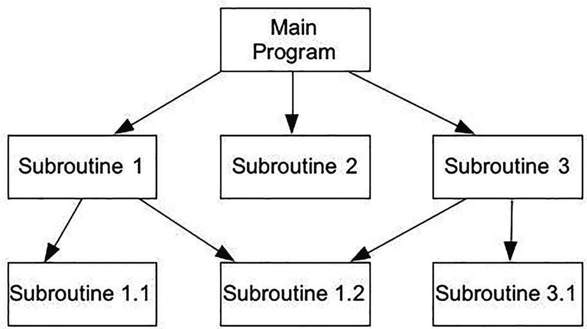
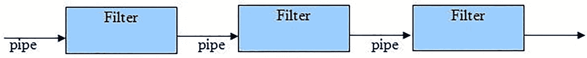
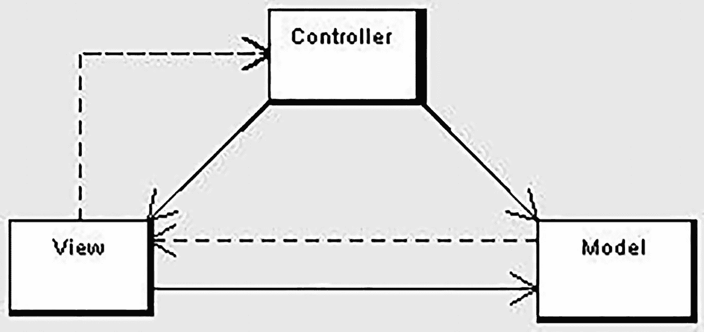
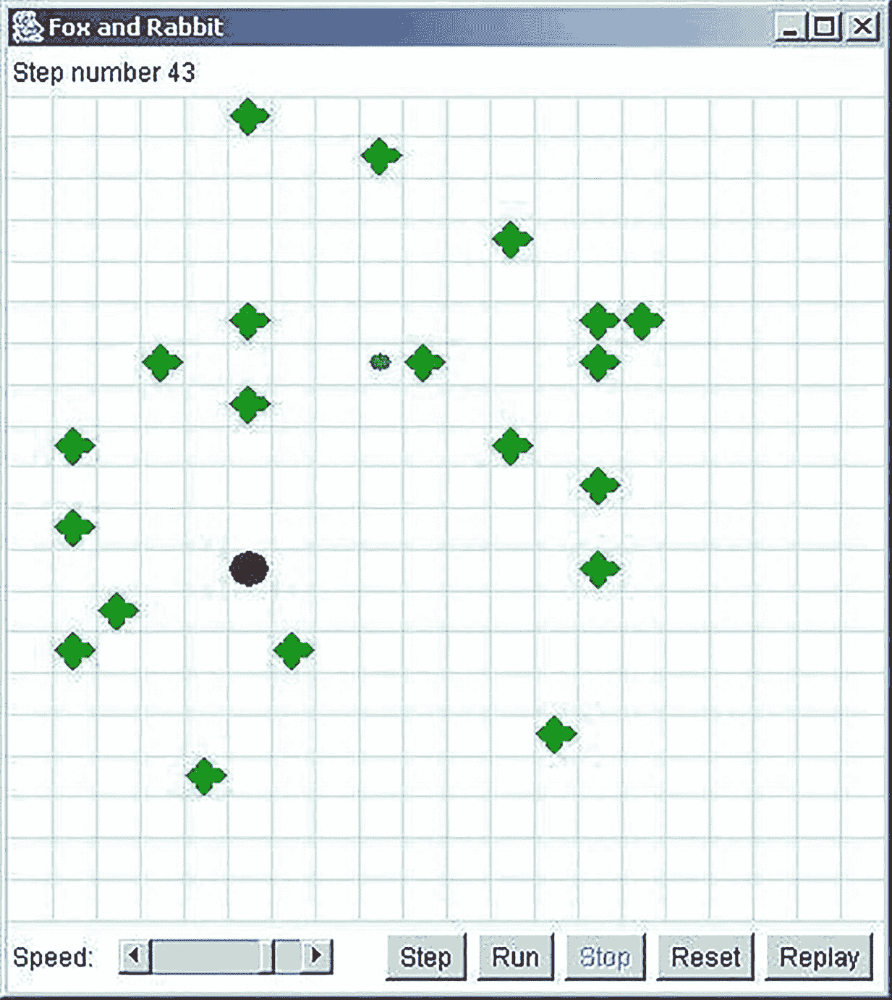
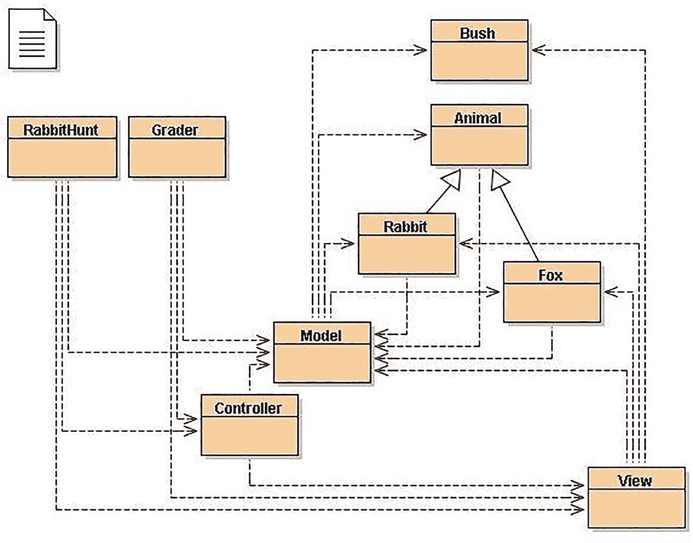
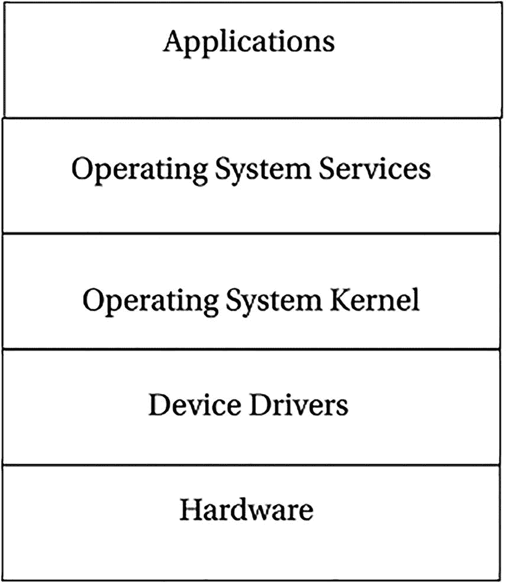
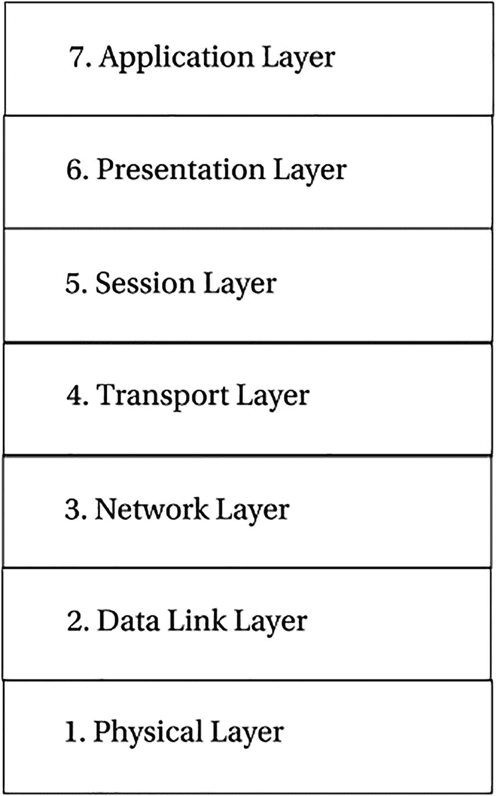

# 7. 软件架构

> *我们所说的软件架构是什么意思？对我来说，架构这个词传达的是系统的核心元素的概念，即那些难以改变的部分。它是其余部分必须赖以建立的基础。*
> 
> ——马丁·福勒^(¹⁴¹)

一旦你对你将要构建*什么*有了想法，就可以开始思考你将要*如何*构建它了。当然，你可能从第一个需求开始就一直在思考这个问题，但现在你终于可以真正有意义地深入设计阶段了。

软件设计实际上有两个层次。我们在编写程序时通常操作的层次称为*详细设计*。我们需要哪些操作？需要哪些数据结构？我们使用什么算法？数据库将如何组织？用户界面看起来如何？调用序列是什么？这些都是非常详细的问题，需要在真正开始编码的详细工作之前得到解答（嗯，差不多是这样——我们稍后会谈到这一点）。

第二个层次是*架构设计*。你的软件需要哪些主要组件？这些组件将如何交互？系统将如何与其环境交互？在这里，你是在设计整个系统的结构，暂时将每个组件的内部细节视为黑盒。正如福勒在本章开篇引言中所描述的，你需要先打好基础，才能构建结构的其余部分。*软件架构*是一套理念，它告诉你哪种基础适合你的程序。

软件架构的概念是为了应对程序规模和复杂性的日益增长而出现的。正如加兰和肖在他们关于软件架构的开创性文档中所说：“随着软件系统规模和复杂性的增加，设计问题超越了计算中的算法和数据结构：设计和规定整个系统结构成为了一种新的问题……这就是软件架构层面的设计。”^(¹⁴²) 然而，是否所有具有一定规模和复杂性的程序都确实拥有一个架构呢？是的，尽管对于较大的程序，你需要更有意识地去思考架构。你必须确保在你的设计中融入了正确的架构模式集，以便为你的系统打下坚实的基础。这里的错误代价高昂，因为架构特性对程序结构如此基础，以至于一旦程序编写完成，在架构层面进行更改就会变得困难得多。

每当软件架构师开始思考一个程序的架构时，他们通常从画图开始。架构图能让人们比通过文本更明确地看到程序的结构和框架。软件架构通常被表示为黑盒*图*，其中图节点是*计算结构*，图边是结构之间的*通信管道*。管道可以表示数据流、对象消息传递或过程调用。这类表示法多种多样，并且有几种标准表示法，其中最流行的是统一建模语言（UML）。

特定的架构风格是一种可以表示一组相似结构的模式。软件架构有许多不同的风格，在任何给定的项目中，你可能会使用不止一种风格。正如你将看到的，不同领域的不同类型的程序将引导我们采用不同的架构风格或*架构模式*。让我们看看几种常见的架构模式（它们与你在下一章中会看到的*设计模式*有许多共同特征）。

## 架构模式：主程序-子程序

最传统、最古老的架构模式是*主程序-子程序模式*。虽然它源自尼克劳斯·维尔特 1971 年的论文《通过逐步细化进行程序开发》^(¹⁴³)，但维尔特只是第一个正式定义了这种自然导向*主程序-子程序模式*的自顶向下问题分解方法论。

其核心思想是：从一个大型问题入手，尝试将其分解为若干个较小的、半独立的问题或原问题的片段。例如，几乎所有适合通过自顶向下分解来解决的问题，都可以立即划分为三个部分：输入处理、解决方案计算和输出处理。一旦将问题分解为多个片段，就选取其中一个片段继续分解，同时将其他所有片段暂时搁置，这类似于深度优先搜索。最终，你会得到一个解决方案显而易见的极小问题；此时便是编写代码的时机。因此，我们是从上到下分解问题，再从下到上编写解决方案代码，尽管存在许多变体。

图 7-1 给出了*主程序-子程序模式*如何工作的示例。我们将在第 9 章更详细地讨论自顶向下问题分解。

一个树状图描绘了主程序分支为子程序 1、子程序 2 和子程序 3。子程序 1 分支为子程序 1.1 和子程序 1.2。子程序 3 分支为子程序 1.2 和子程序 3.1。

图 7-1

主程序-子程序模式示例

维尔特的论文就通过逐步细化进行编程得出了以下四个结论：

1.  *程序构建由一系列细化步骤组成。在每一步中，一个给定的任务被分解为若干个子任务。任务描述的每一次细化都可能伴随着数据描述的细化，数据构成了子任务之间通信的手段……*

2.  *以这种方式获得的模块化程度，将决定程序适应目的变更或扩展的难易程度……*

3.  *在逐步细化的过程中，应尽可能长时间地使用对当前问题而言自然的表示法……每一次细化都意味着基于一组设计标准做出的一系列设计决策……*

4.  *即使是一个简短程序的开发，其详细阐述也会形成一个长篇故事，这表明仔细编程并非易事。*

## 架构模式：管道-过滤器

在管道-过滤器风格的架构中，计算组件被称为*过滤器*，它们充当转换器，接收输入，根据一个或多个算法进行转换，然后将结果输出到通信管道。输入和输出管道被称为*管道*。

典型的管道-过滤器架构是线性的，如图 7-2 中的示例所示。

一个流程图描绘了管道-过滤器架构模式。它展示了一组标有“管道”的向右箭头，依次穿过三个相邻的标记为“过滤器”的方块。

图 7-2

管道-过滤器架构模式示例

过滤器必须是独立的组件。这正是管道-过滤器架构的魅力之一：以不同顺序连接独立的过滤器会产生不同的结果。管道-过滤器架构风格的经典示例是 Unix shell，其中有大量的小程序，它们通常只做一件事，并且可以通过 Unix 管道机制链接在一起。乔恩·本特利的著作《编程珠玑》^(¹⁴⁴)中的一个例子展示了管道-过滤器的工作原理：

*问题*：给定一个英语单词词典，找出词典中所有的变位词。即，找出所有互为字母排列的单词。例如，“pots”、“stop”和“spot”互为变位词。

那么，我们知道什么？所有变位词都有相同的字母，并且每个单词的字母数量相同。这为我们寻找变位词的方法提供了线索：如果我们对每个单词的字母进行排序，最终会得到一个字符串，其中包含该单词所有字母并按字母顺序排列。我们称之为创建单词的*签名*。让我们分解解决方案：

1.  通过对列表中的每个单词的字母进行排序，为每个单词创建一个签名；将签名和单词作为一对保存。

2.  根据签名对生成的签名-单词对列表进行排序；现在所有变位词应该会聚集在一起，因为它们的签名是相同的。

3.  每当签名发生变化时，开始一个新的分组，将所有的变位词组（移除签名）分别输出到不同的行。

这个例子具备标准管道-过滤器架构的所有特征：对其输入数据执行转换的独立计算组件，以及将数据从一个组件的输出传输到下一个组件输入的通信管道。该解决方案的管道-过滤器模式在 Unix 术语中可以更清晰地表示：

**sign** <`dictionary.txt |` **sort** `|` **squash** `>anagrams.txt`

其中，`sign`是我们用来执行步骤 1 的过滤器，输入文件为`dictionary.txt`。然后`sign`输出一个签名及其关联单词的列表，该列表通过管道传递给 Unix 的`sort`工具（我们无需编写这个工具），它会按每行的第一个字段（默认行为）对列表进行排序，而第一个字段恰好是每个单词的签名。然后它将排序后的列表输出到下一个管道。接着，`squash`从传入的管道中获取排序后的列表，并通过将所有具有相同签名的单词放在同一行来压缩它，同时移除签名。这个最终的列表通过最后一个管道（这次是 Unix I/O 重定向）发送到名为`anagrams.txt`的输出文件。

请注意，并非所有应用程序都应使用管道-过滤器架构。例如，它不太适用于交互式应用程序或响应事件或中断的应用程序。因此，让我们看看更多的架构风格。

## 架构模式：面向对象的模型-视图-控制器（MVC）

面向对象的分析、设计与编程在 20 世纪 80 年代初兴起（实际上，其起源可追溯至 60 年代，但当时无人关注），随之带来了许多架构与设计模式。此处我们将重点介绍一种面向对象的架构模式，其余内容留待设计模式章节讨论。

*模型-视图-控制器*（MVC）架构模式是一种将应用程序（甚至仅应用程序界面的某一部分）拆分为三个部分的方法：模型、视图和控制器。MVC 最初是为了将许多程序传统的输入、处理和输出角色映射到图形用户界面领域而开发的：

输入 ➤ 处理 ➤ 输出

控制器 ➤ 模型 ➤ 视图

用户输入、外部世界的建模以及向用户提供的视觉反馈被分离，并由模型、视图和控制器*对象*分别处理，如图 7-3 所示。

一个框图展示了标记为视图、模型和控制器三个模块之间的交互。控制器与模型之间存在单向交互。

图 7-3
模型-视图-控制器架构

*   **控制器**解释来自用户的鼠标和键盘输入，并将这些用户操作映射为发送给模型和/或视图的命令，以实现相应的更改。控制器负责处理输入。

*   **模型**管理一个或多个数据元素，响应关于其状态的查询，并响应改变状态的指令。模型知道应用程序应该做什么，是架构的主要计算结构；它*建模*了你试图解决的问题。模型掌握规则。

*   **视图**或**视口**管理显示区域的一个矩形区域，负责通过图形和文本的组合向用户呈现数据。视图对程序实际在做什么一无所知；它所做的只是接收来自控制器的指令和来自模型的数据并进行显示。它会向模型和控制器反馈状态信息。视图负责处理输出。

MVC 程序的典型流程如下：

*   **用户**与用户界面交互（例如，用户按下按钮），控制器处理来自用户界面的输入事件，通常通过注册的处理程序或回调函数进行。用户界面由视图显示，但由控制器控制。奇怪的是，控制器并不直接知道视图是一个对象；它只是在需要更新屏幕上的某些内容时发送消息。

*   **控制器**访问模型，可能以适合用户操作的方式更新模型（例如，控制器使模型更新用户的购物车）。这通常会导致模型的状态及其数据发生变化。

*   **视图**利用模型生成适当的用户界面（例如，视图生成一个列出购物车内容的屏幕）。视图从模型获取自身的数据。模型不直接知道视图的存在。它只是响应任何人对数据的请求以及控制器对数据转换的请求。

*   **控制器**作为用户界面管理器，等待进一步的用户交互，从而开始新一轮循环。

这里的主要思想是关注点分离——以及代码分离。目标是分离程序的工作方式、程序显示的内容以及程序获取输入数据的方式。这是经典的面向对象编程：你创建对象，这些对象隐藏其数据以及操作数据的方式，然后仅向外界提供一个简单的接口来与其他对象交互。你将在第 11 章再次看到这一点。

### 面向对象架构：

### 一个 MVC 示例——我们来狩猎吧！

一个使用 MVC 架构模式的经典程序示例是 David Matuszek 博士在 2004 年 ACM SIGCSE 技术研讨会上提出的“绝妙作业”。^(¹⁴⁵)

#### 问题

该程序是一个基本的模拟程序，模拟狐狸在网格环境中试图找到兔子，而兔子则试图逃脱。环境中存在兔子可以躲藏的灌木丛，并且移动有一些限制。

图 7-4 是该游戏运行时的典型画面。

一张截图展示了狐狸与兔子狩猎实例的界面。它显示了一组随机分布的图案和一个靠右的圆形图形。底部提供了速度、单步、运行、重置和重播按钮。顶部文字显示步数 43。

图 7-4
一个典型的狐狸与兔子狩猎实例

狐狸是大的红点，兔子是小的棕点，灌木丛是粗的绿色十字。

该编程作业的目标是让兔子变得更聪明，以便能够逃脱狐狸的追捕。然而，我们的重点完全在于程序是如何组织的。图 7-5 使用来自 BlueJ IDE 的对象图展示了程序的组织结构。程序的关键部分是三个对象类（Bush、Fox、Rabbit），以及模型、视图和控制器组件。

一个框图展示了标记为 RabbitHunt、Grader、Controller、View、Model、Rabbit、Fox、Animal 和 Bush 的模块之间的交互。

图 7-5
狐狸与兔子狩猎的类结构

#### MVC 模型

模型代表了游戏的规则。它负责所有计算，所有决定轮到谁、每回合发生什么以及是否有人获胜的工作。模型严格来说是内部的，并且与程序的其他部分几乎无关。

该程序的模型部分实际上由五个类组成：`Model`（“主”模型类）、`Animal`、`Rabbit`、`Fox`和`Bush`。（`Rabbit`和`Fox`是`Animal`的子类，如图 7-5 图中的实线箭头所示）。这是程序中你需要真正理解的部分。

`RabbitHunt`类仅创建模型、视图和控制器对象，并将控制权交给控制器对象。控制器对象启动模型对象，然后等待用户按下按钮。当按钮被按下时，一条消息被发送给模型对象，由模型对象决定做什么。

模型对象：

*   将狐狸、兔子和灌木丛放置在场地中；
*   给兔子和狐狸各一次移动机会（一个移动，然后另一个移动；它们不会同时移动）；
*   告诉视图显示这两次移动的结果；以及
*   确定哪只动物获胜。

#### MVC 视图

视图显示正在发生的事情。它在屏幕上呈现图像，以便用户看到正在发生什么。视图是完全被动的；它不会以任何方式影响狩猎过程，它只是一个新闻记者，向你提供模型内部正在发生的事情的（部分）画面。

#### MVC 控制器

控制器是程序中负责显示控件（窗口底部的五个按钮和速度控制）的部分。它告诉模型何时启动、何时停止，但对模型内部的工作原理一无所知。

将程序拆分为这些独立的部分有许多好处。我们可以安全地重写控制器对象中的图形用户界面（GUI）或视图对象中的显示部分，而无需修改模型。我们可以让狐狸和/或兔子变得更聪明（或更笨！），而无需修改 GUI 或显示部分。我们可以几乎不费吹灰之力地将 GUI 复用于其他应用程序。这样的好处不胜枚举。

简而言之，MVC 是你的朋友；请明智且频繁地使用它。

## 架构模式：客户端-服务器

回到更传统的架构，我们再次追溯历史。在过去，所有程序都运行在大型主机上，整个程序都在一台机器上运行。如果你足够幸运，能使用分时操作系统，那么多人可以同时使用同一个程序——尽管通常是不同的副本。随后，个人电脑和网络出现了，有人灵机一动，将工作分摊给大型主机和你那小小的台式机。于是，*客户端-服务器架构*诞生了。

在客户端-服务器架构中，你的程序被拆分为两个不同的部分，通常运行在两台不同的计算机上。*服务器*承担大部分繁重的工作和计算；它通过高带宽网络为其*客户端*提供服务。另一方面，客户端主要负责处理用户输入、显示输出以及与服务器通信。简而言之，客户端程序向服务器程序发送服务请求。服务器程序随后评估请求，执行必要的计算（包括在需要时访问数据库），并响应客户端的请求，给出答案。

如今，客户端-服务器架构最常见的例子就是万维网。在网络模型中，你的浏览器就是客户端。它为你呈现用户界面，与网络服务器通信，并将生成的网页渲染到你的屏幕上。网络服务器则负责多项事务。它提供 HTML 格式的网页，同时也可以充当数据库服务器、文件服务器和计算服务器（想想当你访问亚马逊网站进行购物时，它所做的所有事情）。

不过，客户端和服务器并不一定非要运行在不同的计算机上。使用客户端-服务器架构编写的程序，其两端可以驻留在同一台计算机上，两个例子是*打印假脱机程序*和*X Window 图形系统*。

在打印假脱机程序应用中，你正在运行的程序（例如，文字处理器、电子表格程序或网络浏览器）作为客户端运行，向作为计算机操作系统一部分实现的打印服务发出请求。这项服务通常被称为打印假脱机程序，因为它会维护一个打印作业队列，并控制哪些作业被打印以及打印顺序。因此，在你的文字处理器中，你从菜单中选择*打印*，设置某些属性，选择一台打印机，然后在某个对话框中点击*确定*。这会向系统上的打印假脱机程序发送一个打印请求。打印假脱机程序将你的文件添加到其管理的打印作业队列中，然后联系打印机驱动程序，并发出打印请求。这里的区别在于，一旦你点击了确定按钮，你的客户端程序（文字处理器）通常就不再与打印假脱机程序有任何联系，打印*服务*会无人值守地运行。

X Window 系统（参见 [`www.x.org/wiki/`](http://www.x.org/wiki/)）是一个图形窗口系统，可用于所有基于 Unix 和 Linux 的系统，也可作为附加窗口系统用于 Apple Macintosh 和 Microsoft Windows 系统。X 系统采用客户端-服务器架构，其中客户端程序和服务器通常都驻留在同一台计算机上。X 系统服务器接收来自客户端程序的请求，针对当前系统所连接的硬件进行处理，并提供输出服务，将结果数据以位图形式显示出来。客户端程序的例子包括 *xterm*（一个提供 Unix 命令行界面的窗口终端程序）、*xclock*（你猜对了——一个时钟）和 *xdm*（X Window 显示管理器）。X 系统支持分层和重叠窗口，并提供配置菜单、滚动条、打开和关闭按钮、背景和前景颜色以及图形的能力。X 系统还可以管理鼠标和键盘。如今，X 系统的主要用途是作为构建更复杂的窗口管理器、图形环境、图形控件以及像 GNOME 和 KDE 这样的桌面管理窗口系统的跳板。

## 架构模式：分层方法

分层架构方法建议，程序可以像地质层一样，按一系列层次进行结构化，各层之间具有定义明确的接口序列。这样做的效果是将每一层与其上下层隔离开来，使得我们能够更改任何一层的内部实现，而无需改动程序中的其他层。当然，前提是你的更改不涉及对接口的任何修改。在分层方法中，除非绝对必要，否则不应更改接口。分层方法在编程中的两个经典例子是操作系统和通信协议。

操作系统的架构有多个目标，其中包括集中控制有限的硬件资源，以及保护用户免受彼此干扰。操作系统的分层架构方法同时实现了这两点。请查看图 7-6 中操作系统的标准架构图。

分层架构图展示了从上到下排列的应用程序层、操作系统服务层、操作系统内核层、设备驱动层和硬件层。

图 7-6

操作系统分层架构示例

在这个分层模型中，用户应用程序通过系统调用接口请求操作系统服务。这通常是应用程序访问计算机硬件的唯一途径。大多数操作系统服务必须通过内核发出请求，而所有硬件请求都必须经过直接与硬件设备通信的设备驱动程序。这些层中的每一层都有定义明确的接口，因此，例如，开发人员可以为新磁盘驱动器添加新的设备驱动程序，而无需更改操作系统的任何其他部分。这就是信息隐藏的一个例子。

通信协议中也存在相同类型的接口。最著名的分层协议是国际标准化组织（ISO）的开放系统互连（OSI）七层模型，如图 7-7 所示。

该图展示了从下到上排列的物理层、数据链路层、网络层、传输层、会话层、表示层和应用层。

图 7-7

ISO-OSI 分层架构

在这个模型中，每一层都包含逻辑上相似且被组合在一起的功能或服务。每一层之间都定义了接口，并且层与层之间的通信仅允许通过接口进行。特定的实现不必包含所有七层，有时会将两个或多个层合并以形成更小的协议栈。OSI 模型既定义了七层方法，也定义了所有接口协议。该模型可以从 [`www.itu.int/rec/T-REC-X.200/en`](http://www.itu.int/rec/T-REC-X.200/en) 下载为 PDF 文件。（ITU，即国际电信联盟，是 ISO 的新名称。）

表 7-1 展示了在各层实现的协议示例。

表 7-1

使用 ISO-OSI 架构的分层协议示例

| 层 | 协议 |
| --- | --- |
| 7. 应用层 | http, ftp, telnet |
| 6. 表示层 | MIME, SSL |
| 5. 会话层 | Sockets |
| 4. 传输层 | TCP, UDP |
| 3. 网络层 | IP, IPsec |
| 2. 数据链路层 | PPP, Ethernet, SLIP, 802.11 |
| 1. 物理层 |   |

## 结论

软件架构是应用程序的核心。它是你构建程序其余部分的基础，并驱动着你的其余设计。软件架构有许多不同的风格，在任何给定的项目中，你可能会使用不止一种风格。程序所使用的架构风格取决于你所做的事情。这正是这些风格的美妙之处；形式服从功能可能并不总是成立，但对于软件而言，设计服从架构。这些基础性的架构模式引导你走上设计之路，塑造你的程序将如何构建和运行。

