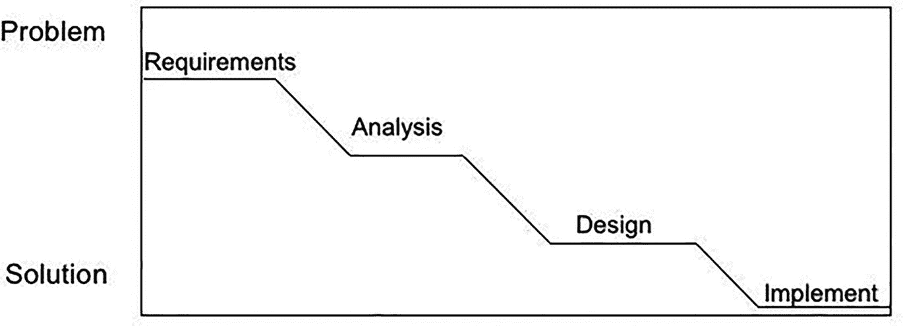
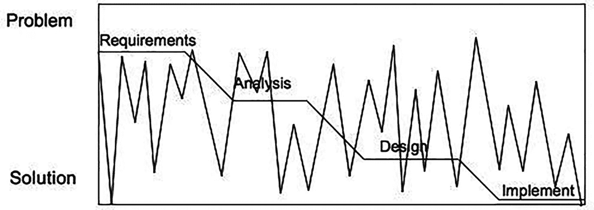

# 8. 设计原则

> *构建软件设计有两种方式。一种是使其简单到明显没有缺陷。另一种是使其复杂到没有明显缺陷。*
> 
> — C. A. R. 霍尔

看待软件问题的一种方式是使用一个将问题分为两个不同层次的模型：

*   “棘手”问题属于上层。这些问题通常来自计算机科学之外的领域（例如，生物学、商业、气象学、社会学、政治学等）。这类问题往往是开放式的、定义不清的，并且从需要大量工作的意义上来说是庞大的。例如，几乎任何类型的网络商务应用都是一个棘手问题。Horst W. J. Rittel 和 Melvin M. Webber 在 1973 年一篇关于社会政策的论文中^(¹⁴⁶)，给出了用于识别棘手问题的定义和一组特征，我们将在本章后面讨论这些内容。

*   “温顺”问题属于下层。这些问题往往跨越其他问题领域；它们通常定义更明确且规模较小。排序和搜索是温顺问题的绝佳例子。然而，小规模和定义明确并不意味着“容易”。温顺问题可能非常复杂且难以解决。只是它们被明确定义，并且你知道何时有了解决方案。这类问题为计算机科学家提供了数据结构和算法方面的基础，用于解决来自其他问题领域的棘手问题。

你可能会问，这与设计原则有什么关系？嗯，认识到你将遇到的大多数大型软件问题都内在地具有一定程度的“棘手性”，这会影响你思考设计问题的方式，影响你处理大型、定义不清问题的解决方案设计的方法，并让你对设计过程有一些深入的了解。在本章中，我们将进一步讨论棘手问题和温顺问题，为什么你可以问心无愧地放弃瀑布模型，优秀设计的特征是什么，以及你可以应用哪些统一的启发式方法来帮助你解决复杂的设计问题。

## 棘手问题

根据里特尔和韦伯的定义，*棘手问题*是指那些只有在问题解决后才能完全了解其需求的问题，或者其需求和解决方案会随时间演变的问题。事实证明，这描述了软件开发中大多数“有趣”的问题。杰夫·康克林修订了里特尔和韦伯对棘手问题的描述^(¹⁴⁷)，并提供了更简洁的棘手问题特征列表^(¹⁴⁸)。转述如下：

1.  *在解决方案创建之前，棘手问题无法被理解。* 另一种说法是，问题的定义和解决是同时进行的。^(¹⁴⁹)

2.  *棘手问题没有停止规则*；也就是说，你可以为问题创建增量解决方案，但没有任何东西能告诉你已经找到了正确且最终的解决方案。

3.  *棘手问题的解决方案没有对错之分*；它们只有好坏之分，或者足够好与不够好之分。

4.  *每个棘手问题本质上都是新颖且独特的。* 由于问题的“棘手性”，即使下周遇到类似的问题，你基本上也必须从头开始，因为需求会有足够大的差异，解决方案仍然难以捉摸。

5.  *每个棘手问题的解决方案都是一次性操作。* 参见上一条。

6.  *棘手问题没有现成的备选解决方案。* 也就是说，没有一个小而有限的解决方案集可供选择。

棘手问题无处不在。例如，创建一个文字处理程序就是一个棘手问题。你可能认为你知道文字处理器需要做什么：插入文本、剪切粘贴、处理段落、打印。但这个功能列表只是某个人的列表。一旦你“完成”了文字处理器并发布它，你就会被新的功能请求淹没：拼写检查、脚注、多栏、支持不同字体、颜色、样式，等等。文字处理程序基本上永远不会完成——至少在你发布最后一个版本并终止产品生命周期之前是这样。

棘手问题还包括那些你一开始并不真正知道是否能解决的问题。专家系统需要一个用户界面、一个推理引擎、一组规则和一个领域信息数据库。对于特定领域，一开始完全无法确定你是否能创建出推理引擎用来得出结论和建议的规则。因此，你必须迭代不同的规则集，发布下一个版本，然后观察其表现如何。然后你再次重复，添加和修改规则。在你完成之前，你并不真正知道解决方案是否令人满意（即使只是暂时的）。这正是一个棘手问题。

康克林、里特尔和韦伯指出，当面对一个庞大而复杂的问题（即棘手问题）时，传统认知研究表明，大多数人会遵循线性问题解决方法，从问题自上而下地工作到解决方案。这相当于第 2 章中描述的传统瀑布模型。^(¹⁵⁰) 图 8-1 展示了这种线性方法。

一张图展示了从问题到解决方案的向下步骤。这些步骤被标记为需求、分析、设计和实现。

图 8-1

线性问题解决方法

与这种线性的瀑布方法不同，真正的棘手问题解决者倾向于使用一种在需求分析和解决方案建模之间来回摆动的方法，直到问题解决方案足够好为止。康克林称此为*机会驱动*或*机会主义*方法，因为设计者正在寻找任何机会向解决方案推进。^(¹⁵¹) 机会驱动方法看起来有点像图 8-2。

一张图展示了从问题到解决方案的向下步骤，标记为需求、分析、设计和实现。背景中的一条线以多个波峰和波谷的形式向前推进。

图 8-2

机会驱动式开发方法

在这张图中，锯齿线表示设计者的工作从问题到解决方案原型再返回，逐步演进对需求的理解和解决方案的迭代，并收敛到一个足够好以发布的实现上。举个例子，让我们快速看一下一个网络应用程序。

假设一个非营利组织为你所在县保存了一份青少年活动列表。该列表定期更新，并分发给全县的图书馆。目前，该列表保存在电子表格中，并以活页夹的纸质形式分发。该非营利组织希望将其所有数据上线，并通过网络访问。它还希望能够通过同一个网站更新数据。你说，这很简单。它只是一个带有 HTML 前端的网络应用程序，以及作为后端的用于更新和查询数据库的数据库和中间件代码。没问题。

啊，但这实际上是一个伪装起来的棘手问题。首先，客户完全不知道他们希望网页看起来或表现如何，所以你第一次给他们的任何东西都不会完全符合他们的要求；在你完成之前，问题不会被完全理解。其次，随着你开发原型，他们会想要更多功能——所以问题没有停止规则。最后，随着时间的推移，非营利组织会想要进行更改，所以没有“正确”的答案，只有各种“足够好”的答案。非常棘手。

## 温顺问题

康克林还列出了“温顺”问题的特征，即那些你可以轻松可靠地找到解决方案的问题。“一个温顺问题

1.  有一个定义明确且稳定的问题陈述；

2.  有一个明确的停止点（即达到解决方案时）；

3.  有一个可以客观评估对错的解决方案；

4.  属于一类可以用相同类似方式解决的所有相似问题；

5.  有可以轻松尝试和放弃的解决方案；并且

6.  附带一组有限的备选解决方案。”^(¹⁵²)

温顺问题的一个绝佳例子是对数据值列表进行排序：

*   问题很容易且清晰地陈述：使用此函数比较数据元素，将此列表按升序排序。

*   排序有一个明确的停止点：列表已排序。

*   排序的结果可以客观评估（列表要么正确排序，要么不正确）。

*   排序属于一类可以用相同方式解决的所有相似问题。对整数排序类似于对字符串排序，也类似于使用键对数据库记录排序，等等。

*   排序有可以轻松尝试和放弃的解决方案。

*   最后，排序有一组有限的备选解决方案；基于比较的排序有一套已知的算法和一个理论下界。

## 设计过程

*设计是混乱的*。即使你完全理解了问题需求（假设是一个驯良问题），在设计软件解决方案时，通常也会有许多备选方案需要考虑。在得出可行的解决方案之前，你通常也会犯很多错误。正如你在图 8-2 中所见，随着你对问题的理解逐渐加深，你的设计会随着时间的推移而改变。这给人一种*看似*混乱和无序的感觉，但实际上，你正在取得进展。

*设计关乎权衡与优先级*。大多数软件项目都有时间限制，因此你通常无法实现客户想要的所有功能。你必须找出在可用时间内能为客户提供最多高优先级功能的子集。因此，你必须对需求进行优先级排序，并在不同的子集之间进行权衡。

*设计是启发式的*。设计在很大程度上是将一个较大的问题分解成更小、更易于管理的部分。^(¹⁵³) 对于绝大多数项目而言，并不存在一套一成不变的规则，规定“首先，我们使用技术 Y 设计组件 X。然后，我们使用技术 W 设计组件 Z。”软件并非如此运作。软件设计是通过一套不断变化的启发式方法（认知捷径）来完成的，每位设计师都在其职业生涯中逐渐积累这些方法。随着时间的推移，优秀的设计师会学到更多的启发式方法和模式（参见第 13 章），这使他们能够快速完成设计中简单的部分，并触及问题的核心难点。你能做的最好的事情就是跟随一位经验丰富的设计师，学习这些启发式方法。

*设计是不断演化的*。优秀的设计师认识到，对于任何问题，无论是驯良的还是棘手的，需求都会随着时间的推移而改变。这进而会引发设计的变更，导致其不断演化。这在产品发布和添加新功能时尤其如此。这里的诀窍是创建一个软件架构（第 7 章），使其易于变更，同时对下游设计和代码的影响有限。

## 理想的设计特性（你的设计应倾向于具备的特性）

无论你的项目规模大小，或者你使用何种流程进行设计，每个软件设计都应具备一些理想的特性。这些是你在进行设计时应遵循的原则。你的设计不一定需要具备所有这些特性，但拥有其中大部分特性无疑会使你的软件更易于编写、理解和维护。

*   *目的适用性*：你的设计必须能够工作，并且工作正确，即它必须满足你被赋予的需求，同时受限于软件运行平台的约束。不要在设计过程中自行添加新需求；客户会为你做这件事。

*   *关注点分离*：该原则与模块化密切相关，它要求你将设计中功能性的部分清晰地分离开来，以利于维护的简便性和简洁性。模块化是好的。

*   *简洁性*：让你的设计尽可能简单。这能让其他人理解你的意图。如果你发现某个地方可以简化，那就去做！如果简化设计意味着增加更多的模块或类，那也是可以的。简洁性同样适用于模块或类之间的接口。简单的接口能让其他人看清你设计中的数据流和控制流。在敏捷方法论中，这种简洁性的理念始终贯穿其中。大多数敏捷技术都有一条规则：如果你正在处理程序的某一部分，并且有机会简化它（在敏捷术语中称为*重构*），那就立即就地完成。始终保持你的设计和代码尽可能简单。

*   *易于维护*：一个简单、可理解的设计有利于进行代码维护所需的变更。你遇到的最不可避免的必要变更类型是修复错误。错误可能发生在开发过程的各个阶段：需求、分析、设计、编码和测试。你的设计越连贯、越简单，就越容易隔离和修复错误。

*   *松散耦合*：当你将设计分解为模块（或在面向对象设计中分解为类）时，模块之间相互依赖的程度称为*耦合*。*紧密耦合*的模块可能共享数据或过程，因此一个模块的变更更有可能需要另一个模块也进行变更。这会增加维护负担，并使模块更可能包含错误。相反，*松散耦合*的模块会向其他模块隐藏其执行操作的细节。它们共享的任何数据都必须通过*接口*在过程或方法之间传递。松散耦合的一个例子是标准 C 库中的 `qsort()` 函数；它接收一个提供的列表并对其进行原地排序。你无需知道具体使用了哪种排序算法，因为你只需将原始列表交给该函数，就能得到排序后的列表。松散耦合减轻了维护负担，因为只要接口不变，对一个类或函数的更改不太可能影响另一个类或函数的运行方式。这样，变更就被隔离了，错误传播的可能性也大大降低。

*   *高内聚性*：松散耦合的补充是高内聚性。模块内的*内聚性*是指模块在其所持有的数据以及作用于这些数据的操作方面的自包含程度。一个高内聚的模块拥有其所需的所有数据，并且允许对这些数据执行的所有操作都在模块内部定义。对于面向对象的类而言，从高内聚类模板实例化出的任何对象都非常独立，并且仅通过其公开的接口与其他对象通信。

*   *可扩展性*：简洁性和松散耦合带来的一个额外好处是能够轻松地向设计添加新功能。这就是可扩展性。针对棘手问题的软件解决方案的一个特点是，它们从未真正完成。因此，每次产品发布后，客户通常都会要求添加新功能。添加新功能或进行其他更改越容易，你的设计就能随着时间的推移保持越清晰。

*   *可移植性*：虽然不在列表前列，但考虑到你的软件可能需要移植到另一个（或两三个）平台，这是一个理想的特性。移植软件涉及许多问题，包括操作系统问题、硬件架构和用户界面问题。对于 Web 应用程序尤其如此。

## 设计启发法

说到启发法，这里有一份简短且久经考验的优秀启发法清单。这份清单显然并不详尽，且带有一定个人色彩，但它可以作为你所有软件设计的可靠起点。思考这些启发法，并在你下一次设计练习中尝试其中一些。我们将在后续章节中更详细地重新讨论所有这些启发法。

*寻找真实世界的对象进行建模*。Alan Davis^(¹⁵⁴) 和 Richard Fairley^(¹⁵⁵) 将此称为“智力距离”。它衡量的是你的设计与真实世界对象之间的距离。这里的启发法是尝试找到与你程序中想要建模的事物相近的真实世界对象。在设计程序时，将真实世界对象牢记于心，有助于使你的设计更贴近问题本身。Fairley 的建议是尽可能缩小真实世界对象与其模型之间的智力距离。

*抽象是关键*。无论你是在进行面向对象设计（创建接口和抽象类），还是进行更传统的分层设计，你都需要使用抽象。抽象让我们能够清晰思考，因为它允许我们在规划设计时，始终停留在同一个抽象层次上。你可以通过推迟或黑盒化某些决策，将它们提升到设计层次结构中的更高层（更抽象），直到你准备好决定细节为止，从而保持专注。抽象是管理大型问题复杂性的关键。通过抽象掉细节，你可以看到真正问题的核心。

*信息隐藏是你的朋友*。信息隐藏是指你在程序中隔离信息（包括数据和行为），以便隔离错误和隔离变更；同时，你只允许通过定义良好的接口来访问这些信息。你将类的细节隐藏起来，只允许通过公共接口进行通信和数据修改。这意味着你的实现可以更改，但只要接口保持一致且不变，程序中的其他部分就无需更改。如果你不进行面向对象设计，可以考虑使用库来隐藏行为，并使用独立的数据结构（C 和 C++ 中的结构体）来隐藏状态。

*保持设计的模块化*。将你的设计分解成半独立的部件有许多优点。它使设计在你的头脑中易于管理；你可以一次只考虑一个部分，而将其他部分视为黑盒。面向对象设计的一个基本部分是封装，即将数据及其操作组合在一起的实践，这有助于实现模块化设计。它隔离了变更，有助于扩展性和可维护性。模块化始终是最稳健的方法。

*识别设计中可能发生变更的部分*。如果你假设需求会发生变化，那么设计很可能也会随之变化。如果你识别出设计中可能发生变更的区域，就可以将它们模块化，从而减轻任何所需变更带来的影响。哪些东西可能发生变化？这取决于你的应用程序及其领域。业务规则可能会变（想想税法或会计实务），用户界面可能会变，硬件也可能会变，等等。这里的要点是预测最可能发生变化的元素，并划分你的设计，以便将必要的变更限制在局部并简化。

*使用松散耦合、接口和抽象类*。结合模块化、信息隐藏和变更，使用松散耦合将使你的设计随着时间的推移更易于理解和修改。松散耦合最小化了一个类（或模块）对另一个类的依赖，因此一个模块的变更不会引起其他模块的变更。如果一个模块的实现被隐藏，只暴露接口，那么只要保持接口不变，你就可以替换实现。因此，你可以通过在模块之间使用定义良好的接口来实现松散耦合（在面向对象设计中，通过使用抽象类和接口来连接这些类）。

*使用你装满常见设计模式的背包*。Robert Glass^(¹⁵⁶) 将优秀的软件设计师描述为“随身携带并应用于其设计的大量标准模式集”。这就是设计经验的全部意义所在：反复进行设计，并从经验中学习。在 Susan Lammer 的著作《工作中的程序员》^(¹⁵⁷) 中，Butler Lampson 说道：“大多数时候，一个新程序是对现有程序的改进、扩展、泛化或优化。真正从头开始做全新的事情是非常罕见的……”这就是设计模式的意义所在：它们是对你已经做过的事情的描述，你可以将其应用于新的问题。

*遵循“唯一正确位置”原则*。P.J. Plauger 在他的著作《有目的编程》中说：“我在这里主要关心的是‘唯一正确位置’原则——对于任何非平凡的代码片段，应该有一个唯一正确的位置去查找，并且有一个唯一正确的位置来进行可能的维护性修改。”^(¹⁵⁸) 当你的设计遵循“唯一正确位置”原则时，调试和维护会容易得多。

*使用图表作为设计语言*。我们俩都是视觉型学习者。对我们来说，一张图确实胜过千言万语。在设计和编码时，我们不断绘制图表，以便可视化程序的流程、哪些类或模块将相互通信、哪些数据依赖于哪个函数、返回值流向何处、事件序列是什么等等。这种可视化方式可以在你脑海中固化设计，帮助与客户和其他开发者共享相同的理解，并且可以指出设计中的错误或潜在问题。白板、纸张、数字工具……尽管开始画吧！即使是作为计算机科学家（或许尤其如此），绘图也是我们所知的最佳问题解决工具。

## 设计师与创造力

不要认为设计是刻板固定的，或者可以套用一套正式的流程规则来批量产出软件设计。事实远非如此。尽管问题本身、问题领域以及目标平台会对设计施加形式上的限制和约束，但达成设计的过程本身却不必是形式化的。它本质上是一种创造性活动。比尔·柯蒂斯在 1987 年对软件设计师进行的一项实证研究中，总结出了一个似乎是大多数设计师遵循的流程：^(¹⁵⁹)

1.  理解问题。

2.  将问题分解为目标和对象。

3.  选择并组合方案来解决问题。

4.  实施方案。

5.  反思设计产品与过程。

坦率地说，这是一个相当通用的列表，并没有真正告诉我们进行软件设计所需的一切。然而，柯蒂斯随后深入探讨了他列表中的第 3 点——“选择并组合方案”，并发现他的设计师们采用了以下步骤：

1.  在脑海中构建一个拟议解决方案的模型。

2.  在脑海中执行该模型，看它是否能解决问题。编造输入数据，并在头脑中模拟模型运行。

3.  如果得到的结果不正确，就修改模型以消除错误，然后返回第 2 步再次模拟。

4.  当你的样本输入产生了正确的输出时，再选择一些其他的输入值，返回并重复第 2 步和第 3 步。

5.  当你重复足够多次（凭经验你会知道何时足够）后，你就得到了一个良好的模型，可以停止了。^(¹⁶⁰)

这种更深层次的技术清晰地揭示了设计的认知性和迭代性。你会发现，设计从根本上说是心智的功能，是独特的，并且依赖于设计师自身那些超出流程本身的因素。

约翰·内斯特在给软件工程研究所的一份报告中，列出了伟大设计师的一些共同特征。伟大的设计师：

*   拥有大量的标准模式；
*   经历过失败的项目；
*   精通开发工具；
*   有追求简洁的冲动；
*   能够预见变化；
*   能够从用户的角度看问题；以及
*   能够应对复杂性。^(¹⁶¹)

## 结论

那么，关于软件设计你学到了什么？

*设计是临时的、启发式的、混乱的*。设计软件是一个试错式的启发式过程，这对于优秀的设计来说既必要又充分。

*设计依赖于对先前设计问题和解决方案的理解*。虽然设计师需要一些问题领域的知识（可由客户提供），但更关键的是，他们需要具备设计知识和优秀设计的模式。他们需要有一个装满这些设计模式的“背包”，以便用来处理新问题。这些解决方案是经过验证且可靠的。问题虽然是新的，但它们包含了已被解决过的问题的元素。这些模式是*可塑的模板*，可以应用于新问题中那些符合模式要求的元素。

*设计是迭代的*。需求会变化，你的设计也必须随之变化。即使你拥有一套稳定的需求，随着你在设计活动中不断推进，你对需求的*理解*也会发生变化，因此你会回过头来修改设计，以反映这种更深入、更完善的理解。迭代过程会在每一步都使你的设计更加清晰和简化。

*设计是一种认知活动*。在这个阶段你并没有在编写代码，所以不需要机器。你的大脑和一个绘图工具就是进行设计所需的全部。正如迪杰斯特拉所说：“我们绝不能忘记，我们的职责不是编写程序；而是设计能展现所需行为的计算类别。”^(¹⁶²)

*设计是机会主义的*。格拉斯总结他对设计的讨论时说道：“不受干扰的设计过程是机会主义的——也就是说，优秀的设计师并非按部就班地推进，而是遵循由他们心智所决定的、不规则的路径，追求机会而非有序的进程。”^(¹⁶³)

以上所有特征都反对僵化、计划驱动的设计过程，而支持一种创造性、灵活的设计方式。这让我们回到了本章的第一个主题：*设计就是棘手的*。

最后

> *设计师可能会为复杂的设计苦思冥想数月。然后突然间，那个简单、优雅、美丽的解决方案就出现在他脑海中。当这发生在你身上时，感觉就像上帝在对你说话！也许他确实在说。*
>
> ——利奥·弗兰科夫斯基（出自《穿越时空的工程师》）

