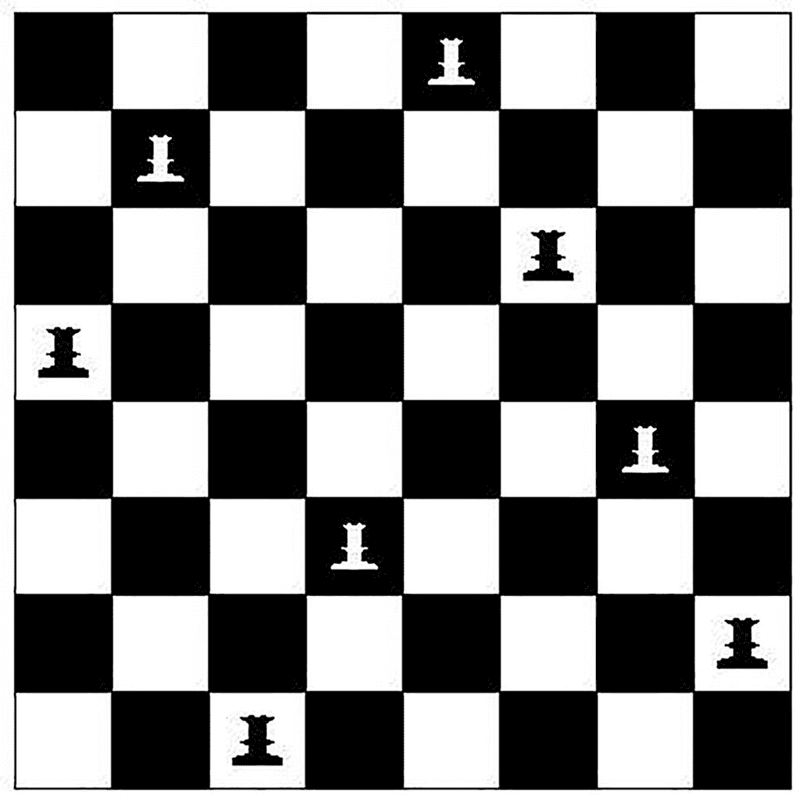
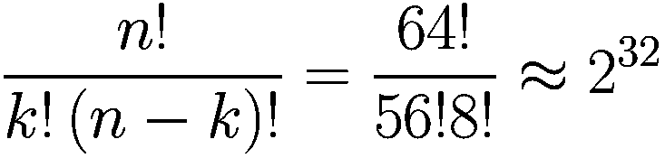
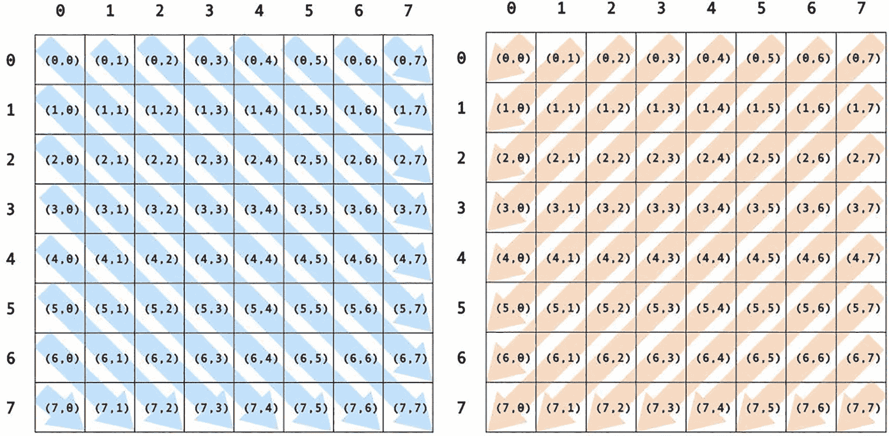

# 9. 结构化设计

> *投资于抽象，而非实现。抽象能够经受住来自不同实现和新技术的变革冲击。*
>
> ——安迪·亨特和戴夫·托马斯^(¹⁶⁴)

## 结构化编程

结构化设计源于艾兹格·迪杰斯特拉 1968 年写给《ACM 通讯》的那封著名信件《Goto 语句有害论》。迪杰斯特拉的论文总结道：

> *当前的* ***goto*** *语句过于原始；它太容易诱使人们把程序搞得一团糟。我们可以将所考虑的从句（编者注：if-then-else, switch, while-do, 和 do-while）视为对其使用的约束。我并非声称这些从句已详尽到能满足所有需求，但无论建议何种从句（例如终止从句），它们都应满足一个要求：即能够维持一个独立于程序员的坐标系，以便以一种有用且可管理的方式来描述过程。*^(¹⁶⁵)

自此以后创建的编程语言，虽然并未完全消除 goto 语句（除了 Java，它完全没有），但无疑都淡化了它的使用，教授编程的课程也鼓励学生避免使用它。取而代之的是，问题解决以自顶向下的结构化方式进行教学：从问题陈述开始，尝试将问题分解为一组可解决的子问题。这个过程持续进行，直到每个子问题都小到微不足道或非常容易解决。这种技术被称为*结构化编程*。在 20 世纪 80 年代中期面向对象编程出现并被接受之前，这是解决问题和编程的标准方法。它至今仍是处理一大类问题的最佳方法之一。


## 逐步精化

尼克劳斯·维尔特在其 1971 年的论文《通过逐步精化进行程序开发》中正式提出了结构化设计技术。^((166)) *逐步精化*主张程序设计由一系列精化步骤组成。在每一步中，给定的任务被分解为若干子任务。每次任务精化都必须伴随数据描述和接口的精化。所获得的模块化程度将决定程序适应需求或环境变化的难易程度。

在精化过程中，你使用问题空间自然对应的符号表示。你应尽可能长时间地避免使用编程语言进行描述。每次精化都意味着基于一组设计标准做出若干设计决策。这些标准包括时间和空间效率、清晰度以及结构的规律性（简洁性）。

精化可以自上而下或自下而上两种方式进行。*自上而下*精化的特点是从问题的总体描述出发，逐步深入到各个模块或例程的具体功能陈述。逐步精化背后的指导原则是人类一次只能专注于少数几件事——即米勒著名的 7±2 个数据块规则。^((167)) 其工作流程是：

*   分析问题，尝试识别解决方案的轮廓以及每种方案的利弊
*   然后首先设计顶层结构
*   避免涉及特定语言的细节
*   将细节向下推，直至到达底层
*   形式化每一层
*   验证每一层
*   然后进入下一层，进行下一组精化。（即重复此过程。）

你持续精化解决方案，直到感觉直接编码比继续分解更容易为止；本章稍后你将看到一个示例。

关键在于，你要一直工作到对设计的显而易见和简单程度感到不耐烦为止。这里的缺点是，你并没有一个很好的“何时停止”的度量标准。这需要实践积累。

如果你无法从顶层开始，那么就从底层开始，采用*自下而上*的精化方式：

*   问自己：“我知道系统需要做什么？”这通常涉及底层 I/O 操作、其他对数据结构的底层操作等。
*   根据这个问题，尽可能多地识别出底层函数和组件。
*   识别底层组件的共同点，并将它们分组。
*   继续处理上一层，或者回到顶层再次尝试向下分解。

自下而上的精化通常能更早地识别出实用例程，从而带来更紧凑的设计。它还有助于促进复用，因为你复用了底层例程。缺点是，纯粹使用自下而上的评估方法很难——你几乎总会在某个时刻切换到自上而下的方法，因为有时你会发现无法从底层向上拼凑出一个更大的整体。这并非真正的逐步精化，但它可以帮助你起步。大多数实际的逐步精化都涉及自上而下和自下而上设计元素的交替使用。幸运的是，自上而下和自下而上的设计方法可以很好地互补。

### 逐步精化示例：八皇后问题

八皇后问题要求在一个标准的 8x8 棋盘上放置八个皇后，使得任何皇后都不能被其他皇后攻击。请记住，皇后可以沿水平、垂直或对角线方向移动任意数量的格子。图 9-1 描绘了八皇后问题的一个可能解。



一个 8x8 棋盘的示意图展示了 8 个不同的皇后位置。

图 9-1

八皇后问题的一个解

事实证明，目前还没有人找到这个问题的解析解，而且很可能根本不存在。那么你会如何解决这个问题呢？在继续阅读之前，请花点时间自己思考一下。

想好了吗？好的。让我们看看分解这个问题的一种可能方式。

#### 八皇后：方案一

你首先需要做的是审视问题，梳理出需求和解决方案的轮廓。这将引导你走上回答“顶层分解应该是什么”的道路。

你最初可能会考虑使用暴力法来解决问题：尝试所有可能的皇后排列，然后选出可行的方案。有 8 个皇后和 64 个可能的格子，可能的棋盘配置数为：



其中 n 是棋盘上的格子数，k 是皇后数（或从可用格子中选择的位置数），结果仅为 4,294,967,296（略超过 40 亿种配置）。如今，这个数字并不算大，因此暴力法可能是一个可行的选择。

如果你生成所有可能棋盘组合的集合 A，你可以创建一个名为*q(x)*的测试，如果棋盘配置 x 是一个解则返回*true*，否则返回*false*。然后你可以编写一个如下所示的程序：

```
生成所有棋盘配置的集合 A；
当 A 中还有未测试的配置时，执行
    x = 从 A 中取下一个配置
    如果 (q(x) == true) 则打印解 x 并停止
返回顶部并重复执行。
```

注意，所有工作都在两个步骤中完成：生成集合 A 和执行测试*q(x)*。集合 A 的生成只发生一次，但测试*q(x)*会对集合 A 中的每个配置执行一次，直到找到解。虽然这种方法肯定有效，但效率并不高。因此，让我们尝试减少需要考虑的组合数量以加快速度。

#### 八皇后：方案二

在考虑初始暴力法的过程中，你已经做了一些分析，因此对必须完成的任务有了更清晰的认识。为了减少总可能配置的数量，并提出更高效的算法，你需要更创造性地思考这个问题。首先要注意的是，每列中最多只能有一个皇后（是的，每行也是如此，但为了简化，我们先关注列）。每列恰好有一个皇后将可能的组合数减少到 2²⁴或仅 1600 万（考虑到要将一个皇后放入每一列，现在只有 8 种可能的选择：行；所以总共是 8⁸或 2²⁴种选择）。虽然这很好，但它并没有真正改变算法太多。你提出的解决方案现在如下所示：

```
生成受限棋盘配置的集合 B；
当 B 中还有未测试的配置时，执行
    x = 从 B 中取下一个配置
    如果 (q(x) == true) 则打印解 x 并停止
返回顶部并重复执行。
```

这个版本需要生成每列恰好有一个皇后的棋盘位置集合 B，并且仍然需要遍历多达 1600 万个可能的棋盘位置。生成 B 现在比生成 A 稍微复杂一些，因为你现在必须测试提议的棋盘位置是否满足每列一个皇后的限制。然而，由于你需要测试的配置更少，方案二仍然优于上面的方案一。你还可以做得更好。


#### 八皇后问题：方案三

在生成和测试棋盘方面，我们可以更加巧妙。与其先生成一个完整的棋盘配置再进行测试，不如在生成过程中就测试部分解。一旦某个棋盘配置中出现任何皇后冲突，就可以立即拒绝该棋盘，无需等待放置完其余皇后。此外，如果能够从错误的棋盘配置回溯到上一个正确的部分配置，就能更快地探索可能的配置。

现在，你可以进行顶层设计，将其形式化，并进入下一个细化层级。

##### 方案三：第一次细化

开始生成棋盘时，你将一次放置一个皇后，如果产生冲突则尝试其他选择，如果所有选择都尝试完毕则进行回溯。现在，让我们将步骤形式化：

从第 0 行和第 0 列开始：

1.  在下一行的下一个可用列放置一个新皇后。

2.  测试新皇后是否与棋盘上已有的所有其他皇后安全共存。（这是上述 *q(x)* 测试的一个变体。）
    1.  如果新皇后不安全：
        1.  尝试在当前列的下一行放置她，并重复步骤 2。

        2.  如果没有剩余行可供尝试，则从棋盘上移除新皇后；返回上一列，并将上一个皇后移动到下一行；重复步骤 2。

    2.  如果新皇后安全：
        1.  将她留在此处，并进入下一列。

        2.  从第一行开始，放置下一个皇后。

使用这种方法，你可以确保当前列 j 之前的部分解是正确的。然后，你尝试通过在第 j+1 列添加一个皇后来扩展到下一个部分解。由于只有在所有之前的皇后都安全时才会添加新皇后，因此解决方案只需测试这一个新皇后的安全性，从而减少了测试例程的工作量。如果安全检查失败，你就回溯到列 j 处上一个有效的部分解，并重新考虑最后一个成功放置的皇后的剩余替代位置。Wirth 将这种创建和测试部分解的技术称为*逐步构建试验解*。而回溯技术当然被称为*回溯法*。

以下是用于寻找单个解的更形式化的伪代码：

```
do {
while ((row = 0));
if (we've reached column 8) then
we have a solution, print it.
```

该算法是此解决方案的第一个形式化视图。请注意，上面我们使用的是伪代码而非真正的编程语言，将语言细节进一步推后到细化层级中。此外，虽然我们已经有了该方法的大致框架，但仍有许多细节需要考虑。这些细节已被推入我们正在创建的控制层级中，我们将在下一次细化迭代中处理它们。这也是逐步细化的一个特点。

现在你已经有了算法的描述，也可以着手验证它。最终的验证将是观察程序产生正确的解，但你目前还无法做到这一点。不过，你当然可以拿一个棋盘（或一张纸）手动模拟这个算法，以验证你能否在棋盘上生成一个符合问题要求的皇后放置方案。

至此，你已经有了一个更形式化的顶层描述，了解了如何进行验证，并且准备好扩展上面那些模糊的步骤了。

##### 方案三：第二次细化

既然你已经有了程序的初步版本，就需要检查程序中的每一步，看看它们由什么构成。让我们聚焦于那个听起来很简单的“测试新皇后是否与棋盘上已有的所有其他皇后安全共存”。它一直在你计划的解决方案中默默承担着所有繁重的工作，现在是时候弄清楚它是如何工作的了。

虽然逐步细化主要关注程序控制流的描述，但在某个时刻，你需要确定数据的具体形式。对于你试图解决的每个问题，这会在细化过程中的不同时间点发生。对于这个问题，你终于到了一个阶段，下一步的细化应该是编写更详细的伪代码。这几乎迫使你去思考数据结构。你需要问自己，如何用数据结构来表示包含所有皇后以及所有空位的棋盘。你需要一个数据结构，既能表示皇后，又能检查它们是否会被攻击。初步的想法可能是一个 8x8 的二维数组，你将皇后放置在某个（行，列）位置上。由于你只需要存储皇后的存在与否，可以将其设为布尔数组以节省空间。这种数据结构也便于你轻松检查新皇后的安全性。让我们来分解一下。

当在某个位置（row, col）放置一个新皇后时，你需要检查以下内容：

*   这一行是否仍然空闲？

*   这一列是否仍然空闲？

*   这条主对角线是否仍然空闲？

*   这条反对角线是否仍然空闲？

如果你选择系统地每列放置一个皇后，就可以跳过第一个检查，因为后续的每一列必然仍然是空闲的（注意，你也可以对行做同样的处理）。这样就剩下另外三个检查：行、主对角线和反对角线。行的检查很简单：你只需检查与新皇后同一行的所有其他格子。要检查对角线，你需要找到一种方法，计算从任意给定（row, col）出发，沿任一对角线上的位置。

仔细观察图 9-2 中的对角线位置集合，你可以在左侧图像（描绘主对角线）中看到，沿着任何一条主对角线的所有格子，其行与列值的*差*是一个常数（例如，中心主对角线为 0，其上方对角线为 -1，下方对角线为 1）。类似地，查看图 9-2 的右侧，你可以看到，沿着任何一条反对角线的所有格子，其行与列值的*和*也是一个常数（例如，中心反对角线为 7，其上方对角线为 6，下方对角线为 8）。因此，给定任何一个格子，你都可以判断它是否落在给定位置皇后的任一对角线上。



两个 8x8 表格分别突出显示了主对角线和反对角线。主对角线从左到右向下倾斜。反对角线从右到左向下倾斜。

图 9-2

主对角线（左）和反对角线（右）

但请注意，你仍然需要检查所有格子，并对其坐标进行加法和减法运算，以判断它是否恰好落在每个新皇后感兴趣的任一对角线上。这种方法可行但速度较慢。你可以做得更好！


##### 方案三：第三次优化

利用你之前设计的二维数组，可以存储每个皇后的精确位置以及所有空位。但实际上，你真正需要追踪的只是某一行、某一列或某条对角线是否已被已有的皇后占据。也就是说，你不需要知道皇后的确切位置——只需要知道它们正在保护哪些列和对角线。

因此，与其存储 8*8=64 个位置的布尔信息（有皇后或无皇后），不如存储关于 8 行、15 条主对角线和 15 条副对角线（总共 38 个布尔值）的布尔信息（受保护或未受保护）。对于更大的棋盘，空间复杂度的降低将更为显著（例如，考虑在 1000x1000 的棋盘上放置 1000 个皇后）。此外，你现在只需要查看三个布尔值（行和两条对角线）就能判断新皇后是否安全，这使得安全检查变为常数时间。总的来说，对于 n 个皇后，此解决方案将以 O(n) 的时间复杂度运行。

要检查某一行是否仍然空闲，你只需要一个一维布尔数组：

```
boolean rows[8]; //索引 0-7 对应棋盘的行号
```

其中 `rows[r] = true` 表示第 r 行仍然未被保护。

为了在类似的一维数组中存储对角线的信息，你可以利用主对角线和副对角线差值或和恒定的特性来创建另外两个数组。对于你的 15 条主对角线，由于差值范围从 -7 到 7（包含两端），你需要计算正确的对角线索引为 `(row-col+7)`，将范围偏移到标准的有效索引 0-14。

```
boolean mainDiagonals[15]; // 索引 0-14 通过 row-col+7 计算得到
boolean antiDiagonals[15]; // 索引 0-14 通过 row+col 计算得到
```

其中 `mainDiagonals [d] = true` 表示第 d 条对角线仍然未被保护。

通过这种安排，^(¹⁶⁸) 测试位置 (row, col) 上皇后的安全性如下：

```
( rows[row] AND mainDiagonals[row-col+7] AND antiDiagonals[row+col] )
```

这是一个非常棒的解决方案，但它足够好吗？嗯，这取决于具体情况。一般来说，常数时间的安全检查是无与伦比的，如果你需要放置 n 个皇后，那么 O(n) 的时间复杂度也同样难以被超越。不过，你可能还有其他约束和优先级。目前，你为每一行和每一条对角线存储一个布尔值；对于一个 n*n 的棋盘，你存储了 n+(n+n-1)*2=5n-2 个布尔值。如果你的棋盘非常大且存储空间非常有限，你可以牺牲时间复杂度来降低空间复杂度。

##### 方案三：第四次优化

还有另一种思考如何存储数据的方式。这次，我们尝试存储比每行一个布尔值和每条对角线一个布尔值更少的信息。事实证明，你只需要一个长度等于列数的一维数组就能应付：

```
int board[8]; // 对于 8x8 棋盘，索引 0-7 代表行，值 0-7 代表列
```

其中，数组的每个*索引*代表一列（在八皇后问题中为 0 到 7），而该索引处存储的每个*值*代表放置皇后的行（在八皇后问题中同样为 0 到 7）。这种编码方式为你提供了每个皇后的精确坐标。每放置一个新皇后，你可以逐一检查所有先前放置的皇后，评估它们的行、主对角线或副对角线是否与新放置的皇后匹配。如果发现任何匹配，则皇后之间存在冲突，必须移动新皇后。通过这种方式，你可以省去之前用来存储每条对角线安全性的独立数组。请注意，这种安全性测试不再是常数时间，整体解决方案会更慢，因为现在你需要依次检查 0 个、1 个、2 个、3 个...先前放置的皇后（0+1+2+3+...+n-1），其时间复杂度为 O(n²)。

现在可能是时候编写更多代码了。此时，似乎应该从伪代码过渡到一种真正的编程语言。在优化过程中的某个时刻，你必须进行这种转换。就像决定何时定义数据结构一样，具体何时引入语言特性取决于问题本身以及当前优化的详细程度。一个用于测试安全性的 Java 方法可能如下所示：

```
// int[] board 索引代表列，值代表皇后所在的行
// row, col 是新放置的、正在评估安全性的皇后的坐标
public boolean isSafe () {
boolean safe = true;
for (int c = 0; c < col; c++) { // c 是每个先前的列
if ((board[c] == row) || // 占据的行 == 当前行？
((board[c] - c) == (row - col) ) || // 主对角线匹配？
((board[c] + c) == (row + col) ) ) // 副对角线匹配？
safe = false; // 任何匹配都意味着冲突！
}
return safe;
}
```

请记住，因为你是一次一列地添加一个皇后以构建部分解，所以你只需要测试当前放置新皇后的列*之前*的所有列。

##### 方案三：第五次优化

既然你已经解决了安全性过程，并决定使用一个简单的数据结构来表示当前的棋盘配置，那么你可以继续进行分解中的其余过程。剩下的任务是：

1.  在棋盘上保留一个安全的皇后，并继续处理下一列。
2.  尝试将一个不安全的皇后向下移动到下一行。
3.  如果没有剩余的行可以尝试，则从棋盘上移除新皇后；回溯到前一列，并将前一个皇后移动到下一行。

这些任务都足够简单，无需进一步分解即可用代码解决。这是结构化编程的一个关键点：持续进行分解，直到一个过程变得显而易见，然后你可以尝试直接编写代码。上述三个任务在代码中可能如下所示：

```
/** "在棋盘上保留一个安全的皇后，并继续处理下一列"
*  位于 (row, col) 的皇后是安全的，因此我们有了一个部分解；
*  前进到下一列
*/
public void advance () {
board[col] = row;           // 将皇后放置在 (row, col) 位置
col++;                      // 移动到下一列
row = 0;                    // 并从该列的开头开始
}
```

对于*尝试将一个不安全的皇后向下移动到下一行*，你甚至不需要一个方法。主程序中的安全性测试会在 `isSafe()` 方法确定当前 (row, col) 位置不安全时，将皇后向上移动一行。实现此功能的代码如下：

```
if (isSafe())
advance();
else
row++;
```

最后，你得到以下代码：

```
/**
*  "如果没有剩余的行可以尝试，则从棋盘上移除新皇后；
*  回溯到前一列，并将前一个皇后移动到下一行"
*  在当前其他皇后的放置情况下，无法在当前列找到安全行，
*  因此回溯一列，并将前一个皇后移动到下一行
*/
public void retreat () {
col--;
row = board[col] + 1;
}
```

完整的 Java 程序在附录中。


## 模块化分解

1972 年，大卫·帕纳斯发表了一篇题为《论将系统分解为模块的标准》的论文，他在其中提出，可以使用一种称为模块化的技术来设计程序。^(¹⁶⁹) 帕纳斯的论文也是最早描述基于*信息隐藏*进行分解的论文之一，信息隐藏是面向对象编程的关键技术之一，我们将在本节稍后讨论。在他的论文中，帕纳斯强调了基于问题解决方案的控制流进行自顶向下分解，与使用封装和信息隐藏将数据定义及其操作相互隔离的分解方式之间的区别。他的论文显然是面向对象分析与设计（OOA&D）的先驱，你将在下一章中看到这一点。

虽然帕纳斯的论文早于这一概念的提出，但他实际上是在讨论一个称为*关注点分离*的概念。“在计算机科学中，关注点分离是一种将计算机程序划分为不同部分的设计原则。每个部分处理一个独立的关注点：一组影响计算机程序代码的信息。一个良好体现了关注点分离的程序被称为模块化程序。模块化，以及由此带来的关注点分离，是通过将信息封装在具有明确定义接口的代码段中来实现的。封装是信息隐藏的一种手段。”^(¹⁷⁰) 传统上，关注点分离主要关注程序功能的分离。帕纳斯则增加了分离数据的想法，使得各个模块既能控制数据，也能控制作用于数据的操作，并且数据只能通过定义良好的接口才能被访问。这一概念后来由艾兹格·迪杰斯特拉进一步扩展。^(¹⁷¹)

模块化有三个关键特性，对于创建模块化程序至关重要：

*   封装
*   松散耦合
*   信息隐藏

*封装*是指将一组由其数据和行为定义的服务捆绑在一起作为一个模块，并保持它们的整体性。这组服务应该是内聚的，并且显然属于同一整体。（就像函数一样，一个模块应该只做一件事。）然后，该模块向用户呈现一个*接口*，理想情况下，该接口是访问模块内服务和数据的唯一途径。封装服务和数据的一个目标是*高内聚性*：你的模块应该只做一件事，并且模块内的所有函数都应致力于实现这一件事。

与封装相辅相成的是*松散耦合*，它描述了两个模块之间相互连接的紧密程度。我们希望最小化任何一个模块对另一个模块的依赖，因此我们将模块分离以最小化交互，并让模块通过模块接口进行交互。目标是创建具有内部完整性（强内聚性）的模块，并且模块之间具有少量、直接、可见且灵活的连接（松散耦合）。模块之间良好的耦合应该是松散的，使得一个模块中的方法可以轻松地被另一个模块中的方法调用，同时每个模块中的数据是独立的，并且只能由定义该数据的模块内部的方法进行更改。这样，两个模块可以通信并请求更改数据，而无需担心错误地修改数据。

*松散耦合*分为四大类，从好到差依次为：

*   *简单数据耦合*：非结构化数据通过参数列表传递。这是最好的耦合类型，因为它允许发送模块按需组织数据，并允许接收模块决定如何处理数据。
*   *结构化数据耦合*：结构化数据通过参数列表传递。这也是一种良好的耦合类型，因为发送模块保持对数据格式的控制，而接收模块可以按需处理数据。
*   *控制耦合*：来自发送模块的数据被传递给接收模块，并且数据的内容告诉接收模块该做什么。这不是一种好的耦合类型：发送方和接收方耦合过于紧密，因为发送方正在控制接收模块中函数的执行方式。
*   *全局数据耦合*：两个模块使用相同的全局数据。这非常糟糕，因为它违反了封装的基本原则，让模块共享数据。这会引发不希望的副作用，并确保在程序执行的任何时刻，耦合的模块都无法确切知道全局共享数据中的内容。通常，全局变量被认为是不良的编程实践。

*信息隐藏*常常与封装混淆，但它们并不相同。封装描述的是将数据和行为包装成一个单一实体的过程——在我们的例子中，这个实体就是模块。数据在模块内部可以是公开可见的，因此并未被隐藏。另一方面，信息隐藏则指出，模块中的数据和行为应该受到控制，并且仅对模块内作用于这些数据的操作可见，因此对于其他外部模块是不可见的。这是模块（以及后来的对象）的一个重要特性，因为它将数据的控制权交给了最了解如何安全操作这些数据的模块，同时防止了其他模块介入并篡改该数据可能引发的副作用。

帕纳斯不仅仅是在谈论在模块中隐藏数据。他对信息隐藏的定义更侧重于在模块定义中隐藏设计决策。“我们提议……首先列出一系列困难的设计决策或可能发生变化的设计决策。然后，每个模块的设计都是为了向其他模块隐藏这样的决策。”^(¹⁷²) 以这种方式隐藏信息，使得模块的客户端无需了解构建该模块所涉及的任何设计决策，就能成功使用该模块。它还允许开发人员更改模块的实现，而不会影响客户端使用该模块的方式。


### 示例：上下文关键词索引

在早期，当 Unix 还年轻、世界还很新的时候，Unix 文档被分为八个不同的部分，整个手册以*排列索引*开头。Unix 的问题不在于命令行界面，也不在于倒置的树形文件系统结构。不，Unix 的问题在于几乎每个难以阅读的 Unix 命令名称，包括 `ls`、`cat`、`cp`、`mv`、`mkdir`、`ps`、`cc`、`as`、`ld`、`m4`……我们还可以继续列举。Unix 可能拥有地球上所有操作系统中最为晦涩难懂的命令行集。创建 Unix 命令行工具的首要规则显然是：“既然两个字符就能搞定，为什么要用三个？”

因此，在 Unix 文档的八个部分中查找任何内容都可能是一项真正的考验。这时*排列索引*应运而生。每个 Unix 手册页都以一个标题行开头，其中包含命令名称和该命令功能的简短描述。例如，`cat(1)` 的手册页开头如下：

```
cat - 连接并打印文件
```

但如果你不知道命令的名称，却知道它的功能呢？排列索引通过将命令描述中的大部分单词（忽略冠词）纳入索引本身来解决这个问题。因此，`cat` 可以在“cat”下找到，也可以在“连接”、“打印”和“文件”下找到。这被称为*上下文关键词*（KWIC）索引。它非常有效。

因此，你的任务是给定两个输入文件来创建一个 KWIC 索引：第一个文件包含要忽略的单词（有时称为“停用词”），第二个文件包含我们要索引的文本行。例如，假设你的第一个文件包含 `for`、`the`、`and` 作为要忽略的单词，第二个文件如下所示：

```
The Sun also Rises
For Whom the Bell Tolls
The Old Man and the Sea
```

你生成的 KWIC 索引（排序后的单词全部大写）将是：

```
The Sun ALSO Rises
For Whom the BELL Tolls
The Old MAN and the Sea
The OLD Man and the Sea
The Sun also RISES
The Old Man and the SEA
The SUN also Rises
For Whom the Bell TOLLS
For WHOM the Bell Tolls
```

将每一行向左移动，直到下一个有效关键词（跳过冠词），你会得到每行 n 个关键词对应的 n 个副本。每次移动后，索引关键词（以大写字母显示）会出现在该行每个副本的开头。然后，所有行按其索引关键词的字母顺序排序。如果出现平局（两行文本具有相同的索引词），则这些行应按其在输入文件中出现的顺序排列。

你需要回答的问题是：1）如何创建 KWIC 索引？2）如何存储索引数据？

#### KWIC：自顶向下分解

你将首先使用自顶向下的分解来设计问题解决方案。正如你在本章前面看到的八皇后问题，自顶向下的分解完全关乎控制流：你需要弄清楚如何顺序地解决问题，并在每一步都取得进展。假设数据与例程分开存储，并且控制流中的每个子例程都可以访问它所需的数据。另一种方法是在调用每个子例程时将数据传递给它；这可能既繁琐又耗时，因为每次将数据传递给例程时，通常都必须复制数据。

该问题的初步分解可能如下所示：

1.  输入要忽略的单词和文本。

2.  移动每一行文本，并为最终出现在该行开头的每个单词（跳过任何冠词）存储该行的一个副本。

3.  根据每行的第一个单词（即每行的索引词）对所有生成的移动后的文本行进行排序。

4.  格式化并输出文本。

请注意，这些步骤可以很容易地成为独立的子例程，并从主程序按顺序调用。用于输入文本的数据结构可以是每行的字符数组、每行的字符串，或者整个输入文件的字符串数组。你也可以使用映射数据结构，将每个索引词作为键，将包含输入文本行的字符串作为映射元素的值。当然，还有其他可能的数据结构可供使用。排序可以通过任何稳定的排序算法完成，选择哪种算法取决于所选的数据结构以及输入文本的预期大小。你的排序必须是稳定的，因为要求相同的索引词对其各自的行进行排序时，应保持它们在输入文本文件中出现的顺序。根据你使用的编程语言和选择的数据结构，排序可能会自动为你完成。你选择的数据结构将影响循环移位的方式以及输出例程如何格式化每个输出行。

现在你已经对自顶向下分解如何进行有了初步了解，让我们继续考虑模块化分解。


#### KWIC：模块化分解

KWIC 问题的模块化分解可以基于信息隐藏原则，即隐藏数据结构与设计决策。你创建的模块不一定代表上述顺序列表中的元素，而是通过按需相互调用来协作。以下是生成 KWIC 索引时一个可能的模块列表：

*   行模块（用于输入文本行）
*   关键词-行对模块
*   KWICIndex 模块，用于创建索引列表本身
*   移位模块
*   格式化与打印输出模块
*   主控制模块——主程序

行模块将使用关键词-行模块创建一个映射数据结构（即键值对），其中每个键是一个关键词，其值是以该关键词开头的行列表。KWICIndex 模块将使用行模块创建索引列表。移位模块将使用 KWICIndex 模块（进而使用行模块和关键词-行模块）并创建移位后的行集合。排序将在 KWICIndex 模块内部处理；索引将作为排序列表创建，并且任何对列表的添加都将保持排序顺序。格式化与打印模块将格式化关键词行，使关键词以全大写形式打印。另一种视图是，行也可以取消移位，关键词在连续的输出行上彼此对齐。最后，主控制模块将读取输入，创建 KWICIndex，并使其正确打印。

这些模块的关键在于，你可以在不需要了解每个模块如何实现以及数据如何存储的细节的情况下描述模块及其交互。这些细节隐藏在模块描述本身中。其他设计也是可能的。例如，将循环移位操作归入行模块内部可能更好，使其能够存储输入行及其移位。无论如何，设计的下一步是为每个模块创建接口，并协调这些接口，以便每个模块无论内部实现如何都能与其他模块通信。

对于此实现，让我们创建四个 Java 类：

*   `Line`，为从文本文件输入的行创建数据结构。
*   `KwicIndex`，接收要忽略的单词和输入行，并创建排序后的置换索引。行根据关键词进行移位并添加到索引中。
*   `Print`，接收`KwicIndex`对象，并按正确顺序和所需移位方式（例如，按原始句子顺序，但关键词彼此对齐）打印置换索引。
*   `Main`，检查命令行参数是否正确，创建初始`KwicIndex`对象，并调用添加新行和进行打印的方法。

给这个程序一个名为`input.txt`的文件，内容如下：

```
Descent of Man
The Ascent of Man
The Old Man and The Sea
A Portrait of the Artist As a Young Man
A Man is a Man but Bubblesort is a dog
this is dumb
```

并忽略单词“the”、“of”和“and”（在停用词输入文件中提供），将生成以下 KWIC 输出：

```
A Portrait of the Artist As a Young Man
A Man is A Man but Bubblesort is a dog
A Man is a Man but Bubblesort is A dog
A Portrait of the Artist As A Young Man
A Man is a Man but Bubblesort is a dog
A Portrait of the ARTIST As a Young Man
A Portrait of the Artist AS a Young Man
The ASCENT of Man
A Man is a Man but BUBBLESORT is a dog
DESCENT of Man
something i do not know how to DO
something i DO not know how to do
A Man is a Man but Bubblesort is a DOG
this is DUMB
something i do not know HOW to do
something I do not know how to do
A Man IS a Man but Bubblesort is a dog
A Man is a Man but Bubblesort IS a dog
this IS dumb
something i do not KNOW how to do
A MAN is a Man but Bubblesort is a dog
Descent of MAN
A Man is a MAN but Bubblesort is a dog
The Old MAN and The Sea
The Ascent of MAN
A Portrait of the Artist As a Young MAN
something i do NOT know how to do
The OLD Man and The Sea
A PORTRAIT of the Artist As a Young Man
The Old Man and The SEA
SOMETHING i do not know how to do
THIS is dumb
A Portrait of the Artist As a YOUNG Man
```

在附录 2 中，我们展示了一个用 Java 编写的 KWIC 索引程序实现，它在一定程度上紧密遵循了上述讨论。我们将在下一章关于面向对象设计的内容中，更详细地继续讨论模块化分解。

## 结论

结构化设计描述了一组经典的设计方法论。这些设计思想适用于一大类问题。最初的结构化设计思想——逐步求精，要求你自顶向下分解问题，专注于解决方案的控制流。它也与第 7 章中提到的一些架构密切相关，特别是主程序子例程架构和管道-过滤器架构。模块化分解是现代面向对象方法论的前身，并引入了封装和信息隐藏的概念。这些思想是你设计工具箱的基础。

## 附录 1：完整的非递归八皇后程序

```
/*
*  NQueens.java
*  八皇后程序
*  用于单一解的非递归版本
*/
import java.util.*;
public class NQueens {
static int totalcount = 0;
static int row = 0;
static int col = 0;
static int[] board;
/*
*  (row, col)处的皇后是安全的，
*  因此我们有了一个部分解。
*  前进到下一列
*/
public void advance () {
board[col] = row;
col++;
row = 0;
}
/*
*  在当前列找不到安全行，
*  因此回溯一列并将该皇后上移一行
*/
public void retreat () {
col--;
row = board[col] + 1;
}
/*
*  检查 (row, col) 处的皇后是否会被攻击
*/
public boolean isSafe () {
boolean safe = true;
totalcount++;
/*
*  检查对角线和行是否有攻击
*  因为我们只检查部分解
*  只需检查到当前列
*/
for (int c = 0; c = 0));
/* 如果我们已经放置了所有 N 个皇后，就得到了一个解 */
if (col == N) {
for (int i = 0; i < N; i++) {
System.out.print(board[i] + " ");
}
} else
System.out.println("No solution. ");
System.out.println();
System.out.println("after trying " + totalcount +
" board positions.");
}
}
```


## 附录 2：KWIC 解决方案的模块化版本

```
/**
* 类 Line
* 负责存储三条关键信息：
* 当前行、关键字以及关键字在该行中的索引。
*
* 基本上类似于 C 语言中的结构体。
*
*/
public class Line implements Comparable {
public String line;
public String keyword;
public int indexOf;
public Line(String line, String keyword, int indexOf) {
this.keyword = keyword;
this.indexOf = indexOf;
// 将行中的关键字转换为大写
// 获取该行的第一部分
String first = line.substring(0, indexOf);
// 将整个关键字转换为大写
String middle = keyword.toUpperCase();
// 获取关键字之后该行的剩余部分
String last = line.substring(indexOf + keyword.length());
// 将所有部分重新组合
this.line = first + middle + last;
}
/**
* 我们希望仅根据关键字对行进行排序。
* 这将执行关键字的字典序比较。
* 请记住，关键字是一个字符串。
*/
@Override
public int compareTo(Line other) {
return this.keyword.compareToIgnoreCase(other.keyword);
}
}
import java.util.Scanner;
import java.util.*;
/**
* 类 KwicIndex
* 一个 KwicIndex 对象包含一个 Lines 集合
* 以及我们忽略作为关键字的单词。
*
* 我们使用 HashSet 来存储要忽略的单词，因为
* 我们只希望这些单词每个只出现一次。
*
* 我们使用 PriorityQueue 来存储行，因为
* 我们希望它们按关键字排序，而 PQ
* 会自动为我们完成这项工作。
*
*/
public class KwicIndex {
public HashSet wordsToIgnore;
public PriorityQueue lines;
/**
* 构造函数，初始化列表并
* 读取所有要忽略的单词
*/
public KwicIndex(Scanner ignore) {
this.wordsToIgnore = new HashSet();
this.lines = new PriorityQueue();
while (ignore.hasNext()) {
this.wordsToIgnore.add(ignore.next());
}
}
/**
* 为给定行在索引中创建一个条目。
* @param str；要检查的字符串
* @return
*/
public void add(String str) {
Scanner scan = new Scanner(str);
int offset = 0;
int words = -1;
while (scan.hasNext()) {
// 获取下一个单词
String temp = scan.next();
words++;
/** 如果这个单词不被忽略，则创建一个新行，
*  该行已移位，新单词被移除，
*  然后将其添加到行列表中
*/
if (!wordsToIgnore.contains(temp.toLowerCase())) {
Line version = new Line(str, temp, offset + words);
this.lines.add(version);
}
offset += temp.length();
}
}
/**
* 返回索引以便我们可以打印它
*/
public PriorityQueue getLines() {
return lines;
}
}
import java.util.*;
/**
* 类 Print
* 打印生成的 KWIC 索引
*
*/
public class Print {
public PriorityQueue lines;
public Print(PriorityQueue lines) {
this.lines = lines;
}
/**
* 将索引内容打印到 System.out
* 调整行格式，使
* 关键字位于同一列
*/
public void printIndex() {
// 创建一个新的 PriorityQueue
PriorityQueue newLines = new PriorityQueue();
// 让我们计算最长行的长度
int longest = 0;
for (Line l : lines) {
if (l.indexOf > longest) {
longest = l.indexOf;
}
}
/**
* 执行打印
*/
while (!lines.isEmpty()) {
/** 获取关键字最小的行 */
Line l = lines.poll();
/** 保存该行 */
newLines.add(l);
/**
* 计算空白字符
* 这里我们根据将最长行
* 正好放在中间，来计算关键字
* 需要向右缩进多少
*/
String retval = "";
for (int i = 0; i  ");
System.exit(1);
}
/**
* 首先我们创建一个 KwicIndex 对象，并将
* 要忽略的单词添加到其中
*/
KwicIndex index = new KwicIndex(ignore);
/**
* 现在我们将所有行添加到索引中
* add() 方法负责执行循环移位
* 并将移位后的行添加到优先队列中
*/
while (scan.hasNextLine()) {
index.add(scan.nextLine());
}
/**
* 最后，我们打印刚刚创建的索引
*/
Print prt = new Print(index.getLines());
prt.printIndex();
}
}
```

脚注 1   2   3   4   5   6   7   8   9


