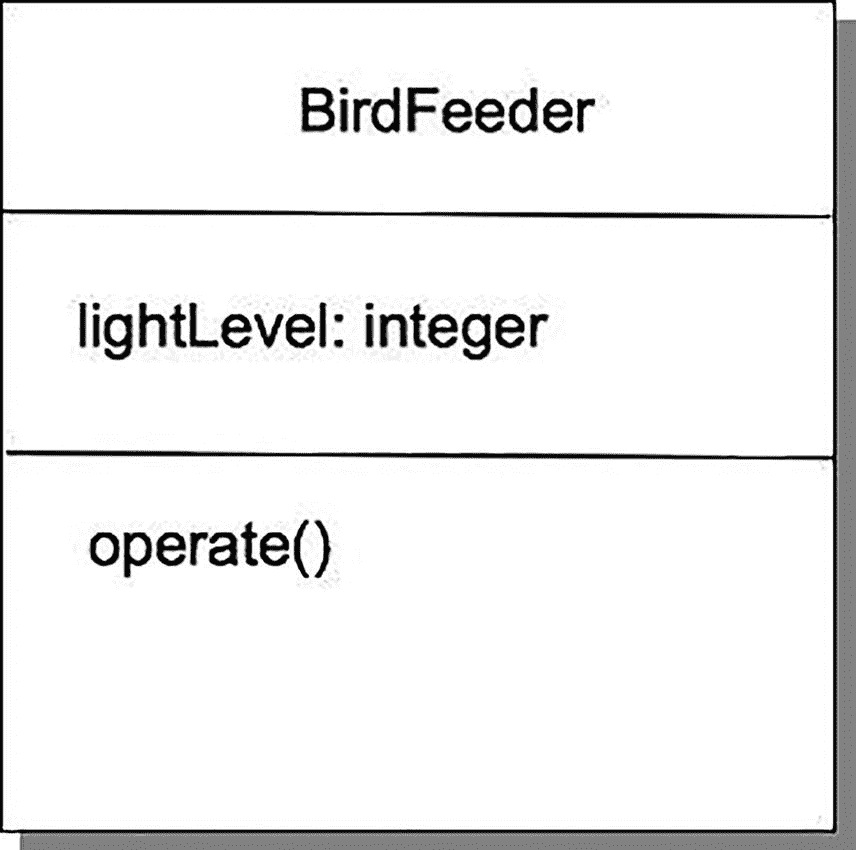
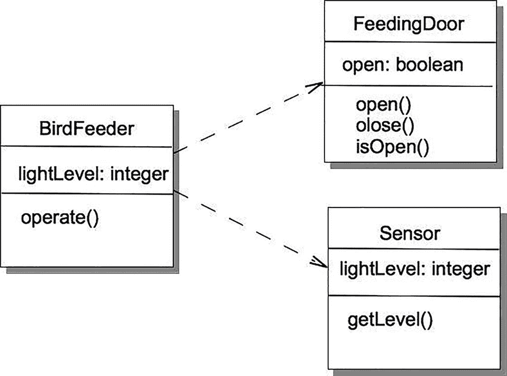

# 10. 面向对象概述

> *对象具有三个特性，这使其成为简单而强大的模型构建模块。它拥有状态，因此可以模拟记忆；它拥有行为，因此可以模拟动态过程；并且它是封装的，因此可以隐藏复杂性。*
> 
> ——特吕格韦·雷恩斯考，*《与对象共事》*

嗯，是的，我们之前都学过面向对象编程范式，但回顾一些基本定义绝无坏处，这样我们在讨论面向对象分析与设计时才能达成共识。

首先，对象是*事物*。它们拥有*标识*（即名称）、*状态*（即描述对象内部当前存储数据的一组属性），以及一组定义好的、作用于该状态的*行为*。栈是一个对象，汽车、银行账户、窗口、图形用户界面中的按钮、一本书，甚至一摞书也都是对象。在面向对象程序中，一组相互协作的对象之间传递消息。这些消息向目标对象发出请求，以调用那些要么对其数据执行操作（从而改变对象状态），要么报告对象当前状态的方法。最终，工作得以完成。对象使用*封装*和*信息隐藏*（记住，它们是不同的）来将数据和操作与程序中的其他对象隔离开来。共享数据区域（通常）被消除。对象是*类*的成员，类定义了属性类型和操作。

类是对象的*模板*或蓝图。类也可以被视为生成对象的工厂。因此，一个`Automobile`类将定义并创建汽车实例，一个`Stack`类将创建一个新的栈对象，而一个`Queue`类将创建一个新的队列。类可以从其他类*继承*属性和行为。类可以排列成一个类层次结构，其中一个类（*超类*，也称为*父类*或*基类*）是一个或多个*子类*（也称为*子类*）的泛化。子类从其超类*继承*属性和操作，并可以添加自己的新方法或属性。从这个意义上说，子类比其超类更具体、更详细；因此，我们说子类*扩展*了超类。例如，一个`BankAccount`对象可能包含客户姓名、地址、余额和一个唯一的银行账户 ID 号；它还将允许存款和取款，并且可以查询当前余额。`CheckingAccount`是`BankAccount`的一个更具体的版本；它拥有`BankAccount`的所有属性和操作，但也添加了`CheckingAccount`特有的数据和行为，比如支票号码和每张支票的手续费。在 Java 中，此特性被称为*继承*。

继承有许多优点。它是一种可用于对实体进行分类的*抽象机制*。它在设计和编程层面都是一种*复用机制*。*继承图*是关于领域和系统的组织性知识的来源。

当然，继承也存在问题。它使得对象类不是自包含的：如果不引用其超类，就无法理解子类。继承引入了复杂性，这是不受欢迎的，尤其是在关键系统中。继承通常还允许运算符（Java 中的方法）的*重载*^(¹⁷³)，这可能是好事（多态性），也可能是坏事（屏蔽了超类中有用的方法）。

*面向对象编程*（OOP）有许多优点，其中包括更易于维护，因为对象可以作为独立的实体来理解和操作。对象也适合作为可复用的组件。但是，对于某些问题，可能不存在从现实世界对象到系统对象的清晰或有用的映射，这意味着 OOP 可能并不适用于所有问题。

## 面向对象分析与设计过程

面向对象分析（OOA）、设计（OOD）和编程（OOP）是相关但不同的概念。

OOA 关注的是开发*应用领域的对象模型*。因此，举例来说，你拿到问题陈述，生成一组特性和（可能的）用例，^(¹⁷⁴)梳理出对象以及这些对象中满足用例所需的一些方法，然后整合出一个解决方案如何协同工作的架构。这就是面向对象分析。

OOD 关注的是开发一个*面向对象的系统模型*以满足需求。你获取从 OOA 中生成的对象，确定是否使用继承、聚合、组合、抽象类、接口等，以创建一个连贯且高效的模型。你绘制类图，充实每个属性是什么以及每个方法做什么的细节，并描述接口。这就是设计。

有些人喜欢面向对象分析、设计和编程，^(¹⁷⁵)有些人不喜欢。^(¹⁷⁶)

因此，面向对象分析允许你获取一个问题模型，并将其以对象和类的形式重新表述；而面向对象设计允许你获取分析后的需求，在你提出的对象之间建立联系，并填充对象属性和方法方面的细节。但你真的该如何做到这一切呢？

以下是一个建议的过程，它开始填充一些细节。^(¹⁷⁷)我们将在后续过程中弄清楚其余部分。

1.  编写（或接收）*问题陈述*。利用它生成一组初始特性。

2.  创建*特性列表*。特性列表是你从问题陈述中推导出的程序特性集合；它包含你的初始需求集。特性列表可以是一组*用户故事*。为了帮助生成特性列表，你可以整理一组*场景*，其中场景是对用户将如何使用程序完成任务的过程的叙述性描述。用户故事非常简短且是高层级的，而场景则更长，提供更多细节。一个用户故事可能生成多个场景。场景应该与技术无关，并且应该从用户的角度明确表述。它不是关于程序如何工作；而是关于用户想要完成什么以及用户如何完成任务；它也可以谈论用户知道什么。

3.  编写*用例*。^(¹⁷⁸)这有助于细化特性，挖掘新需求，并揭示你刚刚创建的特性中存在的问题。用例是对用户如何使用程序完成任务更具体的描述；它们更详细地描述了用户如何与系统交互。用例“……捕捉行动的目标、启动过程的触发事件，然后描述过程的每一步，包括输入、输出、错误和异常。用例通常以参与者或用户执行操作的形式编写，随后是预期的系统响应和替代结果。”^(¹⁷⁹)每个场景或用户故事可能创建多个用例。

4.  将问题*分解*为子问题、子系统或模块，无论你怎么称呼它们，只要它们是更小、自包含的模块，通常与功能相关即可。

5.  将你的特性、子系统和用例*映射*到领域对象；创建抽象。

6.  *识别*程序的对象、方法和算法。

7.  *实现*本次迭代。

8.  *测试*本次迭代。

9.  如果你尚未完成特性列表，并且仍有时间和/或资金剩余，则返回步骤 4 进行下一次迭代，否则……

10. 进行最终的*验收测试*并发布。


请注意，这个过程省略了许多细节，例如一次迭代的时长。一次迭代最终会包含多少功能？我们如何以及何时向功能列表中添加新功能？我们究竟如何识别对象和操作？我们如何将对象抽象成类？在测试中发现的错误应该在哪里修复？我们是否会对代码和其他项目工作产品进行评审？这里省略一些细节是可以接受的；我们主要关注的是流程中的分析和设计元素。我们将在下文讨论流程其余部分的想法；部分答案也出现在关于项目管理的第 3 章中。

### OOA&D 流程的细节

上述流程步骤如何融入软件开发生命周期？嗯，很高兴你问到这个问题。回顾一下，基本的开发生命周期包含四个步骤：

1.  需求收集与分析
2.  设计
3.  实现与测试
4.  发布、维护与演进

我们可以轻松地将前面的十个步骤归入这四个类别，如下所示：

1.  需求收集与分析：
    1.  问题陈述
    2.  创建功能列表
    3.  生成用例
2.  设计：
    1.  分解问题。
    2.  将功能和用例映射到领域对象。
    3.  识别对象、方法和算法。
3.  实现与测试：
    1.  实现本次迭代。
    2.  测试本次迭代。
    3.  如果功能列表尚未完成或时间已到，则返回步骤 2.1，否则进入步骤 4。
4.  发布、维护与演进：
    1.  进行最终验收测试并发布。

同样，我们现在可以暂时忽略每个步骤的细节。这些细节实际上取决于你为开发项目选择的流程方法论。上述流程的描述采用迭代方法论，并且可以轻松地融入敏捷流程，或更传统的分阶段发布流程。

请注意，每当你进入步骤 4 时，都需要重新审视需求，因为你在每次迭代过程中很可能发现或产生了新的需求。此外，每当你的客户看到一次新的迭代时，他们都会要求增加更多功能（是的，他们会的；请相信我们）。这意味着你需要在每次新迭代开始时更新功能列表（并重新确定优先级）。

## 执行流程

接下来，让我们通过一个详细的示例来继续，看看问题陈述会将你引向何方，以及你如何梳理出需求并开始进行面向对象分析。

### 步骤 1：问题陈述

伯特，Birds by Burt 公司的自豪所有者，创造了一款终极的鸟类喂食器。伯特的“鸟之盛宴与沐浴”（B⁴）是一款集鸟类喂食器和鸟浴盆于一体的产品。它有 12 种不同的颜色（包括迷彩色），并提供 1 磅、3 磅和 5 磅的容量规格。其附带的鸟浴盆最多可容纳一加仑水，它内置了一个挂钩，可以挂在树枝或柱子上，B⁴ 产品正在热销。爱丽丝和鲍勃非常渴望拥有一台 B⁴，但他们希望做一些改动。爱丽丝是一位技术极客，也是一位狂热的鸣禽观察者。她知道她最喜欢的鸣禽只在白天进食，所以她想要一款定制的 B⁴，能够使喂食门在日出时自动打开，并在日落时自动关闭。伯特，这位一贯体贴的老板，同意了这一要求，Birds by Burt 公司的硬件部门正在努力为爱丽丝设计 B⁴++。你的工作是编写软件，让硬件能够正常工作。

### 步骤 2：功能列表

你需要做的第一件事是弄清楚 B⁴++ 实际上会*做*什么。这个版本看起来足够简单。你几乎可以立刻写下三个需求：

*   所有喂食门必须同时打开和关闭。
*   喂食门应在日出时自动打开。
*   喂食门应在日落时自动关闭。

所以这看起来并不难。简化的需求很直接，并且不需要用户交互。接下来，你将考虑用例，以便了解这个鸟类喂食器真正要做的事情。

### 步骤 3：用例

*用例*是对程序在特定情况下所执行操作的描述。它是当用户请求某事时，程序执行的一系列详细步骤。用例总是有一个*参与者*（某个启动流程的外部代理）和一个*目标*（用例在结束时应该完成的事情）。用例从用户的角度描述了从某个初始状态到达目标所需经历的过程。^(¹⁸⁰) 以下是 B⁴++ 的一个简单用例示例：

1.  传感器检测到亮度为 40% 的阳光。
2.  喂食门打开。
3.  鸟儿到达、进食、饮水并离开。
4.  传感器检测到阳光亮度降至 25%。
5.  喂食门关闭。

鉴于 B⁴++ 的简单性，这差不多就是你能从一个用例中期望得到的所有内容。事实上，步骤 3 严格来说并不是用例的一部分，因为它不属于程序，但保留它是有好处的，这样你可以更全面地了解 B⁴++ 是如何运作的。用例在需求分析中非常有用，因为它们能让你用自然语言了解程序在特定情况下需要做什么，并且它们通常能帮助你发现新的需求。请注意，在用例中，你不讨论程序*如何*做某事；你只关注程序*必须做什么*才能达到目标。这也可以包括输入、输出以及发生的错误。它还可以包括针对不同情况的备选步骤列表（例如，如果用户出错，则创建两个备选用例，一个用于处理错误，另一个用于用户未出错的情况）。大多数情况下，你编写的每个程序都会有多个用例。这里你只有一个，因为这个版本的 B⁴++ 非常简单。

### 步骤 4：分解问题

现在你已经有了用例，你可以分解问题并识别程序中的对象了。

如果你查看上面的用例并找出其中的名词（包括复合名词），你可以识别出几个对象。每个对象都有特定的特征，并有助于实现为鸟类提供食物的目标。虽然“鸟儿”在用例中是一个名词，但它们是这场小戏中的参与者，因此为了描述对象，你可以忽略它们；它们实际上并不是程序的一部分。在没有鸟的日子里，你的 B⁴++ 应该继续照常运行。其他名词是*传感器*、*门*和*阳光亮度级别*。这些是 B⁴++ 的关键部分，因为用例表明它们是实现日出时打开喂食门、日落时关闭喂食门这一目标的元素和触发器。由于*阳光亮度级别*的任何变化都将完全由环境处理并由传感器检测到，因此你剩下*传感器*和*门*作为要纳入设计的对象。以下是 B⁴++ 第一个版本的对象及其简短描述：

`BirdFeeder`：顶层对象。鸟类喂食器有一个或多个供鸟类进入的喂食门，以及一个用于检测光线亮度变化的传感器。`BirdFeeder` 类需要控制对光传感器的查询以及喂食门的打开和关闭。

*Sensor*：一个连接到硬件光传感器的对象，用于检测不同的光照水平。你需要查询它当前的亮度级别。

`FeedingDoor`：鸟类喂食器上会有几个喂食门。当收到某个触发信号时，它们必须打开和关闭。

目前，类大概就这些了。现在它们都做什么呢？为了描述类及其组件，你可以使用另一种图表功能——*类图*。


### 第 5 步：类图

*类图*允许你描述一个类的属性和方法。一组类图可以描述程序中的所有对象以及对象之间的关系。你可以在类图之间绘制不同类型的箭头来描述这些关系。类图为你创建的程序对象模型提供了可视化描述。你在第 7 章的“狐狸与兔子”程序中看到过一组类图。

类图包含三个部分：

*   *名称*：类的名称
*   *属性*：类实例可用的数据字段（包括名称和数据类型）
*   *方法*：类实例可用的方法集（包括名称和可见性）

你可以在图 10-1 中看到你的`BirdFeeder`类的类图示例。



一个类图展示了 Bird Feeder。三个区块包含以下文本：Bird Feeder。light Level 分号 integer。operate 左括号，右括号。

图 10-1

BirdFeeder 类

该图显示`BirdFeeder`类有一个整数属性`lightLevel`和一个方法`operate()`。单独的类图本身并不十分有趣，但当你将多个类图放在一起并展示它们之间的关系时，你就可以获得关于程序的一些有趣信息。那么，在类图方面你还需要什么？在你的程序中，`BirdFeeder`类使用了`FeedingDoor`和`Sensor`类，但它们彼此并不知晓（也不关心）。事实上，虽然`BirdFeeder`知道`FeedingDoor`和`Sensor`并使用它们，但它们并不知道自己被使用了。啊，这就是面向对象编程的美妙之处。这种关系可以用图 10-2 中所有三个类的类图来表示。



一个图表展示了三个类之间的关系，例如 Bird Feeder、Feeding Door 和 Sensor。

图 10-2

BirdFeeder 使用 FeedingDoor 和 Sensor

在该图中，末端带有开放箭头的虚线表示一个类（在你的例子中是`BirdFeeder`）通过*使用*另一个类（在你的例子中是`FeedingDoor`或`Sensor`）而与它*关联*。

### 第 6 步：开始写代码？

现在你已经有了类图，并且知道了属性、方法以及类之间的关联，是时候用一些代码来充实你的程序了。

在`BirdFeeder`对象中，`operate()`方法需要检查光照水平，并根据`Sensor`对象报告的当前光照水平来打开或关闭喂食门。如果当前光照水平高于或低于阈值，则不做任何操作。

在`Sensor`对象中，`getLevel()`方法仅从硬件传感器报告当前水平。

在`FeedingDoor`对象中，`open()`方法检查门是否关闭。如果门是关闭的，则打开它们并设置一个布尔值来表示门已打开。`close()`方法则执行相反的操作。

以下是所描述的每个类的代码。

```
/**
* class BirdFeeder
*
* @author Agile Programmer
* @version 1.0
*/
import java.util.ArrayList;
import java.util.Iterator;
public class BirdFeeder {
/* 实例变量 */
private static final int ON_THRESHOLD = 40;
private static final int OFF_THRESHOLD = 25;
private int lightLevel;
private Sensor s1;
private ArrayList doors = null;
/*
* BirdFeeder 类对象的默认构造函数
*/
public BirdFeeder() {
doors = new ArrayList();
/* 初始化 lightLevel */
lightLevel = 0;
s1 = new Sensor();
/* 默认情况下，我们有一个只有一个门的喂食器 */
doors.add(new FeedingDoor());
}
/*
* operate() 方法操作喂鸟器。
* 它从 Sensor 获取当前 lightLevel 并
* 检查是否应该打开或关闭门
*/
public void operate() {
lightLevel = s1.getLevel();
if (lightLevel > ON_THRESHOLD) {
Iterator door_iter = doors.iterator();
while (door_iter.hasNext()) {
FeedingDoor a = (FeedingDoor) door_iter.next();
a.open();
System.out.println("门已打开。");
}
} else if (lightLevel < OFF_THRESHOLD) {
Iterator door_iter = doors.iterator();
while (door_iter.hasNext()) {
FeedingDoor a = (FeedingDoor) door_iter.next();
a.close();
System.out.println("门已关闭。");
}
}
}
}
/**
* class FeedingDoor
*
* @author Agile Programmer
* @version 1.0
*/
public class FeedingDoor {
/* 实例变量 */
private boolean doorOpen;
/*
* FeedingDoors 类对象的默认构造函数
*/
public FeedingDoor() {
/* 初始化实例变量 */
doorOpen = false;
}
/*
* 打开喂食门
* 如果门已经打开，则不执行任何操作
*/
public void open( ) {
/** 如果门是关闭的，则打开它 */
if (doorOpen == false) {
doorOpen = true;
}
}
/*
* 关闭门
* 如果门已经关闭，则不执行任何操作
*/
public void close( ) {
/* 如果门是打开的，则关闭它 */
if (doorOpen == true) {
doorOpen = false;
}
}
/*
* 报告门是打开还是关闭
*/
public boolean isOpen() {
return doorOpen;
}
}
/**
* class Sensor
*
* @author Agile Programmer
* @version 1.0
*/
public class Sensor {
/* 实例变量 */
private int lightLevel;
/*
* Sensor 类对象的默认构造函数
*/
public Sensor() {
/** 初始化实例变量 */
lightLevel = 0;
}
/**
* getLevel - 返回光照水平
*
* @return 由硬件传感器返回的光照水平值
*/
public int getLevel( ) {
/* 在我们获得硬件光照传感器之前，我们只是模拟它 */
lightLevel = (int) (Math.random() * 100);
return lightLevel;
}
}
```

最后，你有一个`BirdFeederTester`类来操作 B⁴++。

```
/**
* 测试 BirdFeeder、Sensor 和
* FeedingDoor 类的类。
*
* @version 0.1
*/
public class BirdFeederTester {
private BirdFeeder feeder;
/*
* BirdFeederTest 类对象的构造函数
*/
public BirdFeederTester() {
this.feeder = new BirdFeeder();
}
public static void main(String [] args) {
BirdFeederTester bfTest = new BirdFeederTester();
for (int i = 0; i < 10; i++) {
System.out.println("测试喂鸟器");
bfTest.feeder.operate();
try {
Thread.currentThread().sleep(2000);
} catch (InterruptedException e) {
System.out.println("睡眠中断" + e.getMessage());
System.exit(1);
}
}
}
}
```

当爱丽丝和鲍勃收到 B⁴++时，他们激动不已。门自动打开和关闭，鸟儿们飞来饱餐一顿。鸟鸣声充满了空气。他们还能奢求什么呢？

## 结论

面向对象设计是一种适用于非常广泛问题的方法论。现实世界中许多问题的解决方案很容易被描述为相互协作的对象组。这个简单单一的理念促进了设计的简洁性、设计和代码的复用性，以及 Parnas 在其关于模块分解的论文中所倡导的封装和信息隐藏思想。^(¹⁸¹) 它并非解决所有问题的正确方法，例如通信协议实现等问题，但它为许多其他问题开辟了一个全新且更优解决方案的世界，并缩短了现实世界问题描述与最终代码之间的“认知距离”。


