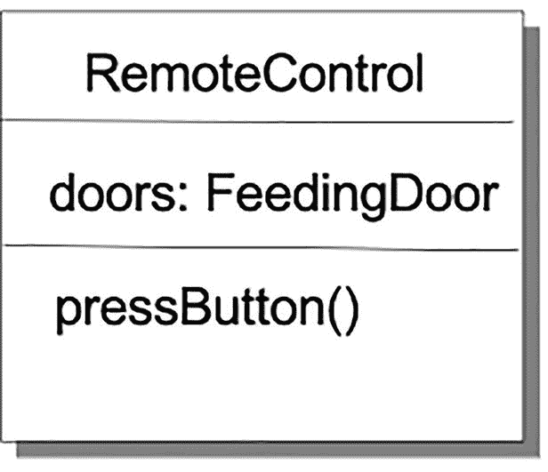
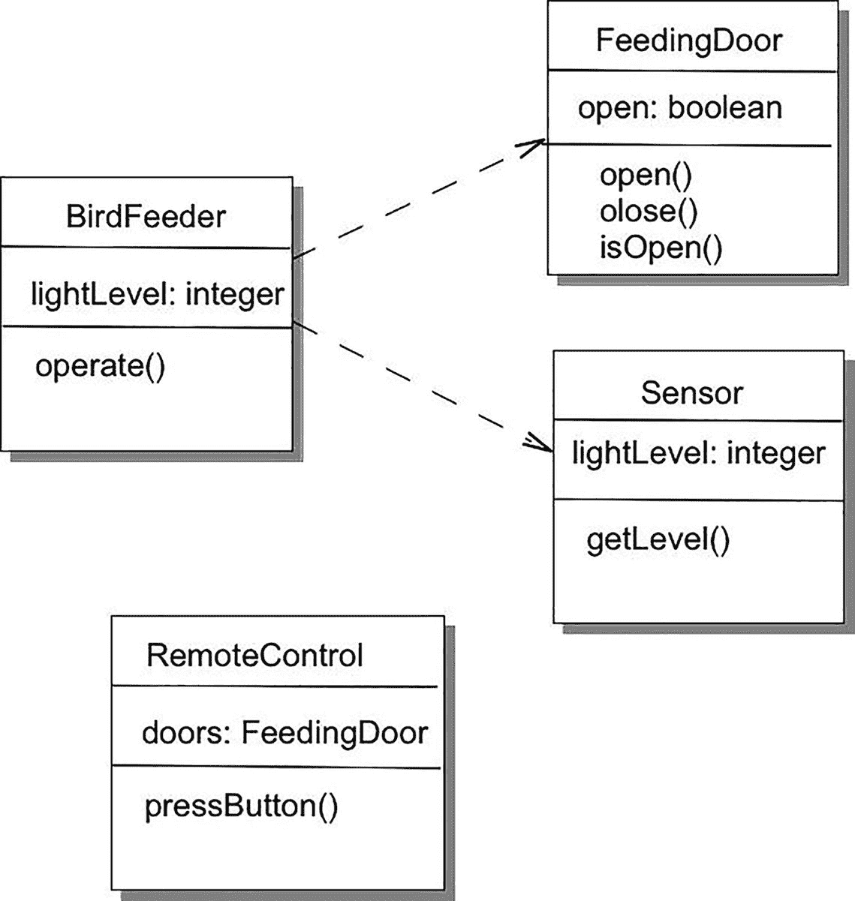
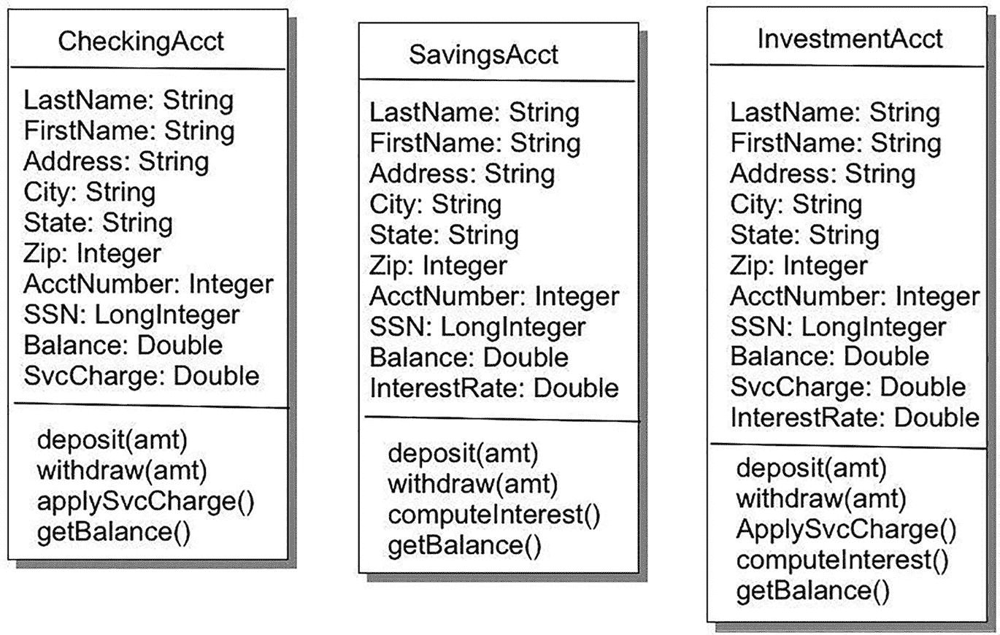
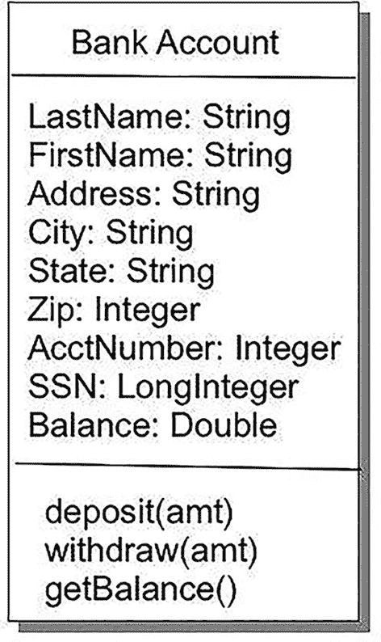
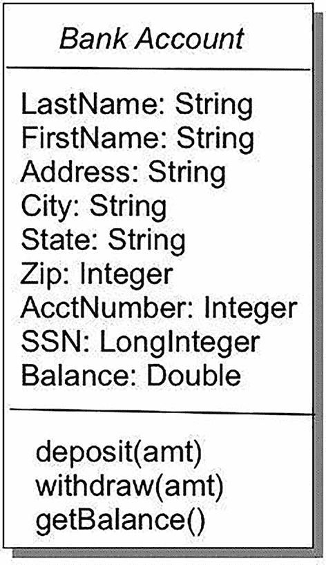
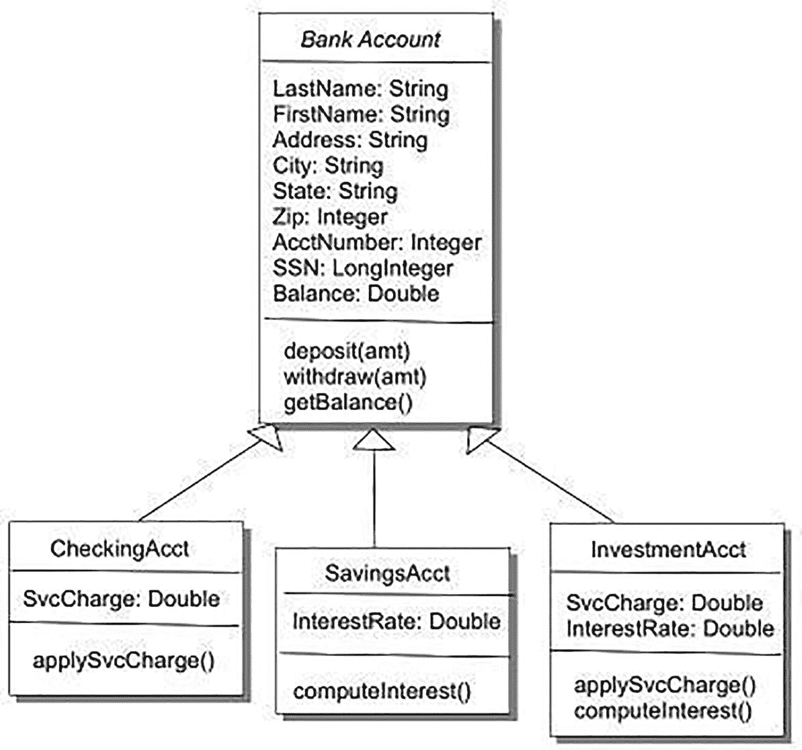

# 11. 面向对象分析与设计

> *进行分析时，你试图理解问题。在我看来，这不仅仅是列出用例中的需求。……分析还涉及深入表面需求，构建出问题背后运作的心理模型。……某种概念模型是软件开发中必不可少的部分，即使是最不受约束的黑客也会这样做。*
> 
> ——马丁·福勒^(¹⁸²)

> *面向对象设计，就其最简单的形式而言，基于一个看似基础的想法。计算系统对某些对象执行某些操作；为了获得灵活且可重用的系统，最好将软件的结构建立在对象之上，而非操作之上。*

> *一旦你这样说，你实际上并未给出定义，而是提出了一系列问题：对象究竟是什么？如何发现并描述对象？程序应如何操作对象？对象之间可能存在哪些关系？如何探索不同类型对象之间可能存在的共性？这些想法如何与经典的软件工程关注点（如正确性、易用性、效率）相关联？*

> *对这些问题的解答依赖于一系列令人印象深刻的技术，用于高效地生产可重用、可扩展且可靠的软件：继承（包括其线性（单继承）和多重形式）；动态绑定与多态；类型与类型检查的新视角；泛型；信息隐藏；断言的使用；契约式设计；安全的异常处理。*
> 
> ——伯特兰·迈耶^(¹⁸³)

在定义面向对象分析与设计时，最好牢记你的目标。在分析和设计这两个过程阶段中，你都在生成一个*工作产品*，它更接近作为最终目标的代码。

在*分析*阶段，你正在细化已创建的功能列表，并生成一个客户需求的模型。你的最终目标是得到一份关于程序应做什么的描述——即其*本质特征*。这个最终产品以问题域及其解决方案的*概念模型*形式呈现。该模型可由多种元素组成，包括用例、用户故事、场景、初步类图、用户界面故事板，以及可能的某些类接口描述。

在*设计*阶段，你正在利用分析阶段产生的模型，创建最终将成为代码的类。你的最终目标是得到一份关于程序将如何实现概念模型并满足客户需求的描述。这个最终产品以解决方案的*对象模型*形式呈现。该模型由一组相关的类图、它们的关联关系以及它们之间如何交互的描述组成。这包括每个类的编程接口。由此，你应该能够相当快速地进入编码阶段。

## 分析

那么，什么是面向对象分析呢？嗯，这取决于你和谁讨论。就我们的目的而言，我们将*面向对象分析*定义为一种*研究问题本质、确定其本质特征及其相互关系的方法*。^(¹⁸⁴) 你的目标是最终得到一个问题解决方案的概念模型，然后你可以用它来创建对象模型——即你的设计。这个模型不考虑任何实现细节或目标系统的约束。它着眼于问题所在的领域，并试图创建一组特征、对象和关系，以描述该领域内的解决方案。什么使一个特征成为本质特征？通常，如果一个特征是客户明确表示必须拥有的，或者是一个程序运行所必需的非功能性需求，又或者是程序其他部分所依赖的核心程序元素，那么它就是本质特征。

概念模型描述了解决方案*将做什么*，通常包括用例、^(¹⁸⁵) 用户故事、^(¹⁸⁶) 用户场景和对象时序图。^(¹⁸⁷) 它还可以包括用户界面的描述和一组初步的类图（但这当然就逐渐偏向设计了）。

那么，如何创建这个概念模型呢？就像我们讨论过的所有其他方法论一样，正确答案是：视情况而定。这取决于对问题域的理解，取决于对已提出的功能列表的理解，还取决于对客户在每次程序迭代中反应的理解。正如你将看到的，变化是常态。

面向对象分析的关键部分是创建*用例*。通过用例，你可以从用户的角度创建场景的详细演练，这种演练能让你从外部理解程序应该做什么。任何规模的程序通常都会关联多个用例。事实上，单个用例可能包含场景中的替代路径。当使用敏捷方法论时，你通常会从产品负责人创建的*用户故事*开始，然后是一组充实用户故事的*场景*。这些场景随后被用来生成用例。稍后会详细介绍这一点。

一旦你创建了几个用例，如何得到类图呢？有几种建议的方法，但我们先只介绍一种，其余的留待以后讨论。我们要看的第一种方法是*文本分析*，即你利用用例，检查文本以寻找程序中类的线索。请记住，面向对象范式完全是关于对象以及这些对象的行为，因此这两点正是你需要从用例中提取出来的。

在文本分析中，你通过挑选用例中的*名词*来从文本中提取潜在的对象。因为名词是事物，而对象（通常）也是事物，所以名词很有可能是你程序中的对象。就行为而言，你需要查看用例中的*动词*。动词为你提供了描述状态变化或报告状态的动作词。这通常不是终点，但它为你提供了方法名和方法参数列表的初步候选。


### 分析：一个示例

让我们回到伯特的小鸟自助餐与浴场（B⁴++）。上次我们讲到 B⁴++时，它已经能在日出时自动打开喂食门，并在日落时关闭。B⁴++大获成功，爱丽丝和鲍勃对其性能感到非常兴奋。B⁴系列产品再次被抢购一空。

然而有一天，伯特接到了爱丽丝的电话。她似乎遇到了一个问题。虽然 B⁴++运行良好，但爱丽丝注意到她的喂鸟器吸引了一些不速之客。要知道，爱丽丝是一位鸣鸟爱好者，当主红雀、彩绘鹀、猩红比蓝雀、美洲金翅雀和冠山雀出现在喂食器旁时，她会非常兴奋。但当黑鹂、蓝松鸦和椋鸟赶走鸣鸟并大快朵颐时，她可就不那么高兴了。因此，爱丽丝希望能在不受欢迎的鸟儿出现时自己关闭 B⁴++的喂食门，并在鸣鸟回来时再次打开。而你正是负责实现这一功能的开发者。

你向爱丽丝提出的第一个显而易见的问题是：“你希望如何打开和关闭喂食门？”她回答说：“嗯，用遥控器怎么样？这样我就可以待在屋里，等鸟儿来了直接开门关门。”于是，新一轮的开发又开始了。

假设你是一个敏捷开发团队，你将使用敏捷技术进行更新设计。首先需要的是一个新用户故事。回忆一下，用户故事通常采用这种形式：“作为<角色>，我想要<行动>，以便<收益>。”在这个案例中，你可以这样说：“作为喂鸟器的主人爱丽丝，我想要用遥控器打开和关闭喂食门，以便阻止掠食鸟类靠近喂食器。”

从这个用户故事中，你可以生成一个场景，详细描述爱丽丝想要做什么。场景可能是这样的：“爱丽丝正坐在厨房餐桌旁喝早咖啡。今早太阳出来后，B⁴++的门自动打开，喂食器吸引了几只鸣鸟。正当爱丽丝观赏鸣鸟时，几只蓝松鸦飞来，赶走了鸣鸟，开始大快朵颐鸟食。爱丽丝伸手拿起遥控器，按下按钮。喂食门平稳关闭，蓝松鸦飞走了。爱丽丝再次按下遥控器按钮，门又打开了。过了一会儿，鸣鸟们回来了，爱丽丝可以愉快地喝完她的咖啡了。”

和上次一样，你可以将这个已详细阐述的问题陈述整理成一个用例。你之前的用例是这样的：

1.  传感器检测到 40%亮度的阳光。
2.  喂食门打开。
3.  鸟儿们到来、进食、饮水、离开。
4.  传感器检测到阳光亮度降至 25%。
5.  喂食门关闭。

因此，你需要首先决定：这个新问题是该用例的一个备选路径，还是需要一个全新的用例？

让我们尝试创建一个新用例。为什么？因为使用遥控器并不真正符合传感器用例的逻辑，不是吗？遥控器可以随时激活，并且需要用户交互，这两点都与传感器不符。所以，我们来构思一个遥控器用例：

1.  爱丽丝听到或看到喂食器旁有鸟。
2.  爱丽丝判断它们*不是*鸣鸟。
3.  爱丽丝按下遥控器按钮。
4.  喂食门关闭。
5.  鸟儿们放弃并飞走。
6.  爱丽丝按下遥控器按钮。
7.  喂食门再次打开。

这个用例涵盖了所有情况吗？有没有遗漏什么？有两件事需要考虑。

首先，在步骤#1 中，你写的是“爱丽丝听到或看到鸟儿”。问题是，“或”字是否重要？在这种情况下，答案是否定的，因为爱丽丝是决策者，也是这个用例中的参与者。你无法控制参与者；你只能响应参与者想要做的事情，并提供可供参与者选择的选项。在你的程序中，你需要等待来自遥控器的信号，然后执行正确的操作。（先别超前，你的程序是一个事件驱动系统，它必须等待（即监听）某个事件发生，然后才能执行操作。）

其次，用例中的哪些步骤能帮助你识别新对象？这就是文本分析发挥作用的地方。在你之前版本的应用程序中，你已经有了`BirdFeeder`、`Sensor`和`FeedingDoor`这些对象。这些对象在用例中很容易被识别出来。那么现在有什么新东西呢？这里唯一的新对象就是遥控器。那么遥控器做什么？它有几个按钮？当按下遥控器按钮时，程序应该做什么？

在你的示例中，遥控器看起来相对简单。打开和关闭喂食门是一个切换操作：如果门是关着的就打开，如果是开着的就关闭。只有这两种选项，所以遥控器实际上只需要一个按钮来实现切换功能。

因此，在对这个新版本程序进行分析之后，你为 B⁴++程序得到了一个新的用例和一个新的类（见图 11-1）。



一个图示说明了遥控器类。三个方框包含以下文本：遥控器。门：喂食门。按下按钮()

图 11-1

新的 RemoteControl 类

这个练习提供了一些可用于分析的指导原则。

*   首先，创建*能够通过发送和响应消息来协同工作的简单类*。在你的示例中，简单的`FeedingDoor`和`Sensor`类封装了关于`BirdFeeder`当前状态的知识，并允许你通过简单的消息来控制喂鸟器。这种简单性使你之后能够轻松地通过`RemoteControl`类添加一种控制喂鸟器的新方式。

*   其次，我们说*类应该只有一个职责*。`FeedingDoor`和`Sensor`不仅简单且易于控制，而且它们各自只做一件事。这使得它们以后更容易修改，也更容易复用。


## 设计

那么设计方面呢？假设你已经通过分析得到了一个概念模型，形式是几个用例和可能的几个类图，那么更详细的设计应以此为基础展开。在面向对象设计中，接下来的步骤是巩固类的设计：确定类将包含的方法，明确类之间的关系，并弄清楚每个方法将如何实现其预定功能。

在你当前的示例中，你已经确定了四个类：`BirdFeeder`、`FeedingDoor`、`Sensor` 和 `RemoteControl`。前三个类你已经开发完成，因此这里的问题是：为了将 `RemoteControl` 类集成到程序中，是否需要修改这些类中的任何一个？图 11-2 展示了当前的情况。



一张图展示了 Remote Control 类。图中描绘了以下类：Bird Feeder、Feeding Door、Sensor、Remote Control。

图 11-2

如何集成 RemoteControl 类

仔细想想，似乎 `FeedingDoor` 或 `Sensor` 中没有任何内容需要修改。为什么呢？

嗯，这是因为 `BirdFeeder` 类使用了这两个类，而这两个类本身不需要使用任何其他类的内容；它们相当自给自足。如果你还记得，`BirdFeeder` 类中的 `operate()` 方法完成了所有繁重的工作。它必须检查来自 `Sensor` 的光照水平，并在适当时向门发送打开或关闭的信号。因此，似乎 `RemoteControl` 类也可能以同样的方式工作。你的设计问题是：`BirdFeeder` 类是否也使用 `RemoteControl` 类，还是 `RemoteControl` 类独立存在，只等待某个“事件”发生？

让我们再次查看 `operate()` 方法的代码：

```
public void operate() {
lightLevel = s1.getLevel();
if (lightLevel > ON_THRESHOLD) {
Iterator door_iter = doors.iterator();
while (door_iter.hasNext()) {
FeedingDoor a = (FeedingDoor) door_iter.next();
a.open();
}
} else if (lightLevel < OFF_THRESHOLD) {
Iterator door_iter = doors.iterator();
while (door_iter.hasNext()) {
FeedingDoor a = (FeedingDoor) door_iter.next();
a.close();
}
}
}
```

在这个方法中，你检查来自 `Sensor` 对象的光照水平，如果高于某个阈值（太阳升起了），你就要求门打开。门本身会检查它们是否已经打开。无论如何，当 `open()` 方法返回时，每扇门都是打开的。`close()` 方法也是如此。无论初始状态如何，每次调用 `close()` 返回时，其对应的门都是关闭的。这正是你希望 `RemoteControl` 对象具有的行为，只不过它不是响应光照阈值，而是响应按钮按下。因此，`pressButton()` 的伪代码将如下所示：

```
pressButton()
while (还有门需要处理) do
if (门是打开的) then
door.close()
else
door.open()
end-if
end-while
end-method.
```

从这里开始，你现在可以编写实际的代码了。

## 朝着正确的方向改变

最后两节的一个关键要素是，面向对象的分析和设计*完全关乎变化*。分析是关于理解行为和*预见变化*，而设计则是关于实现模型和*管理变化*。在典型的流程方法论中，分析和设计是迭代的。当你开始创建一个新程序时，你会发现新的需求；当用户开始使用你的原型时，他们会提出新想法、发现对他们不起作用或无法激发喜悦的东西，以及他们之前未提及的新功能。所有这些都要求你回过头去重新思考你已经了解的问题以及你已经设计的内容。为了避免所谓的“分析瘫痪”，你需要管理这种永无止境的新想法和需求流。

### 识别变化

处理变化的一种方法是寻找设计中可能发生变化的地方。让我们再次看看 B⁴++。目前，B⁴++ 会根据传感器返回的光照水平，在日出和日落时打开和关闭喂鸟器的门。它还会响应遥控器的按钮按下，打开和关闭喂食门。这里可能会发生什么变化呢？

嗯，硬件可能会变化。如果传感器物理上发生了变化，这可能会影响 `Sensor` 类的工作方式。获得新硬件可能会导致新用例的出现或现有用例的变化，就像我们上面添加遥控器一样。并且就像遥控器的例子一样，新硬件可能会导致新用例的出现或现有用例的变化。这些变化可能会因此波及你的类层次结构。

需求可能会变化，而且很可能新需求会突然出现。需求变化可能导致用例的替代路径，从而引发设计变化。设计变化可能因为需求变化而发生。

通过思考程序中哪些内容可能发生变化以及你的设计，你可以开始预见变化。*预见变化*会让你在封装、继承、类之间的依赖关系等方面更加谨慎。谨慎是好的，但不要因为无法预见所有事情而阻碍你取得进展。你在这里追求的是“满意即可”。^(¹⁸⁸)

### 鸣禽永在

既然我们在谈论变化，让我们再看看 B⁴++。自从爱丽丝和鲍勃收到他们带有遥控器的新改进版 B⁴++ 以来，已经过去几周了。爱丽丝很喜欢它。她可以看着厨房窗外的鸟儿，当鹩哥俯冲下来时，她只需按下遥控器按钮，门就会关上。鹩哥失望地离开，她再次按下按钮，门又打开了。新版本运行完美，实现了他们要求的所有功能。

只是有一件小事……

爱丽丝发现，有时她需要外出办事、去洗手间，或者观看探索频道她最喜欢的自然节目。当她这样做时，她无法用遥控器关门，鹩哥就可以随心所欲地进食，把所有鸣禽都赶走。所以爱丽丝希望 B⁴++ 再做一个微小的改动；真的不值一提。她希望 B⁴++ 能够检测到讨厌的鸟并自动关闭门。你如何实现这一点？


### 新需求

因此，新的需求是：“B⁴++ 必须能够检测到不受欢迎的鸟类并自动关闭门。”这是一个完整的需求吗？似乎并非如此，因为它引出了一个显而易见的问题：门何时再次打开？所以，你似乎至少需要决定几件事。

1.  喂鸟器如何检测鸟类类型？
2.  如何区分不受欢迎的鸟类和鸣鸟？
3.  喂鸟器在门关闭后，何时再次打开？

幸运的是，你的传感器供应商 SensorsRUs 刚刚推出了一款可编程音频传感器，可以让你识别鸟鸣。因此，如果你将他们的硬件集成到 B⁴++ 中，就解决了上面的第 1 点。此外，事实证明，那些讨厌的鸟类的叫声与你想要吸引的鸣鸟的叫声截然不同，因此可以通过固件对音频传感器进行编程，以区分不同的鸟类物种，这样就解决了第 2 点。那么第 3 点呢？如何让关闭的门再次打开？

似乎有两种方法可以让 B⁴++ 再次打开门：定时器或传感器。你可以设置一个定时器，让门关闭特定时间，然后再次打开。这种方法的优点是设计和实现都很简单。简单之处在于，定时器程序只是实现一个倒计时定时器，而不需要了解其运行的*上下文*。它可能在周围还有一群讨厌的鸟时轻易地打开门。另一种实现鸟类识别器的方法是，让它只在听到鸣鸟叫声时才打开门。由于鸣鸟在有不属于鸣鸟的鸟类出现时会离开，那么你唯一能听到鸣鸟歌唱的时候，就是周围没有讨厌的非鸣鸟，在这种情况下，重新打开喂食门是安全的。

让我们创建一个用例。因为使用鸣鸟识别器来打开和关闭喂食门很像使用遥控器，让我们以 `RemoteControl` 用例作为*主路径*开始，然后直接从中创建新的备选用例，作为用例中的*备选路径*。表 11-1 并列显示了主路径和备选路径。在任何给定时间，应选择其中一条路径。

表 11-1

鸣鸟识别器用例及其备选路径

| 主路径 | 备选路径 |
| --- | --- |
| 1. 爱丽丝听到或看到喂食器处的鸟类。 | 1.1 鸣鸟识别器听到鸟鸣。 |
| 2. 爱丽丝确定它们*不是*鸣鸟。 | 2.1 鸣鸟识别器识别出该叫声来自不受欢迎的鸟类。 |
| 3. 爱丽丝按下遥控器按钮。 | 3.1 鸣鸟识别器向喂食门发送关闭消息。 |
| 4. 喂食门关闭。 |   |
| 5. 鸟类放弃并飞走。 | 5.1 鸣鸟识别器听到鸟鸣。 |
|   | 5.2 鸣鸟识别器识别出该叫声来自鸣鸟。 |
| 6. 爱丽丝按下遥控器按钮。 | 6.1 鸣鸟识别器向喂食门发送打开消息。 |
| 7. 喂食门再次打开。 |   |

这两条路径并不完全相同。例如，在主路径中，爱丽丝在看到鸟类放弃并飞走后，才按下遥控器按钮重新打开门。在备选路径中，鸣鸟识别器必须等到听到鸟鸣，才能再次打开喂食门。因此，你完全可以将其做成两个不同的用例，而不是一个简单用例的两个备选路径。这取决于*你*。用例旨在说明程序使用中的不同场景，因此你可以用任何你喜欢的方式来表示它们。如果你想把这个用例拆分成两个不同的用例，请随意。只要保持一致即可。你仍然在管理变更。

## 分离分析与设计

正如我们之前所说，将分析与设计分开是很困难的。每个程序员，尤其是初学者，都倾向于*现在*就开始编写代码。这种诱惑会导致同时思考并执行分析、设计和编码。这通常是一个*坏主意*，除非你的程序只有大约 10 行代码。将需求和架构思想从你的低级设计和编码中抽象出来，几乎总是更好的做法。第 5 章和第 6 章更详细地讨论了这种分离。

分离面向对象的分析和设计是一项特别困难的任务。在分析中，我们试图从面向对象的角度理解问题和问题领域。这意味着我们在过程的*非常*早期就开始思考对象及其相互之间的交互。甚至我们的场景和用例中也充满了带有对象含义的词汇。分析和设计几乎是不可分割的：当你在“做分析”时，你也不可避免地会“思考设计”。那么，当你真正想要开始思考设计时，应该怎么做呢？

你的设计必须至少产生系统中的类、它们的公共接口以及它们与其他类（尤其是基类或超类）的关系。如果你的设计方法产生了更多内容，请问问自己，该设计产生的所有部分在程序的生命周期中是否都有价值。如果没有，维护它们将会让你付出代价。开发团队的成员往往不会维护任何对他们生产力没有贡献的东西；这是一个许多设计方法都没有考虑到的现实。

所有软件设计问题都可以通过引入一个额外的概念间接层来简化。这个想法是抽象的基础，也是面向对象编程的主要特征。其思想是识别两个或多个类中的共同特征，并将这些特征抽象到一个更高级、更通用的类中，然后让较低级别的类继承这个类。

在设计时，让你的类尽可能原子化；也就是说，赋予每个类一个单一、明确的目的。这就是*单一职责原则*^(¹⁸⁹)，我们将在关于设计原则的章节中进一步讨论。如果你的类或系统设计变得过于复杂，请将复杂的类分解为更简单的类。最明显的指标是规模：如果一个类很大，它很可能做了太多事情，应该被拆分。

你还需要寻找并分离变化的部分和保持不变的部分。也就是说，搜索程序中那些你可能希望在不强制重新设计的情况下进行更改的元素，然后将这些元素封装到类中。

所有这些指导原则都是管理设计中变更的关键。最终，你需要一个干净、易于理解且易于维护的设计。


## 塑造设计

> *你的目标是以令人愉悦的方式创造和安排对象。你的应用程序将被划分为多个“社区”，每个社区中的对象集群协同工作以实现共同目标。你的设计将由抽象的数量和质量，以及它们之间相互补充的程度所塑造。组合、形式和焦点至关重要。*
> 
> ——丽贝卡·沃夫斯-布洛克 与 艾伦·麦基恩^(¹⁹⁰)

识别对象（或对象类）是面向对象设计中困难的部分。对象识别没有“魔法公式”。它依赖于系统设计者（也就是你）的技能、经验和领域知识。对象识别是一个迭代过程；你不太可能第一次就做对。

你首先通过在你的需求中寻找现实世界的类比来发现对象。这能让你起步，但这只是第一步。其他对象隐藏在你领域的抽象层中。你在哪里能找到这些隐藏的对象？你可以依靠自己对应用领域的知识。你也可以寻找在你的需求和系统架构概念中出现的操作。你甚至可以从自己过去设计或使用其他系统的经验中寻找。

以下是在你的系统中寻找候选对象的一些步骤：

1.  *编写一组用例*，描述应用程序在多种不同场景下如何工作。记住每个用例必须有一个目标。用例中的替代路径可能表明需要新用例的新需求。

2.  *识别每个用例中的参与者*、他们需要执行的操作，以及他们在执行操作时需要使用的其他事物。

3.  *命名并描述每个候选对象*。基于应用领域中的有形事物（如名词）进行识别。采用行为方法，根据哪些对象参与哪些行为（使用动词）来识别对象。

4.  *对象可以通过多种方式体现自身*。它们可以是：
    *   产生或消费信息的外部实体
    *   信息领域的一部分（报告、显示等）
    *   系统内发生的事件或事件
    *   内部生产者（制造东西的对象）
    *   内部消费者（消费生产者所制造东西的对象）
    *   场所（远程系统、数据库等）
    *   结构（窗口、框架）
    *   人或人的特征（人、学生、教师等）
    *   被其他对象拥有或使用的对象（银行账户或汽车零件）
    *   其他对象的列表（零件清单、任何类型的集合等）

5.  *将候选对象组织成组*。每个组代表一个对象集群，它们协同工作以解决应用程序中的共同问题。每个对象将具有几个特征：
    *   *所需信息*：对象拥有必须被记住的信息，以便系统能够运行。
    *   *所需服务*：对象必须提供与系统目标相关的服务。
    *   *公共属性*：为对象定义的属性必须对该对象的所有实例都是通用的。
    *   *公共操作*：为对象定义的操作必须对该对象的所有实例都是通用的。

6.  查看你创建的组，*判断它们是否代表了良好的对象抽象*，并且能在应用程序中工作。良好的抽象将有助于在你不可避免地需要更改应用程序中的某些功能或关系时，使你的应用程序更易于重新设计。

## 抽象

让我们在这里换个话题，讨论一个不同的例子。爱丽丝和鲍勃刚搬到一个新城市，他们需要将他们在第二城市银行与信托公司的银行账户转移到第一银河银行。爱丽丝和鲍勃是中产阶级，他们有几个需要转移的银行账户：一个支票账户、一个存折储蓄账户和一个投资账户。

实际上没有人会开一个通用的“银行账户”。相反，他们开设不同类型的账户，每种类型都有不同的特征。你可以从支票账户开支票，但不能从储蓄账户开支票。你可以在储蓄账户上赚取利息，但通常不能在支票账户上赚取利息；相反，你需要支付月度服务费。尽管如此，所有不同类型的银行账户都有一些共同点：它们都使用你的个人信息（姓名、社会安全号码、地址、城市、州、邮政编码），并且都允许你存钱和取钱。

在编写处理银行账户的程序时，你可能会注意到多个类之间会有共同的属性和行为。既然你知道支票账户、储蓄账户和投资账户都是不同的，让我们首先创建三个不同的类，它们包含各自所需的所有信息，看看最终会得到什么（见图 11-3）。



三个方块包含以下类：支票账户、储蓄账户、投资账户。

图 11-3

具有许多共同点的银行账户

注意，这三个类有很多共同点。无论我们使用什么设计或编码技术，我们总是试图做的一件事就是避免设计和代码的重复。这不仅冗余且浪费，而且在做出更改时，你不可避免地会忘记更新一个或多个重复项。避免重复正是抽象的全部意义所在！如果你抽象出这三个类的所有共同元素，你可以创建一个名为 `BankAccount` 的新（超）类，它包含了所有这些元素。然后，`CheckingAcct`、`SavingsAcct` 和 `InvestmentAcct` 类可以从 `BankAccount` 继承所有这些内容，这将大大简化子类，并清理你的设计和代码。

所以，这就是 `BankAccount`，如图 11-4 所示。



一个垂直矩形包含银行账户类的数据。

图 11-4

一个更简洁的 `BankAccount` 类

但是等等！你会想要实例化 `BankAccount` 类吗？你的每个原始类都比这个新的 `BankAccount` 类具体得多，因此 `BankAccount` 类中没有足够的信息供你将其用于独立对象。这意味着你将始终继承它，但永远不会实例化它。它是一个完美的*抽象类*。（注意，在下图中，抽象类的类图将类名以*斜体*显示。）见图 11-5。



一个垂直矩形包含银行账户抽象类的数据。

图 11-5

作为抽象类的 `BankAccount`

抽象类是实际的*具体类*的模板。它们封装了共享行为，并为所有子类定义了协议。抽象类定义了行为并设置了公共状态，然后具体的子类继承并实现该行为。你不能实例化一个抽象类；必须创建一个扩展该抽象类的新的具体类。作为指导原则，无论何时你在两个或多个地方发现共同行为，你都应该考虑将该行为抽象到一个类中，然后在共同的具体类中重用该行为。


图 11-6 展示了将所有个人数据和公共行为抽象到 `BankAccount` 抽象类后的结果。请注意，抽象类的类图会将类名以*斜体*显示。同时也要注意新的箭头类型：空心箭头表示*继承*。因此，`CheckingAcct` 类继承了 `BankAccount` 抽象类的属性和方法。这也被称为*泛化*，因为超类是对子类的概括。这就是箭头指向超类的原因。



一个垂直矩形包含 Bank Account 类的数据，该矩形被细分为支票账户、储蓄账户和投资账户。

图 11-6

具体的账户类继承自抽象的 BankAccount 类

## 结论

在面向对象的分析与设计中，最好始终牢记你的目标。

在分析阶段，你正在细化已创建的功能列表，并生成一个描述客户需求的模型。你最终需要得到一份关于程序应做什么的说明——即其核心功能。这会创建问题域及其解决方案的概念模型。该模型由多种元素组成，包括用户故事、场景、用例、初步类图、用户界面故事板，以及可能的类接口描述。

在设计阶段，你正在利用该概念模型来创建最终将转化为代码的类。你最终需要得到一份关于程序将如何实现概念模型并满足客户需求的说明。这是解决方案的对象模型。该模型由一组相关的类图、它们的关联关系，以及它们之间如何交互的描述（包括每个类的编程接口）组成。这个设计是你稍后将创建的类细节和代码的抽象。从这里开始，你应该能够很快进入编码阶段。

