# 12. 面向对象设计原则

> *忠于事实总能带来认知的愉悦；遵循设计规则，则能带来秩序与确定的乐趣。*
> 
> ——肯尼斯·克拉克

> *我如何证明我对设计原则不可侵犯性的信念？它们的价值已被证实。它们行之有效。*
> 
> ——埃德加·惠特尼

既然我们已经花了一些时间研究面向对象的分析与设计，现在让我们回顾一下你已经看到的一些内容，并讨论一些*常见的设计特征*。

首先，设计是有目的的。它们描述了某物在特定情境下如何工作，并使用需求（功能列表、用户故事和用例）来定义该情境。

其次，设计必须包含足够的信息，以便他人能够实现它。你需要在设计中提供足够的细节，以便后来者能够正确地实现程序。

接下来，存在不同的设计风格，就像有不同类型的房屋建筑风格一样。你想要的设计类型取决于你需要构建的内容。这取决于具体情境；如果你是一名建筑师，你在海边设计的房子会与在山中设计的房子不同。

最后，设计可以在不同的细节层次上表达。建造房屋时，框架木工需要一个层次的细节，电工和水管工需要另一个层次，而精装木工又需要另一个层次。

关于面向对象设计，在过去几十年中演变出了许多经验法则。这些*设计原则*作为指导方针，供你（作为设计师）遵守，从而使你的设计最终成为一个优秀的设计——易于实现、易于维护，并且恰好满足客户的需求。在前几章中我们已经看到了其中几个原则，这里我们提炼出面向对象设计的九项基本设计原则，它们很可能在你成为杰出设计师的过程中对你最有帮助。我们将在此列出并解释它们，然后在本章剩余部分给出示例。

## 基本面向对象设计原则列表

以下是九项基本原则：

1.  *封装*设计中*可能变化*的部分。

2.  *面向接口编程*，而非面向实现编程。

3.  *开闭原则*（OCP）：类应对扩展开放，对修改关闭。

4.  *不要重复自己原则*（DRY）：避免重复代码。每当你在两个或多个地方发现公共行为时，应考虑将该行为抽象到一个类中，然后在具体的公共类中重用该行为。在代码中的一个地方满足一个需求。

5.  *单一职责原则*（SRP）：系统中的每个对象都应具有单一职责，并且该对象的所有服务都应专注于履行该职责。另一种说法是，一个内聚的类只做好一件事，并且不试图做其他任何事，这也意味着每个类应该只有一个引起变化的原因。这表示*高内聚更好*。

6.  *里氏替换原则*（LSP）：子类型必须能够替换其基类型。（换句话说，*继承*应该设计良好且行为规范。）

7.  *依赖倒置原则*（DIP）：不要依赖具体类；要依赖抽象。

8.  *接口隔离原则*（ISP）：客户端不应依赖它们不使用的接口。

9.  *最少知识原则*（PLK）（也称为*迪米特法则*）：只与你最直接的朋友交谈。这也与*松耦合*的概念相关。相互交互的对象应通过定义良好的接口保持松耦合。

正如你可能已经注意到的，这里存在一些重叠，并且一个或多个设计原则可能依赖于其他原则。这没关系。重要的是基本原则。让我们逐一进行讲解。


## 封装设计中可能变化的部分

这一首要原则意味着，通过将类中在整个程序运行期间相对稳定的特性与方法同那些会变化的特性分离开来，从而保护你的类免受不必要的变更。通过分离这两类特性，你将可能变化的部分隔离到一个（或多个）独立的类中，这些类是你预期会进行修改的，这样我们就提升了灵活性并简化了修改过程。同时，你保留设计中稳定的部分不变，这样你只需实现它们一次并测试一次。这保护了设计的稳定部分免受任何不必要的变更。

让我们创建一个非常简单的类 `Violinist`。图 12-1 是 `Violinist` 类的类图。

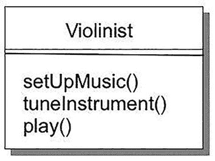

一个标注为 `Violinist` 的类图，包含三个函数，例如 `setUpMusic`、`tuneInstrument` 和 `play`。

图 12-1
一个 `Violinist` 类

考虑一下，`setUpMusic()` 和 `tuneInstrument()` 方法很可能相当稳定。但 `play()` 方法呢？事实证明，小提琴有多种不同的演奏风格：古典、蓝草和凯尔特，仅举三例。这意味着 `play()` 方法会根据演奏风格而变化。既然你有一个可能变化的行为，也许你应该将该行为抽象出来，并将其封装到另一个类中？如果你这样做，就会得到类似图 12-2 的结果。

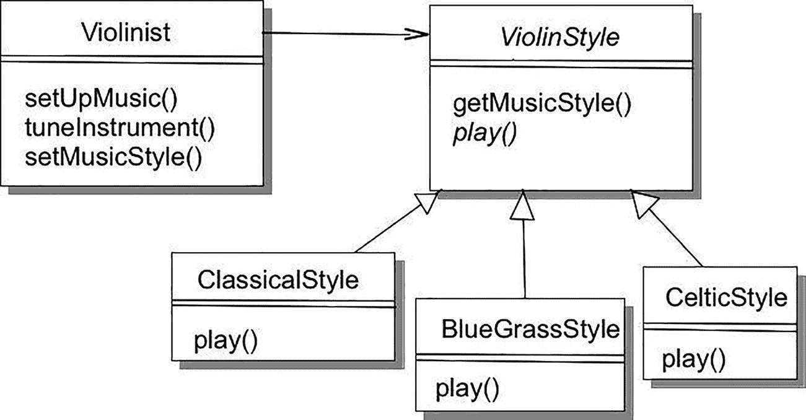

一个 UML 类图，包含三个主要类，例如 `Violinist`、`ViolinStyle` 和 `ClassicalStyle`，后者进一步细分为 `BluegrassStyle` 和 `CelticStyle`。图中用箭头描绘了方法和关系。

图 12-2
`Violinist` 与演奏风格

你已经将会变化的 `play()` 方法抽象并封装到一个单独的类中，这样你就可以将想要对演奏风格进行的任何修改，与 `Violinist` 中其他稳定的行为隔离开来。注意，你在 `Violinist` 类和抽象类 `ViolinStyle` 之间使用了关联关系，这使得 `Violinist` 能够使用具体的风格类，这些类继承自抽象类 `ViolinStyle` 并重写了其抽象方法 `play()`。

## 针对接口编程，而非针对实现

这一原则意味着，你的代码应围绕那些不太可能变化的结构来设计。与本章中的许多原则一样，这涉及到继承以及你在程序中如何使用它。假设你有一个程序，用于模拟二维空间中不同类型的几何形状。你将有一个 `Point` 类，用于表示二维空间中的一个点；你还会有一个名为 `Shape` 的接口，它将所有形状共有的特性——面积和周长——抽象出来。（圆形和椭圆将周长称为 circumference，但这里我们使用 perimeter。）那么，你得到的结果如下（见图 12-3）。

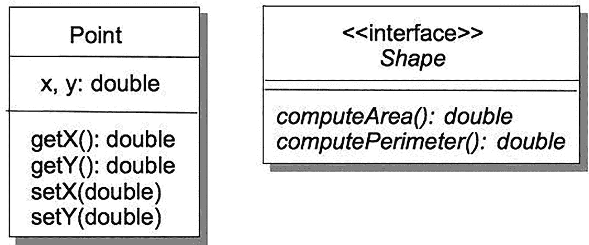

一个 UML 类图，包含两个实体：`Point`，其属性 `x` 和 `y` 的类型为 `double`，方法有 `getX`、`getY`、`setX(double)` 和 `setY(double)`；以及接口 `Shape`，其方法有 `computeArea()`（返回 `double`）和 `computePerimeter()`（返回 `double`）。

图 12-3
一个简单的 `Point` 类和通用的 `Shape` 接口

如果你想创建一些不同形状的具体类，你需要*实现* `Shape` 接口。这意味着具体类必须实现 `Shape` 接口中的每一个抽象方法。见图 12-4。

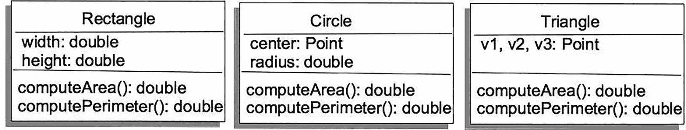

一组三个 UML 类图，分别表示几何形状，如 `Rectangle`、`Circle` 和 `Triangle`。每个图都列出了属性和用于计算面积和周长的方法，并指定了数据类型。

图 12-4
`Rectangle`、`Circle` 和 `Triangle` 都实现了 `Shape`

现在你已经有了一些表示不同几何形状的类。如何使用它们呢？假设你正在编写一个应用程序，用于操作一个几何形状。你可以通过两种不同的方式来实现。首先，你可以为每个几何形状编写一个独立的应用程序。见图 12-5。

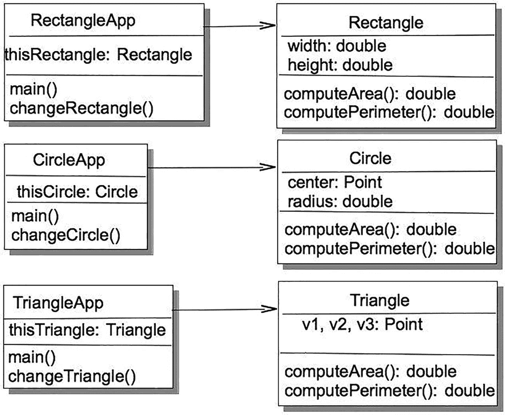

一个 UML 类图，包含三个类：`RectangleApp`、`CircleApp` 和 `TriangleApp`。每个类都包含一个 `main` 方法以及一个关联的形状类 `Rectangle`、`Circle` 和 `Triangle`，这些形状类带有用于计算面积和周长的方法和属性。

图 12-5
使用几何对象

这些应用程序有什么问题呢？嗯，你有三个不同的应用程序在做同样的事情。如果你想添加另一个形状，比如菱形，你就必须编写两个新类：`Rhombus` 类（实现 `Shape` 接口）和一个新的 `RhombusApp` 类。哎呀！这效率太低了。你是在针对几何形状的不同实现进行编程，而不是针对接口本身进行编程。

那么如何解决这个问题呢？需要认识到的是，接口是所有实现该接口的类的类层次结构的顶层。因此，它是一种类类型，你可以利用它来在程序中实现*多态*（即一个事物可以具有多种形态的概念）。在这种情况下，由于你有多个实现 `Shape` 接口的几何形状，你可以创建一个 `Shape` 数组，用不同类型的形状填充它，然后进行迭代。在 Java 中，你将使用 *List* 集合类型来存储你的形状：

```
import java.util.*;
/**
* ShapeTest - 测试 Shape 接口的实现。
*
* @author 程序员 1
* @version 1.0
*/
public class ShapeTest {
public static void main(String [] args) {
List figures = new ArrayList();
figures.add(new Rectangle(10, 20));
figures.add(new Circle(10));
Point p1 = new Point(0.0, 0.0);
Point p2 = new Point(5.0, 1.0);
Point p3 = new Point(2.0, 8.0);
figures.add(new Triangle(p1, p2, p3));
Iterator iter = figures.iterator();
while (iter.hasNext()) {
Shape nxt =  iter.next();
System.out.printf("area = %8.4f perimeter = %8.4f\n",
nxt.computeArea(), nxt.computePerimeter());
}
}
}
```

因此，当你针对接口编程时，你的程序将更易于扩展和修改，并且能够与接口的所有子类无缝协作。

顺便提一下，上述原则让你明白，你应该持续审视你的设计。骄傲会毁掉好的设计；不要害怕重新审视你的设计决策。你的设计是迭代的。由于需要*重构*，改变你的设计也必然会迫使你的代码发生改变。


## 开闭原则 (OCP)

开闭原则指出，类应该对扩展开放，对修改关闭。^(¹⁹¹)

这意味着要找出类中不变的行为，并将该行为抽象到父类/基类中。这样既能封装并锁定基类代码，使其免于修改，同时允许所有子类（即那些扩展基类的类）继承基类行为，并以不同方式对其进行扩展。其核心要义在于，在精心设计的代码中，你添加新功能的方式不是修改现有代码（它对修改是关闭的），而是添加新代码（它对扩展是开放的）。

你在前一章编写的 `BankAccount` 类就是开闭原则应用的经典范例。在该示例中，你将所有实现所需的个人信息（以及访问和修改数据的方法）都抽象到了抽象的 `BankAccount` 类中，使其对修改关闭，然后将该类扩展为不同类型的银行账户。这让你只需再次扩展 `BankAccount` 类，就能轻松添加新的银行账户类型。你避免了代码重复，并维护了 `BankAccount` 属性的完整性。请参见图 12-6。

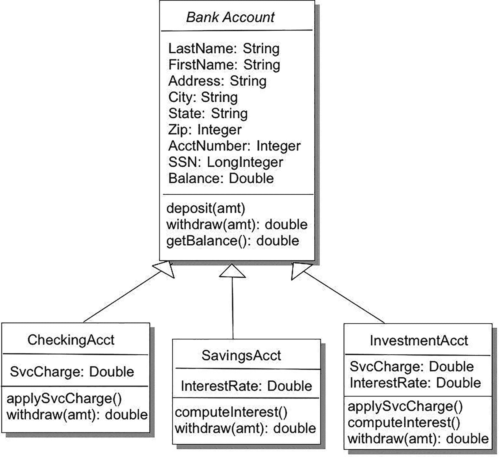

一个 UML 类图表示一个银行系统，包含三个类：支票账户、储蓄账户和投资账户。每个类图都列出了属性和用于计算利息及取款的方法，并指定了数据类型。

图 12-6

开闭原则的经典 BankAccount 示例

例如，在抽象的 `BankAccount` 类中，你定义了 `withdraw()` 方法，允许客户从账户中取款。但取款的具体方式在每个扩展的账户类中可能有所不同。虽然 `BankAccount` 类中的 `withdraw()` 方法对修改是关闭的，但它可以在子类中被重写，以实现该特定账户类型的规则，从而改变方法的行为以适应其账户子类型。它是对修改关闭的，但对扩展是开放的。

开闭原则不必局限于继承。如果你在一个类中有几个私有方法，这些方法对修改是关闭的，但如果你随后创建了一个或多个使用这些私有方法的公有方法，你就通过在这些公有方法中添加功能，为扩展这些私有方法打开了可能性。

## 不要重复自己原则 (DRY)

该原则指出，应通过抽象出公共部分并将其放置在单一位置来避免重复代码。^(¹⁹²)

DRY 是基础性的设计原则：自从开发者开始思考编写程序的更好方法以来，它就一直被传承下来。你可以重新查阅第 8 章和第 9 章以了解相关讨论。遵循 DRY 原则，你应将每条信息和每个行为都放在设计中的单一位置。理想情况下，一个需求只在一个地方出现。这意味着你应该这样设计：每个需求都有一个逻辑上的实现位置。这样，如果你需要更改需求，就只有一个地方需要修改。同时，你应移除重复代码，并用方法调用来替代。如果你在复制代码，你就是在复制行为。

DRY 的适用性超越了代码本身。仔细梳理你的功能列表和需求以查找重复项总是一个好主意。重写需求以避免在代码中重复功能，将使你的代码更易于维护。

考虑上一章讨论的 B⁴++ 鸟类喂食器的最终版本。你最后做的工作是向喂食器添加一个歌曲识别器，以便喂食门可以自动打开和关闭。让我们看看你最终得到的两个用例（见表 12-1）。

表 12-1

歌曲识别器用例及其备选

| 主路径 | 备选路径 |
| --- | --- |
| 1. 爱丽丝在喂食器处看到或听到鸟。 | 1.1 鸣鸟识别器听到鸟鸣声。 |
| 2. 爱丽丝确定它们*不是*鸣鸟。 | 2.1 鸣鸟识别器识别出该鸣叫声来自不受欢迎的鸟。 |
| 3. 爱丽丝按下遥控器按钮。 | 3.1 鸣鸟识别器向喂食门发送关闭消息。 |
| 4. 喂食门关闭。 |   |
| 5. 鸟儿放弃并飞走。 | 5.1 鸣鸟识别器听到鸟鸣声。 |
|   | 5.2 鸣鸟识别器识别出该鸣叫声来自鸣鸟。 |
| 6. 爱丽丝按下遥控器按钮。 | 6.1 鸣鸟识别器向喂食门发送打开消息。 |
| 7. 喂食门再次打开。 |   |

请注意，你在两个不同的地方（通过遥控器和通过歌曲识别器）打开和关闭喂食门。但仔细想想，无论你在哪里请求开门/关门，它们总是以相同的方式打开/关闭。因此，这是一个经典的将开门和关门行为抽象出来并放在单一位置（例如一个 `FeedingDoor` 类）的机会。这就是 DRY 原则在发挥作用！


## 单一职责原则（SRP）

该原则指出，一个类应该只有一个，且仅有一个，需要变更的理由。^(¹⁹³)

以下是上述设计原则之间重叠的一个例子：SRP、关于封装的第一条原则以及 DRY 原则都表达了相似但略有不同的含义。封装是关于抽象行为，并将设计中可能变化的部分放在同一位置。DRY 是关于通过将相同的行为放在同一位置来避免重复代码。SRP 则是关于设计你的类，使得每个类只做一件事。

每个对象都应该有单一的职责，并且该对象的所有服务都旨在履行这一职责。*每个类应该只有一个需要变更的理由*。简单来说，这意味着要警惕你的类试图做太多事情。

举个例子，假设你正在为一部手机编写嵌入式代码。经过与市场部门数月（真的）的讨论后，你对`MobilePhone`类的初稿如图 12-7 所示。

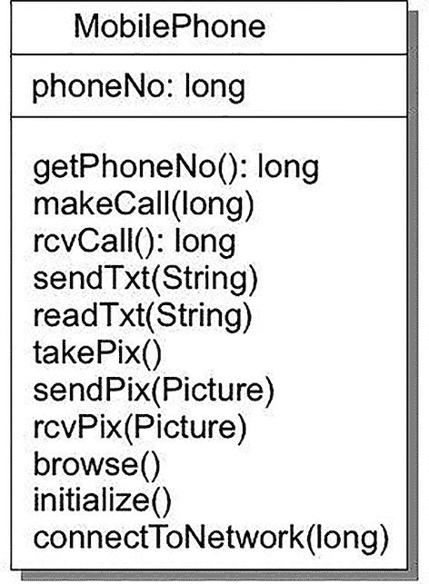

一个手机的 UML 类图，列出了属性和操作。属性包括电话号码（long 类型）。操作包括诸如获取电话号码（long）、拨打电话（long）和连接到网络（long）等方法。

图 12-7

一个非常繁忙的 MobilePhone 类

这个类似乎囊括了你希望手机做的很多事情，但它以多种方式违反了 SRP。该类没有*单一的职责*；它有很多职责。它不是在尝试做一件事，而是试图做太多事情：拨打和接听电话；创建、发送和接收短信；创建、发送和接收图片；以及浏览互联网。但你不想让一个单一的类受到所有这些完全不同的需求的影响。你不想每次图片格式改变、每次你想添加新的图片编辑功能、或者每次浏览器更新时都去修改`MobilePhone`类。相反，你应该将这些功能分离到不同的类中，以便它们可以彼此独立地进行变更。那么，如何识别哪些东西应该移出这个类，哪些东西应该保留呢？请看图 12-8。

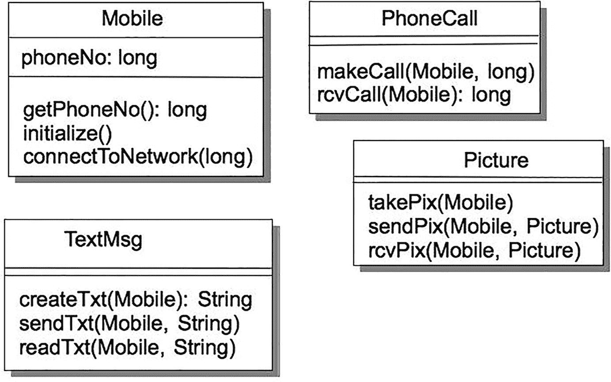

一个 UML 图，包含标记为 Mobile、PhoneCall、Picture 和 TextMsg 的类，每个类都包含与手机操作相关的方法，例如拨打电话、拍摄和发送图片、以及创建和发送短信。

图 12-8

每个都具有单一职责的手机类

在这个例子中，你问的问题是“手机（对自己）做了什么？”，而不是“手机提供了哪些服务？”。通过提出这样的问题，你可以开始分离设计中对象的职责。在这种情况下，你可以看到手机本身可以获取自己的电话号码、初始化自身、并连接到移动电话网络。另一方面，所提供的服务实际上与手机本身是独立的，因此可以分离到`PhoneCall`、`TextMsg`和`Picture`类中。于是你将最初的一个类拆分成四个独立的类，每个类都有单一的职责。这样，你可以更改这四个类中的任何一个，而不会影响其他类。然后你添加一个`Controller`类来运行手机本身并与现有服务交互，这也允许你在未来添加新的服务/类。你简化了设计（尽管类变多了），并使其更易于扩展和修改。这难道不是一个伟大的原则吗？

## 里氏替换原则（LSP）

里氏替换原则以图灵奖得主、麻省理工学院的芭芭拉·利斯科夫博士命名，它告诉我们所有子类必须能够替换其基类。^(¹⁹⁴) 该原则要求继承^(¹⁹⁵) 必须设计良好且行为规范。任何实例化为子类的对象都应该能够无缝地使用基类的所有功能。

违反里氏替换原则最经典、最典型的例子之一就是矩形/正方形示例。这个例子在互联网上随处可见；罗伯特·马丁在他的书《敏捷软件开发：原则、模式与实践》^(¹⁹⁶) 中给出了这个例子的一个精彩变体，我们将遵循他的版本。以下是 Java 代码。

假设你有一个名为`Rectangle`的类，它代表几何形状矩形：

```
/**
* class Rectangle
*/
public class Rectangle {
private double width;
private double height;
/**
* Constructor for objects of class Rectangle
*/
public Rectangle(double width, double height) {
this.width = width;
this.height = height;
}
public void setWidth(double width) {
this.width = width;
}
public void setHeight(double height) {
this.height = height;
}
public double getHeight() {
return this.height;
}
public double getWidth() {
return this.width;
}
}
```

当然，你的一个用户希望能够同时操作正方形和矩形。你已经知道正方形只是矩形的一种特殊情况。换句话说，正方形*是一种*矩形。因此，这个问题似乎需要使用继承。于是你创建了一个继承自`Rectangle`的`Square`类：

```
/**
* class Square
*/
public class Square extends Rectangle {
/**
* Constructor for objects of class Square
*/
public Square(double side) {
super(side, side);
}
public void setSide(double side) {
super.setWidth(side);
super.setHeight(side);
}
public double getSide() {
return super.getWidth();
}
}
```

注意，因为`Square`的宽度和高度相同，你不能冒险单独改变它们，所以`setSide()`使用`setWidth()`和`setHeight()`来同时设置`Square`的边长。没什么大不了的，对吧？

好吧，如果你有一个像这样的函数：

```
void myFunc(Rectangle r, double newWidth) {
r.setWidth(newWidth);
}
```

并且你向`myFunc()`传递一个`Rectangle`对象，它工作得很好，改变了矩形的宽度。但是如果你向`myFunc()`传递一个`Square`对象呢？嗯，事实证明在 Java 中会发生和之前相同的事情，但这是*错误的*。它只改变了`Square`对象的宽度而没有同时改变其高度，从而违反了`Square`对象的完整性。因此，你在这里违反了 LSP，并且在不改变`Square`行为的情况下，`Square`无法替代`Rectangle`。LSP 指出子类（`Square`）应该能够替代超类（`Rectangle`），但在这个例子中它做不到。

为了解决这个问题，你可以在`Square`中覆盖`Rectangle`类的`setWidth()`和`setHeight()`方法，如下所示：

```
public void setWidth(double w) {
super.setWidth(w);
super.setHeight(w);
}
public void setHeight(double h) {
super.setWidth(h);
super.setHeight(h);
}
```


这两种方法都能正常工作，你会得到正确的答案并保持`Square`对象的不变性，但如果你必须重写大量继承来的方法，那么一开始使用继承的意义何在？这正是 LSP 的核心所在：让派生类的*行为*正确，从而正确使用继承。如果你将基类视为一份需要遵守的契约（还记得开闭原则吗？），那么 LSP 就是在说，即使是派生类也必须遵守这份契约。哦，顺便提一下，这在 Java 中可行，因为 Java 的公有方法都是*虚方法*，因此可以被重写。如果你在`Rectangle`中使用了`final`关键字定义`setWidth()`和`setHeight()`，或者将它们设为`private`，那么你就无法重写它们。事实上，这些方法的`private`版本一开始就不会被继承。

在这个例子中，虽然从数学上讲正方形是矩形的一种特化类型，且与矩形相关的不变性仍然成立，但这种数学定义在 Java 中行不通。在这种情况下，你不应该让`Square`成为`Rectangle`的子类；继承在这里并不适用，因为我们认为矩形有两种不同的边（长和宽），而正方形只有一种边。因此，如果`Square`类继承自`Rectangle`类，那么正方形与矩形在概念上的差异就会干扰代码的实现。这两个类无法有意义地相互扩展。（如果你想将`Square`和`Rectangle`归入一个共同的父类，可以添加一个`Parallelogram`类，它封装了两组平行且等长的边。）

派生类中的方法重写是违反 LSP 的最大原因。^(¹⁹⁷) 表明你正在违反 LSP 的迹象包括：

*   子类未能保持其超类的所有外部可观察行为。
*   子类修改而非扩展了其超类的外部可观察行为。
*   子类抛出异常，试图隐藏其超类中定义的某些行为。
*   子类通过使用空实现重写超类中定义的虚方法，以隐藏其超类中定义的某些行为。

## 继承的替代方案：委托、组合和聚合

有时，继承并不是共享其他类行为和属性的正确方式。幸运的是，你还有其他选择。最常见的三种是*委托*、*组合*和*聚合*。

*委托*：这是每个管理者都应该做的事：将部分工作交给别人处理。委托意味着将处理行为的责任交给另一个类。这会在类之间建立一种关联，意味着这些类彼此相关，通常通过一个属性或一组相关方法来实现。委托有一个很大的附带好处：它使你的对象免受程序中其他对象实现变更的影响；你没有使用继承，因此封装保护了你。^(¹⁹⁸) 让我们通过一个例子来看看委托是如何工作的。

上次我们讲到爱丽丝和鲍勃以及他们的 B⁴++时，爱丽丝已经厌倦了用遥控器打开和关闭喂食门来驱赶非鸣鸟。于是他们又要求增加一个新功能：自动鸣声识别器。有了鸣声识别器，B⁴++本身就能识别鸣鸟的歌声并打开门，但对于其他所有鸟类则保持门关闭。我们可以从几个角度来思考这个问题。

根据单一职责原则，`BirdFeeder`类不应该负责识别鸟鸣，但它应该知道哪些鸣声是被允许的。你需要一个新的类`SongIdentifier`来实际进行鸣声识别。你还需要一个包含鸟鸣的`Song`对象。图 12-9 展示了目前的设计。

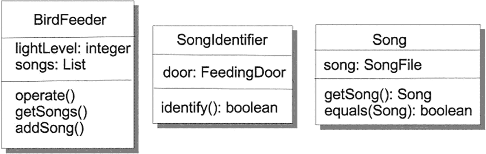

一个包含三个类（鸟食器、鸣声识别器和鸣声）的 UML 类图。每个类包含属性和方法，例如获取鸣声、添加鸣声和布尔型识别方法。

图 12-9
鸣声识别器功能的初步设计

`BirdFeeder`了解鸟鸣，并保存了该喂食器允许的鸣声列表。`SongIdentifier`的唯一工作是识别给定的鸣声。有两种实现方式。第一种是`SongIdentifier`类可以在`identify()`方法中自行完成工作。这意味着`SongIdentifier`需要一个`equals()`方法来比较两个鸣声（来自已知允许鸣声列表中的任何一个允许鸣声，以及新的 B⁴++硬件刚刚检测到并发送给你的鸣声）。第二种识别鸣声的方式是让`Song`类使用自己的`equals()`方法自行完成。你应该选择哪一种呢？

嗯，如果你在`SongIdentifier`类中完成所有识别工作，那么每当`Song`中的任何内容发生变化时，你都必须同时修改`Song`类*和*`SongIdentifier`类。这听起来并不理想。但如果你将鸣声比较的工作委托给`Song`类，那么`SongIdentifier`的`identify()`方法就可以只将`Song`作为输入参数并调用该方法，从而将对鸣声的任何更改隔离到`Song`类中。图 12-10 展示了修改后的类图。

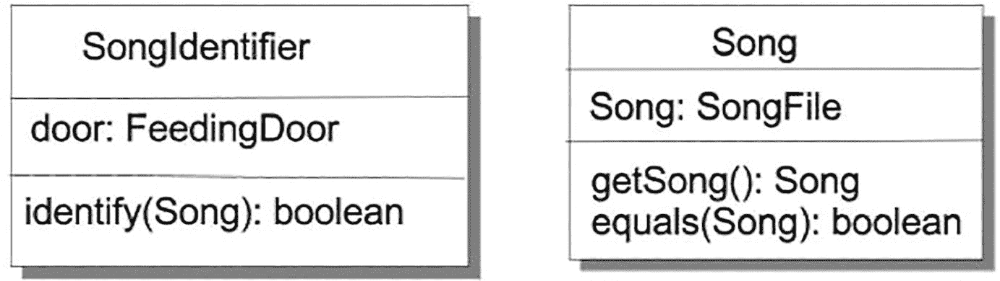

两个 UML 类图，分别标注为“鸣声识别器”（属性：喂食门，操作：识别鸣声布尔值）和“鸣声”（属性：鸣声文件，操作：获取鸣声和比较鸣声布尔值）。

图 12-10
简化 SongIdentifier 和 Song

相应的代码可能如下所示：


```
public class SongIdentifier {
private BirdFeeder feeder;
private FeedingDoor door;
public SongIdentifier(BirdFeeder feeder) {
this.door = feeder.getDoor();
}
public void identify(Song song) {
List songs = feeder.getSongs();
Iterator song_iter = songs.iterator();
while (song_iter.hasNext()) {
Song nxtSong = song_iter.next();
if (nxtSong.equals(song)) {
door.open();
return;
}
}
door.close();
}
}
public class Song {
private File song;
public Song(File song) {
this.song = song;
}
public File getSong() {
return this.song;
}
public boolean equals(Object newSong) {
if (newSong instanceof Song) {
Song newSong2 = (Song) newSong;
if (this.song.equals(newSong2.song)) {
return true;
}
}
return false;
}
}
```

在这个实现中，如果你对歌曲相关的任何内容进行修改，那么你只需要修改 `Song` 类，而 `SongIdentifier` 则与这些修改隔离开来。`Song` 类的*行为*不会改变，尽管它*实现*该行为的方式可能会变。只要行为始终一致，`SongIdentifier` 并不关心行为是如何实现的。`BirdFeeder` 将处理鸟鸣的工作委托给了 `SongIdentifier` 类，而 `SongIdentifier` 又将比较歌曲的工作委托给了 `Song` 类，整个过程都没有使用继承。

委托允许你将某个行为的责任交给另一个类，从而无需担心在自己的类中修改该行为。你可以信赖被委托类中的行为不会改变。但有时你需要同时使用一整套行为，而委托无法满足这种需求。这时，你需要使用*组合*来从其他类中组装行为。

假设你正在开发一款太空题材的角色扮演游戏（RPG）——《太空游侠》。你需要在游戏中建模的对象之一就是飞船本身。飞船会有许多不同的特性。例如，有不同类型的飞船：穿梭机、贸易船、战斗机、货船、主力舰等等。每艘飞船还会有不同的特性：武器、护盾、货舱容量、船员数量等等。

如果你想创建一个通用的 `Ship` 类，那么很难将所有这些东西都集中到一个单一的 `Ship` 超类中，以便为 `Shuttle`、`Fighter`、`Freighter` 等创建子类。这些飞船类型差异很大，但它们之间有什么共同点吗？你应该在这里使用继承吗？

可以说，《太空游侠》中所有飞船只有两个共同点：每艘飞船都有一个飞船类型，以及一组与该飞船类型相关的属性。这就引出了你的第一个类图，如图 12-11 所示。

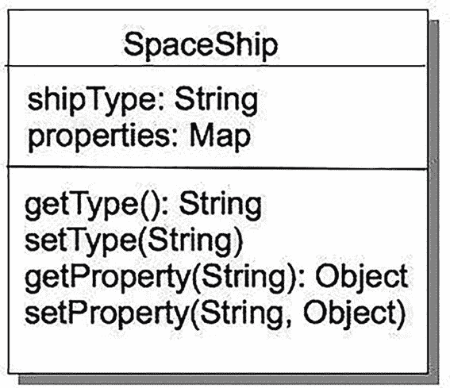

一个太空飞船类的 UML 类图，包含属性 shipType（字符串）和 properties（映射），以及方法 getType（字符串）、setType（字符串）、getProperty（字符串，对象）和 setProperty（字符串，对象）。

图 12-11

所有飞船有什么共同点？

这允许你存储飞船类型以及飞船实例的各种属性映射。这意味着你可以独立于飞船来开发属性，然后不同的飞船可以共享相似的属性。例如，所有飞船都可以有武器，但它们可以拥有不同特性的武器。这促使你开发一个 `Weapon` 接口，然后你可以用该接口来实现具体的类。你通过使用*组合*来在 `SpaceShip` 中使用这些武器。请记住，组合允许你使用一整套保证不会改变的行为。参见图 12-12。

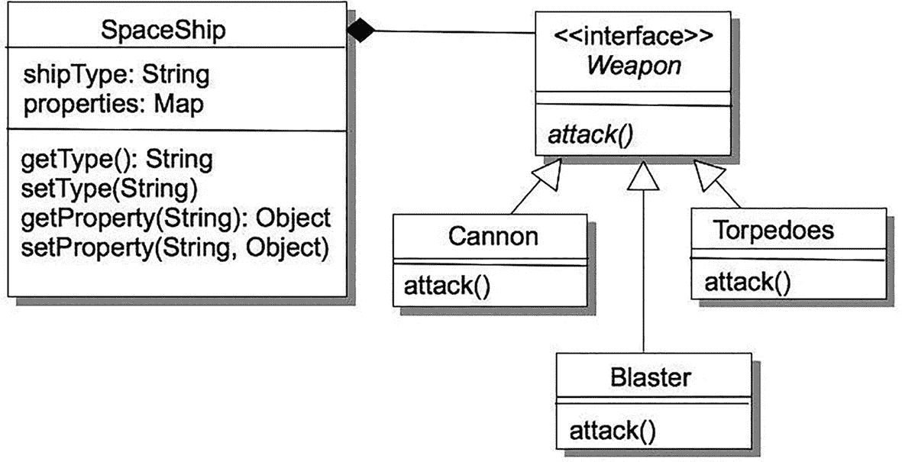

一个 UML 类图，展示了一个具有属性和方法的 SpaceShip 类，连接到一个由三个类（Cannon、Torpedoes 和 Blaster）实现的 Weapon 接口，每个类都有一个 attack 方法。

图 12-12

使用组合让 SpaceShip 能够使用武器

回想一下，UML 图中的空心三角形表示继承（对于接口而言，则表示实现）。UML 中的实心菱形表示组合。因此，在这个设计中，你可以将多种武器添加到你的属性映射中，每种武器都将拥有 `Weapon` 接口定义的所有能力，但每种武器都会以自己的方式实现这些能力。通过*组合*，你可以在飞船中使用这些武器：飞船上所有单独武器的能力都成为飞船能力的一部分。不同的飞船由于由不同的武器及其属性映射中的其他元素组合而成，因此行为也会不同。

请注意，在组合中，组件对象（`Weapons`）成为更大对象（`SpaceShip`）的一部分，当更大对象消失时（你被击毁），组件也会随之消失。由其他行为组合而成的对象拥有这些行为。当该对象被销毁时，其所有组成部分及其行为也会被销毁。组合中的行为在组合本身之外是不存在的。当你的飞船被击毁时，你所有的武器也会被摧毁。

当然，有时你希望以这样一种方式组合一组对象和行为：当其中一个被移除时，其他对象仍然存在。*聚合*是指一个类被用作另一个类的一部分，但也可以独立于该类存在。例如，考虑一个图书馆：虽然我们经常将许多书聚合在一个图书馆中，但每本书也可以独立存在。如果被组合的对象可以合理地独立存在（即，在组合对象之外），则使用聚合；否则使用组合。这种区别的关键在于，要展示一个组件在组合之外存在是有意义的实例，从而表明它应该具有独立的存在性。

在《太空游侠》中，除了 `SpaceShip` 对象之外，你还可以有 `Pilot` 对象。飞行员也可以携带武器。当然，是不同的武器；飞行员可能不会随身携带加农炮！假设一个飞行员携带了一把手持爆能枪，那么用面向对象的语言来说，他们正在使用手持爆能枪的行为。如果一个疯狂的太空牛仔意外压扁了飞行员，武器会随着飞行员一起被摧毁吗？很可能不会，因此需要一种机制，让手持爆能枪可以被飞行员使用，但又能在 `Pilot` 类之外独立存在。铛铛！这就是聚合！

至此，你已经看到了三种不同的机制，它们允许对象使用其他对象的行为，而且都不需要继承。正如《面向对象分析与设计》中所说：“如果你优先使用委托、组合和聚合而非继承，你的软件通常会更加灵活，更易于维护、扩展和重用。”^(¹⁹⁹)


## 依赖倒置原则（DIP）

罗伯特·C·马丁在其 C++ 报告中首次提出了依赖倒置原则，随后在其经典著作《敏捷软件开发》^(²⁰⁰)中对该原则进行了详细阐述。他将 DIP 定义为：

1.  高层模块不应依赖低层模块。两者都应依赖抽象。
2.  抽象不应依赖细节。细节应依赖抽象。

简而言之，就是不要依赖具体类，而要依赖抽象。马丁认为，面向对象设计是传统结构化设计的逆向思维。在结构化设计中，如你在第 9 章所见，要么采用自顶向下的方式，将细节和设计决策尽可能推至软件层次结构的底层；要么采用自底向上的方式，先设计底层细节，再将一组底层函数组合成单个高层抽象。在这两种情况下，高层软件都依赖于底层所做的决策，包括接口和行为决策。

马丁认为，对于面向对象设计而言，这种做法是本末倒置的。依赖倒置原则意味着，高层（更抽象）的设计层面应创建一个接口，而低层（更具体）的层面应针对该接口进行编码。这意味着，只要低层（具体）类*针对高层抽象的接口进行编码*，高层类就是安全的。正如马丁所言：“包含高层业务规则的模块应优先于包含实现细节的模块，并独立于后者。高层模块绝不应以任何方式依赖低层模块。”^(²⁰¹)

下面是一个简单的例子。传统上，在结构化设计中，你编写的许多程序都遵循以下通用格式：

1.  从某处获取输入数据。
2.  处理数据。
3.  将输出数据写入其他地方。

在这个例子中，处理器使用收集器获取数据，然后打包数据，并使用写入器将数据写入（例如）数据库。如果我们将此过程绘制出来，会得到类似图 12-13 所示的结构。

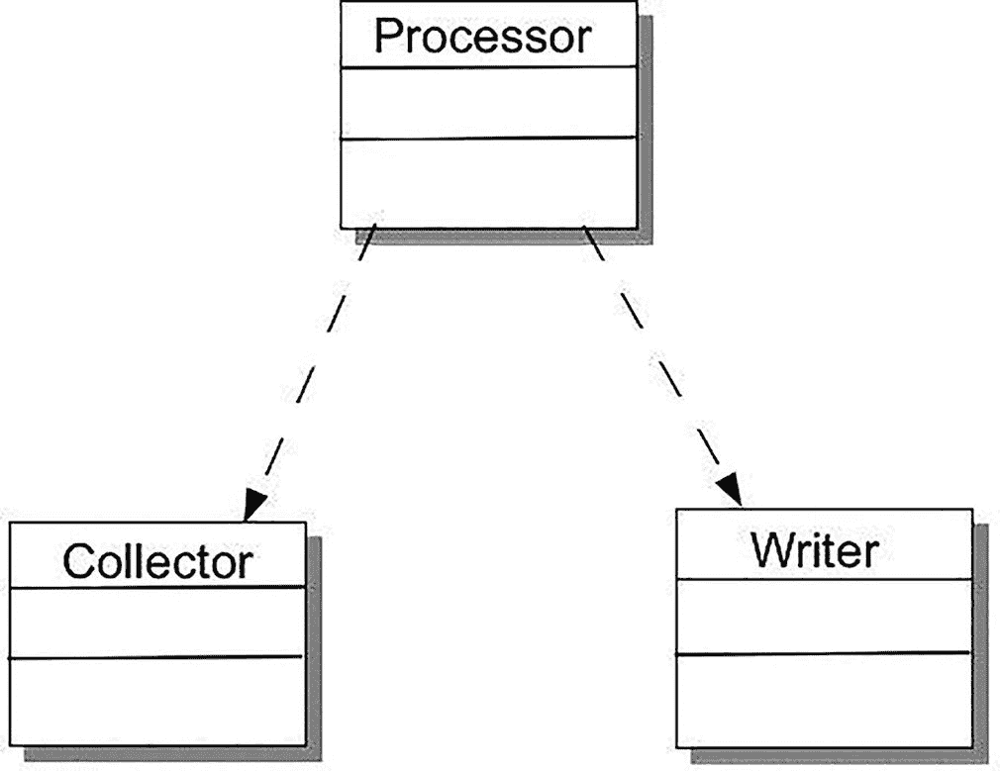

一个 UML 类图，包含三个类：处理器、收集器和写入器，它们之间用虚线连接，表示类之间的关系。

图 12-13
传统的输入-处理-输出模型

这种实现的一个问题是，处理器必须创建并使用写入器，并且处理器必须了解写入器的接口和参数类型才能正确写入。这意味着处理器必须针对写入器的具体实现来编写，因此如果我们想更改写入器的类型，就必须重写处理器。假设第一个实现是写入文件；如果我们之后想写入打印机或数据库，每次都需要更改处理器。这非常不利于复用。依赖倒置原则指出，处理器应针对接口（一个抽象的写入器）进行编码，然后针对每种写入器目标类型，在单独的具体类中实现该接口。由此产生的设计如图 12-14 所示。

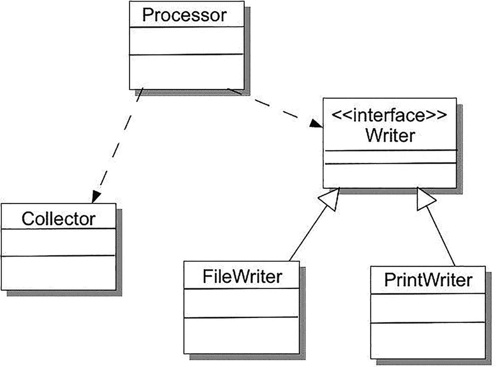

一个 UML 类图，表示一个处理器通过虚线连接到收集器和一个名为写入器的接口，该接口又连接到两个类：文件写入器和打印写入器。

图 12-14
使用接口以允许不同的写入器实现

通过这种方式，可以添加不同的写入器，只要它们遵循该接口，处理器就无需更改。请注意，我们可以对收集器进行同样的处理。同时也要注意，DIP 与原则 #2（针对接口编程）密切相关。

## 接口隔离原则（ISP）

该原则告诉我们，客户端不应依赖它们不使用的接口。特别是，它们不应依赖它们不使用的*方法*。^(²⁰²)

本章我们已经讨论了很多关于接口的内容——针对接口编程、使用接口抽象出公共细节等等。我们使用接口使代码更灵活、更易于维护。因此，总的来说，只要审慎使用，接口就是好东西。

关于接口，最大的诱惑之一就是让它们变得更大。扩展接口可以让更多的类实现它。然而，当你因为某个实现该接口的子类需要某个新方法，而其他子类不需要，就开始向接口中添加新方法时，你就降低了接口的内聚性，并开始违反接口隔离原则。过度“泛化”一个接口，会使你从一组紧密相关的、如闪电般聚焦的方法，转向一堆仅存在松散关联的方法。请记住，*内聚性是好的*：你的应用程序应该具有内聚性，它们所依赖的类和接口也应该具有内聚性。

那么答案是什么呢？我们如何保持接口的内聚性，同时又能让它们对一系列类有用？答案是创建更多的接口。接口隔离原则意味着，与其添加仅适用于一个或少数几个实现类的新方法，不如*创建一个新接口*。对于任何变得臃肿的接口，你可以将其拆分为两个或更多更小、*内聚性更强*的接口。这样，新类就可以只实现那些包含直接相关功能的接口。

## 最少知识原则（PLK）

PLK 也被称为*迪米特法则*。它说的是：只与你的直接朋友交谈。^(²⁰³)

应用程序中强内聚性的补充是*松散耦合*。这正是最少知识原则（PLK）的核心要义：规定类应尽可能*间接地*与尽可能少的其他类协作。^(²⁰⁴)

让我们考虑一个源自亨特和托马斯的例子。^(²⁰⁵)

你的汽车里有一个计算机系统（如今我们都有）。假设你正在编写一个绘制车内温度数据的应用程序。有一系列传感器提供温度数据，它们是汽车发动机传感器家族的一部分。你的程序应选择一个传感器，收集并绘制其温度数据。你的程序部分可能如下所示：

```
public void plotTemperature(Sensor theSensor) {
double temp = theSensor.getSensorData().getOilData().getTemp();
...
}
```

这最初可能有效……但现在你已经将你的温度绘制方法与 `Sensor`、`SensorData` 和 `OilSensor` 类耦合在一起了。这意味着*其中任何一个*类的更改都可能影响你的 `plotTemperature()` 方法，并导致你必须重构代码。这很糟糕。

这正是 PLK 敦促你避免的情况。与其将你的方法链接到一个层次结构中，并遍历该层次结构来获取你需要的服务，不如直接请求数据：

```
public void plotTemperature(double theData) {
...
}
...
plotTemperature(aSensor.getTemp());
```

是的，你不得不在 Sensor 类中添加一个方法来获取温度，但为了清理上述混乱（以及可能的错误），这只是一个小小的代价。现在，你的类只直接与*一个*类协作，并让该类处理其他类。你的 `Sensor` 类将对 `SensorData` 执行相同的操作，依此类推。

这引出了 PLK 的一个推论——*将依赖关系降至最低*。这是松散耦合的关键。通过仅与少数其他类交互，你使你的类更加灵活，并且更不容易包含错误。


## 类设计指南

最后，我们列出从 Davis^(²⁰⁶) 和 McConnell^(²⁰⁷) 著作中摘取的 23 条类设计指南。这些指南比我们上文描述的通用设计指南更为具体，但非常实用：

1.  在类接口中呈现*一致的抽象层次*。

2.  确保你理解该类所实现的抽象。

3.  将不相关的信息移至另一个类（接口隔离原则）。

4.  在进行修改时，警惕类接口的侵蚀（接口隔离原则）。

5.  不要添加与接口抽象不一致的公有成员。

6.  最小化类及其成员的可访问性（开闭原则）。

7.  不要在公有接口中暴露成员数据。

8.  避免将私有实现细节放入类的接口中。

9.  避免将方法放入公有接口。

10. 注意过紧的耦合（最少知识原则）。

11. 尝试通过类内的包含关系来实现“has a”关系（单一职责原则）。

12. 通过继承来实现“is a”关系（里氏替换原则）。

13. 仅当派生类是基类的一个更具体版本时才进行继承。

14. 确保只继承你想要继承的内容（里氏替换原则）。

15. 将公共的接口、数据和操作尽可能上移至继承层次的高层（不要重复自己原则）。

16. 对只有一个实例的类保持警惕。

17. 对只有一个派生类的基类保持警惕。

18. 避免过深的继承树（里氏替换原则）。

19. 保持类中方法的数量尽可能少。

20. 最小化对其他类的间接方法调用（最少知识原则）。

21. 如果可能，在所有构造函数中初始化所有成员数据。

22. 消除纯数据类。类应包含数据以及定义在这些数据上的操作，因此纯数据类将数据与操作分离，违背了这一理念。

23. 消除纯操作类。与上述原则类似，只有操作的类必须从某处获取数据。这会使方法接口复杂化，并需要为不同的数据类型提供新的实现。

## 结论

在本章中，你探讨了过去几十年间演化出的若干面向对象设计原则。这些设计原则可作为你遵循的指南，以确保最终的设计是优秀的，即易于实现、易于维护，并且恰好满足客户的需求。重要的是，当你在从功能特性向设计思考的过程中，这些设计原则提供了指导。它们提供了检验和实现继承、封装、多态和抽象等关键面向对象原则的方法。同时，它们也强化了内聚与耦合等基本设计原则。

