# 13. 设计模式

> *每个模式描述了一个在我们环境中反复出现的问题，然后描述了该问题解决方案的核心，这样你就可以无数次地使用这个解决方案，而无需以完全相同的方式重复。*
> 
> ——克里斯托弗·亚历山大^(²⁰⁸)

你是否每次写代码时都在重新发明轮子？你是否每次编写程序时都要重新学习如何遍历数组？你是否每次写 `if` 语句时都要重新解决悬空 `else` 的问题？你是否每次需要使用插入排序或二分查找时都要重新学习？当然不是！

在你编写程序的过程中，你已经学会了一套在编写代码时使用的*惯用法*。例如，如果你需要遍历并打印数组的所有元素，在 Java 中你可能会这样做：

```
for (int i = 0; i < myArray.length; i++) {
System.out.printf(" %d ", myArray[i]);
}
```

或者

```
for (int nextElement: myArray) {
System.out.printf(" %d ", nextElement);
}
```

无需过多思考，代码就会从你的指尖流出。这些*代码模式*是你随着编写程序经验的积累而积累起来的一套代码规则和模板。

*设计模式*是同样的概念，但应用于你的设计。^(²⁰⁹) 如果你花时间学习一组核心的设计模式，它将使你的代码更加统一和可读，并随着时间的推移提高其整体质量。它还可能减少你花在设计编码项目上的时间。著名建筑师克里斯托弗·亚历山大在他的著作《模式语言》中定义了建筑设计的模式。^(²¹⁰) 同样的思想也延续到了软件设计中。如果你阅读本章开头亚历山大的引文，可以看到他对设计模式的定义中包含以下三个关键要素：

*   *重复出现*：引发设计模式的问题必须是常见问题。

*   *核心解决方案*：模式为解决方案提供了模板；提炼出解决方案的本质。

*   *复用*：当相同的核心问题再次出现时，即使上下文或领域发生变化，该模式也必须易于复用。

事实上，你在本书中已经至少见过一个设计模式：我们在第 7 章讨论的*模型-视图-控制器*模式（MVC）是最早发表的软件设计模式示例之一。^(²¹¹) MVC 设计模式用于使用图形用户界面的程序。它将程序分为三个部分：包含程序处理规则的*模型*、向用户呈现数据和界面的*视图*，以及协调*模型*和*视图*之间通信的*控制器*。在典型的面向对象实现中，这些抽象各自成为一个独立的对象。

*四人组*（Erich Gamma、Richard Helm、Ralph Johnson 和 John Vlissides）在他们关于设计模式的开创性著作《设计模式：可复用面向对象软件的基础》^(²¹²) 中，将设计模式定义为“命名、抽象并识别常见设计结构的关键方面，使其有助于创建可复用的面向对象设计”。换句话说，设计模式是从*具体示例*中提炼出的*命名抽象*，它代表了针对*特定但常见问题*的*重复出现的解决方案*——重复出现、核心解决方案、复用。

但为什么我们首先需要设计模式？为什么我们不能仅仅依靠我们在第 12 章学习的面向对象设计原则以及我们的老朋友——抽象、继承、多态和封装？^(²¹³)

嗯，事实证明，设计是困难的，这就是原因。为复用而设计则更加困难。设计也更像是一门艺术，而非科学或工程学科。经验丰富的软件设计师很少从第一性原理出发；他们会在当前问题中寻找与过去解决过的问题的相似之处。并且他们会将多年来学到的设计惯用法带到设计工作中。设计模式提供了一种*共享词汇*，使这些专家知识能够为所有人所用。


## 设计模式与四人帮

在《设计模式》一书中，四人帮将设计模式描述为具有四个基本特征：

*   *模式名称*作为*“……一个我们可以用来描述设计问题、解决方案及其后果的句柄，通常用一两个词概括。为模式命名能立即丰富我们的设计词汇。”*

*   *问题*描述何时使用该模式。“*它解释了问题及其上下文。”*

*   *解决方案*“……描述了构成设计的元素、它们之间的关系、职责和协作……该模式提供了对设计问题的抽象描述，以及元素的一般排列如何解决该问题。”*

*   *后果*，即将模式应用于问题所产生的结果和权衡。这些包括时间和空间的权衡，也包括灵活性、可扩展性和可移植性等。^(²¹⁴)

设计模式根据两个标准进行分类：*范围*和*目的*。*范围*处理类与对象之间的关系。类之间的静态关系在编译时确定，而对象之间的动态关系可以在运行时改变。*目的*处理模式对类和对象的作用。模式可以处理对象的创建、类或对象的组合，或者对象在程序中交互和分配职责的方式。

四人帮在他们的书中描述了 23 种不同的设计模式，将它们分为三类：*创建型*、*结构型*和*行为型*。

*   *创建型设计模式*处理对象何时以及如何被创建。这些模式通常会为你创建对象，使你无需直接实例化这些对象。

*   *结构型设计模式*描述如何将对象组合成更大的组。

*   *行为型设计模式*通常讨论职责如何分配以及对象之间如何进行通信。

这个列表并非完整无缺，自四人帮的《设计模式》一书出版以来，世界各地的开发者已经在这个原始列表中添加了许多模式。最近在谷歌上搜索“软件设计模式”一词，得到了超过 184.85 万条结果，其中过去 24 小时内有 9 万条，因此这绝对是一个活跃的讨论主题。

## 经典设计模式

下面列出了四人帮描述的 23 种（经典）设计模式。（在本章的剩余部分，我们将重点介绍斜体表示的设计模式，因为它们是最常用的。）

### 创建型模式

1.  抽象工厂

2.  建造者

3.  *工厂方法*

4.  原型

5.  *单例*

### 结构型模式

1.  *适配器*

2.  桥接

3.  组合

4.  装饰器

5.  *外观*

6.  享元

7.  代理

### 行为型模式

1.  责任链

2.  命令

3.  解释器

4.  *迭代器*

5.  中介者

6.  备忘录

7.  *观察者*

8.  状态

9.  *策略*

10.  模板方法

11.  访问者

## 我们可以使用的模式

本节中的模式是经典设计模式的代表性样本，也是你马上会发现最有用的那些。

### 创建型模式

创建型模式都与创建对象有关。如果我们将类定义视为生成对象的模板，那么这些模式就关乎如何创建这些模板。接下来我们将要讨论的两种模式——单例和工厂方法——展示了两种不同的对象创建思路。

#### 创建型模式 1：单例模式

单例^(²¹⁵)几乎肯定是设计模式中最容易理解和编码的。其思想很简单：你在编写一个程序，并且需要一个类的一个——*且仅有一个*——实例（并且你需要强制执行“且仅有一个”的要求）。使用单例模式的程序示例包括打印假脱机程序、窗口管理器、设备驱动程序等。

那么，“一个且仅一个”的要求意味着什么呢？首先，这意味着你的程序只能调用一次 `new Singleton()`，对吧？但是，什么能阻止程序中的其他对象（或者不是你编写的程序中的对象）再次调用 `new Singleton()` 呢？答案是——什么也阻止不了！只要你的类可以被实例化一次，它就可以被一次又一次地实例化。

因此，你需要做的是创建一个可以被实例化一次且仅一次的类，并且它*不使用* `new` 来进行实例化。你没听错：你需要一个可以在不使用 `new` 的情况下被实例化的类。是时候耍点小聪明了！

以下是你要做的。对象被实例化时调用的方法是构造函数。在 Java 中，你可以调用 `new Singleton()`，因为 `Singleton()` 构造函数是公有的——它在类定义外部可见。如果你想保留构造函数以便能够创建 Singleton 对象的实例，但又不想让任何人能够使用 `new` 来做到这一点，你必须将构造函数设为私有。“但是等等！”你可能会想，“如果构造函数是私有的，那么我根本无法实例化这个对象！”然而，有一种方法可以解决这个问题：如果构造函数是私有的，那么它只能从类定义内部访问，因此从类定义本身内部实例化对象仍然是完全可能的！

但这又回到了一个问题：如何从*类定义外部*访问构造函数？嗯，在 Java 中，有没有一种方法可以在不实例化类的情况下访问类内部的方法？（想想你如何在不实例化 `Math` 类的情况下调用 `Math.abs()`。）

啊哈！静态类方法！一个公有的静态方法在类定义外部是可见的，而无需实际实例化对象。因此，如果你创建一个具有私有构造函数的类，然后使用一个可以有条件地调用该私有构造函数的静态方法，你就可以控制创建该类的实例数量。代码如下：

```
public class Singleton {
// 这是将一直存在的实例引用
private static Singleton uniqueInstance;
// 私有构造函数 – 无法从外部访问
private Singleton() {
// 在此处执行初始化实例的操作
}
// 这是我们将用于创建实例的静态方法
public static Singleton getInstance() {
if (uniqueInstance == null) {
uniqueInstance = new Singleton();
}
// 如果 uniqueInstance 不为 null，则说明它已存在
return uniqueInstance;
}
// 其他方法 – 毕竟 Singleton 是一个真正的类
}
```

要使用 `Singleton` 类，你可以这样做：

```
public class SingletonTest {
public static void main(String [] args) {
Singleton mySingle;
mySingle = Singleton.getInstance();
// 我们在这里做其他事情
}
}
```

当你通过调用 `getInstance()` 方法来实例化 `Singleton` 实例时，它会测试你是否之前已经这样做过。如果没有，它会使用 `Singleton` 类中的私有构造函数创建该实例。如果实例已经存在（`uniqueInstance` 变量不为 `null`），那么你只需返回对该对象的引用。


这个版本的单例模式并非没有问题。首先，如果你正在编写多线程的 Java 程序，它可能会失效，因为上述解决方案并非“线程安全”。在检查 `Singleton` 实例是否存在与实际创建实例之间，你的程序可能会被切换出去，而另一个线程则继续执行。当程序切换回来时，它可能会错误地创建另一个 `Singleton` 实例。对此有一些相对简单的解决方案。

使单例模式线程安全的最简单方法是将 `getInstance()` 方法设为同步方法。这样它就会执行完毕而不会被切换出去。

以下是线程安全的 `getInstance()` 方法版本：

```
public synchronized static Singleton getInstance() {
if (uniqueInstance == null) {
uniqueInstance = new Singleton();
}
return uniqueInstance;
}
```

请注意，唯一的区别是在方法签名中包含了 `synchronized` 关键字。下面我们将给出一个如何使用单例模式的示例。

#### 创建型模式 2：工厂方法模式

工厂方法模式允许你定义一个用于创建一族对象的接口，并允许子类决定实例化该族中的哪些成员。它将实例化过程推迟到子类中。

假设你有一家小公司，正在向多个州的多个城市扩张。你有一个程序来模拟你的运营，并计算每笔销售的销售税。每个州和城市都有不同的销售税率，因此你需要跟踪各个地点，并仅在特定地点使用正确的税率。当你在新地点增加新门店时，你不想为了计算每个新地点的销售税而重写代码。这就是工厂方法模式的用武之地。

工厂方法模式^(²¹⁶)为你创建对象。你只需定义一个用于创建对象的接口（或抽象类），但让实现该接口的类（或扩展该抽象类的子类）来决定实例化哪个类。换句话说，子类负责创建类的实例。当你需要创建几种通常彼此相关的对象时——它们通常具有相同的抽象父类，因此属于同一个类层次结构——但所有对象都不同时，你可以使用工厂方法模式。

在工厂方法模式中，你创建对象而不将创建逻辑暴露给客户端，并使用公共接口引用新创建的对象。工厂方法模式允许子类选择要创建的对象类型，并且它们在运行时进行选择。你要求工厂创建一个类型为 X 的对象，它就创建一个；你要求它创建一个类型为 Y 的对象，它就创建一个。这迫使具体类的创建被委托给一个知道如何创建具体类的接口的子类，并使你的其他类对修改关闭。所有这些都不需要改变 X、Y 或商店。

工厂方法模式通过消除将应用程序特定的类绑定到客户端代码中的需要，促进了松散耦合。这意味着客户端代码仅与最终的接口或抽象类交互，因此它将与任何实现该接口或扩展该抽象类的类一起工作。

何时使用工厂模式？

*   当你事先不知道需要什么类对象时。
*   当所有潜在的类都在同一个子类层次结构中时。
*   为了集中类选择代码。
*   当你不想让用户必须知道每个子类时。
*   为了封装对象创建。

在这个例子中，你可以使用 `SalesTaxFactory` 类创建销售税计算对象，以生成将为不同地点计算销售税的对象。你将拥有几个类：

`SalesTax`：定义销售税对象的接口
`BostonTax`：继承自 `Tax` 的具体类
`ChicagoTax`：继承自 `Tax` 的具体类
`StLouisTax`：继承自 `Tax` 的具体类
`SalesTaxFactory`：你的具体实现，用于创建不同的 `Tax` 对象
`SalesTaxDriver`：一个驱动类，允许你销售商品并计算销售税

工厂方法模式依赖于为你所需的对象定义一个接口，然后允许实现该接口的子类实际实现这些对象。你可以使用 Java 接口或抽象类来定义你的 `SalesTax` 接口。让我们使用一个抽象类。你的 `SalesTax` 抽象类将如下所示：

```
abstract class SalesTax {
protected double rate;
abstract void getRate();
public void calculateTax(double amount) {
System.out.printf("$%6.2f\n", amount * (1.0 + rate));
}
}
```

你的 `SalesTax` 子类最终成为具体类，它们重写了 `SalesTax` 抽象类中的一个或多个方法：


```public class BostonTax extends SalesTax {
public void getRate() {
rate = 0.0875;
}
}
public class ChicagoTax extends SalesTax {
public void getRate() {
rate = 0.075;
}
}
public class StLouisTax extends SalesTax {
public void getRate() {
rate = 0.05;
}
}
```

最后，你的具体 `SalesTaxFactory`*，* 它将实际创建一个具体的 `SalesTax` 对象，代码如下：

```
public class SalesTaxFactory  {
/**
* 使用 makeTaxObject() 方法获取 SalesTax 类型的对象
*/
public SalesTax makeTaxObject(String location) {
if(location == null) {
return null;
} else if(location.equalsIgnoreCase("boston")) {
return new BostonTax();
} else if(location.equalsIgnoreCase("chicago")) {
return new ChicagoTax();
} else if(location.equalsIgnoreCase("stlouis"))  {
return new StLouisTax();
}
return null;
}
}
```

为了测试你的工厂，你需要创建一个驱动程序。这是客户端代码，它使用工厂来创建正确类型的对象。

```
/**
*  测试工厂方法模式。
*  我们使用 SalesTaxFactory 来获取具体类的对象
*/
import java.io.*;
import java.util.Scanner;
public class SalesTaxDriver {
public static void main(String args[])throws IOException {
Scanner stdin = new Scanner(System.in);
SalesTaxFactory salesTaxFactory = new SalesTaxFactory();
//获取一个 SalesTax 类型的对象，并调用其 getTax() 方法。
System.out.print("输入地点 (boston/chicago/stlouis): ");
String location = stdin.nextLine();
System.out.print("输入美元金额: ");
double amount = stdin.nextDouble();
SalesTax cityTax = salesTaxFactory.makeTaxObject(location);
System.out.printf("地点 %s 的账单金额为 $%6.2f: ", location, amount);
cityTax.getRate();
cityTax.calculateTax(amount);
}
}
```

图 13-1 展示了整个程序的设计。

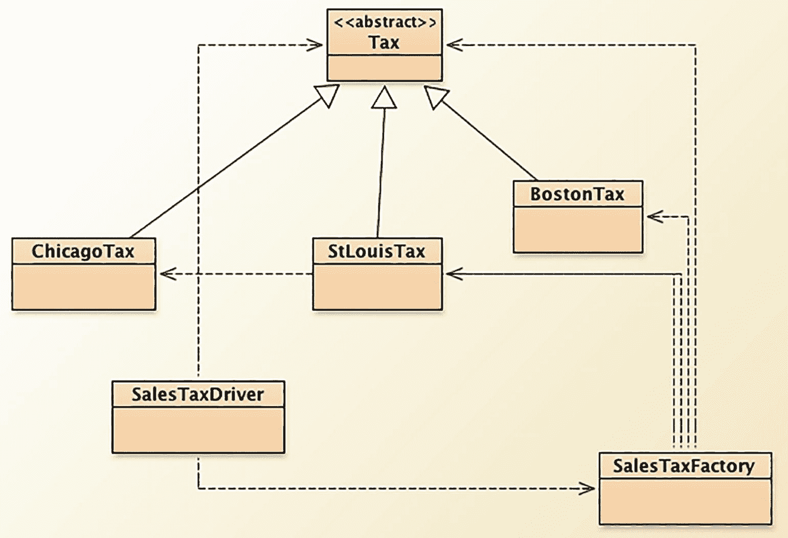

一个 UML 类图展示了税收计算系统的继承层次结构。中央抽象类是 Tax，连接了三个具体类，如 ChicagoTax、StLouisTax 和 BostonTax。下方，另外两个类 SalesTaxDriver 和 SalesTaxFactory 用虚线连接，表示它们之间的关系。

图 13-1

SalesTaxFactory 示例

以下是关于工厂方法模式在此案例中如何工作的一些具体要点：

*   工厂方法 `makeTaxObject()` 封装了 `SalesTax` 对象的创建过程。你的驱动程序只需告诉工厂使用哪个地点。

*   `SalesTax` 接口为子类创建实际对象提供了接口。

*   `SalesTaxFactory` 具体类通过实现 `makeTaxObject()` 方法来实际创建对象。

*   这使得 `SalesTax` 类保持独立，并让 `SalesTaxDriver` 更容易创建新对象。

*   `SalesTaxDriver` 类只处理 `SalesTax` 对象。它无需了解任何特定的销售税率。具体的 `SalesTax` 对象实现了 `SalesTax` 抽象类中的方法，而 `SalesTaxDriver` 只是使用它们，无论你创建的是哪种类型的 `SalesTax` 对象。

*   这也意味着你可以更改特定类型 `SalesTax` 对象的实现，而无需更改接口或 `SalesTaxDriver`。

工厂方法模式还有另一种变体。考虑一下，在你的示例中，你只需要一个工厂。在这种情况下，你可以使用单例模式来生成工厂。这将改变你的 `SalesTaxFactory` 和 `SalesTaxDriver` 类。它们最终会变成如下形式：

```
public class SingletonTaxFactory  {
/**
* 我们将使用单例模式只创建一个 SalesTaxFactory
* 为此，我们需要将构造函数设为私有，并创建一个
* 变量来持有对 SalesTaxFactory 对象的引用。
*/
// 这是将长期存在的实例
private static SingletonTaxFactory uniqueInstance;
// 私有构造函数——无法从外部访问
private SingletonTaxFactory() {
// 在此处执行初始化实例的操作
}
// 这是我们将用于创建实例的静态方法
public static SingletonTaxFactory getInstance() {
if (uniqueInstance == null) {
uniqueInstance = new SingletonTaxFactory();
}
return uniqueInstance;
}
/**
* 使用 getTax 方法获取 Tax 类型的对象
*/
public SalesTax getTax(String location) {
if(location == null) {
return null;
}
if(location.equalsIgnoreCase("boston")) {
return new BostonTax();
} else if(location.equalsIgnoreCase("chicago")) {
return new ChicagoTax();
} else if(location.equalsIgnoreCase("stlouis"))  {
return new StLouisTax();
}
return null;
}
}
```

客户端代码变为以下形式：

```
import java.io.*;
import java.util.Scanner;
public class SingletonTaxDriver {
public static void main(String args[])throws IOException {
Scanner stdin = new Scanner(System.in);
/* 获取我们需要的唯一 SalesTaxFactory */
SingletonTaxFactory salesTaxFactory = SingletonTaxFactory.getInstance();
System.out.print("输入地点 (boston/chicago/stlouis): ");
String location = stdin.nextLine();
System.out.print("输入美元金额: ");
double amount = stdin.nextDouble();
SalesTax cityTax = salesTaxFactory.getTax(location);
System.out.printf("地点 %s 的账单金额为 $%6.2f: ", location, amount);
cityTax.getRate();
cityTax.calculateTax(amount);
}
}
```

### 结构型模式

结构型模式帮助你组合对象，以便更轻松地使用它们。它们关注的是将对象分组，并提供对象之间协调工作的方式，从而更轻松地完成任务。回想一下，组合、聚合、委托和继承都与结构和协调有关。我们在这里要介绍的第一个结构型模式是适配器模式，它完全是为了让类能够协同工作。


#### 结构型模式一：适配器模式

问题场景是这样的：你有一个类 `Foo`（客户端），它想要访问另一个类、库或包 `Bar`（目标）。问题在于，`Foo` 期望的是一个特定的接口，而这个接口与 `Bar` 对外公开的接口不同。你该怎么办？

你可以重写 `Foo`，将其期望的接口改为与 `Bar` 提供的接口一致。但如果 `Foo` 很复杂，或者它正被其他类使用，这可能不是一个可行的方案。或者，你也可以重写 `Bar`，使其提供 `Foo` 期望的接口。但如果 `Bar` 是一个商业包，你没有源代码呢？

这时，适配器设计模式就派上用场了。^(²¹⁷) 你使用适配器模式创建一个中间类，将目标 `Bar` 的接口包装在一组方法中，这些方法呈现的是客户端 `Foo` 所寻找的接口。适配器模式一端与客户端 `Foo` 交互，另一端与目标 `Bar` 交互，因此 `Bar` 的接口无需改变，而 `Foo` 的用户也能获得他们期望的接口。皆大欢喜！由于这种包装功能，适配器模式也被称为包装器模式。^(²¹⁸) 见图 13-2。

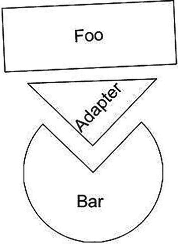

一个包含三个带标签形状的流程图，顶部是一个标有“foo”的矩形，中间是一个标有“adapter”的倒三角形，底部是一个标有“bar”的圆形。

图 13-2
适配器让 Foo 能够使用 Bar

实现适配器有两种方式：1）*类适配器*继承自目标类；2）*对象适配器*使用委托来创建适配器。注意区别：*类适配器*是现有客户端类的子类，并实现目标的接口；*对象适配器*是目标类的子类，并委托给一个现有类。图 13-3 是通用类适配器的图示。

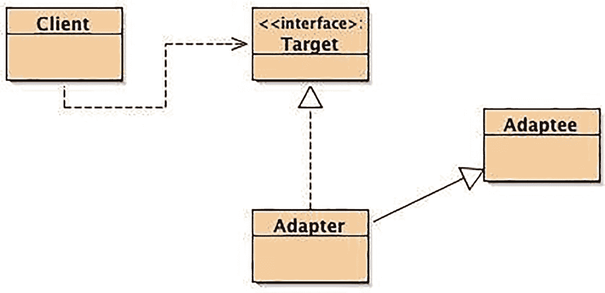

适配器设计模式的 UML 图，展示了客户端、目标接口、适配器和被适配者之间的交互。

图 13-3
类适配器示例

注意，`Adapter` 类继承自 `Adaptee` 类，并实现了 `Client` 类所使用的同一个 `Target` 接口。以下是此示例的代码：

```
public class Client {
public static void main(String [] args) {
Target myTarget = new Adapter();
System.out.println(myTarget.sampleMethod(12));
}
}
public interface Target {
int sampleMethod(int y);
}
public class Adapter extends Adaptee implements Target {
public int sampleMethod(int y) {
return myMethod(y);
}
}
public class Adaptee {
public Adaptee() {
}
public int myMethod(int y) {
return y * y;
}
}
```

另一方面，对象适配器仍然实现 `Target` 接口，但使用与 `Adaptee` 类的组合来完成包装；它看起来像这样：

```
public class Adapter implements Target {
Adaptee myAdaptee = new Adaptee();
public int sampleMethod(int y) {
return myAdaptee.myMethod(y);
}
}
```

在这两种情况下，客户端都不需要改变！这就是适配器的美妙之处。你可以通过更改适配器而不是客户端，来改变所使用的 `Adaptee`。

#### 结构型模式二：外观模式

作为结构型模式的第二个例子，让我们尝试简化接口。假设你有一组构成子系统的类。它们可以是构成更复杂系统的单个类，也可以是大型类库的一部分。再假设该子系统中的每个类都有不同的接口。最后，假设你想编写一个客户端程序，使用这些类中的一部分或全部。通常这意味着，要编写客户端程序，你需要学习子系统中所有相关类的所有接口，才能与子系统通信并完成工作。图 13-4 展示了一个可视化示例。

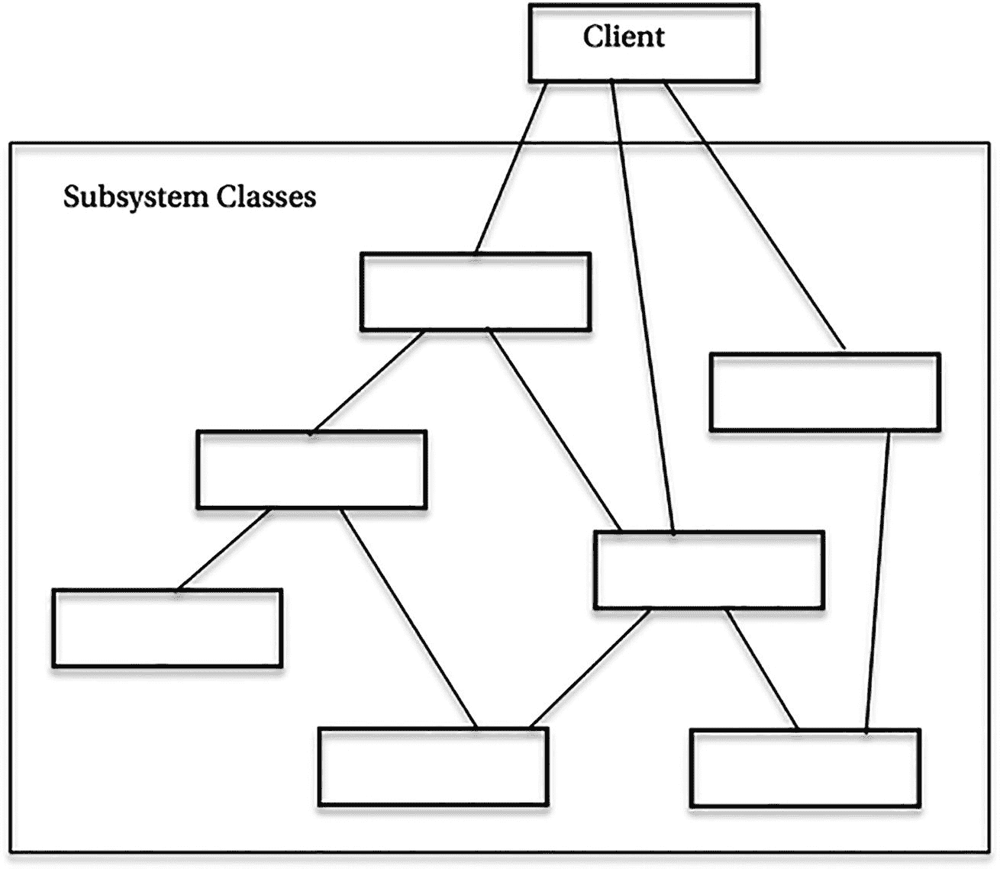

一个块流程图展示了层次结构。顶部是一个客户端类，箭头指向多个子系统类。

图 13-4
客户端使用多个接口

显然，这会使你的客户端程序变得复杂且难以维护。这个问题可以通过外观模式^(²¹⁹) 来解决。外观模式提供了一个单一、简单、统一的接口，使你的客户端更容易与子系统类交互。使用外观模式时，你只需学习一个接口，并用它与所有子系统类交互。图 13-5 展示了一个可视化示例。

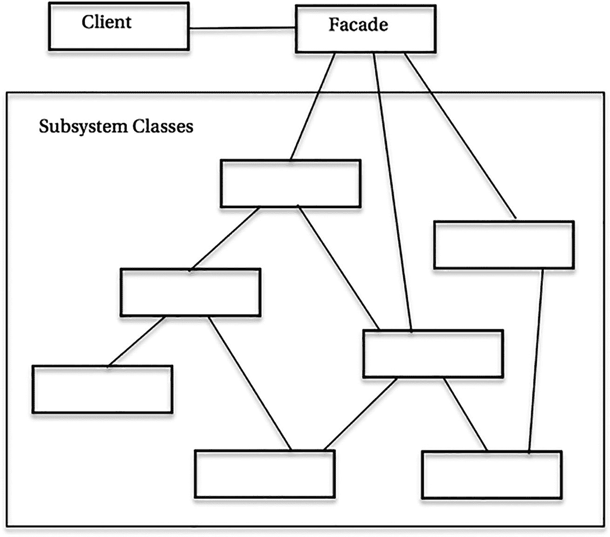

一个块流程图展示了外观设计模式。它表示一个客户端连接到一个外观框，该框又连接到排列成两层的多个子系统类。

图 13-5
客户端使用外观接口

除了提供单一接口供使用外，外观模式还向客户端隐藏了任何接口的更改或添加。这是第 12 章中*最少知识原则*的经典例子。

外观模式可能看起来与上面的适配器模式相似，但它们的目的不同。适配器模式包装目标接口，允许客户端使用它期望的接口。外观模式则简化一个或多个接口，并提供简化后的接口供客户端使用。

关于外观模式的一个例子：假设要创建一个在线商店，并编写一个简单的程序来计算客户为订购商品所需支付的总金额。在这个程序中，你需要查找商品、计算付款、计算销售税、计算运费、汇总所有费用，然后发送给用户。这将产生 `SalesTax`、`Delivery`、`Payment` 和 `Inventory` 这几个类。如果你想使用外观模式简化接口，可以创建一个新类 `Order`，它将隐藏多个接口，并为客户端程序生成一个更简单的接口。在 UML 中，这看起来如图 13-6 所示。

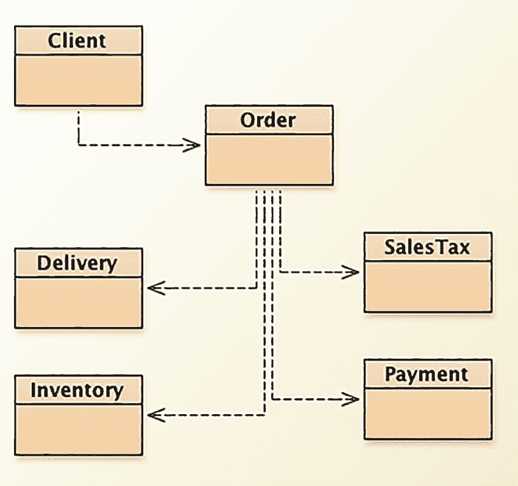

一个 UML 图展示了包含客户端、订单、配送和库存等类的业务流程。类之间由箭头连接，核心概念包括销售税和付款。

图 13-6
外观模式示例

这个简单示例的代码可能如下所示：


```
/**
* 外观设计模式示例
*/
/** 检查商品库存 */
public class Inventory {
public String checkInventory(String itemID) {
/* 此处为检查数据库的代码 */
return "库存已检查";
}
}
/** 计算商品付款 */
public class Payment {
public String computePayment(String itemID, String currency) {
return "付款计算成功";
}
}
/** 计算商品销售税 */
public class SalesTax {
public String computeTax(String itemID, double rate) {
return "税费已计算";
}
}
/** 计算商品配送费 */
public class Delivery {
public String computeDelivery(String itemID, String location) {
return "配送金额已计算";
}
}
/**
* 以下是外观类
*/
public class Order {
private Payment pymt = new Payment();
private Inventory inventory = new Inventory();
private SalesTax salestax = new SalesTax();
private Delivery deliver = new Delivery();
/**
*  这是购买商品的新接口
*  它将所有不同步骤整合到单个
*  方法调用中
*/
public void placeOrder(String itemID, String currency, String location, double rate) {
String step1 = inventory.checkInventory(itemID);
String step2 = pymt.computePayment(itemID, currency);
String step3 = salestax.computeTax(itemID, rate);
String step4 = deliver.computeDelivery(itemID, location);
System.out.printf("%s\n", step1);
System.out.printf("%s\n", step2);
System.out.printf("%s\n", step3);
System.out.printf("%s\n", step4);
}
/** 在此处添加更多方法以执行其他操作 */
}
/**
* 以下是客户端代码。
* 注意外观模式如何通过其接口
* 使下单变得简单
*/
public class Client {
public static void main(String args[]){
Order order = new Order();
order.placeOrder("OR123456", "USD", "Chicago", 0.075);
System.out.println("订单处理完成");
}
}
```

### 行为型模式

如果说创建型模式关注的是如何创建新对象，结构型模式关注的是如何让对象相互通信和协作，那么行为型模式关注的则是如何让对象执行操作。它们研究职责如何在设计中分配，以及对象之间的通信如何发生。我们将要探讨的三种模式都描述了如何将行为职责分配给类：*迭代器*模式让我们能够遍历对象集合，*观察者*模式让我们能够管理推送和拉取的状态变化，而*策略*模式则让我们能够在单一接口背后选择不同的行为。

#### 行为型模式 1：迭代器模式

如果你有一个*元素集合*，你可以用多种不同的方式组织它们。它们可以是数组、链表、队列、哈希表、集合等等。每个集合都有自己独特的操作集，但通常有一个操作是你希望对所有集合执行的：*从集合的开头到结尾，一次一个元素地遍历整个集合*，而无需*了解集合的内部结构*。你可能还希望能够反向遍历集合，并且可能希望同时进行多个遍历。迭代器模式^(²²⁰)创建了一个对象，允许你一次一个元素地遍历集合。

由于要求不需要了解集合的内部结构，迭代器对象不关心排序顺序；它只是按照元素在集合中存储的顺序，从第一个到最后一个，一次返回一个对象。最简单的迭代器只需要两个方法：

*   `hasNext()``:` 如果还有元素可以检索（即尚未到达集合末尾），则返回 true；如果没有剩余元素，则返回 false

*   `getNextElement()``:` 返回集合中的下一个元素

在迭代器模式中，你有一个`Iterator`接口，通过实现该接口来创建一个具体的`Iterator`对象，该对象由具体的`Collections`对象使用。然后，客户端类创建`Collection`对象，并从中获取`Iterator`。图 13-7 是 Gamma 等人给出的 UML 版本。

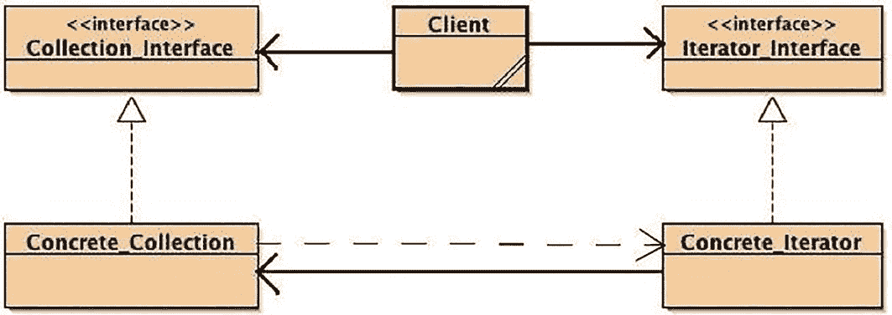

一个 UML 图，展示了集合接口、客户端、迭代器接口、具体集合和具体迭代器之间的关系。

图 13-7

使用迭代器模式的示例^(²²¹)

你可以看到，客户端类使用了`Collection`和`Iterator`接口，而`Concrete_Iterator`是`Concrete_Collection`的一部分并使用它。请注意，`Collection_Interface`将包含一个抽象方法，用于为集合创建迭代器。该方法在`Concrete_Collection`类中实现，当客户端调用该方法时，会创建一个`Concrete_Iterator`并传递给客户端使用。

从 1.2 版本开始，Java 包含了 Java 集合框架（JCF），其中包含许多新的类和接口，允许你创建对象集合，其中就包括一个`Iterator`接口。所有这些新类型都包含迭代器。Java 甚至（仅针对`List`类型的集合）包含了一个扩展的`Iterator`，称为`ListIterator`，它允许反向遍历列表。

以下是在 Java 中使用迭代器的典型代码示例，同时使用了`Iterator`和`ListIterator`实现：

```
/**
* 使用 Iterator 遍历 Java ArrayList 中的元素
* 然后我们使用 ListIterator 反向遍历同一个
* ArrayList
*/
import java.util.ArrayList;
import java.util.Iterator;
import java.util.ListIterator;
public class ArrayListIterator {
public static void main(String[] args) {
//创建一个 ArrayList 对象
ArrayList arrayList = new ArrayList();
//向 ArrayList 添加元素
arrayList.add(1);
arrayList.add(3);
arrayList.add(5);
arrayList.add(7);
arrayList.add(11);
arrayList.add(13);
arrayList.add(17);
//获取 ArrayList 的 Iterator 对象
Iterator iter = arrayList.iterator();
System.out.println("正向遍历 ArrayList 元素");
while(iter.hasNext()) {
System.out.println(iter.next());
}
// 现在为 ArrayList 创建一个 ListIterator
ListIterator list_iter = arrayList.listIterator(arrayList.size());
System.out.println("反向遍历 ArrayList");
while(list_iter.hasPrevious()) {
System.out.println(list_iter.previous());
}
}
}
```


请注意，当你创建 `ListIterator` 对象时，需要向其传递 `ArrayList` 中的元素数量。这会设置 `ListIterator` 对象使用的游标，使其指向 `ArrayList` 中最后一个元素之后的位置，从而能够通过 `hasPrevious()` 方法向后查找。在 Java 的 `Iterator` 和 `ListIterator` 实现中，*游标*始终指向两个元素之间，这样 `hasNext()` 和 `hasPrevious()` 方法的调用才有意义；例如，当你调用 `iter.hasNext()` 时，你是在询问迭代器集合中是否还有下一个元素。图 13-8 是对游标样式的抽象表示。

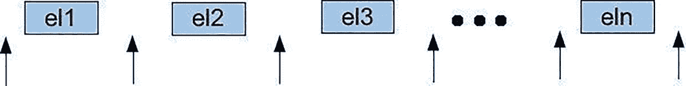

一幅插图展示了一系列标记为 e l 1 到 e l N 的方框，代表序列中的元素。每个方框之间有一个向上的箭头。

图 13-8

迭代器抽象中的游标

最后，某些迭代器允许你在迭代器运行期间向集合中插入和删除元素。这些迭代器被称为*健壮迭代器*。Java 的 `ListIterator` 接口（而非 `Iterator`）允许在有限制的情况下，通过迭代器进行插入（通过 `add()` 方法）和删除（通过 `remove()` 方法）。`add()` 方法仅将元素添加到紧邻 `next()` 方法将检索的下一个元素之前的位置，或紧邻 `previous()` 方法调用将返回的下一个元素之后的位置。`remove()` 方法只能在连续的 `next()` 或 `previous()` 方法调用之间调用，不能连续调用两次，并且绝不能紧跟在 `add()` 方法调用之后。^(²²²)

#### 行为模式 2：观察者模式

我们的一位同事非常喜欢 NPR 的广播节目《全民话题：科学星期五》（简称 *SciFri*）（[`http://sciencefriday.com`](http://sciencefriday.com)），但节目播出时他几乎没时间收听，因为播出时间是每周五美国东部时间下午 2:00 到 4:00。他订阅了 SciFri 的播客，因此每周六早上，当他收到新的播客剧集时，就可以在修剪草坪时用 iPhone 收听。如果他对 *SciFri* 感到厌倦了，只需取消订阅，就不会再收到新的播客了。亲爱的读者，这就是*观察者模式*。

根据“四人帮”的定义，*观察者模式*“……定义了对象之间的一对多依赖关系，这样当一个对象改变状态时，其所有依赖者都会收到通知并自动更新。”^(²²³) 在这个 SciFri 的例子中，NPR 是 SciFri 播客的“发布者”，而我们所有“订阅”（或注册）该播客的人都是观察者。你等待 SciFri 的状态发生变化（创建新的播客剧集），然后发布者会自动更新你。更新的方式因两种不同类型的观察者而异：推模型和拉模型。在*推模型观察者*中，发布者（在面向对象术语中也称为主题）改变状态，然后将新状态*推送*给所有观察者。在*拉模型观察者*中，主题改变状态，但直到观察者请求时才提供完整更新；观察者从主题*拉取*更新。在*拉模型*的一种变体中，主题可能会向所有观察者提供最小更新，通知它们状态已改变，但观察者仍需请求新状态的详细信息。

使用观察者模式时，你需要一个主题接口，以便主题、观察者和客户端都能识别它们所使用的状态接口。你还需要一个观察者接口，该接口仅说明如何更新观察者。然后，发布者将实现主题接口，而不同的“监听器”将实现观察者接口。图 13-9 描绘了这些关系。

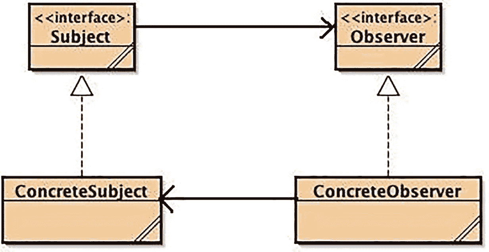

一个 UML 图展示了一组以循环方式连接的类。这些类分别是主题、观察者、具体观察者和具体主题。

图 13-9

经典的观察者模式^(²²⁴)

客户端类未在图中显示，但它将同时使用 `ConcreteSubject` 和 `ConcreteObserver` 类。以下是所有这些类的*推模型*版本的简单实现。请记住，这是*推模型*，因为 `ConcreteSubject` 对象会通知所有*观察者*，无论它们是否请求通知。

首先，创建主题接口，该接口说明如何注册、移除和通知观察者：

```
public interface Subject {
public void addObserver(Observer obs);
public void removeObserver(Observer obs);
public void notifyAllObservers();
}
```

接下来，编写主题接口的实现。这个类是真正的发布者，因此它还需要构成主题状态的属性。在这个简单版本中，你使用一个 `ArrayList` 来保存所有观察者。

```
import java.util.ArrayList;
public class ConcreteSubject implements Subject {
private ArrayList observerList;
// 这两个变量是我们的状态
private int subj_id;
private String msg;
public ConcreteSubject() {
observerList = new ArrayList();
this.subj_id = 0;
this.msg = "Hello";
}
public void addObserver(Observer obs) {
observerList.add(obs);
}
public void removeObserver(Observer obs) {
observerList.remove(obs);
}
public void notifyAllObservers() {
for (Observer obs: observerList) {
obs.update(this.subj_id, this.msg);
}
}
public void setState(int foo, String bar) {
this.subj_id = subj_id;
this.msg = msg;
notifyAllObservers();
}
}
```

接下来，编写观察者接口，该接口说明如何更新你的 `Observers`：

```
public interface Observer {
public void update(int obs_id, String msg);
}
```

然后，编写 `Observer` 接口的实现：

```
public class ConcreteObserver implements Observer {
private int obs_id;
private String msg;
Subject subj;
/**
* ConcreteObserver 类的构造函数
*/
public ConcreteObserver(Subject subj) {
this.subj = subj;
subj.addObserver(this);
}
public void update(int obs_id, String msg) {
this.obs_id = obs_id;
this.msg = msg;
show();
}
private void show() {
System.out.printf("Id = %d Msg = %s\n", this.obs_id, this.msg);
}
}
```

最后，编写驱动程序，创建发布者和每个观察者，并将它们组合在一起：

```
public class ObserverDriver {
public static void main(String [] args) {
ConcreteSubject subj = new ConcreteSubject();
ConcreteObserver obj = new ConcreteObserver(subj);
subj.setState(12, "Monday");
subj.setState(17, "Tuesday");
}
}
```

执行驱动程序的输出（全部来自 `ConcreteObserver` 对象中的 `show()` 方法）将如下所示：

```
Id = 12 Msg = Monday
Id = 17 Msg = Tuesday
```

在许多方面，观察者模式的工作方式类似于 Java 事件接口。在 Java 中，你创建一个类，将其注册为特定事件类型的“监听器”（观察者）。你还需要创建一个方法，该方法作为实际的观察者，并在事件发生时做出响应。当该类型的事件发生时，Java 事件对象（主题）会通过调用你编写的方法来通知你的观察者，并将事件中的数据传递给观察者方法；Java 事件使用观察者模式的*推模型*。

例如，如果你在 Java 程序中创建一个 `Button` 对象，你可以使用 `Button` 对象的 `addActionListener()` 方法来注册以观察 `ActionEvents`。当 `ActionEvent` 发生时，所有 `ActionListeners` 都会通过调用名为 `actionPerformed()` 的方法得到通知。这意味着你的 `Button` 对象必须实现 `actionPerformed()` 方法来处理该事件。


#### 行为型模式三：策略模式

有时在应用程序中，针对同一操作会有多种实现方式，或者存在多种行为，每种行为都有不同的接口。一种方法是使用 switch 语句：

```
switch (selectBehavior) {
case Behavior1:
Algorithm1.act(foo);
break;
case Behavior2:
Algorithm2.act(foo, bar);
break;
case Behavior3:
Algorithm3.act(1, 2, 3);
break;
}
```

问题在于这些行为集合是硬编码的，因此若要扩展集合以添加新行为，就需要更新这段代码（并且可能还需要更新程序中所有其他需要选择不同行为的地方）。这并不理想。

策略设计模式可以解决这个问题。它指出，如果你有多个需要动态选择的行为（算法），你应该确保它们都遵循相同的接口——即策略接口——然后通过一个称为上下文的驱动程序动态选择它们，由客户端软件告知上下文调用哪个策略。策略模式体现了两个基本的面向对象设计原则——*封装变化的概念*和*针对接口编程，而非针对实现编程*。^(²²⁵) 如图 13-10 所示。

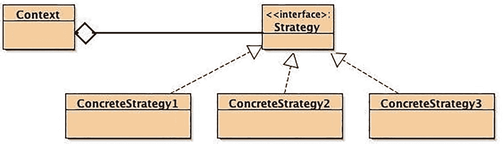

一个 UML 图展示了策略设计模式。它包含一个上下文类，该类连接到一个接口策略类，而策略类又进一步链接到三个具体策略类。

图 13-10
典型的策略模式布局^(²²⁶)

以下是一些可能使用策略模式的场景示例：

*   使用不同的压缩算法捕获视频
*   为不同类型的实体（个人、公司、非营利组织）计算税款
*   以不同格式（折线图、饼图、柱状图）绘制数据
*   使用不同格式压缩音频文件

在每个示例中，你可以让应用程序告诉驱动程序（上下文）使用哪种策略，然后请求上下文执行该操作。

为了更详细地说明，假设你是一名刚取得执业资格的注册会计师，正尝试编写自己的软件来计算客户的税款。（注册会计师为何要自己编写税务程序，我们不得而知；请暂且配合我们。）最初，你将客户分为三类：仅申报个人所得税的个人、申报企业所得税的公司，以及几乎无需纳税的非营利组织。现在，所有这些群体都需要计算税款，因此计算税款这一行为对于所有类来说应该是相同的；但它们的计算方式不同。你需要的是一个策略模式设置，该模式使用相同的接口——封装应用程序中变化的部分，并将具体类编码到接口——并允许你的客户端类选择要使用的客户类型。图 13-11 展示了你的程序结构。

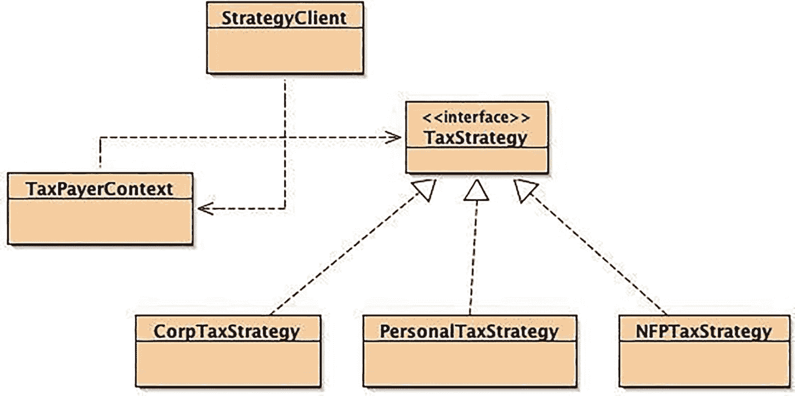

一个 UML 类图展示了策略设计模式。它包含策略客户端、纳税人上下文和税务策略接口等类，以及三个实现类：公司税务策略、个人税务策略和非营利组织税务策略。

图 13-11
使用策略模式选择税务行为

你创建了一个 `TaxStrategy` 接口，所有具体的 `TaxStrategy` 类都将实现该接口：

```
public interface TaxStrategy {
public double computeTax(double income);
}
```

由于这里唯一变化的是税款的计算方式，因此你的 `TaxStrategy` 接口只包含 `computeTax()` 方法。

然后，你创建每个具体的 `TaxStrategy` 类，每个类都针对特定客户类型实现税款计算：

```
public class PersonalTaxStrategy implements TaxStrategy {
private final double RATE = 0.25;
public double computeTax(double income) {
if (income <= 25000.0) {
return income * (0.75 * RATE);
} else {
return income * RATE;
}
}
}
public class CorpTaxStrategy implements TaxStrategy {
private final double RATE = 0.45;
public double computeTax(double income) {
return income * RATE ;
}
}
public class NFPTaxStrategy implements TaxStrategy {
private final double RATE = 0.0;
public double computeTax(double income) {
return income * RATE;
}
}
```

接下来，你创建 `Context` 类，该类负责创建客户端程序请求的策略对象并执行正确的策略。

```
public class TaxPayerContext {
private TaxStrategy strategy;
private double income;
/** 上下文的构造函数 */
public TaxPayerContext(TaxStrategy strategy, double income) {
this.strategy = strategy;
this.income = income;
}
public double getIncome() {
return income;
}
public void setIncome(double income) {
this.income = income;
}
public TaxStrategy getStrategy() {
return strategy;
}
public void setStrategy(TaxStrategy strategy) {
this.strategy = strategy;
}
public double computeTax() {
return strategy.computeTax(income);
}
}
```

请注意，这里你编写了一个独立的 `computeTax()` 方法版本（你没有重写该方法，因为你没有扩展任何具体类；策略模式使用组合而非继承）。该版本会调用客户端所选策略的 `computeTax()` 方法。

最后，你实现控制何时实例化哪个对象的客户端：

```
public class StrategyClient {
public static void main(String [] args) {
double income;
TaxPayerContext tp;
income = 35000.00;
tp = new TaxPayerContext(new PersonalTaxStrategy(), income);
System.out.println("税款为 " + tp.computeTax());
tp.setStrategy(new CorpTaxStrategy());
System.out.println("税款为 " + tp.computeTax());
}
}
```

客户端类选择要使用的算法，然后获取上下文对象来执行它。这样，你就将税款计算封装在了独立的类中。只需添加新的具体 `TaxStrategy` 类，并在客户端中修改以使用该新具体类型，即可轻松添加新的客户类型。小菜一碟！

## 结论

设计模式是针对设计问题的可复用、常见的核心解决方案。它们并非完成的设计，而是可用于解决许多不同领域中类似问题的模板。设计模式为解决常见问题提供了*经过验证的解决方案*，从而简化了设计过程，同时有助于减少设计中的缺陷。

不过，请务必小心。与所有设计技术一样，设计模式是启发式的，因此有时可能并不适用。试图将问题硬塞进不合适的模式中，无异于自找麻烦。

设计模式的目标是定义一种通用的设计词汇。它们可能无法让我们完全达到目标，但设计模式加上第 10 章中描述的设计原则，已经让我们在这条路上走了很远。


