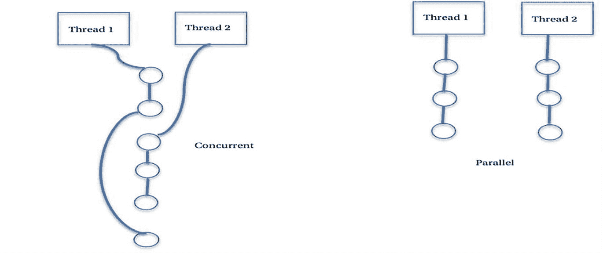
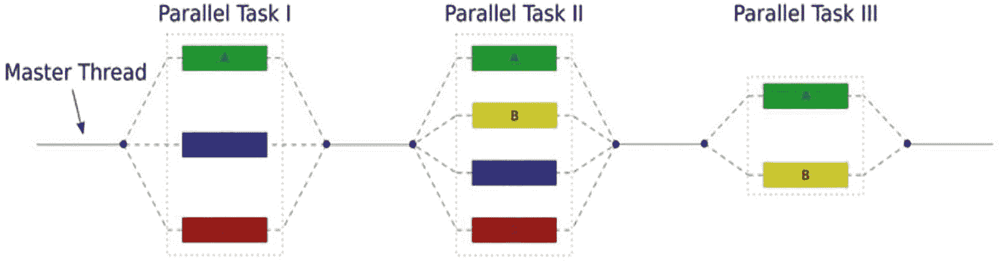
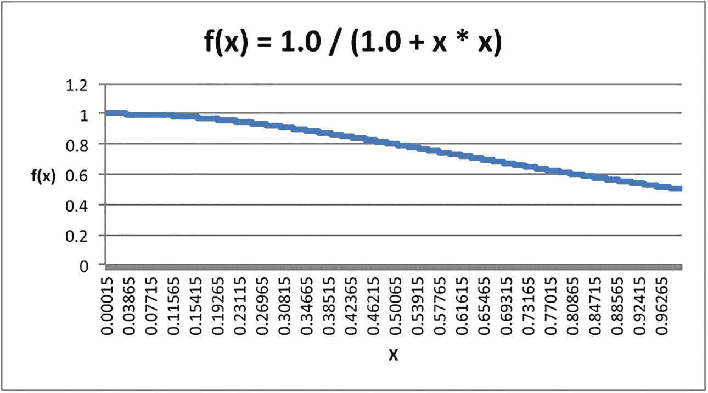

# 14. 并行编程

> *并发是算法的一种属性，并行是机器的一种属性。*
> 
> ——道格拉斯·伊德林

自微处理器问世以来，**摩尔定律**指出，集成电路上的晶体管数量大约每 18 个月到两年就会翻一番，而电路尺寸基本保持不变或变得更小，集成电路的价格也基本保持不变或更低。这意味着，我们能够定期以大致相同的价格获得更强大的处理器。这一预测在 21 世纪初之前一直非常准确，但随后情况发生了变化。首先，摩尔定律意味着，要在尺寸相似的芯片上集成两倍的晶体管，晶体管的尺寸以及晶体管之间的距离都必须缩小。显然，受物理规律限制，这不可能无限持续下去。到 21 世纪初，我们开始遇到晶体管进一步小型化带来的问题。第二个问题是热量。如果在芯片上集成两倍的晶体管，并期望以相同或更高的时钟速度运行，就需要更多电流通过电路。更多电流意味着更多热量。这就是所谓的“功耗墙”。

大约在 2001 年，人们逐渐认识到，当时这一代微处理器的速度很难再突破每秒 30 亿到 40 亿个周期（3-4GHz）；如果想要更快，就需要另辟蹊径。于是，多核微处理器应运而生。其基本思想是，将两个或更多 CPU 集成在一个稍大的单一集成电路上，让它们以相同（较慢）的时钟运行，共享部分缓存，并使用共享主内存。这使得处理器能够消耗更少的电力，产生更少的热量，并能同时运行两个或更多程序，以弥补时钟速度较慢的不足。所有主要芯片制造商都采纳了这一想法。IBM 率先行动，于 2001 年底推出了 POWER4 PowerPC 双核处理器；随后，AMD 于 2005 年推出了 Athlon 双核处理器；英特尔则于 2006 年推出了 Core Duo 处理器。自那时起，几乎所有新处理器和处理器架构都采用了多核设计，而程序员和语言开发者们也在努力创建能够利用新型并行架构的新软件。

在本章中，我们首先简要介绍并行计算机的组织方式。然后，我们将描述编写能够利用并行计算机架构的程序所面临的一些困难。接着，我们将讨论如何编写并行程序，以及如何将串行程序转换为并行程序。最后，我们将探讨如何使用不同的计算机语言和库来编写并行程序。

## 并发与并行

传统上，软件是为*串行*或*顺序*计算而编写的。一个问题的解决方案被分解成一系列离散的指令，这些指令在单个处理器上一个接一个地顺序执行。这些（单核）计算机在任何时刻只允许执行一条指令。一个经典的例子是循环求和列表中所有元素：我们遍历列表中的所有元素，并将每个元素逐一累加到总和中，如下所示：

```
int sum = 0;
for (int i = 0; i < n; i++) {
sum += list[i];
}
System.out.print(sum);
```

这通常会串行执行，结果如下：

sum = 0

sum = sum + list[0]

sum = sum + list[1]

sum = sum + list[2]

…

这显然是一个 O(n) 操作，需要 n 次加法，所需时间 T(n) 与 n 成正比。我们可以通过认识到加法可以按任意顺序成对相加，然后将部分和相加得到总和来改进这一点。代码可能修改如下：

```
sum = 0;
for (int i = 0; i < n-1; i+=2) {
sum += (list[i] + list[i+1]);
}
System.out.print(sum);
```

注意，由于加法的交换律，循环内执行两次加法的顺序无关紧要。虽然这个版本循环次数减少了一半，但它仍然需要相同总数的加法和相同的时间。因此，仅用一个处理器我们并没有真正获得任何好处。但这种新方法催生了一个想法：如果我们有 n/2 个处理器而不是仅仅一个，我们就可以*同时*进行许多计算，使用相同数量的操作 O(n)，但将所需时间 T(n) 从与 n 成正比减少到与 log n 成正比（通过假设一个二叉树的处理器层级结构），这是一个显著的时间减少，特别是当 n 变大时。这就引出了并发与并行的区别。

*并发*是指认识到我们可以将一个计算（算法）分解成独立的片段，这些片段的*执行顺序*无关紧要。并发是用于解决问题的算法的一种属性。注意，在单处理器上运行的并发程序仍然会串行执行。

*并行*是在特定机器（或机器架构）上用于执行程序以提高性能的机制。并行允许并发程序在多个处理器上同时执行，从而可能提高程序的整体性能。

图 14-1 的左侧展示了一个并发程序被分解成两个执行线程，在单个处理器上运行（图像中的垂直中心线），而图像的右侧展示了在双处理器上运行同一个程序，该程序被分成两个执行线程。



两幅插图分别展示了线程 1 和线程 2 之间并发与并行程序的模式。

图 14-1

并发与并行

以下是对并发与并行之间区别的另一种解释，该解释出现在 Stack Overflow 网站上^(²²⁷)：

假设你所在的国际象棋俱乐部组织了一场表演赛，10 名技术水平相近的本地棋手将与一位国际象棋特级大师对弈。俱乐部组织者需要安排 10 场对局，并希望高效利用时间，以便大家都能出去庆祝。有几种组织比赛的方式。


*串行*：所有棋盘在房间里一字排开，国际象棋大师坐在第一张桌子前开始对弈。一局棋下完后，大师再移动到下一张桌子进行下一局。如果每局棋耗时 10 分钟，那么总共需要 100 分钟。如果每局结束后大师从一个桌子移动到下一个桌子需要大约 6 秒，那么总共还需要大约 1 分钟（准确说是 54 秒，我们稍微取整），合计 101 分钟。还不错。

*并发*：棋盘和棋手同样一字排开，但在这个版本中，大师每张桌子只走一步棋。大师坐在第一张桌子前，用 6 秒走出第一步，然后立即移动到下一位棋手处走出下一步的第一步。大师在桌子间移动仍然需要 6 秒。如此持续，直到一分钟后（6*10 秒），大师回到第一张桌子走第二步。假设每局棋仍然需要总共 10 分钟，与串行对弈相同，那么我们需要知道大师需要绕所有桌子走多少轮。如果每位本地棋手走一步需要大约 50 秒，那么每完成一步棋需要 50 + 6 = 56 秒（棋手走棋 50 秒，加上大师走棋 6 秒）。每局棋需要 10 分钟即 600 秒，因此 600 秒/每步 56 秒 ≈ 11 轮，大师即可完成全部 10 局棋。总时间等于所有本地棋手和大师走棋时间之和，加上大师在棋盘间移动的所有时间。这样计算得出总时间为 11*56 + 11*6*10 = 616+660 秒 = 1,276 秒 = 21.27 分钟完成比赛。好多了。

*并行*：假设象棋俱乐部想为活动增加一点竞争性，于是聘请了第二位国际象棋大师。有了两位大师，俱乐部组织者可以让每位大师只下 5 局棋。如果采用上述串行方法，那么每位大师会坐下，下完一整局，然后移动到下一张桌子。但这次，由于两局棋同时进行，比赛在原来一半的时间内完成，即 101/2 = 50.5 分钟。更好，但不如并发方法。

*并发*且*并行*：现在让两位大师同时进行各自的 5 局棋。每位大师用 6 秒走一步棋，再用 6 秒移动到下一张桌子。如果每局棋仍然需要 10 分钟，每位棋手仍然需要 50 秒走一步，那么最终仍然需要 11 轮，但游戏间移动的总时间现在只需 30 秒（因为每位大师只负责 5 局棋）。这样计算得出 11*56 + 11*30 = 616 + 330 = 946 秒 = 15.77 分钟完成整个比赛。这是四种不同比赛方式中最快的，因此创建并发程序并在并行机器上运行优于其他方案。

请记住，**并发**是算法的一种属性，而**并行**是机器的一种属性。^(²²⁸)

## 并行架构：弗林分类法

计算机科学家们认识到，50 多年来，并行性可用于提升性能并扩展大型问题的规模。在本节中，我们将探讨一些不同形式的并行机器，它们将帮助我们提升并发程序的性能。

1966 年，迈克尔·弗林提出了一种针对不同类型计算机架构的分类法。^(²²⁹) 该分类法沿用至今，我们下面还将提及它的几个扩展。

该分类法最初包含四种模型架构：

*   *SISD – 单指令流，单数据流*：这是经典的单处理器冯·诺依曼计算机架构。机器一次运行一个程序，处理单一数据流。

*   *MISD – 多指令流，单数据流*：该架构假设多个不同的程序将在同一数据流上执行，可能产生不同的结果。所有程序以锁步方式运行。采用此架构的机器非常罕见。一个可能的应用是尝试破解密码的机器，它在不同处理单元上同时运行多种不同的算法。

*   *SIMD – 单指令流，多数据流*：这是最常见的架构之一。在该架构中，一个单一程序在不同处理器上运行，每个处理器使用不同的数据流。这些数据流可以是一个被分区的数据集，每个子集都需要执行相同的计算。例如，气象模型可以使用此架构来预测飓风路径。SIMD 模型的一个特点是系统中所有机器以锁步方式运行相同的程序。由于所有机器同时运行相同的程序，SIMD 机器不适合提升并发程序的性能。

*   *MIMD – 多指令流，多数据流*：这是最通用的架构，多个程序在不同机器上同时运行，每个程序使用不同的数据流。这些程序不需要以锁步方式运行，因此它们可以执行并发程序并提升性能。在 21 世纪初，这是超级计算机最常见的模型。你的多核笔记本电脑或台式机系统也是 MIMD 机器。

大约在 21 世纪初，这些模型又演变出另外两种变体。

*SIMT – 单指令流，多线程*：这种执行模型以 SIMD 为基础，但允许每个指令流同时执行多个线程。该模型于 21 世纪中期提出，通常用于多核图形处理器。它对于数据流中存在大量冗余的应用非常有用，例如处理图形或视频数据。

*SPMD – 单程序，多数据流*：这是当今一种常见的并行编程执行模型。它允许每个处理器独立执行程序，因此不与其它处理器同步，所有处理器处理不同的（可能是分区的）数据流。由于程序独立运行，它们可以利用程序中的并发部分来提升性能。尽管名称如此，SPMD 是上述 MIMD 模型的一个子类别。

## 并行编程


### 并行编程相关定义

*线程*，也称为*执行线程*，是并行性的基本单位。线程是一段代码，包含执行指令序列所需的一切：私有指令列表、调用栈或系统栈、程序计数器，以及少量线程专属数据（通常位于其调用栈中）。线程与其他线程共享内存访问权限，这使得多个线程能够通过共享变量进行协作与通信。

*进程*是一种拥有独立地址空间的线程。进程之间不使用共享内存，而是通过消息进行通信，因此它们共享发送和接收消息的接口。进程是动态的，而程序是静态的。换言之，进程是正在执行的程序。进程比线程拥有更多关联状态，因此创建和销毁进程的成本更高，这也意味着进程的设计寿命通常更长。

*延迟*是指完成给定工作单元（无论是进程、线程还是程序中更小的单元）所需的时间。延迟可能成为程序执行中的问题。如果程序或进程的某一部分执行时间远长于其他部分，那么在等待该部分完成期间，其他任务都无法进行。自 20 世纪 70 年代初以来，操作系统便采用了一种应对方法：上下文切换。假设你正在执行一个程序，该程序尝试打开硬盘上的文件。磁盘操作的速度比其他内存操作慢数个数量级，等待磁盘操作完成会显著拖慢程序速度，同时还会阻止其他程序执行。在这种情况下，操作系统会换出你的程序，允许其他程序执行，直到磁盘操作完成（系统必须能让磁盘独立执行操作才能实现这一点）。随后，操作系统可将你的程序换回内存继续执行。这种上下文切换并不能缩短延迟，但能对系统其余部分隐藏延迟，并允许其他程序取得进展。即使不改善单个程序，也能提升机器的整体性能。这种技术类似于上述国际象棋示例中的*并发*技术。

*吞吐量*是指单位时间内可完成的工作量。我们的目标是利用并行性来提高吞吐量。例如，流水线处理器就体现了一种并行形式。流水线可能由不同阶段组成，例如：(1) 取指令，(2) 译指令，(3) 取数据，(4) 执行指令，(5) 写数据。在此架构中，五个不同的指令可以同时执行，因为每个指令在任意时刻都处于不同的阶段。这种架构允许机器在单位时间内完成更多指令，从而提升吞吐量，优于每次仅激活一条指令的处理器。

*加速比*是同一程序的串行版本执行时间除以并行版本执行时间的结果。*加速比 = T*[*s*]*/T*[*p*]（另请参见下方的*阿姆达尔定律*）。与加速比相关的是效率，它衡量每个处理器的使用效率。*效率 = 加速比/P*，其中 P 是并行机器中的处理器数量。

### 性能与可扩展性

并行编程的两个主要目标是*提升性能*和面向大量处理器的*可扩展性*。本节将简要探讨这两个目标。如需更详细的内容，请参阅 Lin & Snyder 的著作。^(²³⁰)

*可扩展性*是指：随着输入数据量的增长，我们希望程序能够使用更多处理器来高效适应这种增长。当数据量增加时，我们可以生成更多程序副本，让它们并行处理数据。但有许多问题会使可扩展性变得复杂：我们使用的是共享内存还是分布式内存？每个处理器是否拥有自己的数据副本？我们是同步运行还是独立运行？这对当前程序是否重要？连接处理器的网络系统拓扑结构如何？这又如何影响通信延迟（即数据从一个处理单元传递到另一个所需单元的时间）？编写良好的并行程序必须探索并解决所有这些问题。


#### 通过并行化提升性能的障碍

你可能会认为，通过使用更多处理器来*提升性能*也会很容易。但事实并非如此。理想情况下，如果一个程序在单个处理器上执行完毕需要时间 T，我们希望它在拥有 P 个处理器的机器上只需要 T/P 时间。然而，实际情况几乎从不如此。在并行程序中，提升可扩展性和性能会遇到各种潜在障碍。以下列举几点。

*开销*：将串行程序转换为并行程序时，你可能需要添加代码来*管理*并行部分，例如程序用于分叉出并发片段的控制段。所有这些代码都被视为开销，并会影响你的性能。创建和销毁执行线程会产生开销；这些代码通常位于库或操作系统中，对你不可见，但无论如何都会拖慢你的并行程序。线程与其他进程之间的*通信*是另一个开销来源。如果一个线程必须等待另一个线程完成某个事件或计算，这就是*同步*开销。

*不可并行化的代码*：你必须能够将程序划分为 P 个不同的并发部分，才能充分利用所有 P 个处理器。然而，即使是高度可并行化的串行程序，也必然包含本质上是串行、因而无法并行化的代码。循环开销、输入/输出以及网络通信都是通常无法并行化的代码示例。这会阻碍你创建程序并发部分的努力，并限制你从并行化程序中获得的收益。不可并行化的代码引出了下一个障碍。

*阿姆达尔定律*：^(²³¹) 即使是设计良好的并行程序，为更大的 P 值扩展程序也可能产生开销，从而淹没你从更多处理器中获得的任何优势。1967 年，吉恩·阿姆达尔撰写了一篇论文，试图表达并行程序相对于同一程序的串行版本的理论加速比。这个表达式现在被称为阿姆达尔定律。如果程序并行部分在单个处理器上执行的时间占比为 P，而本质上串行部分的时间占比为 1-P，那么阿姆达尔定律指出，使用 N 个处理器所能获得的加速比为：

S(N) = 1 / ((1-P) + P/N)

注意 S(1) = 1。同样，当 N 趋近于无穷大时，S(N) = 1 / (1-P)。这为我们提供了单个程序可预期的并行度上限。这意味着，对于任何给定程序，我们能够用来提升性能的处理器数量可能存在一个上限。关于这一结论存在一些争议。

*争用*：在任何计算机系统中，处理器只是程序将使用的资源之一。还有各种 I/O 设备、不同级别的存储、互联网络等等。如果其中一种资源稀缺，或者你的程序过度依赖单一资源，那么你的并行代码部分之间可能会对该资源产生争用。这将导致其中一些部分不得不等待，从而拖慢整体性能。

*空闲时间*：理想情况下，我们希望所有可用的处理器始终都在工作，但实际情况可能并非如此。可能会出现负载不均衡（你的并发程序将更多工作分配给某些部分而非其他部分）以及等待内存操作或其他资源的延迟等情况，这将导致一些处理器不得不等待。这种空闲和等待会损害你的性能提升。

## 如何编写并行程序

为了编写并行程序，我们通常从程序的串行版本开始，或者从实现我们想要并行化的问题解决方案的串行算法开始。要将串行解决方案转换为并行解决方案，我们需要识别解决方案中本质上是串行的部分以及可以并行化的部分。我们还需要一系列可用于思考并行问题的抽象概念。最后，我们需要一组语言特性来让我们描述并行程序。

### 并行编程模型

我们可以将并行计算分为几种不同类型：

*   数据并行
*   任务并行
*   共享内存
*   线程化
*   消息传递（也称为分布式内存）
*   单程序多数据（SPMD）

在表现出*数据并行计算*的问题中，我们可以通过同时对数据的不同部分执行相同的计算集（从而在不同的处理器上执行）来应用并行性。因为我们在所有处理器上运行相同的代码，但处理不同的数据，所以这种计算类型是*可扩展的*：随着数据规模增大，我们只需增加更多处理器就能保持效率。目前与数据并行模型配合使用的最流行的编程语言之一是 Chapel。^(²³²)

另一方面，如果我们可以将程序划分为一组独立的任务，每个任务都对整体解决方案有所贡献，那么我们就有了*任务并行计算*。由于任何给定问题的解决方案中任务数量是有限的，并且计算中必然存在一定数量的依赖关系（某些任务需要在其他任务之前执行），因此任务并行类型的计算通常无法扩展到超过任务数量。

在*共享内存*模型中，所有任务，无论是串行还是并行，都共享相同的地址空间。它们异步地读写这个共享地址空间。这通常需要使用锁^(²³³)或信号量^(²³⁴)来控制对内存的访问，并防止争用和死锁。这是最简单的模型之一，也是 PRAM（并行随机存取机）模型的一个实例，该模型实现了一个共享内存抽象机器。

在*线程*模型中，单个进程启动并获取一组资源。然后它派生出一定数量的线程，这些线程将并行执行。所有线程都有一些本地数据（通常在其调用栈上），但它们也都共享父进程的内存和资源。这意味着线程模型是共享内存模型的一种形式。POSIX 线程、Java 线程、OpenMP 和 CUDA 线程都是该模型的例子。

*消息传递*（分布式内存）模型将所有进程放在不同的处理器上，每个处理器拥有自己的内存资源。进程之间不是通过共享内存进行通信，而是通过互联网络传递消息。这些消息通常采用库子程序调用的形式。消息可以包含控制消息和数据消息。所有进程都必须被编程为与其他进程协作。消息通常同步发送（例如，每个 `send()` 函数调用必须对应一个 `receive()` 函数调用）。该模型的标准是由 MPI 论坛创建的*消息传递接口*（MPI）标准。^(²³⁵)

*单程序多数据*（SPMD）模型是一种元模型，可以构建在上述任何模型之上。在此模型中，所有派生的任务都是相同的，并同时执行，但处理的是数据流的不同切片。由于它们作用于数据的不同部分，每个任务在推进过程中实际上可能会执行不同的指令。


### 设计并行程序

设计并行程序的首要问题是决定由谁来执行。最初，这完全取决于你：你需要识别问题解决方案或现有串行程序中的所有并行部分，使用上述模型之一设计程序，然后手动编写代码。这个过程既困难又容易出错。然而，在过去的几十年里，已经开发出许多工具，至少可以部分实现程序的并行化自动化。这些工具通常内置于现代编译器中。

现代编译器可以通过两种不同的方式对串行程序进行并行化：（1）全自动选项，编译器完成所有工作；或（2）程序员指导选项，程序员通过编译器指令、编译指示或命令行选项来标识可能并行化的区域。全自动编译器擅长识别低层次的并行化机会，例如循环中的并行化，但它们通常不擅长大规模的并行化。程序员指导的并行化更为有效，因为程序员明确指出了程序中适合并行化的区域。因此，现代开发者通常会结合手动检查/编码与自动化工具来创建并行程序。接下来，我们将用几节内容来探讨这种混合式的并行编程方法。

### 并行设计技术

当你开始设计并行程序时，需要考虑许多方面。甚至有专门的在线课程和书籍来探讨这个问题，因此我们在此不会提供完整的教程。相反，这里列出一些入门时需要考虑的要点：

*   首先，你必须*从并发的角度理解问题和解决方案*。给定一个解决问题的算法，你必须理解如何创建一个并发的解决方案。如果你已经有一个解决该问题的串行程序，那么在考虑并发之前，你必须先理解它。

*   一旦理解了问题，你应该考虑它是否能够被并行化。有些问题是*本质上是顺序的*，这意味着它们不适合并行化。

*   在考虑并行性时，最需要关注的是*数据依赖*。如果你的解决方案中，部分结果总是依赖于之前的部分结果，这将严重限制你发现并发性的能力，从而限制算法的并行化。计算斐波那契数列（0, 1, 1, 2, 3, 5, 8, 13, 21, 34, …）就是一个例子，其解决方案从并行化中获益甚微。该数列的标准定义是 `F(n) = F(n-1) + F(n-2)`，因此在每一步，序列中的下一个部分结果都依赖于前两个*必须*先计算出来的部分结果的值。这为并行化提供了很少的机会。

*   如果你正在审视一个串行程序，可以尝试找到程序的*热点*——即程序花费大部分时间的代码部分。如果你能在串行程序中找到热点，并且它们可以被并行化，那么这是快速提升程序性能的一种方法。循环和递归调用是寻找热点的关键区域。

*   你还应该识别程序中会成为*阻塞点*或*瓶颈*的部分——即现有程序比其他部分慢得多的区域。经典的例子是程序中任何进行输入或输出（I/O）的部分，特别是磁盘 I/O。这些部分通常无法并行化，但你可以通过利用大容量、快速、共享内存等特性来改进它们。例如，不是一次只读取一个块，而是一次将多个块读入主存或缓存，这样后续访问它们会快得多。

*   *任务分解*是另一种在寻找程序并行化方法时有用的技术。正如我们在第 9 章关于结构化分解的章节中寻找将大问题分解为小问题的机会一样，你可以寻找将大量工作分解为几个可以独立执行的较小任务的机会。例如，一个气候模型通常由几个较小的独立模型组成：大气模型、海洋模型、水文模型和陆地表面模型。这个大问题的每个较小部分都可以分离出来进行独立计算，然后再由第五个部分将部分结果整合在一起。

*   在设计并行程序时，你还应始终考虑程序不同独立部分之间的*通信*。如果你有一个易并行程序（我们将在下一章详细讨论），那么处理单元之间的通信会非常少，因此通信不是大问题。例如，如果你有一个图形应用程序，它正在反转每个像素中的所有颜色元素，那么该程序对单个像素的修改是独立于其周围像素的。另一方面，在飓风模型中，对一个小地理区域内的风速、风向和气压等要素的计算会影响相邻区域的相同计算，因此必须考虑通信开销和同步。

*   目标并行计算机中使用的*内存模型*也是编写并行程序时必须考虑的问题。共享内存模型通常使内存的读写更容易，但也会带来读写竞争的问题。分布式内存模型通常要求程序不时地同步内存，这可能会影响性能。

*   最后，你应该始终考虑*同步*和*协调*。在某些应用中，必须协调任务或线程的执行顺序，以确保满足所有数据依赖关系。这可以表现为语言或库特性，例如，允许你停止一个线程的执行，直到所有其他线程都赶上。或者，你也可以编写代码来要求同步执行，以强制内存写入按正确顺序进行。

## 编程语言与 API（附示例）

在接下来的几节中，我们将介绍两种具有并行编程特性的现代编程语言（以及库和 API）：Java 和 OpenMP。我们不会试图涵盖每种语言的所有特性，而是将其留作本章末尾的参考资料。我们只是试图让你了解每种语言是如何处理并行编程的。


### 并行语言特性

几乎所有并行编程语言、API 和库都包含某些特性，能够帮助你轻松地将串行解决方案转化为可扩展的并行解决方案。以下是一份部分并行语言特性列表，供你入门参考：

*线程*：大多数并行语言都包含执行线程的概念。这些语言通常会提供一组特性，允许你创建和销毁线程、管理线程、让线程等待，以及重新合并到主程序线程。这些语言还可能允许线程共享数据。

*同步*：所有并行语言都包含允许你同步不同处理器的工作，并将部分解的结果合并起来的特性。这在运行于共享内存机器（如多核处理器）上的细粒度程序中尤为重要。一种常见的同步技术是*屏障*。*屏障*是一段代码，它会强制所有线程停止执行，直到所有其他线程都到达其计算中的同一点。例如，在 OpenMP 中，循环结构会创建一个屏障，该屏障不允许任何线程在循环结束后继续执行，直到所有线程都完成循环的执行。

*互斥与锁定*：在并发编程中，两个或多个执行线程通常必须共享资源。发生这种情况时，必须小心避免*竞态条件*。例如，如果一个线程更改了共享变量的值，而另一个线程正试图读取或写入该相同值，就会发生竞态条件。*互斥*通过要求每个线程包含一段*临界区*代码来解决此问题，在该临界区中，线程拥有对资源的唯一控制权，因此没有其他线程可以访问该资源（即，禁止其他线程同时进入其自身的临界区）。这种互斥通常通过使用一个单独的变量（称为*互斥锁*）来实现，线程会设置该变量以获取对资源的控制权，并锁定所有其他线程，直到资源被释放。互斥的原始概念源自 Dijkstra。^(²³⁶) 所有并行编程语言都包含实现互斥的特性。作为互斥锁工作原理的示例，请考虑面向对象语言中的以下类：

```
class Mutex {
public void lock() { // 定义在此处 }
public void unlock() { // 定义在此处 }
private boolean locked;
}
```

互斥锁对象可用于标记线程何时进入和退出其临界区：

```
Mutex m = new Mutex(); // 创建 Mutex 类的单个实例
...
m.lock();
// 临界区
...
m.unlock();
```

任何其他调用 `lock()` 方法的线程都必须等待，直到第一个线程解锁互斥锁。通过这种方式，对共享变量的更改被保留在临界区内，并保持同步。

*访问共享内存*：大多数并行编程语言都假定你使用的是共享内存模型的某种变体，因此包含允许线程访问共享内存变量并控制对其访问的特性（请参见上面的互斥）。

*归约*：当你的程序生成多个线程，每个线程都将计算问题的一部分解时，你必须有一种方法来收集部分解，并将它们*归约*为整个问题的单一解。许多并行语言都提供了一种特性，让你可以告诉程序如何进行归约。稍后当我们讨论 OpenMP 时，你将看到它是如何工作的。

### 并行语言特性：Java 线程

Java 有多个用于创建并行程序的库。可用的最基本库是 `java.lang` 包中的 `Thread` 类。`Thread` 类提供了创建和管理执行线程的基本功能。你还可以通过创建一个实现 `Runnable` 接口的类，或使用 `java.util.concurrent` 包中提供的工具来创建新的线程。当 Java 程序执行时，始终至少有一个执行线程在运行，即主线程。

以下可能是创建和使用 Java 新线程的最简单示例：

```
/**
* 启动和运行 Java 线程的最简单示例
* 这个新线程将只打印 "MyThread is running" 然后退出。
*/
public class MakeAThread {
/** 创建一个内部类作为新线程 */
public static class MyThread extends Thread {
/** 线程必须有一个 run 方法 */
@Override
public void run(){
System.out.println("MyThread is running");
}
}
public static void main(String [] args) {
MyThread myThread = new MyThread();
/** 始终使用 start() 方法启动新线程 */
myThread.start();
}
}
```

在这个程序中，你创建了一个内部类，它是 `Thread` 类的子类，其实例执行新线程的工作。在你的 `main()` 方法中，你创建了新线程并启动它。在调用 `start()` 方法之前，你实际上并没有一个线程，此时你就有两个线程在执行了。`start()` 方法会自动调用新线程的 `run()` 方法，当它退出时，`Thread` 对象也会退出。你还可以通过实现 `Runnable` 接口，然后创建新的 `Thread` 对象来创建新的执行线程。以下是相同的示例，但这次使用了 `Runnable` 接口：

```
/**
* 第二种方式
* 创建一个启动和运行 Java 线程的简单示例
*/
public class MakeARunnableThread {
/** 创建一个内部类作为新线程 */
public static class MyRunnable implements Runnable {
/** Runnable 必须有一个 run 方法 */
@Override
public void run(){
System.out.println("MyRunnableThread is running");
}
}
public static void main(String [] args) {
/* 我们创建一个新线程，并将 Runnable 对象传递给它执行 */
Thread myThread = new Thread(new MyRunnable());
/** 始终使用 start() 方法启动新线程 */
myThread.start();
}
}
```

请注意，在此示例中，你仍然必须创建一个新的 `Thread` 实例，但你可以将新的 `Runnable` 对象的实例传递给 `Thread` 构造函数。其他所有内容都与上面相同。

当你使用 Java 线程时，每个新线程都会被赋予一个*优先级*，并且 Java 虚拟机 (JVM) 包含一个线程调度器，负责对线程执行进行排序。调度器会根据可用的处理器数量和每个线程的优先级来改变执行顺序。有几种方法可以控制线程的调度。

第一种是使用 `Thread.sleep()` 方法强制线程进入休眠状态。该线程将被阻塞，另一个线程将被选中执行。当休眠的线程醒来时，它将被放入执行队列中。另一种改变线程调度的方法是更改其优先级。所有线程在创建时都有一个整数值作为其优先级；值的范围从 1 到 10，数字越大表示优先级越高。`Thread` 类的 `getPriority()` 和 `setPriority()` 方法允许你操作线程的优先级，从而影响其何时被调度运行。


Java 中的 Threads 接口让你能够以非常底层的方式控制线程的创建和管理。这实际上使得在 Java 中进行多线程编程比原本可能的方式更加困难。如果你编写一个创建多个线程的程序，那么这些线程的调度以及共享变量的管理会显著增加程序的开销。它还可能导致以*竞态条件*和*丢失更新*形式出现的运行时错误。

在竞态条件中，两个或多个线程共享一个变量，并且它们都想对该变量进行读写操作。每个线程的执行顺序，以及线程可能因 `sleep()` 或操作系统因其耗尽当前允许的时间配额而被迫暂停执行的事实，都可能导致下一个线程读取共享变量时，该变量的值不正确。

让我们考虑一个例子。假设 Fred 和 Gladys 共享一个银行账户。再假设从银行账户取款的算法如下：

1.  你检查账户余额，确保账户里有足够的钱。
2.  你从账户中取出你想要的金额。

请注意，虽然这两个操作中的每一个都是原子性的（一旦开始就不能被中断），但该算法可能在步骤 1 和步骤 2 之间被中断。现在让我们再加入一个步骤，允许 Fred 或 Gladys 在考虑取款时小睡一会儿。这可能导致以下情况：

1.  Fred 想从银行账户中取 100 美元。
2.  他检查账户余额，是 150 美元。
3.  Fred 小睡了一会儿。
4.  Gladys 检查账户余额，是 150 美元。
5.  Gladys 取了 100 美元。
6.  Fred 醒来并试图取 100 美元。
7.  哎呀。账户现在透支了。

这就是一个竞态条件。下面是一些可以说明这个问题的源代码：你创建两个线程，让每个用户从账户中取 10 美元，连续取 10 次。

```
/*
* 竞态条件示例
* 使用 Java 线程
*  这里我们将创建两个线程，让
*  每个线程从账户中取 10 美元
*  连续取 10 次。
*/
public class FredAndGladys implements Runnable  {
private BankAccount account = new BankAccount();
/** run() 方法执行线程的实际工作 */
public void run()  {
for (int x = 0; x < 10; x++) {
makeWithdrawal(10);
if (account.getBalance() < 0) {
System.out.println("账户已透支！");
}
}
}
/** 注意：此方法存在竞态条件问题 */
private void makeWithdrawal(int amount) {
if (account.getBalance() >= amount) {
System.out.println(Thread.currentThread().getName() + " 即将取款 " + amount);
try {
System.out.println(Thread.currentThread().getName() + " 即将入睡");
Thread.sleep(500);
} catch (InterruptedException ex) {
ex.printStackTrace();
}
System.out.println(Thread.currentThread().getName() + " 醒了");
account.withdraw(amount);
System.out.printf("%s 完成取款\n", Thread.currentThread().getName());
System.out.printf("新余额为 $%d\n", account.getBalance());
} else {
System.out.println("抱歉，余额不足，"
+ Thread.currentThread().getName());
}
}
}
/**
*  内部类，表示一个简单的银行账户
*/
class BankAccount {
private int balance = 100;
public int getBalance () {
return balance;
}
public void withdraw(int amount) {
balance = balance - amount;
}
}
/**
* 运行实验的驱动类
*/
class FGMain {
public static void main(String[] args) {
FredAndGladys theJob = new FredAndGladys();
Thread one = new Thread(theJob);
Thread two = new Thread(theJob);
one.setName("Fred");
two.setName("Gladys");
one.start();
two.start();
}
}
```

当你编译并执行这个程序时，你得到的第一部分输出如下：

```
Gladys 即将取款 10
Gladys 即将入睡
Fred 即将取款 10
Fred 即将入睡
Fred 醒了
Fred 完成取款
Gladys 醒了
Gladys 完成取款
新余额为 $80
Gladys 即将取款 10
Gladys 即将入睡
新余额为 $90
Fred 即将取款 10
Fred 即将入睡
Fred 醒了
Fred 完成取款
新余额为 $70
Fred 即将取款 10
Fred 即将入睡
Gladys 醒了
Gladys 完成取款
新余额为 $60
```

在一切正常的情况下，Fred 和 Gladys 可以交替取款，但这里存在一个竞态条件。请注意，余额首先报告为 80 美元，然后报告为 90 美元，因为两个线程在将余额变量写回内存之前，都在各自的缓存中持有该变量的副本。Gladys 先写入（在 Fred 取款之后），你看到 80 美元。然后 Fred 写入，你看到 90 美元。接着 Gladys 再次在 Fred 之前执行，金额又正确了。

这一切的发生是因为是 JVM（或操作系统）控制着线程何时能再次使用 CPU。幸运的是，Java 有一种方法可以解决这个问题。有一个关键字 `synchronized`，你可以在方法签名中使用它来创建一个临界区，这样一次只允许一个线程在该方法中执行。任何其他试图进入该同步方法的线程都会被阻塞。如果你同步了 `makeWithdrawal(int amount)` 方法，那么所有线程都将同步^(²³⁷)：

```
Fred 即将取款 10
Fred 即将入睡
Fred 醒了
Fred 完成取款
新余额为 $90
Gladys 即将取款 10
Gladys 即将入睡
Gladys 醒了
Gladys 完成取款
新余额为 $80
Fred 即将取款 10
Fred 即将入睡
Fred 醒了
Fred 完成取款
新余额为 $70
Fred 即将取款 10
Fred 即将入睡
Fred 醒了
Fred 完成取款
新余额为 $60
```

另一种尝试避免竞态条件的方法（自 Java 5 起可用）是在 `BankAccount` 类中对变量 `balance` 使用 `volatile` 关键字。volatile 变量不会保留缓存副本，因此在大多数情况下，值会被正确更新。由于 volatile 变量始终存储在主内存中（而不是缓存中），并且始终写回主内存，因此多个线程可以同时写入一个共享的 volatile 变量，并且主内存中仍能存储正确的值。但是，如果一个线程需要先读取共享 volatile 变量的值，然后用新值更新该值，那么使用 volatile 变量就不足以保证该变量的值保持同步了。因为从主内存读取当前值到写入新值之间存在时间间隔，仍然可能存在竞态条件，即 Fred 和 Gladys 可能都读取了 balance 的当前值，生成（相同的）新值并写入。此时 volatile 变量就不同步了。除了在程序中小心使用共享 volatile 变量的时机和方式之外，没有其他方法可以解决这个问题。

还应该谨慎使用 `synchronized` 关键字，因为它会增加更多开销，从而影响性能。并且，虽然同步方法提供了互斥和线程安全的代码，但它们并不能防止一种称为*死锁*的情况。当两个进程或线程争用相同的资源时，资源可能会被锁定，并且两个进程都拒绝放弃它们，就会发生死锁。例如，以下事件序列会导致死锁：

*   线程 *a* 进入 *synchronized* 方法 `foo`（并获取了锁，阻止了任何其他线程）。
*   线程 *a* 进入睡眠。
*   线程 *b* 进入 *synchronized* 方法 `bar`（并获取了锁，阻止了任何其他线程）。
*   线程 *b* 试图进入 `foo`，无法获取锁，于是等待。
*   线程 *a* 醒来，试图进入 `bar`，无法获取锁，于是等待。
*   *除非它们获得对方的锁，否则两者都无法继续。*

这（源自 Dijkstra）被称为*死锁*。那么，如何解决死锁呢？嗯，你不应该依赖 Java 来解决它，因为 Java 无法检测死锁。最好的方法涉及预防：仔细工作以确保这种情况不会发生。

有关 Java 中并发和并行编程的更多信息，请参阅在线 Java 教程。^(²³⁸)


### 并行语言特性：OpenMP^(²³⁹) API

OpenMP 代表开放式多处理（Open Multi-Processing）。它是一个非常流行的开源应用程序编程接口（API），能够简化并行程序的创建。几乎所有硬件架构都有 OpenMP 的实现，并且它支持 C、C++ 和 Fortran 语言的绑定。OpenMP 采用共享内存模型，线程之间共享变量，因此与上述 Java 类似，存在竞态条件的可能性。OpenMP 并非真正意义上的编程语言；它由编译器指令（C 和 C++ 中的 `#pragma`）、库例程（提供 API）以及环境变量组成。

OpenMP 使用一种*分叉-合并并行*模型。在该模型中，存在一个*主线程*，负责为代码的并行区域动态创建 N 个并行线程（称为“*线程组*”）。创建的线程数量取决于 OpenMP 对执行该并行区域所需并行度的评估。当所有这些线程执行完毕后，程序执行流程将重新回到单个主线程，直到遇到下一个并行区域。图 14-2 展示了分叉-合并并行的形态。



一幅分叉-合并并行的示意图，从左到右展示了并行任务 1、2 和 3，以及贯穿其中的主线程。

图 14-2

分叉-合并并行

程序员通过使用编译器指令 `#pragma omp parallel` 向编译器指明并行区域的位置。该指令会创建一个 SPMD（单程序多数据）程序，其中每个线程执行相同的代码。线程会根据需要动态创建。线程的最大数量可以通过 `OMP_NUM_THREADS` 环境变量或 `omp_set_num_threads(N)` OpenMP 库函数来控制。OpenMP 会动态增加并行度，直到满足程序的需求（或达到允许的最大线程数）。

程序员可以通过 `omp_get_thread_num()` 库函数来确定当前使用的是哪个线程，该函数返回当前线程的编号。

主线程会通过 OpenMP 并行编译器指令来创建线程。该指令告诉编译器，接下来的代码语句块应被视为一个*并行区域*，由每个处理器执行。例如，`#pragma omp parallel num_threads(8)` 将指示 OpenMP 为紧随 `#pragma` 之后的并行区域创建最多七个线程。之所以创建七个线程而不是八个，是因为主线程也会参与并行计算。在 C 或 C++ 中，这可能看起来像这样：

```
long list[1000];
#pragma omp parallel num_threads(8)
{
int threadID = omp_get_thread_num();
foo(list, threadID);
}
```

请注意，由于 OpenMP 使用共享内存模型，我们需要保证*同步*以防止竞态条件。回顾一下，实施同步的两种常见技术是*屏障*和*互斥*。OpenMP 有一个设置屏障的编译器指令 `#pragma omp barrier`。它还可以通过使用另一个指令 `#pragma omp critical` 来创建*临界区*（从而强制互斥）。每次只能有一个线程进入临界区。OpenMP 还允许一种非常细粒度的同步形式，即允许程序员创建*原子*操作。通过使用 `#pragma omp atomic` 编译器指令，程序员可以对必须更新内存位置的单个语句应用互斥。原子区域内允许的操作包括 x op= 表达式、x++、++x、x-- 和 –-x。

如果 `#pragma omp parallel` 编译器指令创建了一个 SPMD 程序，并强制程序执行并行区域中的代码，那么我们如何让循环将工作划分到各个线程中（称为*工作共享*），从而能够更快地执行整个程序呢？OpenMP 通过另一个指令 `#pragma omp for` 来确保这一点。该指令的作用是将循环中的工作拆分给线程组中的所有线程。

为了说明如何使用所有这些 OpenMP 指令和库函数，让我们看一个并行计算中相当常见的例子。你可能还记得微积分中，积分的一种理解方式是曲线下的面积。在数值分析中，有一种称为*梯形法则*的技术，它允许你通过测量并求和函数曲线下梯形（或矩形）的面积来近似计算函数的定积分。事实证明，函数 f(x) = 1.0 / (1.0 + x²) 在 x 从 0.0 到 1.0 的范围内近似于 π/4。因此，我们可以编写一个程序，使用梯形法则计算 π/4，然后乘以 4 得到 π 的值。图 14-3 展示了该函数的样子。



f(x) 对 x 的折线图显示了一条下降趋势的线。该线从 (0.00015, 1) 开始，到 (0.96265, 0.5) 结束。顶部提供了 f(x) 的方程。数值为近似值。

图 14-3

用于计算 𝜋/4 的函数

以下是该程序的 C 语言串行版本：

```
/*
*  用于估算曲线 f(x) 下面积的串行程序
*  它实际上计算 pi/4，并使用矩形而非梯形来近似梯形法则
*/
#include 
#include 
/*
* 这是我们要计算的函数
*/
double f(double x) {
return 1.0 / (1.0 + x * x);
}
int main (int argc, char **argv) {
int steps = 1000000000;     /* 矩形数量 – 10 亿 */
double width = 0.0;         /* 每个矩形的宽度 */
double x, pi4, sum = 0.0;
/* 获取每个矩形的宽度 */
width = 1.0 / (double) steps;
/* 循环计算 f(x) 下的面积 */
for (int i = 0; i <= steps; i++) {
x = i * width;
sum = sum + f(x);
}
pi4 = width * sum;
printf("Sum is %8.4f and Area: pi/4 is %8.6f\n", sum, pi4);
printf("Approximation to pi is %8.6f\n", pi4 * 4.0);
return 0;
}
```

在一台运行 Fedora 操作系统的八核 Intel Linux 计算机上，使用 GNU C 编译器编译并执行此程序，得到以下结果：

```
Sum is 785398164.1474 and Area: pi/4 is 0.785398
Approximation to pi is 3.141593
real 16.19
user 16.11
sys 0.00
```

在一台负载较轻的机器上，执行 10 亿次循环迭代的实际处理器时间为 16.19 秒。当然，此版本的程序是在单个内核上串行运行的。为了加速，我们可以使用 OpenMP 来并行化循环：


```
/*
*  并行程序，用于估算曲线 f(x) 下的面积
*  实际上计算的是 pi/4，并使用矩形近似梯形法则
*  而非梯形。
*  使用 gcc 7.1.0 编译器并借助 OpenMP。
*/
#include 
#include 
#include 
/*
* 这是我们要计算的函数
*/
double f(double x) {
return 1.0 / (1.0 + x * x);
}
int main (int argc, char **argv) {
int steps = 1000000000;     /* 矩形数量 – 10 亿 */
double width = 0.0;         /* 每个矩形的宽度 */
double x, pi4, sum = 0.0;
/* 获取每个矩形的宽度 */
width = 1.0 / (double) steps;
/*
* 这里我们将并行区域定义为 for 循环
* 我们将 x 声明为私有变量，并告知 OpenMP
* 在每个线程完成时对部分和进行归约。
*/
#pragma omp parallel for private(x) reduction(+:sum)
/* 计算 f(x) 下面积的循环 */
for (int i = 0; i <= steps; i++) {
x = i * width;
sum = sum + f(x);
}
pi4 = width * sum;
printf("Sum is %8.4f and Area: pi/4 is %8.6f\n", sum, pi4);
printf("Approximation to pi is %8.6f\n", pi4 * 4.0);
return 0;
}
```

当此版本的程序在相同系统上使用相同编译器（但包含 OpenMP 库）编译并运行时，我们得到以下结果：

```
Sum is 785398164.1475 and Area: pi/4 is 0.785398
Approximation to pi is 3.141593
real 2.24
user 17.06
sys 0.00
```

请注意，程序中的 `sum` 变量是在 for 循环中累加的。如果我们进行*工作共享*并将循环中的工作分离到多个线程中，这是如何工作的呢？每次循环时累加部分值被称为*归约*（将表达式转换为更简单的形式），这里通过另一个 OpenMP 编译器指令 `reduction(<operator> : <list of variables>)` 实现。该运算符会导致以下几件事发生：(1) 创建每个变量的本地副本并进行初始化，(2) 线程中的更新仅作用于本地副本，(3) 在循环执行结束时，本地副本被归约为单个值，并（使用指定的运算符）合并到原始的全局变量中。可用于归约的运算符包括 +、-、*、max、min、&、|、^、&& 和 ||。

在此版本中，运行时间降至 2.24 秒，在轻负载系统上加速比为 7.2。这表明 OpenMP 使用了所有八个核心来执行工作，并且借助 `for` 和 `reduction` 编译器指令，编译器有效地分配了 for 循环中的工作，最终结果相同，但耗时大大缩短。

就像在 Java 中一样，OpenMP 的细节远不止我们在这里介绍的这些。这只是对并行编程中那些非常酷且有趣的事情的一瞥。如果你真的想进行并行编程，强烈建议你查阅本章末尾的参考资料，以了解更多内容。

## 结论

编码是软件开发的核心。代码是你产出的成果。性能是优秀代码的关键，也是为大型且有趣的问题编程解决方案的关键。随着摩尔定律开始失效以及功耗墙成为现实，并行编程将是未来每个人都要做的事情。

最后，一个尚未完全实现的预言：

> *“处理器行业的发展方向是增加越来越多的核心，但没有人知道如何对这些东西进行编程。我的意思是，两个核心，还行；四个核心，不太行；八个核心，算了吧。”*
> 
> — 史蒂夫·乔布斯，苹果公司

