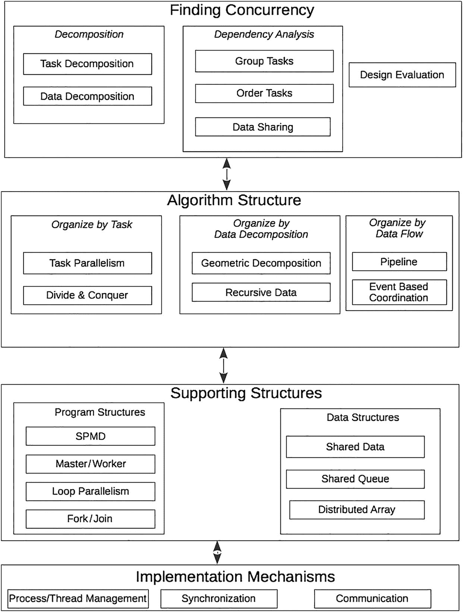
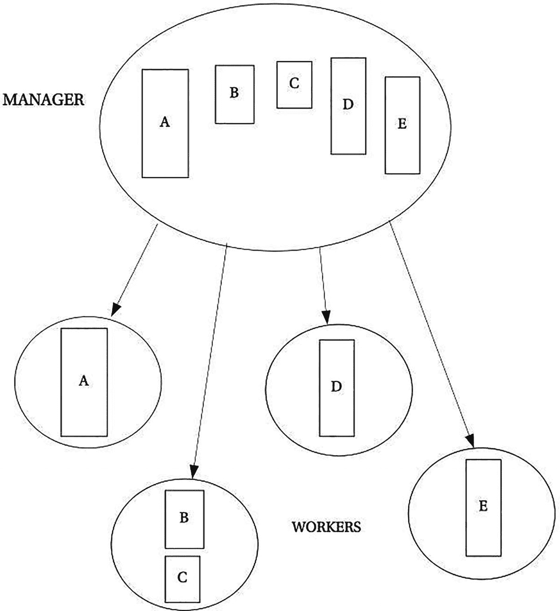
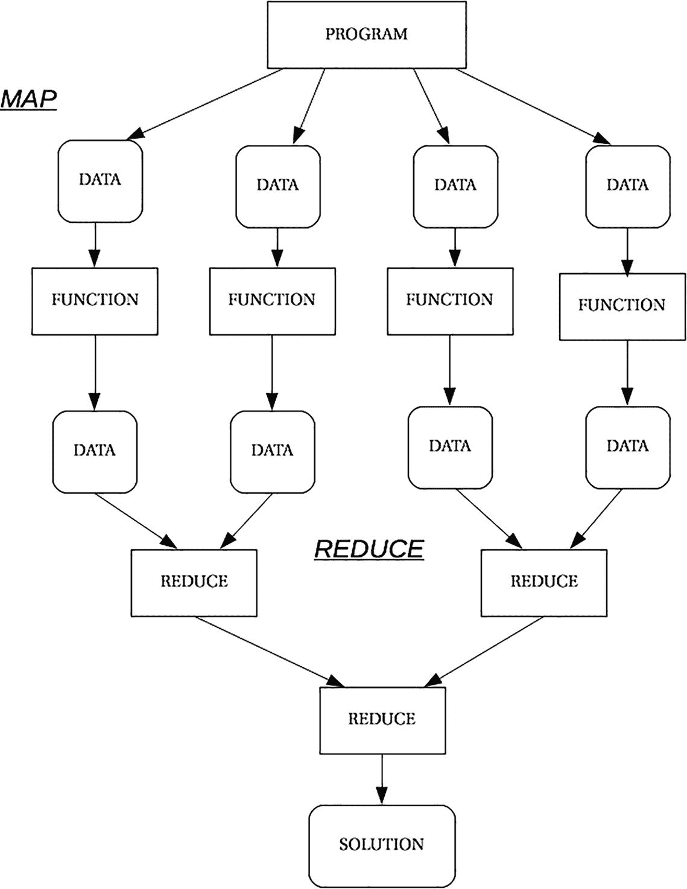
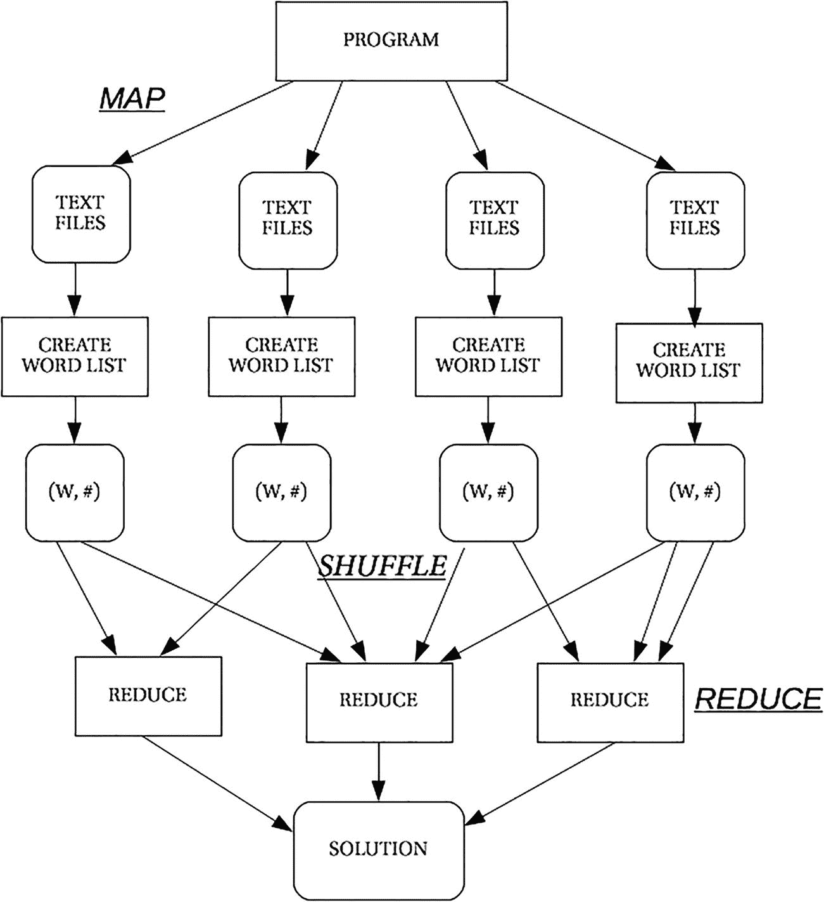
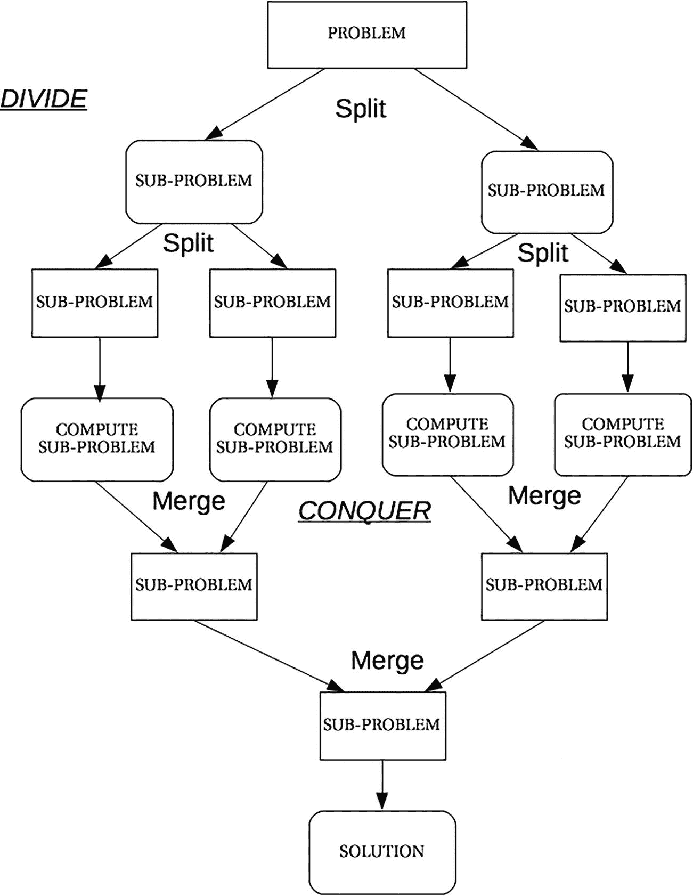

# 15. 并行设计模式

> *软件通常比硬件更长寿，因此在程序的生命周期中，它可能会在各种各样的目标平台上使用。目标是获得一种在原始目标平台上运行良好，同时又足够灵活以适应不同类别硬件的设计。*
> 
> —蒂姆·马特森 等人^(²⁴⁰)

设计模式于 20 世纪 90 年代被引入，旨在“描述针对面向对象软件设计中特定问题的简单而优雅的解决方案。设计模式捕捉了随着时间的推移而发展和演变的解决方案。因此，它们不是人们通常最初会想到的设计。它们反映了开发人员为了在软件中实现更大的复用性和灵活性而进行的无数次重新设计和重新编码。设计模式以简洁且易于应用的形式捕捉了这些解决方案。”^(²⁴¹)

*设计模式*是对常见编程问题及其经过测试的有效解决方案的表示。尽管设计模式通常是在面向对象编程框架中呈现的，但这个想法是完全通用的，可以应用于不同的编程模型，包括并行模型。

## 并行设计模式概述

并行设计模式与经典的串行设计模式具有相同的目标，即描述针对重复出现问题的解决方案，但现在是在并行软件设计而非面向对象软件设计的背景下。

在本章中，我们将概述并行模式、并行编程中典型的计算抽象，以及如何思考将串行程序转换为并行程序。我们还将介绍几个示例性的并行设计模式，包括用于解决递归、分治计算、分阶段计算以及将计算拆分为多个独立任务等问题的模式。与第 13 章一样，我们不会研究所有并行设计模式，而是主要关注一组有代表性的示例，这些示例大多来自马特森等人^(²⁴²)的著作。

在接下来的几节中，我们将介绍一种并行模式语言，这将使我们能够在后面讨论不同的模式。

### 概述：并行设计空间

并行设计模式最有趣的方面之一是将并行应用程序的设计划分为四个独立但相关的设计元素，称为*设计空间*，它们大致与创建并行程序的步骤相对应：

*发现并发性*：此设计空间“关注于构建问题以暴露可开发的并发性。”^(²⁴³) 程序员将针对一个问题或一个现有的串行程序，寻找可以利用的潜在并发区域。

*算法结构*：在此设计阶段，程序员试图找到并构建能够利用已暴露的并发性的算法。

*支撑结构*：支撑结构是程序员开始将算法映射到数据结构以及更详细的程序结构（如循环和递归）的阶段。

*实现机制*：最后，将设计映射到特定的并行编程框架中。

图 15-1 展示了设计空间的层次结构、模式组织的一般维度，以及在这些维度内部，与每个空间相关的并行元模式。以下四节将更详细地讨论每个设计空间。



一个图表展示了从上到下的层次结构：发现并发性、算法结构、支撑结构和实现机制。每个阶段下标注了不同的活动。

图 15-1

并行设计空间及相关元模式


#### 设计空间：发现并发性

*发现并发性*设计空间中的元模式用于开始设计并行应用程序。在考虑了待解决问题的高层要素之后，你将进入这个设计空间。你的目标是梳理出算法或程序中本质上是串行的部分，以及那些包含并发元素的部分。这通常需要你关注程序或算法中计算最密集的部分，因为这些区域最有可能发现并发性。发现并发性分为三个维度：分解、依赖分析和设计评估。

前两个维度，即*分解*和*依赖分析*维度，与你实现并行应用程序的方式相关。*分解*元模式用于将问题分解为可以并发执行的片段，而*依赖分析*元模式则有助于对要执行的任务进行分组，并分析这些任务之间的依赖关系。

*分解*维度仅包含两个元模式，用于发现并将问题划分为可以并发执行的部分：

*   *任务分解*模式将复杂算法视为一组指令，这些指令可以组合成一组要并发执行的任务。
*   *数据分解*模式获取程序使用的数据，并尝试将其划分为可供每个任务使用的数据块。

*依赖分析*维度包含三种不同的元模式，其职责是对上述找到的任务进行分组，并分析它们之间的依赖关系：

*   *分组任务*模式旨在对更方便的任务分组进行建模，从而简化依赖关系的管理。
*   *排序任务*模式旨在找出如何对任务（或任务组）进行排序，以满足与任务执行相关的应用程序约束。
*   *数据共享*模式旨在对共享数据结构的访问进行建模。

影响这些元模式设计的主要因素是灵活性、效率和简单性。需要灵活性来使程序设计适应不同的实现需求。效率通常与可扩展性相关：解决方案如何随目标并行计算机的规模进行扩展。最后，简单性是实现可理解性和可维护性的必要条件。

第三个维度，*设计评估*，并不是我们迄今为止使用该词意义上的维度或元模式。相反，它用于“指导算法设计者在进入*算法结构*设计空间中的模式之前，对已完成的工作进行分析。”^(²⁴⁴) 设计评估实际上是一个过程，鼓励你迭代地评估设计，以尽可能达到最佳设计。在此过程中，你会提出一些问题，迫使你思考当前版本的设计。例如，该设计对目标平台的适用性如何？有多少个处理单元（PE）可用，其中有多少会被使用，以及使用频率如何？数据结构如何在 PE 之间共享？任务及其数据依赖关系的规律性如何？任务是否以最高效和最具可扩展性的方式分组？

对*发现并发性*设计空间进行分析后，总体输出是将问题分解为不同的设计元素：i) 识别出可以并发执行的任务的任务分解，ii) 识别出每个任务本地数据的数据分解，iii) 一种对任务进行分组并对这些任务组进行排序以满足时间和数据依赖关系的方式，以及 iv) 对任务间依赖关系的分析。

#### 设计空间：算法结构

*发现并发性*设计空间的输出被用于*算法结构*设计空间，以优化我们并发任务的设计，并创建更接近实际并行程序的并行程序结构，使其适合在并行目标架构上运行。

组织并行算法结构有三个主要维度：按任务组织、按数据分解组织和按数据流组织。请注意，在*发现并发性*设计空间中，你通常会遍历所有维度及其模式，而在*算法结构*设计空间中，你需要从这三个备选维度中选择一个，并实现其下面的一个并行设计模式。

*   按*任务*组织并行算法。在此维度中，任务本身驱动你的设计。也就是说，你考虑可以并行计算的任务，你的任务集中哪些任务是并发的，然后考虑如何枚举这些任务（线性或递归）。*按任务组织*元模式组包含两种模式：
    *   *任务并行*模式管理任务集合的高效执行，用于线性分解。这里的共同点是“问题可以分解为可并发执行的任务集合。”^(²⁴⁵) 这些任务可以是独立的，也可以彼此之间存在一些依赖关系。在许多情况下，任务还与循环程序结构相关联。实现该模式的建议解决方案涉及三个不同点：如何定义任务、任务间的依赖关系，以及为并发执行而进行的任务调度，包括将任务分配给不同的处理器或线程。
    *   *分而治之*模式用于递归分解，并实现了著名的分治递归解决方案模式，其中问题被分解为多个更小的、相同的子问题，然后求解这些子问题，最后将解合并为原始问题的单一整体解。

*   按*数据分解*组织并行算法，其中数据驱动设计。考虑将数据分解为（可能不相交的）子集，供每个任务使用。同样，这种分解可以是线性的或递归的：如果数据可以分布到离散的数据集中，并且整个问题可以通过独立操作每个数据集来解决，那么选择线性/几何元模式；如果数据是递归组织的（例如二叉树），则选择递归元模式。*按数据分解组织*模式组包含两种元模式：
    *   *几何分解*模式代表这样一类计算：算法被识别为对某个核心数据结构的一系列计算，并且该数据结构本质上是线性的，例如数组、表格或矩阵。对于这些类型的数据结构，数据可以被分解为连续的子集，并由程序独立操作。这意味着操作这些数据的任务可以并发执行。有关*几何分布*模式如何组织其数据的示例，请参见下面的*分布式数组*元模式。
    *   *递归数据*模式用于处理为操作递归定义的数据结构而创建的并行计算，其中数据看起来是顺序处理的。这些任务通常使用链接从一个数据元素移动到另一个数据元素，例如在链表、二叉树或图中，但计算涉及诸如在树中追踪路径或对图进行分区等操作。解决这些问题通常涉及对链接数据结构上的计算进行重构，以暴露更多的并发性。


*   当组织原则是数据流如何对构成算法的任务施加排序时，通过*数据流*来组织并行算法。*按数据流组织*模式组还包含两个元模式：
    *   *管道*模式是指数据流遍历一个由多个阶段组成的、一致的线性链，每个阶段代表对来自上一阶段的输入数据执行一个函数计算，并将其结果传递给下一阶段。在此模式中，数据流被假定为单向的。（这听起来应该很像多级 CPU 架构或管道-过滤器执行序列的概念，如第 7 章所述。）

    *   *基于事件的协调*模式是指多个半独立的并发活动以动态或不可预测的方式交互，且交互由这些并发活动之间的数据流决定。数据流意味着任务之间存在一组排序依赖关系。在此模式中，数据流不被假定为单向或线性的。有许多符合此模式的问题实例，包括许多离散事件模拟问题。因此，许多使用此模式的解决方案都将事件作为基本构建块：通常至少有一个任务生成事件，然后有若干任务处理这些事件。（想象一个多工位洗车场，汽车随机到达并被分配到一个工位；或者一家银行，设有单个队列或多个队列，并有若干柜员为到达队首的客户服务。第 11 章中的“喂鸟器”示例就是此类设计的一个实例。）

#### 设计空间：支撑结构

在探索了*发现并发*设计空间中寻找并发的不同可能性，以及在*算法结构*设计空间中表达并行算法的不同可能性之后，实现进入了*支撑结构*设计空间。该设计空间开始研究适合支持在前述设计空间中规划的算法实现的结构/模式。*支撑结构*设计空间包含两组元模式：*程序结构*元模式组讨论如何组织程序以最大化并行性，而*数据结构*元模式组讨论常用的共享数据结构。

*程序结构*组包含四个元模式：

*   *单程序多数据（SPMD）*元模式，其中所有处理单元（PE）并行运行相同的程序，但每个 PE 拥有自己的数据子集。与 SIMD 架构不同，PE 不需要保持锁步执行，因此不同的并行任务可能沿着代码中的不同路径执行。由于每个 PE 都运行自己的一份程序副本，SPMD 的一个重要特点是，与启动和停止循环相关的额外开销是在程序的开始和结束处实现的，而不是在循环内部。每个数据集通常会被分割，使得程序中的循环只运行总迭代次数的一小部分。此外，PE 之间仅偶尔与相邻单元通信，从而提高了效率。

*   *管理者/工作者*元模式，其中单个管理者任务会设置多个并发的 Worker 线程或进程，以及一个单一的任务包。每个 Worker 会从任务包中取出一个任务并并行执行；当任务完成时，Worker 会继续从任务包中取出任务并执行，直到任务包为空或出现其他结束条件。任务包通常实现为一个共享队列。*管理者/工作者*模式对于*易并行*程序（见下文）特别有用，因为这类程序中有大量工作者任务彼此没有依赖关系。

*   *循环并行*元模式解决了如何执行包含一个或多个计算密集型循环的算法的问题。该模式描述了如何创建一个并行程序，使得循环的不同迭代能够并行执行。第 14 章中使用 OpenMP^(²⁴⁶)计算π值的程序就是*循环并行*模式的一个应用实例。

*   *分治/合并*元模式（参见第 14 章的示例）是整体计算中不同部分并发执行的示例，这些部分彼此独立地进行，直到（可能协调的）集体终止。通常，单个线程或进程会分叉出若干个子进程，这些子进程将全部并行执行。发起进程通常会等待所有子进程合并后才恢复自身执行。每次原始线程分叉出子进程时，子进程的数量可能不同。与您目前看到的许多模式一样，此元模式假设一个共享内存模型，其中所有任务共享值并创建结果，这些结果在最后可供管理者使用。*分治/合并*模式是 OpenMP 中的标准编程模型。


这些元模式在并行计算领域广为人知。*SPMD*模式是 MPI 使用的计算模型，也是与*管理者/工作者*模式并列、用于构建并行计算的最流行模式之一。*循环并行性*已在向量架构中得到利用，目前是 OpenMP 和 GPU 中并行性的主要来源之一。最后但同样重要的是，*分治/合并*模式完美地建模了 POSIX 线程的 pthread_create/pthread_join 模型^(²⁴⁷)，并且也被用作 OpenMP 的基础。

*数据结构*组包含三种元模式：

*   *共享数据*元模式实现了与在多个不同并发活动之间管理数据相关的特性。对共享数据进行正确且高效的管理，通常是整个并行程序开发/设计过程中最耗费时间和精力的活动。该模式要求执行简单性、对数据操作方式进行仔细抽象、意识到显式管理共享数据会带来一些并行开销，并且必须保证无论任务顺序如何（特别是读写操作），任何计算结果的正确性。^(²⁴⁸) 这需要考虑锁定、内存同步和任务调度。使用此元模式的一个例子是在*任务并行*元模式中管理共享数据，其中任务首先被复制，然后部分结果被归约。

*   *共享队列*元模式创建了实现为允许并发访问队列的队列数据类型。共享队列用于支持不同上下文中的并发活动（从线程到进程，以及在 CPU 协处理器上运行的并发活动）之间的交互。使用此元模式的一个很好的例子是在*管理者/工作者*元模式中，用于创建向工作者进程分发任务的并发队列。

*   *分布式数组*元模式建模了与在不同并发活动之间进行分区和分布的数组管理相关的所有方面。分布式数组通常用于实现在并发活动之间逻辑共享的数据结构，但可能以这样一种方式进行分区：其中一个并发活动拥有并管理分布式数组的单个部分。“挑战在于组织数组，使得每个 UE 所需的元素在计算过程中的正确时间点位于附近。换句话说，数组必须在计算机上分布，使得数组分布与计算流程相匹配。”^(²⁴⁹) 此元模式对于使用*几何分解*元模式来辅助算法构建的程序，以及在使用*SPMD*元模式时组织程序结构特别有用。

Mattson 等人根据这些元模式对*算法结构*设计空间中不同模式实现的支持程度，对它们进行了分类。例如，*任务并行*得到了*程序结构*组中四种元模式的良好支持，而*递归数据*模式仅（部分地）得到*SPMD*和*管理者/工作者*模式的支持。

#### 设计空间：实现机制

与并行应用程序实现相关的第四个也是最后一个设计空间是*实现机制*设计空间，它包含代表支持典型并行计算抽象（并发活动、同步和通信）的基本机制的元模式。对应于上述这些抽象的三种元模式如下：

*   *UE（执行单元）管理*元模式处理执行单元（用于执行并行应用程序的进程和线程）的管理，处理与并行应用程序中并发活动相关的所有方面，包括它们的创建、销毁和管理。尽管在 Mattson 等人的工作中只考虑了线程和进程，但 UE 管理元模式可以进行调整以处理放置在 CPU 协处理器上的并发活动（例如，GPU 内核）。

*   *同步*元模式处理与 UE 中事件/计算排序相关的所有方面，包括并发活动和内存的同步。该模式涵盖了诸如锁/栅栏机制、更高级别的互斥构造（例如，监视器）以及集体同步（例如，屏障）等方面。

*   *通信*元模式管理与实现并行应用程序的不同 UE 之间通信相关的所有方面，包括并发活动之间的数据交换。该模式涵盖了不同类型的点对点消息传递（例如，发送、接收、同步和异步）以及多点或集体通信（例如，广播、散播、收集、归约），其中多个 UE 参与单个通信事件。

## 并行模式列表

在本节中，我们将更详细地审视上面讨论的一些元模式。我们还将包含一些其他常见的并行模式，并将这些模式与上述元模式进行匹配。^(²⁵⁰)

### 模式 1：易并行

这并非真正意义上的模式，而是一类问题，其中将工作划分为独立任务的过程非常明显和简单，以至于该问题被称为*易并行*或*令人愉悦的并行*。

易并行问题的例子包括：使用梯形法则计算π（第 14 章），我们可以并行计算任意数量梯形的面积；任何使用循环通过乘法或加法累积值的解决方案；密码破解；计算机图形图像的渲染；计算曼德勃罗特集的点；人脸识别系统；以及许多计算机模拟，例如气候模型。

其他例子可能取决于输入数据的类型和大小。例如，如果你有数百万个（比如 M 个）TIFF 文件想要转换为 GIF 文件，使用 P 个处理单元（PE），你可以将 M/P 个 TIFF 文件分发给每个 PE 并在那里进行转换（参见下面的 Map 模式）。或者，如果你有一个完整的文本文档目录，并且想要计算整个目录中的词频，你可以再次将文档划分到所有可用的处理单元上，对每个子集进行计数，然后合并所有子集（参见下面的 MapReduce 模式）。事实证明，存在许多这类令人愉悦的并行问题，其中你有大量独立分布的计算任务作用于大量数据，并且符合这种“拆分-计算-合并”的模式。在下面的章节中，你将看到更多结合其他并行模式的例子。


### 模式 2：管理者/工作者

在此模式中，一个单一的管理者任务将设置多个并发的**工作者**线程或进程，以及一个单一的任务包。每个工作者将从包中取出一个任务并并行执行；当任务完成后，工作者将继续从包中取出任务并执行，直到包为空或满足其他结束条件。任务包通常实现为共享队列。*管理者/工作者*模式特别适用于*易并行*程序（见图 15-2），其中大量工作者任务之间没有依赖关系。



图示为一个标有“管理者”的圆圈，包含从 A 到 E 的模块。这些模块由管理者分别指向底部。这些模块被标记为工作者。

图 15-2

实现易并行问题的管理者/工作者模式

### 模式 3：映射与归约

与*管理者/工作者*类似，*映射与归约*模式也非常适合易并行问题。*映射*和*归约*模式可以单独使用，而且通常如此。

*映射模式*可能是你遇到的最简单的模式。映射将程序的一部分（我们称之为函数）并行应用于数据的每个元素。这些函数必须没有副作用，完全相同且相互独立。由于这种独立性，映射可以利用尽可能多的执行单元。

与*映射模式*结合使用时，*归约模式*将部分解集合中的所有元素两两组合，并创建一个汇总值作为整体解。虽然归约不要求组合操作满足交换律，但大多数归约应用都假设同时满足交换律和结合律。图 15-3 展示了映射与归约如何协同工作的示例。



流程图从程序开始，分成 4 个数据。每个数据经过一个函数处理后得到另一个数据。相邻的两个数据经过归约，最终归约后得到解。

图 15-3

映射后接归约的实现示意图

在 OpenMP 中，`#pragma omp parallel for` 编译器指令将为易并行程序中的 for 循环启动映射操作。在编译器指令中添加 `reduction(+: <var-list>)` 将添加归约组件。对于第 14 章的梯形法则程序，主 for 循环如下所示：

```
#pragma omp parallel for private(x) reduction(+:sum)
/* 计算 f(x) 下面积的循环 */
for (int i = 0; i <= steps; i++) {
x = i * width;
sum = sum + f(x);
}
```

### 模式 4：MapReduce

*MapReduce* 模式是*映射与归约*模式的一种变体，它将两者结合以完成常见任务，该模式于 2004 年首次发表。^(²⁵¹) *MapReduce* 模式旨在解决主要目标是输入、处理并生成大型数据集的问题，并且其实现可在多个处理器上扩展。*MapReduce* 的实现执行三个基本功能：

*   *映射*：程序将大型数据集（或大型文件集）划分为 N 个离散且独立的子集，每个子集将在单个处理器上处理。输出通常是某种映射数据结构，包含不一定唯一的（键，值）对列表。

*   *混洗*：程序提取相似的（键，值）对，并将它们分配给一个新的处理器，在该处理器上执行归约操作。

*   *归约*：将输入数据集中的元素合并为单个结果并输出。每个处理器产生的结果列表构成生成的输出数据集。

以使用 MapReduce 解决大型问题为例，假设我们有一个大型的文本文档目录。我们的目标是创建一个 [单词，频率] 对列表，该列表告诉我们所有文档中所有唯一的单词以及每个单词出现的次数。此类问题的解决方案在密码学或文本统计分析（例如作者归属研究）中会很有用。图 15-4 展示了这样一个系统可能的样子。



流程图从程序开始，分成 4 个文本文件。每个文本文件创建一个单词列表，经过混洗和归约阶段后，最终得到解。

图 15-4

使用 MapReduce 在大型文本文件集中查找单词频率

在此解决方案中，我们从文本文件目录开始，将其划分为子集，并将每个子集分配给处理器上的一个程序实例。然后，程序为其子集中的所有文档创建一个单词及其频率的列表。接着，混洗操作获取每个单词列表中的每个唯一单词，并将其分配给一个归约进程。因此，例如，所有单词列表中的所有（“cat”，值）对最终都作为输入进入同一个归约进程。然后，每个归约进程累加所有唯一单词的所有值，以创建整体解。

该程序的映射和归约部分的伪代码可能如下所示：^(²⁵²)

```
map(DocumentID docID_key, String input_value) {
/* docID_key 是文档的名称 */
/* input_value 是文档的内容 */
创建一个名为 myMap 的映射；
对于 input_value 中的每个单词 do {
如果 (myMap.contains(单词)) 则
myMap.put(单词, myMap.get(单词) + 1);
否则
myMap.put(单词, 1);
}
返回 myMap;
}
/* 混洗操作在此处进行 */
```

混洗的输入是所有 `myMap` 映射输出文件的集合，这些文件包含文本文件子集中所有单词的（单词，频率）对。混洗函数的输出是一个中间键（单词）以及该单词在目录中所有文件中所有词频计数的列表。每个这样的输出都进入一个归约函数，此操作持续进行，直到所有 `myMap` 输出文件处理完毕。混洗操作可能需要很长时间（比映射或归约更长），因为它在将数据从映射输出文件移动到归约输入时，会在处理元素之间进行大量 I/O 操作。

```
reduce(String intermediate_key, Iterator value_list) {
/* intermediate_key 是文档中的一个单词 */
/* value_list 是该单词的计数列表 */
int result = 0;
对于 value_list 中的每个值 do {
result += value;
}
返回 result;
}
```


最后，我们得到一张最终输出映射表，其中包含目录中所有文件中每个独特单词及其总频次的条目。因此，我们看到*MapReduce*模式是一组有用的操作，它允许并行程序实现针对“拆分-计算-合并”问题的解决方案。

*MapReduce*非常普遍，其解决方案也广受欢迎，以至于诞生了一个名为 Hadoop 的标准框架，该框架以*MapReduce*作为其基本操作基础。Hadoop 现在是 Apache 项目的一部分。“Apache Hadoop 是一个在由商用硬件构建的大型集群上运行应用程序的框架。Hadoop 框架透明地为应用程序提供可靠性和数据移动。Hadoop 实现了一种名为 MapReduce 的计算范式，其中应用程序被划分为许多小的工作片段，每个片段都可以在集群中的任何节点上执行或重新执行。此外，它还提供了一个分布式文件系统，即 Hadoop 分布式文件系统（HDFS），该系统将数据存储在计算节点上，从而在集群中提供非常高的总带宽。MapReduce 和 Hadoop 分布式文件系统的设计都使得节点故障能够由框架自动处理。”^(²⁵³)

### 模式 5：分而治之

在众多具有递归解决方案的问题中，许多都适用于*分而治之*策略。在这种策略中，数据通常规模较大且连续，问题的特点是：较小版本的问题被独立解决，而较大问题的解决方案依赖于这些较小问题的解。这些问题的这一特性使其易于并行化：原始的大问题可以被分解为较小的子问题（同时处理数据的离散子集），每个子问题可以依次独立求解，然后将部分解合并回原问题的解。图 15-5 展示了分而治之的工作原理。



该图展示了一个问题被拆分为多个子问题，这些子问题经历计算和合并阶段，最终获得解决方案。

图 15-5

分而治之策略示意图

请注意，在图 15-5 的示例中，在使用*分而治之*策略的程序中，并发量会随着程序的执行过程而变化。在程序的开始和结束时，并发量很小，但随着程序将数据划分成更多层级，并发量会增长，在某个点达到最大值，之后随着合并操作的发生，并发量又会减少。此外，在递归的某个层级，求解所涉及的工作量会小于并行开销，此时程序应退化为顺序算法或基本情况。还存在数据划分不均匀的可能性（一个很好的例子是快速排序中的基准元素未能将当前列表平分），这也可能需要更多的工作。

*分而治之*策略适用于一整类递归问题，包括所有 O(n log n)排序算法、快速傅里叶变换以及线性代数中的问题。这种通用策略通常通过*Fork/Join*模式（其中一个管理者线程或实例会生成一定数量的子线程，然后等待它们完成，并将部分答案合并为最终答案）或*管理者/工作者*模式来实现。接下来你将研究*Fork/Join*并行模式。

### 模式 6：Fork/Join

在某些问题中，并行线程的数量会随着程序的执行而变化，这使得使用简单的控制结构来调用并行性变得更加困难。解决这个问题的一种方法是在程序执行的不同时间点分叉出不同数量的线程，然后等待它们完成后再继续。通常，单个线程或进程会分叉出一定数量的子进程，这些子进程将并行执行。发起进程通常会等待所有子进程完成并汇合后，再恢复自身的执行。每次原始线程分叉出子进程时，子进程的数量可能不同。这种模式还可能存在*嵌套并行执行区域*，这会使程序的性能复杂化。

这种策略的伪代码保留了顺序分治算法的递归特性；它看起来类似于以下内容：

```
ResultType solve(Problem problem) {
if (problem.size is small enough)
return solveSequentially(problem);
else {
ResultType left, right;
Divide problem into K subproblems;
Fork the K subproblems;
join; // 等待所有子问题完成
return combine(left, right);
}
}
```

这段代码也说明了此类模式的一个问题。`combine()`函数看起来本质上是串行的，并且每次执行`solve()`时都会执行。这可能会减慢问题的并行实现速度。为了说明这一点，让我们检查一个归并排序算法的版本；并行版本的伪代码如下所示：

```
mergesort(list, start, end) {
if (start < end) then
mid = floor(start + (end – start)) / 2)
fork mergesort(list, start, mid)
mergesort(list, mid+1, end)
join
merge(list, start, mid, end)
}
```

我们用 C 语言并使用 OpenMP 并行包来实现这个程序。在 C 语言中，在`main()`函数中，我们首先告诉 OpenMP 允许嵌套并行区域，这是由于归并排序中的递归所必需的。然后，在`mergeSort()`函数中，我们在对`mergeSort()`的两次递归调用周围创建一个并行区域。我们告诉 OpenMP 将该区域中创建的线程数限制为 2，这样每次递归调用将恰好获得一个线程，从而创建总体适当数量的执行线程。

```
/*
* 使用 openMP 的 C 语言并行归并排序版本
*/
#include 
#include 
#include 
/* 这里是归并函数；它是顺序的，也是你通常会编写的标准函数 */
void merge(int* array, int start, int end) {
int middle = (start + end) / 2;
int temp_index = 0;
/* 创建一个临时数组 */
int* temp = malloc(sizeof(int) * (end - start + 1));
/* 从两个半区合并排序后的数据 */
int left = start;
int right = middle + 1;
/* 当两个半区都有数据时 */
while((left <= middle) && (right <= end)) {
if(array[left] <= array[right]) {
temp[temp_index] = array[left];
temp_index++;
left++;
} else {
temp[temp_index] = array[right];
temp_index++;
right++;
}
}
/* 将左半区剩余数据复制到临时数组 */
while(left <= middle) {
temp[temp_index] = array[left];
temp_index++;
left++;
}
/* 将右半区剩余数据复制到临时数组 */
while(right <= end) {
temp[temp_index] = array[right];
temp_index++;
right++;
}
/* 将排序后的数据复制回原数组 */
for(temp_index = 0; temp_index <= (end - start); temp_index++) {
array[start + temp_index] = temp[temp_index];
}
free(temp);
}
/* 这是并行归并排序函数 */
void mergeSort(int* array, int start, int end) {
int middle = (start + end) / 2;
/* 基本情况：如果数组大小为 0 或 1，则已排序 */
if((end - start) == 0) {
return;
}
if((end - start) >= 1) {
/* 设置线程数 */
omp_set_num_threads(2);
/* 创建并行区域 */
#pragma omp parallel
{
#pragma omp single
{
/* 分叉出两个线程 */
#pragma omp task
mergeSort(array, start, middle);
#pragma omp task
mergeSort(array, middle + 1, end);
}
}
/* 等待两个线程完成 */
/* 合并两个已排序的半区 */
merge(array, start, end);
}
}
/* 主函数 */
int main(int argc, char* argv[]) {
int i;
if(argc != 2) {
fprintf(stderr, "用法: %s \n", argv[0]);
exit(1);
}
int SIZE = atoi(argv[1]);
int* nums = malloc(sizeof(int) * SIZE);
/* 启用递归并行块 */
omp_set_nested(1);
/* 填入随机数 */
for(i = 0; i < SIZE; i++) {
nums[i] = rand( ) % 1000;
}
/* 进行排序 */
mergeSort(nums, 0, SIZE - 1);
return 0;
}
```


请注意，我们在该程序中使用了 OpenMP 的 sections 指令。该指令确保并行 pragma 内的每个 section 都会被线程组中的一个线程执行一次。不同的 section 允许由不同的线程执行。并行块末尾还有一个隐式屏障，因此只有在两个 `mergeSort()` 线程都完成后，才会调用 `merge()` 函数。因此，通过 *Fork/Join* 模式，我们可以分割已分区的数组，独立执行 `mergeSort()`，然后在每对排序完成后进行合并。通过这种设置，除了最后一次调用外，每次调用 `mergeSort()` 都会将当前子列表一分为二，然后创建两个新的执行线程，这两个线程将执行至完成，当两者都完成时，`merge()` 函数将执行，线程将结束。被排序的数组将在所有线程之间共享。活跃线程的数量将增加，直到达到最大值（经过 log[2] n 步后），此时线程将开始结束，并发生合并。请注意，每次创建和销毁新线程都会产生开销，因此在考虑使用 OpenMP 时需要考虑到这一点。

该程序的串行版本在单个线程中执行所有操作，但使用系统栈来跟踪对 `mergeSort()` 的递归调用。每次调用 `mergeSort()` 时，都会在系统栈上创建一个新的活动记录^(²⁵⁴)，当每个 `mergeSort()` 调用结束时，该活动记录被移除。通过这种方式，系统栈在执行过程中会增长和收缩。同样，数组由 `mergeSort()` 函数的所有活动实例共享。在 `merge()` 函数中创建的临时数组是该函数的局部变量，当 `merge()` 退出时消失。串行版本的主要开销是系统栈上活动记录的创建和销毁。如上所述，在实现程序的串行版本时，您需要考虑此开销。

虽然这个并行版本可以工作，并且我们能够利用测试系统中的多核优势，但事实证明，阿姆达尔定律^(²⁵⁵)将成为我们的绊脚石。`merge()` 函数本质上是串行的，因此会拖慢整个程序，所以我们潜在的加速非常小。在运行 Linux 的双核共享内存系统上，归并排序程序的并行版本最终比串行版本更慢。对于更大的数组，我们还必须小心同时创建的线程数量（这就是我们在并行 pragma 中限制线程数量的原因）；大多数操作系统对单个用户可以同时创建的活跃线程或进程数量都有限制。

我们如何解决并行版本的这个问题？可能需要进行两项更改。首先，在 `mergeSort()` 函数中，对基本情况的测试 `if (start < end)` 可以改为阈值测试。我们可以跟踪递归调用的次数或当前子列表的长度，如果它低于某个阈值，我们就停止递归，转而使用另一种排序算法，比如插入排序，对于小数组，其时间复杂度接近线性。不过，这个修复并没有改变 `merge()` 函数的串行本质。我们可以通过创建一个并行合并函数来使程序更快。`merge` 函数已经是一个 O(n) 算法，所以我们不希望让它变得更慢。它也不是一个明显的并行化候选。目标应该是得到一个 O(n) 或更快的并行算法（可能通过减小复杂度估计中的系数大小）。*分治*算法可能正是我们寻找的。该算法的开发在一定程度上超出了本书的范围，但在著名的 CLRS *算法导论* 的当前版本中有一个很好的并行合并算法，我们向感兴趣的读者推荐。^(²⁵⁶)

## 结论

正如您可能已经注意到的，并行设计模式可能彼此非常相似。这是因为它们通常遵循从相应的串行算法/程序创建并行算法/程序的过程。该过程是：(1) 识别并发性，(2) 将程序拆分为并发部分，(3) 如果更新后的算法需要，则拆分数据，(4) 并行执行并发部分，以及 (5) 将所有答案组合起来得到最终答案。也就是说，并行设计模式为我们提供了一组有用的抽象，用于思考并行编程。

