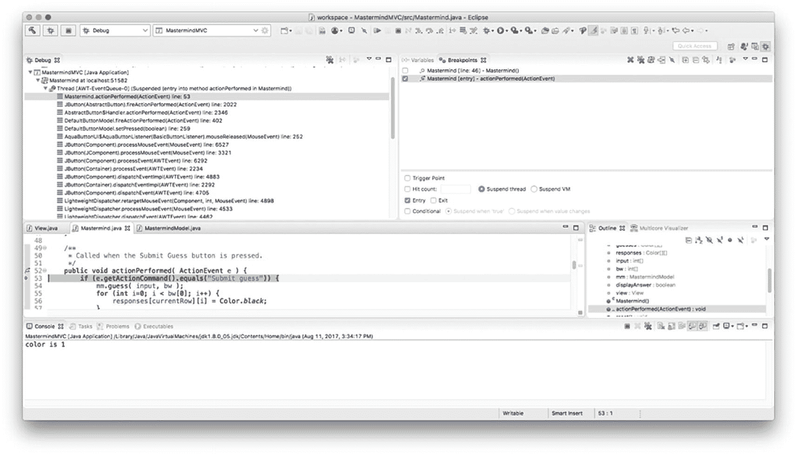
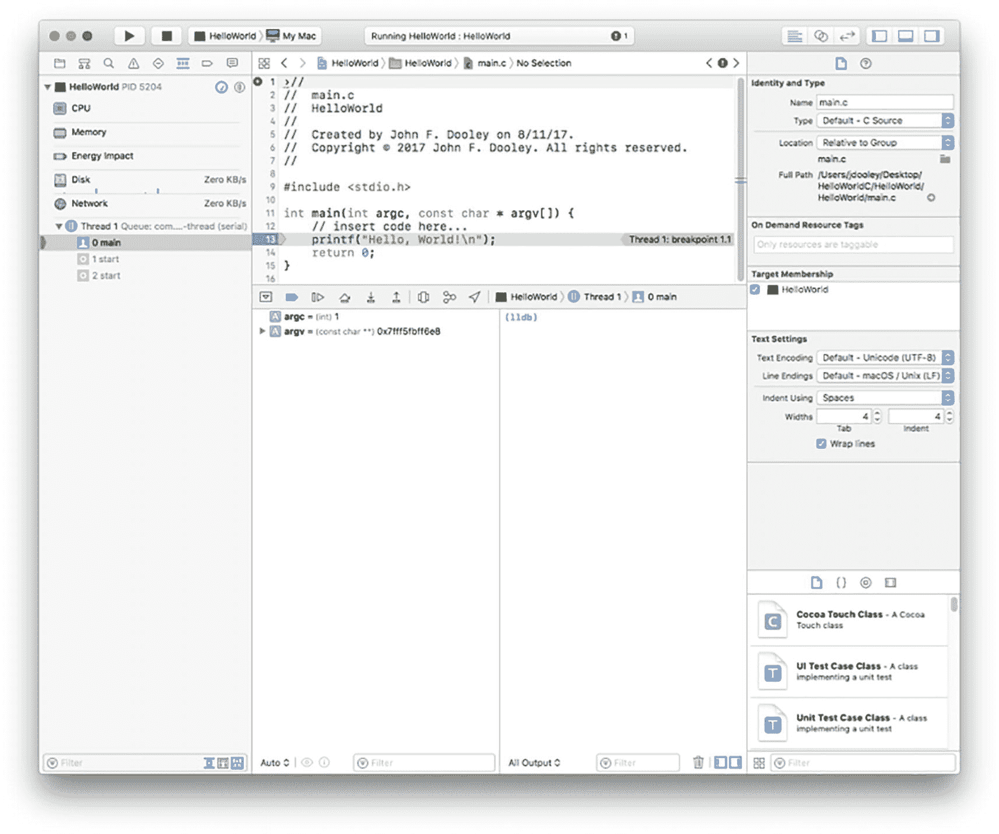

# 17. 调试

> *从我们开始编程的那一刻起，就惊讶地发现，让程序正确运行并不像我们想象的那么容易。调试必须被“发现”。我清楚地记得那一刻，我意识到从那时起，我生命中的大部分时间都将花在寻找自己程序中的错误上。*
> 
> ——莫里斯·威尔克斯，1949 年

> *审视自己的麻烦，并知道这麻烦是你自己而非他人造成的，是一件痛苦的事。*
> 
> ——索福克勒斯

恭喜！你已经完成了代码编写，现在是时候让它运行起来了。无论你是一位多么优秀的程序员，错误都不可避免：逻辑错误、拼写错误、被遗忘的边界情况、差一错误、键盘未能记录按键、你的猫在你没注意时修改了代码……错误是代码生命周期中自然的一部分。经过多年的代码编写，我们已经达到了这样一个阶段：大多数时候，我们编写的少于 50 行的程序没有任何*明显*的错误，甚至常常能一次编译通过，行为也基本符合预期。我们认为这是一个相当不错的努力目标。

让你的程序运行起来是一个包含三个部分的过程，这三个部分的顺序存在一些争议：调试、审查/检查以及测试。

*调试*是寻找错误的*根本原因*并修复它的过程。这并不意味着通过编写代码绕过错误来治疗其症状，使其消失；而是找到错误的真正原因，并修复那段代码，从而彻底消除错误。调试通常在完成代码编写之后、进行代码审查或单元测试之前进行（但请参阅本章后面的*测试驱动开发*）。调试和单元测试也可以同时进行。

*审查*（或检查）是阅读静态页面上的代码并*寻找错误*的过程。错误可能包括你在实现设计时出现的错误、其他类型的逻辑错误、错误的注释等等。审查代码本质上是一个*静态*过程，因为程序并没有在计算机上运行——你是在屏幕或纸张上阅读它。因此，虽然审查非常适合发现静态错误，但它无法发现代码中的动态错误或交互错误。这正是测试的用武之地。我们将在未来的章节中详细讨论审查和检查。

*测试*是*在代码中查找错误*的过程，而不是修复它们，后者是调试的工作。测试至少发生在以下三个不同的层面：

*   *单元测试*，在此测试代码的小片段，尤其是在函数或方法层面。
*   *集成测试*，在此将几个相互关联的模块或类组合在一起，并一起测试它们。当你在团队中工作时，集成测试尤其重要，它可以测试你编写的代码是否与其他团队成员编写的代码协同工作。
*   *系统测试*，在此从用户的角度测试整个程序。这也被称为*黑盒测试*，因为测试者不知道代码是如何实现的；他们只知道需求是什么，因此他们测试编写的代码是否满足所有需求。

本章我们将重点讨论调试。单元测试涉及查找程序中的错误，而调试则涉及找到根本原因并修复这些错误。调试是关于找出错误在你的程序中发生的原因。你可以将错误视为一个机会，借此更深入地了解程序，以及了解你自己是如何工作和解决问题的。毕竟，调试是一项解决问题的活动，就像开发程序是解决问题一样。将调试视为一个了解自己并提升技能的机会。


## 究竟什么是错误？

在代码中，错误可分为三种类型：语法错误、语义错误和逻辑错误。

*语法错误*是指在使用编程语言时，违反其语法规则而产生的错误。拼错关键字、使用变量前未声明、忘记在代码块中加上右花括号、忘记函数的返回类型、以及忘记在语句末尾加上分号，这些都是语法错误的典型例子。语法错误是目前最容易发现的，因为编译器几乎能为你找出所有这类错误。编译器在强制执行语言的词法和语法规则方面非常严格，因此，如果你的代码在编译过程中没有错误*且没有警告*，那么你的程序很可能就不存在语法错误了。请注意上一句中“且没有警告”这部分。你应该*始终*在开启最严格语法检查的情况下编译代码，并且在进入审查或测试阶段之前，*始终*消除所有错误和警告。在团队协作时，消除警告尤其重要，因为一旦代码集成，你代码中的一个警告可能会变成别人代码中的一个错误。

如果你确信自己在语法上没有犯任何错误，那在查找其他错误时，你就少了一件需要担心的事。好消息是，现代集成开发环境（IDE，如 Eclipse、NetBeans、XCode 或 Visual Studio）一旦你设置好编译器选项，就会自动为你完成这项工作。一旦你设定了警告和语法检查级别，每次你做出更改，IDE 都会自动重新编译你的文件，并告知你任何语法错误！

*语义错误*则不同，它发生在你用编程语言错误地表达意图时，通常是由于对语言语法规则的误解。在 C/C++ 或 Java 中，没有为代码块加上花括号、在 *if* 或 *while* 语句的条件后意外加上分号、以及在 switch 语句的 case 分支末尾忘记使用 break 语句，这些都是语义错误的经典例子。语义错误更难发现，因为它们通常是语法正确的代码片段，因此编译器能成功地将你的代码编译成目标文件。只有当你尝试运行程序时，语义错误才会通过不正确的行为表现出来。好消息是，它们通常非常明显，几乎会立即暴露出来。坏消息是，它们也可能非常隐蔽。例如，在这段代码中：

```
while (j < MAX_LEN);
{
// 在这里执行操作
j++;
}
```

*while* 语句条件表达式末尾的那个分号可能很难被注意到。你的眼睛可能会直接滑过它。但它的效果是，要么让程序陷入无限循环（如果条件测试通过），要么永远不执行循环（如果测试失败），但却错误地执行了后面的代码块，因为该代码块在语义上已不再与 *while* 语句关联。任何基本的测试都应该能发现这个问题。

*逻辑错误*则是目前最难发现和消除的。逻辑错误是你解决方案逻辑中的错误，可能源于不正确的设计，或在将设计转化为代码的过程中产生。逻辑错误包括：计算结果不正确、循环中的差一错误（如果差一错误是因为你不理解数组索引，那它也可能是一个语义错误）、误解网络协议、误解问题、遗漏步骤、从函数返回了错误的内容等等。出现逻辑错误时，你的程序要么看似正常执行但结果错误，要么突然崩溃，因为你访问了数组的越界位置、试图解引用空指针、或者试图在数据区中间执行代码。逻辑错误可能极其难以发现。

## 不该做什么

虽然调试没有唯一正确的方法，^(²⁷⁸) 但这里有一些你在调试代码时应避免的做法。^(²⁷⁹)

*不要猜测*。猜测意味着：(1) 你不理解你正在调试的程序；(2) 你没有系统地寻找错误的根本原因。停下来，深呼吸，然后重新开始。

*不要只修复症状，要解决问题*。通常，你可以通过添加代码来强制错误消失，从而“修复”一个问题。例如，假设错误涉及某个值范围内的异常值或其他边界情况。此时很容易诱使你针对这个异常值添加代码进行特殊处理。请三思，因为你可能只是在掩盖一个薄弱环节，而不是修复它。几乎总会有其他一些特殊情况潜伏着，伺机破坏你的程序。研究程序，弄清楚更大的问题是什么，并找到一个通用的解决方案来防止未来的故障。

*不要使用鸵鸟算法*。不要把头埋进沙子里，忽视问题。你可能会想“这只是个偶然事件”、“IDE 出故障了”、“系统的其他部分肯定坏了”、“拉尔夫的模块显然给我发了错误的数据”，或者找其他借口来逃避深入调查。虽然你代码之外的事情可能会出错，但问题往往来自内部。如果你只是“改了一个地方”，程序就崩溃了，那么猜猜看，是谁很可能刚刚在程序中引入了一个错误，以及这个错误在哪里？或者，至少它暴露了一个已有的问题。代码中的错误，无论是来自你还是他人，都是意料之中的事。关于谨慎编码以及编写正确程序有多难，最好的讨论之一来自 Jon Bentley 的《编程珠玑》一书第 5 栏中关于如何编写二分查找例程的讨论。^(²⁸⁰) 你应该读一读。

## 调试方法

调试的最佳心态是将行为异常的代码视为一个挑战，或一个充满相互关联谜题的密室逃脱。这是一个展现聪明才智的机会，一个解决网络犯罪现场的机会：是谁干的（很可能就是你……），怎么干的，在哪里干的？最棒的是，一旦你解决了问题，你还能撤销它！调试是一场你与自己的智力较量。我们保证，这场较量会让你在未来多年里都保持高度紧张！

记住，你是在解决一个问题，而最好的方法就是系统地接近问题，然后一举击溃它。关于调试，另一件要记住的事情是，就像谋杀悬疑案一样，你是从结论开始逆向推理的。^(²⁸¹) 坏事已经发生了——你的程序失败了。现在你需要检查证据，并逆向推导出解决方案。以下是应按顺序执行的方法：

1.  可靠地重现问题。

2.  找到错误的根源。

3.  修复错误（仅修复这一个）。

4.  测试修复（这样你以后就有了一个回归测试）。

5.  可选地，在你刚修复的错误附近查找其他错误。


### 调试步骤一：可靠地重现问题

如果错误只是偶尔出现，那么排查起来会困难得多。经典的例子就是“但在我的电脑上运行正常”这个问题。这是你最不想听到的一句话，也是技术支持人员早早退休的原因。关键的第一步是重现问题——如果可能的话，用不同的方式重现——这样你才能看清发生了什么以及发生在哪里。幸运的是，大多数错误并不难隐藏：要么你在某个打印语句中得到了错误结果，然后从那里反向排查；要么你的程序彻底崩溃，系统为你生成了一个回溯跟踪。（Java 虚拟机自动执行此操作。对于其他语言，你可能需要使用调试器来获取回溯跟踪。）

请记住，错误并非随机事件。如果错误是间歇性出现的，罪魁祸首通常是以下几种情况之一（尽管此列表并非详尽无遗）：

*   **初始化问题**，可能是由于依赖变量定义产生的副作用来进行初始化，但实际效果与预期不符。
*   **时序错误**，某些事情发生的时间比你预期的更早或更晚。
*   **悬空指针问题**，指针本应指向某个对象，但该对象已不复存在。
*   **缓冲区溢出或数组越界**，当代码遍历超出了预期空间的边界（例如循环超出了集合的边界）并覆盖了另一段代码、另一个变量或系统堆栈时发生。
*   **并发问题（竞态条件）**，当你未能在多线程应用程序或使用共享内存的应用程序中同步代码，并且你需要的变量在被你使用之前被其他线程覆盖时发生。

然而，仅仅重现问题是不够的。相反，你需要通过消除所有无关条件，将问题简化为能触发错误的最简测试用例。一种方法是使用二分法来尝试重现问题：使用之前一半的数据（甚至一半的代码）。选择其中一半。如果错误仍然出现，就再试一次。如果错误没有出现，就尝试另一半数据。如果仍然没有错误，则尝试四分之三的数据。你明白这个思路。当你找到最简用例时，你就会知道，因为任何更小的改动都会改变程序的行为：要么错误消失，要么你会遇到一个略有不同的错误。

### 调试步骤二：找到错误根源

一旦你能可靠地重现问题，就可以找到错误发生的位置了。同样，你需要系统地进行。有几种直接的方法可供使用：

*   **阅读代码**。运行测试用例后，你应该做的第一件事是检查输出，做出有根据的猜测，判断错误可能在哪里（查看最后打印的内容，并在程序中找到该打印语句），然后坐下来，喝杯咖啡，阅读代码。理解代码在错误发生区域试图做什么，是找出问题根源和修复方法的关键。十有八九，如果你坐下来阅读代码五分钟左右，就能找到问题所在。

*   **向橡皮鸭解释代码**。在阅读我们自己的代码时，我们常常会产生“代码盲点”，每次阅读都会忽略显而易见的问题，即使如果这是别人的代码，我们可能立刻就能发现。解决这种盲点的方法就是解释我们的代码。可以向自己、宠物、植物、橡皮鸭解释……你可以在这里选择你自己的冒险伙伴。请注意，我们不期望伙伴有任何贡献，只需要被动倾听的能力。冒险通常这样展开：“所以这里我做了[A]，然后[B]，然后……哦……”，这时你通常最终会发现问题所在。

*   **收集数据**。如果问题仍然隐藏，既然你现在有了一个能重现错误的测试用例，那就通过运行测试用例来收集数据。数据可以包括：什么样的输入会导致错误、错误出现需要多长时间、导致错误发生前经历了哪些步骤，以及错误发生时程序的状态。一旦你有了这些数据，你就可以对代码中错误的位置形成一个假设。对于大多数类型的错误，你会先得到一些正确的输出，随后是错误输出或程序崩溃。

*   **插入打印语句**。一旦你缩小了错误输出的范围，最简单的做法就是开始在与该输出交互的代码附近添加打印语句，从你认为错误显现的点开始反向排查。请记住，错误*表现*其行为的地方，可能距离错误实际*发生*的地方有很多行代码。一些适合放置打印语句的位置包括：函数的入口和出口（你可以打印“进入排序例程”、“退出分区例程”等）、循环的顶部和底部、`if` 语句的 `then` 和 `else` 分支的开头、`switch` 语句的 `default` 分支等等。除非发生了什么非常诡异的事情，否则你应该能够很快地隔离出错误发生的位置。

在某些语言中，你可以将打印语句包裹在调试块中，并使用编译选项来开启或关闭它们。在 C/C++ 中，你可以插入：

```
    #ifdef DEBUG
    printf("排序例程中的调试语句\n");
    #endif
    ```

来包裹你希望有条件执行的调试语句。在编译程序之前，你可以将以下内容添加到头文件或代码顶部：

```
#define DEBUG
```

或者你可以使用以下命令编译代码：

```
gcc -DDEBUG foo.c
```

省略 `#define` 或 `-DDEBUG` 将简单地跳过执行所有 `#ifdef DEBUG ... #endif` 块。但请注意，这种技术会使你的程序更难阅读，因为代码中散布着许多 DEBUG 块。你应该在程序发布之前移除 DEBUG 块。（不幸的是，Java 没有这个功能，因为它没有预处理器。）

在 Java 中，你可以通过使用一个命名的布尔常量来获得与 `#ifdef DEBUG` 相同的效果。以下是一个代码示例：


```
public class IfDef {
final static boolean DEBUG = true;
public static void main(String [] args) {
System.out.printf("Hello, World \n");
if (DEBUG) {
System.out.printf("max(5, 8) is %d\n", Math.max(5, 8));
System.out.printf("If this prints, the code was included\n");
}
}
}
```

在这个例子中，当你想要启用 DEBUG 代码块时，将布尔常量 DEBUG 设置为 true；想要关闭时，则将其设置为 false。这种方法并不完美，因为每次开关调试功能都需要重新编译，但上述 C/C++ 示例也同样需要如此操作。

*   *使用内置调试功能*：在 IDE 中编码时通常可用的功能。此类功能允许你设置断点、监视变量、单步进入和跳出函数、单步执行指令、动态修改代码、检查寄存器和其他内存位置等，从而尽可能多地了解代码的运行情况——而且无需添加之后需要删除的打印语句。你遇到的大多数 IDE，无论是开源还是专有，都内置了调试器。这包括 Eclipse、XCode、Visual Studio、VSCode、BlueJ、PyCharm 等。如果你没有使用 IDE，可以使用像 *gdb* 这样的独立调试器。如果快速浏览代码并添加少量打印语句仍无法让你更接近错误根源，那就使用调试器吧。更多关于调试器的内容请参见下一节。

*   *使用日志记录*：许多 IDE 和脚本语言（如 JavaScript）都有内置的日志记录例程，你可以用它们来代替自己添加的打印语句。通常，你可以确定哪些变量有助于记录日志以进行调试。日志记录例程通常会创建一个日志文件，你可以在程序运行后检查该文件。如果你正在进行交互式调试，也可以在程序执行期间检查日志文件。

*   *寻找代码中的模式*，特别是那些你以前见过或自己犯过的错误模式。模式之所以存在，是因为开发人员会反复犯同样的错误（毕竟，我们是习惯的动物）。随着你获得更多的编程经验，并更好地理解自己编写程序的方式，发现你所犯错误类型会变得更容易。

上面 while 循环头部末尾多余的分号可能是一种模式。另一种模式可能是因经典的*差一错误*而搞乱循环边界：

```
    for (int j = 0; j <= myArray.length; j++) {
    // 此处为一些代码
    }
    ```

因为你测试的是 `<=` 而不是 `<`，导致数组越界。

C/C++ 中的一个经典错误是在条件表达式中本应使用 `==` 却用了单个 `=`，结果变成了赋值。假设你正在检查一个字符数组中的特定字符：

```
    for (int j = 0; j < length; j++) {
    if (c = myArray[j]) {
    pos = j;
    break;
    }
    }
    ```

单个等号会导致 *if* 语句每次都提前停止；`pos` 将始终为零。Java 不会允许你这样做，因为它要求条件表达式的计算结果为 `boolean` 类型；Java 编译器会报错，指出赋值表达式的类型不是 `boolean`。

```
    TstEql.java:10: 不兼容的类型
    找到   : char
    需要: boolean
    if (c = myArray[j]) {
    ^
    1 个错误
    ```

这是因为在 Java 中（就像在 C 和 C++ 中一样），赋值运算符会返回一个结果，并且每个结果都有类型。在这种情况下，结果类型是 **char**，但 if 语句期望的是 **boolean** 表达式。Java 编译器会检查这一点，因为它比 C 和 C++ 类型更严格，后者的编译器不会执行此检查。

在 `switch` 语句中忘记在 `case` 后添加 `break` 语句是另一种可能的模式。

```
    switch(selectOne) {
    case ’p’:   operation = "print";
    break;
    case ’d’:   operation = "display";
    default:    operation = "blank";
    break;
    }
    ```

当 `selectOne` 的变量为 `’d’` 时，上述代码会将 `operation` 重置为 `blank`，因为该 case 后面没有 *break* 语句，导致执行流程落入下一个 case。

*   *其他问题*。我们只是浅尝辄止地介绍了你可能犯的错误以及如何在代码中找到它们。由于你可以用任何给定的编程语言编写无限多的程序，因此也有无限多的方式将错误引入其中。内存泄漏、输入错误、全局变量的副作用、未能关闭文件、未在 switch 语句中设置默认 case、意外覆盖方法定义、错误的返回类型、用局部变量隐藏全局或实例变量……天网（Skynet）才是极限。

不过，不要气馁。你犯的大多数错误其实都很简单。大多数错误会在代码审查和单元测试中被发现。那些逃过系统测试或（天哪）进入发布代码的错误才是真正有趣且微妙的。调试就像解谜，可能需要你找出差异、解决一些数学问题、理清一些逻辑，以及更多乐趣集于一身。尽情享受吧，我们就是这样做的！

### 调试步骤 3：修复错误（仅此一个）！

一旦你找到了错误的位置，就需要提出修复方案。大多数情况下，修复方案是显而易见且简单的，因为错误本身很简单。这是个好消息。但有时，虽然你能找到错误，修复方案却不明显，或者修复方案需要重写大量代码。在这种情况下，要小心！花必要的时间理解代码，然后重写并正确修复错误。调试中最大的问题是草率。

修复错误时，请记住两件事：

*   修复实际错误；不要只修复症状。

*   一次只修复一个错误。

第二点尤其重要。我们都遇到过这样的情况：在修复一个错误时，在同一段代码中又发现了另一个错误。诱惑在于当场就把它们都修复了。要抵制这种诱惑！修复你本来要修复的那个错误。测试它，确保修复正确。将新代码集成回源代码库。然后你可以回到步骤 1 修复第二个错误。

但是，既然可以现在就修复，为什么还要做这些额外的工作呢？当你到达调试过程的这一步时，你已经为第一个错误准备了测试，你已经了解了错误发生的代码，并且你已经准备好进行那一次修复。不要通过修复其他无关问题来把事情搞乱。你没有为第二个错误准备测试，所以无法测试那个修复。此外，独立的集成、集成测试、共享仓库提交以及专门的提交消息是跟踪做了什么、何时做以及为何做的最清晰方式。相信我们。这虽然多了一点工作，但一次只修复一个错误会为你省去日后很多麻烦（比如当某个修复最终需要进一步修复时）。


### 调试步骤 4：测试修复

测试修复看起来显而易见，对吧？但你会惊讶地发现，有多少修复根本没有经过测试。或者即使测试了，也只是用通用样本数据进行简单测试，而没有检查你的修复是否破坏了其他功能。

首先，重新运行最初发现错误的那次测试。不仅仅是你在步骤 1 中想出的最小化测试，而是导致错误出现的原始测试。如果错误没有复现，这是一个好迹象，表明你至少修复了错误的直接原因。现在，运行回归测试套件中的所有其他测试（关于回归测试的更多讨论，请参见下一章），以确保你没有破坏已经修复的内容，或者向代码中引入新的错误。最后，将你的代码集成到源代码库中，检出新版本，并对整个系统进行测试。如果一切仍然正常，那么你的状态就很好了。是时候犒劳一下自己，或者小睡一会儿，或者两者都来。

### 调试步骤 5：寻找更多错误

嗯，如果某个特定的函数或方法中存在一个错误，那么很可能还有另一个，对吧？编程中有一个公认的真理：80% 的错误发生在 20% 的代码中，这被称为帕累托原则。^(²⁸²) 在你刚刚修复错误的地方附近，很可能还存在另一个错误。所以，既然你已经在这里了，不妨检查一下你刚修复的错误附近的代码，看看是否有类似的问题再次发生。这是寻找模式的另一个例子。

同时，检查整个模块或类，看看是否有其他可以改进的地方，这也没什么坏处。在敏捷开发中，这被称为*重构*。这意味着重写代码以使其更简单。让你的代码更简单，会使其更清晰、更易读，并且更容易找到下一个错误。所以，拿起你提神的饮料，读读代码吧。

## 调试器工具

到目前为止，我们已经讨论了使用编译器消除语法错误和警告、在代码中插入打印语句以获取数据，以及可以编译进或编译出的内联调试语句。一个更强大的工具是*调试器*，它可以用来查找错误的根源：它是一个特殊的程序，可以执行经过检测的代码，并允许你在程序运行时窥视其内部，以检查正在发生的事情。调试器允许你停止正在运行的代码（断点）、检查代码执行时的变量值（监视点）、一次执行一条指令、单步进入和跳出函数，甚至在程序运行时修改代码和数据。

虽然调试器非常强大和方便，但你应该谨慎使用它们。调试器在查看代码时，本质上具有隧道视野。它们非常擅长向你展示当前函数的所有代码，但不会让你感受到整个程序的组织结构。它们也不会让你感受到复杂的数据结构。此外，使用调试器调试多线程和多进程程序也很困难。多线程程序尤其成问题，因为执行时序对于不同的线程至关重要，而在调试器中运行多线程程序会改变时序。

### Gdb

对于 C 和 C++ 开发者来说，几乎所有 Unix 和 Linux 系统都附带的 *gdb* 命令行调试器通常是首选调试器，因为它是获取回溯信息的最简单方法。对于 Java，gdb 也集成在像 Eclipse ([`www.eclipse.org/`](http://www.eclipse.org/)) 这样的交互式开发环境中，并且 DDD 调试器 ([`www.gnu.org/software/ddd/`](http://www.gnu.org/software/ddd/)) 为其提供了图形用户界面。NetBeans IDE ([`www.netbeans.org`](http://www.netbeans.org/)) 自带其图形化调试器。Eclipse 和 NetBeans 中的 Java 调试器允许你在单行代码上设置断点，通过监视点观察变量值的变化，并允许你一次一行或一次一个方法地单步执行代码。

### Eclipse

Eclipse IDE 有一个内置的调试器，它为你提供了许多集成在一起的工具。我们将重点介绍 Eclipse 内置的 Java 调试器。启动调试会话最简单的方法是首先在 Eclipse 中切换到 Java 透视图，然后打开你的项目，打开你感兴趣的文件，使它们出现在编辑器窗格中，然后转到屏幕的右上角，打开调试透视图。将会打开几个新的窗格，你的屏幕看起来会像图 17-1 所示。



一张截图包含多个窗格，包括调试、断点、Mastermind.java、大纲和控制台。Java 代码中的第 53 行被高亮显示。

图 17-1

Eclipse 中的调试透视图

使用这个新的透视图，你将看到几个窗格，包括调试、变量、断点、大纲、多核可视化工具、控制台和编辑器窗格。你应该做的第一件事是设置断点。你可以在编辑器窗格中通过双击希望执行停止的源代码文件的行号来实现。现在，你可以通过按下窗口左上角的 bug 图标来运行你的程序。你的程序将执行，然后在第一个断点处停止。环顾四周，检查程序的当前状态。调试器还允许你在变量上设置监视点、单步执行指令、跳过方法调用（方法会执行，但调试器不会进入该方法）、更改变量的当前值，以及动态修改程序中的代码。Eclipse 网站上有关于 Eclipse 调试器的详尽文档。^(²⁸³)

### XCode

苹果的 XCode IDE 允许你为 Mac OS、iOS、iPadOS 和 WatchOS 设备创建应用程序。XCode 允许你使用多种不同的编程语言进行编程，包括 C、C++、Swift 和 Objective-C。与 Eclipse 一样，XCode 也有一个内置的调试器，允许你设置断点、监视变量、单步执行代码以及进行动态修改。^(²⁸⁴)

XCode 的调试器可以设置为在构建和执行程序时自动启动；只需插入一个断点即可。你可以通过双击希望停止执行的源代码行左侧的行号来插入断点。一旦在断点处停止，XCode 还允许你监视变量，然后一次一行地单步执行代码。图 17-2 展示了在 XCode 中程序停止时的视图。请注意窗口左侧的窗格，它提供了关于当前正在运行程序的选项和信息。编辑窗格中的蓝色标志指示了程序当前停止的断点（就在它打印“Hello World”之前）。



一张截图展示了一段用于打印 Hello World 的 C 代码。左侧窗格包含 CPU、内存、能耗影响、磁盘、网络和线程的选项。右侧窗格提供了身份和类型、目标成员资格、文本设置和其他选项的详细信息。

图 17-2

在 XCode 调试器中停止的程序


## 源代码控制

在本章前面，我们提到了将变更集成到源代码库或仓库中。代码仓库用于*源代码控制*，也称为*软件版本控制*，这是一种跟踪和管理软件变更的实践。

无论何时你参与一个项目，无论你是唯一的开发者还是团队的一员，你都应该备份正在进行的工作。一个*版本控制系统*（VCS）不仅会备份你在项目中创建的所有文件，还会跟踪这些文件的所有变更，同时记录日期和变更作者。这样一来，除了可以说“给我 PhoneContact.java 的最新版本”，你还可以说：“我要上周四 Dan 修改过的那个 PhoneContact.java 版本。”

VCS 会维护一个*仓库*，其中包含你为项目创建并添加的所有文件。这个仓库可以是一个平面文件，也可以是一个更复杂的数据库，通常按文件系统树结构分层组织。一个客户端程序允许你访问仓库，并检索或回退到其中存储的一个或多个文件的不同版本。通常，如果你只是向 VCS 请求某个或某些特定文件，你会得到最新版本。无论你从仓库中提取出哪个版本的文件，在 VCS 术语中它都被称为*工作副本*。提取文件的操作称为*签出*。

如果你独自在一个项目上工作，那么你从 VCS 仓库签出的工作副本就是唯一存在的副本，当你将文件签回（是的，这就是*签入*）时，你所做的任何变更都会反映在仓库中。最棒的是，如果你做了一个变更但发现是错误的，你只需签出一个没有该变更的先前版本即可。这简直就是编码时光机！

当有多个开发者参与一个项目时，团队中的其他人很可能会签出并修改你正在处理的同一个文件。如果你们俩都试图将文件签回仓库，最终就会产生冲突，导致其中一个版本丢失，或者需要仔细地手动合并。

### 源代码控制：冲突问题

假设 Alice 和 Bob 都从仓库中签出了 PhoneContact.java，并且各自对其进行了修改。Bob 将他修改后的 PhoneContact.java 版本签回仓库，然后去吃午饭了。几分钟后，Alice 签入了她的 PhoneContact.java 版本。这时会出现两个问题：（1）如果 Alice 没有修改 Bob 修改过的同一行代码，她的版本仍然比 Bob 的新，并且会在仓库中覆盖 Bob 的版本。Bob 的变更仍然存在，但它们现在位于比 Alice 版本更旧的版本中；（2）更糟糕的是，如果 Alice 确实修改了 Bob 修改过的部分代码，那么她的修改实际上会覆盖 Bob 的修改，导致 PhoneContact.java 变成一个截然不同的文件。真糟糕。所以我们不希望出现这两种情况中的任何一种。如何避免这个问题呢？版本控制系统使用两种不同的策略来避免冲突：

*   锁定-修改-解锁

*   复制-修改-合并

#### 冲突：使用锁定-修改-解锁

第一种策略是*锁定-修改-解锁*。在这种策略中，Bob 签出 PhoneContact.java 并将其锁定以进行编辑。这意味着 Bob 现在拥有唯一一个可以修改的 PhoneContact.java 工作副本。如果 Alice 试图签出 PhoneContact.java，她会收到一条消息，提示她只能签出一个只读版本，并且在 Bob 释放锁之前无法将其签回。Bob 完成修改，将 PhoneContact.java 签回，然后释放锁。现在 Alice 可以签出并锁定一个可编辑版本的 PhoneContact.java（该版本现在包含了 Bob 的修改），进行她自己的修改，然后将文件签回，并释放她的锁。

锁定-修改-解锁策略最大的缺点在于，它会产生*序列化变更*的副作用，这意味着对同一文件的修改无法并行进行，从而拖慢了开发进度。当 Bob 签出文件进行编辑时，Alice 无法进行她的修改，只能等待。


#### 冲突：使用复制-修改-合并

第二种策略是*复制-修改-合并*。在这种策略中，爱丽丝和鲍勃都可以自由签出 `PhoneContact.java` 的可编辑副本。假设爱丽丝先做了修改，并将新版本文件签回仓库。当鲍勃完成修改后，他尝试将新版本的 `PhoneContact.java` 签入仓库，但版本控制系统（VCS）却告知他，他的文件版本“已过期”；鲍勃无法签入。这是怎么回事？

VCS 会为每个签出的文件打上时间戳和版本号标记。它还会跟踪哪些文件被签出、由谁签出以及何时签出。当你尝试签入时，它会检查这些值。当鲍勃尝试签入时，他的 VCS 发现他试图签入的代码版本比仓库中的当前版本（爱丽丝之前签入的新版本）更旧，因此系统通知了他。那么，鲍勃该怎么办？这就是复制-修改-合并的第三部分发挥作用的地方：鲍勃需要告诉 VCS 将他的修改与当前版本的 `PhoneContact.java` 合并，然后签入更新后的版本。如果爱丽丝和鲍勃修改了文件的不同部分，这完全没问题；他们的修改不会冲突，VCS 可以自动完成合并并签入新文件。另一方面，如果爱丽丝和鲍勃确实修改了文件中的相同代码行，我们就会遇到*合并冲突*。在这种情况下，鲍勃必须手动合并这两个文件。当需要手动合并时，VCS 通常会将文件的两个版本并排显示在屏幕上，高亮显示冲突的代码行，然后鲍勃可以决定保留哪个版本，或者进行修改以解决所有不一致之处。鲍勃掌握着控制权。鲍勃必须这样做，因为 VCS 不够智能，无法在冲突的修改之间做出选择。通常，VCS 会在合并过程中提供一些帮助，但最终的合并决定必须由鲍勃做出。复制-修改-合并有时会给后签入的人带来额外的工作，但它允许两位开发者同时处理同一个文件，并且不会自动丢失任何修改。

但请注意，如果鲍勃在手动合并过程中不够仔细，修改仍然可能丢失；他甚至可能需要与爱丽丝讨论一些冲突的修改，以确保两组修改都被保留并正确合并。合并后的代码在签入仓库之前应进行全面的重新测试。复制-修改-合并的另一个问题是，如果你的仓库允许存储二进制文件，则无法合并它们。假设你有同一个 jpg 文件的两个版本。你如何判断哪些比特是正确的？在这种情况下，VCS 会要求你使用锁定-修改-解锁。

任何版本控制系统的典型工作周期如下所示。在开始任何其他操作之前，开发者必须为项目创建一个*本地仓库*。这可以通过客户端程序自动完成，或者开发者可以手动创建一个目录来存放仓库。有些系统允许开发者进行初始签出，并自动为他们创建仓库。然后：

1.  开发者从项目中*签出*他们需要的代码。
2.  开发者编辑、编译、调试和测试代码。
3.  当准备好将修改上传到主仓库时，开发者会*提交*修改；这将自动签入已修改的文件。
4.  通常，系统会尝试对修改进行*自动合并*。如果出现*合并冲突*，开发者会收到通知，并被提示进行手动合并。
5.  一旦所有合并冲突都得到解决，修改后的文件就位于主仓库中，可供其他开发者再次签出。

## 源代码控制系统

### Subversion

复制-修改-合并是当今大多数版本控制系统使用的策略，包括流行的开源分布式版本控制系统 Subversion（[`https://subversion.apache.org`](http://subversion.apache.org/)）。^(²⁸⁵) Subversion（SVN）最初于 2000 年开发，是对旧版 VCS——并发版本系统（CVS）的重写和更新。CVS 本身是 1982 年开发的修订控制系统（RCS）的前端。Subversion 的功能和复杂性远超 CVS 或 RCS。虽然它主要用于软件开发项目，但它可以作为任何类型项目中任何类型文件的版本控制系统。Subversion 既有命令行版本，也有图形用户界面（GUI）版本，如 RapidSVN、TortoiseSVN 和 SmartSVN。还有针对各种集成开发环境（IDE）的插件，例如用于 Eclipse IDE 的 subclipse^(²⁸⁶)。

Subversion 是*集中式版本控制*系统（也称为客户端-服务器模式）的一个例子，其中有一个所有源代码的集中式数据库，用户通过本地客户端访问该数据库。这个集中式数据库可以位于本地机器上，可以位于远程的 *svnserve* 服务器上，也可以位于远程的 Apache 服务器上。用户可以设置配置，使本地 svn 客户端知道版本控制数据库的位置。签出的*工作副本*文件是开发者自己的私有文件副本，以树形层次结构存储在本地仓库中。Subversion 默认使用复制-修改-合并版本控制模型，但也可以配置为对单个文件使用锁定-修改-解锁模型。有关更多信息以及在线版《Subversion 宝典》（书名恰如其分）的链接，请访问 [`https://subversion.apache.org`](https://subversion.apache.org/)。


### Git 与 GitHub

*Git* ([`www.git-scm.com`](http://www.git-scm.com)) 堪称最流行的开源*分布式版本控制系统*之一，它采用的模型为每位开发者提供了源代码文件的本地副本以及项目的完整开发历史。当开发者修改文件时，这些更改会通过 git 命令同步到其他开发者的本地仓库。Git 使用一种称为*不完全合并*的模型，并借助多种插件式合并工具来协调跨仓库的合并。Git 还能通过网络（包括互联网）连接并同步不同计算机上的远程仓库。请注意，任意时刻两位开发者的本地仓库可能不同步，但所有开发者仓库的总和构成了项目的源代码，这使得 git 成为一种分布式版本控制系统。保持仓库同步是开发者的责任（但请参见下文中的 GitHub 和 Bitbucket）。Git 的主要优势在于速度。它可能是目前最快的分布式版本控制系统。同样以开发 Linux 内核而闻名的林纳斯·托瓦兹最初开发了 Git。

Git 通常通过命令行运行，默认情况下仅附带命令行工具（不过许多图形界面版本也随时可用）。与其他版本控制系统一样，git 使用代码*主分支*的概念，开发者可以从中*拉取*代码，获取最新的本地副本进行工作。开发者还可以创建主分支的独立*分支*，这样在合并之前，他们的工作不会干扰其他开发者。Git 使得创建仓库变得极其简单：创建一个目录，从终端窗口导航到该目录，然后通过输入 `$ git init` 在该位置初始化一个新仓库。

典型的 git 工作流程包含以下基本步骤^(²⁸⁷)：

1.  从远程仓库*拉取*，查看所有人所做的所有更改。
2.  将刚拉取的更改*合并*到本地仓库，以更新个人副本。
3.  从现有分支*创建新分支*，或检出某个分支直接在上面工作。
4.  根据需要*编辑*文件。
5.  *编译、调试和测试。*
6.  将全部或部分更改过的文件*添加*到暂存区（git 使用的一个抽象区域，用于指示哪些文件适合提交回源代码仓库）。
7.  将暂存区中的文件*提交*到本地仓库。
8.  *推送*到远程仓库，因为其他开发者无法看到你的本地版本。

Git 的一个扩展称为 *GitHub*，它是基于 Web 的 git 版本，允许创建和维护可通过互联网访问的远程仓库。GitHub 提供 git 的所有常规服务，同时还具备访问控制、缺陷跟踪、网页托管服务、维基和项目管理服务。GitHub 拥有超过 2000 万用户，托管着超过 5000 万个仓库。请参见 [`https://github.com/`](https://github.com/)。

你可以在 [`https://git-scm.com/doc`](https://git-scm.com/doc) 找到所有 git 命令和教程。^(²⁸⁸) 此外还有许多 git 的图形界面。最流行的两个是 *GitHub Desktop*（可在 [`https://desktop.github.com/`](https://desktop.github.com/) 找到）和 *gitKraken*（位于 [`www.gitkraken.com/`](http://www.gitkraken.com/)），后者同时支持 *git* 和 *Mercurial*。

### Mercurial

*Mercurial* 是另一个流行的免费*分布式版本控制系统*。与 *git* 一样，它主要是一个命令行工具。它使用的仓库和工作流程模型与 git 几乎相同，包括拉取和推送分支、提交和合并的概念。与暂存区不同，Mercurial 引入了*变更集*的概念，即自上次提交以来所有被修改文件的集合。它还允许你查看不同版本文件之间的差异、查看自上次提交以来仓库的当前状态，以及查看仓库中已完成工作的摘要。Mercurial 可在 [`www.mercurial-scm.org/`](http://www.mercurial-scm.org/) 免费在线获取，同时可在 [`https://book.mercurial-scm.org/`](https://book.mercurial-scm.org/) 找到免费的在线书籍和教程。

## 关于编码与调试的最后一思：结对编程

结对编程^(²⁸⁹) 是一种提高软件质量和程序员绩效的技术（更多信息请参见第 2 章）。在结对编程中，两人共用一台电脑和一个键盘。一人通过控制键盘编写代码来“驾驶”，另一人则通过观察代码中的错误、提出修改建议和测试用例来“导航”。两人会定期交换角色。结对可以长期合作完成一个项目，也可以根据每个编程任务更换搭档。结对编程在敏捷开发环境中尤为流行；在*极限编程*模型中，所有开发者都必须进行结对编程，并且任何未经两人共同编写的代码都不允许集成到项目中。多项研究^(²⁹⁰) 表明，结对编程能减少代码中的错误数量，并提高程序员的生产力。因此，这是我们最后的调试技巧：结对编程！

## 结论

就像编写良好、高效的代码一样，调试是所有程序员都需要培养的技能。成为一名细心的编码者意味着你将花更少的时间调试，但调试始终存在。程序员都是凡人，我们总会犯错。随着技能提升，我们处理的问题也愈发困难，因此调试的难题永无止境。掌握一整套调试技能将帮助你更快地找到代码错误的根本原因，并防止你引入更多错误。将评审（第 19 章）、调试和单元测试（你将在下一章看到）相结合，是开发者用来发布无缺陷代码的制胜组合拳。


