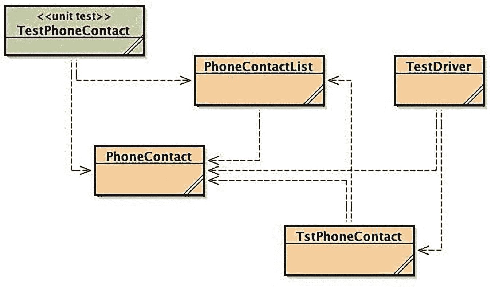
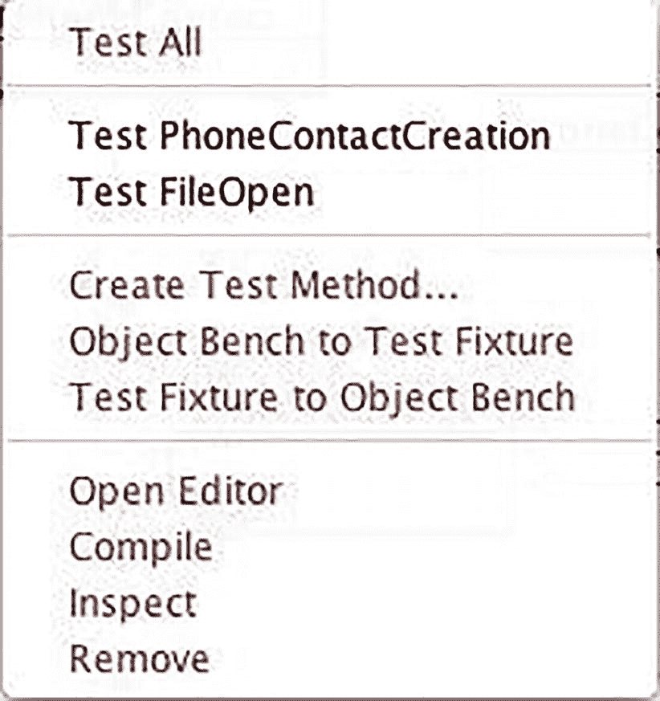
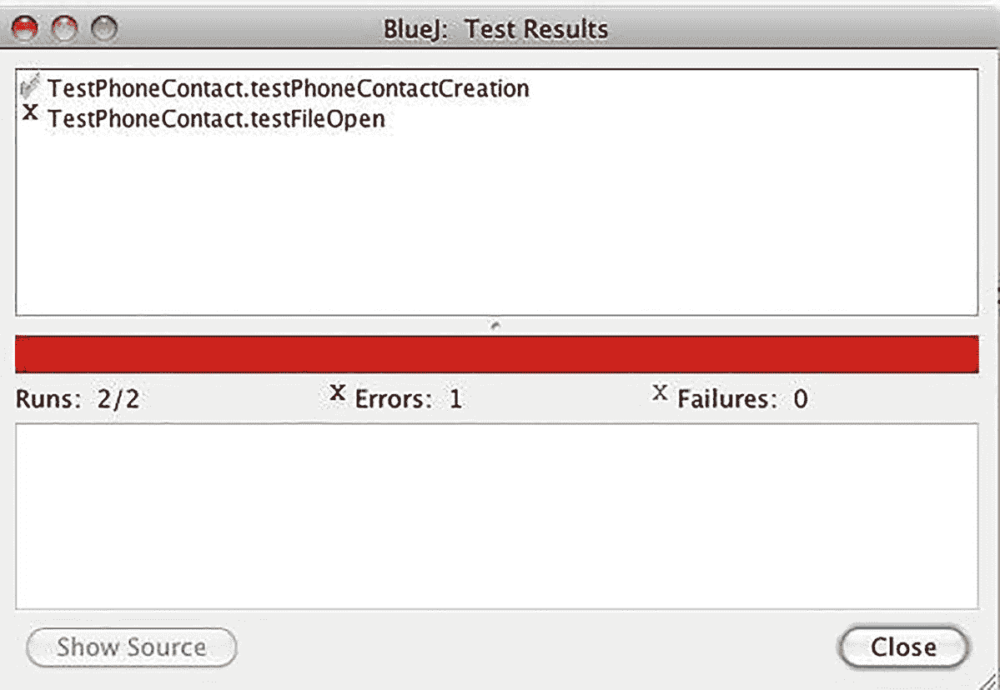

# 18. 单元测试

> *测试行为本身固然重要，但设计测试的行为却是已知最有效的缺陷预防手段之一。为了创建有用测试而必须进行的思考，能够在代码编写之前就发现并消除缺陷——事实上，测试设计的思考能够在软件创建的每个阶段发现并消除缺陷，从概念构思、规格说明、设计、编码到后续环节。*
> 
> ——鲍里斯·贝泽

> *只要用心观察，你就能发现很多问题。*
> 
> ——尤吉·贝拉

正如上一章所强调的，没有人是完美的，软件开发人员也不例外。在第 17 章中，我们讨论了当你*知道*代码中存在错误时，应该查找哪些不同的内容。现在，我们将讨论如何确定是否存在错误。在代码的三种错误类型中，编译器会找出语法错误和偶尔的语义错误。在某些语言环境中，运行时系统会找出其他错误（这会让你的用户感到懊恼）。其余的错误则通过测试或代码审查与走查来发现。在本章中，我们将讨论测试：什么是测试、何时进行测试、如何进行测试、测试应覆盖哪些内容，以及测试的局限性。下一章将介绍代码审查与走查。

在典型的软件开发项目中，测试分为三个级别：单元测试、集成测试和系统测试。

*单元测试*通常由你（即开发人员）通过测试单个方法和类来完成。单元测试通常不包括程序的大型配置、接口或库交互——除非你的方法实际使用了这些内容。因为你是在对自己的代码进行单元测试，所以你知道所有方法是如何编写的、数据应该是什么样子、方法签名是什么，以及返回值和类型应该是什么。这被称为*白盒测试*、*透明盒测试*、*清晰盒测试*或*玻璃盒测试*，所有这些术语都暗示了被测试代码细节的直接可见性。

*集成测试*通常由独立的测试组织完成，包括测试相互交互的类或模块集合之间的交互和接口。测试人员编写测试时，了解接口信息，但不了解每个模块的内部实现细节。因此，集成测试有时被称为*灰盒测试*，暗示测试人员仅具有对内部结构的部分可见性（即接口级别）。集成测试在单元测试后的代码被集成到源代码库之后进行。为了发现新模块与现有代码交互时可能出现的任何错误，会构建并测试产品的部分或完整版本。当模块中发现的错误被修复，并且该模块被重新集成到代码库中时，也会执行集成测试。

作为开发人员，你也会自己进行一些集成测试：每次你在一个独立的代码分支上工作时，你都会将新的或更新的代码集成到该分支中，然后测试整个应用程序，以确保你没有在单元测试的直接范围之外破坏任何东西。当你修复已发布产品中发现的错误时，你通常也会进行自己的单元测试和集成测试。在这种情况下，你会从客户或公司的客户支持组织收到一份报告，指出程序的某个部分无法正常工作。那么，你的工作就是重现该错误、隔离它、修复它、在隔离环境中测试它、集成修复，然后在新构建的产品中再次测试，以确保错误确实被修复，并且你没有引入新的错误。这种“修复错误”的角色是许多新开发人员刚加入公司时经常做的事情，也是熟悉公司产品、工具和流程的绝佳方式。

*系统测试*通常也由独立的测试组织完成，即在内部基线以及最终建议发布给客户的基线上，对整个软件产品（系统）进行测试。系统测试就像是增强版的集成测试。所有开发人员最近的所有更改都被用来构建产品的新版本，然后作为一个整体进行测试。独立的测试组织根据需求编写自己的测试，通常不了解程序设计和编写的任何细节。这被称为*黑盒测试*，因为除了程序接收的输入和产生的输出之外，程序对测试人员来说是不透明的。在这个级别上，测试人员的工作是确保程序实现了所有需求。黑盒测试还可以包括压力测试、可用性测试和验收测试。最终用户可能会参与这类测试。

## 测试的问题

尽管测试旨在确定你的程序是否以及何时无法按预期工作，但并不能保证它能让你发现代码中的所有问题。测试并非完美无缺，原因有很多。

首先，当你使用自己的测试来测试自己的代码时，很容易遗漏某些东西。如果你在编码时没有想到某个边界情况，那么你同样可能遗漏一个能够捕获该问题的测试用例。如果你在编写代码时犯了错误，为什么你会认为自己在阅读或测试代码时不会犯同样的错误呢？如果你在某种程度上误解了问题，你不太可能立即发现这个误解。即使对于小型程序也是如此，但对于大型程序尤其如此。如果你有一个 50,000 行的程序，需要阅读和理解的内容非常多，你肯定会遗漏一些东西。此外，静态阅读程序无法帮助你发现模块和接口之间的动态交互。因此，你需要更智能地进行测试，并结合静态（代码阅读）和动态（测试）技术来发现并修复程序中的错误。

错误从一个测试阶段逃逸到另一个阶段，并最终到达用户手中的另一个原因是，软件比人类制造的任何其他产品都更具动态性：即使是小型程序，其代码路径也很多，并且可能发生多种不同类型的数据错误。程序中大量的路径导致了可能性的*组合爆炸*。每次你在程序中添加一个 `if` 语句，程序的可能路径数量就会翻倍：如果某个条件表达式为 `true`，则有一条代码路径；如果为 `false`，则有另一条路径。每次你添加一个新的输入值，都会增加系统的复杂性，并增加可能出现的错误数量。因此，对于大型程序，你不可能用所有可能的输入值来测试程序中所有可能的路径，因为代码路径和数据值的组合数量是指数级的。

那么，该怎么办呢？如果蛮力方法*不可行*，那么你需要一个更好的计划。一个切实可行的选择是识别最可能的用例并对其进行测试。你需要识别并测试可能的输入数据值、数据的边界条件以及可能的代码路径。事实证明，这样做可以帮你发现大部分错误。史蒂夫·麦康奈尔在《代码大全》中指出，良好的测试与代码审查相结合，可以揭示一个规模适中的程序中超过 95% 的错误。^(²⁹¹) 这是在处理实际问题时一个值得努力追求的坚实目标。


## 代码创造者 vs. 代码破坏者心态

测试其实还有另一个问题：那就是你，开发者。开发者和测试者在代码构建中扮演着两种不同、甚至可以说是对立角色。开发者的职责是获取需求，设计出反映需求的方案，并编写实现该设计的代码。作为开发者，你的工作是*让代码跑起来*。如果你按照自己的解决方案计划实现了代码，那么很自然地会认为你的代码方案是可行的。

另一方面，测试者的工作则是基于同样的需求，但假设代码无法正常工作，他们的任务是揭示代码在何处失效。测试者应该对你的代码进行难以言喻的、可怕的操作，目的是*让代码崩溃*，让其中的错误在用户或客户端系统接触到之前暴露出来。搞破坏正是测试工作如此有趣的原因。而你，作为开发者，则负责修复代码。

你可以看出这为何会是一种对立关系。你也能明白为什么开发者可能成为相当糟糕的测试者。如果你的工作是让代码工作，你就不会专注于破坏它。因此，你的测试用例可能不会像那些以破坏你代码为工作的人所想出的那样狡猾、刻意，甚至刻薄。简而言之，因为他们试图构建美好的东西，*开发者是糟糕的测试者*。开发者倾向于使用典型、干净的数据编写测试。他们往往对自己编写的测试能覆盖多少代码抱有过分乐观的看法。他们倾向于在假设代码能工作的情况下编写测试；毕竟，这是他们自己精心设计、巧妙实现的智慧结晶。

这就是为什么大多数软件开发组织都有一个*独立的测试团队*来负责集成测试和系统测试。这些测试者编写自己的测试代码，创建自己的框架，对所有新基线版本和最终发布代码进行测试，并将所有错误报告给开发者，然后由开发者修复。测试者通常*不*做的一件事是单元测试。单元测试是开发者的责任，所以你并不能完全置身事外。你确实需要考虑测试，学习如何编写测试、如何运行测试以及如何分析结果。你需要学会对你的代码“刻薄”一点。并且你仍然需要修复错误。

## 何时测试？

在我们开始讨论如何进行单元测试以及测试哪些内容之前，先来谈谈*何时*测试。这里主要有两种选择：1）先编码后测试，或者 2）先测试后编码。

你可能会觉得最自然的方式是先编写代码，让它编译通过（意味着你消除了语法错误），然后，*在*你感觉某个函数或模块的代码完成后，再编写测试并进行单元测试。这样做的好处是，你已经理解了需求并编写了代码，这让你有机会在编写代码的同时思考测试用例。这可以简化编写清晰测试用例的过程。在这种策略下，调试和测试是同时进行的：你发现一个错误，修复它，然后立即重新运行失败的测试。

另一种方法是先编写单元测试，*在*编写任何代码*之前*，然后开发代码直到所有测试通过。这被称为*测试驱动开发*（TDD），这是一种根植于敏捷方法论（尤其是源自极限编程）的方法。显然，如果你先编写单元测试，它们都会失败，因为最多你只能在测试中调用一个方法存根。TDD 从编写成功的基准测试开始。如果你编写了一堆测试，然后只编写刚好能让所有单元测试通过的代码，你就确切地知道何时完成了！你可以编写一些新代码并进行测试；如果失败，就再写一些代码；如果通过，就停止。这样做的好处是帮助你保持代码精简，使其更简单、更易于调试。它还能让你从一开始就拥有一套测试，每当你对代码进行更改时都可以重新运行。如果所有测试仍然通过，那么你的更改就没有破坏任何东西。

那么哪种方式更好呢？嗯，答案又是那种“看情况”的事情。通常，先编写测试能让你更早进入测试思维模式，并为实现代码设定明确的目标。另一方面，除非你大量实践直到它成为第二天性，否则先写测试可能会很困难，因为你必须想象你要测试什么。这也会迫使你尽早去理解需求以及模块或类的设计。这意味着设计/编码/测试几乎同时发生。这可能会使整个代码构建过程更加困难。因为你同时进行设计/编码/测试，创建第一个可运行的程序也会花费更长时间。然而，一旦你有了第一个可运行的模块，你的开发速度就可以加快。TDD 在中小型项目中效果很好（敏捷技术通常也是如此），但对于非常大的程序可能会更困难。当你在进行*结对编程*时，TDD 也相当有效。提醒一下，在结对编程中，两名开发者同时处理同一个任务。他们共用一台电脑，其中一人（*驾驶员*）在键盘前编写代码，而另一名开发者（*导航员*）坐在驾驶员旁边，观察错误、思考设计问题和测试，并发表评论。大约每半小时左右，驾驶员和导航员交换位置。之后，驾驶员编写一个*测试*，而导航员则思考更多要编写的测试，并提前考虑代码。这个过程往往使编写测试变得更容易，然后自然地过渡到编写代码。在编码前后都尝试一下测试，然后你可以决定哪种方式最适合你和你的项目。


## 敏捷开发环境中的测试

无论你使用何种开发流程，许多理念和方法都是相同的，但敏捷流程对测试持有不同的观点。大多数敏捷方法论强烈鼓励（而极限编程则要求）使用测试驱动开发，以便在生产代码编写之前就编写好单元测试。

由于*持续集成*，测试驱动开发在敏捷团队中非常有意义。在大多数敏捷方法论中，每当开发人员完成一个任务或功能的编写，他们都需要将新代码集成到代码库中，并使用自动化测试套件进行测试。在一个由 10 到 20 名开发人员组成的团队中，这种情况每天可能发生多次。*持续集成*的规则之一是：如果你编写了一段通过单元测试的新代码，但在集成后它破坏了产品，*你必须立即修复它*。没有错误报告，也没有将问题转交给单独的缺陷修复和集成团队；编写该代码的开发人员应立即解决问题。这一点，再加上敏捷项目中实现的大多数新功能或任务都很小（记住，任务的总工作量通常应在 8 小时或更少），使得集成测试成为单元测试的延伸。准备好测试以便随时进行持续集成的重新测试，这完全是合情合理的。

敏捷中采用测试驱动开发的另一个原因是，许多敏捷方法推荐（而极限编程则要求）*结对编程*，即两名开发人员轮流编写代码并完善他们的测试和代码。他们频繁测试（例如每编写完一个新函数就测试一次），频繁集成，并且所有的新测试都会被添加到项目的自动化测试套件中。这是一个三赢的局面。

最后，在敏捷项目中，*客户是开发团队的关键组成部分，并负责系统测试*。在许多情况下，客户就在现场，因此由客户建立的系统/验收测试可以在每次代码变更集成后运行。

因此，在敏捷项目中，整个测试套件（单元测试、集成测试和系统测试）都是正常敏捷开发流程的一部分。

## 测试什么？

既然我们已经讨论了测试的不同阶段以及何时进行单元测试，现在是时候讨论到底*要测试什么*了。你要测试的内容分为两大类：*代码覆盖率*和*数据覆盖率*。

*   *代码覆盖率*的目标是使用代表性数据执行程序中的每一行代码至少一次，以便确保所有代码都能正确运行。听起来很简单？好吧，请记住那个 5 万行程序的组合爆炸问题。

*   *数据覆盖率*的目标是测试好数据和坏数据的代表性样本（包括输入数据和程序生成的数据），目的是确保程序能正确处理数据，尤其是数据错误。

当然，代码覆盖率和数据覆盖率之间存在重叠。例如，有时为了执行程序的特定部分，你必须向其输入错误数据。我们会尽可能地将它们分开讨论，并在谈到编写实际测试时再结合起来。

### 代码覆盖率：测试每条语句

代码覆盖率的目标是测试构成程序的所有不同类型代码中的每条语句。让我们来看看这些不同的代码类型。

*直线代码*照亮了函数或方法中的单一路径。通常，这需要为每种不同的数据类型进行一次测试。

*分支覆盖率*测试程序中所有可能改变方向的地方。这意味着你需要关注控制结构：每个`if`和`switch`语句，以及每个*复杂条件表达式*（包含 AND 和 OR 运算符的表达式）。对于每个`if`语句，你需要两个测试：一个用于条件为`true`的情况，另一个用于条件为`false`的情况。对于每个`switch`语句，你需要为`switch`中的每个`case`子句（包括`default`子句）进行单独的测试（你所有的`switch`语句都应该有一个`default`子句）。逻辑 AND（`&&`）和 OR（`||`）运算符增加了条件表达式的复杂性，因此你需要额外的测试用例。理想情况下，每个运算符需要四个测试用例（F-F, F-T, T-F, T-T），但如果你使用的语言对逻辑运算符采用*短路求值*（如 C/C++和 Java），那么你可以减少测试用例的数量。^(²⁹²) 对于 OR 运算符，如果第一个子表达式求值为`false`，你仍然需要两个测试用例；但如果第一个子表达式求值为`true`，则只需一个测试用例（因为整个表达式将求值为 true）。对于 AND 运算符，如果第一个子表达式求值为`false`，则只需一个测试用例（结果将始终为 false）；但如果第一个子表达式求值为`true`，则需要两个测试用例。

*循环覆盖率*与上述分支覆盖率类似，因为循环包含条件判断。不同之处在于，在`for`、`while`或`do`-`while`循环中，你极有可能引入*差一错误*，并且需要明确地对此进行测试。首先，你需要对循环的*正常*运行进行一次测试。然后，对于前置测试循环，有可能永远无法进入循环体（如果循环条件表达式在第一次求值时即为假）。接着，如果条件表达式永远不会变为*false*，你需要测试*无限循环*。这种情况最可能发生在循环控制变量未在循环体内更新、更新错误，或者循环条件表达式从一开始就写错的情况下。对于读取文件的循环，通常需要测试*文件结束*标记（EOF）。这是另一个可能出错的地方，原因可能是文件过早结束，或者（在使用标准输入的情况下）从未指示文件结束。

*返回值*应始终进行检查，即使它们不是被测试代码的主要功能组件。在许多语言中，标准库函数和操作系统调用都会返回值。例如，在 C 语言中，`fprintf`和`fscanf`函数族分别返回打印到输出流的字符数和从输入流中分配到的输入元素数。但几乎没有人会检查这些返回值。^(²⁹³) 你应该检查它们，因为它们可能揭示代码中更微妙、更隐蔽的问题！请注意，Java 与 C 或 C++略有不同。在 Java 中，许多类似的例程会将返回值声明为`void`，而不是像 C 或 C++那样声明为`int`。因此，上述问题在 Java 中出现的频率远低于其他语言。不过，这并不意味着问题完全消失了：虽然 Java 中的`System.out.print()`和`System.out.println()`方法都被声明为返回`void`，但`System.out.printf()`方法返回一个`PrintStream`对象，而这个对象几乎普遍被忽略。此外，在 Java 中，调用`Scanner`的`next()`或`nextInt()`方法，或任何读取数据的方法，而不将返回值保存在变量中，是完全合法的。请务必小心。


### 数据覆盖：坏数据是你的朋友？

还记得我们讨论过*防御性编程*（在代码构建章节中）吗？我们提到，保护程序的关键在于警惕、检测并处理坏数据，以便程序能够恢复或至少优雅地失败。现在，就是检验你的防御是否牢固的时候了。数据覆盖应检查两类数据：好数据和坏数据。

*好数据*是你的方法预期要处理的典型数据，即类型正确且在合理范围内的数据。测试好数据是验证程序能否正常处理基本操作的基线。以下是针对好数据应执行的基本测试清单：

*   *测试典型数据值*：你通常可能期望收到的有效数据字段。例如，如果你的程序正在计算课程的平均成绩，数值范围可能在 0 到 100 之间（含两端）。你可以检查 35、50、67、75、88、93 等值。如果这些值不通过，那么测试其他任何内容都为时过早；请重新检查你的解决方案。

*   *测试边界条件（或边缘情况）*：接近有效数据范围边缘的数据。差一错误（Off-by-one errors）常常隐藏在边界处。对于上述成绩示例，你应该测试接近两个边界的有效成绩：0、1、99 和 100。你还应该测试接近该范围的无效值：-1 和 101。如果你正在分配字母等级，还需要检查每个字母等级值的上下边界。因此，如果 F 是低于 60 的任何等级，你应该检查 59、60 和 61。

*   *测试前置条件和后置条件*。每当你进入一个控制结构（循环或选择语句）或进行函数调用时，你都在对数据值和计算状态做出某些假设。这些就是*前置条件*。当你退出该控制结构时，你又在假设这些值现在是什么。这些就是*后置条件*。你应该通过测试前置条件和后置条件来编写测试，确保你的假设是正确的。在支持*断言*的语言（包括 C、C++和 Java）中，这是使用它们的好地方。

*坏数据*是你的方法未设计处理，但可能因用户错误、代码缺陷、硬件故障等原因而接收到的任何数据。你的工作是找出代码在面对各种坏数据时的行为，并在开发过程中有意识地决定如何处理它。如果你不主动调查与坏数据的交互，就等于让你的代码在现实世界中遭遇意外的坏事，同时也让你的代码成为发生在他人身上的意外坏事。为了负责任地测试与坏数据的交互，你可以从以下几个方面入手：

*   *非法数据值*：你应该测试明显非法的数据，以确保你的数据验证代码正常工作。我们之前提到过要测试接近合法数据范围边界的非法数据，但也要测试明显超出范围的数据。

*   *无数据*：这是指你期望收到数据，却什么也没得到的情况。例如，当你提示用户输入时，用户没有输入任何值，只是按下了回车键。或者当你无法打开输入文件，或者刚打开的文件是空的。又或者当你期望命令行参数时，却一个也没得到。你必须测试所有这些情况，甚至更多。发挥你的创造力！

*   *数据过少或过多*：你必须测试这样的情况：你请求三个数据，却只得到两个；或者你请求三个数据，却得到十个。对于“数据过多”的情况，你必须小心。许多编程语言（包括 C 和 C++）使用*数据输入流*模型来处理数据：每次程序需要数据时，它只从输入流中读取所需数量的数据。如果流中还有更多数据，它会留在那里等待下一次读取操作。这可能不是你想要的，特别是当输入来自用户在键盘上打字时。

*   *未初始化的变量*。大多数语言系统会为你声明的任何变量提供默认初始化值。但你仍然应该测试以确保这些变量被正确初始化。（实际上，无论如何你都不应该依赖系统来初始化你的数据；你应该始终自己初始化它们。）

## 测试的特性

罗伯特·马丁在他的著作《代码整洁之道》中，通过首字母缩略词 F.I.R.S.T. 描述了所有单元测试应具备的一组特性：^(²⁹⁴)

*   *快速（Fast）*：测试应该快速。如果你的测试运行时间很长，你就不太可能频繁地运行它们。所以，让你的测试小巧、简单且快速。

*   *独立（Independent）*：测试不应相互依赖。特别是，一个测试不应设置另一个测试所依赖的数据或创建对象。例如，Java 的 JUnit 测试框架有独立的设置（setup）和拆卸（teardown）方法，使测试相互独立。我们稍后会更详细地研究 JUnit。

*   *可重复（Repeatable）*：你应该能够随时以任何顺序运行你的测试，包括在向模块添加更多代码之后。

*   *自验证（Self-validating）*：测试应该要么通过，要么失败；换句话说，它们的输出应该是布尔值。你不应该阅读一页又一页的日志文件来判断测试是否通过。

*   *及时（Timely）*：当你想要运行测试时，测试应该可用。对于使用 TDD 的敏捷方法论来说，这意味着你应该先编写单元测试，就在编写它们将要测试的代码之前。

最后，重要的是，就像你的函数一样，你的测试应该只测试一件事；每个测试应该只有一个概念。这对你的调试工作非常重要，因为如果每个测试只测试代码中的一个概念，那么测试失败就会像激光一样，精准地指向代码中可能存在错误的位置。

## 如何编写测试

现在让我们深入探讨如何编写一个单元测试。在本节中，我们将专注于手动测试，但在下一节中，我们将研究如何利用像 JUnit 这样的测试框架。

要编写测试，想象你正在以用户故事的形式编写应用程序的一部分，就像在敏捷开发环境中可能做的那样。^(²⁹⁵) 在敏捷方法论中，开发人员和客户进行*探索*：他们聚在一起讨论客户想要什么。客户编写一系列*故事*来描述他们希望在程序中拥有的功能。开发人员接手这些故事，将其分解为*实现任务*，并进行估算。任务应该很小，工作量不超过 8 小时。程序员（单独或结对）领取单个任务，并使用 TDD 来实现它们。我们将呈现一个故事，将其分解为任务，并为这些任务实现一些测试，以了解单元测试的过程。

### 编写测试：故事

用户故事：“给定一个包含电话联系人的平面文件，我们希望按字母顺序对联系人进行排序，并生成一个可打印的输出表格。”

实际上，就是这样。敏捷项目中的故事通常非常简短。建议将它们写在 3x5 的索引卡或数字便利贴上。

### 编写测试：任务

现在你可以将这个故事分解为一组小任务。这看起来很像一个设计练习。确实如此。

*   创建一个表示电话联系人的类。

*   创建一个电话联系人。

*   读取数据文件并创建一个电话联系人列表。（这看起来像是两件事，但实际上只是一件事：将文件转换为电话联系人列表。）

*   按姓氏的字母顺序对电话联系人进行排序。

*   创建可打印的排序列表。


### 编写测试：测试用例

遵循测试驱动开发（TDD）的原则，我们先从测试入手。虽然我们希望每次只测试一个功能点，但有些元素无法单独测试。在上述示例中，你需要将前两个任务合并到一个测试中。一旦创建了电话联系人类，就必须测试其构造函数，以确保能够正确实例化对象。那么，我们来创建一个测试。

在第一个测试中，你将创建一个电话联系人对象的实例，并打印出其实例变量，以证明对象创建正确。不过，你需要先做一些设计工作：确定电话联系人类的名称以及它将包含哪些实例变量。

该类的一个合理名称是 `PhoneContact`，只要客户同意，实例变量可以是 `firstName`、`lastName`、`phoneNumber` 和 `emailAddr`。哦，它们都可以是字符串变量。这是一个简单的联系人列表。对于这个类，你可以有两个构造函数：一个默认构造函数，仅将联系人初始化为 null；另一个构造函数，接收所有四个值作为输入参数并进行赋值。目前这些可能就足够了。测试代码可能如下所示：

```
public class TestPhoneContact {
/**
* 测试类 TestPhoneContact 的默认构造函数
*/
public TestPhoneContact() {
}
public void testPhoneContactCreation() {
String fname = "Fred";
String lname = "Flintstone";
String phone = "800-555-1212";
String email = "fred@knox.edu";
PhoneContact t1 = new PhoneContact();
System.out.printf("Phone Contact reference is %X\n", t1);   // 引用变量地址
PhoneContact t2 = new PhoneContact(fname, lname, phone, email);
System.out.printf("Contact:\n Name = %s\n Phone = %s\n Email = %s\n",
t2.getName(), t2.getPhoneNum(), t2.getEmailAddr());
}
}
```

现在，这个测试一开始会失败，因为你还没有创建 `PhoneContact` 类。我们这就来创建它。`PhoneContact` 类将很简单：只包含实例变量、两个构造函数以及变量的 getter 和 setter 方法。生成的代码如下：

```
public class PhoneContact {
/**
* 实例变量
*/
private String lastName;
private String firstName;
private String phoneNumber;
private String emailAddr;
/**
* PhoneContact 类的构造函数
*/
public PhoneContact() {
lastName = "";
firstName = "";
phoneNumber = "";
emailAddr = "";
}
public PhoneContact(String firstName, String lastName,
String phoneNumber, String emailAddr) {
this.lastName = lastName;
this.firstName = firstName;
this.phoneNumber = phoneNumber;
this.emailAddr = emailAddr;
}
/**
* 每个实例变量的 Getter 和 Setter 方法
*/
public String getName() {
return this.lastName + ", " + this.firstName;
}
public String getLastName() {
return this.lastName;
}
public String getFirstName() {
return this.firstName;
}
public String getPhoneNum() {
return this.phoneNumber;
}
public String getEmailAddr() {
return this.emailAddr;
}
public void setLastName(String lastName) {
this.lastName = lastName;
}
public void setFirstName(String firstName) {
this.firstName = firstName;
}
public void setPhoneNum(String phoneNumber) {
this.phoneNumber = phoneNumber;
}
public void setEmailAddr(String emailAddr) {
this.emailAddr = emailAddr;
}
}
```

最后，你需要为刚创建的测试准备一个驱动程序，本质上就是提供一个可以调用上述代码的地方。当你只需要对单个类进行初步的快速测试时，可以在该类内部通过 main 方法进行测试；但对于更彻底、可重复且可扩展的测试，最好创建一个单独的测试类。例如，考虑一下：类自身的 main 方法可以直接访问非公开的类元素，而在类外部则需要使用公开的 getter 和 setter 方法。因此，在类内部进行测试可能会掩盖访问权限问题。

这里你将创建一个单独的测试类，这样它随时可供你调用或扩展，同时干净利落地保持在代码之外，不与其余代码混淆。这将完成此测试环境的*脚手架*搭建。

```
public class TestDriver {
public static void main(String [] args) {
TestPhoneContact t1 = new TestPhoneContact();
t1.testPhoneContactCreation();
}
}
```

现在，一旦你编译并执行 `TestDriver`，输出控制台将显示类似以下内容：

```
Phone Contact reference is 3D7DC1CB
Phone Contact:
Name = Flintstone, Fred
Phone = 800-555-1212
Email = fred@knox.edu
```

下一个任务是读取数据文件并创建电话联系人列表。在确定测试或代码之前，你需要回到设计阶段，决定一些数据结构。

由于需求描述中提到“电话联系人的平面文件”，你可以假设处理的是一个文本文件，其中每一行都包含电话联系人信息。假设格式与 `PhoneContact` 类对应，每一行包含单个联系人的以下信息：`first_name last_name phone_number email_addr`。

接下来，你需要一个可以排序并打印的电话联系人列表。因为你希望按姓氏字母顺序排列列表，所以可以使用 Java Collections 中的 `TreeMap` 类型来存储所有电话联系人。这样，你甚至不需要对列表进行排序，因为 `TreeMap` 类会自动为你保持列表有序。此外，似乎还需要另一个类来整合 `PhoneContact` 对象和列表操作。

那么测试看起来是什么样的呢？嗯，为了保持测试小巧并遵循“一个测试只做一件事”的原则，看来你最终可以使用两个测试：一个用于确认文件存在且可以打开，另一个用于确认可以创建 `PhoneContact` 列表数据结构。对于文件打开测试，你需要一个代表电话联系人列表的新类。你现在只需对这个类进行桩实现，创建一个简单的构造函数和一个需要测试的方法的桩。这样你就可以编写测试（该测试会失败，因为你还没有真正的方法）。文件打开测试如下所示：

```
public void testFileOpen() {
String fileName = "phoneList.txt";
PhoneContactList pc = new PhoneContactList();
boolean fileOK = pc.fileOpen(fileName);
if (fileOK == false) {
System.out.println("Open Failed");
System.exit(1);
}
}
```

将其添加到之前创建的测试类中。在上述 `TestDriver` 类中，你只需在 `main()` 方法中添加以下代码行：

```
t1.testFileOpen();
```

一旦这个测试失败（正如预期），你就可以实现新类并填充上面创建的桩。新的 `PhoneContactList` 类现在看起来如下所示：

```
import java.util.*;
import java.io.*;
public class PhoneContactList {
private TreeMap phoneList;
private Scanner phoneFile;
/**
* PhoneContactList 类的构造函数
*/
public PhoneContactList() {
}
public PhoneContactList(PhoneContact pc) {
phoneList = new TreeMap();
phoneList.put(pc.getLastName(), pc);
}
public boolean fileOpen(String name) {
try {
phoneFile = new Scanner(new File(name));
return true;
} catch (FileNotFoundException e) {
System.out.println(e.getMessage());
return false;
}
}
}
```

这就是你的*测试-设计-开发*流程的工作方式。尝试创建上面列出的其余测试，并完成 `PhoneContactList` 类代码的实现。你能做到的。


## JUnit：一个测试框架

在上一节中，你创建了自己的测试脚手架并将测试挂接到其中。许多开发环境都提供了相应的工具来帮你完成这项工作，同时还附带了许多有用的组件。对于 Java 来说，最流行的框架之一是 JUnit，它用于为 Java 类开发单元测试，最初由 Eric Gamma 和 Kent Beck 创建。^(²⁹⁶)

JUnit 提供了一个名为 `TestCase` 的基类，你可以通过继承它来为你正在开发的类创建一系列测试。JUnit 还包含许多其他类，包括一个用于评估单个测试结果的断言库，以及几个用于运行你创建的测试的应用程序。JUnit 的一个非常好的常见问题解答位于 [`https://junit.org/junit5/docs/current/user-guide/`](https://junit.org/junit5/docs/current/user-guide/)。

要在 JUnit 中编写测试，你必须导入框架类，然后继承 `TestCase` 基类。一个非常简单的测试如下所示：

```
import junit.framework.TestCase;
import junit.framework.Assert.*;
public class SimpleTest extends TestCase {
public SimpleTest(String name) {
super(name);
}
public void testSimpleTest() {
LifeUniverse lu = new LifeUniverse();
int answer = lu.ultimateQuestion();
assertEquals(42, answer);
}
}
```

请注意，单参数构造函数是必需的。`assertEquals(parameter1, parameter2)` 方法是断言库（`junit.framework.Assert`）的方法之一，用于测试预期答案（第一个参数）是否等于实际答案（第二个参数）。还有许多其他方便的 `assert*()` 方法可用。

由于 JUnit 被打包在一个 Java jar 文件中，你需要将 jar 文件的位置添加到你的 Java CLASSPATH 环境变量中，或者在命令行编译测试用例时将其添加到命令行中。例如，要编译你的简单测试用例，你可以使用以下命令：

```
% javac -classpath $JUNIT_HOME/junit.jar SimpleTest.java
```

其中 `$JUNIT_HOME` 是你安装 `junit.jar` 文件的目录。

从命令行执行测试和编译一样简单。有两种方法可以实现。第一种是使用 JUnit 预打包的运行器类之一，它将测试类的名称作为参数：

```
java -cp .:./junit.jar junit.textui.TestRunner SimpleTest
```

这将输出：

```
.
Time: 0.001
OK (1 test)
```

其中，每个运行的测试对应一个点，然后是整个测试套件所需的时间以及测试结果。

你也可以直接执行 `JUnitCore` 类，同样将测试类的名称作为参数传递给该类：

```
java -cp .:./junit.jar org.junit.runner.JUnitCore SimpleTest
```

这将输出：

```
JUnit version 4.8.2
.
Time: 0.004
OK (1 test)
```

JUnit 包含在许多标准的集成开发环境（IDE）中。BlueJ、NetBeans 和 Eclipse 都有 JUnit 插件，使得创建和运行单元测试用例几乎毫不费力。

例如，使用上面的示例和 BlueJ^(²⁹⁷)，你可以创建一个新的单元测试类，并用它来测试你的 `PhoneContact` 和 `PhoneContactList` 类。参见图 18-1。



一个框图展示了标记为测试电话联系人、电话联系人列表、电话联系人、测试电话联系人和测试驱动程序的不同块之间的交互。

图 18-1

PhoneContact 测试 UML 图

你的测试类 `TestPhoneContact` 现在如下所示：

```
public class TestPhoneContact extends junit.framework.TestCase {
/**
* 测试类 TestPhoneContact 的默认构造函数
*/
public TestPhoneContact(String name) {
super(name);
}
/**
* 设置测试夹具。
* 在每个测试用例方法之前调用。
*/
protected void setUp() {
}
/**
* 拆除测试夹具。
* 在每个测试用例方法之后调用。
*/
protected void tearDown() {
}
public void testPhoneContactCreation() {
String fname = "Fred";
String lname = "Flintstone";
String phone = "800-555-1212";
String email = "fred@knox.edu";
PhoneContact pc = new PhoneContact(fname, lname, phone, email);
assertEquals(lname, pc.getLastName());
assertEquals(fname, pc.getFirstName());
assertEquals(phone, pc.getPhoneNum());
assertEquals(email, pc.getEmailAddr());
}
public void testFileOpen() {
String fileName = "phoneList.txt";
PhoneContactList pc = new PhoneContactList();
boolean fileOK = pc.fileOpen(fileName);
assertTrue(fileOK);
if (fileOK == false) {
System.out.println("打开失败，文件未找到");
System.exit(1);
}
}
}
```

要在 BlueJ 中运行这组测试，请从图 18-2 所示的下拉菜单中选择“测试全部”。



一个下拉菜单的截图，包含一系列选项。选项包括测试全部、测试电话联系人创建、测试文件打开、创建测试方法、对象台到测试夹具、测试夹具到对象台、打开编辑器、编译、检查、和移除。

图 18-2

JUnit 菜单 - 选择“测试全部”来运行测试

因为你还没有创建 `phoneList.txt` 文件，所以你会得到如图 18-3 所示的输出。



一张截图展示了 Blue J 的测试结果。有 2 个测试：测试电话联系人创建和测试文件打开。底部的状态指示了 1 个测试出错。

图 18-3

JUnit 测试输出

这里，请注意 `testFileOpen()` 测试失败了。

每当你对程序进行任何更改时，你都可以向 `TestPhoneContact` 类添加另一个测试，并通过一次菜单选择重新运行所有测试。测试框架使得创建单个测试和整个测试套件变得容易得多，这些测试可以在每次对程序进行更改时运行。这让你每次做出更改时都能知道是否破坏了某些东西。非常酷。

## 测试至关重要

归根结底，单元测试是你开发过程和内心平静的关键部分。如果做得仔细且正确，它可以帮助你在将代码集成到更大的程序之前就消除绝大多数错误。TDD（测试驱动开发），即先编写测试，然后编写使测试通过的代码，是一种在低级设计和编码中捕获错误的有效方法，同时允许你轻松快速地创建一个回归测试套件，你可以将其用于程序的每次集成和每个基线。

## 结论

从开发者的角度来看，单元测试是你的程序将要经历的最重要的一类测试。它是最基本的测试类型，确保你的代码在最低级别上满足设计的要求。尽管开发者更关心确保他们的程序能工作，而不是破坏它，但培养良好的单元测试思维对于你成长为一名成熟、高效的程序员至关重要。测试框架使这项工作变得更加容易和清晰，因此了解你本地测试框架的运作方式并学习编写良好的测试是你必须培养的关键技能。最好是你自己发现自己的错误，而不是让客户为你发现它们。


