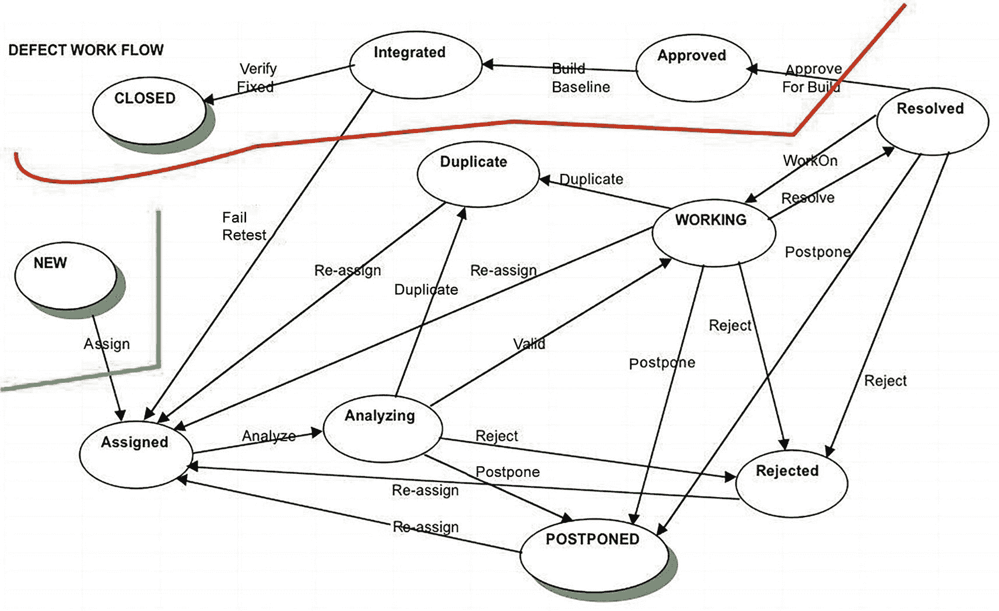

# 19. 代码评审与审查

> *我们进行审查的目标是，通过更早、更低成本地发现并移除缺陷，来降低质量成本。虽然某些测试始终是必要的，但我们可以通过减少传播到测试阶段的缺陷数量来降低测试成本。*
> 
> ——罗恩·拉迪斯（2002 年）

> *当你尽早捕获错误时，复合错误也会更少。复合错误是两个独立的错误相互作用的结果：就像你下楼时绊了一下，伸手去抓扶手，结果扶手却脱落了。*
> 
> ——保罗·格雷厄姆（2001 年）

这里有个令人震惊的事实：你在软件开发中的主要质量目标，是向用户交付一个满足所有需求且没有缺陷的可运行程序。没错：你的代码应该是完美的，交付时没有任何错误，并满足用户的所有需求。不可能？做不到？好吧，*软件质量保证* 的全部意义就在于，在时间和预算的限制内，尽可能接近完美。

软件质量通常从两个不同的角度来讨论：用户的角度和开发者的角度。从*用户的角度*来看，质量需要具备一系列特征才能被接受，包括以下方面：^(²⁹⁸)

*   *正确性*：软件必须能工作，就这么简单。

*   *可用性*：它必须易于学习和使用。

*   *可靠性*：它必须保持稳定运行，并在你需要时可用。

*   *安全性*：软件必须保护你的数据，并防止未经授权的访问。

*   *适应性*：应该易于添加新功能。

从*开发者的角度*来看，软件质量则取决于另一组不同的特征：

*   *可维护性*：必须易于对软件进行修改。

*   *可移植性*：必须易于将软件迁移到不同的平台。

*   *可读性*：你和任何后续接手的人都需要能够读懂代码。这通常意味着代码必须具有一致的风格和流程。

*   *可理解性*：代码设计应该能被原作者以外的开发者理解。

*   *可测试性*：应该能够直接地对代码进行完整测试。以模块化方式创建、由只做一件事的短函数构成的代码，比所有代码都塞在一个巨大的 main() 函数中的代码更容易理解和测试。

*软件质量保证（SQA）* 是一系列确保软件被正确实现的活动。SQA 包含三个主要组成部分：

*   *测试（或* *动态分析* *）*：发现执行过程中暴露的错误。

*   *调试*：从代码中清除所有（通过测试发现的）明显错误。

*   *评审（或* *静态分析* *）*：发现代码中固有的错误。

许多开发者——以及管理者——认为可以通过测试来达到质量目标。但这是行不通的。正如你在上一章所见，测试是有限的。你通常无法探索每一条代码路径，无法测试每一种可能的数据组合，而且测试本身也常常存在缺陷。测试只能帮你走到这一步。正如艾兹格·迪杰斯特拉的名言：“……程序测试可以非常有效地证明错误的存在，但对于证明错误不存在，则完全无能为力。”^(²⁹⁹) 仅靠测试并不是发现代码错误特别有效的方法。在许多情况下，单元测试、集成测试和系统测试的组合只能发现程序中大约 50% 左右的错误。^(³⁰⁰) 但是，如果你在测试方案中加入某种类型的代码评审（通过阅读代码来发现错误），就可以将这一比例提高到代码中所有错误的 93% 到 99%。这正是一个值得追求的目标，因此在本章中，我们将重点讨论如何评审你的代码。

## 走查、评审与审查

*评审你的代码*——阅读代码并在纸面上寻找错误——提供了另一种机制，以确保你正确实现了用户的需求和由此产生的设计。事实上，大多数采用计划驱动方法的开发组织不仅会评审代码，还会评审软件开发组织产生的所有*工作产品*：需求文档、架构、设计规格说明、测试计划、测试用例本身以及用户文档。采用敏捷开发方法的组织不一定拥有上述所有文档，但他们确实有需求、用户故事、用户文档，尤其是需要评审的代码。

评审代码主要有三种方法：走查、代码评审和审查。这三种方法从非常非正式的技术逐步过渡到非常正式的方法。代码通常在编译通过之后、单元测试之前，或者单元测试完成之后立即进行评审。最好在单元测试之后立即进行评审，因为那时你已经完成了修改，编译通过，并且完成了第一轮测试。这是让其他人检查你代码的好时机。

## 走查

*走查*（也称为*桌面检查*或*代码阅读*）是最不正式的评审类型，通常用于确认对代码所做的小改动，比如刚刚修复一个错误而修改的一两行代码。如果你刚刚向一个类添加了一个新方法，或者修改了超过 25 到 30 行代码，就不要进行走查了；而应该进行代码评审。

走查涉及两个人，最多三个人：代码的作者和评审者。在走查中，作者的工作是向评审者解释这个改动应该做什么，并指出改动在哪里。评审者的工作是理解这个改动，阅读代码，并做出两种判断之一：要么同意改动是正确的，要么不同意。如果不同意，作者必须回去，再次修复代码，然后进行另一次走查。如果评审者认为改动是正确的，那么作者就可以将修改后的代码合并回代码库，继续进行集成测试。

如果你在进行结对编程，那么代码走查会在你实现一个任务的同时进行。驾驶员在编写代码，导航员则在旁边看着，检查错误并提前思考；这可以被视为与编码并行进行的持续走查。在这种情况下，对于较大块的代码使用走查也是可以接受的，不过对于一个完整的任务或每个已实现的用户故事，你应该进行代码评审或审查，我们接下来将讨论这些。

## 代码评审

*代码评审*比走查更为正式，也是大多数软件开发人员所采用的方式。如果你修改了大量代码、编写了全新的代码，或者向现有程序添加了超过几行新代码，你都应该进行代码评审。敏捷开发人员可能会在完成一个用户故事后进行代码评审。

代码评审是真正的会议，通常有三到五名参与者，每个人带来不同的视角：

*   代码评审的*主持人*通常是*作者*。主持人的职责是召集会议、在会议前提前分发待评审的工作成果，并主持代码评审会议。主持人也可能在会议中做记录。

*   会议中应有一名或多名*开发人员*，他们与作者参与同一个项目，贡献对项目细节的深入理解。

*   代码评审中应有一位*测试人员*，带来测试视角，不仅要阅读被评审的代码，还要思考代码应如何被测试。

*   最后，应有一位经验丰富的开发人员在场，且该开发人员与作者不在同一个项目组。这位*无利益关系的第三方*代表质量视角，对代码及其如何融入项目提供更具战略性的见解。他们在代码评审中的任务是理解代码，并让作者清晰地解释所做的更改。

*   *代码评审不允许有管理人员参加*。管理人员的出现会改变会议的动态，降低代码评审的效果。那些在同事间愿意诚实评价代码的人，在管理人员在场时会闭口不言；这无助于发现错误。所以，请不要让管理人员参加。

代码评审的目标是发现代码中的错误，而不是修复它们。代码评审足够非正式，可能会讨论一些修复方案，但应将其控制在最低限度。在代码评审会议之前，所有参与者都应仔细审阅主持人分发的材料，并准备一份他们发现的错误清单。这一步对于使评审会议高效且成功至关重要。请做好你的功课！

这份清单应在会议开始时交给主持人。作者（也可能是主持人）会逐项讲解代码变更，解释这些变更如何修复了原本要修复的错误，或添加了所需的新功能。如果某个错误或讨论将评审会议引向了原始评审范围之外的代码，请立即停止！要非常小心地避免进入尚未预先阅读的领域。你应该将任何不在评审范围内的代码视为黑盒。改为安排另一次会议。请记住，代码评审的重点是单一代码片段，并找出该代码片段中的错误。不要分心。

在代码评审中，一台电脑和视图共享（投影或屏幕共享）是必不可少的，这样每个人都能随时看到正在发生的事情。应使用第二台电脑，以便有人（通常是作者）记录在代码中发现的错误。一次代码评审不应超过大约两个小时，也不应评审超过大约 200-500 行代码，因为在那段时间或阅读量之后，每个人的注意力和效率都会开始下降。如果时间不够，请安排另一次评审。

代码评审结束后，记录会分发给所有参与者，作者负责修复评审中发现的所有错误。虽然代码评审不强制要求度量指标，但主持人至少应记录发现了多少错误、评审了多少行代码，以及（如果合适的话）每个错误的严重程度。这些度量指标对于衡量生产力非常有用，并应用于规划下一个项目。

## 代码审查

代码审查是最正式的评审会议类型，其唯一目的是发现开发团队产生的任何工作产品中的缺陷。^(³⁰¹) 审查可用于评审计划文档、需求、设计和代码。代码审查有具体规则，涉及一次评审多少行代码、评审会议必须持续多长时间、评审团队的每个成员应做多少准备等。审查通常由较大的组织使用，因为它们比走查或代码评审需要更多的培训、时间和精力。它们也用于任务关键型和安全关键型软件，因为其中的缺陷可能对用户造成伤害。1979 年，迈克尔·费根发明了最广为人知且最具影响力的审查方法论，这成为了第一个正式的软件审查流程。^(³⁰²) 大多数使用审查的组织都采用原始费根软件代码审查流程的变体。^(³⁰³)

代码审查有几个非常重要的标准，包括以下内容：

*   审查会议的重点完全在于发现错误；不允许提出解决方案。

*   审查使用常见错误类型清单来引导审查人员。

*   要求评审人员提前准备；如果并非所有人都准备就绪，审查会议将被取消。

*   审查中的每位参与者都有明确的角色。

*   所有参与者都接受过审查培训。

*   主持人不是作者，并且除了常规审查培训外，还接受过特殊培训。

*   始终要求作者与主持人一起跟进会议中报告的错误。

*   审查会议中始终会收集度量数据。

### 审查角色

以下是代码审查中使用的角色：

*   **主持人**：主持人从作者处获取所有材料，决定审查的其他参与者，并负责发送所有审查材料以及安排和协调会议。主持人必须具备技术能力；他们需要理解审查材料并确保会议按计划进行。主持人安排审查会议并发送常见错误清单供审查者仔细阅读。他们还会跟进作者处理审查中发现的任何错误，因此必须理解这些错误及其修正方法。主持人需要参加额外的审查培训课程，以帮助他们为这一角色做好准备。

*   **作者**将审查材料分发给主持人。作者负责因审查会议而产生的所有返工。在审查期间，作者回答审查者关于代码的问题，但不做其他事情。有时，如果许多审查者不熟悉项目，则需要进行初步的概述会议；由作者主持并向审查者解释整体设计。在代码审查中不鼓励举行概述会议，因为它们可能会在审查会议之前注入作者对代码和设计的看法，从而“污染证据”。

*   **朗读者**用自己的话复述代码。这意味着朗读者对项目、其设计以及所讨论的代码有很好的理解。朗读者不解释代码，只是复述它。作者应回答关于代码的任何问题。也就是说，如果作者必须解释太多代码，这通常被视为需要修复的缺陷；此类代码应进行重构以使其更简单。

*   **审查者**在审查中承担主要工作。审查者可以是任何对代码感兴趣且不是作者的人；通常审查者是来自同一项目的其他开发人员。与代码审查一样，通常最好让一位不在该项目中的资深人员也担任审查者。审查会议通常有两到四名审查者。审查者必须预先阅读审查材料，并应带着他们发现的错误列表来参加会议。此列表交给记录员。

*   **记录员**是负责做笔记的审查者之一（每次审查会议都需要）。记录员合并审查者的缺陷列表，对会议期间发现的错误进行分类和记录。会议结束后，记录员准备审查报告并将其分发给会议参与者。此外，如果项目使用缺陷管理系统，则记录员负责将会议中所有主要缺陷的缺陷报告录入系统。

*   **管理人员不被邀请参加代码审查**（与代码审查相同）。

### 审查缺陷类型

需要报告的缺陷可以按类型和严重程度进行分类。Fagan 审查仅指定两种缺陷类型：1）**次要缺陷**，例如排版错误、文档错误、小的用户界面错误以及其他不会导致软件失败的各种问题；2）**主要缺陷**，即所有确实会导致软件失败的错误。我们认为这有点极端，因为两个级别通常不足以确定修复的优先级。大多数开发组织至少会有一个五级缺陷结构：

1.  **致命错误：** 程序失败，通常会导致核心转储和/或生成回溯信息。致命错误通常表明程序的某部分存在根本性问题。

2.  **严重错误：** 主要功能失败，用户没有变通方法。假设在一款第一人称射击游戏中，软件不允许你重新装填武器，也不允许你在战斗中切换武器。这很糟糕。

3.  **重要错误：** 错误很严重，但用户有变通方法。例如，软件不允许你重新装填武器，但如果你切换武器然后再切换回来，就可以重新装填了。

4.  **轻微错误：** 小错误，例如不正确的文档或轻微的用户界面问题。例如，表单中的文本框距离其提示标签远了 10 个像素。

5.  **功能请求：** 期望程序拥有一个全新的功能。这不是一个错误；而是用户（或市场部门）对软件新功能的需求。在游戏中，这可能是新武器、新角色类型、新地图或新环境等等。这是一个应在下一个软件版本中考虑的需求。

理想情况下，当然不应该有任何错误交付给用户，但让我们现实一点。在大多数组织中，不允许发布已知存在严重级别 1 和 2 错误的软件。尽管如此，严重级别 3 的错误确实会让用户感到不满，因此软件实际上绝不应该在已知存在任何严重级别 1 到 3 错误的情况下发布。

根据 Fagan 分类，上述严重级别 1 到 3 的缺陷都被归类为主要缺陷，并且需要修复。通常由记录员负责正确地将代码中发现的缺陷归类为主要缺陷（此分类以后可以更改）。

### 审查阶段与流程

Fagan 审查有七个阶段，每次审查都必须遵循：^(³⁰⁴)

1.  规划

2.  概述会议

3.  准备

4.  审查会议

5.  审查报告

6.  返工

7.  跟进

#### 阶段 1：规划

在规划阶段，主持人组织并安排会议，并挑选参与者。主持人和作者一起讨论审查材料的范围（对于代码审查，通常审查 200 到 500 行非注释代码）。然后作者将要审查的代码分发给参与者。

#### 阶段 2：概述会议

概述会议是作者对项目架构和设计的介绍，如果若干参与者不熟悉项目或其设计，并且需要快速了解情况才能有效阅读代码，则有必要举行此会议。与审查会议本身一样，概述会议不应超过两个小时。如果需要举行概述会议，作者将召集并主持会议。如前所述，不鼓励举行概述会议，因为它们往往会污染证据。

#### 阶段 3：准备

在准备阶段（Fagan 审查中必需），每位审查者阅读待审查的工作成果。如果审查者没有完成准备，审查会议可以取消。准备时间不应超过 2-3 小时。待审查的工作量应为 200-500 行非注释代码，或 30-80 页文本。研究表明，审查者通常每小时可以审查大约 125-200 行代码。每位审查者花费在准备上的时间是在审查会议上收集的指标之一。

#### 第四阶段：审查会议

主持人负责审查会议，确保会议按计划进行并聚焦主题。审查会议时长不应超过两小时。若会议结束时仍有材料未审查，则需安排新的会议。会议开始时，审查人员将之前发现的错误清单提交给记录员。

会议期间，朗读者对代码进行释义，审查人员跟随阅读。作者仅在场澄清细节并回答关于代码的任何问题，不得参与其他活动，以免影响流程。记录员记录所有报告的缺陷、其严重等级及分类。强烈不建议在会议中解决缺陷；鼓励参与者另行安排会议讨论解决方案。

#### 第五阶段：审查报告

会议结束后一天内，记录员向所有参与者分发审查报告。报告的核心部分是会议期间在代码中发现的缺陷。

报告还包含指标数据，例如：

*   发现的缺陷数量
*   按严重程度和类型划分的各类缺陷数量
*   准备所花费的时间（总人时数及每位参与者的时间）
*   会议所花费的时间（实际时长及总人时数）
*   审查的未注释代码行数或文本页数

#### 第六阶段：返工与跟进

作者修复会议中发现的所有主要缺陷（严重等级 1-3）。若发现过多缺陷，或需进行大规模重构或代码变更，则需安排另一次审查。关于“过多/大规模”的定义虽有不同，但我们通常以审查代码的 10%为基准（例如，审查 200 行代码时，若修改超过 20 行）。若返工代码量低于 10%，作者与主持人可改为进行走查。无论代码修改量多少，主持人必须检查所有变更，作为*跟进*的一部分。作为返工的一部分，还需报告另一项指标：作者修复每个报告缺陷所需的时间。准确追踪此数据的最简单方法是让开发者使用缺陷跟踪系统。该指标加上项目期间发现的缺陷数量，对于下一个项目的准确规划和排期至关重要。

## 敏捷项目中的评审

坦率地说：上述关于走查、代码评审和审查的章节似乎与敏捷和精益方法论不太契合。相反，这些更像是适用于大型项目的重量级流程，但它们能否为 XP、Scrum 或精益开发带来益处？在 Scrum 冲刺期间，我们最不需要的就是每次完成任务并想要集成代码时都开会。然而，事实证明，在敏捷项目中进行评审是个相当不错的主意，并且通过对流程进行一些调整，可以很好地运作。

让我们回顾一下敏捷宣言中敏捷开发者所重视的内容：

*   个体和互动高于流程和工具，
*   可工作的软件高于详尽的文档，
*   客户合作高于合同谈判，
*   响应变化高于遵循计划。^(³⁰⁵)

过去 40 年左右，大量研究表明代码评审能产生缺陷更少的软件，这与敏捷强调可工作软件的理念高度契合。还有什么比软件开发者协作讨论代码并实时改进更具互动性呢？代码评审还通过促进可工作软件的开发、团队间的协作与互动、持续关注技术卓越以及响应变化的能力，全面支持敏捷原则——同时保持高质量水平。唯一的问题是，如何在敏捷项目中进行代码评审？

首先，让我们改个名字；不再谈论走查或代码评审，而是讨论*同行代码评审*。这强调了在敏捷项目中，由*同行*进行代码评审这一事实。请记住，典型的敏捷团队拥有技能多样的成员；包括开发者、设计师、测试人员、文档工程师、架构师，通常还有客户。同时请记住，敏捷团队的标志之一是它们是*自组织*的。在这种情况下，我们希望团队中的任何人都能参与同行代码评审。这能像结对编程一样传播代码知识，并让团队中的每个人获得更多技能和知识；请记住，*集体代码所有权*也是敏捷方法论的一个特征。

其次，我们并不真的需要开会来评审代码。你将在代码编写（或修复）完成且所有单元测试通过后，进行*同行代码评审*。任何参与同行代码评审的人都需要在代码评审前阅读代码。此外，如果你的项目使用结对编程，那么代码、设计和需求已经经过了两双眼睛的审视。事实证明，在这些实践的背景下，在专门的代码评审会议中发现更多主要缺陷的概率相当低。根据 Votta 的一项研究，^(³⁰⁶) 代码审查会议相比参与者已带到会议上的缺陷列表，仅能额外增加约 4%的缺陷。换句话说，在敏捷开发背景下，专门的代码评审会议不太可能增加太多价值。同时，请记住同行代码评审的最终目的：产出可工作的软件。在敏捷中，任何妨碍产出可工作软件的事情都应避免，而会议会占用产出可工作软件的时间。

支持进行同行代码评审的理由是，研究表明代码评审*确实*能发现代码中的新缺陷，而敏捷流程的原因之一（如 Kent Beck 的《解析极限编程》^(³⁰⁷)所述）是越早发现缺陷，修复成本越低。关键在于进行*同行代码评审*的同时，不拖慢迭代/冲刺的节奏。为此，团队应在迭代开始时进行任务估算时，为每个人分配一部分时间用于同行代码评审。将同行代码评审融入文化和工作中，将使开发者更容易将其安排到日常工作中。

### 执行敏捷同行代码评审

有几种方法可以在不召开冗长会议、不要求大量重量级文档和报告的情况下进行同行代码评审。以下是一些建议。

*肩并肩式* 类似于本章开头提到的走查。无论是否结对编程，在最后增加一个人：在集成变更之前，与这个人再过一遍代码。仅此而已。你可以提前通知新人，让他们事先阅读代码，或者（如果他们的个人工作流程允许）直接把他们拉到你的代码前立即进行。

*邮件评审*：你通过电子邮件向一位或多位同事发送代码链接，请他们阅读并提供意见。假设你的团队已将代码评审时间纳入任务估算，那么这应该是团队中每个人都认同的做法。邮件评审的唯一缺点是，如果评审者对代码有任何疑问，他们必须联系作者，可能会产生大量来回沟通。在电子邮件等异步通信中，这可能导致不必要的延迟和任务切换成本，这反而说明直接开个简短的会议可能更好。

## 审查方法论总结

表 19-1 总结了我们所研究的三种审查方法论的特点。每种方法都有其适用场景，你应该了解它们各自的工作原理。需要牢记的是，审查与测试相辅相成；两者都应被用来确保你的高质量代码顺利交付。

表 19-1

审查方法论对比

| 属性 | 走查 | 代码审查 | 代码检视 |
| --- | --- | --- | --- |
| **正式的主持人培训** | 否 | 否 | 是 |
| **明确的参与者角色** | 否 | 是 | 是 |
| **谁主导会议** | 作者 | 作者/主持人 | 主持人 |
| **常见的错误检查清单** | 否 | 可能 | 是 |
| **聚焦的审查工作** | 否 | 是 | 是 |
| **正式的后续跟进** | 否 | 可能 | 是 |
| **详细的缺陷反馈** | 附带性 | 是 | 是 |
| **收集并使用的度量数据** | 否 | 可能 | 是 |
| **流程改进** | 否 | 否 | 是 |

## 缺陷跟踪系统

大多数软件开发组织以及许多开源开发项目都会使用自动化的*缺陷跟踪系统*来记录其软件中发现的缺陷，并记录对程序新功能的请求。流行的免费开源缺陷跟踪系统包括 Bugzilla ([`www.bugzilla.org`](http://www.bugzilla.org))、YouTrack ([`www.jetbrains.com/youtrack/`](http://www.jetbrains.com/youtrack/))、Jira ([`www.atlassian.com/software/jira`](http://www.atlassian.com/software/jira))、Mantis ([`www.mantisbt.org/`](http://www.mantisbt.org/)) 和 Trac ([`https://trac.edgewall.org/`](https://trac.edgewall.org/))。

缺陷跟踪系统会记录每个被发现并录入的缺陷的大量信息。一个典型的缺陷跟踪系统至少会跟踪以下信息：

*   缺陷的*编号*（由跟踪系统本身为该工程分配的唯一 ID）
*   缺陷在系统中的当前*状态*（新建、已分配、已解决、已集成、已关闭）
*   为纠正错误所做的*修复*
*   为进行修复而更改的*文件*
*   修复被集成到哪个*基线*中
*   编写了哪些*测试*以及它们的存储位置（理想情况下，测试应与修复一同存储）
*   代码审查或检视的*结果*

缺陷跟踪系统假定在任何给定时间，缺陷报告都处于某种状态，该状态反映了其在修复过程中的位置。图 19-1 展示了一个典型缺陷跟踪系统的状态以及缺陷报告在系统中的流转过程。简而言之，所有缺陷最初都处于“新建”状态。然后它们被分配给开发人员进行“分析”。开发人员判断所报告的缺陷是：

缺陷跟踪系统的工作流程图展示了：一个新缺陷被分配给开发人员，并依次经过分析、推迟、拒绝、重复、处理、解决、批准和集成阶段，最后缺陷被关闭。

图 19-1

缺陷跟踪系统工作流程

*   系统中已有缺陷的*重复项*
*   *非缺陷*，因此应被拒绝
*   需要有人处理的真实*缺陷*
*   一个真实的*缺陷*，但其解决方案可以推迟到以后处理

被处理的缺陷最终会被修复并移至“已解决”状态。然后，该修复必须经过代码审查：如果代码审查成功，缺陷修复则被“批准”。从“批准”状态开始，该修复被安排集成到产品的下一个基线中。如果该基线的集成测试成功，则该缺陷被“关闭”。

## 敏捷项目中的缺陷跟踪

同样，我们关于缺陷跟踪的很多讨论都相当重量级，因此你可能会问，这如何应用于敏捷项目呢？

首先，你可以问自己这些缺陷何时发生，以及你想要跟踪哪些缺陷。缺陷发生的时间可以分为迭代结束前后和产品发布前后。发生的缺陷可以分为那些影响客户且客户关心的，以及那些客户不关心的。我们来逐一讨论。

*在迭代或冲刺结束前发现的缺陷*是你可以轻松修复的。这些缺陷通常通过单元测试失败、同行代码审查，或者客户在测试中间产品构建时被发现。这些缺陷通常会立即修复，或者，如果它们暴露了其他问题（例如需求问题），则可以将其转化为新任务，添加到产品或冲刺待办事项列表中。

*在迭代或冲刺结束后、但在最终产品发布前发现的缺陷*，很可能应被转化为新任务，并添加到下一个迭代的待办事项列表中。这些缺陷也可能导致重构或反映需求变化的新任务。

*产品发布后发现的缺陷*都是客户发现并报告的错误。此时，是否修复它们取决于客户是否在意该错误。如果客户在意，那么该错误应被标记和跟踪，添加到产品待办事项列表中，并在产品的后续版本中修复。如果客户不在意，那就忽略它。

这就引出了一个问题：谁来修复产品代码中发现的缺陷。

*如果缺陷是在开发过程中发现的*（在迭代或冲刺期间，产品发布之前），那么开发团队应与客户协商决定是否应修复该错误。如果是，那么开发团队应将其作为一个任务，添加到下一个迭代或冲刺的待办事项列表中并修复。如果否，那么大家就继续前进。

*如果缺陷是在产品发布后发现的*，那么开发团队很可能已经转向其他项目，甚至可能已经分散到多个项目中。这就需要建立一个独立的支持团队，其职责是评估和修复已发布代码中的错误。理想情况下，这个支持团队的成员应从公司的开发团队中轮换进出，以便支持团队中保留一些关于该项目的机构记忆。

## 结论

让你的代码接受第二或第三双眼睛的审视总是一件好事。经过他人审查的代码会得到改进，并使你更接近无缺陷软件的理想境界。走查、代码审查和正式代码检视在用于提高代码质量的工具阵列中各有其位。你的工具箱中拥有的这些工具越多，你就越是优秀的程序员。审查、调试和单元测试的结合将发现代码中的绝大多数缺陷，这是开发人员为帮助发布无缺陷代码所能做的最好的事情。

