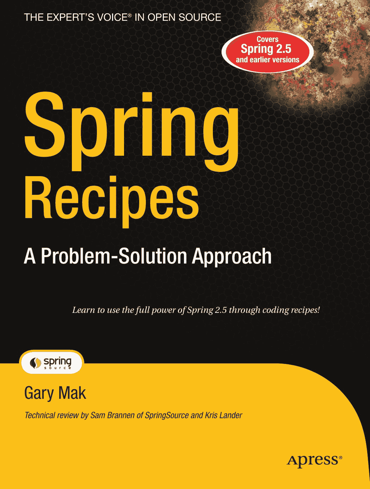
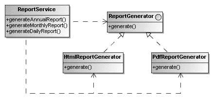
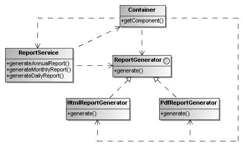
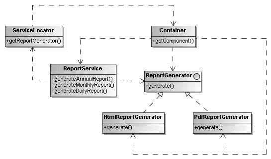
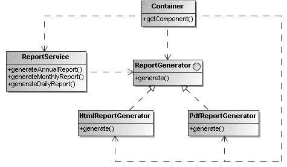

好的，作为一名高级文档工程师和翻译员，我将严格遵循您提供的注意事项和示例，将给定的英文文本翻译成中文。

青色

黄色

品红

黑色

潘通 123 C

专业人士为专业人士打造的书籍®

开源领域的专家之声®

**配套**

**电子书可用**

**涵盖**

**Spring Recipes: 问题解决方案**

Spring

**Spring 2.5**

**及更早版本**

亲爱的读者，

Spring 是用于构建企业级 Java™ EE 应用程序的最简单且最强大的框架，我从未见过如此出色的框架。

Spring 为许多难题提供了简单的解决方案，而简单性正是我设计本书时的主要目标。我力求在广度、深度、快速学习和可读性之间取得平衡。

阅读食谱

*Spring Recipes* 将帮助您将 Spring 的使用效率提升 100%。本书的特色在于，您将 100% 地通过示例进行学习，而这些示例正是您需要学习的。

每一章都通过一个完整的、真实的示例，深入探讨一个重要的主题，您可以一步步地跟随学习。当您第一次阅读一个章节时，我建议您从头到尾运行该示例。一旦您完成了一个章节的学习，您就可以将其作为参考，通过查找基于问题的食谱来使用它。或者，如果您正在解决一个特定的问题，您可以通过浏览目录或索引来快速定位到您需要的食谱。

问题解决方案方法

享受学习和使用 Spring 的乐趣！

Gary Mak

配套电子书

APRESS 路线图

*学习通过编码食谱充分利用 Spring 2.5 的全部功能！*

GigaSpaces 权威指南

Pro Java™ EE

Spring 模式

Beginning Spring 2

详情见最后一页

Spring Recipes

电子书版本仅需 10 美元

Pro Spring 2.5

**源代码在线**

ISBN-13: 978-1-59059-979-2

ISBN-10: 1-59059-979-9

Mak

Gary Mak

www.apress.com

5 4 9 9 9

*技术审校：SpringSource 的 Sam Brannen 和 Kris Lander*

**美国售价 $49.99**

分类于

Java 编程

用户级别：

9 781590 599792

中级–高级

**此印刷仅用于内容——尺寸和颜色不准确**

**书脊 = 1.413 英寸 752 页**

9799FM.qxd 5/27/08 3:47 PM 第 i 页

Spring Recipes

问题解决方案方法

Gary Mak

9799FM.qxd 5/27/08 3:47 PM 第 ii 页

**Spring Recipes: 问题解决方案方法**

**版权所有 © 2008 归 Gary Mak 所有**

保留所有权利。未经版权所有者及出版人事先书面许可，不得以任何形式或任何方式（电子或机械，包括影印、录制，或通过任何信息存储或检索系统）复制或传播本作品的任何部分。

ISBN-13 (平装): 978-1-59059-979-2

ISBN-10 (平装): 1-59059-979-9

ISBN-13 (电子版): 978-1-4302-0624-8

ISBN-10 (电子版): 1-4302-0624-1

在美国印刷并装订 9 8 7 6 5 4 3 2 1

本书中可能出现商标名称。我们不在每次出现商标名称时都使用商标符号，而是仅以编辑方式使用这些名称，以利于商标所有者，并无意侵犯商标权。

Java™ 及所有基于 Java 的标志是 Sun Microsystems, Inc. 在美国及其他国家的商标或注册商标。Apress, Inc. 与 Sun Microsystems, Inc. 无关联，本书的编写未获得 Sun Microsystems, Inc. 的认可。

首席编辑：Steve Anglin, Tom Welsh

技术审校：Sam Brannen, Kris Lander

编辑委员会：Clay Andres, Steve Anglin, Ewan Buckingham, Tony Campbell, Gary Cornell, Jonathan Gennick, Matthew Moodie, Joseph Ottinger, Jeffrey Pepper, Frank Pohlmann, Ben Renow-Clarke, Dominic Shakeshaft, Matt Wade, Tom Welsh

项目经理：Kylie Johnston

文字编辑：Damon Larson

副制作总监：Kari Brooks-Copony

制作编辑：Laura Esterman

排版：Dina Quan

校对：April Eddy

索引编制：Ron Strauss

美工：April Milne

封面设计：Kurt Krames

制造总监：Tom Debolski

全球发行由 Springer-Verlag New York, Inc. 负责，地址：233 Spring Street, 6th Floor, New York, NY 10013。电话 1-800-SPRINGER，传真 201-348-4505，电子邮件 orders-ny@springer-sbm.com, 或访问 [`www.springeronline.com。`](http://www.springeronline.com)

有关翻译信息，请联系 Apress，地址：2855 Telegraph Avenue, Suite 600, Berkeley, CA 94705。电话 510-549-5930，传真 510-549-5939，电子邮件 info@apress.com, 或访问

[`www.apress.com。`](http://www.apress.com)

Apress 和 friends of ED 的书籍可批量购买用于学术、企业或促销用途。

大多数图书也提供电子书版本和许可证。更多信息，请参考我们的特殊批量销售 – 电子书许可网页：[`www.apress.com/info/bulksales。`](http://www.apress.com/info/bulksales)

本书中的信息按“原样”分发，不提供任何担保。尽管在编写本作品时已采取一切预防措施，但作者和 Apress 均不对因本书所含信息直接或间接引起的任何损失或损害向任何个人或实体承担责任。

本书的源代码可在 [`www.apress.com`](http://www.apress.com) 上获取。

9799FM.qxd 5/27/08 3:47 PM 第 iii 页

9799FM.qxd 5/27/08 3:47 PM 第 iv 页

内容概览

关于作者 . . . . . . . . . . . . . . . . . . . . . . . . . . . . . . . . . . . . . . . . . . . . . . . . . . . . . . . . . . . . . . . . . . xv

关于技术审校者. . . . . . . . . . . . . . . . . . . . . . . . . . . . . . . . . . . . . . . . . . . . . . . . . . . . . . . . . . . xvii

致谢 . . . . . . . . . . . . . . . . . . . . . . . . . . . . . . . . . . . . . . . . . . . . . . . . . . . . . . . . . . . . . . . . . . . . . . . xix

引言. . . . . . . . . . . . . . . . . . . . . . . . . . . . . . . . . . . . . . . . . . . . . . . . . . . . . . . . . . . . . . . . . . . . . . . xxi

第一部分 **■ ■ ■** 核心

**■第 1 章**

控制反转与容器 . . . . . . . . . . . . . . . . . . . . . . . . . . . . . . . . . . . . . . . . . . . . . . . . . . . . . . . . . . . 3

**■第 2 章**

Spring 简介. . . . . . . . . . . . . . . . . . . . . . . . . . . . . . . . . . . . . . . . . . . . . . . . . . . . . . . . . . . . . . . . 21

**■第 3 章**

Spring 中的 Bean 配置 . . . . . . . . . . . . . . . . . . . . . . . . . . . . . . . . . . . . . . . . . . . . . . . . . . . . . 41

**■第 4 章**

高级 Spring IoC 容器 . . . . . . . . . . . . . . . . . . . . . . . . . . . . . . . . . . . . . . . . . . . . . . . . . . . . . . 93

**■第 5 章**

动态代理与经典 Spring AOP . . . . . . . . . . . . . . . . . . . . . . . . . . . . . . . . . . . . . . . . . . . . . . 135

**■第 6 章**

Spring 2.x AOP 与 AspectJ 支持 . . . . . . . . . . . . . . . . . . . . . . . . . . . . . . . . . . . . . . . . . . . 167

第二部分 **■ ■ ■** 基础

**■第 7 章**

Spring JDBC 支持 . . . . . . . . . . . . . . . . . . . . . . . . . . . . . . . . . . . . . . . . . . . . . . . . . . . . . . . . . 209

**■第 8 章**

Spring 中的事务管理 . . . . . . . . . . . . . . . . . . . . . . . . . . . . . . . . . . . . . . . . . . . . . . . . . . . . . 247

**■第 9 章**

Spring ORM 支持 . . . . . . . . . . . . . . . . . . . . . . . . . . . . . . . . . . . . . . . . . . . . . . . . . . . . . . . . . . 287

**■第 10 章**

Spring MVC 框架 . . . . . . . . . . . . . . . . . . . . . . . . . . . . . . . . . . . . . . . . . . . . . . . . . . . . . . . . . . 321

**■第 11 章**

将 Spring 与其他 Web 框架集成 . . . . . . . . . . . . . . . . . . . . . . . . . . . . . . . . . . . . . . . . . . . 395

**■第 12 章**

Spring 测试支持 . . . . . . . . . . . . . . . . . . . . . . . . . . . . . . . . . . . . . . . . . . . . . . . . . . . . . . . . . . 417

**iv**

9799FM.qxd 5/27/08 3:47 PM 第 v 页

第三部分 **■ ■ ■** 高级

**■第 13 章**

Spring Security . . . . . . . . . . . . . . . . . . . . . . . . . . . . . . . . . . . . . . . . . . . . . . . . . . . . . . . . . . . . 465

**■第 14 章**

Spring Portlet MVC 框架 . . . . . . . . . . . . . . . . . . . . . . . . . . . . . . . . . . . . . . . . . . . . . . . . . . . 511

**■第 15 章**

Spring Web Flow . . . . . . . . . . . . . . . . . . . . . . . . . . . . . . . . . . . . . . . . . . . . . . . . . . . . . . . . . . . 545

**■第 16 章**

Spring 远程调用与 Web 服务 . . . . . . . . . . . . . . . . . . . . . . . . . . . . . . . . . . . . . . . . . . . . . . 583

**■第 17 章**

Spring 对 EJB 和 JMS 的支持 . . . . . . . . . . . . . . . . . . . . . . . . . . . . . . . . . . . . . . . . . . . . . . 625

**■第 18 章**

Spring 对 JMX、电子邮件和调度的支持 . . . . . . . . . . . . . . . . . . . . . . . . . . . . . . . . . . . 663

**■第 19 章**

Spring 中的脚本支持 . . . . . . . . . . . . . . . . . . . . . . . . . . . . . . . . . . . . . . . . . . . . . . . . . . . . . . 697

**■索引** . . . . . . . . . . . . . . . . . . . . . . . . . . . . . . . . . . . . . . . . . . . . . . . . . . . . . . . . . . . . . . . . . . . . . . . 709

**v**

9799FM.qxd 5/27/08 3:47 PM 第 vi 页

9799FM.qxd 5/27/08 3:47 PM 第 vii 页

目录

关于作者 . . . . . . . . . . . . . . . . . . . . . . . . . . . . . . . . . . . . . . . . . . . . . . . . . . . . . . . . . . . . . . . . . . xv

关于技术审校者. . . . . . . . . . . . . . . . . . . . . . . . . . . . . . . . . . . . . . . . . . . . . . . . . . . . . . . . . . . xvii

致谢 . . . . . . . . . . . . . . . . . . . . . . . . . . . . . . . . . . . . . . . . . . . . . . . . . . . . . . . . . . . . . . . . . . . . . . . xix

引言. . . . . . . . . . . . . . . . . . . . . . . . . . . . . . . . . . . . . . . . . . . . . . . . . . . . . . . . . . . . . . . . . . . . . . . xxi

第一部分 **■ ■ ■** 核心

**■第 1 章**

**控制反转与容器** . . . . . . . . . . . . . . . . . . . . . . . . . . . . . . . . . . . . . . . . . . . . . . . . . . . . . . . . . . . 3

1-1\. 使用容器管理组件. . . . . . . . . . . . . . . . . . . . . . . . . . . . . . . . . . . . . . . . . . . . . . . . . . . . . . 4

1-2\. 使用服务定位器降低查找复杂性 . . . . . . . . . . . . . . . . . . . . . . . . . . . . . . . . . . . . . . . . 9

1-3\. 应用控制反转与依赖注入 . . . . . . . . . . . . . . . . . . . . . . . . . . . . . . . . . . . . . . . . . . . . . . 11

1-4\. 理解不同类型的依赖注入 . . . . . . . . . . . . . . . . . . . . . . . . . . . . . . . . . . . . . . . . . . . . . . 13

1-5\. 使用配置文件配置容器 . . . . . . . . . . . . . . . . . . . . . . . . . . . . . . . . . . . . . . . . . . . . . . . . 17

1-6\. 小结 . . . . . . . . . . . . . . . . . . . . . . . . . . . . . . . . . . . . . . . . . . . . . . . . . . . . . . . . . . . . . . . . . 20

**■第 2 章**

**Spring 简介** . . . . . . . . . . . . . . . . . . . . . . . . . . . . . . . . . . . . . . . . . . . . . . . . . . . . . . . . . . . . . . . 21

2-1\. Spring 框架介绍 . . . . . . . . . . . . . . . . . . . . . . . . . . . . . . . . . . . . . . . . . . . . . . . . . . . . . . . 21

2-2\. 安装 Spring 框架 . . . . . . . . . . . . . . . . . . . . . . . . . . . . . . . . . . . . . . . . . . . . . . . . . . . . . . . 26

2-3\. 设置 Spring 项目 . . . . . . . . . . . . . . . . . . . . . . . . . . . . . . . . . . . . . . . . . . . . . . . . . . . . . . . 28

2-4\. 安装 Spring IDE . . . . . . . . . . . . . . . . . . . . . . . . . . . . . . . . . . . . . . . . . . . . . . . . . . . . . . . . 30

2-5\. 使用 Spring IDE 的 Bean 支持功能 . . . . . . . . . . . . . . . . . . . . . . . . . . . . . . . . . . . . . . 32

2-6\. 小结 . . . . . . . . . . . . . . . . . . . . . . . . . . . . . . . . . . . . . . . . . . . . . . . . . . . . . . . . . . . . . . . . . 39

**■第 3 章**

**Spring 中的 Bean 配置** . . . . . . . . . . . . . . . . . . . . . . . . . . . . . . . . . . . . . . . . . . . . . . . . . . . . 41

3-1\. 在 Spring IoC 容器中配置 Bean . . . . . . . . . . . . . . . . . . . . . . . . . . . . . . . . . . . . . . . . . 41

3-2\. 实例化 Spring IoC 容器 . . . . . . . . . . . . . . . . . . . . . . . . . . . . . . . . . . . . . . . . . . . . . . . . 45

3-3\. 解决构造函数歧义 . . . . . . . . . . . . . . . . . . . . . . . . . . . . . . . . . . . . . . . . . . . . . . . . . . . . . 48

3-4\. 指定 Bean 引用 . . . . . . . . . . . . . . . . . . . . . . . . . . . . . . . . . . . . . . . . . . . . . . . . . . . . . . . . 51

3-5\. 使用依赖检查检查属性 . . . . . . . . . . . . . . . . . . . . . . . . . . . . . . . . . . . . . . . . . . . . . . . . 55

3-6\. 使用 @Required 注解检查属性 . . . . . . . . . . . . . . . . . . . . . . . . . . . . . . . . . . . . . . . . . 58

**vii**

9799FM.qxd 5/27/08 3:47 PM 第 viii 页

**viii**

**■**目 录

3-7\. 使用 XML 配置自动装配 Bean . . . . . . . . . . . . . . . . . . . . . . . . . . . . . . . . . . . . . . . . . . 60

3-8\. 使用 @Autowired 和 @Resource 自动装配 Bean . . . . . . . . . . . . . . . . . . . . . . . . . . 64

3-9\. 继承 Bean 配置 . . . . . . . . . . . . . . . . . . . . . . . . . . . . . . . . . . . . . . . . . . . . . . . . . . . . . . . . 71

3-10\. 为 Bean 属性定义集合 . . . . . . . . . . . . . . . . . . . . . . . . . . . . . . . . . . . . . . . . . . . . . . . . 74

3-11\. 指定集合元素的数据类型 . . . . . . . . . . . . . . . . . . . . . . . . . . . . . . . . . . . . . . . . . . . . . 81

3-12\. 使用工厂 Bean 和工具模式定义集合 . . . . . . . . . . . . . . . . . . . . . . . . . . . . . . . . . . . 84

3-13\. 从类路径扫描组件 . . . . . . . . . . . . . . . . . . . . . . . . . . . . . . . . . . . . . . . . . . . . . . . . . . . 86

3-14\. 小结 . . . . . . . . . . . . . . . . . . . . . . . . . . . . . . . . . . . . . . . . . . . . . . . . . . . . . . . . . . . . . . . . . 92

**■第 4 章**

**高级 Spring IoC 容器** . . . . . . . . . . . . . . . . . . . . . . . . . . . . . . . . . . . . . . . . . . . . . . . . . . . . . 93

4-1\. 通过调用构造函数创建 Bean . . . . . . . . . . . . . . . . . . . . . . . . . . . . . . . . . . . . . . . . . . . 93

4-2\. 通过调用静态工厂方法创建 Bean . . . . . . . . . . . . . . . . . . . . . . . . . . . . . . . . . . . . . . 97

4-3\. 通过调用实例工厂方法创建 Bean . . . . . . . . . . . . . . . . . . . . . . . . . . . . . . . . . . . . . . 98

4-4\. 使用 Spring 的工厂 Bean 创建 Bean . . . . . . . . . . . . . . . . . . . . . . . . . . . . . . . . . . . . 100

4-5\. 从静态字段声明 Bean . . . . . . . . . . . . . . . . . . . . . . . . . . . . . . . . . . . . . . . . . . . . . . . . 102

4-6\. 从对象属性声明 Bean . . . . . . . . . . . . . . . . . . . . . . . . . . . . . . . . . . . . . . . . . . . . . . . . 104

4-7\. 设置 Bean 作用域 . . . . . . . . . . . . . . . . . . . . . . . . . . . . . . . . . . . . . . . . . . . . . . . . . . . . . 106

4-8\. 自定义 Bean 的初始化和销毁 . . . . . . . . . . . . . . . . . . . . . . . . . . . . . . . . . . . . . . . . . 108

4-9\. 使 Bean 感知容器 . . . . . . . . . . . . . . . . . . . . . . . . . . . . . . . . . . . . . . . . . . . . . . . . . . . . 114

4-10\. 创建 Bean 后处理器 . . . . . . . . . . . . . . . . . . . . . . . . . . . . . . . . . . . . . . . . . . . . . . . . . 115

4-11\. 外部化 Bean 配置 . . . . . . . . . . . . . . . . . . . . . . . . . . . . . . . . . . . . . . . . . . . . . . . . . . . 120

4-12\. 解析文本消息 . . . . . . . . . . . . . . . . . . . . . . . . . . . . . . . . . . . . . . . . . . . . . . . . . . . . . . . 121

4-13\. 通过应用程序事件进行通信 . . . . . . . . . . . . . . . . . . . . . . . . . . . . . . . . . . . . . . . . . . 123

4-14\. 在 Spring 中注册属性编辑器 . . . . . . . . . . . . . . . . . . . . . . . . . . . . . . . . . . . . . . . . . 126

4-15\. 创建自定义属性编辑器 . . . . . . . . . . . . . . . . . . . . . . . . . . . . . . . . . . . . . . . . . . . . . . 129

4-16\. 加载外部资源 . . . . . . . . . . . . . . . . . . . . . . . . . . . . . . . . . . . . . . . . . . . . . . . . . . . . . . 131

4-17\. 小结 . . . . . . . . . . . . . . . . . . . . . . . . . . . . . . . . . . . . . . . . . . . . . . . . . . . . . . . . . . . . . . . . 134

**■第 5 章**

**动态代理与经典 Spring AOP** . . . . . . . . . . . . . . . . . . . . . . . . . . . . . . . . . . . . . . . . . . . . . 135

5-1\. 非模块化横切关注点的问题 . . . . . . . . . . . . . . . . . . . . . . . . . . . . . . . . . . . . . . . . . . 136

5-2\. 使用动态代理模块化横切关注点 . . . . . . . . . . . . . . . . . . . . . . . . . . . . . . . . . . . . . 144

5-3\. 使用经典 Spring 通知模块化横切关注点 . . . . . . . . . . . . . . . . . . . . . . . . . . . . . . 150

5-4\. 使用经典 Spring 切入点匹配方法 . . . . . . . . . . . . . . . . . . . . . . . . . . . . . . . . . . . . . 160

5-5\. 自动为 Bean 创建代理 . . . . . . . . . . . . . . . . . . . . . . . . . . . . . . . . . . . . . . . . . . . . . . . 163

5-6\. 小结 . . . . . . . . . . . . . . . . . . . . . . . . . . . . . . . . . . . . . . . . . . . . . . . . . . . . . . . . . . . . . . . . 165

9799FM.qxd 5/27/08 3:47 PM 第 ix 页

**■**目 录

**ix**

**■第 6 章**

**Spring 2.x AOP 与 AspectJ 支持** . . . . . . . . . . . . . . . . . . . . . . . . . . . . . . . . . . . . . . . . . 167

6-1\. 在 Spring 中启用 AspectJ 注解支持 . . . . . . . . . . . . . . . . . . . . . . . . . . . . . . . . . . . . 168

6-2\. 使用 AspectJ 注解声明切面 . . . . . . . . . . . . . . . . . . . . . . . . . . . . . . . . . . . . . . . . . . . 170

6-3\. 访问连接点信息 . . . . . . . . . . . . . . . . . . . . . . . . . . . . . . . . . . . . . . . . . . . . . . . . . . . . . 176

6-4\. 指定切面优先级 . . . . . . . . . . . . . . . . . . . . . . . . . . . . . . . . . . . . . . . . . . . . . . . . . . . . . . 178

6-5\. 重用切入点定义 . . . . . . . . . . . . . . . . . . . . . . . . . . . . . . . . . . . . . . . . . . . . . . . . . . . . . . 180

6-6\. 编写 AspectJ 切入点表达式 . . . . . . . . . . . . . . . . . . . . . . . . . . . . . . . . . . . . . . . . . . . 182

6-7\. 为 Bean 引入行为 . . . . . . . . . . . . . . . . . . . . . . . . . . . . . . . . . . . . . . . . . . . . . . . . . . . . 187

6-8\. 为 Bean 引入状态 . . . . . . . . . . . . . . . . . . . . . . . . . . . . . . . . . . . . . . . . . . . . . . . . . . . . 190

6-9\. 使用基于 XML 的配置声明切面 . . . . . . . . . . . . . . . . . . . . . . . . . . . . . . . . . . . . . . . 192

6-10\. 在 Spring 中加载时织入 AspectJ 切面 . . . . . . . . . . . . . . . . . . . . . . . . . . . . . . . . 196

6-11\. 在 Spring 中配置 AspectJ 切面 . . . . . . . . . . . . . . . . . . . . . . . . . . . . . . . . . . . . . . . 201

6-12\. 将 Spring Bean 注入领域对象 . . . . . . . . . . . . . . . . . . . . . . . . . . . . . . . . . . . . . . . . 202

6-13\. 小结 . . . . . . . . . . . . . . . . . . . . . . . . . . . . . . . . . . . . . . . . . . . . . . . . . . . . . . . . . . . . . . . . 206

第二部分 **■ ■ ■** 基础

**■第 7 章**

**Spring JDBC 支持** . . . . . . . . . . . . . . . . . . . . . . . . . . . . . . . . . . . . . . . . . . . . . . . . . . . . . . . . 209

7-1\. 直接使用 JDBC 的问题 . . . . . . . . . . . . . . . . . . . . . . . . . . . . . . . . . . . . . . . . . . . . . . . . 209

7-2\. 使用 JDBC 模板更新数据库 . . . . . . . . . . . . . . . . . . . . . . . . . . . . . . . . . . . . . . . . . . . 216

7-3\. 使用 JDBC 模板查询数据库 . . . . . . . . . . . . . . . . . . . . . . . . . . . . . . . . . . . . . . . . . . . 221

7-4\. 简化 JDBC 模板的创建 . . . . . . . . . . . . . . . . . . . . . . . . . . . . . . . . . . . . . . . . . . . . . . . 227

7-5\. 在 Java 1.5 中使用简单 JDBC 模板 . . . . . . . . . . . . . . . . . . . . . . . . . . . . . . . . . . . . 230

7-6\. 在 JDBC 模板中使用命名参数 . . . . . . . . . . . . . . . . . . . . . . . . . . . . . . . . . . . . . . . . 233

7-7\. 将 JDBC 操作建模为细粒度对象 . . . . . . . . . . . . . . . . . . . . . . . . . . . . . . . . . . . . . . 236

7-8\. 处理 Spring JDBC 框架中的异常 . . . . . . . . . . . . . . . . . . . . . . . . . . . . . . . . . . . . . . 240

7-9\. 小结 . . . . . . . . . . . . . . . . . . . . . . . . . . . . . . . . . . . . . . . . . . . . . . . . . . . . . . . . . . . . . . . . 245

**■第 8 章**

**Spring 中的事务管理** . . . . . . . . . . . . . . . . . . . . . . . . . . . . . . . . . . . . . . . . . . . . . . . . . . . . 247

8-1\. 事务管理的问题 . . . . . . . . . . . . . . . . . . . . . . . . . . . . . . . . . . . . . . . . . . . . . . . . . . . . . 248

8-2\. 选择事务管理器实现 . . . . . . . . . . . . . . . . . . . . . . . . . . . . . . . . . . . . . . . . . . . . . . . . . 253

8-3\. 使用事务管理器 API 以编程方式管理事务 . . . . . . . . . . . . . . . . . . . . . . . . . . . . 255

8-4\. 使用事务模板以编程方式管理事务 . . . . . . . . . . . . . . . . . . . . . . . . . . . . . . . . . . . 257

8-5\. 使用经典 Spring AOP 以声明方式管理事务 . . . . . . . . . . . . . . . . . . . . . . . . . . . . 260

9799FM.qxd 5/27/08 3:47 PM 第 x 页

**x**

**■**目 录

8-6\. 使用事务通知以声明方式管理事务 . . . . . . . . . . . . . . . . . . . . . . . . . . . . . . . . . . . 263

8-7\. 使用 @Transactional 注解以声明方式管理事务 . . . . . . . . . . . . . . . . . . . . . . . . 265

8-8\. 设置传播事务属性 . . . . . . . . . . . . . . . . . . . . . . . . . . . . . . . . . . . . . . . . . . . . . . . . . . . 266

8-9\. 设置隔离事务属性 . . . . . . . . . . . . . . . . . . . . . . . . . . . . . . . . . . . . . . . . . . . . . . . . . . . 271

8-10\. 设置回滚事务属性 . . . . . . . . . . . . . . . . . . . . . . . . . . . . . . . . . . . . . . . . . . . . . . . . . 279

8-11\. 设置超时和只读事务属性 . . . . . . . . . . . . . . . . . . . . . . . . . . . . . . . . . . . . . . . . . . . 280

8-12\. 使用加载时织入管理事务 . . . . . . . . . . . . . . . . . . . . . . . . . . . . . . . . . . . . . . . . . . . 282

8-13\. 小结 . . . . . . . . . . . . . . . . . . . . . . . . . . . . . . . . . . . . . . . . . . . . . . . . . . . . . . . . . . . . . . . 285

**■第 9 章**

**Spring ORM 支持** . . . . . . . . . . . . . . . . . . . . . . . . . . . . . . . . . . . . . . . . . . . . . . . . . . . . . . . . 287

9-1\. 直接使用 ORM 框架的问题 . . . . . . . . . . . . . . . . . . . . . . . . . . . . . . . . . . . . . . . . . . . 288

9-2\. 在 Spring 中配置 ORM 资源工厂 . . . . . . . . . . . . . . . . . . . . . . . . . . . . . . . . . . . . . . 299

9-3\. 使用 Spring 的 ORM 模板持久化对象 . . . . . . . . . . . . . . . . . . . . . . . . . . . . . . . . . 306

9-4\. 使用 Hibernate 的上下文会话持久化对象 . . . . . . . . . . . . . . . . . . . . . . . . . . . . . 312

9-5\. 使用 JPA 的上下文注入持久化对象 . . . . . . . . . . . . . . . . . . . . . . . . . . . . . . . . . . . 315

9-6\. 小结 . . . . . . . . . . . . . . . . . . . . . . . . . . . . . . . . . . . . . . . . . . . . . . . . . . . . . . . . . . . . . . . . 319

**■第 10 章**

**Spring MVC 框架** . . . . . . . . . . . . . . . . . . . . . . . . . . . . . . . . . . . . . . . . . . . . . . . . . . . . . . . . 321

10-1\. 使用 Spring MVC 开发一个简单的 Web 应用程序 . . . . . . . . . . . . . . . . . . . . . . 321

10-2\. 将请求映射到处理器 . . . . . . . . . . . . . . . . . . . . . . . . . . . . . . . . . . . . . . . . . . . . . . . 333

10-3\. 使用处理器拦截器拦截请求 . . . . . . . . . . . . . . . . . . . . . . . . . . . . . . . . . . . . . . . . . 336

10-4\. 解析用户区域设置 . . . . . . . . . . . . . . . . . . . . . . . . . . . . . . . . . . . . . . . . . . . . . . . . . . 339

10-5\. 外部化区域设置敏感的文本消息 . . . . . . . . . . . . . . . . . . . . . . . . . . . . . . . . . . . . 342

10-6\. 按名称解析视图 . . . . . . . . . . . . . . . . . . . . . . . . . . . . . . . . . . . . . . . . . . . . . . . . . . . . 343

10-7\. 将异常映射到视图 . . . . . . . . . . . . . . . . . . . . . . . . . . . . . . . . . . . . . . . . . . . . . . . . . . 346

10-8\. 构造 ModelAndView 对象 . . . . . . . . . . . . . . . . . . . . . . . . . . . . . . . . . . . . . . . . . . . . 348

10-9\. 使用参数化视图创建控制器 . . . . . . . . . . . . . . . . . . . . . . . . . . . . . . . . . . . . . . . . . 351

10-10\. 使用表单控制器处理表单 . . . . . . . . . . . . . . . . . . . . . . . . . . . . . . . . . . . . . . . . . . 353

10-11\. 使用向导表单控制器处理多页表单 . . . . . . . . . . . . . . . . . . . . . . . . . . . . . . . . . 366

10-12\. 将多个操作分组到一个控制器中 . . . . . . . . . . . . . . . . . . . . . . . . . . . . . . . . . . . 375

10-13\. 创建 Excel 和 PDF 视图 . . . . . . . . . . . . . . . . . . . . . . . . . . . . . . . . . . . . . . . . . . . . . 381

10-14\. 使用注解开发控制器 . . . . . . . . . . . . . . . . . . . . . . . . . . . . . . . . . . . . . . . . . . . . . . . 385

10-15\. 小结 . . . . . . . . . . . . . . . . . . . . . . . . . . . . . . . . . . . . . . . . . . . . . . . . . . . . . . . . . . . . . . 393

9799FM.qxd 5/27/08 3:47 PM 第 xi 页

**■**目 录

**xi**

**■第 11 章**

**将 Spring 与其他 Web 框架集成** . . . . . . . . . . . . . . . . . . . . . . . . . . . . . . . . . . . . . . . . 395

11-1\. 在通用 Web 应用程序中访问 Spring . . . . . . . . . . . . . . . . . . . . . . . . . . . . . . . . . 395

11-2\. 将 Spring 与 Struts 1.x 集成 . . . . . . . . . . . . . . . . . . . . . . . . . . . . . . . . . . . . . . . . . 400

11-3\. 将 Spring 与 JSF 集成 . . . . . . . . . . . . . . . . . . . . . . . . . . . . . . . . . . . . . . . . . . . . . . . 407

11-4\. 将 Spring 与 DWR 集成 . . . . . . . . . . . . . . . . . . . . . . . . . . . . . . . . . . . . . . . . . . . . . . 412

11-5\. 小结 . . . . . . . . . . . . . . . . . . . . . . . . . . . . . . . . . . . . . . . . . . . . . . . . . . . . . . . . . . . . . . 416

**■第 12 章**

**Spring 测试支持** . . . . . . . . . . . . . . . . . . . . . . . . . . . . . . . . . . . . . . . . . . . . . . . . . . . . . . . . 417

12-1\. 使用 JUnit 和 TestNG 创建测试 . . . . . . . . . . . . . . . . . . . . . . . . . . . . . . . . . . . . . . 418

12-2\. 创建单元测试和集成测试 . . . . . . . . . . . . . . . . . . . . . . . . . . . . . . . . . . . . . . . . . . . 423

12-3\. 单元测试 Spring MVC 控制器 . . . . . . . . . . . . . . . . . . . . . . . . . . . . . . . . . . . . . . . . 433

12-4\. 在集成测试中管理应用程序上下文 . . . . . . . . . . . . . . . . . . . . . . . . . . . . . . . . . . 438

12-5\. 将测试夹具注入集成测试 . . . . . . . . . . . . . . . . . . . . . . . . . . . . . . . . . . . . . . . . . . . 444

12-6\. 在集成测试中管理事务 . . . . . . . . . . . . . . . . . . . . . . . . . . . . . . . . . . . . . . . . . . . . . 449

12-7\. 在集成测试中访问数据库 . . . . . . . . . . . . . . . . . . . . . . . . . . . . . . . . . . . . . . . . . . . 455

12-8\. 使用 Spring 的通用测试注解 . . . . . . . . . . . . . . . . . . . . . . . . . . . . . . . . . . . . . . . . 459

12-9\. 小结 . . . . . . . . . . . . . . . . . . . . . . . . . . . . . . . . . . . . . . . . . . . . . . . . . . . . . . . . . . . . . . 461

第三部分 **■ ■ ■** 高级

**■第 13 章**

**Spring Security** . . . . . . . . . . . . . . . . . . . . . . . . . . . . . . . . . . . . . . . . . . . . . . . . . . . . . . . . . . 465

13-1\. 保护 URL 访问 . . . . . . . . . . . . . . . . . . . . . . . . . . . . . . . . . . . . . . . . . . . . . . . . . . . . . . 465

13-2\. 登录 Web 应用程序 . . . . . . . . . . . . . . . . . . . . . . . . . . . . . . . . . . . . . . . . . . . . . . . . . . 476

13-3\. 认证用户 . . . . . . . . . . . . . . . . . . . . . . . . . . . . . . . . . . . . . . . . . . . . . . . . . . . . . . . . . . . 480

13-4\. 做出访问控制决策 . . . . . . . . . . . . . . . . . . . . . . . . . . . . . . . . . . . . . . . . . . . . . . . . . . 490

13-5\. 保护方法调用 . . . . . . . . . . . . . . . . . . . . . . . . . . . . . . . . . . . . . . . . . . . . . . . . . . . . . . 494

13-6\. 在视图中处理安全性 . . . . . . . . . . . . . . . . . . . . . . . . . . . . . . . . . . . . . . . . . . . . . . . . 497

13-7\. 处理领域对象安全性 . . . . . . . . . . . . . . . . . . . . . . . . . . . . . . . . . . . . . . . . . . . . . . . . 499

13-8\. 小结 . . . . . . . . . . . . . . . . . . . . . . . . . . . . . . . . . . . . . . . . . . . . . . . . . . . . . . . . . . . . . . . 509

**■第 14 章**

**Spring Portlet MVC 框架** . . . . . . . . . . . . . . . . . . . . . . . . . . . . . . . . . . . . . . . . . . . . . . . . 511

14-1\. 使用 Spring Portlet MVC 开发一个简单的 Portlet . . . . . . . . . . . . . . . . . . . . . . 511

14-2\. 将 Portlet 请求映射到处理器 . . . . . . . . . . . . . . . . . . . . . . . . . . . . . . . . . . . . . . . . 519

14-3\. 使用简单表单控制器处理 Portlet 表单 . . . . . . . . . . . . . . . . . . . . . . . . . . . . . . . . 529

14-4\. 使用注解开发 Portlet 控制器 . . . . . . . . . . . . . . . . . . . . . . . . . . . . . . . . . . . . . . . . . 537

14-5\. 小结 . . . . . . . . . . . . . . . . . . . . . . . . . . . . . . . . . . . . . . . . . . . . . . . . . . . . . . . . . . . . . . . 543

9799FM.qxd 5/27/08 3:47 PM 第 xii 页

**xii**

**■**目 录

**■第 15 章**

**Spring Web Flow** . . . . . . . . . . . . . . . . . . . . . . . . . . . . . . . . . . . . . . . . . . . . . . . . . . . . . . . . . 545

15-1\. 使用 Spring Web Flow 管理一个简单的 UI 流程 . . . . . . . . . . . . . . . . . . . . . . . 545

15-2\. 使用不同的状态类型建模 Web 流程 . . . . . . . . . . . . . . . . . . . . . . . . . . . . . . . . . . 552

15-3\. 保护 Web 流程 . . . . . . . . . . . . . . . . . . . . . . . . . . . . . . . . . . . . . . . . . . . . . . . . . . . . . . 565

15-4\. 在 Web 流程中持久化对象 . . . . . . . . . . . . . . . . . . . . . . . . . . . . . . . . . . . . . . . . . . . 568

15-5\. 将 Spring Web Flow 与 JSF 集成 . . . . . . . . . . . . . . . . . . . . . . . . . . . . . . . . . . . . . 574

15-6\. 小结 . . . . . . . . . . . . . . . . . . . . . . . . . . . . . . . . . . . . . . . . . . . . . . . . . . . . . . . . . . . . . . . 580

**■第 16 章**

**Spring 远程调用与 Web 服务** . . . . . . . . . . . . . . . . . . . . . . . . . . . . . . . . . . . . . . . . . . . . 583

16-1\. 通过 RMI 暴露和调用服务 . . . . . . . . . . . . . . . . . . . . . . . . . . . . . . . . . . . . . . . . . . . 584

16-2\. 通过 HTTP 暴露和调用服务 . . . . . . . . . . . . . . . . . . . . . . . . . . . . . . . . . . . . . . . . . . 588

16-3\. 选择 Web 服务开发方法 . . . . . . . . . . . . . . . . . . . . . . . . . . . . . . . . . . . . . . . . . . . . . 592

16-4\. 使用 XFire 暴露和调用 Web 服务 . . . . . . . . . . . . . . . . . . . . . . . . . . . . . . . . . . . . . 595

16-5\. 定义 Web 服务的契约 . . . . . . . . . . . . . . . . . . . . . . . . . . . . . . . . . . . . . . . . . . . . . . . . 601

16-6\. 使用 Spring-WS 实现 Web 服务 . . . . . . . . . . . . . . . . . . . . . . . . . . . . . . . . . . . . . . . 605

16-7\. 使用 Spring-WS 调用 Web 服务 . . . . . . . . . . . . . . . . . . . . . . . . . . . . . . . . . . . . . . . 612

16-8\. 使用 XML 编组开发 Web 服务 . . . . . . . . . . . . . . . . . . . . . . . . . . . . . . . . . . . . . . . . 615

16-9\. 使用注解创建服务端点 . . . . . . . . . . . . . . . . . . . . . . . . . . . . . . . . . . . . . . . . . . . . . . 621

16-10\. 小结 . . . . . . . . . . . . . . . . . . . . . . . . . . . . . . . . . . . . . . . . . . . . . . . . . . . . . . . . . . . . . . 622

**■第 17 章**

**Spring 对 EJB 和 JMS 的支持** . . . . . . . . . . . . . . . . . . . . . . . . . . . . . . . . . . . . . . . . . . . . 625

17-1\. 使用 Spring 创建 EJB 2.x 组件 . . . . . . . . . . . . . . . . . . . . . . . . . . . . . . . . . . . . . . . 625

17-2\. 在 Spring 中访问 EJB 2.x 组件 . . . . . . . . . . . . . . . . . . . . . . . . . . . . . . . . . . . . . . . 631

17-3\. 在 Spring 中访问 EJB 3.0 组件 . . . . . . . . . . . . . . . . . . . . . . . . . . . . . . . . . . . . . . . 637

17-4\. 使用 Spring 发送和接收 JMS 消息 . . . . . . . . . . . . . . . . . . . . . . . . . . . . . . . . . . . 640

17-5\. 在 Spring 中创建消息驱动的 POJO . . . . . . . . . . . . . . . . . . . . . . . . . . . . . . . . . . . 655

17-6\. 小结 . . . . . . . . . . . . . . . . . . . . . . . . . . . . . . . . . . . . . . . . . . . . . . . . . . . . . . . . . . . . . . . 661

**■第 18 章**

**Spring 对 JMX、电子邮件和调度的支持** . . . . . . . . . . . . . . . . . . . . . . . . . . . . . . . . 663

18-1\. 将 Spring Bean 导出为 JMX MBean . . . . . . . . . . . . . . . . . . . . . . . . . . . . . . . . . . . 663

18-2\. 发布和监听 JMX 通知 . . . . . . . . . . . . . . . . . . . . . . . . . . . . . . . . . . . . . . . . . . . . . . . 675

18-3\. 在 Spring 中访问远程 JMX MBean . . . . . . . . . . . . . . . . . . . . . . . . . . . . . . . . . . . 677

18-4\. 使用 Spring 的电子邮件支持发送电子邮件 . . . . . . . . . . . . . . . . . . . . . . . . . . . . 680

18-5\. 使用 Spring 的 JDK 定时器支持进行调度 . . . . . . . . . . . . . . . . . . . . . . . . . . . . . 688

18-6\. 使用 Spring 的 Quartz 支持进行调度 . . . . . . . . . . . . . . . . . . . . . . . . . . . . . . . . . 691

18-7\. 小结 . . . . . . . . . . . . . . . . . . . . . . . . . . . . . . . . . . . . . . . . . . . . . . . . . . . . . . . . . . . . . . . 696

9799FM.qxd 5/27/08 3:47 PM 第 xiii 页

**■**目 录

**xiii**

**■第 19 章**

**Spring 中的脚本支持** . . . . . . . . . . . . . . . . . . . . . . . . . . . . . . . . . . . . . . . . . . . . . . . . . . . 697

19-1\. 使用脚本语言实现 Bean . . . . . . . . . . . . . . . . . . . . . . . . . . . . . . . . . . . . . . . . . . . . . 697

19-2\. 将 Spring Bean 注入脚本 . . . . . . . . . . . . . . . . . . . . . . . . . . . . . . . . . . . . . . . . . . . . . 702

19-3\. 从脚本刷新 Bean . . . . . . . . . . . . . . . . . . . . . . . . . . . . . . . . . . . . . . . . . . . . . . . . . . . . 705

19-4\. 内联定义脚本源 . . . . . . . . . . . . . . . . . . . . . . . . . . . . . . . . . . . . . . . . . . . . . . . . . . . . 706

19-5\. 小结 . . . . . . . . . . . . . . . . . . . . . . . . . . . . . . . . . . . . . . . . . . . . . . . . . . . . . . . . . . . . . . . 707

**■索引** . . . . . . . . . . . . . . . . . . . . . . . . . . . . . . . . . . . . . . . . . . . . . . . . . . . . . . . . . . . . . . . . . . . . . . . 709

9799FM.qxd 5/27/08 3:47 PM 第 xiv 页

9799FM.qxd 5/27/08 3:47 PM 第 xv 页

关于作者

**■GARY MAK** 是一位在 Java 企业级平台上拥有六年经验的技术架构师和应用程序开发人员。在他的职业生涯中，Gary 开发了许多基于 Java 的软件项目，其中大部分是核心应用程序框架和软件工具。他喜欢设计和实现软件项目中复杂的部分。

Gary 是 Sun 认证的 Java 程序员，并拥有计算机科学硕士学位。他的研究兴趣包括面向对象技术、面向方面技术、设计模式和软件复用。

Gary 专长于使用包括 Spring、Hibernate、JPA、Struts、JSF 和 Tapestry 在内的框架构建企业级应用程序。自 Spring 1.0 版本以来，他已经在项目中使用 Spring 框架四年了。Gary 还是一名企业级 Java、Spring、Hibernate、Web 服务和敏捷开发课程的讲师。他编写了一系列 Spring 和 Hibernate 教程作为课程材料，其中部分内容已向公众开放，并在 Java 社区中越来越受欢迎。在业余时间，他喜欢打网球和观看网球比赛。

**xv**

9799FM.qxd 5/27/08 3:47 PM 第 xvi 页

9799FM.qxd 5/27/08 3:47 PM 第 xvii 页

关于技术审校者

**■SAM BRANNEN** 是 SpringSource 的高级软件工程师，担任 Spring 框架的核心开发人员。Sam 也是 SpringSource 团队中负责 Spring 和 Tomcat 集成产品的成员。自 1996 年以来，他一直从事 Java 应用程序开发，自 1999 年以来从事企业级应用程序开发。在此期间，Sam 喜欢设计复杂的软件架构，并使用 Java (J2EE/Java EE) 和 Spring 框架，专注于可扩展、可测试、多层 Web 和客户端-服务器应用程序，实现自定义解决方案。Sam 最近设计并实现了 Spring 2.5 中包含的新的注解驱动的 Spring TestContext 框架。

在加入 SpringSource 之前，Sam 积累了为不同业务领域的客户构建应用程序的经验，这些领域涵盖电子商务、银行、零售、汽车和社交社区。Sam 拥有佐治亚理工学院计算机科学学位，目前与妻子 Vera 居住在英国。

从他父母在他七岁生日时送给他一台 Spectrum 48K 的那一刻起，就清楚地表明 **KRIS LANDER** 在技术方面将始终是一个早期采用者。离开学校后，由于对电脑上瘾和轻微的维生素 A 缺乏症，他决定将童年的热情转化为严肃的职业，开始在威尔士大学攻读软件工程学位。

Kris 对新兴 Java 技术的不断渴求已成为他整个职业生涯的标志。他从一开始就是一名 Java Web 企业级 (J2EE) 专家，并从 2003 年开始使用 Spring 开发应用程序，这使他得以在大西洋两岸为众多企业蓝筹股和成功的新技术公司从事大型 IT 项目。他在伦敦长大并定居，业余时间喜欢美食和音乐制作。

**xvii**

9799FM.qxd 5/27/08 3:47 PM 第 xviii 页

9799FM.qxd 5/27/08 3:47 PM 第 xix 页

致谢

**我**要感谢我的家人，尤其是我的妻子 Ivy。她在精神上支持我撰写本书，并在照顾家庭方面做得非常出色。没有她的爱和支持，我永远无法完成这本书。

此外，我要感谢为本书工作的 Apress 团队，特别是以下人员：

Steve Anglin，我的策划编辑，他认可并相信我能写好这本书。他为本书的提纲提供了出色的想法，并为本书组织了一个优秀的团队。

Tom Welsh，我的开发编辑，他在本书的文学和技术方面都提供了出色的支持。当我在写作中遇到困难时，他经常鼓励我，并为我提供解决方案。

Kylie Johnston，我的项目经理，她在管理本书进度方面做得非常出色，并且对我的请求响应非常迅速。她的经验使进度安排非常灵活，让我能够以舒适的方式完成工作。

Kris Lander，他从技术角度审阅了本书，指出了我的错误，并根据他丰富的 Spring 经验提供了宝贵的建议。

Sam Brannen，我的另一位技术审校者，他提供了大量专业意见，直接且迅速地提升了本书的质量。他作为 Spring 核心开发人员的身份使我对他的意见非常有信心。

Damon Larson，我的文字编辑，他在纠正我的语法错误、改进我的措辞以及保持全书风格一致方面做得非常出色。

Laura Esterman，我的制作编辑，她使本书看起来如此精美，并处理了我后期的修改请求。

Dina Quan、Ron Strauss 和 April Eddy，他们也为本书成为一本优秀的书籍做出了贡献。

**xix**

9799FM.qxd 5/27/08 3:47 PM 第 xx 页

9799FM.qxd 5/27/08 3:47 PM 第 xxi 页

引言

**自**从 2004 年第一次使用 Spring 以来，我就成为了它的忠实粉丝，并在我几乎所有的项目中都使用了它。我深深地被 Spring 的简洁和合理性所吸引。Spring 是我使用过的最简单、最强大的 Java/Java EE 应用程序框架，它以简单的方式解决难题的能力给我留下了深刻的印象。Spring 提供的解决方案可能不是全世界最好的，但它们是我能想到的最合理的。

Spring 涵盖了 Java/Java EE 应用程序开发的大部分方面，并为其提供了简单的解决方案。通过使用 Spring，您将被引导使用行业最佳实践来设计和实现您的应用程序。Spring 2.x 版本为 1.x 版本增加了许多改进和新特性。本书重点介绍用于构建企业级 Java 应用程序的最新 Spring 2.5 特性。

作为一名编程技术课程的讲师，我经常发现我的学生面临的最大挑战是如何让他们的实验项目运行起来。许多编程书籍包含代码示例，但大多数只包含代码片段，而不是完整的项目。

这些书中的大多数都提供完整的项目供您从其网站下载，但它们没有提供让您自己逐步构建项目的机会。我相信您会从项目构建过程中学到很多东西，并且一旦您的项目运行起来，您就会获得信心——这就是我写这本书的灵感。

作为活跃的 Java 开发人员，我们经常需要掌握一项新技术或框架。由于我们只是使用技术的开发人员，而不是需要参加考试的学生，我们不需要把所有东西都记在脑子里。我们只需要一种在必要时高效查阅参考的方法。为了让有经验的读者以及从头到尾阅读本书的初学者读者受益，我将每一章组织成多个基于问题解决方案的食谱。这样，您将能够轻松地查找特定问题的解决方案。

本书中的主题通过完整且真实的代码示例引入，您可以一步步地跟随学习。在本书中，您将找到生动的示例，而不是对复杂概念的抽象描述。当您开始一个新项目时，您可以考虑从本书中复制代码和配置文件，然后根据您的需求进行修改。这可以为您节省大量从头开始创建项目的工作。

**本书读者对象**

本书面向希望使用 Spring 框架快速获得 Java/Java EE 开发实践经验的 Java 开发人员。如果您已经是在项目中使用 Spring 的开发人员，您也可以将本书用作参考，并且您会发现代码示例非常有用。

阅读本书不需要太多 Java EE 经验。但是，它假设您了解使用 Java 进行面向对象编程的基础知识（例如，创建类/接口、实现接口、扩展基类、运行主类、设置类路径等）。它还假设您具备 Web 和数据库概念的基础知识，并且知道如何创建动态网页和使用 SQL 语句查询数据库。

**本书结构**

本书涵盖 Spring 2.5 从基础到高级的内容，并介绍了一些常见的 Spring 项目，这些项目将为您的应用程序开发带来重要价值。全书共 19 章，分为 3 个部分：

• *第一部分：核心*：本部分重点介绍 Spring 框架的核心概念和机制。本部分的章节旨在让您熟悉 Spring 的核心，以便您能够快速学习 Spring 的其他主题和用途。

• *第 1 章：控制反转与容器*：本章介绍 Spring 的核心概念——IoC 设计原则——以及容器的重要性。如果您已经熟悉 IoC，可以跳过本章。

• *第 2 章：Spring 简介*：本章概述了 Spring 的架构和相关项目。它还演示了如何在您的开发环境中设置 Spring。

• *第 3 章：Spring 中的 Bean 配置*：本章介绍 Spring IoC 容器中的基本 Bean 配置。理解本章中的特性是阅读后续章节所必需的。

• *第 4 章：高级 Spring IoC 容器*：本章涵盖 Spring IoC 容器的高级特性和内部机制。尽管这些特性的使用频率可能不如第 3 章中的特性，但它们对于一个强大的容器来说是必不可少的。

• *第 5 章：动态代理与经典 Spring AOP*：本章解释为什么需要 AOP，以及如何使用动态代理和经典 Spring AOP 模块化横切关注点。如果您已经理解 AOP 并希望直接使用 Spring 2.x 中的 Spring AOP，可以跳到第 6 章。

• *第 6 章：Spring 2.x AOP 与 AspectJ 支持*：本章涵盖 Spring 2.x AOP 的使用和一些高级 AOP 主题，包括如何将 AspectJ 框架集成到 Spring 应用程序中。

• *第二部分：基础*：本部分涉及 Spring 框架的基础主题。本部分涵盖的主题在企业级应用程序开发中经常使用。

• *第 7 章：Spring JDBC 支持*：本章展示 Spring 如何通过其 JDBC 访问框架简化 JDBC 的使用。它也是 Spring 数据访问模块的介绍。

• *第 8 章：Spring 中的事务管理*：本章讨论 Spring 的不同事务管理方法，并详细解释事务属性。

9799FM.qxd 5/27/08 3:47 PM 第 xxii 页

**xxii**

**■**引 言

• *第 9 章：Spring ORM 支持*：本章重点介绍如何将流行的 ORM 框架（包括 Hibernate 和 JPA）集成到 Spring 应用程序中。

• *第 10 章：Spring MVC 框架*：本章涵盖使用 Spring Web MVC 框架进行基于 Web 的应用程序开发，包括传统方法和新的基于注解的方法。

• *第 11 章：将 Spring 与其他 Web 框架集成*：本章介绍如何将 Spring 框架与几个流行的 Web 应用程序框架（包括 Struts、JSF 和 DWR）集成。

• *第 12 章：Spring 测试支持*：本章涵盖 Java 应用程序中的基本测试技术以及 Spring 框架提供的测试支持特性。

• *第三部分：高级*：本部分涵盖 Spring 框架及相关项目的高级主题。然而，深入涵盖每个主题都需要一整本书。这些章节的目的是为您提供有用的基础知识以及特定于 Spring 的用法。

• *第 13 章：Spring Security*：本章介绍如何使用 Spring Security 框架（原名 Acegi Security）保护应用程序。本章重点介绍使用 Spring Security 2.0 保护 Web 应用程序。

• *第 14 章：Spring Portlet MVC 框架*：本章涵盖使用 Spring Portlet MVC 框架进行 Portlet 应用程序开发，并重点介绍与 Web MVC 不同的 Portlet 特定特性。

• *第 15 章：Spring Web Flow*：本章介绍如何使用 Spring Web Flow 建模和管理 Web 应用程序的 UI 流程。本章重点介绍在 Spring MVC 和 JSF 中使用 Spring Web Flow 2.0。

• *第 16 章：Spring 远程调用与 Web 服务*：本章涵盖 Spring 对各种远程调用技术的支持，包括 RMI、Hessian、Burlap、HTTP Invoker 和 Web 服务。它还介绍了使用 Spring Web Services 开发契约优先的 Web 服务。

• *第 17 章：Spring 对 EJB 和 JMS 的支持*：本章讨论如何使用 Spring 的 EJB 支持开发 EJB 2.x 和 3.0 组件，以及如何使用 Spring 的 JMS 支持简化发送、接收和监听 JMS 消息。

• *第 18 章：Spring 对 JMX、电子邮件和调度的支持*：本章讨论如何将 Spring Bean 导出为 JMX MBean 以及访问远程 MBean。本章还介绍了如何使用 Spring 的电子邮件和调度支持发送电子邮件和调度任务。

• *第 19 章：Spring 中的脚本支持*：本章讨论如何在 Spring 应用程序中使用流行的脚本语言，包括 JRuby、Groovy 和 BeanShell。

本书的每一章都通过多个问题解决方案食谱讨论一个 Spring 主题。您可以查找特定问题的解决方案，并在“工作原理”部分了解该解决方案是如何工作的。每章都通过一个完整的真实示例来演示一个主题。一章内的示例是连贯的，但各章之间的示例是独立的。

9799FM.qxd 5/27/08 3:47 PM 第 xxiii 页

**■**引 言

**xxiii**

**约定**

有时，当我希望您特别注意代码示例中的某一部分时，我会将该部分的字体加粗。请注意，加粗部分并不反映自上一版本以来的代码更改。当代码行太长而无法适应页面宽度时，我会使用代码续行符 (**➥**) 将其断开。请注意，当您尝试运行代码时，您必须自行连接该行，不留任何空格。

**先决条件**

由于 Java 编程语言是平台无关的，您可以自由选择任何支持的操作系统。但是，我应该告诉您，我使用的是 Microsoft Windows，因为我在本书中提供的文件系统路径是基于 Windows 的。在尝试运行代码之前，您可以简单地将这些路径转换为您的操作系统的格式。

为了充分利用本书，您应该安装 JDK 1.5 或更高版本。您还应该安装一个 Java IDE 以简化开发。对于本书，我一直使用 Eclipse Web Tools Platform (WTP) 来开发我的项目，我建议您也安装它。

**下载代码**

本书的源代码可从 Apress 网站 ([`www.apress.com`](http://www.apress.com)) 的“源代码/下载”部分获取。源代码按章节组织，每章包含一个或多个独立的 Eclipse 项目。请参阅位于根目录的 readme.txt，了解如何设置和运行源代码。

**联系作者**

我始终欢迎您就本书内容提出问题和反馈。您可以将您的意见发送至 springrecipes@metaarchit.com，并访问 [`www.metaarchit.com`](http://www.metaarchit.com) 进行本书的讨论和获取更新。

9799ch01.qxd

4/17/08

9:35 AM 第 1 页

第 一 部 分

核心

9799ch01.qxd

4/17/08

9:35 AM 第 2 页

9799ch01.qxd

4/17/08

9:35 AM 第 3 页

第 1 章

控制反转与容器

**在**本章中，您将学习 *控制反转 (IoC)* 设计原则，许多现代容器都使用它来解耦组件之间的依赖关系。Spring 框架提供了一个强大且可扩展的 IoC 容器来管理您的组件。该容器是 Spring 框架的核心，并与 Spring 的其他模块紧密集成。本章旨在为您快速开始使用 Spring 提供所需的预备知识。

当谈到 Java EE 平台中的组件时，大多数开发人员会想到 EJB（企业级 JavaBean）。EJB 规范明确定义了 EJB 组件与 EJB 容器之间的契约。通过在 EJB 容器中运行，EJB 组件可以获得生命周期管理、事务管理和安全服务等好处。然而，在 3.0 之前的 EJB 版本中，一个单一的 EJB 组件需要远程/本地接口、home 接口和一个 Bean 实现类。由于它们的复杂性，这些 EJB 被称为重量级组件。

此外，在这些 EJB 版本中，EJB 组件只能在 EJB 容器内运行，并且必须使用 JNDI（Java 命名和目录接口）查找其他 EJB。因此，EJB 组件是技术依赖的，因为它们不能在 EJB 容器范围之外被重用和测试。

许多轻量级容器旨在克服 EJB 的缺点。它们是轻量级的，因为它们可以支持简单的 Java 对象作为组件。轻量级容器面临的一个挑战是如何解耦组件之间的依赖关系。IoC 已被证明是解决这个问题的有效方案。

虽然 IoC 是一个通用的设计原则，但 *依赖注入 (DI)* 是一个体现该原则的具体设计模式。由于 DI 是 IoC 最典型（如果不是唯一）的实现，术语 IoC 和 DI 经常互换使用。

完成本章后，您将能够编写一个在概念上类似于 Spring IoC 容器的简单 IoC 容器。如果您已经熟悉 IoC，可以直接跳到第 2 章，该章介绍 Spring 框架的整体架构和设置。

**3**

9799ch01.qxd

4/17/08

9:35 AM 第 4 页

**4**

第 1 章 **■** 控制反转与容器

**1-1\. 使用容器管理组件**

问题

面向对象设计的基本思想是将系统分解为一组可重用的对象。如果没有一个中心模块来管理这些对象，它们就必须创建和管理自己的依赖关系。结果，对象之间紧密耦合。

解决方案

您需要一个 *容器* 来管理构成系统的对象。容器集中管理对象的创建，并充当提供查找服务的注册表。容器还负责管理对象的生命周期，并为对象提供运行平台。

在容器内运行的对象称为 *组件*。它们必须符合容器定义的规范。

工作原理

**将接口与实现分离**

假设您要开发一个系统，其功能之一是生成不同格式的报告，可以是 HTML 或 PDF 格式。根据面向对象设计中“将接口与实现分离”的原则，您应该创建一个用于生成报告的通用接口。假设报告的内容是一个记录表，以二维字符串数组的形式出现。

package com.apress.springrecipes.report;

public interface ReportGenerator {

public void generate(String[][] table);

}

然后，您创建两个类，HtmlReportGenerator 和 PdfReportGenerator，来实现这个接口，分别用于 HTML 报告和 PDF 报告。出于本示例的目的，骨架方法就足够了。

package com.apress.springrecipes.report;

public class HtmlReportGenerator **implements ReportGenerator** {

public void generate(String[][] table) {

System.out.println("正在生成 HTML 报告 ...");

}

}

package com.apress.springrecipes.report;

public class PdfReportGenerator **implements ReportGenerator** {

9799ch01.qxd

4/17/08

9:35 AM 第 5 页

第 1 章 **■** 控制反转与容器

**5**

public void generate(String[][] table) {

System.out.println("正在生成 PDF 报告 ...");

}

}

方法体中的 println 语句将让您知道每个方法何时被执行。

准备好报告生成器类后，您可以开始创建服务类 ReportService，它充当生成不同类型报告的服务提供者。它提供了诸如 generateAnnualReport()、generateMonthlyReport() 和 generateDailyReport() 之类的方法，用于基于不同时期的统计数据生成报告。

package com.apress.springrecipes.report;

public class ReportService {

private ReportGenerator reportGenerator = **new PdfReportGenerator()**; public void generateAnnualReport(int year) {

String[][] statistics = null;

//

// 收集该年度的统计数据 ...

//

reportGenerator.generate(statistics);

}

public void generateMonthlyReport(int year, int month) {

String[][] statistics = null;

//

// 收集该月的统计数据 ...

//

reportGenerator.generate(statistics);

}

public void generateDailyReport(int year, int month, int day) {

String[][] statistics = null;

//

// 收集该日的统计数据 ...

//

reportGenerator.generate(statistics);

}

}

由于报告生成逻辑已经在报告生成器类中实现，您可以创建其中一个类的实例作为私有字段，并在需要生成报告时调用它。报告的输出格式取决于实例化的是哪个报告生成器类。

9799ch01.qxd

4/17/08

9:35 AM 第 6 页

**6**

第 1 章 **■** 控制反转与容器

图 1-1 显示了 ReportService 与不同 ReportGenerator 实现之间当前依赖关系的 UML 类图。

**图 1-1.** *ReportService 与不同 ReportGenerator 实现之间的依赖关系*

目前，ReportService 在内部创建 ReportGenerator 的实例，因此它必须知道要使用哪个具体的 ReportGenerator 类。这将导致 ReportService 直接依赖于某个 ReportGenerator 实现。稍后，您将能够完全消除指向 ReportGenerator 实现的依赖线。

**使用容器**

假设您的报告生成系统是为多个组织设计的。有些组织可能更喜欢 HTML 报告，而另一些则可能更喜欢 PDF。您必须为不同的报告格式维护两个不同版本的 ReportService。一个创建 HtmlReportGenerator 的实例，而另一个创建 PdfReportGenerator 的实例。

这种不灵活设计的原因是您在 ReportService 内部直接创建了 ReportGenerator 的实例，因此它需要知道使用哪个 ReportGenerator 实现。您还记得类图中从 ReportService 指向 HtmlReportGenerator 和 PdfReportGenerator 的依赖线吗（见图 1-1）？结果，任何报告生成器实现的切换都涉及修改 ReportService。

为了解决这个问题，您需要一个容器来管理构成系统的组件。一个功能完备的容器会非常复杂，但让我们从创建一个非常简单的容器开始：

package com.apress.springrecipes.report;

...

public class Container {

// 此 Container 类的全局实例，供组件定位。

public static Container instance;

// 用于存储组件，以组件 ID 作为键的映射。

private Map<String, Object> components;

public Container() {

components = new HashMap<String, Object>();

instance = this;

9799ch01.qxd

4/17/08

9:35 AM 第 7 页

第 1 章 **■** 控制反转与容器

**7**

ReportGenerator reportGenerator = **new PdfReportGenerator()**;

components.put("reportGenerator", reportGenerator);

ReportService reportService = new ReportService();

components.put("reportService", reportService);

}

public Object getComponent(String id) {

return components.get(id);

}

}

在前面的容器示例中，使用一个映射来存储组件，以组件 ID 作为键。容器在其构造函数中初始化组件并将它们放入映射中。目前，您的系统中只有两个组件在工作，ReportGenerator 和 ReportService。getComponent() 方法用于通过 ID 检索组件。还要注意，公共静态实例变量保存了此 Container 类的全局实例。这是为了让组件定位此容器并查找其他组件。

有了一个容器来管理您的组件，您可以将 ReportService 中的 ReportGenerator 实例创建替换为组件查找语句。

package com.apress.springrecipes.report;

public class ReportService {

private ReportGenerator reportGenerator =

**(ReportGenerator) Container.instance.getComponent("reportGenerator")**; public void generateAnnualReport(int year) {

...

}

public void generateMonthlyReport(int year, int month) {

...

}

public void generateDailyReport(int year, int month, int day) {

...

}

}

这种修改意味着 ReportService 不必担心使用哪个 ReportGenerator 实现，因此当您想要切换报告生成器实现时，无需再修改 ReportService。

现在，通过容器查找报告生成器，您的 ReportService 比以前更具可重用性，因为它不直接依赖于任何 ReportGenerator 实现。您可以针对不同的组织配置和部署不同的容器，而无需修改 ReportService 本身。

9799ch01.qxd

4/17/08

9:35 AM 第 8 页

**8**

第 1 章 **■** 控制反转与容器

图 1-2 显示了使用容器管理组件后的 UML 类图。

**图 1-2.** *使用容器管理组件*

中心类 Container 依赖于其管理下的所有组件。还要注意，从 ReportService 到两个 ReportGenerator 实现的依赖关系已被消除。相反，添加了一条从 ReportService 到 Container 的依赖线，因为它必须从 Container 查找报告生成器。

现在，您可以编写一个 Main 类来测试您的容器和组件：

package com.apress.springrecipes.report;

public class Main {

public static void main(String[] args) {

Container container = new Container();

ReportService reportService =

(ReportService) container.getComponent("reportService");

reportService.generateAnnualReport(2007);

}

}

在 main() 方法中，您首先创建一个容器实例，并从其中检索 ReportService 组件。然后，当您在 ReportService 上调用 generateAnnualReport() 方法时，PdfReportGenerator 将处理报告生成请求，因为它已由容器指定。

总之，使用容器有助于减少系统内不同组件之间的耦合，从而提高每个组件的独立性和可重用性。通过这种方式，您实际上是在将配置（例如，使用哪种类型的报告生成器）与编程逻辑（例如，如何以 PDF 格式生成报告）分离，以提升系统的整体可重用性。您可以通过读取用于组件定义的配置文件来继续增强您的容器，这将在本章后面讨论。

9799ch01.qxd

4/17/08

9:35 AM 第 9 页

第 1 章 **■** 控制反转与容器

**9**

**1-2\. 使用服务定位器降低查找复杂性**

问题

在容器的管理下，组件通过它们的接口（而非实现）相互依赖。然而，它们只能使用复杂的专有代码来查找容器。

解决方案

为了降低组件的查找复杂性，您可以应用 Sun 的核心 Java EE 设计模式之一，*服务定位器*。此模式背后的思想很简单：使用服务定位器封装复杂的查找逻辑，同时暴露简单的查找方法。然后，任何组件都可以将查找请求委托给此服务定位器。

工作原理

假设您必须在具有不同查找机制（例如 JNDI）的其他容器中重用 ReportGenerator 和 ReportService 组件。对于 ReportGenerator 来说没有问题。但对于 ReportService 来说会更棘手，因为您已将查找逻辑嵌入到组件本身中。在重用之前，您必须更改查找逻辑。

package com.apress.springrecipes.report;

public class ReportService {

private ReportGenerator reportGenerator =

**(ReportGenerator) Container.instance.getComponent("reportGenerator");**

...

}

服务定位器可以是一个简单的类，它封装查找逻辑并暴露简单的组件查找方法。

package com.apress.springrecipes.report;

public class ServiceLocator {

private static Container container = Container.instance;

public static ReportGenerator getReportGenerator() {

return (ReportGenerator) container.getComponent("reportGenerator");

}

}

然后，在 ReportService 中，您调用 ServiceLocator 来查找报告生成器，而不是直接执行查找。

9799ch01.qxd

4/17/08

9:35 AM 第 10 页

**10**

第 1 章 **■** 控制反转与容器

package com.apress.springrecipes.report;

public class ReportService {

private ReportGenerator reportGenerator =

**ServiceLocator.getReportGenerator()**;

public void generateAnnualReport(int year) {

...

}

public void generateMonthlyReport(int year, int month) {

...

}

public void generateDailyReport(int year, int month, int day) {

...

}

}

图 1-3 显示了应用服务定位器模式后的 UML 类图。请注意，从 ReportService 到 Container 的原始依赖线现在通过 ServiceLocator。

**图 1-3.** *应用服务定位器模式以降低查找复杂性*

应用服务定位器模式有助于将查找逻辑与您的组件分离，从而降低组件的查找复杂性。此模式还可以提高您的组件在不同环境中使用不同查找机制时的可重用性。请记住，这是一种在资源（不仅仅是组件）查找中常用的设计模式。

9799ch01.qxd

4/17/08

9:35 AM 第 11 页

第 1 章 **■** 控制反转与容器

**11**

**1-3\. 应用控制反转与依赖注入**

问题

当您的组件需要外部资源（例如数据源或对另一个组件的引用）时，最直接、最合理的方法是执行查找。我们将此行为视为 *主动* 查找。这种查找的缺点是您的组件需要了解资源检索，即使您已经使用服务定位器封装了查找逻辑。

解决方案

一个更好的资源检索解决方案是应用 IoC。此原则的思想是反转资源检索的方向。在传统的查找中，组件通过向容器发出请求来寻找资源，容器则相应地返回所请求的资源。使用 IoC，容器本身主动将资源交付给其管理的组件。组件只需选择一种接受资源的方式。这可以被描述为一种 *被动* 形式的查找。

IoC 是一个通用原则，而 DI 是一个体现该原则的具体设计模式。在 DI 模式中，容器负责以某种预定的方式（例如通过 setter 方法）将适当的资源注入每个组件。

工作原理

要应用 DI 模式，您的 ReportService 可以暴露一个 setter 方法来接受 ReportGenerator 类型的属性。

package com.apress.springrecipes.report;

public class ReportService {

private ReportGenerator reportGenerator; **// 无需主动查找** **public void setReportGenerator(ReportGenerator reportGenerator) {**

**this.reportGenerator = reportGenerator;**

**}**

public void generateAnnualReport(int year) {

...

}

public void generateMonthlyReport(int year, int month) {

...

}

public void generateDailyReport(int year, int month, int day) {

...

}

}

9799ch01.qxd

4/17/08

9:35 AM 第 12 页

**12**

第 1 章 **■** 控制反转与容器

容器负责将必要的资源注入每个组件。由于不再有主动查找，您可以擦除 Container 中的静态实例变量，并同时删除 ServiceLocator 类。

package com.apress.springrecipes.report;

...

public class Container {

**// 无需暴露自身供组件定位**

**// public static Container instance;**

private Map<String, Object> components;

public Container() {

components = new HashMap<String, Object>();

**// 无需暴露容器的当前实例**

**// instance = this;**

ReportGenerator reportGenerator = new PdfReportGenerator();

components.put("reportGenerator", reportGenerator);

ReportService reportService = new ReportService();

**reportService.setReportGenerator(reportGenerator);**

components.put("reportService", reportService);

}

public Object getComponent(String id) {

return components.get(id);

}

}

图 1-4 显示了应用 IoC 后的 UML 类图。请注意，即使没有 ServiceLocator 的帮助，从 ReportService 到 Container 的依赖线（见图 1-2）也可以被消除。

**图 1-4.** *应用 IoC 原则进行资源检索*

9799ch01.qxd

4/17/08

9:35 AM 第 13 页

第 1 章 **■** 控制反转与容器

**13**

IoC 原则类似于好莱坞那句臭名昭著的口号：“别给我们打电话，我们会打给你”，因此它有时被称为“好莱坞原则”。此外，由于 DI 是 IoC 最典型的实现，术语 IoC 和 DI 经常互换使用。

**1-4\. 理解不同类型的依赖注入**

问题

通过 setter 方法注入依赖项并不是实现 DI 的唯一方式。在不同的场景下，您将需要不同类型的 DI。

解决方案

主要有三种类型的 DI：

• 接口注入（类型 1 IoC）

• Setter 注入（类型 2 IoC）

• 构造函数注入（类型 3 IoC）

其中，setter 注入和构造函数注入被广泛接受，并得到大多数 IoC 容器的支持。

工作原理

为了进行比较，最好按照它们的流行度和效率顺序（而不是类型编号）来介绍 DI 类型。

**Setter 注入（类型 2 IoC）**

Setter 注入是最流行的 DI 类型，并得到大多数 IoC 容器的支持。容器通过组件中声明的 setter 方法注入依赖项。例如，ReportService 可以实现 setter 注入，如下所示：

package com.apress.springrecipes.report;

public class ReportService {

private ReportGenerator reportGenerator;

**public void setReportGenerator(ReportGenerator reportGenerator) {**

**this.reportGenerator = reportGenerator;**

**}**

...

}

容器必须在实例化每个组件后通过调用 setter 方法来注入依赖项。

9799ch01.qxd

4/17/08

9:35 AM 第 14 页

**14**

第 1 章 **■** 控制反转与容器

package com.apress.springrecipes.report;

...

public class Container {

public Container() {

...

ReportService reportService = new ReportService();

**reportService.setReportGenerator(reportGenerator);**

components.put("reportService", reportService);

}

...

}

Setter 注入因其简单易用而广受欢迎，因为大多数 Java IDE 支持自动生成 setter 方法。然而，这种类型存在一些小问题。首先，作为组件设计者，您无法确保依赖项会通过 setter 方法注入。如果组件用户忘记注入必需的依赖项，将会抛出讨厌的 NullPointerException，并且很难调试。但好消息是，一些高级的 IoC 容器（例如 Spring IoC 容器）可以帮助您在组件初始化期间检查特定的依赖项。

Setter 注入的另一个缺点与代码安全性有关。在第一次注入之后，依赖项可能仍然可以通过再次调用 setter 方法被修改，除非您已经实现了自己的安全措施来防止这种情况。对依赖项的粗心修改可能会导致意想不到的结果，并且很难调试。

**构造函数注入（类型 3 IoC）**

构造函数注入与 setter 注入的不同之处在于，依赖项是通过构造函数而不是 setter 方法注入的。这种注入类型也得到大多数 IoC 容器的支持。例如，ReportService 可以接受一个报告生成器作为构造函数参数。但是，如果您这样做，Java 编译器将不会为此类添加默认构造函数，因为您已经定义了一个显式的构造函数。常见的做法是显式定义一个默认构造函数以保证代码兼容性。

package com.apress.springrecipes.report;

public class ReportService {

private ReportGenerator reportGenerator;

**public ReportService() {}**

**public ReportService(ReportGenerator reportGenerator) {**

**this.reportGenerator = reportGenerator;**

**}**

...

}

9799ch01.qxd

4/17/08

9:35 AM 第 15 页

第 1 章 **■** 控制反转与容器

**15**

容器在实例化每个组件时将依赖项作为构造函数参数传递。

package com.apress.springrecipes.report;

...

public class Container {

public Container() {

...

**ReportService reportService = new ReportService(reportGenerator);**

components.put("reportService", reportService);

}

...

}

构造函数注入可以避免 setter 注入带来的一些问题。您必须提供构造函数参数列表中声明的所有依赖项，因此用户不可能遗漏任何依赖项。而且，一旦依赖项被注入，就不能再被修改，因此不会出现粗心修改的问题。

另一方面，构造函数注入有其自身的限制。与 setter 注入不同，没有像 setSomething() 这样有意义的名称的方法来告诉您正在注入哪个依赖项。当调用构造函数时，您只能通过参数的位置来指定参数。如果您想了解构造函数的不同重载版本及其所需的参数，您必须查阅 javadoc。此外，如果您要为组件注入大量依赖项，构造函数参数列表会非常长，从而降低代码的可读性。

**接口注入（类型 1 IoC）**

在三种注入类型中，接口注入很少使用。要应用它，组件必须实现容器定义的特定接口，以便容器可以通过此接口注入依赖项。请注意，该接口没有特殊的要求或特性。它只是容器为通信目的而定义的一个接口，不同的容器可能定义不同的接口供其组件实现。

对于您的简单容器，您可以定义自己的接口，如下一个代码示例所示。此接口中只声明了一个方法：inject()。容器将在每个实现了此接口的组件上调用此方法，并将所有管理的组件作为一个映射传递进来，以组件 ID 作为键。

package com.apress.springrecipes.report;

...

public interface Injectable {

public void inject(Map<String, Object> components);

}

9799ch01.qxd

4/17/08

9:35 AM 第 16 页

**16**

第 1 章 **■** 控制反转与容器

组件必须实现此接口，容器才能注入依赖项。它可以通过 ID 从映射中获取所需的组件。因此，组件可以相互引用，而无需主动查找容器。

package com.apress.springrecipes.report;

...

public class ReportService **implements Injectable** {

private ReportGenerator reportGenerator;

**public void inject(Map<String, Object> components) {**

**reportGenerator = (ReportGenerator) components.get("reportGenerator");**

**}**

...

}

容器必须将所有组件（作为一个映射）注入每个组件以建立依赖关系。请注意，此操作必须在所有组件初始化之后进行。

package com.apress.springrecipes.report;

...

public class Container {

public Container() {

...

ReportGenerator reportGenerator = new PdfReportGenerator();

components.put("reportGenerator", reportGenerator);

ReportService reportService = new ReportService();

components.put("reportService", reportService);

**reportService.inject(components);**

}

...

}

接口注入的缺点非常明显。它要求所有组件必须实现一个特定的接口，以便容器注入依赖项。由于此接口是容器特定的，您的组件必须依赖于该容器，并且不能在其范围之外重用。这种注入也被称为“侵入式”，因为容器特定的代码已经“侵入”了您的组件。出于这个原因，大多数 IoC 容器不支持这种注入类型。

9799ch01.qxd

4/17/08

9:35 AM 第 17 页

第 1 章 **■** 控制反转与容器

**17**

**1-5\. 使用配置文件配置容器**

问题

为了让容器管理组件及其依赖关系，必须事先使用适当的信息对其进行配置。使用 Java 代码配置容器意味着每次修改后都必须重新编译源代码——这几乎不是一种高效的容器配置方式！

解决方案

更好的方法是使用基于文本的、人类可读的配置文件。属性文件或 XML 文件都是不错的选择。此类文件不需要重新编译，因此如果您需要频繁更改，它们可以加快速度。

工作原理

现在，您将创建一个基于 setter 注入的容器，这是最容易配置的类型。对于其他类型的注入，配置方式大致相同。首先，确保 ReportService 类有一个接受报告生成器的 setter 方法。

package com.apress.springrecipes.report;

public class ReportService {

private ReportGenerator reportGenerator;

**public void setReportGenerator(ReportGenerator reportGenerator) {**

**this.reportGenerator = reportGenerator;**

**}**

...

}

要从文件配置容器，您必须首先决定文件格式。这次您将选择属性文件以简化操作，尽管 XML 更强大且更具表现力。属性文件由一系列条目组成，每个条目都是一个字符串类型的键/值对。

如果您分析 Container 中的编程配置，您会发现对于您的简单容器，只有两种配置。您可以通过以下方式将它们表示为属性：

*新组件定义*：您使用组件名称作为键，完全限定的类名作为值。

*依赖注入*：您将组件名称与属性名称连接起来形成键，使用点作为分隔符。请记住，必须在组件类中定义此属性的 setter 方法。然后，该值是要注入的另一个组件的引用名称。

9799ch01.qxd

4/17/08

9:35 AM 第 18 页

**18**

第 1 章 **■** 控制反转与容器

要将上述编程配置更改为基于属性的配置，您创建 components.properties 文件，内容如下：

