# 将组件 "reportGenerator" 注入到属性 "reportGenerator" 中

reportService.reportGenerator=reportGenerator

然后，你的容器必须读取这个配置文件，并将其内容解释为组件和依赖定义。它还需要创建组件实例，并按照配置文件中的规定注入依赖。

在实现容器时，你将需要通过反射来操作组件的属性。为了简化问题，你可以利用一个名为 Commons BeanUtils 的第三方库。这是 Apache Commons ([`commons.apache.org`](http://commons.apache.org/)) 项目的一部分，该项目提供了一套用于操作类属性的工具。BeanUtils 库需要同一项目中的另一个库，名为 Commons Logging。

**■注意** 你可以从 Apache Commons 网站下载 Commons BeanUtils 和 Commons Logging。然后将下载的 JAR 文件 commons-beanutils.jar 和 commons-logging.jar 包含在你的类路径中。

现在，你已经准备好用这个新思路重新实现 Container。第一步是将属性文件加载到一个 `java.util.Properties` 对象中，以获取属性列表。然后遍历每个属性条目，每个条目由一个键和一个值组成。如前所述，配置有两种可能的情况：

• 如果条目键中没有点号，则它是一个新的组件定义。对于这种配置，你通过反射实例化指定的类，然后将该组件放入映射中。

• 否则，该条目必须是一个依赖注入。你将它的键拆分为两部分，即点号之前和之后的部分。键的第一部分是组件名称，第二部分是要设置的属性。借助 Commons BeanUtils 提供的 `PropertyUtils` 类，你可以通过条目值中指定的名称，将该属性引用到另一个组件。

```
package com.apress.springrecipes.report;

...

import org.apache.commons.beanutils.PropertyUtils;

public class Container {

    private Map<String, Object> components;

    public Container() {

        components = new HashMap<String, Object>();

        try {

            Properties properties = new Properties();

            properties.load(new FileInputStream("components.properties"));

            for (Map.Entry entry : properties.entrySet()) {

                String key = (String) entry.getKey();

                String value = (String) entry.getValue();

                processEntry(key, value);

            }

        } catch (Exception e) {

            throw new RuntimeException(e);

        }

    }

    private void processEntry(String key, String value) throws Exception {

        String[] parts = key.split("\\.");

        if (parts.length == 1) {

            // 新组件定义
            Object component = Class.forName(value).newInstance();

            components.put(parts[0], component);

        } else {

            // 依赖注入
            Object component = components.get(parts[0]);

            Object reference = components.get(value);

            PropertyUtils.setProperty(component, parts[1], reference);

        }

    }

    public Object getComponent(String id) {

        return components.get(id);

    }

}
```

注意，在 `processEntry()` 方法中，你必须用点号来拆分条目键。在正则表达式中，单个点号匹配任意字符，因此你必须用反斜杠对其进行转义。同样，在 Java 字符串中，反斜杠也需要转义，这就导致了两个反斜杠的出现。

通过这些增强，你的容器变得高度可复用，因为它读取基于文本的配置文件来定义组件。现在，当你更改组件定义时，甚至不需要修改一行 Java 代码。尽管这个容器对于生产环境来说还不够强大，但它通过演示 IoC 容器的核心原理和机制，已经达到了其目的。

**1-6. 总结**


在本章中，您已学会使用容器来管理组件。这有助于降低不同组件之间的耦合度。组件可以通过容器查找其他依赖组件。然而，直接查找会将您的组件与容器通过复杂的代码绑定在一起。您可以编写一个服务定位器来封装查找逻辑，并将查找请求委托给它。

主动查找是一种直接且合理的资源检索方式。但它要求您的组件了解资源检索过程。当使用 IoC 原则时，您的组件只需选择一种接受资源的方式，容器便会将资源交付给您的组件。DI 是一种符合 IoC 原则的具体设计模式。DI 主要有三种类型：设值注入、构造器注入和接口注入。

您可以使用 Java 代码或基于文本的配置文件来配置容器。后者更加灵活，因为每次更改时无需重新编译源代码。

您已经编写了一个简单的 IoC 容器来读取属性文件。该容器在概念上与 Spring IoC 容器相似。

在下一章中，您将了解 Spring 框架的架构概览以及如何对其进行设置。

9799ch02.qxd 5/5/08 4:42 PM 第 21 页

第 2 章

Spring 简介

**本**章将为您概述 Spring 框架。Spring 的架构以分层方式划分为多个模块。您将了解每个模块的主要功能，并看到 Spring 2.0 和 2.5 版本的亮点总结。Spring 不仅是一个应用程序框架，还是一个承载多个相关项目（称为 Spring 项目组合）的平台。本章将概述这些项目的特性。

在开始使用 Spring 之前，您需要将其安装在本地开发机器上。

Spring 框架的安装非常简单。然而，为了充分利用 Spring，您需要了解其安装目录的结构以及每个子目录中包含的内容。

Spring 开发团队创建了一个名为 Spring IDE 的 Eclipse 插件，以使开发 Spring 应用程序更加容易。您将学习如何安装此 IDE 并使用其 bean 支持功能。

完成本章后，您将对 Spring 的整体架构和主要特性有扎实的理解。您还将能够在您的机器上安装 Spring 框架和 Spring IDE。

**2-1. 介绍 Spring 框架**

Spring 框架（[`www.springframework.org/`](http://www.springframework.org)）是一个全面的 Java/Java EE 应用程序框架，由 SpringSource（[`www.springsource.com/`](http://www.springsource.com)）托管，该公司前身为 Interface21。Spring 解决了 Java/Java EE 应用程序开发的许多方面，可以帮助您更快地构建高质量、高性能的应用程序。

Spring 框架的核心是一个轻量级的 IoC 容器，它能够以声明方式为简单的 Java 对象添加企业级服务。Spring 广泛使用一种优秀的编程方法论——AOP（面向切面编程）——来为其组件提供这些服务。在 Spring IoC 容器的范围内，组件也被称为 bean。

Spring 框架本身融合了许多设计模式，包括 GoF（四人帮）面向对象模式和 Sun 的核心 Java EE 模式。通过使用 Spring 框架，您将被引导使用行业最佳实践来设计和实现您的应用程序。

Spring 并非旨在与特定领域的现有技术竞争。相反，它与许多领先技术集成，使它们更易于使用。这使得 Spring 成为许多使用场景中的合适解决方案。

**21**

9799ch02.qxd 5/5/08 4:42 PM 第 22 页

**22**

第 2 章 **■** Spring 简介

介绍 Spring 的模块

Spring 框架的架构分为多个模块，如图 2-1 所示。

Spring 的模块组装非常灵活，您的应用程序可以在不同的使用场景中基于其不同的子集进行构建。

**图 2-1.** *Spring 框架模块概览*

在图 2-1 中，模块以分层方式组织，上层模块依赖于下层模块。如您所见，Core 模块位于最底层，因为它是 Spring 框架的基础。

*Core*：此模块提供 Spring 框架的核心功能。它提供了一个名为 BeanFactory 的基本 Spring IoC 容器实现。基本的 IoC 容器特性将在第 3 章中介绍。

*Context*：此模块构建在 Core 模块之上。它扩展了 Core 模块的功能，并提供了一个名为 ApplicationContext 的高级 Spring IoC 容器实现，该实现增加了国际化（I18N）支持、基于事件的通信和资源加载等功能。这些高级 IoC 容器特性将在第 4 章中介绍。

*AOP*：此模块建立了一个面向切面编程框架，称为 Spring AOP。AOP 是 Spring 除 IoC 之外的另一个基本概念。

第 5 章和第 6 章将涵盖经典和新的 Spring AOP 方法，以及将 AspectJ 与 Spring 集成。

9799ch02.qxd 5/5/08 4:42 PM 第 23 页

第 2 章 **■** Spring 简介

**23**

*JDBC*：此模块在原生 JDBC API 之上定义了一个抽象层，支持基于模板的方法进行 JDBC 编程，从而省去了样板代码。它还将特定于数据库供应商的错误代码解析为 Spring 的 DataAccessException 层次结构。Spring JDBC 支持的详细信息将在第 7 章中介绍。

*TX*：此模块支持编程式和声明式两种方法来管理事务。这些方法可用于为您的简单 Java 对象添加事务能力。事务管理将在第 8 章中详细讨论。

*ORM*：此模块将流行的对象/关系映射框架（如 Hibernate、JDO、TopLink、iBATIS 和 JPA）集成到 Spring 中。Spring ORM 集成的详细信息将在第 9 章中介绍。

*Web MVC*：此模块建立了一个符合模型-视图-控制器（MVC）设计模式的 Web 应用程序框架。该框架是使用 Spring 框架的工具构建的，因此您可以在 Web 应用程序开发中使用 Spring 的所有特性。Spring MVC 框架将在第 10 章中介绍。

*Web 框架集成*：此模块使您更容易将 Spring 用作其他流行 Web 框架（如 Struts、JSF、WebWork 和 Tapestry）的后端实现。第 11 章将介绍将 Spring 与几个流行 Web 框架的集成。

*测试*：此模块为单元测试和集成测试提供支持。它建立了 Spring TestContext 框架，该框架抽象了底层测试框架，如 JUnit 3.8、JUnit 4.4 和 TestNG。测试 Spring 应用程序将在第 12 章中讨论。

*Portlet MVC*：此模块建立了一个 Portlet 框架，也符合 MVC 设计模式。Portlet MVC 框架将在第 14 章中介绍。

*企业集成*：此模块将流行的企业服务（包括多种远程技术、EJB、JMS、JMX、电子邮件和调度）集成到 Spring 中，使其更易于使用。Spring 的企业集成将在第 16、17 和 18 章中介绍。

介绍 Spring 的版本

在 Spring 框架 1.0 于 2004 年 3 月发布两年半后，2006 年 10 月，第一个重大升级版本——Spring 2.0——发布，其中包含以下主要改进和新特性：


*基于 XML schema 的配置*：在 Spring 1.x 中，XML Bean 配置文件仅支持 DTD，你可以在其中定义的所有内容都必须通过<bean>元素完成。Spring 2.0 支持基于 XML schema 的配置，允许你使用 Spring 的新标签。因此，你的 Bean 配置文件可以变得更加简洁清晰。本书将全程利用 Spring 的基于 XML schema 的配置。欲了解其基础，请参阅第 3 章。

9799ch02.qxd 5/5/08 4:42 PM 第 24 页

**24**

第 2 章 **■** Spring 简介

*注解驱动的配置*：作为基于 XML 配置的补充，Spring 2.0 在特定模块中支持注解驱动的配置，例如`@Required`、`@Transactional`、`@PersistenceContext`和`@PersistenceUnit`。关于这些注解的用法，请参考第 3 章、第 8 章和第 9 章。

*新的 Spring AOP 方法*：Spring 1.x 中经典的 AOP 用法是通过一套专有的 Spring AOP API。Spring 2.0 引入了一种全新的 AOP 方法，通过编写带有 AspectJ 注解或基于 XML schema 配置的 POJO 来实现。第 6 章将详细讨论这种新的 AOP 方法。

*更简单的事务声明*：在 Spring 2.0 中声明事务要简单得多。你可以利用新的 Spring AOP 方法来声明事务通知，或者结合`<tx:annotation-driven>`标签应用`@Transactional`注解。第 8 章将详细讨论事务管理。

*JPA 支持*：Spring 2.0 在其 ORM 模块中引入了对 Java 持久化 API（JPA）的支持。第 9 章将涵盖 JPA 支持。

*表单标签库*：Spring 2.0 引入了一个新的表单标签库，使得在 Spring MVC 中开发表单更加容易。Spring 的表单标签库用法将在第 10 章介绍。

*异步 JMS 支持*：Spring 1.x 仅支持通过`JmsTemplate`同步接收 JMS 消息。Spring 2.0 增加了通过消息驱动 POJO 进行异步 JMS 接收的支持。这将在第 17 章中介绍。

*脚本语言支持*：Spring 2.0 支持使用 JRuby、Groovy 和 BeanShell 等脚本语言实现 Bean。第 19 章将介绍 Spring 的脚本语言支持。

2007 年 11 月，Spring 2.5 发布，通过以下新特性增强了 Spring 2.0。Spring 2.5 是撰写本书时的当前版本。

*注解驱动的配置*：Spring 2.0 增加了对几个注解的支持以简化 Bean 配置。Spring 2.5 支持更多注解，包括`@Autowired`以及 JSR-250 注解`@Resource`、`@PostConstruct`和`@PreDestroy`。关于这些注解的用法，请参考第 3 章和第 4 章。

*组件扫描*：Spring 2.5 可以从类路径中自动检测带有特定构造型注解的组件，无需手动配置。组件扫描功能将在第 3 章讨论。

*AspectJ 加载时织入支持*：Spring 2.5 支持在加载时将 AspectJ 切面织入 Spring IoC 容器，让你能够使用超出 Spring AOP 支持范围的 AspectJ 切面。AspectJ 加载时织入支持将在第 6 章讨论。

*基于注解的 Web 控制器*：Spring 2.5 支持一种新的基于注解的 Web 控制器开发方法。它可以自动检测带有`@Controller`注解的控制器类，以及你在`@RequestMapping`、`@RequestParam`和`@ModelAttribute`注解中配置的信息。第 10 章将详细介绍此功能。

9799ch02.qxd 5/5/08 4:42 PM 第 25 页

第 2 章 **■** Spring 简介

**25**

*增强的测试支持*：Spring 2.5 建立了一个名为 Spring TestContext 框架的新测试框架，它提供注解驱动的测试支持，并抽象了底层测试框架。该框架将在第 12 章讨论。

最后，请注意 Spring 框架被设计为向后兼容，因此将你的 Spring 1.x 应用迁移到 Spring 2.0，以及从 2.0 迁移到 2.5 都非常容易。

介绍 Spring 项目

Spring 不仅仅是一个应用框架。它还是一个基于核心*Spring Framework*项目的多个开源项目的平台。在撰写本书时，有以下 Spring Portfolio 项目：

*Spring IDE*：该项目提供 Eclipse 插件，以提高你开发 Spring Bean 配置文件的生产力。自 2.0 版本起，Spring IDE 也支持 Spring AOP 和 Spring Web Flow。你将在此章学习如何安装 Spring IDE。

*Spring Security*：该项目，以前称为 Acegi Security，为企业应用（尤其是使用 Spring 开发的应用）定义了一个安全框架。它提供了身份验证、授权和访问控制的安全选项，供你在应用中应用。该框架将在第 13 章讨论。

*Spring Web Flow*：该项目允许你将 Web 应用中的复杂用户操作建模为流程。你可以使用 Spring Web Flow 轻松开发和重用这些 Web 流程。这将在第 15 章介绍。

*Spring Web Services*：该项目专注于开发契约优先和文档驱动的 Web 服务。它集成了多种操作 XML 的方法。Spring Web Services 将在第 16 章介绍。

*Spring Rich Client*：该项目建立了一个构建在 Spring 框架之上的框架，用于使用 Swing 开发的富 GUI 应用。

*Spring Batch*：该项目为企业应用中的批处理提供了一个框架，专注于处理大量信息。

*Spring Modules*：该项目将其他工具和项目作为模块集成到 Spring 框架中，以扩展 Spring 框架，而不扩展核心 Spring 模块。

*Spring Dynamic Modules*：该项目支持创建在 OSGi（开放服务网关倡议）服务平台上运行的 Spring 应用，该平台允许动态安装、更新和移除应用模块。

*Spring Integration*：该项目为 Spring 框架提供了一个扩展，支持通过高级适配器与外部系统进行企业集成。

*Spring LDAP*：该项目提供了一个库，通过基于模板的方法简化 LDAP 操作并处理 LDAP 异常。

*Spring JavaConfig*：该项目提供了一种基于 Java 的替代方案，用于在 Spring IoC 容器中配置组件。

9799ch02.qxd 5/5/08 4:42 PM 第 26 页

**26**

第 2 章 **■** Spring 简介

*Spring BeanDoc*：该项目帮助你基于 Spring 的 Bean 配置文件生成文档和图表。

*Spring .NET*：顾名思义，该项目是 Spring 框架的.NET 版本，使.NET 应用开发更加容易。

**2-2. 安装 Spring 框架**

问题

你想使用 Spring 框架开发一个 Java/Java EE 应用。首先，你需要在本地机器上安装它。

解决方案

Spring 框架的安装非常简单。你只需下载 ZIP 格式的 Spring 框架 2.5 版本，并将其解压到你选择的目录即可完成安装。

工作原理

**安装 JDK**

在安装 Spring 框架之前，你的机器上应该已经安装了 JDK。Spring 2.5 需要 JDK 1.4 或更高版本。对于本书，我强烈建议你安装 JDK 1.5 或更高版本，以便使用注解、自动装箱/拆箱、可变参数、类型安全集合和 for-each 循环等特性。

**安装 Java IDE**


虽然开发 Java 应用程序并非绝对需要 IDE，但为了简化开发流程，建议安装一个。由于 Spring 的配置主要基于 XML，因此应选择支持 XML 编辑功能的 IDE，例如 XML 验证和 XML 自动补全。如果你没有偏好的 Java IDE 或想尝试其他选择，我推荐安装 Eclipse Web Tools Platform (WTP)，可从 [`www.eclipse.org/webtools/`](http://www.eclipse.org/webtools) 下载。Eclipse WTP 非常易于使用，并包含许多强大的 Java、Web 和 XML 支持功能。此外，Spring 还为 Eclipse 提供了一个名为 Spring IDE 的插件。

**下载并安装 Spring**

从 Spring 官网，你可以选择下载 Spring 框架 2.5 版本。随后，你将被引导至 [`sourceforge.net/`](http://sourceforge.net) 下载 Spring 发行版，如图 2-2 所示。

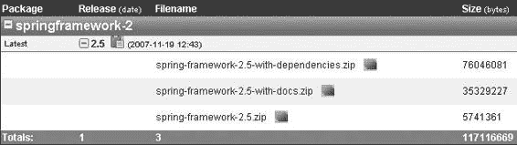

9799ch02.qxd 5/5/08 4:42 PM 第 27 页

第 2 章 **■** Spring 简介

**27**

**图 2-2.** *下载 Spring 发行版*

从图 2-2 可以看出，Spring 框架 2.5 版本有三个发行版可供下载。第一个包含整个 Spring 框架，包括 Spring 的 JAR 文件、依赖库、文档、完整源代码和示例应用程序。第二个仅包含 Spring 的 JAR 文件和文档。最后一个仅包含 Spring 的 JAR 文件。其中，我强烈建议你下载包含所有依赖项的发行版，即 spring-framework-2.5-with-dependencies.zip。尽管该发行版体积较大，但它包含了开发 Spring 应用程序所需的大部分库。

下载 Spring 发行版后，将其解压到你选择的目录中。在本书中，我假设你使用 Windows 平台进行开发，并将 Spring 安装到 c:\spring-framework-2.5。

**探索 Spring 的安装目录**

如果你已下载并安装了包含依赖项的 Spring 发行版，你的 Spring 安装目录应包含表 2-1 中列出的子目录。

**表 2-1.** *Spring 安装目录中的子目录*

**目录**

**包含内容**

aspectj

用于 AspectJ 的 Spring 切面的源代码和测试用例

dist

Spring 模块和织入支持的 JAR 文件，以及 DTD 和 XSD 等资源文件

docs

Spring 的 API javadoc、PDF 和 HTML 格式的参考文档，以及 Spring MVC 分步教程

lib

Spring 依赖库的 JAR 文件，按项目组织

mock

Spring 模拟对象和测试支持的源代码

samples

几个用于演示如何使用 Spring 的示例应用程序

src

Spring 框架大部分组件的源代码

test

用于测试 Spring 框架的测试用例

tiger

特定于 JDK 1.5 及更高版本的 Spring 源代码、测试用例和模拟对象

9799ch02.qxd 5/5/08 4:42 PM 第 28 页

**28**

第 2 章 **■** Spring 简介

**2-3\. 设置 Spring 项目**

问题

你想创建一个使用 Spring 框架的 Java 项目。首先，你需要对其进行设置。

解决方案

Spring 项目的设置包括设置类路径，并创建一个或多个 Bean 配置文件，以在 Spring IoC 容器中配置 Bean。之后，你可以使用此 Bean 配置文件实例化 Spring IoC 容器，并从中获取 Bean 实例。

工作原理

**设置类路径**

要启动 Spring 项目，你必须在类路径中包含将要使用的 Spring 模块及其依赖库的 JAR 文件。为方便起见，你可以包含包含所有标准 Spring 模块的单个 spring.jar 文件，尽管其体积较大（约 2.7 MB）。它位于 Spring 安装目录的 dist 目录中。或者，你也可以从 dist/modules 目录中选择将要使用的独立模块。

Spring 项目所需的另一个 JAR 文件是 commons-logging.jar，位于 lib/jakarta-commons 目录中。Spring 框架使用此库输出其日志消息，因此你必须将其包含在类路径中。Java 项目的类路径配置因 IDE 而异。

在本书中，除非特别说明，我始终将 spring.jar 和 commons-logging.jar 包含在项目的类路径中。

**创建 Bean 配置文件**

一个典型的 Spring 项目需要一个或多个 Bean 配置文件来在 Spring IoC 容器中配置 Bean。你可以将 Bean 配置文件放在类路径或文件系统路径中。为了在 IDE 中更方便地测试，我建议将其放在项目的类路径中。在本书中，除非特别说明，我假设你在类路径的根目录下创建名为 beans.xml 的 Bean 配置文件。

为了演示 Spring 项目的创建，让我们创建以下 HelloWorld 类，它通过 Setter 注入接受一个消息属性。在其 hello() 方法中，构造一条问候消息并打印到控制台。

package com.apress.springrecipes.hello;

public class HelloWorld {

private String message;

public void setMessage(String message) {

this.message = message;

}

9799ch02.qxd 5/5/08 4:42 PM 第 29 页

第 2 章 **■** Spring 简介

**29**

public void hello() {

System.out.println("Hello! " + message);

}

}

为了在 Spring IoC 容器中配置一个带有消息的 HelloWorld 类型的 Bean，你需要创建以下 Bean 配置文件。按照本书的惯例，我们在类路径的根目录下创建它，文件名为 beans.xml。

<beans

[xsi:schemaLocation="http://www.springframework.org/schema/beans](http://www.w3.org/2001/XMLSchema-instance)

[`www.springframework.org/schema/beans/spring-beans-2.5.xsd">`](http://www.w3.org/2001/XMLSchema-instance)

<bean id="helloWorld" class="com.apress.springrecipes.hello.HelloWorld">

<property name="message" value="How are you?" />

</bean>

</beans>

**从 Spring IoC 容器中使用 Bean**

你可以编写以下 Main 类，使用位于类路径根目录下的 Bean 配置文件 beans.xml 来实例化 Spring IoC 容器。然后，你可以从中获取 helloWorld Bean 以供使用。

package com.apress.springrecipes.hello;

import org.springframework.context.ApplicationContext;

import org.springframework.context.support.ClassPathXmlApplicationContext; public class Main {

public static void main(String[] args) {

ApplicationContext context =

new ClassPathXmlApplicationContext("beans.xml");

HelloWorld helloWorld = (HelloWorld) context.getBean("helloWorld"); helloWorld.hello();

}

}

如果一切正常，你应该会在控制台中看到以下输出，前面会有几行 Spring 的日志消息：

Hello! How are you?

9799ch02.qxd 5/5/08 4:42 PM 第 30 页

**30**

第 2 章 **■** Spring 简介

**2-4\. 安装 Spring IDE**

问题

你想安装一个能够辅助开发 Spring 应用程序的 IDE。

解决方案

如果你是 Eclipse 用户，可以安装 Spring 的官方 Eclipse 插件，称为 Spring IDE

[(http://springide.org/](http://springide.org))。IntelliJ IDEA 具有类似的 Spring 支持功能，但不如 Spring IDE 强大或更新及时。在本书中，我将只关注 Spring IDE。安装 Spring IDE 有三种方式：


• 在 Eclipse 的更新管理器中添加 Spring IDE 的[更新站点](http://springide.org/updatesite/)并在线安装。

• 下载 Spring IDE 的归档更新站点，并在 Eclipse 的更新管理器中将其作为本地站点安装。

• 下载 Spring IDE 的归档文件并将其解压到 Eclipse 的安装目录中。

在这些方法中，如果你的机器可以连接互联网，我强烈建议你从其更新站点安装 Spring IDE。如果无法做到，则应该从归档的本地站点安装。这些方法可以帮助你检查 Spring IDE 的所有依赖插件是否都已安装。

工作原理

从 Eclipse 的 **Help** 菜单中，选择 **Software Updates** **➤** **Find and Install**。Eclipse 会询问你是要更新当前已安装的功能，还是要安装新功能。对于首次安装 Spring IDE，请选择“**Search for new features to install**”。

接下来，你会看到一个现有更新站点的列表。如果这里没有 Spring IDE 的更新站点，请通过选择 **Add Remote Site** 来添加它，然后输入该站点的名称和 URL，如图 2-3 所示。

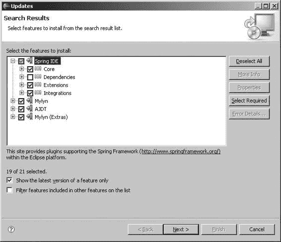

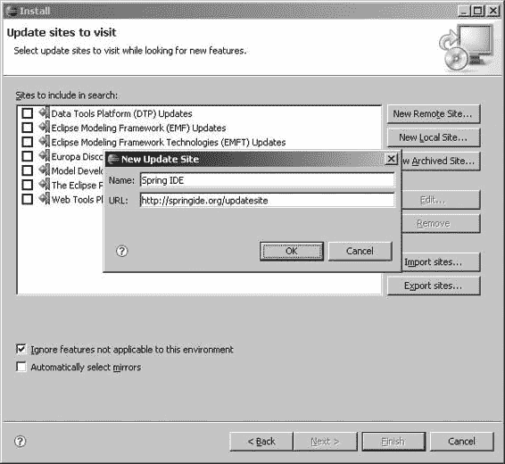

9799ch02.qxd 5/5/08 4:42 PM Page 31

第 2 章 **■** Spring 简介

**31**

**图 2-3.** *为 Spring IDE 添加更新站点*

选择用于更新的镜像站点后，你应该会看到 Spring IDE 的功能及其依赖项列表，如图 2-4 所示。

**图 2-4.** *选择要安装的 Spring IDE 功能*

9799ch02.qxd 5/5/08 4:42 PM Page 32

**32**

第 2 章 **■** Spring 简介

Spring IDE 2.0.2 集成了另外两个 Eclipse 插件：Eclipse Mylyn 和 AJDT（AspectJ 开发工具）。Mylyn 是一个以任务为中心的 UI，可以集成多个开发任务并减少信息过载。AJDT 是一个专注于 AspectJ 开发的 Eclipse 插件。Spring IDE 与 AJDT 集成以支持 Spring 2.0 AOP 开发。你可以选择安装 Spring IDE 与这些插件的集成功能。

请注意，如果你使用的是 Eclipse 3.3 或更高版本，则不应勾选 Spring IDE 功能下的 **Dependencies** 类别，该类别仅适用于 Eclipse 3.2。之后，你可以按照说明逐步轻松完成安装。

**2-5. 使用 Spring IDE 的 Bean 支持功能**

问题

你希望使用 Spring IDE 的 Bean 支持功能来帮助开发 Spring 应用程序。

解决方案

Spring IDE 提供了丰富的 Bean 支持功能，可以提高你开发 Spring 应用程序的效率。通过使用 Spring IDE，你可以在资源管理器模式和图形模式下查看你的 Bean。此外，Spring IDE 可以帮助你编写 Bean 配置文件的内容，并验证其正确性。

工作原理

**创建 Spring 项目**

要在已安装 Spring IDE 的 Eclipse 中创建 Spring 项目，请从 **File** 菜单中选择 **New** **➤** **Project**，然后从 **Spring** 类别中选择 **Spring Project**，如图 2-5 所示。

如果你希望将现有的 Java 项目转换为 Spring 项目，请选择你的项目，右键单击它，然后选择 **Spring Tools** **➤** **Add Spring Project Nature** 以启用此项目的 Spring IDE 支持。Spring 项目的图标右上角有一个小写的“S”。

**创建 Spring Bean 配置文件**

要创建 Bean 配置文件，请从 **File** 菜单中选择 **New** **➤** **Other**，然后从 **Spring** 类别中选择 **Spring Bean Definition**，如图 2-6 所示。

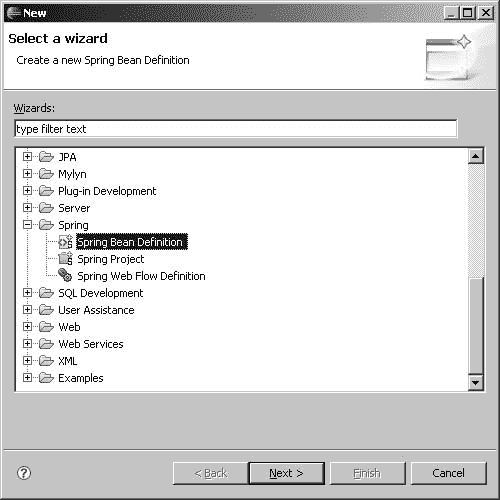

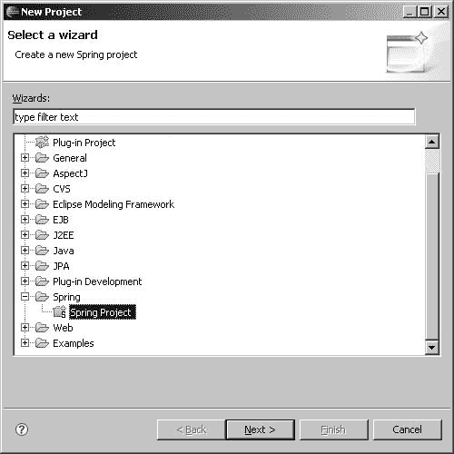

9799ch02.qxd 5/5/08 4:42 PM Page 33

第 2 章 **■** Spring 简介

**33**

**图 2-5.** *创建 Spring 项目*

**图 2-6.** *创建 Spring Bean 配置文件*

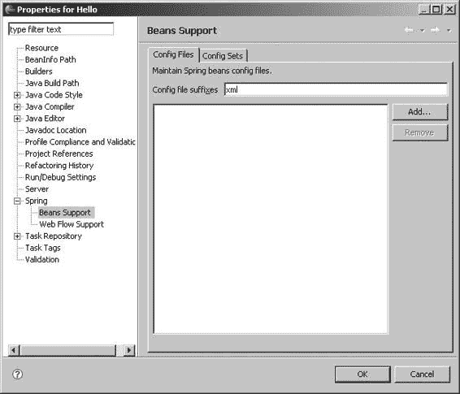

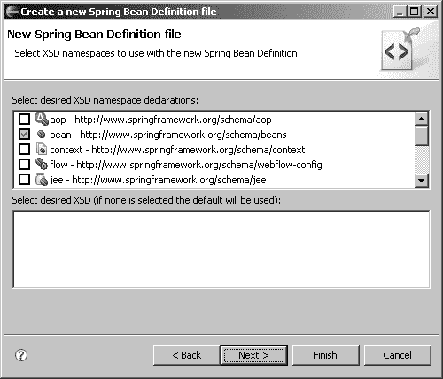

9799ch02.qxd 5/5/08 4:42 PM Page 34

**34**

第 2 章 **■** Spring 简介

选择此 Bean 配置文件的位置和名称后，系统会要求你选择要包含在此文件中的 XSD 命名空间，如图 2-7 所示。

**图 2-7.** *选择要包含在 Bean 配置文件中的 XSD 命名空间* 如果你希望将现有的 XML 文件指定为 Spring Bean 配置文件，可以右键单击你的项目并选择 **Properties**。从 **Spring** 类别下的 **Beans Support** 中，你可以添加你的 XML 文件，如图 2-8 所示。

**图 2-8.** *在 Spring 项目中指定 Bean 配置文件*

9799ch02.qxd 5/5/08 4:42 PM Page 35

第 2 章 **■** Spring 简介

**35**

**在 Spring Explorer 中查看 Spring Bean**

为了更好地说明 Spring IDE 的资源管理和图形功能，让我们创建以下 `Holiday` 类。为简单起见，我省略了此类的 getter 和 setter 方法。

你可以通过选择 **Source** **➤** **Generate Getters and Setters** 轻松生成它们。

```java
package com.apress.springrecipes.hello;

public class Holiday {

    private int month;
    private int day;
    private String greeting;

    // Getters and Setters
    ...
}
```

然后修改你的 `HelloWorld` 类，添加一个 `java.util.List` 类型的 `holidays` 属性及其 setter 方法。

```java
package com.apress.springrecipes.hello;

import java.util.List;

public class HelloWorld {

    ...
    private List<Holiday> holidays;
    public void setHolidays(List<Holiday> holidays) {
        this.holidays = holidays;
    }
}
```

在 Bean 配置文件中，你声明了一个 `christmas` 和一个 `newYear` Bean，其类型为 `Holiday`。然后你将 `helloWorld` Bean 的 `holidays` 属性设置为包含对这两个 Bean 的引用。

```xml
<beans ...>
    <bean id="helloWorld" class="com.apress.springrecipes.hello.HelloWorld">
        <property name="message" value="How are you?" />
        <property name="holidays">
            <list>
                <ref local="christmas" />
                <ref local="newYear" />
            </list>
        </property>
    </bean>

    <bean id="christmas" class="com.apress.springrecipes.hello.Holiday">
        <property name="month" value="12" />
        <property name="day" value="25" />
        <property name="greeting" value="Merry Christmas!" />
    </bean>

    <bean id="newYear" class="com.apress.springrecipes.hello.Holiday">
        <property name="month" value="1" />
        <property name="day" value="1" />
        <property name="greeting" value="Happy New Year!" />
    </bean>
</beans>
```

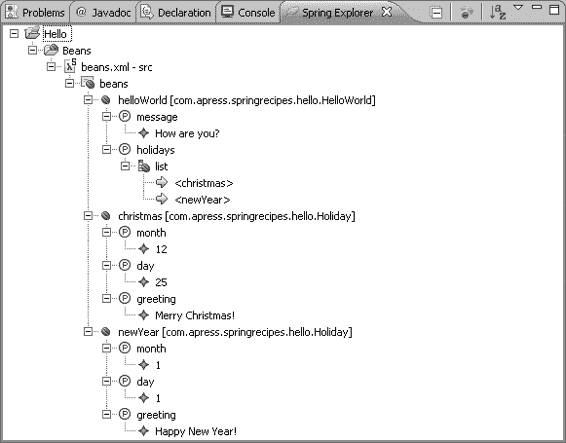

9799ch02.qxd 5/5/08 4:42 PM Page 36

**36**

第 2 章 **■** Spring 简介

要在 Spring Explorer 中查看你的 Bean，请右键单击你的 Bean 配置文件并选择 **Show In** **➤** **Spring Explorer**，然后你就可以浏览它们，如图 2-9 所示。

**图 2-9.** *在 Spring Explorer 中浏览 Spring Bean*

在 Spring Explorer 中，你可以双击一个元素，光标将跳转到 Bean 配置文件中对应的声明处。因此，你可以非常方便地开始编辑此元素。

**在 Spring Beans Graph 中查看 Spring Bean**

你可以右键单击 Spring Explorer 中的一个 Bean 元素（或其根元素），然后选择 **Open Graph** 以图形方式查看你的 Bean，如图 2-10 所示。

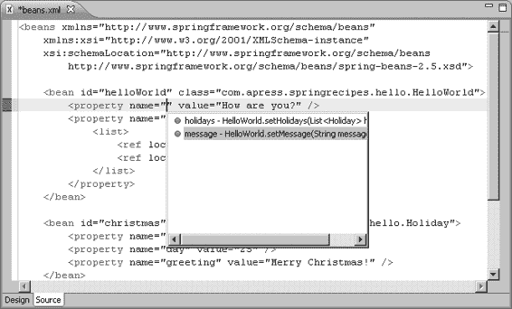

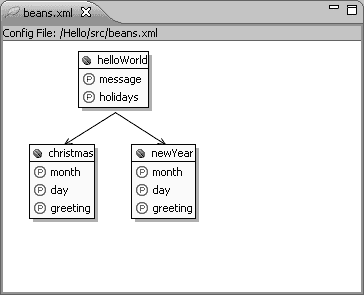

9799ch02.qxd 5/5/08 4:42 PM Page 37

第 2 章 **■** Spring 简介

**37**

**图 2-10.** *在 Spring Beans Graph 中查看 Spring Bean*

**在 Bean 配置文件中使用内容辅助**

Spring IDE 支持使用 Eclipse 的内容辅助功能来编辑类名、属性名和 Bean 名称引用。在 Eclipse 中激活内容辅助的默认快捷键是 **Ctrl+Space**。例如，你可以使用内容辅助来完成属性名，如图 2-11 所示。

**图 2-11.** *在 Bean 配置文件中使用内容辅助*

**验证 Bean 配置文件**


每次保存 bean 配置文件时，Spring IDE 都会自动根据 bean 类、属性名称、bean 名称引用等验证其正确性。如果文件中存在任何错误，Spring IDE 会高亮显示该错误，如图 2-12 所示。

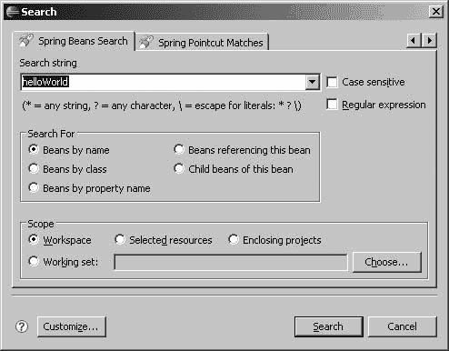

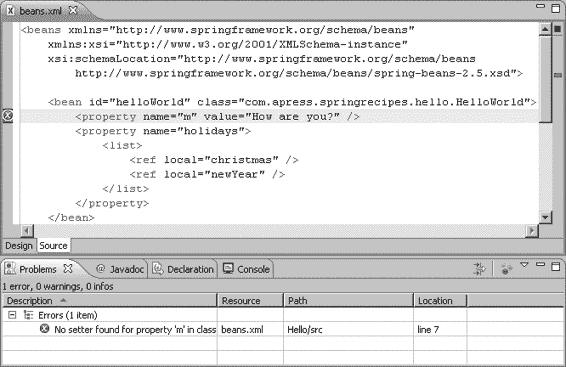

9799ch02.qxd 5/5/08 4:42 PM 第 38 页

**38**

第 2 章 **■** Spring 简介

**图 2-12.** *使用 Spring IDE 验证 bean 配置文件*

**搜索 Spring Bean**

Spring IDE 支持根据特定条件搜索 bean。从“搜索”菜单中选择“Beans”，然后即可搜索您的 bean，如图 2-13 所示。

**图 2-13.** *搜索 Spring Bean*

9799ch02.qxd 5/5/08 4:42 PM 第 39 页

第 2 章 **■** Spring 简介

**39**

**2-6. 小结**

在本章中，您学习了 Spring 框架的整体架构和主要功能，以及每个子项目的一般用途。Spring 框架的安装非常简单。您只需下载并将其解压到一个目录中。您了解了 Spring 安装目录中每个子目录内容的概览。您还创建了一个非常简单的 Spring 项目，演示了如何设置一个典型的 Spring 项目。

该项目还定义了一些本书将使用的项目约定。

Spring 团队创建了一个名为 Spring IDE 的 Eclipse 插件，以简化 Spring 应用程序的开发。在本章中，您安装了这个 IDE 并学习了如何使用其基本的 bean 支持功能。

在下一章中，您将学习 Spring IoC 容器中的基本 bean 配置。

9799ch02.qxd 5/5/08 4:42 PM 第 40 页

9799ch03.qxd 5/5/08 4:50 PM 第 41 页

第 3 章

Spring 中的 Bean 配置

**本**章中，您将学习 Spring IoC 容器中的基本组件配置。作为 Spring 框架的核心，IoC 容器被设计为高度自适应和可配置的。它提供了一套工具，使您的组件配置尽可能简单。因此，您可以轻松地配置您的组件以在 Spring IoC 容器中运行。

在 Spring 中，组件也被称为“bean”。请注意，这与 Sun 定义的 JavaBeans 规范概念不同。在 Spring IoC 容器中声明的 bean 不一定是 JavaBeans。它们可以是任何 POJO（Plain Old Java Objects，普通老式 Java 对象）。

术语 *POJO* 指的是没有任何特定要求（例如实现特定接口或扩展特定基类）的普通 Java 对象。该术语用于将轻量级 Java 组件与其他复杂组件模型（例如 3.0 版本之前的 EJB 组件）中的重量级组件区分开来。

完成本章后，您将能够使用 Spring IoC 容器构建一个完整的 Java 应用程序。此外，如果您回顾旧的 Java 应用程序，您可能会发现通过使用 Spring IoC 容器，可以显著地简化和改进它们。

**3-1. 在 Spring IoC 容器中配置 Bean**

问题

Spring 提供了一个强大的 IoC 容器来管理构成应用程序的 bean。

要利用容器服务，您必须配置您的 bean 以在 Spring IoC 容器中运行。

解决方案

您可以通过 XML 文件、属性文件甚至 API 在 Spring IoC 容器中配置您的 bean。本书将重点介绍基于 XML 的配置，因为它简单且成熟。如果您对其他方法感兴趣，可以查阅 Spring 文档以了解更多关于 bean 配置的信息。

Spring 允许您在一个或多个 bean 配置文件中配置您的 bean。对于简单的应用程序，您可以将所有 bean 集中在一个配置文件中。但对于包含大量 bean 的大型应用程序，您应该根据其功能将它们分离到多个配置文件中。

**41**


9799ch03.qxd 5/5/08 4:50 PM Page 42

**42**

第 3 章 **■** SPRING 中的 Bean 配置

工作原理

假设你要开发一个用于生成序列号的应用程序。在这个应用程序中，可能需要为不同目的生成多个序列号系列。每个序列号系列都有自己的前缀、后缀和初始值。因此，你需要在应用程序中创建并维护多个生成器实例。

**创建 Bean 类**

根据需求，你创建了 `SequenceGenerator` 类，该类包含三个属性：`prefix`、`suffix` 和 `initial`，这些属性可以通过 setter 方法或构造函数进行注入。私有字段 `counter` 用于存储该生成器的当前数值。每次在生成器实例上调用 `getSequence()` 方法时，你将获得最后一个序列号，并拼接上前缀和后缀。你将该方法声明为 `synchronized`，以确保线程安全。

package com.apress.springrecipes.sequence;

public class SequenceGenerator {

private String prefix;

private String suffix;

private int initial;

private int counter;

public SequenceGenerator() {}

public SequenceGenerator(String prefix, String suffix, int initial) {

this.prefix = prefix;

this.suffix = suffix;

this.initial = initial;

}

public void setPrefix(String prefix) {

this.prefix = prefix;

}

public void setSuffix(String suffix) {

this.suffix = suffix;

}

public void setInitial(int initial) {

this.initial = initial;

}

public synchronized String getSequence() {

StringBuffer buffer = new StringBuffer();

buffer.append(prefix);

buffer.append(initial + counter++);

9799ch03.qxd 5/5/08 4:50 PM Page 43

第 3 章 **■** SPRING 中的 Bean 配置

**43**

buffer.append(suffix);

return buffer.toString();

}

}

如你所见，这个 `SequenceGenerator` 类对 `prefix`、`suffix` 和 `initial` 属性同时应用了构造函数注入和 setter 注入。

**创建 Bean 配置文件**

要通过 XML 在 Spring IoC 容器中声明 Bean，首先需要创建一个名称合适的 XML Bean 配置文件，例如 `beans.xml`。你可以将该文件放在类路径的根目录下，以便在 IDE 中更轻松地进行测试。在该 XML 文件的开头，你可以指定 Spring 2.0 DTD，以导入 Spring 2.x 的 Bean 配置文件的有效结构。在此配置文件中，你可以在根元素 `<beans>` 下定义一个或多个 Bean。

<!DOCTYPE beans PUBLIC "-//SPRING//DTD BEAN 2.0//EN"

["http://www.springframework.org/dtd/spring-beans-2.0.dtd">](http://www.springframework.org/dtd/spring-beans-2.0.dtd)

<beans>

...

</beans>

Spring 的配置是向后兼容的，因此你可以在 Spring 2.x 中继续使用现有的 1.0 配置文件（使用 Spring 1.0 DTD）。但这样你将无法使用 Spring 2.x 中引入的新配置功能。旧配置文件的使用主要是为了过渡目的。

Spring 2.x 还支持使用 XSD 来定义 XML Bean 配置文件的有效结构。XSD 相比传统的 DTD 有许多优势。在 Spring 2.x 中，最显著的优势是它允许你使用来自不同模式的自定义标签，使 Bean 配置更简单、更清晰。因此，我强烈建议尽可能使用 Spring XSD 而不是 DTD。Spring XSD 是版本特定的，但向后兼容。如果你使用的是 Spring 2.5，则应定义 Spring 2.5 XSD 以利用新的 2.5 特性。

<beans

[xsi:schemaLocation="http://www.springframework.org/schema/beans](http://www.w3.org/2001/XMLSchema-instance)

[`www.springframework.org/schema/beans/spring-beans-2.5.xsd">`](http://www.w3.org/2001/XMLSchema-instance)

...

</beans>

**在 Bean 配置文件中声明 Bean**

每个 Bean 应为 Spring IoC 容器提供一个唯一的名称和完全限定的类名。


容器来实例化它。对于每个简单类型的 Bean 属性（例如 `String` 和其他基本类型），你可以为其指定一个 `<value>` 元素。Spring 会尝试将你的值转换为该属性的声明类型。要通过 Setter 注入配置属性，你需要使用 `<property>` 元素，并在其 `name` 属性中指定属性名称。

9799ch03.qxd 5/5/08 4:50 PM 第 44 页

**44**

第 3 章 **■** Spring 中的 Bean 配置

<bean name="sequenceGenerator"

class="com.apress.springrecipes.sequence.SequenceGenerator">

<property name="prefix">

<value>30</value>

</property>

<property name="suffix">

<value>A</value>

</property>

<property name="initial">

<value>100000</value>

</property>

</bean>

你也可以通过构造函数注入来配置 Bean 属性，方法是在 `<constructor-arg>` 元素中声明它们。`<constructor-arg>` 中没有 `name` 属性，因为构造函数参数是基于位置的。

<bean name="sequenceGenerator"

class="com.apress.springrecipes.sequence.SequenceGenerator">

<constructor-arg>

<value>30</value>

</constructor-arg>

<constructor-arg>

<value>A</value>

</constructor-arg>

<constructor-arg>

<value>100000</value>

</constructor-arg>

</bean>

在 Spring IoC 容器中，每个 Bean 的名称应该是唯一的，尽管允许重复名称以覆盖 Bean 声明。Bean 的名称可以通过 `<bean>` 元素的 `name` 属性来定义。实际上，有一种更推荐的标识 Bean 的方式，即通过标准的 XML `id` 属性，其目的是在 XML 文档中标识一个元素。这样，如果你的文本编辑器支持 XML，它可以在设计时帮助验证每个 Bean 的唯一性。

<bean **id**="sequenceGenerator"

class="com.apress.springrecipes.sequence.SequenceGenerator">

...

</bean>

然而，XML 对 `id` 属性中可出现的字符有限制，但通常你不会在 Bean 名称中使用那些特殊字符。此外，Spring 允许你在 `name` 属性中为 Bean 指定多个名称，用逗号分隔。但你不能在 `id` 属性中这样做，因为逗号在那里是不允许的。

事实上，Bean 的名称和 Bean ID 对于 Bean 来说都不是必需的。没有定义名称的 Bean 被称为*匿名 Bean*。

9799ch03.qxd 5/5/08 4:50 PM 第 45 页

第 3 章 **■** Spring 中的 Bean 配置

**45**

**通过快捷方式定义 Bean 属性**

Spring 支持一种快捷方式，用于指定简单类型属性的值。你可以在 `<property>` 元素中呈现一个 `value` 属性，而不是在其中包含一个 `<value>` 元素。

<bean id="sequenceGenerator"

class="com.apress.springrecipes.sequence.SequenceGenerator">

<property name="prefix" **value="30"** />

<property name="suffix" **value="A"** />

<property name="initial" **value="100000"** />

</bean>

这种快捷方式也适用于构造函数参数。

<bean name="sequenceGenerator"

class="com.apress.springrecipes.sequence.SequenceGenerator">

<constructor-arg **value="30"** />

<constructor-arg **value="A"** />

<constructor-arg **value="100000"** />

</bean>

Spring 2.x 提供了另一种便捷的快捷方式来定义属性，即使用 `p` 模式将 Bean 属性定义为 `<bean>` 元素的属性。这可以缩短 XML 配置的行数。

<beans

[](http://www.springframework.org/schema/p)

**[xsi:schemaLocation="http://www.springframework.org/schema/beans](http://www.springframework.org/schema/p)

[`www.springframework.org/schema/beans/spring-beans-2.5.xsd">`](http://www.springframework.org/schema/p)

<bean id="sequenceGenerator"

class="com.apress.springrecipes.sequence.SequenceGenerator"

**p:prefix="30" p:suffix="A" p:initial="100000"** />

</beans>

**3-2. 实例化 Spring IoC 容器**

问题

你必须实例化 Spring IoC 容器，以便它通过读取配置来创建 Bean 实例。然后你可以从 IoC 容器中获取 Bean 实例来使用。

解决方案


Spring 提供了两种类型的 IoC 容器实现。基础的一种称为 *bean 工厂*，更高级的一种称为 *应用上下文*，它是 bean 工厂的兼容扩展。请注意，这两种 IoC 容器的 bean 配置文件是相同的。

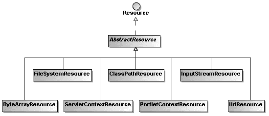

9799ch03.qxd 5/5/08 4:50 PM 第 46 页

**46**

第 3 章 **■** S P R I N G 中 的 B E A N 配 置

应用上下文在保持基本功能兼容的同时，提供了比 bean 工厂更高级的特性。因此，我强烈建议为每个应用程序使用应用上下文，除非该应用程序的资源受限，例如在 applet 或移动设备中运行时。

bean 工厂和应用上下文的接口分别是 BeanFactory 和 ApplicationContext。ApplicationContext 接口是 BeanFactory 的子接口，用于保持兼容性。

工作原理

**实例化 Bean 工厂**

要实例化 bean 工厂，首先需要将 bean 配置文件加载到 Resource 对象中。例如，以下语句从类路径的根目录加载配置文件：

Resource resource = new ClassPathResource("beans.xml");

Resource 只是一个接口，而 ClassPathResource 是其实现之一，用于从类路径加载资源。Resource 接口的其他实现，例如 FileSystemResource、InputStreamResource 和 UrlResource，用于从其他位置加载资源。图 3-1 展示了 Spring 中 Resource 接口的常见实现。

**图 3-1.** *Resource 接口的常见实现*

接下来，你可以使用以下语句，通过传入已加载配置文件的 Resource 对象来实例化 bean 工厂：

BeanFactory factory = new XmlBeanFactory(resource);

如前所述，BeanFactory 只是一个用于抽象 bean 工厂操作的接口，而 XmlBeanFactory 是从 XML 配置文件构建 bean 工厂的实现。

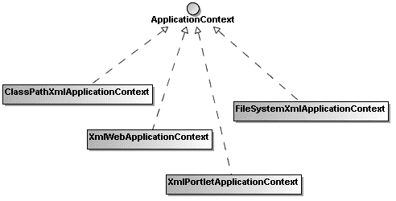

9799ch03.qxd 5/5/08 4:50 PM 第 47 页

第 3 章 **■** S P R I N G 中 的 B E A N 配 置

**47**

**实例化应用上下文**

与 BeanFactory 类似，ApplicationContext 也只是一个接口。你需要实例化它的一个实现。ClassPathXmlApplicationContext 实现通过从类路径加载 XML 配置文件来构建应用上下文。你也可以为其指定多个配置文件。

ApplicationContext context = new ClassPathXmlApplicationContext("beans.xml"); 除了 ClassPathXmlApplicationContext，Spring 还提供了其他几个 ApplicationContext 实现。FileSystemXmlApplicationContext 用于从文件系统加载 XML 配置文件，而 XmlWebApplicationContext 和 XmlPortletApplicationContext 仅可用于 Web 和门户应用程序。图 3-2 展示了 Spring 中 ApplicationContext 接口的常见实现。

**图 3-2.** *ApplicationContext 接口的常见实现* **从 IoC 容器获取 Bean**

要从 bean 工厂或应用上下文中获取已声明的 bean，只需调用 getBean() 方法并传入唯一的 bean 名称即可。getBean() 方法的返回类型是 java.lang.Object，因此在使用前必须将其强制转换为实际类型。

SequenceGenerator generator =

(SequenceGenerator) context.getBean("sequenceGenerator");

至此，你可以像使用通过构造函数创建的任何对象一样自由地使用该 bean。以下 Main 类给出了运行序列生成器应用程序的完整源代码：

package com.apress.springrecipes.sequence;

import org.springframework.context.ApplicationContext;

import org.springframework.context.support.ClassPathXmlApplicationContext;

9799ch03.qxd 5/5/08 4:50 PM 第 48 页

**48**


第 3 章 **■** Spring 中的 Bean 配置

public class Main {

public static void main(String[] args) {

ApplicationContext context =

new ClassPathXmlApplicationContext("beans.xml");

SequenceGenerator generator =

(SequenceGenerator) context.getBean("sequenceGenerator");

System.out.println(generator.getSequence());

System.out.println(generator.getSequence());

}

}

如果一切正常，你应该会看到以下序列号输出，以及一些你可能不感兴趣的日志信息：

30100000A

30100001A

**3-3. 解决构造器歧义**

问题

当你为一个 Bean 指定一个或多个构造器参数时，Spring 会尝试在 Bean 类中找到一个合适的构造器，并传入你的参数来实例化 Bean。然而，如果你的参数可以应用于多个构造器，就可能导致构造器匹配上的歧义。在这种情况下，Spring 可能无法调用你期望的构造器。

解决方案

你可以为`<constructor-arg>`元素指定`type`和`index`属性，以帮助 Spring 找到你期望的构造器。

工作原理

现在，让我们为`SequenceGenerator`类添加一个新的构造器，该构造器以`prefix`和`suffix`作为参数。

package com.apress.springrecipes.sequence;

public class SequenceGenerator {

...

public SequenceGenerator(String prefix, String suffix) {

this.prefix = prefix;

this.suffix = suffix;

9799ch03.qxd 5/5/08 4:50 PM Page 49

第 3 章 **■** Spring 中的 Bean 配置

**49**

}

}

在其 Bean 声明中，你可以通过`<constructor-arg>`元素指定一个或多个构造器参数。Spring 会尝试为该类找到一个合适的构造器，并传入你的参数来实例化 Bean。回想一下，`<constructor-arg>`中没有`name`属性，因为构造器参数是基于位置的。

<bean id="sequenceGenerator"

class="com.apress.springrecipes.sequence.SequenceGenerator">

<constructor-arg value="30" />

<constructor-arg value="A" />

<property name="initial" value="100000" />

</bean>

对于这两个参数，Spring 很容易找到对应的构造器，因为只有一个构造器需要两个参数。假设你必须为`SequenceGenerator`添加另一个以`prefix`和`initial`为参数的构造器。

package com.apress.springrecipes.sequence;

public class SequenceGenerator {

...

public SequenceGenerator(String prefix, String suffix) {

this.prefix = prefix;

this.suffix = suffix;

}

**public SequenceGenerator(String prefix, int initial) {**

**this.prefix = prefix;**

**this.initial = initial;**

**}**

}

为了调用这个构造器，你进行以下 Bean 声明，传入一个`prefix`和一个`initial`值。剩余的`suffix`通过 setter 方法注入。

<bean id="sequenceGenerator"

class="com.apress.springrecipes.sequence.SequenceGenerator">

**<constructor-arg value="30" />**

**<constructor-arg value="100000" />**

<property name="suffix" value="A" />

</bean>

然而，如果你现在运行应用程序，你将得到以下结果：300A

301A

9799ch03.qxd 5/5/08 4:50 PM Page 50

**50**

第 3 章 **■** Spring 中的 Bean 配置

这个意外结果的原因是，第一个以`prefix`和`suffix`为参数的构造器被调用了，而不是第二个。这是因为 Spring 默认将你的两个参数都解析为`String`类型，并认为第一个构造器最合适，因为不需要进行类型转换。要指定参数的预期类型，你必须在`<constructor-arg>`的`type`属性中进行设置。

<bean id="sequenceGenerator"

class="com.apress.springrecipes.sequence.SequenceGenerator">

<constructor-arg **type="java.lang.String"** value="30" />

<constructor-arg **type="int"** value="100000" />

<property name="suffix" value="A" />

</bean>

现在，为`SequenceGenerator`再添加一个以`initial`和`suffix`为参数的构造器，并相应地修改你的 Bean 声明。

package com.apress.springrecipes.sequence;


public class SequenceGenerator {

...

public SequenceGenerator(String prefix, String suffix) {

this.prefix = prefix;

this.suffix = suffix;

}

public SequenceGenerator(String prefix, int initial) {

this.prefix = prefix;

this.initial = initial;

}

**public SequenceGenerator(int initial, String suffix) {**

**this.initial = initial;**

**this.suffix = suffix;**

**}**

}

<bean id="sequenceGenerator"

class="com.apress.springrecipes.sequence.SequenceGenerator">

**<constructor-arg type="int" value="100000" />**

**<constructor-arg type="java.lang.String" value="A" />**

<property name="prefix" value="30" />

</bean>

如果再次运行应用程序，你可能会得到正确的结果，或者出现以下意外结果：

30100000null

30100001null

9799ch03.qxd 5/5/08 4:50 PM Page 51

第 3 章 **■** Spring 中的 Bean 配置

**51**

这种不确定性的原因是，Spring 会在内部为每个构造函数与你的参数进行兼容性评分。但在评分过程中，参数在 XML 中出现的顺序并不被考虑。这意味着，从 Spring 的角度来看，第二个和第三个构造函数将获得相同的评分。具体选择哪一个取决于哪个先被匹配到。根据 Java 反射 API，更准确地说是 `Class.getDeclaredConstructors()` 方法，返回的构造函数顺序是任意的，可能与声明顺序不同。所有这些因素共同作用，导致了构造函数匹配的歧义性。

要避免这个问题，你必须通过 `<constructor-arg>` 的 `index` 属性显式指定参数的索引。同时设置了 `type` 和 `index` 属性后，Spring 就能准确地为 Bean 找到期望的构造函数。

<bean id="sequenceGenerator"

class="com.apress.springrecipes.sequence.SequenceGenerator">

<constructor-arg type="int" **index="0"** value="100000" />

<constructor-arg type="java.lang.String" **index="1"** value="A" />

<property name="prefix" value="30" />

</bean>

然而，如果你非常确定你的构造函数不会引起歧义，则可以省略 `type` 和 `index` 属性。

**3-4. 指定 Bean 引用**

问题

构成应用程序的 Bean 通常需要相互协作才能完成应用的功能。为了让 Bean 能够互相访问，你必须在 Bean 配置文件中指定 Bean 引用。

解决方案

在 Bean 配置文件中，你可以通过 `<ref>` 元素为 Bean 属性或构造函数参数指定 Bean 引用。这就像通过 `<value>` 元素指定一个简单值一样简单。你也可以直接在属性或构造函数参数中内嵌一个 Bean 声明，作为内部 Bean。

工作原理

为序列生成器接受一个字符串值作为前缀，这种方式不够灵活，难以适应未来的需求。如果前缀的生成能够通过某种编程逻辑进行定制，那就更好了。你可以创建 `PrefixGenerator` 接口来定义前缀生成操作。

package com.apress.springrecipes.sequence;

public interface PrefixGenerator {

public String getPrefix();

}

9799ch03.qxd 5/5/08 4:50 PM Page 52

**52**

第 3 章 **■** Spring 中的 Bean 配置

一种前缀生成策略是使用特定的模式来格式化当前系统日期。让我们创建实现 `PrefixGenerator` 接口的 `DatePrefixGenerator` 类。

package com.apress.springrecipes.sequence;

...

public class DatePrefixGenerator implements PrefixGenerator {

private DateFormat formatter;

public void setPattern(String pattern) {

this.formatter = new SimpleDateFormat(pattern);

}

public String getPrefix() {

return formatter.format(new Date());

}

}

该生成器的模式将通过 setter 方法 `setPattern()` 注入，然后用于创建 `java.text.DateFormat` 对象来格式化日期。由于一旦 `DateFormat` 对象创建完成，模式字符串就不再使用，因此没有必要将其存储在私有字段中。


现在，你可以声明一个类型为 `DatePrefixGenerator` 的 Bean，并为其指定任意的日期格式化模式字符串。

<bean id="datePrefixGenerator"

class="com.apress.springrecipes.sequence.DatePrefixGenerator">

<property name="pattern" value="yyyyMMdd" />

</bean>

**为 Setter 方法指定 Bean 引用**

为了应用这种前缀生成器方法，`SequenceGenerator` 类应接受一个 `PrefixGenerator` 类型的对象，而不是一个简单的前缀字符串。你可以选择使用 Setter 注入来接受这个前缀生成器。你需要删除 `prefix` 属性及其会导致编译错误的 Setter 方法和构造函数。

package com.apress.springrecipes.sequence;

public class SequenceGenerator {

...

**private PrefixGenerator prefixGenerator;**

**public void setPrefixGenerator(PrefixGenerator prefixGenerator) {**

**this.prefixGenerator = prefixGenerator;**

**}**

public synchronized String getSequence() {

StringBuffer buffer = new StringBuffer();

9799ch03.qxd 5/5/08 4:50 PM Page 53

第 3 章 **■** Spring 中的 Bean 配置

**53**

**buffer.append(prefixGenerator.getPrefix());**

buffer.append(initial + counter++);

buffer.append(suffix);

return buffer.toString();

}

}

然后，`SequenceGenerator` Bean 可以通过在内部包含一个 `<ref>` 元素，来引用 `datePrefixGenerator` Bean 作为其 `prefixGenerator` 属性。

<bean id="sequenceGenerator"

class="com.apress.springrecipes.sequence.SequenceGenerator">

<property name="initial" value="100000" />

<property name="suffix" value="A" />

**<property name="prefixGenerator">**

**<ref bean="datePrefixGenerator" />**

**</property>**

</bean>

`<ref>` 元素的 `bean` 属性中的 Bean 名称可以引用 IoC 容器中的任何 Bean，即使它没有定义在同一个 XML 配置文件中。如果你要引用同一个 XML 文件中的 Bean，则应使用 `local` 属性，因为它是一个 XML ID 引用。

你的 XML 编辑器可以帮助验证具有该 ID 的 Bean 是否存在于同一个 XML 文件中（即引用完整性）。

<bean id="sequenceGenerator"

class="com.apress.springrecipes.sequence.SequenceGenerator">

...

<property name="prefixGenerator">

<ref **local**="datePrefixGenerator" />

</property>

</bean>

还有一种便捷的简写方式，可以在 `<property>` 元素的 `ref` 属性中指定 Bean 引用。

<bean id="sequenceGenerator"

class="com.apress.springrecipes.sequence.SequenceGenerator">

...

**<property name="prefixGenerator" ref="datePrefixGenerator" />**

</bean>

但通过这种方式，你的 XML 编辑器将无法验证引用的完整性。实际上，它的效果与指定 `<ref>` 元素的 `bean` 属性相同。

Spring 2.x 提供了另一种便捷的简写方式来指定 Bean 引用。即使用 `p` 模式将 Bean 引用指定为 `<bean>` 元素的属性。这可以缩短 XML 配置的行数。

<beans

[](http://www.springframework.org/schema/p)

**9799ch03.qxd 5/5/08 4:50 PM Page 54

**54**

第 3 章 **■** Spring 中的 Bean 配置

xsi:schemaLocation="http://www.springframework.org/schema/beans

http://www.springframework.org/schema/beans/spring-beans-2.5.xsd">

<bean id="sequenceGenerator"

class="com.apress.springrecipes.sequence.SequenceGenerator"

p:suffix="A" p:initial="1000000"

**p:prefixGenerator-ref="datePrefixGenerator"** />

</beans>

为了区分 Bean 引用和简单的属性值，你需要在属性名后添加 `-ref` 后缀。

**为构造函数参数指定 Bean 引用**

Bean 引用也可以应用于构造函数注入。例如，你可以添加一个接受 `PrefixGenerator` 对象作为参数的构造函数。

package com.apress.springrecipes.sequence;

public class SequenceGenerator {

...

**private PrefixGenerator prefixGenerator;**

**public SequenceGenerator(PrefixGenerator prefixGenerator) {**

**this.prefixGenerator = prefixGenerator;**

**}**

}

在 `<constructor-arg>` 元素中，你可以像在 `<property>` 元素中一样，通过 `<ref>` 来包含一个 Bean 引用。

<bean id="sequenceGenerator"

class="com.apress.springrecipes.sequence.SequenceGenerator">

**<constructor-arg>**

**<ref local="datePrefixGenerator" />**

**</constructor-arg>**

<property name="initial" value="100000" />

<property name="suffix" value="A" />

</bean>

指定 Bean 引用的简写方式同样适用于 `<constructor-arg>`。

<bean id="sequenceGenerator"

class="com.apress.springrecipes.sequence.SequenceGenerator">

**<constructor-arg ref="datePrefixGenerator" />**

...

</bean>

9799ch03.qxd 5/5/08 4:50 PM Page 55

第 3 章 **■** Spring 中的 Bean 配置

**55**

**声明内部 Bean**

每当一个 Bean 实例仅用于某个特定属性时，可以将其声明为内部 Bean。内部 Bean 声明直接包含在 `<property>` 或 `<constructor-arg>` 元素内，不设置任何 `id` 或 `name` 属性。这样，该 Bean 将是匿名的，因此你不能在其他任何地方使用它。实际上，即使你为内部 Bean 定义了 `id` 或 `name` 属性，它也会被忽略。

<bean id="sequenceGenerator"

class="com.apress.springrecipes.sequence.SequenceGenerator">

<property name="initial" value="100000" />

<property name="suffix" value="A" />

**<property name="prefixGenerator">**

**<bean class="com.apress.springrecipes.sequence.DatePrefixGenerator">**

**<property name="pattern" value="yyyyMMdd" />**

**</bean>**

**</property>**

</bean>

内部 Bean 也可以在构造函数参数中声明。

<bean id="sequenceGenerator"

class="com.apress.springrecipes.sequence.SequenceGenerator">

**<constructor-arg>**

**<bean class="com.apress.springrecipes.sequence.DatePrefixGenerator">**

**<property name="pattern" value="yyyyMMdd" />**

**</bean>**

**</constructor-arg>**

<property name="initial" value="100000" />

<property name="suffix" value="A" />

</bean>

**3-5. 使用依赖检查检查属性**

问题

在生产规模的应用中，IoC 容器中可能声明了成百上千个 Bean，它们之间的依赖关系通常非常复杂。Setter 注入的缺点之一是，你无法确保某个属性一定会被注入。要检查所有必需的属性是否都已设置，对你来说非常困难。

解决方案

Spring 的依赖检查功能可以帮助你检查 Bean 上是否已设置了所有特定类型的属性。你只需在 `<bean>` 的 `dependency-check` 属性中指定依赖检查模式即可。请注意，依赖检查功能只能检查属性是否已被设置，但不能检查其值是否不为 null。表 3-1 列出了 Spring 支持的所有依赖检查模式。

9799ch03.qxd 5/5/08 4:50 PM Page 56

**56**

第 3 章 **■** Spring 中的 Bean 配置

**表 3-1.** *Spring 支持的依赖检查模式*

**模式**

**描述**

none*

不执行任何依赖检查。任何属性都可以保持未设置状态。

simple

如果任何简单类型（基本类型和集合类型）的属性未被设置，将抛出 `UnsatisfiedDependencyException`。

objects

如果任何对象类型（非简单类型）的属性未被设置，将抛出 `UnsatisfiedDependencyException`。

all

如果任何类型的属性未被设置，将抛出 `UnsatisfiedDependencyException`。

** 默认模式为* none *，但可以通过设置 `<beans>` 根元素的 `default-dependency-check` 属性来更改。如果指定了 Bean 自身的模式，此默认模式将被覆盖。设置此属性时必须非常小心，因为它会更改 IoC 容器中所有 Bean 的默认依赖检查模式。*

工作原理

**检查简单类型的属性**


假设没有为序列生成器设置后缀属性，那么生成器生成的序列号后缀将是空字符串。这类问题通常很难调试，尤其是在复杂的 bean 中。幸运的是，Spring 能够检查特定类型的所有属性是否都已设置。要让 Spring 检查简单类型（即基本类型和集合类型）的属性，请将 `<bean>` 的 `dependency-check` 属性设置为 `simple`。

<bean id="sequenceGenerator"

class="com.apress.springrecipes.sequence.SequenceGenerator"

**dependency-check="simple"** >

<property name="initial" value="100000" />

<property name="prefixGenerator" ref="datePrefixGenerator" />

</bean>

如果此类类型的任何属性尚未设置，则会抛出 `UnsatisfiedDependencyException` 异常，指示未设置的属性。

Exception in thread "main"

org.springframework.beans.factory.UnsatisfiedDependencyException: Error creating bean with name 'sequenceGenerator' defined in class path resource [beans.xml]: Unsatisfied dependency expressed through bean property 'suffix': Set this property value or disable dependency checking for this bean.

9799ch03.qxd 5/5/08 4:50 PM Page 57

第 3 章 **■** SPRING 中的 BEAN 配置

**57**

**检查对象类型的属性**

如果未设置前缀生成器，则在请求生成前缀时会抛出讨厌的 `NullPointerException`。要为对象类型（即非简单类型）的 bean 属性启用依赖检查，请将 `dependency-check` 属性更改为 `objects`。

<bean id="sequenceGenerator"

class="com.apress.springrecipes.sequence.SequenceGenerator"

**dependency-check="objects"** >

<property name="initial" value="100000" />

<property name="suffix" value="A" />

</bean>

然后，当你运行应用程序时，Spring 会通知你 `prefixGenerator` 属性尚未设置。

Exception in thread "main"

org.springframework.beans.factory.UnsatisfiedDependencyException: Error creating bean with name 'sequenceGenerator' defined in class path resource [beans.xml]: Unsatisfied dependency expressed through bean property 'prefixGenerator': Set this property value or disable dependency checking for this bean.

**检查所有类型的属性**

如果你想检查所有 bean 属性，无论其类型如何，可以将 `dependency-check` 属性更改为 `all`。

<bean id="sequenceGenerator"

class="com.apress.springrecipes.sequence.SequenceGenerator"

**dependency-check="all"** >

<property name="initial" value="100000" />

</bean>

**依赖检查与构造器注入**

Spring 的依赖检查功能只会检查属性是否已通过 setter 方法注入。因此，即使你已经通过构造器注入了前缀生成器，仍然会抛出 `UnsatisfiedDependencyException` 异常。

<bean id="sequenceGenerator"

class="com.apress.springrecipes.sequence.SequenceGenerator"

**dependency-check="all"** >

**<constructor-arg ref="datePrefixGenerator" />**

<property name="initial" value="100000" />

<property name="suffix" value="A" />

</bean>

9799ch03.qxd 5/5/08 4:50 PM Page 58

**58**

第 3 章 **■** SPRING 中的 BEAN 配置

**3-6. 使用 @Required 注解检查属性**

问题

Spring 的依赖检查功能只能检查特定类型的所有属性。它不够灵活，无法仅检查特定的属性。在大多数情况下，你希望检查某些特定属性是否已设置，而不是特定类型的所有属性。

解决方案

`RequiredAnnotationBeanPostProcessor` 是一个 Spring bean 后处理器，它检查所有带有 `@Required` 注解的 bean 属性是否已设置。*Bean 后处理器*是一种特殊的 Spring bean，它能够在每个 bean 初始化之前对其执行额外的任务。要启用此 bean 后处理器进行属性检查，你必须在 Spring IoC 容器中注册它。请注意，此处理器只能检查属性是否已设置，但不能检查其值是否不为 null。

工作原理

假设序列生成器需要 `prefixGenerator` 和 `suffix` 这两个属性。你可以在它们的 setter 方法上使用 `@Required` 注解。

package com.apress.springrecipes.sequence;

import org.springframework.beans.factory.annotation.Required;

public class SequenceGenerator {

private PrefixGenerator prefixGenerator;

private String suffix;

...

**@Required**

public void setPrefixGenerator(PrefixGenerator prefixGenerator) {

this.prefixGenerator = prefixGenerator;

}

**@Required**

public void setSuffix(String suffix) {

this.suffix = suffix;

}

...

}

要让 Spring 检查这些属性是否已在所有序列生成器实例上设置，你必须在 IoC 容器中注册一个 `RequiredAnnotationBeanPostProcessor` 实例。如果你使用的是 bean 工厂，则必须通过 API 注册此 bean 后处理器。否则，你可以在应用程序上下文中直接声明此 bean 后处理器的一个实例。

9799ch03.qxd 5/5/08 4:50 PM Page 59

第 3 章 **■** SPRING 中的 BEAN 配置

**59**

<bean class="org.springframework.beans.factory.annotation. **➥**

RequiredAnnotationBeanPostProcessor" />

如果你使用的是 Spring 2.5，你可以简单地在 bean 配置文件中包含 `<context:annotation-config>` 元素，这样 `RequiredAnnotationBeanPostProcessor` 实例就会自动注册。

<beans

[](http://www.springframework.org/schema/context)

**[xsi:schemaLocation="http://www.springframework.org/schema/beans](http://www.springframework.org/schema/context)

[`www.springframework.org/schema/beans/spring-beans-2.5.xsd`](http://www.springframework.org/schema/context)

[**http://www.springframework.org/schema/context**](http://www.springframework.org/schema/context)

[**http://www.springframework.org/schema/context/spring-context-2.5.xsd">**](http://www.springframework.org/schema/context)

**<context:annotation-config />**

...

</beans>

如果任何带有 `@Required` 注解的属性尚未设置，此 bean 后处理器将抛出 `BeanInitializationException` 异常。

Exception in thread "main" org.springframework.beans.factory.BeanCreationException: Error creating bean with name 'sequenceGenerator' defined in class path resource

[beans.xml]: Initialization of bean failed; nested exception is

org.springframework.beans.factory.BeanInitializationException: Property

'prefixGenerator' is required for bean 'sequenceGenerator'

除了 `@Required` 注解之外，`RequiredAnnotationBeanPostProcessor` 还可以检查带有你自定义注解的属性。例如，你可以创建以下注解类型：

package com.apress.springrecipes.sequence;

...

@Retention(RetentionPolicy.RUNTIME)

@Target(ElementType.METHOD)

public @interface Mandatory {

}

然后，你可以将此注解应用于所需属性的 setter 方法。

package com.apress.springrecipes.sequence;

public class SequenceGenerator {

private PrefixGenerator prefixGenerator;

private String suffix;

...

**@Mandatory**

9799ch03.qxd 5/5/08 4:50 PM Page 60

**60**

第 3 章 **■** SPRING 中的 BEAN 配置

public void setPrefixGenerator(PrefixGenerator prefixGenerator) {

this.prefixGenerator = prefixGenerator;

}

**@Mandatory**

public void setSuffix(String suffix) {

this.suffix = suffix;

}

...

}

要检查带有此注解类型的属性，你必须在 `RequiredAnnotationBeanPostProcessor` 的 `requiredAnnotationType` 属性中指定它。

<bean class="org.springframework.beans.factory.annotation. **➥**


RequiredAnnotationBeanPostProcessor">

<property name="requiredAnnotationType">

<value>com.apress.springrecipes.sequence.Mandatory</value>

</property>

</bean>

**3-7. 使用 XML 配置自动装配 Bean**

问题

当一个 Bean 需要访问另一个 Bean 时，你可以通过显式指定引用来进行装配。然而，如果你的容器能够自动装配 Bean，则可以省去手动配置装配的麻烦。

解决方案

Spring IoC 容器可以帮助你自动装配 Bean。你只需在 `<bean>` 的 `autowire` 属性中指定自动装配模式即可。表 3-2 列出了 Spring 支持的自动装配模式。

**表 3-2.** *Spring 支持的自动装配模式*

**模式**

**描述**

no*

不执行任何自动装配。你必须显式地装配依赖关系。

byName

对于每个 Bean 属性，装配一个名称与该属性名称相同的 Bean。

byType

对于每个 Bean 属性，装配一个类型与该属性类型兼容的 Bean。如果找到多个 Bean，则会抛出 `UnsatisfiedDependencyException`。

constructor

对于每个构造函数的每个参数，首先查找一个类型与该参数类型兼容的 Bean。然后选择匹配参数最多的构造函数。如果存在任何歧义，则会抛出 `UnsatisfiedDependencyException`。

9799ch03.qxd 5/5/08 4:50 PM Page 61

第 3 章 **■** Spring 中的 Bean 配置

**61**

**模式**

**描述**

autodetect

如果找到无参的默认构造函数，则依赖关系将按类型自动装配。否则，将按构造函数自动装配。

** 默认模式为* no *，但可以通过设置 `<beans>` 根元素的 `default-autowire` 属性来更改。如果指定了 Bean 自身的模式，则会覆盖此默认模式。*

尽管自动装配功能非常强大，但其代价是会降低 Bean 配置的可读性。由于自动装配是在运行时由 Spring 执行的，你无法从 Bean 配置文件中推导出 Bean 是如何装配的。在实践中，我建议仅在组件依赖关系不复杂的应用程序中应用自动装配。

工作原理

**按类型自动装配**

你可以将 `sequenceGenerator` Bean 的 `autowire` 属性设置为 `byType`，并保持 `prefixGenerator` 属性未设置。然后 Spring 将尝试装配一个类型与 `PrefixGenerator` 兼容的 Bean。在这种情况下，`datePrefixGenerator` Bean 将被自动装配。

<beans ...>

<bean id="sequenceGenerator"

class="com.apress.springrecipes.sequence.SequenceGenerator"

**autowire="byType"** >

<property name="initial" value="100000" />

<property name="suffix" value="A" />

</bean>

<bean id="datePrefixGenerator"

class="com.apress.springrecipes.sequence. **DatePrefixGenerator**">

<property name="pattern" value="yyyyMMdd" />

</bean>

</beans>

按类型自动装配的主要问题是，有时 IoC 容器中会有多个与目标类型兼容的 Bean。在这种情况下，Spring 将无法决定哪个 Bean 最适合该属性，因此无法执行自动装配。例如，如果你有另一个生成当前年份作为前缀的前缀生成器，按类型自动装配将立即失效。

<beans ...>

<bean id="sequenceGenerator"

class="com.apress.springrecipes.sequence.SequenceGenerator"

**autowire="byType"** >

<property name="initial" value="100000" />

<property name="suffix" value="A" />

</bean>

9799ch03.qxd 5/5/08 4:50 PM Page 62

**62**

第 3 章 **■** Spring 中的 Bean 配置

<bean id="datePrefixGenerator"

class="com.apress.springrecipes.sequence.DatePrefixGenerator">

<property name="pattern" value="yyyyMMdd" />

</bean>

<bean id="yearPrefixGenerator"

class="com.apress.springrecipes.sequence.DatePrefixGenerator">

<property name="pattern" value="yyyy" />

</bean>

</beans>

如果找到多个 Bean 用于自动装配，Spring 将抛出 `UnsatisfiedDependencyException`。

Exception in thread "main"


org.springframework.beans.factory.UnsatisfiedDependencyException: 创建在类路径资源 [beans.xml] 中定义的名为 'sequenceGenerator' 的 bean 时出错：通过 bean 属性 'prefixGenerator' 表达的依赖关系未满足：未定义类型为 [com.apress.springrecipes.sequence.PrefixGenerator] 的唯一 bean：期望单个匹配的 bean，但找到了 2 个：[datePrefixGenerator,

yearPrefixGenerator]

**按名称自动装配**

另一种自动装配模式是按名称（byName），它有时可以解决按类型自动装配的问题。其工作方式与按类型（byType）非常相似，但在这种情况下，Spring 会尝试装配一个名称相同的 bean，而不是类型兼容的 bean。由于 bean 名称在容器内是唯一的，按名称自动装配不会引起歧义。

<beans ...>

<bean id="sequenceGenerator"

class="com.apress.springrecipes.sequence.SequenceGenerator"

**autowire="byName"** >

<property name="initial" value="100000" />

<property name="suffix" value="A" />

</bean>

<bean id=" **prefixGenerator**"

class="com.apress.springrecipes.sequence.DatePrefixGenerator">

<property name="pattern" value="yyyyMMdd" />

</bean>

</beans>

然而，按名称自动装配并非在所有情况下都有效。有时你无法使目标 bean 的名称与你的属性名称相同。在实践中，你通常需要明确指定有歧义的依赖关系，同时保持其他依赖关系自动装配。这意味着你采用了显式装配和自动装配的混合方式。

9799ch03.qxd 5/5/08 4:50 PM Page 63

第 3 章 **■** Spring 中的 Bean 配置

**63**

**按构造器自动装配**

构造器（constructor）自动装配模式的工作方式类似于按类型（byType），但它更为复杂。对于一个具有单个构造器的 bean，Spring 会尝试为每个构造器参数装配一个类型兼容的 bean。但对于具有多个构造器的 bean，过程则更为复杂。Spring 会首先尝试为每个构造器的每个参数找到一个类型兼容的 bean，然后选择参数匹配最多的那个构造器。

假设 SequenceGenerator 有一个默认构造器和一个带 PrefixGenerator 参数的构造器。

package com.apress.springrecipes.sequence;

public class SequenceGenerator {

public SequenceGenerator() {}

public SequenceGenerator(PrefixGenerator prefixGenerator) {

this.prefixGenerator = prefixGenerator;

}

...

}

在这种情况下，第二个构造器将被匹配并选中，因为 Spring 可以找到一个类型与 PrefixGenerator 兼容的 bean。

<beans ...>

<bean id="sequenceGenerator"

class="com.apress.springrecipes.sequence.SequenceGenerator"

**autowire="constructor"** >

<property name="initial" value="100000" />

<property name="suffix" value="A" />

</bean>

<bean id="datePrefixGenerator"

class="com.apress.springrecipes.sequence.DatePrefixGenerator">

<property name="pattern" value="yyyyMMdd" />

</bean>

</beans>

然而，类中的多个构造器可能会导致构造器参数匹配的歧义。如果你让 Spring 为你决定使用哪个构造器，情况可能会变得更加复杂。因此，如果你使用这种自动装配模式，请务必小心以避免歧义。

**按自动检测自动装配**

自动检测（autodetect）自动装配模式要求 Spring 在按类型（byType）和构造器（constructor）之间决定自动装配模式。如果为该 bean 找到了一个无参的默认构造器，则会选择按类型（byType）。否则，会选择构造器（constructor）。由于 SequenceGenerator 类定义了一个默认构造器，因此将选择按类型（byType）。这意味着前缀生成器将通过 setter 方法注入。

9799ch03.qxd 5/5/08 4:50 PM Page 64

**64**

第 3 章 **■** Spring 中的 Bean 配置

<beans ...>

<bean id="sequenceGenerator"

class="com.apress.springrecipes.sequence.SequenceGenerator"

**autowire="autodetect"** >

<property name="initial" value="100000" />

<property name="suffix" value="A" />

</bean>

<bean id="datePrefixGenerator"

class="com.apress.springrecipes.sequence.DatePrefixGenerator">


<property name="pattern" value="yyyyMMdd" />

</bean>

</beans>

**自动装配与依赖检查**

如你所见，如果 Spring 发现多个候选 bean 可用于自动装配，它将抛出 UnsatisfiedDependencyException。另一方面，如果自动装配模式设置为 byName 或 byType，且 Spring 找不到匹配的 bean 进行装配，它将保持属性未设置状态，这可能导致 NullPointerException 或未初始化的值。

然而，如果你希望在自动装配无法装配 bean 时收到通知，应将 dependency-check 属性设置为 objects 或 all。在这种情况下，每当自动装配失败时，都会抛出 UnsatisfiedDependencyException。

<bean id="sequenceGenerator"

class="com.apress.springrecipes.sequence.SequenceGenerator"

**autowire="byName" dependency-check="objects"** >

<property name="initial" value="100000" />

<property name="suffix" value="A" />

</bean>

**3-8. 使用 @Autowired 和 @Resource 进行自动装配**

问题

通过在 bean 配置文件中设置 autowire 属性进行自动装配，会装配 bean 的所有属性。这种方式不够灵活，无法仅装配特定属性。此外，你只能按类型或按名称自动装配 bean。如果这两种策略都无法满足你的需求，则必须显式装配 bean。

解决方案

Spring 2.5 对自动装配功能进行了大量增强。你可以通过使用 @Autowired 注解或 JSR-250（Java 平台通用注解）中定义的 @Resource 注解，对 setter 方法、构造器、字段甚至任意方法进行注解，从而自动装配特定属性。这意味着除了设置 autowire 属性之外，你还有另一种选择来满足需求。不过，这种基于注解的方式要求你使用 Java 1.5 或更高版本。

9799ch03.qxd 5/5/08 4:50 PM 第 65 页

第 3 章 **■** SPRING 中的 BEAN 配置

**65**

工作原理

要让 Spring 使用 @Autowired 或 @Resource 自动装配 bean 属性，你需要在 IoC 容器中注册一个 AutowiredAnnotationBeanPostProcessor 实例。如果你使用的是 Bean 工厂，则必须通过 API 注册此 Bean 后处理器。否则，你可以在应用上下文中直接声明一个实例。

<bean class="org.springframework.beans.factory.annotation. **➥**

AutowiredAnnotationBeanPostProcessor" />

或者，你只需在 bean 配置文件中包含 <context:annotation-config> 元素，AutowiredAnnotationBeanPostProcessor 实例便会自动注册。

<beans

[](http://www.springframework.org/schema/context)

**[xsi:schemaLocation="http://www.springframework.org/schema/beans](http://www.springframework.org/schema/context)

[`www.springframework.org/schema/beans/spring-beans-2.5.xsd`](http://www.springframework.org/schema/context)

[**http://www.springframework.org/schema/context**](http://www.springframework.org/schema/context)

[**http://www.springframework.org/schema/context/spring-context-2.5.xsd">**](http://www.springframework.org/schema/context)

**<context:annotation-config />**

...

</beans>

**自动装配单个兼容类型的 Bean**

@Autowired 注解可以应用于特定属性，让 Spring 自动装配它。

例如，你可以使用 @Autowired 注解 prefixGenerator 属性的 setter 方法。然后 Spring 将尝试装配一个与 PrefixGenerator 类型兼容的 bean。

package com.apress.springrecipes.sequence;

import org.springframework.beans.factory.annotation.Autowired;

public class SequenceGenerator {

...

**@Autowired**

public void setPrefixGenerator(PrefixGenerator prefixGenerator) {

this.prefixGenerator = prefixGenerator;

}

}

如果你在 IoC 容器中定义了一个与 PrefixGenerator 类型兼容的 bean，它将被自动设置到 prefixGenerator 属性中。

9799ch03.qxd 5/5/08 4:50 PM 第 66 页

**66**

第 3 章 **■** SPRING 中的 BEAN 配置

<beans ...>

...


<bean id="sequenceGenerator"

class="com.apress.springrecipes.sequence.SequenceGenerator">

<property name="initial" value="100000" />

<property name="suffix" value="A" />

</bean>

<bean id="datePrefixGenerator"

class="com.apress.springrecipes.sequence. **DatePrefixGenerator**">

<property name="pattern" value="yyyyMMdd" />

</bean>

</beans>

默认情况下，所有带有 `@Autowired` 注解的属性都是必需的。当 Spring 找不到匹配的 Bean 进行注入时，会抛出异常。如果你希望某个属性是可选的，可以将 `@Autowired` 的 `required` 属性设置为 `false`。这样，当 Spring 找不到匹配的 Bean 时，会保持该属性未设置状态。

package com.apress.springrecipes.sequence;

import org.springframework.beans.factory.annotation.Autowired;

public class SequenceGenerator {

...

**@Autowired(required = false)**

public void setPrefixGenerator(PrefixGenerator prefixGenerator) {

this.prefixGenerator = prefixGenerator;

}

}

除了 setter 方法外，`@Autowired` 注解也可以应用于构造函数。此时，Spring 会尝试为每个构造函数参数找到类型兼容的 Bean。

package com.apress.springrecipes.sequence;

import org.springframework.beans.factory.annotation.Autowired;

public class SequenceGenerator {

...

**@Autowired**

public SequenceGenerator(PrefixGenerator prefixGenerator) {

this.prefixGenerator = prefixGenerator;

}

}

`@Autowired` 注解还可以应用于字段，即使该字段未声明为 `public`。通过这种方式，你可以省略为该字段声明 setter 方法或构造函数的需求。Spring 会通过反射将匹配的 Bean 注入到该字段中。然而，对非公共字段使用 `@Autowired` 注解会降低代码的可测试性，因为代码将难以进行单元测试。

package com.apress.springrecipes.sequence;

import org.springframework.beans.factory.annotation.Autowired;

public class SequenceGenerator {

**@Autowired**

private PrefixGenerator prefixGenerator;

...

}

你甚至可以将 `@Autowired` 注解应用于具有任意名称和任意数量参数的方法。此时，Spring 会尝试为每个方法参数注入类型兼容的 Bean。

package com.apress.springrecipes.sequence;

import org.springframework.beans.factory.annotation.Autowired;

public class SequenceGenerator {

...

**@Autowired**

public void inject(PrefixGenerator prefixGenerator) {

this.prefixGenerator = prefixGenerator;

}

}

**自动装配所有兼容类型的 Bean**

`@Autowired` 注解也可以应用于数组类型的属性，让 Spring 自动装配所有匹配的 Bean。例如，你可以使用 `@Autowired` 注解一个 `PrefixGenerator[]` 属性。这样，Spring 会一次性自动装配所有类型与 `PrefixGenerator` 兼容的 Bean。

package com.apress.springrecipes.sequence;

import org.springframework.beans.factory.annotation.Autowired;

public class SequenceGenerator {

**@Autowired**

private **PrefixGenerator[]** prefixGenerators;

...

}

9799ch03.qxd 5/5/08 4:50 PM Page 68

**68**

第 3 章 **■** S P R I N G 中 的 B e a n 配 置

如果你在 IoC 容器中定义了多个类型与 `PrefixGenerator` 兼容的 Bean，它们会被自动添加到 `prefixGenerators` 数组中。

<beans ...>

...

<bean id="datePrefixGenerator"

class="com.apress.springrecipes.sequence. **DatePrefixGenerator**">

<property name="pattern" value="yyyyMMdd" />

</bean>

<bean id="yearPrefixGenerator"

class="com.apress.springrecipes.sequence. **DatePrefixGenerator**">

<property name="pattern" value="yyyy" />

</bean>

</beans>

类似地，你也可以将 `@Autowired` 注解应用于类型安全的集合。Spring 能够读取该集合的类型信息，并自动装配所有类型兼容的 Bean。

package com.apress.springrecipes.sequence;

import org.springframework.beans.factory.annotation.Autowired;


public class SequenceGenerator {

**@Autowired**

private **List<PrefixGenerator>** prefixGenerators;

...

}

如果 Spring 检测到 `@Autowired` 注解应用于一个类型安全的 `java.util.Map`，且键为字符串类型，那么它会将所有兼容类型的 Bean 添加到该 Map 中，并以 Bean 的名称作为键。

package com.apress.springrecipes.sequence;

import org.springframework.beans.factory.annotation.Autowired;

public class SequenceGenerator {

**@Autowired**

private **Map<String, PrefixGenerator>** prefixGenerators;

...

}

9799ch03.qxd 5/5/08 4:50 PM Page 69

第 3 章 **■** Spring 中的 Bean 配置

**69**

**使用限定符按类型自动装配**

默认情况下，当 IoC 容器中存在多个兼容类型的 Bean 时，按类型自动装配将无法工作。然而，Spring 允许你通过在 `@Qualifier` 注解中提供 Bean 的名称来指定候选 Bean。

package com.apress.springrecipes.sequence;

import org.springframework.beans.factory.annotation.Autowired;

import org.springframework.beans.factory.annotation.Qualifier;

public class SequenceGenerator {

**@Autowired**

**@Qualifier("datePrefixGenerator")**

private PrefixGenerator prefixGenerator;

...

}

然后，Spring 会尝试在 IoC 容器中查找具有该名称的 Bean，并将其装配到该属性中。

<bean id=" **datePrefixGenerator**"

class="com.apress.springrecipes.sequence.DatePrefixGenerator">

<property name="pattern" value="yyyyMMdd" />

</bean>

`@Qualifier` 注解也可以应用于方法参数，以实现自动装配。

package com.apress.springrecipes.sequence;

import org.springframework.beans.factory.annotation.Autowired;

import org.springframework.beans.factory.annotation.Qualifier;

public class SequenceGenerator {

...

**@Autowired**

public void inject(

**@Qualifier("datePrefixGenerator")** PrefixGenerator prefixGenerator) {

this.prefixGenerator = prefixGenerator;

}

}

你还可以为自动装配目的创建自定义的限定符注解类型。该注解类型本身必须使用 `@Qualifier` 进行注解。

package com.apress.springrecipes.sequence;

...

import org.springframework.beans.factory.annotation.Qualifier;

9799ch03.qxd 5/5/08 4:50 PM Page 70

**70**

第 3 章 **■** Spring 中的 Bean 配置

@Retention(RetentionPolicy.RUNTIME)

@Target({ElementType.FIELD, ElementType.PARAMETER })

**@Qualifier**

public @interface Generator {

String value();

}

然后，你可以将此注解应用于 `@Autowired` 的 Bean 属性。这将要求 Spring 自动装配带有此限定符注解和指定值的 Bean。

package com.apress.springrecipes.sequence;

import org.springframework.beans.factory.annotation.Autowired;

public class SequenceGenerator {

**@Autowired**

**@Generator("prefix")**

private PrefixGenerator prefixGenerator;

...

}

你必须将限定符提供给要自动装配到上述属性的目标 Bean。限定符通过 `<qualifier>` 元素及其 `type` 属性添加。限定符的值在 `value` 属性中指定。

<bean id="datePrefixGenerator"

class="com.apress.springrecipes.sequence.DatePrefixGenerator">

**<qualifier type="Generator" value="prefix" />**

<property name="pattern" value="yyyyMMdd" />

</bean>

**按名称自动装配**

如果你希望按名称自动装配 Bean 属性，可以使用 JSR-250 的 `@Resource` 注解对 setter 方法、构造器或字段进行注解。默认情况下，Spring 会尝试查找与该属性同名的 Bean。但你可以在其 `name` 属性中显式指定 Bean 的名称。

**■注意** 要使用 JSR-250 注解，你必须在类路径中包含 `common-annotations.jar`（位于 Spring 安装目录的 `lib/j2ee` 目录下）。但是，如果你的应用程序运行在 Java SE 6 或 Java EE 5 上，则无需包含此 JAR 文件。

9799ch03.qxd 5/5/08 4:50 PM Page 71

第 3 章 **■** Spring 中的 Bean 配置

**71**

package com.apress.springrecipes.sequence;

import javax.annotation.Resource;


public class SequenceGenerator {

**@Resource(name = "datePrefixGenerator")**

private PrefixGenerator prefixGenerator;

...

}

**3-9. 继承 Bean 配置**

问题

在 Spring IoC 容器中配置 Bean 时，可能会有多个 Bean 共享一些公共配置，例如 `<bean>` 元素中的 Bean 属性和特性。通常需要为多个 Bean 重复这些配置。

解决方案

Spring 允许提取公共的 Bean 配置，形成一个*父 Bean*。继承自该父 Bean 的 Bean 称为*子 Bean*。子 Bean 将从父 Bean 继承 Bean 配置，包括 `<bean>` 元素中的 Bean 属性和特性，从而避免重复配置。必要时，子 Bean 也可以覆盖继承的配置。

父 Bean 既可以作为配置模板，也可以同时作为 Bean 实例。但是，如果希望父 Bean 仅作为不可获取的模板，则必须将 `abstract` 属性设置为 `true`，要求 Spring 不要实例化该 Bean。

必须注意，并非父 `<bean>` 元素中定义的所有属性都会被继承。例如，`autowire` 和 `dependency-check` 属性不会从父 Bean 继承。要了解更多关于哪些属性会从父 Bean 继承、哪些不会，请参考 Spring 文档中关于 Bean 继承的部分。

工作原理

假设需要添加一个新的序列生成器实例，其初始值和后缀与现有实例相同。

<beans ...>

<bean id="sequenceGenerator"

class="com.apress.springrecipes.sequence.SequenceGenerator">

<property name="initial" value="100000" />

<property name="suffix" value="A" />

<property name="prefixGenerator" ref="datePrefixGenerator" />

</bean>

9799ch03.qxd 5/5/08 4:50 PM Page 72

**72**

第三章 **■** SPRING 中的 BEAN 配置

<bean id="sequenceGenerator1"

class="com.apress.springrecipes.sequence.SequenceGenerator">

<property name="initial" value="100000" />

<property name="suffix" value="A" />

<property name="prefixGenerator" ref="datePrefixGenerator" />

</bean>

<bean id="datePrefixGenerator"

class="com.apress.springrecipes.sequence.DatePrefixGenerator">

<property name="pattern" value="yyyyMMdd" />

</bean>

</beans>

为了避免重复相同的属性，可以声明一个基础序列生成器 Bean，并设置这些属性。然后两个序列生成器可以继承这个基础生成器，从而自动拥有这些属性。如果子 Bean 的类与父 Bean 相同，则无需指定子 Bean 的 `class` 属性。

<beans ...>

<bean id="**baseSequenceGenerator**"

class="com.apress.springrecipes.sequence.SequenceGenerator">

<property name="initial" value="100000" />

<property name="suffix" value="A" />

<property name="prefixGenerator" ref="datePrefixGenerator" />

</bean>

<bean id="sequenceGenerator" **parent="baseSequenceGenerator"** />

<bean id="sequenceGenerator1" **parent="baseSequenceGenerator"** />

...

</beans>

继承的属性可以被子 Bean 覆盖。例如，可以添加一个具有不同初始值的子序列生成器。

<beans ...>

<bean id="**baseSequenceGenerator**"

class="com.apress.springrecipes.sequence.SequenceGenerator">

<property name="initial" value="100000" />

<property name="suffix" value="A" />

<property name="prefixGenerator" ref="datePrefixGenerator" />

</bean>

<bean id="sequenceGenerator2" **parent="baseSequenceGenerator"** >

**<property name="initial" value="200000" />**

</bean>

...

</beans>

9799ch03.qxd 5/5/08 4:50 PM Page 73

第三章 **■** SPRING 中的 BEAN 配置

**73**

基础序列生成器 Bean 现在可以作为 Bean 实例被检索使用。如果希望它仅作为模板，则必须将 `abstract` 属性设置为 `true`。这样 Spring 就不会实例化该 Bean。

<bean id="baseSequenceGenerator" **abstract="true"**


class="com.apress.springrecipes.sequence.SequenceGenerator">

...

</bean>

你也可以省略父 bean 的 class 属性，让子 bean 自行指定，特别是当父 bean 和子 bean 不在同一个类层次结构中，但共享某些同名属性时。在这种情况下，父 bean 的 `abstract` 属性必须设置为 `true`，因为父 bean 无法被实例化。例如，让我们添加另一个具有 `initial` 属性的 `ReverseGenerator` 类。

package com.apress.springrecipes.sequence;

public class ReverseGenerator {

private int initial;

public void setInitial(int initial) {

this.initial = initial;

}

}

现在，`SequenceGenerator` 和 `ReverseGenerator` 不继承自同一个基类——也就是说，它们不在同一个类层次结构中，但它们有一个同名的属性：`initial`。为了提取这个共同的 `initial` 属性，你需要一个没有定义 `class` 属性的 `baseGenerator` 父 bean。

<beans ...>

<bean id=" **baseGenerator**" **abstract="true"** >

<property name="initial" value="100000" />

</bean>

<bean id="baseSequenceGenerator" abstract="true" **parent="baseGenerator"**

**class="com.apress.springrecipes.sequence.SequenceGenerator">**

<property name="suffix" value="A" />

<property name="prefixGenerator" ref="datePrefixGenerator" />

</bean>

<bean id="reverseGenerator" **parent="baseGenerator"**

**class="com.apress.springrecipes.sequence.ReverseGenerator"** />

<bean id="sequenceGenerator" parent="baseSequenceGenerator" />

<bean id="sequenceGenerator1" parent="baseSequenceGenerator" />

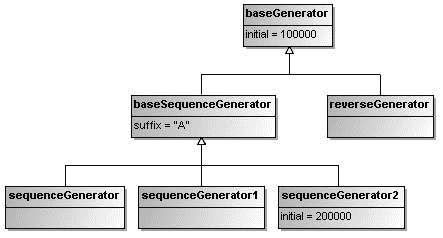

9799ch03.qxd 5/5/08 4:50 PM Page 74

**74**

第 3 章 **■** SPRING 中的 BEAN 配置

<bean id="sequenceGenerator2" parent="baseSequenceGenerator">

...

</bean>

...

</beans>

图 3-3 展示了这个生成器 bean 层次结构的对象图。

**图 3-3.** *生成器 bean 层次结构的对象图*

**3-10. 为 Bean 属性定义集合**

问题

有时你的 bean 属性可能是包含多个元素的集合类型。你希望在 Spring 的 bean 配置文件中配置这些集合属性，而不是通过编码实现。

解决方案

Java 集合框架为不同类型的集合（如列表、集合和映射）定义了一组接口、实现和算法。图 3-4 展示了一个简化的 UML 类图，可能有助于你更好地理解 Java 集合框架。

`List`、`Set` 和 `Map` 是代表三种主要集合类型的核心接口。对于每种集合类型，Java 提供了多种具有不同功能和特性的实现供你选择。在 Spring 中，这些集合类型可以通过一组内置的 XML 标签（如 `<list>`、`<set>` 和 `<map>`）轻松配置。

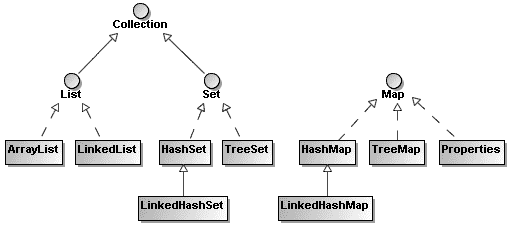

9799ch03.qxd 5/5/08 4:50 PM Page 75

第 3 章 **■** SPRING 中的 BEAN 配置

**75**

**图 3-4.** *Java 集合框架的简化类图*

工作原理

假设你打算允许序列生成器拥有多个后缀。这些后缀将以连字符作为分隔符附加到序列号后面。你可以考虑接受任意数据类型的后缀，并在附加到序列号时将其转换为字符串。

**列表、数组和集合**

首先，让我们使用一个 `java.util.List` 集合来包含你的后缀。*列表*是一个有序且带索引的集合，其元素可以通过索引或 for-each 循环访问。

package com.apress.springrecipes.sequence;

...

public class SequenceGenerator {

...

private **List<Object>** suffixes;

public void setSuffixes(**List<Object>** suffixes) {

this.suffixes = suffixes;

}

public synchronized String getSequence() {

StringBuffer buffer = new StringBuffer();

...

**for (Object suffix : suffixes) {**

**buffer.append("-");**

**buffer.append(suffix);**

**}**

return buffer.toString();

}

}

9799ch03.qxd 5/5/08 4:50 PM Page 76

**76**

第 3 章 **■** SPRING 中的 BEAN 配置

要在 bean 配置中定义 `java.util.List` 类型的属性，你需要指定一个包含元素的 `<list>` 标签。`<list>` 标签内允许的元素可以是：由 `<value>` 指定的简单常量值、由 `<ref>` 指定的 bean 引用、由 `<bean>` 指定的内部 bean 定义，或由 `<null>` 指定的空元素。你甚至可以在一个集合中嵌入其他集合。

<bean id="sequenceGenerator"

class="com.apress.springrecipes.sequence.SequenceGenerator">

<property name="prefixGenerator" ref="datePrefixGenerator" />

<property name="initial" value="100000" />

<property name="suffixes">

**<list>**

<value>A</value>

<bean class="java.net.URL">

<constructor-arg value="http" />

<constructor-arg [value="www.apress.com" />](http://www.apress.com)

<constructor-arg value="/" />

</bean>

<null />

**</list>**

</property>

</bean>

从概念上讲，*数组*与列表非常相似，它也是一个有序且带索引的集合，可以通过索引访问。主要区别在于数组的长度是固定的，不能动态扩展。在 Java 集合框架中，数组和列表可以通过 `Arrays.asList()` 和 `List.toArray()` 方法相互转换。

对于你的序列生成器，你可以使用一个 `Object[]` 数组来包含后缀，并通过索引或 for-each 循环访问它们。

package com.apress.springrecipes.sequence;

...

public class SequenceGenerator {

...

private **Object[]** suffixes;

public void setSuffixes(**Object[]** suffixes) {

this.suffixes = suffixes;

}

...

}

在 bean 配置文件中，数组的定义与由 `<list>` 标签表示的列表完全相同。

<bean id="sequenceGenerator"

class="com.apress.springrecipes.sequence.SequenceGenerator">

...

<property name="suffixes">

9799ch03.qxd 5/5/08 4:50 PM Page 77

第 3 章 **■** SPRING 中的 BEAN 配置

**77**

**<list>**

<value>A</value>

<bean class="java.net.URL">

<constructor-arg value="http" />

<constructor-arg [value="www.apress.com" />](http://www.apress.com)

<constructor-arg value="/" />

</bean>

<null />

**</list>**

</property>

</bean>

另一种常见的集合类型是*集合*。如图 3-4 所示，`java.util.List` 和 `java.util.Set` 都扩展了同一个接口 `java.util.Collection`。集合与列表的不同之处在于，它既无序也无索引，并且只能存储唯一的对象。这意味着集合中不能包含重复元素。当同一个元素第二次添加到集合中时，它将替换旧元素。元素的相等性由 `equals()` 方法决定。

package com.apress.springrecipes.sequence;

...

public class SequenceGenerator {

...

private **Set<Object>** suffixes;

public void setSuffixes(**Set<Object>** suffixes) {

this.suffixes = suffixes;

}

...

}

要定义 `java.util.Set` 类型的属性，请使用 `<set>` 标签，其定义元素的方式与列表相同。

<bean id="sequenceGenerator"

class="com.apress.springrecipes.sequence.SequenceGenerator">

...

<property name="suffixes">

**<set>**

<value>A</value>

<bean class="java.net.URL">

<constructor-arg value="http" />

<constructor-arg [value="www.apress.com" />](http://www.apress.com)

<constructor-arg value="/" />

</bean>

<null />

**</set>**

</property>

</bean>

9799ch03.qxd 5/5/08 4:50 PM Page 78

**78**

第 3 章 **■** SPRING 中的 BEAN 配置

尽管在原始的集合语义中没有顺序的概念，但 Spring 通过使用 `java.util.LinkedHashSet`（一个确实保留元素顺序的 `java.util.Set` 接口实现）来保留元素的顺序。

**映射和属性**


*映射*（*map*）是一种以键/值对形式存储条目的表。你可以通过键从映射中获取特定值，也可以使用 for-each 循环遍历映射条目。映射的键和值都可以是任意类型。键之间的相等性也由 `equals()` 方法决定。例如，你可以修改序列生成器，使其接受一个包含带键后缀的 `java.util.Map` 集合。

```java
package com.apress.springrecipes.sequence;

...

public class SequenceGenerator {

...

private **Map<Object, Object>** suffixes;

public void setSuffixes(**Map<Object, Object>** suffixes) {

this.suffixes = suffixes;

}

public synchronized String getSequence() {

StringBuffer buffer = new StringBuffer();

...

**for (Map.Entry entry : suffixes.entrySet()) {**

**buffer.append("-");**

**buffer.append(entry.getKey());**

**buffer.append("@");**

**buffer.append(entry.getValue());**

**}**

return buffer.toString();

}

}
```

在 Spring 中，映射通过 `<map>` 标签定义，其子标签为多个 `<entry>` 标签。每个条目包含一个键和一个值。键必须在 `<key>` 标签内定义。键和值的类型没有限制，因此你可以自由地为它们指定 `<value>`、`<ref>`、`<bean>` 或 `<null>` 元素。Spring 还会通过使用 `java.util.LinkedHashMap` 来保持映射条目的顺序。

```xml
<bean id="sequenceGenerator"

class="com.apress.springrecipes.sequence.SequenceGenerator">

...

<property name="suffixes">

**<map>**

<entry>

<key>

<value>type</value>

</key>

<value>A</value>

</entry>

<entry>

<key>

<value>url</value>

</key>

<bean class="java.net.URL">

<constructor-arg value="http" />

<constructor-arg value="www.apress.com" />

<constructor-arg value="/" />

</bean>

</entry>

**</map>**

</property>

</bean>
```

有一种快捷方式可以将映射的键和值定义为 `<entry>` 标签的属性。如果它们是简单的常量值，你可以通过 `key` 和 `value` 属性来定义。如果它们是 Bean 引用，你可以通过 `key-ref` 和 `value-ref` 属性来定义。

```xml
<bean id="sequenceGenerator"

class="com.apress.springrecipes.sequence.SequenceGenerator">

...

<property name="suffixes">

<map>

<entry **key="type" value="A"** />

<entry **key="url"** >

<bean class="java.net.URL">

<constructor-arg value="http" />

<constructor-arg value="www.apress.com" />

<constructor-arg value="/" />

</bean>

</entry>

</map>

</property>

</bean>
```

`java.util.Properties` 集合与映射非常相似。它也实现了 `java.util.Map` 接口，并以键/值对的形式存储条目。唯一的区别是 `Properties` 集合的键和值始终是字符串。

```java
package com.apress.springrecipes.sequence;

...

public class SequenceGenerator {

...

private **Properties** suffixes;

public void setSuffixes(**Properties** suffixes) {

this.suffixes = suffixes;

}

...

}
```

要在 Spring 中定义 `java.util.Properties` 集合，请使用 `<props>` 标签，其子标签为多个 `<prop>` 标签。每个 `<prop>` 标签必须定义一个 `key` 属性，并将对应的值包含在标签内。

```xml
<bean id="sequenceGenerator"

class="com.apress.springrecipes.sequence.SequenceGenerator">

...

<property name="suffixes">

**<props>**

<prop key="type">A</prop>

<prop key="url">http://www.apress.com/</prop>

**</props>**

</property>

</bean>
```

**合并父 Bean 的集合**

如果你使用继承来定义 Bean，则可以通过将 `merge` 属性设置为 `true`，将子 Bean 的集合与其父 Bean 的集合合并。对于 `<list>` 集合，子元素将追加到父元素之后以保持顺序。因此，以下序列生成器将拥有四个后缀：A、B、A 和 C。

```xml
<beans ...>

<bean id="baseSequenceGenerator"

class="com.apress.springrecipes.sequence.SequenceGenerator">

<property name="prefixGenerator" ref="datePrefixGenerator" />
```


<property name="initial" value="100000" />

<property name="suffixes">

<list>

<value>A</value>

<value>B</value>

</list>

</property>

</bean>

<bean id="sequenceGenerator" parent="baseSequenceGenerator">

<property name="suffixes">

<list **merge="true"** >

<value>A</value>

<value>C</value>

</list>

</property>

9799ch03.qxd 5/5/08 4:50 PM Page 81

第 3 章 **■** Spring 中的 Bean 配置

**81**

</bean>

...

</beans>

对于`<set>`或`<map>`集合，如果子元素与父元素的值相同，则子元素会覆盖父元素。因此，以下序列生成器将包含三个后缀：A、B 和 C。

<beans ...>

<bean id="baseSequenceGenerator"

class="com.apress.springrecipes.sequence.SequenceGenerator">

<property name="prefixGenerator" ref="datePrefixGenerator" />

<property name="initial" value="100000" />

<property name="suffixes">

<set>

<value>A</value>

<value>B</value>

</set>

</property>

</bean>

<bean id="sequenceGenerator" parent="baseSequenceGenerator">

<property name="suffixes">

<set **merge="true"** >

<value>A</value>

<value>C</value>

</set>

</property>

</bean>

...

</beans>

**3-11. 指定集合元素的数据类型**

问题

默认情况下，Spring 将集合中的每个元素都视为字符串。如果你不打算将它们作为字符串使用，则必须为集合元素指定数据类型。

解决方案

你可以通过`<value>`标签的`type`属性为每个集合元素指定数据类型，或者通过集合标签的`value-type`属性为所有元素指定数据类型。如果你使用的是 Java 1.5 或更高版本，可以定义一个类型安全的集合，这样 Spring 就能读取你的集合类型信息。

9799ch03.qxd 5/5/08 4:50 PM Page 82

**82**

第 3 章 **■** Spring 中的 Bean 配置

工作原理

现在假设你要接受一个整数列表作为序列生成器的后缀。每个数字将通过`java.text.DecimalFormat`的实例格式化为四位数字。

package com.apress.springrecipes.sequence;

...

public class SequenceGenerator {

...

private **List<Object>** suffixes;

public void setSuffixes(**List<Object>** suffixes) {

this.suffixes = suffixes;

}

public synchronized String getSequence() {

StringBuffer buffer = new StringBuffer();

...

**DecimalFormat formatter = new DecimalFormat("0000");**

**for (Object suffix : suffixes) {**

**buffer.append("-");**

**buffer.append(formatter.format((Integer) suffix));**

**}**

return buffer.toString();

}

}

然后像往常一样，在 Bean 配置文件中为序列生成器定义几个后缀。

<bean id="sequenceGenerator"

class="com.apress.springrecipes.sequence.SequenceGenerator">

<property name="prefixGenerator" ref="datePrefixGenerator" />

<property name="initial" value="100000" />

<property name="suffixes">

<list>

<value>5</value>

<value>10</value>

<value>20</value>

</list>

</property>

</bean>

然而，当你运行此应用程序时，会遇到`ClassCastException`异常，提示后缀无法转换为整数，因为它们的类型是字符串。默认情况下，Spring 将集合中的每个元素都视为字符串。你必须设置`<value>`标签的`type`属性来指定元素类型。

9799ch03.qxd 5/5/08 4:50 PM Page 83

第 3 章 **■** Spring 中的 Bean 配置

**83**

<bean id="sequenceGenerator"

class="com.apress.springrecipes.sequence.SequenceGenerator">

...

<property name="suffixes">

<list>

<value **type="int"** >5</value>

<value **type="int"** >10</value>

<value **type="int"** >20</value>

</list>

</property>

</bean>

或者，你可以设置集合标签的`value-type`属性，为这个集合中的所有元素指定类型。

<bean id="sequenceGenerator"

class="com.apress.springrecipes.sequence.SequenceGenerator">

...

<property name="suffixes">

<list **value-type="int"** >

<value>5</value>

<value>10</value>

<value>20</value>

</list>

</property>

</bean>

在 Java 1.5 或更高版本中，你可以使用一个存储整数的类型安全集合来定义你的后缀列表。


package com.apress.springrecipes.sequence;

...

public class SequenceGenerator {

...

private **List<Integer>** suffixes;

public void setSuffixes(**List<Integer>** suffixes) {

this.suffixes = suffixes;

}

public synchronized String getSequence() {

StringBuffer buffer = new StringBuffer();

...

DecimalFormat formatter = new DecimalFormat("0000");

**for (int suffix : suffixes) {**

**buffer.append("-");**

**buffer.append(formatter.format(suffix));**

**}**

9799ch03.qxd 5/5/08 4:50 PM Page 84

**84**

第 3 章 **■** S P R I N G 中 的 B E A N 配 置

return buffer.toString();

}

}

一旦以类型安全的方式定义了集合，Spring 就能通过反射读取集合的类型信息。这样，你就不再需要指定 `<list>` 的 `value-type` 属性了。

<bean id="sequenceGenerator"

class="com.apress.springrecipes.sequence.SequenceGenerator">

...

<property name="suffixes">

<list>

<value>5</value>

<value>10</value>

<value>20</value>

</list>

</property>

</bean>

**3-12\. 使用工厂 Bean 和工具模式定义集合**

问题

使用基本的集合标签定义集合时，无法指定集合的具体实现类，例如 `LinkedList`、`TreeSet` 或 `TreeMap`。此外，也无法通过将集合定义为独立 Bean 的方式，在不同 Bean 之间共享该集合。

解决方案

Spring 提供了几种方案来克服基本集合标签的不足。一种方案是使用相应的集合工厂 Bean，例如 `ListFactoryBean`、`SetFactoryBean` 和 `MapFactoryBean`。*工厂 Bean* 是一种特殊的 Spring Bean，用于创建另一个 Bean。第二种方案是使用 Spring 2.x 引入的 `util` 模式中的集合标签，例如 `<util:list>`、`<util:set>` 和 `<util:map>`。

工作原理

**为集合指定具体实现类**

你可以使用集合工厂 Bean 来定义集合，并指定其目标类。例如，可以为 `SetFactoryBean` 指定 `targetSetClass` 属性。然后 Spring 会为该集合实例化指定的类。

<bean id="sequenceGenerator"

class="com.apress.springrecipes.sequence.SequenceGenerator">

<property name="prefixGenerator" ref="datePrefixGenerator" />

<property name="initial" value="100000" />

9799ch03.qxd 5/5/08 4:50 PM Page 85

第 3 章 **■** S P R I N G 中 的 B E A N 配 置

**85**

<property name="suffixes">

<bean class="org.springframework.beans.factory.config.SetFactoryBean">

<property name=" **targetSetClass**">

<value> **java.util.TreeSet**</value>

</property>

<property name="sourceSet">

<set>

<value>5</value>

<value>10</value>

<value>20</value>

</set>

</property>

</bean>

</property>

</bean>

或者，你也可以使用 `util` 模式中的集合标签来定义集合并设置其目标类（例如，通过 `<util:set>` 的 `set-class` 属性）。但必须记得将 `util` 模式定义添加到 `<beans>` 根元素中。

<beans

[](http://www.springframework.org/schema/util)

**[xsi:schemaLocation="http://www.springframework.org/schema/beans](http://www.springframework.org/schema/util)

[`www.springframework.org/schema/beans/spring-beans-2.5.xsd`](http://www.springframework.org/schema/util)

[**http://www.springframework.org/schema/util**](http://www.springframework.org/schema/util)

[**http://www.springframework.org/schema/util/spring-util-2.5.xsd">**](http://www.springframework.org/schema/util)

<bean id="sequenceGenerator"

class="com.apress.springrecipes.sequence.SequenceGenerator">

...

<property name="suffixes">

<util:set **set-class="java.util.TreeSet"** >

<value>5</value>

<value>10</value>

<value>20</value>

</util:set>

</property>

</bean>

...

</beans>

**定义独立集合**

集合工厂 Bean 的另一个优势是，你可以将集合定义为独立 Bean，供其他 Bean 引用。例如，可以使用 `SetFactoryBean` 定义一个独立集合。

9799ch03.qxd 5/5/08 4:50 PM Page 86

**86**


第 3 章 **■** Spring 中的 Bean 配置

<beans ...>

<bean id="sequenceGenerator"

class="com.apress.springrecipes.sequence.SequenceGenerator">

...

<property name="suffixes">

**<ref local="suffixes" />**

</property>

</bean>

<bean id="suffixes"

class="org.springframework.beans.factory.config.SetFactoryBean">

<property name="sourceSet">

<set>

<value>5</value>

<value>10</value>

<value>20</value>

</set>

</property>

</bean>

...

</beans>

或者，你也可以使用 util 模式中的`<util:set>`标签来定义一个独立的集合。

<beans ...>

<bean id="sequenceGenerator"

class="com.apress.springrecipes.sequence.SequenceGenerator">

...

<property name="suffixes">

**<ref local="suffixes" />**

</property>

</bean>

<util:set id="suffixes">

<value>5</value>

<value>10</value>

<value>20</value>

</util:set>

...

</beans>

**3-13. 从类路径扫描组件**

问题

为了让 Spring IoC 容器管理你的组件，你需要在 Bean 配置文件中逐个声明它们。然而，如果 Spring 能够自动检测你的组件而无需手动配置，这将为你节省大量工作。

9799ch03.qxd 2008 年 5 月 5 日 下午 4:50 第 87 页

第 3 章 **■** Spring 中的 Bean 配置

**87**

解决方案

Spring 2.5 提供了一个名为*组件扫描*的强大功能。它可以自动从类路径中扫描、检测并实例化带有特定构造型注解的组件。表示 Spring 管理组件的基本注解是`@Component`。其他更具体的构造型包括`@Repository`、`@Service`和`@Controller`。它们分别表示持久层、服务层和表现层中的组件。

工作原理

假设你需要使用数据库序列来开发序列生成器应用程序，并将每个序列的前缀和后缀存储在一个表中。首先，创建包含 id、prefix 和 suffix 属性的领域类 Sequence。

package com.apress.springrecipes.sequence;

public class Sequence {

private String id;

private String prefix;

private String suffix;

// 构造方法、Getter 和 Setter

...

}

然后，为数据访问对象（DAO）创建一个接口，该接口负责从数据库访问数据。`getSequence()`方法通过 ID 从表中加载一个 Sequence 对象，而`getNextValue()`方法则检索特定数据库序列的下一个值。

package com.apress.springrecipes.sequence;

public interface SequenceDao {

public Sequence getSequence(String sequenceId);

public int getNextValue(String sequenceId);

}

在生产应用程序中，你应该使用 JDBC 或对象/关系映射等数据访问技术来实现这个 DAO 接口。但出于测试目的，我们使用映射（Map）来存储序列实例和值。

package com.apress.springrecipes.sequence;

...

public class SequenceDaoImpl implements SequenceDao {

private Map<String, Sequence> sequences;

private Map<String, Integer> values;

9799ch03.qxd 2008 年 5 月 5 日 下午 4:50 第 88 页

**88**

第 3 章 **■** Spring 中的 Bean 配置

public SequenceDaoImpl() {

sequences = new HashMap<String, Sequence>();

sequences.put("IT", new Sequence("IT", "30", "A")); values = new HashMap<String, Integer>();

values.put("IT", 100000);

}

public Sequence getSequence(String sequenceId) {

return sequences.get(sequenceId);

}

public synchronized int getNextValue(String sequenceId) {

int value = values.get(sequenceId);

values.put(sequenceId, value + 1);

return value;

}

}

你还需要一个作为外观的服务对象，来提供序列生成服务。在内部，该服务对象将与 DAO 交互以处理序列生成请求。因此，它需要一个对 DAO 的引用。

package com.apress.springrecipes.sequence;

public class SequenceService {

private SequenceDao sequenceDao;

public void setSequenceDao(SequenceDao sequenceDao) {

this.sequenceDao = sequenceDao;

}

public String generate(String sequenceId) {

Sequence sequence = sequenceDao.getSequence(sequenceId);


int value = sequenceDao.getNextValue(sequenceId);

return sequence.getPrefix() + value + sequence.getSuffix();

}

}

最后，你需要在 Bean 配置文件中配置这些组件，以使序列生成器应用程序能够运行。你可以通过自动装配组件来减少配置量。

<beans ...>

<bean id="sequenceService"

class="com.apress.springrecipes.sequence.SequenceService"

autowire="byType" />

9799ch03.qxd 5/5/08 4:50 PM Page 89

**第 3 章 ■ Spring 中的 Bean 配置**

**89**

<bean id="sequenceDao"

class="com.apress.springrecipes.sequence.SequenceDaoImpl" />

</beans>

然后，你可以通过以下 `Main` 类来测试上述组件：

package com.apress.springrecipes.sequence;

import org.springframework.context.ApplicationContext;

import org.springframework.context.support.ClassPathXmlApplicationContext; public class Main {

public static void main(String[] args) {

ApplicationContext context =

new ClassPathXmlApplicationContext("beans.xml");

SequenceService sequenceService =

(SequenceService) context.getBean("sequenceService");

System.out.println(sequenceService.generate("IT"));

System.out.println(sequenceService.generate("IT"));

}

}

**自动扫描组件**

Spring 2.5 提供的组件扫描功能可以从类路径中自动扫描、检测并实例化你的组件。默认情况下，Spring 能够检测所有带有构造型注解的组件。表示 Spring 管理组件的基本注解类型是 `@Component`。你可以将其应用于 `SequenceDaoImpl` 类。

package com.apress.springrecipes.sequence;

import org.springframework.stereotype.Component;

**@Component**

public class SequenceDaoImpl implements SequenceDao {

...

}

此外，你还需要将此构造型注解应用于 `SequenceService` 类，以便 Spring 能够检测到它。同时，将 `@Autowired` 注解应用于 DAO 字段，以便 Spring 按类型进行自动装配。

package com.apress.springrecipes.sequence;

import org.springframework.beans.factory.annotation.Autowired;

import org.springframework.stereotype.Component;

9799ch03.qxd 5/5/08 4:50 PM Page 90

**90**

第 3 章 **■** Spring 中的 Bean 配置

**@Component**

public class SequenceService {

**@Autowired**

private SequenceDao sequenceDao;

...

}

在组件类上应用了构造型注解后，你可以通过声明一个 XML 元素 `<context:component-scan>` 来让 Spring 扫描它们。在此元素中，你需要指定用于扫描组件的包。然后，指定的包及其所有子包都将被扫描。你可以使用逗号分隔多个要扫描的包。

请注意，此元素还会注册一个 `AutowiredAnnotationBeanPostProcessor` 实例，该实例能够自动装配带有 `@Autowired` 注解的属性。

<beans

[](http://www.springframework.org/schema/context)

**[xsi:schemaLocation="http://www.springframework.org/schema/beans](http://www.springframework.org/schema/context)

[`www.springframework.org/schema/beans/spring-beans-2.5.xsd`](http://www.springframework.org/schema/context)

[**http://www.springframework.org/schema/context**](http://www.springframework.org/schema/context)

[**http://www.springframework.org/schema/context/spring-context-2.5.xsd">**](http://www.springframework.org/schema/context)

**<context:component-scan base-package="com.apress.springrecipes.sequence" />**

</beans>

`@Component` 注解是用于表示通用组件的构造型注解。实际上，还有其他特定的构造型注解用于表示不同层的组件。首先，`@Repository` 构造型注解表示持久层中的 DAO 组件。

package com.apress.springrecipes.sequence;

import org.springframework.stereotype.Repository;

**@Repository**

public class SequenceDaoImpl implements SequenceDao {

...

}

然后，`@Service` 构造型注解表示服务层中的服务组件。

package com.apress.springrecipes.sequence;


好的，作为一名高级文档工程师和翻译员，我将严格遵循您提供的注意事项和示例格式，将给定的英文文本翻译成中文。


```java
import org.springframework.beans.factory.annotation.Autowired;
import org.springframework.stereotype.Service;
```

**@Service**

public class SequenceService {

9799ch03.qxd 5/5/08 4:50 PM Page 91

**第 3 章 ■ 在 Spring 中配置 Bean**

**91**

**@Autowired**

private SequenceDao sequenceDao;

...

}

还有另一个组件原型 `@Controller`，表示表示层中的控制器组件。它将在第 10 章中介绍。

**过滤要扫描的组件**

默认情况下，Spring 会检测所有使用 `@Component`、`@Repository`、`@Service`、`@Controller` 或您自定义的、本身被 `@Component` 注解的注解类型所标注的类。您可以通过应用一个或多个包含/排除过滤器来自定义扫描。

Spring 支持四种类型的过滤器表达式。`annotation` 和 `assignable` 类型用于指定用于过滤的注解类型和类/接口。`regex` 和 `aspectj` 类型允许您指定一个正则表达式和一个 AspectJ 切入点表达式来匹配类。

例如，以下组件扫描包含所有名称中包含单词 `Dao` 或 `Service` 的类，并排除带有 `@Controller` 注解的类：

```xml
<beans ...>
    <context:component-scan base-package="com.apress.springrecipes.sequence">
        <context:include-filter type="**regex**"
            expression="com\.apress\.springrecipes\.sequence\..*Dao.*" />
        <context:include-filter type="**regex**"
            expression="com\.apress\.springrecipes\.sequence\..*Service.*" />
        <context:exclude-filter type="**annotation**"
            expression="org.springframework.stereotype.Controller" />
    </context:component-scan>
</beans>
```

由于您应用了包含过滤器来检测所有名称中包含单词 `Dao` 或 `Service` 的类，因此即使没有原型注解，`SequenceDaoImpl` 和 `SequenceService` 组件也可以被自动检测到。

**命名检测到的组件**

默认情况下，Spring 会通过将非限定类名的首字母小写来命名检测到的组件。例如，`SequenceService` 类将被命名为 `sequenceService`。您可以通过在原型注解的 `value` 属性中指定名称来显式定义组件的名称。

```java
package com.apress.springrecipes.sequence;
...
import org.springframework.stereotype.Service;

@Service("**sequenceService**")
public class SequenceService {
    ...
}
```

9799ch03.qxd 5/5/08 4:50 PM Page 92

**92**

**第 3 章 ■ 在 Spring 中配置 Bean**

```java
package com.apress.springrecipes.sequence;
import org.springframework.stereotype.Repository;

@Repository("**sequenceDao**")
public class SequenceDaoImpl implements SequenceDao {
    ...
}
```

您可以通过实现 `BeanNameGenerator` 接口并在 `<context:component-scan>` 元素的 `name-generator` 属性中指定它，来开发自己的命名策略。

**3-14. 本章小结**

在本章中，您学习了 Spring IoC 容器中的基本 Bean 配置。

Spring 支持多种类型的 Bean 配置。其中，XML 是最简单、最成熟的。Spring 提供了两种 IoC 容器实现。基础的是 Bean 工厂，高级的是应用上下文。如果可能，除非资源受限，否则应使用应用上下文。Spring 支持通过 Setter 注入和构造器注入来定义 Bean 属性，这些属性可以是简单值、集合或 Bean 引用。

依赖检查和自动装配是 Spring 提供的两个有价值的容器特性。依赖检查有助于检查是否设置了所有必需的属性，而自动装配可以按类型、名称或注解自动装配您的 Bean。配置这两个特性的旧方式是通过 XML 属性，而新方式是通过注解和 Bean 后处理器，这提供了更大的灵活性。

Spring 通过提取公共的 Bean 配置来形成父 Bean，从而支持 Bean 继承。父 Bean 可以充当配置模板、Bean 实例，或同时充当两者。

由于集合是 Java 的基本编程元素，Spring 提供了各种集合标签，方便您在 Bean 配置文件中配置集合。您可以使用集合工厂 Bean 或工具模式中的集合标签来为集合指定更多细节，也可以将集合定义为独立的 Bean 以在多个 Bean 之间共享。

最后，Spring 可以从类路径中自动检测您的组件。默认情况下，它可以检测所有带有特定原型注解的组件。但您可以通过过滤器进一步包含或排除您的组件。组件扫描是一个强大的功能，可以减少配置量。

在下一章中，您将学习本章未介绍的高级 Spring IoC 容器特性。

9799ch04.qxd 4/10/08 10:53 AM Page 93

**第 4 章**

**高级 Spring IoC 容器**

**本**章中，您将学习 Spring IoC 容器的高级特性和内部机制，这有助于提高您开发 Spring 应用程序的效率。虽然这些特性可能不常用，但它们对于一个全面且强大的容器来说是必不可少的。它们也是 Spring 框架其他模块的基础。

Spring IoC 容器本身被设计为易于定制和扩展。它允许您通过配置自定义默认容器行为，并通过注册符合容器规范的容器插件来扩展容器的功能。

完成本章后，您将非常熟悉 Spring IoC 容器的大部分特性。这将为您在后续章节中学习 Spring 的不同主题打下有用的基础。

**4-1. 通过调用构造器创建 Bean**

问题

您希望通过调用其构造器在 Spring IoC 容器中创建一个 Bean，这是创建 Bean 最常见、最直接的方式。它相当于在 Java 中使用 `new` 操作符创建对象。

解决方案

通常，当您为 Bean 指定 `class` 属性时，您就是在要求 Spring IoC 容器通过调用其构造器来创建 Bean 实例。

工作原理

假设您要开发一个在线销售产品的商店应用程序。首先，您创建 `Product` 类，它有几个属性，例如产品名称和价格。由于您的商店中有多种类型的产品，您将 `Product` 类设为抽象类，以便不同的产品子类进行扩展。

**93**

9799ch04.qxd 4/10/08 10:53 AM Page 94

**94**

**第 4 章 ■ 高级 Spring IoC 容器**

```java
package com.apress.springrecipes.shop;

public abstract class Product {

    private String name;
    private double price;

    public Product() {}

    public Product(String name, double price) {
        this.name = name;
        this.price = price;
    }

    // Getters and Setters
    ...

    public String toString() {
        return name + " " + price;
    }
}
```

然后，您创建两个产品子类，`Battery` 和 `Disc`。每个子类都有自己的属性。

```java
package com.apress.springrecipes.shop;

public class Battery extends Product {

    private boolean rechargeable;

    public Battery() {
        super();
    }

    public Battery(String name, double price) {
        super(name, price);
    }

    // Getters and Setters
    ...
}
```

```java
package com.apress.springrecipes.shop;

public class Disc extends Product {
```

9799ch04.qxd 4/10/08 10:53 AM Page 95

**第 4 章 ■ 高级 Spring IoC 容器**

**95**

```java
    private int capacity;

    public Disc() {
        super();
    }

    public Disc(String name, double price) {
        super(name, price);
    }

    // Getters and Setters
    ...
}
```

为了在 Spring IoC 容器中定义一些产品，您创建了以下 Bean 配置文件：

```xml
<beans
```


[xsi:schemaLocation="http://www.springframework.org/schema/beans](http://www.w3.org/2001/XMLSchema-instance)

[`www.springframework.org/schema/beans/spring-beans-2.5.xsd">`](http://www.w3.org/2001/XMLSchema-instance)

<bean id="aaa" class="com.apress.springrecipes.shop.Battery">

<property name="name" value="AAA" />

<property name="price" value="2.5" />

<property name="rechargeable" value="true" />

</bean>

<bean id="cdrw" class="com.apress.springrecipes.shop.Disc">

<property name="name" value="CD-RW" />

<property name="price" value="1.5" />

<property name="capacity" value="700" />

</bean>

</beans>

如果没有指定 `<constructor-arg>` 元素，则会调用无参的默认构造函数。然后，对于每个 `<property>` 元素，Spring 将通过 setter 方法注入值。上述 bean 配置等价于以下代码片段：

Product aaa = new Battery();

aaa.setName("AAA");

aaa.setPrice(2.5);

aaa.setRechargeable(true);

Product cdrw = new Disc();

cdrw.setName("CD-RW");

cdrw.setPrice(1.5);

cdrw.setCapacity(700);

9799ch04.qxd 4/10/08 10:53 AM Page 96

**96**

第 4 章 **■** 高级 Spring IoC 容器

否则，如果指定了一个或多个 `<constructor-arg>` 元素，Spring 将调用与参数最匹配的构造函数。

<beans ...>

<bean id="aaa" class="com.apress.springrecipes.shop.Battery">

<constructor-arg value="AAA" />

<constructor-arg value="2.5" />

<property name="rechargeable" value="true" />

</bean>

<bean id="cdrw" class="com.apress.springrecipes.shop.Disc">

<constructor-arg value="CD-RW" />

<constructor-arg value="1.5" />

<property name="capacity" value="700" />

</bean>

</beans>

由于 `Product` 类及其子类不存在构造函数歧义，上述 bean 配置等价于以下代码片段：

Product aaa = new Battery("AAA", 2.5);

aaa.setRechargeable(true);

Product cdrw = new Disc("CD-RW", 1.5);

cdrw.setCapacity(700);

你可以编写以下 `Main` 类，通过从 Spring IoC 容器中检索来测试你的产品：

package com.apress.springrecipes.shop;

import org.springframework.context.ApplicationContext;

import org.springframework.context.support.ClassPathXmlApplicationContext; public class Main {

public static void main(String[] args) throws Exception {

ApplicationContext context =

new ClassPathXmlApplicationContext("beans.xml");

Product aaa = (Product) context.getBean("aaa");

Product cdrw = (Product) context.getBean("cdrw");

System.out.println(aaa);

System.out.println(cdrw);

}

}

9799ch04.qxd 4/10/08 10:53 AM Page 97

第 4 章 **■** 高级 Spring IoC 容器

**97**

**4-2\. 通过调用静态工厂方法创建 Bean**

问题

你希望通过调用*静态工厂方法*在 Spring IoC 容器中创建 bean，该方法的目的是将对象创建过程封装在一个静态方法中。请求对象的客户端只需调用此方法，而无需了解创建细节。

解决方案

Spring 支持通过调用静态工厂方法来创建 bean，该方法应在 `factory-method` 属性中指定。

工作原理

例如，你可以编写以下 `createProduct()` 静态工厂方法，根据预定义的产品 ID 创建产品。根据产品 ID，该方法将决定实例化哪个具体产品类。如果没有匹配此 ID 的产品，它将抛出 `IllegalArgumentException`。

package com.apress.springrecipes.shop;

public class ProductCreator {

public static Product createProduct(String productId) {

if ("aaa".equals(productId)) {

return new Battery("AAA", 2.5);

} else if ("cdrw".equals(productId)) {

return new Disc("CD-RW", 1.5);

}

throw new IllegalArgumentException("Unknown product");

}

}


要声明由静态工厂方法创建的 Bean，你需要在 `class` 属性中指定承载工厂方法的类，并在 `factory-method` 属性中指定工厂方法的名称。最后，通过使用 `<constructor-arg>` 元素传递方法参数。

<beans ...>

<bean id="aaa" class="com.apress.springrecipes.shop. **ProductCreator**"

**factory-method="createProduct"** >

<constructor-arg value="aaa" />

</bean>

<bean id="cdrw" class="com.apress.springrecipes.shop. **ProductCreator**"

**factory-method="createProduct"** >

<constructor-arg value="cdrw" />

</bean>

</beans>

9799ch04.qxd 4/10/08 10:53 AM Page 98

**98**

第 4 章 **■** 高级 Spring IoC 容器

如果工厂方法抛出任何异常，Spring 会将其包装为 `BeanCreationException`。上述 Bean 配置的等效代码片段如下所示：

Product aaa = ProductCreator.createProduct("aaa");

Product cdrw = ProductCreator.createProduct("cdrw");

**4-3. 通过调用实例工厂方法创建 Bean**

问题

你希望通过调用*实例工厂方法*在 Spring IoC 容器中创建一个 Bean，该方法的目的是将对象创建过程封装在另一个对象实例的方法中。请求对象的客户端只需调用此方法，而无需了解创建细节。

解决方案

Spring 支持通过调用实例工厂方法来创建 Bean。Bean 实例应在 `factory-bean` 属性中指定，而工厂方法应在 `factory-method` 属性中指定。

工作原理

例如，你可以编写以下 `ProductCreator` 类，使用一个可配置的 Map 来存储预定义的产品。`createProduct()` 实例工厂方法通过在 Map 中查找提供的 `productId` 来查找产品。如果没有匹配此 ID 的产品，它将抛出 `IllegalArgumentException`。

package com.apress.springrecipes.shop;

...

public class ProductCreator {

private Map<String, Product> products;

public void setProducts(Map<String, Product> products) {

this.products = products;

}

public Product createProduct(String productId) {

Product product = products.get(productId);

if (product != null) {

return product;

}

throw new IllegalArgumentException("Unknown product");

}

}

9799ch04.qxd 4/10/08 10:53 AM Page 99

第 4 章 **■** 高级 Spring IoC 容器

**99**

要从此 `ProductCreator` 类创建产品，你首先需要在 IoC 容器中声明它的一个实例，并配置其产品 Map。你可以将 Map 中的产品声明为内部 Bean。要声明由实例工厂方法创建的 Bean，你需要在 `factory-bean` 属性中指定承载工厂方法的 Bean，并在 `factory-method` 属性中指定工厂方法的名称。最后，通过使用 `<constructor-arg>` 元素传递方法参数。

<beans ...>

<bean id="productCreator"

class="com.apress.springrecipes.shop.ProductCreator">

<property name="products">

<map>

<entry key="aaa">

<bean class="com.apress.springrecipes.shop.Battery">

<property name="name" value="AAA" />

<property name="price" value="2.5" />

</bean>

</entry>

<entry key="cdrw">

<bean class="com.apress.springrecipes.shop.Disc">

<property name="name" value="CD-RW" />

<property name="price" value="1.5" />

</bean>

</entry>

</map>

</property>

</bean>

<bean id="aaa" **factory-bean="productCreator"**

**factory-method="createProduct"** >

<constructor-arg value="aaa" />

</bean>

<bean id="cdrw" **factory-bean="productCreator"**

**factory-method="createProduct"** >

<constructor-arg value="cdrw" />

</bean>

</beans>

如果工厂方法抛出任何异常，Spring 会将其包装为 `BeanCreationException`。上述 Bean 配置的等效代码片段如下所示：

ProductCreator productCreator = new ProductCreator();

productCreator.setProducts(...);

Product aaa = productCreator.createProduct("aaa");

Product cdrw = productCreator.createProduct("cdrw");


9799ch04.qxd 4/10/08 10:53 AM Page 100

**100**

第 4 章 **■** 高级 Spring IoC 容器

**4-4. 使用 Spring 工厂 Bean 创建 Bean**

问题

你希望使用 Spring 的工厂 Bean 在 Spring IoC 容器中创建一个 Bean。*工厂 Bean* 是一种在 IoC 容器内作为工厂来创建其他 Bean 的 Bean。

从概念上讲，工厂 Bean 与工厂方法非常相似，但它是一个 Spring 特有的 Bean，可以在 Bean 构造过程中被 Spring IoC 容器识别。

解决方案

工厂 Bean 的基本要求是实现 FactoryBean 接口。为了方便起见，Spring 提供了一个抽象模板类 AbstractFactoryBean 供你继承。工厂 Bean 主要用于实现框架设施。以下是一些示例：

• 从 JNDI 查找对象（如数据源）时，可以使用 JndiObjectFactoryBean。

• 使用经典 Spring AOP 为 Bean 创建代理时，可以使用 ProxyFactoryBean。

• 在 IoC 容器中创建 Hibernate 会话工厂时，可以使用 LocalSessionFactoryBean。

然而，作为框架使用者，你很少需要编写自定义工厂 Bean，因为它们是与框架相关的，无法在 Spring IoC 容器范围之外使用。

实际上，你总是可以为工厂 Bean 实现一个等效的工厂方法。

工作原理

尽管你很少需要编写自定义工厂 Bean，但通过一个示例可以更好地理解其内部机制。例如，你可以编写一个工厂 Bean，用于创建应用了折扣价格的产品。它接受一个产品属性和一个折扣属性，将折扣应用于产品，并将其作为新 Bean 返回。

package com.apress.springrecipes.shop;

import org.springframework.beans.factory.config.AbstractFactoryBean;

public class DiscountFactoryBean extends AbstractFactoryBean {

private Product product;

private double discount;

public void setProduct(Product product) {

this.product = product;

}

9799ch04.qxd 4/10/08 10:53 AM Page 101

第 4 章 **■** 高级 Spring IoC 容器

**101**

public void setDiscount(double discount) {

this.discount = discount;

}

public Class getObjectType() {

return product.getClass();

}

protected Object createInstance() throws Exception {

product.setPrice(product.getPrice() * (1 - discount));

return product;

}

}

通过继承 AbstractFactoryBean 类，你的工厂 Bean 只需重写 createInstance() 方法来创建目标 Bean 实例。此外，你还需要在 getObjectType() 方法中返回目标 Bean 的类型，以便自动装配功能正常工作。

接下来，你可以使用 DiscountFactoryBean 声明产品实例。每次请求一个实现了 FactoryBean 接口的 Bean 时，Spring IoC 容器都会使用这个工厂 Bean 来创建目标 Bean 并将其返回给你。如果你确定要获取工厂 Bean 实例本身，可以使用以 & 开头的 Bean 名称。

<beans ...>

<bean id="aaa"

class=" **com.apress.springrecipes.shop.DiscountFactoryBean**">

<property name="product">

<bean class="com.apress.springrecipes.shop.Battery">

<constructor-arg value="AAA" />

<constructor-arg value="2.5" />

</bean>

</property>

<property name="discount" value="0.2" />

</bean>

<bean id="cdrw"

class=" **com.apress.springrecipes.shop.DiscountFactoryBean**">

<property name="product">

<bean class="com.apress.springrecipes.shop.Disc">

<constructor-arg value="CD-RW" />

<constructor-arg value="1.5" />

</bean>

</property>

<property name="discount" value="0.1" />

</bean>

</beans>

9799ch04.qxd 4/10/08 10:53 AM Page 102

**102**

第 4 章 **■** 高级 Spring IoC 容器

上述工厂 Bean 配置的工作方式与以下代码片段类似：

DiscountFactoryBean &aaa = new DiscountFactoryBean();

&aaa.setProduct(new Battery("AAA", 2.5));

&aaa.setDiscount(0.2);

Product aaa = (Product) &aaa.createInstance();


```java
DiscountFactoryBean &cdrw = new DiscountFactoryBean();

&cdrw.setProduct(new Disc("CD-RW", 1.5));

&cdrw.setDiscount(0.1);

Product cdrw = (Product) &cdrw.createInstance();
```

**4-5. 从静态字段声明 Bean**

**问题**

你希望从静态字段在 Spring IoC 容器中声明一个 Bean。在 Java 中，常量值通常被声明为静态字段。

**解决方案**

要从静态字段声明 Bean，你可以使用内置的工厂 Bean `FieldRetrievingFactoryBean`，或者在 Spring 2.x 中使用 `<util:constant>` 标签。

**工作原理**

首先，让我们在 `Product` 类中定义两个产品常量。

```java
package com.apress.springrecipes.shop;

public abstract class Product {

    public static final Product AAA = new Battery("AAA", 2.5);

    public static final Product CDRW = new Disc("CD-RW", 1.5);

    ...

}
```

要从静态字段声明 Bean，你可以使用内置的工厂 Bean `FieldRetrievingFactoryBean`，并在 `staticField` 属性中指定完全限定的字段名。

```xml
<beans ...>

    <bean id="aaa" class="org.springframework.beans.factory.config.
        FieldRetrievingFactoryBean">
        <property name="staticField">
            <value>com.apress.springrecipes.shop.Product.AAA</value>
        </property>
    </bean>

    <bean id="cdrw" class="org.springframework.beans.factory.config.
        FieldRetrievingFactoryBean">
        <property name="staticField">
            <value>com.apress.springrecipes.shop.Product.CDRW</value>
        </property>
    </bean>

</beans>
```

上述 Bean 配置等价于以下代码片段：
```java
Product aaa = com.apress.springrecipes.shop.Product.AAA;
Product cdrw = com.apress.springrecipes.shop.Product.CDRW;
```

作为在 `staticField` 属性中显式指定字段名的替代方案，你可以将其设置为 `FieldRetrievingFactoryBean` 的 Bean 名称。缺点是 Bean 名称可能会变得相当冗长。

```xml
<beans ...>

    <bean id="com.apress.springrecipes.shop.Product.AAA"
        class="org.springframework.beans.factory.config.
            FieldRetrievingFactoryBean" />

    <bean id="com.apress.springrecipes.shop.Product.CDRW"
        class="org.springframework.beans.factory.config.
            FieldRetrievingFactoryBean" />

</beans>
```

Spring 2.x 允许你使用 `<util:constant>` 标签从静态字段声明 Bean。与使用 `FieldRetrievingFactoryBean` 相比，这是一种更简单的从静态字段声明 Bean 的方式。但在使用此标签之前，你必须将 util 模式定义添加到 `<beans>` 根元素中。

```xml
<beans
    xmlns:xsi="http://www.w3.org/2001/XMLSchema-instance"
    xmlns:util="http://www.springframework.org/schema/util"
    xsi:schemaLocation="http://www.springframework.org/schema/beans
        http://www.springframework.org/schema/beans/spring-beans-2.5.xsd
        http://www.springframework.org/schema/util
        http://www.springframework.org/schema/util/spring-util-2.5.xsd">

    <util:constant id="aaa"
        static-field="com.apress.springrecipes.shop.Product.AAA" />

    <util:constant id="cdrw"
        static-field="com.apress.springrecipes.shop.Product.CDRW" />

</beans>
```

**4-6. 从对象属性声明 Bean**

**问题**

你希望从对象属性或嵌套属性（即属性路径）在 Spring IoC 容器中声明一个 Bean。

**解决方案**

要从对象属性或属性路径声明 Bean，你可以使用内置的工厂 Bean `PropertyPathFactoryBean`，或者在 Spring 2.x 中使用 `<util:property-path>` 标签。

**工作原理**

作为示例，让我们创建一个 `ProductRanking` 类，其中包含一个类型为 `Product` 的 `bestSeller` 属性。

```java
package com.apress.springrecipes.shop;

public class ProductRanking {

    private Product bestSeller;

    public Product getBestSeller() {
        return bestSeller;
    }

    public void setBestSeller(Product bestSeller) {
```


this.bestSeller = bestSeller;

}

}

在以下 bean 声明中，bestSeller 属性通过一个内部 bean 进行声明。

根据定义，你无法通过名称获取内部 bean。但你可以将其作为 productRanking bean 的一个属性来获取。工厂 bean `PropertyPathFactoryBean` 可用于从对象属性或属性路径声明一个 bean。

<beans ...>

<bean id="productRanking"

class="com.apress.springrecipes.shop.ProductRanking">

<property name="bestSeller">

<bean class="com.apress.springrecipes.shop.Disc">

<property name="name" value="CD-RW" />

<property name="price" value="1.5" />

</bean>

</property>

</bean>

9799ch04.qxd 4/10/08 10:53 AM Page 105

第 4 章 **■** 高级 Spring IoC 容器

**105**

<bean id="bestSeller"

class="org.springframework.beans.factory.config.PropertyPathFactoryBean">

<property name="targetObject" ref="productRanking" />

<property name="propertyPath" value="bestSeller" />

</bean>

</beans>

请注意，`PropertyPathFactoryBean` 的 `propertyPath` 属性不仅可以接受单个属性名称，还可以接受以点号作为分隔符的属性路径。上述 bean 配置等价于以下代码片段：

Product bestSeller = productRanking.getBestSeller();

除了显式指定 `targetObject` 和 `propertyPath` 属性外，你还可以将它们组合成 `PropertyPathFactoryBean` 的 bean 名称。其缺点是你的 bean 名称可能会变得相当冗长。

<bean id="**productRanking.bestSeller**"

class="org.springframework.beans.factory.config.PropertyPathFactoryBean" /> Spring 2.x 允许你使用 `<util:property-path>` 标签从对象属性或属性路径声明一个 bean。与使用 `PropertyPathFactoryBean` 相比，这是一种更简单的从属性声明 bean 的方式。但在使用此标签之前，你必须将 util 模式定义添加到你的 `<beans>` 根元素中。

<beans

[](http://www.springframework.org/schema/util)

**[xsi:schemaLocation="http://www.springframework.org/schema/beans](http://www.springframework.org/schema/util)

[`www.springframework.org/schema/beans/spring-beans-2.5.xsd`](http://www.springframework.org/schema/util)

[**http://www.springframework.org/schema/util**](http://www.springframework.org/schema/util)

[**http://www.springframework.org/schema/util/spring-util-2.5.xsd">**](http://www.springframework.org/schema/util)

...

<util:property-path id="bestSeller" path="productRanking.bestSeller" />

</beans>

你可以通过从 IoC 容器中检索此属性路径并将其打印到控制台来进行测试。

package com.apress.springrecipes.shop;

...

public class Main {

public static void main(String[] args) throws Exception {

...

Product bestSeller = (Product) context.getBean("bestSeller");

System.out.println(bestSeller);

}

}

9799ch04.qxd 4/10/08 10:53 AM Page 106

**106**

第 4 章 **■** 高级 Spring IoC 容器

**4-7. 设置 Bean 作用域**

问题

当你在配置文件中声明一个 bean 时，实际上是在定义一个用于创建 bean 的模板，而不是一个实际的 bean 实例。当通过 `getBean()` 方法或其他 bean 的引用请求一个 bean 时，Spring 会根据 bean 的作用域决定返回哪个 bean 实例。有时，你必须为 bean 设置一个合适的非默认作用域。

解决方案

在 Spring 2.x 中，bean 的作用域通过 `<bean>` 元素的 `scope` 属性设置。默认情况下，Spring 为 IoC 容器中声明的每个 bean 只创建一个实例，并且该实例将在整个 IoC 容器范围内共享。所有后续的 `getBean()` 调用和 bean 引用都将返回这个唯一的 bean 实例。这种作用域称为 singleton（单例），是所有 bean 的默认作用域。表 4-1 列出了 Spring 中所有有效的 bean 作用域。

**表 4-1.** *Spring 中有效的 Bean 作用域*

**作用域**

**描述**

singleton

每个 Spring IoC 容器创建一个单一的 bean 实例

prototype

每次请求时创建一个新的 bean 实例


request

每个 HTTP 请求创建一个单一的 Bean 实例；仅在 Web 应用上下文中有效

session

每个 HTTP 会话创建一个单一的 Bean 实例；仅在 Web 应用上下文中有效

globalSession

每个全局 HTTP 会话创建一个单一的 Bean 实例；仅在门户应用上下文中有效

在 Spring 1.x 中，singleton 和 prototype 是仅有的两种有效 Bean 作用域，它们通过 singleton 属性（即 singleton="true" 或 singleton="false"）来指定，而非 scope 属性。

工作原理

为了演示 Bean 作用域的概念，我们以商店应用中的购物车为例。首先，按如下方式创建 ShoppingCart 类：

package com.apress.springrecipes.shop;

...

public class ShoppingCart {

private List<Product> items = new ArrayList<Product>();

public void addItem(Product item) {

items.add(item);

}

9799ch04.qxd 4/10/08 10:53 AM Page 107

第 4 章 **■** 高级 Spring IoC 容器

**107**

public List<Product> getItems() {

return items;

}

}

然后，像往常一样在 IoC 容器中声明一些产品 Bean 和一个购物车 Bean：

<beans ...>

<bean id="aaa" class="com.apress.springrecipes.shop.Battery">

<property name="name" value="AAA" />

<property name="price" value="2.5" />

</bean>

<bean id="cdrw" class="com.apress.springrecipes.shop.Disc">

<property name="name" value="CD-RW" />

<property name="price" value="1.5" />

</bean>

<bean id="dvdrw" class="com.apress.springrecipes.shop.Disc">

<property name="name" value="DVD-RW" />

<property name="price" value="3.0" />

</bean>

<bean id="shoppingCart" class="com.apress.springrecipes.shop.ShoppingCart" />

</beans>

在下面的 Main 类中，你可以通过向购物车添加一些商品来测试它。假设有两个顾客同时在你的商店中浏览。第一个顾客通过 getBean() 方法获取一个购物车，并向其中添加了两个商品。然后，第二个顾客也通过 getBean() 方法获取一个购物车，并向其中添加了另一个商品。

package com.apress.springrecipes.shop;

import org.springframework.context.ApplicationContext;

import org.springframework.context.support.ClassPathXmlApplicationContext; public class Main {

public static void main(String[] args) {

ApplicationContext context =

new ClassPathXmlApplicationContext("beans.xml");

Product aaa = (Product) context.getBean("aaa");

Product cdrw = (Product) context.getBean("cdrw");

Product dvdrw = (Product) context.getBean("dvdrw");

ShoppingCart cart1 = (ShoppingCart) context.getBean("shoppingCart"); cart1.addItem(aaa);

9799ch04.qxd 4/10/08 10:53 AM Page 108

**108**

第 4 章 **■** 高级 Spring IoC 容器

cart1.addItem(cdrw);

System.out.println("购物车 1 包含 " + cart1.getItems()); ShoppingCart cart2 = (ShoppingCart) context.getBean("shoppingCart"); cart2.addItem(dvdrw);

System.out.println("购物车 2 包含 " + cart2.getItems());

}

}

根据上述 Bean 声明，你可以看到两个顾客获取的是同一个购物车实例。

购物车 1 包含 [AAA 2.5, CD-RW 1.5]

购物车 2 包含 [AAA 2.5, CD-RW 1.5, DVD-RW 3.0]

这是因为 Spring 的默认 Bean 作用域是 singleton，这意味着 Spring 为每个 IoC 容器只创建一个购物车实例。

<bean id="shoppingCart"

class="com.apress.springrecipes.shop.ShoppingCart"

**scope="singleton"** />

在你的商店应用中，你期望当调用 getBean() 方法时，每个顾客都能获得不同的购物车实例。为了确保这种行为，你应该将 shoppingCart Bean 的作用域改为 prototype。这样，Spring 将为每次 getBean() 方法调用以及来自其他 Bean 的引用创建一个新的 Bean 实例。

<bean id="shoppingCart"

class="com.apress.springrecipes.shop.ShoppingCart"

**scope="prototype"** />

现在，如果你再次运行 Main 类，你可以看到两个顾客获得了不同的购物车实例。

购物车 1 包含 [AAA 2.5, CD-RW 1.5]

购物车 2 包含 [DVD-RW 3.0]


  
**4-8. 自定义 Bean 的初始化和销毁**

问题

许多实际组件在准备使用之前，必须执行某些类型的初始化任务。这些任务包括打开文件、建立网络/数据库连接、分配内存等。此外，它们还需要在生命周期结束时执行相应的销毁任务。因此，你需要在 Spring IoC 容器中自定义 Bean 的初始化和销毁。

9799ch04.qxd 4/10/08 10:53 AM 第 109 页

第 4 章 **■** 高级 Spring IoC 容器

**109**

解决方案

除了 Bean 注册之外，Spring IoC 容器还负责管理 Bean 的生命周期，并允许你在其生命周期的特定时间点执行自定义任务。你的任务应封装在回调方法中，供 Spring IoC 容器在适当的时候调用。

以下列表展示了 Spring IoC 容器管理 Bean 生命周期的步骤。随着 IoC 容器更多特性的引入，此列表将逐步扩展。

**1.** 通过构造函数或工厂方法创建 Bean 实例。  
**2.** 为 Bean 属性设置值和 Bean 引用。  
**3. 调用初始化回调方法。**  
**4.** Bean 已准备好可供使用。  
**5. 当容器关闭时，调用销毁回调方法。**

Spring 有三种方式可以识别你的初始化和销毁回调方法。首先，你的 Bean 可以实现 `InitializingBean` 和 `DisposableBean` 生命周期接口，并实现 `afterPropertiesSet()` 和 `destroy()` 方法用于初始化和销毁。其次，你可以在 Bean 声明中设置 `init-method` 和 `destroy-method` 属性，并指定回调方法名称。在 Spring 2.5 中，你还可以使用生命周期注解 `@PostConstruct` 和 `@PreDestroy` 来标注初始化和销毁回调方法，这些注解定义在 JSR-250：Java 平台通用注解中。然后，你可以在 IoC 容器中注册一个 `CommonAnnotationBeanPostProcessor` 实例来调用这些回调方法。

工作原理

为了理解 Spring IoC 容器如何管理 Bean 的生命周期，我们来看一个涉及结账功能的示例。以下 `Cashier` 类可用于结账购物车中的商品。它将每次结账的时间和金额记录在一个文本文件中。

```java
package com.apress.springrecipes.shop;

...

public class Cashier {

    private String name;
    private String path;
    private BufferedWriter writer;

    public void setName(String name) {
        this.name = name;
    }

9799ch04.qxd 4/10/08 10:53 AM 第 110 页

**110**

第 4 章 **■** 高级 Spring IoC 容器

    public void setPath(String path) {
        this.path = path;
    }

    public void openFile() throws IOException {
        File logFile = new File(path, name + ".txt");
        writer = new BufferedWriter(new OutputStreamWriter(
            new FileOutputStream(logFile, true)));
    }

    public void checkout(ShoppingCart cart) throws IOException {
        double total = 0;
        for (Product product : cart.getItems()) {
            total += product.getPrice();
        }
        writer.write(new Date() + "\t" + total + "\r\n");
        writer.flush();
    }

    public void closeFile() throws IOException {
        writer.close();
    }
}
```

在 `Cashier` 类中，`openFile()` 方法以收银员名称作为文件名，在指定的系统路径中打开文本文件。每次调用 `checkout()` 方法时，都会在文本文件中追加一条结账记录。最后，`closeFile()` 方法关闭文件以释放系统资源。

然后，你在 IoC 容器中声明一个名为 `cashier1` 的收银员 Bean。该收银员的结账记录将记录在文件 `c:/cashier/cashier1.txt` 中。你需要提前创建此目录，或指定另一个已存在的目录。

```xml
<beans ...>
    ...
    <bean id="cashier1" class="com.apress.springrecipes.shop.Cashier">
        <property name="name" value="cashier1" />
        <property name="path" value="c:/cashier" />
    </bean>
</beans>
```


</bean>

</beans>

然而，在 Main 类中，如果你尝试使用此收银员结账购物车，将会导致 `NullPointerException`。出现此异常的原因是，没有人事先调用 `openFile()` 方法进行初始化。

```java
package com.apress.springrecipes.shop;

import org.springframework.context.ApplicationContext;

import org.springframework.context.support.FileSystemXmlApplicationContext;

9799ch04.qxd 4/10/08 10:53 AM Page 111

C H A P T E R 4 **■** A D VA N C E D S P R I N G I O C C O N TA I N E R

**111**

public class Main {

public static void main(String[] args) **throws Exception** {

ApplicationContext context =

new FileSystemXmlApplicationContext("beans.xml");

...

Cashier cashier1 = (Cashier) context.getBean("cashier1");

cashier1.checkout(cart1);

}

}
```

那么，你应该在哪里调用 `openFile()` 方法进行初始化呢？在 Java 中，初始化任务应在构造函数中执行。但是，如果在 `Cashier` 类的默认构造函数中调用 `openFile()` 方法，这里能行得通吗？不行，因为 `openFile()` 方法需要同时设置 `name` 和 `path` 属性，才能确定要打开哪个文件。

```java
package com.apress.springrecipes.shop;

...

public class Cashier {

...

public void openFile() throws IOException {

File logFile = new File(**path**, **name** + ".txt");

writer = new BufferedWriter(new OutputStreamWriter(

new FileOutputStream(logFile, true)));

}

}
```

当默认构造函数被调用时，这些属性尚未设置。因此，你可以添加一个接受这两个属性作为参数的构造函数，并在该构造函数的末尾调用 `openFile()` 方法。然而，有时你可能不被允许这样做，或者你更倾向于通过 setter 注入来设置属性。实际上，调用 `openFile()` 方法的最佳时机是在 Spring IoC 容器设置完所有属性之后。

**实现 InitializingBean 和 DisposableBean 接口**

Spring 允许你的 bean 通过实现 `InitializingBean` 和 `DisposableBean` 接口，在回调方法 `afterPropertiesSet()` 和 `destroy()` 中执行初始化和销毁任务。在 bean 构建期间，Spring 会注意到你的 bean 实现了这些接口，并在合适的时机调用回调方法。

```java
package com.apress.springrecipes.shop;

...

import org.springframework.beans.factory.DisposableBean;

import org.springframework.beans.factory.InitializingBean;

public class Cashier implements **InitializingBean, DisposableBean** {

...

public void **afterPropertiesSet()** throws Exception {

9799ch04.qxd 4/10/08 10:53 AM Page 112

**112**

C H A P T E R 4 **■** A D VA N C E D S P R I N G I O C C O N TA I N E R

openFile();

}

public void **destroy**() throws Exception {

closeFile();

}

}
```

现在，如果你再次运行 `Main` 类，你会看到一条结账记录被追加到文本文件 `c:/cashier/cashier1.txt` 中。然而，实现这种专有接口会使你的 bean 与 Spring 特定化，从而无法在 Spring IoC 容器之外重用。

**设置 init-method 和 destroy-method 属性**

指定初始化和销毁回调方法的更好方式是在 bean 声明中设置 `init-method` 和 `destroy-method` 属性。

```xml
<bean id="cashier1" class="com.apress.springrecipes.shop.Cashier"

**init-method="openFile" destroy-method="closeFile"** >

<property name="name" value="cashier1" />

<property name="path" value="c:/cashier" />

</bean>
```

通过在 bean 声明中设置这两个属性，你的 `Cashier` 类不再需要实现 `InitializingBean` 和 `DisposableBean` 接口。你也可以删除 `afterPropertiesSet()` 和 `destroy()` 方法。

**使用 @PostConstruct 和 @PreDestroy 注解**

在 Spring 2.5 中，你可以使用 JSR-250 生命周期注解 `@PostConstruct` 和 `@PreDestroy` 来注解初始化和销毁回调方法。


**■注意** 要使用 JSR-250 注解，你必须在类路径中包含 `common-annotations.jar`（位于 Spring 安装目录的 `lib/j2ee` 文件夹中）。不过，如果你的应用程序运行在 Java SE 6 或 Java EE 5 上，则无需包含此 JAR 文件。

```java
package com.apress.springrecipes.shop;

...

import javax.annotation.PostConstruct;

import javax.annotation.PreDestroy;

public class Cashier {

...

**@PostConstruct**

public void openFile() throws IOException {

9799ch04.qxd 4/10/08 10:53 AM Page 113

C H A P T E R 4 **■** A D VA N C E D S P R I N G I O C C O N TA I N E R

**113**

File logFile = new File(path, name + ".txt");

writer = new BufferedWriter(new OutputStreamWriter(

new FileOutputStream(logFile, true)));

}

**@PreDestroy**

public void closeFile() throws IOException {

writer.close();

}

}
```

然后，你在 IoC 容器中注册一个 `CommonAnnotationBeanPostProcessor` 实例，以便通过生命周期注解调用初始化和销毁回调方法。这样，你就不再需要为 Bean 指定 `init-method` 和 `destroy-method` 属性了。

```xml
<beans ...>

...

<bean class="org.springframework.context.annotation. **➥**

CommonAnnotationBeanPostProcessor" />

<bean id="cashier1" class="com.apress.springrecipes.shop.Cashier">

<property name="name" value="cashier1" />

<property name="path" value="c:/cashier" />

</bean>

</beans>
```

或者，你只需在 Bean 配置文件中包含 `<context:annotation-config>` 元素，`CommonAnnotationBeanPostProcessor` 实例就会自动注册。但在该标签生效之前，你必须将上下文模式定义添加到 `<beans>` 根元素中。

```xml
<beans

[](http://www.springframework.org/schema/context)

**[xsi:schemaLocation="http://www.springframework.org/schema/beans](http://www.springframework.org/schema/context)

[`www.springframework.org/schema/beans/spring-beans-2.5.xsd`](http://www.springframework.org/schema/context)

[**http://www.springframework.org/schema/context**](http://www.springframework.org/schema/context)

[**http://www.springframework.org/schema/context/spring-context-2.5.xsd">**](http://www.springframework.org/schema/context)

**<context:annotation-config />**

...

</beans>
```

9799ch04.qxd 4/10/08 10:53 AM Page 114

**114**

C H A P T E R 4 **■** A D VA N C E D S P R I N G I O C C O N TA I N E R

**4-9. 让 Bean 感知容器**

**问题**

一个设计良好的组件不应直接依赖其容器。然而，有时你的 Bean 需要感知容器的资源。

**解决方案**

你的 Bean 可以通过实现某些“感知”接口来感知 Spring IoC 容器的资源，如表 4-2 所示。Spring 将通过这些接口中定义的 setter 方法将相应资源注入到你的 Bean 中。

**表 4-2.** *Spring 中常见的感知接口*

| **感知接口** | **目标资源** |
| --- | --- |
| BeanNameAware | 在 IoC 容器中配置的其实例的 Bean 名称 |
| BeanFactoryAware | 当前的 Bean 工厂，通过它可以调用容器的服务 |
| ApplicationContextAware* | 当前的应用程序上下文，通过它可以调用容器的服务 |
| MessageSourceAware | 消息源，通过它可以解析文本消息 |
| ApplicationEventPublisherAware | 应用程序事件发布器，通过它可以发布应用程序事件 |
| ResourceLoaderAware | 资源加载器，通过它可以加载外部资源 |

** 实际上，*ApplicationContext* 接口扩展了 *MessageSource*、*ApplicationEventPublisher* 和 *ResourceLoader* 接口，因此你只需感知应用程序上下文即可访问所有这些服务。然而，最佳实践是选择能够满足你需求的最小范围的感知接口。*

感知接口中的 setter 方法将在 Bean 属性设置之后、初始化回调方法调用之前由 Spring 调用，如下列表所示：


**1.** 通过构造函数或工厂方法创建 Bean 实例。

**2.** 为 Bean 的属性设置值和 Bean 引用。

**3\. 调用感知接口中定义的 setter 方法。**

**4.** 调用初始化回调方法。

**5.** Bean 已准备好，可供使用。

**6.** 当容器关闭时，调用销毁回调方法。

9799ch04.qxd 4/10/08 10:53 AM Page 115

第 4 章 **■** 高级 Spring IoC 容器

**115**

请记住，一旦你的 Bean 实现了感知接口，它们就与 Spring 绑定在一起，并且在 Spring IoC 容器之外可能无法正常工作。你必须仔细考虑是否有必要实现此类专有接口。

工作原理

例如，你可以通过实现 `BeanNameAware` 接口，让你的收银员 Bean 感知其在 IoC 容器中的 Bean 名称。当这个 Bean 名称被注入后，你可以将其保存为收银员名称。这可以省去为收银员设置另一个名称属性的麻烦。

```java
package com.apress.springrecipes.shop;

...

import org.springframework.beans.factory.BeanNameAware;

public class Cashier implements **BeanNameAware** {

...

public void setBeanName(String beanName) {

this.name = beanName;

}

}
```

你可以通过使用 Bean 名称作为收银员名称来简化收银员 Bean 的声明。这样，你就可以省去 `name` 属性的配置，或许还有 `setName()` 方法。

```xml
<bean id="cashier1" class="com.apress.springrecipes.shop.Cashier">
    <property name="path" value="c:/cashier" />
</bean>
```

**■注意** 你是否还记得，你可以直接将字段名和属性路径指定为 `FieldRetrievingFactoryBean` 和 `PropertyPathFactoryBean` 的 Bean 名称？实际上，这两个工厂 Bean 都实现了 `BeanNameAware` 接口。

**4-10. 创建 Bean 后处理器**

问题

你希望在 Spring IoC 容器中注册自己的插件，以便在 Bean 构建期间处理 Bean 实例。

解决方案

*Bean 后处理器* 允许在初始化回调方法之前和之后进行额外的 Bean 处理。Bean 后处理器的主要特点是它会逐个处理 IoC 容器中的所有 Bean 实例，而不仅仅是单个 Bean 实例。通常，Bean 后处理器用于检查 Bean 属性的有效性或根据特定标准更改 Bean 属性。

Bean 后处理器的基本要求是实现 `BeanPostProcessor` 接口。你可以通过实现 `postProcessBeforeInitialization()` 和 `postProcessAfterInitialization()` 方法来处理每个 Bean 在初始化回调方法之前和之后的操作。然后，Spring 会在调用初始化回调方法之前和之后，将每个 Bean 实例传递给这两个方法，如下列表所示：

**1.** 通过构造函数或工厂方法创建 Bean 实例。

**2.** 为 Bean 的属性设置值和 Bean 引用。

**3.** 调用感知接口中定义的 setter 方法。

**4\. 将 Bean 实例传递给每个 Bean 后处理器的** `postProcessBeforeInitialization()` **方法。**

**5.** 调用初始化回调方法。

**6\. 将 Bean 实例传递给每个 Bean 后处理器的** `postProcessAfterInitialization()` **方法。**

**7.** Bean 已准备好，可供使用。

**8.** 当容器关闭时，调用销毁回调方法。

当使用 Bean 工厂作为 IoC 容器时，Bean 后处理器只能通过编程方式注册，或者更准确地说，通过 `addBeanPostProcessor()` 方法注册。但是，如果你使用的是应用上下文，注册将变得非常简单，只需在 Bean 配置文件中声明一个处理器实例，它就会自动注册。

工作原理

假设你想确保在打开日志文件之前，`Cashier` 的日志路径已经存在。这是为了避免 `FileNotFoundException`。由于这是所有需要在文件系统中进行存储的组件的常见需求，你最好以一种通用且可重用的方式来实现它。在 Spring 中，Bean 后处理器是实现此类功能的理想选择。

首先，为了让 Bean 后处理器区分哪些 Bean 需要被检查，你需要创建一个标记接口 `StorageConfig`，供你的目标 Bean 实现。此外，为了让你的 Bean 后处理器检查路径是否存在，它必须能够访问 `path` 属性。这可以通过向该接口添加 `getPath()` 方法来实现。

```java
package com.apress.springrecipes.shop;

public interface StorageConfig {

    public String getPath();

}
```

9799ch04.qxd 4/10/08 10:53 AM Page 117

第 4 章 **■** 高级 Spring IoC 容器

**117**

然后，你应该让 `Cashier` 类实现这个标记接口。你的 Bean 后处理器将只检查实现了此接口的 Bean。

```java
package com.apress.springrecipes.shop;

...

public class Cashier implements BeanNameAware, **StorageConfig** {

...

public String getPath() {

return path;

}

}
```

现在，你可以编写一个用于路径检查的 Bean 后处理器了。由于执行路径检查的最佳时机是在初始化方法中打开文件之前，因此你实现 `postProcessBeforeInitialization()` 方法来执行检查。

```java
package com.apress.springrecipes.shop;

...

import org.springframework.beans.BeansException;

import org.springframework.beans.factory.config.BeanPostProcessor;

public class PathCheckingBeanPostProcessor implements BeanPostProcessor {

    public Object postProcessBeforeInitialization(Object bean, String beanName) throws BeansException {

        if (bean instanceof StorageConfig) {

            String path = ((StorageConfig) bean).getPath();

            File file = new File(path);

            if (!file.exists()) {

                file.mkdirs();

            }

        }

        return bean;

    }

    public Object postProcessAfterInitialization(Object bean, String beanName) throws BeansException {

        return bean;

    }

}
```

在 Bean 构建期间，Spring IoC 容器会逐个将所有 Bean 实例传递给你的 Bean 后处理器，因此你必须通过检查标记接口 `StorageConfig` 来过滤 Bean。如果某个 Bean 实现了此接口，你可以通过 `getPath()` 方法访问其 `path` 属性，并检查该路径在文件系统中是否存在。如果该路径不存在，则使用 `File.mkdirs()` 方法创建它。

`postProcessBeforeInitialization()` 和 `postProcessAfterInitialization()` 方法都必须返回正在处理的 Bean 的实例。这意味着你甚至可以在 Bean 后处理器中用全新的实例替换原始的 Bean 实例。

9799ch04.qxd 4/10/08 10:53 AM Page 118

**118**

第 4 章 **■** 高级 Spring IoC 容器

请记住，即使你在方法中什么都不做，也必须返回原始的 Bean 实例。

要在应用上下文中注册 Bean 后处理器，只需在 Bean 配置文件中声明它的一个实例。应用上下文将能够检测到哪个 Bean 实现了 `BeanPostProcessor` 接口，并注册它以处理容器中所有其他的 Bean 实例。

```xml
<beans ...>
    ...
    <bean class="com.apress.springrecipes.shop.PathCheckingBeanPostProcessor" />

    <bean id="cashier1" class="com.apress.springrecipes.shop.Cashier"
          **init-method="openFile" destroy-method="closeFile"** >
        ...
    </bean>
</beans>
```

请注意，如果你在 `init-method` 属性中指定了初始化回调方法，或者实现了 `InitializingBean` 接口，你的 `PathCheckingBeanPostProcessor` 将正常工作，因为它会在调用初始化方法之前处理 `cashier` Bean。

但是，如果 `cashier` Bean 依赖于 JSR-250 注解 `@PostConstruct` 和


`@PreDestroy` 以及一个用于调用初始化方法的 `CommonAnnotationBeanPostProcessor` 实例，会导致你的 `PathCheckingBeanPostProcessor` 无法正常工作。这是因为默认情况下，你的 Bean 后处理器优先级低于 `CommonAnnotationBeanPostProcessor`。

因此，初始化方法会在你的路径检查之前被调用。

<beans ...>

...

**<bean class="org.springframework.context.annotation.➥**

**CommonAnnotationBeanPostProcessor" />**

<bean class="com.apress.springrecipes.shop.PathCheckingBeanPostProcessor" />

<bean id="cashier1" class="com.apress.springrecipes.shop.Cashier">

...

</bean>

</beans>

要定义 Bean 后处理器的处理顺序，可以让它们实现 `Ordered` 或 `PriorityOrdered` 接口，并在 `getOrder()` 方法中返回它们的顺序。此方法返回的值越小，优先级越高，并且 `PriorityOrdered` 接口返回的顺序值将始终优先于 `Ordered` 接口返回的值。

由于 `CommonAnnotationBeanPostProcessor` 实现了 `PriorityOrdered` 接口，你的 `PathCheckingBeanPostProcessor` 也必须实现此接口，才有机会优先于它执行。

package com.apress.springrecipes.shop;

...

import org.springframework.beans.factory.config.BeanPostProcessor;

import org.springframework.core.PriorityOrdered;

9799ch04.qxd 4/10/08 10:53 AM Page 119

第 4 章 **■** 高级 Spring IoC 容器

**119**

public class PathCheckingBeanPostProcessor implements BeanPostProcessor,

**PriorityOrdered** {

private int order;

public int getOrder() {

return order;

}

public void setOrder(int order) {

this.order = order;

}

...

}

现在，在 Bean 配置文件中，你应该为你的 `PathCheckingBeanPostProcessor` 分配一个较小的顺序值，以便它在 `CommonAnnotationBeanPostProcessor` 调用 cashier Bean 的初始化方法之前，检查并创建其路径。由于 `CommonAnnotationBeanPostProcessor` 的默认顺序是 `Ordered.LOWEST_PRECEDENCE`，你可以简单地为你的 `PathCheckingBeanPostProcessor` 分配一个零值顺序。

<beans ...>

...

<bean class="org.springframework.context.annotation. **➥**

CommonAnnotationBeanPostProcessor" />

<bean class="com.apress.springrecipes.shop.PathCheckingBeanPostProcessor">

<property name="order" value="0" />

</bean>

<bean id="cashier1" class="com.apress.springrecipes.shop.Cashier">

<property name="path" value="c:/cashier" />

</bean>

</beans>

由于零是你的 `PathCheckingBeanPostProcessor` 的默认顺序值，你可以简单地省略此设置。此外，你可以继续使用 `<context:annotation-config>` 来自动注册 `CommonAnnotationBeanPostProcessor`。

<beans ...>

...

<context:annotation-config />

<bean class="com.apress.springrecipes.shop.PathCheckingBeanPostProcessor" />

</beans>

9799ch04.qxd 4/10/08 10:53 AM Page 120

**120**

第 4 章 **■** 高级 Spring IoC 容器

**4-11\. 外部化 Bean 配置**

问题

在配置文件中配置 Bean 时，必须记住，将部署细节（例如文件路径、服务器地址、用户名和密码）与 Bean 配置混合在一起并不是一个好习惯。通常，Bean 配置由应用程序开发人员编写，而部署细节则由部署人员或系统管理员负责。

解决方案

Spring 提供了一个名为 `PropertyPlaceholderConfigurer` 的 Bean 工厂后处理器，用于将部分 Bean 配置外部化到属性文件中。你可以在 Bean 配置文件中使用 `${var}` 形式的变量，`PropertyPlaceholderConfigurer` 将从属性文件加载属性，并用它们替换这些变量。

*Bean 工厂后处理器*与 Bean 后处理器的不同之处在于，它的目标是 IoC 容器（无论是 Bean 工厂还是应用上下文），而不是 Bean 实例。它会在 IoC 容器加载 Bean 配置之后、但在任何 Bean 实例创建之前生效。Bean 工厂后处理器的典型用途是在 Bean 实例化之前修改 Bean 配置。Spring 提供了几个 Bean 工厂后处理器供你使用。在实践中，你很少需要编写自己的 Bean 工厂后处理器。

工作原理

之前，你在 Bean 配置文件中为收银员指定了日志路径。将此类部署细节与 Bean 配置混合在一起并不是一个好习惯。更好的方法是将部署细节提取到一个属性文件中，例如位于类路径根目录下的 `config.properties`。然后在此文件中定义日志路径。

cashier.path=c:/cashier

现在，你可以在 Bean 配置文件中使用 `${var}` 形式的变量。要从属性文件加载外部属性并用它们替换变量，你必须在应用上下文中注册 Bean 工厂后处理器 `PropertyPlaceholderConfigurer`。你可以在 `location` 属性中指定一个属性文件，或在 `locations` 属性中指定多个属性文件。

<beans ...>

...

<bean class="org.springframework.beans.factory.config. **➥**

PropertyPlaceholderConfigurer">

<property name="location">

<value>config.properties</value>

</property>

</bean>

9799ch04.qxd 4/10/08 10:53 AM Page 121

第 4 章 **■** 高级 Spring IoC 容器

**121**

<bean id="cashier1" class="com.apress.springrecipes.shop.Cashier">

<property name="path" value=" **${cashier.path}**" />

</bean>

</beans>

作为 Bean 工厂后处理器实现，`PropertyPlaceholderConfigurer` 会在你的 Bean 实例化之前，用外部属性替换 Bean 配置文件中的变量。

在 Spring 2.5 中，可以通过 `<context:property-placeholder>` 元素简单地注册 `PropertyPlaceholderConfigurer`。

<beans

[](http://www.springframework.org/schema/context)

**[xsi:schemaLocation="http://www.springframework.org/schema/beans](http://www.springframework.org/schema/context)

[`www.springframework.org/schema/beans/spring-beans-2.5.xsd`](http://www.springframework.org/schema/context)

[**http://www.springframework.org/schema/context**](http://www.springframework.org/schema/context)

[**http://www.springframework.org/schema/context/spring-context-2.5.xsd">**](http://www.springframework.org/schema/context)

**<context:property-placeholder location="config.properties" />**

...

</beans>

**4-12\. 解析文本消息**

问题

为了使应用程序支持国际化（简称 I18N，因为第一个字符 *i* 和最后一个字符 *n* 之间有 18 个字符），它需要具备为不同区域解析文本消息的能力。

解决方案

Spring 的应用上下文能够根据键为特定区域解析文本消息。通常，一个区域的文本消息应存储在一个独立的属性文件中。这个属性文件被称为*资源包*。

`MessageSource` 是一个定义了多个用于解析消息的方法的接口。`ApplicationContext` 接口扩展了此接口，因此所有应用上下文都能够解析文本消息。应用上下文将消息解析委托给一个名为 `messageSource` 的 Bean。`ResourceBundleMessageSource` 是最常见的 `MessageSource` 实现，它从不同区域的资源包中解析消息。

工作原理

例如，你可以为美国英语创建以下资源包 `messages_en_US.properties`。资源包将从类路径的根目录加载。

9799ch04.qxd 4/10/08 10:53 AM Page 122

**122**

第 4 章 **■** 高级 Spring IoC 容器

alert.checkout=一个购物车已被结账。


要解析资源包中的消息，你需要使用 `ResourceBundleMessageSource` 作为 `MessageSource` 的实现。该 Bean 的名称必须设置为 `messageSource`，以便应用程序上下文能够检测到它。你需要为 `ResourceBundleMessageSource` 指定资源包的基名。

<beans ...>

...

<bean id="messageSource"

class="org.springframework.context.support.ResourceBundleMessageSource">

<property name="basename">

<value>messages</value>

</property>

</bean>

</beans>

对于这个 `MessageSource` 定义，如果你查找美国区域（首选语言为英语）的文本消息，会优先考虑同时匹配语言和国家的资源包 `messages_en_US.properties`。如果不存在这样的资源包或找不到消息，则会考虑仅匹配语言的 `messages_en.properties`。如果仍然找不到该资源包，最终会选择适用于所有区域的默认 `messages.properties`。有关资源包加载的更多信息，你可以参考 `java.util.ResourceBundle` 类的 javadoc。

现在，你可以通过 `getMessage()` 方法请求应用程序上下文解析消息。第一个参数是消息对应的键，第三个参数是目标区域。

package com.apress.springrecipes.shop;

import org.springframework.context.ApplicationContext;

import org.springframework.context.support.FileSystemXmlApplicationContext; public class Main {

public static void main(String[] args) throws Exception {

ApplicationContext context =

new FileSystemXmlApplicationContext("beans.xml");

...

String alert = context.getMessage("alert.checkout", null, Locale.US); System.out.println(alert);

}

}

`getMessage()` 方法的第二个参数是一个消息参数数组。

在文本消息中，你可以通过索引定义多个参数：

alert.checkout=购物车已结账，**花费 {0} 美元**，**结账时间为 {1}**。

9799ch04.qxd 4/10/08 10:53 AM Page 123

第 4 章 **■** 高级 Spring IoC 容器

**123**

你需要传入一个对象数组来填充消息参数。该数组中的元素在填充参数之前会被转换为字符串。

package com.apress.springrecipes.shop;

...

public class Main {

public static void main(String[] args) throws Exception {

...

String alert = context.getMessage("alert.checkout",

**new Object[] { 4, new Date() }**, Locale.US);

System.out.println(alert);

}

}

在 `Main` 类中，你可以解析文本消息，因为你可以直接访问应用程序上下文。但对于 Bean 来说，要解析文本消息，它必须实现 `ApplicationContextAware` 接口或 `MessageSourceAware` 接口。现在，你可以从 `Main` 类中删除消息解析逻辑。

package com.apress.springrecipes.shop;

...

import org.springframework.context.MessageSource;

import org.springframework.context.MessageSourceAware;

public class Cashier implements BeanNameAware, **MessageSourceAware**,

StorageConfig {

...

private MessageSource messageSource;

public void setMessageSource(MessageSource messageSource) {

this.messageSource = messageSource;

}

public void checkout(ShoppingCart cart) throws IOException {

...

String alert = messageSource.getMessage("alert.checkout",

new Object[] { total, new Date() }, Locale.US);

System.out.println(alert);

}

}

**4-13. 通过应用程序事件进行通信**

问题

在组件之间的典型通信模型中，发送方必须定位接收方才能调用其方法。在这种情况下，发送方组件必须知晓

9799ch04.qxd 4/10/08 10:53 AM Page 124

**124**

第 4 章 **■** 高级 Spring IoC 容器

接收方组件。这种通信方式直接且简单，但发送方和接收方组件之间是紧密耦合的。


使用 IoC 容器时，组件可以通过接口而非实现进行通信。这种通信模型有助于降低耦合度。然而，只有当发送方组件需要与一个接收方通信时，这种方式才高效。当发送方需要与多个接收方通信时，它必须逐一调用这些接收方。

解决方案

Spring 的应用上下文支持其 Bean 之间基于事件的通信。在基于事件的通信模型中，发送方组件仅发布事件，而无需知道接收方是谁。实际上，可能存在多个接收方组件。

同时，接收方也无需知道是谁发布了事件。它可以同时监听来自不同发送方的多个事件。通过这种方式，发送方和接收方组件实现了松散耦合。

在 Spring 中，所有事件类都必须继承 `ApplicationEvent` 类。然后，任何 Bean 都可以通过调用应用事件发布器的 `publishEvent()` 方法来发布事件。要使某个 Bean 监听特定事件，它必须实现 `ApplicationListener` 接口，并在 `onApplicationEvent()` 方法中处理事件。实际上，Spring 会将所有事件通知给监听器，因此你必须自行过滤事件。

工作原理

**定义事件**

启用基于事件通信的第一步是定义事件。假设你希望收银员 Bean 在购物车结账后发布一个 `CheckoutEvent`。该事件包含两个属性：支付金额和结账时间。

在 Spring 中，所有事件都必须继承抽象类 `ApplicationEvent`，并将事件源作为构造函数参数传入。

```java
package com.apress.springrecipes.shop;

...

import org.springframework.context.ApplicationEvent;

public class CheckoutEvent extends ApplicationEvent {

    private double amount;

    private Date time;

    public CheckoutEvent(Object source, double amount, Date time) {
        super(source);
        this.amount = amount;
        this.time = time;
    }

    public double getAmount() {
        return amount;
    }

    public Date getTime() {
        return time;
    }
}
```

**发布事件**

要发布事件，只需创建一个事件实例，并调用应用事件发布器的 `publishEvent()` 方法。通过实现 `ApplicationEventPublisherAware` 接口可以获取该发布器。

```java
package com.apress.springrecipes.shop;

...

import org.springframework.context.ApplicationEventPublisher;
import org.springframework.context.ApplicationEventPublisherAware;

public class Cashier implements BeanNameAware, MessageSourceAware,
        **ApplicationEventPublisherAware**, StorageConfig {

    ...

    private ApplicationEventPublisher applicationEventPublisher;

    public void setApplicationEventPublisher(
            ApplicationEventPublisher applicationEventPublisher) {
        this.applicationEventPublisher = applicationEventPublisher;
    }

    public void checkout(ShoppingCart cart) throws IOException {
        ...
        CheckoutEvent event = new CheckoutEvent(this, total, new Date());
        applicationEventPublisher.publishEvent(event);
    }
}
```

**监听事件**

在应用上下文中定义的任何实现了 `ApplicationListener` 接口的 Bean，都会收到所有事件的通知。因此，在 `onApplicationEvent()` 方法中，你必须过滤出监听器想要处理的事件。在下面的监听器中，假设你希望向客户发送一封关于结账的电子邮件。

```java
package com.apress.springrecipes.shop;

...

import org.springframework.context.ApplicationEvent;
import org.springframework.context.ApplicationListener;

public class CheckoutListener implements ApplicationListener {

    public void onApplicationEvent(ApplicationEvent event) {
        if (event instanceof CheckoutEvent) {
            double amount = ((CheckoutEvent) event).getAmount();
            Date time = ((CheckoutEvent) event).getTime();
            // 对结账金额和时间进行任意处理
            System.out.println("Checkout event [" + amount + ", " + time + "]");
        }
    }
}
```

接下来，你需要在应用上下文中注册此监听器以监听所有事件。注册过程非常简单，只需声明该监听器的一个 Bean 实例即可。应用上下文会自动识别实现了 `ApplicationListener` 接口的 Bean，并在每个事件发生时通知它们。

```xml
<beans ...>
    ...
    <bean class="com.apress.springrecipes.shop.CheckoutListener" />
</beans>
```

最后，请注意应用上下文本身也会发布容器事件，例如 `ContextClosedEvent`、`ContextRefreshedEvent` 和 `RequestHandledEvent`。如果你的任何 Bean 希望收到这些事件的通知，它们可以实现 `ApplicationListener` 接口。

**4-14. 在 Spring 中注册属性编辑器**

问题

属性编辑器是 JavaBeans API 的一项功能，用于在属性值与文本值之间进行转换。每个属性编辑器仅针对特定类型的属性设计。你可能希望使用属性编辑器来简化 Bean 的配置。

解决方案

Spring IoC 容器支持使用属性编辑器来辅助 Bean 配置。例如，通过为 `java.net.URL` 类型使用属性编辑器，你可以为 URL 类型的属性指定一个 URL 字符串。Spring 会自动将该 URL 字符串转换为 `URL` 对象并注入到你的属性中。Spring 自带多个用于转换常见类型 Bean 属性的属性编辑器。

通常，你应该在 Spring IoC 容器中使用属性编辑器之前先注册它。`CustomEditorConfigurer` 作为一个 Bean 工厂后置处理器实现，允许你在任何 Bean 被实例化之前注册自定义属性编辑器。

工作原理

举例来说，假设你希望产品排名基于特定时期的销量。为此，你在 `ProductRanking` 类中添加了 `fromDate` 和 `toDate` 属性。

```java
package com.apress.springrecipes.shop;

...

public class ProductRanking {

    private Product bestSeller;
    private Date fromDate;
    private Date toDate;

    // Getters and Setters
    ...
}
```

要在 Java 程序中为 `java.util.Date` 类型的属性指定值，你可以借助 `DateFormat.parse()` 方法，从特定模式的日期字符串进行转换。

```java
DateFormat dateFormat = new SimpleDateFormat("yyyy-MM-dd");
productRanking.setFromDate(dateFormat.parse("2007-09-01"));
productRanking.setToDate(dateFormat.parse("2007-09-30"));
```

要在 Spring 中编写等效的 Bean 配置，首先声明一个配置了模式的 `dateFormat` Bean。由于 `parse()` 方法用于将日期字符串转换为日期对象，你可以将其视为创建日期 Bean 的实例工厂方法。

```xml
<beans ...>
    ...
    <bean id="dateFormat" class="java.text.SimpleDateFormat">
        <constructor-arg value="yyyy-MM-dd" />
    </bean>

    <bean id="productRanking"
          class="com.apress.springrecipes.shop.ProductRanking">
        <property name="bestSeller">
            <bean class="com.apress.springrecipes.shop.Disc">
                <property name="name" value="CD-RW" />
                <property name="price" value="1.5" />
            </bean>
        </property>
        <property name="fromDate">
            <bean **factory-bean="dateFormat" factory-method="parse"** >
                <constructor-arg value="2007-09-01" />
            </bean>
        </property>
        <property name="toDate">
            <bean **factory-bean="dateFormat" factory-method="parse"** >
                <constructor-arg value="2007-09-30" />
            </bean>
        </property>
    </bean>
</beans>
```

如你所见，上述配置对于设置日期属性来说过于复杂。


实际上，Spring IoC 容器能够通过使用属性编辑器（property editors）将文本值转换为你的属性。Spring 自带的 `CustomDateEditor` 类用于将日期字符串转换为 `java.util.Date` 属性。首先，你需要在 bean 配置文件中声明它的一个实例。

<beans ...>

...

<bean id="dateEditor"

class="org.springframework.beans.propertyeditors.CustomDateEditor">

<constructor-arg>

<bean class="java.text.SimpleDateFormat">

<constructor-arg value="yyyy-MM-dd" />

</bean>

</constructor-arg>

<constructor-arg value="true" />

</bean>

</beans>

这个编辑器需要一个 `DateFormat` 对象作为第一个构造函数参数。第二个参数指示该编辑器是否允许空值。

接下来，你需要在 `CustomEditorConfigurer` 实例中注册这个属性编辑器，以便 Spring 能够转换类型为 `java.util.Date` 的属性。现在，你可以为任何 `java.util.Date` 属性指定文本格式的日期值：

<beans ...>

...

<bean class="org.springframework.beans.factory.config.CustomEditorConfigurer">

<property name="customEditors">

<map>

<entry key="java.util.Date">

<ref local="dateEditor" />

</entry>

</map>

</property>

</bean>

<bean id="productRanking"

class="com.apress.springrecipes.shop.ProductRanking">

<property name="bestSeller">

<bean class="com.apress.springrecipes.shop.Disc">

<property name="name" value="CD-RW" />

<property name="price" value="1.5" />

</bean>

</property>

<property name="fromDate" **value="2007-09-01"** />

<property name="toDate" **value="2007-09-30"** />

</bean>

</beans>

9799ch04.qxd 4/10/08 10:53 AM Page 129

第 4 章 **■** 高级 Spring IoC 容器

**129**

你可以通过以下 `Main` 类来测试你的 `CustomDateEditor` 配置是否生效：

package com.apress.springrecipes.shop;

import org.springframework.context.ApplicationContext;

import org.springframework.context.support.ClassPathXmlApplicationContext; public class Main {

public static void main(String[] args) throws Exception {

ApplicationContext context =

new ClassPathXmlApplicationContext("beans.xml");

...

ProductRanking productRanking =

(ProductRanking) context.getBean("productRanking");

System.out.println(

"Product ranking from " + productRanking.getFromDate() +

" to " + productRanking.getToDate());

}

}

除了 `CustomDateEditor`，Spring 还提供了几个用于转换常见数据类型的属性编辑器，例如 `CustomNumberEditor`、`ClassEditor`、`FileEditor`、`LocaleEditor`、`StringArrayPropertyEditor` 和 `URLEditor`。其中，`ClassEditor`、`FileEditor`、`LocaleEditor` 和 `URLEditor` 已被 Spring 预先注册，因此你无需再次注册。关于使用这些编辑器的更多信息，你可以查阅 `org.springframework.beans.propertyeditors` 包中这些类的 javadoc。

**4-15. 创建自定义属性编辑器**

问题

除了注册内置的属性编辑器，你可能还想编写自己的自定义属性编辑器，用于转换自定义数据类型。

解决方案

你可以通过实现 `java.beans.PropertyEditor` 接口或继承便捷的支持类 `java.beans.PropertyEditorSupport` 来编写自定义属性编辑器。

工作原理

例如，让我们为 `Product` 类编写一个属性编辑器。你可以将产品的字符串表示设计为三个部分，分别是具体类名、产品名称和价格。每个部分用逗号分隔。然后，你可以编写以下 `ProductEditor` 类来进行转换：

9799ch04.qxd 4/10/08 10:53 AM Page 130

**130**

第 4 章 **■** 高级 Spring IoC 容器

package com.apress.springrecipes.shop;

import java.beans.PropertyEditorSupport;

public class ProductEditor extends PropertyEditorSupport {

public String getAsText() {

Product product = (Product) getValue();

return product.getClass().getName() + "," + product.getName() + ","

+ product.getPrice();

}

public void setAsText(String text) throws IllegalArgumentException {

String[] parts = text.split(",");

try {


Product product = (Product) Class.forName(parts[0]).newInstance();

product.setName(parts[1]);

product.setPrice(Double.parseDouble(parts[2]));

setValue(product);

} catch (Exception e) {

throw new IllegalArgumentException(e);

}

}

}

`getAsText()` 方法将属性转换为字符串值，而 `setAsText()` 方法则将字符串转换回属性。通过调用 `getValue()` 和 `setValue()` 方法来获取和设置属性值。

接下来，你必须在 `CustomEditorConfigurer` 实例中注册自定义编辑器，然后才能使用它。注册方式与内置编辑器相同。现在，你可以为任何类型为 `Product` 的属性指定文本格式的产品。

<beans ...>

...

<bean class="org.springframework.beans.factory.config.CustomEditorConfigurer">

<property name="customEditors">

<map>

...

<entry key="com.apress.springrecipes.shop.Product">

<bean class="com.apress.springrecipes.shop.ProductEditor" />

</entry>

</map>

</property>

</bean>

<bean id="productRanking"

class="com.apress.springrecipes.shop.ProductRanking">

<property name="bestSeller">

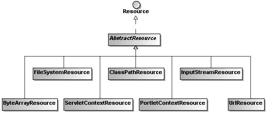

9799ch04.qxd 4/10/08 10:53 AM Page 131

第 4 章 **■** 高级 Spring IoC 容器

**131**

**<value>com.apress.springrecipes.shop.Disc,CD-RW,1.5</value>**

</property>

...

</bean>

</beans>

实际上，JavaBeans API 会自动为类搜索属性编辑器。为了正确搜索到属性编辑器，它必须与目标类位于同一个包中，并且名称必须是目标类名加上 `Editor` 后缀。如果你的属性编辑器遵循此约定（例如前面的 `ProductEditor`），则无需在 Spring IoC 容器中再次注册。

**4-16. 加载外部资源**

问题

有时，你的应用程序可能需要从不同位置（例如文件系统、类路径或 URL）读取外部资源（例如文本文件、XML 文件、属性文件或图像文件）。

通常，你必须使用不同的 API 来从不同位置加载资源。

解决方案

Spring 的资源加载器提供了一个统一的 `getResource()` 方法，用于通过资源路径检索外部资源。你可以为此路径指定不同的前缀，以从不同位置加载资源。要从文件系统加载资源，请使用 `file:` 前缀。要从类路径加载资源，请使用 `classpath:` 前缀。你也可以在此资源路径中指定一个 URL。

`Resource` 是 Spring 中用于表示外部资源的通用接口。Spring 为 `Resource` 接口提供了几种实现，如图 4-1 所示。资源加载器的 `getResource()` 方法将根据资源路径决定实例化哪个 `Resource` 实现。

**图 4-1.** *Resource 接口的常见实现*

9799ch04.qxd 4/10/08 10:53 AM Page 132

**132**

第 4 章 **■** 高级 Spring IoC 容器

工作原理

假设你希望在商店应用程序启动时显示一个横幅。该横幅由以下字符组成，并存储在一个名为 `banner.txt` 的文本文件中。此文件可以放在应用程序的当前路径下。

***********************

* 欢迎来到我的商店！ *

***********************

接下来，你必须编写 `BannerLoader` 类来加载横幅并将其输出到控制台。由于它需要访问资源加载器来加载资源，因此它必须实现 `ApplicationContextAware` 接口或 `ResourceLoaderAware` 接口。

package com.apress.springrecipes.shop;

...

import org.springframework.context.ResourceLoaderAware;

import org.springframework.core.io.Resource;

import org.springframework.core.io.ResourceLoader;

public class BannerLoader implements ResourceLoaderAware {

private ResourceLoader resourceLoader;

public void setResourceLoader(ResourceLoader resourceLoader) {

this.resourceLoader = resourceLoader;

}

public void showBanner() throws IOException {


Resource banner = resourceLoader.getResource("file:banner.txt"); InputStream in = banner.getInputStream();

BufferedReader reader = new BufferedReader(new InputStreamReader(in));

while (true) {

String line = reader.readLine();

if (line == null)

break;

System.out.println(line);

}

reader.close();

}

}

通过从应用上下文中调用 `getResource()` 方法，你可以获取由资源路径指定的外部资源。由于你的横幅文件位于文件系统中，资源路径应以 `file:` 前缀开头。你可以调用 `getInputStream()` 方法来获取该资源的输入流。然后，使用 `BufferedReader` 逐行读取文件内容，并将其输出到控制台。

9799ch04.qxd 4/10/08 10:53 AM Page 133

第 4 章 **■** 高级 Spring IoC 容器

**133**

最后，在 Bean 配置文件中声明一个 `BannerLoader` 实例来显示横幅。由于你希望在启动时显示横幅，因此将 `showBanner()` 方法指定为初始化方法。

<bean id="bannerLoader"

class="com.apress.springrecipes.shop.BannerLoader"

**init-method="showBanner"** />

**资源前缀**

之前的资源路径指定了文件系统相对路径下的一个资源。你也可以指定绝对路径。

file:c:/shop/banner.txt

当你的资源位于类路径（classpath）中时，必须使用 `classpath:` 前缀。如果没有提供路径信息，它将从类路径的根目录加载。

classpath:banner.txt

如果资源位于特定包中，你可以指定从类路径根目录开始的绝对路径。

classpath:com/apress/springrecipes/shop/banner.txt

除了文件系统路径或类路径，资源也可以通过指定 URL 来加载。

[`springrecipes.apress.com/shop/banner.txt`](http://springrecipes.apress.com/shop/banner.txt)

如果资源路径中没有提供前缀，资源将根据应用上下文从相应位置加载。对于 `FileSystemXmlApplicationContext`，资源将从文件系统加载。对于 `ClassPathXmlApplicationContext`，资源将从类路径加载。

**注入资源**

除了显式调用 `getResource()` 方法加载资源外，你还可以通过 setter 方法注入资源：

package com.apress.springrecipes.shop;

...

import org.springframework.core.io.Resource;

public class BannerLoader {

**private Resource banner;**

**public void setBanner(Resource banner) {**

**this.banner = banner;**

**}**

9799ch04.qxd 4/10/08 10:53 AM Page 134

**134**

第 4 章 **■** 高级 Spring IoC 容器

public void showBanner() throws IOException {

InputStream in = banner.getInputStream();

...

}

}

在 Bean 配置中，你可以直接为这个 `Resource` 属性指定资源路径。Spring 会使用预注册的属性编辑器 `ResourceEditor` 将其转换为 `Resource` 对象，然后再注入到你的 Bean 中。

<bean id="bannerLoader"

class="com.apress.springrecipes.shop.BannerLoader"

init-method="showBanner">

**<property name="banner">**

**<value>classpath:com/apress/springrecipes/shop/banner.txt</value>**

**</property>**

</bean>

**4-17. 本章小结**

在本章中，你学习了创建 Bean 的各种方法，包括调用构造函数、调用静态/实例工厂方法、使用工厂 Bean，以及从静态字段/对象属性中获取。Spring IoC 容器使得通过这些方式创建 Bean 变得简单。

在 Spring 2.x 中，你可以指定 Bean 的作用域来控制请求时返回哪个 Bean 实例。默认的 Bean 作用域是单例（singleton）——Spring 为每个 Spring IoC 容器创建一个共享的单一 Bean 实例。另一个常见的作用域是原型（prototype）——每次请求时，Spring 都会创建一个新的 Bean 实例。

你可以通过指定相应的回调方法来定制 Bean 的初始化和销毁过程。此外，你的 Bean 可以实现特定的 Aware 接口来感知容器的配置和基础设施。Spring IoC 容器会在 Bean 生命周期的特定时间点调用这些方法。

Spring 支持在 IoC 容器中注册 Bean 后处理器，以便在初始化回调方法之前和之后执行额外的 Bean 处理。Bean 后处理器可以处理 IoC 容器中的所有 Bean。通常，Bean 后处理器用于检查 Bean 属性的有效性或根据特定标准更改 Bean 属性。

你还学习了一些高级 IoC 容器特性，例如将 Bean 配置外部化到属性文件、从资源包中解析文本消息、发布和监听应用事件、使用属性编辑器将属性值从文本值转换，以及加载外部资源。在使用 Spring 开发应用程序时，你会发现这些特性非常有用。

在下一章中，你将学习 Spring 框架的另一个核心特性：面向切面编程。

9799ch05.qxd 4/14/08 10:59 AM Page 135

第 5 章

动态代理与经典

Spring AOP

**本**章中，你将首先了解横切关注点的本质，以及如何通过动态代理将其模块化。然后，你将重点学习 Spring 1.x 版本中的 AOP 用法，这被称为经典 Spring AOP。Spring AOP 的用法从 1.x 版本到 2.x 版本发生了显著变化。介绍经典 Spring AOP 主要是出于兼容性目的。

每次你使用 Spring 2.x 启动新项目时，都应选择新的 Spring AOP 方法，下一章将对此进行详细介绍。

*面向切面编程（AOP）* 是一种新的方法论，用于补充传统的*面向对象编程（OOP）*。AOP 的动机并非取代 OOP。事实上，AOP 通常与 OOP 一起使用。在 OOP 的世界中，应用程序通过类和接口来组织。这些元素非常适合实现核心业务需求，但不适合处理横切关注点（即跨越应用程序多个模块的功能或需求）。横切关注点在企业应用中非常常见。典型的例子包括日志记录、验证和事务管理。

AOP 为开发者提供了另一种组织应用程序结构的方式。与 OOP 中的类和接口不同，AOP 的主要编程元素是*切面*。你可以想象，切面将横切关注点模块化，就像类在 OOP 中将状态和行为模块化一样。

除了 IoC 容器，Spring 框架的另一个核心模块是其 AOP 框架。目前，市场上存在许多基于不同技术、为不同目的而实现的 AOP 框架，但只有以下三个开源 AOP 框架进入了主流：

• AspectJ，自版本 5 起与 AspectWerkz 合并（[`www.eclipse.org/aspectj/`](http://www.eclipse.org/aspectj)）

• JBoss AOP，作为 JBoss 应用服务器的子项目（[`labs.jboss.com/jbossaop`](http://labs.jboss.com/jbossaop)）

• Spring AOP，作为 Spring 框架的一部分（[`www.springframework.org/`](http://www.springframework.org)） 其中，AspectJ 是 Java 社区中最完整、最流行的 AOP 框架。相比之下，Spring AOP 并非 AspectJ 的竞争对手，旨在提供另一个完整的 AOP 实现。其目的仅仅是提供一个能够与其 IoC 容器无缝集成的 AOP 解决方案。实际上，Spring AOP 只会处理在其 IoC 容器中声明的 Bean 的横切关注点。

**135**

9799ch05.qxd 4/14/08 10:59 AM Page 136

**136**


第 5 章 **■** 动态代理与经典 Spring AOP

Spring AOP 的核心实现技术是动态代理。尽管 Spring AOP 的用法从 1.x 版本到 2.x 版本发生了显著变化，但其实现技术始终保持不变。此外，Spring AOP 是向后兼容的，因此你可以在 Spring 2.x 中继续使用 Spring 1.x 的 AOP 元素。

• 在 Spring 1.x 版本中，AOP 的使用是通过一套专有的 Spring AOP API 实现的。
• 在 Spring 2.0 版本中，AOP 的使用是通过编写 POJO，并在 Bean 配置文件中使用 AspectJ 注解或基于 XML 的配置来实现的。

完成本章学习后，你将能够识别应用程序中的横切关注点，并使用经典 Spring AOP 将其模块化。你还将掌握 Spring AOP 核心实现技术——动态代理的基础知识，这有助于你更好地理解 Spring AOP 的机制。

**5-1. 非模块化横切关注点的问题**

根据定义，横切关注点是一种跨越应用程序多个模块的功能。这类关注点通常难以通过传统的面向对象方法进行模块化。为了理解横切关注点，让我们从一个简单的计算器示例开始。首先，为算术计算和度量单位转换创建两个接口：`ArithmeticCalculator`和`UnitCalculator`。

```java
package com.apress.springrecipes.calculator;

public interface ArithmeticCalculator {

    public double add(double a, double b);

    public double sub(double a, double b);

    public double mul(double a, double b);

    public double div(double a, double b);

}
```

```java
package com.apress.springrecipes.calculator;

public interface UnitCalculator {

    public double kilogramToPound(double kilogram);

    public double kilometerToMile(double kilometer);

}
```

然后，为每个计算器接口提供一个简单的实现。其中的`println`语句用于通知你这些方法何时被执行。

```java
package com.apress.springrecipes.calculator;

public class ArithmeticCalculatorImpl implements ArithmeticCalculator {

    public double add(double a, double b) {
        double result = a + b;
        System.out.println(a + " + " + b + " = " + result);
        return result;
    }

    public double sub(double a, double b) {
        double result = a - b;
        System.out.println(a + " - " + b + " = " + result);
        return result;
    }

    public double mul(double a, double b) {
        double result = a * b;
        System.out.println(a + " * " + b + " = " + result);
        return result;
    }

    public double div(double a, double b) {
        double result = a / b;
        System.out.println(a + " / " + b + " = " + result);
        return result;
    }
}
```

```java
package com.apress.springrecipes.calculator;

public class UnitCalculatorImpl implements UnitCalculator {

    public double kilogramToPound(double kilogram) {
        double pound = kilogram * 2.2;
        System.out.println(kilogram + " kilogram = " + pound + " pound");
        return pound;
    }

    public double kilometerToMile(double kilometer) {
        double mile = kilometer * 0.62;
        System.out.println(kilometer + " kilometer = " + mile + " mile");
        return mile;
    }
}
```

**追踪方法**

大多数应用程序的一个常见需求是追踪程序执行期间发生的活动。对于 Java 平台，有几种日志实现可供你选择。但是，如果你希望应用程序独立于日志实现，可以利用 Apache Commons Logging 库。它提供了与实现无关的抽象 API，允许你在不修改代码的情况下切换不同的实现。

**■注意** 要使用 Apache Commons Logging 库，你必须在类路径中包含`commons-logging.jar`（位于 Spring 安装目录的`lib/jakarta-commons`目录下）。

对于你的计算器，你可以记录每个方法的开始和结束，以及方法的参数和返回值。

```java
package com.apress.springrecipes.calculator;

import org.apache.commons.logging.Log;
import org.apache.commons.logging.LogFactory;

public class ArithmeticCalculatorImpl implements ArithmeticCalculator {

    private Log log = LogFactory.getLog(this.getClass());

    public double add(double a, double b) {
        log.info("The method add() begins with " + a + ", " + b);
        double result = a + b;
        System.out.println(a + " + " + b + " = " + result);
        log.info("The method add() ends with " + result);
        return result;
    }

    public double sub(double a, double b) {
        log.info("The method sub() begins with " + a + ", " + b);
        double result = a - b;
        System.out.println(a + " - " + b + " = " + result);
        log.info("The method sub() ends with " + result);
        return result;
    }

    public double mul(double a, double b) {
        log.info("The method mul() begins with " + a + ", " + b);
        double result = a * b;
        System.out.println(a + " * " + b + " = " + result);
        log.info("The method mul() ends with " + result);
        return result;
    }

    public double div(double a, double b) {
        log.info("The method div() begins with " + a + ", " + b);
        double result = a / b;
        System.out.println(a + " / " + b + " = " + result);
        log.info("The method div() ends with " + result);
        return result;
    }
}
```

```java
package com.apress.springrecipes.calculator;

import org.apache.commons.logging.Log;
import org.apache.commons.logging.LogFactory;

public class UnitCalculatorImpl implements UnitCalculator {

    private Log log = LogFactory.getLog(this.getClass());

    public double kilogramToPound(double kilogram) {
        log.info("The method kilogramToPound() begins with " + kilogram);
        double pound = kilogram * 2.2;
        System.out.println(kilogram + " kilogram = " + pound + " pound");
        log.info("The method kilogramToPound() ends with " + pound);
        return pound;
    }

    public double kilometerToMile(double kilometer) {
        log.info("The method kilometerToMile() begins with " + kilometer);
        double mile = kilometer * 0.62;
        System.out.println(kilometer + " kilometer = " + mile + " mile");
        log.info("The method kilometerToMile() ends with " + mile);
        return mile;
    }
}
```

现在，你可以自由选择 Commons Logging 库支持的日志实现。目前它主要支持 Apache 的 Log4J 库和 JDK Logging API（适用于 JDK 1.4 及更高版本）。其中，Log4J 是更好的选择，因为它更强大且更易于配置。

**■注意** 要使用 Log4J 库，你必须在类路径中包含`log4j-1.2.14.jar`（位于 Spring 安装目录的`lib/log4j`目录下）。一旦在类路径中检测到 Log4J 库，Commons Logging 将把它用作底层的日志实现。

你可以通过位于类路径根目录下名为`log4j.properties`的属性文件来配置 Log4J 库。以下 Log4J 配置文件定义了一个名为`stdout`的日志附加器，它将按照指定模式控制的格式将日志消息输出到控制台。有关 Log4J 日志模式的更多信息，请参考 Log4J 文档。

```
### 直接将日志消息输出到 stdout ###
log4j.appender.stdout=org.apache.log4j.ConsoleAppender
log4j.appender.stdout.layout=org.apache.log4j.PatternLayout
log4j.appender.stdout.layout.ConversionPattern=**➥**
%d{yyyy-MM-dd HH:mm:ss} %5p %c{1}:%L - %m%n

### 设置根日志记录器级别 ###
log4j.rootLogger=error, stdout
```


### 设置应用程序日志记录级别 ###

log4j.logger.com.apress.springrecipes.calculator=info

Log4J 支持六种日志记录级别，供您设置日志消息的紧急程度。

按从高到低的顺序排列，它们分别是：fatal、error、warn、info、debug 和 trace。如前面的 Log4J 配置文件中所指定，此应用程序的根（默认）日志记录级别为 error，这意味着默认情况下仅输出 error 和 fatal 级别的日志。但对于 `com.apress.springrecipes.calculator` 包及其子包，级别高于 info 的日志也将被输出。

为了测试这两个计算器的基本功能以及日志记录配置，您可以编写如下所示的 `Main` 类：

package com.apress.springrecipes.calculator;

public class Main {

public static void main(String[] args) {

ArithmeticCalculator arithmeticCalculator = new ArithmeticCalculatorImpl(); arithmeticCalculator.add(1, 2);

arithmeticCalculator.sub(4, 3);

arithmeticCalculator.mul(2, 3);

arithmeticCalculator.div(4, 2);

UnitCalculator unitCalculator = new UnitCalculatorImpl();

unitCalculator.kilogramToPound(10);

unitCalculator.kilometerToMile(5);

}

}

验证参数

现在，让我们考虑为您的计算器添加一个限制。假设您希望计算器仅支持正数。在每个方法的开头，您调用 `validate()` 方法来检查所有参数是否为正数。对于任何负数，您将抛出 `IllegalArgumentException`。

9799ch05.qxd 4/14/08 10:59 AM Page 141

第 5 章 **■** 动态代理与经典 Spring AOP

**141**

package com.apress.springrecipes.calculator;

...

public class ArithmeticCalculatorImpl implements ArithmeticCalculator {

...

public double add(double a, double b) {

**validate(a);**

**validate(b);**

...

}

public double sub(double a, double b) {

**validate(a);**

**validate(b);**

...

}

public double mul(double a, double b) {

**validate(a);**

**validate(b);**

...

}

public double div(double a, double b) {

**validate(a);**

**validate(b);**

...

}

private void validate(double a) {

if (a < 0) {

throw new IllegalArgumentException("Positive numbers only");

}

}

}

package com.apress.springrecipes.calculator;

...

public class UnitCalculatorImpl implements UnitCalculator {

...

public double kilogramToPound(double kilogram) {

**validate(kilogram);**

...

}

public double kilometerToMile(double kilometer) {

**validate(kilometer);**

9799ch05.qxd 4/14/08 10:59 AM Page 142

**142**

第 5 章 **■** 动态代理与经典 Spring AOP

...

}

private void validate(double a) {

if (a < 0) {

throw new IllegalArgumentException("Positive numbers only");

}

}

}

识别问题

如您所见，随着您添加越来越多的非业务需求（例如日志记录和验证），原始的计算器方法不断膨胀。这些系统级需求通常需要横切多个模块，因此它们被称为*横切关注点*，以区别于系统的核心业务需求（称为*核心关注点*）。

企业应用程序中典型的横切关注点包括日志记录、验证、池化、缓存、身份验证和事务。图 5-1 展示了您的计算器应用程序中的横切关注点。

**图 5-1.** *计算器应用程序中的横切关注点* 然而，仅使用类和接口作为编程元素，传统的面向对象方法无法很好地模块化横切关注点。开发人员常常不得不将它们与核心关注点混合在同一个模块中。结果，这些横切关注点分散在应用程序的不同模块中，因此未能实现模块化。

非模块化的横切关注点会导致两个主要问题。第一个是*代码纠缠*。就像前面的计算器方法一样，每个方法都必须同时处理多个关注点以及核心计算逻辑。这将导致代码的可维护性和可重用性变差。例如，前面的计算器实现很难重用于另一个没有日志记录要求且可以接受负数作为操作数的应用程序。

9799ch05.qxd 4/14/08 10:59 AM Page 143

第 5 章 **■** 动态代理与经典 Spring AOP

**143**

非模块化横切关注点导致的另一个问题是*代码分散*。

对于日志记录需求，您必须在多个模块中多次重复日志记录语句才能满足单个需求。稍后，如果日志记录标准发生变化，您将不得不修改所有模块。此外，也很难确保日志记录需求得到一致地实现。如果您在某处遗漏了一条日志记录语句，整个系统的日志记录将变得不一致。

基于所有这些原因，计算器应该只专注于核心计算逻辑。让我们将日志记录和验证关注点从它们中分离出来。

package com.apress.springrecipes.calculator;

public class ArithmeticCalculatorImpl implements ArithmeticCalculator {

public double add(double a, double b) {

double result = a + b;

System.out.println(a + " + " + b + " = " + result);

return result;

}

public double sub(double a, double b) {

double result = a - b;

System.out.println(a + " - " + b + " = " + result);

return result;

}

public double mul(double a, double b) {

double result = a * b;

System.out.println(a + " * " + b + " = " + result);

return result;

}

public double div(double a, double b) {

double result = a / b;

System.out.println(a + " / " + b + " = " + result);

return result;

}

}

package com.apress.springrecipes.calculator;

public class UnitCalculatorImpl implements UnitCalculator {

public double kilogramToPound(double kilogram) {

double pound = kilogram * 2.2;

System.out.println(kilogram + " kilogram = " + pound + " pound"); return pound;

}

9799ch05.qxd 4/14/08 10:59 AM Page 144

**144**

第 5 章 **■** 动态代理与经典 Spring AOP

public double kilometerToMile(double kilometer) {

double mile = kilometer * 0.62;

System.out.println(kilometer + " kilometer = " + mile + " mile"); return mile;

}

}

**5-2. 使用动态代理模块化横切关注点**

问题

由于非模块化的横切关注点会导致代码纠缠和代码分散问题，您希望寻求一种方法来模块化它们。然而，由于它们横跨应用程序的多个模块，通常很难用传统的面向对象方法进行模块化。

解决方案

您可以应用一种称为*代理*的设计模式，将横切关注点与核心关注点分离开来。代理是 23 种 GoF（四人组）面向对象设计模式之一，属于“结构型模式”类别。

代理设计模式的原则是用一个代理对象包装原始对象，并使用此代理来替代原始对象。任何对原始对象的调用都将首先经过代理。图 5-2 展示了代理设计模式的一般概念。

**图 5-2.** *代理设计模式的一般概念*

代理对象负责决定何时以及是否将方法调用转发给原始对象。同时，代理还可以在每个方法调用周围执行额外的任务。因此，代理是实施横切关注点的好地方。


在 Java 中，有两种方式可以实现代理设计模式。传统的方式是以纯面向对象风格编写静态代理。静态代理通过使用专用代理包装一个对象，在每个方法调用前后执行额外任务。这种专用性意味着你必须为每个接口编写一个代理类，才能替代原始实现，这在包含成百上千个组件的大型应用中效率非常低下。

另一种方法是通过 JDK 1.3 或更高版本提供的动态代理支持。它支持为任何对象动态创建代理。唯一的限制是对象必须至少实现一个接口，并且只有接口中声明的方法调用才会经过代理。然而，还有另一种代理——CGLIB 代理，它没有这个限制。即使一个类没有实现任何接口，它也能处理该类中声明的所有方法。

动态代理是通过 Java 反射 API 实现的，因此它们比静态代理具有更通用的使用方式。正因如此，动态代理是 Spring 实现 AOP 的核心技术之一。

工作原理

JDK 动态代理需要一个调用处理器来处理方法调用。调用处理器就是一个实现了以下 `InvocationHandler` 接口的类：

```java
package java.lang.reflect;

public interface InvocationHandler {

    public Object invoke(Object proxy, Method method, Object[] args)
        throws Throwable;

}
```

该接口中声明的唯一方法是 `invoke()`。它允许你自行控制整个调用过程。`invoke()` 方法的第一个参数是正在调用方法的代理实例。第二个参数是类型为 `java.lang.reflect.Method` 的方法对象，它代表当前正在被调用的方法。最后一个参数是用于调用目标方法的参数数组。最后，你必须返回一个值作为当前方法调用的结果。

**创建日志代理**

通过实现 `InvocationHandler` 接口，你可以编写一个记录方法开始和结束的调用处理器。你需要一个目标计算器对象来执行实际计算，该对象通过构造函数参数传入。

```java
package com.apress.springrecipes.calculator;

import java.lang.reflect.InvocationHandler;
import java.lang.reflect.Method;
import java.util.Arrays;
import org.apache.commons.logging.Log;
import org.apache.commons.logging.LogFactory;

public class CalculatorLoggingHandler implements InvocationHandler {

    private Log log = LogFactory.getLog(this.getClass());
    private Object target;

    public CalculatorLoggingHandler(Object target) {
        this.target = target;
    }

    public Object invoke(Object proxy, Method method, Object[] args)
        throws Throwable {
        // 记录方法开始，包含方法名和参数。
        **log.info("方法 " + method.getName() + "() 开始，参数为 "**
            **+ Arrays.toString(args));**

        // 通过调用 Method.invoke() 并传入目标对象和方法参数，在目标计算器对象上执行实际计算。
        Object result = method.invoke(target, args);

        // 记录方法结束，包含返回结果。
        **log.info("方法 " + method.getName() + "() 结束，结果为 " + result);**
        return result;
    }

}
```

通过使用反射，`invoke()` 方法足够通用，可以处理两个计算器的所有方法调用。你可以通过调用 `Method.getName()` 访问方法名，并通过对象数组访问参数。要执行实际计算，你需要在方法对象上调用 `invoke()`，并传入目标计算器对象和方法参数。


要创建一个带有调用处理器的 JDK 动态代理实例，只需调用静态方法 `Proxy.newProxyInstance()`。

package com.apress.springrecipes.calculator;

import java.lang.reflect.Proxy;

public class Main {

public static void main(String[] args) {

ArithmeticCalculator **arithmeticCalculatorImpl** =

new ArithmeticCalculatorImpl();

**ArithmeticCalculator arithmeticCalculator =**

**(ArithmeticCalculator) Proxy.newProxyInstance(**

**arithmeticCalculatorImpl.getClass().getClassLoader(),**

**arithmeticCalculatorImpl.getClass().getInterfaces(),**

**new CalculatorLoggingHandler(arithmeticCalculatorImpl));**

9799ch05.qxd 4/14/08 10:59 AM Page 147

第 5 章 **■** 动态代理与经典 Spring AOP

**147**

...

}

}

该方法的第一个参数是用于注册此代理的类加载器。在大多数情况下，你应该在与原始类相同的类加载器中定义代理。第二个参数是此代理需要实现的接口。只有这些接口中声明的方法调用才会经过代理。通常，你会为目标类的所有接口创建代理。最后一个参数是你的调用处理器，用于处理方法调用。通过调用此方法，你将获得一个由 JDK 动态创建的代理实例。你可以将其用于计算，使所有方法调用都经过日志处理器。

为了复用，你可以将代理创建代码封装在处理器类的静态方法中。

package com.apress.springrecipes.calculator;

...

import java.lang.reflect.Proxy;

public class CalculatorLoggingHandler implements InvocationHandler {

...

public static Object createProxy(Object target) {

return Proxy.newProxyInstance(

target.getClass().getClassLoader(),

target.getClass().getInterfaces(),

new CalculatorLoggingHandler(target));

}

}

现在，Main 类中的代理创建代码简化为调用静态方法。

package com.apress.springrecipes.calculator;

public class Main {

public static void main(String[] args) {

ArithmeticCalculator arithmeticCalculatorImpl =

new ArithmeticCalculatorImpl();

**ArithmeticCalculator arithmeticCalculator =**

**(ArithmeticCalculator) CalculatorLoggingHandler.createProxy(**

**arithmeticCalculatorImpl);**

...

}

}

借助这个通用的日志调用处理器，你还可以为 UnitCalculator 动态创建代理。

9799ch05.qxd 4/14/08 10:59 AM Page 148

**148**

第 5 章 **■** 动态代理与经典 Spring AOP

package com.apress.springrecipes.calculator;

public class Main {

public static void main(String[] args) {

...

UnitCalculator **unitCalculatorImpl** = new UnitCalculatorImpl();

**UnitCalculator unitCalculator =**

**(UnitCalculator) CalculatorLoggingHandler.createProxy(**

**unitCalculatorImpl);**

...

}

}

图 5-3 展示了使用代理设计模式实现日志关注点的过程。

**图 5-3.** *使用代理实现日志关注点*

**创建验证代理**

类似地，你可以编写一个验证处理器，如下所示。由于不同方法可能具有不同数量的参数，你需要遍历参数数组以验证每个方法参数。

package com.apress.springrecipes.calculator;

import java.lang.reflect.InvocationHandler;

import java.lang.reflect.Method;

import java.lang.reflect.Proxy;

public class CalculatorValidationHandler implements InvocationHandler {

9799ch05.qxd 4/14/08 10:59 AM Page 149

第 5 章 **■** 动态代理与经典 Spring AOP

**149**

public static Object createProxy(Object target) {

return Proxy.newProxyInstance(

target.getClass().getClassLoader(),

target.getClass().getInterfaces(),

new CalculatorValidationHandler(target));

}

private Object target;

public CalculatorValidationHandler(Object target) {

this.target = target;

}

public Object invoke(Object proxy, Method method, Object[] args)

throws Throwable {

**for (Object arg : args) {**

**validate((Double) arg);**

**}**

Object result = method.invoke(target, args);


return result;

}

private void validate(double a) {

if (a < 0) {

throw new IllegalArgumentException("仅接受正数");

}

}

}

在 `Main` 类中，你可以用验证代理包裹日志代理，从而形成代理链。任何计算器方法的调用都会先经过验证代理，再经过日志代理。这意味着验证会在日志记录之前执行。如果你希望顺序相反，则应该用日志代理包裹验证代理。

package com.apress.springrecipes.calculator;

public class Main {

public static void main(String[] args) {

ArithmeticCalculator arithmeticCalculatorImpl =

new ArithmeticCalculatorImpl();

ArithmeticCalculator arithmeticCalculator =

(ArithmeticCalculator) **CalculatorValidationHandler.createProxy(**

CalculatorLoggingHandler.createProxy(

arithmeticCalculatorImpl)**)**;

...

9799ch05.qxd 4/14/08 10:59 AM 第 150 页

**150**

第 5 章 **■** 动态代理与经典 Spring AOP

UnitCalculator unitCalculatorImpl = new UnitCalculatorImpl();

UnitCalculator unitCalculator =

(UnitCalculator) **CalculatorValidationHandler.createProxy(**

CalculatorLoggingHandler.createProxy(

unitCalculatorImpl)**)**;

...

}

}

图 5-4 展示了使用代理设计模式实现验证和日志记录关注点的过程。

**图 5-4.** *使用代理实现验证和日志记录关注点* **5-3. 使用经典 Spring 通知模块化横切关注点**

问题

由于横切关注点通常难以通过传统的面向对象方法进行模块化，你希望寻求另一种方法来实现模块化。动态代理有助于模块化横切关注点，但要求应用程序开发者编写如此底层的代理代码过于苛刻。

9799ch05.qxd 4/14/08 10:59 AM 第 151 页

第 5 章 **■** 动态代理与经典 Spring AOP

**151**

解决方案

AOP 为应用程序开发者定义了一组高级概念，用于表达其横切关注点。首先，在特定执行点执行的横切操作被封装在*通知*中。例如，你可以将日志记录和验证操作封装在一个或多个通知中。

经典 Spring AOP 支持四种类型的通知，每种通知在执行点的不同时机生效。在正式的 AOP 定义中，执行点有多种类型，包括方法执行、构造函数执行和字段访问。然而，Spring AOP 仅支持方法执行。因此，四种经典通知类型的定义可以缩小为以下内容：

• *前置通知*：在方法执行之前

• *返回后通知*：在方法返回结果之后

• *异常后通知*：在方法抛出异常之后

• *环绕通知*：在方法执行前后

使用经典 Spring AOP 方法时，通过实现专有的通知接口来编写通知。

工作原理

Spring AOP 的目标仅在于处理其 IoC 容器中声明的 Bean 的横切关注点。因此，在使用 Spring AOP 模块化横切关注点之前，你必须将计算器应用程序迁移到 Spring IoC 容器中运行。你只需在 Spring 的 Bean 配置文件中声明两个计算器。

<beans

[xsi:schemaLocation="http://www.springframework.org/schema/beans](http://www.w3.org/2001/XMLSchema-instance)

[`www.springframework.org/schema/beans/spring-beans-2.5.xsd">`](http://www.w3.org/2001/XMLSchema-instance)

<bean id="arithmeticCalculator"

class="com.apress.springrecipes.calculator.ArithmeticCalculatorImpl" />

<bean id="unitCalculator"

class="com.apress.springrecipes.calculator.UnitCalculatorImpl" />

</beans>

然后修改 `Main` 类，改为从 IoC 容器中获取计算器实例。

package com.apress.springrecipes.calculator;

import org.springframework.context.ApplicationContext;


import org.springframework.context.support.ClassPathXmlApplicationContext; public class Main {

9799ch05.qxd 4/14/08 10:59 AM Page 152

**152**

第 5 章 **■** 动态代理与经典 Spring AOP

public static void main(String[] args) {

ApplicationContext context =

new ClassPathXmlApplicationContext("beans.xml");

ArithmeticCalculator arithmeticCalculator =

(ArithmeticCalculator) context.getBean("arithmeticCalculator");

...

UnitCalculator unitCalculator =

(UnitCalculator) context.getBean("unitCalculator");

...

}

}

**前置通知**

*前置*通知在方法执行之前生效。它通过实现 `MethodBeforeAdvice` 接口来创建。在 `before()` 方法中，你可以访问方法的详细信息以及参数。

package com.apress.springrecipes.calculator;

import java.lang.reflect.Method;

import java.util.Arrays;

import org.apache.commons.logging.Log;

import org.apache.commons.logging.LogFactory;

import org.springframework.aop.MethodBeforeAdvice;

public class LoggingBeforeAdvice implements MethodBeforeAdvice {

private Log log = LogFactory.getLog(this.getClass());

public void before(Method method, Object[] args, Object target)

throws Throwable {

log.info("方法 " + method.getName() + "() 以参数 "

+ Arrays.toString(args) + " 开始执行");

}

}

**■提示** 通知的概念类似于使用动态代理时的调用处理器。

准备好这个通知后，下一步就是将其应用到你的计算器 Bean 上。首先，你需要在 IoC 容器中声明该通知的一个实例。然后，最关键的一步是为每个计算器 Bean 创建一个代理来应用此通知。在 Spring AOP 中，代理的创建是通过一个名为 `ProxyFactoryBean` 的工厂 Bean 来完成的。

<beans ...>

...

**<bean id="loggingBeforeAdvice"**

**class="com.apress.springrecipes.calculator.LoggingBeforeAdvice" />**

<bean id="arithmeticCalculatorProxy"

class="org.springframework.aop.framework.ProxyFactoryBean">

<property name="proxyInterfaces">

<list>

<value>

com.apress.springrecipes.calculator.ArithmeticCalculator

</value>

</list>

</property>

<property name="target" ref="arithmeticCalculator" />

<property name="interceptorNames">

<list>

<value> **loggingBeforeAdvice**</value>

</list>

</property>

</bean>

<bean id="unitCalculatorProxy"

class="org.springframework.aop.framework.ProxyFactoryBean">

<property name="proxyInterfaces">

<list>

<value>

com.apress.springrecipes.calculator.UnitCalculator

</value>

</list>

</property>

<property name="target" ref="unitCalculator" />

<property name="interceptorNames">

<list>

<value> **loggingBeforeAdvice**</value>

</list>

</property>

</bean>

</beans>

**■提示** 使用 `ProxyFactoryBean` 创建代理类似于使用动态代理时编写代理创建代码。

9799ch05.qxd 4/14/08 10:59 AM Page 154

**154**

第 5 章 **■** 动态代理与经典 Spring AOP

在上述 Bean 配置中，你为代理提供了需要实现的接口。只有对这些接口中声明的方法的调用才会经过代理。目标对象是实际处理方法调用的对象。在 `interceptorNames` 属性中，你可以为此代理指定一个通知名称列表。这些通知将按照其定义的顺序分配优先级。有了所有这些信息，`ProxyFactoryBean` 就能为目标对象创建代理，并将其注册到 IoC 容器中。

默认情况下，`ProxyFactoryBean` 可以自动检测目标 Bean 实现的接口，并为所有这些接口创建代理。因此，如果你想代理一个 Bean 的所有接口，则无需显式指定它们。

<beans ...>

...

<bean id="arithmeticCalculatorProxy"

class="org.springframework.aop.framework.ProxyFactoryBean">

<property name="target" ref="arithmeticCalculator" />

<property name="interceptorNames">

<list>

<value>loggingBeforeAdvice</value>

</list>

</property>

</bean>


<bean id="unitCalculatorProxy"
      class="org.springframework.aop.framework.ProxyFactoryBean">
    <property name="target" ref="unitCalculator" />
    <property name="interceptorNames">
        <list>
            <value>loggingBeforeAdvice</value>
        </list>
    </property>
</bean>
</beans>

如果目标 Bean 实现了任何接口，`ProxyFactoryBean` 将创建一个 JDK 代理。如果没有实现接口，`ProxyFactoryBean` 则会创建一个 CGLIB 代理，该代理可以代理其类中声明的所有方法。

在 `Main` 类中，您应该从 IoC 容器中获取代理 Bean，以便应用您的日志通知。

```java
package com.apress.springrecipes.calculator;

import org.springframework.context.ApplicationContext;
import org.springframework.context.support.ClassPathXmlApplicationContext;

public class Main {

    9799ch05.qxd 4/14/08 10:59 AM Page 155

    C H A P T E R 5 **■** DY N A M I C P R OX Y A N D C L A S S I C S P R I N G A O P

    **155**

    public static void main(String[] args) {

        ApplicationContext context =
                new ClassPathXmlApplicationContext("beans.xml");

        ArithmeticCalculator arithmeticCalculator =
                (ArithmeticCalculator) context.getBean("**arithmeticCalculatorProxy**");

        ...

        UnitCalculator unitCalculator =
                (UnitCalculator) context.getBean("**unitCalculatorProxy**");

        ...

    }
}
```

**返回后通知（After Returning Advices）**

除了前置通知，您还可以编写一个*返回后*通知，用于记录方法结束时的返回值。

```java
package com.apress.springrecipes.calculator;

import java.lang.reflect.Method;

import org.apache.commons.logging.Log;
import org.apache.commons.logging.LogFactory;
import org.springframework.aop.AfterReturningAdvice;

public class LoggingAfterAdvice implements AfterReturningAdvice {

    private Log log = LogFactory.getLog(this.getClass());

    public void afterReturning(Object returnValue, Method method,
                               Object[] args, Object target) throws Throwable {
        log.info("方法 " + method.getName() + "() 结束，返回值为 "
                + returnValue);
    }
}
```

要使此通知生效，您需要在 IoC 容器中声明其实例，并向 `interceptorNames` 属性中添加一个条目：

```xml
<beans ...>
    ...
    **<bean id="loggingAfterAdvice"**
          **class="com.apress.springrecipes.calculator.LoggingAfterAdvice" />**

    <bean id="arithmeticCalculatorProxy"
          class="org.springframework.aop.framework.ProxyFactoryBean">

        9799ch05.qxd 4/14/08 10:59 AM Page 156

        **156**

        C H A P T E R 5 **■** DY N A M I C P R OX Y A N D C L A S S I C S P R I N G A O P

        <property name="target" ref="arithmeticCalculator" />
        <property name="interceptorNames">
            <list>
                <value>loggingBeforeAdvice</value>
                <value>**loggingAfterAdvice**</value>
            </list>
        </property>
    </bean>

    <bean id="unitCalculatorProxy"
          class="org.springframework.aop.framework.ProxyFactoryBean">
        <property name="target" ref="unitCalculator" />
        <property name="interceptorNames">
            <list>
                <value>loggingBeforeAdvice</value>
                <value>**loggingAfterAdvice**</value>
            </list>
        </property>
    </bean>
</beans>
```

**抛出后通知（After Throwing Advices）**

第三种类型的通知是*抛出后*通知。首先，为了能够产生异常，您在算术计算器的 `div()` 方法中添加一个检查。如果除数为零，则抛出一个 `IllegalArgumentException`。

```java
package com.apress.springrecipes.calculator;

public class ArithmeticCalculatorImpl implements ArithmeticCalculator {

    ...

    public double div(double a, double b) {
        if (b == 0) {
            throw new IllegalArgumentException("除数为零");
        }
        ...
    }
}
```

对于抛出后通知类型，您必须实现 `ThrowsAdvice` 接口。请注意，此接口未声明任何方法。这是为了让您在不同的方法中处理不同类型的异常。但是，每个方法都必须命名为 `afterThrowing`，以处理特定类型的异常。异常类型由方法参数类型指定。例如，要处理 `IllegalArgumentException`，您可以编写如下所示的方法。在运行时，与此类型兼容的异常（即此类型及其子类型）将由该方法处理。

9799ch05.qxd 4/14/08 10:59 AM Page 157


第 5 章 **■** 动态代理与经典 Spring AOP

**157**

package com.apress.springrecipes.calculator;

import org.apache.commons.logging.Log;

import org.apache.commons.logging.LogFactory;

import org.springframework.aop.ThrowsAdvice;

public class LoggingThrowsAdvice implements ThrowsAdvice {

private Log log = LogFactory.getLog(this.getClass());

public void afterThrowing(IllegalArgumentException e) throws Throwable {

log.error("非法参数");

}

}

你还需要在 IoC 容器中声明该通知的一个实例，并在 `interceptorNames` 属性中添加一个条目：

<beans ...>

...

**<bean id="loggingThrowsAdvice"**

**class="com.apress.springrecipes.calculator.LoggingThrowsAdvice" />**

<bean id="arithmeticCalculatorProxy"

class="org.springframework.aop.framework.ProxyFactoryBean">

<property name="target" ref="arithmeticCalculator" />

<property name="interceptorNames">

<list>

<value>loggingBeforeAdvice</value>

<value>loggingAfterAdvice</value>

<value> **loggingThrowsAdvice**</value>

</list>

</property>

</bean>

<bean id="unitCalculatorProxy"

class="org.springframework.aop.framework.ProxyFactoryBean">

<property name="target" ref="unitCalculator" />

<property name="interceptorNames">

<list>

<value>loggingBeforeAdvice</value>

<value>loggingAfterAdvice</value>

<value> **loggingThrowsAdvice**</value>

</list>

</property>

</bean>

</beans>

9799ch05.qxd 4/14/08 10:59 AM 第 158 页

**158**

第 5 章 **■** 动态代理与经典 Spring AOP

如果需要访问方法详情和参数值，可以扩展 `afterThrowing()` 方法签名的参数列表，如下所示：

package com.apress.springrecipes.calculator;

import java.lang.reflect.Method;

import java.util.Arrays;

...

public class LoggingThrowsAdvice implements ThrowsAdvice {

...

public void afterThrowing(**Method method, Object[] args, Object target**, IllegalArgumentException e) throws Throwable {

**log.error("方法 " + method.getName() + "() 的非法参数 " + Arrays.toString(args));**

}

}

后置抛出通知中的方法签名必须采用以下形式。前三个参数是可选的，但你必须要么全部声明，要么一个都不声明。

afterThrowing([Method, args, target], Throwable subclass)

**环绕通知**

最后一种通知类型是*环绕*通知。它是所有通知类型中最强大的。它能够完全控制方法的执行，因此你可以将前面所有通知的操作合并到一个通知中。你甚至可以控制何时以及是否继续执行原始方法。

在经典 Spring AOP 中，环绕通知必须实现 `MethodInterceptor` 接口。该接口由 AOP 联盟定义，用于不同 AOP 框架之间的兼容性。编写环绕通知时，最重要的一点是必须调用 `methodInvocation.proceed()` 来继续执行原始方法。如果忘记执行此步骤，原始方法将不会被调用。以下环绕通知是你之前创建的前置、后置返回和后置抛出通知的组合：

package com.apress.springrecipes.calculator;

import java.util.Arrays;

import org.aopalliance.intercept.MethodInterceptor;

import org.aopalliance.intercept.MethodInvocation;

import org.apache.commons.logging.Log;

import org.apache.commons.logging.LogFactory;

public class LoggingAroundAdvice implements MethodInterceptor {

private Log log = LogFactory.getLog(this.getClass());

9799ch05.qxd 4/14/08 10:59 AM 第 159 页

第 5 章 **■** 动态代理与经典 Spring AOP

**159**

public Object invoke(MethodInvocation methodInvocation) throws Throwable {

log.info("方法 " + methodInvocation.getMethod().getName()

+ "() 开始，参数为 "

+ Arrays.toString(methodInvocation.getArguments()));

try {

Object result = methodInvocation.proceed();

log.info("方法 " + methodInvocation.getMethod().getName()

+ "() 结束，结果为 " + result);

return result;


} catch (IllegalArgumentException e) {

log.error("非法参数 "

+ Arrays.toString(methodInvocation.getArguments())

+ " 用于方法 " + methodInvocation.getMethod().getName()

+ "()");

throw e;

}

}

}

环绕通知类型非常强大且灵活，因为你甚至可以修改原始参数值并改变最终返回值。使用这种通知类型时必须格外小心，因为很容易忘记调用 proceed 来执行原始方法。

**■提示** 选择通知类型的一个通用规则是：使用能够满足需求的最弱类型。

由于这种通知是之前所有通知的组合，你应该只为代理指定这种通知。

<beans ...>

...

**<bean id="loggingAroundAdvice"**

**class="com.apress.springrecipes.calculator.LoggingAroundAdvice" />**

<bean id="arithmeticCalculatorProxy"

class="org.springframework.aop.framework.ProxyFactoryBean">

<property name="target" ref="arithmeticCalculator" />

<property name="interceptorNames">

<list>

<value> **loggingAroundAdvice**</value>

</list>

</property>

</bean>

9799ch05.qxd 4/14/08 10:59 AM Page 160

**160**

第 5 章 **■** 动态代理与经典 Spring AOP

<bean id="unitCalculatorProxy"

class="org.springframework.aop.framework.ProxyFactoryBean">

<property name="target" ref="unitCalculator" />

<property name="interceptorNames">

<list>

<value> **loggingAroundAdvice**</value>

</list>

</property>

</bean>

</beans>

**5-4. 使用经典 Spring 切入点匹配方法**

问题

当你为 AOP 代理指定一个通知时，目标类/代理接口中声明的所有方法都会被通知。但在大多数情况下，你只希望其中部分方法被通知。

解决方案

*切入点*是另一个核心 AOP 概念，通常以表达式的形式出现，允许你匹配特定的程序执行点来应用通知。在经典 Spring AOP 中，切入点也通过使用切入点类声明为 Spring Bean。

Spring 提供了一系列切入点类供你匹配程序执行点。

你可以简单地在 Bean 配置文件中声明这些类型的 Bean 来定义切入点。然而，如果你发现内置的切入点类无法满足需求，你可以通过扩展 `StaticMethodMatcherPointcut` 或 `DynamicMethodMatcherPointcut` 来编写自己的切入点。

前者仅通过静态的类和方法信息匹配执行点，而后者还会通过动态的参数值进行匹配。

工作原理

**方法名切入点**

要仅通知单个方法，你可以利用 `NameMatchMethodPointcut` 通过方法名进行静态匹配。你可以在 `mappedName` 属性中指定特定的方法名或带有通配符的方法名表达式。

<bean id="methodNamePointcut"

class="org.springframework.aop.support.NameMatchMethodPointcut">

<property name="mappedName" value="add" />

</bean>

切入点必须与一个通知关联，以指示通知应在何处应用。在经典 Spring AOP 中，这种关联被称为*顾问*。`DefaultPointcutAdvisor` 类专门用于关联切入点和通知。顾问以与通知相同的方式应用于代理。

9799ch05.qxd 4/14/08 10:59 AM Page 161

第 5 章 **■** 动态代理与经典 Spring AOP

**161**

<beans ...>

...

**<bean id="methodNameAdvisor"**

**class="org.springframework.aop.support.DefaultPointcutAdvisor">**

**<property name="pointcut" ref="methodNamePointcut" />**

**<property name="advice" ref="loggingAroundAdvice" />**

**</bean>**

<bean id="arithmeticCalculatorProxy"

class="org.springframework.aop.framework.ProxyFactoryBean">

<property name="target" ref="arithmeticCalculator" />

<property name="interceptorNames">

<list>

<value> **methodNameAdvisor**</value>

</list>

</property>

</bean>

</beans>

如果你希望在方法名切入点中匹配多个方法，则应在 `mappedNames` 属性中设置这些方法，该属性的类型为 `java.util.List`。


<bean id="methodNamePointcut"
class="org.springframework.aop.support.NameMatchMethodPointcut">
<property name="mappedNames">
<list>
<value>add</value>
<value>sub</value>
</list>
</property>
</bean>

对于每种常见的切点类型，Spring 还提供了一个便捷的通知器类，让你可以一次性声明一个通知器。对于 `NameMatchMethodPointcut`，其对应的通知器类是 `NameMatchMethodPointcutAdvisor`。

<bean id="methodNameAdvisor"
class="org.springframework.aop.support.NameMatchMethodPointcutAdvisor">
<property name="mappedNames">
<list>
<value>add</value>
<value>sub</value>
</list>
</property>
<property name="advice" ref="loggingAroundAdvice" />
</bean>

9799ch05.qxd 4/14/08 10:59 AM Page 162

**162**

第 5 章 **■** 动态代理与经典 Spring AOP

**正则表达式切点**

除了按名称匹配方法外，你还可以使用正则表达式来匹配方法。你可以利用 `RegexpMethodPointcutAdvisor` 来指定一个或多个正则表达式。例如，以下正则表达式匹配方法名称中包含关键字 `mul` 或 `div` 的方法：

<beans ...>
...
**<bean id="regexpAdvisor"**
**class="org.springframework.aop.support.RegexpMethodPointcutAdvisor">**
**<property name="patterns">**
**<list>**
**<value>.*mul.*</value>**
**<value>.*div.*</value>**
**</list>**
**</property>**
**<property name="advice" ref="loggingAroundAdvice" />**
**</bean>**

<bean id="arithmeticCalculatorProxy"
class="org.springframework.aop.framework.ProxyFactoryBean">
<property name="target" ref="arithmeticCalculator" />
<property name="interceptorNames">
<list>
<value>methodNameAdvisor</value>
<value> **regexpAdvisor**</value>
</list>
</property>
</bean>
</beans>

**AspectJ 表达式切点**

AspectJ 框架定义了一种强大的切点表达式语言。你可以利用 `AspectJExpressionPointcutAdvisor`，使用 AspectJ 切点表达式来匹配方法。例如，以下 AspectJ 切点表达式匹配方法名称中包含关键字 `To` 的所有方法。AspectJ 切点语言将在第 6 章（关于 Spring 2.x AOP）中介绍。关于 AspectJ 切点语言的更详细说明，请参考 AspectJ 文档。

**■注意** 要使用 AspectJ 表达式定义切点，你必须在类路径中包含 `aspectjweaver.jar`（位于 Spring 安装目录的 `lib/aspectj` 目录下）。

9799ch05.qxd 4/14/08 10:59 AM Page 163

第 5 章 **■** 动态代理与经典 Spring AOP

**163**

<beans ...>
...
**<bean id="aspectjAdvisor"**
**class="org.springframework.aop.aspectj.AspectJExpressionPointcutAdvisor">**
**<property name="expression">**
**<value>execution(* *.*To*(..))</value>**
**</property>**
**<property name="advice">**
**<ref bean="loggingAroundAdvice" />**
**</property>**
**</bean>**

<bean id="unitCalculatorProxy"
class="org.springframework.aop.framework.ProxyFactoryBean">
<property name="target" ref="unitCalculator" />
<property name="interceptorNames">
<list>
<value> **aspectjAdvisor**</value>
</list>
</property>
</bean>
</beans>

**5-5. 自动为你的 Bean 创建代理**

**问题**

在使用经典 Spring AOP 时，你需要为每个需要被通知的 Bean 创建一个代理，并将其与目标 Bean 关联。结果，你的 Bean 配置文件中会声明大量的代理 Bean。

**解决方案**

Spring 提供了一种称为*自动代理创建器*的机制，可以自动为你的 Bean 创建代理。它作为一个 Bean 后置处理器实现，会用新创建的代理替换目标 Bean。使用自动代理创建器，你不再需要手动使用 `ProxyFactoryBean` 创建代理。

**工作原理**

Spring 提供了两种内置的自动代理创建器实现供你选择。第一种是 `BeanNameAutoProxyCreator`，它需要配置一个 Bean 名称表达式列表。


在每个 Bean 名称表达式中，你可以使用通配符来匹配一组 Bean。例如，以下自动代理创建器将为名称以 `Calculator` 结尾的 Bean 创建代理。每个创建的代理都将由自动代理创建器中指定的通知器提供增强。

9799ch05.qxd 4/14/08 10:59 AM 第 164 页

**164**

第 5 章 **■** 动态代理与经典 Spring AOP

<beans ...>

...

<bean id="arithmeticCalculator"

class="com.apress.springrecipes.calculator.ArithmeticCalculatorImpl" />

<bean id="unitCalculator"

class="com.apress.springrecipes.calculator.UnitCalculatorImpl" />

<bean class="org.springframework.aop.framework.autoproxy. **➥**

BeanNameAutoProxyCreator">

<property name="beanNames">

<list>

<value>*Calculator</value>

</list>

</property>

<property name="interceptorNames">

<list>

<value>methodNameAdvisor</value>

<value>regexpAdvisor</value>

<value>aspectjAdvisor</value>

</list>

</property>

</bean>

</beans>

在 Main 类中，你可以直接通过原始名称获取 Bean，甚至无需知道它们已被代理。

package com.apress.springrecipes.calculator;

import org.springframework.context.ApplicationContext;

import org.springframework.context.support.ClassPathXmlApplicationContext; public class Main {

public static void main(String[] args) {

ApplicationContext context =

new ClassPathXmlApplicationContext("beans.xml");

ArithmeticCalculator calculator1 =

(ArithmeticCalculator) context.getBean(" **arithmeticCalculator**");

...

UnitCalculator calculator2 =

(UnitCalculator) context.getBean(" **unitCalculator**");

...

}

}

9799ch05.qxd 4/14/08 10:59 AM 第 165 页

第 5 章 **■** 动态代理与经典 Spring AOP

**165**

另一个自动代理创建器实现是 `DefaultAdvisorAutoProxyCreator`。请注意，你无需为此自动代理创建器进行任何配置。它会自动检查 IoC 容器中声明的每个通知器与每个 Bean 的匹配情况。如果某个 Bean 与某个通知器的切点匹配，`DefaultAdvisorAutoProxyCreator` 将自动为其创建代理。

<bean class="org.springframework.aop.framework.autoproxy. **➥**

DefaultAdvisorAutoProxyCreator" />

然而，你必须非常谨慎地使用此自动代理创建器，因为它可能会增强那些你本不希望被增强的 Bean。

**5-6. 本章小结**

在本章中，你了解了将横切关注点模块化在应用程序中的重要性。这类关注点通常难以通过传统的面向对象方法进行模块化。未模块化的横切关注点会导致代码缠绕和代码分散问题。

动态代理有助于将横切关注点模块化，但对于应用程序开发者而言，直接使用它要求过高。然而，它是 Spring AOP 的核心实现技术之一。

AOP 是 OOP 的补充，专门用于模块化横切关注点。它定义了一组高级概念，如通知和切点，供应用程序开发者表达其横切关注点。

通知封装了在特定程序执行点要采取的动作。经典 Spring AOP 支持四种类型的通知：前置通知、返回后通知、抛出后通知和环绕通知。

要将你的通知应用到 Spring IoC 容器中的 Bean，你必须使用 `ProxyFactoryBean` 创建代理。

切点通常表现为一个表达式，用于匹配某些程序执行点以应用通知。在经典 Spring AOP 中，切点被声明为一个 Spring Bean，并通过通知器与通知关联。

使用经典 Spring AOP 时，你需要为每个要增强的 Bean 创建一个代理。

Spring 提供了自动代理创建器，可以自动为你的 Bean 创建代理。使用自动代理创建器后，你不再需要手动使用 `ProxyFactoryBean` 创建代理。

在下一章中，你将学习新的 Spring 2.x AOP 方法及其对 AspectJ 框架的支持。

9799ch05.qxd 4/14/08 10:59 AM 第 166 页

9799ch06.qxd 4/15/08 11:45 AM 第 167 页

第 6 章


Spring 2.x AOP 与 AspectJ 支持

**本**章中，你将学习 Spring 2.x AOP 的用法以及一些高级 AOP 主题，例如通知优先级和引入。Spring AOP 框架的用法从 1.x 版本到 2.x 版本发生了显著变化。本章重点介绍新的 Spring AOP 方法，它使你能够编写更强大且兼容性更好的切面。此外，你还将学习如何在 Spring 应用程序中使用 AspectJ 框架。

在上一章中，你学习了经典 Spring AOP 如何通过一套专有的 Spring AOP API 工作。在 Spring 2.x 版本中，你可以将切面编写为 POJO，并使用 AspectJ 注解或基于 XML 的配置在 Bean 配置文件中进行定义。由于这两种配置方式实际上具有相同的效果，本章大部分内容将重点介绍 AspectJ 注解，同时描述基于 XML 的配置以作对比。

请注意，尽管 Spring AOP 的用法发生了变化，但其核心实现技术仍然相同：动态代理。此外，Spring AOP 是向后兼容的，因此你可以在 Spring 2.x AOP 中继续使用经典的 Spring 通知、切点和自动代理创建器。

随着 AspectJ 发展成为一个完整且流行的 AOP 框架，Spring 2.x 支持在其 AOP 框架中使用通过 AspectJ 注解编写的 POJO 切面。由于未来越来越多的 AOP 框架将支持 AspectJ 注解，你的 AspectJ 风格切面更有可能在其他支持 AspectJ 的 AOP 框架中被重用。

请记住，尽管你可以在 Spring 2.x AOP 中应用 AspectJ 切面，但这与使用 AspectJ 框架本身并不相同。事实上，在 Spring AOP 中使用 AspectJ 切面存在一些限制，因为 Spring 只允许切面应用于 IoC 容器中声明的 Bean。如果你想在此范围之外应用切面，则必须使用 AspectJ 框架，这将在本章末尾介绍。

完成本章后，你将能够编写 POJO 切面并在 Spring 2.x AOP 框架中使用。你还应该能够在 Spring 应用程序中利用 AspectJ 框架。

**167**

9799ch06.qxd 4/15/08 11:45 AM 第 168 页

**168**

第 6 章 **■** SPRING 2.X AOP 与 ASPECTJ 支持

**6-1. 在 Spring 中启用 AspectJ 注解支持**

问题

Spring 2.x 版本支持在其 AOP 框架中使用通过 AspectJ 注解编写的 POJO 切面。但首先，你必须在 Spring IoC 容器中启用 AspectJ 注解支持。

解决方案

要在 Spring IoC 容器中启用 AspectJ 注解支持，你只需在 Bean 配置文件中定义一个空的 XML 元素 `<aop:aspectj-autoproxy>`。然后，Spring 将自动为任何与你的 AspectJ 切面匹配的 Bean 创建代理。

工作原理

为了与经典 Spring AOP 进行更清晰的对比，将继续使用上一章中的计算器示例。回想一下，你为计算器应用程序定义了以下接口：

package com.apress.springrecipes.calculator;

public interface ArithmeticCalculator {

    public double add(double a, double b);

    public double sub(double a, double b);

    public double mul(double a, double b);

    public double div(double a, double b);

}

package com.apress.springrecipes.calculator;

public interface UnitCalculator {

    public double kilogramToPound(double kilogram);

    public double kilometerToMile(double kilometer);

}

然后，你为每个接口提供了一个实现，其中包含 println 语句，以便在方法执行时了解情况。

package com.apress.springrecipes.calculator;

public class ArithmeticCalculatorImpl implements ArithmeticCalculator {

    public double add(double a, double b) {

        double result = a + b;

        System.out.println(a + " + " + b + " = " + result);

9799ch06.qxd 4/15/08 11:45 AM 第 169 页

第 6 章 **■** SPRING 2.X AOP 与 ASPECTJ 支持

**169**

        return result;

    }

    public double sub(double a, double b) {


double result = a - b;

System.out.println(a + " - " + b + " = " + result);

return result;

}

public double mul(double a, double b) {

double result = a * b;

System.out.println(a + " * " + b + " = " + result);

return result;

}

public double div(double a, double b) {

if (b == 0) {

throw new IllegalArgumentException("Division by zero");

}

double result = a / b;

System.out.println(a + " / " + b + " = " + result);

return result;

}

}

package com.apress.springrecipes.calculator;

public class UnitCalculatorImpl implements UnitCalculator {

public double kilogramToPound(double kilogram) {

double pound = kilogram * 2.2;

System.out.println(kilogram + " kilogram = " + pound + " pound"); return pound;

}

public double kilometerToMile(double kilometer) {

double mile = kilometer * 0.62;

System.out.println(kilometer + " kilometer = " + mile + " mile"); return mile;

}

}

要为此应用启用 AspectJ 注解支持，只需在 bean 配置文件中定义一个空的 XML 元素`<aop:aspectj-autoproxy>`。此外，必须在`<beans>`根元素中添加 aop 模式定义。当 Spring IoC 容器在 bean 配置文件中注意到`<aop:aspectj-autoproxy>`元素时，它会自动为与 AspectJ 切面匹配的 bean 创建代理。

9799ch06.qxd 4/15/08 11:45 AM 第 170 页

**170**

第 6 章 **■** SPRING 2.X AOP 与 ASPECTJ 支持

**■注意** 要在 Spring 应用中使用 AspectJ 注解，必须将 AspectJ 库（位于 Spring 安装目录的`lib/aspectj`目录下的`aspectjrt.jar`和`aspectjweaver.jar`）及其依赖项（位于`lib/asm`目录下的`asm-2.2.3.jar`、`asm-commons-2.2.3.jar`和`asm-util-2.2.3.jar`）包含在类路径中。

<beans

[](http://www.springframework.org/schema/aop)

**[xsi:schemaLocation="http://www.springframework.org/schema/beans](http://www.springframework.org/schema/aop)

[`www.springframework.org/schema/beans/spring-beans-2.5.xsd`](http://www.springframework.org/schema/aop)

[**http://www.springframework.org/schema/aop**](http://www.springframework.org/schema/aop)

[**http://www.springframework.org/schema/aop/spring-aop-2.5.xsd">**](http://www.springframework.org/schema/aop)

**<aop:aspectj-autoproxy />**

<bean id="arithmeticCalculator"

class="com.apress.springrecipes.calculator.ArithmeticCalculatorImpl" />

<bean id="unitCalculator"

class="com.apress.springrecipes.calculator.UnitCalculatorImpl" />

</beans>

实际上，此元素会在后台注册`AnnotationAwareAspectJAutoProxyCreator`，其工作方式与第 5 章介绍的自动代理创建器（如`BeanNameAutoProxyCreator`和`DefaultAdvisorAutoProxyCreator`）类似。

**6-2. 使用 AspectJ 注解声明切面**

问题

自 5.0 版本与 AspectWerkz 合并以来，AspectJ 支持将其切面编写为使用一组 AspectJ 注解标注的 POJO。Spring 2.x AOP 框架也支持此类切面。但它们必须在 Spring IoC 容器中注册才能生效。

解决方案

只需在 IoC 容器中将 AspectJ 切面声明为 bean 实例，即可在 Spring 中注册它们。在 Spring IoC 容器中启用 AspectJ 后，它将为与 AspectJ 切面匹配的 bean 创建代理。

使用 AspectJ 注解编写的切面，本质上就是一个带有`@Aspect`注解的 Java 类。通知则是一个带有某个通知注解的简单 Java 方法。AspectJ 支持五种类型的通知注解：`@Before`、`@After`、`@AfterReturning`、`@AfterThrowing`和`@Around`。

9799ch06.qxd 4/15/08 11:45 AM 第 171 页

第 6 章 **■** SPRING 2.X AOP 与 ASPECTJ 支持

**171**

工作原理

**前置通知**

要创建在特定程序执行点之前处理横切关注点的*前置*通知，可以使用`@Before`注解，并将切入点表达式作为注解值。

package com.apress.springrecipes.calculator;

import org.apache.commons.logging.Log;


import org.apache.commons.logging.LogFactory;

import org.aspectj.lang.annotation.Aspect;

import org.aspectj.lang.annotation.Before;

@Aspect

public class CalculatorLoggingAspect {

private Log log = LogFactory.getLog(this.getClass());

**@Before("execution(* ArithmeticCalculator.add(..))")**

public void logBefore() {

log.info("The method add() begins");

}

}

这个切入点表达式表示 `ArithmeticCalculator` 接口的 `add()` 方法执行。表达式中的通配符匹配任何修饰符（public、protected 和 private）以及任何返回类型。参数列表中的两个点匹配任意数量的参数。

要注册这个切面，你只需在 IoC 容器中声明它的一个 bean 实例。如果其他 bean 没有引用该切面，这个切面 bean 甚至可以是匿名的。

<beans ...>

...

<bean class="com.apress.springrecipes.calculator.CalculatorLoggingAspect" />

</beans>

你可以使用以下 `Main` 类来测试你的切面：

package com.apress.springrecipes.calculator;

import org.springframework.context.ApplicationContext;

import org.springframework.context.support.ClassPathXmlApplicationContext; public class Main {

public static void main(String[] args) {

ApplicationContext context =

new ClassPathXmlApplicationContext("beans.xml");

9799ch06.qxd 4/15/08 11:45 AM Page 172

**172**

第 6 章 **■** SPRING 2.X AOP 与 ASPECTJ 支持

ArithmeticCalculator arithmeticCalculator =

(ArithmeticCalculator) context.getBean("arithmeticCalculator");

arithmeticCalculator.add(1, 2);

arithmeticCalculator.sub(4, 3);

arithmeticCalculator.mul(2, 3);

arithmeticCalculator.div(4, 2);

UnitCalculator unitCalculator =

(UnitCalculator) context.getBean("unitCalculator");

unitCalculator.kilogramToPound(10);

unitCalculator.kilometerToMile(5);

}

}

被切入点匹配到的执行点被称为*连接点*。在这个术语中，切入点是用于匹配一组连接点的表达式，而通知则是在特定连接点执行的动作。

为了让你的通知能够访问当前连接点的详细信息，你可以在通知方法中声明一个 `JoinPoint` 类型的参数。然后你就可以访问连接点的详细信息，例如方法名和参数值。现在，你可以通过将类名和方法名改为通配符，来扩展你的切入点以匹配所有方法。

package com.apress.springrecipes.calculator;

...

import java.util.Arrays;

import org.aspectj.lang.JoinPoint;

import org.aspectj.lang.annotation.Aspect;

import org.aspectj.lang.annotation.Before;

@Aspect

public class CalculatorLoggingAspect {

...

@Before("execution(* ***.***(..))")

public void logBefore(**JoinPoint joinPoint**) {

log.info("The method " + **joinPoint.getSignature().getName()**

+ "() begins with " + **Arrays.toString(joinPoint.getArgs())**);

}

}

**后置通知**

*后置*通知在连接点结束后执行，无论它是正常返回结果还是异常抛出。以下的后置通知记录了计算器方法的结束。一个切面可以包含一个或多个通知。

package com.apress.springrecipes.calculator;

...

import org.aspectj.lang.JoinPoint;

9799ch06.qxd 4/15/08 11:45 AM Page 173

第 6 章 **■** SPRING 2.X AOP 与 ASPECTJ 支持

**173**

import org.aspectj.lang.annotation.After;

import org.aspectj.lang.annotation.Aspect;

@Aspect

public class CalculatorLoggingAspect {

...

**@After("execution(* *.*(..))")**

public void logAfter(JoinPoint joinPoint) {

log.info("The method " + joinPoint.getSignature().getName()

+ "() ends");

}

}

**返回后通知**

无论连接点是正常返回还是抛出异常，后置通知都会执行。如果你只想在连接点返回时才执行日志记录，你应该用*返回后*通知来替代后置通知。

package com.apress.springrecipes.calculator;

...

import org.aspectj.lang.JoinPoint;

import org.aspectj.lang.annotation.AfterReturning;

import org.aspectj.lang.annotation.Aspect;

@Aspect

public class CalculatorLoggingAspect {

...


**@AfterReturning("execution(* *.*(..))")**

public void logAfterReturning(JoinPoint joinPoint) {

log.info("方法 " + joinPoint.getSignature().getName()

+ "() 结束");

}

}

在后置返回通知中，你可以通过向 `@AfterReturning` 注解添加一个 `returning` 属性来获取连接点的返回值。该属性的值应为通知方法中用于传入返回值的参数名称。然后，你需要在通知方法签名中添加一个同名参数。在运行时，Spring AOP 会通过此参数传入返回值。另请注意，原始切入点表达式需要改为在 `pointcut` 属性中提供。

package com.apress.springrecipes.calculator;

...

import org.aspectj.lang.JoinPoint;

import org.aspectj.lang.annotation.AfterReturning;

import org.aspectj.lang.annotation.Aspect;

9799ch06.qxd 4/15/08 11:45 AM Page 174

**174**

第 6 章 **■** SPRING 2.X AOP 与 ASPECTJ 支持

@Aspect

public class CalculatorLoggingAspect {

...

@AfterReturning(

**pointcut =** "execution(* *.*(..))",

**returning = "result"** )

public void logAfterReturning(JoinPoint joinPoint, **Object result**) {

log.info("方法 " + joinPoint.getSignature().getName()

+ "() 结束，返回值为 " + **result**);

}

}

**后置异常通知**

*后置异常*通知仅在连接点抛出异常时执行。

package com.apress.springrecipes.calculator;

...

import org.aspectj.lang.JoinPoint;

import org.aspectj.lang.annotation.AfterThrowing;

import org.aspectj.lang.annotation.Aspect;

@Aspect

public class CalculatorLoggingAspect {

...

**@AfterThrowing("execution(* *.*(..))")**

public void logAfterThrowing(JoinPoint joinPoint) {

log.error("方法 " + joinPoint.getSignature().getName() + "() 中抛出了异常");

}

}

类似地，可以通过向 `@AfterThrowing` 注解添加一个 `throwing` 属性来访问连接点抛出的异常。`Throwable` 类型是 Java 语言中所有错误和异常的父类。因此，以下通知将捕获连接点抛出的任何错误和异常：

package com.apress.springrecipes.calculator;

...

import org.aspectj.lang.JoinPoint;

import org.aspectj.lang.annotation.AfterThrowing;

import org.aspectj.lang.annotation.Aspect;

@Aspect

public class CalculatorLoggingAspect {

...

@AfterThrowing(

**pointcut =** "execution(* *.*(..))",

9799ch06.qxd 4/15/08 11:45 AM Page 175

第 6 章 **■** SPRING 2.X AOP 与 ASPECTJ 支持

**175**

**throwing = "e"** )

public void logAfterThrowing(JoinPoint joinPoint, **Throwable e**) {

log.error("异常 " + **e** + " 已在方法 " + joinPoint.getSignature().getName() + "() 中抛出");

}

}

然而，如果你只对某一特定类型的异常感兴趣，可以将其声明为异常参数的类型。这样，你的通知将仅在抛出兼容类型（即该类型及其子类型）的异常时执行。

package com.apress.springrecipes.calculator;

...

import java.util.Arrays;

import org.aspectj.lang.JoinPoint;

import org.aspectj.lang.annotation.AfterThrowing;

import org.aspectj.lang.annotation.Aspect;

@Aspect

public class CalculatorLoggingAspect {

...

@AfterThrowing(

pointcut = "execution(* *.*(..))",

throwing = "e")

public void logAfterThrowing(JoinPoint joinPoint,

**IllegalArgumentException** e) {

log.error(**"非法参数 " + Arrays.toString(joinPoint.getArgs())**

+ " 在方法 " + joinPoint.getSignature().getName() + "() 中");

}

}

**环绕通知**

最后一种通知类型是*环绕*通知。它是所有通知类型中最强大的。它能够完全控制连接点，因此你可以将前面所有通知的动作合并到一个通知中。你甚至可以控制何时以及是否继续执行原始连接点。


以下环绕通知是您之前创建的前置通知、后置返回通知和后置异常通知的组合。请注意，对于环绕通知，连接点的参数类型必须是 `ProceedingJoinPoint`。它是 `JoinPoint` 的子接口，允许您控制何时继续执行原始连接点。

package com.apress.springrecipes.calculator;

...

import java.util.Arrays;

9799ch06.qxd 4/15/08 11:45 AM Page 176

**176**

第 6 章 **■** S P R I N G 2 . X A O P A N D A S P E C T J S U P P O RT

import org.aspectj.lang.ProceedingJoinPoint;

import org.aspectj.lang.annotation.Around;

import org.aspectj.lang.annotation.Aspect;

@Aspect

public class CalculatorLoggingAspect {

...

**@Around("execution(* *.*(..))")**

public Object logAround(**ProceedingJoinPoint joinPoint**) throws Throwable {

log.info("方法 " + joinPoint.getSignature().getName()

+ "() 开始，参数为 " + Arrays.toString(joinPoint.getArgs()));

try {

Object result = joinPoint.proceed();

log.info("方法 " + joinPoint.getSignature().getName()

+ "() 结束，返回值为 " + result);

return result;

} catch (IllegalArgumentException e) {

log.error("非法参数 "

+ Arrays.toString(joinPoint.getArgs()) + " 在 "

+ joinPoint.getSignature().getName() + "() 中");

throw e;

}

}

}

环绕通知类型非常强大且灵活，您甚至可以修改原始参数值并更改最终返回值。使用此类型的通知时必须格外小心，因为很容易忘记调用 `proceed` 来继续执行原始连接点。

**■提示** 选择通知类型的通用规则是：使用能够满足需求的最不强大的类型。

**6-3\. 访问连接点信息**

问题

在 AOP 中，通知应用于不同的程序执行点，这些点称为连接点。为了使通知采取正确的操作，它通常需要关于连接点的详细信息。

解决方案

通知可以通过在通知方法签名中声明 `org.aspectj.lang.JoinPoint` 类型的参数来访问当前连接点信息。

9799ch06.qxd 4/15/08 11:45 AM Page 177

第 6 章 **■** S P R I N G 2 . X A O P A N D A S P E C T J S U P P O RT

**177**

工作原理

例如，您可以通过以下通知访问连接点信息。这些信息包括连接点类型（在 Spring AOP 中仅为方法执行）、方法签名（声明类型和方法名称）、参数值，以及目标对象和代理对象。

package com.apress.springrecipes.calculator;

...

import java.util.Arrays;

import org.aspectj.lang.JoinPoint;

import org.aspectj.lang.annotation.Aspect;

import org.aspectj.lang.annotation.Before;

@Aspect

public class CalculatorLoggingAspect {

...

@Before("execution(* *.*(..))")

public void logJoinPoint(JoinPoint joinPoint) {

log.info("连接点类型 : "

+ joinPoint.getKind());

log.info("签名声明类型 : "

+ joinPoint.getSignature().getDeclaringTypeName());

log.info("签名名称 : "

+ joinPoint.getSignature().getName());

log.info("参数 : "

+ Arrays.toString(joinPoint.getArgs()));

log.info("目标类 : "

+ joinPoint.getTarget().getClass().getName());

log.info("当前类 : "

+ joinPoint.getThis().getClass().getName());

}

}

被代理包装的原始 Bean 称为*目标*对象，而代理对象称为*当前*对象。它们可以通过连接点的 `getTarget()` 和 `getThis()` 方法访问。从以下输出中，您可以看到这两个对象的类并不相同：

连接点类型 : method-execution

签名声明类型 : com.apress.springrecipes.calculator.ArithmeticCalculator 签名名称 : add

参数 : [1.0, 2.0]

目标类 : com.apress.springrecipes.calculator.ArithmeticCalculatorImpl 当前类 : $Proxy6

9799ch06.qxd 4/15/08 11:45 AM Page 178

**178**

第 6 章 **■** S P R I N G 2 . X A O P A N D A S P E C T J S U P P O RT

**6-4\. 指定切面优先级**

问题


当同一个连接点应用了多个切面时，除非你显式指定，否则这些切面的优先级是未定义的。

解决方案

可以通过实现 `Ordered` 接口或使用 `@Order` 注解来指定切面的优先级。

工作原理

假设你编写了另一个切面来验证计算器的参数。这个切面中只有一个前置通知。

```java
package com.apress.springrecipes.calculator;

import org.aspectj.lang.JoinPoint;

import org.aspectj.lang.annotation.Aspect;

import org.aspectj.lang.annotation.Before;

@Aspect

public class CalculatorValidationAspect {

    @Before("execution(* *.*(double, double))")
    public void validateBefore(JoinPoint joinPoint) {
        for (Object arg : joinPoint.getArgs()) {
            validate((Double) arg);
        }
    }

    private void validate(double a) {
        if (a < 0) {
            throw new IllegalArgumentException("Positive numbers only");
        }
    }
}
```

要在 Spring 中注册这个切面，你只需在 bean 配置文件中声明该切面的一个 bean 实例。

```xml
<beans ...>
    ...
    <bean class="com.apress.springrecipes.calculator.CalculatorLoggingAspect" />
    **<bean class="com.apress.springrecipes.calculator.➥**
    **CalculatorValidationAspect" />**
</beans>
```

9799ch06.qxd 4/15/08 11:45 AM Page 179

第 6 章 **■** SPRING 2.X AOP 与 ASPECTJ 支持

**179**

然而，此时切面的优先级将是未定义的。请注意，优先级并不取决于 bean 的声明顺序。因此，为了指定优先级，你必须让两个切面都实现 `Ordered` 接口。`getOrder()` 方法返回的值越小，代表优先级越高。所以，如果你希望验证切面优先应用，它应该返回一个比日志切面更低的值。

```java
package com.apress.springrecipes.calculator;
...
import org.springframework.core.Ordered;

@Aspect
public class CalculatorValidationAspect **implements Ordered** {
    ...
    **public int getOrder() {**
        **return 0;**
    **}**
}
```

```java
package com.apress.springrecipes.calculator;
...
import org.springframework.core.Ordered;

@Aspect
public class CalculatorLoggingAspect **implements Ordered** {
    ...
    **public int getOrder() {**
        **return 1;**
    **}**
}
```

另一种指定优先级的方式是通过 `@Order` 注解。顺序编号应放在注解的 value 属性中。

```java
package com.apress.springrecipes.calculator;
...
import org.springframework.core.annotation.Order;

@Aspect
**@Order(0)**
public class CalculatorValidationAspect {
    ...
}
```

```java
package com.apress.springrecipes.calculator;
...
import org.springframework.core.annotation.Order;

@Aspect
**@Order(1)**
```

9799ch06.qxd 4/15/08 11:45 AM Page 180

**180**

第 6 章 **■** SPRING 2.X AOP 与 ASPECTJ 支持

```java
public class CalculatorLoggingAspect {
    ...
}
```

**6-5. 重用切点定义**

问题

在编写 AspectJ 切面时，你可以直接将切点表达式嵌入到通知注解中。然而，相同的切点表达式可能会在多个通知中重复出现。

解决方案

与许多其他 AOP 实现一样，AspectJ 也允许你独立定义一个切点，以便在多个通知中重用。

工作原理

在 AspectJ 切面中，切点可以声明为一个带有 `@Pointcut` 注解的简单方法。切点的方法体通常为空，因为将切点定义与应用程序逻辑混合是不合理的。切点方法的访问修饰符也控制着该切点的可见性。其他通知可以通过方法名来引用这个切点。

```java
package com.apress.springrecipes.calculator;
...
import org.aspectj.lang.annotation.Pointcut;

@Aspect
public class CalculatorLoggingAspect {
    ...
    **@Pointcut("execution(* *.*(..))")**
    **private void loggingOperation() {}**

    @Before(" **loggingOperation()**")
    public void logBefore(JoinPoint joinPoint) {
        ...
    }

    @AfterReturning(
        pointcut = " **loggingOperation()**",
        returning = "result")
    public void logAfterReturning(JoinPoint joinPoint, Object result) {
        ...
    }

    @AfterThrowing(
        pointcut = " **loggingOperation()**",
        throwing = "e")
```


9799ch06.qxd 4/15/08 11:45 AM 第 181 页

第 6 章 **■** SPRING 2.X AOP 与 ASPECTJ 支持

**181**

public void logAfterThrowing(JoinPoint joinPoint, IllegalArgumentException e) {

...

}

@Around(" **loggingOperation()**")

public Object logAround(ProceedingJoinPoint joinPoint) throws Throwable {

...

}

}

通常，如果你的切点被多个切面共享，最好将它们集中在一个公共类中。在这种情况下，它们必须声明为 public。

package com.apress.springrecipes.calculator;

import org.aspectj.lang.annotation.Aspect;

import org.aspectj.lang.annotation.Pointcut;

@Aspect

public class CalculatorPointcuts {

@Pointcut("execution(* *.*(..))")

**public** void loggingOperation() {}

}

当引用此切点时，你也需要包含类名。如果该类与切面不在同一个包中，则还需要包含包名。

package com.apress.springrecipes.calculator;

...

@Aspect

public class CalculatorLoggingAspect {

...

@Before(" **CalculatorPointcuts.loggingOperation()**")

public void logBefore(JoinPoint joinPoint) {

...

}

@AfterReturning(

pointcut = " **CalculatorPointcuts.loggingOperation()**",

returning = "result")

public void logAfterReturning(JoinPoint joinPoint, Object result) {

...

}

@AfterThrowing(

pointcut = " **CalculatorPointcuts.loggingOperation()**",

throwing = "e")

public void logAfterThrowing(JoinPoint joinPoint, IllegalArgumentException e) {

9799ch06.qxd 4/15/08 11:45 AM 第 182 页

**182**

第 6 章 **■** SPRING 2.X AOP 与 ASPECTJ 支持

...

}

@Around(" **CalculatorPointcuts.loggingOperation()**")

public Object logAround(ProceedingJoinPoint joinPoint) throws Throwable {

...

}

}

**6-6\. 编写 AspectJ 切点表达式**

问题

横切关注点可能发生在不同的程序执行点，这些点被称为连接点。由于连接点的多样性，你需要一种强大的表达式语言来帮助匹配它们。

解决方案

AspectJ 切点语言是一种强大的表达式语言，可以匹配各种类型的连接点。然而，Spring AOP 仅支持在其 IoC 容器中声明的 Bean 的方法执行连接点。因此，这里只介绍 Spring AOP 支持的切点表达式。有关 AspectJ 切点语言的完整描述，请参考 AspectJ 官方网站上提供的 AspectJ 编程指南（[`www.eclipse.org/aspectj/`](http://www.eclipse.org/aspectj/)）。

Spring 2.x AOP 使用 AspectJ 切点语言来定义其切点。实际上，Spring AOP 在运行时通过使用 AspectJ 提供的库来解释切点表达式。

在为 Spring AOP 编写 AspectJ 切点表达式时，你必须牢记 Spring AOP 仅支持其 IoC 容器中 Bean 的方法执行连接点。如果你使用了超出此范围的切点表达式，将会抛出 IllegalArgumentException。

工作原理

**方法签名模式**

最典型的切点表达式用于根据方法签名匹配多个方法。例如，以下切点表达式匹配 ArithmeticCalculator 接口中声明的所有方法。前面的通配符匹配具有任何修饰符（public、protected 和 private）和任何返回类型的方法。参数列表中的两个点匹配任意数量的参数。

execution(* com.apress.springrecipes.calculator.ArithmeticCalculator.*(..))

如果目标类或接口与切面位于同一个包中，则可以省略包名。

execution(* ArithmeticCalculator.*(..))

9799ch06.qxd 4/15/08 11:45 AM 第 183 页

第 6 章 **■** SPRING 2.X AOP 与 ASPECTJ 支持

**183**

以下切点表达式匹配 ArithmeticCalculator 接口中声明的所有 public 方法：

execution(**public** * ArithmeticCalculator.*(..))


你还可以限制方法的返回类型。例如，以下切点匹配返回 double 类型的方法：

execution(public **double** ArithmeticCalculator.*(..))

方法的参数列表也可以被限制。例如，以下切点匹配第一个参数为原始 double 类型的方法。两个点号随后匹配任意数量的后续参数。

execution(public double ArithmeticCalculator.*(**double**, ..))

或者，你也可以在方法签名中指定所有参数类型以供切点匹配。

execution(public double ArithmeticCalculator.*(**double, double**))

尽管 AspectJ 切点语言在匹配各种连接点方面功能强大，但有时你可能无法为你想要匹配的方法找到任何共同特征（例如，修饰符、返回类型、方法名模式或参数）。在这种情况下，你可以考虑为它们提供一个自定义注解。例如，你可以定义以下注解类型。此注解可以应用于方法级别和类型级别。

package com.apress.springrecipes.calculator;

import java.lang.annotation.Documented;

import java.lang.annotation.ElementType;

import java.lang.annotation.Retention;

import java.lang.annotation.RetentionPolicy;

import java.lang.annotation.Target;

@Target( { ElementType.METHOD, ElementType.TYPE })

@Retention(RetentionPolicy.RUNTIME)

@Documented

public @interface LoggingRequired {

}

然后，你可以使用此注解来标注所有需要日志记录的方法。请注意，注解必须添加到实现类而非接口上，因为它们不会被继承。

package com.apress.springrecipes.calculator;

public class ArithmeticCalculatorImpl implements ArithmeticCalculator {

**@LoggingRequired**

public double add(double a, double b) {

9799ch06.qxd 4/15/08 11:45 AM Page 184

**184**

第 6 章 **■** SPRING 2.X AOP 与 ASPECTJ 支持

...

}

**@LoggingRequired**

public double sub(double a, double b) {

...

}

**@LoggingRequired**

public double mul(double a, double b) {

...

}

**@LoggingRequired**

public double div(double a, double b) {

...

}

}

现在，你可以编写一个切点表达式来匹配所有带有此 @LoggingRequired 注解的方法。

@annotation(com.apress.springrecipes.calculator.LoggingRequired)

**类型签名模式**

另一种切点表达式匹配特定类型内的所有连接点。当应用于 Spring AOP 时，这些切点的范围将缩小为匹配类型内的所有方法执行。例如，以下切点匹配 com.apress.springrecipes.calculator 包内的所有方法执行连接点： within(com.apress.springrecipes.calculator.*)

要匹配包及其子包内的连接点，你需要在通配符前多加一个点号。

within(com.apress.springrecipes.calculator..*)

以下切点表达式匹配特定类中的方法执行连接点：

within(com.apress.springrecipes.calculator.ArithmeticCalculatorImpl)

同样，如果目标类与此切面位于同一包中，则可以省略包名。

within(ArithmeticCalculatorImpl)

你可以通过添加加号来匹配所有实现 ArithmeticCalculator 接口的类中的方法执行连接点。

within(ArithmeticCalculator+)

9799ch06.qxd 4/15/08 11:45 AM Page 185

第 6 章 **■** SPRING 2.X AOP 与 ASPECTJ 支持

**185**

你的自定义注解 @LoggingRequired 可以应用于类级别而非方法级别。

package com.apress.springrecipes.calculator;

**@LoggingRequired**

public class ArithmeticCalculatorImpl implements ArithmeticCalculator {

...

}

然后，你可以匹配那些已被 @LoggingRequired 注解标注的类中的连接点。

@within(com.apress.springrecipes.calculator.LoggingRequired)

**Bean 名称模式**


Spring 2.5 支持一种新的切点类型，用于匹配 Bean 的名称。例如，以下切点表达式匹配名称以 `Calculator` 结尾的 Bean：`bean(*Calculator)`

**■注意** 此切点类型仅在基于 XML 的 Spring AOP 配置中受支持，在 AspectJ 注解中不受支持。

**组合切点表达式**

在 AspectJ 中，切点表达式可以通过运算符 `&&`（与）、`||`（或）和 `!`（非）进行组合。例如，以下切点匹配实现了 `ArithmeticCalculator` 或 `UnitCalculator` 接口的类中的连接点：

`within(ArithmeticCalculator+) || within(UnitCalculator+)`

这些运算符的操作数可以是任何切点表达式或其他切点的引用。

```java
package com.apress.springrecipes.calculator;

import org.aspectj.lang.annotation.Aspect;

import org.aspectj.lang.annotation.Pointcut;

@Aspect

public class CalculatorPointcuts {

    @Pointcut("within(ArithmeticCalculator+)")
    public void arithmeticOperation() {}

    @Pointcut("within(UnitCalculator+)")
    public void unitOperation() {}

    @Pointcut("arithmeticOperation() || unitOperation()")
    public void loggingOperation() {}

}
```

**声明切点参数**

访问连接点信息的一种方式是通过反射（即在通知方法中使用 `org.aspectj.lang.JoinPoint` 类型的参数）。此外，你还可以通过使用某些特殊的切点表达式以声明式方式访问连接点信息。例如，表达式 `target()` 和 `args()` 会捕获当前连接点的目标对象和参数值，并将其作为切点参数暴露出来。这些参数将通过同名的参数传递给通知方法。

```java
package com.apress.springrecipes.calculator;

...

import org.aspectj.lang.annotation.Aspect;

import org.aspectj.lang.annotation.Before;

@Aspect

public class CalculatorLoggingAspect {

    ...

    @Before("execution(* *.*(..)) && target(target) && args(a,b)")
    public void logParameter(Object target, double a, double b) {
        log.info("Target class : " + target.getClass().getName());
        log.info("Arguments : " + a + ", " + b);
    }

}
```

当声明一个暴露参数的独立切点时，你也必须将这些参数包含在切点方法的参数列表中。

```java
package com.apress.springrecipes.calculator;

import org.aspectj.lang.annotation.Aspect;

import org.aspectj.lang.annotation.Pointcut;

@Aspect

public class CalculatorPointcuts {

    ...

    @Pointcut("execution(* *.*(..)) && target(target) && args(a,b)")
    public void parameterPointcut(Object target, double a, double b) {}

}
```

任何引用此参数化切点的通知都可以通过同名的参数访问切点参数。

```java
package com.apress.springrecipes.calculator;

...

import org.aspectj.lang.annotation.Aspect;

import org.aspectj.lang.annotation.Before;

@Aspect

public class CalculatorLoggingAspect {

    ...

    @Before("CalculatorPointcuts.parameterPointcut(target, a, b)")
    public void logParameter(Object target, double a, double b) {
        log.info("Target class : " + target.getClass().getName());
        log.info("Arguments : " + a + ", " + b);
    }

}
```

**6-7. 为你的 Bean 引入行为**

**问题**

有时你可能有一组共享相同行为的类。在面向对象编程中，它们必须继承同一个基类或实现同一个接口。这个问题实际上是一个横切关注点，可以通过 AOP 进行模块化。

此外，Java 的单继承机制只允许一个类最多继承一个基类。因此，你无法同时从多个实现类继承行为。

**解决方案**


*引言*是 AOP 中一种特殊的通知类型。它允许你的对象通过为某个接口提供实现类来动态地实现该接口，效果就如同你的对象在运行时扩展了该实现类。

此外，你还可以同时为对象引入多个接口及对应的多个实现类，这能达到与多重继承相同的效果。

工作原理

假设你有两个接口：`MaxCalculator` 和 `MinCalculator`，分别用于定义 `max()` 和 `min()` 操作。

```java
package com.apress.springrecipes.calculator;

public interface MaxCalculator {

    public double max(double a, double b);

}
```

```java
package com.apress.springrecipes.calculator;

public interface MinCalculator {

    public double min(double a, double b);

}
```

接着，你为每个接口提供了一个实现类，其中包含 `println` 语句，以便在方法执行时输出信息。

```java
package com.apress.springrecipes.calculator;

public class MaxCalculatorImpl implements MaxCalculator {

    public double max(double a, double b) {
        double result = (a >= b) ? a : b;
        System.out.println("max(" + a + ", " + b + ") = " + result);
        return result;
    }

}
```

```java
package com.apress.springrecipes.calculator;

public class MinCalculatorImpl implements MinCalculator {

    public double min(double a, double b) {
        double result = (a <= b) ? a : b;
        System.out.println("min(" + a + ", " + b + ") = " + result);
        return result;
    }

}
```

现在，假设你希望 `ArithmeticCalculatorImpl` 也能执行 `max()` 和 `min()` 计算。由于 Java 语言只支持单继承，`ArithmeticCalculatorImpl` 类无法同时扩展 `MaxCalculatorImpl` 和 `MinCalculatorImpl` 类。唯一可行的方式是扩展其中一个类（例如 `MaxCalculatorImpl`），并实现另一个接口（例如 `MinCalculator`），要么复制实现代码，要么将处理委托给实际的实现类。无论哪种方式，你都必须重复声明方法。

通过引入（introduction），你可以让 `ArithmeticCalculatorImpl` 利用实现类 `MaxCalculatorImpl` 和 `MinCalculatorImpl` 动态地实现 `MaxCalculator` 和 `MinCalculator` 接口。这相当于从 `MaxCalculatorImpl` 和 `MinCalculatorImpl` 实现了多重继承的效果。引入背后的精妙之处在于，你无需修改 `ArithmeticCalculatorImpl` 类就能引入新方法。这意味着即使没有源代码，你也可以为现有类引入方法。

**提示** 你可能会好奇，在 Spring AOP 中引入是如何做到这一点的。答案是*动态代理*。你可能还记得，你可以为动态代理指定一组接口来实现。引入的工作原理是将一个接口（例如 `MaxCalculator`）添加到动态代理中。当在代理对象上调用该接口中声明的方法时，代理会将调用委托给后端的实现类（例如 `MaxCalculatorImpl`）。

与通知一样，引入必须在切面内声明。为此，你可以创建一个新切面，或重用现有切面。在这个切面中，你可以通过使用 `@DeclareParents` 注解标注任意字段来声明一个引入。

```java
package com.apress.springrecipes.calculator;

import org.aspectj.lang.annotation.Aspect;
import org.aspectj.lang.annotation.DeclareParents;

@Aspect
public class CalculatorIntroduction {

    @DeclareParents(
        value = "com.apress.springrecipes.calculator.ArithmeticCalculatorImpl",
        defaultImpl = MaxCalculatorImpl.class)
    public MaxCalculator maxCalculator;

    @DeclareParents(
        value = "com.apress.springrecipes.calculator.ArithmeticCalculatorImpl",
        defaultImpl = MinCalculatorImpl.class)
    public MinCalculator minCalculator;
}
```


}

`@DeclareParents` 注解类型的 `value` 属性指明了哪些类是此引入的目标。要引入的接口由被注解字段的类型决定。最后，用于此新接口的实现类在 `defaultImpl` 属性中指定。

通过这两个引入，你可以动态地向 `ArithmeticCalculatorImpl` 类引入一对接口。实际上，你可以在 `@DeclareParents` 注解的 `value` 属性中指定一个 AspectJ 类型匹配表达式，从而向多个类引入一个接口。最后一步，别忘了在应用上下文中声明此切面的一个实例。

<beans ...>

...

<bean class="com.apress.springrecipes.calculator.CalculatorIntroduction" />

</beans>

9799ch06.qxd 4/15/08 11:45 AM Page 190

**190**

第 6 章 **■** SPRING 2.X AOP 与 ASPECTJ 支持

由于你已经向算术计算器引入了 `MaxCalculator` 和 `MinCalculator` 接口，你可以将其转换为相应的接口来执行 `max()` 和 `min()` 计算。

package com.apress.springrecipes.calculator;

public class Main {

public static void main(String[] args) {

...

ArithmeticCalculator arithmeticCalculator =

(ArithmeticCalculator) context.getBean("arithmeticCalculator");

...

MaxCalculator maxCalculator = (MaxCalculator) arithmeticCalculator;

maxCalculator.max(1, 2);

MinCalculator minCalculator = (MinCalculator) arithmeticCalculator;

minCalculator.min(1, 2);

}

}

**6-8\. 为 Bean 引入状态**

问题

有时你可能希望为一组现有对象添加新状态，以跟踪它们的使用情况，例如调用次数、最后修改日期等。如果所有对象都有相同的基类，这应该不是问题。但是，如果这些对象不在同一个类层次结构中，则很难为不同的类添加此类状态。

解决方案

你可以向对象引入一个新接口，并附带一个持有状态字段的实现类。然后，你可以编写另一个通知，根据特定条件更改状态。

工作原理

假设你想跟踪每个计算器对象的调用次数。由于原始计算器类中没有用于存储计数器值的字段，你需要通过 Spring AOP 引入一个。首先，让我们为计数器的操作创建一个接口。

package com.apress.springrecipes.calculator;

public interface Counter {

public void increase();

public int getCount();

}

9799ch06.qxd 4/15/08 11:45 AM Page 191

第 6 章 **■** SPRING 2.X AOP 与 ASPECTJ 支持

**191**

然后，为此接口编写一个简单的实现类。该类有一个用于存储计数器值的 `count` 字段。

package com.apress.springrecipes.calculator;

public class CounterImpl implements Counter {

private int count;

public void increase() {

count++;

}

public int getCount() {

return count;

}

}

为了将 `Counter` 接口（以 `CounterImpl` 作为实现）引入到所有计算器对象，你可以编写以下引入，并使用匹配所有计算器实现的类型匹配表达式：

package com.apress.springrecipes.calculator;

...

import org.aspectj.lang.annotation.Aspect;

import org.aspectj.lang.annotation.DeclareParents;

@Aspect

public class CalculatorIntroduction {

...

@DeclareParents(

value = " **com.apress.springrecipes.calculator.*CalculatorImpl**", defaultImpl = **CounterImpl.class**)

public **Counter** counter;

}

此引入将 `CounterImpl` 引入到每个计算器对象。然而，这仍然不足以跟踪调用次数。你必须在每次调用计算器方法时增加计数器值。为此，你可以编写一个后置通知。请注意，你必须获取 `this` 对象，而不是 `target` 对象，因为只有代理对象实现了 `Counter` 接口。

package com.apress.springrecipes.calculator;

...

import org.aspectj.lang.annotation.After;


import org.aspectj.lang.annotation.Aspect;

@Aspect

public class CalculatorIntroduction {

9799ch06.qxd 4/15/08 11:45 AM Page 192

**192**

第 6 章 **■** SPRING 2.X AOP 与 ASPECTJ 支持

...

@After("execution(* com.apress.springrecipes.calculator.*Calculator.*(..))"

+ " && this(counter)")

public void increaseCount(Counter counter) {

counter.increase();

}

}

在 Main 类中，你可以通过将每个计算器对象转换为 `Counter` 类型来输出其计数值。

package com.apress.springrecipes.calculator;

public class Main {

public static void main(String[] args) {

...

ArithmeticCalculator arithmeticCalculator =

(ArithmeticCalculator) context.getBean("arithmeticCalculator");

...

UnitCalculator unitCalculator =

(UnitCalculator) context.getBean("unitCalculator");

...

Counter arithmeticCounter = (Counter) arithmeticCalculator;

System.out.println(arithmeticCounter.getCount());

Counter unitCounter = (Counter) unitCalculator;

System.out.println(unitCounter.getCount());

}

}

**6-9. 使用基于 XML 的配置声明切面**

**问题**

在大多数情况下，使用 AspectJ 注解声明切面是可行的。然而，如果你的 JVM 版本是 1.4 或更低（因此不支持注解），或者你不希望应用程序依赖于 AspectJ，那么就不应使用 AspectJ 注解来声明切面。

**解决方案**

除了使用 AspectJ 注解声明切面外，Spring 还支持在 Bean 配置文件中声明切面。这种声明方式是通过使用 `aop` 模式中的 XML 元素来完成的。

9799ch06.qxd 4/15/08 11:45 AM Page 193

第 6 章 **■** SPRING 2.X AOP 与 ASPECTJ 支持

**193**

通常情况下，基于注解的声明优于基于 XML 的声明。通过使用 AspectJ 注解，你的切面将与 AspectJ 兼容，而基于 XML 的配置则是 Spring 专有的。随着越来越多的 AOP 框架支持 AspectJ，以注解风格编写的切面将具有更好的可重用性。

**工作原理**

为了在 Spring 中启用 AspectJ 注解支持，你已经在 Bean 配置文件中定义了一个空的 XML 元素 `<aop:aspectj-autoproxy>`。当使用 XML 声明切面时，这个元素不是必需的，应该将其删除，以便 Spring AOP 忽略 AspectJ 注解。但是，`aop` 模式定义必须保留在 `<beans>` 根元素中，因为所有用于 AOP 配置的 XML 元素都在此模式中定义。

<beans

[](http://www.springframework.org/schema/aop)

**[xsi:schemaLocation="http://www.springframework.org/schema/beans](http://www.springframework.org/schema/aop)

[`www.springframework.org/schema/beans/spring-beans-2.5.xsd`](http://www.springframework.org/schema/aop)

[**http://www.springframework.org/schema/aop**](http://www.springframework.org/schema/aop)

[**http://www.springframework.org/schema/aop/spring-aop-2.5.xsd">**](http://www.springframework.org/schema/aop)

<!--

<aop:aspectj-autoproxy />

-->

...

</beans>

**声明切面**

在 Bean 配置文件中，所有 Spring AOP 配置都必须定义在 `<aop:config>` 元素内部。对于每个切面，你需要创建一个 `<aop:aspect>` 元素来引用一个具体的切面实现的后备 Bean 实例。因此，你的切面 Bean 必须有一个标识符，供 `<aop:aspect>` 元素引用。

<beans ...>

<aop:config>

<aop:aspect id="loggingAspect" ref=" **calculatorLoggingAspect**">

</aop:aspect>

<aop:aspect id="validationAspect" ref=" **calculatorValidationAspect**">

</aop:aspect>

<aop:aspect id="introduction" ref=" **calculatorIntroduction**">

</aop:aspect>

</aop:config>

<bean **id="calculatorLoggingAspect"**

class="com.apress.springrecipes.calculator.CalculatorLoggingAspect" />

9799ch06.qxd 4/15/08 11:45 AM Page 194

**194**

第 6 章 **■** SPRING 2.X AOP 与 ASPECTJ 支持

<bean **id="calculatorValidationAspect"**

class="com.apress.springrecipes.calculator.CalculatorValidationAspect" />


<bean **id="calculatorIntroduction"**

class="com.apress.springrecipes.calculator.CalculatorIntroduction" />

...

</beans>

**声明切入点**

切入点可以在 `<aop:aspect>` 元素内部定义，也可以直接在 `<aop:config>` 元素下定义。在前一种情况下，切入点仅对声明它的切面可见。在后一种情况下，它将是一个全局切入点定义，对所有切面可见。

你必须记住，与 AspectJ 注解不同，基于 XML 的 AOP 配置不允许你在切入点表达式中通过名称引用其他切入点。这意味着你必须复制被引用的切入点表达式并直接嵌入。

<aop:config>

<aop:pointcut id="loggingOperation" expression=

"within(com.apress.springrecipes.calculator.ArithmeticCalculator+) || **➥**

within(com.apress.springrecipes.calculator.UnitCalculator+)" />

<aop:pointcut id="validationOperation" expression=

"within(com.apress.springrecipes.calculator.ArithmeticCalculator+) || **➥**

within(com.apress.springrecipes.calculator.UnitCalculator+)" />

...

</aop:config>

使用 AspectJ 注解时，你可以用运算符 `&&` 连接两个切入点表达式。然而，字符 `&` 在 XML 中代表“实体引用”，因此切入点运算符 `&&` 在 XML 文档中无效。你必须改用关键字 `and`。

**声明通知**

在 aop 模式中，每种类型的通知都对应一个特定的 XML 元素。通知元素需要一个 `pointcut-ref` 属性来引用一个切入点，或者一个 `pointcut` 属性来直接嵌入切入点表达式。`method` 属性指定了切面类中通知方法的名称。

<aop:config>

...

<aop:aspect id="loggingAspect" ref="calculatorLoggingAspect">

<aop:before pointcut-ref="loggingOperation"

method="logBefore" />

<aop:after-returning pointcut-ref="loggingOperation"

returning="result" method="logAfterReturning" />

9799ch06.qxd 4/15/08 11:45 AM Page 195

第 6 章 **■** Spring 2.x AOP 与 AspectJ 支持

**195**

<aop:after-throwing pointcut-ref="loggingOperation"

throwing="e" method="logAfterThrowing" />

<aop:around pointcut-ref="loggingOperation"

method="logAround" />

</aop:aspect>

<aop:aspect id="validationAspect" ref="calculatorValidationAspect">

<aop:before pointcut-ref="validationOperation"

method="validateBefore" />

</aop:aspect>

</aop:config>

**声明引入**

最后，可以在切面内部使用 `<aop:declare-parents>` 元素来声明引入。

<aop:config>

...

<aop:aspect id="introduction" ref="calculatorIntroduction">

<aop:declare-parents

types-matching=

"com.apress.springrecipes.calculator.ArithmeticCalculatorImpl"

implement-interface=

"com.apress.springrecipes.calculator.MaxCalculator"

default-impl=

"com.apress.springrecipes.calculator.MaxCalculatorImpl" />

<aop:declare-parents

types-matching=

"com.apress.springrecipes.calculator.ArithmeticCalculatorImpl"

implement-interface=

"com.apress.springrecipes.calculator.MinCalculator"

default-impl=

"com.apress.springrecipes.calculator.MinCalculatorImpl" />

<aop:declare-parents

types-matching=

"com.apress.springrecipes.calculator.*CalculatorImpl"

implement-interface=

"com.apress.springrecipes.calculator.Counter"

default-impl=

"com.apress.springrecipes.calculator.CounterImpl" />

<aop:after pointcut=

"execution(* com.apress.springrecipes.calculator.*Calculator.*(..)) **➥**

and this(counter)"

9799ch06.qxd 4/15/08 11:45 AM Page 196

**196**

第 6 章 **■** Spring 2.x AOP 与 AspectJ 支持

method="increaseCount" />

</aop:aspect>

</aop:config>

**6-10. 在 Spring 中实现 AspectJ 切面的加载时织入**

问题

Spring AOP 框架仅支持有限类型的 AspectJ 切入点，并且允许切面应用于 IoC 容器中声明的 Bean。如果你想使用额外的切入点类型，或者将切面应用于 Spring IoC 容器外部创建的对象，则必须在 Spring 应用程序中使用 AspectJ 框架。

解决方案


*织入*是将切面应用到目标对象的过程。使用 Spring AOP 时，织入在运行时通过动态代理完成。相比之下，AspectJ 框架同时支持编译时织入和加载时织入。

AspectJ 的*编译时*织入通过一个名为 ajc 的特殊 AspectJ 编译器完成。它可以将切面织入到你的 Java 源文件中，并输出织入后的二进制类文件。它也可以将切面织入到已编译的类文件或 JAR 文件中。这个过程被称为编译后织入。你可以在将类声明到 Spring IoC 容器之前，对它们执行编译时和编译后织入。Spring 完全不参与织入过程。有关编译时和编译后织入的更多信息，请参考 AspectJ 文档。

AspectJ 的*加载时*织入（也称为 LTW）发生在目标类被类加载器加载到 JVM 时。对于要织入的类，需要一个特殊的类加载器来增强目标类的字节码。AspectJ 和 Spring 都提供了加载时织入器，用于为类加载器添加加载时织入能力。你只需要进行简单的配置即可启用这些加载时织入器。

工作原理

为了理解 Spring 应用程序中的 AspectJ 加载时织入过程，我们考虑一个复数计算器。首先，你创建 `Complex` 类来表示复数。你为此类定义了 `toString()` 方法，用于将复数转换为字符串表示形式 `(a + bi)`。

```java
package com.apress.springrecipes.calculator;

public class Complex {

    private int real;

    private int imaginary;

    public Complex(int real, int imaginary) {

        this.real = real;

        this.imaginary = imaginary;

    }

    // Getters and Setters

    ...

    public String toString() {

        return "(" + real + " + " + imaginary + "i)";

    }

}
```

然后，你为复数运算定义一个接口。为简单起见，只支持 `add()` 和 `sub()` 方法。

```java
package com.apress.springrecipes.calculator;

public interface ComplexCalculator {

    public Complex add(Complex a, Complex b);

    public Complex sub(Complex a, Complex b);

}
```

该接口的实现代码如下。每次，你都会返回一个新的复数对象作为结果。

```java
package com.apress.springrecipes.calculator;

public class ComplexCalculatorImpl implements ComplexCalculator {

    public Complex add(Complex a, Complex b) {

        Complex result = new Complex(a.getReal() + b.getReal(),

                a.getImaginary() + b.getImaginary());

        System.out.println(a + " + " + b + " = " + result);

        return result;

    }

    public Complex sub(Complex a, Complex b) {

        Complex result = new Complex(a.getReal() - b.getReal(),

                a.getImaginary() - b.getImaginary());

        System.out.println(a + " - " + b + " = " + result);

        return result;

    }

}
```

在使用此计算器之前，必须将其声明为 Spring IoC 容器中的一个 bean。

```xml
<bean id="complexCalculator"

      class="com.apress.springrecipes.calculator.ComplexCalculatorImpl" />
```

现在，你可以使用 `Main` 类中的以下代码来测试这个复数计算器：

```java
package com.apress.springrecipes.calculator;

...

public class Main {

    public static void main(String[] args) {

        ...

        ComplexCalculator complexCalculator =

                (ComplexCalculator) context.getBean("complexCalculator");

        complexCalculator.add(new Complex(1, 2), new Complex(2, 3));

        complexCalculator.sub(new Complex(5, 8), new Complex(2, 3));

    }

}
```

到目前为止，复数计算器运行良好。但是，你可能希望通过缓存复数对象来提高计算器的性能。由于缓存是一个众所周知的横切关注点，你可以使用切面将其模块化。

```java
package com.apress.springrecipes.calculator;

import java.util.Collections;

import java.util.HashMap;

import java.util.Map;

import org.aspectj.lang.ProceedingJoinPoint;
```


import org.aspectj.lang.annotation.Around;

import org.aspectj.lang.annotation.Aspect;

@Aspect

public class ComplexCachingAspect {

private Map<String, Complex> cache;

public ComplexCachingAspect() {

cache = Collections.synchronizedMap(new HashMap<String, Complex>());

}

@Around(**"call(public Complex.new(int, int)) && args(a,b)"** ) public Object cacheAround(ProceedingJoinPoint joinPoint, int a, int b)

throws Throwable {

String key = a + "," + b;

Complex complex = cache.get(key);

if (complex == null) {

System.out.println("缓存未命中 (" + key + ")");

complex = (Complex) joinPoint.proceed();

cache.put(key, complex);

}

9799ch06.qxd 4/15/08 11:45 AM Page 199

第 6 章 **■** S P R I N G 2 . X A O P 与 A S P E C T J 支持

**199**

else {

System.out.println("缓存命中 (" + key + ")");

}

return complex;

}

}

在这个切面中，你将复数对象以其实部和虚部作为键值缓存到一个映射中。为了保证该映射的线程安全，应使用同步映射对其进行包装。那么，查找缓存的最佳时机就是在通过调用构造函数创建复数对象时。你使用 AspectJ 的切入点表达式 `call` 来捕获调用 `Complex(int, int)` 构造函数的连接点。Spring AOP 不支持此切入点，因此你在本章之前未曾见过。

然后，你需要一个环绕通知来修改返回值。如果在缓存中找到了相同值的复数对象，则直接将其返回给调用者。否则，继续执行原始构造函数调用来创建一个新的复数对象。在将其返回给调用者之前，将其缓存到映射中供后续使用。

由于 Spring AOP 不支持此类切入点，你必须使用 AspectJ 框架来应用此切面。AspectJ 框架的配置通过类路径根目录下 `META-INF` 目录中名为 `aop.xml` 的文件完成。

<!DOCTYPE aspectj PUBLIC "-//AspectJ//DTD//EN"

["http://www.eclipse.org/aspectj/dtd/aspectj.dtd">](http://www.eclipse.org/aspectj/dtd/aspectj.dtd)

<aspectj>

<weaver>

<include within="com.apress.springrecipes.calculator.*" />

</weaver>

<aspects>

<aspect

name="com.apress.springrecipes.calculator.ComplexCachingAspect" />

</aspects>

</aspectj>

在此 AspectJ 配置文件中，你必须指定切面以及你想要切面织入的类。这里你指定将 `ComplexCachingAspect` 织入到 `com.apress.springrecipes.calculator` 包中的所有类。

**通过 AspectJ 织入器进行加载时织入**

AspectJ 提供了一个加载时织入代理来实现加载时织入。你只需在运行应用程序的命令中添加一个 VM 参数即可。这样，你的类在加载到 JVM 时就会被织入。

java **-javaagent:c:/spring-framework-2.5/lib/aspectj/aspectjweaver.jar➥**

com.apress.springrecipes.calculator.Main

如果你使用上述参数运行应用程序，你将得到以下输出和缓存状态。AspectJ 代理会通知所有对 `Complex(int, int)` 构造函数的调用。

9799ch06.qxd 4/15/08 11:45 AM Page 200

**200**

第 6 章 **■** S P R I N G 2 . X A O P 与 A S P E C T J 支持

缓存未命中 (1,2)

缓存未命中 (2,3)

缓存未命中 (3,5)

(1 + 2i) + (2 + 3i) = (3 + 5i)

缓存未命中 (5,8)

缓存命中 (2,3)

缓存命中 (3,5)

(5 + 8i) - (2 + 3i) = (3 + 5i)

**通过 Spring 2.5 加载时织入器进行加载时织入**

Spring 2.5 为不同的运行时环境捆绑了多个加载时织入器。要为你的 Spring 应用程序启用合适的加载时织入器，你只需声明一个空的 XML 元素 `<context:load-time-weaver>`。该元素在 context 模式中定义，并且仅适用于 Spring 2.5 及更高版本。

<beans

[](http://www.springframework.org/schema/context)

**[xsi:schemaLocation="http://www.springframework.org/schema/beans](http://www.springframework.org/schema/context)

[`www.springframework.org/schema/beans/spring-beans-2.5.xsd`](http://www.springframework.org/schema/context)


[`www.springframework.org/schema/aop`](http://www.springframework.org/schema/context)

[`www.springframework.org/schema/aop/spring-aop-2.5.xsd`](http://www.springframework.org/schema/context)

[**http://www.springframework.org/schema/context**](http://www.springframework.org/schema/context)

[**http://www.springframework.org/schema/context/spring-context-2.5.xsd">**](http://www.springframework.org/schema/context)

**<context:load-time-weaver />**

...

</beans>

Spring 能够自动检测出最适合你运行时环境的加载时织入器。某些 Java EE 应用服务器拥有支持 Spring 加载时织入机制的类加载器，因此无需在其启动命令中指定 Java 代理。

然而，对于简单的 Java 应用程序，你仍然需要 Spring 提供的织入代理来启用加载时织入。你必须在启动命令的 VM 参数中指定 Spring 代理。

java **-javaagent:c:/spring-framework-2.5/dist/weaving/spring-agent.jar➥**

com.apress.springrecipes.calculator.Main

但是，如果你运行应用程序，将会得到以下输出和缓存状态。

这是因为 Spring 代理仅对 Spring IoC 容器中声明的 bean 所调用的 `Complex(int, int)` 构造函数进行通知。由于复杂操作数是在 `Main` 类中创建的，Spring 代理不会通知它们的构造函数调用。

9799ch06.qxd 4/15/08 11:45 AM 第 201 页

第 6 章 **■** S P R I N G 2 . X A O P 与 A S P E C T J 支持

**201**

(3,5) 缓存未命中

(1 + 2i) + (2 + 3i) = (3 + 5i)

(3,5) 缓存命中

(5 + 8i) - (2 + 3i) = (3 + 5i)

**6-11. 在 Spring 中配置 AspectJ 切面**

问题

Spring AOP 切面在 bean 配置文件中声明，以便于配置。然而，要在 AspectJ 框架中使用的切面是由 AspectJ 框架本身实例化的。你必须从 AspectJ 框架中获取切面实例来进行配置。

解决方案

每个 AspectJ 切面都提供了一个名为 `aspectOf()` 的静态工厂方法，允许你访问当前的切面实例。在 Spring IoC 容器中，你可以通过指定 `factory-method` 属性来声明一个由工厂方法创建的 bean。

工作原理

例如，你可以允许通过 setter 方法配置 `ComplexCachingAspect` 的缓存映射，并从构造函数中删除其实例化代码。

package com.apress.springrecipes.calculator;

...

import java.util.Collections;

import java.util.Map;

import org.aspectj.lang.annotation.Aspect;

@Aspect

public class ComplexCachingAspect {

private Map<String, Complex> cache;

public void setCache(Map<String, Complex> cache) {

this.cache = Collections.synchronizedMap(cache);

}

...

}

要在 Spring IoC 容器中配置此属性，你可以声明一个由工厂方法 `aspectOf()` 创建的 bean。

9799ch06.qxd 4/15/08 11:45 AM 第 202 页

**202**

第 6 章 **■** S P R I N G 2 . X A O P 与 A S P E C T J 支持

<bean class="com.apress.springrecipes.calculator.ComplexCachingAspect"

**factory-method="aspectOf"** >

<property name="cache">

<map>

<entry key="2,3">

<bean class="com.apress.springrecipes.calculator.Complex">

<constructor-arg value="2" />

<constructor-arg value="3" />

</bean>

</entry>

<entry key="3,5">

<bean class="com.apress.springrecipes.calculator.Complex">

<constructor-arg value="3" />

<constructor-arg value="5" />

</bean>

</entry>

</map>

</property>

</bean>

**■提示** 你可能会疑惑为什么你的 `ComplexCachingAspect` 有一个你并未声明的静态工厂方法 `aspectOf()`。此方法是由 AspectJ 在加载时织入的，以便允许你访问当前的切面实例。因此，如果你使用 Spring IDE，它可能会给出一个警告，因为它无法在你的类中找到此方法。

**6-12. 将 Spring Bean 注入到领域对象中**

问题

在 Spring IoC 容器中声明的 Bean 可以通过 Spring 的依赖注入能力相互装配。然而，在 Spring IoC 容器外部创建的对象


容器无法通过配置自动将自身连接到 Spring Bean。你必须通过编程代码手动执行连接。

解决方案

在 Spring IoC 容器外部创建的对象通常是领域对象。它们通常使用 `new` 运算符创建，或者来自数据库查询的结果。

要将 Spring Bean 注入到 Spring 外部创建的领域对象中，你需要 AOP 的帮助。实际上，Spring Bean 的注入也是一种横切关注点。由于领域对象并非由 Spring 创建，因此无法使用 Spring AOP 进行注入。Spring 为此提供了一个专门的 AspectJ 切面。你可以在 AspectJ 框架中启用此切面。

9799ch06.qxd 4/15/08 11:45 AM 第 203 页

第 6 章 **■** S P R I N G 2 . X A O P 与 A S P E C T J 支持

**203**

工作原理

假设你有一个全局格式化器用于格式化复数。该格式化器接受一个用于格式化的模式。

package com.apress.springrecipes.calculator;

public class ComplexFormatter {

private String pattern;

public void setPattern(String pattern) {

this.pattern = pattern;

}

public String format(Complex complex) {

return pattern.replaceAll("a", Integer.toString(complex.getReal()))

.replaceAll("b", Integer.toString(complex.getImaginary()));

}

}

然后，你在 Spring IoC 容器中配置此格式化器，并为其指定一个模式。

<bean id="complexFormatter"

class="com.apress.springrecipes.calculator.ComplexFormatter">

<property name="pattern" value="(a + bi)" />

</bean>

在 `Complex` 类中，你希望在 `toString()` 方法中使用此格式化器将复数转换为字符串。它暴露了一个用于 `ComplexFormatter` 的 setter 方法。

package com.apress.springrecipes.calculator;

public class Complex {

private int real;

private int imaginary;

...

private ComplexFormatter formatter;

public void setFormatter(ComplexFormatter formatter) {

this.formatter = formatter;

}

public String toString() {

**return formatter.format(this);**

}

}

9799ch06.qxd 4/15/08 11:45 AM 第 204 页

**204**

第 6 章 **■** S P R I N G 2 . X A O P 与 A S P E C T J 支持

然而，由于复数对象并非在 Spring IoC 容器内创建，因此无法为它们配置依赖注入。你必须编写代码，将一个 `ComplexFormatter` 实例注入到每个复数对象中。

好消息是，Spring 在其切面库中包含了 `AnnotationBeanConfigurerAspect`，用于配置任何对象的依赖关系，即使它们不是由 Spring IoC 容器创建的。首先，你必须使用 `@Configurable` 注解来标注你的对象类型，以声明该类型的对象是可配置的。

package com.apress.springrecipes.calculator;

import org.springframework.beans.factory.annotation.Configurable;

**@Configurable**

public class Complex {

...

}

Spring 定义了一个便捷的 XML 元素 `<context:spring-configured>`，供你启用上述切面。在 Spring 2.0 中，此元素位于 `aop` 模式中。自 Spring 2.5 起，它已移至 `context` 模式。

**■注意** 要使用 Spring 的 AspectJ 切面库，你必须将 `spring-aspects.jar`（位于 Spring 安装目录的 `dist/weaving` 目录下）包含在你的类路径中。

<beans ...>

...

<context:load-time-weaver />

**<context:spring-configured />**

<bean class="com.apress.springrecipes.calculator.Complex"

**scope="prototype"** >

<property name="formatter" ref="complexFormatter" />

</bean>

</beans>

当带有 `@Configurable` 注解的类被实例化时，该切面会查找一个原型作用域的 Bean 定义，其类型与该类相同。然后，它会根据此 Bean 定义来配置新实例。如果 Bean 定义中声明了属性，新实例也将由该切面设置相同的属性。

最后，需要由 AspectJ 框架启用该切面才能生效。你可以使用 Spring 代理在加载时将切面织入到你的类中。

java **-javaagent:c:/spring-framework-2.5/dist/weaving/spring-agent.jar➥**


com.apress.springrecipes.calculator.Main

9799ch06.qxd 4/15/08 11:45 AM 第 205 页

第 6 章 **■** S P R I N G 2 . X A O P 与 A S P E C T J 支持

**205**

将可配置类与 Bean 定义关联起来的另一种方式是通过 Bean ID。

你可以将 Bean ID 作为 `@Configurable` 注解的值来呈现。

package com.apress.springrecipes.calculator;

import org.springframework.beans.factory.annotation.Configurable;

@Configurable(**"complex"** )

public class Complex {

...

}

然后，你必须在相应的 Bean 定义中添加 `id` 属性，以便与可配置类关联。

<bean **id="complex"** class="com.apress.springrecipes.calculator.Complex"

scope="prototype">

<property name="formatter" ref="complexFormatter" />

</bean>

与普通的 Spring Bean 类似，可配置 Bean 也支持自动装配和依赖检查。

package com.apress.springrecipes.calculator;

import org.springframework.beans.factory.annotation.Autowire;

import org.springframework.beans.factory.annotation.Configurable;

@Configurable(

value = "complex",

**autowire = Autowire.BY_TYPE,**

**dependencyCheck = true)**

public class Complex {

...

}

请注意，`dependencyCheck` 属性是布尔类型，而非枚举类型。

当它设置为 `true` 时，其效果与 `dependency-check="objects"` 相同——即检查非原始类型和非集合类型。启用自动装配后，你不再需要显式设置 `formatter` 属性。

<bean id="complex" class="com.apress.springrecipes.calculator.Complex"

scope="prototype" />

在 Spring 2.5 中，你不再需要在类级别为 `@Configurable` 配置自动装配和依赖检查。相反，你可以使用 `@Autowired` 注解来标注 `formatter` 的 setter 方法。

9799ch06.qxd 4/15/08 11:45 AM 第 206 页

**206**

第 6 章 **■** S P R I N G 2 . X A O P 与 A S P E C T J 支持

package com.apress.springrecipes.calculator;

import org.springframework.beans.factory.annotation.Autowired;

import org.springframework.beans.factory.annotation.Configurable;

**@Configurable("complex")**

public class Complex {

...

private ComplexFormatter formatter;

**@Autowired**

public void setFormatter(ComplexFormatter formatter) {

this.formatter = formatter;

}

}

然后，在 Bean 配置文件中启用 `<context:annotation-config>` 元素，以处理带有这些注解的方法。

<beans ...>

**<context:annotation-config />**

...

</beans>

**6-13. 小结**

在本章中，你学习了如何使用 AspectJ 注解或基于 XML 的配置在 Bean 配置文件中编写切面，以及如何将它们注册到 Spring IoC 容器中。Spring 2.x AOP 支持五种类型的通知：前置通知、后置通知、返回后通知、抛出异常后通知和环绕通知。

你还学习了各种类型的切点，用于通过方法签名、类型签名和 Bean 名称来匹配连接点。然而，Spring AOP 仅支持在其 IoC 容器中声明的 Bean 的方法执行连接点。如果你使用了超出此范围的切点表达式，将会抛出异常。

引入是一种特殊类型的 AOP 通知。它允许你的对象通过提供一个实现类来动态实现一个接口。它可以达到与多重继承相同的效果。引入通常用于为一组现有对象添加行为和状态。

如果你想使用 Spring AOP 不支持的切点类型，或者将切面应用于在 Spring IoC 容器外部创建的对象，你必须在 Spring 应用程序中使用 AspectJ 框架。切面可以通过加载时织入器织入到你的类中。Spring 还在其切面库中提供了几个有用的 AspectJ 切面。其中之一是将 Spring Bean 注入到在 Spring 外部创建的领域对象中。

在下一章中，你将学习 Spring JDBC 框架如何减少访问关系型数据库的工作量。

9799ch07.qxd 5/5/08 4:47 PM 第 207 页

第 2 部分

基础知识

9799ch07.qxd 5/5/08 4:47 PM 第 208 页

9799ch07.qxd 5/5/08 4:47 PM 第 209 页


第 7 章

Spring JDBC 支持

**本**章将介绍 Spring 如何简化数据库访问任务。数据访问是大多数企业应用的常见需求，通常需要访问存储在关系型数据库中的数据。作为 Java SE 的核心组成部分，JDBC（Java 数据库连接）定义了一套标准 API，使您能够以与供应商无关的方式访问关系型数据库。

JDBC 的目标是提供 API，使您能够针对数据库执行 SQL 语句。然而，使用 JDBC 时，您必须自行管理数据库相关资源，并显式处理数据库异常。为简化 JDBC 的使用，Spring 通过在 JDBC API 之上定义抽象层，构建了一个 JDBC 访问框架。

作为 Spring JDBC 框架的核心，JDBC 模板旨在为不同类型的 JDBC 操作提供模板方法。每个模板方法负责控制整体流程，并允许您覆盖流程中的特定任务。通过这种方式，您可以在保留最大灵活性的同时，最大限度地减少数据库访问的工作量。

除了 JDBC 模板方法外，Spring JDBC 框架还提供了另一种更面向对象的方法来组织数据访问逻辑。它使您能够将每个数据库操作建模为细粒度的操作对象。与 JDBC 模板方法相比，JDBC 操作对象方法只是组织数据访问逻辑的另一种选择。有些开发者可能更偏好前者，而另一些则更喜欢后者。

完成本章学习后，您将能够使用 Spring JDBC 框架访问关系型数据库。作为 Spring 数据访问模块的一部分，Spring JDBC 框架与该模块的其他部分保持一致。因此，学习 JDBC 框架是了解整个数据访问模块的理想入门。

**7-1. 直接使用 JDBC 的问题**

假设您要开发一个车辆登记应用，其主要功能是对车辆记录进行基本的 CRUD（创建、读取、更新和删除）操作。

这些记录将存储在关系型数据库中，并通过 JDBC 进行访问。首先，您设计了以下 Vehicle 类，用于在 Java 中表示车辆：

**209**

9799ch07.qxd 5/5/08 4:47 PM 第 210 页

**210**

第 7 章 **■** S P R I N G J D B C 支持

package com.apress.springrecipes.vehicle;

public class Vehicle {

private String vehicleNo;

private String color;

private int wheel;

private int seat;

// 构造方法、Getter 和 Setter 方法

...

}

设置应用数据库

在开发车辆登记应用之前，您需要为其设置数据库。

考虑到低内存消耗和易于配置，我选择了 Apache Derby（[`db.apache.org/derby/`](http://db.apache.org/derby)）作为数据库引擎。Derby 是一个开源关系型数据库引擎，基于 Apache 许可证提供，并使用纯 Java 实现。

**■注意** 您可以从 Apache Derby 网站下载 Apache Derby 二进制发行版（例如 v10.3），并将其解压到您选择的目录中即可完成安装。

Derby 可以以嵌入式模式或客户端/服务器模式运行。出于测试目的，客户端/服务器模式更为合适，因为它允许您使用任何支持 JDBC 的可视化数据库工具（例如 Eclipse 数据工具平台（DTP））来检查和编辑数据。

**■注意** 要以客户端/服务器模式启动 Derby 服务器，只需执行适用于您平台的 startNetworkServer 脚本（位于 Derby 安装目录的 bin 目录中）。

在本地主机上启动 Derby 网络服务器后，您可以使用表 7-1 中所示的 JDBC 属性连接到该服务器。

**■注意** 您需要 Derby 的客户端 JDBC 驱动程序 derbyclient.jar（位于 Derby 安装目录的 lib 目录中）才能连接到 Derby 服务器。

9799ch07.qxd 5/5/08 4:47 PM 第 211 页


第 7 章 **■** Spring JDBC 支持

**211**

**表 7-1.** *连接应用程序数据库的 JDBC 属性* **属性**

**值**

驱动类

org.apache.derby.jdbc.ClientDriver

URL

jdbc:derby://localhost:1527/vehicle;create=true

用户名

app

密码

app

首次连接此数据库时，如果之前不存在，则会创建 vehicle 数据库实例，因为你在 URL 中指定了 create=true。你可以为用户名和密码提供任意值，因为 Derby 默认禁用身份验证。接下来，你需要使用以下 SQL 语句创建用于存储车辆记录的 VEHICLE 表。

默认情况下，此表将在 APP 数据库模式中创建。

CREATE TABLE VEHICLE (

VEHICLE_NO VARCHAR(10) NOT NULL,

COLOR VARCHAR(10),

WHEEL INT,

SEAT INT,

PRIMARY KEY (VEHICLE_NO)

);

理解数据访问对象设计模式

经验不足的开发人员常犯的一个典型设计错误是将不同类型的逻辑（例如，表示逻辑、业务逻辑和数据访问逻辑）混合在单个大型模块中。这降低了模块的可重用性和可维护性，因为它引入了紧密耦合。*数据访问对象（DAO）*模式的一般目的是通过将数据访问逻辑与业务逻辑和表示逻辑分离来避免这些问题。该模式建议将数据访问逻辑封装在称为数据访问对象的独立模块中。

对于你的车辆注册应用程序，你可以抽象出插入、更新、删除和查询车辆的数据访问操作。这些操作应在 DAO 接口中声明，以允许采用不同的 DAO 实现技术。

package com.apress.springrecipes.vehicle;

public interface VehicleDao {

public void insert(Vehicle vehicle);

public void update(Vehicle vehicle);

public void delete(Vehicle vehicle);

public Vehicle findByVehicleNo(String vehicleNo);

}

JDBC API 的大部分部分都声明抛出 java.sql.SQLException。但由于此接口仅旨在抽象数据访问操作，因此它不应依赖于实现技术。因此，这个通用接口声明抛出 JDBC 特定的 SQLException 是不明智的。实现 DAO 接口时的一种常见做法是将此类异常包装为运行时异常。

使用 JDBC 实现 DAO

为了使用 JDBC 访问数据库，你需要为此 DAO 接口创建一个实现（例如，JdbcVehicleDao）。由于你的 DAO 实现必须连接到数据库才能执行 SQL 语句，你可以通过指定驱动类名、数据库 URL、用户名和密码来建立数据库连接。但在 JDBC 2.0 或更高版本中，你可以从预配置的 javax.sql.DataSource 对象获取数据库连接，而无需了解连接细节。

package com.apress.springrecipes.vehicle;

import java.sql.Connection;

import java.sql.PreparedStatement;

import java.sql.ResultSet;

import java.sql.SQLException;

import javax.sql.DataSource;

public class JdbcVehicleDao implements VehicleDao {

private DataSource dataSource;

public void setDataSource(DataSource dataSource) {

this.dataSource = dataSource;

}

public void insert(Vehicle vehicle) {

String sql = "INSERT INTO VEHICLE (VEHICLE_NO, COLOR, WHEEL, SEAT) "

+ "VALUES (?, ?, ?, ?)";

Connection conn = null;

try {

conn = dataSource.getConnection();

PreparedStatement ps = conn.prepareStatement(sql);

ps.setString(1, vehicle.getVehicleNo());

ps.setString(2, vehicle.getColor());

ps.setInt(3, vehicle.getWheel());

ps.setInt(4, vehicle.getSeat());

ps.executeUpdate();

ps.close();

} catch (SQLException e) {

throw new RuntimeException(e);

} finally {

if (conn != null) {

try {

9799ch07.qxd 5/5/08 4:47 PM 第 213 页

第 7 章 **■** Spring JDBC 支持

**213**

conn.close();

} catch (SQLException e) {}

}

}

}

public Vehicle findByVehicleNo(String vehicleNo) {


```java
String sql = "SELECT * FROM VEHICLE WHERE VEHICLE_NO = ?";

Connection conn = null;

try {

conn = dataSource.getConnection();

PreparedStatement ps = conn.prepareStatement(sql);

ps.setString(1, vehicleNo);

Vehicle vehicle = null;

ResultSet rs = ps.executeQuery();

if (rs.next()) {

vehicle = new Vehicle(rs.getString("VEHICLE_NO"),

rs.getString("COLOR"), rs.getInt("WHEEL"),

rs.getInt("SEAT"));

}

rs.close();

ps.close();

return vehicle;

} catch (SQLException e) {

throw new RuntimeException(e);

} finally {

if (conn != null) {

try {

conn.close();

} catch (SQLException e) {}

}

}

}

public void update(Vehicle vehicle) {}

public void delete(Vehicle vehicle) {}

}
```

车辆插入操作是一个典型的 JDBC 更新场景。每次调用此方法时，你都会从数据源获取一个连接，并在此连接上执行 SQL 语句。你的 DAO 接口没有声明抛出任何受检异常，因此如果发生 `SQLException`，你必须将其包装为未受检的 `RuntimeException`。最后，别忘了在 `finally` 块中释放连接。如果不这样做，可能会导致应用程序耗尽连接。

这里将跳过更新和删除操作，因为从技术角度来看，它们与插入操作非常相似。对于查询操作，除了执行 SQL 语句外，你还必须从返回的结果集中提取数据来构建一个车辆对象。

## 在 Spring 中配置数据源

`javax.sql.DataSource` 接口是 JDBC 规范定义的标准接口。不同供应商和项目提供了许多数据源实现。由于它们都实现了通用的 `DataSource` 接口，因此在不同数据源实现之间切换非常容易。作为一个 Java 应用框架，Spring 也提供了几个方便但功能较弱的数据源实现。最简单的是 `DriverManagerDataSource`，它每次被请求时都会打开一个新的连接。

**■注意** 要访问运行在 Derby 服务器上的数据库实例，你必须在类路径中包含 `derbyclient.jar`（位于 Derby 安装目录的 `lib` 目录下）。

```xml
<beans xmlns="http://www.springframework.org/schema/beans"
       xmlns:xsi="http://www.w3.org/2001/XMLSchema-instance"
       xsi:schemaLocation="http://www.springframework.org/schema/beans
       http://www.springframework.org/schema/beans/spring-beans-2.5.xsd">

    <bean id="dataSource"
          class="org.springframework.jdbc.datasource.DriverManagerDataSource">
        <property name="driverClassName"
                  value="org.apache.derby.jdbc.ClientDriver" />
        <property name="url"
                  value="jdbc:derby://localhost:1527/vehicle;create=true" />
        <property name="username" value="app" />
        <property name="password" value="app" />
    </bean>

    <bean id="vehicleDao"
          class="com.apress.springrecipes.vehicle.JdbcVehicleDao">
        <property name="dataSource" ref="dataSource" />
    </bean>

</beans>
```

`DriverManagerDataSource` 不是一个高效的数据源实现，因为它每次被请求时都会为客户端打开一个新的连接。Spring 提供的另一个数据源实现是 `SingleConnectionDataSource`。顾名思义，它只维护一个单一的连接，该连接一直被重用且从不关闭。显然，它不适合在多线程环境中使用。

Spring 自身的数据源实现主要用于测试目的。然而，许多生产环境的数据源实现都支持连接池。例如，Apache Commons 库的 DBCP（数据库连接池服务）模块就有几个支持连接池的数据源实现。其中，`BasicDataSource` 接受与 `DriverManagerDataSource` 相同的连接属性，并允许你指定连接池的初始连接大小和最大活动连接数。

**■注意** 要使用 DBCP 提供的数据源实现，你必须在类路径中包含 `commons-dbcp.jar` 和 `commons-pool.jar`（位于 Spring 安装目录的 `lib/jakarta-commons` 目录下）。

```xml
<bean id="dataSource"
      class="org.apache.commons.dbcp.BasicDataSource">
    <property name="driverClassName"
              value="org.apache.derby.jdbc.ClientDriver" />
    <property name="url"
              value="jdbc:derby://localhost:1527/vehicle;create=true" />
    <property name="username" value="app" />
    <property name="password" value="app" />
    <property name="initialSize" value="2" />
    <property name="maxActive" value="5" />
</bean>
```

许多 Java EE 应用服务器内置了数据源实现，你可以通过服务器控制台进行配置。如果你在应用服务器中配置了一个数据源并暴露给 JNDI 查找，你可以使用 `JndiObjectFactoryBean` 来查找它。

```xml
<bean id="dataSource"
      class="org.springframework.jndi.JndiObjectFactoryBean">
    <property name="jndiName" value="jdbc/VehicleDS" />
</bean>
```

在 Spring 2.x 中，可以通过 `jee` 模式中定义的 `jndi-lookup` 元素来简化 JNDI 查找。

```xml
<beans xmlns="http://www.springframework.org/schema/beans"
       xmlns:xsi="http://www.w3.org/2001/XMLSchema-instance"
       xmlns:jee="http://www.springframework.org/schema/jee"
       xsi:schemaLocation="http://www.springframework.org/schema/beans
       http://www.springframework.org/schema/beans/spring-beans-2.0.xsd
       http://www.springframework.org/schema/jee
       http://www.springframework.org/schema/jee/spring-jee-2.0.xsd">

    <jee:jndi-lookup id="dataSource" jndi-name="jdbc/VehicleDS" />

    ...

</beans>
```

## 运行 DAO

以下 `Main` 类通过使用 DAO 向数据库插入一辆新车来测试它。如果成功，你可以立即从数据库中查询该车辆。

```java
package com.apress.springrecipes.vehicle;

import org.springframework.context.ApplicationContext;
import org.springframework.context.support.ClassPathXmlApplicationContext;

public class Main {

    public static void main(String[] args) {
        ApplicationContext context =
                new ClassPathXmlApplicationContext("beans.xml");
        VehicleDao vehicleDao = (VehicleDao) context.getBean("vehicleDao");
        Vehicle vehicle = new Vehicle("TEM0001", "Red", 4, 4);
        vehicleDao.insert(vehicle);

        vehicle = vehicleDao.findByVehicleNo("TEM0001");
        System.out.println("Vehicle No: " + vehicle.getVehicleNo());
        System.out.println("Color: " + vehicle.getColor());
        System.out.println("Wheel: " + vehicle.getWheel());
        System.out.println("Seat: " + vehicle.getSeat());
    }
}
```

现在，你可以直接使用 JDBC 实现 DAO。然而，从上面的 DAO 实现可以看出，大多数 JDBC 代码都是相似的，并且每次数据库操作都需要重复编写。这种冗余代码会使你的 DAO 方法变得冗长且可读性降低。

**7-2. 使用 JDBC 模板更新数据库**

**问题**

要实现一个 JDBC 更新操作，你必须执行以下任务，其中大部分是冗余的：

1.  从数据源获取数据库连接。
2.  从连接创建 `PreparedStatement` 对象。
3.  将参数绑定到 `PreparedStatement` 对象。
4.  执行 `PreparedStatement` 对象。
5.  处理 `SQLException`。
6.  清理语句对象和连接。

**解决方案**


`JdbcTemplate` 类声明了许多重载的 `update()` 模板方法，用于控制整个更新过程。不同版本的 `update()` 方法允许你覆盖默认流程中的不同任务子集。Spring JDBC 框架预定义了多个回调接口来封装不同的任务子集。你可以实现其中一个回调接口，并将其实例传递给相应的 `update()` 方法以完成该过程。

工作原理

**使用语句创建器更新数据库**

首先要介绍的回调接口是 `PreparedStatementCreator`。实现此接口可以覆盖整个更新过程中的语句创建任务（任务 2）和参数绑定任务（任务 3）。要向数据库中插入一辆车，你可以按如下方式实现 `PreparedStatementCreator` 接口：

package com.apress.springrecipes.vehicle;

import java.sql.Connection;

import java.sql.PreparedStatement;

import java.sql.SQLException;

import org.springframework.jdbc.core.PreparedStatementCreator;

public class InsertVehicleStatementCreator implements PreparedStatementCreator {

private Vehicle vehicle;

public InsertVehicleStatementCreator(Vehicle vehicle) {

this.vehicle = vehicle;

}

public PreparedStatement createPreparedStatement(Connection conn)

throws SQLException {

String sql = "INSERT INTO VEHICLE (VEHICLE_NO, COLOR, WHEEL, SEAT) "

+ "VALUES (?, ?, ?, ?)";

PreparedStatement ps = conn.prepareStatement(sql);

ps.setString(1, vehicle.getVehicleNo());

ps.setString(2, vehicle.getColor());

ps.setInt(3, vehicle.getWheel());

ps.setInt(4, vehicle.getSeat());

return ps;

}

}

在实现 `PreparedStatementCreator` 接口时，你会将数据库连接作为 `createPreparedStatement()` 方法的参数传入。你只需在此方法中基于该连接创建一个 `PreparedStatement` 对象，并将参数绑定到该对象上。最后，你必须将 `PreparedStatement` 对象作为方法的返回值返回。请注意，方法签名声明了抛出 `SQLException`，这意味着你无需自行处理此类异常。

现在，你可以使用这个语句创建器来简化车辆插入操作。首先，你需要创建一个 `JdbcTemplate` 类的实例，并为该模板传入数据源以从中获取连接。然后，你只需调用 `update()` 方法，并将你的语句创建器传入，让模板完成更新过程。

package com.apress.springrecipes.vehicle;

...

import org.springframework.jdbc.core.JdbcTemplate;

public class JdbcVehicleDao implements VehicleDao {

...

public void insert(Vehicle vehicle) {

JdbcTemplate jdbcTemplate = new JdbcTemplate(dataSource);

jdbcTemplate.update(new InsertVehicleStatementCreator(vehicle));

}

}

通常，如果 `PreparedStatementCreator` 接口和其他回调接口仅在一个方法内使用，最好将它们实现为内部类。这是因为你可以直接从内部类访问局部变量和方法参数，而无需将它们作为构造函数参数传递。对这些变量和参数的唯一限制是它们必须声明为 `final`。

package com.apress.springrecipes.vehicle;

...

import org.springframework.jdbc.core.JdbcTemplate;

import org.springframework.jdbc.core.PreparedStatementCreator;

public class JdbcVehicleDao implements VehicleDao {

...

public void insert(**final** Vehicle vehicle) {

JdbcTemplate jdbcTemplate = new JdbcTemplate(dataSource);

jdbcTemplate.update(**new PreparedStatementCreator() {**

**public PreparedStatement createPreparedStatement(Connection conn)**

**throws SQLException {**

String sql = "INSERT INTO VEHICLE "

+ "(VEHICLE_NO, COLOR, WHEEL, SEAT) "

+ "VALUES (?, ?, ?, ?)";

PreparedStatement ps = conn.prepareStatement(sql);

ps.setString(1, vehicle.getVehicleNo());

ps.setString(2, vehicle.getColor());


ps.setInt(3, vehicle.getWheel());

ps.setInt(4, vehicle.getSeat());

9799ch07.qxd 5/5/08 4:47 PM Page 219

第 7 章 **■** Spring JDBC 支持

**219**

return ps;

**}**

**}**);

}

}

现在你可以删除之前的 `InsertVehicleStatementCreator` 类，因为它将不再被使用。

**使用语句设置器更新数据库**

第二个回调接口 `PreparedStatementSetter`，顾名思义，只执行整个更新过程中的参数绑定任务（任务 3）。

package com.apress.springrecipes.vehicle;

...

import org.springframework.jdbc.core.JdbcTemplate;

import org.springframework.jdbc.core.PreparedStatementSetter;

public class JdbcVehicleDao implements VehicleDao {

...

public void insert(final Vehicle vehicle) {

String sql = "INSERT INTO VEHICLE (VEHICLE_NO, COLOR, WHEEL, SEAT) "

+ "VALUES (?, ?, ?, ?)";

JdbcTemplate jdbcTemplate = new JdbcTemplate(dataSource);

jdbcTemplate.update(**sql, new PreparedStatementSetter() {**

**public void setValues(PreparedStatement ps)**

**throws SQLException {**

ps.setString(1, vehicle.getVehicleNo());

ps.setString(2, vehicle.getColor());

ps.setInt(3, vehicle.getWheel());

ps.setInt(4, vehicle.getSeat());

**}**

**}**);

}

}

`update()` 模板方法的另一个版本接受一个 SQL 语句和一个 `PreparedStatementSetter` 对象作为参数。该方法会根据你的 SQL 语句为你创建一个 `PreparedStatement` 对象。你只需通过此接口将参数绑定到 `PreparedStatement` 对象即可。

**使用 SQL 语句和参数值更新数据库**

最后，`update()` 方法最简单的版本接受一个 SQL 语句和一个对象数组作为语句参数。它会根据你的 SQL 语句创建一个 `PreparedStatement` 对象，并为你绑定参数。因此，你无需重写更新过程中的任何任务。

9799ch07.qxd 5/5/08 4:47 PM Page 220

**220**

第 7 章 **■** Spring JDBC 支持

package com.apress.springrecipes.vehicle;

...

import org.springframework.jdbc.core.JdbcTemplate;

public class JdbcVehicleDao implements VehicleDao {

...

public void insert(final Vehicle vehicle) {

String sql = "INSERT INTO VEHICLE (VEHICLE_NO, COLOR, WHEEL, SEAT) "

+ "VALUES (?, ?, ?, ?)";

JdbcTemplate jdbcTemplate = new JdbcTemplate(dataSource);

jdbcTemplate.update(sql, **new Object[] { vehicle.getVehicleNo(),**

**vehicle.getColor(),vehicle.getWheel(), vehicle.getSeat() }**);

}

}

在介绍的 `update()` 方法的三个不同版本中，最后一个最为简单，因为你无需实现任何回调接口。相比之下，第一个版本最为灵活，因为你可以在 `PreparedStatement` 对象执行前对其进行任何预处理。在实践中，你应该始终选择能满足你所有需求的最简单版本。

`JdbcTemplate` 类还提供了其他重载的 `update()` 方法。详情请参考其 javadoc。

**批量更新数据库**

假设你想向数据库中批量插入车辆。如果你多次调用 `insert()` 方法，速度会非常慢，因为 SQL 语句会被重复编译。

因此，最好在 DAO 接口中添加一个新方法，用于批量插入车辆。

package com.apress.springrecipes.vehicle;

...

public interface VehicleDao {

...

public void insertBatch(List<Vehicle> vehicles);

}

`JdbcTemplate` 类也提供了用于批量更新操作的 `batchUpdate()` 模板方法。它需要一个 SQL 语句和一个 `BatchPreparedStatementSetter` 对象作为参数。在此方法中，语句只编译一次，但会执行多次。如果你的数据库驱动程序支持 JDBC 2.0，此方法会自动利用批量更新功能来提高性能。

package com.apress.springrecipes.vehicle;

...

import org.springframework.jdbc.core.BatchPreparedStatementSetter;

import org.springframework.jdbc.core.JdbcTemplate;

9799ch07.qxd 5/5/08 4:47 PM Page 221

第 7 章 **■** Spring JDBC 支持


**221**

public class JdbcVehicleDao implements VehicleDao {

...

public void insertBatch(final List<Vehicle> vehicles) {

String sql = "INSERT INTO VEHICLE (VEHICLE_NO, COLOR, WHEEL, SEAT) "

+ "VALUES (?, ?, ?, ?)";

JdbcTemplate jdbcTemplate = new JdbcTemplate(dataSource);

jdbcTemplate.batchUpdate(sql, **new BatchPreparedStatementSetter() {**

public int getBatchSize() {

return vehicles.size();

}

public void setValues(PreparedStatement ps, int i)

throws SQLException {

Vehicle vehicle = vehicles.get(i);

ps.setString(1, vehicle.getVehicleNo());

ps.setString(2, vehicle.getColor());

ps.setInt(3, vehicle.getWheel());

ps.setInt(4, vehicle.getSeat());

}

**}**);

}

}

你可以在 Main 类中使用以下代码片段测试批量插入操作：package com.apress.springrecipes.vehicle;

...

public class Main {

public static void main(String[] args) {

...

VehicleDao vehicleDao = (VehicleDao) context.getBean("vehicleDao"); Vehicle vehicle1 = new Vehicle("TEM0002", "Blue", 4, 4); Vehicle vehicle2 = new Vehicle("TEM0003", "Black", 4, 6); vehicleDao.insertBatch(

Arrays.asList(new Vehicle[] { vehicle1, vehicle2 }));

}

}

**7-3\. 使用 JDBC 模板查询数据库**

问题

要实现 JDBC 查询操作，你需要执行以下任务，其中两项（任务 5 和任务 6）是相对于更新操作额外增加的：

9799ch07.qxd 5/5/08 4:47 PM Page 222

**222**

第 7 章 **■** Spring JDBC 支持

**1.** 从数据源获取数据库连接。

**2.** 从连接创建 PreparedStatement 对象。

**3.** 将参数绑定到 PreparedStatement 对象。

**4.** 执行 PreparedStatement 对象。

**5.** 遍历返回的结果集。

**6.** 从结果集中提取数据。

**7.** 处理 SQLException。

**8.** 清理语句对象和连接。

解决方案

JdbcTemplate 类声明了许多重载的 `query()` 模板方法，用于控制整个查询过程。你可以通过实现 `PreparedStatementCreator` 和 `PreparedStatementSetter` 接口来覆盖语句创建任务（任务 2）和参数绑定任务（任务 3），就像你在更新操作中所做的那样。此外，Spring JDBC 框架支持多种方式来覆盖数据提取任务（任务 6）。

工作原理

**使用行回调处理器提取数据**

`RowCallbackHandler` 是允许你处理结果集当前行的主要接口。其中一个 `query()` 方法会为你遍历结果集，并为每一行调用你的 `RowCallbackHandler`。因此，对于返回结果集中的每一行，`processRow()` 方法都会被调用一次。

package com.apress.springrecipes.vehicle;

...

import org.springframework.jdbc.core.JdbcTemplate;

import org.springframework.jdbc.core.RowCallbackHandler;

public class JdbcVehicleDao implements VehicleDao {

...

public Vehicle findByVehicleNo(String vehicleNo) {

String sql = "SELECT * FROM VEHICLE WHERE VEHICLE_NO = ?";

JdbcTemplate jdbcTemplate = new JdbcTemplate(dataSource);

final Vehicle vehicle = new Vehicle();

jdbcTemplate. **query**(sql, new Object[] { vehicleNo },

**new RowCallbackHandler() {**

**public void processRow(ResultSet rs) throws SQLException {**

vehicle.setVehicleNo(rs.getString("VEHICLE_NO"));

9799ch07.qxd 5/5/08 4:47 PM Page 223

第 7 章 **■** Spring JDBC 支持

**223**

vehicle.setColor(rs.getString("COLOR"));

vehicle.setWheel(rs.getInt("WHEEL"));

vehicle.setSeat(rs.getInt("SEAT"));

}

**}**);

return vehicle;

}

}

由于该 SQL 查询最多返回一行，你可以创建一个车辆对象作为局部变量，并通过从结果集中提取数据来设置其属性。对于包含多行的结果集，你应该将对象收集到一个列表中。

**使用行映射器提取数据**


`RowMapper` 接口比 `RowCallbackHandler` 更为通用。其目的是将结果集中的单行映射到自定义对象，因此它既可以应用于单行结果集，也可以应用于多行结果集。从复用的角度来看，将 `RowMapper` 接口实现为普通类比实现为内部类更好。在该接口的 `mapRow()` 方法中，你需要构造代表一行的对象，并将其作为方法的返回值返回。

```java
package com.apress.springrecipes.vehicle;

import java.sql.ResultSet;
import java.sql.SQLException;
import org.springframework.jdbc.core.RowMapper;

public class VehicleRowMapper implements RowMapper {

    public Object mapRow(ResultSet rs, int rowNum) throws SQLException {
        Vehicle vehicle = new Vehicle();
        vehicle.setVehicleNo(rs.getString("VEHICLE_NO"));
        vehicle.setColor(rs.getString("COLOR"));
        vehicle.setWheel(rs.getInt("WHEEL"));
        vehicle.setSeat(rs.getInt("SEAT"));
        return vehicle;
    }
}
```

如前所述，`RowMapper` 可用于单行或多行结果集。

当查询唯一对象时（例如在 `findByVehicleNo()` 方法中），你必须调用 `JdbcTemplate` 的 `queryForObject()` 方法。

```java
package com.apress.springrecipes.vehicle;
...
import org.springframework.jdbc.core.JdbcTemplate;

public class JdbcVehicleDao implements VehicleDao {
    ...
    public Vehicle findByVehicleNo(String vehicleNo) {
        String sql = "SELECT * FROM VEHICLE WHERE VEHICLE_NO = ?";
        JdbcTemplate jdbcTemplate = new JdbcTemplate(dataSource);
        Vehicle vehicle = (Vehicle) jdbcTemplate.**queryForObject**(sql,
                new Object[] { vehicleNo }, **new VehicleRowMapper()**);
        return vehicle;
    }
}
```

Spring 2.5 提供了一个便捷的 `RowMapper` 实现 `BeanPropertyRowMapper`，它可以自动将行映射到指定类的新实例。它首先实例化该类，然后通过匹配名称将每个列值映射到属性。它支持将属性名（例如 `vehicleNo`）匹配到相同的列名或带下划线的列名（例如 `VEHICLE_NO`）。

```java
package com.apress.springrecipes.vehicle;
...
import org.springframework.jdbc.core.BeanPropertyRowMapper;
import org.springframework.jdbc.core.JdbcTemplate;

public class JdbcVehicleDao implements VehicleDao {
    ...
    public Vehicle findByVehicleNo(String vehicleNo) {
        String sql = "SELECT * FROM VEHICLE WHERE VEHICLE_NO = ?";
        JdbcTemplate jdbcTemplate = new JdbcTemplate(dataSource);
        Vehicle vehicle = (Vehicle) jdbcTemplate.**queryForObject**(sql,
                new Object[] { vehicleNo },
                **BeanPropertyRowMapper.newInstance(Vehicle.class)**);
        return vehicle;
    }
}
```

**查询多行**

现在让我们看看如何查询包含多行的结果集。例如，假设你需要在 DAO 接口中提供一个 `findAll()` 方法来获取所有车辆。

```java
package com.apress.springrecipes.vehicle;
...
public interface VehicleDao {
    ...
    public List<Vehicle> findAll();
}
```

即使没有 `RowMapper` 的帮助，你仍然可以调用 `queryForList()` 方法并传入 SQL 语句。返回的结果将是一个映射列表。每个映射以列名作为键，存储结果集中的一行。

```java
package com.apress.springrecipes.vehicle;
...
import org.springframework.jdbc.core.JdbcTemplate;

public class JdbcVehicleDao implements VehicleDao {
    ...
    public List<Vehicle> findAll() {
        String sql = "SELECT * FROM VEHICLE";
        JdbcTemplate jdbcTemplate = new JdbcTemplate(dataSource);
        List<Vehicle> vehicles = new ArrayList<Vehicle>();
        List<Map> rows = jdbcTemplate.**queryForList**(sql);
        for (Map row : rows) {
            Vehicle vehicle = new Vehicle();
            vehicle.setVehicleNo((String) row.get("VEHICLE_NO"));
            vehicle.setColor((String) row.get("COLOR"));
            vehicle.setWheel((Integer) row.get("WHEEL"));
            vehicle.setSeat((Integer) row.get("SEAT"));
            vehicles.add(vehicle);
        }
        return vehicles;
    }
}
```


你可以在 Main 类中使用以下代码片段测试你的 `findAll()` 方法：

```java
package com.apress.springrecipes.vehicle;

...

public class Main {

    public static void main(String[] args) {

        ...

        VehicleDao vehicleDao = (VehicleDao) context.getBean("vehicleDao");
        List<Vehicle> vehicles = vehicleDao.findAll();

        for (Vehicle vehicle : vehicles) {

            System.out.println("Vehicle No: " + vehicle.getVehicleNo());
            System.out.println("Color: " + vehicle.getColor());
            System.out.println("Wheel: " + vehicle.getWheel());
            System.out.println("Seat: " + vehicle.getSeat());
        }
    }
}
```

9799ch07.qxd 5/5/08 4:47 PM 第 226 页

**226**

第 7 章 **■** Spring JDBC 支持

如果你使用 `RowMapper` 对象来映射结果集中的行，你将通过 `query()` 方法获得一个映射对象的列表。

```java
package com.apress.springrecipes.vehicle;

...

import org.springframework.jdbc.core.BeanPropertyRowMapper;
import org.springframework.jdbc.core.JdbcTemplate;

public class JdbcVehicleDao implements VehicleDao {

    ...

    public List<Vehicle> findAll() {

        String sql = "SELECT * FROM VEHICLE";
        JdbcTemplate jdbcTemplate = new JdbcTemplate(dataSource);
        List<Vehicle> vehicles = jdbcTemplate.**query**(sql,
                **BeanPropertyRowMapper.newInstance(Vehicle.class)**);
        return vehicles;
    }
}
```

**查询单个值**

最后，让我们看看如何查询单行单列的结果集。作为示例，将以下操作添加到 DAO 接口中：

```java
package com.apress.springrecipes.vehicle;

...

public interface VehicleDao {

    ...

    public String getColor(String vehicleNo);
    public int countAll();
}
```

要查询单个字符串值，你可以调用重载的 `queryForObject()` 方法，该方法需要一个 `java.lang.Class` 类型的参数。此方法将帮助你把结果值映射到你指定的类型。对于整数值，你可以调用便捷方法 `queryForInt()`。

```java
package com.apress.springrecipes.vehicle;

...

import org.springframework.jdbc.core.JdbcTemplate;

public class JdbcVehicleDao implements VehicleDao {

    ...

    public String getColor(String vehicleNo) {

        String sql = "SELECT COLOR FROM VEHICLE WHERE VEHICLE_NO = ?";
        JdbcTemplate jdbcTemplate = new JdbcTemplate(dataSource);
```

9799ch07.qxd 5/5/08 4:47 PM 第 227 页

第 7 章 **■** Spring JDBC 支持

**227**

```java
        String color = (String) jdbcTemplate.**queryForObject**(sql,
                new Object[] { vehicleNo }, **String.class**);
        return color;
    }

    public int countAll() {

        String sql = "SELECT COUNT(*) FROM VEHICLE";
        JdbcTemplate jdbcTemplate = new JdbcTemplate(dataSource);
        int count = jdbcTemplate.**queryForInt**(sql);
        return count;
    }
}
```

你可以在 Main 类中使用以下代码片段测试这两个方法：

```java
package com.apress.springrecipes.vehicle;

...

public class Main {

    public static void main(String[] args) {

        ...

        VehicleDao vehicleDao = (VehicleDao) context.getBean("vehicleDao");
        int count = vehicleDao.countAll();
        System.out.println("Vehicle Count: " + count);

        String color = vehicleDao.getColor("TEM0001");
        System.out.println("Color for [TEM0001]: " + color);
    }
}
```

**7-4. 简化 JDBC 模板创建**

问题

每次使用 `JdbcTemplate` 时都创建一个新实例效率不高，因为你必须重复创建语句并花费创建新对象的成本。

解决方案

`JdbcTemplate` 类被设计为线程安全的，因此你可以在 IoC 容器中声明它的单个实例，并将此实例注入到所有 DAO 实例中。此外，Spring JDBC 框架提供了一个便捷类 `JdbcDaoSupport` 来简化你的 DAO 实现。该类声明了一个 `jdbcTemplate` 属性，该属性可以从 IoC 容器注入，也可以从数据源自动创建。你的 DAO 可以扩展此类以继承此属性。

9799ch07.qxd 5/5/08 4:47 PM 第 228 页

**228**

第 7 章 **■** Spring JDBC 支持

工作原理

**注入 JDBC 模板**


到目前为止，你已经在每个 DAO 方法中都创建了一个新的 JdbcTemplate 实例。实际上，你可以在类级别注入它，并在所有 DAO 方法中使用这个注入的实例。

为简单起见，以下代码仅展示对 `insert()` 方法的修改。

package com.apress.springrecipes.vehicle;

...

import org.springframework.jdbc.core.JdbcTemplate;

public class JdbcVehicleDao implements VehicleDao {

**private JdbcTemplate jdbcTemplate;**

**public void setJdbcTemplate(JdbcTemplate jdbcTemplate) {**

**this.jdbcTemplate = jdbcTemplate;**

**}**

public void insert(final Vehicle vehicle) {

String sql = "INSERT INTO VEHICLE (VEHICLE_NO, COLOR, WHEEL, SEAT) "

+ "VALUES (?, ?, ?, ?)";

**jdbcTemplate**.update(sql, new Object[] { vehicle.getVehicleNo(),

vehicle.getColor(), vehicle.getWheel(), vehicle.getSeat() });

}

...

}

JDBC 模板需要设置一个数据源。你可以通过 setter 方法或构造函数参数来注入此属性。然后，你可以将这个 JDBC 模板注入到你的 DAO 中。

<beans ...>

...

<bean id="jdbcTemplate"

class="org.springframework.jdbc.core.JdbcTemplate">

<property name="dataSource" ref="dataSource" />

</bean>

<bean id="vehicleDao"

class="com.apress.springrecipes.vehicle.JdbcVehicleDao">

**<property name="jdbcTemplate" ref="jdbcTemplate" />**

</bean>

</beans>

9799ch07.qxd 5/5/08 4:47 PM Page 229

第 7 章 **■** S P R I N G J D B C 支 持

**229**

**扩展 JdbcDaoSupport 类**

JdbcDaoSupport 类包含一个 setDataSource() 方法和一个 setJdbcTemplate() 方法。你的 DAO 类可以通过继承此类来继承这些方法。然后，你可以直接注入一个 JDBC 模板，或者注入一个数据源供其创建 JDBC 模板。以下代码片段摘自 Spring 的 JdbcDaoSupport 类：

package org.springframework.jdbc.core.support;

...

public abstract class JdbcDaoSupport extends DaoSupport {

private JdbcTemplate jdbcTemplate;

public final void setDataSource(DataSource dataSource) {

this.jdbcTemplate = createJdbcTemplate(dataSource);

initTemplateConfig();

}

public final void setJdbcTemplate(JdbcTemplate jdbcTemplate) {

this.jdbcTemplate = jdbcTemplate;

initTemplateConfig();

}

public final JdbcTemplate getJdbcTemplate() {

return jdbcTemplate;

}

...

}

在你的 DAO 方法中，你可以直接调用 getJdbcTemplate() 方法来获取 JDBC 模板。你还需要从 DAO 类中删除 dataSource 和 jdbcTemplate 属性及其 setter 方法，因为它们已经被继承了。同样，为简单起见，仅展示对 `insert()` 方法的修改。

package com.apress.springrecipes.vehicle;

...

import org.springframework.jdbc.core.support.JdbcDaoSupport;

public class JdbcVehicleDao **extends JdbcDaoSupport** implements VehicleDao {

public void insert(final Vehicle vehicle) {

String sql = "INSERT INTO VEHICLE (VEHICLE_NO, COLOR, WHEEL, SEAT) "

+ "VALUES (?, ?, ?, ?)";

**getJdbcTemplate()**.update(sql, new Object[] { vehicle.getVehicleNo(), vehicle.getColor(), vehicle.getWheel(), vehicle.getSeat() });

}

...

}

9799ch07.qxd 5/5/08 4:47 PM Page 230

**230**

第 7 章 **■** S P R I N G J D B C 支 持

通过扩展 JdbcDaoSupport，你的 DAO 类继承了 setDataSource() 方法。你可以向 DAO 实例注入一个数据源，供其创建 JDBC 模板。

<beans ...>

...

<bean id="vehicleDao"

class="com.apress.springrecipes.vehicle.JdbcVehicleDao">

**<property name="dataSource" ref="dataSource" />**

</bean>

</beans>

**7-5\. 在 Java 1.5 中使用简单 JDBC 模板**

问题

JdbcTemplate 类在大多数情况下工作良好，但可以进一步改进以利用 Java 1.5 的特性。

解决方案

SimpleJdbcTemplate 是 JdbcTemplate 的演进版本，它利用 Java 1.5 的特性（如自动装箱、泛型和可变长度参数）来简化其使用。

工作原理

**使用简单 JDBC 模板更新数据库**


经典 JdbcTemplate 中的许多方法要求将语句参数以对象数组的形式传递。而在 SimpleJdbcTemplate 中，这些参数可以作为可变长度参数传递，省去了将它们包装成数组的麻烦。要使用 SimpleJdbcTemplate，你可以直接实例化它，也可以通过扩展 SimpleJdbcDaoSupport 类来获取其实例。

package com.apress.springrecipes.vehicle;

...

import org.springframework.jdbc.core.simple.SimpleJdbcDaoSupport;

public class JdbcVehicleDao extends **SimpleJdbcDaoSupport** implements VehicleDao {

public void insert(Vehicle vehicle) {

String sql = "INSERT INTO VEHICLE (VEHICLE_NO, COLOR, WHEEL, SEAT) "

+ "VALUES (?, ?, ?, ?)";

**getSimpleJdbcTemplate()**.update(sql, **vehicle.getVehicleNo(),**

**vehicle.getColor(), vehicle.getWheel(), vehicle.getSeat()**);

}

...

}

9799ch07.qxd 5/5/08 4:47 PM Page 231

第 7 章 **■** S P R I N G J D B C 支 持

**231**

SimpleJdbcTemplate 提供了一个便捷的批量更新方法，允许你以 List<Object[]> 的形式指定 SQL 语句和一批参数，这样你就不需要实现 BatchPreparedStatementSetter 接口了。

package com.apress.springrecipes.vehicle;

...

import org.springframework.jdbc.core.simple.SimpleJdbcDaoSupport;

public class JdbcVehicleDao extends SimpleJdbcDaoSupport implements VehicleDao {

...

public void insertBatch(List<Vehicle> vehicles) {

String sql = "INSERT INTO VEHICLE (VEHICLE_NO, COLOR, WHEEL, SEAT) "

+ "VALUES (?, ?, ?, ?)";

List<Object[]> parameters = new ArrayList<Object[]>();

for (Vehicle vehicle : vehicles) {

parameters.add(new Object[] { vehicle.getVehicleNo(),

vehicle.getColor(), vehicle.getWheel(), vehicle.getSeat() });

}

getSimpleJdbcTemplate().batchUpdate(sql, parameters);

}

}

**使用 Simple JDBC Template 查询数据库**

在实现 RowMapper 接口时，mapRow() 方法的返回类型是 java.lang.Object。ParameterizedRowMapper 是一个子接口，它接受一个类型参数作为 mapRow() 方法的返回类型。

package com.apress.springrecipes.vehicle;

...

import org.springframework.jdbc.core.simple.ParameterizedRowMapper;

public class VehicleRowMapper implements **ParameterizedRowMapper<Vehicle>** {

public **Vehicle** mapRow(ResultSet rs, int rowNum) throws SQLException {

Vehicle vehicle = new Vehicle();

vehicle.setVehicleNo(rs.getString("VEHICLE_NO"));

vehicle.setColor(rs.getString("COLOR"));

vehicle.setWheel(rs.getInt("WHEEL"));

vehicle.setSeat(rs.getInt("SEAT"));

return vehicle;

}

}

将 SimpleJdbcTemplate 与 ParameterizedRowMapper 结合使用，可以省去对返回结果进行类型转换的麻烦。对于 queryForObject() 方法，其返回类型由 ParameterizedRowMapper 对象的类型参数决定，在本例中即为 Vehicle。

9799ch07.qxd 5/5/08 4:47 PM Page 232

**232**

第 7 章 **■** S P R I N G J D B C 支 持

请注意，由于语句参数是可变长度的，因此必须将它们放在参数列表的末尾。

package com.apress.springrecipes.vehicle;

...

import org.springframework.jdbc.core.simple.SimpleJdbcDaoSupport;

public class JdbcVehicleDao extends SimpleJdbcDaoSupport implements

VehicleDao {

...

public Vehicle findByVehicleNo(String vehicleNo) {

String sql = "SELECT * FROM VEHICLE WHERE VEHICLE_NO = ?";

**// 不再需要强制转换为 Vehicle 类型。**

Vehicle vehicle = **getSimpleJdbcTemplate()**.queryForObject(sql,

**new VehicleRowMapper(), vehicleNo**);

return vehicle;

}

}

Spring 2.5 还提供了一个便捷的 ParameterizedRowMapper 实现——ParameterizedBeanPropertyRowMapper，它可以自动将一行数据映射到指定类的新实例。

package com.apress.springrecipes.vehicle;

...

import org.springframework.jdbc.core.simple.ParameterizedBeanPropertyRowMapper; import org.springframework.jdbc.core.simple.SimpleJdbcDaoSupport;

public class JdbcVehicleDao extends SimpleJdbcDaoSupport implements

VehicleDao {

...

public Vehicle findByVehicleNo(String vehicleNo) {


String sql = "SELECT * FROM VEHICLE WHERE VEHICLE_NO = ?";

Vehicle vehicle = getSimpleJdbcTemplate().queryForObject(sql,

**ParameterizedBeanPropertyRowMapper.newInstance(Vehicle.class),**

vehicleNo);

return vehicle;

}

}

使用经典的 JdbcTemplate 时，`findAll()` 方法会因从 `List` 到 `List<Vehicle>` 的未检查转换而引发 Java 编译器警告。这是因为 `query()` 方法的返回类型是 `List`，而非类型安全的 `List<Vehicle>`。切换到 SimpleJdbcTemplate 和 ParameterizedBeanPropertyRowMapper 后，该警告将立即消除，因为返回的 List 已使用与 ParameterizedRowMapper 参数相同的类型进行了参数化。

9799ch07.qxd 5/5/08 4:47 PM Page 233

第 7 章 **■** S P R I N G J D B C S U P P O RT

**233**

package com.apress.springrecipes.vehicle;

...

import org.springframework.jdbc.core.simple.ParameterizedBeanPropertyRowMapper; import org.springframework.jdbc.core.simple.SimpleJdbcDaoSupport;

public class JdbcVehicleDao extends SimpleJdbcDaoSupport implements

VehicleDao {

...

public List<Vehicle> findAll() {

String sql = "SELECT * FROM VEHICLE";

List<Vehicle> vehicles = **getSimpleJdbcTemplate()**.query(sql,

**ParameterizedBeanPropertyRowMapper.newInstance(Vehicle.class)**);

return vehicles;

}

}

使用 SimpleJdbcTemplate 查询单个值时，`queryForObject()` 方法的返回类型将由类参数（例如 `String.class`）决定。因此，您无需手动执行类型转换。请注意，可变长度的语句参数也必须在参数列表的末尾提供。

package com.apress.springrecipes.vehicle;

...

import org.springframework.jdbc.core.simple.SimpleJdbcDaoSupport;

public class JdbcVehicleDao extends SimpleJdbcDaoSupport implements

VehicleDao {

...

public String getColor(String vehicleNo) {

String sql = "SELECT COLOR FROM VEHICLE WHERE VEHICLE_NO = ?";

**// 无需再转换为 String 类型。**

String color = **getSimpleJdbcTemplate()**.queryForObject(sql,

**String.class, vehicleNo**);

return color;

}

}

**7-6\. 在 JDBC 模板中使用命名参数**

问题

在经典的 JDBC 用法中，SQL 参数由占位符 `?` 表示，并通过位置进行绑定。位置参数的问题在于，每当参数顺序发生变化时，您也必须更改参数绑定。对于包含许多参数的 SQL 语句，按位置匹配参数非常繁琐。

9799ch07.qxd 5/5/08 4:47 PM Page 234

**234**

C H A P T E R 7 **■** S P R I N G J D B C S U P P O RT

解决方案

在 Spring JDBC 框架中绑定 SQL 参数的另一种选择是使用命名参数。顾名思义，命名 SQL 参数通过名称（以冒号开头）而非位置来指定。命名参数更易于维护，并且还能提高可读性。在运行时，框架类会将命名参数替换为占位符。命名参数仅在 SimpleJdbcTemplate 和 NamedParameterJdbcTemplate 中受支持。

工作原理

在 SQL 语句中使用命名参数时，您可以将参数值以映射（Map）的形式提供，其中参数名称作为键。

package com.apress.springrecipes.vehicle;

...

import org.springframework.jdbc.core.simple.SimpleJdbcDaoSupport;

public class JdbcVehicleDao extends SimpleJdbcDaoSupport implements

VehicleDao {

public void insert(Vehicle vehicle) {

String sql = "INSERT INTO VEHICLE (VEHICLE_NO, COLOR, WHEEL, SEAT) "

+ "VALUES (**:vehicleNo, :color, :wheel, :seat**)";

Map<String, Object> parameters = new HashMap<String, Object>(); parameters.put("vehicleNo", vehicle.getVehicleNo());

parameters.put("color", vehicle.getColor());

parameters.put("wheel", vehicle.getWheel());

parameters.put("seat", vehicle.getSeat());

getSimpleJdbcTemplate().update(sql, **parameters**);

}

...

}


您还可以提供一个 SQL 参数源，其职责是为命名参数提供 SQL 参数值。`SqlParameterSource` 接口有两种实现。基础实现是 `MapSqlParameterSource`，它将一个 Map 封装为其参数源。

```java
package com.apress.springrecipes.vehicle;

...

import org.springframework.jdbc.core.namedparam.MapSqlParameterSource;

import org.springframework.jdbc.core.namedparam.SqlParameterSource;

import org.springframework.jdbc.core.simple.SimpleJdbcDaoSupport;

public class JdbcVehicleDao extends SimpleJdbcDaoSupport implements

VehicleDao {

9799ch07.qxd 5/5/08 4:47 PM Page 235

C H A P T E R 7 **■** S P R I N G J D B C S U P P O RT

**235**

public void insert(Vehicle vehicle) {

String sql = "INSERT INTO VEHICLE (VEHICLE_NO, COLOR, WHEEL, SEAT) "

+ "VALUES (:vehicleNo, :color, :wheel, :seat)";

Map<String, Object> parameters = new HashMap<String, Object>();

...

**SqlParameterSource parameterSource =**

**new MapSqlParameterSource(parameters);**

getSimpleJdbcTemplate().update(sql, **parameterSource**);

}

...

}
```

`SqlParameterSource` 的另一个实现是 `BeanPropertySqlParameterSource`，它将一个普通的 Java 对象封装为 SQL 参数源。对于每个命名参数，将使用同名的属性作为参数值。

```java
package com.apress.springrecipes.vehicle;

...

import org.springframework.jdbc.core.namedparam.BeanPropertySqlParameterSource; import org.springframework.jdbc.core.namedparam.SqlParameterSource;

import org.springframework.jdbc.core.simple.SimpleJdbcDaoSupport;

public class JdbcVehicleDao extends SimpleJdbcDaoSupport implements

VehicleDao {

public void insert(Vehicle vehicle) {

String sql = "INSERT INTO VEHICLE (VEHICLE_NO, COLOR, WHEEL, SEAT) "

+ "VALUES (:vehicleNo, :color, :wheel, :seat)";

**SqlParameterSource parameterSource =**

**new BeanPropertySqlParameterSource(vehicle);**

getSimpleJdbcTemplate().update(sql, **parameterSource**);

}

...

}
```

命名参数也可以在批量更新中使用。您可以为参数值提供一个 Map 数组或一个 `SqlParameterSource` 数组。

```java
package com.apress.springrecipes.vehicle;

...

import org.springframework.jdbc.core.namedparam.BeanPropertySqlParameterSource; import org.springframework.jdbc.core.namedparam.SqlParameterSource;

import org.springframework.jdbc.core.simple.SimpleJdbcDaoSupport;

9799ch07.qxd 5/5/08 4:47 PM Page 236

**236**

C H A P T E R 7 **■** S P R I N G J D B C S U P P O RT

public class JdbcVehicleDao extends SimpleJdbcDaoSupport implements VehicleDao {

...

public void insertBatch(List<Vehicle> vehicles) {

String sql = "INSERT INTO VEHICLE (VEHICLE_NO, COLOR, WHEEL, SEAT) "

+ "VALUES (:vehicleNo, :color, :wheel, :seat)";

List<SqlParameterSource> parameters = new ArrayList<SqlParameterSource>(); for (Vehicle vehicle : vehicles) {

parameters.add(new BeanPropertySqlParameterSource(vehicle));

}

getSimpleJdbcTemplate().batchUpdate(sql,

parameters.toArray(new SqlParameterSource[0]));

}

}
```

**7-7. 将 JDBC 操作建模为细粒度对象**

问题

您希望通过将每个数据库操作建模为细粒度的操作对象，以更面向对象的方式组织数据访问逻辑。

解决方案

除了 JDBC 模板方法之外，Spring JDBC 框架还支持通过扩展预定义的 JDBC 操作类（例如 `SqlUpdate`、`MappingSqlQuery` 或 `SqlFunction`）将每个数据库操作建模为细粒度的操作对象。在使用操作对象之前，您必须执行以下任务：

• 为此操作对象设置数据源。
• 为此操作对象设置 SQL 语句。
• 为此操作对象按正确顺序声明参数类型。
• 在此操作对象上调用 `compile()` 方法来编译 SQL 语句。

执行这些任务的最佳位置是在操作对象的构造函数中。一旦通过这些任务初始化，操作对象就是线程安全的，因此您可以在 Spring IoC 容器中声明它的单个实例以供后续使用。

工作原理


**更新操作对象**

首先，我们来考虑如何将车辆插入操作建模为一个操作对象。你可以通过扩展 `SqlUpdate` 来创建 `VehicleInsertOperation` 类，用于更新操作。

9799ch07.qxd 5/5/08 4:47 PM 第 237 页

第 7 章 **■** S P R I N G J D B C 支持

**237**

package com.apress.springrecipes.vehicle;

import java.sql.Types;

import javax.sql.DataSource;

import org.springframework.jdbc.core.SqlParameter;

import org.springframework.jdbc.object.SqlUpdate;

public class VehicleInsertOperation extends SqlUpdate {

public VehicleInsertOperation(DataSource dataSource) {

setDataSource(dataSource);

setSql("INSERT INTO VEHICLE (VEHICLE_NO, COLOR, WHEEL, SEAT) "

+ "VALUES (?, ?, ?, ?)");

declareParameter(new SqlParameter(Types.VARCHAR));

declareParameter(new SqlParameter(Types.VARCHAR));

declareParameter(new SqlParameter(Types.INTEGER));

declareParameter(new SqlParameter(Types.INTEGER));

compile();

}

public void perform(Vehicle vehicle) {

update(new Object[] { vehicle.getVehicleNo(), vehicle.getColor(),

vehicle.getWheel(), vehicle.getSeat() });

}

}

一旦更新操作对象被正确初始化，你就可以调用其 `update()` 方法，并将参数值以对象数组的形式传入。为了更好的封装性，并避免无效参数，你可以提供一个自定义的 `perform()` 方法，从 `Vehicle` 对象中提取参数。然后，你可以在 IoC 容器中声明它的实例。

<bean id="vehicleInsertOperation"

class="com.apress.springrecipes.vehicle.VehicleInsertOperation">

<constructor-arg ref="dataSource" />

</bean>

`Main` 类中的以下代码展示了如何使用此操作对象插入一辆新车：

package com.apress.springrecipes.vehicle;

...

public class Main {

public static void main(String[] args) {

...

VehicleInsertOperation operation =

(VehicleInsertOperation) context.getBean("vehicleInsertOperation");

9799ch07.qxd 5/5/08 4:47 PM 第 238 页

**238**

第 7 章 **■** S P R I N G J D B C 支持

Vehicle vehicle = new Vehicle("OBJ0001", "Red", 4, 4); operation.perform(vehicle);

}

}

**查询操作对象**

对于查询操作对象，你可以扩展 `MappingSqlQuery` 类，将查询和映射逻辑集中在一个类中。为了更好的封装性，你还应该编写一个自定义的 `perform()` 方法，将查询参数打包到对象数组中，并转换返回类型。

package com.apress.springrecipes.vehicle;

import java.sql.ResultSet;

import java.sql.SQLException;

import java.sql.Types;

import javax.sql.DataSource;

import org.springframework.jdbc.core.SqlParameter;

import org.springframework.jdbc.object.MappingSqlQuery;

public class VehicleQueryOperation extends MappingSqlQuery {

public VehicleQueryOperation(DataSource dataSource) {

setDataSource(dataSource);

setSql("SELECT * FROM VEHICLE WHERE VEHICLE_NO = ?");

declareParameter(new SqlParameter(Types.VARCHAR));

compile();

}

protected Object mapRow(ResultSet rs, int rowNum) throws SQLException {

Vehicle vehicle = new Vehicle();

vehicle.setVehicleNo(rs.getString("VEHICLE_NO"));

vehicle.setColor(rs.getString("COLOR"));

vehicle.setWheel(rs.getInt("WHEEL"));

vehicle.setSeat(rs.getInt("SEAT"));

return vehicle;

}

public Vehicle perform(String vehicleNo) {

return (Vehicle) findObject(new Object[] { vehicleNo });

}

}

然后在 Spring IoC 容器中声明此操作对象的一个实例。

9799ch07.qxd 5/5/08 4:47 PM 第 239 页

第 7 章 **■** S P R I N G J D B C 支持

**239**

<bean id="vehicleQueryOperation"

class="com.apress.springrecipes.vehicle.VehicleQueryOperation">

<constructor-arg ref="dataSource" />

</bean>

在 `Main` 类中，你可以使用此操作对象根据车辆编号查询车辆。

package com.apress.springrecipes.vehicle;

...

public class Main {

public static void main(String[] args) {

...

VehicleQueryOperation operation =

(VehicleQueryOperation) context.getBean("vehicleQueryOperation"); Vehicle vehicle = operation.perform("OBJ0001");

System.out.println("Vehicle No: " + vehicle.getVehicleNo());

System.out.println("Color: " + vehicle.getColor());

System.out.println("Wheel: " + vehicle.getWheel());

System.out.println("Seat: " + vehicle.getSeat());

}

}

**函数操作对象**

`SqlFunction` 操作对象类型用于查询单个值。例如，车辆计数操作可以使用 `SqlFunction` 建模。其 `run()` 方法将结果作为整数返回，这在此场景下是合适的。如果你想返回其他类型的结果，则必须调用 `runGeneric()` 方法。

package com.apress.springrecipes.vehicle;

import javax.sql.DataSource;

import org.springframework.jdbc.object.SqlFunction;

public class VehicleCountOperation extends SqlFunction {

public VehicleCountOperation(DataSource dataSource) {

setDataSource(dataSource);

setSql("SELECT COUNT(*) FROM VEHICLE");

compile();

}

public int perform() {

return run();

}

}

9799ch07.qxd 5/5/08 4:47 PM 第 240 页

**240**

第 7 章 **■** S P R I N G J D B C 支持

然后在 Spring IoC 容器中声明此操作对象的一个实例。

<bean id="vehicleCountOperation"

class="com.apress.springrecipes.vehicle.VehicleCountOperation">

<constructor-arg ref="dataSource" />

</bean>

`Main` 类中的以下代码测试了用于查询车辆总数的操作对象：

package com.apress.springrecipes.vehicle;

...

public class Main {

public static void main(String[] args) {

...

VehicleCountOperation operation =

(VehicleCountOperation) context.getBean("vehicleCountOperation"); int count = operation.perform();

System.out.println("Vehicle Count: " + count);

}

}

**7-8. 在 Spring JDBC 框架中处理异常**

问题

许多 JDBC API 声明抛出 `java.sql.SQLException`，这是一个必须被捕获的受检异常。每次执行数据库操作时都处理这种异常非常麻烦。你通常需要定义自己的策略来处理这类异常。如果不这样做，可能会导致异常处理不一致。

解决方案

Spring 框架为其数据访问模块（包括 JDBC 框架）提供了一致的数据访问异常处理机制。通常，Spring JDBC 框架抛出的所有异常都是 `DataAccessException` 的子类，这是一种你无需强制捕获的 `RuntimeException`。它是 Spring 数据访问模块中所有异常的根异常类。

图 7-1 仅展示了 Spring 数据访问模块中 `DataAccessException` 层次结构的一部分。总共定义了超过 30 个异常类，用于不同类别的数据访问异常。

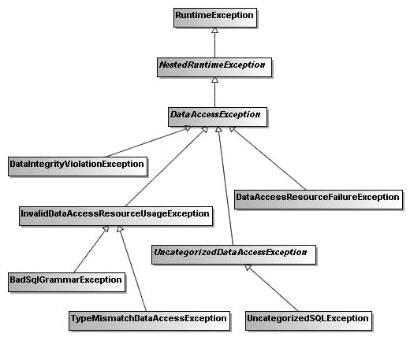

9799ch07.qxd 5/5/08 4:47 PM 第 241 页

第 7 章 **■** S P R I N G J D B C 支持

**241**

**图 7-1.** *DataAccessException 层次结构中的常见异常类*

工作原理

**理解 Spring JDBC 框架中的异常处理**

到目前为止，在使用 JDBC 模板或 JDBC 操作对象时，你还没有显式地处理 JDBC 异常。为了帮助你理解 Spring JDBC 框架的异常处理机制，让我们考虑 `Main` 类中的以下代码片段，它插入了一辆车。如果你插入一辆具有重复车辆编号的车辆会发生什么？

package com.apress.springrecipes.vehicle;

...

public class Main {

public static void main(String[] args) {

...

VehicleDao vehicleDao = (VehicleDao) context.getBean("vehicleDao"); Vehicle vehicle = new Vehicle("EX0001", "Green", 4, 4); vehicleDao.insert(vehicle);

}

}

9799ch07.qxd 5/5/08 4:47 PM 第 242 页

**242**

第 7 章 **■** S P R I N G J D B C 支持


如果你重复执行该方法两次，或者车辆信息已插入数据库，则会抛出 `DataIntegrityViolationException`，它是 `DataAccessException` 的子类。在你的 DAO 方法中，既不需要用 `try/catch` 块包裹代码，也无需在方法签名中声明抛出异常。这是因为 `DataAccessException`（及其子类，包括 `DataIntegrityViolationException`）属于非受检异常，你无需强制捕获。`DataAccessException` 的直接父类是 `NestedRuntimeException`，这是一个核心的 Spring 异常类，用于将另一个异常包装在 `RuntimeException` 中。

当你使用 Spring JDBC 框架的类时，它们会为你捕获 `SQLException`，并将其包装为 `DataAccessException` 的某个子类。由于该异常是 `RuntimeException`，你无需强制捕获它。

但 Spring JDBC 框架如何知道应该抛出 `DataAccessException` 层级中的哪个具体异常呢？它是通过检查捕获到的 `SQLException` 的 `errorCode` 和 `SQLState` 属性来确定的。由于 `DataAccessException` 将底层的 `SQLException` 作为根本原因进行包装，你可以通过以下 `catch` 块来检查 `errorCode` 和 `SQLState` 属性：

```java
package com.apress.springrecipes.vehicle;

...

import java.sql.SQLException;

import org.springframework.dao.DataAccessException;

public class Main {

    public static void main(String[] args) {

        ...

        VehicleDao vehicleDao = (VehicleDao) context.getBean("vehicleDao");
        Vehicle vehicle = new Vehicle("EX0001", "Green", 4, 4);
        **try {**
            vehicleDao.insert(vehicle);
        **} catch (DataAccessException e) {**
            **SQLException sqle = (SQLException) e.getCause();**
            **System.out.println("Error code: " + sqle.getErrorCode());**
            **System.out.println("SQL state: " + sqle.getSQLState());**
        **}**
    }
}
```

当你再次插入重复的车辆信息时，请注意 Apache Derby 会返回以下错误代码和 SQL 状态：

```
Error code : -1
SQL state : 23505
```

如果你查阅 Apache Derby 参考手册，会发现表 7-2 中所示的错误代码描述。

**表 7-2.** *Apache Derby 错误代码描述*

| **SQL 状态** | **消息文本** |
|--------------|--------------|
| 23505        | 该语句被中止，因为它会导致在由 '<*值*>' 定义的唯一或主键约束或唯一索引上出现重复键值。 |

那么 Spring JDBC 框架如何知道状态 23505 应映射到 `DataIntegrityViolationException` 呢？错误代码和 SQL 状态是数据库特定的，这意味着不同的数据库产品对于同一类错误可能返回不同的代码。

此外，某些数据库产品会在 `errorCode` 属性中指定错误，而其他数据库（如 Derby）则会在 `SQLState` 属性中指定。

作为一个开放的 Java 应用程序框架，Spring 理解大多数流行数据库产品的错误代码。然而，由于错误代码数量庞大，它只能维护最常见错误的映射关系。该映射定义在 `sql-error-codes.xml` 文件中，该文件位于 `org.springframework.jdbc.support` 包中。以下针对 Apache Derby 的代码片段取自该文件：

```xml
<?xml version="1.0" encoding="UTF-8"?>
<!DOCTYPE beans PUBLIC "-//SPRING//DTD BEAN 2.0//EN"
["http://www.springframework.org/dtd/spring-beans-2.0.dtd">](http://www.springframework.org/dtd/spring-beans-2.0.dtd)
<beans>
    ...
    <bean id="Derby"
          class="org.springframework.jdbc.support.SQLErrorCodes">
        <property name="databaseProductName">
            <value>Apache Derby</value>
        </property>
        <property name="useSqlStateForTranslation">
            <value>true</value>
        </property>
        <property name="badSqlGrammarCodes">
            <value>
                42802,42821,42X01,42X02,42X03,42X04,42X05,42X06,42X07,42X08
            </value>
        </property>
        <property name="dataAccessResourceFailureCodes">
            <value>04501,08004,42Y07</value>
        </property>
        <property name="dataIntegrityViolationCodes">
            <value>22001,22005,23502,23503, **23505**,23513,X0Y32</value>
        </property>
    </bean>
</beans>
```


</property>

<property name="cannotAcquireLockCodes">

<value>40XL1</value>

</property>

<property name="deadlockLoserCodes">

<value>40001</value>

9799ch07.qxd 5/5/08 4:47 PM Page 244

**244**

第 7 章 **■** Spring JDBC 支持

</property>

</bean>

</beans>

请注意，`databaseProductName` 属性用于匹配由 `Connection.getMetaData().getDatabaseProductName()` 返回的数据库产品名称。这使得 Spring 能够知道当前连接的是哪种类型的数据库。`useSqlStateForTranslation` 属性意味着应使用 `SQLState` 属性（而非 `errorCode` 属性）来匹配错误代码。最后，`SQLErrorCodes` 类定义了多个类别供你映射数据库错误代码。代码 `23505` 位于 `dataIntegrityViolationCodes` 类别中。

**自定义数据访问异常处理**

Spring JDBC 框架仅映射已知的错误代码。有时你可能希望自行自定义映射。例如，你可能决定向现有类别添加更多代码，或为特定错误代码定义自定义异常。

在表 7-2 中，错误代码 `23505` 表示 Apache Derby 中的重复键错误。默认情况下，它被映射到 `DataIntegrityViolationException`。假设你想为此类错误创建一个自定义异常类型 `DuplicateKeyException`。它应该继承 `DataIntegrityViolationException`，因为它也是一种数据完整性违反错误。请记住，要使异常能够被 Spring JDBC 框架抛出，它必须与根异常类 `DataAccessException` 兼容。

```java
package com.apress.springrecipes.vehicle;

import org.springframework.dao.DataIntegrityViolationException;

public class DuplicateKeyException extends DataIntegrityViolationException {

    public DuplicateKeyException(String msg) {
        super(msg);
    }

    public DuplicateKeyException(String msg, Throwable cause) {
        super(msg, cause);
    }
}
```

默认情况下，Spring 会从位于 `org.springframework.jdbc.support` 包中的 `sql-error-codes.xml` 文件查找异常。但是，你可以通过在类路径根目录下提供一个同名文件来覆盖部分映射。如果 Spring 能够找到你的自定义文件，它将首先从你的映射中查找异常。然而，如果在那里没有找到合适的异常，Spring 将查找默认映射。

例如，假设你想将自定义的 `DuplicateKeyException` 类型映射到错误代码 `23505`。你必须通过 `CustomSQLErrorCodesTranslation` bean 添加绑定，然后将此 bean 添加到 `customTranslations` 类别中。

9799ch07.qxd 5/5/08 4:47 PM Page 245

第 7 章 **■** Spring JDBC 支持

**245**

```xml
<?xml version="1.0" encoding="UTF-8"?>
<!DOCTYPE beans PUBLIC "-//SPRING//DTD BEAN 2.0//EN"
    "http://www.springframework.org/dtd/spring-beans-2.0.dtd">
<beans>

    <bean id="Derby"
          class="org.springframework.jdbc.support.SQLErrorCodes">
        <property name="databaseProductName">
            <value>Apache Derby</value>
        </property>
        <property name="useSqlStateForTranslation">
            <value>true</value>
        </property>
        <property name="customTranslations">
            <list>
                <ref local="duplicateKeyTranslation" />
            </list>
        </property>
    </bean>

    <bean id="duplicateKeyTranslation"
          class="org.springframework.jdbc.support.CustomSQLErrorCodesTranslation">
        <property name="errorCodes">
            <value>**23505**</value>
        </property>
        <property name="exceptionClass">
            <value>
                **com.apress.springrecipes.vehicle.DuplicateKeyException**
            </value>
        </property>
    </bean>

</beans>
```

现在，如果你移除围绕车辆插入操作的 `try/catch` 块并插入一条重复的车辆记录，Spring JDBC 框架将抛出 `DuplicateKeyException` 而不是原来的异常。

然而，如果你对 `SQLErrorCodes` 类使用的基本代码到异常映射策略不满意，你可以进一步实现 `SQLExceptionTranslator` 接口，并通过 `setExceptionTranslator()` 方法将其实例注入到 JDBC 模板中。

**7-9. 本章小结**

在本章中，你学习了如何使用 Spring JDBC 框架来简化数据库访问任务。当直接使用 JDBC 而没有 Spring 支持时，大部分 JDBC 代码都是相似的，并且每个数据库操作都需要重复编写。这种冗余代码会使你的 DAO 方法变得冗长且可读性差。

作为 Spring JDBC 框架的核心，JDBC 模板为不同类型的 JDBC 操作提供了模板方法。每个模板方法负责控制整体流程，并允许你通过实现预定义的回调接口来覆盖流程中的特定任务。

`JdbcTemplate` 类是经典的 Spring JDBC 模板。为了利用 Java 1.5 的特性，Spring 提供了 `SimpleJdbcTemplate`，它利用了自动装箱、泛型和可变长度参数等特性来简化其使用。此外，该类还支持在 SQL 语句中使用命名参数。

除了 JDBC 模板方法外，Spring JDBC 框架还支持一种更面向对象的方法，即将每个数据库操作建模为一个细粒度的操作对象。你可以根据自己的偏好和需求选择其中一种方法。

Spring 为其数据访问模块（包括 JDBC 框架）提供了一致的数据访问异常处理机制。如果抛出 `SQLException`，Spring 会将其包装为 `DataAccessException` 层次结构中的适当异常。`DataAccessException` 是一个非检查型异常，因此你不必强制捕获和处理它的每个实例。

在下一章中，你将学习如何使用强大的事务管理功能来为你的 Spring 应用程序管理事务。

9799ch08.qxd 5/6/08 10:00 AM Page 247

第 8 章

Spring 中的事务管理

**在**本章中，你将学习事务的基本概念以及 Spring 在事务管理方面的能力。事务管理是企业应用程序中确保数据完整性和一致性的关键技术。Spring 作为一个企业应用框架，在不同的事务管理 API 之上定义了一个抽象层。作为应用程序开发者，你可以利用 Spring 的事务管理设施，而无需深入了解底层的事务管理 API。

与 EJB 中的 *Bean 管理事务（BMT）* 和 *容器管理事务（CMT）* 方法类似，Spring 支持编程式和声明式事务管理。Spring 事务支持的目标是通过向 POJO 添加事务能力，为 EJB 事务提供一种替代方案。

*编程式事务管理* 是通过在业务方法中嵌入事务管理代码来控制事务的提交和回滚来实现的。通常，如果方法正常完成，则提交事务；如果方法抛出特定类型的异常，则回滚事务。使用编程式事务管理，你可以进一步定义自己的规则来提交和回滚事务。

然而，当以编程方式管理事务时，你必须在每个事务性操作中包含额外的事务管理代码。因此，样板式的事务代码会在每个此类操作中重复出现。此外，你很难为不同的应用程序启用和禁用事务管理。如果你对 AOP 有扎实的理解，应该已经注意到事务管理是一种横切关注点。


在大多数情况下，*声明式事务管理*优于编程式事务管理。它通过声明的方式将事务管理代码与业务方法分离。事务管理作为一种横切关注点，可以通过 AOP 方法进行模块化。Spring 通过 Spring AOP 框架支持声明式事务管理。这可以帮助你更轻松地为应用程序启用事务，并定义一致的事务策略。然而，声明式事务管理的灵活性较差，因为你无法通过代码精确控制事务。

你可以指定一组事务属性来精细地定义事务。Spring 支持的事务属性包括传播行为、隔离级别、回滚规则、事务超时和只读。这些属性允许你进一步自定义事务的行为。

完成本章后，你将能够在应用程序中应用不同的事务管理策略。此外，你将熟悉不同的事务属性，以便精细地定义事务。

**8-1. 事务管理的问题**

事务管理是企业应用开发中确保数据完整性和一致性的关键技术。没有事务管理，你的数据和资源可能会被破坏，并处于不一致的状态。在并发和分布式环境中，事务管理对于从意外错误中恢复至关重要。

简单来说，事务是一系列被视为单个工作单元的操作。这些操作要么全部完成，要么完全不生效。如果所有操作都顺利，事务应被永久提交。相反，如果任何操作出错，事务应回滚到初始状态，就像什么都没发生过一样。

事务的概念可以用四个关键属性来描述：*原子性、一致性、隔离性和持久性（ACID）*。具体描述如下：
*原子性*：事务是由一系列操作组成的原子操作。事务的原子性确保这些操作要么全部完成，要么完全不生效。

*一致性*：一旦事务的所有操作完成，事务即被提交。此时，你的数据和资源将处于符合业务规则的一致状态。

*隔离性*：由于可能同时有许多事务处理同一数据集，每个事务应与其他事务隔离，以防止数据损坏。

*持久性*：一旦事务完成，其结果应能持久保存，以应对任何系统故障。通常，事务的结果会被写入持久化存储。

为了理解事务管理的重要性，我们先从一个从在线书店购买书籍的例子开始。首先，你需要在数据库中为这个应用程序创建一个新的模式。如果你选择 Apache Derby 作为数据库引擎，可以使用表 8-1 中所示的 JDBC 属性进行连接。

**表 8-1.** *连接应用程序数据库的 JDBC 属性*
**属性**

**值**

驱动类

org.apache.derby.jdbc.ClientDriver

URL

jdbc:derby://localhost:1527/bookshop;create=true 用户名

app

密码

app

对于你的书店应用程序，你需要创建以下表来存储应用程序数据：

CREATE TABLE BOOK (

ISBN

VARCHAR(50)

NOT NULL,

BOOK_NAME

VARCHAR(100)

NOT NULL,

PRICE

INT,

PRIMARY KEY (ISBN)

);

CREATE TABLE BOOK_STOCK (

ISBN

VARCHAR(50)

NOT NULL,

STOCK

INT

NOT NULL,


PRIMARY KEY (ISBN),

CHECK (STOCK >= 0)

);

CREATE TABLE ACCOUNT (

USERNAME

VARCHAR(50)

NOT NULL,

BALANCE

INT

NOT NULL,

PRIMARY KEY (USERNAME),

CHECK (BALANCE >= 0)

);

BOOK 表存储书籍的基本信息，如书名和价格，以书籍 ISBN 作为主键。BOOK_STOCK 表跟踪每本书的库存。库存值通过 CHECK 约束限制为正数。尽管 CHECK 约束类型在 SQL-99 中已定义，但并非所有数据库引擎都支持它。如果你的数据库引擎不支持 CHECK 约束，请查阅其文档以了解类似的约束支持。

最后，ACCOUNT 表存储客户账户及其余额。同样，余额被限制为正数。

你的书店操作在以下 BookShop 接口中定义。目前，只有一个操作：purchase()。

package com.apress.springrecipes.bookshop;

public interface BookShop {

public void purchase(String isbn, String username);

}

由于你将使用 JDBC 实现此接口，因此创建了以下 JdbcBookShop 类。为了更好地理解事务的本质，让我们在不借助 Spring JDBC 支持的情况下实现此类。

package com.apress.springrecipes.bookshop;

import java.sql.Connection;

import java.sql.PreparedStatement;

import java.sql.ResultSet;

import java.sql.SQLException;

9799ch08.qxd 5/6/08 10:00 AM Page 250

**250**

第 8 章 **■** SPRING 中的事务管理

import javax.sql.DataSource;

public class JdbcBookShop implements BookShop {

private DataSource dataSource;

public void setDataSource(DataSource dataSource) {

this.dataSource = dataSource;

}

public void purchase(String isbn, String username) {

Connection conn = null;

try {

conn = dataSource.getConnection();

PreparedStatement stmt1 = conn.prepareStatement(

" **SELECT PRICE FROM BOOK WHERE ISBN = ?** ");

stmt1.setString(1, isbn);

ResultSet rs = stmt1.executeQuery();

rs.next();

int price = rs.getInt("PRICE");

stmt1.close();

PreparedStatement stmt2 = conn.prepareStatement(

" **UPDATE BOOK_STOCK SET STOCK = STOCK - 1** " +

" **WHERE ISBN = ?** ");

stmt2.setString(1, isbn);

stmt2.executeUpdate();

stmt2.close();

PreparedStatement stmt3 = conn.prepareStatement(

" **UPDATE ACCOUNT SET BALANCE = BALANCE - ?** " +

" **WHERE USERNAME = ?** ");

stmt3.setInt(1, price);

stmt3.setString(2, username);

stmt3.executeUpdate();

stmt3.close();

} catch (SQLException e) {

throw new RuntimeException(e);

} finally {

if (conn != null) {

try {

conn.close();

} catch (SQLException e) {}

}

}

}

}

9799ch08.qxd 5/6/08 10:00 AM Page 251

第 8 章 **■** SPRING 中的事务管理

**251**

对于 purchase() 操作，你总共需要执行三条 SQL 语句。第一条是查询书籍价格。第二条和第三条分别更新书籍库存和账户余额。

然后，你可以在 Spring IoC 容器中声明一个书店实例来提供购买服务。为简单起见，你可以使用 DriverManagerDataSource，它为每个请求打开一个新的数据库连接。

**■注意** 要访问在 Derby 服务器上运行的数据库，你必须在类路径中包含 derbyclient.jar（位于 Derby 安装目录的 lib 目录中）。

<beans xmlns=" [`www.springframework.org/schema/beans"`](http://www.springframework.org/schema/beans)

xmlns:xsi=" [`www.w3.org/2001/XMLSchema-instance"`](http://www.w3.org/2001/XMLSchema-instance)

xsi:schemaLocation=" [`www.springframework.org/schema/beans`](http://www.springframework.org/schema/beans)

[`w`](http://www.w3.org/2001/XMLSchema-instance)[ww.springframework.org/schema/beans/spring-beans-2.5.xsd"](http://www.springframework.org/schema/beanswww.springframework.org/schema/beans/spring-beans-2.5.xsd) >

<bean id="dataSource"

class="org.springframework.jdbc.datasource.DriverManagerDataSource">

<property name="driverClassName"

value="org.apache.derby.jdbc.ClientDriver" />

<property name="url"


value="jdbc:derby://localhost:1527/bookshop;create=true" />

<property name="username" value="app" />

<property name="password" value="app" />

</bean>

<bean id="bookShop" class="com.apress.springrecipes.bookshop.JdbcBookShop">

<property name="dataSource" ref="dataSource" />

</bean>

</beans>

为了演示缺少事务管理可能引发的问题，假设你的书店数据库中已录入表 8-2、表 8-3 和表 8-4 所示的数据。

**表 8-2.** *用于测试事务的 BOOK 表中的示例数据* **ISBN**

**BOOK_NAME**

**PRICE**

第一本书

**表 8-3.** *用于测试事务的 BOOK_STOCK 表中的示例数据* **ISBN**

**STOCK**

9799ch08.qxd 5/6/08 10:00 AM 第 252 页

**252**

第 8 章 **■** SPRING 中的事务管理

**表 8-4.** *用于测试事务的 ACCOUNT 表中的示例数据* **用户名**

**余额**

user1

接下来编写以下 Main 类，用于让用户 user1 购买 ISBN 为 0001 的书籍。由于该用户的账户只有 20 美元，不足以购买这本书。

package com.apress.springrecipes.bookshop;

import org.springframework.context.ApplicationContext;

import org.springframework.context.support.ClassPathXmlApplicationContext; public class Main {

public static void main(String[] args) {

ApplicationContext context =

new ClassPathXmlApplicationContext("beans.xml");

BookShop bookShop = (BookShop) context.getBean("bookShop");

bookShop.purchase("0001", "user1");

}

}

当你运行此应用程序时，会遇到一个 SQLException，因为违反了 ACCOUNT 表的 CHECK 约束。这是预期结果，因为你试图扣减的金额超过了账户余额。然而，如果你检查 BOOK_STOCK 表中该书的库存，会发现它被这次失败的操作意外扣减了！原因在于，你在执行第三条 SQL 语句抛出异常之前，已经执行了第二条 SQL 语句来扣减库存。

如你所见，缺少事务管理会导致数据处于不一致状态。为了避免这种不一致，你的 purchase()操作中的三条 SQL 语句应在单个事务内执行。一旦事务中的任何操作失败，整个事务应回滚，以撤销已执行操作所做的所有更改。

使用 JDBC 提交和回滚管理事务

使用 JDBC 更新数据库时，默认情况下每条 SQL 语句执行后会立即提交。这种行为称为*自动提交*。然而，这不允许你为操作管理事务。

JDBC 支持通过显式调用连接上的 commit()和 rollback()方法来实现基本的事务管理策略。但在此之前，你必须关闭默认开启的自动提交功能。

package com.apress.springrecipes.bookshop;

...

public class JdbcBookShop implements BookShop {

...

9799ch08.qxd 5/6/08 10:00 AM 第 253 页

第 8 章 **■** SPRING 中的事务管理

**253**

public void purchase(String isbn, String username) {

Connection conn = null;

try {

conn = dataSource.getConnection();

**conn.setAutoCommit(false);**

...

**conn.commit();**

} catch (SQLException e) {

**if (conn != null) {**

**try {**

**conn.rollback();**

**} catch (SQLException e1) {}**

**}**

throw new RuntimeException(e);

} finally {

if (conn != null) {

try {

conn.close();

} catch (SQLException e) {}

}

}

}

}

数据库连接的自动提交行为可以通过调用 setAutoCommit()方法来改变。默认情况下，自动提交处于开启状态，每条 SQL 语句执行后会立即提交。要启用事务管理，你必须关闭此默认行为，并仅在所有 SQL 语句成功执行后才提交连接。如果任何语句出错，你必须回滚此连接所做的所有更改。


现在，如果你再次运行应用程序，当用户余额不足以购买书籍时，将不会扣除图书库存。

虽然你可以通过显式提交和回滚 JDBC 连接来管理事务，但为此所需的代码是样板代码，你必须在不同的方法中重复编写。此外，这段代码是 JDBC 特有的，因此一旦你选择了其他数据访问技术，它也需要随之更改。Spring 的事务支持提供了一套与技术无关的工具，包括事务管理器、事务模板和事务声明支持，以简化你的事务管理任务。

**8-2. 选择事务管理器实现**

问题

通常，如果你的应用程序只涉及单一数据源，你可以简单地通过调用数据库连接的 `commit()` 和 `rollback()` 方法来管理事务。然而，如果你的事务跨越多个数据源，或者你更倾向于使用 Java EE 应用服务器提供的事务管理功能，你可能会选择

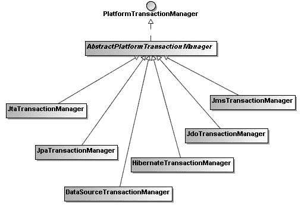

9799ch08.qxd 5/6/08 10:00 AM Page 254

**254**

第 8 章 **■** SPRING 中的事务管理

Java 事务 API (JTA)。此外，对于不同的对象/关系映射框架（如 Hibernate 和 JPA），你可能需要调用不同的专有事务 API。

因此，你必须为不同的技术处理不同的事务 API。这会使你很难从一组 API 切换到另一组。

解决方案

Spring 从不同的事务管理 API 中抽象出了一套通用的事务工具。作为应用程序开发者，你可以直接使用这些事务工具，而无需深入了解底层的事务 API。借助这些工具，你的事务管理代码将与具体的事务技术无关。

Spring 核心的事务管理抽象是 `PlatformTransactionManager`。它封装了一套与技术无关的事务管理方法。请记住，无论你在 Spring 中选择哪种事务管理策略（编程式或声明式），基本上都需要一个事务管理器。

工作原理

`PlatformTransactionManager` 是所有 Spring 事务管理器的通用接口。Spring 内置了该接口的多个实现，用于不同的事务管理 API：

*   如果你的应用程序只需处理单一数据源，并通过 JDBC 访问它，那么 `DataSourceTransactionManager` 应该能满足你的需求。
*   如果你在 Java EE 应用服务器上使用 JTA 进行事务管理，则应使用 `JtaTransactionManager` 从应用服务器查找事务。
*   如果你使用对象/关系映射框架访问数据库，则应为此框架选择相应的事务管理器，例如 `HibernateTransactionManager` 和 `JpaTransactionManager`。

图 8-1 展示了 Spring 中 `PlatformTransactionManager` 接口的常见实现。

**图 8-1.** *PlatformTransactionManager 接口的常见实现*

9799ch08.qxd 5/6/08 10:00 AM Page 255

第 8 章 **■** SPRING 中的事务管理

**255**

事务管理器在 Spring IoC 容器中作为一个普通 bean 进行声明。例如，以下 bean 配置声明了一个 `DataSourceTransactionManager` 实例。它需要设置 `dataSource` 属性，以便能够管理由此数据源创建的连接的事务。

<bean id="transactionManager"

class="org.springframework.jdbc.datasource.DataSourceTransactionManager">

<property name="dataSource" ref="dataSource" />

</bean>

**8-3. 使用事务管理器 API 以编程方式管理事务**

问题


你需要在业务方法中精确控制事务的提交和回滚时机，但又不想直接处理底层的事务 API。

解决方案

Spring 的事务管理器提供了一个与技术无关的 API，允许你通过调用 `getTransaction()` 方法启动一个新事务，并通过调用 `commit()` 和 `rollback()` 方法来管理它。由于 `PlatformTransactionManager` 是事务管理的抽象单元，你调用的事务管理方法将保证与技术无关。

工作原理

为了演示如何使用事务管理器 API，我们创建一个新类 `TransactionalJdbcBookShop`，它将使用 Spring JDBC 模板。由于该类需要处理事务管理器，你需要添加一个 `PlatformTransactionManager` 类型的属性，并允许通过 setter 方法注入它。

```java
package com.apress.springrecipes.bookshop;

import org.springframework.dao.DataAccessException;

import org.springframework.jdbc.core.support.JdbcDaoSupport;

import org.springframework.transaction.PlatformTransactionManager;

import org.springframework.transaction.TransactionDefinition;

import org.springframework.transaction.TransactionStatus;

import org.springframework.transaction.support.DefaultTransactionDefinition;

public class TransactionalJdbcBookShop extends JdbcDaoSupport implements BookShop {

    private PlatformTransactionManager transactionManager;

    public void setTransactionManager(
            PlatformTransactionManager transactionManager) {
        this.transactionManager = transactionManager;
    }

    public void purchase(String isbn, String username) {
        TransactionDefinition def = new DefaultTransactionDefinition();
        TransactionStatus status = transactionManager.getTransaction(def);
        try {
            int price = getJdbcTemplate().queryForInt(
                    "SELECT PRICE FROM BOOK WHERE ISBN = ?",
                    new Object[] { isbn });
            getJdbcTemplate().update(
                    "UPDATE BOOK_STOCK SET STOCK = STOCK - 1 " +
                    "WHERE ISBN = ?", new Object[] { isbn });
            getJdbcTemplate().update(
                    "UPDATE ACCOUNT SET BALANCE = BALANCE - ? " +
                    "WHERE USERNAME = ?",
                    new Object[] { price, username });
            transactionManager.commit(status);
        } catch (DataAccessException e) {
            transactionManager.rollback(status);
            throw e;
        }
    }
}
```

在启动新事务之前，你需要在 `TransactionDefinition` 类型的事务定义对象中指定事务属性。对于此示例，你可以直接创建一个 `DefaultTransactionDefinition` 实例来使用默认事务属性。

一旦有了事务定义，你可以通过调用 `getTransaction()` 方法，要求事务管理器使用该定义启动一个新事务。然后它会返回一个 `TransactionStatus` 对象来跟踪事务状态。如果所有语句都成功执行，你可以通过传入事务状态，要求事务管理器提交此事务。由于 Spring JDBC 模板抛出的所有异常都是 `DataAccessException` 的子类，当捕获到此类异常时，你可以要求事务管理器回滚事务。

在这个类中，你声明了通用类型 `PlatformTransactionManager` 的事务管理器属性。现在你需要注入一个合适的事务管理器实现。由于你只处理单个数据源并通过 JDBC 访问它，你应该选择 `DataSourceTransactionManager`。

```xml
<beans ...>
    ...
    <bean id="transactionManager"
        class="org.springframework.jdbc.datasource.DataSourceTransactionManager">
        <property name="dataSource" ref="dataSource" />
    </bean>

    <bean id="bookShop"
        class="com.apress.springrecipes.bookshop.TransactionalJdbcBookShop">
        <property name="dataSource" ref="dataSource" />
    </bean>
</beans>
```


**<property name="transactionManager" ref="transactionManager" />**

</bean>

</beans>

**8-4. 使用事务模板以编程方式管理事务**

问题

假设你有一个业务方法的代码块（并非整个方法体），该代码块具有以下事务需求：

• 在代码块开始时启动一个新事务。

• 在代码块成功完成后提交事务。

• 如果在代码块中抛出异常，则回滚事务。

如果你直接调用 Spring 的事务管理器 API，事务管理代码可以以技术无关的方式进行通用化。然而，你可能不希望为每个类似的代码块重复编写样板代码。

解决方案

与 JDBC 模板类似，Spring 也提供了一个事务模板来帮助你控制整个事务管理过程。你只需将代码块封装在实现 `TransactionCallback` 接口的回调类中，并将其传递给事务模板执行。这样，你就不需要为此代码块重复编写样板式的事务管理代码。

工作原理

事务模板基于事务管理器创建，就像 JDBC 模板基于数据源创建一样。事务模板执行一个封装了事务性代码块的事务回调对象。你可以将回调接口实现为单独的类或内部类。如果实现为内部类，则必须将方法参数声明为 `final` 才能访问。

```java
package com.apress.springrecipes.bookshop;

...

import org.springframework.transaction.PlatformTransactionManager;
import org.springframework.transaction.TransactionStatus;
import org.springframework.transaction.support.TransactionCallbackWithoutResult;
import org.springframework.transaction.support.TransactionTemplate;

public class TransactionalJdbcBookShop extends JdbcDaoSupport implements BookShop {

    private PlatformTransactionManager transactionManager;

    public void setTransactionManager(
            PlatformTransactionManager transactionManager) {
        this.transactionManager = transactionManager;
    }

    public void purchase(**final** String isbn, **final** String username) {
        **TransactionTemplate transactionTemplate =**
                **new TransactionTemplate(transactionManager);**
        **transactionTemplate.execute(new TransactionCallbackWithoutResult() {**
            **protected void doInTransactionWithoutResult(**
                    **TransactionStatus status) {**
                int price = getJdbcTemplate().queryForInt(
                        "SELECT PRICE FROM BOOK WHERE ISBN = ?",
                        new Object[] { isbn });
                getJdbcTemplate().update(
                        "UPDATE BOOK_STOCK SET STOCK = STOCK - 1 " +
                        "WHERE ISBN = ?", new Object[] { isbn });
                getJdbcTemplate().update(
                        "UPDATE ACCOUNT SET BALANCE = BALANCE - ? " +
                        "WHERE USERNAME = ?",
                        new Object[] { price, username });
            **}**
        **});**
    }
}
```

事务模板可以接受一个实现了 `TransactionCallback` 或 `TransactionCallbackWithoutResult` 接口的事务回调对象。对于 `purchase()` 方法中用于扣除图书库存和账户余额的代码块，没有需要返回的结果，因此使用 `TransactionCallbackWithoutResult` 即可。对于任何有返回值的代码块，则应实现 `TransactionCallback` 接口。回调对象的返回值最终将由模板的 `execute()` 方法返回。

在回调对象的执行过程中，如果它抛出了非检查型异常（例如，`RuntimeException` 和 `DataAccessException` 属于此类），或者你显式地在 `TransactionStatus` 参数上调用了 `setRollbackOnly()` 方法，则事务将被回滚。否则，事务将在回调对象完成后提交。


在 Bean 配置文件中，book shop Bean 仍然需要一个事务管理器来创建事务模板。

<beans ...>

...

<bean id="transactionManager"

class="org.springframework.jdbc.datasource.DataSourceTransactionManager">

<property name="dataSource" ref="dataSource" />

</bean>

<bean id="bookShop"

class="com.apress.springrecipes.bookshop.TransactionalJdbcBookShop">

<property name="dataSource" ref="dataSource" />

<property name="transactionManager" ref="transactionManager" />

</bean>

</beans>

你也可以让 IoC 容器注入一个事务模板，而不是直接创建它。由于事务模板足以满足事务管理需求，你的类就不再需要引用事务管理器了。

package com.apress.springrecipes.bookshop;

...

import org.springframework.transaction.support.TransactionTemplate;

public class TransactionalJdbcBookShop extends JdbcDaoSupport implements

BookShop {

**private TransactionTemplate transactionTemplate;**

**public void setTransactionTemplate(**

**TransactionTemplate transactionTemplate) {**

**this.transactionTemplate = transactionTemplate;**

**}**

public void purchase(final String isbn, final String username) {

transactionTemplate.execute(new TransactionCallbackWithoutResult() {

protected void doInTransactionWithoutResult(TransactionStatus status) {

...

}

});

}

}

9799ch08.qxd 5/6/08 10:00 AM Page 260

**260**

第 8 章 **■** 在 Spring 中进行事务管理

然后，在 Bean 配置文件中定义一个事务模板，并将其注入到你的 book shop Bean 中，而不是注入事务管理器。请注意，事务模板实例可以用于多个事务性 Bean，因为它是一个线程安全对象。最后，不要忘记为你的事务模板设置事务管理器属性。

<beans ...>

...

<bean id="transactionManager"

class="org.springframework.jdbc.datasource.DataSourceTransactionManager">

<property name="dataSource" ref="dataSource" />

</bean>

**<bean id="transactionTemplate"**

**class="org.springframework.transaction.support.TransactionTemplate">**

**<property name="transactionManager" ref="transactionManager" />**

**</bean>**

<bean id="bookShop"

class="com.apress.springrecipes.bookshop.TransactionalJdbcBookShop">

<property name="dataSource" ref="dataSource" />

**<property name="transactionTemplate" ref="transactionTemplate" />**

</bean>

</beans>

**8-5\. 使用经典 Spring AOP 以声明方式管理事务**

问题

由于事务管理是一种横切关注点，AOP 是实现它的理想方式。然而，如果你希望在 Spring 1.x 中以声明方式管理事务，就必须使用经典的 Spring AOP 方法。

解决方案

Spring 提供了一个名为 TransactionInterceptor 的经典环绕通知，用于事务管理。该通知像事务模板一样控制事务管理过程，但它应用于整个方法体，而不是任意代码块。默认情况下，在方法开始之前，该通知会启动一个新事务。如果该方法抛出非检查型异常，事务将回滚。否则，在方法完成后提交事务。

在经典 Spring AOP 中，你必须使用 ProxyFactoryBean 为 Bean 创建代理，以应用 TransactionInterceptor 通知。由于事务管理在企业应用中非常常见，Spring 提供了一个便捷的类 TransactionProxyFactoryBean，专门用于创建事务代理。

9799ch08.qxd 5/6/08 10:00 AM Page 261

第 8 章 **■** 在 Spring 中进行事务管理

**261**

工作原理

首先，让我们考虑使用 Spring 的 JDBC 支持来实现你的 book shop，但不包含任何事务管理代码。

package com.apress.springrecipes.bookshop;

import org.springframework.jdbc.core.support.JdbcDaoSupport;

public class JdbcBookShop extends JdbcDaoSupport implements BookShop {

public void purchase(String isbn, String username) {


int price = getJdbcTemplate().queryForInt(

"SELECT PRICE FROM BOOK WHERE ISBN = ?", new Object[] { isbn }); getJdbcTemplate().update(

"UPDATE BOOK_STOCK SET STOCK = STOCK - 1 " +

"WHERE ISBN = ?",

new Object[] { isbn });

getJdbcTemplate().update(

"UPDATE ACCOUNT SET BALANCE = BALANCE - ? " +

"WHERE USERNAME = ?",

new Object[] { price, username });

}

}

在你的 Bean 配置文件中，你可以声明一个引用事务管理器的 `TransactionInterceptor` 通知。然后，你可以使用 `ProxyFactoryBean` 创建一个代理，将该通知应用于目标 `bookShop` Bean。

<beans ...>

...

<bean id="transactionManager"

class="org.springframework.jdbc.datasource.DataSourceTransactionManager">

<property name="dataSource" ref="dataSource" />

</bean>

<bean id="bookShop"

class="com.apress.springrecipes.bookshop. **JdbcBookShop**">

<property name="dataSource" ref="dataSource" />

</bean>

<bean id="transactionInterceptor" class="org.springframework.transaction. **➥**

interceptor.TransactionInterceptor">

<property name="transactionManager" ref="transactionManager" />

<property name="transactionAttributes">

<props>

**<prop key="purchase">PROPAGATION_REQUIRED</prop>**

9799ch08.qxd 5/6/08 10:00 AM Page 262

**262**

第 8 章 **■** SPRING 中的事务管理

</props>

</property>

</bean>

<bean id="bookShopProxy"

class="org.springframework.aop.framework.ProxyFactoryBean">

<property name="target" ref="bookShop" />

<property name="interceptorNames">

<list>

<value>transactionInterceptor</value>

</list>

</property>

</bean>

</beans>

需要事务管理的方法可以在 `TransactionInterceptor` 通知的 `transactionAttributes` 属性中指定。该属性的类型是 `Properties`，你需要将事务性方法的名称作为键，将其事务属性作为值。它支持在键中使用通配符，以便为多个方法指定相同的事务属性集。对于每个事务性方法，你至少必须指定传播事务属性。这里，为简单起见，你可以选择默认值 `PROPAGATION_REQUIRED`。

你的方法必须在代理对象上调用才能获得事务管理支持。因此，在 `Main` 类中，你必须检索 `bookShopProxy` Bean，而不是 `bookShop` Bean。

package com.apress.springrecipes.bookshop;

...

public class Main {

public static void main(String[] args) {

...

BookShop bookShop = (BookShop) context.getBean(" **bookShopProxy**"); bookShop.purchase("0001", "user1");

}

}

另一种选择是利用便捷类 `TransactionProxyFactoryBean`，它专门用于创建事务代理。现在，`TransactionInterceptor` 通知和 `ProxyFactoryBean` 声明所需的信息可以合并到单个 `TransactionProxyFactoryBean` 声明中。

<bean id="bookShopProxy" class=" **org.springframework.transaction.➥**

**interceptor.TransactionProxyFactoryBean**">

<property name="target" ref="bookShop" />

**<property name="transactionManager" ref="transactionManager" />**

**<property name="transactionAttributes">**

**<props>**

**<prop key="purchase">PROPAGATION_REQUIRED</prop>**

9799ch08.qxd 5/6/08 10:00 AM Page 263

第 8 章 **■** SPRING 中的事务管理

**263**

**</props>**

**</property>**

</bean>

**8-6\. 使用事务通知以声明方式管理事务**

问题

由于事务管理是一种横切关注点，你希望使用 Spring 2.x 中新的 AOP 方法以声明方式管理事务。

解决方案

Spring 2.x 提供了一个事务通知，可以通过 `tx` 模式中定义的 `<tx:advice>` 元素轻松配置。该通知可以使用 `aop` 模式中定义的 AOP 配置工具来启用。

工作原理


要在 Spring 2.x 中启用声明式事务管理，你可以通过 tx 模式中定义的 `<tx:advice>` 元素来声明一个事务通知，因此需要事先将该模式定义添加到 `<beans>` 根元素中。声明此通知后，需要将其与一个切点关联。由于事务通知是在

`<aop:config>` 元素外部声明的，它无法直接与切点链接。你必须在 `<aop:config>` 元素中声明一个通知器，将通知与切点关联起来。

**■注意** 由于 Spring 2.x AOP 使用 AspectJ 切点表达式来定义切点，你需要在类路径中包含 aspectjweaver.jar（位于 Spring 安装目录的 lib/aspectj 子目录中）。

<beans xmlns=" [`www.springframework.org/schema/beans"`](http://www.springframework.org/schema/beans)

xmlns:xsi=" [`www.w3.org/2001/XMLSchema-instance"`](http://www.w3.org/2001/XMLSchema-instance)

**xmlns:tx=" [`www.springframework.org/schema/tx"`](http://www.springframework.org/schema/tx)**

**xmlns:aop=" [`www.springframework.org/schema/aop"`](http://www.springframework.org/schema/aop)**

xsi:schemaLocation=" [`www.springframework.org/schema/beans`](http://www.springframework.org/schema/aop)

[`www.springframework.org/schema/beans/spring-beans-2.5.xsd`](http://www.springframework.org/schema/aop)

[**http://www.springframework.org/schema/tx**](http://www.springframework.org/schema/aop)

[**http://www.springframework.org/schema/tx/spring-tx-2.5.xsd**](http://www.springframework.org/schema/aop)

[**http://www.springframework.org/schema/aop**](http://www.springframework.org/schema/aop)

[**http://w**](http://www.springframework.org/schema/aop)[**ww.springframework.org/schema/aop/spring-aop-2.5.xsd">**](http://www.springframework.org/schema/beanswww.springframework.org/schema/beans/spring-beans-2.5.xsdwww.springframework.org/schema/txwww.spring)

<tx:advice id="bookShopTxAdvice"

transaction-manager="transactionManager">

<tx:attributes>

9799ch08.qxd 5/6/08 10:00 AM Page 264

**264**

第 8 章 **■** SPRING 中的事务管理

<tx:method name="purchase" />

</tx:attributes>

</tx:advice>

<aop:config>

<aop:pointcut id="bookShopOperation" expression=

"execution(* com.apress.springrecipes.bookshop.BookShop.*(..))" />

**<aop:advisor advice-ref="bookShopTxAdvice"**

**pointcut-ref="bookShopOperation" />**

</aop:config>

...

<bean id="transactionManager"

class="org.springframework.jdbc.datasource.DataSourceTransactionManager">

<property name="dataSource" ref="dataSource" />

</bean>

<bean id="bookShop"

class="com.apress.springrecipes.bookshop.JdbcBookShop">

<property name="dataSource" ref="dataSource" />

</bean>

</beans>

上述 AspectJ 切点表达式匹配了 BookShop 接口中声明的所有方法。然而，由于 Spring AOP 基于代理的方式，它只支持对公有方法进行通知。因此，只有公有方法可以通过 Spring AOP 实现事务性。

每个事务通知都需要一个标识符，以及对 IoC 容器中事务管理器的引用。需要事务管理的方法通过 `<tx:attributes>` 元素内的多个 `<tx:method>` 元素来指定。方法名称支持通配符，以便你匹配一组方法。你还可以为每组方法定义事务属性，但这里为了简单起见，我们使用默认属性。

现在，你可以从 Spring IoC 容器中获取 bookShop bean 来使用。由于该 bean 的方法被切点匹配，Spring 将返回一个启用了事务管理的代理。

package com.apress.springrecipes.bookshop;

...

public class Main {

public static void main(String[] args) {

...

BookShop bookShop = (BookShop) context.getBean(" **bookShop**"); bookShop.purchase("0001", "user1");

}

}

9799ch08.qxd 5/6/08 10:00 AM Page 265

第 8 章 **■** SPRING 中的事务管理

**265**

**8-7\. 使用声明式方式管理事务**


**@Transactional 注解**

问题

在 Bean 配置文件中声明事务需要了解 AOP 概念，如切点、通知和顾问。缺乏这方面知识的开发者可能会觉得启用声明式事务管理比较困难。

解决方案

除了在 Bean 配置文件中使用切点、通知和顾问来声明事务外，Spring 还允许你通过简单地为事务性方法添加 `@Transactional` 注解并启用 `<tx:annotation-driven>` 元素来声明事务。

不过，使用此方法需要 Java 1.5 或更高版本。

工作原理

要将一个方法定义为事务性方法，只需为其添加 `@Transactional` 注解即可。请注意，由于 Spring AOP 基于代理的限制，你只应对公有方法进行注解。

```java
package com.apress.springrecipes.bookshop;

...

import org.springframework.transaction.annotation.Transactional;

public class JdbcBookShop extends JdbcDaoSupport implements BookShop {

    @Transactional
    public void purchase(String isbn, String username) {
        ...
    }

}
```

你可以在方法级别或类级别应用 `@Transactional` 注解。当将此注解应用于类时，该类中的所有公有方法都将被定义为事务性方法。虽然你也可以将 `@Transactional` 应用于接口或接口中的方法声明，但不建议这样做，因为它可能无法与基于类的代理（即 CGLIB 代理）正常工作。

在 Bean 配置文件中，你只需启用 `<tx:annotation-driven>` 元素并为其指定一个事务管理器。这就是使其工作所需的全部内容。Spring 会为 IoC 容器中声明的、带有 `@Transactional` 注解的方法，或带有 `@Transactional` 注解的类中的方法，添加通知。因此，Spring 可以为这些方法管理事务。

```xml
<beans ...>

    <tx:annotation-driven transaction-manager="transactionManager" />

    ...

    <bean id="transactionManager"
        class="org.springframework.jdbc.datasource.DataSourceTransactionManager">
        <property name="dataSource" ref="dataSource" />
    </bean>

    <bean id="bookShop"
        class="com.apress.springrecipes.bookshop.JdbcBookShop">
        <property name="dataSource" ref="dataSource" />
    </bean>

</beans>
```

实际上，如果你的事务管理器名为 `transactionManager`，则可以省略 `<tx:annotation-driven>` 元素中的 `transaction-manager` 属性。该元素会自动检测名为 `transactionManager` 的事务管理器。只有当事务管理器使用其他名称时，才需要指定该属性。

```xml
<beans ...>

    <tx:annotation-driven />

    ...

</beans>
```

**8-8. 设置传播事务属性**

问题

当一个事务性方法被另一个方法调用时，需要指定事务应如何传播。例如，该方法可以继续在现有事务中运行，也可以启动一个新事务并在其自身的事务中运行。

解决方案

事务的传播行为可以通过 *propagation* 事务属性来指定。Spring 定义了七种传播行为，如表 8-5 所示。这些行为定义在 `org.springframework.transaction.TransactionDefinition` 接口中。请注意，并非所有类型的事务管理器都支持所有这些传播行为。

**表 8-5.** *Spring 支持的传播行为*

| 传播行为 | 描述 |
| --- | --- |
| REQUIRED | 如果当前存在一个正在进行的事务，则当前方法应在此事务内运行。否则，应启动一个新事务并在其自身的事务内运行。 |
| REQUIRES_NEW | 当前方法必须启动一个新事务并在其自身的事务内运行。如果当前存在一个正在进行的事务，则应将其挂起。 |
| SUPPORTS | 如果当前存在一个正在进行的事务，则当前方法可以在此事务内运行。否则，不必在事务内运行。 |
| NOT_SUPPORTED | |


当前方法不应在事务内运行。如果存在正在进行的事务，则应将其挂起。

MANDATORY

当前方法必须在事务内运行。如果不存在正在进行的事务，则会抛出异常。

9799ch08.qxd 5/6/08 10:00 AM 第 267 页

第 8 章 **■** 在 Spring 中进行事务管理

**267**

**传播行为**

**描述**

NEVER

当前方法不应在事务内运行。如果存在正在进行的事务，则会抛出异常。

NESTED

如果存在正在进行的事务，当前方法应在该事务的嵌套事务（由 JDBC 3.0 保存点特性支持）中运行。否则，应启动一个新事务并在其自身的事务中运行。

工作原理

当一个事务性方法被另一个方法调用时，就会发生事务传播。

例如，假设一位顾客想在书店收银台结账购买所有书籍。为了支持此操作，你按如下方式定义 `Cashier` 接口：`package com.apress.springrecipes.bookshop;`

...

`public interface Cashier {`

`public void checkout(List<String> isbns, String username);`

`}`

你可以通过多次调用书店 bean 的 `purchase()` 方法将购买操作委托给它，从而实现此接口。请注意，`checkout()` 方法通过应用 `@Transactional` 注解被设置为事务性的。

`package com.apress.springrecipes.bookshop;`

...

`import org.springframework.transaction.annotation.Transactional;`

`public class BookShopCashier implements Cashier {`

`private BookShop bookShop;`

`public void setBookShop(BookShop bookShop) {`

`this.bookShop = bookShop;`

`}`

**`@Transactional`**

`public void checkout(List<String> isbns, String username) {`

`for (String isbn : isbns) {`

`bookShop.purchase(isbn, username);`

`}`

`}`

`}`

然后在你的 bean 配置文件中定义一个 cashier bean，并引用用于购买书籍的书店 bean。

9799ch08.qxd 5/6/08 10:00 AM 第 268 页

**268**

第 8 章 **■** 在 Spring 中进行事务管理

`<bean id="cashier"`

`class="com.apress.springrecipes.bookshop.BookShopCashier">`

`<property name="bookShop" ref="bookShop" />`

`</bean>`

为了说明事务的传播行为，请在 bookshop 数据库中输入表 8-6、8-7 和 8-8 所示的数据。

**表 8-6.** *用于测试传播行为的 BOOK 表中的示例数据* **ISBN**

**BOOK_NAME**

**PRICE**

第一本书

第二本书

**表 8-7.** *用于测试传播行为的 BOOK_STOCK 表中的示例数据* **ISBN**

**STOCK**

**表 8-8.** *用于测试传播行为的 ACCOUNT 表中的示例数据* **USERNAME**

**BALANCE**

user1

**REQUIRED 传播行为**

当用户 user1 从收银台结账购买两本书时，余额足够购买第一本书，但不足以购买第二本。

`package com.apress.springrecipes.bookshop;`

...

`public class Main {`

`public static void main(String[] args) {`

...

`Cashier cashier = (Cashier) context.getBean("cashier");`

`List<String> isbnList =`

`Arrays.asList(new String[] { "0001", "0002" });`

`cashier.checkout(isbnList, "user1");`

`}`

`}`

当书店的 `purchase()` 方法被另一个事务性方法（如 `checkout()`）调用时，默认情况下它将在现有事务内运行。这种默认的传播行为称为 REQUIRED。这意味着只有一个事务，其边界是 `checkout()` 方法的开始和结束。该事务仅在 `checkout()` 方法结束时提交。

9799ch08.qxd 5/6/08 10:00 AM 第 269 页

第 8 章 **■** 在 Spring 中进行事务管理

**269**

因此，用户将无法购买任何一本书。

图 8-2 说明了 REQUIRED 传播行为。

**图 8-2.** *REQUIRED 事务传播行为*


然而，如果 `purchase()` 方法被一个非事务性方法调用，且当前没有正在进行的事务，那么它将启动一个新事务并在其自身事务内运行。

传播事务属性可以在 `@Transactional` 注解中定义。

例如，你可以按如下方式为该属性设置 REQUIRED 行为。实际上，由于这是默认行为，因此并非必需。

package com.apress.springrecipes.bookshop;

...

import org.springframework.transaction.annotation.Propagation;

import org.springframework.transaction.annotation.Transactional;

public class JdbcBookShop extends JdbcDaoSupport implements BookShop {

...

@Transactional(**propagation = Propagation.REQUIRED**)

public void purchase(String isbn, String username) {

...

}

}

package com.apress.springrecipes.bookshop;

...

import org.springframework.transaction.annotation.Propagation;

import org.springframework.transaction.annotation.Transactional;

public class BookShopCashier implements Cashier {

...

@Transactional(**propagation = Propagation.REQUIRED**)

public void checkout(List<String> isbns, String username) {

...

}

}

9799ch08.qxd 5/6/08 10:00 AM 第 270 页

**270**

第 8 章 **■** 在 Spring 中进行事务管理

**REQUIRES_NEW 传播行为**

另一种常见的传播行为是 REQUIRES_NEW。它表示该方法必须启动一个新事务并在其新事务内运行。如果当前有一个正在进行的事务，则应先将其挂起。

package com.apress.springrecipes.bookshop;

...

import org.springframework.transaction.annotation.Propagation;

import org.springframework.transaction.annotation.Transactional;

public class JdbcBookShop extends JdbcDaoSupport implements BookShop {

...

@Transactional(**propagation = Propagation.REQUIRES_NEW**)

public void purchase(String isbn, String username) {

...

}

}

在这种情况下，总共会启动三个事务。第一个事务由 `checkout()` 方法启动，但当第一个 `purchase()` 方法被调用时，第一个事务将被挂起，并启动一个新事务。在第一个 `purchase()` 方法结束时，新事务完成并提交。当第二个 `purchase()` 方法被调用时，将启动另一个新事务。然而，这个事务将失败并回滚。因此，第一本书将成功购买，而第二本则不会。

图 8-3 展示了 REQUIRES_NEW 传播行为。

**图 8-3.** *REQUIRES_NEW 事务传播行为*

**在事务通知、代理和 API 中设置传播属性**
在 Spring 2.x 的事务通知中，传播事务属性可以在 `<tx:method>` 元素中指定，如下所示：

<tx:advice ...>

<tx:attributes>

<tx:method name="..."

9799ch08.qxd 5/6/08 10:00 AM 第 271 页

第 8 章 **■** 在 Spring 中进行事务管理

**271**

**propagation="REQUIRES_NEW"** />

</tx:attributes>

</tx:advice>

在经典的 Spring AOP 中，传播事务属性可以在 `TransactionInterceptor` 和 `TransactionProxyFactoryBean` 的事务属性中指定，如下所示：

<property name="transactionAttributes">

<props>

<prop key="..."> **PROPAGATION_REQUIRES_NEW**</prop>

</props>

</property>

在 Spring 的事务管理 API 中，传播事务属性可以在 `DefaultTransactionDefinition` 对象中指定，然后传递给事务管理器的 `getTransaction()` 方法或事务模板的构造函数。

DefaultTransactionDefinition def = new DefaultTransactionDefinition();

def.setPropagationBehavior(**TransactionDefinition.PROPAGATION_REQUIRES_NEW**); **8-9. 设置隔离事务属性**

**问题**

当同一应用程序或不同应用程序的多个事务同时操作同一数据集时，可能会出现许多意外问题。你必须指定你希望事务之间如何相互隔离。

**解决方案**


并发事务引起的问题可分为三类：*脏读*：对于两个事务 T1 和 T2，T1 读取了 T2 已更新但尚未提交的字段。之后，如果 T2 回滚，T1 读取的字段将是临时且无效的。

*不可重复读*：对于两个事务 T1 和 T2，T1 读取某个字段后，T2 更新了该字段。之后，如果 T1 再次读取同一字段，其值将不同。

*幻读*：对于两个事务 T1 和 T2，T1 从表中读取某些行后，T2 向表中插入了新行。之后，如果 T1 再次读取同一张表，将会出现额外的行。

理论上，事务之间应完全隔离（即可串行化），以避免上述所有问题。然而，这种隔离级别会对性能产生很大影响，因为事务必须按串行顺序执行。在实践中，为了提高性能，事务可以在较低的隔离级别下运行。

事务的隔离级别可以通过 *isolation* 事务属性来指定。

Spring 支持五种隔离级别，如表 8-9 所示。这些级别定义在 `org.springframework.transaction.TransactionDefinition` 接口中。

9799ch08.qxd 5/6/08 10:00 AM 第 272 页

**272**

第 8 章 **■** SPRING 中的事务管理

**表 8-9.** *Spring 支持的隔离级别*

**隔离级别**

**描述**

DEFAULT

使用底层数据库的默认隔离级别。对于大多数数据库，默认隔离级别是 READ_COMMITTED。

READ_UNCOMMITTED

允许事务读取其他事务未提交的更改。可能会发生脏读、不可重复读和幻读问题。

READ_COMMITTED

允许事务仅读取其他事务已提交的更改。可以避免脏读问题，但不可重复读和幻读问题仍可能发生。

REPEATABLE_READ

确保事务可以多次从字段中读取相同的值。在此事务持续期间，禁止其他事务对该字段进行更新。可以避免脏读和不可重复读问题，但幻读问题仍可能发生。

SERIALIZABLE

确保事务可以多次从表中读取相同的行。在此事务持续期间，禁止其他事务对该表进行插入、更新和删除操作。可以避免所有并发问题，但性能会较低。

请注意，事务隔离由底层数据库引擎支持，而非应用程序或框架。然而，并非所有数据库引擎都支持所有这些隔离级别。你可以通过调用 `setTransactionIsolation()` 方法来更改 JDBC 连接的隔离级别。

工作原理

为了说明并发事务引起的问题，让我们为你的书店增加两个新操作，用于增加和检查图书库存。

```java
package com.apress.springrecipes.bookshop;

public interface BookShop {

    ...

    public void increaseStock(String isbn, int stock);

    public int checkStock(String isbn);
}
```

然后，你按如下方式实现这些操作。请注意，这两个操作也应声明为事务性的。

```java
package com.apress.springrecipes.bookshop;

...

import org.springframework.transaction.annotation.Transactional;

public class JdbcBookShop extends JdbcDaoSupport implements BookShop {

    ...

    @Transactional
    public void increaseStock(String isbn, int stock) {
```

9799ch08.qxd 5/6/08 10:00 AM 第 273 页

第 8 章 **■** SPRING 中的事务管理

**273**

```java
        String threadName = Thread.currentThread().getName();
        System.out.println(threadName + " - Prepare to increase book stock");
        getJdbcTemplate().update(
            "UPDATE BOOK_STOCK SET STOCK = STOCK + ? " +
            "WHERE ISBN = ?",
            new Object[] { stock, isbn });
        System.out.println(threadName + " - Book stock increased by " + stock);
        sleep(threadName);
    }
```


**System.out.println(threadName + " - 图书库存已回滚");** throw new RuntimeException("误增库存");

}

**@Transactional**

public int checkStock(String isbn) {

String threadName = Thread.currentThread().getName();

**System.out.println(threadName + " - 准备检查图书库存");** int stock = getJdbcTemplate().queryForInt(

"SELECT STOCK FROM BOOK_STOCK WHERE ISBN = ?",

new Object[] { isbn });

**System.out.println(threadName + " - 图书库存为 " + stock);** sleep(threadName);

return stock;

}

private void sleep(String threadName) {

**System.out.println(threadName + " - 正在休眠");**

try {

Thread.sleep(10000);

} catch (InterruptedException e) {}

**System.out.println(threadName + " - 已唤醒");**

}

}

为了模拟并发，你的操作需要由多个线程执行。你可以通过 println 语句了解操作的当前状态。对于每个操作，你会在 SQL 语句执行前后向控制台打印若干条消息。

这些消息应包含线程名称，以便你了解当前正在执行操作的线程。

每个操作执行完 SQL 语句后，你让线程休眠 10 秒。如你所知，事务会在操作完成后立即提交或回滚。插入休眠语句有助于推迟提交或回滚。

9799ch08.qxd 5/6/08 10:00 AM 第 274 页

**274**

第 8 章 **■** SPRING 中的事务管理

对于 increase() 操作，你最终会抛出一个 RuntimeException 来触发事务回滚。

在开始隔离级别示例之前，请将表 8-10 和表 8-11 中的数据输入到你的书店数据库中。

**表 8-10.** *用于测试隔离级别的 BOOK 表中的示例数据* **ISBN**

**BOOK_NAME**

**PRICE**

第一本书

**表 8-11.** *用于测试隔离级别的 BOOK_STOCK 表中的示例数据* **ISBN**

**STOCK**

**READ_UNCOMMITTED 和 READ_COMMITTED 隔离级别**

READ_UNCOMMITTED 是最低的隔离级别，它允许一个事务读取其他事务所做的未提交更改。你可以在 checkStock() 方法的 @Transaction 注解中设置此隔离级别。

package com.apress.springrecipes.bookshop;

...

import org.springframework.transaction.annotation.Isolation;

import org.springframework.transaction.annotation.Transactional;

public class JdbcBookShop extends JdbcDaoSupport implements BookShop {

...

@Transactional(**isolation = Isolation.READ_UNCOMMITTED**)

public int checkStock(String isbn) {

...

}

}

你可以创建一些线程来试验此事务隔离级别。在下面的 Main 类中，你将创建两个线程。线程 1 增加图书库存，而线程 2 检查图书库存。线程 1 比线程 2 早启动 5 秒。

package com.apress.springrecipes.bookshop;

...

public class Main {

public static void main(String[] args) {

...

**final** BookShop bookShop = (BookShop) context.getBean("bookShop"); Thread thread1 = new Thread(new Runnable() {

public void run() {

9799ch08.qxd 5/6/08 10:00 AM 第 275 页

第 8 章 **■** SPRING 中的事务管理

**275**

try {

**bookShop.increaseStock("0001", 5);**

} catch (RuntimeException e) {}

}

}, "线程 1");

Thread thread2 = new Thread(new Runnable() {

public void run() {

**bookShop.checkStock("0001");**

}

}, "线程 2");

**thread1.start();**

try {

**Thread.sleep(5000);**

} catch (InterruptedException e) {}

**thread2.start();**

}

}

如果你运行该应用程序，将得到以下结果：

线程 1 - 准备增加图书库存

线程 1 - 图书库存增加了 5

线程 1 - 正在休眠

线程 2 - 准备检查图书库存

**线程 2 - 图书库存为 15**

线程 2 - 正在休眠

线程 1 - 已唤醒

**线程 1 - 图书库存已回滚**

线程 2 - 已唤醒


首先，线程 1 增加了图书库存，然后进入休眠。此时，线程 1 的事务尚未回滚。在线程 1 休眠期间，线程 2 启动并尝试读取图书库存。在 READ_UNCOMMITTED 隔离级别下，线程 2 能够读取到已被未提交事务更新的库存值。

然而，当线程 1 唤醒时，其事务会因 RuntimeException 而回滚，因此线程 2 读取到的值是临时且无效的。这个问题被称为*脏读*，因为一个事务可能读取到“脏”数据。

为避免脏读问题，应将 checkStock()的隔离级别提升至 READ_COMMITTED。

package com.apress.springrecipes.bookshop;

...

import org.springframework.transaction.annotation.Isolation;

import org.springframework.transaction.annotation.Transactional;

9799ch08.qxd 5/6/08 10:00 AM Page 276

**276**

第 8 章 **■** SPRING 中的事务管理

public class JdbcBookShop extends JdbcDaoSupport implements BookShop {

...

@Transactional(**isolation = Isolation.READ_COMMITTED**)

public int checkStock(String isbn) {

...

}

}

如果再次运行应用程序，线程 2 将无法读取图书库存，直到线程 1 回滚事务。通过阻止一个事务读取另一个未提交事务已更新的字段，可以避免脏读问题。

线程 1 - 准备增加图书库存

线程 1 - 图书库存增加 5

线程 1 - 休眠中

线程 2 - 准备检查图书库存

线程 1 - 唤醒

**线程 1 - 图书库存已回滚**

**线程 2 - 图书库存为 10**

线程 2 - 休眠中

线程 2 - 唤醒

为了使底层数据库支持 READ_COMMITTED 隔离级别，它可能会在已更新但未提交的行上获取一个*更新锁*。然后，其他事务必须等待该行上的更新锁释放后才能读取，而更新锁会在锁定事务提交或回滚时释放。

**REPEATABLE_READ 隔离级别**

现在让我们重构线程以演示另一个并发问题。交换两个线程的任务，使线程 1 在线程 2 增加图书库存之前检查图书库存。

package com.apress.springrecipes.bookshop;

...

public class Main {

public static void main(String[] args) {

...

final BookShop bookShop = (BookShop) context.getBean("bookShop"); Thread thread1 = new Thread(new Runnable() {

public void run() {

**bookShop.checkStock("0001");**

}

}, "线程 1");

9799ch08.qxd 5/6/08 10:00 AM Page 277

第 8 章 **■** SPRING 中的事务管理

**277**

Thread thread2 = new Thread(new Runnable() {

public void run() {

try {

**bookShop.increaseStock("0001", 5);**

} catch (RuntimeException e) {}

}

}, "线程 2");

**thread1.start();**

try {

**Thread.sleep(5000);**

} catch (InterruptedException e) {}

**thread2.start();**

}

}

如果运行应用程序，将得到以下结果：

线程 1 - 准备检查图书库存

线程 1 - 图书库存为 10

线程 1 - 休眠中

线程 2 - 准备增加图书库存

**线程 2 - 图书库存增加 5**

线程 2 - 休眠中

**线程 1 - 唤醒**

线程 2 - 唤醒

线程 2 - 图书库存已回滚

首先，线程 1 读取了图书库存，然后进入休眠。此时，线程 1 的事务尚未提交。在线程 1 休眠期间，线程 2 启动并尝试增加图书库存。在 READ_COMMITTED 隔离级别下，线程 2 能够更新已被未提交事务读取的库存值。

然而，如果线程 1 再次读取图书库存，该值将与其第一次读取的值不同。这个问题被称为*不可重复读*，因为一个事务可能对同一字段读取到不同的值。

为避免不可重复读问题，应将 checkStock()的隔离级别提升至 REPEATABLE_READ。

package com.apress.springrecipes.bookshop;

...


import org.springframework.transaction.annotation.Isolation;

import org.springframework.transaction.annotation.Transactional;

public class JdbcBookShop extends JdbcDaoSupport implements BookShop {

...

@Transactional(**isolation = Isolation.REPEATABLE_READ**)

public int checkStock(String isbn) {

9799ch08.qxd 5/6/08 10:00 AM Page 278

**278**

第 8 章 **■** SPRING 中的事务管理

...

}

}

如果再次运行应用程序，线程 2 将无法更新图书库存，直到线程 1 提交事务。通过阻止事务更新已被另一个未提交事务读取的值，可以避免不可重复读问题。

线程 1 - 准备检查图书库存

线程 1 - 图书库存为 10

线程 1 - 休眠中

线程 2 - 准备增加图书库存

**线程 1 - 唤醒**

**线程 2 - 图书库存增加 5**

线程 2 - 休眠中

线程 2 - 唤醒

线程 2 - 图书库存已回滚

为了使底层数据库能够支持 REPEATABLE_READ 隔离级别，它可能会在已读取但尚未提交的行上获取*读锁*。然后其他事务必须等待，直到读锁被释放（即锁定事务提交或回滚时）才能更新该行。

**SERIALIZABLE 隔离级别**

当一个事务从表中读取多行后，另一个事务向同一表中插入了新行。如果第一个事务再次读取同一表，它将发现与第一次读取不同的额外行。此问题称为*幻读*。实际上，幻读与不可重复读非常相似，但涉及多行数据。

为避免幻读问题，应将隔离级别提升至最高：SERIALIZABLE。请注意，此隔离级别速度最慢，因为它可能会获取整个表的读锁。在实践中，应始终选择能满足需求的最低隔离级别。

**在事务通知、代理和 API 中设置隔离级别属性**
在 Spring 2.x 的事务通知中，可以在 `<tx:method>` 元素中指定隔离级别，如下所示：

<tx:advice ...>

<tx:attributes>

<tx:method name="..."

**isolation="REPEATABLE_READ"** />

</tx:attributes>

</tx:advice>

在经典 Spring AOP 中，可以在 TransactionInterceptor 和 TransactionProxyFactoryBean 的事务属性中指定隔离级别，如下所示：

9799ch08.qxd 5/6/08 10:00 AM Page 279

第 8 章 **■** SPRING 中的事务管理

**279**

<property name="transactionAttributes">

<props>

<prop key="...">

PROPAGATION_REQUIRED, **ISOLATION_REPEATABLE_READ**

</prop>

</props>

</property>

在 Spring 的事务管理 API 中，可以在 DefaultTransactionDefinition 对象中指定隔离级别，然后将其传递给事务管理器的 getTransaction() 方法或事务模板的构造函数。

DefaultTransactionDefinition def = new DefaultTransactionDefinition();

def.setIsolationLevel(**TransactionDefinition.ISOLATION_REPEATABLE_READ**); **8-10\. 设置回滚事务属性**

问题

默认情况下，只有非受检异常（即 RuntimeException 和 Error 类型）会导致事务回滚，而受检异常则不会。有时您可能希望打破此规则，设置自己的异常来回滚事务。

解决方案

可以通过*回滚*事务属性指定哪些异常会导致事务回滚或不回滚。未在此属性中显式指定的任何异常都将按默认回滚规则处理（即非受检异常回滚，受检异常不回滚）。

工作原理

事务的回滚规则可以通过 @Transactional 注解中的 rollbackFor 和 noRollbackFor 属性来定义。这两个属性声明为 Class[] 类型，因此可以为每个属性指定多个异常。

package com.apress.springrecipes.bookshop;

...


import org.springframework.transaction.annotation.Propagation;

import org.springframework.transaction.annotation.Transactional;

public class JdbcBookShop extends JdbcDaoSupport implements BookShop {

...

@Transactional(

propagation = Propagation.REQUIRES_NEW,

**rollbackFor = IOException.class,**

**noRollbackFor = ArithmeticException.class**)

public void purchase(String isbn, String username) {

9799ch08.qxd 5/6/08 10:00 AM Page 280

**280**

第 8 章 **■** SPRING 中的事务管理

...

}

}

在 Spring 2.x 的事务通知中，可以在 `<tx:method>` 元素中指定回滚规则。如果有多个异常，可以用逗号分隔。

<tx:advice ...>

<tx:attributes>

<tx:method name="..."

**rollback-for="java.io.IOException"**

**no-rollback-for="java.lang.ArithmeticException"** />

...

</tx:attributes>

</tx:advice>

在经典 Spring AOP 中，可以在 `TransactionInterceptor` 和 `TransactionProxyFactoryBean` 的事务属性中指定回滚规则。减号表示导致事务回滚的异常，加号表示导致事务提交的异常。

<property name="transactionAttributes">

<props>

<prop key="...">

PROPAGATION_REQUIRED, **-java.io.IOException,**

**+java.lang.ArithmeticException**

</prop>

</props>

</property>

在 Spring 的事务管理 API 中，可以在 `RuleBasedTransactionAttribute` 对象中指定回滚规则。由于它实现了 `TransactionDefinition` 接口，因此可以传递给事务管理器的 `getTransaction()` 方法或事务模板的构造函数。

RuleBasedTransactionAttribute attr = new RuleBasedTransactionAttribute();

attr.getRollbackRules().add(

new RollbackRuleAttribute(**IOException.class**));

attr.getRollbackRules().add(

new NoRollbackRuleAttribute(**SendFailedException.class**));

**8-11. 设置超时和只读事务属性**

问题

由于事务可能会获取行和表上的锁，长时间运行的事务会占用资源并影响整体性能。此外，如果事务只读取数据而不更新数据，数据库引擎可以优化该事务。你可以指定这些属性来提高应用程序的性能。

9799ch08.qxd 5/6/08 10:00 AM Page 281

第 8 章 **■** SPRING 中的事务管理

**281**

解决方案

*超时*事务属性指示事务在被强制回滚之前可以存活多长时间。这可以防止长时间运行的事务占用资源。*只读*属性指示该事务仅读取数据而不更新数据。这有助于数据库引擎优化事务。

工作原理

超时和只读事务属性可以在 `@Transactional` 注解中定义。请注意，超时以秒为单位。

package com.apress.springrecipes.bookshop;

...

import org.springframework.transaction.annotation.Isolation;

import org.springframework.transaction.annotation.Transactional;

public class JdbcBookShop extends JdbcDaoSupport implements BookShop {

...

@Transactional(

isolation = Isolation.REPEATABLE_READ,

**timeout = 30,**

**readOnly = true)**

public int checkStock(String isbn) {

...

}

}

在 Spring 2.x 的事务通知中，可以在 `<tx:method>` 元素中指定超时和只读事务属性。

<tx:advice ...>

<tx:attributes>

<tx:method name="..."

**timeout="30"**

**read-only="true"** />

</tx:attributes>

</tx:advice>

在经典 Spring AOP 中，可以在 `TransactionInterceptor` 和 `TransactionProxyFactoryBean` 的事务属性中指定超时和只读事务属性。

<property name="transactionAttributes">

<props>

<prop key="...">

PROPAGATION_REQUIRED, **timeout_30, readOnly**

</prop>

</props>

</property>

9799ch08.qxd 5/6/08 10:00 AM Page 282

**282**

第 8 章 **■** SPRING 中的事务管理


在 Spring 的事务管理 API 中，超时和只读事务属性可以在 `DefaultTransactionDefinition` 对象中指定，然后传递给事务管理器的 `getTransaction()` 方法或事务模板的构造函数。

DefaultTransactionDefinition def = new DefaultTransactionDefinition();

def.setTimeout(**30**);

def.setReadOnly(**true**);

**8-12. 使用加载时织入管理事务**

问题

默认情况下，Spring 的声明式事务管理通过其 AOP 框架启用。

然而，由于 Spring AOP 只能增强 IoC 容器中声明的 Bean 的公有方法，因此你只能在此范围内使用 Spring AOP 管理事务。

有时你可能希望管理非公有方法的事务，或者管理在 Spring IoC 容器外部创建的对象（例如领域对象）的方法的事务。

解决方案

Spring 2.5 还提供了一个名为 `AnnotationTransactionAspect` 的 AspectJ 切面，它可以管理任何对象的任何方法的事务，即使这些方法是非公有的，或者对象是在 Spring IoC 容器外部创建的。该切面将管理所有带有 `@Transactional` 注解的方法的事务。你可以选择使用 AspectJ 的编译时织入或加载时织入来启用此切面。

工作原理

首先，让我们创建一个领域类 `Book`，其实例（即领域对象）可能在 Spring IoC 容器外部创建。

package com.apress.springrecipes.bookshop;

import org.springframework.beans.factory.annotation.Autowired;

import org.springframework.beans.factory.annotation.Configurable;

import org.springframework.jdbc.core.JdbcTemplate;

**@Configurable**

public class Book {

private String isbn;

private String name;

private int price;

// 构造方法、Getter 和 Setter

...

private JdbcTemplate jdbcTemplate;

9799ch08.qxd 5/6/08 10:00 AM Page 283

第 8 章 **■** Spring 中的事务管理

**283**

**@Autowired**

public void setJdbcTemplate(JdbcTemplate jdbcTemplate) {

this.jdbcTemplate = jdbcTemplate;

}

public void purchase(String username) {

jdbcTemplate.update(

"UPDATE BOOK_STOCK SET STOCK = STOCK - 1 " +

"WHERE ISBN = ?",

new Object[] { isbn });

jdbcTemplate.update(

"UPDATE ACCOUNT SET BALANCE = BALANCE - ? " +

"WHERE USERNAME = ?",

new Object[] { price, username });

}

}

这个领域类有一个 `purchase()` 方法，该方法将从数据库中扣除当前图书实例的库存和用户账户的余额。为了利用 Spring 强大的 JDBC 支持特性，你可以通过 Setter 注入来注入 JDBC 模板。

你可以使用 Spring 的加载时织入支持来将 JDBC 模板注入到图书领域对象中。你必须使用 `@Configurable` 注解该类，以声明此类对象可在 Spring IoC 容器中进行配置。此外，你可以使用 `@Autowired` 注解 JDBC 模板的 Setter 方法，使其自动装配。

Spring 在其切面库中包含了一个 AspectJ 切面 `AnnotationBeanConfigurerAspect`，用于配置对象依赖关系，即使这些对象是在 IoC 容器外部创建的。要启用此切面，你只需在 Bean 配置文件中定义 `<context:spring-configured>` 元素。为了在加载时将此切面织入你的领域类，你还需要定义 `<context:load-time-weaver>`。最后，为了通过 `@Autowired` 将 JDBC 模板自动装配到图书领域对象中，你还需要 `<context:annotation-config>`。

**■注意** 要使用 Spring 的 AspectJ 切面库，你必须将 `spring-aspects.jar`（位于 Spring 安装目录的 `dist/weaving` 目录下）包含在你的类路径中。

<beans xmlns=" [`www.springframework.org/schema/beans"`](http://www.springframework.org/schema/beans)

xmlns:xsi=" [`www.w3.org/2001/XMLSchema-instance"`](http://www.w3.org/2001/XMLSchema-instance)

**xmlns:context=" [`www.springframework.org/schema/context"`](http://www.springframework.org/schema/context)**


xsi:schemaLocation=" [`www.springframework.org/schema/beans`](http://www.springframework.org/schema/context)

[`www.springframework.org/schema/beans/spring-beans-2.5.xsd`](http://www.springframework.org/schema/context)

[**http://www.springframework.org/schema/context**](http://www.springframework.org/schema/context)

[**http://w**](http://www.springframework.org/schema/context)[**ww.springframework.org/schema/context/spring-context-2.5.xsd">**](http://www.springframework.org/schema/beanswww.springframework.org/schema/beans/spring-beans-2.5.xsdwww.springframework.org/schema/contextwww.s)

**<context:load-time-weaver />**

9799ch08.qxd 5/6/08 10:00 AM 第 284 页

**284**

第 8 章 **■** SPRING 中的事务管理

**<context:annotation-config />**

**<context:spring-configured />**

<bean id="dataSource"

class="org.springframework.jdbc.datasource.DriverManagerDataSource">

<property name="driverClassName"

value="org.apache.derby.jdbc.ClientDriver" />

<property name="url"

value="jdbc:derby://localhost:1527/bookshop;create=true" />

<property name="username" value="app" />

<property name="password" value="app" />

</bean>

<bean id="jdbcTemplate"

class="org.springframework.jdbc.core.JdbcTemplate">

<property name="dataSource" ref="dataSource" />

</bean>

</beans>

在这个 Bean 配置文件中，你可以在一个数据源上定义一个 JDBC 模板，然后它会被自动注入到图书领域对象中，供它们访问数据库。

现在你可以创建以下 Main 类来测试这个领域类。当然，此时还没有事务支持。

package com.apress.springrecipes.bookshop;

import org.springframework.context.ApplicationContext;

import org.springframework.context.support.ClassPathXmlApplicationContext; public class Main {

public static void main(String[] args) {

ApplicationContext context =

new ClassPathXmlApplicationContext("beans.xml");

Book book = new Book("0001", "My First Book", 30);

book.purchase("user1");

}

}

对于一个简单的 Java 应用程序，你可以通过在 VM 参数中指定 Spring 代理，在加载时将切面织入到你的类中。

java **-javaagent:c:/spring-framework-2.5/dist/weaving/spring-agent.jar➥**

com.apress.springrecipes.bookshop.Main

要为领域对象的方法启用事务管理，你可以简单地用 `@Transactional` 注解它，就像你对 Spring Bean 的方法所做的那样。

9799ch08.qxd 5/6/08 10:00 AM 第 285 页

第 8 章 **■** SPRING 中的事务管理

**285**

package com.apress.springrecipes.bookshop;

...

import org.springframework.beans.factory.annotation.Configurable;

import org.springframework.transaction.annotation.Transactional;

@Configurable

public class Book {

...

**@Transactional**

public void purchase(String username) {

...

}

}

最后，要启用 Spring 的 `AnnotationTransactionAspect` 进行事务管理，你只需定义 `<tx:annotation-driven>` 元素并将其 `mode` 设置为 `aspectj`。然后事务切面将自动启用。你还需要为此切面提供一个事务管理器。默认情况下，它会查找一个名为 `transactionManager` 的事务管理器。

<beans xmlns=" [`www.springframework.org/schema/beans"`](http://www.springframework.org/schema/beans)

xmlns:xsi=" [`www.w3.org/2001/XMLSchema-instance"`](http://www.w3.org/2001/XMLSchema-instance)

xmlns:context=" [`www.springframework.org/schema/context"`](http://www.springframework.org/schema/context)

**xmlns:tx=" [`www.springframework.org/schema/tx"`](http://www.springframework.org/schema/tx)**

xsi:schemaLocation=" [`www.springframework.org/schema/beans`](http://www.springframework.org/schema/tx)

[`www.springframework.org/schema/beans/spring-beans-2.5.xsd`](http://www.springframework.org/schema/tx)

[`www.springframework.org/schema/context`](http://www.springframework.org/schema/tx)

[`www.springframework.org/schema/context/spring-context-2.5.xsd`](http://www.springframework.org/schema/tx)

[**http://www.springframework.org/schema/tx**](http://www.springframework.org/schema/tx)

[**http://w**](http://www.springframework.org/schema/tx)[**ww.springframework.org/schema/tx/spring-tx-2.5.xsd">**](http://www.springframework.org/schema/beanswww.springframework.org/schema/beans/spring-beans-2.5.xsdwww.springframework.org/schema/contextwww.s)

...

**<tx:annotation-driven mode="aspectj" />**

<bean id="transactionManager"

class="org.springframework.jdbc.datasource.DataSourceTransactionManager">

<property name="dataSource" ref="dataSource" />

</bean>

</beans>

**8-13. 小结**

在本章中，你学习了事务管理对于确保数据完整性和一致性的重要性。没有事务管理，你的数据和资源可能会被破坏，并处于不一致的状态。

Spring 的核心事务管理抽象是 `PlatformTransactionManager`。它封装了一组与技术无关的方法，使你无需深入了解底层事务 API 即可管理事务。Spring 为不同的事务管理 API 提供了几个内置的事务管理器实现。

9799ch08.qxd 5/6/08 10:00 AM 第 286 页

**286**

第 8 章 **■** SPRING 中的事务管理

Spring 支持通过调用事务管理器上的 `commit()` 和 `rollback()` 方法进行编程式事务管理。从概念上讲，这很像在 JDBC 连接上调用相同的方法，但 Spring 事务管理器中声明的方法是与技术无关的。

编程式事务管理的另一种选择是使用事务模板。你只需将操作封装在回调对象中，并将其传递给事务模板执行。这样，你的操作就无需考虑底层事务细节。

Spring 通过其 AOP 框架支持声明式事务管理。

由于 Spring 的 AOP 用法从 1.x 版本到 2.x 版本发生了显著变化，因此也可以通过 AOP 以不同方式声明事务。在 Spring 2.x 中，你可以简单地声明一个事务通知，并通过定义切入点（pointcut）和通知器（advisor）将其应用到你的 Bean 上。在经典的 Spring AOP 中，你必须使用 `TransactionInterceptor` 或 `TransactionProxyFactoryBean` 创建事务代理。

除了使用 AOP 设施声明事务之外，还有一种更方便的声明式事务管理方式。你只需将 `@Transactional` 注解应用于需要事务管理的方法，然后在 Bean 配置文件中启用 `<tx:annotation-driven>` 元素。Spring 2.5 提供了一个 AspectJ 切面，它可以为任何带有 `@Transactional` 的方法管理事务，即使这些方法是非公共的，或者属于在 Spring 外部创建的对象。你可以选择 AspectJ 的编译时或加载时织入来启用它。

最后，你可以为事务定义事务属性。Spring 总共支持五类事务属性。传播行为指定了当一个事务性方法被另一个方法调用时，事务应如何传播。隔离级别指定了当多个事务并发操作时，一个事务应如何与其他事务隔离。回滚规则指定了哪些类型的异常应导致回滚，哪些类型不应导致回滚。事务超时指定了事务在被强制回滚之前可以存活多长时间。只读属性指定事务将只读取数据而不更新数据。

在下一章中，你将学习 Spring 如何支持使用不同的对象/关系映射框架来实现数据访问服务。

9799ch09.qxd 5/6/08 10:05 AM 第 287 页

第 9 章

Spring ORM 支持


好的，作为一名高级文档工程师和翻译员，我将严格遵循您提供的注意事项和示例，将给定的英文文本翻译成中文。


**在**本章中，你将学习如何将*对象/关系映射（ORM）*框架集成到你的 Spring 应用程序中。Spring 支持大多数流行的 ORM 框架，包括 Hibernate、JDO、TopLink、iBATIS 和 JPA。本章的重点将放在 Hibernate 和 Java 持久化 API（JPA）上。然而，Spring 对这些 ORM 框架的支持是一致的，因此你可以轻松地将本章中的技术应用于其他 ORM 框架。

ORM 是一种将对象持久化到关系型数据库的现代技术。ORM 框架根据你提供的映射元数据（例如类和表之间的映射、属性和列之间的映射等）来持久化你的对象。它在运行时生成用于对象持久化的 SQL 语句，因此你无需编写特定于数据库的 SQL 语句，除非你想利用特定于数据库的特性或提供你自己优化的 SQL 语句。因此，你的应用程序将与数据库无关，并且将来可以轻松地迁移到另一个数据库。与直接使用 JDBC 相比，ORM 框架可以显著减少应用程序的数据访问工作量。

*Hibernate* 是 Java 社区中一个流行的开源高性能 ORM 框架。Hibernate 支持大多数符合 JDBC 标准的数据库，并且可以使用特定的方言来访问特定的数据库。除了基本的 ORM 功能外，Hibernate 还支持更高级的功能，如缓存、级联和延迟加载。它还定义了一种称为 *HQL（Hibernate 查询语言）* 的查询语言，供你编写简单但功能强大的对象查询。

*JPA* 定义了一组用于在 Java SE 和 Java EE 平台中进行对象持久化的标准注解和 API。JPA 被定义为 JSR-220 中 EJB 3.0 规范的一部分。JPA 只是一组标准的 API，需要一个符合 JPA 规范的引擎来提供持久化服务。你可以将 JPA 比作 JDBC API，将 JPA 引擎比作 JDBC 驱动程序。Hibernate 可以通过一个名为 *Hibernate EntityManager* 的扩展模块配置为符合 JPA 规范的引擎。本章将主要演示以 Hibernate 作为底层引擎的 JPA。

在撰写本文时，Hibernate 的最新版本是 3.2。Spring 2.0 同时支持 Hibernate 2.x 和 3.x。对 Hibernate 2.x 的支持由 `org.springframework.orm.hibernate` 包中的类和接口提供，而对 3.x 的支持则在 `org.springframework.orm.hibernate3` 包中。在将类和接口导入到你的应用程序时，你必须小心。Spring 2.5 仅支持 Hibernate 3.1 或更高版本。这意味着 Hibernate 2.1 和 Hibernate 3.0 将不再受支持。

完成本章后，你将能够利用 Hibernate 和 JPA 在你的 Spring 应用程序中进行数据访问。你还将对 Spring 的数据访问模块有透彻的理解。

**287**

9799ch09.qxd 5/6/08 10:05 AM Page 288

**288**

第 9 章 **■** S P R I N G O R M S U P P O RT

**9-1. 直接使用 ORM 框架的问题**

假设你要为一个培训中心开发一个课程管理系统。你为此系统创建的第一个类是 Course。这个类被称为*实体类*或*持久化类*，因为它代表一个现实世界中的实体，并且其实例将被持久化到数据库中。请记住，对于每个将由 ORM 框架持久化的实体类，都需要一个无参的默认构造函数。

```java
package com.apress.springrecipes.course;

...

public class Course {

    private Long id;
    private String title;
    private Date beginDate;
    private Date endDate;
    private int fee;

    // 构造函数、Getter 和 Setter
    ...

}
```

对于每个实体类，你必须定义一个标识符属性来唯一标识一个实体。最佳实践是定义一个自动生成的标识符，因为它没有业务含义，因此在任何情况下都不会被更改。此外，ORM 框架将使用此标识符来确定实体的状态。如果标识符值为 null，则该实体将被视为一个新的、未保存的实体。当此实体被持久化时，将执行一条 insert SQL 语句；否则将执行一条 update 语句。为了允许标识符为 null，你应该为标识符选择原始类型的包装类型，例如 `java.lang.Integer` 和 `java.lang.Long`。

在你的课程管理系统中，你需要一个 DAO 接口来封装数据访问逻辑。让我们在 `CourseDao` 接口中定义以下操作：

```java
package com.apress.springrecipes.course;

...

public interface CourseDao {

    public void store(Course course);
    public void delete(Long courseId);
    public Course findById(Long courseId);
    public List<Course> findAll();
}
```

通常，在使用 ORM 持久化对象时，插入和更新操作被合并为一个操作（例如，store）。这是为了让 ORM 框架（而不是你）来决定一个对象应该被插入还是更新。

为了使 ORM 框架能够将你的对象持久化到数据库，它必须知道实体类的映射元数据。你必须以其支持的格式向其提供映射元数据。Hibernate 的原生格式是 XML。然而，由于每个 ORM 框架可能有自己的定义映射元数据的格式，JPA 定义了一组持久化注解，让你以标准格式定义映射元数据，这种格式更有可能在其他 ORM 框架中重用。

Hibernate 本身也支持使用 JPA 注解来定义映射元数据，因此，使用 Hibernate 和 JPA 映射和持久化对象基本上有三种不同的策略：

*   使用 Hibernate API 配合 Hibernate XML 映射来持久化对象
*   使用 Hibernate API 配合 JPA 注解来持久化对象
*   使用 JPA 配合 JPA 注解来持久化对象

Hibernate、JPA 和其他 ORM 框架的核心编程元素与 JDBC 的相似。它们总结在表 9-1 中。

**表 9-1.** *不同数据访问策略的核心编程元素*
| **概念** | **JDBC** | **Hibernate** | **JPA** |
| :--- | :--- | :--- | :--- |
| 资源 | Connection | Session | EntityManager |
| 资源工厂 | DataSource | SessionFactory | EntityManagerFactory |
| 异常 | SQLException | HibernateException | PersistenceException |

在 Hibernate 中，用于对象持久化的核心接口是 `Session`，其实例可以从 `SessionFactory` 实例获得。在 JPA 中，相应的接口是 `EntityManager`，其实例可以从 `EntityManagerFactory` 实例获得。Hibernate 抛出的异常类型为 `HibernateException`，而 JPA 抛出的异常可能是 `PersistenceException` 或其他 Java SE 异常，如 `IllegalArgumentException` 和 `IllegalStateException`。请注意，所有这些异常都是 `RuntimeException` 的子类，你不必强制捕获和处理它们。

**使用 Hibernate API 配合 Hibernate XML 映射持久化对象**

要使用 Hibernate XML 映射来映射实体类，你可以为每个类提供一个单独的映射文件，或者为多个类提供一个大的文件。实际上，为了便于维护，你应该为每个类定义一个映射文件，将类名与 `.hbm.xml` 作为文件扩展名连接起来。中间扩展名 `hbm` 代表 Hibernate 元数据。

`Course` 类的映射文件应命名为 `Course.hbm.xml`，并放在与实体类相同的包中。

```xml
<!DOCTYPE hibernate-mapping
    PUBLIC "-//Hibernate/Hibernate Mapping DTD 3.0//EN"
    "http://hibernate.sourceforge.net/hibernate-mapping-3.0.dtd" >
<hibernate-mapping package="com.apress.springrecipes.course">
    <class name="Course" table="COURSE">
        <id name="id" type="long" column="ID">
```


<generator class="identity" />

</id>

<property name="title" type="string">

9799ch09.qxd 5/6/08 10:05 AM 第 290 页

**290**

第 9 章 **■** Spring ORM 支持

<column name="TITLE" length="100" not-null="true" />

</property>

<property name="beginDate" type="date" column="BEGIN_DATE" />

<property name="endDate" type="date" column="END_DATE" />

<property name="fee" type="int" column="FEE" />

</class>

</hibernate-mapping>

在映射文件中，你可以为该实体类指定表名，并为每个简单属性指定表列。你还可以指定列的详细信息，例如列长度、非空约束和唯一约束。此外，每个实体都必须定义一个标识符，该标识符可以自动生成或手动分配。在此示例中，标识符将使用表标识列生成。

每个使用 Hibernate 的应用程序都需要一个全局配置文件来配置属性，例如数据库设置（JDBC 连接属性或数据源的 JNDI 名称）、数据库方言、映射元数据的位置等。当使用 XML 映射文件定义映射元数据时，你必须指定 XML 文件的位置。默认情况下，Hibernate 会从类路径的根目录读取 `hibernate.cfg.xml` 文件。中间的扩展名 `cfg` 代表配置。

<!DOCTYPE hibernate-configuration PUBLIC

"-//Hibernate/Hibernate Configuration DTD 3.0//EN"

["http://hibernate.sourceforge.net/hibernate-configuration-3.0.dtd](http://hibernate.sourceforge.net/hibernate-configuration-3.0.dtd)">

<hibernate-configuration>

<session-factory>

<property name="connection.driver_class">

org.apache.derby.jdbc.ClientDriver

</property>

<property name="connection.url">

jdbc:derby://localhost:1527/course;create=true

</property>

<property name="connection.username">app</property>

<property name="connection.password">app</property>

<property name="dialect">org.hibernate.dialect.DerbyDialect</property>

<property name="show_sql">true</property>

<property name="hbm2ddl.auto">update</property>

<mapping resource="com/apress/springrecipes/course/Course.hbm.xml" />

</session-factory>

</hibernate-configuration>

在持久化对象之前，你必须在数据库模式中创建表来存储对象数据。当使用像 Hibernate 这样的 ORM 框架时，你通常不需要自己设计表。如果将 `hbm2ddl.auto` 属性设置为 `update`，Hibernate 可以帮助你更新数据库模式，并在必要时创建表。

9799ch09.qxd 5/6/08 10:05 AM 第 291 页

第 9 章 **■** Spring ORM 支持

**291**

现在，让我们使用纯 Hibernate API 在 `hibernate` 子包中实现 DAO 接口。在调用 Hibernate API 进行对象持久化之前，你必须初始化一个 Hibernate 会话工厂（例如，在构造函数中）。

**■注意** 要使用 Hibernate 进行对象持久化，你必须在类路径中包含 `hibernate3.jar`（位于 Spring 安装目录的 `lib/hibernate` 目录中）、`antlr-2.7.6.jar`（位于 `lib/antlr`）、`asm-2.2.3.jar`（位于 `lib/asm`）、`cglib-nodep-2.1_3.jar`（位于 `lib/cglib`）、`dom4j-1.6.1.jar`（位于 `lib/dom4j`）、`ehcache-1.2.4.jar`（位于 `lib/ehcache`）、`jta.jar`（位于 `lib/j2ee`）、`commons-collections.jar` 和 `commons-logging.jar`（位于 `lib/jakarta-commons`），以及 `log4j-1.2.14.jar`（位于 `lib/log4j`）。要使用 Apache Derby 作为数据库引擎，你还需要包含 `derbyclient.jar`（位于 Derby 安装目录的 `lib` 目录中）。

package com.apress.springrecipes.course.hibernate;

...

import org.hibernate.Query;

import org.hibernate.Session;

import org.hibernate.SessionFactory;

import org.hibernate.Transaction;

import org.hibernate.cfg.Configuration;

public class HibernateCourseDao implements CourseDao {

private SessionFactory sessionFactory;

public HibernateCourseDao() {

Configuration configuration = new Configuration().configure();


sessionFactory = configuration.buildSessionFactory();

}

public void store(Course course) {

Session session = sessionFactory.openSession();

Transaction tx = session.getTransaction();

try {

tx.begin();

**session.saveOrUpdate(course);**

tx.commit();

} catch (RuntimeException e) {

tx.rollback();

throw e;

} finally {

session.close();

}

}

9799ch09.qxd 5/6/08 10:05 AM 第 292 页

**292**

第 9 章 **■** S P R I N G O R M S U P P O RT

public void delete(Long courseId) {

Session session = sessionFactory.openSession();

Transaction tx = session.getTransaction();

try {

tx.begin();

**Course course = (Course) session.get(Course.class, courseId);**

**session.delete(course);**

tx.commit();

} catch (RuntimeException e) {

tx.rollback();

throw e;

} finally {

session.close();

}

}

public Course findById(Long courseId) {

Session session = sessionFactory.openSession();

try {

**return (Course) session.get(Course.class, courseId);**

} finally {

session.close();

}

}

public List<Course> findAll() {

Session session = sessionFactory.openSession();

try {

**Query query = session.createQuery("from Course");**

**return query.list();**

} finally {

session.close();

}

}

}

使用 Hibernate 的第一步是创建一个 Configuration 对象，并让它加载 Hibernate 配置文件。默认情况下，当你调用 configure() 方法时，它会从类路径根目录加载 hibernate.cfg.xml。然后，你从这个 Configuration 对象构建一个 Hibernate 会话工厂。会话工厂的目的是生成会话，供你持久化对象。

在前面的 DAO 方法中，你首先从会话工厂打开一个会话。对于任何涉及数据库更新的操作，例如 saveOrUpdate() 和 delete()，你必须在该会话上启动一个 Hibernate 事务。如果操作成功完成，则提交事务。否则，如果发生任何 RuntimeException，则回滚事务。对于只读操作，例如 get() 和 HQL 查询，则无需启动事务。最后，你必须记得关闭会话，以释放该会话持有的资源。

9799ch09.qxd 5/6/08 10:05 AM 第 293 页

第 9 章 **■** S P R I N G O R M S U P P O RT

**293**

你可以创建以下 Main 类来测试运行所有 DAO 方法。它还演示了一个实体的典型生命周期。

package com.apress.springrecipes.course;

...

public class Main {

public static void main(String[] args) {

CourseDao courseDao = new HibernateCourseDao();

Course course = new Course();

course.setTitle("Core Spring");

course.setBeginDate(new GregorianCalendar(2007, 8, 1).getTime());

course.setEndDate(new GregorianCalendar(2007, 9, 1).getTime());

course.setFee(1000);

courseDao.store(course);

List<Course> courses = courseDao.findAll();

Long courseId = courses.get(0).getId();

course = courseDao.findById(courseId);

System.out.println("课程标题: " + course.getTitle());

System.out.println("开始日期: " + course.getBeginDate());

System.out.println("结束日期: " + course.getEndDate());

System.out.println("费用: " + course.getFee());

courseDao.delete(courseId);

}

}

使用带有 JPA 注解的 Hibernate API 持久化对象

JPA 注解在 JSR-220 规范中已标准化，因此所有符合 JPA 标准的 ORM 框架（包括 Hibernate）都支持它们。此外，使用注解可以更方便地在同一个源文件中编辑映射元数据。

以下 Course 类演示了如何使用 JPA 注解来定义映射元数据。

**■注意** 要在 Hibernate 中使用 JPA 注解，你必须在类路径中包含 persistence.jar（位于 Spring 安装目录的 lib/j2ee 目录中）、hibernate-annotations.jar 和 hibernate-commons-annotations.jar（位于 lib/hibernate 目录中）。

9799ch09.qxd 5/6/08 10:05 AM 第 294 页

**294**

第 9 章 **■** S P R I N G O R M S U P P O RT

package com.apress.springrecipes.course;

...

import javax.persistence.Column;

import javax.persistence.Entity;

import javax.persistence.GeneratedValue;

import javax.persistence.GenerationType;

import javax.persistence.Id;


import javax.persistence.Table;

**@Entity**

**@Table(name = "COURSE")**

public class Course {

**@Id**

**@GeneratedValue(strategy = GenerationType.IDENTITY)**

**@Column(name = "ID")**

private Long id;

**@Column(name = "TITLE", length = 100, nullable = false)**

private String title;

**@Column(name = "BEGIN_DATE")**

private Date beginDate;

**@Column(name = "END_DATE")**

private Date endDate;

**@Column(name = "FEE")**

private int fee;

// 构造方法、Getter 和 Setter

...

}

每个实体类都必须使用 **@Entity** 注解进行标注。你可以在此注解中为实体类指定一个表名。对于每个属性，你可以使用 **@Column** 注解指定列名和列的详细信息。每个实体类都必须有一个由 **@Id** 注解定义的标识符。你可以使用 **@GeneratedValue** 注解为标识符生成选择一种策略。此处，标识符将由表的标识列生成。

Hibernate 支持使用原生 XML 映射文件和 JPA 注解两种方式来定义映射元数据。对于 JPA 注解，你必须在 `hibernate.cfg.xml` 中指定实体类的全限定名，以便 Hibernate 读取这些注解。

<hibernate-configuration>

<session-factory>

...

<!-- 用于 Hibernate XML 映射 -->

<!--

9799ch09.qxd 5/6/08 10:05 AM Page 295

第 9 章 **■** Spring ORM 支持

**295**

<mapping resource="com/apress/springrecipes/course/Course.hbm.xml" />

-->

**<!-- 用于 JPA 注解 -->**

**<mapping class="com.apress.springrecipes.course.Course" />**

</session-factory>

</hibernate-configuration>

在 Hibernate DAO 实现中，你之前使用的 `Configuration` 类用于读取 XML 映射。如果你使用 JPA 注解为 Hibernate 定义映射元数据，则必须使用其子类 `AnnotationConfiguration` 来代替。

package com.apress.springrecipes.course.hibernate;

...

import org.hibernate.SessionFactory;

import org.hibernate.cfg.AnnotationConfiguration;

public class HibernateCourseDao implements CourseDao {

private SessionFactory sessionFactory;

public HibernateCourseDao() {

// 用于 Hibernate XML 映射

// Configuration configuration = new Configuration().configure();

**// 用于 JPA 注解**

Configuration configuration = new **AnnotationConfiguration()**.configure(); sessionFactory = configuration.buildSessionFactory();

}

...

}

使用 JPA 持久化对象（以 Hibernate 作为引擎）

除了持久化注解之外，JPA 还定义了一套用于对象持久化的编程接口。然而，JPA 本身并非持久化实现。你需要选择一个符合 JPA 规范的引擎来提供持久化服务。Hibernate 可以通过 Hibernate EntityManager 扩展模块来符合 JPA 规范。借助此扩展，Hibernate 可以作为底层的 JPA 引擎来持久化对象。

在 Java EE 环境中，你可以在 Java EE 容器中配置 JPA 引擎。但在 Java SE 应用程序中，你必须在本地设置引擎。JPA 的配置通过位于类路径根目录下 `META-INF` 目录中的核心 XML 文件 `persistence.xml` 进行。

在此文件中，你可以为底层引擎配置设置任何供应商特定的属性。

现在，让我们在类路径根目录的 `META-INF` 目录中创建 JPA 配置文件 `persistence.xml`。每个 JPA 配置文件包含一个或多个 `<persistence-unit>` 元素。

一个*持久化单元*定义了一组持久化类以及它们应如何被持久化。每个

9799ch09.qxd 5/6/08 10:05 AM Page 296

**296**

第 9 章 **■** Spring ORM 支持

持久化单元需要一个名称用于标识。此处，你为此持久化单元指定名称为 `course`。

<persistence xmlns=" [`java.sun.com/xml/ns/persistence"`](http://java.sun.com/xml/ns/persistence)

xmlns:xsi=" [`www.w3.org/2001/XMLSchema-instance"`](http://www.w3.org/2001/XMLSchema-instance)

xsi:schemaLocation=" [`java.sun.com/xml/ns/persistence`](http://java.sun.com/xml/ns/persistence)


[`j`](http://www.w3.org/2001/XMLSchema-instance)[ava.sun.com/xml/ns/persistence/persistence_1_0.xsd"](http://java.sun.com/xml/ns/persistencejava.sun.com/xml/ns/persistence/persistence_1_0.xsd)

version="1.0">

<persistence-unit name="course">

<properties>

<property name="hibernate.ejb.cfgfile" value="/hibernate.cfg.xml" />

</properties>

</persistence-unit>

</persistence>

在这个 JPA 配置文件中，你通过引用位于类路径根目录下的 Hibernate 配置文件，将 Hibernate 配置为底层的 JPA 引擎。然而，由于 Hibernate EntityManager 会自动检测 XML 映射文件和 JPA 注解作为映射元数据，你无需显式指定它们。否则，你将遇到 `org.hibernate.DuplicateMappingException` 异常。

<hibernate-configuration>

<session-factory>

...

<!-- 无需指定映射文件和注解类 -->

<!--

<mapping resource="com/apress/springrecipes/course/Course.hbm.xml" />

<mapping class="com.apress.springrecipes.course.Course" />

-->

</session-factory>

</hibernate-configuration>

作为引用 Hibernate 配置文件的替代方案，你也可以将所有 Hibernate 配置集中到 `persistence.xml` 中。

<persistence ...>

<persistence-unit name="course">

<properties>

<property name="hibernate.connection.driver_class"

value="org.apache.derby.jdbc.ClientDriver" />

<property name="hibernate.connection.url"

value="jdbc:derby://localhost:1527/course; create=true" />

<property name="hibernate.connection.username" value="app" />

<property name="hibernate.connection.password" value="app" />

<property name="hibernate.dialect"

value="org.hibernate.dialect.DerbyDialect" />

<property name="hibernate.show_sql" value="true" />

<property name="hibernate.hbm2ddl.auto" value="update" />

9799ch09.qxd 5/6/08 10:05 AM Page 297

第 9 章 **■** Spring ORM 支持

**297**

</properties>

</persistence-unit>

</persistence>

在 Java EE 环境中，Java EE 容器能够为你管理实体管理器，并将其直接注入到你的 EJB 组件中。但是，当你在 Java EE 容器之外使用 JPA 时（例如，在 Java SE 应用程序中），你必须自己创建和维护实体管理器。

现在，让我们在 Java SE 应用程序中使用 JPA，在 `jpa` 子包中实现 `CourseDao` 接口。在调用 JPA 进行对象持久化之前，你必须初始化一个实体管理器工厂。实体管理器工厂的目的是为你生成实体管理器，以便持久化你的对象。

**■注意** 要使用 Hibernate 作为底层的 JPA 引擎，你必须在类路径中包含 `hibernate-entitymanager.jar` 和 `jboss-archive-browsing.jar`（位于 Spring 安装目录的 `lib/hibernate` 目录下）。由于 Hibernate EntityManager 依赖于 Javassist（[`www.jboss.org/javassist`](http://www.jboss.org/javassist)），你还需要在类路径中包含 `javassist.jar`。如果你已经安装了 Hibernate，你应该能在 Hibernate 安装目录的 `lib` 目录下找到它。否则，你需要从其网站下载。

package com.apress.springrecipes.course.jpa;

...

import javax.persistence.EntityManager;

import javax.persistence.EntityManagerFactory;

import javax.persistence.EntityTransaction;

import javax.persistence.Persistence;

import javax.persistence.Query;

public class JpaCourseDao implements CourseDao {

private EntityManagerFactory entityManagerFactory;

public JpaCourseDao() {

entityManagerFactory = Persistence.createEntityManagerFactory("course");

}

public void store(Course course) {

EntityManager manager = entityManagerFactory.createEntityManager();

EntityTransaction tx = manager.getTransaction();

try {

tx.begin();

**manager.merge(course);**

tx.commit();

} catch (RuntimeException e) {

9799ch09.qxd 5/6/08 10:05 AM Page 298

**298**

第 9 章 **■** Spring ORM 支持

tx.rollback();

throw e;

} finally {

manager.close();

}

}

public void delete(Long courseId) {


EntityManager manager = entityManagerFactory.createEntityManager();

EntityTransaction tx = manager.getTransaction();

try {

tx.begin();

**Course course = manager.find(Course.class, courseId);**

**manager.remove(course);**

tx.commit();

} catch (RuntimeException e) {

tx.rollback();

throw e;

} finally {

manager.close();

}

}

public Course findById(Long courseId) {

EntityManager manager = entityManagerFactory.createEntityManager();

try {

**return manager.find(Course.class, courseId);**

} finally {

manager.close();

}

}

public List<Course> findAll() {

EntityManager manager = entityManagerFactory.createEntityManager();

try {

**Query query = manager.createQuery(**

**"select course from Course course");**

**return query.getResultList();**

} finally {

manager.close();

}

}

}

实体管理器工厂由 `javax.persistence.Persistence` 类的静态方法 `createEntityManagerFactory()` 构建。你必须为实体管理器工厂传入在 `persistence.xml` 中定义的持久化单元名称。

9799ch09.qxd 5/6/08 10:05 AM Page 299

第 9 章 **■** S P R I N G O R M 支 持

**299**

在前面的 DAO 方法中，你首先从实体管理器工厂创建一个实体管理器。对于任何涉及数据库更新的操作，例如 `merge()` 和 `remove()`，你必须在实体管理器上启动一个 JPA 事务。对于只读操作，例如 `find()` 和 JPA 查询，则无需启动事务。最后，你必须关闭实体管理器以释放资源。

你可以使用类似的 `Main` 类来测试这个 DAO，但这次你需要实例化 JPA DAO 的实现。

package com.apress.springrecipes.course;

...

public class Main {

public static void main(String[] args) {

CourseDao courseDao = new JpaCourseDao();

...

}

}

在前面的 Hibernate 和 JPA 的 DAO 实现中，每个 DAO 方法只有一两行代码不同。其余行都是你必须重复编写的样板式常规任务。此外，每个 ORM 框架都有自己用于本地事务管理的 API。

**9-2. 在 Spring 中配置 ORM 资源工厂**

问题

当单独使用 ORM 框架时，你必须使用其 API 配置资源工厂。对于 Hibernate 和 JPA，你必须通过原生的 Hibernate API 和 JPA 来构建会话工厂和实体管理器工厂。这样一来，你只能自行管理会话工厂和实体管理器工厂。此外，你的应用程序无法利用 Spring 提供的数据访问设施。

解决方案

Spring 提供了几个工厂 bean，让你可以在 IoC 容器中创建一个 Hibernate 会话工厂或 JPA 实体管理器工厂作为单例 bean。这些工厂可以通过依赖注入在多个 bean 之间共享。此外，这允许会话工厂和实体管理器工厂与 Spring 的其他数据访问设施（如数据源和事务管理器）集成。

工作原理

**在 Spring 中配置 Hibernate 会话工厂**

首先，让我们修改 `HibernateCourseDao`，使其通过依赖注入接受一个会话工厂，而不是在构造函数中直接使用原生的 Hibernate API 创建它。

9799ch09.qxd 5/6/08 10:05 AM Page 300

**300**

第 9 章 **■** S P R I N G O R M 支 持

package com.apress.springrecipes.course.hibernate;

...

import org.hibernate.SessionFactory;

public class HibernateCourseDao implements CourseDao {

private SessionFactory sessionFactory;

public void setSessionFactory(SessionFactory sessionFactory) {

this.sessionFactory = sessionFactory;

}

...

}

现在让我们看看如何在 Spring 中声明一个使用 XML 映射文件的会话工厂。为此，你需要在 `hibernate.cfg.xml` 中再次启用 XML 映射文件定义。

<hibernate-configuration>

<session-factory>

...

**<!-- 用于 Hibernate XML 映射 -->**

**<mapping resource="com/apress/springrecipes/course/Course.hbm.xml" />**

</session-factory>

</hibernate-configuration>


随后，你需要创建一个用于将 Hibernate 作为 ORM 框架的 Bean 配置文件（例如，位于类路径根目录下的 `beans-hibernate.xml`）。你可以使用工厂 Bean `LocalSessionFactoryBean` 来声明一个使用 XML 映射文件的会话工厂。你也可以在 Spring 的管理下声明一个 `HibernateCourseDao` 实例。

<beans xmlns=" [`www.springframework.org/schema/beans"`](http://www.springframework.org/schema/beans)

xmlns:xsi=" [`www.w3.org/2001/XMLSchema-instance"`](http://www.w3.org/2001/XMLSchema-instance)

xsi:schemaLocation=" [`www.springframework.org/schema/beans`](http://www.springframework.org/schema/beans)

[`w`](http://www.w3.org/2001/XMLSchema-instance)[ww.springframework.org/schema/beans/spring-beans-2.5.xsd"](http://www.springframework.org/schema/beanswww.springframework.org/schema/beans/spring-beans-2.5.xsd) >

<bean id="sessionFactory"

class="org.springframework.orm.hibernate3. **LocalSessionFactoryBean**">

<property name="configLocation" value="classpath:hibernate.cfg.xml" />

</bean>

<bean id="courseDao"

class="com.apress.springrecipes.course.hibernate.HibernateCourseDao">

<property name="sessionFactory" ref="sessionFactory" />

</bean>

</beans>

请注意，你可以为此工厂 Bean 指定 `configLocation` 属性来加载 Hibernate 配置文件。该属性的类型是 `Resource`，但你可以为其赋予一个字符串值。内置的属性编辑器 `ResourceEditor` 会将其转换为 `Resource` 对象。

上述工厂 Bean 从类路径的根目录加载配置文件。

9799ch09.qxd 5/6/08 10:05 AM Page 301

第 9 章 **■** Spring 的 ORM 支持

**301**

现在，你可以修改 `Main` 类，从 Spring IoC 容器中获取 `HibernateCourseDao` 实例。

package com.apress.springrecipes.course;

...

import org.springframework.context.ApplicationContext;

import org.springframework.context.support.ClassPathXmlApplicationContext; public class Main {

public static void main(String[] args) {

ApplicationContext context =

new ClassPathXmlApplicationContext(" **beans-hibernate.xml**"); CourseDao courseDao = (CourseDao) context.getBean("courseDao");

...

}

}

上述工厂 Bean 通过加载 Hibernate 配置文件来创建会话工厂，该配置文件包含了数据库设置（可以是 JDBC 连接属性，也可以是数据源的 JNDI 名称）。现在，假设你在 Spring IoC 容器中定义了一个数据源。如果你想为你的会话工厂使用这个数据源，可以将其注入到 `LocalSessionFactoryBean` 的 `dataSource` 属性中。在此属性中指定的数据源将覆盖 Hibernate 配置文件中的数据库设置。

<beans ...>

...

<bean id="dataSource"

class="org.springframework.jdbc.datasource.DriverManagerDataSource">

<property name="driverClassName"

value="org.apache.derby.jdbc.ClientDriver" />

<property name="url"

value="jdbc:derby://localhost:1527/course; create=true" />

<property name="username" value="app" />

<property name="password" value="app" />

</bean>

<bean id="sessionFactory"

class="org.springframework.orm.hibernate3.LocalSessionFactoryBean">

**<property name="dataSource" ref="dataSource" />**

<property name="configLocation" value="classpath:hibernate.cfg.xml" />

</bean>

</beans>

或者，你甚至可以忽略 Hibernate 配置文件，将所有配置合并到 `LocalSessionFactoryBean` 中。例如，你可以在 `mappingResources` 属性中指定 XML 映射文件的位置，并在 `hibernateProperties` 属性中指定其他 Hibernate 属性，例如数据库方言。

9799ch09.qxd 5/6/08 10:05 AM Page 302

**302**

第 9 章 **■** Spring 的 ORM 支持

<bean id="sessionFactory"

class="org.springframework.orm.hibernate3.LocalSessionFactoryBean">

<property name="dataSource" ref="dataSource" />

<property name=" **mappingResources**">

<list>

<value>com/apress/springrecipes/course/Course.hbm.xml</value>

</list>

</property>

<property name=" **hibernateProperties**">

<props>


<prop key="hibernate.dialect">org.hibernate.dialect.DerbyDialect</prop>

<prop key="hibernate.show_sql">true</prop>

<prop key="hibernate.hbm2ddl.auto">update</prop>

</props>

</property>

</bean>

`mappingResources`属性的类型是`String[]`，因此你可以指定类路径中的一组映射文件。`LocalSessionFactoryBean`还允许你利用 Spring 的资源加载支持，从各种位置加载映射文件。你可以在`mappingLocations`属性中指定映射文件的资源路径，该属性的类型是`Resource[]`。

<bean id="sessionFactory"

class="org.springframework.orm.hibernate3.LocalSessionFactoryBean">

...

<property name=" **mappingLocations**">

<list>

<value>classpath:com/apress/springrecipes/course/Course.hbm.xml</value>

</list>

</property>

...

</bean>

借助 Spring 的资源加载支持，你还可以在资源路径中使用通配符来匹配多个映射文件，这样每次添加新实体类时就无需配置它们的位置。Spring 预注册的`ResourceArrayPropertyEditor`会将此路径转换为`Resource`数组。

<bean id="sessionFactory"

class="org.springframework.orm.hibernate3.LocalSessionFactoryBean">

...

<property name=" **mappingLocations**"

value="classpath:com/apress/springrecipes/course/*.hbm.xml" />

...

</bean>

9799ch09.qxd 5/6/08 10:05 AM Page 303

第 9 章 **■** Spring ORM 支持

**303**

如果你的映射元数据是通过 JPA 注解提供的，则必须改用`AnnotationSessionFactoryBean`。你需要在`AnnotationSessionFactoryBean`的`annotatedClasses`属性中指定持久化类。

<bean id="sessionFactory" class="org.springframework.orm.hibernate3\. **➥**

**annotation.AnnotationSessionFactoryBean**">

<property name="dataSource" ref="dataSource" />

<property name=" **annotatedClasses**">

<list>

<value>com.apress.springrecipes.course.Course</value>

</list>

</property>

<property name="hibernateProperties">

<props>

<prop key="hibernate.dialect">org.hibernate.dialect.DerbyDialect</prop>

<prop key="hibernate.show_sql">true</prop>

<prop key="hibernate.hbm2ddl.auto">update</prop>

</props>

</property>

</bean>

现在你可以删除 Hibernate 配置文件（即`hibernate.cfg.xml`），因为其配置已迁移到 Spring 中。

**在 Spring 中配置 JPA 实体管理器工厂**

首先，让我们修改`JpaCourseDao`，使其通过依赖注入接受实体管理器工厂，而不是在构造函数中直接创建它。

package com.apress.springrecipes.course.jpa;

...

import javax.persistence.EntityManagerFactory;

public class JpaCourseDao implements CourseDao {

private EntityManagerFactory entityManagerFactory;

public void setEntityManagerFactory(

EntityManagerFactory entityManagerFactory) {

this.entityManagerFactory = entityManagerFactory;

}

...

}

JPA 规范定义了在 Java SE 和 Java EE 环境中应如何获取实体管理器工厂。在 Java SE 环境中，通过调用`Persistence`类的`createEntityManagerFactory()`静态方法来手动创建实体管理器工厂。

9799ch09.qxd 5/6/08 10:05 AM Page 304

**304**

第 9 章 **■** Spring ORM 支持

现在让我们创建一个用于 JPA 的 Bean 配置文件（例如，类路径根目录下的`beans-jpa.xml`）。Spring 提供了一个工厂 Bean `LocalEntityManagerFactoryBean`，用于在 IoC 容器中创建实体管理器工厂。你必须指定 JPA 配置文件中定义的持久化单元名称。你还可以在 Spring 管理下声明一个`JpaCourseDao`实例。

<beans xmlns=" [`www.springframework.org/schema/beans"`](http://www.springframework.org/schema/beans)

xmlns:xsi=" [`www.w3.org/2001/XMLSchema-instance"`](http://www.w3.org/2001/XMLSchema-instance)

xsi:schemaLocation=" [`www.springframework.org/schema/beans`](http://www.springframework.org/schema/beans)


[`w`](http://www.w3.org/2001/XMLSchema-instance)[ww.springframework.org/schema/beans/spring-beans-2.5.xsd"](http://www.springframework.org/schema/beanswww.springframework.org/schema/beans/spring-beans-2.5.xsd) >

<bean id="entityManagerFactory"

class="org.springframework.orm.jpa. **LocalEntityManagerFactoryBean**">

<property name="persistenceUnitName" value="course" />

</bean>

<bean id="courseDao"

class="com.apress.springrecipes.course.jpa.JpaCourseDao">

<property name="entityManagerFactory" ref="entityManagerFactory" />

</bean>

</beans>

现在，你可以通过从 Spring IoC 容器中获取 `JpaCourseDao` 实例，并使用 `Main` 类对其进行测试。

package com.apress.springrecipes.course;

...

import org.springframework.context.ApplicationContext;

import org.springframework.context.support.ClassPathXmlApplicationContext; public class Main {

public static void main(String[] args) {

ApplicationContext context =

new ClassPathXmlApplicationContext(" **beans-jpa.xml**");

CourseDao courseDao = (CourseDao) context.getBean("courseDao");

...

}

}

在 Java EE 环境中，你可以通过 JNDI 从 Java EE 容器中查找实体管理器工厂。在 Spring 2.x 中，你可以使用 `<jee:jndi-lookup>` 元素执行 JNDI 查找。

<jee:jndi-lookup id="entityManagerFactory" jndi-name="jpa/coursePU" />

9799ch09.qxd 5/6/08 10:05 AM Page 305

第 9 章 **■** Spring ORM 支持

**305**

`LocalEntityManagerFactoryBean` 通过加载 JPA 配置文件（即 `persistence.xml`）来创建实体管理器工厂。Spring 支持通过另一个工厂 bean `LocalContainerEntityManagerFactoryBean` 以更灵活的方式创建实体管理器工厂。它允许你覆盖 JPA 配置文件中的某些配置，例如数据源和数据库方言。因此，你可以利用 Spring 的数据访问设施来配置实体管理器工厂。

<beans ...>

...

<bean id="dataSource"

class="org.springframework.jdbc.datasource.DriverManagerDataSource">

<property name="driverClassName"

value="org.apache.derby.jdbc.ClientDriver" />

<property name="url"

value="jdbc:derby://localhost:1527/course; create=true" />

<property name="username" value="app" />

<property name="password" value="app" />

</bean>

<bean id="entityManagerFactory" class="org.springframework.orm.jpa. **➥**

**LocalContainerEntityManagerFactoryBean**">

<property name="persistenceUnitName" value="course" />

**<property name="dataSource" ref="dataSource" />**

<property name="jpaVendorAdapter">

<bean class="org.springframework.orm.jpa.vendor. **➥**

HibernateJpaVendorAdapter">

<property name="databasePlatform"

value="org.hibernate.dialect.DerbyDialect" />

<property name="showSql" value="true" />

<property name="generateDdl" value="true" />

</bean>

</property>

</bean>

</beans>

在上述 bean 配置中，你将一个数据源注入到这个实体管理器工厂。它将覆盖 JPA 配置文件中的数据库设置。你可以为 `LocalContainerEntityManagerFactoryBean` 设置一个 JPA 供应商适配器，以指定 JPA 引擎特定的属性。当使用 Hibernate 作为底层 JPA 引擎时，你应该选择 `HibernateJpaVendorAdapter`。该适配器不支持的其他属性可以在 `jpaProperties` 属性中指定。

现在，你的 JPA 配置文件（即 `persistence.xml`）可以简化为如下形式，因为其配置已迁移到 Spring：

<persistence ...>

<persistence-unit name="course" />

</persistence>

9799ch09.qxd 5/6/08 10:05 AM Page 306

**306**

第 9 章 **■** Spring ORM 支持

**9-3\. 使用 Spring 的 ORM 模板持久化对象**

问题

当单独使用 ORM 框架时，你必须在每个 DAO 操作中重复某些常规任务。例如，在使用 Hibernate 或 JPA 实现的 DAO 操作中，你必须使用原生 API 打开和关闭会话或实体管理器，并开始、提交和回滚事务。

解决方案


Spring 简化 ORM 框架使用的方式与 JDBC 相同——通过定义模板类和 DAO 支持类。此外，Spring 还在不同的事务管理 API 之上定义了一个抽象层。对于不同的 ORM 框架，你只需选择相应的事务管理器实现，然后就能以类似的方式为它们管理事务。

在 Spring 的数据访问模块中，对不同数据访问策略的支持是一致的。表 9-2 比较了针对 JDBC、Hibernate 和 JPA 的支持类。

**表 9-2.** *Spring 对不同数据访问策略的支持类* **支持类**

**JDBC**

**Hibernate**

**JPA**

模板类

JdbcTemplate

HibernateTemplate

JpaTemplate

DAO 支持类

JdbcDaoSupport

HibernateDaoSupport

JpaDaoSupport

事务管理器

DataSourceTransactionManager

HibernateTransactionManager

JpaTransactionManager

Spring 定义了 `HibernateTemplate` 和 `JpaTemplate` 类，为不同类型的 Hibernate 和 JPA 操作提供模板方法，以最大限度地减少使用它们所需的工作量。`HibernateTemplate` 和 `JpaTemplate` 中的模板方法确保 Hibernate 会话和 JPA 实体管理器能够正确打开和关闭。它们还会让原生的 Hibernate 和 JPA 事务参与到 Spring 管理的事务中。因此，你能够为你的 Hibernate 和 JPA DAO 声明式地管理事务，而无需编写任何样板事务代码。

工作原理

**使用 Hibernate 模板和 JPA 模板**

首先，借助 Spring 的 `HibernateTemplate`，`HibernateCourseDao` 类可以简化为如下形式：

```java
package com.apress.springrecipes.course.hibernate;

...

import org.springframework.orm.hibernate3.HibernateTemplate;

import org.springframework.transaction.annotation.Transactional;

public class HibernateCourseDao implements CourseDao {

    private HibernateTemplate hibernateTemplate;

    public void setHibernateTemplate(HibernateTemplate hibernateTemplate) {
        this.hibernateTemplate = hibernateTemplate;
    }

    @Transactional
    public void store(Course course) {
        hibernateTemplate.saveOrUpdate(course);
    }

    @Transactional
    public void delete(Long courseId) {
        Course course = (Course) hibernateTemplate.get(Course.class, courseId);
        hibernateTemplate.delete(course);
    }

    @Transactional(readOnly = true)
    public Course findById(Long courseId) {
        return (Course) hibernateTemplate.get(Course.class, courseId);
    }

    @Transactional(readOnly = true)
    public List<Course> findAll() {
        return hibernateTemplate.find("from Course");
    }
}
```

在这个 DAO 实现中，你使用 `@Transactional` 注解将所有 DAO 方法声明为事务性的。在这些方法中，`findById()` 和 `findAll()` 是只读的。`HibernateTemplate` 中的模板方法负责管理会话和事务。如果一个事务性 DAO 方法中包含多个 Hibernate 操作，模板方法将确保它们在同一个会话和事务中运行。

因此，你无需再处理用于会话和事务管理的 Hibernate API。

`HibernateTemplate` 类是线程安全的，所以你可以在 Hibernate 的 Bean 配置文件（即 `beans-hibernate.xml`）中声明它的单个实例，并将该实例注入到所有 Hibernate DAO 中。`HibernateTemplate` 实例需要设置 `sessionFactory` 属性。你可以通过 setter 方法或构造函数参数来注入此属性。

```xml
<beans xmlns="http://www.springframework.org/schema/beans"
       xmlns:xsi="http://www.w3.org/2001/XMLSchema-instance"
       xmlns:tx="http://www.springframework.org/schema/tx"
       xsi:schemaLocation="http://www.springframework.org/schema/beans
                           http://www.springframework.org/schema/tx">
```


[`www.springframework.org/schema/beans/spring-beans-2.5.xsd`](http://www.springframework.org/schema/tx)

[**http://www.springframework.org/schema/tx**](http://www.springframework.org/schema/tx)

9799ch09.qxd 5/6/08 10:05 AM 第 308 页

**308**

第 9 章 **■** Spring ORM 支持

[**http://www.springframework.org/schema/tx/spring-tx-2.5.xsd**](http://www.springframework.org/schema/tx/spring-tx-2.5.xsd)**">**

...

<tx:annotation-driven />

<bean id="transactionManager"

class="org.springframework.orm.hibernate3.HibernateTransactionManager">

<property name="sessionFactory" ref="sessionFactory" />

</bean>

<bean id="hibernateTemplate"

class="org.springframework.orm.hibernate3.HibernateTemplate">

<property name="sessionFactory" ref="sessionFactory" />

</bean>

<bean name="courseDao"

class="com.apress.springrecipes.course.hibernate.HibernateCourseDao">

<property name="hibernateTemplate" ref="hibernateTemplate" />

</bean>

</beans>

要启用对带有 `@Transactional` 注解的方法的声明式事务管理，你需要在 bean 配置文件中启用 `<tx:annotation-driven>` 元素。默认情况下，它会查找名为 `transactionManager` 的事务管理器，因此你必须声明一个具有该名称的 `HibernateTransactionManager` 实例。`HibernateTransactionManager` 需要设置会话工厂属性。它将管理通过此会话工厂打开的会话的事务。

类似地，你可以借助 Spring 的 `JpaTemplate` 来简化 `JpaCourseDao` 类，如下所示。同时，你还需要将所有 DAO 方法声明为事务性的。

package com.apress.springrecipes.course.jpa;

...

import org.springframework.orm.jpa.JpaTemplate;

import org.springframework.transaction.annotation.Transactional;

public class JpaCourseDao implements CourseDao {

private JpaTemplate jpaTemplate;

public void setJpaTemplate(JpaTemplate jpaTemplate) {

this.jpaTemplate = jpaTemplate;

}

@Transactional

public void store(Course course) {

jpaTemplate.merge(course);

}

9799ch09.qxd 5/6/08 10:05 AM 第 309 页

第 9 章 **■** Spring ORM 支持

**309**

@Transactional

public void delete(Long courseId) {

Course course = jpaTemplate.find(Course.class, courseId);

jpaTemplate.remove(course);

}

@Transactional(readOnly = true)

public Course findById(Long courseId) {

return jpaTemplate.find(Course.class, courseId);

}

@Transactional(readOnly = true)

public List<Course> findAll() {

return jpaTemplate.find("from Course");

}

}

在 JPA 的 bean 配置文件（即 beans-jpa.xml）中，你可以声明一个 `JpaTemplate` 实例，并将其注入到所有 JPA DAO 中。此外，你还必须声明一个 `JpaTransactionManager` 实例来管理 JPA 事务。

<beans xmlns=" [`www.springframework.org/schema/beans"`](http://www.springframework.org/schema/beans)

xmlns:xsi=" [`www.w3.org/2001/XMLSchema-instance"`](http://www.w3.org/2001/XMLSchema-instance)

**xmlns:tx=" [`www.springframework.org/schema/tx"`](http://www.springframework.org/schema/tx)**

xsi:schemaLocation=" [`www.springframework.org/schema/beans`](http://www.springframework.org/schema/tx)

[`www.springframework.org/schema/beans/spring-beans-2.5.xsd`](http://www.springframework.org/schema/tx)

[**http://www.springframework.org/schema/tx**](http://www.springframework.org/schema/tx)

[**http://w**](http://www.springframework.org/schema/tx)[**ww.springframework.org/schema/tx/spring-tx-2.5.xsd">**](http://www.springframework.org/schema/beanswww.springframework.org/schema/beans/spring-beans-2.5.xsdwww.springframework.org/schema/txwww.spring)

...

<tx:annotation-driven />

<bean id="transactionManager"

class="org.springframework.orm.jpa.JpaTransactionManager">

<property name="entityManagerFactory" ref="entityManagerFactory" />

</bean>

<bean id="jpaTemplate"

class="org.springframework.orm.jpa.JpaTemplate">

<property name="entityManagerFactory" ref="entityManagerFactory" />

</bean>

<bean name="courseDao"

class="com.apress.springrecipes.course.jpa.JpaCourseDao">

<property name="jpaTemplate" ref="jpaTemplate" />

</bean>

</beans>


9799ch09.qxd 5/6/08 10:05 AM Page 310

**310**

第 9 章 **■** S P R I N G O R M 支 持

HibernateTemplate 和 JpaTemplate 的另一个优势是，它们会将原生的 Hibernate 和 JPA 异常转换为 Spring 的 DataAccessException 层次结构中的异常。这使得 Spring 中所有数据访问策略的异常处理保持一致。例如，如果在持久化对象时违反了数据库约束，Hibernate 会抛出 `org.hibernate.exception.ConstraintViolationException`，而 JPA 会抛出 `javax.persistence.EntityExistsException`。这些异常会被 HibernateTemplate 和 JpaTemplate 转换为 `DataIntegrityViolationException`，它是 Spring 的 `DataAccessException` 的一个子类。

如果你想在 HibernateTemplate 或 JpaTemplate 中访问底层的 Hibernate session 或 JPA entity manager，以执行原生的 Hibernate 或 JPA 操作，你可以实现 `HibernateCallback` 或 `JpaCallback` 接口，并将其实例传递给模板的 `execute()` 方法。

hibernateTemplate.execute(new HibernateCallback() {

public Object doInHibernate(Session session) throws HibernateException,

SQLException {

...

}

};

jpaTemplate.execute(new JpaCallback() {

public Object doInJpa(EntityManager em) throws PersistenceException {

...

}

};

**扩展 Hibernate 和 JPA DAO 支持类**

你的 Hibernate DAO 可以继承 `HibernateDaoSupport`，从而继承 `setSessionFactory()` 和 `setHibernateTemplate()` 方法。然后，在你的 DAO 方法中，你可以直接调用 `getHibernateTemplate()` 方法来获取模板实例。

package com.apress.springrecipes.course.hibernate;

...

import org.springframework.orm.hibernate3.support.HibernateDaoSupport;

import org.springframework.transaction.annotation.Transactional;

public class HibernateCourseDao **extends HibernateDaoSupport** implements CourseDao {

@Transactional

public void store(Course course) {

**getHibernateTemplate()**.saveOrUpdate(course);

}

@Transactional

public void delete(Long courseId) {

Course course = (Course) **getHibernateTemplate()**.get(Course.class,

9799ch09.qxd 5/6/08 10:05 AM Page 311

第 9 章 **■** S P R I N G O R M 支 持

**311**

courseId);

**getHibernateTemplate()**.delete(course);

}

@Transactional(readOnly = true)

public Course findById(Long courseId) {

return (Course) **getHibernateTemplate()**.get(Course.class, courseId);

}

@Transactional(readOnly = true)

public List<Course> findAll() {

return **getHibernateTemplate()**.find("from Course");

}

}

由于 `HibernateCourseDao` 继承了 `setSessionFactory()` 和 `setHibernateTemplate()` 方法，你可以将其中任何一个注入到你的 DAO 中，以便获取 `HibernateTemplate` 实例。如果你注入了一个 session factory，就可以删除 `HibernateTemplate` 的声明。

<bean name="courseDao"

class="com.apress.springrecipes.course.hibernate.HibernateCourseDao">

**<property name="sessionFactory" ref="sessionFactory" />**

</bean>

类似地，你的 JPA DAO 可以继承 `JpaDaoSupport`，从而继承 `setEntityManagerFactory()` 和 `setJpaTemplate()` 方法。在你的 DAO 方法中，你可以直接调用 `getJpaTemplate()` 方法来获取模板实例。

package com.apress.springrecipes.course.jpa;

...

import org.springframework.orm.jpa.support.JpaDaoSupport;

import org.springframework.transaction.annotation.Transactional;

public class JpaCourseDao **extends JpaDaoSupport** implements CourseDao {

@Transactional

public void store(Course course) {

**getJpaTemplate()**.merge(course);

}

@Transactional

public void delete(Long courseId) {

Course course = **getJpaTemplate()**.find(Course.class, courseId);

**getJpaTemplate()**.remove(course);

}

9799ch09.qxd 5/6/08 10:05 AM Page 312

**312**

第 9 章 **■** S P R I N G O R M 支 持

@Transactional(readOnly = true)

public Course findById(Long courseId) {

return **getJpaTemplate()**.find(Course.class, courseId);

}

@Transactional(readOnly = true)

public List<Course> findAll() {

return **getJpaTemplate()**.find("from Course");

}

}


由于 `JpaCourseDao` 同时继承了 `setEntityManagerFactory()` 和 `setJpaTemplate()` 方法，你可以将其中任意一个注入到你的 DAO 中。如果注入的是实体管理器工厂，则可以删除 `JpaTemplate` 的声明。

<bean name="courseDao"

class="com.apress.springrecipes.course.jpa.JpaCourseDao">

**<property name="entityManagerFactory" ref="entityManagerFactory" />**

</bean>

**9-4. 使用 Hibernate 的上下文会话持久化对象**

问题

Spring 的 `HibernateTemplate` 可以通过为你管理会话和事务来简化 DAO 的实现。然而，使用 `HibernateTemplate` 意味着你的 DAO 必须依赖 Spring 的 API。

解决方案

Spring 的 `HibernateTemplate` 有一个替代方案，即使用 Hibernate 的上下文会话。在 Hibernate 3 中，会话工厂能够为你管理上下文会话，并允许你通过 `getCurrentSession()` 方法获取它们。在单个事务内，每次调用 `getCurrentSession()` 方法都会得到同一个会话。这确保了每个事务只有一个 Hibernate 会话，因此它能很好地与 Spring 的事务管理支持协同工作。

工作原理

要使用上下文会话方法，你的 DAO 方法需要访问会话工厂，这可以通过 setter 方法或构造函数参数注入。然后，在每个 DAO 方法中，你从会话工厂获取上下文会话，并使用它进行对象持久化。

package com.apress.springrecipes.course.hibernate;

...

import org.hibernate.Query;

import org.hibernate.SessionFactory;

import org.springframework.transaction.annotation.Transactional;

9799ch09.qxd 5/6/08 10:05 AM Page 313

第 9 章 **■** Spring ORM 支持

**313**

public class HibernateCourseDao implements CourseDao {

private SessionFactory sessionFactory;

public void setSessionFactory(SessionFactory sessionFactory) {

this.sessionFactory = sessionFactory;

}

@Transactional

public void store(Course course) {

sessionFactory.getCurrentSession().saveOrUpdate(course);

}

@Transactional

public void delete(Long courseId) {

Course course = (Course) sessionFactory.getCurrentSession().get(

Course.class, courseId);

sessionFactory.getCurrentSession().delete(course);

}

@Transactional(readOnly = true)

public Course findById(Long courseId) {

return (Course) sessionFactory.getCurrentSession().get(

Course.class, courseId);

}

@Transactional(readOnly = true)

public List<Course> findAll() {

Query query = sessionFactory.getCurrentSession().createQuery(

"from Course");

return query.list();

}

}

请注意，你所有的 DAO 方法都必须具有事务性。你可以通过在每个方法或整个类上标注 `@Transactional` 来实现这一点。这确保了 DAO 方法内的持久化操作将在同一个事务中执行，因此也由同一个会话执行。此外，如果服务层组件的方法调用了多个 DAO 方法，并且它将自己的事务传播给这些方法，那么所有这些 DAO 方法也将在同一个会话中运行。

在 Hibernate 的 Bean 配置文件（即 `beans-hibernate.xml`）中，你必须为此应用程序声明一个 `HibernateTransactionManager` 实例，并通过 `<tx:annotation-driven>` 启用声明式事务管理。

<beans xmlns=" [`www.springframework.org/schema/beans"`](http://www.springframework.org/schema/beans)

xmlns:xsi=" [`www.w3.org/2001/XMLSchema-instance"`](http://www.w3.org/2001/XMLSchema-instance)

xmlns:tx=" [`www.springframework.org/schema/tx"`](http://www.springframework.org/schema/tx)

xsi:schemaLocation=" [`www.springframework.org/schema/beans`](http://www.springframework.org/schema/tx)

9799ch09.qxd 5/6/08 10:05 AM Page 314

**314**

第 9 章 **■** Spring ORM 支持

[`www.springframework.org/schema/beans/spring-beans-2.5.xsd`](http://www.springframework.org/schema/beans/spring-beans-2.5.xsd)

[`www.springframework.org/schema/tx`](http://www.springframework.org/schema/tx)


[`www.springframework.org/schema/tx/spring-tx-2.5.xsd">`](http://www.springframework.org/schema/tx/spring-tx-2.5.xsd)

...

<tx:annotation-driven />

<bean id="transactionManager"

class="org.springframework.orm.hibernate3.HibernateTransactionManager">

<property name="sessionFactory" ref="sessionFactory" />

</bean>

<bean name="courseDao"

class="com.apress.springrecipes.course.hibernate.HibernateCourseDao">

<property name="sessionFactory" ref="sessionFactory" />

</bean>

</beans>

`HibernateTemplate` 会将 Hibernate 原生的异常转换为 Spring 的 `DataAccessException` 层次结构中的异常。这使得在 Spring 中针对不同的数据访问策略能够进行一致的异常处理。然而，当在 Hibernate 会话上调用原生方法时，抛出的异常将是原生类型的 `HibernateException`。如果你希望将 Hibernate 异常转换为 Spring 的 `DataAccessException` 以实现一致的异常处理，则必须在需要异常转换的 DAO 类上应用 `@Repository` 注解。

package com.apress.springrecipes.course.hibernate;

...

import org.springframework.stereotype.Repository;

**@Repository**

public class HibernateCourseDao implements CourseDao {

...

}

然后，注册一个 `PersistenceExceptionTranslationPostProcessor` 实例，将原生 Hibernate 异常转换为 Spring 的 `DataAccessException` 层次结构中的数据访问异常。这个 Bean 后处理器只会转换带有 `@Repository` 注解的 Bean 的异常。

<beans ...>

...

<bean class="org.springframework.dao.annotation. **➥**

PersistenceExceptionTranslationPostProcessor" />

</beans>

在 Spring 2.5 中，`@Repository` 是一个构造型注解。通过添加此注解，组件类可以通过组件扫描被自动检测到。你可以在此注解中指定一个组件名称，并通过 `@Autowired` 让 Spring IoC 容器自动注入会话工厂。

9799ch09.qxd 5/6/08 10:05 AM Page 315

C H A P T E R 9 **■** S P R I N G O R M S U P P O RT

**315**

package com.apress.springrecipes.course.hibernate;

...

import org.hibernate.SessionFactory;

import org.springframework.beans.factory.annotation.Autowired;

import org.springframework.stereotype.Repository;

**@Repository("courseDao")**

public class HibernateCourseDao implements CourseDao {

private SessionFactory sessionFactory;

**@Autowired**

public void setSessionFactory(SessionFactory sessionFactory) {

this.sessionFactory = sessionFactory;

}

...

}

然后，你可以简单地启用 `<context:component-scan>` 元素，并删除原始的 `HibernateCourseDao` Bean 声明。

<beans xmlns=" [`www.springframework.org/schema/beans"`](http://www.springframework.org/schema/beans)

xmlns:xsi=" [`www.w3.org/2001/XMLSchema-instance"`](http://www.w3.org/2001/XMLSchema-instance)

**xmlns:context=" [`www.springframework.org/schema/context"`](http://www.springframework.org/schema/context)**

xmlns:tx=" [`www.springframework.org/schema/tx"`](http://www.springframework.org/schema/tx)

xsi:schemaLocation=" [`www.springframework.org/schema/beans`](http://www.springframework.org/schema/tx)

[`www.springframework.org/schema/beans/spring-beans-2.5.xsd`](http://www.springframework.org/schema/tx)

[**http://www.springframework.org/schema/context**](http://www.springframework.org/schema/tx)

[**http://www.springframework.org/schema/context/spring-context-2.5.xsd**](http://www.springframework.org/schema/tx)

[`www.springframework.org/schema/tx`](http://www.springframework.org/schema/tx)

[`w`](http://www.springframework.org/schema/tx)[ww.springframework.org/schema/tx/spring-tx-2.5.xsd">](http://www.springframework.org/schema/beanswww.springframework.org/schema/beans/spring-beans-2.5.xsdwww.springframework.org/schema/contextwww.s)

**<context:component-scan**

**base-package="com.apress.springrecipes.course.hibernate" />**

...

</beans>

**9-5\. 使用 JPA 的上下文注入持久化对象**

问题


在 Java EE 环境中，Java EE 容器能够为您管理实体管理器，并将其直接注入到您的 EJB 组件中。EJB 组件可以简单地对注入的实体管理器执行持久化操作，而无需过多关心实体管理器的创建和事务管理。

9799ch09.qxd 5/6/08 10:05 AM 第 316 页

**316**

第 9 章 **■** Spring ORM 支持

类似地，Spring 提供了 `JpaTemplate`，通过为您管理实体管理器和事务来简化 DAO 的实现。然而，使用 Spring 的 `JpaTemplate` 意味着您的 DAO 依赖于 Spring 的 API。

解决方案

Spring 的 `JpaTemplate` 的一个替代方案是使用 JPA 的上下文注入。最初，`@PersistenceContext` 注解用于在 EJB 组件中进行实体管理器注入。

Spring 也可以通过 bean 后处理器来解释此注解。它会将实体管理器注入到带有此注解的属性中。Spring 确保您在单个事务中的所有持久化操作都由同一个实体管理器处理。

工作原理

要使用上下文注入方法，您可以在 DAO 中声明一个实体管理器字段，并使用 `@PersistenceContext` 注解对其进行注解。Spring 会将一个实体管理器注入到此字段中，供您持久化对象。

```java
package com.apress.springrecipes.course.jpa;

...

import javax.persistence.EntityManager;
import javax.persistence.PersistenceContext;
import javax.persistence.Query;
import org.springframework.transaction.annotation.Transactional;

public class JpaCourseDao implements CourseDao {

    @PersistenceContext
    private EntityManager entityManager;

    @Transactional
    public void store(Course course) {
        entityManager.merge(course);
    }

    @Transactional
    public void delete(Long courseId) {
        Course course = entityManager.find(Course.class, courseId);
        entityManager.remove(course);
    }

    @Transactional(readOnly = true)
    public Course findById(Long courseId) {
        return entityManager.find(Course.class, courseId);
    }
```

9799ch09.qxd 5/6/08 10:05 AM 第 317 页

第 9 章 **■** Spring ORM 支持

**317**

```java
    @Transactional(readOnly = true)
    public List<Course> findAll() {
        Query query = entityManager.createQuery("from Course");
        return query.getResultList();
    }
}
```

您可以使用 `@Transactional` 注解每个 DAO 方法或整个 DAO 类，以使所有这些方法具有事务性。这确保了 DAO 方法内的持久化操作将在同一个事务中执行，因此由同一个实体管理器执行。

在 JPA 的 bean 配置文件中（即 `beans-jpa.xml`），您必须声明一个 `JpaTransactionManager` 实例，并通过 `<tx:annotation-driven>` 启用声明式事务管理。您还需要注册一个 `PersistenceAnnotationBeanPostProcessor` 实例，以将实体管理器注入到带有 `@PersistenceContext` 注解的属性中。

```xml
<beans xmlns="http://www.springframework.org/schema/beans"
    xmlns:xsi="http://www.w3.org/2001/XMLSchema-instance"
    xmlns:tx="http://www.springframework.org/schema/tx"
    xsi:schemaLocation="http://www.springframework.org/schema/beans
        http://www.springframework.org/schema/beans/spring-beans-2.5.xsd
        http://www.springframework.org/schema/tx
        http://www.springframework.org/schema/tx/spring-tx-2.5.xsd">

    ...

    <tx:annotation-driven />

    <bean id="transactionManager"
        class="org.springframework.orm.jpa.JpaTransactionManager">
        <property name="entityManagerFactory" ref="entityManagerFactory" />
    </bean>

    <bean name="courseDao"
        class="com.apress.springrecipes.course.jpa.JpaCourseDao" />

    <bean class="org.springframework.orm.jpa.support.
        PersistenceAnnotationBeanPostProcessor" />

</beans>
```

在 Spring 2.5 中，一旦您启用了 `<context:annotation-config>` 元素，`PersistenceAnnotationBeanPostProcessor` 实例将自动注册。因此，您可以删除其显式的 bean 声明。

```xml
<beans xmlns="http://www.springframework.org/schema/beans"
    xmlns:xsi="http://www.w3.org/2001/XMLSchema-instance"
    xmlns:context="http://www.springframework.org/schema/context"
    xmlns:tx="http://www.springframework.org/schema/tx"
    xsi:schemaLocation="http://www.springframework.org/schema/beans
        http://www.springframework.org/schema/beans/spring-beans-2.5.xsd
        http://www.springframework.org/schema/context
        http://www.springframework.org/schema/context/spring-context-2.5.xsd
```

9799ch09.qxd 5/6/08 10:05 AM 第 318 页

**318**

第 9 章 **■** Spring ORM 支持

```xml
        http://www.springframework.org/schema/tx
        http://www.springframework.org/schema/tx/spring-tx-2.5.xsd">

    <context:annotation-config />
    ...

</beans>
```

此 bean 后处理器还可以将实体管理器工厂注入到带有 `@PersistenceUnit` 注解的属性中。这允许您自行创建实体管理器和管理事务。这与通过 setter 方法注入实体管理器工厂没有区别。

```java
package com.apress.springrecipes.course.jpa;

...

import javax.persistence.EntityManagerFactory;
import javax.persistence.PersistenceUnit;

public class JpaCourseDao implements CourseDao {

    @PersistenceUnit
    private EntityManagerFactory entityManagerFactory;

    ...

}
```

`JpaTemplate` 会将原生的 JPA 异常转换为 Spring 的 `DataAccessException` 层次结构中的异常。但是，当在 JPA 实体管理器上调用原生方法时，抛出的异常将是原生类型的 `PersistenceException`，或其他 Java SE 异常，如 `IllegalArgumentException` 和 `IllegalStateException`。如果您希望将 JPA 异常转换为 Spring 的 `DataAccessException`，则必须将 `@Repository` 注解应用于您的 DAO 类。

```java
package com.apress.springrecipes.course.jpa;

...

import org.springframework.stereotype.Repository;

@Repository("courseDao")
public class JpaCourseDao implements CourseDao {

    ...

}
```

然后注册一个 `PersistenceExceptionTranslationPostProcessor` 实例，以将原生的 JPA 异常转换为 Spring 的 `DataAccessException` 层次结构中的异常。您还可以启用 `<context:component-scan>` 并删除原始的 `JpaCourseDao` bean 声明，因为 `@Repository` 是 Spring 2.5 中的一个构造型注解。

```xml
<beans ...>
    ...

    <context:component-scan
        base-package="com.apress.springrecipes.course.jpa" />
```

9799ch09.qxd 5/6/08 10:05 AM 第 319 页

第 9 章 **■** Spring ORM 支持

**319**

```xml
    <bean class="org.springframework.dao.annotation.
        PersistenceExceptionTranslationPostProcessor" />

</beans>
```

**9-6. 小结**

在本章中，您学习了如何将两个流行的 ORM 框架——Hibernate 和 JPA——集成到您的 Spring 应用程序中。Spring 对不同 ORM 框架的支持是一致的，因此您可以轻松地将这些技术应用于其他 ORM 框架。


使用 ORM 框架时，必须通过其 API 配置资源工厂（例如 Hibernate 中的会话工厂和 JPA 中的实体管理器工厂）。Spring 提供了多个工厂 Bean，用于在 IoC 容器中创建作为单例 Bean 的 ORM 资源工厂，从而可以通过依赖注入在多个 Bean 之间共享。该资源工厂还可以利用 Spring 的数据访问设施，例如数据源和事务管理器。

单独使用 ORM 框架时，必须为每个 DAO 操作重复某些常规任务。Spring 通过提供模板类、DAO 支持类以及事务管理器实现来简化 ORM 框架的使用。你可以以类似的方式将它们用于不同的 ORM 框架以及 JDBC。

对于 Hibernate 和 JPA，你也可以使用其原生 API 实现可与 Spring 的 ORM 支持集成的 DAO。通过这种方式，你的 DAO 无需依赖 Spring 的 API，并且可以获得与使用模板类相同的优势。

在下一章中，你将学习如何使用 Spring MVC 框架构建基于 Web 的应用程序。

9799ch09.qxd 5/6/08 10:05 AM 第 320 页

9799ch10.qxd 5/14/08 3:30 PM 第 321 页

第 10 章

Spring MVC 框架

**本**章中，你将学习使用 Spring MVC 框架进行基于 Web 的应用程序开发。Spring MVC 是 Spring 框架最重要的模块之一。它构建在强大的 Spring IoC 容器之上，并广泛利用容器特性来简化其配置。大多数 Spring MVC 配置都写在 Bean 配置文件中。

*模型-视图-控制器（MVC）*是 UI 设计中常见的设计模式。它通过分离应用程序中模型、视图和控制器的作用，将业务逻辑与 UI 解耦。

*模型*负责封装供视图呈现的应用程序数据。*视图*仅应呈现这些数据，而不包含任何业务逻辑。*控制器*负责接收来自用户的请求，并调用后端服务进行业务处理。处理完成后，后端服务可能返回一些数据供视图呈现。控制器收集这些数据并准备模型供视图呈现。MVC 模式的核心思想是将业务逻辑与 UI 分离，使它们能够独立更改而互不影响。

在 Spring MVC 应用程序中，模型通常由领域对象组成，这些对象由服务层处理并由持久层持久化。视图通常是使用 Java 标准标签库（JSTL）编写的 JSP 模板。在 Spring 2.0 及更早版本中，控制器必须扩展 Spring 的某个控制器类。在 Spring 2.5 中，控制器可以是任意使用 Spring 控制器注解标注的 Java 对象。控制器必须与服务层组件交互以进行业务处理，这些组件通常启用了事务管理。

完成本章后，你将能够使用 Spring MVC 开发 Java Web 应用程序。你还将了解 Spring MVC 常见的控制器和视图类型，以及应在何种情况下应用它们。此外，你将能够使用 Spring 2.5 中引入的基于注解的方法开发 Web 应用程序。

**10-1. 使用 Spring MVC 开发一个简单的 Web 应用程序**

问题

你希望使用 Spring MVC 开发一个简单的 Web 应用程序，以学习该框架的基本概念和配置。

**321**

9799ch10.qxd 5/14/08 3:30 PM 第 322 页

**322**

第 10 章 **■** Spring MVC 框架

解决方案

Spring MVC 的核心组件是`DispatcherServlet`。顾名思义，它主要负责将请求分派给适当的处理器进行处理。它是你需要在 Web 部署描述符中配置的唯一 Servlet。`DispatcherServlet`实现了 Sun 公司核心 Java EE 设计模式之一，称为*前端控制器*。它充当 Spring MVC 框架的前端控制器，每个 Web 请求都必须经过它，以便它能够管理整个请求处理过程。

当 Web 请求发送到 Spring MVC 应用程序时，`DispatcherServlet`将首先接收该请求。然后，它将组织在 Spring Web 应用程序上下文中配置的不同组件来处理此请求。图 10-1 显示了 Spring MVC 中请求处理的主要流程。

**图 10-1.** *Spring MVC 中请求处理的主要流程*

当`DispatcherServlet`收到请求时，它将首先查找适当的处理器来处理该请求。`DispatcherServlet`通过一个或多个处理器映射将每个请求映射到处理器。处理器映射是在 Web 应用程序上下文中配置的、实现了`HandlerMapping`接口的 Bean。它负责为请求返回适当的处理器。处理器映射通常根据请求的 URL 将请求映射到处理器。

一旦`DispatcherServlet`选择了适当的处理器，它将调用该处理器来处理请求。处理器是能够处理 Web 请求的任意 Java 对象。Spring MVC 中用于处理 Web 请求的最典型处理器是*控制器*。通常，控制器必须调用后端服务来处理请求。

9799ch10.qxd 5/14/08 3:30 PM 第 323 页

第 10 章 **■** Spring MVC 框架

**323**

控制器完成请求处理后，它会向`DispatcherServlet`返回一个模型和视图名称，或者有时返回一个视图对象。模型包含控制器希望传递给视图进行显示的属性。如果返回了视图名称，它将被解析为用于渲染的视图对象。绑定模型和视图的基本类是`ModelAndView`。

当`DispatcherServlet`收到模型和视图名称时，它会将逻辑视图名称解析为用于渲染的视图对象。`DispatcherServlet`通过一个或多个视图解析器解析视图。视图解析器是在 Web 应用程序上下文中配置的、实现了`ViewResolver`接口的 Bean。其职责是为逻辑视图名称返回一个视图对象。

一旦`DispatcherServlet`将视图名称解析为视图对象，它将渲染该视图对象并传入控制器返回的模型。视图的职责是将模型属性显示给用户。

工作原理

假设你要为体育中心开发一个场地预订系统。该应用程序的 UI 基于 Web，以便用户可以通过互联网进行在线预订。你将使用 Spring MVC 开发此应用程序。首先，在`domain`子包中创建以下领域类：

```java
package com.apress.springrecipes.court.domain;

...

public class Reservation {

    private String courtName;
    private Date date;
    private int hour;
    private Player player;
    private SportType sportType;

    // 构造方法、Getter 和 Setter
    ...
}
```

```java
package com.apress.springrecipes.court.domain;

public class Player {

    private String name;
    private String phone;

    // 构造方法、Getter 和 Setter
    ...
}
```

```java
package com.apress.springrecipes.court.domain;

public class SportType {
```

9799ch10.qxd 5/14/08 3:30 PM 第 324 页

**324**

第 10 章 **■** Spring MVC 框架

```java
    private int id;
    private String name;

    // 构造方法、Getter 和 Setter
    ...
}
```

然后，在`service`子包中定义以下服务接口，以向表示层提供预订服务：

```java
package com.apress.springrecipes.court.service;

...

public interface ReservationService {

    public List<Reservation> query(String courtName);
}
```


在生产应用中，你应该通过数据库持久化来实现此接口。但为简单起见，你可以将预约记录存储在列表中，并硬编码几条预约用于测试：

package com.apress.springrecipes.court.service;

...

public class ReservationServiceImpl implements ReservationService {

public static final SportType TENNIS = new SportType(1, "Tennis"); public static final SportType SOCCER = new SportType(2, "Soccer"); private List<Reservation> reservations;

public ReservationServiceImpl() {

reservations = new ArrayList<Reservation>();

reservations.add(new Reservation("Tennis #1",

new GregorianCalendar(2008, 0, 14).getTime(), 16,

new Player("Roger", "N/A"), TENNIS));

reservations.add(new Reservation("Tennis #2",

new GregorianCalendar(2008, 0, 14).getTime(), 20,

new Player("James", "N/A"), TENNIS));

}

public List<Reservation> query(String courtName) {

List<Reservation> result = new ArrayList<Reservation>();

for (Reservation reservation : reservations) {

if (reservation.getCourtName().equals(courtName)) {

result.add(reservation);

}

}

return result;

}

}

9799ch10.qxd 5/14/08 3:30 PM Page 325

第 10 章 **■** S P R I N G M V C 框 架

**325**

**设置 Spring MVC 应用程序**

在开始使用 Spring MVC 开发基于 Web 的应用程序之前，你需要正确地进行设置。通常，使用 Spring MVC 开发的 Web 应用程序的设置方式与标准 Java Web 应用程序相同，不同之处在于你需要添加一些 Spring MVC 特有的配置文件和必需的库。

Java EE 规范定义了 Java Web 应用程序的有效目录结构。例如，你必须在 WEB-INF 根目录下提供 Web 部署描述符（即 web.xml）。此 Web 应用程序的类文件和 JAR 文件应分别放在 WEB-INF/classes 和 WEB-INF/lib 目录中。

对于你的球场预约系统，你需要创建以下目录结构。请注意，高亮显示的文件是 Spring 特有的配置文件。

**■注意** 要使用 Spring MVC 开发 Web 应用程序，你必须将 spring-webmvc.jar（位于 Spring 安装目录的 dist/modules 目录下）复制到 WEB-INF/lib 目录。如果你打算在 JSP 文件中使用 JSTL，还需要将 standard.jar（位于 lib/jakarta-taglibs 目录下）和 jstl.jar（位于 lib/j2ee 目录下）复制过来。

court/

css/

images/

WEB-INF/

classes/

lib/

commons-logging.jar

jstl.jar

spring-webmvc.jar

spring.jar

standard.jar

jsp/

welcome.jsp

reservationQuery.jsp

**court-service.xml**

**court-servlet.xml**

web.xml

WEB-INF 目录之外的文件可以通过 URL 直接供用户访问，因此 CSS 文件和图像文件应放在那里。使用 Spring MVC 时，JSP 文件仅作为模板使用。它们由框架读取以生成动态内容，而不是由用户直接读取，因此 JSP 文件应放在 WEB-INF 目录内，以防止直接访问它们。

然而，某些应用服务器不允许 Web 应用内部读取 WEB-INF 内的文件。在这种情况下，你只能将它们放在 WEB-INF 目录之外。

9799ch10.qxd 5/14/08 3:30 PM Page 326

**326**

第 10 章 **■** S P R I N G M V C 框 架

**创建配置文件**

Web 部署描述符 web.xml 是 Java Web 应用程序的基本配置文件。在此文件中，你定义了应用程序的 Servlet 以及 Web 请求如何映射到它们。对于 Spring MVC 应用程序，你只需定义一个 DispatcherServlet 实例，它充当 Spring MVC 的前端控制器，尽管你也可以定义多个。

[<web-app version="2.4"](http://java.sun.com/xml/ns/j2ee)

[xsi:schemaLocation="http://java.sun.com/xml/ns/j2ee](http://www.w3.org/2001/XMLSchema-instance)

[`java.sun.com/xml/ns/j2ee/web-app_2_4.xsd">`](http://www.w3.org/2001/XMLSchema-instance)

<display-name>球场预约系统</display-name>

<servlet>

<servlet-name> **court**</servlet-name>


<servlet-class>
org.springframework.web.servlet.DispatcherServlet
</servlet-class>

<load-on-startup>1</load-on-startup>

</servlet>

<servlet-mapping>
<servlet-name>**court**</servlet-name>
<url-pattern>*.htm</url-pattern>
</servlet-mapping>

</web-app>

在这个 Web 部署描述符中，你定义了一个类型为`DispatcherServlet`的 Servlet。这是 Spring MVC 中的核心 Servlet 类，它接收 Web 请求并将其分派给相应的处理器。你将此 Servlet 的名称设置为`court`，并将 URL 映射到以`.htm`为扩展名的路径。请注意，URL 扩展名是任意的，但为了避免向 Web 应用程序的用户暴露实现技术，通常更倾向于选择`.htm`、`.html`或类似的扩展名。

Servlet 名称的另一个作用是让`DispatcherServlet`决定加载哪个文件用于 Spring MVC 配置。默认情况下，它会将 Servlet 名称与`-servlet.xml`拼接作为文件名来查找文件。你也可以在`contextConfigLocation` Servlet 参数中显式指定配置文件。根据上述设置，`court` Servlet 将默认加载 Spring MVC 配置文件`court-servlet.xml`。该文件应是一个标准的 Spring Bean 配置文件，如下所示：

<beans
xsi:schemaLocation="http://www.springframework.org/schema/beans
http://www.springframework.org/schema/beans/spring-beans-2.5.xsd">
...
</beans>

9799ch10.qxd 5/14/08 3:30 PM 第 327 页

第 10 章 **■** Spring MVC 框架

**327**

稍后，你将通过在此配置文件中声明一系列 Spring Bean 来配置 Spring MVC。你也可以在此文件中声明其他应用程序组件，例如数据访问对象和服务对象。然而，将不同层的 Bean 混合在单个配置文件中并不是一个好做法。相反，你应该为每一层分别声明一个 Bean 配置文件（例如，持久层使用`court-persistence.xml`，服务层使用`court-service.xml`）。例如，`court-service.xml`应包含以下服务对象：

<beans
xsi:schemaLocation="http://www.springframework.org/schema/beans
http://www.springframework.org/schema/beans/spring-beans-2.5.xsd">
<bean id="reservationService"
class="com.apress.springrecipes.court.service.ReservationServiceImpl" />
</beans>

为了让 Spring 加载除`court-servlet.xml`之外的配置文件，你需要在`web.xml`中定义 Servlet 监听器`ContextLoaderListener`。默认情况下，它会加载 Bean 配置文件`/WEB-INF/applicationContext.xml`，但你可以在`contextConfigLocation`上下文参数中指定自己的配置文件。你可以通过逗号或空格分隔多个配置文件的位置。

<web-app ...>
<context-param>
<param-name>contextConfigLocation</param-name>
<param-value>**/WEB-INF/court-service.xml**</param-value>
</context-param>
<listener>
<listener-class>
**org.springframework.web.context.ContextLoaderListener**
</listener-class>
</listener>
...
</web-app>

请注意，`ContextLoaderListener`将指定的 Bean 配置文件加载到根应用程序上下文中，而每个`DispatcherServlet`实例则将其配置文件加载到自己的应用程序上下文中，并将根应用程序上下文作为其父上下文。因此，每个`DispatcherServlet`实例加载的上下文可以访问甚至覆盖根应用程序上下文中声明的 Bean（但反之则不行）。然而，由不同`DispatcherServlet`实例加载的上下文之间无法相互访问。

**创建 Spring MVC 控制器**

Spring MVC 为不同的使用场景提供了多种类型的控制器。图 10-2 展示了 Spring MVC 中常见的控制器类型。

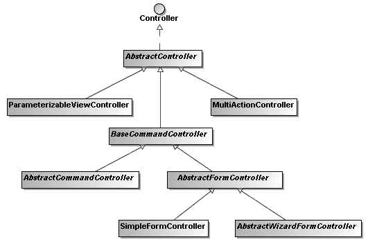

9799ch10.qxd 5/14/08 3:30 PM 第 328 页

**328**

第 10 章 **■** Spring MVC 框架


**图 10-2.** *Spring MVC 中的常见控制器类型*

`Controller`接口是 Spring MVC 中所有控制器类的基接口。

你可以通过实现此接口来创建自己的控制器。在`handleRequest()`方法中，你可以像在 Servlet 中一样自由处理 Web 请求。最后，你必须返回一个`ModelAndView`对象，其中包含视图名称或视图对象，以及一些模型属性。例如，你可以为球场预约系统创建一个欢迎控制器，如下所示。

**■注意** 要开发涉及 Servlet API 的 Web 应用程序，你必须在类路径中包含`servlet-api.jar`（位于 Spring 安装目录的`lib/j2ee`目录下）。

```java
package com.apress.springrecipes.court.web;

...

import javax.servlet.http.HttpServletRequest;

import javax.servlet.http.HttpServletResponse;

import org.springframework.web.servlet.ModelAndView;

import org.springframework.web.servlet.mvc.Controller;

public class WelcomeController **implements Controller** {

    public ModelAndView **handleRequest**(HttpServletRequest request,

                                        HttpServletResponse response) throws Exception {

        Date today = new Date();

        return new ModelAndView("welcome", "today", today);

    }

}
```

9799ch10.qxd 5/14/08 3:30 PM 第 329 页

第 10 章 **■** SPRING MVC 框架

**329**

该控制器简单地创建一个`java.util.Date`对象来获取当前日期，然后返回一个`ModelAndView`对象，其中包含视图名称`welcome`和当前日期作为模型属性，供目标视图显示。

创建控制器类后，你必须在 Web 应用程序上下文中声明其实例。由于这是一个表示层组件，你应在`court-servlet.xml`中声明它。

默认情况下，如果你没有显式配置，`DispatcherServlet`会使用`BeanNameUrlHandlerMapping`作为其默认的处理映射。此处理映射根据处理器的 Bean 名称中指定的 URL 模式将请求映射到处理器。由于`<bean>`元素的`id`属性不能包含`/`字符，你应改用`name`属性。

```xml
<bean name="/welcome.htm"
      class="com.apress.springrecipes.court.web.WelcomeController" />
```

如果你希望控制器具备一些基本控制器功能，例如过滤支持的 HTTP 方法（GET、POST 和 HEAD）以及在 HTTP 响应中生成缓存控制头，你可以让它继承`AbstractController`类，该类实现了`Controller`接口。请注意，在此控制器类中你需要重写的方法是`handleRequestInternal()`。

```java
package com.apress.springrecipes.court.web;

...

import org.springframework.web.servlet.mvc.AbstractController;

public class WelcomeController **extends AbstractController** {

    public ModelAndView **handleRequestInternal**(HttpServletRequest request,
                                                HttpServletResponse response) throws Exception {

        Date today = new Date();

        return new ModelAndView("welcome", "today", today);

    }

}
```

你可以设置从`AbstractController`类继承的几个属性来实现上述功能：

```xml
<bean name="/welcome.htm"
      class="com.apress.springrecipes.court.web.WelcomeController">
    <property name="supportedMethods" value="GET" />
    <property name="cacheSeconds" value="60" />
</bean>
```

例如，你可以在`supportedMethods`属性中设置控制器支持的 HTTP 方法，用逗号分隔。如果 HTTP 请求的方法不在此列表中，将抛出`ServletException`。你还可以为控制器定义缓存秒数，该值将设置在 HTTP 响应的头中。

一个典型的控制器可能会接受 HTTP 请求参数并调用后端服务进行业务处理。例如，你可以创建一个用于查询特定球场预约信息的控制器，如下所示：

9799ch10.qxd 5/14/08 3:30 PM 第 330 页

**330**

第 10 章 **■** SPRING MVC 框架

```java
package com.apress.springrecipes.court.web;

...

import javax.servlet.http.HttpServletRequest;

import javax.servlet.http.HttpServletResponse;
```


import org.springframework.web.bind.ServletRequestUtils;

import org.springframework.web.servlet.ModelAndView;

import org.springframework.web.servlet.mvc.AbstractController;

public class ReservationQueryController extends AbstractController {

private ReservationService reservationService;

public void setReservationService(ReservationService reservationService) {

this.reservationService = reservationService;

}

public ModelAndView handleRequestInternal(HttpServletRequest request,

HttpServletResponse response) throws Exception {

String courtName =

ServletRequestUtils.getStringParameter(request, "courtName");

Map<String, Object> model = new HashMap<String, Object>();

if (courtName != null) {

model.put("courtName", courtName);

model.put("reservations", reservationService.query(courtName));

}

return new ModelAndView("reservationQuery", model);

}

}

在这个控制器中，你首先从请求中获取请求参数 `courtName`。你可以使用标准的 Servlet API `HttpServletRequest.getParameter()` 来实现此目的，但 Spring 在 `ServletRequestUtils` 类中提供了更方便的静态方法，用于获取转换类型后的请求参数以及必需的参数。这可以省去你执行类型转换和检查的麻烦。当你有多个模型属性需要传递给视图时，可以将它们存储在一个 Map 中，并将该 Map 传递给 `ModelAndView` 的构造函数。

现在，你需要在 `court-servlet.xml` 中声明这个控制器，并引用在服务层配置文件（即 `court-service.xml`）中声明的预约服务 bean。

<bean name="/reservationQuery.htm"

class="com.apress.springrecipes.court.web.ReservationQueryController">

<property name="reservationService" ref="reservationService" />

</bean>

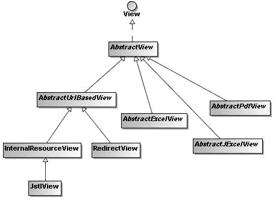

9799ch10.qxd 5/14/08 3:30 PM 第 331 页

第 10 章 **■** S P R I N G M V C 框 架

**331**

**创建 JSP 视图**

Spring MVC 支持多种视图类型，适用于不同的表现层技术。图 10-3 展示了 Spring MVC 中常见的视图类型。

**图 10-3.** *Spring MVC 中的常见视图类型*

在 Spring MVC 应用程序中，视图通常是用 JSTL 编写的 JSP 模板。当 `DispatcherServlet` 从处理器接收到视图名称时，它会将逻辑视图名称解析为用于渲染的视图对象。例如，你可以在 Web 应用程序上下文中配置一个 `InternalResourceViewResolver` bean，将视图名称解析为 `/WEB-INF/jsp/` 目录下的 JSP 文件：

<bean class="org.springframework.web.servlet.view. **InternalResourceViewResolver**">

<property name="prefix" value="/WEB-INF/jsp/" />

<property name="suffix" value=".jsp" />

</bean>

然后，你可以为欢迎控制器创建以下 JSP 模板。将其命名为 `welcome.jsp` 并放入 `/WEB-INF/jsp/` 目录：

<%@ [taglib prefix="fmt" uri="http://java.sun.com/jsp/jstl/fmt" %>](http://java.sun.com/jsp/jstl/fmt)

<html>

<head>

<title>欢迎</title>

</head>

<body>

<h2>欢迎使用球场预约系统</h2>

今天是 <fmt:formatDate value="${today}" pattern="yyyy-MM-dd" />。

</body>

</html>

9799ch10.qxd 5/14/08 3:30 PM 第 332 页

**332**

第 10 章 **■** S P R I N G M V C 框 架

在这个 JSP 模板中，你使用了 JSTL 中的 `fmt` 标签库，将 `today` 模型属性格式化为 `yyyy-MM-dd` 模式。别忘了在这个 JSP 模板的顶部包含 `fmt` 标签库的定义。

接下来，你可以为预约查询控制器创建另一个 JSP 模板，并将其命名为 `reservationQuery.jsp` 以匹配视图名称：

<%@ [taglib prefix="c" uri="http://java.sun.com/jsp/jstl/core" %>](http://java.sun.com/jsp/jstl/core)

<%@ [taglib prefix="fmt" uri="http://java.sun.com/jsp/jstl/fmt" %>](http://java.sun.com/jsp/jstl/fmt)

<html>

<head>

<title>预约查询</title>

</head>

<body>

<form method="POST">

球场名称

<input type="text" name="courtName" value="${courtName}" />

<input type="submit" value="查询" />

</form>

<table border="1">

<tr>

<th>球场名称</th>

<th>日期</th>


<th>小时</th>

<th>玩家</th>

</tr>

<c:forEach items="${reservations}" var="reservation">

<tr>

<td>${reservation.courtName}</td>

<td><fmt:formatDate value="${reservation.date}" pattern="yyyy-MM-dd" /></td>

<td>${reservation.hour}</td>

<td>${reservation.player.name}</td>

</tr>

</c:forEach>

</table>

</body>

</html>

在这个 JSP 模板中，你包含了一个供用户输入要查询的球场名称的表单，然后使用 `<c:forEach>` 标签循环遍历 `reservations` 模型属性来生成结果表格。

**部署 Web 应用程序**

在 Web 应用程序的开发过程中，我强烈建议安装一个带有 Web 容器的本地 Java EE 应用服务器，用于测试和调试。为了方便配置和部署，我选择了 Apache Tomcat 6.0 作为我的 Web 容器，并在其 `conf/Catalina/localhost` 目录下创建了上下文描述符 `court.xml`，指向我的 Web 应用程序的根目录：

<Context docBase="c:/eclipse/workspace/Court/court" />

默认情况下，Tomcat 监听 8080 端口，并使用上下文描述符的名称（本例中为 `court`）作为上下文路径。因此，可以通过以下 URL 访问欢迎控制器和预约查询控制器：

[`localhost:8080/court/welcome.htm`](http://localhost:8080/court/welcome.htm)

[`localhost:8080/court/reservationQuery.htm`](http://localhost:8080/court/reservationQuery.htm)

**10-2. 将请求映射到处理器**

问题

当 `DispatcherServlet` 接收到一个 Web 请求时，它会简单地将该请求分派给一个合适的处理器来处理。你希望为 `DispatcherServlet` 定义一个策略，用于将请求映射到处理器。

解决方案

在 Spring MVC 应用程序中，Web 请求通过一个或多个在 Web 应用程序上下文中声明的处理器映射 bean 来映射到处理器。这些 bean 必须实现 `HandlerMapping` 接口，以便 `DispatcherServlet` 能够自动检测到它们。Spring MVC 提供了多个 `HandlerMapping` 实现，供你使用不同的策略来映射请求。默认情况下，如果你没有显式配置处理器映射，`DispatcherServlet` 将使用 `BeanNameUrlHandlerMapping` 作为其默认的处理器映射，它会根据 bean 名称中指定的 URL 模式将请求映射到处理器。因此，如果你对这个策略满意，就无需定义自己的处理器映射。

处理器映射根据 URL 相对于上下文路径（即 Web 应用程序上下文的部署路径）和 Servlet 路径（即映射到 `DispatcherServlet` 的路径）的路径来匹配 URL。因此，对于 URL [`localhost:8080/court/welcome.htm`](http://localhost:8080/court/welcome.htm)，要匹配的路径是 `/welcome.htm`，因为上下文路径是 `/court`，并且没有 Servlet 路径。

工作原理

**按 Bean 名称映射请求**

将请求映射到处理器的最简单且默认的策略是通过处理器的 bean 名称。要使此策略生效，你必须将每个处理器的 bean 名称声明为 URL 模式的形式，该模式可以接受通配符，以便一个处理器处理多个 URL。如果处理器的 bean 名称与请求的 URL 匹配，`DispatcherServlet` 就会将请求分派给该处理器来处理。

<beans ...>

...
<bean **name="/welcome.htm"**

class="com.apress.springrecipes.court.web.WelcomeController">

...
</bean>

<bean **name="/reservationQuery.htm"**

class="com.apress.springrecipes.court.web.ReservationQueryController">

...
</bean>

</beans>

使用此映射策略时，你必须通过 `name` 属性来设置处理器的名称，因为 `id` 属性不能包含 `/` 字符。

**按控制器类名映射请求**


好的，作为一名高级文档工程师和翻译员，我将严格遵循您提供的注意事项和示例格式，将给定的英文文本翻译成中文。


Spring 提供的另一个处理器映射是 `ControllerClassNameHandlerMapping`，它为实现了 `Controller` 接口的处理器生成处理器映射。它会根据 Web 应用上下文中声明的控制器类名自动生成映射。

<beans ...>

...

<bean class="org.springframework.web.servlet.mvc.support. **➥**

**ControllerClassNameHandlerMapping**" />

<bean class="com.apress.springrecipes.court.web. **WelcomeController**">

...

</bean>

<bean class="com.apress.springrecipes.court.web. **ReservationQueryController**">

...

</bean>

</beans>

对于这些 Bean 声明，`ControllerClassNameHandlerMapping` 会通过移除类名中的 `Controller` 后缀，并将剩余部分转换为小写，来自动生成处理器映射。

**Welcome**Controller **➔** /welcome*

**ReservationQuery**Controller **➔** /reservationquery*

然而，如果你希望 URL 模式遵循 Java 的变量命名约定（例如，生成 `/reservationQuery*` 而不是 `/reservationquery*`），则必须将 `caseSensitive` 属性设置为 `true`。此外，你可以在 `pathPrefix` 属性中为生成的 URL 模式指定一个前缀。你还可以在 `basePackage` 属性中指定基础包，那么相对于该包的子包也会被包含在映射中。

<bean class="org.springframework.web.servlet.mvc.support. **➥**

ControllerClassNameHandlerMapping">

<property name="caseSensitive" value="true" />

<property name="pathPrefix" value="/reservation" />

9799ch10.qxd 5/14/08 3:30 PM Page 335

第 10 章 **■** S P R I N G M V C 框 架

**335**

<property name="basePackage" value="com.apress.springrecipes.court" />

</bean>

这个 `ControllerClassNameHandlerMapping` 定义将生成以下处理器映射：

**Welcome**Controller **➔ /reservation/web**/welcome*

**ReservationQuery**Controller **➔ /reservation/web**/reservationQuery*

**使用自定义映射定义映射请求**

将请求映射到处理器最直接、最灵活的策略是显式指定 URL 模式和处理器之间的映射定义。你可以通过 `SimpleUrlHandlerMapping` 来实现这一点：

<beans ...>

...

<bean class="org.springframework.web.servlet.handler. **➥**

**SimpleUrlHandlerMapping**">

<property name="mappings">

<props>

**<prop key="/welcome.htm">welcomeController</prop>**

**<prop key="/reservationQuery.htm">**

**reservationQueryController**

**</prop>**

</props>

</property>

</bean>

<bean **id="welcomeController"**

class="com.apress.springrecipes.court.web.WelcomeController">

...

</bean>

<bean **id="reservationQueryController"**

class="com.apress.springrecipes.court.web.ReservationQueryController">

...

</bean>

</beans>

`SimpleUrlHandlerMapping` 接受一个 `Properties` 对象作为映射定义。属性键是 URL 模式，而属性值是处理器的 ID 或名称。

URL 模式也可以接受通配符，以便一个处理器处理多个 URL。

**通过多种策略映射请求**

在拥有大量处理器的 Web 应用中，仅选择一种处理器映射策略通常是不够的。通常，`ControllerClassNameHandlerMapping` 可以满足大部分映射需求。然而，通常有些映射必须使用 `SimpleUrlHandlerMapping` 显式映射。

9799ch10.qxd 5/14/08 3:30 PM Page 336

**336**

第 10 章 **■** S P R I N G M V C 框 架

在这种情况下，你必须结合两种处理器映射策略：

<beans ...>

...

<bean class="org.springframework.web.servlet.handler.SimpleUrlHandlerMapping">

<property name="mappings">

<props>

<prop key="/index.htm">welcomeController</prop>

<prop key="/main.htm">welcomeController</prop>

</props>

</property>

**<property name="order" value="0" />**

</bean>

<bean class="org.springframework.web.servlet.mvc.support. **➥**

ControllerClassNameHandlerMapping">

<property name="caseSensitive" value="true" />

**<property name="order" value="1" />**

</bean>

</beans>

当同时选择多个策略时，指定映射优先级非常重要。为此，你可以设置处理器映射 Bean 的 `order` 属性。`order` 值越低，优先级越高。对于这两个处理器映射，Web 请求将按如下方式映射到处理器：

/index.htm **➔** WelcomeController

/main.htm **➔** WelcomeController

/welcome* **➔** WelcomeController

/reservationQuery* **➔** ReservationQueryController

**10-3. 使用处理器拦截器拦截请求**

**问题**

Servlet API 定义的 Servlet 过滤器可以在每个 Web 请求被 Servlet 处理之前和之后进行预处理和后处理。你希望在 Spring 的 Web 应用上下文中配置具有类似过滤器功能的东西，以便利用容器的特性。

此外，有时你可能只想对将由某些 Spring MVC 处理器处理的 Web 请求进行预处理和后处理，并在这些处理器返回的模型属性传递给视图之前对其进行操作。

**解决方案**

Spring MVC 允许你通过*处理器拦截器*来拦截 Web 请求以进行预处理和后处理。处理器拦截器在 Spring 的 Web 应用上下文中配置，

9799ch10.qxd 5/14/08 3:30 PM Page 337

第 10 章 **■** S P R I N G M V C 框 架

**337**

因此它们可以利用任何容器特性并引用容器中声明的任何 Bean。处理器拦截器是为特定的处理器映射注册的，因此它只会拦截由这些处理器映射映射的请求。

每个处理器拦截器必须实现 `HandlerInterceptor` 接口，该接口包含三个需要你实现的回调方法：`preHandle()`、`postHandle()` 和 `afterCompletion()`。第一个和第二个方法将在请求被处理器处理之前和之后调用。第二个方法还允许你访问返回的 `ModelAndView` 对象，因此你可以操作其中的模型属性。最后一个方法将在所有请求处理完成之后（即视图渲染之后）调用。

**工作原理**

假设你要测量每个请求处理器处理每个 Web 请求的时间，并允许视图向用户显示此时间。你可以为此创建一个自定义的处理器拦截器：

package com.apress.springrecipes.court.web;

...

import org.springframework.web.servlet.HandlerInterceptor;

import org.springframework.web.servlet.ModelAndView;

public class MeasurementInterceptor **implements HandlerInterceptor** {

public boolean preHandle(HttpServletRequest request,

HttpServletResponse response, Object handler) throws Exception {

long startTime = System.currentTimeMillis();

request.setAttribute("startTime", startTime);

return true;

}

public void postHandle(HttpServletRequest request,

HttpServletResponse response, Object handler,

ModelAndView modelAndView) throws Exception {

long startTime = (Long) request.getAttribute("startTime");

request.removeAttribute("startTime");

long endTime = System.currentTimeMillis();

modelAndView.addObject("handlingTime", endTime - startTime);

}

public void afterCompletion(HttpServletRequest request,

HttpServletResponse response, Object handler, Exception ex)

throws Exception {

}

}

在这个拦截器的 `preHandle()` 方法中，你记录了开始时间并将其保存到请求属性中。此方法应返回 `true`，以允许 `DispatcherServlet` 继续处理。

9799ch10.qxd 5/14/08 3:30 PM Page 338

**338**

第 10 章 **■** S P R I N G M V C 框 架


处理请求。否则，`DispatcherServlet` 会认为该方法已处理完请求，因此 `DispatcherServlet` 将直接把响应返回给用户。接着，在 `postHandle()` 方法中，你从请求属性中加载开始时间，并与当前时间进行比较。你可以计算出总耗时，然后将该时间添加到模型中，以便传递给视图。最后，由于 `afterCompletion()` 方法无需执行任何操作，你可以将其方法体留空。

实现接口时，即使你可能不需要所有方法，也必须实现全部方法。更好的做法是改为继承拦截器适配器类。该类默认实现了所有拦截器方法。你只需重写需要的方法即可。

```java
package com.apress.springrecipes.court.web;

...

import org.springframework.web.servlet.ModelAndView;

import org.springframework.web.servlet.handler.HandlerInterceptorAdapter;

public class MeasurementInterceptor **extends HandlerInterceptorAdapter** {

    public boolean preHandle(HttpServletRequest request,

                             HttpServletResponse response, Object handler) throws Exception {

        ...

    }

    public void postHandle(HttpServletRequest request,

                           HttpServletResponse response, Object handler,

                           ModelAndView modelAndView) throws Exception {

        ...

    }

}
```

处理器拦截器注册到处理器映射 Bean 上，用于拦截该 Bean 映射的 Web 请求。你可以在 `interceptors` 属性中为处理器映射指定多个拦截器，该属性的类型是一个数组。如果你的 Web 应用上下文中配置了多个处理器映射，并且希望拦截它们映射的所有请求，则必须将拦截器注册到每个处理器映射中。

```xml
<beans ...>

    ...

    <bean id="measurementInterceptor"

          class="com.apress.springrecipes.court.web.MeasurementInterceptor" />

    <bean

        class="org.springframework.web.servlet.handler.SimpleUrlHandlerMapping">

        **<property name="interceptors">**

            **<list>**

                **<ref bean="measurementInterceptor" />**

            **</list>**

        **</property>**

        ...

    </bean>

    <bean class="org.springframework.web.servlet.mvc.support. **➥**

        ControllerClassNameHandlerMapping">

        **<property name="interceptors">**

            **<list>**

                **<ref bean="measurementInterceptor" />**

            **</list>**

        **</property>**

        ...

    </bean>

</beans>
```

然后，你可以在 `welcome.jsp` 中显示该时间，以验证此拦截器的功能。

由于 `WelcomeController` 没有太多操作，你可能会看到处理时间为 0 毫秒。如果是这种情况，你可以在此类中添加一条 `sleep` 语句，以便看到更长的处理时间。

```jsp
<%@ taglib prefix="fmt" uri="http://java.sun.com/jsp/jstl/fmt" %>

<html>

<head>

    <title>欢迎</title>

</head>

<body>

    ...

    **<hr />**

    **处理时间 : ${handlingTime} ms**

</body>

</html>
```

**10-4. 解析用户区域设置**

问题

为了使你的 Web 应用程序支持国际化，你必须识别每个用户偏好的区域设置，并根据该区域设置显示内容。

解决方案

在 Spring MVC 应用程序中，用户的区域设置由区域设置解析器识别，该解析器必须实现 `LocaleResolver` 接口。Spring MVC 提供了多个 `LocaleResolver` 实现，供你根据不同的标准解析区域设置。或者，你也可以通过实现此接口来创建自定义的区域设置解析器。

你可以通过在 Web 应用上下文中注册一个类型为 `LocaleResolver` 的 Bean 来简单地定义一个区域设置解析器。你必须将区域设置解析器的 Bean 名称设置为 `localeResolver`，以便 `DispatcherServlet` 自动检测。请注意，每个 `DispatcherServlet` 只能注册一个区域设置解析器。

工作原理

**通过 HTTP 请求头解析区域设置**


Spring 默认使用的区域设置解析器是 `AcceptHeaderLocaleResolver`。它通过检查 HTTP 请求的 `accept-language` 头来解析区域设置。该头部由用户的网页浏览器根据底层操作系统的区域设置自动设定。请注意，此区域设置解析器无法更改用户的区域设置，因为它无法修改用户操作系统的区域设置。

**通过会话属性解析区域设置**

另一种解析区域设置的方式是使用 `SessionLocaleResolver`。它通过检查用户会话中的预定义属性来解析区域设置。如果会话属性不存在，此区域设置解析器将从 `accept-language` HTTP 头中确定默认区域设置。

<bean id="localeResolver"

class="org.springframework.web.servlet.i18n. **SessionLocaleResolver**">

<property name="defaultLocale" value="en" />

</bean>

你可以为此解析器设置 `defaultLocale` 属性，以防会话属性不存在。请注意，此区域设置解析器能够通过修改存储区域设置的会话属性来更改用户的区域设置。

**通过 Cookie 解析区域设置**

你也可以使用 `CookieLocaleResolver` 通过检查用户浏览器中的 Cookie 来解析区域设置。如果 Cookie 不存在，此区域设置解析器将从 `accept-language` HTTP 头中确定默认区域设置。

<bean id="localeResolver"

class="org.springframework.web.servlet.i18n. **CookieLocaleResolver**" /> 此区域设置解析器使用的 Cookie 可以通过设置 `cookieName` 和 `cookieMaxAge` 属性进行自定义。`cookieMaxAge` 属性表示此 Cookie 应持久保存的秒数。值为 `-1` 表示该 Cookie 将在浏览器关闭后失效。

<bean id="localeResolver"

class="org.springframework.web.servlet.i18n.CookieLocaleResolver">

<property name="cookieName" value="language" />

<property name="cookieMaxAge" value="3600" />

<property name="defaultLocale" value="en" />

</bean>

9799ch10.qxd 5/14/08 3:31 PM Page 341

第 10 章 **■** S P R I N G M V C 框 架

**341**

你也可以为此解析器设置 `defaultLocale` 属性，以防用户浏览器中不存在该 Cookie。此区域设置解析器能够通过修改存储区域设置的 Cookie 来更改用户的区域设置。

**更改用户的区域设置**

除了通过显式调用 `LocaleResolver.setLocale()` 来更改用户区域设置外，你还可以将 `LocaleChangeInterceptor` 应用于你的处理器映射。此拦截器会检测当前 HTTP 请求中是否存在一个特殊参数。该参数名称可以通过此拦截器的 `paramName` 属性进行自定义。如果当前请求中存在此参数，拦截器将根据参数值更改用户的区域设置。

<beans ...>

...

<bean id="localeChangeInterceptor"

class="org.springframework.web.servlet.i18n.LocaleChangeInterceptor">

**<property name="paramName" value="language" />**

</bean>

<bean class="org.springframework.web.servlet.handler.SimpleUrlHandlerMapping">

<property name="interceptors">

<list>

...

**<ref bean="localeChangeInterceptor" />**

</list>

</property>

...

</bean>

<bean class="org.springframework.web.servlet.mvc.support. **➥**

ControllerClassNameHandlerMapping">

<property name="interceptors">

<list>

...

**<ref bean="localeChangeInterceptor" />**

</list>

</property>

...

</bean>

</beans>

`LocaleChangeInterceptor` 只能检测启用了它的处理器映射中的参数。因此，如果你在 Web 应用程序上下文中配置了多个处理器映射，则必须将此拦截器注册到所有映射中，以允许用户在任何 URL 中更改其区域设置。

现在，用户可以通过任何包含 `language` 参数的 URL 来更改其区域设置。例如，以下两个 URL 分别将用户的区域设置更改为美国英语和德语：

9799ch10.qxd 5/14/08 3:31 PM Page 342

**342**

第 10 章 **■** S P R I N G M V C 框 架


[`localhost:8080/court/welcome.htm?language=en_US`](http://localhost:8080/court/welcome.htm?language=en_US)

[`localhost:8080/court/welcome.htm?language=de`](http://localhost:8080/court/welcome.htm?language=de)

然后，你可以在 `welcome.jsp` 中显示 HTTP 响应对象的区域设置，以验证区域设置拦截器的配置：

<%@ [taglib prefix="fmt" uri="http://java.sun.com/jsp/jstl/fmt" %>](http://java.sun.com/jsp/jstl/fmt)

<html>

<head>

<title>欢迎</title>

</head>

<body>

...

**<br />**

**区域设置：${pageContext.response.locale}**

</body>

</html>

**10-5\. 外部化区域敏感文本消息**

问题

在开发国际化 Web 应用程序时，你需要以用户偏好的区域设置显示网页。你不希望为不同区域设置创建同一页面的不同版本。

解决方案

为避免为不同区域设置创建页面的不同版本，你应该通过外部化区域敏感的文本消息，使网页独立于区域设置。Spring 能够通过使用消息源（必须实现 `MessageSource` 接口）为你解析文本消息。然后，你的 JSP 文件可以使用 Spring 标签库中定义的 `<spring:message>` 标签，根据代码解析消息。

工作原理

你可以通过在 Web 应用程序上下文中注册一个 `MessageSource` 类型的 Bean 来定义消息源。你必须将消息源的 Bean 名称设置为 `messageSource`，以便 `DispatcherServlet` 自动检测。请注意，每个 `DispatcherServlet` 只能注册一个消息源。

`ResourceBundleMessageSource` 实现会根据不同区域设置，从不同的资源包中解析消息。例如，你可以在 `court-servlet.xml` 中注册它，以加载基础名称为 `messages` 的资源包：

<bean id="messageSource"

class="org.springframework.context.support.ResourceBundleMessageSource">

<property name="basename" value="messages" />

</bean>

9799ch10.qxd 5/14/08 3:31 PM 第 343 页

第 10 章 **■** Spring MVC 框架

**343**

然后，你创建两个资源包：`messages.properties` 和 `messages_de.properties`，分别存储默认区域设置和德语区域设置的消息。这些资源包应放在类路径的根目录下。

welcome.title=欢迎

welcome.message=欢迎使用球场预订系统

welcome.title=Willkommen

welcome.message=Willkommen zum Spielplatz-Reservierungssystem

现在，在 JSP 文件（如 `welcome.jsp`）中，你可以使用 `<spring:message>` 标签根据代码解析消息。该标签会根据用户当前的区域设置自动解析消息。请注意，此标签定义在 Spring 的标签库中，因此你必须在 JSP 文件顶部声明它。

**<%@ [taglib prefix="spring" uri="http://www.springframework.org/tags" %>](http://www.springframework.org/tags)**

<html>

<head>

<title> **<spring:message code="welcome.title" text="欢迎" />** </title>

</head>

<body>

<h2> **<spring:message code="welcome.message"**

**text="欢迎使用球场预订系统" />** </h2>

...

</body>

</html>

在 `<spring:message>` 中，你可以指定当无法解析给定代码的消息时，要输出的默认文本。

**10-6\. 按名称解析视图**

问题

处理器处理完请求后，可能会返回一个视图对象或该视图对象的逻辑名称。如果返回的是视图名称，`DispatcherServlet` 必须使用该名称创建视图对象并呈现给用户。你希望为 `DispatcherServlet` 定义一个策略，使其能够按名称解析视图。

解决方案

在 Spring MVC 应用程序中，视图由在 Web 应用程序上下文中声明的一个或多个视图解析器 Bean 解析。这些 Bean 必须实现 `ViewResolver` 接口，以便 `DispatcherServlet` 自动检测它们。Spring MVC 提供了多种 `ViewResolver` 实现，供你使用不同的策略解析视图。

9799ch10.qxd 5/14/08 3:31 PM 第 344 页

**344**

第 10 章 **■** Spring MVC 框架

工作原理


**基于 URL 解析视图**

解析视图的基本策略是将其直接映射到 URL。视图解析器 `InternalResourceViewResolver` 通过为每个视图名称添加前缀和后缀，将其映射到 URL。要注册 `InternalResourceViewResolver`，你可以在 Web 应用程序上下文中声明一个此类型的 bean。

<bean class="org.springframework.web.servlet.view. **InternalResourceViewResolver**">

<property name="viewClass"

value="org.springframework.web.servlet.view.JstlView" />

<property name="prefix" value="/WEB-INF/jsp/" />

<property name="suffix" value=".jsp" />

</bean>

例如，`InternalResourceViewResolver` 会按以下方式解析视图名称 `welcome` 和 `reservationQuery`：

welcome **➔** /WEB-INF/jsp/**welcome**.jsp

reservationQuery **➔** /WEB-INF/jsp/**reservationQuery**.jsp

解析后的视图类型可以通过 `viewClass` 属性指定。默认情况下，如果类路径中存在 JSTL 库（即 `jstl.jar`），`InternalResourceViewResolver` 会将视图名称解析为 `JstlView` 类型的视图对象。因此，如果你的视图是包含 JSTL 标签的 JSP 模板，你可以直接省略 `viewClass` 属性。

`InternalResourceViewResolver` 很简单，但它只能解析可以通过 Servlet API 的 `RequestDispatcher` 转发的内部资源视图（例如，一个内部的 JSP 文件或一个 Servlet）。对于 Spring MVC 支持的其他视图类型，你必须使用其他策略来解析它们。

**从 XML 配置文件解析视图**

另一种解析视图的策略是将它们声明为 Spring bean，并通过其 bean 名称进行解析。你可以在与 Web 应用程序上下文相同的配置文件中声明视图 bean，但最好将它们隔离在一个单独的配置文件中。默认情况下，`XmlViewResolver` 从 `/WEB-INF/views.xml` 加载视图 bean，但可以通过 `location` 属性覆盖此位置。

<bean class="org.springframework.web.servlet.view. **XmlViewResolver**">

<property name="location">

<value>/WEB-INF/court-views.xml</value>

</property>

</bean>

在 `court-views.xml` 配置文件中，你可以通过设置类名和属性，将每个视图声明为一个普通的 Spring bean。通过这种方式，你可以声明任何类型的视图（例如，`RedirectView` 甚至自定义视图类型）。

9799ch10.qxd 5/14/08 3:31 PM Page 345

第 10 章 **■** S P R I N G M V C 框 架

**345**

<beans

[xsi:schemaLocation="http://www.springframework.org/schema/beans](http://www.w3.org/2001/XMLSchema-instance)

[`www.springframework.org/schema/beans/spring-beans-2.5.xsd">`](http://www.w3.org/2001/XMLSchema-instance)

<bean id="welcome"

class="org.springframework.web.servlet.view.JstlView">

<property name="url" value="/WEB-INF/jsp/welcome.jsp" />

</bean>

<bean id="reservationQuery"

class="org.springframework.web.servlet.view.JstlView">

<property name="url" value="/WEB-INF/jsp/reservationQuery.jsp" />

</bean>

<bean id="welcomeRedirect"

class="org.springframework.web.servlet.view.RedirectView">

<property name="url" value="welcome.htm" />

</bean>

</beans>

**从资源包解析视图**

除了 XML 配置文件，你还可以在资源包中声明视图 bean。`ResourceBundleViewResolver` 从类路径根目录下的资源包加载视图 bean。请注意，`ResourceBundleViewResolver` 还可以利用资源包的能力，为不同的区域设置从不同的资源包加载视图 bean。

<bean class="org.springframework.web.servlet.view. **ResourceBundleViewResolver**">

<property name="basename" value="views" />

</bean>

当你将 `views` 指定为 `ResourceBundleViewResolver` 的基础名称时，默认的资源包将是 `views.properties`。在此资源包中，你可以以属性的格式声明视图 bean。这种声明方式等同于 XML bean 声明，但功能较弱。

welcome.(class)=org.springframework.web.servlet.view.JstlView

welcome.url=/WEB-INF/jsp/welcome.jsp


reservationQuery.(class)=org.springframework.web.servlet.view.JstlView

reservationQuery.url=/WEB-INF/jsp/reservationQuery.jsp

welcomeRedirect.(class)=org.springframework.web.servlet.view.RedirectView

welcomeRedirect.url=welcome.htm

9799ch10.qxd 5/14/08 3:31 PM Page 346

**346**

第 10 章 **■** S P R I N G M V C 框 架

**使用多个解析器解析视图**

如果你的 Web 应用程序中有大量视图，通常仅选择一种视图解析策略是不够的。通常，`InternalResourceViewResolver` 可以解析大部分内部 JSP 视图，但通常还有其他类型的视图需要通过 `ResourceBundleViewResolver` 来解析。在这种情况下，你必须结合两种策略来进行视图解析。

<beans ...>

...

<bean class="org.springframework.web.servlet.view.ResourceBundleViewResolver">

<property name="basename" value="views" />

**<property name="order" value="0" />**

</bean>

<bean

class="org.springframework.web.servlet.view.InternalResourceViewResolver">

<property name="prefix" value="/WEB-INF/jsp/" />

<property name="suffix" value=".jsp" />

**<property name="order" value="1" />**

</bean>

</beans>

当同时选择多个策略时，指定解析优先级非常重要。为此，你可以设置视图解析器 Bean 的 `order` 属性。

`order` 值越小，优先级越高。请注意，你应该将最低优先级分配给 `InternalResourceViewResolver`，因为它无论视图是否存在都会尝试解析。因此，如果其他解析器的优先级较低，它们将没有机会解析视图。

现在，资源包 `views.properties` 应该只包含那些无法由 `InternalResourceViewResolver` 解析的视图（例如，重定向视图）：

welcomeRedirect.(class)=org.springframework.web.servlet.view.RedirectView

welcomeRedirect.url=welcome.htm

**重定向前缀**

如果你在 Web 应用程序上下文中配置了 `InternalResourceViewResolver`，它可以通过在视图名称中使用 `redirect:` 前缀来解析重定向视图。视图名称的其余部分将被视为重定向 URL。例如，视图名称 `redirect:welcome.htm` 将触发对相对 URL `welcome.htm` 的重定向。你也可以在视图名称中指定一个绝对 URL。

**10-7\. 将异常映射到视图**

问题

当发生未知异常时，你的应用服务器通常会向用户显示令人不快的异常堆栈跟踪。你的用户对此堆栈跟踪毫无办法，并会抱怨你的应用程序不够友好。此外，这也是一种潜在的安全风险，因为你可能会向用户暴露内部方法调用层次结构。

解决方案

在 Spring MVC 应用程序中，你可以在 Web 应用程序上下文中注册一个或多个异常解析器 Bean 来解析未捕获的异常。这些 Bean 必须实现 `HandlerExceptionResolver` 接口，以便 `DispatcherServlet` 能够自动检测到它们。Spring MVC 提供了一个简单的异常解析器，用于将每个异常类别映射到一个视图。

工作原理

假设由于预订不可用，你的预订服务将抛出以下异常：

package com.apress.springrecipes.court.service;

...

public class ReservationNotAvailableException extends RuntimeException {

private String courtName;

private Date date;

private int hour;

// 构造函数和 Getter 方法

...

}

要解析未捕获的异常，你可以通过实现 `HandlerExceptionResolver` 接口来编写自定义的异常解析器。通常，你会希望将不同类别的异常映射到不同的错误页面。Spring MVC 提供了 `SimpleMappingExceptionResolver` 异常解析器，让你可以在 Web 应用程序上下文中配置异常映射。例如，你可以在 `court-servlet.xml` 中注册以下异常解析器：


<bean class="org.springframework.web.servlet.handler. **➥**

SimpleMappingExceptionResolver">

<property name="exceptionMappings">

<props>

**<prop key="com.apress.springrecipes.court.service.➥**

**ReservationNotAvailableException">**

**reservationNotAvailable**

**</prop>**

**<prop key="java.lang.Exception">error</prop>**

</props>

</property>

</bean>

在这个异常解析器中，你为 `ReservationNotAvailableException` 定义了逻辑视图名称 `reservationNotAvailable`。如果在你的 Web 应用上下文中配置了 `InternalResourceViewResolver`，那么当预约不可用时，将显示以下 `reservationNotAvailable.jsp` 页面：

<%@ [taglib prefix="fmt" uri="http://java.sun.com/jsp/jstl/fmt" %>](http://java.sun.com/jsp/jstl/fmt)

<html>

<head>

<title>预约不可用</title>

</head>

<body>

您在 ${exception.courtName} 的预约在 <fmt:formatDate value="${exception.date}" pattern="yyyy-MM-dd" /> 的 ${exception.hour}:00 不可用。

</body>

</html>

在错误页面中，可以通过变量 `${exception}` 访问异常实例，因此你可以向用户展示关于此异常的更多详细信息。

为任何未知异常定义一个默认错误页面是一个好习惯。你应该将此页面映射到键 `java.lang.Exception`，并将其作为映射的最后一个条目，这样如果之前没有匹配到其他条目，就会显示此页面。然后按如下方式创建 `error.jsp`：

<html>

<head>

<title>错误</title>

</head>

<body>

发生了一个错误。请联系我们的管理员以获取详细信息。

</body>

</html>

**10-8. 构造 ModelAndView 对象**

问题

当控制器完成请求处理时，它通常会向 `DispatcherServlet` 返回一个包含视图名称或视图对象以及一些模型属性的 `ModelAndView` 对象。

因此，你经常需要在控制器中构造 `ModelAndView` 对象。

解决方案

`ModelAndView` 类提供了多个重载的构造函数和便捷方法，供你按需构造 `ModelAndView` 对象。这些构造函数和方法以类似的方式支持视图名称和视图对象。

工作原理

当你只有一个模型属性需要返回时，你可以简单地在构造函数中指定该属性来构造一个 `ModelAndView` 对象：

package com.apress.springrecipes.court.web;

...

import org.springframework.web.servlet.ModelAndView;

import org.springframework.web.servlet.mvc.AbstractController;

public class WelcomeController extends AbstractController {

public ModelAndView handleRequestInternal(HttpServletRequest request,

HttpServletResponse response) throws Exception {

Date today = new Date();

**return new ModelAndView("welcome", "today", today);**

}

}

如果有多个属性需要返回，你可以通过传入一个 Map 来构造 `ModelAndView` 对象：

package com.apress.springrecipes.court.web;

...

import org.springframework.web.servlet.ModelAndView;

import org.springframework.web.servlet.mvc.AbstractController;

public class ReservationQueryController extends AbstractController {

...

public ModelAndView handleRequestInternal(HttpServletRequest request,

HttpServletResponse response) throws Exception {

...

**Map<String, Object> model = new HashMap<String, Object>();**

**if (courtName != null) {**

**model.put("courtName", courtName);**

**model.put("reservations", reservationService.query(courtName));**

**}**

**return new ModelAndView("reservationQuery", model);**

}

}

Spring 还提供了 `ModelMap`，这是一个 `java.util.Map` 的实现，它可以根据模型属性的具体类型自动生成其名称：

package com.apress.springrecipes.court.web;

...

import org.springframework.ui.ModelMap;

import org.springframework.web.servlet.ModelAndView;

import org.springframework.web.servlet.mvc.AbstractController;


第 10 章 **■** SPRING MVC 框架

public class ReservationQueryController extends AbstractController {

...

public ModelAndView handleRequestInternal(HttpServletRequest request,

HttpServletResponse response) throws Exception {

...

**ModelMap model = new ModelMap();**

if (courtName != null) {

**model.addAttribute("courtName", courtName);**

**model.addAttribute("reservations",**

**reservationService.query(courtName));**

}

return new ModelAndView("reservationQuery", model);

}

}

由于这两个模型属性的类型分别是 String 和 List<Reservation>，ModelMap 会为它们生成默认名称 string 和 reservationList。如果你对这些名称不满意，可以显式指定它们。

在构造 ModelAndView 对象之后，你仍然可以使用 addObject() 方法向其中添加模型属性。该方法返回 ModelAndView 对象本身，因此你可以通过一条语句构造 ModelAndView 对象。请注意，你也可以省略 addObject() 方法的属性名称。在这种情况下，该方法将生成与 ModelMap 相同的属性名称。

package com.apress.springrecipes.court.web;

...

import org.springframework.web.servlet.ModelAndView;

import org.springframework.web.servlet.mvc.AbstractController;

public class ReservationQueryController extends AbstractController {

...

public ModelAndView handleRequestInternal(HttpServletRequest request,

HttpServletResponse response) throws Exception {

...

List<Reservation> reservations = null;

if (courtName != null) {

reservations = reservationService.query(courtName);

}

**return new ModelAndView("reservationQuery", "courtName", courtName)**

**.addObject("reservations", reservations);**

}

}

事实上，同时返回模型和视图是可选的。在某些情况下，你可能只返回视图而不在模型中包含任何属性。或者，你可能只返回模型而不返回视图，让 Spring MVC 根据请求 URL 来确定视图。有时，如果你的控制器直接处理 HttpServletResponse 对象（例如，将二进制文件流式传输回用户），你甚至可以返回 null。

9799ch10.qxd 5/14/08 3:31 PM 第 351 页

第 10 章 **■** SPRING MVC 框架

**351**

**10-9. 创建具有参数化视图的控制器**

问题

在创建控制器时，你不想在控制器类中硬编码视图名称。相反，你希望视图名称是参数化的，以便可以在 Bean 配置文件中指定它。

解决方案

ParameterizableViewController 是 AbstractController 的一个子类，它定义了一个带有 getter 和 setter 方法的 viewName 属性。你可以直接使用这个控制器类来创建一个仅向用户渲染视图而不包含任何处理逻辑的控制器，或者你可以扩展这个控制器类以继承 viewName 属性。

工作原理

例如，假设你有一个非常简单的控制器，其目的仅仅是渲染 about 视图。你可以声明一个类型为 ParameterizableViewController 的控制器，并将 viewName 属性指定为 about：

<bean id="aboutController"

class="org.springframework.web.servlet.mvc.ParameterizableViewController">

<property name="viewName" value="about" />

</bean>

然后，在 /WEB-INF/jsp/ 中创建 about.jsp，如下所示：

<html>

<head>

<title>关于</title>

</head>

<body>

<h2>球场预订系统</h2>

<table>

<tr>

<td>版本：</td>

<td>1.0</td>

</tr>

</table>

</body>

</html>

如果你想在保留参数化视图的同时为控制器添加一些处理逻辑，你的控制器类可以扩展 ParameterizableViewController。以下 AboutController 接受一个 email 属性并将其包含在模型中：

9799ch10.qxd 5/14/08 3:31 PM 第 352 页

**352**

第 10 章 **■** SPRING MVC 框架

package com.apress.springrecipes.court.web;

...

import org.springframework.web.servlet.ModelAndView;

import org.springframework.web.servlet.mvc.ParameterizableViewController;

public class AboutController **extends ParameterizableViewController** {

private String email;

public void setEmail(String email) {

this.email = email;

}

protected ModelAndView handleRequestInternal(HttpServletRequest request,

HttpServletResponse response) throws Exception {

return new ModelAndView(getViewName(), "email", email);

}

}

由于 AboutController 扩展了 ParameterizableViewController，它也具有一个可以注入的 viewName 属性：

<bean id="aboutController"

class="com.apress.springrecipes.court.web.AboutController">

<property name="viewName" value="about" />

<property name="email" value="reservation@court.com" />

</bean>

在 about.jsp 中，你可以显示从模型中获取的 email 属性：

<html>

<head>

<title>关于</title>

</head>

<body>

<h2>球场预订系统</h2>

<table>

...

<tr>

<td>电子邮件：</td>

<td><a href="mailto:${email}">${email}</a></td>

</tr>

</table>

</body>

</html>

9799ch10.qxd 5/14/08 3:31 PM 第 353 页

第 10 章 **■** SPRING MVC 框架

**353**

由于你在 Web 应用程序上下文中配置了 ControllerClassNameHandlerMapping，你可以通过以下 URL 访问此控制器：

[`localhost:8080/court/about.htm`](http://localhost:8080/court/about.htm)

**10-10. 使用表单控制器处理表单**

问题

在 Web 应用程序中，你经常需要处理表单。表单控制器必须向用户显示表单，并处理表单提交。表单处理可能是一项非常复杂且多变的任务。如果你从头开始构建表单控制器，将会涉及太多表单处理的细节。

解决方案

Spring MVC 提供的 SimpleFormController 类定义了基本的表单处理流程。它支持命令对象的概念，并可以将表单字段值绑定到同名的命令对象属性上。通过扩展 SimpleFormController 类，你的控制器将继承处理表单的能力。

当 SimpleFormController 收到 HTTP GET 请求要求显示表单时，它会向用户渲染表单视图。然后，当表单通过 HTTP POST 请求提交时，SimpleFormController 将通过将表单字段值绑定到命令对象并调用 onSubmit() 方法来处理表单提交。如果表单处理成功，它将向用户渲染成功视图。否则，它将再次渲染表单视图并显示错误。

为了适应不同的表单需求，SimpleFormController 允许你通过重写几个生命周期方法来定制表单处理流程。

工作原理

假设你希望允许用户通过填写表单来预订球场。你首先在 ReservationService 接口中定义一个 make() 方法：

package com.apress.springrecipes.court.service;

...

public interface ReservationService {

...

public void make(Reservation reservation)

throws ReservationNotAvailableException;

}

然后，你通过向存储预订的列表中添加一个 Reservation 项来实现这个 make() 方法。如果存在重复预订，则抛出 ReservationNotAvailableException。

package com.apress.springrecipes.court.service;

...

public class ReservationServiceImpl implements ReservationService {

...

9799ch10.qxd 5/14/08 3:31 PM 第 354 页

**354**

第 10 章 **■** SPRING MVC 框架

public void make(Reservation reservation)

throws ReservationNotAvailableException {

for (Reservation made : reservations) {

if (made.getCourtName().equals(reservation.getCourtName())

&& made.getDate().equals(reservation.getDate())

&& made.getHour() == reservation.getHour()) {

throw new ReservationNotAvailableException(

reservation.getCourtName(), reservation.getDate(),

reservation.getHour());

}

}

reservations.add(reservation);

}

}

**创建表单控制器**


现在我们来创建一个表单控制器，用于处理球场预约表单。通过继承 `SimpleFormController` 类，你可以为该控制器指定命令类（此处为 `Reservation`），这样表单字段的值就会绑定到同名命令对象的属性上。你还可以为视图指定命令对象的名称（此处为 `reservation`），但这是可选的，默认名称为 `command`。

```java
package com.apress.springrecipes.court.web;

...

import org.springframework.beans.propertyeditors.CustomDateEditor;

import org.springframework.web.bind.ServletRequestDataBinder;

import org.springframework.web.servlet.mvc.SimpleFormController;

public class ReservationFormController extends SimpleFormController {

    private ReservationService reservationService;

    public ReservationFormController() {
        **setCommandClass(Reservation.class);**
        **setCommandName("reservation");**
    }

    public void setReservationService(ReservationService reservationService) {
        this.reservationService = reservationService;
    }

    protected void initBinder(HttpServletRequest request,
                              ServletRequestDataBinder binder) throws Exception {
        **SimpleDateFormat dateFormat = new SimpleDateFormat("yyyy-MM-dd");**
        **dateFormat.setLenient(false);**
        **binder.registerCustomEditor(Date.class, new CustomDateEditor(**
                **dateFormat, true));**
    }

    protected void doSubmitAction(Object command) throws Exception {
        **Reservation reservation = (Reservation) command;**
        reservationService.make(reservation);
    }
}
```

为了将表单字段值绑定到命令对象，表单控制器可能需要对字段值进行类型转换，因为它们都是以字符串形式提交的。类型转换实际上是由该控制器中注册的属性编辑器执行的。Spring 预注册了几个属性编辑器，用于转换常见的数据类型，例如数字和布尔值。对于其他数据类型（如 `java.util.Date`），你必须注册自定义编辑器。自定义属性编辑器在 `initBinder()` 方法中注册到 `ServletRequestDataBinder` 参数。

如果在绑定表单字段值时出现任何错误，`SimpleFormController` 将自动重新渲染表单视图并附带错误信息。否则，它将调用 `onSubmit()` 方法来处理表单提交。在 `onSubmit()` 方法中，你可以通过参数获取已创建并绑定的命令对象。对于此控制器，它将是一个 `Reservation` 对象，因为你已将命令类设置为 `Reservation`。`onSubmit()` 方法有三种变体可供重写。你应该重写其中最简单的一种，以便访问满足你需求的方法参数。

```java
protected ModelAndView onSubmit(Object command) throws Exception;
protected ModelAndView onSubmit(Object command, BindException errors) throws Exception;
protected ModelAndView onSubmit(HttpServletRequest request, HttpServletResponse response, Object command, BindException errors) throws Exception;
```

当重写 `onSubmit()` 方法时，你必须返回一个 `ModelAndView` 对象。如果你只需要对命令对象执行一个操作，并在操作完成后返回成功视图，你可以重写 `doSubmitAction()` 方法，其返回类型为 `void`，并且默认会渲染成功视图。在上述 `doSubmitAction()` 方法中，你将命令对象传递给 `ReservationService` 以进行预约。

当你声明此控制器时，它需要引用服务层的 `reservationService` bean 来进行预约。此外，你必须相应地为此表单控制器设置表单视图和成功视图。

```xml
<bean id="reservationFormController"
      class="com.apress.springrecipes.court.web.ReservationFormController">
    <property name="reservationService" ref="reservationService" />
    <property name="formView" value="reservationForm" />
    <property name="successView" value="reservationSuccess" />
</bean>
```

首先，我们来创建表单视图 `reservationForm.jsp`。它包含一个带有多个表单字段的 HTML 表单。如果出现任何绑定或验证错误，`SimpleFormController` 会向用户重新显示表单视图，并将错误信息包含在模型中供视图访问。你必须在表单视图中显示错误消息和用户输入的原始值。

在 Spring 1.x 版本中，你必须使用 `<spring:bind>` 标签将每个表单字段绑定到命令对象的属性，然后使用表达式 `${status.errorMessage}` 和 `${status.value}` 访问错误消息和原始值。在 Spring 2.x 中，你可以使用 Spring 表单标签库中强大的表单标签。

```jsp
[**<%@ taglib prefix="form" uri="http://www.springframework.org/tags/form"%>**](http://www.springframework.org/tags/form)
<html>
<head>
    <title>预约表单</title>
    <style>
        .error {
            color: #ff0000;
            font-weight: bold;
        }
    </style>
</head>
<body>
    **<form:form method="POST" commandName="reservation">**
        **<form:errors path="*" cssClass="error" />**
        <table>
            <tr>
                <td>球场名称</td>
                <td> **<form:input path="courtName" />** </td>
                <td> **<form:errors path="courtName" cssClass="error" />** </td>
            </tr>
            <tr>
                <td>日期</td>
                <td> **<form:input path="date" />** </td>
                <td> **<form:errors path="date" cssClass="error" />** </td>
            </tr>
            <tr>
                <td>小时</td>
                <td> **<form:input path="hour" />** </td>
                <td> **<form:errors path="hour" cssClass="error" />** </td>
            </tr>
            <tr>
                <td colspan="3"><input type="submit" /></td>
            </tr>
        </table>
    </form:form>
</body>
</html>
```

`<form:input>` 和 `<form:select>` 标签可以通过指定 `path` 属性绑定到命令对象的属性路径。它们会向用户显示字段的原始值，该值要么是绑定的属性值，要么是由于绑定错误而被拒绝的值。这些标签必须用在 `<form:form>` 标签内部，该标签通过名称定义表单并绑定到命令对象。如果你不指定命令对象的名称，则将使用默认名称 `command`。`<form:error>` 标签可以显示指定属性路径的所有错误消息。在 `path` 中放置星号表示将显示所有错误。

然后，你创建成功视图 `reservationSuccess.jsp` 来通知用户预约成功：

```jsp
<html>
<head>
    <title>预约成功</title>
</head>
<body>
    您的预约已成功提交。
</body>
</html>
```

在表单字段绑定过程中，可能会因无效值而出现错误。例如，如果日期格式不符合 `CustomDateEditor` 中指定的有效格式，或者小时字段包含字母字符，则上述表单控制器将无法转换这些字段。

此控制器会为每个错误生成一系列选择性错误代码。对于日期字段输入的无效值，将生成以下错误代码：

```
typeMismatch.command.date
typeMismatch.date
typeMismatch.java.util.Date
typeMismatch
```

如果你定义了 `ResourceBundleMessageSource`，则可以在资源包中包含以下错误消息，以适用于相应的区域设置（例如，默认区域设置的 `messages.properties`）：

```properties
typeMismatch.date=无效的日期格式
typeMismatch.hour=无效的小时格式
```

由于你在 Web 应用程序上下文中配置了 `ControllerClassNameHandlerMapping`，因此可以通过以下 URL 访问此控制器：

[`localhost:8080/court/reservationForm.htm`](http://localhost:8080/court/reservationForm.htm)


当您在浏览器中输入此 URL 时，它会向您的 Web 应用程序发送一个 HTTP GET 请求。此表单控制器将为此请求渲染表单视图。填写表单字段后，您通过 HTTP POST 请求提交表单。然后，此表单控制器将处理您的表单提交。如果表单处理成功，它将渲染成功视图。否则，它将再次渲染带有错误的表单视图。

9799ch10.qxd 5/14/08 3:31 PM 第 358 页

**358**

第 10 章 **■** S P R I N G M V C 框 架

**应用 Post/Redirect/Get 设计模式**

然而，当您在表单成功视图页面刷新网页时，刚刚提交的表单将被再次提交。此问题被称为*重复表单提交*。为避免此问题，您可以应用*post/redirect/get*设计模式，该模式建议在表单提交成功处理后重定向到另一个 URL，而不是直接返回一个 HTML 页面。

首先，您使用`ParameterizableViewController`定义一个仅渲染`reservationSuccess`视图的控制器，该视图映射到`reservationSuccess.jsp`。

<bean id="reservationSuccessController"

class="org.springframework.web.servlet.mvc.ParameterizableViewController">

<property name="viewName" value="reservationSuccess" />

</bean>

然后，您在`SimpleUrlHandlerMapping`中为此控制器定义一个显式映射，因为`ControllerClassNameHandlerMapping`不会为内置的 Spring MVC 控制器生成映射：

<bean class="org.springframework.web.servlet.handler.SimpleUrlHandlerMapping">

...

<property name="mappings">

<props>

...

<prop key="/reservationSuccess.htm">reservationSuccessController</prop>

</props>

</property>

</bean>

由于您在 Web 应用程序上下文中配置了`ResourceBundleViewResolver`，您可以在类路径根目录的`views.properties`中定义以下重定向视图：`reservationSuccessRedirect.(class)=`**➥**
`org.springframework.web.servlet.view.RedirectView`
`reservationSuccessRedirect.url=reservationSuccess.htm`

最后，您为`ReservationFormController`的成功视图指定此重定向视图。现在，当表单提交成功处理后，用户将被重定向到另一个 URL。即使用户刷新此页面，也不会导致重复表单提交问题。

<bean id="reservationFormController"

class="com.apress.springrecipes.court.web.ReservationFormController">

<property name="reservationService" ref="reservationService" />

<property name="formView" value="reservationForm" />

<property name="successView" value=" **reservationSuccessRedirect**" />

</bean>

9799ch10.qxd 5/14/08 3:31 PM 第 359 页

第 10 章 **■** S P R I N G M V C 框 架

**359**

**初始化命令对象**

您可以为`SimpleFormController`指定一个命令类，该类将被实例化以绑定表单字段值。然而，在某些情况下，您可能必须自己初始化命令对象。例如，考虑一种情况，您要将玩家的姓名和电话绑定到`Reservation`对象的`player`属性：

<html>

<head>

<title>预约表单</title>

</head>

<body>

<form method="POST">

<table>

...

<tr>

<td>玩家姓名</td>

<td> **<form:input path="player.name" />** </td>

<td> **<form:errors path="player.name" cssClass="error" />** </td>

</tr>

<tr>

<td>玩家电话</td>

<td> **<form:input path="player.phone" />** </td>

<td> **<form:errors path="player.phone" cssClass="error" />** </td>

</tr>

<tr>

<td colspan="3"><input type="submit" /></td>

</tr>

</table>

</form>

</body>

</html>

然而，当命令类`Reservation`刚被实例化时，`player`属性为 null，因此在渲染此表单时会导致异常。

为解决此问题，您必须自己初始化命令对象。为此，您可以覆盖`SimpleFormController`的`formBackingObject()`方法。此方法的默认实现只是实例化命令类。当您覆盖此方法时，命令类不再是必需的，因为`SimpleFormController`将不再为您实例化此类。

package com.apress.springrecipes.court.web;

...

public class ReservationFormController extends SimpleFormController {

...

public ReservationFormController() {

**// 无需指定命令类**

**// setCommandClass(Reservation.class);**

9799ch10.qxd 5/14/08 3:31 PM 第 360 页

**360**

第 10 章 **■** S P R I N G M V C 框 架

setCommandName("reservation");

}

protected Object formBackingObject(HttpServletRequest request)

throws Exception {

Reservation reservation = new Reservation();

reservation.setPlayer(new Player());

return reservation;

}

}

此方法的另一个典型用途是获取某些请求参数来初始化命令对象（例如，通过 ID 从 ORM 框架中检索实体）。例如，您可以从请求中获取一个`username`参数，并用此名称初始化玩家：

package com.apress.springrecipes.court.web;

...

import org.springframework.web.bind.ServletRequestUtils;

public class ReservationFormController extends SimpleFormController {

...

protected Object formBackingObject(HttpServletRequest request)

throws Exception {

Reservation reservation = new Reservation();

String username =

ServletRequestUtils.getStringParameter(request, "username");

reservation.setPlayer(new Player(username, null));

return reservation;

}

}

现在，当表单显示时，`username`参数将预填入玩家姓名字段。您可以使用以下 URL 进行测试：

[`localhost:8080/court/reservationForm.htm?username=Roger`](http://localhost:8080/court/reservationForm.htm?username=Roger)

还有两个与命令对象相关的附加属性可供配置。首先，`bindOnNewForm`属性设置在创建新表单时是否应将请求参数绑定到命令对象。此过程与将`username`参数绑定到玩家姓名字段的方式非常相似。唯一的区别是请求参数绑定到同名的属性。例如，您可以在构造函数中启用此属性：

package com.apress.springrecipes.court.web;

...

public class ReservationFormController extends SimpleFormController {

...

public ReservationFormController() {

...

9799ch10.qxd 5/14/08 3:31 PM 第 361 页

第 10 章 **■** S P R I N G M V C 框 架

**361**

setBindOnNewForm(true);

}

}

现在，当表单显示时，请求参数将绑定到同名的属性。您可以使用以下 URL 进行测试：

[`localhost:8080/court/reservationForm.htm?date=2008-01-14`](http://localhost:8080/court/reservationForm.htm?date=2008-01-14)

第二个属性`sessionForm`设置是否应将命令对象存储在会话中。默认情况下，此值为 false，因此即使因绑定错误而再次渲染表单，每个请求也会创建一个新的命令对象。如果此属性设置为 true，则命令对象将存储在会话中以供后续使用，直到表单成功完成。然后，此命令对象将从会话中清除。这通常用于命令对象是一个持久化对象，需要在不同请求之间保持一致以跟踪更改的情况。

package com.apress.springrecipes.court.web;

...

public class ReservationFormController extends SimpleFormController {

...

public ReservationFormController() {

...

setSessionForm(true);

}

}

**提供表单参考数据**


当表单控制器被请求渲染表单视图时，它可能需要提供某些类型的参考数据给表单（例如，在 HTML 选择框中显示的选项）。现在假设你希望允许用户在预订场地时选择运动类型。你首先在 `ReservationService` 接口中定义 `getAllSportTypes()` 方法，用于检索所有可用的运动类型：

```java
package com.apress.springrecipes.court.service;

...

public interface ReservationService {

...

public List<SportType> getAllSportTypes();

}
```

然后，你可以通过返回一个硬编码列表来简单实现此方法：

```java
package com.apress.springrecipes.court.service;

...

public class ReservationServiceImpl implements ReservationService {

...

public static final SportType TENNIS = new SportType(1, "Tennis");
public static final SportType SOCCER = new SportType(2, "Soccer");

public List<SportType> getAllSportTypes() {

return Arrays.asList(new SportType[] { TENNIS, SOCCER });

}

}
```

当 `ReservationFormController` 被请求显示预订表单时，你必须将所有可用的运动类型包含在模型中，以便此表单在 HTML 选择框中显示它们。为此，你可以重写 `SimpleFormController` 的 `referenceData()` 方法。你应该将参考数据放入一个 Map 中并返回给此方法。这个 Map 将被添加到模型中，并自动传递给表单视图。`referenceData()` 方法的默认实现返回 `null`。

```java
package com.apress.springrecipes.court.web;

...

public class ReservationFormController extends SimpleFormController {

...

protected Map referenceData(HttpServletRequest request) throws Exception {

Map referenceData = new HashMap();

List<SportType> sportTypes = reservationService.getAllSportTypes();

referenceData.put("sportTypes", sportTypes);

return referenceData;

}

}
```

然后，在表单视图中，你可以使用 Spring 的 `<form:select>` 标签来定义这个 HTML 选择框。你只需为此标签指定项目列表、项目值和项目标签，它就会自动生成选择选项。

```jsp
<%@ taglib prefix="c" uri="http://java.sun.com/jsp/jstl/core" %>
<html>
<head>
<title>预订表单</title>
</head>
<body>
<form method="POST">
<table>
...
<tr>
<td>运动类型</td>
<td>
**<form:select path="sportType" items="${sportTypes}"**
**itemValue="id" itemLabel="name" />**
</td>
<td> **<form:errors path="sportType" cssClass="error" />** </td>
</tr>
<tr>
<td colspan="3"><input type="submit" /></td>
</tr>
</table>
</form>
</body>
</html>
```

**绑定自定义类型的属性**

当表单提交时，`SimpleFormController` 可以帮助你将表单字段值绑定到同名的命令对象属性上。然而，对于自定义类型的属性，除非你为它们指定相应的属性编辑器，否则 `SimpleFormController` 将无法进行转换。例如，运动类型选择字段只会提交所选运动类型的 ID。你需要使用属性编辑器将此 ID 转换为 `SportType` 对象。首先，你需要在 `ReservationService` 中定义 `getSportType()` 方法，用于通过 ID 检索 `SportType` 对象：

```java
package com.apress.springrecipes.court.service;

...

public interface ReservationService {

...

public SportType getSportType(int sportTypeId);

}
```

出于测试目的，你可以简单地使用 `switch/case` 语句来实现此方法：

```java
package com.apress.springrecipes.court.service;

...

public class ReservationServiceImpl implements ReservationService {

...

public SportType getSportType(int sportTypeId) {

switch (sportTypeId) {

case 1:

return TENNIS;

case 2:

return SOCCER;

default:

return null;

}

}

}
```

然后，你创建 `SportTypeEditor` 类，用于将运动类型 ID 转换为 `SportType` 对象。此属性编辑器需要 `ReservationService` 来执行查找操作。


package com.apress.springrecipes.court.domain;

...

import java.beans.PropertyEditorSupport;

public class SportTypeEditor extends PropertyEditorSupport {

9799ch10.qxd 5/14/08 3:31 PM Page 364

**364**

第 10 章 **■** S P R I N G M V C 框 架

private ReservationService reservationService;

public SportTypeEditor(ReservationService reservationService) {

this.reservationService = reservationService;

}

public void setAsText(String text) throws IllegalArgumentException {

int sportTypeId = Integer.parseInt(text);

SportType sportType = reservationService.getSportType(sportTypeId);

setValue(sportType);

}

}

最后一步是将此属性编辑器注册到你的控制器。你应在 `initBinder()` 方法中将其注册到 `ServletRequestDataBinder` 对象。

package com.apress.springrecipes.court.web;

...

public class ReservationFormController extends SimpleFormController {

...

protected void initBinder(HttpServletRequest request,

ServletRequestDataBinder binder) throws Exception {

SimpleDateFormat dateFormat = new SimpleDateFormat("yyyy-MM-dd"); dateFormat.setLenient(false);

binder.registerCustomEditor(Date.class, new CustomDateEditor(

dateFormat, true));

**binder.registerCustomEditor(SportType.class, new SportTypeEditor(**

**reservationService));**

}

}

**验证表单数据**

`SimpleFormController` 可以在绑定表单字段值后帮助你验证命令对象。验证由实现 `Validator` 接口的验证器对象完成。你可以编写以下验证器来检查必填表单字段是否已填写，以及预约时间在节假日和工作日是否有效：

package com.apress.springrecipes.court.domain;

...

import org.springframework.validation.Errors;

import org.springframework.validation.ValidationUtils;

import org.springframework.validation.Validator;

public class ReservationValidator implements Validator {

public boolean supports(Class clazz) {

return Reservation.class.isAssignableFrom(clazz);

}

9799ch10.qxd 5/14/08 3:31 PM Page 365

第 10 章 **■** S P R I N G M V C 框 架

**365**

public void validate(Object target, Errors errors) {

ValidationUtils.rejectIfEmptyOrWhitespace(errors, "courtName",

"required.courtName", "Court name is required.");

ValidationUtils.rejectIfEmpty(errors, "date",

"required.date", "Date is required.");

ValidationUtils.rejectIfEmpty(errors, "hour",

"required.hour", "Hour is required.");

ValidationUtils.rejectIfEmptyOrWhitespace(errors, "player.name",

"required.playerName", "Player name is required.");

ValidationUtils.rejectIfEmpty(errors, "sportType",

"required.sportType", "Sport type is required.");

Reservation reservation = (Reservation) target;

Date date = reservation.getDate();

int hour = reservation.getHour();

if (date != null) {

Calendar calendar = Calendar.getInstance();

calendar.setTime(date);

if (calendar.get(Calendar.DAY_OF_WEEK) == Calendar.SUNDAY) {

if (hour < 8 || hour > 22) {

errors.reject("invalid.holidayHour", "Invalid holiday hour.");

}

} else {

if (hour < 9 || hour > 21) {

errors.reject("invalid.weekdayHour", "Invalid weekday hour.");

}

}

}

}

}

在此验证器中，你使用了 `ValidationUtils` 类中的工具方法，例如 `rejectIfEmptyOrWhitespace()` 和 `rejectIfEmpty()`，来验证必填表单字段。如果这些表单字段中的任何一个为空，这些方法将创建一个*字段错误*，该错误将绑定到该字段。这些方法的第二个参数是属性名称，而第三个和第四个参数分别是错误代码和默认错误消息。

你还需要检查预约时间在节假日和工作日是否有效。如果无效，应使用 `reject()` 方法创建一个*对象错误*，该错误将绑定到预约对象，而不是某个字段。

要将此验证器应用于你的控制器，你只需在 `validator` 属性中配置它的一个实例，可以将其作为内部 bean 或通过 bean 引用来配置。如果你有多个验证器要应用于一个控制器，则可以在 `validators` 属性中设置它们，该属性的类型是一个数组。


<bean id="reservationFormController"

class="com.apress.springrecipes.court.web.ReservationFormController">

...

**<property name="validator">**

9799ch10.qxd 5/14/08 3:31 PM Page 366

**366**

第 10 章 **■** S P R I N G M V C 框 架

**<bean class="com.apress.springrecipes.court.domain.➥**

**ReservationValidator" />**

**</property>**

</bean>

由于验证器在验证过程中可能会产生错误，您应为错误代码定义消息，以便向用户显示。如果您已定义 `ResourceBundleMessageSource`，则可以在资源包中为相应区域设置（例如，默认区域设置的 `messages.properties`）包含以下错误消息：

required.courtName=必须提供场地名称

required.date=必须提供日期

required.hour=必须提供小时数

required.playerName=必须提供玩家姓名

required.sportType=必须提供运动类型

invalid.holidayHour=无效的节假日小时数

invalid.weekdayHour=无效的工作日小时数

**10-11. 使用向导表单控制器处理多页表单**

问题

在 Web 应用程序中，有时需要处理跨多个页面的复杂表单。此类表单通常称为*向导表单*，因为用户必须逐页填写——就像使用软件向导一样。毫无疑问，您可以通过扩展 `SimpleFormController` 创建一个或多个表单控制器来处理向导表单。然而，如果您需要在多个页面之间维护表单状态，将会有大量工作要做。

解决方案

Spring MVC 提供的 `AbstractWizardFormController` 类定义了处理向导表单的基本任务。它还支持命令对象的概念，并可以将多个页面中的表单字段绑定到单个命令对象的同名属性上。通过扩展 `AbstractWizardFormController` 类，您的表单控制器将继承处理向导表单的能力。

由于向导表单包含多个表单页面，您必须为向导表单控制器定义多个页面视图。然后，该控制器将管理所有这些表单页面之间的表单状态。在向导表单中，存在多个操作，而不是 `SimpleFormController` 中的单个提交操作。`AbstractWizardFormController` 将通过一个特殊的请求参数来确定用户的操作，该参数通常指定为提交按钮的名称：`_finish`：完成向导表单。

`_cancel`：取消向导表单。

`_target *x*`：跳转到目标页面，其中 *x* 是从零开始的页面索引。

9799ch10.qxd 5/14/08 3:31 PM Page 367

第 10 章 **■** S P R I N G M V C 框 架

**367**

`AbstractWizardFormController` 类支持与 `SimpleFormController` 相同的大部分生命周期方法，供您自定义表单处理流程。实际上，它们都扩展了 `AbstractFormController` 基类。

工作原理

假设您想提供一个功能，允许用户按固定时间段定期预订场地。首先，在 domain 子包中定义 `PeriodicReservation` 类：`package com.apress.springrecipes.court.domain;`

...

public class PeriodicReservation {

private String courtName;

private Date fromDate;

private Date toDate;

private int period;

private int hour;

private Player player;

// Getters and Setters

...

}

然后，在 `ReservationService` 接口中添加一个 `makePeriodic()` 方法，用于进行定期预订：

`package com.apress.springrecipes.court.service;`

...

public interface ReservationService {

...

public void makePeriodic(PeriodicReservation periodicReservation)

throws ReservationNotAvailableException;

}

该方法的实现涉及从 `PeriodicReservation` 生成一系列 `Reservation` 对象，并将每个预订传递给 `make()` 方法。显然，在这个简单的应用程序中，没有事务管理支持。

`package com.apress.springrecipes.court.service;`

...

public class ReservationServiceImpl implements ReservationService {

...

public void makePeriodic(PeriodicReservation periodicReservation)

throws ReservationNotAvailableException {

Calendar fromCalendar = Calendar.getInstance();


fromCalendar.setTime(periodicReservation.getFromDate());

Calendar toCalendar = Calendar.getInstance();

toCalendar.setTime(periodicReservation.getToDate());

9799ch10.qxd 5/14/08 3:31 PM 第 368 页

**368**

第 10 章 **■** S P R I N G M V C 框 架

while (fromCalendar.before(toCalendar)) {

Reservation reservation = new Reservation();

reservation.setCourtName(periodicReservation.getCourtName());

reservation.setDate(fromCalendar.getTime());

reservation.setHour(periodicReservation.getHour());

reservation.setPlayer(periodicReservation.getPlayer());

make(reservation);

fromCalendar.add(Calendar.DATE, periodicReservation.getPeriod());

}

}

}

**创建向导表单页面**

假设你想向用户展示一个分三页显示的定期预订表单。每页包含表单字段的一部分。第一页是 `reservationCourtForm.jsp`，其中仅包含定期预订的场地名称字段。

[<%@ taglib prefix="form" uri="http://www.springframework.org/tags/form"%>](http://www.springframework.org/tags/form)

<html>

<head>

<title>预订场地表单</title>

<style>

.error {

color: #ff0000;

font-weight: bold;

}

</style>

</head>

<body>

<form:form method="POST" commandName="reservation">

<table>

<tr>

<td>场地名称</td>

<td><form:input path="courtName" /></td>

<td><form:errors path="courtName" cssClass="error" /></td>

</tr>

<tr>

<td colspan="3">

**<input type="submit" value="下一步" name="_target1" />**

**<input type="submit" value="取消" name="_cancel" />**

</td>

</tr>

</table>

</form:form>

9799ch10.qxd 5/14/08 3:31 PM 第 369 页

第 10 章 **■** S P R I N G M V C 框 架

**369**

</body>

</html>

此页面中的表单和输入字段使用 Spring 的 `<form:form>` 和 `<form:input>` 标签定义。它们绑定到命令对象及其属性。还有一个错误标签，用于向用户显示字段错误消息。请注意，此页面中有两个提交按钮。“下一步”按钮的名称必须为 `_target1`。它指示向导表单控制器前进到第二页，其页面索引为 1（从零开始）。“取消”按钮的名称必须为 `_cancel`。它指示控制器取消此表单。

第二页是 `reservationTimeForm.jsp`。它包含定期预订的日期和时间字段：

[<%@ taglib prefix="form" uri="http://www.springframework.org/tags/form"%>](http://www.springframework.org/tags/form)

<html>

<head>

<title>预订时间表单</title>

<style>

.error {

color: #ff0000;

font-weight: bold;

}

</style>

</head>

<body>

<form:form method="POST" commandName="reservation">

<table>

<tr>

<td>起始日期</td>

<td><form:input path="fromDate" /></td>

<td><form:errors path="fromDate" cssClass="error" /></td>

</tr>

<tr>

<td>截止日期</td>

<td><form:input path="toDate" /></td>

<td><form:errors path="toDate" cssClass="error" /></td>

</tr>

<tr>

<td>周期</td>

<td><form:select path="period" items="${periods}" /></td>

<td><form:errors path="period" cssClass="error" /></td>

</tr>

<tr>

<td>小时</td>

<td><form:input path="hour" /></td>

<td><form:errors path="hour" cssClass="error" /></td>

</tr>

9799ch10.qxd 5/14/08 3:31 PM 第 370 页

**370**

第 10 章 **■** S P R I N G M V C 框 架

<tr>

<td colspan="3">

**<input type="submit" value="上一步" name="_target0" />**

**<input type="submit" value="下一步" name="_target2" />**

**<input type="submit" value="取消" name="_cancel" />**

</td>

</tr>

</table>

</form:form>

</body>

</html>

此表单中有三个提交按钮。“上一步”和“下一步”按钮的名称必须分别为 `_target0` 和 `_target2`。它们指示向导表单控制器跳转到第一页和第三页。“取消”按钮指示控制器取消此表单。

第三页是 `reservationPlayerForm.jsp`。它包含定期预订的玩家信息字段：

[<%@ taglib prefix="form" uri="http://www.springframework.org/tags/form"%>](http://www.springframework.org/tags/form)

<html>

<head>

<title>预订玩家表单</title>

<style>

.error {

color: #ff0000;

font-weight: bold;

}

</style>

</head>

<body>


<form:form method="POST" commandName="reservation">

<table>

<tr>

<td>玩家姓名</td>

<td><form:input path="player.name" /></td>

<td><form:errors path="player.name" cssClass="error" /></td>

</tr>

<tr>

<td>玩家电话</td>

<td><form:input path="player.phone" /></td>

<td><form:errors path="player.phone" cssClass="error" /></td>

</tr>

<tr>

<td colspan="3">

**<input type="submit" value="上一步" name="_target1" />**

**<input type="submit" value="完成" name="_finish" />**

9799ch10.qxd 5/14/08 3:31 PM 第 371 页

第 10 章 **■** S P R I N G M V C 框 架

**371**

**<input type="submit" value="取消" name="_cancel" />**

</td>

</tr>

</table>

</form:form>

</body>

</html>

此表单包含三个提交按钮。“上一步”按钮要求向导表单控制器后退至第二页。“完成”按钮的名称必须为 `_finish`，它要求控制器完成此表单。“取消”按钮则要求控制器取消此表单。

**创建向导表单控制器**

现在我们来创建一个向导表单控制器，以处理这个定期预订表单。与 `SimpleFormController` 类似，`AbstractWizardFormController` 也支持命令对象的概念。你可以为其指定一个命令类进行实例化，也可以在 `formBackingObject()` 方法中自行初始化命令对象。随后，表单字段的值将绑定到命令对象中同名的属性上。对于向导表单控制器，不同页面中的所有表单字段都将绑定到同一个命令对象，该对象会在多次请求期间存储在会话中。

package com.apress.springrecipes.court.web;

...

import org.springframework.beans.propertyeditors.CustomDateEditor;

import org.springframework.validation.BindException;

import org.springframework.web.bind.ServletRequestDataBinder;

import org.springframework.web.servlet.ModelAndView;

import org.springframework.web.servlet.mvc.AbstractWizardFormController;

public class PeriodicReservationController extends AbstractWizardFormController {

private ReservationService reservationService;

public PeriodicReservationController() {

setCommandName("reservation");

}

public void setReservationService(ReservationService reservationService) {

this.reservationService = reservationService;

}

protected Object formBackingObject(HttpServletRequest request)

throws Exception {

PeriodicReservation reservation = new PeriodicReservation();

reservation.setPlayer(new Player());

return reservation;

}

9799ch10.qxd 5/14/08 3:31 PM 第 372 页

**372**

第 10 章 **■** S P R I N G M V C 框 架

protected void initBinder(HttpServletRequest request,

ServletRequestDataBinder binder) throws Exception {

SimpleDateFormat dateFormat = new SimpleDateFormat("yyyy-MM-dd"); dateFormat.setLenient(false);

binder.registerCustomEditor(Date.class, new CustomDateEditor(

dateFormat, true));

}

protected Map referenceData(HttpServletRequest request, int page)

throws Exception {

Map referenceData = new HashMap();

if (page == 1) {

Map<Integer, String> periods = new HashMap<Integer, String>(); periods.put(1, "每日");

periods.put(7, "每周");

referenceData.put("periods", periods);

}

return referenceData;

}

protected ModelAndView processFinish(HttpServletRequest request,

HttpServletResponse response, Object command, BindException errors)

throws Exception {

PeriodicReservation reservation = (PeriodicReservation) command;

reservationService.makePeriodic(reservation);

return new ModelAndView("reservationSuccessRedirect");

}

protected ModelAndView processCancel(HttpServletRequest request,

HttpServletResponse response, Object command, BindException errors)

throws Exception {

return new ModelAndView("welcomeRedirect");

}

}

为了让向导表单控制器在绑定前转换表单字段值，你可能需要在 `initBinder()` 方法中向 `ServletRequestDataBinder` 对象注册自定义的属性编辑器。


回想一下，你需要在第二个页面 `reservationTimeForm.jsp` 的 HTML 选择器中显示可用时段。你可以重写 `referenceData()` 方法，为时段选项创建一个映射，然后将其放入模型中。请记住，在创建时段映射之前，要先检查渲染页面的索引。实际上，向导表单控制器会在渲染每个页面之前调用 `referenceData()` 方法。

在 `processFinish()` 和 `processCancel()` 方法中，你可以通过方法参数访问绑定了所有表单字段值的命令对象。要完成向导，你需要将此对象传递给 `ReservationService` 以进行定期预约，然后重定向到 `reservationSuccess` 页面。如果用户取消此向导，你只需将用户重定向到欢迎页面。

9799ch10.qxd 5/14/08 3:31 PM 第 373 页

第 10 章 **■** S P R I N G M V C 框 架

**373**

当你声明此控制器时，它需要引用服务层中的 `reservationService` bean 来进行定期预约。此外，你必须为此向导表单控制器按正确顺序设置所有页面。

<bean id="periodicReservationController"

class="com.apress.springrecipes.court.web.PeriodicReservationController">

<property name="reservationService" ref="reservationService" />

<property name="pages">

<list>

<value>reservationCourtForm</value>

<value>reservationTimeForm</value>

<value>reservationPlayerForm</value>

</list>

</property>

</bean>

由于你在 Web 应用程序上下文中配置了 `ControllerClassNameHandlerMapping`，你可以通过以下 URL 访问此控制器：

[`localhost:8080/court/periodicReservation.htm`](http://localhost:8080/court/periodicReservation.htm)

**验证向导表单数据**

在简单的表单控制器中，当表单提交时，你会一次性验证整个命令对象。然而，由于向导表单控制器有多个表单页面，你必须在每个页面提交时对其进行验证。因此，你创建了以下验证器，它将 `validate()` 方法拆分为多个细粒度的验证方法，每个方法验证特定页面中的字段：

package com.apress.springrecipes.court.domain;

import org.springframework.validation.Errors;

import org.springframework.validation.ValidationUtils;

import org.springframework.validation.Validator;

public class PeriodicReservationValidator implements Validator {

public boolean supports(Class clazz) {

return PeriodicReservation.class.isAssignableFrom(clazz);

}

public void validate(Object target, Errors errors) {

validateCourt(target, errors);

validateTime(target, errors);

validatePlayer(target, errors);

}

public void validateCourt(Object target, Errors errors) {

ValidationUtils.rejectIfEmptyOrWhitespace(errors, "courtName",

9799ch10.qxd 5/14/08 3:31 PM 第 374 页

**374**

第 10 章 **■** S P R I N G M V C 框 架

"required.courtName", "Court name is required.");

}

public void validateTime(Object target, Errors errors) {

ValidationUtils.rejectIfEmpty(errors, "fromDate",

"required.fromDate", "From date is required.");

ValidationUtils.rejectIfEmpty(errors, "toDate", "required.toDate",

"To date is required.");

ValidationUtils.rejectIfEmpty(errors, "period",

"required.period", "Period is required.");

ValidationUtils.rejectIfEmpty(errors, "hour", "required.hour",

"Hour is required.");

}

public void validatePlayer(Object target, Errors errors) {

ValidationUtils.rejectIfEmptyOrWhitespace(errors, "player.name",

"required.playerName", "Player name is required.");

}

}

在简单的表单控制器中，验证是通过调用你注册的验证器自动执行的。但在向导表单控制器中，注册的验证器不会自动被调用。相反，你必须通过重写 `validatePage()` 来执行验证。在此方法中，你必须手动调用注册的验证器：

package com.apress.springrecipes.court.web;

...

import org.springframework.validation.Errors;


import org.springframework.validation.ValidationUtils;

import org.springframework.web.servlet.mvc.AbstractWizardFormController;

public class PeriodicReservationController extends AbstractWizardFormController {

...

protected void validatePage(Object command, Errors errors, int page) {

PeriodicReservationValidator validator =

(PeriodicReservationValidator) getValidator();

switch (page) {

case 0:

validator.validateCourt(command, errors);

break;

case 1:

validator.validateTime(command, errors);

break;

case 2:

validator.validatePlayer(command, errors);

break;

}

}

}

9799ch10.qxd 5/14/08 3:31 PM 第 375 页

第 10 章 **■** S P R I N G M V C 框 架

**375**

每次提交页面时都会调用此方法，因此您应通过查看页面索引来逐一验证各个页面。使用 switch 语句是匹配页面索引的好方法。不过，在生效之前，您需要在 validator 属性中配置上述验证器的一个实例：

<bean id="periodicReservationController"

class="com.apress.springrecipes.court.web.PeriodicReservationController">

...

**<property name="validator">**

**<bean class="com.apress.springrecipes.court.domain.➥**

**PeriodicReservationValidator" />**

**</property>**

</bean>

如果表单页面中存在绑定或验证错误，向导表单控制器将重新显示该页面并附带错误消息。

**10-12. 将多个操作分组到一个控制器中**

问题

采用每个控制器对应一个操作的方法时，向应用程序添加一个操作意味着您需要在 Web 应用程序上下文中多配置一个控制器。为了使配置更简单，您希望尽量减少 Spring MVC 应用程序中控制器的数量。

解决方案

Spring MVC 提供的 `MultiActionController` 类允许您将多个相关操作分组到单个控制器中。您的控制器可以继承 `MultiActionController`，并包含多个处理程序方法来处理多个操作。

在多操作控制器中，您可以定义一个或多个具有以下形式的处理程序方法：

public (ModelAndView | Map | String | void) actionName(

HttpServletRequest, HttpServletResponse [,HttpSession] [,CommandObject]);

处理程序方法的返回类型可以是 `ModelAndView`（模型以及视图名称或视图对象）、`Map`（仅模型）、`String`（仅视图名称）或 `void`（方法本身直接处理 HTTP 响应）。

当通过处理程序映射将请求映射到多操作控制器时，必须将其缩小到控制器内的特定处理程序方法。`MultiActionController` 允许您使用 `MethodNameResolver` 对象来配置方法映射。

工作原理

假设您需要开发一个功能来维护体育中心的成员列表。

首先，您定义 `Member` 领域类和 `MemberService` 接口，供管理员添加、删除和列出成员：

9799ch10.qxd 5/14/08 3:31 PM 第 376 页

**376**

第 10 章 **■** S P R I N G M V C 框 架

package com.apress.springrecipes.court.domain;

public class Member {

private String name;

private String phone;

private String email;

// Getters and Setters

...

}

package com.apress.springrecipes.court.service;

...

public interface MemberService {

public void add(Member member);

public void remove(String memberName);

public List<Member> list();

}

出于演示目的，您可以通过将成员存储在以成员名称为键的映射中来实现此接口。在生产应用程序中，您应将它们存储在数据库中。

package com.apress.springrecipes.court.service;

...

public class MemberServiceImpl implements MemberService {

private Map<String, Member> members = new TreeMap<String, Member>(); public void add(Member member) {

members.put(member.getName(), member);

}

public void remove(String memberName) {

members.remove(memberName);

}

public List<Member> list() {

return new ArrayList<Member>(members.values());

}

}


然后，在服务层配置文件（即 `court-service.xml`）中声明一个该类型的 Bean 实例：

<bean id="memberService"

class="com.apress.springrecipes.court.service.MemberServiceImpl" />

9799ch10.qxd 5/14/08 3:31 PM 第 377 页

第 10 章 **■** S P R I N G M V C 框 架

**377**

**创建多动作控制器**

虽然你可以为每个动作编写一个简单的控制器，但这需要在 Web 应用上下文中额外配置三个控制器。由于这些控制器非常简单且密切相关，你应该考虑通过扩展 `MultiActionController` 类将它们组合成一个控制器。然后，你可以在此控制器中声明多个处理方法：

package com.apress.springrecipes.court.web;

...

import org.springframework.web.bind.ServletRequestUtils;

import org.springframework.web.servlet.ModelAndView;

import org.springframework.web.servlet.mvc.multiaction.MultiActionController; public class MemberController extends MultiActionController {

private MemberService memberService;

public void setMemberService(MemberService memberService) {

this.memberService = memberService;

}

public ModelAndView add(HttpServletRequest request,

HttpServletResponse response, Member member) throws Exception {

memberService.add(member);

return new ModelAndView("redirect:list.htm");

}

public ModelAndView remove(HttpServletRequest request,

HttpServletResponse response) throws Exception {

String memberName = ServletRequestUtils.getRequiredStringParameter(

request, "memberName");

memberService.remove(memberName);

return new ModelAndView("redirect:list.htm");

}

public ModelAndView list(HttpServletRequest request,

HttpServletResponse response) throws Exception {

List<Member> members = memberService.list();

return new ModelAndView("memberList", "members", members);

}

}

对于 `add()` 处理方法，你希望控制器将请求参数绑定到 `Member` 类型的命令对象，因此声明了第三个方法参数为该类型。对于 `remove()` 和 `list()` 处理方法，你只需声明请求和响应参数。当 `add()` 或 `remove()` 方法完成时，你会将用户重定向到列表页面以重新显示成员。

9799ch10.qxd 5/14/08 3:31 PM 第 378 页

**378**

第 10 章 **■** S P R I N G M V C 框 架

声明此控制器时，它需要引用服务层中的 `memberService` Bean 来维护成员列表：

<bean id="memberController"

class="com.apress.springrecipes.court.web.MemberController">

<property name="memberService" ref="memberService" />

</bean>

由于你在 Web 应用上下文中配置了 `ControllerClassNameHandlerMapping`，它会注意到此控制器的类型是 `MultiActionController`，然后为其生成以下映射：

**Member**Controller **➔** /member/*

默认情况下，`MultiActionController` 通过方法名称将 URL 映射到处理方法。

对于此控制器，URL 将映射到以下方法：

/member/add.htm **➔** add()

/member/remove.htm **➔** remove()

/member/list.htm **➔** list()

现在，让我们为此控制器创建视图页面 `memberList.jsp`。在此页面中，有一个用于添加新成员的表单，后面跟着一个显示所有成员的列表。在列表的最后一列，有一个用于删除成员的链接。

<%@ [taglib prefix="c" uri="http://java.sun.com/jsp/jstl/core" %>](http://java.sun.com/jsp/jstl/core)

<html>

<head>

<title>成员列表</title>

</head>

<body>

<form action=" **add.htm**">

姓名 <input type="text" name="name" />

电话 <input type="text" name="phone" />

邮箱 <input type="text" name="email" />

<input type="submit" />

</form>

<table border="1">

<tr>

<th>姓名</th>

<th>电话</th>

<th>邮箱</th>

<th></th>

</tr>

<c:forEach items="${members}" var="member">

<tr>

<td>${member.name}</td>

<td>${member.phone}</td>

9799ch10.qxd 5/14/08 3:31 PM 第 379 页

第 10 章 **■** S P R I N G M V C 框 架

**379**

<td>${member.email}</td>

<td><a href=" **remove.htm**?memberName=${member.name}">删除</a></td>

</tr>

</c:forEach>

</table>

</body>

</html>

由于显示此页面的列表动作是通过 `/member/list.htm` 访问的，因此添加成员表单应提交到相对 URL `add.htm`，它对应于 `/member/add.htm`。同理，删除超链接应链接到相对 URL `remove.htm`，它对应于 `/member/remove.htm`。

一旦添加动作或删除动作完成，你会将用户的浏览器重定向到列表动作，以便重新显示成员列表。现在，你可以通过以下 URL 列出所有成员：

[`localhost:8080/court/member/list.htm`](http://localhost:8080/court/member/list.htm)

**将 URL 映射到处理方法**

默认情况下，`MultiActionController` 使用 `InternalPathMethodNameResolver` 通过方法名称将 URL 映射到处理方法。但是，如果你想为映射的方法名称添加前缀或后缀，则必须显式配置此解析器：

<bean id="memberController"

class="com.apress.springrecipes.court.web.MemberController">

...

<property name="methodNameResolver">

<bean class="org.springframework.web.servlet.mvc.multiaction. **➥**

**InternalPathMethodNameResolver**">

**<property name="suffix" value="Member" />**

</bean>

</property>

</bean>

然后，URL 扩展名之前的最后一段路径将通过添加 `Member` 作为后缀来映射到处理方法：

/member/**add**.htm **➔ addMember()**

/member/**remove**.htm **➔ removeMember()**

/member/**list**.htm **➔ listMember()**

你需要在 `MemberController` 中更改方法名称以测试此解析器： package com.apress.springrecipes.court.web;

...

public class MemberController extends MultiActionController {

...

public ModelAndView **addMember**(HttpServletRequest request,

HttpServletResponse response, Member member) throws Exception {

9799ch10.qxd 5/14/08 3:31 PM 第 380 页

**380**

第 10 章 **■** S P R I N G M V C 框 架

...

}

public ModelAndView **removeMember**(HttpServletRequest request,

HttpServletResponse response) throws Exception {

...

}

public ModelAndView **listMember**(HttpServletRequest request,

HttpServletResponse response) throws Exception {

...

}

}

或者，你可以配置 `PropertiesMethodNameResolver`，通过显式指定映射定义来将 URL 映射到处理方法：

<bean id="memberController"

class="com.apress.springrecipes.court.web.MemberController">

...

<property name="methodNameResolver">

<bean class="org.springframework.web.servlet.mvc.multiaction. **➥**

**PropertiesMethodNameResolver**">

<property name="mappings">

<props>

**<prop key="/member/add.htm">addMember</prop>**

**<prop key="/member/remove.htm">removeMember</prop>**

**<prop key="/member/list.htm">listMember</prop>**

</props>

</property>

</bean>

</property>

</bean>

然后，URL 将映射到映射定义中指定名称的处理方法：

/member/add.htm **➔** addMember()

/member/remove.htm **➔** removeMember()

/member/list.htm **➔** listMember()

最后，你可以配置 `ParameterMethodNameResolver`，根据请求参数将 URL 映射到处理方法。此解析器中的参数名称可以通过 `paramName` 属性自定义。例如，如果你将其设置为 `method`，则 URL 将映射到名称与请求参数 `method` 的值相同的处理方法。请注意，以下 URL 中的通配符可以匹配任何字符串。

/member/*.htm?method=**addMember ➔ addMember()**

/member/*.htm?method=**removeMember ➔ removeMember()**

/member/*.htm?method=**listMember ➔ listMember()**

9799ch10.qxd 5/14/08 3:31 PM 第 381 页

第 10 章 **■** S P R I N G M V C 框 架

**381**

**10-13. 创建 Excel 和 PDF 视图**

问题


尽管 HTML 是显示网页内容最常用的方法，但有时用户可能希望从你的 Web 应用程序中以 Excel 或 PDF 格式导出内容。在 Java 中，有几个库可以帮助生成 Excel 和 PDF 文件。然而，要在 Web 应用程序中直接使用这些库，你必须在后台生成文件，并将其作为二进制附件返回给用户。为此，你需要处理 HTTP 响应头和输出流。

解决方案

Spring 将 Excel 和 PDF 文件的生成集成到了其 MVC 框架中。你可以将 Excel 和 PDF 文件视为特殊类型的视图，因此你可以在控制器中一致地处理 Web 请求，并将数据添加到模型中，以便传递给 Excel 和 PDF 视图。通过这种方式，你无需处理 HTTP 响应头和输出流。

Spring MVC 支持使用 Apache POI 库 (http://poi.apache.org) 或 JExcelAPI 库 (http://jexcelapi.sourceforge.net) 生成 Excel 文件。相应的视图类是 AbstractExcelView 和 AbstractJExcelView。PDF 文件由 iText 库 (http://www.lowagie.com/iText) 生成，相应的视图类是 AbstractPdfView。

工作原理

假设你的用户希望生成某一天的预约摘要报告。他们希望该报告以 Excel 或 PDF 格式生成。对于此报告生成功能，你需要在服务层声明一个方法，该方法返回指定日期的所有预约：

package com.apress.springrecipes.court.service;

...

public interface ReservationService {

...

public List<Reservation> findByDate(Date date);

}

然后，你通过遍历所有已创建的预约来为此方法提供一个简单的实现：

package com.apress.springrecipes.court.service;

...

public class ReservationServiceImpl implements ReservationService {

...

public List<Reservation> findByDate(Date date) {

List<Reservation> result = new ArrayList<Reservation>();

for (Reservation reservation : reservations) {

if (reservation.getDate().equals(date)) {

result.add(reservation);

9799ch10.qxd 5/14/08 3:31 PM Page 382

**382**

第 10 章 **■** S P R I N G M V C 框 架

}

}

return result;

}

}

现在，你可以编写一个简单的控制器，从 URL 中获取日期和格式参数。日期参数将被格式化为日期对象，并传递给服务层以查询预约。格式参数用于指示报告应以 Excel 还是 PDF 格式生成。

package com.apress.springrecipes.court.web;

...

import org.springframework.web.bind.ServletRequestUtils;

import org.springframework.web.servlet.ModelAndView;

import org.springframework.web.servlet.mvc.AbstractController;

public class ReservationSummaryController extends AbstractController {

private ReservationService reservationService;

public void setReservationService(ReservationService reservationService) {

this.reservationService = reservationService;

}

protected ModelAndView handleRequestInternal(HttpServletRequest request,

HttpServletResponse response) throws Exception {

String date =

ServletRequestUtils.getRequiredStringParameter(request, "date"); String format =

ServletRequestUtils.getRequiredStringParameter(request, "format"); Date summaryDate = new SimpleDateFormat("yyyy-MM-dd").parse(date); List<Reservation> reservations =

reservationService.findByDate(summaryDate);

return new ModelAndView(format + "Summary", "reservations", reservations);

}

}

此控制器返回一个视图，其名称对于 excel 格式参数将为 excelSummary，对于 pdf 格式参数将为 pdfSummary。

当你声明此控制器时，它需要引用服务层中的 reservationService bean，以查询特定日期的预约：

<bean id="reservationSummaryController"


class="com.apress.springrecipes.court.web.ReservationSummaryController">

<property name="reservationService" ref="reservationService" />

</bean>

9799ch10.qxd 5/14/08 3:31 PM Page 383

第 10 章 **■** S P R I N G M V C 框 架

**383**

**创建 Excel 视图**

可以通过扩展 `AbstractExcelView` 类（用于 Apache POI）或 `AbstractJExcelView` 类（用于 JExcelAPI）来创建 Excel 视图。此处以 `AbstractExcelView` 为例进行介绍。在 `buildExcelDocument()` 方法中，你可以访问从控制器传递过来的模型，以及一个预先创建的 Excel 工作簿。你的任务就是使用模型中的数据填充该工作簿。

**■注意** 要在 Web 应用程序中使用 Apache POI 生成 Excel 文件，必须将 `poi-2.5.1.jar`（位于 Spring 安装目录的 `lib/poi` 目录下）复制到 `WEB-INF/lib` 目录。

package com.apress.springrecipes.court.web.view;

...

import org.apache.poi.hssf.usermodel.HSSFRow;

import org.apache.poi.hssf.usermodel.HSSFSheet;

import org.apache.poi.hssf.usermodel.HSSFWorkbook;

import org.springframework.web.servlet.view.document.AbstractExcelView;

public class ExcelReservationSummary extends AbstractExcelView {

protected void buildExcelDocument(Map model, HSSFWorkbook workbook,

HttpServletRequest request, HttpServletResponse response)

throws Exception {

List<Reservation> reservations = (List) model.get("reservations"); DateFormat dateFormat = new SimpleDateFormat("yyyy-MM-dd");

HSSFSheet sheet = workbook.createSheet();

HSSFRow header = sheet.createRow(0);

header.createCell((short) 0).setCellValue("Court Name");

header.createCell((short) 1).setCellValue("Date");

header.createCell((short) 2).setCellValue("Hour");

header.createCell((short) 3).setCellValue("Player Name");

header.createCell((short) 4).setCellValue("Player Phone");

int rowNum = 1;

for (Reservation reservation : reservations) {

HSSFRow row = sheet.createRow(rowNum++);

row.createCell((short) 0).setCellValue(reservation.getCourtName());

row.createCell((short) 1).setCellValue(

dateFormat.format(reservation.getDate()));

row.createCell((short) 2).setCellValue(reservation.getHour());

row.createCell((short) 3).setCellValue(

reservation.getPlayer().getName());

row.createCell((short) 4).setCellValue(

9799ch10.qxd 5/14/08 3:31 PM Page 384

**384**

第 10 章 **■** S P R I N G M V C 框 架

reservation.getPlayer().getPhone());

}

}

}

在上述 Excel 视图中，你首先在工作簿中创建一个工作表。在该工作表中，你在第一行显示此报告的标题。然后，你遍历预约列表，为每个预约创建一行。

由于你在 Web 应用程序上下文中配置了 `ResourceBundleViewResolver`，你可以在类路径根目录下的 `views.properties` 中添加以下条目来定义此视图：excelSummary.(class)=**➥**

com.apress.springrecipes.court.web.view.ExcelReservationSummary

由于你在 Web 应用程序上下文中配置了 `ControllerClassNameHandlerMapping`，你可以通过以下 URL 访问此控制器。调用此控制器时，必须指定请求参数 `date` 和 `format`。

[`localhost:8080/court/reservationSummary.htm?date=2008-01-14&format=excel`](http://localhost:8080/court/reservationSummary.htm?date=2008-01-14&format=excel)

**创建 PDF 视图**

通过扩展 `AbstractPdfView` 类来创建 PDF 视图。在 `buildPdfDocument()` 方法中，你可以访问从控制器传递过来的模型，以及一个预先创建的 PDF 文档。你的任务就是使用模型中的数据填充该文档。

**■注意** 要在 Web 应用程序中使用 iText 生成 PDF 文件，必须将 `itext-1.4.8.jar`（位于 Spring 安装目录的 `lib/itext` 目录下）复制到 `WEB-INF/lib` 目录。

package com.apress.springrecipes.court.web.view;

...

import org.springframework.web.servlet.view.document.AbstractPdfView;

import com.lowagie.text.Document;

import com.lowagie.text.Table;

import com.lowagie.text.pdf.PdfWriter;

public class PdfReservationSummary extends AbstractPdfView {


protected void buildPdfDocument(Map model, Document document,

PdfWriter writer, HttpServletRequest request,

HttpServletResponse response) throws Exception {

List<Reservation> reservations = (List) model.get("reservations"); DateFormat dateFormat = new SimpleDateFormat("yyyy-MM-dd");

Table table = new Table(5);

9799ch10.qxd 5/14/08 3:31 PM Page 385

第 10 章 **■** S P R I N G M V C 框 架

**385**

table.addCell("场地名称");

table.addCell("日期");

table.addCell("时段");

table.addCell("玩家姓名");

table.addCell("玩家电话");

for (Reservation reservation : reservations) {

table.addCell(reservation.getCourtName());

table.addCell(dateFormat.format(reservation.getDate()));

table.addCell(Integer.toString(reservation.getHour()));

table.addCell(reservation.getPlayer().getName());

table.addCell(reservation.getPlayer().getPhone());

}

document.add(table);

}

}

在上述 PDF 视图中，你创建了一个 PDF 表格，并在第一行显示该报表的标题。然后遍历预约列表，为每条预约创建一行。

最后，你将表格添加到 PDF 文档中。

然后，你可以在 `views.properties` 中添加以下条目来定义此视图：pdfSummary.(class)=com.apress.springrecipes.court.web.view.PdfReservationSummary **10-14. 使用注解开发控制器**

问题

在传统的 Spring MVC 方法中，你必须在 bean 配置文件中为每个控制器类配置一个实例和一个请求映射。如果 Spring MVC 能够自动检测你的控制器类和请求映射，就可以减少配置工作量。此外，每个控制器类都实现或扩展框架特定的接口或基类也不够灵活。

解决方案

Spring 2.5 支持一种基于注解的新方法来进行控制器开发。Spring 可以通过 `@Controller` 注解自动检测你的控制器类，并通过 `@RequestMapping` 注解自动检测你的请求映射。这省去了在 bean 配置文件中配置它们的麻烦。此外，如果使用注解，你的控制器类和处理器方法在访问上下文资源（例如，请求参数、模型属性和会话属性）时将更加灵活。

`@Controller` 注解将任意类标记为控制器类。与传统控制器相比，带注解的控制器类无需实现框架特定的接口或扩展框架特定的基类。在一个控制器类中，可以有一个或多个使用 `@RequestMapping` 注解的处理器方法。

9799ch10.qxd 5/14/08 3:31 PM Page 386

**386**

第 10 章 **■** S P R I N G M V C 框 架

处理器方法的签名非常灵活。你可以为处理器方法指定任意名称，并定义以下任何类型作为其方法参数。这里仅提及常见的参数类型。有关有效参数类型的完整列表，请参阅 Spring 关于基于注解的控制器配置的文档，或 `@RequestMapping` 注解的 javadoc。

• `HttpServletRequest`、`HttpServletResponse` 或 `HttpSession`

• 任意类型的请求参数，使用 `@RequestParam` 注解

• 任意类型的模型属性，使用 `@ModelAttribute` 注解

• 任意类型的命令对象，供 Spring 绑定请求参数

• `Map` 或 `ModelMap`，供处理器方法向模型添加属性

• `Errors` 或 `BindingResult`，供处理器方法访问命令对象的绑定和验证结果

• `SessionStatus`，供处理器方法通知其会话处理已完成

处理器方法的返回类型可以是 `ModelAndView`（一个模型，以及一个视图名称或视图对象）、`Map`（仅模型）、`String`（仅视图名称）或 `void`（方法本身直接处理 HTTP 响应）。

工作原理


在创建基于注解的控制器之前，您需要先配置 Web 应用程序上下文以处理这些注解。首先，为了让 Spring 能够通过 `@Controller` 注解自动检测您的控制器，您必须通过 `<context:component-scan>` 元素启用 Spring 的组件扫描功能。

此外，Spring MVC 能够根据 `@RequestMapping` 注解将请求映射到控制器类和处理方法。为了实现这一点，您需要在 Web 应用程序上下文中注册一个 `DefaultAnnotationHandlerMapping` 实例和一个 `AnnotationMethodHandlerAdapter` 实例。它们将分别处理类级别和方法级别的 `@RequestMapping` 注解。

为了专注于基于注解的控制器方法，您可以在 `court-servlet.xml` 中仅包含必要的 Spring MVC 配置，如下所示：

<beans

[](http://www.springframework.org/schema/context)

**[xsi:schemaLocation="http://www.springframework.org/schema/beans](http://www.springframework.org/schema/context)

[`www.springframework.org/schema/beans/spring-beans-2.5.xsd`](http://www.springframework.org/schema/context)

[**http://www.springframework.org/schema/context**](http://www.springframework.org/schema/context)

[**http://www.springframework.org/schema/context/spring-context-2.5.xsd">**](http://www.springframework.org/schema/context)

**<context:component-scan**

**base-package="com.apress.springrecipes.court.web" />**

9799ch10.qxd 5/14/08 3:31 PM 第 387 页

第 10 章 **■** S P R I N G M V C 框架

**387**

<bean class="org.springframework.web.servlet.mvc.annotation. **➥**

**DefaultAnnotationHandlerMapping**" />

<bean class="org.springframework.web.servlet.mvc.annotation. **➥**

**AnnotationMethodHandlerAdapter**" />

<bean

class="org.springframework.web.servlet.view.InternalResourceViewResolver">

<property name="prefix" value="/WEB-INF/jsp/" />

<property name="suffix" value=".jsp" />

</bean>

<bean id="messageSource"

class="org.springframework.context.support.ResourceBundleMessageSource">

<property name="basename" value="messages" />

</bean>

</beans>

默认情况下，`DefaultAnnotationHandlerMapping` 和 `AnnotationMethodHandlerAdapter` 已预先注册在 Web 应用程序上下文中。但是，如果您显式注册了其他处理映射或处理适配器，它们将不再被自动注册。在这种情况下，您必须自行注册它们。

**开发单动作和多动作控制器**

基于注解的控制器类可以是任意类，无需实现特定接口或继承特定基类。您只需使用 `@Controller` 注解对其进行标注即可。一个控制器中可以定义一个或多个处理方法，用于处理单个或多个动作。处理方法的签名足够灵活，可以接受多种参数。

`@RequestMapping` 注解可以应用于类级别或方法级别。第一种映射策略是将特定的 URL 模式映射到控制器类，然后将特定的 HTTP 方法映射到每个处理方法：

package com.apress.springrecipes.court.web;

...

import org.springframework.stereotype.Controller;

import org.springframework.web.bind.annotation.RequestMapping;

import org.springframework.web.bind.annotation.RequestMethod;

import org.springframework.web.servlet.ModelAndView;

**@Controller**

**@RequestMapping("/welcome.htm")**

public class WelcomeController {

**@RequestMapping(method = RequestMethod.GET)**

public ModelAndView welcome() {

Date today = new Date();

9799ch10.qxd 5/14/08 3:31 PM 第 388 页

**388**

第 10 章 **■** S P R I N G M V C 框架

return new ModelAndView("welcome", "today", today);

}

}

第二种策略是直接将 URL 模式映射到每个处理方法，而不为控制器类定义映射：

package com.apress.springrecipes.court.web;

...

import org.springframework.beans.factory.annotation.Autowired;

import org.springframework.stereotype.Controller;


import org.springframework.web.bind.annotation.RequestMapping;

import org.springframework.web.bind.annotation.RequestParam;

import org.springframework.web.servlet.ModelAndView;

**@Controller**

public class MemberController {

private MemberService memberService;

**@Autowired**

public MemberController(MemberService memberService) {

this.memberService = memberService;

}

**@RequestMapping("/member/add.htm")**

public String addMember(Member member) {

memberService.add(member);

return "redirect:list.htm";

}

**@RequestMapping("/member/remove.htm")**

public String removeMember(

**@RequestParam("memberName")** String memberName) {

memberService.remove(memberName);

return "redirect:list.htm";

}

**@RequestMapping("/member/list.htm")**

public ModelAndView listMember() {

List<Member> members = memberService.list();

return new ModelAndView("memberList", "members", members);

}

}

你可以为处理器方法指定一系列参数。例如，在 `add()` 方法中，你指定了一个 `Member` 类型的命令对象作为方法参数。然后，请求参数将绑定到该对象中同名的属性上。在 `remove()` 方法中，你指定了一个方法参数，该参数通过 `@RequestParam()` 注解绑定到请求参数。默认情况下，通过 `@RequestParam()` 注解绑定的请求参数是必需的。你可以将 `required` 属性设置为 `false`，以表示该请求参数是可选的。

**开发表单控制器**

在传统的 Spring MVC 方法中，你可以通过扩展 `SimpleFormController` 类来创建一个简单的表单控制器。该类定义了基本的表单处理流程，并允许你通过重写多个生命周期方法来定制该流程。在基于注解的 Spring MVC 方法中，你可以使用注解来模拟表单处理流程。

关于基于注解的方法，一个使用 `@Controller` 注解的基本控制器类也可以处理表单。你首先要做的是通过 `@RequestMapping` 注解将一个 URL 模式映射到这个控制器类。对于一个处理表单的控制器，你必须提供两个重要的方法。一个用于响应 HTTP GET 请求来渲染表单。另一个用于处理 HTTP POST 请求的表单提交。这些方法可以有任意名称，但它们必须通过 `@RequestMapping` 注解与一个 HTTP 方法关联。

package com.apress.springrecipes.court.web;

...

import org.springframework.beans.factory.annotation.Autowired;

import org.springframework.beans.propertyeditors.CustomDateEditor;

import org.springframework.stereotype.Controller;

import org.springframework.ui.ModelMap;

import org.springframework.validation.BindingResult;

import org.springframework.web.bind.WebDataBinder;

import org.springframework.web.bind.annotation.InitBinder;

import org.springframework.web.bind.annotation.ModelAttribute;

import org.springframework.web.bind.annotation.RequestMapping;

import org.springframework.web.bind.annotation.RequestMethod;

import org.springframework.web.bind.annotation.RequestParam;

import org.springframework.web.bind.annotation.SessionAttributes;

import org.springframework.web.bind.support.SessionStatus;

**@Controller**

**@RequestMapping("/reservationForm.htm")**

**@SessionAttributes("reservation")**

public class ReservationFormController {

private ReservationService reservationService;

private ReservationValidator validator;

**@Autowired**

public ReservationFormController(ReservationService reservationService,

ReservationValidator validator) {

this.reservationService = reservationService;

this.validator = validator;

}

**@InitBinder**

public void initBinder(WebDataBinder binder) {


SimpleDateFormat dateFormat = new SimpleDateFormat("yyyy-MM-dd"); dateFormat.setLenient(false);

binder.registerCustomEditor(Date.class, new CustomDateEditor(

dateFormat, true));

binder.registerCustomEditor(SportType.class, new SportTypeEditor(

reservationService));

}

**@ModelAttribute("sportTypes")**

public List<SportType> populateSportTypes() {

return reservationService.getAllSportTypes();

}

**@RequestMapping(method = RequestMethod.GET)**

public String setupForm(

@RequestParam(required = false, value = "username") String username, ModelMap model) {

Reservation reservation = new Reservation();

reservation.setPlayer(new Player(username, null));

model.addAttribute("reservation", reservation);

return "reservationForm";

}

**@RequestMapping(method = RequestMethod.POST)**

public String processSubmit(

**@ModelAttribute("reservation")** Reservation reservation,

BindingResult result, SessionStatus status) {

validator.validate(reservation, result);

if (result.hasErrors()) {

return "reservationForm";

} else {

reservationService.make(reservation);

status.setComplete();

return "redirect:reservationSuccess.htm";

}

}

}

与 HTTP GET 方法关联的 `setupForm()` 方法，对应于 `SimpleFormController` 的 `formBackingObject()` 方法，该方法用于初始化绑定所需的命令对象。在此方法中，你可以通过 `@RequestParam` 注解获取任何请求参数来初始化命令对象。然后，你自行创建命令对象并将其存储到模型属性中。模型属性名称实际上就是你在 JSP 文件中可以访问的命令对象名称。如果你想将命令对象存储在会话中，就像启用 `SimpleFormController` 的 `sessionForm` 属性一样，你可以对控制器类应用 `@SessionAttributes` 注解，并指定要存储在会话中的模型属性名称。

与 HTTP POST 方法关联的 `processSubmit()` 方法，对应于 `SimpleFormController` 的 `onSubmit()` 方法，该方法用于处理表单提交。在此方法中，你可以通过 `@ModelAttribute` 注解从模型中获取命令对象。当应用于方法参数时，`@ModelAttribute` 注解用于将模型属性绑定到方法参数。与 `SimpleFormController` 的 `onSubmit()` 方法不同，你必须自行执行表单验证，并决定是渲染表单视图还是成功视图。成功处理表单提交后，你通过调用 `SessionStatus` 的 `setComplete()` 方法从会话中清除命令对象。

当应用于像 `populateSportTypes()` 这样的方法时，`@ModelAttribute` 注解用于向模型填充引用数据。这与重写 `SimpleFormController` 的 `referenceData()` 方法具有相同的效果。

使用 `@InitBinder` 注解标注的 `initBinder()` 方法，用于向绑定器对象注册你的自定义属性编辑器。它对应于 `SimpleFormController` 的 `initBinder()` 方法。

请注意，此控制器的成功视图是一个重定向到预订成功页面的视图。你可以为此视图创建另一个基于注解的控制器。

package com.apress.springrecipes.court.web;

import org.springframework.stereotype.Controller;

import org.springframework.web.bind.annotation.RequestMapping;

**@Controller**

public class ReservationSuccessController {

**@RequestMapping("/reservationSuccess.htm")**

public String reservationSuccess() {

return "reservationSuccess";

}

}

最后，在此表单控制器工作之前，你必须定义一个验证器实例，供 Spring 自动注入：

<bean id="reservationValidator"

class="com.apress.springrecipes.court.domain.ReservationValidator" /> 为了重用，你可以将绑定器初始化任务从每个控制器类中提取出来，形成一个绑定初始化器：

package com.apress.springrecipes.court.web;

...


import org.springframework.beans.factory.annotation.Autowired;

import org.springframework.beans.propertyeditors.CustomDateEditor;

9799ch10.qxd 5/14/08 3:31 PM Page 392

**392**

第 10 章 **■** S P R I N G M V C 框 架

import org.springframework.web.bind.WebDataBinder;

import org.springframework.web.bind.support.WebBindingInitializer;

import org.springframework.web.context.request.WebRequest;

public class ReservationBindingInitializer implements WebBindingInitializer {

private ReservationService reservationService;

**@Autowired**

public ReservationBindingInitializer(ReservationService reservationService) {

this.reservationService = reservationService;

}

public void initBinder(WebDataBinder binder, WebRequest request) {

SimpleDateFormat dateFormat = new SimpleDateFormat("yyyy-MM-dd"); dateFormat.setLenient(false);

binder.registerCustomEditor(Date.class, new CustomDateEditor(

dateFormat, true));

binder.registerCustomEditor(SportType.class, new SportTypeEditor(

reservationService));

}

}

然后，你可以为 AnnotationMethodHandlerAdapter 指定此绑定初始化器，以便所有处理器方法都能共享相同的属性编辑器：

<bean class="org.springframework.web.servlet.mvc.annotation. **➥**

AnnotationMethodHandlerAdapter">

**<property name="webBindingInitializer">**

**<bean class="com.apress.springrecipes.court.web.➥**

**ReservationBindingInitializer" />**

**</property>**

</bean>

现在，你可以删除 ReservationFormController 中的 initBinder() 方法，因为该绑定器将在所有基于注解的控制器之间共享。

**与传统控制器方法的比较**

如你所见，基于注解的方法在编写控制器类和处理器方法时提供了更大的灵活性，因为你无需实现特定接口或继承特定基类。然而，为了让基于注解的控制器处理表单，其处理器方法必须执行一些原本由 SimpleFormController 处理的任务，例如调用验证器、在出错时返回表单视图，以及在处理成功时跳转到成功视图。因此，你需要更深入地了解表单处理的细节。

9799ch10.qxd 5/14/08 3:31 PM Page 393

第 10 章 **■** S P R I N G M V C 框 架

**393**

**10-15. 小结**

在本章中，你学习了如何使用 Spring MVC 框架开发 Java Web 应用程序。Spring MVC 的核心组件是 DispatcherServlet，它充当前端控制器，将请求分派给适当的处理器进行处理。当 DispatcherServlet 接收到请求时，它首先从一个或多个处理器映射中查找处理器。一旦确定了处理器，DispatcherServlet 就会调用该处理器来处理请求。处理器在处理完请求后，会返回一个模型以及一个视图名称或视图对象。如果返回的是视图名称，DispatcherServlet 将请求视图解析器将此视图名称解析为视图对象，然后将模型传递给该视图对象进行渲染。

DispatcherServlet 需要一组工具来帮助处理请求。这些工具包括处理器映射、区域设置解析器、视图解析器、消息源和异常解析器。你可以在 Web 应用程序上下文中轻松配置和自定义这些工具。

Spring MVC 提供了多个控制器类，供你在不同的使用场景中继承，例如 AbstractController、ParameterizableViewController、SimpleFormController、AbstractWizardFormController 和 MultiActionController。它们封装了大部分特性，因此你的控制器只需继承它们即可继承这些特性。

Spring MVC 支持针对不同表示技术的多种视图类型。例如，它将 Excel 和 PDF 文件视为特殊类型的视图，这样你就可以在控制器中一致地处理 Web 请求，并将数据添加到模型中，以便传递给 Excel 和 PDF 视图。

Spring 2.5 支持基于注解的控制器开发。你的控制器无需继承传统的控制器类——它们只需包含注解即可。通过使用注解，Spring 可以自动检测你的控制器类和处理器映射，因此你无需手动配置它们。

在下一章中，你将学习如何将 Spring 与几种流行的 Web 应用程序框架集成，包括 Struts、JSF 和 DWR。

9799ch10.qxd 5/14/08 3:31 PM Page 394

9799ch11.qxd 5/14/08 4:13 PM Page 395

第 11 章

将 Spring 与其他

Web 框架集成

**本**章中，你将学习如何将 Spring 框架与几种流行的 Web 应用程序框架集成，包括 Struts、JSF 和 DWR。Spring 强大的 IoC 容器和企业级支持特性使其非常适合实现 Java EE 应用程序的服务层和持久层。然而，对于表示层，你可以在许多不同的 Web 框架中进行选择。因此，你通常需要将 Spring 与你正在使用的任何 Web 应用程序框架集成。这种集成主要侧重于在这些框架中访问 Spring IoC 容器中声明的 Bean。

Apache Struts ([`struts.apache.org/`](http://struts.apache.org)) 是一个基于 MVC 设计模式的流行开源 Web 应用程序框架。Struts 已广泛应用于 Java 社区的许多基于 Web 的项目中，因此拥有庞大的用户群。请注意，Spring 对 Struts 的支持特性仅针对 Struts 1.x。这是因为在 Struts 于 2.0 版本中与 WebWork 合并后，通过使用 Spring IoC 容器作为 Struts 2 的对象工厂，可以非常容易地在 Spring 中配置 Struts 动作。

JSF（JavaServer Faces，[`java.sun.com/javaee/javaserverfaces/`](http://java.sun.com/javaee/javaserverfaces)）是一个优秀的基于组件和事件驱动的 Web 应用程序框架，作为 Java EE 规范的一部分。你可以使用丰富的标准 JSF 组件集，也可以开发自定义组件以供重用。JSF 通过将表示逻辑封装在一个或多个受管 Bean 中，可以清晰地将表示逻辑与 UI 分离。由于其基于组件的方法和流行度，JSF 得到了广泛的 IDE 支持，用于可视化开发。

DWR（Direct Web Remoting，[`getahead.org/dwr)`](http://getahead.org/dwr) 是一个为你的 Web 应用程序带来 Ajax（异步 JavaScript 和 XML）特性的库。它允许你通过 Web 浏览器中的 JavaScript 调用服务器端的 Java 对象。你还可以动态更新网页的部分内容，而无需刷新整个页面。

完成本章后，你将能够将 Spring 集成到使用 Servlet/JSP 以及流行的 Web 应用程序框架（如 Struts、JSF 和 DWR）实现的 Web 应用程序中。

**11-1. 在通用 Web 应用程序中访问 Spring**

问题

你希望在一个 Web 应用程序中访问 Spring IoC 容器中声明的 Bean，无论该应用程序使用何种框架。

**395**

9799ch11.qxd 5/14/08 4:13 PM Page 396

**396**

第 11 章 **■** 将 S P R I N G 与 其 他 W E B 框 架 集 成

解决方案

Web 应用程序可以通过注册 Servlet 监听器 ContextLoaderListener 来加载 Spring 的应用程序上下文。此监听器将加载的应用程序上下文存储到 Web 应用程序的 Servlet 上下文中。之后，Servlet 或任何可以访问 Servlet 上下文的对象，也可以通过一个工具方法访问 Spring 的应用程序上下文。

工作原理

假设你将开发一个 Web 应用程序，供用户查找两个城市之间的距离（以公里为单位）。首先，定义以下服务接口：package com.apress.springrecipes.city;

public interface CityService {

public double findDistance(String srcCity, String destCity);

}


为简单起见，我们使用一个 Java Map 来存储距离数据，以此实现该接口。这个 Map 的键是源城市，值则是包含目标城市及其与源城市距离的嵌套 Map。

package com.apress.springrecipes.city;

...

public class CityServiceImpl implements CityService {

private Map<String, Map<String, Double>> distanceMap;

public void setDistanceMap(Map<String, Map<String, Double>> distanceMap) {

this.distanceMap = distanceMap;

}

public double findDistance(String srcCity, String destCity) {

Map<String, Double> destinationMap = distanceMap.get(srcCity);

if (destinationMap == null) {

throw new IllegalArgumentException("未找到源城市");

}

Double distance = destinationMap.get(destCity);

if (distance == null) {

throw new IllegalArgumentException("未找到目标城市");

}

return distance;

}

}

接下来，为你的 Web 应用创建以下目录结构。由于此应用需要访问 Spring IoC 容器，你必须将两个必需的 Spring JAR 文件放入 `WEB-INF/lib` 目录。

9799ch11.qxd 5/14/08 4:13 PM 第 397 页

第 11 章 **■** 将 Spring 与其他 Web 框架集成

**397**

city/
WEB-INF/
classes/
lib/
commons-logging.jar
spring.jar
jsp/
distance.jsp
applicationContext.xml
web.xml

在 Spring 的 Bean 配置文件中，你可以使用 `<map>` 元素为几个城市硬编码一些距离数据。创建名为 `applicationContext.xml` 的文件，并将其放在 `WEB-INF` 的根目录下。

<beans
[xsi:schemaLocation="http://www.springframework.org/schema/beans](http://www.w3.org/2001/XMLSchema-instance)
[`www.springframework.org/schema/beans/spring-beans-2.5.xsd">`](http://www.w3.org/2001/XMLSchema-instance)

<bean id="cityService"
class="com.apress.springrecipes.city.CityServiceImpl">
<property name="distanceMap">
<map>
<entry key="New York">
<map>
<entry key="London" value="5574" />
<entry key="Beijing" value="10976" />
</map>
</entry>
</map>
</property>
</bean>
</beans>

在 Web 部署描述符（即 `web.xml`）中，注册 Spring 提供的 Servlet 监听器 `ContextLoaderListener`，以便在启动时将 Spring 的应用上下文加载到 Servlet 上下文中。它会查找上下文参数 `contextConfigLocation` 以获取 Bean 配置文件的位置。你可以通过逗号或空格分隔来指定多个 Bean 配置文件。

[<web-app version="2.4"](http://java.sun.com/xml/ns/j2ee)
[xsi:schemaLocation="http://java.sun.com/xml/ns/j2ee](http://www.w3.org/2001/XMLSchema-instance)
[`java.sun.com/xml/ns/j2ee/web-app_2_4.xsd">`](http://www.w3.org/2001/XMLSchema-instance)

<context-param>
<param-name>contextConfigLocation</param-name>
9799ch11.qxd 5/14/08 4:13 PM 第 398 页

**398**

第 11 章 **■** 将 Spring 与其他 Web 框架集成

<param-value> **/WEB-INF/applicationContext.xml**</param-value>
</context-param>

<listener>
<listener-class>
**org.springframework.web.context.ContextLoaderListener**
</listener-class>
</listener>

...
</web-app>

实际上，该监听器查找 Bean 配置文件的默认位置正是你所指定的（即 `/WEB-INF/applicationContext.xml`）。因此，你可以简单地省略这个上下文参数。

为了允许用户查询城市间的距离，你需要创建一个包含表单的 JSP 文件。可以将其命名为 `distance.jsp`，并放在 `WEB-INF/jsp` 目录下，以防止直接访问。该表单中有两个文本字段供用户输入源城市和目标城市。还有一个表格网格用于显示实际距离。

<html>
<head>
<title>城市距离</title>
</head>
<body>
<form method="POST">
<table>
<tr>
<td>源城市</td>
<td><input type="text" name="srcCity" value="${param.srcCity}" /></td>
</tr>
<tr>
<td>目标城市</td>
<td><input type="text" name="destCity" value="${param.destCity}" /></td>
</tr>
<tr>
<td>距离</td>
<td>${distance}</td>
</tr>
<tr>
<td colspan="2"><input type="submit" value="查找" /></td>
</tr>
</table>
</form>
</body>
</html>

9799ch11.qxd 5/14/08 4:13 PM 第 399 页

第 11 章 **■** 将 Spring 与其他 Web 框架集成

**399**

你需要一个 Servlet 来处理距离请求。当通过 HTTP GET 方法访问此 Servlet 时，它仅显示表单。随后，当通过 POST 方法提交表单时，此 Servlet 会查找两个输入城市之间的距离，并再次在表单中显示。

**■注意** 要开发使用 Servlet API 的 Web 应用，你必须在类路径中包含 `servlet-api.jar`（位于 Spring 安装目录的 `lib/j2ee` 目录下）。

package com.apress.springrecipes.city.servlet;

...

import javax.servlet.RequestDispatcher;
import javax.servlet.ServletException;
import javax.servlet.http.HttpServlet;
import javax.servlet.http.HttpServletRequest;
import javax.servlet.http.HttpServletResponse;

import org.springframework.web.context.WebApplicationContext;
import org.springframework.web.context.support.WebApplicationContextUtils;

public class DistanceServlet extends HttpServlet {

protected void doGet(HttpServletRequest request,
HttpServletResponse response) throws ServletException, IOException {
forward(request, response);
}

protected void doPost(HttpServletRequest request,
HttpServletResponse response) throws ServletException, IOException {
String srcCity = request.getParameter("srcCity");
String destCity = request.getParameter("destCity");

**WebApplicationContext context =**
**WebApplicationContextUtils.getRequiredWebApplicationContext(**
**getServletContext());**
CityService cityService = (CityService) context.getBean("cityService");
double distance = cityService.findDistance(srcCity, destCity);

request.setAttribute("distance", distance);
forward(request, response);
}

private void forward(HttpServletRequest request,
HttpServletResponse response) throws ServletException, IOException {
RequestDispatcher dispatcher =
request.getRequestDispatcher("WEB-INF/jsp/distance.jsp");
9799ch11.qxd 5/14/08 4:13 PM 第 400 页

**400**

第 11 章 **■** 将 Spring 与其他 Web 框架集成

dispatcher.forward(request, response);
}
}

此 Servlet 需要访问在 Spring IoC 容器中声明的 `cityService` Bean 来查找距离。由于 Spring 的应用上下文存储在 Servlet 上下文中，你可以通过 `WebApplicationContextUtils.getRequiredWebApplicationContext()` 方法并传入 Servlet 上下文来检索它。

最后，将此 Servlet 声明添加到 `web.xml` 中，并将其映射到 URL 模式 `/distance`。

<web-app ...>
...
<servlet>
<servlet-name>distance</servlet-name>
<servlet-class>
com.apress.springrecipes.city.servlet.DistanceServlet
</servlet-class>
</servlet>

<servlet-mapping>
<servlet-name>distance</servlet-name>
<url-pattern>/distance</url-pattern>
</servlet-mapping>
</web-app>

现在，你可以将此 Web 应用部署到 Web 容器（例如 Apache Tomcat 6.0）中。默认情况下，Tomcat 监听 8080 端口，因此如果你将应用部署到 `city` 上下文路径，启动后可以通过以下 URL 访问它：

[`localhost:8080/city/distance`](http://localhost:8080/city/distance)

**11-2. 将 Spring 与 Struts 1.x 集成**

问题

你希望在使用 Apache Struts 1.x 开发的 Web 应用中访问 Spring IoC 容器中声明的 Bean。

解决方案

Struts 应用可以通过注册 Servlet 监听器 `ContextLoaderListener` 来加载 Spring 的应用上下文，并像在通用 Web 应用中一样从 Servlet 上下文中访问它。然而，Spring 提供了更好的、针对 Struts 的特定解决方案来访问其应用上下文。


首先，Spring 允许你通过在 Struts 配置文件中注册一个 Struts 插件来加载应用上下文。该应用上下文会自动将 Servlet 监听器加载的应用上下文作为其父上下文，从而能够引用父应用上下文中声明的 Bean。

9799ch11.qxd 5/14/08 4:13 PM 第 401 页

第 11 章 **■** 将 Spring 与其他 Web 框架集成

**401**

其次，Spring 提供了 `ActionSupport` 类，它是 Action 基类的子类，其中包含一个便捷的 `getWebApplicationContext()` 方法，用于访问 Spring 的应用上下文。

最后，你的 Struts 动作可以通过依赖注入来注入 Spring Bean。前提条件是在 Spring 的应用上下文中声明它们，并让 Struts 从 Spring 中查找它们。

工作原理

现在，让我们使用 Apache Struts 来实现一个用于查找城市距离的 Web 应用。首先，为你的 Web 应用创建以下目录结构。

**■注意** 对于使用 Struts 1.2 开发的 Web 应用，你需要将 `struts.jar`（位于 Spring 安装目录的 `lib/struts` 目录下）、`commons-beanutils.jar`、`commons-digester.jar` 和 `commons-logging.jar`（位于 `lib/jakarta-commons` 目录下）复制到 `WEB-INF/lib` 目录。如果你希望使用 Spring 对 Struts 的支持，还需要复制 `spring-webmvc-struts.jar`（位于 `dist/modules` 目录下）。

city/

WEB-INF/

classes/

lib/

commons-beanutils.jar

commons-digester.jar

commons-logging.jar

spring.jar

spring-webmvc-struts.jar

struts.jar

jsp/

distance.jsp

applicationContext.xml

struts-config.xml

web.xml

在 Struts 应用的 Web 部署描述符（即 `web.xml`）中，你需要注册 Struts Servlet `ActionServlet` 来处理 Web 请求。你可以将此 Servlet 映射到 URL 模式 `*.do`。

[<web-app version="2.4"](http://java.sun.com/xml/ns/j2ee)

[xsi:schemaLocation="http://java.sun.com/xml/ns/j2ee](http://www.w3.org/2001/XMLSchema-instance)

[`java.sun.com/xml/ns/j2ee/web-app_2_4.xsd">`](http://www.w3.org/2001/XMLSchema-instance)

<servlet>

<servlet-name>action</servlet-name>

<servlet-class>

9799ch11.qxd 5/14/08 4:13 PM 第 402 页

**402**

第 11 章 **■** 将 Spring 与其他 Web 框架集成

**org.apache.struts.action.ActionServlet**

</servlet-class>

</servlet>

<servlet-mapping>

<servlet-name>action</servlet-name>

<url-pattern> ***.do**</url-pattern>

</servlet-mapping>

</web-app>

**将 Spring 的应用上下文加载到 Struts 应用中**

有两种方法可以将 Spring 的应用上下文加载到 Struts 应用中。第一种方法是在 `web.xml` 中注册 Servlet 监听器 `ContextLoaderListener`。默认情况下，此监听器会加载 `/WEB-INF/applicationContext.xml` 作为 Spring 的 Bean 配置文件，因此你无需显式指定其位置。

<web-app ...>

**<listener>**

**<listener-class>**

**org.springframework.web.context.ContextLoaderListener**

**</listener-class>**

**</listener>**

...

</web-app>

另一种方法是在 Struts 配置文件 `struts-config.xml` 中注册 Struts 插件 `ContextLoaderPlugin`。默认情况下，此插件会使用在 `web.xml` 中注册的 `ActionServlet` 实例名称，并以 `-servlet.xml` 作为后缀（本例中为 `action-servlet.xml`）来加载 Bean 配置文件。如果你希望加载其他 Bean 配置文件，可以在 `contextConfigLocation` 属性中指定其名称。

<!DOCTYPE struts-config PUBLIC

"-//Apache Software Foundation//DTD Struts Configuration 1.1//EN"

["http://jakarta.apache.org/struts/dtds/struts-config_1_1.dtd">](http://jakarta.apache.org/struts/dtds/struts-config_1_1.dtd)

<struts-config>

...

**<plug-in className="org.springframework.web.struts.ContextLoaderPlugIn">**

**<set-property property="contextConfigLocation"**

**value="/WEB-INF/applicationContext.xml" />**

**</plug-in>**

</struts-config>


如果两个配置同时存在，Struts 插件加载的 Spring 应用上下文会自动引用 Servlet 监听器加载的应用上下文作为其父上下文。通常，业务服务应声明在 Servlet 监听器加载的应用上下文中，而 Web 相关组件则应分离到 Struts 插件加载的另一个应用上下文中。因此，我们暂时省略 Struts 插件的配置。

9799ch11.qxd 5/14/08 4:13 PM 第 403 页

第 11 章 **■** 将 Spring 与其他 Web 框架集成

**403**

**在 Struts Action 中访问 Spring 的应用上下文**

当表单提交时，Struts 可以帮助你将 HTML 表单字段值绑定到表单 Bean 的属性上。首先，创建一个继承 ActionForm 的表单类，其中包含源城市和目标城市两个属性。

package com.apress.springrecipes.city.struts;

import org.apache.struts.action.ActionForm;

public class DistanceForm extends ActionForm {

private String srcCity;

private String destCity;

// Getter 和 Setter 方法

...

}

然后，创建一个 JSP 文件，其中包含一个供用户输入源城市和目标城市的表单。你应该使用 Struts 提供的标签库来定义此表单及其字段，以便这些字段能自动绑定到表单 Bean 的属性上。你可以将此 JSP 文件命名为 distance.jsp，并放在 WEB-INF/jsp 目录下，以防止直接访问。

<%@ [taglib prefix="html" uri="http://struts.apache.org/tags-html" %>](http://struts.apache.org/tags-html)

<html>

<head>

<title>城市距离</title>

</head>

<body>

<html:form method="POST" action="/distance.do">

<table>

<tr>

<td>源城市</td>
<td> **<html:text property="srcCity" />** </td>
</tr>

<tr>

<td>目标城市</td>
<td> **<html:text property="destCity" />** </td>
</tr>

<tr>

<td>距离</td>
<td> **${distance}**</td>
</tr>

<tr>

<td colspan="2"><input type="submit" value="查找" /></td>
</tr>

9799ch11.qxd 5/14/08 4:13 PM 第 404 页

**404**

第 11 章 **■** 将 Spring 与其他 Web 框架集成

</table>

</html:form>

</body>

</html>

在 Struts 中，每个 Web 请求都由一个继承 Action 类的 Action 处理。有时，你的 Struts Action 需要访问 Spring Bean。你可以通过静态方法 WebApplicationContextUtils.getRequiredWebApplicationContext() 来访问由 Servlet 监听器 ContextLoaderListener 加载的应用上下文。

然而，在 Struts Action 中访问 Spring 应用上下文有一种更好的方式：通过继承 ActionSupport 类。该类是 Action 的子类，它提供了一个便捷方法 getWebApplicationContext()，供你访问 Spring 的应用上下文。

此方法首先尝试返回由 ContextLoaderPlugin 加载的应用上下文。如果该上下文不存在，则尝试返回其父上下文（即由 ContextLoaderListener 加载的应用上下文）。

package com.apress.springrecipes.city.struts;

...

import javax.servlet.http.HttpServletRequest;

import javax.servlet.http.HttpServletResponse;

import org.apache.struts.action.ActionForm;

import org.apache.struts.action.ActionForward;

import org.apache.struts.action.ActionMapping;

import org.springframework.web.struts.ActionSupport;

public class DistanceAction extends **ActionSupport** {

public ActionForward execute(ActionMapping mapping, ActionForm form,

HttpServletRequest request, HttpServletResponse response) {

if (request.getMethod().equals("POST")) {

DistanceForm distanceForm = (DistanceForm) form;

String srcCity = distanceForm.getSrcCity();

String destCity = distanceForm.getDestCity();

CityService cityService =

(CityService) **getWebApplicationContext()**.getBean("cityService"); double distance = cityService.findDistance(srcCity, destCity);

request.setAttribute("distance", distance);

}

return mapping.findForward("success");

}

}


在 Struts 配置文件 `struts-config.xml` 中，你需要声明表单 Bean（form beans）以及应用程序中的操作（actions）及其映射。

9799ch11.qxd 5/14/08 4:13 PM 第 405 页

第 11 章 **■** 将 Spring 与其他 Web 框架集成

**405**

<struts-config>

<form-beans>

<form-bean name="distanceForm"

type="com.apress.springrecipes.city.struts.DistanceForm" />

</form-beans>

<action-mappings>

<action path="/distance"

type="com.apress.springrecipes.city.struts.DistanceAction"

name="distanceForm" validate="false">

<forward name="success"

path="/WEB-INF/jsp/distance.jsp" />

</action>

</action-mappings>

</struts-config>

现在，你可以将此应用程序部署到 Web 容器中，并通过 URL [`localhost:8080/city/distance.do`](http://localhost:8080/city/distance.do) 访问它。

**在 Spring 的 Bean 配置文件中声明 Struts 操作**

除了通过 Spring 的应用上下文在 Struts 操作中主动查找 Spring Bean 之外，你还可以应用依赖注入模式，将 Spring Bean 注入到你的 Struts 操作中。在这种情况下，你的 Struts 操作不再需要继承 `ActionSupport` 类，而只需继承 `Action` 类。

package com.apress.springrecipes.city.struts;

...

import javax.servlet.http.HttpServletRequest;

import javax.servlet.http.HttpServletResponse;

import org.apache.struts.action.Action;

import org.apache.struts.action.ActionForm;

import org.apache.struts.action.ActionForward;

import org.apache.struts.action.ActionMapping;

public class DistanceAction extends **Action** {

**private CityService cityService;**

**public void setCityService(CityService cityService) {**

**this.cityService = cityService;**

**}**

public ActionForward execute(ActionMapping mapping, ActionForm form,

HttpServletRequest request, HttpServletResponse response) {

if (request.getMethod().equals("POST")) {

...

double distance = **cityService**.findDistance(srcCity, destCity);

9799ch11.qxd 5/14/08 4:13 PM 第 406 页

**406**

第 11 章 **■** 将 Spring 与其他 Web 框架集成

request.setAttribute("distance", distance);

}

return mapping.findForward("success");

}

}

然而，此操作必须由 Spring 管理，才能注入其依赖项。你可以选择在 `applicationContext.xml` 或由 `ContextLoaderPlugin` 加载的其他 Bean 配置文件中声明它。为了更好地分离业务服务和 Web 组件，我建议在 `WEB-INF` 根目录下的 `action-servlet.xml` 中声明它，该文件默认由 `ContextLoaderPlugin` 加载，因为你的 `ActionServlet` 实例名称为 `action`。

<beans

[xsi:schemaLocation="http://www.springframework.org/schema/beans](http://www.w3.org/2001/XMLSchema-instance)

[`www.springframework.org/schema/beans/spring-beans-2.5.xsd">`](http://www.w3.org/2001/XMLSchema-instance)

<bean name=" **/distance**"

class="com.apress.springrecipes.city.struts.DistanceAction">

<property name="cityService" ref="cityService" />

</bean>

</beans>

此操作的 Bean 名称必须与 `struts-config.xml` 中的操作路径相同。由于 `<bean>` 元素的 `id` 属性不能包含 `/` 字符，因此应改用 `name` 属性。在此配置文件中，你可以引用在其父应用上下文（由 `ContextLoaderListener` 加载）中声明的 Bean。

在 `struts-config.xml` 中，你必须注册 `ContextLoaderPlugin` 来加载上述 Bean 配置文件。

<struts-config>

...

<action-mappings>

<action path=" **/distance**"

name="distanceForm" validate="false">

<forward name="success"

path="/WEB-INF/jsp/distance.jsp" />

</action>

</action-mappings>

**<controller processorClass="org.springframework.web.struts.➥**

**DelegatingRequestProcessor" />**

**<plug-in className="org.springframework.web.struts.ContextLoaderPlugIn" />**

</struts-config>

此外，你必须注册 Struts 请求处理器 `DelegatingRequestProcessor`，以指示 Struts 通过匹配操作路径从 Spring 的应用上下文中查找其操作。


9799ch11.qxd 5/14/08 4:13 PM Page 407

第 11 章 **■** 将 Spring 与其他 Web 框架集成

**407**

与 bean 名称关联。注册此请求处理器后，您无需再为 action 指定 type 属性。

有时您可能已经注册了另一个请求处理器，因此无法注册 `DelegatingRequestProcessor`。在这种情况下，您可以将 `DelegatingActionProxy` 指定为 action 的 type 以达到相同效果。

<action path="/distance"

type=" **org.springframework.web.struts.DelegatingActionProxy**"

name="distanceForm" validate="false">

<forward name="success"

path="/WEB-INF/jsp/distance.jsp" />

</action>

**11-3. 将 Spring 与 JSF 集成**

问题

您希望在用 JSF 开发的 Web 应用中访问在 Spring IoC 容器中声明的 bean。

解决方案

JSF 应用可以像通用 Web 应用一样访问 Spring 的应用上下文（即通过注册 Servlet 监听器 `ContextLoaderListener` 并从 Servlet 上下文中访问它）。然而，由于 Spring 和 JSF 的 bean 模型相似，通过注册 Spring 提供的 JSF 变量解析器 `DelegatingVariableResolver`（它可以将 JSF 变量解析为 Spring bean）来集成它们非常容易。此外，您甚至可以在 Spring 的 bean 配置文件中声明 JSF 受管 bean，从而将它们与您的 Spring bean 集中管理。

工作原理

假设您将使用 JSF 实现一个用于查找城市距离的 Web 应用。

首先，为您的 Web 应用创建以下目录结构。

**■注意** 在开始使用 JSF 开发 Web 应用之前，您需要一个 JSF 实现库。您可以从 [`javaserverfaces.dev.java.`](https://javaserverfaces.dev.java) 下载 JSF 参考实现（JSF-RI）1.2。

net/。下载后，将 ZIP 文件解压到您选择的目录中，然后将 `jsf-api.jar` 和 `jsf-impl.jar`（位于 JSF-RI 安装目录的 lib 目录下）复制到您的 `WEB-INF/lib` 目录。

JSF-RI 依赖于 JSTL，因此您还必须将 `jstl.jar`（位于 Spring 安装目录的 `lib/j2ee` 目录下）复制过来。

9799ch11.qxd 5/14/08 4:13 PM Page 408

**408**

第 11 章 **■** 将 Spring 与其他 Web 框架集成

city/

WEB-INF/

classes/

lib/

commons-logging.jar

jsf-api.jar

jsf-impl.jar

jstl.jar

spring.jar

applicationContext.xml

faces-config.xml

web.xml

distance.jsp

在 JSF 应用的 Web 部署描述符（即 web.xml）中，您必须注册 JSF Servlet `FacesServlet` 来处理 Web 请求。您可以将此 Servlet 映射到 URL 模式 `*.faces`。为了在启动时加载 Spring 的应用上下文，您还必须注册 Servlet 监听器 `ContextLoaderListener`。

[<web-app version="2.4"](http://java.sun.com/xml/ns/j2ee)

[xsi:schemaLocation="http://java.sun.com/xml/ns/j2ee](http://www.w3.org/2001/XMLSchema-instance)

[`java.sun.com/xml/ns/j2ee/web-app_2_4.xsd">`](http://www.w3.org/2001/XMLSchema-instance)

<listener>

<listener-class>

**org.springframework.web.context.ContextLoaderListener**

</listener-class>

</listener>

<servlet>

<servlet-name>faces</servlet-name>

<servlet-class> **javax.faces.webapp.FacesServlet**</servlet-class>

</servlet>

<servlet-mapping>

<servlet-name>faces</servlet-name>

<url-pattern> ***.faces**</url-pattern>

</servlet-mapping>

</web-app>

JSF 的基本思想是通过将一个或多个 JSF 受管 bean 封装起来，将表示逻辑与 UI 分离。对于您的距离查找功能，您可以创建一个如下的 `DistanceBean` 类作为 JSF 受管 bean：

package com.apress.springrecipes.city.jsf;

...

public class DistanceBean {

9799ch11.qxd 5/14/08 4:13 PM Page 409

第 11 章 **■** 将 Spring 与其他 Web 框架集成

**409**

private String srcCity;

private String destCity;

private double distance;

private CityService cityService;

public String getSrcCity() {

return srcCity;

}

public String getDestCity() {

return destCity;

}

public double getDistance() {

return distance;

}

public void setSrcCity(String srcCity) {

this.srcCity = srcCity;

}

public void setDestCity(String destCity) {

this.destCity = destCity;

}

public void setCityService(CityService cityService) {

this.cityService = cityService;

}

public void find() {

distance = cityService.findDistance(srcCity, destCity);

}

}

此 bean 中定义了四个属性。由于您的页面需要显示 `srcCity`、`destCity` 和 `distance` 属性，您为每个属性都定义了 getter 方法。用户只能输入 `srcCity` 和 `destCity` 属性，因此它们还需要 setter 方法。后端 `CityService` bean 通过 setter 方法注入。当调用此 bean 的 `find()` 方法时，它将调用后端服务来查找这两个城市之间的距离，然后将结果存储在 `distance` 属性中，以供后续显示。

然后，在您的 Web 应用上下文的根目录下创建 `distance.jsp`。您必须将其放在此处，因为当 `FacesServlet` 收到请求时，它会将此请求映射到同名的 JSP 文件。例如，如果您请求 URL `/distance.faces`，那么 `FacesServlet` 将相应地加载 `/distance.jsp`。

9799ch11.qxd 5/14/08 4:13 PM Page 410

**410**

第 11 章 **■** 将 Spring 与其他 Web 框架集成

<%@ [taglib prefix="f" uri="http://java.sun.com/jsf/core" %>](http://java.sun.com/jsf/core)

<%@ [taglib prefix="h" uri="http://java.sun.com/jsf/html" %>](http://java.sun.com/jsf/html)

<html>

<head>

<title>城市距离</title>

</head>

<body>

<f:view>

<h:form>

<h:panelGrid columns="2">

<h:outputLabel for="srcCity">源城市</h:outputLabel>

**<h:inputText id="srcCity" value="#{distanceBean.srcCity}" />**

<h:outputLabel for="destCity">目标城市</h:outputLabel>

**<h:inputText id="destCity" value="#{distanceBean.destCity}" />**

<h:outputLabel>距离</h:outputLabel>

**<h:outputText value="#{distanceBean.distance}" />**

**<h:commandButton value="查找" action="#{distanceBean.find}" />**

</h:panelGrid>

</h:form>

</f:view>

</body>

</html>

此 JSP 文件包含一个 `<h:form>` 组件，供用户输入源城市和目标城市。这两个字段使用两个 `<h:inputText>` 组件定义，其值绑定到 JSF 受管 bean 的属性。距离结果使用 `<h:outputText>` 组件定义，因为其值是只读的。最后，您定义了一个

`<h:commandButton>` 组件，当您单击它时，其动作将在服务器端触发。

**在 JSF 中解析 Spring Bean**

JSF 配置文件 `faces-config.xml` 位于 `WEB-INF` 的根目录下，您可以在其中配置导航规则和 JSF 受管 bean。对于这个只有一个屏幕的简单应用，没有需要配置的导航规则。您可以在此处简单地配置前面的 `DistanceBean`。

[<faces-config](http://java.sun.com/xml/ns/javaee)

[xsi:schemaLocation="http://java.sun.com/xml/ns/javaee](http://www.w3.org/2001/XMLSchema-instance)

[`java.sun.com/xml/ns/javaee/web-facesconfig_1_2.xsd"`](http://www.w3.org/2001/XMLSchema-instance)

version="1.2">

<application>

**<variable-resolver>**

**org.springframework.web.jsf.DelegatingVariableResolver**

9799ch11.qxd 5/14/08 4:13 PM Page 411

第 11 章 **■** 将 Spring 与其他 Web 框架集成

**411**

**</variable-resolver>**

</application>

<managed-bean>

<managed-bean-name>distanceBean</managed-bean-name>

<managed-bean-class>

com.apress.springrecipes.city.jsf.DistanceBean

</managed-bean-class>

<managed-bean-scope> **request**</managed-bean-scope>

<managed-property>

<property-name>cityService</property-name>

<value> **#{cityService}**</value>

</managed-property>

</managed-bean>

</faces-config>


`DistanceBean` 的作用域为 request，这意味着每次请求都会创建一个新的 bean 实例。请注意，通过注册变量解析器 `DelegatingVariableResolver`，你可以轻松地以 `#{beanName}` 的形式，将 Spring 应用上下文中声明的 bean 作为 JSF 变量进行引用。该变量解析器会首先尝试从原始的 JSF 变量解析器中解析变量。如果变量无法被解析，它将在 Spring 的应用上下文中查找同名的 bean。

现在，你可以将此应用部署到 Web 容器中，并通过以下 URL 访问它：

[`localhost:8080/city/distance.faces.`](http://localhost:8080/city/distance.faces)

**在 Spring 的 Bean 配置文件中声明 JSF 托管 Bean**

通过注册 `DelegatingVariableResolver`，你可以从 JSF 托管 Bean 中引用在 Spring 中声明的 Bean。然而，它们由两个不同的容器管理：JSF 容器和 Spring 容器。更好的解决方案是将它们集中到 Spring 的 IoC 容器下进行管理。让我们从 JSF 配置文件中移除托管 Bean 的声明，并在 `applicationContext.xml` 中添加以下 Spring Bean 声明：

<bean id="distanceBean"

class="com.apress.springrecipes.city.jsf.DistanceBean"

**scope="request"** >

<property name="cityService" ref="cityService" />

</bean>

为了在 Spring 的应用上下文中启用 request 作用域的 Bean，你必须在 Web 部署描述符中注册 `RequestContextListener`。

<web-app ...>

<listener>

<listener-class>

org.springframework.web.context.ContextLoaderListener

</listener-class>

</listener>

9799ch11.qxd 5/14/08 4:13 PM 第 412 页

**412**

第 11 章 **■** 将 Spring 与其他 Web 框架集成

**<listener>**

**<listener-class>**

**org.springframework.web.context.request.RequestContextListener**

**</listener-class>**

**</listener>**

...

</web-app>

**11-4. 将 Spring 与 DWR 集成**

问题

你希望在使用 DWR 开发的 Web 应用中访问 Spring IoC 容器中声明的 Bean。

解决方案

DWR 通过其 Spring 创建器支持 Spring，允许你将 Spring Bean 暴露出来以供远程调用。此外，DWR 2.0 为 Spring 提供了一个 XML 模式，使你能够在 Spring 的 Bean 配置文件中配置 DWR。你可以简单地通过嵌入 `<dwr:remote>` 标签来配置哪些 Bean 需要暴露以供远程调用，而无需涉及 DWR 配置文件。

工作原理

假设你将使用 DWR 来实现一个支持 Ajax 的城市距离查询 Web 应用。首先，为你的 Web 应用创建以下目录结构。

**■注意** 要使用 DWR 开发 Web 应用，你需要从 [`getahead.org/dwr`](http://getahead.org/dwr) 下载 `dwr.jar`，并将其复制到你的 `WEB-INF/lib` 目录下。

city/

WEB-INF/

classes/

lib/

commons-logging.jar

dwr.jar

spring.jar

applicationContext.xml

dwr.xml

web.xml

distance.html

9799ch11.qxd 5/14/08 4:13 PM 第 413 页

第 11 章 **■** 将 Spring 与其他 Web 框架集成

**413**

在 DWR 应用的 Web 部署描述符（即 `web.xml`）中，你必须注册 DWR Servlet `DwrServlet` 来处理 Ajax Web 请求。你可以将此 Servlet 映射到 URL 模式 `/dwr/*`。为了在启动时加载 Spring 的应用上下文，你还必须注册 Servlet 监听器 `ContextLoaderListener`。

< [web-app version="2.4"](http://java.sun.com/xml/ns/j2ee)

[xsi:schemaLocation="http://java.sun.com/xml/ns/j2ee](http://www.w3.org/2001/XMLSchema-instance)

[`java.sun.com/xml/ns/j2ee/web-app_2_4.xsd">`](http://www.w3.org/2001/XMLSchema-instance)

<listener>

<listener-class>

**org.springframework.web.context.ContextLoaderListener**

</listener-class>

</listener>

<servlet>

<servlet-name>dwr</servlet-name>

<servlet-class>

**org.directwebremoting.servlet.DwrServlet**

</servlet-class>

</servlet>

<servlet-mapping>

<servlet-name>dwr</servlet-name>

<url-pattern> **/dwr/***</url-pattern>


</servlet-mapping>

</web-app>

一个 DWR 应用程序需要一个配置文件来定义哪些对象可以被 JavaScript 远程调用。默认情况下，`DwrServlet` 会从 `WEB-INF` 的根目录加载 `dwr.xml` 作为其配置文件。

<!DOCTYPE dwr PUBLIC

"-//GetAhead Limited//DTD Direct Web Remoting 2.0//EN"

["http://getahead.org/dwr/dwr20.dtd">](http://getahead.org/dwr/dwr20.dtd)

<dwr>

<allow>

<create creator=" **new**" javascript="CityService">

<param name=" **class**"

value=" **com.apress.springrecipes.city.CityServiceImpl**" />

<include method="findDistance" />

</create>

</allow>

</dwr>

这个 DWR 配置文件暴露了 `CityServiceImpl` 类，供 JavaScript 远程调用。该类的源代码将动态生成在 `CityService.js` 中。`new` 创建器是最常见的 DWR 创建器，它会在每次被调用时创建该类的一个新实例。你只允许该类的 `findDistance()` 方法被远程调用。

**暴露 Spring Bean 以供远程调用**

DWR 的 `new` 创建器会在每次被调用时创建一个新的对象实例。如果你想暴露 Spring 应用上下文中的一个 Bean 以供远程调用，你可以使用 `spring` 创建器，并指定要暴露的 Bean 的名称。

<dwr>

<allow>

<create creator=" **spring**" javascript="CityService">

<param name=" **beanName**" value=" **cityService**" />

<include method="findDistance" />

</create>

</allow>

</dwr>

现在，你可以编写一个网页，让用户查找城市之间的距离。使用 Ajax 时，你的网页不需要像传统网页那样刷新。因此，你可以简单地将其创建为一个静态 HTML 页面（例如，`distance.html`，位于你的 Web 应用上下文的根目录）。

<html>

<head>

<title>城市距离</title>

**<script src='dwr/interface/CityService.js'></script>**

**<script src='dwr/engine.js'></script>**

**<script src='dwr/util.js'></script>**

<script type="text/javascript">

**function find() {**

**var srcCity = dwr.util.getValue("srcCity");**

**var destCity = dwr.util.getValue("destCity");**

**CityService.findDistance(srcCity, destCity, function(data) {**

**dwr.util.setValue("distance", data);**

**});**

**}**

</script>

</head>

<body>

<form>

<table>

<tr>

<td>源城市</td>

<td><input type="text" id="srcCity" /></td>

</tr>

<tr>

<td>目标城市</td>

<td><input type="text" id="destCity" /></td>

</tr>

<tr>

<td>距离</td>

<td><span id="distance" /></td>

</tr>

<tr>

<td colspan="2"><input type="button" value="查找" onclick=" **find()**" /></td>

</tr>

</table>

</form>

</body>

</html>

当用户点击“查找”按钮时，JavaScript 函数 `find()` 将被调用。它通过传递源城市和目标城市字段中的值，向 `CityService.findDistance()` 方法发起一个 Ajax 请求。当 Ajax 响应到达时，它会在 `distance` 这个 span 元素中显示距离结果。要使此功能生效，你必须包含由 DWR 动态生成的 JavaScript 库。

现在，你可以将此应用程序部署到你的 Web 容器中，并通过 URL [`localhost:8080/city/distance.html`](http://localhost:8080/city/distance.html) 访问它。

**在 Spring 的 Bean 配置文件中配置 DWR**

DWR 2.0 支持直接在 Spring 的 Bean 配置文件中进行自我配置。然而，在此之前，你必须在 Web 部署描述符中将之前注册的 `DwrServlet` 替换为 `DwrSpringServlet`。

<web-app ...>

...

<servlet>

<servlet-name>dwr</servlet-name>

<servlet-class>

**org.directwebremoting.spring.DwrSpringServlet**

</servlet-class>

</servlet>

</web-app>

在 Spring 的 Bean 配置文件 `applicationContext.xml` 中，你可以使用 DWR 模式中定义的 XML 元素来配置 DWR。首先，你必须声明


在 Spring 中启用 DWR 需要使用 `<dwr:configuration>` 元素。然后，对于每个要暴露给远程调用的 bean，你需要嵌入一个 `<dwr:remote>` 元素，其配置信息与 dwr.xml 中的配置等效。

<beans

[](http://www.directwebremoting.org/schema/spring-dwr)

**9799ch11.qxd 5/14/08 4:13 PM 第 416 页**

**416**

第 11 章 **■** 将 Spring 与其他 Web 框架集成

xsi:schemaLocation="http://www.springframework.org/schema/beans

http://www.springframework.org/schema/beans/spring-beans-2.5.xsd

**http://www.directwebremoting.org/schema/spring-dwr**

**http://www.directwebremoting.org/schema/spring-dwr-2.0.xsd">**

**<dwr:configuration />**

<bean id="cityService"

class="com.apress.springrecipes.city.CityServiceImpl">

**<dwr:remote javascript="CityService">**

**<dwr:include method="findDistance" />**

**</dwr:remote>**

...

</bean>

</beans>

现在你可以删除 dwr.xml 了，因为其所有配置信息都已移植到 Spring 的 bean 配置文件中。

**11-5. 本章小结**

在本章中，你学习了如何将 Spring 集成到使用 Servlet/JSP 以及诸如 Struts、JSF 和 DWR 等流行 Web 应用框架开发的 Web 应用中。集成主要集中在这类框架中访问 Spring IoC 容器中声明的 bean。

在通用的 Web 应用中，无论使用哪种框架，你都可以注册 Spring 提供的 Servlet 监听器 `ContextLoaderListener`，将 Spring 的应用上下文加载到该 Web 应用的 Servlet 上下文中。随后，Servlet 或任何能够访问 Servlet 上下文的对象，也都能通过一个工具方法访问 Spring 的应用上下文。

在使用 Struts 开发的 Web 应用中，除了 Servlet 监听器之外，你还可以通过注册一个 Struts 插件来加载 Spring 的应用上下文。该应用上下文会自动将 Servlet 监听器加载的应用上下文作为其父上下文。

Spring 提供了 `ActionSupport` 类，其中包含一个便捷方法供你访问 Spring 的应用上下文。你也可以在 Spring 的应用上下文中声明 Struts 动作，以便注入 Spring bean。

对于 JSF，你可以注册变量解析器 `DelegatingVariableResolver`，将 JSF 变量解析为 Spring bean。此外，你甚至可以在 Spring 的 bean 配置文件中声明 JSF 受管 bean，从而将它们与 Spring bean 集中管理。

DWR 允许你通过其 Spring 创建器将 Spring bean 暴露给远程调用。

DWR 2.0 为 Spring 提供了一个 XML 模式，使你能够在 Spring 的 bean 配置文件内部配置 DWR。

在下一章中，你将学习 Spring 提供的测试支持特性，以及如何测试基于 Spring 的应用。

9799ch12.qxd 5/14/08 4:08 PM 第 417 页

第 12 章

Spring 测试支持

**本**章中，你将学习可用于测试 Java 应用的基本测试技术，以及 Spring 框架提供的测试支持特性。这些特性能让你的测试任务更轻松，并引导你实现更好的应用设计。通常，使用 Spring 框架和依赖注入模式开发的应用易于测试。

测试是软件开发中确保质量的关键活动。测试有多种类型，包括单元测试、集成测试、功能测试、系统测试、性能测试和验收测试。Spring 的测试支持侧重于单元测试和集成测试，但也能对其他类型的测试有所帮助。测试可以手动执行，也可以自动执行。然而，由于自动化测试可以在开发过程的不同阶段重复且持续地运行，因此强烈推荐使用，尤其是在敏捷开发过程中。Spring 框架是一个适合此类过程的敏捷框架。


Java 平台上有许多可用的测试框架。目前，**JUnit** 和 **TestNG** 是最流行的两个。JUnit 在 Java 社区中历史悠久，拥有庞大的用户群体。JUnit 从 3.8 版本到 4.0 版本经历了重大改进，包括对注解的支持。TestNG 是另一个流行的 Java 测试框架，它广泛使用了注解。与 JUnit 相比，TestNG 提供了更强大的功能，例如测试分组、依赖测试方法和数据驱动测试。

在 2.5 版本之前，Spring 提供了专门针对 JUnit 3.8 的测试支持，这被称为 *JUnit 3.8 遗留支持*。你可以通过扩展它提供的基础测试类来利用这一支持。Spring 2.5 通过提供 *Spring TestContext 框架* 升级了其测试支持功能，该框架需要 Java 1.5 或更高版本。该框架通过以下概念抽象了底层测试框架：

*测试上下文*：它封装了测试执行的环境，包括应用上下文、测试类、当前测试实例、当前测试方法和当前测试异常。

*测试上下文管理器*：它为测试管理测试上下文，并在预定义的测试执行点触发测试执行监听器，这些点包括：准备测试实例时、执行测试方法之前（在任何框架特定的初始化方法之前）以及执行测试方法之后（在任何框架特定的清理方法之后）。

*测试执行监听器*：它定义了一个监听器接口，通过实现该接口，你可以监听测试执行事件。TestContext 框架为常见的测试功能提供了几个测试执行监听器，但你也可以自由创建自己的监听器。

**417**

9799ch12.qxd 5/14/08 4:08 PM Page 418

**418**

第 12 章 **■** Spring 测试支持

Spring 2.5 为 JUnit 3.8、JUnit 4.4 和 TestNG 5.5 提供了便捷的 TestContext 支持类，并预注册了特定的测试执行监听器。你可以简单地扩展这些支持类来使用 TestContext 框架，而无需了解太多框架细节。

学完本章后，你将理解测试的基本概念和技术，以及流行的 Java 测试框架 JUnit 和 TestNG。你还将能够使用 JUnit 3.8 遗留支持和 Spring TestContext 框架来创建单元测试和集成测试。

**12-1. 使用 JUnit 和 TestNG 创建测试**

问题

你希望为你的 Java 应用程序创建自动化测试，以便可以重复运行它们来确保应用程序的正确性。

解决方案

Java 平台上最流行的测试框架是 JUnit 和 TestNG。JUnit 4 相比 JUnit 3.8 进行了几项重大改进，JUnit 3.8 依赖于基类（即 TestCase）和方法签名（即名称以 test 开头的方法）来识别测试用例——这种方法缺乏灵活性。JUnit 4 允许你使用 JUnit 的 @Test 注解来标注测试方法，因此任意公共方法都可以作为测试用例运行。TestNG 是另一个强大的测试框架，它利用了注解。它也提供了一种 @Test 注解类型供你识别测试用例。

工作原理

假设你要为一家银行开发一个系统。为了确保系统的质量，你必须测试它的每个部分。首先，让我们考虑一个利率计算器，其接口定义如下：

package com.apress.springrecipes.bank;

public interface InterestCalculator {

public void setRate(double rate);

public double calculate(double amount, double year);

}

每个利率计算器都需要设置一个固定的利率。现在，你可以使用一个简单的利息公式来实现这个计算器：

package com.apress.springrecipes.bank;

public class SimpleInterestCalculator implements InterestCalculator {

private double rate;

9799ch12.qxd 5/14/08 4:08 PM Page 419

第 12 章 **■** Spring 测试支持

**419**


public void setRate(double rate) {

this.rate = rate;

}

public double calculate(double amount, double year) {

if (amount < 0 || year < 0) {

throw new IllegalArgumentException("Amount or year must be positive");

}

return amount * year * rate;

}

}

接下来，你将使用流行的测试框架 JUnit（3.8 和 4 两个版本）以及 TestNG（版本 5）来测试这个单利计算器。

**■提示** 通常，测试类及其目标类位于同一个包中，但测试的源文件会存储在与其它类源文件（例如 `src`）不同的独立目录（例如 `test`）中。

**使用 JUnit 3.8 进行测试**

在 JUnit 3.8 中，包含测试用例的类必须继承框架类 `TestCase`。每个测试用例必须是一个公有方法，且其名称必须以 `test` 开头。每个测试用例应在固定的环境中运行，该环境由一组特定的对象组成，这些对象被称为*测试夹具*。

在 JUnit 3.8 中，你可以通过重写 `TestCase` 中定义的 `setUp()` 方法来初始化测试夹具。JUnit 会在每个测试用例执行前调用此方法。相应地，你可以重写 `tearDown()` 方法来执行清理任务，例如释放持久资源。JUnit 会在每个测试用例执行后调用此方法。你可以创建以下 JUnit 3.8 测试用例来测试你的单利计算器。

**■注意** 要编译和运行为 JUnit 3.8 创建的测试用例，你必须在类路径中包含 `junit-3.8.2.jar` 或 `junit-4.4.jar`（位于 Spring 安装目录的 `lib/junit` 目录下）。

package com.apress.springrecipes.bank;

import junit.framework.TestCase;

public class SimpleInterestCalculatorJUnit38Tests **extends TestCase** {

private InterestCalculator interestCalculator;

protected void setUp() throws Exception {

interestCalculator = new SimpleInterestCalculator();

9799ch12.qxd 5/14/08 4:08 PM Page 420

**420**

第 12 章 **■** Spring 测试支持

interestCalculator.setRate(0.05);

}

public void testCalculate() {

double interest = interestCalculator.calculate(10000, 2);

assertEquals(interest, 1000.0);

}

public void testIllegalCalculate() {

try {

interestCalculator.calculate(-10000, 2);

fail("No exception on illegal argument");

}

catch (IllegalArgumentException e) {}

}

}

除了正常情况外，典型的测试还应包含异常情况，这些情况通常预期会抛出异常。要在 JUnit 3.8 中测试某个方法是否抛出异常，你可以用 `try/catch` 块包围该方法调用。然后，在 `try` 块中该方法调用的下一行，如果没有抛出异常，则测试应失败。

**■注意** 大多数 Java IDE（包括 Eclipse）都提供了 JUnit 测试运行器，供你运行 JUnit 测试用例。如果所有测试通过，你会看到绿色条；如果有任何测试失败，你会看到红色条。但是，如果你没有使用支持 JUnit 的 IDE，你仍然可以在命令行运行 JUnit 测试。JUnit 3.8 提供了基于 GUI 和基于文本的测试运行器，但 JUnit 4 不再附带基于 GUI 的测试运行器。

**使用 JUnit 4 进行测试**

在 JUnit 4 中，包含测试用例的类不再需要继承 `TestCase` 类。它可以是一个任意类。测试用例只是一个带有 `@Test` 注解的公有方法。类似地，你不再需要重写 `setUp()` 和 `tearDown()` 方法，而是用 `@Before` 或 `@After` 注解来标记一个公有方法。你还可以用 `@BeforeClass` 或 `@AfterClass` 注解一个公有静态方法，使其在该类中所有测试用例之前或之后运行一次。

由于你的类没有继承 `TestCase`，因此它不会继承断言方法。所以，你必须直接调用 `Assert` 类中声明的静态断言方法。不过，你可以通过 Java 1.5 中的静态导入语句来导入所有断言方法。你可以创建以下 JUnit 4 测试用例来测试你的单利计算器。


**■注意** 要编译和运行针对 JUnit 4.4 创建的测试用例，你需要在类路径中包含 `junit-4.4.jar`（位于 Spring 安装目录的 `lib/junit` 目录下）。

9799ch12.qxd 5/14/08 4:08 PM Page 421

第 12 章 **■** S P R I N G 测 试 支 持

**421**

package com.apress.springrecipes.bank;

import static org.junit.Assert.*;

import org.junit.Before;

import org.junit.Test;

public class SimpleInterestCalculatorJUnit4Tests {

private InterestCalculator interestCalculator;

**@Before**

public void init() {

interestCalculator = new SimpleInterestCalculator();

interestCalculator.setRate(0.05);

}

**@Test**

public void calculate() {

double interest = interestCalculator.calculate(10000, 2);

assertEquals(interest, 1000.0, 0);

}

**@Test(expected = IllegalArgumentException.class)**

public void illegalCalculate() {

interestCalculator.calculate(-10000, 2);

}

}

JUnit 4 提供了一个强大的功能，允许你在测试用例中预期抛出异常。你只需在 `@Test` 注解的 `expected` 属性中指定异常类型即可。

**使用 TestNG 进行测试**

TestNG 测试看起来与 JUnit 4 测试非常相似，不同之处在于你必须使用 TestNG 框架定义的类和注解类型。

**■注意** 要编译和运行针对 TestNG 5 创建的测试用例，你需要在类路径中包含 `testng-5.5-jdk15.jar`（位于 Spring 安装目录的 `lib/testng` 目录下）。

package com.apress.springrecipes.bank;

import static org.testng.Assert.*;

9799ch12.qxd 5/14/08 4:08 PM Page 422

**422**

第 12 章 **■** S P R I N G 测 试 支 持

import org.testng.annotations.BeforeMethod;

import org.testng.annotations.Test;

public class SimpleInterestCalculatorTestNG5Tests {

private InterestCalculator interestCalculator;

**@BeforeMethod**

public void init() {

interestCalculator = new SimpleInterestCalculator();

interestCalculator.setRate(0.05);

}

**@Test**

public void calculate() {

double interest = interestCalculator.calculate(10000, 2);

assertEquals(interest, 1000.0);

}

**@Test(expectedExceptions = IllegalArgumentException.class)**

public void illegalCalculate() {

interestCalculator.calculate(-10000, 2);

}

}

**■注意** 如果你使用 Eclipse 进行开发，可以下载并安装 TestNG Eclipse 插件，[从 http://testng.org/doc/eclipse.html 获取](http://testng.org/doc/eclipse.html) 以便在 Eclipse 中运行 TestNG 测试。同样，如果所有测试通过，你会看到绿色条，否则会看到红色条。

TestNG 的强大功能之一是其对数据驱动测试的内置支持。TestNG 将测试数据与测试逻辑清晰分离，这样你就可以针对不同的数据集多次运行同一个测试方法。在 TestNG 中，测试数据集由数据提供者提供，数据提供者是带有 `@DataProvider` 注解的方法。

package com.apress.springrecipes.bank;

import static org.testng.Assert.*;

import org.testng.annotations.BeforeMethod;

import org.testng.annotations.DataProvider;

import org.testng.annotations.Test;

public class SimpleInterestCalculatorTestNG5Tests {

private InterestCalculator interestCalculator;

9799ch12.qxd 5/14/08 4:08 PM Page 423

第 12 章 **■** S P R I N G 测 试 支 持

**423**

@BeforeMethod

public void init() {

interestCalculator = new SimpleInterestCalculator();

interestCalculator.setRate(0.05);

}

**@DataProvider(name = "legal")**

public Object[][] createLegalInterestParameters() {

return new Object[][] { new Object[] { 10000, 2, 1000.0 } };

}

**@DataProvider(name = "illegal")**

public Object[][] createIllegalInterestParameters() {

return new Object[][] {new Object[] { -10000, 2 },

new Object[] { 10000, -2 }, new Object[] { -10000, -2 }};

}

@Test(**dataProvider = "legal"** )

public void calculate(double amount, double year, double result) {

double interest = interestCalculator.calculate(amount, year);

assertEquals(interest, result);

}

@Test(

**dataProvider = "illegal",**

expectedExceptions = IllegalArgumentException.class)

public void illegalCalculate(double amount, double year) {


interestCalculator.calculate(amount, year);

}

}

如果你使用 TestNG 运行上述测试，`calculate()` 方法将执行一次，而 `illegalCalculate()` 方法将执行三次，因为非法数据提供者返回了三个数据集。

**12-2. 创建单元测试和集成测试**

问题

一种常见的测试技巧是，先单独测试应用程序的每个模块，然后再将它们组合起来进行测试。你希望将这一技巧应用于 Java 应用程序的测试中。

解决方案

*单元测试*用于测试单个编程单元。在面向对象语言中，一个单元通常是一个类或一个方法。单元测试的范围是单个单元，但在现实世界中，大多数单元无法孤立地工作。它们通常需要与其他单元协作才能完成任务。当测试一个依赖于其他单元的单元时，你可以采用的一种常见技术是

9799ch12.qxd 5/14/08 4:08 PM Page 424

**424**

第 12 章 **■** Spring 测试支持

使用桩和模拟对象来模拟该单元的依赖项，这两种方法都可以降低由依赖关系引起的单元测试复杂性。

*桩*是一个对象，它用测试所需的最少方法数量来模拟一个依赖对象。这些方法以预定的方式实现，通常使用硬编码数据。桩还会暴露一些方法，供测试验证桩的内部状态。与桩相反，*模拟对象*通常知道其方法在测试中应如何被调用。然后，模拟对象会验证实际调用的方法是否与预期一致。在 Java 中，有几个库可以帮助创建模拟对象，包括 EasyMock 和 jMock。桩和模拟对象的主要区别在于，桩通常用于*状态验证*，而模拟对象用于*行为验证*。

相比之下，*集成测试*用于将多个单元作为一个整体进行组合测试。它们测试单元之间的集成和交互是否正确。每个单元都应该已经通过单元测试进行了测试，因此集成测试通常在单元测试之后进行。

最后，请注意，使用“将接口与实现分离”原则和依赖注入模式开发的应用程序易于测试，无论是单元测试还是集成测试。这是因为该原则和模式可以减少应用程序不同单元之间的耦合。

工作原理

**为隔离的类创建单元测试**

你的银行系统的核心功能应围绕客户账户进行设计。首先，你创建以下领域类 `Account`，并包含一个自定义的 `equals()` 方法：

```java
package com.apress.springrecipes.bank;

public class Account {

    private String accountNo;
    private double balance;

    // 构造方法、Getter 和 Setter
    ...

    public boolean equals(Object obj) {
        if (!(obj instanceof Account)) {
            return false;
        }
        Account account = (Account) obj;
        return account.accountNo.equals(accountNo) && account.balance == balance;
    }
}
```

接下来，你为银行系统持久化层定义以下 DAO 接口，用于持久化账户对象：

9799ch12.qxd 5/14/08 4:08 PM Page 425

第 12 章 **■** Spring 测试支持

**425**

```java
package com.apress.springrecipes.bank;

public interface AccountDao {

    public void createAccount(Account account);
    public void updateAccount(Account account);
    public void removeAccount(Account account);
    public Account findAccount(String accountNo);
}
```

为了演示单元测试的概念，我们通过使用一个映射来存储账户对象，从而实现该接口。`AccountNotFoundException` 和 `DuplicateAccountException` 类是 `RuntimeException` 的子类，你应该能够自己创建它们。

```java
package com.apress.springrecipes.bank;

...

public class InMemoryAccountDao implements AccountDao {

    private Map<String, Account> accounts;

    public InMemoryAccountDao() {
```


accounts = Collections.synchronizedMap(new HashMap<String, Account>());

}

public boolean accountExists(String accountNo) {

return accounts.containsKey(accountNo);

}

public void createAccount(Account account) {

if (accountExists(account.getAccountNo())) {

throw new DuplicateAccountException();

}

accounts.put(account.getAccountNo(), account);

}

public void updateAccount(Account account) {

if (!accountExists(account.getAccountNo())) {

throw new AccountNotFoundException();

}

accounts.put(account.getAccountNo(), account);

}

public void removeAccount(Account account) {

if (!accountExists(account.getAccountNo())) {

throw new AccountNotFoundException();

}

accounts.remove(account.getAccountNo());

}

9799ch12.qxd 5/14/08 4:08 PM Page 426

**426**

第 12 章 **■** S P R I N G 测 试 支 持

public Account findAccount(String accountNo) {

Account account = accounts.get(accountNo);

if (account == null) {

throw new AccountNotFoundException();

}

return account;

}

}

显然，这个简单的 DAO 实现不支持事务。然而，为了使其线程安全，你可以将存储账户的 Map 包装成一个同步 Map，这样它就会被串行访问。

现在，让我们使用 JUnit 4 为这个 DAO 实现创建单元测试。由于这个类不直接依赖于其他类，因此测试起来很容易。为了确保这个类在异常情况和正常情况都能正常工作，你还应该为其创建异常测试用例。

通常，异常测试用例期望抛出异常。

package com.apress.springrecipes.bank;

import static org.junit.Assert.*;

import org.junit.Before;

import org.junit.Test;

public class InMemoryAccountDaoTests {

private static final String EXISTING_ACCOUNT_NO = "1234";

private static final String NEW_ACCOUNT_NO = "5678";

private Account existingAccount;

private Account newAccount;

private InMemoryAccountDao accountDao;

@Before

public void init() {

existingAccount = new Account(EXISTING_ACCOUNT_NO, 100);

newAccount = new Account(NEW_ACCOUNT_NO, 200);

accountDao = new InMemoryAccountDao();

accountDao.createAccount(existingAccount);

}

@Test

public void accountExists() {

assertTrue(accountDao.accountExists(EXISTING_ACCOUNT_NO));

assertFalse(accountDao.accountExists(NEW_ACCOUNT_NO));

}

9799ch12.qxd 5/14/08 4:08 PM Page 427

第 12 章 **■** S P R I N G 测 试 支 持

**427**

@Test

public void createNewAccount() {

accountDao.createAccount(newAccount);

assertEquals(accountDao.findAccount(NEW_ACCOUNT_NO), newAccount);

}

@Test(expected = DuplicateAccountException.class)

public void createDuplicateAccount() {

accountDao.createAccount(existingAccount);

}

@Test

public void updateExistedAccount() {

existingAccount.setBalance(150);

accountDao.updateAccount(existingAccount);

assertEquals(accountDao.findAccount(EXISTING_ACCOUNT_NO), existingAccount);

}

@Test(expected = AccountNotFoundException.class)

public void updateNotExistedAccount() {

accountDao.updateAccount(newAccount);

}

@Test

public void removeExistedAccount() {

accountDao.removeAccount(existingAccount);

assertFalse(accountDao.accountExists(EXISTING_ACCOUNT_NO));

}

@Test(expected = AccountNotFoundException.class)

public void removeNotExistedAccount() {

accountDao.removeAccount(newAccount);

}

@Test

public void findExistedAccount() {

Account account = accountDao.findAccount(EXISTING_ACCOUNT_NO);

assertEquals(account, existingAccount);

}

@Test(expected = AccountNotFoundException.class)

public void findNotExistedAccount() {

accountDao.findAccount(NEW_ACCOUNT_NO);

}

}

9799ch12.qxd 5/14/08 4:08 PM Page 428

**428**

第 12 章 **■** S P R I N G 测 试 支 持

**使用桩对象和模拟对象为依赖类创建单元测试**

测试一个独立的类很容易，因为你无需考虑其依赖项如何工作以及如何正确设置它们。然而，测试一个依赖于其他类或服务（例如数据库服务和网络服务）结果的类会稍微困难一些。


例如，让我们考虑服务层中的以下 `AccountService` 接口：

```java
package com.apress.springrecipes.bank;

public interface AccountService {

    public void createAccount(String accountNo);

    public void removeAccount(String accountNo);

    public void deposit(String accountNo, double amount);

    public void withdraw(String accountNo, double amount);

    public double getBalance(String accountNo);
}
```

该服务接口的实现必须依赖持久层中的 `AccountDao` 对象来持久化账户对象。`InsufficientBalanceException` 类也是 `RuntimeException` 的子类，你需要自行创建。

```java
package com.apress.springrecipes.bank;

public class AccountServiceImpl implements AccountService {

    private AccountDao accountDao;

    public AccountServiceImpl(AccountDao accountDao) {
        this.accountDao = accountDao;
    }

    public void createAccount(String accountNo) {
        accountDao.createAccount(new Account(accountNo, 0));
    }

    public void removeAccount(String accountNo) {
        Account account = accountDao.findAccount(accountNo);
        accountDao.removeAccount(account);
    }

    public void deposit(String accountNo, double amount) {
        Account account = accountDao.findAccount(accountNo);
        account.setBalance(account.getBalance() + amount);
        accountDao.updateAccount(account);
    }

    public void withdraw(String accountNo, double amount) {
        Account account = accountDao.findAccount(accountNo);
        if (account.getBalance() < amount) {
            throw new InsufficientBalanceException();
        }
        account.setBalance(account.getBalance() - amount);
        accountDao.updateAccount(account);
    }

    public double getBalance(String accountNo) {
        return accountDao.findAccount(accountNo).getBalance();
    }
}
```

在单元测试中，一种用于降低依赖关系复杂性的常用技术是使用桩（stub）。桩必须实现与目标对象相同的接口，以便能够替代目标对象。例如，你可以为 `AccountDao` 创建一个桩，该桩存储单个客户账户，并且仅实现 `findAccount()` 和 `updateAccount()` 方法，因为 `deposit()` 和 `withdraw()` 方法需要这两个方法：

```java
package com.apress.springrecipes.bank;

import static org.junit.Assert.*;

import org.junit.Before;
import org.junit.Test;

public class AccountServiceImplStubTests {

    private static final String TEST_ACCOUNT_NO = "1234";

    private AccountDaoStub accountDaoStub;
    private AccountService accountService;

    private class AccountDaoStub implements AccountDao {

        private String accountNo;
        private double balance;

        public void createAccount(Account account) {}

        public void removeAccount(Account account) {}

        public Account findAccount(String accountNo) {
            return new Account(this.accountNo, this.balance);
        }

        public void updateAccount(Account account) {
            this.accountNo = account.getAccountNo();
            this.balance = account.getBalance();
        }
    }

    @Before
    public void init() {
        accountDaoStub = new AccountDaoStub();
        accountDaoStub.accountNo = TEST_ACCOUNT_NO;
        accountDaoStub.balance = 100;
        accountService = new AccountServiceImpl(accountDaoStub);
    }

    @Test
    public void deposit() {
        accountService.deposit(TEST_ACCOUNT_NO, 50);
        assertEquals(accountDaoStub.accountNo, TEST_ACCOUNT_NO);
        assertEquals(accountDaoStub.balance, 150, 0);
    }

    @Test
    public void withdrawWithSufficientBalance() {
        accountService.withdraw(TEST_ACCOUNT_NO, 50);
        assertEquals(accountDaoStub.accountNo, TEST_ACCOUNT_NO);
        assertEquals(accountDaoStub.balance, 50, 0);
    }

    @Test(expected = InsufficientBalanceException.class)
    public void withdrawWithInsufficientBalance() {
        accountService.withdraw(TEST_ACCOUNT_NO, 150);
    }
}
```

然而，自己编写桩需要大量编码。一种更高效的技术是使用模拟对象。EasyMock 库能够动态创建模拟对象，这些对象采用记录/回放机制工作。


**■注意** 要使用 EasyMock 进行测试，你需要在类路径中包含 `easymock.jar`（位于 Spring 安装目录的 `lib/easymock` 子目录下）。

```java
package com.apress.springrecipes.bank;

import org.easymock.MockControl;

import org.junit.Before;

import org.junit.Test;

public class AccountServiceImplMockTests {

    private static final String TEST_ACCOUNT_NO = "1234";

    private MockControl mockControl;

    private AccountDao accountDao;

    private AccountService accountService;

    @Before
    public void init() {

        mockControl = MockControl.createControl(AccountDao.class);

        accountDao = (AccountDao) mockControl.getMock();

        accountService = new AccountServiceImpl(accountDao);

    }

    @Test
    public void deposit() {

        Account account = new Account(TEST_ACCOUNT_NO, 100);

        accountDao.findAccount(TEST_ACCOUNT_NO);

        mockControl.setReturnValue(account);

        account.setBalance(150);

        accountDao.updateAccount(account);

        mockControl.replay();

        accountService.deposit(TEST_ACCOUNT_NO, 50);

        mockControl.verify();

    }

    @Test
    public void withdrawWithSufficientBalance() {

        Account account = new Account(TEST_ACCOUNT_NO, 100);

        accountDao.findAccount(TEST_ACCOUNT_NO);

        mockControl.setReturnValue(account);

        account.setBalance(50);

        accountDao.updateAccount(account);

        mockControl.replay();

        accountService.withdraw(TEST_ACCOUNT_NO, 50);

        mockControl.verify();

    }

    @Test(expected = InsufficientBalanceException.class)
    public void testWithdrawWithInsufficientBalance() {

        Account account = new Account(TEST_ACCOUNT_NO, 100);

        accountDao.findAccount(TEST_ACCOUNT_NO);

        mockControl.setReturnValue(account);

        mockControl.replay();

        accountService.withdraw(TEST_ACCOUNT_NO, 150);

        mockControl.verify();

    }

}
```

使用 EasyMock，你可以为任意接口或类动态创建模拟对象。一旦由 EasyMock 创建，模拟对象便处于*记录*状态。对其进行的任何方法调用都将被记录下来，以供后续验证。在记录期间，你还可以指定某个方法要返回的值。调用 `replay()` 方法后，模拟对象将进入*回放*状态。此后对其进行的任何方法调用都将与已记录的方法调用进行比对验证。

最后，你可以调用 `verify()` 方法来检查所有已记录的方法调用是否已完整执行。此外，你还可以调用 `reset()` 方法来重置模拟对象，以便重复使用。但由于你在带有 `@Before` 注解的方法中创建了新的模拟对象（该方法会在每个测试方法之前被调用），因此无需重复使用模拟对象。

**创建集成测试**

集成测试用于组合测试多个单元，以确保这些单元被正确集成并能正确交互。例如，你可以创建一个集成测试，使用 `InMemoryAccountDao` 作为 DAO 实现来测试 `AccountServiceImpl`：

```java
package com.apress.springrecipes.bank;

import static org.junit.Assert.*;

import org.junit.After;
import org.junit.Before;
import org.junit.Test;

public class AccountServiceTests {

    private static final String TEST_ACCOUNT_NO = "1234";

    private AccountService accountService;

    @Before
    public void init() {

        accountService = new AccountServiceImpl(new InMemoryAccountDao());

        accountService.createAccount(TEST_ACCOUNT_NO);

        accountService.deposit(TEST_ACCOUNT_NO, 100);

    }

    @Test
    public void deposit() {

        accountService.deposit(TEST_ACCOUNT_NO, 50);

        assertEquals(accountService.getBalance(TEST_ACCOUNT_NO), 150, 0);

    }

    @Test
    public void withDraw() {

        accountService.withdraw(TEST_ACCOUNT_NO, 50);

        assertEquals(accountService.getBalance(TEST_ACCOUNT_NO), 50, 0);

    }

    @After
    public void cleanup() {

        accountService.removeAccount(TEST_ACCOUNT_NO);

    }

}
```

**12-3. 单元测试 Spring MVC 控制器**

问题


在 Web 应用程序中，您需要测试使用 Spring MVC 框架开发的 Web 控制器。

解决方案

Spring MVC 控制器由 DispatcherServlet 通过 HTTP 请求对象和 HTTP 响应对象调用。处理请求后，控制器会创建 ModelAndView 对象并将其返回给 DispatcherServlet 以渲染视图。对 Spring MVC 控制器以及其他 Web 应用程序框架中的 Web 控制器进行单元测试的主要挑战，在于如何在单元测试环境中模拟 HTTP 请求对象和响应对象。幸运的是，Spring 通过为 Servlet API 提供一组模拟对象（包括 MockHttpServletRequest、MockHttpServletResponse 和 MockHttpSession）来支持 Web 控制器测试。

要测试 Spring MVC 控制器的输出，您需要检查返回给 DispatcherServlet 的 ModelAndView 对象是否正确。Spring 还提供了一组断言工具，用于检查 ModelAndView 对象的内容。

Spring 2.5 支持基于注解的控制器，这些控制器无需扩展 Spring MVC 控制器基类，也无需直接处理 HTTP 请求和响应。因此，它们可以像简单的 Java 类一样进行测试。

工作原理

**对经典 Spring MVC 控制器进行单元测试**

在您的银行系统中，假设您要使用 Spring MVC 开发一个 Web 界面，供银行职员输入存款的账号和金额。您通过扩展 Spring MVC 的 AbstractController 来创建一个简单的控制器。

**■注意** 要使用 Spring MVC 开发 Web 控制器，您必须在类路径中包含 spring-webmvc.jar（位于 Spring 安装目录的 dist/modules 目录下）和 servlet-api.jar（位于 lib/j2ee 目录下）。

package com.apress.springrecipes.bank;

import javax.servlet.http.HttpServletRequest;

import javax.servlet.http.HttpServletResponse;

9799ch12.qxd 5/14/08 4:08 PM Page 434

**434**

第十二章 **■** Spring 测试支持

import org.springframework.web.bind.ServletRequestUtils;

import org.springframework.web.servlet.ModelAndView;

import org.springframework.web.servlet.mvc.AbstractController;

public class DepositController extends AbstractController {

private AccountService accountService;

public DepositController(AccountService accountService) {

this.accountService = accountService;

}

protected ModelAndView handleRequestInternal(HttpServletRequest request,

HttpServletResponse response) throws Exception {

String accountNo =

ServletRequestUtils.getRequiredStringParameter(request, "accountNo"); double amount =

ServletRequestUtils.getRequiredDoubleParameter(request, "amount"); accountService.deposit(accountNo, amount);

double balance = accountService.getBalance(accountNo);

return new ModelAndView("success", "accountNo", accountNo)

.addObject("balance", balance);

}

}

在该控制器的请求处理方法中，您只需从 HTTP 请求对象中检索两个必需参数 accountNo 和 amount，然后将它们传递给后端的 AccountService 对象进行存款操作。之后，您查询该账户的当前余额，并将其与账号一起存储在 ModelAndView 对象中，该对象的视图名称设置为 success。

使用 Spring 的控制器测试工具，您可以为此控制器创建如下所示的单元测试。为了确保后端的 AccountService 对象被正确调用，您可以使用 EasyMock。

**■注意** 要使用 Spring 的测试工具，您必须在类路径中包含 spring-test.jar（位于 Spring 安装目录的 dist/modules 目录下）。

package com.apress.springrecipes.bank;

import static org.springframework.test.web.ModelAndViewAssert.*;

import javax.servlet.http.HttpServletResponse;

9799ch12.qxd 5/14/08 4:08 PM Page 435

第十二章 **■** Spring 测试支持

**435**

import org.easymock.MockControl;

import org.junit.Before;

import org.junit.Test;

import org.springframework.mock.web.MockHttpServletRequest;


import org.springframework.mock.web.MockHttpServletResponse;

import org.springframework.web.servlet.ModelAndView;

public class DepositControllerTests {

private static final String TEST_ACCOUNT_NO = "1234";

private static final double TEST_AMOUNT = 50;

private MockControl mockControl;

private AccountService accountService;

private DepositController depositController;

@Before

public void init() {

mockControl = MockControl.createControl(AccountService.class);

accountService = (AccountService) mockControl.getMock();

depositController = new DepositController(accountService);

}

@Test

public void deposit() throws Exception {

MockHttpServletRequest request = new MockHttpServletRequest();

request.setMethod("POST");

request.addParameter("accountNo", TEST_ACCOUNT_NO);

request.addParameter("amount", String.valueOf(TEST_AMOUNT));

HttpServletResponse response = new MockHttpServletResponse();

accountService.deposit(TEST_ACCOUNT_NO, 50);

accountService.getBalance(TEST_ACCOUNT_NO);

mockControl.setReturnValue(150.0);

mockControl.replay();

ModelAndView modelAndView =

depositController.handleRequest(request, response);

mockControl.verify();

assertViewName(modelAndView, "success");

assertModelAttributeValue(modelAndView, "accountNo", TEST_ACCOUNT_NO); assertModelAttributeValue(modelAndView, "balance", 150.0);

}

}

通过 `MockHttpServletRequest`，你可以模拟 HTTP 请求的方法（例如 GET 或 POST）、参数、请求头、Cookie 等。要调用控制器的 `handleRequest()` 方法，你还需要创建一个 `MockHttpServletResponse` 对象。

9799ch12.qxd 5/14/08 4:08 PM 第 436 页

**436**

第 12 章 **■** Spring 测试支持

如果 `DepositController` 工作正常，它应该使用请求参数中指定的账号和金额来调用后端的 `AccountService` 对象。你可以使用 EasyMock 来验证此行为。

最后，你需要检查返回的 `ModelAndView` 对象的内容。对于 JUnit 3.8，你的测试类可以继承 `AbstractModelAndViewTests` 类，以继承特定于 `ModelAndView` 的断言方法。然而，JUnit 4 不要求你继承一个基础测试类。你可以使用静态导入来导入 `ModelAndViewAssert` 类的所有静态断言方法。

**对基于注解的 Spring MVC 控制器进行单元测试**

现在，让我们考虑使用 Spring 2.5 支持的基于注解的方法来实现 `DepositController`：

package com.apress.springrecipes.bank;

import org.springframework.beans.factory.annotation.Autowired;

import org.springframework.stereotype.Controller;

import org.springframework.ui.ModelMap;

import org.springframework.web.bind.annotation.RequestMapping;

import org.springframework.web.bind.annotation.RequestParam;

@Controller

public class DepositController {

private AccountService accountService;

@Autowired

public DepositController(AccountService accountService) {

this.accountService = accountService;

}

@RequestMapping("/deposit.do")

protected String deposit(

@RequestParam("accountNo") String accountNo,

@RequestParam("amount") double amount,

ModelMap model) {

accountService.deposit(accountNo, amount);

model.addAttribute("accountNo", accountNo);

model.addAttribute("balance", accountService.getBalance(accountNo)); return "success";

}

}

由于此控制器不直接处理 Servlet API，也不返回 Spring 特定的 `ModelAndView` 对象，因此测试它非常容易。你可以像测试一个简单的 Java 类一样测试它：

9799ch12.qxd 5/14/08 4:08 PM 第 437 页

第 12 章 **■** Spring 测试支持

**437**

package com.apress.springrecipes.bank;

import static org.junit.Assert.*;

import org.easymock.MockControl;

import org.junit.Before;

import org.junit.Test;

import org.springframework.ui.ModelMap;

public class DepositControllerTests {

private static final String TEST_ACCOUNT_NO = "1234";

private static final double TEST_AMOUNT = 50;

private MockControl mockControl;

private AccountService accountService;

private DepositController depositController;

@Before

public void init() {

mockControl = MockControl.createControl(AccountService.class);

accountService = (AccountService) mockControl.getMock();

depositController = new DepositController(accountService);

}

@Test

public void deposit() {

accountService.deposit(TEST_ACCOUNT_NO, 50);

accountService.getBalance(TEST_ACCOUNT_NO);

mockControl.setReturnValue(150.0);

mockControl.replay();

ModelMap model = new ModelMap();

String viewName =

depositController.deposit(TEST_ACCOUNT_NO, TEST_AMOUNT, model);

mockControl.verify();

assertEquals(viewName, "success");

assertEquals(model.get("accountNo"), TEST_ACCOUNT_NO);

assertEquals(model.get("balance"), 150.0);

}

}

9799ch12.qxd 5/14/08 4:08 PM 第 438 页

**438**

第 12 章 **■** Spring 测试支持

**12-4. 在集成测试中管理应用上下文**

问题

在为 Spring 应用程序创建集成测试时，你需要访问在应用上下文中声明的 Bean。如果没有 Spring 的测试支持，你必须在测试的初始化方法中手动加载应用上下文，例如 JUnit 3.8 中的 `setUp()`，或 JUnit 4 中带有 `@Before` 或 `@BeforeClass` 注解的方法。然而，由于初始化方法在每个测试方法或测试类之前被调用，同一个应用上下文可能会被多次重新加载。在一个包含许多 Bean 的大型应用程序中，加载应用上下文可能需要大量时间，这会导致你的测试运行缓慢。

解决方案

Spring 的测试支持工具可以帮助你管理测试的应用上下文，包括从一个或多个 Bean 配置文件中加载它，并在多次测试执行之间缓存它。应用上下文将在单个 JVM 内的所有测试中被缓存，使用配置文件位置作为键。因此，你的测试可以运行得更快，而无需多次重新加载同一个应用上下文。

在 2.5 之前的版本中，使用 Spring 对 JUnit 3.8 的遗留支持，你的测试类可以继承 `AbstractSingleSpringContextTests` 基类，通过继承的 `getApplicationContext()` 方法来访问被管理的应用上下文。

在 Spring 2.5 中，TestContext 框架提供了两个与上下文管理相关的测试执行监听器。如果你没有显式指定自己的监听器，它们将默认注册到测试上下文管理器中。

`DependencyInjectionTestExecutionListener`：此监听器将依赖项（包括被管理的应用上下文）注入到你的测试中。

`DirtiesContextTestExecutionListener`：此监听器处理 `@DirtiesContext` 注解，并在必要时重新加载应用上下文。

为了让 TestContext 框架管理应用上下文，你的测试类必须在内部与测试上下文管理器集成。为了方便起见，TestContext 框架提供了执行此操作的支持类，如表 12-1 所示。这些类与测试上下文管理器集成，并实现了 `ApplicationContextAware` 接口，因此它们可以通过受保护的字段 `applicationContext` 提供对被管理的应用上下文的访问。你的测试类只需为你的测试框架扩展相应的 TestContext 支持类即可。

**表 12-1.** *用于上下文管理的 TestContext 支持类*

**测试框架**

**TestContext 支持类***

JUnit 3.8

AbstractJUnit38SpringContextTests

JUnit 4.4

AbstractJUnit4SpringContextTests

TestNG

AbstractTestNGSpringContextTests

** 这三个 TestContext 支持类仅启用了* DependencyInjectionTestExecutionListener *和* DirtiesContextTestExecutionListener *。*

9799ch12.qxd 5/14/08 4:08 PM 第 439 页

第 12 章 **■** Spring 测试支持

**439**


如果你使用的是 JUnit 4.4 或 TestNG，你可以自行将测试类与测试上下文管理器集成，并直接实现 `ApplicationContextAware` 接口，而无需继承 TestContext 支持类。这样，你的测试类就不会绑定到 TestContext 框架的类层次结构上，因此你可以扩展自己的基类。在 JUnit 4.4 中，你可以简单地使用测试运行器 `SpringJUnit4ClassRunner` 来运行测试，从而集成测试上下文管理器。然而，在 TestNG 中，你必须手动与测试上下文管理器集成。

工作原理

首先，让我们在 Bean 配置文件中声明一个 `AccountService` 实例和一个 `AccountDao` 实例，如下所示。稍后，你将为其创建集成测试。

<beans

[xsi:schemaLocation="http://www.springframework.org/schema/beans](http://www.w3.org/2001/XMLSchema-instance)

[`www.springframework.org/schema/beans/spring-beans-2.5.xsd">`](http://www.w3.org/2001/XMLSchema-instance)

<bean id="accountDao"

class="com.apress.springrecipes.bank.InMemoryAccountDao" />

<bean id="accountService"

class="com.apress.springrecipes.bank.AccountServiceImpl">

<constructor-arg ref="accountDao" />

</bean>

</beans>

**使用 JUnit 3.8 遗留支持访问上下文**

当使用 Spring 的 JUnit 3.8 遗留支持创建测试时，你的测试类可以继承 `AbstractSingleSpringContextTests` 来访问管理的应用程序上下文：package com.apress.springrecipes.bank;

import org.springframework.test.AbstractSingleSpringContextTests;

public class AccountServiceJUnit38LegacyTests extends

**AbstractSingleSpringContextTests** {

private static final String TEST_ACCOUNT_NO = "1234";

private AccountService accountService;

**protected String[] getConfigLocations() {**

**return new String[] { "beans.xml" };**

**}**

protected void **onSetUp()** throws Exception {

accountService =

9799ch12.qxd 5/14/08 4:08 PM Page 440

**440**

第 12 章 **■** Spring 测试支持

(AccountService) **getApplicationContext()**.getBean("accountService"); accountService.createAccount(TEST_ACCOUNT_NO);

accountService.deposit(TEST_ACCOUNT_NO, 100);

}

public void testDeposit() {

accountService.deposit(TEST_ACCOUNT_NO, 50);

assertEquals(accountService.getBalance(TEST_ACCOUNT_NO), 150.0);

}

public void testWithDraw() {

accountService.withdraw(TEST_ACCOUNT_NO, 50);

assertEquals(accountService.getBalance(TEST_ACCOUNT_NO), 50.0);

}

protected void **onTearDown()** throws Exception {

accountService.removeAccount(TEST_ACCOUNT_NO);

}

}

在这个类中，你可以重写 `getConfigLocations()` 方法来返回 Bean 配置文件位置的列表，这些位置默认是相对于根目录的类路径位置，但它们支持 Spring 的资源前缀（例如 `file` 和 `classpath`）。或者，你可以重写 `getConfigPath()` 方法或 `getConfigPaths()` 方法来返回一个或多个 Bean 配置文件路径，这些路径可以是绝对类路径位置（以斜杠开头），也可以是相对于当前测试类所在包的路径。

默认情况下，应用程序上下文在首次加载后会被缓存，并为每个测试方法重用。但是，在某些情况下，例如当你修改了 Bean 配置或在测试方法中更改了 Bean 的状态时，你必须重新加载应用程序上下文。你可以调用 `setDirty()` 方法来指示应用程序上下文已“脏”，以便为下一个测试方法自动重新加载。

最后，请注意你不能重写基类的 `setUp()` 和 `tearDown()` 方法，因为它们被声明为 `final`。要执行初始化和清理任务，你必须重写 `onSetUp()` 和 `onTearDown()` 方法，这些方法将由父类的 `setUp()` 和 `tearDown()` 方法调用。

**使用 JUnit 4.4 中的 TestContext 框架访问上下文**

如果你使用 JUnit 4.4 和 TestContext 框架创建测试，你将有两个选项来访问管理的应用程序上下文。第一个选项是实现 `ApplicationContextAware` 接口。对于此选项，你必须显式指定一个 Spring 特定的测试运行器来运行你的测试：`SpringJUnit4ClassRunner`。你可以在类级别的 `@RunWith` 注解中指定它。

package com.apress.springrecipes.bank;

import static org.junit.Assert.*;

9799ch12.qxd 5/14/08 4:08 PM Page 441

第 12 章 **■** Spring 测试支持

**441**

import org.junit.After;

import org.junit.Before;

import org.junit.Test;

import org.junit.runner.RunWith;

import org.springframework.context.ApplicationContext;

import org.springframework.context.ApplicationContextAware;

import org.springframework.test.context.ContextConfiguration;

import org.springframework.test.context.junit4.SpringJUnit4ClassRunner;

**@RunWith(SpringJUnit4ClassRunner.class)**

**@ContextConfiguration(locations = "/beans.xml")**

public class AccountServiceJUnit4ContextTests implements **ApplicationContextAware** {

private static final String TEST_ACCOUNT_NO = "1234";

**private ApplicationContext applicationContext;**

private AccountService accountService;

**public void setApplicationContext(ApplicationContext applicationContext) {**

**this.applicationContext = applicationContext;**

**}**

@Before

public void init() {

accountService =

(AccountService) **applicationContext**.getBean("accountService"); accountService.createAccount(TEST_ACCOUNT_NO);

accountService.deposit(TEST_ACCOUNT_NO, 100);

}

@Test

public void deposit() {

accountService.deposit(TEST_ACCOUNT_NO, 50);

assertEquals(accountService.getBalance(TEST_ACCOUNT_NO), 150, 0);

}

@Test

public void withDraw() {

accountService.withdraw(TEST_ACCOUNT_NO, 50);

assertEquals(accountService.getBalance(TEST_ACCOUNT_NO), 50, 0);

}

@After

public void cleanup() {

accountService.removeAccount(TEST_ACCOUNT_NO);

}

}

9799ch12.qxd 5/14/08 4:08 PM Page 442

**442**

第 12 章 **■** Spring 测试支持

你可以在类级别的 `@ContextConfiguration` 注解的 `locations` 属性中指定 Bean 配置文件的位置。这些位置默认是相对于测试类的类路径位置，但它们支持 Spring 的资源前缀。如果你没有显式指定此属性，TestContext 框架将通过将测试类名与 `-context.xml` 后缀连接（即 `AccountServiceJUnit4Tests-context.xml`），从测试类所在的同一包中加载文件。

默认情况下，应用程序上下文会被缓存并为每个测试方法重用，但如果你希望在某个特定测试方法之后重新加载它，你可以使用 `@DirtiesContext` 注解来标注该测试方法，这样应用程序上下文将在下一个测试方法时重新加载。

访问管理的应用程序上下文的第二个选项是继承特定于 JUnit 4.4 的 TestContext 支持类：`AbstractJUnit4SpringContextTests`。这个类实现了 `ApplicationContextAware` 接口，因此你可以继承它，通过受保护的字段 `applicationContext` 来访问管理的应用程序上下文。但是，你首先必须删除私有字段 `applicationContext` 及其 setter 方法。请注意，如果你继承了这个支持类，则无需在 `@RunWith` 注解中指定 `SpringJUnit4ClassRunner`，因为该注解是从父类继承的。

package com.apress.springrecipes.bank;

...

import org.springframework.test.context.ContextConfiguration;

import org.springframework.test.context.junit4.AbstractJUnit4SpringContextTests;

**@ContextConfiguration(locations = "/beans.xml")**

public class AccountServiceJUnit4ContextTests extends

**AbstractJUnit4SpringContextTests** {

private static final String TEST_ACCOUNT_NO = "1234";

private AccountService accountService;

@Before

public void init() {

accountService =


(AccountService) **applicationContext**.getBean("accountService"); accountService.createAccount(TEST_ACCOUNT_NO);

accountService.deposit(TEST_ACCOUNT_NO, 100);

}

...

}

**在 JUnit 3.8 中使用 TestContext 框架访问上下文**

如果你想在 JUnit 3.8 中使用 TestContext 框架访问受管理的应用上下文，你必须继承 TestContext 支持类 `AbstractJUnit38SpringContextTests`。

该类实现了 `ApplicationContextAware` 接口，因此你可以通过受保护的字段 `applicationContext` 来访问受管理的应用上下文。

9799ch12.qxd 5/14/08 4:08 PM 第 443 页

第 12 章 **■** Spring 测试支持

**443**

package com.apress.springrecipes.bank;

import org.springframework.test.context.ContextConfiguration;

import org.springframework.test.context.junit38.AbstractJUnit38SpringContextTests;

**@ContextConfiguration(locations = "/beans.xml")**

public class AccountServiceJUnit38ContextTests extends

**AbstractJUnit38SpringContextTests** {

private static final String TEST_ACCOUNT_NO = "1234";

private AccountService accountService;

protected void **setUp()** throws Exception {

accountService =

(AccountService) **applicationContext**.getBean("accountService"); accountService.createAccount(TEST_ACCOUNT_NO);

accountService.deposit(TEST_ACCOUNT_NO, 100);

}

public void testDeposit() {

accountService.deposit(TEST_ACCOUNT_NO, 50);

assertEquals(accountService.getBalance(TEST_ACCOUNT_NO), 150.0);

}

public void testWithDraw() {

accountService.withdraw(TEST_ACCOUNT_NO, 50);

assertEquals(accountService.getBalance(TEST_ACCOUNT_NO), 50.0);

}

protected void **tearDown()** throws Exception {

accountService.removeAccount(TEST_ACCOUNT_NO);

}

}

**在 TestNG 中使用 TestContext 框架访问上下文**

要在 TestNG 中使用 TestContext 框架访问受管理的应用上下文，你可以继承 TestContext 支持类 `AbstractTestNGSpringContextTests`。该类同样实现了 `ApplicationContextAware` 接口。

package com.apress.springrecipes.bank;

import static org.testng.Assert.*;

import org.springframework.test.context.ContextConfiguration;

import org.springframework.test.context.testng.AbstractTestNGSpringContextTests; import org.testng.annotations.AfterMethod;

9799ch12.qxd 5/14/08 4:08 PM 第 444 页

**444**

第 12 章 **■** Spring 测试支持

import org.testng.annotations.BeforeMethod;

import org.testng.annotations.Test;

**@ContextConfiguration(locations = "/beans.xml")**

public class AccountServiceTestNGContextTests extends

**AbstractTestNGSpringContextTests** {

private static final String TEST_ACCOUNT_NO = "1234";

private AccountService accountService;

@BeforeMethod

public void init() {

accountService =

(AccountService) **applicationContext**.getBean("accountService"); accountService.createAccount(TEST_ACCOUNT_NO);

accountService.deposit(TEST_ACCOUNT_NO, 100);

}

@Test

public void deposit() {

accountService.deposit(TEST_ACCOUNT_NO, 50);

assertEquals(accountService.getBalance(TEST_ACCOUNT_NO), 150, 0);

}

@Test

public void withDraw() {

accountService.withdraw(TEST_ACCOUNT_NO, 50);

assertEquals(accountService.getBalance(TEST_ACCOUNT_NO), 50, 0);

}

@AfterMethod

public void cleanup() {

accountService.removeAccount(TEST_ACCOUNT_NO);

}

}

如果你不希望你的 TestNG 测试类继承 TestContext 支持类，你可以像在 JUnit 4.4 中那样实现 `ApplicationContextAware` 接口。但是，你需要自行集成测试上下文管理器。详情请参考 `AbstractTestNGSpringContextTests` 的源代码。

**12-5. 向集成测试中注入测试夹具**

问题

Spring 应用程序集成测试的测试夹具大多是应用上下文中声明的 Bean。你可能希望由 Spring 自动注入这些测试夹具。

9799ch12.qxd 5/14/08 4:08 PM 第 445 页

第 12 章 **■** Spring 测试支持

**445**


通过依赖注入，你无需手动从应用上下文中检索它们。

解决方案

Spring 的测试支持工具可以将托管应用上下文中的 Bean 自动注入到你的测试中，作为测试夹具。

在使用 Spring 2.5 之前版本中的 JUnit 3.8 遗留支持时，你的测试类可以继承 `AbstractDependencyInjectionSpringContextTests` 基类（它是 `AbstractSingleSpringContextTests` 的子类），从而自动注入其测试夹具。该类支持两种执行依赖注入的方式。第一种是通过 setter 方法按类型自动装配 Bean。第二种是通过受保护字段按名称自动装配 Bean。

在 Spring 2.5 的 TestContext 框架中，`DependencyInjectionTestExecutionListener` 可以自动将依赖注入到你的测试中。如果你注册了此监听器，只需使用 Spring 的 `@Autowired` 注解或 JSR-250 的 `@Resource` 注解来标注测试的 setter 方法或字段，即可自动注入夹具。对于 `@Autowired`，夹具将按类型注入；对于 `@Resource`，则按名称注入。此支持与 Spring 2.5 中的注解支持一致。

工作原理

**使用 JUnit 3.8 遗留支持注入测试夹具**

当使用 Spring 的 JUnit 3.8 遗留支持创建测试时，你的测试类可以继承 `AbstractDependencyInjectionSpringContextTests`，从而从托管应用上下文中的 Bean 注入其测试夹具。你可以为想要注入的夹具定义一个 setter 方法。

```java
package com.apress.springrecipes.bank;

import org.springframework.test.AbstractDependencyInjectionSpringContextTests;

public class AccountServiceJUnit38LegacyTests extends
    **AbstractDependencyInjectionSpringContextTests** {

    private AccountService accountService;

    **public void setAccountService(AccountService accountService) {**
        **this.accountService = accountService;**
    **}**

    protected void onSetUp() throws Exception {
        accountService.createAccount(TEST_ACCOUNT_NO);
        accountService.deposit(TEST_ACCOUNT_NO, 100);
    }

    ...
}
```

9799ch12.qxd 5/14/08 4:08 PM 第 446 页

**446**

第 12 章 ■ Spring 测试支持

你所继承的 `AbstractDependencyInjectionSpringContextTests` 类是 `AbstractSingleSpringContextTests` 的子类，因此它也会管理一个从 `getConfigLocations()` 方法中指定的 Bean 配置文件加载的应用上下文。默认情况下，此类使用按类型自动装配来从应用上下文中注入 Bean。但是，如果应用上下文中存在多个目标类型的 Bean，此自动装配将无法工作。在这种情况下，你必须从 `getApplicationContext()` 获取的应用上下文中显式查找 Bean，并移除导致歧义的 setter 方法。

使用 JUnit 3.8 遗留支持注入测试夹具的另一种方法是通过受保护字段。要使其生效，你必须在构造函数中启用 `populateProtectedVariables` 属性。在这种情况下，你无需为每个想要注入的字段提供 setter 方法。

```java
package com.apress.springrecipes.bank;

import org.springframework.test.AbstractDependencyInjectionSpringContextTests;

public class AccountServiceJUnit38LegacyTests extends
    AbstractDependencyInjectionSpringContextTests {

    **protected** AccountService accountService;

    public AccountServiceJUnit38LegacyTests() {
        **setPopulateProtectedVariables(true);**
    }

    ...
}
```

此受保护字段的名称将用于从托管应用上下文中查找同名的 Bean。

**使用 JUnit 4.4 中的 TestContext 框架注入测试夹具**

当使用 TestContext 框架创建测试时，你可以通过使用 `@Autowired` 或 `@Resource` 注解标注字段或 setter 方法，从托管应用上下文中注入其测试夹具。在 JUnit 4.4 中，你可以指定 `SpringJUnit4ClassRunner` 作为测试运行器，而无需继承支持类。


package com.apress.springrecipes.bank;

...

import org.springframework.beans.factory.annotation.Autowired;

import org.springframework.test.context.ContextConfiguration;

import org.springframework.test.context.junit4.SpringJUnit4ClassRunner;

**@RunWith(SpringJUnit4ClassRunner.class)**

@ContextConfiguration(locations = "/beans.xml")

public class AccountServiceJUnit4ContextTests {

private static final String TEST_ACCOUNT_NO = "1234";

9799ch12.qxd 5/14/08 4:08 PM Page 447

第 12 章 **■** Spring 测试支持

**447**

**@Autowired**

private AccountService accountService;

@Before

public void init() {

accountService.createAccount(TEST_ACCOUNT_NO);

accountService.deposit(TEST_ACCOUNT_NO, 100);

}

...

}

如果你用 `@Autowired` 注解测试类的字段或 setter 方法，它将通过按类型自动装配的方式被注入。你还可以通过在 `@Qualifier` 注解中提供候选 bean 的名称，来进一步指定自动装配的候选 bean。但是，如果你希望按名称自动装配字段或 setter 方法，可以使用 `@Resource` 注解。

通过继承 TestContext 支持类 `AbstractJUnit4SpringContextTests`，你也可以从管理的应用上下文中注入测试夹具。在这种情况下，你不需要为测试指定 `SpringJUnit4ClassRunner`，因为它已从父类继承。

package com.apress.springrecipes.bank;

...

import org.springframework.beans.factory.annotation.Autowired;

import org.springframework.test.context.ContextConfiguration;

import org.springframework.test.context.junit4.AbstractJUnit4SpringContextTests;

@ContextConfiguration(locations = "/beans.xml")

public class AccountServiceJUnit4ContextTests extends

**AbstractJUnit4SpringContextTests** {

private static final String TEST_ACCOUNT_NO = "1234";

**@Autowired**

private AccountService accountService;

...

}

**在 JUnit 3.8 中使用 TestContext 框架注入测试夹具**

在 JUnit 3.8 中，你也可以使用 TestContext 框架，通过相同的测试夹具注入方法来创建测试。但是，你的测试类必须继承 TestContext 支持类 `AbstractJUnit38SpringContextTests`。

package com.apress.springrecipes.bank;

import org.springframework.beans.factory.annotation.Autowired;

import org.springframework.test.context.ContextConfiguration;

import org.springframework.test.context.junit38.AbstractJUnit38SpringContextTests;

9799ch12.qxd 5/14/08 4:08 PM Page 448

**448**

第 12 章 **■** Spring 测试支持

@ContextConfiguration(locations = "/beans.xml")

public class AccountServiceJUnit38ContextTests extends

**AbstractJUnit38SpringContextTests** {

private static final String TEST_ACCOUNT_NO = "1234";

**@Autowired**

private AccountService accountService;

protected void setUp() throws Exception {

accountService.createAccount(TEST_ACCOUNT_NO);

accountService.deposit(TEST_ACCOUNT_NO, 100);

}

...

}

**在 TestNG 中使用 TestContext 框架注入测试夹具**

在 TestNG 中，你可以继承 TestContext 支持类 `AbstractTestNGSpringContextTests`，以便从管理的应用上下文中注入测试夹具：

package com.apress.springrecipes.bank;

...

import org.springframework.beans.factory.annotation.Autowired;

import org.springframework.test.context.ContextConfiguration;

import org.springframework.test.context.testng.AbstractTestNGSpringContextTests;

@ContextConfiguration(locations = "/beans.xml")

public class AccountServiceTestNGContextTests extends

**AbstractTestNGSpringContextTests** {

private static final String TEST_ACCOUNT_NO = "1234";

**@Autowired**

private AccountService accountService;

@BeforeMethod

public void init() {

accountService.createAccount(TEST_ACCOUNT_NO);

accountService.deposit(TEST_ACCOUNT_NO, 100);

}

...

}

9799ch12.qxd 5/14/08 4:08 PM Page 449

第 12 章 **■** Spring 测试支持

**449**

**12-6\. 在集成测试中管理事务**

问题


在为访问数据库的应用程序编写集成测试时，通常会在初始化方法中准备测试数据。每个测试方法运行后，可能会修改数据库中的数据。因此，你必须清理数据库，以确保下一个测试方法能从一致的状态开始运行。结果，你不得不开发许多数据库清理任务。

解决方案

Spring 的测试支持设施可以为每个测试方法创建并回滚一个事务，这样你在一个测试方法中所做的更改就不会影响下一个测试方法。这也能省去你开发清理任务来清理数据库的麻烦。

在 2.5 版本之前的版本中使用 Spring 的 JUnit 3.8 遗留支持时，你的测试类可以继承 `AbstractTransactionalSpringContextTests` 基类（它是 `AbstractDependencyInjectionSpringContextTests` 的子类），以便为每个测试方法创建并回滚一个事务。这个类要求在 Bean 配置文件中正确配置一个事务管理器。

在 Spring 2.5 中，TestContext 框架提供了一个与事务管理相关的测试执行监听器。如果你没有显式指定自己的监听器，默认情况下它会注册到测试上下文管理器中。

`TransactionalTestExecutionListener`：它处理类级别或方法级别的 `@Transactional` 注解，并让方法自动在事务中运行。

你的测试类可以继承对应测试框架的 TestContext 支持类（如表 12-2 所示），以便让测试方法在事务中运行。这些类与测试上下文管理器集成，并在类级别启用了 `@Transactional`。请注意，Bean 配置文件中也需要一个事务管理器。

**表 12-2.** *用于事务管理的 TestContext 支持类* **测试框架**

**TestContext 支持类***

JUnit 3.8

`AbstractTransactionalJUnit38SpringContextTests`

JUnit 4.4

`AbstractTransactionalJUnit4SpringContextTests`

TestNG

`AbstractTransactionalTestNGSpringContextTests`

**这三个 TestContext 支持类除了启用* `DependencyInjectionTestExecutionListener` *和* `DirtiesContextTestExecutionListener` *之外，还启用了* `TransactionalTestExecutionListener` *。*

在 JUnit 4.4 和 TestNG 中，你可以简单地在类级别或方法级别标注 `@Transactional` 注解，让测试方法在事务中运行，而无需继承 TestContext 支持类。然而，为了与测试上下文管理器集成，你必须使用测试运行器 `SpringJUnit4ClassRunner` 来运行 JUnit 4.4 测试，而对于 TestNG 测试，则需要手动操作。

9799ch12.qxd 5/14/08 4:08 PM 第 450 页

**450**

第 12 章 **■** Spring 测试支持

工作原理

让我们考虑将银行系统的账户存储在关系数据库中。你可以选择任何支持事务且符合 JDBC 规范的数据库引擎，然后在其上执行以下 SQL 语句来创建 ACCOUNT 表。这里，我选择了 Apache Derby 作为数据库引擎，并在 bank 实例中创建了该表。

CREATE TABLE ACCOUNT (

ACCOUNT_NO VARCHAR(10) NOT NULL,

BALANCE DOUBLE NOT NULL,

PRIMARY KEY (ACCOUNT_NO)

);

接下来，你创建一个新的 DAO 实现，使用 JDBC 访问数据库。你可以利用 `SimpleJdbcTemplate` 来简化操作。

package com.apress.springrecipes.bank;

import org.springframework.jdbc.core.simple.SimpleJdbcDaoSupport;

public class JdbcAccountDao extends SimpleJdbcDaoSupport implements AccountDao {

public void createAccount(Account account) {

String sql = "INSERT INTO ACCOUNT (ACCOUNT_NO, BALANCE) VALUES (?, ?)"; getSimpleJdbcTemplate().update(

sql, account.getAccountNo(), account.getBalance());

}

public void updateAccount(Account account) {

String sql = "UPDATE ACCOUNT SET BALANCE = ? WHERE ACCOUNT_NO = ?"; getSimpleJdbcTemplate().update(

sql, account.getBalance(), account.getAccountNo());

}

public void removeAccount(Account account) {


String sql = "DELETE FROM ACCOUNT WHERE ACCOUNT_NO = ?";

getSimpleJdbcTemplate().update(sql, account.getAccountNo());

}

public Account findAccount(String accountNo) {

String sql = "SELECT BALANCE FROM ACCOUNT WHERE ACCOUNT_NO = ?"; double balance = getSimpleJdbcTemplate().queryForObject(

sql, Double.class, accountNo);

return new Account(accountNo, balance);

}

}

9799ch12.qxd 5/14/08 4:08 PM 第 451 页

第 12 章 **■** S P R I N G 测 试 支 持

**451**

在创建集成测试来测试使用此 DAO 持久化账户对象的 AccountService 实例之前，你需要在 Bean 配置文件中将 InMemoryAccountDao 替换为此 DAO，并同时配置目标数据源。

**■注意** 要访问运行在 Derby 服务器上的数据库，你必须在类路径中包含 derbyclient.jar（位于 Derby 安装目录的 lib 目录中）。

<beans ...>

<bean id="dataSource"

class="org.springframework.jdbc.datasource.DriverManagerDataSource">

<property name="driverClassName"

value="org.apache.derby.jdbc.ClientDriver" />

<property name="url"

value="jdbc:derby://localhost:1527/bank;create=true" />

<property name="username" value="app" />

<property name="password" value="app" />

</bean>

<bean id="accountDao"

class="com.apress.springrecipes.bank. **JdbcAccountDao**">

**<property name="dataSource" ref="dataSource" />**

</bean>

...

</beans>

**使用 JUnit 3.8 遗留支持管理事务**

当使用 Spring 的 JUnit 3.8 遗留支持创建测试时，你的测试类可以继承 AbstractTransactionalSpringContextTests，使其测试方法在事务内运行： package com.apress.springrecipes.bank;

import org.springframework.test.AbstractTransactionalSpringContextTests;

public class AccountServiceJUnit38LegacyTests extends

**AbstractTransactionalSpringContextTests** {

protected void **onSetUpInTransaction()** throws Exception {

accountService.createAccount(TEST_ACCOUNT_NO);

accountService.deposit(TEST_ACCOUNT_NO, 100);

}

// 不再需要 onTearDown()

...

}

9799ch12.qxd 5/14/08 4:08 PM 第 452 页

**452**

第 12 章 **■** S P R I N G 测 试 支 持

默认情况下，每个测试方法将在事务内运行，该事务会在方法结束时回滚。因此，你无需在 onTearDown() 方法中执行数据库清理任务，可以直接删除它。请注意，数据准备任务必须在 onSetUpInTransaction() 方法中执行，而不是 onSetUp()，以确保它们与测试方法在同一个事务中运行，该事务将在结束时回滚。

然而，如果你希望事务在测试方法结束时提交，可以显式调用 setComplete() 方法使其提交而非回滚。此外，你也可以在测试方法期间通过调用 endTransaction() 方法来结束事务，该方法通常会导致事务回滚，或者如果你之前调用了 setComplete()，则会提交。

此类要求在 Bean 配置文件中配置一个事务管理器。默认情况下，它会查找类型为 PlatformTransactionManager 的 Bean，并使用该 Bean 为你的测试方法管理事务。

<bean id="transactionManager"

class="org.springframework.jdbc.datasource.DataSourceTransactionManager">

<property name="dataSource" ref="dataSource" />

</bean>

**使用 JUnit 4.4 中的 TestContext 框架管理事务**

当使用 TestContext 框架创建测试时，你可以通过在类级别或方法级别添加 @Transactional 注解，使测试方法在事务内运行。在 JUnit 4.4 中，你可以为测试类指定 SpringJUnit4ClassRunner，这样它就不需要继承支持类。

package com.apress.springrecipes.bank;

...

import org.springframework.beans.factory.annotation.Autowired;

import org.springframework.test.context.ContextConfiguration;

import org.springframework.test.context.junit4.SpringJUnit4ClassRunner;

import org.springframework.transaction.annotation.Transactional;


**@RunWith(SpringJUnit4ClassRunner.class)**

@ContextConfiguration(locations = "/beans.xml")

**@Transactional**

public class AccountServiceJUnit4ContextTests {

private static final String TEST_ACCOUNT_NO = "1234";

@Autowired

private AccountService accountService;

@Before

public void init() {

accountService.createAccount(TEST_ACCOUNT_NO);

accountService.deposit(TEST_ACCOUNT_NO, 100);

}

9799ch12.qxd 5/14/08 4:08 PM Page 453

第 12 章 **■** Spring 测试支持

**453**

// 不再需要 cleanup() 方法

...

}

如果你用 `@Transactional` 注解一个测试类，那么它的所有测试方法都将在事务中运行。如果你希望某个特定方法不在事务中运行，可以用 `@NotTransactional` 注解它。另一种方法是仅对个别方法使用 `@Transactional` 注解，而不是整个类。

默认情况下，测试方法的事务会在结束时回滚。你可以通过禁用 `@TransactionConfiguration` 的 `defaultRollback` 属性来改变此行为，该注解应应用于类级别。此外，你还可以使用 `@Rollback` 注解（需要布尔值）在方法级别覆盖这个类级别的回滚行为。

请注意，带有 `@Before` 或 `@After` 注解的方法将与测试方法在同一个事务中执行。如果你有需要在事务之前或之后执行初始化或清理任务的方法，则必须使用 `@BeforeTransaction` 或 `@AfterTransaction` 注解它们。注意，这些方法不会为带有 `@NotTransactional` 注解的测试方法执行。

最后，你还需要在 Bean 配置文件中配置一个事务管理器。默认情况下，会使用类型为 `PlatformTransactionManager` 的 Bean，但你可以在 `@TransactionConfiguration` 注解的 `transactionManager` 属性中通过指定名称来使用另一个事务管理器。

<bean id="transactionManager"

class="org.springframework.jdbc.datasource.DataSourceTransactionManager">

<property name="dataSource" ref="dataSource" />

</bean>

在 JUnit 4.4 中，管理测试方法事务的另一种方法是扩展事务性 TestContext 支持类 `AbstractTransactionalJUnit4SpringContextTests`，该类在类级别启用了 `@Transactional`，因此你无需再次启用它。

通过扩展这个支持类，你无需为测试指定 `SpringJUnit4ClassRunner`，因为它已从父类继承。

package com.apress.springrecipes.bank;

...

import org.springframework.test.context.ContextConfiguration;

import org.springframework.test.context.junit4. **➥**

AbstractTransactionalJUnit4SpringContextTests;

@ContextConfiguration(locations = "/beans.xml")

public class AccountServiceJUnit4ContextTests extends

**AbstractTransactionalJUnit4SpringContextTests** {

...

}

9799ch12.qxd 5/14/08 4:08 PM Page 454

**454**

第 12 章 **■** Spring 测试支持

**使用 TestContext 框架在 JUnit 3.8 中管理事务**

在 JUnit 3.8 中，你也可以使用 TestContext 框架来创建在事务中运行的测试。但是，你的测试类必须扩展相应的 TestContext 支持类 `AbstractTransactionalJUnit38SpringContextTests`。

package com.apress.springrecipes.bank;

import org.springframework.beans.factory.annotation.Autowired;

import org.springframework.test.context.ContextConfiguration;

import org.springframework.test.context.junit38. **➥**

AbstractTransactionalJUnit38SpringContextTests;

@ContextConfiguration(locations = "/beans.xml")

public class AccountServiceJUnit38ContextTests extends

**AbstractTransactionalJUnit38SpringContextTests** {

private static final String TEST_ACCOUNT_NO = "1234";

@Autowired

private AccountService accountService;

protected void setUp() throws Exception {

accountService.createAccount(TEST_ACCOUNT_NO);

accountService.deposit(TEST_ACCOUNT_NO, 100);

}

// 不再需要 tearDown() 方法

...

}

**使用 TestContext 框架在 TestNG 中管理事务**

要创建在事务中运行的 TestNG 测试，你的测试类可以扩展 TestContext 支持类 `AbstractTransactionalTestNGSpringContextTests`，使其方法在事务中运行：

package com.apress.springrecipes.bank;

...

import org.springframework.beans.factory.annotation.Autowired;

import org.springframework.test.context.ContextConfiguration;

import org.springframework.test.context.testng. **➥**

AbstractTransactionalTestNGSpringContextTests;

@ContextConfiguration(locations = "/beans.xml")

public class AccountServiceTestNGContextTests extends

**AbstractTransactionalTestNGSpringContextTests** {

9799ch12.qxd 5/14/08 4:08 PM Page 455

第 12 章 **■** Spring 测试支持

**455**

private static final String TEST_ACCOUNT_NO = "1234";

@Autowired

private AccountService accountService;

@BeforeMethod

public void init() {

accountService.createAccount(TEST_ACCOUNT_NO);

accountService.deposit(TEST_ACCOUNT_NO, 100);

}

// 不再需要 cleanup() 方法

...

}

**12-7\. 在集成测试中访问数据库**

问题

在为访问数据库的应用程序（尤其是使用 ORM 框架开发的应用程序）创建集成测试时，你可能希望直接访问数据库以准备测试数据，并在测试方法运行后验证数据。

解决方案

Spring 的测试支持工具可以创建并提供 JDBC 模板，供你在测试中执行与数据库相关的任务。

在 2.5 之前的版本中使用 Spring 的 JUnit 3.8 旧版支持时，你的测试类可以扩展 `AbstractTransactionalDataSourceSpringContextTests` 基类（它是 `AbstractTransactionalSpringContextTests` 的子类），通过 `getJdbcTemplate()` 方法访问预先创建的 `JdbcTemplate` 实例。此类要求在 Bean 配置文件中正确配置数据源和事务管理器。

在 Spring 2.5 的 TestContext 框架中，你的测试类可以扩展其中一个事务性 TestContext 支持类，以访问预先创建的 `SimpleJdbcTemplate` 实例。这些类同样要求在 Bean 配置文件中配置数据源和事务管理器。

工作原理

**使用 JUnit 3.8 旧版支持访问数据库**

当使用 Spring 的 JUnit 3.8 旧版支持创建测试时，你的测试类可以扩展 `AbstractTransactionalDataSourceSpringContextTests`，通过 `getJdbcTemplate()` 方法使用 `JdbcTemplate` 实例来准备和验证测试数据：

package com.apress.springrecipes.bank;

import org.springframework.test.AbstractTransactionalDataSourceSpringContextTests;

9799ch12.qxd 5/14/08 4:08 PM Page 456

**456**

第 12 章 **■** Spring 测试支持

public class AccountServiceJUnit38LegacyTests extends

**AbstractTransactionalDataSourceSpringContextTests** {

...

protected void onSetUpInTransaction() throws Exception {

**getJdbcTemplate().update(**

**"INSERT INTO ACCOUNT (ACCOUNT_NO, BALANCE) VALUES (?, ?)",**

**new Object[] { TEST_ACCOUNT_NO, 100 });**

}

public void testDeposit() {

accountService.deposit(TEST_ACCOUNT_NO, 50);

**double balance = (Double) getJdbcTemplate().queryForObject(**

**"SELECT BALANCE FROM ACCOUNT WHERE ACCOUNT_NO = ?",**

**new Object[] { TEST_ACCOUNT_NO }, Double.class);**

assertEquals(balance, 150.0);

}

public void testWithDraw() {

accountService.withdraw(TEST_ACCOUNT_NO, 50);

**double balance = (Double) getJdbcTemplate().queryForObject(**

**"SELECT BALANCE FROM ACCOUNT WHERE ACCOUNT_NO = ?",**

**new Object[] { TEST_ACCOUNT_NO }, Double.class);**

assertEquals(balance, 50.0);

}

}

除了 `getJdbcTemplate()` 方法之外，该类还提供了便捷方法，用于统计表中的行数、删除表中的行以及执行 SQL 脚本。详情请参阅该类的 Javadoc。

**使用 TestContext 框架访问数据库**


使用 TestContext 框架创建测试时，你可以通过扩展相应的 TestContext 支持类，借助一个受保护的字段来使用 `SimpleJdbcTemplate` 实例。对于 JUnit 4.4，这个类是 `AbstractTransactionalJUnit4SpringContextTests`，它提供了类似便捷的方法，用于统计表中的行数、删除表中的行以及执行 SQL 脚本：

```java
package com.apress.springrecipes.bank;

...

import org.springframework.test.context.ContextConfiguration;

import org.springframework.test.context.junit4. **➥**

AbstractTransactionalJUnit4SpringContextTests;

@ContextConfiguration(locations = "/beans.xml")

public class AccountServiceJUnit4ContextTests extends

**AbstractTransactionalJUnit4SpringContextTests** {

...

@Before

9799ch12.qxd 5/14/08 4:08 PM Page 457

C H A P T E R 1 2 **■** S P R I N G T E S T I N G S U P P O RT

**457**

public void init() {

**simpleJdbcTemplate.update(**

**"INSERT INTO ACCOUNT (ACCOUNT_NO, BALANCE) VALUES (?, ?)",**

**TEST_ACCOUNT_NO, 100);**

}

@Test

public void deposit() {

accountService.deposit(TEST_ACCOUNT_NO, 50);

**double balance = simpleJdbcTemplate.queryForObject(**

**"SELECT BALANCE FROM ACCOUNT WHERE ACCOUNT_NO = ?",**

**Double.class, TEST_ACCOUNT_NO);**

assertEquals(balance, 150.0, 0);

}

@Test

public void withDraw() {

accountService.withdraw(TEST_ACCOUNT_NO, 50);

**double balance = simpleJdbcTemplate.queryForObject(**

**"SELECT BALANCE FROM ACCOUNT WHERE ACCOUNT_NO = ?",**

**Double.class, TEST_ACCOUNT_NO);**

assertEquals(balance, 50.0, 0);

}

}
```

在 JUnit 3.8 中，你可以扩展 `AbstractTransactionalJUnit38SpringContextTests`，通过一个受保护的字段来使用 `SimpleJdbcTemplate` 实例：

```java
package com.apress.springrecipes.bank;

...

import org.springframework.test.context.ContextConfiguration;

import org.springframework.test.context.junit38. **➥**

AbstractTransactionalJUnit38SpringContextTests;

@ContextConfiguration(locations = "/beans.xml")

public class AccountServiceJUnit38ContextTests extends

**AbstractTransactionalJUnit38SpringContextTests** {

...

protected void setUp() throws Exception {

**simpleJdbcTemplate.update(**

**"INSERT INTO ACCOUNT (ACCOUNT_NO, BALANCE) VALUES (?, ?)",**

**TEST_ACCOUNT_NO, 100);**

}

public void testDeposit() {

accountService.deposit(TEST_ACCOUNT_NO, 50);

**double balance = simpleJdbcTemplate.queryForObject(**

**"SELECT BALANCE FROM ACCOUNT WHERE ACCOUNT_NO = ?",**

9799ch12.qxd 5/14/08 4:08 PM Page 458

**458**

C H A P T E R 1 2 **■** S P R I N G T E S T I N G S U P P O RT

**Double.class, TEST_ACCOUNT_NO);**

assertEquals(balance, 150.0);

}

public void testWithDraw() {

accountService.withdraw(TEST_ACCOUNT_NO, 50);

**double balance = simpleJdbcTemplate.queryForObject(**

**"SELECT BALANCE FROM ACCOUNT WHERE ACCOUNT_NO = ?",**

**Double.class, TEST_ACCOUNT_NO);**

assertEquals(balance, 50.0);

}

}
```

在 TestNG 中，你可以扩展 `AbstractTransactionalTestNGSpringContextTests` 来使用 `SimpleJdbcTemplate` 实例：

```java
package com.apress.springrecipes.bank;

...

import org.springframework.beans.factory.annotation.Autowired;

import org.springframework.test.context.ContextConfiguration;

import org.springframework.test.context.testng. **➥**

AbstractTransactionalTestNGSpringContextTests;

@ContextConfiguration(locations = "/beans.xml")

public class AccountServiceTestNGContextTests extends

**AbstractTransactionalTestNGSpringContextTests** {

...

@BeforeMethod

public void init() {

**simpleJdbcTemplate.update(**

**"INSERT INTO ACCOUNT (ACCOUNT_NO, BALANCE) VALUES (?, ?)",**

**TEST_ACCOUNT_NO, 100);**

}

@Test

public void deposit() {

accountService.deposit(TEST_ACCOUNT_NO, 50);

**double balance = simpleJdbcTemplate.queryForObject(**

**"SELECT BALANCE FROM ACCOUNT WHERE ACCOUNT_NO = ?",**

**Double.class, TEST_ACCOUNT_NO);**

assertEquals(balance, 150, 0);

}

@Test

public void withDraw() {

accountService.withdraw(TEST_ACCOUNT_NO, 50);

**double balance = simpleJdbcTemplate.queryForObject(**

**"SELECT BALANCE FROM ACCOUNT WHERE ACCOUNT_NO = ?",**

**Double.class, TEST_ACCOUNT_NO);**

assertEquals(balance, 50, 0);

}

}
```

9799ch12.qxd 5/14/08 4:08 PM Page 459

C H A P T E R 1 2 **■** S P R I N G T E S T I N G S U P P O RT

**459**


**Double.class, TEST_ACCOUNT_NO);**

assertEquals(balance, 50, 0);

}

}

**12-8. 使用 Spring 的通用测试注解**

问题

由于 JUnit 3.8 不像 JUnit 4 那样提供内置的测试注解，你常常需要手动实现常见的测试任务，例如预期抛出异常、多次重复执行测试方法、确保测试方法在特定时间内完成等。

解决方案

Spring 的测试支持提供了一套通用的测试注解，以简化测试的创建。这些注解是 Spring 特有的，但独立于底层测试框架。其中，以下注解对于常见的测试任务非常有用。

不过，它们仅支持与 JUnit（3.8 和 4.4 版本）一起使用：

@Repeat：表示测试方法必须运行多次。运行次数由注解的值指定。

@Timed：表示测试方法必须在指定的时间（以毫秒为单位）内完成。否则，测试失败。请注意，该时间包括测试方法的重复执行以及任何初始化和清理方法。

@IfProfileValue：表示测试方法只能在特定的测试环境中运行。只有当实际的 profile 值与指定的值匹配时，该测试方法才会运行。你还可以指定多个值，这样只要匹配其中任何一个值，测试方法就会运行。默认情况下，使用 SystemProfileValueSource 来检索系统属性作为 profile 值，但你可以创建自己的 ProfileValueSource 实现，并在 @ProfileValueSourceConfiguration 注解中指定它。

@ExpectedException：其效果与 JUnit 4 和 TestNG 的预期异常支持相同。然而，由于 JUnit 3.8 没有类似的支持，这对于在 JUnit 3.8 中测试异常是一个很好的补充。

在 2.5 版本之前的版本中使用 Spring 的 JUnit 3.8 遗留支持时，你的测试类可以继承 AbstractAnnotationAwareTransactionalTests 基类（它是 AbstractTransactionalDataSourceSpringContextTests 的子类），以使用 Spring 的通用测试注解。

在 Spring 2.5 的 TestContext 框架中，你可以通过继承一个 TestContext 支持类来使用 Spring 的测试注解。如果你没有继承支持类，而是使用测试运行器 SpringJUnit4ClassRunner 来运行你的 JUnit 4.4 测试，那么你也可以使用这些注解。

9799ch12.qxd 5/14/08 4:08 PM Page 460

**460**

第 12 章 **■** Spring 测试支持

工作原理

**将通用测试注解与 JUnit 3.8 遗留支持一起使用**

在使用 Spring 的 JUnit 3.8 遗留支持创建测试时，你的测试类可以继承 AbstractAnnotationAwareTransactionalTests 以使用 Spring 的通用测试注解：package com.apress.springrecipes.bank;

import org.springframework.test.annotation. **➥**

AbstractAnnotationAwareTransactionalTests;

import org.springframework.test.annotation.Repeat;

import org.springframework.test.annotation.Timed;

public class AccountServiceJUnit38LegacyTests extends

**AbstractAnnotationAwareTransactionalTests** {

...

**@Timed(millis = 1000)**

public void testDeposit() {

...

}

**@Repeat(5)**

public void testWithDraw() {

...

}

}

**将通用测试注解与 TestContext 框架一起使用**

当使用 TestContext 框架为 JUnit 4.4 创建测试时，如果你使用 SpringJUnit4ClassRunner 运行测试，或者继承一个 JUnit 4.4 的 TestContext 支持类，你就可以使用 Spring 的测试注解：

package com.apress.springrecipes.bank;

...

import org.springframework.test.annotation.Repeat;

import org.springframework.test.annotation.Timed;

import org.springframework.test.context.ContextConfiguration;

import org.springframework.test.context.junit4.

AbstractTransactionalJUnit4SpringContextTests;

@ContextConfiguration(locations = "/beans.xml")

public class AccountServiceJUnit4ContextTests extends

**AbstractTransactionalJUnit4SpringContextTests** {

...

@Test

**@Timed(millis = 1000)**

public void deposit() {


9799ch12.qxd 5/14/08 4:08 PM 第 461 页

第 12 章 **■** Spring 测试支持

**461**

...

}

@Test

**@Repeat(5)**

public void withDraw() {

...

}

}

当使用 TestContext 框架为 JUnit 3.8 创建测试时，必须继承一个 TestContext 支持类才能使用 Spring 的测试注解：

package com.apress.springrecipes.bank;

...

import org.springframework.test.annotation.Repeat;

import org.springframework.test.annotation.Timed;

import org.springframework.test.context.ContextConfiguration;

import org.springframework.test.context.junit38. **➥**

AbstractTransactionalJUnit38SpringContextTests;

@ContextConfiguration(locations = "/beans.xml")

public class AccountServiceJUnit38ContextTests extends

**AbstractTransactionalJUnit38SpringContextTests** {

...

**@Timed(millis = 1000)**

public void testDeposit() {

...

}

**@Repeat(5)**

public void testWithDraw() {

...

}

}

**12-9 小结**

在本章中，你学习了测试 Java 应用程序所使用的基本概念和技术。JUnit 和 TestNG 是 Java 平台上最流行的测试框架。

JUnit 4 相比 JUnit 3.8 引入了若干重大改进，其中最重要的是注解支持。TestNG 也是一个基于注解的强大测试框架。

单元测试用于测试单个编程单元，在面向对象语言中通常是一个类或一个方法。当测试依赖于其他单元的单元时，可以使用桩和模拟对象来模拟其依赖关系，从而使测试更简单。

相比之下，集成测试则用于将多个单元作为一个整体进行测试。

在 Web 层，控制器通常难以测试。Spring 为 Servlet API 提供了模拟对象，以便你可以轻松模拟 Web 请求和响应对象来测试 Web

9799ch12.qxd 5/14/08 4:08 PM 第 462 页

**462**

第 12 章 **■** Spring 测试支持

控制器。Spring 还提供了一组断言工具，用于检查控制器返回的 ModelAndView 对象。在 Spring 2.5 中，控制器不必依赖 Spring MVC API 和 Servlet API，因此它们更易于测试。

Spring 的测试支持设施可以通过从 Bean 配置文件加载应用程序上下文并在多次测试执行之间缓存它们，来为你的测试管理应用程序上下文。在 2.5 之前的版本中，Spring 提供了特定于 JUnit 3.8 的测试支持。Spring 2.5 通过 TestContext 框架提供了类似的支持。

你可以在测试中访问被管理的应用程序上下文，并且测试夹具也会自动从应用程序上下文中注入。此外，如果你的测试涉及数据库更新，Spring 可以为它们管理事务，以便在一个测试方法中所做的更改会被回滚，从而不会影响下一个测试方法。Spring 还可以为你创建一个 JDBC 模板，用于在数据库中准备和验证测试数据。

Spring 提供了一组通用的测试注解来简化测试创建。这些注解是 Spring 特有的，但独立于底层测试框架。不过，其中一些注解仅支持与 JUnit 一起使用。

在下一章中，你将学习如何使用 Spring Security 框架创建安全的 Spring 应用程序。

9799ch13.qxd 5/20/08 4:45 PM 第 463 页

第三部分

高级

9799ch13.qxd 5/20/08 4:45 PM 第 464 页

9799ch13.qxd 5/20/08 4:45 PM 第 465 页

第 13 章

Spring Security

**本**章中，你将学习如何使用 Spring Security 框架（Spring 框架的一个子项目）来保护应用程序。Spring Security 以前被称为 Acegi Security，但在加入 Spring Portfolio 项目后已更名。

Spring Security 可用于保护任何 Java 应用程序，但主要用于基于 Web 的应用程序。Web 应用程序，尤其是那些可以通过互联网访问的应用程序，如果未得到妥善保护，则容易受到黑客攻击。


Spring Security 提供了一组 Servlet 过滤器，用于为 Web 应用程序执行各种安全服务。在 Spring Security 1.x 中，你必须手动将这些过滤器配置为 Spring Bean，因此配置非常冗长且难以理解。Spring Security 2.0 采用了一种类似于 Spring 框架 2.x 的方法，即使用基于 XML 模式和基于注解的配置，从而显著简化了其配置。本章将仅关注 Spring Security 2.0。*请注意，Spring Security 2.0 的 2.0 版本需要 Spring 框架 2.0.8，而 2.5 版本则需要 Spring 框架 2.5.2。*

在讨论安全性时，有几个你必须理解的术语和概念。*认证*是验证主体身份是否与其声称的身份相符的过程。一个*主体*可以是一个用户、一个设备或一个系统，但最典型的情况是指用户。主体必须提供其身份的证据才能通过认证。这个证据被称为*凭证*，当目标主体是用户时，凭证通常是一个密码。

*授权*是向已认证用户授予*权限*的过程，以便该用户被允许访问目标应用程序的特定资源。授权过程必须在认证过程之后执行。通常，权限是以*角色*的形式授予的。

*访问控制*意味着控制对应用程序资源的访问。它需要决定是否允许用户访问某个资源。这个决定被称为*访问控制决策*，它是通过将资源的*访问属性*与用户被授予的权限或其他特征进行比较来做出的。

完成本章后，你将理解基本的安全概念，并知道如何在 URL 访问级别、方法调用级别、视图渲染级别和领域对象级别保护你的 Web 应用程序。

**13-1. 保护 URL 访问**

问题

许多 Web 应用程序都有一些极其重要且私密的特定 URL。

你必须通过阻止对这些 URL 的未授权访问来保护它们。

**465**

9799ch13.qxd 5/20/08 4:45 PM 第 466 页

**466**

第 13 章 **■** Spring Security

解决方案

Spring Security 使你能够通过简单的配置，以声明式的方式保护 Web 应用程序的 URL 访问。它通过将 Servlet 过滤器应用于 HTTP 请求来处理安全问题。

你可以使用 Spring Security 模式中定义的 XML 元素，在 Spring 的 Bean 配置文件中配置这些过滤器。然而，由于 Servlet 过滤器必须在 Web 部署描述符中注册才能生效，你必须在 Web 部署描述符中注册一个 `DelegatingFilterProxy` 实例，这是一个 Servlet 过滤器，它将请求过滤委托给 Spring 应用程序上下文中的一个过滤器。

Spring Security 允许你通过 `<http>` 元素配置 Web 应用程序的安全性。如果你的 Web 应用程序的安全需求是直接且典型的，你可以将此元素的 `auto-config` 属性设置为 `true`，这样 Spring Security 将自动注册并配置几个基本的安全服务，包括以下内容：*基于表单的登录服务*：这提供了一个默认页面，其中包含一个登录表单，供用户登录此应用程序。

*注销服务*：这提供了一个与 URL 映射的处理程序，供用户注销此应用程序。

*HTTP 基本认证*：这可以处理 HTTP 请求头中呈现的基本认证凭证。它也可以用于认证使用远程协议和 Web 服务发出的请求。

*匿名登录*：这为一个匿名用户分配一个主体并授予权限，以便你可以像处理普通用户一样处理匿名用户。

*记住我支持*：这可以在多个浏览器会话中记住用户的身份，通常是通过在用户的浏览器中存储一个 cookie 来实现。


*Servlet API 集成*：这使您能够通过标准 Servlet API（例如 `HttpServletRequest.isUserInRole()` 和 `HttpServletRequest.getUserPrincipal()`）在 Web 应用中访问安全信息。

注册这些安全服务后，您可以指定需要特定权限才能访问的 URL 模式。Spring Security 将根据您的配置执行安全检查。用户必须先登录应用才能访问安全 URL，除非这些 URL 已开放匿名访问。Spring Security 提供了一系列身份验证提供程序供您选择。身份验证提供程序负责验证用户身份，并返回授予该用户的权限。

工作原理

假设您要开发一个在线留言板应用，供用户发布消息。首先，创建包含三个属性（author、title 和 body）的领域类 Message：

```java
package com.apress.springrecipes.board.domain;

public class Message {

    private Long id;
    private String author;
    private String title;
    private String body;

    // Getters and Setters
    ...
}
```

接下来，在服务接口中定义留言板的操作，包括列出所有消息、发布消息、删除消息以及根据 ID 查找消息：

```java
package com.apress.springrecipes.board.service;
...
public interface MessageBoardService {
    public List<Message> listMessages();
    public void postMessage(Message message);
    public void deleteMessage(Message message);
    public Message findMessageById(Long messageId);
}
```

为测试目的，我们使用列表来存储已发布的消息，以此实现该接口。您可以将消息发布时间（毫秒数）作为消息的标识符。同时，必须将 `postMessage()` 和 `deleteMessage()` 方法声明为 `synchronized`，以确保线程安全。

```java
package com.apress.springrecipes.board.service;
...
public class MessageBoardServiceImpl implements MessageBoardService {
    private Map<Long, Message> messages = new LinkedHashMap<Long, Message>();
    
    public List<Message> listMessages() {
        return new ArrayList<Message>(messages.values());
    }

    public synchronized void postMessage(Message message) {
        message.setId(System.currentTimeMillis());
        messages.put(message.getId(), message);
    }

    public synchronized void deleteMessage(Message message) {
        messages.remove(message.getId());
    }

    public Message findMessageById(Long messageId) {
        return messages.get(messageId);
    }
}
```

**设置使用 Spring Security 的 Spring MVC 应用**

要使用 Spring MVC 作为 Web 框架、Spring Security 作为安全框架来开发此应用，首先需要为 Web 应用创建以下目录结构。

**■注意** 在使用 Spring Security 之前，您需要下载其发行版（例如 v2.0.1）并将其解压到您选择的目录中。要使用核心 Spring Security 服务，请将 `spring-security-core-2.0.1.jar`（位于 Spring Security 安装目录的 `dist` 目录下）复制到 `WEB-INF/lib` 目录。

此外，您还需要复制 `commons-codec.jar`（位于 Spring 安装目录的 `lib/jakarta-commons` 目录下）。

```
board/
    WEB-INF/
        classes/
        jsp/
        lib/
            commons-codec.jar
            commons-logging.jar
            jstl.jar
            spring-security-core-2.0.1.jar
            spring-webmvc.jar
            spring.jar
            standard.jar
        board-security.xml
        board-service.xml
        board-servlet.xml
        web.xml
```

此应用的 Spring 配置被分离到三个不同的文件中：`board-security.xml`、`board-service.xml` 和 `board-servlet.xml`。每个文件负责配置特定的层。

**创建配置文件**

在 Web 部署描述符（即 `web.xml`）中，注册 `ContextLoaderListener` 以在启动时加载根应用上下文，并注册 Spring MVC 的 `DispatcherServlet` 用于分发请求：

```xml
<web-app version="2.4" xmlns="http://java.sun.com/xml/ns/j2ee">
```


[xsi:schemaLocation="http://java.sun.com/xml/ns/j2ee](http://www.w3.org/2001/XMLSchema-instance)

[`java.sun.com/xml/ns/j2ee/web-app_2_4.xsd">`](http://www.w3.org/2001/XMLSchema-instance)

9799ch13.qxd 5/20/08 4:45 PM 第 469 页

第 13 章 **■** S P R I N G S E C U R I T Y

**469**

<context-param>

<param-name>contextConfigLocation</param-name>

<param-value> **/WEB-INF/board-service.xml**</param-value>

</context-param>

<listener>

<listener-class>

org.springframework.web.context.ContextLoaderListener

</listener-class>

</listener>

<servlet>

<servlet-name>board</servlet-name>

<servlet-class>

org.springframework.web.servlet.DispatcherServlet

</servlet-class>

</servlet>

<servlet-mapping>

<servlet-name>board</servlet-name>

<url-pattern> ***.htm**</url-pattern>

</servlet-mapping>

</web-app>

如果根应用上下文的配置文件没有使用默认名称（即 applicationContext.xml），或者你使用多个配置文件进行配置，则必须在 contextConfigLocation 上下文参数中指定文件位置。另请注意，你已将 URL 模式 *.htm 映射到 DispatcherServlet。

在 Web 层配置文件（即 board-servlet.xml）中，你定义了一个视图解析器，用于将视图名称解析为位于 /WEB-INF/jsp/ 目录中的 JSP 文件。稍后，你将需要在此文件中配置你的控制器。

<beans

[xsi:schemaLocation="http://www.springframework.org/schema/beans](http://www.w3.org/2001/XMLSchema-instance)

[`www.springframework.org/schema/beans/spring-beans-2.5.xsd">`](http://www.w3.org/2001/XMLSchema-instance)

<bean class="org.springframework.web.servlet.view. **➥**

InternalResourceViewResolver">

<property name="prefix" value="/WEB-INF/jsp/" />

<property name="suffix" value=".jsp" />

</bean>

</beans>

在服务层配置文件（即 board-service.xml）中，你只需声明留言板服务：

9799ch13.qxd 5/20/08 4:45 PM 第 470 页

**470**

第 13 章 **■** S P R I N G S E C U R I T Y

<beans

[xsi:schemaLocation="http://www.springframework.org/schema/beans](http://www.w3.org/2001/XMLSchema-instance)

[`www.springframework.org/schema/beans/spring-beans-2.5.xsd">`](http://www.w3.org/2001/XMLSchema-instance)

<bean id="messageBoardService"

class="com.apress.springrecipes.board.service.MessageBoardServiceImpl" />

</beans>

**创建控制器和页面视图**

假设你需要实现一个功能，用于列出留言板上发布的所有消息。第一步是创建以下控制器。

**■注意** 要开发涉及 Servlet API 的 Web 应用程序，你必须在类路径中包含 servlet-api.jar（位于 Spring 安装目录的 lib/j2ee 目录中）。

package com.apress.springrecipes.board.web;

...

import org.springframework.web.servlet.ModelAndView;

import org.springframework.web.servlet.mvc.AbstractController;

public class MessageListController extends AbstractController {

private MessageBoardService messageBoardService;

public void setMessageBoardService(MessageBoardService messageBoardService) {

this.messageBoardService = messageBoardService;

}

protected ModelAndView handleRequestInternal(HttpServletRequest request,

HttpServletResponse response) throws Exception {

return new ModelAndView("messageList",

"messages", messageBoardService.listMessages());

}

}

然后，你在 board-servlet.xml 中声明此控制器。由于每个 Spring MVC 应用程序都预配置了 BeanNameUrlHandlerMapping，你可以在其 bean 名称中指定 URL 映射。

<bean name="/messageList.htm"

class="com.apress.springrecipes.board.web.MessageListController">

<property name="messageBoardService" ref="messageBoardService" />

</bean>

9799ch13.qxd 5/20/08 4:45 PM 第 471 页

第 13 章 **■** S P R I N G S E C U R I T Y

**471**

最后，你创建视图 /WEB-INF/jsp/messageList.jsp，用于显示从控制器传递过来的所有消息：

<%@ [taglib prefix="c" uri="http://java.sun.com/jsp/jstl/core" %>](http://java.sun.com/jsp/jstl/core)

<html>

<head>

<title>消息列表</title>

</head>

<body>


<c:forEach items="${messages}" var="message">

<table>

<tr>

<td>作者</td>

<td>${message.author}</td>

</tr>

<tr>

<td>标题</td>

<td>${message.title}</td>

</tr>

<tr>

<td>正文</td>

<td>${message.body}</td>

</tr>

<tr>

<td colspan="2">

<a href="messageDelete.htm?messageId=${message.id}">删除</a>

</td>

</tr>

</table>

<hr />

</c:forEach>

<a href="messagePost.htm">发布</a>

</body>

</html>

你需要实现的另一个功能是让用户在留言板上发布消息。为此，你创建了以下表单控制器：

package com.apress.springrecipes.board.web;

...

import org.springframework.validation.BindException;

import org.springframework.web.servlet.ModelAndView;

import org.springframework.web.servlet.mvc.SimpleFormController;

public class MessagePostController extends SimpleFormController {

9799ch13.qxd 5/20/08 4:45 PM Page 472

**472**

第 13 章 **■**  S P R I N G 安 全 性

private MessageBoardService messageBoardService;

public MessagePostController() {

setCommandClass(Message.class);

}

public void setMessageBoardService(MessageBoardService messageBoardService) {

this.messageBoardService = messageBoardService;

}

protected ModelAndView onSubmit(HttpServletRequest request,

HttpServletResponse response, Object command, BindException errors)

throws Exception {

Message message = (Message) command;

message.setAuthor(**request.getRemoteUser()**);

messageBoardService.postMessage(message);

return new ModelAndView(getSuccessView());

}

}

用户必须先登录留言板才能发布消息。你可以通过 `HttpServletRequest` 中定义的 `getRemoteUser()` 方法获取用户的登录名。该登录名将用作消息的作者名。然后，你在 `board-servlet.xml` 中声明此控制器。

<bean name="/messagePost.htm"

class="com.apress.springrecipes.board.web.MessagePostController">

<property name="messageBoardService" ref="messageBoardService" />

<property name="formView" value="messagePost" />

<property name="successView" value="redirect:messageList.htm" />

</bean>

你可以使用 Spring 的表单标签创建表单视图 `/WEB-INF/jsp/messagePost.jsp`，供用户输入消息内容：

[<%@ taglib prefix="form" uri="http://www.springframework.org/tags/form" %>](http://www.springframework.org/tags/form)

<html>

<head>

<title>消息发布</title>

</head>

<body>

<form:form method="POST">

<table>

<tr>

<td>标题</td>

<td><form:input path="title" /></td>

</tr>

9799ch13.qxd 5/20/08 4:45 PM Page 473

第 13 章 **■**  S P R I N G 安 全 性

**473**

<tr>

<td>正文</td>

<td><form:textarea path="body" /></td>

</tr>

<tr>

<td colspan="2"><input type="submit" value="发布" /></td>

</tr>

</table>

</form:form>

</body>

</html>

最后一个功能是允许用户通过点击消息列表页面上的“删除”链接来删除已发布的消息。为此功能创建以下控制器： package com.apress.springrecipes.board.web;

...

import org.springframework.web.bind.ServletRequestUtils;

import org.springframework.web.servlet.ModelAndView;

import org.springframework.web.servlet.mvc.AbstractController;

public class MessageDeleteController extends AbstractController {

private MessageBoardService messageBoardService;

public void setMessageBoardService(MessageBoardService messageBoardService) {

this.messageBoardService = messageBoardService;

}

protected ModelAndView handleRequestInternal(HttpServletRequest request,

HttpServletResponse response) throws Exception {

Long messageId =

ServletRequestUtils.getRequiredLongParameter(request, "messageId"); Message message = messageBoardService.findMessageById(messageId);

messageBoardService.deleteMessage(message);

return new ModelAndView("redirect:messageList.htm");

}

}

此外，你还需要在 `board-servlet.xml` 中声明此控制器：

<bean name="/messageDelete.htm"

class="com.apress.springrecipes.board.web.MessageDeleteController">

<property name="messageBoardService" ref="messageBoardService" />

</bean>


现在，您可以将此应用程序部署到一个 Web 容器（例如 Apache Tomcat 6.0）中。默认情况下，Tomcat 监听 8080 端口，因此如果您将应用程序部署到 board 上下文路径，则可以通过以下 URL 列出所有已发布的消息：

9799ch13.qxd 5/20/08 4:45 PM 第 474 页

**474**

第 13 章 **■** S P R I N G S E C U R I T Y

[`localhost:8080/board/messageList.htm`](http://localhost:8080/board/messageList.htm)

到目前为止，您尚未为此应用程序配置任何安全服务，因此您可以直接访问它，无需登录。

**保护 URL 访问**

现在，让我们使用 Spring Security 来保护此 Web 应用程序的 URL 访问。首先，您必须在 `web.xml` 中配置一个 `DelegatingFilterProxy` 实例，以将 HTTP 请求过滤委托给 Spring Security 中定义的过滤器：

<web-app ...>

<context-param>

<param-name>contextConfigLocation</param-name>

<param-value>

/WEB-INF/board-service.xml

**/WEB-INF/board-security.xml**

</param-value>

</context-param>

...

<filter>

<filter-name> **springSecurityFilterChain**</filter-name>

<filter-class>

**org.springframework.web.filter.DelegatingFilterProxy**

</filter-class>

</filter>

<filter-mapping>

<filter-name>springSecurityFilterChain</filter-name>

<url-pattern>/*</url-pattern>

</filter-mapping>

...

</web-app>

`DelegatingFilterProxy` 的职责很简单，就是将 HTTP 请求过滤委托给一个实现了 `Filter` 接口的 Spring Bean。默认情况下，它会委托给一个名称与其 `<filter-name>` 属性相同的 Bean，但您可以在其 `targetBeanName` 初始化参数中覆盖该 Bean 名称。由于当您启用 Web 应用程序安全性时，Spring Security 会自动配置一个名为 `springSecurityFilterChain` 的过滤器链，因此您可以直接将此名称用于您的 `DelegatingFilterProxy` 实例。

尽管您可以在与 Web 层和服务层相同的配置文件中配置 Spring Security，但最好将安全配置隔离在一个单独的文件中（例如 `board-security.xml`）。您必须将该文件的位置添加到 `contextConfigLocation` 上下文参数中，以便 `ContextLoaderListener` 在启动时加载它。然后，您使用以下内容创建它：

<beans:beans[](http://www.springframework.org/schema/security)

**9799ch13.qxd 5/20/08 4:45 PM 第 475 页

第 13 章 **■** S P R I N G S E C U R I T Y

**475**

xsi:schemaLocation="http://www.springframework.org/schema/beans

http://www.springframework.org/schema/beans/spring-beans-2.5.xsd

http://www.springframework.org/schema/security

http://www.springframework.org/schema/security/spring-security-2.0.1.xsd">

<http auto-config="true">

<intercept-url pattern="/messageList.htm*"

access="ROLE_USER,ROLE_ANONYMOUS" />

<intercept-url pattern="/messagePost.htm*" access="ROLE_USER" />

<intercept-url pattern="/messageDelete.htm*" access="ROLE_ADMIN" />

</http>

<authentication-provider>

<user-service>

<user name="admin" password="secret"

authorities="ROLE_ADMIN,ROLE_USER" />

<user name="user1" password="1111" authorities="ROLE_USER" />

</user-service>

</authentication-provider>

</beans:beans>

您可能会发现此文件看起来与普通的 Bean 配置文件略有不同。通常，Bean 配置文件的默认命名空间是 `beans`，因此您可以在不使用 `beans` 前缀的情况下使用 `<bean>` 和 `<property>` 元素。但是，如果您使用这种风格来声明 Spring Security 服务，则所有安全元素都必须附加 `security` 前缀。

由于安全配置文件中的元素大部分是 Spring Security 的，您可以将 `security` 定义为默认命名空间，这样您就可以在不使用 `security` 前缀的情况下使用它们。然而，如果您这样做，当在此文件中声明普通的 Spring Bean 时，您必须为 `<bean>` 和 `<property>` 元素包含 `beans` 前缀。

`<http auto-config="true">` 元素会自动配置典型 Web 应用程序所需的基本安全服务。您可以使用其内部的相应子元素来微调这些服务。

在 `<http>` 配置元素内部，您可以使用一个或多个 `<intercept-url>` 元素来限制对特定 URL 的访问。每个 `<intercept-url>` 元素指定一个 URL 模式以及访问这些 URL 所需的一组访问属性。请记住，您必须在 URL 模式的末尾始终包含一个通配符。如果不这样做，URL 模式将无法匹配带有请求参数的 URL。结果，黑客可以通过附加任意请求参数轻松绕过安全检查。

访问属性与用户的权限进行比较，以决定该用户是否可以访问这些 URL。在大多数情况下，访问属性是根据角色来定义的。例如，拥有 `ROLE_USER` 角色的用户，或者默认拥有 `ROLE_ANONYMOUS` 角色的匿名用户，能够访问 URL `/messageList.htm` 来列出所有消息。但是，用户必须拥有 `ROLE_USER` 角色才能通过 URL `/messagePost.htm` 发布新消息。只有拥有 `ROLE_ADMIN` 角色的管理员才能通过 `/messageDelete.htm` 删除消息。

您可以在 `<authentication-provider>` 元素中配置身份验证服务。

Spring Security 支持多种用户身份验证方式，包括针对数据库或 LDAP 仓库进行身份验证。对于简单的安全需求，它还支持直接在 `<user-service>` 中定义用户详细信息。

9799ch13.qxd 5/20/08 4:45 PM 第 476 页

**476**

第 13 章 **■** S P R I N G S E C U R I T Y

您可以为每个用户指定用户名、密码和一组权限。

现在，您可以重新部署此应用程序来测试其安全配置。您可以像往常一样输入请求路径 `/messageList.htm` 来列出所有已发布的消息，因为它对匿名用户开放。但是，如果您点击链接发布新消息，您将被重定向到 Spring Security 生成的默认登录页面。您必须使用正确的用户名和密码登录此应用程序才能发布消息。最后，要删除消息，您必须以管理员身份登录。

**13-2\. 登录 Web 应用程序**

问题

一个安全的应用程序要求其用户在访问某些安全功能之前先登录。这对于在开放互联网上运行的 Web 应用程序尤其重要，因为黑客可以轻松访问它们。大多数 Web 应用程序必须提供一种方式，让用户输入其凭据来登录。

解决方案

Spring Security 支持多种方式让用户登录 Web 应用程序。它通过提供一个包含登录表单的默认网页来支持基于表单的登录。您也可以提供一个自定义网页作为登录页面。此外，Spring Security 通过处理 HTTP 请求头中呈现的基本身份验证凭据来支持 HTTP 基本身份验证。HTTP 基本身份验证也可用于对通过远程协议和 Web 服务发出的请求进行身份验证。

您应用程序的某些部分可能允许匿名访问（例如，访问欢迎页面）。Spring Security 提供了一个匿名登录服务，该服务可以为匿名用户分配一个主体并授予权限，以便您在定义安全策略时可以像对待普通用户一样处理匿名用户。

Spring Security 还支持“记住我”登录，它能够在多个浏览器会话之间记住用户的身份，这样用户在首次登录后无需再次登录。

工作原理

为了帮助您更好地隔离理解各种登录机制，让我们首先通过移除 `auto-config` 属性来禁用 HTTP 自动配置：

<http>

<intercept-url pattern="/messageList.htm*" access="ROLE_USER,ROLE_ANONYMOUS" />

<intercept-url pattern="/messagePost.htm*" access="ROLE_USER" />

<intercept-url pattern="/messageDelete.htm*" access="ROLE_ADMIN" />

</http>


好的，作为一名高级文档工程师和翻译员，我将严格遵循您提供的注意事项和示例，将给定的英文文本翻译成中文。


请注意，如果您启用了 HTTP 自动配置，接下来介绍的登录服务将会自动注册。但是，如果您禁用了 HTTP 自动配置，或者想要自定义这些服务，则必须显式地配置相应的 XML 元素。

9799ch13.qxd 5/20/08 4:45 PM 第 477 页

第 13 章 **■** S P R I N G S E C U R I T Y

**477**

**HTTP 基本认证**

HTTP 基本认证的支持可以通过 `<http-basic>` 元素进行配置。

当需要 HTTP 基本认证时，浏览器通常会显示一个登录对话框或一个特定的登录页面供用户登录。

<http>

...

<http-basic />

</http>

请注意，当 HTTP 基本认证和基于表单的登录同时启用时，将使用后者。因此，如果您希望 Web 应用程序的用户使用此认证类型登录，则不应启用基于表单的登录。

**基于表单的登录**

基于表单的登录服务会渲染一个包含登录表单的网页，供用户输入其登录信息，并处理登录表单的提交。它通过 `<form-login>` 元素进行配置：

<http>

...

<form-login />

</http>

默认情况下，Spring Security 会自动创建一个登录页面，并将其映射到 URL `/spring_security_login`。因此，您可以在应用程序中添加一个指向此 URL 的链接（例如，在 `messageList.jsp` 中）用于登录：

<a href="<c:url value=" **/spring_security_login**" />">登录</a> 如果您不喜欢默认的登录页面，您可以提供自己的自定义登录页面。例如，您可以在 Web 应用程序的根目录下创建以下 `login.jsp` 文件。请注意，您不应将此文件放在 `WEB-INF` 目录内，否则会阻止用户直接访问它。

<%@ [taglib prefix="c" uri="http://java.sun.com/jsp/jstl/core" %>](http://java.sun.com/jsp/jstl/core)

<html>

<head>

<title>登录</title>

</head>

<body>

<form method="POST" action="<c:url value=" **/j_spring_security_check**" />">

<table>

<tr>

<td align="right">用户名</td>

<td><input type="text" name=" **j_username**" /></td>

</tr>

9799ch13.qxd 5/20/08 4:45 PM 第 478 页

**478**

第 13 章 **■** S P R I N G S E C U R I T Y

<tr>

<td align="right">密码</td>

<td><input type="password" name=" **j_password**" /></td>

</tr>

<tr>

<td align="right">记住我</td>

<td><input type="checkbox" name=" **_spring_security_remember_me**" /></td>

</tr>

<tr>

<td colspan="2" align="right">

<input type="submit" value="登录" />

<input type="reset" value="重置" />

</td>

</tr>

</table>

</form>

</body>

</html>

请注意，表单的 action URL 和输入字段名称是 Spring Security 特定的。但是，action URL 可以通过 `<form-login>` 的 `login-url` 属性进行自定义。

现在，您必须更改之前的登录链接，使其指向此 URL 进行登录：

<a href="<c:url value="/login.jsp" />">登录</a> 为了让 Spring Security 在请求登录时显示您的自定义登录页面，您必须在其 `login-page` 属性中指定该页面的 URL：

<http>

...

<form-login **login-page="/login.jsp"** />

</http>

如果当用户请求一个安全 URL 时，Spring Security 显示了登录页面，那么一旦登录成功，用户将被重定向到目标 URL。但是，如果用户直接通过其 URL 请求登录页面，默认情况下，登录成功后用户将被重定向到上下文路径的根目录（即[，http://localhost:8080/board/](http://localhost:8080/board)）。如果您没有在 Web 部署描述符中定义欢迎页面，您可能希望在登录成功时将用户重定向到一个默认的目标 URL：

<http>

....

<form-login login-page="/login.jsp" **default-target-url="/messageList.htm"** />

</http>

如果您使用 Spring Security 创建的默认登录页面，那么当登录失败时，Spring Security 将再次渲染登录页面并显示错误消息。但是，如果您指定了自定义登录页面，则必须配置 `authentication-failure-url` 属性，以指定登录错误时要重定向到的 URL。例如，您可以再次重定向到自定义登录页面，并附带错误请求参数：

9799ch13.qxd 5/20/08 4:45 PM 第 479 页

第 13 章 **■** S P R I N G S E C U R I T Y

**479**

<http>

....

<form-login login-page="/login.jsp" default-target-url="/messageList.htm"

**authentication-failure-url="/login.jsp?error=true"** />

</http>

然后，您的登录页面应测试 `error` 请求参数是否存在。如果发生错误，您必须通过访问会话范围属性 `SPRING_SECURITY_LAST_EXCEPTION` 来显示错误消息，该属性存储了当前用户的最后一个异常。

<%@ [taglib prefix="c" uri="http://java.sun.com/jsp/jstl/core" %>](http://java.sun.com/jsp/jstl/core)

<html>

<head>

<title>登录</title>

</head>

<body>

<c:if test=" **${not empty param.error}**">

<font color="red">

登录错误。 <br />

原因 : **${sessionScope["SPRING_SECURITY_LAST_EXCEPTION"].message}**

</font>

</c:if>

...

</body>

</html>

**注销服务**

注销服务提供了一个处理注销请求的处理程序。它可以通过 `<logout>` 元素进行配置：

<http>

...

<logout />

</http>

默认情况下，它被映射到 URL `/j_spring_security_logout`，因此您可以在页面中添加一个指向此 URL 的链接用于注销。请注意，此 URL 可以通过 `<logout>` 的 `logout-url` 属性进行自定义。

<a href="<c:url value="/j_spring_security_logout" />">注销</a> 默认情况下，注销成功后，用户将被重定向到上下文路径的根目录。但有时您可能希望将用户引导到另一个 URL，您可以按如下方式操作：

9799ch13.qxd 5/20/08 4:45 PM 第 480 页

**480**

第 13 章 **■** S P R I N G S E C U R I T Y

<http>

...

<logout **logout-success-url="/login.jsp"** />

</http>

**匿名登录**

匿名登录服务可以通过 `<anonymous>` 元素进行配置，您可以在其中自定义匿名用户的用户名和权限，其默认值分别为 `anonymousUser` 和 `ROLE_ANONYMOUS`：

<http>

<intercept-url pattern="/messageList.htm*" access="ROLE_USER, **ROLE_GUEST**" />

<intercept-url pattern="/messagePost.htm*" access="ROLE_USER" />

<intercept-url pattern="/messageDelete.htm*" access="ROLE_ADMIN" />

...

<anonymous username=" **guest**" granted-authority=" **ROLE_GUEST**" />

</http>

**记住我支持**

记住我支持可以通过 `<remember-me>` 元素进行配置。默认情况下，它将用户名、密码、记住我过期时间和一个私钥编码为一个令牌，并将其作为 cookie 存储在用户的浏览器中。下次用户访问同一个 Web 应用程序时，将检测到此令牌，以便用户可以自动登录。

<http>

...

<remember-me />

</http>

然而，静态的记住我令牌可能会引发安全问题，因为它们可能被黑客捕获。Spring Security 支持滚动令牌以满足更高级的安全需求，但这需要一个数据库来持久化这些令牌。有关滚动记住我令牌部署的详细信息，请参考 Spring Security 参考文档。

**13-3\. 认证用户**

问题

当用户尝试登录您的应用程序以访问其安全资源时，您必须对用户的主体进行认证，并授予该用户权限。

解决方案

在 Spring Security 中，认证由一个或多个*认证提供者*执行，它们连接成一个链。如果这些提供者中的任何一个成功认证了用户，该用户将能够登录到应用程序。如果任何提供者报告用户被禁用、锁定或

9799ch13.qxd 5/20/08 4:45 PM 第 481 页

第 13 章 **■** S P R I N G S E C U R I T Y

**481**


如果凭据不正确，或者没有提供者能够验证该用户，那么该用户将无法登录此应用程序。

Spring Security 支持多种用户身份验证方式，并为其提供了内置的提供者实现。你可以使用内置的 XML 元素轻松配置这些提供者。大多数常见的身份验证提供者会针对存储*用户详情*（例如，在应用程序内存、关系数据库或 LDAP 仓库中）的用户仓库来验证用户。

在仓库中存储用户详情时，应避免以明文形式存储用户密码，因为这样容易受到黑客攻击。相反，你应该始终在仓库中存储加密后的密码。一种典型的密码加密方式是使用单向哈希函数对密码进行编码。当用户输入密码登录时，你对该密码应用相同的哈希函数，并将结果与仓库中存储的哈希值进行比较。Spring Security 支持多种密码编码算法（包括 MD5 和 SHA），并为这些算法提供了内置的密码编码器。

如果每次用户尝试登录时，你都从用户仓库中检索用户详情，那么你的应用程序可能会受到性能影响。这是因为用户仓库通常存储在远程，并且必须执行某种查询来响应请求。因此，Spring Security 支持在本地内存和存储中缓存用户详情，以节省执行远程查询的开销。

工作原理

**使用内存定义进行用户身份验证**

如果你的应用程序中只有少量用户，并且很少修改他们的详细信息，你可以考虑在 Spring Security 的配置文件中定义用户详情，这样它们将被加载到应用程序的内存中：

<authentication-provider>

<user-service>

<user name="admin" password="secret" authorities="ROLE_ADMIN,ROLE_USER" />

<user name="user1" password="1111" authorities="ROLE_USER" />

<user name="user2" password="2222" disabled="true"

authorities="ROLE_USER" />

</user-service>

</authentication-provider>

你可以在 `<user-service>` 中使用多个 `<user>` 元素定义用户详情。对于每个用户，你可以指定用户名、密码、禁用状态以及一组授予的权限。被禁用的用户无法登录应用程序。

Spring Security 还允许你将用户详情外部化到一个属性文件中，例如 `/WEB-INF/users.properties`：

<authentication-provider>

<user-service **properties="/WEB-INF/users.properties"** />

</authentication-provider>

然后，你可以创建指定的属性文件，并以属性的形式定义用户详情：

9799ch13.qxd 5/20/08 4:45 PM Page 482

**482**

第 13 章 **■** S P R I N G S E C U R I T Y

admin=secret,ROLE_ADMIN,ROLE_USER

user1=1111,ROLE_USER

user2=2222,disabled,ROLE_USER

该文件中的每个属性代表一个用户的详细信息。属性键是用户名，属性值由逗号分隔成几个部分。第一部分是密码，第二部分是启用状态（可选），默认状态为启用。后续部分是授予该用户的权限。

**针对数据库进行用户身份验证**

更典型的情况是，用户详情应存储在数据库中以便于维护。Spring Security 内置了从数据库查询用户详情的支持。默认情况下，它使用以下 SQL 语句查询用户详情（包括权限）：

SELECT username, password, enabled

FROM

users

WHERE username = ?

SELECT username, authority

FROM authorities

WHERE username = ?

为了让 Spring Security 使用这些 SQL 语句查询用户详情，你必须在数据库中创建相应的表。例如，你可以使用以下 SQL 语句在 Apache Derby 的 board 模式中创建它们：

CREATE TABLE USERS (

USERNAME VARCHAR(10) NOT NULL,

PASSWORD VARCHAR(32) NOT NULL,

ENABLED SMALLINT,


PRIMARY KEY (USERNAME)

);

CREATE TABLE AUTHORITIES (

USERNAME VARCHAR(10) NOT NULL,

AUTHORITY VARCHAR(10) NOT NULL,

FOREIGN KEY (USERNAME) REFERENCES USERS

);

然后，你可以向这些表中输入一些用户数据用于测试。这两个表的数据如表 13-1 和表 13-2 所示。

**表 13-1.** *USERS 表的测试用户数据*

**USERNAME**

**PASSWORD**

**ENABLED**

admin

secret

user1

user2

9799ch13.qxd 5/20/08 4:45 PM 第 483 页

第 13 章 **■** S P R I N G S E C U R I T Y

**483**

**表 13-2.** *AUTHORITIES 表的测试用户数据*

**USERNAME**

**AUTHORITY**

admin

ROLE_ADMIN

admin

ROLE_USER

user1

ROLE_USER

user2

ROLE_USER

为了让 Spring Security 能够访问这些表，你必须声明一个数据源（例如，在 board-service.xml 中）来创建与该数据库的连接。

**■注意** 要连接到 Apache Derby 服务器中的数据库，你必须将 derbyclient.jar（位于 Derby 安装目录的 lib 子目录中）复制到 WEB-INF/lib 目录下。

<bean id="dataSource"

class="org.springframework.jdbc.datasource.DriverManagerDataSource">

<property name="driverClassName"

value="org.apache.derby.jdbc.ClientDriver" />

<property name="url"

value="jdbc:derby://localhost:1527/board;create=true" />

<property name="username" value="app" />

<property name="password" value="app" />

</bean>

最后一步是配置一个认证提供者，使其查询该数据库以获取用户详情。你可以简单地通过使用带有数据源引用的 `<jdbc-user-service>` 元素来实现这一点：

<authentication-provider>

<jdbc-user-service data-source-ref="dataSource" />

</authentication-provider>

然而，在某些情况下，你可能已经在遗留数据库中定义了自己的用户存储库。例如，假设表是通过以下 SQL 语句创建的，并且 MEMBER 表中的所有用户都处于启用状态： CREATE TABLE MEMBER (

ID BIGINT NOT NULL,

USERNAME VARCHAR(10) NOT NULL,

PASSWORD VARCHAR(32) NOT NULL,

PRIMARY KEY (ID)

);

9799ch13.qxd 5/20/08 4:45 PM 第 484 页

**484**

第 13 章 **■** S P R I N G S E C U R I T Y

CREATE TABLE MEMBER_ROLE (

MEMBER_ID BIGINT NOT NULL,

ROLE VARCHAR(10) NOT NULL,

FOREIGN KEY (MEMBER_ID) REFERENCES MEMBER

);

假设这些表中存储了如表 13-3 和表 13-4 所示的遗留用户数据。

**表 13-3.** *MEMBER 表中的遗留用户数据*

**ID**

**USERNAME**

**PASSWORD**

admin

secret

user1

**表 13-4.** *MEMBER_ROLE 表中的遗留用户数据*

**MEMBER_ID**

**ROLE**

ROLE_ADMIN

ROLE_USER

ROLE_USER

幸运的是，Spring Security 也支持使用自定义 SQL 语句来查询遗留数据库以获取用户详情。你可以在 `users-by-username-query` 和 `authorities-by-username-query` 属性中指定用于查询用户信息和权限的语句：

<jdbc-user-service data-source-ref="dataSource"

users-by-username-query=

"SELECT username, password, 'true' as enabled**➥**

FROM

member**➥**

WHERE username = ?"

authorities-by-username-query=

"SELECT member.username, member_role.role as authorities**➥**

FROM

member, member_role**➥**

WHERE

member.username = ? AND member.id = member_role.member_id" />

**加密密码**

到目前为止，你一直以明文密码存储用户详情。但这种方法容易受到黑客攻击，因此你应该在存储密码之前对其进行加密。Spring Security 支持多种用于加密密码的算法。例如，你可以选择 MD5（消息摘要算法 5，一种单向哈希算法）来加密你的密码。

9799ch13.qxd 5/20/08 4:45 PM 第 485 页

第 13 章 **■** S P R I N G S E C U R I T Y

**485**

**■注意** 你可能需要一个工具来计算密码的 MD5 摘要。其中一个工具是 Jacksum，你可以从 [`sourceforge.net/projects/jacksum/`](http://sourceforge.net/projects/jacksum) 下载它，并将其解压到你选择的目录中。然后执行以下命令来计算文本的摘要： java -jar jacksum.jar -a md5 -q "txt:secret"


现在你可以将加密后的密码存储在用户仓库中。例如，如果使用内存用户定义，可以在密码属性中指定加密后的密码。然后配置一个 `<password-encoder>` 元素，并在其 hash 属性中指定哈希算法。

<authentication-provider>

**<password-encoder hash="md5" />**

<user-service>

<user name="admin" password=" **5ebe2294ecd0e0f08eab7690d2a6ee69**"

authorities="ROLE_ADMIN, ROLE_USER" />

<user name="user1" password=" **b59c67bf196a4758191e42f76670ceba**"

authorities="ROLE_USER" />

<user name="user2" password=" **934b535800b1cba8f96a5d72f72f1611**"

disabled="true" authorities="ROLE_USER" />

</user-service>

</authentication-provider>

密码编码器同样适用于存储在数据库中的用户仓库：

<authentication-provider>

**<password-encoder hash="md5" />**

<jdbc-user-service data-source-ref="dataSource" />

</authentication-provider>

当然，你必须在数据库表中存储加密后的密码，而不是明文密码，如表 13-5 所示。

**表 13-5.** *用于 USERS 表的带加密密码的测试用户数据* **USERNAME**

**PASSWORD**

**ENABLED**

admin

5ebe2294ecd0e0f08eab7690d2a6ee69

user1

b59c67bf196a4758191e42f76670ceba

user2

934b535800b1cba8f96a5d72f72f1611

**针对 LDAP 仓库进行用户认证**

Spring Security 也支持访问 LDAP 仓库进行用户认证。首先，你需要准备一些用户数据来填充 LDAP 仓库。让我们以 LDAP 数据交换格式（LDIF）准备用户数据，这是一种用于导入和导出 LDAP 目录数据的标准纯文本数据格式。

9799ch13.qxd 5/20/08 4:45 PM Page 486

**486**

第 13 章 **■** SPRING SECURITY

例如，创建包含以下内容的 users.ldif 文件：

dn: dc=springrecipes,dc=com

objectClass: top

objectClass: domain

dc: springrecipes

dn: ou=groups,dc=springrecipes,dc=com

objectclass: top

objectclass: organizationalUnit

ou: groups

dn: ou=people,dc=springrecipes,dc=com

objectclass: top

objectclass: organizationalUnit

ou: people

dn: uid=admin,ou=people,dc=springrecipes,dc=com

objectclass: top

objectclass: uidObject

objectclass: person

uid: admin

cn: admin

sn: admin

userPassword: secret

dn: uid=user1,ou=people,dc=springrecipes,dc=com

objectclass: top

objectclass: uidObject

objectclass: person

uid: user1

cn: user1

sn: user1

userPassword: 1111

dn: cn=admin,ou=groups,dc=springrecipes,dc=com

objectclass: top

objectclass: groupOfNames

cn: admin

member: uid=admin,ou=people,dc=springrecipes,dc=com

dn: cn=user,ou=groups,dc=springrecipes,dc=com

objectclass: top

objectclass: groupOfNames

cn: user

member: uid=admin,ou=people,dc=springrecipes,dc=com

member: uid=user1,ou=people,dc=springrecipes,dc=com

9799ch13.qxd 5/20/08 4:45 PM Page 487

第 13 章 **■** SPRING SECURITY

**487**

如果你不太理解这个 LDIF 文件，不必担心。你可能不需要经常使用这种文件格式来定义 LDAP 数据，因为大多数 LDAP 服务器都支持基于 GUI 的配置。这个 users.ldif 文件包含以下内容：

• 默认的 LDAP 域，dc=springrecipes,dc=com
• 用于存储组和用户的 groups 和 people 组织单元
• 密码分别为 secret 和 1111 的 admin 和 user1 用户
• admin 组（包含 admin 用户）和 user 组（包含 admin 和 user1 用户）

为了测试，你可以在本地机器上安装一个 LDAP 服务器来托管这个用户仓库。为了方便安装和配置，我推荐安装 OpenDS ([`www.opends.org/`](http://www.opends.org))，这是一个基于 Java 的开源目录服务引擎，支持 LDAP。

**■注意** OpenDS 支持两种安装界面：命令行和 GUI。本示例使用命令行界面，因此你需要下载 ZIP 发行版并将其解压到任意目录（例如 C:\OpenDS-1.0.0），然后在该目录的根目录下执行安装脚本。

C:\OpenDS-1.0.0>setup --cli

OpenDS Directory Server 1.0.0

Please wait while the setup program initializes...

What would you like to use as the initial root user DN for the Directory

Server? [cn=Directory Manager]:

Please provide the password to use for the initial root user: **ldap**

Please re-enter the password for confirmation: **ldap**

On which port would you like the Directory Server to accept connections from LDAP clients? [389]:

What do you wish to use as the base DN for the directory data?

[dc=example,dc=com]:**dc=springrecipes,dc=com**

Options for populating the database:

1)

Only create the base entry

2) Leave the database empty

3)

Import data from an LDIF file

4)

Load automatically-generated sample data

Enter choice [1]: **3**

9799ch13.qxd 5/20/08 4:45 PM Page 488

**488**

第 13 章 **■** SPRING SECURITY

Please specify the path to the LDIF file containing the data to import: **users.ldif** Do you want to enable SSL? (yes / no) [no]:

Do you want to enable Start TLS? (yes / no) [no]:

Enable OpenDS to run as a Windows Service? (yes / no) [no]:

Do you want to start the server when the configuration is completed? (yes /

no) [yes]:

Configuring Directory Server ..... Done.

Importing LDIF file users.ldif ....... Done.

Starting Directory Server ........ Done.

请注意，此 LDAP 服务器的根用户和密码分别是 cn=Directory Manager 和 ldap。稍后，你将需要使用此用户连接到该服务器。

LDAP 服务器启动后，你可以配置 Spring Security 来针对其仓库进行用户认证。

**■注意** 要针对 LDAP 仓库进行用户认证，你需要从 [`www.springframework.org/ldap`](http://www.springframework.org/ldap) 下载 Spring LDAP 项目（例如 v1.2.1）并将其解压到你选择的目录。然后将 spring-ldap-1.2.1.jar（位于 Spring LDAP 安装目录的 dist 目录中）和 commons-lang.jar（位于 lib 目录中）复制到 WEB-INF/lib 目录。

<beans:beans ...>

...

<authentication-provider>

<password-encoder hash="{sha}" />

<ldap-user-service server-ref="ldapServer"

**user-search-filter="uid={0}" user-search-base="ou=people"**

**group-search-filter="member={0}" group-search-base="ou=groups"** />

</authentication-provider>

<ldap-server id="ldapServer"

url="ldap://localhost:389/dc=springrecipes,dc=com"

manager-dn="cn=Directory Manager" manager-password="ldap" />

</beans:beans>

你需要配置一个 `<ldap-user-service>` 元素来定义如何从 LDAP 仓库搜索用户。你可以通过多个属性指定搜索用户和组的搜索过滤器和搜索基，这些属性的值必须与仓库的目录结构一致。使用上述属性值，Spring Security 将使用特定的用户 ID 从 people 组织单元中搜索用户，并从 groups 组织单元中搜索用户的组。

9799ch13.qxd 5/20/08 4:45 PM Page 489

第 13 章 **■** SPRING SECURITY

**489**

Spring Security 会自动为每个组添加 ROLE_ 前缀作为权限。

由于 OpenDS 默认使用 SSHA（加盐安全哈希算法）对用户密码进行编码，你必须在 `<password-encoder>` 中指定 `{sha}` 作为哈希算法。请注意，这个值与 sha 不同，因为它特定于 LDAP 密码编码。

最后，`<ldap-user-service>` 必须引用一个 LDAP 服务器定义，该定义描述了如何创建到 LDAP 服务器的连接。你可以指定根用户的用户名和密码来连接到运行在 localhost 上的 LDAP 服务器。

**缓存用户详情**


`<jdbc-user-service>` 和 `<ldap-user-service>` 均支持缓存用户详细信息。首先，您需要选择一个提供缓存服务的缓存实现。由于 Spring 和 Spring Security 内置了对 Ehcache ([`ehcache.sourceforge.net/`](http://ehcache.sourceforge.net)) 的支持，您可以将其选为缓存实现，并为其创建配置文件（例如，位于类路径根目录下的 ehcache.xml），内容如下。

**■注意** 要使用 Ehcache 缓存对象，您必须将 ehcache-1.3.0.jar（位于 Spring 安装目录的 lib/ehcache 目录下）复制到 WEB-INF/lib 目录。

<ehcache>

<diskStore path="java.io.tmpdir"/>

<defaultCache

maxElementsInMemory="1000"

eternal="false"

timeToIdleSeconds="120"

timeToLiveSeconds="120"

overflowToDisk="true"

/>

<cache name="userCache"

maxElementsInMemory="100"

eternal="false"

timeToIdleSeconds="600"

timeToLiveSeconds="3600"

overflowToDisk="true"

/>

</ehcache>

此 Ehcache 配置文件定义了两种缓存配置类型。一种用于默认缓存，另一种用于缓存用户详细信息。如果使用了用户缓存配置，则一个缓存实例将在内存中缓存最多 100 个用户的详细信息。当超过此限制时，缓存的用户将被溢出到磁盘。如果某个缓存的用户在创建后空闲时间达到 10 分钟，或存活时间达到 1 小时，则该用户将过期。

9799ch13.qxd 5/20/08 4:45 PM 第 490 页

**490**

第 13 章 **■** S P R I N G S E C U R I T Y

要在 Spring Security 中启用用户详细信息缓存，您可以将 `<jdbc-user-service>` 或 `<ldap-user-service>` 的 cache-ref 属性设置为引用一个 UserCache 对象。对于 Ehcache，Spring Security 提供了一个 UserCache 实现，即 EhCacheBasedUserCache，它需要引用一个 Ehcache 实例。

<beans:beans ...>

...

<authentication-provider>

...

<ldap-user-service server-ref="ldapServer"

user-search-filter="uid={0}" user-search-base="ou=people"

group-search-filter="member={0}" group-search-base="ou=groups"

**cache-ref="userCache"** />

</authentication-provider>

<beans:bean id="userCache" class="org.springframework.security.providers. **➥**

dao.cache.EhCacheBasedUserCache">

<beans:property name="cache" ref="userEhCache" />

</beans:bean>

<beans:bean id="userEhCache"

class="org.springframework.cache.ehcache.EhCacheFactoryBean">

<beans:property name="cacheManager" ref="cacheManager" />

<beans:property name="cacheName" value="userCache" />

</beans:bean>

</beans:beans>

在 Spring 中，可以通过 EhCacheFactoryBean 创建 Ehcache 实例，只需提供缓存管理器和缓存名称即可。Spring 还提供了 EhCacheManagerFactoryBean，供您通过加载配置文件来创建 Ehcache 管理器。默认情况下，它会加载 ehcache.xml（位于类路径根目录）。由于 Ehcache 管理器可能被其他服务组件使用，因此应在 board-service.xml 中定义它。

<bean id="cacheManager"

class="org.springframework.cache.ehcache.EhCacheManagerFactoryBean" /> **13-4\. 做出访问控制决策**

问题

在身份验证过程中，应用程序会为成功通过身份验证的用户授予一组权限。当该用户尝试访问应用程序中的资源时，应用程序必须根据所授予的权限或其他特征，决定该资源是否可被访问。

9799ch13.qxd 5/20/08 4:45 PM 第 491 页

第 13 章 **■** S P R I N G S E C U R I T Y

**491**

解决方案

决定是否允许用户访问应用程序中资源的决策称为访问控制决策。该决策基于用户的身份验证状态、资源的性质以及访问属性做出。在 Spring Security 中，访问控制决策由*访问决策管理器*做出，这些管理器必须实现 AccessDecisionManager 接口。

您可以通过实现此接口自由创建自己的访问决策管理器，但 Spring Security 提供了三种基于投票方法的便捷访问决策管理器。它们如表 13-6 所示。


**表 13-6.** *Spring Security 自带的访问决策管理器* **访问决策管理器**

**授予访问权限的条件**

AffirmativeBased

至少有一个投票者投票授予访问权限。

ConsensusBased

多数投票者投票授予访问权限。

UnanimousBased

所有投票者均投弃权或授予访问权限（没有投票者投拒绝访问）。

所有这些访问决策管理器都需要配置一组*投票者*来对访问控制决策进行投票。每个投票者都必须实现 `AccessDecisionVoter` 接口。投票者可以对资源访问投授予、弃权或拒绝票。投票结果由 `AccessDecisionVoter` 接口中定义的 `ACCESS_GRANTED`、`ACCESS_DENIED` 和 `ACCESS_ABSTAIN` 常量字段表示。

默认情况下，如果没有显式指定访问决策管理器，Spring Security 会自动配置一个 `AffirmativeBased` 访问决策管理器，并配置以下两个投票者：

`RoleVoter`：根据用户的角色对访问控制决策进行投票。它只处理以 `ROLE_` 前缀开头的访问属性，但此前缀可以自定义。如果用户拥有访问资源所需的相同角色，则投票授予访问权限；如果用户缺少访问资源所需的任何角色，则投票拒绝访问。如果资源没有以 `ROLE_` 开头的访问属性，则投弃权票。

`AuthenticatedVoter`：根据用户的认证级别对访问控制决策进行投票。它只处理 `IS_AUTHENTICATED_FULLY`、`IS_AUTHENTICATED_REMEMBERED` 和 `IS_AUTHENTICATED_ANONYMOUSLY` 这些访问属性。如果用户的认证级别高于所需属性，则投票授予访问权限。认证级别从高到低依次为“完全认证”、“记住认证”和“匿名认证”。

工作原理

默认情况下，如果没有指定访问决策管理器，Spring Security 会自动配置一个。此默认访问决策管理器等同于以下 bean 配置所定义的管理器：

9799ch13.qxd 5/20/08 4:45 PM Page 492

**492**

第 13 章 **■** SPRING SECURITY

<bean id="_accessManager"

class="org.springframework.security.vote.AffirmativeBased">

<property name="decisionVoters">

<list>

<bean class="org.springframework.security.vote.RoleVoter" />

<bean class="org.springframework.security.vote.AuthenticatedVoter" />

</list>

</property>

</bean>

这个默认的访问决策管理器及其决策投票者应该能够满足大多数典型的授权需求。但如果它们不能满足你的需求，你可以创建自己的管理器。大多数情况下，你只需要创建一个自定义投票者。例如，你可以创建一个基于用户 IP 地址进行决策投票的投票者：

package com.apress.springrecipes.board.security;

import org.springframework.security.Authentication;

import org.springframework.security.ConfigAttribute;

import org.springframework.security.ConfigAttributeDefinition;

import org.springframework.security.ui.WebAuthenticationDetails;

import org.springframework.security.vote.AccessDecisionVoter;

public class IpAddressVoter implements AccessDecisionVoter {

public static final String IP_PREFIX = "IP_";

public static final String IP_LOCAL_HOST = "IP_LOCAL_HOST";

public boolean supports(ConfigAttribute attribute) {

return attribute.getAttribute() != null

&& attribute.getAttribute().startsWith(IP_PREFIX);

}

public boolean supports(Class clazz) {

return true;

}

public int vote(Authentication authentication, Object object,

ConfigAttributeDefinition config) {

if (!(authentication.getDetails() instanceof WebAuthenticationDetails)) {

**return ACCESS_DENIED;**

}

WebAuthenticationDetails details =

(WebAuthenticationDetails) authentication.getDetails();

String address = details.getRemoteAddress();

9799ch13.qxd 5/20/08 4:45 PM Page 493

第 13 章 **■** SPRING SECURITY

**493**

**int result = ACCESS_ABSTAIN;**

for (Object element : config.getConfigAttributes()) {


ConfigAttribute attribute = (ConfigAttribute) element;

if (this.supports(attribute)) {

**result = ACCESS_DENIED;**

if (IP_LOCAL_HOST.equals(attribute.getAttribute())) {

if (address.equals("127.0.0.1")) {

**return ACCESS_GRANTED;**

}

}

}

}

return result;

}

}

请注意，该投票器仅处理以 `IP_` 前缀开头的访问属性。

目前，它仅支持 `IP_LOCAL_HOST` 访问属性。如果用户是 IP 地址等于 `127.0.0.1` 的 Web 客户端，此投票器将投票授予访问权限。否则，它将投票拒绝访问。如果资源没有以 `IP_` 开头的访问属性，它将弃权。

接下来，您需要定义一个包含此投票器的自定义访问决策管理器。如果您在 `board-security.xml` 中定义此访问决策管理器，则必须包含 `beans` 前缀，因为默认模式是 `security`。

<beans:bean id="accessDecisionManager"

class="org.springframework.security.vote.AffirmativeBased">

<beans:property name="decisionVoters">

<beans:list>

<beans:bean

class="org.springframework.security.vote.RoleVoter" />

<beans:bean

class="org.springframework.security.vote.AuthenticatedVoter" />

<beans:bean

class="com.apress.springrecipes.board.security.IpAddressVoter" />

</beans:list>

</beans:property>

</beans:bean>

现在，假设您希望允许运行 Web 容器的机器上的用户（即服务器管理员）无需登录即可删除消息。您必须在 `<http>` 配置元素中引用此访问决策管理器，并将访问属性 `IP_LOCAL_HOST` 添加到 URL 模式 `/messageDelete.htm*`：

<http **access-decision-manager-ref="accessDecisionManager"** >

<intercept-url pattern="/messageList.htm*" access="ROLE_USER,ROLE_GUEST" />

<intercept-url pattern="/messagePost.htm*" access="ROLE_USER" />

<intercept-url pattern="/messageDelete.htm*"

9799ch13.qxd 5/20/08 4:45 PM Page 494

**494**

第 13 章 **■** Spring 安全

access="ROLE_ADMIN, **IP_LOCAL_HOST**" />

...

</http>

然后，如果您从本地主机访问此留言板应用程序，则无需以管理员身份登录即可删除已发布的消息。

**13-5\. 保护方法调用**

问题

作为保护 Web 层 URL 访问的替代或补充方案，有时您可能需要保护服务层中的方法调用。例如，当单个控制器必须调用服务层中的多个方法时，您可能希望对这些方法实施细粒度的安全控制。

解决方案

Spring Security 使您能够以声明方式保护方法调用。首先，您可以在 Bean 定义中嵌入 `<security:intercept-methods>` 元素来保护其方法。

或者，您可以配置一个全局的 `<global-method-security>` 元素，以保护与 AspectJ 切入点表达式匹配的多个方法。您还可以使用 `@Secured` 注解对 Bean 接口或实现类中声明的方法进行注解，然后在 `<global-method-security>` 中为它们启用安全性。

工作原理

**通过嵌入安全拦截器保护方法**

首先，您可以通过在 Bean 定义中嵌入 `<security:intercept-methods>` 元素来保护 Bean 的方法。例如，您可以保护在 `board-service.xml` 中定义的 `messageBoardService` Bean 的方法。由于此元素定义在安全模式中，您需要事先导入它。

**■注意** 为了匹配 Spring Security 中需要保护的方法，您必须将 `aspectjrt.jar` 和 `aspectjweaver.jar`（位于 Spring 安装目录的 `lib/aspectj` 目录下）复制到 `WEB-INF/lib` 目录。

<beans

[](http://www.springframework.org/schema/security)

**[xsi:schemaLocation="http://www.springframework.org/schema/beans](http://www.springframework.org/schema/security)

[`www.springframework.org/schema/beans/spring-beans-2.5.xsd`](http://www.springframework.org/schema/security)

[**http://www.springframework.org/schema/security**](http://www.springframework.org/schema/security)


[**http://www.springframework.org/schema/security/spring-security-2.0.1.xsd">**](http://www.springframework.org/schema/security)

9799ch13.qxd 5/20/08 4:45 PM 页码 495

第 13 章 **■** S P R I N G S E C U R I T Y

**495**

<bean id="messageBoardService"

class="com.apress.springrecipes.board.service.MessageBoardServiceImpl">

<security:intercept-methods

access-decision-manager-ref="accessDecisionManager">

<security:protect

**method="com.apress.springrecipes.board.service.➥**

**MessageBoardService.listMessages"**

access="ROLE_USER,ROLE_GUEST" />

<security:protect

**method="com.apress.springrecipes.board.service.➥**

**MessageBoardService.postMessage"**

access="ROLE_USER" />

<security:protect

**method="com.apress.springrecipes.board.service.➥**

**MessageBoardService.deleteMessage"**

access="ROLE_ADMIN,IP_LOCAL_HOST" />

<security:protect

**method="com.apress.springrecipes.board.service.➥**

**MessageBoardService.findMessageById"**

access="ROLE_USER,ROLE_GUEST" />

</security:intercept-methods>

</bean>

...

</beans>

在 bean 的 `<security:intercept-methods>` 中，你可以指定多个 `<security:protect>` 元素来为该 bean 的方法设置访问属性。你可以通过使用带通配符的方法名模式来匹配多个方法。如果你想使用自定义的访问决策管理器，可以在 `access-decision-manager-ref` 属性中指定。

**使用切点保护方法**

其次，你可以在 `<global-method-security>` 中定义全局切点，使用 AspectJ 切点表达式来保护方法，而无需在每个需要安全保护的方法所属的 bean 中嵌入安全拦截器。你应该在 `board-security.xml` 中配置 `<global-method-security>` 元素，以集中管理安全配置。由于该配置文件的默认命名空间是 security，因此你无需显式地为该元素指定前缀。你也可以在 `access-decision-manager-ref` 属性中指定自定义的访问决策管理器。

<global-method-security

access-decision-manager-ref="accessDecisionManager">

<protect-pointcut **expression=**

**"execution(* com.apress.springrecipes.board.service.*Service.list*(..))"**

access="ROLE_USER,ROLE_GUEST" />

<protect-pointcut **expression=**

**"execution(* com.apress.springrecipes.board.service.*Service.post*(..))"**

access="ROLE_USER" />

<protect-pointcut **expression=**

9799ch13.qxd 5/20/08 4:45 PM 页码 496

**496**

第 13 章 **■** S P R I N G S E C U R I T Y

**"execution(* com.apress.springrecipes.board.service.*Service.delete*(..))"**

access="ROLE_ADMIN,IP_LOCAL_HOST" />

<protect-pointcut **expression=**

**"execution(* com.apress.springrecipes.board.service.*Service.find*(..))"**

access="ROLE_USER,ROLE_GUEST" />

</global-method-security>

要测试这种方法，你需要删除前面的 `<security:intercept-methods>` 元素。

**使用注解保护方法**

保护方法的第三种方法是用 `@Secured` 注解对它们进行标注。例如，你可以在 `MessageBoardServiceImpl` 的方法上使用 `@Secured` 注解，并将访问属性指定为其值，该值的类型为 `String[]`。

**■注意** 要使用 Spring Security 的注解支持，你必须将 `spring-security-core-tiger-2.0.1.jar`（位于 Spring Security 安装目录的 `dist` 目录下）复制到 `WEB-INF/lib` 目录中。

package com.apress.springrecipes.board.service;

...

import org.springframework.security.annotation.Secured;

public class MessageBoardServiceImpl implements MessageBoardService {

...

**@Secured({"ROLE_USER", "ROLE_GUEST"})**

public List<Message> listMessages() {

...

}

**@Secured("ROLE_USER")**

public synchronized void postMessage(Message message) {

...

}

**@Secured({"ROLE_ADMIN", "IP_LOCAL_HOST"})**

public synchronized void deleteMessage(Message message) {

...

}

**@Secured({"ROLE_USER", "ROLE_GUEST"})**

public Message findMessageById(Long messageId) {

return messages.get(messageId);

}

}

9799ch13.qxd 5/20/08 4:45 PM 页码 497

第 13 章 **■** S P R I N G S E C U R I T Y

**497**


然后在 `<global-method-security>` 中，你必须为使用 `@Secured` 注解的方法启用安全功能。

<global-method-security **secured-annotations="enabled"**

access-decision-manager-ref="accessDecisionManager" />

**13-6. 在视图中处理安全性**

问题

有时你可能希望在 Web 应用程序的视图中显示用户的认证信息，例如主体名称和已授予的权限。此外，你可能希望根据用户的权限有条件地渲染视图内容。

解决方案

虽然你可以在 JSP 文件中编写 JSP 脚本片段，通过 Spring Security API 检索认证和授权信息，但这并非高效的解决方案。Spring Security 提供了一个 JSP 标签库，用于在 JSP 视图中处理安全性。该标签库包含可以显示用户认证信息以及根据用户权限有条件地渲染视图内容的标签。

工作原理

**显示认证信息**

假设你希望在消息列表页面（即 `messageList.jsp`）的页眉中显示用户的主体名称和已授予的权限。首先，你需要导入 Spring Security 的标签库定义。

**■注意** 要使用 Spring Security 的 JSP 标签库，你必须将 `spring-security-taglibs-2.0.1.jar`（位于 Spring Security 安装目录的 `dist` 目录下）复制到 `WEB-INF/lib` 目录。

<%@ [taglib prefix="c" uri="http://java.sun.com/jsp/jstl/core" %>](http://java.sun.com/jsp/jstl/core)

**<%@ [taglib prefix="security" uri="http://www.springframework.org/security/tags" %>](http://www.springframework.org/security/tags)**

<html>

<head>

<title>消息列表</title>

</head>

<body>

<h2>欢迎！**<security:authentication property="name" />** </h2>

9799ch13.qxd 5/20/08 4:45 PM Page 498

**498**

第 13 章 **■** Spring Security

**<security:authentication property="authorities" var="authorities" />**

<ul>

<c:forEach items="${authorities}" var="authority">

<li>${authority.authority}</li>

</c:forEach>

</ul>

<hr />

...

</body>

</html>

`<security:authentication>` 标签会暴露当前用户的 `Authentication` 对象，供你渲染其属性。你可以在其 `property` 属性中指定属性名称或属性路径。例如，你可以通过 `name` 属性渲染用户的主体名称。

除了直接渲染认证属性外，该标签还支持将属性存储到 JSP 变量中，变量名称由 `var` 属性指定。例如，你可以将包含用户已授予权限的 `authorities` 属性存储到 JSP 变量 `authorities` 中，然后通过 `<c:forEach>` 标签逐一渲染。你还可以通过 `scope` 属性进一步指定变量的作用域。

**有条件地渲染视图内容**

如果你希望根据用户的权限有条件地渲染视图内容，可以使用 `<security:authorize>` 标签。例如，你可以根据用户的权限决定是否渲染消息作者：

<%@ [taglib prefix="c" uri="http://java.sun.com/jsp/jstl/core" %>](http://java.sun.com/jsp/jstl/core)

<%@ [taglib prefix="security" uri="http://www.springframework.org/security/tags" %>](http://www.springframework.org/security/tags)

<html>

<head>

<title>消息列表</title>

</head>

<body>

...

<c:forEach items="${messages}" var="message">

<table>

**<security:authorize ifAllGranted="ROLE_ADMIN,ROLE_USER">**

<tr>

<td>作者</td>

<td>${message.author}</td>

</tr>

**</security:authorize>**

...

</table>

<hr />

</c:forEach>

...

9799ch13.qxd 5/20/08 4:45 PM Page 499

第 13 章 **■** Spring Security

**499**

</body>

</html>

如果你希望仅当用户同时被授予了某些权限时才渲染包含的内容，你需要在 `ifAllGranted` 属性中指定这些权限。否则，如果包含的内容可以在用户拥有任意一个权限时渲染，你需要在 `ifAnyGranted` 属性中指定这些权限：


<security:authorize **ifAnyGranted**="ROLE_ADMIN,ROLE_USER">

<tr>

<td>作者</td>

<td>${message.author}</td>

</tr>

</security:authorize>

当用户未被授予 `ifNotGranted` 属性中指定的任何权限时，你也可以渲染包含的内容：

<security:authorize **ifNotGranted**="ROLE_GUEST">

<tr>

<td>作者</td>

<td>${message.author}</td>

</tr>

</security:authorize>

**13-7. 处理领域对象安全**

问题

有时你可能遇到复杂的安全需求，需要在领域对象级别处理安全性。这意味着你必须允许每个领域对象针对不同的主体拥有不同的访问属性。

解决方案

Spring Security 提供了一个名为 ACL 的模块，允许每个领域对象拥有自己的*访问控制列表（ACL）*。一个 ACL 包含一个领域对象的*对象标识*以关联该对象，并且还包含多个*访问控制条目（ACE）*，每个 ACE 包含以下两个核心部分：

*权限*：ACE 的权限由特定的位掩码表示，每个位值对应一种特定的权限类型。`BasePermission` 类预定义了五个基本权限作为常量供你使用：READ（第 0 位，即整数 1）、WRITE（第 1 位，即整数 2）、CREATE（第 2 位，即整数 4）、DELETE（第 3 位，即整数 8）和 ADMINISTRATION（第 4 位，即整数 16）。你也可以使用其他未使用的位来定义自己的权限。

*安全标识（SID）*：每个 ACE 包含针对特定 SID 的权限。SID 可以是主体（`PrincipalSid`）或权限（`GrantedAuthoritySid`），用于与权限关联。

9799ch13.qxd 5/20/08 4:45 PM 第 500 页

**500**

第 13 章 **■** SPRING SECURITY

除了定义 ACL 对象模型外，Spring Security 还定义了用于读取和维护该模型的 API，并为这些 API 提供了高性能的 JDBC 实现。为了简化 ACL 的使用，Spring Security 还提供了诸如访问决策投票器和 JSP 标签等工具，使你能够在应用程序中将 ACL 与其他安全设施一致地使用。

工作原理

**设置 ACL 服务**

Spring Security 提供了内置支持，用于将 ACL 数据存储在关系数据库中，并通过 JDBC 访问它。首先，你必须在数据库中创建以下表来存储 ACL 数据：

CREATE TABLE ACL_SID(

ID

BIGINT

NOT NULL GENERATED BY DEFAULT AS IDENTITY,

SID VARCHAR(100) NOT NULL,

PRINCIPAL SMALLINT NOT NULL,

PRIMARY KEY (ID),

UNIQUE (SID, PRINCIPAL)

);

CREATE TABLE ACL_CLASS(

ID

BIGINT

NOT NULL GENERATED BY DEFAULT AS IDENTITY,

CLASS VARCHAR(100) NOT NULL,

PRIMARY KEY (ID),

UNIQUE (CLASS)

);

CREATE TABLE ACL_OBJECT_IDENTITY(

ID BIGINT NOT NULL GENERATED BY DEFAULT AS IDENTITY,

OBJECT_ID_CLASS BIGINT NOT NULL,

OBJECT_ID_IDENTITY BIGINT NOT NULL,

PARENT_OBJECT BIGINT,

OWNER_SID BIGINT,

ENTRIES_INHERITING SMALLINT NOT NULL,

PRIMARY KEY (ID),

UNIQUE (OBJECT_ID_CLASS, OBJECT_ID_IDENTITY),

FOREIGN KEY (PARENT_OBJECT) REFERENCES ACL_OBJECT_IDENTITY,

FOREIGN KEY (OBJECT_ID_CLASS) REFERENCES ACL_CLASS,

FOREIGN KEY (OWNER_SID) REFERENCES ACL_SID

);

CREATE TABLE ACL_ENTRY(

ID BIGINT NOT NULL GENERATED BY DEFAULT AS IDENTITY,

ACL_OBJECT_IDENTITY BIGINT NOT NULL,

ACE_ORDER INT NOT NULL,

SID BIGINT NOT NULL,

9799ch13.qxd 5/20/08 4:45 PM 第 501 页

第 13 章 **■** SPRING SECURITY

**501**

MASK INTEGER NOT NULL,

GRANTING SMALLINT NOT NULL,

AUDIT_SUCCESS SMALLINT NOT NULL,

AUDIT_FAILURE SMALLINT NOT NULL,

PRIMARY KEY (ID),

UNIQUE (ACL_OBJECT_IDENTITY, ACE_ORDER),

FOREIGN KEY (ACL_OBJECT_IDENTITY) REFERENCES ACL_OBJECT_IDENTITY,

FOREIGN KEY (SID) REFERENCES ACL_SID

);

Spring Security 定义了 API 并提供了高性能的 JDBC 实现，供你访问存储在这些表中的 ACL 数据，因此你很少需要直接从数据库访问 ACL 数据。

由于每个领域对象都可以拥有自己的 ACL，你的应用程序中可能会有大量的 ACL。幸运的是，Spring Security 支持缓存 ACL 对象。你可以继续使用 Ehcache 作为缓存实现，并在 `ehcache.xml`（位于类路径根目录）中为 ACL 缓存创建新配置。

<ehcache>

...

<cache name="aclCache"

maxElementsInMemory="1000"

eternal="false"

timeToIdleSeconds="600"

timeToLiveSeconds="3600"

overflowToDisk="true"

/>

</ehcache>

接下来，你必须为应用程序设置一个 ACL 服务。然而，由于 Spring Security 2.0 不支持使用基于 XML schema 的配置来配置 ACL 模块，你必须使用一组普通的 Spring Bean 来配置此模块。由于 `board-security.xml` 的默认命名空间是 `security`，因此在此文件中使用 `beans` 命名空间的标准 XML 元素来配置 ACL 会比较繁琐。因此，让我们创建一个名为 `board-acl.xml` 的独立 Bean 配置文件，该文件将存储 ACL 特定的配置，并将其位置添加到 Web 部署描述符中：

<web-app ...>

...

<context-param>

<param-name>contextConfigLocation</param-name>

<param-value>

/WEB-INF/board-service.xml

/WEB-INF/board-security.xml

**/WEB-INF/board-acl.xml**

</param-value>

</context-param>

</web-app>

9799ch13.qxd 5/20/08 4:45 PM 第 502 页

**502**

第 13 章 **■** SPRING SECURITY

在 ACL 配置文件中，核心 Bean 是 ACL 服务。在 Spring Security 中，有两个接口定义了 ACL 服务的操作：`AclService` 和 `MutableAclService`。

`AclService` 定义了用于读取 ACL 的操作。`MutableAclService` 是 `AclService` 的子接口，定义了用于创建、更新和删除 ACL 的操作。如果你的应用程序只需要读取 ACL，你可以简单地选择 `AclService` 的实现，例如 `JdbcAclService`。否则，你应该选择 `MutableAclService` 的实现，例如 `JdbcMutableAclService`。

**■注意** 要使用 Spring Security 的 ACL 模块，你必须将 `spring-security-acl-2.0.1.jar`（位于 Spring Security 安装目录的 `dist` 目录中）复制到 `WEB-INF/lib` 目录。

<beans

[xsi:schemaLocation="http://www.springframework.org/schema/beans](http://www.w3.org/2001/XMLSchema-instance)

[`www.springframework.org/schema/beans/spring-beans-2.5.xsd">`](http://www.w3.org/2001/XMLSchema-instance)

<bean id="aclCache"

class="org.springframework.security.acls.jdbc.EhCacheBasedAclCache">

<constructor-arg ref="aclEhCache" />

</bean>

<bean id="aclEhCache"

class="org.springframework.cache.ehcache.EhCacheFactoryBean">

<property name="cacheManager" ref="cacheManager" />

<property name="cacheName" value="aclCache" />

</bean>

<bean id="lookupStrategy"

class="org.springframework.security.acls.jdbc.BasicLookupStrategy">

<constructor-arg ref="dataSource" />

<constructor-arg ref="aclCache" />

<constructor-arg>

<bean class="org.springframework.security.acls.domain. **➥**

AclAuthorizationStrategyImpl">

<constructor-arg>

<list>

<ref local="adminRole" />

<ref local="adminRole" />

<ref local="adminRole" />

</list>

</constructor-arg>

</bean>

</constructor-arg>

<constructor-arg>

9799ch13.qxd 5/20/08 4:45 PM 第 503 页

第 13 章 **■** SPRING SECURITY

**503**

<bean class="org.springframework.security.acls.domain. **➥**

ConsoleAuditLogger" />

</constructor-arg>

</bean>

<bean id="adminRole"

class="org.springframework.security.GrantedAuthorityImpl">

<constructor-arg value="ROLE_ADMIN" />

</bean>

<bean id="aclService"

class="org.springframework.security.acls.jdbc.JdbcMutableAclService">

<constructor-arg ref="dataSource" />

<constructor-arg ref="lookupStrategy" />

<constructor-arg ref="aclCache" />

<property name="identityQuery" value="values identity_val_local()" />

</bean>

</beans>


此 ACL 配置文件中的核心 Bean 定义是 ACL 服务，它是 `JdbcMutableAclService` 的一个实例，允许你维护 ACL。该类需要三个构造函数参数。第一个参数是用于创建数据库连接的数据源，该数据库存储 ACL 数据。你应该事先在 `board-service.xml` 中定义一个数据源，以便在此处直接引用它（假设你已在同一数据库中创建了 ACL 表）。第三个构造函数参数是与 ACL 一起使用的缓存实例，你可以使用 Ehcache 作为后端缓存实现来配置它。

第二个参数是一个查找策略，用于执行 ACL 服务的查找。Spring Security 自带的唯一实现是 `BasicLookupStrategy`，它使用标准且兼容的 SQL 语句执行基本查找。如果你想利用高级数据库功能来提高查找性能，可以通过实现 `LookupStrategy` 接口来创建自己的查找策略。`BasicLookupStrategy` 实例也需要一个数据源和一个缓存实例。此外，它还需要一个类型为 `AclAuthorizationStrategy` 的构造函数参数。该对象通过为每个属性类别指定所需的权限，来确定主体是否有权更改 ACL 的某些属性。对于上述配置，只有拥有 `ROLE_ADMIN` 角色的用户才能分别更改 ACL 的所有权、ACE 的审计细节或其他 ACL 及 ACE 细节。

最后，`JdbcMutableAclService` 嵌入了用于在关系数据库中维护 ACL 数据的标准 SQL 语句。然而，这些 SQL 语句可能并非与所有数据库产品兼容。例如，你必须为 Apache Derby 定制身份查询语句。

**为领域对象维护 ACL**

在你的后端服务和 DAO 中，你可以通过依赖注入，使用先前定义的 ACL 服务为领域对象维护 ACL。对于你的留言板，你需要在发布消息时为其创建 ACL，并在删除该消息时删除对应的 ACL：

```
9799ch13.qxd 5/20/08 4:45 PM Page 504
```

**504**

第 13 章 **■** S P R I N G S E C U R I T Y

```java
package com.apress.springrecipes.board.service;

...

import org.springframework.security.acls.MutableAcl;

import org.springframework.security.acls.MutableAclService;

import org.springframework.security.acls.domain.BasePermission;

import org.springframework.security.acls.objectidentity.ObjectIdentity;

import org.springframework.security.acls.objectidentity.ObjectIdentityImpl; import org.springframework.security.acls.sid.GrantedAuthoritySid;

import org.springframework.security.acls.sid.PrincipalSid;

import org.springframework.security.annotation.Secured;

import org.springframework.transaction.annotation.Transactional;

public class MessageBoardServiceImpl implements MessageBoardService {

...

**private MutableAclService mutableAclService;**

**public void setMutableAclService(MutableAclService mutableAclService) {**

**this.mutableAclService = mutableAclService;**

**}**

**@Transactional**

@Secured("ROLE_USER")

public synchronized void postMessage(Message message) {

...

**ObjectIdentity oid =**

**new ObjectIdentityImpl(Message.class, message.getId());**

**MutableAcl acl = mutableAclService.createAcl(oid);**

**acl.insertAce(0, BasePermission.ADMINISTRATION,**

**new PrincipalSid(message.getAuthor()), true);**

**acl.insertAce(1, BasePermission.DELETE,**

**new GrantedAuthoritySid("ROLE_ADMIN"), true);**

**acl.insertAce(2, BasePermission.READ,**

**new GrantedAuthoritySid("ROLE_USER"), true);**

**mutableAclService.updateAcl(acl);**

}

**@Transactional**

@Secured({"ROLE_ADMIN", "IP_LOCAL_HOST"})

public synchronized void deleteMessage(Message message) {

...

**ObjectIdentity oid =**

**new ObjectIdentityImpl(Message.class, message.getId());**

**mutableAclService.deleteAcl(oid, false);**

}

}
```


当用户发布消息时，您需要同时为该消息创建一个新的 ACL，使用消息 ID 作为 ACL 的对象标识。当用户删除消息时，您也需要删除相应的 ACL。对于新消息，您需要在其 ACL 中插入以下三个 ACE：

• 消息作者被允许管理此消息。
• 拥有 ROLE_ADMIN 角色的用户被允许删除此消息。
• 拥有 ROLE_USER 角色的用户被允许读取此消息。

JdbcMutableAclService 要求调用方法启用事务，以便其 SQL 语句能够在事务中运行。因此，您需要使用@Transactional 注解标注涉及 ACL 维护的两个方法，然后在 board-service.xml 中定义事务管理器和<tx:annotation-driven>。同时，不要忘记将 ACL 服务注入到留言板服务中，以便其维护 ACL。

<beans

[](http://www.springframework.org/schema/tx)

**[xsi:schemaLocation="http://www.springframework.org/schema/beans](http://www.springframework.org/schema/tx)

[`www.springframework.org/schema/beans/spring-beans-2.5.xsd`](http://www.springframework.org/schema/tx)

[**http://www.springframework.org/schema/tx**](http://www.springframework.org/schema/tx)

[**http://www.springframework.org/schema/tx/spring-tx-2.5.xsd">**](http://www.springframework.org/schema/tx)

...

**<tx:annotation-driven />**

**<bean id="transactionManager"**

**class="org.springframework.jdbc.datasource.DataSourceTransactionManager">**

**<property name="dataSource" ref="dataSource" />**

**</bean>**

<bean id="messageBoardService"

class="com.apress.springrecipes.board.service.MessageBoardServiceImpl">

**<property name="mutableAclService" ref="aclService" />**

</bean>

</beans>

**基于 ACL 做出访问控制决策**

有了每个领域对象的 ACL，您就可以使用对象的 ACL 对涉及该对象的方法做出访问控制决策。例如，当用户尝试删除已发布的消息时，您可以查询该消息的 ACL，以确定该用户是否被允许删除此消息。

Spring Security 提供了 AclEntryVoter 类，允许您定义一个基于 ACL 进行投票的决策投票器。以下在 board-acl.xml 中定义的 ACL 投票器，会在方法具有 ACL_MESSAGE_DELETE 访问属性且方法参数类型为 Message 时，对访问控制决策进行投票。如果当前用户在消息领域对象的 ACL 中拥有 ADMINISTRATION 或 DELETE 权限，则该用户将被允许删除此消息。

<beans

[](http://www.springframework.org/schema/util)

**[xsi:schemaLocation="http://www.springframework.org/schema/beans](http://www.springframework.org/schema/util)

[`www.springframework.org/schema/beans/spring-beans-2.5.xsd`](http://www.springframework.org/schema/util)

[**http://www.springframework.org/schema/util**](http://www.springframework.org/schema/util)

[**http://www.springframework.org/schema/util/spring-util-2.5.xsd">**](http://www.springframework.org/schema/util)

...

<bean id="aclMessageDeleteVoter"

class="org.springframework.security.vote.AclEntryVoter">

<constructor-arg ref="aclService" />

<constructor-arg value=" **ACL_MESSAGE_DELETE**" />

<constructor-arg>

<list>

<util:constant static-field="org.springframework.security. **➥**

acls.domain.BasePermission. **ADMINISTRATION**" />

<util:constant static-field="org.springframework.security. **➥**

acls.domain.BasePermission. **DELETE**" />

</list>

</constructor-arg>

<property name="processDomainObjectClass"

value=" **com.apress.springrecipes.board.domain.Message**" />

</bean>

<bean id="aclAccessDecisionManager"

class="org.springframework.security.vote.AffirmativeBased">

<property name="decisionVoters">

<list>

<bean class="org.springframework.security.vote.RoleVoter" />


**<ref local="aclMessageDeleteVoter" />**

</list>

</property>

</bean>

</beans>

配置投票器后，必须将其包含在访问决策管理器中，以便它能够参与决策投票。由于 ACL 投票器无法对基于 HTTP 的访问决策进行投票，因此不能将其包含在全局访问决策管理器中（该管理器用于 `<http>` 元素）。相反，你应该配置另一个专门用于方法调用的访问决策管理器（本例中为 `aclAccessDecisionManager`），并将 ACL 投票器包含在此管理器中。在 `board-security.xml` 中，你需要修改 `<global-method-security>` 元素，使其使用此访问决策管理器进行方法调用安全控制：

<global-method-security secured-annotations="enabled"

access-decision-manager-ref=" **aclAccessDecisionManager**" /> 配置好投票器和访问决策管理器后，最后一步是为 `deleteMessage()` 方法指定访问属性 `ACL_MESSAGE_DELETE`：

9799ch13.qxd 5/20/08 4:45 PM Page 507

第 13 章 **■** S P R I N G S E C U R I T Y

**507**

package com.apress.springrecipes.board.service;

...

import org.springframework.security.annotation.Secured;

public class MessageBoardServiceImpl implements MessageBoardService {

...

@Transactional

@Secured(" **ACL_MESSAGE_DELETE**")

public synchronized void deleteMessage(Message message) {

...

}

}

使用此属性后，只有对消息参数拥有 **ADMINISTRATION** 权限（默认情况下为消息作者）或 **DELETE** 权限（默认情况下为拥有 `ROLE_ADMIN` 角色的管理员）的用户才能删除消息。

如果当前用户未被授权删除消息，你想隐藏消息的“删除”链接，可以使用 `<security:accesscontrollist>` 标签包裹该链接。该标签的功能是根据领域对象的 ACL 有条件地渲染其主体内容：

<%@ [taglib prefix="c" uri="http://java.sun.com/jsp/jstl/core" %>](http://java.sun.com/jsp/jstl/core)

<%@ [taglib prefix="security" uri="http://www.springframework.org/security/tags" %>](http://www.springframework.org/security/tags)

<html>

<head>

<title>消息列表</title>

</head>

<body>

...

<c:forEach items="${messages}" var="message">

<table>

...

**<security:accesscontrollist domainObject="${message}" hasPermission="8,16">**

<tr>

<td colspan="2">

<a href="messageDelete.htm?messageId=${message.id}">删除</a>

</td>

</tr>

**</security:accesscontrollist>**

</table>

<hr />

</c:forEach>

...

</body>

</html>

9799ch13.qxd 5/20/08 4:45 PM Page 508

**508**

第 13 章 **■** S P R I N G S E C U R I T Y

`<security:accesscontrollist>` 标签会查询指定领域对象的 ACL，以检查当前用户是否拥有指定的权限。只有当用户拥有所需权限之一时，该标签才会渲染其主体内容。请注意，在此标签中，权限被定义为从其位掩码值转换而来的整数。值 `8` 和 `16` 分别代表 **DELETE** 和 **ADMINISTRATION** 权限。

**处理方法返回的领域对象**

Spring Security 可以使用*调用后提供器*，根据领域对象的 ACL 来处理从方法返回的领域对象。对于返回单个领域对象的方法，你可以注册一个 `AclEntryAfterInvocationProvider` 实例，以检查当前用户是否拥有访问返回领域对象的指定权限。如果用户未被授权访问该对象，此提供器将抛出异常，阻止对象被返回。

另一方面，对于返回领域对象集合的方法，你可以注册一个 `AclEntryAfterInvocationCollectionFilteringProvider` 实例，根据该集合中领域对象元素的 ACL 来过滤返回的集合。当前用户没有指定权限的领域对象将在集合返回给调用方法之前被移除。

<beans

[](http://www.springframework.org/schema/security)

**[xsi:schemaLocation="http://www.springframework.org/schema/beans](http://www.springframework.org/schema/security)

[`www.springframework.org/schema/beans/spring-beans-2.5.xsd`](http://www.springframework.org/schema/security)

[`www.springframework.org/schema/util`](http://www.springframework.org/schema/security)

[`www.springframework.org/schema/util/spring-util-2.5.xsd`](http://www.springframework.org/schema/security)

[**http://www.springframework.org/schema/security**](http://www.springframework.org/schema/security)

[**http://www.springframework.org/schema/security/spring-security-2.0.1.xsd">**](http://www.springframework.org/schema/security)

...

<bean id="afterAclRead" class="org.springframework.security. **➥**

afterinvocation. **AclEntryAfterInvocationProvider**">

**<security:custom-after-invocation-provider />**

<constructor-arg ref="aclService" />

<constructor-arg>

<list>

<util:constant static-field="org.springframework.security. **➥**

acls.domain.BasePermission.ADMINISTRATION" />

<util:constant static-field="org.springframework.security. **➥**

acls.domain.BasePermission.READ" />

</list>

</constructor-arg>

</bean>

<bean id="afterAclCollectionRead" class="org.springframework.security. **➥**

afterinvocation. **AclEntryAfterInvocationCollectionFilteringProvider**">

**<security:custom-after-invocation-provider />**

9799ch13.qxd 5/20/08 4:45 PM Page 509

第 13 章 **■** S P R I N G S E C U R I T Y

**509**

<constructor-arg ref="aclService" />

<constructor-arg>

<list>

<util:constant static-field="org.springframework.security. **➥**

acls.domain.BasePermission.ADMINISTRATION" />

<util:constant static-field="org.springframework.security. **➥**

acls.domain.BasePermission.READ" />

</list>

</constructor-arg>

</bean>

</beans>

要向 Spring Security 注册自定义的调用后提供器，你只需在 Bean 定义中嵌入一个 `<custom-after-invocation-provider>` 元素。此元素在安全模式（security schema）中定义，因此你需要事先导入该模式。

现在，你可以为 `listMessages()` 和 `findMessageById()` 方法指定访问属性 `AFTER_ACL_COLLECTION_READ` 和 `AFTER_ACL_READ`，这些属性将由前面的调用后提供器处理。

package com.apress.springrecipes.board.service;

...

import org.springframework.security.annotation.Secured;

public class MessageBoardServiceImpl implements MessageBoardService {

...

@Secured({"ROLE_USER", "ROLE_GUEST", **"AFTER_ACL_COLLECTION_READ"** }) public List<Message> listMessages() {

...

}

@Secured({"ROLE_USER", "ROLE_GUEST", **"AFTER_ACL_READ"** }) public Message findMessageById(Long messageId) {

...

}

}

**13-8. 小结**

在本章中，你学习了如何使用 Spring Security 2.0 来保护应用程序安全。它可以用于保护任何 Java 应用程序，但主要用于 Web 应用程序。认证、授权和访问控制的概念在安全领域至关重要，因此你应该对它们有清晰的理解。

你经常需要通过阻止未经授权的访问来保护关键 URL。Spring Security 可以帮助你以声明式的方式实现这一点。它通过应用 Servlet 过滤器来处理安全问题，这些过滤器可以使用简单的 XML 元素进行配置。如果你的 Web 应用程序的安全需求简单且典型，你可以启用 HTTP 自动配置功能，这样 Spring Security 将自动为你配置基本的安全服务。

9799ch13.qxd 5/20/08 4:45 PM Page 510

**510**

第 13 章 **■** S P R I N G S E C U R I T Y

Spring Security 支持多种用户登录 Web 应用程序的方式，例如基于表单的登录和 HTTP Basic 认证。它还提供了一个匿名登录服务，允许你将匿名用户视为普通用户来处理。“记住我”支持允许应用程序在多个浏览器会话中记住用户的身份。


Spring Security 支持多种用户身份验证方式，并内置了相应的提供程序实现。例如，它支持针对内存定义、关系数据库和 LDAP 仓库进行用户身份验证。您应始终在用户仓库中存储加密密码，因为明文密码容易受到黑客攻击。Spring Security 还支持在本地缓存用户详细信息，以节省执行远程查询的开销。

关于用户是否被允许访问特定资源的决策由访问决策管理器做出。Spring Security 提供了三种基于投票方式的访问决策管理器。它们都需要配置一组投票者，用于对访问控制决策进行投票。

Spring Security 允许您以声明方式保护方法调用，既可以通过在 Bean 定义中嵌入安全拦截器，也可以使用 AspectJ 切点表达式或注解匹配多个方法。Spring Security 还允许您在 JSP 视图中显示用户的身份验证信息，并根据用户的权限有条件地渲染视图内容。

Spring Security 提供了一个 ACL 模块，允许每个领域对象拥有一个用于控制访问的 ACL。您可以使用 Spring Security 基于 JDBC 实现的高性能 API 来读取和维护每个领域对象的 ACL。Spring Security 还提供了访问决策投票者和 JSP 标签等工具，以便您将 ACL 与其他安全设施一致地使用。

在下一章中，您将学习如何使用 Spring Portlet MVC 框架开发 Portlet 应用程序。

9799ch14.qxd 5/14/08 4:26 PM 第 511 页

第 14 章

Spring Portlet MVC

框架

**本**章中，您将学习如何使用 Spring Portlet MVC 框架进行 Portlet 开发。该框架与 Spring Web MVC 框架非常相似，因为它的大部分内容都是从 Web MVC 移植而来的。您经常会发现它们的类和接口名称相同，但位于不同的包中。由于它们的相似性，我不会逐一介绍 Spring Portlet MVC 的特性，而是重点介绍其与 Web MVC 不同的、特定于 Portlet 的特性。在阅读本章之前，请确保您已经学习过第 10 章，或者对 Spring Web MVC 有基本的了解。

*门户*是一个从不同来源收集信息，并以统一、集中和个性化的方式呈现给用户的网站。这为用户提供了访问各种信息源（如应用程序和系统）的单一入口点。在 Java 中，门户可以使用 Portlet 来生成其内容。*Portlet* 是一种类似 Servlet 的 Web 组件技术，可以动态处理请求并生成响应。Portlet 生成的内容通常是聚合到门户页面中的 HTML 片段。Portlet 需要由 Portlet 容器管理。Java Portlet 规范定义了 Portlet 与 Portlet 容器之间的契约，以确保不同门户服务器之间的互操作性。在 Spring 2.5 中，Portlet MVC 框架支持该规范的 1.0 版本：JSR-168。

完成本章后，您将能够使用 Spring Portlet MVC 框架开发 Portlet 应用程序，并理解 Portlet 开发与 Servlet 开发之间的差异。

**14-1. 使用 Spring Portlet MVC 开发一个简单的 Portlet**

问题

您希望使用 Spring Portlet MVC 开发一个简单的 Portlet，以学习该框架的基本概念和配置。

解决方案

Spring Portlet MVC 的核心组件是 DispatcherPortlet。它主要负责将 Portlet 请求分派给处理请求的适当处理器。它充当 Spring Portlet MVC 的前端控制器，每个 Portlet 请求都必须经过它，以便它能够管理整个请求处理过程。当 DispatcherPortlet 接收到一个 Portlet 请求时，它将 **511**


9799ch14.qxd 5/14/08 4:26 PM 第 512 页

**512**

第 14 章 **■** Spring Portlet MVC 框架

组织在 portlet 应用程序上下文中配置的不同组件来处理此请求。图 14-1 展示了 Spring Portlet MVC 中请求处理的主要流程。

**图 14-1.** *Spring Portlet MVC 中请求处理的主要流程*

当 DispatcherPortlet 接收到一个 portlet 请求时，它首先会寻找一个合适的处理器来处理该请求。DispatcherPortlet 通过一个或多个处理器映射 bean 将每个请求映射到一个处理器。一旦它选定了合适的处理器，就会调用该处理器来处理请求。Spring Portlet MVC 中最典型的处理器是控制器。

在 portlet 中，有两种类型的 URL：*渲染 URL* 和 *动作 URL*。在大多数情况下，一个页面中会显示多个 portlet。当用户触发一个渲染 URL 时，portlet 容器会要求同一页面中的所有 portlet 处理一个*渲染请求*来渲染其视图，除非视图内容已被缓存。控制器应返回一个 ModelAndView 对象来响应渲染请求。然而，当用户在 portlet 中触发一个动作 URL 时，portlet 容器会首先要求目标 portlet 处理一个*动作请求*。控制器无需为动作请求返回任何内容。当动作请求完成后，portlet 容器会要求同一页面中的所有 portlet（包括目标 portlet）处理一个渲染请求来渲染其视图。

控制器处理完渲染请求后，会向 DispatcherPortlet 返回一个模型和视图名称，或者有时是一个视图对象。如果返回的是视图名称，它将被解析为一个视图对象用于渲染。DispatcherPortlet 通过一个或多个视图解析器 bean 来解析视图名称。最后，DispatcherPortlet 渲染视图并传入控制器返回的模型。请注意，动作请求不需要渲染视图。

9799ch14.qxd 5/14/08 4:26 PM 第 513 页

第 14 章 **■** Spring Portlet MVC 框架

**513**

工作原理

假设你要为一家旅行社开发一个旅行门户网站。在这个门户网站中，有一个 portlet 用于显示天气信息，例如主要城市的温度。首先，你设计服务接口如下：

package com.apress.springrecipes.travel.weather;

...

public interface WeatherService {

public Map<String, Double> getMajorCityTemperatures();

}

出于测试目的，你可以为该服务接口的实现返回一些硬编码的数据。

package com.apress.springrecipes.travel.weather;

...

public class WeatherServiceImpl implements WeatherService {

public Map<String, Double> getMajorCityTemperatures() {

Map<String, Double> temperatures = new HashMap<String, Double>(); temperatures.put("New York", 6.0);

temperatures.put("London", 10.0);

temperatures.put("Beijing", 5.0);

return temperatures;

}

}

**设置 Portlet 应用程序**

Java Portlet 规范定义了 portlet 应用程序的有效结构，这与 Web 应用程序非常相似，但增加了一个 portlet 部署描述符（即 portlet.xml）。现在，让我们为你的旅行 portlet 应用程序创建以下目录结构。

**■注意** 要使用 Spring Portlet MVC 开发 portlet 应用程序，你必须将 spring-webmvc.jar 和 spring-webmvc-portlet.jar（位于 Spring 安装目录的 dist/modules 目录下）复制到 WEB-INF/lib 目录。如果你要在 JSP 中使用 JSTL，还必须将 standard.jar（位于 lib/jakarta-taglibs 目录）和 jstl.jar（位于 lib/j2ee 目录）复制过来。

travel/

WEB-INF/

classes/

lib/

commons-logging.jar

9799ch14.qxd 5/14/08 4:26 PM 第 514 页

**514**

第 14 章 **■** Spring Portlet MVC 框架

jstl.jar

spring-webmvc-portlet.jar

spring-webmvc.jar

spring.jar

standard.jar

jsp/

weather/

weatherView.jsp

applicationContext.xml

portlet.xml

weather-portlet.xml

web.xml

**创建配置文件**

接下来，你在根应用程序上下文的 bean 配置文件（即 applicationContext.xml）中定义天气服务。此上下文中的 bean 可被该应用程序内所有 portlet 的上下文访问。

<beans

[xsi:schemaLocation="http://www.springframework.org/schema/beans](http://www.w3.org/2001/XMLSchema-instance)

[`www.springframework.org/schema/beans/spring-beans-2.5.xsd">`](http://www.w3.org/2001/XMLSchema-instance)

<bean id="weatherService"

class="com.apress.springrecipes.travel.weather.WeatherServiceImpl" />

</beans>

在 Web 部署描述符（即 web.xml）中，你必须注册 servlet 监听器 ContextLoaderListener，以便在启动时加载根应用程序上下文。默认情况下，它会从 WEB-INF 的根目录加载 applicationContext.xml，但你可以通过上下文参数 contextConfigLocation 覆盖此位置。

[<web-app version="2.4"](http://java.sun.com/xml/ns/j2ee)

[xsi:schemaLocation="http://java.sun.com/xml/ns/j2ee](http://www.w3.org/2001/XMLSchema-instance)

[`java.sun.com/xml/ns/j2ee/web-app_2_4.xsd">`](http://www.w3.org/2001/XMLSchema-instance)

<display-name>Travel Portal</display-name>

<listener>

<listener-class>

org.springframework.web.context.ContextLoaderListener

</listener-class>

</listener>

<servlet>

<servlet-name>view</servlet-name>

9799ch14.qxd 5/14/08 4:26 PM 第 515 页

第 14 章 **■** Spring Portlet MVC 框架

**515**

<servlet-class>

**org.springframework.web.servlet.ViewRendererServlet**

</servlet-class>

</servlet>

<servlet-mapping>

<servlet-name>view</servlet-name>

<url-pattern> **/WEB-INF/servlet/view**</url-pattern>

</servlet-mapping>

</web-app>

为了让 Spring Portlet MVC 重用 Spring Web MVC 的视图技术，你必须在 portlet 应用程序的 Web 部署描述符中配置桥接 servlet ViewRendererServlet。该 servlet 将 portlet 请求和响应转换为 servlet 请求和响应，以便你可以为 portlet 渲染基于 Spring Web MVC 的 servlet 视图。默认情况下，DispatcherPortlet 会请求相对 URL /WEB-INF/servlet/view 进行视图渲染。

在 portlet 开发描述符（即 portlet.xml）中，你声明一个用于显示天气信息的天气 portlet。

<portlet-app version="1.0"

[xsi:schemaLocation="http://java.sun.com/xml/ns/portlet/portlet-app_1_0.xsd](http://www.w3.org/2001/XMLSchema-instance)

[`java.sun.com/xml/ns/portlet/portlet-app_1_0.xsd">`](http://www.w3.org/2001/XMLSchema-instance)

<portlet>

<portlet-name>weather</portlet-name>

<portlet-class>

**org.springframework.web.portlet.DispatcherPortlet**

</portlet-class>

<supports>

<mime-type>text/html</mime-type>

<portlet-mode> **view**</portlet-mode>

</supports>

<portlet-info>

<title>Weather</title>

</portlet-info>

</portlet>

</portlet-app>

对于使用 Spring Portlet MVC 开发的 portlet，你指定 DispatcherPortlet 作为其 portlet 类。它充当 Spring Portlet MVC 的前端控制器，将请求分派给合适的控制器。它是 Spring Portlet MVC 的核心组件，就像 DispatcherServlet 对于 Spring Web MVC 一样。每个 DispatcherPortlet 实例也有自己的 Spring 应用程序上下文，该上下文能够访问甚至覆盖在根应用程序上下文中声明的 bean（但反之则不行）。

9799ch14.qxd 5/14/08 4:26 PM 第 516 页

**516**

第 14 章 **■** Spring Portlet MVC 框架

默认情况下，DispatcherPortlet 通过将 portlet 名称与 -portlet.xml 连接作为文件名（例如 weather-portlet.xml），从 WEB-INF 的根目录加载其配置文件。你可以使用 contextConfigLocation 参数覆盖其位置。


JSR-168 规范定义了三种标准 Portlet 模式：*视图*、*编辑*和*帮助*。视图模式通常向用户显示信息并处理用户输入。通常，处于编辑模式的 Portlet 允许用户更新其偏好设置。最后，帮助信息应在帮助模式下显示。你可以在 Portlet 部署描述符中指定你的 Portlet 支持哪些模式。例如，你的天气 Portlet 仅支持视图模式。

**创建 Portlet 控制器**

Spring Portlet MVC 中的控制器与 Spring Web MVC 中的控制器非常相似，因此将控制器代码从 Web MVC 移植到 Portlet MVC 非常容易。然而，由于存在两种类型的 Portlet 请求——渲染请求和动作请求——Spring Portlet MVC 中的 `Controller` 接口为 Portlet 控制器定义了两个需要实现的方法：`handleActionRequest()` 和 `handleRenderRequest()`。你不需要为 `handleActionRequest()` 返回结果，但必须为 `handleRenderRequest()` 返回一个 `ModelAndView` 对象。你的 Portlet 控制器可以直接实现 `Controller` 接口，或者继承 `AbstractController` 基类，该类提供了一些基本的控制器特性，例如内容缓存。

**■注意** 要编译你的 Portlet 控制器，你必须在类路径中包含 `portlet-api.jar`（位于 Spring 安装目录的 `lib/portlet` 目录下）。

```java
package com.apress.springrecipes.travel.weather;

import javax.portlet.RenderRequest;

import javax.portlet.RenderResponse;

import org.springframework.web.portlet.ModelAndView;

import org.springframework.web.portlet.mvc.AbstractController;

public class WeatherController extends AbstractController {

private WeatherService weatherService;

public void setWeatherService(WeatherService weatherService) {

this.weatherService = weatherService;

}

public ModelAndView handleRenderRequestInternal(

RenderRequest request, RenderResponse response) throws Exception {

return new ModelAndView("weatherView",

"temperatures", weatherService.getMajorCityTemperatures());

}

}
```

9799ch14.qxd 5/14/08 4:26 PM 第 517 页

第 14 章 **■** S P R I N G P O RT L E T M V C 框 架

**517**

`AbstractController` 类为 `Controller` 接口的两个方法都提供了默认实现。当继承 `AbstractController` 时，你可以根据需要实现 `handleActionRequestInternal()` 或 `handleRenderRequestInternal()` 方法。

如果你的 Portlet 需要处理两种类型的请求，你可以同时实现这两个方法。上述的 `WeatherController` 仅处理渲染请求。

然后，你在配置文件 `weather-portlet.xml` 中声明这个控制器。该控制器必须引用在根应用上下文中声明的天气服务。

```xml
<beans

xsi:schemaLocation="http://www.springframework.org/schema/beans

http://www.springframework.org/schema/beans/spring-beans-2.5.xsd">

<bean id="weatherController"

class="com.apress.springrecipes.travel.weather.WeatherController">

<property name="weatherService" ref="weatherService" />

</bean>

</beans>
```

**将 Portlet 请求映射到处理器**

当 `DispatcherPortlet` 接收到一个 Portlet 请求时，它会首先寻找一个合适的处理器来处理该请求。在 Spring Web MVC 中，处理器映射通常基于 URL。

然而，与 Web 应用不同，在 Portlet 中你不处理 URL，并且一个 Portlet 通常包含的页面比 Web 应用少。Spring Portlet MVC 内置了几种处理器映射。最简单的是通过 Portlet 模式来映射处理器。例如，你可以在 `weather-portlet.xml` 中声明以下处理器映射：

```xml
<bean class="org.springframework.web.portlet.handler.PortletModeHandlerMapping">

<property name="portletModeMap">

<map>

<entry key="view" value-ref="weatherController" />

</map>

</property>

</bean>
```

通过声明一个 `PortletModeHandlerMapping` bean，你可以在 `portletModeMap` 属性中为每个 Portlet 模式分配一个控制器。


**将视图名称解析为视图**

当 `DispatcherPortlet` 接收到处理器返回的视图名称时，它会将逻辑视图名称解析为用于渲染的视图对象。Spring Portlet MVC 复用了 Spring Web MVC 的所有视图技术，因此你可以在 Portlet 中使用相同的视图解析器。

例如，你可以声明一个 `InternalResourceViewResolver` Bean，将视图名称解析为 `WEB-INF` 目录下的 JSP 文件。将 JSP 文件放在此处可以出于安全原因防止直接访问它们。

9799ch14.qxd 5/14/08 4:26 PM 第 518 页

**518**

第 14 章 **■** S P R I N G P O RT L E T M V C 框架

<bean class="org.springframework.web.servlet.view.InternalResourceViewResolver">

<property name="viewClass"

value="org.springframework.web.servlet.view.JstlView" />

<property name="prefix" value="/WEB-INF/jsp/weather/" />

<property name="suffix" value=".jsp" />

</bean>

**创建 Portlet 视图**

尽管 Spring Portlet MVC 复用了 Spring Web MVC 的视图技术，但 Portlet 不支持 HTTP 重定向，因此你不能使用 `RedirectView` 和重定向前缀。通常，Portlet 视图应该是一个 HTML 片段，而不是一个完整的 HTML 页面。让我们在 `/WEB-INF/jsp/weather/weatherView.jsp` 中创建天气 Portlet 视图，以显示天气信息。

<%@ [taglib prefix="c" uri="http://java.sun.com/jsp/jstl/core" %>](http://java.sun.com/jsp/jstl/core)

<table border="1">

<tr>

<th>城市</th>

<th>温度</th>

</tr>

<c:forEach items="${temperatures}" var="temperature">

<tr>

<td>${temperature.key}</td>

<td>${temperature.value}</td>

</tr>

</c:forEach>

</table>

**部署 Portlet 应用程序**

现在你的 Portlet 应用程序已准备就绪，你可以将其部署到支持 JSR-168 的 Java 门户服务器上。为了便于安装和配置，我推荐安装 Apache P[luto (http://portals.apache.org/pluto/)，这是 Apache Portals 项目的一个子项目。](http://portals.apache.org/pluto)

Pluto 是 Java Portlet 规范的参考实现。Pluto 1.x 支持该规范的 1.0 版本 JSR-168。

**■注意** 你可以从 Apache Pluto 网站下载与 Tomcat 捆绑的 Apache Pluto 发行版（pluto-current-bundle.zip），并将其解压到你选择的目录中以完成安装。

通常，门户服务器或 Portlet 容器作为 Web 应用程序部署在 Servlet 容器中，而你的 Portlet 应用程序则作为同一 Servlet 容器中的其他 Web 应用程序进行部署。Portlet 容器将对你的 Portlet 应用程序进行跨上下文调用。为此，你必须在你的 Portlet 应用程序中注册一个或多个特定于供应商的 Servlet，以处理来自 Portlet 容器的调用。

9799ch14.qxd 5/14/08 4:26 PM 第 519 页

第 14 章 **■** S P R I N G P O RT L E T M V C 框架

**519**

Pluto 遵循此实践进行 Portlet 部署。要部署你的 Portlet 应用程序，你必须在 `conf/Catalina/localhost` 目录中添加一个上下文描述符，例如 `travel.xml`，指向你的 Portlet 应用程序上下文的根目录。你还必须启用 `crossContext` 属性以允许跨上下文调用。

<Context docBase="c:/eclipse/workspace/Travel/travel" **crossContext="true"** /> Pluto 要求为 Portlet 应用程序的每个 Portlet 注册一个 `org.apache.pluto.core.PortletServlet`。对于你的天气 Portlet，你需要在 `web.xml` 中注册此 Servlet，并将其映射到 `/PlutoInvoker/weather` URL 模式。

<web-app ...>

...

<servlet>

<servlet-name>weather</servlet-name>

<servlet-class>

**org.apache.pluto.core.PortletServlet**

</servlet-class>

<init-param>

<param-name>portlet-name</param-name>

<param-value> **weather**</param-value>

</init-param>

</servlet>

...

<servlet-mapping>

<servlet-name>weather</servlet-name>

<url-pattern> **/PlutoInvoker/weather**</url-pattern>

</servlet-mapping>

</web-app>

**■注意** 要启动 Pluto，只需为你所在的平台执行其启动脚本（位于 `bin` 目录中）。


Pluto 启动后，你可以在浏览器中打开 URL http://localhost:8080/pluto/，并使用默认用户名 pluto 和密码 pluto 登录。然后，在 Pluto 管理页面中，你可以将你的天气 Portlet 添加到一个门户页面中。

**14-2. 将 Portlet 请求映射到处理器**

问题

当 DispatcherPortlet 接收到一个 portlet 请求时，它会将该请求分派给一个合适的处理器。你必须定义 DispatcherPortlet 应如何将 portlet 请求映射到处理器。

9799ch14.qxd 5/14/08 4:26 PM 第 520 页

**520**

第 14 章 **■** S P R I N G P O RT L E T M V C 框 架

解决方案

在使用 Spring Portlet MVC 开发的 portlet 应用程序中，portlet 请求通过一个或多个在 portlet 应用程序上下文中配置的处理器映射 bean 来映射到处理器。你可以根据需要链式使用多个处理器映射 bean。这些处理器映射 bean 必须实现 `org.springframework.web.portlet.HandlerMapping` 接口。Spring Portlet MVC 提供了多个 `HandlerMapping` 实现，供你根据不同的策略来映射 portlet 请求。

与 Web 应用程序不同，你不能在 portlet 中直接控制 URL。因此，Spring Portlet MVC 提供的用于映射 portlet 请求的主要策略是基于 portlet 模式和请求参数的。当然，你也可以将它们组合使用，甚至开发自己的自定义策略。

工作原理

假设你打算在你的旅行门户中开发另一个用于显示航班信息的 portlet。首先，你需要定义 `Flight` 领域类。

```java
package com.apress.springrecipes.travel.flight;

...

public class Flight {

    private String number;

    private String origin;

    private String destination;

    private Date departureTime;

    // 构造方法、Getter 和 Setter 方法

    ...

}
```

接下来，你需要定义用于查询所有今日出发航班以及根据航班号查询特定航班的服务接口。

```java
package com.apress.springrecipes.travel.flight;

...

public interface FlightService {

    public List<Flight> findTodayFlights();

    public Flight findFlight(String flightNo);

}
```

出于测试目的，你可以将航班存储在一个 Map 中，并在服务实现中硬编码一些航班数据。

```java
package com.apress.springrecipes.travel.flight;

...

public class FlightServiceImpl implements FlightService {

    private Map<String, Flight> flights;

9799ch14.qxd 5/14/08 4:26 PM 第 521 页

第 14 章 **■** S P R I N G P O RT L E T M V C 框 架

**521**

    public FlightServiceImpl() {

        flights = new HashMap<String, Flight>();

        flights.put("CX888", new Flight("CX888", "HKG", "YVR", new Date())); 
        flights.put("CX889", new Flight("CX889", "HKG", "JFK", new Date()));

    }

    public List<Flight> findTodayFlights() {

        return new ArrayList<Flight>(flights.values());

    }

    public Flight findFlight(String flightNo) {

        return flights.get(flightNo);

    }

}
```

然后，在根应用程序上下文的 bean 配置文件（即 `applicationContext.xml`）中定义航班服务，以便所有 portlet 上下文都能访问它。

```xml
<bean id="flightService"
      class="com.apress.springrecipes.travel.flight.FlightServiceImpl" />
```

要向你的 portlet 应用程序添加一个新的 portlet，你需要在 portlet 部署描述符 `portlet.xml` 中创建一个 `<portlet>` 条目。

```xml
<portlet-app ...>
    ...
    <portlet>
        <portlet-name>flight</portlet-name>
        <portlet-class>
            org.springframework.web.portlet.DispatcherPortlet
        </portlet-class>
        <supports>
            <mime-type>text/html</mime-type>
            <portlet-mode>**view**</portlet-mode>
            <portlet-mode>**edit**</portlet-mode>
            <portlet-mode>**help**</portlet-mode>
        </supports>
        <portlet-info>
            <title>Flight</title>
        </portlet-info>
        <portlet-preferences>
            <preference>
                <name>timeZone</name>
                <value>GMT-08:00</value>
            </preference>
        </portlet-preferences>
    </portlet>
</portlet-app>
```

9799ch14.qxd 5/14/08 4:26 PM 第 522 页

**522**

第 14 章 **■** S P R I N G P O RT L E T M V C 框 架


此 Portlet 支持所有标准 Portlet 模式：视图、编辑和帮助。此外，您可以将此 Portlet 的默认时区设置为自定义偏好属性。JSTL 将使用该属性来格式化出发日期。有关有效格式，请参阅 `java.util.TimeZone` 的 Javadoc。

**按 Portlet 模式映射请求**

映射 Portlet 请求的最简单策略是按 Portlet 模式进行。由于此航班 Portlet 支持所有三种标准 Portlet 模式，让我们为每种模式创建一个 Portlet 控制器。

首先，您创建一个用于显示所有今日出发航班的控制器。它将用于视图模式。

```java
package com.apress.springrecipes.travel.flight;

...

import javax.portlet.PortletPreferences;

import javax.portlet.RenderRequest;

import javax.portlet.RenderResponse;

import org.springframework.web.portlet.ModelAndView;

import org.springframework.web.portlet.mvc.AbstractController;

public class FlightListController extends AbstractController {

private FlightService flightService;

public void setFlightService(FlightService flightService) {

this.flightService = flightService;

}

public ModelAndView handleRenderRequestInternal(

RenderRequest request, RenderResponse response) throws Exception {

List<Flight> flights = flightService.findTodayFlights();

PortletPreferences preferences = request.getPreferences();

String timeZone = preferences.getValue("timeZone", null);

return new ModelAndView("flightList", "flights", flights)

.addObject("timeZone", timeZone);

}

}
```

在此控制器中，您从后端服务查找所有今日航班，并将其传递给视图。同时，您还将时区偏好属性传递给视图，以便其格式化出发时间。然后，您创建 JSP 文件 `/WEB-INF/jsp/flight/flightList.jsp` 来列出此控制器返回的所有航班。

```jsp
<%@ taglib prefix="c" uri="http://java.sun.com/jsp/jstl/core" %>
<%@ taglib prefix="fmt" uri="http://java.sun.com/jsp/jstl/fmt" %>

<table border="1">
<tr>
<th>航班号</th>
<th>出发地</th>
<th>目的地</th>
<th>出发时间</th>
</tr>
<c:forEach items="${flights}" var="flight">
<tr>
<td>${flight.number}</td>
<td>${flight.origin}</td>
<td>${flight.destination}</td>
<td><fmt:formatDate value="${flight.departureTime}"
pattern="yyyy-MM-dd HH:mm" timeZone="${timeZone}" /></td>
</tr>
</c:forEach>
</table>
```

在此 JSP 中，您使用 `<fmt:formatDate>` 标签，并利用从控制器传递的时区属性来格式化每个航班的出发时间。

大多数 Portlet 允许用户在编辑模式下设置其偏好。例如，您的航班 Portlet 可能允许用户编辑其偏好的时区。为此，您创建以下控制器：

```java
package com.apress.springrecipes.travel.flight;

import javax.portlet.ActionRequest;

import javax.portlet.ActionResponse;

import javax.portlet.PortletPreferences;

import javax.portlet.RenderRequest;

import javax.portlet.RenderResponse;

import org.springframework.web.portlet.ModelAndView;

import org.springframework.web.portlet.bind.PortletRequestUtils;

import org.springframework.web.portlet.mvc.AbstractController;

public class FlightPreferencesController extends AbstractController {

protected ModelAndView handleRenderRequestInternal(RenderRequest request,

RenderResponse response) throws Exception {

PortletPreferences preferences = request.getPreferences();

String timeZone = preferences.getValue("timeZone", null);

return new ModelAndView("flightPreferences", "timeZone", timeZone);

}

protected void handleActionRequestInternal(ActionRequest request,

ActionResponse response) throws Exception {

String timeZone = PortletRequestUtils.getRequiredStringParameter(

request, "timeZone");

PortletPreferences preferences = request.getPreferences();

}
```


preferences.setValue("timeZone", timeZone);

preferences.store();

}

}

上述控制器处理两种类型的 Portlet 请求：渲染请求和动作请求。在处理渲染请求时，它会从 Portlet 偏好设置中获取时区属性，并将其传递给视图进行编辑。在处理动作请求时，它会从 Portlet 请求中获取时区参数，并将其作为属性存储在 Portlet 偏好设置中，该属性将覆盖现有属性。

该控制器的视图简单得就像一个 HTML 表单。让我们在 JSP 文件中创建它：

/WEB-INF/jsp/flight/flightPreferences.jsp。

<%@ [taglib prefix="portlet" uri="http://java.sun.com/portlet" %>](http://java.sun.com/portlet)

<form method="post" action="<portlet:actionURL />"> 时区

<input type="text" name="timeZone" value="${timeZone}" />

<input type="submit" value="修改" />

</form>

此表单的提交 URL 应该是一个 Portlet 动作 URL，它将向当前 Portlet 触发一个动作请求。在 Portlet 中，你必须使用 Portlet 标签库中定义的 `<portlet:actionURL>` 标签来构造一个动作 URL。

在帮助模式下，Portlet 通常会显示一些关于自身的帮助信息。你可以简单地使用内置的 `ParameterizableViewController` 来渲染一个固定的视图。让我们在 JSP 文件 `/WEB-INF/jsp/flight/flightHelp.jsp` 中创建这个视图。

此 Portlet 列出今天起飞的航班。

最后，你为此 Portlet 创建 Spring 配置文件。由于它的 `DispatcherPortlet` 实例在 `portlet.xml` 中名为 `flight`，你在 `WEB-INF` 根目录下创建以下 `flight-portlet.xml` 文件，该文件将被默认加载：

<beans

[xsi:schemaLocation="http://www.springframework.org/schema/beans](http://www.w3.org/2001/XMLSchema-instance)

[`www.springframework.org/schema/beans/spring-beans-2.5.xsd">`](http://www.w3.org/2001/XMLSchema-instance)

<bean class="org.springframework.web.servlet.view. **➥**

InternalResourceViewResolver">

<property name="viewClass"

value="org.springframework.web.servlet.view.JstlView" />

<property name="prefix" value="/WEB-INF/jsp/flight/" />

<property name="suffix" value=".jsp" />

</bean>

<bean class="org.springframework.web.portlet.handler. **➥**

**PortletModeHandlerMapping**">

<property name="portletModeMap">

9799ch14.qxd 5/14/08 4:26 PM 第 525 页

第 14 章 **■** S P R I N G P O RT L E T M V C 框架

**525**

<map>

**<entry key="view" value-ref="flightListController" />**

**<entry key="edit" value-ref="flightPreferencesController" />**

**<entry key="help" value-ref="flightHelpController" />**

</map>

</property>

</bean>

<bean id="flightListController"

class="com.apress.springrecipes.travel.flight.FlightListController">

<property name="flightService" ref="flightService" />

</bean>

<bean id="flightPreferencesController" class="com.apress.springrecipes. **➥**

travel.flight.FlightPreferencesController" />

<bean id="flightHelpController" class="org.springframework.web.portlet. **➥**

mvc.ParameterizableViewController">

<property name="viewName" value="flightHelp"/>

</bean>

</beans>

在此配置文件中，你只需配置一个 `InternalResourceViewResolver` bean，将视图名称映射到 `/WEB-INF/jsp/flight/` 目录下的 JSP 文件。你还为上述每个控制器声明了一个实例，并使用 `PortletModeHandlerMapping` bean 将它们映射到 Portlet 模式。

为了在 Pluto 中部署此 Portlet，你在 `web.xml` 中为此 Portlet 添加一个 `PortletServlet` 实例，并将其映射到相应的 URL 模式。

<web-app ...>

...

<servlet>

<servlet-name>flight</servlet-name>

<servlet-class>

**org.apache.pluto.core.PortletServlet**

</servlet-class>

<init-param>

<param-name>portlet-name</param-name>

<param-value> **flight**</param-value>

</init-param>

</servlet>

...

<servlet-mapping>

<servlet-name>flight</servlet-name>

<url-pattern> **/PlutoInvoker/flight**</url-pattern>

</servlet-mapping>

</web-app>

9799ch14.qxd 5/14/08 4:26 PM 第 526 页

**526**

第 14 章 **■** S P R I N G P O RT L E T M V C 框架


启动并登录 Pluto 后，你可以从 Pluto 管理页面将你的航班 Portlet 添加到门户页面。你可以使用其右上角的图标切换此 Portlet 的模式。

**通过参数映射请求**

另一种映射 Portlet 请求的策略是通过特定的请求参数。为了说明如何实现，让我们将航班列表视图中的每个航班号都设置为超链接，点击后即可显示该航班的详细信息。

<%@ [taglib prefix="portlet" uri="http://java.sun.com/portlet" %>](http://java.sun.com/portlet)

...

<table border="1">

...

<c:forEach items="${flights}" var="flight">

<tr>

<td>

**<portlet:renderURL var="detailUrl">**

**<portlet:param name="action" value="flightDetail" />**

**<portlet:param name="flightNo" value="${flight.number}" />**

**</portlet:renderURL>**

<a href=" **${detailUrl}**">${flight.number}</a>

</td>

...

</tr>

</c:forEach>

</table>

Portlet 渲染 URL 必须由 Portlet 标签库中定义的 `<portlet:renderURL>` 标签构建。你可以使用 `<portlet:param>` 元素为此 URL 指定参数。

请注意，你将 action 参数值设置为 `flightDetail`，该值将被映射到稍后显示航班详细信息的控制器。最后，你可以将生成的 URL 存储在 JSP 变量（例如 `detailUrl`）中，并将其用于航班号超链接。

为了显示航班详细信息，你需要另一个 Portlet 控制器，根据请求参数中指定的航班号查询航班。你还必须传递时区偏好属性，以便其视图格式化出发时间。

package com.apress.springrecipes.travel.flight;

import javax.portlet.PortletPreferences;

import javax.portlet.RenderRequest;

import javax.portlet.RenderResponse;

import org.springframework.web.portlet.ModelAndView;

import org.springframework.web.portlet.bind.PortletRequestUtils;

import org.springframework.web.portlet.mvc.AbstractController;

public class FlightDetailController extends AbstractController {

9799ch14.qxd 5/14/08 4:26 PM Page 527

第 14 章 **■** S P R I N G P O RT L E T M V C 框 架

**527**

private FlightService flightService;

public void setFlightService(FlightService flightService) {

this.flightService = flightService;

}

public ModelAndView handleRenderRequestInternal(

RenderRequest request, RenderResponse response) throws Exception {

String flightNo = PortletRequestUtils.getRequiredStringParameter(

request, "flightNo");

Flight flight = flightService.findFlight(flightNo);

PortletPreferences preferences = request.getPreferences();

String timeZone = preferences.getValue("timeZone", null);

return new ModelAndView("flightDetail", "flight", flight)

.addObject("timeZone", timeZone);

}

}

然后，你在 JSP 文件 `/WEB-INF/jsp/flight/flightDetail.jsp` 中创建详细视图，以显示所选航班的详细信息。

<%@ [taglib prefix="fmt" uri="http://java.sun.com/jsp/jstl/fmt" %>](http://java.sun.com/jsp/jstl/fmt)

<%@ [taglib prefix="portlet" uri="http://java.sun.com/portlet" %>](http://java.sun.com/portlet)

<table>

<tr>

<td>航班号</td>

<td>${flight.number}</td>

</tr>

<tr>

<td>出发地</td>

<td>${flight.origin}</td>

</tr>

<tr>

<td>目的地</td>

<td>${flight.destination}</td>

</tr>

<tr>

<td>出发时间</td>

<td><fmt:formatDate value="${flight.departureTime}"

pattern="yyyy-MM-dd HH:mm" timeZone="${timeZone}" /></td>

</tr>

<tr>

<td colspan="2">

<a href=" **<portlet:renderURL portletMode="view" />** ">返回</a>

</td>

</tr>

</table>

9799ch14.qxd 5/14/08 4:26 PM Page 528

**528**

第 14 章 **■** S P R I N G P O RT L E T M V C 框 架

在此 JSP 中，你提供了一个链接，供用户返回航班列表页面。此链接的 URL 应该是由 `<portlet:renderURL>` 标签构建的渲染 URL。你将其 Portlet 模式设置为 `view`，该模式已映射到列出所有今日出发航班的控制器。


最后，在 `flight-portlet.xml` 中声明 `FlightDetailController`，并配置一个 `ParameterHandlerMapping` bean，用于通过特定参数（默认名称为 `action`）映射处理器，但你可以通过 `parameterName` 属性覆盖该默认名称。为了使此映射与之前定义的 `PortletModeHandlerMapping` bean 协同工作，你需要通过设置它们的 `order` 属性来将它们链接起来。你应该通过为 `ParameterHandlerMapping` bean 赋予更低的 `order` 值，使其优先于 `PortletModeHandlerMapping` bean。

<beans ...>

...

<bean

class="org.springframework.web.portlet.handler. **ParameterHandlerMapping**">

<property name="parameterMap">

<map>

**<entry key="flightDetail" value-ref="flightDetailController" />**

</map>

</property>

**<property name="order" value="0" />**

</bean>

<bean class="org.springframework.web.portlet.handler. **➥**

**PortletModeHandlerMapping**">

<property name="portletModeMap">

<map>

**<entry key="view" value-ref="flightListController" />**

**<entry key="edit" value-ref="flightPreferencesController" />**

**<entry key="help" value-ref="flightHelpController" />**

</map>

</property>

**<property name="order" value="1" />**

</bean>

<bean id="flightDetailController"

class="com.apress.springrecipes.travel.flight.FlightDetailController">

<property name="flightService" ref="flightService" />

</bean>

</beans>

**同时通过 Portlet 模式和参数映射请求**

最后，映射 Portlet 请求的最先进策略是通过 `PortletModeParameterHandlerMapping` 同时依据 Portlet 模式和请求参数进行映射，它有一个两级映射属性可供配置。第一级用于 Portlet 模式，第二级用于参数值。例如，你可以将 `flightDetail` 参数映射细化到仅适用于视图模式。

9799ch14.qxd 5/14/08 4:26 PM 第 529 页

第 14 章 **■** S P R I N G P O RT L E T M V C 框架

**529**

<bean class="org.springframework.web.portlet.handler. **➥**

**PortletModeParameterHandlerMapping**">

<property name=" **portletModeParameterMap**">

<map>

**<entry key="view">**

**<map>**

**<entry key="flightDetail"**

**value-ref="flightDetailController" />**

**</map>**

**</entry>**

</map>

</property>

<property name="order" value="0" />

</bean>

**14-3\. 使用简单表单控制器处理 Portlet 表单**

问题

在 Portlet 应用程序中，你有时需要处理表单。为了使控制器能够处理表单，它必须向用户呈现表单视图，并处理表单提交。

如果你从头开始构建表单控制器，将会涉及过多的表单处理细节。

解决方案

Spring Portlet MVC 提供了一个 `SimpleFormController` 类，它与 Spring Web MVC 中的非常相似。它也支持命令对象，并能够将表单字段值绑定到同名的命令对象属性上。通过扩展 `SimpleFormController`，你的控制器将继承处理表单的能力。

当 `SimpleFormController` 被 Portlet 渲染请求要求显示表单时，它会向用户呈现表单视图。随后，当表单通过 Portlet 动作请求提交时，`SimpleFormController` 会将表单字段值绑定到命令对象，然后使用其验证器验证该对象。如果没有发生错误，它将调用 `onSubmitAction()` 方法。

动作请求完成后，`SimpleFormController` 将被要求处理一个渲染请求。如果表单已成功处理，它将向用户呈现成功视图。否则，它将再次呈现带有错误的表单视图。

工作原理

假设你将创建一个 Portlet，供用户通过你的旅游门户预订行程。

首先，定义以下 `BookingForm` 领域类，其实例将用作表单命令对象。由于命令对象可能会在会话中持久化，因此该类应实现 `Serializable` 接口。

9799ch14.qxd 5/14/08 4:26 PM 第 530 页

**530**

第 14 章 **■** S P R I N G P O RT L E T M V C 框架

package com.apress.springrecipes.travel.tour;

...


public class BookingForm implements Serializable {

private String tourist;

private String phone;

private String origin;

private String destination;

private Date departureDate;

private Date returnDate;

// Getters and Setters

...

}

然后，你按如下方式定义后端旅游服务的接口。除了 `processBooking()` 方法外，还有一个 `getLocations()` 方法用于返回所有可用的旅游地点。

package com.apress.springrecipes.travel.tour;

...

public interface TourService {

public List<String> getLocations();

public void processBooking(BookingForm form);

}

为简单起见，我们通过将已完成的预订表单存储在一个列表中，并为地点列表提供一个 setter 方法来实现该接口。

package com.apress.springrecipes.travel.tour;

...

public class TourServiceImpl implements TourService {

private List<BookingForm> forms = new ArrayList<BookingForm>(); private List<String> locations;

public List<String> getLocations() {

return locations;

}

public void setLocations(List<String> locations) {

this.locations = locations;

}

public void processBooking(BookingForm form) {

forms.add(form);

}

}

9799ch14.qxd 5/14/08 4:26 PM Page 531

第 14 章 **■** S P R I N G P O RT L E T M V C 框 架

**531**

现在，你在根应用上下文的 bean 配置文件（即 `applicationContext.xml`）中定义旅游服务，以便所有 portlet 上下文都能访问它。你还可以硬编码一些地点用于测试目的。

<bean id="tourService"

class="com.apress.springrecipes.travel.tour.TourServiceImpl">

<property name="locations">

<list>

<value>法国</value>

<value>瑞士</value>

<value>新西兰</value>

</list>

</property>

</bean>

要向你的 portlet 应用程序添加一个新的 portlet，你需要在 portlet 部署描述符 `portlet.xml` 中创建一个 `<portlet>` 条目。请注意，此 portlet 仅支持视图模式。

<portlet-app ...>

...

<portlet>

<portlet-name>tour</portlet-name>

<portlet-class>

org.springframework.web.portlet.DispatcherPortlet

</portlet-class>

<supports>

<mime-type>text/html</mime-type>

<portlet-mode> **view**</portlet-mode>

</supports>

<portlet-info>

<title>旅游</title>

</portlet-info>

</portlet>

</portlet-app>

**创建表单控制器**

现在，让我们创建一个控制器来处理旅游预订表单。Spring Portlet MVC 提供的 `SimpleFormController` 类也可以将表单字段值绑定到其命令对象的同名属性上。它支持与其 Web MVC 对应类相同的大部分生命周期回调方法。例如，你可以在 `initBinder()` 中注册自定义属性编辑器，并在 `referenceData()` 中为此表单提供参考数据。

package com.apress.springrecipes.travel.tour;

...

import javax.portlet.PortletRequest;

9799ch14.qxd 5/14/08 4:26 PM Page 532

**532**

第 14 章 **■** S P R I N G P O RT L E T M V C 框 架

import org.springframework.beans.propertyeditors.CustomDateEditor;

import org.springframework.web.portlet.bind.PortletRequestDataBinder;

import org.springframework.web.portlet.mvc.SimpleFormController;

public class BookingFormController extends SimpleFormController {

private TourService tourService;

public BookingFormController() {

setCommandClass(BookingForm.class);

setCommandName("bookingForm");

}

public void setTourService(TourService tourService) {

this.tourService = tourService;

}

protected void initBinder(PortletRequest request,

PortletRequestDataBinder binder) {

SimpleDateFormat dateFormat = new SimpleDateFormat("yyyy-MM-dd"); dateFormat.setLenient(false);

binder.registerCustomEditor(Date.class, new CustomDateEditor(

dateFormat, true));

}

protected Map referenceData(PortletRequest request) {

Map referenceData = new HashMap();

referenceData.put("locations", tourService.getLocations());

return referenceData;

}

protected void onSubmitAction(Object command) {

BookingForm form = (BookingForm) command;

tourService.processBooking(form);

}

}


Portlet MVC 中的 SimpleFormController 类与其 Web MVC 版本的不同之处在于，它必须处理两种类型的 portlet 请求：渲染请求和动作请求。当一个表单通过映射到表单控制器且无错误的动作请求提交时，其 `onSubmitAction()` 方法将被调用来处理表单提交。在此方法中，你必须处理表单数据，例如将其存储到数据库中。然而，你无需为此方法返回 `ModelAndView` 对象，因为动作请求不期望渲染视图。动作请求完成后，portlet 容器将要求同一页面中的每个 portlet 处理一个渲染请求。如果表单处理过程中未发生错误，则会调用表单控制器的 `onSubmitRender()` 方法。默认情况下，它仅渲染表单成功视图，因此在大多数情况下你无需重写该方法。

9799ch14.qxd 5/14/08 4:26 PM 第 533 页

第 14 章 **■** S P R I N G P O RT L E T M V C 框 架

**533**

你可以使用 Spring 2.0 表单标签库为此控制器创建表单视图。让我们在 JSP 文件 `/WEB-INF/jsp/tour/bookingForm.jsp` 中创建它。请注意，此表单将提交到动作 URL。

<%@ [taglib prefix="portlet" uri="http://java.sun.com/portlet" %>](http://java.sun.com/portlet)

[<%@ taglib prefix="form" uri="http://www.springframework.org/tags/form" %>](http://www.springframework.org/tags/form)

**<portlet:actionURL var="formAction" />**

<form:form method="POST" action=" **${formAction}**" commandName="bookingForm">

<table>

<tr>

<td>游客</td>

<td><form:input path="tourist" /></td>

<td><form:errors path="tourist" cssClass="portlet-msg-error" /></td>

</tr>

<tr>

<td>电话</td>

<td><form:input path="phone" /></td>

<td><form:errors path="phone" cssClass="portlet-msg-error" /></td>

</tr>

<tr>

<td>出发地</td>

<td><form:select path="origin" items="${locations}" /></td>

<td><form:errors path="origin" cssClass="portlet-msg-error" /></td>

</tr>

<tr>

<td>目的地</td>

<td><form:select path="destination" items="${locations}" /></td>

<td><form:errors path="destination" cssClass="portlet-msg-error" /></td>

</tr>

<tr>

<td>出发日期</td>

<td><form:input path="departureDate" /></td>

<td><form:errors path="departureDate" cssClass="portlet-msg-error" /></td>

</tr>

<tr>

<td>返回日期</td>

<td><form:input path="returnDate" /></td>

<td><form:errors path="returnDate" cssClass="portlet-msg-error" /></td>

</tr>

<tr>

<td colspan="3"><input type="submit" /></td>

</tr>

</table>

</form:form>

9799ch14.qxd 5/14/08 4:26 PM 第 534 页

**534**

第 14 章 **■** S P R I N G P O RT L E T M V C 框 架

请注意，你将使用 CSS 类 `portlet-msg-error` 输出错误消息，该类由 Java Portlet 规范定义，用于显示错误消息。

此表单控制器的成功视图非常简单。让我们在 JSP 文件 `/WEB-INF/jsp/tour/bookingSuccess.jsp` 中创建它。从此视图中，用户可以通过渲染 URL 返回表单视图，该 URL 将触发同一页面中的所有 portlet 处理新的渲染请求。然后表单控制器将渲染其表单视图作为响应。

<%@ [taglib prefix="portlet" uri="http://java.sun.com/portlet" %>](http://java.sun.com/portlet)

您的预订已成功完成。

<br />

<a href="<portlet:renderURL />">返回</a>

最后，你为此 portlet 创建 Spring 配置文件。由于其在 `portlet.xml` 中的 `DispatcherPortlet` 实例名称为 `tour`，你在 WEB-INF 根目录下创建以下 `tour-portlet.xml`，该文件将被默认加载：

<beans

[xsi:schemaLocation="http://www.springframework.org/schema/beans](http://www.w3.org/2001/XMLSchema-instance)

[`www.springframework.org/schema/beans/spring-beans-2.5.xsd">`](http://www.w3.org/2001/XMLSchema-instance)

<bean class="org.springframework.web.servlet.view. **➥**

InternalResourceViewResolver">

<property name="viewClass"

value="org.springframework.web.servlet.view.JstlView" />

<property name="prefix" value="/WEB-INF/jsp/tour/" />


<property name="suffix" value=".jsp" />

</bean>

<bean class="org.springframework.web.portlet.handler. **➥**

PortletModeHandlerMapping">

<property name="portletModeMap">

<map>

<entry key="view" value-ref="bookingFormController" />

</map>

</property>

</bean>

<bean id="bookingFormController"

class="com.apress.springrecipes.travel.tour.BookingFormController">

<property name="tourService" ref="tourService" />

<property name="formView" value="bookingForm" />

<property name="successView" value="bookingSuccess" />

</bean>

</beans>

9799ch14.qxd 5/14/08 4:26 PM Page 535

第 14 章 **■** S P R I N G P O RT L E T M V C 框 架

**535**

在此配置文件中，你只需配置一个 `InternalResourceViewResolver` bean，将视图名称映射到 `/WEB-INF/jsp/tour/` 目录下的 JSP 文件。同时，你还声明了一个表单控制器实例。由于目前这是该 Portlet 中唯一的控制器，你可以使用 `PortletModeHandlerMapping` 将其映射到视图模式。后续若有更多控制器，可考虑通过请求参数来区分它们。

要在 Pluto 中部署此 Portlet，你需要在 `web.xml` 中为该 Portlet 添加一个 `PortletServlet` 实例，并将其映射到对应的 URL 模式。

<web-app ...>

...

<servlet>

<servlet-name>tour</servlet-name>

<servlet-class>

**org.apache.pluto.core.PortletServlet**

</servlet-class>

<init-param>

<param-name>portlet-name</param-name>

<param-value> **tour**</param-value>

</init-param>

</servlet>

...

<servlet-mapping>

<servlet-name>tour</servlet-name>

<url-pattern> **/PlutoInvoker/tour**</url-pattern>

</servlet-mapping>

</web-app>

启动并登录 Pluto 后，你可以从 Pluto 管理页面将你的 tour Portlet 添加到一个门户页面中。

**验证表单数据**

Portlet MVC 中的验证方式与 Web MVC 相同。通过注册一个实现了 `Validator` 接口的验证器，`SimpleFormController` 可以在绑定表单字段值后帮助你验证命令对象。例如，你可以创建以下验证器来验证预订表单：

package com.apress.springrecipes.travel.tour;

import org.springframework.validation.Errors;

import org.springframework.validation.ValidationUtils;

import org.springframework.validation.Validator;

public class BookingFormValidator implements Validator {

public boolean supports(Class clazz) {

return BookingForm.class.isAssignableFrom(clazz);

}

9799ch14.qxd 5/14/08 4:26 PM Page 536

**536**

第 14 章 **■** S P R I N G P O RT L E T M V C 框 架

public void validate(Object target, Errors errors) {

ValidationUtils.rejectIfEmptyOrWhitespace(errors, "tourist",

"required.tourist");

ValidationUtils.rejectIfEmptyOrWhitespace(errors, "phone",

"required.phone");

ValidationUtils.rejectIfEmpty(errors, "origin",

"required.origin");

ValidationUtils.rejectIfEmpty(errors, "destination",

"required.destination");

ValidationUtils.rejectIfEmpty(errors, "departureDate",

"required.departureDate");

ValidationUtils.rejectIfEmpty(errors, "returnDate",

"required.returnDate");

BookingForm form = (BookingForm) target;

if (form.getOrigin().equals(form.getDestination())) {

errors.rejectValue("destination", "invalid.destination");

}

if (form.getDepartureDate() != null && form.getReturnDate() != null

&& !form.getDepartureDate().before(form.getReturnDate())) {

errors.rejectValue("returnDate", "invalid.returnDate");

}

}

}

要将此验证器应用于你的表单控制器，你只需为 `validator` 属性创建一个实例，可以将其作为内部 bean 或通过 bean 引用来实现。如果你有多个验证器需要应用于一个表单控制器，可以在 `validators` 属性（数组类型）中配置它们。

<bean id="bookingFormController"

class="com.apress.springrecipes.travel.tour.BookingFormController">

...

**<property name="validator">**

**<bean class="com.apress.springrecipes.travel.tour.➥**

**BookingFormValidator" />**

**</property>**

</bean>


为了在绑定或验证错误时显示用户友好的消息，你需要在类路径根目录下相应语言环境的资源包中定义错误消息（例如，默认语言环境的 `messages.properties`）。

typeMismatch.java.util.Date=日期格式无效。

required.tourist=游客为必填项。

required.phone=电话为必填项。

required.origin=出发地为必填项。

required.destination=目的地为必填项。

required.departureDate=出发日期为必填项。

9799ch14.qxd 5/14/08 4:26 PM 第 537 页

第 14 章 **■** S P R I N G P O RT L E T M V C 框 架

**537**

required.returnDate=返回日期为必填项。

invalid.destination=目的地不能与出发地相同。

invalid.returnDate=返回日期必须晚于出发日期。

最后，你需要在 Spring 配置文件中为该 Portlet 声明一个 `ResourceBundleMessageSource` Bean，其 Bean 名称必须为 `messageSource`。

<bean id="messageSource"

class="org.springframework.context.support.ResourceBundleMessageSource">

<property name="basename" value="messages" />

</bean>

**14-4\. 使用注解开发 Portlet 控制器**

问题

在传统的 Portlet MVC 方法中，你必须为每个控制器类配置一个实例和请求映射，而这些控制器类必须实现或继承框架特定的接口或基类。你希望 Spring 能够自动检测你的控制器类和请求映射，而无需显式配置。

解决方案

Spring 2.5 支持一种新的基于注解的控制器开发方法，既适用于 Web 控制器，也适用于 Portlet 控制器。Spring 可以通过 `@Controller` 注解自动检测你的控制器类，并且这些类无需实现或继承框架特定的接口或类。此外，Spring 可以自动检测 `@RequestMapping` 注解中的请求映射，省去你在 Portlet 配置文件中配置它们的麻烦。而且，使用注解的控制器类和处理器方法在访问上下文资源（如请求参数、模型属性和会话属性）时更加灵活。

工作原理

**开发多动作控制器**

在基于注解的 Portlet MVC 方法中，控制器类可以是任意带有 `@Controller` 注解的类，或者是本身被 `@Controller` 注解的自定义注解类型。可以在一个控制器中定义一个或多个处理器方法来处理单个或多个动作。

`@RequestMapping` 注解可以应用于类级别或方法级别。Portlet 的常见映射策略是将 Portlet 模式映射到控制器类，并将请求参数映射到每个处理器方法。例如，你可以将用于列出航班和显示航班详情的控制器组合到一个多动作控制器中。

package com.apress.springrecipes.travel.flight;

import javax.portlet.PortletPreferences;

9799ch14.qxd 5/14/08 4:26 PM 第 538 页

**538**

第 14 章 **■** S P R I N G P O RT L E T M V C 框 架

import org.springframework.beans.factory.annotation.Autowired;

import org.springframework.stereotype.Controller;

import org.springframework.ui.ModelMap;

import org.springframework.web.bind.annotation.ModelAttribute;

import org.springframework.web.bind.annotation.RequestMapping;

import org.springframework.web.bind.annotation.RequestParam;

**@Controller**

**@RequestMapping("VIEW")**

public class FlightViewController {

private FlightService flightService;

**@Autowired**

public FlightViewController(FlightService flightService) {

this.flightService = flightService;

}

**@ModelAttribute("timeZone")**

public String getTimeZone(PortletPreferences preferences) {

return preferences.getValue("timeZone", null);

}

**@RequestMapping**

public String flightList(ModelMap model) {

model.addAttribute("flights", flightService.findTodayFlights()); return "flightList";

}

**@RequestMapping(params = "action=flightDetail")**

public String flightDetail(

**@RequestParam("flightNo")** String flightNo, ModelMap model) {


model.addAttribute("flight", flightService.findFlight(flightNo)); return "flightDetail";

}

}

该控制器在类级别映射到视图模式，因此其处理方法仅处理视图模式请求。flightList() 方法使用了

@RequestMapping 注解，该注解没有指定值或属性，因此它将处理默认的视图模式请求。

flightDetail() 方法将处理带有 action 参数且参数值为 flightDetail 的视图模式请求。

控制器也可以配置为同时处理渲染请求和动作请求。

例如，你可以重新实现用于更改航班 Portlet 中 Portlet 首选项的控制器。

9799ch14.qxd 5/14/08 4:26 PM 第 539 页

第 14 章 **■** S P R I N G P O RT L E T M V C 框 架

**539**

package com.apress.springrecipes.travel.flight;

import javax.portlet.PortletPreferences;

import org.springframework.stereotype.Controller;

import org.springframework.ui.ModelMap;

import org.springframework.web.bind.annotation.RequestMapping;

import org.springframework.web.bind.annotation.RequestParam;

**@Controller**

**@RequestMapping("EDIT")**

public class FlightPreferencesController {

**@RequestMapping**

public String showPreferences(PortletPreferences preferences, ModelMap model) {

model.addAttribute("timeZone", preferences.getValue("timeZone", null)); return "flightPreferences";

}

**@RequestMapping**

public void changePreference(PortletPreferences preferences,

**@RequestParam("timeZone")** String timeZone) throws Exception {

preferences.setValue("timeZone", timeZone);

preferences.store();

}

}

该控制器映射到编辑模式，因此其方法仅处理编辑模式请求。showPreferences() 和 changePreference() 方法都使用了

@RequestMapping 注解，该注解没有指定值或属性。在这种情况下，返回类型为 void 的方法将处理动作请求。否则，它将处理渲染请求。

最后，你还可以重新实现用于在航班 Portlet 中显示帮助信息的控制器。

package com.apress.springrecipes.travel.flight;

import org.springframework.stereotype.Controller;

import org.springframework.web.bind.annotation.RequestMapping;

**@Controller**

**@RequestMapping("HELP")**

public class FlightHelpController {

**@RequestMapping**

public String showHelp() {

return "flightHelp";

}

}

9799ch14.qxd 5/14/08 4:26 PM 第 540 页

**540**

第 14 章 **■** S P R I N G P O RT L E T M V C 框 架

为了让 Spring 自动检测你的控制器和处理程序映射，你必须通过上下文模式中定义的 `<component-scan>` 元素启用 Spring 的组件扫描功能。现在，你可以从 flight-portlet.xml 中删除处理程序映射 bean 以及控制器实例。

<beans

[](http://www.springframework.org/schema/context)

**[xsi:schemaLocation="http://www.springframework.org/schema/beans](http://www.springframework.org/schema/context)

[`www.springframework.org/schema/beans/spring-beans-2.5.xsd`](http://www.springframework.org/schema/context)

[**http://www.springframework.org/schema/context**](http://www.springframework.org/schema/context)

[**http://www.springframework.org/schema/context/spring-context-2.5.xsd">**](http://www.springframework.org/schema/context)

**<context:component-scan**

**base-package="com.apress.springrecipes.travel.flight" />**

<bean class="org.springframework.web.servlet.view. **➥**

InternalResourceViewResolver">

<property name="viewClass"

value="org.springframework.web.servlet.view.JstlView" />

<property name="prefix" value="/WEB-INF/jsp/flight/" />

<property name="suffix" value=".jsp" />

</bean>

</beans>

**开发表单控制器**

在传统的 Portlet MVC 方法中，你通过扩展 `SimpleFormController` 类来创建简单的表单控制器，该类定义了基本的表单处理流程，并允许你对其进行自定义。在新的基于注解的方法中，你可以通过使用注解来模拟此流程。


基于注解的 Portlet 表单控制器需要提供两个处理方法，一个用于处理渲染请求，另一个用于处理动作请求。例如，你可以使用注解重新实现旅游 Portlet 中的预订表单控制器。

package com.apress.springrecipes.travel.tour;

...

import javax.portlet.ActionResponse;

import org.springframework.beans.factory.annotation.Autowired;

import org.springframework.beans.propertyeditors.CustomDateEditor;

import org.springframework.stereotype.Controller;

import org.springframework.ui.ModelMap;

import org.springframework.validation.BindingResult;

import org.springframework.web.bind.WebDataBinder;

import org.springframework.web.bind.annotation.InitBinder;

import org.springframework.web.bind.annotation.ModelAttribute;

import org.springframework.web.bind.annotation.RequestMapping;

9799ch14.qxd 5/14/08 4:26 PM Page 541

第 14 章 **■** Spring Portlet MVC 框架

**541**

import org.springframework.web.bind.annotation.RequestParam;

import org.springframework.web.bind.annotation.SessionAttributes;

import org.springframework.web.bind.support.SessionStatus;

**@Controller**

**@RequestMapping("VIEW")**

**@SessionAttributes("bookingForm")**

public class BookingFormController {

private TourService tourService;

private BookingFormValidator validator;

**@Autowired**

public BookingFormController(TourService tourService,

BookingFormValidator validator) {

this.tourService = tourService;

this.validator = validator;

}

**@InitBinder**

public void initBinder(WebDataBinder binder) {

SimpleDateFormat dateFormat = new SimpleDateFormat("yyyy-MM-dd"); dateFormat.setLenient(false);

binder.registerCustomEditor(Date.class, new CustomDateEditor(

dateFormat, true));

}

**@ModelAttribute("locations")**

protected List<String> getLocations() {

return tourService.getLocations();

}

**@RequestMapping**

public String showForm(

**@RequestParam(required = false, value = "form-submit")**

Boolean isFormSubmission, ModelMap model) {

if (isFormSubmission == null) {

BookingForm bookingForm = new BookingForm();

model.addAttribute("bookingForm", bookingForm);

return "bookingForm";

}

return "bookingSuccess";

}

**@RequestMapping**

public void processSubmit(

**@ModelAttribute("bookingForm")** BookingForm form,

9799ch14.qxd 5/14/08 4:26 PM Page 542

**542**

第 14 章 **■** Spring Portlet MVC 框架

BindingResult result, SessionStatus status,

ActionResponse response) {

validator.validate(form, result);

if (!result.hasErrors()) {

tourService.processBooking(form);

status.setComplete();

**response.setRenderParameter("form-submit", "true");**

}

}

}

在 Portlet 表单控制器中，你必须使用一个请求参数（例如`form-submit`）来区分渲染请求是在表单提交之前还是之后发出的。当该表单控制器收到 Portlet 渲染请求要求显示表单时，`showForm()`方法将被调用，因为其返回类型不是`void`，所以它会处理渲染请求。在这种情况下，`form-submit`参数为`null`，因此你只需向用户渲染包含已初始化命令对象的表单视图。

当表单通过 Portlet 动作请求提交时，`processSubmit()`方法将被调用，因为其返回类型是`void`，所以它会处理动作请求。如果表单处理成功，你将在响应对象上调用`setRenderParameter()`方法，为下一次渲染请求设置`form-submit`请求参数。动作请求完成后，Portlet 容器将要求该控制器处理一个新的渲染请求。此时，请求中应包含`form-submit`参数，因此`showForm()`方法将渲染成功视图。

你必须通过`<context:component-scan>`元素启用组件扫描功能，以便 Spring 自动检测你的控制器和处理映射。现在，你可以从`tour-portlet.xml`中删除处理映射 Bean 以及控制器实例，但必须保留验证器 Bean 以用于自动装配。

<beans


[](http://www.springframework.org/schema/context)

**[xsi:schemaLocation="http://www.springframework.org/schema/beans](http://www.springframework.org/schema/context)

[`www.springframework.org/schema/beans/spring-beans-2.5.xsd`](http://www.springframework.org/schema/context)

[**http://www.springframework.org/schema/context**](http://www.springframework.org/schema/context)

[**http://www.springframework.org/schema/context/spring-context-2.5.xsd">**](http://www.springframework.org/schema/context)

**<context:component-scan**

**base-package="com.apress.springrecipes.travel.tour" />**

<bean class="org.springframework.web.servlet.view. **➥**

InternalResourceViewResolver">

<property name="viewClass"

value="org.springframework.web.servlet.view.JstlView" />

<property name="prefix" value="/WEB-INF/jsp/tour/" />

<property name="suffix" value=".jsp" />

</bean>

9799ch14.qxd 5/14/08 4:26 PM 第 543 页

第 14 章 **■** Spring Portlet MVC 框架

**543**

<bean id="messageSource"

class="org.springframework.context.support.ResourceBundleMessageSource">

<property name="basename" value="messages" />

</bean>

**<bean id="bookingFormValidator"**

**class="com.apress.springrecipes.travel.tour.BookingFormValidator" />**

</beans>

**14-5\. 小结**

在本章中，你学习了如何使用 Spring Portlet MVC 开发一个 Portlet 应用程序，它与 Spring Web MVC 非常相似，因为其大部分内容都是从 Web MVC 移植而来的。

Portlet 与 Servlet 的主要区别在于 Portlet 中有两种类型的 URL：渲染 URL 和动作 URL。当用户触发一个渲染 URL 时，Portlet 容器将要求同一页面中的所有 Portlet 处理一个渲染请求以渲染其视图。

然而，当用户触发一个动作 URL 时，Portlet 容器将首先要求目标 Portlet 处理一个动作请求。当动作请求完成后，Portlet 容器将要求同一页面中的所有 Portlet（包括目标 Portlet）处理一个渲染请求以渲染其视图。

与 Web 应用程序不同，你无法在 Portlet 中直接控制 URL。因此，Spring Portlet MVC 中映射 Portlet 请求的主要策略是基于 Portlet 模式和请求参数，或者两者结合。你还可以链式组合多个处理器映射以满足需求。

Spring Portlet MVC 提供了一个表单控制器，它与 Spring Web MVC 中的表单控制器非常相似。然而，由于存在两种类型的 Portlet 请求，表单处理流程与 Spring Web MVC 中的表单控制器略有不同。

Spring 2.5 支持基于注解的控制器开发，既适用于 Web MVC 也适用于 Portlet MVC。你的控制器无需继承传统的控制器类，只需包含注解即可。Spring 可以自动检测你的控制器和处理器映射，因此你无需手动配置它们。

在下一章中，你将学习如何使用 Spring Web Flow 管理复杂的 Web 应用程序页面流程。

9799ch14.qxd 5/14/08 4:26 PM 第 544 页

9799ch15.qxd 5/22/08 4:38 PM 第 545 页

第 15 章

Spring Web Flow

**本**章中，你将学习如何使用 Spring Web Flow（Spring 框架的一个子项目）来建模和管理 Web 应用程序的 UI 流程。Spring Web Flow 的用法从 1.0 版本到 2.0 版本发生了显著变化。Spring Web Flow 2.0 比 1.0 更简单，并在约定优于配置方面做了大量改进。本章将仅关注 Spring Web Flow 2.0。*请注意，Spring Web Flow 2.0 需要 Spring 框架 2.5.4 或更高版本。*

在传统的 Web 应用程序开发中，开发者通常以编程方式管理 UI 流程，因此这些流程难以维护和重用。Spring Web Flow 提供了一种流程定义语言，能够以高度可配置的方式将 UI 流程与表示逻辑分离，从而使流程易于更改和重用。Spring Web Flow 不仅支持 Spring Web MVC，还支持 Spring Portlet MVC 以及其他 Web 应用程序框架，如 Struts 和 JSF。


完成本章学习后，你将能够开发基于 Spring MVC 和 JSF 的基本 Web 应用程序，并使用 Spring Web Flow 管理其 UI 流程。本章仅涉及 Spring Web Flow 的基本特性和配置，更多细节请参考 Spring Web Flow 参考指南。

**15-1\. 使用 Spring Web Flow 管理简单的 UI 流程**

问题

你希望在 Spring MVC 应用程序中使用 Spring Web Flow 管理一个简单的 UI 流程。

解决方案

Spring Web Flow 允许你将 UI 活动建模为*流程*。它支持通过 Java 或 XML 定义流程。由于 XML 的强大功能和广泛使用，基于 XML 的流程定义被广泛采用。你还可以轻松修改基于 XML 的流程定义，而无需重新编译代码。此外，Spring IDE 通过提供可视化编辑器来编辑基于 XML 的流程定义，从而支持 Spring Web Flow。

一个流程定义由一个或多个*状态*组成，每个状态对应流程中的一个步骤。Spring Web Flow 内置了多种状态类型，包括视图状态、动作状态、决策状态、子流程状态和结束状态。当一个状态完成其任务后，它会触发一个*事件*。事件包含一个源和一个事件 ID，可能还包含一些属性。每个状态可能包含零个或多个*转换*，每个转换将返回的事件 ID 映射到下一个状态。

**545**

9799ch15.qxd 5/22/08 4:38 PM Page 546

**546**

第 15 章 **■** Spring Web Flow

当用户触发一个新流程时，Spring Web Flow 可以自动检测该流程的起始状态（即没有来自其他状态转换的状态），因此你无需显式指定起始状态。一个流程可以在其定义的某个结束状态终止。这标志着流程结束，并释放该流程持有的资源。

工作原理

假设你要为图书馆开发一个在线系统。该系统的第一个页面是欢迎页面。此页面上有两个链接。当用户点击“下一步”链接时，系统将显示图书馆介绍页面。该介绍页面上有另一个“下一步”链接，点击它将显示菜单页面。如果用户在欢迎页面上点击“跳过”链接，系统将跳过介绍页面，直接显示菜单页面。此欢迎 UI 流程如图 15-1 所示。本示例将向你展示如何使用 Spring MVC 开发此应用程序，并使用 Spring Web Flow 管理流程。

**图 15-1.** *欢迎 UI 流程*

在图书馆介绍页面中，你希望显示图书馆将关闭的公共假日。这些假日从后端服务查询得到，其接口定义如下所示：

package com.apress.springrecipes.library.service;

...

public interface LibraryService {

public List<Date> getHolidays();

}

出于测试目的，你可以为此服务实现硬编码几个假日，如下所示：

package com.apress.springrecipes.library.service;

...

public class LibraryServiceImpl implements LibraryService {

public List<Date> getHolidays() {

List<Date> holidays = new ArrayList<Date>();

9799ch15.qxd 5/22/08 4:38 PM Page 547

第 15 章 **■** Spring Web Flow

**547**

holidays.add(new GregorianCalendar(2007, 11, 25).getTime());

holidays.add(new GregorianCalendar(2008, 0, 1).getTime());

return holidays;

}

}

**设置使用 Spring Web Flow 的 Spring MVC 应用程序**

为了使用 Spring MVC 和 Spring Web Flow 开发图书馆系统，你首先需要为此 Web 应用程序创建以下目录结构。

**■注意** 要使用 Spring Web Flow 管理 Web UI 流程，请下载 Spring Web Flow 发行版（例如 v2.0.0）并将其解压到你选择的目录中。然后将 spring-webflow-2.0.0.jar、spring-binding-2.0.0.jar 和 spring-js-2.0.0.jar（位于 Spring Web Flow 安装目录的 dist 目录中）复制到 WEB-INF/lib 目录。

library/

WEB-INF/

classes/

flows/

welcome/

introduction.jsp

menu.jsp

welcome.jsp

welcome.xml

lib/

commons-logging.jar

jstl.jar


spring-binding-2.0.0.jar

spring-js-2.0.0.jar

spring-webflow-2.0.0.jar

spring-webmvc.jar

spring.jar

standard.jar

library-service.xml

library-servlet.xml

library-webflow.xml

web.xml

Spring Web Flow 支持在流程定义中使用表达式语言来访问其数据模型并调用后端服务。Spring Web Flow 2.0 支持使用 Unified EL

（用于 JSF 1.2 和 JSP 2.1）和 OGNL（对象图导航语言）作为其表达式语言。这两种语言的语法非常相似。对于属性访问和方法调用等基本表达式，其语法是相同的。本章中使用的

9799ch15.qxd 5/22/08 4:38 PM 第 548 页

**548**

第 15 章 **■** S P R I N G W E B F L O W

表达式对 Unified EL 和 OGNL 均有效，因此您可以自由选择其中任何一种作为您的表达式语言。在 JSF 环境中推荐使用 Unified EL，因为它允许您在流程定义和 JSF 视图中使用相同的表达式语言。然而，使用 Spring Web Flow 1.0 的开发者可能更倾向于 OGNL，因为它是 1.0 版本唯一支持的表达式语言。

Spring Web Flow 能够从类路径中检测 JBoss EL（作为默认的 Unified EL 实现）和 OGNL 的库。您可以通过在类路径中包含相应的 JAR 文件来启用其中一种（但不能同时启用两种）。

**■注意** 如果您打算使用 Unified EL 作为 Web Flow 的表达式语言，可以从 http://repository.jboss.org/maven2/org/jboss/seam/jboss-el/ 下载 JBoss EL（例如，[v2.0.0 GA](http://repository.jboss.org/maven2/org/jboss/seam/jboss-el/)），并将下载的 jboss-el-2.0.0.GA.jar 文件复制到 WEB-INF/lib 目录。如果您选择 OGNL，可以从 [`www.ognl.org/`](http://www.ognl.org) 下载 ognl-2.6.9.jar，并将其复制到 WEB-INF/lib 目录。

**创建配置文件**

在 Web 部署描述符（即 web.xml）中，您注册了 ContextLoaderListener 以在启动时加载根应用上下文，以及 Spring MVC 的 DispatcherServlet 用于分发请求。您可以将 URL 模式 /flow/* 映射到此 Servlet，以便请求路径 flow 下的所有请求都由它处理。

[<web-app version="2.4"](http://java.sun.com/xml/ns/j2ee)

[xsi:schemaLocation="http://java.sun.com/xml/ns/j2ee](http://www.w3.org/2001/XMLSchema-instance)

[`java.sun.com/xml/ns/j2ee/web-app_2_4.xsd">`](http://www.w3.org/2001/XMLSchema-instance)

<context-param>

<param-name>contextConfigLocation</param-name>

<param-value>/WEB-INF/library-service.xml</param-value>

</context-param>

<listener>

<listener-class>

org.springframework.web.context.ContextLoaderListener

</listener-class>

</listener>

<servlet>

<servlet-name>library</servlet-name>

<servlet-class>

org.springframework.web.servlet.DispatcherServlet

</servlet-class>

</servlet>

9799ch15.qxd 5/22/08 4:38 PM 第 549 页

第 15 章 **■** S P R I N G W E B F L O W

**549**

<servlet-mapping>

<servlet-name>library</servlet-name>

<url-pattern> **/flow/***</url-pattern>

</servlet-mapping>

</web-app>

ContextLoaderListener 将从您在 contextConfigLocation 上下文参数中指定的配置文件（本例中为 library-service.xml）加载根应用上下文。此配置文件声明了服务层的 Bean。对于欢迎流程，您可以在此文件中声明图书馆服务，以便在查询时返回公共假期。

<beans

[xsi:schemaLocation="http://www.springframework.org/schema/beans](http://www.w3.org/2001/XMLSchema-instance)

[`www.springframework.org/schema/beans/spring-beans-2.5.xsd">`](http://www.w3.org/2001/XMLSchema-instance)

<bean name="libraryService"

class="com.apress.springrecipes.library.service.LibraryServiceImpl" />

</beans>

由于 Web 部署描述符中的 DispatcherServlet 实例名称为 library，您在 WEB-INF 根目录下创建了 library-servlet.xml，内容如下：

<beans

[xsi:schemaLocation="http://www.springframework.org/schema/beans](http://www.w3.org/2001/XMLSchema-instance)


[`www.springframework.org/schema/beans/spring-beans-2.5.xsd">`](http://www.w3.org/2001/XMLSchema-instance)

<import resource="library-webflow.xml" />

</beans>

为了分离 Spring MVC 和 Spring Web Flow 的配置，你可以将 Spring Web Flow 的配置集中到另一个文件（例如 library-webflow.xml）中，并将其导入到 library-servlet.xml。然后创建该文件，内容如下：

<beans

[xsi:schemaLocation="http://www.springframework.org/schema/beans](http://www.springframework.org/schema/webflow-config)

[`www.springframework.org/schema/beans/spring-beans-2.5.xsd`](http://www.springframework.org/schema/webflow-config)

[`www.springframework.org/schema/webflow-config`](http://www.springframework.org/schema/webflow-config)

[`www.springframework.org/schema/webflow-config/`](http://www.springframework.org/schema/webflow-config)[**➥**](http://www.springframework.org/schema/beanswww.springframework.org/schema/beans/spring-beans-2.5.xsdwww.springframework.org/schema/webflow-conf)

[spring-webflow-config-2.0.xsd">](http://www.springframework.org/schema/beanswww.springframework.org/schema/beans/spring-beans-2.5.xsdwww.springframework.org/schema/webflow-conf)

<bean name=" **/***" class="org.springframework.webflow.mvc.servlet.FlowController">

<property name="flowExecutor" ref="flowExecutor" />

</bean>

<webflow:flow-executor id="flowExecutor" />

9799ch15.qxd 5/22/08 4:38 PM Page 550

**550**

第 15 章 **■** Spring Web Flow

<webflow:flow-registry id="flowRegistry">

**<webflow:flow-location path="/WEB-INF/flows/welcome/welcome.xml" />**

</webflow:flow-registry>

</beans>

由于每个 Spring MVC 应用都预配置了 `BeanNameUrlHandlerMapping`，你可以通过将 URL 模式 `/*` 指定为 bean 名称，将所有 URL 映射到 `FlowController`。如果除了 `FlowController` 之外还有其他控制器，则需要细化 URL 映射。

`FlowController` 是 Spring Web Flow 提供的一个 Spring MVC 控制器，它将请求处理委托给流执行器（flow executor）。流执行器是 Spring Web Flow 的核心入口点，它驱动着流注册表中注册的 Web 流的执行。默认情况下，它会查找 ID 为 `flowRegistry` 的流注册表。

然后，你需要通过指定流定义的位置，在流注册表中注册流定义。流定义的文件名（例如 `welcome.xml`）默认会被用作流 ID（例如 `welcome`），但你也可以使用 `id` 属性指定自定义 ID。

**创建 Web 流定义**

Spring Web Flow 提供了一种基于 XML 的流定义语言，该语言可以通过 Spring Web Flow 的 XSD 进行验证，并得到 Spring IDE 的支持。关于 Spring IDE 对 Spring Web Flow 的支持，请参考 Spring IDE 的在线文档（位于 [`springide.org/`](http://springide.org)）。现在，你可以在定义文件 `/WEB-INF/flows/welcome/welcome.xml` 中定义欢迎流：

<flow

[xsi:schemaLocation="http://www.springframework.org/schema/webflow](http://www.w3.org/2001/XMLSchema-instance)

[`www.springframework.org/schema/webflow/spring-webflow-2.0.xsd">`](http://www.w3.org/2001/XMLSchema-instance)

<view-state id="welcome">

<transition on="next" to="introduction" />

<transition on="skip" to="menu" />

</view-state>

<view-state id="introduction">

<on-render>

<evaluate expression="libraryService.getHolidays()"

result="requestScope.holidays" />

</on-render>

<transition on="next" to="menu" />

</view-state>

<view-state id="menu" />

</flow>

在这个欢迎流中，你定义了三个视图状态：`welcome`、`introduction` 和 `menu`。

顾名思义，视图状态会向用户渲染一个视图。在 Spring MVC 中，视图通常是一个 JSP 文件。默认情况下，视图状态会渲染一个 JSP 文件，该文件以状态 ID 作为文件名，以 `.jsp` 作为文件扩展名，并位于与此流定义相同的路径下。如果你想要渲染

9799ch15.qxd 5/22/08 4:38 PM Page 551

第 15 章 **■** Spring Web Flow

**551**


另一种方式是，你可以在 `view` 属性中指定其逻辑视图名称，并定义一个相应的 Spring MVC 视图解析器来解析它。

你可以使用 `<on-render>` 元素在视图状态渲染之前为其触发一个动作。Spring Web Flow 支持使用 Unified EL 或 OGNL 的表达式来调用方法。关于 Unified EL 和 OGNL 的更多信息，请参考文章“统一表达式语言”，网址为 http://java.sun.com/products/jsp/reference/techart/unifiedEL.html，以及 OGNL 语言指南，网址为 http://www.ognl.org/。前面的表达式对于 Unified EL 和 OGNL 都有效。它调用 `libraryService` bean 上的 `getHolidays()` 方法，并将结果存储在请求作用域的 `holidays` 变量中。

此欢迎流程的流程图如图 15-2 所示。

**图 15-2.** *欢迎流程图*

**创建页面视图**

现在，您需要为前面的三个视图状态创建 JSP 文件。您可以将它们创建在与流程定义相同的位置，并使用与视图状态相同的名称，以便它们能被默认加载。首先，创建 `welcome.jsp`：

```html
<html>
<head>
<title>欢迎</title>
</head>
<body>
<h2>欢迎！</h2>
<a href="${flowExecutionUrl}&_eventId=next">下一步</a>
<a href="${flowExecutionUrl}&_eventId=skip">跳过</a>
</body>
</html>
```

在这个 JSP 文件中，有两个用于触发事件的链接，事件 ID 分别为 `next` 和 `skip`。在 Spring Web Flow 中，事件 ID 可以指定为 `_eventId` 请求参数的值（例如 `_eventId=next`），也可以指定在请求参数的名称中，并以 `_eventId_` 作为前缀（例如 `_eventId_next`），无论参数值是什么。此外，您必须以变量 `${flowExecutionUrl}` 开头来触发流程执行。该变量将在运行时由 Spring Web Flow 评估。

接下来，创建 `introduction.jsp` 来显示图书馆的节假日信息，这些信息由 `<on-render>` 中指定的操作在此视图渲染之前加载：

```jsp
<%@ taglib prefix="c" uri="http://java.sun.com/jsp/jstl/core" %>
<%@ taglib prefix="fmt" uri="http://java.sun.com/jsp/jstl/fmt" %>
<html>
<head>
<title>介绍</title>
</head>
<body>
<h2>图书馆节假日</h2>
<c:forEach items="${holidays}" var="holiday">
    <fmt:formatDate value="${holiday}" pattern="yyyy-MM-dd" /><br />
</c:forEach>
<a href="${flowExecutionUrl}&_eventId=next">下一步</a>
</body>
</html>
```

最后，创建 `menu.jsp`。这个视图非常简单，因为没有从此状态到其他状态的转换。

```html
<html>
<head>
<title>菜单</title>
</head>
<body>
<h2>菜单</h2>
</body>
</html>
```

现在，您可以将此 Web 流程应用程序部署到 Web 容器（例如 Apache Tomcat 6.0）中。

默认情况下，Tomcat 监听 8080 端口，因此如果您将应用程序部署到 `library` 上下文路径，则可以使用以下 URL 访问此欢迎 Web 流程，因为流程请求路径下的 URL 将被映射到 `DispatcherServlet`：

[`localhost:8080/library/flow/welcome`](http://localhost:8080/library/flow/welcome)

**15-2. 使用不同状态类型建模 Web 流程**

问题

您希望将各种类型的 UI 活动建模为 Web 流程，以便在 Spring Web Flow 中执行。

解决方案

在 Spring Web Flow 中，流程的每一步都由一个状态表示。一个状态可以包含零个或多个到下一个状态的转换，这些转换根据事件 ID 触发。Spring Web Flow 提供了几种内置状态类型供您建模 Web 流程。它还允许您定义自定义状态类型。

表 15-1 显示了 Spring Web Flow 中的内置状态类型。

**表 15-1.** *Spring Web Flow 中的内置状态类型*

| **状态类型** | **描述** |
| :--- | :--- |
| 视图 | 渲染一个视图，供用户参与流程（例如，通过显示信息和收集用户输入）。流程的执行会暂停，直到触发一个事件来恢复流程（例如，通过超链接点击或表单提交）。 |
| 动作 | 为流程执行动作，例如更新数据库和收集用于显示的信息。 |
| 决策 | 评估一个布尔表达式，以决定下一步转换到哪个状态。 |
| 子流程 | 启动另一个流程作为当前流程的子流程。当子流程结束时，它将返回到启动它的流程。 |
| 结束 | 终止流程，之后所有流程作用域的变量都将失效。 |

工作原理

假设您要为图书馆用户构建一个搜索图书的 Web 流程。首先，用户必须在条件页面中输入图书搜索条件。如果有不止一本书符合条件，它们将显示在列表页面中。在此页面中，用户可以选择一本书以在详情页面中浏览其详细信息。但是，如果恰好有一本书符合条件，其详细信息将直接在详情页面中显示，而无需经过列表页面。此图书搜索 UI 流程如图 15-3 所示。

**图 15-3.** *图书搜索 UI 流程*

首先，让我们创建领域类 `Book`。它应该实现 `Serializable` 接口，因为其实例可能需要持久化到会话中。

```java
package com.apress.springrecipes.library.domain;

// ... 导入语句

public class Book implements Serializable {

    private String isbn;
    private String name;
    private String author;
    private Date publishDate;

    // 构造函数、Getter 和 Setter 方法
    // ...
}
```

接下来，创建 `BookCriteria` 类，其实例将作为表单命令对象用于绑定表单字段。出于同样的原因，它也应该实现 `Serializable` 接口。

```java
package com.apress.springrecipes.library.domain;

// ... 导入语句

public class BookCriteria implements Serializable {

    private String keyword;
    private String author;

    // Getter 和 Setter 方法
    // ...
}
```

在服务层，您设计一个服务接口，用于向表示层提供图书搜索服务：

```java
package com.apress.springrecipes.library.service;

// ... 导入语句

public interface BookService {
    public List<Book> search(BookCriteria criteria);
    public Book findByIsbn(String isbn);
}
```

为了测试目的，让我们硬编码一些图书，并通过逐一匹配图书来实现 `search()` 方法：

```java
package com.apress.springrecipes.library.service;

// ... 导入语句

public class BookServiceImpl implements BookService {

    private Map<String, Book> books;

    public BookServiceImpl() {
        books = new HashMap<String, Book>();
        books.put("0001", new Book("0001", "Spring Framework", "Ray", new GregorianCalendar(2007, 0, 1).getTime()));
        books.put("0002", new Book("0002", "Spring Web MVC", "Paul", new GregorianCalendar(2007, 3, 1).getTime()));
        books.put("0003", new Book("0003", "Spring Web Flow", "Ray", new GregorianCalendar(2007, 6, 1).getTime()));
    }

    public List<Book> search(BookCriteria criteria) {
        List<Book> results = new ArrayList<Book>();
        for (Book book : books.values()) {
            String keyword = criteria.getKeyword().trim();
            String author = criteria.getAuthor().trim();
            boolean keywordMatches = keyword.length() > 0
                    && book.getName().contains(keyword);
            boolean authorMatches = book.getAuthor().equals(author);
            if (keywordMatches || authorMatches) {
                results.add(book);
            }
        }
        return results;
    }

    public Book findByIsbn(String isbn) {
        return books.get(isbn);
    }
}
```

为了使此图书服务对所有图书馆 Web 流程可访问，您在服务层配置文件（即 `library-service.xml`）中声明它，该文件将为根应用程序上下文加载：

```xml
<bean name="bookService"
```


class="com.apress.springrecipes.library.service.BookServiceImpl" /> 现在你可以开始开发图书搜索流程了。首先，在 `library-webflow.xml` 中将流程定义的位置添加到流程注册表中，并创建流程定义 XML 文件：

<webflow:flow-registry id="flowRegistry">

...

**<webflow:flow-location path="/WEB-INF/flows/bookSearch/bookSearch.xml" />**

</webflow:flow-registry>

接下来，让我们使用 Spring Web Flow 提供的不同类型状态，逐步构建这个 Web 流程。

9799ch15.qxd 5/22/08 4:38 PM 第 556 页

**556**

第 15 章 **■** S P R I N G W E B F L O W

**定义视图状态**

根据图书搜索流程的需求，你首先需要一个视图状态来显示一个表单，以便用户输入图书搜索条件。在 Spring Web Flow 中，你可以创建一个对应于 Spring MVC 中控制器的动作来处理流程请求。Spring Web Flow 提供了一个 `FormAction` 类来帮助你处理表单。对于复杂的表单处理，你可以扩展这个类并添加自己的处理逻辑。但对于简单的表单需求，你可以通过填充其属性（例如，表单对象类、属性编辑器和验证器）来直接使用这个类。现在，你可以使用这个类定义一个表单动作，在 `library-webflow.xml` 中处理图书条件表单：

<bean id="bookCriteriaAction"

class="org.springframework.webflow.action.FormAction">

<property name="formObjectClass"

value="com.apress.springrecipes.library.domain.BookCriteria" />

<property name="propertyEditorRegistrar">

<bean class="com.apress.springrecipes.library.web.PropertyEditors" />

</property>

</bean>

表单动作可以将表单字段绑定到同名表单对象的属性上。但你首先必须在 `formObjectClass` 属性中指定表单对象类，以便此动作实例化表单对象。为了将表单字段值转换为适当的数据类型，你必须向此表单动作注册自定义属性编辑器。你可以创建一个属性编辑器注册器来注册你自己的编辑器，并在 `propertyEditorRegistrar` 属性中指定它：

package com.apress.springrecipes.library.web;

...

import org.springframework.beans.PropertyEditorRegistrar;

import org.springframework.beans.PropertyEditorRegistry;

import org.springframework.beans.propertyeditors.CustomDateEditor;

public class PropertyEditors implements PropertyEditorRegistrar {

public void registerCustomEditors(PropertyEditorRegistry registry) {

SimpleDateFormat dateFormat = new SimpleDateFormat("yyyy-MM-dd"); dateFormat.setLenient(false);

registry.registerCustomEditor(Date.class, new CustomDateEditor(

dateFormat, true));

}

}

表单动作准备就绪后，你可以定义第一个视图状态来处理图书条件表单。为了尽快测试你的流程，你可以直接在列表页面中显示搜索结果，而不考虑结果的大小。你在定义文件 `/WEB-INF/flows/bookSearch/bookSearch.xml` 中定义图书搜索流程。

9799ch15.qxd 5/22/08 4:38 PM 第 557 页

第 15 章 **■** S P R I N G W E B F L O W

**557**

<flow

[xsi:schemaLocation="http://www.springframework.org/schema/webflow](http://www.w3.org/2001/XMLSchema-instance)

[`www.springframework.org/schema/webflow/spring-webflow-2.0.xsd">`](http://www.w3.org/2001/XMLSchema-instance)

<view-state id=" **bookCriteria**">

<on-render>

<evaluate expression="bookCriteriaAction.setupForm" />

</on-render>

<transition on="search" to=" **bookList**">

<evaluate expression="bookCriteriaAction.bindAndValidate" />

<evaluate expression="bookService.search(bookCriteria)"

result="flowScope.books" />

</transition>

</view-state>

</flow>

在此视图状态渲染其视图之前，它会调用之前定义的表单动作 `bookCriteriaAction` 的 `setupForm()` 方法。此方法通过实例化你指定的表单对象类来为此表单准备表单对象。用户提交带有事件 ID `search` 的表单后，此状态将转换到 `bookList` 状态，显示所有搜索结果。

在转换发生之前，你必须调用表单动作的 `bindAndValidate()` 方法，将表单字段值绑定到表单对象的属性，然后使用验证器（如果已注册）验证此对象。接着，你调用后端服务来搜索与绑定条件对象匹配的图书，并将结果存储在流程作用域变量 `books` 中，以便其他状态可以访问它。流程作用域变量存储在会话中，因此它们必须实现 `Serializable`。

然后，你在与视图状态同名的 JSP 文件中创建此视图状态的视图，并放在相同位置（即 `/WEB-INF/flows/bookSearch/bookCriteria.jsp`），以便默认加载。

[<%@ taglib prefix="form" uri="http://www.springframework.org/tags/form" %>](http://www.springframework.org/tags/form)

<html>

<head>

<title>图书搜索条件</title>

</head>

<body>

<form:form commandName=" **bookCriteria**">

<table>

<tr>

<td>关键词</td>

<td><form:input path="keyword" /></td>

</tr>

<tr>

<td>作者</td>

9799ch15.qxd 5/22/08 4:38 PM 第 558 页

**558**

第 15 章 **■** S P R I N G W E B F L O W

<td><form:input path="author" /></td>

</tr>

<tr>

<td colspan="2">

<input type="submit" name=" **_eventId_search**" value="搜索" />

</td>

</tr>

</table>

</form:form>

</body>

</html>

此 JSP 文件包含一个使用 Spring 表单标签定义的表单。它绑定到名为 `bookCriteria` 的表单对象，该名称根据表单对象的类名 `BookCriteria` 自动生成。此表单中有一个提交按钮，点击该按钮将触发一个 ID 为 `search` 的事件。

图书搜索流程中的第二个视图状态用于显示搜索结果。它将渲染一个视图，以表格形式列出所有结果，并带有显示图书详细信息的链接。当用户点击其中一个链接时，将触发一个 `select` 事件，该事件将导致转换到 `bookDetails` 状态，显示图书的详细信息。

<view-state id=" **bookList**">

<transition on="select" to=" **bookDetails**">

<evaluate expression="bookService.findByIsbn(requestParameters.isbn)"

result="flowScope.book" />

</transition>

</view-state>

链接应将图书 ISBN 作为请求参数传递，以便你可以从后端服务找到该图书并将其存储在流程作用域变量 `book` 中。

此状态的视图应创建在 `/WEB-INF/flows/bookSearch/bookList.jsp` 中，以便默认加载。

<%@ [taglib prefix="c" uri="http://java.sun.com/jsp/jstl/core" %>](http://java.sun.com/jsp/jstl/core)

<%@ [taglib prefix="fmt" uri="http://java.sun.com/jsp/jstl/fmt" %>](http://java.sun.com/jsp/jstl/fmt)

<html>

<head>

<title>图书列表</title>

</head>

<body>

<table border="1">

<tr>

<th>ISBN</th>

<th>书名</th>

<th>作者</th>

<th>出版日期</th>

</tr>

9799ch15.qxd 5/22/08 4:38 PM 第 559 页

第 15 章 **■** S P R I N G W E B F L O W

**559**

<c:forEach items="${books}" var="book">

<tr>

<td>

<a href="${flowExecutionUrl}&_eventId=select&isbn=${book.isbn}"> ${book.isbn}

</a>

</td>

<td>${book.name}</td>

<td>${book.author}</td>

<td><fmt:formatDate value="${book.publishDate}" pattern="yyyy-MM-dd" /></td>

</tr>

</c:forEach>

</table>

</body>

</html>

表格每一行的 ISBN 列都是一个链接，该链接将触发一个 `select` 事件，并将图书 ISBN 作为请求参数传递。

图书搜索流程中的最后一个视图状态显示所选图书的详细信息。目前它没有到其他状态的转换。

<view-state id=" **bookDetails**" />

你在此状态的视图创建在 `/WEB-INF/flows/bookSearch/bookDetails.jsp` 中，以便默认加载。

<%@ [taglib prefix="c" uri="http://java.sun.com/jsp/jstl/core" %>](http://java.sun.com/jsp/jstl/core)


<%@ [taglib prefix="fmt" uri="http://java.sun.com/jsp/jstl/fmt" %>](http://java.sun.com/jsp/jstl/fmt)

<html>

<head>

<title>图书详情</title>

</head>

<body>

<table border="1">

<tr>

<td>ISBN</td>

<td>${book.isbn}</td>

</tr>

<tr>

<td>书名</td>

<td>${book.name}</td>

</tr>

<tr>

<td>作者</td>

<td>${book.author}</td>

</tr>

<tr>

9799ch15.qxd 5/22/08 4:38 PM Page 560

**560**

第 15 章 **■** Spring Web Flow

<td>出版日期</td>

<td><fmt:formatDate value="${book.publishDate}" pattern="yyyy-MM-dd" /></td>

</tr>

</table>

</body>

</html>

现在你可以部署此应用，并通过 URL [`localhost:8080/library/flow/bookSearch`](http://localhost:8080/library/flow/bookSearch) 测试这个简化的图书搜索流程。当前该图书搜索流程的流程图如图 15-4 所示。

**图 15-4.** *仅包含视图状态的图书搜索流程图* **定义动作状态**

虽然你可以将搜索动作包含在 bookCriteria 视图状态中，但该动作无法被其他需要图书搜索的状态复用。最佳实践是将可复用的动作提取到独立的动作状态中。动作状态仅定义流程中要执行的一个或多个动作，这些动作将按声明的顺序执行。如果某个动作返回一个包含与某个转移匹配的 ID 的 Event 对象，则该转移将立即发生，而不会执行后续动作。但如果所有动作都已执行完毕且没有匹配的转移，则会执行成功转移。

为了复用，你可以将图书搜索动作提取到一个 searchBook 状态中。

然后修改 bookCriteria 状态的转移，使其经过该状态。

<flow ...>

<view-state id=" **bookCriteria**">

<on-render>

<evaluate expression="bookCriteriaAction.setupForm" />

</on-render>

<transition on="search" to=" **searchBook**">

<evaluate expression="bookCriteriaAction.bindAndValidate" />

</transition>

</view-state>

9799ch15.qxd 5/22/08 4:38 PM Page 561

第 15 章 **■** Spring Web Flow

**561**

<action-state id=" **searchBook**">

<evaluate expression="bookService.search(bookCriteria)"

result="flowScope.books" />

<transition on="success" to=" **bookList**" />

</action-state>

...

</flow>

当前该图书搜索流程的流程图如图 15-5 所示。

**图 15-5.** *包含动作状态的图书搜索流程图* **定义决策状态**

现在你需要满足图书搜索流程的需求：如果搜索结果多于一个，则在列表页面显示它们；否则，直接在详情页面显示其详细信息，而无需经过列表页面。为此，你需要一个能够评估布尔表达式以确定转移的决策状态：

<flow ...>

...

<action-state id=" **searchBook**">

<evaluate expression="bookService.search(bookCriteria)"

result="flowScope.books" />

<transition on="success" to=" **checkResultSize**" />

</action-state>

<decision-state id=" **checkResultSize**">

<if test="books.size() == 1" then=" **extractResult**" else=" **bookList**" />

</decision-state>

9799ch15.qxd 5/22/08 4:38 PM Page 562

**562**

第 15 章 **■** Spring Web Flow

<action-state id=" **extractResult**">

<set name="flowScope.book" value="books.get(0)" />

<transition on="success" to=" **bookDetails**" />

</action-state>

...

</flow>

searchBook 状态的成功转移已更改为 checkResultSize，这是一个决策状态，用于检查是否恰好有一个搜索结果。如果为真，它将转移到 extractResult 动作状态，将第一个且唯一的结果提取到流程作用域变量 book 中。

否则，它将转移到 bookList 状态，在列表页面中显示所有搜索结果。

当前流程图如图 15-6 所示。

**图 15-6.** *包含决策状态的图书搜索流程图* **定义结束状态**


图书搜索流程的基本要求已经完成。不过，你可能会被要求在图书列表页面和图书详情页面都提供一个“新搜索”链接，以便开始新的搜索。你可以简单地将以下链接添加到这两个页面：

<a href="${flowExecutionUrl}&_eventId=newSearch">新搜索</a>

9799ch15.qxd 5/22/08 4:38 PM 第 563 页

第 15 章 **■** S P R I N G W E B F L O W

**563**

如你所见，此链接将触发一个 newSearch 事件。与其转换到第一个视图状态 bookCriteria，不如定义一个结束状态来重新启动此流程。结束状态将使所有流程作用域变量失效，以释放其资源。

<flow ...>

...

<view-state id=" **bookList**">

<transition on="select" to="bookDetails">

<evaluate expression="bookService.findByIsbn(requestParameters.isbn)"

result="flowScope.book" />

</transition>

<transition on="newSearch" to=" **newSearch**" />

</view-state>

<view-state id=" **bookDetails**">

<transition on="newSearch" to=" **newSearch**" />

</view-state>

<end-state id=" **newSearch**" />

</flow>

默认情况下，结束状态会将当前流程重新启动到起始状态，但你也可以通过指定结束状态的 view 属性中的流程名称，并使用 `flowRedirect` 作为前缀，来重定向到另一个流程。当前流程的示意图如图 15-7 所示。

**图 15-7.** *带有结束状态的图书搜索流程示意图*

9799ch15.qxd 5/22/08 4:38 PM 第 564 页

**564**

第 15 章 **■** S P R I N G W E B F L O W

**定义子流程状态**

假设你有另一个 Web 流程也需要显示图书详情。为了重用，你可以将 bookDetails 状态提取到一个新的 Web 流程中，该流程可以被其他流程作为子流程调用。首先，你必须在 library-webflow.xml 中将该流程定义的位置添加到流程注册表中，并创建流程定义 XML 文件：

<webflow:flow-registry id="flowRegistry">

...

**<webflow:flow-location path="/WEB-INF/flows/bookDetails/bookDetails.xml" />**

</webflow:flow-registry>

然后，你将 bookDetails 视图状态移动到此流程，并将 bookDetails.jsp 移动到此目录。由于 bookDetails 状态有一个到 newSearch 状态的转换，你也需要在此流程中将其定义为一个结束状态。

<flow

[xsi:schemaLocation="http://www.springframework.org/schema/webflow](http://www.w3.org/2001/XMLSchema-instance)

[`www.springframework.org/schema/webflow/spring-webflow-2.0.xsd">`](http://www.w3.org/2001/XMLSchema-instance)

<input name="book" value="flowScope.book" />

<view-state id="bookDetails">

<transition on="newSearch" to="newSearch" />

</view-state>

<end-state id="newSearch" />

</flow>

要显示的图书实例作为名为 book 的输入参数传递给此流程，并存储在流程作用域变量 book 中。请注意，流程作用域仅对当前流程可见。

然后，你在 bookSearch 流程中定义一个子流程状态，该状态启动 bookDetails 流程以显示图书详情：

<subflow-state id="bookDetails" subflow="bookDetails">

<input name="book" value="flowScope.book" />

<transition on="newSearch" to="newSearch" />

</subflow-state>

在此子流程状态定义中，你将 bookSearch 流程作用域中的 book 变量作为输入参数传递给 bookDetails 子流程。当 bookDetails 子流程在其 newSearch 状态结束时，它将转换到父流程的 newSearch 状态，在此例中恰好是 bookSearch 流程的 newSearch 结束状态。当前流程的示意图如图 15-8 所示。

9799ch15.qxd 5/22/08 4:38 PM 第 565 页

第 15 章 **■** S P R I N G W E B F L O W

**565**

**图 15-8.** *带有子流程的图书搜索流程示意图* **15-3. 保护 Web 流程**

问题

你希望通过仅允许授权用户访问来保护应用程序中的某些 Web 流程。

解决方案

Spring Web Flow 提供了与 Spring Security 的集成，因此你可以轻松地使用 Spring Security 保护你的 Web 流程。在正确配置 Spring Security 后，你可以通过嵌入带有指定访问属性的 `<secured>` 元素来简单地保护一个流程、一个状态或一个转换。

9799ch15.qxd 5/22/08 4:38 PM 第 566 页

**566**

第 15 章 **■** S P R I N G W E B F L O W

工作原理

要使用 Spring Security 保护 Web 流程，首先必须在 Web 部署描述符（即 web.xml）中配置一个 DelegatingFilterProxy 过滤器。此过滤器会将 HTTP 请求过滤委托给 Spring Security 中定义的过滤器。

**■注意** 要在你的 Web 流程应用程序中使用 Spring Security，你必须将 spring-security-core-2.0.1.jar（位于 Spring Security 安装目录的 dist 目录下）复制到 WEB-INF/lib 目录。

<web-app ...>

<context-param>

<param-name>contextConfigLocation</param-name>

<param-value>

/WEB-INF/library-service.xml

**/WEB-INF/library-security.xml**

</param-value>

</context-param>

...

<filter>

<filter-name> **springSecurityFilterChain**</filter-name>

<filter-class>

**org.springframework.web.filter.DelegatingFilterProxy**

</filter-class>

</filter>

<filter-mapping>

<filter-name>springSecurityFilterChain</filter-name>

<url-pattern>/*</url-pattern>

</filter-mapping>

...

</web-app>

由于安全配置应应用于整个应用程序，你将其集中在 /WEB-INF/library-security.xml 中，并将此文件加载到根应用程序上下文中。

然后，你创建此文件，内容如下：

[<beans:beans](http://www.springframework.org/schema/security)

[xsi:schemaLocation="http://www.springframework.org/schema/beans](http://www.w3.org/2001/XMLSchema-instance)

[`www.springframework.org/schema/beans/spring-beans-2.5.xsd`](http://www.w3.org/2001/XMLSchema-instance)

[`www.springframework.org/schema/security`](http://www.w3.org/2001/XMLSchema-instance)

[`www.springframework.org/schema/security/spring-security-2.0.xsd">`](http://www.w3.org/2001/XMLSchema-instance)

<http auto-config="true" />

9799ch15.qxd 5/22/08 4:38 PM 第 567 页

第 15 章 **■** S P R I N G W E B F L O W

**567**

<authentication-provider>

<user-service>

<user name="user1" password="1111" authorities="ROLE_USER" />

<user name="user2" password="2222" authorities="ROLE_USER" />

</user-service>

</authentication-provider>

</beans:beans>

在上述安全配置中，你启用了 Spring Security 的 HTTP 自动配置，它提供了默认的基于表单的登录服务、匿名登录服务等。

你还定义了两个用于测试的用户账户。

在 Web 流程配置文件（即 library-webflow.xml）中，你必须在流程执行器中注册流程执行监听器 SecurityFlowExecutionListener，以便为 Web 流程启用 Spring Security：

<beans ...>

...

<webflow:flow-executor id="flowExecutor">

**<webflow:flow-execution-listeners>**

**<webflow:listener ref="securityFlowExecutionListener" />**

**</webflow:flow-execution-listeners>**

</webflow:flow-executor>

<bean id="securityFlowExecutionListener" class="org.springframework. **➥**

webflow.security.SecurityFlowExecutionListener" />

</beans>

现在，Spring Security 已为你的 Web 流程应用程序配置完毕。你可以通过在流程定义中嵌入一个 `<secured>` 元素来简单地保护一个 Web 流程。例如，让我们保护定义在 /WEB-INF/flows/bookSearch/bookSearch.xml 中的 bookSearch 流程。

<flow

[xsi:schemaLocation="http://www.springframework.org/schema/webflow](http://www.w3.org/2001/XMLSchema-instance)

[`www.springframework.org/schema/webflow/spring-webflow-2.0.xsd">`](http://www.w3.org/2001/XMLSchema-instance)

**<secured attributes="ROLE_USER" />**

...

</flow>


你可以在 `attributes` 属性中指定访问此 Web 流程所需的多个访问属性，用逗号分隔。默认情况下，拥有任一属性的用户即可访问此 Web 流程，但你可以通过将 `<secured>` 的 `match` 属性设置为 `all`，仅允许拥有所有属性的用户访问。

现在，如果你部署此应用程序并测试图书搜索流程，则必须先登录应用程序才能访问该流程。同样，你可以通过嵌入 `<secured>` 元素来精细地保护特定状态或事务。

9799ch15.qxd 5/22/08 4:38 PM 第 568 页

**568**

第 15 章 **■** S P R I N G W E B F L O W

**15-4\. 在 Web 流程中持久化对象**

问题

在许多情况下，你可能需要在 Web 流程的不同状态中创建和更新持久化对象。根据 Web 流程的特性，对这些持久化对象所做的更改不应刷新到数据库，直到该 Web 流程的最终状态，该最终状态要么在一个事务中提交所有这些更改，要么在流程失败或取消时忽略这些更改。你可以在不同的 Web 流程状态之间维护一个持久化上下文，但这并非高效的方式。

解决方案

Spring Web Flow 能够在你无需干预的情况下，跨 Web 流程的不同状态管理持久化上下文。你可以简单地通过 Spring Web Flow 暴露的流程作用域变量来访问受管理的持久化上下文。Spring Web Flow 2.0 支持 JPA 和 Hibernate。

要让 Spring Web Flow 为你的 Web 流程管理持久化上下文，你必须在流程执行器中注册一个流程执行监听器（例如，用于 JPA 的 `JpaFlowExecutionListener` 和用于 Hibernate 的 `HibernateFlowExecutionListener`）。当新流程启动时，此监听器会创建一个新的持久化上下文（例如，一个 JPA 实体管理器或一个 Hibernate 会话），并将其绑定到流程作用域。然后，你可以在不同的 Web 流程状态中使用此持久化上下文来持久化你的对象。最后，你可以定义一个结束状态，该状态要么提交更改，要么忽略更改。

工作原理

假设你将构建一个供读者从图书馆借书的 Web 流程。你希望将借阅记录存储在由 Apache Derby 等数据库引擎管理的数据库中。你考虑使用 JPA 来持久化记录，并以 Hibernate 作为底层的 PA 引擎。首先，你使用 JPA 注解定义 `BorrowingRecord` 实体类。

**■注意** 要使用 Hibernate 作为 JPA 引擎，你必须将 `persistence.jar`（位于 Spring 安装目录的 `lib/j2ee` 目录中）、`hibernate3.jar`、`hibernate-annotations.jar`、`hibernate-commons-annotations.jar`、`hibernate-entitymanager.jar`（位于 `lib/hibernate` 目录中）、`antlr-2.7.6.jar`（位于 `lib/antlr` 目录中）、`asm-2.2.3.jar`（位于 `lib/asm` 目录中）、`cglib-nodep-2.1_3.jar`（位于 `lib/cglib` 目录中）、`dom4j-1.6.1.jar`（位于 `lib/dom4j` 目录中）、`ehcache-1.2.4.jar`（位于 `lib/ehcache` 目录中）、`jta.jar`（位于 `lib/j2ee` 目录中）、`commons-collections.jar`、`commons-logging.jar`（位于 `lib/jakarta-commons` 目录中）和 `log4j-1.2.14.jar`（位于 `lib/log4j` 目录中）复制到 `WEB-INF/lib` 目录。由于 Hibernate EntityManager 依赖于 Javassist，你必须在类路径中包含 `javassist.jar`。要使用 Apache Derby 作为数据库引擎，你还必须复制 `derbyclient.jar`（位于 Derby 安装目录的 `lib` 目录中）。

9799ch15.qxd 5/22/08 4:38 PM 第 569 页

第 15 章 **■** S P R I N G W E B F L O W

**569**

package com.apress.springrecipes.library.domain;

...

import javax.persistence.Entity;

import javax.persistence.GeneratedValue;

import javax.persistence.GenerationType;

import javax.persistence.Id;

**@Entity**

public class BorrowingRecord implements Serializable {

**@Id**

**@GeneratedValue(strategy = GenerationType.IDENTITY)**

private Long id;

private String isbn;

private Date borrowDate;

private Date returnDate;

private String reader;

// Getters and Setters

...

}

接下来，你在类路径根目录的 `META-INF` 目录中创建 JPA 配置文件 `persistence.xml`：


[<persistence](http://java.sun.com/xml/ns/persistence)

[xsi:schemaLocation="http://java.sun.com/xml/ns/persistence](http://www.w3.org/2001/XMLSchema-instance)

[`java.sun.com/xml/ns/persistence/persistence_1_0.xsd"`](http://www.w3.org/2001/XMLSchema-instance)

version="1.0">

<persistence-unit name="library" />

</persistence>

在此配置文件中，你仅定义了持久化单元 library。JPA 提供者的信息将在 Spring 的应用上下文中进行配置。

**在 Spring 应用上下文中配置 JPA**

在服务层配置文件（即 library-service.xml）中，你可以通过提供数据源和 JPA 供应商适配器来配置 JPA 实体管理器工厂，并在适配器中配置 JPA 供应商特定的信息。此外，你还需要配置一个 JPA 事务管理器来管理 JPA 事务。关于在 Spring 中配置 JPA 的详细信息，请参考第 9 章。

<beans ...>

...

<bean id="dataSource"

9799ch15.qxd 5/22/08 4:38 PM 第 570 页

**570**

第 15 章 **■** Spring Web Flow

class="org.springframework.jdbc.datasource.DriverManagerDataSource">

<property name="driverClassName"

value="org.apache.derby.jdbc.ClientDriver" />

<property name="url"

value="jdbc:derby://localhost:1527/library;create=true" />

<property name="username" value="app" />

<property name="password" value="app" />

</bean>

<bean id="entityManagerFactory" class="org.springframework.orm.jpa. **➥**

LocalContainerEntityManagerFactoryBean">

<property name="dataSource" ref="dataSource" />

<property name="jpaVendorAdapter">

<bean class="org.springframework.orm.jpa.vendor. **➥**

HibernateJpaVendorAdapter">

<property name="databasePlatform"

value="org.hibernate.dialect.DerbyDialect" />

<property name="showSql" value="true" />

<property name="generateDdl" value="true" />

</bean>

</property>

</bean>

<bean id="transactionManager"

class="org.springframework.orm.jpa.JpaTransactionManager">

<property name="entityManagerFactory" ref="entityManagerFactory" />

</bean>

</beans>

**为 Spring Web Flow 设置 JPA**

为了让 Spring Web Flow 管理你的 Web 流程中的持久化上下文，你必须在流程执行器中注册一个流程执行监听器。由于你使用的是 JPA，因此需要注册 `JpaFlowExecutionListener`。

<beans ...>

...

<webflow:flow-executor id="flowExecutor">

<webflow:flow-execution-listeners>

...

**<webflow:listener ref="jpaFlowExecutionListener" />**

</webflow:flow-execution-listeners>

</webflow:flow-executor>

<bean id="jpaFlowExecutionListener"

class="org.springframework.webflow.persistence.JpaFlowExecutionListener">

<constructor-arg ref="entityManagerFactory" />

9799ch15.qxd 5/22/08 4:38 PM 第 571 页

第 15 章 **■** Spring Web Flow

**571**

<constructor-arg ref="transactionManager" />

</bean>

</beans>

`JpaFlowExecutionListener` 需要 JPA 实体管理器工厂和事务管理器作为其构造函数参数，这些你已经在服务层配置好了。你可以在 `criteria` 属性中过滤要监听的流程名称，使用逗号作为分隔符，或使用星号表示所有流程，这是默认值。

**在 Web 流程中使用 JPA**

现在，让我们定义从图书馆借书的流程。首先，在流程注册表中注册一个新的流程定义：

<webflow:flow-registry id="flowRegistry">

...

**<webflow:flow-location path="/WEB-INF/flows/borrowBook/borrowBook.xml" />**

</webflow:flow-registry>

该流程的第一个状态将显示一个表单，供图书馆用户输入借阅详情，该表单将绑定到类型为 `BorrowingRecord` 的表单对象。你可以在 `library-webflow.xml` 中定义一个表单动作来处理这个借阅表单。

<bean id="borrowBookAction"

class="org.springframework.webflow.action.FormAction">

<property name="formObjectClass"

value="com.apress.springrecipes.library.domain.BorrowingRecord" />

<property name="propertyEditorRegistrar">

<bean class="com.apress.springrecipes.library.web.PropertyEditors" />

</property>

</bean>


在流程定义文件 `/WEB-INF/flows/borrowBook/borrowBook.xml` 中，你必须定义一个 `<persistence-context>` 元素，以要求 Spring Web Flow 为每个流程实例管理一个持久化上下文：

<flow

[xsi:schemaLocation="http://www.springframework.org/schema/webflow](http://www.w3.org/2001/XMLSchema-instance)

[`www.springframework.org/schema/webflow/spring-webflow-2.0.xsd">`](http://www.w3.org/2001/XMLSchema-instance)

**<persistence-context />**

<view-state id="borrowForm">

<on-render>

<evaluate expression="borrowBookAction.setupForm" />

</on-render>

<transition on="proceed" to="borrowReview">

<evaluate expression="borrowBookAction.bindAndValidate" />

</transition>

9799ch15.qxd 5/22/08 4:38 PM Page 572

**572**

第 15 章 **■** SPRING WEB FLOW

<transition on="cancel" to="cancel" />

</view-state>

<view-state id="borrowReview">

<on-render>

<evaluate expression="borrowBookAction.setupForm" />

</on-render>

<transition on="confirm" to="confirm">

<evaluate expression=" **persistenceContext.persist(borrowingRecord)**" />

</transition>

<transition on="revise" to="borrowForm" />

<transition on="cancel" to="cancel" />

</view-state>

<end-state id="confirm" **commit="true"** />

<end-state id="cancel" />

</flow>

该流程包含两个视图状态和两个结束状态。`borrowForm` 状态显示一个表单，供用户输入借阅详情，这些详情将被绑定到一个名为 `borrowingRecord` 的流程作用域对象上，该对象派生自表单对象的类名 `BorrowingRecord`。如果用户继续提交借阅表单，此状态将转换到 `borrowReview` 状态，该状态显示借阅详情以供确认。如果用户确认了借阅详情，流程作用域中的表单对象将通过受管理的持久化上下文被持久化，并且此状态将转换到结束状态 `confirm`。由于此状态的 `commit` 属性被设置为 `true`，它将把更改提交到数据库。然而，在任一视图状态中，用户都可以选择取消借阅表单，这将导致转换到结束状态 `cancel`，该状态会忽略所有更改。此图书借阅流程的流程图如图 15-9 所示。

**图 15-9.** *图书借阅流程的流程图*

最后一步是为这两个视图状态创建视图。对于 `borrowForm` 状态，你在 `/WEB-INF/flows/borrowBook/` 目录下创建 `borrowForm.jsp`，以便它会被默认加载：

9799ch15.qxd 5/22/08 4:38 PM Page 573

第 15 章 **■** SPRING WEB FLOW

**573**

[<%@ taglib prefix="form" uri="http://www.springframework.org/tags/form" %>](http://www.springframework.org/tags/form)

<html>

<head>

<title>借阅表单</title>

</head>

<body>

<form:form commandName="borrowingRecord">

<table>

<tr>

<td>ISBN</td>

<td><form:input path="isbn" /></td>

</tr>

<tr>

<td>借阅日期</td>

<td><form:input path="borrowDate" /></td>

</tr>

<tr>

<td>归还日期</td>

<td><form:input path="returnDate" /></td>

</tr>

<tr>

<td>读者</td>

<td><form:input path="reader" /></td>

</tr>

<tr>

<td colspan="2">

<input type="submit" name="_eventId_proceed" value="继续" />

<input type="submit" name="_eventId_cancel" value="取消" />

</td>

</tr>

</table>

</form:form>

</body>

</html>

对于 `borrowReview` 状态，你在同一位置创建 `borrowReview.jsp`，用于确认借阅详情：

<%@ [taglib prefix="fmt" uri="http://java.sun.com/jsp/jstl/fmt" %>](http://java.sun.com/jsp/jstl/fmt)

<html>

<head>

<title>借阅确认</title>

</head>

9799ch15.qxd 5/22/08 4:38 PM Page 574

**574**

第 15 章 **■** SPRING WEB FLOW

<body>

<form method="POST">

<table>

<tr>

<td>ISBN</td>

<td>${borrowingRecord.isbn}</td>

</tr>

<tr>

<td>借阅日期</td>

<td>

<fmt:formatDate value="${borrowingRecord.borrowDate}" pattern="yyyy-MM-dd" />

</td>

</tr>

<tr>

<td>归还日期</td>

<td>

<fmt:formatDate value="${borrowingRecord.returnDate}" pattern="yyyy-MM-dd" />

</td>

</tr>

<tr>

<td>读者</td>

<td>${borrowingRecord.reader}</td>

</tr>

<tr>

<td colspan="2">

<input type="submit" name="_eventId_confirm" value="确认" />


<input type="submit" name="_eventId_revise" value="修订" />

<input type="submit" name="_eventId_cancel" value="取消" />

</td>

</tr>

</table>

</form>

</body>

</html>

现在你可以部署应用程序，并通过以下 URL 测试这个借书流程：

[`localhost:8080/library/flow/borrowBook.`](http://localhost:8080/library/flow/borrowBook)

**15-5. 将 Spring Web Flow 与 JSF 集成**

问题

默认情况下，Spring Web Flow 依赖 Spring MVC 的视图技术（例如 JSP 和 Tiles）来渲染视图。然而，你可能希望在 Web Flow 的视图中使用 JSF 丰富的 UI 组件，或者使用 Spring Web Flow 管理现有 JSF 应用程序的 UI 流程。无论哪种情况，你都需要将 Spring Web Flow 与 JSF 集成。

9799ch15.qxd 5/22/08 4:38 PM 第 575 页

第 15 章 **■** Spring Web Flow

**575**

解决方案

Spring Web Flow 提供了两个子模块：Spring Faces 和 Spring JavaScript，以简化在 Spring 中使用 JSF 和 JavaScript。Spring Faces 通过允许你在 Spring MVC 和 Spring Web Flow 中使用 JSF 的 UI 组件，将 Spring 与 JSF 1.2 或更高版本集成。Spring Faces 支持在 Spring Web Flow 中渲染 JSF 视图，并为 Spring Web Flow 提供了许多 JSF 集成功能。

Spring JavaScript 是一个 JavaScript 抽象框架，它将 Dojo JavaScript 工具包（[`dojotoolkit.org/）集成为底层 UI 工具包。S`](http://dojotoolkit.org)pring Faces 在 Spring JavaScript 的基础上，为标准 JSF 输入组件提供了一套客户端验证组件。这些组件以 Facelets 标签的形式提供，因此你必须使用 Facelets 作为 JSF 视图技术才能使用它们。

工作原理

**为 Spring Web Flow 渲染 JSF 视图**

现在，我们考虑用 JSF 重新实现借书流程的视图。为了使用 Spring Faces 提供的 JSF 验证组件，你必须使用 Facelets 来创建 JSF 视图。首先，在 web.xml 中配置 JSF 的 FacesServlet。

**■注意** 要将 JSF 和 Facelets 与 Spring Web Flow 集成，你必须将 spring-faces-2.0.0.jar（位于 Spring Web Flow 安装目录的 dist 目录下）复制到 WEB-INF/lib 目录。如果你选择 Sun 的 JSF 参考实现（JSF-RI）作为 JSF 实现库，则必须复制 jsf-api.jar 和 jsf-impl.jar（位于 JSF-RI 安装目录的 lib 目录下）。要使用 Facelets，你需要从 [`facelets.dev.java.`](https://facelets.dev.java) 下载其发行版（例如 facelets-1.1.14.zip），然后复制 jsf-facelets.jar（位于 Facelets 安装目录的根目录下）。最后，Facelets 使用 Unified EL 作为其表达式语言，因此为了保持一致性，你也应该在流程定义中使用该语言。如果你正在使用 OGNL 作为表达式语言，可以从 WEB-INF/lib 中移除 OGNL 库，并将 JBoss EL 库复制到此目录。

<web-app ...>

...

<servlet>

<servlet-name>faces</servlet-name>

<servlet-class>javax.faces.webapp.FacesServlet</servlet-class>

</servlet>

</web-app>

请注意，此 Servlet 仅用于初始化使用 JSF 的 Web 应用程序。它不会用于处理 Web Flow 请求，因此你无需为其指定 `<servlet-mapping>` 定义。但是，如果你同时使用传统的 JSF 请求处理，则必须指定该定义。

9799ch15.qxd 5/22/08 4:38 PM 第 576 页

**576**

第 15 章 **■** Spring Web Flow

在 JSF 配置文件（即 WEB-INF 根目录下的 faces-config.xml）中，你必须将 FaceletViewHandler 配置为 JSF 视图处理器以启用 Facelets：

[<faces-config](http://java.sun.com/xml/ns/javaee)

x[si:schemaLocation="http://java.sun.com/xml/ns/javaee](http://www.w3.org/2001/XMLSchema-instance)

[`java.sun.com/xml/ns/javaee/web-facesconfig_1_2.xsd"`](http://www.w3.org/2001/XMLSchema-instance)

version="1.2">

<application>

<view-handler>com.sun.facelets.FaceletViewHandler</view-handler>

</application>

</faces-config>


在 `library-webflow.xml` 中，你需要为你的流程注册表指定 JSF 流程构建器服务，而不是使用默认的 Spring MVC 流程构建器服务。这样，JSF 流程构建器服务才能为 Web 流程渲染 JSF 视图。

<beans

[](http://www.springframework.org/schema/faces)

**[xsi:schemaLocation="http://www.springframework.org/schema/beans](http://www.springframework.org/schema/faces)

[`www.springframework.org/schema/beans/spring-beans-2.5.xsd`](http://www.springframework.org/schema/faces)

[`www.springframework.org/schema/webflow-config`](http://www.springframework.org/schema/faces)

[`www.springframework.org/schema/webflow-config/**➥**`](http://www.springframework.org/schema/faces)

[spring-webflow-config-2.0.xsd](http://www.springframework.org/schema/faces)

[**http://www.springframework.org/schema/faces**](http://www.springframework.org/schema/faces)

[**http://www.springframework.org/schema/faces/spring-faces-2.0.xsd">**](http://www.springframework.org/schema/faces)

...

<webflow:flow-registry id="flowRegistry"

**flow-builder-services="facesFlowBuilderServices"** >

...

</webflow:flow-registry>

**<faces:flow-builder-services id="facesFlowBuilderServices" />**

</beans>

JSF 流程构建器服务内部使用一个 JSF 视图工厂，该工厂默认会使用视图状态的名称和 `.xhtml` 作为文件扩展名来加载一个 Facelets 页面。在为 `borrowForm` 和 `borrowReview` 状态创建 Facelets 页面之前，你可以定义一个页面模板来统一你的 Web 应用程序的布局（例如，在 `/WEB-INF/template.xhtml` 中）：

<!DOCTYPE html PUBLIC "-//W3C//DTD XHTML 1.0 Transitional//EN"

["http://www.w3.org/TR/xhtml1/DTD/xhtml1-transitional.dtd">](http://www.w3.org/TR/xhtml1/DTD/xhtml1-transitional.dtd)

<html

[>](http://java.sun.com/jsf/facelets)

<head>

9799ch15.qxd 5/22/08 4:38 PM Page 577

第 15 章 **■** Spring Web Flow

**577**

<title> **<ui:insert name="title">Library</ui:insert>** </title>

</head>

<body>

**<ui:insert name="content" />**

</body>

</html>

上述模板定义了两个区域，名称分别为 `title` 和 `content`。使用此模板的页面会将它们自己的内容插入到这两个区域中。

现在，让我们为 `borrowForm` 状态创建 `/WEB-INF/flows/borrowBook/borrowForm.xhtml`，以便它会被默认加载：

<!DOCTYPE html PUBLIC "-//W3C//DTD XHTML 1.0 Transitional//EN"

["http://www.w3.org/TR/xhtml1/DTD/xhtml1-transitional.dtd">](http://www.w3.org/TR/xhtml1/DTD/xhtml1-transitional.dtd)

[<ui:composition](http://www.w3.org/1999/xhtml)

**template="/WEB-INF/template.xhtml"** >

<ui:define name="title">借阅表单**</ui:define>**

**<ui:define name="content">**

<h:form>

<h:panelGrid columns="2">

<h:outputLabel for="isbn">ISBN</h:outputLabel>

<h:inputText id="isbn" value="#{borrowingRecord.isbn}" />

<h:outputLabel for="borrowDate">借阅日期</h:outputLabel>

<h:inputText id="borrowDate" value="#{borrowingRecord.borrowDate}">

<f:convertDateTime pattern="yyyy-MM-dd" />

</h:inputText>

<h:outputLabel for="returnDate">归还日期</h:outputLabel>

<h:inputText id="returnDate" value="#{borrowingRecord.returnDate}">

<f:convertDateTime pattern="yyyy-MM-dd" />

</h:inputText>

<h:outputLabel for="reader">读者</h:outputLabel>

<h:inputText id="reader" value="#{borrowingRecord.reader}" />

</h:panelGrid>

<h:commandButton value="继续" action="proceed" />

<h:commandButton value="取消" action="cancel" />

</h:form>

**</ui:define>**

</ui:composition>

9799ch15.qxd 5/22/08 4:38 PM Page 578

**578**

第 15 章 **■** Spring Web Flow

在此页面中，你使用标准的 JSF 组件，如 `form`、`outputLabel`、`inputText` 和 `commandButton` 来创建一个表单，该表单将字段值绑定到一个表单对象。由命令按钮触发的动作将被映射到一个 Spring Web Flow 事件 ID，该 ID 将导致一次转换。

接下来，为 `borrowReview` 状态创建 `/WEB-INF/flows/borrowBook/borrowReview.xhtml`：

<!DOCTYPE html PUBLIC "-//W3C//DTD XHTML 1.0 Transitional//EN"

["http://www.w3.org/TR/xhtml1/DTD/xhtml1-transitional.dtd">](http://www.w3.org/TR/xhtml1/DTD/xhtml1-transitional.dtd)

[<ui:composition](http://www.w3.org/1999/xhtml)

**template="/WEB-INF/template.xhtml"** >

**<ui:define name="title">** 借阅审核**</ui:define>**

**<ui:define name="content">**

<h:form>

<h:panelGrid columns="2">

<h:outputLabel for="isbn">ISBN</h:outputLabel>

<h:outputText id="isbn" value="#{borrowingRecord.isbn}" />

<h:outputLabel for="borrowDate">借阅日期</h:outputLabel>

<h:outputText id="borrowDate" value="#{borrowingRecord.borrowDate}">

<f:convertDateTime pattern="yyyy-MM-dd" />

</h:outputText>

<h:outputLabel for="returnDate">归还日期</h:outputLabel>

<h:outputText id="returnDate" value="#{borrowingRecord.returnDate}">

<f:convertDateTime pattern="yyyy-MM-dd" />

</h:outputText>

<h:outputLabel for="reader">读者</h:outputLabel>

<h:outputText id="reader" value="#{borrowingRecord.reader}" />

</h:panelGrid>

<h:commandButton value="确认" action="confirm" />

<h:commandButton value="修改" action="revise" />

<h:commandButton value="取消" action="cancel" />

</h:form>

**</ui:define>**

</ui:composition>

**使用 Spring Faces 的 JSF 组件**

在使用 Spring Faces 组件之前，你必须在 Web 部署描述符中注册 `ResourceServlet`，该 Servlet 由 Spring JavaScript 提供，用于访问 JAR 文件中的静态资源。

9799ch15.qxd 5/22/08 4:38 PM Page 579

第 15 章 **■** Spring Web Flow

**579**

这些组件将通过此 Servlet 从 Spring JavaScript 中获取静态的 JavaScript 和 CSS 资源。

<web-app ...>

...

<servlet>

<servlet-name>resources</servlet-name>

<servlet-class>

org.springframework.js.resource.ResourceServlet

</servlet-class>

</servlet>

<servlet-mapping>

<servlet-name>resources</servlet-name>

<url-pattern>/resources/*</url-pattern>

</servlet-mapping>

</web-app>

Spring Faces 提供了一组验证组件，用于对标准的 JSF 输入组件执行客户端验证。这些组件作为 Facelets 标签提供，定义在 Spring Faces 标签库中，因此你需要事先在根元素中包含此标签库。例如，你可以在 `/WEB-INF/flows/borrowBook/borrowForm.xhtml` 中为借阅表单组件启用客户端验证：

[<ui:composition](http://www.w3.org/1999/xhtml)

[](http://www.springframework.org/tags/faces)

**template="/WEB-INF/template.xhtml">

<ui:define name="title">借阅表单</ui:define>

<ui:define name="content">

<h:form>

<h:panelGrid columns="2">

<h:outputLabel for="isbn">ISBN</h:outputLabel>

**<sf:clientTextValidator required="true" regExp="[0-9]{10}">**

<h:inputText id="isbn" value="#{borrowingRecord.isbn}" />

**</sf:clientTextValidator>**

<h:outputLabel for="borrowDate">借阅日期</h:outputLabel>

**<sf:clientDateValidator required="true">**

<h:inputText id="borrowDate" value="#{borrowingRecord.borrowDate}">

<f:convertDateTime pattern="yyyy-MM-dd" />

</h:inputText>

**</sf:clientDateValidator>**

9799ch15.qxd 5/22/08 4:38 PM Page 580

**580**

第 15 章 **■** Spring Web Flow

<h:outputLabel for="returnDate">归还日期</h:outputLabel>

**<sf:clientDateValidator required="true">**

<h:inputText id="returnDate" value="#{borrowingRecord.returnDate}">

<f:convertDateTime pattern="yyyy-MM-dd" />

</h:inputText>

**</sf:clientDateValidator>**

<h:outputLabel for="reader">读者</h:outputLabel>

**<sf:clientTextValidator required="true">**

<h:inputText id="reader" value="#{borrowingRecord.reader}" />

**</sf:clientTextValidator>**

</h:panelGrid>

**<sf:validateAllOnClick>**

<h:commandButton value="继续" action="proceed" />

**</sf:validateAllOnClick>**

<h:commandButton value="取消" action="cancel" />

</h:form>

</ui:define>

</ui:composition>

这些验证组件为 `inputText` 组件启用了客户端验证。


您将看到，clientDateValidator 组件还会为其包含的输入字段额外提供一个弹出式日期选择器控件。最后，当点击由 validateAllInClick 组件包含的命令按钮时，它将触发同一页面上的所有验证器对其字段进行验证。

最后，您需要选择一个 Dojo 主题来渲染这些组件。例如，您可以在页面模板的 `<body>` 元素中指定使用 tundra 主题：

<html

[>](http://java.sun.com/jsf/facelets)

<head>

<title><ui:insert name="title">Library</ui:insert></title>

</head>

<body **class="tundra"** >

<ui:insert name="content"/>

</body>

</html>

**15-6. 小结**

在本章中，您学习了如何使用 Spring Web Flow 2.0 来建模和管理 Web 应用程序的 UI 流程。Spring Web Flow 提供了一种用于建模 Web 流程的流程定义语言。一个流程定义由一个或多个状态组成，每个状态对应流程中的一个步骤。当一个状态完成其任务后，它会触发一个包含事件 ID 的事件。

每个状态可以包含零个或多个转换，每个转换将返回的事件 ID 映射到下一个状态。Spring Web Flow 有几种内置的状态类型用于建模流程，包括视图、动作、决策、子流程和结束。

Spring Web Flow 提供了与 Spring Security 的集成，因此您可以轻松地使用 Spring Security 保护您的 Web 流程。此外，Spring Web Flow 可以在 Web 流程的不同状态之间管理持久化上下文。您可以通过 Spring Web Flow 暴露的流程范围变量来访问这个受管理的持久化上下文。您可以在不同的 Web 流程状态中使用此持久化上下文来持久化您的对象，然后定义一个结束状态，该状态要么提交更改，要么自动忽略它们。Spring Web Flow 2.0 支持 JPA 和 Hibernate。

Spring Web Flow 提供了两个子模块，Spring Faces 和 Spring JavaScript，用于将 Spring 与 JSF 以及 Dojo JavaScript 工具包集成。Spring Faces 支持为 Spring Web Flow 渲染 JSF 视图，并提供了一套 JSF 验证组件，用于对标准 JSF 输入组件执行客户端验证。这些组件构建在 Spring JavaScript 之上。

在下一章中，您将学习 Spring 对各种远程处理技术的支持，以及如何使用契约优先和契约最后两种方法来开发 Web 服务。

9799ch15.qxd 5/22/08 4:38 PM 第 581 页

第 15 章 **■** SPRING WEB FLOW

**581**

9799ch15.qxd 5/22/08 4:38 PM 第 582 页

9799ch16.qxd 5/15/08 5:04 PM 第 583 页

第 16 章

Spring 远程处理与

Web 服务

**本**章中，您将学习 Spring 对各种远程处理技术的支持，例如 RMI、Hessian、Burlap、HTTP Invoker 和 Web 服务。远程处理是开发分布式应用程序（尤其是多层企业应用程序）的关键技术。它允许运行在不同 JVM 或不同机器上的不同应用程序或组件，使用特定协议相互通信。

Spring 的远程处理支持在不同的远程处理技术之间保持一致。在服务器端，Spring 允许您通过服务导出器将任意 bean 暴露为远程服务。在客户端，Spring 提供了各种代理工厂 bean，用于为远程服务创建本地代理，以便您可以像使用本地 bean 一样使用远程服务。图 16-1 展示了 Spring 远程处理支持的架构。

**图 16-1.** *Spring 远程处理支持的架构*

如今，开发 Web 服务主要有两种方法：*契约优先* 和 *契约最后*。从 IoC 容器中自动将 bean 暴露为 Web 服务意味着该服务是契约最后的，因为服务契约是从现有 bean 生成的。Spring 团队创建了一个名为 Spring Web Services (Spring-WS) 的子项目，专注于契约优先 Web 服务的开发。在这种方法中，服务 **583**


9799ch16.qxd 5/15/08 5:04 PM 第 584 页

**584**

第 16 章 **■** Spring 远程调用与 Web 服务

首先定义契约，然后编写代码来履行该契约。图 16-2 展示了 Spring-WS 应用程序的架构。

**图 16-2.** *Spring-WS 应用程序的架构*

完成本章学习后，你将能够利用 Spring 的远程调用支持，通过不同的远程调用技术暴露和调用远程服务。此外，你还将能够使用 Spring-WS 和不同的 XML 技术开发契约优先的 Web 服务。

**16-1. 通过 RMI 暴露和调用服务**

问题

你希望从 Java 应用程序中暴露一个服务，供其他基于 Java 的客户端远程调用。由于双方都运行在 Java 平台上，你可以选择纯 Java 的解决方案，无需考虑跨平台可移植性。

解决方案

*远程方法调用（RMI）* 是一种基于 Java 的远程调用技术，允许运行在不同 JVM 中的两个 Java 应用程序相互通信。通过 RMI，一个对象可以调用远程对象的方法。RMI 依赖对象序列化来编组和解组方法参数及返回值。

考虑典型的 RMI 使用场景，要通过 RMI 暴露一个服务，你必须创建扩展`java.rmi.Remote`的服务接口，并且其方法需声明抛出`java.rmi.RemoteException`。然后为该接口创建服务实现。

之后，你需要启动一个 RMI 注册表并将服务注册到其中。如你所见，暴露一个简单的服务需要相当多的步骤。

9799ch16.qxd 5/15/08 5:04 PM 第 585 页

第 16 章 **■** Spring 远程调用与 Web 服务

**585**

要通过 RMI 调用服务，你首先需要在 RMI 注册表中查找远程服务引用，然后就可以调用其方法。然而，要调用远程服务的方法，你必须处理`java.rmi.RemoteException`，以防远程服务抛出任何异常。

幸运的是，Spring 的远程调用工具可以显著简化服务器端和客户端的 RMI 使用。在服务器端，你可以使用`RmiServiceExporter`将 Spring Bean 导出为 RMI 服务，其方法可被远程调用。只需几行 Bean 配置，无需任何编程。在客户端，你可以简单地使用`RmiProxyFactoryBean`为远程服务创建代理。它让你能够像使用本地 Bean 一样使用远程服务。同样，完全不需要额外的编程。

工作原理

假设你要构建一个天气 Web 服务，供运行在不同平台上的客户端调用。该服务包含一个查询某城市多日温度的操作。首先，创建`TemperatureInfo`类，表示特定城市和日期的最高、最低及平均温度。

```java
package com.apress.springrecipes.weather;

...

public class TemperatureInfo implements Serializable {

    private String city;

    private Date date;

    private double min;

    private double max;

    private double average;

    // 构造方法、Getter 和 Setter

    ...

}
```

接下来，定义服务接口，包含`getTemperatures()`操作，该操作按请求返回某城市多日的温度。

```java
package com.apress.springrecipes.weather;

...

public interface WeatherService {

    public List<TemperatureInfo> getTemperatures(String city, List<Date> dates);

}
```

你需要为该接口提供实现。在生产应用中，你可能会通过查询数据库来实现该服务接口。此处，为测试目的，你可以硬编码温度数据。

```java
package com.apress.springrecipes.weather;

...

public class WeatherServiceImpl implements WeatherService {

9799ch16.qxd 5/15/08 5:04 PM 第 586 页

**586**

第 16 章 **■** Spring 远程调用与 Web 服务


public List<TemperatureInfo> getTemperatures(String city, List<Date> dates) {

List<TemperatureInfo> temperatures = new ArrayList<TemperatureInfo>(); for (Date date : dates) {

temperatures.add(new TemperatureInfo(city, date, 5.0, 10.0, 8.0));

}

return temperatures;

}

}

**公开一个 RMI 服务**

假设你想将天气服务公开为一个 RMI 服务。为此，要使用 Spring 的远程调用功能，可以在类路径根目录下创建一个 bean 配置文件，例如 `rmi-server.xml`，来定义该服务。在此文件中，你为天气服务实现声明一个 bean，并通过使用 `RmiServiceExporter` 将其导出为 RMI 服务。

<beans xmlns=" [`www.springframework.org/schema/beans"`](http://www.springframework.org/schema/beans)

xmlns:xsi=" [`www.w3.org/2001/XMLSchema-instance"`](http://www.w3.org/2001/XMLSchema-instance)

xsi:schemaLocation=" [`www.springframework.org/schema/beans`](http://www.springframework.org/schema/beans)

[`www.springframework.org/schema/beans/spring-beans-2.5.xsd">`](http://www.springframework.org/schema/beans/spring-beans-2.5.xsd)

<bean id="weatherService"

class="com.apress.springrecipes.weather.WeatherServiceImpl" />

<bean class="org.springframework.remoting.rmi.RmiServiceExporter">

<property name="serviceName" value="WeatherService" />

<property name="serviceInterface"

value="com.apress.springrecipes.weather.WeatherService" />

<property name="service" ref="weatherService" />

</bean>

</beans>

对于 `RmiServiceExporter` 实例，你必须配置几个属性，包括服务名称、服务接口以及要导出的服务对象。你可以将 IoC 容器中配置的任何 bean 导出为 RMI 服务。`RmiServiceExporter` 会创建一个 RMI 代理来包装这个 bean，并将其绑定到 RMI 注册表。当代理从 RMI 注册表接收到调用请求时，它会在该 bean 上调用相应的方法。

默认情况下，`RmiServiceExporter` 会尝试在本地主机的 1099 端口查找 RMI 注册表。如果找不到 RMI 注册表，它会启动一个新的注册表。但是，如果你希望将服务绑定到另一个正在运行的 RMI 注册表，可以在 `registryHost` 和 `registryPort` 属性中指定该注册表的主机和端口。请注意，一旦你指定了注册表主机，即使指定的注册表不存在，`RmiServiceExporter` 也不会启动新的注册表。

要启动一个提供 RMI 天气服务的服务器，请运行以下类，为前面的 bean 配置文件创建一个应用上下文：

9799ch16.qxd 5/15/08 5:04 PM Page 587

第 16 章 **■** Spring 远程调用与 Web 服务

**587**

package com.apress.springrecipes.weather;

import org.springframework.context.support.ClassPathXmlApplicationContext; public class RmiServer {

public static void main(String[] args) {

new ClassPathXmlApplicationContext("rmi-server.xml");

}

}

**调用一个 RMI 服务**

通过使用 Spring 的远程调用功能，你可以像调用本地 bean 一样调用远程服务。例如，你可以创建一个客户端，通过其接口来引用天气服务。

package com.apress.springrecipes.weather;

...

public class WeatherServiceClient {

private WeatherService weatherService;

public void setWeatherService(WeatherService weatherService) {

this.weatherService = weatherService;

}

public TemperatureInfo getTodayTemperature(String city) {

List<Date> dates = Arrays.asList(new Date[] { new Date() });

List<TemperatureInfo> temperatures =

weatherService.getTemperatures(city, dates);

return temperatures.get(0);

}

}

在客户端 bean 配置文件（例如位于类路径根目录下的 `client.xml`）中，你可以使用 `RmiProxyFactoryBean` 为远程服务创建一个代理。然后，你可以像使用本地 bean 一样使用此服务（例如，将其注入到天气服务客户端中）。

<beans xmlns=" [`www.springframework.org/schema/beans"`](http://www.springframework.org/schema/beans)

xmlns:xsi=" [`www.w3.org/2001/XMLSchema-instance"`](http://www.w3.org/2001/XMLSchema-instance)

xsi:schemaLocation=" [`www.springframework.org/schema/beans`](http://www.springframework.org/schema/beans)

[`www.springframework.org/schema/beans/spring-beans-2.5.xsd">`](http://www.springframework.org/schema/beans/spring-beans-2.5.xsd)

<bean id="client"

class="com.apress.springrecipes.weather.WeatherServiceClient">

<property name="weatherService" ref="weatherService" />

</bean>

9799ch16.qxd 5/15/08 5:04 PM Page 588

**588**

第 16 章 **■** Spring 远程调用与 Web 服务

<bean id="weatherService"

class="org.springframework.remoting.rmi.RmiProxyFactoryBean">

<property name="serviceUrl"

value=" rmi://localhost:1099/WeatherService" />

<property name="serviceInterface"

value="com.apress.springrecipes.weather.WeatherService" />

</bean>

</beans>

对于 `RmiProxyFactoryBean` 实例，你必须配置两个属性。`serviceUrl` 属性指定了 RMI 注册表的主机和端口，以及服务名称。`serviceInterface` 属性允许此工厂 bean 为远程服务创建一个代理。

该代理会透明地将调用请求传输到远程服务。你可以使用以下 `Client` 主类来测试此服务：

package com.apress.springrecipes.weather;

import org.springframework.context.ApplicationContext;

import org.springframework.context.support.ClassPathXmlApplicationContext; public class Client {

public static void main(String[] args) {

ApplicationContext context =

new ClassPathXmlApplicationContext("client.xml");

WeatherServiceClient client =

(WeatherServiceClient) context.getBean("client");

TemperatureInfo temperature = client.getTodayTemperature("Houston"); System.out.println("Min temperature : " + temperature.getMin()); System.out.println("Max temperature : " + temperature.getMax()); System.out.println("Average temperature : " + temperature.getAverage());

}

}

**16-2\. 通过 HTTP 公开和调用服务**

问题

由于 RMI 通过其自有协议进行通信，该协议可能无法穿透防火墙，因此你希望从 Java 应用程序中公开一个服务，供客户端通过 HTTP 进行调用，而 HTTP 是允许穿透大多数防火墙的。

解决方案

*Hessian* 和 *Burlap* 是 Caucho Technology ([`www.caucho.com/`](http://www.caucho.com)) 开发的两种简单轻量级的远程调用技术。它们都通过 HTTP 使用专有消息进行通信，并拥有自己的序列化机制，但比 Web 服务简单得多。它们之间的唯一区别在于，Hessian 使用二进制消息进行通信，而 Burlap 使用 XML 消息进行通信。Hessian 和 Burlap 的消息格式在 Java 之外的其他平台（如 PHP、Python、C# 和 Ruby）上也受支持。这允许你的 Java 应用程序与运行在其他平台上的应用程序进行通信。

除了上述两种技术之外，Spring 框架本身还提供了一种名为 *HTTP Invoker* 的远程调用技术。它也通过 HTTP 进行通信，但使用 Java 的对象序列化机制来序列化对象。与 Hessian 和 Burlap 不同，HTTP Invoker 要求服务的两端都运行在 Java 平台上并使用 Spring 框架。然而，它可以序列化各种 Java 对象，其中一些对象可能无法被 Hessian/Burlap 的专有机制序列化。


Spring 的远程调用功能在使用这些技术暴露和调用远程服务时保持一致。在服务端，你可以创建一个服务导出器，例如 `HessianServiceExporter`、`BurlapServiceExporter` 或 `HttpInvokerServiceExporter`，将 Spring Bean 导出为方法可被远程调用的远程服务。这仅需几行 Bean 配置，无需任何编程。在客户端，你可以简单地配置一个代理工厂 Bean，例如 `HessianProxyFactoryBean`、`BurlapProxyFactoryBean` 或 `HttpInvokerProxyFactoryBean`，为远程服务创建代理。这让你可以像使用本地 Bean 一样使用远程服务。同样，这完全不需要额外的编程。

工作原理

**暴露 Hessian 服务**

要使用 Spring 暴露 Hessian 服务，你必须使用 Spring MVC 创建一个 Web 应用程序。首先，为你的 Web 应用程序上下文创建以下目录结构。

**■注意** 要暴露 Hessian 或 Burlap 服务，你必须将 `hessian-3.0.20.jar`（位于 Spring 安装目录的 `lib/caucho` 目录下）复制到 `WEB-INF/lib` 目录。

weather/

WEB-INF/

classes/

lib/

commons-logging.jar

hessian-3.0.20.jar

spring-webmvc.jar

spring.jar

weather-servlet.xml

web.xml

在 Web 部署描述符（即 `web.xml`）中，你必须配置 Spring MVC 的 `DispatcherServlet`。

9799ch16.qxd 5/15/08 5:04 PM 第 590 页

**590**

第 16 章 **■** S P R I N G 远程调用与 W E B 服务

<web-app version="2.4" xmlns=" [`java.sun.com/xml/ns/j2ee"`](http://java.sun.com/xml/ns/j2ee)

xmlns:xsi=" [`www.w3.org/2001/XMLSchema-instance"`](http://www.w3.org/2001/XMLSchema-instance)

xsi:schemaLocation=" [`java.sun.com/xml/ns/j2ee`](http://java.sun.com/xml/ns/j2ee)

[`j`](http://www.w3.org/2001/XMLSchema-instance)[ava.sun.com/xml/ns/j2ee/web-app_2_4.xsd">](http://java.sun.com/xml/ns/j2eejava.sun.com/xml/ns/j2ee/web-app_2_4.xsd)

<servlet>

<servlet-name>weather</servlet-name>

<servlet-class>

**org.springframework.web.servlet.DispatcherServlet**

</servlet-class>

<load-on-startup>1</load-on-startup>

</servlet>

<servlet-mapping>

<servlet-name>weather</servlet-name>

<url-pattern> **/services/***</url-pattern>

</servlet-mapping>

</web-app>

在上述 Servlet 映射定义中，你将 `services` 路径下的所有 URL 映射到 `DispatcherServlet`。由于此 Servlet 的名称为 `weather`，你需要在 `WEB-INF` 根目录下创建以下 Spring MVC 配置文件 `weather-servlet.xml`。在此文件中，你声明一个天气服务实现的 Bean，并使用 `HessianServiceExporter` 将其导出为 Hessian 服务。

<beans xmlns=" [`www.springframework.org/schema/beans"`](http://www.springframework.org/schema/beans)

xmlns:xsi=" [`www.w3.org/2001/XMLSchema-instance"`](http://www.w3.org/2001/XMLSchema-instance)

xsi:schemaLocation=" [`www.springframework.org/schema/beans`](http://www.springframework.org/schema/beans)

[`w`](http://www.w3.org/2001/XMLSchema-instance)[ww.springframework.org/schema/beans/spring-beans-2.5.xsd">](http://www.springframework.org/schema/beanswww.springframework.org/schema/beans/spring-beans-2.5.xsd)

<bean id="weatherService"

class="com.apress.springrecipes.weather.WeatherServiceImpl" />

<bean name="/WeatherService"

class="org.springframework.remoting.caucho.HessianServiceExporter">

<property name="service" ref="weatherService" />

<property name="serviceInterface"

value="com.apress.springrecipes.weather.WeatherService" />

</bean>

</beans>

对于一个 `HessianServiceExporter` 实例，你必须配置一个要导出的服务对象及其服务接口。你可以将 IoC 容器中配置的任何 Bean 导出为 Hessian 服务，然后 `HessianServiceExporter` 将创建一个代理来包装此 Bean。当代理接收到调用请求时，它将调用该 Bean 上的相应方法。

默认情况下，`BeanNameUrlHandlerMapping` 已为 Spring MVC 应用程序预先配置。它根据指定为 Bean 名称的 URL 模式将请求映射到处理器。上述配置将 URL 模式 `/WeatherService` 映射到此导出器。

9799ch16.qxd 5/15/08 5:04 PM 第 591 页

第 16 章 **■** S P R I N G 远程调用与 W E B 服务

**591**

现在你可以将此 Web 应用程序部署到 Web 容器（例如 Apache Tomcat 6.0）。默认情况下，Tomcat 监听 8080 端口，因此如果你将应用程序部署到 `weather` 上下文路径，你可以通过以下 URL 访问此服务：

[`localhost:8080/weather/services/WeatherService`](http://localhost:8080/weather/services/WeatherService)

**调用 Hessian 服务**

通过使用 Spring 的远程调用功能，你可以像调用本地 Bean 一样调用远程服务。在客户端 Bean 配置文件 `client.xml` 中，你可以使用 `HessianProxyFactoryBean` 为远程 Hessian 服务创建一个代理。然后你可以像使用本地 Bean 一样使用此服务。

**■注意** 要调用 Hessian 或 Burlap 服务，你必须在类路径中包含 `hessian-3.0.20.jar`（位于 Spring 安装目录的 `lib/caucho` 目录下）。

<bean id="weatherService"

class="org.springframework.remoting.caucho.HessianProxyFactoryBean">

<property name="serviceUrl"

value=" [`localhost:8080/weather/services/WeatherService"`](http://localhost:8080/weather/services/WeatherService) />

<property name="serviceInterface"

value="com.apress.springrecipes.weather.WeatherService" />

</bean>

对于 `HessianProxyFactoryBean` 实例，你需要配置两个属性。`serviceUrl` 属性指定目标服务的 URL。`serviceInterface` 属性用于此工厂 Bean 为远程服务创建本地代理。该代理将透明地将调用请求发送到远程服务。

**暴露 Burlap 服务**

暴露 Burlap 服务的配置与 Hessian 类似，不同之处在于你应该使用 `BurlapServiceExporter`。

<bean name="/WeatherService"

class="org.springframework.remoting.caucho.BurlapServiceExporter">

<property name="service" ref="weatherService" />

<property name="serviceInterface"

value="com.apress.springrecipes.weather.WeatherService" />

</bean>

**调用 Burlap 服务**

调用 Burlap 服务与 Hessian 非常相似。唯一的区别是你应该使用 `BurlapProxyFactoryBean`。

9799ch16.qxd 5/15/08 5:04 PM 第 592 页

**592**

第 16 章 **■** S P R I N G 远程调用与 W E B 服务

<bean id="weatherService"

class="org.springframework.remoting.caucho.BurlapProxyFactoryBean">

<property name="serviceUrl"

value=" [`localhost:8080/weather/services/WeatherService"`](http://localhost:8080/weather/services/WeatherService) />

<property name="serviceInterface"

value="com.apress.springrecipes.weather.WeatherService" />

</bean>

**暴露 HTTP Invoker 服务**

同样，使用 HTTP Invoker 暴露服务的配置与 Hessian 和 Burlap 类似，不同之处在于你必须使用 `HttpInvokerServiceExporter`。

<bean name="/WeatherService"

class="org.springframework.remoting.httpinvoker.HttpInvokerServiceExporter">

<property name="service" ref="weatherService" />

<property name="serviceInterface"

value="com.apress.springrecipes.weather.WeatherService" />

</bean>

**调用 HTTP Invoker 服务**

调用由 HTTP Invoker 暴露的服务也与 Hessian 和 Burlap 类似。这次你必须使用 `HttpInvokerProxyFactoryBean`。

<bean id="weatherService"

class="org.springframework.remoting.httpinvoker.HttpInvokerProxyFactoryBean">

<property name="serviceUrl"

value=" [`localhost:8080/weather/services/WeatherService"`](http://localhost:8080/weather/services/WeatherService) />

<property name="serviceInterface"

value="com.apress.springrecipes.weather.WeatherService" />

</bean>

**16-3\. 选择 Web 服务开发方法**

问题


当您需要开发一个 Web 服务时，首先必须考虑采用哪种 Web 服务开发方法。

解决方案

根据定义契约的先后顺序，有两种开发 Web 服务的方法。Web 服务契约使用*Web 服务描述语言（WSDL）*进行描述。在"契约最后"方法中，您将现有服务接口暴露为 Web 服务，其服务契约会自动生成。在"契约优先"方法中，您先用 XML 设计服务契约，然后编写代码来实现该契约。

9799ch16.qxd 5/15/08 5:04 PM 第 593 页

第 16 章 **■** SPRING 远程调用与 WEB 服务

**593**

工作原理

**契约最后式 Web 服务**

在契约最后式 Web 服务开发中，您将现有服务接口暴露为 Web 服务。有许多工具和库可以帮助将 Java 类/接口暴露为 Web 服务。它们可以通过应用规则来为类/接口生成 WSDL 文件，例如将类/接口转换为端口类型，将方法转换为操作，并根据方法参数和返回值生成请求/响应消息格式。总而言之，所有内容都是从类似以下的服务接口生成的：package com.apress.springrecipes.weather;

...

public interface WeatherService {

public List<TemperatureInfo> getTemperatures(String city, List<Date> dates);

}

这种方法被称为"契约最后"，因为您通过从 Java 代码生成契约，将 Web 服务的契约定义作为开发过程的最后一步。换句话说，您是用 Java 而非 WSDL 或 XML 来设计服务。

**契约优先式 Web 服务**

相比之下，契约优先方法鼓励您首先从 XML（包括 XSD 和 WSDL）的角度考虑服务契约。在这种方法中，您首先设计服务的请求和响应消息。这些消息使用 XML 设计，XML 非常擅长以平台无关和语言无关的方式表示复杂的数据结构。

下一步是在特定的平台和编程语言中实现此契约。

例如，您的天气服务的请求消息包含一个城市元素和多个日期元素。请注意，您应该为消息指定命名空间，以避免与其他 XML 文档发生命名冲突。

<GetTemperaturesRequest

xmlns="http://springrecipes.apress.com/weather/schemas">

<city>Houston</city>

<date>2007-12-01</date>

<date>2007-12-08</date>

<date>2007-12-15</date>

</GetTemperaturesRequest>

然后，响应消息将包含多个 Temperature 元素，以响应请求的城市和日期。

<GetTemperaturesResponse

xmlns="http://springrecipes.apress.com/weather/schemas">

<TemperatureInfo city="Houston" date="2007-12-01">

<min>5.0</min>

<max>10.0</max>

<average>8.0</average>

9799ch16.qxd 5/15/08 5:04 PM 第 594 页

**594**

第 16 章 **■** SPRING 远程调用与 WEB 服务

</TemperatureInfo>

<TemperatureInfo city="Houston" date="2007-12-08">

<min>4.0</min>

<max>13.0</max>

<average>7.0</average>

</TemperatureInfo>

<TemperatureInfo city="Houston" date="2007-12-15">

<min>10.0</min>

<max>18.0</max>

<average>15.0</average>

</TemperatureInfo>

</GetTemperaturesResponse>

设计完示例请求和响应消息后，您就可以开始使用 XSD 和 WSDL 为这个 Web 服务创建契约。有许多工具和 IDE 可以帮助为 XML 文档生成默认的 XSD 和 WSDL 文件。您只需进行少量优化即可使其符合您的需求。

**比较**

在开发契约最后式 Web 服务时，您实际上是在将应用程序的内部 API 暴露给客户端。但这个 API 很可能会发生变化——一旦发生变化，您也必须更改 Web 服务的契约，这可能会涉及更改所有客户端。然而，如果您先设计契约，它反映的是您希望暴露的外部 API。它不像内部 API 那样容易需要更改。

尽管许多工具和库可以将 Java 类/接口暴露为 Web 服务，但事实是从 Java 生成的契约并不总是可移植到其他平台。例如，Java 的 map 可能无法移植到没有类似数据结构的其他编程语言。有时您必须更改方法签名以使服务契约可移植。在某些情况下，将对象映射到 XML 也很困难（例如，具有循环引用的对象图），因为实际上对象模型和 XML 模型之间存在*阻抗不匹配*，就像对象模型和关系模型之间一样。

XML 擅长以平台无关和语言无关的方式表示复杂的数据结构。使用 XML 定义的服务契约可以 100%移植到任何平台。此外，您可以在 XSD 文件中为消息定义约束，以便它们可以自动验证。基于这些原因，使用 XML 设计服务契约并使用 Java 等编程语言实现它更为高效。Java 中有许多用于高效处理 XML 的库。

从性能角度来看，从 Java 代码生成服务契约可能导致低效的设计。这是因为您可能没有仔细考虑消息粒度，因为它直接源自方法签名。相比之下，先定义服务契约更有可能产生高效的设计。

最后，选择契约最后方法的最大原因是其简单性。将 Java 类/接口暴露为 Web 服务不需要您了解太多关于 XML、WSDL、SOAP 等知识。您可以非常快速地暴露一个 Web 服务。

9799ch16.qxd 5/15/08 5:04 PM 第 595 页

第 16 章 **■** SPRING 远程调用与 WEB 服务

**595**

**16-4. 使用 XFire 暴露和调用 Web 服务**

问题

由于 Web 服务是一种标准且跨平台的应用程序通信技术，您希望从 Java 应用程序中暴露一个 Web 服务，供不同平台上的客户端调用。

解决方案

Spring 提供了几个服务导出器，可以基于 RMI、Hessian、Burlap 或 HTTP Invoker 远程技术将 Bean 导出为远程服务，但 Spring 没有提供可以将 Bean 导出为 Web 服务的服务导出器。然而，有一个名为*XFire*的外部库提供了此功能。XFire 是一个开源 Java SOAP 框架，可以将简单的 Java 对象导出为 Web 服务。XFire 通过提供服务导出器和客户端代理工厂 Bean 等设施来支持 Spring，其用法与 Spring 为其他远程技术提供的用法一致。

工作原理

**使用 XFire 暴露 Web 服务**

要在 Spring 中使用 XFire 暴露 Web 服务，首先为您的 Web 应用程序上下文创建以下目录结构。

**■注意** 要使用 XFire 暴露 Web 服务，您必须下载并安装 XFire（例如 v1.2.6）。然后将 xfire-all-1.2.6.jar（位于 XFire 安装根目录）、activation-1.1.jar、jdom-1.0.jar、stax-api-1.0.1.jar、wsdl4j-1.6.1.jar 和 wstx-asl-3.2.0.jar（均位于 lib 目录）复制到 WEB-INF/lib 目录。

weather/

WEB-INF/

classes/

lib/

activation-1.1.jar

commons-logging.jar

jdom-1.0.jar

spring-webmvc.jar

spring.jar

stax-api-1.0.1.jar

wsdl4j-1.6.1.jar

wstx-asl-3.2.0.jar

xfire-all-1.2.6.jar

weather-servlet.xml

web.xml

9799ch16.qxd 5/15/08 5:04 PM 第 596 页

**596**


第 16 章 **■** Spring 远程调用与 Web 服务

在 web.xml 中，你需要配置 Spring MVC 的 DispatcherServlet，并将 services 路径下的所有 URL 映射到该 Servlet。

<web-app version="2.4" xmlns=" [`java.sun.com/xml/ns/j2ee"`](http://java.sun.com/xml/ns/j2ee)

xmlns:xsi=" [`www.w3.org/2001/XMLSchema-instance"`](http://www.w3.org/2001/XMLSchema-instance)

xsi:schemaLocation=" [`java.sun.com/xml/ns/j2ee`](http://www.w3.org/2001/XMLSchema-instance)

[`j`](http://www.w3.org/2001/XMLSchema-instance)[ava.sun.com/xml/ns/j2ee/web-app_2_4.xsd">](http://java.sun.com/xml/ns/j2eejava.sun.com/xml/ns/j2ee/web-app_2_4.xsd)

<servlet>

<servlet-name>weather</servlet-name>

<servlet-class>

**org.springframework.web.servlet.DispatcherServlet**

</servlet-class>

<load-on-startup>1</load-on-startup>

</servlet>

<servlet-mapping>

<servlet-name>weather</servlet-name>

<url-pattern> **/services/***</url-pattern>

</servlet-mapping>

</web-app>

在 Spring MVC 配置文件 weather-servlet.xml 中，你需要为天气服务实现声明一个 bean，并通过 XFireExporter 将其导出为 Web 服务。

<beans xmlns=" [`www.springframework.org/schema/beans"`](http://www.springframework.org/schema/beans)

xmlns:xsi=" [`www.w3.org/2001/XMLSchema-instance"`](http://www.w3.org/2001/XMLSchema-instance)

xsi:schemaLocation=" [`www.springframework.org/schema/beans`](http://www.w3.org/2001/XMLSchema-instance)

[`w`](http://www.w3.org/2001/XMLSchema-instance)[ww.springframework.org/schema/beans/spring-beans-2.5.xsd">](http://www.springframework.org/schema/beanswww.springframework.org/schema/beans/spring-beans-2.5.xsd)

<bean id="weatherService"

class="com.apress.springrecipes.weather.WeatherServiceImpl" />

<bean name="/WeatherService"

class="org.codehaus.xfire.spring.remoting.XFireExporter">

**<property name="xfire" ref="xfire" />**

<property name="serviceBean" ref="weatherService" />

<property name="serviceInterface"

value="com.apress.springrecipes.weather.WeatherService" />

</bean>

</beans>

对于 XFireExporter 实例，你需要配置要导出的服务对象及其服务接口。请注意，该导出器需要引用核心的 xfire bean 来处理实际的 Web 服务。xfire bean 定义在 XFire 库附带的 bean 配置文件中。你只需在 web.xml 中配置 ContextLoaderListener，即可从类路径加载该文件。

9799ch16.qxd 5/15/08 5:04 PM Page 597

第 16 章 **■** Spring 远程调用与 Web 服务

**597**

<web-app ...>

<context-param>

<param-name>contextConfigLocation</param-name>

<param-value>

classpath:org/codehaus/xfire/spring/xfire.xml

</param-value>

</context-param>

<listener>

<listener-class>

org.springframework.web.context.ContextLoaderListener

</listener-class>

</listener>

...

</web-app>

现在，你可以将 Web 应用程序部署到 Web 容器（如 Apache Tomcat 6.0）中。

然后，你可以通过以下 URL 访问此 Web 服务：

[`localhost:8080/weather/services/WeatherService`](http://localhost:8080/weather/services/WeatherService)

**检查生成的 WSDL 文件**

每个 Web 服务都需要一个 WSDL 文件来描述服务契约。XFire 能够动态地为你的服务生成 WSDL 文件。对于天气服务，你可以通过以下 URL 访问 WSDL 文件：

[`localhost:8080/weather/services/WeatherService?wsdl`](http://localhost:8080/weather/services/WeatherService?wsdl)

你的天气服务生成的 WSDL 文件如下所示。为简洁起见，省略了不太重要的部分。

<?xml version="1.0" encoding="UTF-8" ?>

<wsdl:definitions **targetNamespace=" [`weather.springrecipes.apress.com"`](http://weather.springrecipes.apress.com)**

xmlns:tns=" [`weather.springrecipes.apress.com"`](http://weather.springrecipes.apress.com)

...>

<wsdl:types>

<xsd:schema xmlns:xsd=" [`www.w3.org/2001/XMLSchema"`](http://www.w3.org/2001/XMLSchema)


```xml

attributeFormDefault="qualified" elementFormDefault="qualified"

targetNamespace=["http://weather.springrecipes.apress.com"](http://weather.springrecipes.apress.com) >

<xsd:complexType name=" **ArrayOfDateTime**">

<xsd:sequence>

<xsd:element maxOccurs="unbounded" minOccurs="0"

name="dateTime" type=" **xsd:dateTime**" />

</xsd:sequence>

</xsd:complexType>

<xsd:element name=" **getTemperatures**">

<xsd:complexType>

<xsd:sequence>

9799ch16.qxd 5/15/08 5:04 PM Page 598

**598**

第 16 章 **■** Spring 远程调用与 Web 服务

<xsd:element maxOccurs="1" minOccurs="1" name=" **in0**"

nillable="true" type=" **xsd:string**" />

<xsd:element maxOccurs="1" minOccurs="1" name=" **in1**"

nillable="true" type=" **tns:ArrayOfDateTime**" />

</xsd:sequence>

</xsd:complexType>

</xsd:element>

<xsd:complexType name=" **ArrayOfTemperatureInfo**">

<xsd:sequence>

<xsd:element maxOccurs="unbounded" minOccurs="0"

name="TemperatureInfo" nillable="true"

type=" **tns:TemperatureInfo**" />

</xsd:sequence>

</xsd:complexType>

<xsd:complexType name=" **TemperatureInfo**">

<xsd:sequence>

<xsd:element minOccurs="0" name=" **average**" type="xsd:double" />

<xsd:element minOccurs="0" name=" **city**"

nillable="true" type="xsd:string" />

<xsd:element minOccurs="0" name=" **date**" type="xsd:dateTime" />

<xsd:element minOccurs="0" name=" **max**" type="xsd:double" />

<xsd:element minOccurs="0" name=" **min**" type="xsd:double" />

</xsd:sequence>

</xsd:complexType>

<xsd:element name=" **getTemperaturesResponse**">

<xsd:complexType>

<xsd:sequence>

<xsd:element maxOccurs="1" minOccurs="1" name=" **out**"

nillable="true" type=" **tns:ArrayOfTemperatureInfo**" />

</xsd:sequence>

</xsd:complexType>

</xsd:element>

</xsd:schema>

</wsdl:types>

<wsdl:message name=" **getTemperaturesRequest**">

<wsdl:part name="parameters" element=" **tns:getTemperatures**" />

</wsdl:message>

<wsdl:message name=" **getTemperaturesResponse**">

<wsdl:part name="parameters" element=" **tns:getTemperaturesResponse**" />

</wsdl:message>

<wsdl:portType name=" **WeatherServicePortType**">

<wsdl:operation name=" **getTemperatures**">

<wsdl:input name="getTemperaturesRequest"

message=" **tns:getTemperaturesRequest**" />

<wsdl:output name="getTemperaturesResponse"

message=" **tns:getTemperaturesResponse**" />

</wsdl:operation>

</wsdl:portType>

9799ch16.qxd 5/15/08 5:04 PM Page 599

第 16 章 **■** Spring 远程调用与 Web 服务

**599**

...

<wsdl:service name="WeatherService">

<wsdl:port name="WeatherServiceHttpPort"

binding="tns:WeatherServiceHttpBinding">

<wsdlsoap:address location=

[" **http://localhost:8080/weather/services/WeatherService**"](http://localhost:8080/weather/services/WeatherService) />

</wsdl:port>

</wsdl:service>

</wsdl:definitions>

从上述 WSDL 文件中可以看出，XFire 通过执行以下转换来生成此文件：

• 包 `com.apress.springrecipes.weather` 被转换为目标命名空间

[`weather.springrecipes.apress.com.`](http://weather.springrecipes.apress.com)

• 类 `WeatherService` 被转换为端口类型 `WeatherServicePortType`。

• 方法 `getTemperatures()` 被转换为操作 `getTemperatures`。

• 方法参数被转换为 `getTemperatures` 元素，包含两个子元素 `in0` 和 `in1`，其类型分别为 `string` 和 `ArrayOfDateTime` 复杂类型。

• 返回值被转换为 `getTemperaturesResponse` 元素，包含子元素 `out`，其类型为 `ArrayOfTemperatureInfo` 复杂类型。这是一个由另一个复杂类型 `TemperatureInfo` 组成的数组，该类型包含五个元素：`average`、`city`、`date`、`max` 和 `min`。

**使用 XFire 调用 Web 服务**

通过使用 XFire 的客户端工厂 Bean，您可以像调用本地 Bean 一样调用 Web 服务。在客户端 Bean 配置文件 `client.xml` 中，您可以使用 `XFireClientFactoryBean` 为 Web 服务创建一个代理。然后，您可以像使用本地 Bean 一样使用此服务。

**■注意** 要使用 XFire 调用 Web 服务，您必须在类路径中包含 `xfire-all-1.2.6.jar`（位于 XFire 安装根目录）、`activation-1.1.jar`、`jdom-1.0.jar`、`stax-api-1.0.1.jar`、`wsdl4j-1.6.1.jar`、`wstx-asl-3.2.0.jar`、`XmlSchema-1.1.jar`、`commons-codec-1.3.jar` 和 `commons-httpclient-3.0.jar`（均位于 `lib` 目录中）。

<bean id="weatherService"

class="org.codehaus.xfire.spring.remoting.XFireClientFactoryBean">

<property name="wsdlDocumentUrl"

value=" [`localhost:8080/weather/services/WeatherService?wsdl"`](http://localhost:8080/weather/services/WeatherService?wsdl) />

<property name="serviceInterface"

value="com.apress.springrecipes.weather.WeatherService" />

</bean>

9799ch16.qxd 5/15/08 5:04 PM Page 600

**600**

第 16 章 **■** Spring 远程调用与 Web 服务

您必须为 `XFireClientFactoryBean` 实例配置两个属性。WSDL URL 属性指定 WSDL 文件的 URL。服务接口属性用于此工厂 Bean 为 Web 服务创建代理。该代理将透明地将调用请求传输到 Web 服务。

**使用 XFire 公开基于注解的 Web 服务**

XFire 还支持 JSR-181（Java 平台的 Web 服务元数据）定义的 Web 服务注解。它可以自动导出带有 Web 服务注解的 Bean，无需手动配置。首先，您必须使用这些注解来注解您的 Web 服务实现类。

**■注意** 要使用 JSR-181 Web 服务注解，您必须将 `xfire-jsr181-api-1.0-M1.jar`（位于 XFire 安装的 `lib` 目录中）复制到 `WEB-INF/lib` 目录。

package com.apress.springrecipes.weather;

...

import javax.jws.WebMethod;

import javax.jws.WebService;

**@WebService(serviceName = "WeatherService")**

public class WeatherServiceImpl implements WeatherService {

**@WebMethod(operationName = "getTemperatures")**

public List<TemperatureInfo> getTemperatures(String city, List<Date> dates) {

...

}

}

然后，您可以简单地定义一个 `Jsr181HandlerMapping` Bean，根据 JSR-181 注解将 Web 服务请求映射到相应的服务 Bean。为了使映射与之前保持一致，您应该将 `urlPrefix` 属性设置为 `/`，这样它将被添加到注解中指定的服务名称之前。请记住，您还需要将核心的 `xfire` Bean 注入到此处理器映射中。

<beans ...>

<bean id="weatherService"

class="com.apress.springrecipes.weather.WeatherServiceImpl" />

<bean class="org.codehaus.xfire.spring.remoting.Jsr181HandlerMapping">

**<property name="xfire" ref="xfire" />**

<property name="webAnnotations">

<bean class="org.codehaus.xfire.annotations.jsr181. **➥**

Jsr181WebAnnotations" />

</property>

9799ch16.qxd 5/15/08 5:04 PM Page 601

第 16 章 **■** Spring 远程调用与 Web 服务

**601**

<property name="urlPrefix" value="/" />

</bean>

</beans>

**16-5. 定义 Web 服务的契约**

问题

根据契约优先的 Web 服务方法，开发 Web 服务的第一步是定义服务契约。

解决方案

Web 服务的契约由两部分组成：数据契约和服务契约。它们都使用 XML 技术以平台和语言无关的方式进行定义。

*数据契约*：描述此 Web 服务的复杂数据类型以及请求和响应消息。数据契约使用 XSD 定义。

*服务契约*：描述此 Web 服务的操作。一个 Web 服务可能有多个操作。服务契约使用 WSDL 定义。

当使用像 Spring-WS 这样全面的 Web 服务开发框架时，服务契约通常可以自动生成。但您必须自己创建数据契约。

```


要为你的 Web 服务创建数据契约，可以从创建 XSD 文件开始。由于社区中有许多强大的 XML 工具，这并不会太难。然而，大多数开发者更倾向于先创建一些示例 XML 消息，然后从中生成 XSD 文件。当然，你需要自行优化生成的 XSD 文件，因为它可能不完全符合你的需求，有时你可能还想为其添加更多约束。

工作原理

**创建示例 XML 消息**

对于你的天气服务，你可以用以下 XML 消息来表示特定城市和日期的温度：

<TemperatureInfo city="Houston" date="2007-12-01">

<min>5.0</min>

<max>10.0</max>

<average>8.0</average>

</TemperatureInfo>

然后，你可以为你的天气服务定义数据契约。假设你想定义一个操作，允许客户端查询特定城市在多个日期的温度。每个请求包含一个城市元素和多个日期元素。你还应该为这个请求指定命名空间，以避免与其他 XML 文档发生命名冲突。

让我们将此 XML 消息保存为 request.xml。

9799ch16.qxd 5/15/08 5:04 PM 第 602 页

**602**

第 16 章 **■** SPRING 远程调用与 WEB 服务

<GetTemperaturesRequest

xmlns=" [`springrecipes.apress.com/weather/schemas`](http://springrecipes.apress.com/weather/schemas)">

<city>Houston</city>

<date>2007-12-01</date>

<date>2007-12-08</date>

<date>2007-12-15</date>

</GetTemperaturesRequest>

响应包含多个 TemperatureInfo 元素，每个元素根据请求的日期，表示特定城市和日期的温度。让我们将此 XML 消息保存为 response.xml。

<GetTemperaturesResponse

xmlns=" [`springrecipes.apress.com/weather/schemas`](http://springrecipes.apress.com/weather/schemas)">

<TemperatureInfo city="Houston" date="2007-12-01">

<min>5.0</min>

<max>10.0</max>

<average>8.0</average>

</TemperatureInfo>

<TemperatureInfo city="Houston" date="2007-12-08">

<min>4.0</min>

<max>13.0</max>

<average>7.0</average>

</TemperatureInfo>

<TemperatureInfo city="Houston" date="2007-12-15">

<min>10.0</min>

<max>18.0</max>

<average>15.0</average>

</TemperatureInfo>

</GetTemperaturesResponse>

**从示例 XML 消息生成 XSD 文件**

现在，你可以从上述示例 XML 消息生成 XSD 文件。大多数流行的 XML 工具和企业级 Java IDE 都可以从多个 XML 文件生成 XSD 文件。这里，我选择了 Apache XMLBeans [(http://xmlbeans.apache.org](http://xmlbeans.apache.org)/) 来生成我的 XSD 文件。

**■注意** 你可以从 Apache XMLBeans 网站下载 Apache XMLBeans（例如 v2.3.0 版本），并将其解压到你选择的目录中以完成安装。

Apache XMLBeans 提供了一个名为 inst2xsd 的工具，用于从 XML 实例文件生成 XSD 文件。它支持多种设计类型来生成 XSD 文件。最简单的一种称为 *俄罗斯套娃设计*，它会为目标 XSD 文件生成局部元素和局部类型。

由于你的 XML 消息中没有使用枚举类型，你还应该禁用枚举生成功能。你可以执行以下命令来为你的数据契约生成 XSD 文件：

inst2xsd -design rd -enumerations never request.xml response.xml

生成的 XSD 文件将使用默认名称 schema0.xsd，位于同一目录中。让我们将其重命名为 temperature.xsd。

<?xml version="1.0" encoding="UTF-8"?>

<xs:schema attributeFormDefault="unqualified"

elementFormDefault="qualified"

targetNamespace=["http://springrecipes.apress.com/weather/schemas"](http://springrecipes.apress.com/weather/schemas)

xmlns:xs=" [`www.w3.org/2001/XMLSchema">`](http://www.w3.org/2001/XMLSchema)

<xs:element name="GetTemperaturesRequest">

<xs:complexType>

<xs:sequence>

<xs:element type="xs:string" name="city" />


<xs:element type="xs:date" name="date"

maxOccurs="unbounded" minOccurs="0" />

</xs:sequence>

</xs:complexType>

</xs:element>

<xs:element name="GetTemperaturesResponse">

<xs:complexType>

<xs:sequence>

<xs:element name="TemperatureInfo"

maxOccurs="unbounded" minOccurs="0">

<xs:complexType>

<xs:sequence>

<xs:element type="xs:float" name="min" />

<xs:element type="xs:float" name="max" />

<xs:element type="xs:float" name="average" />

</xs:sequence>

<xs:attribute type="xs:string" name="city"

use="optional" />

<xs:attribute type="xs:date" name="date"

use="optional" />

</xs:complexType>

</xs:element>

</xs:sequence>

</xs:complexType>

</xs:element>

</xs:schema>

9799ch16.qxd 5/15/08 5:04 PM Page 604

**604**

第 16 章 **■** Spring 远程调用与 Web 服务

**优化生成的 XSD 文件**

如你所见，生成的 XSD 文件允许客户端查询无限日期的温度。

如果你想对查询日期的最大值和最小值添加约束，可以修改 `maxOccurs` 和 `minOccurs` 属性。

<?xml version="1.0" encoding="UTF-8"?>

<xs:schema attributeFormDefault="unqualified"

elementFormDefault="qualified"

targetNamespace=["http://springrecipes.apress.com/weather/schemas"](http://springrecipes.apress.com/weather/schemas)

xmlns:xs=" [`www.w3.org/2001/XMLSchema">`](http://www.w3.org/2001/XMLSchema)

<xs:element name="GetTemperaturesRequest">

<xs:complexType>

<xs:sequence>

<xs:element type="xs:string" name="city" />

<xs:element type="xs:date" name="date"

**maxOccurs="5" minOccurs="1"** />

</xs:sequence>

</xs:complexType>

</xs:element>

<xs:element name="GetTemperaturesResponse">

<xs:complexType>

<xs:sequence>

<xs:element name="TemperatureInfo"

**maxOccurs="5" minOccurs="1"** >

...

</xs:element>

</xs:sequence>

</xs:complexType>

</xs:element>

</xs:schema>

**预览生成的 WSDL 文件**

稍后你将了解到，Spring-WS 可以根据数据契约以及一些可覆盖的约定，自动为你生成服务契约。此处，你可以预览生成的 WSDL 文件，以便更好地理解服务契约。为简洁起见，省略了次要部分。

<?xml version="1.0" encoding="UTF-8" ?>

<wsdl:definitions ...

targetNamespace=["http://springrecipes.apress.com/weather/schemas"](http://springrecipes.apress.com/weather/schemas) >

<wsdl:types>

<!-- 从 XSD 文件复制而来 -->

...

</wsdl:types>

<wsdl:message name="GetTemperaturesResponse">

9799ch16.qxd 5/15/08 5:04 PM Page 605

第 16 章 **■** Spring 远程调用与 Web 服务

**605**

<wsdl:part element="schema:GetTemperaturesResponse"

name="GetTemperaturesResponse">

</wsdl:part>

</wsdl:message>

<wsdl:message name="GetTemperaturesRequest">

<wsdl:part element="schema:GetTemperaturesRequest"

name="GetTemperaturesRequest">

</wsdl:part>

</wsdl:message>

<wsdl:portType name=" **Weather**">

<wsdl:operation name=" **GetTemperatures**">

<wsdl:input message=" **schema:GetTemperaturesRequest**"

name="GetTemperaturesRequest">

</wsdl:input>

<wsdl:output message=" **schema:GetTemperaturesResponse**"

name="GetTemperaturesResponse">

</wsdl:output>

</wsdl:operation>

</wsdl:portType>

...

<wsdl:service name="WeatherService">

<wsdl:port binding="schema:WeatherBinding" name="WeatherPort">

<soap:address

location=" [`localhost:8080/weather/services"`](http://localhost:8080/weather/services) />

</wsdl:port>

</wsdl:service>

</wsdl:definitions>

在 Weather 端口类型中，定义了一个 GetTemperatures 操作，其名称源自输入和输出消息的前缀（即 `<GetTemperaturesRequest>` 和 `<GetTemperaturesResponse>`）。这两个元素的定义包含在 `<wsdl:types>` 部分中，正如数据契约中所定义的那样。

**16-6. 使用 Spring-WS 实现 Web 服务**

问题

一旦为 Web 服务定义了契约，你就可以根据该契约开始实现服务本身。你希望使用 Spring-WS 来实现此服务。

解决方案


Spring-WS 提供了一套工具，用于开发契约优先的 Web 服务。构建 Spring-WS Web 服务的基本任务包括：

• 为 Spring-WS 设置并配置一个 Spring MVC 应用程序

• 将 Web 服务请求映射到端点

9799ch16.qxd 5/15/08 5:04 PM Page 606

**606**

第 16 章 **■** Spring 远程调用与 Web 服务

• 创建服务端点来处理请求消息并返回响应消息

• 为此 Web 服务发布 WSDL 文件

Web 服务中*端点*的概念与 Web 应用程序中的控制器非常相似。区别在于，Web 控制器处理 HTTP 请求和 HTTP 响应，而服务端点处理 XML 请求消息和 XML 响应消息。它们都需要调用其他后端服务来处理请求。

Spring-WS 提供了各种抽象端点类，供你使用不同的 XML 处理技术/API 来处理请求和响应 XML 消息。这些类都位于 `org.springframework.ws.server.endpoint` 包中。你可以简单地扩展其中一个类，以使用特定的技术/API 处理 XML 消息。表 16-1 列出了这些端点类。

**表 16-1.** *用于不同 XML 处理技术/API 的端点类* **技术/API**

**端点类**

DOM

`AbstractDomPayloadEndpoint`

JDOM

`AbstractJDomPayloadEndpoint`

dom4j

`AbstractDom4jPayloadEndpoint`

XOM

`AbstractXomPayloadEndpoint`

SAX

`AbstractSaxPayloadEndpoint`

基于事件的 StAX

`AbstractStaxEventPayloadEndpoint`

流式 StAX

`AbstractStaxStreamPayloadEndpoint`

XML 编组

`AbstractMarshallingPayloadEndpoint`

请注意，上述端点类都用于创建有效负载端点。这意味着你只能访问请求和响应消息的有效负载（即 SOAP 正文中的内容，而不能访问消息的其他部分，如 SOAP 头）。如果你需要访问整个 SOAP 消息，则应该通过实现 `org.springframework.ws.server.endpoint.MessageEndpoint` 接口来编写一个端点类。

工作原理

**设置 Spring-WS 应用程序**

要使用 Spring-WS 实现一个 Web 服务，你首先需要为你的 Web 应用程序上下文创建以下目录结构。

**■注意** 要为 Spring-WS 创建一个 Spring MVC 应用程序，你必须下载并安装 Spring-WS（例如 v1.5）。然后将 `spring-ws-1.5.0.jar`（位于 Spring-WS 安装目录的 `dist` 目录中）、`stax-api-1.0.1.jar`（位于 `lib/stax`）、`activation-1.1.1.jar` 和 `saaj-api-1.3.jar`（位于 `lib/java-ee`）、`saaj-impl-1.3.jar`（位于 `lib/saaj`）以及 `wsdl4j-1.6.1.jar`（位于 `lib/wsdl4j`）复制到 `WEB-INF/lib` 目录中。

9799ch16.qxd 5/15/08 5:04 PM Page 607

第 16 章 **■** Spring 远程调用与 Web 服务

**607**

weather/
WEB-INF/
classes/
lib/
activation-1.1.1.jar
commons-logging.jar
saaj-api-1.3.jar
saaj-impl-1.3.jar
spring-webmvc.jar
spring-ws-1.5.0.jar
spring.jar
stax-api-1.0.1.jar
wsdl4j-1.6.1.jar
temperature.xsd
weather-servlet.xml
web.xml

在 `web.xml` 中，你必须配置 Spring-WS 的 `MessageDispatcherServlet` 服务，这与典型 Spring MVC 应用程序中的 `DispatcherServlet` 不同。该服务专门负责将 Web 服务消息分派到适当的端点，并检测 Spring-WS 的框架工具。

<web-app version="2.4" xmlns=" [`java.sun.com/xml/ns/j2ee"`](http://java.sun.com/xml/ns/j2ee)
xmlns:xsi=" [`www.w3.org/2001/XMLSchema-instance"`](http://www.w3.org/2001/XMLSchema-instance)
xsi:schemaLocation=" [`java.sun.com/xml/ns/j2ee`](http://java.sun.com/xml/ns/j2ee)
[`j`](http://www.w3.org/2001/XMLSchema-instance)[ava.sun.com/xml/ns/j2ee/web-app_2_4.xsd"](http://java.sun.com/xml/ns/j2eejava.sun.com/xml/ns/j2ee/web-app_2_4.xsd) >
<servlet>
<servlet-name>weather</servlet-name>
<servlet-class>
**org.springframework.ws.transport.http.MessageDispatcherServlet**
</servlet-class>


<load-on-startup>1</load-on-startup>

</servlet>

<servlet-mapping>

<servlet-name>weather</servlet-name>

<url-pattern> **/services/***</url-pattern>

</servlet-mapping>

</web-app>

在 Spring MVC 配置文件 `weather-servlet.xml` 中，首先为天气服务实现声明一个 bean。稍后，你将定义端点（endpoints）和映射（mappings）来处理 Web 服务请求。

<beans xmlns=" [`www.springframework.org/schema/beans"`](http://www.springframework.org/schema/beans)

xmlns:xsi=" [`www.w3.org/2001/XMLSchema-instance"`](http://www.w3.org/2001/XMLSchema-instance)

xsi:schemaLocation=" [`www.springframework.org/schema/beans`](http://www.springframework.org/schema/beans)

[`w`](http://www.w3.org/2001/XMLSchema-instance)[ww.springframework.org/schema/beans/spring-beans-2.5.xsd"](http://www.springframework.org/schema/beanswww.springframework.org/schema/beans/spring-beans-2.5.xsd) >

9799ch16.qxd 5/15/08 5:04 PM Page 608

**608**

第 16 章 **■** Spring 远程调用与 Web 服务

<bean id="weatherService"

class="com.apress.springrecipes.weather.WeatherServiceImpl" />

</beans>

**将 Web 服务请求映射到端点**

在 Spring MVC 应用程序中，使用处理器映射（handler mapping）将 Web 请求映射到处理器。但在 Spring-WS 应用程序中，应使用端点映射（endpoint mapping）将 Web 服务请求映射到端点。

最常见的端点映射是 `PayloadRootQNameEndpointMapping`。它根据请求负载根元素的名称将 Web 服务请求映射到端点。

此端点映射使用的名称是限定名称（即包含命名空间）。因此，必须在映射键中包含命名空间，该命名空间位于大括号内。

<bean class="org.springframework.ws.server.endpoint.mapping. **➥**

PayloadRootQNameEndpointMapping">

<property name="mappings">

<props>

<prop key="{[`springrecipes.apress.com/weather/schemas}**➥**`](http://springrecipes.apress.com/weather/schemas)

GetTemperaturesRequest">

temperatureEndpoint

</prop>

</props>

</property>

</bean>

**创建服务端点**

Spring-WS 支持多种 XML 解析 API，包括 DOM、JDOM、dom4j、SAX、StAX 和 XOM。作为示例，我将使用 dom4j [(http://www.dom4j.org)](http://www.dom4j.org) 来创建服务端点。

使用其他 XML 解析 API 创建端点的方法非常相似。

你可以通过扩展 `AbstractDom4jPayloadEndpoint` 类来创建 dom4j 端点。此类中定义的核心方法是你必须重写的 `invokeInternal()` 方法。在此方法中，你可以访问请求 XML 元素（类型为 `org.dom4j.Element`）和响应文档（类型为 `org.dom4j.Document`），它们作为方法参数传入。响应文档的目的是让你从中创建响应元素。现在，你在此方法中需要做的就是处理请求消息并返回响应消息。

**■注意** 要使用带 XPath 的 dom4j 创建服务端点，必须将 `dom4j-1.6.1.jar`（位于 Spring-WS 安装目录的 `lib/dom4j` 目录下）和 `jaxen-1.1.1.jar`（位于 `lib/jaxen` 目录下）复制到 `WEB-INF/lib` 目录。

9799ch16.qxd 5/15/08 5:04 PM Page 609

第 16 章 **■** Spring 远程调用与 Web 服务

**609**

package com.apress.springrecipes.weather;

...

import org.dom4j.Document;

import org.dom4j.Element;

import org.dom4j.XPath;

import org.dom4j.xpath.DefaultXPath;

import org.springframework.ws.server.endpoint.AbstractDom4jPayloadEndpoint; public class TemperatureDom4jEndpoint extends AbstractDom4jPayloadEndpoint {

private static final String namespaceUri =

["http://springrecipes.apress.com/weather/schemas"](http://springrecipes.apress.com/weather/schemas) ; private XPath cityPath;

private XPath datePath;

private DateFormat dateFormat;

private WeatherService weatherService;

public TemperatureDom4jEndpoint() {

**// 创建 XPath 对象，包含命名空间**

Map<String, String> namespaceUris = new HashMap<String, String>(); namespaceUris.put("weather", namespaceUri);


cityPath = new DefaultXPath(

"/weather:GetTemperaturesRequest/weather:city");

cityPath.setNamespaceURIs(namespaceUris);

datePath = new DefaultXPath(

"/weather:GetTemperaturesRequest/weather:date");

datePath.setNamespaceURIs(namespaceUris);

dateFormat = new SimpleDateFormat("yyyy-MM-dd");

}

public void setWeatherService(WeatherService weatherService) {

this.weatherService = weatherService;

}

protected Element invokeInternal(Element requestElement,

Document responseDocument) throws Exception {

**// 从请求消息中提取服务参数**

String city = cityPath.valueOf(requestElement);

List<Date> dates = new ArrayList<Date>();

for (Object node : datePath.selectNodes(requestElement)) {

Element element = (Element) node;

dates.add(dateFormat.parse(element.getText()));

}

9799ch16.qxd 5/15/08 5:04 PM Page 610

**610**

第 16 章 **■** S P R I N G 远程调用与 W E B 服务

**// 调用后端服务处理请求**

List<TemperatureInfo> temperatures =

weatherService.getTemperatures(city, dates);

**// 根据后端服务结果构建响应消息**

Element responseElement = responseDocument.addElement(

"GetTemperaturesResponse", namespaceUri);

for (TemperatureInfo temperature : temperatures) {

Element temperatureElement = responseElement.addElement(

"TemperatureInfo");

temperatureElement.addAttribute("city", temperature.getCity());

temperatureElement.addAttribute(

"date", dateFormat.format(temperature.getDate()));

temperatureElement.addElement("min").setText(

Double.toString(temperature.getMin()));

temperatureElement.addElement("max").setText(

Double.toString(temperature.getMax()));

temperatureElement.addElement("average").setText(

Double.toString(temperature.getAverage()));

}

return responseElement;

}

}

在上述 `invokeInternal()` 方法中，你首先从请求消息中提取服务参数。这里，你使用 XPath 来帮助定位元素。XPath 对象在构造函数中创建，以便它们可以在后续请求处理中被重用。请注意，你必须在 XPath 表达式中包含命名空间，否则它们将无法正确定位元素。

提取服务参数后，你调用后端服务来处理请求。由于此端点配置在 Spring IoC 容器中，因此它可以轻松地通过依赖注入引用其他 Bean。

最后，你根据后端服务的结果构建响应消息。dom4j 库提供了丰富的 API 供你构建 XML 消息。请记住，你必须在响应元素中包含默认命名空间。

编写完服务端点后，你可以在 `weather-servlet.xml` 中声明它。由于此端点需要天气服务 Bean 的帮助来查询温度，因此你必须对其进行引用。

<bean id="temperatureEndpoint"

class="com.apress.springrecipes.weather.TemperatureDom4jEndpoint">

<property name="weatherService" ref="weatherService" />

</bean>

**发布 WSDL 文件**

完成 Web 服务的最后一步是发布 WSDL 文件。在 Spring-WS 中，你无需手动编写 WSDL 文件，尽管你仍然可以提供手动编写的 WSDL 文件。你只需在 Web 应用程序上下文中声明一个 `DynamicWsdl11Definition` Bean，然后它就可以动态生成 WSDL 文件。`MessageDispatcherServlet` 也可以通过 `WsdlDefinition` 接口检测到此 Bean。

<bean id="temperature"

class="org.springframework.ws.wsdl.wsdl11.DynamicWsdl11Definition">

<property name="builder">

<bean class="org.springframework.ws.wsdl.wsdl11.builder. **➥**

XsdBasedSoap11Wsdl4jDefinitionBuilder">

<property name="schema" value="/WEB-INF/temperature.xsd" />

<property name="portTypeName" value="Weather" />

<property name="locationUri"

value=" [`localhost:8080/weather/services"`](http://localhost:8080/weather/services) />

</bean>

</property>

</bean>


此 WSDL 定义 Bean 唯一必须配置的属性是一个构建器，用于从您的 XSD 文件构建 WSDL 文件。`XsdBasedSoap11Wsdl4jDefinitionBuilder` 使用 WSDL4J 库构建 WSDL 文件。假设您已将 XSD 文件放在 `WEB-INF`

目录中——您可以在 `schema` 属性中指定此位置。此构建器会扫描 XSD 文件中以 `Request` 或 `Response` 后缀结尾的元素。然后，它会使用这些元素作为输入和输出消息，在由 `portTypeName` 属性指定的 WSDL 端口类型内生成 WSDL 操作。

由于您在 XSD 文件中定义了 `<GetTemperaturesRequest>` 和 `<GetTemperaturesResponse>`，并且将端口类型名称指定为 `Weather`，WSDL 构建器将为您生成以下 WSDL 端口类型和操作。以下代码片段取自生成的 WSDL 文件：

<wsdl:portType name="Weather">

<wsdl:operation name="GetTemperatures">

<wsdl:input message="schema:GetTemperaturesRequest"

name="GetTemperaturesRequest" />

<wsdl:output message="schema:GetTemperaturesResponse"

name="GetTemperaturesResponse" />

</wsdl:operation>

</wsdl:portType>

最后一个属性 `locationUri` 用于在 WSDL 文件中包含此 Web 服务的部署位置。为了便于切换到生产环境的 URI，您应该将此 URI 外部化到属性文件中，并使用 Spring 的 `PropertyPlaceholderConfigurer` 从中读取属性。

最后，您可以通过将定义 Bean 的名称与 `.wsdl` 后缀拼接来访问此 WSDL 文件。假设您的服务部署在 [`localhost:8080/weather/services`](http://localhost:8080/weather/services)，

并且 WSDL 定义的 Bean 名称为 `temperature`，那么此 WSDL 文件的 URL 将是 [`localhost:8080/weather/services/temperature.wsdl`](http://localhost:8080/weather/services/temperature.wsdl)。

9799ch16.qxd 5/15/08 5:04 PM Page 612

**612**

第 16 章 **■** S P R I N G 远 程 调 用 与 W E B 服 务

**16-7. 使用 Spring-WS 调用 Web 服务**

问题

给定一个 Web 服务的契约，您可以根据该契约开始创建服务客户端来调用此服务。您希望使用 Spring-WS 来创建服务客户端。

解决方案

在客户端使用 Spring-WS 时，可以通过核心模板类 `org.springframework.ws.client.core.WebServiceTemplate` 来调用 Web 服务。这与 `JdbcTemplate` 类和其他数据访问模板非常相似，因为它定义了用于发送和接收请求与响应消息的模板方法。

工作原理

现在，让我们创建一个 Spring-WS 客户端，根据发布的契约来调用天气服务。您可以通过解析请求和响应的 XML 消息来创建 Spring-WS 客户端。作为示例，我将使用 dom4j 来实现它。不过，您也可以自由选择其他 XML

解析 API。

为了屏蔽客户端的底层调用细节，您可以为远程 Web 服务创建一个本地代理。此代理也实现了 `WeatherService` 接口，并将本地方法调用转换为远程 Web 服务调用。

**■注意** 要使用 Spring-WS 调用 Web 服务，您必须在类路径中包含 `spring-ws-1.5.0.jar`（位于 Spring-WS 安装目录的 `dist` 目录中）、`stax-api-1.0.1.jar`（位于 `lib/stax`）、`activation-1.1.1.jar` 和 `saaj-api-1.3.jar`（位于 `lib/java-ee`），以及 `saaj-impl-1.3.jar`（位于 `lib/saaj`）。要使用 dom4j，您还需要包含 `dom4j-1.6.1.jar`（位于 `lib/dom4j`）。

package com.apress.springrecipes.weather;

...

import org.dom4j.Document;

import org.dom4j.DocumentHelper;

import org.dom4j.Element;

import org.dom4j.io.DocumentResult;

import org.dom4j.io.DocumentSource;

import org.springframework.ws.client.core.WebServiceTemplate;

public class WeatherServiceProxy implements WeatherService {

private static final String namespaceUri =

["http://springrecipes.apress.com/weather/schemas";](http://springrecipes.apress.com/weather/schemas)

9799ch16.qxd 5/15/08 5:04 PM Page 613


第 16 章 **■** Spring 远程调用与 Web 服务

**613**

private DateFormat dateFormat;

private WebServiceTemplate webServiceTemplate;

public WeatherServiceProxy() throws Exception {

dateFormat = new SimpleDateFormat("yyyy-MM-dd");

}

public void setWebServiceTemplate(WebServiceTemplate webServiceTemplate) {

this.webServiceTemplate = webServiceTemplate;

}

public List<TemperatureInfo> getTemperatures(String city, List<Date> dates) {

**// 根据方法参数构建请求文档**

Document requestDocument = DocumentHelper.createDocument();

Element requestElement = requestDocument.addElement(

"GetTemperaturesRequest", namespaceUri);

requestElement.addElement("city").setText(city);

for (Date date : dates) {

requestElement.addElement("date").setText(dateFormat.format(date));

}

**// 调用远程 Web 服务**

DocumentSource source = new DocumentSource(requestDocument);

DocumentResult result = new DocumentResult();

webServiceTemplate.sendSourceAndReceiveToResult(source, result);

**// 从响应文档中提取结果**

Document responsetDocument = result.getDocument();

Element responseElement = responsetDocument.getRootElement();

List<TemperatureInfo> temperatures = new ArrayList<TemperatureInfo>(); for (Object node : responseElement.elements("TemperatureInfo")) {

Element element = (Element) node;

try {

Date date = dateFormat.parse(element.attributeValue("date"));

double min = Double.parseDouble(element.elementText("min"));

double max = Double.parseDouble(element.elementText("max"));

double average = Double.parseDouble(

element.elementText("average"));

temperatures.add(

new TemperatureInfo(city, date, min, max, average));

} catch (ParseException e) {

throw new RuntimeException(e);

}

}

return temperatures;

}

}

9799ch16.qxd 5/15/08 5:04 PM 第 614 页

**614**

第 16 章 **■** Spring 远程调用与 Web 服务

在 getTemperatures()方法中，首先使用 dom4j API 构建请求消息。WebServiceTemplate 提供了 sendSourceAndReceiveToResult()方法，该方法接受 java.xml.transform.Source 和 java.xml.transform.Result 对象作为参数。你需要构建一个 dom4j DocumentSource 对象来包装请求文档，并创建一个新的 dom4j DocumentResult 对象供该方法写入响应文档。最后，获取响应消息并从中提取结果。

编写完服务代理后，可以在客户端 bean 配置文件（如 client.xml）中声明它。由于此代理需要 WebServiceTemplate 实例来发送和接收消息，因此必须实例化该模板并将其实例注入代理中。同时，为模板指定默认服务 URI，以便所有请求默认发送到此 URI。

<beans xmlns=" [`www.springframework.org/schema/beans"`](http://www.springframework.org/schema/beans)

xmlns:xsi=" [`www.w3.org/2001/XMLSchema-instance"`](http://www.w3.org/2001/XMLSchema-instance)

xsi:schemaLocation=" [`www.springframework.org/schema/beans`](http://www.springframework.org/schema/beans)

[`w`](http://www.w3.org/2001/XMLSchema-instance)[ww.springframework.org/schema/beans/spring-beans-2.5.xsd"](http://www.springframework.org/schema/beanswww.springframework.org/schema/beans/spring-beans-2.5.xsd) >

<bean id="client"

class="com.apress.springrecipes.weather.WeatherServiceClient">

<property name="weatherService" ref="weatherServiceProxy" />

</bean>

<bean id="weatherServiceProxy"

class="com.apress.springrecipes.weather.WeatherServiceProxy">

<property name="webServiceTemplate" ref="webServiceTemplate" />

</bean>

<bean id="webServiceTemplate"

class="org.springframework.ws.client.core.WebServiceTemplate">

<property name="defaultUri"

value=" [`localhost:8080/weather/services"`](http://localhost:8080/weather/services) />

</bean>

</beans>

现在，你可以将这个手动编写的代理注入 WeatherServiceClient，并通过 Client 主类运行它。


正如你的 DAO 类可以通过继承 `JdbcDaoSupport` 来获取预创建的 `JdbcTemplate` 实例，你的 Web 服务客户端同样可以继承 `WebServiceGatewaySupport` 类来获取 `WebServiceTemplate` 实例，而无需显式注入。

package com.apress.springrecipes.weather;

...

import org.springframework.ws.client.core.support.WebServiceGatewaySupport; public class WeatherServiceProxy **extends WebServiceGatewaySupport**

implements WeatherService {

9799ch16.qxd 5/15/08 5:04 PM Page 615

第 16 章 **■** S P R I N G 远程调用与 W E B 服务

**615**

public List<TemperatureInfo> getTemperatures(String city, List<Date> dates) {

...

// 调用远程 Web 服务

DocumentSource source = new DocumentSource(requestDocument);

DocumentResult result = new DocumentResult();

**getWebServiceTemplate()**.sendSourceAndReceiveToResult(source, result);

...

}

}

然而，如果没有显式声明 `WebServiceTemplate` Bean，你必须直接将默认 URI 注入到代理中。该属性的 setter 方法继承自 `WebServiceGatewaySupport` 类。

<beans ...>

...

<bean id="weatherServiceProxy"

class="com.apress.springrecipes.weather.WeatherServiceProxy">

<property name="defaultUri"

value=" [`localhost:8080/weather/services"`](http://localhost:8080/weather/services) />

</bean>

</beans>

**16-8\. 使用 XML 编组技术开发 Web 服务**

问题

为了采用契约优先的方法开发 Web 服务，你必须处理请求和响应 XML 消息。如果直接使用 XML 解析 API 解析 XML 消息，你将不得不使用底层 API 逐个处理 XML 元素，这是一项繁琐且低效的任务。

解决方案

Spring-WS 支持使用 XML 编组技术将对象编组/解组为 XML 文档。通过这种方式，你可以处理对象属性，而不是 XML 元素。这项技术也被称为*对象/XML 映射 (OXM)*，因为你实际上是在对象和 XML 文档之间进行映射。

要使用 XML 编组技术实现端点，你必须继承 `AbstractMarshallingPayloadEndpoint` 类并为其配置一个 XML 编组器。表 16-2

列出了 Spring-WS 为不同 XML 编组 API 提供的编组器。

9799ch16.qxd 5/15/08 5:04 PM Page 616

**616**

第 16 章 **■** S P R I N G 远程调用与 W E B 服务

**表 16-2.** *不同 XML 编组 API 的编组器*

**API**

**编组器**

JAXB 1.0

org.springframework.oxm.jaxb.Jaxb1Marshaller

JAXB 2.0

org.springframework.oxm.jaxb.Jaxb2Marshaller

Castor

org.springframework.oxm.castor.CastorMarshaller

XMLBeans

org.springframework.oxm.xmlbeans.XmlBeansMarshaller

JiBX

org.springframework.oxm.jibx.JibxMarshaller

XStream

org.springframework.oxm.xstream.XStreamMarshaller

要调用 Web 服务，`WebServiceTemplate` 也允许你选择一种 XML 编组技术来处理请求和响应 XML 消息。

工作原理

**使用 XML 编组创建服务端点**

Spring-WS 支持多种 XML 编组 API，包括 JAXB 1.0、JAXB 2.0、Castor、XMLBeans、JiBX 和 XStream。作为示例，我将使用 Castor

[(http://www.castor.org](http://www.castor.org)/) 作为编组器来创建一个服务端点。使用其他 XML 编组 API 的方法非常相似。

使用 XML 编组的第一步是根据 XML 消息格式创建对象模型。这个模型通常可以由编组 API 生成。对于某些编组 API，对象模型必须由它们生成，以便它们可以插入编组特定的信息。由于 Castor 支持 XML 消息与任意 Java 对象之间的编组，你可以自行开始创建以下类。

package com.apress.springrecipes.weather;

...

public class GetTemperaturesRequest {

private String city;

private List<Date> dates;

// 构造方法、Getter 和 Setter

...

}

package com.apress.springrecipes.weather;

...

public class GetTemperaturesResponse {

private List<TemperatureInfo> temperatures;


// 构造函数、Getter 和 Setter

...

}

9799ch16.qxd 5/15/08 5:04 PM Page 617

第 16 章 **■** S P R I N G 远 程 调 用 与 W E B 服 务

**617**

创建好对象模型后，你可以通过扩展 `AbstractMarshallingPayloadEndpoint` 类来编写一个编组端点。你必须重写的核心方法是 `invokeInternal()`。在该方法中，你可以将请求对象（已从请求消息中解组）作为方法参数进行访问。现在，你只需在此方法中处理请求对象并返回响应对象即可。随后，该响应对象将被编组为响应 XML 消息。

**■注意** 要使用 Castor 创建服务端点，你需要将 `castor-1.1.2.jar`（位于 Spring-WS 安装目录的 `lib/castor` 目录下）和 `xercesImpl-2.8.1.jar`（位于 `lib/xerces` 目录下）复制到 `WEB-INF/lib` 目录中。

package com.apress.springrecipes.weather;

...

import org.springframework.ws.server.endpoint.AbstractMarshallingPayloadEndpoint; public class TemperatureMarshallingEndpoint extends

AbstractMarshallingPayloadEndpoint {

private WeatherService weatherService;

public void setWeatherService(WeatherService weatherService) {

this.weatherService = weatherService;

}

protected Object invokeInternal(Object requestObject) throws Exception {

GetTemperaturesRequest request = (GetTemperaturesRequest) requestObject;

List<TemperatureInfo> temperatures =

weatherService.getTemperatures(request.getCity(), request.getDates());

return new GetTemperaturesResponse(temperatures);

}

}

一个编组端点需要同时设置 marshaller 和 unmarshaller 属性。通常，你可以为这两个属性指定同一个 marshaller。对于 Castor，你需要声明一个 `CastorMarshaller` bean 作为 marshaller。

<beans ...>

...

<bean id="temperatureEndpoint"

class="com.apress.springrecipes.weather.TemperatureMarshallingEndpoint">

**<property name="marshaller" ref="marshaller" />**

**<property name="unmarshaller" ref="marshaller" />**

<property name="weatherService" ref="weatherService" />

</bean>

9799ch16.qxd 5/15/08 5:04 PM Page 618

**618**

第 16 章 **■** S P R I N G 远 程 调 用 与 W E B 服 务

<bean id="marshaller"

class="org.springframework.oxm.castor.CastorMarshaller">

**<property name="mappingLocation" value="classpath:mapping.xml" />**

</bean>

</beans>

请注意，Castor 需要一个映射配置文件来了解如何将对象与 XML 文档进行相互映射。你可以在类路径根目录下创建此文件，并在 `mappingLocation` 属性中指定它（例如 `mapping.xml`）。以下 Castor 映射文件定义了 `GetTemperaturesRequest`、`GetTemperaturesResponse` 和 `TemperatureInfo` 类的映射：

<!DOCTYPE mapping PUBLIC "-//EXOLAB/Castor Mapping DTD Version 1.0//EN"

["http://castor.org/mapping.dtd](http://castor.org/mapping.dtd)">

<mapping>

<class name="com.apress.springrecipes.weather.GetTemperaturesRequest">

<map-to xml="GetTemperaturesRequest"

ns-uri=" [`springrecipes.apress.com/weather/schemas"`](http://springrecipes.apress.com/weather/schemas) />

<field name="city" type="string">

<bind-xml name="city" node="element" />

</field>

<field name="dates" collection="arraylist" type="string"

handler="com.apress.springrecipes.weather.DateFieldHandler">

<bind-xml name="date" node="element" />

</field>

</class>

<class name="com.apress.springrecipes.weather.GetTemperaturesResponse">

<map-to xml="GetTemperaturesResponse"

ns-uri=" [`springrecipes.apress.com/weather/schemas"`](http://springrecipes.apress.com/weather/schemas) />

<field name="temperatures" collection="arraylist"

type="com.apress.springrecipes.weather.TemperatureInfo">

<bind-xml name="TemperatureInfo" node="element" />

</field>

</class>

<class name="com.apress.springrecipes.weather.TemperatureInfo">

<map-to xml="TemperatureInfo"

ns-uri=" [`springrecipes.apress.com/weather/schemas"`](http://springrecipes.apress.com/weather/schemas) />

<field name="city" type="string">

<bind-xml name="city" node="attribute" />

</field>


<field name="date" type="string"

handler="com.apress.springrecipes.weather.DateFieldHandler">

<bind-xml name="date" node="attribute" />

</field>

<field name="min" type="double">

9799ch16.qxd 5/15/08 5:04 PM Page 619

**第 16 章 ■** **SPRING 远程调用与 WEB 服务**

**619**

<bind-xml name="min" node="element" />

</field>

<field name="max" type="double">

<bind-xml name="max" node="element" />

</field>

<field name="average" type="double">

<bind-xml name="average" node="element" />

</field>

</class>

</mapping>

请记住，对于每个类映射，你必须指定元素的命名空间 URI。此外，对于所有日期字段，你必须指定一个处理程序，以使用特定的日期格式转换日期。该处理程序的实现如下所示：

package com.apress.springrecipes.weather;

...

import org.exolab.castor.mapping.GeneralizedFieldHandler;

public class DateFieldHandler extends GeneralizedFieldHandler {

private DateFormat format = new SimpleDateFormat("yyyy-MM-dd");

public Object convertUponGet(Object value) {

return format.format((Date) value);

}

public Object convertUponSet(Object value) {

try {

return format.parse((String) value);

} catch (ParseException e) {

throw new RuntimeException(e);

}

}

public Class getFieldType() {

return Date.class;

}

}

**使用 XML 编组调用 Web 服务**

Spring-WS 客户端也可以将请求和响应对象编组/解组为 XML 消息。例如，我将创建一个使用 Castor 作为编组器的客户端，这样你就可以重用服务端点中的对象模型 `GetTemperaturesRequest`、`GetTemperaturesResponse` 和 `TemperatureInfo`，以及映射配置文件 `mapping.xml`。

9799ch16.qxd 5/15/08 5:04 PM Page 620

**620**

**第 16 章 ■** **SPRING 远程调用与 WEB 服务**

让我们使用 XML 编组来实现服务代理。`WebServiceTemplate` 提供了一个 `marshalSendAndReceive()` 方法，该方法接受一个请求对象作为方法参数，该对象将被编组为请求消息。此方法必须返回一个响应对象，该对象将从响应消息中解组得到。

**■注意** 要使用 Castor 创建服务客户端，你必须在类路径中包含 `castor-1.1.2.jar`（位于 Spring-WS 安装目录的 `lib/castor` 目录下）和 `xercesImpl-2.8.1.jar`（位于 `lib/xerces` 目录下）。

package com.apress.springrecipes.weather;

...

import org.springframework.ws.client.core.support.WebServiceGatewaySupport; public class WeatherServiceProxy extends WebServiceGatewaySupport

implements WeatherService {

public List<TemperatureInfo> getTemperatures(String city, List<Date> dates) {

GetTemperaturesRequest request = new GetTemperaturesRequest(city, dates);

GetTemperaturesResponse response = (GetTemperaturesResponse)

getWebServiceTemplate().marshalSendAndReceive(request);

return response.getTemperatures();

}

}

当使用 XML 编组时，`WebServiceTemplate` 需要同时设置 `marshaller` 和 `unmarshaller` 属性。如果你扩展了 `WebServiceGatewaySupport` 类以自动创建 `WebServiceTemplate`，你也可以将这些属性设置到该类上。通常，你可以为这两个属性指定同一个编组器。对于 Castor，你需要声明一个 `CastorMarshaller` bean 作为编组器。

<beans ...>

<bean id="client"

class="com.apress.springrecipes.weather.WeatherServiceClient">

<property name="weatherService" ref="weatherServiceProxy" />

</bean>

<bean id="weatherServiceProxy"

class="com.apress.springrecipes.weather.WeatherServiceProxy">

<property name="defaultUri"

value=" [`localhost:8080/weather/services"`](http://localhost:8080/weather/services) />

**<property name="marshaller" ref="marshaller" />**

**<property name="unmarshaller" ref="marshaller" />**

</bean>

9799ch16.qxd 5/15/08 5:04 PM Page 621

**第 16 章 ■** **SPRING 远程调用与 WEB 服务**

**621**

<bean id="marshaller"

class="org.springframework.oxm.castor.CastorMarshaller">

**<property name="mappingLocation" value="classpath:mapping.xml" />**

</bean>

</beans>


**16-9. 使用注解创建服务端点**

问题

通过继承 Spring-WS 的基端点类，你的端点类将被绑定到 Spring-WS 的类层次结构中，并且每个端点类只能处理一种类型的 Web 服务请求。

解决方案

Spring-WS 支持通过 `@Endpoint` 注解将任意类标记为服务端点，而无需继承框架特定的类。你还可以在同一个端点类中分组多个处理方法，使其能够处理多种类型的 Web 服务请求。

工作原理

例如，你可以使用 `@Endpoint` 注解来标注温度端点，这样它就不需要继承 Spring-WS 的基端点类。处理方法的签名也可以更加灵活。

```java
package com.apress.springrecipes.weather;

...

import org.springframework.ws.server.endpoint.annotation.Endpoint;
import org.springframework.ws.server.endpoint.annotation.PayloadRoot;

@Endpoint
public class TemperatureMarshallingEndpoint {

    private static final String namespaceUri =
            "http://springrecipes.apress.com/weather/schemas";
    private WeatherService weatherService;

    public void setWeatherService(WeatherService weatherService) {
        this.weatherService = weatherService;
    }

    @PayloadRoot(
            localPart = "GetTemperaturesRequest",
            namespace = namespaceUri)
    public GetTemperaturesResponse getTemperature(GetTemperaturesRequest request) {
        List<TemperatureInfo> temperatures =
                weatherService.getTemperatures(request.getCity(), request.getDates());
        return new GetTemperaturesResponse(temperatures);
    }
}
```

除了 `@Endpoint` 注解，你还需要为每个处理方法标注 `@PayloadRoot` 注解，用于映射服务请求。在该注解中，你需要指定要处理的负载根元素的本地名称和命名空间。然后，只需声明一个 `PayloadRootAnnotationMethodEndpointMapping` Bean，它就能自动从 `@PayloadRoot` 注解中检测到映射关系。

```xml
<beans ...>
    ...
    <bean class="org.springframework.ws.server.endpoint.mapping.
            PayloadRootAnnotationMethodEndpointMapping" />
    <bean id="temperatureEndpoint"
          class="com.apress.springrecipes.weather.TemperatureMarshallingEndpoint">
        <property name="weatherService" ref="weatherService" />
    </bean>
    <bean class="org.springframework.ws.server.endpoint.adapter.
            GenericMarshallingMethodEndpointAdapter">
        <property name="marshaller" ref="marshaller" />
        <property name="unmarshaller" ref="marshaller" />
    </bean>
    <bean id="marshaller"
          class="org.springframework.oxm.castor.CastorMarshaller">
        <property name="mappingLocation" value="classpath:mapping.xml" />
    </bean>
</beans>
```

由于你的端点类不再继承基端点类，它不再继承编组和解组 XML 消息的能力。你需要配置一个 `GenericMarshallingMethodEndpointAdapter` 来实现这一功能。

**16-10. 总结**

在本章中，你学习了如何利用 Spring 的远程支持来暴露和调用远程服务。Spring 内置了对多种远程技术的支持，例如 RMI、Hessian、Burlap 和 HTTP Invoker。虽然 Spring 没有为 Web 服务提供类似的内置支持，但有一个名为 XFire 的外部库可以实现这一功能。

Spring 的远程支持在不同远程技术之间保持一致。在服务端，Spring 允许你通过服务导出器将任意 Bean 暴露为远程服务。在客户端，Spring 提供了多种代理工厂 Bean，用于为远程服务创建本地代理，从而使你可以像使用本地 Bean 一样使用远程服务。


您还了解了契约优先的 Web 服务的优势，以及如何使用 Spring-WS 开发它们。第一步是定义服务契约，它由两部分组成：数据契约和服务契约。数据契约使用 XSD 定义，而服务契约使用 WSDL 定义。您需要自行定义 XSD 文件，然后 WSDL 文件可以由它生成。

一旦为 Web 服务定义了契约，您就可以根据该契约开始实现服务本身。服务请求由端点（Endpoint）处理，这类似于 Web 应用程序中的控制器。您可以使用 XML 解析或 XML 编组技术来实现端点。

根据 Web 服务的契约，您可以创建一个服务客户端来调用此服务。您也可以使用 XML 解析或 XML 编组技术来实现服务客户端。

在下一章中，您将了解 Spring 对两项关键的 Java EE 技术的支持：EJB 和 JMS。

9799ch16.qxd 5/15/08 5:04 PM 第 624 页

9799ch17.qxd 5/15/08 5:06 PM 第 625 页

第 17 章

Spring 对 EJB 和 JMS 的支持

**本**章中，您将学习 Spring 对两项关键的 Java EE 技术的支持：*EJB（企业级 JavaBean）* 和 *JMS（Java 消息服务）*。

EJB 是 Java EE 平台的核心技术，它允许您创建能够利用 EJB 容器提供的企业级服务的组件。然而，在 EJB 3.0 发布之前，由于 EJB 2.x 的复杂性，许多开发者更倾向于使用 POJO 开发应用程序。Spring 通过使用其基于 POJO 的 IoC 容器来简化 EJB 2.x 组件的实现，从而整合了 EJB 和 POJO 两种方法。

尽管您可能不太喜欢 EJB 2.x，但您仍有可能需要访问由其他人开发的 EJB 2.x 组件。访问 EJB 2.x 组件是一项繁琐的任务，因为您需要处理 Home 接口查找并处理多个异常。Spring 能够通过应用基于代理的方法来简化 EJB 2.x 的访问。在 EJB 3.0 中，EJB 访问更简单，但您仍然可以利用 Spring 的 JNDI 工具使其更加简单。

JMS 为 Java EE 平台中的面向消息通信定义了一套标准 API。使用 JMS，不同的应用程序可以以松散耦合的方式进行通信，这与其他远程技术（如 RMI）相比更具优势。然而，在使用 JMS API 发送和接收消息时，您必须自行管理 JMS 资源并处理 JMS API 的异常，这会导致大量 JMS 特定代码。Spring 采用基于模板的方法简化了 JMS 的使用，就像它对 JDBC 所做的那样。此外，Spring 允许在其 IoC 容器中声明的 Bean 监听 JMS 消息并对其做出响应。

完成本章后，您将能够在 Spring 的支持下创建和访问 EJB 组件。您还将了解如何使用 Spring 的 JMS 支持来简化发送、接收和监听 JMS 消息。

**17-1. 使用 Spring 创建 EJB 2.x 组件**

问题

在 EJB 2.x 中，每个 EJB 组件都需要一个远程/本地接口、一个远程/本地 Home 接口和一个 Bean 实现类，在实现类中，即使不需要，您也必须实现所有 EJB 生命周期回调方法。在这种情况下，您必须为它们提供空实现。

**625**

9799ch17.qxd 5/15/08 5:06 PM 第 626 页

**626**

第 17 章 **■** Spring 对 EJB 和 JMS 的支持

解决方案

Spring 提供了一组 EJB 支持类，以简化不同类型 EJB 的实现。这些类为所有 EJB 生命周期回调方法提供了空实现。您的 EJB 类可以继承这些类以继承这些方法。表 17-1 展示了 Spring 针对不同类型 EJB 的 EJB 支持类。

**表 17-1.** *Spring 针对不同类型 EJB 的 EJB 支持类*

**EJB 支持类**

**EJB 类型**

AbstractStatelessSessionBean

无状态会话 Bean

AbstractStatefulSessionBean

有状态会话 Bean

AbstractMessageDrivenBean

可能不使用 JMS 的通用消息驱动 Bean

AbstractJmsMessageDrivenBean

使用 JMS 的消息驱动 Bean

此外，EJB 支持类提供了对 Spring IoC 容器的访问，以便您在 POJO 中实现业务逻辑，并用 EJB 组件包装它们。由于 POJO 更易于开发和测试，因此在 POJO 中实现业务逻辑可以加速您的 EJB 开发。

工作原理

假设您要为邮局开发一个系统。您被要求开发一个无状态会话 Bean，用于根据目的地国家和重量计算邮资。目标运行时环境是一个仅支持 EJB 2.x 的应用服务器，因此您必须开发与该版本兼容的 EJB 组件。

与轻量级 POJO 相比，EJB 2.x 组件更难以构建、部署和测试。开发 EJB 2.x 组件的一个良好实践是在 POJO 中实现业务逻辑，然后用 EJB 组件包装它们。首先，您为邮资计算定义以下业务接口：

package com.apress.springrecipes.post;

public interface PostageService {

public double calculatePostage(String country, double weight);

}

然后，您必须实现此接口。通常，它应该查询数据库以获取邮资并执行一些计算。这里，为了测试目的，您可以硬编码结果。

package com.apress.springrecipes.post;

public class PostageServiceImpl implements PostageService {

public double calculatePostage(String country, double weight) {

return 1.0;

9799ch17.qxd 5/15/08 5:06 PM 第 627 页

第 17 章 **■** Spring 对 EJB 和 JMS 的支持

**627**

}

}

在开始创建 EJB 组件之前，您可能希望有一个简单的 EJB 容器用于测试目的。为简单起见，我选择了 Apache OpenEJB ([`openejb.apache.org`](http://openejb.apache.org/)) 作为我的 EJB 容器，它非常易于安装、配置和部署。OpenEJB 是一个为 Apache Geronimo 服务器运行时项目 ([`geronimo.apache.org`](http://geronimo.apache.org)) 设计的开源 EJB 容器。

**■注意** 您可以从 OpenEJB 网站下载 OpenEJB 独立服务器（例如，v3.0 beta 1），并将其解压到您选择的目录以完成安装。

**不使用 Spring 支持创建 EJB 2.x 组件**

首先，让我们在不使用 Spring 支持的情况下创建 EJB 组件。为了允许远程访问此 EJB 组件，您向客户端公开以下远程接口。

**■注意** 要编译和构建您的 EJB 组件，您必须在类路径中包含包含标准 EJB 类和接口的库。对于 OpenEJB 3.0 beta 1，它是 geronimo-ejb_3.0_spec-1.0.jar（位于 OpenEJB 安装目录的 lib 目录中）。

package com.apress.springrecipes.post;

import java.rmi.RemoteException;

import javax.ejb.EJBObject;

public interface PostageServiceRemote extends EJBObject {

public double calculatePostage(String country, double weight)

throws RemoteException;

}

此 calculatePostage() 方法的签名与业务接口中的签名类似，只是它声明抛出 RemoteException。

此外，您需要一个远程 Home 接口，以便客户端获取此 EJB 组件的远程引用，其方法必须声明抛出 RemoteException 和 CreateException。

package com.apress.springrecipes.post;

import java.rmi.RemoteException;

9799ch17.qxd 5/15/08 5:06 PM 第 628 页

**628**

第 17 章 **■** Spring 对 EJB 和 JMS 的支持

import javax.ejb.CreateException;

import javax.ejb.EJBHome;

public interface PostageServiceHome extends EJBHome {

public PostageServiceRemote create() throws RemoteException, CreateException;

}


如果您希望在企业应用内部本地访问此 EJB 组件，则上述两个接口应分别扩展`EJBLocalObject`和`EJBLocalHome`，其方法无需抛出`RemoteException`。为简洁起见，此处省略了本地接口和本地 Home 接口。

请注意，以下 EJB 实现类也实现了`PostageService`业务接口，以便您可以将请求委托给 POJO 服务实现。

```java
package com.apress.springrecipes.post;

import javax.ejb.SessionBean;
import javax.ejb.SessionContext;

public class PostageServiceBean implements SessionBean, PostageService {

    private PostageService postageService;
    private SessionContext sessionContext;

    public void ejbCreate() {
        postageService = new PostageServiceImpl();
    }

    public void ejbActivate() {}
    public void ejbPassivate() {}
    public void ejbRemove() {}

    public void setSessionContext(SessionContext sessionContext) {
        this.sessionContext = sessionContext;
    }

    public double calculatePostage(String country, double weight) {
        return postageService.calculatePostage(country, weight);
    }
}
```

在`ejbCreate()`生命周期方法中，您实例化了 POJO 服务实现类。实际邮资计算由该对象负责，EJB 组件仅将请求委托给此对象。

最后，您需要为 EJB 组件准备一个 EJB 部署描述符。在类路径的`META-INF`目录下创建`ejb-jar.xml`文件，并添加以下内容来描述您的 EJB 组件：

```xml
<ejb-jar>
    <enterprise-beans>
        <session>
            <display-name>PostageService</display-name>
            <ejb-name>PostageService</ejb-name>
            <home>com.apress.springrecipes.post.PostageServiceHome</home>
            <remote>com.apress.springrecipes.post.PostageServiceRemote</remote>
            <ejb-class>
                com.apress.springrecipes.post.PostageServiceBean
            </ejb-class>
            <session-type>Stateless</session-type>
            <transaction-type>Bean</transaction-type>
        </session>
    </enterprise-beans>
</ejb-jar>
```

现在您的 EJB 组件已完成，应将接口、类和部署描述符打包到 JAR 文件中。然后启动 EJB 容器并将此 EJB 组件部署到其中。

**■注意** 要启动 OpenEJB 容器，首先将`OPENEJB_HOME`环境变量设置为指向您的 OpenEJB 安装目录。然后使用参数`start`执行 OpenEJB 启动脚本（位于`bin`目录中）。要部署 EJB 组件，同样执行 OpenEJB 启动脚本，但这次需传递`deploy`和您的 EJB JAR 文件路径作为参数。

对于 OpenEJB，EJB 2.x 组件远程 Home 接口的默认 JNDI 名称是 EJB 名称后跟`RemoteHome`后缀（本例中为`PostageServiceRemoteHome`）。

如果部署成功，您应看到以下输出：

```
C:\openejb-3.0\bin>openejb deploy c:\PostageService.jar
Application deployed successfully at "c:\PostageService.jar"
App(id=c:\PostageService.jar)
EjbJar(id=PostageService.jar, path=c:\PostageService.jar)
Ejb(ejb-name=PostageService, id=PostageService)
Jndi(name=PostageServiceRemoteHome)
Jndi(name=PostageServiceLocal)
```

**利用 Spring 支持创建 EJB 2.x 组件**

如您所见，即使不需要，您的 EJB 实现类也必须实现所有 EJB 生命周期方法。实际上，它可以继承 Spring 的 EJB 支持类，从而获得默认实现的生命周期方法。无状态会话 Bean 的支持类是`AbstractStatelessSessionBean`。

**■注意** 要在 EJB 实现类中使用 Spring 的 EJB 支持，您需要包含`spring.jar`（位于 Spring 安装目录的`dist`目录中）和`commons-logging.jar`（位于`lib/`目录中）。


将 `jakarta-commons` 添加到 EJB 容器的类路径中。对于 OpenEJB，你可以将这些 JAR 文件复制到 OpenEJB 主目录的 lib 目录下。如果你的 OpenEJB 容器正在运行，则需要重启它。

```java
package com.apress.springrecipes.post;

import javax.ejb.CreateException;

import org.springframework.ejb.support.AbstractStatelessSessionBean;

public class PostageServiceBean extends AbstractStatelessSessionBean

implements PostageService {

private PostageService postageService;

protected void onEjbCreate() throws CreateException {

postageService = (PostageService)

getBeanFactory().getBean("postageService");

}

public double calculatePostage(String country, double weight) {

return postageService.calculatePostage(country, weight);

}

}
```

当你继承 `AbstractStatelessSessionBean` 类后，你的 EJB 类就不再需要实现任何 EJB 生命周期方法，但如有必要，你仍然可以重写它们。请注意，这个类有一个 `onEjbCreate()` 方法，你必须实现它来执行初始化任务。在这里，你只需从 Spring IoC 容器中获取 `postageService` bean 供此 EJB 组件使用。当然，你必须在 bean 配置文件中定义它。该文件可以任意命名，但必须位于类路径中。例如，你可以将其创建为位于类路径根目录下的 `beans-ejb.xml`。

```xml
<beans xmlns="http://www.springframework.org/schema/beans"
xmlns:xsi="http://www.w3.org/2001/XMLSchema-instance"
xsi:schemaLocation="http://www.springframework.org/schema/beans
http://www.springframework.org/schema/beans/spring-beans-2.5.xsd" >

<bean id="postageService"
class="com.apress.springrecipes.post.PostageServiceImpl" />

</beans>
```

最后一步是告诉 EJB 支持类你的 bean 配置位于何处。默认情况下，它会通过 JNDI 环境变量 `java:comp/env/ejb/BeanFactoryPath` 查找文件位置。因此，你需要在 EJB 部署描述符中为此位置添加一个环境条目。

```xml
<ejb-jar>
<enterprise-beans>
<session>
<display-name>PostageService</display-name>
<ejb-name>PostageService</ejb-name>
<home>com.apress.springrecipes.post.PostageServiceHome</home>
<remote>com.apress.springrecipes.post.PostageServiceRemote</remote>
<ejb-class>
com.apress.springrecipes.post.PostageServiceBean
</ejb-class>
<session-type>Stateless</session-type>
<transaction-type>Bean</transaction-type>
**<env-entry>**
**<env-entry-name>ejb/BeanFactoryPath</env-entry-name>**
**<env-entry-type>java.lang.String</env-entry-type>**
**<env-entry-value>beans-ejb.xml</env-entry-value>**
**</env-entry>**
</session>
</enterprise-beans>
</ejb-jar>
```

EJB 支持类使用 `BeanFactoryLocator` 实例化 Spring IoC 容器。它们默认使用的 `BeanFactoryLocator` 是 `ContextJndiBeanFactoryLocator`，它会通过 JNDI 环境变量 `java:comp/env/ejb/BeanFactoryPath` 指定的 bean 配置文件来实例化 IoC 容器。你可以通过在构造函数或 `setSessionContext()` 方法中调用 `setBeanFactoryLocatorKey()` 方法来覆盖此变量名。

现在，你可以重新打包你的 EJB JAR 文件，将上述 bean 配置文件包含在内，然后重新部署到你的 EJB 容器中。

**17-2. 在 Spring 中访问 EJB 2.x 组件**

问题

在 EJB 2.x 中，你必须执行以下任务来调用远程 EJB 组件上的方法。调用本地 EJB 组件上的方法非常类似，区别仅在于你无需处理 `RemoteException`。

• 初始化 JNDI 查找上下文，这可能会抛出 `NamingException`。
• 从 JNDI 查找 home 接口，这可能会抛出 `NamingException`。


• 从主接口获取远程 EJB 引用，该操作可能抛出 `CreateException` 或 `RemoteException`。

• 调用远程接口上的方法，该操作可能抛出 `RemoteException`。

9799ch17.qxd 5/15/08 5:06 PM 第 632 页

**632**

第 17 章 **■** Spring 对 EJB 和 JMS 的支持

如你所见，调用 EJB 组件上的方法需要编写大量代码。`NamingException`、`CreateException` 和 `RemoteException` 都是你必须处理的受检异常。此外，你的客户端与 EJB 紧密耦合，如果将来将服务实现从 EJB 切换到其他技术，将需要进行大量修改。

解决方案

Spring 提供了两个工厂 bean：`SimpleRemoteStatelessSessionProxyFactoryBean` 和 `LocalStatelessSessionProxyFactoryBean`，用于为远程/本地无状态会话 Bean 创建代理。它们允许 EJB 客户端通过业务接口调用 EJB 组件，就像调用一个简单的本地对象一样。代理在后台处理 JNDI 上下文初始化、主接口查找以及本地/远程 EJB 方法的调用。

EJB 代理还会将 `NamingException`、`CreateException` 和 `RemoteException` 等异常转换为运行时异常，因此客户端代码无需处理它们。

例如，如果在访问远程 EJB 组件时抛出 `RemoteException`，EJB 代理会将其转换为 Spring 的运行时异常 `RemoteAccessException`。

工作原理

假设你的邮局系统中有一个前台子系统，需要计算邮资。首先，让我们定义 `FrontDesk` 接口如下：

```java
package com.apress.springrecipes.post;

public interface FrontDesk {

    public double calculatePostage(String country, double weight);

}
```

由于存在一个用于计算邮资的 EJB 2.x 远程无状态会话 Bean，你只需在前台子系统中访问它即可。以下是该 EJB 组件的远程接口和主接口：

```java
package com.apress.springrecipes.post;

import java.rmi.RemoteException;

import javax.ejb.EJBObject;

public interface PostageServiceRemote extends EJBObject {

    public double calculatePostage(String country, double weight)
            throws RemoteException;

}
```

```java
package com.apress.springrecipes.post;

import java.rmi.RemoteException;

9799ch17.qxd 5/15/08 5:06 PM 第 633 页

第 17 章 **■** Spring 对 EJB 和 JMS 的支持

**633**

import javax.ejb.CreateException;

import javax.ejb.EJBHome;

public interface PostageServiceHome extends EJBHome {

    public PostageServiceRemote create() throws RemoteException, CreateException;

}
```

假设该 EJB 组件已部署在 EJB 容器中（例如，在本地主机上启动的 OpenEJB 容器）。该 EJB 组件的 JNDI 名称为 `PostageServiceRemoteHome`。

**■注意** 要访问部署在 EJB 容器中的 EJB 组件，你必须在类路径中包含该 EJB 容器的客户端库。对于 OpenEJB 3.0 beta 1，该库为 `openejb-client-3.0-beta-1.jar`（位于 OpenEJB 安装目录的 `lib` 目录下）。

**在没有 Spring 支持的情况下访问 EJB 2.x 组件**

现在，你将通过访问用于计算邮资的远程无状态会话 Bean 来实现 `FrontDesk` 接口。

```java
package com.apress.springrecipes.post;

import java.rmi.RemoteException;

import java.util.Hashtable;

import javax.ejb.CreateException;

import javax.naming.Context;

import javax.naming.InitialContext;

import javax.naming.NamingException;

public class FrontDeskImpl implements FrontDesk {

    public double calculatePostage(String country, double weight) {

        try {

            Hashtable env = new Hashtable();

            env.put(Context.INITIAL_CONTEXT_FACTORY,
                    "org.apache.openejb.client.RemoteInitialContextFactory");

            env.put(Context.PROVIDER_URL, "ejbd://localhost:4201");
            Context ctx = new InitialContext(env);

            PostageServiceHome home =
                    (PostageServiceHome) ctx.lookup("PostageServiceRemoteHome");

            PostageServiceRemote postageService = home.create();

9799ch17.qxd 5/15/08 5:06 PM 第 634 页

**634**


第 17 章 **■** Spring 对 EJB 和 JMS 的支持

return postageService.calculatePostage(country, weight);

} catch (NamingException e) {

...

} catch (RemoteException e) {

...

} catch (CreateException e) {

...

}

}

}

在此方法中，首先通过提供上下文工厂类和提供者 URL 来初始化 JNDI 查找上下文。这些参数是 EJB 容器特定的，上述值是 OpenEJB 的默认值。然后从 JNDI 上下文中查找远程 Home 接口，并从中获取远程 EJB 引用。至此，您就可以调用远程 EJB 组件上的方法了。在整个过程中，您还必须处理`NamingException`、`CreateException`和`RemoteException`。因此，您需要编写多行代码才能调用 EJB 组件上的单个方法。

现在，您应该在前台子系统的 Bean 配置文件（例如类路径根目录下的`beans-front.xml`）中声明此 Bean。

<beans xmlns=" [`www.springframework.org/schema/beans"`](http://www.springframework.org/schema/beans)

xmlns:xsi=" [`www.w3.org/2001/XMLSchema-instance"`](http://www.w3.org/2001/XMLSchema-instance)

xsi:schemaLocation=" [`www.springframework.org/schema/beans`](http://www.springframework.org/schema/beans)

[`w`](http://www.w3.org/2001/XMLSchema-instance)[ww.springframework.org/schema/beans/spring-beans-2.5.xsd"](http://www.springframework.org/schema/beanswww.springframework.org/schema/beans/spring-beans-2.5.xsd) >

<bean id="frontDesk"

class="com.apress.springrecipes.post.FrontDeskImpl" />

</beans>

然后，您可以使用前台子系统的以下`FrontDeskMain`类来测试邮资计算功能：

package com.apress.springrecipes.post;

import org.springframework.context.ApplicationContext;

import org.springframework.context.support.ClassPathXmlApplicationContext; public class FrontDeskMain {

public static void main(String[] args) {

ApplicationContext context =

new ClassPathXmlApplicationContext("beans-front.xml");

FrontDesk frontDesk = (FrontDesk) context.getBean("frontDesk");

double postage = frontDesk.calculatePostage("US", 1.5);

System.out.println(postage);

}

}

9799ch17.qxd 5/15/08 5:06 PM 第 635 页

第 17 章 **■** Spring 对 EJB 和 JMS 的支持

**635**

**使用 Spring 支持访问 EJB 2.x 组件**

借助 Spring 的支持，访问 EJB 组件可以大大简化。您可以通过其业务接口来访问 EJB 组件。业务接口与 EJB 远程接口的不同之处在于，它不扩展`EJBObject`，并且其方法声明不会抛出`RemoteException`，这意味着客户端不必处理此类异常，并且客户端不知道该服务是由 EJB 组件实现的。邮资计算的业务接口如下所示：

package com.apress.springrecipes.post;

public interface PostageService {

public double calculatePostage(String country, double weight);

}

现在，在`FrontDeskImpl`中，您可以为`PostageService`业务接口定义一个 setter 方法，让 Spring 注入服务实现，这样您的`FrontDeskImpl`将不再与 EJB 特定实现耦合。以后，如果您使用其他技术重新实现`PostageService`接口，则无需修改任何代码。

package com.apress.springrecipes.post;

public class FrontDeskImpl implements FrontDesk {

private PostageService postageService;

public void setPostageService(PostageService postageService) {

this.postageService = postageService;

}

public double calculatePostage(String country, double weight) {

return postageService.calculatePostage(country, weight);

}

}

Spring 提供了代理工厂 Bean `SimpleRemoteStatelessSessionProxyFactoryBean`，用于为远程无状态会话 Bean 创建本地代理。

<beans xmlns=" [`www.springframework.org/schema/beans"`](http://www.springframework.org/schema/beans)

xmlns:xsi=" [`www.w3.org/2001/XMLSchema-instance"`](http://www.w3.org/2001/XMLSchema-instance)


xsi:schemaLocation=" [`www.springframework.org/schema/beans`](http://www.w3.org/2001/XMLSchema-instance)

[`w`](http://www.w3.org/2001/XMLSchema-instance)[ww.springframework.org/schema/beans/spring-beans-2.5.xsd"](http://www.springframework.org/schema/beanswww.springframework.org/schema/beans/spring-beans-2.5.xsd) >

<bean id="postageService" class="org.springframework.ejb.access. **➥**

SimpleRemoteStatelessSessionProxyFactoryBean">

<property name="jndiEnvironment">

<props>

<prop key="java.naming.factory.initial">

org.apache.openejb.client.RemoteInitialContextFactory

9799ch17.qxd 5/15/08 5:06 PM Page 636

**636**

第 17 章 **■** Spring 对 EJB 和 JMS 的支持

</prop>

<prop key="java.naming.provider.url">

ejbd://localhost:4201

</prop>

</props>

</property>

<property name="jndiName" value="PostageServiceRemoteHome" />

<property name="businessInterface"

value="com.apress.springrecipes.post.PostageService" />

</bean>

<bean id="frontDesk"

class="com.apress.springrecipes.post.FrontDeskImpl">

<property name="postageService" ref="postageService" />

</bean>

</beans>

你需要在 `jndiEnvironment` 和 `jndiName` 属性中配置此 EJB 代理的 JNDI 详细信息。最重要的是指定此代理要实现的业务接口。对该接口中声明的方法的调用将被转换为对远程 EJB 组件的远程方法调用。你可以像注入普通 Bean 一样，将此代理注入到 `FrontDeskImpl` 中。

在 Spring 2.x 中，也可以使用 `jee` 模式中的 `<jee:remote-slsb>` 和 `<jee:local-slsb>` 元素来定义 EJB 代理。你必须事先将 `jee` 模式定义添加到 `<beans>` 根元素中。

<beans xmlns=" [`www.springframework.org/schema/beans"`](http://www.springframework.org/schema/beans)

xmlns:xsi=" [`www.w3.org/2001/XMLSchema-instance"`](http://www.w3.org/2001/XMLSchema-instance)

**xmlns:jee=" [`www.springframework.org/schema/jee"`](http://www.springframework.org/schema/jee)**

xsi:schemaLocation=" [`www.springframework.org/schema/beans`](http://www.springframework.org/schema/jee)

[`www.springframework.org/schema/beans/spring-beans-2.5.xsd`](http://www.springframework.org/schema/jee)

[**http://www.springframework.org/schema/jee**](http://www.springframework.org/schema/jee)

[**http://w**](http://www.springframework.org/schema/jee)[**ww.springframework.org/schema/jee/spring-jee-2.5.xsd">**](http://www.springframework.org/schema/beanswww.springframework.org/schema/beans/spring-beans-2.5.xsdwww.springframework.org/schema/jeewww.sprin)

<jee:remote-slsb id="postageService"

jndi-name="PostageServiceRemoteHome"

business-interface="com.apress.springrecipes.post.PostageService">

<jee:environment>

java.naming.factory.initial=**➥**

org.apache.openejb.client.RemoteInitialContextFactory

java.naming.provider.url=ejbd://localhost:4201

</jee:environment>

</jee:remote-slsb>

...

</bean>

9799ch17.qxd 5/15/08 5:06 PM Page 637

第 17 章 **■** Spring 对 EJB 和 JMS 的支持

**637**

**17-3. 在 Spring 中访问 EJB 3.0 组件**

问题

EJB 3.0 在 EJB 2.x 的基础上提供了一些改进。首先，EJB 接口是一个简单的 Java 接口，其方法不会抛出 `RemoteException`，而实现类是一个使用 EJB 注解标注的简单 Java 类。此外，为了简化 EJB 查找过程，已取消了 Home 接口的概念。在 EJB 3.0 中，你可以直接从 JNDI 查找 EJB 引用。然而，JNDI 查找代码仍然复杂，并且你还必须处理 `NamingException`。

解决方案

通过使用 Spring 的 `JndiObjectFactoryBean`，你可以轻松地在 Spring IoC 容器中声明一个 JNDI 对象引用。你可以使用此工厂 Bean 来声明对 EJB 3.0 组件的引用。

工作原理

让我们使用 EJB 3.0 创建一个用于计算邮资的无状态会话 Bean。此 EJB 组件的接口可以简单地是一个业务接口。

package com.apress.springrecipes.post;


public interface PostageService {

public double calculatePostage(String country, double weight);

}

Bean 实现类可以是一个简单的 Java 类，它实现此接口并使用 EJB 注解进行标注。一个远程无状态会话 Bean 需要

`@Stateless` 和 `@Remote` 注解。在 `@Remote` 注解中，你必须为此 EJB 组件指定远程接口。

package com.apress.springrecipes.post;

import javax.ejb.Remote;

import javax.ejb.Stateless;

@Stateless

@Remote( { PostageService.class })

public class PostageServiceBean implements PostageService {

public double calculatePostage(String country, double weight) {

return 1.0;

}

}

9799ch17.qxd 5/15/08 5:06 PM Page 638

**638**

第 17 章 **■** Spring 对 EJB 和 JMS 的支持

现在你的 EJB 组件已经完成，你应该将 EJB 接口和实现类打包到一个 JAR 文件中。然后启动你的 EJB 容器，并将此 EJB 组件部署到其中。如果你选择 OpenEJB 作为你的 EJB 容器，远程 EJB 3.0 组件的默认 JNDI 名称是 EJB 类名加上 Remote 后缀（在此例中为 PostageServiceBeanRemote）。

**在没有 Spring 支持的情况下访问 EJB 3.0 组件**

访问 EJB 3.0 组件比 EJB 2.x 更简单。你可以直接从 JNDI 查找 EJB 引用，而无需先查找其 Home 接口，因此你不需要处理 CreateException。此外，EJB 接口是一个业务接口，不会抛出 RemoteException。

package com.apress.springrecipes.post;

import java.util.Hashtable;

import javax.naming.Context;

import javax.naming.InitialContext;

import javax.naming.NamingException;

public class FrontDeskImpl implements FrontDesk {

public double calculatePostage(String country, double weight) {

try {

Hashtable env = new Hashtable();

env.put(Context.INITIAL_CONTEXT_FACTORY,

"org.apache.openejb.client.RemoteInitialContextFactory");

env.put(Context.PROVIDER_URL, " ejbd://localhost:4201"); Context ctx = new InitialContext(env);

PostageService postageService =

(PostageService) ctx.lookup("PostageServiceBeanRemote");

return postageService.calculatePostage(country, weight);

} catch (NamingException e) {

...

}

}

}

**在 Spring 支持下访问 EJB 3.0 组件**

尽管访问 EJB 3.0 组件比 EJB 2.x 更简单，但 JNDI 查找代码仍然过于复杂，并且你必须处理 NamingException。借助 Spring 的支持，你的 FrontDeskImpl 类可以为该 EJB 组件的业务接口定义一个 setter 方法，以便 Spring 注入从 JNDI 查找的 EJB 引用。

9799ch17.qxd 5/15/08 5:06 PM Page 639

第 17 章 **■** Spring 对 EJB 和 JMS 的支持

**639**

package com.apress.springrecipes.post;

public class FrontDeskImpl implements FrontDesk {

private PostageService postageService;

public void setPostageService(PostageService postageService) {

this.postageService = postageService;

}

public double calculatePostage(String country, double weight) {

return postageService.calculatePostage(country, weight);

}

}

Spring 提供了工厂 Bean `JndiObjectFactoryBean`，用于在其 IoC 容器中声明一个 JNDI 对象引用。你在前台系统的 Bean 配置文件中声明此 Bean。

<beans xmlns=" [`www.springframework.org/schema/beans"`](http://www.springframework.org/schema/beans)

xmlns:xsi=" [`www.w3.org/2001/XMLSchema-instance"`](http://www.w3.org/2001/XMLSchema-instance)

xsi:schemaLocation=" [`www.springframework.org/schema/beans`](http://www.springframework.org/schema/beans)

[`w`](http://www.w3.org/2001/XMLSchema-instance)[ww.springframework.org/schema/beans/spring-beans-2.5.xsd"](http://www.springframework.org/schema/beanswww.springframework.org/schema/beans/spring-beans-2.5.xsd) >

<bean id="postageService"

class="org.springframework.jndi.JndiObjectFactoryBean">

<property name="jndiEnvironment">

<props>

<prop key="java.naming.factory.initial">

org.apache.openejb.client.RemoteInitialContextFactory

</prop>


<prop key="java.naming.provider.url">

ejbd://localhost:4201

</prop>

</props>

</property>

<property name="jndiName" value="PostageServiceBeanRemote" />

</bean>

<bean id="frontDesk"

class="com.apress.springrecipes.post.FrontDeskImpl">

<property name="postageService" ref="postageService" />

</bean>

</beans>

你可以在 `jndiEnvironment` 和 `jndiName` 属性中配置此工厂 bean 的 JNDI 详细信息。然后，你可以像注入普通 bean 一样，将此代理注入到 `FrontDeskImpl` 中。

9799ch17.qxd 5/15/08 5:06 PM 第 640 页

**640**

第 17 章 **■** SPRING 对 EJB 和 JMS 的支持

在 Spring 2.x 中，也可以使用 jee 模式中的 `<jee:jndi-lookup>` 元素来定义 JNDI 对象。

<beans xmlns=" [`www.springframework.org/schema/beans"`](http://www.springframework.org/schema/beans)

xmlns:xsi=" [`www.w3.org/2001/XMLSchema-instance"`](http://www.w3.org/2001/XMLSchema-instance)

**xmlns:jee=" [`www.springframework.org/schema/jee"`](http://www.springframework.org/schema/jee)**

xsi:schemaLocation=" [`www.springframework.org/schema/beans`](http://www.springframework.org/schema/jee)

[`www.springframework.org/schema/beans/spring-beans-2.5.xsd`](http://www.springframework.org/schema/jee)

[**http://www.springframework.org/schema/jee**](http://www.springframework.org/schema/jee)

[**http://w**](http://www.springframework.org/schema/jee)[**ww.springframework.org/schema/jee/spring-jee-2.5.xsd">**](http://www.springframework.org/schema/beanswww.springframework.org/schema/beans/spring-beans-2.5.xsdwww.springframework.org/schema/jeewww.sprin)

<jee:jndi-lookup id="postageService"

jndi-name="PostageServiceBeanRemote">

<jee:environment>

java.naming.factory.initial=**➥**

org.apache.openejb.client.RemoteInitialContextFactory

java.naming.provider.url=ejbd://localhost:4201

</jee:environment>

</jee:jndi-lookup>

...

</beans>

**17-4. 使用 Spring 发送和接收 JMS 消息**

问题

在 Java EE 平台中，应用程序通常需要使用 JMS 进行通信。然而，要发送或接收一条 JMS 消息，你必须执行以下任务：

• 在消息代理上创建一个 JMS 连接工厂。

• 创建一个 JMS 目的地，可以是队列或主题。

• 从连接工厂打开一个 JMS 连接。

• 从连接中获取一个 JMS 会话。

• 使用消息生产者/消费者发送/接收 JMS 消息。

• 处理 `JMSException`，这是一个必须处理的受检异常。

• 关闭 JMS 会话和连接。

如你所见，发送或接收一条简单的 JMS 消息需要大量的编码。实际上，这些任务大部分都是样板代码，每次处理 JMS 时都需要重复执行。

解决方案

Spring 提供了一种基于模板的解决方案来简化你的 JMS 代码。使用 JMS 模板，你可以用更少的代码发送和接收 JMS 消息。该模板为你处理

9799ch17.qxd 5/15/08 5:06 PM 第 641 页

第 17 章 **■** SPRING 对 EJB 和 JMS 的支持

**641**

样板任务，并将 JMS API 的 `JMSException` 层次结构转换为 Spring 的运行时异常 `org.springframework.jms.JmsException` 层次结构。

在 JMS 1.0.2 中，主题和队列被称为域，并使用完全不同的 API 进行处理。然而，JMS 1.1 提供了一个独立于域的 API，将主题和队列视为备选的消息目的地。为了处理不同的 JMS API，Spring 为这两个 JMS 版本提供了两个 JMS 模板类：`JmsTemplate` 和 `JmsTemplate102`。在本章中，我将重点介绍 JMS 1.1，它适用于 Java EE 1.4 及更高版本。

工作原理

假设你正在开发一个邮局系统，该系统包含两个子系统：前台子系统和后台子系统。当前台收到市民的邮件时，它会将邮件传递给后台进行分类和投递。同时，前台子系统会向后台子系统发送一条 JMS 消息，通知它有新邮件。

邮件信息由以下类表示：

package com.apress.springrecipes.post;

public class Mail {

private String mailId;

private String country;

private double weight;

// 构造方法、Getter 和 Setter

...

}

发送和接收邮件信息的方法定义在 `FrontDesk` 和 `BackOffice` 接口中，如下所示：

package com.apress.springrecipes.post;

public interface FrontDesk {

public void sendMail(Mail mail);

}

package com.apress.springrecipes.post;

public interface BackOffice {

public Mail receiveMail();

}

在发送和接收 JMS 消息之前，你需要安装一个 JMS 消息代理。为简单起见，我选择了 Apache ActiveMQ ([`activemq.apache.org`](http://activemq.apache.org)/) 作为我的消息代理，它非常易于安装和配置。ActiveMQ 是一个开源消息代理，完全支持 JMS 1.1。

9799ch17.qxd 5/15/08 5:06 PM 第 642 页

**642**

第 17 章 **■** SPRING 对 EJB 和 JMS 的支持

**■注意** 你可以从 ActiveMQ 网站下载 ActiveMQ（例如 v5.0.0），并将其解压到你选择的目录中以完成安装。

**在没有 Spring 支持的情况下发送和接收消息**

首先，让我们看看如何在没有 Spring 支持的情况下发送和接收 JMS 消息。下面的 `FrontDeskImpl` 类直接使用 JMS API 发送 JMS 消息。

**■注意** 要向/从 JMS 消息代理发送/接收 JMS 消息，你必须将消息代理的库包含在你的类路径中。对于 ActiveMQ 5.0.0，它是 `activemq-all-5.0.0.jar`（位于 ActiveMQ 安装目录的根目录下）。

package com.apress.springrecipes.post;

import javax.jms.Connection;

import javax.jms.ConnectionFactory;

import javax.jms.Destination;

import javax.jms.JMSException;

import javax.jms.MapMessage;

import javax.jms.MessageProducer;

import javax.jms.Session;

import org.apache.activemq.ActiveMQConnectionFactory;

import org.apache.activemq.command.ActiveMQQueue;

public class FrontDeskImpl implements FrontDesk {

public void sendMail(Mail mail) {

ConnectionFactory cf =

new ActiveMQConnectionFactory(" tcp://localhost:61616"); Destination destination = new ActiveMQQueue("mail.queue");

Connection conn = null;

try {

conn = cf.createConnection();

Session session =

conn.createSession(false, Session.AUTO_ACKNOWLEDGE);

MessageProducer producer = session.createProducer(destination);

MapMessage message = session.createMapMessage();

message.setString("mailId", mail.getMailId());

message.setString("country", mail.getCountry());

9799ch17.qxd 5/15/08 5:06 PM 第 643 页

第 17 章 **■** SPRING 对 EJB 和 JMS 的支持

**643**

message.setDouble("weight", mail.getWeight());

producer.send(message);

session.close();

} catch (JMSException e) {

throw new RuntimeException(e);

} finally {

if (conn != null) {

try {

conn.close();

} catch (JMSException e) {

}

}

}

}

}

在上述 `sendMail()` 方法中，你首先使用 ActiveMQ 提供的类创建了 JMS 特定的 `ConnectionFactory` 和 `Destination` 对象。如果你在本地主机上运行 ActiveMQ，消息代理 URL 是其默认值。在 JMS 中，有两种类型的目的地：队列和主题。*队列* 用于点对点通信模型，而 *主题* 用于发布-订阅通信模型。由于你正在从前台到后台进行点对点的 JMS 消息发送，你应该使用消息队列。你可以使用 `ActiveMQTopic` 类轻松创建一个主题作为目的地。


接下来，你需要创建连接、会话和消息生产者，然后才能发送消息。JMS API 中定义了多种消息类型，包括 TextMessage、MapMessage、BytesMessage、ObjectMessage 和 StreamMessage。MapMessage 以键/值对的形式包含消息内容，类似于映射。同时，你必须处理 JMS API 可能抛出的 JMSException。最后，务必记得关闭会话和连接以释放系统资源。每次关闭 JMS 连接时，其所有已打开的会话都会自动关闭。因此，你只需确保在 finally 块中正确关闭 JMS 连接即可。

另一方面，以下 BackOfficeImpl 类直接使用 JMS API 接收 JMS 消息：

package com.apress.springrecipes.post;

import javax.jms.Connection;

import javax.jms.ConnectionFactory;

import javax.jms.Destination;

import javax.jms.JMSException;

import javax.jms.MapMessage;

import javax.jms.MessageConsumer;

import javax.jms.Session;

import org.apache.activemq.ActiveMQConnectionFactory;

import org.apache.activemq.command.ActiveMQQueue;

9799ch17.qxd 5/15/08 5:06 PM Page 644

**644**

第 17 章 **■** SPRING 对 EJB 和 JMS 的支持

public class BackOfficeImpl implements BackOffice {

public Mail receiveMail() {

ConnectionFactory cf =

new ActiveMQConnectionFactory(" tcp://localhost:61616"); Destination destination = new ActiveMQQueue("mail.queue");

Connection conn = null;

try {

conn = cf.createConnection();

Session session =

conn.createSession(false, Session.AUTO_ACKNOWLEDGE);

MessageConsumer consumer = session.createConsumer(destination);

conn.start();

MapMessage message = (MapMessage) consumer.receive();

Mail mail = new Mail();

mail.setMailId(message.getString("mailId"));

mail.setCountry(message.getString("country"));

mail.setWeight(message.getDouble("weight"));

session.close();

return mail;

} catch (JMSException e) {

throw new RuntimeException(e);

} finally {

if (conn != null) {

try {

conn.close();

} catch (JMSException e) {

}

}

}

}

}

此方法中的大部分代码与发送 JMS 消息的代码类似，区别在于你创建了一个消息消费者，并从中接收 JMS 消息。

最后，你在类路径的根目录下创建两个 bean 配置文件——一个用于前台子系统（例如 beans-front.xml），另一个用于后台子系统（例如 beans-back.xml）。

<beans xmlns=" [`www.springframework.org/schema/beans"`](http://www.springframework.org/schema/beans)

xmlns:xsi=" [`www.w3.org/2001/XMLSchema-instance"`](http://www.w3.org/2001/XMLSchema-instance)

xsi:schemaLocation=" [`www.springframework.org/schema/beans`](http://www.springframework.org/schema/beans)

[`w`](http://www.w3.org/2001/XMLSchema-instance)[ww.springframework.org/schema/beans/spring-beans-2.5.xsd"](http://www.springframework.org/schema/beanswww.springframework.org/schema/beans/spring-beans-2.5.xsd) >

9799ch17.qxd 5/15/08 5:06 PM Page 645

第 17 章 **■** SPRING 对 EJB 和 JMS 的支持

**645**

<bean id="frontDesk"

class="com.apress.springrecipes.post.FrontDeskImpl" />

</beans>

<beans xmlns=" [`www.springframework.org/schema/beans"`](http://www.springframework.org/schema/beans)

xmlns:xsi=" [`www.w3.org/2001/XMLSchema-instance"`](http://www.w3.org/2001/XMLSchema-instance)

xsi:schemaLocation=" [`www.springframework.org/schema/beans`](http://www.springframework.org/schema/beans)

[`w`](http://www.w3.org/2001/XMLSchema-instance)[ww.springframework.org/schema/beans/spring-beans-2.5.xsd"](http://www.springframework.org/schema/beanswww.springframework.org/schema/beans/spring-beans-2.5.xsd) >

<bean id="backOffice"

class="com.apress.springrecipes.post.BackOfficeImpl" />

</beans>

现在，你的前台和后台子系统已准备好发送和接收 JMS 消息。在发送和接收消息之前，你必须使用以下主类启动消息代理。


**■注意** 要启动 ActiveMQ，你只需根据操作系统执行 ActiveMQ 的启动脚本之一（位于 bin 目录下）。

package com.apress.springrecipes.post;

import org.springframework.context.ApplicationContext;

import org.springframework.context.support.ClassPathXmlApplicationContext; public class FrontDeskMain {

public static void main(String[] args) {

ApplicationContext context =

new ClassPathXmlApplicationContext("beans-front.xml");

FrontDesk frontDesk = (FrontDesk) context.getBean("frontDesk");

frontDesk.sendMail(new Mail("1234", "US", 1.5));

}

}

package com.apress.springrecipes.post;

import org.springframework.context.ApplicationContext;

import org.springframework.context.support.ClassPathXmlApplicationContext; public class BackOfficeMain {

9799ch17.qxd 5/15/08 5:06 PM Page 646

**646**

第 17 章 **■** SPRING 对 EJB 和 JMS 的支持

public static void main(String[] args) {

ApplicationContext context =

new ClassPathXmlApplicationContext("beans-back.xml");

BackOffice backOffice = (BackOffice) context.getBean("backOffice"); Mail mail = backOffice.receiveMail();

System.out.println("邮件 #" + mail.getMailId() + " 已接收");

}

}

**使用 Spring 的 JMS 模板发送和接收消息**

Spring 提供了一个 JMS 模板，可以显著简化你的 JMS 代码。要使用此模板发送 JMS 消息，你只需调用 `send()` 方法，并提供消息目的地以及一个 `MessageCreator` 对象，该对象用于创建你要发送的 JMS 消息。`MessageCreator` 对象通常实现为匿名内部类。

package com.apress.springrecipes.post;

import javax.jms.Destination;

import javax.jms.JMSException;

import javax.jms.MapMessage;

import javax.jms.Message;

import javax.jms.Session;

import org.springframework.jms.core.JmsTemplate;

import org.springframework.jms.core.MessageCreator;

public class FrontDeskImpl implements FrontDesk {

private JmsTemplate jmsTemplate;

private Destination destination;

public void setJmsTemplate(JmsTemplate jmsTemplate) {

this.jmsTemplate = jmsTemplate;

}

public void setDestination(Destination destination) {

this.destination = destination;

}

public void sendMail(**final** Mail mail) {

jmsTemplate.send(destination, new MessageCreator() {

public Message createMessage(Session session) throws JMSException {

MapMessage message = session.createMapMessage();

message.setString("mailId", mail.getMailId());

9799ch17.qxd 5/15/08 5:06 PM Page 647

第 17 章 **■** SPRING 对 EJB 和 JMS 的支持

**647**

message.setString("country", mail.getCountry());

message.setDouble("weight", mail.getWeight());

return message;

}

});

}

}

请注意，内部类只能访问声明为 `final` 的外部方法参数或变量。`MessageCreator` 接口只声明了一个 `createMessage()` 方法供你实现。在此方法中，你使用提供的 JMS 会话创建并返回你的 JMS 消息。

JMS 模板帮助你获取和释放 JMS 连接和会话，并发送由你的 `MessageCreator` 对象创建的 JMS 消息。此外，它还将 JMS API 的 `JMSException` 层次结构转换为 Spring 的 JMS 运行时异常层次结构，其基类异常为 `org.springframework.jms.JmsException`。

在前台子系统的 Bean 配置文件中，你声明了一个 JMS 模板，该模板引用了用于打开连接的 JMS 连接工厂。然后，你将此模板以及消息目的地注入到你的前台 Bean 中。

<beans ...>

<bean id="connectionFactory"

class="org.apache.activemq.ActiveMQConnectionFactory">

<property name="brokerURL" value=" tcp://localhost:61616" />

</bean>

<bean id="mailDestination"

class="org.apache.activemq.command.ActiveMQQueue">

<constructor-arg value="mail.queue" />

</bean>

<bean id="jmsTemplate"

class="org.springframework.jms.core.JmsTemplate">

<property name="connectionFactory" ref="connectionFactory" />

</bean>

<bean id="frontDesk"

class="com.apress.springrecipes.post.FrontDeskImpl">


<property name="destination" ref="mailDestination" />

<property name="jmsTemplate" ref="jmsTemplate" />

</bean>

</beans>

要使用 JMS 模板接收 JMS 消息，你需要调用 `receive()` 方法并提供消息目的地。该方法返回一个 JMS 消息，其类型为基础 JMS 消息类型 `java.jms.Message`，因此在进一步处理之前，你必须将其转换为适当的类型。

9799ch17.qxd 5/15/08 5:06 PM 第 648 页

**648**

第 17 章 **■** S P R I N G 对 E J B 和 J M S 的 支 持

package com.apress.springrecipes.post;

import javax.jms.Destination;

import javax.jms.JMSException;

import javax.jms.MapMessage;

import org.springframework.jms.core.JmsTemplate;

import org.springframework.jms.support.JmsUtils;

public class BackOfficeImpl implements BackOffice {

private JmsTemplate jmsTemplate;

private Destination destination;

public void setJmsTemplate(JmsTemplate jmsTemplate) {

this.jmsTemplate = jmsTemplate;

}

public void setDestination(Destination destination) {

this.destination = destination;

}

public Mail receiveMail() {

MapMessage message = (MapMessage) jmsTemplate.receive(destination);

try {

if (message == null) {

return null;

}

Mail mail = new Mail();

mail.setMailId(message.getString("mailId"));

mail.setCountry(message.getString("country"));

mail.setWeight(message.getDouble("weight"));

return mail;

} catch (JMSException e) {

throw JmsUtils.convertJmsAccessException(e);

}

}

}

然而，在从接收到的 `MapMessage` 对象中提取信息时，你仍然需要处理 JMS API 的 `JMSException`。为了使该方法抛出的异常类型保持一致，你必须调用 `JmsUtils.convertJmsAccessException()` 将 JMS API 的 `JMSException` 转换为 Spring 的 `JmsException`。

在后端子系统的 Bean 配置文件中，你声明了一个 JMS 模板，并将其与消息目的地一起注入到你的后台办公室 Bean 中。

9799ch17.qxd 5/15/08 5:06 PM 第 649 页

第 17 章 **■** S P R I N G 对 E J B 和 J M S 的 支 持

**649**

<beans ...>

<bean id="connectionFactory"

class="org.apache.activemq.ActiveMQConnectionFactory">

<property name="brokerURL" value=" tcp://localhost:61616" />

</bean>

<bean id="mailDestination"

class="org.apache.activemq.command.ActiveMQQueue">

<constructor-arg value="mail.queue" />

</bean>

<bean id="jmsTemplate"

class="org.springframework.jms.core.JmsTemplate">

<property name="connectionFactory" ref="connectionFactory" />

**<property name="receiveTimeout" value="10000" />**

</bean>

<bean id="backOffice"

class="com.apress.springrecipes.post.BackOfficeImpl">

<property name="destination" ref="mailDestination" />

<property name="jmsTemplate" ref="jmsTemplate" />

</bean>

</beans>

请特别注意 JMS 模板的 `receiveTimeout` 属性。默认情况下，该模板会在目的地无限期等待 JMS 消息，同时调用线程会被阻塞。为了避免长时间等待消息，你应该为此模板指定一个接收超时时间。如果在指定时间内目的地没有可用消息，JMS 模板的 `receive()` 方法将返回一个空消息。

**向默认目的地发送消息和从默认目的地接收消息**

无需为每个 JMS 模板的 `send()` 和 `receive()` 方法调用指定消息目的地，你可以为 JMS 模板指定一个默认目的地。这样，你就不再需要将其注入到你的消息发送者和接收者 Bean 中。

<beans ...>

...

<bean id="jmsTemplate"

class="org.springframework.jms.core.JmsTemplate">

...

**<property name="defaultDestination" ref="mailDestination" />**

</bean>

<bean id="frontDesk"

class="com.apress.springrecipes.post.FrontDeskImpl">

<property name="jmsTemplate" ref="jmsTemplate" />

</bean>

</beans>

9799ch17.qxd 5/15/08 5:06 PM 第 650 页

**650**

第 17 章 **■** S P R I N G 对 E J B 和 J M S 的 支 持

<beans ...>

...

<bean id="jmsTemplate"

class="org.springframework.jms.core.JmsTemplate">

...

**<property name="defaultDestination" ref="mailDestination" />**

</bean>


<bean id="backOffice"
      class="com.apress.springrecipes.post.BackOfficeImpl">
    <property name="jmsTemplate" ref="jmsTemplate" />
</bean>

</beans>

为 JMS 模板指定默认目的地后，你可以从消息发送方和接收方类中删除消息目的地的 setter 方法。现在，当你调用 `send()` 和 `receive()` 方法时，不再需要指定消息目的地。

```java
package com.apress.springrecipes.post;

...

import org.springframework.jms.core.MessageCreator;

public class FrontDeskImpl implements FrontDesk {

    ...

    public void sendMail(final Mail mail) {
        jmsTemplate.send(new MessageCreator() {
            ...
        });
    }
}

package com.apress.springrecipes.post;

...

import javax.jms.MapMessage;

public class BackOfficeImpl implements BackOffice {

    ...

    public Mail receiveMail() {
        MapMessage message = (MapMessage) jmsTemplate.receive();
        ...
    }
}
```

除了为 JMS 模板指定 `Destination` 对象外，你还可以指定目的地名称，让 JMS 模板自行解析，这样你就可以从两个 Bean 配置文件中删除 `Destination` 对象的声明。

9799ch17.qxd 5/15/08 5:06 PM 第 651 页

第 17 章 **■** Spring 对 EJB 和 JMS 的支持

**651**

```xml
<bean id="jmsTemplate"
      class="org.springframework.jms.core.JmsTemplate">
    ...
    **<property name="defaultDestinationName" value="mail.queue" />**
</bean>
```

**扩展 JmsGatewaySupport 类**

就像你的 DAO 类可以扩展 `JdbcDaoSupport` 来获取 JDBC 模板一样，你的 JMS 发送方和接收方类也可以扩展 `JmsGatewaySupport` 来获取 JMS 模板。对于扩展 `JmsGatewaySupport` 的类，有以下两种创建 JMS 模板的方式：

*   为 `JmsGatewaySupport` 注入一个 JMS 连接工厂，让它自动创建 JMS 模板。但采用这种方式，你将无法配置 JMS 模板的细节。
*   注入一个由你自行创建和配置的 JMS 模板。

其中，如果你需要自行配置 JMS 模板，第二种方式更为合适。你可以从发送方和接收方类中删除私有字段 `jmsTemplate` 及其 setter 方法。当需要访问 JMS 模板时，只需调用 `getJmsTemplate()` 即可。

```java
package com.apress.springrecipes.post;

import org.springframework.jms.core.support.JmsGatewaySupport;

public class FrontDeskImpl **extends JmsGatewaySupport** implements FrontDesk {

    ...

    public void sendMail(final Mail mail) {
        **getJmsTemplate()**.send(new MessageCreator() {
            ...
        });
    }
}

package com.apress.springrecipes.post;

import org.springframework.jms.core.support.JmsGatewaySupport;

public class BackOfficeImpl **extends JmsGatewaySupport** implements BackOffice {

    ...

    public Mail receiveMail() {
        MapMessage message = (MapMessage) **getJmsTemplate()**.receive();
        ...
    }
}
```

9799ch17.qxd 5/15/08 5:06 PM 第 652 页

**652**

第 17 章 **■** Spring 对 EJB 和 JMS 的支持

**转换 JMS 消息**

到目前为止，你一直在自行处理原始的 JMS 消息。实际上，Spring 的 JMS 模板可以使用消息转换器帮助你实现 JMS 消息与 Java 对象之间的相互转换。

默认情况下，JMS 模板使用 `SimpleMessageConverter` 来实现 `TextMessage` 与字符串、`BytesMessage` 与字节数组、`MapMessage` 与 Map、以及 `ObjectMessage` 与可序列化对象之间的转换。对于你的前台和后台类，你可以使用 `convertAndSend()` 和 `receiveAndConvert()` 方法来发送和接收 Map，该 Map 将被自动转换为 `MapMessage` 或从 `MapMessage` 转换而来。

```java
package com.apress.springrecipes.post;

...

public class FrontDeskImpl extends JmsGatewaySupport implements FrontDesk {

    ...

    public void sendMail(Mail mail) {
        Map<String, Object> map = new HashMap<String, Object>();
        map.put("mailId", mail.getMailId());
        map.put("country", mail.getCountry());
        map.put("weight", mail.getWeight());
        getJmsTemplate(). **convertAndSend**(map);
    }
}

package com.apress.springrecipes.post;

...

public class BackOfficeImpl extends JmsGatewaySupport implements BackOffice {

    ...
```


public Mail receiveMail() {

Map map = (Map) getJmsTemplate(). **receiveAndConvert**();

Mail mail = new Mail();

mail.setMailId((String) map.get("mailId"));

mail.setCountry((String) map.get("country"));

mail.setWeight((Double) map.get("weight"));

return mail;

}

}

您还可以通过实现 `MessageConverter` 接口来创建自定义消息转换器，用于转换邮件对象。

package com.apress.springrecipes.post;

import javax.jms.JMSException;

import javax.jms.MapMessage;

import javax.jms.Message;

import javax.jms.Session;

import org.springframework.jms.support.converter.MessageConversionException; import org.springframework.jms.support.converter.MessageConverter;

9799ch17.qxd 5/15/08 5:06 PM Page 653

第 17 章 **■** 对 EJB 和 JMS 的 Spring 支持

**653**

public class MailMessageConverter implements MessageConverter {

public Object fromMessage(Message message) throws JMSException,

MessageConversionException {

MapMessage mapMessage = (MapMessage) message;

Mail mail = new Mail();

mail.setMailId(mapMessage.getString("mailId"));

mail.setCountry(mapMessage.getString("country"));

mail.setWeight(mapMessage.getDouble("weight"));

return mail;

}

public Message toMessage(Object object, Session session) throws JMSException, MessageConversionException {

Mail mail = (Mail) object;

MapMessage message = session.createMapMessage();

message.setString("mailId", mail.getMailId());

message.setString("country", mail.getCountry());

message.setDouble("weight", mail.getWeight());

return message;

}

}

要应用此消息转换器，您需要在两个 Bean 配置文件中声明它，并将其注入到 JMS 模板中。

<beans ...>

...

<bean id="mailMessageConverter"

class="com.apress.springrecipes.post.MailMessageConverter" />

<bean id="jmsTemplate"

class="org.springframework.jms.core.JmsTemplate">

...

**<property name="messageConverter" ref="mailMessageConverter" />**

</bean>

</beans>

当您为 JMS 模板显式设置消息转换器时，它将覆盖默认的 `SimpleMessageConverter`。现在，您可以调用 JMS 模板的 `convertAndSend()` 和 `receiveAndConvert()` 方法来发送和接收邮件对象。

package com.apress.springrecipes.post;

...

public class FrontDeskImpl extends JmsGatewaySupport implements FrontDesk {

...

public void sendMail(Mail mail) {

getJmsTemplate().convertAndSend(mail);

9799ch17.qxd 5/15/08 5:06 PM Page 654

**654**

第 17 章 **■** 对 EJB 和 JMS 的 Spring 支持

}

}

package com.apress.springrecipes.post;

...

public class BackOfficeImpl extends JmsGatewaySupport implements BackOffice {

...

public Mail receiveMail() {

return (Mail) getJmsTemplate().receiveAndConvert();

}

}

**管理 JMS 事务**

当在单个方法中生成或消费多个 JMS 消息时，如果中间发生错误，目标位置生成或消费的 JMS 消息可能会处于不一致状态。您必须使用事务来包围该方法以避免此问题。

在 Spring 中，JMS 事务管理与其他数据访问策略保持一致。

例如，您可以使用 `@Transactional` 注解来标记需要事务管理的方法。

package com.apress.springrecipes.post;

import org.springframework.jms.core.support.JmsGatewaySupport;

import org.springframework.transaction.annotation.Transactional;

public class FrontDeskImpl extends JmsGatewaySupport implements FrontDesk {

**@Transactional**

public void sendMail(Mail mail) {

...

}

}

package com.apress.springrecipes.post;

import org.springframework.jms.core.support.JmsGatewaySupport;

import org.springframework.transaction.annotation.Transactional;

public class BackOfficeImpl extends JmsGatewaySupport implements BackOffice {

**@Transactional**

public Mail receiveMail() {

...

}

}

9799ch17.qxd 5/15/08 5:06 PM Page 655

第 17 章 **■** 对 EJB 和 JMS 的 Spring 支持

**655**

然后，在两个 Bean 配置文件中，添加 `<tx:annotation-driven />` 元素并声明一个事务管理器。用于本地 JMS 的相应事务管理器


`transactions` 是 `JmsTransactionManager`，它需要引用 JMS 连接工厂。

<beans xmlns=" [`www.springframework.org/schema/beans"`](http://www.springframework.org/schema/beans)

xmlns:xsi=" [`www.w3.org/2001/XMLSchema-instance"`](http://www.w3.org/2001/XMLSchema-instance)

**xmlns:tx=" [`www.springframework.org/schema/tx"`](http://www.springframework.org/schema/tx)**

xsi:schemaLocation=" [`www.springframework.org/schema/beans`](http://www.springframework.org/schema/tx)

[`www.springframework.org/schema/beans/spring-beans-2.5.xsd`](http://www.springframework.org/schema/tx)

[**http://www.springframework.org/schema/tx**](http://www.springframework.org/schema/tx)

[**http://w**](http://www.springframework.org/schema/tx)[**ww.springframework.org/schema/tx/spring-tx-2.5.xsd">**](http://www.springframework.org/schema/beanswww.springframework.org/schema/beans/spring-beans-2.5.xsdwww.springframework.org/schema/txwww.spring)

...

**<tx:annotation-driven />**

<bean id="transactionManager"

class="org.springframework.jms.connection. **JmsTransactionManager**">

<property name="connectionFactory">

<ref bean="connectionFactory" />

</property>

</bean>

</beans>

如果你需要在多个资源（例如数据源和 ORM 资源工厂）之间进行事务管理，或者需要分布式事务管理，则必须在应用服务器中配置 JTA 事务并使用 `JtaTransactionManager`。当然，你的 JMS 连接工厂必须符合 XA 规范（即支持分布式事务）。

**17-5\. 在 Spring 中创建消息驱动的 POJO**

问题

当你调用 JMS 消息消费者的 `receive()` 方法来接收消息时，调用线程会被阻塞，直到有消息可用。在此期间，该线程除了等待什么也做不了。这种消息接收方式称为*同步接收*，因为你的应用程序必须等待消息到达才能完成其工作。

从 EJB 2.0 开始，引入了一种名为 *MDB（消息驱动 Bean）* 的新型 EJB 组件，用于 JMS 消息的*异步接收*。EJB 容器可以监听消息目标上的 JMS 消息，并触发 MDB 对这些消息做出响应，这样你的应用程序就不再需要等待消息。在 EJB 2.x 中，MDB 必须同时实现 `javax.ejb.MessageDrivenBean` 和 `javax.jms.MessageListener` 接口，并重写所有 EJB 生命周期方法。在 EJB 3.0 中，MDB 可以是一个实现了 `MessageListener` 接口并使用 `@MessageDriven` 注解标注的 POJO。

尽管 MDB 能够监听 JMS 消息，但它们必须部署在 EJB 容器中才能运行。你可能更倾向于为 POJO 添加同样的能力，这样它们无需 EJB 容器就能监听 JMS 消息。

9799ch17.qxd 5/15/08 5:06 PM 第 656 页

**656**

第 17 章 **■** Spring 对 EJB 和 JMS 的支持

解决方案

Spring 允许在其 IoC 容器中声明的 Bean 以与 MDB 相同的方式监听 JMS 消息。由于 Spring 为 POJO 添加了消息监听能力，因此它们被称为*消息驱动的 POJO（MDP）*。

工作原理

假设你想在邮局的后台办公室添加一个电子公告板，以便实时显示从前台到达的邮件信息。当前台发送一条包含邮件的 JMS 消息时，后台子系统可以监听这些消息并将其显示在电子公告板上。为了获得更好的系统性能，你应该采用异步 JMS 接收方式，以避免阻塞接收这些 JMS 消息的线程。

**使用消息监听器监听 JMS 消息**

首先，创建一个消息监听器来监听 JMS 消息。例如，下面的 `MailListener` 监听包含邮件信息的 JMS 消息：

package com.apress.springrecipes.post;

import javax.jms.JMSException;

import javax.jms.MapMessage;

import javax.jms.Message;

import javax.jms.MessageListener;


import org.springframework.jms.support.JmsUtils;

public class MailListener implements MessageListener {

public void onMessage(Message message) {

MapMessage mapMessage = (MapMessage) message;

try {

Mail mail = new Mail();

mail.setMailId(mapMessage.getString("mailId"));

mail.setCountry(mapMessage.getString("country"));

mail.setWeight(mapMessage.getDouble("weight"));

displayMail(mail);

} catch (JMSException e) {

throw JmsUtils.convertJmsAccessException(e);

}

}

private void displayMail(Mail mail) {

System.out.println("Mail #" + mail.getMailId() + " received");

}

}

消息监听器必须实现 `javax.jms.MessageListener` 接口。当 JMS 消息到达时，`onMessage()` 方法将被调用，并将消息作为方法参数传入。在本示例中，你只需将邮件信息输出到控制台。请注意，从 `MapMessage` 对象提取消息信息时，需要处理 JMS API 的 `JMSException`。你可以调用 `JmsUtils.convertJmsAccessException()` 将其转换为 Spring 的运行时异常 `JmsException`。

接下来，你需要在后台的 Bean 配置文件中配置此监听器。仅声明此监听器不足以监听 JMS 消息。你需要一个消息监听器容器来监控消息目标上的 JMS 消息，并在消息到达时触发你的消息监听器。

<beans xmlns=" [`www.springframework.org/schema/beans"`](http://www.springframework.org/schema/beans)

xmlns:xsi=" [`www.w3.org/2001/XMLSchema-instance"`](http://www.w3.org/2001/XMLSchema-instance)

xsi:schemaLocation=" [`www.springframework.org/schema/beans`](http://www.springframework.org/schema/beans)

[`w`](http://www.w3.org/2001/XMLSchema-instance)[ww.springframework.org/schema/beans/spring-beans-2.5.xsd"](http://www.springframework.org/schema/beanswww.springframework.org/schema/beans/spring-beans-2.5.xsd) >

<bean id="connectionFactory"

class="org.apache.activemq.ActiveMQConnectionFactory">

<property name="brokerURL" value=" tcp://localhost:61616" />

</bean>

<bean id="mailListener"

class="com.apress.springrecipes.post.MailListener" />

<bean

class="org.springframework.jms.listener. **SimpleMessageListenerContainer**">

<property name="connectionFactory" ref="connectionFactory" />

<property name="destinationName" value="mail.queue" />

<property name="messageListener" ref="mailListener" />

</bean>

</beans>

Spring 提供了多种类型的消息监听器容器供你选择，其中最常用的是 `SimpleMessageListenerContainer` 和 `DefaultMessageListenerContainer`。`SimpleMessageListenerContainer` 是最简单的容器，不支持事务。如果你在接收消息时有事务需求，则必须使用 `DefaultMessageListenerContainer`。

现在，你可以通过以下主类启动消息监听器，该类仅启动 Spring IoC 容器：

package com.apress.springrecipes.post;

import org.springframework.context.support.ClassPathXmlApplicationContext; public class BackOfficeMain {

public static void main(String[] args) {

new ClassPathXmlApplicationContext("beans-back.xml");

}

}

**使用 POJO 监听 JMS 消息**

虽然实现 `MessageListener` 接口的监听器可以监听消息，但 Spring IoC 容器中声明的任意 Bean 也可以做到。要使此 Bean 的某个方法在消息到达时被触发，该方法必须接受以下类型之一作为其唯一的方法参数：

*原始 JMS 消息类型*：适用于 `TextMessage`、`MapMessage`、`BytesMessage` 和 `ObjectMessage`
*String*：仅适用于 `TextMessage`
*Map*：仅适用于 `MapMessage`
*byte[]*：仅适用于 `BytesMessage`
*Serializable*：仅适用于 `ObjectMessage`


例如，要监听 MapMessage，你可以声明一个接受 map 作为参数的方法。这个监听器不再需要实现 MessageListener 接口。

package com.apress.springrecipes.post;

...

public class MailListener {

public void displayMail(Map map) {

Mail mail = new Mail();

mail.setMailId((String) map.get("mailId"));

mail.setCountry((String) map.get("country"));

mail.setWeight((Double) map.get("weight"));

System.out.println("Mail #" + mail.getMailId() + " received");

}

}

一个 POJO 通过 `MessageListenerAdapter` 实例注册到监听器容器。

这个适配器实现了 `MessageListener` 接口，并通过反射将消息处理委托给目标 bean 的方法。

<beans ...>

...

<bean id="mailListener"

class="com.apress.springrecipes.post.MailListener" />

<bean id="mailListenerAdapter"

class="org.springframework.jms.listener.adapter.MessageListenerAdapter">

<property name="delegate" ref="mailListener" />

<property name="defaultListenerMethod" value="displayMail" />

</bean>

<bean

class="org.springframework.jms.listener.SimpleMessageListenerContainer">

<property name="connectionFactory" ref="connectionFactory" />

<property name="destinationName" value="mail.queue" />

9799ch17.qxd 5/15/08 5:06 PM Page 659

C H A P T E R 1 7 **■** S P R I N G S U P P O RT F O R E J B A N D J M S

**659**

<property name="messageListener" ref=" **mailListenerAdapter**" />

</bean>

</beans>

你必须将 `MessageListenerAdapter` 的 `delegate` 属性设置为你目标 bean。默认情况下，此适配器会调用该 bean 上名为 `handleMessage` 的方法。如果你想调用其他方法，可以在 `defaultListenerMethod` 属性中指定。

最后，请注意，你必须将监听器适配器（而非目标 bean）注册到监听器容器。

**转换 JMS 消息**

你也可以创建一个消息转换器，用于从包含邮件信息的 JMS 消息中转换邮件对象。由于消息监听器只接收消息，`toMessage()` 方法不会被调用，因此你可以直接为其返回 null。但是，如果你也使用此消息转换器发送消息，则必须实现此方法。

package com.apress.springrecipes.post;

import javax.jms.JMSException;

import javax.jms.MapMessage;

import javax.jms.Message;

import javax.jms.Session;

import org.springframework.jms.support.converter.MessageConversionException; import org.springframework.jms.support.converter.MessageConverter;

public class MailMessageConverter implements MessageConverter {

public Object fromMessage(Message message) throws JMSException,

MessageConversionException {

MapMessage mapMessage = (MapMessage) message;

Mail mail = new Mail();

mail.setMailId(mapMessage.getString("mailId"));

mail.setCountry(mapMessage.getString("country"));

mail.setWeight(mapMessage.getDouble("weight"));

return mail;

}

public Message toMessage(Object object, Session session) throws JMSException, MessageConversionException {

...

}

}

消息转换器应应用于监听器适配器，以便在调用你的 POJO 方法之前，将消息转换为对象。

9799ch17.qxd 5/15/08 5:06 PM Page 660

**660**

C H A P T E R 1 7 **■** S P R I N G S U P P O RT F O R E J B A N D J M S

<beans ...>

...

<bean id="mailMessageConverter"

class="com.apress.springrecipes.post.MailMessageConverter" />

<bean id="mailListenerAdapter"

class="org.springframework.jms.listener.adapter.MessageListenerAdapter">

<property name="delegate" ref="mailListener" />

<property name="defaultListenerMethod" value="displayMail" />

**<property name="messageConverter" ref="mailMessageConverter" />**

</bean>

</beans>

使用此消息转换器后，你的 POJO 的监听器方法能够接受一个邮件对象作为方法参数。

package com.apress.springrecipes.post;

public class MailListener {

public void displayMail(Mail mail) {

System.out.println("Mail #" + mail.getMailId() + " received");

}

}

**管理 JMS 事务**

如前所述，`SimpleMessageListenerContainer` 不支持事务。因此，如果你需要为消息监听器方法进行事务管理，则必须改用 `DefaultMessageListenerContainer`。对于本地 JMS 事务，你可以简单地启用其 `sessionTransacted` 属性，你的监听器方法将在本地 JMS 事务中运行。

<bean

class="org.springframework.jms.listener. **DefaultMessageListenerContainer**">

<property name="connectionFactory" ref="connectionFactory" />

<property name="destinationName" value="mail.queue" />

<property name="messageListener" ref="mailListenerAdapter" />

**<property name="sessionTransacted" value="true" />**

</bean>

但是，如果你希望监听器参与 JTA 事务，则需要声明一个 `JtaTransactionManager` 实例并将其注入到你的监听器容器中。

**使用 Spring 的 JMS Schema**

Spring 2.5 提供了一个新的 JMS schema，以简化你的 JMS 监听器和监听器容器配置。你必须事先将 `jms` schema 定义添加到 `<beans>` 根元素中。

9799ch17.qxd 5/15/08 5:06 PM Page 661

C H A P T E R 1 7 **■** S P R I N G S U P P O RT F O R E J B A N D J M S

**661**

<beans xmlns=" [`www.springframework.org/schema/beans"`](http://www.springframework.org/schema/beans)

xmlns:xsi=" [`www.w3.org/2001/XMLSchema-instance"`](http://www.w3.org/2001/XMLSchema-instance)

**xmlns:jms=" [`www.springframework.org/schema/jms"`](http://www.springframework.org/schema/jms)**

xsi:schemaLocation=" [`www.springframework.org/schema/beans`](http://www.springframework.org/schema/jms)

[`www.springframework.org/schema/beans/spring-beans-2.5.xsd`](http://www.springframework.org/schema/jms)

[**http://www.springframework.org/schema/jms**](http://www.springframework.org/schema/jms)

[**http://w**](http://www.springframework.org/schema/jms)[**ww.springframework.org/schema/jms/spring-jms-2.5.xsd">**](http://www.springframework.org/schema/beanswww.springframework.org/schema/beans/spring-beans-2.5.xsdwww.springframework.org/schema/jmswww.sprin)

<bean id="connectionFactory"

class="org.apache.activemq.ActiveMQConnectionFactory">

<property name="brokerURL" value=" tcp://localhost:61616" />

</bean>

<bean id="transactionManager"

class="org.springframework.jms.connection.JmsTransactionManager">

<property name="connectionFactory">

<ref bean="connectionFactory" />

</property>

</bean>

<bean id="mailMessageConverter"

class="com.apress.springrecipes.post.MailMessageConverter" />

<bean id="mailListener"

class="com.apress.springrecipes.post.MailListener" />

**<jms:listener-container**

**connection-factory="connectionFactory"**

**transaction-manager="transactionManager"**

**message-converter="mailMessageConverter">**

**<jms:listener**

**destination="mail.queue"**

**ref="mailListener" method="displayMail" />**

**</jms:listener-container>**

</beans>

实际上，如果你的 JMS 连接工厂名称是 `connectionFactory`（默认可以定位到），则无需为监听器容器显式指定 `connection-factory` 属性。

**17-6. 总结**

在本章中，你学习了 Spring 如何通过其 EJB 支持类简化 EJB 2.x 开发。这些类为所有 EJB 生命周期回调方法提供了空实现，以便你的 EJB 类可以继承它们。它们还提供了对 Spring IoC 容器的访问，以便你可以在 POJO 中实现业务逻辑，并用 EJB 组件包装它们。

9799ch17.qxd 5/15/08 5:06 PM Page 662

**662**

C H A P T E R 1 7 **■** S P R I N G S U P P O RT F O R E J B A N D J M S


在客户端，Spring 提供了代理工厂 Bean，用于为远程/本地无状态会话 EJB 2.x 组件创建代理，这使得 EJB 客户端能够通过业务接口调用 EJB 组件，就像调用一个简单的本地对象一样。EJB 代理在后台处理必要的任务和异常转换。Spring 还提供了一个工厂 Bean，用于在其 IoC 容器中创建 JNDI 对象引用。你可以使用这个工厂 Bean 来声明对 EJB 3.0 组件的引用。

Spring 提供了一种基于模板的解决方案，用于简化 JMS 消息的发送和接收。该模板为你处理了样板任务，并将 JMS API 的异常转换为 Spring 的 JMS 运行时异常。

针对 EJB 定义的 MDB，Spring 允许在其 IoC 容器中声明的 Bean 以类似方式监听 JMS 消息。由于 Spring 为 POJO 添加了消息监听能力，因此它们被称为消息驱动型 POJO。当特定目的地有 JMS 消息时，这些 POJO 会被触发并做出响应。

在下一章中，你将了解 Spring 对其他常见技术的支持：JMX、电子邮件和任务调度。

9799ch18.qxd 5/15/08 5:07 PM 第 663 页

第 18 章

Spring 对 JMX、电子邮件和任务调度的支持

**本**章中，你将学习 Spring 对 Java SE/Java EE 平台上三种常见技术的支持：*JMX（Java 管理扩展）*、发送电子邮件和任务调度。

JMX 是一种用于管理和监控系统资源（如设备、应用程序和对象）的技术。这些资源由 *MBean（受管 Bean）* 表示。最初，JMX 是单独分发的，但从 Java SE 5.0 版本开始，它已成为其中的一部分。Spring 支持 JMX，允许你将任何 Spring Bean 导出为*模型 MBean*（一种*动态 MBean*），而无需针对 JMX API 进行编程。此外，Spring 还使你能够轻松访问远程 MBean。

JavaMail 是 Java 中用于发送电子邮件的标准 API 和实现。Spring 进一步提供了一个抽象层，使你能够以独立于实现的方式发送电子邮件。Spring 2.0 提供了基于 JavaMail 和 Jason Hunter 的 COS（com.oreilly.servlet）的实现。但 Spring 2.5 移除了对 COS 的支持，因此你只能使用 JavaMail 作为底层实现。

在 Java 平台上进行任务调度主要有两种选择：JDK Timer 和 Quartz 调度器（[`www.opensymphony.com/quartz`](http://www.opensymphony.com/quartz)）。JDK Timer 提供了简单的任务调度功能，你可以方便地使用，因为这些功能已捆绑在 JDK 中。与 JDK Timer 相比，Quartz 提供了更强大的作业调度功能。对于这两种选择，Spring 都提供了实用类，让你可以在 Bean 配置文件中配置调度任务，而无需针对它们的 API 进行编程。

完成本章后，你将能够在 Spring 应用程序中导出和访问 MBean。你还将能够利用 Spring 的支持功能来简化发送电子邮件和任务调度。

**18-1. 将 Spring Bean 导出为 JMX MBean**

问题

你希望将 Java 应用程序中的对象注册为 JMX MBean，以便进行管理和监控。但是，如果为此目的调用 JMX API，将需要大量编码，并且你必须处理 JMX 的复杂性。

**663**

9799ch18.qxd 5/15/08 5:07 PM 第 664 页

**664**

第 18 章 **■** SPRING 对 JMX、电子邮件和任务调度的支持

解决方案

Spring 支持 JMX，允许你将 IoC 容器中的任何 Bean 导出为模型 MBean。这只需声明一个 MBeanExporter 实例即可完成。借助 Spring 的 JMX 支持，你不再需要直接处理 JMX API，因此可以编写非 JMX 特定的代码。此外，Spring 还允许你声明 JSR-160（Java 管理扩展远程 API）连接器，通过使用工厂 Bean，基于特定协议暴露你的 MBean 以供远程访问。


Spring 的 JMX 支持提供了多个 MBean 装配器，让你能够基于不同的信息（如方法名称、接口和注解）来装配 MBean 的管理接口。Spring 还可以自动检测并导出在 IoC 容器中声明、且使用了 Spring 定义的特定 JMX 注解的 Bean。

工作原理

假设你要开发一个工具，用于将文件从源目录复制到目标目录。让我们按如下方式设计该工具的接口：`package com.apress.springrecipes.replicator;`

...

`public interface FileReplicator {`

`public String getSrcDir();`

`public void setSrcDir(String srcDir);`

`public String getDestDir();`

`public void setDestDir(String destDir);`

`public void replicate() throws IOException;`

`}`

源目录和目标目录被设计为复制器对象的属性，而不是方法参数。这意味着每个文件复制器实例仅针对特定的源目录和目标目录复制文件。你可以在应用程序中创建多个复制器实例。

在实现此复制器之前，你需要另一个类，该类根据文件名将文件从一个目录复制到另一个目录。

`package com.apress.springrecipes.replicator;`

...

`public interface FileCopier {`

`public void copyFile(String srcDir, String destDir, String filename)`

`throws IOException;`

`}`

`9799ch18.qxd 5/15/08 5:07 PM Page 665`

`C H A P T E R 1 8 **■** S P R I N G S U P P O RT F O R J M X , E - M A I L , A N D S C H E D U L I N G`

`**665**`

实现此文件复制器有多种策略。例如，你可以利用 Spring 提供的 `FileCopyUtils` 类。

`package com.apress.springrecipes.replicator;`

...

`import org.springframework.util.FileCopyUtils;`

`public class FileCopierImpl implements FileCopier {`

`public void copyFile(String srcDir, String destDir, String filename)`

`throws IOException {`

`File srcFile = new File(srcDir, filename);`

`File destFile = new File(destDir, filename);`

`FileCopyUtils.copy(srcFile, destFile);`

`}`

`}`

借助文件复制器，你可以按如下方式实现文件复制器。

每次调用 `replicate()` 方法时，源目录中的所有文件都将被复制到目标目录。为了避免并发复制引起的意外问题，你将该方法声明为 `synchronized`。

`package com.apress.springrecipes.replicator;`

...

`public class FileReplicatorImpl implements FileReplicator {`

`private String srcDir;`

`private String destDir;`

`private FileCopier fileCopier;`

`// srcDir 和 destDir 的 Getter 和 Setter 方法`

...

`// fileCopier 的 Setter 方法`

...

`public **synchronized** void replicate() throws IOException {`

`File[] files = new File(srcDir).listFiles();`

`for (File file : files) {`

`if (file.isFile()) {`

`fileCopier.copyFile(srcDir, destDir, file.getName());`

`}`

`}`

`}`

`}`

`9799ch18.qxd 5/15/08 5:07 PM Page 666`

`**666**`

`C H A P T E R 1 8 **■** S P R I N G S U P P O RT F O R J M X , E - M A I L , A N D S C H E D U L I N G`

现在，你可以根据需要在 Bean 配置文件中配置一个或多个文件复制器实例。

`<beans xmlns=" [`www.springframework.org/schema/beans"`](http://www.springframework.org/schema/beans)`

`xmlns:xsi=" [`www.w3.org/2001/XMLSchema-instance"`](http://www.w3.org/2001/XMLSchema-instance)`

`xsi:schemaLocation=" [`www.springframework.org/schema/beans`](http://www.springframework.org/schema/beans)`

`[`w`](http://www.w3.org/2001/XMLSchema-instance)[ww.springframework.org/schema/beans/spring-beans-2.5.xsd"](http://www.springframework.org/schema/beanswww.springframework.org/schema/beans/spring-beans-2.5.xsd) >`

`<bean id="fileCopier"`

`class="com.apress.springrecipes.replicator.FileCopierImpl" />`

`<bean id="documentReplicator"`

`class="com.apress.springrecipes.replicator.FileReplicatorImpl">`

`<property name="srcDir" value="c:/documents" />`

`<property name="destDir" value="d:/documents" />`

`<property name="fileCopier" ref="fileCopier" />`

`</bean>`

`</beans>`

**在没有 Spring 支持的情况下注册 MBean**

首先，让我们看看如何直接使用 JMX API 注册一个模型 MBean。在下面的 `Main` 类中，你从 IoC 容器中获取 `documentReplicator` Bean，并将其注册为 MBean 以进行管理和监控。所有属性和方法都包含在 MBean 的管理接口中。

`package com.apress.springrecipes.replicator;`

...

`import java.lang.management.ManagementFactory;`

`import javax.management.Descriptor;`

`import javax.management.JMException;`

`import javax.management.MBeanServer;`

`import javax.management.ObjectName;`

`import javax.management.modelmbean.DescriptorSupport;`

`import javax.management.modelmbean.InvalidTargetObjectTypeException;`

`import javax.management.modelmbean.ModelMBeanAttributeInfo;`

`import javax.management.modelmbean.ModelMBeanInfo;`

`import javax.management.modelmbean.ModelMBeanInfoSupport;`

`import javax.management.modelmbean.ModelMBeanOperationInfo;`

`import javax.management.modelmbean.RequiredModelMBean;`

`import org.springframework.context.ApplicationContext;`

`import org.springframework.context.support.ClassPathXmlApplicationContext;` `public class Main {`

`9799ch18.qxd 5/15/08 5:07 PM Page 667`

`C H A P T E R 1 8 **■** S P R I N G S U P P O RT F O R J M X , E - M A I L , A N D S C H E D U L I N G`

`**667**`

`public static void main(String[] args) throws IOException {`

`ApplicationContext context =`

`new ClassPathXmlApplicationContext("beans.xml");`

`FileReplicator documentReplicator =`

`(FileReplicator) context.getBean("documentReplicator");`

`try {`

`MBeanServer mbeanServer = ManagementFactory.getPlatformMBeanServer();`

`ObjectName objectName = new ObjectName("bean:name=documentReplicator");` `RequiredModelMBean mbean = new RequiredModelMBean();`

`mbean.setManagedResource(documentReplicator, "objectReference");` `Descriptor srcDirDescriptor = new DescriptorSupport(new String[] {`

`"name=SrcDir", "descriptorType=attribute",`

`"getMethod=getSrcDir", "setMethod=setSrcDir" });`

`ModelMBeanAttributeInfo srcDirInfo = new ModelMBeanAttributeInfo(`

`"SrcDir", "java.lang.String", "源目录", true, true, false, srcDirDescriptor);`

`Descriptor destDirDescriptor = new DescriptorSupport(new String[] {`

`"name=DestDir", "descriptorType=attribute",`

`"getMethod=getDestDir", "setMethod=setDestDir" });`

`ModelMBeanAttributeInfo destDirInfo = new ModelMBeanAttributeInfo(`

`"DestDir", "java.lang.String", "目标目录", true, true, false, destDirDescriptor);`

`ModelMBeanOperationInfo getSrcDirInfo = new ModelMBeanOperationInfo(`

`"获取源目录",`

`FileReplicator.class.getMethod("getSrcDir"));`

`ModelMBeanOperationInfo setSrcDirInfo = new ModelMBeanOperationInfo(`

`"设置源目录",`

`FileReplicator.class.getMethod("setSrcDir", String.class));`

`ModelMBeanOperationInfo getDestDirInfo = new ModelMBeanOperationInfo(`

`"获取目标目录",`

`FileReplicator.class.getMethod("getDestDir"));`

`ModelMBeanOperationInfo setDestDirInfo = new ModelMBeanOperationInfo(`

`"设置目标目录",`

`FileReplicator.class.getMethod("setDestDir", String.class));`

`ModelMBeanOperationInfo replicateInfo = new ModelMBeanOperationInfo(`

`"复制文件",`

`FileReplicator.class.getMethod("replicate"));`

`ModelMBeanInfo mbeanInfo = new ModelMBeanInfoSupport(`

`"FileReplicator", "文件复制器",`

`new ModelMBeanAttributeInfo[] { srcDirInfo, destDirInfo },`

`9799ch18.qxd 5/15/08 5:07 PM Page 668`

`**668**`

`C H A P T E R 1 8 **■** S P R I N G S U P P O RT F O R J M X , E - M A I L , A N D S C H E D U L I N G`

`null,`

`new ModelMBeanOperationInfo[] { getSrcDirInfo, setSrcDirInfo,`

`getDestDirInfo, setDestDirInfo, replicateInfo },`

`null);`

`mbean.setModelMBeanInfo(mbeanInfo);`

`mbeanServer.registerMBean(mbean, objectName);`

`} catch (JMException e) {`

`...`

`} catch (InvalidTargetObjectTypeException e) {`

`...`

`} catch (NoSuchMethodException e) {`

`...`

`}`

`System.in.read();`

`}`

`}`


要注册一个 MBean，你需要一个 MBeanServer 实例。在 JDK 1.5 中，你可以调用静态方法 `ManagementFactory.getPlatformMBeanServer()` 来获取一个平台 MBean 服务器。如果不存在 MBean 服务器，它会创建一个，然后注册该服务器实例以供将来使用。每个 MBean 都需要一个包含域的 MBean *对象名称*。上述 MBean 在域 bean 下注册，名称为 documentReplicator。

从上述代码可以看出，对于每个 MBean 属性和 MBean 操作，你需要创建一个 `ModelMBeanAttributeInfo` 对象和一个 `ModelMBeanOperationInfo` 对象来进行描述。之后，你必须通过组装上述信息来创建一个 `ModelMBeanInfo` 对象，用于描述 MBean 的管理接口。关于这些类的使用细节，你可以查阅它们的 javadoc。

此外，在调用 JMX API 时，你必须处理 JMX 特有的异常。

这些异常是必须处理的受检异常。

请注意，在使用 JMX 客户端工具查看应用程序内部之前，必须防止应用程序终止。使用 `System.in.read()` 从控制台请求一个键值会是一个不错的选择。

最后，你必须添加 VM 参数 `-Dcom.sun.management.jmxremote` 以启用对此应用程序的本地监控。

```
java -Dcom.sun.management.jmxremote com.apress.springrecipes.replicator.Main
```

现在，你可以使用任何 JMX 客户端工具在本地监控你的 MBean。最简单的工具可能是 JConsole，它随 JDK 1.5 一起提供。

**■注意** 要启动 JConsole，只需执行 `jconsole` 可执行文件（位于 JDK 安装目录的 bin 目录下）。

9799ch18.qxd 5/15/08 5:07 PM 第 669 页

第 18 章 **■** Spring 对 JMX、电子邮件和调度的支持

**669**

当 JConsole 启动时，你可以在连接窗口的“本地”选项卡中看到已启用 JMX 的应用程序列表。连接到 replicator 应用程序后，你可以在 bean 域下看到你的 documentReplicator MBean。

**将 Spring Bean 导出为 MBean**

要将 Spring IoC 容器中配置的 Bean 导出为 MBean，你只需声明一个 `MBeanExporter` 实例，并指定要导出的 Bean，以其 MBean 对象名称作为键。

```xml
<bean id="mbeanExporter"
      class="org.springframework.jmx.export.MBeanExporter">
    <property name="beans">
        <map>
            <entry key="bean:name=documentReplicator"
                   value-ref="documentReplicator" />
        </map>
    </property>
</bean>
```

上述配置将 `documentReplicator` Bean 导出为一个 MBean，位于域 bean 下，名称为 documentReplicator。默认情况下，所有公共属性和所有公共方法都包含在 MBean 的管理接口中。

`MBeanExporter` 会尝试定位一个 MBean 服务器实例，并将你的 MBean 注册到其中。如果你的应用程序运行在提供 MBean 服务器的环境中（例如，大多数 Java EE 应用服务器），`MBeanExporter` 将能够定位到该 MBean 服务器实例。但是，在没有可用 MBean 服务器的环境中，你必须使用 Spring 的 `MBeanServerFactoryBean` 显式创建一个。为了使你的应用程序可移植到不同的运行时环境，你应该启用 `locateExistingServerIfPossible` 属性，这样该工厂 Bean 只会在没有可用 MBean 服务器时创建一个。

**■注意** JDK 1.5 会在你首次定位 MBean 服务器时创建一个。因此，如果你使用的是 JDK 1.5 或更高版本，则无需显式创建 MBean 服务器。

```xml
<beans ...>
    ...
    <bean id="mbeanServer"
          class="org.springframework.jmx.support.MBeanServerFactoryBean">
        <property name="locateExistingServerIfPossible" value="true" />
    </bean>

    <bean id="mbeanExporter"
          class="org.springframework.jmx.export.MBeanExporter">
        ...
        9799ch18.qxd 5/15/08 5:07 PM 第 670 页
        **670**
        第 18 章 **■** Spring 对 JMX、电子邮件和调度的支持
        **<property name="server" ref="mbeanServer" />**
    </bean>
</beans>
```


你也可以为 `MBeanExporter` 显式指定一个 MBean 服务器，以便向其导出 MBean。在这种情况下，`MBeanExporter` 不会自行定位 MBean 服务器，而是使用指定的 MBean 服务器实例。当存在多个可用的 MBean 服务器时，你可以通过此属性指定特定的一个。

导出 MBean 的主类可以简化如下所示。你必须保留请求按键的语句，以防止应用程序终止。

```java
package com.apress.springrecipes.replicator;

...

import org.springframework.context.support.ClassPathXmlApplicationContext;

public class Main {

    public static void main(String[] args) throws IOException {

        new ClassPathXmlApplicationContext("beans.xml");

        System.in.read();

    }

}
```

**暴露 MBean 以实现远程访问**

如果你希望 MBean 能被远程访问，则需要为 JMX 启用一个远程协议。JSR-160 定义了通过 JMX 连接器实现 JMX 远程访问的标准。Spring 允许你通过 `ConnectorServerFactoryBean` 创建一个 JMX 连接器服务器。

默认情况下，`ConnectorServerFactoryBean` 会创建并启动一个绑定到服务 URL `service:jmx:jmxmp://localhost:9875` 的 JMX 连接器服务器，该服务器通过 JMX 消息协议（JMXMP）暴露 JMX 连接器。然而，大多数 JMX 实现（包括 JDK 1.5 的实现）并不支持 JMXMP。因此，你应该为你的 JMX 连接器选择一个广泛支持的远程协议，例如 RMI。要通过特定协议暴露你的 JMX 连接器，只需为其提供服务 URL 即可。

```xml
<beans ...>

    ...

    <bean id="rmiRegistry"
          class="org.springframework.remoting.rmi.RmiRegistryFactoryBean" />

    <bean id="connectorServer"
          class="org.springframework.jmx.support.ConnectorServerFactoryBean"
          **depends-on="rmiRegistry"** >
        <property name="serviceUrl" value=
            "service:jmx:rmi://localhost/jndi/rmi://localhost:1099/replicator" />
    </bean>

</beans>
```

9799ch18.qxd 5/15/08 5:07 PM 第 671 页

第 18 章 **■** Spring 对 JMX、电子邮件和调度的支持

**671**

你指定上述 URL 是为了将你的 JMX 连接器绑定到监听 localhost 的 1099 端口的 RMI 注册表。如果外部尚未创建 RMI 注册表，你应该使用 `RmiRegistryFactoryBean` 创建一个。该注册表的默认端口是 1099，但你可以在其 `port` 属性中指定其他端口。请注意，`ConnectorServerFactoryBean` 必须在 RMI 注册表创建并准备就绪之后才能创建连接器服务器。你可以设置 `depends-on` 属性来实现此目的。

现在，你的 MBean 可以通过 RMI 进行远程访问了。当 JConsole 启动时，你可以在连接窗口的“高级”选项卡中输入以下服务 URL。

`service:jmx:rmi://localhost/jndi/rmi://localhost:1099/replicator`

**组装 MBean 的管理接口**

回想一下，默认情况下，Spring 会将 Bean 的所有公共属性导出为 MBean 属性，并将所有公共方法导出为 MBean 操作。实际上，你可以使用 MBean 装配器来组装 MBean 的管理接口。Spring 中最简单的 MBean 装配器是 `MethodNameBasedMBeanInfoAssembler`，它允许你指定要导出的方法名称。

```xml
<beans ...>

    ...

    <bean id="mbeanExporter"
          class="org.springframework.jmx.export.MBeanExporter">
        ...
        **<property name="assembler" ref="assembler" />**
    </bean>

    <bean id="assembler"
          class="org.springframework.jmx.export.assembler.
                **➥**
                MethodNameBasedMBeanInfoAssembler">
        <property name="managedMethods">
            <list>
                <value>getSrcDir</value>
                <value>setSrcDir</value>
                <value>getDestDir</value>
                <value>setDestDir</value>
                <value>replicate</value>
            </list>
        </property>
    </bean>

</beans>
```

另一种 MBean 装配器是 `InterfaceBasedMBeanInfoAssembler`，它会导出你指定的接口中定义的所有方法。

```xml
<bean id="assembler"
      class="org.springframework.jmx.export.assembler.
            **➥**
            InterfaceBasedMBeanInfoAssembler">
```


<property name="managedInterfaces">

<list>

9799ch18.qxd 5/15/08 5:07 PM Page 672

**672**

第 18 章 **■** Spring 对 JMX、电子邮件和调度的支持

<value>com.apress.springrecipes.replicator.FileReplicator</value>

</list>

</property>

</bean>

Spring 还提供了 `MetadataMBeanInfoAssembler`，用于根据 Bean 类中的元数据组装 MBean 的管理接口。它支持两种类型的元数据：JDK 注解和 Apache Commons Attributes。对于使用 JDK 注解标注的 Bean 类，你需要指定一个 `AnnotationJmxAttributeSource` 实例作为 `MetadataMBeanInfoAssembler` 的属性源。

<bean id="assembler" class="org.springframework.jmx.export.assembler. **➥**

MetadataMBeanInfoAssembler">

<property name="attributeSource">

<bean class="org.springframework.jmx.export.annotation. **➥**

AnnotationJmxAttributeSource" />

</property>

</bean>

然后，你使用注解 `@ManagedResource`、`@ManagedAttribute` 和 `@ManagedOperation` 来标注你的 Bean 类及其方法，以便 `MetadataMBeanInfoAssembler` 为该 Bean 组装管理接口。

package com.apress.springrecipes.replicator;

...

import org.springframework.jmx.export.annotation.ManagedAttribute;

import org.springframework.jmx.export.annotation.ManagedOperation;

import org.springframework.jmx.export.annotation.ManagedResource;

**@ManagedResource(description = "文件复制器")**

public class FileReplicatorImpl implements FileReplicator {

...

**@ManagedAttribute(description = "获取源目录")**

public String getSrcDir() {

...

}

**@ManagedAttribute(description = "设置源目录")**

public void setSrcDir(String srcDir) {

...

}

**@ManagedAttribute(description = "获取目标目录")**

public String getDestDir() {

...

}

9799ch18.qxd 5/15/08 5:07 PM Page 673

第 18 章 **■** Spring 对 JMX、电子邮件和调度的支持

**673**

**@ManagedAttribute(description = "设置目标目录")**

public void setDestDir(String destDir) {

...

}

**@ManagedOperation(description = "复制文件")**

public synchronized void replicate() throws IOException {

...

}

}

**通过注解自动检测 MBean**

除了使用 `MBeanExporter` 显式导出 Bean 之外，你还可以简单地配置其子类 `AnnotationMBeanExporter`，以从 IoC 容器中声明的 Bean 中自动检测 MBean。你无需为此导出器配置 MBean 组装器，因为它默认使用带有 `AnnotationJmxAttributeSource` 的 `MetadataMBeanInfoAssembler`。你可以为此导出器删除之前的 Bean 和组装器属性。

<bean id="mbeanExporter"

class="org.springframework.jmx.export. **annotation.AnnotationMBeanExporter**">

...

</bean>

`AnnotationMBeanExporter` 会检测 IoC 容器中配置的、带有 `@ManagedResource` 注解的任何 Bean，并将它们导出为 MBean。默认情况下，此导出器将 Bean 导出到与其包名同名的域中。此外，它使用 Bean 在 IoC 容器中的名称作为其 MBean 名称，并使用 Bean 的短类名作为其类型。因此，你的 `documentReplicator` Bean 将在以下 MBean 对象名称下导出：`com.apress.springrecipes.replicator:name=documentReplicator,type=FileReplicatorImpl`

如果你不想使用包名作为域名，你可以为此导出器设置默认域。

<bean id="mbeanExporter"

class="org.springframework.jmx.export.annotation.AnnotationMBeanExporter">

...

<property name="defaultDomain" value="bean" />

</bean>

将默认域设置为 `bean` 后，`documentReplicator` Bean 将在以下 MBean 对象名称下导出：

`bean:name=documentReplicator,type=FileReplicatorImpl`

此外，你可以在 `@ManagedResource` 注解的 `objectName` 属性中指定 Bean 的 MBean 对象名称。例如，你可以通过使用以下注解来标注你的文件复制器，将其导出为 MBean：

9799ch18.qxd 5/15/08 5:07 PM Page 674

**674**


第 18 章 **■** Spring 对 JMX、电子邮件和调度的支持

package com.apress.springrecipes.replicator;

...

import org.springframework.jmx.export.annotation.ManagedOperation;

import org.springframework.jmx.export.annotation.ManagedOperationParameter; import org.springframework.jmx.export.annotation.ManagedOperationParameters; import org.springframework.jmx.export.annotation.ManagedResource;

@ManagedResource(

**objectName = "bean:name=fileCopier,type=FileCopierImpl",**

description = "文件复制器")

public class FileCopierImpl implements FileCopier {

@ManagedOperation(

description = "将文件从源目录复制到目标目录")

@ManagedOperationParameters( {

@ManagedOperationParameter(

name = "srcDir", description = "源目录"),

@ManagedOperationParameter(

name = "destDir", description = "目标目录"),

@ManagedOperationParameter(

name = "filename", description = "要复制的文件") })

public void copyFile(String srcDir, String destDir, String filename)

throws IOException {

...

}

}

然而，以这种方式指定对象名称仅适用于那些你将在 IoC 容器中创建单个实例的类（例如文件复制器），而不适用于可能创建多个实例的类（例如文件复制器）。这是因为你只能为一个类指定一个对象名称。

在 Spring 2.5 中，你可以在 bean 配置文件中简单地声明一个`<context:mbean-export>`元素，而无需声明`AnnotationMBeanExporter`。

<beans xmlns=" [`www.springframework.org/schema/beans"`](http://www.springframework.org/schema/beans)

xmlns:xsi=" [`www.w3.org/2001/XMLSchema-instance"`](http://www.w3.org/2001/XMLSchema-instance)

**xmlns:context=" [`www.springframework.org/schema/context"`](http://www.springframework.org/schema/context)**

xsi:schemaLocation=" [`www.springframework.org/schema/beans`](http://www.springframework.org/schema/context)

[`www.springframework.org/schema/beans/spring-beans-2.5.xsd`](http://www.springframework.org/schema/context)

[**http://www.springframework.org/schema/context**](http://www.springframework.org/schema/context)

[**http://w**](http://www.springframework.org/schema/context)[**ww.springframework.org/schema/context/spring-context-2.5.xsd">**](http://www.springframework.org/schema/beanswww.springframework.org/schema/beans/spring-beans-2.5.xsdwww.springframework.org/schema/contextwww.s)

**<context:mbean-export server="mbeanServer" default-domain="bean" />**

...

</beans>

你可以通过`server`和`default-domain`属性为该元素指定一个 MBean 服务器和默认域名。但是，你将无法设置其他 MBean 导出器属性，例如通知监听器映射。每当需要设置这些属性时，你需要显式声明一个`AnnotationMBeanExporter`实例。

9799ch18.qxd 5/15/08 5:07 PM 第 675 页

第 18 章 **■** Spring 对 JMX、电子邮件和调度的支持

**675**

**18-2. 发布和监听 JMX 通知**

问题

你希望从你的 MBean 发布 JMX 通知，并通过 JMX 通知监听器监听这些通知。

解决方案

Spring 允许你的 bean 通过`NotificationPublisher`发布 JMX 通知。你还可以在 IoC 容器中注册标准的 JMX 通知监听器来监听 JMX 通知。

工作原理

**发布 JMX 通知**

Spring IoC 容器支持那些将被导出为 MBean 的 bean 发布 JMX 通知。这些 bean 必须实现`NotificationPublisherAware`接口以获取`NotificationPublisher`的访问权限，从而能够发布通知。

package com.apress.springrecipes.replicator;

...

import javax.management.Notification;

import org.springframework.jmx.export.notification.NotificationPublisher;

import org.springframework.jmx.export.notification.NotificationPublisherAware; public class FileReplicatorImpl implements FileReplicator,


**NotificationPublisherAware** {

...

private int sequenceNumber;

private NotificationPublisher notificationPublisher;

public void setNotificationPublisher(

NotificationPublisher notificationPublisher) {

this.notificationPublisher = notificationPublisher;

}

public void replicate() throws IOException {

notificationPublisher.sendNotification(

new Notification("replication.start", this, sequenceNumber));

...

notificationPublisher.sendNotification(

new Notification("replication.complete", this, sequenceNumber));

9799ch18.qxd 5/15/08 5:07 PM Page 676

**676**

第 18 章 **■** S P R I N G 对 J M X 、电子邮件和任务调度的支持

sequenceNumber++;

}

}

在这个文件复制器中，每当复制开始或完成时，你都会发送一个 JMX 通知。`Notification` 构造函数的第一个参数是通知类型，第二个参数是通知源。每个通知都需要一个序列号。你可以为成对的通知使用相同的序列号来跟踪它们。

**监听 JMX 通知**

现在，让我们创建一个通知监听器来监听 JMX 通知。由于监听器会收到多种不同类型的通知（例如，当 MBean 的属性发生变化时会收到 `AttributeChangeNotification`），因此你必须过滤出那些你感兴趣处理的通知。

package com.apress.springrecipes.replicator;

import javax.management.Notification;

import javax.management.NotificationListener;

public class ReplicationNotificationListener implements NotificationListener {

public void handleNotification(Notification notification, Object handback) {

if (notification.getType().startsWith("replication")) {

System.out.println(

notification.getSource() + " " +

notification.getType() + " #" +

notification.getSequenceNumber());

}

}

}

然后，你可以将此通知监听器注册到你的 MBean 导出器中，以监听从特定 MBean 发出的通知。

<bean id="mbeanExporter"

class="org.springframework.jmx.export.annotation.AnnotationMBeanExporter">

<property name="defaultDomain" value="bean" />

<property name="notificationListenerMappings">

<map>

<entry key="bean:name=documentReplicator,type=FileReplicatorImpl">

<bean class="com.apress.springrecipes.replicator. **➥**

ReplicationNotificationListener" />

</entry>

</map>

</property>

</bean>

9799ch18.qxd 5/15/08 5:07 PM Page 677

第 18 章 **■** S P R I N G 对 J M X 、电子邮件和任务调度的支持

**677**

**18-3\. 在 Spring 中访问远程 JMX MBean**

问题

你希望访问运行在远程 MBean 服务器上的 JMX MBean，该服务器通过 JMX 连接器暴露。当直接使用 JMX API 访问远程 MBean 时，你必须编写复杂的 JMX 特定代码。

解决方案

Spring 提供了两种方法来简化你的远程 MBean 访问。首先，它提供了一个工厂 bean，让你可以声明式地创建 MBean 服务器连接。通过这个服务器连接，你可以查询和更新 MBean 的属性，以及调用其操作。其次，Spring 提供了另一个工厂 bean，允许你为远程 MBean 创建一个代理。通过这个代理，你可以像操作本地 bean 一样操作远程 MBean。

工作原理

**通过 MBean 服务器连接访问远程 MBean**

JMX 客户端需要一个 MBean 服务器连接来访问运行在远程 MBean 服务器上的 MBean。Spring 提供了 `MBeanServerConnectionFactoryBean`，让你可以声明式地创建到远程 MBean 服务器的连接。你只需提供服务 URL 供其定位 MBean 服务器。现在，让我们在你的客户端 bean 配置文件（例如 `beans-client.xml`）中声明这个工厂 bean。

<beans xmlns=" [`www.springframework.org/schema/beans"`](http://www.springframework.org/schema/beans)

xmlns:xsi=" [`www.w3.org/2001/XMLSchema-instance"`](http://www.w3.org/2001/XMLSchema-instance)

xsi:schemaLocation=" [`www.springframework.org/schema/beans`](http://www.springframework.org/schema/beans)


[`w`](http://www.w3.org/2001/XMLSchema-instance)[ww.springframework.org/schema/beans/spring-beans-2.5.xsd"](http://www.springframework.org/schema/beanswww.springframework.org/schema/beans/spring-beans-2.5.xsd) >

<bean id="mbeanServerConnection"

class="org.springframework.jmx.support.MBeanServerConnectionFactoryBean">

<property name="serviceUrl" value=

"service:jmx[:rmi://localhost/jndi/rmi:](http://www.springframework.org/schema/beanswww.springframework.org/schema/beans/spring-beans-2.5.xsd)//localhost:1099/replicator" />

</bean>

</beans>

通过此工厂 Bean 创建的 MBean 服务器连接，你可以访问并操作该服务器上运行的 MBean。例如，你可以通过 `getAttribute()` 和 `setAttribute()` 方法查询和更新 MBean 的属性，只需提供 MBean 的对象名称和属性名称。你还可以使用 `invoke()` 方法调用 MBean 的操作。

package com.apress.springrecipes.replicator;

import javax.management.Attribute;

import javax.management.MBeanServerConnection;

import javax.management.ObjectName;

9799ch18.qxd 5/15/08 5:07 PM Page 678

**678**

第 18 章 **■** Spring 对 JMX、电子邮件和调度的支持

import org.springframework.context.ApplicationContext;

import org.springframework.context.support.ClassPathXmlApplicationContext; public class Client {

public static void main(String[] args) throws Exception {

ApplicationContext context =

new ClassPathXmlApplicationContext("beans-client.xml");

MBeanServerConnection mbeanServerConnection =

(MBeanServerConnection) context.getBean("mbeanServerConnection"); ObjectName mbeanName = new ObjectName(

"bean:name=documentReplicator,type=FileReplicatorImpl");

String srcDir = (String) mbeanServerConnection.getAttribute(

mbeanName, "SrcDir");

mbeanServerConnection.setAttribute(

mbeanName, new Attribute("DestDir", srcDir + "_1"));

mbeanServerConnection.invoke(

mbeanName, "replicate", new Object[] {}, new String[] {});

}

}

假设你已经创建了以下 JMX 通知监听器，用于监听文件复制通知。

package com.apress.springrecipes.replicator;

import javax.management.Notification;

import javax.management.NotificationListener;

public class ReplicationNotificationListener implements NotificationListener {

public void handleNotification(Notification notification, Object handback) {

if (notification.getType().startsWith("replication")) {

System.out.println(

notification.getSource() + " " +

notification.getType() + " #" +

notification.getSequenceNumber());

}

}

}

你可以将此通知监听器注册到 MBean 服务器连接，以监听该 MBean 服务器发出的通知。

9799ch18.qxd 5/15/08 5:07 PM Page 679

第 18 章 **■** Spring 对 JMX、电子邮件和调度的支持

**679**

package com.apress.springrecipes.replicator;

...

import javax.management.MBeanServerConnection;

import javax.management.ObjectName;

public class Client {

public static void main(String[] args) throws Exception {

...

MBeanServerConnection mbeanServerConnection =

(MBeanServerConnection) context.getBean("mbeanServerConnection"); ObjectName mbeanName = new ObjectName(

"bean:name=documentReplicator,type=FileReplicatorImpl");

**mbeanServerConnection.addNotificationListener(**

**mbeanName, new ReplicationNotificationListener(), null, null);**

...

}

}

**通过 MBean 代理访问远程 MBean**

Spring 提供的另一种远程 MBean 访问方式是通过 MBeanProxy，它可以通过 `MBeanProxyFactoryBean` 创建。

<beans ...>

<bean id="mbeanServerConnection"

class="org.springframework.jmx.support.MBeanServerConnectionFactoryBean">

<property name="serviceUrl" value=

"service:jmx:rmi://localhost/jndi/rmi://localhost:1099/replicator" />

</bean>

<bean id="fileReplicatorProxy"

class="org.springframework.jmx.access.MBeanProxyFactoryBean">

<property name="server" ref="mbeanServerConnection" />


<property name="objectName"

value="bean:name=documentReplicator,type=FileReplicatorImpl" />

<property name="proxyInterface"

value="com.apress.springrecipes.replicator.FileReplicator" />

</bean>

</beans>

你需要为要代理的 MBean 指定对象名称和服务器连接。其中最重要的是代理接口，其本地方法调用将在后台转换为远程 MBean 调用。

9799ch18.qxd 5/15/08 5:07 PM 第 680 页

**680**

第 18 章 **■** Spring 对 JMX、电子邮件和调度的支持

现在，你可以通过这个代理操作远程 MBean，就像操作本地 Bean 一样。前面直接在 MBean 服务器连接上调用的 MBean 操作可以简化为以下形式：

package com.apress.springrecipes.replicator;

...

public class Client {

public static void main(String[] args) throws Exception {

...

FileReplicator fileReplicatorProxy =

(FileReplicator) context.getBean("fileReplicatorProxy");

String srcDir = fileReplicatorProxy.getSrcDir();

fileReplicatorProxy.setDestDir(srcDir + "_1");

fileReplicatorProxy.replicate();

}

}

**18-4\. 使用 Spring 的电子邮件支持发送邮件**

问题

许多应用程序需要发送电子邮件。在 Java 应用程序中，你可以使用 JavaMail API 发送邮件。然而，使用 JavaMail 时，你必须处理 JavaMail 特定的邮件会话和异常。结果，你的应用程序变得依赖于 JavaMail，并且难以切换到其他电子邮件 API。

解决方案

Spring 的电子邮件支持通过提供一个抽象且与实现无关的 API 来发送邮件，从而简化了邮件发送过程。Spring 电子邮件支持的核心接口是 MailSender。

JavaMailSender 接口是 MailSender 的子接口，它包含了专门的 JavaMail 特性，例如 *MIME（多用途互联网邮件扩展）* 消息支持。要发送包含 HTML 内容、内嵌图片或附件的电子邮件，你必须将其作为 MIME 消息发送。

工作原理

假设你希望你的文件复制应用程序在发生任何错误时通知管理员。

首先，创建以下 ErrorNotifier 接口，其中包含一个用于通知文件复制错误的方法：

package com.apress.springrecipes.replicator;

public interface ErrorNotifier {

9799ch18.qxd 5/15/08 5:07 PM 第 681 页

第 18 章 **■** Spring 对 JMX、电子邮件和调度的支持

**681**

public void notifyCopyError(String srcDir, String destDir, String filename);

}

**■注意** 在发生错误时调用此通知器的实现留给你来完成。由于你可以将错误处理视为一个横切关注点，AOP 将是解决此问题的理想方案。你可以编写一个后置抛出通知来调用此通知器。

接下来，你可以实现此接口，以你选择的方式发送通知。最常见的方式是发送电子邮件。在以这种方式实现接口之前，你可能需要一个支持 SMTP 的本地电子邮件服务器用于测试目的。我推荐安装 Apache James Server ([`james.apache.org/server/index.html`](http://james.apache.org/server/index.html))，它非常易于安装和配置。

**■注意** 你可以从 Apache James 网站下载 Apache James Server（例如 v2.3.1 版本），并将其解压到你选择的目录中以完成安装。要启动它，只需执行运行脚本（位于 bin 目录中）。

让我们创建两个用户账户，用于通过此服务器发送和接收电子邮件。默认情况下，James 的远程管理服务监听 4555 端口。你可以通过 telnet 连接到该端口，并运行以下命令（以粗体显示）来添加用户 system 和 admin，它们的密码均为 12345：

JAMES 远程管理工具 2.3.1

请输入你的登录名和密码

登录 ID：

**root**

密码：

**root**

欢迎 root。输入 HELP 查看命令列表

**adduser system 12345**

用户 system 已添加

**adduser admin 12345**

用户 admin 已添加

**listusers**

现有账户 2 个

用户：admin

用户：system

**quit**


再见

9799ch18.qxd 5/15/08 5:08 PM 第 682 页

**682**

第 18 章 **■** 对 JMX、电子邮件和调度的 Spring 支持

**使用 JavaMail API 发送电子邮件**

现在让我们来看看如何使用 JavaMail API 发送电子邮件。你可以实现`ErrorNotifier`接口，以便在发生错误时发送电子邮件通知。

**■注意** 要在应用程序中使用 JavaMail，你必须在类路径中包含`mail.jar`和`activation.jar`（位于 Spring 安装目录的`lib/j2ee`目录下）。

package com.apress.springrecipes.replicator;

import java.util.Properties;

import javax.mail.Message;

import javax.mail.MessagingException;

import javax.mail.Session;

import javax.mail.Transport;

import javax.mail.internet.InternetAddress;

import javax.mail.internet.MimeMessage;

public class EmailErrorNotifier implements ErrorNotifier {

public void notifyCopyError(String srcDir, String destDir, String filename) {

Properties props = new Properties();

props.put("mail.smtp.host", "localhost");

props.put("mail.smtp.port", "25");

props.put("mail.smtp.username", "system");

props.put("mail.smtp.password", "12345");

Session session = Session.getDefaultInstance(props, null);

try {

Message message = new MimeMessage(session);

message.setFrom(new InternetAddress("system@localhost"));

message.setRecipients(Message.RecipientType.TO,

InternetAddress.parse("admin@localhost"));

message.setSubject("文件复制错误");

message.setText(

"尊敬的 Administrator,\n\n" +

"复制以下文件时发生错误：\n" +

"源目录：" + srcDir + "\n" +

"目标目录：" + destDir + "\n" +

"文件名：" + filename);

Transport.send(message);

} catch (MessagingException e) {

throw new RuntimeException(e);

9799ch18.qxd 5/15/08 5:08 PM 第 683 页

第 18 章 **■** 对 JMX、电子邮件和调度的 Spring 支持

**683**

}

}

}

首先，你通过定义属性打开一个连接到 SMTP 服务器的邮件会话。然后，你从这个会话中创建一个消息来构建你的电子邮件。之后，你通过调用`Transport.send()`来发送电子邮件。在处理 JavaMail API 时，你必须处理受检异常`MessagingException`。请注意，所有这些类、接口和异常都是由 JavaMail 定义的。

接下来，你在 Spring IoC 容器中声明一个`EmailErrorNotifier`实例，以便在文件复制错误时发送电子邮件通知。

<bean id="errorNotifier"

class="com.apress.springrecipes.replicator.EmailErrorNotifier" /> 你可以编写以下`Main`类来测试`EmailErrorNotifier`。运行后，你可以配置你的电子邮件应用程序，通过 POP3 从你的 James 服务器接收电子邮件。

package com.apress.springrecipes.replicator;

import org.springframework.context.ApplicationContext;

import org.springframework.context.support.ClassPathXmlApplicationContext; public class Main {

public static void main(String[] args) {

ApplicationContext context =

new ClassPathXmlApplicationContext("beans.xml");

ErrorNotifier errorNotifier =

(ErrorNotifier) context.getBean("errorNotifier");

errorNotifier.notifyCopyError(

"c:/documents", "d:/documents", "spring.doc");

}

}

**使用 Spring 的 MailSender 发送电子邮件**

现在让我们看看如何借助 Spring 的`MailSender`接口发送电子邮件，该接口能够在其`send()`方法中发送`SimpleMailMessage`。使用这个接口，你的代码不再特定于 JavaMail，而且更简单、更易于测试。

package com.apress.springrecipes.replicator;

import org.springframework.mail.MailSender;

import org.springframework.mail.SimpleMailMessage;

public class EmailErrorNotifier implements ErrorNotifier {

9799ch18.qxd 5/15/08 5:08 PM 第 684 页

**684**

第 18 章 **■** 对 JMX、电子邮件和调度的 Spring 支持

private MailSender mailSender;

public void setMailSender(MailSender mailSender) {

this.mailSender = mailSender;

}

public void notifyCopyError(String srcDir, String destDir, String filename) {


```java
SimpleMailMessage message = new SimpleMailMessage();

message.setFrom("system@localhost");

message.setTo("admin@localhost");

message.setSubject("文件复制错误");

message.setText(

"尊敬的 Administrator，\n\n" +

"复制以下文件时发生错误：\n" +

"源目录：" + srcDir + "\n" +

"目标目录：" + destDir + "\n" +

"文件名：" + filename);

mailSender.send(message);
```

接下来，你需要在 Bean 配置文件中配置一个 `MailSender` 实现，并将其注入到 `EmailErrorNotifier` 中。在 Spring 2.5 中，该接口的唯一实现是 `JavaMailSenderImpl`，它使用 JavaMail 发送电子邮件。

```xml
<beans ...>
    ...
    <bean id="mailSender"
          class="org.springframework.mail.javamail.JavaMailSenderImpl">
        <property name="host" value="localhost" />
        <property name="port" value="25" />
        <property name="username" value="system" />
        <property name="password" value="12345" />
    </bean>

    <bean id="errorNotifier"
          class="com.apress.springrecipes.replicator.EmailErrorNotifier">
        <property name="mailSender" ref="mailSender" />
    </bean>
</beans>
```

`JavaMailSenderImpl` 使用的默认端口是标准的 SMTP 端口 25，因此如果你的邮件服务器在此端口上监听 SMTP 连接，你可以直接省略此属性。此外，如果你的 SMTP 服务器不需要用户认证，则无需设置用户名和密码。

如果你在 Java EE 应用服务器中配置了一个 JavaMail 会话，你可以首先借助 `JndiObjectFactoryBean` 来查找它。

```xml
<bean id="mailSession"
      class="org.springframework.jndi.JndiObjectFactoryBean">
    <property name="jndiName" value="mail/Session" />
</bean>
```

或者，如果你使用的是 Spring 2.x，可以通过 `<jee:jndi-lookup>` 元素来查找 JavaMail 会话。

```xml
<jee:jndi-lookup id="mailSession" jndi-name="mail/Session" />
```

你可以将 JavaMail 会话注入到 `JavaMailSenderImpl` 中供其使用。在这种情况下，你不再需要设置主机、端口、用户名或密码。

```xml
<bean id="mailSender"
      class="org.springframework.mail.javamail.JavaMailSenderImpl">
    <property name="session" ref="mailSession" />
</bean>
```

**定义电子邮件模板**

在方法体中从头开始构建电子邮件消息效率不高，因为你必须硬编码邮件属性。此外，用 Java 字符串编写邮件文本也可能比较困难。你可以考虑在 Bean 配置文件中定义一个电子邮件消息模板，并从中构建新的电子邮件消息。

```xml
<beans ...>
    ...
    <bean id="copyErrorMailMessage"
          class="org.springframework.mail.SimpleMailMessage">
        <property name="from" value="system@localhost" />
        <property name="to" value="admin@localhost" />
        <property name="subject" value="文件复制错误" />
        <property name="text">
            <value>
                <![CDATA[
尊敬的 Administrator，

复制以下文件时发生错误：

源目录：**%s**
目标目录：**%s**
文件名：**%s**
                ]]>
            </value>
        </property>
    </bean>

    <bean id="errorNotifier"
          class="com.apress.springrecipes.replicator.EmailErrorNotifier">
        ...
        <property name="copyErrorMailMessage" ref="copyErrorMailMessage" />
    </bean>
</beans>
```

请注意，在上述消息文本中，你包含了占位符 `%s`，这些占位符将通过 `String.format()` 被消息参数替换。当然，你也可以使用更强大的模板语言，如 Velocity 或 FreeMarker，根据模板生成消息文本。将邮件消息模板与 Bean 配置文件分离也是一个好做法。

每次发送电子邮件时，你可以从这个注入的模板构建一个新的 `SimpleMailMessage` 实例。然后，你可以使用 `String.format()` 生成消息文本，用你的消息参数替换 `%s` 占位符。

```java
package com.apress.springrecipes.replicator;

...
```


import org.springframework.mail.SimpleMailMessage;

public class EmailErrorNotifier implements ErrorNotifier {

...

private SimpleMailMessage copyErrorMailMessage;

public void setCopyErrorMailMessage(SimpleMailMessage copyErrorMailMessage) {

this.copyErrorMailMessage = copyErrorMailMessage;

}

public void notifyCopyError(String srcDir, String destDir, String filename) {

SimpleMailMessage message = new SimpleMailMessage(copyErrorMailMessage);

message.setText(String.format(

copyErrorMailMessage.getText(), srcDir, destDir, filename));

mailSender.send(message);

}

}

**发送 MIME 消息**

到目前为止，您使用的 `SimpleMailMessage` 类只能发送简单的纯文本电子邮件消息。

要发送包含 HTML 内容、内嵌图片或附件的电子邮件，您必须构建并发送 MIME 消息。JavaMail 通过 `MimeMessage` 类支持 MIME。

首先，您必须使用 `JavaMailSender` 接口，而不是其父接口 `MailSender`。您注入的 `JavaMailSenderImpl` 实例确实实现了此接口，因此无需修改 bean 配置。以下通知器将 Spring 的 bean 配置文件作为电子邮件附件发送给管理员：

package com.apress.springrecipes.replicator;

import javax.mail.MessagingException;

import javax.mail.internet.MimeMessage;

9799ch18.qxd 5/15/08 5:08 PM Page 687

第 18 章 **■** SPRING 对 JMX、电子邮件和调度的支持

**687**

import org.springframework.core.io.ClassPathResource;

import org.springframework.mail.MailParseException;

import org.springframework.mail.SimpleMailMessage;

import org.springframework.mail.javamail.JavaMailSender;

import org.springframework.mail.javamail.MimeMessageHelper;

public class EmailErrorNotifier implements ErrorNotifier {

private **JavaMailSender** mailSender;

private SimpleMailMessage copyErrorMailMessage;

public void setMailSender(**JavaMailSender** mailSender) {

this.mailSender = mailSender;

}

public void setCopyErrorMailMessage(SimpleMailMessage copyErrorMailMessage) {

this.copyErrorMailMessage = copyErrorMailMessage;

}

public void notifyCopyError(String srcDir, String destDir, String filename) {

MimeMessage message = mailSender.createMimeMessage();

try {

MimeMessageHelper helper = new MimeMessageHelper(message, true);

helper.setFrom(copyErrorMailMessage.getFrom());

helper.setTo(copyErrorMailMessage.getTo());

helper.setSubject(copyErrorMailMessage.getSubject());

helper.setText(String.format(

copyErrorMailMessage.getText(), srcDir, destDir, filename));

ClassPathResource config = new ClassPathResource("beans.xml");

helper.addAttachment("beans.xml", config);

} catch (MessagingException e) {

throw new MailParseException(e);

}

mailSender.send(message);

}

}

与 `SimpleMailMessage` 不同，`MimeMessage` 类由 JavaMail 定义，因此您只能通过调用 `JavaMailSender.createMimeMessage()` 来实例化它。Spring 提供了辅助类 `MimeMessageHelper` 来简化 `MimeMessage` 的操作。它允许您从 Spring 的 `Resource` 对象添加附件。但是，此辅助类的操作仍然会抛出 JavaMail 的 `MessagingException`。为了保持一致性，您必须将此异常转换为 Spring 的邮件运行时异常。

Spring 还提供了另一种构建 MIME 消息的方法，即通过实现 `MimeMessagePreparator` 接口。

9799ch18.qxd 5/15/08 5:08 PM Page 688

**688**

第 18 章 **■** SPRING 对 JMX、电子邮件和调度的支持

package com.apress.springrecipes.replicator;

...

import javax.mail.internet.MimeMessage;

import org.springframework.mail.javamail.MimeMessagePreparator;

public class EmailErrorNotifier implements ErrorNotifier {

...

public void notifyCopyError(

**final** String srcDir, **final** String destDir, **final** String filename) {

MimeMessagePreparator preparator = new **MimeMessagePreparator**() {

public void **prepare**(MimeMessage mimeMessage) throws Exception {

MimeMessageHelper helper =

new MimeMessageHelper(mimeMessage, true);


helper.setFrom(copyErrorMailMessage.getFrom());

helper.setTo(copyErrorMailMessage.getTo());

helper.setSubject(copyErrorMailMessage.getSubject());

helper.setText(String.format(

copyErrorMailMessage.getText(), srcDir, destDir, filename));

ClassPathResource config = new ClassPathResource("beans.xml");

helper.addAttachment("beans.xml", config);

}

};

mailSender.send(preparator);

}

}

在 `prepare()` 方法中，你可以准备 `MimeMessage` 对象，该对象由 `JavaMailSender` 预先创建。如果抛出任何异常，它将被自动转换为 Spring 的邮件运行时异常。

**18-5. 使用 Spring 的 JDK Timer 支持进行调度**

问题

你的应用程序有一个基本的调度需求，你希望使用 JDK Timer 来实现。此外，你还想以声明式的方式配置调度任务。

解决方案

Spring 为 JDK Timer 提供了工具类，使你能够在 bean 配置文件中配置调度任务，而无需针对 JDK Timer API 进行编程。

9799ch18.qxd 5/15/08 5:08 PM 第 689 页

第 18 章 **■** Spring 对 JMX、邮件和调度的支持

**689**

工作原理

**创建定时器任务**

要使用 JDK Timer 进行调度，首先通过继承抽象类 `TimerTask` 来创建你的任务。例如，以下定时器任务执行文件复制器的 `replicate()` 方法：

package com.apress.springrecipes.replicator;

...

import java.util.TimerTask;

public class FileReplicationTask extends TimerTask {

private FileReplicator fileReplicator;

public void setFileReplicator(FileReplicator fileReplicator) {

this.fileReplicator = fileReplicator;

}

public void run() {

try {

fileReplicator.replicate();

} catch (IOException e) {

throw new RuntimeException(e);

}

}

}

然后在 bean 配置文件中定义此任务，引用文件复制器 `documentReplicator`。

<bean id="documentReplicationTask"

class="com.apress.springrecipes.replicator.FileReplicationTask">

<property name="fileReplicator" ref="documentReplicator" />

</bean>

**在没有 Spring 支持的情况下使用 JDK Timer**

创建定时器任务后，你可以通过调用 `Timer` 的重载方法 `schedule()` 之一来调度它。例如，以下定时器每 60 秒运行一次文件复制任务，首次执行延迟 5 秒。

package com.apress.springrecipes.replicator;

import java.util.Timer;

import java.util.TimerTask;

9799ch18.qxd 5/15/08 5:08 PM 第 690 页

**690**

第 18 章 **■** Spring 对 JMX、邮件和调度的支持

import org.springframework.context.ApplicationContext;

import org.springframework.context.support.ClassPathXmlApplicationContext; public class Main {

public static void main(String[] args) throws Exception {

ApplicationContext context =

new ClassPathXmlApplicationContext("beans.xml");

TimerTask documentReplicationTask =

(TimerTask) context.getBean("documentReplicationTask");

Timer timer = new Timer();

timer.schedule(documentReplicationTask, 5000, 60000);

}

}

**在 Spring 支持下使用 JDK Timer**

首先，Spring 提供了 `MethodInvokingTimerTaskFactoryBean`，用于定义一个执行特定对象单个方法的定时器任务。这省去了你继承 `TimerTask` 的麻烦。你可以使用以下任务定义来替换之前的定义：

<bean id="documentReplicationTask" class="org.springframework.scheduling. **➥**

timer.MethodInvokingTimerTaskFactoryBean">

<property name="targetObject" ref="documentReplicator" />

<property name="targetMethod" value="replicate" />

</bean>

接下来，Spring 允许你通过一个包装了 `TimerTask` 实例的 `ScheduledTimerTask` 实例，在 bean 配置文件中配置任务的调度细节。

<bean id="scheduledDocumentReplicationTask"

class="org.springframework.scheduling.timer.ScheduledTimerTask">

<property name="timerTask" ref="documentReplicationTask" />

<property name="delay" value="5000" />

<property name="period" value="60000" />

</bean>


最后，你可以配置一个 `TimerFactoryBean` 实例来创建并设置一个定时器，用于运行你的 `ScheduledTimerTask` 实例。你可以在该工厂 bean 中指定多个任务。

<bean class="org.springframework.scheduling.timer.TimerFactoryBean">

<property name="scheduledTimerTasks">

<list>

<ref local="scheduledDocumentReplicationTask" />

</list>

</property>

</bean>

9799ch18.qxd 5/15/08 5:08 PM Page 691

第 18 章 **■** Spring 对 JMX、邮件和任务调度的支持

**691**

现在，你可以通过以下 `Main` 类简单地启动定时器。这样，你无需编写任何代码即可完成任务调度。

package com.apress.springrecipes.replicator;

import org.springframework.context.support.ClassPathXmlApplicationContext; public class Main {

public static void main(String[] args) throws Exception {

new ClassPathXmlApplicationContext("beans.xml");

}

}

**18-6\. 使用 Spring 的 Quartz 支持进行任务调度**

问题

你的应用程序有一个高级调度需求，希望使用 Quartz 调度器来实现。此外，你希望以声明式的方式配置调度任务。

解决方案

Spring 为 Quartz 提供了工具类，使你能够在 bean 配置文件中配置调度任务，而无需针对 Quartz API 进行编程。

工作原理

**不使用 Spring 支持的 Quartz 用法**

要使用 Quartz 进行调度，首先需要实现 `Job` 接口来创建任务。例如，以下任务执行文件复制器的 `replicate()` 方法，该方法通过传入的 `JobExecutionContext` 对象从任务数据映射中获取。

**■注意** 要在应用程序中使用 Quartz，你必须在类路径中包含 `quartz-all-1.6.0.jar`（位于 Spring 安装目录的 `lib/quartz` 目录下）、`commons-collections.jar`（位于 `lib/jakarta-commons` 目录下）以及 `jta.jar`（位于 `lib/j2ee` 目录下）。

package com.apress.springrecipes.replicator;

...

import org.quartz.Job;

import org.quartz.JobExecutionContext;

import org.quartz.JobExecutionException;

public class FileReplicationJob implements Job {

9799ch18.qxd 5/15/08 5:08 PM Page 692

**692**

第 18 章 **■** Spring 对 JMX、邮件和任务调度的支持

public void execute(JobExecutionContext context)

throws JobExecutionException {

Map dataMap = context.getJobDetail().getJobDataMap();

FileReplicator fileReplicator =

(FileReplicator) dataMap.get("fileReplicator");

try {

fileReplicator.replicate();

} catch (IOException e) {

throw new JobExecutionException(e);

}

}

}

创建任务后，你需要使用 Quartz API 对其进行配置和调度。例如，以下调度器每 60 秒运行一次文件复制任务，首次执行延迟 5 秒：

package com.apress.springrecipes.replicator;

...

import org.quartz.JobDetail;

import org.quartz.Scheduler;

import org.quartz.SimpleTrigger;

import org.quartz.impl.StdSchedulerFactory;

import org.springframework.context.ApplicationContext;

import org.springframework.context.support.ClassPathXmlApplicationContext; public class Main {

public static void main(String[] args) throws Exception {

ApplicationContext context =

new ClassPathXmlApplicationContext("beans.xml");

FileReplicator documentReplicator =

(FileReplicator) context.getBean("documentReplicator");

JobDetail job = new JobDetail();

job.setName("documentReplicationJob");

job.setJobClass(FileReplicationJob.class);

Map dataMap = job.getJobDataMap();

dataMap.put("fileReplicator", documentReplicator);

SimpleTrigger trigger = new SimpleTrigger();

trigger.setName("documentReplicationJob");

trigger.setStartTime(new Date(System.currentTimeMillis() + 5000));

trigger.setRepeatCount(SimpleTrigger.REPEAT_INDEFINITELY);

trigger.setRepeatInterval(60000);

9799ch18.qxd 5/15/08 5:08 PM Page 693

第 18 章 **■** Spring 对 JMX、邮件和任务调度的支持

**693**

Scheduler scheduler = new StdSchedulerFactory().getScheduler();

scheduler.start();

scheduler.scheduleJob(job, trigger);

}

}


在 Main 类中，你首先在 JobDetail 对象中为文件复制任务配置任务详情，并在其 jobDataMap 属性中准备任务数据。接着，创建一个 SimpleTrigger 对象来配置调度属性。最后，创建一个调度器，使用该触发器运行你的任务。

Quartz 支持两种类型的触发器：SimpleTrigger 和 CronTrigger。SimpleTrigger 允许你设置触发器的属性，例如开始时间、结束时间、重复间隔和重复次数。CronTrigger 接受一个 Unix *cron* 表达式，用于指定任务运行的时间。

例如，你可以用以下 CronTrigger 替换前面的 SimpleTrigger，以便每天 17:30 运行任务：

CronTrigger trigger = new CronTrigger();

trigger.setName("documentReplicationJob");

trigger.setCronExpression("0 30 17 * * ?");

一个 cron 表达式由七个字段组成（最后一个字段是可选的），字段之间用空格分隔。表 18-1 展示了 cron 表达式的字段说明。

**表 18-1.** *Cron 表达式的字段说明*

**位置**

**字段名称**

**范围**

秒

0–59

分钟

0–59

小时

0–23

日（月中的第几天）

1–31

月

1–12 或 JAN–DEC

星期（周中的第几天）

1–7 或 SUN–SAT

年（可选）

1970–2099

cron 表达式的每个部分可以指定一个具体值（例如 3）、一个范围（例如 1–5）、一个列表（例如 1,3,5）、一个通配符（*；匹配所有值）或一个问号（?；用于“日”和“星期”字段，表示匹配其中一个字段，但不匹配另一个）。有关 CronTrigger 支持的 cron 表达式的更多信息，请参考其 javadoc
[(http://quartz.sourceforge.net/javadoc/org/quartz/CronTrigger.html](http://quartz.sourceforge.net/javadoc/org/quartz/CronTrigger.html))。

**在 Spring 支持下使用 Quartz**

使用 Quartz 时，你可以通过实现 Job 接口来创建任务，并通过 JobExecutionContext 从任务数据映射中检索任务数据。为了将任务类与 Quartz API 解耦，Spring 提供了 QuartzJobBean，你可以通过扩展它，利用 setter 方法检索任务数据。QuartzJobBean 会将任务数据映射转换为属性，并通过 setter 方法注入。

9799ch18.qxd 5/15/08 5:08 PM 第 694 页

**694**

第 18 章 **■** SPRING 对 JMX、电子邮件和调度的支持

package com.apress.springrecipes.replicator;

...

import org.quartz.JobExecutionContext;

import org.quartz.JobExecutionException;

import org.springframework.scheduling.quartz.QuartzJobBean;

public class FileReplicationJob **extends QuartzJobBean** {

private FileReplicator fileReplicator;

public void setFileReplicator(FileReplicator fileReplicator) {

this.fileReplicator = fileReplicator;

}

protected void **executeInternal**(JobExecutionContext context)

throws JobExecutionException {

try {

fileReplicator.replicate();

} catch (IOException e) {

throw new JobExecutionException(e);

}

}

}

然后，你可以通过 JobDetailBean 在 Spring 的 bean 配置文件中配置一个 Quartz JobDetail 对象。默认情况下，Spring 会使用该 bean 的名称作为任务名称。你可以通过设置 name 属性来修改它。

<bean name="documentReplicationJob"

class="org.springframework.scheduling.quartz.JobDetailBean">

<property name="jobClass"

value="com.apress.springrecipes.replicator.FileReplicationJob" />

<property name="jobDataAsMap">

<map>

<entry key="fileReplicator" value-ref="documentReplicator" />

</map>

</property>

</bean>

Spring 还提供了 MethodInvokingJobDetailFactoryBean，用于定义一个执行特定对象单个方法的任务。这省去了你创建任务类的麻烦。

你可以使用以下任务详情来替换之前的：

<bean id="documentReplicationJob" class="org.springframework. **➥**

scheduling.quartz.MethodInvokingJobDetailFactoryBean">

<property name="targetObject" ref="documentReplicator" />

<property name="targetMethod" value="replicate" />

</bean>

9799ch18.qxd 5/15/08 5:08 PM 第 695 页

第 18 章 **■** SPRING 对 JMX、电子邮件和调度的支持

**695**

你可以通过 SimpleTriggerBean 在 Spring 的 bean 配置文件中配置一个 Quartz SimpleTrigger 对象，该对象需要引用一个 JobDetail 对象。此 bean 为某些触发器属性提供了常见的默认值，例如使用 bean 名称作为任务名称、设置无限重复次数等。

<bean id="documentReplicationTrigger"

class="org.springframework.scheduling.quartz.SimpleTriggerBean">

**<property name="jobDetail" ref="documentReplicationJob" />**

<property name="repeatInterval" value="60000" />

<property name="startDelay" value="5000" />

</bean>

你也可以通过 CronTriggerBean 在 bean 配置文件中配置一个 Quartz CronTrigger 对象。

<bean id="documentReplicationTrigger"

class="org.springframework.scheduling.quartz.CronTriggerBean">

**<property name="jobDetail" ref="documentReplicationJob" />**

<property name="cronExpression" value="0 30 17 * * ?" />

</bean>

最后，你可以配置一个 SchedulerFactoryBean 实例来创建用于运行触发器的 Scheduler 对象。你可以在该工厂 bean 中指定多个触发器。

<bean class="org.springframework.scheduling.quartz.SchedulerFactoryBean">

<property name="triggers">

<list>

<ref bean="documentReplicationTrigger" />

</list>

</property>

</bean>

现在，你可以通过以下 Main 类简单地启动调度器。这样，你就不需要编写一行代码来调度任务了。

package com.apress.springrecipes.replicator;

import org.springframework.context.support.ClassPathXmlApplicationContext; public class Main {

public static void main(String[] args) throws Exception {

new ClassPathXmlApplicationContext("beans.xml");

}

}

9799ch18.qxd 5/15/08 5:08 PM 第 696 页

**696**

第 18 章 **■** SPRING 对 JMX、电子邮件和调度的支持

**18-7. 小结**

在本章中，你学习了如何通过使用 MBeanExporter 将 Spring bean 导出为 JMX MBean。Spring 还允许你在 IoC 容器中定义 JSR-160 连接器，以通过特定协议远程访问你的 MBean。Spring 提供了多个 MBean 装配器，用于装配 MBean 的管理接口。通过使用 Spring 的 JMX 注解对 bean 进行注解，Spring 可以自动检测并将它们导出为 MBean。

Spring 允许将要导出为 MBean 的 bean 通过通知发布器发布 JMX 通知。你可以在 IoC 容器中注册标准的 JMX 通知监听器来监听 JMX 通知。

Spring 支持两种远程 MBean 访问方式。首先，它提供了一个用于创建 MBean 服务器连接的工厂 bean，允许你使用 JMX API 操作 MBean。其次，它提供了另一个用于创建 MBean 代理的工厂 bean，允许你像操作本地 bean 一样操作远程 MBean。

Spring 的电子邮件支持通过提供一个抽象且与实现无关的 API 来发送电子邮件，从而简化了发送电子邮件的任务。在 Spring 2.5 中，电子邮件支持仅提供基于 JavaMail 的实现。

Spring 为 JDK Timer 和 Quartz 提供了实用工具类，使你能够在 bean 配置文件中配置调度任务，而无需针对 JDK Timer 和 Quartz API 进行编程。

在下一章中，你将学习 Spring 对三种常见脚本语言的支持：JRuby、Groovy 和 BeanShell。

9799ch19.qxd 5/15/08 5:09 PM 第 697 页

第

1 9

章

Spring 中的脚本

**在**本章中，你将学习如何在 Spring 应用程序中使用脚本语言。Spring 2.5 支持三种不同的脚本语言：JRuby、Groovy 和 BeanShell。它们是 Java 社区中最流行的脚本语言，大多数 Java 开发人员都认为这些语言易于学习。


*JRuby* ([`jruby.codehaus.org`](http://jruby.codehaus.org)/) 是一种基于 Java 的开源实现，用于流行的 Ruby 编程语言 [(http://www.ruby-lang.org](http://www.ruby-lang.org))。JRuby 支持 Java 和 Ruby 之间的双向访问，这意味着你可以从 Java 程序中直接调用 Ruby 脚本，也可以在 Ruby 脚本中访问 Java 类。

*Groovy* [(http://groovy.codehaus.org](http://groovy.codehaus.org)/) 是一种用于 Java 平台的动态语言，它融合了其他优秀编程语言的特性。它可以被直接编译成 Java 字节码，也可以作为动态脚本语言使用。Groovy 的语法与 Java 非常相似，因此 Java 开发者可以快速学习 Groovy。此外，你可以在 Groovy 中访问所有 Java 类和库。

*BeanShell* [(http://www.beanshell.org/)](http://www.beanshell.org) 是一种轻量级的 Java 脚本语言，它可以动态执行 Java 代码片段，同时支持类似其他脚本语言的脚本特性。使用 BeanShell，你可以简单地为你 Java 应用程序的动态模块编写脚本，而无需学习一门新语言。

完成本章后，你将能够使用这些脚本语言为你的 Spring 应用程序编写部分脚本。

**19-1. 使用脚本语言实现 Bean**

问题

有时你的应用程序可能有一些需要频繁且动态更改的模块。如果使用 Java 实现这些模块，每次更改后都必须重新编译、重新打包和重新部署你的应用程序。你可能无法随时执行这些操作，尤其是对于 7x24 小时运行的应用程序。

解决方案

你可以考虑使用脚本语言来实现任何需要频繁且动态更改的模块。脚本语言的优势在于，更改后无需重新编译，因此你只需部署新脚本即可使更改生效。

**697**

9799ch19.qxd 5/15/08 5:09 PM 第 698 页

**698**

第 19 章 ■ Spring 中的脚本支持

Spring 允许你使用其支持的脚本语言之一来实现一个 Bean。

你可以像配置一个用 Java 实现的普通 Bean 一样，在 IoC 容器中配置一个脚本化 Bean。

工作原理

假设你要开发一个需要计算利息的应用程序。首先，你定义以下 `InterestCalculator` 接口：

package com.apress.springrecipes.interest;

public interface InterestCalculator {

public void setRate(double rate);

public double calculate(double amount, double year);

}

实现这个接口并不困难。然而，由于存在多种利息计算策略，用户可能需要非常频繁且动态地更改实现。你不想每次发生这种情况时都重新编译、重新打包和重新部署你的应用程序。因此，你考虑使用 Spring 支持的脚本语言之一来实现这个接口。

在 Spring 的 Bean 配置文件中，你必须在 `<beans>` 根元素中包含 `lang` 模式定义，以便使用脚本语言支持。

<beans xmlns=" [`www.springframework.org/schema/beans"`](http://www.springframework.org/schema/beans)

xmlns:xsi=" [`www.w3.org/2001/XMLSchema-instance"`](http://www.w3.org/2001/XMLSchema-instance)

**xmlns:lang=" [`www.springframework.org/schema/lang"`](http://www.springframework.org/schema/lang)**

xsi:schemaLocation=" [`www.springframework.org/schema/beans`](http://www.springframework.org/schema/lang)

[`www.springframework.org/schema/beans/spring-beans-2.5.xsd`](http://www.springframework.org/schema/lang)

[**http://www.springframework.org/schema/lang**](http://www.springframework.org/schema/lang)

[**http://w**](http://www.springframework.org/schema/lang)[**ww.springframework.org/schema/lang/spring-lang-2.5.xsd">**](http://www.springframework.org/schema/beanswww.springframework.org/schema/beans/spring-beans-2.5.xsdwww.springframework.org/schema/langwww.spri)

...

</beans>

Spring 2.5 支持三种脚本语言：JRuby、Groovy 和 BeanShell。接下来，你将逐一使用这些语言实现 `InterestCalculator` 接口。为简单起见，我们考虑以下简单的利息计算公式：利息 = 本金 x 利率 x 年限

**使用 JRuby 实现脚本化 Bean**

首先，让我们使用 JRuby 实现 `InterestCalculator` 接口，在你的类路径的 `com.apress.springrecipes.interest` 包中创建 JRuby 脚本 `SimpleInterestCalculator.rb`。

9799ch19.qxd 5/15/08 5:09 PM 第 699 页

第 19 章 ■ Spring 中的脚本支持

**699**

class SimpleInterestCalculator

def setRate(rate)

@rate = rate

end

def calculate(amount, year)

amount * year * @rate

end

end

SimpleInterestCalculator.new

上述 JRuby 脚本声明了一个 `SimpleInterestCalculator` 类，其中包含一个用于 `rate` 属性的 setter 方法，以及一个 `calculate()` 方法。在 Ruby 中，实例变量以 `@` 符号开头。请注意，在最后一行，你返回了目标 JRuby 类的一个新实例。如果未能返回此实例，Spring 可能会尝试查找一个合适的 Ruby 类来实例化。由于单个 JRuby 脚本文件中可能定义多个类，如果 Spring 找不到一个合适的、实现了接口中声明的方法的类，它将抛出异常。

在 Bean 配置文件中，你可以使用 `<lang:jruby>` 元素，并通过 `script-source` 属性指定脚本的位置，来声明一个用 JRuby 实现的 Bean。你可以使用 Spring 支持的任意资源前缀（如 `file` 或 `classpath`）来指定资源路径。

**■注意** 要在你的 Spring 应用程序中使用 JRuby，你必须在类路径中包含 `jruby.jar`（位于 Spring 安装目录的 `lib/jruby` 目录下）、`asm-2.2.3.jar`（位于 `lib/asm`）、`backport-util-concurrent.jar`（位于 `lib/concurrent`）以及 `cglib-nodep-2.1_3.jar`（位于 `lib/cglib`）。

<lang:jruby id="interestCalculator"

script-source="classpath:com/apress/springrecipes/interest/**➥**

SimpleInterestCalculator.rb"

**script-interfaces="com.apress.springrecipes.interest.InterestCalculator">**

<lang:property name="rate" value="0.05" />

</lang:jruby>

你还需要在 `script-interfaces` 属性中为 JRuby Bean 指定一个或多个接口。Spring 会为此 Bean 创建一个动态代理，并将 Java 方法调用转换为 JRuby 方法调用。最后，你可以在 `<lang:property>` 元素中为脚本化 Bean 指定属性值。

现在，你可以从 IoC 容器中获取 `interestCalculator` Bean 来使用，也可以将其注入到其他 Bean 的属性中。以下 `Main` 类将帮助你验证脚本化 Bean 是否正常工作：

9799ch19.qxd 5/15/08 5:09 PM 第 700 页

**700**

第 19 章 ■ Spring 中的脚本支持

package com.apress.springrecipes.interest;

import org.springframework.context.ApplicationContext;

import org.springframework.context.support.ClassPathXmlApplicationContext; public class Main {

public static void main(String[] args) throws Exception {

ApplicationContext context =

new ClassPathXmlApplicationContext("beans.xml");

InterestCalculator calculator =

(InterestCalculator) context.getBean("interestCalculator");

System.out.println(calculator.calculate(100000, 1));

}

}

**使用 Groovy 实现脚本化 Bean**

接下来，让我们使用 Groovy 实现 `InterestCalculator` 接口，在你的类路径的 `com.apress.springrecipes.interest` 包中创建 Groovy 脚本 `SimpleInterestCalculator.groovy`。

import com.apress.springrecipes.interest.InterestCalculator;

class SimpleInterestCalculator implements InterestCalculator {

double rate

double calculate(double amount, double year) {


return amount * year * rate

}

}

上述 Groovy 脚本声明了一个 `SimpleInterestCalculator` 类，该类实现了 `InterestCalculator` 接口。在 Groovy 中，你可以简单地声明一个不带访问修饰符的属性，然后它会自动生成一个私有字段以及公共的 getter 和 setter 方法。

在 Bean 配置文件中，你可以使用 `<lang:groovy>` 元素并通过 `script-source` 属性指定脚本的位置，来声明一个由 Groovy 实现的 Bean。

你可以在 `<lang:property>` 元素中为脚本 Bean 指定属性值。

**■注意** 要在 Spring 应用程序中使用 Groovy，你必须在类路径中包含 `groovy.jar`（位于 Spring 安装目录的 `lib/groovy` 目录下）、`antlr-2.7.6.jar`（位于 `lib/antlr` 目录下）以及 `asm-2.2.3.jar`（位于 `lib/asm` 目录下）。

9799ch19.qxd 5/15/08 5:09 PM 第 701 页

第 19 章 **■** 在 Spring 中使用脚本

**701**

<lang:groovy id="interestCalculator"

script-source="classpath:com/apress/springrecipes/interest/**➥**

SimpleInterestCalculator.groovy">

<lang:property name="rate" value="0.05" />

</lang:groovy>

请注意，对于 Groovy Bean，无需指定 `script-interfaces` 属性，因为 Groovy 类已经声明了它实现了哪些接口。

**使用 BeanShell 的脚本 Bean**

最后，让我们通过创建 BeanShell 脚本来使用 BeanShell 实现 `InterestCalculator` 接口。在类路径的 `com.apress.springrecipes.interest` 包中创建 `SimpleInterestCalculator.bsh` 文件。

double rate;

void setRate(double aRate) {

rate = aRate;

}

double calculate(double amount, double year) {

return amount * year * rate;

}

在 BeanShell 中，你不能显式地声明类，但可以声明变量和方法。因此，你通过提供该接口所需的所有方法来实现你的 `InterestCalculator` 接口。

在 Bean 配置文件中，你可以使用 `<lang:bsh>` 元素并通过 `script-source` 属性指定脚本的位置，来声明一个由 BeanShell 实现的 Bean。你可以在 `<lang:property>` 元素中为脚本 Bean 指定属性值。

**■注意** 要在 Spring 应用程序中使用 BeanShell，你必须在类路径中包含 `bsh-2.0b4.jar`（位于 Spring 安装目录的 `lib/bsh` 目录下）以及 `cglib-nodep-2.1_3.jar`（位于 `lib/cglib` 目录下）。

<lang:bsh id="interestCalculator"

script-source="classpath:com/apress/springrecipes/interest/**➥**

SimpleInterestCalculator.bsh"

**script-interfaces="com.apress.springrecipes.interest.InterestCalculator"** >

<lang:property name="rate" value="0.05" />

</lang:bsh>

对于由 BeanShell 实现的 Bean，你还必须在 `script-interfaces` 属性中指定一个或多个接口。Spring 会负责为该 Bean 创建一个动态代理，并将 Java 方法调用转换为 BeanShell 调用。

9799ch19.qxd 5/15/08 5:09 PM 第 702 页

**702**

第 19 章 **■** 在 Spring 中使用脚本

**19-2. 将 Spring Bean 注入到脚本中**

问题

有时，你的脚本可能需要某些 Java 对象的帮助来完成其任务。在 Spring 中，你必须允许你的脚本访问 IoC 容器中声明的 Bean。

解决方案

你可以像注入简单数据类型的属性一样，将 Spring IoC 容器中声明的 Bean 注入到脚本中。

工作原理

假设你希望动态计算利率。首先，定义以下接口，允许实现返回年利率、月利率和日利率：

package com.apress.springrecipes.interest;

public interface RateCalculator {

public double getAnnualRate();

public double getMonthlyRate();

public double getDailyRate();

}

对于这个例子，你只需通过一个固定的年利率来计算这些利率，从而简单地实现此接口。该年利率可以通过 setter 方法注入。

package com.apress.springrecipes.interest;

public class FixedRateCalculator implements RateCalculator {

private double rate;

public void setRate(double rate) {

this.rate = rate;

}

public double getAnnualRate() {

return rate;

}

public double getMonthlyRate() {

return rate / 12;

}

9799ch19.qxd 5/15/08 5:09 PM 第 703 页

第 19 章 **■** 在 Spring 中使用脚本

**703**

public double getDailyRate() {

return rate / 365;

}

}

然后，通过提供一个年利率，在 IoC 容器中声明这个利率计算器。

<bean id="rateCalculator"

class="com.apress.springrecipes.interest.FixedRateCalculator">

<property name="rate" value="0.05" />

</bean>

最后，你的利率计算器应该使用一个 `RateCalculator` 对象，而不是一个固定的利率值。

package com.apress.springrecipes.interest;

public interface InterestCalculator {

**public void setRateCalculator(RateCalculator rateCalculator);**

public double calculate(double amount, double year);

}

**将 Spring Bean 注入到 JRuby 中**

在 JRuby 脚本中，你可以将注入的 `RateCalculator` 对象存储在一个实例变量中，并使用它进行利率计算。

class SimpleInterestCalculator

def setRateCalculator(rateCalculator)

@rateCalculator = rateCalculator

end

def calculate(amount, year)

amount * year * @rateCalculator.getAnnualRate

end

end

SimpleInterestCalculator.new

在 Bean 声明中，你可以通过在 `ref` 属性中指定 Bean 名称，将另一个 Bean 注入到脚本 Bean 的属性中。

<lang:jruby id="interestCalculator"

script-source="classpath:com/apress/springrecipes/interest/**➥**

SimpleInterestCalculator.rb"

script-interfaces="com.apress.springrecipes.interest.InterestCalculator">

<lang:property name="rateCalculator" **ref="rateCalculator"** />

</lang:jruby>

9799ch19.qxd 5/15/08 5:09 PM 第 704 页

**704**

第 19 章 **■** 在 Spring 中使用脚本

**将 Spring Bean 注入到 Groovy 中**

在 Groovy 脚本中，你只需声明一个 `RateCalculator` 类型的属性，它会自动生成公共的 getter 和 setter 方法。

import com.apress.springrecipes.interest.InterestCalculator;

import com.apress.springrecipes.interest.RateCalculator;

class SimpleInterestCalculator implements InterestCalculator {

RateCalculator rateCalculator

double calculate(double amount, double year) {

return amount * year * rateCalculator.getAnnualRate()

}

}

同样，你可以通过在 `ref` 属性中指定 Bean 名称，将另一个 Bean 注入到脚本 Bean 的属性中。

<lang:groovy id="interestCalculator"

script-source="classpath:com/apress/springrecipes/interest/**➥**

SimpleInterestCalculator.groovy">

<lang:property name="rateCalculator" **ref="rateCalculator"** />

</lang:groovy>

**将 Spring Bean 注入到 BeanShell 中**

在 BeanShell 脚本中，你需要一个 `RateCalculator` 类型的全局变量以及它的 setter 方法。

import com.apress.springrecipes.interest.RateCalculator;

RateCalculator rateCalculator;

void setRateCalculator(RateCalculator aRateCalculator) {

rateCalculator = aRateCalculator;

}

double calculate(double amount, double year) {

return amount * year * rateCalculator.getAnnualRate();

}

同样，你可以通过在 `ref` 属性中指定 Bean 名称，将另一个 Bean 注入到脚本 Bean 的属性中。

<lang:bsh id="interestCalculator"

script-source="classpath:com/apress/springrecipes/interest/**➥**

SimpleInterestCalculator.bsh"

9799ch19.qxd 5/15/08 5:09 PM 第 705 页

第 19 章 **■** 在 Spring 中使用脚本

**705**

script-interfaces="com.apress.springrecipes.interest.InterestCalculator">

<lang:property name="rateCalculator" **ref="rateCalculator"** />

</lang:bsh>

**19-3. 从脚本刷新 Bean**

问题

由于使用脚本语言实现的模块可能需要频繁且动态地更改，你希望 Spring IoC 容器能够自动检测并从脚本源刷新更改。

解决方案


一旦你在 `refresh-check-delay` 属性中指定了检查间隔，Spring 就能够从其源文件刷新脚本化的 Bean 定义。当该 Bean 上的某个方法被调用时，如果指定的检查间隔已过，Spring 将检查脚本源文件。如果脚本源文件已更改，Spring 便会从该源文件刷新 Bean 定义。

工作原理

默认情况下，`refresh-check-delay` 属性为负值，因此刷新检查功能是禁用的。你可以在此属性中指定用于刷新检查的毫秒数来启用此功能。例如，你可以为你的 JRuby Bean 指定 5 秒的刷新检查间隔。

<lang:jruby id="interestCalculator"

script-source="classpath:com/apress/springrecipes/interest/**➥**

SimpleInterestCalculator.rb"

script-interfaces="com.apress.springrecipes.interest.InterestCalculator"

**refresh-check-delay="5000"** >

...

</lang:jruby>

当然，`refresh-check-delay` 属性同样适用于使用 Groovy 或 BeanShell 实现的 Bean。

<lang:groovy id="interestCalculator"

script-source="classpath:com/apress/springrecipes/interest/**➥**

SimpleInterestCalculator.groovy"

**refresh-check-delay="5000"** >

...

</lang:groovy>

<lang:bsh id="interestCalculator"

script-source="classpath:com/apress/springrecipes/interest/**➥**

SimpleInterestCalculator.bsh"

script-interfaces="com.apress.springrecipes.interest.InterestCalculator"

9799ch19.qxd 5/15/08 5:09 PM Page 706

**706**

第 19 章 **■** 在 Spring 中使用脚本

**refresh-check-delay="5000"** >

...

</lang:bsh>

**19-4. 内联定义脚本源**

问题

你希望直接在 Bean 配置文件中定义那些不太可能更改的脚本源，而不是使用外部的脚本源文件。

解决方案

你可以在脚本化 Bean 的 `<lang:inline-script>` 元素中定义内联脚本源，以替代通过 `script-source` 属性引用外部脚本源文件。请注意，刷新检查功能不适用于内联脚本源，因为 Spring IoC 容器仅在启动时加载一次 Bean 配置。

工作原理

例如，你可以使用 `<lang:inline-script>` 元素内联定义 JRuby 脚本。

为了防止脚本中的字符与 XML 保留字符冲突，你应该使用 `<![CDATA[...]]>` 标签将脚本源包围起来。你不再需要在 `script-source` 属性中指定对外部脚本源文件的引用。

<lang:jruby id="interestCalculator"

script-interfaces="com.apress.springrecipes.interest.InterestCalculator">

**<lang:inline-script>**

<![CDATA

class SimpleInterestCalculator

def setRateCalculator(rateCalculator)

@rateCalculator = rateCalculator

end

def calculate(amount, year)

amount * year * [@rateCalculator.getAnnualRate

end

end

SimpleInterestCalculator.new

]]>

**</lang:inline-script>**

<lang:property name="rateCalculator" ref="rateCalculator" />

</lang:jruby>

当然，你也可以使用 `<lang:inline-script>` 元素内联定义 Groovy 和 BeanShell 脚本源。

9799ch19.qxd 5/15/08 5:09 PM Page 707

第 19 章 **■** 在 Spring 中使用脚本

**707**

<lang:groovy id="interestCalculator">

**<lang:inline-script>**

<![CDATA[

import com.apress.springrecipes.interest.InterestCalculator;

import com.apress.springrecipes.interest.RateCalculator;

class SimpleInterestCalculator implements InterestCalculator {

RateCalculator rateCalculator

double calculate(double amount, double year) {

return amount * year * rateCalculator.getAnnualRate()

}

}

]]>

**</lang:inline-script>**

<lang:property name="rateCalculator" ref="rateCalculator" />

</lang:groovy>

<lang:bsh id="interestCalculator"

script-interfaces="com.apress.springrecipes.interest.InterestCalculator">

**<lang:inline-script>**

<![CDATA[

import com.apress.springrecipes.interest.RateCalculator;

RateCalculator rateCalculator;

void setRateCalculator(RateCalculator aRateCalculator) {

rateCalculator = aRateCalculator;

}


double calculate(double amount, double year) {

return amount * year * rateCalculator.getAnnualRate();

}

]]>

**</lang:inline-script>**

<lang:property name="rateCalculator" ref="rateCalculator" />

</lang:bsh>

**19-5\. 总结**

在本章中，你已经学习了如何使用 Spring 支持的脚本语言来实现你的 Bean，以及如何在 Spring IoC 容器中声明它们。Spring 2.5 支持三种脚本语言：JRuby、Groovy 和 BeanShell。你可以在 Bean 配置文件中指定外部脚本源文件的位置，或者定义内联脚本源。由于脚本源可能需要频繁且动态地更改，Spring 可以自动检测并刷新脚本源文件中的更改。最后，你可以将属性值以及 Bean 引用注入到你的脚本中。

这是本书的最后一章。恭喜你学习了这么多关于 Spring 框架的知识，希望你喜欢使用它！

9799Index.qxd 5/28/08 10:02 AM Page 709

索引

**■符号**

actions, Struts

在应用程序上下文中访问, 403–405

&& 运算符, 194

在 Bean 配置文件中声明, 405–407

? (问号) 用于 SQL 参数, 233

ActionServlet (Struts), 401

ActionSupport 类 (Spring), 401, 404–405

**■A**

主动查找, 定义, 11

AbstractController 类, 329, 517

ActiveMQ, Apache, 641

AbstractDependencyInjectionSpringContextTests

通知

基类, 445

后置通知, 172

AbstractFactoryBean 类, 100–101

返回后通知, 173

AbstractJExcelView 类, 383

抛出异常后通知, 174–175

AbstractJUnit4SpringContextTests, 442

环绕通知, 175–176

AbstractPdfView 类, 381

前置通知, 171–172

AbstractSingleSpringContextTests 基类, 438

声明, 194

AbstractStatelessSessionBean 支持类,

引介通知, 187

629–630

通知, 经典 Spring AOP

AbstractTestNGSpringContextTests 支持类,

返回后通知, 155

448

抛出异常后通知, 156–158

AbstractTransactionalDataSourceSpringContext-

环绕通知, 158–159

Tests, 455

前置通知, 152–154

AbstractTransactionalJUnit38SpringContextTests,

定义, 151

457

类型, 151

AbstractTransactionalJUnit4SpringContextTests

通知, 事务

类, 453, 456

以声明方式管理, 263–264

AbstractTransactionalSpringContextTests 基

设置隔离级别属性, 278–279

类, 449, 451

顾问, 定义, 160

AbstractTransactionalTestNGSpringContextTests,

AffirmativeBased 访问决策管理器, 491

454, 458

后置通知, 172

AbstractWizardFormController 类, 366

后调用提供者, 508

accept-language 头, 340

返回后通知, 155, 173

AcceptHeaderLocaleResolver, 340


after throwing advices, 156–158, 174–175

访问属性, 定义, 465

afterCompletion() 回调方法, 337

访问控制决策（安全性）, 465, 490–494

@AfterReturning 注解, 173

访问控制条目（ACE）, 499

@AfterThrowing 注解, 174

访问决策管理器, 491

afterThrowing() 方法签名, 158

ACID 属性（事务）, 248

Ajax（异步 JavaScript 和 XML），DWR

ACL（访问控制列表）

以及, 395

AclEntryVoter 类, 505

AJDT（AspectJ 开发工具）, 32

基于对象的定义, 505–508

基于注解的 MVC 控制器，单元测试，

维护对象的 ACL, 503–505

436

模块, 定义, 499

注解

服务，设置, 501–503

基于注解的 Web 服务, 600

Action 类，Struts, 404–405

基于注解的配置（Spring 2.0）,

动作请求, 512, 516, 524

24

动作状态（Spring Web Flow）

AnnotationBeanConfigurerAspect, 204, 283

定义, 553

AnnotationMBeanExporter 类, 673

定义, 560–561

AnnotationMethodHandlerAdapter, 387, 392

动作 URL, 512

AnnotationSessionFactoryBean, 303

通过注解自动检测 MBean, 673–675

**709**

9799Index.qxd 5/28/08 10:02 AM Page 710

**710**

**■**索 引

Spring 中的常见测试注解，

ArithmeticCalculator 接口, 171, 182–185

459–461

环绕通知, 158–159, 175–176

使用注解开发控制器, 385–392

数组, 定义, 76

使用注解开发 Portlet 控制器, 537–542

切面优先级, 178–179

JPA，在 Hibernate 中使用, 293–295

AspectJ

使用切面保护方法, 496–497

Spring 中的注解支持, 168

注解，AspectJ

AnnotationBeanConfigurerAspect, 283

AnnotationTransactionAspect, 282, 285

注解，使用注解声明切面, 170–176](#index_split_003.html#p196)

使用注解声明切面, 170–176](#index_split_003.html#p196)

注解概述, 167

在 Spring 中启用支持, 168

AnnotationTransactionAspect, 282

匿名 Bean, 44

AspectJExpressionPointcutAdvisor, 162

匿名登录, 466, 480

在 Spring 中配置切面, 201–202

AOP（面向切面编程）。*另请参阅*

编译时织入, 196

经典 Spring AOP

在 Spring 中配置, 201–202

<aop:aspect> 元素, 194

下载, 135

<aop:config> 元素, 193, 263

表达式切入点, 162

<aop:declare-parents> 元素, 195

库, 170


API，在 Spring 2.0 中，24

加载时编织，196

使用经典 Spring 管理事务，

概述，167

260–262

切入点表达式，编写，182–186

模块，定义，22

编程指南，182

概述，135–136

编织器，199

Spring 2.x，167

aspectOf() 静态工厂方法，201–202

Apache

方面

ActiveMQ，641

使用基于 XML 的配置声明，

Commons Logging 库，137–139

192–195

Commons 项目，18

定义，135

Derby，210

原子性属性（事务），248

Geronimo 服务器运行时项目，627

属性，事务。*参见* 事务

James 服务器，681

管理

OpenEJB，627–629

认证

Pluto，518–519

AuthenticatedVoter，491

POI 库，381

<authentication-provider> 元素，475

Struts 1.x，集成 Spring 与，400–407

定义，465

Struts，定义，395

显示认证信息，

Tomcat 6.0，332，597

497–498

XMLBeans，602

HTTP 基本认证，477

API Marshaller，615

提供者，480

API，事务

用户。*参见* 用户认证

在其中设置隔离级别属性，278–279

授权，定义，465

事务管理器 API，255–256

自动提交行为，252–253

应用上下文

自动检测，通过自动装配 Bean，63

在 Struts 动作中访问，403–405

自动代理创建器，163

使用 JUnit 3.8 遗留支持访问，

使用 @Autowired 和 @Resource 自动装配 Bean

439–440

使用 TestContext 框架访问，442

所有兼容类型的 Bean，67–68

ApplicationContextAware 接口，132, 438,

按名称，70

440, 443

单个兼容类型的 Bean，65–67

在其中配置 JP[A，569

按类型并使用限定符，69–70

定义，22, 45

使用 XML 配置自动装配 Bean

接口，47, 121, 123

通过自动检测，63

加载到 Struts 应用程序中，402

通过构造器，63

在集成测试中管理，438–444

依赖检查与，64

设置门户，513

按名称，62

ApplicationEvent 类，124

概述，60–61

ApplicationListener 接口，124, 126

按类型，61–62

参数，验证（计算器应用程序），140

Spring 支持的自动装配模式，60–61

9799Index.qxd 5/28/08 10:02 AM Page 711

**■**索 引


**711**

自动检测模式, 63

Bean

自动装配属性, 60–61, 64

匿名, 44

@Autowired

自动装配。*参见* 使用 XML 自动装配 Bean

注解, 205, 283

配置

自动装配 Bean, 64–70

自动创建代理, 163–165

AutowiredAnnotationBeanPostProcessor, 65

Bean 对容器的感知, 114–115

感知接口, 114

Bean 后处理器，创建, 115–119

子 Bean, 定义, 71

**■B**

自定义初始化和销毁，

108–113

BasicLookupStrategy, 503

从对象属性声明, 104–105

Batch 项目（Spring Portfolio）, 25

从静态字段声明, 102–103

批量更新数据库, 220–221

在配置文件中声明, 43–44

Bean 类，创建, 42–43

在配置文件中声明 JSF 托管 Bean

Bean 配置文件

文件, 411

在其中配置 DWR, 415–416

导出为 JMX Bean, 663–675

在 Spring IDE 中创建, 28–29

导出为 MBean, 669–670

在其中声明 JSF 托管 Bean, 411

暴露以进行远程调用, 414–415

在其中声明 Struts 动作, 405–407

外部化其配置, 120–121

在其中使用内容辅助, 37

从 IoC 容器获取, 47–48

验证, 37

注入到 BeanShell, 704

Spring IoC 容器中的 Bean 配置

注入到领域对象, 202–206

@Autowired 和 @Resource，自动装配 Bean

注入到 Groovy, 704

使用, 64–70

注入到 JRuby, 703

Bean 引用, 指定, 51–55

注入到脚本, 702–703

配置文件，在其中声明 Bean, 43–44

内部, 55

构造函数歧义，解决, 48–51

实例工厂方法创建, 98–99

集合元素的数据类型, 81–84

引入行为, 187–190

通过快捷方式定义 Bean 属性, 45

引入状态, 190–192

为 Bean 属性定义集合, 74–81

调用构造函数创建, 93–96

使用工厂 Bean 和工具模式定义集合

JMX MBean。*参见* MBean（托管 Bean）

工具模式, 84–86

通过 Bean 名称映射 Web 请求，

依赖检查, 55–57

333–334

继承 Bean 配置, 71–73

消息驱动, 655

实例化 Spring IoC 容器, 45–48

名称模式, 185

概述, 41

从脚本刷新, 705

@Required 注解，检查属性

在 JSF 中解析, 410–411

使用, 58–60

使用 BeanShell 编写脚本, 701


从 Classpath 扫描组件，86

使用 Groovy 编写脚本，700–701

XML 配置，自动装配 Bean，

使用 JRuby 编写脚本，698–699

60–64

搜索，38

Bean 工厂

设置 Bean 作用域，106–108

定义，45

使用 Spring 工厂 Bean 创建，100–102

实例化，46

从 Spring IoC 容器中，29

Bean 引用

使用静态工厂方法创建，97–98

为构造函数参数指定，54

在 Spring Bean 图中查看，36

为 Setter 方法指定，52–54

在 Spring Explorer 中查看，35–36

BeanCreationException，98, 99

BeanShell 脚本语言

BeanDoc 项目（Spring 产品组合），26

基础知识，697, 701

BeanFactoryLocator，631

将 Bean 注入其中，704

BeanNameAutoProxyCreator，163

前置通知，152–154, 171–172

BeanNameGenerator 接口，92

@Before 注解，171

BeanNameUrlHandlerMapping，333

before() 方法，152

BeanPostProcessor 接口，116

行为

BeanPropertyRowMapper，224

向 Bean 引入，187–190

BeanPropertySqlParameterSource

验证，424

实现，235

bindOnNewForm 属性，360

9799Index.qxd 5/28/08 10:02 AM Page 712

**712**

**■**索 引

board 模式（Apache Derby），482

<context:component-scan> 元素，542

buildPdfDocument() 方法，384

定义，87–92

Burlap 远程服务

过滤要扫描的组件，91

定义，588

命名检测到的组件，91–92

暴露，591

组件

调用，591

定义，4

BytesMessage（JMS API），643, 652, 658

使用容器管理，4–8

扫描。*参见* 组件扫描

**■C**

并发事务问题，271–274

@Configurable 注解，204, 283

缓存用户详细信息，489–490

配置文件

计算器示例（横切关注点），136

使用容器配置，17–19

Castor XML 编组 API，616–620

为 MVC 应用程序创建，468–469

Caucho Technology，588

MVC 应用程序（Web 流程），548–550

CGLIB 代理，145

用于新的 Web 应用程序，326–327

结账功能示例（购物车），

Portlet 开发示例，514–516

109–111

XML，从中解析视图，344

子 Bean，定义，71

Bean 的配置。*另请参阅* Bean

城市距离 Web 应用程序示例，401

在 Spring IoC 容器中的配置

类

外部化，120–121


数据访问支持类, 306

ConnectorServerFactoryBean, 670

EJB 支持类, 626

一致性属性（事务）, 248](#index_split_005.html#p274)

经典 Spring AOP

构造器注入

通知。*参见* 通知，经典 Spring AOP

基础知识, 14–15

横切关注点。*参见* 横切

依赖检查与, 57

关注点

构造器

管理事务与, 260–262](#index_split_005.html#p286)

歧义，解决, 48–51](#index_split_001.html#p74)

概述, 135–136

参数，为 Bean 指定引用, 54

切入点。*参见* 切入点，经典 Spring

按类型自动装配 Bean, 63

类路径

<constructor-arg> 元素, 44, 49, 54, 97, 99

ClassPathXmlApplicationContext, 47

调用以创建 Bean, 93–96

设置, 28

容器。*另请参阅* Spring IoC 容器

代码分散, 143

Bean 的感知能力, 114–115

代码缠绕, 142

组件, 定义, 4

集合

使用配置文件配置, 17–19

集合元素的数据类型, 81–84

定义, 4

为 Bean 属性定义, 74–81

使用, 6–8](#index_split_000.html#p32)

定义独立集合, 85–86

使用容器管理组件, 4–8

使用工厂 Bean 和工具模式定义,

将接口与实现分离, 4–6](#index_split_000.html#p30)

84–86

服务定位器模式, 9–10

父 Bean 的集合，合并, 80–81](#index_split_001.html#p106)

Bean 配置文件中的内容辅助, 37

为集合指定具体类, 84–85

上下文注入，JPA, 315–318

@Column 注解, 294

Context 模块, 定义, 22

命令对象, 初始化, 359–361

<context:annotation-config> 元素, 65, 113,

commit() 方法（JDBC）, 252–253](#index_split_005.html#p278)

119, 205

common-annotations.jar, 70

<context:component-scan> 元素, 318, 386, 542

Spring 中的通用测试注解, 459–461

contextConfigLocation Servlet 参数, 326

CommonAnnotationBeanPostProcessor, 113

<context:load-time-weaver> 元素, 200

Commons BeanUtils 库, 18

ContextLoaderListener, 327, 396–397, 400, 402

Commons Logging 库, 18

ContextLoaderPlugin（Struts）, 402, 404

编译时织入, AspectJ, 196](#index_split_004.html#p222)

<context:mbean-export> 元素, 674

ComplexFormatter, 203–204

<context:spring-configured> 元素, 204

Complex(int, int) 构造器, 199–200

上下文会话，Hibernate, 312–315

@Component 注解, 90

契约优先的 Web 服务

组件扫描

基础知识, 593–594

自动扫描, 89–91

定义, 583

<component-scan> 元素, 540

9799Index.qxd 5/28/08 10:02 AM Page 713

**■**索 引


**713**

契约优先的 Web 服务

**■D**

基础知识, 593

DAO（数据访问对象）

定义, 583

设计模式, 211–212

契约（Web 服务）

使用 JDBC 实现, 212–214

数据, 601

接口, 87

服务, 601

运行, 216

@Controller 注解, 91, 385

支持类, 310–311

ControllerClassNameHandlerMapping, 334–335,

数据

353

契约（Web 服务）, 601](#index_split_012.html#p627)

控制器

DataIntegrityViolationException, 242

Controller 接口, 328

DataSourceTransactionManager, 254, 256

为 MVC 应用程序创建, 470–474](#index_split_009.html#p496)

日期类型，转换, 129

创建多动作控制器, 377–379](#index_split_007.html#p403)

使用 RowCallbackHandler 提取数据,

创建 Portlet 控制器, 516–517](#index_split_010.html#p542)

222–223

使用参数化视图创建, 351–353](#index_split_007.html#p377)

使用 RowMapper 提取数据, 223–224

定义, 321–322

在 Spring 中配置数据源, 214–215](#index_split_004.html#p240)

开发表单, 540–542](#index_split_011.html#p566)

验证表单, 364–366

使用注解开发, 385–392](#index_split_008.html#p411)

数据访问

表单。*参见*：表单控制器；向导表单控制器

核心编程元素, 289

DataAccessException 类, 256

将多个动作分组到单个控制器中, 375–380

DataAccessException 层次结构, 240, 310, 314

多动作控制器，开发, 387–389, 537–540](#index_split_008.html#p413)

异常处理，自定义, 244–245](#index_split_005.html#p270)

MVC 控制器，单元测试, 433–436](#index_split_009.html#p459)

支持类, 306

用于新 Web 应用程序, 327–330](#index_split_006.html#p353)

数据库

Portlet 控制器，使用注解开发, 537–542](#index_split_011.html#p563)

在集成测试中访问, 455–458](#index_split_009.html#p481)

单动作控制器，开发, 387–389](#index_split_008.html#p413)

Cookie

批量更新, 220–221

CookieLocaleResolver, 340

使用 JDBC 模板查询, 221–227](#index_split_004.html#p247)

通过 Cookie 解析用户区域设置, 340–341

使用 JDBC 模板更新, 216–217

核心关注点与横切关注点, 142

使用 SimpleJdbcTemplate 查询, 231–233

Core 模块，定义, 22

设置应用程序（JDBC）, 210–211](#index_split_004.html#p236)

COS (com.oreilly.servlet), 663](#index_split_013.html#p689)

使用 SimpleJdbcTemplate 更新, 230–231

Counter 接口, 191–192

使用 StatementCreator 更新, 217–219

课程管理系统应用程序, 288

使用 StatementSetter 更新, 219–220

针对数据库进行用户认证, 482–484

court-views.xml 配置文件, 344

DateFormat.parse() 方法, 127

CreateException, 632, 634

决策管理器，访问, 491

createProduct() 静态工厂方法, 97

决策状态（Spring Web Flow）

凭证, 定义, 465


已定义, 553

cron 表达式, 693

定义, 561–562

CronTriggers (Quartz 调度器), 693, 695

声明式事务管理

横切关注点

基础, 247

vs. 核心关注点, 142

经典 Spring AOP 用于, 260–262

已定义, 136

事务通知用于, 263–264

使用经典 Spring 通知进行模块化,

@Transactional 注解用于, 265–266

150–159

@DeclareParents 注解, 189

使用动态代理进行模块化, 144–150

DefaultAdvisorAutoProxyCreator, 165

非模块化, 136–143

DefaultAnnotationHandlerMapping, 387

<custom-after-invocation-provider> 元素, 509

DefaultMessageListenerContainer, 657

自定义类型, 绑定属性, 363–364

DefaultTransactionDefinition, 256

CustomDateEditor, 128–129

DefaultTransactionDefinition 对象, 279

CustomEditorConfigurer, 126, 128

DelegatingActionProxy (Struts), 407

自定义

DelegatingFilterProxy 过滤器, 566

数据访问异常处理, 244–245

DelegatingRequestProcessor (Struts), 406

Bean 的初始化和销毁, 108–113

DelegatingVariableResolver (JSF), 407, 411

属性编辑器, 129–131

依赖检查

CustomSQLErrorCodesTranslation bean, 244

自动装配 Bean 和, 64

使用属性进行检查, 55–57

9799Index.qxd 5/28/08 10:02 AM 第 714 页

**714**

**■**索 引

构造器注入和, 57

**■E**

Spring 支持的模式, 55

电子邮件

依赖注入 (DI)。*参见* DI (依赖注入)

发送 MIME 消息, 686–688

依赖类, 为其创建单元测试, 428–432

使用 JavaMail API 发送, 682–683

部署

使用 Spring MailSender 发送, 683–685

新的 Web 应用程序, 332

使用 Spring 支持发送, 680–681

Portlet 应用程序, 518–519

模板, 定义, 685–686

EasyMock 库, 430–432

Derby, Apache, 210

Eclipse

设计模式, DAO, 211–212

在 Eclipse 中创建项目, 32

destroy-method 属性, 设置, 112

数据工具平台 (DTP), 210](#index_split_004.html#p236)

Bean 的销毁和初始化, 108–113

Eclipse Mylyn, 32

DI (依赖注入)

插件, 25, 32

应用, 11–13

Web 工具平台 (WTP), 26](#index_split_000.html#p52)

已定义, 11

编辑 Portlet 模式, 516

DependencyInjectionTestExecutionListener,

Ehcache, 489, 501

438

EJB (企业 JavaBean)

类型, 13–16

使用 Spring 访问 2.x 组件,

目录, Spring 安装, 27](#index_split_000.html#p53)


631–633, 635–636

DirtiesContextTestExecutionListener, 438

在无 Spring 的情况下访问 2.x 组件，

脏读（事务），271

633–634

DispatcherPortlet 组件，511–512

在 Spring 下访问 3.0 组件，637–638,

DispatcherServlet，322–323

640

DisposableBean 接口, 111–112

在无 Spring 的情况下访问 3.0 组件，638

DisposableBean 生命周期接口, 109

在 Spring 下创建 2.x 组件，625–627,

documentReplicator bean，666, 669

629–631

Dojo JavaScript 工具包，575

在无 Spring 的情况下创建 2.x 组件，

dom4j，608

627–629

领域对象安全

概述, 625

ACL 对象，基于访问控制定义

规范，3

的，505–508

编码器，密码, 485

ACL 对象，维护 ACL, 503–505

加密，密码, 481, 484–485

ACL 服务，设置，501–503

结束状态（Spring Web Flow）

基础知识, 499–501

定义，553

从方法返回的领域对象，

定义，562–563

508–509

端点

领域对象，将 Bean 注入到，202–206

Spring W-S 中的类，606

DriverManagerDataSource, 214–215, 251

创建服务, 608–610

重复表单提交，358

使用注解创建服务, 621–622

持久性属性（事务），248

使用 XML 编组创建服务，

DWR（直接 Web 远程调用）

616–619

定义，395

@Endpoint 注解，621

<dwr:configuration> 元素，415

将请求映射到, 608

<dwr:remote> 元素，415

有效载荷，606

<dwr:remote> 标签，412

企业集成模块, 定义，23

DwrServlet，413

企业 Java Bean (EJB)。*参见* EJB（企业

DwrSpringServlet，415

JavaBeans）

将 Spring 与，412–416 集成

@Entity 注解，294

动态 MBean, 663

实体类, 定义，288

动态模块项目（Spring Portfolio），25

实体管理器工厂（JPA），298, 303–305

动态代理。*另请参见* 代理

equals() 方法，77–78

引入通知和，189

错误代码，数据库, 244–245

JDK 对, 的支持，145

ErrorNotifier 接口, 682

使用，模块化横切关注点，

事件

144–150

应用程序，通信，126

监听，125

9799Index.qxd 5/28/08 10:02 AM 第 715 页

**■**索 引

**715**


publishing, 125

**■G**

web flows, 545

通用 Web 应用，在 Spring 中访问，

Excel 视图，创建, 383–384

395–400

异常

getApplicationContext() 方法, 438

自定义数据访问异常处理，

getAsText() 方法, 130

244–245

getBean() 方法, 106–107

FileNotFoundException, 116

getConfigLocations() 方法, 440

在 Spring JDBC 框架中处理, 241–244

getConfigPath() 方法, 440

IllegalArgumentException, 98

getCurrentSession() 方法, 312

抛出, 174–175, 289, 318

getInputStream() 方法, 132

外部资源, 加载, 131–134

getJdbcTemplate() 方法, 455

getResource() 方法, 131–132

**■F**

getTransaction() 方法, 255–256

Faces, Spring。*参见* Spring Faces

getWebApplicationContext() 方法, 404

FacesServlet (JSF), 407

<global-method-security> 元素, 494, 506

工厂 Bean

GoF（四人帮）设计模式, 144

定义, 84

GrantedAuthoritySid, 499

使用工厂 Bean 定义集合, 84–86

Groovy 脚本语言

FactoryBean 接口, 100

基础, 697

FieldRetrievingFactoryBean, 102–103

将 Bean 注入到, 704

工厂方法

使用脚本 Bean, 700–701

属性, 201

调用以创建 Bean, 97–98

**■H**

FieldRetrievingFactoryBean, 102–103

处理器拦截器

FileCopyUtils 类, 665

定义, 336

File.mkdirs() 方法, 117

使用处理器拦截器拦截 Web 请求, 336–339

FileNotFoundException, 116

处理器

FileSystemXmlApplicationContext, 47

HandlerExceptionResolver 接口, 347

细粒度对象，建模 JDBC 操作

HandlerMapping 接口, 322, 333

作为, 236–240

将 Portlet 请求映射到。*参见* 映射

FlowController, 550

将 Portlet 请求映射到处理器

fmt 标签库, 332

将 URL 映射到处理器方法, 379–380

基于表单的登录, 466, 477–479

将 Web 请求映射到, 333

表单控制器。*另请参阅* 向导表单控制器

hbm2ddl.auto 属性, 290

命令对象, 初始化, 359–361

帮助 Portlet 模式, 516

创建, 354–357, 531–535

Hessian 远程服务

自定义类型，绑定属性, 363–364

定义, 588

开发, 389–392, 540–542

暴露, 589–591

表单引用数据, 361–362

调用, 591

使用简单表单控制器处理 Portlet 表单, 529–536

<h:form> (JSP), 410

概述, 353

Hibernate ORM 框架


post/redirect/get 设计模式，应用，358

基础知识，287

验证表单数据，364–366

配置会话工厂，299–303

表单

扩展 Hibernate DAO 支持类，

<form> 标签，357，369

310–311

FormAction 类，556

Hibernate EntityManager，287

formBackingObject() 方法，371

HibernateCallback 接口，310

portlet。*参见* portlets

HibernateCourseDao 类，306

验证表单数据，535–537

HibernateTemplate 类，306，310

FreeMarker 模板语言，686

HibernateTransactionManager，254，308

前端控制器，322

以 Hibernate 为引擎的 JPA，295–299

函数操作对象（SQL），239–240

使用 Hibernate API 持久化对象，289，293，

295

Spring Web Flow 2.0 支持，568

模板，使用，306–308

<h:inputText> 组件，410

9799Index.qxd 5/28/08 10:02 AM 第 716 页

**716**

**■**索 引

HQL（Hibernate 查询语言），287

InternalResourceViewResolver，344，346，525，535

HTTP（超文本传输协议）

引入通知，定义，187

基本认证，466

引入，声明，195

Basic 认证，476–477

控制反转（IoC）。*参见* IoC（控制反转）

通过 HTTP 暴露/调用服务，588–592

用于资源检索

HTTP GET 方法，390

InvocationHandler 接口，145

<http> 元素，466

invoke() 方法，145–146

HTTP Invoker，589

Invoker，HTTP，589，592

Invoker 服务，调用，592

IoC 容器

POST 方法，391

从 IoC 容器获取 Bean，47–48

请求头，通过请求头解析用户区域设置，340

Spring。*参见* Spring IoC 容器

Hunter，Jason，663

IoC（控制反转）用于资源检索，

11–13

**■I**

IP_ 前缀，493

隔离类，为隔离类创建单元测试，424–425

@Id 注解，294

隔离级别（事务）

IDE，安装 Java，26

READ_UNCOMMITTED /

IDE 项目（Spring Portfolio），25

READ_COMMITTED，274–276

IDE，Spring。*参见* Spring IDE

REPEATABLE_READ，276–278

IllegalArgumentException，98

SERIALIZABLE，278

用户认证的内存定义，

Spring 支持的隔离级别，271–272

481–482

隔离属性（事务），248

继承 Bean 配置，71–73

隔离事务属性

init-method 属性，112

定义，271

@InitBinder 注解，391

设置，271–279

Bean 的初始化和销毁，108–113


iText 库, 381

InitializingBean 接口, 109, 111–112

注入

**■**

JDBC 模板, 228

**J**

JPA 上下文注入, 315–318

Jacksum 工具, 485

资源, 133–134

James 服务器, Apache, 681

将 Spring Bean 注入领域对象, 202

Java

内部 Bean, 声明, 55

集合框架, 74

inst2xsd 工具 (Apache XMLBeans), 602

数据库连接 (JDBC)。*参见* JDBC (Java

安装

数据库连接)

Java IDE, 26

EE 平台, 3, 625

Spring 框架, 26–27

IDE, 安装, 26

Spring IDE, 30–32

Java 1.5, 使用简单模板, 230–233

实例工厂方法, 调用以创建

java.beans.PropertyEditor 接口, 129

Bean, 98–99

JavaConfig 项目 (Spring Portfolio), 25

集成项目 (Spring Portfolio), 25

java.sql.SQLException, 240

集成测试

java.text.DecimalFormat, 82

在数据库中访问, 455–458

java.util.Collection 接口, 77

创建, 432

java.util.Date 属性, 128

定义, 424

java.util.List 类型, 75–76

将测试夹具注入, 444–448

java.util.Map, 78, 349

管理应用程序上下文, 438–444

java.util.Properties 集合, 79–80

管理事务, 449–454

java.util.Properties 对象, 18

拦截器

java.util.TimeZone, 522

处理器。*参见* 处理器拦截器

javax.jms.MessageListener 接口, 656

安全, 494–495

javax.sql.DataSource 接口, 214

利息计算示例, 418, 698

管理扩展 (JMX)。*参见* JMX (Java

接口

管理扩展)

接口注入, 15–16

消息服务 (JMS)。*参见* JMS (Java 消息

InterfaceBasedMBeanInfoAssembler, 671

服务)

与实现分离, 4–6

持久化 API (JPA)。*参见* JPA (Java 持久化

InternalPathMethodNameResolver, 379

API)

9799Index.qxd 5/28/08 10:02 AM Page 717

**■**索 引

**717**

Portlet 规范, 513

<jee:remote-slsb> 元素, 636

反射 API, 51, 145

JExcelAPI 库, 381

标准标签库 (JSTL), 321, 332

JMS (Java 消息服务)

JavaMail

转换消息, 652–653, 659–660

API, 663, 680, 682–683

JMSException 层次结构, 647

定义。*参见* JMX (Java 管理

JMSGatewaySupport 类, 扩展, 651](#index_split_013.html#p677)

扩展)

使用消息监听器监听消息,

JavaMailSender 接口, 686

656–657

JavaScript, Spring。*参见* Spring 框架

使用消息 POJO 监听消息,

JBoss

658

AOP, 135


管理事务, 654–655, 660

EL, 548

概述, 625

JConsole（JMX 客户端工具），668

向/从默认目的地发送/接收消息

JDBC（Java 数据库连接）

目的地，649–650

批量更新数据库, 220–221

使用 JMS 发送/接收消息

commit() 方法，252–253

模板, 646–649

在 Spring 中配置数据源, 214–215

使用 Spring 发送/接收消息，

DAO 设计模式, 211–212

640–642

在 JDBC 框架中处理异常，

不使用 Spring 发送/接收消息，

240–245

642–645

使用 O 实现 DAO，212–214

Spring JMS 模式，660–661](#index_split_013.html#p686)

JdbcAclService, 502

JMX（Java 管理扩展）

JdbcMutableAclService, 502

API，663](#index_split_013.html#p689)

JdbcTemplate 类, 217, 227, 230

定义，663

将操作建模为细粒度对象，

JMX 消息传递协议（JMXMP），670

236–240

监听通知, 676

模块，定义，23

MBeans。*参见* MBeans（受管 Bean）

概述，209

发布通知，675–676

用于连接应用程序的属性

JNDI（Java 命名和目录接口），3](#index_split_000.html#p29)

数据库, 210, 248

jndi-lookup 元素，215

rollback() 方法，252–253](#index_split_005.html#p278)

JndiObjectFactoryBean，100, 215, 637, 639, 684](#index_split_002.html#p126)

运行 DAO, 216

连接点

设置应用程序数据库，210–211

定义，172

简化模板创建，227–230](#index_split_004.html#p253)

信息，访问，176–177](#index_split_003.html#p202)

用于查询数据库的模板, 221–227

JPA（Java 持久化 API）

用于更新数据库的模板, 216–217

基础知识, 287

使用 Statement Creator 更新数据库，

配置实体管理器工厂，303–305

217–219

在 Spring 应用程序上下文中配置，569](#index_split_011.html#p595)

使用 Statement Setter 更新数据库，

扩展 JPA DAO 支持类, 311–312

219–220

JpaCallback 接口, 310

在模板中使用命名参数, 233–235

JpaFlowExecutionListener, 570

将简单模板与 Java 1.5 结合使用，230–233](#index_split_000.html#p27)

JpaTemplate 类, 306, 310, 316, 318

JdbcDaoSupport 类

JpaTransactionManager, 254

扩展，229–230

以 Hibernate 为引擎持久化对象，

jdbcTemplate 属性和，227](#index_split_004.html#p253)

295–299

方法, 229

使用 JPA 注解持久化对象，

JDK

293–295

安装，26

为 Spring Web Flow 进行设置, 570–571

日志 API，139](#index_split_003.html#p165)

模板, 使用，308–310

版本 1.5，26](#index_split_000.html#p27)

在 Web 流中使用，571–574

JDK 定时器

JRuby 脚本语言


创建定时任务, 689

基础知识, 697

与 Quartz 调度器的对比, 663

向其中注入 Bean, 703

与 Spring 支持一起使用, 690–691

使用脚本 Bean 与, 698–699

不使用 Spring 支持, 689

JSF（Java 服务器面）

<jee:jndi-lookup> 元素, 685

定义, 395

<jee:local-slsb> 元素, 636

将 Spring Web Flow 与 其集成, 574–580

9799Index.qxd 5/28/08 10:02 AM 第 718 页

**718**

**■**索 引

将 Spring 与其集成, 407–411

LocaleResolver 接口, 339

JSF 参考实现 (JSF-RI), 407

区域设置，用户。*参见* 用户

为 Spring Web Flow 渲染视图, 575–578

LocalSessionFactoryBean, 100

使用 Spring Faces 的 JSF 组件, 578–580

LocalStatelessSessionProxyFactoryBean, 632

JSP（Java 服务器页面）

Log4J 库 (Apache), 139–140

标签库, 497

日志代理，创建, 145–148

模板, 331

@LoggingRequired 注解, 184–185

视图，创建, 331–332

登录

视图，安全性, 497

匿名, 466, 480

JSR（Java 管理扩展远程 API）

基于表单, 477–479

JSR-160, 664, 670

注销服务, 466, 479

JSR-168 规范, 516

查找

*JSR-181:* *Java 平台的 Web 服务元数据* 活动, 11

*平台*, 600

LookupStrategy 接口, 503

JSR-250, 109, 112

服务定位器与, 9–10

JSTL（Java 标准标签库, 321, 332

JtaTransactionManager, 655

**■M**

JUnit

MailSender (Spring), 680, 683–685](#index_split_014.html#p706)

概述, 417

@ManagedAttribute 注解, 672

使用其测试应用程序, 418–421

@ManagedOperation 注解, 672

版本 4, 418

@ManagedResource 注解, 672

JUnit 3.8 遗留支持

ManagementFactory.getPlatformMBeanServer,

在应用程序上下文中访问, 442

668

使用其访问应用程序上下文, 439–440

管理器工厂，实体 (JPA), 303–305](#index_split_006.html#p329)

使用其访问数据库, 455–456

<map> 元素, 397

在其中注入测试夹具, 447

MapMessage (JMS API), 643, 652, 658](#index_split_013.html#p669)

使用其注入测试夹具, 445–446

将 Portlet 请求映射到处理器

在其中管理事务, 454

示例, 517

使用其管理事务, 451–452

概述, 519–522

概述, 417

按参数, 526–528

与其一起使用通用测试注解, 460

按 Portlet 模式, 522–526

JUnit 4.4


按端口模式和参数，528

访问应用上下文，440–442

将请求映射到端点（Spring-WS），608

在测试中注入测试夹具，446–447

映射，Hibernate XML，289–293

管理事务，452–453

MappingSqlQuery 类，238

mapRow() 方法，223

**■L**

映射，78–79

lang 模式定义，698

MapSqlParameterSource 实现，234

<lang:inline-script> 元素，706

MaxCalculator 接口，187

LDAP（轻量级目录访问协议）

MBean（受管 Bean）

数据交换格式（LDIF），485

访问远程 MBean，677

项目，Spring，25, 488

组装管理接口，671

仓库，用户认证，

通过注解自动检测，673–675

485–489

定义，663

图书馆在线系统示例，546

将 Spring Bean 导出为，663–675

监听器，消息，656–657

暴露用于远程访问，670–671

列表（java.util.List），定义，75–76

MBeanExporter，664, 669–670, 673

加载时织入

MBeanProxyFactoryBean，679

通过 AspectJ 织入器，196, 199

MBeanServerConnectionFactoryBean，677

概述，196

MBeanServerFactoryBean，669

通过 Spring 2.5 加载时织入器，200

在没有 Spring 支持的情况下注册，666–669

事务管理，282–285

通过 MBean 代理进行远程访问，679–680

LocalContainerEntityManagerFactoryBean，305

通过 MBean 服务器进行远程访问

本地化文本消息，外部化，

连接，677–678

342–343

MDB（消息驱动 Bean），655

LocaleChangeInterceptor，341

MDP（消息驱动 POJO），655

9799Index.qxd 5/28/08 10:02 AM Page 719

**■**索 引

**719**

消息

多页表单，366–367

留言板应用示例，466

多个动作，分组到控制器中，

消息驱动 Bean（MDB）。参见 MDB

375–380

（消息驱动 Bean）

多个解析器，使用解析器解析视图，346

消息驱动 POJO（MDP）。参见 MDP

多行（数据库），查询，224–226

（消息驱动 POJO）

MutableAclService，502

MessageConverter 接口（JMS），652–653

具有安全性的 MVC 应用

MessageCreator 对象，646

配置文件，468–469

MessageDispatcherServlet 服务（Spring-WS），

控制器和页面视图，470–474

607, 610

设置，468

MessageListener 接口，658

具有 Web 流程的 MVC 应用

JMS。参见 JMS（Java 消息服务）

配置文件，548–550

MessageSource 接口，121–122, 342


页面浏览量, 551–552

MetadataMBeanInfoAssembler, 672

设置, 547–548

方法调用，安全设置, 494–497

Web 流程定义, 550–551

方法名切入点, 160–161

MVC（模型-视图-控制器）框架

方法签名

配置文件，新 Web 应用程序，

afterThrowing(), 158

326–327

模式, 182

控制器，使用参数化视图创建，

MethodBeforeAdvice 接口, 152

351–353

MethodInterceptor 接口, 158

控制器，使用注解开发，

MethodInvokingJobDetailFactoryBean, 694

385–392

MethodInvokingTimerTaskFactoryBean, 690

控制器，将多个操作分组到单个控制器中，

MethodNameBasedMBeanInfoAssembler, 671

375–380

方法

控制器，新 Web 应用程序, 327–330

从方法返回的领域对象, 508–509

定义, 321

使用经典 Spring 切入点进行匹配, 160–162

部署新 Web 应用程序, 332

使用注解进行安全设置, 496–497

开发 Web 应用程序, 321–324

使用切入点进行安全设置, 495–496

创建 Excel 和 PDF 视图, 381–385

使用安全拦截器进行安全设置, 494–495

外部化区域敏感文本消息，

追踪, 137

342–343

MIME 消息

表单控制器。*参见* 表单控制器

MimeMessage 类, 686–687

使用处理器拦截 Web 请求

发送, 680, 686–688

拦截器, 336–339

MinCalculator 接口, 187

创建 JSP 视图, 331–332

模拟对象

将异常映射到视图, 346–348

使用模拟对象创建单元测试, 428–432

按 Bean 名称映射 Web 请求,

定义, 424

333–334

用于 Servlet API, 433

按控制器类名称映射 Web 请求

模型 MBean, 663

名称, 334–335

模型-视图-控制器 (MVC)。*参见* MVC（模型-

按多种策略映射 Web 请求,

视图-控制器）框架

335–336

ModelAndView 类, 323, 348

将 Web 请求映射到处理器, 333

ModelAndView 对象, 348–350, 512, 532

使用自定义映射定义映射 Web 请求

@ModelAttribute 注解, 391

, 335

ModelMap, 349

构造 ModelAndView 对象, 348–350

模型, 定义, 321

MVC 控制器, 单元测试, 433–436

模块化横切关注点

概述, 321

使用经典 Spring 通知, 150–159

按名称解析视图, 343–346

使用动态代理, 144–150

设置新 Web 应用程序, 325

模块

用户区域设置, 解析, 340–342

Modules 项目（Spring Portfolio）, 25

用于多页表单的表单向导控制器。


Spring 框架，22–23

*参见* 向导式表单控制器

多动作控制器

Mylyn，Eclipse，32

创建，377–379

开发，387–389，537–540

MultiActionController 类，375

9799Index.qxd 5/28/08 10:02 AM 第 720 页

**720**

**■**索  引

**■N**

**■P**

模板中的命名参数（SQL），233–235](#index_split_004.html#p259)

参数

命名扫描组件，91–92

JDBC 模板中的命名参数，233–235

NamingException，632，634

ParameterizableViewController 类，351–352，

NestedRuntimeException，242

358

.NET 项目（Spring Portfolio），26

参数化视图，创建控制器，

new creator（DWR），413

351–353

new 运算符，202

ParameterizedRowMapper，231–233

非模块化横切关注点，136–143

ParameterMethodNameResolver，380

不可重复读，271，277

请求，526–528

noRollbackFor 属性，279

父 Bean，71，80–81

通知（JMX）

parse() 方法，127

监听，676

密码加密，481，484–485

NotificationPublisher，675

负载端点，606

发布，675–676

@PayloadRoot 注解，622

NullPointerException，110

PayloadRootQNameEndpointMapping，608

PDF 视图，创建，384–385

**■O**

权限，ACE，499

持久化单元，定义，295

对象错误，365

@PersistenceContext 注解，316

对象标识，499

@PersistenceUnit 注解，318

面向对象编程（OOP），135](#index_split_002.html#p161)

persistence.xml 文件，295

对象属性，从中声明 Bean，104–105

持久化类，定义，288

对象/关系映射（ORM）。*参见* ORM

持久化对象（ORM）

（对象/关系映射）框架

使用 Hibernate 上下文会话，312–315

对象类型，检查属性，57

使用 JPA 上下文注入，315–318

对象/XML 映射（OXM），615

使用 Spring ORM 模板，306–312

ObjectMessage（JMS API），643，652，658

使用 Hibernate API 与 Hibernate XML

OGNL（对象图导航语言），547，](#index_split_011.html#p573)

映射，289–293

551

使用 Hibernate API 与 JPA 注解，

<on-render> 元素，551

293–295

在线书店应用，248–252

使用 JPA 以 Hibernate 为引擎，295–299

OpenDS（目录服务），487

在 Web 流程中，568–569

OpenEJB，Apache，627–629

幻读，271，278

操作对象（JDBC）

PlatformTransactionManager（Spring），254–255，](#index_split_005.html#p280)


函数, 239–240

452

查询, 238–239

插件

更新, 236–237

Eclipse, 25, 32

@Order 注解, 178–179

Struts, 402, 404

Ordered 接口, 178–179

Pluto, Apache, 518–519

org.springframework.orm.hibernate 包, 287

POI 库, Apache, 381

org.springframework.transaction.Transaction-

切入点

Definition 接口, 266, 271

属性, 194

ORM（对象/关系映射）框架

声明, 194

配置 ORM 资源工厂, 299–305

定义，重用, 180–181

数据访问的核心编程元素，

表达式，组合, 185

289

@Pointcut 注解, 180

模块, 定义, 23

使用方法保护, 495–496

概述, 287

编写 AspectJ 表达式, 182–186

持久化对象。*参见* 持久化对象（ORM）

切入点，经典 Spring

直接使用的问题, 288–289

AspectJ 表达式切入点, 162

定义, 160

匹配方法, 160–162

方法名切入点, 160–161

正则表达式切入点, 162

9799Index.qxd 5/28/08 10:02 AM 第 721 页

**■**索 引

**721**

POJO（普通 Java 对象）

传播行为（事务）

通过编写使用 AOP, 136

REQUIRED, 268–269

使用 AspectJ 注解编写的切面, 167

REQUIRES_NEW, 270–271

定义, 41

Spring 支持, 266

在业务逻辑中实现, 626

传播事务属性, 266–271

消息, 658

属性

populateProtectedVariables 属性, 446

所有类型, 检查, 57

门户, 定义, 511

Bean，为其定义集合, 74–81

Portfolio 项目, Spring, 25–26

Bean，映射和, 78–80

Portlet 控制器

文件, 定义, 17

创建, 516–517

java.util.Properties 集合, 79–80

使用注解开发, 537–542

对象，从中声明 Bean, 104–105

Portlet 开发示例

配置文件, 514–516

部署 Portlet 应用, 518–519

PropertiesMethodNameResolver, 380

设计服务接口, 513

PropertyPathFactoryBean, 104–105

将 Portlet 请求映射到处理器, 517

PropertyPlaceholderConfigurer, 120–121

概述, 511–512

PropertyUtils 类, 18

简单类型, 检查, 56

Portlet 控制器, 516–517

事务, 248

Portlet 视图, 518

属性编辑器


将视图名称解析为视图, 517

用于转换日期类型, 129

设置端口 tlet 应用程序上下文, 513

创建自定义, 129–131

portlets。*另请参阅* Spring Portlet MVC 框架

注册, 126–129

定义, 511

原型 bean 作用域, 106, 108

表单, 529–536

提供者, 认证, 480

用于映射请求的模式和参数,

代理

528

基础知识, 144–145

模式, 定义, 516

CGLIB, 145

Portlet MVC 模块, 定义, 23

为 bean 自动创建, 163–165

PortletModeHandlerMapping bean, 525

创建日志记录, 145–148

请求，映射到处理器。*参见* 映射

创建验证, 148–150

将 portlet 请求映射到处理器

动态代理, 145

视图，创建, 518

ProxyFactoryBean, 100, 152–154, 260–262

邮局应用示例（EJB

在其中设置隔离级别属性, 278–279

组件）, 626

公共切点, 181

后处理器, bean, 115–119

publishEvent() 方法, 124

POST/重定向/GET 设计模式, 358

发布事件, 125

@PostConstruct 注解, 112–113

postHandle() 回调方法, 337

**■Q**

优先级, 指定切面, 178–179

@Qualifier 注解, 69

@PreDestroy 注解, 112–113

Quartz 调度器

前缀

vs. JDK 定时器, 663

PrefixGenerator 接口, 51

与 Spring 支持一起使用, 693–695

重定向, 346

不使用 Spring 支持的使用, 691–693

资源, 133

QuartzJobBean, 693

安全, 475

查询

preHandle() 回调方法, 337

数据库以获取多行, 224–226

主体, 定义, 465

数据库以获取单个值, 226–227

PrincipalSid, 499

query() 模板方法（JdbcTemplate

processEntry() 方法, 18

类）, 222

processSubmit() 方法, 391, 542

queryForList() 方法, 225

按日期排序的产品示例, 126

queryForObject() 方法（JdbcTemplate）, 223,

编程式事务管理

226

基础知识, 247

用于其的事务管理器 API, 255–256

用于其的事务模板, 257–260

9799Index.qxd 5/28/08 10:02 AM Page 722

**722**

**■**索 引

**■R**

调用, 587–588

RmiRegistryFactoryBean, 671

RateCalculator 对象, 703

天气 Web 服务示例, 585

读取锁，数据库, 278

角色（授权）, 465, 475

只读事务属性, 280–282


RoleVoter, 491

READ_UNCOMMITTED / READ_COMMITTED

rollback() 方法 (JDBC), 252–253

隔离级别, 274–276

回滚事务属性, 279–280

receiveTimout 属性 (JMS 模板), 649

行（数据库）

重定向前缀, 346

查询多个, 224–226

<ref> 元素, 51

Row Callback Handlers，使用其提取数据，

从脚本刷新 Bean, 705

222–223

RegexpMethodPointcutAdvisor, 162

Row Mappers，使用其提取数据, 223–224](#index_split_004.html#p249)

注册属性编辑器, 126–129

Russian doll 设计, 602

正则表达式切入点, 162

记住我

登录, 476

**■S**

支持, 466, 480

从 Classpath 扫描组件, 86–88](#index_split_001.html#p112)

@Remote 注解, 637

分散，代码, 143

远程调用，暴露 Bean 用于, 414–415

调度任务

远程方法调用 (RMI)。*参见* RMI

创建定时器任务, 689

(远程方法调用) 服务

Java 平台上的选项, 663

RemoteException, 632, 634

在 Spring 支持下使用 JDK Timer, 690–691

远程调用与 Web 服务。*参见* Web 服务

在无 Spring 支持下使用 JDK Timer, 689

渲染请求, 512, 516, 524

在 Spring 支持下使用 Quartz 调度器,

渲染 URL, 512

693–695

REPEATABLE_READ 隔离级别, 276–278

在无 Spring 支持下使用 Quartz 调度器

报表生成应用示例, 4–6

, 691–693

@Repository 注解, 314, 318

作用域

@Repository 构造型, 90

属性 (<bean> 元素), 106](#index_split_002.html#p132)

RequestContextListener, 411

设置 Bean, 106–108

@RequestMapping 注解, 385, 537

Spring 中的脚本

@RequestParam 注解, 390

内联定义脚本源, 706

请求

将 Spring Bean 注入 BeanShell, 704

渲染与动作, 512, 516, 524

将 Spring Bean 注入 Groovy, 704

Web。*参见* Web 请求

将 Spring Bean 注入 JRuby, 703

@Required 注解，使用其检查属性,

将 Spring Bean 注入脚本, 702–703

58

概述, 697–698

REQUIRED 传播行为, 268–269

从脚本刷新 Bean, 705

RequiredAnnotationBeanPostProcessor, 58–60

使用 BeanShell 编写脚本 Bean, 701

REQUIRES_NEW 传播行为, 270–271

使用 Groovy 编写脚本 Bean, 700–701

@Resource 注解, 64, 70

使用 JRuby 编写脚本 Bean, 698–699

资源

搜索 Bean, 38

资源包, 121, 345

安全

工厂，配置 ORM, 299–305](#index_split_006.html#p325)

@Secured 注解, 496


注入，133–134

安全项目（Spring 投资组合），25](#index_split_000.html#p51)

加载外部，131–134](#index_split_002.html#p157)

<security:accesscontrollist> 标签，507–508](#index_split_010.html#p533)

前缀，133

<security:authentication> 标签，498](#index_split_010.html#p524)

资源接口，46, 131

<security:authorize> 标签，498](#index_split_010.html#p524)

ResourceBundleMessageSource，121–122, 342

<security:intercept-methods> 元素，494](#index_split_010.html#p520)

ResourceBundleViewResolver，345

SID（安全标识），499](#index_split_010.html#p525)

ResourceEditor 属性编辑器，300

Spring。*参见* Spring Security 2.0](#index_split_000.html#p28)

ResourceLoaderAware 接口，132

“将接口与实现分离”

ResourceServlet，578

原则，4

富客户端项目（Spring 投资组合），25](#index_split_000.html#p51)

SequenceGenerator 类，42–43, 52–53

RMI（远程方法调用）服务

SERIALIZABLE 隔离级别，278

基础知识，584–585

服务契约，定义（Web 服务），601–605](#index_split_012.html#p627)

暴露 RMI，586

9799Index.qxd 5/28/08 10:02 AM 第 723 页

**■**索 引

**723**

服务端点

简化模板创建（JDBC），227–230](#index_split_004.html#p253)

创建，608–610

单动作控制器，开发，387–389](#index_split_008.html#p413)

使用注解创建，621–622

单值，查询数据库，226–227

使用 XML 编组创建，616–619

SingleConnectionDataSource，214

服务定位器模式，9–10

单例 Bean 作用域，106, 108

@Service 构造型，90

SMTP 端口 25，684](#index_split_000.html#p51)

Servlet API，399, 466

Spring 2.x](#index_split_000.html#p28)

Servlet 过滤器，466

AOP 概述，167

ServletRequestUtils 类，330

其中的事务通知，263](#index_split_005.html#p289)

会话属性，通过其解析用户区域设置，340

Spring Faces

会话工厂，配置 Hibernate，299–303

定义，575

Session 接口（Hibernate），289](#index_split_006.html#p315)

使用其 JSF 组件，578–580

@SessionAttributes 注解，390](#index_split_008.html#p416)

Spring 框架

sessionForm 属性，361

在通用 Web 应用中访问，395–400

SessionLocaleResolver，340

在 Eclipse 中创建项目，32

setAsText() 方法，130](#index_split_002.html#p156)

其基础知识，21

setAutoCommit() 方法，253](#index_split_005.html#p279)

安装，26–27

setDataSource() 方法（JdbcDaoSupport 类），

与 DWR 集成，412–416

229

与 JSF 集成，407–411

setDirty() 方法，440](#index_split_009.html#p466)

与 Struts 1.x 集成，400–407

setExceptionTranslator() 方法，245](#index_split_005.html#p271)

模块，22–23

setJdbcTemplate() 方法（JdbcDaoSupport

项目设置，28–29

类），229


Spring 2.0 新特性, 23–25

setRenderParameter() 方法, 542](#index_split_011.html#p568)

Spring 2.5 加载时织入, 200

集合 (java.util.Set), 定义, 77](#index_split_001.html#p103)

Spring AOP, 经典. *参见* 经典 Spring AOP

设值注入

Spring 创建者, 414

基础知识, 13–14

Spring 工厂 Bean, 使用其创建 Bean,

示例, 11–12

100–102

设值方法, Bean 引用, 52–54

Spring JavaScript, 定义, 575](#index_split_011.html#p601)

setTransactionIsolation() 方法, 272](#index_split_005.html#p298)

Spring LDAP 项目, 488](#index_split_010.html#p514)

setupForm() 方法, 390](#index_split_008.html#p416)

Spring Portfolio 项目, 25–26

购物车示例, 106–108

Spring XSD, 43

在线购物示例, 93–96

SpringJUnit4ClassRunner, 449

快捷方式, 通过其定义 Bean 属性, 45

<spring:message> 标签, 342

SID (安全标识), 499](#index_split_010.html#p525)

SpringSource, 21

签名模式

Spring IDE

方法, 182

Bean 支持特性, 32–38

类型, 184–185

在其中创建 Bean 配置文件, 28–29](#index_split_000.html#p54)

简单表单控制器

安装, 30–32

使用其处理 Portlet 表单, 529–536](#index_split_011.html#p555)

在线文档, 550

SimpleFormController 类 (MVC), 353–354,](#index_split_007.html#p379)

Spring IoC 容器

359, 363–364

Bean 对容器的感知, 114–115

SimpleFormController 类 (Spring Portlet),

Bean 配置, 外部化, 120–121](#index_split_002.html#p146)

529, 531–532

Bean 配置. *参见* Bean 配置

简单类型, 检查其属性, 56](#index_split_001.html#p82)

在 Spring IoC 容器中

SimpleJdbcTemplate

Bean 后处理器, 创建, 115–119](#index_split_002.html#p141)

类, 230–231

来自的 Bean, 29](#index_split_000.html#p55)

查询数据库, 231–233

构造函数创建 Bean, 93–96

更新数据库, 230–231

自定义 Bean 初始化和

与 Java 1.5 一起使用, 230–233](#index_split_000.html#p27)

销毁, 108–113](#index_split_002.html#p134)

SimpleMessageConverter, 652

从对象属性声明 Bean,

SimpleMessageListenerContainer, 657

104–105

SimpleRemoteStatelessSessionProxyFactoryBean,

从静态字段声明 Bean, 102–103

632, 635

实例工厂方法创建 Bean,

SimpleTriggerBean, 695](#index_split_014.html#p721)

98–99

SimpleTriggers (Quartz 调度器), 693](#index_split_014.html#p719)

实例化, 45–48

SimpleUrlHandlerMapping, 335](#index_split_006.html#p361)

加载外部资源, 131–134

9799Index.qxd 5/28/08 10:02 AM Page 724

**724**

**■**索 引

属性编辑器, 创建自定义, 129–131](#index_split_002.html#p155)

SQLExceptions, 211, 213

属性编辑器, 注册, 126–129](#index_split_002.html#p152)

SQLExceptionTranslator 接口, 245

设置 Bean 作用域, 106–108


SqlFunction 操作对象, 239

Spring 工厂 Bean 创建 Bean, 100–102

SqlParameterSource 接口, 234

创建 Bean 的静态工厂方法, 97–98

语句, 自定义, 484

文本消息, 解析, 121–123](#index_split_002.html#p147)

语句, 使用更新数据库, 219–220

Spring Portlet MVC 框架

SSHA（加盐安全哈希算法), 489](#index_split_010.html#p515)

使用开发 Portlet 控制器

独立集合, 定义, 85–86

注解, 537–542

@无状态注解, 637](#index_split_013.html#p663)

使用开发简单 Portlet。*参见* Portlet

Statement Creator，使用更新数据库，

开发示例

217–219

使用简单表单处理 Portlet 表单

Statement Setter，使用更新数据库，

控制器, 529–536

219–220

将 Portlet 请求映射到处理器。*参见*

状态

将 Portlet 请求映射到处理器

流程定义, 545

概述, 511

向 Bean 引入, 190–192

Spring Security 2.0。](#index_split_000.html#p28) *另请参阅* 安全性

类型，使用建模 Web 流程, 552–555](#index_split_011.html#p578)

访问控制决策, 490–494

验证, 424](#index_split_008.html#p450)

认证用户。*参见* 用户认证

静态工厂方法，调用以创建 Bean，

领域对象安全性。*参见* 领域对象

97–98

安全性

静态字段，从声明 Bean, 102–103](#index_split_002.html#p128)

在视图中处理, 497–499

StreamMessage（JMS API), 643](#index_split_013.html#p669)

登录 Web 应用程序, 476–480

Struts 1.x（Apache），将 Spring 与集成，

方法调用，保护, 494–497](#index_split_010.html#p520)

400–407

MVC 应用程序。*参见* 使用 MVC 应用程序

存根对象

安全性

使用创建单元测试, 428–432](#index_split_008.html#p454)

概述, 465

定义, 424

使用保护 Web 流程, 565–567](#index_split_011.html#p591)

子流程状态（Spring Web Flow）

URL 访问，保护, 465–467, 474–476](#index_split_009.html#p491)

定义, 553

Spring Web Flow

定义, 564

动作状态，定义, 560–561

同步接收（JMS), 655](#index_split_013.html#p681)

决策状态, 定义, 561–562

结束状态，定义, 562–563

**■T**

与 JSF 集成, 574–580

代码缠绕, 142

JPA，在 Spring 应用上下文中配置，

目标对象, 定义, 177

569

任务，调度。*参见* 调度任务

JPA，为 Spring Web Flow 设置, 570–571

模板

JPA，在 Web 流程中使用, 571–574

定义电子邮件, 685–686

使用管理 UI 流程, 545–546

JMS, 646–649

使用不同状态类型建模, 552–555

ORM，使用持久化对象, 306–312

使用 MVC 应用程序。*参见* MVC 应用程序

事务, 257–260](#index_split_005.html#p283)

使用 Web 流程

使用 Hibernate, 306–308

概述, 545

使用 JPA, 308–310](#index_split_006.html#p334)

在 Web 流程中持久化对象, 568–569

模板，JDBC


保护 Web 流程, 565–567

注入, 228

子流程状态, 定义, 564

用于查询数据库, 221–227

视图状态, 定义, 556–560

使用 SimpleJDBC 查询数据库, 231–233

Spring-WS (Spring Web Services)

用于更新数据库, 216–217

应用程序设置, 606–607

使用 SimpleJDBC 更新数据库, 230–231

基础知识, 583, 605–606

在其中使用命名参数, 233–235

创建服务端点, 608–610

使用 Java 1.5 的简单模板, 230–233

调用 Web 服务, 612–615

@Test 注解类型, 418

将请求映射到端点, 608

测试上下文, 定义, 417

发布 WSDL 文件, 610–611

测试执行监听器, 定义, 417

SQL (结构化查询语言)

模板中的命名参数, 233–235

SQLErrorCodes 类, 244–245

9799Index.qxd 5/28/08 10:02 AM Page 725

**■**索  引

**725**

测试夹具

TransactionInterceptor, 278

初始化, 419

TransactionInterceptor 通知, 260

注入到集成测试中, 444–448

TransactionProxyFactoryBean, 260, 262, 278

使用 TestContext 框架注入, 446–448

TransactionStatus 对象, 256

TestContext 框架

事务管理

使用其访问应用上下文, 440,

选择管理器实现, 253–255

442–444

并发事务问题, 271–274

使用其访问数据库, 456–458

使用经典 Spring AOP 声明式地, 260–262

使用其注入测试夹具, 446–448

使用事务通知声明式地, 263–264

使用其管理事务, 452–454

使用 @Transactional 注解声明式地,

用于上下文管理的支持类, 438

265–266

用于事务管理的支持类,

隔离事务属性, 271–279

449

JDBC 的 commit() 和 rollback() 方法,

使用通用测试注解,

252–253

460–461

用于的加载时织入, 282–285

测试应用程序

概述, 247–248

在集成测试中访问数据库,

问题, 248–253

455–458

Spring 中的通用测试注解,

使用事务管理器 API 编程式地,

459–461

255–256

使用事务模板编程式地,

将测试夹具注入集成测试,

257–260

444–448

传播事务属性, 266–271

集成测试, 创建, 432

只读事务属性, 280–282

使用 JUnit, 418–421

回滚事务属性, 279–280

在集成测试中管理应用上下文

超时事务属性, 280–282


测试, 438–444

转换（Web 流程），545

在集成测试中管理事务，

旅行社应用示例（门户网站），513

449–454

TX 模块，定义，23

概述, 417–418

<tx:advice> 元素，263

与 TestNG 配合使用，421–423

<tx:annotation-driven> 元素，265, 285, 308,

单元测试 MVC 控制器，433–436

655

单元测试，创建，423–432

<tx:attributes> 元素，264

测试模块，定义，23

<tx:method> 元素，264, 280–281

TestNG

类型签名模式, 184–185

使用应用程序上下文，443–444

注入测试夹具，448

**■U**

管理事务，454

U 统一表达式语言，547

概述, 417

“统一表达式语言”（文章），551

支持数据驱动测试，422–423](#index_split_008.html#p448)

单元测试

使用其测试应用程序，421–423

为依赖类创建, 428–432

文本消息

为隔离类创建, 424–425

外部化区域敏感, 342–343

定义，423

解析，121–123

MVC 控制器, 433–436

TextMessage（JMS API），643, 652, 658](#index_split_013.html#p669)

更新

此对象，定义，177

操作对象（JDBC），236–237](#index_split_004.html#p262)

抛出异常, 174–175

update() 方法（JdbcTemplate 类），217,](#index_split_004.html#p243)

ThrowsAdvice 接口, 156

219–220

超时事务属性, 280–282

更新数据库

定时器任务, 689

批量更新，220–221

跟踪方法，137

使用 JDBC 模板, 216–217

事务

使用 SimpleJdbcTemplate, 230–231

定义，248

使用 SQL 语句和参数值，

在集成测试中管理, 449–454

219–220

管理 JMS，654–655, 660

使用 Statement Creator, 217–219

@Transactional 注解，265–266, 282, 654](#index_split_005.html#p291)

使用 Statement Setter, 219–220

TransactionalTestExecutionListener, 449

更新锁, 276

TransactionCallback 接口, 257–259

9799Index.qxd 5/28/08 10:02 AM Page 726

**726**

**■**索 引

URL（统一资源定位符）

从 XML 配置文件中解析, 344

映射到处理器方法, 379–380

将视图名称解析为（门户网站），517

<portlet:renderURL> 标签，526](#index_split_010.html#p552)

JSP 中的安全性, 497

渲染和操作，512

视图门户模式, 516

基于其解析视图, 344

ViewRendererServlet，515](#index_split_010.html#p541)

保护访问, 465–467, 474–476

ViewResolver 接口, 343


用户认证

基础知识, 480–481

**■W**

缓存用户详细信息, 489–490

天气 Web 服务示例（RMI 服务）, 585](#index_split_012.html#p611)

针对数据库进行认证, 482–484

织入

使用内存定义进行认证, 481–482

AspectJ 编译时织入, 196

针对 LDAP 仓库进行认证, 485–489

AspectJ 加载时织入, 196

密码加密, 484–485](#index_split_010.html#p510)

定义, 196

用户

加载时织入。*参见* 加载时织入

详细信息, 481

Web 应用程序

区域设置, 解析, 340–342](#index_split_007.html#p366)

在 Spring 中访问, 395–400](#index_split_008.html#p421)

工具模式

新（MVC）的配置文件, 326–327](#index_split_006.html#p352)

其中的集合标签, 85

新（MVC）的控制器, 327–330](#index_split_006.html#p353)

使用其定义集合, 84–86

部署新的, 332](#index_split_006.html#p358)

<util:contant> 标签, 102–103

使用 MVC 进行开发, 321–324](#index_split_006.html#p347)

<util:property-path> 标签, 104–105](#index_split_002.html#p130)

登录到, 476–480](#index_split_009.html#p502)

<util:set> 标签, 86

设置新的（MVC）, 325](#index_split_006.html#p351)

Web Flow 项目（Spring Portfolio）, 25](#index_split_000.html#p51)

**■V**

Web Flow, Spring。*参见* Spring Web Flow

验证

Web 框架集成模块, 定义, 23

参数（计算器应用程序）, 140](#index_split_003.html#p166)

WEB-INF 目录, 325

Bean 配置文件, 37

Web MVC 模块, 定义, 23

表单数据, 364–366, 535–537](#index_split_007.html#p390)

Web 请求

validate() 方法, 373

使用处理器拦截器进行拦截,

验证代理, 创建, 148–150](#index_split_003.html#p174)

336–339

ValidationUtils 类, 365

按 Bean 名称映射, 333–334

向导表单数据, 373–375

按控制器类名称映射, 334–335

值, 查询单个, 226–227](#index_split_004.html#p252)

按多种策略映射, 335–336

车辆登记应用程序示例, 209

映射到处理器, 333

Velocity 模板语言, 686

使用自定义映射定义进行映射,

视图状态（Spring Web Flow）

335

定义, 553

Web 服务

定义, 556–560

契约优先, 定义, 583](#index_split_012.html#p609)

查看

契约最后, 定义, 583](#index_split_012.html#p609)

Spring Beans 图中的 Bean, 36](#index_split_001.html#p62)

定义服务契约, 601–605](#index_split_012.html#p627)

Spring Explorer 中的 Bean, 35–36

使用 XML 编组进行开发。*参见* XML

视图

使用参数化创建控制器,

编组（Web 服务）

开发方法, 选择, 592–594](#index_split_012.html#p618)

351–353

暴露基于注解的, 600

创建 Excel, 383–384](#index_split_008.html#p409)

使用 XFire 暴露/调用。*参见* XFire

创建 JSP, 331–332

使用 Spring-WS 实现。*参见* Spring-WS

创建 PDF, 384–385

（Spring Web Services）

创建 Portlet, 518](#index_split_010.html#p544)

概述, 583–584

定义, 321

通过 RMI 暴露/调用服务,


处理安全性问题，第 497–499 页

第 584–588 页

JSF，为 Spring Web Flow 渲染，第 575–578 页

使用注解创建服务端点，

将异常映射到，第 346–348 页

第 621–622 页

使用多个解析器，第 346 页

Web 服务项目（Spring 产品组合），第 25 页

基于 URL 解析，第 344 页

用于下载的网站

按名称解析，第 343–346 页

Apache ActiveMQ，第 641 页

从资源包解析，第 345 页

Apache Commons 项目，第 18 页

9799Index.qxd 5/28/08 10:02 AM 第 727 页

**■**索 引

**727**

Apache Derby，第 210 页

**■X**

Apache James Server，第 681 页

XFire

Apache OpenEJB，第 627–629 页

使用其暴露基于注解的 Web 服务，

Apache Pluto，第 518 页

600

Apache POI 库，第 381 页

使用其暴露 Web 服务，第 595–597 页

Apache XMLBeans，第 602 页

生成的 WSDL 文件，第 597–599 页

AspectJ，第 135 页

使用其调用 Web 服务，第 599–600 页

BeanShell 脚本语言，第 697 页

概述，第 595 页

Castor XML 编组 API，第 616 页

XML（可扩展标记语言）

Caucho 技术，第 588 页

配置文件，从中解析视图，第 344 页

Dojo JavaScript 工具包，第 575 页

创建示例消息（服务契约），

Eclipse Web 工具平台（WTP），第 26 页

601–602

Ehcache，第 489 页

使用其设计服务契约，第 594 页

Groovy 脚本语言，第 697 页

从 XML 消息生成 XSD 文件，

iText 库，第 381 页

602–603

Jacksum 工具，第 485 页

映射，使用 Hibernate 持久化对象，

JBoss AOP，第 135 页

289–293

JExcelAPI 库，第 381 页

解析 API，第 608 页

JRuby 脚本语言，第 697 页

Spring 2.0 中基于模式的配置，第 23 页

JSF 参考实现（JSF-RI）1.2，第 407 页

XML 配置，使用其自动装配 Bean，

OpenDS（目录服务），第 487 页

60–64

Quartz 调度器，第 663 页

XML 配置，使用其声明切面，

Spring 框架，第 26 页

192–195

Spring LDAP 项目，第 488 页

XmlBeanFactory，第 46 页

XFire，第 595 页

XmlPortletApplicationContext，第 47 页

用于获取更多信息的网站

XmlViewResolver，第 344 页

Apache Geronimo 服务器运行时项目，第 627 页

XmlWebApplicationContext，第 47 页

Apache Struts，第 395 页

XML 编组（Web 服务）

AspectJ 编程指南，第 182 页

使用其创建服务端点，第 616–619 页

cron 表达式，第 693 页

使用其调用 Web 服务，第 619–620 页

dom4j，第 608–610 页

概述，第 615–616 页

DWR，第 395 页

XSD（XML 模式定义）

JSF，第 395 页

用于定义 XML Bean 配置文件，第 43 页

OGNL 语言指南，第 551 页

生成/优化文件（服务契约），

Spring 框架，第 21 页

602–604

Spring IDE，第 550 页

XsdBasedSoap11Wsdl4jDefinitionBuilder，第 611 页

SpringSource，第 21 页

“统一表达式语言”文章，第 551 页

Web 工具平台，Eclipse（WTP），第 26 页

web.xml 部署描述符，第 326 页

向导表单控制器

创建，第 371–373 页

使用其处理多页表单，第 366–367 页

验证向导表单数据，第 373–375 页

WSDL（Web 服务描述语言）

定义，第 592 页

生成的文件（XFire），第 597–599 页

预览生成的文件（服务契约），

604–605

发布文件（Spring-WS），第 610–611 页

