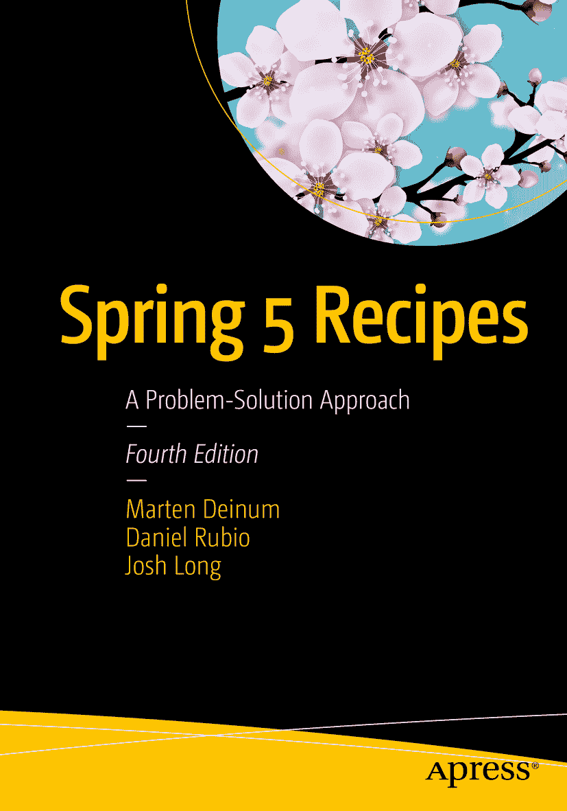

马滕·德伊努姆、丹尼尔·鲁比奥与乔希·朗《Spring 5 实战攻略：问题解决方案》第 4 版

本书作者引用的任何源代码或其他补充材料，读者均可通过本书产品页面（位于 [`www.apress.com/9781484227893`](http://www.apress.com/9781484227893) ）在 GitHub 上获取。如需更详细信息，请访问 [`www.apress.com/source-code`](http://www.apress.com/source-code) 。ISBN 978-1-4842-2789-3 电子版 ISBN 978-1-4842-2790-9 [`doi.org/10.1007/978-1-4842-2790-9`](https://doi.org/10.1007/978-1-4842-2790-9) 美国国会图书馆控制号：2017954984 © 马滕·德伊努姆、丹尼尔·鲁比奥与乔希·朗 2017 本作品受版权保护。出版商保留所有权利，涉及全部或部分材料，具体包括翻译、重印、插图复用、朗诵、广播、微缩胶片或其他任何物理形式的复制权，以及电子改编、计算机软件或目前已知或未来开发的类似或不同方法的信息传输或存储检索权。本书中可能出现商标名称、标识和图像。我们仅在编辑风格中使用这些名称、标识和图像，以维护商标所有者利益，并无意侵犯商标权。本出版物中使用的商品名称、商标、服务标志及类似术语，即使未明确标识，也不应被视为对其是否受专有权利保护的立场表达。尽管本书中的建议和信息在出版时被认为是真实准确的，但作者、编辑和出版商均不对可能存在的任何错误或遗漏承担法律责任。出版商对本书所含内容不作任何明示或暗示的保证。本书采用无酸纸印刷，通过 Springer Science+Business Media New York 向全球图书贸易发行，地址：233 Spring Street, 6th Floor, New York, NY 10013。电话：1-800-SPRINGER，传真：(201) 348-4505，电子邮件：orders-ny@springer-sbm.com，或访问 www.springeronline.com。Apress Media, LLC 是一家加利福尼亚有限责任公司，其唯一成员（所有者）是 Springer Science + Business Media Finance Inc (SSBM Finance Inc)。SSBM Finance Inc 是一家特拉华州公司。

## 引言

Spring 框架正在不断发展。它始终关乎选择。Java EE 专注于少数技术，这在很大程度上损害了其他更优解决方案的发展。当 Spring 框架首次亮相时，很少有人会认同 Java EE 代表了当时最优秀的架构。Spring 在热烈的欢呼声中登场，因为它致力于简化 Java EE。此后的每个版本都引入了新特性，旨在简化解决方案并赋能创新。

从 2.0 及更高版本开始，Spring 框架开始面向多个平台。与以往一样，该框架在现有平台之上提供服务，但尽可能与底层平台解耦。Java EE 仍然是一个重要的参考点，但已不再是唯一目标。此外，Spring 框架可在不同的云环境中运行。基于 Spring 构建的框架已相继出现，以支持应用集成、批处理、消息传递等更多功能。Spring 框架 5 版本是一次重大升级，基线提升至 Java 8，增加了对基于注解配置的更多支持，并引入了对 jUnit 5 的支持。新增功能包括以 Spring WebFlux 形式提供的响应式编程支持。

这是这本卓越实战指南的第四版，涵盖了更新后的框架，描述了新特性并解释了不同的配置选项。

我们无法描述 Spring 生态系统中的每一个项目，因此必须决定保留什么、添加什么以及更新什么。这是一个艰难的决定，但我们认为已包含了最重要的内容。

## 本书读者对象

本书面向希望简化架构并解决 Java EE 平台范围之外问题的 Java 开发者。如果你已在项目中使用 Spring，更高级的章节将讨论你可能尚不了解的较新技术。如果你是 Spring 框架新手，本书将助你快速上手。

本书假设你对 Java 和某种 IDE 有一定了解。虽然将 Java 专门用于客户端应用程序是可行且确实有用的，但 Java 最大的社区存在于企业领域，而正是在这里，你将看到这些技术发挥最大效益。因此，本书假定读者对 Servlet API 等基本企业编程概念有一定了解。

## 本书结构

第 1 章“Spring 开发工具”概述了支持 Spring 框架的工具及其使用方法。

第 2 章“Spring 核心任务”对 Spring 框架进行了总体概述，包括如何设置、它是什么以及如何使用。

第 3 章“Spring MVC”涵盖了使用 Spring Web MVC 框架进行基于 Web 的应用程序开发。

第 4 章“Spring REST”介绍了 Spring 对 RESTful Web 服务的支持。

第 5 章“Spring MVC：异步处理”介绍了使用 Spring MVC 进行异步处理。

第 6 章“Spring Social”介绍了 Spring Social，它使您能够轻松地与社交网络集成。

第 7 章“Spring Security”概述了 Spring Security 项目，以帮助您更好地保护应用程序的安全。

第 8 章“Spring Mobile”介绍了 Spring Mobile，它使您能够在应用程序中集成移动设备检测和使用。

第 9 章“数据访问”讨论了如何使用 Spring 通过 JDBC、Hibernate 和 JPA 等 API 与数据存储进行通信。

第 10 章“Spring 事务管理”介绍了 Spring 强大事务管理功能背后的概念。

第 11 章“Spring Batch”介绍了 Spring Batch 框架，该框架提供了一种对传统上被视为大型机领域的解决方案进行建模的方法。

第 12 章“Spring 与 NoSQL”介绍了多个 Spring Data 组合项目，涵盖了不同的 NoSQL 技术和使用 Hadoop 的大数据。

第 13 章“Spring Java 企业服务与远程处理技术”向您介绍了 JMX 支持、调度、电子邮件支持以及各种 RPC 设施，包括 Spring Web Services 项目。

第 14 章“Spring 消息传递”讨论了如何通过 JMS 和 RabbitMQ 以及简化的 Spring 抽象来使用 Spring 与面向消息的中间件。

第 15 章“Spring 集成”讨论了如何使用 Spring Integration 框架集成不同的服务和数据。

第 16 章“Spring 测试”讨论了使用 Spring 框架进行单元测试。

第 17 章“Grails”讨论了 Grails 框架，通过使用最佳组件并用 Groovy 代码将它们粘合在一起，您可以提高生产力。

附录 A“部署到云端”展示了如何使用 Pivotal 的 CloudFoundry 解决方案将 Java（Web）应用程序部署到云端。

附录 B“缓存”介绍了 Spring 缓存抽象，包括如何配置它以及如何透明地向应用程序添加缓存。

## 约定

有时，当我们希望您特别注意代码示例中的某一部分时，我们会将该部分字体加粗。请注意，加粗并不一定反映与先前版本的代码更改。

当一行代码过长而无法适应页面宽度时，我们会使用代码续行符将其断开。请注意，在输入代码时，您必须将行连接起来，中间不留任何空格。

## 前提条件

由于 Java 编程语言是平台无关的，您可以自由选择任何受支持的操作系统。但是，本书中的一些示例使用了特定于平台的路径。在输入示例之前，请根据您的操作系统格式进行相应转换。

为了充分利用本书，请安装 JDK 1.8 或更高版本。您应该安装一个 Java IDE 以简化开发。对于本书，示例代码基于 Gradle。如果您运行 Eclipse 并安装 Gradle 插件，则可以在 Eclipse 中打开相同的代码，并且 `CLASSPATH` 和依赖项将由 Gradle 元数据填充。

如果您使用 Eclipse，您可能更喜欢 SpringSource Tool Suite (STS)，因为它预装了在 Eclipse 中高效使用 Spring 框架所需的插件。如果您使用 IntelliJ IDEA，则需要启用 Gradle（和 Groovy）插件。

## 下载代码

本书的源代码可从 Apress 网站（ [`www.apress.com/9781484227893`](http://www.apress.com/9781484227893) ）获取。源代码按章节组织，每章包含一个或多个独立的示例。

## 联系作者

我们始终欢迎您就本书内容提出问题和反馈。您可以通过 `marten@deinum.biz` 联系 Marten Deinum。

致谢

致谢可能是书中最难写的内容。我无法一一列出所有我想感谢的人，而且我肯定会遗漏某些人。对此，我事先表示歉意。

尽管这是我写的第三本书，但如果没有 Apress 的优秀团队，我无法完成。特别感谢 Mark Powers 让我保持专注并按计划进行，以及感谢 Amrita 在最终审阅阶段让我保持正轨。

我感谢 Massimo Nardone，没有他的评论和建议，这本书就不会有今天的样子。

感谢我的家人和朋友，感谢他们在我缺席时的理解，也感谢我的潜水伙伴们，感谢我错过的所有潜水和旅行。

最后但同样重要的是，我感谢我的妻子 Djoke Deinum 和女儿们 Geeske 与 Sietske，感谢她们无尽的支持、爱和奉献，尽管为了完成这本书，我度过了无数个漫长的夜晚，牺牲了周末和假期。没有你们的支持，我可能早就放弃了这项事业。

——Marten Deinum

目录 第 1 章：Spring 开发工具 1 1-1. 使用 Spring Tool Suite 构建 Spring 应用程序 1 问题 1 解决方案 1 工作原理 2 1-2. 使用 IntelliJ IDE 构建 Spring 应用程序 10 问题 10 解决方案 10 工作原理 10 1-3. 使用 Maven 命令行界面构建 Spring 应用程序 20 问题 20 解决方案 21 工作原理 21 1-4. 使用 Gradle Wrapper 构建 Spring 应用程序 22 问题 22 解决方案 22 工作原理 22 1-5. 使用 Gradle 命令行界面构建 Spring 应用程序 23 问题 23 解决方案 23 工作原理 24 1-6. 使用 Gradle Wrapper 构建 Spring 应用程序 25 问题 25 解决方案 25 工作原理 25 总结 26 第 2 章：Spring 核心任务 27 2-1. 使用 Java 配置配置 POJO 28 问题 28 解决方案 28 工作原理 28 2-2. 通过调用构造函数创建 POJO 34 问题 34 解决方案 34 工作原理 34 2-3. 使用 POJO 引用和自动装配与其他 POJO 交互 37 问题 37 解决方案 37 工作原理 37 2-4. 使用@Resource 和@Inject 注解自动装配 POJO 44 问题 44 解决方案 44 工作原理 44 2-5. 使用@Scope 注解设置 POJO 的作用域 46 问题 46 解决方案 46 工作原理 47 2-6. 使用外部资源中的数据（文本文件、XML 文件、属性文件或图像文件） 49 问题 49 解决方案 50 工作原理 50 2-7. 在属性文件中为不同区域解析 I18N 文本消息 54 问题 54 解决方案 54 工作原理 54 2-8. 使用注解自定义 POJO 的初始化和销毁 56 问题 56 解决方案 57 工作原理 57 2-9. 创建后处理器以验证和修改 POJO 61 问题 61 解决方案 61 工作原理 61 2-10. 使用工厂创建 POJO（静态方法、实例方法、Spring 的 FactoryBean） 64 问题 64 解决方案 64 工作原理 64 2-11. 使用 Spring 环境和 Profile 加载不同的 POJO 集合 69 问题 69 解决方案 69 工作原理 69 2-12. 使 POJO 感知 Spring 的 IoC 容器资源 71 问题 71 解决方案 71 工作原理 73 2-13. 使用注解进行面向切面编程 73 问题 73 解决方案 73 工作原理 74 2-14. 访问连接点信息 81 问题 81 解决方案 81 工作原理 82 2-15. 使用@Order 注解指定切面优先级 83 问题 83 解决方案 83 工作原理 83 2-16. 重用切面切入点定义 85 问题 85 解决方案 85 工作原理 85 2-17. 编写 AspectJ 切入点表达式 87 问题 87 解决方案 87 工作原理 87 2-18. 使用 AOP 为 POJO 引入新功能 92 问题 92 解决方案 92 工作原理 92 2-19. 使用 AOP 为 POJO 引入状态 94 问题 94 解决方案 94 工作原理 95 2-20. 在 Spring 中使用加载时织入 AspectJ 切面 97 问题 97 解决方案 97 工作原理 97 2-21. 在 Spring 中配置 AspectJ 切面 101 问题 101 解决方案 101 工作原理 102 2-22. 使用 AOP 将 POJO 注入领域对象 103 问题 103 解决方案 103 工作原理 104 2-23. 使用 Spring 和 TaskExecutors 应用并发 105 问题 105 解决方案 105 工作原理 106 2-24. 在 POJO 之间通信应用程序事件 112 问题 112 解决方案 112 工作原理 112 总结 115 第 3 章：Spring MVC 117 3-1. 使用 Spring MVC 开发一个简单的 Web 应用程序 117 问题 117 解决方案 117 工作原理 119 3-2. 使用@RequestMapping 映射请求 129 问题 129 解决方案 129 工作原理 129 3-3. 使用处理器拦截器拦截请求 133 问题 133 解决方案 133 工作原理 134 3-4. 解析用户区域设置 136 问题 136 解决方案 137 工作原理 137 更改用户区域设置 138 3-5. 外部化区域敏感文本消息 139 问题 139 解决方案 139 工作原理 140 3-6. 按名称解析视图 141 问题 141 解决方案 141 工作原理 141 3-7. 使用视图和内容协商 144 问题 144 解决方案 144 工作原理 144 3-8. 将异常映射到视图 146 问题 146 解决方案 146 工作原理 147 3-9. 使用控制器处理表单 149 问题 149 解决方案 149 工作原理 149 3-10. 使用向导表单控制器处理多页表单 162 问题 162 解决方案 162 工作原理 163 3-11. 使用注解进行 Bean 验证（JSR-303） 173 问题 173 解决方案 173 工作原理 174 3-12. 创建 Excel 和 PDF 视图 175 问题 175 解决方案 175 工作原理 176 总结 181 第 4 章：Spring REST 183 4-1. 使用 REST 服务发布 XML 183 问题 183 解决方案 183 工作原理 184 4-2. 使用 REST 服务发布 JSON 191 问题 191 解决方案 191 工作原理 192 4-3. 使用 Spring 访问 REST 服务 196 问题 196 解决方案 196 工作原理 196 4-4. 发布 RSS 和 Atom Feed 200 问题 200 解决方案 200 工作原理 200 总结 208 第 5 章：Spring MVC：异步处理 209 5-1. 使用控制器和 TaskExecutor 异步处理请求 209 问题 209 解决方案 209 工作原理 210 5-2. 使用响应写入器 217 问题 217 解决方案 217 工作原理 217 5-3. 使用异步拦截器 222 问题 222 解决方案 222 工作原理 222 5-4. 使用 WebSocket 224 问题 224 解决方案 224 工作原理 225 5-5. 使用 Spring WebFlux 开发响应式应用程序 233 问题 233 解决方案 233 工作原理 235 5-6. 使用响应式控制器处理表单 244 问题 244 解决方案 244 工作原理 244 5-7. 使用响应式 REST 服务发布和消费 JSON 257 问题 257 解决方案 257 工作原理 257 5-8. 使用异步 Web 客户端 259 问题 259 解决方案 259 工作原理 260 5-9. 编写响应式处理器函数 264 问题 264 解决方案 264 工作原理 264 总结 266 第 6 章：Spring Social 267 6-1. 设置 Spring Social 267 问题 267 解决方案 267 工作原理 267 6-2. 连接到 Twitter 269 问题 269 解决方案 269 工作原理 269 6-3. 连接到 Facebook 274 问题 274 解决方案 274 工作原理 274 6-4. 显示服务提供商的连接状态 277 问题 277 解决方案 277 工作原理 277 6-5. 使用 Twitter API 282 问题 282 解决方案 282 工作原理 283 6-6. 使用持久化 UsersConnectionRepository 284 问题 284 解决方案 284 工作原理 284 6-7. 集成 Spring Social 和 Spring Security 286 问题 286 解决方案 286 工作原理 286 总结 295 第 7 章：Spring Security 297 7-1. 保护 URL 访问 298 问题 298 解决方案 298 工作原理 299 7-2. 登录 Web 应用程序 303 问题 303 解决方案 303 工作原理 303 7-3. 认证用户 310 问题 310 解决方案 310 工作原理 310 7-4. 做出访问控制决策 319 问题 319 解决方案 319 工作原理 320 7-5. 保护方法调用 327 问题 327 解决方案 327 工作原理 327 7-6. 在视图中处理安全性 330 问题 330 解决方案 330 工作原理 330 7-7. 处理领域对象安全 332 问题 332 解决方案 332 工作原理 332 7-8. 为 WebFlux 应用程序添加安全性 340 问题 340 解决方案 340 工作原理 340 总结 344 第 8 章：Spring Mobile 345 8-1. 不使用 Spring Mobile 检测设备 345 问题 345 解决方案 345 工作原理 345 8-2. 使用 Spring Mobile 检测设备 350 问题 350 解决方案 350 工作原理 350 8-3. 使用站点偏好设置 352 问题 352 解决方案 353 工作原理 352 8-4. 使用设备信息渲染视图 354 问题 354 解决方案 354 工作原理 354 8-5. 实现站点切换 358 问题 358 解决方案 358 工作原理 358 总结 360 第 9 章：数据访问 361 直接使用 JDBC 的问题 362 设置应用程序数据库 362 理解数据访问对象设计模式 363 使用 JDBC 实现 DAO 364 在 Spring 中配置数据源 366 运行 DAO 368 更进一步 368 9-1. 使用 JDBC 模板更新数据库 368 问题 368 解决方案 369 工作原理 369 9-2. 使用 JDBC 模板查询数据库 373 问题 373 解决方案 374 工作原理 374 9-3. 简化 JDBC 模板创建 379 问题 379 解决方案 379 工作原理 379 9-4. 在 JDBC 模板中使用命名参数 382 问题 382 解决方案 382 工作原理 382 9-5. 处理 Spring JDBC 框架中的异常 384 问题 384 解决方案 384 工作原理 385 9-6. 通过直接使用 ORM 框架避免问题 389 问题 389 解决方案 389 工作原理 389 9-7. 在 Spring 中配置 ORM 资源工厂 398 问题 398 解决方案 399 工作原理 399 9-8. 使用 Hibernate 的上下文会话持久化对象 406 问题 406 解决方案 406 工作原理 407 9-9. 使用 JPA 的上下文注入持久化对象 409 问题 409 解决方案 409 工作原理 409 9-10. 使用 Spring Data JPA 简化 JPA 412 问题 412 解决方案 412 工作原理 413 总结 414 第 10 章：Spring 事务管理 415 10-1. 避免事务管理中的问题 416 使用 JDBC 提交和回滚管理事务 422 10-2. 选择事务管理器实现 423 问题 423 解决方案 423 工作原理 423 10-3. 使用事务管理器 API 以编程方式管理事务 424 问题 424 解决方案 425 工作原理 425 10-4. 使用事务模板以编程方式管理事务 427 问题 427 解决方案 427 工作原理 427 10-5. 使用@Transactional 注解声明式管理事务 430 问题 430 解决方案 430 工作原理 430 10-6. 设置传播事务属性 431 问题 431 解决方案 431 工作原理 432 10-7. 设置隔离事务属性 436 问题 436 解决方案 436 工作原理 437 10-8. 设置回滚事务属性 444 问题 444 解决方案 444 工作原理 444 10-9. 设置超时和只读事务属性 444 问题 444 解决方案 445 工作原理 445 10-10. 使用加载时织入管理事务 445 问题 445 解决方案 445 工作原理 446 总结 446 第 11 章：Spring Batch 447 运行时元数据模型 448 11-1. 设置 Spring Batch 的基础设施 449 问题 449 解决方案 449 工作原理 449 11-2. 读写数据 453 问题 453 解决方案 453 工作原理 453 11-3. 编写自定义 ItemWriter 和 ItemReader 460 问题 460 解决方案 460 工作原理 460 11-4. 在写入前处理输入 463 问题 463 解决方案 463 工作原理 463 11-5. 通过事务实现更好的运行 465 问题 465 解决方案 465 工作原理 465 11-6. 重试 467 问题 467 解决方案 467 工作原理 467 11-7. 控制步骤执行 470 问题 470 解决方案 470 工作原理 471 11-8. 启动一个作业 474 问题 474 解决方案 475 工作原理 475 11-9. 参数化一个作业 479 问题 479 解决方案 479 工作原理 479 总结 481 第 12 章：Spring 与 NoSQL 483 12-1. 使用 MongoDB 483 问题 483 解决方案 483 工作原理 484 12-2. 使用 Redis 497 问题 497 解决方案 497 工作原理 497 12-3. 使用 Neo4j 503 问题 503 解决方案 503 工作原理 503 12-4. 使用 Couchbase 521 问题 521 解决方案 521 工作原理 521 总结 540 第 13 章：Spring Java 企业服务与远程技术 541 13-1. 将 Spring POJO 注册为 JMX MBean 541 问题 541 解决方案 542 工作原理 542 13-2. 发布和监听 JMX 通知 557 问题 557 解决方案 557 工作原理 557 13-3. 在 Spring 中访问远程 JMX MBean 559 问题 559 解决方案 559 工作原理 560 13-4. 使用 Spring 的邮件支持发送电子邮件 564 问题 564 解决方案 564 工作原理 564 13-5. 使用 Spring 的 Quartz 支持调度任务 572 问题 572 解决方案 572 工作原理 572 13-6. 使用 Spring 的调度功能调度任务 577 问题 577 解决方案 577 工作原理 577 13-7. 通过 RMI 暴露和调用服务 580 问题 580 解决方案 580 工作原理 581 13-8. 通过 HTTP 暴露和调用服务 584 问题 584 解决方案 585 工作原理 585 13-9. 使用 JAX-WS 暴露和调用 SOAP Web 服务 588 问题 588 解决方案 588 13-10. 使用契约优先的 SOAP Web 服务 594 问题 594 解决方案 594 工作原理 594 13-11. 使用 Spring-WS 暴露和调用 SOAP Web 服务 599 问题 599 解决方案 599 13-12. 使用 Spring-WS 和 XML 编组开发 SOAP Web 服务 606 问题 606 解决方案 607 工作原理 607 总结 613 第 14 章：Spring 消息传递 615 14-1. 使用 Spring 发送和接收 JMS 消息 615 问题 615 解决方案 616 工作原理 616 14-2. 转换 JMS 消息 627 问题 627 解决方案 627 工作原理 627 14-3. 管理 JMS 事务 630 问题 630 解决方案 630 工作原理 630 14-4. 在 Spring 中创建消息驱动的 POJO 631 问题 631 解决方案 631 工作原理 632 14-5. 缓存和池化 JMS 连接 638 问题 638 解决方案 638 工作原理 638 14-6. 使用 Spring 发送和接收 AMQP 消息 639 问题 639 解决方案 639 工作原理 639 14-7. 使用 Spring Kafka 发送和接收消息 646 问题 646 解决方案 646 工作原理 646 总结 654 第 15 章：Spring Integration 655 15-1. 使用 EAI 将一个系统与另一个系统集成 655 问题 655 解决方案 655 工作原理 655 15-2. 使用 JMS 集成两个系统 658 问题 658 解决方案 658 工作原理 658 15-3. 查询 Spring Integration 消息以获取上下文信息 662 问题 662 解决方案 662 工作原理 662 15-4. 使用文件系统集成两个系统 665 问题 665 解决方案 665 工作原理 666 15-5. 将消息从一种类型转换为另一种类型 667 问题 667 解决方案 668 工作原理 668 15-6. 使用 Spring Integration 处理错误 671 问题 671 解决方案 671 工作原理 671 15-7. 分支集成控制：拆分器和聚合器 674 问题 674 解决方案 674 工作原理 674 15-8. 使用路由器实现条件路由 678 问题 678 解决方案 678 工作原理 678 15-9. 使用 Spring Batch 分阶段处理事件 679 问题 679 解决方案 679 工作原理 679 15-10. 使用网关 682 问题 682 解决方案 682 工作原理 682 总结 689 第 16 章：Spring 测试 691 16-1. 使用 JUnit 和 TestNG 创建测试 692 问题 692 解决方案 692 工作原理 692 16-2. 创建单元测试和集成测试 696 问题 696 解决方案 696 工作原理 697 16-3. 为 Spring MVC 控制器实现单元测试 705 问题 705 解决方案 705 工作原理 706 16-4. 在集成测试中管理应用程序上下文 707 问题 707 解决方案 707 工作原理 708 16-5. 将测试夹具注入集成测试 712 问题 712 解决方案 712 工作原理 712 16-6. 在集成测试中管理事务 714 问题 714 解决方案 714 工作原理 715 16-7. 在集成测试中访问数据库 719 问题 719 解决方案 719 工作原理 719 16-8. 使用 Spring 的通用测试注解 721 问题 721 解决方案 722 工作原理 722 16-9. 为 Spring MVC 控制器实现集成测试 723 问题 723 解决方案 723 工作原理 723 16-10. 为 REST 客户端编写集成测试 726 问题 726 解决方案 726 工作原理 726 总结 730 第 17 章：Grails 731 17-1. 获取并安装 Grails 731 问题 731 解决方案 731 工作原理 731 17-2. 创建 Grails 应用程序 732 问题 732 解决方案 732 工作原理 732 17-3. 获取 Grails 插件 737 问题 737 解决方案 737 工作原理 738 17-4. 在 Grails 环境中开发、生产与测试 738 问题 738 解决方案 738 工作原理 739 17-5. 创建应用程序的领域类 740 问题 740 解决方案 740 工作原理 741 17-6. 为应用程序的领域类生成 CRUD 控制器和视图 743 问题 743 解决方案 743 工作原理 743 17-7. 为消息属性实现国际化（I18n） 747 问题 747 解决方案 747 工作原理 747 17-8. 更改持久化存储系统 750 问题 750 解决方案 750 工作原理 750 17-9. 自定义日志输出 753 问题 753 解决方案 753 工作原理 753 17-10. 运行单元测试和集成测试 755 问题 755 解决方案 755 工作原理 755 17-11. 使用自定义布局和模板 761 问题 761 解决方案 761 工作原理 761 17-12. 使用 GORM 查询 764 问题 764 解决方案 764 工作原理 764 17-13. 创建自定义标签 766 问题 766 解决方案 766 工作原理 766 17-14. 添加安全性 768 问题 768 解决方案 768 工作原理 768 总结 772 附录 A：部署到云端 775 A-1. 注册 CloudFoundry775 问题 775 解决方案 775 工作原理 776 A-2. 安装并使用 CloudFoundry CLI781 问题 781 解决方案 781 工作原理 781 A-3. 部署 Spring MVC 应用程序 784 问题 784 解决方案 784 工作原理 784 A-4. 移除应用程序 794 问题 794 解决方案 794 工作原理 794 总结 794 附录 B：缓存 795 B-1. 使用 Ehcache 实现缓存 795 问题 795 解决方案 795 工作原理 795 B-2. 使用 Spring 的缓存抽象进行缓存 800 问题 800 解决方案 800 工作原理 801 B-3. 使用 AOP 实现声明式缓存 803 问题 803 解决方案 803 工作原理 803 B-4. 配置自定义 KeyGenerator805 问题 805 解决方案 805 工作原理 805 B-5. 从缓存中添加和移除对象 807 问题 807 解决方案 807 工作原理 807 B-6. 将缓存与事务资源同步 816 问题 816 解决方案 816 工作原理 817 B-7. 使用 Redis 作为缓存提供程序 819 问题 819 解决方案 819 工作原理 819 总结 820 索引 821 内容概览 关于作者 xxxi 关于技术审阅者 xxxiii 致谢 xxxv 引言 xxxvii 第 1 章：Spring 开发工具 1 第 2 章：Spring 核心任务 27 第 3 章：Spring MVC 117 第 4 章：Spring REST 183 第 5 章：Spring MVC：异步处理 209 第 6 章：Spring Social 267 第 7 章：Spring Security 297 第 8 章：Spring Mobile 345 第 9 章：数据访问 361 第 10 章：Spring 事务管理 415 第 11 章：Spring Batch 447 第 12 章：Spring 与 NoSQL 483 第 13 章：Spring Java 企业服务与远程技术 541 第 14 章：Spring 消息传递 615 第 15 章：Spring Integration 655 第 16 章：Spring 测试 691 第 17 章：Grails 731 附录 A：部署到云端 775 附录 B：缓存 795 索引 821 关于作者与关于技术审阅者 关于作者 关于技术审阅者

