# 1. Spring 开发工具

在本章中，你将学习如何设置并使用最流行的开发工具来创建 Spring 应用程序。与许多其他软件框架一样，Spring 拥有丰富的开发工具可供选择，从最基本的命令行工具到被称为集成开发环境（IDE）的复杂图形化工具，不一而足。

无论你已经在使用某些 Java 开发工具，还是初次接触开发，以下指南都将引导你如何设置不同的工具箱，以完成后续章节的练习，并开发任何 Spring 应用程序。

以下是设置并启动 Spring 应用程序所需的三个工具箱及对应的指南：

*   Spring Tool Suite：指南 1-1
*   IntelliJ IDE：指南 1-2（以及针对 Maven 命令行界面的指南 1-3 和 1-4；针对 Gradle 命令行界面的指南 1-5 和 1-6）
*   文本编辑器：针对 Maven 命令行界面的指南 1-3 和 1-4；针对 Gradle 命令行界面的指南 1-5 和 1-6

请记住，你无需安装全部三个工具箱即可使用 Spring。尝试所有工具可能会有所帮助，但你可以使用自己最顺手的工具箱。

## 1-1. 使用 Spring Tool Suite 构建 Spring 应用程序

### 问题

你想使用 Spring Tool Suite (STS) 来构建一个 Spring 应用程序。

### 解决方案

在你的工作站上安装 STS。打开 STS 并点击“打开仪表盘”链接。要创建一个新的 Spring 应用程序，请在仪表盘窗口的“创建”表格中点击“Spring 项目”链接。要打开一个使用 Maven 的 Spring 应用程序，请从顶部的“文件”菜单中选择“导入”选项，点击 Maven 图标，然后选择“现有 Maven 项目”。接着，从你的工作站中选择基于 Maven 的 Spring 应用程序。

要在 STS 上安装 Gradle，请点击仪表盘窗口底部的“扩展”选项卡。勾选“Gradle 支持”复选框。继续进行 Gradle 扩展的安装，安装完成后重启 STS。要打开一个使用 Gradle 的 Spring 应用程序，请从顶部的“文件”菜单中选择“导入”选项，点击 Gradle 图标，然后选择“Gradle 项目”。接着，从你的工作站中选择基于 Gradle 的 Spring 应用程序。点击“构建模型”按钮，最后点击“完成”即可开始处理该项目。

### 工作原理

STS 是由 SpringSource（Pivotal 的一个部门，也是 Spring 框架的创建者）开发的 IDE。STS 专为开发 Spring 应用程序而设计，使其成为实现此目的最完整的工具之一。STS 是一个基于 Eclipse 的工具，因此它具有与开源 Eclipse IDE 相同的外观和感觉。

STS 可从 [`http://spring.io/tools/sts`](http://spring.io/tools/sts) 免费下载。STS 适用于所有主流操作系统版本：Windows（32 位或 64 位）、macOS（Cocoa，64 位）和 Linux（GTK，32 位和 64 位）。此外，STS 有版本之分，因此你可以选择下载最新的稳定版本或里程碑/开发版本。请下载适合你操作系统的版本。

下载 STS 后，请确保你的系统上已安装 Java SDK，因为这是 STS 的安装要求。接着进行 STS 的安装。按照安装向导操作，你应该在五到十分钟内完成 STS 的设置。安装完成后，会在进行安装的用户的主文件夹下（或用户选择的安装文件夹下）创建一个名为 `STS_<VERSION>` 的文件夹。如果你检查此文件夹，会看到用于启动 STS 的可执行文件。

启动 STS。启动时，STS 会要求你定义一个工作空间位置。工作空间是 STS 存放所有项目信息的地方。你可以保留主 STS 安装目录下的默认目录，也可以根据自己的喜好定义不同的目录。启动完成后，你将看到如图 1-1 所示的界面。

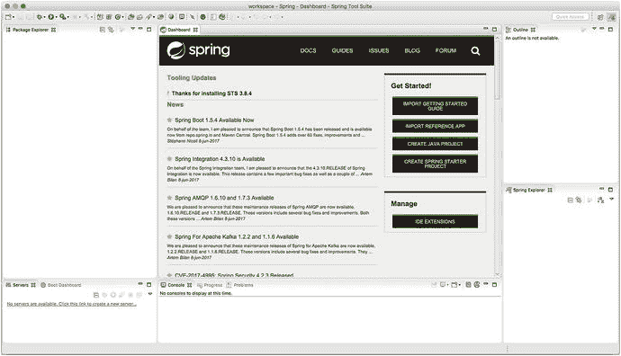

图 1-1.

STS 启动界面

在 STS 仪表盘中央的“开始使用！”框中，有一个名为“创建 Spring Starter 项目”的链接。你可以点击此链接来创建一个新的 Spring 应用程序。如果你愿意，可以继续创建一个空应用程序。系统会要求你输入名称并定义一系列参数，你可以保留默认值。

比从头创建 Spring 应用程序更常见的情况是继续开发一个已有的 Spring 应用程序。在这种情况下，应用程序的所有者通常会随应用程序的源代码一起分发一个构建脚本，以方便其后续开发。

大多数 Java 应用程序的首选构建脚本是围绕 Maven 构建工具设计的 `pom.xml` 文件，或者，在更近期的项目中，是围绕 Gradle 构建工具设计的 `build.gradle` 文件。本书的源代码及其应用程序均提供了 Gradle 构建文件，此外还有一个使用 Maven 构建文件的应用程序。

在 Java 应用程序中，可能有数十或数百个琐碎的任务需要完成才能将应用程序组合起来（例如，复制 JAR 包或配置文件、设置 Java 类路径以执行编译、下载 JAR 依赖项等）。Java 构建工具可以在 Java 应用程序中执行此类任务。

Java 构建工具仍然有其用武之地，因为随构建文件一起分发的应用程序可以确保应用程序创建者意图的所有琐碎任务都能被任何使用该应用程序的人精确地复制。如果应用程序随附了 Ant 的 `build.xml` 文件、Maven 的 `pom.xml` 文件、Ivy 的 `ivy.xml` 文件或 Gradle 的 `build.gradle` 文件，那么这些构建文件中的每一个都能保证跨用户和不同系统的构建一致性。

一些较新的 Java 构建工具功能更强大，并改进了其早期版本的工作方式。每个构建文件都使用自己的语法来定义操作、依赖关系以及构建应用程序所需的几乎所有其他任务。但是，你永远不应忘记，Java 构建工具只是达到目的的一种手段。这是应用程序创建者为简化构建过程而做出的选择。如果你看到一个应用程序随附了来自最古老的 Ant 版本或最新的 Gradle 版本的构建文件，请不要惊慌；从最终用户的角度来看，你只需要下载并安装该构建工具，就能按照创建者的意图创建应用程序。

由于许多 Spring 应用程序继续使用 Maven，而一些较新的 Spring 应用程序则使用 Gradle，因此我们将描述如何将这两种类型的项目导入 STS。

#### 导入并构建 Maven 项目

下载本书的源代码并将其解压到本地目录后，点击 STS 顶部的 File 菜单，选择 Import 选项。此时会弹出一个窗口。在弹出的窗口中，点击 Maven 图标，然后选择 Existing Maven Projects 选项，如图 1-2 所示。

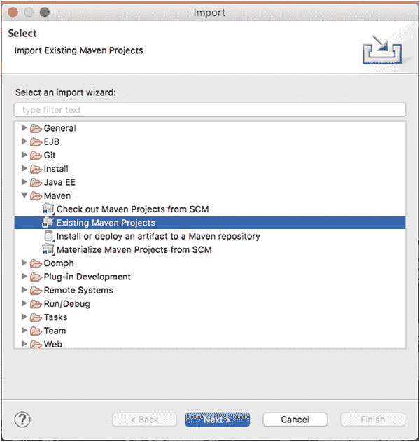

图 1-2.

导入现有的 Maven 项目

点击 Next 按钮。在接下来的界面中，点击 Browse 按钮，选择本书源代码中 `ch01` 目录下名为 `springintro_mvn` 的文件夹，如图 1-3 所示。

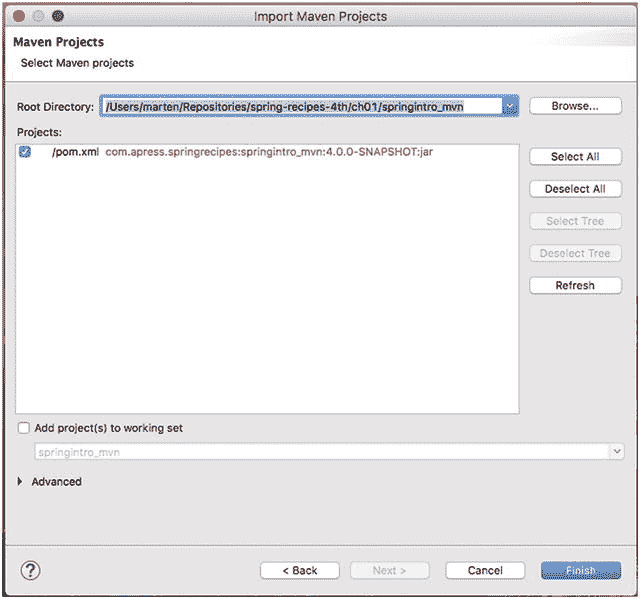

图 1-3.

选择 Maven 项目

请注意，在图 1-3 中，Import Maven Projects 窗口已更新，包含了 `pom.xml com.apress.springrecipes`… 这一行，这反映了要导入的 Maven 项目。选中项目复选框，然后点击 Finish 按钮导入项目。STS 中的所有项目都可以在 Package Explorer 窗口的左侧访问。在本例中，项目以名称 `springintro_mvn` 显示。

如果你点击 Package Explorer 中的项目图标，就能看到项目结构（例如，Java 类、依赖项、配置文件等）。如果你双击 Package Explorer 中的任意项目文件，该文件会在中央窗口的一个单独标签页中打开，与 Dashboard 并列。文件打开后，你可以检查、编辑或删除其内容。

选择 Package Explorer 中的项目图标并右键单击。此时会出现一个包含各种项目命令的上下文菜单。选择“Run as”选项，然后选择“Maven build”选项。会弹出一个窗口，供你编辑和配置项目构建。只需点击右下角的 Run 按钮。在 STS 的底部中央，你会看到 Console 窗口出现。在本例中，Console 窗口会显示 Maven 生成的一系列构建消息，以及构建过程失败时可能出现的任何错误。

你已经成功构建了应用程序，恭喜！现在让我们运行它。再次从 Package Explorer 中选择项目图标，按 F5 键刷新项目目录。展开项目树。在底部附近，你会看到一个名为 `target` 的新目录，其中包含构建好的应用程序。点击其图标展开 target 目录。接下来，选择文件 `springintro_mvn-4.0.0-SNAPSHOT.jar`，如图 1-4 所示。

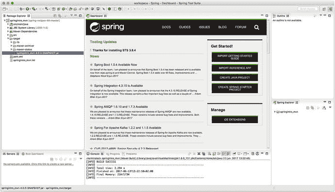

图 1-4.

在 STS 中选择可执行文件

选中文件后，右键单击以打开包含各种项目命令的上下文菜单。选择“Run as”选项，然后选择“Run configurations”选项。会弹出一个窗口，供你编辑和配置运行。确保左侧选中了“Java application”选项。在“Main class”框中，输入 `com.apress.springrecipes.hello.Main`。这是该项目的主类，如图 1-5 所示。

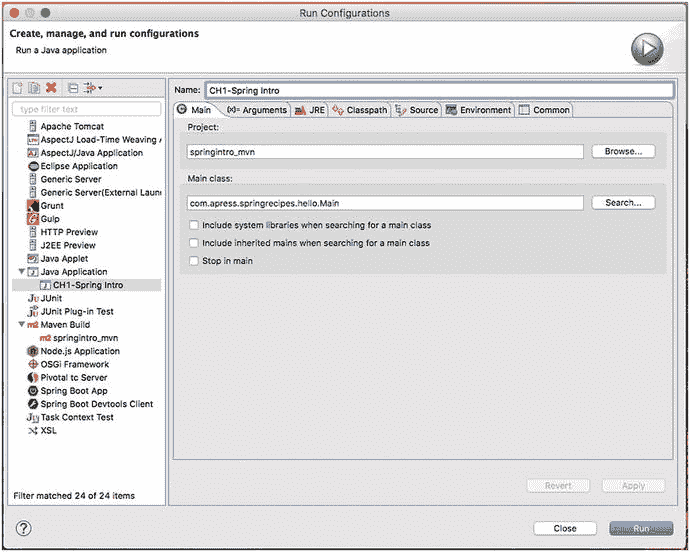

图 1-5.

在 STS 中定义主可执行类

点击右下角的 Run 按钮。在 STS 的底部中央，你会看到 Console 窗口。在本例中，Console 窗口会显示应用程序的日志消息，以及应用程序定义的问候消息。

尽管你已经使用 STS 构建并运行了一个 Spring 应用程序，但工作尚未完成。你刚刚在 STS 中完成的过程，大部分是由 Maven 构建工具在后台完成的。接下来，是时候导入一个使用较新构建工具（称为 Gradle）的 Spring 应用程序了。

#### 导入并构建 Gradle 项目

虽然 Gradle 仍然是一个相对较新的工具，但有迹象表明 Gradle 未来将取代 Maven。例如，许多大型 Java 项目（如 Spring 框架本身）现在都使用 Gradle 而不是 Maven，因为它更强大。鉴于这种趋势，有必要描述一下如何在 STS 中使用 Gradle。

提示

如果你有一个 Maven 项目（即 `pom.xml` 文件），你可以使用 bootstrap 插件或 maven2gradle 工具来创建一个 Gradle 项目（即 `build.gradle` 文件）。bootstrap 插件包含在 Gradle 中（参见 [`http://gradle.org/docs/current/userguide/bootstrap_plugin.html`](http://gradle.org/docs/current/userguide/bootstrap_plugin.html) 上的文档），而 maven2gradle 工具可在 [`https://github.com/jbaruch/maven2gradle.git`](https://github.com/jbaruch/maven2gradle.git) 获取。

要在 STS 中安装 Gradle 支持，你需要安装 Buildship 扩展。为此，通过 Help 菜单打开 Eclipse Marketplace，搜索 Gradle，如图 1-6 所示。

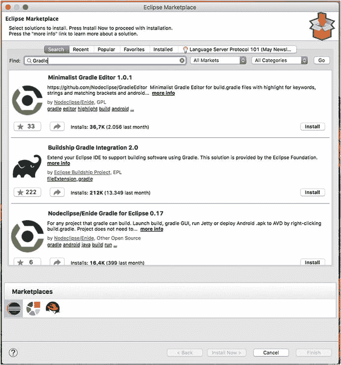

图 1-6.

Buildship STS 安装

点击 BuildShip 集成右下角的 Install 按钮以继续安装。

点击弹出窗口的 Next 按钮。阅读许可协议并接受条款后，点击弹出窗口的 Finish 按钮。Gradle 扩展安装过程开始。安装过程完成后，系统会提示你重启 STS 以使更改生效。确认重启 STS 以完成 Gradle 安装。

本书的源代码包含许多设计用于 Gradle 构建的 Spring 应用程序，因此我们将描述如何将这些 Spring 应用程序导入到 STS 中。下载本书的源代码并将其解压到本地目录后，在 STS 中点击顶部的 File 菜单，选择 Import 选项。此时会弹出一个窗口。在弹出的窗口中，点击 Gradle 图标，然后选择 Existing Gradle Project 选项，如图 1-7 所示。

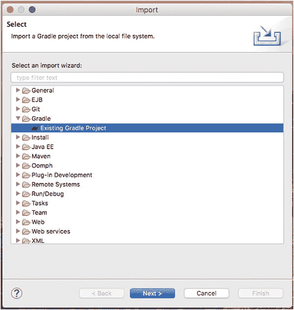

图 1-7.

导入 Gradle 项目

点击 Next 按钮。在接下来的界面中，点击 Browse 按钮，选择本书的 `Ch01/springintro` 目录。点击 Finish 按钮导入项目。如果你查看 STS 左侧的 Package Explorer，会看到项目以名称 `springintro` 加载。如果你点击项目图标，就能看到项目结构（例如，Java 类、依赖项、配置文件等）。

在 IDE 的右上角有一个 Gradle Tasks 标签页。找到 `springintro` 项目，打开 Build 菜单，选择 Build。然后右键单击并选择 Run Gradle Tasks。你已经成功构建了应用程序。现在让我们运行它。

再次选择项目图标，按 F5 键刷新项目目录。展开项目树。在中间附近，你会看到一个名为 `libs` 的新目录，其中包含构建好的应用程序。点击图标展开 `libs` 目录。接下来，选择文件 `springintro.jar`。

选中文件后，从顶部的 Run 菜单中选择“Run configurations”选项。会弹出一个窗口，供你编辑和配置运行。确保左侧选中了“Java application”选项。在“Main class”框中，输入 `com.apress.springrecipes.hello.Main`。这是该项目的主类。点击右下角的 Run 按钮。在 STS 的底部中央，你会看到 Console 窗口。在本例中，Console 窗口会显示应用程序的日志消息，以及应用程序定义的问候消息。

## 1-2\. 使用 IntelliJ IDE 构建 Spring 应用程序

### 问题

你想使用 IntelliJ IDE 来构建 Spring 应用程序。

### 解决方案

要在 IntelliJ 的快速启动窗口中启动一个新的 Spring 应用程序，请点击 **Create New Project** 链接。在下一个窗口中，为项目指定一个名称，选择一个运行时 JDK，并选择 **Java Module** 选项。在接下来的窗口中，勾选各个 Spring 复选框，以便 IntelliJ 下载项目所需的 Spring 依赖项。

要打开一个使用 Maven 的 Spring 应用程序，首先需要安装 Maven 以便在命令行界面中使用（参见技巧 1-4）。从 IntelliJ 顶部的 **File** 菜单中，选择 **Import Project** 选项。接着，从你的工作站中选择基于 Maven 的 Spring 应用程序。在下一个屏幕上，选择 **"Import project from external model"** 选项，并选择 **Maven** 类型。

要打开一个使用 Gradle 的 Spring 应用程序，首先需要安装 Gradle 以便在命令行界面中使用（参见技巧 1-5）。从 IntelliJ 顶部的 **File** 菜单中，选择 **Import Project** 选项。接着，从你的工作站中选择基于 Gradle 的 Spring 应用程序。在下一个屏幕上，选择 **"Import project from external model"** 选项，并选择 **Gradle** 类型。

### 工作原理

IntelliJ 是市场上最流行的商业 IDE 之一。与其他由基金会（如 Eclipse）生产，或为支持公司旗舰软件（如为 Spring 框架设计的 STS）而制作的 IDE 不同，IntelliJ 由一家名为 JetBrains 的公司生产，其唯一业务是将开发工具商业化。正是这种专注使得 IntelliJ 在企业环境中的专业开发者中特别受欢迎。

在本技巧中，我们假设你已经安装了 IntelliJ Ultimate 版，并且只想快速上手运行 Spring 应用程序。

警告

IntelliJ 提供免费的 Community 版和具有 30 天免费试用的 Ultimate 版。虽然免费的 Community 版为应用程序开发提供了良好的价值，但 Community 版不包含对 Spring 应用程序的支持。以下说明基于你正在使用 IntelliJ Ultimate 版的假设。

#### 创建 Spring 应用程序

要启动一个 Spring 应用程序，请在 IntelliJ 的快速启动窗口中点击 **Create New Project** 链接。在 **New Project** 窗口中，选择 **Spring** 选项，并勾选各个 Spring 复选框，如图 1-8 所示。

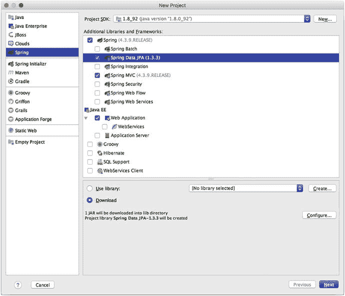

图 1-8.

IntelliJ，创建 Spring 项目

点击 **Next** 按钮。在下一个窗口中，为项目指定一个名称，然后点击 **Finish**。

#### 导入和构建 Maven 项目

比从头创建 Spring 应用程序更常见的情况是继续开发一个已有的 Spring 应用程序。在这种情况下，应用程序的所有者通常会随构建脚本一起分发应用程序的源代码，以方便其持续开发。

大多数 Java 应用程序首选的构建脚本是围绕 Maven 构建工具设计的 `pom.xml` 文件，或者更近期的、围绕 Gradle 构建工具设计的 `build.gradle` 文件。本书的源代码及其应用程序都提供了 Gradle 构建文件，此外还有一个使用 Maven 构建文件的应用程序。

下载本书的源代码并将其解压到本地目录后，点击 IntelliJ 顶部的 **File** 菜单，选择 **Import Project** 选项。将出现一个弹出窗口，如图 1-9 所示。

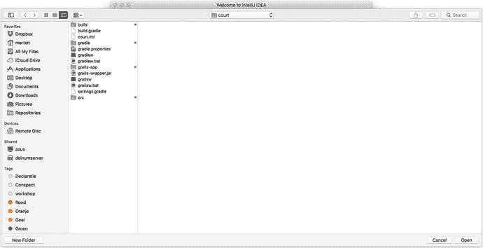

图 1-9.

IntelliJ，选择要导入的文件或目录

在此窗口中，在目录树中向下导航，直到找到 `ch01` 目录下的本书源代码目录，然后选择 `springintro_mvn`。点击 **Open** 按钮。在下一个屏幕上，选择 **"Import project from external model"** 选项，并选择 **Maven** 类型，如图 1-10 所示。

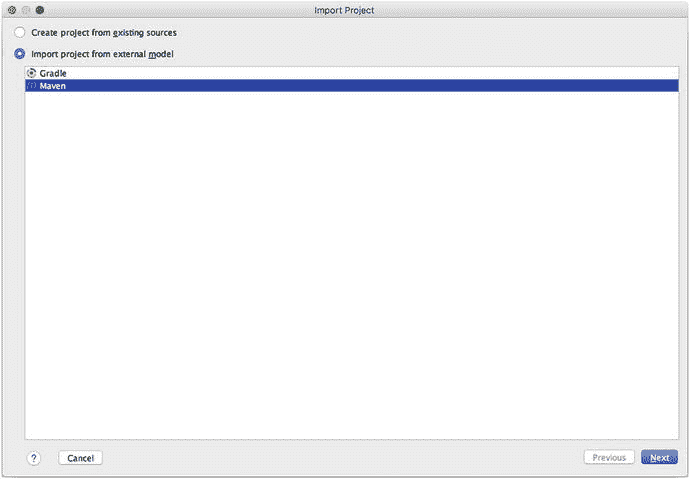

图 1-10.

IntelliJ，选择项目类型

在下一个窗口（见图 1-11）中，你可以微调一些 Maven 项目设置，例如自动导入对 `pom.xml` 的更改、下载依赖项的源代码等。对设置满意后，点击 **Next**。

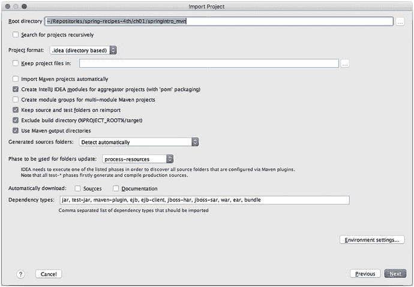

图 1-11.

IntelliJ，微调 Maven 项目设置

确保项目复选框已选中，如图 1-12 所示，然后点击 **Next** 按钮导入项目。

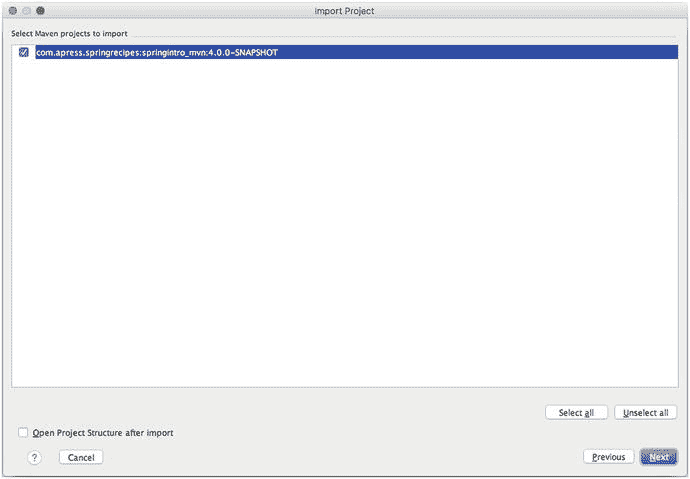

图 1-12.

IntelliJ，选择 Maven 项目

接下来，为项目选择 SDK 版本。确认项目名称和位置，然后点击 **Finish** 按钮。IntelliJ 中的所有项目都会加载到 **Project** 窗口的左侧。在本例中，项目显示的名称为 `springintro_mvn`。

如果你点击项目图标，将能够看到项目结构（即 Java 类、依赖项、配置文件等）。如果你在 **Project** 窗口中双击任何项目文件，该文件将在中央窗口的一个单独选项卡中打开。你可以检查文件内容，也可以编辑或删除其内容。

接下来，你需要设置 Maven 以使其与 IntelliJ 协同工作。按照技巧 1-3 中的说明安装 Maven 以便在命令行中使用。完成此操作后，你就可以设置 IntelliJ 与 Maven 协同工作了。

点击 IntelliJ 顶部的 **File** 菜单，选择 **Settings** 选项。将出现一个弹出窗口用于配置 IntelliJ 设置。点击 **Maven** 选项，并在 **Maven home directory** 中根据你的系统输入 Maven 安装目录，如图 1-13 所示。点击 **Apply** 按钮，然后点击 **OK** 按钮。

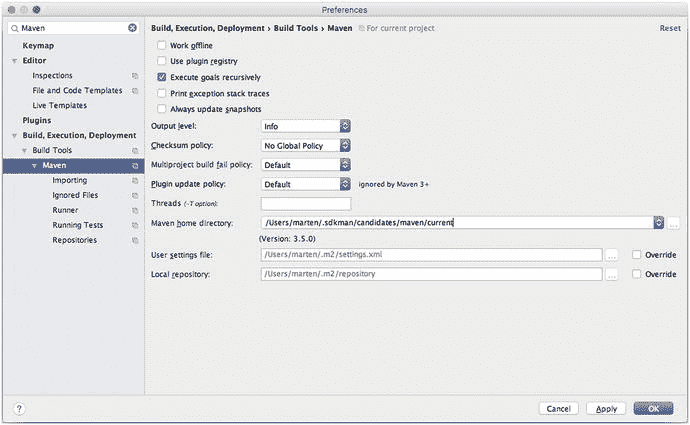

图 1-13.

IntelliJ，设置 Maven 设置

接下来，在 IntelliJ 的右侧，点击垂直选项卡 **Maven Projects** 以显示 **Maven Projects** 窗格，如图 1-14 所示。

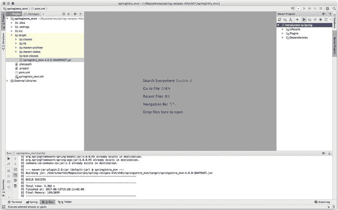

图 1-14.

IntelliJ，Maven Projects 窗格

在 **Maven Projects** 窗格中选择项目的 **Introduction to Spring** 行，然后右键单击以打开一个包含项目各种命令的上下文菜单。选择 **Run Maven Build** 选项。在 IntelliJ 的底部中央，你将看到 **Run** 窗口出现。在本例中，**Run** 窗口显示了一系列由 Maven 生成的构建消息，以及构建过程失败时可能出现的任何错误。

警告

如果你看到错误消息 "No valid Maven installation found. Either set the home directory in the configuration dialog or set the M2_HOME environment variable on your system."，这意味着 IntelliJ 找不到 Maven。请验证 Maven 的安装和配置过程。

恭喜，你刚刚构建了应用程序！现在让我们运行它。如果你没有看到 `target` 目录，请按 **Ctrl+Alt+Y** 组合键同步项目。点击其图标展开 `target` 目录。接下来，右键单击文件 `springintro_mvn-4.0.0-SNAPSHOT.jar`，如图 1-15 所示，然后选择 **Run** 选项。

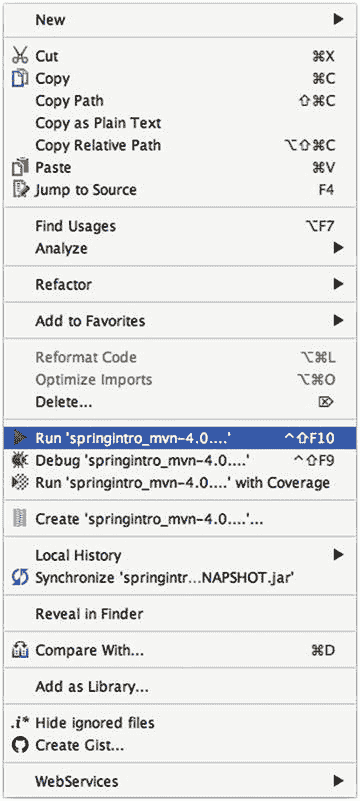

图 1-15.

IntelliJ，运行应用程序

在 IntelliJ 底部中央的 **Run** 窗口中，你将看到应用程序的日志消息，以及应用程序定义的问候消息。

#### 导入并构建 Gradle 项目

现在，让我们使用 IntelliJ 构建一个 Gradle 应用程序。首先，你需要安装 Gradle。按照 1-4 节中的说明安装 Gradle，以便在命令行中使用。完成此操作后，你就可以设置 IntelliJ 来使用 Gradle 了。

点击 IntelliJ 顶部的 **File** 菜单，选择 **Import Project** 选项。此时会弹出一个窗口，如图 1-9 所示。在弹出的窗口中，浏览目录树，直到可以选中本书源代码 `ch01/springintro` 目录下的 `build.gradle` 文件。

点击 **Open** 按钮。在下一个界面中，选择 “Import project from external model” 选项，然后选择 **Gradle**。在下一个界面中，根据你系统上 Gradle 的安装位置，在 “Gradle home” 框中输入 Gradle 的主目录，如图 1-16 所示。

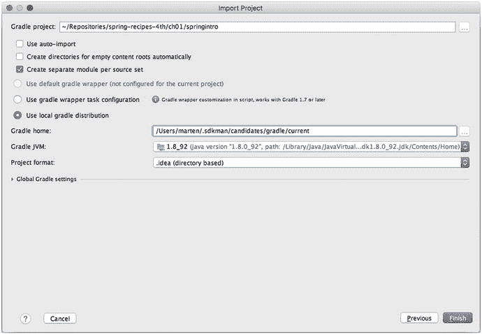

图 1-16.

为 IntelliJ 定义 Gradle 主目录

点击 **Finish** 按钮确认导入过程，然后再次点击 **Finish** 按钮完成导入。接下来，在 **Project** 窗口中，右键点击 `build.gradle` 并选择 **Run Build**。

你已经成功构建了应用程序。现在，让我们运行它。在 **Project** 窗口中，展开 `build` 目录，进入 `libs` 目录。找到 `springintro-all.jar`，如图 1-17 所示。

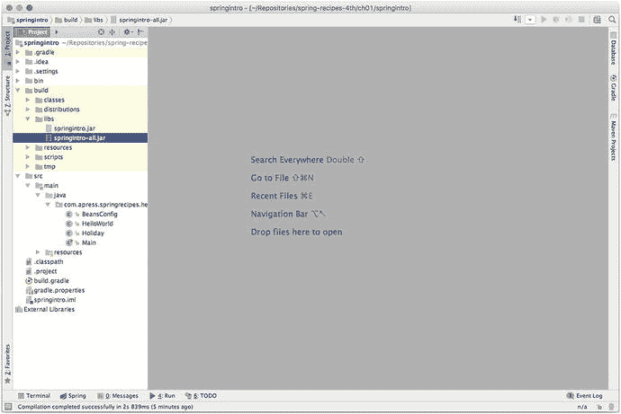

图 1-17.

IntelliJ，选择要运行的应用程序 注意

`build.gradle` 文件被配置为生成一个 shadow JAR，这意味着它包含了运行所需的所有类和依赖项。

现在，右键点击 `springintro-all.jar` 文件，选择 **Run** 选项。在 IntelliJ 底部中央的 **Run** 窗口中，你将看到应用程序的日志消息，以及应用程序定义的问候消息。

## 1-3\. 使用 Maven 命令行界面构建 Spring 应用程序

### 问题

你想从命令行使用 Maven 构建一个 Spring 应用程序。

### 解决方案

从 [`http://maven.apache.org/download.cgi`](http://maven.apache.org/download.cgi) 下载 Maven。确保 `JAVA_HOME` 环境变量设置为 Java SDK 的主目录。修改 `PATH` 环境变量，使其包含 Maven 的 `bin` 目录。

### 工作原理

Maven 作为一个独立的命令行界面工具提供。这使得 Maven 可以在各种开发环境中使用。例如，如果你更喜欢使用 emacs 或 vi 等文本编辑器来编辑应用程序代码，那么能够访问像 Maven 这样的构建工具来自动化那些通常与 Java 应用程序构建过程相关的繁琐工作（例如，复制文件、一键编译）就变得至关重要。

Maven 可以从 [`http://maven.apache.org/download.cgi`](http://maven.apache.org/download.cgi) 免费下载。Maven 提供源代码和二进制两种版本。由于 Java 工具是跨平台的，我们建议你下载二进制版本，以避免额外的编译步骤。在撰写本文时，Maven 的最新稳定版本是 3.5.0。

下载 Maven 后，请确保你的系统上安装了 Java SDK，因为 Maven 在运行时需要它。通过解压 Maven 并定义 `JAVA_HOME` 和 `PATH` 环境变量来继续安装。

运行以下命令解压它：

`www@ubuntu:∼$ tar -xzvf apache-maven-3.5.0-bin.tar.gz`

使用以下命令添加 `JAVA_HOME` 变量：

`www@ubuntu:∼$ export JAVA_HOME=/usr/lib/jvm/java-8-openjdk/`

使用以下命令将 Maven 可执行文件添加到 `PATH` 变量：

`www@ubuntu:∼$ export PATH=$PATH:/home/www/apache-maven-3.5.0/bin/`

提示

如果像前面那样声明 `JAVA_HOME` 和 `PATH` 变量，那么每次打开新的 shell 会话使用 Maven 时，都需要重复此过程。在 Unix/Linux 系统上，你可以打开用户主目录下的 `.bashrc` 文件，并添加相同的 export 行，以避免每次会话都声明环境变量。在 Windows 系统上，你可以通过选择 **我的电脑** 图标，右键点击，然后选择 **属性** 选项来永久设置环境变量。在弹出的窗口中，选择 **高级** 选项卡，然后点击 **环境变量** 按钮。

Maven 可执行文件通过 `mvn` 命令使用。如果你按照上述说明正确设置了环境变量，那么在系统上的任何目录中键入 `mvn` 都会调用 Maven。描述关于 Maven 执行的更多细节超出了本节的讨论范围。但是，接下来我们将描述如何使用 Maven 从本书的源代码构建一个 Spring 应用程序。

下载本书的源代码并将其解压到本地目录后，进入名为 `ch01/springintro_mvn` 的目录。键入 `mvn` 来调用 Maven 并构建 `springintro_mvn` 下的应用程序。输出应如图 1-18 所示。

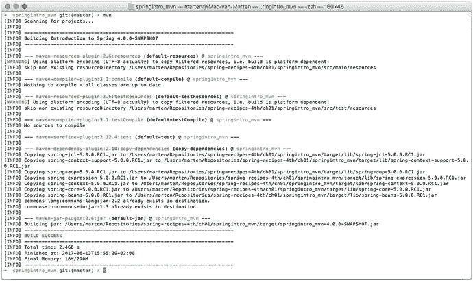

图 1-18.

Maven 构建输出

你已经成功构建了应用程序，恭喜！现在，让我们运行它。进入 Maven 在 `ch01/springintro_mvn` 目录下创建的名为 `target` 的目录。你将看到文件 `springintro_mvn-4.0.0-SNAPSHOT.jar`，这就是构建好的应用程序。执行命令 `java -jar springintro_mvn-1-0.SNAPSHOT.jar` 来运行应用程序。你将看到应用程序的日志消息，以及应用程序定义的问候消息。

## 1-4\. 使用 Gradle Wrapper 构建 Spring 应用程序

### 问题

你想从命令行使用 Maven wrapper 构建一个 Spring 应用程序。

### 解决方案

从命令行运行 `mvnw` 脚本。

### 工作原理

尽管 Maven（参见 1-3 节）是一个独立的命令行工具，但许多（开源）项目使用 Maven wrapper 来让你访问 Maven。这种方法的好处是应用程序完全自给自足。作为开发人员，你不需要安装 Maven，因为 Maven wrapper 会下载特定版本的 Maven 来构建项目。

一旦你有了一个使用 Maven wrapper 的项目，你可以简单地在命令行键入 `./mvnw package`，让 Maven 自动下载并运行构建。唯一的先决条件是安装了 Java SDK，因为 Maven 在运行时需要它，并且 Maven wrapper 也需要它才能运行。

下载本书的源代码并将其解压到本地目录后，进入名为 `ch01/springintro_mvnw` 的目录。键入 `./mvnw` 来调用 Maven wrapper 并自动构建应用程序。输出将类似于图 1-19。

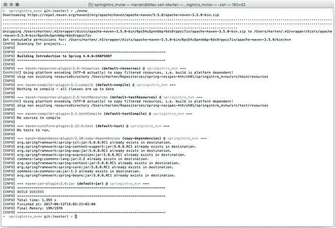

图 1-19.

Maven wrapper 构建输出

请注意，输出的第一部分正在下载此项目实际使用的 Maven 版本。

## 1-5\. 使用 Gradle 命令行界面构建 Spring 应用程序

### 问题

你想从命令行使用 Gradle 构建一个 Spring 应用程序。

### 解决方案

从 [`www.gradle.org/downloads`](http://www.gradle.org/downloads) 下载 Gradle。确保 `JAVA_HOME` 环境变量设置为 Java SDK 的主目录。修改 `PATH` 环境变量，使其包含 Gradle 的 `bin` 目录。

### 工作原理

Gradle 是一款独立的命令行工具，因此可以被广泛应用于各种开发环境。例如，如果你偏好使用 emacs 或 vi 等文本编辑器来编写应用程序代码，那么能够调用像 Gradle 这样的构建工具来自动化处理那些与 Java 应用程序构建过程相关的繁琐工作（例如，复制文件、一键编译）就变得至关重要。

你可以从 [`www.gradle.org/downloads`](http://www.gradle.org/downloads) 免费下载 Gradle。Gradle 提供源代码和二进制两种版本。由于 Java 工具是跨平台的，我们建议你下载二进制版本，以避免额外的编译步骤。在撰写本文时，Gradle 最新的稳定版本是 3.5 版本。

下载 Gradle 后，请确保你的系统上已安装 Java SDK，因为 Gradle 在运行时需要它。接下来，通过解压并定义 `JAVA_HOME` 和 `PATH` 环境变量来安装 Gradle。

运行以下命令进行解压：

`www@ubuntu:∼$ unzip gradle-3.5-bin.zip`

使用以下命令添加 `JAVA_HOME` 变量：

`www@ubuntu:∼$ export JAVA_HOME=/usr/lib/jvm/java-8-openjdk/`

使用以下命令将 Gradle 可执行文件添加到 `PATH` 变量中：

`www@ubuntu:∼$ export PATH=$PATH:/home/www/gradle-3.5/bin/`

提示

如果按照上述方式声明 `JAVA_HOME` 和 `PATH` 变量，那么每次打开新的 shell 会话以使用 Gradle 时，都需要重复此过程。在 Unix/Linux 系统上，你可以打开用户主目录下的 `.bashrc` 文件，并添加相同的 export 行，以避免每次会话都需要声明环境变量。在 Windows 系统上，你可以通过选择“我的电脑”图标，右键单击，然后选择“属性”选项来永久设置环境变量。在弹出的窗口中，选择“高级”选项卡，并点击“环境变量”按钮。

Gradle 可执行文件通过 `gradle` 命令调用。如果你按照上述说明正确设置了环境变量，那么在系统上的任何目录中键入 `gradle` 都会调用 Gradle。关于 Gradle 执行的更多细节已超出本技巧的范围。然而，由于本书的源代码包含大量使用 Gradle 的 Spring 应用程序，我们将描述如何使用 Gradle 来构建其中一个 Spring 应用程序。

下载本书的源代码并将其解压到本地目录后，进入名为 `ch01/springintro` 的目录。键入 `gradle` 来调用 Gradle 并构建 `springintro` 下的应用程序。输出应类似于图 1-20 中的输出。

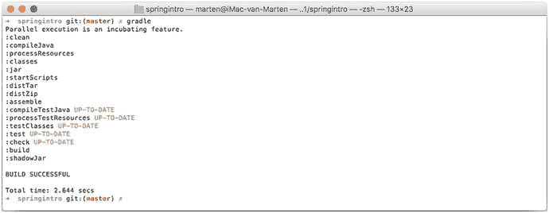

图 1-20.

Gradle 构建输出

恭喜，你已经成功构建了应用程序！现在让我们运行它。进入 `ch01/springintro` 目录下由 Gradle 创建的 `libs` 子目录。你会看到文件 `springintro-all.jar`，这就是构建好的应用程序。执行命令 `java -jar springintro-all.jar` 来运行应用程序。你将看到应用程序的日志消息，以及应用程序定义的问候消息。

## 1-6\. 使用 Gradle Wrapper 构建 Spring 应用程序

### 问题

你想从命令行使用 Gradle wrapper 来构建一个 Spring 应用程序。

### 解决方案

从命令行运行 `gradlew` 脚本。

### 工作原理

尽管 Gradle（参见技巧 1-5）是一款独立的命令行工具，但许多（开源）项目使用 Gradle wrapper 来让你访问 Gradle。这种方法的好处是应用程序完全自给自足。作为开发者，你无需安装 Gradle，因为 Gradle wrapper 会下载特定版本的 Gradle 来构建项目。

一旦你拥有一个使用 Gradle wrapper 的项目，只需在命令行键入 `./gradlew build`，Gradle 就会自动下载并运行构建。唯一的先决条件是安装 Java SDK，因为 Gradle 在运行时需要它，并且 Gradle wrapper 也需要它才能运行。

下载本书的源代码并将其解压到本地目录后，进入名为 `ch01/Recipe_1_6` 的目录。键入 `./gradlew` 来调用 Gradle wrapper 并自动构建 `Recipe_1_6` 下的应用程序。输出将类似于图 1-21 中的内容。

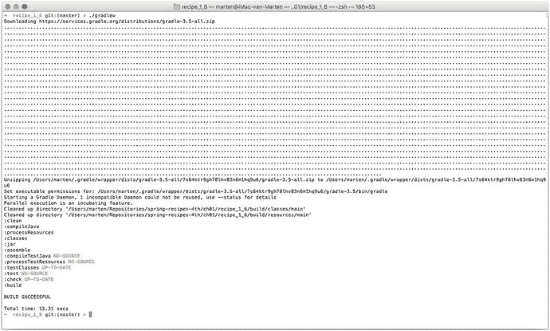

图 1-21.

Gradle 构建输出提示

本书的源代码既可以使用普通的 Gradle 构建，也可以使用 Gradle wrapper 构建。后者更可取，因为在开发示例时，代码将使用相同的 Gradle 版本进行构建。

## 总结

在本章中，你学习了如何设置最流行的开发工具来创建 Spring 应用程序。你探索了如何使用四种工具箱来构建和运行 Spring 应用程序。其中两种工具箱涉及使用 IDE：由 Spring 框架创建者分发的 Spring Tool Suite 和由 JetBrains 分发的 IntelliJ IDE。另外两种工具箱涉及使用命令行工具：Maven 构建工具和较新的 Gradle 构建工具，后者正逐渐比 Maven 构建工具更受欢迎。

