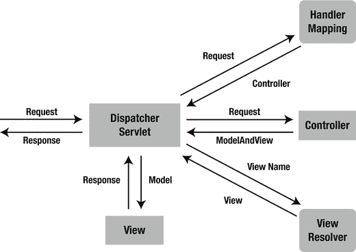

# 3. Spring MVC

MVC 是 Spring 框架最重要的模块之一。它构建在强大的 Spring IoC 容器之上，并广泛利用容器的特性来简化其配置。

模型-视图-控制器（MVC）是 UI 设计中一种常见的设计模式。它通过分离应用程序中模型、视图和控制器各自的角色，将业务逻辑与 UI 解耦。模型负责封装供视图展示的应用数据。视图应仅展示这些数据，而不包含任何业务逻辑。控制器负责接收来自用户的请求，并调用后端服务进行业务处理。处理完成后，后端服务可能会返回一些数据供视图展示。控制器收集这些数据并准备模型供视图展示。MVC 模式的核心思想是将业务逻辑与 UI 分离，使它们能够独立变化而不相互影响。

在 Spring MVC 应用程序中，模型通常由领域对象组成，这些对象由服务层处理并由持久层持久化。视图通常是使用 Java 标准标签库（JSTL）编写的 JSP 模板。然而，也可以将视图定义为 PDF 文件、Excel 文件、RESTful Web 服务，甚至是 Flex 界面（后者通常被称为富互联网应用程序，RIA）。

完成本章后，你将能够使用 Spring MVC 开发 Java Web 应用程序。你还将理解 Spring MVC 常见的控制器和视图类型，包括自 Spring 3.0 发布以来，使用注解创建控制器已成为事实上的标准。此外，你将理解 Spring MVC 的基本原理，这将为后续章节中更高级的主题奠定基础。

## 3-1. 使用 Spring MVC 开发一个简单的 Web 应用程序

### 问题

你想使用 Spring MVC 开发一个简单的 Web 应用程序，以学习该框架的基本概念和配置。


### 解决方案

Spring MVC 的核心组件是一个前端控制器。在最简单的 Spring MVC 应用中，这个控制器是你需要在 Java Web 部署描述符（即 `web.xml` 文件或 `ServletContainerInitializer`）中配置的唯一 Servlet。Spring MVC 控制器——通常被称为**调度 Servlet**——实现了 Sun 公司核心 Java EE 设计模式之一，即**前端控制器**。它充当 Spring MVC 框架的前端控制器，每个 Web 请求都必须经过它，以便它能够管理整个请求处理过程。

当一个 Web 请求被发送到 Spring MVC 应用时，控制器首先接收该请求。然后，它组织在 Spring 的 Web 应用上下文中配置的不同组件或控制器本身存在的注解，这些都是处理请求所必需的。图 3-1 展示了 Spring MVC 中请求处理的主要流程。



图 3-1.

Spring MVC 中请求处理的主要流程

要在 Spring 中定义一个控制器类，一个类必须使用 `@Controller` 或 `@RestController` 注解进行标记。

当一个带有 `@Controller` 注解的类（即控制器类）接收到请求时，它会寻找合适的处理方法（handler method）来处理该请求。这要求控制器类通过一个或多个处理器映射（handler mappings）将每个请求映射到一个处理方法。为此，控制器类的方法需要使用 `@RequestMapping` 注解进行修饰，使其成为处理方法。

这些处理方法的签名——正如你对任何标准类所期望的那样——是开放式的。你可以为处理方法指定任意名称，并定义各种方法参数。同样，处理方法可以根据其实现的应用程序逻辑返回一系列值中的任何一个（例如，`String` 或 `void`）。随着本书的深入，你将遇到可以使用 `@RequestMapping` 注解在处理方法中使用的各种方法参数。以下仅是有效参数类型的部分列表，旨在让你有个概念。

*   `HttpServletRequest` 或 `HttpServleResponse`
*   任意类型的请求参数，使用 `@RequestParam` 注解
*   任意类型的模型属性，使用 `@ModelAttribute` 注解
*   传入请求中包含的 Cookie 值，使用 `@CookieValue` 注解
*   `Map` 或 `ModelMap`，供处理方法向模型添加属性
*   `Errors` 或 `BindingResult`，供处理方法访问命令对象的绑定和验证结果
*   `SessionStatus`，供处理方法通知其会话处理完成

一旦控制器类选择了合适的处理方法，它就会使用该请求调用处理方法的逻辑。通常，控制器的逻辑会调用后端服务来处理请求。此外，处理方法的逻辑可能会从众多输入参数（例如 `HttpServletRequest`、`Map`、`Errors` 或 `SessionStatus`）中添加或删除信息，这些参数将成为正在进行的 Spring MVC 流程的一部分。

在处理方法完成请求处理后，它将控制权委托给一个视图，该视图表示为处理方法的返回值。为了提供灵活的方法，处理方法的返回值并不代表视图的实现（例如 `user.jsp` 或 `report.pdf`），而是代表一个逻辑视图（例如 `user` 或 `report`）——注意缺少文件扩展名。

处理方法的返回值可以是表示逻辑视图名称的 `String`，也可以是 `void`，在这种情况下，将根据处理方法或控制器的名称确定默认的逻辑视图名称。

要将信息从控制器传递到视图，处理方法返回的是逻辑视图名称（`String` 或 `void`）并不重要，因为处理方法的输入参数将对视图可用。例如，如果处理方法将 `Map` 和 `SessionStatus` 对象作为输入参数——在处理方法的逻辑中修改它们的内容——这些相同的对象将对处理方法返回的视图可访问。

当控制器类接收到视图时，它通过视图解析器（view resolver）将逻辑视图名称解析为特定的视图实现（例如 `user.jsp` 或 `report.pdf`）。视图解析器是在 Web 应用上下文中配置的一个 bean，它实现了 `ViewResolver` 接口。其职责是为逻辑视图名称返回特定的视图实现（HTML、JSP、PDF 或其他）。

一旦控制器类将视图名称解析为视图实现，根据视图实现的设计，它会渲染由控制器处理方法传递的对象（例如 `HttpServletRequest`、`Map`、`Errors` 或 `SessionStatus`）。视图的职责是向用户显示在处理方法的逻辑中添加的对象。

### 工作原理

假设你要为某个体育中心开发一个场地预订系统。该应用的 UI 是基于 Web 的，以便用户可以通过互联网进行在线预订。你想使用 Spring MVC 开发此应用。首先，在 `domain` 子包中创建以下领域类：

```
package com.apress.springrecipes.court.domain;
public class Reservation {
private String courtName;
private Date date;
private int hour;
private Player player;
private SportType sportType;
// 构造方法、Getter 和 Setter
...
}
package com.apress.springrecipes.court.domain;
public class Player {
private String name;
private String phone;
// 构造方法、Getter 和 Setter
...
}
package com.apress.springrecipes.court.domain;
public class SportType {
private int id;
private String name;
// 构造方法、Getter 和 Setter
...
}
```

然后，在 `service` 子包中定义以下服务接口，以向表示层提供预订服务：

```
package com.apress.springrecipes.court.service;
import com.apress.springrecipes.court.domain.Reservation;
import java.util.List;
public interface ReservationService {
public List query(String courtName);
}
```

在生产应用中，你应该使用数据库持久化来实现此接口。但为简单起见，你可以将预订记录存储在列表中，并硬编码几条预订记录用于测试目的。

```
package com.apress.springrecipes.court.service;
import com.apress.springrecipes.court.domain.Player;
import com.apress.springrecipes.court.domain.Reservation;
import com.apress.springrecipes.court.domain.SportType;
import org.springframework.stereotype.Service;
import java.time.LocalDate;
import java.util.ArrayList;
import java.util.List;
import java.util.Objects;
import java.util.stream.Collectors;
@Service
public class ReservationServiceImpl implements ReservationService {
public static final SportType TENNIS = new SportType(1, "Tennis");
public static final SportType SOCCER = new SportType(2, "Soccer");
private final List reservations = new ArrayList();
public ReservationServiceImpl() {
reservations.add(new Reservation("Tennis #1", LocalDate.of(2008, 1, 14), 16,
new Player("Roger", "N/A"), TENNIS));
reservations.add(new Reservation("Tennis #2", LocalDate.of(2008, 1, 14), 20,
new Player("James", "N/A"), TENNIS));
}
@Override
public List query(String courtName) {
return this.reservations.stream()
.filter(reservation -> Objects.equals(reservation.getCourtName(), courtName))
.collect(Collectors.toList());
}
}
```


#### 搭建 Spring MVC 应用程序

接下来，你需要创建一个 Spring MVC 应用程序布局。通常，使用 Spring MVC 开发的 Web 应用程序与标准 Java Web 应用程序的设置方式相同，只是需要额外添加一些 Spring MVC 特有的配置文件和必需的库。

Java EE 规范定义了由 Web 归档文件（WAR 文件）构成的 Java Web 应用程序的有效目录结构。例如，你必须在 `WEB-INF` 根目录下提供 Web 部署描述符（即 `web.xml`），或者提供一个或多个实现 `ServletContainerInitializer` 的类。此 Web 应用程序的类文件和 JAR 文件应分别放在 `WEB-INF/classes` 和 `WEB-INF/lib` 目录中。

对于你的球场预订系统，你需要创建以下目录结构。请注意，高亮显示的文件是 Spring 特有的配置文件。

注意

要使用 Spring MVC 开发 Web 应用程序，你必须将所有常规的 Spring 依赖项（更多信息请参见第 1 章）以及 Spring Web 和 Spring MVC 依赖项添加到你的 `CLASSPATH` 中。如果你使用 Maven，请将以下依赖项添加到你的 Maven 项目中：

```
org.springframework
spring-webmvc
${spring.version}

```

如果你使用 Gradle，请添加以下内容：

```
dependencies {
compile "org.springframework:spring-webmvc:$springVersion"
}
```

`WEB-INF` 目录之外的文件可以通过 URL 直接供用户访问，因此 CSS 文件和图像文件必须放在那里。使用 Spring MVC 时，JSP 文件充当模板。框架会读取它们以生成动态内容，因此 JSP 文件应放在 `WEB-INF` 目录内，以防止直接访问它们。但是，某些应用服务器不允许 Web 应用程序内部读取 `WEB-INF` 内的文件。在这种情况下，你只能将它们放在 `WEB-INF` 目录之外。

#### 创建配置文件

Web 部署描述符（`web.xml` 或 `ServletContainerInitializer` 是 Java Web 应用程序的基本配置文件）。在此文件中，你为应用程序定义 Servlet，以及 Web 请求如何映射到它们。对于 Spring MVC 应用程序，你只需定义一个 `DispatcherServlet` 实例，它充当 Spring MVC 的前端控制器，尽管如果需要，你也可以定义多个。

在大型应用程序中，使用多个 `DispatcherServlet` 实例可能很方便。这允许将 `DispatcherServlet` 实例指定给特定的 URL，从而使代码管理更容易，并让各个团队成员处理应用程序的逻辑而不会相互干扰。

```
package com.apress.springrecipes.court.web;
import com.apress.springrecipes.court.config.CourtConfiguration;
import org.springframework.web.context.support.AnnotationConfigWebApplicationContext;
import org.springframework.web.servlet.DispatcherServlet;
import javax.servlet.ServletContainerInitializer;
import javax.servlet.ServletContext;
import javax.servlet.ServletException;
import javax.servlet.ServletRegistration;
import java.util.Set;
public class CourtServletContainerInitializer implements ServletContainerInitializer {
@Override
public void onStartup(Set> c, ServletContext ctx) throws ServletException {
AnnotationConfigWebApplicationContext applicationContext =            new AnnotationConfigWebApplicationContext();
applicationContext.register(CourtConfiguration.class);
DispatcherServlet dispatcherServlet = new DispatcherServlet(applicationContext);
ServletRegistration.Dynamic courtRegistration =            ctx.addServlet("court", dispatcherServlet);
courtRegistration.setLoadOnStartup(1);
courtRegistration.addMapping("/");
}
}
```

在这个 `CourtServletContainerInitializer` 中，你定义了一个类型为 `DispatcherServlet` 的 Servlet。这是 Spring MVC 中的核心 Servlet 类，它接收 Web 请求并将其分派给适当的处理器。你将此 Servlet 的名称设置为 court，并使用斜杠 (/) 映射所有 URL，斜杠代表根目录。请注意，URL 模式可以设置为更细粒度的模式。在较大的应用程序中，将模式委托给不同的 Servlet 可能更有意义，但为简单起见，应用程序中的所有 URL 都委托给单个 court Servlet。

为了让 `CourtServletContainerInitializer` 被检测到，你还需要在 `META-INF/services` 目录中添加一个名为 `javax.servlet.ServletContainerInitializer` 的文件。该文件的内容应为 `CourtServletContainerInitializer` 的全名。此文件由 Servlet 容器加载，并用于引导应用程序。

```
com.apress.springrecipes.court.web.CourtServletContainerInitializer
```

最后，添加 `CourtConfiguration` 类，这是一个简单的 `@Configuration` 类。

```
package com.apress.springrecipes.court.config;
import org.springframework.context.annotation.ComponentScan;
import org.springframework.context.annotation.Configuration;
@Configuration
@ComponentScan("com.apress.springrecipes.court")
public class CourtConfiguration {}
```

这定义了一个 `@ComponentScan` 注解，它将扫描 `com.apress.springrecipes.court` 包（及其子包），并注册所有检测到的 Bean（在本例中，是 `ReservationServiceImpl` 和尚未创建的带有 `@Controller` 注解的类）。


#### 创建 Spring MVC 控制器

基于注解的控制器类可以是任意类，无需实现特定接口或继承特定基类。你可以使用 `@Controller` 注解对其进行标注。一个控制器中可以定义一个或多个处理器方法来处理单个或多个操作。处理器方法的签名足够灵活，可以接受多种参数。

`@RequestMapping` 注解可以应用于类级别或方法级别。第一种映射策略是将特定的 URL 模式映射到控制器类，然后将特定的 HTTP 方法映射到每个处理器方法。

```
package com.apress.springrecipes.court.web;
import org.springframework.stereotype.Controller;
import org.springframework.ui.Model;
import org.springframework.web.bind.annotation.RequestMapping;
import org.springframework.web.bind.annotation.RequestMethod;
import java.util.Date;
@Controller
@RequestMapping("/welcome")
public class WelcomeController {
@RequestMapping(method = RequestMethod.GET)
public String welcome(Model model) {
Date today = new Date();
model.addAttribute("today", today);
return "welcome";
}
}
```

该控制器创建了一个 `java.util.Date` 对象来获取当前日期，然后将其作为属性添加到输入的 `Model` 对象中，以便目标视图能够显示它。

由于你已经在 `com.apress.springrecipes.court` 包上激活了注解扫描，因此在部署时会检测到该控制器类的注解。

`@Controller` 注解将该类定义为 Spring MVC 控制器。`@RequestMapping` 注解则更有趣，因为它包含属性，并且可以在类或处理器方法级别声明。该类中使用的第一个值 `("/welcome")` 用于指定控制器可操作的 URL，这意味着任何发送到 `/welcome` URL 的请求都将由 `WelcomeController` 类处理。

一旦控制器类处理了一个请求，它会将调用委托给控制器中声明的默认 HTTP GET 处理器方法。之所以如此，是因为每个对 URL 的初始请求都是 HTTP GET 类型。因此，当控制器处理 `/welcome` URL 上的请求时，它会随后委托给默认的 HTTP GET 处理器方法进行处理。

注解 `@RequestMapping(method = RequestMethod.GET)` 用于将 welcome 方法装饰为控制器的默认 HTTP GET 处理器方法。值得一提的是，如果没有声明默认的 HTTP GET 处理器方法，则会抛出 `ServletException`。因此，Spring MVC 控制器至少需要有一个 URL 路由和一个默认的 HTTP GET 处理器方法，这一点很重要。

这种方法的另一种变体是，在方法级别使用的 `@RequestMapping` 注解中同时声明两个值——URL 路由和默认的 HTTP GET 处理器方法。如下所示：

```
@Controller
public class WelcomeController {
@RequestMapping(value = "/welcome", method=RequestMethod.GET)
public String welcome(Model model) { ... }
}
```

此声明与之前的声明等效。`value` 属性指示处理器方法映射到的 URL，`method` 属性将该处理器方法定义为控制器的默认 HTTP GET 方法。最后，还有一些便捷的注解，例如 `@GetMapping`、`@PostMapping` 等，以最小化配置。以下映射将执行与前面声明相同的操作：

```
@Controller
public class WelcomeController {
@GetMapping("/welcome")
public String welcome(Model model) { ... }
}
```

`@GetMapping` 注解使类更简短，或许也更容易阅读。

最后一个控制器说明了 Spring MVC 的基本原理。然而，一个典型的控制器可能会调用后端服务进行业务处理。例如，你可以创建一个控制器来查询特定场地的预订信息，如下所示：

```
package com.apress.springrecipes.court.web;
import com.apress.springrecipes.court.domain.Reservation;
import com.apress.springrecipes.court.service.ReservationService;
import org.springframework.beans.factory.annotation.Autowired;
import org.springframework.stereotype.Controller;
import org.springframework.ui.Model;
import org.springframework.web.bind.annotation.RequestMapping;
import org.springframework.web.bind.annotation.RequestMethod;
import org.springframework.web.bind.annotation.RequestParam;
import java.util.List;
@Controller
@RequestMapping("/reservationQuery")
public class ReservationQueryController {
private final ReservationService reservationService;
public ReservationQueryController(ReservationService reservationService) {
this.reservationService = reservationService;
}
@GetMapping
public void setupForm() {}
@PostMapping
public String sumbitForm(@RequestParam("courtName") String courtName, Model model) {
List reservations = java.util.Collections.emptyList();
if (courtName != null) {
reservations = reservationService.query(courtName);
}
model.addAttribute("reservations", reservations);
return "reservationQuery";
}
}
```

如前所述，控制器随后会查找默认的 HTTP GET 处理器方法。由于公共 void `setupForm()` 方法为此目的分配了必要的 `@RequestMapping` 注解，因此接下来会调用它。

与之前的默认 HTTP GET 处理器方法不同，请注意此方法没有输入参数，没有逻辑，并且返回值为 `void`。这意味着两件事。由于没有输入参数和逻辑，视图仅显示在实现模板（例如 JSP）中硬编码的数据，因为控制器没有添加任何数据。由于返回值为 `void`，将使用基于请求 URL 的默认视图名称；因此，由于请求 URL 是 `/reservationQuery`，因此假定返回一个名为 `reservationQuery` 的视图。

剩下的处理器方法使用 `@PostMapping` 注解进行装饰。乍一看，有两个处理器方法只有类级别的 `/reservationQuery` URL 声明可能会令人困惑，但实际上非常简单。一个方法在 HTTP GET 请求发送到 `/reservationQuery` URL 时被调用；另一个方法在 HTTP POST 请求发送到同一 URL 时被调用。

Web 应用程序中的大多数请求都是 HTTP GET 类型，而 HTTP POST 类型的请求通常在用户提交 HTML 表单时发出。因此，进一步揭示应用程序的视图（我们稍后将描述），一个方法在 HTML 表单初始加载时（即 HTTP GET）被调用，而另一个方法在 HTML 表单提交时（即 HTTP POST）被调用。

仔细查看 HTTP POST 默认处理器方法，注意两个输入参数。首先注意 `@RequestParam("courtName") String courtName` 声明，用于提取名为 `courtName` 的请求参数。在这种情况下，HTTP POST 请求以 `/reservationQuery?courtName=<value>` 的形式传入；此声明使得该值在方法中可通过变量名 `courtName` 使用。其次，注意 `Model` 声明，用于定义一个对象，以便将数据传递到返回的视图。

处理器方法执行的逻辑包括使用控制器的 `reservationService`，利用 `courtName` 变量执行查询。从该查询获得的结果被分配给 `Model` 对象，该对象稍后将可供返回的视图进行显示。

最后，请注意该方法返回一个名为 `reservationQuery` 的视图。此方法也可以像默认的 HTTP GET 一样返回 `void`，并且由于请求 URL 的原因，会被分配到相同的 `reservationQuery` 默认视图。两种方法完全相同。

现在你已经了解了 Spring MVC 控制器的构成方式，是时候探索控制器处理器方法将其结果委托给的视图了。


#### 创建 JSP 视图

Spring MVC 支持多种视图类型，以适应不同的展示技术。这些视图包括 JSP、HTML、PDF、Excel 工作表 (XLS)、XML、JSON、Atom 和 RSS 订阅源、JasperReports 以及其他第三方视图实现。

在 Spring MVC 应用程序中，视图最常使用 JSTL 编写的 JSP 模板。当应用程序 `web.xml` 文件中定义的 `DispatcherServlet` 接收到从处理器返回的视图名称时，它会将逻辑视图名称解析为用于渲染的视图实现。例如，你可以在 Web 应用程序上下文的 `CourtConfiguration` 中配置 `InternalResourceViewResolver` Bean，以将视图名称解析为 `/WEB-INF/jsp/` 目录下的 JSP 文件。

```
@Bean
public InternalResourceViewResolver internalResourceViewResolver() {
InternalResourceViewResolver viewResolver = new InternalResourceViewResolver();
viewResolver.setPrefix("/WEB-INF/jsp/");
viewResolver.setSuffix(".jsp");
return viewResolver;
}
```

通过使用上述配置，名为 `reservationQuery` 的逻辑视图将被委托给位于 `/WEB-INF/jsp/reservationQuery.jsp` 的视图实现。了解这一点后，你可以为欢迎控制器创建以下 JSP 模板，将其命名为 `welcome.jsp` 并放置在 `/WEB-INF/jsp/` 目录下：

```

Welcome

Welcome to Court Reservation System
Today is .

```

在此 JSP 模板中，你使用了 JSTL 中的 `fmt` 标签库，将 `today` 模型属性格式化为 `yyyy-MM-dd` 模式。别忘了在此 JSP 模板顶部包含 `fmt` 标签库的定义。

接下来，你可以为预约查询控制器创建另一个 JSP 模板，并将其命名为 `reservationQuery.jsp` 以匹配视图名称。

```

Reservation Query

Court Name

Court Name
Date
Hour
Player

${reservation.courtName}

${reservation.hour}
${reservation.player.name}

```

在此 JSP 模板中，你包含了一个供用户输入要查询的球场名称的表单，然后使用 `<c:forEach>` 标签循环遍历预约的模型属性以生成结果表格。

#### 部署 Web 应用程序

在 Web 应用程序的开发过程中，我们强烈建议安装一个带有 Web 容器的本地 Java EE 应用服务器，用于测试和调试。为了方便配置和部署，我们选择 Apache Tomcat 8.5.x 作为 Web 容器。

此 Web 容器的部署目录位于 `webapps` 目录下。默认情况下，Tomcat 监听 8080 端口，并将应用程序部署到与应用程序 WAR 文件同名的上下文中。因此，如果你将应用程序打包为名为 `court.war` 的 WAR 文件，则可以通过以下 URL 访问欢迎控制器和预约查询控制器：

```
http://localhost:8080/court/welcome
http://localhost:8080/court/reservationQuery
```

提示

该项目也可以创建一个包含应用程序的 Docker 容器。运行 `../gradlew buildDocker` 即可获得一个包含 Tomcat 和应用程序的容器。然后，你可以启动一个 Docker 容器来测试应用程序（`docker run -p 8080:8080 spring-recipes-4th/court-web`）。

#### 使用 WebApplicationInitializer 引导应用程序

在上一节中，你创建了一个 `CourtServletContainerInitializer` 以及一个位于 `META-INF/services` 中的文件来引导应用程序。

现在，你将不再实现自己的初始化器，而是利用 Spring 提供的便捷实现 `SpringServletContainerInitializer`。该类是 `ServletContainerInitializer` 接口的实现，并扫描类路径以查找 `WebApplicationInitializer` 接口的实现。幸运的是，Spring 提供了该接口的一些便捷实现，你可以将其用于应用程序；其中之一是 `AbstractAnnotationConfigDispatcherServletInitializer`。

```
package com.apress.springrecipes.court.web;
import com.apress.springrecipes.court.config.CourtConfiguration;
import org.springframework.web.servlet.support.AbstractAnnotationConfigDispatcherServletInitializer;
public class CourtWebApplicationInitializer extends AbstractAnnotationConfigDispatcherServletInitializer {
@Override
protected Class[] getRootConfigClasses() {
return null;
}
@Override
protected Class[] getServletConfigClasses() {
return new Class[] {CourtConfiguration.class};
}
@Override
protected String[] getServletMappings() {
return new String[] { "/"};
}
}
```

新引入的 `CourtWebApplicationInitializer` 已经创建了一个 `DispatcherServlet`，因此你唯一需要做的就是在 `getServletMappings` 方法中配置映射，并在 `getServletConfigClasses` 中配置要加载的配置类。除了 Servlet 之外，还会可选地创建另一个组件，即 `ContextLoaderListener`。这是一个 `ServletContextListener`，它也会创建一个 `ApplicationContext`，该上下文将用作 `DispatcherServlet` 的父 `ApplicationContext`。如果你有多个 Servlet 需要访问相同的 Bean（服务、数据源等），这将非常方便。

## 3-2. 使用 @RequestMapping 映射请求

### 问题

当 `DispatcherServlet` 接收到 Web 请求时，它会尝试将请求分派给已使用 `@Controller` 注解声明的各种控制器类。分派过程取决于控制器类及其处理方法中声明的各种 `@RequestMapping` 注解。你希望使用 `@RequestMapping` 注解定义一种映射请求的策略。

### 解决方案

在 Spring MVC 应用程序中，Web 请求通过控制器类中声明的一个或多个 `@RequestMapping` 注解映射到处理器。

处理器映射根据 URL 相对于上下文路径（即 Web 应用程序上下文的部署路径）和 Servlet 路径（即映射到 `DispatcherServlet` 的路径）的路径来匹配 URL。因此，例如，在 URL `http://localhost:8080/court/welcome` 中，要匹配的路径是 `/welcome`，因为上下文路径是 `/court`，并且没有 Servlet 路径——回想一下在 `CourtWebApplicationInitializer` 中声明的 Servlet 路径为 `/`。

### 工作原理

首先，你将看到应用于方法级别的请求映射，接着你将探索类级别的请求映射，以及它与方法级别请求映射的结合使用。最后，你将看到如何将 HTTP 方法用于请求映射方法。


#### 按方法映射请求

使用 `@RequestMapping` 注解最简单的策略是直接修饰处理方法。要使此策略生效，你必须为每个处理方法声明包含 URL 模式的 `@RequestMapping` 注解。如果处理方法的 `@RequestMapping` 注解与请求的 URL 匹配，`DispatcherServlet` 就会将该请求分派给此处理方法进行处理。

```
package com.apress.springrecipes.court.web;
import com.apress.springrecipes.court.domain.Member;
import com.apress.springrecipes.court.service.MemberService;
import org.springframework.stereotype.Controller;
import org.springframework.ui.Model;
import org.springframework.web.bind.annotation.RequestMapping;
import org.springframework.web.bind.annotation.RequestMethod;
import org.springframework.web.bind.annotation.RequestParam;
@Controller
public class MemberController {
private MemberService memberService;
public MemberController(MemberService memberService) {
this.memberService = memberService;
}
@RequestMapping("/member/add")
public String addMember(Model model) {
model.addAttribute("member", new Member());
model.addAttribute("guests", memberService.list());
return "memberList";
}
@RequestMapping(value = {"/member/remove", "/member/delete"}, method = RequestMethod.GET)
public String removeMember(@RequestParam("memberName")String memberName) {
memberService.remove(memberName);
return "redirect:";
}
}
```

这段代码展示了如何使用 `@RequestMapping` 注解将每个处理方法映射到特定的 URL。第二个处理方法演示了如何分配多个 URL，因此 `/member/remove` 和 `/member/delete` 都会触发该处理方法的执行。默认情况下，所有发往这些 URL 的传入请求都被假定为 HTTP GET 类型。

#### 按类映射请求

`@RequestMapping` 注解也可以用于修饰控制器类。这允许处理方法要么放弃使用 `@RequestMapping` 注解（如配方 4-1 中的 `ReservationQueryController` 控制器所示），要么使用自己的 `@RequestMapping` 注解来匹配更细粒度的 URL。为了实现更广泛的 URL 匹配，`@RequestMapping` 注解还支持使用通配符（即 `*`）。

以下代码说明了如何在 `@RequestMapping` 注解中使用 URL 通配符，以及如何在处理方法的 `@RequestMapping` 注解上进行更细粒度的 URL 匹配：

```
package com.apress.springrecipes.court.web;
import com.apress.springrecipes.court.domain.Member;
import com.apress.springrecipes.court.service.MemberService;
import org.springframework.stereotype.Controller;
import org.springframework.ui.Model;
import org.springframework.web.bind.annotation.PathVariable;
import org.springframework.web.bind.annotation.RequestMapping;
import org.springframework.web.bind.annotation.RequestMethod;
import org.springframework.web.bind.annotation.RequestParam;
@Controller
@RequestMapping("/member/*")
public class MemberController {
private final MemberService memberService;
public MemberController(MemberService memberService) {
this.memberService = memberService;
}
@RequestMapping("add")
public String addMember(Model model) {
model.addAttribute("member", new Member());
model.addAttribute("guests", memberService.list());
return "memberList";
}
@RequestMapping(value={"remove","delete"}, method=RequestMethod.GET)
public String removeMember(@RequestParam("memberName") String memberName) {
memberService.remove(memberName);
return "redirect:";
}
@RequestMapping("display/{member}")
public String displayMember(@PathVariable("member") String member, Model model) {
model.addAttribute("member", memberService.find(member).orElse(null));
return "member";
}
@RequestMapping
public void memberList() {}
public void memberLogic(String memberName) {}
}
```

注意，类级别的 `@RequestMapping` 注解使用了 URL 通配符：`/member/*`。这会将所有发往 `/member/` URL 下的请求委托给该控制器的处理方法。

前两个处理方法使用了 `@RequestMapping` 注解。当对 `/member/add` URL 发起 HTTP GET 请求时，会调用 `addMember()` 方法；而当对 `/member/remove` 或 `/member/delete` URL 发起 HTTP GET 请求时，则会调用 `removeMember()` 方法。

第三个处理方法使用了特殊的标记 `{path_variable}` 来指定其 `@RequestMapping` 的值。通过这种方式，URL 中的值可以作为输入传递给处理方法。注意，该处理方法声明了 `@PathVariable("user") String user`。这样一来，如果收到形如 `member/display/jdoe` 的请求，处理方法就能访问到值为 `jdoe` 的 `member` 变量。这主要是一种便利机制，可以避免你直接操作处理方法的请求对象，并且在设计 RESTful Web 服务时尤其有用。

第四个处理方法也使用了 `@RequestMapping` 注解，但这次它没有指定 URL 值。由于类级别使用了 `/member/*` URL 通配符，该处理方法会作为“兜底”方法执行。因此，任何 URL 请求（例如 `/member/abcdefg` 或 `/member/randomroute`）都会触发此方法。注意其返回值为 `void`，这会使处理方法默认使用与其名称同名的视图（即 `memberList`）。

最后一个方法——`memberLogic`——没有任何 `@RequestMapping` 注解，这意味着该方法只是该类的一个工具方法，对 Spring MVC 没有影响。


#### 按 HTTP 请求类型映射请求

默认情况下，`@RequestMapping` 注解会处理所有类型的传入请求。然而，在大多数情况下，你并不希望同一个方法同时处理 GET 请求和 POST 请求。为了区分 HTTP 请求，需要在 `@RequestMapping` 注解中明确指定请求类型，如下所示：

```
@RequestMapping(value= "processUser", method =  RequestMethod.POST)
public String submitForm(@ModelAttribute("member") Member member, BindingResult result, Model model) {
}
```

你需要为处理器方法指定 HTTP 类型的程度，取决于控制器如何与什么进行交互。大多数情况下，Web 浏览器主要通过 HTTP GET 和 HTTP POST 请求执行操作。然而，其他设备或应用程序（例如 RESTful Web 服务）可能需要支持其他 HTTP 请求类型。总共有九种不同的 HTTP 请求类型：HEAD、GET、POST、PUT、DELETE、PATCH、TRACE、OPTIONS 和 CONNECT。不过，支持处理所有这些请求类型超出了 MVC 控制器的范围，因为 Web 服务器以及请求方都需要支持这些 HTTP 请求类型。考虑到绝大多数 HTTP 请求都是 GET 或 POST 类型，你几乎不需要实现对这些额外 HTTP 请求类型的支持。

对于最常用的请求方法，Spring MVC 提供了专门的注解，如表 3-1 所示。

表 3-1.

请求方法与注解的映射

| 请求方法 | 注解 |
| --- | --- |
| POST | `@PostMapping` |
| GET | `@GetMapping` |
| DELETE | `@DeleteMapping` |
| PUT | `@PutMapping` |

这些便捷注解都是专门的 `@RequestMapping` 注解，使得编写请求处理方法更加简洁。

```
@PostMapping("processUser")
public String submitForm(@ModelAttribute("member") Member member, BindingResult result, Model model) {
}
```

你可能已经注意到，在 `@RequestMapping` 注解中指定的所有 URL 里，都没有出现像 `.html` 或 `.jsp` 这样的文件扩展名。尽管这种做法并未被广泛采用，但它是符合 MVC 设计原则的良好实践。

控制器不应与任何表明视图技术（如 HTML 或 JSP）的扩展名绑定。这就是为什么控制器返回逻辑视图，并且匹配的 URL 在声明时不应包含扩展名。

在应用程序以不同格式（如 XML、JSON、PDF 或 XLS（Excel））提供相同内容已很常见的时代，应该由视图解析器来检查请求中提供的扩展名（如果有的话），并决定使用哪种视图技术。

在这段简短的介绍中，你已经看到了如何在 MVC 配置类中配置解析器，将逻辑视图映射到 JSP 文件，全程无需使用像 `.jsp` 这样的 URL 文件扩展名。

在后续的章节中，你将学习 Spring MVC 如何利用这种无扩展名的 URL 方法，通过不同的视图技术提供内容。

## 3-3. 使用处理器拦截器拦截请求

### 问题

由 Servlet API 定义的 Servlet 过滤器可以在请求被 Servlet 处理前后，对每个 Web 请求进行预处理和后处理。你希望在 Spring 的 Web 应用上下文中配置具有类似过滤器功能的东西，以便利用容器的特性。

此外，有时你可能希望对由 Spring MVC 处理器处理的 Web 请求进行预处理和后处理，并在这些处理器返回的模型属性传递给视图之前对其进行操作。

### 解决方案

Spring MVC 允许你通过处理器拦截器拦截 Web 请求，进行预处理和后处理。处理器拦截器在 Spring 的 Web 应用上下文中配置，因此它们可以利用任何容器特性，并引用容器中声明的任何 Bean。可以为特定的 URL 映射注册处理器拦截器，这样它只会拦截映射到特定 URL 的请求。

每个处理器拦截器必须实现 `HandlerInterceptor` 接口，该接口包含三个需要你实现的回调方法：`preHandle()`、`postHandle()` 和 `afterCompletion()`。第一个和第二个方法分别在请求被处理器处理之前和之后调用。第二个方法还允许你访问返回的 `ModelAndView` 对象，从而可以操作其中的模型属性。最后一个方法在所有请求处理完成之后（即视图渲染之后）调用。


### 工作原理

假设你要测量每个请求处理器处理 Web 请求的时间，并允许视图向用户显示这个时间。为此，你可以创建一个自定义的处理器拦截器。

```
package com.apress.springrecipes.court.web;
...
import org.springframework.web.servlet.HandlerInterceptor;
import org.springframework.web.servlet.ModelAndView;
public class MeasurementInterceptor implements HandlerInterceptor {
public boolean preHandle(HttpServletRequest request,
HttpServletResponse response, Object handler) throws Exception {
long startTime = System.currentTimeMillis();
request.setAttribute("startTime", startTime);
return true;
}
public void postHandle(HttpServletRequest request,
HttpServletResponse response, Object handler,
ModelAndView modelAndView) throws Exception {
long startTime = (Long) request.getAttribute("startTime");
request.removeAttribute("startTime");
long endTime = System.currentTimeMillis();
modelAndView.addObject("handlingTime", endTime - startTime);
}
public void afterCompletion(HttpServletRequest request,
HttpServletResponse response, Object handler, Exception ex)
throws Exception {
}
}
```

在这个拦截器的 `preHandle()` 方法中，你记录开始时间并将其保存到请求属性中。此方法应返回 `true`，以允许 `DispatcherServlet` 继续处理请求。否则，`DispatcherServlet` 会认为此方法已处理完请求，从而直接将响应返回给用户。然后，在 `postHandle()` 方法中，你从请求属性中加载开始时间，并与当前时间进行比较。你可以计算出总耗时，然后将这个时间添加到模型中，以便传递给视图。最后，由于 `afterCompletion()` 方法无需执行任何操作，你可以将其方法体留空。

当实现一个接口时，即使你不需要所有方法，也必须实现它们。更好的做法是扩展拦截器适配器类。该类默认实现了所有拦截器方法。你只需重写你需要的方法即可。

```
package com.apress.springrecipes.court.web;
...
import org.springframework.web.servlet.ModelAndView;
import org.springframework.web.servlet.handler.HandlerInterceptorAdapter;
public class MeasurementInterceptor extends HandlerInterceptorAdapter {
public boolean preHandle(HttpServletRequest request,
HttpServletResponse response, Object handler) throws Exception {
...
}
public void postHandle(HttpServletRequest request,
HttpServletResponse response, Object handler,
ModelAndView modelAndView) throws Exception {
...
}
}
```

要注册一个拦截器，你需要修改第一个配方中创建的 `CourtConfiguration`。你需要让它实现 `WebMvcConfigurer` 并重写 `addInterceptors` 方法。该方法让你能够访问 `InterceptorRegistry`，你可以用它来添加拦截器。修改后的类如下所示：

```
@Configuration
public class InterceptorConfiguration implements WebMvcConfigurer {
@Override
public void addInterceptors(InterceptorRegistry registry) {
registry.addInterceptor(measurementInterceptor());
}
@Bean
public MeasurementInterceptor measurementInterceptor() {
return new MeasurementInterceptor();
}
...
}
```

现在，你可以在 `welcome.jsp` 中显示这个时间，以验证此拦截器的功能。由于 `WelcomeController` 没有太多操作，你可能会看到处理时间为 0 毫秒。如果是这种情况，你可以在此类中添加一个 sleep 语句，以便看到更长的处理时间。

```

Welcome

...

Handling time : ${handlingTime} ms

```

默认情况下，`HandlerInterceptor` 适用于所有 `@Controller`；但有时你希望区分拦截器应用于哪些控制器。命名空间和基于 Java 的配置允许将拦截器映射到特定的 URL。这只是一个配置问题。以下是此功能的 Java 配置：

```
package com.apress.springrecipes.court.config;
import com.apress.springrecipes.court.web.ExtensionInterceptor;
import com.apress.springrecipes.court.web.MeasurementInterceptor;
import org.springframework.context.annotation.Bean;
import org.springframework.context.annotation.Configuration;
import org.springframework.web.servlet.config.annotation.InterceptorRegistry;
import org.springframework.web.servlet.config.annotation.WebMvcConfigurer;
@Configuration
public class InterceptorConfiguration implements WebMvcConfigurer {
@Override
public void addInterceptors(InterceptorRegistry registry) {
registry.addInterceptor(measurementInterceptor());
registry.addInterceptor(summaryReportInterceptor()).addPathPatterns("/reservationSummary*");
}
@Bean
public MeasurementInterceptor measurementInterceptor() {
return new MeasurementInterceptor();
}
@Bean
public ExtensionInterceptor summaryReportInterceptor() {
return new ExtensionInterceptor();
}
}
```

首先，添加了拦截器 bean `summaryReportInterceptor`。此 bean 的后备类结构与 `measurementInterceptor` 相同（即它实现了 `HandlerInterceptor` 接口）。但是，此拦截器执行的逻辑应仅限于映射到 `/reservationSummary` URI 的特定控制器。在注册拦截器时，你可以指定它映射到哪些 URL；默认情况下，这采用 Ant 风格的表达式。你将此模式传递给 `addPathPatterns` 方法；还有一个 `excludePathPatterns` 方法，你可以用它来排除某些 URL 的拦截器。

## 3-4. 解析用户区域设置

### 问题

为了使你的 Web 应用程序支持国际化，你必须识别每个用户的首选区域设置，并根据此区域设置显示内容。

### 解决方案

在 Spring MVC 应用程序中，用户的区域设置由区域设置解析器识别，该解析器必须实现 `LocaleResolver` 接口。Spring MVC 提供了几个 `LocaleResolver` 实现，供你根据不同的标准解析区域设置。或者，你也可以通过实现此接口来创建自己的自定义区域设置解析器。

你可以通过在 Web 应用程序上下文中注册一个类型为 `LocaleResolver` 的 bean 来定义区域设置解析器。你必须将区域设置解析器的 bean 名称设置为 `localeResolver`，以便 `DispatcherServlet` 自动检测。请注意，每个 `DispatcherServlet` 只能注册一个区域设置解析器。

### 工作原理

你将探索 Spring MVC 中可用的不同 `LocaleResolver`，以及如何使用拦截器更改用户的区域设置。

#### 通过 HTTP 请求头解析区域设置

Spring 使用的默认区域设置解析器是 `AcceptHeaderLocaleResolver`。它通过检查 HTTP 请求的 `accept-language` 头来解析区域设置。此头由用户的 Web 浏览器根据底层操作系统的区域设置进行设置。请注意，此区域设置解析器无法更改用户的区域设置，因为它无法修改用户操作系统的区域设置。

#### 通过会话属性解析区域设置

另一种解析区域设置的方法是使用 `SessionLocaleResolver`。它通过检查用户会话中的预定义属性来解析区域设置。如果会话属性不存在，此区域设置解析器将从 `accept-language` HTTP 头中确定默认区域设置。

```
@Bean
public LocaleResolver localeResolver () {
SessionLocaleResolver localeResolver = new SessionLocaleResolver();
localeResolver.setDefaultLocale(new Locale("en"));
return localeResolver;
}
```

如果会话属性不存在，你可以为此解析器设置 `defaultLocale` 属性。请注意，此区域设置解析器能够通过更改存储区域设置的会话属性来更改用户的区域设置。


#### 通过 Cookie 解析区域设置

你也可以使用 `CookieLocaleResolver`，通过检查用户浏览器中的 cookie 来解析区域设置。如果 cookie 不存在，此区域设置解析器会根据 `accept-language` HTTP 标头确定默认区域设置。

```
@Bean
public LocaleResolver localeResolver() {
return new CookieLocaleResolver();
}
```

此区域设置解析器使用的 cookie 可以通过设置 `cookieName` 和 `cookieMaxAge` 属性进行自定义。`cookieMaxAge` 属性表示此 cookie 应持久保存的秒数。值为 -1 表示此 cookie 将在浏览器关闭后失效。

```
@Bean
public LocaleResolver localeResolver() {
CookieLocaleResolver cookieLocaleResolver = new CookieLocaleResolver();
cookieLocaleResolver.setCookieName("language");
cookieLocaleResolver.setCookieMaxAge(3600);
cookieLocaleResolver.setDefaultLocale(new Locale("en"));
return cookieLocaleResolver;
}
```

如果用户浏览器中不存在 cookie，你也可以为此解析器设置 `defaultLocale` 属性。此区域设置解析器能够通过修改存储区域设置的 cookie 来更改用户的区域设置。

### 更改用户区域设置

除了通过显式调用 `LocaleResolver.setLocale()` 来更改用户区域设置外，你还可以将 `LocaleChangeInterceptor` 应用于你的处理器映射。此拦截器会检测当前 HTTP 请求中是否存在一个特殊参数。参数名称可以通过此拦截器的 `paramName` 属性进行自定义。如果当前请求中存在此类参数，此拦截器会根据参数值更改用户的区域设置。

```
package com.apress.springrecipes.court.web.config;
import org.springframework.web.servlet.i18n.CookieLocaleResolver;
import org.springframework.web.servlet.i18n.LocaleChangeInterceptor;
import org.springframework.web.servlet.view.InternalResourceViewResolver;
import java.util.Locale;
// 其他导入已省略
@Configuration
public class I18NConfiguration implements WebMvcConfigurer {
@Override
public void addInterceptors(InterceptorRegistry registry) {
registry.addInterceptor(measurementInterceptor());
registry.addInterceptor(localeChangeInterceptor());
registry.addInterceptor(summaryReportInterceptor()).addPathPatterns("/reservationSummary*");
}
@Bean
public LocaleChangeInterceptor localeChangeInterceptor() {
LocaleChangeInterceptor localeChangeInterceptor = new LocaleChangeInterceptor();
localeChangeInterceptor.setParamName("language");
return localeChangeInterceptor;
}
@Bean
public CookieLocaleResolver localeResolver() {
CookieLocaleResolver cookieLocaleResolver = new CookieLocaleResolver();
cookieLocaleResolver.setCookieName("language");
cookieLocaleResolver.setCookieMaxAge(3600);
cookieLocaleResolver.setDefaultLocale(new Locale("en"));
return cookieLocaleResolver;
}
...
}
```

现在，任何带有 `language` 参数的 URL 都可以更改用户的区域设置。例如，以下两个 URL 分别将用户的区域设置更改为美国英语和德语：

```
http://localhost:8080/court/welcome?language=en_US
http://localhost:8080/court/welcome?language=de
```

然后，你可以在 `welcome.jsp` 中显示 HTTP 响应对象的区域设置，以验证区域设置拦截器的配置。

```

Welcome

...

Locale : ${pageContext.response.locale}

```

## 3-5\. 外部化区域敏感文本消息

### 问题

在开发国际化 Web 应用程序时，你必须以用户偏好的区域设置来显示网页。你不想为不同的区域设置创建同一页面的不同版本。

### 解决方案

为了避免为不同区域设置创建页面的不同版本，你应该通过外部化区域敏感的文本消息来使你的网页独立于区域设置。Spring 能够通过使用消息源为你解析文本消息，该消息源必须实现 `MessageSource` 接口。然后，你的 JSP 文件可以使用 Spring 标签库中定义的 `<spring:message>` 标签，根据给定的代码解析消息。

### 工作原理

你可以通过在 Web 应用程序上下文中注册一个类型为 `MessageSource` 的 bean 来定义消息源。你必须将消息源的 bean 名称设置为 `messageSource`，以便 `DispatcherServlet` 自动检测。请注意，每个 `DispatcherServlet` 只能注册一个消息源。`ResourceBundleMessageSource` 实现会针对不同的区域设置，从不同的资源包中解析消息。例如，你可以在 `WebConfiguration` 中注册它，以加载基础名称为 `messages` 的资源包。

```
@Bean
public MessageSource messageSource() {
ResourceBundleMessageSource messageSource = new ResourceBundleMessageSource();
messageSource.setBasename("messages");
return messageSource;
}
```

然后，你创建两个资源包 `messages.properties` 和 `messages_de.properties`，分别存储默认区域设置和德语区域设置的消息。这些资源包应放在类路径的根目录下。

```
welcome.title=Welcome
welcome.message=Welcome to Court Reservation System
welcome.title=Willkommen
welcome.message=Willkommen zum Spielplatz-Reservierungssystem
```

现在，在诸如 `welcome.jsp` 的 JSP 文件中，你可以使用 `<spring:message>` 标签根据给定的代码解析消息。此标签会根据用户的当前区域设置自动解析消息。请注意，此标签定义在 Spring 的标签库中，因此你必须在 JSP 文件的顶部声明它。

```

...

```

在 `<spring:message>` 中，你可以指定当无法解析给定代码的消息时要输出的默认文本。

## 3-6\. 按名称解析视图

### 问题

处理器完成请求处理后，会返回一个逻辑视图名称，此时 `DispatcherServlet` 必须将控制权委托给视图模板，以便渲染信息。你希望为 `DispatcherServlet` 定义一个策略，使其能够根据逻辑名称解析视图。

### 解决方案

在 Spring MVC 应用程序中，视图由在 Web 应用程序上下文中声明的一个或多个视图解析器 bean 解析。这些 bean 必须实现 `ViewResolver` 接口，以便 `DispatcherServlet` 自动检测它们。Spring MVC 提供了几种 `ViewResolver` 实现，供你使用不同的策略来解析视图。

### 工作原理

你将探索不同的视图解析策略，从使用前缀和后缀生成实际名称的命名模板开始，到根据来自 XML 文件或 ResourceBundle 的名称解析视图。最后，你将学习如何同时使用多个 ViewResolver。


#### 基于模板名称和位置解析视图

解析视图的基本策略是将其直接映射到模板的名称和位置。视图解析器 `InternalResourceViewResolver` 通过 `prefix` 和 `suffix` 声明，将每个视图名称映射到应用程序的目录。要注册 `InternalResourceViewResolver`，你可以在 Web 应用程序上下文中声明一个此类型的 Bean。

```
@Bean
public InternalResourceViewResolver viewResolver() {
InternalResourceViewResolver viewResolver = new InternalResourceViewResolver();
viewResolver.setPrefix("/WEB-INF/jsp/");
viewResolver.setSuffix(".jsp");
return viewResolver;
}
```

例如，`InternalResourceViewResolver` 会按以下方式解析视图名称 `welcome` 和 `reservationQuery`：

```
welcome --> /WEB-INF/jsp/welcome.jsp
reservationQuery --> /WEB-INF/jsp/reservationQuery.jsp
```

解析后的视图类型可以通过 `viewClass` 属性指定。默认情况下，如果类路径中存在 JSTL 库（即 `jstl.jar`），`InternalResourceViewResolver` 会将视图名称解析为 `JstlView` 类型的视图对象。因此，如果你的视图是包含 JSTL 标签的 JSP 模板，则可以省略 `viewClass` 属性。

`InternalResourceViewResolver` 很简单，但它只能解析可通过 Servlet API 的 `RequestDispatcher`（例如，内部 JSP 文件或 Servlet）转发的内部资源视图。对于 Spring MVC 支持的其他视图类型，你必须使用其他策略来解析它们。

#### 从 XML 配置文件解析视图

另一种解析视图的策略是将视图声明为 Spring Bean，并通过其 Bean 名称进行解析。你可以在与 Web 应用程序上下文相同的配置文件中声明视图 Bean，但最好将它们隔离在单独的配置文件中。默认情况下，`XmlViewResolver` 从 `/WEB-INF/views.xml` 加载视图 Bean，但此位置可以通过 `location` 属性进行覆盖。

```
Configuration
public class ViewResolverConfiguration implements WebMvcConfigurer, ResourceLoaderAware {
private ResourceLoader resourceLoader;
@Bean
public ViewResolver viewResolver() {
XmlViewResolver viewResolver = new XmlViewResolver();
viewResolver.setLocation(resourceLoader.getResource("/WEB-INF/court-views.nl"));
return viewResolver;
}
@Override
public void setResourceLoader(ResourceLoader resourceLoader) {
this.resourceLoader=resourceLoader;
}
}
```

请注意，在实现 `ResourceLoaderAware` 接口时，你需要加载资源，因为 `location` 属性接受 `Resource` 类型的参数。在 Spring XML 文件中，从 `String` 到 `Resource` 的转换会自动为你处理；然而，当使用基于 Java 的配置时，你必须做一些额外的工作。在 `court-views.xml` 配置文件中，你可以通过设置类名和属性，将每个视图声明为普通的 Spring Bean。通过这种方式，你可以声明任何类型的视图（例如，`RedirectView` 甚至自定义视图类型）。

#### 从资源包解析视图

除了 XML 配置文件，你还可以在资源包中声明视图 Bean。`ResourceBundleViewResolver` 从类路径根目录的资源包中加载视图 Bean。请注意，`ResourceBundleViewResolver` 还可以利用资源包的功能，为不同的区域设置从不同的资源包加载视图 Bean。

```
@Bean
public ResourceBundleViewResolver viewResolver() {
ResourceBundleViewResolver viewResolver = new ResourceBundleViewResolver();
viewResolver.setBasename("court-views");
return viewResolver;
}
```

当你将 `court-views` 指定为 `ResourceBundleViewResolver` 的基本名称时，资源包就是 `court-views.properties`。在此资源包中，你可以以属性的格式声明视图 Bean。这种声明方式等同于 XML Bean 声明。

```
welcome.(class)=org.springframework.web.servlet.view.JstlView welcome.url=/WEB-INF/jsp/welcome.jsp reservationQuery.(class)=org.springframework.web.servlet.view.JstlView reservationQuery.url=/WEB-INF/jsp/reservationQuery.jsp welcomeRedirect.(class)=org.springframework.web.servlet.view.RedirectView welcomeRedirect.url=welcome
```

#### 使用多个解析器解析视图

如果你的 Web 应用程序中有大量视图，仅选择一种视图解析策略通常是不够的。通常，`InternalResourceViewResolver` 可以解析大多数内部 JSP 视图，但通常还有其他类型的视图必须由 `ResourceBundleViewResolver` 解析。在这种情况下，你必须结合两种策略来进行视图解析。

```
@Bean
public ResourceBundleViewResolver viewResolver() {
ResourceBundleViewResolver viewResolver = new ResourceBundleViewResolver();
viewResolver.setOrder(0);
viewResolver.setBasename("court-views");
return viewResolver;
}
@Bean
public InternalResourceViewResolver internalResourceViewResolver() {
InternalResourceViewResolver viewResolver = new InternalResourceViewResolver();
viewResolver.setOrder(1);
viewResolver.setPrefix("/WEB-INF/jsp/");
viewResolver.setSuffix(".jsp");
return viewResolver;
}
```

当同时选择多个策略时，指定解析优先级非常重要。为此，你可以设置视图解析器 Bean 的 `order` 属性。order 值越低，优先级越高。请注意，你应该将最低优先级分配给 `InternalResourceViewResolver`，因为它无论视图是否存在都会进行解析。因此，如果其他解析器的优先级较低，它们将没有机会解析视图。现在，资源包 `court-views.properties` 应该只包含那些无法由 `InternalResourceViewResolver` 解析的视图（例如，重定向视图）。

```
welcomeRedirect.(class)=org.springframework.web.servlet.view.RedirectView welcomeRedirect.url=welcome
```

#### 使用重定向前缀

如果你在 Web 应用程序上下文中配置了 `InternalResourceViewResolver`，它可以通过在视图名称中使用 `redirect:` 前缀来解析重定向视图。然后，视图名称的其余部分将被视为重定向 URL。例如，视图名称 `redirect:welcome` 会触发对相对 URL `welcome` 的重定向。你也可以在视图名称中指定一个绝对 URL。

## 3-7. 使用视图与内容协商

### 问题

你在控制器中依赖无扩展名的 URL——例如 `welcome` 而不是 `welcome.html` 或 `welcome.pdf`。你希望设计一种策略，以便为所有请求返回正确的内容和类型。

### 解决方案

当收到对 Web 应用程序的请求时，该请求包含一系列属性，这些属性允许处理框架（此处为 Spring MVC）确定要返回给请求方的正确内容和类型。主要的两个属性包括请求中提供的 URL 扩展名和 HTTP Accept 头。例如，如果对形如 `/reservationSummary.xml` 的 URL 发出请求，控制器能够检查扩展名并将其委托给代表 XML 视图的逻辑视图。然而，也可能出现对形如 `/reservationSummary` 的 URL 发出请求的情况。这个请求应该被委托给 XML 视图还是 HTML 视图？或者可能是其他类型的视图？通过 URL 无法判断。但是，与其为这类请求决定一个默认视图，不如检查请求的 HTTP Accept 头，以决定哪种类型的视图更合适。

在控制器中检查 HTTP Accept 头可能是一个繁琐的过程。因此，Spring MVC 通过 `ContentNegotiatingViewResolver` 支持对头的检查，允许根据 URL 文件扩展名或 HTTP Accept 头值来进行视图委托。


### 工作原理

关于 Spring MVC 内容协商，你首先需要了解的是，它被配置为一个解析器，就像配方 3-6 中展示的那些一样。Spring MVC 的内容协商解析器基于 `ContentNegotiatingViewResolver` 类。但在描述其工作原理之前，我们将先说明如何配置它并将其与其他解析器集成。

```
@Configuration
public class ViewResolverConfiguration implements WebMvcConfigurer {
@Autowired
private ContentNegotiationManager contentNegotiationManager;
@Override
public void configureContentNegotiation(ContentNegotiationConfigurer configurer) {
Map mediatypes = new HashMap();
mediatypes.put("html", MediaType.TEXT_HTML);
mediatypes.put("pdf", MediaType.valueOf("application/pdf"));
mediatypes.put("xls", MediaType.valueOf("application/vnd.ms-excel"));
mediatypes.put("xml", MediaType.APPLICATION_XML);
mediatypes.put("json", MediaType.APPLICATION_JSON);
configurer.mediaTypes(mediatypes);
}
@Bean
public ContentNegotiatingViewResolver contentNegotiatingViewResolver() {
ContentNegotiatingViewResolver viewResolver = new ContentNegotiatingViewResolver();
viewResolver.setContentNegotiationManager(contentNegotiationManager);
return viewResolver;
}
}
```

首先，你需要配置内容协商。默认配置会添加一个 `ContentNegotiationManager`，你可以通过实现 `configureContentNegotiation` 方法来配置它。要访问已配置的 `ContentNegotiationManager`，你只需在你的配置类中自动注入它即可。

现在将注意力转回到 `ContentNegotiatingViewResolver` 解析器上。此配置将该解析器设置为在所有解析器中拥有最高优先级，这是使内容协商解析器正常工作所必需的。该解析器拥有最高优先级的原因在于，它本身并不解析视图，而是将解析工作委托给其他视图解析器（它会自动检测这些解析器）。由于一个不解析视图的解析器可能会让人困惑，我们将通过一个例子来详细说明。

假设一个控制器接收到对 `/reservationSummary.xml` 的请求。一旦处理方法完成，它会将控制权交给一个名为 `reservation` 的逻辑视图。此时，Spring MVC 的解析器开始发挥作用，其中第一个就是 `ContentNegotiatingViewResolver` 解析器，因为它拥有最高优先级。

`ContentNegotiatingViewResolver` 解析器首先根据以下标准确定请求的媒体类型：它会根据 `ContentNegotiatingManager` Bean 配置中 `mediaTypes` 映射指定的默认媒体类型（例如 `text/html`），检查请求路径的扩展名（例如 `.html`、`.xml` 或 `.pdf`）。如果请求路径有扩展名，但在默认的 `mediaTypes` 部分中找不到匹配项，则会尝试使用属于 Java 激活框架的 `FileTypeMap` 来确定扩展名的媒体类型。如果请求路径中没有扩展名，则使用请求的 HTTP Accept 头。对于对 `/reservationSummary.xml` 发出的请求，媒体类型在步骤 1 中被确定为 `application/xml`。然而，对于像 `/reservationSummary` 这样的 URL 发出的请求，媒体类型要到步骤 3 才能确定。

HTTP Accept 头包含诸如 `Accept: text/html` 或 `Accept: application/pdf` 之类的值。这些值有助于解析器在请求 URL 中没有扩展名的情况下，确定请求方期望的媒体类型。

此时，`ContentNegotiatingViewResolver` 解析器拥有一个媒体类型和一个名为 `reservation` 的逻辑视图。基于此信息，它会根据剩余解析器的顺序对其进行迭代，以确定哪个视图能根据检测到的媒体类型最佳匹配该逻辑名称。

这个过程允许你拥有多个同名的逻辑视图，每个视图支持不同的媒体类型（例如 HTML、PDF 或 XLS），并由 `ContentNegotiatingViewResolver` 解析出最佳匹配项。在这种情况下，控制器的设计会进一步简化，因为不再需要硬编码创建特定媒体类型所需的逻辑视图（例如 `pdfReservation`、`xlsReservation` 或 `htmlReservation`），而只需使用一个单一的视图（例如 `reservation`），让 `ContentNegotiatingViewResolver` 解析器来决定最佳匹配。

此过程可能产生的一系列结果如下：

*   媒体类型被确定为 `application/pdf`。如果优先级最高（order 值较小）的解析器包含一个映射到名为 `reservation` 的逻辑视图，但该视图不支持 `application/pdf` 类型，则不会匹配——查找过程会继续到剩余的解析器。
*   媒体类型被确定为 `application/pdf`。匹配到优先级最高（order 值较小）且包含映射到名为 `reservation` 的逻辑视图并支持 `application/pdf` 的解析器。
*   媒体类型被确定为 `text/html`。有四个解析器拥有名为 `reservation` 的逻辑视图，但映射到两个优先级最高解析器的视图不支持 `text/html`。最终匹配到的是剩余的那个包含名为 `reservation` 的视图映射且支持 `text/html` 的解析器。

这种视图搜索过程会自动在应用程序中配置的所有解析器上进行。如果你不想依赖在 `ContentNegotiatingViewResolver` 解析器外部进行的配置，也可以在 `ContentNegotiatingViewResolver` Bean 内部配置默认视图和解析器。

配方 3-11 将展示一个依赖 `ContentNegotiatingViewResolver` 解析器来确定应用程序视图的控制器。

## 3-8. 将异常映射到视图

### 问题

当发生未知异常时，你的应用服务器通常会向用户显示令人不快的异常堆栈跟踪。你的用户与此堆栈跟踪无关，并抱怨你的应用程序不够用户友好。此外，这也是一种潜在的安全风险，因为你可能会向用户暴露内部方法调用层次结构。然而，可以配置 Web 应用程序的 `web.xml`，以便在发生 HTTP 错误或类异常时显示友好的 JSP 页面。Spring MVC 支持一种更健壮的方法来管理类异常的视图。

### 解决方案

在 Spring MVC 应用程序中，你可以在 Web 应用程序上下文中注册一个或多个异常解析器 Bean 来解决未捕获的异常。这些 Bean 必须实现 `HandlerExceptionResolver` 接口，以便 `DispatcherServlet` 自动检测到它们。Spring MVC 自带了一个简单的异常解析器，供你将每个异常类别映射到一个视图。


### 工作原理

假设您的预订服务因无法预订而抛出以下异常：

```
package com.apress.springrecipes.court.service;
...
public class ReservationNotAvailableException extends RuntimeException {
private String courtName;
private Date date;
private int hour;
// 构造方法与 Getter 方法
...
}
```

要处理未捕获的异常，您可以通过实现 `HandlerExceptionResolver` 接口来编写自定义异常解析器。通常，您需要将不同类别的异常映射到不同的错误页面。Spring MVC 提供了异常解析器 `SimpleMappingExceptionResolver`，方便您在 Web 应用上下文中配置异常映射。例如，您可以在配置中注册以下异常解析器：

```
@Override
public void configureHandlerExceptionResolvers(List exceptionResolvers) {
exceptionResolvers.add(handlerExceptionResolver());
}
@Bean
public HandlerExceptionResolver handlerExceptionResolver() {
Properties exceptionMapping = new Properties();
exceptionMapping.setProperty(
ReservationNotAvailableException.class.getName(), "reservationNotAvailable");
SimpleMappingExceptionResolver exceptionResolver = new SimpleMappingExceptionResolver();
exceptionResolver.setExceptionMappings(exceptionMapping);
exceptionResolver.setDefaultErrorView("error");
return exceptionResolver;
}
```

在此异常解析器中，您为 `ReservationNotAvailableException` 定义了逻辑视图名称 `reservationNotAvailable`。您可以使用 `exceptionMappings` 属性添加任意数量的异常类，一直向下到更通用的异常类 `java.lang.Exception`。通过这种方式，根据异常类的类型，用户将看到与异常对应的视图。

属性 `defaultErrorView` 用于定义一个名为 `error` 的默认视图，当抛出的异常类未在 `exceptionMapping` 元素中映射时，将使用该视图。

处理相应的视图时，如果在您的 Web 应用上下文中配置了 `InternalResourceViewResolver`，那么当预订不可用时，将显示以下 `reservationNotAvailable.jsp` 页面：

```

Reservation Not Available

Your reservation for ${exception.courtName} is not available on  at ${exception.hour}:00.

```

在错误页面中，可以通过变量 `${exception}` 访问异常实例，因此您可以向用户显示有关此异常的更多详细信息。

为任何未知异常定义一个默认错误页面是一个好习惯。您可以使用属性 `defaultErrorView` 定义一个默认视图，或者将页面映射到键 `java.lang.Exception` 作为映射的最后一项，这样如果之前没有匹配到其他条目，就会显示该页面。然后，您可以按如下方式创建此视图的 JSP 文件——`error.jsp`：

```

Error

An error has occurred. Please contact our administrator for details.

```

#### 使用 @ExceptionHandler 映射异常

除了配置 `HandlerExceptionResolver`，您还可以使用 `@ExceptionHandler` 注解方法。其工作方式与 `@RequestMapping` 注解类似。

```
@Controller
@RequestMapping("/reservationForm")
@SessionAttributes("reservation")
public class ReservationFormController {
@ExceptionHandler(ReservationNotAvailableException.class)
public String handle(ReservationNotAvailableException ex) {
return "reservationNotAvailable";
}
@ExceptionHandler
public String handleDefault(Exception e) {
return "error";
}
...
}
```

这里有两个使用 `@ExceptionHandler` 注解的方法。第一个用于处理特定的 `ReservationNotAvailableException`；第二个是通用的（捕获所有）异常处理方法。您也不再需要在 `WebConfiguration` 中指定 `HandlerExceptionResolver`。

使用 `@ExceptionHandler` 注解的方法可以有多种返回类型（类似于 `@RequestMapping` 方法）；这里您只返回需要渲染的视图名称，但您也可以返回 `ModelAndView`、`View` 等。

尽管使用 `@ExceptionHandler` 注解的方法非常强大且灵活，但当您将它们放在控制器中时，存在一个缺点。这些方法仅对它们所在的控制器有效，因此如果异常发生在另一个控制器中（例如 `WelcomeController`），这些方法将不会被调用。通用的异常处理方法必须移到单独的类中，并且该类需要使用 `@ControllerAdvice` 进行注解。

```
@ControllerAdvice
public class ExceptionHandlingAdvice {
@ExceptionHandler(ReservationNotAvailableException.class)
public String handle(ReservationNotAvailableException ex) {
return "reservationNotAvailable";
}
@ExceptionHandler
public String handleDefault(Exception e) {
return "error";
}
}
```

此类将应用于应用上下文中的所有控制器，这就是它被称为 `@ControllerAdvice` 的原因。

## 3-9. 使用控制器处理表单

### 问题

在 Web 应用程序中，您经常需要处理表单。表单控制器必须向用户显示表单，同时处理表单提交。表单处理可能是一项复杂且多变的任务。

### 解决方案

当用户与表单交互时，需要控制器支持两个操作。首先，当表单被初始请求时，它会要求控制器通过 HTTP GET 请求显示表单，从而向用户呈现表单视图。然后，当表单提交时，会发出 HTTP POST 请求来处理表单中数据的验证和业务处理等事项。如果表单处理成功，则向用户呈现成功视图。否则，会再次呈现表单视图并附带错误信息。

### 工作原理

假设您希望允许用户通过填写表单来进行球场预订。为了让您更好地了解控制器处理的数据，我们将首先介绍控制器的视图（即表单）。


#### 创建表单视图

让我们创建表单视图 `reservationForm.jsp`。该表单依赖于 Spring 的表单标签库，因为它简化了表单的数据绑定、错误消息的显示，以及在出现错误时重新显示用户输入的原始值。

```jsp
<%@ taglib prefix="form" uri="http://www.springframework.org/tags/form"%>
<html>
<head>
    <title>预约表单</title>
    <style>
        .error {
            color: #ff0000;
            font-weight: bold;
        }
    </style>
</head>
<body>
    <form:form method="post" modelAttribute="reservation">
        <table>
            <tr>
                <td>场地名称</td>
                <td><form:input path="courtName" /></td>
                <td><form:errors path="courtName" cssClass="error" /></td>
            </tr>
            <tr>
                <td>日期</td>
                <td><form:input path="date" /></td>
                <td><form:errors path="date" cssClass="error" /></td>
            </tr>
            <tr>
                <td>小时</td>
                <td><form:input path="hour" /></td>
                <td><form:errors path="hour" cssClass="error" /></td>
            </tr>
            <tr>
                <td colspan="3"><input type="submit" value="提交预约" /></td>
            </tr>
        </table>
    </form:form>
</body>
</html>
```

Spring 的 `<form:form>` 声明了两个属性。`method="post"` 属性表示表单在提交时执行 HTTP POST 请求。`modelAttribute="reservation"` 属性表示表单数据绑定到名为 `reservation` 的模型。第一个属性你应该很熟悉，因为它用于大多数 HTML 表单。第二个属性在我们描述处理该表单的控制器时会变得更加清晰。

请记住，`<form:form>` 标签在发送给用户之前会被渲染成标准 HTML，因此 `modelAttribute="reservation"` 并非对浏览器有用；该属性被用作生成实际 HTML 表单的一种工具。

接下来，你可以找到 `<form:errors>` 标签，用于定义在表单不符合控制器设定的规则时放置错误信息的位置。属性 `path="*"` 用于指示显示所有错误——鉴于通配符 *——而属性 `cssClass="error"` 用于指示用于显示错误的 CSS 格式化类。

接下来，你可以找到表单的各种 `<form:input>` 标签，并伴随另一组相应的 `<form:errors>` 标签。这些标签使用属性 `path` 来指示表单的字段，在本例中为 `courtName`、`date` 和 `hour`。

`<form:input>` 标签通过使用 `path` 属性绑定到与 `modelAttribute` 对应的属性。它们向用户显示字段的原始值，该值要么是绑定的属性值，要么是由于绑定错误而被拒绝的值。它们必须用在 `<form:form>` 标签内部，该标签通过名称定义了一个绑定到 `modelAttribute` 的表单。

最后，你可以找到标准 HTML 标签 `<input type="submit" />`，它生成一个提交按钮并触发向服务器发送数据，随后是关闭表单的 `</form:form>` 标签。如果表单及其数据被正确处理，你需要创建一个成功视图来通知用户预约成功。下面展示的 `reservationSuccess.jsp` 就用于此目的：

```jsp
<%@ taglib prefix="form" uri="http://www.springframework.org/tags/form"%>
<html>
<head>
    <title>预约成功</title>
</head>
<body>
    您的预约已成功创建。
</body>
</html>
```

由于表单中提交了无效值，也可能发生错误。例如，如果日期格式无效，或者 `hour` 字段输入了字母字符，控制器会设计为拒绝这些字段值。然后控制器会为每个错误生成一系列选择性错误代码，返回给表单视图，这些值会被放置在 `<form:errors>` 标签内。

例如，对于 `date` 字段输入的无效值，控制器会生成以下错误代码：

```
typeMismatch.command.date
typeMismatch.date
typeMismatch.java.time.LocalDate
typeMismatch
```

如果你定义了 `ResourceBundleMessageSource`，你可以在资源包中为相应的区域设置（例如，默认区域设置的 `messages.properties`）包含以下错误消息：

```
typeMismatch.date=无效的日期格式
typeMismatch.hour=无效的小时格式
```

如果在处理表单数据时发生失败，相应的错误代码及其值会返回给用户。

现在你已经了解了与表单相关的视图结构，以及表单处理的数据，让我们来看看处理表单中提交数据（即预约）的逻辑。

#### 创建表单的服务处理

这不是控制器，而是控制器用来处理表单数据预约的服务。首先在 `ReservationService` 接口中定义一个 `make()` 方法。

```java
package com.apress.springrecipes.court.service;
...
public interface ReservationService {
...
void make(Reservation reservation)
throws ReservationNotAvailableException;
}
```

然后，你通过向存储预约的列表中添加一个 `Reservation` 项来实现这个 `make()` 方法。如果出现重复预约，则抛出 `ReservationNotAvailableException`。

```java
package com.apress.springrecipes.court.service;
...
public class ReservationServiceImpl implements ReservationService {
...
@Override
public void make(Reservation reservation) throws ReservationNotAvailableException {
long cnt = reservations.stream()
.filter(made -> Objects.equals(made.getCourtName(), reservation.getCourtName()))
.filter(made -> Objects.equals(made.getDate(), reservation.getDate()))
.filter(made -> made.getHour() == reservation.getHour())
.count();
if (cnt > 0) {
throw new ReservationNotAvailableException(reservation
.getCourtName(), reservation.getDate(), reservation
.getHour());
} else {
reservations.add(reservation);
}
}
}
```

现在你已经更好地理解了与控制器交互的两个元素——表单视图和预约服务类——让我们创建一个控制器来处理场地预约表单。


#### 创建表单控制器

用于处理表单的控制器，其使用的注解与之前示例中用到的基本相同。因此，我们直接来看代码。

```
package com.apress.springrecipes.court.web;
...
@Controller
@RequestMapping("/reservationForm")
@SessionAttributes("reservation")
public class ReservationFormController {
private final ReservationService reservationService;
@Autowired
public ReservationFormController(ReservationService reservationService) {
this.reservationService = reservationService;
}
@RequestMapping(method = RequestMethod.GET)
public String setupForm(Model model) {
Reservation reservation = new Reservation();
model.addAttribute("reservation", reservation);
return "reservationForm";
}
@RequestMapping(method = RequestMethod.POST)
public String submitForm(
@ModelAttribute("reservation") Reservation reservation,
BindingResult result, SessionStatus status) {
reservationService.make(reservation);
return "redirect:reservationSuccess";
}
}
```

该控制器首先使用了标准的 `@Controller` 注解，以及 `@RequestMapping` 注解，通过以下 URL 即可访问该控制器：

```
http://localhost:8080/court/reservationForm
```

当你在浏览器中输入此 URL 时，它会向你的 Web 应用发送一个 HTTP GET 请求。这进而会触发 `setupForm` 方法的执行，该方法根据其 `@RequestMapping` 注解被指定用于处理此类请求。

`setupForm` 方法定义了一个 `Model` 对象作为输入参数，用于将模型数据发送到视图（即表单）。在该处理方法内部，创建了一个空的 `Reservation` 对象，并将其作为属性添加到控制器的 `Model` 对象中。然后，控制器将执行流程返回给 `reservationForm` 视图，在此处该视图被解析为 `reservationForm.jsp`（即表单）。

最后一个方法最重要的方面是添加了一个空的 `Reservation` 对象。如果你分析 `reservationForm.jsp` 表单，会注意到 `<form:form>` 标签声明了属性 `modelAttribute="reservation"`。这意味着在渲染视图时，表单期望存在一个名为 `reservation` 的对象，而通过将其放入处理方法的 `Model` 中即可实现这一点。事实上，进一步检查会发现，每个 `<form:input>` 标签的路径值都对应 `Reservation` 对象的字段名。由于表单是首次加载，显然期望的是一个空的 `Reservation` 对象。

在分析另一个控制器处理方法之前，另一个至关重要的方面是 `@SessionAttributes("reservation")` 注解——它声明在控制器类的顶部。由于表单可能包含错误，每次后续提交时丢失用户已提供的有效数据会带来不便。为了解决这个问题，`@SessionAttributes` 注解用于将预约字段保存到用户的会话中，这样无论表单被提交两次还是更多次，对预约字段的任何后续引用实际上都指向同一个引用。这也是在整个控制器中只创建一个 `Reservation` 对象并将其赋值给预约字段的原因。一旦在 HTTP GET 处理方法内部创建了空的 `Reservation` 对象，所有操作都在同一个对象上进行，因为它被分配给了用户的会话。

现在，让我们将注意力转向首次提交表单。填写完表单字段后，提交表单会触发一个 HTTP POST 请求，进而调用 `submitForm` 方法——这是由该方法的 `@RequestMapping` 值决定的。`submitForm` 方法声明了三个输入参数。`@ModelAttribute("reservation") Reservation reservation` 用于引用预约对象。`BindingResult` 对象包含用户新提交的数据。`SessionStatus` 对象用于标记处理已完成，之后 `Reservation` 对象将从 HttpSession 中移除。

此时，该处理方法尚未集成验证或执行对用户会话的访问，而这正是 `BindingResult` 对象和 `SessionStatus` 对象的用途——我们稍后将描述并集成它们。

该处理方法执行的唯一操作是 `reservationService.make(reservation);`。此操作使用预约对象的当前状态调用预约服务。通常，在执行此类操作之前，会先对控制器对象进行验证。最后，请注意该处理方法返回一个名为 `redirect:reservationSuccess` 的视图。此处的实际视图名称是 `reservationSuccess`，它会被解析为你之前创建的 `reservationSuccess.jsp` 页面。

视图名称中的 `redirect:` 前缀用于避免一个称为重复表单提交的问题。

当你在表单成功视图页面中刷新网页时，刚刚提交的表单会被重新提交。为了避免这个问题，你可以应用 post/redirect/get 设计模式，该模式建议在表单提交成功处理后重定向到另一个 URL，而不是直接返回一个 HTML 页面。这就是在视图名称前加上 `redirect:` 前缀的目的。


#### 初始化模型属性对象并用值预填充表单

该表单旨在让用户进行预约。然而，如果你分析一下 `Reservation` 领域类，就会发现表单仍缺少两个字段来创建完整的预约对象。其中一个字段是 `player` 字段，它对应一个 `Player` 对象。根据 `Player` 类的定义，`Player` 对象同时包含 `name` 字段和 `phone` 字段。

那么，能否将 player 字段整合到表单视图和控制器中呢？我们先来分析一下表单视图。

```

预约表单

...

玩家姓名

玩家电话

```

采用一种直接的方法，你可以添加两个额外的 `<form:input>` 标签来表示 `Player` 对象的字段。尽管这些表单声明很简单，但你还需要对控制器进行修改。回想一下，通过使用 `<form:input>` 标签，视图期望能够访问由控制器传递的、与 `<form:input>` 标签的路径值相匹配的模型对象。

虽然控制器的 HTTP GET 处理方法向最后一个视图返回了一个名为 `Reservation` 的空预约对象，但 `player` 属性是 `null`，因此在渲染表单时会引发异常。为了解决这个问题，你必须初始化一个空的 `Player` 对象，并将其赋值给返回给视图的 `Reservation` 对象。

```
@RequestMapping(method = RequestMethod.GET)
public String setupForm(
@RequestParam(required = false, value = "username") String username, Model model) {
Reservation reservation = new Reservation();
reservation.setPlayer(new Player(username, null));
model.addAttribute("reservation", reservation);
return "reservationForm";
}
```

在这种情况下，创建空的 `Reservation` 对象后，使用 `setPlayer` 方法为其分配一个空的 `Player` 对象。进一步注意，`Person` 对象的创建依赖于 `username` 值。这个特定的值是从 `@RequestParam` 输入值中获取的，该输入值也被添加到了处理方法中。通过这样做，可以使用作为请求参数传入的特定 `username` 值来创建 `Player` 对象，从而使 `username` 表单字段预填充此值。

因此，举例来说，如果以如下方式向表单发起请求：

```
http://localhost:8080/court/reservationForm?username=Roger
```

这将允许处理方法提取 `username` 参数来创建 `Player` 对象，进而用 `Roger` 值预填充表单的用户名字段。值得注意的是，`username` 参数的 `@RequestParam` 注解使用了属性 `required=false`；这允许即使没有此类请求参数，也能处理表单请求。

#### 提供表单参考数据

当请求表单控制器渲染表单视图时，它可能有一些类型的参考数据需要提供给表单（例如，要在 HTML 选择框中显示的选项）。现在假设你希望允许用户在预约场地时选择运动类型——这是 `Reservation` 类最后一个未考虑的字段。

```

预约表单

...

运动类型

/

```

`<form:select>` 标签提供了一种生成下拉列表的方式，该列表包含由控制器传递给视图的值。因此，表单将 `sportType` 字段表示为一组 HTML `<select>` 元素，而不是之前需要用户输入文本值的开放式字段——`<input>`。

接下来，让我们看看控制器如何将 `sportType` 字段分配为模型属性；这个过程与之前的字段略有不同。

首先，在 `ReservationService` 接口中定义 `getAllSportTypes()` 方法，用于检索所有可用的运动类型。

```
package com.apress.springrecipes.court.service;
...
public interface ReservationService {
...
public List getAllSportTypes();
}
```

然后，你可以通过返回一个硬编码列表来实现此方法。

```
package com.apress.springrecipes.court.service;
...
public class ReservationServiceImpl implements ReservationService {
...
public static final SportType TENNIS = new SportType(1, "Tennis");
public static final SportType SOCCER = new SportType(2, "Soccer");
public List getAllSportTypes() {
return Arrays.asList(TENNIS, SOCCER);
}
}
```

现在你已经有了一个返回硬编码 `SportType` 对象列表的实现，让我们看看控制器如何关联此列表，以便将其返回给表单视图。

```
package com.apress.springrecipes.court.service;
.....
@ModelAttribute("sportTypes")
public List populateSportTypes() {
return reservationService.getAllSportTypes();
}
@RequestMapping(method = RequestMethod.GET)
public String setupForm(
@RequestParam(required = false, value = "username") String username, Model model) {
Reservation reservation = new Reservation();
reservation.setPlayer(new Player(username, null));
model.addAttribute("reservation", reservation);
return "reservationForm";
}
```

请注意，负责将空 `Reservation` 对象返回给表单视图的 `setupForm` 处理方法保持不变。

新增的部分，也是负责将 `SportType` 列表作为模型属性传递给表单视图的部分，是使用 `@ModelAttribute("sportTypes")` 注解修饰的方法。`@ModelAttribute` 注解用于定义全局模型属性，这些属性可用于处理方法中使用的任何返回视图。同样地，处理方法声明一个 `Model` 对象作为输入参数，并分配可在返回视图中访问的属性。

由于使用 `@ModelAttribute("sportTypes")` 注解修饰的方法的返回类型是 `List<SportType>`，并且调用了 `reservationService.getAllSportTypes()`，因此硬编码的 `TENNIS` 和 `SOCCER SportType` 对象被赋值给名为 `sportTypes` 的模型属性。这最后一个模型属性在表单视图中用于填充下拉列表（即 `<form:select>` 标签）。


#### 绑定自定义类型的属性

当表单提交时，控制器会将表单字段值绑定到同名模型对象的属性上，此处为`Reservation`对象。然而，对于自定义类型的属性，除非为其指定相应的属性编辑器，否则控制器无法进行转换。

例如，运动类型选择字段仅提交所选运动类型的 ID——这是 HTML `<select>` 字段的运作方式。因此，您需要通过属性编辑器将此 ID 转换为`SportType`对象。首先，您需要在`ReservationService`中提供`getSportType()`方法，以便通过 ID 检索`SportType`对象。

```
package com.apress.springrecipes.court.service;
...
public interface ReservationService {
...
public SportType getSportType(int sportTypeId);
}
```

为测试目的，您可以使用`switch`/`case`语句实现此方法。

```
package com.apress.springrecipes.court.service;
...
public class ReservationServiceImpl implements ReservationService {
...
public SportType getSportType(int sportTypeId) {
switch (sportTypeId) {
case 1:
return TENNIS;
case 2:
return SOCCER;
default:
return null;
}
}
}
```

然后，您创建`SportTypeConverter`类，用于将运动类型 ID 转换为`SportType`对象。此转换器需要`ReservationService`来执行查找。

```
package com.apress.springrecipes.court.domain;
import com.apress.springrecipes.court.service.ReservationService;
import org.springframework.core.convert.converter.Converter;
public class SportTypeConverter implements Converter {
private ReservationService reservationService;
public SportTypeConverter(ReservationService reservationService) {
this.reservationService = reservationService;
}
@Override
public SportType convert(String source) {
int sportTypeId = Integer.parseInt(source);
SportType sportType = reservationService.getSportType(sportTypeId);
return sportType;
}
}
```

现在您已拥有将表单属性绑定到`SportType`等自定义类所需的`SportTypeConverter`支持类，接下来需要将其与控制器关联。为此，您可以使用`WebMvcConfigurer`中的`addFormatters`方法。

通过在配置类中重写此方法，可以将自定义类型与控制器关联。这包括`SportTypeConverter`类以及`Date`等其他自定义类型。虽然我们之前未提及`date`字段，但它与运动类型选择字段存在相同问题。用户以文本值形式输入日期字段。为了让控制器将这些文本值分配给`Reservation`对象的日期字段，需要将日期字段与`Date`对象关联。鉴于`Date`类是 Java 语言的一部分，无需像`SportTypeConverter`那样创建特殊类。为此，Spring 框架已包含一个自定义类。

了解到您需要将`SportTypeConverter`类和`Date`类都绑定到底层控制器，以下代码展示了配置类的修改：

```
package com.apress.springrecipes.court.web.config;
...
import com.apress.springrecipes.court.domain.SportTypeConverter;
import com.apress.springrecipes.court.service.ReservationService;
import org.springframework.beans.factory.annotation.Autowired;
import org.springframework.format.FormatterRegistry;
import org.springframework.format.datetime.DateFormatter;
@Configuration
@EnableWebMvc
@ComponentScan("com.apress.springrecipes.court.web")
public class WebConfiguration implements WebMvcConfigurer {
@Autowired
private ReservationService reservationService;
@Override
public void addFormatters(FormatterRegistry registry) {
registry.addConverter(new SportTypeConverter(reservationService));
}
}
```

最后一个类中唯一的字段对应`reservationService`，用于访问应用程序的`ReservationService` bean。请注意使用了`@Autowired`注解，该注解支持 bean 的注入。接下来，您可以看到用于绑定`Date`和`SportTypeConverter`类的`addFormatters`方法。随后是两个用于注册转换器和格式化器的调用。这些方法属于`FormatterRegistry`对象，该对象作为输入参数传递给`addFormatters`方法。

第一个调用用于将`Date`类绑定到`DateFormatter`类。`DateFormatter`类由 Spring 框架提供，具备解析和打印`Date`对象的功能。

第二个调用用于注册`SportTypeConverter`类。由于您创建了`SportTypeConverter`类，应知道其唯一的输入参数是`ReservationService` bean。通过这种方式，每个基于注解的控制器（即使用`@Controller`注解的类）都可以在其处理方法中访问相同的自定义转换器和格式化器。


#### 验证表单数据

当表单提交时，标准做法是在提交成功之前验证用户提供的数据。Spring MVC 通过实现 `Validator` 接口的验证器对象来支持验证。你可以编写以下验证器来检查必填表单字段是否已填写，以及预约时间在节假日和工作日是否有效：

```
package com.apress.springrecipes.court.domain;
import org.springframework.stereotype.Component;
import org.springframework.validation.Errors;
import org.springframework.validation.ValidationUtils;
import org.springframework.validation.Validator;
import java.time.DayOfWeek;
import java.time.LocalDate;
@Component
public class ReservationValidator implements Validator {
public boolean supports(Class clazz) {
return Reservation.class.isAssignableFrom(clazz);
}
public void validate(Object target, Errors errors) {
ValidationUtils.rejectIfEmptyOrWhitespace(errors, "courtName",
"required.courtName", "Court name is required.");
ValidationUtils.rejectIfEmpty(errors, "date",
"required.date", "Date is required.");
ValidationUtils.rejectIfEmpty(errors, "hour",
"required.hour", "Hour is required.");
ValidationUtils.rejectIfEmptyOrWhitespace(errors, "player.name",
"required.playerName", "Player name is required.");
ValidationUtils.rejectIfEmpty(errors, "sportType",
"required.sportType", "Sport type is required.");
Reservation reservation = (Reservation) target;
LocalDate date = reservation.getDate();
int hour = reservation.getHour();
if (date != null) {
if (date.getDayOfWeek() == DayOfWeek.SUNDAY) {
if (hour  22) {
errors.reject("invalid.holidayHour", "Invalid holiday hour.");
}
} else {
if (hour  21) {
errors.reject("invalid.weekdayHour", "Invalid weekday hour.");
}
}
}
}
}
```

在这个验证器中，你使用了 `ValidationUtils` 类中的工具方法，例如 `rejectIfEmptyOrWhitespace()` 和 `rejectIfEmpty()`，来验证必填的表单字段。如果这些表单字段中有任何一个为空，这些方法将创建一个字段错误并将其绑定到该字段。这些方法的第二个参数是属性名称，而第三个和第四个参数分别是错误代码和默认错误消息。

你还需要检查预约时间在节假日和工作日是否有效。如果无效，应使用 `reject()` 方法创建一个对象错误，并将其绑定到预约对象，而不是某个字段。

由于验证器类使用了 `@Component` 注解进行标注，Spring 会尝试根据类名将该类实例化为一个 Bean，在本例中为 `reservationValidator`。

由于验证器在验证过程中可能会创建错误，因此你应该为错误代码定义消息，以便向用户显示。如果你定义了 `ResourceBundleMessageSource`，则可以在资源包中为相应的区域设置（例如，默认区域设置的 `messages.properties`）包含以下错误消息：

```
required.courtName=Court name is required
required.date=Date is required
required.hour=Hour is required
required.playerName=Player name is required
required.sportType=Sport type is required
invalid.holidayHour=Invalid holiday hour
invalid.weekdayHour=Invalid weekday hour
```

要应用此验证器，你需要对控制器进行以下修改：

```
package com.apress.springrecipes.court.service;
.....
private ReservationService reservationService;
private ReservationValidator reservationValidator;
public ReservationFormController(ReservationService reservationService,
ReservationValidator reservationValidator) {
this.reservationService = reservationService;
this.reservationValidator = reservationValidator;
}
@RequestMapping(method = RequestMethod.POST)
public String submitForm(
@ModelAttribute("reservation") @Validated Reservation reservation,
BindingResult result, SessionStatus status) {
if (result.hasErrors()) {
return "reservationForm";
} else {
reservationService.make(reservation);
return "redirect:reservationSuccess";
}
}
@InitBinder
public void initBinder(WebDataBinder binder) {
binder.setValidator(reservationValidator);
}
```

对控制器的第一个新增内容是 `ReservationValidator` 字段，它使控制器能够访问验证器 Bean 的实例。

下一个修改发生在 HTTP POST 处理方法中，该方法在用户提交表单时被调用。在 `@ModelAttribute` 注解旁边，现在有一个 `@Validated` 注解，它会触发对象的验证。验证之后，结果 `parameter`——即 `BindingResult` 对象——包含了验证过程的结果。接着，根据 `result.hasErrors()` 的值进行条件判断。如果验证类检测到错误，该值为 `true`。

如果在验证过程中检测到错误，方法处理器会返回视图 `reservationForm`，该视图对应同一个表单，以便用户可以重新提交信息。如果在验证过程中未检测到错误，则会调用 `reservationService.make(reservation);` 来执行预约，然后重定向到成功视图 `reservationSuccess`。

验证器的注册是在 `@InitBinder` 注解的方法中完成的，并且验证器被设置在 `WebDataBinder` 上，以便在绑定后使用。要注册验证器，你需要使用 `setValidator` 方法。你也可以使用 `addValidators` 方法注册多个验证器，该方法接受一个或多个 `Validator` 实例的 `varargs` 参数。

注意

`WebDataBinder` 也可用于注册额外的 `ProperyEditor`、`Converter` 和 `Formatter` 实例以进行类型转换。这可以用来替代注册全局的 `PropertyEditor`、`Converter` 或 `Formatter`。

#### 使控制器的会话数据过期

为了支持表单可能被多次提交，并且不会在提交之间丢失用户提供的数据，控制器依赖于使用 `@SessionAttributes` 注解。通过这样做，对表示为 `Reservation` 对象的预约字段的引用会在请求之间保存。

然而，一旦表单成功提交并且预约完成，就没有必要在用户的会话中保留 `Reservation` 对象了。事实上，如果用户在短时间内重新访问表单，如果不移除，则有可能出现旧的 `Reservation` 对象的残留。

使用 `@SessionAttributes` 注解分配的值可以使用 `SessionStatus` 对象移除，该对象可以作为输入参数传递给处理方法。以下代码说明了如何使控制器的会话数据过期：

```
package com.apress.springrecipes.court.web;
@Controller
@RequestMapping("/reservationForm")
@SessionAttributes("reservation")
public class ReservationFormController {
@RequestMapping(method = RequestMethod.POST)
public String submitForm(
@ModelAttribute("reservation") Reservation reservation,
BindingResult result, SessionStatus status) {
if (result.hasErrors()) {
return "reservationForm";
} else {
reservationService.make(reservation);
status.setComplete();
return "redirect:reservationSuccess";
}
}
}
```

一旦处理方法通过调用 `reservationService.make(reservation);` 执行了预约，并且在用户被重定向到成功页面之前，这就是使控制器会话数据过期的理想时机。这是通过调用 `SessionStatus` 对象上的 `setComplete()` 方法完成的。就是这么简单。

## 3-10. 使用向导表单控制器处理多页表单

### 问题

在 Web 应用程序中，有时你需要处理跨多个页面的复杂表单。这种表单通常被称为向导表单，因为用户必须逐页填写——就像使用软件向导一样。毫无疑问，你可以创建一个或多个表单控制器来处理向导表单。


### 解决方案

由于向导表单包含多个表单页面，因此需要为向导表单控制器定义多个页面视图。控制器负责管理所有这些表单页面的状态。与单个表单类似，向导表单也可以使用单个控制器处理方法处理表单提交。然而，为了区分用户的操作，每个表单中都需要嵌入一个特殊的请求参数，通常指定为提交按钮的名称。

```
`_finish`：完成向导表单。
`_cancel`：取消向导表单。
`_targetx`：跳转到目标页面，其中 x 是从零开始的页面索引。
```

利用这些参数，控制器处理方法可以根据表单和用户的操作决定下一步要执行的操作。

### 工作原理

假设你想提供一个功能，允许用户按固定时段定期预订场地。首先，在领域子包中定义 `PeriodicReservation` 类。

```
package com.apress.springrecipes.court.domain;
...
public class PeriodicReservation {
private String courtName;
private Date fromDate;
private Date toDate;
private int period;
private int hour;
private Player player;
// Getters and Setters
...
}
```

然后，在 `ReservationService` 接口中添加一个 `makePeriodic()` 方法，用于进行定期预订。

```
package com.apress.springrecipes.court.service;
...
public interface ReservationService {
...
public void makePeriodic(PeriodicReservation periodicReservation)
throws ReservationNotAvailableException;
}
```

该方法的实现涉及从 `PeriodicReservation` 生成一系列 `Reservation` 对象，并将每个预订传递给 `make()` 方法。显然，在这个简单的应用程序中，没有事务管理支持。

```
package com.apress.springrecipes.court.service;
...
public class ReservationServiceImpl implements ReservationService {
...
@Override
public void makePeriodic(PeriodicReservation periodicReservation)
throws ReservationNotAvailableException {
LocalDate fromDate = periodicReservation.getFromDate();
while (fromDate.isBefore(periodicReservation.getToDate())) {
Reservation reservation = new Reservation();
reservation.setCourtName(periodicReservation.getCourtName());
reservation.setDate(fromDate);
reservation.setHour(periodicReservation.getHour());
reservation.setPlayer(periodicReservation.getPlayer());
make(reservation);
fromDate = fromDate.plusDays(periodicReservation.getPeriod());
}
}
}
```

#### 创建向导表单页面

假设你想向用户展示一个分三页显示的定期预订表单。每页包含部分表单字段。第一页是 `reservationCourtForm.jsp`，仅包含定期预订的场地名称字段。

```

Reservation Court Form

.error {
color: #ff0000;
font-weight: bold;
}

Court Name

```

此页面中的表单和输入字段使用 Spring 的 `<form:form>` 和 `<form:input>` 标签定义。它们绑定到模型属性 `reservation` 及其属性。此外，还有一个错误标签用于向用户显示字段错误消息。请注意，此页面有两个提交按钮。“下一步”按钮的名称必须为 `_target1`。它指示向导表单控制器前进到第二页，其页面索引为 1（从零开始）。“取消”按钮的名称必须为 `_cancel`。它指示控制器取消此表单。此外，还有一个隐藏的表单字段用于跟踪用户当前所在的页面；在本例中，它对应 0。

第二页是 `reservationTimeForm.jsp`。它包含定期预订的日期和时间字段。

```

Reservation Time Form

.error {
color: #ff0000;
font-weight: bold;
}

From Date

To Date

Period

Hour

```

此表单中有三个提交按钮。“上一步”和“下一步”按钮的名称必须分别为 `_target0` 和 `_target2`。它们指示向导表单控制器跳转到第一页和第三页。“取消”按钮指示控制器取消此表单。此外，还有一个隐藏的表单字段用于跟踪用户当前所在的页面；在本例中，它对应 1。

第三页是 `reservationPlayerForm.jsp`。它包含定期预订的玩家信息字段。

```

Reservation Player Form

.error {
color: #ff0000;
font-weight: bold;
}

Player Name

Player Phone

```

此表单中有三个提交按钮。“上一步”按钮指示向导表单控制器返回到第二页。“完成”按钮的名称必须为 `_finish`。它指示控制器完成此表单。“取消”按钮指示控制器取消此表单。此外，还有一个隐藏的表单字段用于跟踪用户当前所在的页面；在本例中，它对应 2。


#### 创建向导表单控制器

现在我们来创建一个向导表单控制器，用于处理这个定期预约表单。与之前的 Spring MVC 控制器类似，该控制器包含四个主要处理方法——一个用于处理 HTTP GET 请求，其余用于处理 HTTP POST 请求——并且使用了之前控制器中相同的控制器元素（例如注解、验证或会话）。对于向导表单控制器，不同页面中的所有表单字段都绑定到单个模型属性 `Reservation` 对象上，该对象在多个请求期间存储在用户的会话中。

```
package com.apress.springrecipes.court.web;
import com.apress.springrecipes.court.domain.PeriodicReservation;
import com.apress.springrecipes.court.domain.Player;
import com.apress.springrecipes.court.service.ReservationService;
import org.springframework.stereotype.Controller;
import org.springframework.ui.Model;
import org.springframework.validation.BindingResult;
import org.springframework.validation.annotation.Validated;
import org.springframework.web.bind.annotation.*;
import org.springframework.web.bind.support.SessionStatus;
import org.springframework.web.util.WebUtils;
import javax.annotation.PostConstruct;
import javax.servlet.http.HttpServletRequest;
import java.util.Enumeration;
import java.util.HashMap;
import java.util.Map;
@Controller
@RequestMapping("/periodicReservationForm")
@SessionAttributes("reservation")
public class PeriodicReservationController {
private final Map pageForms = new HashMap(3);
private final ReservationService reservationService;
public PeriodicReservationController(ReservationService reservationService) {
this.reservationService = reservationService;
}
@PostConstruct
public void initialize() {
pageForms.put(0, "reservationCourtForm");
pageForms.put(1, "reservationTimeForm");
pageForms.put(2, "reservationPlayerForm");
}
@GetMapping
public String setupForm(Model model) {
PeriodicReservation reservation = new PeriodicReservation();
reservation.setPlayer(new Player());
model.addAttribute("reservation", reservation);
return "reservationCourtForm";
}
@PostMapping(params = {"_cancel"})
public String cancelForm(@RequestParam("_page") int currentPage) {
return pageForms.get(currentPage);
}
@PostMapping(params = {"_finish"})
public String completeForm(
@ModelAttribute("reservation") PeriodicReservation reservation,
BindingResult result, SessionStatus status,
@RequestParam("_page") int currentPage) {
if (!result.hasErrors()) {
reservationService.makePeriodic(reservation);
status.setComplete();
return "redirect:reservationSuccess";
} else {
return pageForms.get(currentPage);
}
}
@PostMapping
public String submitForm(
HttpServletRequest request,
@ModelAttribute("reservation") PeriodicReservation reservation,
BindingResult result, @RequestParam("_page") int currentPage) {
int targetPage = getTargetPage(request, "_target", currentPage);
if (targetPage  periods() {
Map periods = new HashMap();
periods.put(1, "Daily");
periods.put(7, "Weekly");
return periods;
}
private int getTargetPage(HttpServletRequest request, String paramPrefix, int currentPage) {
Enumeration paramNames = request.getParameterNames();
while (paramNames.hasMoreElements()) {
String paramName = paramNames.nextElement();
if (paramName.startsWith(paramPrefix)) {
for (int i = 0; i < WebUtils.SUBMIT_IMAGE_SUFFIXES.length; i++) {
String suffix = WebUtils.SUBMIT_IMAGE_SUFFIXES[i];
if (paramName.endsWith(suffix)) {
paramName = paramName.substring(0, paramName.length() - suffix.length());
}
}
return Integer.parseInt(paramName.substring(paramPrefix.length()));
}
}
return currentPage;
}
}
```

该控制器使用了与之前 `ReservationFormController` 控制器相同的一些元素，因此我们不再赘述已解释过的具体细节。但回顾一下，它使用 `@SessionAttributes` 注解将预约对象放置在用户的会话中。它拥有与之前相同的 HTTP GET 方法，用于在加载第一个表单视图时分配空的 `Reservation` 和 `Player` 对象。

接下来，控制器定义了一个 `HashMap`，将页码与视图名称关联起来。该 `HashMap` 在控制器中被多次使用，因为控制器需要为各种场景（例如验证，或用户点击“取消”或“下一步”）确定目标视图。

你还可以找到使用 `@ModelAttribute("periods")` 注解修饰的方法。正如之前控制器所示，此声明允许将一组值提供给控制器中返回的任何视图。如果你查看之前的表单 `reservationTimeForm.jsp`，可以看到它期望访问一个名为 `periods` 的模型属性。

然后你会发现，如果传入的请求 URL 中包含 `_cancel` 参数，则会调用第一个 `@PostMapping` 方法。它还尝试通过使用 `@RequestParam("page")` 从请求中提取 `page` 属性来获取 `currentPage` 值。当调用此方法时，它会将控制权返回给与 `currentPage` 值对应的视图。结果是输入被重置为更改输入字段内容之前的状态。

如果传入的请求 URL 中包含 `_finish` 参数（即用户点击了“完成”按钮的情况），则会调用下一个 `@PostMapping(params={"_finish"})` 方法。由于这是流程中的最后一步，你需要验证 `Reservation` 对象，为此你使用 `@Validated` 注解对该属性进行标注。当没有错误时，处理方法通过调用 `reservationService.makePeriodic(reservation);` 进行预约，并将用户重定向到 `reservationSuccess` 视图。

最后一个带有 `@PostMapping` 的处理方法处理其余情况，并为 `HttpServletRequest` 声明了一个输入参数，允许处理方法访问该对象的内容。之前的处理方法使用诸如 `@RequestParam` 之类的参数来输入通常位于这些标准对象中的数据，作为一种快捷机制。这证明了在处理程序方法内部完全访问标准 `HttpServletRequest` 和 `HttpServletResponse` 对象是可行的。其余输入参数的名称和表示法你应该从之前的控制器中已经熟悉。如果调用了此处理方法，则意味着用户点击了任一表单上的“下一步”或“上一步”按钮。因此，这意味着在 `HttpServletRequest` 对象内部有一个名为 `_target` 的参数。这是因为表单的每个“下一步”和“上一步”按钮都被分配了这个参数。

使用 `getTargetPage` 方法，提取 `_target` 参数的值，该值对应于 `target0`、`target1` 或 `target2`，并被裁剪为 0、1 或 2，代表目标页面。

一旦你有了目标页码和当前页码，就可以确定用户是点击了“下一步”还是“上一步”按钮。如果目标页面小于当前页面，则表示用户点击了“上一步”按钮。如果目标页码大于当前页码，则表示用户点击了“下一步”按钮。

此时，你可能不清楚为什么需要确定用户点击的是“下一步”还是“上一步”按钮，尤其是因为总是返回与目标页面对应的视图。但此逻辑背后的原因如下：如果用户点击了“下一步”按钮，你将需要验证数据；而如果用户点击了“上一步”按钮，则无需验证任何内容。在下一节中将验证集成到控制器中时，这一点会变得显而易见。

由于 `PeriodicReservationController` 类使用了 `@RequestMapping("/periodicReservationForm")` 注解进行修饰，你可以通过以下 URL 访问该控制器：

```
http://localhost:8080/court/periodicReservation
```


#### 验证向导表单数据

在简单的表单控制器中，你会在表单提交时一次性验证整个模型属性对象。然而，由于向导表单控制器包含多个表单页面，你必须在每个页面提交时对其进行验证。因此，你创建了以下验证器，它将 `validate()` 方法拆分为多个细粒度的验证方法，每个方法验证特定页面中的字段：

```
package com.apress.springrecipes.court.domain;
import org.springframework.validation.Errors;
import org.springframework.validation.ValidationUtils;
import org.springframework.validation.Validator;
public class PeriodicReservationValidator implements Validator {
public boolean supports(Class clazz) {
return PeriodicReservation.class.isAssignableFrom(clazz);
}
public void validate(Object target, Errors errors) {
validateCourt(target, errors);
validateTime(target, errors);
validatePlayer(target, errors);
}
public void validateCourt(Object target, Errors errors) {
ValidationUtils.rejectIfEmptyOrWhitespace(errors, "courtName",
"required.courtName", "Court name is required.");
}
public void validateTime(Object target, Errors errors) {
ValidationUtils.rejectIfEmpty(errors, "fromDate",
"required.fromDate", "From date is required.");
ValidationUtils.rejectIfEmpty(errors, "toDate", "required.toDate",
"To date is required.");
ValidationUtils.rejectIfEmpty(errors, "period",
"required.period", "Period is required.");
ValidationUtils.rejectIfEmpty(errors, "hour", "required.hour",
"Hour is required.");
}
public void validatePlayer(Object target, Errors errors) {
ValidationUtils.rejectIfEmptyOrWhitespace(errors, "player.name",
"required.playerName", "Player name is required.");
}
}
```

与之前的验证器示例类似，请注意此验证器也依赖 `@Component` 注解来自动将验证器类注册为 bean。一旦验证器 bean 注册完成，剩下的唯一工作就是将验证器集成到控制器中。

```
package com.apress.springrecipes.court.web;
import com.apress.springrecipes.court.domain.PeriodicReservation;
import com.apress.springrecipes.court.domain.PeriodicReservationValidator;
import com.apress.springrecipes.court.domain.Player;
import com.apress.springrecipes.court.service.ReservationService;
import org.springframework.stereotype.Controller;
import org.springframework.ui.Model;
import org.springframework.validation.BindingResult;
import org.springframework.validation.annotation.Validated;
import org.springframework.web.bind.WebDataBinder;
import org.springframework.web.bind.annotation.*;
import org.springframework.web.bind.support.SessionStatus;
import org.springframework.web.util.WebUtils;
import javax.annotation.PostConstruct;
import javax.servlet.http.HttpServletRequest;
import java.util.Enumeration;
import java.util.HashMap;
import java.util.Map;
@Controller
@RequestMapping("/periodicReservationForm")
@SessionAttributes("reservation")
public class PeriodicReservationController {
private final Map pageForms = new HashMap(3);
private final ReservationService reservationService;
private final PeriodicReservationValidator validator;
public PeriodicReservationController(ReservationService reservationService,
PeriodicReservationValidator periodicReservationValidator) {
this.reservationService = reservationService;
this.validator = periodicReservationValidator;
}
@InitBinder
public void initBinder(WebDataBinder binder) {
binder.setValidator(this.validator);
}
@PostMapping(params = {"_finish"})
public String completeForm(
@Validated @ModelAttribute("reservation") PeriodicReservation reservation,
BindingResult result, SessionStatus status,
@RequestParam("_page") int currentPage) {
if (!result.hasErrors()) {
reservationService.makePeriodic(reservation);
status.setComplete();
return "redirect:reservationSuccess";
} else {
return pageForms.get(currentPage);
}
}
@PostMapping
public String submitForm(
HttpServletRequest request,
@ModelAttribute("reservation") PeriodicReservation reservation,
BindingResult result, @RequestParam("_page") int currentPage) {
int targetPage = getTargetPage(request, "_target", currentPage);
if (targetPage < currentPage) {
return pageForms.get(targetPage);
}
validateCurrentPage(reservation, result, currentPage);
if (!result.hasErrors()) {
return pageForms.get(targetPage);
} else {
return pageForms.get(currentPage);
}
}
private void validateCurrentPage(PeriodicReservation reservation,        BindingResult result, int currentPage) {
switch (currentPage) {
case 0:
validator.validateCourt(reservation, result);
break;
case 1:
validator.validateTime(reservation, result);
break;
case 2:
validator.validatePlayer(reservation, result);
break;
}
}
...
}
```

控制器中新增的第一个内容是验证器字段，它通过类的构造函数被分配了一个 `PeriodicReservationValidator` 验证器 bean 的实例。然后，你可以在控制器中找到两处对验证器的引用。

第一处是在用户完成表单提交时。要调用验证器，你需要在方法的 `Reservation` 参数上添加 `@Validated` 注解。为了使其实际生效，你还需要添加一个带有 `@InitBinder` 注解的方法，该方法将 `PeriodicReservationValidator` 注册到数据绑定器中。如果验证器未返回错误，则提交 `reservation`，重置用户会话，并将用户重定向到 `reservationSuccess` 视图。如果验证器返回错误，则用户会被发送到当前视图表单以修正错误。（另请参阅配方 3-9。）

控制器中使用验证器的第二种情况是用户点击表单上的“下一步”按钮时。由于用户试图前进到下一个表单，因此有必要验证用户提供的所有数据。考虑到有三个可能的表单视图需要验证，这里使用了一个 `case` 语句来确定要调用哪个验证器方法。一旦验证器方法执行完毕，如果检测到错误，用户会被发送到 `currentPage` 视图以修正错误；如果未检测到错误，用户会被发送到 `targetPage` 视图；请注意，这些目标页面编号映射到了控制器中的一个 `Map`。

## 3-11. 使用基于注解的 Bean 验证（JSR-303）

### 问题

你希望使用基于 JSR-303 标准的注解来验证 Web 应用程序中的 Java Bean。

### 解决方案

JSR-303，即 Bean 验证，是一项规范，其目标是通过注解来标准化 Java Bean 的验证。

在之前的示例中，你看到了 Spring 框架如何支持一种临时性的 Bean 验证技术。这要求你扩展 Spring 框架的某个类，以便为特定类型的 Java Bean 创建验证器类。

JSR-303 标准的目标是直接在 Java Bean 类中使用注解。这允许将验证规则直接指定在它们所要验证的代码中，而不是像之前使用 Spring Validator 类那样，在单独的类中创建验证规则。


### 工作原理

首先，你需要使用必要的 JSR-303 注解来修饰一个 Java Bean。以下代码展示了在 court 应用程序中使用的、用 JSR-303 注解修饰的 `Reservation` 领域类：

```
public class Reservation {
@NotNull
@Size(min = 4)
private String courtName;
@NotNull
private Date date;
@Min(9)
@Max(21)
private int hour;
@Valid
private Player player;
@NotNull
private SportType sportType;
// 为简洁起见，省略了 Getter/Setter 方法
}
```

`courtName` 字段被分配了两个注解：`@NotNull` 注解表示该字段不能为空，`@Size` 注解用于指示该字段必须至少包含四个字符。

`date` 和 `sportType` 字段使用 `@NotNull` 注解，因为它们是必填字段。

`hour` 字段使用 `@Min` 和 `@Max` 注解，因为它们分别是 `hour` 字段的下限和上限。

`player` 字段使用 `@Valid` 注解，以触发对嵌套的 `Player` 对象的验证，`Player` 领域类中的两个字段都使用了 `@NotNull` 注解。

现在你已经了解了如何使用属于 JSR-303 标准的注解来修饰一个 Java Bean 类。让我们看看这些验证器注解是如何在控制器中强制执行的。

```
package com.apress.springrecipes.court.service;
.....
private final ReservationService reservationService;
public ReservationFormController(ReservationService reservationService) {
this.reservationService = reservationService;
}
@RequestMapping(method = RequestMethod.POST)
public String submitForm(
@ModelAttribute("reservation") @Valid Reservation reservation,
BindingResult result, SessionStatus status) {
if (result.hasErrors()) {
return "reservationForm";
} else {
reservationService.make(reservation);
return "redirect:reservationSuccess";
}
}
```

该控制器与配方 3-9 中的控制器几乎相同。唯一的区别是缺少了 `@InitBinder` 注解的方法。如果类路径中存在 `javax.validation.Validator`，Spring MVC 会检测到它。我们在类路径中添加了 `hibernate-validator`，这是一个验证实现。

接下来，你会找到控制器的 HTTP POST 处理方法，该方法用于处理用户数据的提交。由于处理方法期望接收一个 `Reservation` 对象的实例（你已经用 JSR-303 注解修饰了它），因此你可以验证其数据。

`submitForm` 方法的其余部分与配方 3-9 中的相同。

注意

要在 Web 应用程序中使用 JSR-303 Bean 验证，你必须将某个实现的依赖项添加到你的 `CLASSPATH` 中。如果你使用 Maven，请将以下依赖项添加到你的 Maven 项目中：

```
org.hibernate
hibernate-validator
5.4.0.Final

```

对于 Gradle，请添加以下内容：

```
compile 'org.hibernate:hibernate-validator:5.4.0.Final'
```

## 3-12. 创建 Excel 和 PDF 视图

### 问题

尽管 HTML 是显示 Web 内容最常用的方法，但有时你的用户可能希望以 Excel 或 PDF 格式从你的 Web 应用程序中导出内容。在 Java 中，有几个库可以帮助生成 Excel 和 PDF 文件。然而，要在 Web 应用程序中直接使用这些库，你必须在后台生成文件，并以二进制附件的形式将它们返回给用户。为此，你必须处理 HTTP 响应头和输出流。

### 解决方案

Spring 将 Excel 和 PDF 文件的生成集成到其 MVC 框架中。你可以将 Excel 和 PDF 文件视为特殊类型的视图，这样你就可以在控制器中一致地处理 Web 请求，并将数据添加到模型中，以便传递给 Excel 和 PDF 视图。通过这种方式，你无需处理 HTTP 响应头和输出流。Spring MVC 支持使用 Apache POI 库（[`http://poi.apache.org/`](http://poi.apache.org/)）生成 Excel 文件。相应的视图类是 `AbstractExcelView`、`AbstractXlsxView` 和 `AbstractXlsxStreamingView`。PDF 文件由 iText 库（[`www.lowagie.com/iText/`](http://www.lowagie.com/iText/)）生成，相应的视图类是 `AbstractPdfView`。

### 工作原理

假设你的用户想要生成某一天预约摘要的报告。他们希望这份报告能以 Excel、PDF 或基本的 HTML 格式生成。对于这个报告生成功能，你需要在服务层声明一个方法，该方法返回指定日期的所有预约。

```
package com.apress.springrecipes.court.service;
...
public interface ReservationService {
...
public List findByDate(LocalDate date);
}
```

然后，你通过遍历所有已创建的预约来为该方法提供一个简单的实现。

```
package com.apress.springrecipes.court.service;
...
public class ReservationServiceImpl implements ReservationService {
...
public List findByDate(LocalDate date) {
return reservations.stream()
.filter(r -> Objects.equals(r.getDate(), date))
.collect(Collectors.toList());
}
}
```

现在，你可以编写一个简单的控制器，从 URL 中获取日期参数。日期参数被格式化为日期对象，并传递给服务层以查询预约。该控制器依赖于配方 3-7 中描述的内容协商解析器。因此，控制器返回一个单一的逻辑视图，并让解析器决定报告应以 Excel、PDF 还是默认的 HTML 网页形式生成。

```
package com.apress.springrecipes.court.web;
...
@Controller
@RequestMapping("/reservationSummary*")
public class ReservationSummaryController {
private ReservationService reservationService;
@Autowired
public ReservationSummaryController(ReservationService reservationService) {
this.reservationService = reservationService;
}
@RequestMapping(method = RequestMethod.GET)
public String generateSummary(
@RequestParam(required = true, value = "date")
String selectedDate,
Model model) {
List reservations = java.util.Collections.emptyList();
try {
Date summaryDate = new SimpleDateFormat("yyyy-MM-dd").parse(selectedDate);
reservations = reservationService.findByDate(summaryDate);
} catch (java.text.ParseException ex) {
StringWriter sw = new StringWriter();
PrintWriter pw = new PrintWriter(sw);
ex.printStackTrace(pw);
throw new ReservationWebException("预约摘要的日期格式无效",new Date(),sw.toString());
}
model.addAttribute("reservations",reservations);
return "reservationSummary";
}
}
```

该控制器仅包含一个默认的 HTTP GET 处理方法。该方法执行的第一个操作是创建一个空的 `Reservation` 列表，用于存放从预约服务获得的结果。接下来，你会看到一个 `try`/`catch` 块，它尝试从 `selectedDate @RequestParam` 创建一个 `Date` 对象，并使用创建的 `Date` 对象调用预约服务。如果创建 `Date` 对象失败，则会抛出一个名为 `ReservationWebException` 的自定义 Spring 异常。

如果在 `try`/`catch` 块中没有引发错误，则 `Reservation` 列表会被放入控制器的 `Model` 对象中。完成后，该方法将控制权返回给 `reservationSummary` 视图。

请注意，尽管该控制器支持 PDF、XLS 和 HTML 视图，但它只返回一个视图。这是可能的，因为 `ContentNegotiatingViewResolver` 解析器会根据这个单一的视图名称来决定使用这些多个视图中的哪一个。有关此解析器的更多信息，请参阅配方 3-7。


#### 创建 Excel 视图

可以通过继承 `AbstractXlsView` 或 `AbstractXlsxView` 类（用于 Apache POI）来创建 Excel 视图。此处以 `AbstractXlsxView` 为例。在 `buildExcelDocument()` 方法中，你可以访问从控制器传递过来的模型，以及一个预先创建的 Excel 工作簿。你的任务是用模型中的数据填充该工作簿。

注意

要在 Web 应用程序中使用 Apache POI 生成 Excel 文件，你必须在 `CLASSPATH` 中包含 Apache POI 依赖项。如果你使用的是 Apache Maven，请将以下依赖项添加到你的 Maven 项目中：

```
org.apache.poi
poi
3.10-FINAL

```

```
package com.apress.springrecipes.court.web.view;
import com.apress.springrecipes.court.domain.Reservation;
import org.apache.poi.ss.usermodel.Row;
import org.apache.poi.ss.usermodel.Sheet;
import org.apache.poi.ss.usermodel.Workbook;
import org.springframework.web.servlet.view.document.AbstractXlsxView;
import javax.servlet.http.HttpServletRequest;
import javax.servlet.http.HttpServletResponse;
import java.text.DateFormat;
import java.text.SimpleDateFormat;
import java.util.List;
import java.util.Map;
public class ExcelReservationSummary extends AbstractXlsxView {
@Override
protected void buildExcelDocument(Map model, Workbook workbook, HttpServletRequest request, HttpServletResponse response) throws Exception {
@SuppressWarnings({"unchecked"})
final List reservations =            (List) model.get("reservations");
final DateFormat dateFormat = new SimpleDateFormat("yyyy-MM-dd");
final Sheet sheet = workbook.createSheet();
addHeaderRow(sheet);
reservations.forEach(reservation -> createRow(dateFormat, sheet, reservation));
}
private void addHeaderRow(Sheet sheet) {
Row header = sheet.createRow(0);
header.createCell((short) 0).setCellValue("Court Name");
header.createCell((short) 1).setCellValue("Date");
header.createCell((short) 2).setCellValue("Hour");
header.createCell((short) 3).setCellValue("Player Name");
header.createCell((short) 4).setCellValue("Player Phone");
}
private void createRow(DateFormat dateFormat, Sheet sheet, Reservation reservation) {
Row row = sheet.createRow(sheet.getLastRowNum() + 1);
row.createCell((short) 0).setCellValue(reservation.getCourtName());
row.createCell((short) 1).setCellValue(dateFormat.format(reservation.getDate()));
row.createCell((short) 2).setCellValue(reservation.getHour());
row.createCell((short) 3).setCellValue(reservation.getPlayer().getName());
row.createCell((short) 4).setCellValue(reservation.getPlayer().getPhone());
}
}
```

在上述 Excel 视图中，你首先在工作簿中创建一个工作表。在此工作表中，你在第一行显示此报告的标题。然后，你遍历预约列表，为每个预约创建一行。

由于你在控制器中配置了 `@RequestMapping("/reservationSummary*")`，并且处理器方法需要一个日期作为请求参数，你可以通过以下 URL 访问此 Excel 视图：

```
http://localhost:8080/court/reservationSummary.xls?date=2009-01-14
```

#### 创建 PDF 视图

通过继承 `AbstractPdfView` 类来创建 PDF 视图。在 `buildPdfDocument()` 方法中，你可以访问从控制器传递过来的模型，以及一个预先创建的 PDF 文档。你的任务是用模型中的数据填充该文档。

注意

要在 Web 应用程序中使用 iText 生成 PDF 文件，你必须在 `CLASSPATH` 中包含 iText 库。如果你使用的是 Apache Maven，请将以下依赖项添加到你的 Maven 项目中：

```
com.lowagie
itext
4.2.1
</dependency
```

```
package com.apress.springrecipes.court.web.view;
...
import org.springframework.web.servlet.view.document.AbstractPdfView;
import com.lowagie.text.Document;
import com.lowagie.text.Table;
import com.lowagie.text.pdf.PdfWriter;
public class PdfReservationSummary extends AbstractPdfView {
protected void buildPdfDocument(Map model, Document document,
PdfWriter writer, HttpServletRequest request,
HttpServletResponse response) throws Exception {
List reservations = (List) model.get("reservations");
DateFormat dateFormat = new SimpleDateFormat("yyyy-MM-dd");
Table table = new Table(5);
table.addCell("Court Name");
table.addCell("Date");
table.addCell("Hour");
table.addCell("Player Name");
table.addCell("Player Phone");
for (Reservation reservation : reservations) {
table.addCell(reservation.getCourtName());
table.addCell(dateFormat.format(reservation.getDate()));
table.addCell(Integer.toString(reservation.getHour()));
table.addCell(reservation.getPlayer().getName());
table.addCell(reservation.getPlayer().getPhone());
}
document.add(table);
}
}
```

由于你在控制器中配置了 `@RequestMapping("/reservationSummary*")`，并且处理器方法需要一个日期作为请求参数，你可以通过以下 URL 访问此 PDF 视图：

```
http://localhost:8080/court/reservationSummary.pdf?date=2009-01-14
```

#### 为 Excel 和 PDF 视图创建解析器

在技巧 3-6 中，你学习了将逻辑视图名称解析为特定视图实现的不同策略。其中一种策略是从资源包中解析视图；这是将逻辑视图名称映射到由 PDF 或 XLS 类组成的视图实现更合适的策略。

确保你在 Web 应用程序上下文中将 `ResourceBundleViewResolver` bean 配置为视图解析器后，你就可以在包含于 Web 应用程序类路径根目录的 `views.properties` 文件中定义视图。

你可以向 `views.properties` 添加以下条目，以将 XLS 视图类映射到逻辑视图名称：

```
reservationSummary.(class)=com.apress.springrecipes.court.web.view.ExcelReservationSummary
```

由于应用程序依赖于内容协商过程，这意味着同一个视图名称会映射到多个视图技术。此外，由于无法在同一个 `views.properties` 文件中存在重复名称，你需要创建一个名为 `secondaryviews.properties` 的单独文件，以将 PDF 视图类映射到逻辑视图名称，如下所示：

```
reservationSummary.(class)=com.apress.springrecipes.court.web.view.PdfReservationSummary
```

请注意，这个文件——`secondaryviews.properties`——需要在其自己的 `ResourceBundleViewResolver` 解析器中进行配置。属性名称——`reservationSummary`——对应于控制器返回的视图名称。`ContentNegotiatingViewResolver` 解析器的任务是根据用户的请求确定使用这些类中的哪一个。一旦确定，相应类的执行将生成一个 PDF 或 XLS 文件。


#### 创建基于日期的 PDF 和 XLS 文件名

当用户通过以下任一 URL 请求 PDF 或 XLS 文件时：

```
http://localhost:8080/court/reservationSummary.pdf?date=2008-01-14
http://localhost:8080/court/reservationSummary.xls?date=2008-02-24
```

浏览器会向用户弹出类似“保存为 reservationSummary.pdf？”或“保存为 reservationSummary.xls？”的提示。这种约定基于用户请求资源的 URL。然而，考虑到用户还在 URL 中提供了日期，一个很好的功能是可以自动弹出“保存为 ReservationSummary_2009_01_24.xls？”或“保存为 ReservationSummary_2009_02_24.xls？”这样的提示。这可以通过应用一个拦截器来重写返回的 URL 来实现。以下代码说明了这个拦截器：

```
package com.apress.springrecipes.court.web
...
public class ExtensionInterceptor extends HandlerInterceptorAdapter {
public void postHandle(HttpServletRequest request,
HttpServletResponse response, Object handler,
ModelAndView modelAndView) throws Exception {
// 请求中存在报告日期
String reportName = null;
String reportDate = request.getQueryString().replace("date=","").replace("-","_");
if(request.getServletPath().endsWith(".pdf")) {
reportName= "ReservationSummary_" + reportDate + ".pdf";
}
if(request.getServletPath().endsWith(".xls")) {
reportName= "ReservationSummary_" + reportDate + ".xls";
}
if (reportName != null) {
response.setHeader("Content-Disposition","attachment; filename="+reportName);
}
}
}
```

该拦截器会提取整个 URL，如果其中包含 `.pdf` 或 `.xls` 扩展名。如果检测到此类扩展名，它会以 `ReservationSummary_<report_date>.<.pdf|.xls>` 的形式创建返回文件名。为了确保用户收到这种形式的下载提示，HTTP 头 `Content-Disposition` 会被设置为该文件名格式。

要部署此拦截器，并使其仅应用于负责生成 PDF 和 XLS 文件的控制器对应的 URL，我们建议您查阅配方 3-3，其中包含了此特定配置以及关于拦截器类的更多详细信息。

**在拦截器中进行内容协商和设置 HTTP 头**

尽管此应用程序使用 `ContentNegotiatingViewResolver` 解析器来选择适当的视图，但修改返回 URL 的过程超出了视图解析器的范围。因此，有必要使用拦截器来手动检查请求扩展名，并设置必要的 HTTP 头以修改传出 URL。

## 总结

在本章中，您学习了如何使用 Spring MVC 框架开发 Java Web 应用程序。Spring MVC 的核心组件是 `DispatcherServlet`，它充当前端控制器，将请求分派给适当的处理器来处理请求。在 Spring MVC 中，控制器是使用 `@Controller` 注解修饰的标准 Java 类。通过各个配方，您学习了如何利用 Spring MVC 控制器中使用的其他注解，其中包括用于指示访问 URL 的 `@RequestMapping`、用于自动注入 Bean 引用的 `@Autowired`，以及用于在用户会话中维护对象的 `@SessionAttributes` 等。您还学习了如何将拦截器集成到应用程序中；这允许您在控制器中更改请求和响应对象。此外，您还探讨了 Spring MVC 如何支持表单处理，包括使用 Spring 验证器和 JSR-303 Bean 验证标准进行数据验证。您还探讨了 Spring MVC 如何整合 SpEL 以简化某些配置任务，以及 Spring MVC 如何为不同的表示技术支持不同类型的视图。最后，您还学习了 Spring 如何支持内容协商，以根据请求的扩展名确定视图。

