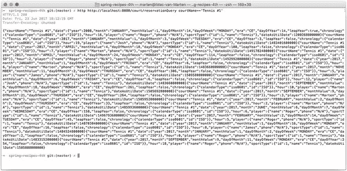
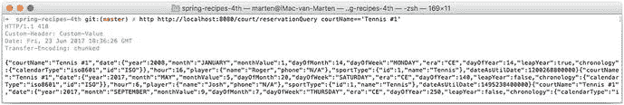
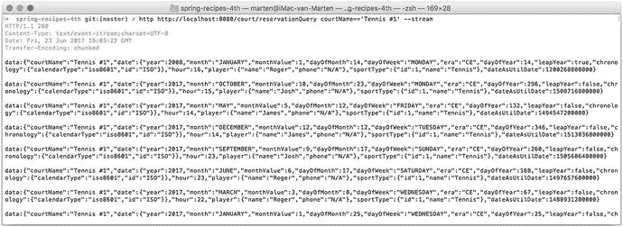
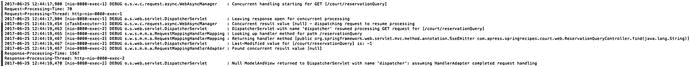
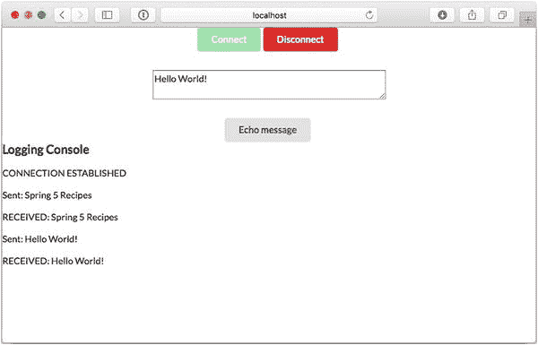
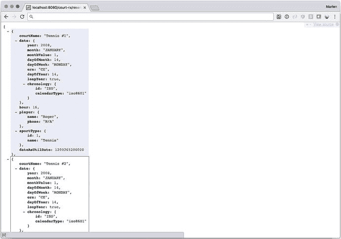

# 5. Spring MVC：异步处理

在 Servlet API 发布之初，大多数实现容器都采用每个请求一个线程的模式。这意味着线程会被阻塞，直到请求处理完成并将响应发送给客户端。

然而，在早期，连接到互联网的设备远没有今天这么多。随着设备数量的增加，需要处理的 HTTP 请求数量也大幅增长。正因如此，对于许多 Web 应用来说，保持线程阻塞已不再可行。从 Servlet 3 规范开始，可以异步处理 HTTP 请求，并释放最初处理该请求的线程。新线程将在后台运行，一旦结果可用，就会将其写入客户端。如果操作得当，这一切都可以在符合 Servlet 3.1 规范的 Servlet 容器中以非阻塞方式完成。当然，所使用的所有资源也必须是非阻塞的。

在过去几年中，响应式编程也日益流行。从 Spring 5 开始，可以编写响应式 Web 应用。响应式 Spring 项目使用 Project Reactor（与 Spring 一样，由 Pivotal 维护）作为 Reactive Streams API 的实现。深入探讨响应式编程超出了本书的范围，但简而言之，它是一种实现非阻塞函数式编程的方式。

传统上，在处理 Web 应用时，会有一个请求；HTML 在服务器端渲染，然后发送回客户端。最近几年，渲染 HTML 的工作转移到了客户端，通信不再通过 HTML 进行，而是通过向客户端返回 JSON、XML 或其他表示形式。尽管这是由客户端通过 `XMLHttpRequest` 对象发起的异步调用驱动的，但传统上这仍然是一个请求-响应周期。然而，客户端和服务器之间还有其他通信方式；你可以利用服务器发送事件实现从服务器到客户端的单向通信，而对于全双工通信，则可以使用 WebSocket 协议。

## 5-1. 使用控制器和 TaskExecutor 异步处理请求

### 问题

为了减轻 Servlet 容器的负载，你希望异步处理请求。

### 解决方案

当请求到达时，它会被同步处理，这会阻塞处理 HTTP 请求的线程。响应保持打开状态，并可供写入。当某个调用（例如）需要一些时间才能完成时，这非常有用。你可以让它在后台处理，并在完成后向用户返回一个值，而不是阻塞线程。

### 工作原理

如配方 3-1 所述，Spring MVC 支持方法返回多种类型。除了这些返回类型之外，表 5-1 中的类型会以异步方式处理。

表 5-1. 异步返回类型

| 类型 | 描述 |
| --- | --- |
| `DeferredResult` | 稍后从另一个线程生成的异步结果 |
| `ListenableFuture<?>` | 稍后从另一个线程生成的异步结果；`DeferredResult` 的等效替代 |
| `CompletableStage<?> / CompletableFuture<?>` | 稍后从另一个线程生成的异步结果；`DeferredResult` 的等效替代 |
| `Callable<?>` | 异步计算，结果在计算完成后生成 |
| `ResponseBodyEmitter` | 可用于异步地向响应写入多个对象 |
| `SseEmitter` | 可用于异步地写入服务器发送事件 |
| `StreamingResponseBody` | 可用于异步地写入 `OutputStream` |

通用的异步返回类型可以容纳控制器的任何返回类型，包括要添加到模型的对象、视图的名称，甚至是 `ModelAndView` 对象。

#### 配置异步处理

要使用 Spring MVC 的异步处理功能，首先必须启用它们。Servlet 3.0 规范中已添加了对异步请求处理的支持，要启用它，你必须告知所有过滤器和 Servlet 以异步方式运行。为此，你可以在注册过滤器或 Servlet 时调用 `setAsyncSupported()` 方法。

在编写 `WebApplicationInitializer` 时，你需要执行以下操作：

```
public class CourtWebApplicationInitializer implements WebApplicationInitializer {
public void onStartup(ServletContext ctx) {
DispatcherServlet servlet = new DispatcherServlet();
ServletRegistration.Dynamic registration = ctx.addServlet("dispatcher", servlet);
registration.setAsyncSupported(true);
}
}
```

注意

在进行异步处理时，应用程序中的所有 Servlet 过滤器和 Servlet 都应将此属性设置为 `true`，否则异步处理将无法工作！

幸运的是，Spring 在这方面提供了帮助。当使用 `AbstractAnnotationConfigDispatcherServletInitializer` 作为超类时，此属性默认对注册的 `DispatcherServlet` 和过滤器启用。要更改它，请重写 `isAsyncSupported()` 并实现逻辑以确定其应开启还是关闭。

根据你的需求，你可能还需要配置一个 `AsyncTaskExecutor` 并将其注入到 MVC 配置中。

```
package com.apress.springrecipes.court.config;
import org.springframework.context.annotation.Bean;
import org.springframework.context.annotation.Configuration;
import org.springframework.core.task.AsyncTaskExecutor;
import org.springframework.scheduling.concurrent.ThreadPoolTaskExecutor;
import org.springframework.web.servlet.config.annotation.AsyncSupportConfigurer;
import org.springframework.web.servlet.config.annotation.WebMvcConfigurationSupport;
@Configuration
public class AsyncConfiguration extends WebMvcConfigurationSupport {
@Override
protected void configureAsyncSupport(AsyncSupportConfigurer configurer) {
configurer.setDefaultTimeout(5000);
configurer.setTaskExecutor(mvcTaskExecutor());
}
@Bean
public ThreadPoolTaskExecutor mvcTaskExecutor() {
ThreadPoolTaskExecutor taskExecutor = new ThreadPoolTaskExecutor();
taskExecutor.setThreadGroupName("mvc-executor");
return taskExecutor;
}
}
```

要配置异步处理，你需要重写 `WebMvcConfigurationSupport` 的 `configureAsyncSupport` 方法；重写此方法可以让你访问 `AsyncSupportConfigurer`，并允许你设置 `defaultTimeout` 和 `AsyncTaskExecutor` 的值。超时时间设置为五秒，对于执行器，你将使用 `ThreadPoolTaskExecutor`（另请参见配方 2-23）。

#### 编写异步控制器

编写一个控制器并使其异步处理请求，只需更改控制器处理方法的返回类型即可。假设对 `ReservationService.query` 的调用需要相当长的时间，但你不想因此阻塞服务器。


#### 使用 Callable

以下是使用 Callable 的方法：

```
package com.apress.springrecipes.court.web;
import com.apress.springrecipes.court.Delayer;
import com.apress.springrecipes.court.domain.Reservation;
import com.apress.springrecipes.court.service.ReservationService;
import org.springframework.stereotype.Controller;
import org.springframework.ui.Model;
import org.springframework.web.bind.annotation.GetMapping;
import org.springframework.web.bind.annotation.PostMapping;
import org.springframework.web.bind.annotation.RequestMapping;
import org.springframework.web.bind.annotation.RequestParam;
import java.util.List;
import java.util.concurrent.Callable;
@Controller
@RequestMapping("/reservationQuery")
public class ReservationQueryController {
private final ReservationService reservationService;
public ReservationQueryController(ReservationService reservationService) {
this.reservationService = reservationService;
}
@GetMapping
public void setupForm() {}
@PostMapping
public Callable sumbitForm(@RequestParam("courtName") String courtName, Model model) {
return () -> {
List reservations = java.util.Collections.emptyList();
if (courtName != null) {
Delayer.randomDelay(); // 模拟一个慢速服务
reservations = reservationService.query(courtName);
}
model.addAttribute("reservations", reservations);
return "reservationQuery";
};
}
}
```

如果你查看 `submitForm` 方法，它现在返回的是 `Callable<String>`，而不是直接返回 `String`。在新构建的 `Callable<String>` 内部，在调用 `query` 方法之前，有一个随机等待来模拟延迟。

现在，当进行预约时，你会在日志中看到类似这样的内容：

```
2017-06-20 10:37:04,836 [nio-8080-exec-2] DEBUG o.s.w.c.request.async.WebAsyncManager    : Concurrent handling starting for POST [/court/reservationQuery]
2017-06-20 10:37:04,838 [nio-8080-exec-2] DEBUG o.s.web.servlet.DispatcherServlet        : Leaving response open for concurrent processing
2017-06-20 10:37:09,954 [mvc-executor-1 ] DEBUG o.s.w.c.request.async.WebAsyncManager    : Concurrent result value [reservationQuery] - dispatching request to resume processing
2017-06-20 10:37:09,959 [nio-8080-exec-3] DEBUG o.s.web.servlet.DispatcherServlet        : DispatcherServlet with name 'dispatcher' resumed processing POST request for [/court/reservationQuery]
```

请注意，请求处理是在某个线程（这里是 `nio-8080-exec-2`）上进行的，该线程被释放，然后另一个线程进行处理并返回结果（这里是 `mvc-executor-1`）。最后，请求再次被分派到 `DispatcherServlet`，以便在另一个线程上处理结果。

#### 使用 DeferredResult

除了 `Callable<String>`，你也可以使用 `DeferredResult<String>`。当使用 `DeferredResult` 时，你需要构造一个该类的实例，提交一个任务进行异步处理，并在该任务中使用 `setResult` 方法填充 `DeferredResult` 的结果。当发生异常时，你可以将此异常传递给 `DeferredResult` 的 `setErrorResult` 方法。

```
package com.apress.springrecipes.court.web;
import com.apress.springrecipes.court.Delayer;
import com.apress.springrecipes.court.domain.Reservation;
import com.apress.springrecipes.court.service.ReservationService;
import org.springframework.core.task.AsyncTaskExecutor;
import org.springframework.core.task.TaskExecutor;
import org.springframework.stereotype.Controller;
import org.springframework.ui.Model;
import org.springframework.web.bind.annotation.GetMapping;
import org.springframework.web.bind.annotation.PostMapping;
import org.springframework.web.bind.annotation.RequestMapping;
import org.springframework.web.bind.annotation.RequestParam;
import org.springframework.web.context.request.async.DeferredResult;
import java.util.List;
@Controller
@RequestMapping("/reservationQuery")
public class ReservationQueryController {
private final ReservationService reservationService;
private final TaskExecutor taskExecutor;
public ReservationQueryController(ReservationService reservationService, AsyncTaskExecutor taskExecutor) {
this.reservationService = reservationService;
this.taskExecutor = taskExecutor;
}
@GetMapping
public void setupForm() {}
@PostMapping
public DeferredResult sumbitForm(@RequestParam("courtName") String courtName, Model model) {
final DeferredResult result = new DeferredResult();
taskExecutor.execute(() -> {
List reservations = java.util.Collections.emptyList();
if (courtName != null) {
Delayer.randomDelay(); // 模拟一个慢速服务
reservations = reservationService.query(courtName);
}
model.addAttribute("reservations", reservations);
result.setResult("reservationQuery");
});
return result;
}
}
```

该方法现在返回一个 `DeferredResult<String>`，它仍然是待渲染视图的名称。实际结果通过一个 `Runnable` 设置，该 `Runnable` 被传递给注入的 `TaskExecutor` 的 execute 方法。返回 `DeferredResult` 和返回 `Callable` 的主要区别在于，对于 `DeferredResult`，你必须创建自己的 `Thread`（或将其委托给 `TaskExecutor`）；而对于 `Callable`，则不需要。

#### 使用 CompletableFuture

将方法的签名改为返回 `CompletableFuture<String>`，并使用 `TaskExecutor` 来异步执行代码。

```
package com.apress.springrecipes.court.web;
import com.apress.springrecipes.court.Delayer;
import com.apress.springrecipes.court.domain.Reservation;
import com.apress.springrecipes.court.service.ReservationService;
import org.springframework.core.task.TaskExecutor;
import org.springframework.stereotype.Controller;
import org.springframework.ui.Model;
import org.springframework.web.bind.annotation.GetMapping;
import org.springframework.web.bind.annotation.PostMapping;
import org.springframework.web.bind.annotation.RequestMapping;
import org.springframework.web.bind.annotation.RequestParam;
import java.util.List;
import java.util.concurrent.CompletableFuture;
@Controller
@RequestMapping("/reservationQuery")
public class ReservationQueryController {
private final ReservationService reservationService;
private final TaskExecutor taskExecutor;
public ReservationQueryController(ReservationService reservationService, TaskExecutor taskExecutor) {
this.reservationService = reservationService;
this.taskExecutor = taskExecutor;
}
@GetMapping
public void setupForm() {}
@PostMapping
public CompletableFuture sumbitForm(@RequestParam("courtName") String courtName, Model model) {
return CompletableFuture.supplyAsync(() -> {
List reservations = java.util.Collections.emptyList();
if (courtName != null) {
Delayer.randomDelay(); // 模拟一个慢速服务
reservations = reservationService.query(courtName);
}
model.addAttribute("reservations", reservations);
return "reservationQuery";
}, taskExecutor);
}
}
```

当调用 `supplyAsync`（或者当返回类型为 `void` 时，你可以使用 `runAsync`）时，你提交一个任务并返回一个 `CompletableFuture`。这里你使用了 `supplyAsync` 方法，它同时接受一个 `Supplier` 和一个 `Executor`，这样你就可以重用 `TaskExecutor` 进行异步处理。如果你使用只接受一个 `Supplier` 的 `supplyAsync` 方法，它将使用 JVM 上默认的 fork/join 池来执行。

当返回 `CompletableFuture` 时，你可以利用它的所有特性，例如组合和链式调用多个 `CompletableFuture` 实例。


#### 使用 ListenableFuture

Spring 提供了 `ListenableFuture` 接口，它是一个 `Future` 实现，当 `Future` 完成时会执行回调。要创建 `ListenableFuture`，你需要向 `AsyncListenableTaskExecutor` 提交一个任务，该执行器会返回一个 `ListenableFuture`。之前配置的 `ThreadPoolTaskExecutor` 就是 `AsyncListenableTaskExecutor` 接口的一个实现。

```
// FINAL
package com.apress.springrecipes.court.web;
import com.apress.springrecipes.court.Delayer;
import com.apress.springrecipes.court.domain.Reservation;
import com.apress.springrecipes.court.service.ReservationService;
import org.springframework.core.task.AsyncListenableTaskExecutor;
import org.springframework.stereotype.Controller;
import org.springframework.ui.Model;
import org.springframework.util.concurrent.ListenableFuture;
import org.springframework.web.bind.annotation.GetMapping;
import org.springframework.web.bind.annotation.PostMapping;
import org.springframework.web.bind.annotation.RequestMapping;
import org.springframework.web.bind.annotation.RequestParam;
import java.util.List;
@Controller
@RequestMapping("/reservationQuery")
public class ReservationQueryController {
private final ReservationService reservationService;
private final AsyncListenableTaskExecutor taskExecutor;
public ReservationQueryController(ReservationService reservationService, AsyncListenableTaskExecutor taskExecutor) {
this.reservationService = reservationService;
this.taskExecutor = taskExecutor;
}
@GetMapping
public void setupForm() {}
@PostMapping
public ListenableFuture sumbitForm(@RequestParam("courtName") String courtName, Model model) {
return taskExecutor.submitListenable(() -> {
List reservations = java.util.Collections.emptyList();
if (courtName != null) {
Delayer.randomDelay(); // 模拟一个慢速服务
reservations = reservationService.query(courtName);
}
model.addAttribute("reservations", reservations);
return "reservationQuery";
});
}
}
```

你使用 `submitListenable` 方法向 `taskExecutor` 提交一个任务；这会返回一个 `ListenableFuture`，而该对象又可以用作方法的返回值。

你可能会好奇，创建的 `ListenableFuture` 的成功和失败回调在哪里。Spring MVC 会将 `ListenableFuture` 适配为 `DeferredResult`，并在成功完成时调用 `DeferredResult.setResult`，当发生错误时调用 `DeferredResult.setErrorResult`。这一切都由 Spring 附带的 `HandlerMethodReturnValueHandler` 实现之一为你处理；在本例中，由 `DeferredResultMethodReturnValueHandler` 处理。

## 5-2. 使用响应写入器

### 问题

你有一个服务或多次调用，并希望将响应分块发送给客户端。

### 解决方案

使用 `ResponseBodyEmitter`（或其同类 `SseEmitter`）来分块发送响应。

### 工作原理

Spring 支持使用 `HttpMessageConverter` 基础设施将对象作为普通对象写入，结果将是一个分块（或流式）列表发送给客户端。你也可以不发送对象，而是将它们作为事件发送，即所谓的服务器发送事件（Server-Sent Events）。

#### 在响应中发送多个结果

Spring MVC 有一个名为 `ResponseBodyEmitter` 的类，当你希望向客户端返回多个对象，而不是单个结果（如视图名称或 `ModelAndView`）时，它特别有用。发送对象时，对象会使用 `HttpMessageConverter` 转换为结果（另请参阅配方 4-2）。要使用 `ResponseBodyEmitter`，你必须从请求处理方法中返回它。

修改 `ReservationQueryController` 的 `find` 方法，使其返回一个 `ResponseBodyEmitter`，并将结果逐个发送给客户端。

```
// FINAL
package com.apress.springrecipes.court.web;
import com.apress.springrecipes.court.Delayer;
import com.apress.springrecipes.court.domain.Reservation;
import com.apress.springrecipes.court.service.ReservationService;
import org.springframework.core.task.TaskExecutor;
import org.springframework.http.MediaType;
import org.springframework.stereotype.Controller;
import org.springframework.ui.Model;
import org.springframework.web.bind.annotation.GetMapping;
import org.springframework.web.bind.annotation.PostMapping;
import org.springframework.web.bind.annotation.RequestMapping;
import org.springframework.web.bind.annotation.RequestParam;
import org.springframework.web.servlet.mvc.method.annotation.ResponseBodyEmitter;
import java.io.IOException;
import java.util.Collection;
import java.util.List;
import java.util.concurrent.Callable;
@Controller
@RequestMapping("/reservationQuery")
public class ReservationQueryController {
private final ReservationService reservationService;
private final TaskExecutor taskExecutor;
...
@GetMapping(params = "courtName")
public ResponseBodyEmitter find(@RequestParam("courtName") String courtName) {
final ResponseBodyEmitter emitter = new ResponseBodyEmitter();
taskExecutor.execute(() -> {
Collection reservations = reservationService.query(courtName);
try {
for (Reservation reservation : reservations) {
emitter.send(reservation);
}
emitter.complete();
} catch (IOException e) {
emitter.completeWithError(e);
}
});
return emitter;
}
}
```

首先，创建一个 `ResponseBodyEmitter`，并最终从该方法返回它。接下来，执行一个任务，该任务将使用 `ReservationService.query` 方法查询预约。该调用的所有结果都通过 `ResponseBodyEmitter` 的 `send` 方法逐个返回。当所有对象都发送完毕后，需要调用 `complete()` 方法，以便负责发送响应的线程可以完成请求并释放以处理下一个响应。当发生异常并且你想通知用户时，可以调用 `completeWithError`。该异常将通过 Spring MVC 的正常异常处理（另请参阅配方 3-8），之后响应完成。

当使用 httpie 或 curl 等工具时，调用 URL `http://localhost:8080/court/reservationQuery courtName=='Tennis #1'` 将产生类似图 5-1 的结果。结果将是分块的，并且状态码为 200（OK）。



图 5-1. 分块结果

如果你想更改状态码或添加自定义标头，也可以将 `ResponseBodyEmitter` 包装在 `ResponseEntity` 中，这允许自定义返回码、标头等（参见配方 4-1）。

```
@GetMapping(params = "courtName")
public ResponseEntity find(@RequestParam("courtName") String courtName) {
final ResponseBodyEmitter emitter = new ResponseBodyEmitter();
....
return ResponseEntity.status(HttpStatus.I_AM_A_TEAPOT)
.header("Custom-Header", "Custom-Value")
.body(emitter);
}
```

现在状态码将更改为 418，并且它将包含一个自定义标头（见图 5-2）。



图 5-2. 修改后的分块结果


#### 将多个结果作为事件发送

`ResponseBodyEmitter` 的同类是 `SseEmitter`，它可以使用服务器发送事件（Server-Sent Events）将事件从服务器传递给客户端。服务器发送事件是从服务器端发送到客户端的消息，其内容类型标头为 `text/event-stream`。它们非常轻量，并允许定义四个字段（参见表 5-2）。

表 5-2. 服务器发送事件允许的字段

| 字段 | 描述 |
| --- | --- |
| `id` | 事件的 ID |
| `event` | 事件的类型 |
| `data` | 事件数据 |
| `retry` | 事件流的重新连接时间 |

要从请求处理方法发送事件，你需要创建一个 `SseEmitter` 实例，并将其从请求处理方法中返回。然后，你可以使用 `send` 方法将单个元素发送给客户端。

```
@GetMapping(params = "courtName")
public SseEmitter find(@RequestParam("courtName") String courtName) {
final SseEmitter emitter = new SseEmitter();
taskExecutor.execute(() -> {
Collection reservations = reservationService.query(courtName);
try {
for (Reservation reservation : reservations) {
Delayer.delay(125);
emitter.send(reservation);
}
emitter.complete();
} catch (IOException e) {
emitter.completeWithError(e);
}
});
return emitter;
}
```

注意

这里在向客户端发送每个项目时添加了延迟，只是为了让你看到不同的事件依次到达。在实际代码中你不会这样做。

现在，当使用 curl 之类的工具调用 URL `http://localhost:8080/court/reservationQuery courtName=='Tennis #1'` 时，你将看到事件一个接一个地到达（图 5-3）。



图 5-3. 服务器发送事件的结果

请注意，`Content-Type` 标头的值为 `text/event-stream`，表示你获取的是一个事件流。你可以保持流打开状态，并持续接收事件通知。你还会注意到，每个写入的对象都会被转换为 JSON；这是通过 `HttpMessageConverter` 完成的，就像普通的 `ResponseBodyEmitter` 一样。每个对象都作为事件数据写入 `data` 标签中。

如果你想向事件添加更多信息（换句话说，填写表 5-2 中提到的其他字段），可以使用 `SseEventBuilder`。要获取其实例，可以调用 `SseEmitter` 上的 `event()` 工厂方法。让我们用它来将 `Reservation` 的哈希码填入 `id` 字段。

```
@GetMapping(params = "courtName")
public SseEmitter find(@RequestParam("courtName") String courtName) {
final SseEmitter emitter = new SseEmitter();
taskExecutor.execute(() -> {
Collection reservations = reservationService.query(courtName);
try {
for (Reservation reservation : reservations) {
Delayer.delay(120);
emitter.send(emitter.event().id(String.valueOf(reservation.hashCode())).data(reservation));
}
emitter.complete();
} catch (IOException e) {
emitter.completeWithError(e);
}
});
return emitter;
}
```

现在，当使用 curl 之类的工具调用 URL `http://localhost:8080/court/reservationQuery courtName=='Tennis #1'` 时，你将看到事件一个接一个地到达，并且它们将同时包含 `id` 和 `data` 字段。

## 5-3. 使用异步拦截器

### 问题

Servlet API 定义的 Servlet 过滤器可以在每个 Web 请求被 Servlet 处理之前和之后对其进行预处理和后处理。你希望在 Spring 的 Web 应用程序上下文中配置具有类似过滤器功能的东西，以便利用容器的特性。

此外，有时你可能希望对由 Spring MVC 处理器处理的 Web 请求进行预处理和后处理，并在这些处理器返回的模型属性传递给视图之前对其进行操作。

### 解决方案

Spring MVC 允许你通过处理器拦截器拦截 Web 请求以进行预处理和后处理。处理器拦截器在 Spring 的 Web 应用程序上下文中配置，因此它们可以利用任何容器特性并引用容器中声明的任何 Bean。可以为特定的 URL 映射注册处理器拦截器，以便它仅拦截映射到特定 URL 的请求。

如配方 3-3 所述，Spring 提供了 `HandlerInterceptor` 接口，该接口包含三个回调方法供你实现：`preHandle()`、`postHandle()` 和 `afterCompletion()`。第一个和第二个方法分别在请求被处理器处理之前和之后调用。第二个方法还允许你访问返回的 `ModelAndView` 对象，以便操作其中的模型属性。最后一个方法在所有请求处理完成之后（即视图渲染之后）调用。

对于异步处理，Spring 提供了 `AsyncHandlerInterceptor`，它包含一个额外的回调方法供你实现：`afterConcurrentHandlingStarted`。该方法在异步处理开始时立即被调用，而不是调用 `postHandle` 和/或 `afterCompletion`。当异步处理完成时，会再次调用正常的流程。


### 工作原理

在配方 3-3 中，你创建了一个 `MeasurementInterceptor`，用于测量每个请求处理器处理 Web 请求的时间，并将其添加到 `ModelAndView` 中。现在我们来修改它，使其记录请求和响应的处理时间，包括用于处理请求的线程。

```
package com.apress.springrecipes.court.web;
import org.springframework.web.servlet.AsyncHandlerInterceptor;
import org.springframework.web.servlet.ModelAndView;
import javax.servlet.http.HttpServletRequest;
import javax.servlet.http.HttpServletResponse;
public class MeasurementInterceptor implements AsyncHandlerInterceptor {
public static final String START_TIME = "startTime";
public boolean preHandle(HttpServletRequest request, HttpServletResponse response, Object handler) throws Exception {
if (request.getAttribute(START_TIME) == null) {
request.setAttribute(START_TIME, System.currentTimeMillis());
}
return true;
}
public void postHandle(HttpServletRequest request, HttpServletResponse response, Object handler, ModelAndView modelAndView) throws Exception {
long startTime = (Long) request.getAttribute(START_TIME);
request.removeAttribute(START_TIME);
long endTime = System.currentTimeMillis();
System.out.println("Response-Processing-Time: " + (endTime - startTime) + "ms.");
System.out.println("Response-Processing-Thread: " + Thread.currentThread().getName());
}
@Override
public void afterConcurrentHandlingStarted(HttpServletRequest request, HttpServletResponse response, Object handler) throws Exception {
long startTime = (Long) request.getAttribute(START_TIME);
request.setAttribute(START_TIME, System.currentTimeMillis());
long endTime = System.currentTimeMillis();
System.out.println("Request-Processing-Time: " + (endTime - startTime) + "ms.");
System.out.println("Request-Processing-Thread: " + Thread.currentThread().getName());
}
}
```

在该拦截器的 `preHandle()` 方法中，你记录了开始时间并将其保存到请求属性中。此方法应返回 `true`，以允许 `DispatcherServlet` 继续处理请求。否则，`DispatcherServlet` 会认为该方法已处理完请求，从而直接将响应返回给用户。接下来，在 `afterConcurrentHandlingStarted` 中，你获取已注册的时间，并计算出开始异步处理所花费的时间。之后，你重置开始时间，并将请求处理时间和线程打印到控制台。

然后，在 `postHandle()` 方法中，你从请求属性中加载开始时间，并将其与当前时间进行比较。接着计算总耗时，并将其与当前线程名称一起打印到控制台。

要注册拦截器，你需要修改第一个配方中创建的 `AsyncConfiguration`。你需要让它实现 `WebMvcConfigurer` 并重写 `addInterceptors` 方法。该方法让你能够访问 `InterceptorRegistry`，你可以用它来添加拦截器。修改后的类如下所示：

```
package com.apress.springrecipes.court.config;
import com.apress.springrecipes.court.web.MeasurementInterceptor;
import org.springframework.context.annotation.Bean;
import org.springframework.context.annotation.Configuration;
import org.springframework.scheduling.concurrent.ThreadPoolTaskExecutor;
import org.springframework.web.servlet.config.annotation.AsyncSupportConfigurer;
import org.springframework.web.servlet.config.annotation.InterceptorRegistry;
import org.springframework.web.servlet.config.annotation.WebMvcConfigurer;
import java.util.concurrent.TimeUnit;
@Configuration
public class AsyncConfiguration implements WebMvcConfigurer {
...
@Override
public void addInterceptors(InterceptorRegistry registry) {
registry.addInterceptor(new MeasurementInterceptor());
}
}
```

现在，当运行应用程序并处理请求时，日志输出类似于图 5-4。



图 5-4.

请求/响应处理时间 注意

Microsoft 浏览器（Internet Explorer 或 Edge）不支持服务器发送事件。要使其在 Microsoft 浏览器上正常工作，你需要使用 polyfill 来添加支持。

## 5-4. 使用 WebSocket

### 问题

你希望通过 Web 实现客户端到服务器的双向通信。

### 解决方案

使用 WebSocket 实现客户端与服务器之间的双向通信。与 HTTP 不同，WebSocket 技术提供了全双工通信。

### 工作原理

对 WebSocket 技术的完整解释超出了本配方的范围；不过有一点值得提及：HTTP 与 WebSocket 技术之间的关系实际上非常薄弱。WebSocket 技术唯一用到 HTTP 的地方是初始握手阶段。这会将连接从普通的 HTTP 升级为 TCP 套接字连接。

#### 配置 WebSocket 支持

启用 WebSocket 技术只需在配置类上添加 `@EnableWebSocket` 即可。

```
@Configuration
@EnableWebSocket
public class WebSocketConfiguration {}
```

为了进一步配置 WebSocket 引擎，你可以添加一个 `ServletServerContainerFactoryBean` 对象来配置缓冲区大小、超时时间等。

```
@Bean
public ServletServerContainerFactoryBean configureWebSocketContainer() {
ServletServerContainerFactoryBean factory = new ServletServerContainerFactoryBean();
factory.setMaxBinaryMessageBufferSize(16384);
factory.setMaxTextMessageBufferSize(16384);
factory.setMaxSessionIdleTimeout(TimeUnit.MINUTES.convert(30, TimeUnit.MILLISECONDS));
factory.setAsyncSendTimeout(TimeUnit.SECONDS.convert(5, TimeUnit.MILLISECONDS));
return factory;
}
```

这将把文本和二进制缓冲区大小配置为 16KB，将 `asyncSendTimeout` 设置为 5 秒，并将会话超时时间设置为 30 分钟。


#### 创建 WebSocketHandler

要处理 WebSocket 消息和生命周期事件（握手、连接建立等），你需要创建一个 `WebSocketHandler` 并将其注册到一个端点 URL。

`WebSocketHandler` 定义了五个你需要实现的方法（见表 5-3），如果你想直接实现该接口的话。不过，Spring 已经提供了一个很好的类层次结构供你利用。在编写自定义处理器时，通常只需继承 `TextWebSocketHandler` 或 `BinaryWebSocketHandler` 即可，顾名思义，它们分别可以处理文本或二进制消息。

表 5-3.

WebSocketHandler 方法

| 方法 | 描述 |
| --- | --- |
| `afterConnectionEstablished` | 当 WebSocket 连接打开并准备就绪时调用。 |
| `handleMessage` | 当此处理器收到 WebSocket 消息时调用。 |
| `handleTransportError` | 当发生错误时调用。 |
| `afterConnectionClosed` | 在 WebSocket 连接关闭后调用。 |
| `supportsPartialMessages` | 如果此处理器支持部分消息则调用。如果设置为 `true`，WebSocket 消息可能通过多次调用到达。 |

通过继承 `TextWebSocketHandler` 创建 `EchoHandler`，然后实现 `afterConnectionEstablished` 和 `handleMessage` 方法。

```
package com.apress.springrecipes.websocket;
import org.springframework.web.socket.CloseStatus;
import org.springframework.web.socket.TextMessage;
import org.springframework.web.socket.WebSocketSession;
import org.springframework.web.socket.handler.TextWebSocketHandler;
public class EchoHandler extends TextWebSocketHandler {
@Override
public void afterConnectionEstablished(WebSocketSession session) throws Exception {
session.sendMessage(new TextMessage("CONNECTION ESTABLISHED"));
}
@Override
protected void handleTextMessage(WebSocketSession session, TextMessage message)
throws Exception {
String msg = message.getPayload();
session.sendMessage(new TextMessage("RECEIVED: " + msg));
}
}
```

当连接建立时，会向客户端发送一条 `TextMessage`，告知其连接已建立。当收到 `TextMessage` 时，会提取有效载荷（实际消息），并在其前面加上 `RECEIVED:`，然后发送回客户端。

接下来，你需要将此处理器注册到一个 URI。为此，你可以创建一个实现 `WebSocketConfigurer` 的 `@Configuration` 类，并在 `registerWebSocketHandlers` 方法中注册它。让我们将此接口添加到 `WebSocketConfiguration` 类中，如下所示：

```
package com.apress.springrecipes.websocket;
import org.springframework.context.annotation.Bean;
import org.springframework.context.annotation.Configuration;
import org.springframework.web.socket.config.annotation.EnableWebSocket;
import org.springframework.web.socket.config.annotation.WebSocketConfigurer;
import org.springframework.web.socket.config.annotation.WebSocketHandlerRegistry;
import java.util.concurrent.TimeUnit;
@Configuration
@EnableWebSocket
public class WebSocketConfiguration implements WebSocketConfigurer {
@Bean
public EchoHandler echoHandler() {
return new EchoHandler();
}
@Override
public void registerWebSocketHandlers(WebSocketHandlerRegistry registry) {
registry.addHandler(echoHandler(), "/echo");
}
}
```

首先，你将 `EchoHandler` 注册为一个 bean，以便将其附加到 URI。在 `registerWebSocketHandlers` 中，你可以使用 `WebSocketHandlerRegistry` 来注册处理器。使用 `addHandler` 方法，你可以将处理器注册到一个 URI，在本例中是 `/echo`。通过此配置，你可以使用 `ws://localhost:8080/echo-ws/echo` URL 从客户端打开一个 WebSocket 连接。

现在服务器已就绪，你需要一个客户端来连接你的 WebSocket 端点。为此，你需要一些 JavaScript 和 HTML。编写以下 `app.js`：

```
var ws = null;
var url = "ws://localhost:8080/echo-ws/echo";
function setConnected(connected) {
document.getElementById('connect').disabled = connected;
document.getElementById('disconnect').disabled = !connected;
document.getElementById('echo').disabled = !connected;
}
function connect() {
ws = new WebSocket(url);
ws.onopen = function () {
setConnected(true);
};
ws.onmessage = function (event) {
log(event.data);
};
ws.onclose = function (event) {
setConnected(false);
log('Info: Closing Connection.');
};
}
function disconnect() {
if (ws != null) {
ws.close();
ws = null;
}
setConnected(false);
}
function echo() {
if (ws != null) {
var message = document.getElementById('message').value;
log('Sent: ' + message);
ws.send(message);
} else {
alert('connection not established, please connect.');
}
}
function log(message) {
var console = document.getElementById('logging');
var p = document.createElement('p');
p.appendChild(document.createTextNode(message));
console.appendChild(p);
while (console.childNodes.length > 12) {
console.removeChild(console.firstChild);
}
console.scrollTop = console.scrollHeight;
}
```

这里有几个函数。第一个 `connect` 将在点击“连接”按钮时被调用。这将打开一个到 `ws://localhost:8080/echo-ws/echo` 的 WebSocket 连接，该 URL 是之前创建并注册的处理器的地址。连接到服务器会创建一个 `WebSocket` JavaScript 对象，使你能够在客户端监听消息和事件。这里定义了 `onopen`、`onmessage` 和 `onclose` 回调。最重要的是 `onmessage` 回调，因为每当服务器传来消息时它都会被调用；该方法只是调用 `log` 函数，该函数会将接收到的消息添加到屏幕上的 `logging` 元素中。

接下来是 `disconnect`，它将关闭 WebSocket 连接并清理 JavaScript 对象。最后是 `echo` 函数，它将在点击“回显消息”按钮时被调用。给定的消息将被发送到服务器（并最终被返回）。

要使用 `app.js`，请添加如下所示的 `index.html` 文件：

```

连接
断开连接

回显消息

日志

```

现在，在部署应用程序时，你可以连接到回显 WebSocket 服务，发送一些消息并让它们被返回（见图 5-5）。



图 5-5.

WebSocket 客户端输出


#### 使用 STOMP 和 MessageMapping

当使用 WebSocket 技术创建应用程序时，这或多或少意味着消息传递。虽然你可以直接使用 WebSocket 协议，但该协议也允许你使用子协议。Spring WebSocket 支持的协议之一就是 STOMP。

STOMP 是一种简单的面向文本的协议，专为 Ruby 和 Python 等脚本语言而创建，用于连接消息代理。STOMP 可以用于任何可靠的、双向的网络协议，例如 TCP 和 WebSocket。该协议本身是面向文本的，但消息的有效负载并不严格受此限制；它也可以包含二进制数据。

在使用 Spring WebSocket 支持配置和使用 STOMP 时，WebSocket 应用程序充当所有已连接客户端的代理。该代理可以是内存代理，也可以是支持 STOMP 协议（如 RabbitMQ 或 ActiveMQ）的实际完整的企业级解决方案。在后一种情况下，Spring WebSocket 应用程序将充当实际代理的中继。为了通过 WebSocket 协议添加消息传递功能，Spring 使用了 Spring Messaging（有关消息传递的更多示例，请参见第 14 章）。

为了能够接收消息，你需要在 `@Controller` 中使用 `@` `MessageMapping` 标记一个方法，并告知它从哪个目标地址接收消息。让我们修改 `EchoHandler` 以使用注解。

```
package com.apress.springrecipes.websocket;
import org.springframework.messaging.handler.annotation.MessageMapping;
import org.springframework.messaging.handler.annotation.SendTo;
import org.springframework.stereotype.Controller;
@Controller
public class EchoHandler {
@MessageMapping("/echo")
@SendTo("/topic/echo")
public String echo(String msg) {
return "RECEIVED: " + msg;
}
}
```

当在 `/app/echo` 目标地址接收到消息时，它将被传递给带有 `@MessageMapping` 注解的方法。请注意方法上还有 `@SendTo("/topic/echo")` 注解；这指示 Spring 将结果（一个 `String`）放入该主题。

现在你需要配置消息代理并添加一个用于接收消息的端点。为此，将 `@EnableWebSocketMessageBroker` 添加到 `WebSocketConfiguration`，并让它继承 `AbstractWebSocketMessageBrokerConfigurer`（该类实现了 `WebSocketMessageBrokerConfigurer`，用于对 WebSocket 消息传递进行进一步配置）。

```
package com.apress.springrecipes.websocket;
import org.springframework.context.annotation.ComponentScan;
import org.springframework.context.annotation.Configuration;
import org.springframework.messaging.simp.config.MessageBrokerRegistry;
import org.springframework.web.socket.config.annotation.AbstractWebSocketMessageBrokerConfigurer;
import org.springframework.web.socket.config.annotation.EnableWebSocketMessageBroker;
import org.springframework.web.socket.config.annotation.StompEndpointRegistry;
@Configuration
@EnableWebSocketMessageBroker
@ComponentScan
public class WebSocketConfiguration extends AbstractWebSocketMessageBrokerConfigurer {
@Override
public void configureMessageBroker(MessageBrokerRegistry registry) {
registry.enableSimpleBroker("/topic");
registry.setApplicationDestinationPrefixes("/app");
}
@Override
public void registerStompEndpoints(StompEndpointRegistry registry) {
registry.addEndpoint("/echo-endpoint");
}
}
```

`@EnableWebSocketMessageBroker` 注解将启用通过 WebSocket 使用 STOMP。代理在 `configureMessageBroker` 方法中配置；这里我们使用的是简单消息代理。要连接到企业级代理，请使用 `registry.enableStompBrokerRelay` 连接到实际代理。为了区分由代理处理的消息和由应用程序处理的消息，使用了不同的前缀。任何目标地址以 `/topic` 开头的消息都将传递给代理，而任何目标地址以 `/app` 开头的消息都将发送给消息处理器（即带有 `@MessageMapping` 注解的方法）。

最后一部分是注册一个监听传入 STOMP 消息的 WebSocket 端点；在本例中，该端点映射到 `/echo-endpoint`。此注册在 `registerStompEndpoints` 方法中完成，该方法可以被重写。

最后，你需要修改客户端以使用 STOMP 而不是普通的 WebSocket。HTML 可以基本保持不变；你需要一个额外的库才能在浏览器中使用 STOMP。本示例使用了 `webstomp-client`（[`https://github.com/JSteunou/webstomp-client`](https://github.com/JSteunou/webstomp-client)），但你可以使用不同的库。

最大的变化在 `app.js` 文件中。

```
var ws = null;
var url = "ws://localhost:8080/echo-ws/echo-endpoint";
function setConnected(connected) {
document.getElementById('connect').disabled = connected;
document.getElementById('disconnect').disabled = !connected;
document.getElementById('echo').disabled = !connected;
}
function connect() {
ws = webstomp.client(url);
ws.connect({}, function(frame) {
setConnected(true);
log(frame);
ws.subscribe('/topic/echo', function(message){
log(message.body);
})
});
}
function disconnect() {
if (ws != null) {
ws.disconnect();
ws = null;
}
setConnected(false);
}
function echo() {
if (ws != null) {
var message = document.getElementById('message').value;
log('Sent: ' + message);
ws.send("/app/echo", message);
} else {
alert('connection not established, please connect.');
}
}
function log(message) {
var console = document.getElementById('logging');
var p = document.createElement('p');
p.appendChild(document.createTextNode(message));
console.appendChild(p);
while (console.childNodes.length > 12) {
console.removeChild(console.firstChild);
}
console.scrollTop = console.scrollHeight;
}
```

`connect` 函数现在使用 `webstomp.client` 创建一个到你的代理的 STOMP 客户端连接。连接后，客户端将订阅 `/topic/echo` 并接收放入该主题的消息。`echo` 函数已被修改，使用客户端的 `send` 方法将消息发送到 `/app/echo` 目标地址，该消息随后将被传递给带有 `@` `MessageMapping` 注解的方法。

启动应用程序并打开客户端后，你仍然可以发送和接收消息，但现在使用的是 STOMP 子协议。你甚至可以连接多个浏览器，每个浏览器都会看到 `/topic/echo` 目标地址上的消息，因为它就像一个主题。

在编写带有 `@` `MessageMapping` 注解的方法时，你可以使用多种方法参数和注解（参见表 5-4）来获取关于消息的更多或更少信息。默认情况下，假定单个参数将映射到消息的有效负载，并且将使用 `MessageConverter` 将消息有效负载转换为所需的类型。（有关转换消息，请参见示例 14-2。）

表 5-4.

支持的方法参数和注解

| 类型 | 描述 |
| --- | --- |
| `Message` | 实际的底层消息，包括头部和正文 |
| `@Payload` | 消息的有效负载（默认）；参数也可以使用 `@Validated` 进行注解以进行验证 |
| `@Header` | 从 `Message` 中获取给定的头部 |
| `@Headers` | 可以放在 `Map` 参数上以获取所有 `Message` 头部 |
| `MessageHeaders` | 所有 `Message` 头部 |
| `Principal` | 当前用户（如果已设置） |

## 5-5\. 使用 Spring WebFlux 开发响应式应用程序

### 问题

你想使用 Spring WebFlux 开发一个简单的响应式 Web 应用程序，以学习该框架的基本概念和配置。


### 解决方案

Spring WebFlux 最底层的组件是 `HttpHandler`。这是一个包含单个 `handle` 方法的接口。

```
public interface HttpHandler {
Mono handle(ServerHttpRequest request, ServerHttpResponse response);
}
```

`handle` 方法返回 `Mono<Void>`，这是响应式编程中表示返回 `void` 的方式。它接收来自 `org.springframework.http.server.reactive` 包的 `ServerHttpRequest` 对象和 `ServerHttpResponse` 对象。这些同样是接口，并且会根据运行实例所使用的容器来创建对应的实现。为此，存在多个针对容器的适配器或桥接器。当运行在支持非阻塞 I/O 的 Servlet 3.1 容器上时，会使用 `ServletHttpHandlerAdapter`（或其子类）来从普通的 Servlet 世界适配到响应式世界。当运行在像 Netty 这样的原生响应式引擎上时，则会使用 `ReactorHttpHandlerAdapter`。

当 Web 请求发送到 Spring WebFlux 应用程序时，`HandlerAdapter` 首先接收该请求。然后，它会组织 Spring 应用上下文中配置的、处理该请求所需的各种组件。

要在 Spring WebFlux 中定义一个控制器类，该类必须使用 `@Controller` 或 `@RestController` 注解进行标记（就像 Spring MVC 一样；参见第 3 章和第 4 章）。

当一个使用 `@Controller` 注解的类（即控制器类）接收到请求时，它会寻找合适的处理器方法来处理该请求。这要求控制器类通过一个或多个处理器映射将每个请求映射到一个处理器方法。为此，控制器类的方法会使用 `@RequestMapping` 注解进行修饰，使其成为处理器方法。

这些处理器方法的签名——正如你对任何标准类所期望的那样——是开放式的。你可以为处理器方法指定任意名称，并定义各种方法参数。同样，处理器方法可以根据其实现的应用程序逻辑返回一系列值中的任何一个（例如 `String` 或 `void`）。以下只是有效参数类型的不完整列表，旨在让你有个概念。

*   `ServerHttpRequest` 或 `ServerHttpResponse`
*   来自 URL 的任意类型的请求参数，使用 `@RequestParam` 注解
*   任意类型的模型属性，使用 `@ModelAttribute` 注解
*   传入请求中包含的 Cookie 值，使用 `@CookieValue` 注解
*   任意类型的请求头值，使用 `@RequestHeader` 注解
*   任意类型的请求属性，使用 `@RequestAttribute` 注解
*   `Map` 或 `ModelMap`，用于处理器方法向模型添加属性
*   `Errors` 或 `BindingResult`，用于处理器方法访问命令对象的绑定和验证结果
*   `WebSession`，用于会话

一旦控制器类选择了合适的处理器方法，它就会使用该请求调用处理器方法的逻辑。通常，控制器的逻辑会调用后端服务来处理请求。此外，处理器方法的逻辑可能会从众多输入参数（例如 `ServerHttpRequest`、`Map` 或 `Errors`）中添加或删除信息，这些参数将成为后续流程的一部分。

处理器方法完成请求处理后，它会将控制权委托给一个视图，该视图表示为处理器方法的返回值。为了提供灵活的方法，处理器方法的返回值并不代表视图的具体实现（例如 `user.html` 或 `report.pdf`），而是代表一个逻辑视图（例如 `user` 或 `report`）——注意缺少文件扩展名。

处理器方法的返回值可以是表示逻辑视图名称的 `String`，也可以是 `void`，在后一种情况下，将根据处理器方法或控制器的名称确定默认的逻辑视图名称。

要将信息从控制器传递到视图，处理器方法返回的是逻辑视图名称（`String` 或 `void`）并不重要，因为处理器方法的输入参数将对视图可用。

例如，如果处理器方法将 `Map` 和 `Model` 对象作为输入参数——并在处理器方法的逻辑中修改它们的内容——那么这些相同的对象将对处理器方法返回的视图可访问。

当控制器类接收到视图时，它会通过视图解析器将逻辑视图名称解析为特定的视图实现（例如 `user.html` 或 `report.fmt`）。视图解析器是在 Web 应用上下文中配置的一个 bean，它实现了 `ViewResolver` 接口。其职责是为逻辑视图名称返回特定的视图实现。

一旦控制器类将视图名称解析为视图实现，根据视图实现的设计，它会渲染由控制器处理器方法传递的对象（例如 `ServerHttpRequest`、`Map`、`Errors` 或 `WebSession`）。视图的职责是向用户显示在处理器方法逻辑中添加的对象。

### 工作原理

让我们编写第 3 章中提到的课程预订系统的响应式版本。首先，编写以下领域类，这些是常规类（到目前为止还没有响应式内容）：

```
package com.apress.springrecipes.reactive.court;
public class Reservation {
private String courtName;
@DateTimeFormat(iso = DateTimeFormat.ISO.DATE)
private LocalDate date;
private int hour;
private Player player;
private SportType sportType;
// 构造方法、Getter 和 Setter
...
}
package com.apress.springrecipes.court.domain;
public class Player {
private String name;
private String phone;
// 构造方法、Getter 和 Setter
...
}
package com.apress.springrecipes.court.domain;
public class SportType {
private int id;
private String name;
// 构造方法、Getter 和 Setter
...
}
```

然后，定义以下服务接口，为表示层提供预订服务：

```
package com.apress.springrecipes.reactive.court;
import reactor.core.publisher.Flux;
public interface ReservationService {
Flux query(String courtName);
}
```

注意 `query` 方法的返回类型，它返回一个 `Flux<Reservation>`，这意味着零个或多个预订。

在生产应用程序中，你应该使用数据存储持久化来实现此接口，并且最好使用具有响应式支持的存储。但为了简单起见，你可以将预订记录存储在列表中，并硬编码几个预订用于测试目的。

```
package com.apress.springrecipes.reactive.court;
import reactor.core.publisher.Flux;
import java.time.LocalDate;
import java.util.ArrayList;
import java.util.List;
import java.util.Objects;
public class InMemoryReservationService implements ReservationService {
public static final SportType TENNIS = new SportType(1, "Tennis");
public static final SportType SOCCER = new SportType(2, "Soccer");
private final List reservations = new ArrayList();
public InMemoryReservationService() {
reservations.add(new Reservation("Tennis #1", LocalDate.of(2008, 1, 14), 16,
new Player("Roger", "N/A"), TENNIS));
reservations.add(new Reservation("Tennis #2", LocalDate.of(2008, 1, 14), 20,
new Player("James", "N/A"), TENNIS));
}
@Override
public Flux query(String courtName) {
return Flux.fromIterable(reservations)
.filter(r -> Objects.equals(r.getCourtName(), courtName));
}
}
```

`query` 方法基于嵌入的 `Reservations` 列表返回一个 `Flux`，并且该 `Flux` 会过滤掉不匹配的预订。


#### 设置 Spring WebFlux 应用

为了能够以响应式方式处理请求，你需要启用 WebFlux。这可以通过在 `@Configuration` 类上添加 `@EnableWebFlux` 注解来实现（类似于普通请求处理中的 `@EnableWebMvc`）。

```
package com.apress.springrecipes.websocket;
import org.springframework.context.annotation.ComponentScan;
import org.springframework.context.annotation.Configuration;
import org.springframework.web.reactive.config.EnableWebFlux;
import org.springframework.web.reactive.config.WebFluxConfigurer;
@Configuration
@EnableWebFlux
@ComponentScan
public class WebFluxConfiguration implements WebFluxConfigurer { ... }
```

`@EnableWebFlux` 注解的作用是开启响应式处理。要进行更多 WebFlux 配置，你可以实现 `WebFluxConfigurer` 接口并添加额外的转换器等。

#### 启动应用

与常规的 Spring MVC 应用一样，你需要启动应用。启动方式在一定程度上取决于你所选的运行时环境。对于所有支持的容器（参见表 5-5），都有不同的处理器适配器，以便运行时能够与 Spring WebFlux 的 `HttpHandler` 抽象协同工作。

表 5-5.

支持的运行时环境与处理器适配器

| 运行时环境 | 适配器 |
| --- | --- |
| Servlet 3.1 容器 | `ServletHttpHandlerAdapter` |
| Tomcat | `ServletHttpHandlerAdapter` 或 `TomcatHttpHandlerAdapter` |
| Jetty | `ServletHttpHandlerAdapter` 或 `JettyHttpHandlerAdapter` |
| Reactor Netty | `ReactorHttpHandlerAdapter` |
| RxNetty | `RxNettyHttpHandlerAdapter` |
| Undertow | `UndertowHttpHandlerAdapter` |

在适配运行时环境之前，你需要使用 `AnnotationConfigApplicationContext` 来启动应用，并用它来配置一个 `HttpHandler`。你可以使用 `WebHttpHandlerBuilder.applicationContext` 工厂方法来创建它。该方法会创建一个 `HttpHandler`，并使用传入的 `ApplicationContext` 对其进行配置。

```
AnnotationConfigApplicationContext context = new AnnotationConfigApplicationContext(WebFluxConfiguration.class);
HttpHandler handler = WebHttpHandlerBuilder.applicationContext(context).build();
```

接下来，你需要将 `HttpHandler` 适配到运行时环境。

对于 Reactor Netty，代码大致如下：

```
ReactorHttpHandlerAdapter adapter = new ReactorHttpHandlerAdapter(handler);
HttpServer.create(host, port).newHandler(adapter).block();
```

首先，你创建一个 `ReactorHttpHandlerAdapter` 组件，该组件知道如何将 Reactor Netty 的处理方式适配到内部的 `HttpHandler`。接着，你将此适配器作为处理器注册到新创建的 Reactor Netty 服务器上。

当将应用部署到 Servlet 容器时，你可以创建一个实现 `WebApplicationInitializer` 的类，并手动进行设置。

```
public class WebFluxInitializer implements WebApplicationInitializer {
public void onStartup(ServletContext servletContext) throws ServletException {}
AnnotationConfigApplicationContext context =
new AnnotationConfigApplicationContext(WebFluxConfiguration.class);
HttpHandler handler = WebHttpHandlerBuilder.applicationContext(context).build();
ServletHttpHandlerAdapter handlerAdapter = new ServletHttpHandlerAdapter(httpHandler)
ServletRegistration.Dynamic registration = servletContext.addServlet("dispatcher-handler", handlerAdapter);
registration.setLoadOnStartup(1);
registration.addMapping("/");
registration.setAsyncSupported(true);
}
}
```

首先，你创建一个 `AnnotationConfigApplicationContext`，因为你希望使用注解进行配置，并将你的 `WebFluxConfiguration` 类传递给它。接着，你需要一个 `HttpHandler` 来处理和分发请求。这个 `HttpHandler` 需要作为 Servlet 注册到你正在使用的 Servlet 容器中。为此，你需要将其包装在 `ServletHttpHandlerAdapter` 中。为了能够进行响应式处理，`asyncSupported` 需要设置为 `true`。

为了使配置更简单，Spring WebFlux 提供了一些便捷的实现供你扩展。在这种情况下，你可以使用 `AbstractAnnotationConfigDispatcherHandlerInitializer` 作为基类。现在的配置如下所示：

```
package com.apress.springrecipes.websocket;
import org.springframework.web.reactive.support.AbstractAnnotationConfigDispatcherHandlerInitializer;
public class WebFluxInitializer extends AbstractAnnotationConfigDispatcherHandlerInitializer {
@Override
protected Class[] getConfigClasses() {
return new Class[] {WebFluxConfiguration.class};
}
}
```

唯一需要实现的是 `getConfigClasses` 方法；所有其他活动部件现在都由 Spring WebFlux 提供的基类配置处理。

现在，你已经准备好将应用运行在常规的 Servlet 容器上了。


#### 创建 Spring WebFlux 控制器

基于注解的控制器类可以是任意类，无需实现特定接口或继承特定基类。你可以使用 `@Controller` 或 `@RestController` 注解对其进行标注。一个控制器中可以定义一个或多个处理器方法，用于处理单个或多个操作。处理器方法的签名非常灵活，可以接受多种参数。（更多关于请求映射的信息，请参见配方 3-2。）

`@RequestMapping` 注解可以应用于类级别或方法级别。第一种映射策略是将特定的 URL 模式映射到控制器类，然后将特定的 HTTP 方法映射到每个处理器方法。

```
package com.apress.springrecipes.reactive.court.web;
import org.springframework.stereotype.Controller;
import org.springframework.ui.Model;
import org.springframework.web.bind.annotation.GetMapping;
import org.springframework.web.bind.annotation.RequestMapping;
import reactor.core.publisher.Mono;
import java.time.LocalDate;
@Controller
@RequestMapping("/welcome")
public class WelcomeController {
@GetMapping
public String welcome(Model model) {
model.addAttribute("today", Mono.just(LocalDate.now()));
return "welcome";
}
}
```

该控制器创建了一个 `java.util.Date` 对象来获取当前日期，然后将其作为属性添加到输入的 `Model` 中，以便目标视图能够显示它。虽然这个控制器看起来像一个普通的控制器，但主要区别在于向模型添加数据的方式。由于使用了 `Mono.just(...)`，当前日期最终会出现在模型中，而不是直接添加到模型中。

由于你已经在 `com.apress.springrecipes.reactive.court` 包上激活了注解扫描，因此控制器类的注解会在部署时被检测到。

`@Controller` 注解将该类定义为一个控制器。`@RequestMapping` 注解则更有趣，因为它包含属性，并且可以在类或处理器方法级别声明。该类中的第一个值 `("/welcome")` 用于指定控制器可操作的 URL，这意味着任何发送到 `/welcome` URL 的请求都将由 `WelcomeController` 类处理。

一旦请求被控制器类处理，它就会将调用委托给控制器中声明的默认 HTTP GET 处理器方法。这样做的原因是，对 URL 发出的每个初始请求都是 HTTP GET 类型。因此，当控制器处理对 `/welcome` URL 的请求时，它会随后委托给默认的 HTTP GET 处理器方法进行处理。

注解 `@GetMapping` 用于将 `welcome` 方法标记为控制器的默认 HTTP GET 处理器方法。值得一提的是，如果没有声明默认的 HTTP GET 处理器方法，则会抛出 `ServletException`。这就是为什么 Spring MVC 控制器至少需要有一个 URL 路由和默认的 HTTP GET 处理器方法。

这种方法的另一种变体是在方法级别使用的 `@GetMapping` 注解中同时声明 URL 路由和默认 HTTP GET 处理器方法。如下所示：

```
@Controller
public class WelcomeController {
@GetMapping("/welcome")
public String welcome(Model model) { ... }
}
```

最后一个控制器说明了 Spring MVC 的基本原理。然而，一个典型的控制器可能会调用后端服务进行业务处理。例如，你可以创建一个用于查询特定球场预订信息的控制器，如下所示：

```
package com.apress.springrecipes.reactive.court.web;
import com.apress.springrecipes.reactive.court.Reservation;
import com.apress.springrecipes.reactive.court.ReservationService;
import org.springframework.stereotype.Controller;
import org.springframework.ui.Model;
import org.springframework.web.bind.annotation.GetMapping;
import org.springframework.web.bind.annotation.PostMapping;
import org.springframework.web.bind.annotation.RequestMapping;
import org.springframework.web.server.ServerWebExchange;
import reactor.core.publisher.Flux;
@Controller
@RequestMapping("/reservationQuery")
public class ReservationQueryController {
private final ReservationService reservationService;
public ReservationQueryController(ReservationService reservationService) {
this.reservationService = reservationService;
}
@GetMapping
public void setupForm() {
}
@PostMapping
public String sumbitForm(ServerWebExchange serverWebExchange, Model model) {
Flux reservations =             serverWebExchange.getFormData()
.map(form -> form.get("courtName"))
.flatMapMany(Flux::fromIterable)
.concatMap(courtName -> reservationService.query(courtName));
model.addAttribute("reservations", reservations);
return "reservationQuery";
}
}
```

如前所述，控制器随后会查找默认的 HTTP GET 处理器方法。由于公共方法 `void setupForm()` 为此目的分配了必要的 `@GetMapping` 注解，因此接下来会调用它。

与之前的默认 HTTP GET 处理器方法不同，请注意该方法没有输入参数，没有逻辑，并且返回值为 `void`。这意味着两件事。由于没有输入参数和逻辑，视图仅显示实现模板（例如 JSP）中硬编码的数据，因为控制器没有添加任何数据。由于返回值为 `void`，将使用基于请求 URL 的默认视图名称；因此，由于请求 URL 是 `/reservationQuery`，因此假定视图名称为 `reservationQuery`。

剩下的处理器方法使用 `@PostMapping` 注解进行修饰。乍一看，有两个处理器方法只有类级别的 `/reservationQuery` URL 声明可能会令人困惑，但实际上非常简单。当对 `/reservationQuery` URL 发出 HTTP GET 请求时，会调用一个方法；当对同一个 URL 发出 HTTP POST 请求时，会调用另一个方法。

Web 应用程序中的大多数请求都是 HTTP GET 类型，而 HTTP POST 类型的请求通常是在用户提交 HTML 表单时发出的。因此，进一步揭示应用程序的视图（我们稍后将描述），一个方法在 HTML 表单初始加载时（即 HTTP GET）被调用，而另一个方法在 HTML 表单提交时（即 HTTP POST）被调用。

仔细观察 HTTP POST 默认处理器方法，注意两个输入参数。首先是 `ServerWebExchange` 声明，用于提取名为 `courtName` 的请求参数。在这种情况下，HTTP POST 请求以 `/reservationQuery?courtName=<value>` 的形式传入。此声明使得该值在方法中可以通过名为 `courtName` 的变量使用。其次是 `Model` 声明，用于定义一个对象，以便将数据传递给返回的视图。在常规的 Spring MVC 控制器中，你可以使用 `@RequestParam("courtName") String courtName`（参见配方 3-1）来获取参数，但对于 Spring WebFlux，这对于作为表单数据一部分传递的参数不起作用；它仅适用于作为 URL 一部分的参数。因此，需要 `ServerWebExchange` 来获取表单数据、获取参数并调用服务。

处理器方法执行的逻辑包括使用控制器的 `reservationService`，利用 `courtName` 变量执行查询。从该查询获得的结果被分配给 `Model` 对象，该对象随后将可供返回的视图进行显示。


最后，请注意该方法返回一个名为 `reservationQuery` 的视图。该方法也可以返回 `void`，就像默认的 HTTP GET 方法一样，并根据请求 URL 被分配到同一个默认视图 `reservationQuery`。这两种方式效果相同。

现在你已经了解了 Spring MVC 控制器的构成方式，接下来可以探索控制器处理程序方法将其结果委托给哪些视图了。

#### 创建 Thymeleaf 视图

Spring WebFlux 支持多种视图类型，适用于不同的展示技术。这些包括 HTML、XML、JSON、Atom 和 RSS 订阅源、JasperReports 以及其他第三方视图实现。这里你将使用 Thymeleaf 编写几个简单的基于 HTML 的模板。为此，你需要在 `WebFluxConfiguration` 类中添加一些额外的配置来设置 Thymeleaf 并注册一个 `ViewResolver`，该解析器会将控制器返回的视图名称映射到要加载的实际资源。

以下是 Thymeleaf 的配置：

```
@Bean
public SpringResourceTemplateResolver thymeleafTemplateResolver() {
final SpringResourceTemplateResolver resolver = new SpringResourceTemplateResolver();
resolver.setPrefix("classpath:/templates/");
resolver.setSuffix(".html");
resolver.setTemplateMode(TemplateMode.HTML);
return resolver;
}
@Bean
public ISpringWebFluxTemplateEngine thymeleafTemplateEngine(){
final SpringWebFluxTemplateEngine templateEngine = new SpringWebFluxTemplateEngine();
templateEngine.setTemplateResolver(thymeleafTemplateResolver());
return templateEngine;
}
```

Thymeleaf 使用模板引擎将模板转换为实际的 HTML。接下来你需要配置 `ViewResolver`，它知道如何与 Thymeleaf 协同工作。`ThymeleafReactiveViewResolver` 是 `ViewResolver` 的响应式实现。最后，你需要让 WebFlux 配置识别这个新的视图解析器。这可以通过重写 `configureViewResolvers` 方法并将其添加到 `ViewResolverRegistry` 中来实现。

```
@Bean
public ThymeleafReactiveViewResolver thymeleafReactiveViewResolver() {
final ThymeleafReactiveViewResolver viewResolver = new ThymeleafReactiveViewResolver();
viewResolver.setTemplateEngine(thymeleafTemplateEngine());
viewResolver.setResponseMaxChunkSizeBytes(16384);
return viewResolver;
}
@Override
public void configureViewResolvers(ViewResolverRegistry registry) {
registry.viewResolver(thymeleafReactiveViewResolver());
}
```

模板通过模板解析器进行解析；这里的 `SpringResourceTemplateResolver` 使用 Spring 的资源加载机制来加载模板。这些模板将位于 `src/main/resources/templates` 目录中。例如，对于 `welcome` 视图，实际的 `src/main/resources/templates/welcome.html` 文件将被加载并由模板引擎解析。

让我们编写 `welcome.html` 模板。

```

欢迎

欢迎使用球场预订系统
今天是 21-06-2017

```

在此模板中，你使用了 EL 中的 `temporals` 对象将 `today` 模型属性格式化为 dd-MM-yyyy 模式。

接下来，你可以为预订查询控制器创建另一个 JSP 模板，并将其命名为 `reservationQuery.html` 以匹配视图名称。

```

预订查询

球场名称

球场名称
日期
时间
球员

球场
21-06-2017

球员

```

在此模板中，你包含了一个表单，供用户输入他们想要查询的球场名称，然后使用 `th:each` 标签循环遍历 `reservations` 模型属性以生成结果表格。

#### 运行 Web 应用程序

根据运行环境的不同，你可以直接通过执行 `main` 方法来运行应用程序，或者构建一个 WAR 归档文件并将其部署到 Servlet 容器中。这里你将采用后一种方式，并使用 Apache Tomcat 8.5.x 作为 Web 容器。

提示

该项目还可以创建一个包含应用程序的 Docker 容器。运行 `../gradlew buildDocker` 即可获得一个包含 Tomcat 和应用程序的容器。然后你可以启动一个 Docker 容器来测试应用程序（`docker run -p 8080:8080 spring-recipes-4th/court-rx/welcome`）。

## 5-6\. 使用响应式控制器处理表单

### 问题

在 Web 应用程序中，你经常需要处理表单。表单控制器必须向用户展示表单，同时处理表单的提交。表单处理可能是一项复杂且多变的任务。

### 解决方案

当用户与表单交互时，需要控制器支持两个操作。首先，当表单被初次请求时，它会要求控制器通过 HTTP GET 请求展示一个表单，从而向用户呈现表单视图。然后，当表单被提交时，会发起一个 HTTP POST 请求来处理诸如验证和表单数据的业务处理等事宜。如果表单处理成功，则向用户呈现成功视图。否则，会再次呈现带有错误信息的表单视图。

### 工作原理

假设你想允许用户通过填写表单来进行球场预订。为了让你更清楚地了解控制器处理的数据，我们将首先介绍控制器的视图（即表单）。

#### 创建表单视图

让我们创建名为 `reservationForm.html` 的表单视图。该表单依赖于 Thymeleaf 表单标签库，因为它简化了表单的数据绑定、错误消息的显示以及在出现错误时重新显示用户输入的原始值。

```

预订表单

.error {
color: #ff0000;
font-weight: bold;
}

球场名称

日期

时间

```

此表单使用 Thymeleaf 将所有表单字段绑定到一个名为 `reservation` 的模型属性上，这是因为 `form` 标签上使用了 `th:object=${reservation}` 标签。每个字段都会绑定（并显示）`Reservation` 对象上对应字段的值。这就是 `th:field` 标签的用途。当字段存在错误时，这些错误会通过 `th:errors` 标签显示出来。

最后，你会看到标准的 HTML 标签 `<input type="submit" />`，它生成一个提交按钮并触发数据发送到服务器。

如果表单及其数据处理正确，你需要创建一个成功视图来通知用户预订成功。下面展示的 `reservationSuccess.html` 文件就用于此目的：

```

预订成功

您的预订已成功完成。

```

由于表单中提交了无效值，也可能发生错误。例如，如果日期格式无效，或者 `hour` 字段输入了字母字符，控制器会设计为拒绝此类字段值。然后控制器会为每个错误生成一系列选择性错误代码，返回给表单视图；这些值被放置在 `th:errors` 标签中。

例如，对于 `date` 字段输入的无效值，数据绑定会生成以下错误代码：

```
typeMismatch.command.date
typeMismatch.date
typeMismatch.java.time.LocalDate
typeMismatch
```

如果你定义了一个 `ResourceBundleMessageSource` 对象，你可以在资源包中为相应的区域设置包含以下错误消息（例如，默认区域设置的 `messages.properties`）；关于如何外部化本地化问题，另请参阅配方 3-5：

```
typeMismatch.date=无效的日期格式
typeMismatch.hour=无效的时间格式
```

如果在处理表单数据时发生失败，相应的错误代码及其值就是返回给用户的内容。

现在你已经了解了与表单相关的视图结构以及表单处理的数据，让我们来看看处理提交数据（即预订）的逻辑。


#### 创建表单的服务处理

这里不是控制器，而是控制器用于处理表单数据预约的服务。首先在 `ReservationService` 接口中定义一个 `make()` 方法。

```
package com.apress.springrecipes.court.service;
...
public interface ReservationService {
...
Mono make(Mono reservation)
throws ReservationNotAvailableException;
}
```

然后，通过向存储预约的列表中添加一个 `Reservation` 项来实现这个 `make()` 方法。如果遇到重复预约，则抛出 `ReservationNotAvailableException` 异常。

```
package com.apress.springrecipes.reactive.court;
...
public class InMemoryReservationService implements ReservationService {
...
@Override
public Mono make(Reservation reservation) {
long cnt = reservations.stream()
.filter(made -> Objects.equals(made.getCourtName(), reservation.getCourtName()))
.filter(made -> Objects.equals(made.getDate(), reservation.getDate()))
.filter(made -> made.getHour() == reservation.getHour())
.count();
if (cnt > 0) {
return Mono.error(new ReservationNotAvailableException(reservation
.getCourtName(), reservation.getDate(), reservation
.getHour()));
} else {
reservations.add(reservation);
return Mono.just(reservation);
}
}
}
```

现在你已经更好地理解了与控制器交互的两个元素——表单视图和预约服务类——接下来让我们创建一个控制器来处理球场预约表单。

#### 创建表单的控制器

用于处理表单的控制器使用的注解与你在之前的示例中使用的注解几乎相同。那么，我们直接来看代码。

```
package com.apress.springrecipes.reactive.court.web;
...
@Controller
@RequestMapping("/reservationForm")
public class ReservationFormController {
private final ReservationService reservationService;
@Autowired
public ReservationFormController(ReservationService reservationService) {
this.reservationService = reservationService;
}
@RequestMapping(method = RequestMethod.GET)
public String setupForm(Model model) {
Reservation reservation = new Reservation();
model.addAttribute("reservation", reservation);
return "reservationForm";
}
@RequestMapping(method = RequestMethod.POST)
public String submitForm(
@ModelAttribute("reservation") Reservation reservation,
BindingResult result) {
reservationService.make(reservation);
return "redirect:reservationSuccess";
}
}
```

控制器首先使用了标准的 `@Controller` 注解，以及 `@RequestMapping` 注解，该注解允许通过以下 URL 访问控制器：

```
http://localhost:8080/court-rx/reservationForm
```

当你在浏览器中输入此 URL 时，它会向你的 Web 应用程序发送一个 HTTP GET 请求。这进而会触发 `setupForm` 方法的执行，该方法根据其 `@GetMapping` 注解被指定用于处理此类请求。

`setupForm` 方法定义了一个 `Model` 对象作为输入参数，用于将模型数据发送到视图（即表单）。在处理器方法内部，创建了一个空的 `Reservation` 对象，并将其作为属性添加到控制器的 `Model` 对象中。然后，控制器将执行流程返回给 `reservationForm` 视图，在本例中该视图被解析为 `reservationForm.jsp`（即表单）。

这最后一个方法最重要的方面是添加了一个空的 `Reservation` 对象。如果你分析表单 `reservationForm.html`，你会注意到 `form` 标签声明了 `th:object="${reservation}"` 属性。这意味着在渲染视图时，表单期望有一个名为 `reservation` 的对象可用，这是通过将其放入处理器方法的 `Model` 中来实现的。事实上，进一步检查会发现，每个 `input` 标签的 `th:field=*{expression}` 值对应于 `Reservation` 对象的字段名。由于表单是首次加载，显然应该提供一个空的 `Reservation` 对象。

现在将注意力转向首次提交表单。在你填写完表单字段后，提交表单会触发一个 HTTP POST 请求，该请求进而调用 `submitForm` 方法——因为该方法具有 `@PostMapping` 值。

为 `submitForm` 方法声明的输入字段是 `@ModelAttribute("reservation") Reservation reservation`，用于引用预约对象，以及包含用户新提交数据的 `BindingResult` 对象。

此时，处理器方法尚未包含验证，而这正是 `BindingResult` 对象的用途。

处理器方法执行的唯一操作是 `reservationService.make(reservation);`。此操作使用预约对象的当前状态调用预约服务。

通常，在对控制器对象执行此类操作之前，会先对其进行验证。

最后，请注意处理器方法返回一个名为 `redirect:reservationSuccess` 的视图。本例中视图的实际名称是 `reservationSuccess`，它被解析为你之前创建的 `reservationSuccess.html` 页面。

视图名称中的 `redirect:` 前缀用于避免一个称为重复表单提交的问题。

当你在表单成功视图中刷新网页时，刚刚提交的表单会被重新提交。为了避免这个问题，你可以应用 post/redirect/get 设计模式，该模式建议在成功处理表单提交后重定向到另一个 URL，而不是直接返回一个 HTML 页面。这就是在视图名称前加上 `redirect:` 前缀的目的。


#### 初始化模型属性对象并用值预填充表单

该表单旨在让用户进行预约。然而，如果你分析一下 `Reservation` 领域类，就会发现表单仍缺少两个字段来创建完整的预约对象。其中一个字段是 `player` 字段，它对应一个 `Player` 对象。根据 `Player` 类定义，`Player` 对象同时包含 `name` 和 `phone` 字段。

那么，能否将 player 字段整合到表单视图和控制器中呢？我们先来分析一下表单视图，如下所示：

```

...

Player Name

Player Phone

```

采用一种直接的方法，你添加了两个额外的 `<input>` 标签来表示 `Player` 对象的字段。虽然这些表单声明很简单，但你还需要对控制器进行修改。回想一下，通过使用 `<input>` 标签，视图期望能够访问由控制器传递的、与 `<input>` 标签路径值匹配的模型对象。

尽管控制器的 HTTP GET 处理方法向该视图返回了一个空的 `Reservation` 对象，但 `player` 属性是 `null`，因此在渲染表单时会引发异常。为了解决这个问题，你必须初始化一个空的 `Player` 对象，并将其赋值给返回给视图的 `Reservation` 对象。

```
@RequestMapping(method = RequestMethod.GET)
public String setupForm(
@RequestParam(required = false, value = "username") String username, Model model) {
Reservation reservation = new Reservation();
reservation.setPlayer(new Player(username, null));
model.addAttribute("reservation", reservation);
return "reservationForm";
}
```

在这种情况下，创建空的 `Reservation` 对象后，使用 `setPlayer` 方法为其分配一个空的 `Player` 对象。进一步注意，`Person` 对象的创建依赖于 `username` 值。这个特定值是从 `@RequestParam` 输入值中获取的，该输入值也已添加到处理方法中。通过这样做，可以使用作为请求参数传入的特定 `username` 值来创建 `Player` 对象，从而使用该值预填充 `username` 表单字段。

因此，举例来说，如果以以下方式向表单发出请求：

```
http://localhost:8080/court/reservationForm?username=Roger
```

这将允许处理方法提取 `username` 参数来创建 `Player` 对象，进而用 `Roger` 值预填充表单的用户名字段。值得注意的是，`username` 参数的 `@RequestParam` 注解使用了属性 `required=false`；这使得即使不存在这样的请求参数，表单请求也能被处理。

#### 提供表单参考数据

当请求表单控制器渲染表单视图时，它可能有一些类型的参考数据需要提供给表单（例如，要在 HTML 选择框中显示的选项）。现在假设你希望允许用户在预约球场时选择运动类型——这是 `Reservation` 类最后一个未处理的字段。

```

...

Sport Type

```

`<form:select>` 标签提供了一种生成由控制器传递给视图的值下拉列表的方式。因此，表单将 `sportType` 字段表示为一组 HTML `<select>` 元素，而不是之前需要用户输入文本值的开放式字段——`<input>`。

接下来，让我们看看控制器如何将 `sportType` 字段分配为模型属性；这个过程与之前的字段略有不同。

首先，我们在 `ReservationService` 接口中定义 `getAllSportTypes()` 方法，用于检索所有可用的运动类型。

```
package com.apress.springrecipes.reactive.court;
...
public interface ReservationService {
...
Flux getAllSportTypes();
}
```

然后，你可以通过返回一个硬编码列表来实现这个方法。

```
package com.apress.springrecipes.reactive.court;
...
public class InMemoryReservationService implements ReservationService {
...
public static final SportType TENNIS = new SportType(1, "Tennis");
public static final SportType SOCCER = new SportType(2, "Soccer");
public Flux getAllSportTypes() {
return Flux.fromIterable(Arrays.asList(TENNIS, SOCCER));
}
}
```

现在你已经有了一个返回硬编码 `SportType` 对象列表的实现，让我们看看控制器如何关联这个列表，以便将其返回给表单视图。

```
package com.apress.springrecipes.court.service;
.....
@ModelAttribute("sportTypes")
public Flux populateSportTypes() {
return reservationService.getAllSportTypes();
}
@RequestMapping(method = RequestMethod.GET)
public String setupForm(
@RequestParam(required = false, value = "username") String username, Model model) {
Reservation reservation = new Reservation();
reservation.setPlayer(new Player(username, null));
model.addAttribute("reservation", reservation);
return "reservationForm";
}
```

请注意，负责将空 `Reservation` 对象返回给表单视图的 `setupForm` 处理方法保持不变。

新增的部分是使用 `@ModelAttribute("sportTypes")` 注解修饰的方法，它负责将 `SportType` 列表作为模型属性传递给表单视图。`@ModelAttribute` 注解用于定义全局模型属性，这些属性可用于处理方法中使用的任何返回视图。同样，处理方法声明一个 `Model` 对象作为输入参数，并分配可在返回视图中访问的属性。

由于使用 `@ModelAttribute("sportTypes")` 注解修饰的方法的返回类型是 `Flux<SportType>`，并且调用了 `reservationService.getAllSportTypes()`，因此硬编码的 `TENNIS` 和 `SOCCER SportType` 对象被赋值给名为 `sportTypes` 的模型属性。这最后一个模型属性在表单视图中用于填充下拉列表（即 `<select>` 标签）。


#### 绑定自定义类型的属性

当表单提交时，控制器会将表单字段值绑定到同名模型对象的属性上，在本例中即`Reservation`对象。然而，对于自定义类型的属性，除非为其指定相应的属性编辑器，否则控制器无法进行转换。

例如，运动类型选择字段仅提交所选运动类型的 ID——这是 HTML `<select>` 字段的工作方式。因此，您必须通过属性编辑器将此 ID 转换为`SportType`对象。首先，您需要在`ReservationService`中提供`getSportType()`方法，以便通过 ID 检索`SportType`对象。

```
package com.apress.springrecipes.court.service;
...
public interface ReservationService {
...
public SportType getSportType(int sportTypeId);
}
```

出于测试目的，您可以使用`switch`/`case`语句来实现此方法。

```
package com.apress.springrecipes.court.service;
...
public class ReservationServiceImpl implements ReservationService {
...
public SportType getSportType(int sportTypeId) {
switch (sportTypeId) {
case 1:
return TENNIS;
case 2:
return SOCCER;
default:
return null;
}
}
}
```

然后，您创建`SportTypeConverter`类，用于将运动类型 ID 转换为`SportType`对象。此转换器需要`ReservationService`来执行查找。

```
package com.apress.springrecipes.reactive.court.domain;
import com.apress.springrecipes.court.service.ReservationService;
import org.springframework.core.convert.converter.Converter;
public class SportTypeConverter implements Converter {
private final ReservationService reservationService;
public SportTypeConverter(ReservationService reservationService) {
this.reservationService = reservationService;
}
@Override
public SportType convert(String source) {
int sportTypeId = Integer.parseInt(source);
SportType sportType = reservationService.getSportType(sportTypeId);
return sportType;
}
}
```

现在您已拥有将表单属性绑定到`SportType`等自定义类所需的支持类`SportTypeConverter`，接下来需要将其与控制器关联。为此，您可以使用`WebFluxConfigurer`中的`addFormatters`方法。

通过在配置类中重写此方法，可以将自定义类型与控制器关联。这包括`SportTypeConverter`类以及`Date`等其他自定义类型。虽然我们之前未提及`date`字段，但它与运动类型选择字段存在相同的问题。用户以文本值形式输入日期字段。为了让控制器将这些文本值分配给`Reservation`对象的日期字段，需要将日期字段与`Date`对象关联。鉴于`Date`类是 Java 语言的一部分，无需为此创建像`SportTypeConverter`这样的特殊类。Spring 框架已为此目的包含了自定义类。

了解到您需要将`SportTypeConverter`类和`Date`类都绑定到底层控制器，以下代码展示了配置类的修改：

```
package com.apress.springrecipes.reactive.court;
import org.springframework.beans.factory.annotation.Autowired;
import org.springframework.context.annotation.Bean;
import org.springframework.context.annotation.ComponentScan;
import org.springframework.context.annotation.Configuration;
import org.springframework.format.FormatterRegistry;
import org.springframework.web.reactive.config.EnableWebFlux;
import org.springframework.web.reactive.config.ViewResolverRegistry;
import org.springframework.web.reactive.config.WebFluxConfigurer;
import org.thymeleaf.extras.java8time.dialect.Java8TimeDialect;
import org.thymeleaf.spring5.ISpringWebFluxTemplateEngine;
import org.thymeleaf.spring5.SpringWebFluxTemplateEngine;
import org.thymeleaf.spring5.templateresolver.SpringResourceTemplateResolver;
import org.thymeleaf.spring5.view.reactive.ThymeleafReactiveViewResolver;
import org.thymeleaf.templatemode.TemplateMode;
@Configuration
@EnableWebFlux
@ComponentScan
public class WebFluxConfiguration implements WebFluxConfigurer {
@Autowired
private ReservationService reservationService;
...
@Override
public void addFormatters(FormatterRegistry registry) {
registry.addConverter(new SportTypeConverter(reservationService));
}
}
```

最后一个类中唯一的字段对应`reservationService`，用于访问应用程序的`ReservationService` bean。请注意使用了`@Autowired`注解，该注解支持 bean 的注入。接下来，您可以重写用于绑定`Date`和`SportTypeConverter`类的`addFormatters`方法。然后您会看到两次调用，分别用于注册转换器和格式化器。这些方法属于`FormatterRegistry`对象，该对象作为输入参数传递给`addFormatters`方法。

第一次调用用于将`Date`类绑定到`DateFormatter`类。`DateFormatter`类由 Spring 框架提供，提供了解析和打印`Date`对象的功能。

第二次调用用于注册`SportTypeConverter`类。由于您创建了`SportTypeConverter`类，您应该知道其唯一的输入参数是`ReservationService` bean。通过使用此方法，每个基于注解的控制器（即使用`@Controller`注解的类）都可以在其处理方法中访问相同的自定义转换器和格式化器。


#### 验证表单数据

当表单提交时，标准做法是在提交成功之前验证用户提供的数据。与 Spring MVC 一样，Spring WebFlux 通过实现 `Validator` 接口的验证器对象来支持验证。你可以编写以下验证器来检查必填表单字段是否已填写，以及预约时间在节假日和工作日是否有效：

```
package com.apress.springrecipes.reactive.court;
import org.springframework.stereotype.Component;
import org.springframework.validation.Errors;
import org.springframework.validation.ValidationUtils;
import org.springframework.validation.Validator;
import java.time.DayOfWeek;
import java.time.LocalDate;
@Component
public class ReservationValidator implements Validator {
public boolean supports(Class clazz) {
return Reservation.class.isAssignableFrom(clazz);
}
public void validate(Object target, Errors errors) {
ValidationUtils.rejectIfEmptyOrWhitespace(errors, "courtName",
"required.courtName", "Court name is required.");
ValidationUtils.rejectIfEmpty(errors, "date",
"required.date", "Date is required.");
ValidationUtils.rejectIfEmpty(errors, "hour",
"required.hour", "Hour is required.");
ValidationUtils.rejectIfEmptyOrWhitespace(errors, "player.name",
"required.playerName", "Player name is required.");
ValidationUtils.rejectIfEmpty(errors, "sportType",
"required.sportType", "Sport type is required.");
Reservation reservation = (Reservation) target;
LocalDate date = reservation.getDate();
int hour = reservation.getHour();
if (date != null) {
if (date.getDayOfWeek() == DayOfWeek.SUNDAY) {
if (hour  22) {
errors.reject("invalid.holidayHour", "Invalid holiday hour.");
}
} else {
if (hour  21) {
errors.reject("invalid.weekdayHour", "Invalid weekday hour.");
}
}
}
}
}
```

在这个验证器中，你使用了 `ValidationUtils` 类中的工具方法，例如 `rejectIfEmptyOrWhitespace()` 和 `rejectIfEmpty()`，来验证必填的表单字段。如果这些表单字段中的任何一个为空，这些方法将创建一个字段错误并将其绑定到该字段。这些方法的第二个参数是属性名称，而第三个和第四个参数分别是错误代码和默认错误消息。

你还需要检查预约时间在节假日和工作日是否有效。如果无效，你应该使用 `reject()` 方法创建一个对象错误，并将其绑定到预约对象，而不是绑定到某个字段。

由于验证器类使用了 `@Component` 注解进行标注，Spring 会尝试根据类名将该类实例化为一个 Bean，在本例中为 `reservationValidator`。

由于验证器在验证过程中可能会创建错误，因此你应该为错误代码定义消息，以便向用户显示。如果你定义了 `ResourceBundleMessageSource`，则可以在资源包中为相应的区域设置（例如，默认区域设置的 `messages.properties`）包含以下错误消息；另请参阅配方 3-5：

```
required.courtName=Court name is required
required.date=Date is required
required.hour=Hour is required
required.playerName=Player name is required
required.sportType=Sport type is required
invalid.holidayHour=Invalid holiday hour
invalid.weekdayHour=Invalid weekday hour
```

要应用此验证器，你需要对控制器进行以下修改：

```
package com.apress.springrecipes.court.service;
.....
private final ReservationService reservationService;
private final ReservationValidator reservationValidator;
public ReservationFormController(ReservationService reservationService,
ReservationValidator reservationValidator) {
this.reservationService = reservationService;
this.reservationValidator = reservationValidator;
}
@RequestMapping(method = RequestMethod.POST)
public String submitForm(
@ModelAttribute("reservation") @Validated Reservation reservation,
BindingResult result, SessionStatus status) {
if (result.hasErrors()) {
return "reservationForm";
} else {
reservationService.make(reservation);
return "redirect:reservationSuccess";
}
}
@InitBinder
public void initBinder(WebDataBinder binder) {
binder.setValidator(reservationValidator);
}
```

对控制器的第一个新增内容是 `ReservationValidator` 字段，它使控制器能够访问验证器 Bean 的实例。

下一个修改发生在 HTTP POST 处理方法中，该方法在用户提交表单时始终被调用。在 `@ModelAttribute` 注解旁边，现在有一个 `@Validated` 注解，它会触发对象的验证。验证之后，结果参数——`BindingResult` 对象——包含了验证过程的结果。因此，接下来会根据 `result.hasErrors()` 的值进行条件判断。如果验证类检测到错误，则该值为 `true`。

如果在验证过程中检测到错误，方法处理器会返回视图 `reservationForm`，该视图对应同一个表单，以便用户可以重新提交信息。如果在验证过程中未检测到错误，则会调用 `reservationService.make(reservation`)`;` 来执行预约，然后重定向到成功视图 `reservationSuccess`。

验证器的注册是在 `@InitBinder` 注解的方法中完成的，并且验证器被设置在 `WebDataBinder` 上，以便在绑定后可以使用它。要注册验证器，你需要使用 `setValidator` 方法。你也可以使用 `addValidators` 方法注册多个验证器；该方法接受一个 `varargs` 参数，用于传入一个或多个 `Validator` 实例。

注意

`WebDataBinder` 对象也可以用于注册额外的 `PropertyEditor`、`Converter` 和 `Formatter` 实例，以进行类型转换。这可以替代注册全局的 `PropertyEditor`、`Converter` 或 `Formatter`。

提示

除了编写自定义的 Spring `Validator` 实例，你还可以利用 JSR-303 验证并注解字段来对其进行验证。

## 5-7. 使用响应式 REST 服务发布和消费 JSON

### 问题

你想以响应式的方式发布 XML 或 JSON 服务。

### 解决方案

使用与配方 4-1 和 4-2 中相同的声明，你可以编写一个响应式端点。

### 工作原理

要发布 JSON，你可以使用 `@ResponseBody` 或 `@RestController`。通过返回响应式类型 `Mono` 或 `Flux`，你可以获得分块响应。结果的处理方式取决于请求的表示形式。当消费 JSON 时，你可以使用 `@ResponseBody` 注解一个响应式方法参数（类型为 `Mono` 或 `Flux`），以便以响应式方式消费它。


#### 发布 JSON

通过在请求处理方法上添加 `@ResponseBody` 注解，输出将以 JSON 或 XML 格式返回（具体取决于请求的返回类型和类路径上可用的库）。除了在方法上使用 `@ResponseBody` 注解外，你还可以在类级别使用 `@RestController` 注解，它会自动为所有请求处理方法启用此功能。

让我们编写一个 REST 控制器，返回系统中所有预订信息。为此，你需要使用 `@RestController` 注解一个类，并为其添加一个带有 `@GetMapping` 注解的方法，该方法返回一个 `Flux<Reservation>` 对象。

```
package com.apress.springrecipes.reactive.court.web;
import com.apress.springrecipes.reactive.court.Reservation;
import com.apress.springrecipes.reactive.court.ReservationService;
import org.springframework.web.bind.annotation.GetMapping;
import org.springframework.web.bind.annotation.RequestMapping;
import org.springframework.web.bind.annotation.RestController;
import reactor.core.publisher.Flux;
@RestController
@RequestMapping("/reservations")
public class ReservationRestController {
private final ReservationService reservationService;
public ReservationRestController(ReservationService reservationService) {
this.reservationService = reservationService;
}
@GetMapping
public Flux listAll() {
return reservationService.findAll();
}
}
```

当你返回这样的响应式类型时，它将以流式 JSON/XML 或服务器推送事件（参见 5-2 节）的形式流式传输到客户端。结果取决于客户端的 `Accept-Header` 头。使用 httpie 并执行 `http http://localhost:8080/court-rx/reservations --stream` 将获得 JSON 格式的数据。当添加 `Accept:text/event-stream` 时，结果将以服务器推送事件的形式发布。

#### 消费 JSON

除了生成 JSON，你还可以消费 JSON。为此，添加一个方法参数并使用 `@RequestBody` 对其进行注解。传入的 JSON 请求体将被映射到该对象上。对于响应式控制器，你可以将其包装在 `Mono` 或 `Flux` 中，分别对应单个或多个结果。

首先创建一个简单的 POJO，它包含一个 `courtName` 字段，以便你可以查询预订信息。

```
package com.apress.springrecipes.reactive.court.web;
public class ReservationQuery {
private String courtName;
public String getCourtName() {
return courtName;
}
public void setCourtName(String courtName) {
this.courtName = courtName;
}
}
```

这只是一个基本的 POJO，将通过 JSON 填充其字段。现在是时候编写控制器了。添加一个以 `Mono<ReservationQuery>` 作为参数的方法。

```
@PostMapping
public Flux find(@RequestBody Mono query) {
return query.flatMapMany(q -> reservationService.query(q.getCourtName()));
}
```

现在，当带有 JSON 请求体的请求到达时，它将被反序列化为 `ReservationQuery` 对象。为此，Spring WebFlux（与 Spring MVC 一样）使用转换器。转换委托给 `HttpMessageReader` 实例，在本例中为 `DecoderHttpMessageReader`。该类会将响应式流解码为对象。这又进一步委托给一个 `Decoder` 对象。由于你想要使用 JSON（并且类路径上有 Jackson 2 JSON 库），它将使用 `Jackson2JsonDecoder` 来完成此操作。`HttpMessageReader` 和 `Decoder` 实现是常规 Spring MVC 使用的 `HttpMessageConverter` 的响应式对应物。

使用 httpie 并执行请求 `http POST http://localhost:8080/court-rx/reservations courtName="Tennis #1" --stream`，你将获得球场 `Tennis #1` 的所有结果。此命令将向服务器发送以下 JSON：

```
{ courtName: "Tennis #1"}
```

## 5-8. 使用异步 Web 客户端

### 问题

你想从第三方（例如 Google、Yahoo 或其他业务合作伙伴）访问 REST 服务，并在 Spring 应用程序中使用其负载。

### 解决方案

在 Spring 应用程序中访问第三方 REST 服务主要围绕使用 Spring 的 `WebClient` 类。`WebClient` 类的设计原则与许多其他 Spring `*Template` 类（例如 `JdbcTemplate`、`JmsTemplate`）相同，为执行耗时任务提供了具有默认行为的简化方法。

这意味着在 Spring 应用程序中，调用 REST 服务和使用其返回负载的过程得到了简化。

注意

在 Spring 5 之前，你会使用 `AsyncRestTemplate`；但从 Spring 5 开始，它已被弃用，转而推荐使用 `WebClient`。


### 工作原理

在描述 `WebClient` 类的特性之前，有必要先探究 REST 服务的生命周期，以便了解 `RestTemplate` 类实际执行的工作。通过浏览器最能直观地探究 REST 服务的生命周期，因此请在工作站上打开你常用的浏览器开始操作。

首先需要一个 REST 服务端点。我们将复用你在配方 5-7 中创建的端点。该端点应位于 `http://localhost:8080/court-rx/reservations`。当你在浏览器中加载这个 REST 服务端点时，浏览器会执行一个 GET 请求，这是 REST 服务支持的最流行的 HTTP 请求之一。加载 REST 服务后，浏览器会显示响应负载，如图 5-6 所示。



图 5-6.

生成的 JSON

REST 服务消费者（即你）的任务是了解 REST 服务的负载结构（有时称为词汇表），以便正确处理其信息。虽然这个 REST 服务依赖于可被视为自定义词汇表的内容，但一系列 REST 服务通常依赖于标准化词汇表（例如 RSS），这使得 REST 服务负载的处理更加统一。此外，还值得注意的是，某些 REST 服务提供 Web 应用描述语言（WADL）契约，以方便负载的发现和消费。

现在你已经熟悉了使用浏览器时的 REST 服务生命周期，接下来可以看看如何使用 Spring 的 `WebClient` 类将 REST 服务的负载集成到 Spring 应用程序中。鉴于 `WebClient` 类专为调用 REST 服务而设计，其主要方法与 REST 的基础——即 HTTP 协议的方法（HEAD、GET、POST、PUT、DELETE 和 OPTIONS）紧密相关，这并不令人意外。表 5-6 包含了 `RestTemplate` 类支持的主要方法。

表 5-6.

基于 HTTP 请求方法的 WebClient 类方法

| 方法 | 描述 |
| --- | --- |
| `create` | 创建一个 `WebClient`；可选地，你可以指定一个默认 URL |
| `head()` | 准备一个 HTTP HEAD 操作 |
| `get()` | 准备一个 HTTP GET 操作 |
| `post()` | 准备一个 HTTP POST 操作 |
| `put()` | 准备一个 HTTP PUT 操作 |
| `options()` | 准备一个 HTTP OPTIONS 操作 |
| `patch()` | 准备一个 HTTP PATCH 操作 |
| `delete()` | 准备一个 HTTP DELETE 操作 |

如表 5-6 所示，`WebClient` 类的构建器方法模仿了 HTTP 协议方法，包括 HEAD、GET、POST、PUT、DELETE 和 OPTIONS。

注意

到目前为止，REST 服务中最常用的 HTTP 方法是 GET，因为它代表一种获取信息的安全操作（即它不会修改任何数据）。另一方面，PUT、POST 和 DELETE 等 HTTP 方法旨在修改提供者的信息，这使得它们不太可能被 REST 服务提供者支持。对于需要进行数据修改的情况，许多提供者选择使用 SOAP 协议，这是使用 REST 服务的一种替代机制。

现在你已经了解了 `WebClient` 的基本构建器方法，可以继续调用之前用浏览器访问过的同一个 REST 服务了，只不过这次使用的是 Spring 框架的 Java 代码。以下代码展示了一个访问 REST 服务并将其内容输出到 `System.out` 的类：

```
package com.apress.springrecipes.reactive.court;
import org.springframework.http.MediaType;
import org.springframework.web.reactive.function.client.WebClient;
import java.io.IOException;
public class Main {
public static void main(String[] args) throws IOException {
final String url = "http://localhost:8080/court-rx";
WebClient.create(url)
.get()
.uri("/reservations")
.accept(MediaType.APPLICATION_STREAM_JSON)
.exchange()
.flatMapMany(cr -> cr.bodyToFlux(String.class)).subscribe(System.out::println);
System.in.read();
}
}
```

警告

某些 REST 服务提供者会根据请求方限制对其数据源的访问。通常，拒绝访问的依据是请求中存在的数据（例如 HTTP 标头或 IP 地址）。因此，根据具体情况，即使数据源在另一种媒介（例如，你可能可以在浏览器中访问 REST 服务，但尝试从 Spring 应用程序访问同一数据源时却收到拒绝访问的响应）中看似正常工作，提供者也可能返回拒绝访问的响应。这取决于 REST 提供者设定的使用条款。

第一行声明了在类主体内访问 `WebClient` 类所需的 `import` 语句。首先，你需要使用 `WebClient.create` 创建一个 `WebClient` 类的实例。接下来，你会看到调用了属于 `WebClient` 类的 `get()` 方法，如表 5-6 所述，该方法用于准备一个 HTTP GET 操作——就像浏览器获取 REST 服务负载时执行的操作一样。然后，你扩展了要调用的基础 URL，因为你想要调用 `http://localhost:8080/court-rx/reservations`，并且希望获得 JSON 流，这就是使用 `accept(MediaType.APPLICATION_STREAM_JSON)` 的原因。

接下来，调用 `exchange()` 会将配置从设置请求切换到定义响应处理。由于你可能会得到零个或多个元素，因此需要将 `ClientResponse` 的主体转换为 `Flux`。为此，你可以在 `ClientResponse` 上调用 `bodyToFlux` 方法（如果你需要自定义转换，也可以使用普通的 `body` 方法，或者使用 `bodyToMono` 方法转换为单元素结果）。你希望将每个元素写入 `System.out`，因此订阅了该流。

当你执行应用程序时，输出将与浏览器中的输出相同，只不过现在打印在控制台中。

#### 从参数化 URL 检索数据

上一节展示了如何调用 URI 来检索数据，但需要参数的 URI 呢？你不想将参数硬编码到 URL 中。使用 `WebClient` 类，你可以使用带有占位符的 URL；这些占位符将在执行时被实际值替换。占位符使用 `{` 和 `}` 定义，就像请求映射一样（参见配方 4-1 和 4-2）。

URI `http://localhost:8080/court-rx/reservations/{courtName}` 就是这样一个参数化 URI 的例子。为了能够调用此方法，你需要为占位符传递一个值；你可以通过将参数作为参数传递给 `WebClient` 类的 `uri` 方法来实现这一点。

```
public class Main {
public static void main(String[] args) throws Exception {
WebClient.create(url)
.get()
.uri("/reservations/{courtName}", "Tennis")
.accept(MediaType.APPLICATION_STREAM_JSON)
.exchange()
.flatMapMany(cr -> cr.bodyToFlux(String.class)).subscribe(System.out::println);
System.in.read();
}
}
```


#### 以映射对象形式检索数据

除了返回一个在应用程序中使用的 `String`，你还可以（重复）使用 `Reservation`、`Player` 和 `SportType` 类来映射结果。无需将 `String.class` 作为参数传递给 `bodyToFlux` 方法，而是传递 `Reservation.class`，响应将被映射到这个类上。

```
package com.apress.springrecipes.reactive.court;
import org.springframework.http.MediaType;
import org.springframework.web.reactive.function.client.WebClient;
import java.io.IOException;
public class Main {
public static void main(String[] args) throws IOException {
final String url = "http://localhost:8080/court-rx";
WebClient.create(url)
.get()
.uri("/reservations")
.accept(MediaType.APPLICATION_STREAM_JSON)
.exchange()
.flatMapMany(cr -> cr.bodyToFlux(Reservation.class)).subscribe(System.out::println);
System.in.read();
}
}
```

`WebClient` 类使用了与带有 `@ResponseBody` 标记方法的控制器相同的 `HttpMessageReader` 基础设施。由于 JAXB 2（以及 Jackson）会被自动检测到，因此映射到对象变得相当容易。

## 5-9\. 编写响应式处理器函数

### 问题

你想要编写能够响应传入请求的函数。

### 解决方案

你可以编写一个方法，该方法接收一个 `ServerRequest`，返回一个 `Mono<ServerResponse>`，并将其映射为一个路由器函数。

### 工作原理

除了使用 `@RequestMapping` 将请求映射到方法之外，你还可以编写本质上遵循 `HandlerFunction` 接口的函数。

```
package org.springframework.web.reactive.function.server;
import reactor.core.publisher.Mono;
@FunctionalInterface
public interface HandlerFunction {
Mono handle(ServerRequest request);
}
```

如上代码所示，`HandlerFunction` 本质上是一个方法，它接收一个 `ServerRequest` 作为参数，并返回一个 `Mono<ServerResponse>`。`ServerRequest` 和 `ServerResponse` 都提供了对底层请求和响应的完全响应式访问；这是通过将其各个部分暴露为 `Mono` 或 `Flux` 流来实现的。

编写好函数后，可以使用 `RouterFunctions` 类将其映射到传入的请求。映射可以基于 URL、请求头、方法或自定义编写的 `RequestPredicate` 类。默认可用的请求谓词可以通过 `RequestPredicates` 类访问。

#### 编写处理器函数

让我们将 `ReservationRestController` 重写为简单的请求处理函数，而不是一个控制器。

为此，删除所有请求映射注解，并在类上添加一个简单的 `@Component`。接下来，重写这些方法，使其符合 `HandlerFunction` 接口定义的签名。

```
package com.apress.springrecipes.reactive.court.web;
import com.apress.springrecipes.reactive.court.Reservation;
import com.apress.springrecipes.reactive.court.ReservationService;
import org.springframework.stereotype.Component;
import org.springframework.web.bind.annotation.*;
import org.springframework.web.reactive.function.server.ServerRequest;
import org.springframework.web.reactive.function.server.ServerResponse;
import reactor.core.publisher.Flux;
import reactor.core.publisher.Mono;
@Component
public class ReservationRestController {
private final ReservationService reservationService;
public ReservationRestController(ReservationService reservationService) {
this.reservationService = reservationService;
}
public Mono listAll(ServerRequest request) {
return ServerResponse.ok().body(reservationService.findAll(), Reservation.class);
}
public Mono find(ServerRequest request) {
return ServerResponse
.ok()
.body(
request.bodyToMono(ReservationQuery.class)
.flatMapMany(q -> reservationService.query(q.getCourtName())), Reservation.class);
}
}
```

该类仍然需要将 `ReservationService` 作为依赖项。注意 `listAll` 和 `find` 方法的变化。它们现在都返回 `Mono<ServerResponse>` 并接收一个 `ServerRequest` 作为输入。因为你想要返回 HTTP 状态码 OK（200），所以可以使用 `ServerResponse.ok()` 来构建该响应。你需要添加一个主体，在本例中是 `Flux<Reservation>`，并且需要指定元素的类型 `Reservation.class`。之所以需要后者，是因为在组合函数时无法读取响应式和泛型类型的类型信息。

在 `find` 方法中，发生了类似的事情，但首先你使用 `bodyToMono` 将传入请求的主体映射到一个 `ReservationQuery`。然后使用这个结果最终调用 `ReservationService` 上的 `query` 方法。

#### 将请求路由到处理器函数

由于你现在拥有的是简单的函数，而不是基于注解的请求处理方法，因此需要以不同的方式进行路由。你可以使用 `RouterFunctions` 来进行映射。

```
@Bean
public RouterFunction reservationsRouter(ReservationRestController handler) {
return RouterFunctions
.route(GET("/*/reservations"), handler::listAll)
.andRoute(POST("/*/reservations"), handler::find);
}
```

当 HTTP GET 请求到达 `/court-rx/reservations` 时，将调用 `listAll` 方法；对于 HTTP POST 请求，将调用 `find` 方法。

使用 `RequestPredicates.GET` 等同于编写 `RequestPredicates.method(HttpMethod.GET).and(RequestPredicates.path("/*/reservations"))`。你可以根据需要组合任意数量的 `RequestPredicate` 语句。表 5-7 中的方法通过 `RequestPredicates` 类暴露出来。

表 5-7\. 默认可用的 RequestPredicate

| 方法 | 描述 |
| --- | --- |
| `method` | 用于 HTTP 方法的 `RequestPredicate` |
| `path` | 用于 URL 或 URL 部分的 `RequestPredicate` |
| `accept` | 用于匹配请求媒体类型的 `Accept` 请求头的 `RequestPredicate` |
| `queryParam` | 用于检查查询参数是否存在的 `RequestPredicate` |
| `headers` | 用于检查请求头是否存在的 `RequestPredicate` |

`RequestPredicates` 辅助类还提供了针对 GET、POST、PUT、DELETE、HEAD、PATCH 和 OPTIONS 的简写方法。这让你无需组合两个表达式。

## 总结

在本章中，你了解了进行异步处理的各种方式。传统方式是使用 Servlet 3.x 的异步支持，并让控制器返回一个 `DeferredResult` 或 `Future`。

在通信方面，你了解了服务器发送事件和 WebSocket 通信。这使你能够在客户端和服务器之间以异步方式进行通信。

接着，你继续学习如何编写响应式控制器，这与你在第 3 章和第 4 章中学到的内容并没有太大不同。这也展示了 Spring 抽象的强大之处；你可以对完全不同的技术使用几乎相同的编程模型。在编写响应式控制器之后，你了解了如何编写响应式处理器函数，这些函数可以以更函数式编程的方式完成响应式控制器所能完成的许多相同工作。

在此期间，你还了解了如何使用 `WebClient` 类来异步消费 REST API。


