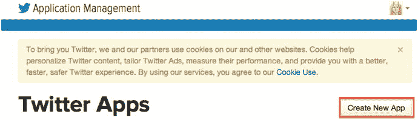
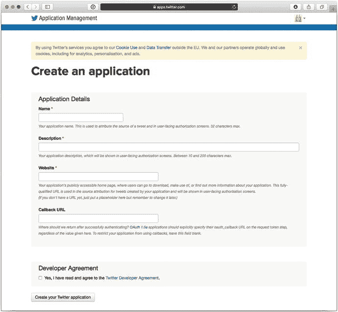
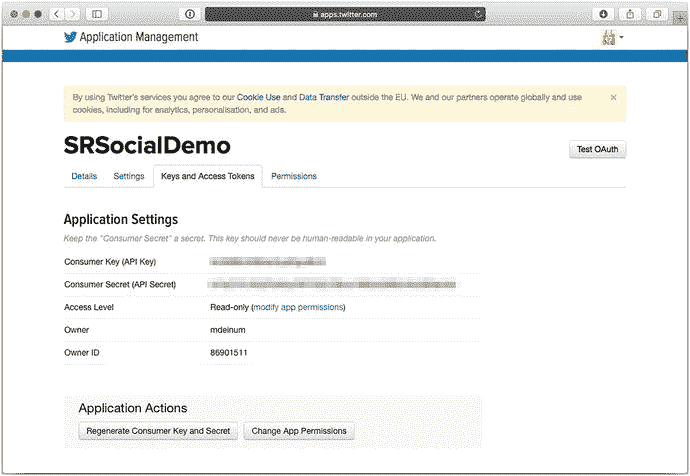
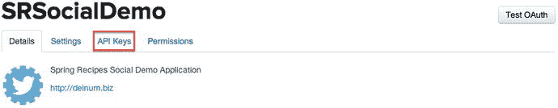
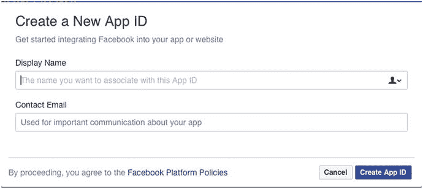
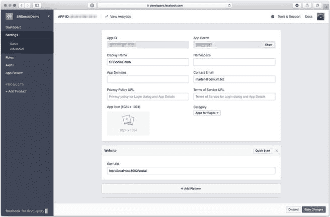
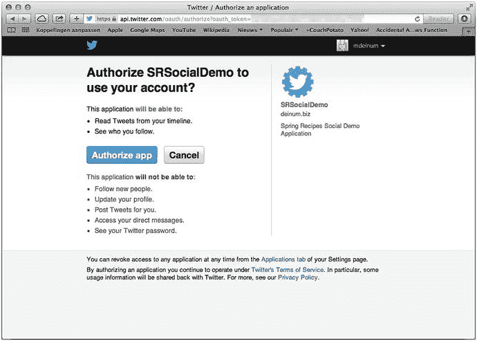

# 6. Spring Social

社交网络无处不在，大多数互联网用户都拥有一个或多个社交网络账号。人们通过推文分享自己正在做的事情或对某个话题的感受；在 Facebook 和 Instagram 上分享照片；使用 Tumblr 撰写博客。每天都有越来越多的社交网络涌现。作为网站所有者，集成这些社交网络可以带来诸多好处，例如让用户轻松发布链接，或者筛选并展示人们的想法。

Spring Social 试图提供一个统一的 API 来连接这些不同的网络，并提供一个扩展模型。Spring Social 本身提供了对 Facebook、Twitter 和 LinkedIn 的集成；此外，还有许多社区项目为不同的社交网络提供支持（例如 Tumblr、微博和 Instagram 等）。Spring Social 可以分为三个部分。首先是连接框架（Connect Framework），它负责处理与底层社交网络的身份验证和连接流程。其次是 `ConnectController`，它是一个控制器，负责在服务提供商、消费者（应用程序）和应用程序用户之间进行 OAuth 交换。最后是 `SocialAuthenticationFilter`，它将 Spring Social 与 Spring Security 集成（参见第 8 章），允许用户使用其社交网络账号登录。

## 6-1. 设置 Spring Social

### 问题

你希望在应用程序中使用 Spring Social。

### 解决方案

将 Spring Social 添加到依赖项中，并在配置中启用 Spring Social。

### 工作原理

Spring Social 由几个核心模块和每个服务提供商（例如 Twitter、Facebook、GitHub 等）的扩展模块组成。要使用 Spring Social，你需要将它们添加到应用程序的依赖项中。表 6-1 显示了可用的模块。

表 6-1. Spring Social 模块概览

| 模块 | 描述 |
| --- | --- |
| `spring-social-core` | Spring Social 的核心模块；包含主要的和共享的基础设施类 |
| `spring-social-config` | Spring Social 配置模块；使配置 Spring Social（的各个部分）更加容易 |
| `spring-social-web` | Spring Social 的 Web 集成，包含便于使用的过滤器和控制器 |
| `spring-social-security` | 与 Spring Security 的集成（参见第 7 章） |

这些依赖项位于 `org.springframework.social` 组中。本章将在不同的方案中涵盖每个模块（`core`、`config`、`web` 和 `security`）。添加依赖项后，你就可以设置 Spring Social 了。

```
package com.apress.springrecipes.social.config;
import com.apress.springrecipes.social.StaticUserIdSource;
import org.springframework.context.annotation.*;
import org.springframework.core.env.Environment;
import org.springframework.social.config.annotation.EnableSocial;
import org.springframework.social.config.annotation.SocialConfigurerAdapter;
@Configuration
@EnableSocial
@PropertySource("classpath:/application.properties")
public class SocialConfig extends SocialConfigurerAdapter {
@Override
public StaticUserIdSource getUserIdSource() {
return new StaticUserIdSource();
}
}
```

要启用 Spring Social，只需在带有 `@Configuration` 注解的类上添加 `@EnableSocial` 注解。该注解将触发 Spring Social 配置的加载。它会检测任何 `SocialConfigurer` bean 的实例，这些实例用于进一步配置 Spring Social。具体来说，它们用于为一个或多个服务提供商添加配置。

`SocialConfig` 扩展了 `SocialConfigurerAdapter`，后者是 `SocialConfigurer` 的一个实现。如你所见，有一个名为 `getUserIdSource` 的重写方法，它返回一个 `StaticUserIdSource` 对象。Spring Social 需要一个 `UserIdSource` 实例来确定当前用户。该用户用于查找与服务提供商的任何连接。这些连接存储在每个用户的 `ConnectionRepository` 中。使用哪个 `ConnectionRepository` 由 `UsersConnectionRepository` 决定，后者会使用当前用户。默认配置的 `UsersConnectionRepository` 是 `InMemoryUsersConnectionRepository`。

最后，你从类路径加载一个属性文件。该属性文件包含你的应用程序用于服务提供商的 API 密钥。你也可以将这些密钥硬编码到代码中，而不是放在属性文件中。

目前，你将使用 `StaticUserIdSource` 来确定当前用户。

```
package com.apress.springrecipes.social;
import org.springframework.social.UserIdSource;
public class StaticUserIdSource implements UserIdSource {
private static final String DEFAULT_USERID = "anonymous";
private String userId = DEFAULT_USERID;
@Override
public String getUserId() {
return this.userId;
}
public void setUserId(String userId) {
this.userId = userId;
}
}
```

`StaticUserIdSource` 实现了 `UserIdSource` 并返回一个预设的 `userId`。虽然目前这可行，但在实际应用程序中，你希望能够按用户存储连接信息。

## 6-2. 连接到 Twitter

### 问题

你希望你的应用程序能够访问 Twitter。

### 解决方案

在 Twitter 上注册你的应用程序，并配置 Spring Social 以使用应用程序凭据来获取对 Twitter 的访问权限。

### 工作原理

在让你的应用程序使用 Twitter 之前，你需要在 Twitter 上注册你的应用程序。注册后，你将获得用于标识应用程序的凭据（API 密钥和 API 密钥）。

#### 在 Twitter 上注册应用程序

要在 Twitter 上注册应用程序，请访问 [`https://dev.twitter.com`](https://dev.twitter.com)，在右上角找到你的头像；从下拉菜单中选择“我的应用”（参见图 6-1）。


图 6-1. 在 Twitter 上选择“我的应用”

选择“我的应用”后，将出现应用程序管理页面。此页面上有一个按钮，允许你创建新应用（参见图 6-2）。



图 6-2. 应用程序管理页面

在此页面上，单击该按钮将打开一个屏幕（参见图 6-3）来注册你的应用程序。



图 6-3. 注册新应用程序

在此屏幕上，你必须输入应用程序的名称和描述，以及将使用该应用程序的网站的 URL。使用 Spring Social 时，填写回调 URL 字段也很重要，因为你需要回调；实际值并不重要（除非你使用非常旧版本的 `OAuth`）。

接受条款和条件并单击最后的创建按钮后，你将进入应用程序设置页面。这意味着你已成功创建了应用程序。

为了能够将 Spring Social 连接到 Twitter，你需要知道你的 API 密钥和 API 密钥。你可以在应用程序设置的 API 密钥选项卡中找到它们（参见图 6-4 和 6-5）。



图 6-5. 连接 Spring Social 所需的 API 密钥和 API 密钥



图 6-4. 应用程序设置页面


#### 配置 Spring Social 连接 Twitter

现在你已拥有 API 密钥和 API 秘钥，可以配置 Spring Social 来连接 Twitter。首先创建一个属性文件（例如 `application.properties`），用于存放你的 API 密钥和 API 秘钥，以便在需要时轻松获取。

```
twitter.appId=
twitter.appSecret=
```

要连接 Twitter，你需要添加一个 `TwitterConnectionFactory`，当请求连接 Twitter 时，它将使用应用程序 ID 和秘钥。

```
package com.apress.springrecipes.social.config;
import org.springframework.core.env.Environment;
import org.springframework.social.config.annotation.ConnectionFactoryConfigurer;
import org.springframework.social.connect.Connection;
import org.springframework.social.connect.ConnectionRepository;
import org.springframework.social.twitter.api.Twitter;
import org.springframework.social.twitter.connect.TwitterConnectionFactory;
@Configuration
@EnableSocial
@PropertySource("classpath:/application.properties")
public class SocialConfig extends SocialConfigurerAdapter {
...
@Configuration
public static class TwitterConfigurer extends SocialConfigurerAdapter {
@Override
public void addConnectionFactories(
ConnectionFactoryConfigurer connectionFactoryConfigurer,
Environment env) {
connectionFactoryConfigurer.addConnectionFactory(
new TwitterConnectionFactory(
env.getRequiredProperty("twitter.appId"),
env.getRequiredProperty("twitter.appSecret")));
}
@Bean
@Scope(value = "request", proxyMode = ScopedProxyMode.INTERFACES)
public Twitter twitterTemplate(ConnectionRepository connectionRepository) {
Connection connection = connectionRepository.findPrimaryConnection(Twitter.class);
return connection != null ? connection.getApi() : null;
}
}
}
```

`SocialConfigurer` 接口包含回调方法 `addConnectionFactories`，允许你添加 `ConnectionFactory` 实例以使用 Spring Social。对于 Twitter，有 `TwitterConnectionFactory`，它接受两个参数。第一个是 API 密钥，第二个是 API 秘钥。这两个构造函数参数都来自读取的属性文件。当然，你也可以将值硬编码到配置中。至此，与 Twitter 的连接已建立。虽然你可以使用原始的底层连接，但实际并不推荐这样做。相反，应使用 `TwitterTemplate`，它使得与 Twitter API 的交互更加便捷。上述配置将一个 `TwitterTemplate` 添加到了应用程序上下文中。请注意 `@Scope` 注解。将此 Bean 设置为请求作用域非常重要。对于每个请求，实际的 Twitter 连接可能不同，因为每个请求可能对应不同的用户，这就是为什么需要使用请求作用域 Bean 的原因。注入到该方法中的 `ConnectionRepository` 是根据当前用户的 ID 确定的，该 ID 通过你之前配置的 `UserIdSource` 获取。

注意

虽然示例使用单独的配置类将 Twitter 配置为服务提供商，但你也可以将其添加到主 `SocialConfig` 类中。不过，将全局的 Spring Social 配置与特定的服务提供商设置分开可能更为可取。

## 6-3\. 连接 Facebook

### 问题

你希望应用程序能够访问 Facebook。

### 解决方案

在 Facebook 上注册你的应用程序，并配置 Spring Social 以使用应用程序凭据来获取对 Facebook 的访问权限。

### 工作原理

在让应用程序使用 Facebook 之前，你首先需要在 Facebook 上注册你的应用程序。注册完成后，你将获得用于标识应用程序的凭据（API 密钥和 API 秘钥）。要在 Facebook 上注册应用程序，你需要拥有一个 Facebook 账户，并且已注册为开发者。（本示例假设你已在 Facebook 上注册为开发者。如果没有，请访问 [`http://developers.facebook.com`](http://developers.facebook.com)，点击“立即注册”按钮，并按照向导完成注册。）

#### 在 Facebook 上注册应用程序

首先访问 [`http://developers.facebook.com`](http://developers.facebook.com)；点击页面顶部的“应用”菜单，然后选择“添加新应用”（见图 6-6）。


图 6-6.

注册新应用的第一步

这将打开一个屏幕（见图 6-7），允许你填写应用程序的一些详细信息。



图 6-7.

创建新应用 ID 窗口

你的应用程序名称可以是任何内容，只要不包含“face”或“book”字样即可。同时还需要提供一个电子邮件地址，以便 Facebook 知道联系谁。填写完表单后，点击“创建应用 ID”按钮，这将带你进入应用程序页面（见图 6-8）。在此页面上，导航到“设置”选项卡。



图 6-8.

Facebook 设置页面

在“设置”页面上，点击“添加平台”按钮，然后选择“网站”。输入你的应用程序将要运行的网站 URL。在本练习中，该 URL 为 `http://localhost:8080/social`。如果未提供此 URL，授权将不会通过，连接也将永远无法建立。


#### 配置 Spring Social 以连接 Facebook

Facebook 设置页面还包含应用程序连接 Facebook 所需的应用程序 ID 和密钥。将它们放入 `application.properties` 文件中。

```
facebook.appId=
facebook.appSecret=
```

假设 Spring Social 已经设置好（参见配方 6-1），接下来只需添加一个 `FacebookConnectionFactory` 和 `FacebookTemplate` 以便轻松访问。

```
package com.apress.springrecipes.social.config;
import org.springframework.social.facebook.api.Facebook;
import org.springframework.social.facebook.connect.FacebookConnectionFactory;
@Configuration
@EnableSocial
@PropertySource("classpath:/application.properties")
public class SocialConfig extends SocialConfigurerAdapter {
...
@Configuration
public static class FacebookConfiguration extends SocialConfigurerAdapter {
@Override
public void addConnectionFactories(
ConnectionFactoryConfigurer connectionFactoryConfigurer,
Environment env) {
connectionFactoryConfigurer.addConnectionFactory(
new FacebookConnectionFactory(
env.getRequiredProperty("facebook.appId"),
env.getRequiredProperty("facebook.appSecret")));
}
@Bean
@Scope(value = "request", proxyMode = ScopedProxyMode.INTERFACES)
public Facebook facebookTemplate(ConnectionRepository connectionRepository) {
Connection connection = connectionRepository.findPrimaryConnection(Facebook.class);
return connection != null ? connection.getApi() : null;
}
}
}
```

`FacebookConnectionFactory` 需要应用程序 ID 和密钥。这两个属性都已添加到 `application.properties` 文件中，并可通过 `Environment` 对象获取。

上述 bean 配置向应用程序上下文中添加了一个名为 `facebookTemplate` 的 bean。请注意 `@Scope` 注解。此 bean 必须是请求作用域的，这一点很重要。对于每个请求，与 Facebook 的实际连接可能不同，因为每个请求可能对应不同的用户，这就是使用请求作用域 bean 的原因。注入到方法中的 `ConnectionRepository` 是根据当前用户的 ID 确定的，该 ID 是通过您之前配置的 `UserIdSource` 获取的（参见配方 6-1）。

注意

尽管示例使用单独的配置类将 Facebook 配置为服务提供者，但您也可以将其添加到主 `SocialConfig` 类中。不过，将全局的 Spring Social 配置与特定的服务提供者设置分开可能是更可取的做法。

## 6-4. 显示服务提供者的连接状态

### 问题

您希望显示所用服务提供者的连接状态。

### 解决方案

配置 `ConnectController` 并使用它向用户显示状态。

### 工作原理

Spring Social 提供了 `ConnectController`，它负责处理与服务提供者的连接和断开连接，但您也可以显示当前用户对于所用服务提供者的连接状态（已连接或未连接）。`ConnectController` 使用多个 REST URL 来显示、添加或删除给定用户的连接（参见表 6-2）。

表 6-2. ConnectController URL 映射

| URL | 方法 | 描述 |
| --- | --- | --- |
| `/connect` | GET | 显示所有可用服务提供者的连接状态。将返回 `connect`/`status` 作为要渲染的视图名称。 |
|   | POST | 启动与指定提供者的连接流程。 |
|   | DELETE | 删除当前用户与指定提供者的所有连接。 |

要使用该控制器，首先需要配置 Spring MVC（参见第 4 章）。为此，请添加以下配置：

```
package com.apress.springrecipes.social.config;
import org.springframework.context.annotation.Bean;
import org.springframework.context.annotation.ComponentScan;
import org.springframework.context.annotation.Configuration;
import org.springframework.web.servlet.ViewResolver;
import org.springframework.web.servlet.config.annotation.EnableWebMvc;
import org.springframework.web.servlet.config.annotation.ViewControllerRegistry;
import org.springframework.web.servlet.config.annotation.WebMvcConfigurer;
import org.springframework.web.servlet.view.InternalResourceViewResolver;
@Configuration
@EnableWebMvc
@ComponentScan({"com.apress.springrecipes.social.web"})
public class WebConfig implements WebMvcConfigurer {
@Bean
public ViewResolver internalResourceViewResolver() {
InternalResourceViewResolver viewResolver = new InternalResourceViewResolver();
viewResolver.setPrefix("/WEB-INF/views/");
viewResolver.setSuffix(".jsp");
return viewResolver;
}
@Override
public void addViewControllers(ViewControllerRegistry registry) {
registry.addViewController("/").setViewName("index");
registry.addViewController("/signin").setViewName("signin");
}
}
```

您需要使用 `@EnableWebMvc` 启用 Spring MVC，并添加一个 `ViewResolver`，以便能够找到 JSP 页面。最后，您希望在应用程序启动时显示 `index.jsp` 页面。接下来，将 `ConnectController` 添加到 `WebConfig` 类中。该控制器需要 `ConnectionFactoryLocator` 和 `ConnectionRepository` 作为构造函数参数。要访问它们，只需将它们作为方法参数添加即可。

```
@Bean
public ConnectController connectController(
ConnectionFactoryLocator connectionFactoryLocator,
ConnectionRepository connectionRepository) {
return new ConnectController(connectionFactoryLocator, connectionRepository);
}
```

`ConnectController` 将监听表 6-2 中列出的 URL。现在，在 `/WEB-INF/views` 目录中添加两个视图。第一个是主索引页面，第二个是状态概览页面。首先创建 `index.jsp` 文件。

```

Hello Spring Social

Connections
点击 ">此处查看您的社交网络连接。

```

接下来，在 `/WEB-INF/views/connect` 目录中创建 `status.jsp` 文件。

```

Spring Social - Connections

Spring Social - Connections

${provider}

您已以 ${connectionMap[provider][0].displayName} 的身份连接到 ${provider}

您尚未连接到 ${provider}。点击 ">此处连接到 ${provider}。

```

状态页面将遍历所有可用的提供者，并判断当前用户是否与该服务提供者（Twitter、Facebook 等）存在现有连接。`ConnectController` 会将提供者列表以 `providerIds` 属性的形式提供，而 `connectionMap` 则保存当前用户的连接。现在，为了启动应用程序，您需要创建一个 `WebApplicationInitializer`，它将注册一个 `ContextLoaderListener` 和 `DispatcherServlet` 来处理请求。

```
package com.apress.springrecipes.social;
import com.apress.springrecipes.social.config.SocialConfig;
import com.apress.springrecipes.social.config.WebConfig;
import org.springframework.web.filter.DelegatingFilterProxy;
import org.springframework.web.servlet.support.AbstractAnnotationConfigDispatcherServletInitializer;
import javax.servlet.Filter;
public class SocialWebApplicationInitializer extends AbstractAnnotationConfigDispatcherServletInitializer {
@Override
protected Class[] getRootConfigClasses() {
return new Class[]{SocialConfig.class};
}
@Override
protected Class[] getServletConfigClasses() {
return new Class[] {WebConfig.class, };
}
@Override
protected String[] getServletMappings() {
return new String[] {"/"};
}
}
```

这将启动应用程序。`SocialConfig` 类将由 `ContextLoaderListener` 加载，而 `WebConfig` 类将由 `DispatcherServlet` 加载。为了能够处理请求，需要有一个 Servlet 映射。这里，映射为 `/`。

现在一切配置完毕，应用程序可以部署并通过 URL `http://localhost:8080/social` 访问。这将显示索引页面。点击链接将显示连接状态页面，该页面最初会显示当前用户尚未连接。


#### 连接服务提供商

当用户点击链接连接服务提供商时，将被导向 `/connect/{provider}` 网址。若尚未建立连接，将渲染 `connect/{provider}Connect` 页面，否则显示 `connect/{provider}Connected` 页面。要使用 `ConnectController` 连接 Twitter，需添加 `twitterConnect.jsp` 和 `twitterConnected.jsp` 页面。对于 Facebook，则需添加 `facebookConnect.jsp` 和 `facebookConnected.jsp` 页面。此模式适用于 Spring Social 的所有其他服务提供商连接器（如 GitHub、FourSquare、LinkedIn 等）。首先将 `twitterConnect.jsp` 添加到 `/WEB-INF/views/connect` 目录。

```

Spring Social - 连接 Twitter

连接 Twitter
" method="POST">

您尚未连接 Twitter。点击按钮将此应用与您的 Twitter 账户关联。

连接 Twitter

```

注意表单标签将表单 POST 回同一网址。点击提交按钮后，您将被重定向至 Twitter，系统将请求您授权此应用访问您的 Twitter 个人资料。（将此处替换为 `facebook` 即可连接 Facebook。）

接下来将 `twitterConnected.jsp` 添加到 `/WEB-INF/views/connect` 目录。此页面将在您已连接 Twitter 时显示，同时也在您授权应用后从 Twitter 返回时显示。

```

Spring Social - 已连接 Twitter

已连接 Twitter

您现在已连接至您的 Twitter 账户。
点击"此处查看您的连接状态。

```

添加这些页面后，重启应用并导航至状态页面。此时点击“连接 Twitter”链接，您将被导向 `twitterConnect.jsp` 页面。点击“连接 Twitter”按钮后，将显示 Twitter 授权应用页面（见图 6-9）。



图 6-9.

Twitter 授权页面

授权应用后，您将返回 `twitterConnect.jsp` 页面，告知您已成功连接 Twitter。返回状态页面时，您将看到已使用昵称连接至 Twitter。

对于 Facebook 或任何其他服务提供商，遵循相同步骤添加 `{provider}Connect` 和 `{provider}Connected` 页面，只要您同时添加了正确的服务提供商连接器和配置，Spring Social 即可连接该提供商。

## 6-5. 使用 Twitter API

### 问题

您希望使用 Twitter API。

### 解决方案

使用 `Twitter` 对象访问 Twitter API。

### 工作原理

每个服务提供商都有其基于 Twitter 的专属 API。有一个实现 Twitter 接口的对象，该接口在 Java 中代表 Twitter API；对于 Facebook，则有一个实现 Facebook 接口的对象可用。在配方 6-2 中，您已设置好与 Twitter 的连接和 `TwitterTemplate`。`TwitterTemplate` 暴露了 Twitter API 的各个部分（见表 6-3）。

表 6-3.

Twitter API 暴露的操作

| 操作 | 描述 |
| --- | --- |
| `blockOperations()` | 屏蔽和解封用户 |
| `directMessageOperations()` | 读取和发送私信 |
| `friendOperations()` | 获取用户的好友和粉丝列表，以及关注/取消关注用户 |
| `geoOperations()` | 处理位置信息 |
| `listOperations()` | 维护、订阅和取消订阅用户列表 |
| `searchOperations()` | 搜索推文并查看搜索趋势 |
| `streamingOperations()` | 通过 Twitter 流式 API 实时接收推文 |
| `timelineOperations()` | 读取时间线并发布推文 |
| `userOperations()` | 获取用户个人资料数据 |
| `restOperations()` | 底层 `RestTemplate`，用于其他 API 未暴露的部分 |

对于某些操作，您的应用可能需要比只读更高的访问权限。如果您想发送推文或访问私信，则需要读写权限。

要发布状态更新，您可以使用 `timelineOperations()` 方法，然后调用 `updateStatus()` 方法。根据需求，`updateStatus` 方法可以接受一个简单的 `String`（即状态文本），或一个名为 `TweetData` 的值对象，其中包含状态及其他信息（如位置、是否回复其他推文，以及可选的图片等资源）。

一个简单的控制器示例如下：

```
package com.apress.springrecipes.social.web;
import org.springframework.social.twitter.api.Twitter;
import org.springframework.stereotype.Controller;
import org.springframework.web.bind.annotation.RequestMapping;
import org.springframework.web.bind.annotation.RequestMethod;
import org.springframework.web.bind.annotation.RequestParam;
@Controller
@RequestMapping("/twitter")
public class TwitterController {
private final Twitter twitter;
public TwitterController(Twitter twitter) {
this.twitter = twitter;
}
@RequestMapping(method = RequestMethod.GET)
public String index() {
return "twitter";
}
@RequestMapping(method = RequestMethod.POST)
public String tweet(@RequestParam("status") String status) {
twitter.timelineOperations().updateStatus(status);
return "redirect:/twitter";
}
}
```

该控制器通过 `TwitterTemplate` 获取 Twitter API。`TwitterTemplate` 实现了 `Twitter` 接口。您可能还记得配方 6-2 中提到，该 API 是请求作用域的。您获得的是一个作用域代理，这也是使用 `Twitter` 接口的原因。`tweet` 方法接收一个参数并将其传递给 Twitter。

## 6-6. 使用持久化 UsersConnectionRepository

### 问题

您希望持久化用户的连接数据，以便在服务器重启后数据不丢失。

### 解决方案

使用 `JdbcUsersConnectionRepository` 替代默认的 `InMemoryUsersConnectionRepository`。


### 工作原理

默认情况下，Spring Social 会自动配置一个 `InMemoryUsersConnectionRepository`，用于存储用户的连接信息。然而，这种方式在集群环境中无法正常工作，也无法在服务器重启后保留数据。为了解决这个问题，可以使用数据库来存储连接信息。通过 `JdbcUsersConnectionRepository` 即可启用此功能。

`JdbcUsersConnectionRepository` 需要一个包含名为 `UserConnection` 的表的数据库，该表需包含若干特定列。幸运的是，Spring Social 提供了一个 DDL 脚本 `JdbcUsersConnectionRepository.sql`，你可以使用它来创建该表。

首先，添加一个数据源，指向你选择的数据库。本例中使用的是 PostgreSQL，但任何数据库都可以。

提示

在 `bin` 目录下有一个 `postgres.sh` 文件，它可以启动一个 Docker 化的 PostgreSQL 实例供你使用。

```
@Bean
public DataSource dataSource() {
DriverManagerDataSource dataSource = new DriverManagerDataSource();
dataSource.setUrl(env.getRequiredProperty("datasource.url"));
dataSource.setUsername(env.getRequiredProperty("datasource.username"));
dataSource.setPassword(env.getRequiredProperty("datasource.password"));
dataSource.setDriverClassName(env.getProperty("datasource.driverClassName"));
return dataSource;
}
```

请注意 `dataSource.*` 属性，它们用于配置 URL、JDBC 驱动以及用户名/密码。将这些属性添加到 `application.properties` 文件中。

```
dataSource.password=app
dataSource.username=app
dataSource.driverClassName=org.apache.derby.jdbc.ClientDriver
dataSource.url=jdbc:derby://localhost:1527/social;create=true
```

如果你希望自动创建所需的数据库表，则需要添加一个 `DataSourceInitializer`，并让它执行 `JdbcUsersConnectionRepository.sql` 文件。

```
@Bean
public DataSourceInitializer databasePopulator() {
ResourceDatabasePopulator populator = new ResourceDatabasePopulator();
populator.addScript(
new ClassPathResource(
"org/springframework/social/connect/jdbc/JdbcUsersConnectionRepository.sql"));
populator.setContinueOnError(true);
DataSourceInitializer initializer = new DataSourceInitializer();
initializer.setDatabasePopulator(populator);
initializer.setDataSource(dataSource());
return initializer;
}
```

这个 `DataSourceInitializer` 在应用程序启动时执行，并会运行所有传递给它的脚本。默认情况下，一旦遇到错误，它会立即停止应用程序启动。要阻止这种行为，请将 `continueOnError` 属性设置为 `true`。现在数据源已经设置并配置完成，最后一步是将 `JdbcUsersConnectionRepository` 添加到 `SocialConfig` 类中。

```
package com.apress.springrecipes.social.config;
import org.springframework.social.connect.jdbc.JdbcUsersConnectionRepository;
...
@Configuration
@EnableSocial
@PropertySource("classpath:/application.properties")
public class SocialConfig extends SocialConfigurerAdapter {
@Override
public UsersConnectionRepository getUsersConnectionRepository(ConnectionFactoryLocator connectionFactoryLocator) {
return new JdbcUsersConnectionRepository(dataSource(), connectionFactoryLocator, Encryptors.noOpText());
}
...
}
```

`JdbcUsersConnectionRepository` 接受三个构造函数参数。第一个是数据源，第二个是传入的 `ConnectionFactoryLocator`，最后一个参数是 `TextEncryptor`。`TextEncryptor` 是 Spring Security 加密模块中的一个类，用于加密访问令牌、密钥以及（如果可用）刷新令牌。之所以需要加密，是因为如果数据以纯文本形式存储，可能会被泄露。这些令牌可用于获取你的个人资料信息。

然而，在测试时，使用 `noOpText` 加密器会很方便，顾名思义，它不进行任何加密。在实际生产环境中，你应该使用 `TextEncryptor`，它会通过密码和盐值来加密数据。

当 `JdbcUsersConnectionRepository` 配置完成且数据库已启动后，你可以重新启动应用程序。乍一看，似乎没有任何变化；但是，一旦你授权访问（例如 Twitter），该授权将在应用程序重启后依然有效。你还可以查询数据库，看到信息存储在 `USERCONNECTION` 表中。

## 6-7. 集成 Spring Social 与 Spring Security

### 问题

你希望允许网站用户关联他们的社交网络账户。

### 解决方案

使用 `spring-social-security` 项目来集成这两个框架。


### 工作原理

接下来配置 Spring Security。本教程不会深入讨论 Spring Security 的细节，相关内容请参阅第 7 章。本教程的配置如下：

```
@Configuration
@EnableWebMvcSecurity
public class SecurityConfig extends WebSecurityConfigurerAdapter {
@Override
protected void configure(HttpSecurity http) throws Exception {
http.authorizeRequests()
.anyRequest().authenticated()
.and()
.formLogin()
.loginPage("/signin")
.failureUrl("/signin?param.error=bad_credentials")
.loginProcessingUrl("/signin/authenticate").permitAll()
.defaultSuccessUrl("/connect")
.and()
.logout().logoutUrl("/signout").permitAll();
}
@Bean
public UserDetailsManager userDetailsManager(DataSource dataSource) {
JdbcUserDetailsManager userDetailsManager = new JdbcUserDetailsManager();
userDetailsManager.setDataSource(dataSource);
userDetailsManager.setEnableAuthorities(true);
return userDetailsManager;
}
@Override
protected void configure(AuthenticationManagerBuilder auth) throws Exception {
auth.userDetailsService(userDetailsManager(null));
}
}
```

`@EnableWebMvcSecurity` 注解将为 Spring MVC 应用程序启用安全功能。它会注册 Spring Security 运行所需的 Bean。为了进行进一步配置（例如设置安全规则），可以添加一个或多个 `WebSecurityConfigurer`。为了方便起见，这里提供了一个可扩展的 `WebSecurityConfigurerAdapter`。

`configure(HttpSecurity http)` 方法负责设置安全规则。此特定配置要求每次调用都必须经过用户身份验证。如果用户尚未通过身份验证（即尚未登录应用程序），系统将提示用户输入登录表单。您还会注意到 `loginPage`、`loginProcessingUrl` 和 `logoutUrl` 已被修改。这样做是为了使它们与 Spring Social 的默认 URL 匹配。

注意

如果您想保留 Spring Security 的默认设置，请显式配置 `SocialAuthenticationFilter`，并设置 `signupUrl` 和 `defaultFailureUrl` 属性。

通过 `configure(AuthenticationManagerBuilder auth)`，您可以添加一个 `AuthenticationManager`，用于判断用户是否存在以及输入的凭据是否正确。所使用的 `UserDetailsService` 是 `JdbcUserDetailsManager`，它除了作为 `UserDetailsService` 之外，还可以从存储库中添加和删除用户。当您为应用程序添加社交登录页面时，将需要此功能。

`JdbcUserDetailsManager` 使用 `DataSource` 来读写数据，并且 `enableAuthorities` 属性设置为 `true`，以便用户从应用程序获得的任何角色也会被添加到数据库中。为了初始化数据库，请将 `create_users.sql` 脚本添加到上一个教程中配置的数据库填充器中。

```
@Bean
public DataSourceInitializer databasePopulator() {
ResourceDatabasePopulator populator = new ResourceDatabasePopulator();
populator.addScript(
new ClassPathResource("org/springframework/social/connect/jdbc/JdbcUsersConnectionRepository.sql"));
populator.addScript(new ClassPathResource("sql/create_users.sql"));
populator.setContinueOnError(true);
DataSourceInitializer initializer = new DataSourceInitializer();
initializer.setDatabasePopulator(populator);
initializer.setDataSource(dataSource());
return initializer;
}
```

接下来，为了能够渲染自定义的登录页面，需要将其作为视图控制器添加到 `WebConfig` 类中。这表示对 `/signin` 的请求应渲染 `signin.jsp` 页面。

```
package com.apress.springrecipes.social.config;
import org.springframework.context.annotation.Bean;
import org.springframework.context.annotation.ComponentScan;
import org.springframework.context.annotation.Configuration;
import org.springframework.web.servlet.config.annotation.ViewControllerRegistry;
import org.springframework.web.servlet.config.annotation.WebMvcConfigurer;
...
@Configuration
@EnableWebMvc
@ComponentScan({"com.apress.springrecipes.social.web"})
public class WebConfig implements WebMvcConfigurer {
@Override
public void addViewControllers(ViewControllerRegistry registry) {
registry.addViewController("/").setViewName("index");
registry.addViewController("/signin").setViewName("signin");
}
...
}
```

`signin.jsp` 页面是一个简单的 JSP 页面，用于渲染用户名和密码输入字段以及一个提交按钮。

```

登录信息不正确，请重试。

用户名

密码

登录

```

请注意隐藏的输入字段，其中包含一个跨站请求伪造（CSRF）令牌。这是为了防止恶意网站或 JavaScript 代码向您的 URL 提交数据。使用 Spring Security 时，此功能默认启用。可以通过在 `SecurityConfig` 类中添加 `http.csfr().disable()` 来禁用它。

还剩下两个最终的配置部分。首先，需要加载此配置；其次，需要注册一个过滤器以将安全功能应用于您的请求。为此，请修改 `SocialWebApplicationInitializer` 类。

```
package com.apress.springrecipes.social;
import com.apress.springrecipes.social.config.SecurityConfig;
import com.apress.springrecipes.social.config.SocialConfig;
import com.apress.springrecipes.social.config.WebConfig;
import org.springframework.web.filter.DelegatingFilterProxy;
import org.springframework.web.servlet.support.AbstractAnnotationConfigDispatcherServletInitializer;
import javax.servlet.Filter;
public class SocialWebApplicationInitializer extends AbstractAnnotationConfigDispatcherServletInitializer {
@Override
protected Class[] getRootConfigClasses() {
return new Class[]{SecurityConfig.class, SocialConfig.class};
}
@Override
protected Filter[] getServletFilters() {
DelegatingFilterProxy springSecurityFilterChain = new DelegatingFilterProxy();
springSecurityFilterChain.setTargetBeanName("springSecurityFilterChain");
return new Filter[]{springSecurityFilterChain};
}
...
}
```

首先注意，`SecurityConfig` 类已被添加到 `getRootConfigClasses` 方法中。这将负责加载配置类。接下来，添加了 `getServletFilters` 方法。此方法用于为将由 `DispatcherServlet` 处理的请求注册过滤器。默认情况下，Spring Security 会在应用程序上下文中注册一个名为 `springSecurityFilterChain` 的 `Filter`。为了执行此过滤器，您需要添加一个 `DelegatingFilterProxy`。`DelegatingFilterProxy` 会查找指定 `targetBeanName` 的 `Filter` 类型的 Bean。

#### 使用 Spring Security 获取用户名

在之前的教程中，您使用了一个返回静态用户名的 `UserIdSource` 实现。如果您有一个已经使用 Spring Security 的应用程序，则可以使用 `AuthenticationNameUserIdSource`，它利用（Spring Security 的）`SecurityContext` 来获取当前已认证用户的用户名。该用户名随后用于存储和查找用户与不同服务提供商的连接。

```
@Configuration
@EnableSocial
@PropertySource("classpath:/application.properties")
public class SocialConfig extends SocialConfigurerAdapter {
@Override
public UserIdSource getUserIdSource() {
return new AuthenticationNameUserIdSource();
}
...
}
```

提示

使用 `SpringsocialConfigurer` 时，您可以省略此步骤，因为默认情况下会创建并使用 `AuthenticationNameUserIdSource`。

请注意 `AuthenticationNameUserIdSource` 的构造。这就是从 Spring Security 检索用户名所需的全部操作。它会从 `SecurityContext` 中查找 `Authentication` 对象，并返回 `Authentication` 的 `name` 属性。重新启动应用程序后，系统将提示您输入登录表单。现在，使用用户名 `user1` 和密码 `user1` 登录。


#### 使用 Spring Social 实现登录

允许当前用户连接社交网络固然不错。但若能使用户通过其社交网络账户登录应用程序，则更为理想。Spring Social 提供了与 Spring Security 的紧密集成来实现这一功能。为此，还需要设置几个额外的部分。

首先，需要将 Spring Social 与 Spring Security 集成。为此，可以使用 `SpringSocialConfigurer` 并将其应用于 Spring Security 配置。

```
@Configuration
@EnableWebMvcSecurity
public class SecurityConfig extends WebSecurityConfigurerAdapter {
@Override
protected void configure(HttpSecurity http) throws Exception {
...
http.apply(new SpringSocialConfigurer());
}
...
}
package com.apress.springrecipes.social.security;
import org.springframework.dao.DataAccessException;
import org.springframework.security.core.userdetails.UserDetails;
import org.springframework.security.core.userdetails.UserDetailsService;
import org.springframework.security.core.userdetails.UsernameNotFoundException;
import org.springframework.social.security.SocialUser;
import org.springframework.social.security.SocialUserDetails;
import org.springframework.social.security.SocialUserDetailsService;
import org.springframework.util.Assert;
public class SimpleSocialUserDetailsService implements SocialUserDetailsService {
private final UserDetailsService userDetailsService;
public SimpleSocialUserDetailsService(UserDetailsService userDetailsService) {
Assert.notNull(userDetailsService, "UserDetailsService cannot be null.");
this.userDetailsService = userDetailsService;    }
@Override
public SocialUserDetails loadUserByUserId(String userId) throws UsernameNotFoundException, DataAccessException {
UserDetails user = userDetailsService.loadUserByUsername(userId);
return new SocialUser(user.getUsername(), user.getPassword(), user.getAuthorities());
}
}
```

接下来，将已配置的服务提供商的链接添加到登录页面。

```

...

Sign in with Twitter

Sign in with Facebook

```

`SimpleSocialUserDetailsService` 将实际的查找工作委托给通过构造函数传入的 `UserDetailsService`。当检索到用户时，它会使用检索到的信息来构造一个 `SocialUser` 实例。最后，需要将此 bean 添加到配置中。

```
@Configuration
@EnableWebMvcSecurity
public class SecurityConfig extends WebSecurityConfigurerAdapter {
@Bean
public SocialUserDetailsService socialUserDetailsService(UserDetailsService userDetailsService) {
return new SimpleSocialUserDetailsService(userDetailsService);
}
...
}
```

这将允许用户使用其社交网络账户登录；但是，应用程序需要知道该账户属于哪个用户。如果无法根据特定的社交网络找到用户，则需要创建一个用户。基本上，应用程序需要一种让用户注册的方式。默认情况下，`SocialAuthenticationFilter` 会将用户重定向到 `/signup` URL。您可以创建一个绑定到此 URL 的控制器，并渲染一个表单，允许用户创建账户。

```
package com.apress.springrecipes.social.web;
import org.springframework.security.authentication.UsernamePasswordAuthenticationToken;
import org.springframework.security.core.GrantedAuthority;
import org.springframework.security.core.authority.SimpleGrantedAuthority;
import org.springframework.security.core.context.SecurityContextHolder;
import org.springframework.security.provisioning.UserDetailsManager;
import org.springframework.social.connect.Connection;
import org.springframework.social.connect.web.ProviderSignInUtils;
import org.springframework.social.security.SocialUser;
import org.springframework.stereotype.Controller;
import org.springframework.validation.BindingResult;
import org.springframework.validation.annotation.Validated;
import org.springframework.web.bind.annotation.GetMapping;
import org.springframework.web.bind.annotation.PostMapping;
import org.springframework.web.bind.annotation.RequestMapping;
import org.springframework.web.context.request.WebRequest;
import java.util.Collections;
import java.util.List;
@Controller
@RequestMapping("/signup")
public class SignupController {
private static final List DEFAULT_ROLES = Collections.singletonList(new SimpleGrantedAuthority("USER"));
private final ProviderSignInUtils providerSignInUtils;
private final UserDetailsManager userDetailsManager;
public SignupController(ProviderSignInUtils providerSignInUtils, UserDetailsManager userDetailsManager) {
this.providerSignInUtils = providerSignInUtils;
this.userDetailsManager = userDetailsManager;
}
@GetMapping
public SignupForm signupForm(WebRequest request) {
Connection connection = providerSignInUtils.getConnectionFromSession(request);
if (connection != null) {
return SignupForm.fromProviderUser(connection.fetchUserProfile());
} else {
return new SignupForm();
}
}
@PostMapping
public String signup(@Validated SignupForm form, BindingResult formBinding, WebRequest request) {
if (!formBinding.hasErrors()) {
SocialUser user = createUser(form);
SecurityContextHolder.getContext().setAuthentication(new UsernamePasswordAuthenticationToken(user.getUsername(), null, user.getAuthorities()));
providerSignInUtils.doPostSignUp(user.getUsername(), request);
return "redirect:/";
}
return null;
}
private SocialUser createUser(SignupForm form) {
SocialUser user = new SocialUser(form.getUsername(), form.getPassword(), DEFAULT_ROLES);
userDetailsManager.createUser(user);
return user;
}
}
```

首先，会调用 `signupForm` 方法，因为初始请求是对 `/signup` URL 的 GET 请求。`signupForm` 方法检查是否已尝试进行连接。这委托给了 Spring Social 提供的 `ProviderSignInUtils`。如果是这种情况，则使用检索到的 `UserProfile` 来预填充 `SignupForm`。

```
package com.apress.springrecipes.social.web;
import org.springframework.social.connect.UserProfile;
public class SignupForm {
private String username;
private String password;
public String getUsername() {
return username;
}
public void setUsername(String username) {
this.username = username;
}
public String getPassword() {
return password;
}
public void setPassword(String password) {
this.password = password;
}
public static SignupForm fromProviderUser(UserProfile providerUser) {
SignupForm form = new SignupForm();
form.setUsername(providerUser.getUsername());
return form;
}
}
```

以下是用于填写这两个字段的 HTML 表单：

```

Sign Up

Sign Up

Sign Up

```

注意

这里没有用于 CSRF 标签的隐藏输入。Spring Security 与 Spring MVC 紧密集成，当使用 Spring Framework 表单标签时，此字段会自动添加。

用户填写表单后，将调用 signup 方法。这将使用给定的用户名和密码创建一个用户。创建用户后，会为输入的用户名添加一个 `Connection`。建立连接后，用户即可登录应用程序，并且在后续访问中可以使用社交网络连接来登录应用程序。

该控制器使用 `ProviderSignInUtils` 来重用 Spring Social 的逻辑。您可以在 `SocialConfig` 类中创建一个实例。

```
@Bean
public ProviderSignInUtils providerSignInUtils(ConnectionFactoryLocator connectionFactoryLocator, UsersConnectionRepository usersConnectionRepository) {
return new ProviderSignInUtils(connectionFactoryLocator, usersConnectionRepository);
}
```

配置的最后一部分是允许所有用户访问 `/signup` URL。将以下内容添加到 `SecurityConfig` 类中：

```
@Override
protected void configure(HttpSecurity http) throws Exception {
http
.authorizeRequests()
.antMatchers("/signup").permitAll()
.anyRequest().authenticated().and()
...
}
```


## 摘要

在本章中，你探索了 Spring Social。第一步是在服务提供商处注册一个应用程序，并使用生成的 API 密钥和密钥将该应用程序连接到该服务提供商。接着，你研究了如何将用户的账户连接到应用程序，以便用于访问用户信息；不过，这也将允许你使用服务提供商的 API。对于 Twitter，你可以查询时间线或查看某人的好友。

为了使与服务提供商的连接更有用，它们被存储在基于 JDBC 的存储中。

最后，你了解了 Spring Social 如何与 Spring Security 集成，以及如何利用它让服务提供商登录你的应用程序。

