# 7. Spring Security

在本章中，你将学习如何使用 Spring Security 框架（Spring 框架的一个子项目）来保护应用程序。Spring Security 最初被称为 Acegi Security，但在加入 Spring 项目组合后更名。Spring Security 可用于保护任何 Java 应用程序，但主要用于基于 Web 的应用程序。Web 应用程序，尤其是那些可以通过互联网访问的应用程序，如果保护不当，很容易受到黑客攻击。

如果你从未在应用程序中处理过安全问题，那么首先必须理解几个术语和概念。**身份验证**是验证主体身份与其声称的身份是否一致的过程。主体可以是用户、设备或系统，但最常见的是用户。主体必须提供身份证据才能通过验证。这种证据称为**凭证**，当目标主体是用户时，凭证通常是一个密码。

**授权**是向经过身份验证的用户授予权限的过程，以便该用户可以访问目标应用程序的特定资源。授权过程必须在身份验证过程之后执行。通常，权限是以角色的形式授予的。

**访问控制**意味着控制对应用程序资源的访问。它需要决定是否允许用户访问某个资源。这个决定称为访问控制决策，通过将资源的访问属性与用户被授予的权限或其他特征进行比较来做出。

完成本章后，你将理解基本的安全概念，并知道如何在 URL 访问级别、方法调用级别、视图渲染级别和领域对象级别保护你的 Web 应用程序。

注意

在开始本章之前，请先查看 `recipe_7_1_i` 的应用程序。这是你将在本章中使用的初始未受保护的应用程序。它是一个基本的待办事项应用，你可以在其中列出、创建和标记待办事项为已完成。部署应用程序后，你将看到如图 7-1 所示的内容。

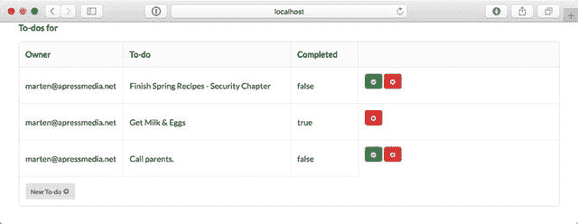

图 7-1.

初始待办事项应用程序

## 7-1. 保护 URL 访问

### 问题

许多 Web 应用程序都有一些至关重要且私密的特定 URL。你必须通过防止未经授权的访问来保护这些 URL。

### 解决方案

Spring Security 使你能够通过简单的配置以声明方式保护 Web 应用程序的 URL 访问。它通过将 Servlet 过滤器应用于 HTTP 请求来处理安全问题。为了注册过滤器并检测配置，Spring Security 提供了一个方便的基类供你扩展：`AbstractSecurityWebApplicationInitializer`。

Spring Security 允许你通过 `WebSecurityConfigurerAdapter` 配置适配器上的各种 `configure` 方法来配置 Web 应用程序安全。如果你的 Web 应用程序的安全需求简单且典型，你可以保持配置不变，并使用默认启用的安全设置，包括以下内容：

*   **基于表单的登录服务**：提供一个包含登录表单的默认页面，供用户登录此应用程序。
*   **HTTP 基本认证**：可以处理 HTTP 请求头中提供的 HTTP 基本认证凭据。它也可用于验证使用远程协议和 Web 服务发出的请求。
*   **注销服务**：提供一个映射了 URL 的处理程序，供用户退出此应用程序。
*   **匿名登录**：为匿名用户分配一个主体并授予权限，以便你可以像处理普通用户一样处理匿名用户。
*   **Servlet API 集成**：允许你通过标准 Servlet API（例如 `HttpServletRequest.isUserInRole()` 和 `HttpServletRequest.getUserPrincipal()`）在 Web 应用程序中访问安全信息。
*   **CSRF**：通过创建令牌并将其放入 `HttpSession` 来实现跨站请求伪造保护。
*   **安全头**：例如为受保护的包禁用缓存，提供 XSS 保护、传输安全和 X-Frame 安全。

注册了这些安全服务后，你可以指定需要特定权限才能访问的 URL 模式。Spring Security 将根据你的配置执行安全检查。用户必须先登录应用程序才能访问安全 URL，除非这些 URL 对匿名访问开放。Spring Security 提供了一组身份验证提供程序供你选择。身份验证提供程序对用户进行身份验证，并返回授予该用户的权限。

### 工作原理

首先，你需要注册 Spring Security 使用的过滤器。最简单的方法是扩展前面提到的 `AbstractSecurityWebApplicationInitializer`。

```
package com.apress.springrecipes.board.security;
import org.springframework.security.web.context.AbstractSecurityWebApplicationInitializer;
public class TodoSecurityInitializer extends AbstractSecurityWebApplicationInitializer {
public TodoSecurityInitializer() {
super(TodoSecurityConfig.class);
}
}
```

`AbstractSecurityWebApplicationInitializer` 类有一个构造函数，它接受一个或多个配置类。这些配置类用于引导安全配置。

注意

如果你有一个扩展 `AbstractAnnotationConfigDispatcherServletInitializer` 的类，请将安全配置添加到该类中，否则在启动期间将出现异常。

虽然你可以在与 Web 层和服务层相同的配置类中配置 Spring Security，但最好将安全配置隔离在一个单独的类中（例如 `TodoSecurityConfig`）。在 `WebApplicationInitializer`（例如 `TodoWebInitializer`）内部，你需要将该配置类添加到配置类的列表中。

首先，你需要安全配置。为此，你将创建 `TodoSecurityConfig` 类，如下所示：

```
package com.apress.springrecipes.board.security;
import org.springframework.context.annotation.Configuration;
import org.springframework.security.config.annotation.web.configuration.EnableWebSecurity;
import org.springframework.security.config.annotation.web.configuration.WebSecurityConfigurerAdapter;
@Configuration
@EnableWebSecurity
public class TodoSecurityConfig extends WebSecurityConfigurerAdapter {}
```

构建并部署应用程序，并尝试访问 `http://localhost:8080/todos/todos` 时，你现在将看到默认的 Spring Security 登录页面（见图 7-2）。

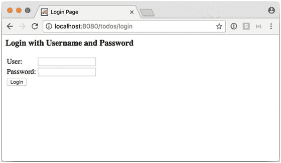

图 7-2.

默认的 Spring Security 登录页面


#### 安全 URL 访问

如果你查看 `org.springframework.security.config.annotation.web.configuration.WebSecurityConfigurerAdapter` 类的 `configure` 方法，你会发现它包含了 `anyRequest().authenticated()` 调用。这告诉 Spring Security，对于每一个传入的请求，你都必须通过系统进行身份验证。你还会看到，默认情况下启用了 HTTP 基本认证和基于表单的登录。基于表单的登录还包含一个默认的登录页面生成器，如果你没有显式指定登录页面，就会使用它。

```
protected void configure(HttpSecurity http) throws Exception {
http
.authorizeRequests()
.anyRequest().authenticated()
.and()
.formLogin().and()
.httpBasic();
}
```

让我们编写一些安全规则。除了仅要求登录之外，你还可以为 URL 编写一些强大的访问规则。

```
package com.apress.springrecipes.board.security;
import org.springframework.context.annotation.Configuration;
import org.springframework.http.HttpMethod;
import org.springframework.security.config.annotation.authentication.builders.AuthenticationManagerBuilder;
import org.springframework.security.config.annotation.web.builders.HttpSecurity;
import org.springframework.security.config.annotation.web.configuration.EnableWebSecurity;
import org.springframework.security.config.annotation.web.configuration.WebSecurityConfigurerAdapter;
@Configuration
@EnableWebSecurity
public class TodoSecurityConfig extends WebSecurityConfigurerAdapter {
@Override
protected void configure(AuthenticationManagerBuilder auth) throws Exception {
auth.inMemoryAuthentication()
.withUser("marten@ya2do.io").password("user").authorities("USER")
.and()
.withUser("admin@ya2do.io").password("admin").authorities("USER", "ADMIN");
}
@Override
protected void configure(HttpSecurity http) throws Exception {
http.authorizeRequests()
.antMatchers("/todos*").hasAuthority("USER")
.antMatchers(HttpMethod.DELETE, "/todos*").hasAuthority("ADMIN")
.and()
.formLogin()
.and()
.csrf().disable();
}
}
```

你可以通过重写 `configure(HttpSecurity http)` 方法（还有其他 `configure` 方法）来配置授权规则等。

使用 `authorizeRequests()`，你开始保护你的 URL。然后你可以使用其中一个匹配器；在上面的代码中，你使用 `antMatchers` 来定义匹配规则以及用户需要拥有的权限。请记住，你必须在 URL 模式的末尾始终包含一个通配符。如果不这样做，URL 模式将无法匹配带有请求参数的 URL。结果，黑客可以通过附加任意请求参数轻松绕过安全检查。你已经将对 `/todos` 的所有访问权限授予了拥有 `USER` 权限的用户。要能够通过 `DELETE` 请求调用 `/todos`，你需要是拥有 `ADMIN` 角色的用户。

注意

由于你现在正在覆盖默认的访问规则和登录配置，你需要再次启用 `formLogin`。还有一个调用暂时禁用了 CSRF 保护，因为 CSRF 保护会导致表单无法正常工作；本教程稍后将解释如何启用它。

你可以在重写的 `configure(AuthenticationManagerBuilder auth)` 方法中配置认证服务。Spring Security 支持多种用户认证方式，包括针对数据库或 LDAP 仓库进行认证。它还支持为简单的安全需求直接定义用户详细信息。你可以为每个用户指定用户名、密码和一组权限。

现在，你可以重新部署此应用程序来测试其安全配置。你必须使用正确的用户名和密码登录此应用程序才能查看待办事项。最后，要删除一个待办事项，你必须以管理员身份登录。

#### 使用 CSRF 保护

通常建议保持 CSRF 默认启用，因为这样可以降低遭受 CSRF 攻击的风险。它在 Spring Security 中默认是启用的，并且可以从配置中移除 `csfr().disable()` 这一行。当启用 CSRF 保护时，Spring Security 会将 `CsfrFilter` 添加到其用于保护的安全过滤器列表中。此过滤器反过来使用 `CsrfTokenRepository` 的实现来生成和存储令牌；默认情况下是 `HttpSessionCsrfTokenRepository` 类，顾名思义，它将生成的令牌存储在 `HttpSession` 接口中。还有一个 `CookieCsrfTokenRepository` 类，它将令牌信息存储在 cookie 中。如果你想切换 `CsfrTokenRepository` 类，可以使用 `csrfTokenRepository()` 配置方法来更改它。你也可以使用它来配置一个显式配置的 `HttpSessionCsrfTokenRepository`。

```
@Override
protected void configure(HttpSecurity http) throws Exception {
HttpSessionCsrfTokenRepository repo = new HttpSessionCsrfTokenRepository();
repo.setSessionAttributeName("csfr_token");
repo.setParameterName("csfr_token")
http.csrf().csrfTokenRepository(repo);
}
```

当启用 CSRF 时，登录后尝试完成或删除待办事项将会失败，因为缺少 CSRF 令牌。要解决此问题，你需要在修改内容的请求中将 CSRF 令牌传回服务器。你可以通过表单中的 `hidden` 输入轻松实现这一点。`HttpSessionCsrfTokenRepository` 在会话中以属性 `_csfr`（默认情况下，除非你显式配置）暴露令牌。对于表单，你可以使用 `parameterName` 和 `token` 属性来创建适当的输入标签。

将以下内容添加到完成和删除待办事项的两个表单中：

```

现在提交表单时，令牌将成为请求的一部分，你将能够再次完成或删除待办事项。

在 `todo-create.jsp` 页面中也有一个表单；但是，由于它使用的是 Spring MVC 表单标签，你无需修改它。当使用 Spring MVC 表单标签时，CSRF 令牌会自动添加到表单中。为了实现这一点，Spring Security 注册了一个 `CsrfRequestDataValueProcessor` 类，它负责将令牌添加到表单中。

7-2\. 登录 Web 应用程序

问题

一个安全的应用程序要求用户在访问某些安全功能之前先登录。这对于在开放互联网上运行的 Web 应用程序尤其重要，因为黑客很容易访问它们。大多数 Web 应用程序必须提供一种方式让用户输入其凭据来登录。

解决方案

Spring Security 支持多种方式让用户登录 Web 应用程序。它通过提供一个包含登录表单的默认网页来支持基于表单的登录。你也可以提供一个自定义网页作为登录页面。此外，Spring Security 通过处理 HTTP 请求头中提供的 Basic 认证凭据来支持 HTTP 基本认证。HTTP 基本认证也可用于对远程协议和 Web 服务发出的请求进行认证。

你应用程序的某些部分可能允许匿名访问（例如，访问欢迎页面）。Spring Security 提供了一个匿名登录服务，它可以为匿名用户分配一个主体并授予权限，这样你在定义安全策略时就可以像处理普通用户一样处理匿名用户。

Spring Security 还支持“记住我”登录，它能够在多个浏览器会话之间记住用户的身份，这样用户在首次登录后就不需要再次登录。

工作原理

为了帮助你更好地理解各种登录机制，让我们先禁用默认的安全配置。

警告


通常建议保留默认设置，仅禁用不需要的功能，例如 `httpBasic().disable()`，而不是禁用所有安全默认值！

```
@Configuration
@EnableWebSecurity
public class TodoSecurityConfig extends WebSecurityConfigurerAdapter {
public TodoSecurityConfig() {
super(true);
}
}
```

请注意，如果启用了 HTTP 自动配置，接下来介绍的登录服务将自动注册。但是，如果禁用了默认配置或想要自定义这些服务，则必须显式配置相应的功能。

在启用身份验证功能之前，需要先启用基本的 Spring Security 要求，至少需要配置异常处理和安全上下文集成。

```
protected void configure(HttpSecurity http) {
http.securityContext()
.and()
.exceptionHandling();
}
```

没有这些基础，Spring Security 将无法在登录后存储用户信息，也无法对安全相关的异常进行正确的异常转换（这些异常会直接向上冒泡，可能会将一些内部信息暴露给外部）。你可能还需要启用 Servlet API 集成，以便在视图中使用 `HttpServletRequest` 上的方法进行检查。

```
protected void configure(HttpSecurity http) {
http.servletApi();
}
```

使用 HTTP 基本认证

HTTP 基本认证支持可以通过 `httpBasic()` 方法进行配置。当需要 HTTP 基本认证时，浏览器通常会显示一个登录对话框或特定的登录页面供用户登录。

```
@Configuration
@EnableWebSecurity
public class TodoSecurityConfig extends WebSecurityConfigurerAdapter {
@Override
protected void configure(HttpSecurity http) throws Exception {
http
...
.httpBasic();
}
}
```

注意

当同时启用 HTTP 基本认证和基于表单的登录时，将使用后者。因此，如果你希望 Web 应用程序用户使用此认证类型登录，则不应启用基于表单的登录。

使用基于表单的登录

基于表单的登录服务将呈现一个包含登录表单的网页，供用户输入登录信息并处理登录表单的提交。它通过 `formLogin` 方法进行配置。

```
@Configuration
@EnableWebSecurity
public class TodoSecurityConfig extends WebSecurityConfigurerAdapter {
@Override
protected void configure(HttpSecurity http) throws Exception {
http
...
.formLogin();
}
}
```

默认情况下，Spring Security 会自动创建一个登录页面，并将其映射到 URL `/login`。因此，你可以在应用程序中添加一个指向此 URL 的链接（例如，在 `todos.jsp` 中）用于登录。

```
">Login
```

如果你不喜欢默认的登录页面，可以提供自定义的登录页面。例如，你可以在 Web 应用程序的根目录下创建以下 `login.jsp` 文件。请注意，不应将此文件放在 `WEB-INF` 目录内，否则用户将无法直接访问它。

```

Login

body {
background-color: #DADADA;
}
body > .grid {
height: 100%;
}
.column {
max-width: 450px;
}

Log-in to your account
" class="ui large form">

Login

```

为了让 Spring Security 在请求登录时显示自定义登录页面，你需要在 `loginPage` 配置方法中指定其 URL。

```
@Configuration
@EnableWebSecurity
public class TodoSecurityConfig extends WebSecurityConfigurerAdapter {
@Override
protected void configure(HttpSecurity http) throws Exception {
http
...
.formLogin().loginPage("/login.jsp");
}
}
```

如果用户请求安全 URL 时由 Spring Security 显示登录页面，则登录成功后用户将被重定向到目标 URL。但是，如果用户直接通过其 URL 请求登录页面，默认情况下，登录成功后用户将被重定向到上下文路径的根目录（即 `http://localhost:8080/todos/`）。如果你在 Web 部署描述符中没有定义欢迎页面，你可能希望在登录成功时将用户重定向到默认的目标 URL。

```
@Configuration
@EnableWebSecurity
public class TodoSecurityConfig extends WebSecurityConfigurerAdapter {
@Override
protected void configure(HttpSecurity http) throws Exception {
http
...
.formLogin().loginPage("/login.jsp").defaultSuccessUrl("/todos");
}
}
```

如果你使用 Spring Security 创建的默认登录页面，那么当登录失败时，Spring Security 将重新渲染登录页面并显示错误消息。但是，如果你指定了自定义登录页面，则必须配置 `authentication-failure-url` 值，以指定登录错误时要重定向到的 URL。例如，你可以使用错误请求参数再次重定向到自定义登录页面，如下所示：

```
@Configuration
@EnableWebSecurity
public class TodoSecurityConfig extends WebSecurityConfigurerAdapter {
@Override
protected void configure(HttpSecurity http) throws Exception {
http
...
.formLogin()
.loginPage("/login.jsp")
.defaultSuccessUrl("/messageList")
.failureUrl("login.jsp?error=true");
}
}
```

然后，你的登录页面应测试是否存在错误请求参数。如果发生错误，你需要通过访问会话范围属性 `SPRING_SECURITY_LAST_EXCEPTION` 来显示错误消息，该属性存储了当前用户的最后一个异常。

```
...

Authentication Failed
Reason : ${sessionScope["SPRING_SECURITY_LAST_EXCEPTION"].message}

```

使用注销服务

注销服务提供了一个处理注销请求的处理程序。它可以通过 `logout()` 配置方法进行配置。

```
@Configuration
@EnableWebSecurity
public class TodoSecurityConfig extends WebSecurityConfigurerAdapter {
@Override
protected void configure(HttpSecurity http) throws Exception {
http
...
.and()
.logout();
}
}
```

默认情况下，它映射到 URL `/logout`，并且仅响应 POST 请求。你可以在页面中添加一个小的 HTML 表单来执行注销操作。

```
" method="post">Logout
```

注意

使用 CSRF 保护时，不要忘记将 CSRF 令牌添加到表单中（参见配方 7-1），否则注销将失败。

默认情况下，注销成功后用户将被重定向到上下文路径的根目录，但有时你可能希望将用户引导到另一个 URL，这可以通过使用 `logoutSuccessUrl` 配置方法来实现。

```
@Configuration
@EnableWebSecurity
public class TodoSecurityConfig extends WebSecurityConfigurerAdapter {
@Override
protected void configure(HttpSecurity http) throws Exception {
http
...
.and()
.logout().logoutSuccessUrl("/logout-success.jsp");
}
}
```

注销后，你可能会注意到，即使注销成功，使用浏览器的后退按钮仍然可以看到之前的页面。这是因为浏览器缓存了页面。通过使用 `headers()` 配置方法启用安全标头，可以指示浏览器不要缓存页面。

```
@Configuration
@EnableWebSecurity
public class TodoSecurityConfig extends WebSecurityConfigurerAdapter {
@Override
protected void configure(HttpSecurity http) throws Exception {
http
...
.and()
.headers();
}
}
```

除了无缓存标头之外，这还会禁用内容嗅探并启用 X-Frame 保护（更多信息请参见配方 7-1）。启用此功能后，使用浏览器的后退按钮时，你将被重定向到登录页面。

实现匿名登录


匿名登录服务可通过 Java 配置中的 `anonymous()` 方法进行配置，你可以自定义匿名用户的用户名和权限，其默认值分别为 `anonymousUser` 和 `ROLE_ANONYMOUS`。

```
@Configuration
@EnableWebSecurity
public class TodoSecurityConfig extends WebSecurityConfigurerAdapter {
@Override
protected void configure(HttpSecurity http) throws Exception {
http
...
.and()
.anonymous().principal("guest").authorities("ROLE_GUEST");
}
}
```

实现“记住我”功能

“记住我”功能可通过 Java 配置中的 `rememberMe()` 方法进行配置。默认情况下，它会将用户名、密码、记住我过期时间以及一个私钥编码为令牌，并将该令牌作为 cookie 存储在用户的浏览器中。下次用户访问同一 Web 应用时，系统会检测到该令牌，从而实现自动登录。

```
@Configuration
@EnableWebSecurity
public class TodoSecurityConfig extends WebSecurityConfigurerAdapter {
@Override
protected void configure(HttpSecurity http) throws Exception {
http
...
.and()
.rememberMe();
}
}
```

然而，静态的“记住我”令牌可能会引发安全问题，因为它们可能被黑客截获。为了满足更高级的安全需求，Spring Security 支持滚动令牌，但这需要数据库来持久化存储令牌。关于滚动“记住我”令牌部署的详细信息，请参考 Spring Security 参考文档。

7-3. 用户认证

问题

当用户尝试登录你的应用以访问其安全资源时，你必须对用户的主体进行认证，并向该用户授予权限。

解决方案

在 Spring Security 中，认证由一个或多个 `AuthenticationProvider` 以链式结构共同完成。如果其中任何一个提供者成功认证了用户，该用户就能登录应用。如果某个提供者报告用户被禁用、锁定、凭证错误，或者没有任何提供者能够认证该用户，那么该用户将无法登录此应用。

Spring Security 支持多种用户认证方式，并为这些方式提供了内置的提供者实现。你可以通过内置的 XML 元素轻松配置这些提供者。最常见的认证提供者会针对存储用户详细信息的用户仓库（例如，在应用内存、关系型数据库或 LDAP 仓库中）来认证用户。

在仓库中存储用户详细信息时，应避免以明文形式存储用户密码，因为这会使密码易受黑客攻击。相反，应始终在仓库中存储加密后的密码。一种典型的密码加密方式是使用单向哈希函数对密码进行编码。当用户输入密码登录时，你对输入的密码应用相同的哈希函数，并将结果与仓库中存储的值进行比较。Spring Security 支持多种密码编码算法（包括 MD5 和 SHA），并为这些算法提供了内置的密码编码器。

如果每次用户尝试登录时都从用户仓库中检索用户详细信息，你的应用可能会面临性能影响。这是因为用户仓库通常存储在远程，并且需要执行某种查询来响应请求。因此，Spring Security 支持在本地内存和存储中缓存用户详细信息，以节省执行远程查询的开销。

工作原理

在这里，你将探索不同的认证机制。首先，你将了解内存实现，接着是基于数据库的实现，最后你将了解 LDAP。最后一节将介绍如何为不同的认证机制启用缓存。

使用内存定义进行用户认证

如果你的应用中只有少量用户，并且很少修改他们的详细信息，你可以考虑在 Spring Security 的配置文件中定义用户详细信息，这样它们将被加载到应用的内存中。

```
@Configuration
@EnableWebSecurity
public class TodoSecurityConfig extends WebSecurityConfigurerAdapter {
...
@Override
protected void configure(AuthenticationManagerBuilder auth) throws Exception {
auth.inMemoryAuthentication()
.withUser("admin@ya2do.io").password("secret").authorities("ADMIN","USER").and()
.withUser("marten@@ya2do.io").password("user").authorities("USER").and()
.withUser("jdoe@does.net").password("unknown").disabled(true).authorities("USER");
}
}
```

你可以使用 `inMemoryAuthentication()` 方法定义用户详细信息。通过 `withUser` 方法，你可以定义用户。对于每个用户，你可以指定用户名、密码、禁用状态以及一组已授予的权限。被禁用的用户无法登录应用。

针对数据库进行用户认证

更常见的情况是，用户详细信息应存储在数据库中以便于维护。Spring Security 内置了从数据库查询用户详细信息的支持。默认情况下，它使用以下 SQL 语句查询用户详细信息（包括权限）：

```
SELECT username, password, enabled
FROM   users
WHERE  username = ?
SELECT username, authority
FROM   authorities
WHERE  username = ?
```

为了让 Spring Security 使用这些 SQL 语句查询用户详细信息，你必须在数据库中创建相应的表。例如，你可以使用以下 SQL 语句在 `todo` 模式中创建它们：

```
CREATE TABLE USERS (
USERNAME    VARCHAR(50)    NOT NULL,
PASSWORD    VARCHAR(50)    NOT NULL,
ENABLED     SMALLINT       NOT NULL,
PRIMARY KEY (USERNAME)
);
CREATE TABLE AUTHORITIES (
USERNAME    VARCHAR(50)    NOT NULL,
AUTHORITY   VARCHAR(50)    NOT NULL,
FOREIGN KEY (USERNAME) REFERENCES USERS
);
```

接下来，你可以向这些表中输入一些用户详细信息用于测试。表 7-1 和 7-2 展示了这两个表的数据。

表 7-2.

AUTHORITIES 表的测试用户数据

| USERNAME | AUTHORITY |
| --- | --- |
| `admin@ya2do.io` | `ADMIN` |
| `admin@ya2do.io` | `USER` |
| `marten@ya2do.io` | `USER` |
| `jdoe@does.net` | `USER` |

表 7-1.

USERS 表的测试用户数据

| USERNAME | PASSWORD | ENABLED |
| --- | --- | --- |
| `admin@ya2do.io` | `secret` | `1` |
| `marten@ya2do.io` | `user` | `1` |
| `jdoe@does.net` | `unknown` | `0` |

为了让 Spring Security 访问这些表，你必须声明一个数据源，以便能够创建到该数据库的连接。

对于 Java 配置，请使用 `jdbcAuthentication()` 配置方法，并向其传递一个 `DataSource`。

```
@Configuration
@EnableWebSecurity
public class TodoSecurityConfig extends WebSecurityConfigurerAdapter {
@Bean
public DataSource dataSource() {
return new EmbeddedDatabaseBuilder()
.setType(EmbeddedDatabaseType.H2)
.setName("board")
.addScript("classpath:/schema.sql")
.addScript("classpath:/data.sql")
.build();
}
@Override
protected void configure(AuthenticationManagerBuilder auth) throws Exception {
auth.jdbcAuthentication().dataSource(dataSource());
}
}
```

注意

用于 `DataSource` 的 `@Bean` 方法已从 `TodoWebConfig` 移至 `TodoSecurityConfig`。

然而，在某些情况下，你可能已经在遗留数据库中定义了自己的用户仓库。例如，假设表是通过以下 SQL 语句创建的，并且 `MEMBER` 表中的所有用户都处于启用状态：


```
CREATE TABLE MEMBER (
ID          BIGINT         NOT NULL,
USERNAME    VARCHAR(50)    NOT NULL,
PASSWORD    VARCHAR(32)    NOT NULL,
PRIMARY KEY (ID)
);
CREATE TABLE MEMBER_ROLE (
MEMBER_ID    BIGINT         NOT NULL,
ROLE         VARCHAR(10)    NOT NULL,
FOREIGN KEY  (MEMBER_ID)    REFERENCES MEMBER
);
```

假设你的遗留用户数据存储在这些表中，如表 7-3 和 7-4 所示。

表 7-4.

MEMBER_ROLE 表中的遗留用户数据

MEMBER_ID
 |
  ROLE
 |

| --- | --- | --- | --- | --- |

`1`
 |
  `ROLE_ADMIN`
 |

`1`
 |
  `ROLE_USER`
 |

`2`
 |
  `ROLE_USER`
 |

表 7-3.

MEMBER 表中的遗留用户数据

ID
 |
  USERNAME
 |
  PASSWORD
 |

| --- | --- | --- | --- | --- | --- | --- |

`1`
 |
  `admin@ya2do.io`
 |
  `secret`
 |

`2`
 |
  `marten@ya2do.io`
 |
  `user`
 |

幸运的是，Spring Security 支持使用自定义 SQL 语句来查询遗留数据库中的用户详细信息。你可以使用 `usersByUsernameQuery()` 和 `authoritiesByUsernameQuery()` 配置方法来指定查询用户信息和权限的语句。

```
@Configuration
@EnableWebSecurity
public class TodoSecurityConfig extends WebSecurityConfigurerAdapter {
...
@Override
protected void configure(AuthenticationManagerBuilder auth) throws Exception {
auth.jdbcAuthentication()
.dataSource(dataSource)
.usersByUsernameQuery(
"SELECT username, password, 'true' as enabled FROM member WHERE username = ?")
.authoritiesByUsernameQuery(
"SELECT member.username, member_role.role as authorities " +
"FROM member, member_role " +
"WHERE  member.username = ? AND member.id = member_role.member_id");
}
}
```

加密密码

到目前为止，你一直以明文密码的形式存储用户详细信息。但这种方法容易受到黑客攻击，因此你应该在存储密码之前对其进行加密。Spring Security 支持多种加密密码的算法。例如，你可以选择 BCrypt（一种单向哈希算法）来加密你的密码。

注意

你可能需要一个辅助工具来计算密码的 BCrypt 哈希值。你可以通过在线方式完成，例如 [`https://www.dailycred.com/article/bcrypt-calculator`](https://www.dailycred.com/article/bcrypt-calculator) ，或者你可以简单地创建一个包含 `main` 方法的类，并使用 Spring Security 的 `BCryptPasswordEncoder`。

现在，你可以将加密后的密码存储在你的用户存储库中。例如，如果你使用内存中的用户定义，你可以在密码属性中指定加密后的密码。然后，你可以使用 `AuthenticationManagerBuilder` 上的 `passwordEncoder()` 方法来指定密码编码器。

```
@Configuration
@EnableWebSecurity
public class TodoSecurityConfig extends WebSecurityConfigurerAdapter {
...
@Bean
public BCryptPasswordEncoder passwordEncoder() {
return new BCryptPasswordEncoder();
}
@Override
protected void configure(AuthenticationManagerBuilder auth) throws Exception {
auth
.jdbcAuthentication()
.passwordEncoder(passwordEncoder())
.dataSource(dataSource());
}
}
```

当然，你必须将加密后的密码存储在数据库表中，而不是明文密码，如表 7-5 所示。为了在密码字段中存储 BCrypt 哈希值，该字段的长度必须至少为 60 个字符（这是 BCrypt 哈希值的长度）。

表 7-5.

USERS 表使用加密密码的测试用户数据

USERNAME
 |
  PASSWORD
 |
  ENABLED
 |

| --- | --- | --- | --- | --- | --- | --- |

`admin@ya2do.io`
 |
  `$2a$10$E3mPTZb50e7sSW15fDx8Ne7hDZpfDjrmMPTTUp8wVjLTu.G5oPYCO`
 |
  `1`
 |

`marten@ya2do.`
 `io`     
 |
  `$2a$10$5VWqjwoMYnFRTTmbWCRZT.iY3WW8ny27kQuUL9yPK1/WJcPcBLFWO`
 |
  `1`
 |

`jdoe@does.net`
 |
  `$2a$10$cFKh0.XCUOA9L.in5smIiO2QIOT8.6ufQSwIIC.AVz26WctxhSWC6`
 |
  `0`
 |

针对 LDAP 存储库进行用户身份验证

Spring Security 也支持访问 LDAP 存储库来进行用户身份验证。首先，你需要准备一些用户数据来填充 LDAP 存储库。让我们以 LDAP 数据交换格式（LDIF）准备用户数据，这是一种用于导入和导出 LDAP 目录数据的标准纯文本数据格式。例如，创建包含以下内容的 `users.ldif` 文件：

```
dn: dc=springrecipes,dc=com
objectClass: top
objectClass: domain
dc: springrecipes
dn: ou=groups,dc=springrecipes,dc=com
objectclass: top
objectclass: organizationalUnit
ou: groups
dn: ou=people,dc=springrecipes,dc=com
objectclass: top
objectclass: organizationalUnit
ou: people
dn: uid=admin,ou=people,dc=springrecipes,dc=com
objectclass: top
objectclass: uidObject
objectclass: person
uid: admin
cn: admin
sn: admin
userPassword: secret
dn: uid=user1,ou=people,dc=springrecipes,dc=com
objectclass: top
objectclass: uidObject
objectclass: person
uid: user1
cn: user1
sn: user1
userPassword: 1111
dn: cn=admin,ou=groups,dc=springrecipes,dc=com
objectclass: top
objectclass: groupOfNames
cn: admin
member: uid=admin,ou=people,dc=springrecipes,dc=com
dn: cn=user,ou=groups,dc=springrecipes,dc=com
objectclass: top
objectclass: groupOfNames
cn: user
member: uid=admin,ou=people,dc=springrecipes,dc=com
member: uid=user1,ou=people,dc=springrecipes,dc=com
```

如果你不太理解这个 LDIF 文件，请不要担心。你可能不需要经常使用这种文件格式来定义 LDAP 数据，因为大多数 LDAP 服务器都支持基于 GUI 的配置。这个 `users.ldif` 文件包含以下内容：

*   默认的 LDAP 域：`dc=springrecipes,dc=com`
*   用于存储组和用户的 `groups` 和 `people` 组织单元
*   密码分别为 `secret` 和 `1111` 的 `admin` 和 `user1` 用户
*   `admin` 组（包含 `admin` 用户）和 `user` 组（包含 `admin` 和 `user1` 用户）

出于测试目的，你可以在本地机器上安装一个 LDAP 服务器来托管这个用户存储库。为了便于安装和配置，我们建议安装 OpenDS（ [`www.opends.org/`](http://www.opends.org/) ），这是一个基于 Java 的开源目录服务引擎，支持 LDAP。

提示

在 `bin` 目录中，有一个 `ldap.sh` 脚本，它将启动一个 Docker 化的 OpenDS 版本，并导入前面提到的 `users.ldif` 文件。请注意，此 LDAP 服务器的根用户和密码分别是 `cn=Directory Manager` 和 `ldap`。稍后，你将需要使用此用户来连接到此服务器。

LDAP 服务器启动后，你可以配置 Spring Security 来针对其存储库进行用户身份验证。

你必须使用 `ldapAuthentication()` 配置方法来配置 LDAP 存储库。你可以通过多个回调方法指定用于搜索用户和组的搜索过滤器和搜索基，这些回调方法的值必须与存储库的目录结构一致。使用上述属性值，Spring Security 将从 `people` 组织单元中搜索具有特定用户 ID 的用户，并从 `groups` 组织单元中搜索用户的组。Spring Security 会自动为每个组插入 `ROLE_` 前缀作为权限。

```
@Configuration
@EnableWebSecurity
public class TodoSecurityConfig extends WebSecurityConfigurerAdapter {
...
@Override
protected void configure(AuthenticationManagerBuilder auth) throws Exception {
auth
.ldapAuthentication()
.contextSource()
.url("ldap://localhost:1389/dc=springrecipes,dc=com")
.managerDn("cn=Directory Manager").managerPassword("ldap")
.and()
.userSearchFilter("uid={0}").userSearchBase("ou=people")
.groupSearchFilter("member={0}").groupSearchBase("ou=groups")
.passwordEncoder(new LdapShaPasswordEncoder())
.passwordCompare().passwordAttribute("userPassword");
}
}
```


由于 OpenDS 默认使用加盐安全哈希算法（SSHA）对用户密码进行编码，因此你必须将 `LdapShaPasswordEncoder` 指定为密码编码器。请注意，该值与 `sha` 不同，因为它专用于 LDAP 密码编码。你还需要指定 `passwordAttribute` 值，因为密码编码器需要知道 LDAP 中哪个字段是密码。

最后，你必须引用一个 LDAP 服务器定义，该定义描述了如何创建与 LDAP 服务器的连接。你可以通过使用 `contextSource` 方法配置服务器，来指定用于连接到运行在 `localhost` 上的 LDAP 服务器的根用户用户名和密码。

缓存用户详情

`<jdbc-user-service>` 和 `<ldap-user-service>` 都支持缓存用户详情，但首先你必须选择一个提供缓存服务的缓存实现。由于 Spring 和 Spring Security 内置了对 Ehcache（[`http://ehcache.sourceforge.net/`](http://ehcache.sourceforge.net/)）的支持，你可以选择它作为你的缓存实现，并为其创建一个配置文件（例如，类路径根目录下的 `ehcache.xml`），内容如下：

此 Ehcache 配置文件定义了两种类型的缓存配置。一种用于默认配置，另一种用于缓存用户详情。如果使用了用户缓存配置，一个缓存实例将在内存中缓存最多 100 个用户的详细信息。当超过此限制时，缓存的用户将被溢出到磁盘。如果缓存的用户空闲时间达到 10 分钟，或者创建后存活了 1 小时，该用户将过期。

Spring Security 提供了两种 `UserCache` 实现：`EhCacheBasedUserCache`（必须引用一个 Ehcache 实例）和 `SpringCacheBasedUserCache`（使用 Spring 的缓存抽象）。

在基于 Java 的配置中，截至撰写本文时，只有 `jdbcAuthentication()` 方法允许轻松配置用户缓存。对于基于 Spring 缓存的缓存解决方案（它仍然委托给 Ehcache），你需要配置一个 `CacheManager` 实例，并使其感知到 Ehcache。

```
@Configuration
public class MessageBoardConfiguration {
...
@Bean
public EhCacheCacheManager cacheManager() {
EhCacheCacheManager cacheManager = new EhCacheCacheManager();
cacheManager.setCacheManager(ehCacheManager().getObject());
return cacheManager;
}
@Bean
public EhCacheManagerFactoryBean ehCacheManager() {
return new EhCacheManagerFactoryBean();
}
}
```

最好将此配置添加到服务的配置中，因为缓存也可以用于其他目的（请参阅有关 Spring 缓存的配方）。现在你已经设置了 `CacheManager` 实例，你需要配置一个 `SpringCacheBasedUserCache` 类。

```
@Configuration
@EnableWebMvcSecurity
public class TodoSecurityConfig extends WebSecurityConfigurerAdapter {
@Autowired
private CacheManager cacheManager;
@Bean
public SpringCacheBasedUserCache userCache() throws Exception {
Cache cache = cacheManager.getCache("userCache");
return new SpringCacheBasedUserCache(cache);
}
@Override
protected void configure(AuthenticationManagerBuilder auth) throws Exception {
auth.jdbcAuthentication()
.userCache(userCache())
...
}
}
```

请注意将 `CacheManager` 自动装配到配置类中。你需要访问它，因为你需要检索一个 `Cache` 实例，并将其传递给 `SpringCacheBasedUseCache` 的构造函数。你将使用名为 `userCache` 的缓存（你在 `ehcache.xml` 文件中配置的）。最后，将配置好的 `UserCache` 传递给 `jdbcAuthentications.userCache()` 方法。

7-4. 做出访问控制决策

问题

在认证过程中，应用程序会授予成功认证的用户一组权限。当该用户尝试访问应用程序中的资源时，应用程序必须决定该资源是否可以通过授予的权限或其他特征进行访问。

解决方案

决定是否允许用户访问应用程序中的资源被称为访问控制决策。它基于用户的认证状态以及资源的性质和访问属性做出。在 Spring Security 中，访问控制决策由访问决策管理器做出，这些管理器必须实现 `AccessDecisionManager` 接口。你可以通过实现此接口自由创建自己的访问决策管理器，但 Spring Security 提供了三个基于投票方法的便捷访问决策管理器。它们如表 7-6 所示。

表 7-6.

Spring Security 自带的访问决策管理器

`访问决策管理器`
 |
 指定何时授予访问权限。
 |

`AffirmativeBased`
 |
 至少一个投票者投票授予访问权限。
 |

`ConsensusBased`
 |
 投票者达成共识授予访问权限。
 |

`UnanimousBased`
 |
 所有投票者投弃权票或授予访问权限（没有投票者投拒绝访问票）。
 |

所有这些访问决策管理器都需要配置一组投票者来对访问控制决策进行投票。每个投票者必须实现 `AccessDecisionVoter` 接口。投票者可以投票授予、弃权或拒绝访问资源。投票结果由 `AccessDecisionVoter` 接口中定义的 `ACCESS_GRANTED`、`ACCESS_DENIED` 和 `ACCESS_ABSTAIN` 常量字段表示。

默认情况下，如果没有显式指定访问决策管理器，Spring Security 将自动配置一个 `AffirmativeBased` 访问决策管理器，并配置以下两个投票者：

*   `RoleVoter` 根据用户的角色对访问控制决策进行投票。它只处理以 `ROLE_` 前缀开头的访问属性，但此前缀可以自定义。如果用户拥有访问资源所需的相同角色，则投票授予访问权限；如果用户缺少访问资源所需的任何角色，则投票拒绝访问。如果资源没有以 `ROLE_` 开头的访问属性，它将投弃权票。

*   `AuthenticatedVoter` 根据用户的认证级别对访问控制决策进行投票。它只处理访问属性 `IS_AUTHENTICATED_FULLY`、`IS_AUTHENTICATED_REMEMBERED` 和 `IS_AUTHENTICATED_ANONYMOUSLY`。如果用户的认证级别高于所需的属性，则投票授予访问权限。从高到低，认证级别依次为完全认证、记住我认证和匿名认证。

工作原理

默认情况下，如果未指定访问决策管理器，Spring Security 将自动配置一个。此默认访问决策管理器等同于使用以下配置定义的管理器：

```
@Bean
public AffirmativeBased accessDecisionManager() {
List decisionVoters = Arrays.asList(new RoleVoter(), new AuthenticatedVoter());
return new AffirmativeBased(decisionVoters);
}
@Override
protected void configure(HttpSecurity http) throws Exception {
http.authorizeRequests()
.accessDecisionManager(accessDecisionManager())
...
}
```

这个默认的访问决策管理器及其决策投票者应该能够满足大多数典型的授权需求。但是，如果它们不能满足你的需求，你可以创建自己的。在大多数情况下，你只需要创建一个自定义投票者。例如，你可以创建一个投票者，根据用户的 IP 地址对决策进行投票。


```
package com.apress.springrecipes.board.security;
import org.springframework.security.access.AccessDecisionVoter;
import org.springframework.security.access.ConfigAttribute;
import org.springframework.security.core.Authentication;
import org.springframework.security.web.authentication.WebAuthenticationDetails;
import java.util.Collection;
import java.util.Objects;
public class IpAddressVoter implements AccessDecisionVoter {
private static final String IP_PREFIX = "IP_";
private static final String IP_LOCAL_HOST = "IP_LOCAL_HOST";
public boolean supports(ConfigAttribute attribute) {
return (attribute.getAttribute() != null) && attribute.getAttribute().startsWith(IP_PREFIX);
}
@Override
public boolean supports(Class clazz) {
return true;
}
public int vote(Authentication authentication, Object object, Collection configList) {
if (!(authentication.getDetails() instanceof WebAuthenticationDetails)) {
return ACCESS_DENIED;
}
WebAuthenticationDetails details = (WebAuthenticationDetails) authentication.getDetails();
String address = details.getRemoteAddress();
int result = ACCESS_ABSTAIN;
for (ConfigAttribute config : configList) {
result = ACCESS_DENIED;
if (Objects.equals(IP_LOCAL_HOST, config.getAttribute())) {
if (address.equals("127.0.0.1") || address.equals("0:0:0:0:0:0:0:1")) {
return ACCESS_GRANTED;
}
}
}
return result;
}
}
```

请注意，该投票器
仅处理以 `IP_` 前缀开头的访问属性。目前，它只支持 `IP_LOCAL_HOST` 访问属性。如果用户是 Web 客户端，其 IP 地址等于 `127.0.0.1` 或 `0:0:0:0:0:0:0:1`（后者是无网络 Linux 工作站返回的值），则该投票器将投票授予访问权限。否则，它将投票拒绝访问。如果资源没有以 `IP_` 开头的访问属性，它将弃权。

接下来，您需要定义一个包含此投票器的自定义访问决策管理器。

```
@Bean
public AffirmativeBased accessDecisionManager() {
List decisionVoters = Arrays.asList(new RoleVoter(), new AuthenticatedVoter(), new IpAddressVoter());
return new AffirmativeBased(decisionVoters);
}
```

现在，假设您希望允许运行 Web 容器的机器用户（即服务器管理员）无需登录即可删除待办事项。您需要在配置中引用此访问决策管理器，并将访问属性 `IP_LOCAL_HOST` 添加到删除 URL 映射中。

```
http.authorizeRequests()
.accessDecisionManager()
.antMatchers(HttpMethod.DELETE, "/todos*").access("ADMIN,IP_LOCAL_HOST");
```

直接调用 URL 时，待办事项将被删除。要通过 Web 界面访问，您仍然需要登录。

使用表达式进行访问控制决策

尽管 `AccessDecisionVoters` 提供了一定程度的灵活性，但有时您希望更复杂的访问控制规则能更加灵活。借助 Spring Security，可以使用 Spring 表达式语言 (SpEL) 来创建强大的访问控制规则。Spring Security 开箱即用地支持多个表达式（列表参见表 7-7）。通过使用 `and`、`or` 和 `not` 等结构，您可以创建非常强大且灵活的表达式。Spring Security 将自动配置一个包含 `WebExpressionVoter` 的访问决策管理器。该访问决策管理器等同于使用以下 Bean 配置定义的管理器：

表 7-7.

Spring Security 内置表达式

表达式
 |
  描述
 |

| --- | --- | --- | --- | --- |

`hasRole(role)`
或 `hasAuthority(authority)`
 |
  如果当前用户拥有给定角色，则返回 `true`
 |

`hasAnyRole(role1,role2)`
/ `hasAnyAuthority(auth1,auth2)`
 |
  如果当前用户至少拥有一个给定角色，则返回 `true`
 |

`hasIpAddress(ip-address)`
 |
  如果当前用户拥有给定 IP 地址，则返回 `true`
 |

`principal`
 |
  当前用户
 |

`Authentication`
 |
  访问 Spring Security 认证对象
 |

`permitAll`
 |
  始终评估为 `true`
 |

`denyAll`
 |
  始终评估为 `false`
 |

`isAnonymous()`
 |
  如果当前用户是匿名用户，则返回 `true`
 |

`isRememberMe()`
 |
  如果当前用户通过“记住我”功能登录，则返回 `true`
 |

`isAuthenticated()`
 |
  如果当前用户不是匿名用户，则返回 `true`
 |

`isFullyAuthenticated()`
 |
  如果当前用户不是匿名用户或“记住我”用户，则返回 `true`
 |

```
@Bean
public AffirmativeBased accessDecisionManager() {
List decisionVoters = Arrays.asList(new WebExpressionVoter());
return new AffirmativeBased(decisionVoters);
}
```

警告

尽管角色和权限几乎相同，但它们在处理方式上存在细微但重要的差异。使用 `hasRole` 时，会检查传入的角色值是否以 `ROLE_`（默认角色前缀）开头。如果不是，则在检查权限之前会添加此前缀。因此，`hasRole('ADMIN')` 实际上会检查当前用户是否拥有 `ROLE_ADMIN` 权限。使用 `hasAuthority` 时，则会按原样检查该值。

之前的表达式允许拥有 `ADMIN` 角色或在本地机器上登录的用户删除帖子。在上一节中，您需要创建自己的自定义 `AccessDecisionVoter`。现在，您只需编写一个表达式即可。在定义匹配器时，可以通过 `access` 方法（而非某个 `has*` 方法）来编写表达式。

```
@Configuration
@EnableWebSecurity
public class TodoSecurityConfig extends WebSecurityConfigurerAdapter {
@Override
protected void configure(HttpSecurity http) throws Exception {
http
.authorizeRequests()
.antMatchers("/messageList*").hasAnyRole("USER", "GUEST")
.antMatchers("/messagePost*").hasRole("USER")
.antMatchers("/messageDelete*")
.access("hasRole('ROLE_ADMIN') or hasIpAddress('127.0.0.1') or hasIpAddress('0:0:0:0:0:0:0:1')")
...
}
...
}
```

尽管 Spring Security 已有多个可用于创建表达式的内置函数，但您也可以用自己的函数来扩展这些功能。为此，您需要创建一个实现 `SecurityExpressionOperations` 接口的类，并将其注册到 Spring Security 中。虽然可以创建一个实现该接口所有方法的类，但通常更简单的方法是，在您想要添加表达式时扩展默认实现。

```
package com.apress.springrecipes.board.security;
import org.springframework.security.core.Authentication;
import org.springframework.security.web.FilterInvocation;
import org.springframework.security.web.access.expression.WebSecurityExpressionRoot;
public class ExtendedWebSecurityExpressionRoot extends WebSecurityExpressionRoot {
public ExtendedWebSecurityExpressionRoot(Authentication a, FilterInvocation fi) {
super(a, fi);
}
public boolean localAccess() {
return hasIpAddress("127.0.0.1") || hasIpAddress("0:0:0:0:0:0:0:1");
}
}
```

这里您扩展了提供默认实现的 `WebSecurityExpressionRoot`，并添加了 `localAccess()` 方法。该方法检查您是否从本地机器登录。要使此类对 Spring Security 可用，您需要创建 `SecurityExpressionHandler` 接口。


```
package com.apress.springrecipes.board.security;
import org.springframework.security.access.expression.SecurityExpressionOperations;
import org.springframework.security.authentication.AuthenticationTrustResolver;
import org.springframework.security.authentication.AuthenticationTrustResolverImpl;
import org.springframework.security.core.Authentication;
import org.springframework.security.web.FilterInvocation;
import org.springframework.security.web.access.expression.DefaultWebSecurityExpressionHandler;
import org.springframework.security.web.access.expression.WebSecurityExpressionRoot;
public class ExtendedWebSecurityExpressionHandler extends DefaultWebSecurityExpressionHandler {
private AuthenticationTrustResolver trustResolver = new AuthenticationTrustResolverImpl();
@Override
protected SecurityExpressionOperations
createSecurityExpressionRoot(Authentication authentication, FilterInvocation fi) {
ExtendedWebSecurityExpressionRoot root =
new ExtendedWebSecurityExpressionRoot(authentication, fi);
root.setPermissionEvaluator(getPermissionEvaluator());
root.setTrustResolver(trustResolver);
root.setRoleHierarchy(getRoleHierarchy());
return root;
}
@Override
public void setTrustResolver(AuthenticationTrustResolver trustResolver) {
this.trustResolver=trustResolver;
super.setTrustResolver(trustResolver);
}
}
```

你正在扩展 `DefaultWebSecurityExpressionHandler`，该类提供了默认实现。你重写了 `createSecurityExpressionRoot` 方法，并让它创建 `ExtendedWebSecurityExpressionRoot` 类的实例。由于需要添加几个协作者，你调用了父类的 get 方法。由于没有 `getTrustResolver` 方法，你需要自己创建一个新实例，并实现 setter 方法。

```
@Configuration
@EnableWebSecurity
public class TodoSecurityConfig extends WebSecurityConfigurerAdapter {
@Override
protected void configure(HttpSecurity http) throws Exception {
http
.authorizeRequests()
.expressionHandler(new ExtendedWebSecurityExpressionHandler())
.antMatchers("/todos*").hasAuthority("USER")
.antMatchers(DELETE, "/todos*").access("hasRole('ROLE_ADMIN) or localAccess()")
}
}
```

你通过 `expressionHandler` 方法设置了自定义表达式处理器。现在，你可以使用 `localAccess()` 表达式重写你的表达式。

使用表达式进行访问控制决策
使用 Spring Bean

虽然你可以通过这些方法扩展 Spring Security，但这并非推荐做法。相反，建议你编写一个自定义类，并在表达式中使用它。通过在表达式中使用 `@` 语法，你可以调用应用程序上下文中的任何 bean。因此，你可以编写像 `@accessChecker.hasLocalAccess(authentication)` 这样的表达式，并提供一个名为 `accessChecker` 的 bean，该 bean 有一个接受 `Authentication` 对象的 `hasLocalAccess` 方法。

```
package com.apress.springrecipes.board.security;
import org.springframework.security.core.Authentication;
import org.springframework.security.web.authentication.WebAuthenticationDetails;
public class AccessChecker {
public boolean hasLocalAccess(Authentication authentication) {
boolean access = false;
if (authentication.getDetails() instanceof WebAuthenticationDetails) {
WebAuthenticationDetails details = (WebAuthenticationDetails) authentication.getDetails();
String address = details.getRemoteAddress();
access = address.equals("127.0.0.1") || address.equals("0:0:0:0:0:0:0:1");
}
return access;
}
}
```

`AccessChecker` 仍然执行与之前的 `IpAddressVoter` 或自定义表达式处理器相同的检查，但它没有扩展 Spring Security 的类。

```
@Bean
public AccessChecker accessChecker() {
return new AccessChecker();
}
@Override
protected void configure(HttpSecurity http) throws Exception {
http.authorizeRequests()
.antMatchers("/todos*").hasAuthority("USER")
.antMatchers(HttpMethod.DELETE, "/todos*").access("hasAuthority('ADMIN') or @accessChecker.hasLocalAccess(authentication)")
...
}
```

7-5. 保护方法调用

问题

作为保护 Web 层 URL 访问的替代或补充方案，有时你可能需要在服务层保护方法调用。例如，当单个控制器需要调用服务层的多个方法时，你可能希望对这些方法实施细粒度的安全控制。

解决方案

Spring Security 使你能够以声明式方式保护方法调用。你可以在 bean 接口或实现类中声明的方法上使用 `@Secured`、`@PreAuthorize`/`@PostAuthorize` 或 `@PreFilter`/`@PostFilter` 注解，然后使用 `@EnableGlobalMethodSecurity` 注解为它们启用安全功能。

工作原理

首先，你将探索如何使用注解保护方法调用以及如何编写安全表达式。最后，你还会看到如何使用注解和表达式来过滤方法的输入参数和输出。

使用注解保护方法

保护方法的方式是使用 `@Secured` 注解对它们进行标注。例如，你可以在 `MessageBoardServiceImpl` 中的方法上使用 `@Secured` 注解，并指定访问属性作为其值，该值的类型是 `String[]`，可以包含一个或多个有权访问该方法的权限。

```
package com.apress.springrecipes.board.service;
...
import org.springframework.security.access.annotation.Secured;
public class MessageBoardServiceImpl implements MessageBoardService {
...
@Secured({"ROLE_USER", "ROLE_GUEST"})
public List listMessages() {
...
}
@Secured("ROLE_USER")
public synchronized void postMessage(Message message) {
...
}
@Secured({"ROLE_ADMIN", "IP_LOCAL_HOST"})
public synchronized void deleteMessage(Message message) {
...
}
@Secured({"ROLE_USER", "ROLE_GUEST"})
public Message findMessageById(Long messageId) {
return messages.get(messageId);
}
}
```

最后，你需要启用方法安全。为此，你必须在配置类中添加 `@EnableGlobalMethodSecurity` 注解。由于你想使用 `@Secured`，你需要将 `securedEnabled` 属性设置为 `true`。

```
@Configuration
@EnableGlobalMethodSecurity(securedEnabled = true)
public class TodoWebConfiguration { ... }
```

注意

务必将 `@EnableGlobalMethodSecurity` 注解添加到包含你想要保护的 bean 的应用程序上下文配置中！

使用注解和表达式保护方法

如果你需要更复杂的安全规则，可以像 URL 保护一样，使用基于 SpEL 的安全表达式来保护你的应用程序。为此，你可以使用 `@PreAuthorize` 和 `@PostAuthorize` 注解。使用它们，你可以像编写基于 URL 的安全表达式一样编写基于安全性的表达式。要启用对这些注解的处理，你需要在 `@EnableGlobalMethodSecurity` 注解上将 `prePostEnabled` 属性设置为 `true`。

```
@Configuration
@EnableGlobalMethodSecurity(prePostEnabled = true)
public class TodoWebConfiguration { ... }
```

现在，你可以使用 `@PreAuthorize` 和 `@PostAuthorize` 注解来保护你的应用程序。


```
package com.apress.springrecipes.board;
import org.springframework.security.access.prepost.PreAuthorize;
import org.springframework.stereotype.Service;
import javax.transaction.Transactional;
import java.util.List;
@Service
@Transactional
class TodoServiceImpl implements TodoService {
private final TodoRepository todoRepository;
TodoServiceImpl(TodoRepository todoRepository) {
this.todoRepository = todoRepository;
}
@Override
@PreAuthorize("hasAuthority('USER')")
public List listTodos() {
return todoRepository.findAll();
}
@Override
@PreAuthorize("hasAuthority('USER')")
public void save(Todo todo) {
this.todoRepository.save(todo);
}
@Override
@PreAuthorize("hasAuthority('USER')")
public void complete(long id) {
Todo todo = findById(id);
todo.setCompleted(true);
todoRepository.save(todo);
}
@Override
@PreAuthorize("hasAnyAuthority('USER', 'ADMIN')")
public void remove(long id) {
todoRepository.remove(id);
}
@Override
@PreAuthorize("hasAuthority('USER')")
@PostAuthorize("returnObject.owner == authentication.name")
public Todo findById(long id) {
return todoRepository.findOne(id);
}
}
```

`@PreAuthorize` 注解会在实际方法调用之前触发，而 `@PostAuthorize` 注解会在方法调用之后触发。你还可以编写安全表达式，并使用 `returnObject` 表达式来获取方法调用的结果。请查看 `findById` 方法上的表达式；现在，如果其他用户（非所有者）试图访问该 `Todo` 对象，将会抛出安全异常。

使用注解和表达式进行过滤

除了 `@PreAuthorize` 和 `@PostAuthorize` 注解之外，还有 `@PreFilter` 和 `@PostFilter` 注解。这两组注解的主要区别在于，如果安全规则不适用，`@*Authorize` 注解会抛出异常。而 `@*Filter` 注解则只是过滤掉你无权访问的元素的输入和输出变量。

目前，调用 `listTodos` 时，会从数据库中返回所有内容。你希望将检索所有元素的操作限制为仅具有 `ADMIN` 权限的用户，而其他用户只能看到自己的待办事项列表。这可以通过 `@PostFilter` 注解简单实现。添加 `@PostFilter("hasAuthority('ADMIN') or filterObject.owner == authentication.name")` 即可实现此规则。

```
@PreAuthorize("hasAuthority('USER')")
@PostFilter("hasAnyAuthority('ADMIN') or filterObject.owner == authentication.name")
public List listTodos() {
return todoRepository.findAll();
}
```

当你重新部署应用程序并以普通用户身份登录时，你将只能看到自己的待办事项；而使用具有 `ADMIN` 权限的用户登录时，你仍然可以看到所有可用的待办事项。关于 `@*Filter` 注解的更详细用法，请参见配方 7-7。

注意

尽管 `@PostFilter` 和 `@PreFilter` 是过滤方法输入/输出的简单方法，但请谨慎使用。当它们用于处理大量结果时，可能会严重影响应用程序的性能。

7-6. 在视图中处理安全性

问题

有时你可能希望在 Web 应用程序的视图中显示用户的认证信息，例如主体名称和已授予的权限。此外，你还希望根据用户的权限有条件地渲染视图内容。

解决方案

虽然你可以在 JSP 文件中编写 JSP 脚本片段，通过 Spring Security API 检索认证和授权信息，但这并非高效的解决方案。Spring Security 提供了一个 JSP 标签库，用于在 JSP 视图中处理安全性。它包含可以显示用户认证信息的标签，以及根据用户权限有条件地渲染视图内容的标签。

工作原理

你将首先学习如何使用 Spring Security 标签来显示当前已认证用户的信息。接下来，你将学习如何根据当前已认证用户的权限有条件地隐藏页面的部分内容。

显示认证信息

假设你希望在待办事项列表页面（即 `todos.jsp`）的页眉中显示用户的主体名称和已授予的权限。首先，你需要导入 Spring Security 的标签库定义。

`<sec:authentication>` 标签会暴露当前用户的 `Authentication` 对象，以便你渲染其属性。你可以在其 `property` 属性中指定属性名称 `name` 或属性路径 `path`。例如，你可以通过 `name` 属性渲染用户的主体名称。

```
Todos for 
```

除了直接渲染认证属性外，此标签还支持将属性存储在一个 JSP 变量中，该变量的名称由 `var` 属性指定。例如，你可以将包含授予用户权限的 `authorities` 属性存储在 JSP 变量 `authorities` 中，并使用 `<c:forEach>` 标签逐一渲染它们。你还可以使用 `scope` 属性进一步指定变量的作用域。

```

${authority.authority}

```

有条件地渲染视图内容

如果你想根据用户的权限有条件地渲染视图内容，可以使用 `<sec:authorize>` 标签。例如，你可以根据用户的权限决定是否渲染消息的作者。

```
${todo.owner}

```

如果你希望仅当用户同时被授予了某些特定权限时才渲染包含的内容，则需要在 `ifAllGranted` 属性中指定这些权限。否则，如果只要拥有其中任何一个权限就可以渲染包含的内容，则需要在 `ifAnyGranted` 属性中指定它们。

```
${todo.owner}

```

当用户未被授予 `ifNotGranted` 属性中指定的任何权限时，你也可以渲染包含的内容。

```
${todo.owner}

```

7-7. 处理领域对象安全性

问题

有时你可能拥有复杂的安全需求，需要在领域对象级别处理安全性。这意味着你必须允许每个领域对象针对不同的主体拥有不同的访问属性。

解决方案

Spring Security 提供了一个名为 ACL 的模块，允许每个领域对象拥有自己的访问控制列表（ACL）。一个 ACL 包含一个领域对象的对象标识符以关联该对象，并且还持有多个访问控制条目（ACE），每个 ACE 包含以下两个核心部分：

*   **权限**：一个 ACE 的权限由特定的位掩码表示，每个位对应一种特定的权限类型。`BasePermission` 类预定义了五种基本权限作为常量供你使用：`READ`（位 0 或整数 1）、`WRITE`（位 1 或整数 2）、`CREATE`（位 2 或整数 4）、`DELETE`（位 3 或整数 8）和 `ADMINISTRATION`（位 4 或整数 16）。你也可以使用其他未使用的位来定义自己的权限。

*   **安全标识（SID）**：每个 ACE 包含针对特定 SID 的权限。SID 可以是主体（`PrincipalSid`）或权限（`GrantedAuthoritySid`），用于与权限关联。除了定义 ACL 对象模型外，Spring Security 还定义了用于读取和维护该模型的 API，并为这些 API 提供了高性能的 JDBC 实现。为了简化 ACL 的使用，Spring Security 还提供了诸如访问决策投票器和 JSP 标签等工具，使你能够在应用程序中一致地使用 ACL 和其他安全设施。

工作原理

首先，你将了解如何设置 ACL 服务以及如何为你的实体维护 ACL 权限。最后，你将学习如何使用安全表达式，通过存储的 ACL 权限来保护对实体的访问。

设置 ACL 服务


Spring Security 提供了内置支持，用于将 ACL 数据存储在关系型数据库中，并通过 JDBC 进行访问。首先，你需要在数据库中创建以下表来存储 ACL 数据：

```
CREATE TABLE ACL_SID(
ID         BIGINT        NOT NULL GENERATED BY DEFAULT AS IDENTITY,
SID        VARCHAR(100)  NOT NULL,
PRINCIPAL  SMALLINT      NOT NULL,
PRIMARY KEY (ID),
UNIQUE (SID, PRINCIPAL)
);
CREATE TABLE ACL_CLASS(
ID     BIGINT        NOT NULL GENERATED BY DEFAULT AS IDENTITY,
CLASS  VARCHAR(100)  NOT NULL,
PRIMARY KEY (ID),
UNIQUE (CLASS)
);
CREATE TABLE ACL_OBJECT_IDENTITY(
ID                  BIGINT    NOT NULL GENERATED BY DEFAULT AS IDENTITY,
OBJECT_ID_CLASS     BIGINT    NOT NULL,
OBJECT_ID_IDENTITY  BIGINT    NOT NULL,
PARENT_OBJECT       BIGINT,
OWNER_SID           BIGINT,
ENTRIES_INHERITING  SMALLINT  NOT NULL,
PRIMARY KEY (ID),
UNIQUE (OBJECT_ID_CLASS, OBJECT_ID_IDENTITY),
FOREIGN KEY (PARENT_OBJECT)   REFERENCES ACL_OBJECT_IDENTITY,
FOREIGN KEY (OBJECT_ID_CLASS) REFERENCES ACL_CLASS,
FOREIGN KEY (OWNER_SID)       REFERENCES ACL_SID
);
CREATE TABLE ACL_ENTRY(
ID                  BIGINT    NOT NULL GENERATED BY DEFAULT AS IDENTITY,
ACL_OBJECT_IDENTITY BIGINT    NOT NULL,
ACE_ORDER           INT       NOT NULL,
SID                 BIGINT    NOT NULL,
MASK                INTEGER   NOT NULL,
GRANTING            SMALLINT  NOT NULL,
AUDIT_SUCCESS       SMALLINT  NOT NULL,
AUDIT_FAILURE       SMALLINT  NOT NULL,
PRIMARY KEY (ID),
UNIQUE (ACL_OBJECT_IDENTITY, ACE_ORDER),
FOREIGN KEY (ACL_OBJECT_IDENTITY) REFERENCES ACL_OBJECT_IDENTITY,
FOREIGN KEY (SID)                 REFERENCES ACL_SID
);
```

Spring Security 定义了 API，并提供了高性能的 JDBC 实现，供你访问存储在这些表中的 ACL 数据，因此你很少需要直接从数据库中访问 ACL 数据。由于每个领域对象都可以拥有自己的 ACL，你的应用中可能存在大量 ACL。幸运的是，Spring Security 支持缓存 ACL 对象。你可以继续使用 Ehcache 作为缓存实现，并在 `ehcache.xml`（位于类路径根目录）中为 ACL 缓存创建新的配置。

```
...

```

接下来，你需要为你的应用设置一个 ACL 服务。然而，由于 Spring Security 尚不支持通过基于 Java 的配置来配置 ACL 模块，你必须使用一组普通的 Spring Bean 来配置此模块。因此，让我们创建一个名为 `TodoAclConfig` 的独立 Bean 配置类，它将存储 ACL 特定的配置，并在部署描述符中添加其位置。

```
package com.apress.springrecipes.board.security;
import org.springframework.security.web.context.AbstractSecurityWebApplicationInitializer;
public class TodoSecurityInitializer extends AbstractSecurityWebApplicationInitializer {
public TodoSecurityInitializer() {
super(TodoSecurityConfig.class, TodoAclConfig.class);
}
}
```

在 ACL 配置文件中，核心 Bean 是一个 ACL 服务。在 Spring Security 中，有两个接口定义了 ACL 服务的操作：`AclService` 和 `MutableAclService`。`AclService` 定义了供你读取 ACL 的操作。`MutableAclService` 是 `AclService` 的子接口，定义了供你创建、更新和删除 ACL 的操作。如果你的应用只需要读取 ACL，你可以直接选择 `AclService` 的实现，例如 `JdbcAclService`。否则，你应该选择 `MutableAclService` 的实现，例如 `JdbcMutableAclService`。

```
package com.apress.springrecipes.board.security;
import org.springframework.cache.CacheManager;
import org.springframework.cache.ehcache.EhCacheManagerFactoryBean;
import org.springframework.context.annotation.Bean;
import org.springframework.context.annotation.Configuration;
import org.springframework.security.acls.AclEntryVoter;
import org.springframework.security.acls.domain.*;
import org.springframework.security.acls.jdbc.BasicLookupStrategy;
import org.springframework.security.acls.jdbc.JdbcMutableAclService;
import org.springframework.security.acls.jdbc.LookupStrategy;
import org.springframework.security.acls.model.AclCache;
import org.springframework.security.acls.model.AclService;
import org.springframework.security.acls.model.Permission;
import org.springframework.security.acls.model.PermissionGrantingStrategy;
import org.springframework.security.core.authority.SimpleGrantedAuthority;
import javax.sql.DataSource;
@Configuration
public class TodoAclConfig {
private final DataSource dataSource;
public TodoAclConfig(DataSource dataSource) {
this.dataSource = dataSource;
}
@Bean
public AclEntryVoter aclEntryVoter(AclService aclService) {
return new AclEntryVoter(aclService, "ACL_MESSAGE_DELETE", new Permission[] {BasePermission.ADMINISTRATION, BasePermission.DELETE});
}
@Bean
public EhCacheManagerFactoryBean ehCacheManagerFactoryBean() {
return new EhCacheManagerFactoryBean();
}
@Bean
public AuditLogger auditLogger() {
return new ConsoleAuditLogger();
}
@Bean
public PermissionGrantingStrategy permissionGrantingStrategy() {
return new DefaultPermissionGrantingStrategy(auditLogger());
}
@Bean
public AclAuthorizationStrategy aclAuthorizationStrategy() {
return new AclAuthorizationStrategyImpl(new SimpleGrantedAuthority("ADMIN"));
}
@Bean
public AclCache aclCache(CacheManager cacheManager) {
return new SpringCacheBasedAclCache(cacheManager.getCache("aclCache"), permissionGrantingStrategy(), aclAuthorizationStrategy());
}
@Bean
public LookupStrategy lookupStrategy(AclCache aclCache) {
return new BasicLookupStrategy(this.dataSource, aclCache, aclAuthorizationStrategy(), permissionGrantingStrategy());
}
@Bean
public AclService aclService(LookupStrategy lookupStrategy, AclCache aclCache) {
return new JdbcMutableAclService(this.dataSource, lookupStrategy, aclCache);
}
}
```

此 ACL 配置文件中的核心 Bean 定义是 ACL 服务，它是 `JdbcMutableAclService` 的一个实例，允许你维护 ACL。该类需要三个构造函数参数。第一个参数是用于创建连接到存储 ACL 数据的数据库的数据源。你应该事先定义一个数据源，以便在此处直接引用它（假设你已在同一数据库中创建了 ACL 表）。第三个构造函数参数是与 ACL 一起使用的缓存实例，你可以使用 Ehcache 作为后端缓存实现来配置它。

Spring Security 自带的唯一实现是 `BasicLookupStrategy`，它使用标准且兼容的 SQL 语句执行基本查找。如果你想利用高级数据库功能来提高查找性能，可以通过实现 `LookupStrategy` 接口来创建自己的查找策略。`BasicLookupStrategy` 实例也需要一个数据源和一个缓存实例。此外，它还需要一个类型为 `AclAuthorizationStrategy` 的构造函数参数。该对象决定一个主体是否有权更改 ACL 的某些属性，通常通过为每类属性指定一个必需的权限来实现。对于上述配置，只有拥有 `ADMIN` 权限的用户才能分别更改 ACL 的所有权、ACE 的审计细节或其他 ACL 和 ACE 细节。最后，它需要一个类型为 `PermissionGrantingStrategy` 的构造函数参数。该对象的职责是检查 ACL 是否授予给定的 `Sid` 访问权限，并附带其拥有的 `Permissions` 值。


最后，`JdbcMutableAclService` 嵌入了用于在关系数据库中维护 ACL 数据的标准 SQL 语句。然而，这些 SQL 语句可能并非与所有数据库产品兼容。例如，你需要为 Apache Derby 定制身份查询语句。

为领域对象维护 ACL

在你的后端服务和 DAO 中，你可以通过依赖注入，使用先前定义的 ACL 服务来为领域对象维护 ACL。对于你的留言板，你需要在待办事项发布时为其创建 ACL，并在该待办事项被删除时删除对应的 ACL。

```
package com.apress.springrecipes.board;
import org.springframework.security.access.prepost.PostFilter;
import org.springframework.security.access.prepost.PreAuthorize;
import org.springframework.security.acls.domain.*;
import org.springframework.security.acls.model.MutableAcl;
import org.springframework.security.acls.model.MutableAclService;
import org.springframework.security.acls.model.ObjectIdentity;
import org.springframework.stereotype.Service;
import javax.transaction.Transactional;
import java.util.List;
import static org.springframework.security.acls.domain.BasePermission.DELETE;
import static org.springframework.security.acls.domain.BasePermission.READ;
import static org.springframework.security.acls.domain.BasePermission.WRITE;
@Service
@Transactional
class TodoServiceImpl implements TodoService {
private final TodoRepository todoRepository;
private final MutableAclService mutableAclService;
TodoServiceImpl(TodoRepository todoRepository, MutableAclService mutableAclService) {
this.todoRepository = todoRepository;
this.mutableAclService = mutableAclService;
}
@Override
@PreAuthorize("hasAuthority('USER')")
public void save(Todo todo) {
this.todoRepository.save(todo);
ObjectIdentity oid = new ObjectIdentityImpl(Todo.class, todo.getId());
MutableAcl acl = mutableAclService.createAcl(oid);
acl.insertAce(0, READ, new PrincipalSid(todo.getOwner()), true);
acl.insertAce(1, WRITE, new PrincipalSid(todo.getOwner()), true);
acl.insertAce(2, DELETE, new PrincipalSid(todo.getOwner()), true);
acl.insertAce(3, READ, new GrantedAuthoritySid("ADMIN"), true);
acl.insertAce(4, WRITE, new GrantedAuthoritySid("ADMIN"), true);
acl.insertAce(5, DELETE, new GrantedAuthoritySid("ADMIN"), true);
}
@Override
@PreAuthorize("hasAnyAuthority('USER', 'ADMIN')")
public void remove(long id) {
todoRepository.remove(id);
ObjectIdentity oid = new ObjectIdentityImpl(Todo.class, id);
mutableAclService.deleteAcl(oid, false);
}
...
}
```

当用户创建一个待办事项时，你同时为该消息创建一个新的 ACL，并使用该 ID 作为 ACL 的对象标识。当用户删除一个待办事项时，你也删除相应的 ACL。对于一个新待办事项，你向其 ACL 中插入以下 ACE：

*   待办事项的所有者可以 `READ`（读取）、`WRITE`（写入）和 `DELETE`（删除）该待办事项。
*   拥有 `ADMIN` 权限的用户也可以 `READ`（读取）、`WRITE`（写入）和 `DELETE`（删除）这些待办事项。

`JdbcMutableAclService` 要求调用方法启用事务，以便其 SQL 语句能在事务内运行。因此，你需要在涉及 ACL 维护的两个方法上添加 `@Transactional` 注解，然后在 `TodoWebConfig` 中定义一个事务管理器并启用 `@EnableTransactionManagement`。同时，别忘了将 ACL 服务注入到 `TodoService` 中，以便其维护 ACL。

```
package com.apress.springrecipes.board.web;
import org.springframework.context.annotation.Configuration;
import org.springframework.jdbc.datasource.DataSourceTransactionManager;
import org.springframework.transaction.annotation.EnableTransactionManagement;
...
import javax.sql.DataSource;
@Configuration
@EnableTransactionManagement
...
public class TodoWebConfig implements WebMvcConfigurer {
...
@Bean
public DataSourceTransactionManager transactionManager(DataSource dataSource) {
return new DataSourceTransactionManager(dataSource);
}
}
```

使用表达式做出访问控制决策

有了每个领域对象的 ACL，你就可以使用对象的 ACL 对涉及该对象的方法做出访问控制决策。例如，当用户尝试删除一个待办事项时，你可以查询该消息的 ACL，以确定该用户是否有权删除此待办事项。

配置 ACL 可能是一项艰巨的任务。幸运的是，你可以使用注解和表达式来简化工作。你可以使用 `@PreAuthorize` 和 `@PreFilter` 注解来检查某人是否被允许执行该方法或使用某些方法参数。`@PostAuthorize` 和 `@PostFilter` 注解可用于检查用户是否有权访问结果，或根据 ACL 过滤结果。要启用这些注解的处理，你需要将 `@EnableGlobalMethodSecurity` 注解的 `prePostEnabled` 属性设置为 `true`。

```
@EnableGlobalMethodSecurity(prePostEnabled=true)
```

此外，你需要配置基础设施组件以便能够做出决策。你需要设置一个 `AclPermissionEvaluator`，它用于评估对象的权限。这一步在 `TodoWebConfig` 中完成，并且在此处是必需的，因为它是启用全局方法安全的配置类，并且由于你想使用表达式通过 ACL 来保护方法，因此需要自定义的权限评估器。

```
package com.apress.springrecipes.board.web.config;
import org.springframework.beans.factory.annotation.Autowired;
import org.springframework.cache.Cache;
import org.springframework.cache.CacheManager;
import org.springframework.context.annotation.Bean;
import org.springframework.context.annotation.Configuration;
import org.springframework.security.acls.AclPermissionEvaluator;
import org.springframework.security.acls.domain.AclAuthorizationStrategyImpl;
import org.springframework.security.acls.domain.ConsoleAuditLogger;
import org.springframework.security.acls.domain.DefaultPermissionGrantingStrategy;
import org.springframework.security.acls.domain.SpringCacheBasedAclCache;
import org.springframework.security.acls.jdbc.BasicLookupStrategy;
import org.springframework.security.acls.jdbc.JdbcMutableAclService;
import org.springframework.security.core.GrantedAuthority;
import org.springframework.security.core.authority.SimpleGrantedAuthority;
import javax.sql.DataSource;
@Configuration
public class TodoWebConfig {
...
@Bean
public AclPermissionEvaluator permissionEvaluator() {
return new AclPermissionEvaluator(jdbcMutableAclService());
}
}
```

`AclPermissionEvaluator` 需要一个 `AclService` 来获取它需要检查的对象的 ACL。在进行基于 Java 的配置时，这已经足够了，因为 `PermissionEvaluator` 会被自动检测并注入到 `DefaultMethodSecurityExpressionHandler` 中。现在，一切就绪，可以结合注解和表达式来控制访问了。

```
package com.apress.springrecipes.board;
...
@Service
@Transactional
class TodoServiceImpl implements TodoService {
@Override
@PreAuthorize("hasAuthority('USER')")
@PostFilter("hasAnyAuthority('ADMIN') or hasPermission(filterObject, 'read')")
public List listTodos() { ... }
@Override
@PreAuthorize("hasAuthority('USER')")
public void save(Todo todo) { ... }
@Override
@PreAuthorize("hasPermission(#id, 'com.apress.springrecipes.board.Todo', 'write')")
public void complete(long id) { ... }
@Override
@PreAuthorize("hasPermission(#id, 'com.apress.springrecipes.board.Todo', 'delete')")
public void remove(long id) { ... }
@Override
@PostFilter("hasPermission(filterObject, 'read')")
public Todo findById(long id) { ... }
}
```


你可能已经注意到了不同的注解以及这些注解中的表达式。`@PreAuthorize` 注解可用于检查某人是否拥有执行该方法的正确权限。该表达式使用了 `#message`，它指向名为 message 的方法参数。`hasPermission` 表达式是 Spring Security 的内置表达式（参见表 7-7）。

`@PostFilter` 注解允许你过滤集合，并移除某人无权读取的元素。在表达式中，关键字 `filterObject` 指向集合中的一个元素。要保留在集合中，登录用户需要拥有读取权限。

`@PostAuthorize` 可用于检查单个返回值是否可以使用（即，用户是否拥有正确的权限）。要在表达式中使用返回值，请使用关键字 `returnObject`。

7-8. 为 WebFlux 应用添加安全性

问题

你有一个使用 Spring WebFlux 构建的应用（参见第 5 章），并且你想为其添加安全性。

解决方案

通过在配置中添加 `@EnableWebFluxSecurity` 来启用安全性，并创建一个包含安全配置的 `SecurityWebFilterChain`。

工作原理

Spring WebFlux 应用在本质上与常规的 Spring MVC 应用有很大不同。尽管如此，Spring Security 仍力求使配置尽可能简单，并尽可能与常规的 Web 配置相似。

保护 URL 访问

首先，创建一个 `SecurityConfiguration` 类，并在该类上添加 `@EnableWebFluxSecurity`。

```
@Configuration
@EnableWebFluxSecurity
public class SecurityConfiguration { ... }
```

`@EnableWebFluxSecurity` 注解会注册一个 `WebFluxConfigurer`（参见配方 5-5），以添加 `AuthenticationPrincipalArgumentResolver`，它允许你将 `Authentication` 对象注入到 Spring WebFlux 处理器方法中。它还会注册 Spring Security 中的 `WebFluxSecurityConfiguration` 类，该类会检测 `SecurityWebFilterChain` 的实例（包含安全配置），并将其包装为一个 `WebFilter`（类似于常规的 Servlet 过滤器），WebFlux 使用该过滤器为传入请求添加行为（就像普通的 Servlet 过滤器一样）。

你的配置现在仅启用了安全性；让我们添加一些安全规则。

```
@Bean
SecurityWebFilterChain springWebFilterChain(HttpSecurity http) throws Exception {
return http
.authorizeExchange()
.pathMatchers("/welcome", "/welcome/**").permitAll()
.pathMatchers("/reservation*").hasRole("USER")
.anyExchange().authenticated()
.and()
.build();
}
```

`org.springframework.security.config.annotation.web.reactive.HttpSecurity` 应该看起来很熟悉（参见配方 7-1），它用于添加安全规则并进行进一步配置（例如添加/删除标头和配置登录方法）。通过 `authorizeExchange`，可以编写规则。这里你保护了 URL；`/welcome` URL 允许所有人访问，而 `/reservation` URL 仅对角色 `USER` 可用。对于其他请求，你必须进行身份验证。最后，你需要调用 `build()` 来实际构建 `SecurityWebFilterChain`。

除了 `authorizeExchange`，还可以使用 `headers()` 配置方法为请求添加安全标头（另请参见配方 7-2），例如跨站脚本保护、缓存标头等。

登录 WebFlux 应用

目前，Spring Security WebFlux 仅支持 `httpBasic()` 身份验证机制，并且默认启用。你可以通过显式配置来覆盖默认配置的某些部分，并且可以覆盖所使用的身份验证管理器以及用于存储安全上下文的存储库。身份验证管理器是自动检测的；你只需要注册一个类型为 `ReactiveAuthenticationManager` 或 `UserDetailsRepository` 的 Bean。

你还可以通过配置 `SecurityContextRepository` 来配置 `SecurityContext` 值的存储位置。默认使用的实现是 `WebSessionSecurityContextRepository`，它将上下文存储在 `WebSession` 中。另一个默认实现 `ServerWebExchangeAttributeSecurityContextRepository` 将 SecurityContext 存储为当前交换（即请求）的一个属性。

```
@Bean
SecurityWebFilterChain springWebFilterChain(HttpSecurity http) throws Exception {
return http.httpBasic().
.authenticationManager(new CustomReactiveAuthenticationManager())
.securityContextRepository(new ServerWebExchangeAttributeSecurityContextRepository()).and().build();
}
```

这将使用 `CustomReactiveAuthenticationManager` 和无状态的 `ServerWebExchangeAttributeSecurityContextRepository` 覆盖默认值。但是，对于此应用，我们将坚持使用默认值。

对用户进行身份验证

在基于 Spring WebFlux 的应用中对用户进行身份验证是通过 `ReactiveAuthenticationManager` 完成的。这是一个包含单个 `authenticate` 方法的接口。你可以提供自己的实现，也可以使用两个提供的实现之一。第一个是 `UserDetailsRepositoryAuthenticationManager`，它包装了一个 `UserDetailsRepository` 实例。

注意

`UserDetailsRepository` 只有一个实现，即 `MapUserDetailsRepository`，它是一个内存实现。当然，你可以基于响应式数据存储（如 MongoDB 或 Couchbase）提供自己的实现。

另一个实现 `ReactiveAuthenticationManagerAdapter` 实际上是常规 `AuthenticationManager`（参见配方 7-3）的包装器。它将包装一个常规实例，因此，你可以以响应式方式使用阻塞式实现。这并不会使它们变成响应式；它们仍然会阻塞，但可以以这种方式重用。通过这种方式，你可以为你的响应式应用使用 JDBC、LDAP 等。

在 Spring WebFlux 应用中配置 Spring Security 时，你可以将 `ReactiveAuthenticationManager` 或 `UserDetailsRepository` 的实例添加到你的 Java 配置类中。当检测到后者时，它将自动被包装在 `UserDetailsRepositoryAuthenticationManager` 中。

```
@Bean
public MapUserDetailsRepository userDetailsRepository() {
UserDetails marten = User.withUsername("marten").password("secret").roles("USER").build();
UserDetails admin = User.withUsername("admin").password("admin").roles("USER","ADMIN").build();
return new MapUserDetailsRepository(marten, admin);
}
```

现在，当你部署应用（或运行 `ReactorNettyBootstrap` 类）时，你可以自由访问 `/welcome` 页面，但当访问以 `/reservation` 开头的 URL 时，浏览器会弹出一个基本身份验证提示（图 7-3）。

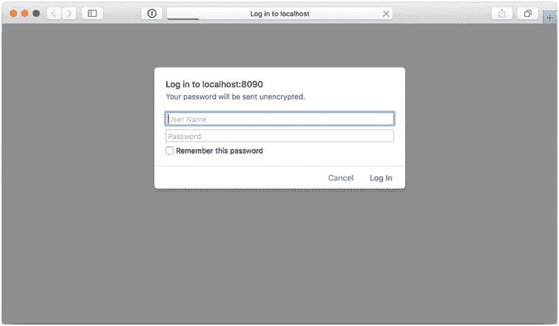

图 7-3. 基本身份验证登录界面

做出访问控制决策

表 7-8 显示了 Spring Security WebFlux 内置表达式。

表 7-8. Spring Security WebFlux 内置表达式

| 表达式 | 描述 |
| --- | --- |
| `hasRole(role)` 或 `hasAuthority(authority)` | 如果当前用户拥有给定角色，则返回 `true` |
| `permitAll()` | 始终评估为 `true` |
| `denyAll()` | 始终评估为 `false` |
| `authenticated()` | 如果用户已通过身份验证，则返回 `true` |
| `access()` | 使用函数来确定是否授予访问权限 |

注意


尽管角色和权限几乎相同，但在处理方式上存在一个微小但重要的区别。使用 `hasRole` 时，会检查传入的角色值是否以 `ROLE_`（默认角色前缀）开头。如果不是，则在检查权限之前会添加此前缀。因此，`hasRole('ADMIN')` 实际上会检查当前用户是否拥有 `ROLE_ADMIN` 权限。而使用 `hasAuthority` 时，则会按原样检查该值。

```
@Bean
SecurityWebFilterChain springWebFilterChain(HttpSecurity http) throws Exception {
return http
.authorizeExchange()
.pathMatchers("/users/{user}/**").access(this::userEditAllowed)
.anyExchange().authenticated()
.and()
.build();
}
private Mono userEditAllowed(Mono authentication, AuthorizationContext context) {
return authentication
.map( a -> context.getVariables().get("user").equals(a.getName()) || a.getAuthorities().contains(new SimpleGrantedAuthority("ROLE_ADMIN")))
.map( granted -> new AuthorizationDecision(granted));
}
```

`access()` 表达式可用于编写强大的表达式。前面的代码片段使用了 URL `{user}` 中的路径参数，如果当前用户是实际用户或拥有 `ROLE_ADMIN` 权限，则允许访问。`AuthorizationContext` 包含已解析的变量，可用于比较 URI 中的名称。`Authentication` 包含 `GrantedAuthorities` 的集合，可以检查其中是否包含 `ROLE_ADMIN` 权限。当然，你可以根据需要编写任意复杂的表达式；例如，可以检查 IP 地址、请求头等。

总结

在本章中，你学习了如何使用 Spring Security 保护应用程序安全。它可以用于保护任何 Java 应用程序，但主要用于 Web 应用程序。身份验证、授权和访问控制的概念在安全领域至关重要，因此你应该对它们有清晰的理解。

你通常需要通过防止未经授权的访问来保护关键 URL。Spring Security 可以帮助你以声明式方式实现这一点。它通过应用 Servlet 过滤器来处理安全性，这些过滤器可以通过简单的基于 Java 的配置进行配置。Spring Security 会自动为你配置基本的安全服务，并默认尽可能确保安全。

Spring Security 支持用户登录 Web 应用程序的多种方式，例如基于表单的登录和 HTTP Basic 身份验证。它还提供匿名登录服务，允许你将匿名用户视为普通用户。Remember-me 支持允许应用程序在多个浏览器会话中记住用户的身份。

Spring Security 支持多种用户身份验证方式，并内置了相应的提供程序实现。例如，它支持针对内存定义、关系数据库和 LDAP 仓库进行用户身份验证。你应该始终在用户仓库中存储加密的密码，因为明文密码容易受到黑客攻击。Spring Security 还支持在本地缓存用户详细信息，以节省执行远程查询的开销。

关于是否允许用户访问给定资源的决策由访问决策管理器做出。Spring Security 提供了三个基于投票方法的访问决策管理器。它们都需要配置一组投票者来对访问控制决策进行投票。

Spring Security 使你能够以声明式方式保护方法调用，可以通过在 Bean 定义中嵌入安全拦截器，或者使用 AspectJ 切入点表达式或注解匹配多个方法。Spring Security 还允许你在 JSP 视图中显示用户的身份验证信息，并根据用户的权限有条件地渲染视图内容。

Spring Security 提供了一个 ACL 模块，允许每个领域对象拥有一个用于控制访问的 ACL。你可以使用 Spring Security 的高性能 API（通过 JDBC 实现）来读取和维护每个领域对象的 ACL。Spring Security 还提供了诸如访问决策投票者和 JSP 标签之类的工具，使你能够将 ACL 与其他安全设施一致地使用。

Spring Security 还支持保护基于 Spring WebFlux 的应用程序。在前面的方法中，你探索了如何为此类应用程序添加安全性。

8. Spring Mobile

如今，移动设备比以往任何时候都多。这些移动设备中的大多数都可以访问互联网和网站。然而，某些移动设备的浏览器可能缺少你在网站上使用的某些 HTML 或 JavaScript 功能；你可能还想向移动用户显示不同的网站，或者让他们选择查看移动版本。在这些情况下，你可以自己编写所有设备检测例程，但 Spring Mobile 提供了检测正在使用的设备的方法。

8-1. 不使用 Spring Mobile 检测设备

问题

你想检测连接到你的网站的设备类型。

解决方案

创建一个 `Filter`，用于检测传入请求的 `User-Agent` 值，并设置一个请求属性，以便可以在控制器中检索它。

工作原理

以下是基于 `User-Agent` 进行设备检测所需的 `Filter` 实现：

```
package com.apress.springrecipes.mobile.web.filter;
import org.springframework.util.StringUtils;
import org.springframework.web.filter.OncePerRequestFilter;
import javax.servlet.FilterChain;
import javax.servlet.ServletException;
import javax.servlet.http.HttpServletRequest;
import javax.servlet.http.HttpServletResponse;
import java.io.IOException;
public class DeviceResolverRequestFilter extends OncePerRequestFilter {
public static final String CURRENT_DEVICE_ATTRIBUTE = "currentDevice";
public static final String DEVICE_MOBILE = "MOBILE";
public static final String DEVICE_TABLET = "TABLET";
public static final String DEVICE_NORMAL = "NORMAL";
@Override
protected void doFilterInternal(HttpServletRequest request, HttpServletResponse response,
FilterChain filterChain) throws ServletException, IOException {
String userAgent = request.getHeader("User-Agent");
String device = DEVICE_NORMAL;
if (StringUtils.hasText(userAgent)) {
userAgent = userAgent.toLowerCase();
if (userAgent.contains("android")) {
device = userAgent.contains("mobile") ? DEVICE_NORMAL : DEVICE_TABLET;
} else if (userAgent.contains("ipad") || userAgent.contains("playbook") || userAgent.contains("kindle")) {
device = DEVICE_TABLET;
} else if (userAgent.contains("mobil") || userAgent.contains("ipod") || userAgent.contains("nintendo DS")) {
device = DEVICE_MOBILE;
}
}
request.setAttribute(CURRENT_DEVICE_ATTRIBUTE, device);
filterChain.doFilter(request, response);
}
}
```

此实现首先从传入请求中检索 `User-Agent` 头。当其中存在值时，过滤器需要检查头中的内容。头中有一些 `if`/`else` 结构用于对设备类型进行基本检测。Android 有一个特殊情况，因为它可能是平板电脑或移动设备。当过滤器确定设备类型后，该类型将作为请求属性存储，以便其他组件可以使用。接下来，有一个控制器和 JSP 页面来显示一些关于当前状态的信息。该控制器只是定向到位于 `WEB-INF/views` 目录中的 `home.jsp` 页面。配置好的 `InternalResourceViewResolver` 负责将名称解析为实际的 JSP 页面（更多信息，请参考第 4 章中的方法）。


```
package com.apress.springrecipes.mobile.web;
import org.springframework.stereotype.Controller;
import org.springframework.web.bind.annotation.RequestMapping;
import javax.servlet.http.HttpServletRequest;
@Controller
public class HomeController {
@RequestMapping("/home")
public String index(HttpServletRequest request) {
return "home";
}
}
```

以下是 `home.jsp` 页面：

```

欢迎

您的 User-Agent 标头：

您的设备类型：

```

JSP 页面显示了 `User-Agent` 标头（如果有）以及设备类型，该类型由您自己的 `DeviceResolverRequestFilter` 确定。

最后，这是配置和引导逻辑：

```
package com.apress.springrecipes.mobile.web.config;
import org.springframework.context.annotation.Bean;
import org.springframework.context.annotation.ComponentScan;
import org.springframework.context.annotation.Configuration;
import org.springframework.web.servlet.ViewResolver;
import org.springframework.web.servlet.config.annotation.EnableWebMvc;
import org.springframework.web.servlet.view.InternalResourceView;
import org.springframework.web.servlet.view.InternalResourceViewResolver;
@Configuration
@ComponentScan("com.apress.springrecipes.mobile.web")
public class MobileConfiguration {
@Bean
public ViewResolver viewResolver() {
InternalResourceViewResolver viewResolver = new InternalResourceViewResolver();
viewResolver.setPrefix("/WEB-INF/views/");
viewResolver.setSuffix(".jsp");
return viewResolver;
}
}
```

控制器由 `@ComponentScan` 注解自动扫描。为了引导应用程序，存在 `MobileApplicationInitializer`，它负责引导 `DispatcherServlet` 和可选的 `ContextLoaderListener`。

```
package com.apress.springrecipes.mobile.web;
import com.apress.springrecipes.mobile.web.config.MobileConfiguration;
import com.apress.springrecipes.mobile.web.filter.DeviceResolverRequestFilter;
import org.springframework.web.servlet.support.AbstractAnnotationConfigDispatcherServletInitializer;
import javax.servlet.Filter;
public class MobileApplicationInitializer extends AbstractAnnotationConfigDispatcherServletInitializer {
@Override
protected Class[] getRootConfigClasses() {
return null;
}
@Override
protected Class[] getServletConfigClasses() {
return new Class[] { MobileConfiguration.class };
}
@Override
protected Filter[] getServletFilters() {
return new Filter[] {new DeviceResolverRequestFilter()};
}
@Override
protected String[] getServletMappings() {
return new String[] {"/"};
}
}
```

这里需要注意两点。首先，前面提到的配置类通过实现 `getServletConfigClasses` 方法传递给 `DispatcherServlet`。其次，`getServletFilters` 方法的实现负责注册过滤器并将其映射到 `DispatcherServlet`。部署应用程序后，使用 `http://localhost:8080/mobile/home` 将显示 `User-Agent` 值以及过滤器认为的设备类型（参见图 8-1）。

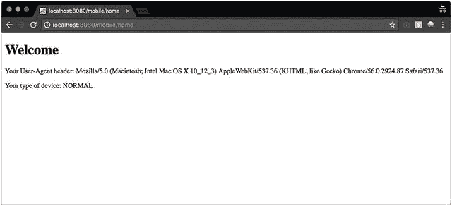

图 8-1. 在 Chrome 中查看应用程序

在 iMac 上使用 Chrome 会产生如图 8-1 所示的结果。当使用 iPhone 时，看起来像图 8-2。

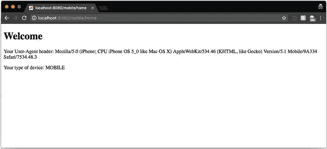

图 8-2. 使用 iPhone 4 查看应用程序

注意

要测试不同的浏览器，您可以使用内部网络上的平板电脑或移动设备，或者使用浏览器插件，例如 Chrome 或 Firefox 的 User-Agent Switcher。

尽管过滤器完成了它的工作，但它远非完美。例如，某些移动设备不匹配规则（Kindle Fire 的标头与普通 Kindle 设备不同）。维护规则和设备列表，或者用许多设备进行测试也相当困难。使用像 Spring Mobile 这样的库比自己动手做要容易得多。

8-2. 使用 Spring Mobile 检测设备

问题

您想要检测连接到您网站的设备的类型，并希望使用 Spring Mobile 来帮助您实现这一点。

解决方案

使用 Spring Mobile 的 `DeviceResolver` 和辅助类，通过配置 `DeviceResolverRequestFilter` 或 `DeviceResolverHandlerInterceptor` 来确定设备类型。

工作原理

`DeviceResolverRequestFilter` 和 `DeviceResolverHandlerInterceptor` 都将设备类型的检测委托给 `DeviceResolver` 类。Spring Mobile 提供了该接口的一个实现，名为 `LiteDeviceResolver`。`DeviceResolver` 类返回一个 `Device` 对象，该对象指示设备类型。此 `Device` 对象作为请求属性存储，以便在后续链中使用。Spring Mobile 附带了一个 `Device` 接口的默认实现 `LiteDevice`。

使用 DeviceResolverRequestFilter

使用 `DeviceResolverRequestFilter` 只需将其添加到 Web 应用程序，并将其映射到您希望它处理的 Servlet 或请求即可。对于您的应用程序，这意味着将其添加到 `getServletFilters` 方法中。使用此过滤器的优点是，即使在基于 Spring 的应用程序之外也可以使用它。例如，它可以在基于 JSF 的应用程序中使用。

```
package com.apress.springrecipes.mobile.web;
...
import org.springframework.mobile.device.DeviceResolverRequestFilter;
public class MobileApplicationInitializer extends AbstractAnnotationConfigDispatcherServletInitializer {
...
@Override
protected Filter[] getServletFilters() {
return new Filter[] {new DeviceResolverRequestFilter()};
}
}
```

此配置注册了 `DeviceResolverRequestFilter`，并将自动将其附加到由 `DispatcherServlet` 处理的请求。要测试这一点，请向 `http://localhost:8080/mobile/home` 发出请求，它应该显示如下内容：

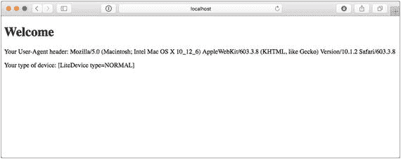

设备的输出是 Spring Mobile 提供的 `LiteDevice` 类上 `toString` 方法创建的文本。

使用 DeviceResolverHandlerInterceptor

在基于 Spring MVC 的应用程序中使用 Spring Mobile 时，使用 `DeviceResolverHandlerInterceptor` 更容易。这需要在您的配置类中进行配置，并使用 `addInterceptors` 辅助方法进行注册。

```
package com.apress.springrecipes.mobile.web.config;
import org.springframework.mobile.device.DeviceResolverHandlerInterceptor;
import org.springframework.web.servlet.config.annotation.InterceptorRegistry;
import org.springframework.web.servlet.config.annotation.WebMvcConfigurerAdapter;
@Configuration
@EnableWebMvc
@ComponentScan("com.apress.springrecipes.mobile.web")
public class MobileConfiguration extends WebMvcConfigurerAdapter {
...
@Override
public void addInterceptors(InterceptorRegistry registry) {
registry.addInterceptor(new DeviceResolverHandlerInterceptor());
}
}
```

`MobileConfiguration` 类继承自 `WebMvcConfigurerAdapter`，您可以重写 `addInterceptors` 方法。所有添加到注册表中的拦截器都将被添加到应用程序上下文中的 `HandlerMapping` Bean 中。当应用程序部署并向 `http://localhost:8080/mobile/home` 发出请求时，结果应与使用过滤器时相同。

8-3. 使用站点偏好设置

问题

您希望允许用户选择他们使用设备访问的站点类型，并存储此信息以供将来参考。

解决方案

使用 Spring Mobile 提供的 `SitePreference` 支持。

工作原理

`SitePreferenceRequestFilter` 和 `SitePreferenceHandlerInterceptor` 都将当前 `SitePreference` 的检索委托给 `SitePreferenceHandler` 对象。默认实现使用 `SitePreferenceRepository` 类来存储偏好设置；默认情况下，这存储在 Cookie 中。

使用 SitePreferenceRequestFilter


使用 `SitePreferenceRequestFilter`
只需将其添加到 Web 应用程序中，并映射到您希望它处理的 Servlet 或请求即可。对于您的应用程序而言，这意味着将其添加到 `getServletFilters`
方法中。使用过滤器的一个优势是，即使在非基于 Spring 的应用程序中也可以使用它。它同样可以用于基于 JSF 的应用程序。

```
package com.apress.springrecipes.mobile.web;
import org.springframework.mobile.device.site.SitePreferenceRequestFilter;
...
public class MobileApplicationInitializer extends AbstractAnnotationConfigDispatcherServletInitializer {
@Override
protected Filter[] getServletFilters() {
return new Filter[] {
new DeviceResolverRequestFilter(),
new SitePreferenceRequestFilter()};
}
...
}
```

现在，`SitePreferenceRequestFilter`
已注册，它将检查传入的请求。如果请求包含名为 `site_preference` 的参数，它将使用传入的值（`NORMAL`、`MOBILE` 或 `TABLET`）来设置
`SitePreference`
值。确定的值会存储在 Cookie 中，并供后续参考使用；如果检测到新值，Cookie 值将被重置。
修改 `home.jsp` 页面，使其包含以下内容，以便显示当前的 `SitePreference` 值：

```
您的站点偏好设置

```

现在，使用 URL `http://localhost:8080/mobile/home?site_preference=TABLET`
打开页面，会将 `SitePreference` 值
设置为 `TABLET`。

使用 SitePreferenceHandlerInterceptor

在基于 Spring MVC 的应用程序中使用 Spring Mobile 时，使用 `SitePreferenceHandlerInterceptor`
会更加方便。这需要在您的配置类中进行配置，并通过
`addInterceptors`
辅助方法进行注册。

```
package com.apress.springrecipes.mobile.web.config;
import org.springframework.mobile.device.DeviceResolverHandlerInterceptor;
import org.springframework.mobile.device.site. SitePreferenceHandlerInterceptor;
import org.springframework.web.servlet.config.annotation.InterceptorRegistry;
import org.springframework.web.servlet.config.annotation.WebMvcConfigurerAdapter;
@Configuration
@EnableWebMvc
@ComponentScan("com.apress.springrecipes.mobile.web")
public class MobileConfiguration extends WebMvcConfigurerAdapter {
...
@Override
public void addInterceptors(InterceptorRegistry registry) {
registry.addInterceptor(new DeviceResolverHandlerInterceptor());
registry.addInterceptor(new SitePreferenceHandlerInterceptor());
}
}
```

`MobileConfiguration`
类继承了 `WebMvcConfigurerAdapter`
，您可以重写 `addInterceptors`
方法。所有添加到注册表中的拦截器都会被添加到应用程序上下文中的
`HandlerMapping`
Bean 中。当应用程序部署后，向 `http://localhost:8080/mobile/home?site_preference=TABLET` 发起请求时，其结果应与上一节中过滤器的结果相同。

8-4. 使用设备信息渲染视图

问题

您希望根据设备或站点偏好设置来渲染不同的视图。

解决方案

使用当前的 `Device` 和 `SitePreferences`
对象来决定渲染哪个视图。这可以手动完成，也可以通过使用 `LiteDeviceDelegatingViewResolver`
来实现。

工作原理

现在，已知设备类型，就可以利用它来为您服务。首先，为每种支持的设备类型创建一些额外的视图，并将它们分别放置在
`WEB-INF/views` 下的 `mobile` 或 `tablet` 目录中。以下是 `mobile/home.jsp` 的源代码：

```

欢迎移动设备用户

您的 User-Agent 标头：

您的设备类型：

您的站点偏好设置

```

以下是 `tablet/home.jsp` 的源代码：

```

欢迎平板设备用户

您的 User-Agent 标头：

您的设备类型：

您的站点偏好设置

```

现在，不同的视图已经就位，您需要找到一种方法来根据检测到的设备值渲染它们。一种方法是手动从请求中获取当前设备，并使用它来决定渲染哪个视图。

```
package com.apress.springrecipes.mobile.web;
import org.springframework.mobile.device.Device;
import org.springframework.mobile.device.DeviceUtils;
import org.springframework.stereotype.Controller;
import org.springframework.web.bind.annotation.RequestMapping;
import javax.servlet.http.HttpServletRequest;
@Controller
public class HomeController {
@RequestMapping("/home")
public String index(HttpServletRequest request) {
Device device = DeviceUtils.getCurrentDevice(request);
if (device.isMobile()) {
return "mobile/home";
} else if (device.isTablet()) {
return "tablet/home";
} else {
return "home";
}
}
}
```

Spring Mobile 提供了一个 `DeviceUtils` 类，可用于检索当前设备。当前设备是从一个请求属性（`currentDevice`）中检索的，该属性由过滤器或拦截器设置。设备值可用于决定渲染哪个视图。

在每个需要设备的方法中获取设备并不十分方便。如果能将其作为方法参数传递给控制器方法，则会简单得多。为此，您可以使用 `DeviceHandlerMethodArgumentResolver`，注册后，它会将方法参数解析为当前设备。要检索当前的 `SitePreference` 值，您可以添加一个 `SitePreferenceHandlerMethodArgumentResolver` 类。

```
package com.apress.springrecipes.mobile.web.config;
import org.springframework.mobile.device.DeviceHandlerMethodArgumentResolver;
...
import java.util.List;
@Configuration
@EnableWebMvc
@ComponentScan("com.apress.springrecipes.mobile.web")
public class MobileConfiguration extends WebMvcConfigurerAdapter {
...
@Override
public void addArgumentResolvers(List argumentResolvers) {
argumentResolvers.add(new DeviceHandlerMethodArgumentResolver());
argumentResolvers.add(new SitePreferenceHandlerMethodArgumentResolver());
}
}
```

现在，这些解析器已注册，控制器方法可以简化，并且 `Device` 值可以作为方法参数传入。

```
package com.apress.springrecipes.mobile.web;
import org.springframework.mobile.device.Device;
import org.springframework.stereotype.Controller;
import org.springframework.web.bind.annotation.RequestMapping;
import javax.servlet.http.HttpServletRequest;
@Controller
public class HomeController {
@RequestMapping("/home")
public String index(Device device) {
if (device.isMobile()) {
return "mobile/home";
} else if (device.isTablet()) {
return "tablet/home";
} else {
return "home";
}
}
}
```

方法签名从接收 `HttpServletRequest` 值变为了接收 `Device` 值。这处理了查找逻辑，并将传入当前设备。然而，虽然这比手动检索更方便，但这仍然是一种相当过时的决定渲染哪个视图的方式。目前，偏好设置并未被考虑在内，但可以将其添加到方法签名中，并用于确定偏好。然而，这会使检测算法变得复杂。想象一下，在多个控制器方法中重复这样的代码，很快就会变成维护噩梦。

Spring Mobile 提供了一个 `LiteDeviceDelegatingViewResolver` 类，在视图名称传递给实际的视图解析器之前，可以使用它来为视图名称添加额外的前缀和/或后缀。它还会考虑用户的可选站点偏好设置。


```
package com.apress.springrecipes.mobile.web.config;
import org.springframework.mobile.device.view.LiteDeviceDelegatingViewResolver;
...
@Configuration
@EnableWebMvc
@ComponentScan("com.apress.springrecipes.mobile.web")
public class MobileConfiguration extends WebMvcConfigurerAdapter {
...
@Bean
public ViewResolver viewResolver() {
InternalResourceViewResolver viewResolver = new InternalResourceViewResolver();
viewResolver.setPrefix("/WEB-INF/views/");
viewResolver.setSuffix(".jsp");
viewResolver.setOrder(2);
return viewResolver;
}
@Bean
public ViewResolver mobileViewResolver() {
LiteDeviceDelegatingViewResolver delegatingViewResolver =
new LiteDeviceDelegatingViewResolver(viewResolver());
delegatingViewResolver.setOrder(1);
delegatingViewResolver.setMobilePrefix("mobile/");
delegatingViewResolver.setTabletPrefix("tablet/");
return delegatingViewResolver;
}
}
```

`LiteDeviceDelegatingViewResolver`
     接受一个委托视图解析器作为构造函数参数；之前配置的 `InternalResourceViewResolver`
被作为委托传入。另外，请注意视图解析器的顺序；你必须确保 `LiteDeviceDelegatingViewResolver`
在任何其他视图解析器之前执行。这样，它才有机会判断特定设备是否存在自定义视图。接下来，注意配置中移动设备的视图位于 `mobile` 目录下，而平板设备的视图位于 `tablet` 目录下。为了将这些目录添加到视图名称中，这些设备类型的前缀被设置为各自的目录。现在，当控制器返回 `home` 作为移动设备要选择的视图名称时，它将被转换为 `mobile/home`。这个修改后的名称被传递给 `InternalResourceViewResolver`，后者将其转换为 `/WEB-INF/views/mobile/home.jsp`，即你实际想要渲染的页面。

```
package com.apress.springrecipes.mobile.web;
import org.springframework.stereotype.Controller;
import org.springframework.web.bind.annotation.RequestMapping;
@Controller
public class HomeController {
@RequestMapping("/home")
public String index() {
return "home";
}
}
```

控制器现在非常简洁。它只关心返回视图的名称。渲染哪个视图的决定权留给了配置好的视图解析器。`LiteDeviceDelegatingViewResolver`
在找到 `SitePreferences` 值时，会将其纳入考虑。

8-5\. 实现站点切换

问题

你的移动站点托管在与普通网站不同的 URL 上。

解决方案

使用 Spring Mobile 的站点切换
支持，重定向到网站中适当的部分。

工作原理

Spring Mobile 提供了一个 `SiteSwitcherHandlerInterceptor`
类，你可以使用它根据检测到的 `Device` 值切换到网站的移动版本。要配置 `SiteSwitcherHandlerInterceptor`，有几个工厂方法提供了即用型设置（参见表 8-1）。

表 8-1.

`SiteSwitcherHandlerInterceptor` 上的工厂方法概览

| 工厂方法 | 描述 |
| --- | --- |
| `mDot` | 重定向到以 `m.` 开头的域名；例如，[`http://www.yourdomain.com`](http://www.yourdomain.com) 将重定向到 [`http://m.yourdomain.com`](http://m.yourdomain.com)。 |
| `dotMobi` | 重定向到以 `.mobi` 结尾的域名。对 [`http://www.yourdomain.com`](http://www.yourdomain.com) 的请求将重定向到 [`http://www.yourdomain.mobi`](http://www.yourdomain.mobi)。 |
| `urlPath` | 为不同设备设置不同的上下文根。这将重定向到该设备配置的 URL 路径。例如，[`http://www.yourdomain.com`](http://www.yourdomain.com) 可以重定向到 [`http://www.yourdomain.com/mobile`](http://www.yourdomain.com/mobile)。 |
| `standard` | 这是最灵活的可配置工厂方法，允许你为网站的移动版、平板版和普通版指定要重定向到的域名。 |

`SiteSwitcherHandlerInterceptor`
还提供了使用站点首选项的能力。使用 `SiteSwitcherHandlerInterceptor` 时，你不再需要注册 `SitePreferencesHandlerInterceptor`，因为这已经处理好了。配置就像将其添加到要应用的拦截器列表中一样简单；唯一要记住的是，你需要将其放在 `DeviceResolverHandlerInterceptor` 之后，因为需要设备信息来计算重定向 URL。

```
package com.apress.springrecipes.mobile.web.config;
...
import org.springframework.mobile.device.switcher.SiteSwitcherHandlerInterceptor;
@Configuration
@EnableWebMvc
@ComponentScan("com.apress.springrecipes.mobile.web")
public class MobileConfiguration extends WebMvcConfigurerAdapter {
@Override
public void addInterceptors(InterceptorRegistry registry) {
registry.addInterceptor(new DeviceResolverHandlerInterceptor());
registry.addInterceptor(siteSwitcherHandlerInterceptor());
}
@Bean
public SiteSwitcherHandlerInterceptor siteSwitcherHandlerInterceptor() {
return SiteSwitcherHandlerInterceptor.mDot("yourdomain.com", true);
}
...
}
```

注意在 `SiteSwitcherHandlerInterceptor` 的 bean 声明中，使用了工厂方法 `mDot` 来创建实例。该方法接受两个参数。第一个是要使用的基础域名，第二个是一个布尔值，指示是否应将平板设备视为移动设备。默认值为 `false`。此配置将导致来自移动设备的请求从普通网站重定向到 `m.yourdomain.com`。

```
@Bean
public SiteSwitcherHandlerInterceptor siteSwitcherHandlerInterceptor() {
return SiteSwitcherHandlerInterceptor.dotMobi("yourdomain.com", true);
}
```

上述配置使用了 `dotMobi` 工厂方法，它接受两个参数。第一个是要使用的基础域名，第二个是一个布尔值，指示是否将平板设备视为移动设备；默认值为 `false`。这将导致来自移动设备的请求从你的普通网站重定向到 `yourdomain.mobi`。

```
@Bean
public SiteSwitcherHandlerInterceptor siteSwitcherHandlerInterceptor() {
return SiteSwitcherHandlerInterceptor.urlPath("/mobile", "/tablet", "/home");
}
```

上述配置使用了带有三个参数的 `urlPath` 工厂方法。第一个参数是移动设备的上下文根，第二个是平板设备的上下文根。最后一个参数是你的应用程序的根路径。`urlPath` 工厂方法还有另外两种变体：一种只接受移动设备的路径，另一种接受移动设备的路径和根路径。上述配置将导致来自移动设备的请求被重定向到 `yourdomain.com/home/mobile`，来自平板设备的请求被重定向到 `yourdomain.com/home/tablet`。

最后，还有标准工厂方法，它是最灵活且配置最详尽的。

```
@Bean
public SiteSwitcherHandlerInterceptor siteSwitcherHandlerInterceptor() {
return SiteSwitcherHandlerInterceptor
.standard("yourdomain.com", "mobile.yourdomain.com",
"tablet.yourdomain.com", "*.yourdomain.com");
}
```

上述配置使用了 `standard` 工厂方法。它为网站的普通版、移动版和平板版指定了不同的域名。最后，它指定了用于存储站点首选项的 cookie 的域名。由于指定了不同的子域名，因此需要这样做。

`standard` 工厂方法还有其他几种变体，允许对前面展示的配置进行子集配置。

总结


在本章中，您学习了如何使用 Spring Mobile，它可以检测请求页面的设备，并允许用户根据偏好选择特定页面。您学习了如何通过 `DeviceResolverRequestFilter` 或 `DeviceResolverHandlerInterceptor` 检测用户设备。还学习了如何使用 `SitePreferences` 允许用户覆盖检测到的设备。接着，您了解了如何利用设备信息和偏好为该设备渲染视图。最后，您学习了如何根据用户设备或站点偏好将用户重定向到网站的不同部分。

## 9. 数据访问

在本章中，您将学习 Spring 如何简化数据库访问任务（Spring 还能简化 NoSQL 和大数据任务，这些内容将在第 12 章中介绍）。数据访问是大多数企业应用程序的常见需求，通常需要访问存储在关系数据库中的数据。作为 Java SE 的重要组成部分，Java 数据库连接（JDBC）定义了一套标准 API，使您能够以与供应商无关的方式访问关系数据库。

JDBC 的目的是提供 API，通过这些 API 您可以对数据库执行 SQL 语句。然而，使用 JDBC 时，您必须自行管理数据库相关资源并显式处理数据库异常。为了使 JDBC 更易于使用，Spring 提供了一个用于与 JDBC 交互的抽象框架。作为 Spring JDBC 框架的核心，JDBC 模板旨在为不同类型的 JDBC 操作提供模板方法。每个模板方法负责控制整体流程，并允许您覆盖流程中的特定任务。

如果原始 JDBC 无法满足您的需求，或者您认为应用程序可以从更高级别的抽象中受益，那么 Spring 对对象关系映射（ORM）解决方案的支持将引起您的兴趣。在本章中，您还将学习如何将 ORM 框架集成到 Spring 应用程序中。Spring 支持大多数流行的 ORM（或数据映射器）框架，包括 Hibernate、JDO、iBATIS 和 Java 持久化 API（JPA）。从 Spring 3.0 开始不再支持经典的 TopLink（当然，JPA 实现仍然受支持）。然而，JPA 支持因多种 JPA 实现而异，包括基于 Hibernate 和 TopLink 的版本。本章将重点介绍 Hibernate 和 JPA。不过，Spring 对 ORM 框架的支持是一致的，因此您可以轻松地将本章中的技术应用于其他 ORM 框架。

ORM 是一种将对象持久化到关系数据库中的现代技术。ORM 框架根据您提供的映射元数据（基于 XML 或注解），例如类与表、属性与列之间的映射等，来持久化您的对象。它在运行时生成用于对象持久化的 SQL 语句，因此除非您想利用数据库特定功能或提供自己优化的 SQL 语句，否则无需编写特定于数据库的 SQL 语句。因此，您的应用程序将独立于数据库，并且将来可以轻松迁移到其他数据库。与直接使用 JDBC 相比，ORM 框架可以显著减少应用程序的数据访问工作量。

Hibernate 是 Java 社区中流行的开源高性能 ORM 框架。Hibernate 支持大多数符合 JDBC 规范的数据库，并可以使用特定方言访问特定数据库。除了基本的 ORM 功能外，Hibernate 还支持更高级的功能，如缓存、级联和延迟加载。它还定义了一种称为 Hibernate 查询语言（HQL）的查询语言，供您编写简单而强大的对象查询。

JPA 定义了一套标准的注解和 API，用于在 Java SE 和 Java EE 平台上进行对象持久化。JPA 被定义为 JSR-220 中 EJB 规范的一部分。JPA 只是一套标准 API，需要符合 JPA 规范的引擎来提供持久化服务。您可以将 JPA 与 JDBC API 进行比较，将 JPA 引擎与 JDBC 驱动程序进行比较。Hibernate 可以通过一个名为 Hibernate EntityManager 的扩展模块配置为符合 JPA 规范的引擎。本章将主要演示以 Hibernate 作为底层引擎的 JPA。

## 直接使用 JDBC 的问题

假设您要开发一个车辆注册应用程序，其主要功能是对车辆记录进行基本的创建、读取、更新和删除（CRUD）操作。这些记录将存储在关系数据库中，并通过 JDBC 访问。首先，您设计以下 `Vehicle` 类，它在 Java 中表示一辆车：

```
package com.apress.springrecipes.vehicle;
public class Vehicle {
private String vehicleNo;
private String color;
private int wheel;
private int seat;
// 构造方法、Getter 和 Setter
...
}
```

## 设置应用程序数据库

在开发车辆注册应用程序之前，您必须为其设置数据库。我们选择了 PostgreSQL 作为数据库引擎。PostgreSQL 是一个开源的关系数据库引擎（连接属性见表 9-1）。

**表 9-1.** 连接应用程序数据库的 JDBC 属性

| 属性 | 值 |
| --- | --- |
| 驱动类 | `org.postgresql.Driver` |
| URL | `jdbc:postgresql://localhost:5432/vehicle` |
| 用户名 | `postgres` |
| 密码 | `password` |

**注意**

本章的示例代码在 `bin` 目录中提供了用于启动和连接到基于 Docker 的 PostgreSQL 实例的脚本。要启动实例并创建数据库，请按照以下步骤操作：

1.  执行 `bin\postgres.sh`；这将下载并启动 Postgres Docker 容器。
2.  执行 `bin\psql.sh`；这将连接到正在运行的 Postgres 容器。
3.  执行 `CREATE DATABASE vehicle` 以创建用于示例的数据库。
4.  接下来，您必须使用以下 SQL 语句创建用于存储车辆记录的 `VEHICLE` 表。

```
    CREATE TABLE VEHICLE (
    VEHICLE_NO    VARCHAR(10)    NOT NULL,
    COLOR         VARCHAR(10),
    WHEEL         INT,
    SEAT          INT,
    PRIMARY KEY (VEHICLE_NO)
    );
```

## 理解数据访问对象设计模式

一个典型的设计错误是将不同类型的逻辑（例如，表示逻辑、业务逻辑和数据访问逻辑）混合在单个大型模块中。这由于引入了紧密耦合而降低了模块的可重用性和可维护性。数据访问对象（DAO）模式的通用目的是通过将数据访问逻辑与业务逻辑和表示逻辑分离来避免这些问题。该模式建议将数据访问逻辑封装在称为数据访问对象的独立模块中。

对于您的车辆注册应用程序，您可以抽象出插入、更新、删除和查询车辆的数据访问操作。这些操作应在 DAO 接口中声明，以允许使用不同的 DAO 实现技术。

```
package com.apress.springrecipes.vehicle;
import java.util.List;
public interface VehicleDao {
void insert(Vehicle vehicle);
void insert(Iterable vehicles);
void update(Vehicle vehicle);
void delete(Vehicle vehicle);
Vehicle findByVehicleNo(String vehicleNo);
List findAll();
}
```


JDBC API 的大部分方法都声明抛出 `java.sql.SQLException`。
但由于该接口旨在抽象数据访问操作，
它不应依赖于具体实现技术。因此，这个通用接口声明抛出 JDBC 特有的
`SQLException` 是不明智的。实现 DAO 接口时的常见做法是将此类异常包装为运行时异常（可以是自定义的业务 `Exception` 子类，也可以是通用异常）。

使用 JDBC 实现 DAO

要使用 JDBC 访问数据库，你需要为该 DAO 接口创建一个实现类（例如 `JdbcVehicleDao`）。
由于 DAO 实现需要连接数据库以执行 SQL 语句，你可以通过指定驱动类名、数据库 URL、用户名和密码来建立数据库连接。
不过，你也可以从预配置的 `javax.sql.DataSource` 对象中获取数据库连接，而无需了解连接细节。

```
package com.apress.springrecipes.vehicle;
import javax.sql.DataSource;
import java.sql.Connection;
import java.sql.PreparedStatement;
import java.sql.ResultSet;
import java.sql.SQLException;
import java.util.ArrayList;
import java.util.Collection;
import java.util.List;
public class PlainJdbcVehicleDao implements VehicleDao {
private static final String INSERT_SQL     = "INSERT INTO VEHICLE (COLOR, WHEEL, SEAT, VEHICLE_NO) VALUES (?, ?, ?, ?)";
private static final String UPDATE_SQL     = "UPDATE VEHICLE SET COLOR=?,WHEEL=?,SEAT=? WHERE VEHICLE_NO=?";
private static final String SELECT_ALL_SQL = "SELECT * FROM VEHICLE";
private static final String SELECT_ONE_SQL  = "SELECT * FROM VEHICLE WHERE VEHICLE_NO = ?";
private static final String DELETE_SQL     = "DELETE FROM VEHICLE WHERE VEHICLE_NO=?";
private final DataSource dataSource;
public PlainJdbcVehicleDao(DataSource dataSource) {
this.dataSource = dataSource;
}
@Override
public void insert(Vehicle vehicle) {
try (Connection conn = dataSource.getConnection();
PreparedStatement ps = conn.prepareStatement(INSERT_SQL)) {
prepareStatement(ps, vehicle);
ps.executeUpdate();
} catch (SQLException e) {
throw new RuntimeException(e);
}
}
@Override
public void insert(Collection vehicles) {
vehicles.forEach(this::insert);
}
@Override
public Vehicle findByVehicleNo(String vehicleNo) {
try (Connection conn = dataSource.getConnection();
PreparedStatement ps = conn.prepareStatement(SELECT_ONE_SQL)) {
ps.setString(1, vehicleNo);
Vehicle vehicle = null;
try (ResultSet rs = ps.executeQuery()) {
if (rs.next()) {
vehicle = toVehicle(rs);
}
}
return vehicle;
} catch (SQLException e) {
throw new RuntimeException(e);
}
}
@Override
public List findAll() {
try (Connection conn = dataSource.getConnection();
PreparedStatement ps = conn.prepareStatement(SELECT_ALL_SQL);
ResultSet rs = ps.executeQuery()) {
List vehicles = new ArrayList();
while (rs.next()) {
vehicles.add(toVehicle(rs));
}
return vehicles;
} catch (SQLException e) {
throw new RuntimeException(e);
}
}
private Vehicle toVehicle(ResultSet rs) throws SQLException {
return new Vehicle(rs.getString("VEHICLE_NO"),
rs.getString("COLOR"), rs.getInt("WHEEL"),
rs.getInt("SEAT"));
}
private void prepareStatement(PreparedStatement ps, Vehicle vehicle) throws SQLException {
ps.setString(1, vehicle.getColor());
ps.setInt(2, vehicle.getWheel());
ps.setInt(3, vehicle.getSeat());
ps.setString(4, vehicle.getVehicleNo());
}
@Override
public void update(Vehicle vehicle) { ... }
@Override
public void delete(Vehicle vehicle) { ... }
}
```

车辆插入操作是一个典型的 JDBC 更新场景。每次调用此方法时，你都会从数据源获取一个连接，并在此连接上执行 SQL 语句。你的 DAO 接口没有声明抛出任何受检异常，因此如果发生 `SQLException`，你必须将其包装为非受检的 `RuntimeException`。（本章稍后会详细讨论 DAO 中的异常处理。）此处展示的代码使用了所谓的 try-with-resources 机制，该机制会自动关闭已使用的资源（即 `Connection`、`PreparedStatement` 和 `ResultSet`）。如果你不使用 try-with-resources 块，则必须记住正确关闭已使用的资源；否则会导致连接泄漏。

此处将跳过更新和删除操作，因为从技术角度来看，它们与插入操作非常相似。对于查询操作，除了执行 SQL 语句外，你还需要从返回的结果集中提取数据以构建车辆对象。`toVehicle` 方法是一个简单的辅助方法，用于复用映射逻辑，而 `prepareStatement` 方法则用于帮助设置插入和更新方法的参数。

在 Spring 中配置数据源

`javax.sql.DataSource` 接口是 JDBC 规范定义的一个标准接口，用于工厂化生产 `Connection` 实例。不同供应商和项目提供了多种数据源实现；HikariCP 和 Apache Commons DBCP 是流行的开源选择，大多数应用服务器也会提供自己的实现。由于它们都实现了通用的 `DataSource` 接口，因此在不同数据源实现之间切换非常容易。作为 Java 应用框架，Spring 也提供了几个便捷但功能较弱的数据源实现。最简单的是 `DriverManagerDataSource`，它会在每次请求时打开一个新连接。

```
package com.apress.springrecipes.vehicle.config;
import com.apress.springrecipes.vehicle.PlainJdbcVehicleDao;
import com.apress.springrecipes.vehicle.VehicleDao;
import org.apache.derby.jdbc.ClientDriver;
import org.springframework.context.annotation.Bean;
import org.springframework.context.annotation.Configuration;
import org.springframework.jdbc.datasource.DriverManagerDataSource;
import javax.sql.DataSource;
@Configuration
public class VehicleConfiguration {
@Bean
public VehicleDao vehicleDao() {
return new PlainJdbcVehicleDao(dataSource());
}
@Bean
public DataSource dataSource() {
DriverManagerDataSource dataSource = new DriverManagerDataSource();
dataSource.setDriverClassName(ClientDriver.class.getName());
dataSource.setUrl("jdbc:derby://localhost:1527/vehicle;create=true");
dataSource.setUsername("app");
dataSource.setPassword("app");
return dataSource;
}
}
```

`DriverManagerDataSource` 不是一个高效的数据源实现，因为它每次被请求时都会为客户端打开一个新连接。Spring 提供的另一个数据源实现是 `SingleConnectionDataSource`（`DriverManagerDataSource` 的子类）。顾名思义，它只维护一个连接，该连接一直被重用且从不关闭。显然，它不适用于多线程环境。

Spring 自身的数据源实现主要用于测试目的。然而，许多生产环境的数据源实现都支持连接池。例如，HikariCP 提供了 `HikariDataSource`，它接受与 `DriverManagerDataSource` 相同的连接属性，并允许你指定连接池的最小池大小和最大活动连接数等信息。


```
@Bean
public DataSource dataSource() {
HikariDataSource dataSource = new HikariDataSource();
dataSource.setUsername("postgres");
dataSource.setPassword("password");
dataSource.setJdbcUrl("jdbc:postgresql://localhost:5432/vehicle");
dataSource.setMinimumIdle(2);
dataSource.setMaximumPoolSize(5);
return dataSource;
}
```

注意

要使用 HikariCP 提供的数据源实现，您需要将其添加到您的 `CLASSPATH` 中。如果您使用 Maven，请将以下依赖项添加到您的项目中：

```
com.zaxxer
HikariCP
2.6.1

```

如果您使用 Gradle，请使用以下配置：

```
compile 'com.zaxxer:HikariCP:2.6.1'
```

许多 Java EE 应用服务器内置了数据源实现，您可以通过服务器控制台或配置文件进行配置。如果您在应用服务器中配置了数据源并暴露给 JNDI 查找，则可以使用 `JndiDataSourceLookup` 来查找它。

```
@Bean
public DataSource dataSource() {
return new JndiDataSourceLookup().getDataSource("jdbc/VehicleDS");
}
```

运行 DAO

以下 `Main` 类通过向数据库插入一辆新车来测试您的 DAO。如果插入成功，您可以立即从数据库中查询该车辆。

```
package com.apress.springrecipes.vehicle;
import org.springframework.context.ApplicationContext;
import org.springframework.context.support.ClassPathXmlApplicationContext;
public class Main {
public static void main(String[] args) {
ApplicationContext context =
new AnnotationConfigApplicationContext(VehicleConfiguration.class);
VehicleDao vehicleDao = context.getBean(VehicleDao.class);
Vehicle vehicle = new Vehicle("TEM0001", "Red", 4, 4);
vehicleDao.insert(vehicle);
vehicle = vehicleDao.findByVehicleNo("TEM0001");
System.out.println(vehicle);
}
}
```

现在您可以直接使用 JDBC 实现 DAO。然而，从上述 DAO 实现中可以看出，大多数 JDBC 代码都是相似的，并且每次数据库操作都需要重复编写。这种冗余代码会使您的 DAO 方法变得冗长且可读性降低。

更进一步

另一种方法是使用对象关系映射（ORM）工具，它允许您编写专门用于将领域模型中的实体映射到数据库表的逻辑。ORM 会反过来计算出如何编写逻辑，以有效地将类的数据持久化到数据库中。这可以极大地解放您：您突然只需关注业务和领域模型，而无需受数据库 SQL 解析器的反复无常所困扰。当然，另一面是，您也放弃了完全控制客户端与数据库之间通信的能力——您必须信任 ORM 层会做出正确的处理。

9-1\. 使用 JDBC 模板更新数据库

问题

使用 JDBC 既繁琐又充满了冗余的 API 调用，其中许多调用本可以由框架为您管理。要实现 JDBC 更新操作，您需要执行以下任务，其中大部分是冗余的：

1.  从数据源获取数据库连接。
2.  从连接创建 `PreparedStatement` 对象。
3.  将参数绑定到 `PreparedStatement` 对象。
4.  执行 `PreparedStatement` 对象。
5.  处理 `SQLException`。
6.  清理语句对象和连接。

JDBC 是一个非常底层的 API，但使用 JDBC 模板后，您需要处理的 API 表面区域会变得更具表现力（您花在细节上的时间更少，而更多时间用于处理应用程序逻辑），并且更易于安全地使用。

解决方案

`org.springframework.jdbc.core.JdbcTemplate` 类声明了许多重载的 `update()` 模板方法，用于控制整个更新过程。不同版本的 `update()` 方法允许您覆盖默认流程中的不同任务子集。Spring JDBC 框架预定义了多个回调接口来封装不同的任务子集。您可以实现其中一个回调接口，并将其实例传递给相应的 `update()` 方法以完成该过程。

工作原理

您将探索使用 `JdbcTemplate` 的各种选项来更新数据库的不同方式。您将了解 `PreparedStatementCreators`、`PreparedStatementSetters`，最后是 `JdbcTemplate` 本身的更新方法。

使用语句创建器更新数据库

第一个要介绍的回调接口是 `PreparedStatementCreator`。您实现此接口以覆盖整个更新过程中的语句创建任务（任务 2）和参数绑定任务（任务 3）。要将车辆插入数据库，您可以按如下方式实现 `PreparedStatementCreator` 接口：

```
package com.apress.springrecipes.vehicle;
import java.sql.Connection;
import java.sql.PreparedStatement;
import java.sql.SQLException;
import org.springframework.jdbc.core.PreparedStatementCreator;
public class JdbcVehicleDao implements VehicleDao {
private class InsertVehicleStatementCreator implements PreparedStatementCreator {
private final Vehicle vehicle;
InsertVehicleStatementCreator(Vehicle vehicle) {
this.vehicle = vehicle;
}
public PreparedStatement createPreparedStatement(Connection con) throws SQLException {
PreparedStatement ps = con.prepareStatement(INSERT_SQL);
prepareStatement(ps, this.vehicle);
return ps;
}
}
}
```

在实现 `PreparedStatementCreator` 接口时，您将获得数据库连接作为 `createPreparedStatement()` 方法的参数。您在此方法中需要做的就是在该连接上创建一个 `PreparedStatement` 对象，并将参数绑定到该对象。最后，您必须将 `PreparedStatement` 对象作为方法的返回值返回。请注意，方法签名声明抛出 `SQLException`，这意味着您无需自己处理此类异常。由于您将此类创建为 DAO 的内部类，因此您可以从实现中调用 `prepareStatement` 辅助方法。

现在，您可以使用此语句创建器来简化车辆插入操作。首先，您需要创建一个 `JdbcTemplate` 类的实例，并为此模板传入数据源以从中获取连接。然后，您只需调用 `update()` 方法，并传入您的语句创建器，模板即可完成更新过程。

```
package com.apress.springrecipes.vehicle;
...
import org.springframework.jdbc.core.JdbcTemplate;
public class JdbcVehicleDao implements VehicleDao {
...
public void insert(Vehicle vehicle) {
JdbcTemplate jdbcTemplate = new JdbcTemplate(dataSource);
jdbcTemplate.update(new InsertVehicleStatementCreator(vehicle));
}
}
```

通常，如果 `PreparedStatementCreator` 接口和其他回调接口仅在一个方法中使用，最好将它们实现为内部类。这是因为您可以直接从内部类访问局部变量和方法参数，而无需将它们作为构造函数参数传递。使用局部变量时，它们必须被标记为 `final`。


```
package com.apress.springrecipes.vehicle;
...
import org.springframework.jdbc.core.JdbcTemplate;
import org.springframework.jdbc.core.PreparedStatementCreator;
public class JdbcVehicleDao implements VehicleDao {
...
public void insert(Vehicle vehicle) {
JdbcTemplate jdbcTemplate = new JdbcTemplate(dataSource);
jdbcTemplate.update(new PreparedStatementCreator() {
public PreparedStatement createPreparedStatement(Connection conn)
throws SQLException {
PreparedStatement ps = conn.prepareStatement(INSERT_SQL);
prepareStatement(ps, vehicle);
return ps;
}
});
}
}
```

在 Java 8 中，这也可以实现为 lambda 表达式。

```
@Override
public void insert(final Vehicle vehicle) {
JdbcTemplate jdbcTemplate = new JdbcTemplate(this.dataSource);
jdbcTemplate.update(con -> {
PreparedStatement ps = con.prepareStatement(INSERT_SQL);
prepareStatement(ps, vehicle);
return ps;
});
}
```

现在你可以删除前面的 `InsertVehicleStatementCreator` 内部类，因为它将不再被使用。

**使用语句设置器更新数据库**

第二个回调接口 `PreparedStatementSetter`，顾名思义，仅执行整个更新过程中的参数绑定任务（任务 3）。

`update()` 模板方法的另一个版本接受一个 SQL 语句和一个 `PreparedStatementSetter` 对象作为参数。此方法会根据你的 SQL 语句为你创建一个 `PreparedStatement` 对象。你使用此接口需要做的就是将参数绑定到 `PreparedStatement` 对象（为此，你可以再次委托给 `prepareStatement` 方法）。

```
package com.apress.springrecipes.vehicle;
...
import org.springframework.jdbc.core.JdbcTemplate;
import org.springframework.jdbc.core.PreparedStatementSetter;
public class JdbcVehicleDao implements VehicleDao {
...
public void insert(final Vehicle vehicle) {
JdbcTemplate jdbcTemplate = new JdbcTemplate(dataSource);
jdbcTemplate.update(INSERT_SQL, new PreparedStatementSetter() {
public void setValues(PreparedStatement ps)
throws SQLException {
prepareStatement(ps, vehicle);
}
});
}
}
```

作为 Java 8 lambda 表达式，它甚至更简洁，如下所示：

```
@Override
public void insert(Vehicle vehicle) {
JdbcTemplate jdbcTemplate = new JdbcTemplate(this.dataSource);
jdbcTemplate.update(INSERT_SQL, ps -> prepareStatement(ps, vehicle));
}
```

**使用 SQL 语句和参数值更新数据库**

最后，`update()` 方法最简单的版本接受一个 SQL 语句和一个对象数组作为语句参数。它会根据你的 SQL 语句创建一个 `PreparedStatement` 对象并为你绑定参数。因此，你无需重写更新过程中的任何任务。

```
package com.apress.springrecipes.vehicle;
...
import org.springframework.jdbc.core.JdbcTemplate;
public class JdbcVehicleDao implements VehicleDao {
...
public void insert(final Vehicle vehicle) {
JdbcTemplate jdbcTemplate = new JdbcTemplate(dataSource);
jdbcTemplate.update(INSERT_SQL, vehicle.getColor(),vehicle.getWheel(), vehicle.getSeat(),vehicle.getVehicleNo() );
}
}
```

在介绍的 `update()` 方法的三种不同版本中，最后一种是最简单的，因为你无需实现任何回调接口。此外，我们成功移除了所有用于参数化查询的 `setX`（如 `setInt`、`setString` 等）风格的方法。相比之下，第一种方法最灵活，因为你可以在 `PreparedStatement` 对象执行之前对其进行任何预处理。在实践中，你应该始终选择能满足你所有需求的最简单版本。

`JdbcTemplate` 类还提供了其他重载的 `update()` 方法。详情请参考 Javadoc。

**批量更新数据库**

假设你想向数据库中批量插入车辆。如果你多次调用 `update()` 方法，由于 SQL 语句会被重复编译，更新速度会非常慢。因此，最好使用批量更新来实现批量插入车辆。

`JdbcTemplate` 类也提供了一些用于批量更新操作的 `batchUpdate()` 模板方法。你将使用的方法接受一个 SQL 语句、一个项目集合、一个批量大小以及一个 `ParameterizedPreparedStatementSetter`。

```
package com.apress.springrecipes.vehicle;
...
import org.springframework.jdbc.core.BatchPreparedStatementSetter;
import org.springframework.jdbc.core.JdbcTemplate;
public class JdbcVehicleDao implements VehicleDao {
...
@Override
public void insert(Collection vehicles) {
JdbcTemplate jdbcTemplate = new JdbcTemplate(this.dataSource);
jdbcTemplate.batchUpdate(INSERT_SQL, vehicles, vehicles.size(), new ParameterizedPreparedStatementSetter() {
@Override
public void setValues(PreparedStatement ps, Vehicle argument) throws SQLException {
prepareStatement(ps, argument);
}
});
}
}
```

以下是 Java 8 lambda 表达式版本：

```
@Override
public void insert(Collection vehicles) {
JdbcTemplate jdbcTemplate = new JdbcTemplate(this.dataSource);
jdbcTemplate.batchUpdate(INSERT_SQL, vehicles, vehicles.size(), this::prepareStatement);
}
```

你可以使用 `Main` 类中的以下代码片段测试你的批量插入操作：

```
package com.apress.springrecipes.vehicle;
...
public class Main {
public static void main(String[] args) {
...
VehicleDao vehicleDao = (VehicleDao) context.getBean("vehicleDao");
Vehicle vehicle1 = new Vehicle("TEM0022", "Blue", 4, 4);
Vehicle vehicle2 = new Vehicle("TEM0023", "Black", 4, 6);
Vehicle vehicle3 = new Vehicle("TEM0024", "Green", 4, 5);
vehicleDao.insertBatch(Arrays.asList(vehicle1, vehicle2, vehicle3));
}
}
```

9-2\. 使用 JDBC 模板查询数据库

**问题**

要实现 JDBC 查询操作，你必须执行以下任务，其中两项（任务 5 和 6）是相对于更新操作额外增加的：

1.  从数据源获取数据库连接。
2.  从连接创建 `PreparedStatement` 对象。
3.  将参数绑定到 `PreparedStatement` 对象。
4.  执行 `PreparedStatement` 对象。
5.  遍历返回的结果集。
6.  从结果集中提取数据。
7.  处理 `SQLException`。
8.  清理语句对象和连接。

然而，与你的业务逻辑唯一相关的步骤是查询的定义和从结果集中提取结果！其余部分最好由 JDBC 模板处理。

**解决方案**

`JdbcTemplate` 类声明了许多重载的 `query()` 模板方法来控制整个查询过程。你可以通过实现 `PreparedStatementCreator` 和 `PreparedStatementSetter` 接口来重写语句创建（任务 2）和参数绑定（任务 3），就像你在更新操作中所做的那样。此外，Spring JDBC 框架支持多种方式来重写数据提取（任务 6）。

**工作原理**

Spring 提供了 `RowCallbackHandler` 和 `RowMapper` 接口来处理查询方法中的结果。你将首先探索这两个接口，并发现它们各自的不同用例。接下来，你将探索如何使用不同的查询方法来检索多个结果以及单个结果。

**使用行回调处理程序提取数据**

`RowCallbackHandler` 是允许你处理结果集当前行的主要接口。其中一个 `query()` 方法会为你遍历结果集，并为每一行调用你的 `RowCallbackHandler`。因此，对于返回结果集中的每一行，`processRow()` 方法都会被调用一次。


```
package com.apress.springrecipes.vehicle;
...
import org.springframework.jdbc.core.JdbcTemplate;
import org.springframework.jdbc.core.RowCallbackHandler;
public class JdbcVehicleDao implements VehicleDao {
...
@Override
public Vehicle findByVehicleNo(String vehicleNo) {
JdbcTemplate jdbcTemplate = new JdbcTemplate(dataSource);
final Vehicle vehicle = new Vehicle();
jdbcTemplate.query(SELECT_ONE_SQL,
new RowCallbackHandler() {
public void processRow(ResultSet rs) throws SQLException {
vehicle.setVehicleNo(rs.getString("VEHICLE_NO"));
vehicle.setColor(rs.getString("COLOR"));
vehicle.setWheel(rs.getInt("WHEEL"));
vehicle.setSeat(rs.getInt("SEAT"));
}
}, vehicleNo);
return vehicle;
}
}
```

使用 Java 8 lambda 表达式时，代码会更紧凑一些。

```
@Override
public Vehicle findByVehicleNo(String vehicleNo) {
JdbcTemplate jdbcTemplate = new JdbcTemplate(dataSource);
final Vehicle vehicle = new Vehicle();
jdbcTemplate.query(SELECT_ONE_SQL,
rs -> {
vehicle.setVehicleNo(rs.getString("VEHICLE_NO"));
vehicle.setColor(rs.getString("COLOR"));
vehicle.setWheel(rs.getInt("WHEEL"));
vehicle.setSeat(rs.getInt("SEAT"));
}, vehicleNo);
return vehicle;
}
```

由于 SQL 查询最多返回一行，你可以创建一个车辆对象作为局部变量，并通过从结果集中提取数据来设置其属性。对于包含多行的结果集，你应该将对象收集到一个列表中。

使用行映射器提取数据

`RowMapper<T>` 接口比 `RowCallbackHandler` 更通用。其目的是将结果集中的单行映射到一个自定义对象，因此它既可以应用于单行结果集，也可以应用于多行结果集。

从复用的角度来看，将 `RowMapper<T>` 接口实现为一个普通类，而不是内部类，是更好的做法。在该接口的 `mapRow()` 方法中，你必须构造代表一行的对象，并将其作为方法的返回值返回。

```
package com.apress.springrecipes.vehicle;
import java.sql.ResultSet;
import java.sql.SQLException;
import org.springframework.jdbc.core.RowMapper;
public class JdbcVehicleDao implements VehicleDao {
private class VehicleRowMapper implements RowMapper {
@Override
public Vehicle mapRow(ResultSet rs, int rowNum) throws SQLException {
return toVehicle(rs);
}
}
}
```

如前所述，`RowMapper<T>` 既可以用于单行结果集，也可以用于多行结果集。当查询一个唯一对象时（例如在 `findByVehicleNo()` 中），你必须调用 `JdbcTemplate` 的 `queryForObject()` 方法。

```
package com.apress.springrecipes.vehicle;
...
import org.springframework.jdbc.core.JdbcTemplate;
public class JdbcVehicleDao implements VehicleDao {
...
public Vehicle findByVehicleNo(String vehicleNo) {
JdbcTemplate jdbcTemplate = new JdbcTemplate(dataSource);
return jdbcTemplate.queryForObject(SELECT_ONE_SQL, new VehicleRowMapper(), vehicleNo);
}
}
```

Spring 提供了一个便捷的 `RowMapper<T>` 实现，即 `BeanPropertyRowMapper<T>`，它可以自动将一行映射到指定类的新实例。请注意，指定的类必须是顶层类，并且必须有一个默认构造函数或无参构造函数。它首先实例化该类，然后通过名称匹配将每个列值映射到一个属性。它支持将属性名称（例如 `vehicleNo`）与相同的列名或带下划线的列名（例如 `VEHICLE_NO`）进行匹配。

```
package com.apress.springrecipes.vehicle;
...
import org.springframework.jdbc.core.BeanPropertyRowMapper;
import org.springframework.jdbc.core.JdbcTemplate;
public class JdbcVehicleDao implements VehicleDao {
...
public Vehicle findByVehicleNo(String vehicleNo) {
JdbcTemplate jdbcTemplate = new JdbcTemplate(dataSource);
return jdbcTemplate.queryForObject(SELECT_ONE_SQL, BeanPropertyRowMapper.newInstance(Vehicle.class), vehicleNo);
}
}
```

查询多行

现在，让我们看看如何查询包含多行的结果集。例如，假设你需要在 DAO 接口中有一个 `findAll()` 方法来获取所有车辆。

```
package com.apress.springrecipes.vehicle;
...
public interface VehicleDao {
...
public List findAll();
}
```

即使没有 `RowMapper<T>` 的帮助，你仍然可以调用 `queryForList()` 方法并传入一条 SQL 语句。返回的结果将是一个映射列表。每个映射存储结果集中的一行，并以列名作为键。

```
package com.apress.springrecipes.vehicle;
...
import org.springframework.jdbc.core.JdbcTemplate;
public class JdbcVehicleDao implements VehicleDao {
...
@Override
public List findAll() {
JdbcTemplate jdbcTemplate = new JdbcTemplate(dataSource);
List> rows = jdbcTemplate.queryForList(SELECT_ALL_SQL);
return rows.stream().map(row -> {
Vehicle vehicle = new Vehicle();
vehicle.setVehicleNo((String) row.get("VEHICLE_NO"));
vehicle.setColor((String) row.get("COLOR"));
vehicle.setWheel((Integer) row.get("WHEEL"));
vehicle.setSeat((Integer) row.get("SEAT"));
return vehicle;
}).collect(Collectors.toList());
}
}
```

你可以使用 `Main` 类中的以下代码片段来测试你的 `findAll()` 方法：

```
package com.apress.springrecipes.vehicle;
...
public class Main {
public static void main(String[] args) {
...
VehicleDao vehicleDao = (VehicleDao) context.getBean("vehicleDao");
List vehicles = vehicleDao.findAll();
vehicles.forEach(System.out::println);
}
}
```

如果你使用 `RowMapper<T>` 对象来映射结果集中的行，你将通过 `query()` 方法获得一个映射对象的列表。

```
package com.apress.springrecipes.vehicle;
...
import org.springframework.jdbc.core.BeanPropertyRowMapper;
import org.springframework.jdbc.core.JdbcTemplate;
public class JdbcVehicleDao implements VehicleDao {
...
public List findAll() {
JdbcTemplate jdbcTemplate = new JdbcTemplate(dataSource);
return jdbcTemplate.query (SELECT_ALL_SQL, BeanPropertyRowMapper.newInstance(Vehicle.class));
}
}
```

查询单个值

最后，让我们考虑一个针对单行单列结果集的查询。作为示例，将以下操作添加到 DAO 接口中：

```
package com.apress.springrecipes.vehicle;
...
public interface VehicleDao {
...
public String getColor(String vehicleNo);
public int countAll();
}
```

要查询单个字符串值，你可以调用重载的 `queryForObject()` 方法，该方法需要一个 `java.lang.Class` 类型的参数。此方法将帮助你把结果值映射到你指定的类型。

```
package com.apress.springrecipes.vehicle;
...
import org.springframework.jdbc.core.JdbcTemplate;
public class JdbcVehicleDao implements VehicleDao {
private static final String COUNT_ALL_SQL = "SELECT COUNT(*) FROM VEHICLE";
private static final String SELECT_COLOR_SQL = "SELECT COLOR FROM VEHICLE WHERE VEHICLE_NO=?";
...
public String getColor(String vehicleNo) {
JdbcTemplate jdbcTemplate = new JdbcTemplate(dataSource);
return jdbcTemplate.queryForObject(SELECT_COLOR_SQL, String.class, vehicleNo);
}
public int countAll() {
JdbcTemplate jdbcTemplate = new JdbcTemplate(dataSource);
return jdbcTemplate.queryForObject(COUNT_ALL_SQL, Integer.class);
}
}
```

你可以使用 `Main` 类中的以下代码片段来测试这两个方法：

```
package com.apress.springrecipes.vehicle;
...
public class Main {
public static void main(String[] args) {
...
VehicleDao vehicleDao = context.getBean(VehicleDao.class);
int count = vehicleDao.countAll();
System.out.println("Vehicle Count: " + count);
String color = vehicleDao.getColor("TEM0001");
System.out.println("Color for [TEM0001]: " + color);
}
}
```

9-3\. 简化 JDBC 模板创建

问题

每次需要 `JdbcTemplate` 时都创建一个新实例效率不高，因为你必须重复创建语句，并且会产生创建新对象的开销。

解决方案


`JdbcTemplate` 类被设计为**线程安全**的，因此你可以在 IoC 容器中声明它的单个实例，并将此实例注入到所有 DAO 实例中。此外，Spring JDBC 框架提供了一个便捷的类 `org.springframework.jdbc.core.support.JdbcDaoSupport` 来简化你的 DAO 实现。该类声明了一个 `jdbcTemplate` 属性，该属性可以从 IoC 容器注入，或从数据源自动创建，例如 `JdbcTemplate jdbcTemplate = new JdbcTemplate(dataSource)`。你的 DAO 可以通过继承此类来继承该属性。

工作原理

与其在需要时创建新的 `JdbcTemplate`，不如创建一个单一的 bean 实例，并通过将其注入到需要它的 DAO 中来重用该实例。另一种选择是扩展 Spring 的 `JdbcDaoSupport` 类，该类为 `JdbcTemplate` 提供了访问器方法。

注入 JDBC 模板

到目前为止，你在每个 DAO 方法中都创建了一个新的 `JdbcTemplate` 实例。实际上，你可以在类级别注入它，并在所有 DAO 方法中使用这个注入的实例。为简单起见，以下代码仅显示对 `insert()` 方法的更改：

```
package com.apress.springrecipes.vehicle;
...
import org.springframework.jdbc.core.JdbcTemplate;
public class JdbcVehicleDao implements VehicleDao {
private final JdbcTemplate jdbcTemplate;
public JdbcVehicleDao (JdbcTemplate jdbcTemplate) {
this.jdbcTemplate = jdbcTemplate;
}
public void insert(final Vehicle vehicle) {
jdbcTemplate.update(INSERT_SQL, vehicle.getVehicleNo(), vehicle.getColor(), vehicle.getWheel(), vehicle.getSeat());
}
...
}
```

JDBC 模板需要设置一个数据源。你可以使用 setter 方法或构造函数参数来注入此属性。然后，你可以将此 JDBC 模板注入到你的 DAO 中。

```
@Configuration
public class VehicleConfiguration {
@Bean
public VehicleDao vehicleDao(JdbcTemplate jdbcTemplate) {
return new JdbcVehicleDao(jdbcTemplate);
}
@Bean
public JdbcTemplate jdbcTemplate(DataSource dataSource) {
return new JdbcTemplate(dataSource);
}
}
```

扩展 JdbcDaoSupport 类

`org.springframework.jdbc.core.support.JdbcDaoSupport` 类有一个 `setDataSource()` 方法和一个 `setJdbcTemplate()` 方法。你的 DAO 类可以通过继承此类来继承这些方法。然后，你可以直接注入一个 JDBC 模板，或者注入一个数据源以便为其创建一个 JDBC 模板。以下代码片段取自 Spring 的 `JdbcDaoSupport` 类：

```
package org.springframework.jdbc.core.support;
...
public abstract class JdbcDaoSupport extends DaoSupport {
private JdbcTemplate jdbcTemplate;
public final void setDataSource(DataSource dataSource) {
if( this.jdbcTemplate == null || dataSource != this.jdbcTemplate.getDataSource() ){
this.jdbcTemplate = createJdbcTemplate(dataSource);
initTemplateConfig();
}
}
...
public final void setJdbcTemplate(JdbcTemplate jdbcTemplate) {
this.jdbcTemplate = jdbcTemplate;
initTemplateConfig();
}
public final JdbcTemplate getJdbcTemplate() {
return this.jdbcTemplate;
}
...
}
```

在你的 DAO 方法中，你可以简单地调用 `getJdbcTemplate()` 方法来获取 JDBC 模板。你还必须从 DAO 类中删除 `dataSource` 和 `jdbcTemplate` 属性及其 setter 方法，因为它们已经被继承了。同样，为简单起见，这里只显示对 `insert()` 方法的更改：

```
package com.apress.springrecipes.vehicle;
...
import org.springframework.jdbc.core.support.JdbcDaoSupport;
public class JdbcVehicleDao extends JdbcDaoSupport implements VehicleDao {
public void insert(final Vehicle vehicle) {
getJdbcTemplate().update(INSERT_SQL, vehicle.getVehicleNo(),
vehicle.getColor(), vehicle.getWheel(), vehicle.getSeat());
}
...
}
```

通过扩展 `JdbcDaoSupport`，你的 DAO 类继承了 `setDataSource()` 方法。你可以将数据源注入到你的 DAO 实例中，以便为其创建一个 JDBC 模板。

```
@Configuration
public class VehicleConfiguration {
...
@Bean
public VehicleDao vehicleDao(DataSource dataSource) {
JdbcVehicleDao vehicleDao = new JdbcVehicleDao();
vehicleDao.setDataSource(dataSource);
return vehicleDao;
}
}
```

9-4. 在 JDBC 模板中使用命名参数

问题

在经典的 JDBC 用法中，SQL 参数由占位符 `?` 表示，并按位置绑定。位置参数的问题在于，只要参数顺序发生变化，你也必须更改参数绑定。对于包含许多参数的 SQL 语句，按位置匹配参数非常繁琐。

解决方案

在 Spring JDBC 框架中绑定 SQL 参数的另一种选择是使用**命名参数**。顾名思义，命名 SQL 参数通过名称（以冒号开头）而不是位置来指定。命名参数更易于维护，并且还能提高可读性。在运行时，框架类会用占位符替换命名参数。`NamedParameterJdbcTemplate` 支持命名参数。

工作原理

在 SQL 语句中使用命名参数时，你可以将参数值放在一个以参数名作为键的映射中。

```
package com.apress.springrecipes.vehicle;
...
import org.springframework.jdbc.core.namedparam.NamedParameterJdbcDaoSupport;
public class JdbcVehicleDao extends NamedParameterJdbcDaoSupport implements
VehicleDao {
private static final String INSERT_SQL = "INSERT INTO VEHICLE (COLOR, WHEEL, SEAT, VEHICLE_NO) VALUES (:color, :wheel, :seat, :vehicleNo)";
public void insert(Vehicle vehicle) {
getNamedParameterJdbcTemplate().update(INSERT_SQL, toParameterMap(vehicle));
}
private Map toParameterMap(Vehicle vehicle) {
Map parameters = new HashMap();
parameters.put("vehicleNo", vehicle.getVehicleNo());
parameters.put("color", vehicle.getColor());
parameters.put("wheel", vehicle.getWheel());
parameters.put("seat", vehicle.getSeat());
return parameters;
}
...
}
```

你还可以提供一个 SQL 参数源，其职责是为命名 SQL 参数提供 SQL 参数值。`SqlParameterSource` 接口有三种实现。最基本的是 `MapSqlParameterSource`，它将一个映射包装为其参数源。在这个例子中，与之前的例子相比，这实际上是一种净损失，因为你引入了一个额外的对象——`SqlParameterSource`。

```
package com.apress.springrecipes.vehicle;
...
import org.springframework.jdbc.core.namedparam.MapSqlParameterSource;
import org.springframework.jdbc.core.namedparam.SqlParameterSource;
import org.springframework.jdbc.core.namedparam.NamedParameterJdbcDaoSupport;
public class JdbcVehicleDao extends NamedParameterJdbcDaoSupport implements
VehicleDao {
public void insert(Vehicle vehicle) {
SqlParameterSource parameterSource =
new MapSqlParameterSource(toParameterMap(vehicle));
getNamedParameterJdbcTemplate().update(INSERT_SQL, parameterSource);
}
...
}
```

当你需要在传递给 update 方法的参数与其值的来源之间增加一层间接性时，它的强大之处就体现出来了。例如，如果你想从 JavaBean 中获取属性怎么办？这就是 `SqlParameterSource` 中介开始让你受益的地方！`SqlParameterSource` 是一个 `BeanPropertySqlParameterSource`，它将一个普通的 Java 对象包装为 SQL 参数源。对于每个命名参数，将使用同名的属性作为参数值。


```
package com.apress.springrecipes.vehicle;
import org.springframework.jdbc.core.namedparam.BeanPropertySqlParameterSource;
import org.springframework.jdbc.core.namedparam.SqlParameterSource;
import org.springframework.jdbc.core.namedparam.NamedParameterJdbcDaoSupport;
public class JdbcVehicleDao extends NamedParameterJdbcDaoSupport implements
VehicleDao {
public void insert(Vehicle vehicle) {
SqlParameterSource parameterSource =
new BeanPropertySqlParameterSource(vehicle);
getNamedParameterJdbcTemplate ().update(INSERT_SQL, parameterSource);
}
}
```

命名参数也可用于批量更新。你可以为参数值提供一个 `Map`、一个数组，或一个 `SqlParameterSource` 数组。

```
package com.apress.springrecipes.vehicle;
...
import org.springframework.jdbc.core.namedparam.BeanPropertySqlParameterSource;
import org.springframework.jdbc.core.namedparam.SqlParameterSource;
import org.springframework.jdbc.core.namedparam.NamedParameterJdbcDaoSupport;
public class JdbcVehicleDao extends NamedParameterJdbcDaoSupport implements VehicleDao {
...
@Override
public void insert(Collection vehicles) {
SqlParameterSource[] sources = vehicles.stream()
.map(v -> new BeanPropertySqlParameterSource(v))
.toArray(size -> new SqlParameterSource[size]);
getNamedParameterJdbcTemplate().batchUpdate(INSERT_SQL, sources);
}
}
```

9-5\. 在 Spring JDBC 框架中处理异常

问题

许多 JDBC API 声明会抛出 `java.sql.SQLException`，这是一种必须被捕获的受检异常。每次执行数据库操作时都要处理这类异常非常麻烦。你通常需要定义自己的策略来处理这类异常。如果处理不当，可能会导致异常处理不一致。

解决方案

Spring 框架为其数据访问模块（包括 JDBC 框架）提供了一致的数据访问异常处理机制。通常，Spring JDBC 框架抛出的所有异常都是 `org.springframework.dao.DataAccessException` 的子类，这是一种你无需强制捕获的 `RuntimeException`。它是 Spring 数据访问模块中所有异常的根异常类。

图 9-1 仅展示了 Spring 数据访问模块中 `DataAccessException` 层次结构的一部分。总共定义了 30 多个异常类，用于不同类别的数据访问异常。

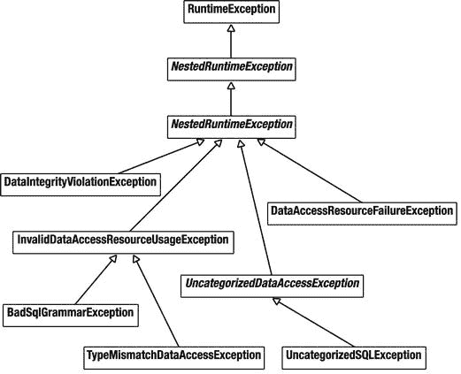

图 9-1.

DataAccessException 层次结构中的常见异常类

工作原理

首先，你将了解 Spring JDBC 中异常处理的工作原理，然后学习如何通过创建自定义异常和映射来利用它为你带来好处。

理解 Spring JDBC 框架中的异常处理

到目前为止，在使用 JDBC 模板或 JDBC 操作对象时，你还没有显式地处理过 JDBC 异常。为了帮助你理解 Spring JDBC 框架的异常处理机制，让我们考虑 `Main` 类中插入一个车辆的以下代码片段。如果你插入一个具有重复车辆编号的车辆会发生什么？

```
package com.apress.springrecipes.vehicle;
...
public class Main {
public static void main(String[] args) {
...
VehicleDao vehicleDao = context.getBean(VehicleDao.class);
Vehicle vehicle = new Vehicle("EX0001", "Green", 4, 4);
vehicleDao.insert(vehicle);
}
}
```

如果你运行该方法两次，或者该车辆已经插入到数据库中，它将抛出一个 `DuplicateKeyException`，这是 `DataAccessException` 的一个间接子类。在你的 DAO 方法中，你既不需要用 `try/catch` 块包围代码，也不需要在该方法签名中声明抛出异常。这是因为 `DataAccessException`（以及它的子类，包括 `DuplicateKeyException`）是一个你无需强制捕获的非受检异常。`DataAccessException` 的直接父类是 `NestedRuntimeException`，这是一个核心的 Spring 异常类，它将另一个异常包装在 `RuntimeException` 中。

当你使用 Spring JDBC 框架的类时，它们会为你捕获 `SQLException`，并将其包装为 `DataAccessException` 的子类之一。由于此异常是 `RuntimeException`，你不需要捕获它。

但是 Spring JDBC 框架如何知道应该抛出 `DataAccessException` 层次结构中的哪个具体异常呢？它是通过查看捕获到的 `SQLException` 的 `errorCode` 和 `SQLState` 属性来实现的。由于 `DataAccessException` 将底层的 `SQLException` 包装为根本原因，你可以使用以下 `catch` 块检查 `errorCode` 和 `SQLState` 属性：

```
package com.apress.springrecipes.vehicle;
...
import java.sql.SQLException;
import org.springframework.dao.DataAccessException;
public class Main {
public static void main(String[] args) {
...
VehicleDao vehicleDao = context.getBean(VehicleDao.class);
Vehicle vehicle = new Vehicle("EX0001", "Green", 4, 4);
try {
vehicleDao.insert(vehicle);
} catch (DataAccessException e) {
SQLException sqle = (SQLException) e.getCause();
System.out.println("Error code: " + sqle.getErrorCode());
System.out.println("SQL state: " + sqle.getSQLState());
}
}
}
```

当你再次插入重复车辆时，请注意 PostgreSQL 返回了以下错误代码和 SQL 状态：

```
Error code : 0
SQL state : 23505
```

如果你查阅 PostgreSQL 参考手册，你会发现表 9-2 中显示的错误代码描述。

表 9-2.

PostgreSQL 错误代码描述

SQL 状态
 |  消息文本
 |

| --- | --- | --- | --- | --- |

|
  `unique_violation`
 |

Spring JDBC 框架如何知道状态 23505 应映射到 `DuplicateKeyException`？错误代码和 SQL 状态是数据库特定的，这意味着不同的数据库产品可能为同一类错误返回不同的代码。此外，一些数据库产品会在 `errorCode` 属性中指定错误，而其他数据库产品（如 PostgreSQL）则会在 `SQLState` 属性中指定。

作为一个开放的 Java 应用程序框架，Spring 理解大多数流行数据库产品的错误代码。然而，由于错误代码数量庞大，它只能维护最常见错误的映射。该映射定义在位于 `org.springframework.jdbc.support` 包中的 `sql-error-codes.xml` 文件中。以下是该文件中针对 PostgreSQL 的片段：

```

...

true

03000,42000,42601,42602,42622,42804,42P01

23000,23502,23503,23514

53000,53100,53200,53300

55P03

40P01

...

```

`useSqlStateForTranslation` 属性意味着应使用 `SQLState` 属性（而非 `errorCode` 属性）来匹配错误代码。最后，`SQLErrorCodes` 类为你定义了多个类别来映射数据库错误代码。代码 23505 位于 `dataIntegrityViolationCodes` 类别中。

自定义数据访问异常处理

Spring JDBC 框架仅映射众所周知的错误代码。有时你可能希望自己自定义映射。例如，你可能决定向现有类别添加更多代码，或为特定错误代码定义自定义异常。


在表 9-2 中，错误代码`23505`表示 PostgreSQL 中的**重复键**错误。默认情况下，它被映射为`DataIntegrityViolationException`。假设你想为此类错误创建自定义异常类型`MyDuplicateKeyException`。它应继承`DataIntegrityViolationException`，因为这也是一种数据完整性违反错误。请记住，要让 Spring JDBC 框架抛出异常，该异常必须与根异常类`DataAccessException`兼容。

```
package com.apress.springrecipes.vehicle;
import org.springframework.dao.DataIntegrityViolationException;
public class MyDuplicateKeyException extends DataIntegrityViolationException {
public MyDuplicateKeyException(String msg) {
super(msg);
}
public MyDuplicateKeyException(String msg, Throwable cause) {
super(msg, cause);
}
}
```

默认情况下，Spring 会从位于`org.springframework.jdbc.support`包中的`sql-error-codes.xml`文件中查找异常。但是，你可以通过在类路径根目录下提供同名文件来覆盖某些映射。如果 Spring 能找到你的自定义文件，它会先从你的映射中查找异常。然而，如果在其中找不到合适的异常，Spring 会继续查找默认映射。

例如，假设你想将自定义的`DuplicateKeyException`类型映射到错误代码`23505`。你需要通过`CustomSQLErrorCodesTranslation` bean 添加绑定，然后将此 bean 添加到`customTranslations`类别中。

```

true

com.apress.springrecipes.vehicle.MyDuplicateKeyException

```

现在，如果你移除围绕车辆插入操作的`try`/`catch`代码块并插入重复车辆，Spring JDBC 框架将抛出`MyDuplicateKeyException`。

然而，如果你对`SQLErrorCodes`类使用的基本代码到异常映射策略不满意，你可以进一步实现`SQLExceptionTranslator`接口，并通过`setExceptionTranslator()`方法将其实例注入到 JDBC 模板中。

**9-6. 直接使用 ORM 框架避免问题**

**问题**

你决定进入下一阶段——你的领域模型已经足够复杂，手动为每个实体编写所有代码变得繁琐，因此你开始研究一些替代方案，例如 Hibernate。你惊讶地发现，虽然它们功能强大，但绝不简单！

**解决方案**

让 Spring 来帮忙；它提供了处理 ORM 层的工具，其能力可与纯 JDBC 访问相媲美。

**工作原理**

假设你正在为培训中心开发一个课程管理系统。你为此系统创建的第一个类是`Course`。这个类被称为实体类或持久化类，因为它代表一个现实世界中的实体，其实例将被持久化到数据库中。请记住，对于每个要由 ORM 框架持久化的实体类，都需要一个无参的默认构造函数。

```
package com.apress.springrecipes.course;
...
public class Course {
private Long id;
private String title;
private Date beginDate;
private Date endDate;
private int fee;
// 构造函数、Getter 和 Setter 方法
...
}
```

对于每个实体类，你必须定义一个标识符属性来唯一标识一个实体。最佳实践是定义一个自动生成的标识符，因为它没有业务含义，因此在任何情况下都不会被更改。此外，ORM 框架将使用此标识符来确定实体的状态。如果标识符值为`null`，该实体将被视为新的未保存实体。当此实体被持久化时，将执行 INSERT SQL 语句；否则，将执行 UPDATE 语句。为了允许标识符为`null`，你应该为标识符选择原始包装类型，例如`java.lang.Integer`和`java.lang.Long`。

在你的课程管理系统中，你需要一个 DAO 接口来封装数据访问逻辑。让我们在`CourseDao`接口中定义以下操作：

```
package com.apress.springrecipes.course;
...
public interface CourseDao {
Course store(Course course);
void delete(Long courseId);
Course findById(Long courseId);
List findAll();
}
```

通常，当使用 ORM 持久化对象时，插入和更新操作会合并为单个操作（例如，store）。这是为了让 ORM 框架（而不是你）决定对象应该被插入还是更新。为了让 ORM 框架将你的对象持久化到数据库，它必须知道实体类的映射元数据。你必须以其支持的格式向其提供映射元数据。历史上，Hibernate 使用 XML 来提供映射元数据。然而，由于每个 ORM 框架可能有自己定义映射元数据的格式，JPA 定义了一组持久化注解，让你以标准格式定义映射元数据，这种格式更有可能在其他 ORM 框架中重用。

Hibernate 也支持使用 JPA 注解来定义映射元数据，因此，使用 Hibernate 和 JPA 映射和持久化对象基本上有三种不同的策略。

*   使用 Hibernate API 通过 Hibernate XML 映射持久化对象
*   使用 Hibernate API 通过 JPA 注解持久化对象
*   使用 JPA 通过 JPA 注解持久化对象

Hibernate、JPA 和其他 ORM 框架的核心编程元素与 JDBC 类似。它们总结在表 9-3 中。

**表 9-3. 不同数据访问策略的核心编程元素**

| 概念 | JDBC | Hibernate | JPA |
| :--- | :--- | :--- | :--- |
| `资源` | `Connection` | `Session` | `EntityManager` |
| `资源工厂` | `DataSource` | `SessionFactory` | `EntityManagerFactory` |
| `异常` | `SQLException` | `HibernateException` | `PersistenceException` |

在 Hibernate 中，对象持久化的核心接口是`Session`，其实例可以从`SessionFactory`实例获取。在 JPA 中，对应的接口是`EntityManager`，其实例可以从`EntityManagerFactory`实例获取。Hibernate 抛出的异常类型为`HibernateException`，而 JPA 抛出的异常类型可能是`PersistenceException`或其他 Java SE 异常，如`IllegalArgumentException`和`IllegalStateException`。请注意，所有这些异常都是`RuntimeException`的子类，你不必强制捕获和处理它们。

**使用 Hibernate API 通过 Hibernate XML 映射持久化对象**

要使用 Hibernate XML 映射来映射实体类，你可以为每个类提供一个单独的映射文件，或者为多个类提供一个大的文件。实际上，为了便于维护，你应该为每个类定义一个文件，将类名与`.hbm.xml`连接起来作为文件扩展名。中间扩展名`hbm`代表“Hibernate 元数据”。

`Course`类的映射文件应命名为`Course.hbm.xml`，并放在与实体类相同的包中。

在映射文件中，你可以为此实体类指定一个表名，并为每个简单属性指定一个表列。你还可以指定列的详细信息，例如列长度、`not-null`约束和唯一约束。此外，每个实体必须定义一个标识符，该标识符可以自动生成或手动分配。在此示例中，标识符将使用表标识列生成。

现在，让我们使用纯 Hibernate API 在`hibernate`子包中实现 DAO 接口。在调用 Hibernate API 进行对象持久化之前，你必须初始化一个 Hibernate 会话工厂（例如，在构造函数中）。


```java
package com.apress.springrecipes.course.hibernate;
import com.apress.springrecipes.course.Course;
import com.apress.springrecipes.course.CourseDao;
import org.hibernate.Session;
import org.hibernate.SessionFactory;
import org.hibernate.Transaction;
import org.hibernate.cfg.AvailableSettings;
import org.hibernate.cfg.Configuration;
import org.hibernate.dialect.PostgreSQL95Dialect;
import java.util.List;
public class HibernateCourseDao implements CourseDao {
private final SessionFactory sessionFactory;
public HibernateCourseDao() {
Configuration configuration = new Configuration()
.setProperty(AvailableSettings.URL, "jdbc:postgresql://localhost:5432/course")
.setProperty(AvailableSettings.USER, "postgres")
.setProperty(AvailableSettings.PASS, "password")
.setProperty(AvailableSettings.DIALECT, PostgreSQL95Dialect.class.getName())
.setProperty(AvailableSettings.SHOW_SQL, String.valueOf(true))
.setProperty(AvailableSettings.HBM2DDL_AUTO, "update")
.addClass(Course.class);
sessionFactory = configuration.buildSessionFactory();
}
@Override
public Course store(Course course) {
Session session = sessionFactory.openSession();
Transaction tx = session.getTransaction();
try {
tx.begin();
session.saveOrUpdate(course);
tx.commit();
return course;
} catch (RuntimeException e) {
tx.rollback();
throw e;
} finally {
session.close();
}
}
@Override
public void delete(Long courseId) {
Session session = sessionFactory.openSession();
Transaction tx = session.getTransaction();
try {
tx.begin();
Course course = session.get(Course.class, courseId);
session.delete(course);
tx.commit();
} catch (RuntimeException e) {
tx.rollback();
throw e;
} finally {
session.close();
}
}
@Override
public Course findById(Long courseId) {
Session session = sessionFactory.openSession();
try {
return session.get(Course.class, courseId);
} finally {
session.close();
}
}
@Override
public List findAll() {
Session session = sessionFactory.openSession();
try {
return session.createQuery("SELECT c FROM Course c", Course.class).list();
} finally {
session.close();
}
}
}
```

使用 Hibernate 的第一步是创建一个 `Configuration` 对象，并配置数据库设置（JDBC 连接属性或数据源的 JNDI 名称）、数据库方言、映射元数据位置等属性。当使用 XML 映射文件定义映射元数据时，可以使用 `addClass` 方法告知 Hibernate 需要管理哪些类；Hibernate 将按约定加载 `Course.hbm.xml` 文件。然后，通过这个 `Configuration` 对象构建一个 Hibernate 会话工厂。会话工厂的作用是生成会话，供你持久化对象。

在持久化对象之前，你需要在数据库模式中创建表来存储对象数据。使用像 Hibernate 这样的 ORM 框架时，通常无需自行设计表。如果将 `hibernate.hbm2ddl.auto` 属性设置为 `update`，Hibernate 可以在必要时帮助你更新数据库模式并创建表。

提示

当然，不应在生产环境中启用此功能，但它可以极大提升开发速度。

在上述 DAO 方法中，首先从会话工厂打开一个会话。对于涉及数据库更新的操作（如 `saveOrUpdate()` 和 `delete()`），必须在该会话上启动一个 Hibernate 事务。如果操作成功完成，则提交事务；否则，如果发生任何 `RuntimeException`，则回滚事务。对于只读操作（如 `get()` 和 HQL 查询），则无需启动事务。最后，务必记得关闭会话以释放其持有的资源。

你可以创建以下 `Main` 类来测试运行所有 DAO 方法。它还演示了实体的典型生命周期。

```java
package com.apress.springrecipes.course;
import com.apress.springrecipes.course.hibernate.HibernateCourseDao;
import java.util.GregorianCalendar;
public class Main {
public static void main(String[] args) {
CourseDao courseDao = new HibernateCourseDao();
Course course = new Course();
course.setTitle("Core Spring");
course.setBeginDate(new GregorianCalendar(2007, 8, 1).getTime());
course.setEndDate(new GregorianCalendar(2007, 9, 1).getTime());
course.setFee(1000);
System.out.println("\nCourse before persisting");
System.out.println(course);
courseDao.store(course);
System.out.println("\nCourse after persisting");
System.out.println(course);
Long courseId = course.getId();
Course courseFromDb = courseDao.findById(courseId);
System.out.println("\nCourse fresh from database");
System.out.println(courseFromDb);
courseDao.delete(courseId);
System.exit(0);
}
}
```

使用 JPA 注解通过 Hibernate API 持久化对象

JPA 注解在 JSR-220 规范中已标准化，因此所有符合 JPA 规范的 ORM 框架（包括 Hibernate）都支持它们。此外，使用注解可以更方便地在同一源文件中编辑映射元数据。

以下 `Course` 类演示了如何使用 JPA 注解定义映射元数据：

```java
package com.apress.springrecipes.course;
...
import javax.persistence.Column;
import javax.persistence.Entity;
import javax.persistence.GeneratedValue;
import javax.persistence.GenerationType;
import javax.persistence.Id;
import javax.persistence.Table;
@Entity
@Table(name = "COURSE")
public class Course {
@Id
@GeneratedValue(strategy = GenerationType.IDENTITY)
@Column(name = "ID")
private Long id;
@Column(name = "TITLE", length = 100, nullable = false)
private String title;
@Column(name = "BEGIN_DATE")
private Date beginDate;
@Column(name = "END_DATE")
private Date endDate;
@Column(name = "FEE")
private int fee;
// 构造方法、Getter 和 Setter
...
}
```

每个实体类都必须使用 `@Entity` 注解进行标注。你可以在此注解中为实体类指定表名。对于每个属性，可以使用 `@Column` 注解指定列名和列详细信息。

每个实体类都必须有一个由 `@Id` 注解定义的标识符。你可以使用 `@GeneratedValue` 注解选择标识符生成策略。此处，标识符将由表的自增列生成。

DAO 与之前代码示例中的几乎相同，仅在配置上有一处微小改动。

```java
public HibernateCourseDao() {
Configuration configuration = new Configuration()
.setProperty(AvailableSettings.URL, "jdbc:postgresql://localhost:5432/course")
.setProperty(AvailableSettings.USER, "postgres")
.setProperty(AvailableSettings.PASS, "password")
.setProperty(AvailableSettings.DIALECT, PostgreSQL95Dialect.class.getName())
.setProperty(AvailableSettings.SHOW_SQL, String.valueOf(true))
.setProperty(AvailableSettings.HBM2DDL_AUTO, "update")
.addAnnotatedClass(Course.class);
sessionFactory = configuration.buildSessionFactory();
}
```

由于现在使用注解指定元数据，你需要使用 `addAnnotatedClass` 方法代替 `addClass`。这会指示 Hibernate 从类本身读取映射元数据，而不是尝试定位 `hbm.xml` 文件。你可以再次使用相同的 `Main` 类来运行此示例。

使用 JPA 并以 Hibernate 作为引擎持久化对象


除了持久化注解之外，JPA 还定义了一套用于对象持久化的编程接口。然而，JPA 本身并非持久化实现；你需要选择一个符合 JPA 规范的引擎来提供持久化服务。Hibernate 可以通过 Hibernate EntityManager 模块来符合 JPA 规范。这样一来，Hibernate 可以作为底层的 JPA 引擎来持久化对象。这让你既能保留在 Hibernate 上的宝贵投资（也许它速度更快，或者处理某些操作更令你满意），又能编写符合 JPA 规范、可在其他 JPA 引擎间移植的代码。这也是一种将代码库过渡到 JPA 的有用方式。新代码严格遵循 JPA API 编写，旧代码则逐步迁移到 JPA 接口。

在 Java EE 环境中，你可以在 Java EE 容器中配置 JPA 引擎。但在 Java SE 应用程序中，你必须在本地设置引擎。JPA 的配置通过核心 XML 文件 `persistence.xml` 完成，该文件位于类路径根目录的 `META-INF` 目录下。在此文件中，你可以为底层引擎配置设置任何供应商特定的属性。当使用 Spring 配置 `EntityManagerFactory` 时，则无需此文件，配置可通过 Spring 完成。

现在，让我们在类路径根目录的 `META-INF` 目录下创建 JPA 配置文件 `persistence.xml`。每个 JPA 配置文件包含一个或多个 `<persistence-unit>` 元素。持久化单元定义了一组持久化类及其持久化方式。每个持久化单元需要一个名称用于标识。这里，我们为该持久化单元指定名称为 `course`。

```

com.apress.springrecipes.course.Course

```

在这个 JPA 配置文件中，你将 Hibernate 配置为底层的 JPA 引擎。请注意，这里有一些通用的 `javax.persistence` 属性用于配置数据库位置以及要使用的用户名/密码组合。接下来是一些 Hibernate 特定的属性，用于配置方言以及 `hibernate.hbm2ddl.auto` 属性。最后，有一个 `<class>` 元素用于指定要映射的类。

在 Java EE 环境中，Java EE 容器能够为你管理实体管理器，并将其直接注入到你的 EJB 组件中。但是，当你在 Java EE 容器之外（例如，在 Java SE 应用程序中）使用 JPA 时，你必须自己创建和维护实体管理器。

现在，让我们在 Java SE 应用程序中使用 JPA 实现 `CourseDao` 接口。在调用 JPA 进行对象持久化之前，你必须初始化一个实体管理器工厂。实体管理器工厂的目的是为你生成实体管理器，以便持久化你的对象。

```
package com.apress.springrecipes.course.jpa;
...
import javax.persistence.EntityManager;
import javax.persistence.EntityManagerFactory;
import javax.persistence.EntityTransaction;
import javax.persistence.Persistence;
import javax.persistence.Query;
public class JpaCourseDao implements CourseDao {
private EntityManagerFactory entityManagerFactory;
public JpaCourseDao() {
entityManagerFactory = Persistence.createEntityManagerFactory("course");
}
public void store(Course course) {
EntityManager manager = entityManagerFactory.createEntityManager();
EntityTransaction tx = manager.getTransaction();
try {
tx.begin();
manager.merge(course);
tx.commit();
} catch (RuntimeException e) {
tx.rollback();
throw e;
} finally {
manager.close();
}
}
public void delete(Long courseId) {
EntityManager manager = entityManagerFactory.createEntityManager();
EntityTransaction tx = manager.getTransaction();
try {
tx.begin();
Course course = manager.find(Course.class, courseId);
manager.remove(course);
tx.commit();
} catch (RuntimeException e) {
tx.rollback();
throw e;
} finally {
manager.close();
}
}
public Course findById(Long courseId) {
EntityManager manager = entityManagerFactory.createEntityManager();
try {
return manager.find(Course.class, courseId);
} finally {
manager.close();
}
}
public List findAll() {
EntityManager manager = entityManagerFactory.createEntityManager();
try {
Query query = manager.createQuery("select course from Course course");
return query.getResultList();
} finally {
manager.close();
}
}
}
```

实体管理器工厂是通过 `javax.persistence.Persistence` 类的静态方法 `createEntityManagerFactory()` 构建的。你必须传入在 `persistence.xml` 中定义的持久化单元名称来创建实体管理器工厂。

在前面的 DAO 方法中，你首先从实体管理器工厂创建一个实体管理器。对于任何涉及数据库更新的操作，例如 `merge()` 和 `remove()`，你必须在实体管理器上启动一个 JPA 事务。对于只读操作，例如 `find()` 和 JPA 查询，则无需启动事务。最后，你必须关闭实体管理器以释放资源。

你可以使用类似的 `Main` 类来测试这个 DAO，但这次你需要实例化 JPA DAO 实现。

```
package com.apress.springrecipes.course;
...
public class Main {
public static void main(String[] args) {
CourseDao courseDao = new JpaCourseDao();
...
}
}
```

在前面针对 Hibernate 和 JPA 的 DAO 实现中，每个 DAO 方法只有一两行代码不同。其余行都是你必须重复的样板式常规任务。此外，每个 ORM 框架都有自己用于本地事务管理的 API。

9-7. 在 Spring 中配置 ORM 资源工厂

问题

当单独使用 ORM 框架时，你必须使用其 API 配置其资源工厂。对于 Hibernate 和 JPA，你必须通过原生 Hibernate API 和 JPA 构建会话工厂和实体管理器工厂。你只能手动管理这些对象，而无法获得 Spring 的支持。

解决方案

Spring 提供了几个工厂 bean，用于在 IoC 容器中创建 Hibernate 会话工厂或 JPA 实体管理器工厂作为单例 bean。这些工厂可以通过依赖注入在多个 bean 之间共享。此外，这允许会话工厂和实体管理器工厂与 Spring 的其他数据访问设施（如数据源和事务管理器）集成。

工作原理

对于 Hibernate，Spring 提供了 `LocalSessionFactoryBean` 来创建普通的 Hibernate `SessionFactory`；对于 JPA，Spring 有多个选项用于构建 `EntityManagerFactory`。你将探索如何从 JNDI 检索 `EntityManagerFactory`，以及如何使用 `LocalEntityManagerFactoryBean` 和 `LocalContainerEntityManagerFactoryBean`，以及每个选项之间的区别。

在 Spring 中配置 Hibernate 会话工厂


首先，让我们修改 `HibernateCourseDao`，使其通过依赖注入接受一个会话工厂，而不是在构造函数中直接使用原生 Hibernate API 创建它。

```
package com.apress.springrecipes.course.hibernate;
...
import org.hibernate.SessionFactory;
public class HibernateCourseDao implements CourseDao {
private final SessionFactory sessionFactory;
public HibernateCourseDao(SessionFactory sessionFactory) {
this.sessionFactory = sessionFactory;
}
...
}
```

然后，创建一个配置类，用于将 Hibernate 作为 ORM 框架使用。你还可以在 Spring 的管理下声明一个 `HibernateCourseDao` 实例。

```
package com.apress.springrecipes.course.config;
import com.apress.springrecipes.course.Course;
import com.apress.springrecipes.course.CourseDao;
import com.apress.springrecipes.course.hibernate.HibernateCourseDao;
import org.hibernate.SessionFactory;
import org.hibernate.cfg.AvailableSettings;
import org.hibernate.dialect.PostgreSQL95Dialect;
import org.springframework.context.annotation.Bean;
import org.springframework.context.annotation.Configuration;
import org.springframework.orm.hibernate5.LocalSessionFactoryBean;
import java.util.Properties;
@Configuration
public class CourseConfiguration {
@Bean
public CourseDao courseDao(SessionFactory sessionFactory) {
return new HibernateCourseDao(sessionFactory);
}
@Bean
public LocalSessionFactoryBean sessionFactory() {
LocalSessionFactoryBean sessionFactoryBean = new LocalSessionFactoryBean();
sessionFactoryBean.setHibernateProperties(hibernateProperties());
sessionFactoryBean.setAnnotatedClasses(Course.class);
return sessionFactoryBean;
}
private Properties hibernateProperties() {
Properties properties = new Properties();
properties.setProperty(AvailableSettings.URL, "jdbc:postgresql://localhost:5432/course");
properties.setProperty(AvailableSettings.USER, "postgres");
properties.setProperty(AvailableSettings.PASS, "password");
properties.setProperty(AvailableSettings.DIALECT, PostgreSQL95Dialect.class.getName());
properties.setProperty(AvailableSettings.SHOW_SQL, String.valueOf(true));
properties.setProperty(AvailableSettings.HBM2DDL_AUTO, "update");
return properties;
}
}
```

之前设置在 `Configuration` 对象上的所有属性，现在都被转换为一个 `Properties` 对象，并添加到 `LocalSessionFactoryBean` 中。带注解的类通过 `setAnnotatedClasses` 方法传入，以便 Hibernate 最终能识别这个带注解的类。构造好的 `SessionFactory` 通过其构造函数传递给 `HibernateCourseDao`。

如果你在一个仍使用 Hibernate 映射文件的项目中，可以使用 `mappingLocations` 属性来指定映射文件。`LocalSessionFactoryBean` 还允许你利用 Spring 的资源加载支持，从各种类型的位置加载映射文件。你可以在 `mappingLocations` 属性中指定映射文件的资源路径，该属性的类型是 `Resource[]`。

```
@Bean
public LocalSessionFactoryBean sessionfactory() {
LocalSessionFactoryBean sessionFactoryBean = new LocalSessionFactoryBean();
sessionFactoryBean.setDataSource(dataSource());
sessionFactoryBean.setMappingLocations(
new ClassPathResource("com/apress/springrecipes/course/Course.hbm.xml"));
sessionFactoryBean.setHibernateProperties(hibernateProperties());
return sessionFactoryBean;
}
```

借助 Spring 的资源加载支持，你还可以在资源路径中使用通配符来匹配多个映射文件，这样在每次添加新的实体类时，就无需配置它们的位置。为此，你需要在配置类中有一个 `ResourcePatternResolver`。你可以通过使用 `ResourcePatternUtils` 和 `ResourceLoaderAware` 接口来获取它。你实现后者，并使用 `getResourcePatternResolver` 方法基于 `ResourceLoader` 获取一个 `ResourcePatternResolver`。

```
@Configuration
public class CourseConfiguration implements ResourceLoaderAware {
private ResourcePatternResolver resourcePatternResolver;
...
@Override
public void setResourceLoader(ResourceLoader resourceLoader) {
this.resourcePatternResolver =
ResourcePatternUtils.getResourcePatternResolver(resourceLoader);
}
}
```

现在，你可以使用 `ResourcePatternResolver` 将资源模式解析为资源。

```
@Bean
public LocalSessionFactoryBean sessionfactory() throws IOException {
LocalSessionFactoryBean sessionFactoryBean = new LocalSessionFactoryBean();
Resource[] mappingResources =
resourcePatternResolver.getResources("classpath:com/apress/springrecipes/course/*.hbm.xml");
sessionFactoryBean.setMappingLocations(mappingResources);
...
return sessionFactoryBean;
}
```

现在，你可以修改 `Main` 类，从 Spring IoC 容器中检索 `HibernateCourseDao` 实例。

```
package com.apress.springrecipes.course;
...
import org.springframework.context.ApplicationContext;
import org.springframework.context.support.ClassPathXmlApplicationContext;
public class Main {
public static void main(String[] args) {
ApplicationContext context =
new AnnotationConfigApplicationContext(CourseConfiguration.class);
CourseDao courseDao = context.getBean(CourseDao.class);
...
}
}
```

上述工厂 bean 通过加载 Hibernate 配置文件来创建会话工厂，该配置文件包含数据库设置（JDBC 连接属性或数据源的 JNDI 名称）。现在，假设你在 Spring IoC 容器中定义了一个数据源。如果你想为你的会话工厂使用这个数据源，可以将其注入到 `LocalSessionFactoryBean` 的 `dataSource` 属性中。在此属性中指定的数据源将覆盖 Hibernate 配置中的数据库设置。如果设置了此项，Hibernate 设置不应再定义连接提供者，以避免无意义的双重配置。

```
@Configuration
public class CourseConfiguration {
...
@Bean
public DataSource dataSource() {
HikariDataSource dataSource = new HikariDataSource();
dataSource.setUsername("postgres");
dataSource.setPassword("password");
dataSource.setJdbcUrl("jdbc:postgresql://localhost:5432/course");
dataSource.setMinimumIdle(2);
dataSource.setMaximumPoolSize(5);
return dataSource;
}
@Bean
public LocalSessionFactoryBean sessionFactory(DataSource dataSource) {
LocalSessionFactoryBean sessionFactoryBean = new LocalSessionFactoryBean();
sessionFactoryBean.setDataSource(dataSource);
sessionFactoryBean.setHibernateProperties(hibernateProperties());
sessionFactoryBean.setAnnotatedClasses(Course.class);
return sessionFactoryBean;
}
private Properties hibernateProperties() {
Properties properties = new Properties();
properties.setProperty(AvailableSettings.DIALECT, PostgreSQL95Dialect.class.getName());
properties.setProperty(AvailableSettings.SHOW_SQL, String.valueOf(true));
properties.setProperty(AvailableSettings.HBM2DDL_AUTO, "update");
return properties;
}}
```

或者，你甚至可以通过将所有配置合并到 `LocalSessionFactoryBean` 中来忽略 Hibernate 配置文件。例如，你可以在 `packagesToScan` 属性中指定包含 JPA 注解类的包，并在 `hibernateProperties` 属性中指定其他 Hibernate 属性，例如数据库方言。


```
@Configuration
public class CourseConfiguration {
...
@Bean
public LocalSessionFactoryBean sessionfactory() {
LocalSessionFactoryBean sessionFactoryBean = new LocalSessionFactoryBean();
sessionFactoryBean.setDataSource(dataSource());
sessionFactoryBean.setPackagesToScan("com.apress.springrecipes.course");
sessionFactoryBean.setHibernateProperties(hibernateProperties());
return sessionFactoryBean;
}
private Properties hibernateProperties() {
Properties properties = new Properties();
properties.put("hibernate.dialect", org.hibernate.dialect.DerbyTenSevenDialect.class.getName());
properties.put("hibernate.show_sql", true);
properties.put("hibernate.hbm2dll.auto", "update");
return properties;
}
}
```

现在可以删除 Hibernate 配置文件（即 `hibernate.cfg.xml`），因为其配置已迁移至 Spring。

在 Spring 中配置 JPA 实体管理器工厂

首先，让我们修改 `JpaCourseDao`，使其通过依赖注入接受实体管理器工厂，而不是在构造函数中直接创建。

```
package com.apress.springrecipes.course;
...
import javax.persistence.EntityManagerFactory;
import javax.persistence.Persistence;
public class JpaCourseDao implements CourseDao {
private final EntityManagerFactory entityManagerFactory;
public JpaCourseDao (EntityManagerFactory entityManagerFactory) {
this.entityManagerFactory = entityManagerFactory;
}
...
}
```

JPA 规范定义了在 Java SE 和 Java EE 环境中获取实体管理器工厂的方式。在 Java SE 环境中，通过调用 `Persistence` 类的 `createEntityManagerFactory()` 静态方法手动创建实体管理器工厂。

让我们创建一个用于 JPA 的 Bean 配置文件。Spring 提供了一个工厂 Bean `LocalEntityManagerFactoryBean`，用于在 IoC 容器中创建实体管理器工厂。你必须指定 JPA 配置文件中定义的持久化单元名称。你也可以在 Spring 管理下声明一个 `JpaCourseDao` 实例。

```
package com.apress.springrecipes.course.config;
import com.apress.springrecipes.course.CourseDao;
import com.apress.springrecipes.course.jpa.JpaCourseDao;
import org.springframework.context.annotation.Bean;
import org.springframework.context.annotation.Configuration;
import org.springframework.orm.jpa.LocalEntityManagerFactoryBean;
import javax.persistence.EntityManagerFactory;
@Configuration
public class CourseConfiguration {
@Bean
public CourseDao courseDao(EntityManagerFactory entityManagerFactory) {
return new JpaCourseDao(entityManagerFactory);
}
@Bean
public LocalEntityManagerFactoryBean entityManagerFactory() {
LocalEntityManagerFactoryBean emf = new LocalEntityManagerFactoryBean();
emf.setPersistenceUnitName("course");
return emf;
}
}
```

现在，你可以通过从 Spring IoC 容器中检索 `JpaCourseDao` 实例，使用 `Main` 类对其进行测试。

```
package com.apress.springrecipes.course;
...
import org.springframework.context.ApplicationContext;
import org.springframework.context.support.ClassPathXmlApplicationContext;
public class Main {
public static void main(String[] args) {
ApplicationContext context =     new AnnotationConfigApplicationContext(CourseConfiguration.class);
CourseDao courseDao = context.getBean(CourseDao.class);
...
}
}
```

在 Java EE 环境中，你可以通过 JNDI 从 Java EE 容器中查找实体管理器工厂。在 Spring 中，你可以使用 `JndiLocatorDelegate` 对象执行 JNDI 查找（这比构造 `JndiObjectFactoryBean` 更简单，后者同样可行）。

```
@Bean
public EntityManagerFactory entityManagerFactory() throws NamingException {
return JndiLocatorDelegate.createDefaultResourceRefLocator()
.lookup("jpa/coursePU", EntityManagerFactory.class);
}
```

`LocalEntityManagerFactoryBean` 通过加载 JPA 配置文件（即 `persistence.xml`）来创建实体管理器工厂。Spring 支持通过另一个工厂 Bean `LocalContainerEntityManagerFactoryBean` 以更灵活的方式创建实体管理器工厂。它允许你覆盖 JPA 配置文件中的某些配置，例如数据源和数据库方言。因此，你可以利用 Spring 的数据访问设施来配置实体管理器工厂。

```
@Configuration
public class CourseConfiguration {
...
@Bean
public LocalContainerEntityManagerFactoryBean entityManagerFactory(DataSource dataSource) {
LocalContainerEntityManagerFactoryBean emf = new LocalContainerEntityManagerFactoryBean();
emf.setPersistenceUnitName("course");
emf.setDataSource(dataSource);
emf.setJpaVendorAdapter(jpaVendorAdapter());
return emf;
}
private JpaVendorAdapter jpaVendorAdapter() {
HibernateJpaVendorAdapter jpaVendorAdapter = new HibernateJpaVendorAdapter();
jpaVendorAdapter.setShowSql(true);
jpaVendorAdapter.setGenerateDdl(true);
jpaVendorAdapter.setDatabasePlatform(PostgreSQL95Dialect.class.getName());
return jpaVendorAdapter;
}
@Bean
public DataSource dataSource() {
HikariDataSource dataSource = new HikariDataSource();
dataSource.setUsername("postgres");
dataSource.setPassword("password");
dataSource.setJdbcUrl("jdbc:postgresql://localhost:5432/course");
dataSource.setMinimumIdle(2);
dataSource.setMaximumPoolSize(5);
return dataSource;
}
}
```

在上述 Bean 配置中，你将一个数据源注入到该实体管理器工厂。它将覆盖 JPA 配置文件中的数据库设置。你可以为 `LocalContainerEntityManagerFactoryBean` 设置一个 JPA 供应商适配器，以指定 JPA 引擎特定的属性。当使用 Hibernate 作为底层 JPA 引擎时，应选择 `HibernateJpaVendorAdapter`。该适配器不支持的其他属性可以在 `jpaProperties` 属性中指定。

现在，你的 JPA 配置文件（即 `persistence.xml`）可以简化为如下形式，因为其配置已迁移至 Spring：

```

com.apress.springrecipes.course.Course

```

Spring 还使得无需 `persistence.xml` 文件即可配置 JPA `EntityManagerFactory` 成为可能。如果需要，你可以在 Spring 配置文件中完全配置它。你需要指定 `packagesToScan` 属性，而不是 `persistenceUnitName`。之后，你可以完全删除 `persistence.xml` 文件。

```
@Bean
public LocalContainerEntityManagerFactoryBean entityManagerFactory() {
LocalContainerEntityManagerFactoryBean emf = new LocalContainerEntityManagerFactoryBean();
emf.setDataSource(dataSource());
emf.setPackagesToScan("com.apress.springrecipes.course");
emf.setJpaVendorAdapter(jpaVendorAdapter());
return emf;
}
```

9-8\. 使用 Hibernate 的上下文会话持久化对象

问题

你想编写一个基于纯 Hibernate API 的 DAO，但仍依赖 Spring 管理的事务。

解决方案

从 Hibernate 3 开始，会话工厂可以为你管理上下文会话，并允许你通过 `org.hibernate.SessionFactory` 上的 `getCurrentSession()` 方法检索它们。在单个事务内，每次调用 `getCurrentSession()` 方法都会获得相同的会话。这确保了每个事务只有一个 Hibernate 会话，因此它能很好地与 Spring 的事务管理支持配合使用。

实现原理

要使用上下文会话方法，你的 DAO 方法需要访问会话工厂，可以通过 setter 方法或构造函数参数注入。然后，在每个 DAO 方法中，你从会话工厂获取上下文会话，并使用它进行对象持久化。


```
```
package com.apress.springrecipes.course.hibernate;
import com.apress.springrecipes.course.Course;
import com.apress.springrecipes.course.CourseDao;
import org.hibernate.Query;
import org.hibernate.Session;
import org.hibernate.SessionFactory;
import org.springframework.transaction.annotation.Transactional;
import java.util.List;
public class HibernateCourseDao implements CourseDao {
private final SessionFactory sessionFactory;
public HibernateCourseDao(SessionFactory sessionFactory) {
this.sessionFactory=sessionFactory;
}
@Transactional
public Course store(Course course) {
Session session = sessionFactory.getCurrentSession();
session.saveOrUpdate(course);
return course;
}
@Transactional
public void delete(Long courseId) {
Session session = sessionFactory.getCurrentSession();
Course course = session.get(Course.class, courseId);
session.delete(course);
}
@Transactional(readOnly=true)
public Course findById(Long courseId) {
Session session = sessionFactory.getCurrentSession();
return session.get(Course.class, courseId);
}
@Transactional(readOnly=true)
public List findAll() {
Session session = sessionFactory.getCurrentSession();
return session.createQuery("from Course", Course.class).list();
}
}
```

请注意，你的所有 DAO 方法都必须设置为事务性的。这是必需的，因为 Spring 通过 Hibernate 的上下文会话支持与 Hibernate 集成。Spring 拥有自己的 Hibernate `CurrentSessionContext` 接口实现。它会尝试查找一个事务，如果找不到，就会失败并报错，提示没有 Hibernate 会话绑定到当前线程。你可以通过在每个方法或整个类上添加 `@Transactional` 注解来实现这一点。
这确保了 DAO 方法内的持久化操作将在同一个事务中执行，因此也将在同一个会话中执行。此外，如果服务层组件的一个方法调用了多个 DAO 方法，并且它将自己的事务传播给这些方法，那么所有这些 DAO 方法也将在同一个会话中运行。

警告

当使用 Spring 配置 Hibernate 时，确保不要设置 `hibernate.current_session_context_class` 属性，因为这会干扰 Spring 正确管理事务的能力。仅当你需要 JTA 事务时，才应设置此属性。

在 bean 配置文件中，你需要为此应用声明一个 `HibernateTransactionManager` 实例，并通过 `@EnableTransactionManagement` 启用声明式事务管理。

```
@Configuration
@EnableTransactionManagement
public class CourseConfiguration {
@Bean
public CourseDao courseDao(SessionFactory sessionFactory) {
return new HibernateCourseDao(sessionFactory);
}
@Bean
public HibernateTransactionManager transactionManager(SessionFactory sessionFactory) {
return new HibernateTransactionManager(sessionFactory);
}
}
```

然而，当调用 Hibernate 会话的原生方法时，抛出的异常将是原生类型的 `HibernateException`。如果你希望将 Hibernate 异常转换为 Spring 的 `DataAccessException` 以实现一致的异常处理，则需要在需要异常转换的 DAO 类上应用 `@Repository` 注解。

```
package com.apress.springrecipes.course.hibernate;
...
import org.springframework.stereotype.Repository;
@Repository
public class HibernateCourseDao implements CourseDao {
...
}
```

`PersistenceExceptionTranslationPostProcessor` 负责将原生的 Hibernate 异常转换为 Spring `DataAccessException` 层次结构中的数据访问异常。这个 bean 后处理器只会转换那些标注了 `@Repository` 的 bean 所抛出的异常。当使用基于 Java 的配置时，这个 bean 会在 `AnnotationConfigApplicationContext` 中自动注册；因此，无需显式声明它的 bean。

在 Spring 中，`@Repository` 是一个构造型注解。通过标注它，组件类可以通过组件扫描被自动检测到。你可以在此注解中指定一个组件名称，并由 Spring IoC 容器自动注入会话工厂。

```
package com.apress.springrecipes.course.hibernate;
...
import org.hibernate.SessionFactory;
import org.springframework.beans.factory.annotation.Autowired;
import org.springframework.stereotype.Repository;
@Repository("courseDao")
public class HibernateCourseDao implements CourseDao {
private final SessionFactory sessionFactory;
public HibernateCourseDao (SessionFactory sessionFactory) {
this.sessionFactory = sessionFactory;
}
...
}
```

然后，你可以简单地添加 `@ComponentScan` 注解，并删除原始的 `HibernateCourseDao` bean 声明。

```
@Configuration
@EnableTransactionManagement
@ComponentScan("com.apress.springrecipes.course")
public class CourseConfiguration { ... }
```

9-9\. 使用 JPA 的上下文注入持久化对象

问题

在 Java EE 环境中，Java EE 容器可以为你管理实体管理器，并将它们直接注入到你的 EJB 组件中。EJB 组件可以简单地对注入的实体管理器执行持久化操作，而无需过多关心实体管理器的创建和事务管理。

解决方案

最初，`@PersistenceContext` 注解用于在 EJB 组件中注入实体管理器。Spring 也可以通过一个 bean 后处理器来解释这个注解。它会将一个实体管理器注入到带有此注解的属性中。Spring 确保你在单个事务内的所有持久化操作都由同一个实体管理器处理。

工作原理

要使用上下文注入方法，你可以在 DAO 中声明一个实体管理器字段，并用 `@PersistenceContext` 注解标注它。Spring 会向此字段注入一个实体管理器，供你持久化对象。

```
package com.apress.springrecipes.course.jpa;
import com.apress.springrecipes.course.Course;
import com.apress.springrecipes.course.CourseDao;
import org.springframework.transaction.annotation.Transactional;
import javax.persistence.EntityManager;
import javax.persistence.PersistenceContext;
import javax.persistence.TypedQuery;
import java.util.List;
public class JpaCourseDao implements CourseDao {
@PersistenceContext
private EntityManager entityManager;
@Transactional
public Course store(Course course) {
return entityManager.merge(course);
}
@Transactional
public void delete(Long courseId) {
Course course = entityManager.find(Course.class, courseId);
entityManager.remove(course);
}
@Transactional(readOnly = true)
public Course findById(Long courseId) {
return entityManager.find(Course.class, courseId);
}
@Transactional(readOnly = true)
public List findAll() {
TypedQuery query =
entityManager.createQuery("select c from Course c", Course.class);
return query.getResultList();
}
}
```

你可以为每个 DAO 方法或整个 DAO 类标注 `@Transactional`，以使所有这些方法具有事务性。这确保了单个方法内的持久化操作将在同一个事务中执行，因此也由同一个实体管理器处理。

在 bean 配置文件中，你需要声明一个 `JpaTransactionManager` 实例，并通过 `@EnableTransactionManagement` 启用声明式事务管理。当使用基于 Java 的配置时，`PersistenceAnnotationBeanPostProcessor` 实例会自动注册，用于将实体管理器注入到标注了 `@PersistenceContext` 的属性中。


```
package com.apress.springrecipes.course.config;
import com.apress.springrecipes.course.CourseDao;
import com.apress.springrecipes.course.JpaCourseDao;
import org.apache.derby.jdbc.ClientDriver;
import org.hibernate.dialect.DerbyTenSevenDialect;
import org.springframework.context.annotation.Bean;
import org.springframework.context.annotation.Configuration;
import org.springframework.jdbc.datasource.SimpleDriverDataSource;
import org.springframework.orm.jpa.JpaTransactionManager;
import org.springframework.orm.jpa.JpaVendorAdapter;
import org.springframework.orm.jpa.LocalContainerEntityManagerFactoryBean;
import org.springframework.orm.jpa.vendor.HibernateJpaVendorAdapter;
import org.springframework.transaction.PlatformTransactionManager;
import org.springframework.transaction.annotation.EnableTransactionManagement;
import javax.sql.DataSource;
@Configuration
@EnableTransactionManagement
public class CourseConfiguration {
@Bean
public CourseDao courseDao() {
return new JpaCourseDao();
}
@Bean
public LocalContainerEntityManagerFactoryBean entityManagerFactory() {
LocalContainerEntityManagerFactoryBean emf =
new LocalContainerEntityManagerFactoryBean();
emf.setDataSource(dataSource());
emf.setJpaVendorAdapter(jpaVendorAdapter());
return emf;
}
private JpaVendorAdapter jpaVendorAdapter() {
HibernateJpaVendorAdapter jpaVendorAdapter = new HibernateJpaVendorAdapter();
jpaVendorAdapter.setShowSql(true);
jpaVendorAdapter.setGenerateDdl(true);
jpaVendorAdapter.setDatabasePlatform(DerbyTenSevenDialect.class.getName());
return jpaVendorAdapter;
}
@Bean
public JpaTransactionManager transactionManager(EntityManagerFactory entityManagerFactory) {
return new JpaTransactionManager(entityManagerFactory);
}
@Bean
public DataSource dataSource() { ... }
}
```

`PersistenceAnnotationBeanPostProcessor`
也可以使用 `@PersistenceUnit` 注解将实体管理器工厂注入到属性中。这允许你自行创建实体管理器并管理事务。这与通过 setter 方法注入实体管理器工厂并无区别。

```
package com.apress.springrecipes.course;
...
import javax.persistence.EntityManagerFactory;
import javax.persistence.PersistenceUnit;
public class JpaCourseDao implements CourseDao {
@PersistenceContext
private EntityManager entityManager;
@PersistenceUnit
private EntityManagerFactory entityManagerFactory;
...
}
```

当在 JPA 实体管理器上调用原生方法时，抛出的异常将是原生类型的 `PersistenceException` 或其他 Java SE 异常，例如 `IllegalArgumentException` 和 `IllegalStateException`。如果你希望将 JPA 异常转换为 Spring 的 `DataAccessException`，则必须在你的 DAO 类上应用 `@Repository` 注解。

```
package com.apress.springrecipes.course;
...
import org.springframework.stereotype.Repository;
@Repository("courseDao")
public class JpaCourseDao implements CourseDao {
...
}
```

`PersistenceExceptionTranslationPostProcessor` 实例会将原生 JPA 异常转换为 Spring 的 `DataAccessException` 层次结构中的异常。使用基于 Java 的配置时，此 bean 会自动注册到 `AnnotationConfigApplicationContext` 中；因此，无需显式声明该 bean。

9-10. 使用 Spring Data JPA 简化 JPA

问题

即使使用 JPA，编写数据访问代码也可能是一项繁琐且重复的任务。你通常需要访问 `EntityManager` 或 `EntityManagerFactory`，并且必须创建查询——更不用说当你拥有大量 DAO 时，需要为所有不同的实体重复声明 `findById` 和 `findAll` 方法。

解决方案

Spring Data JPA 允许你（就像 Spring 本身一样）专注于重要的部分，而不是完成此任务所需的样板代码。它还提供了最常用的数据访问方法（例如 `findAll`、`delete`、`save` 等）的默认实现。

工作原理

要使用 Spring Data JPA，你必须扩展其接口之一。这些接口会被检测到，并在运行时生成该仓库的默认实现。在大多数情况下，扩展 `CrudRepository<T, ID>` 接口就足够了。

```
package com.apress.springrecipes.course;
import com.apress.springrecipes.course.Course;
import org.springframework.data.repository.CrudRepository;
public interface CourseRepository extends CrudRepository{}
```

这足以对 `Course` 实体执行所有必要的 CRUD 操作。扩展 Spring Data 接口时，你必须指定类型 `Course` 和主键类型 `Long`。运行时生成仓库需要这些信息。

注意

你也可以扩展 `JpaRepository`，它添加了一些 JPA 特定的方法（`flush`、`saveAndFlush`），并提供了带有分页/排序功能的查询方法。

接下来，你需要启用对 Spring Data 仓库的检测。为此，你可以使用 Spring Data JPA 提供的 `@EnableJpaRepositories` 注解。

```
@Configuration
@EnableTransactionManagement
@EnableJpaRepositories("com.apress.springrecipes.course")
public class CourseConfiguration { ... }
```

这将引导 Spring Data JPA 并构建一个可用的仓库。默认情况下，所有仓库方法都标记有 `@Transactional`，因此不需要额外的注解。

现在，你可以通过从 Spring IoC 容器中检索 `CourseRepository` 实例，使用 `Main` 类对其进行测试。

```
package com.apress.springrecipes.course.datajpa;
...
import org.springframework.context.ApplicationContext;
import org.springframework.context.support.ClassPathXmlApplicationContext;
public class Main {
public static void main(String[] args) {
ApplicationContext context =
new AnnotationConfigApplicationContext(CourseConfiguration.class);
CourseRepository repository = context.getBean(CourseRepository.class);
...
}
}
```

所有其他方面，例如异常转换、事务管理以及 `EntityManagerFactory` 的简便配置，仍然适用于基于 Spring Data JPA 的仓库。它只是让你的工作变得更加轻松，并让你专注于重要的事情。

总结

本章讨论了如何使用 Spring 对 JDBC、Hibernate 和 JPA 的支持。你学习了如何配置 `DataSource` 对象以连接到数据库，以及如何使用 Spring 的 `JdbcTemplate` 和 `NamedParameterJdbcTemplate` 对象来摆脱代码中繁琐的样板处理。你了解了如何使用实用基类通过 JDBC 和 Hibernate 构建 DAO 类，以及如何使用 Spring 对构造型注解和组件扫描的支持来轻松构建新的 DAO 和服务。最后的配方向你展示了如何通过使用 Spring Data JPA 的强大功能来进一步简化数据访问代码。在下一章中，你将学习如何将事务（例如，用于 JMS 或数据库）与 Spring 结合使用，以帮助确保服务中的一致状态。

10. Spring 事务管理

在本章中，你将学习事务的基本概念以及 Spring 在事务管理领域的能力。事务管理是企业应用程序中确保数据完整性和一致性的基本技术。Spring 作为一个企业应用程序框架，在不同的事务管理 API 之上提供了一个抽象层。作为应用程序开发人员，你可以使用 Spring 的事务管理设施，而无需过多了解底层的事务管理 API。

与 EJB 中的 Bean 管理事务（BMT）和容器管理事务（CMT）方法类似，Spring 支持编程式和声明式事务管理。Spring 事务支持的目标是通过向 POJO 添加事务功能来提供 EJB 事务的替代方案。


**编程式事务管理** 是通过在业务方法中嵌入事务管理代码来实现的，用于控制事务的提交和回滚。通常，如果方法正常完成，则提交事务；如果方法抛出特定类型的异常，则回滚事务。通过编程式事务管理，你可以定义自己的规则来提交和回滚事务。

然而，当以编程方式管理事务时，你必须在每个事务性操作中包含事务管理代码。因此，样板式的事务代码会在每个操作中重复出现。此外，你很难为不同的应用程序启用和禁用事务管理。如果你对 AOP 有扎实的理解，你可能已经注意到事务管理是一种横切关注点。

**声明式事务管理** 在大多数情况下比编程式事务管理更可取。它通过声明的方式将事务管理代码与业务方法分离。事务管理作为一种横切关注点，可以通过 AOP 方法进行模块化。Spring 通过 Spring AOP 框架支持声明式事务管理。这可以帮助你更轻松地为应用程序启用事务，并定义一致的事务策略。声明式事务管理不如编程式事务管理灵活。

编程式事务管理允许你通过代码控制事务——根据你的判断显式地启动、提交和加入事务。你可以指定一组事务属性，以细粒度级别定义事务。Spring 支持的事务属性包括传播行为、隔离级别、回滚规则、事务超时以及事务是否为只读。这些属性允许你进一步自定义事务的行为。

完成本章后，你将能够在应用程序中应用不同的事务管理策略。此外，你将熟悉不同的事务属性，以便精细地定义事务。

在某些情况下，当你认为添加 Spring 代理不值得麻烦或可以忽略其性能损失时，编程式事务管理是一个好主意。此时，你可以自行访问原生事务并手动控制事务。一个更便捷的选择是使用 `TransactionTemplate` 类，它可以避免 Spring 代理的开销，该类提供了一个模板方法，围绕该方法启动事务边界，然后提交事务。

10-1\. 避免事务管理中的问题

事务管理是企业应用开发中确保数据完整性和一致性的关键技术。没有事务管理，你的数据和资源可能会被破坏，并处于不一致的状态。事务管理对于在并发和分布式环境中从意外错误中恢复尤为重要。

简单来说，事务是被视为单个工作单元的一系列操作。这些操作要么全部完成，要么完全不产生任何影响。如果所有操作都顺利执行，事务应被永久提交。相反，如果其中任何一个操作出错，事务应回滚到初始状态，就像什么都没发生过一样。

事务的概念可以用四个关键属性来描述：原子性（Atomicity）、一致性（Consistency）、隔离性（Isolation）和持久性（Durability），即 ACID。

*   **原子性**：事务是一个由一系列操作组成的原子操作。事务的原子性确保这些操作要么全部完成，要么完全不产生任何影响。
*   **一致性**：一旦事务的所有操作完成，事务即被提交。此时，你的数据和资源将处于符合业务规则的一致状态。
*   **隔离性**：由于可能同时有许多事务处理同一数据集，每个事务应与其他事务隔离，以防止数据损坏。
*   **持久性**：一旦事务完成，其结果应是持久的，能够承受任何系统故障（想象一下，如果在事务提交过程中机器断电）。通常，事务的结果会被写入持久化存储。

为了理解事务管理的重要性，让我们从一个在线书店购买书籍的例子开始。首先，你需要在数据库中为这个应用程序创建一个新的模式。我们选择使用 PostgreSQL 作为这些示例的数据库。本章的源代码包含一个 `bin` 目录，其中有两个脚本：一个（`postgres.sh`）用于下载 Docker 容器并启动一个默认的 Postgres 实例，另一个（`psql.sh`）用于连接到正在运行的 Postgres 实例。请参见表 10-1 以获取在你的 Java 应用程序中使用的连接属性。

表 10-1.

连接到应用程序数据库的 JDBC 属性

| 属性 | 值 |
| --- | --- |
| 驱动类 | `org.postgresql.Driver` |
| URL | `jdbc:postgresql://localhost:5432/bookstore` |
| 用户名 | `postgres` |
| 密码 | `password` |

注意

本章的示例代码在 `bin` 目录中提供了用于启动和连接到基于 Docker 的 PostgreSQL 实例的脚本。要启动实例并创建数据库，请遵循以下步骤：

1.  执行 `bin\postgres.sh`，它将下载并启动 Postgres Docker 容器。
2.  执行 `bin\psql.sh`，它将连接到正在运行的 Postgres 容器。
3.  执行 `CREATE DATABASE bookstore` 来创建用于示例的数据库。

对于你的书店应用程序，你需要一个存储数据的地方。你将创建一个简单的数据库来管理书籍和账户。

表的实体关系（ER）图如图 10-1 所示。

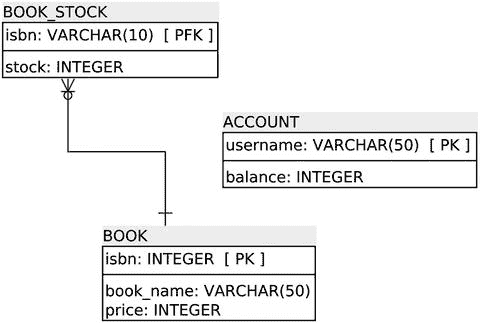

图 10-1.

BOOK_STOCK 描述了给定 BOOK 的库存数量。

现在，让我们为上述模型创建 SQL。执行 `bin\psql.sh` 命令连接到正在运行的容器并打开 `psql` 工具。

将以下 SQL 粘贴到 shell 中并验证其成功执行：

```
CREATE TABLE BOOK (
ISBN         VARCHAR(50)    NOT NULL,
BOOK_NAME    VARCHAR(100)   NOT NULL,
PRICE        INT,
PRIMARY KEY (ISBN)
);
CREATE TABLE BOOK_STOCK (
ISBN     VARCHAR(50)    NOT NULL,
STOCK    INT            NOT NULL,
PRIMARY KEY (ISBN),
CONSTRAINT positive_stock CHECK (STOCK >= 0)
);
CREATE TABLE ACCOUNT (
USERNAME    VARCHAR(50)    NOT NULL,
BALANCE     INT            NOT NULL,
PRIMARY KEY (USERNAME),
CONSTRAINT positive_balance CHECK (BALANCE >= 0)
);
```

这种类型的实际应用程序可能会使用十进制类型的价格字段，但使用 `int` 可以使编程更易于理解，因此我们将其保留为 `int`。


`BOOK` 表存储图书的基本信息，如书名和价格，以图书 ISBN 作为主键。`BOOK_STOCK` 表记录每本书的库存。库存值通过 `CHECK` 约束限制为正数。尽管 `CHECK` 约束类型在 SQL-99 中已定义，但并非所有数据库引擎都支持。在撰写本文时，此限制主要适用于 MySQL，因为 Sybase、Derby、HSQL、Oracle、DB2、SQL Server、Access、PostgreSQL 和 FireBird 均支持该约束。如果你的数据库引擎不支持 `CHECK` 约束，请查阅其文档以了解类似的约束支持。最后，`ACCOUNT` 表存储客户账户及其余额。同样，余额也被限制为正数。

你的书店操作在以下 `BookShop` 接口中定义。目前，只有一个操作：`purchase()`。

```
package com.apress.springrecipes.bookshop;
public interface BookShop {
void purchase(String isbn, String username);
}
```

由于你将使用 JDBC 实现此接口，因此需要创建以下 `JdbcBookShop` 类。为了更好地理解事务的本质，让我们在不借助 Spring JDBC 支持的情况下实现此类。

```
package com.apress.springrecipes.bookshop;
import java.sql.Connection;
import java.sql.PreparedStatement;
import java.sql.ResultSet;
import java.sql.SQLException;
import javax.sql.DataSource;
public class JdbcBookShop implements BookShop {
private DataSource dataSource;
public void setDataSource(DataSource dataSource) {
this.dataSource = dataSource;
}
public void purchase(String isbn, String username) {
Connection conn = null;
try {
conn = dataSource.getConnection();
PreparedStatement stmt1 = conn.prepareStatement(
"SELECT PRICE FROM BOOK WHERE ISBN = ?");
stmt1.setString(1, isbn);
ResultSet rs = stmt1.executeQuery();
rs.next();
int price = rs.getInt("PRICE");
stmt1.close();
PreparedStatement stmt2 = conn.prepareStatement(
"UPDATE BOOK_STOCK SET STOCK = STOCK - 1 "+
"WHERE ISBN = ?");
stmt2.setString(1, isbn);
stmt2.executeUpdate();
stmt2.close();
PreparedStatement stmt3 = conn.prepareStatement(
"UPDATE ACCOUNT SET BALANCE = BALANCE - ? "+
"WHERE USERNAME = ?");
stmt3.setInt(1, price);
stmt3.setString(2, username);
stmt3.executeUpdate();
stmt3.close();
} catch (SQLException e) {
throw new RuntimeException(e);
} finally {
if (conn != null) {
try {
conn.close();
} catch (SQLException e) {}
}
}
}
}
```

对于 `purchase()` 操作，你总共需要执行三条 SQL 语句。第一条是查询图书价格。第二条和第三条分别更新图书库存和账户余额。然后，你可以在 Spring IoC 容器中声明一个书店实例来提供购买服务。为简单起见，你可以使用 `DriverManagerDataSource`，它为每个请求打开一个新的数据库连接。

注意

要访问 PostgreSQL 数据库，你必须将 Postgres 客户端库添加到你的 `CLASSPATH` 中。

```
package com.apress.springrecipes.bookshop.config;
import com.apress.springrecipes.bookshop.BookShop;
import com.apress.springrecipes.bookshop.JdbcBookShop;
import org.springframework.context.annotation.Bean;
import org.springframework.context.annotation.Configuration;
import org.springframework.jdbc.datasource.DriverManagerDataSource;
import javax.sql.DataSource;
@Configuration
public class BookstoreConfiguration {
@Bean
public DataSource dataSource() {
DriverManagerDataSource dataSource = new DriverManagerDataSource();
dataSource.setDriverClassName(org.postgresql.Driver.class.getName());
dataSource.setUrl("jdbc:postgresql://localhost:5432/bookstore");
dataSource.setUsername("postgres");
dataSource.setPassword("password");
return dataSource;
}
@Bean
public BookShop bookShop() {
JdbcBookShop bookShop = new JdbcBookShop();
bookShop.setDataSource(dataSource());
return bookShop;
}
}
```

为了演示没有事务管理可能引发的问题，假设你的书店数据库中已输入了表 10-2、10-3 和 10-4 中所示的数据。

表 10-4.

用于测试事务的 ACCOUNT 表中的示例数据

USERNAME
 |
  BALANCE
 |

| --- | --- | --- | --- | --- |

`user1`
 |
  `20`
 |

表 10-3.

用于测试事务的 BOOK_STOCK 表中的示例数据

ISBN
 |
  STOCK
 |

| --- | --- | --- | --- | --- |

`0001`
 |
  `10`
 |

表 10-2.

用于测试事务的 BOOK 表中的示例数据

ISBN
 |
  BOOK_NAME
 |
  PRICE
 |

| --- | --- | --- | --- | --- | --- | --- |

`0001`
 |
  `The First Book`
 |
  `30`
 |

然后，编写以下 `Main` 类，用于让用户 `user1` 购买 ISBN 为 0001 的图书。由于该用户的账户只有 20 美元，资金不足以购买这本书。

```
package com.apress.springrecipes.bookshop;
import com.apress.springrecipes.bookshop.config.BookstoreConfiguration;
import org.springframework.context.ApplicationContext;
import org.springframework.context.annotation.AnnotationConfigApplicationContext;
public class Main {
public static void main(String[] args) throws Throwable {
ApplicationContext context =
new AnnotationConfigApplicationContext(BookstoreConfiguration.class);
BookShop bookShop = context.getBean(BookShop.class);
bookShop.purchase("0001", "user1");
}
}
```

当你运行此应用程序时，会遇到一个 `SQLException`，因为违反了 `ACCOUNT` 表的 `CHECK` 约束。这是预期结果，因为你试图扣除的金额超过了账户余额。

然而，如果你检查 `BOOK_STOCK` 表中该书的库存，你会发现它被这次失败的操作意外扣减了！原因是在第三条语句抛出异常之前，你已经执行了第二条 SQL 语句来扣减库存。

如你所见，缺乏事务管理会导致数据处于不一致状态。为避免这种不一致，`purchase()` 操作的三条 SQL 语句应在单个事务内执行。一旦事务中的任何操作失败，整个事务应回滚，以撤销已执行操作所做的所有更改。

使用 JDBC 提交和回滚管理事务

使用 JDBC 更新数据库时，默认情况下每条 SQL 语句在执行后会立即提交。这种行为称为自动提交。然而，它不允许你为操作管理事务。JDBC 支持通过显式调用连接上的 `commit()` 和 `rollback()` 方法来实现基本的事务管理策略。但在执行此操作之前，你必须关闭默认开启的自动提交。

```
package com.apress.springrecipes.bookshop;
...
public class JdbcBookShop implements BookShop {
...
public void purchase(String isbn, String username) {
Connection conn = null;
try {
conn = dataSource.getConnection();
conn.setAutoCommit(false);
...
conn.commit();
} catch (SQLException e) {
if (conn != null) {
try {
conn.rollback();
} catch (SQLException e1) {}
}
throw new RuntimeException(e);
} finally {
if (conn != null) {
try {
conn.close();
} catch (SQLException e) {}
}
}
}
}
```

数据库连接的自动提交行为可以通过调用 `setAutoCommit()` 方法来改变。默认情况下，自动提交处于开启状态，每条 SQL 语句执行后会立即提交。要启用事务管理，你必须关闭此默认行为，并且仅当所有 SQL 语句都成功执行后才提交连接。如果任何语句出错，你必须回滚此连接所做的所有更改。

现在，如果你再次运行应用程序，当用户余额不足以购买图书时，图书库存将不会被扣减。


虽然你可以通过显式提交和回滚 JDBC 连接来管理事务，但为此编写的代码属于样板代码，你必须在不同方法中重复编写。此外，这些代码是 JDBC 特有的，因此一旦你选择了其他数据访问技术，它也需要随之更改。Spring 的事务支持提供了一套与技术无关的工具，包括事务管理器（例如 `org.springframework.transaction.PlatformTransactionManager`）、事务模板（例如 `org.springframework.transaction.support.TransactionTemplate`）以及事务声明支持，以简化你的事务管理任务。

10-2\. 选择事务管理器实现

问题

通常，如果你的应用程序只涉及单一数据源，你可以简单地通过调用数据库连接的 `commit()` 和 `rollback()` 方法来管理事务。但是，如果你的事务跨越多个数据源，或者你更倾向于使用 Java EE 应用服务器提供的事务管理功能，你可以选择 Java 事务 API（JTA）。此外，对于不同的对象关系映射框架（如 Hibernate 和 JPA），你可能需要调用不同的专有事务 API。

因此，你需要为不同的技术处理不同的事务 API。这会使你很难从一套 API 切换到另一套。

解决方案

Spring 从不同的事务管理 API 中抽象出了一套通用的事务工具。作为应用程序开发者，你可以直接使用 Spring 的事务工具，而无需深入了解底层的事务 API。借助这些工具，你的事务管理代码将与任何特定的事务技术无关。

Spring 核心的事务管理抽象基于 `PlatformTransactionManager` 接口。它封装了一套与技术无关的事务管理方法。请记住，无论你在 Spring 中选择哪种事务管理策略（编程式或声明式），都需要一个事务管理器。`PlatformTransactionManager` 接口提供了三个用于处理事务的方法：

*   `TransactionStatus getTransaction(TransactionDefinition definition) throws TransactionException`

*   `void commit(TransactionStatus status) throws TransactionException;`

*   `void rollback(TransactionStatus status) throws TransactionException;`

工作原理

`PlatformTransactionManager` 是所有 Spring 事务管理器的通用接口。Spring 内置了该接口的多个实现，用于与不同的事务管理 API 配合使用。

*   如果你的应用程序只需要处理单一数据源，并通过 JDBC 访问它，那么 `DataSourceTransactionManager` 应该能够满足你的需求。

*   如果你在 Java EE 应用服务器上使用 JTA 进行事务管理，则应使用 `JtaTransactionManager` 从应用服务器查找事务。此外，`JtaTransactionManager` 也适用于分布式事务（跨多个资源的事务）。请注意，虽然通常使用 JTA 事务管理器来集成应用服务器的事务管理器，但你也可以使用独立的 JTA 事务管理器，例如 Atomikos。

*   如果你使用对象关系映射框架来访问数据库，则应为此框架选择相应的事务管理器，例如 `HibernateTransactionManager` 或 `JpaTransactionManager`。

图 10-2 展示了 Spring 中 `PlatformTransactionManager` 接口的常见实现。

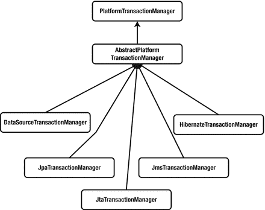

图 10-2.

PlatformTransactionManager 接口的常见实现

事务管理器在 Spring IoC 容器中作为一个普通 Bean 进行声明。例如，以下 Bean 配置声明了一个 `DataSourceTransactionManager` 实例。它需要设置 `dataSource` 属性，以便能够管理由此数据源创建的连接的事务。

```
@Bean
public DataSourceTransactionManager transactionManager() {
DataSourceTransactionManager transactionManager = new DataSourceTransactionManager()
transactionManager.setDataSource(dataSource());
return transactionManager;
}
```

10-3\. 使用事务管理器 API 以编程方式管理事务

问题

你需要在业务方法中精确控制何时提交和回滚事务，但又不想直接处理底层的事务 API。

解决方案

Spring 的事务管理器提供了一个与技术无关的 API，允许你通过调用 `getTransaction()` 方法启动一个新事务（或获取当前活动的事务），并通过调用 `commit()` 和 `rollback()` 方法来管理它。由于 `PlatformTransactionManager` 是事务管理的抽象单元，你调用的事务管理方法保证是与技术无关的。

工作原理

为了演示如何使用事务管理器 API，让我们创建一个新类 `TransactionalJdbcBookShop`，它将使用 Spring JDBC 模板。由于它需要处理事务管理器，我们添加一个 `PlatformTransactionManager` 类型的属性，并允许通过 setter 方法注入它。

```
package com.apress.springrecipes.bookshop;
import org.springframework.dao.DataAccessException;
import org.springframework.jdbc.core.support.JdbcDaoSupport;
import org.springframework.transaction.PlatformTransactionManager;
import org.springframework.transaction.TransactionDefinition;
import org.springframework.transaction.TransactionStatus;
import org.springframework.transaction.support.DefaultTransactionDefinition;
public class TransactionalJdbcBookShop extends JdbcDaoSupport implements BookShop {
private PlatformTransactionManager transactionManager;
public void setTransactionManager(PlatformTransactionManager transactionManager) {
this.transactionManager = transactionManager;
}
public void purchase(String isbn, String username) {
TransactionDefinition def = new DefaultTransactionDefinition();
TransactionStatus status = transactionManager.getTransaction(def);
try {
int price = getJdbcTemplate().queryForObject(
"SELECT PRICE FROM BOOK WHERE ISBN = ?", Integer.class, isbn);
getJdbcTemplate().update(
"UPDATE BOOK_STOCK SET STOCK = STOCK - 1 WHERE ISBN = ?", isbn);
getJdbcTemplate().update(
"UPDATE ACCOUNT SET BALANCE = BALANCE - ? WHERE USERNAME = ?", price, username);
transactionManager.commit(status);
} catch (DataAccessException e) {
transactionManager.rollback(status);
throw e;
}
}
}
```

在启动新事务之前，你必须在类型为 `TransactionDefinition` 的事务定义对象中指定事务属性。对于此示例，你可以简单地创建一个 `DefaultTransactionDefinition` 实例来使用默认的事务属性。

一旦有了事务定义，你就可以通过调用 `getTransaction()` 方法，请求事务管理器使用该定义启动一个新事务。然后，它将返回一个 `TransactionStatus` 对象来跟踪事务状态。如果所有语句都成功执行，你可以通过传入事务状态来请求事务管理器提交此事务。由于 Spring JDBC 模板抛出的所有异常都是 `DataAccessException` 的子类，因此当捕获到此类异常时，你可以请求事务管理器回滚事务。


在本课程中，您已声明了通用类型 `PlatformTransactionManager` 的事务管理器属性。现在，您需要注入一个合适的事务管理器实现。由于您仅处理单个数据源并通过 JDBC 访问它，因此应选择 `DataSourceTransactionManager`。此处，您还需要注入一个 `dataSource` 对象，因为该类是 Spring 的 `JdbcDaoSupport` 的子类，而后者需要该对象。

```
@Configuration
public class BookstoreConfiguration {
...
@Bean
public DataSourceTransactionManager transactionManager() {
DataSourceTransactionManager transactionManager = new DataSourceTransactionManager();
transactionManager.setDataSource(dataSource());
return transactionManager;
}
@Bean
public BookShop bookShop() {
TransactionalJdbcBookShop bookShop = new TransactionalJdbcBookShop();
bookShop.setDataSource(dataSource());
bookShop.setTransactionManager(transactionManager());
return bookShop;
}
}
```

10-4. 使用事务模板以编程方式管理事务

问题

假设您有一个代码块（并非整个方法体），该业务方法具有以下事务需求：

*   在代码块开始时启动一个新事务。
*   在代码块成功完成后提交事务。
*   如果在代码块中抛出异常，则回滚事务。

如果您直接调用 Spring 的事务管理器 API，则事务管理代码可以以与技术无关的方式进行通用化。然而，您可能不希望为每个类似的代码块重复编写样板代码。

解决方案

与 JDBC 模板类似，Spring 也提供了 `TransactionTemplate` 来帮助您控制整个事务管理流程和事务异常处理。您只需将代码块封装在实现 `TransactionCallback<T>` 接口的回调类中，并将其传递给 `TransactionTemplate` 的 `execute` 方法执行即可。这样，您就无需为此代码块重复编写样板事务管理代码。Spring 提供的模板对象是轻量级的，通常可以丢弃或重新创建而不会影响性能。例如，JDBC 模板可以通过 `DataSource` 引用即时重新创建，同样，`TransactionTemplate` 也可以通过提供事务管理器引用来重新创建。当然，您也可以在 Spring 应用上下文中简单地创建一个。

工作原理

`TransactionTemplate` 是基于事务管理器创建的，就像 JDBC 模板是基于数据源创建的一样。事务模板执行一个封装了事务性代码块的事务回调对象。您可以将回调接口实现为单独的类或内部类。如果实现为内部类，则必须将方法参数声明为 `final` 才能访问。

```
package com.apress.springrecipes.bookshop;
import org.springframework.jdbc.core.support.JdbcDaoSupport;
import org.springframework.transaction.PlatformTransactionManager;
import org.springframework.transaction.TransactionStatus;
import org.springframework.transaction.support.TransactionCallbackWithoutResult;
import org.springframework.transaction.support.TransactionTemplate;
public class TransactionalJdbcBookShop extends JdbcDaoSupport implements BookShop {
private PlatformTransactionManager transactionManager;
public void setTransactionManager(PlatformTransactionManager transactionManager) {
this.transactionManager = transactionManager;
}
public void purchase(final String isbn, final String username) {
TransactionTemplate transactionTemplate =
new TransactionTemplate(transactionManager);
transactionTemplate.execute(new TransactionCallbackWithoutResult() {
protected void doInTransactionWithoutResult(
TransactionStatus status) {
int price = getJdbcTemplate().queryForObject(
"SELECT PRICE FROM BOOK WHERE ISBN = ?", Integer.class, isbn);
getJdbcTemplate().update(
"UPDATE BOOK_STOCK SET STOCK = STOCK - 1 WHERE ISBN = ?", isbn );
getJdbcTemplate().update(
"UPDATE ACCOUNT SET BALANCE = BALANCE - ? WHERE USERNAME = ?", price, username);
}
});
}
}
```

`TransactionTemplate` 可以接受一个事务回调对象，该对象实现了 `TransactionCallback<T>` 接口，或者是框架提供的该接口的一个实现类 `TransactionCallbackWithoutResult` 的实例。对于 `purchase()` 方法中用于扣减图书库存和账户余额的代码块，没有返回值，因此使用 `TransactionCallbackWithoutResult` 即可。对于任何有返回值的代码块，您应该实现 `TransactionCallback<T>` 接口。回调对象的返回值最终会由模板的 `T execute()` 方法返回。其主要好处是，启动、回滚或提交事务的责任已被移除。

在执行回调对象期间，如果它抛出了非受检异常（例如，`RuntimeException` 和 `DataAccessException` 属于此类），或者您在 `doInTransactionWithoutResult` 方法中显式调用了 `TransactionStatus` 参数的 `setRollbackOnly()` 方法，则事务将被回滚。否则，事务将在回调对象完成后提交。

在 Bean 配置文件中，bookshop Bean 仍然需要一个事务管理器来创建 `TransactionTemplate`。

```
@Configuration
public class BookstoreConfiguration {
...
@Bean
public DataSourceTransactionManager transactionManager() {
DataSourceTransactionManager transactionManager = new DataSourceTransactionManager();
transactionManager.setDataSource(dataSource());
return transactionManager;
}
@Bean
public BookShop bookShop() {
TransactionalJdbcBookShop bookShop = new TransactionalJdbcBookShop();
bookShop.setDataSource(dataSource());
bookShop.setTransactionManager(transactionManager());
return bookShop;
}
}
```

您也可以让 IoC 容器注入一个事务模板，而不是直接创建它。由于事务模板处理所有事务，您的类不再需要引用事务管理器。

```
package com.apress.springrecipes.bookshop;
...
import org.springframework.transaction.support.TransactionTemplate;
public class TransactionalJdbcBookShop extends JdbcDaoSupport implements
BookShop {
private TransactionTemplate transactionTemplate;
public void setTransactionTemplate(
TransactionTemplate transactionTemplate) {
this.transactionTemplate = transactionTemplate;
}
public void purchase(final String isbn, final String username) {
transactionTemplate.execute(new TransactionCallbackWithoutResult() {
protected void doInTransactionWithoutResult(TransactionStatus status) {
...
}
});
}
}
```


随后，在 Bean 配置文件中定义一个事务模板，并将其（而非事务管理器）注入到你的 bookshop Bean 中。请注意，事务模板实例可用于多个事务性 Bean，因为它是一个线程安全对象。最后，不要忘记为你的事务模板设置事务管理器属性。

```
package com.apress.springrecipes.bookshop.config;
...
import org.springframework.transaction.support.TransactionTemplate;
@Configuration
public class BookstoreConfiguration {
...
@Bean
public DataSourceTransactionManager transactionManager() { ... }
@Bean
public TransactionTemplate transactionTemplate() {
TransactionTemplate transactionTemplate = new TransactionTemplate();
transactionTemplate.setTransactionManager(transactionManager());
return transactionTemplate;
}
@Bean
public BookShop bookShop() {
TransactionalJdbcBookShop bookShop = new TransactionalJdbcBookShop();
bookShop.setDataSource(dataSource());
bookShop.setTransactionTemplate(transactionTemplate());
return bookShop;
}
}
```

10-5. 使用 `@Transactional` 注解声明式管理事务

问题

在 Bean 配置文件中声明事务需要了解 AOP 概念，例如切入点、通知和顾问。缺乏这方面知识的开发者可能会觉得启用声明式事务管理比较困难。

解决方案

Spring 允许你通过简单地在事务性方法上添加 `@Transactional` 注解，并在配置类上添加 `@EnableTransactionManagement` 注解来声明事务。

工作原理

要将一个方法定义为事务性的，你只需用 `@Transactional` 注解它。请注意，由于 Spring AOP 基于代理的限制，你只应对 `public` 方法进行注解。

```
package com.apress.springrecipes.bookshop;
import org.springframework.jdbc.core.support.JdbcDaoSupport;
import org.springframework.transaction.annotation.Transactional;
public class JdbcBookShop extends JdbcDaoSupport implements BookShop {
@Transactional
public void purchase(final String isbn, final String username) {
int price = getJdbcTemplate().queryForObject(
"SELECT PRICE FROM BOOK WHERE ISBN = ?", Integer.class, isbn);
getJdbcTemplate().update(
"UPDATE BOOK_STOCK SET STOCK = STOCK - 1 WHERE ISBN = ?", isbn);
getJdbcTemplate().update(
"UPDATE ACCOUNT SET BALANCE = BALANCE - ? WHERE USERNAME = ?", price, username);
}
}
```

请注意，因为你继承了 `JdbcDaoSupport`，所以不再需要 `DataSource` 的 setter 方法；请将其从你的 DAO 类中移除。

你可以在方法级别或类级别应用 `@Transactional` 注解。当将此注解应用于类时，该类中的所有 `public` 方法都将被定义为事务性的。虽然你可以将 `@Transactional` 应用于接口或接口中的方法声明，但不建议这样做，因为它可能无法与基于类的代理（即 CGLIB 代理）正常工作。

在 Java 配置类中，你只需添加 `@EnableTransactionManagement` 注解。这就是使其工作所需的全部操作。Spring 将会为 IoC 容器中声明的、带有 `@Transactional` 注解的方法，或带有 `@Transactional` 注解的类中的方法，提供通知。因此，Spring 可以为这些方法管理事务。

```
@Configuration
@EnableTransactionManagement
public class BookstoreConfiguration {  ... }
```

10-6. 设置事务传播属性

问题

当一个事务性方法被另一个方法调用时，有必要指定事务应如何传播。例如，该方法可以在现有事务内继续运行，或者它可以启动一个新事务并在其自身的事务内运行。

解决方案

事务的传播行为可以通过传播事务属性来指定。Spring 定义了七种传播行为，如表 10-5 所示。这些行为定义在 `org.springframework.transaction.TransactionDefinition` 接口中。请注意，并非所有类型的事务管理器都支持所有这些传播行为。它们的行为取决于底层资源。例如，数据库可能支持不同的隔离级别，这限制了事务管理器可以支持的传播行为。

表 10-5. Spring 支持的传播行为

| 传播行为 | 描述 |
| :--- | :--- |
| `REQUIRED` | 如果当前存在一个正在进行的事务，则当前方法应在此事务内运行。否则，它应启动一个新事务并在其自身的事务内运行。 |
| `REQUIRES_NEW` | 当前方法必须启动一个新事务并在其自身的事务内运行。如果当前存在一个正在进行的事务，则应将其挂起。 |
| `SUPPORTS` | 如果当前存在一个正在进行的事务，则当前方法可以在此事务内运行。否则，不必在事务内运行。 |
| `NOT_SUPPORTED` | 当前方法不应在事务内运行。如果当前存在一个正在进行的事务，则应将其挂起。 |
| `MANDATORY` | 当前方法必须在事务内运行。如果当前没有正在进行的事务，则会抛出异常。 |
| `NEVER` | 当前方法不应在事务内运行。如果当前存在一个正在进行的事务，则会抛出异常。 |
| `NESTED` | 如果当前存在一个正在进行的事务，则当前方法应在此事务的嵌套事务（由 JDBC 3.0 保存点特性支持）内运行。否则，它应启动一个新事务并在其自身的事务内运行。此特性是 Spring 独有的（而之前的传播行为在 Java EE 事务传播中有对应项）。此行为对于批处理等情况非常有用，例如，你有一个长时间运行的过程（想象处理 100 万条记录），并且你希望分批提交。因此，你每处理 10,000 条记录提交一次。如果出现问题，你回滚嵌套事务，只会丢失 10,000 条记录的工作量（而不是全部 100 万条）。 |

工作原理

当一个事务性方法被另一个方法调用时，就会发生事务传播。例如，假设一位顾客希望在书店收银台结账购买所有书籍。为了支持此操作，你定义如下 `Cashier` 接口：

```
package com.apress.springrecipes.bookshop;
...
public interface Cashier {
public void checkout(List isbns, String username);
}
```

你可以通过多次调用 bookshop Bean 的 `purchase()` 方法，将购买操作委托给它来实现此接口。请注意，`checkout()` 方法通过应用 `@Transactional` 注解被设置为事务性的。

```
package com.apress.springrecipes.bookshop;
...
import org.springframework.transaction.annotation.Transactional;
public class BookShopCashier implements Cashier {
private BookShop bookShop;
public void setBookShop(BookShop bookShop) {
this.bookShop = bookShop;
}
@Transactional
public void checkout(List isbns, String username) {
for (String isbn : isbns) {
bookShop.purchase(isbn, username);
}
}
}
```

然后在你的 Bean 配置文件中定义一个 cashier Bean，并引用 bookshop Bean 来购买书籍。

```
@Configuration
@EnableTransactionManagement()
public class BookstoreConfiguration {
...
@Bean
public Cashier cashier() {
BookShopCashier cashier = new BookShopCashier();
cashier.setBookShop(bookShop());
return cashier;
}
}
```


为了演示事务的传播行为，请在您的书店数据库中录入表 10-6、10-7 和 10-8 所示的数据。

表 10-8. 用于测试传播行为的 ACCOUNT 表示例数据

USERNAME | BALANCE
| --- | --- |
user1 | |

表 10-7. 用于测试传播行为的 BOOK_STOCK 表示例数据

ISBN | STOCK
| --- | --- |
| |

表 10-6. 用于测试传播行为的 BOOK 表示例数据

ISBN | BOOK_NAME | PRICE
| --- | --- | --- |
| The First Book | |
| The Second Book | |

使用 REQUIRED 传播行为

当用户 `user1` 在收银台结账两本书时，其余额足够购买第一本书，但不足以购买第二本。

```
package com.apress.springrecipes.bookshop.spring;
...
public class Main {
public static void main(String[] args) {
...
Cashier cashier = context.getBean(Cashier.class);
List isbnList = Arrays.asList(new String[] { "0001", "0002"});
cashier.checkout(isbnList, "user1");
}
}
```

当书店的 `purchase()` 方法被另一个事务性方法（例如 `checkout()`）调用时，默认情况下它将在现有事务内运行。这种默认的传播行为被称为 `REQUIRED`。这意味着只会存在一个事务，其边界即为 `checkout()` 方法的开始和结束。该事务仅在 `checkout()` 方法结束时提交。因此，用户将无法购买任何一本书。

图 10-3 展示了 `REQUIRED` 传播行为。

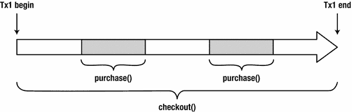

图 10-3. REQUIRED 事务传播行为

然而，如果 `purchase()` 方法被一个非事务性方法调用，并且当前没有正在进行的事务，那么它将启动一个新事务并在其自身的事务内运行。传播事务属性可以在 `@Transactional` 注解中定义。例如，您可以为此属性设置 `REQUIRED` 行为，如下所示。实际上，这并非必要，因为它是默认行为。

```
package com.apress.springrecipes.bookshop.spring;
...
import org.springframework.transaction.annotation.Propagation;
import org.springframework.transaction.annotation.Transactional;
public class JdbcBookShop extends JdbcDaoSupport implements BookShop {
@Transactional(propagation = Propagation.REQUIRED)
public void purchase(String isbn, String username) {
...
}
}
package com.apress.springrecipes.bookshop.spring;
...
import org.springframework.transaction.annotation.Propagation;
import org.springframework.transaction.annotation.Transactional;
public class BookShopCashier implements Cashier {
...
@Transactional(propagation = Propagation.REQUIRED)
public void checkout(List isbns, String username) {
...
}
}
```

使用 REQUIRES_NEW 传播行为

另一种常见的传播行为是 `REQUIRES_NEW`。这表示该方法必须启动一个新事务并在其新事务内运行。如果当前有一个正在进行的事务，则应首先将其挂起（例如，在 `BookShopCashier` 的 `checkout` 方法中，其传播属性为 `REQUIRED`）。

```
package com.apress.springrecipes.bookshop.spring;
...
import org.springframework.transaction.annotation.Propagation;
import org.springframework.transaction.annotation.Transactional;
public class JdbcBookShop extends JdbcDaoSupport implements BookShop {
@Transactional(propagation = Propagation.REQUIRES_NEW)
public void purchase(String isbn, String username) {
...
}
}
```

在这种情况下，总共会启动三个事务。第一个事务由 `checkout()` 方法启动，但当第一个 `purchase()` 方法被调用时，第一个事务将被挂起，并启动一个新事务。在第一个 `purchase()` 方法结束时，新事务完成并提交。当第二个 `purchase()` 方法被调用时，将启动另一个新事务。然而，这个事务将失败并回滚。因此，第一本书将被成功购买，而第二本则不会。图 10-4 展示了 `REQUIRES_NEW` 传播行为。

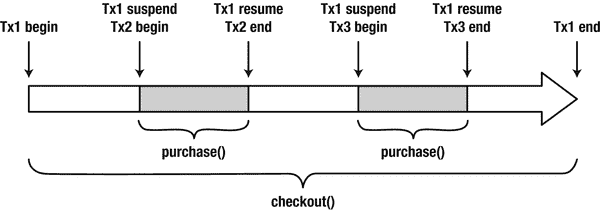

图 10-4. REQUIRES_NEW 事务传播行为

10-7. 设置隔离事务属性

问题

当同一应用程序或不同应用程序的多个事务并发操作同一数据集时，可能会引发许多意外问题。您必须指定您期望事务之间如何相互隔离。

解决方案

并发事务引起的问题可分为四种类型。

*   **脏读**：对于两个事务 T1 和 T2，T1 读取了一个已被 T2 更新但尚未提交的字段。之后，如果 T2 回滚，T1 读取的该字段将是临时的且无效的。

*   **不可重复读**：对于两个事务 T1 和 T2，T1 读取了一个字段，然后 T2 更新了该字段。之后，如果 T1 再次读取同一个字段，其值将会不同。

*   **幻读**：对于两个事务 T1 和 T2，T1 从表中读取了一些行，然后 T2 向表中插入了新行。之后，如果 T1 再次读取同一张表，将会出现额外的行。

*   **丢失更新**：对于两个事务 T1 和 T2，它们都选择了一行进行更新，并基于该行的状态对其进行了更新。因此，当第二个提交的事务本应等待第一个事务提交后再执行其选择操作时，其中一个覆盖了另一个。

理论上，事务之间应该完全隔离（即可序列化），以避免所有上述问题。然而，这种隔离级别会对性能产生很大影响，因为事务必须按串行顺序运行。在实践中，为了提高性能，事务可以在较低的隔离级别下运行。

事务的隔离级别可以通过隔离事务属性来指定。Spring 支持五种隔离级别，如表 10-9 所示。这些级别定义在 `org.springframework.transaction.TransactionDefinition` 接口中。

表 10-9. Spring 支持的隔离级别

隔离级别 | 描述
| --- | --- |
`DEFAULT` | 使用底层数据库的默认隔离级别。对于大多数数据库，默认隔离级别是 `READ_COMMITTED`。
`READ_UNCOMMITTED` | 允许一个事务读取其他事务未提交的更改。可能会发生脏读、不可重复读和幻读问题。
`READ_COMMITTED` | 允许一个事务仅读取已被其他事务提交的更改。可以避免脏读问题，但不可重复读和幻读问题仍可能发生。
`REPEATABLE_READ` | 确保一个事务可以多次从某个字段读取相同的值。在此事务持续期间，禁止其他事务对该字段进行更新。可以避免脏读和不可重复读问题，但幻读问题仍可能发生。


`SERIALIZABLE`
 |
  确保一个事务能够多次从表中读取相同的行。在该事务持续期间，禁止其他事务对该表进行插入、更新和删除操作。所有并发问题均可避免，但性能会较低。
 |

注意

事务隔离由底层数据库引擎支持，而非应用程序或框架。然而，并非所有数据库引擎都支持所有这些隔离级别。你可以通过调用 `java.sql.Connection` 接口上的 `setTransactionIsolation()` 方法来更改 JDBC 连接的隔离级别。

工作原理

为了说明并发事务所导致的问题，让我们为你的书店新增两个操作，用于增加和检查图书库存。

```
package com.apress.springrecipes.bookshop;
public interface BookShop {
...
public void increaseStock(String isbn, int stock);
public int checkStock(String isbn);
}
```

然后，你按如下方式实现这些操作。请注意，这两个操作也应声明为事务性操作。

```
package com.apress.springrecipes.bookshop;
import org.springframework.jdbc.core.support.JdbcDaoSupport;
import org.springframework.transaction.annotation.Isolation;
import org.springframework.transaction.annotation.Transactional;
public class JdbcBookShop extends JdbcDaoSupport implements BookShop {
@Transactional
public void purchase(String isbn, String username) {
int price = getJdbcTemplate().queryForObject(
"SELECT PRICE FROM BOOK WHERE ISBN = ?", Integer.class, isbn);
getJdbcTemplate().update(
"UPDATE BOOK_STOCK SET STOCK = STOCK - 1 WHERE ISBN = ?", isbn );
getJdbcTemplate().update(
"UPDATE ACCOUNT SET BALANCE = BALANCE - ? WHERE USERNAME = ?", price, username);
}
@Transactional
public void increaseStock(String isbn, int stock) {
String threadName = Thread.currentThread().getName();
System.out.println(threadName + " - 准备增加图书库存");
getJdbcTemplate().update("UPDATE BOOK_STOCK SET STOCK = STOCK + ? WHERE ISBN = ?", stock, isbn);
System.out.println(threadName + " - 图书库存已增加 " + stock);
sleep(threadName);
System.out.println(threadName + " - 图书库存已回滚");
throw new RuntimeException("误操作增加");
}
@Transactional(isolation = Isolation.READ_UNCOMMITTED)
public int checkStock(String isbn) {
String threadName = Thread.currentThread().getName();
System.out.println(threadName + " - 准备检查图书库存");
int stock = getJdbcTemplate().queryForObject("SELECT STOCK FROM BOOK_STOCK WHERE ISBN = ?", Integer.class, isbn);
System.out.println(threadName + " - 图书库存为 " + stock);
sleep(threadName);
return stock;
}
private void sleep(String threadName) {
System.out.println(threadName + " - 休眠中");
try {
Thread.sleep(10000);
} catch (InterruptedException e) {
}
System.out.println(threadName + " - 唤醒");
}
}
```

为了模拟并发，你的操作需要由多个线程执行。你可以通过 `println` 语句跟踪操作的当前状态。对于每个操作，你会在 SQL 语句执行前后向控制台打印若干消息。这些消息应包含线程名称，以便你知道当前正在执行操作的是哪个线程。

每个操作执行完 SQL 语句后，你让线程休眠十秒。如你所知，操作一旦完成，事务将立即提交或回滚。插入休眠语句有助于延迟提交或回滚。对于 `increase()` 操作，你最终会抛出一个 `RuntimeException` 来导致事务回滚。让我们来看一个运行这些示例的简单客户端。

在开始隔离级别示例之前，请将表 10-10 和 10-11 中的数据输入到你的书店数据库中。（请注意，此示例中不需要 `ACCOUNT` 表。）

表 10-11.


用于测试隔离级别的 BOOK_STOCK 表中的示例数据

ISBN
 |
  库存
 |

| --- | --- | --- | --- | --- |

|

|

表 10-10.

用于测试隔离级别的 BOOK 表中的示例数据

ISBN
 |
  书名
 |
  价格
 |

| --- | --- | --- | --- | --- | --- | --- |

|
  第一本书
 |

|

使用 READ_UNCOMMITTED 和
READ_COMMITTED 隔离级别

`READ_UNCOMMITTED` 是
最低的隔离级别，它允许一个事务读取其他事务所做的未提交更改。你可以在
`checkStock()` 方法的 `@Transaction`
注解中设置此隔离级别。

```
package com.apress.springrecipes.bookshop.spring;
...
import org.springframework.transaction.annotation.Isolation;
import org.springframework.transaction.annotation.Transactional;
public class JdbcBookShop extends JdbcDaoSupport implements BookShop {
...
@Transactional(isolation = Isolation.READ_UNCOMMITTED)
public int checkStock(String isbn) {
...
}
}
```

你可以创建一些线程来试验此事务隔离级别。在下面的 `Main` 类中，你将创建两个线程。线程 1 增加图书库存，而线程 2 检查图书库存。线程 1 比线程 2 早启动 5 秒。

```
package com.apress.springrecipes.bookshop.spring;
...
public class Main {
public static void main(String[] args) {
...
final BookShop bookShop = context.getBean(BookShop.class);
Thread thread1 = new Thread(() -> {
try {
bookShop.increaseStock("0001", 5);
} catch (RuntimeException e) {}
}, "Thread 1");
Thread thread2 = new Thread(() -> {
bookShop.checkStock("0001");
}, "Thread 2");
thread1.start();
try {
Thread.sleep(5000);
} catch (InterruptedException e) {}
thread2.start();
}
}
```

如果你运行该应用程序，你将得到以下结果：

```
Thread 1―准备增加图书库存
Thread 1―图书库存增加了 5
Thread 1―正在休眠
Thread 2―准备检查图书库存
Thread 2―图书库存为 15
Thread 2―正在休眠
Thread 1―唤醒
Thread 1―图书库存已回滚
Thread 2―唤醒
```

首先，线程 1 增加了图书库存，然后进入休眠。此时，线程 1 的事务尚未回滚。在线程 1 休眠期间，线程 2 启动并尝试读取图书库存。使用 `READ_UNCOMMITTED`
隔离级别，线程 2 将能够读取已被未提交事务更新的库存值。

然而，当线程 1 唤醒时，其事务将因 `RuntimeException` 而回滚，因此线程 2 读取的值是临时的且无效的。此问题被称为脏读，因为一个事务可能读取到“脏”数据。

为了避免脏读问题，你应该将 `checkStock()` 的隔离级别提升为 `READ_COMMITTED`。

```
package com.apress.springrecipes.bookshop.spring;
...
import org.springframework.transaction.annotation.Isolation;
import org.springframework.transaction.annotation.Transactional;
public class JdbcBookShop extends JdbcDaoSupport implements BookShop {
...
@Transactional(isolation = Isolation.READ_COMMITTED)
public int checkStock(String isbn) {
...
}
}
```

如果你再次运行该应用程序，线程 2 将无法读取图书库存，直到线程 1 回滚了事务。通过这种方式，可以防止一个事务读取另一个未提交事务已更新的字段，从而避免脏读问题。

```
Thread 1―准备增加图书库存
Thread 1―图书库存增加了 5
Thread 1―正在休眠
Thread 2―准备检查图书库存
Thread 1―唤醒
Thread 1―图书库存已回滚
Thread 2―图书库存为 10
Thread 2―正在休眠
Thread 2―唤醒
```

为了让底层数据库支持 `READ_COMMITTED` 隔离级别，它可能会在已更新但尚未提交的行上获取一个更新锁。然后，其他事务必须等待，直到该更新锁被释放（当持有锁的事务提交或回滚时发生），才能读取该行。

使用 REPEATABLE_READ 
隔离级别

现在，让我们重构线程以演示另一个并发问题。交换两个线程的任务，使得线程 1 在线程 2 增加图书库存之前检查图书库存。

```
package com.apress.springrecipes.bookshop.spring;
...
public class Main {
public static void main(String[] args) {
...
final BookShop bookShop = (BookShop) context.getBean("bookShop");
Thread thread1 = new Thread(() -> {
public void run() {
bookShop.checkStock("0001");
}
}, "Thread 1");
Thread thread2 = new Thread(() -> {
try {
bookShop.increaseStock("0001", 5);
} catch (RuntimeException e) {}
}, "Thread 2");
thread1.start();
try {
Thread.sleep(5000);
} catch (InterruptedException e) {}
thread2.start();
}
}
```

如果你运行该应用程序，你将得到以下结果：

```
Thread 1―准备检查图书库存
Thread 1―图书库存为 10
Thread 1―正在休眠
Thread 2―准备增加图书库存
Thread 2―图书库存增加了 5
Thread 2―正在休眠
Thread 1―唤醒
Thread 2―唤醒
Thread 2―图书库存已回滚
```

首先，线程 1 读取了图书库存，然后进入休眠。此时，线程 1 的事务尚未提交。在线程 1 休眠期间，线程 2 启动并尝试增加图书库存。使用 `READ_COMMITTED` 隔离级别，线程 2 将能够更新已被未提交事务读取的库存值。

然而，如果线程 1 再次读取图书库存，该值将与其第一次读取的值不同。此问题被称为不可重复读，因为一个事务可能对同一字段读取到不同的值。

为了避免不可重复读问题，你应该将 `checkStock()` 的隔离级别提升为 `REPEATABLE_READ`。

```
package com.apress.springrecipes.bookshop.spring;
...
import org.springframework.transaction.annotation.Isolation;
import org.springframework.transaction.annotation.Transactional;
public class JdbcBookShop extends JdbcDaoSupport implements BookShop {
...
@Transactional(isolation = Isolation.REPEATABLE_READ)
public int checkStock(String isbn) {
...
}
}
```

如果你再次运行该应用程序，线程 2 将无法更新图书库存，直到线程 1 提交了事务。通过这种方式，可以防止一个事务更新另一个未提交事务已读取的值，从而避免不可重复读问题。

```
Thread 1―准备检查图书库存
Thread 1―图书库存为 10
Thread 1―正在休眠
Thread 2―准备增加图书库存
Thread 1―唤醒
Thread 2―图书库存增加了 5
Thread 2―正在休眠
Thread 2―唤醒
Thread 2―图书库存已回滚
```

为了让底层数据库支持 `REPEATABLE_READ` 隔离级别，它可能会在已读取但尚未提交的行上获取一个读锁。然后，其他事务必须等待，直到该读锁被释放（当持有锁的事务提交或回滚时发生），才能更新该行。

使用 SERIALIZABLE 隔离级别

在一个事务从表中读取了几行之后，另一个事务向同一表中插入了新行。如果第一个事务再次读取同一张表，它将发现额外的行，这与第一次读取的结果不同。此问题被称为幻读。实际上，幻读与不可重复读非常相似，但涉及多行数据。

为了避免幻读问题，你应该将隔离级别提升到最高：`SERIALIZABLE`。请注意，此隔离级别是最慢的，因为它可能会在整个表上获取读锁。在实践中，你应该始终选择能够满足你需求的最低隔离级别。

10-8\. 设置回滚事务属性

问题

默认情况下，只有非受检异常（即 `RuntimeException` 和 `Error` 类型）会导致事务回滚，而受检异常则不会。有时，你可能希望打破此规则，并设置自己的异常来回滚事务。

解决方案


导致事务回滚或不回滚的异常可以通过`rollback`事务属性来指定。任何未在此属性中明确指定的异常都将按照默认回滚规则处理（即，对未检查异常进行回滚，对已检查异常不进行回滚）。

工作原理

事务的回滚规则可以在`@Transactional`注解中通过`rollbackFor`和`noRollbackFor`属性来定义。这两个属性被声明为`Class[]`类型，因此你可以为每个属性指定多个异常。

```
package com.apress.springrecipes.bookshop.spring;
...
import org.springframework.transaction.annotation.Propagation;
import org.springframework.transaction.annotation.Transactional;
import java.io.IOException;
public class JdbcBookShop extends JdbcDaoSupport implements BookShop {
...
@Transactional(
propagation = Propagation.REQUIRES_NEW,
rollbackFor = IOException.class,
noRollbackFor = ArithmeticException.class)
public void purchase(String isbn, String username) throws Exception {
throw new ArithmeticException();
}
}
```

10-9. 设置超时和只读事务属性

问题

由于事务可能会获取行和表上的锁，长时间运行的事务会占用资源并影响整体性能。此外，如果事务只读取数据而不更新数据，数据库引擎可以对此事务进行优化。你可以指定这些属性来提高应用程序的性能。

解决方案

`timeout`事务属性（一个以秒为单位的整数）指示事务在被强制回滚之前可以存活多长时间。这可以防止长时间运行的事务占用资源。`read-only`属性指示此事务将只读取数据而不更新数据。`read-only`标志只是一个提示，用于启用资源以优化事务，如果尝试写入，资源不一定会导致失败。

工作原理

`timeout`和`read-only`事务属性可以在`@Transactional`注解中定义。请注意，超时时间以秒为单位。

```
package com.apress.springrecipes.bookshop.spring;
...
import org.springframework.transaction.annotation.Isolation;
import org.springframework.transaction.annotation.Transactional;
public class JdbcBookShop extends JdbcDaoSupport implements BookShop {
...
@Transactional(
isolation = Isolation.REPEATABLE_READ,
timeout = 30,
readOnly = true)
public int checkStock(String isbn) {
...
}
}
```

10-10. 使用加载时织入管理事务

问题

默认情况下，Spring 的声明式事务管理是通过其 AOP 框架启用的。然而，由于 Spring AOP 只能通知在 IoC 容器中声明的 bean 的公共方法，因此你使用 Spring AOP 管理事务的范围受到限制。有时你可能希望管理非公共方法的事务，或者管理在 Spring IoC 容器外部创建的对象（例如，领域对象）的方法。

解决方案

Spring 提供了一个名为`AnnotationTransactionAspect`的 AspectJ 切面，它可以管理任何对象的任何方法的事务，即使这些方法是非公共的，或者对象是在 Spring IoC 容器外部创建的。此切面将管理所有带有`@Transactional`注解的方法的事务。你可以选择 AspectJ 的编译时织入或加载时织入来启用此切面。

工作原理

要在加载时将此类切面织入到你的领域类中，你必须在配置类上放置`@EnableLoadTimeWeaving`注解。要启用 Spring 的`AnnotationTransactionAspect`进行事务管理，你只需定义`@EnableTransactionManagement`注解并将其`mode`属性设置为`ASPECTJ`。`@EnableTransactionManagement`注解的`mode`属性接受两个值：`ASPECTJ`和`PROXY`。`ASPECTJ`规定容器应使用加载时或编译时织入来启用事务通知。这需要`spring-instrument` JAR 包位于类路径上，并且在加载时或编译时进行相应的配置。

或者，`PROXY`规定容器应使用 Spring AOP 机制。需要注意的是，`ASPECTJ`模式不支持在接口上配置`@Transactional`注解。然后事务切面将自动启用。你还必须为此切面提供一个事务管理器。默认情况下，它将查找一个名为`transactionManager`的事务管理器。

```
package com.apress.springrecipes.bookshop;
Configuration
@EnableTransactionManagement(mode = AdviceMode.ASPECTJ)
@EnableLoadTimeWeaving
public class BookstoreConfiguration { ... }
```

注意

要使用 AspectJ 的 Spring 切面库，你必须在你的`CLASSPATH`中包含`spring-aspects`模块。要启用加载时织入，你还必须包含一个 Java 代理，该代理可在`spring-instrument`模块中找到。

对于一个简单的 Java 应用程序，你可以通过将 Spring 代理指定为 VM 参数，在加载时将此类切面织入到你的类中。

```
java -javaagent:lib/spring-instrument-5.0.0.RELEASE.jar -jar recipe_10_10_i.jar
```

总结

本章讨论了事务以及为什么应该使用它们。你探讨了 Java EE 历史上进行事务管理所采用的方法，然后了解了 Spring 框架提供的方法有何不同。你探讨了在代码中显式使用事务以及通过注解驱动的切面隐式使用事务。你设置了一个数据库，并使用事务来强制数据库中的有效状态。

在下一章中，你将探索 Spring Batch。Spring Batch 提供了可用作批处理作业基础的基础设施和组件。

11. Spring Batch

批处理已经存在了几十年。最早广泛用于信息管理（信息技术）的技术应用就是批处理应用。这些环境没有交互式会话，并且通常不具备在内存中加载多个应用程序的能力。计算机价格昂贵，与今天的服务器毫无相似之处。通常，机器是多用户共享的，并且在白天使用（分时）。然而，到了晚上，机器会闲置，这造成了巨大的浪费。企业投资于利用非工作时间来处理白天累积的工作的方法。这种做法催生了批处理。


批处理解决方案通常离线运行，对系统中的事件无感知。过去，批处理流程因技术限制而不得不离线运行。然而如今，大多数批处理流程之所以离线运行，是因为在可预测的时间完成工作以及分块处理工作，已成为众多架构的硬性需求。批处理解决方案通常不响应请求，尽管没有理由不能通过消息或请求来触发它。批处理解决方案往往用于处理大型数据集，此时处理时长是其架构和实现中的关键因素。一个流程可能运行数分钟、数小时甚至数天！作业可能没有时间限制（即持续运行直至所有工作完成，即便这意味着要运行数天），也可能有严格的时间限制（作业必须在恒定时间内推进，每行数据耗时相同，不受数据量限制，这样你就可以预测某个作业将在特定时间窗口内完成）。

批处理有着悠久的历史，其经验甚至影响着现代批处理解决方案。

大型机应用程序曾使用批处理，而当今最大的批处理环境之一——z/OS 上的 CICS，从根本上说仍是一个大型机操作系统。客户信息控制系统（CICS）非常适合特定类型的任务：接收输入、处理输入、写入输出。CICS 是一个事务服务器，主要用于金融机构和政府机构，可运行多种语言（COBOL、C、PLI 等）编写的程序。它能轻松支持每秒数千笔事务。CICS 是最早的容器之一，这个概念对 Spring 和 Java EE 用户来说并不陌生，尽管 CICS 本身早在 1969 年就已问世！CICS 的安装成本非常高昂，尽管 IBM 仍在销售和安装 CICS，但自那以后，许多其他解决方案也相继出现。这些解决方案通常针对特定环境：大型机上的 COBOL/CICS、Unix 上的 C，以及如今各种环境下的 Java。问题在于，处理这类批处理解决方案的标准化基础设施非常匮乏。很少有人意识到自己缺失了什么，因为 Java 平台对批处理的原生支持非常少。需要此类解决方案的企业通常只能自行开发，结果导致代码脆弱且局限于特定领域。

然而，所需的组件其实已经存在：事务支持、快速 I/O、像 Quartz 这样的调度器、强大的线程支持，以及 Java EE 和 Spring 中非常强大的应用容器概念。因此，Dave Syer 和他的团队自然而然地构建了 Spring Batch，一个面向 Spring 平台的批处理解决方案。

在深入细节之前，思考这个框架解决的是哪类问题非常重要。一项技术由其解决方案空间所定义。一个典型的 Spring Batch 应用程序通常会读取大量数据，然后以修改后的形式将其写回。关于事务边界、输入规模、并发性以及处理步骤顺序的决策，都是典型集成过程中的考量维度。

一个常见需求是从逗号分隔值（CSV）文件加载数据，这可能是作为企业对企业（B2B）事务，也可能是作为与旧版遗留应用程序的集成技术。另一个常见应用是对数据库中的记录进行非平凡处理。输出结果可能是对数据库记录本身的更新。例如，调整文件系统上图像的尺寸（其元数据存储在数据库中），或者需要根据某些条件触发另一个进程。

注意

定宽数据是一种行和单元格的格式，与 CSV 文件非常相似。不过，CSV 文件的单元格由逗号或制表符分隔，而定宽数据则假定每个值具有固定的长度。第一个值可能是前九个字符，第二个值是其后的四个字符，依此类推。

定宽数据常用于旧版或嵌入式系统，是批处理的绝佳候选对象。处理本质上非事务性资源（例如 Web 服务或文件）的流程，非常适合采用批处理，因为批处理提供了大多数 Web 服务所不具备的重试/跳过/失败功能。

理解 Spring Batch 不做什么也同样重要。Spring Batch 是一个灵活但并非包罗万象的解决方案。正如 Spring 在可以避免的情况下不会重新发明轮子一样，Spring Batch 将一些重要部分留给实现者自行决定。例如：Spring Batch 提供了一种通用机制来启动作业，无论是通过命令行、Unix cron、操作系统服务、Quartz（在第 13 章讨论），还是响应企业服务总线上的事件（例如 Mule ESB 或 Spring 自己的类 ESB 解决方案 Spring Integration，后者在第 15 章讨论）。另一个例子是 Spring Batch 管理批处理流程状态的方式。Spring Batch 需要一个持久化存储。`JobRepository`（Spring Batch 提供的用于存储批处理元数据实体的接口）唯一有用的实现需要数据库，因为数据库是事务性的，无需重新发明。然而，应该部署到哪个数据库在很大程度上未作规定，尽管当然为你提供了一些有用的默认值。

注意

JEE7 规范包含 JSR-352（Java 平台批处理应用程序）。Spring Batch 是该规范的参考实现。

运行时元数据模型

Spring Batch 与 `JobRepository` 协同工作，后者是所有作业知识及元数据（包括组件部分，如 `JobInstance`、`JobExecution` 和 `StepExecution`）的保管者。每个作业由一个或多个步骤按顺序组成。使用 Spring Batch，一个步骤可以有条件地跟随另一个步骤，从而支持原始的工作流。

这些步骤也可以是并发的；两个步骤可以同时运行。

当运行一个作业时，它通常与 `JobParameter` 结合使用，以参数化 `Job` 本身的运行时行为。例如，一个作业可能接受一个 `date` 参数来决定处理哪些记录。为了标识一次作业运行，会创建一个 `JobInstance`。`JobInstance` 因其关联的 `JobParameters` 而唯一。每次运行同一个 `JobInstance`（即相同的 `Job` 和 `JobParameters`）时，都称为一次 `JobExecution`。这是作业某个版本的运行时上下文。理想情况下，每个 `JobInstance` 应该只有一个 `JobExecution`：即 `JobInstance` 首次运行时创建的 `JobExecution`。但是，如果出现任何错误，应该重启 `JobInstance`；随后的运行将创建另一个 `JobExecution`。对于原始作业中的每个步骤，在 `JobExecution` 中都有一个对应的 `StepExecution`。

因此，你可以看到 Spring Batch 拥有一个镜像对象图——一个反映作业的设计/构建时视图，另一个反映作业的运行时视图。这种原型与实例之间的分离，与包括 jBPM 在内的许多工作流引擎的工作方式类似。

例如，假设每天凌晨 2 点生成一份日报。作业的参数将是日期（很可能是前一天的日期）。在这种情况下，作业将建模一个加载步骤、一个汇总步骤和一个输出步骤。每天运行作业时，都会创建一个新的 `JobInstance` 和 `JobExecution`。如果同一个 `JobInstance` 有任何重试，理论上可能会创建多个 `JobExecution`。


11-1\. 搭建 Spring Batch 的基础设施

问题

Spring Batch 为你的应用程序提供了极大的灵活性和保障，但它无法在真空中运行。为了完成其工作，`JobRepository` 需要数据存储（可以是 SQL 数据库或其他数据存储方式）。此外，Spring Batch 还需要多个协作者才能正常工作。这些配置大多是样板代码。

解决方案

在本方案中，你将搭建 Spring Batch 数据库，并创建一个可供后续解决方案导入的 Spring 应用配置。这个配置是重复性的，并且基本上没什么意思。它还将告诉 Spring Batch 使用哪个数据库来存储其元数据。

工作原理

`JobRepository` 接口是你在搭建 Spring Batch 流程时首先要处理的东西。你通常不会在代码中直接处理它，但在 Spring 配置中，它是让其他一切正常工作的关键。`JobRepository` 接口只有一个真正有用的实现，叫做 `SimpleJobRepository`，它将批处理流程的状态信息存储在一个数据存储中。其创建是通过 `JobRepositoryFactoryBean` 完成的。另一个标准工厂 `MapJobRepositoryFactoryBean` 主要用于测试，因为它的状态不是持久的——它是一个内存实现。这两个工厂都会创建 `SimpleJobRepository` 的实例。

由于这个 `JobRepository` 实例在你的数据库上工作，你需要为 Spring Batch 设置好模式。不同数据库的模式文件位于 Spring Batch 发行版中。初始化数据库最简单的方法是在 Java 配置中使用 `DataSourceInitializer`。这些文件可以在 `org/springframework/batch/core` 目录下找到；其中有几个 `.sql` 文件，每个文件都包含所选数据库所需模式的数据定义语言（DDL，用于定义和检查数据库结构的 SQL 子集）。这些示例将使用 H2（一个内存数据库），因此你将使用 H2 的 DDL：`schema-h2.sql`。请确保你配置了它，并告知 Spring Batch，如下面的配置所示：

```
@Configuration
@ComponentScan("com.apress.springrecipes.springbatch")
@PropertySource("classpath:batch.properties")
public class BatchConfiguration {
@Autowired
private Environment env;
@Bean
public DataSource dataSource() {
DriverManagerDataSource dataSource = new DriverManagerDataSource();
dataSource.setUrl(env.getRequiredProperty("dataSource.url"));
dataSource.setUsername(env.getRequiredProperty("dataSource.username"));
dataSource.setPassword(env.getRequiredProperty("dataSource.password"));
return dataSource;
}
@Bean
public DataSourceInitializer dataSourceInitializer() {
DataSourceInitializer initializer = new DataSourceInitializer();
initializer.setDataSource(dataSource());
initializer.setDatabasePopulator(databasePopulator());
return initializer;
}
private DatabasePopulator databasePopulator() {
ResourceDatabasePopulator databasePopulator = new ResourceDatabasePopulator();
databasePopulator.setContinueOnError(true);
databasePopulator.addScript(
new ClassPathResource("org/springframework/batch/core/schema-h2.sql"));
databasePopulator.addScript(
new ClassPathResource("sql/reset_user_registration.sql"));
return databasePopulator;
}
@Bean
public DataSourceTransactionManager transactionManager() {
return new DataSourceTransactionManager(dataSource());
}
@Bean
public JobRepositoryFactoryBean jobRepository() {
JobRepositoryFactoryBean jobRepositoryFactoryBean = new JobRepositoryFactoryBean();
jobRepositoryFactoryBean.setDataSource(dataSource());
jobRepositoryFactoryBean.setTransactionManager(transactionManager());
return jobRepositoryFactoryBean;
}
@Bean
public JobLauncher jobLauncher() throws Exception {
SimpleJobLauncher jobLauncher = new SimpleJobLauncher();
jobLauncher.setJobRepository(jobRepository().getObject());
return jobLauncher;
}
@Bean
public JobRegistryBeanPostProcessor jobRegistryBeanPostProcessor() {
JobRegistryBeanPostProcessor jobRegistryBeanPostProcessor = new JobRegistryBeanPostProcessor();
jobRegistryBeanPostProcessor.setJobRegistry(jobRegistry());
return jobRegistryBeanPostProcessor;
}
@Bean
public JobRegistry jobRegistry() {
return new MapJobRegistry();
}
}
```

前几个 Bean 严格与配置相关。对于 Spring Batch 来说，没有什么特别新奇或独特的地方：一个数据源、一个事务管理器和一个数据源初始化器。

最终，你会声明一个 `MapJobRegistry` 实例。这很关键——它是存储特定作业信息的中央仓库，并控制系统中所有作业的“全局视图”。其他所有东西都与此实例协同工作。

接下来，你有一个 `SimpleJobLauncher`，其唯一目的是为你提供一种启动批处理作业的机制，这里的“作业”就是你的批处理解决方案。`jobLauncher` 用于指定要运行的批处理解决方案的名称以及任何所需的参数。我将在下一个方案中进一步说明。

接着，你定义了一个 `JobRegistryBeanPostProcessor`。这个 Bean 会扫描你的 Spring 上下文文件，并将所有已配置的作业与 `MapJobRegistry` 关联起来。

最后，你得到了 `SimpleJobRepository`（它又由 `JobRepositoryFactoryBean` 工厂创建）。`JobRepository` 是“仓库”的一个实现（从《企业应用架构模式》一书的意义上讲）：它处理与步骤和作业相关的领域模型的持久化和检索。

`@PropertySource` 注解将指示 Spring 加载你的 `batch.properties` 文件（位于 `src/main/resource`）。你将使用 `Environment` 类来检索所需的属性。

提示

你也可以使用 `@Value` 注解来注入所有单独的属性，但当在配置类中需要多个属性时，使用 `Environment` 对象会更方便。

`batch.properties` 文件包含以下内容：

```
dataSource.password=sa
dataSource.username=
dataSource.url= jdbc:h2:∼/batch
```


虽然这种方法可行，但 Spring Batch 也支持通过 `@EnableBatchProcessing` 注解直接配置这些默认值。这让事情变得简单了一些。

```
package com.apress.springrecipes.springbatch.config;
import org.apache.commons.dbcp2.BasicDataSource;
import org.springframework.batch.core.configuration.annotation.EnableBatchProcessing;
import org.springframework.beans.factory.annotation.Autowired;
import org.springframework.context.annotation.Bean;
import org.springframework.context.annotation.ComponentScan;
import org.springframework.context.annotation.Configuration;
import org.springframework.context.annotation.PropertySource;
import org.springframework.core.env.Environment;
import org.springframework.core.io.ClassPathResource;
import org.springframework.jdbc.datasource.init.DataSourceInitializer;
import org.springframework.jdbc.datasource.init.ResourceDatabasePopulator;
import javax.sql.DataSource;
@Configuration
@EnableBatchProcessing
@ComponentScan("com.apress.springrecipes.springbatch")
@PropertySource("classpath:/batch.properties")
public class BatchConfiguration {
@Autowired
private Environment env;
@Bean
public DataSource dataSource() {
BasicDataSource dataSource = new BasicDataSource();
dataSource.setUrl(env.getRequiredProperty("dataSource.url"));
dataSource.setDriverClassName(
env.getRequiredProperty("dataSource.driverClassName"));
dataSource.setUsername(env.getProperty("dataSource.username"));
dataSource.setPassword(env.getProperty("dataSource.password"));
return dataSource;
}
@Bean
public DataSourceInitializer databasePopulator() {
ResourceDatabasePopulator populator = new ResourceDatabasePopulator();
populator.addScript(new ClassPathResource("org/springframework/batch/core/schema-derby.sql"));
populator.addScript(new ClassPathResource("sql/reset_user_registration.sql"));
populator.setContinueOnError(true);
populator.setIgnoreFailedDrops(true);
DataSourceInitializer initializer = new DataSourceInitializer();
initializer.setDatabasePopulator(populator);
initializer.setDataSource(dataSource());
return initializer;
}
}
```

这个类只包含两个 Bean 定义：一个用于数据源，另一个用于初始化数据库；其他所有内容都由 `@EnableBatchProcessing` 注解自动处理。之前的配置类将使用一些合理的默认值来启动 Spring Batch。

默认配置会配置一个 `JobRepository`、`JobRegistry` 和 `JobLauncher`。

如果你的应用程序中有多个数据源，则需要添加一个显式的 `BatchConfigurer` 来选择用于批处理部分的数据源。

下面的 `Main` 类将使用基于 Java 的配置来运行批处理应用程序：

```
package com.apress.springrecipes.springbatch;
import com.apress.springrecipes.springbatch.config.BatchConfiguration;
import org.springframework.batch.core.configuration.JobRegistry;
import org.springframework.batch.core.launch.JobLauncher;
import org.springframework.batch.core.repository.JobRepository;
import org.springframework.context.ApplicationContext;
import org.springframework.context.annotation.AnnotationConfigApplicationContext;
public class Main {
public static void main(String[] args) throws Throwable {
ApplicationContext context = new AnnotationConfigApplicationContext(BatchConfiguration.class);
JobRegistry jobRegistry = context.getBean("jobRegistry", JobRegistry.class);
JobLauncher jobLauncher = context.getBean("jobLauncher", JobLauncher.class);
JobRepository jobRepository = context.getBean("jobRepository", JobRepository.class);
System.out.println("JobRegistry: " + jobRegistry);
System.out.println("JobLauncher: " + jobLauncher);
System.out.println("JobRepository: " + jobRepository);
}
}
```

11-2. 读取和写入数据

问题

你想将 CSV 文件中的数据插入到数据库中。这个解决方案将是最简单的方案之一，并让你有机会探索典型解决方案中的各个组成部分。

解决方案

你将构建一个工作量最小的解决方案，同时它也是该技术的一个可行应用。该解决方案将读取任意长度的文件，并将数据写入数据库。最终结果几乎不需要编写任何代码。你将依赖一个现有的模型类，并编写一个类（包含 `public static void main(String [] args)` 方法的类）来完成这个示例。模型类完全可以是 Hibernate 类或来自 DAO 层的某个类；不过，在本例中，它是一个简单的 POJO。此解决方案将使用你在配方 11-1 中配置的组件。

工作原理

这个示例演示了 Spring Batch 最简单的用法：提供可扩展性。该程序仅从 CSV 文件中读取数据，字段以逗号分隔，行以换行符分隔。然后，它将记录插入到表中。你正在利用 Spring Batch 提供的智能基础设施，从而无需担心扩展问题。这个应用程序手动实现也很容易。你不会用到任何可用的智能事务功能，暂时也不会考虑重试机制。

这个解决方案是 Spring Batch 解决方案中最简单的一种。Spring Batch 使用 XML 模式对解决方案进行建模。其抽象概念和术语遵循经典批处理解决方案的精神，因此可以从前面的技术移植过来，也可能移植到后续的技术中。Spring Batch 提供了有用的默认类，你可以覆盖或有选择地调整它们。在下面的示例中，你将使用 Spring Batch 提供的许多实用工具实现。从根本上说，大多数解决方案看起来都差不多，并且都包含一组相同的接口组合。通常只需要挑选合适的接口即可。

当我运行这个程序时，它既能处理包含 20,000 行的文件，也能处理包含 100 万行的文件。我没有发现内存增加，这表明没有内存泄漏。当然，处理时间要长得多！（插入 100 万行时，应用程序运行了几个小时。）

提示

当然，如果你处理 100 万行数据，却在倒数第二条记录上失败，那将是灾难性的。当事务回滚时，你所有的工作都将丢失！请继续阅读关于分块的示例。此外，你可能还想阅读第 10 章来复习事务知识。

```
create table USER_REGISTRATION (
ID BIGINT NOT NULL PRIMARY KEY GENERATED ALWAYS AS IDENTITY (START WITH 1, INCREMENT BY 1),
FIRST_NAME VARCHAR(255) not null,
LAST_NAME VARCHAR(255) not null,
COMPANY VARCHAR(255) not null,
ADDRESS VARCHAR(255) not null,
CITY VARCHAR(255) not null,
STATE VARCHAR(255) not null,
ZIP VARCHAR(255) not null,
COUNTY VARCHAR(255) not null,
URL VARCHAR(255) not null,
PHONE_NUMBER VARCHAR(255) not null,
FAX VARCHAR(255) not null
) ;
```

我没有对表进行任何调优。例如，除了主键之外，没有任何列上建有索引。这是为了避免使示例复杂化。在非平凡的生产级应用程序中，处理这样的表时需要格外小心。


Spring Batch 应用是高性能的后台应用，它们有可能暴露出你未曾意识到的应用瓶颈。想象一下，突然之间每 10 分钟就能完成 100 万次新的数据库插入。你的数据库会因此陷入停滞吗？插入速度可能是影响应用速度的关键因素。软件开发人员（理想情况下）会从数据库模式对业务逻辑约束的强化程度以及它对整体业务模型的支撑程度来思考其设计。然而，在编写此类应用时，戴上另一顶帽子——即数据库管理员（DBA）的帽子——同样重要。一个常见的解决方案是创建一个反规范化的表，其内容在进入数据库后可以被强制转换为有效数据，例如通过插入触发器。这在数据仓库中很典型。稍后，你将探索如何使用 Spring Batch 在插入前对记录进行处理。这允许开发者验证或覆盖输入到数据库中的数据。这种处理，结合在数据库层面最适宜表达的约束的保守应用，可以打造出非常健壮且快速的应用。

作业配置

该作业的配置如下：

```
package com.apress.springrecipes.springbatch.config;
import com.apress.springrecipes.springbatch.UserRegistration;
import org.springframework.batch.core.Job;
import org.springframework.batch.core.Step;
import org.springframework.batch.core.configuration.annotation.JobBuilderFactory;
import org.springframework.batch.core.configuration.annotation.StepBuilderFactory;
import org.springframework.batch.item.ItemReader;
import org.springframework.batch.item.ItemWriter;
import org.springframework.batch.item.database.BeanPropertyItemSqlParameterSourceProvider;
import org.springframework.batch.item.database.JdbcBatchItemWriter;
import org.springframework.batch.item.file.FlatFileItemReader;
import org.springframework.batch.item.file.LineMapper;
import org.springframework.batch.item.file.mapping.BeanWrapperFieldSetMapper;
import org.springframework.batch.item.file.mapping.DefaultLineMapper;
import org.springframework.batch.item.file.transform.DelimitedLineTokenizer;
import org.springframework.beans.factory.annotation.Autowired;
import org.springframework.beans.factory.annotation.Value;
import org.springframework.context.annotation.Bean;
import org.springframework.context.annotation.Configuration;
import org.springframework.core.io.Resource;
import javax.sql.DataSource;
@Configuration
public class UserJob {
private static final String INSERT_REGISTRATION_QUERY =
"insert into USER_REGISTRATION (FIRST_NAME, LAST_NAME, COMPANY, ADDRESS,CITY,STATE,ZIP,COUNTY,URL,PHONE_NUMBER,FAX)" +
" values " +
"(:firstName,:lastName,:company,:address,:city,:state,:zip,:county,:url,:phoneNumber,:fax)";
@Autowired
private JobBuilderFactory jobs;
@Autowired
private StepBuilderFactory steps;
@Autowired
private DataSource dataSource;
@Value("file:${user.home}/batches/registrations.csv")
private Resource input;
@Bean
public Job insertIntoDbFromCsvJob() {
return jobs.get("User Registration Import Job")
.start(step1())
.build();
}
@Bean
public Step step1() {
return steps.get("User Registration CSV To DB Step")
.chunk(5)
.reader(csvFileReader())
.writer(jdbcItemWriter())
.build();
}
@Bean
public FlatFileItemReader csvFileReader() {
FlatFileItemReader itemReader = new FlatFileItemReader();
itemReader.setLineMapper(lineMapper());
itemReader.setResource(input);
return itemReader;
}
@Bean
public JdbcBatchItemWriter jdbcItemWriter() {
JdbcBatchItemWriter itemWriter = new JdbcBatchItemWriter();
itemWriter.setDataSource(dataSource);
itemWriter.setSql(INSERT_REGISTRATION_QUERY);
itemWriter.setItemSqlParameterSourceProvider(new BeanPropertyItemSqlParameterSourceProvider());
return itemWriter;
}
@Bean
public DefaultLineMapper lineMapper() {
DefaultLineMapper lineMapper = new DefaultLineMapper();
lineMapper.setLineTokenizer(tokenizer());
lineMapper.setFieldSetMapper(fieldSetMapper());
return lineMapper;
}
@Bean
public BeanWrapperFieldSetMapper fieldSetMapper() {
BeanWrapperFieldSetMapper fieldSetMapper = new BeanWrapperFieldSetMapper();
fieldSetMapper.setTargetType(UserRegistration.class);
return fieldSetMapper;
}
@Bean
public DelimitedLineTokenizer tokenizer() {
DelimitedLineTokenizer tokenizer = new DelimitedLineTokenizer();
tokenizer.setDelimiter(",");
tokenizer.setNames(new String[]{"firstName","lastName","company","address","city","state","zip","county","url","phoneNumber","fax"});
return tokenizer;
}
}
```

如前所述，一个作业由多个步骤组成，这些步骤是给定作业的真正执行者。步骤可以像你希望的那样复杂或简单。实际上，步骤可以被视为作业的最小工作单元。输入（读取的内容）被传递给步骤并可能进行处理；然后从步骤中产生输出（写入的内容）。这种处理是通过使用 `Tasklet`（Spring Batch 提供的另一个接口）来明确的。你可以提供自己的 `Tasklet` 实现，或者简单地使用一些为不同处理场景预配置的配置。这些实现通过配置方法的形式提供。批处理最重要的方面之一是面向块的处理，这里就是使用 `chunk()` 配置方法来实现的。

在面向块的处理中，输入从读取器读取，可选地进行处理，然后聚合。最后，在一个可配置的间隔——由提交间隔属性指定，用于配置在事务提交之前处理多少个项目——所有输入都被发送到写入器。如果存在事务管理器，事务也会被提交。在提交之前，数据库中的元数据会被更新以标记作业的进度。

当事务感知的写入器（或处理器）回滚时，关于输入（读取）值的聚合存在一些细微差别。Spring Batch 会缓存它读取的值，并将它们写入写入器。如果写入器组件是事务性的（例如数据库），而读取器不是，那么缓存读取的值并可能重试或采取一些替代方法本身并没有什么问题。如果读取器本身也是事务性的，那么从资源中读取的值将会被回滚，并且可能会发生变化，从而导致内存中缓存的值变得过时。如果发生这种情况，你可以在块元素上使用 `reader-transactional-queue="true"` 来配置块不缓存这些值。

输入

首要责任是从文件系统读取文件。在示例中，你使用了一个提供的实现。读取 CSV 文件是一个常见场景，Spring Batch 的支持没有让人失望。`org.springframework.batch.item.file.FlatFileItemReader<T>` 类将文件中分隔字段和记录的任务委托给 `LineMapper<T>`，而 `LineMapper<T>` 又将识别该记录中字段的任务委托给 `LineTokenizer`。你使用了一个 `org.springframework.batch.item.file.transform.DelimitedLineTokenizer`，它被配置为分隔由逗号（`,`）字符分隔的字段。

`DefaultLineMapper` 还声明了一个 `fieldSetMapper` 属性，该属性需要一个 `FieldSetMapper` 的实现。这个 bean 负责获取输入的键值对，并生成一个将传递给写入器组件的类型。

在这种情况下，你使用了一个 `BeanWrapperFieldSetMapper`，它将创建一个类型为 `UserRegistration` 的 JavaBean POJO。你为这些字段命名，以便稍后在配置中引用它们。这些名称不必是输入文件中某个标题行的值；它们只需要与输入文件中字段出现的顺序相对应即可。这些名称也被 `FieldSetMapper` 用于匹配 POJO 上的属性。当每条记录被读取时，这些值会被应用到一个 POJO 实例上，并且该 POJO 被返回。


```
@Bean
public FlatFileItemReader csvFileReader() {
FlatFileItemReader itemReader = new FlatFileItemReader();
itemReader.setLineMapper(lineMapper());
itemReader.setResource(input);
return itemReader;
}
@Bean
public DefaultLineMapper lineMapper() {
DefaultLineMapper lineMapper = new DefaultLineMapper();
lineMapper.setLineTokenizer(tokenizer());
lineMapper.setFieldSetMapper(fieldSetMapper());
return lineMapper;
}
@Bean
public BeanWrapperFieldSetMapper fieldSetMapper() {
BeanWrapperFieldSetMapper fieldSetMapper = new BeanWrapperFieldSetMapper();
fieldSetMapper.setTargetType(UserRegistration.class);
return fieldSetMapper;
}
@Bean
public DelimitedLineTokenizer tokenizer() {
DelimitedLineTokenizer tokenizer = new DelimitedLineTokenizer();
tokenizer.setDelimiter(",");
tokenizer.setNames(new String[]{"firstName","lastName","company","address","city","state","zip","county","url","phoneNumber","fax"});
return tokenizer;
}
```

读取器返回的类 `UserRegistration` 是一个相当普通的 JavaBean。

```
package com.apress.springrecipes.springbatch;
public class UserRegistration implements Serializable {
private String firstName;
private String lastName;
private String company;
private String address;
private String city;
private String state;
private String zip;
private String county;
private String url;
private String phoneNumber;
private String fax;
//... 为简洁起见，省略了访问器/修改器 ...
}
```

输出

接下来要执行工作的组件是写入器，它负责接收从读取器读取的聚合项目集合。在这种情况下，你可以想象会创建一个新的集合（`java.util.List<UserRegistration>`），然后写入该集合，并在每次集合大小超过块元素上的提交间隔属性时重置集合。由于你要写入数据库，因此使用 Spring Batch 的 `org.springframework.batch.item.database.JdbcBatchItemWriter`。该类支持接收输入并将其写入数据库。由开发者提供输入并指定应对输入执行哪些 SQL。它将运行由 `sql` 属性指定的 SQL，本质上是从数据库读取，执行次数由块元素的提交间隔指定，然后提交整个事务。这里，你执行的是一个简单的插入操作。命名参数的名称和值由为 `itemSqlParameterSourceProvider` 属性配置的 bean 创建，该 bean 是 `BeanPropertyItemSqlParameterSourceProvider` 的一个实例，其唯一职责是获取 JavaBean 属性，并使它们作为与 JavaBean 上属性名称对应的命名参数可用。

```
@Bean
public JdbcBatchItemWriter jdbcItemWriter() {
JdbcBatchItemWriter itemWriter = new JdbcBatchItemWriter();
itemWriter.setDataSource(dataSource);
itemWriter.setSql(INSERT_REGISTRATION_QUERY);
itemWriter.setItemSqlParameterSourceProvider(new BeanPropertyItemSqlParameterSourceProvider());
return itemWriter;
}
```

就是这样！一个可行的解决方案。只需少量配置且无需自定义代码，你就构建了一个用于读取大型 CSV 文件并将其导入数据库的解决方案。这个解决方案是基础性的，留下了许多未处理的边缘情况。例如，你可能希望在读取项目时（在插入之前）对其进行处理。

这展示了一个简单的任务。重要的是要记住，存在用于执行完全相反转换的类似类：从数据库读取并写入 CSV 文件。

```
@Bean
public Job insertIntoDbFromCsvJob() {
return jobs.get("User Registration Import Job")
.start(step1())
.build();
}
@Bean
public Step step1() {
return steps.get("User Registration CSV To DB Step")
.chunk(5)
.reader(csvFileReader())
.writer(jdbcItemWriter())
.build();
}
```

要配置步骤，你为其指定名称 `User Registration CSV To DB Step`。你正在使用基于块的处理，并且需要告诉它你希望块大小为 5。接下来，你为其提供一个读取器和一个写入器，最后你告诉工厂构建该步骤。配置好的步骤最终作为你任务的起点被连接起来，该任务名为 `User Registration Import Job`，仅包含这一个步骤。

简化 ItemReader 和 ItemWriter 的配置

配置 `ItemReader` 和 `ItemWriter` 可能是一项艰巨的任务。你需要了解 Spring Batch 的很多内部知识（使用哪些类等）。从 Spring Batch 4 开始，配置读取器和写入器变得更加容易，因为现在针对不同的读取器和写入器有了特定的构建器。

要配置 `FlatFileItemReader`，你可以使用 `FlatFileItemReaderBuilder`，并且不再需要配置四个独立的 bean，现在只需六行代码（主要是因为示例中的格式）。

```
@Bean
public FlatFileItemReader csvFileReader() throws Exception {
return new FlatFileItemReaderBuilder()
.name(ClassUtils.getShortName(FlatFileItemReader.class))
.resource(input)
.targetType(UserRegistration.class)
.delimited()
.names(new String[]{"firstName","lastName","company","address","city","state","zip","county","url","phoneNumber","fax"})
.build();
}
```

这个构建器会自动创建 `DefaultLineMapper`、`BeanWrapperFieldSetMapper` 和 `DelimitedLineTokenizer`，你无需知道它们在内部被使用。你现在基本上可以描述你的配置，而不是显式地配置所有不同的项。

同样的方法也可以应用于使用 `JdbcBatchItemWriterBuilder` 的 `JdbcBatchItemWriter`。

```
@Bean
public JdbcBatchItemWriter jdbcItemWriter() {
return new JdbcBatchItemWriterBuilder()
.dataSource(dataSource)
.sql(INSERT_REGISTRATION_QUERY)
.beanMapped()
.build();
}
```

11-3. 编写自定义的 ItemWriter 和 ItemReader

问题

你想要与 Spring Batch 不知道如何连接的资源（你可以想象一个 RSS 源或任何其他自定义数据格式）进行通信。

解决方案

你可以轻松编写自己的 `ItemWriter` 或 `ItemReader`。这些接口非常简单，并且对实现的要求不多。

工作原理

尽管这个过程做起来简单且微不足道，但它仍然不如直接重用众多提供的选项之一好。如果你找一找，很可能会找到一些东西。支持写入 JMS（`JmsItemWriter<T>`）、JPA（`JpaItemWriter<T>`）、JDBC（`JdbcBatchItemWriter<T>`）、文件（`FlatFileItemWriter<T>`）、Hibernate（`HibernateItemWriter<T>`）等等。甚至支持通过调用 bean 上的方法（`PropertyExtractingDelegatingItemWriter<T>`）并将要写入的 `Item` 上的属性作为参数传递给它来写入！其中一个更有用的写入器允许你写入一组带编号的文件。这个实现——`MultiResourceItemWriter<T>`——将工作委托给另一个合适的 `ItemWriter<T>` 实现，但允许你写入多个文件，而不仅仅是一个非常大的文件。`ItemReader` 的实现集稍微小一些，但同样令人印象深刻。如果不存在，请再找找。如果仍然找不到，请考虑编写你自己的。在本节中，你将正是这样做。

编写自定义的 ItemReader

`ItemReader` 示例很简单。这里创建了一个 `ItemReader`，它知道如何从远程过程调用（RPC）端点检索 `UserRegistration` 对象：


```
package com.apress.springrecipes.springbatch;
import org.springframework.batch.item.ItemReader;
import java.util.Collection;
import java.util.Date;
public class UserRegistrationItemReader implements ItemReader {
private final UserRegistrationService userRegistrationService;
public UserRegistrationItemReader(UserRegistrationService userRegistrationService) {
this.userRegistrationService = userRegistrationService;
}
public UserRegistration read() throws Exception {
final Date today = new Date();
Collection registrations = userRegistrationService.getOutstandingUserRegistrationBatchForDate(1, today);
return registrations.stream().findFirst().orElse(null);
}
}
```

如你所见，这个接口很简单。在本例中，你将大部分工作委托给一个远程服务来为你提供输入。该接口要求你返回一条记录。接口被参数化为要返回的对象类型（即“条目”）。所有读取的条目将被聚合，然后传递给`ItemWriter`。

编写自定义 ItemWriter

`ItemWriter`的例子同样简单。想象一下，你想通过使用 Spring 提供的众多远程调用选项之一来调用远程服务进行写入。`ItemWriter<T>`接口根据你期望写入的条目类型进行参数化。在这里，你期望从`ItemReader<T>`中获取一个`UserRegistration`对象。该接口包含一个方法，该方法期望接收一个该类的参数化类型的`List`。这些是从`ItemReader<T>`中读取并聚合的对象。如果你的提交间隔（commit-interval）是十，那么你可能期望`List`中有十个或更少的条目。

```
package com.apress.springrecipes.springbatch;
import org.slf4j.Logger;
import org.slf4j.LoggerFactory;
import org.springframework.batch.item.ItemWriter;
import java.util.List;
public class UserRegistrationServiceItemWriter implements ItemWriter {
private static final Logger logger = LoggerFactory.getLogger(UserRegistrationServiceItemWriter.class);
private final UserRegistrationService userRegistrationService;
public UserRegistrationServiceItemWriter(UserRegistrationService userRegistrationService) {
this.userRegistrationService = userRegistrationService;
}
public void write(List items) throws Exception {
items.forEach(this::write);
}
private void write(UserRegistration userRegistration) {
UserRegistration registeredUserRegistration = userRegistrationService.registerUser(userRegistration);
logger.debug("Registered: {}", registeredUserRegistration);
}
}
```

在这里，你注入了服务的客户端接口。你只需遍历`UserRegistration`对象并调用服务，该服务会返回一个相同的`UserRegistration`实例。如果去掉多余的间距、花括号和日志输出，满足需求只需要两行代码。

`UserRegistrationService`的接口如下：

```
package com.apress.springrecipes.springbatch;
import java.util.Collection;
import java.util.Date;
public interface UserRegistrationService {
Collection getOutstandingUserRegistrationBatchForDate(
int quantity, Date date);
UserRegistration registerUser(UserRegistration userRegistrationRegistration);
}
```

在这个例子中，你没有为该接口提供特定的实现，因为这不重要：它可以是任何 Spring Batch 尚未知晓的接口。

11-4. 在写入前处理输入

问题

虽然直接从电子表格或 CSV 转储传输数据可能很有用，但你可以想象在写入数据之前需要对其进行某种处理。CSV 文件中的数据，更广泛地说，来自任何源的数据，通常并不完全符合你的预期，或者不适合立即写入。仅仅因为 Spring Batch 可以为你将其强制转换为 POJO，并不意味着数据的状态是正确的。在数据适合写入之前，可能还需要从其他服务推断或填充额外的数据。

解决方案

Spring Batch 允许你对读取器的输出进行处理。在处理结果传递给写入器之前，这种处理几乎可以对输出做任何事情，包括更改数据的类型。

工作原理

Spring Batch 为实现者提供了一个机会，可以对从读取器读取的数据执行任何自定义逻辑。块配置上的`processor`属性期望引用一个`org.springframework.batch.item.ItemProcessor<I,O>`接口的 bean。因此，上一个配方中的作业的修订定义如下所示：

```
@Bean
public Step step1() {
return steps.get("User Registration CSV To DB Step")
.chunk(5)
.reader(csvFileReader())
.processor(userRegistrationValidationItemProcessor())
.writer(jdbcItemWriter())
.build();
}
```

目标是在授权将数据写入数据库之前，对数据执行某些验证。如果你确定记录无效，可以通过从`ItemProcessor<I,O>`返回`null`来停止进一步处理。这一点至关重要，并提供了一种必要的安全措施。你想要做的一件事是确保数据格式正确（例如，模式可能要求有效的两个字母的州名，而不是更长的完整州名）。电话号码需要遵循特定格式，你可以使用此处理器去除电话号码中任何无关的字符，只留下一个有效的（在美国）十位电话号码。这同样适用于美国邮政编码，它由五个字符组成，可选地后跟一个连字符和四位代码。最后，虽然防止重复的最佳约束是在数据库中实现，但很可能还存在一些其他记录资格标准，只能在插入前通过查询系统来满足。

以下是`ItemProcessor`的配置：

```
@Bean
public ItemProcessor userRegistrationValidationItemProcessor() {
return new UserRegistrationValidationItemProcessor();
}
```

为了保持此类简短，我不会完整地重新打印它，但关键部分应该很明显。

```
package com.apress.springrecipes.springbatch;
import java.util.Arrays;
import java.util.Collection;
import org.apache.commons.lang3.StringUtils;
import org.springframework.batch.core.StepExecution;
import org.springframework.batch.item.ItemProcessor;
import com.apress.springrecipes.springbatch.UserRegistration;
public class UserRegistrationValidationItemProcessor
implements ItemProcessor {
private String stripNonNumbers(String input) { /* ... */ }
private boolean isTelephoneValid(String telephone) { /* ... */ }
private boolean isZipCodeValid(String zip) { /* ... */ }
private boolean isValidState(String state) { /* ... */ }
public UserRegistration process(UserRegistration input) throws Exception {
String zipCode = stripNonNumbers(input.getZip());
String telephone = stripNonNumbers(input.getPhoneNumber());
String state = StringUtils.defaultString(input.getState());
if (isTelephoneValid(telephone) && isZipCodeValid(zipCode) && isValidState(state)) {
input.setZip(zipCode);
input.setPhoneNumber(telephone);
return input;
}
return null;
}
}
```

该类是一个参数化类型。类型信息包括输入的类型以及输出的类型。输入是提供给该方法进行处理的内容，输出是从该方法返回的数据。因为在此示例中你没有进行任何转换，所以两个参数化类型是相同的。一旦此过程完成，Spring Batch 元数据表中将包含大量有用的信息。在你的数据库上执行以下查询：

```
select * from BATCH_STEP_EXECUTION;
```


除此之外，你还会获得任务的退出状态、发生了多少次提交、读取了多少个项目以及过滤了多少个项目。因此，如果前面的任务在一个包含 100 行的批次上运行，每个项目都被读取并通过处理器处理，并且它发现了 10 个无效项目（它返回了 `null` 10 次），那么 `filter_count` 列的值将是 10。你可以从 `read_count` 看到读取了 100 个项目。`write_count` 列将反映有 10 个项目未通过，并显示为 90。

**链接处理器**

有时你可能想要添加额外的处理，但这与你已设置的处理器目标不一致。Spring Batch 提供了一个便捷类 `CompositeItemProcessor<I,O>`，它将前一个过滤器的输出转发到后一个过滤器的输入。通过这种方式，你可以编写许多单一职责的 `ItemProcessor<I,O>`，然后根据需要重用它们并将它们链接起来。

```
@Bean
public CompositeItemProcessor compositeBankCustomerProcessor() {
    List> delegates = Arrays.asList(creditScoreValidationProcessor(), salaryValidationProcessor(), customerEligibilityProcessor());
    CompositeItemProcessor processor = new CompositeItemProcessor();
    processor.setDelegates(delegates);
    return processor;
}
```

该示例创建了一个简单的工作流。第一个 `ItemProcessor<T>` 将接收来自为此任务配置的 `ItemReader<T>` 的任何输入，通常是一个 `Customer` 对象。它将检查 `Customer` 的信用评分，如果通过，则将 `Customer` 转发给薪资和收入验证处理器。如果一切检查通过，`Customer` 将被转发给资格处理器，系统会在其中检查重复项或任何其他无效数据。最后，它将被转发给写入器以添加到输出中。如果在三个处理器中的任何一个环节，`Customer` 未通过检查，正在执行的 `ItemProcessor` 可以简单地返回 `null` 并终止处理。

**11-5. 通过事务实现更好的运行**

**问题**

你希望你的读取和写入操作是健壮的。理想情况下，它们会在适当的地方使用事务，并正确地对异常做出反应。

**解决方案**

事务能力建立在核心 Spring 框架已经提供的一流支持之上。在相关的地方，Spring Batch 会暴露配置，以便你可以控制它。在面向块处理的上下文中，它还提供了对提交频率、回滚语义等方面的许多控制。

**工作原理**

首先，你将探索如何使一个步骤（或块）具有事务性，然后配置步骤上的重试逻辑。

**事务**

Spring 核心框架为事务提供了一流支持。你只需连接一个 `PlatformTransactionManager` 并给 Spring Batch 一个引用，就像在任何常规的 `JdbcTemplate` 或 `HibernateTemplate` 解决方案中一样。在构建 Spring Batch 解决方案时，你将有机会控制步骤在事务中的行为。你已经看到了一些内建的事务支持。

所有这些示例中使用的配置都建立了一个 `DriverManagerDataSource` 和一个 `DataSourceTransactionManager` bean。然后，`PlatformTransactionManager` 和 `DataSource` 被连接到 `JobRepository`，而 `JobRepository` 又被连接到 `JobLauncher`，你使用它来启动到目前为止的所有任务。这使得你的任务创建的所有元数据都能以事务方式写入数据库。

你可能想知道，当你使用对 `dataSource` 的引用来配置 `JdbcItemWriter` 时，为什么没有明确提及事务管理器。可以指定事务管理器引用，但在你的解决方案中，这不是必需的，因为 Spring Batch 默认会尝试从上下文中获取名为 `transactionManager` 的 `PlatformTransactionManager` 并使用它。如果你想显式配置它，可以在 `tasklet` 配置方法上指定 `transactionManager` 属性。一个用于 JDBC 工作的简单事务管理器可能如下所示：

```
@Bean
protected Step step1() {
    return steps.get("step1")
        .chunk(5)
        .reader(csvFileReader())
        .processor(userRegistrationValidationItemProcessor())
        .writer(jdbcItemWriter())
        .transactionManager(new DataSourceTransactionManager(dataSource))
        .build();
}
```

从 `ItemReader<T>` 读取的项目通常会被聚合。如果对 `ItemWriter<T>` 的提交失败，聚合的项目会被保留并重新提交。这个过程是高效的，并且在大多数情况下都有效。一个破坏语义的地方是从事务性资源（如 JMS 队列或数据库）读取时。如果它们参与的事务（在这种情况下，是写入器的事务）失败，从消息队列的读取可以并且应该被回滚。

```
@Bean
protected Step step1() {
    return steps.get("step1")
        .chunk(5)
        .reader(csvFileReader()).readerIsTransactionalQueue()
        .processor(userRegistrationValidationItemProcessor())
        .writer(jdbcItemWriter())
        .transactionManager(new DataSourceTransactionManager(dataSource))
        .build();
}
```

**回滚**

处理简单情况（“读取 X 个项目，每 Y 个项目提交一次数据库事务”）很容易。Spring Batch 擅长于其健壮性，它为边缘情况和失败情况提供了简单的配置选项。

如果对 `ItemWriter` 的写入失败，或者在处理过程中发生其他异常，Spring Batch 将回滚事务。这对于大多数情况来说是有效的处理方式。在某些场景下，你可能希望控制哪些异常情况会导致事务回滚。

当使用基于 Java 的配置来启用回滚时，第一步需要是一个容错步骤，然后可以用它来指定不回滚的异常。首先使用 `faultTolerant()` 来获取一个容错步骤，接着可以使用 `skipLimit()` 方法来指定在实际停止任务执行之前忽略的回滚次数，最后可以使用 `noRollback()` 方法来指定不会触发回滚的异常。要指定多个异常，你可以简单地链式调用 `noRollback()` 方法。

```
@Bean
protected Step step1() {
    return steps.get("step1")
        .chunk(10)
        .faultTolerant()
        .noRollback(com.yourdomain.exceptions.YourBusinessException.class)
        .reader(csvFileReader())
        .processor(userRegistrationValidationItemProcessor())
        .writer(jdbcItemWriter())
        .build();
}
```

**11-6. 重试**

**问题**

你正在处理一个功能需求，该功能可能会失败，但并非事务性的。或者它可能是事务性的但不可靠。你想要处理一个在尝试读取或写入时可能失败的资源。它可能因为网络连接问题、端点宕机或任何其他原因而失败。不过，你知道它很可能很快就会恢复，并且应该重试。

**解决方案**

使用 Spring Batch 的重试能力来系统地重试读取或写入操作。

**工作原理**


正如你在上一个配方中所见，使用 Spring Batch 处理事务性资源非常容易。但对于临时性或不可靠的资源，则需要采取不同的策略。这类资源往往是分布式的，或者会表现出最终能自行解决的问题。有些资源（例如 Web 服务）由于其分布式特性，天生无法参与事务。虽然有产品可以在一个服务器上启动事务，并将事务上下文传播到分布式服务器并在那里完成，但这通常非常罕见且效率低下。另外，如果你能使用分布式（“全局”或 XA）事务，也有很好的支持。然而，有时你可能正在处理一种不属于上述任何一类的资源。一个常见的例子可能是对远程服务的调用，例如 RMI 服务或 REST 端点。某些调用会失败，但在事务场景中，重试后有可能成功。例如，对数据库的更新导致 `org.springframework.dao.DeadlockLoserDataAccessException` 异常，重试可能会很有用。

配置一个步骤

当使用基于 Java 的配置来启用重试时，第一步需要是一个容错步骤，然后可以用它来指定重试限制和可重试的异常。首先使用 `faultTolerant()` 来获取一个容错步骤，接着可以使用 `retryLimit()` 方法来指定重试尝试次数，最后使用 `retry()` 方法来指定触发重试的异常。要指定多个异常，你可以简单地链式调用 `retry()` 方法。

```
@Bean
public Step step1() {
return steps.get("用户注册 CSV 到数据库步骤")
.chunk(10)
.faultTolerant()
.retryLimit(3).retry(DeadlockLoserDataAccessException.class)
.reader(csvFileReader())
.writer(jdbcItemWriter())
.transactionManager(transactionManager)
.build();
}
```

重试模板

或者，你也可以在自己的代码中利用 Spring Retry 对重试和恢复的支持。例如，你可以有一个自定义的 `ItemWriter<T>`，在其中需要重试功能，甚至是一个需要重试支持的完整服务接口。

Spring Batch 通过 `RetryTemplate` 支持这些场景，它（很像它的其他各种 `Template` 表亲）将你的逻辑与重试的细节隔离开来，反而让你能够像只打算尝试一次那样编写代码。让 Spring Batch 通过声明式配置来处理其他一切。

`RetryTemplate` 支持许多用例，它提供了便捷的 API，可以将原本繁琐的重试/失败/恢复循环封装在简洁的单方法调用中。

让我们看看来自配方 11-4（关于如何编写自定义 `ItemWriter<T>`）的一个简单 `ItemWriter<T>` 的修改版本。原来的解决方案足够简单，理想情况下应该一直有效。然而，它未能处理服务的错误情况。当处理 RPC 时，始终要假设事情几乎不可能顺利进行；服务本身可能会暴露语义或系统违规。例如，重复的数据库键、无效的信用卡号等。当然，无论服务是分布式的还是在虚拟机内，情况都是如此。

接下来，系统底层的 RPC 层也可能出错。以下是重写的代码，这次允许重试：

```
package com.apress.springrecipes.springbatch;
import org.slf4j.Logger;
import org.slf4j.LoggerFactory;
import org.springframework.batch.item.ItemWriter;
import org.springframework.retry.RetryCallback;
import org.springframework.retry.support.RetryTemplate;
import java.util.List;
public class RetryableUserRegistrationServiceItemWriter implements ItemWriter {
private static final Logger logger = LoggerFactory.getLogger(RetryableUserRegistrationServiceItemWriter.class);
private final UserRegistrationService userRegistrationService;
private final RetryTemplate retryTemplate;
public RetryableUserRegistrationServiceItemWriter(UserRegistrationService userRegistrationService, RetryTemplate retryTemplate) {
this.userRegistrationService = userRegistrationService;
this.retryTemplate = retryTemplate;
}
public void write(List items)
throws Exception {
for (final UserRegistration userRegistration : items) {
UserRegistration registeredUserRegistration = retryTemplate.execute(
(RetryCallback) context -> userRegistrationService.registerUser(userRegistration));
logger.debug("已注册: {}", registeredUserRegistration);
}
}
}
```

如你所见，代码改动不大，但结果健壮得多。`RetryTemplate` 本身是在 Spring 上下文中配置的，尽管在代码中创建它也很简单。我之所以在 Spring 上下文中声明它，只是因为创建对象时有一些配置空间，并且我尽量让 Spring 来处理配置。

`RetryTemplate` 最有用的设置之一是所使用的 `BackOffPolicy`。`BackOffPolicy` 规定了 `RetryTemplate` 在重试之间应该等待多长时间。实际上，它还支持在每次失败尝试后增加重试间隔，以避免与其他尝试相同调用的客户端发生锁步。这对于可能存在大量并发尝试访问同一资源并可能引发竞态条件的情况非常有用。还有其他 `BackOffPolicy` 设置，包括一种称为 `FixedBackOffPolicy` 的固定延迟重试策略。

```
@Bean
public RetryTemplate retryTemplate() {
RetryTemplate retryTemplate = new RetryTemplate();
retryTemplate.setBackOffPolicy(backOffPolicy());
return retryTemplate;
}
@Bean
public ExponentialBackOffPolicy backOffPolicy() {
ExponentialBackOffPolicy backOffPolicy = new ExponentialBackOffPolicy();
backOffPolicy.setInitialInterval(1000);
backOffPolicy.setMaxInterval(10000);
backOffPolicy.setMultiplier(2);
return backOffPolicy;
}
```

你已经配置了 `RetryTemplate` 的 `backOffPolicy`，使得 `backOffPolicy` 在首次重试前等待 1 秒（1000 毫秒）。后续尝试将加倍该值（增长受乘数影响）。它会一直持续到达到 `maxInterval`，此时所有后续重试间隔将趋于平稳，以一致的间隔进行重试。

基于 AOP 的重试

另一种方法是使用 Spring Batch 提供的 AOP 通知器，它会包装那些成功无法保证的方法调用，就像你使用 `RetryTemplate` 所做的那样。在前面的例子中，你重写了一个 `ItemWriter<T>` 来使用该模板。另一种方法可能只是用这个重试逻辑来通知整个 `userRegistrationService` 代理。在这种情况下，代码可以恢复到原始示例中的样子，无需 `RetryTemplate`！

为此，你需要使用 `@Retryable` 注解来标记要重试的方法（或多个方法）。要实现与使用显式 `RetryTemplate` 的代码相同的效果，你需要添加以下内容。

```
@Retryable(backoff = @Backoff(delay = 1000, maxDelay = 10000, multiplier = 2))
public UserRegistration registerUser(UserRegistration userRegistrationRegistration) { ... }
```

仅仅添加这个注解是不够的；你还需要在你的配置上使用 `@EnableRetry` 注解来启用对此的注解处理。


```
@Configuration
@EnableBatchProcessing
@EnableRetry
@ComponentScan("com.apress.springrecipes.springbatch")
@PropertySource("classpath:/batch.properties")
public class BatchConfiguration { ... }
```

11-7\. 控制步骤执行

问题

您希望控制步骤的执行方式，例如通过引入并发来消除不必要的时间浪费，或仅在条件为真时执行步骤。

解决方案

有多种方法可以改变作业的运行时配置，主要通过控制步骤的执行方式来实现：并发步骤、条件步骤和顺序步骤。

工作原理

到目前为止，您已经了解了在作业中运行单个步骤。然而，几乎任何复杂程度的典型作业都会包含多个步骤。步骤为其所包含的 Bean 和逻辑提供了边界（事务性或非事务性）。一个步骤可以拥有自己的读取器、写入器和处理器。每个步骤都有助于决定下一步骤是什么。步骤是隔离的，并提供专注的功能，可以利用 Spring Batch 中更新的模式和配置选项，在复杂的工作流中进行组装。事实上，如果您对业务流程管理（BPM）系统和工作流感兴趣，您即将看到的一些概念和模式将会似曾相识。BPM 提供了许多用于流程或作业控制的构造，与您在这里看到的类似。当您在纸上勾勒作业定义时，步骤通常对应于一个要点。例如，一个用于加载每日销售数据并生成报告的批处理作业可能按如下方式提出：

1.  将客户数据从 CSV 文件加载到数据库中。
2.  计算每日统计数据并写入报告文件。
3.  向消息队列发送消息，通知外部系统每个新加载的客户已成功注册。

顺序步骤

在前面的示例中，前两个步骤之间存在隐含的顺序关系；只有在所有注册都完成后，才能写入审计文件。这种关系是两个步骤之间的默认关系。一个步骤在另一个步骤之后发生。每个步骤都使用自己的执行上下文执行，并且仅共享一个父作业执行上下文和一个顺序。

```
@Bean
public Job nightlyRegistrationsJob () {
return jobs.get("nightlyRegistrationsJob ")
.start(loadRegistrations())
.next(reportStatistics())
.next(...)
.build();
}
}
```

并发

Spring Batch 的第一个版本主要面向同一线程内的批处理，经过一些修改后，也可能在虚拟机内部进行。当然，存在一些变通方法，但情况并不理想。

在此示例作业的概要中，第一步必须在第二和第三步之前执行，因为后两步依赖于第一步。然而，后两步之间没有任何此类依赖关系。没有理由不能在发送 JMS 消息的同时写入审计日志。Spring Batch 提供了分支处理的能力，以实现这种安排。

```
@Bean
public Job insertIntoDbFromCsvJob() {
JobBuilder builder = jobs.get("insertIntoDbFromCsvJob");
return builder
.start(loadRegistrations())
.split(taskExecutor())
.add(
builder.flow(reportStatistics()),
builder.flow(sendJmsNotifications()))
.build();
}
```

您可以在作业构建器上使用 `split()` 方法。要将步骤转换为流程，可以使用作业构建器的 `flow()` 方法；然后，要向流程中添加更多步骤，可以使用 `next()` 方法添加它们。`split()` 方法需要设置一个 `TaskExecutor`；有关调度和并发的更多信息，请参见配方 2-23。

在此示例中，没有什么可以阻止您在流程元素中包含多个步骤，也没有什么可以阻止您在 split 元素之后添加更多步骤。split 元素与 step 元素一样，也接受一个 next 属性。

Spring Batch 提供了一种将处理卸载到另一个进程的机制。这种分布需要某种持久、可靠的连接。这是 JMS 的完美应用，因为它坚如磐石、支持事务、快速且可靠。Spring Batch 的支持是在稍高的层次上建模的，基于 Spring Integration 对 Spring Integration 通道的抽象。此支持不在主要的 Spring Batch 代码中；它可以在 `spring-batch-integration` 项目中找到。远程分块允许单个步骤像往常一样在主线程中读取和聚合项目。此步骤称为主节点。读取的项目被发送到在另一个进程中运行的 `ItemProcessor<I,O>`/`ItemWriter<T>`（这称为从节点）。如果从节点是一个积极消费者，您就拥有一个简单、通用的扩展机制：工作会立即分发给尽可能多的 JMS 客户端。积极消费者模式指的是多个 JMS 客户端都消费同一队列消息的配置。如果一个客户端消费了一条消息并正在忙于处理，其他空闲的队列将转而获取该消息。只要有一个空闲的客户端，消息就会被立即处理。

此外，Spring Batch 支持使用一种称为分区 的特性进行隐式扩展。这个特性很有趣，因为它是内置的，并且通常非常灵活。您可以将步骤实例替换为子类 `PartitionStep`，它知道如何协调分布式执行器，并维护步骤执行的元数据，从而消除了像“远程分块”技术那样需要持久通信媒介的需求。

这里的功能也非常通用。可以想象，它可以与任何类型的网格结构技术（如 GridGain 或 Hadoop）一起使用。Spring Batch 仅附带一个 `TaskExecutorPartitionHandler`，它使用 `TaskExecutor` 策略在多个线程中执行步骤。这个简单的改进可能就足以证明此特性的价值！但是，如果您确实需要，您可以扩展它。

基于状态的条件步骤

使用给定作业或步骤的 `ExitStatus` 来确定下一步骤是条件流的最简单示例。Spring Batch 通过使用 stop、next、fail 和 end 元素来促进这一点。默认情况下，假设没有干预，步骤的 `ExitStatus` 将与其 `BatchStatus` 匹配，`BatchStatus` 是一个属性，其值在枚举中定义，可以是以下任意一种：`COMPLETED`、`STARTING`、`STARTED`、`STOPPING`、`STOPPED`、`FAILED`、`ABANDONED` 或 `UNKNOWN`。

让我们看一个示例，该示例根据前一步骤的成功与否来执行两个步骤之一：

```
@Bean
public Job insertIntoDbFromCsvJob() {
return jobs.get("User Registration Import Job")
.start(step1())
.on("COMPLETED").to(step2())
.on("FAILED").to(failureStep())
.build();
}
```

也可以提供通配符。如果您想确保对任意数量的 `BatchStatus` 值都有某种特定行为，这很有用，也许可以与仅匹配一个 `BatchStatus` 的更具体的 next 元素结合使用。

```
@Bean
public Job insertIntoDbFromCsvJob() {
return jobs.get("User Registration Import Job")
.start(step1())
.on("COMPLETED").to(step2())
.on("*").to(failureStep())
.build();
}
```

在此示例中，您指示 Spring Batch 根据任何未处理的 `ExitStatus` 执行某个步骤。另一种选择是直接停止处理，并将 `BatchStatus` 设置为 `FAILED`。您可以使用 fail 元素来实现这一点。对前面示例的一个不那么激进的改写可能是：

```
@Bean
public Job insertIntoDbFromCsvJob() {
return jobs.get("User Registration Import Job")
.start(step1())
.on("COMPLETED").to(step2())
.on("FAILED").fail()
.build();
}
```


在上述所有示例中，你都在响应 Spring Batch 框架提供的标准 `BatchStatus` 值。但你也可以自行定义 `ExitStatus`。

例如，如果你希望整个任务因自定义的 `ExitStatus`（值为 `MAN DOWN`）而失败，可以这样做：

```
@Bean
public Job insertIntoDbFromCsvJob() {
return jobs.get("User Registration Import Job")
.start(step1())
.on("COMPLETED").to(step2())
.on("FAILED").end("MAN DOWN")
.build();
}
```

最后，如果你只想以 `COMPLETED` 的 `BatchStatus` 结束处理，可以使用 `end()` 方法。这是一种显式结束流程的方式，效果等同于流程已执行完所有步骤且未发生错误。

```
@Bean
public Job insertIntoDbFromCsvJob() {
return jobs.get("User Registration Import Job")
.start(step1())
.on("COMPLETED").end()
.on("FAILED").to(errorStep())
.build();
}
```

### 带决策的条件步骤

如果你希望基于比任务 `ExitStatus` 值更复杂的逻辑来改变执行流程，可以通过使用决策元素并为其提供 `JobExecutionDecider` 的实现来帮助 Spring Batch。

```
package com.apress.springrecipes.springbatch;
import org.springframework.batch.core.JobExecution;
import org.springframework.batch.core.StepExecution;
import org.springframework.batch.core.job.flow.FlowExecutionStatus;
import org.springframework.batch.core.job.flow.JobExecutionDecider;
public class HoroscopeDecider implements JobExecutionDecider {
private boolean isMercuryIsInRetrograde () { return Math.random() > .9 ; }
public FlowExecutionStatus decide(JobExecution jobExecution,
StepExecution stepExecution) {
if (isMercuryIsInRetrograde()) {
return new FlowExecutionStatus("MERCURY_IN_RETROGRADE");
}
return FlowExecutionStatus.COMPLETED;
}
}
```

剩下的就是配置，如下所示：

```
@Bean
public Job insertIntoDbFromCsvJob() {
JobBuilder builder = jobs.get("insertIntoDbFromCsvJob");
return builder
.start(step1())
.next((horoscopeDecider())
.on("MERCURY_IN_RETROGRADE").to(step2())
.on(("COMPLETED ").to(step3())
.build();
}
```

### 11-8. 启动任务

#### 问题

Spring Batch 支持哪些部署场景？Spring Batch 如何启动？Spring Batch 如何与系统调度器（如 cron 或 autosys）配合使用，或者如何在 Web 应用中使用？你想了解所有这些内容。

#### 解决方案

Spring Batch 在 Spring 运行的所有环境中都能良好运行：你的 `public static void main` 方法、OSGi、Web 应用——任何地方！不过，某些用例具有独特的挑战性：例如，很少会在与 HTTP 响应相同的线程中运行 Spring Batch，因为这可能会导致执行停滞。Spring Batch 正是针对这种情况支持异步执行。Spring Batch 还提供了一个便捷类，可以方便地与 cron 或 autosys 配合使用，以支持启动任务。此外，Spring 优秀的调度器命名空间提供了一种出色的机制来调度任务。

#### 工作原理

在开始创建解决方案之前，了解有哪些可用于部署和运行这些解决方案的选项非常重要。所有解决方案至少需要一个任务和一个 `JobLauncher`。你已经在之前的配方中配置了这些组件。任务将在你的 Spring 应用上下文中进行配置，稍后你会看到。从 Java 代码启动 Spring Batch 解决方案的最简单示例大约只需要五行 Java 代码（如果你已经获取了 `ApplicationContext` 的句柄，则只需三行）！

```
package com.apress.springrecipes.springbatch;
import org.springframework.batch.core.Job;
import org.springframework.batch.core.JobParameters;
import org.springframework.batch.core.JobParametersBuilder;
import org.springframework.batch.core.launch.JobLauncher;
import org.springframework.context.support.ClassPathXmlApplicationContext;
import java.util.Date;
public class Main {
public static void main(String[] args) throws Throwable {
ClassPathXmlApplicationContext ctx = new ClassPathXmlApplicationContext("solution2.xml");
JobLauncher jobLauncher = ctx.getBean("jobLauncher", JobLauncher.class);
Job job = ctx.getBean("myJobName", Job.class);
JobExecution jobExecution = jobLauncher.run(job, new JobParameters());
}
}
```

如你所见，获取之前配置的 `JobLauncher` 引用，然后用它来启动一个 Job 实例。结果会返回一个 `JobExecution`。你可以查询 `JobExecution` 以获取 Job 状态的信息，包括其退出状态和运行时状态。

```
JobExecution jobExecution = jobLauncher.run(job, jobParameters);
BatchStatus batchStatus = jobExecution.getStatus();
while(batchStatus.isRunning()) {
System.out.println( "Still running...");
Thread.sleep( 10 * 1000 ); // 10 seconds
}
```

你也可以获取 `ExitStatus`。

```
System.out.println( "Exit code: "+ jobExecution.getExitStatus().getExitCode());
```

`JobExecution` 还提供了许多其他有用的信息，例如 Job 的创建时间、开始时间、最后更新日期和结束时间——所有这些都以 `java.util.Date` 实例的形式提供。如果你希望将 Job 与数据库关联起来，则需要 Job 实例及其 ID。

```
JobInstance jobInstance = jobExecution.getJobInstance();
System.out.println( "job instance Id: "+ jobInstance.getId());
```

在这个简单示例中，你使用了一个空的 `JobParameters` 实例。实际上，这只会生效一次。Spring Batch 会根据参数构建一个唯一键，并用它来唯一标识给定 Job 的不同运行实例。你将在下一个配方中详细了解如何为 Job 设置参数。

#### 从 Web 应用启动

从 Web 应用启动任务需要稍微不同的方法，因为客户端线程（通常是一个 HTTP 请求）通常无法等待批处理任务完成。理想的解决方案是，当从 Web 层的控制器或操作中启动任务时，任务能够异步执行，而不受客户端线程的干扰。Spring Batch 通过使用 Spring 的 `TaskExecutor` 来支持这种场景。这需要对 `JobLauncher` 的配置进行简单更改，但 Java 代码可以保持不变。这里，你将使用一个 `SimpleAsyncTaskExecutor`，它会生成一个执行线程并管理该线程，而不会阻塞：

```
package com.apress.springrecipes.springbatch.config;
@Configuration
@EnableBatchProcessing
@ComponentScan("com.apress.springrecipes.springbatch")
@PropertySource("classpath:/batch.properties")
public class BatchConfiguration {
@Bean
public SimpleAsyncTaskExecutor taskExecutor() {
return new SimpleAsyncTaskExecutor();
}
}
```

由于你不能再使用默认设置，因此需要添加自己的 `BatchConfigurer` 实现来配置 `TaskExecutor`，并将其添加到 `SimpleJobLauncher` 中。对于此实现，你以 `DefaultBatchConfigurer` 为参考；仅覆盖 `createJobLauncher` 方法来添加 `TaskExecutor`。


```
package com.apress.springrecipes.springbatch.config;
import org.springframework.batch.core.configuration.annotation.DefaultBatchConfigurer;
import org.springframework.batch.core.launch.JobLauncher;
import org.springframework.batch.core.launch.support.SimpleJobLauncher;
import org.springframework.core.task.TaskExecutor;
import org.springframework.stereotype.Component;
@Component
public class CustomBatchConfigurer extends DefaultBatchConfigurer {
private final TaskExecutor taskExecutor;
public CustomBatchConfigurer(TaskExecutor taskExecutor) {
this.taskExecutor = taskExecutor;
}
@Override
protected JobLauncher createJobLauncher() throws Exception {
SimpleJobLauncher jobLauncher = new SimpleJobLauncher();
jobLauncher.setJobRepository(getJobRepository());
jobLauncher.setTaskExecutor(this.taskExecutor);
jobLauncher.afterPropertiesSet();
return jobLauncher;
}
}
```

**从命令行运行**

另一种常见用例是从系统调度器（如 cron 或 autosys，甚至 Windows 的事件调度器）部署批处理进程。Spring Batch 提供了一个便捷类，其参数包括 XML 应用程序上下文（包含运行作业所需的一切）的名称以及作业 bean 本身的名称。还可以提供其他参数来对作业进行参数化。这些参数必须采用 `name=value` 的形式。假设您已设置好类路径，在命令行（在 Linux/Unix 系统上）调用此类的示例如下：

```
java CommandLineJobRunner jobs.xml hourlyReport date=`date +%m/%d/%Y time=date +%H`
```

`CommandLineJobRunner` 甚至会返回系统错误代码（0 表示成功，1 表示失败，2 表示加载批处理作业时出现问题），以便 shell（如大多数系统调度器所使用的）能够对失败做出反应或采取相应措施。通过创建并声明一个实现 `ExitCodeMapper` 接口的顶级 bean，可以返回更复杂的返回代码，在该 bean 中，您可以指定将退出状态消息转换为基于整数的错误代码（shell 在进程退出时会看到这些代码）的更实用的映射。

**按计划运行**

Spring 支持调度框架（另请参阅配方 3-22）。该框架非常适合运行 Spring Batch。首先，让我们修改现有的应用程序上下文配置，通过使用 `@EnableScheduling` 注解并添加 `ThreadPoolTaskScheduler` 来启用调度。

```
package com.apress.springrecipes.springbatch.config;
@Configuration
@EnableBatchProcessing
@ComponentScan("com.apress.springrecipes.springbatch")
@PropertySource("classpath:/batch.properties")
@EnableScheduling
@EnableAsync
public class BatchConfiguration {
@Bean
public ThreadPoolTaskScheduler taskScheduler() {
ThreadPoolTaskScheduler taskScheduler = new ThreadPoolTaskScheduler();
taskScheduler.setThreadGroupName("batch-scheduler");
taskScheduler.setPoolSize(10);
return taskScheduler;
}
}
```

这些导入启用了最简单的调度支持。前面的注解确保 `com.apress.springrecipes.springbatch` 包下的任何 bean 都将按需进行配置和调度。调度器 bean 如下所示：

```
package com.apress.springrecipes.springbatch.scheduler;
import org.springframework.batch.core.Job;
import org.springframework.batch.core.JobExecution;
import org.springframework.batch.core.JobParameters;
import org.springframework.batch.core.JobParametersBuilder;
import org.springframework.batch.core.launch.JobLauncher;
import org.springframework.scheduling.annotation.Scheduled;
import org.springframework.stereotype.Component;
import java.util.Date;
@Component
public class JobScheduler {
private final JobLauncher jobLauncher;
private final Job job;
public JobScheduler(JobLauncher jobLauncher, Job job) {
this.jobLauncher = jobLauncher;
this.job = job;
}
public void runRegistrationsJob(Date date) throws Throwable {
System.out.println("Starting job at " + date.toString());
JobParametersBuilder jobParametersBuilder = new JobParametersBuilder();
jobParametersBuilder.addDate("date", date);
jobParametersBuilder.addString("input.file", "registrations");
JobParameters jobParameters = jobParametersBuilder.toJobParameters();
JobExecution jobExecution = jobLauncher.run(job, jobParameters);
System.out.println("jobExecution finished, exit code: " + jobExecution.getExitStatus().getExitCode());
}
@Scheduled(fixedDelay = 1000 * 10)
public void runRegistrationsJobOnASchedule() throws Throwable {
runRegistrationsJob(new Date());
}
}
```

这里并没有什么特别新颖之处；这是一个很好的研究案例，展示了 Spring 框架的不同组件如何协同工作。由于在配置类中使用了 `@ComponentScan` 注解启用了 `@Component` 注解，因此该 bean 被识别并成为应用程序上下文的一部分。`UserJob` 类中只有一个 `Job`，也只有一个 `JobLauncher`，因此只需将它们自动装配到 bean 中即可。最后，启动批处理运行的逻辑位于 `runRegistrationsJob(java.util.Date date)` 方法中。可以从任何地方调用此方法。此功能的唯一客户端是计划方法 `runRegistrationsJobOnASchedule`。框架将根据 `@Scheduled` 注解指定的时间线为您调用此方法。

对于此类事情还有其他选择；传统上，在 Java 和 Spring 世界中，这类问题非常适合使用 Quartz。现在可能仍然如此，因为 Spring 的调度支持在设计上不如 Quartz 那样可扩展。如果您处于需要更传统、对运维友好的调度工具的环境中，当然还有像 cron、autosys 和 BMC 这样的老牌工具。

**11-9. 参数化作业**

**问题**

前面的示例运行得足够好，但在灵活性方面还有待改进。要将批处理代码应用于其他文件，您必须编辑配置并将名称硬编码在其中。能够对批处理解决方案进行参数化将非常有帮助。

**解决方案**

使用 `JobParameters` 对作业进行参数化，然后通过 Spring Batch 的表达式语言或 API 调用，您的步骤即可使用这些参数。

**工作原理**

首先，您将看到如何使用 `JobParameters` 启动作业，然后您将学习如何在作业和配置中使用和访问 `JobParameters`。

**使用参数启动作业**

作业是 `JobInstance` 的原型。`JobParameters` 用于提供一种标识作业唯一运行（即 `JobInstance`）的方式。这些 `JobParameters` 允许您向批处理过程提供输入，就像在 Java 中使用方法定义一样。您在前面的示例中已经见过 `JobParameters`，但未深入了解。`JobParameters` 对象是在使用 `JobLauncher` 启动作业时创建的。要启动一个名为 `dailySalesFigures` 的作业，并指定作业要处理的日期，您可以编写如下代码：


```
package com.apress.springrecipes.springbatch;
import com.apress.springrecipes.springbatch.config.BatchConfiguration;
import org.springframework.batch.core.*;
import org.springframework.batch.core.launch.JobLauncher;
import org.springframework.context.ApplicationContext;
import org.springframework.context.annotation.AnnotationConfigApplicationContext;
import java.util.Date;
public class Main {
public static void main(String[] args) throws Throwable {
ApplicationContext context =
new AnnotationConfigApplicationContext(BatchConfiguration.class);
JobLauncher jobLauncher = context.getBean(JobLauncher.class);
Job job = context.getBean("dailySalesFigures", Job.class);
jobLauncher.run(job, new JobParametersBuilder()
.addDate( "date", new Date() ).toJobParameters());
}
}
```

访问 JobParameters

从技术上讲，你可以通过任意一个 `ExecutionContext`（步骤或作业）来获取 `JobParameters`。一旦获取到，就可以通过调用 `getLong()`、`getString()` 等方法，以类型安全的方式访问参数。一种简单的方法是绑定到 `@BeforeStep` 事件，保存 `StepExecution`，然后以这种方式遍历参数。从这里开始，你可以检查参数并对它们进行任何操作。让我们结合之前编写的 `ItemProcessor<I,O>` 来看一下。

```
// ...
private StepExecution stepExecution;
@BeforeStep
public void saveStepExecution(StepExecution stepExecution) {
this.stepExecution = stepExecution;
}
public UserRegistration process(UserRegistration input) throws Exception {
Map params =  stepExecution.getJobParameters().getParameters();
for (String jobParameterKey : params.keySet()) {
System.out.println(String.format("%s=%s", jobParameterKey,
params.get(jobParameterKey).getValue().toString()));
}
Date date = stepExecution.getJobParameters().getDate("date");
// 等等……
}
```

事实证明，这种方法的价值有限。在 80% 的情况下，你需要将作业启动时的参数绑定到应用程序上下文中的 Spring Bean。这些参数仅在运行时可用，而 XML 应用程序上下文中的步骤是在设计时配置的。这种情况在很多地方都会出现。之前的示例演示了带有硬编码路径的 `ItemWriters<T>` 和 `ItemReaders<T>`。除非你打算只使用一次作业，否则这种做法很难令人接受。

Spring 核心框架提供了一个增强的表达式语言，Spring Batch 利用它来将参数的绑定推迟到正确的时间（或者，在这种情况下，直到 Bean 处于正确的作用域）。Spring Batch 为此目的提供了“步骤”作用域。让我们看看如何重新设计之前的示例，为 `ItemReader` 的资源使用参数化的文件名：

```
@Bean
@StepScope
public ItemReader csvFileReader(@Value("file:${user.home}/batches/#{jobParameters['input.fileName']}.csv") Resource input) { ... }
```

你所做的只是将 Bean（`FlatFileItemReader<T>`）的作用域限定为步骤的生命周期（此时那些 `JobParameters` 将正确解析），然后使用 EL 语法来参数化路径。

总结

本章向你介绍了批处理的概念、它的一些历史，以及它为何适用于现代架构。你学习了 Spring Batch（来自 SpringSource 的批处理框架），以及如何在批处理作业中使用 `ItemReader<T>` 和 `ItemWriter<T>` 实现进行读写操作。你根据需要编写了自己的 `ItemReader<T>` 和 `ItemWriter<T>` 实现，并了解了如何控制作业中步骤的执行。

12. Spring 与 NoSQL

大多数应用程序使用关系型数据库，如 Oracle、MySQL 或 PostgreSQL；然而，数据存储不仅仅局限于 SQL 数据库。还有：

*   关系型数据库（Oracle、MySQL、PostgreSQL 等）
*   文档存储（MongoDB、Couchbase）
*   键值存储（Redis、Volgemort）
*   列存储（Cassandra）
*   图存储（Neo4j、Giraph）

这些技术（以及所有实现）都以不同的方式工作，因此你需要花时间学习每一种你想使用的技术。此外，你可能会觉得需要编写大量重复的样板代码来处理事务和错误转换。

Spring Data 项目可以帮助简化工作；它可以帮助配置不同技术的样板代码。每个集成模块都支持将异常转换为 Spring 一致的 `DataAccessException` 层次结构，并使用 Spring 的模板方法。Spring Data 还为某些技术提供了跨存储解决方案，这意味着你的模型的一部分可以通过 JPA 存储在关系型数据库中，而另一部分可以存储在图或文档存储中。

提示

本章的每一节都描述了如何下载和安装所需的持久化存储。然而，`bin` 目录包含了为每个持久化存储设置 Docker 容器的脚本。

12-1. 使用 MongoDB

问题

你想使用 MongoDB 来存储和检索文档。

解决方案

下载并配置 MongoDB。

工作原理

在开始使用 MongoDB 之前，你需要安装并运行一个实例。当它运行起来后，你需要连接到它，以便能够使用数据存储进行实际存储。你将先从纯 MongoDB 如何存储和检索文档开始，然后逐步过渡到 Spring Data MongoDB，最后以响应式版本的仓库结束。

下载并启动 MongoDB

从 [`www.mongodb.org`](http://www.mongodb.org) 下载 MongoDB。选择适用于当前系统的版本，并按照手册（[`http://docs.mongodb.org/manual/installation/`](http://docs.mongodb.org/manual/installation/)）中的安装说明进行操作。安装完成后，即可启动 MongoDB。要启动 MongoDB，请在命令行中执行 `mongodb` 命令（见图 12-1）。这将在 27017 端口上启动一个 MongoDB 服务器。如果需要不同的端口，可以在启动服务器时在命令行中指定 `--port` 选项。

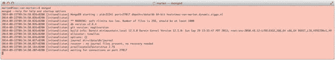

图 12-1.

MongoDB 初始启动后的输出

存储数据的默认位置是 `\data\db`（对于 Windows 用户，这是从安装 MongoDB 的磁盘根目录开始！）。要更改路径，请在命令行中使用 `--dbpath` 选项。确保该目录存在并且对 MongoDB 可写。

连接到 MongoDB

要连接到 MongoDB，你需要一个 Mongo 实例。你可以使用此实例来获取要使用的数据库以及实际的底层集合（或多个集合）。让我们创建一个使用 MongoDB 创建存储对象的小型系统。

```
package com.apress.springrecipes.nosql;
public class Vehicle {
private String vehicleNo;
private String color;
private int wheel;
private int seat;
public Vehicle() {
}
public Vehicle(String vehicleNo, String color, int wheel, int seat) {
this.vehicleNo = vehicleNo;
this.color = color;
this.wheel = wheel;
this.seat = seat;
}
/// 为简洁起见，省略了 Getter 和 Setter 方法。
}
```

为了处理这个对象，创建一个仓库接口。

```
package com.apress.springrecipes.nosql;
public interface VehicleRepository {
long count();
void save(Vehicle vehicle);
void delete(Vehicle vehicle);
List findAll()
Vehicle findByVehicleNo(String vehicleNo);
}
```

对于 MongoDB，创建 `VehicleRepository` 的 `MongoDBVehicleRepository` 实现。


```
package com.apress.springrecipes.nosql;
import com.mongodb.*;
import java.util.ArrayList;
import java.util.List;
public class MongoDBVehicleRepository implements VehicleRepository {
private final Mongo mongo;
private final String collectionName;
private final String databaseName;
public MongoDBVehicleRepository(Mongo mongo, String databaseName, String collectionName) {
this.mongo = mongo;
this.databaseName=databaseName;
this.collectionName = collectionName;
}
@Override
public long count() {
return getCollection().count();
}
@Override
public void save(Vehicle vehicle) {
BasicDBObject query = new BasicDBObject("vehicleNo", vehicle.getVehicleNo());
DBObject dbVehicle = transform(vehicle);
DBObject fromDB = getCollection().findAndModify(query, dbVehicle);
if (fromDB == null) {
getCollection().insert(dbVehicle);
}
}
@Override
public void delete(Vehicle vehicle) {
BasicDBObject query = new BasicDBObject("vehicleNo", vehicle.getVehicleNo());
getCollection().remove(query);
}
@Override
public List findAll() {
DBCursor cursor = getCollection().find(null);
List vehicles = new ArrayList(cursor.size());
for (DBObject dbObject : cursor) {
vehicles.add(transform(dbObject));
}
return vehicles;
}
@Override
public Vehicle findByVehicleNo(String vehicleNo) {
BasicDBObject query = new BasicDBObject("vehicleNo", vehicleNo);
DBObject dbVehicle = getCollection().findOne(query);
return transform(dbVehicle);
}
private DBCollection getCollection() {
return mongo.getDB(databaseName).getCollection(collectionName);
}
private Vehicle transform(DBObject dbVehicle) {
return new Vehicle(
(String) dbVehicle.get("vehicleNo"),
(String) dbVehicle.get("color"),
(int) dbVehicle.get("wheel"),
(int) dbVehicle.get("seat"));
}
private DBObject transform(Vehicle vehicle) {
BasicDBObject dbVehicle = new BasicDBObject("vehicleNo", vehicle.getVehicleNo())
.append("color", vehicle.getColor())
.append("wheel", vehicle.getWheel())
.append("seat", vehicle.getSeat());
return dbVehicle;
}
}
```

首先请注意，构造函数接受三个参数。第一个是实际的 MongoDB 客户端，第二个是要使用的数据库名称，最后一个是存储对象的集合名称。MongoDB 中的文档存储在集合中，而集合属于某个数据库。

为了方便访问所使用的 `DBCollection`，提供了 `getCollection` 方法，该方法获取与数据库的连接并返回配置好的 `DBCollection`。然后可以使用这个 `DBCollection` 来执行诸如存储、删除或更新文档等操作。

`save` 方法会首先尝试更新现有文档。如果更新失败，则会为给定的 `Vehicle` 创建一个新文档。为了存储对象，首先将领域对象 `Vehicle` 转换为 `DBObject`，在本例中是一个 `BasicDBObject`。`BasicDBObject` 接收 `Vehicle` 对象不同属性的键值对。当查询文档时，会使用相同的 `DBObject`，并且使用该对象中存在的键值对来查找文档；你可以在仓库的 `findByVehicleNo` 方法中找到一个示例。与 `Vehicle` 对象之间的转换通过两个 `transform` 方法完成。

要使用这个类，请创建以下 `Main` 类：

```
package com.apress.springrecipes.nosql;
import com.mongodb.MongoClient;
import java.util.List;
public class Main {
public static final String DB_NAME = "vehicledb";
public static void main(String[] args) throws Exception {
// 默认的本地主机和端口 27017 的 MongoDB 客户端
MongoClient mongo = new MongoClient();
VehicleRepository repository = new MongoDBVehicleRepository(mongo, DB_NAME, "vehicles");
System.out.println("车辆数量: " + repository.count());
repository.save(new Vehicle("TEM0001", "RED", 4, 4));
repository.save(new Vehicle("TEM0002", "RED", 4, 4));
System.out.println("车辆数量: " + repository.count());
Vehicle v = repository.findByVehicleNo("TEM0001");
System.out.println(v);
List vehicleList = repository.findAll();
System.out.println("车辆数量: " + vehicleList.size());
vehicleList.forEach(System.out::println);
System.out.println("车辆数量: " + repository.count());
// 清理并关闭
mongo.dropDatabase(DB_NAME);
mongo.close();
}
}
```

主类构造了一个 `MongoClient` 实例，该实例将尝试连接到本地主机上 MongoDB 实例的 27017 端口。如果需要其他端口或主机，还有一个接受主机和端口作为参数的构造函数：`new MongoClient("mongodb-server.local", 28018)`。接下来，构造一个 `MongoDBVehicleRepository` 类的实例；传入之前构造的 `MongoClient`、数据库名称（即 `vehicledb`）以及集合名称（即 `vehicles`）。

接下来的几行代码将向数据库中插入两辆车，尝试查找它们，最后删除它们。`Main` 类中的最后几行将关闭 `MongoClient`，并在关闭之前删除数据库。在使用生产数据库时，后者是你不想做的事情。

使用 Spring 进行配置

`MongoClient` 和 `MongoDBVehicleRepository` 的设置与配置可以轻松地迁移到 Spring 配置中。

```
package com.apress.springrecipes.nosql.config;
import com.apress.springrecipes.nosql.MongoDBVehicleRepository;
import com.apress.springrecipes.nosql.VehicleRepository;
import com.mongodb.Mongo;
import com.mongodb.MongoClient;
import org.springframework.context.annotation.Bean;
import org.springframework.context.annotation.Configuration;
import java.net.UnknownHostException;
@Configuration
public class MongoConfiguration {
public static final String DB_NAME = "vehicledb";
@Bean
public Mongo mongo() throws UnknownHostException {
return new MongoClient();
}
@Bean
public VehicleRepository vehicleRepository(Mongo mongo) {
return new MongoDBVehicleRepository(mongo, DB_NAME, " vehicles");
}
}
```

以下带有 `@PreDestroy` 注解的方法已添加到 `MongoDBVehicleRepository` 中，用于处理数据库的清理工作。

```
@PreDestroy
public void cleanUp() {
mongo.dropDatabase(databaseName);
}
```

最后，需要更新 `Main` 程序以反映这些更改。

```
package com.apress.springrecipes.nosql;
...
import org.springframework.context.ApplicationContext;
import org.springframework.context.annotation.AnnotationConfigApplicationContext;
import org.springframework.context.support.AbstractApplicationContext;
import java.util.List;
public class Main {
public static final String DB_NAME = "vehicledb";
public static void main(String[] args) throws Exception {
ApplicationContext ctx =
new AnnotationConfigApplicationContext(MongoConfiguration.class);
VehicleRepository repository = ctx.getBean(VehicleRepository.class);
...
((AbstractApplicationContext) ctx).close();
}
}
```

配置由 `AnnotationConfigApplicationContext` 加载。从这个上下文中，获取 `VehicleRepository` bean 并用于执行操作。当运行上下文的代码关闭时，会触发 `MongoDBVehicleRepository` 中的 `cleanUp` 方法。

使用 MongoTemplate 简化 MongoDB 代码


目前，`MongoDBVehicleRepository` 类使用的是普通的 MongoDB API。虽然它并不复杂，但仍需要了解该 API。此外，还存在一些重复性任务，例如与 `Vehicle` 对象之间的映射转换。使用 `MongoTemplate` 可以大大简化该仓库。

注意

在使用 Spring Data Mongo 之前，需要将相关的 JAR 包添加到类路径中。如果使用 Maven，请添加以下依赖：

```
org.springframework.data
spring-data-mongodb
1.10.1.RELEASE

```

如果使用 Gradle，请使用以下配置：

```
compile 'org.springframework.data:spring-data-mongodb:1.10.1.RELEASE'
```

```
package com.apress.springrecipes.nosql;
import org.springframework.data.mongodb.core.MongoTemplate;
import org.springframework.data.mongodb.core.query.Query;
import javax.annotation.PreDestroy;
import java.util.List;
import static org.springframework.data.mongodb.core.query.Criteria.where;
public class MongoDBVehicleRepository implements VehicleRepository {
private final MongoTemplate mongo;
private final String collectionName;
public MongoDBVehicleRepository(MongoTemplate mongo, String collectionName) {
this.mongo = mongo;
this.collectionName = collectionName;
}
@Override
public long count() {
return mongo.count(null, collectionName);
}
@Override
public void save(Vehicle vehicle) {
mongo.save(vehicle, collectionName);
}
@Override
public void delete(Vehicle vehicle) {
mongo.remove(vehicle, collectionName);
}
@Override
public List findAll() {
return mongo.findAll(Vehicle.class, collectionName);
}
@Override
public Vehicle findByVehicleNo(String vehicleNo) {
return mongo.findOne(new Query(where("vehicleNo").is(vehicleNo)), Vehicle.class, collectionName);
}
@PreDestroy
public void cleanUp() {
mongo.execute(db -> {
db.drop();
return null;
});
}
}
```

使用 `MongoTemplate` 后，代码看起来简洁得多。它几乎为所有操作都提供了便捷方法：`save`、`update` 和 `delete`。此外，它还提供了一种优雅的查询构建器方式（参见 `findByVehicleNo` 方法）。不再需要与 MongoDB 类进行映射转换，因此也无需再创建 `DBObject`。这个负担现在由 `MongoTemplate` 处理。为了将 `Vehicle` 对象转换为 MongoDB 类，会使用 `MongoConverter`。默认情况下，使用的是 `MappingMongoConverter`。这个映射器会将属性映射到属性名称，反之亦然，同时还会尝试进行正确的数据类型转换。如果需要特定的映射，可以编写自己的 `MongoConverter` 实现，并将其注册到 `MongoTemplate` 中。

由于使用了 `MongoTemplate`，配置也需要进行修改。

```
package com.apress.springrecipes.nosql.config;
import com.apress.springrecipes.nosql.MongoDBVehicleRepository;
import com.apress.springrecipes.nosql.VehicleRepository;
import com.mongodb.Mongo;
import org.springframework.context.annotation.Bean;
import org.springframework.context.annotation.Configuration;
import org.springframework.data.mongodb.core.MongoClientFactoryBean;
import org.springframework.data.mongodb.core.MongoTemplate;
@Configuration
public class MongoConfiguration {
public static final String DB_NAME = "vehicledb";
@Bean
public MongoTemplate mongo(Mongo mongo) throws Exception {
return new MongoTemplate(mongo, DB_NAME);
}
@Bean
public MongoClientFactoryBean mongoFactoryBean() {
return new MongoClientFactoryBean();
}
@Bean
public VehicleRepository vehicleRepository(MongoTemplate mongo) {
return new MongoDBVehicleRepository(mongo, "vehicles");
}
}
```

注意 `MongoClientFactoryBean` 的使用。它使得 `MongoClient` 的配置变得简单。虽然使用 `MongoTemplate` 并非必须使用它，但它确实让客户端配置更加容易。另一个好处是，不再会抛出 `java.net.UnknownHostException`，该异常已由 `MongoClientFactoryBean` 内部处理。

`MongoTemplate` 有多种构造函数。这里使用的构造函数接受一个 `Mongo` 实例和要使用的数据库名称。为了解析数据库，会使用 `MongoDbFactory` 的实例；默认情况下，使用的是 `SimpleMongoDbFactory`。在大多数情况下，这已经足够了，但如果出现特殊情况，例如加密连接，扩展默认实现也非常容易。最后，`MongoTemplate` 与集合名称一起被注入到 `MongoDBVehicleRepository` 中。

还需要对 `Vehicle` 对象进行最后的补充。需要有一个字段来存储生成的 ID。这个字段可以是名为 `id` 的字段，也可以是带有 `@Id` 注解的字段。

```
public class Vehicle {
private String id;
...
}
```

使用注解指定映射信息

目前，`MongoDBVehicleRepository` 需要知道要访问的集合名称。如果能在 `Vehicle` 对象上指定这个信息，就像 JPA 的 `@Table` 注解那样，会更简单、更灵活。使用 Spring Data Mongo，可以通过 `@Document` 注解实现这一点。

```
package com.apress.springrecipes.nosql;
import org.springframework.data.mongodb.core.mapping.Document;
@Document(collection = "vehicles")
public class Vehicle { ... }
```

`@Document` 注解可以接受两个属性：`collection` 和 `language`。`collection` 属性用于指定要使用的集合名称，`language` 属性用于指定此对象的语言。现在，映射信息已经放在 `Vehicle` 类上，因此可以从 `MongoDBVehicleRepository` 中移除集合名称。

```
public class MongoDBVehicleRepository implements VehicleRepository {
private final MongoTemplate mongo;
public MongoDBVehicleRepository(MongoTemplate mongo) {
this.mongo = mongo;
}
@Override
public long count() {
return mongo.count(null, Vehicle.class);
}
@Override
public void save(Vehicle vehicle) {
mongo.save(vehicle);
}
@Override
public void delete(Vehicle vehicle) {
mongo.remove(vehicle);
}
@Override
public List findAll() {
return mongo.findAll(Vehicle.class);
}
@Override
public Vehicle findByVehicleNo(String vehicleNo) {
return mongo.findOne(new Query(where("vehicleNo").is(vehicleNo)), Vehicle.class);
}
}
```

当然，也可以从 `MongoDBVehicleRepository` 的配置中移除集合名称。

```
@Configuration
public class MongoConfiguration {
...
@Bean
public VehicleRepository vehicleRepository(MongoTemplate mongo) {
return new MongoDBVehicleRepository(mongo);
}
}
```

运行 `Main` 类时，结果应该与之前相同。

创建 Spring Data MongoDB 仓库

尽管代码已经大大减少，不再需要与 MongoDB 类进行映射转换，也不再需要传递集合名称，但它还可以进一步精简。利用 Spring Data Mongo 的另一个特性，可以完全移除 `MongoDBVehicleRepository` 的完整实现。

首先需要修改配置。

```
package com.apress.springrecipes.nosql.config;
import com.mongodb.Mongo;
import org.springframework.context.annotation.Bean;
import org.springframework.context.annotation.Configuration;
import org.springframework.data.mongodb.core.MongoClientFactoryBean;
import org.springframework.data.mongodb.core.MongoTemplate;
import org.springframework.data.mongodb.repository.config.EnableMongoRepositories;
@Configuration
@EnableMongoRepositories(basePackages = "com.apress.springrecipes.nosql")
public class MongoConfiguration {
public static final String DB_NAME = "vehicledb";
@Bean
public MongoTemplate mongoTemplate(Mongo mongo) throws Exception {
return new MongoTemplate(mongo, DB_NAME);
}
@Bean
public MongoClientFactoryBean mongoFactoryBean() {
return new MongoClientFactoryBean();
}
}
```


首先，请注意移除了构建 `MongoDBVehicleRepository` 的 `@Bean` 方法。
其次，请注意新增了 `@EnableMongoRepositories` 注解。该注解用于启用对扩展了 Spring Data `CrudRepository` 且用于标注了 `@Document` 的领域对象的接口的检测。

为了让 Spring Data 检测到你的 `VehicleRepository`，你需要让它扩展 `CrudRepository` 或其子接口之一，例如 `MongoRepository`。

```
package com.apress.springrecipes.nosql;
import org.springframework.data.mongodb.repository.MongoRepository;
public interface VehicleRepository extends MongoRepository {
public Vehicle findByVehicleNo(String vehicleNo);
}
```

你可能会疑惑所有的方法都去哪了。它们已经在父接口中定义好了，因此可以从这个接口中移除。`findByVehicleNo` 方法仍然保留。该方法仍将用于通过 `vehicleNo` 属性查找 `Vehicle` 对象。所有 `findBy` 方法都会被转换为 MongoDB 查询。`findBy` 之后的部分被解释为属性名称。还可以使用不同的操作符（例如 `and`、`or` 和 `between`）编写更复杂的查询。

现在再次运行 `Main` 类，应该仍然会得到相同的输出；然而，实际编写的用于操作 MongoDB 的代码已经最小化了。

创建响应式 Spring Data MongoDB 仓库

除了创建传统的 MongoDB 仓库，还可以创建一个响应式仓库，这通过扩展 `ReactiveMongoRepository` 类（或其他响应式仓库接口之一）来实现。这将把返回单个值的方法的返回类型改为 `Mono<T>`（对于无返回值的方法则为 `Mono<Void>`），并将返回零个或多个元素的方法的返回类型改为 `Flux<T>`。

注意

如果你想使用 RxJava 而不是 Project Reactor，请扩展 `RxJava2*Repository` 接口之一，并使用 `Single` 或 `Observable` 代替 `Mono` 和 `Flux`。

为了能够使用响应式仓库实现，你首先必须使用 MongoDB 驱动程序的响应式实现，并配置 Spring Data 使用该驱动程序。为了简化操作，你可以扩展 `AbstractReactiveMongoConfiguration` 并实现两个必需的方法：`getDatabaseName` 和 `mongoClient`。

```
@Configuration
@EnableReactiveMongoRepositories(basePackages = "com.apress.springrecipes.nosql")
public class MongoConfiguration extends AbstractReactiveMongoConfiguration {
public static final String DB_NAME = "vehicledb";
@Bean
@Override
public MongoClient reactiveMongoClient() {
return MongoClients.create();
}
@Override
protected String getDatabaseName() {
return DB_NAME;
}
}
```

另一个变化是使用了 `@EnableReactiveMongoRepositories` 而不是 `@EnableMongoRepositories`。数据库名称仍然是必需的，并且你需要使用响应式驱动程序连接到 MongoDB 实例。为此，你可以使用 `MongoClients.create` 方法之一；这里你可以简单地使用默认方法。

接下来，将 `VehicleRepository` 改为扩展 `ReactiveMongoRepository`，使其成为响应式仓库；你还需要将 `findByVehicleNo` 方法的返回类型改为 `Mono<Vehicle>` 而不是普通的 `Vehicle`。

```
package com.apress.springrecipes.nosql;
import org.springframework.data.mongodb.repository.ReactiveMongoRepository;
import reactor.core.publisher.Mono;
public interface VehicleRepository extends ReactiveMongoRepository {
Mono findByVehicleNo(String vehicleNo);
}
```

最后需要修改的部分是用于测试这一切的 `Main` 类。你希望使用一系列被调用的方法，而不是阻塞调用。

```
package com.apress.springrecipes.nosql;
import com.apress.springrecipes.nosql.config.MongoConfiguration;
import org.springframework.context.ApplicationContext;
import org.springframework.context.annotation.AnnotationConfigApplicationContext;
import org.springframework.context.support.AbstractApplicationContext;
import reactor.core.publisher.Flux;
import java.util.concurrent.CountDownLatch;
public class Main {
public static void main(String[] args) throws Exception {
ApplicationContext ctx =
new AnnotationConfigApplicationContext(MongoConfiguration.class);
VehicleRepository repository = ctx.getBean(VehicleRepository.class);
CountDownLatch countDownLatch = new CountDownLatch(1);
repository.count().doOnSuccess(cnt -> System.out.println("Number of Vehicles: " + cnt))
.thenMany(repository.saveAll(
Flux.just(
new Vehicle("TEM0001", "RED", 4, 4),
new Vehicle("TEM0002", "RED", 4, 4)))).last()
.then(repository.count()).doOnSuccess(cnt -> System.out.println("Number of Vehicles: " + cnt))
.then(repository.findByVehicleNo("TEM0001")).doOnSuccess(System.out::println)
.then(repository.deleteAll())
.doOnSuccess(x -> countDownLatch.countDown())
.doOnError(t -> countDownLatch.countDown())
.then(repository.count()).subscribe(cnt -> System.out.println("Number of Vehicles: " + cnt.longValue()));
countDownLatch.await();
((AbstractApplicationContext) ctx).close();
}
}
```

流程从计数开始，当计数成功时，`Vehicle` 实例被放入 MongoDB。当 `last()` 车辆被添加后，再次进行计数，接着是一个查询，随后是 `deleteAll`。所有这些方法都以响应式的方式一个接一个地被调用，由事件触发。因为你不想使用 `block()` 方法进行阻塞，所以使用 `CountDownLatch` 等待代码执行，计数器在删除所有记录后递减，之后程序将继续执行。诚然，这仍然是阻塞的。当在完整的响应式栈中使用时，你可能会从最后一个 `then` 返回 `Mono` 并进行进一步组合，或者将输出交给 Spring WebFlux 控制器（参见第 5 章）。

12-2. 使用 Redis

问题

你想利用 Redis 存储数据。

解决方案

下载并安装 Redis，然后使用 Spring 和 Spring Data 访问 Redis 实例。

工作原理

Redis 是一个键值缓存或存储，它只保存简单的数据类型，例如字符串和哈希。当存储更复杂的数据结构时，需要与该数据结构进行相互转换。

下载并启动 Redis

你可以从 [`http://redis.io/download`](http://redis.io/download) 下载 Redis 源码。在撰写本文时，版本 3.2.8 是最新发布的稳定版本。你可以在 [`https://github.com/MSOpenTech/redis/releases`](https://github.com/MSOpenTech/redis/releases) 找到适用于 Windows 的编译版本。官方下载站点只提供 Unix 二进制文件。Mac 用户可以使用 Homebrew（ [`http://brew.sh`](http://brew.sh) ）安装 Redis。

下载并安装 Redis 后，使用命令行中的 `redis-server` 命令启动它。启动后，输出应类似于图 12-2 所示。它将输出进程 ID（PID）和它监听的端口号（默认为 6379）。

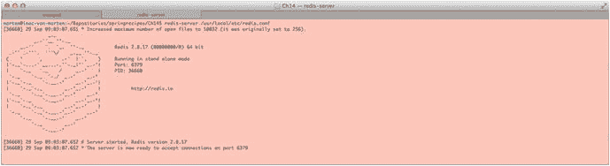

图 12-2.

启动 Redis 后的输出

连接到 Redis

为了能够连接到 Redis，需要一个客户端，就像需要 JDBC 驱动程序来连接数据库一样。有多个客户端可用。你可以在 Redis 网站（ [`http://redis.io/clients`](http://redis.io/clients) ）上找到完整列表。在本示例中，将使用 Jedis 客户端，因为它非常活跃并且被 Redis 团队推荐。

让我们从一个简单的 Hello World 示例开始，看看是否能够建立与 Redis 的连接。


```content
```
package com.apress.springrecipes.nosql;
import redis.clients.jedis.Jedis;
public class Main {
public static void main(String[] args) {
Jedis jedis = new Jedis("localhost");
jedis.set("msg", "Hello World, from Redis!");
System.out.println(jedis.get("msg"));
}
}
```

创建一个 Jedis 客户端，并传入要连接的主机名，此处为 `localhost`。Jedis 客户端的 `set` 方法会将一条消息存入存储中，而 `get` 方法则可再次检索该消息。除了简单对象，你还可以让 Redis 模拟 `List` 或 `Map`。

```
package com.apress.springrecipes.nosql;
import redis.clients.jedis.Jedis;
public class Main {
public static void main(String[] args) {
Jedis jedis = new Jedis("localhost");
jedis.rpush("authors", "Marten Deinum", "Josh Long", "Daniel Rubio", "Gary Mak");
System.out.println("Authors: " + jedis.lrange("authors",0,-1));
jedis.hset("sr_3", "authors", "Gary Mak, Danial Rubio, Josh Long, Marten Deinum");
jedis.hset("sr_3", "published", "2014");
jedis.hset("sr_4", "authors", "Josh Long, Marten Deinum");
jedis.hset("sr_4", "published", "2017");
System.out.println("Spring Recipes 3rd: " + jedis.hgetAll("sr_3"));
System.out.println("Spring Recipes 4th: " + jedis.hgetAll("sr_4"));
}
}
```

通过 `rpush` 和 `lpush`，你可以向 `List` 中添加元素。`rpush` 将元素添加到列表末尾，而 `lpush` 则添加到列表开头。要检索这些元素，可以使用 `lrange` 或 `rrange` 方法。`lrange` 从左侧开始，接受起始索引和结束索引。示例中使用了 `-1`，表示所有元素。

要向 `Map` 中添加元素，请使用 `hset`。该方法接受一个 `key`、一个 `field` 和一个 `value`。另一种选择是使用 `hmset`（多重集合），它接受一个 `Map<String, String>` 或 `Map<byte[], byte[]>` 作为参数。

使用 Redis 存储对象

Redis 是一个键值存储系统，只能处理 `String` 或 `byte[]` 类型，键也是如此。因此，在 Redis 中存储对象并不像其他技术那样直接。对象在存储前需要序列化为 `String` 或 `byte[]`。

让我们复用配方 12-1 中的 `Vehicle` 类，并使用 Jedis 客户端进行存储和检索。

```
package com.apress.springrecipes.nosql;
import java.io.Serializable;
public class Vehicle implements Serializable{
private String vehicleNo;
private String color;
private int wheel;
private int seat;
public Vehicle() {
}
public Vehicle(String vehicleNo, String color, int wheel, int seat) {
this.vehicleNo = vehicleNo;
this.color = color;
this.wheel = wheel;
this.seat = seat;
}
// getters/setters omitted
}
```

注意 `Vehicle` 类实现了 `Serializable` 接口。这是为了使对象在 Java 中可序列化。在存储对象之前，需要将其转换为 Java 中的 `byte[]`。`ObjectOutputStream` 可以写入对象，而 `ByteArrayOutputStream` 可以写入 `byte[]`。要将 `byte[]` 再次转换为对象，`ObjectInputStream` 和 `ByteArrayInputStream` 会有所帮助。Spring 为此提供了一个辅助类 `org.springframework.util.SerializationUtils`，它提供了 `serialize` 和 `deserialize` 方法。

现在，在 `Main` 类中，让我们创建一个 `Vehicle` 并使用 Jedis 存储它。

```
package com.apress.springrecipes.nosql;
import org.springframework.util.SerializationUtils;
import redis.clients.jedis.Jedis;
public class Main {
public static void main(String[] args) throws Exception {
Jedis jedis = new Jedis("localhost");
final String vehicleNo = "TEM0001";
Vehicle vehicle = new Vehicle(vehicleNo, "RED", 4,4);
jedis.set(vehicleNo.getBytes(), SerializationUtils.serialize(vehicle));
byte[] vehicleArray = jedis.get(vehicleNo.getBytes());
System.out.println("Vehicle: " + SerializationUtils.deserialize(vehicleArray));
}
}
```

首先，创建一个 `Vehicle` 实例。接着，使用前面提到的 `SerializationUtils` 将对象转换为 `byte[]`。当存储 `byte[]` 时，键也必须是 `byte[]`；因此，这里的键 `vehicleNo` 也需要转换。最后，使用相同的键从存储中读取序列化对象，并将其再次转换回对象。这种方法的缺点是，每个存储的对象都需要实现 `Serializable` 接口。如果未实现，对象可能会丢失，或者在序列化过程中发生错误。此外，`byte[]` 是类的表示形式。如果此类发生更改，将其转换回对象很可能会失败。

另一种选择是使用对象的 `String` 表示形式。将 `Vehicle` 对象转换为 XML 或 JSON，这比 `byte[]` 更灵活。让我们看看如何使用优秀的 Jackson JSON 库将对象转换为 JSON：

```
package com.apress.springrecipes.nosql;
import com.fasterxml.jackson.databind.ObjectMapper;
import redis.clients.jedis.Jedis;
public class Main {
public static void main(String[] args) throws Exception {
Jedis jedis = new Jedis("localhost");
ObjectMapper mapper = new ObjectMapper();
final String vehicleNo = "TEM0001";
Vehicle vehicle = new Vehicle(vehicleNo, "RED", 4,4);
jedis.set(vehicleNo, mapper.writeValueAsString(vehicle));
String vehicleString = jedis.get(vehicleNo);
System.out.println("Vehicle: " + mapper.readValue(vehicleString, Vehicle.class));
}
}
```

首先，需要一个 `ObjectMapper` 实例。该对象用于与 JSON 之间的相互转换。写入时，使用 `writeValueAsString` 方法，它会将对象转换为 JSON `String`。然后将此 `String` 存储在 Redis 中。接着，再次读取该 `String` 并将其传递给 `ObjectMapper` 的 `readValue` 方法。根据类型参数（此处为 `Vehicle.class`），构造一个对象，并将 JSON 映射到给定类的实例。

使用 Redis 存储对象并不直接，有些人认为这不是 Redis 的预期用途（存储复杂的对象结构）。

配置并使用 RedisTemplate

根据用于连接 Redis 的客户端库，使用 Redis API 的难度可能有所不同。为了统一这一点，引入了 `RedisTemplate`。它可以与大多数现有的 Redis Java 客户端配合使用。除了提供统一的方法外，它还负责将任何异常转换为 Spring 的 `DataAccessException` 层次结构。这使其能够与任何现有的数据访问方式良好集成，并允许使用 Spring 的事务支持。

`RedisTemplate` 需要一个 `RedisConnectionFactory` 来获取连接。`RedisConnectionFactory` 是一个接口，有多个实现可用。在这种情况下，需要 `JedisConnectionFactory`。

```
package com.apress.springrecipes.nosql.config;
import com.apress.springrecipes.nosql.Vehicle;
import org.springframework.context.annotation.Bean;
import org.springframework.context.annotation.Configuration;
import org.springframework.data.redis.connection.RedisConnectionFactory;
import org.springframework.data.redis.connection.jedis.JedisConnectionFactory;
import org.springframework.data.redis.core.RedisTemplate;
@Configuration
public class RedisConfig {
@Bean
public RedisTemplate redisTemplate(RedisConnectionFactory connectionFactory) {
RedisTemplate template = new RedisTemplate();
template.setConnectionFactory(connectionFactory);
return template;
}
@Bean
public RedisConnectionFactory redisConnectionFactory() {
return new JedisConnectionFactory();
}
}
```
```


请注意 `redisTemplate` Bean 方法的返回类型。`RedisTemplate` 是一个泛型类，需要指定键和值的类型。在此例中，`String` 是键的类型，`Vehicle` 是值的类型。在存储和检索对象时，`RedisTemplate` 会负责转换工作。转换通过 `RedisSerializer` 接口完成，该接口有多种实现（见表 12-1）。默认的 `RedisSerializer` 是 `JdkSerializationRedisSerializer`，它使用标准 Java 序列化将对象转换为 `byte[]` 并还原。

表 12-1.

默认的 RedisSerializer
实现

名称
 |
  描述
 |

| --- | --- | --- | --- | --- |

`GenericToStringSerializer`
 |
  `String` 到 `byte[]` 的序列化器；
在转换为 `byte[]` 之前，使用 Spring 的 `ConversionService` 将对象转换为 `String`
 |

`Jackson2JsonRedisRedisSerializer`
 |
  使用 Jackson 2 的 `ObjectMapper` 读写 JSON
 |

`JacksonJsonRedisRedisSerializer`
 |
  使用 Jackson 的 `ObjectMapper` 读写 JSON
 |

`JdkSerializationRedisSerializer`
 |
  使用默认的 Java 序列化和反序列化，是默认使用的实现
 |

`OxmSerializer` 
 |
  使用 Spring 的 `Marshaller` 和 `Unmarshaller` 读写 XML
 |

`StringRedisSerializer`
 |
  简单的 `String` 到 `byte[]` 转换器
 |

为了能够使用 `RedisTemplate`，需要修改 `Main` 类。需要加载配置，并从中获取 `RedisTemplate`。

```
package com.apress.springrecipes.nosql;
import com.apress.springrecipes.nosql.config.RedisConfig;
import org.springframework.context.ApplicationContext;
import org.springframework.context.annotation.AnnotationConfigApplicationContext;
import org.springframework.data.redis.core.RedisTemplate;
public class Main {
public static void main(String[] args) throws Exception {
ApplicationContext context = new AnnotationConfigApplicationContext(RedisConfig.class);
RedisTemplate template = context.getBean(RedisTemplate.class);
final String vehicleNo = "TEM0001";
Vehicle vehicle = new Vehicle(vehicleNo, "RED", 4,4);
template.opsForValue().set(vehicleNo, vehicle);
System.out.println("Vehicle: " + template.opsForValue().get(vehicleNo));
}
}
```

当从 `ApplicationContext` 获取到 `RedisTemplate` 模板后，就可以使用它了。这里最大的优势是你可以直接使用对象，而模板会处理对象转换的复杂工作。请注意，`set` 方法接受 `String` 和 `Vehicle` 作为参数，而不仅仅是 `String` 或 `byte[]`。这使得代码更易读且更易于维护。默认情况下使用 JDK 序列化。要使用 Jackson，需要配置不同的 `RedisSerializer`。

```
package com.apress.springrecipes.nosql.config;
...
import org.springframework.data.redis.serializer.Jackson2JsonRedisSerializer;
@Configuration
public class RedisConfig {
@Bean
public RedisTemplate redisTemplate() {
RedisTemplate template = new RedisTemplate();
template.setConnectionFactory(redisConnectionFactory());
template.setDefaultSerializer(new Jackson2JsonRedisSerializer(Vehicle.class));
return template;
}
...
}
```

现在，`RedisTemplate` 模板将使用 Jackson 的 `ObjectMapper` 对象来执行序列化和反序列化。代码的其余部分可以保持不变。再次运行主程序时，它仍然可以工作，并且对象将以 JSON 格式存储。当 Redis 在事务中使用时，它也可以参与同一事务。为此，需要将 `RedisTemplate` 模板上的 `enableTransactionSupport` 属性设置为 `true`。这将在事务提交时，负责在事务内部执行 Redis 操作。

12-3. 使用 Neo4j

问题

你想在应用程序中使用 Neo4j。

解决方案

使用 Spring Data Neo4j 库来访问 Neo4j。

工作原理

在开始使用 Neo4J 之前，你需要安装一个实例并使其运行。当它运行起来后，你需要连接到它，才能使用数据存储进行实际存储。你将从一个基于纯 Neo4J 的仓库开始，演示如何存储和检索对象，然后逐步过渡到基于 Spring Data Neo4J 的仓库。

下载并运行 Neo4J

你可以从 Neo4j 网站（[`http://neo4j.com/download/`](http://neo4j.com/download/)）下载 Neo4J。对于本教程，下载社区版就足够了；不过，它也应该适用于 Neo4j 的商业版本。Windows 用户可以运行安装程序来安装 Neo4j。Mac 和 Linux 用户可以解压归档文件，然后在创建的目录内，使用 `bin/neo4j` 启动。Mac 用户也可以使用 Homebrew（[`http://brew.sh`](http://brew.sh)）通过 `brew install neo4j` 安装 Neo4j。然后可以通过命令行执行 `neo4j start` 来启动。

在命令行启动后，输出应该类似于图 12-3 所示。

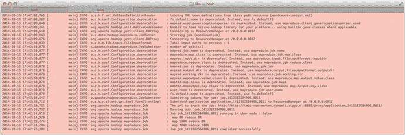

图 12-3.

Neo4j 初始启动后的输出

启动 Neo4j

让我们先创建一个简单的 Hello World 程序，其中包含一个嵌入式 Neo4j 服务器。创建一个 `Main` 类，该类启动一个嵌入式服务器，向 Neo4j 添加一些数据，然后再次检索这些数据。

```
package com.apress.springrecipes.nosql;
import org.neo4j.graphdb.GraphDatabaseService;
import org.neo4j.graphdb.Node;
import org.neo4j.graphdb.Transaction;
import org.neo4j.graphdb.factory.GraphDatabaseFactory;
import java.nio.file.Paths;
public class Main {
public static void main(String[] args) {
final String DB_PATH = System.getProperty("user.home") + "/friends";
GraphDatabaseService db = new GraphDatabaseFactory()
.newEmbeddedDatabase(Paths.get(DB_PATH).toFile());
Transaction tx1 = db.beginTx();
Node hello = db.createNode();
hello.setProperty("msg", "Hello");
Node world = db.createNode();
world.setProperty("msg", "World");
tx1.success();
db.getAllNodes().stream()
.map(n -> n.getProperty("msg"))
.forEach(m -> System.out.println("Msg: " + m));
db.shutdown();
}
}
```

这个 `Main` 类将启动一个嵌入式 Neo4j 服务器。接着，它会启动一个事务并创建两个节点。然后检索所有节点，并将 `msg` 属性的值打印到控制台。Neo4j 擅长遍历节点之间的关系。它在这方面特别优化（就像其他图数据存储一样）。

让我们创建一些彼此之间存在关系的节点。


```
package com.apress.springrecipes.nosql;
import org.neo4j.graphdb.*;
import org.neo4j.graphdb.factory.GraphDatabaseFactory;
import java.nio.file.Paths;
import static com.apress.springrecipes.nosql.Main.RelationshipTypes.*;
public class Main {
enum RelationshipTypes implements RelationshipType {FRIENDS_WITH, MASTER_OF, SIBLING, LOCATION}
public static void main(String[] args) {
final String DB_PATH = System.getProperty("user.home") + "/friends";
final GraphDatabaseService db = new GraphDatabaseFactory()    .newEmbeddedDatabase(Paths.get(DB_PATH).toFile());
final Label character = Label.label("character");
final Label planet = Label.label("planet");
try (Transaction tx1 = db.beginTx()) {
// Planets
Node dagobah = db.createNode(planet);
dagobah.setProperty("name", "Dagobah");
Node tatooine = db.createNode(planet);
tatooine.setProperty("name", "Tatooine");
Node alderaan = db.createNode(planet);
alderaan.setProperty("name", "Alderaan");
// Characters
Node yoda = db.createNode(character);
yoda.setProperty("name", "Yoda");
Node luke = db.createNode(character);
luke.setProperty("name", "Luke Skywalker");
Node leia = db.createNode(character);
leia.setProperty("name", "Leia Organa");
Node han = db.createNode(character);
han.setProperty("name", "Han Solo");
// Relations
yoda.createRelationshipTo(luke, MASTER_OF);
yoda.createRelationshipTo(dagobah, LOCATION);
luke.createRelationshipTo(leia, SIBLING);
luke.createRelationshipTo(tatooine, LOCATION);
luke.createRelationshipTo(han, FRIENDS_WITH);
leia.createRelationshipTo(han, FRIENDS_WITH);
leia.createRelationshipTo(alderaan, LOCATION);
tx1.success();
}
Result result = db.execute("MATCH (n) RETURN n.name as name");
result.stream()
.flatMap(m -> m.entrySet().stream())
.map(row -> row.getKey() + " : " + row.getValue() + ";")
.forEach(System.out::println);
db.shutdown();
}
}
```

这段代码反映了《星球大战》宇宙中的一小部分。它包含了角色及其所在地点（实际上是行星）。人物之间也存在关系（关系图见图 12-4）。

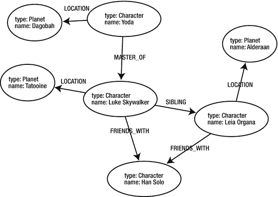

图 12-4.

关系示例

代码中的关系是通过使用一个实现了 Neo4j 接口 `RelationshipType` 的枚举来实现的。顾名思义，这是为了区分不同类型的关系所必需的。节点的类型则通过为节点添加标签来区分。名称被设置为节点上的一个基本属性。运行代码时，它将执行 Cypher 查询 `MATCH (n) RETURN n.name as name`。这会选择所有节点并返回所有节点的 `name` 属性。

### 使用 Neo4j 映射对象

到目前为止的代码都是相当底层的，并且与纯 Neo4j 绑定。创建和操作节点非常繁琐。理想情况下，你会使用一个 `Planet` 类和一个 `Character` 类，并让它们能够从 Neo4j 中存储/检索。首先创建 `Planet` 和 `Character` 类。

```
package com.apress.springrecipes.nosql;
public class Planet {
private long id = -1;
private String name;
// Getters and Setters omitted
}
package com.apress.springrecipes.nosql;
import java.util.ArrayList;
import java.util.Collections;
import java.util.List;
public class Character {
private long id = -1;
private String name;
private Planet location;
private final List friends = new ArrayList();
private Character apprentice;
public void addFriend(Character friend) {
friends.add(friend);
}
// Getters and Setters omitted
}
```

`Planet` 类非常简单。它拥有 `id` 和 `name` 属性。`Character` 类则稍微复杂一些。它同样拥有 `id` 和 `name` 属性，此外还包含一些用于表示关系的额外属性。其中包括用于 `LOCATION` 关系的 `location` 值、用于 `FRIENDS_WITH` 关系的 `Character` 集合，以及用于 `MASTER_OF` 关系的学徒（apprentice）。

为了能够存储这些类，让我们创建一个 `StarwarsRepository` 接口来保存相关操作。

```
package com.apress.springrecipes.nosql;
public interface StarwarsRepository {
Planet save(Planet planet);
Character save(Character character);
}
```

以下是针对 Neo4j 的实现：

```
package com.apress.springrecipes.nosql;
import org.neo4j.graphdb.GraphDatabaseService;
import org.neo4j.graphdb.Label;
import org.neo4j.graphdb.Node;
import org.neo4j.graphdb.Transaction;
import static com.apress.springrecipes.nosql.RelationshipTypes.*;
public class Neo4jStarwarsRepository implements StarwarsRepository {
private final GraphDatabaseService db;
public Neo4jStarwarsRepository(GraphDatabaseService db) {
this.db = db;
}
@Override
public Planet save(Planet planet) {
if (planet.getId() != null) {
return planet;
}
try (Transaction tx = db.beginTx()) {
Label label = Label.label("planet");
Node node = db.createNode(label);
node.setProperty("name", planet.getName());
tx.success();
planet.setId(node.getId());
return planet;
}
}
@Override
public Character save(Character character) {
if (character.getId() != null) {
return character;
}
try (Transaction tx = db.beginTx()) {
Label label = Label.label("character");
Node node = db.createNode(label);
node.setProperty("name", character.getName());
if (character.getLocation() != null) {
Planet planet = character.getLocation();
planet = save(planet);
node.createRelationshipTo(db.getNodeById(planet.getId()), LOCATION);
}
for (Character friend : character.getFriends()) {
friend = save(friend);
node.createRelationshipTo(db.getNodeById(friend.getId()), FRIENDS_WITH);
}
if (character.getApprentice() != null) {
save(character.getApprentice());
node.createRelationshipTo(db.getNodeById(character.getApprentice().getId()), MASTER_OF);
}
tx.success();
character.setId(node.getId());
return character;
}
}
}
```

这里进行了大量操作来将对象转换为 `Node` 对象。对于 `Planet` 对象来说，这相当简单。首先检查它是否已经被持久化（在这种情况下 ID 大于 -1）；如果没有，则启动一个事务，创建一个节点，设置 `name` 属性，并将 `id` 值传递给 `Planet` 对象。然而，对于 `Character` 类来说，情况稍微复杂一些，因为需要考虑所有关系。

`Main` 类需要修改以反映这些类的变化。


```
package com.apress.springrecipes.nosql;
import org.neo4j.graphdb.GraphDatabaseService;
import org.neo4j.graphdb.Result;
import org.neo4j.graphdb.Transaction;
import org.neo4j.graphdb.factory.GraphDatabaseFactory;
import java.nio.file.Paths;
public class Main {
public static void main(String[] args) {
final String DB_PATH = System.getProperty("user.home") + "/starwars";
final GraphDatabaseService db = new GraphDatabaseFactory().newEmbeddedDatabase(Paths.get(DB_PATH).toFile());
StarwarsRepository repository = new Neo4jStarwarsRepository(db);
try (Transaction tx = db.beginTx()) {
// 行星
Planet dagobah = new Planet();
dagobah.setName("Dagobah");
Planet alderaan = new Planet();
alderaan.setName("Alderaan");
Planet tatooine = new Planet();
tatooine.setName("Tatooine");
dagobah = repository.save(dagobah);
repository.save(alderaan);
repository.save(tatooine);
// 角色
Character han = new Character();
han.setName("Han Solo");
Character leia = new Character();
leia.setName("Leia Organa");
leia.setLocation(alderaan);
leia.addFriend(han);
Character luke = new Character();
luke.setName("Luke Skywalker");
luke.setLocation(tatooine);
luke.addFriend(han);
luke.addFriend(leia);
Character yoda = new Character();
yoda.setName("Yoda");
yoda.setLocation(dagobah);
yoda.setApprentice(luke);
repository.save(han);
repository.save(luke);
repository.save(leia);
repository.save(yoda);
tx.success();
}
Result result = db.execute("MATCH (n) RETURN n.name as name");
result.stream()
.flatMap(m -> m.entrySet().stream())
.map(row -> row.getKey() + " : " + row.getValue() + ";")
.forEach(System.out::println);
db.shutdown();
}
}
```

执行时，结果应与之前相同。然而，主要区别在于现在代码使用的是领域对象，而不是直接操作节点。将对象作为节点存储在 Neo4j 中相当繁琐。幸运的是，Spring Data Neo4j 可以帮助简化这一过程。

**使用 Neo4j OGM 映射对象**

在转换为节点和关系时，属性可能会非常繁琐。如果能像使用 JPA 那样，通过注解简单地指定存储位置和内容，岂不是很好？Neo4j OGM 提供了这些注解。要使一个对象成为 Neo4j 映射实体，请在类型上使用 `@NodeEntity` 注解。关系可以使用 `@Relationship` 注解来建模。要标识用于 ID 的字段，请添加 `@GraphId` 注解。将这些注解应用于 `Planet` 和 `Character` 类后，它们将如下所示：

```
package com.apress.springrecipes.nosql;
import org.neo4j.ogm.annotation.GraphId;
import org.neo4j.ogm.annotation.NodeEntity;
@NodeEntity
public class Planet {
@GraphId
private Long id;
private String name;
// 省略 getter/setter
}
```

以下是 `Character` 类：

```
package com.apress.springrecipes.nosql;
import org.neo4j.ogm.annotation.GraphId;
import org.neo4j.ogm.annotation.NodeEntity;
import org.neo4j.ogm.annotation.Relationship;
import java.util.Collections;
import java.util.HashSet;
import java.util.Objects;
import java.util.Set;
@NodeEntity
public class Character {
@GraphId
private Long id;
private String name;
@Relationship(type = "LOCATION")
private Planet location;
@Relationship(type="FRIENDS_WITH")
private final Set friends = new HashSet();
@Relationship(type="MASTER_OF")
private Character apprentice;
// 省略 getter/setter
}
```

现在实体已经添加了注解，可以重写仓库以使用 `SessionFactory` 和 `Session` 来简化访问。

```
package com.apress.springrecipes.nosql;
import org.neo4j.ogm.model.Result;
import org.neo4j.ogm.session.Session;
import org.neo4j.ogm.session.SessionFactory;
import org.neo4j.ogm.transaction.Transaction;
import org.springframework.beans.factory.annotation.Autowired;
import org.springframework.stereotype.Repository;
import javax.annotation.PreDestroy;
import java.util.Collections;
@Repository
public class Neo4jStarwarsRepository implements StarwarsRepository {
private final SessionFactory sessionFactory;
@Autowired
public Neo4jStarwarsRepository(SessionFactory sessionFactory) {
this.sessionFactory = sessionFactory;
}
@Override
public Planet save(Planet planet) {
Session session = sessionFactory.openSession();
try (Transaction tx = session.beginTransaction()) {
session.save(planet);
return planet;
}
}
@Override
public Character save(Character character) {
Session session = sessionFactory.openSession();
try (Transaction tx = session.beginTransaction()) {
session.save(character);
return character;
}
}
@Override
public void printAll() {
Session session = sessionFactory.openSession();
Result result = session.query("MATCH (n) RETURN n.name as name", Collections.emptyMap(), true);
result.forEach(m -> m.entrySet().stream()
.map(row -> row.getKey() + " : " + row.getValue() + ";")
.forEach(System.out::println));
}
}
```

有几点需要注意：使用 `SessionFactory` 和 `Session` 后代码更加简洁，因为许多底层工作（尤其是节点与对象的映射）已为你完成。最后要注意的是新增的 `printAll` 方法。添加该方法是为了将代码从 `Main` 类迁移到仓库中。

接下来需要修改的是 `Main` 类，因为它现在需要构建一个 `SessionFactory`。要构建 `SessionFactory`，你需要指定它需要扫描哪些包以查找带有 `@NodeEntity` 注解的类。

```
package com.apress.springrecipes.nosql;
import org.neo4j.ogm.session.SessionFactory;
public class Main {
public static void main(String[] args) {
SessionFactory sessionFactory = new SessionFactory("com.apress.springrecipes.nosql");
StarwarsRepository repository = new Neo4jStarwarsRepository(sessionFactory);
// 行星
Planet dagobah = new Planet();
dagobah.setName("Dagobah");
Planet alderaan = new Planet();
alderaan.setName("Alderaan");
Planet tatooine = new Planet();
tatooine.setName("Tatooine");
dagobah = repository.save(dagobah);
repository.save(alderaan);
repository.save(tatooine);
// 角色
Character han = new Character();
han.setName("Han Solo");
Character leia = new Character();
leia.setName("Leia Organa");
leia.setLocation(alderaan);
leia.addFriend(han);
Character luke = new Character();
luke.setName("Luke Skywalker");
luke.setLocation(tatooine);
luke.addFriend(han);
luke.addFriend(leia);
Character yoda = new Character();
yoda.setName("Yoda");
yoda.setLocation(dagobah);
yoda.setApprentice(luke);
repository.save(han);
repository.save(luke);
repository.save(leia);
repository.save(yoda);
repository.printAll();
sessionFactory.close();
}
}
```

创建了一个 `SessionFactory`，并用它来构建 `Neo4jStarwarsRepository`。接下来设置数据，并调用 `printAll` 方法。最初位于 `Main` 类中的代码现在已移至该方法中。最终结果应与之前得到的结果类似。

**使用 Spring 进行配置**

到目前为止，所有内容都是手动配置和连接的。让我们创建一个 Spring 配置类。

```
package com.apress.springrecipes.nosql;
import org.neo4j.ogm.session.SessionFactory;
import org.springframework.context.annotation.Bean;
import org.springframework.context.annotation.Configuration;
@Configuration
public class StarwarsConfig {
@Bean
public SessionFactory sessionFactory() {
return new SessionFactory("com.apress.springrecipes.nosql");
}
@Bean
public Neo4jStarwarsRepository starwarsRepository(SessionFactory sessionFactory) {
return new Neo4jStarwarsRepository(sessionFactory);
}
}
```


现在，`SessionFactory` 和 `Neo4jStarwarsRepository` 都是 Spring 管理的 Bean。你可以让 `Main` 类使用此配置来引导一个 `ApplicationContext`，并从中获取 `StarwarsRepository`。

```
package com.apress.springrecipes.nosql;
import org.springframework.context.annotation.AnnotationConfigApplicationContext;
public class Main {
public static void main(String[] args) {
AnnotationConfigApplicationContext context = new AnnotationConfigApplicationContext(StarwarsConfig.class);
StarwarsRepository repository = context.getBean(StarwarsRepository.class);
// 行星
Planet dagobah = new Planet();
dagobah.setName("Dagobah");
Planet alderaan = new Planet();
alderaan.setName("Alderaan");
Planet tatooine = new Planet();
tatooine.setName("Tatooine");
dagobah = repository.save(dagobah);
repository.save(alderaan);
repository.save(tatooine);
// 角色
Character han = new Character();
han.setName("Han Solo");
Character leia = new Character();
leia.setName("Leia Organa");
leia.setLocation(alderaan);
leia.addFriend(han);
Character luke = new Character();
luke.setName("Luke Skywalker");
luke.setLocation(tatooine);
luke.addFriend(han);
luke.addFriend(leia);
Character yoda = new Character();
yoda.setName("Yoda");
yoda.setLocation(dagobah);
yoda.setApprentice(luke);
repository.save(han);
repository.save(luke);
repository.save(leia);
repository.save(yoda);
repository.printAll();
context.close();
}
}
```

代码大体上相同。主要区别在于，现在由 Spring 来控制 Bean 的生命周期。

Spring Data Neo4j 还提供了一个 `Neo4jTransactionManager` 实现，它可以为你处理事务的启动和停止，就像其他 `PlatformTransactionManager` 实现一样。首先，让我们修改配置以包含它，并添加 `@EnableTransactionManagement`。

```
package com.apress.springrecipes.nosql;
import org.neo4j.ogm.session.SessionFactory;
import org.springframework.context.annotation.Bean;
import org.springframework.context.annotation.Configuration;
import org.springframework.data.neo4j.transaction.Neo4jTransactionManager;
import org.springframework.transaction.annotation.EnableTransactionManagement;
@Configuration
@EnableTransactionManagement
public class StarwarsConfig {
@Bean
public SessionFactory sessionFactory() {
return new SessionFactory("com.apress.springrecipes.nosql");
}
@Bean
public Neo4jStarwarsRepository starwarsRepository(SessionFactory sessionFactory) {
return new Neo4jStarwarsRepository(sessionFactory);
}
@Bean
public Neo4jTransactionManager transactionManager(SessionFactory sessionFactory) {
return new Neo4jTransactionManager(sessionFactory);
}
}
```

有了这个配置，你现在可以进一步清理 `Neo4jStarwarsRepository` 类。

```
package com.apress.springrecipes.nosql;
import org.neo4j.ogm.model.Result;
import org.neo4j.ogm.session.Session;
import org.neo4j.ogm.session.SessionFactory;
import org.springframework.beans.factory.annotation.Autowired;
import org.springframework.stereotype.Repository;
import org.springframework.transaction.annotation.Transactional;
import javax.annotation.PreDestroy;
import java.util.Collections;
@Repository
@Transactional
public class Neo4jStarwarsRepository implements StarwarsRepository {
private final SessionFactory sessionFactory;
@Autowired
public Neo4jStarwarsRepository(SessionFactory sessionFactory) {
this.sessionFactory = sessionFactory;
}
@Override
public Planet save(Planet planet) {
Session session = sessionFactory.openSession();
session.save(planet);
return planet;
}
@Override
public Character save(Character character) {
Session session = sessionFactory.openSession();
session.save(character);
return character;
}
@Override
public void printAll() {
Session session = sessionFactory.openSession();
Result result = session.query("MATCH (n) RETURN n.name as name", Collections.emptyMap(), true);
result.forEach(m -> m.entrySet().stream()
.map(row -> row.getKey() + " : " + row.getValue() + ";")
.forEach(System.out::println));
}
@PreDestroy
public void cleanUp() {
Session session = sessionFactory.openSession();
session.query("MATCH (n) OPTIONAL MATCH (n)-[r]-() DELETE n,r", null);
}
}
```

`Main` 类可以保持不变，存储和查询功能应该和以前一样工作。

使用 Spring Data Neo4j 仓库

代码已经大大简化。使用 `SessionFactory` 和 `Session` 使得通过 Neo4j 处理实体变得容易得多。它甚至可以更简单。与 Spring Data 的 JPA 或 Mongo 版本一样，它可以为你生成仓库。你唯一需要做的就是编写一个接口。让我们创建 `PlanetRepository` 和 `CharacterRepository` 类来操作实体。

```
package com.apress.springrecipes.nosql;
import org.springframework.data.repository.CrudRepository;
public interface CharacterRepository extends CrudRepository {}
```

这是 `PlanetRepository`：

```
package com.apress.springrecipes.nosql;
import org.springframework.data.repository.CrudRepository;
public interface PlanetRepository extends CrudRepository {}
```

这些仓库都扩展了 `CrudRepository`，但也可以扩展 `PagingAndSortingRepository` 或特殊的 `Neo4jRepository` 接口。对于本示例来说，`CrudRepository` 就足够了。

接下来，将 `StarwarsRepository` 及其实现重命名为 `StarwarsService`，因为它实际上不再是一个仓库了；实现也需要更改，以操作这些仓库而不是 `SessionFactory`。

```
package com.apress.springrecipes.nosql;
import org.springframework.stereotype.Service;
import org.springframework.transaction.annotation.Transactional;
import javax.annotation.PreDestroy;
@Service
@Transactional
public class Neo4jStarwarsService implements StarwarsService {
private final PlanetRepository planetRepository;
private final CharacterRepository characterRepository;
Neo4jStarwarsService(PlanetRepository planetRepository, CharacterRepository characterRepository) {
this.planetRepository=planetRepository;
this.characterRepository=characterRepository;
}
@Override
public Planet save(Planet planet) {
return planetRepository.save(planet);
}
@Override
public Character save(Character character) {
return characterRepository.save(character);
}
@Override
public void printAll() {
planetRepository.findAll().forEach(System.out::println);
characterRepository.findAll().forEach(System.out::println);
}
@PreDestroy
public void cleanUp() {
characterRepository.deleteAll();
planetRepository.deleteAll();
}
}
```


现在所有操作都在特定的仓库接口上完成。这些接口本身不会创建实例。为了启用创建功能，需要在配置类中添加`@EnableNeo4jRepositories`注解。同时，添加一个`@ComponentScan`注解，以便让`StarwarsService`被检测并自动装配。

```
@Configuration
@EnableTransactionManagement
@EnableNeo4jRepositories
@ComponentScan
public class StarwarsConfig { ... }
```

请注意`@EnableNeo4jRepositories`注解。该注解会扫描配置的基础包以查找仓库。当找到仓库时，会创建一个动态实现，该实现最终委托给`SessionFactory`。

最后，修改`Main`类以使用重构后的`StarwarsService`。

```
package com.apress.springrecipes.nosql;
import com.apress.springrecipes.nosql.config.StarwarsConfig;
import org.springframework.context.annotation.AnnotationConfigApplicationContext;
public class Main {
public static void main(String[] args) {
AnnotationConfigApplicationContext context =
new AnnotationConfigApplicationContext(StarwarsConfig.class);
StarwarsService service = context.getBean(StarwarsService.class);
...
}
}
```

现在所有组件都已修改为使用动态创建的 Spring Data Neo4j 仓库。

连接到远程 Neo4j 数据库

到目前为止，所有针对 Neo4j 的编码都是在嵌入式 Neo4j 实例上完成的；然而，在开始时，您已经下载并安装了 Neo4j。现在让我们更改配置以连接到该远程 Neo4j 实例。

```
package com.apress.springrecipes.nosql;
import org.neo4j.ogm.session.SessionFactory;
import org.springframework.context.annotation.Bean;
import org.springframework.context.annotation.ComponentScan;
import org.springframework.context.annotation.Configuration;
import org.springframework.data.neo4j.repository.config.EnableNeo4jRepositories;
import org.springframework.data.neo4j.transaction.Neo4jTransactionManager;
import org.springframework.transaction.annotation.EnableTransactionManagement;
@Configuration
@EnableTransactionManagement
@EnableNeo4jRepositories
@ComponentScan
public class StarwarsConfig {
@Bean
public org.neo4j.ogm.config.Configuration configuration() {
return new org.neo4j.ogm.config.Configuration.Builder().uri("bolt://localhost").build();
}
@Bean
public SessionFactory sessionFactory() {
return new SessionFactory(configuration(),"com.apress.springrecipes.nosql");
}
@Bean
public Neo4jTransactionManager transactionManager(SessionFactory sessionFactory) {
return new Neo4jTransactionManager(sessionFactory);
}
}
```

现在有一个`Configuration`对象供`SessionFactory`使用；您可以使用`new Configuration`或使用`Builder`来构建`Configuration`对象。您需要指定 Neo4j 服务器的 URI。在本例中，即`localhost`。默认驱动程序是 Bolt 驱动程序，它使用二进制协议传输数据。也可以使用 HTTP(S)，但这需要另一个依赖项。创建的`Configuration`对象由`SessionFactory`用于自身配置。

12-4. 使用 Couchbase

问题

您希望在应用程序中使用 Couchbase 来存储文档。

解决方案

首先下载、安装并设置 Couchbase；然后使用 Spring Data Couchbase 项目从数据存储中存储和检索文档。

工作原理

在开始使用 Couchbase 之前，您需要安装并运行一个实例。当它运行起来后，您需要连接到它，以便能够使用数据存储进行实际存储。您将从基于普通 Couchbase 的仓库开始，演示如何存储和检索文档，然后逐步过渡到 Spring Data Couchbase，最后以仓库的响应式版本结束。

下载、安装并设置 Couchbase

下载并启动 Couchbase 后，打开浏览器并访问`http://localhost:8091`。您应该会看到一个类似于图 12-5 的页面。在该页面上，只需单击“Setup”按钮。

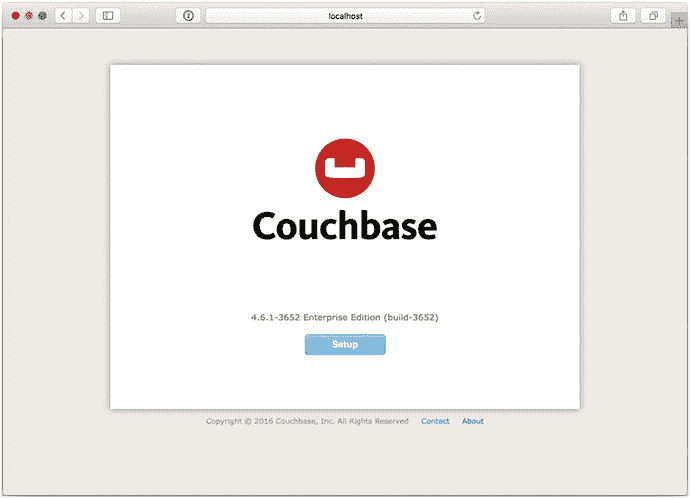

图 12-5. 安装 Couchbase

在下一个屏幕（见图 12-6）上，您可以配置集群。您可以启动一个新集群，也可以加入现有集群。对于本食谱，您将启动一个新集群。指定内存限制，并可选择指定磁盘存储的路径。对于本食谱，保留默认值即可。然后点击“Next”。

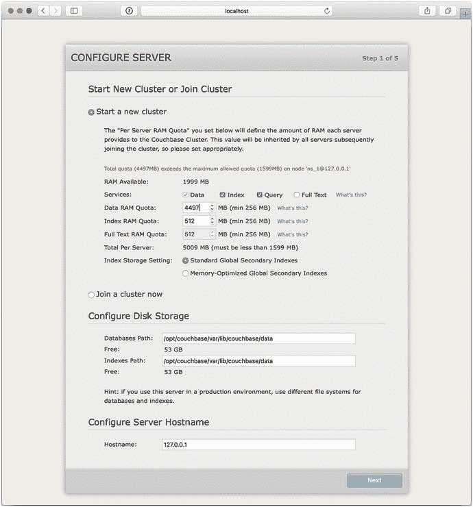

图 12-6. 安装 Couchbase，集群设置

注意

如果您运行的是 Docker 化的 Couchbase，则需要减少数据 RAM 配额，因为该配额是有限的。

下一个屏幕（图 12-7）允许您选择示例数据以使用 Couchbase 的默认样本。由于本食谱不需要这些数据，请取消所有选择并点击“Next”。

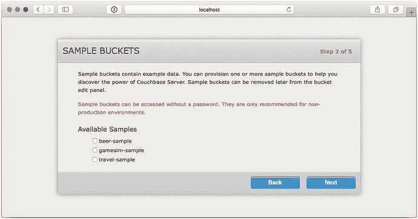

图 12-7. 安装 Couchbase，示例存储桶

图 12-8 所示的屏幕允许您创建默认存储桶。对于本食谱，只需保留设置并点击“Next”。

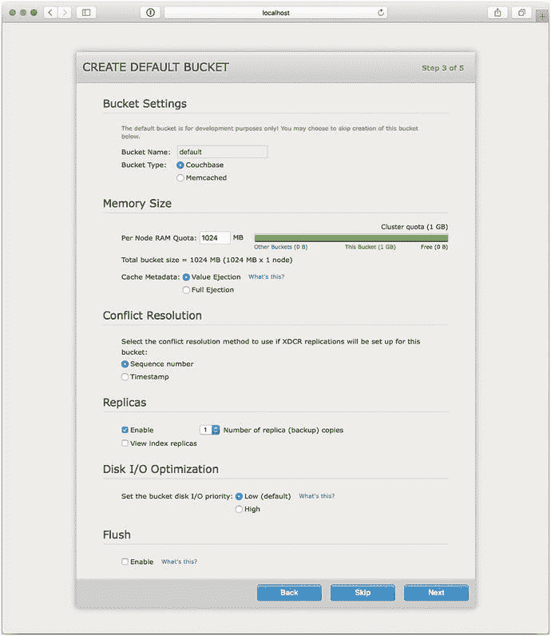

图 12-8. 安装 Couchbase，创建默认存储桶

如果您想注册产品，请填写表单并决定是否希望收到软件更新通知。您至少需要勾选同意条款和条件的复选框（图 12-9）。然后，几乎是最后一次，点击“Next”。

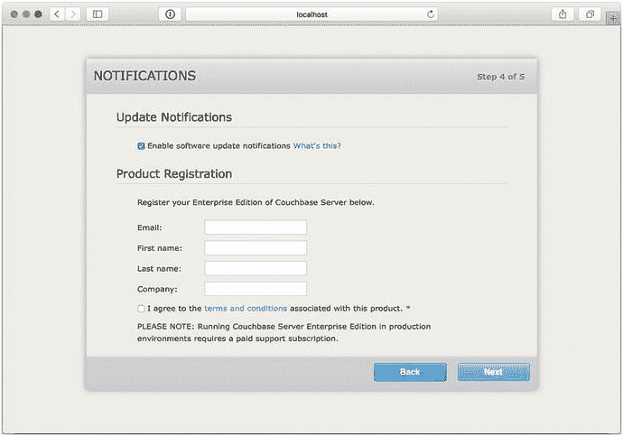

图 12-9. 安装 Couchbase，通知和注册

最后，您需要为服务器的管理员帐户选择用户名和密码。本食谱使用 admin 作为用户名，密码为 sr4-admin，但您也可以自由选择自己的凭据。见图 12-10。

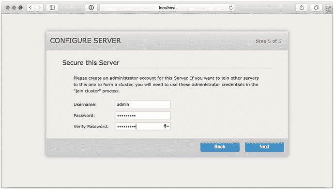

图 12-10. 安装 Couchbase，设置管理员用户

使用 Couchbase 存储和检索文档

要在 Couchbase 中存储对象，您需要创建一个`Document`，它可以容纳各种类型的内容，例如`serializable`对象、JSON、`string`、日期，或 Netty `ByteBuf`形式的二进制数据。然而，主要的内容类型是 JSON。这样您也可以将其与其他技术一起使用。当使用`SerializableDocument`时，您将自身限制在基于 Java 的解决方案中。

但是，在 Couchbase 中存储对象之前，您需要连接到集群。要连接到 Couchbase，您需要一个`Cluster`才能访问您在设置 Couchbase 时创建的`Bucket`。您可以使用`CouchbaseCluster`类创建到之前设置的集群的连接。生成的`Cluster`可用于通过`openBucket()`方法打开一个`Bucket`。对于本食谱，您将使用`default`存储桶和最简单的集群设置。

首先，创建一个`Vehicle`类（或重用食谱 12-1 中的类），您将把它存储在 Couchbase 中。


```java
package com.apress.springrecipes.nosql;
import java.io.Serializable;
public class Vehicle implements Serializable {
private String vehicleNo;
private String color;
private int wheel;
private int seat;
public Vehicle() {
}
public Vehicle(String vehicleNo, String color, int wheel, int seat) {
this.vehicleNo = vehicleNo;
this.color = color;
this.wheel = wheel;
this.seat = seat;
}
public String getColor() {
return color;
}
public int getSeat() {
return seat;
}
public String getVehicleNo() {
return vehicleNo;
}
public int getWheel() {
return wheel;
}
public void setColor(String color) {
this.color = color;
}
public void setSeat(int seat) {
this.seat = seat;
}
public void setVehicleNo(String vehicleNo) {
this.vehicleNo = vehicleNo;
}
public void setWheel(int wheel) {
this.wheel = wheel;
}
@Override
public String toString() {
return "Vehicle [" +
"vehicleNo='" + vehicleNo + '\'' +
", color='" + color + '\'' +
", wheel=" + wheel +
", seat=" + seat +
']';
}
}
```

请注意这一部分：`implements Serializable`。这是必需的，因为首先你将使用 Couchbase 中的 `SerializableDocument` 类来存储对象。

为了与 Couchbase 通信，你需要创建一个仓库。首先定义接口。

```java
package com.apress.springrecipes.nosql;
public interface VehicleRepository {
void save(Vehicle vehicle);
void delete(Vehicle vehicle);
Vehicle findByVehicleNo(String vehicleNo);
}
```

以下是实现，它将使用 `SerializableDocument` 存储 `Vehicle` 值：

```java
package com.apress.springrecipes.nosql;
import com.couchbase.client.java.Bucket;
import com.couchbase.client.java.document.SerializableDocument;
class CouchBaseVehicleRepository implements VehicleRepository {
private final Bucket bucket;
public CouchBaseVehicleRepository(Bucket bucket) {
this.bucket=bucket;
}
@Override
public void save(Vehicle vehicle) {
SerializableDocument vehicleDoc = SerializableDocument    .create(vehicle.getVehicleNo(), vehicle);
bucket.upsert(vehicleDoc);
}
@Override
public void delete(Vehicle vehicle) {
bucket.remove(vehicle.getVehicleNo());
}
@Override
public Vehicle findByVehicleNo(String vehicleNo) {
SerializableDocument doc = bucket.get(vehicleNo, SerializableDocument.class);
if (doc != null) {
return (Vehicle) doc.content();
}
return null;
}
}
```

仓库需要一个 `Bucket` 来存储文档；它类似于数据库中的表（`Bucket` 类似于表，而 `Cluster` 更类似于整个数据库）。当存储 `Vehicle` 时，它会被包装在 `SerializableDocument` 中，并且 `vehicleNo` 值被用作 ID；之后，会调用 `upsert` 方法。该方法会根据文档是否已存在来执行更新或插入操作。

让我们创建一个 `Main` 类，用于在 bucket 中存储和检索 `Vehicle` 的数据。

```java
package com.apress.springrecipes.nosql;
import com.couchbase.client.java.Bucket;
import com.couchbase.client.java.Cluster;
import com.couchbase.client.java.CouchbaseCluster;
public class Main {
public static void main(String[] args) {
Cluster cluster = CouchbaseCluster.create();
Bucket bucket = cluster.openBucket();
CouchBaseVehicleRepository vehicleRepository = new CouchBaseVehicleRepository(bucket);
vehicleRepository.save(new Vehicle("TEM0001", "GREEN", 3, 1));
vehicleRepository.save(new Vehicle("TEM0004", "RED", 4, 2));
System.out.println("Vehicle: " + vehicleRepository.findByVehicleNo("TEM0001"));
System.out.println("Vehicle: " + vehicleRepository.findByVehicleNo("TEM0004"));
bucket.remove("TEM0001");
bucket.remove("TEM0004");
bucket.close();
cluster.disconnect();
}
}
```

首先，使用 `CouchbaseCluster.create()` 方法建立与 `Cluster` 的连接。默认情况下，这将连接到 `localhost` 上的集群。在生产环境中使用 Couchbase 时，你可能希望使用其他 `create` 方法，并传入要连接的主机列表，或者使用 `CouchbaseEnvironment` 设置更多属性（例如设置 `queryTimeout`、`searchTimeout` 等）。对于本示例，使用默认的 `Cluster` 就足够了。接下来，你需要指定用于存储和检索文档的 `Bucket`。由于你将使用默认设置，使用 `cluster.openBucket()` 就足够了。还有其他几个重载方法可用于指定特定的 `Bucket` 以及设置与 bucket 连接的属性（例如超时设置、用户名/密码等）。

`Bucket` 用于创建 `CouchbaseVehicleRepository` 的实例。之后，存储、检索并再次删除两个 `Vehicle`（以免本示例留下杂乱数据）。最后，关闭连接。

虽然你现在正在将文档存储到 CouchBase 中，但有一个缺点：你使用的是 `SerializableDocument`，而 CouchBase 无法用它进行索引。此外，它只能被其他基于 Java 的客户端读取，而无法使用不同的语言（如 JavaScript）读取。因此，建议改用 `JsonDocument`。让我们重写 `CouchbaseVehicleRepository` 以反映这一点。

```java
package com.apress.springrecipes.nosql;
import com.couchbase.client.java.Bucket;
import com.couchbase.client.java.document.JsonDocument;
import com.couchbase.client.java.document.json.JsonObject;
class CouchbaseVehicleRepository implements VehicleRepository {
private final Bucket bucket;
public CouchbaseVehicleRepository(Bucket bucket) {
this.bucket=bucket;
}
@Override
public void save(Vehicle vehicle) {
JsonObject vehicleJson = JsonObject.empty()
.put("vehicleNo", vehicle.getVehicleNo())
.put("color", vehicle.getColor())
.put("wheels", vehicle.getWheel())
.put("seat", vehicle.getSeat());
JsonDocument vehicleDoc = JsonDocument.create(vehicle.getVehicleNo(), vehicleJson);
bucket.upsert(vehicleDoc);
}
@Override
public void delete(Vehicle vehicle) {
bucket.remove(vehicle.getVehicleNo());
}
@Override
public Vehicle findByVehicleNo(String vehicleNo) {
JsonDocument doc = bucket.get(vehicleNo, JsonDocument.class);
if (doc != null) {
JsonObject result = doc.content();
return new Vehicle(result.getString("vehicleNo"), result.getString("color"), result.getInt("wheels"), result.getInt("seat"));
}
return null;
}
}
```

请注意，这段代码使用了 `JsonObject` 对象，并将 `Vehicle` 转换为 `JsonObject` 对象，反之亦然。再次运行 `Main` 类，应该会再次从 Couchbase 中存储、检索并删除两个文档。

对于较大的对象图，JSON 的相互转换可能会变得相当繁琐，因此除了手动处理之外，你还可以使用像 Jackson 这样的 JSON 库来进行 JSON 的相互转换。

```
```
package com.apress.springrecipes.nosql;
import com.couchbase.client.java.Bucket;
import com.couchbase.client.java.document.JsonDocument;
import com.couchbase.client.java.document.json.JsonObject;
import com.fasterxml.jackson.core.JsonProcessingException;
import com.fasterxml.jackson.databind.ObjectMapper;
import java.io.IOException;
class CouchbaseVehicleRepository implements VehicleRepository {
private final Bucket bucket;
private final ObjectMapper mapper;
public CouchbaseVehicleRepository(Bucket bucket, ObjectMapper mapper) {
this.bucket=bucket;
this.mapper=mapper;
}
@Override
public void save(Vehicle vehicle) {
String json = null;
try {
json = mapper.writeValueAsString(vehicle);
} catch (JsonProcessingException e) {
throw new RuntimeException("Error encoding JSON.", e);
}
JsonObject vehicleJson = JsonObject.fromJson(json);
JsonDocument vehicleDoc = JsonDocument.create(vehicle.getVehicleNo(), vehicleJson);
bucket.upsert(vehicleDoc);
}
@Override
public void delete(Vehicle vehicle) {
bucket.remove(vehicle.getVehicleNo());
}
@Override
public Vehicle findByVehicleNo(String vehicleNo) {
JsonDocument doc = bucket.get(vehicleNo, JsonDocument.class);
if (doc != null) {
JsonObject result = doc.content();
try {
return mapper.readValue(result.toString(), Vehicle.class);
} catch (IOException e) {
throw new RuntimeException("Error decoding JSON.", e);
}
}
return null;
}
}
```

现在，你使用强大的 Jackson 库来进行 JSON 的转换。

使用 Spring

目前，所有配置都在 `Main` 类中。让我们将配置部分移到一个 `CouchbaseConfiguration` 类中，并使用它来引导一个应用程序。

```
package com.apress.springrecipes.nosql;
import com.couchbase.client.java.Bucket;
import com.couchbase.client.java.Cluster;
import com.couchbase.client.java.CouchbaseCluster;
import com.fasterxml.jackson.databind.ObjectMapper;
import org.springframework.context.annotation.Bean;
import org.springframework.context.annotation.Configuration;
@Configuration
public class CouchbaseConfiguration {
@Bean(destroyMethod = "disconnect")
public Cluster cluster() {
return CouchbaseCluster.create();
}
@Bean
public Bucket bucket(Cluster cluster) {
return cluster.openBucket();
}
@Bean
public ObjectMapper mapper() {
return new ObjectMapper();
}
@Bean
public CouchbaseVehicleRepository vehicleRepository(Bucket bucket, ObjectMapper mapper) {
return new CouchbaseVehicleRepository(bucket, mapper);
}
}
```

注意 `Cluster` Bean 上的 `destroyMethod` 方法。当应用程序关闭时，此方法将被调用。`Bucket` 上的 `close` 方法将被自动调用，因为它是自动检测到的预定义 `methods` 之一。`CouchbaseVehicleRepository` 的构造方式仍然相同，但现在你向它传递了两个 Spring 管理的 Bean。

修改 `Main` 类以使用 `CouchbaseConfiguration`。

```
package com.apress.springrecipes.nosql;
import org.springframework.context.ApplicationContext;
import org.springframework.context.annotation.AnnotationConfigApplicationContext;
public class Main {
public static void main(String[] args) {
ApplicationContext context = new AnnotationConfigApplicationContext(CouchbaseConfiguration.class);
VehicleRepository vehicleRepository =context.getBean(VehicleRepository.class);
vehicleRepository.save(new Vehicle("TEM0001", "GREEN", 3, 1));
vehicleRepository.save(new Vehicle("TEM0004", "RED", 4, 2));
System.out.println("Vehicle: " + vehicleRepository.findByVehicleNo("TEM0001"));
System.out.println("Vehicle: " + vehicleRepository.findByVehicleNo("TEM0004"));
vehicleRepository.delete(vehicleRepository.findByVehicleNo("TEM0001"));
vehicleRepository.delete(vehicleRepository.findByVehicleNo("TEM0004"));
}
}
```

`VehicleRepository` 是从构建的 `ApplicationContext` 中检索出来的，并且仍然有 `Vehicle` 实例被存储、检索和从 Couchbase 集群中删除。

使用 Spring Data 的 CouchbaseTemplate

虽然使用 Java 和 Jackson 进行 JSON 映射来操作 Couchbase 相当直接，但在处理较大的仓库或使用特定索引和 N1QL 查询时，它会变得相当繁琐，更不用说如果你想将其集成到具有其他数据存储方式的应用程序中。Spring Data Couchbase 项目包含一个 `CouchbaseTemplate` 模板，它消除了你现在在仓库中做的一部分样板工作，例如 JSON 的映射以及将异常转换为 `DataAccessException`。这使得它更容易与 Spring 使用的其他数据访问技术集成。

首先，重写仓库以使用 `CouchbaseTemplate`。

```
package com.apress.springrecipes.nosql;
import org.springframework.data.couchbase.core.CouchbaseTemplate;
public class CouchbaseVehicleRepository implements VehicleRepository {
private final CouchbaseTemplate couchbase;
public CouchbaseVehicleRepository(CouchbaseTemplate couchbase) {
this.couchbase = couchbase;
}
@Override
public void save(Vehicle vehicle) {
couchbase.save(vehicle);
}
@Override
public void delete(Vehicle vehicle) {
couchbase.remove(vehicle);
}
@Override
public Vehicle findByVehicleNo(String vehicleNo) {
return couchbase.findById(vehicleNo, Vehicle.class);
}
}
```

现在，仓库被缩减为仅仅几行代码。为了能够存储 `Vehicle` 对象，你需要对 `Vehicle` 进行注解；它需要知道哪个字段用于 ID。

```
package com.apress.springrecipes.nosql;
import com.couchbase.client.java.repository.annotation.Field;
import com.couchbase.client.java.repository.annotation.Id;
import java.io.Serializable;
public class Vehicle implements Serializable{
@Id
private String vehicleNo;
@Field
private String color;
@Field
private int wheel;
@Field
private int seat;
// getters/setters omitted.
}
```

字段 `vehicleNo` 已使用 `@Id` 注解进行标注，其他字段则使用了 `@Field`。虽然后者不是必须的，但建议指定它。你还可以使用 `@Field` 注解为 JSON 属性的名称指定一个不同的名称，这在需要将现有文档映射到 Java 对象时会很方便。

最后，你需要在配置类中配置一个 `CouchbaseTemplate` 模板。

```
package com.apress.springrecipes.nosql;
import com.couchbase.client.java.Bucket;
import com.couchbase.client.java.Cluster;
import com.couchbase.client.java.CouchbaseCluster;
import org.springframework.context.annotation.Bean;
import org.springframework.context.annotation.Configuration;
import org.springframework.data.couchbase.core.CouchbaseTemplate;
@Configuration
public class CouchbaseConfiguration {
@Bean(destroyMethod = "disconnect")
public Cluster cluster() {
return CouchbaseCluster.create();
}
@Bean
public Bucket bucket(Cluster cluster) {
return cluster.openBucket();
}
@Bean
public CouchbaseVehicleRepository vehicleRepository(CouchbaseTemplate couchbaseTemplate) {
return new CouchbaseVehicleRepository(couchbaseTemplate);
}
@Bean
public CouchbaseTemplate couchbaseTemplate(Cluster cluster, Bucket bucket) {
return new CouchbaseTemplate(cluster.clusterManager("default","").info(), bucket);
}
}
```

一个 `CouchbaseTemplate` 对象需要一个 `Bucket`，并且需要访问 `ClusterInfo`，这可以通过 `ClusterManager` 获得；这里你传递了 `Bucket` 的名称，即 `default`，并且没有密码。你也可以传递 admin/sr4-admin 作为用户名/密码组合。最后，使用这个配置好的模板创建了配置好的 `CouchbaseVehicleRepository` 实例。

当运行 `Main` 类时，访问仍然可用，并且存储、检索和删除操作仍然有效。

为了使配置更简单一些，Spring Data Couchbase 提供了一个基础配置类 `AbstractCouchbaseConfiguration`，你可以继承它，这样就不再需要配置 `Cluster`、`Bucket` 或 `CouchbaseTemplate` 对象了。
```

```content
```
package com.apress.springrecipes.nosql;
import org.springframework.context.annotation.Bean;
import org.springframework.context.annotation.Configuration;
import org.springframework.data.couchbase.config.AbstractCouchbaseConfiguration;
import org.springframework.data.couchbase.core.CouchbaseTemplate;
import java.util.Collections;
import java.util.List;
@Configuration
public class CouchbaseConfiguration extends AbstractCouchbaseConfiguration {
@Override
protected List getBootstrapHosts() {
return Collections.singletonList("localhost");
}
@Override
protected String getBucketName() {
return "default";
}
@Override
protected String getBucketPassword() {
return "";
}
@Bean
public CouchbaseVehicleRepository vehicleRepository(CouchbaseTemplate couchbaseTemplate) {
return new CouchbaseVehicleRepository(couchbaseTemplate);
}
}
```

现在配置类继承了 `AbstractCouchbaseConfiguration` 基类，你只需要提供存储桶名称、可选密码以及主机列表即可。该基类配置提供了 `CouchbaseTemplate` 及其所需的所有对象。

**使用 Spring Data 的 Couchbase 仓库**

与其他技术类似，Spring Data Couchbase 提供了定义接口并在运行时获得实际仓库实现的功能。这样，你只需创建接口，而无需创建具体实现。为此，与其他 Spring Data 项目一样，你需要继承 `CrudRepository`。请注意，如果需要相应功能，你也可以继承 `CouchbaseRepository` 或 `CouchbasePagingAndSortingRepository`。在本示例中，你将使用 `CrudRepository`。

```
package com.apress.springrecipes.nosql;
import org.springframework.data.repository.CrudRepository;
public interface VehicleRepository extends CrudRepository {}
```

如你所见，该接口没有额外的方法，因为所有 CRUD 方法都已提供。

接下来，需要在配置类上添加 `@EnableCouchbaseRepositories` 注解。

```
package com.apress.springrecipes.nosql;
import org.springframework.context.annotation.Configuration;
import org.springframework.data.couchbase.config.AbstractCouchbaseConfiguration;
import org.springframework.data.couchbase.repository.config.EnableCouchbaseRepositories;
import java.util.Collections;
import java.util.List;
@Configuration
@EnableCouchbaseRepositories(
public class CouchbaseConfiguration extends AbstractCouchbaseConfiguration { ... }
```

最后，`Main` 类需要稍作修改，因为你需要使用 `findById` 方法，而不是 `findByVehicleNo`。

```
package com.apress.springrecipes.nosql;
import org.springframework.context.ApplicationContext;
import org.springframework.context.annotation.AnnotationConfigApplicationContext;
public class Main {
public static void main(String[] args) {
ApplicationContext context = new AnnotationConfigApplicationContext(CouchbaseConfiguration.class);
VehicleRepository vehicleRepository =context.getBean(VehicleRepository.class);
vehicleRepository.save(new Vehicle("TEM0001", "GREEN", 3, 1));
vehicleRepository.save(new Vehicle("TEM0004", "RED", 4, 2));
vehicleRepository.findById("TEM0001").ifPresent(System.out::println);
vehicleRepository.findById("TEM0004").ifPresent(System.out::println);
vehicleRepository.deleteById("TEM0001");
vehicleRepository.deleteById("TEM0004");
}
}
```

`findById` 方法返回一个 `java.util.Optional` 对象，因此你可以使用 `ifPresent` 方法将其打印到控制台。

**使用 Spring Data 的响应式 Couchbase 仓库**

除了阻塞式仓库，还可以利用 `ReactiveCouchbaseRepository` 来获得响应式仓库。对于返回零个或一个元素的方法（如 `findById`），它将返回 `Mono`；对于返回零个或多个元素的方法（如 `findAll`），它将返回 `Flux`。默认的 Couchbase 驱动已内置响应式支持。要使用此功能，你需要在类路径中包含 RxJava 和 RxJava 响应式流。要使用 `ReactiveCouchbaseRepository` 中的响应式类型，你还需要在类路径中包含 Pivotal Reactor。

要为 Couchbase 配置响应式仓库，请修改 `CouchbaseConfiguration`。让它继承 `AbstractReactiveCouchbaseConfiguration`，并使用 `@EnableReactiveCouchbaseRepositories` 代替 `@EnableCouchbaseRepositories`。

```
package com.apress.springrecipes.nosql;
import org.springframework.context.annotation.Configuration;
import org.springframework.data.couchbase.config.AbstractReactiveCouchbaseConfiguration;
import org.springframework.data.couchbase.repository.config.EnableReactiveCouchbaseRepositories;
import java.util.Collections;
import java.util.List;
@Configuration
@EnableReactiveCouchbaseRepositories
public class CouchbaseConfiguration extends AbstractReactiveCouchbaseConfiguration {
@Override
protected List getBootstrapHosts() {
return Collections.singletonList("localhost");
}
@Override
protected String getBucketName() {
return "default";
}
@Override
protected String getBucketPassword() {
return "";
}
}
```

配置的其余部分与常规 Couchbase 配置保持一致；你仍然需要连接到相同的 Couchbase 服务器并使用相同的 `Bucket`。

接下来，`VehicleRepository` 应继承 `ReactiveCrudRepository` 而不是 `CrudRepository`。

```
package com.apress.springrecipes.nosql;
import org.springframework.data.repository.reactive.ReactiveCrudRepository;
public interface VehicleRepository extends ReactiveCrudRepository {}
```

这基本上就是获得响应式仓库所需的全部操作。为了能够测试它，你还需要修改 `Main` 类。

```
package com.apress.springrecipes.nosql;
import org.springframework.context.ApplicationContext;
import org.springframework.context.annotation.AnnotationConfigApplicationContext;
import reactor.core.publisher.Flux;
import reactor.core.publisher.Mono;
import java.util.Arrays;
import java.util.concurrent.CountDownLatch;
public class Main {
public static void main(String[] args) throws InterruptedException {
ApplicationContext context = new AnnotationConfigApplicationContext(CouchbaseConfiguration.class);
VehicleRepository repository =context.getBean(VehicleRepository.class);
CountDownLatch countDownLatch = new CountDownLatch(1);
repository.saveAll(Flux.just(new Vehicle("TEM0001", "GREEN", 3, 1), //
new Vehicle("TEM0004", "RED", 4, 2)))
.last().log()
.then(repository.findById("TEM0001")).doOnSuccess(System.out::println)
.then(repository.findById("TEM0004")).doOnSuccess(System.out::println)
.then(repository.deleteById(Flux.just("TEM0001", "TEM00004")))
.doOnSuccess(x -> countDownLatch.countDown())
.doOnError(t -> countDownLatch.countDown())
.subscribe();
countDownLatch.await();
}
}
```
```


创建 `ApplicationContext` 和获取 `VehicleRepository` 的方式并无不同。然而，在此之后，你会看到一系列方法调用，一个接一个地串联起来。首先，你向数据存储中添加两个 `Vehicle` 实例。当最后一个实例保存完成后，你将查询每个实例对应的仓库。当查询完成后，所有数据会被再次删除。为了让整个过程能够顺利完成，你可以选择使用 `block()` 方法进行阻塞，或者自行等待。通常，在响应式系统中使用 `block()` 是应该避免的。因此，你使用了 `CountDownLatch`；当 `deleteById` 方法执行完毕时，`CountDownLatch` 的值会递减。`countDownLatch.await()` 方法会一直等待，直到计数器归零，然后程序结束。

**总结**

在本节中，你初步了解了不同类型的数据存储，包括如何使用它们，以及如何利用 Spring Data 系列的不同模块来简化使用过程。你首先研究了以 MongoDB 为代表的文档型存储，以及 Spring Data MongoDB 模块的使用。接着，你了解了键值存储；你使用 Redis 作为实现，并使用了 Spring Data Redis 模块。最后一种数据存储是基于图的 Neo4j，你探索了嵌入式 Neo4j、如何使用它，以及如何构建用于存储实体的仓库。

对于其中两种数据存储，你还通过扩展响应式版本的接口以及为这些数据存储配置响应式驱动程序，探索了其响应式特性。

**13. Spring Java 企业服务与远程调用技术**

在本章中，你将学习 Spring 对最常见 Java 企业服务的支持：使用 Java 管理扩展 (JMX)、使用 JavaMail 发送电子邮件以及使用 Quartz 调度任务。此外，你还将了解 Spring 对各种远程调用技术的支持，例如 RMI、Hessian、HTTP Invoker 和 SOAP Web 服务。

JMX 是 Java SE 的一部分，是一种用于管理和监控系统资源（如设备、应用程序、对象和服务驱动型网络）的技术。这些资源被表示为托管 Bean (MBean)。Spring 支持 JMX，可以将任何 Spring Bean 导出为模型 MBean，而无需针对 JMX API 进行编程。此外，Spring 可以轻松访问远程 MBean。

JavaMail 是在 Java 中发送电子邮件的标准 API 和实现。Spring 进一步提供了一个抽象层，以独立于实现的方式发送电子邮件。

在 Java 平台上调度任务主要有两种选择：JDK Timer 和 Quartz Scheduler ([`http://quartz-scheduler.org/`](http://quartz-scheduler.org/))。JDK Timer 提供了与 JDK 捆绑的简单任务调度功能。与 JDK Timer 相比，Quartz 提供了更强大的作业调度功能。对于这两种选择，Spring 都提供了实用类，可以在 Bean 配置文件中配置调度任务，而无需直接使用任一 API。

远程调用是开发分布式应用程序（尤其是多层企业应用程序）的关键技术。它允许运行在不同 JVM 或不同机器上的不同应用程序或组件使用特定协议相互通信。Spring 的远程调用支持在不同远程调用技术之间保持一致。在服务器端，Spring 允许你通过服务导出器将任意 Bean 公开为远程服务。在客户端，Spring 提供了各种代理工厂 Bean，用于为远程服务创建本地代理，这样你就可以像使用本地 Bean 一样使用远程服务。

你将学习如何使用一系列远程调用技术，包括 RMI、Hessian、HTTP Invoker，以及使用 Spring Web Services (Spring-WS) 的 SOAP Web 服务。

**13-1. 将 Spring POJO 注册为 JMX MBean**

**问题**

你希望将 Java 应用程序中的对象注册为 JMX MBean，以便能够查看正在运行的服务并在运行时操纵其状态。这将允许你执行诸如重新运行批处理作业、调用方法和更改配置元数据等任务。

**解决方案**

Spring 支持 JMX，允许你将其 IoC 容器中的任何 Bean 导出为模型 MBean。这可以通过简单地声明一个 `MBeanExporter` 实例来完成。借助 Spring 的 JMX 支持，你无需直接处理 JMX API。此外，Spring 允许你声明 JSR-160（Java 管理扩展远程 API）连接器，通过使用工厂 Bean，通过特定协议公开 MBean 以供远程访问。Spring 为服务器和客户端都提供了工厂 Bean。

Spring 的 JMX 支持还附带其他机制，你可以通过这些机制来组装 MBean 的管理接口。这些选项包括使用方法名称、接口和注解来导出 Bean。Spring 还可以自动检测 IoC 容器中声明的、并使用 Spring 定义的 JMX 特定注解进行注解的 Bean，并将其导出为 MBean。

**工作原理**

假设你正在开发一个用于将文件从一个目录复制到另一个目录的实用程序。让我们设计这个实用程序的接口：

```
package com.apress.springrecipes.replicator;
...
public interface FileReplicator {
public String getSrcDir();
public void setSrcDir(String srcDir);
public String getDestDir();
public void setDestDir(String destDir);
public FileCopier getFileCopier();
public void setFileCopier(FileCopier fileCopier);
public void replicate() throws IOException;
}
```

源目录和目标目录被设计为复制器对象的属性，而不是方法参数。这意味着每个文件复制器实例仅针对特定的源目录和目标目录复制文件。你可以在应用程序中创建多个复制器实例。

但在实现这个复制器之前，让我们先创建另一个接口，该接口根据给定的文件名将文件从一个目录复制到另一个目录。

```
package com.apress.springrecipes.replicator;
...
public interface FileCopier {
public void copyFile(String srcDir, String destDir, String filename)
throws IOException;
}
```

实现这个文件复制器有多种策略。例如，你可以利用 Spring 提供的 `FileCopyUtils` 类。

```
package com.apress.springrecipes.replicator;
...
import org.springframework.util.FileCopyUtils;
public class FileCopierJMXImpl implements FileCopier {
public void copyFile(String srcDir, String destDir, String filename)
throws IOException {
File srcFile = new File(srcDir, filename);
File destFile = new File(destDir, filename);
FileCopyUtils.copy(srcFile, destFile);
}
}
```

借助文件复制器，你可以实现文件复制器，如下代码所示：

```
package com.apress.springrecipes.replicator;
import java.io.File;
import java.io.IOException;
public class FileReplicatorJMXImpl implements FileReplicator {
private String srcDir;
private String destDir;
private FileCopier fileCopier;
// 为简洁起见，省略了 getter 方法
public void setSrcDir(String srcDir) {
this.srcDir = srcDir;
}
public void setDestDir(String destDir) {
this.destDir = destDir;
}
public void setFileCopier(FileCopier fileCopier) {
this.fileCopier = fileCopier;
}
public synchronized void replicate() throws IOException {
File[] files = new File(srcDir).listFiles();
for (File file : files) {
if (file.isFile()) {
fileCopier.copyFile(srcDir, destDir, file.getName());
}
}
}
}
```

每次调用 `replicate()` 方法时，源目录中的所有文件都会被复制到目标目录。为了避免并发复制引起的意外问题，你将此方法声明为 `synchronized`。


现在，你可以在一个 Java 配置类中配置一个或多个文件复制器实例。`documentReplicator` 实例需要引用两个目录：一个用于读取文件的源目录，以及一个用于备份文件的目标目录。此示例中的代码会尝试从操作系统用户主目录下名为 `docs` 的目录中读取文件，然后将其复制到操作系统用户主目录下名为 `docs_backup` 的文件夹中。

当这个 Bean 启动时，如果这两个目录尚不存在，它会创建它们。

提示

“主目录”因操作系统而异，但在 Unix 系统上，它通常是 `~` 所解析到的目录。在 Linux 机器上，该文件夹可能是 `/home/user`。在 macOS 上，该文件夹可能是 `/Users/user`，而在 Windows 上，它可能类似于 `C:\Documents and Settings\user`。

```
package com.apress.springrecipes.replicator.config;
...
@Configuration
public class FileReplicatorConfig {
@Value("#{systemProperties['user.home']}/docs")
private String srcDir;
@Value("#{systemProperties['user.home']}/docs_backup")
private String destDir;
@Bean
public FileCopier fileCopier() {
FileCopier fCop = new FileCopierJMXImpl();
return fCop;
}
@Bean
public FileReplicator documentReplicator() {
FileReplicator fRep = new FileReplicatorJMXImpl();
fRep.setSrcDir(srcDir);
fRep.setDestDir(destDir);
fRep.setFileCopier(fileCopier());
return fRep;
}
@PostConstruct
public void verifyDirectoriesExist() {
File src = new File(srcDir);
File dest = new File(destDir);
if (!src.exists())
src.mkdirs();
if (!dest.exists())
dest.mkdirs();
}
}
```

首先，使用 `@Value` 注解声明了两个字段，以获取用户的主目录并定义源目录和目标目录。接着，使用 `@Bean` 注解创建了两个 Bean 实例。请注意 `verifyDirectoriesExist()` 方法上的 `@PostConstuct` 注解，它确保了源目录和目标目录的存在。

现在你已经拥有了应用程序的核心 Bean，让我们来看看如何将 Bean 注册和访问为 MBean。

在没有 Spring 支持的情况下注册 MBean

首先，让我们看看如何直接使用 JMX API 注册一个模型 MBean。在下面的 `Main` 类中，你从 IoC 容器中获取 `FileReplicator` Bean，并将其注册为用于管理和监控的 MBean。所有属性和方法都包含在 MBean 的管理接口中。

```
package com.apress.springrecipes.replicator;
...
import java.lang.management.ManagementFactory;
import javax.management.Descriptor;
import javax.management.JMException;
import javax.management.MBeanServer;
import javax.management.ObjectName;
import javax.management.modelmbean.DescriptorSupport;
import javax.management.modelmbean.InvalidTargetObjectTypeException;
import javax.management.modelmbean.ModelMBeanAttributeInfo;
import javax.management.modelmbean.ModelMBeanInfo;
import javax.management.modelmbean.ModelMBeanInfoSupport;
import javax.management.modelmbean.ModelMBeanOperationInfo;
import javax.management.modelmbean.RequiredModelMBean;
import org.springframework.context.ApplicationContext;
import org.springframework.context.support.GenericXmlApplicationContext;
public class Main {
public static void main(String[] args) throws IOException {
ApplicationContext context =
new AnnotationConfigApplicationContext("com.apress.springrecipes.replicator.config");
FileReplicator documentReplicator = context.getBean(FileReplicator.class);
try {
MBeanServer mbeanServer = ManagementFactory.getPlatformMBeanServer();
ObjectName objectName = new ObjectName("bean:name=documentReplicator");
RequiredModelMBean mbean = new RequiredModelMBean();
mbean.setManagedResource(documentReplicator, "objectReference");
Descriptor srcDirDescriptor = new DescriptorSupport(new String[] {
"name=SrcDir", "descriptorType=attribute",
"getMethod=getSrcDir", "setMethod=setSrcDir" });
ModelMBeanAttributeInfo srcDirInfo = new ModelMBeanAttributeInfo(
"SrcDir", "java.lang.String", "Source directory",
true, true, false, srcDirDescriptor);
Descriptor destDirDescriptor = new DescriptorSupport(new String[] {
"name=DestDir", "descriptorType=attribute",
"getMethod=getDestDir", "setMethod=setDestDir" });
ModelMBeanAttributeInfo destDirInfo = new ModelMBeanAttributeInfo(
"DestDir", "java.lang.String", "Destination directory",
true, true, false, destDirDescriptor);
ModelMBeanOperationInfo getSrcDirInfo = new ModelMBeanOperationInfo(
"Get source directory",
FileReplicator.class.getMethod("getSrcDir"));
ModelMBeanOperationInfo setSrcDirInfo = new ModelMBeanOperationInfo(
"Set source directory",
FileReplicator.class.getMethod("setSrcDir", String.class));
ModelMBeanOperationInfo getDestDirInfo = new ModelMBeanOperationInfo(
"Get destination directory",
FileReplicator.class.getMethod("getDestDir"));
ModelMBeanOperationInfo setDestDirInfo = new ModelMBeanOperationInfo(
"Set destination directory",
FileReplicator.class.getMethod("setDestDir", String.class));
ModelMBeanOperationInfo replicateInfo = new ModelMBeanOperationInfo(
"Replicate files",
FileReplicator.class.getMethod("replicate"));
ModelMBeanInfo mbeanInfo = new ModelMBeanInfoSupport(
"FileReplicator", "File replicator",
new ModelMBeanAttributeInfo[] { srcDirInfo, destDirInfo },
null,
new ModelMBeanOperationInfo[] { getSrcDirInfo, setSrcDirInfo,
getDestDirInfo, setDestDirInfo, replicateInfo },
null);
mbean.setModelMBeanInfo(mbeanInfo);
mbeanServer.registerMBean(mbean, objectName);
} catch (JMException e) {
...
} catch (InvalidTargetObjectTypeException e) {
...
} catch (NoSuchMethodException e) {
...
}
System.in.read();
}
}
```

要注册一个 MBean，你需要一个 `javax.managment.MBeanServer` 接口的实例。你可以调用静态方法 `ManagementFactory.getPlatformMBeanServer()` 来定位一个平台 MBean 服务器。如果不存在 MBean 服务器，它会创建一个，然后注册该服务器实例以供将来使用。每个 MBean 都需要一个包含域名的 MBean 对象名称。上述 MBean 在域 `bean` 下以名称 `documentReplicator` 注册。


从上述代码可以看出，对于每个 MBean 属性和 MBean 操作，你需要创建一个 `ModelMBeanAttributeInfo` 对象和一个 `ModelMBeanOperationInfo` 对象来进行描述。之后，你需要通过整合上述信息，创建一个 `ModelMBeanInfo` 对象来描述 MBean 的管理接口。关于这些类的使用细节，你可以查阅它们的 Javadocs。此外，在调用 JMX API 时，你必须处理 JMX 特有的异常。这些异常是必须处理的受检异常。请注意，在使用 JMX 客户端工具查看应用程序内部状态之前，必须防止应用程序终止。使用 `System.in.read()` 从控制台请求一个键值是一个不错的选择。

最后，你需要添加 VM 参数 `-Dcom.sun.management.jmxremote` 来启用对此应用程序的本地监控。如果你使用的是本书的源代码，可以使用以下命令：

```
java -Dcom.sun.management.jmxremote -jar  Recipe_13_1_i-4.0.0.jar
```

现在，你可以使用任何 JMX 客户端工具在本地监控你的 MBeans。最简单的工具是 JConsole，它随 JDK 一起提供。要启动 JConsole，只需执行位于 JDK 安装目录 `bin` 文件夹中的 `jconsole` 可执行文件。

当 JConsole 启动时，你可以在连接窗口的“本地”选项卡中看到已启用 JMX 的应用程序列表。选择与正在运行的 Spring 应用程序对应的进程（即 `Recipe_13_1_i-1.0-SNAPSHOT.jar`）。如图 13-1 所示。

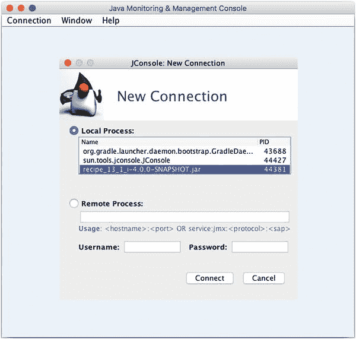

图 13-1.

JConsole 启动窗口

警告

如果你使用的是 Windows 系统，可能在 JConsole 中看不到任何进程。这是一个已知的 bug，即 JConsole 无法检测到正在运行的 Java 进程。要解决此问题，你需要确保用户在临时文件夹中拥有 `hsperfdata` 文件夹。Java 和 JConsole 使用此文件夹来跟踪正在运行的进程，但它可能不存在。例如，如果你以用户 John.Doe 身份运行应用程序，请确保以下路径存在：`C:\Users\John.Doe\AppData\Local\Temp\hsperfdata_John.Doe\`。

连接到复制应用程序后，转到 MBeans 选项卡。接下来，单击左侧树中的 Bean 文件夹，然后点击“操作”部分。在主屏幕上，你将看到一系列用于调用 Bean 操作的按钮。要调用 `replicate()`，只需单击“replicate”按钮。此屏幕如图 13-2 所示。

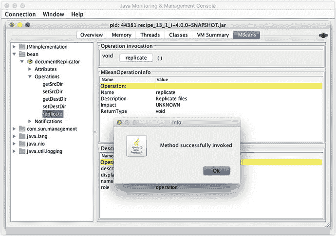

图 13-2.

JConsole 模拟 Spring Bean 操作

你将看到一个“方法成功调用”的弹出窗口。通过此操作，源文件夹中的所有过滤器都会被复制/同步到目标文件夹中。

使用 Spring 支持注册 MBean

之前的应用程序直接依赖于 JMX API。正如你在 `Main` 应用程序类中所见，存在大量难以编写、管理和有时难以理解的代码。要将 Spring IoC 容器中配置的 Bean 导出为 MBean，你只需创建一个 `MBeanExporter` 实例，并指定要导出的 Bean，以其 MBean 对象名称作为键。这可以通过添加以下配置类来完成。请注意，`beansToExport` 映射中的键条目被用作对应条目值所引用 Bean 的 `ObjectName`。

```
package com.apress.springrecipes.replicator.config;
import com.apress.springrecipes.replicator.FileReplicator;
import org.springframework.beans.factory.annotation.Autowired;
import org.springframework.context.annotation.Bean;
import org.springframework.context.annotation.Configuration;
import org.springframework.jmx.export.MBeanExporter;
import java.util.HashMap;
import java.util.Map;
@Configuration
public class JmxConfig {
@Autowired
private FileReplicator fileReplicator;
@Bean
public MBeanExporter mbeanExporter() {
MBeanExporter mbeanExporter = new MBeanExporter();
mbeanExporter.setBeans(beansToExport());
return mbeanExporter;
}
private Map beansToExport() {
Map beansToExport = new HashMap();
beansToExport.put("bean:name=documentReplicator", fileReplicator);
return beansToExport;
}
}
```

上述配置将 `FileReplicator` Bean 导出为 MBean，位于域 bean 下，名称为 `documentReplicator`。默认情况下，所有公共属性都作为属性包含在内，所有公共方法（`java.lang.Object` 中的方法除外）都作为操作包含在 MBean 的管理接口中。借助 Spring JMX `MBeanExporter`，应用程序中的主类可以缩减为以下几行：

```
package com.apress.springrecipes.replicator;
...
import org.springframework.context.annotation.AnnotationConfigApplicationContext;
public class Main {
public static void main(String[] args) throws IOException {
new AnnotationConfigApplicationContext("com.apress.springrecipes.replicator.config");
System.in.read();
}
}
```

处理多个 MBean 服务器实例

Spring `MBeanExporter` 方法可以隐式地定位 MBean 服务器实例并向其注册 MBean。JDK 在首次定位 MBean 服务器时会创建一个，因此无需显式创建。如果应用程序在提供 MBean 服务器的环境（例如 Java 应用服务器）中运行，情况也是如此。

但是，如果你有多个 MBean 服务器在运行，则需要告诉 `mbeanServer` Bean 它应该绑定到哪个服务器。你可以通过指定服务器的 `agentId` 值来实现。要确定 JConsole 中给定服务器的 `agentId` 值，请转到 MBeans 选项卡，在左侧树中依次进入 JMImplementation/MBeanServerDelegate/Attributes/MBeanServerId。在那里，你将看到字符串值。在我们的本地机器上，该值为 `workstation_1253860476443`。要启用它，请配置 MBeanServer 的 `agentId` 属性。

```
@Bean
public MBeanServerFactoryBean mbeanServer() {
MBeanServerFactoryBean mbeanServer = new MBeanServerFactoryBean();
mbeanServer.setLocateExistingServerIfPossible(true);
mbeanServer.setAgentId("workstation_1253860476443");
return mbeanServer;
}
```

如果你的上下文中存在多个 MBean 服务器实例，你可以为 `MBeanExporter` 显式指定一个特定的 MBean 服务器来导出你的 MBean。在这种情况下，`MBeanExporter` 不会定位 MBean 服务器；它将使用指定的 MBean 服务器实例。当有多个 MBean 服务器可用时，此属性用于指定一个特定的 MBean 服务器。

```
@Bean
public MBeanExporter mbeanExporter() {
MBeanExporter mbeanExporter = new MBeanExporter();
mbeanExporter.setBeans(beansToExport());
mbeanExporter.setServer(mbeanServer().getObject());
return mbeanExporter;
}
@Bean
public MBeanServerFactoryBean mbeanServer() {
MBeanServerFactoryBean mbeanServer = new MBeanServerFactoryBean();
mbeanServer.setLocateExistingServerIfPossible(true);
return mbeanServer;
}
```

通过 RMI 注册 MBean 以实现远程访问


如果你希望你的 MBeans 能够被远程访问，你需要为 JMX 启用一个远程协议。JSR-160 通过 JMX 连接器定义了 JMX 远程连接的标准。Spring 允许你通过 `ConnectorServerFactoryBean` 创建一个 JMX 连接器服务器。
默认情况下，`ConnectorServerFactoryBean` 会创建并启动一个绑定到服务 URL `service:jmx:jmxmp://localhost:9875` 的 JMX 连接器服务器，该服务器通过 JMX 消息协议（JMXMP）暴露 JMX 连接器。然而，大多数 JMX 实现并不支持 JMXMP。因此，你应该为你的 JMX 连接器选择一个广泛支持的远程协议，例如 RMI。要通过特定协议暴露你的 JMX 连接器，你只需为其提供服务 URL 即可。

```
@Bean
public FactoryBean rmiRegistry() {
return new RmiRegistryFactoryBean();
}
@Bean
@DependsOn("rmiRegistry")
public FactoryBean connectorServer() {
ConnectorServerFactoryBean connectorServerFactoryBean = new ConnectorServerFactoryBean();
connectorServerFactoryBean
.setServiceUrl("service:jmx:rmi://localhost/jndi/rmi://localhost:1099/replicator");
return connectorServerFactoryBean;
}
```

你指定上述 URL 是为了将你的 JMX 连接器绑定到一个监听在 `localhost` 的 1099 端口上的 RMI 注册表。如果没有外部创建 RMI 注册表，你应该使用 `RmiRegistryFactoryBean` 创建一个。该注册表的默认端口是 1099，但你可以在其 port 属性中指定另一个端口。请注意，`ConnectorServerFactoryBean` 必须在 RMI 注册表创建并准备就绪之后才能创建连接器服务器。你可以为此设置 `depends-on` 属性。

现在，你的 MBeans 可以通过 RMI 进行远程访问了。请注意，无需像之前的应用那样使用 JMX 的 `-Dcom.sun.management.jmxremote` 标志来启动支持 RMI 的应用。当 JConsole 启动时，你可以在连接窗口的“远程进程”部分的服务 URL 中输入 `service:jmx:rmi://localhost/jndi/rmi://localhost:1099/replicator`。如图 13-3 所示。

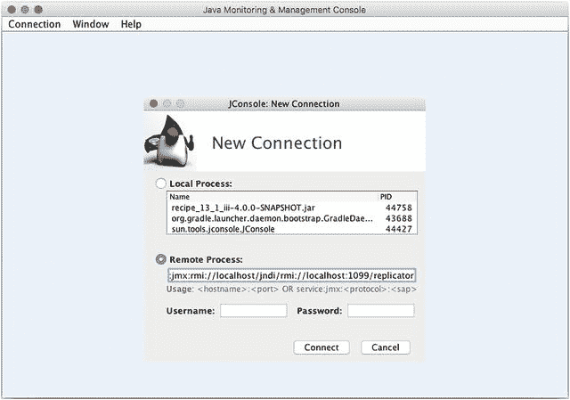

图 13-3. 通过 RMI 使用 JConsole 连接 MBean

一旦连接建立，你就可以像之前的示例一样调用 bean 的方法。

组装 MBeans 的管理接口

默认情况下，Spring 的 `MBeanExporter` 会将 bean 的所有公共属性导出为 MBean 属性，并将所有公共方法导出为 MBean 操作。但你可以使用 MBean 装配器来组装 MBeans 的管理接口。Spring 中最简单的 MBean 装配器是 `MethodNameBasedMBeanInfoAssembler`，它允许你指定要导出的方法名称。

```
@Configuration
public class JmxConfig {
...
@Bean
public MBeanExporter mbeanExporter() {
MBeanExporter mbeanExporter = new MBeanExporter();
mbeanExporter.setBeans(beansToExport());
mbeanExporter.setAssembler(assembler());
return mbeanExporter;
}
@Bean
public MBeanInfoAssembler assembler() {
MethodNameBasedMBeanInfoAssembler assembler;
assembler = new MethodNameBasedMBeanInfoAssembler();
assembler.setManagedMethods(new String[] {"getSrcDir","setSrcDir","getDestDir","setDestDir","replicate"});
return assembler;
}
}
```

另一个 MBean 装配器是 `InterfaceBasedMBeanInfoAssembler`，它会导出你指定的接口中定义的所有方法。

```
@Bean
public MBeanInfoAssembler assembler() {
InterfaceBasedMBeanInfoAssembler assembler = new InterfaceBasedMBeanInfoAssembler();
assembler.setManagedInterfaces(new Class[] {FileReplicator.class});
return assembler;
}
```

Spring 还提供了 `MetadataMBeanInfoAssembler`，用于根据 bean 类中的元数据来组装 MBean 的管理接口。它支持两种类型的元数据：JDK 注解和 Apache Commons 属性（在幕后，这是通过一个名为 `JmxAttributeSource` 的策略接口实现的）。对于使用 JDK 注解标注的 bean 类，你需要指定一个 `AnnotationJmxAttributeSource` 实例作为 `MetadataMBeanInfoAssembler` 的属性源。

```
@Bean
public MBeanInfoAssembler assembler() {
MetadataMBeanInfoAssembler assembler = new MetadataMBeanInfoAssembler();
assembler.setAttributeSource(new AnnotationJmxAttributeSource());
return assembler;
}
```

然后，你使用 `@ManagedResource`、`@ManagedAttribute` 和 `@ManagedOperation` 注解来标注你的 bean 类和方法，以便 `MetadataMBeanInfoAssembler` 为该 bean 组装管理接口。这些注解很容易理解。它们会暴露它们所标注的元素。如果你有一个符合 JavaBeans 规范的属性，JMX 会使用术语“属性”。类本身被称为“资源”。在 JMX 中，方法被称为“操作”。了解了这些，就很容易看出以下代码的作用：

```
package com.apress.springrecipes.replicator;
...
import org.springframework.jmx.export.annotation.ManagedAttribute;
import org.springframework.jmx.export.annotation.ManagedOperation;
import org.springframework.jmx.export.annotation.ManagedResource;
@ManagedResource(description = "文件复制器")
public class FileReplicatorJMXImpl implements FileReplicator {
...
@ManagedAttribute(description = "获取源目录")
public String getSrcDir() {
...
}
@ManagedAttribute(description = "设置源目录")
public void setSrcDir(String srcDir) {
...
}
@ManagedAttribute(description = "获取目标目录")
public String getDestDir() {
...
}
@ManagedAttribute(description = "设置目标目录")
public void setDestDir(String destDir) {
...
}
...
@ManagedOperation(description = "复制文件")
public synchronized void replicate() throws IOException {
...
}
}
```

使用注解注册 MBeans

除了使用 `MBeanExporter` 显式导出 bean 之外，你还可以简单地配置其子类 `AnnotationMBeanExporter`，以从 IoC 容器中声明的 bean 中自动检测 MBeans。你无需为此导出器配置 MBean 装配器，因为它默认使用带有 `AnnotationJmxAttributeSource` 的 `MetadataMBeanInfoAssembler`。你可以删除此注册之前的 beans 和 assembler 属性，只需保留以下内容：

```
@Configuration
public class JmxConfig {
@Bean
public MBeanExporter mbeanExporter() {
AnnotationMBeanExporter mbeanExporter = new AnnotationMBeanExporter();
return mbeanExporter;
}
}
```

`AnnotationMBeanExporter` 会检测 IoC 容器中配置的带有 `@ManagedResource` 注解的任何 bean，并将它们导出为 MBeans。默认情况下，此导出器会将 bean 导出到与其包名同名的域中。此外，它使用 IoC 容器中的 bean 名称作为其 MBean 名称，并使用 bean 的短类名作为其类型。因此，`documentReplicator` bean 将在以下 MBean 对象名称下导出：`com.apress.springrecipes.replicator:name=documentReplicator, type=FileReplicatorJMXImpl`。

如果你不想使用包名作为域名，你可以通过添加 `defaultDomain` 属性来为导出器设置默认域：

```
@Bean
public MBeanExporter mbeanExporter() {
AnnotationMBeanExporter mbeanExporter = new AnnotationMBeanExporter();
mbeanExporter.setDefaultDomain("bean");
return mbeanExporter;
}
```

将默认域设置为 bean 后，`documentReplicator` bean 将在以下 MBean 对象名称下导出：

```
bean:name=documentReplicator,type=FileReplicatorJMXImpl
```


此外，你可以在 `@ManagedResource` 注解的 `objectName` 属性中指定 Bean 的 MBean 对象名称。例如，你可以通过以下注解将文件复制器导出为 MBean：

```
package com.apress.springrecipes.replicator;
...
import org.springframework.jmx.export.annotation.ManagedOperation;
import org.springframework.jmx.export.annotation.ManagedOperationParameter;
import org.springframework.jmx.export.annotation.ManagedOperationParameters;
import org.springframework.jmx.export.annotation.ManagedResource;
@ManagedResource(
objectName = "bean:name=fileCopier,type=FileCopierJMXImpl",
description = "文件复制器")
public class FileCopierImpl implements FileCopier {
@ManagedOperation(
description = "将文件从源目录复制到目标目录")
@ManagedOperationParameters( {
@ManagedOperationParameter(
name = "srcDir", description = "源目录"),
@ManagedOperationParameter(
name = "destDir", description = "目标目录"),
@ManagedOperationParameter(
name = "filename", description = "要复制的文件") })
public void copyFile(String srcDir, String destDir, String filename)
throws IOException {
...
}
}
```

然而，以这种方式指定对象名称仅适用于你将在 IoC 容器中创建单个实例的类（例如，文件复制器），而不适用于你可能创建多个实例的类（例如，文件复制器）。这是因为你只能为一个类指定一个对象名称。因此，你不应在不更改名称的情况下多次运行同一服务器。

最后，另一种可能性是依赖 Spring 类扫描来导出带有 `@ManagedResource` 注解的 MBean。如果 Bean 在 Java 配置类中初始化，你可以使用 `@EnableMBeanExport` 注解来装饰配置类。这会告诉 Spring 导出任何使用 `@Bean` 注解创建且带有 `@EnableMBeanSupport` 注解的 Bean。

```
package com.apress.springrecipes.replicator.config;
...
import org.springframework.context.annotation.EnableMBeanExport;
@Configuration
@EnableMBeanExport
public class FileReplicatorConfig {
....
@Bean
public FileReplicatorJMXImpl documentReplicator() {
FileReplicatorJMXImpl fRep = new FileReplicatorJMXImpl();
fRep.setSrcDir(srcDir);
fRep.setDestDir(destDir);
fRep.setFileCopier(fileCopier());
return fRep;
}
...
}
```

由于存在 `@EnableMBeanExport` 注解，类型为 `FileReplicatorJMXImpl` 的 Bean `documentReplicatior` 会被导出为 MBean，因为其源代码使用了 `@ManagedResource` 注解进行装饰。

注意

`@EnableMBeanExport` 注解的使用是针对带有具体类的 `@Bean` 实例，而不是像之前示例中的接口。基于接口的 Bean 会隐藏目标类以及 JMX 托管资源注解，导致 MBean 不会被导出。

13-2. 发布和监听 JMX 通知

问题

你希望从你的 MBean 发布 JMX 通知，并使用 JMX 通知监听器监听这些通知。

解决方案

Spring 允许你的 Bean 通过 `NotificationPublisher` 接口发布 JMX 通知。你还可以在 IoC 容器中注册标准的 JMX 通知监听器来监听 JMX 通知。

工作原理

要发布事件，你需要访问 `NotificationPublisher`，你可以通过实现 `NotificationPublisherAware` 接口来获得 Spring 的访问权限。要监听事件，你可以使用默认的 JMX 构造，即实现 `NotificationListener` 接口，并将此实现注册到 JMX。

发布 JMX 通知

Spring IoC 容器支持将要导出为 MBean 的 Bean 发布 JMX 通知。这些 Bean 必须实现 `NotificationPublisherAware` 接口才能访问 `NotificationPublisher`，从而发布通知。

```
package com.apress.springrecipes.replicator;
...
import javax.management.Notification;
import org.springframework.jmx.export.notification.NotificationPublisher;
import org.springframework.jmx.export.notification.NotificationPublisherAware;
@ManagedResource(description = "文件复制器")
public class FileReplicatorImpl implements FileReplicator,
NotificationPublisherAware {
...
private int sequenceNumber;
private NotificationPublisher notificationPublisher;
public void setNotificationPublisher(
NotificationPublisher notificationPublisher) {
this.notificationPublisher = notificationPublisher;
}
@ManagedOperation(description = "复制文件")
public void replicate() throws IOException {
notificationPublisher.sendNotification(
new Notification("replication.start", this, sequenceNumber));
...
notificationPublisher.sendNotification(
new Notification("replication.complete", this, sequenceNumber));
sequenceNumber++;
}
}
```

在这个文件复制器中，每当复制开始或完成时，你都会发送一个 JMX 通知。该通知既会在控制台的标准输出中可见，也会在 JConsole 的 MBean 选项卡的通知菜单中可见，如图 13-4 所示。

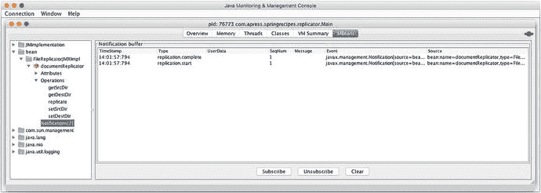

图 13-4. JConsole 中报告的 MBean 事件

要在 JConsole 中查看通知，你必须首先点击底部出现的“订阅”按钮，如图 13-4 所示。然后，当你使用 JConsole 中 MBean 操作部分的按钮调用 `replicate()` 方法时，你将看到两个新通知到达。Notification 构造函数中的第一个参数是通知类型，第二个参数是通知源。

监听 JMX 通知

现在，让我们创建一个通知监听器来监听 JMX 通知。由于监听器会收到许多不同类型的通知，例如当 MBean 的属性发生更改时的 `javax.management.AttributeChangeNotification`，你必须过滤出你感兴趣处理的通知。

```
package com.apress.springrecipes.replicator;
import javax.management.Notification;
import javax.management.NotificationListener;
public class ReplicationNotificationListener implements NotificationListener {
public void handleNotification(Notification notification, Object handback) {
if (notification.getType().startsWith("replication")) {
System.out.println(
notification.getSource() + " " +
notification.getType() + " #" +
notification.getSequenceNumber());
}
}
}
```

然后，你可以将此通知监听器注册到你的 MBean 导出器，以监听来自特定 MBean 发出的通知。

```
@Bean
public AnnotationMBeanExporter mbeanExporter() {
AnnotationMBeanExporter mbeanExporter = new AnnotationMBeanExporter();
mbeanExporter.setDefaultDomain("bean");
mbeanExporter.setNotificationListenerMappings(notificationMappings());
return mbeanExporter;
}
public Map notificationMappings() {
Map mappings = new HashMap();
mappings.put("bean:name=documentReplicator,type=FileReplicatorJMXImpl",
new ReplicationNotificationListener());
return mappings;
}
```

13-3. 在 Spring 中访问远程 JMX MBean

问题

你希望访问由 JMX 连接器暴露的、运行在远程 MBean 服务器上的 JMX MBean。当直接使用 JMX API 访问远程 MBean 时，你必须编写复杂的 JMX 特定代码。

解决方案

Spring 提供了两种简化远程 MBean 访问的方法。首先，它提供了一个工厂 Bean 来声明式地创建 MBean 服务器连接。通过此服务器连接，你可以查询和更新 MBean 的属性，以及调用其操作。其次，Spring 提供了另一个工厂 Bean，允许你为远程 MBean 创建代理。通过此代理，你可以像操作本地 Bean 一样操作远程 MBean。

工作原理


为了简化 JMX 的使用，Spring 提供了两种方法：一种是通过帮助配置与 MBean 服务器的连接，来简化纯 JMX 的使用；另一种则更类似于 Spring 的其他远程技术，通过为远程 MBean 提供代理来实现。

## 通过 MBean 服务器连接访问远程 MBean

JMX 客户端需要 MBean 服务器连接才能访问在远程 MBean 服务器上运行的 MBean。Spring 提供了 `org.springframework.jmx.support.MBeanServerConnectionFactoryBean`，供您以声明方式创建与远程支持 JSR-160 的 MBean 服务器的连接。您只需提供服务 URL 即可定位 MBean 服务器。现在，让我们在客户端 Bean 配置类中声明这个工厂 Bean。

```
package com.apress.springrecipes.replicator.config;
import org.springframework.beans.factory.FactoryBean;
import org.springframework.context.annotation.Bean;
import org.springframework.context.annotation.Configuration;
import org.springframework.jmx.support.MBeanServerConnectionFactoryBean;
import javax.management.MBeanServerConnection;
import java.net.MalformedURLException;
@Configuration
public class JmxClientConfiguration {
@Bean
public FactoryBean mbeanServerConnection()
throws MalformedURLException {
MBeanServerConnectionFactoryBean mBeanServerConnectionFactoryBean =
new MBeanServerConnectionFactoryBean();
mBeanServerConnectionFactoryBean
.setServiceUrl("service:jmx:rmi://localhost/jndi/rmi://localhost:1099/replicator");
return mBeanServerConnectionFactoryBean;
}
}
```

通过此工厂 Bean 创建的 MBean 服务器连接，您可以访问并操作在端口 1099 上运行的 RMI 服务器上的 MBean。

**提示**

您可以使用配方 13-1 中介绍的 RMI 服务器，该服务器会暴露 MBean。如果您使用的是本书的源代码，在使用 Gradle 构建应用程序后，可以使用以下命令启动服务器：`java -jar Recipe_14_1_iii-1.0-SNAPSHOT.jar`。

建立连接后，您可以通过 `getAttribute()` 和 `setAttribute()` 方法查询和更新 MBean 的属性，只需提供 MBean 的对象名称和属性名称。您还可以使用 `invoke()` 方法调用 MBean 的操作。

```
package com.apress.springrecipes.replicator;
import javax.management.Attribute;
import javax.management.MBeanServerConnection;
import javax.management.ObjectName;
import org.springframework.context.ApplicationContext;
import org.springframework.context.support.Generic XmlApplicationContext;
public class Client {
public static void main(String[] args) throws Exception {
ApplicationContext context =
new AnnotationConfigApplicationContext("com.apress.springrecipes.replicator.config");
MBeanServerConnection mbeanServerConnection =
context.getBean(MBeanServerConnection.class);
ObjectName mbeanName = new ObjectName("bean:name=documentReplicator");
String srcDir = (String) mbeanServerConnection.getAttribute(mbeanName, "SrcDir");
mbeanServerConnection.setAttribute(mbeanName,     new Attribute("DestDir", srcDir + "_backup"));
mbeanServerConnection.invoke(mbeanName, "replicate", new Object[] {}, new String[] {});
}
}
```

此外，让我们创建一个 JMX 通知监听器，以便监听文件复制通知。

```
package com.apress.springrecipes.replicator;
import javax.management.Notification;
import javax.management.NotificationListener;
public class ReplicationNotificationListener implements NotificationListener {
public void handleNotification(Notification notification, Object handback) {
if (notification.getType().startsWith("replication")) {
System.out.println(
notification.getSource() + " " +
notification.getType() + " #" +
notification.getSequenceNumber());
}
}
}
```

您可以将此通知监听器注册到 MBean 服务器连接，以监听从此 MBean 服务器发出的通知。

```
package com.apress.springrecipes.replicator;
...
import javax.management.MBeanServerConnection;
import javax.management.ObjectName;
public class Client {
public static void main(String[] args) throws Exception {
...
MBeanServerConnection mbeanServerConnection =
(MBeanServerConnection) context.getBean("mbeanServerConnection");
ObjectName mbeanName = new ObjectName(
"bean:name=documentReplicator");
mbeanServerConnection.addNotificationListener(
mbeanName, new ReplicationNotificationListener(), null, null);
...
}
}
```

运行此应用程序客户端后，请检查 RMI 服务器应用程序的 JConsole——使用远程进程设置为 `service:jmx:rmi://localhost/jndi/rmi://localhost:1099/replicator`。在 MBeans 选项卡的 Notifications 菜单下，您将看到类型为 `jmx.attribute.change` 的新通知，如图 13-5 所示。

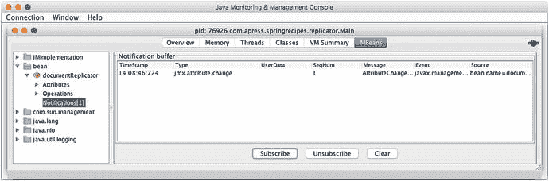

**图 13-5.** 通过 RMI 调用的 JConsole 通知事件

## 通过 MBean 代理访问远程 MBean

Spring 提供的另一种远程 MBean 访问方法是通过 `MBeanProxy`，它可以通过 `MBeanProxyFactoryBean` 创建。

```
package com.apress.springrecipes.replicator.config;
...
import org.springframework.beans.factory.FactoryBean;
import org.springframework.jmx.access.MBeanProxyFactoryBean;
import org.springframework.jmx.support.MBeanServerConnectionFactoryBean;
import javax.management.MBeanServerConnection;
import java.net.MalformedURLException;
@Configuration
public class JmxClientConfiguration {
...
@Bean
public MBeanProxyFactoryBean fileReplicatorProxy() throws Exception {
MBeanProxyFactoryBean fileReplicatorProxy = new MBeanProxyFactoryBean();
fileReplicatorProxy.setServer(mbeanServerConnection().getObject());
fileReplicatorProxy.setObjectName("bean:name=documentReplicator");
fileReplicatorProxy.setProxyInterface(FileReplicator.class);
return fileReplicatorProxy;
}
}
```

您需要指定要代理的 MBean 的对象名称和服务器连接。最重要的是代理接口，其本地方法调用将在后台转换为远程 MBean 调用。现在，您可以通过此代理操作远程 MBean，就像操作本地 Bean 一样。前面直接在 MBean 服务器连接上调用的 MBean 操作可以简化为如下形式：

```
package com.apress.springrecipes.replicator;
...
public class Client {
public static void main(String[] args) throws Exception {
...
FileReplicator fileReplicatorProxy = context.getBean(FileReplicator.class);
String srcDir = fileReplicatorProxy.getSrcDir();
fileReplicatorProxy.setDestDir(srcDir + "_backup");
fileReplicatorProxy.replicate();
}
}
```

## 13-4. 使用 Spring 的邮件支持发送电子邮件

### 问题

许多应用程序需要发送电子邮件。在 Java 应用程序中，您可以使用 JavaMail API 发送电子邮件。但是，使用 JavaMail 时，您必须处理 JavaMail 特定的邮件会话和异常。因此，应用程序会变得依赖 JavaMail，并且难以切换到其他电子邮件 API。

### 解决方案

Spring 的邮件支持通过提供一个抽象且与实现无关的 API 来发送电子邮件，从而简化了电子邮件的发送。Spring 邮件支持的核心接口是 `MailSender`。`JavaMailSender` 接口是 `MailSender` 的子接口，它包含了专门的 JavaMail 特性，例如多用途互联网邮件扩展（MIME）消息支持。要发送包含 HTML 内容、内嵌图片或附件的电子邮件，您必须将其作为 MIME 消息发送。

### 工作原理

假设您希望前面配方中的文件复制器应用程序在发生任何错误时通知管理员。首先，创建以下 `ErrorNotifier` 接口，其中包含一个用于通知文件复制错误的方法：


```
package com.apress.springrecipes.replicator;
public interface ErrorNotifier {
public void notifyCopyError(String srcDir, String destDir, String filename);
}
```

注意

在发生错误时调用此通知器的实现留待您自行完成。
由于您可以将错误处理视为横切关注点，AOP
将是解决此问题的理想方案。您可以编写一个后置抛出通知来调用此通知器。

接下来，您可以实现此接口，以您选择的方式发送通知。
最常见的方式是发送电子邮件。在以这种方式实现接口之前，
您可能需要一个支持简单邮件传输协议（SMTP）的本地邮件服务器
用于测试目的。我们推荐安装 Apache James Server（[`http://james.apache.org/server/index.html`](http://james.apache.org/server/index.html)），它易于安装和配置。

注意

您可以从 Apache James 网站下载 Apache James Server（例如版本 2.3.2），
并将其解压到您选择的目录中即可完成安装。
要启动它，只需执行运行脚本（位于 `bin` 目录中）。

让我们创建两个用户账户，用于通过此服务器发送和接收电子邮件。
默认情况下，James 的远程管理服务监听 4555 端口。您可以使用控制台
telnet 到此端口，并运行以下命令来添加用户 system 和 admin，其密码均为 12345：

```
> telnet 127.0.0.1 4555
JAMES Remote Administration Tool 2.3.2
Please enter your login and password
Login id:
root
Password:
itroot
Welcome root. HELP for a list of commands
adduser system 12345
User system added
adduser admin 12345
User admin added
listusers
Existing accounts 2
user: admin
user: system
quit
Bye
```

使用 JavaMail API 发送电子邮件

现在，让我们看看如何使用 JavaMail API 发送电子邮件。您可以实现
`ErrorNotifier` 接口，在发生错误时发送电子邮件通知。

```
package com.apress.springrecipes.replicator;
import java.util.Properties;
import javax.mail.Message;
import javax.mail.MessagingException;
import javax.mail.Session;
import javax.mail.Transport;
import javax.mail.internet.InternetAddress;
import javax.mail.internet.MimeMessage;
public class EmailErrorNotifier implements ErrorNotifier {
public void notifyCopyError(String srcDir, String destDir, String filename) {
Properties props = new Properties();
props.put("mail.smtp.host", "localhost");
props.put("mail.smtp.port", "25");
props.put("mail.smtp.username", "system");
props.put("mail.smtp.password", "12345");
Session session = Session.getDefaultInstance(props, null);
try {
Message message = new MimeMessage(session);
message.setFrom(new InternetAddress("system@localhost"));
message.setRecipients(Message.RecipientType.TO,
InternetAddress.parse("admin@localhost"));
message.setSubject("File Copy Error");
message.setText(
"Dear Administrator,\n\n" +
"An error occurred when copying the following file :\n" +
"Source directory : " + srcDir + "\n" +
"Destination directory : " + destDir + "\n" +
"Filename : " + filename);
Transport.send(message);
} catch (MessagingException e) {
throw new RuntimeException(e);
}
}
}
```

首先，通过定义属性打开一个连接到 SMTP 服务器的邮件会话。然后，从该会话创建一条消息来构建您的电子邮件。之后，通过调用 `Transport.send()` 发送电子邮件。在使用 JavaMail API 时，您必须处理受检异常 `MessagingException`。请注意，所有这些类、接口和异常均由 JavaMail 定义。

接下来，在 Spring IoC 容器中声明一个 `EmailErrorNotifier` 实例，用于在文件复制错误时发送电子邮件通知。

```
package com.apress.springrecipes.replicator.config;
import com.apress.springrecipes.replicator.EmailErrorNotifier;
import com.apress.springrecipes.replicator.ErrorNotifier;
import org.springframework.context.annotation.Bean;
import org.springframework.context.annotation.Configuration;
@Configuration
public class MailConfiguration {
@Bean
public ErrorNotifier errorNotifier() {
return new EmailErrorNotifier();
}
}
```

您可以编写以下 `Main` 类来测试 `EmailErrorNotifier`。运行后，您可以配置您的电子邮件应用程序，通过 POP3 从 James 服务器接收电子邮件。

```
package com.apress.springrecipes.replicator;
import org.springframework.context.ApplicationContext;
import org.springframework.context.support.GenericXmlApplicationContext;
public class Main {
public static void main(String[] args) {
ApplicationContext context =
new AnnotationConfigApplicationContext("com.apress.springrecipes.replicator.config");
ErrorNotifier errorNotifier = context.getBean(ErrorNotifier.class);
errorNotifier.notifyCopyError("c:/documents", "d:/documents", "spring.doc");
}
}
```

要验证电子邮件是否已发送，您可以登录到 Apache James 附带的 POP 服务器。您可以使用控制台 telnet 到 110 端口，并运行以下命令来查看用户 admin 的电子邮件，其密码与创建时设置的一致：

```
> telnet 127.0.0.1 110
OK workstation POP3 server  ready
USER admin
+OK
PASS 12345
+OK Welcome admin
LIST
+ OK 1 698
RETR 1
+OK Message follows
...
```

使用 Spring 的 MailSender 发送电子邮件

现在，让我们看看如何借助 Spring 的 `MailSender` 接口发送电子邮件，该接口可以在其 `send()` 方法中发送 `SimpleMailMessage`。使用此接口，您的代码不再特定于 JavaMail，并且更易于测试。

```
package com.apress.springrecipes.replicator;
import org.springframework.mail.MailSender;
import org.springframework.mail.SimpleMailMessage;
public class EmailErrorNotifier implements ErrorNotifier {
private MailSender mailSender;
public void setMailSender(MailSender mailSender) {
this.mailSender = mailSender;
}
public void notifyCopyError(String srcDir, String destDir, String filename) {
SimpleMailMessage message = new SimpleMailMessage();
message.setFrom("system@localhost");
message.setTo("admin@localhost");
message.setSubject("File Copy Error");
message.setText(
"Dear Administrator,\n\n" +
"An error occurred when copying the following file :\n" +
"Source directory : " + srcDir + "\n" +
"Destination directory : " + destDir + "\n" +
"Filename : " + filename);
mailSender.send(message);
}
}
```

接下来，您必须在 bean 配置文件中配置一个 `MailSender` 实现，并将其注入到 `EmailErrorNotifier` 中。在 Spring 中，此接口的唯一实现是 `JavaMailSenderImpl`，它使用 JavaMail 发送电子邮件。

```
@Configuration
public class MailConfiguration {
@Bean
public ErrorNotifier errorNotifier() {
EmailErrorNotifier errorNotifier = new EmailErrorNotifier();
errorNotifier.setMailSender(mailSender());
return errorNotifier;
}
@Bean
public JavaMailSenderImpl mailSender() {
JavaMailSenderImpl mailSender = new JavaMailSenderImpl();
mailSender.setHost("localhost");
mailSender.setPort(25);
mailSender.setUsername("system");
mailSender.setPassword("12345");
return mailSender;
}
}
```

`JavaMailSenderImpl` 使用的默认端口是标准 SMTP 端口 25，因此如果您的邮件服务器在此端口上监听 SMTP，您可以简单地省略此属性。此外，如果您的 SMTP 服务器不需要用户身份验证，则无需设置用户名和密码。

如果您在 Java 应用服务器中配置了 JavaMail 会话，您可以首先借助 `JndiLocatorDelegate` 查找它。

```
@Bean
public Session mailSession() throws NamingException {
return JndiLocatorDelegate
.createDefaultResourceRefLocator()
.lookup("mail/Session", Session.class);
}
```


你可以将 JavaMail 会话注入到 `JavaMailSenderImpl` 中供其使用。在这种情况下，你不再需要设置主机、端口、用户名或密码。

```
@Bean
public JavaMailSenderImpl mailSender() {
JavaMailSenderImpl mailSender = new JavaMailSenderImpl();
mailSender.setSession(mailSession());
return mailSender;
}
```

定义电子邮件模板

在方法体中从头构建电子邮件消息效率不高，因为你必须硬编码电子邮件属性。此外，用 Java 字符串编写电子邮件文本也可能有困难。你可以考虑在 Bean 配置文件中定义电子邮件消息模板，并从中构建新的电子邮件消息。

```
@Configuration
public class MailConfiguration {
...
@Bean
public ErrorNotifier errorNotifier() {
EmailErrorNotifier errorNotifier = new EmailErrorNotifier();
errorNotifier.setMailSender(mailSender());
errorNotifier.setCopyErrorMailMessage(copyErrorMailMessage());
return errorNotifier;
}
@Bean
public SimpleMailMessage copyErrorMailMessage() {
SimpleMailMessage message = new SimpleMailMessage();
message.setFrom("system@localhost");
message.setTo("admin@localhost");
message.setSubject("文件复制错误");
message.setText("尊敬的 Administrator，\n" +
"\n" +
"                     复制以下文件时发生错误：\n" +
"\t\t       源目录：%s\n" +
"\t\t       目标目录：%s\n" +
"\t\t       文件名：%s");
return message;
}
}
```

请注意，在上述消息文本中，你包含了占位符 `%s`，这些占位符将通过 `String.format()` 被消息参数替换。当然，你也可以使用更强大的模板语言（如 Velocity 或 FreeMarker）根据模板生成消息文本。将邮件消息模板与 Bean 配置文件分离也是一个好做法。

每次发送电子邮件时，你可以从这个注入的模板中构建一个新的 `SimpleMailMessage` 实例。然后，你可以使用 `String.format()` 生成消息文本，用你的消息参数替换 `%s` 占位符。

```
package com.apress.springrecipes.replicator;
...
import org.springframework.mail.SimpleMailMessage;
public class EmailErrorNotifier implements ErrorNotifier {
...
private SimpleMailMessage copyErrorMailMessage;
public void setCopyErrorMailMessage(SimpleMailMessage copyErrorMailMessage) {
this.copyErrorMailMessage = copyErrorMailMessage;
}
public void notifyCopyError(String srcDir, String destDir, String filename) {
SimpleMailMessage message = new SimpleMailMessage(copyErrorMailMessage);
message.setText(String.format(
copyErrorMailMessage.getText(), srcDir, destDir, filename));
mailSender.send(message);
}
}
```

发送带附件的电子邮件（MIME 消息）

到目前为止，你使用的 `SimpleMailMessage` 类只能发送简单的纯文本电子邮件消息。要发送包含 HTML 内容、内嵌图片或附件的电子邮件，你必须构建并发送 MIME 消息。JavaMail 通过 `Javax.mail.internet.MimeMessage` 类支持 MIME。

首先，你必须使用 `JavaMailSender` 接口，而不是其父接口 `MailSender`。你注入的 `JavaMailSenderImpl` 实例确实实现了这个接口，因此你无需修改 Bean 配置。以下通知器将 Spring 的 Bean 配置文件作为电子邮件附件发送给管理员：

```
package com.apress.springrecipes.replicator;
import javax.mail.MessagingException;
import javax.mail.internet.MimeMessage;
import org.springframework.core.io.ClassPathResource;
import org.springframework.mail.MailParseException;
import org.springframework.mail.SimpleMailMessage;
import org.springframework.mail.javamail.JavaMailSender;
import org.springframework.mail.javamail.MimeMessageHelper;
public class EmailErrorNotifier implements ErrorNotifier {
private JavaMailSender mailSender;
private SimpleMailMessage copyErrorMailMessage;
public void setMailSender(JavaMailSender mailSender) {
this.mailSender = mailSender;
}
public void setCopyErrorMailMessage(SimpleMailMessage copyErrorMailMessage) {
this.copyErrorMailMessage = copyErrorMailMessage;
}
public void notifyCopyError(String srcDir, String destDir, String filename) {
MimeMessage message = mailSender.createMimeMessage();
try {
MimeMessageHelper helper = new MimeMessageHelper(message, true);
helper.setFrom(copyErrorMailMessage.getFrom());
helper.setTo(copyErrorMailMessage.getTo());
helper.setSubject(copyErrorMailMessage.getSubject());
helper.setText(String.format(
copyErrorMailMessage.getText(), srcDir, destDir, filename));
ClassPathResource config = new ClassPathResource("beans.xml");
helper.addAttachment("beans.xml", config);
} catch (MessagingException e) {
throw new MailParseException(e);
}
mailSender.send(message);
}
}
```

与 `SimpleMailMessage` 不同，`MimeMessage` 类由 JavaMail 定义，因此你只能通过调用 `mailSender.createMimeMessage()` 来实例化它。Spring 提供了辅助类 `MimeMessageHelper` 来简化 `MimeMessage` 的操作。它允许你从 Spring 的 `Resource` 对象添加附件。然而，这个辅助类的操作仍然可能抛出 JavaMail 的 `MessagingException`。为了保持一致性，你必须将此异常转换为 Spring 的邮件运行时异常。Spring 还提供了另一种构建 MIME 消息的方法，即通过实现 `MimeMessagePreparator` 接口。

```
package com.apress.springrecipes.replicator;
...
import javax.mail.internet.MimeMessage;
import org.springframework.mail.javamail.MimeMessagePreparator;
public class EmailErrorNotifier implements ErrorNotifier {
...
public void notifyCopyError(
final String srcDir, final String destDir, final String filename) {
MimeMessagePreparator preparator = new MimeMessagePreparator() {
public void prepare(MimeMessage mimeMessage) throws Exception {
MimeMessageHelper helper =
new MimeMessageHelper(mimeMessage, true);
helper.setFrom(copyErrorMailMessage.getFrom());
helper.setTo(copyErrorMailMessage.getTo());
helper.setSubject(copyErrorMailMessage.getSubject());
helper.setText(String.format(
copyErrorMailMessage.getText(), srcDir, destDir, filename));
ClassPathResource config = new ClassPathResource("beans.xml");
helper.addAttachment("beans.xml", config);
}
};
mailSender.send(preparator);
}
}
```

在 `prepare()` 方法中，你可以准备 `MimeMessage` 对象，该对象是为 `JavaMailSender` 预先创建的。如果抛出任何异常，它将被自动转换为 Spring 的邮件运行时异常。

13-5. 使用 Spring 的 Quartz 支持调度任务

问题

你的应用程序有一个高级调度需求，希望使用 Quartz 调度器来实现。这样的需求可能看起来比较复杂，例如能够在任意时间或奇怪的间隔运行（“每隔一个星期四，但仅在上午 10 点之后和下午 2 点之前”）。此外，你希望以声明式的方式配置调度作业。

解决方案

Spring 为 Quartz 提供了实用工具类，使你无需针对 Quartz API 编程即可调度作业。

工作原理

首先，你将了解如何在不使用 Spring 实用工具类的情况下将 Quartz 与 Spring 结合使用，然后介绍使用 Spring 为 Quartz 提供的实用工具类的方法。

使用不带 Spring 支持的 Quartz


要使用 Quartz 进行任务调度，首先需要通过实现 `Job` 接口来创建一个任务。例如，以下任务会执行之前食谱中设计的文件复制器的 `replicate()` 方法。它通过 `JobExecutionContext` 对象获取任务数据映射（这是 Quartz 中用于定义任务的概念）。

```
package com.apress.springrecipes.replicator;
...
import org.quartz.Job;
import org.quartz.JobExecutionContext;
import org.quartz.JobExecutionException;
public class FileReplicationJob implements Job {
public void execute(JobExecutionContext context)
throws JobExecutionException {
Map dataMap = context.getJobDetail().getJobDataMap();
FileReplicator fileReplicator =
(FileReplicator) dataMap.get("fileReplicator");
try {
fileReplicator.replicate();
} catch (IOException e) {
throw new JobExecutionException(e);
}
}
}
```

创建任务后，你需要使用 Quartz API 对其进行配置和调度。例如，以下调度器每 60 秒运行一次文件复制任务，首次执行延迟 5 秒：

```
package com.apress.springrecipes.replicator;
...
import org.quartz.JobDetail;
import org.quartz.JobDataMap;
import org.quartz.JobBuilder;
import org.quartz.Trigger;
import org.quartz.TriggerBuilder;
import org.quartz.SimpleScheduleBuilder;
import org.quartz.DateBuilder.IntervalUnit.*;
import org.quartz.Scheduler;
import org.quartz.impl.StdSchedulerFactory;
import org.springframework.context.ApplicationContext;
import org.springframework.context.support.GenericXmlApplicationContext;
public class Main {
public static void main(String[] args) throws Exception {
ApplicationContext context =
new AnnotationConfigApplicationContext("com.apress.springrecipes.replicator.config");
FileReplicator documentReplicator = context.getBean(FileReplicator.class);
JobDataMap jobDataMap = new JobDataMap();
jobDataMap.put("fileReplicator", documentReplicator);
JobDetail job = JobBuilder.newJob(FileReplicationJob.class)
.withIdentity("documentReplicationJob")
.storeDurably()
.usingJobData(jobDataMap)
.build();
Trigger trigger = TriggerBuilder.newTrigger()
.withIdentity("documentReplicationTrigger")
.startAt(new Date(System.currentTimeMillis() + 5000))
.forJob(job)
.withSchedule(SimpleScheduleBuilder.simpleSchedule()
.withIntervalInSeconds(60)
.repeatForever())
.build();
Scheduler scheduler = new StdSchedulerFactory().getScheduler();
scheduler.start();
scheduler.scheduleJob(job, trigger);
}
}
```

在 `Main` 类中，首先创建一个任务映射。本例中只有一个任务，键是描述性名称，值是任务的对象引用。接着，在 `JobDetail` 对象中定义文件复制任务的详细信息，并在其 `jobDataMap` 属性中准备任务数据。然后，创建一个 `SimpleTrigger` 对象来配置调度属性。最后，创建一个调度器，使用此触发器运行任务。

Quartz 支持多种调度类型，可在不同时间间隔运行任务。调度作为触发器的一部分进行定义。在最新版本中，Quartz 的调度包括 `SimpleScheduleBuilder`、`CronScheduleBuilder`、`CalendarIntervalScheduleBuilder` 和 `DailyTimeIntervalScheduleBuilder`。`SimpleScheduleBuilder` 允许你通过设置开始时间、结束时间、重复间隔和重复次数等属性来调度任务。`CronScheduleBuilder` 接受 Unix cron 表达式，用于指定任务的运行时间。例如，你可以将前面的 `SimpleScheduleBuilder` 替换为以下 `CronScheduleBuilder`，以便每天 17:30 运行任务：`.withSchedule(CronScheduleBuilder.cronSchedule("0 30 17 * * ?"))`。一个 `cron` 表达式由七个字段组成（最后一个字段可选），字段之间用空格分隔。表 13-1 展示了 `cron` 表达式的字段说明。

表 13-1. cron 表达式的字段说明

位置 | 字段名 | 范围
--- | --- | ---
1 | 秒 | 0–59
2 | 分钟 | 0–59
3 | 小时 | 0–23
4 | 月份中的日期 | 1–31
5 | 月份 | 1–12 或 JAN–DEC
6 | 星期中的日期 | 1–7 或 SUN–SAT
7 | 年份（可选） | 1970–2099

`cron` 表达式的每个部分可以指定一个具体值（例如 3）、一个范围（例如 1–5）、一个列表（例如 1,3,5）、一个通配符（* 匹配所有值）或一个问号（? 用于“月份中的日期”和“星期中的日期”字段之一，以匹配其中一个字段，但不同时匹配两者）。`CalendarIntervalScheduleBuilder` 允许你基于日历时间（日、周、月、年）进行调度，而 `DailyTimeIntervalScheduleBuilder` 则提供了便捷工具来设置任务的结束时间（例如 `endingDailyAt()` 和 `endingDailyAfterCount()` 等方法）。

结合 Spring 支持使用 Quartz

使用 Quartz 时，你可以通过实现 `Job` 接口来创建任务，并通过 `JobExecutionContext` 从任务数据映射中检索任务数据。为了将任务类与 Quartz API 解耦，Spring 提供了 `QuartzJobBean`，你可以通过扩展它并利用 setter 方法来检索任务数据。`QuartzJobBean` 会将任务数据映射转换为属性，并通过 setter 方法注入它们。

```
package com.apress.springrecipes.replicator;
...
import org.quartz.JobExecutionContext;
import org.quartz.JobExecutionException;
import org.springframework.scheduling.quartz.QuartzJobBean;
public class FileReplicationJob extends QuartzJobBean {
private FileReplicator fileReplicator;
public void setFileReplicator(FileReplicator fileReplicator) {
this.fileReplicator = fileReplicator;
}
protected void executeInternal(JobExecutionContext context)
throws JobExecutionException {
try {
fileReplicator.replicate();
} catch (IOException e) {
throw new JobExecutionException(e);
}
}
}
```

然后，你可以通过 `JobDetailBean` 在 Spring 的 bean 配置文件中配置 Quartz 的 `JobDetail` 对象。默认情况下，Spring 会使用此 bean 的名称作为任务名称。你可以通过设置 `name` 属性来修改它。

```
@Bean
@Autowired
public JobDetailFactoryBean documentReplicationJob(FileReplicator fileReplicator) {
JobDetailFactoryBean documentReplicationJob = new JobDetailFactoryBean();
documentReplicationJob.setJobClass(FileReplicationJob.class);
documentReplicationJob.setDurability(true);
documentReplicationJob.setJobDataAsMap(
Collections.singletonMap("fileReplicator", fileReplicator));
return documentReplicationJob;
}
```

Spring 还提供了 `MethodInvokingJobDetailFactoryBean`，用于定义执行特定对象单个方法的任务。这省去了创建任务类的麻烦。你可以使用以下任务详情来替换之前的：

```
@Bean
@Autowired
public MethodInvokingJobDetailFactoryBean documentReplicationJob(FileReplicator fileReplicator) {
MethodInvokingJobDetailFactoryBean documentReplicationJob =
new MethodInvokingJobDetailFactoryBean();
documentReplicationJob.setTargetObject(fileReplicator);
documentReplicationJob.setTargetMethod("replicatie");
return documentReplicationJob;
}
```

定义任务后，你可以配置 Quartz 触发器。Spring 支持 `SimpleTriggerFactoryBean` 和 `CronTriggerFactoryBean`。`SimpleTriggerFactoryBean` 需要引用一个 `JobDetail` 对象，并提供调度属性的常用值，例如开始时间和重复次数。

```
@Bean
@Autowired
public SimpleTriggerFactoryBean documentReplicationTrigger(JobDetail documentReplicationJob) {
SimpleTriggerFactoryBean documentReplicationTrigger = new SimpleTriggerFactoryBean();
documentReplicationTrigger.setJobDetail(documentReplicationJob);
documentReplicationTrigger.setStartDelay(5000);
documentReplicationTrigger.setRepeatInterval(60000);
return documentReplicationTrigger;
}
```

你也可以使用 `CronTriggerFactoryBean` bean 来配置类似 `cron` 的调度。


```
@Bean
@Autowired
public CronTriggerFactoryBean documentReplicationTrigger(JobDetail documentReplicationJob) {
CronTriggerFactoryBean documentReplicationTrigger = new CronTriggerFactoryBean();
documentReplicationTrigger.setJobDetail(documentReplicationJob);
documentReplicationTrigger.setStartDelay(5000);
documentReplicationTrigger.setCronExpression("0/60 * * * * ?");
return documentReplicationTrigger;
}
```

最后，一旦你有了 Quartz 任务和触发器，就可以配置一个
`SchedulerFactoryBean`
实例来创建用于运行触发器的 `Scheduler` 对象。你可以在该工厂 bean 中指定多个触发器。

```
@Bean
@Autowired
public SchedulerFactoryBean scheduler(Trigger[] triggers) {
SchedulerFactoryBean scheduler = new SchedulerFactoryBean();
scheduler.setTriggers(triggers);
return scheduler;
}
```

现在，你可以通过以下 `Main` 类简单地启动调度器。通过这种方式，你无需编写任何一行调度任务的代码。

```
package com.apress.springrecipes.replicator;
import org.springframework.context.annotation.AnnotationConfigApplicationContext;
public class Main {
public static void main(String[] args) throws Exception {
new AnnotationConfigApplicationContext("com.apress.springrecipes.replicator.config");
}
}
```

13-6\. 使用 Spring 的调度功能安排任务

问题

你希望以一致的方式安排方法调用，可以使用 `cron` 表达式、固定间隔或固定速率，并且不想为此而使用 Quartz。

解决方案

Spring 支持配置 `TaskExecutor` 和 `TaskScheduler`。此功能结合使用 `@Scheduled` 注解安排方法执行的能力，使得 Spring 的调度支持以最少的配置工作运行：你只需要一个方法、一个注解，并启用注解扫描器即可。

工作原理

让我们重新审视上一个配方中的示例：你希望使用 `cron` 表达式安排对 bean 上的复制方法的调用。配置类如下所示：

```
package com.apress.springrecipes.replicator.config;
import org.springframework.context.annotation.Bean;
import org.springframework.context.annotation.Configuration;
import org.springframework.scheduling.annotation.EnableScheduling;
import org.springframework.scheduling.annotation.SchedulingConfigurer;
import org.springframework.scheduling.config.ScheduledTaskRegistrar;
import java.util.concurrent.Executor;
import java.util.concurrent.Executors;
@Configuration
@EnableScheduling
public class SchedulingConfiguration implements SchedulingConfigurer {
@Override
public void configureTasks(ScheduledTaskRegistrar taskRegistrar) {
taskRegistrar.setScheduler(scheduler());
}
@Bean
public Executor scheduler() {
return Executors.newScheduledThreadPool(10);
}
}
```

通过指定 `@EnableScheduling` 来启用注解驱动的调度支持。这将注册一个 bean，用于扫描应用程序上下文中的 bean 以查找 `@Scheduled` 注解。你还实现了 `SchedulingConfigurer` 接口，因为你想对调度器进行一些额外的配置。你想为其提供一个包含十个线程的线程池来执行你的调度任务。

```
package com.apress.springrecipes.replicator;
import org.springframework.scheduling.annotation.Scheduled;
import java.io.File;
import java.io.IOException;
public class FileReplicatorImpl implements FileReplicator {
@Scheduled(fixedDelay = 60 * 1000)
public synchronized void replicate() throws IOException {
File[] files = new File(srcDir).listFiles();
for (File file : files) {
if (file.isFile()) {
fileCopier.copyFile(srcDir, destDir, file.getName());
}
}
}
}
```

请注意，你已使用 `@Scheduled` 注解标记了 `replicate()` 方法。在这里，你告诉调度器每 60 秒执行一次该方法。或者，你也可以为 `@Scheduled` 注解指定一个 `fixedRate` 值，该值将测量连续启动之间的时间，然后触发下一次运行。

```
@Scheduled(fixedRate = 60 * 1000)
public synchronized void replicate() throws IOException {
File[] files = new File(srcDir).listFiles();
for (File file : files) {
if (file.isFile()) {
fileCopier.copyFile(srcDir, destDir, file.getName());
}
}
}
```

最后，你可能希望对方法的执行进行更复杂的控制。在这种情况下，你可以使用 `cron` 表达式，就像在 Quartz 示例中所做的那样。

```
@Scheduled( cron = "0/60 * * * * ? " )
public synchronized void replicate() throws IOException {
File[] files = new File(srcDir).listFiles();
for (File file : files) {
if (file.isFile()) {
fileCopier.copyFile(srcDir, destDir, file.getName());
}
}
}
```

在 Java 中也支持配置所有这些内容。如果你不想或无法向现有的 bean 方法添加注解，这可能会很有用。下面展示了如何使用 Spring 的 `ScheduledTaskRegistrar` 重新创建上述以注解为中心的示例：

```
package com.apress.springrecipes.replicator.config;
import com.apress.springrecipes.replicator.FileReplicator;
import org.springframework.beans.factory.annotation.Autowired;
import org.springframework.context.annotation.Bean;
import org.springframework.context.annotation.Configuration;
import org.springframework.scheduling.annotation.EnableScheduling;
import org.springframework.scheduling.annotation.SchedulingConfigurer;
import org.springframework.scheduling.config.ScheduledTaskRegistrar;
import java.io.IOException;
import java.util.concurrent.Executor;
import java.util.concurrent.Executors;
@Configuration
@EnableScheduling
public class SchedulingConfiguration implements SchedulingConfigurer {
@Autowired
private FileReplicator fileReplicator;
@Override
public void configureTasks(ScheduledTaskRegistrar taskRegistrar) {
taskRegistrar.setScheduler(scheduler());
taskRegistrar.addFixedDelayTask(() -> {
try {
fileReplicator.replicate();
} catch (IOException e) {
e.printStackTrace();
}
}, 60000);
}
@Bean
public Executor scheduler() {
return Executors.newScheduledThreadPool(10);
}
}
```

13-7\. 通过 RMI 暴露和调用服务

问题

你希望从 Java 应用程序中暴露一个服务，供其他基于 Java 的客户端远程调用。由于双方都运行在 Java 平台上，你可以选择纯 Java 的解决方案，而无需考虑跨平台的可移植性。

解决方案

远程方法调用（RMI）是一种基于 Java 的远程处理技术，允许运行在不同 JVM 中的两个 Java 应用程序相互通信。通过 RMI，一个对象可以调用远程对象的方法。RMI 依赖对象序列化来编组和解组方法参数及返回值。

要通过 RMI 暴露服务，你必须创建扩展 `java.rmi.Remote` 的服务接口，并且其方法声明抛出 `java.rmi.RemoteException`。然后，你为该接口创建服务实现。之后，你启动一个 RMI 注册表并将你的服务注册到其中。因此，暴露一个简单的服务需要相当多的步骤。

要通过 RMI 调用服务，你首先在 RMI 注册表中查找远程服务引用，然后就可以调用其上的方法。但是，要调用远程服务上的方法，你必须处理 `java.rmi.RemoteException`，以防远程服务抛出任何异常。


Spring 的远程调用功能可以显著简化 RMI 在服务端和客户端的使用。在服务端，你可以使用 `RmiServiceExporter` 将一个 Spring POJO 导出为 RMI 服务，使其方法能够被远程调用。这只需要几行 Bean 配置，无需任何编程。以这种方式导出的 Bean 不需要实现 `java.rmi.Remote` 或抛出 `java.rmi.RemoteException`。
在客户端，你可以简单地使用 `RmiProxyFactoryBean` 为远程服务创建一个代理。它让你能够像使用本地 Bean 一样使用远程服务。同样，这完全不需要额外的编程。

工作原理

假设你要为运行在不同平台上的客户端构建一个天气 Web 服务。该服务包含一个查询城市在多个日期温度的操作。首先，让我们创建 `TemperatureInfo` 类，它代表特定城市和日期的最低、最高和平均温度。

```
package com.apress.springrecipes.weather;
...
public class TemperatureInfo implements Serializable {
private String city;
private Date date;
private double min;
private double max;
private double average;
// 构造方法、Getter 和 Setter
...
}
```

接下来，让我们定义包含 `getTemperatures()` 操作的服务接口，该操作返回一个城市在多个日期的温度。

```
package com.apress.springrecipes.weather;
...
public interface WeatherService {
List getTemperatures(String city, List dates);
}
```

你必须为该接口提供一个实现。在生产应用中，你会通过查询数据库来实现此服务接口。这里，为了测试目的，我们将硬编码温度值。

```
package com.apress.springrecipes.weather;
...
public class WeatherServiceImpl implements WeatherService {
public List getTemperatures(String city, List dates) {
List temperatures = new ArrayList();
for (Date date : dates) {
temperatures.add(new TemperatureInfo(city, date, 5.0, 10.0, 8.0));
}
return temperatures;
}
}
```

暴露一个 RMI 服务

接下来，让我们将天气服务暴露为 RMI 服务。为了使用 Spring 的远程调用功能，你需要创建一个 Java 配置类来创建必要的 Bean，并通过使用 `RmiServiceExporter` 将天气服务导出为 RMI 服务。

```
package com.apress.springrecipes.weather.config;
...
import com.apress.springrecipes.weather.WeatherService;
import com.apress.springrecipes.weather.WeatherServiceImpl;
import org.springframework.remoting.rmi.RmiServiceExporter;
@Configuration
public class WeatherConfig {
@Bean
public WeatherService weatherService() {
return new WeatherServiceImpl();
}
@Bean
public RmiServiceExporter rmiService() {
RmiServiceExporter rmiService = new RmiServiceExporter();
rmiService.setServiceName("WeatherService");
rmiService.setServiceInterface(com.apress.springrecipes.weather.WeatherService.class);
rmiService.setService(weatherService());
return rmiService;
}
}
```

你必须为 `RmiServiceExporter` 实例配置几个属性，包括服务名称、服务接口以及要导出的服务对象。你可以将 IoC 容器中配置的任何 Bean 导出为 RMI 服务。`RmiServiceExporter` 将创建一个 RMI 代理来包装此 Bean，并将其绑定到 RMI 注册表。当代理从 RMI 注册表接收到调用请求时，它将在 Bean 上调用相应的方法。默认情况下，`RmiServiceExporter` 会尝试在本地主机端口 1099 上查找 RMI 注册表。如果找不到 RMI 注册表，它将启动一个新的注册表。但是，如果你希望将服务绑定到另一个正在运行的 RMI 注册表，可以在 `registryHost` 和 `registryPort` 属性中指定该注册表的主机和端口。请注意，一旦指定了注册表主机，即使指定的注册表不存在，`RmiServiceExporter` 也不会启动新的注册表。运行以下 `RmiServer` 类来创建一个应用上下文：

```
package com.apress.springrecipes.weather;
import com.apress.springrecipes.weather.config.WeatherConfigServer;
import org.springframework.context.annotation.AnnotationConfigApplicationContext;
public class RmiServer {
public static void main(String[] args) {
new AnnotationConfigApplicationContext(WeatherConfigServer.class);
}
}
```

在此配置中，服务器将启动；在输出中，你应该会看到一条消息，指示找不到现有的 RMI 注册表。

调用一个 RMI 服务

通过使用 Spring 的远程调用功能，你可以像调用本地 Bean 一样调用远程服务。例如，你可以创建一个客户端，通过其接口引用天气服务。

```
package com.apress.springrecipes.weather;
import java.util.Arrays;
import java.util.Date;
import java.util.List;
public class WeatherServiceClient {
private final WeatherService weatherService;
public WeatherServiceClient(WeatherService weatherService) {
this.weatherService = weatherService;
}
public TemperatureInfo getTodayTemperature(String city) {
List dates = Arrays.asList(new Date());
List temperatures =
weatherService.getTemperatures(city, dates);
return temperatures.get(0);
}
}
```

请注意，`weatherService` 字段是通过构造函数注入的，因此你需要创建此 Bean 的一个实例。`weatherService` 将使用 `RmiProxyFactoryBean` 为远程服务创建一个代理。然后，你可以像使用本地 Bean 一样使用此服务。以下 Java 配置类说明了 RMI 客户端所需的 Bean：

```
package com.apress.springrecipes.weather.config;
import com.apress.springrecipes.weather.WeatherService;
import com.apress.springrecipes.weather.WeatherServiceClient;
import org.springframework.context.annotation.Bean;
import org.springframework.context.annotation.Configuration;
import org.springframework.remoting.rmi.RmiProxyFactoryBean;
@Configuration
public class WeatherConfigClient {
@Bean
public RmiProxyFactoryBean weatherService() {
RmiProxyFactoryBean rmiProxy = new RmiProxyFactoryBean();
rmiProxy.setServiceUrl("rmi://localhost:1099/WeatherService");
rmiProxy.setServiceInterface(WeatherService.class);
return rmiProxy;
}
@Bean
public WeatherServiceClient weatherClient(WeatherService weatherService) {
return new WeatherServiceClient(weatherService);
}
}
```

你必须为 `RmiProxyFactoryBean` 实例配置两个属性。服务 URL 属性指定了 RMI 注册表的主机和端口，以及服务名称。服务接口允许此工厂 Bean 针对一个已知的、共享的 Java 接口为远程服务创建代理。该代理将透明地将调用请求传输到远程服务。除了 `RmiProxyFactoryBean` 实例之外，你还需要创建一个名为 `weatherClient` 的 `WeatherServiceClient` 实例。

接下来，运行以下 `RmiClient` 主类：

```
package com.apress.springrecipes.weather;
import com.apress.springrecipes.weather.config.WeatherConfigClient;
import org.springframework.context.ApplicationContext;
import org.springframework.context.annotation.AnnotationConfigApplicationContext;
public class RmiClient {
public static void main(String[] args) {
ApplicationContext context =
new AnnotationConfigApplicationContext(WeatherConfigClient.class);
WeatherServiceClient client = context.getBean(WeatherServiceClient.class);
TemperatureInfo temperature = client.getTodayTemperature("Houston");
System.out.println("最低温度 : " + temperature.getMin());
System.out.println("最高温度 : " + temperature.getMax());
System.out.println("平均温度 : " + temperature.getAverage());
}
}
```

13-8. 通过 HTTP 暴露和调用服务

问题

RMI 通过其自有协议进行通信，这可能无法穿透防火墙。理想情况下，你希望通过 HTTP 进行通信。

解决方案


Hessian 是由 Caucho 技术公司（[`www.caucho.com/`](http://www.caucho.com/)）开发的一种简单轻量级的远程调用技术。它通过 HTTP 使用专有消息进行通信，并拥有自己的序列化机制，但比 RMI 简单得多。Hessian 的消息格式除了 Java 之外，还支持其他平台，例如 PHP、Python、C# 和 Ruby。这使得你的 Java 应用程序能够与运行在其他平台上的应用程序进行通信。

除了上述技术，Spring 框架还提供了一种名为 HTTP Invoker 的远程调用技术。它也通过 HTTP 进行通信，但使用 Java 的对象序列化机制来序列化对象。与 Hessian 不同，HTTP Invoker 要求服务的两端都运行在 Java 平台上，并且使用 Spring 框架。然而，它可以序列化各种 Java 对象，其中一些对象可能无法被 Hessian 的专有机制序列化。

Spring 的远程调用设施在使用这些技术暴露和调用远程服务时是一致的。在服务端，你可以创建一个服务导出器，例如 `HessianServiceExporter` 或 `HttpInvokerServiceExporter`，将一个 Spring Bean 导出为远程服务，其方法可以被远程调用。这只需要几行 Bean 配置，无需任何编程。在客户端，你也可以配置一个代理工厂 Bean，例如 `HessianProxyFactoryBean` 或 `HttpInvokerProxyFactoryBean`，为远程服务创建一个代理。它允许你将远程服务当作本地 Bean 来使用。同样，这完全不需要额外的编程。

工作原理

要导出一个服务，你需要一个服务导出器，在这里你将了解 `HessianServiceExporter` 和 `HttpInvokerServiceExporter`。要消费已暴露的服务，有一些辅助类，分别是 `HessianProxyFactoryBean` 和 `HttpInvokerProxyFactoryBean`。这里将探讨 Hessian 和 HTTP 两种解决方案。

暴露一个 Hessian 服务

你将使用之前 RMI 示例中相同的天气服务，并通过 Spring 将其暴露为 Hessian 服务。你将创建一个使用 Spring MVC 的简单 Web 应用程序来部署该服务。首先，让我们创建一个 `WeatherServiceInitializer` 类来引导 Web 应用程序和 Spring 应用程序上下文。

```
package com.apress.springrecipes.weather.config;
import org.springframework.web.servlet.support.AbstractAnnotationConfigDispatcherServletInitializer;
public class WeatherServiceInitializer extends AbstractAnnotationConfigDispatcherServletInitializer {
@Override
protected String[] getServletMappings() {
return new String[] {"/*"};
}
@Override
protected Class[] getRootConfigClasses() {
return null;
}
@Override
protected Class[] getServletConfigClasses() {
return new Class[] {WeatherConfigHessianServer.class};
}
}
```

`WeatherServiceInitializer` 类创建了一个 `DispatcherServlet` Servlet，用于映射根路径（`/*`）下的所有 URL，并将使用 `WeatherConfigHessianServer` 类进行配置。

```
package com.apress.springrecipes.weather.config;
import com.apress.springrecipes.weather.WeatherService;
import com.apress.springrecipes.weather.WeatherServiceImpl;
import org.springframework.context.annotation.Bean;
import org.springframework.context.annotation.Configuration;
import org.springframework.remoting.caucho.HessianServiceExporter;
@Configuration
public class WeatherConfigHessianServer {
@Bean
public WeatherService weatherService() {
WeatherService wService = new WeatherServiceImpl();
return wService;
}
@Bean(name = "/weather")
public HessianServiceExporter exporter() {
HessianServiceExporter exporter = new HessianServiceExporter();
exporter.setService(weatherService());
exporter.setServiceInterface(WeatherService.class);
return exporter;
}
}
```

扫描组件允许 Spring 检查一个 Java 配置类，该类实例化了 `weatherService` Bean，其中包含了将由 `HessianServiceExporter` 实例暴露的操作。此处的 `weatherService` Bean 与之前 RMI 示例中使用的完全相同。你也可以查阅本书的源代码以获取预构建的应用程序。

对于一个 `HessianServiceExporter` 实例，你必须配置一个要导出的服务对象及其服务接口。你可以将任何 Spring Bean 导出为 Hessian 服务。`HessianServiceExporter` 创建一个代理来包装这个 Bean。

当代理接收到调用请求时，它会调用该 Bean 上的相应方法。默认情况下，`BeanNameUrlHandlerMapping` 已为 Spring MVC 应用程序预先配置，这意味着 Bean 会被映射到以 Bean 名称指定的 URL 模式。上述配置将 URL 模式 `/weather` 映射到此导出器。接下来，你可以将此 Web 应用程序部署到 Web 容器（例如 Apache Tomcat）中。默认情况下，Tomcat 监听 8080 端口，因此如果你将应用程序部署到 Hessian 上下文路径，你可以通过以下 URL 访问此服务：`http://localhost:8080/hessian/weather`。

调用一个 Hessian 服务

通过使用 Spring 的远程调用设施，你可以像调用本地 Bean 一样调用远程服务。在客户端应用程序中，你可以在 Java 配置类中创建一个 `HessianProxyFactoryBean` 实例，为远程 Hessian 服务创建一个代理。然后，你可以像使用本地 Bean 一样使用此服务。

```
@Bean
public HessianProxyFactoryBean weatherService() {
HessianProxyFactoryBean factory = new HessianProxyFactoryBean();
factory.setServiceUrl("http://localhost:8080/hessian/weather");
factory.setServiceInterface(WeatherService.class);
return factory;
}
```

对于一个 `HessianProxyFactoryBean` 实例，你必须配置两个属性。服务 URL 属性指定目标服务的 URL。服务接口属性用于让此工厂 Bean 为远程服务创建一个本地代理。该代理将透明地将调用请求发送到远程服务。

暴露一个 HTTP Invoker 服务

类似地，使用 HTTP Invoker 暴露服务的配置与 Hessian 相似，只是你必须使用 `HttpInvokerServiceExporter` 代替。

```
@Bean(name = "/weather")
public HttpInvokerServiceExporter exporter() {
HttpInvokerServiceExporter exporter = new HttpInvokerServiceExporter();
exporter.setService(weatherService());
exporter.setServiceInterface(WeatherService.class);
return exporter;
}
```

调用一个 HTTP Invoker 服务

调用由 HTTP Invoker 暴露的服务也与 Hessian 和 Burlap 类似。这次，你必须使用 `HttpInvokerProxyFactoryBean`。

```
@Bean
public HttpInvokerProxyFactoryBean weatherService() {
HttpInvokerProxyFactoryBean factory = new HttpInvokerProxyFactoryBean();
factory.setServiceUrl("http://localhost:8080/httpinvoker/weather");
factory.setServiceInterface(WeatherService.class);
return factory;
}
```

13-9. 使用 JAX-WS 暴露和调用 SOAP Web 服务

问题

SOAP 是一种企业级标准且跨平台的应用程序通信技术。大多数现代且关键任务的软件远程调用任务（例如，银行服务、库存应用程序）通常使用此标准。你希望能够从你的 Java 应用程序调用第三方 SOAP Web 服务，以及从你的 Java 应用程序暴露 Web 服务，以便不同平台上的第三方可以通过 SOAP 调用它们。

解决方案

使用 JAX-WS 的 `@WebService` 和 `@WebMethod` 注解，以及 Spring 的 `SimpleJaxWsServiceExporter`，以允许通过 SOAP 访问 Bean 的业务逻辑。你还可以利用 Apache CXF 与 Spring 结合，在像 Tomcat 这样的 Java 服务器中暴露 SOAP 服务。要访问 SOAP 服务，你可以使用 Apache CXF 与 Spring 结合，或者利用 Spring 的 `JaxWsPortProxyFactoryBean`。

工作原理


JAX-WS 2.0 是 JAX-RPC 1.1 的继任者——后者是基于 XML 的 Web 服务的 Java API。因此，如果你要在 Java 环境中使用 SOAP，JAX-WS 是同时受 Java EE 和标准 JDK 支持的最新标准。

### 利用 JDK 中的 JAX-WS 端点支持公开 Web 服务

你可以依赖 Java JDK 的 JAX-WS 运行时支持来公开 JAX-WS 服务。这意味着你不必将 JAX-WS 服务作为 Java Web 应用的一部分进行部署。默认情况下，如果没有其他运行时，则会使用 JDK 中的 JAX-WS 支持。让我们使用 JDK 中的 JAX-WS 来实现之前菜谱中的天气服务应用。你需要为天气服务添加注解，以表明它应该向客户端公开。修改后的 `WeatherServiceImpl` 实现需要使用 `@WebService` 和 `@WebMethod` 注解进行修饰。`Main` 类使用 `@WebService` 修饰，而将由服务公开的方法则使用 `@WebMethod` 修饰。

```
package com.apress.springrecipes.weather;
import javax.jws.WebMethod;
import javax.jws.WebService;
import java.util.ArrayList;
import java.util.Date;
import java.util.List;
@WebService(serviceName = "weather", endpointInterface = " com.apress.springrecipes.weather.WeatherService ")
public class WeatherServiceImpl implements WeatherService {
@WebMethod(operationName = "getTemperatures")
public List getTemperatures(String city, List dates) {
List temperatures = new ArrayList();
for (Date date : dates) {
temperatures.add(new TemperatureInfo(city, date, 5.0, 10.0, 8.0));
}
return temperatures;
}
}
```

请注意，你不需要为注解提供任何参数，例如 `endpointInterface` 或 `serviceName`，但此处提供它们是为了使生成的 SOAP 契约更具可读性。同样，你也不需要为 `@WebMethod` 注解提供 `operationName`。不过，这通常是一种良好的实践，因为它可以使 SOAP 端点的客户端免受你在 Java 实现上可能进行的任何重构的影响。

接下来，为了让 Spring 能够检测到带有 `@WebService` 注解的 Bean，你需要依赖 Spring 的 `SimpleHttpServerJaxWsServiceExporter`。这是在 Java 配置类中该类的 `@Bean` 定义：

```
@Bean
public SimpleHttpServerJaxWsServiceExporter jaxWsService() {
SimpleHttpServerJaxWsServiceExporter simpleJaxWs =
new SimpleHttpServerJaxWsServiceExporter();
simpleJaxWs.setPort(8888);
simpleJaxWs.setBasePath("/jaxws/");
return simpleJaxWs;
}
```

注意，Bean 定义调用了 `setPort` 和 `setBasePath`，并将它们设置为 `8888` 和 `/jaxws/`。这是应用 JAX-WS 服务的端点。在这个地址下——一个由 JDK 启动的独立服务器——所有使用 `@WebService` 注解定义的 Bean 都将驻留于此。因此，如果有一个名为 `weather` 的 `@WebService`，它将可以通过 `http://localhost:8888/jaxws/weather` 访问。

注意

如果你将其作为 Web 部署的一部分使用，请改用 `SimpleJaxWsServiceExporter`，因为 `SimpleHttpServerJaxWsServiceExporter` 会启动一个嵌入式 HTTP 服务器，这在 Web 部署中通常是不可行的。

如果你启动浏览器并在 `http://localhost:8888/jaxws/weather?wsdl` 检查结果，你将看到生成的 SOAP WSDL 契约，如下所示：

SOAP WSDL 契约供客户端用于访问服务。如果你检查生成的 WSDL，你会发现它非常基础——描述了天气服务方法——但更重要的是，它与编程语言无关。这种无关性正是 SOAP 的全部意义所在：能够跨可解释 SOAP 的不同平台访问服务。

### 使用 CXF 公开 Web 服务

使用 JAX-WS 服务导出器和 JAX-WS JDK 支持来公开独立的 SOAP 端点很简单。然而，这种解决方案忽略了现实环境中大多数 Java 应用运行在 Java 应用运行时（如 Tomcat）上的事实。Tomcat 本身不支持 JAX-WS，因此你需要为应用配备一个 JAX-WS 运行时。

有很多选择，你可以自由挑选。一个流行的选择是 CXF，这是一个 Apache 项目。在本例中，你将嵌入 CXF，因为它健壮、经过充分测试，并且支持其他重要标准，例如用于 RESTful 端点的 API——JAX-RS。

首先，让我们看一下 `Initializer` 类，它用于在符合 Servlet 3.1 规范的服务器（如 Apache Tomcat 8.5）上引导应用。

```
package com.apress.springrecipes.weather.config;
import org.springframework.web.WebApplicationInitializer;
import org.springframework.web.servlet.DispatcherServlet;
import org.springframework.web.context.ContextLoaderListener;
import org.springframework.web.context.support.XmlWebApplicationContext;
import org.apache.cxf.transport.servlet.CXFServlet;
import javax.servlet.ServletRegistration;
import javax.servlet.ServletContext;
import javax.servlet.ServletException;
public class Initializer implements WebApplicationInitializer {
public void onStartup(ServletContext container) throws ServletException {
XmlWebApplicationContext context = new XmlWebApplicationContext();
context.setConfigLocation("/WEB-INF/appContext.xml");
container.addListener(new ContextLoaderListener(context));
ServletRegistration.Dynamic cxf = container.addServlet("cxf", new CXFServlet());
cxf.setLoadOnStartup(1);
cxf.addMapping("/*");
}
}
```

这个 `Initializer` 类看起来与所有 Spring MVC 应用非常相似。唯一的例外是你配置了一个 `CXFServlet`，它处理了公开服务所需的大量繁重工作。在 Spring MVC 配置文件中，你将使用 CXF 提供的 Spring 命名空间支持来配置服务。Spring 上下文文件很简单；大部分是样板化的 XML 命名空间和 Spring 上下文文件导入。这里只展示两个重要的节，你首先像往常一样配置服务本身。最后，你使用 CXF 的 `jaxws:endpoint` 命名空间来配置端点。

```
package com.apress.springrecipes.weather.config;
import com.apress.springrecipes.weather.WeatherService;
import com.apress.springrecipes.weather.WeatherServiceImpl;
import org.apache.cxf.Bus;
import org.apache.cxf.jaxws.EndpointImpl;
import org.springframework.context.annotation.Bean;
import org.springframework.context.annotation.Configuration;
import org.springframework.context.annotation.ImportResource;
@Configuration
@ImportResource("classpath:META-INF/cxf/cxf.xml")
public class WeatherConfig {
@Bean
public WeatherService weatherService() {
return new WeatherServiceImpl();
}
@Bean(initMethod = "publish")
public EndpointImpl endpoint(Bus bus) {
EndpointImpl endpoint = new EndpointImpl(bus, weatherService());
endpoint.setAddress("/weather");
return endpoint;
}
}
```

你使用 `EndpointImp` 类注册一个端点。它需要 CXF 的 `Bus`（在导入的 `cxf.xml` 文件中配置，该文件由 Apache CXF 提供），并使用 `weatherService` Spring Bean 作为实现。你通过 `address` 属性告诉它在哪个地址发布服务。在这种情况下，由于 `Initializer` 将 CXF Servlet 挂载在根目录 (`/`) 下，CXF 的 `weatherService` 端点将可以通过 `/cxf/weather` 访问（因为应用部署在 `/cxf` 上）。


请注意，`publish` 方法被用作 `initMethod`。除了使用此方法和 `setAddress` 之外，你也可以使用 `endpoint.publish("/weather")`。然而，使用 `initMethod` 可以在端点发布之前，通过回调来增强或配置实际的 `EndpointImpl`。例如，如果你有多个需要配置 SSL 的端点，这会非常方便。

请注意，`weatherServiceImpl` 中的 Java 代码与之前保持一致，仍然使用 `@WebService` 和 `@WebMethod` 注解。启动应用程序和 Web 容器，然后在浏览器中打开该应用程序。在本书的源代码中，该应用程序被构建为一个名为 `cxf.war` 的 WAR 包，并且由于 CXF 部署在 `/cxf` 路径下，SOAP WSDL 契约可通过 `http://localhost:8080/cxf/weather` 访问。如果你在浏览器中打开 `http://localhost:8080/cxf` 页面，你将看到可用服务及其操作的目录。点击服务的 WSDL 链接——或者直接在服务端点后附加 `?wsdl`——即可查看该服务的 WSDL。该 WSDL 契约与上一节中使用 JAX-WS JDK 支持描述的契约非常相似。唯一的区别在于，此处的 WSDL 契约是在 CXF 的帮助下生成的。

使用 Spring 的 JaxWsPortProxyFactoryBean 调用 Web 服务

Spring 提供了访问 SOAP WSDL 契约并与底层服务进行通信的功能，就像操作一个普通的 Spring Bean 一样。此功能由 `JaxWsPortProxyFactoryBean` 提供。以下是一个使用 `JaxWsPortProxyFactoryBean` 访问 SOAP 天气服务的 Bean 定义示例：

```
@Bean
public JaxWsPortProxyFactoryBean weatherService() throws MalformedURLException {
JaxWsPortProxyFactoryBean weatherService = new JaxWsPortProxyFactoryBean();
weatherService.setServiceInterface(WeatherService.class);
weatherService.setWsdlDocumentUrl(new URL("http://localhost:8080/cxf/weather?WSDL"));
weatherService.setNamespaceUri("http://weather.springrecipes.apress.com/");
weatherService.setServiceName("weather");
weatherService.setPortName("WeatherServiceImplPort");
return weatherService;
}
```

该 Bean 实例被命名为 `weatherService`。通过这个引用，你将能够像调用本地方法一样调用底层的 SOAP 服务方法（例如，`weatherService.getTemperatures(city, dates)`）。`JaxWsPortProxyFactoryBean` 需要设置以下几个属性，下面将逐一说明。

`serviceInterface` 属性定义了 SOAP 调用的服务接口。以天气服务为例，你可以直接使用服务器端的实现代码，两者是相同的。如果你要访问一个没有服务器端代码的 SOAP 服务，你始终可以使用像 `java2wsdl` 这样的工具，根据 WSDL 契约创建这个 Java 接口。请注意，客户端使用的 `serviceInterface` 需要使用与服务器端实现相同的 JAX-WS 注解（即 `@WebService`）。

`wsdlDocumentUrl` 属性表示 WSDL 契约的位置。在本例中，它指向本方案中的 CXF SOAP 端点，但你同样可以将此属性定义为访问本方案中的 JAX-WS JDK 端点，或者任何其他 WSDL 契约。

`namesapceUrl`、`serviceName` 和 `portName` 属性都与 WSDL 契约本身相关。由于一个 WSDL 契约中可能包含多个命名空间、服务和端口，你需要告诉 Spring 使用哪些值来访问服务。此处提供的值可以通过手动检查天气服务的 WSDL 契约轻松验证。

使用 CXF 调用 Web 服务

现在，让我们使用 CXF 来定义一个 Web 服务客户端。该客户端与之前方案中的相同，无需进行特殊的 Java 配置或编码。你只需要将服务的接口放在类路径上即可。完成后，你就可以使用 CXF 的命名空间支持来创建客户端。

```
package com.apress.springrecipes.weather.config;
import com.apress.springrecipes.weather.WeatherService;
import com.apress.springrecipes.weather.WeatherServiceClient;
import org.apache.cxf.jaxws.JaxWsProxyFactoryBean;
import org.springframework.context.annotation.Bean;
import org.springframework.context.annotation.Configuration;
import org.springframework.context.annotation.ImportResource;
@Configuration
@ImportResource("classpath:META-INF/cxf/cxf.xml")
public class WeatherConfigCxfClient {
@Bean
public WeatherServiceClient weatherClient(WeatherService weatherService) {
return new WeatherServiceClient(weatherService);
}
@Bean
public WeatherService weatherServiceProxy() {
JaxWsProxyFactoryBean factory = new JaxWsProxyFactoryBean();
factory.setServiceClass(WeatherService.class);
factory.setAddress("http://localhost:8080/cxf/weather");
return (WeatherService) factory.create();
}
}
```

请注意 `@ImportResource("classpath:META-INF/cxf/cxf.xml")`，它导入并加载了 Apache CXF 提供所需的基础设施 Bean。

要创建客户端，你可以使用 `JaxWsProxyFactoryBean`，并为其传递需要使用的服务类以及需要连接的地址。然后，使用 `create` 方法创建一个代理，该代理的行为就像一个普通的 `WeatherService`。这就是全部所需的工作。之前方案中的示例在其他方面保持不变：你将客户端注入到 `WeatherServiceClient` 中，并使用 `weatherService` 引用调用它（例如，`weatherService.getTemperatures(city, dates)`）。

13-10. 使用契约优先的 SOAP Web 服务

问题

你希望开发一个契约优先的 SOAP Web 服务，而不是像上一个方案中那样开发代码优先的 SOAP Web 服务。

解决方案

开发 SOAP Web 服务有两种方法。一种称为代码优先，即从 Java 类开始，然后逐步构建出 WSDL 契约。另一种方法称为契约优先，即从 XML 数据契约（比 WSDL 更简单）开始，然后逐步构建出实现服务的 Java 类。要为契约优先的 SOAP Web 服务创建数据契约，你需要一个 XSD 文件或 XML Schema 文件，用于描述服务支持的操作和数据。之所以需要 XSD 文件，是因为在“底层”，SOAP 服务客户端和服务器之间的通信是以 XSD 文件中定义的 XML 格式进行的。然而，由于正确编写 XSD 文件可能比较困难，更好的做法是先创建示例 XML 消息，然后从中生成 XSD 文件。有了 XSD 文件后，你可以利用 Spring-WS 之类的工具，从 XSD 文件构建 SOAP Web 服务。

工作原理

开始构建契约优先 Web 服务的最简单方法是编写示例 XML 消息。编写完成后，你可以使用工具从中提取契约，即 XSD 文件。获得 XSD 文件后，你可以使用另一个工具来构建 Web 服务客户端。

创建示例 XML 消息

让我们再次实现之前方案中介绍的天气服务，但这次使用 SOAP 契约优先的方法。你需要编写一个 SOAP 服务，该服务能够根据城市和日期传递天气信息，并返回最低、最高和平均温度。与之前方案中编写代码支持上述功能不同，让我们使用契约优先的方法，通过如下所示的 XML 消息来描述特定城市和日期的温度：

```
5.0
10.0
8.0

```


这是以**契约优先**方式为天气服务建立数据契约的第一步。现在，让我们定义一些操作。您希望允许客户端查询特定城市在多个日期的温度。每个请求包含一个城市元素和多个日期元素。您还需要为此请求指定命名空间，以避免与其他 XML 文档发生命名冲突。让我们创建这个 XML 消息并将其保存到一个名为 `request.xml` 的文件中。

```
Houston
2013-12-01
2013-12-08
2013-12-15

```

对上述类型请求的响应将包含多个 `TemperatureInfo` 元素，每个元素根据请求的日期表示特定城市和日期的温度。让我们创建这个 XML 消息并将其保存到一个名为 `response.xml` 的文件中。

```

5.0
10.0
8.0

4.0
13.0
7.0

10.0
18.0
15.0

```

从示例 XML 消息生成 XSD 文件

现在，您可以从前面的示例 XML 消息生成 XSD 文件。大多数 XML 工具和企业级 Java IDE 都可以从几个 XML 文件生成 XSD 文件。这里，您将使用 Apache XMLBeans ( [`http://xmlbeans.apache.org/`](http://xmlbeans.apache.org/) ) 来生成 XSD 文件。

注意

您可以从 Apache XMLBeans 网站下载 Apache XMLBeans（例如 v2.6.0），并将其解压到您选择的目录中以完成安装。

Apache XMLBeans 提供了一个名为 `inst2xsd` 的工具，用于从 XML 文件生成 XSD 文件。它支持几种用于生成 XSD 文件的设计类型。最简单的一种称为**俄罗斯套娃设计**，它会为目标 XSD 文件生成局部元素和局部类型。由于您的 XML 消息中没有使用枚举类型，您可以禁用枚举生成功能。您可以执行以下命令，从之前的 XML 文件生成 XSD 文件：

```
inst2xsd -design rd -enumerations never request.xml response.xml
```

生成的 XSD 文件将具有默认名称 `schema0.xsd`，位于同一目录中。让我们将其重命名为 `temperature.xsd`。

优化生成的 XSD 文件

如您所见，生成的 XSD 文件允许客户端查询无限数量的日期。如果您想对最大和最小查询日期添加约束，可以修改 `maxOccurs` 和 `minOccurs` 属性。

```

...

```

预览生成的 WSDL 文件

正如您稍后将全面了解到的，Spring-WS 能够从 XSD 文件自动生成 WSDL 契约。以下代码片段说明了用于此目的的 Spring Bean 配置——我们将在下一个配方中添加关于如何使用此代码片段的上下文，该配方描述了如何使用 Spring-WS 构建 SOAP Web 服务。

在这里，您将预览生成的 WSDL 文件，以便更好地理解服务契约。为简单起见，省略了不太重要的部分。

```

...

...

```

在 `Weather` 端口类型中，定义了一个 `GetTemperatures` 操作，其名称源自输入和输出消息的前缀（即 `<GetTemperaturesRequest>` 和 `<GetTemperaturesResponse>`）。这两个元素的定义包含在 `<wsdl:types>` 部分中，如数据契约中所定义。

现在有了 WSDL 契约，您可以生成必要的 Java 接口，然后为每个最初以 XML 消息形式存在的操作编写后端代码。这种完整的技术将在下一个配方中探讨，该配方使用 Spring-WS 进行处理。

13-11. 使用 Spring-WS 暴露和调用 SOAP Web 服务

问题

您有一个 XSD 文件用于开发契约优先的 SOAP Web 服务，但不知道如何或使用什么来实现该契约优先的 SOAP 服务。

Spring-WS 从一开始就被设计为支持契约优先的 SOAP Web 服务。然而，这并不意味着 Spring-WS 是在 Java 中创建 SOAP Web 服务的唯一方法。像 CXF 这样的 JAX-WS 实现也支持这种技术。尽管如此，在 Spring 应用程序的上下文中，Spring-WS 是执行契约优先 SOAP Web 服务更成熟、更自然的方法。描述其他契约优先的 SOAP Java 技术将超出 Spring 框架的范围。

解决方案

Spring-WS 提供了一组设施来开发契约优先的 SOAP Web 服务。构建 Spring-WS Web 服务的基本任务包括：

1.  为 Spring-WS 设置和配置一个 Spring MVC 应用程序。
2.  将 Web 服务请求映射到端点。
3.  创建服务端点来处理请求消息并返回响应消息。
4.  为 Web 服务发布 WSDL 文件。

设置 Spring-WS 应用程序

为了使用 Spring-WS 实现一个 Web 服务，让我们首先创建一个 Web 应用程序初始化器类，以引导一个带有 SOAP Web 服务的 Web 应用程序。您需要配置 `MessageDispatcherServlet` Servlet，它是 Spring-WS 的一部分。该 Servlet 专门用于将 Web 服务消息分派到适当的端点，并检测 Spring-WS 的框架设施。

```
package com.apress.springrecipes.weather.config;
import org.springframework.ws.transport.http.support.AbstractAnnotationConfigMessageDispatcherServletInitializer;
public class Initializer extends AbstractAnnotationConfigMessageDispatcherServletInitializer {
@Override
protected Class[] getRootConfigClasses() {
return null;
}
@Override
protected Class[] getServletConfigClasses() {
return new Class[] {SpringWsConfiguration.class};
}
}
```

为了简化配置，有一个 `AbstractAnnotationConfigMessageDispatcherServletInitializer` 基类可供您扩展。您需要为其提供构成 `rootConfig` 和 `servletConfig` 的配置类。前者可以为 `null`，而后者是必需的。

前面的配置将使用 `SpringWsConfiguration` 类引导 `MessageDispatcherServlet`，并将其注册到 `/services/*` 和 `*.wsdl` URL。

```
package com.apress.springrecipes.weather.config;
import org.springframework.context.annotation.Bean;
import org.springframework.context.annotation.ComponentScan;
import org.springframework.context.annotation.Configuration;
import org.springframework.core.io.ClassPathResource;
import org.springframework.ws.config.annotation.EnableWs;
import org.springframework.ws.wsdl.wsdl11.DefaultWsdl11Definition;
import org.springframework.xml.xsd.SimpleXsdSchema;
import org.springframework.xml.xsd.XsdSchema;
@Configuration
@EnableWs
@ComponentScan("com.apress.springrecipes.weather")
public class SpringWsConfiguration {
...
}
```

`SpringWsConfiguration` 类使用 `@EnableWs` 注解，该注解注册了使 `MessageDispatcherServlet` 工作所需的 Bean。还有 `@ComponentScan` 注解，用于扫描 `@Service` 和 `@Endpoint` Bean。

创建服务端点

Spring-WS 支持通过 `@Endpoint` 注解将任意类标记为服务端点，使其可作为服务访问。除了 `@Endpoint` 注解外，您还需要使用 `@PayloadRoot` 注解来注解处理方法，以映射服务请求。每个处理方法还依赖 `@ResponsePayload` 和 `@RequestPayload` 注解来处理传入和传出的服务数据。


```
package com.apress.springrecipes.weather;
import org.dom4j.Document;
import org.dom4j.DocumentHelper;
import org.dom4j.Element;
import org.dom4j.XPath;
import org.dom4j.xpath.DefaultXPath;
import org.springframework.ws.server.endpoint.annotation.Endpoint;
import org.springframework.ws.server.endpoint.annotation.PayloadRoot;
import org.springframework.ws.server.endpoint.annotation.RequestPayload;
import org.springframework.ws.server.endpoint.annotation.ResponsePayload;
import java.text.DateFormat;
import java.text.SimpleDateFormat;
import java.util.*;
@Endpoint
public class TemperatureEndpoint {
private static final String namespaceUri = "http://springrecipes.apress.com/weather/schemas";
private XPath cityPath;
private XPath datePath;
private final WeatherService weatherService;
public TemperatureEndpoint(WeatherService weatherService) {
this.weatherService = weatherService;
// 创建 XPath 对象，包含命名空间
Map namespaceUris = new HashMap();
namespaceUris.put("weather", namespaceUri);
cityPath = new DefaultXPath("/weather:GetTemperaturesRequest/weather:city");
cityPath.setNamespaceURIs(namespaceUris);
datePath = new DefaultXPath("/weather:GetTemperaturesRequest/weather:date");
datePath.setNamespaceURIs(namespaceUris);
}
@PayloadRoot(localPart = "GetTemperaturesRequest", namespace = namespaceUri)
@ResponsePayload
public Element getTemperature(@RequestPayload Element requestElement) throws Exception {
DateFormat dateFormat = new SimpleDateFormat("yyyy-MM-dd");
// 从请求消息中提取服务参数
String city = cityPath.valueOf(requestElement);
List dates = new ArrayList();
for (Object node : datePath.selectNodes(requestElement)) {
Element element = (Element) node;
dates.add(dateFormat.parse(element.getText()));
}
// 调用后端服务处理请求
List temperatures =
weatherService.getTemperatures(city, dates);
// 根据后端服务的结果构建响应消息
Document responseDocument = DocumentHelper.createDocument();
Element responseElement = responseDocument.addElement(
"GetTemperaturesResponse", namespaceUri);
for (TemperatureInfo temperature : temperatures) {
Element temperatureElement = responseElement.addElement(
"TemperatureInfo");
temperatureElement.addAttribute("city", temperature.getCity());
temperatureElement.addAttribute(
"date", dateFormat.format(temperature.getDate()));
temperatureElement.addElement("min").setText(
Double.toString(temperature.getMin()));
temperatureElement.addElement("max").setText(
Double.toString(temperature.getMax()));
temperatureElement.addElement("average").setText(
Double.toString(temperature.getAverage()));
}
return responseElement;
}
}
```

在 `@PayloadRoot` 注解中，你需要指定要处理的有效负载根元素的本地名称（`getTemperaturesRequest`）和命名空间（[`http://springrecipes.apress.com/weather/schemas`](http://springrecipes.apress.com/weather/schemas)）。接下来，该方法使用 `@ResponsePayload` 注解进行修饰，表明该方法的返回值是服务响应数据。此外，方法的输入参数使用 `@RequestPayload` 注解进行修饰，以表明它是服务输入值。

然后在处理器方法内部，你首先从请求消息中提取服务参数。这里，你使用 XPath 来帮助定位元素。XPath 对象在构造函数中创建，以便它们可以在后续的请求处理中被重用。请注意，你必须在 XPath 表达式中包含命名空间，否则它们将无法正确定位元素。提取服务参数后，你调用后端服务来处理请求。由于此端点配置在 Spring IoC 容器中，因此它可以轻松地通过依赖注入引用其他 Bean。最后，你根据后端服务的结果构建响应消息。在此示例中，你使用了 dom4j 库，它提供了丰富的 API 来构建 XML 消息。但你也可以使用任何其他你想要的 XML 处理 API 或 Java 解析器（例如 DOM）。

由于你已经在 `SpringWsConfiguration` 类中定义了 `@ComponentScan` 注解，Spring 会自动拾取所有 Spring-WS 注解并将端点部署到 Servlet。

发布 WSDL 文件

完成 SOAP Web 服务的最后一步是发布 WSDL 文件。在 Spring-WS 中，你无需手动编写 WSDL 文件；你只需要向 `SpringWsConfiguration` 类中添加一个 Bean 即可。

```
@Bean
public DefaultWsdl11Definition temperature() {
DefaultWsdl11Definition temperature = new DefaultWsdl11Definition();
temperature.setPortTypeName("Weather");
temperature.setLocationUri("/");
temperature.setSchema(temperatureSchema());
return temperature;
}
@Bean
public XsdSchema temperatureSchema() {
return new SimpleXsdSchema(new ClassPathResource("/META-INF/xsd/temperature.xsd"));
}
```

`DefaultWsdl11Definition` 类要求你指定两个属性：服务的 `portTypeName`，以及部署最终 WSDL 的 `locationUri`。此外，它还要求你指定用于创建 WSDL 的 XSD 文件的位置——有关如何创建 XSD 文件的详细信息，请参阅之前的配方。在此示例中，XSD 文件将位于应用程序的 `META-INF` 目录中。由于你在 XSD 文件中定义了 `<GetTemperaturesRequest>` 和 `<GetTemperaturesResponse>`，并且将端口类型名称指定为 `Weather`，WSDL 构建器将为你生成以下 WSDL 端口类型和操作。以下片段取自生成的 WSDL 文件：

最后，你可以通过将定义的 Bean 名称与 `.wsdl` 后缀拼接来访问此 WSDL 文件。假设 Web 应用程序被打包成一个名为 `springws` 的 WAR 文件，那么该服务部署在 `http://localhost:8080/springws/` 下——因为初始化器中的 Spring-WS Servlet 部署在 `/services` 目录上——并且 WSDL 文件的 URL 将是 `http://localhost:8080/springws/services/weather/temperature.wsdl`，前提是 WSDL 定义的 Bean 名称为 temperature。

使用 Spring-WS 调用 SOAP Web 服务

现在，让我们创建一个 Spring-WS 客户端，根据其发布的契约来调用天气服务。你可以通过解析请求和响应 XML 消息来创建 Spring-WS 客户端。作为示例，你将使用 dom4j 来实现它，但你可以自由选择任何其他 XML 解析 API。

为了向客户端屏蔽底层调用细节，你将创建一个本地代理来调用 SOAP Web 服务。该代理也实现了 `WeatherService` 接口，并将本地方法调用转换为远程 SOAP Web 服务调用。


```
```
package com.apress.springrecipes.weather;
import org.dom4j.Document;
import org.dom4j.DocumentHelper;
import org.dom4j.Element;
import org.dom4j.io.DocumentResult;
import org.dom4j.io.DocumentSource;
import org.springframework.ws.client.core.WebServiceTemplate;
import java.text.DateFormat;
import java.text.ParseException;
import java.text.SimpleDateFormat;
import java.util.ArrayList;
import java.util.Date;
import java.util.List;
public class WeatherServiceProxy implements WeatherService {
private static final String namespaceUri = "http://springrecipes.apress.com/weather/schemas";
private final WebServiceTemplate webServiceTemplate;
public WeatherServiceProxy(WebServiceTemplate webServiceTemplate) throws Exception {
this.webServiceTemplate = webServiceTemplate;
}
public List getTemperatures(String city, List dates) {
private DateFormat dateFormat = new SimpleDateFormat("yyyy-MM-dd");
Document requestDocument = DocumentHelper.createDocument();
Element requestElement = requestDocument.addElement(
"GetTemperaturesRequest", namespaceUri);
requestElement.addElement("city").setText(city);
for (Date date : dates) {
requestElement.addElement("date").setText(dateFormat.format(date));
}
DocumentSource source = new DocumentSource(requestDocument);
DocumentResult result = new DocumentResult();
webServiceTemplate.sendSourceAndReceiveToResult(source, result);
Document responsetDocument = result.getDocument();
Element responseElement = responsetDocument.getRootElement();
List temperatures = new ArrayList();
for (Object node : responseElement.elements("TemperatureInfo")) {
Element element = (Element) node;
try {
Date date = dateFormat.parse(element.attributeValue("date"));
double min = Double.parseDouble(element.elementText("min"));
double max = Double.parseDouble(element.elementText("max"));
double average = Double.parseDouble(
element.elementText("average"));
temperatures.add(
new TemperatureInfo(city, date, min, max, average));
} catch (ParseException e) {
throw new RuntimeException(e);
}
}
return temperatures;
}
}
```

在 `getTemperatures()` 方法中，你首先使用 dom4j API 构建请求消息。`WebServiceTemplate` 提供了一个 `sendSourceAndReceiveToResult()` 方法，该方法接受一个 `java.xml.transform.Source` 对象和一个 `java.xml.transform.Result` 对象作为参数。你需要构建一个 dom4j `DocumentSource` 对象来包装你的请求文档，并创建一个新的 dom4j `DocumentResult` 对象，供该方法将响应文档写入其中。最后，你获取响应消息并从中提取结果。

编写好服务代理后，你可以在配置类中声明它，然后使用独立类进行调用。

```
package com.apress.springrecipes.weather.config;
import com.apress.springrecipes.weather.WeatherService;
import com.apress.springrecipes.weather.WeatherServiceClient;
import com.apress.springrecipes.weather.WeatherServiceProxy;
import org.springframework.context.annotation.Bean;
import org.springframework.context.annotation.Configuration;
import org.springframework.ws.client.core.WebServiceTemplate;
@Configuration
public class SpringWsClientConfiguration {
@Bean
public WeatherServiceClient weatherServiceClient(WeatherService weatherService) throws Exception {
return new WeatherServiceClient(weatherService);
}
@Bean
public WeatherServiceProxy weatherServiceProxy(WebServiceTemplate webServiceTemplate) throws Exception {
return new WeatherServiceProxy(webServiceTemplate);
}
@Bean
public WebServiceTemplate webServiceTemplate() {
WebServiceTemplate webServiceTemplate = new WebServiceTemplate();
webServiceTemplate.setDefaultUri("http://localhost:8080/springws/services");
return webServiceTemplate;
}
}
```

请注意，`webServiceTemplate` 的 `defaultUri` 值被设置为前几节中为 Spring-WS 端点定义的端点地址。一旦应用程序加载了配置，你就可以使用以下类调用 SOAP 服务：

```
package com.apress.springrecipes.weather;
import org.springframework.context.ApplicationContext;
import org.springframework.context.support.GenericXmlApplicationContext;
public class SpringWSInvokerClient {
public static void main(String[] args) {
ApplicationContext context =
new AnnotationConfigApplicationContext("com.apress.springrecipes.weather.config");
WeatherServiceClient client = context.getBean(WeatherServiceClient.class);
TemperatureInfo temperature = client.getTodayTemperature("Houston");
System.out.println("Min temperature : " + temperature.getMin());
System.out.println("Max temperature : " + temperature.getMax());
System.out.println("Average temperature : " + temperature.getAverage());
}
}
```

13-12. 使用 Spring-WS 和 XML 编组开发 SOAP Web 服务

问题

为了采用契约优先的方法开发 Web 服务，你必须处理请求和响应 XML 消息。如果直接使用 XML 解析 API 解析 XML 消息，你将不得不使用底层 API 逐个处理 XML 元素，这是一项繁琐且低效的任务。

解决方案

Spring-WS 支持使用 XML 编组技术，将对象编组为 XML 文档，以及从 XML 文档解组为对象。通过这种方式，你可以处理对象属性，而不是 XML 元素。这项技术也称为对象/XML 映射（OXM），因为你实际上是在对象和 XML 文档之间进行映射。要使用 XML 编组技术实现端点，你可以为其配置一个 XML 编组器。表 13-2 列出了 Spring 为不同 XML 编组 API 提供的编组器。

表 13-2. 不同 XML 编组 API 的编组器

API
 | 编组器
 |

| --- | --- | --- | --- | --- |

JAXB 2.0
 | `org.springframework.oxm.jaxb.Jaxb2Marshaller`
 |

Castor
 | `org.springframework.oxm.castor.CastorMarshaller`
 |

XMLBeans
 | `org.springframework.oxm.xmlbeans.XmlBeansMarshaller`
 |

JiBX
 | `org.springframework.oxm.jibx.JibxMarshaller`
 |

XStream
 | `org.springframework.oxm.xstream.XStreamMarshaller`
 |

类似地，Spring WS 客户端也可以使用相同的编组和解组技术来简化 XML 数据处理。

工作原理

你可以在端点和客户端中使用编组和解组。首先，你将看到如何创建端点并利用 Spring OXM 编组器，然后是如何创建使用相同技术的客户端。

使用 XML 编组创建服务端点

Spring-WS 支持多种 XML 编组 API，包括 JAXB 2.0、Castor、XMLBeans、JiBX 和 XStream。作为示例，你将使用 Castor（[`www.castor.org`](http://www.castor.org)）作为编组器来创建一个服务端点。使用其他 XML 编组 API 的方式类似。使用 XML 编组的第一步是根据 XML 消息格式创建对象模型。这个模型通常可以由编组 API 生成。对于某些编组 API，对象模型必须由它们生成，以便它们可以插入编组特定的信息。由于 Castor 支持 XML 消息与任意 Java 对象之间的编组，你可以自行开始创建以下类：

```
package com.apress.springrecipes.weather;
...
public class GetTemperaturesRequest {
private String city;
private List dates;
// 构造方法、Getter 和 Setter
...
}
package com.apress.springrecipes.weather;
...
public class GetTemperaturesResponse {
private List temperatures;
// 构造方法、Getter 和 Setter
...
}
```

创建好对象模型后，你可以轻松地在任何端点上集成编组功能。让我们将此技术应用于前一个配方中介绍的端点。
```

```java
package com.apress.springrecipes.weather;
import org.springframework.ws.server.endpoint.annotation.Endpoint;
import org.springframework.ws.server.endpoint.annotation.PayloadRoot;
import org.springframework.ws.server.endpoint.annotation.RequestPayload;
import org.springframework.ws.server.endpoint.annotation.ResponsePayload;
import java.util.List;
@Endpoint
public class TemperatureMarshallingEndpoint {
private static final String namespaceUri = "http://springrecipes.apress.com/weather/schemas";
private final WeatherService weatherService;
public TemperatureMarshallingEndpoint(WeatherService weatherService) {
this.weatherService = weatherService;
}
@PayloadRoot(localPart = "GetTemperaturesRequest", namespace = namespaceUri)
public @ResponsePayload GetTemperaturesResponse getTemperature(@RequestPayload GetTemperaturesRequest request) {
List temperatures =
weatherService.getTemperatures(request.getCity(), request.getDates());
return new GetTemperaturesResponse(temperatures);
}
}
```

请注意，在这个新的方法端点中，你只需处理请求对象并返回响应对象。然后，它将被编组为响应 XML 消息。除了修改端点之外，编组端点还要求同时设置 `marshaller` 和 `unmarshaller` 属性。通常，你可以为这两个属性指定同一个编组器。对于 Castor，你需要声明一个 `CastorMarshaller` bean 作为编组器。除了编组器，你还需要注册 `MethodArgumentResolver` 和 `MethodReturnValueHandler` 来实际处理方法参数和返回类型的编组。为此，你需要扩展 `WsConfigurerAdapter`，重写 `addArgumentResolvers` 和 `addReturnValueHandlers` 方法，并将 `MarshallingPayloadMethodProcessor` 添加到两个列表中。

```java
@Configuration
@EnableWs
@ComponentScan("com.apress.springrecipes.weather")
public class SpringWsConfiguration extends WsConfigurerAdapter {
@Bean
public MarshallingPayloadMethodProcessor marshallingPayloadMethodProcessor() {
return new MarshallingPayloadMethodProcessor(marshaller());
}
@Bean
public Marshaller marshaller() {
CastorMarshaller marshaller = new CastorMarshaller();
marshaller.setMappingLocation(new ClassPathResource("/mapping.xml"));
return marshaller;
}
@Override
public void addArgumentResolvers(List argumentResolvers) {
argumentResolvers.add(marshallingPayloadMethodProcessor());
}
@Override
public void addReturnValueHandlers(List returnValueHandlers) {
returnValueHandlers.add(marshallingPayloadMethodProcessor());
}
}
```

请注意，Castor 需要一个映射配置文件来了解如何在对象和 XML 文档之间进行映射。你可以在类路径根目录下创建此文件，并在 `mappingLocation` 属性中指定它（例如 `mapping.xml`）。以下 Castor 映射文件定义了 `GetTemperaturesRequest`、`GetTemperaturesResponse` 和 `TemperatureInfo` 类的映射：

此外，在所有日期字段中，你必须指定一个处理器，以使用特定的日期格式转换日期。该处理器如下所示：

```java
package com.apress.springrecipes.weather;
...
import org.exolab.castor.mapping.GeneralizedFieldHandler;
public class DateFieldHandler extends GeneralizedFieldHandler {
private DateFormat format = new SimpleDateFormat("yyyy-MM-dd");
public Object convertUponGet(Object value) {
return format.format((Date) value);
}
public Object convertUponSet(Object value) {
try {
return format.parse((String) value);
} catch (ParseException e) {
throw new RuntimeException(e);
}
}
public Class getFieldType() {
return Date.class;
}
}
```

使用 XML 编组调用 Web 服务

Spring-WS 客户端也可以将请求和响应对象编组和解组为 XML 消息。例如，你将创建一个使用 Castor 作为编组器的客户端，以便可以重用服务端点中的对象模型 `GetTemperaturesRequest`、`GetTemperaturesResponse` 和 `TemperatureInfo`，以及映射配置文件 `mapping.xml`。让我们使用 XML 编组来实现服务代理。`WebServiceTemplate` 提供了一个 `marshalSendAndReceive()` 方法，该方法接受一个请求对象作为方法参数，该对象将被编组为请求消息。此方法必须返回一个将从响应消息中解组的响应对象。

```java
package com.apress.springrecipes.weather;
import org.springframework.ws.client.core.WebServiceTemplate;
import java.util.Date;
import java.util.List;
public class WeatherServiceProxy implements WeatherService {
private WebServiceTemplate webServiceTemplate;
public WeatherServiceProxy(WebServiceTemplate webServiceTemplate) throws Exception {
this.webServiceTemplate = webServiceTemplate;
}
public List getTemperatures(String city, List dates) {
GetTemperaturesRequest request = new GetTemperaturesRequest(city, dates);
GetTemperaturesResponse response = (GetTemperaturesResponse)
this.webServiceTemplate.marshalSendAndReceive(request);
return response.getTemperatures();
}
}
```

当你使用 XML 编组时，`WebServiceTemplate` 要求同时设置 `marshaller` 和 `unmarshaller` 属性。如果你扩展此类以自动创建 `WebServiceTemplate`，也可以将它们设置为 `WebServiceGatewaySupport`。通常，你可以为这两个属性指定同一个编组器。对于 Castor，你需要声明一个 `CastorMarshaller` bean 作为编组器。

```java
package com.apress.springrecipes.weather.config;
import com.apress.springrecipes.weather.WeatherService;
import com.apress.springrecipes.weather.WeatherServiceClient;
import com.apress.springrecipes.weather.WeatherServiceProxy;
import org.springframework.context.annotation.Bean;
import org.springframework.context.annotation.Configuration;
import org.springframework.core.io.ClassPathResource;
import org.springframework.oxm.castor.CastorMarshaller;
import org.springframework.ws.client.core.WebServiceTemplate;
@Configuration
public class SpringWsClientConfiguration {
@Bean
public WeatherServiceClient weatherServiceClient(WeatherService weatherService) throws Exception {
return new WeatherServiceClient(weatherService);
}
@Bean
public WeatherServiceProxy weatherServiceProxy(WebServiceTemplate webServiceTemplate) throws Exception {
return new WeatherServiceProxy(webServiceTemplate);
}
@Bean
public WebServiceTemplate webServiceTemplate() {
WebServiceTemplate webServiceTemplate = new WebServiceTemplate(marshaller());
webServiceTemplate.setDefaultUri("http://localhost:8080/springws/services");
return webServiceTemplate;
}
@Bean
public CastorMarshaller marshaller() {
CastorMarshaller marshaller = new CastorMarshaller();
marshaller.setMappingLocation(new ClassPathResource("/mapping.xml"));
return marshaller;
}
}
```

总结


本章讨论了 JMX 及其相关的几个规范。你学习了如何将 Spring Bean 导出为 JMX MBean，以及如何通过 Spring 的代理，在客户端远程和本地使用这些 MBean。你还在 Spring 中发布和监听了 JMX 服务器上的通知事件。此外，你还学习了如何借助 Spring 完成电子邮件任务，包括如何创建电子邮件模板以及发送带附件的邮件（MIME 消息）。你还学习了如何使用 Quartz 调度器以及 Spring 的任务命名空间来调度任务。本章向你介绍了 Spring 支持的各种远程处理技术。你学习了如何发布和使用 RMI 服务。我们还讨论了如何使用三种不同的技术/协议（Burlap、Hessian 和 HTTP Invoker）构建通过 HTTP 运行的服务。接下来，我们讨论了 SOAP Web 服务，以及如何使用 JAX-WS 和 Apache CXF 框架来构建和使用这些类型的服务。最后，我们讨论了契约优先的 SOAP Web 服务，以及如何利用 Spring-WS 来创建和使用这些类型的服务。

14. Spring 消息传递

在本章中，你将学习 Spring 对消息传递的支持。消息传递是一种非常强大的应用程序扩展技术。它允许将原本可能压垮服务的工作排队处理。它还鼓励采用解耦的架构。例如，一个组件可能只消费基于单个 `java.util.Map` 键值对的消息。这种松散的契约使其成为多个不同系统之间可行的通信枢纽。

在本章中，我们将大量引用主题（Topic）和队列（Queue）。消息传递解决方案旨在解决两种类型的架构需求：从应用程序中的一个点到另一个已知点的消息传递，以及从应用程序中的一个点到许多其他未知点的消息传递。这些模式分别相当于中间件中的面对面告知某人某事，以及通过扩音器对一屋子人说话。

如果你希望将发送到消息队列的消息广播给一组正在“监听”该消息的未知客户端（就像扩音器的比喻），那么你应该在主题（Topic）上发送消息。如果你希望将消息发送给单个已知客户端，那么你应该通过队列（Queue）发送。

到本章结束时，你将能够使用 Spring 创建和访问基于消息的中间件。本章还将为你提供消息传递的一般工作知识，这将有助于你在下一章学习 Spring Integration。

我们将研究消息传递抽象，以及如何使用它与 JMS、AMQP 和 Apache Kafka 协同工作。对于每种技术，Spring 都通过基于模板的方法简化了使用，以便轻松发送和接收消息。此外，Spring 允许在其 IoC 容器中声明的 Bean 监听消息并对其做出响应。它对每种技术都采用了相同的方法。

注意

在 `ch14\bin` 目录中，有几个脚本用于启动不同消息提供者的 Docker 化版本：用于 JMS 的 ActiveMQ、用于 AMQP 的 RabbitMQ，以及最后的 Apache Kafka。

14-1. 使用 Spring 发送和接收 JMS 消息

问题

要发送或接收 JMS 消息，你必须执行以下任务：

1.  在消息代理上创建一个 JMS 连接工厂。
2.  创建一个 JMS 目的地，可以是队列或主题。
3.  从连接工厂打开一个 JMS 连接。
4.  从连接中获取一个 JMS 会话。
5.  使用消息生产者或消费者发送或接收 JMS 消息。
6.  处理 `JMSException`，这是一个必须处理的受检异常。
7.  关闭 JMS 会话和连接。

如你所见，发送或接收一条简单的 JMS 消息需要编写大量代码。事实上，这些任务大部分都是样板代码，每次处理 JMS 时都需要重复执行。

解决方案

Spring 提供了一个基于模板的解决方案来简化 JMS 代码。使用 JMS 模板（Spring 框架类 `JmsTemplate`），你可以用更少的代码发送和接收 JMS 消息。该模板处理样板任务，并将 JMS API 的 `JMSException` 层次结构转换为 Spring 的运行时异常 `org.springframework.jms.JmsException` 层次结构。

工作原理

假设你正在开发一个邮局系统，该系统包含两个子系统：前台子系统和后台子系统。当前台收到邮件时，它会将邮件传递给后台进行分类和投递。同时，前台子系统会向后台子系统发送一条 JMS 消息，通知它有新邮件。邮件信息由以下类表示：

```
package com.apress.springrecipes.post;
public class Mail {
private String mailId;
private String country;
private double weight;
// 构造方法、Getter 和 Setter
...
}
```

发送和接收邮件信息的方法定义在 `FrontDesk` 和 `BackOffice` 接口中，如下所示：

```
package com.apress.springrecipes.post;
public interface FrontDesk {
public void sendMail(Mail mail);
}
package com.apress.springrecipes.post;
public interface BackOffice {
public Mail receiveMail();
}
```

在没有 Spring JMS 模板支持的情况下发送和接收消息

让我们看看如何在没有 Spring JMS 模板支持的情况下发送和接收 JMS 消息。下面的 `FrontDeskImpl` 类直接使用 JMS API 发送 JMS 消息。

```
package com.apress.springrecipes.post;
import javax.jms.Connection;
import javax.jms.ConnectionFactory;
import javax.jms.Destination;
import javax.jms.JMSException;
import javax.jms.MapMessage;
import javax.jms.MessageProducer;
import javax.jms.Session;
import org.apache.activemq.ActiveMQConnectionFactory;
import org.apache.activemq.command.ActiveMQQueue;
public class FrontDeskImpl implements FrontDesk {
public void sendMail(Mail mail) {
ConnectionFactory cf =
new ActiveMQConnectionFactory("tcp://localhost:61616");
Destination destination = new ActiveMQQueue("mail.queue");
Connection conn = null;
try {
conn = cf.createConnection();
Session session =
conn.createSession(false, Session.AUTO_ACKNOWLEDGE);
MessageProducer producer = session.createProducer(destination);
MapMessage message = session.createMapMessage();
message.setString("mailId", mail.getMailId());
message.setString("country", mail.getCountry());
message.setDouble("weight", mail.getWeight());
producer.send(message);
session.close();
} catch (JMSException e) {
throw new RuntimeException(e);
} finally {
if (conn != null) {
try {
conn.close();
} catch (JMSException e) {
}
}
}
}
}
```

在前面的 `sendMail()` 方法中，你首先使用 ActiveMQ 提供的类创建了 JMS 特定的 `ConnectionFactory` 和 `Destination` 对象。如果你在本地主机上运行 ActiveMQ，消息代理 URL 是其默认值。在 JMS 中，有两种类型的目的地：队列和主题。

正如本章开头所解释的，队列用于点对点通信模型，而主题用于发布-订阅通信模型。因为你正在从前台到后台进行点对点的 JMS 消息发送，所以你应该使用消息队列。你可以使用 `ActiveMQTopic` 类轻松地将主题创建为目的地。


接下来，在发送消息之前，你需要创建一个连接、会话和消息生产者。JMS API 中定义了多种消息类型，包括 `TextMessage`、`MapMessage`、`BytesMessage`、`ObjectMessage` 和 `StreamMessage`。`MapMessage` 以键值对的形式包含消息内容，类似于一个映射表。所有这些类型都是接口，其超类均为 `Message`。同时，你必须处理 `JMSException`，该异常可能由 JMS API 抛出。最后，务必记得关闭会话和连接以释放系统资源。每次关闭 JMS 连接时，其所有已打开的会话都会自动关闭。因此，你只需确保在 `finally` 块中正确关闭 JMS 连接即可。

另一方面，下面的 `BackOfficeImpl` 类直接使用 JMS API 接收 JMS 消息：

```
package com.apress.springrecipes.post;
import javax.jms.Connection;
import javax.jms.ConnectionFactory;
import javax.jms.Destination;
import javax.jms.JMSException;
import javax.jms.MapMessage;
import javax.jms.MessageConsumer;
import javax.jms.Session;
import org.apache.activemq.ActiveMQConnectionFactory;
import org.apache.activemq.command.ActiveMQQueue;
public class BackOfficeImpl implements BackOffice {
public Mail receiveMail() {
ConnectionFactory cf =
new ActiveMQConnectionFactory("tcp://localhost:61616");
Destination destination = new ActiveMQQueue("mail.queue");
Connection conn = null;
try {
conn = cf.createConnection();
Session session =
conn.createSession(false, Session.AUTO_ACKNOWLEDGE);
MessageConsumer consumer = session.createConsumer(destination);
conn.start();
MapMessage message = (MapMessage) consumer.receive();
Mail mail = new Mail();
mail.setMailId(message.getString("mailId"));
mail.setCountry(message.getString("country"));
mail.setWeight(message.getDouble("weight"));
session.close();
return mail;
} catch (JMSException e) {
throw new RuntimeException(e);
} finally {
if (conn != null) {
try {
conn.close();
} catch (JMSException e) {
}
}
}
}
}
```

此方法中的大部分代码与发送 JMS 消息的代码类似，不同之处在于你创建了一个消息消费者，并从中接收 JMS 消息。请注意，这里你使用了连接的 `start()` 方法，而在之前的 `FrontDeskImpl` 示例中并未使用。

当使用 `Connection` 接收消息时，你可以向连接添加监听器，这些监听器在收到消息时被调用；或者你可以同步阻塞，等待消息到达。容器无法知道你将要采用哪种方式，因此在显式调用 `start()` 之前，它不会开始轮询消息。如果你要添加监听器或进行任何类型的配置，应在调用 `start()` 之前完成。

最后，让我们为前台子系统（例如 `FrontOfficeConfiguration`）和后台子系统（例如 `BackOfficeConfiguration`）各创建一个配置类。

```
package com.apress.springrecipes.post.config;
import com.apress.springrecipes.post.FrontDeskImpl;
import org.springframework.context.annotation.Bean;
import org.springframework.context.annotation.Configuration;
@Configuration
public class FrontOfficeConfiguration {
@Bean
public FrontDeskImpl frontDesk() {
return new FrontDeskImpl();
}
}
package com.apress.springrecipes.post.config;
import com.apress.springrecipes.post.BackOfficeImpl;
import org.springframework.context.annotation.Bean;
import org.springframework.context.annotation.Configuration;
@Configuration
public class BackOfficeConfiguration {
@Bean
public BackOfficeImpl backOffice() {
return new BackOfficeImpl();
}
}
```

现在，前台和后台子系统已基本准备好发送和接收 JMS 消息。但在进入最后一步之前，请启动 ActiveMQ 消息代理（如果尚未启动）。

你可以轻松监控 ActiveMQ 消息代理的活动。在默认安装中，你可以打开 `http://localhost:8161/admin/queueGraph.jsp` 查看 `mail.queue`（这些示例中使用的队列）的状态。或者，ActiveMQ 通过 JMX 暴露了非常有用的 Bean 和统计信息。只需运行 `jconsole`，然后在 MBeans 选项卡中深入查看 `org.apache.activemq` 即可。

接下来，让我们创建几个主类来运行消息系统：一个用于前台子系统（`FrontDeskMain` 类），另一个用于后台子系统（`BackOfficeMain` 类）。

```
package com.apress.springrecipes.post;
import com.apress.springrecipes.post.config.FrontOfficeConfiguration;
import org.springframework.context.ApplicationContext;
import org.springframework.context.annotation.AnnotationConfigApplicationContext;
public class FrontDeskMain {
public static void main(String[] args) {
ApplicationContext context = new AnnotationConfigApplicationContext(FrontOfficeConfiguration.class);
FrontDesk frontDesk = context.getBean(FrontDesk.class);
frontDesk.sendMail(new Mail("1234", "US", 1.5));
}
}
package com.apress.springrecipes.post;
import com.apress.springrecipes.post.config.BackOfficeConfiguration;
import org.springframework.context.ApplicationContext;
import org.springframework.context.annotation.AnnotationConfigApplicationContext;
public class BackOfficeMain {
public static void main(String[] args) {
ApplicationContext context = new AnnotationConfigApplicationContext(BackOfficeConfiguration.class);
BackOffice backOffice = context.getBean(BackOffice.class);
Mail mail = backOffice.receiveMail();
System.out.println("Mail #" + mail.getMailId() + " received");
}
}
```

每次你使用前面的 `FrontDeskMain` 类运行前台应用程序时，都会向代理发送一条消息；每次你使用前面的 `BackOfficeMain` 类运行后台应用程序时，都会尝试从代理中获取一条消息。

使用 Spring 的 JMS 模板发送和接收消息

Spring 提供了一个 JMS 模板，可以显著简化你的 JMS 代码。要使用此模板发送 JMS 消息，你只需调用 `send()` 方法，并提供消息目的地以及一个 `MessageCreator` 对象，该对象用于创建你要发送的 JMS 消息。`MessageCreator` 对象通常实现为匿名内部类。

```
package com.apress.springrecipes.post;
import javax.jms.Destination;
import javax.jms.JMSException;
import javax.jms.MapMessage;
import javax.jms.Message;
import javax.jms.Session;
import org.springframework.jms.core.JmsTemplate;
import org.springframework.jms.core.MessageCreator;
public class FrontDeskImpl implements FrontDesk {
private JmsTemplate jmsTemplate;
private Destination destination;
public void setJmsTemplate(JmsTemplate jmsTemplate) {
this.jmsTemplate = jmsTemplate;
}
public void setDestination(Destination destination) {
this.destination = destination;
}
public void sendMail(final Mail mail) {
jmsTemplate.send(destination, new MessageCreator() {
public Message createMessage(Session session) throws JMSException {
MapMessage message = session.createMapMessage();
message.setString("mailId", mail.getMailId());
message.setString("country", mail.getCountry());
message.setDouble("weight", mail.getWeight());
return message;
}
});
}
}
```

请注意，内部类只能访问声明为 `final` 的外部方法参数或变量。`MessageCreator` 接口只声明了一个 `createMessage()` 方法供你实现。在此方法中，你使用提供的 JMS 会话创建并返回你的 JMS 消息。


JMS 模板可帮助您获取和释放 JMS 连接与会话，并发送由您的 `MessageCreator` 对象创建的 JMS 消息。此外，它还将 JMS API 的 `JMSException` 层次结构转换为 Spring 的 JMS 运行时异常层次结构，其基类为 `org.springframework.jms.JmsException`。您可以捕获从 `send` 及其变体方法抛出的 `JmsException`，并在 `catch` 块中根据需要采取相应措施。

在前台子系统的 Bean 配置文件中，您声明了一个 JMS 模板，该模板引用了用于打开连接的 JMS 连接工厂。然后，您将此模板以及消息目的地注入到前台 Bean 中。

```
package com.apress.springrecipes.post.config;
import com.apress.springrecipes.post.FrontDeskImpl;
import org.apache.activemq.ActiveMQConnectionFactory;
import org.apache.activemq.command.ActiveMQQueue;
import org.springframework.context.annotation.Bean;
import org.springframework.context.annotation.Configuration;
import org.springframework.jms.core.JmsTemplate;
import javax.jms.ConnectionFactory;
import javax.jms.Queue;
@Configuration
public class FrontOfficeConfiguration {
@Bean
public ConnectionFactory connectionFactory() {
return new ActiveMQConnectionFactory("tcp://localhost:61616");
}
@Bean
public Queue destination() {
return new ActiveMQQueue("mail.queue");
}
@Bean
public JmsTemplate jmsTemplate() {
JmsTemplate jmsTemplate = new JmsTemplate();
jmsTemplate.setConnectionFactory(connectionFactory());
return jmsTemplate;
}
@Bean
public FrontDeskImpl frontDesk() {
FrontDeskImpl frontDesk = new FrontDeskImpl();
frontDesk.setJmsTemplate(jmsTemplate());
frontDesk.setDestination(destination());
return frontDesk;
}
}
```

要使用 JMS 模板接收 JMS 消息，您可以通过提供消息目的地来调用 `receive()` 方法。此方法返回一个 JMS 消息 `javax.jms.Message`，其类型是基础的 JMS 消息类型（即一个接口），因此您必须将其转换为适当的类型才能进行后续处理。

```
package com.apress.springrecipes.post;
import javax.jms.Destination;
import javax.jms.JMSException;
import javax.jms.MapMessage;
import org.springframework.jms.core.JmsTemplate;
import org.springframework.jms.support.JmsUtils;
public class BackOfficeImpl implements BackOffice {
private JmsTemplate jmsTemplate;
private Destination destination;
public void setJmsTemplate(JmsTemplate jmsTemplate) {
this.jmsTemplate = jmsTemplate;
}
public void setDestination(Destination destination) {
this.destination = destination;
}
public Mail receiveMail() {
MapMessage message = (MapMessage) jmsTemplate.receive(destination);
try {
if (message == null) {
return null;
}
Mail mail = new Mail();
mail.setMailId(message.getString("mailId"));
mail.setCountry(message.getString("country"));
mail.setWeight(message.getDouble("weight"));
return mail;
} catch (JMSException e) {
throw JmsUtils.convertJmsAccessException(e);
}
}
}
```

然而，在从接收到的 `MapMessage` 对象中提取信息时，您仍然需要处理 JMS API 的 `JMSException`。这与框架的默认行为形成了鲜明对比——在调用 `JmsTemplate` 上的方法时，框架会自动为您映射异常。为了使此方法抛出的异常类型保持一致，您必须调用 `JmsUtils.convertJmsAccessException()` 将 JMS API 的 `JMSException` 转换为 Spring 的 `JmsException`。

在后端子系统的 Bean 配置文件中，您声明了一个 JMS 模板，并将其与消息目的地一起注入到后台 Bean 中。

```
package com.apress.springrecipes.post.config;
import com.apress.springrecipes.post.BackOfficeImpl;
import org.apache.activemq.ActiveMQConnectionFactory;
import org.apache.activemq.command.ActiveMQQueue;
import org.springframework.context.annotation.Bean;
import org.springframework.context.annotation.Configuration;
import org.springframework.jms.core.JmsTemplate;
import javax.jms.ConnectionFactory;
import javax.jms.Queue;
@Configuration
public class BackOfficeConfiguration {
@Bean
public ConnectionFactory connectionFactory() {
return new ActiveMQConnectionFactory("tcp://localhost:61616");
}
@Bean
public Queue destination() {
return new ActiveMQQueue("mail.queue");
}
@Bean
public JmsTemplate jmsTemplate() {
JmsTemplate jmsTemplate = new JmsTemplate();
jmsTemplate.setConnectionFactory(connectionFactory());
jmsTemplate.setReceiveTimeout(10000);
return jmsTemplate;
}
@Bean
public BackOfficeImpl backOffice() {
BackOfficeImpl backOffice = new BackOfficeImpl();
backOffice.setDestination(destination());
backOffice.setJmsTemplate(jmsTemplate());
return backOffice;
}
}
```

请特别注意 JMS 模板的 `receiveTimeout` 属性，它指定了等待的毫秒数。默认情况下，此模板会在目的地无限期等待 JMS 消息，同时调用线程会被阻塞。为避免长时间等待消息，您应该为此模板指定一个接收超时时间。如果在指定时间内目的地没有可用消息，JMS 模板的 `receive()` 方法将返回 `null` 消息。

在您的应用程序中，接收消息的主要用途可能是期望对某件事的响应，或者希望按时间间隔检查消息、处理消息，然后暂停直到下一个时间间隔。如果您打算接收消息并作为服务进行响应，那么您很可能希望使用本章后面描述的消息驱动 POJO 功能。在那里，我们将讨论一种机制，该机制将持续等待消息，并在消息到达时通过回调您的应用程序来处理它们。

向默认目的地发送消息和从默认目的地接收消息

您可以为 JMS 模板指定一个默认目的地，而不是为每个 JMS 模板的 `send()` 和 `receive()` 方法调用都指定消息目的地。这样，您就不再需要将其注入到消息发送者和接收者 Bean 中。

```
@Configuration
public class FrontOfficeConfiguration {
...
@Bean
public JmsTemplate jmsTemplate() {
JmsTemplate jmsTemplate = new JmsTemplate();
jmsTemplate.setConnectionFactory(connectionFactory());
jmsTemplate.setDefaultDestination(mailDestination());
return jmsTemplate;
}
@Bean
public FrontDeskImpl frontDesk() {
FrontDeskImpl frontDesk = new FrontDeskImpl();
frontDesk.setJmsTemplate(jmsTemplate());
return frontDesk;
}
}
```

对于后台，配置如下所示：

```
@Configuration
public class BackOfficeConfiguration {
...
@Bean
public JmsTemplate jmsTemplate() {
JmsTemplate jmsTemplate = new JmsTemplate();
jmsTemplate.setConnectionFactory(connectionFactory());
jmsTemplate.setDefaultDestination(mailDestination());
jmsTemplate.setReceiveTimeout(10000);
return jmsTemplate;
}
@Bean
public BackOfficeImpl backOffice() {
BackOfficeImpl backOffice = new BackOfficeImpl();
backOffice.setJmsTemplate(jmsTemplate());
return backOffice;
}
}
```

为 JMS 模板指定默认目的地后，您可以从消息发送者和接收者类中删除消息目的地的 setter 方法。现在，当您调用 `send()` 和 `receive()` 方法时，不再需要指定消息目的地。


```
package com.apress.springrecipes.post;
...
import org.springframework.jms.core.MessageCreator;
public class FrontDeskImpl implements FrontDesk {
...
public void sendMail(final Mail mail) {
jmsTemplate.send(new MessageCreator() {
...
});
}
}
package com.apress.springrecipes.post;
...
import javax.jms.MapMessage;
...
public class BackOfficeImpl implements BackOffice {
...
public Mail receiveMail() {
MapMessage message = (MapMessage) jmsTemplate.receive();
...
}
}
```

此外，除了为 JMS 模板指定 `Destination` 接口的实例外，你还可以指定目标名称，让 JMS 模板自行解析，这样你就可以从两个 Bean 配置类中删除目标属性声明。这可以通过添加 `defaultDestinationName` 属性来实现。

```
@Bean
public JmsTemplate jmsTemplate() {
JmsTemplate jmsTemplate = new JmsTemplate();
...
jmsTemplate.setDefaultDestinationName("mail.queue");
return jmsTemplate;
}
```

扩展 JmsGatewaySupport 类

JMS 发送方和接收方类也可以扩展 `JmsGatewaySupport` 来获取 JMS 模板。对于扩展 `JmsGatewaySupport` 的类，你有以下两种选项来创建它们的 JMS 模板：

*   为 `JmsGatewaySupport` 注入一个 JMS 连接工厂，让它自动创建一个 JMS 模板。但是，如果采用这种方式，你将无法配置 JMS 模板的详细信息。

*   为 `JmsGatewaySupport` 注入一个由你创建和配置的 JMS 模板。

其中，如果你需要自行配置 JMS 模板，第二种方法更为合适。你可以从发送方和接收方类中删除私有字段 `jmsTemplate` 及其 setter 方法。当你需要访问 JMS 模板时，只需调用 `getJmsTemplate()` 即可。

```
package com.apress.springrecipes.post;
import org.springframework.jms.core.support.JmsGatewaySupport;
...
public class FrontDeskImpl extends JmsGatewaySupport implements FrontDesk {
...
public void sendMail(final Mail mail) {
getJmsTemplate().send(new MessageCreator() {
...
});
}
}
package com.apress.springrecipes.post;
...
import org.springframework.jms.core.support.JmsGatewaySupport;
public class BackOfficeImpl extends JmsGatewaySupport implements BackOffice {
public Mail receiveMail() {
MapMessage message = (MapMessage) getJmsTemplate().receive();
...
}
}
```

14-2. 转换 JMS 消息

问题

你的应用程序从消息队列接收消息，但需要将这些消息从 JMS 特定类型转换为业务特定的类。

解决方案

Spring 提供了 `SimpleMessageConverter` 的实现，用于处理将接收到的 JMS 消息转换为业务对象，以及将业务对象转换为 JMS 消息。你可以利用默认实现，也可以提供自己的实现。

工作原理

之前的方案处理的是原始的 JMS 消息。Spring 的 JMS 模板可以帮助你使用消息转换器在 JMS 消息和 Java 对象之间进行转换。默认情况下，JMS 模板使用 `SimpleMessageConverter` 来转换 `TextMessage` 与字符串、`BytesMessage` 与字节数组、`MapMessage` 与映射、以及 `ObjectMessage` 与可序列化对象。

对于之前方案中的前台和后台类，你可以使用 `convertAndSend()` 和 `receiveAndConvert()` 方法来发送和接收映射，其中映射与 `MapMessage` 之间进行相互转换。

```
package com.apress.springrecipes.post;
...
public class FrontDeskImpl extends JmsGatewaySupport implements FrontDesk {
public void sendMail(Mail mail) {
Map map = new HashMap();
map.put("mailId", mail.getMailId());
map.put("country", mail.getCountry());
map.put("weight", mail.getWeight());
getJmsTemplate().convertAndSend(map);
}
}
package com.apress.springrecipes.post;
...
public class BackOfficeImpl extends JmsGatewaySupport implements BackOffice {
public Mail receiveMail() {
Map map = (Map) getJmsTemplate().receiveAndConvert();
Mail mail = new Mail();
mail.setMailId((String) map.get("mailId"));
mail.setCountry((String) map.get("country"));
mail.setWeight((Double) map.get("weight"));
return mail;
}
}
```

你也可以通过实现 `MessageConverter` 接口来创建自定义消息转换器，用于转换邮件对象。

```
package com.apress.springrecipes.post;
import javax.jms.JMSException;
import javax.jms.MapMessage;
import javax.jms.Message;
import javax.jms.Session;
import org.springframework.jms.support.converter.MessageConversionException;
import org.springframework.jms.support.converter.MessageConverter;
public class MailMessageConverter implements MessageConverter {
public Object fromMessage(Message message) throws JMSException,
MessageConversionException {
MapMessage mapMessage = (MapMessage) message;
Mail mail = new Mail();
mail.setMailId(mapMessage.getString("mailId"));
mail.setCountry(mapMessage.getString("country"));
mail.setWeight(mapMessage.getDouble("weight"));
return mail;
}
public Message toMessage(Object object, Session session) throws JMSException,
MessageConversionException {
Mail mail = (Mail) object;
MapMessage message = session.createMapMessage();
message.setString("mailId", mail.getMailId());
message.setString("country", mail.getCountry());
message.setDouble("weight", mail.getWeight());
return message;
}
}
```

要应用此消息转换器，你必须在两个 Bean 配置类中声明它，并将其注入到 JMS 模板中。

```
@Configuration
public class BackOfficeConfiguration {
...
@Bean
public JmsTemplate jmsTemplate() {
JmsTemplate jmsTemplate = new JmsTemplate();
jmsTemplate.setMessageConverter(mailMessageConverter());
...
return jmsTemplate;
}
@Bean
public MailMessageConverter mailMessageConverter() {
return new MailMessageConverter();
}
}
```

当你为 JMS 模板显式设置消息转换器时，它将覆盖默认的 `SimpleMessageConverter`。现在，你可以调用 JMS 模板的 `convertAndSend()` 和 `receiveAndConvert()` 方法来发送和接收邮件对象。

```
package com.apress.springrecipes.post;
...
public class FrontDeskImpl extends JmsGatewaySupport implements FrontDesk {
public void sendMail(Mail mail) {
getJmsTemplate().convertAndSend(mail);
}
}
package com.apress.springrecipes.post;
...
public class BackOfficeImpl extends JmsGatewaySupport implements BackOffice {
public Mail receiveMail() {
return (Mail) getJmsTemplate().receiveAndConvert();
}
}
```

14-3. 管理 JMS 事务

问题

你希望参与 JMS 事务，以便消息的接收和发送具有事务性。

解决方案

你可以使用与任何 Spring 组件相同的事务策略。根据需要利用 Spring 的 `TransactionManager` 实现，并将行为注入到 Bean 中。

工作原理

当在单个方法中生成或消费多个 JMS 消息时，如果中间发生错误，目标位置生成或消费的 JMS 消息可能会处于不一致状态。你必须用事务包围该方法以避免此问题。

在 Spring 中，JMS 事务管理与其他数据访问策略是一致的。例如，你可以使用 `@Transactional` 注解来标记需要事务管理的方法。


```
package com.apress.springrecipes.post;
import org.springframework.jms.core.support.JmsGatewaySupport;
import org.springframework.transaction.annotation.Transactional;
...
public class FrontDeskImpl extends JmsGatewaySupport implements FrontDesk {
@Transactional
public void sendMail(Mail mail) {
...
}
}
package com.apress.springrecipes.post;
import org.springframework.jms.core.support.JmsGatewaySupport;
import org.springframework.transaction.annotation.Transactional;
...
public class BackOfficeImpl extends JmsGatewaySupport implements BackOffice {
@Transactional
public Mail receiveMail() {
...
}
}
```

然后，在两个 Java 配置类中，添加 `@EnableTransactionManagement` 注解并声明一个事务管理器。本地 JMS 事务对应的事务管理器是 `JmsTransactionManager`，它需要引用 JMS 连接工厂。

```
package com.apress.springrecipes.post.config;
...
import org.springframework.jms.connection.JmsTransactionManager;
import org.springframework.transaction.annotation.EnableTransactionManagement;
import javax.jms.ConnectionFactory;
@Configuration
@EnableTransactionManagement
public class BackOfficeConfiguration {
@Bean
public ConnectionFactory connectionFactory() { ... }
@Bean
public PlatformTransactionManager transactionManager() {
return new JmsTransactionManager(connectionFactory());
}
}
```

如果你需要跨多个资源（例如数据源和 ORM 资源工厂）进行事务管理，或者需要分布式事务管理，则必须在应用服务器中配置 JTA 事务并使用 `JtaTransactionManager`。
请注意，对于多资源事务支持，JMS 连接工厂必须符合 XA 标准（即，它必须支持分布式事务）。

14-4. 在 Spring 中创建消息驱动的 POJO

问题

当你在 JMS 消息消费者上调用 `receive()` 方法来接收消息时，调用线程会被阻塞，直到有消息可用。该线程除了等待什么也做不了。这种消息接收方式称为同步接收，因为应用程序必须等待消息到达才能完成其工作。你可以创建一个消息驱动的 POJO (MDP) 来支持 JMS 消息的异步接收。MDP 使用 `@MessageDriven` 注解进行装饰。

注意

本食谱上下文中的消息驱动 POJO 或 MDP 指的是一个能够监听 JMS 消息且无需任何特定运行时要求的 POJO。它不指代需要 EJB 容器的、符合 EJB 规范的**消息驱动 Bean (MDB)**。

解决方案

Spring 允许在其 IoC 容器中声明的 Bean 以与基于 EJB 规范的 MDB 相同的方式监听 JMS 消息。由于 Spring 为 POJO 添加了消息监听能力，因此它们被称为**消息驱动的 POJO (MDP)**。

工作原理

假设你想在邮局的后台办公室添加一个电子公告板，以便在邮件从前台到达时实时显示邮件信息。当前台发送一条包含邮件信息的 JMS 消息时，后台子系统可以监听这些消息并将其显示在电子公告板上。为了获得更好的系统性能，你应该采用异步 JMS 接收方式，以避免阻塞接收这些 JMS 消息的线程。

使用消息监听器监听 JMS 消息

首先，你创建一个消息监听器来监听 JMS 消息。该消息监听器提供了与之前食谱中 `BackOfficeImpl` 使用 `JmsTemplate` 的方法不同的另一种选择。监听器也可以从代理消费消息。例如，以下 `MailListener` 监听包含邮件信息的 JMS 消息：

```
package com.apress.springrecipes.post;
import javax.jms.JMSException;
import javax.jms.MapMessage;
import javax.jms.Message;
import javax.jms.MessageListener;
import org.springframework.jms.support.JmsUtils;
public class MailListener implements MessageListener {
public void onMessage(Message message) {
MapMessage mapMessage = (MapMessage) message;
try {
Mail mail = new Mail();
mail.setMailId(mapMessage.getString("mailId"));
mail.setCountry(mapMessage.getString("country"));
mail.setWeight(mapMessage.getDouble("weight"));
displayMail(mail);
} catch (JMSException e) {
throw JmsUtils.convertJmsAccessException(e);
}
}
private void displayMail(Mail mail) {
System.out.println("Mail #" + mail.getMailId() + " received");
}
}
```

消息监听器必须实现 `javax.jms.MessageListener` 接口。当 JMS 消息到达时，`onMessage()` 方法将被调用，并将消息作为方法参数传入。在此示例中，你只需将邮件信息打印到控制台。请注意，从 `MapMessage` 对象提取消息信息时，你需要处理 JMS API 的 `JMSException`。你可以调用 `JmsUtils.convertJmsAccessException()` 将其转换为 Spring 的运行时异常 `JmsException`。

接下来，你必须在后台办公室的配置中配置此监听器。仅声明此监听器不足以监听 JMS 消息。你需要一个消息监听器容器来监控消息目标上的 JMS 消息，并在消息到达时触发你的消息监听器。

```
package com.apress.springrecipes.post.config;
import com.apress.springrecipes.post.MailListener;
import org.apache.activemq.ActiveMQConnectionFactory;
import org.springframework.context.annotation.Bean;
import org.springframework.context.annotation.Configuration;
import org.springframework.jms.listener.SimpleMessageListenerContainer;
import javax.jms.ConnectionFactory;
@Configuration
public class BackOfficeConfiguration {
@Bean
public ConnectionFactory connectionFactory() { ... }
@Bean
public MailListener mailListener() {
return new MailListener();
}
@Bean
public Object container() {
SimpleMessageListenerContainer smlc = new SimpleMessageListenerContainer();
smlc.setConnectionFactory(connectionFactory());
smlc.setDestinationName("mail.queue");
smlc.setMessageListener(mailListener());
return smlc;
}
}
```

Spring 在 `org.springframework.jms.listener` 包中提供了几种类型的消息监听器容器供你选择，其中最常用的是 `SimpleMessageListenerContainer` 和 `DefaultMessageListenerContainer`。`SimpleMessageListenerContainer` 是最简单的，不支持事务。如果你在接收消息时有事务需求，则必须使用 `DefaultMessageListenerContainer`。

现在，你可以启动消息监听器了。由于你不需要调用 Bean 来触发消息消费——监听器会为你完成——因此以下仅启动 Spring IoC 容器的主类就足够了：

```
package com.apress.springrecipes.post;
import org.springframework.context.support.GenericXmlApplicationContext;
public class BackOfficeMain {
public static void main(String[] args) {
new AnnotationConfigApplicationContext(BackOfficeConfiguration.class);
}
}
```

当你启动此后台办公室应用程序时，它将监听消息代理（即 ActiveMQ）上的消息。一旦前台应用程序向代理发送消息，后台办公室应用程序就会做出反应并将消息显示到控制台。

使用 POJO 监听 JMS 消息

实现 `MessageListener` 接口的监听器可以监听消息，在 Spring IoC 容器中声明的任意 Bean 也可以。这样做意味着 Bean 既与 Spring 框架接口解耦，也与 JMS `MessageListener` 接口解耦。要使此 Bean 的方法在消息到达时被触发，该方法必须接受以下类型之一作为其唯一的方法参数：


*   原始 JMS 消息类型：适用于 `TextMessage`、`MapMessage`、`BytesMessage` 和
    `ObjectMessage`

*   `String`：仅适用于
    `TextMessage`

*   `Map`：仅适用于 `MapMessage`

*   `byte[]`：仅适用于
    `BytesMessage`

*   `Serializable`：
    仅适用于 `ObjectMessage`

例如，要监听 `MapMessage`，你可以
声明一个接受 `Map` 作为参数的方法
并用 `@JmsListener` 注解它。这个
类不再需要实现 `MessageListener`
接口。

```
package com.apress.springrecipes.post;
import org.springframework.jms.annotation.JmsListener;
import java.util.Map;
public class MailListener {
@JmsListener(destination = "mail.queue")
public void displayMail(Map map) {
Mail mail = new Mail();
mail.setMailId((String) map.get("mailId"));
mail.setCountry((String) map.get("country"));
mail.setWeight((Double) map.get("weight"));
System.out.println("Mail #" + mail.getMailId() + " received");
}
}
```

要检测 `@JmsListener`
注解，你需要在配置类上添加 `@EnableJms` 注解，
并且需要注册一个 `JmsListenerContainerFactory`，
默认情况下，它会检测名为 `jmsListenerContainerFactory` 的工厂。

一个 POJO 通过 `JmsListenerContainerFactory` 注册到监听器容器。
该工厂创建并配置一个 `MessageListenerContainer`，
并将注解的方法作为消息监听器注册到其中。你可以
实现自己的 `JmsListenerContainerFactory` 版本，
但通常使用提供的类之一就足够了。`SimpleJmsListenerContainerFactory`
创建 `SimpleMessageListenerContainer` 的实例，
而 `DefaultJmsListenerContainerFactory`
创建 `DefaultMessageListenerContainer`。

现在你将使用 `SimpleJmsListenerContainerFactory`。
如果需要，你可以很容易地切换到 `DefaultMessageListenerContainer`，
例如，当需要事务处理或使用 `TaskExecutor` 进行异步处理时。

```
package com.apress.springrecipes.post.config;
import com.apress.springrecipes.post.MailListener;
import org.apache.activemq.ActiveMQConnectionFactory;
import org.springframework.context.annotation.Bean;
import org.springframework.context.annotation.Configuration;
import org.springframework.jms.annotation.EnableJms;
import org.springframework.jms.config.SimpleJmsListenerContainerFactory;
import org.springframework.jms.listener.SimpleMessageListenerContainer;
import org.springframework.jms.listener.adapter.MessageListenerAdapter;
import javax.jms.ConnectionFactory;
@Configuration
@EnableJms
public class BackOfficeConfiguration {
@Bean
public ConnectionFactory connectionFactory() {
return new ActiveMQConnectionFactory("tcp://localhost:61616");
}
@Bean
public MailListener mailListener() {
return new MailListener();
}
@Bean
public SimpleJmsListenerContainerFactory jmsListenerContainerFactory() {
SimpleJmsListenerContainerFactory listenerContainerFactory = new SimpleJmsListenerContainerFactory();
listenerContainerFactory.setConnectionFactory(connectionFactory());
return listenerContainerFactory;
}
}
```

转换 JMS 消息

你也可以创建一个消息转换器，用于
从包含邮件信息的 JMS 消息中转换邮件对象。
因为消息监听器只接收消息，所以 `toMessage()` 方法将不会
被调用，因此你可以简单地为其返回 `null`。但是，
如果你也使用此消息转换器发送消息，则必须
实现此方法。以下示例重印了之前编写的 `MailMessageConvertor`
类：

```
package com.apress.springrecipes.post;
import javax.jms.JMSException;
import javax.jms.MapMessage;
import javax.jms.Message;
import javax.jms.Session;
import org.springframework.jms.support.converter.MessageConversionException;
import org.springframework.jms.support.converter.MessageConverter;
public class MailMessageConverter implements MessageConverter {
public Object fromMessage(Message message) throws JMSException,
MessageConversionException {
MapMessage mapMessage = (MapMessage) message;
Mail mail = new Mail();
mail.setMailId(mapMessage.getString("mailId"));
mail.setCountry(mapMessage.getString("country"));
mail.setWeight(mapMessage.getDouble("weight"));
return mail;
}
public Message toMessage(Object object, Session session) throws JMSException,
MessageConversionException {
...
}
}
```

消息转换器应应用于监听器容器工厂，
以便在调用你的 POJO 方法之前将消息转换为对象。

```
package com.apress.springrecipes.post.config;
import com.apress.springrecipes.post.MailListener;
import com.apress.springrecipes.post.MailMessageConverter;
import org.apache.activemq.ActiveMQConnectionFactory;
import org.springframework.context.annotation.Bean;
import org.springframework.context.annotation.Configuration;
import org.springframework.jms.annotation.EnableJms;
import org.springframework.jms.config.SimpleJmsListenerContainerFactory;
import javax.jms.ConnectionFactory;
@Configuration
@EnableJms
public class BackOfficeConfiguration {
@Bean
public ConnectionFactory connectionFactory() {
return new ActiveMQConnectionFactory("tcp://localhost:61616");
}
@Bean
public MailListener mailListener() {
return new MailListener();
}
@Bean
public MailMessageConverter mailMessageConverter() {
return new MailMessageConverter();
}
@Bean
public SimpleJmsListenerContainerFactory jmsListenerContainerFactory() {
SimpleJmsListenerContainerFactory listenerContainerFactory = new SimpleJmsListenerContainerFactory();
listenerContainerFactory.setConnectionFactory(connectionFactory());
listenerContainerFactory.setMessageConverter(mailMessageConverter());
return listenerContainerFactory;
}
}
```

使用此消息转换器，你的 POJO 的监听器方法可以接受
一个邮件对象作为方法参数。

```
package com.apress.springrecipes.post;
import org.springframework.jms.annotation.JmsListener;
public class MailListener {
@JmsListener(destination = "mail.queue")
public void displayMail(Mail mail) {
System.out.println("Mail #" + mail.getMailId() + " received");
}
}
```

管理 JMS 事务

如前所述，`SimpleMessageListenerContainer`
不支持事务。因此，如果你需要对消息
监听器方法进行事务管理，则必须使用 `DefaultMessageListenerContainer`
。对于本地 JMS 事务，你可以简单地启用其 `sessionTransacted`
属性，你的监听器方法将在本地 JMS
事务（相对于 XA 事务）中运行。要使用 `DefaultMessageListenerContainer`，
请将 `SimpleJmsListenerContainerFactory`
更改为 `DefaultJmsListenerContainerFactory`
并配置所述 `sessionTransacted`
属性。

```
@Bean
public DefaultJmsListenerContainerFactory jmsListenerContainerFactory() {
DefaultJmsListenerContainerFactory listenerContainerFactory = new DefaultJmsListenerContainerFactory();
listenerContainerFactory.setConnectionFactory(cachingConnectionFactory());
listenerContainerFactory.setMessageConverter(mailMessageConverter());
listenerContainerFactory.setSessionTransacted(true);
return listenerContainerFactory;
}
```

但是，如果你希望你的监听器参与 JTA 事务，
你需要声明一个 `JtaTransactionManager`
实例并将其注入到你的监听器容器工厂中。

14-5\. 缓存和池化 JMS 连接

问题


为简单起见，本章通篇使用 `org.apache.activemq.ActiveMQConnectionFactory` 的一个简单实例作为连接工厂来探索 Spring 对 JMS 的支持。但这在实践中并非最佳选择。与所有事物一样，这里也存在性能方面的考量。

问题的关键在于 `JmsTemplate` 在每次调用时都会关闭会话和消费者。这意味着它会销毁所有这些对象并释放内存。这种做法虽然“安全”，但性能不佳，因为某些创建的对象（如消费者）本应是长期存在的。这种行为源于在应用服务器环境中使用 `JmsTemplate`，在这种环境中，通常使用应用服务器的连接工厂，而该工厂内部提供了连接池。在这种环境下，恢复所有对象只是将其归还给池，这才是理想的行为。

解决方案

对此没有“一刀切”的解决方案。你需要权衡你所追求的特性，并做出相应的反应。

工作原理

通常，在使用 `JmsTemplate` 发布消息时，你需要一个提供某种池化和缓存功能的连接工厂。寻找池化连接工厂的首选位置可能是你的应用服务器。它很可能默认就提供了一个。

在本章的示例中，你在独立配置中使用 ActiveMQ。与许多供应商一样，ActiveMQ 提供了一个池化连接工厂类作为替代方案。实际上，ActiveMQ 提供了两种：一种用于通过 JCA 连接器消费消息，另一种用于在 JCA 容器之外使用。在发送消息时，你可以使用它们来处理生产者和会话的缓存。以下配置在独立配置中池化了一个连接工厂。对于发布消息的先前示例，它是一个可直接替换的组件。

```
@Bean(destroyMethod = "stop")
public ConnectionFactory connectionFactory() {
ActiveMQConnectionFactory connectionFactoryToUse =
new ActiveMQConnectionFactory("tcp://localhost:61616");
PooledConnectionFactory connectionFactory = new PooledConnectionFactory();
connectionFactory.setConnectionFactory(connectionFactoryToUse);
return connectionFactory;
}
```

如果你正在接收消息，你仍然可以进一步提高效率，因为 `JmsTemplate` 每次也会构造一个新的 `MessageConsumer`。在这种情况下，你有几种替代方案：使用 Spring 的各种 `*MessageListenerContainer` 实现（MDP），因为它能正确地缓存消费者；或者使用 Spring 的 `ConnectionFactory` 实现。第一个实现 `org.springframework.jms.connection.SingleConnectionFactory` 每次返回相同的底层 JMS 连接（根据 JMS API，这是线程安全的），并忽略对 `close()` 方法的调用。

通常，此实现与 JMS API 配合良好。一个较新的替代方案是 `org.springframework.jms.connection.CachingConnectionFactory`。首先，其明显优势在于能够缓存多个实例。其次，它缓存会话、消息生产者和消息消费者。最后，无论你的 JMS 连接工厂实现如何，它都能正常工作。

```
@Bean
public ConnectionFactory cachingConnectionFactory() {
return new CachingConnectionFactory(connectionFactory());
}
```

14-6. 使用 Spring 发送和接收 AMQP 消息

问题

你想使用 RabbitMQ 发送和接收消息。

解决方案

Spring AMQP 项目提供了对 AMQP 协议的便捷访问。它拥有类似于 Spring JMS 的支持。它附带了一个 `RabbitTemplate`，提供了基本的发送和接收选项；它还附带了一个 `MessageListenerContainer` 选项，模仿了 Spring JMS。

工作原理

让我们看看如何使用 `RabbitTemplate` 发送消息。要访问 `RabbitTemplate`，最简单的方法是扩展 `RabbitGatewaySupport`。你将使用 `FrontDeskImpl`，它使用了 `RabbitTemplate`。

不使用 Spring 模板支持发送和接收消息

让我们看看如何在不使用 Spring 模板支持的情况下发送和接收消息。下面的 `FrontDeskImpl` 类使用纯 API 向 RabbitMQ 发送消息：

```
package com.apress.springrecipes.post;
import com.fasterxml.jackson.databind.ObjectMapper;
import com.rabbitmq.client.Channel;
import com.rabbitmq.client.Connection;
import com.rabbitmq.client.ConnectionFactory;
import org.springframework.scheduling.annotation.Scheduled;
import java.io.IOException;
import java.util.Locale;
import java.util.Random;
import java.util.concurrent.TimeoutException;
public class FrontDeskImpl implements FrontDesk {
private static final String QUEUE_NAME = "mail.queue";
public void sendMail(final Mail mail) {
ConnectionFactory connectionFactory = new ConnectionFactory();
connectionFactory.setHost("localhost");
connectionFactory.setUsername("guest");
connectionFactory.setPassword("guest");
connectionFactory.setPort(5672);
Connection connection = null;
Channel channel = null;
try {
connection = connectionFactory.newConnection();
channel = connection.createChannel();
channel.queueDeclare(QUEUE_NAME, true, false, false, null);
String message = new ObjectMapper().writeValueAsString(mail);
channel.basicPublish("", QUEUE_NAME, null, message.getBytes("UTF-8"));
} catch (IOException | TimeoutException e) {
throw new RuntimeException(e);
} finally {
if (channel != null) {
try {
channel.close();
} catch (IOException | TimeoutException e) {
}
}
if (connection != null) {
try {
connection.close();
} catch (IOException e) {
}
}
}
}
}
```

首先，你创建一个 `ConnectionFactory` 来获取与 RabbitMQ 的连接；这里我们将其配置为 localhost，并提供了用户名/密码组合。接下来，你需要获取一个 `Channel` 来最终创建一个队列。然后，传入的 `Mail` 消息使用 Jackson 的 `ObjectMapper` 转换为 JSON，并最终发送到队列。在创建连接和发送消息时，你需要处理可能发生的各种异常，并且在发送后，你需要正确地关闭并再次释放 `Connection`，这也可能抛出异常。

在发送和接收 AMQP 消息之前，你需要安装一个 AMQP 消息代理。

注意

在 `bin` 目录中有一个 `rabbitmq.sh` 文件，它会下载并在 Docker 容器中启动一个 RabbitMQ 代理。

下面的 `BackOfficeImpl` 类使用纯 RabbitMQ API 接收消息：

```
package com.apress.springrecipes.post;
import com.fasterxml.jackson.databind.ObjectMapper;
import com.rabbitmq.client.*;
import org.springframework.stereotype.Service;
import javax.annotation.PreDestroy;
import java.io.IOException;
import java.util.concurrent.TimeoutException;
@Service
public class BackOfficeImpl implements BackOffice {
private static final String QUEUE_NAME = "mail.queue";
private MailListener mailListener = new MailListener();
private Connection connection;
@Override
public Mail receiveMail() {
ConnectionFactory connectionFactory = new ConnectionFactory();
connectionFactory.setHost("localhost");
connectionFactory.setUsername("guest");
connectionFactory.setPassword("guest");
connectionFactory.setPort(5672);
Channel channel = null;
try {
connection = connectionFactory.newConnection();
channel = connection.createChannel();
channel.queueDeclare(QUEUE_NAME, true, false, false, null);
Consumer consumer = new DefaultConsumer(channel) {
@Override
public void handleDelivery(String consumerTag, Envelope envelope, AMQP.BasicProperties properties, byte[] body)
throws IOException {
Mail mail = new ObjectMapper().readValue(body, Mail.class);
mailListener.displayMail(mail);
}
};
channel.basicConsume(QUEUE_NAME, true, consumer);
} catch (IOException | TimeoutException e) {
throw new RuntimeException(e);
}
return null;
}
@PreDestroy
public void destroy() {
if (this.connection != null) {
try {
this.connection.close();
} catch (IOException e) {
}
}
}
}
```


这段代码与 `FrontDeskImpl` 基本相同，区别在于你现在注册了一个 `Consumer` 对象来检索消息。在这个消费者中，你再次使用 Jackson 将消息映射到 `Mail` 对象，并将其传递给 `MailListener`，后者再将转换后的消息打印到控制台。使用通道时，你可以添加一个消费者，该消费者将在收到消息时被调用。一旦通过 `basicConsume` 方法向通道注册，该消费者就会准备就绪。

如果你已经运行了 `FrontDeskImpl`，你会看到消息很快地传入。

使用 Spring 的模板支持发送消息

`FrontDeskImpl` 类继承了 `RabbitGatewaySupport`，后者会根据你传入的配置来配置一个 `RabbitTemplate`。要发送消息，你需要使用 `getRabbitOperations` 方法获取模板，然后进行转换并发送消息。为此，你需要使用 `convertAndSend` 方法。该方法会先使用 `MessageConverter` 将消息转换为 JSON，然后将其发送到你已配置的队列中。

```
package com.apress.springrecipes.post;
import org.springframework.amqp.rabbit.core.RabbitGatewaySupport;
public class FrontDeskImpl extends RabbitGatewaySupport implements FrontDesk {
public void sendMail(final Mail mail) {
getRabbitOperations().convertAndSend(mail);
}
}
```

让我们来看一下配置：

```
package com.apress.springrecipes.post.config;
import com.apress.springrecipes.post.FrontDeskImpl;
import org.springframework.amqp.rabbit.connection.CachingConnectionFactory;
import org.springframework.amqp.rabbit.connection.ConnectionFactory;
import org.springframework.amqp.rabbit.core.RabbitTemplate;
import org.springframework.amqp.support.converter.Jackson2JsonMessageConverter;
import org.springframework.context.annotation.Bean;
import org.springframework.context.annotation.Configuration;
@Configuration
public class FrontOfficeConfiguration {
@Bean
public ConnectionFactory connectionFactory() {
CachingConnectionFactory connectionFactory = new CachingConnectionFactory("127.0.0.1");
connectionFactory.setUsername("guest");
connectionFactory.setPassword("guest");
connectionFactory.setPort(5672);
return connectionFactory;
}
@Bean
public RabbitTemplate rabbitTemplate() {
RabbitTemplate rabbitTemplate = new RabbitTemplate();
rabbitTemplate.setConnectionFactory(connectionFactory());
rabbitTemplate.setMessageConverter(new Jackson2JsonMessageConverter());
rabbitTemplate.setRoutingKey("mail.queue");
return rabbitTemplate;
}
@Bean
public FrontDeskImpl frontDesk() {
FrontDeskImpl frontDesk = new FrontDeskImpl();
frontDesk.setRabbitOperations(rabbitTemplate());
return frontDesk;
}
}
```

该配置与 JMS 配置非常相似。你需要一个 `ConnectionFactory` 来连接到你的 RabbitMQ 代理。你使用 `CachingConnectionFactory` 以便可以重用连接。接下来是 `RabbitTemplate`，它使用该连接并拥有一个 `MessageConverter` 来转换消息。消息使用 Jackson2 库转换为 JSON，这就是配置 `Jackson2JsonMessageConverter` 的原因。最后，`RabbitTemplate` 被传入 `FrontDeskImpl` 类，以便其可供使用。

```
package com.apress.springrecipes.post;
import com.apress.springrecipes.post.config.FrontOfficeConfiguration;
import org.springframework.context.ConfigurableApplicationContext;
import org.springframework.context.annotation.AnnotationConfigApplicationContext;
public class FrontDeskMain {
public static void main(String[] args) throws Exception {
ConfigurableApplicationContext context =
new AnnotationConfigApplicationContext(FrontOfficeConfiguration.class);
FrontDesk frontDesk = context.getBean(FrontDesk.class);
frontDesk.sendMail(new Mail("1234", "US", 1.5));
System.in.read();
context.close();
}
}
```

使用消息监听器监听 AMQP 消息

Spring AMQP 支持 `MessageListenerContainer` 来检索消息，其方式与 Spring JMS 对 JMS 的支持相同。Spring AMQP 拥有 `@RabbitListener` 注解来指示基于 AMQP 的消息监听器。让我们看一下所使用的 `MessageListener`。

```
package com.apress.springrecipes.post;
import org.springframework.amqp.rabbit.annotation.RabbitListener;
public class MailListener {
@RabbitListener(queues = "mail.queue")
public void displayMail(Mail mail) {
System.out.println("Received: " + mail);
}
}
```

`MailListener` 与配方 14-4 中为接收 JMS 消息而创建的监听器完全相同。区别在于配置。

```
package com.apress.springrecipes.post.config;
import com.apress.springrecipes.post.MailListener;
import org.springframework.amqp.rabbit.annotation.EnableRabbit;
import org.springframework.amqp.rabbit.config.SimpleRabbitListenerContainerFactory;
import org.springframework.amqp.rabbit.connection.CachingConnectionFactory;
import org.springframework.amqp.rabbit.connection.ConnectionFactory;
import org.springframework.amqp.rabbit.listener.RabbitListenerContainerFactory;
import org.springframework.amqp.support.converter.Jackson2JsonMessageConverter;
import org.springframework.context.annotation.Bean;
import org.springframework.context.annotation.Configuration;
@Configuration
@EnableRabbit
public class BackOfficeConfiguration {
@Bean
public RabbitListenerContainerFactory rabbitListenerContainerFactory() {
SimpleRabbitListenerContainerFactory containerFactory = new SimpleRabbitListenerContainerFactory();
containerFactory.setConnectionFactory(connectionFactory());
containerFactory.setMessageConverter(new Jackson2JsonMessageConverter());
return containerFactory;
}
@Bean
public ConnectionFactory connectionFactory() {
CachingConnectionFactory connectionFactory = new CachingConnectionFactory("127.0.0.1");
connectionFactory.setUsername("guest");
connectionFactory.setPassword("guest");
connectionFactory.setPort(5672);
return connectionFactory;
}
@Bean
public MailListener mailListener() {
return new MailListener();
}
}
```

要启用基于 AMQP 注解的监听器，你需要在配置类上添加 `@EnableRabbit` 注解。由于每个监听器都需要一个 `MessageListenerContainer`，你需要配置一个 `RabbitListenerContainerFactory`，它负责创建这些容器。默认情况下，`@EnableRabbit` 逻辑会查找名为 `rabbitListenerContainerFactory` 的 bean。

`RabbitListenerContainerFactory` 需要一个 `ConnectionFactory`。为此，你使用了 `CachingConnectionFactory`。在 `MessageListenerContainer` 调用 `MailListener.displayMail` 方法之前，它需要使用 `Jackson2JsonMessageConverter` 将 JSON 格式的消息负载转换为 `Mail` 对象。

要监听消息，请创建一个包含 main 方法的类，该方法只需构建应用程序上下文即可。

```
package com.apress.springrecipes.post;
import com.apress.springrecipes.post.config.BackOfficeConfiguration;
import org.springframework.context.annotation.AnnotationConfigApplicationContext;
public class BackOfficeMain {
public static void main(String[] args) {
new AnnotationConfigApplicationContext(BackOfficeConfiguration.class);
}
}
```

14-7. 使用 Spring Kafka 发送和接收消息

问题

你想要使用 Apache Kafka 发送和接收消息。

解决方案

Spring Kafka 项目提供了对 Apache Kafka 的便捷访问。它使用 Spring Messaging 抽象提供了类似于 Spring JMS 的支持。它附带 `KafkaTemplate`，提供了基本的发送选项；它还附带了一个 `MessageListenerContainer` 选项，该选项模仿了 Spring JMS，并可以通过 `@EnableKafka` 启用。

工作原理

首先，你将看到如何设置 `KafkaTemplate` 来发送消息，以及如何使用 `KafkaListener` 监听消息。最后，你将了解如何使用 `MessageConverters` 将对象转换为消息负载。

使用 Spring 的模板支持发送消息


让我们首先重写 `FrontOfficeImpl` 类，使其使用 `KafkaTemplate` 发送消息。为此，你实际上需要一个实现了 `KafkaOperations` 接口的对象，而 `KafkaTemplate` 正是该接口的实现。

```
package com.apress.springrecipes.post;
import com.fasterxml.jackson.core.JsonProcessingException;
import com.fasterxml.jackson.databind.ObjectMapper;
import org.springframework.kafka.core.KafkaOperations;
import org.springframework.kafka.support.SendResult;
import org.springframework.util.concurrent.ListenableFuture;
import org.springframework.util.concurrent.ListenableFutureCallback;
public class FrontDeskImpl implements FrontDesk {
private final KafkaOperations kafkaOperations;
public FrontDeskImpl(KafkaOperations kafkaOperations) {
this.kafkaOperations = kafkaOperations;
}
public void sendMail(final Mail mail) {
ListenableFuture> future =     kafkaOperations.send("mails", convertToJson(mail));
future.addCallback(new ListenableFutureCallback>() {
@Override
public void onFailure(Throwable ex) {
ex.printStackTrace();
}
@Override
public void onSuccess(SendResult result) {
System.out.println("Result (success): " + result.getRecordMetadata());
}
});
}
private String convertToJson(Mail mail) {
try {
return new ObjectMapper().writeValueAsString(mail);
} catch (JsonProcessingException e) {
throw new IllegalArgumentException(e);
}
}
}
```

请注意 `kafkaOperations` 字段，其类型为 `KafkaOperations<Integer, String>`。这意味着你发送的消息使用 `Integer` 类型作为键（在发送消息时生成），并且你将发送 `String` 类型的消息。这要求你将传入的 `Mail` 实例转换为 `String`。这个转换工作由 `convertToJson` 方法使用 Jackson2 的 `ObjectMapper` 完成。消息将被发送到 `mails` 主题，该主题是 `send` 方法的第一个参数；第二个参数是要发送的有效载荷（即转换后的 `Mail` 消息）。

使用 Kafka 发送消息通常是一个异步操作，`KafkaOperations.send` 方法通过返回一个 `ListenableFuture` 来体现这一点。它是一个标准的 `Future`，因此你可以调用 `get()` 方法使其变为阻塞操作，或者注册 `ListenableFutureCallback` 来接收操作成功或失败的通知。

接下来，你需要创建一个配置类，用于配置 `FrontDeskImpl` 中使用的 `KafkaTemplate`。

```
package com.apress.springrecipes.post.config;
import com.apress.springrecipes.post.FrontDeskImpl;
import org.apache.kafka.clients.producer.ProducerConfig;
import org.apache.kafka.common.serialization.IntegerSerializer;
import org.apache.kafka.common.serialization.StringSerializer;
import org.springframework.context.annotation.Bean;
import org.springframework.context.annotation.Configuration;
import org.springframework.kafka.core.DefaultKafkaProducerFactory;
import org.springframework.kafka.core.KafkaTemplate;
import org.springframework.kafka.core.ProducerFactory;
import java.util.HashMap;
import java.util.Map;
@Configuration
public class FrontOfficeConfiguration {
@Bean
public KafkaTemplate kafkaTemplate() {
KafkaTemplate kafkaTemplate = new KafkaTemplate(producerFactory());
return kafkaTemplate;
}
@Bean
public ProducerFactory producerFactory() {
DefaultKafkaProducerFactory producerFactory = new DefaultKafkaProducerFactory(producerFactoryProperties());
return producerFactory;
}
@Bean
public Map producerFactoryProperties() {
Map properties = new HashMap();
properties.put(ProducerConfig.BOOTSTRAP_SERVERS_CONFIG, "localhost:9092");
properties.put(ProducerConfig.KEY_SERIALIZER_CLASS_CONFIG, IntegerSerializer.class);
properties.put(ProducerConfig.VALUE_SERIALIZER_CLASS_CONFIG, StringSerializer.class);
return properties;
}
@Bean
public FrontDeskImpl frontDesk() {
return new FrontDeskImpl(kafkaTemplate());
}
}
```

上述配置创建了一个最小化配置的 `KafkaTemplate`。你需要配置 `KafkaTemplate` 所使用的 `ProducerFactory`；它至少需要指定要连接的 URL，并且需要告知它你希望将消息序列化为哪种键和值类型。URL 通过 `ProducerConfig.BOOTSTRAP_SERVERS_CONFIG` 指定，它可以接受一个或多个要连接的服务器地址。`ProducerConfig.KEY_SERIALIZER_CLASS_CONFIG` 和 `ProducerConfig.VALUE_SERIALIZER_CLASS_CONFIG` 分别配置了所使用的键序列化器和值序列化器。由于你希望使用 `Integer` 作为键、`String` 作为值，因此分别配置了 `IntegerSerializer` 和 `StringSerializer`。

最后，构建好的 `KafkaTemplate` 被传递给 `FrontDeskImpl`。要运行前台应用程序，只需要以下 `Main` 类：

```
package com.apress.springrecipes.post;
import org.springframework.context.ConfigurableApplicationContext;
import org.springframework.context.annotation.AnnotationConfigApplicationContext;
import com.apress.springrecipes.post.config.FrontOfficeConfiguration;
public class FrontDeskMain {
public static void main(String[] args) throws Exception {
ConfigurableApplicationContext context =
new AnnotationConfigApplicationContext(FrontOfficeConfiguration.class);
context.registerShutdownHook();
FrontDesk frontDesk = context.getBean(FrontDesk.class);
frontDesk.sendMail(new Mail("1234", "US", 1.5));
System.in.read();
}
}
```

这将启动前台应用程序并通过 Kafka 发送一条消息。

使用 Spring Kafka 监听消息

Spring Kafka 也提供了消息监听器容器，用于监听主题上的消息，这与 Spring JMS 和 Spring AMQP 类似。要启用这些容器的使用，你需要在配置类上添加 `@EnableKafka` 注解，并使用 `@KafkaListener` 创建和配置你的 Kafka 消费者。

首先，让我们创建监听器，这只需在一个带单个参数的方法上标注 `@KafkaListener` 注解即可。

```
package com.apress.springrecipes.post;
import org.springframework.kafka.annotation.KafkaListener;
public class MailListener {
@KafkaListener(topics = "mails")
public void displayMail(String mail) {
System.out.println(" Received: " + mail);
}
}
```

目前，我们关注的是原始的基于 `String` 的有效载荷，因为发送的正是这种类型。

接下来，你需要配置监听器容器。


```
package com.apress.springrecipes.post.config;
import com.apress.springrecipes.post.MailListener;
import org.apache.kafka.clients.consumer.ConsumerConfig;
import org.apache.kafka.common.serialization.IntegerDeserializer;
import org.apache.kafka.common.serialization.StringDeserializer;
import org.springframework.context.annotation.Bean;
import org.springframework.context.annotation.Configuration;
import org.springframework.kafka.annotation.EnableKafka;
import org.springframework.kafka.config.ConcurrentKafkaListenerContainerFactory;
import org.springframework.kafka.config.KafkaListenerContainerFactory;
import org.springframework.kafka.core.ConsumerFactory;
import org.springframework.kafka.core.DefaultKafkaConsumerFactory;
import org.springframework.kafka.listener.ConcurrentMessageListenerContainer;
import java.util.HashMap;
import java.util.Map;
@Configuration
@EnableKafka
public class BackOfficeConfiguration {
@Bean
KafkaListenerContainerFactory> kafkaListenerContainerFactory() {
ConcurrentKafkaListenerContainerFactory factory =     new ConcurrentKafkaListenerContainerFactory();
factory.setConsumerFactory(consumerFactory());
return factory;
}
@Bean
public ConsumerFactory consumerFactory() {
return new DefaultKafkaConsumerFactory(consumerConfiguration());
}
@Bean
public Map consumerConfiguration() {
Map properties = new HashMap();
properties.put(ConsumerConfig.BOOTSTRAP_SERVERS_CONFIG, "localhost:9092");
properties.put(ConsumerConfig.KEY_DESERIALIZER_CLASS_CONFIG, IntegerDeserializer.class);
properties.put(ConsumerConfig.VALUE_DESERIALIZER_CLASS_CONFIG, StringDeserializer.class);
properties.put(ConsumerConfig.GROUP_ID_CONFIG, "group1");
return properties;
}
@Bean
public MailListener mailListener() {
return new MailListener();
}
}
```

该配置与客户端类似；你需要传递用于连接 Apache Kafka 的 URL（或
多个 URL），并且由于需要反序列化消息，你必须指定键和值的
反序列化器。最后，你需要添加一个组 ID，否则将无法
连接到 Kafka。URL 通过 `ConsumerConfig.BOOTSTRAP_SERVERS_CONFIG` 传递；
所使用的键和值反序列化器分别是：键使用 `IntegerDeserializer`
（因为键是整数）；由于有效载荷是 `String`，你需要
使用 `StringDeserializer`。
最后，设置组属性。

有了这些属性，你就可以配置 `KafkaListenerContainerFactory`，
这是一个用于创建基于 Kafka 的 `MessageListenerContainer` 的工厂。
该容器由添加 `@EnableKafka` 注解所启用的功能在内部使用。
对于每个使用 `@KafkaListener` 注解的方法，都会创建一个
`MessageListenerContainer`。

要运行后台办公应用程序，你需要加载此
配置并让其开始监听：

```
package com.apress.springrecipes.post;
import com.apress.springrecipes.post.config.BackOfficeConfiguration;
import org.springframework.context.annotation.AnnotationConfigApplicationContext;
public class BackOfficeMain {
public static void main(String[] args) {
new AnnotationConfigApplicationContext(BackOfficeConfiguration.class);
}
}
```

现在，当前台办公应用程序启动时，`Mail` 消息将被
转换为 `String` 并通过 Kafka 发送到后台，产生如下输出：

```
Received: {"mailId":"1234","country":"US","weight":1.5}
```

使用 MessageConverter 将有效载荷转换为对象

监听器现在接收的是 `String`，但如果能自动将其转换回 `Mail` 对象
就更好了。通过对配置进行一些调整，这很容易实现。
这里使用的 `KafkaListenerContainerFactory`
接受一个 `MessageConverter`，为了自动将 `String` 转换为
所需的对象，你可以向其传递一个 `StringJsonMessageConverter`。
这将获取 `String` 并将其转换为 `@KafkaListener`
注解方法中参数指定的对象。

首先更新配置。

```
package com.apress.springrecipes.post.config;
import org.springframework.kafka.support.converter.StringJsonMessageConverter;
@Configuration
@EnableKafka
public class BackOfficeConfiguration {
@Bean
KafkaListenerContainerFactory> kafkaListenerContainerFactory() {
ConcurrentKafkaListenerContainerFactory factory = new ConcurrentKafkaListenerContainerFactory();
factory.setMessageConverter(new StringJsonMessageConverter());
factory.setConsumerFactory(consumerFactory());
return factory;
}
...
}
```

接下来，你需要修改 `MailListener`，使其使用
`Mail` 对象而不是普通的 `String`。

```
package com.apress.springrecipes.post;
import org.springframework.kafka.annotation.KafkaListener;
public class MailListener {
@KafkaListener(topics = "mails")
public void displayMail(Mail mail) {
System.out.println("Mail #" + mail.getMailId() + " received");
}
}
```

当同时运行后台和前台时，消息仍然会被
发送和接收。

将对象转换为有效载荷

在前台，`Mail` 实例被手动转换为 JSON
字符串。虽然这并不困难，但如果框架能透明地完成这项工作就更好了。
这可以通过配置 `JsonSerializer`
而不是 `StringSerializer` 来实现。

```
package com.apress.springrecipes.post.config;
import com.apress.springrecipes.post.FrontDeskImpl;
import org.apache.kafka.clients.producer.ProducerConfig;
import org.apache.kafka.common.serialization.IntegerSerializer;
import org.springframework.context.annotation.Bean;
import org.springframework.context.annotation.Configuration;
import org.springframework.kafka.core.DefaultKafkaProducerFactory;
import org.springframework.kafka.core.KafkaTemplate;
import org.springframework.kafka.core.ProducerFactory;
import org.springframework.kafka.support.serializer.JsonSerializer;
import java.util.HashMap;
import java.util.Map;
@Configuration
public class FrontOfficeConfiguration {
@Bean
public KafkaTemplate kafkaTemplate() {
return new KafkaTemplate(producerFactory());
}
@Bean
public ProducerFactory producerFactory() {
return new DefaultKafkaProducerFactory(producerFactoryProperties());
}
@Bean
public Map producerFactoryProperties() {
Map properties = new HashMap();
properties.put(ProducerConfig.BOOTSTRAP_SERVERS_CONFIG, "localhost:9092");
properties.put(ProducerConfig.KEY_SERIALIZER_CLASS_CONFIG, IntegerSerializer.class);
properties.put(ProducerConfig.VALUE_SERIALIZER_CLASS_CONFIG, JsonSerializer.class);
return properties;
}
@Bean
public FrontDeskImpl frontDesk() {
return new FrontDeskImpl(kafkaTemplate());
}
}
```

现在你不再使用 `KafkaTemplate<Integer, String>`，而是使用 `KafkaTemplate<Integer, Object>`，因为你现在可以将序列化为 `String` 的对象发送到 Kafka。

`FrontOfficeImpl` 类
现在也可以清理了，因为 JSON 转换现在由
`KafkaTemplate` 处理。

```
package com.apress.springrecipes.post;
import org.springframework.kafka.core.KafkaOperations;
import org.springframework.kafka.support.SendResult;
import org.springframework.util.concurrent.ListenableFuture;
import org.springframework.util.concurrent.ListenableFutureCallback;
public class FrontDeskImpl implements FrontDesk {
private final KafkaOperations kafkaOperations;
public FrontDeskImpl(KafkaOperations kafkaOperations) {
this.kafkaOperations = kafkaOperations;
}
public void sendMail(final Mail mail) {
ListenableFuture> future = kafkaOperations.send("mails", mail);
future.addCallback(new ListenableFutureCallback>() {
@Override
public void onFailure(Throwable ex) {
ex.printStackTrace();
}
@Override
public void onSuccess(SendResult result) {
System.out.println("Result (success): " + result.getRecordMetadata());
}
});
}
}
```

总结


本章探讨了 Spring 的消息传递支持以及如何利用它来构建面向消息的架构。您学习了如何使用不同的消息传递解决方案来生产和消费消息。针对不同的消息传递解决方案，您了解了如何使用 `MessageListenerContainer` 构建消息驱动的 POJO。

您学习了如何结合 ActiveMQ（一个可靠的开源消息队列）使用 JMS 和 AMQP，并简要了解了 Apache Kafka。

下一章将探讨 Spring Integration，这是一个类似 ESB 的框架，用于构建应用程序集成解决方案，类似于 Mule ESB 和 ServiceMix。您将能够利用本章获得的知识，借助 Spring Integration 将您的面向消息的应用程序提升到新的高度。

15. Spring Integration

在本章中，您将学习企业应用集成（EAI）背后的原理，许多现代应用程序都使用它来解耦组件之间的依赖关系。Spring 框架提供了一个强大且可扩展的框架，称为 Spring Integration。Spring Integration 为不同的系统和数据提供了与核心 Spring 框架为应用程序内部组件提供的相同级别的解耦。本章旨在为您提供所有必要的知识，以理解 EAI 中涉及的模式，从而理解什么是企业服务总线（ESB），并最终理解如何使用 Spring Integration 构建解决方案。如果您使用过 EAI 服务器或 ESB，您会发现 Spring Integration 比您以前可能使用过的任何东西都简单得多。

完成本章后，您将能够编写相当复杂的 Spring Integration 解决方案来集成应用程序，以便它们可以共享服务和数据。您还将学习 Spring Integration 的多种配置选项。如果您愿意，Spring Integration 可以完全在标准 XML 命名空间中进行配置，但您可能会发现使用注解和 XML 的混合方法更为自然。您还将了解为什么对于具有经典企业应用集成背景的人来说，Spring Integration 是一个非常有吸引力的替代方案。如果您以前使用过 ESB（例如 Mule 或 ServiceMix）或经典的 EAI 服务器（例如 Axway 的 Integrator 或 TIBCO 的 ActiveMatrix），那么这里解释的惯用模式应该很熟悉，并且其配置会令人耳目一新地简单。

15-1. 使用 EAI 将一个系统与另一个系统集成

问题

您有两个需要通过外部接口相互通信的应用程序。您需要在应用程序的服务和/或数据之间建立连接。

解决方案

您需要采用 EAI，这是一门使用一组众所周知的模式来集成应用程序和数据的学科。这些模式在一本里程碑式的书籍《企业集成模式》（Gregor Hohpe 和 Bobby Woolf 著）中得到了有益的总结和体现。如今，这些模式已成为规范，是现代 ESB 的通用语言。

工作原理

有几种不同的集成风格可供您使用，您可以使用文件系统、数据库、消息传递，甚至执行远程过程调用。接下来，您将探讨如何实现或实现不同的集成风格，以及除了 Spring Integration 之外还有哪些选择。

选择一种集成风格

有多种集成风格，每种风格都最适合特定类型的应用程序和需求。基本前提很简单：您的应用程序无法使用一个系统中的原生机制直接与另一个系统通信。因此，您可以设计一个桥接连接，在另一个系统的某些特性之上构建、抽象或绕开这些特性，以对调用系统有利的方式工作。您抽象的内容因应用程序而异。有时是位置，有时是调用的同步或异步性质，有时是消息传递协议。选择集成风格有许多标准，与您希望应用程序的耦合程度、服务器亲和性、消息格式的需求等有关。从某种意义上说，TCP/IP 是所有集成技术中最著名的，因为它将一个应用程序与另一个应用程序的服务器解耦。

您可能已经构建过使用以下部分或全部集成风格的应用程序（当然，使用了 Spring！）。例如，共享数据库可以轻松地使用 Spring 的 JDBC 支持实现；远程过程调用可以轻松地使用 Spring 的导出器功能实现。

四种集成风格如下：

*   **文件传输**：让每个应用程序生成包含共享数据的文件供其他应用程序消费，并消费其他应用程序生成的文件。
*   **共享数据库**：让应用程序将它们想要共享的数据存储在一个公共数据库中。这通常采用一个不同应用程序都可以访问的数据库的形式。这通常不是首选方法，因为它意味着将您的数据暴露给可能不尊重您已设置（但未编码）的约束的不同客户端。使用视图和存储过程通常可以使这种选项成为可能，但这并不理想。Spring Integration 本身并没有特别支持与数据库通信，但您可以构建一个端点，将 SQL 数据库中的新结果作为消息负载进行处理。与数据库的集成往往不是细粒度的或面向消息的，而是面向批处理的。毕竟，数据库中的一百万行新数据与其说是一个事件，不如说是一个批处理！因此，Spring Batch（在第 11 章中讨论）包含了对面向 JDBC 的输入和输出的出色支持也就不足为奇了。
*   **远程过程调用**：让每个应用程序公开其部分过程，以便可以远程调用它们，并让应用程序调用它们以启动行为并交换数据。Spring Integration 提供了对优化 RPC 交换（包括远程过程调用，如 SOAP、RMI 和 HTTP Invoker）的特定支持。
*   **消息传递**：让每个应用程序连接到一个公共消息传递系统，并使用消息交换数据和调用行为。这种风格在 JEE 世界中主要由 JMS 实现，也描述了其他异步或多播发布-订阅架构。从某种意义上说，ESB 或像 Spring Integration 这样的 EAI 容器让您可以像处理消息队列一样处理大多数其他风格：请求进入队列，然后被管理、响应或转发到另一个队列。

基于 ESB 解决方案进行构建


既然你已经明确了集成的方式，接下来就是具体实现了。当今世界，你有很多选择。如果需求足够常见，大多数中间件或框架都能以某种方式满足。JEE、.NET 等平台通过 SOAP、XML-RPC、EJB 或二进制远程调用等二进制层、JMS 或 MQ 抽象层，能够很好地处理常见场景。然而，如果需求比较特殊，或者需要大量配置，那么可能就需要 ESB 了。ESB 是一种中间件，它遵循 EAI 描述的模式精神，提供了一种高级的集成建模方法。ESB 提供了一种可管理的配置格式，能够以简单的高级格式编排集成中的不同部分。

SpringSource 产品组合中的 API——Spring Integration，为建模许多与 Spring 良好配合的集成场景提供了强大的机制。与许多其他 ESB 相比，Spring Integration 具有诸多优势，尤其是其框架的轻量级特性。新兴的 ESB 市场充满了选择。有些是前 EAI 服务器，经过改造以支持以 ESB 为中心的架构；有些是真正的 ESB，从一开始就为此而构建；还有一些则不过是带有适配器的消息队列。

事实上，如果你正在寻找一款功能极其强大的 EAI 服务器（几乎能与 JEE 平台集成，但价格不菲），可以考虑 Axway Integrator。它几乎无所不能。TIBCO 和 WebMethods 等供应商之所以声名鹊起（并随后被收购），是因为它们提供了处理企业集成的出色工具。这些选项虽然功能强大，但通常非常昂贵且以中间件为中心；你的集成被部署到中间件上。

诸如 Java 业务集成（JBI）之类的标准化尝试在一定程度上取得了成功，并且存在一些基于这些标准的优秀合规 ESB（例如 OpenESB 和 ServiceMix）。ESB 市场的思想领袖之一是 Mule ESB，它享有良好声誉；它免费/开源友好、社区友好且轻量级。这些特性也使得 Spring Integration 颇具吸引力。通常，你只需要与另一个开放系统通信，而不想为比某些房子还贵的中间件申请采购审批！

每个 Spring Integration 应用程序都是完全嵌入式的，不需要服务器基础设施。事实上，你可以将集成部署在另一个应用程序内部，也许是在你的 Web 应用程序端点中。Spring Integration 颠覆了大多数 ESB 的部署范式。你将 Spring Integration 部署到你的应用程序中；而不是将你的应用程序部署到 Spring Integration 中。没有启动和停止脚本，也没有需要守护的端口。最简单的可运行 Spring Integration 应用程序就是一个简单的 Java `public static void main()` 方法来引导 Spring 上下文。

```
package com.apress.springrecipes.springintegration;
import org.springframework.context.annotation.AnnotationConfigApplicationContext;
public class Main {
public static void main(String [] args){
ApplicationContext applicationContext = new AnnotationConfigApplicationContext(IntegrationConfiguration.class);
}
}
```

你创建了一个标准的 Spring 应用程序上下文并启动了它。Spring 应用程序上下文的内容将在后续的配方中讨论，但了解它有多么简单是很有帮助的。你可以决定将上下文提升到 Web 应用程序、EJB 容器或任何你想要的容器中。事实上，你可以使用 Spring Integration 来驱动 Swing/JavaFX 应用程序中的电子邮件轮询功能！它可以根据你的需要变得非常轻量级。在后续示例中，显示的配置应放入一个 XML 文件中，并在运行此类时将该 XML 文件作为第一个参数引用。当 main 方法运行完成时，你的上下文将启动 Spring Integration 总线，并开始响应应用程序上下文 XML 中配置的组件上的请求。

15-2. 使用 JMS 集成两个系统

问题

你想构建一个集成，使用 JMS 将一个应用程序连接到另一个应用程序。JMS 为 Java 应用程序的现代中间件提供了位置和时间上的解耦。你希望应用更复杂的路由，并将代码与消息来源（在本例中为 JMS 队列或主题）的具体细节隔离开来。

解决方案

虽然你可以通过使用常规的 JMS 代码、EJB 对消息驱动 Bean（MDB）的支持，或使用核心 Spring 的消息驱动 POJO（MDP）支持来实现这一点，但这些方法都必须专门为处理来自 JMS 的消息而编码。你的代码与 JMS 绑定在一起。使用 ESB 可以让你对处理消息的代码隐藏消息的来源。你将使用此解决方案作为一种简单的方式来了解如何构建 Spring Integration 解决方案。Spring Integration 提供了一种与 JMS 协作的简便方法，就像你在核心 Spring 容器中使用 MDP 一样。然而，在这里，你可以设想将 JMS 中间件替换为电子邮件，而响应消息的代码可以保持不变。

工作原理

你可能还记得第 14 章，Spring 可以通过使用 MDP 来替代 EJB 的 MDB 功能。对于任何想要构建处理消息队列上消息的人来说，这是一个强大的解决方案。你将构建一个 MDP，但将使用 Spring Integration 更简洁的配置来配置它，并提供一个非常基础的集成示例。这个集成所做的全部工作就是接收一个入站 JMS 消息（其负载类型为 `Map<String,Object>`）并将其写入日志。

与标准的 MDP 一样，存在一个 `ConnectionFactory` 类的配置。下面展示了一个配置类。你可以在创建 Spring `ApplicationContext` 实例时将其作为参数传入（就像你在上一个配方的 `Main` 类中所做的那样）。


```
package com.apress.springrecipes.springintegration;
import org.apache.activemq.ActiveMQConnectionFactory;
import org.springframework.context.annotation.Bean;
import org.springframework.context.annotation.ComponentScan;
import org.springframework.context.annotation.Configuration;
import org.springframework.integration.config.EnableIntegration;
import org.springframework.integration.dsl.IntegrationFlow;
import org.springframework.integration.dsl.IntegrationFlows;
import org.springframework.integration.jms.dsl.Jms;
import org.springframework.jms.connection.CachingConnectionFactory;
import org.springframework.jms.core.JmsTemplate;
import javax.jms.ConnectionFactory;
@Configuration
@EnableIntegration
@ComponentScan
public class IntegrationConfiguration {
@Bean
public CachingConnectionFactory connectionFactory() {
ActiveMQConnectionFactory connectionFactory = new ActiveMQConnectionFactory("tcp://localhost:61616");
return new CachingConnectionFactory(connectionFactory);
}
@Bean
public JmsTemplate jmsTemplate(ConnectionFactory connectionFactory) {
return new JmsTemplate(connectionFactory);
}
@Bean
public InboundHelloWorldJMSMessageProcessor messageProcessor() {
return new InboundHelloWorldJMSMessageProcessor();
}
@Bean
public IntegrationFlow jmsInbound(ConnectionFactory connectionFactory) {
return return IntegrationFlows
.from(Jms.messageDrivenChannelAdapter(connectionFactory)
.extractPayload(true)
.destination("recipe-15-2"))
.handle(messageProcessor())
.get();
}
}
```

如你所见，最令人望而生畏的部分是模式导入！其余代码都是标准的样板代码。你定义了一个`connectionFactory`，就像配置标准 MDP 时一样。

然后，你定义此解决方案特有的任何 bean，在本例中，是一个响应来自消息队列的消息的 bean，即`messageProcessor`。服务激活器是 Spring Integration 中的一个通用端点，用于调用功能——无论是服务中的操作、常规 POJO 中的某个例程，还是你想要的任何其他功能——以响应输入通道上发送的消息。虽然这将在后面详细讨论，但这里它之所以有趣，仅仅是因为你用它来响应消息。这些 bean 共同构成了解决方案中的协作者，这个示例相当具有代表性，展示了大多数集成方案的样子。你定义协作组件，然后使用 Spring Integration Java DSL 定义流程，该 DSL 配置了解决方案本身。

提示

还有一个 Spring Integration Groovy DSL。

配置从`IntegrationFlows`开始，它用于定义消息如何在系统中流动。流程从定义`messageDrivenChannelAdapter`开始，它基本上从`recipe-15-2`目标接收消息，并将其传递给 Spring Integration 通道。顾名思义，`messageDrivenChannelAdapter`是一个适配器。适配器是一种知道如何与特定类型的子系统通信，并将该子系统上的消息转换为可在 Spring Integration 总线中使用的消息的组件。适配器也反向执行相同操作，获取 Spring Integration 总线上的消息并将其转换为特定子系统能够理解的消息。这与服务激活器（将在后面介绍）不同，因为适配器旨在成为总线与外部端点之间的通用连接。而服务激活器仅帮助你在收到消息时调用应用程序的业务逻辑。你在业务逻辑中做什么（是否连接到另一个系统）完全取决于你。

下一个组件是服务激活器，它监听进入该通道的消息，并通过`handle`方法调用引用的 bean，在本例中是之前定义的`messageProcessor` bean。由于组件的方法上带有`@ServiceActivator`注解，Spring Integration 知道要调用哪个方法。

```
package com.apress.springrecipes.springintegration;
import org.slf4j.Logger;
import org.slf4j.LoggerFactory;
import org.springframework.integration.annotation.ServiceActivator;
import org.springframework.messaging.Message;
import java.util.Map;
public class InboundHelloWorldJMSMessageProcessor {
private final Logger logger = LoggerFactory.getLogger(InboundHelloWorldJMSMessageProcessor.class);
@ServiceActivator
public void handleIncomingJmsMessage(Message> inboundJmsMessage)
throws Throwable {
Map msg = inboundJmsMessage.getPayload();
logger.info("firstName: {}, lastName: {}, id: {}", msg.get("firstName"),
msg.get("lastName"),
msg.get("id"));
}
}
```

请注意，有一个注解`@ServiceActivator`，它告诉 Spring 配置此组件，并将此方法作为来自通道的消息负载的接收者，该负载作为`Message<Map<String, Object>> inboundJmsMessage`传递给方法。在前面的配置中，`extract-payload="true"`告诉 Spring Integration 从 JMS 队列中获取消息的负载（在本例中是一个`Map<String,Object>`），提取它，并将其作为通过 Spring Integration 通道传递的消息的负载（类型为`org.springframework.messaging.Message<T>`）。不要将 Spring 的`Message`接口与 JMS 的`Message`接口混淆，尽管它们有一些相似之处。如果你没有指定`extractPayload`选项，那么 Spring 的`Message`接口上的负载类型将是`javax.jms.Message`。提取负载的责任将落在你（开发者）身上，但有时访问该信息是有用的。重写以处理解包`javax.jms.Message`接口，该示例看起来会略有不同，如下所示：

```
package com.apress.springrecipes.springintegration;
import org.slf4j.Logger;
import org.slf4j.LoggerFactory;
import org.springframework.integration.annotation.ServiceActivator;
import org.springframework.messaging.Message;
import javax.jms.MapMessage;
public class InboundHelloWorldJMSMessageProcessor {
private final Logger logger = LoggerFactory.getLogger(InboundHelloWorldJMSMessageProcessor.class);
@ServiceActivator
public void handleIncomingJmsMessageWithPayloadNotExtracted(
Message msgWithJmsMessageAsPayload) throws Throwable {
javax.jms.MapMessage jmsMessage = (MapMessage) msgWithJmsMessageAsPayload.getPayload();
logger.debug("firstName: {}, lastName: {}, id: {}", jmsMessage.getString("firstName"),
jmsMessage.getString("lastName"),
jmsMessage.getLong("id"));
}
}
```

你也可以将负载类型指定为传递给方法的参数类型。例如，如果来自 JMS 的消息负载是`Cat`类型，那么方法原型同样可以是`public void handleIncomingJmsMessageWithPayloadNotExtracted( Cat inboundJmsMessage) throws Throwable`。Spring Integration 会自行判断正确的处理方式。在本例中，我们更倾向于访问 Spring 的`Message<T>`，因为它包含可用于检查的头信息。

另请注意，你不需要指定`throws Throwable`。在 Spring Integration 中，错误处理可以像你希望的那样通用或具体。


在示例中，你使用 `@ServiceActivator`
注解来调用集成结束时的功能。然而，你可以通过从方法中返回一个值，将来自激活的响应转发到下一个通道。返回值的类型将用于确定系统中发送的下一条消息。如果你返回一个 `Message<T>`，
该消息将被直接发送。如果你返回的不是 `Message<T>`，
该值将被包装为 `Message<T>`
实例中的有效负载，并成为最终发送到处理管道中下一个组件的下一条消息。这个 `Message<T>`
接口将在配置于服务激活器上的输出通道上发送。不需要在输出通道上发送与输入通道上消息类型相同的消息；这是转换消息类型的有效方式。服务激活器是一个非常灵活的组件，可用于在你的系统中插入钩子并帮助塑造集成。

这个解决方案相当直接，就单个 JMS 队列的配置而言，它并不比直接的 MDP 更有优势，因为需要克服一个额外的间接层。Spring Integration 的功能使得构建复杂集成比 Spring Core 或 EJB3 更容易，因为配置是集中式的。你可以鸟瞰整个集成，路由和处理都集中在一起，因此你可以更好地重新定位集成中的组件。然而，正如你将看到的，Spring Integration 并非旨在与 EJB 和 Spring Core 竞争；它在那些无法使用 EJB3 或 Spring Core 自然构建的解决方案中表现出色。

15-3\. 查询 Spring Integration 消息以获取上下文信息

问题

你希望获取比消息类型隐式提供的信息更多的、关于进入 Spring Integration 处理管道的消息的信息。

解决方案

查询 Spring Integration `Message<T>`
接口以获取特定于该消息的标头信息。这些值在映射（类型为 `Map<String,Object>`）中作为标头值枚举。

工作原理

Spring `Message<T>`
接口是一个通用包装器，包含指向消息实际有效负载的指针，以及提供上下文消息元数据的标头。你也可以操作或扩充这些元数据，以启用/增强下游组件的功能；例如，通过电子邮件发送消息时，指定 `TO`/`FROM` 标头非常有用。

每当你向框架暴露一个类来处理某些需求（例如你为服务激活器组件或转换器组件提供的逻辑）时，都会有与 `Message<T>` 和消息标头交互的机会。请记住，Spring Integration 会通过处理管道推送一个 `Message<T>`
实例。每个与 `Message<T>`
实例交互的组件都必须对其执行操作、进行处理或将其转发。向这些组件提供信息，以及获取关于组件中到目前为止发生的情况的信息的一种方法是查询 `MessageHeaders`。

在使用 Spring Integration 时，你应该了解几个值（参见表 15-1 和 15-2）。这些常量暴露在 `org.springframework.messaging.MessageHeaders`
接口和 `org.springframework.integration.IntegrationMessageHeaderAccessor` 上。

表 15-2.

Spring Integration 中常见的标头

常量
 |
 描述
 |

| --- | --- | --- | --- | --- |

`CORRELATION_ID`
 |
  这是可选的，被某些组件（如聚合器）用于在某种处理管道中将消息分组在一起。
 |

`EXPIRATION_DATE`
 |
  这被某些组件用作处理阈值，超过该阈值后组件将不再等待处理。
 |

`PRIORITY`
 |
  这是消息的优先级；数字越大表示优先级越高。
 |

`SEQUENCE_NUMBER`
 |
  这是消息排序的顺序；通常与排序器一起使用。
 |

`SEQUENCE_SIZE`
 |
  这是序列的大小，以便聚合器知道何时停止等待更多消息并继续前进。这在实现连接功能时非常有用。
 |

`ROUTING_SLIP`
 |
  这是在使用路由单模式时包含信息的标头。
 |

`CLOSEABLE_RESOURCE`
 |
  这是可选的，被某些组件用于确定消息有效负载是否可以/应该被关闭（如文件或 InputStream）。
 |

表 15-1.

核心 Spring Messaging 中常见的标头

常量
 |
 描述
 |

| --- | --- | --- | --- | --- |

`ID`
 |
  这是由 Spring Integration 引擎分配给消息的唯一值。
 |

`TIMESTAMP`
 |
  这是分配给消息的时间戳。
 |

`REPLY_CHANNEL`
 |
  这是当前组件输出应发送到的通道的 `String` 名称。这可以被覆盖。
 |

`ERROR_CHANNEL`
 |
  这是如果异常冒泡到运行时，当前组件输出应发送到的通道的 `String` 名称。这可以被覆盖。
 |

`CONTENT_TYPE`
 |
  这是消息的内容类型（MIME 类型），主要用于 Web Socket 消息。
 |

除了 Spring Messaging 定义的标头之外，Spring Integration 中还有一些常用的标头；这些定义在 `org.springframework.integration.IntegrationMessageHeaderAccessor`
类中（参见表 15-2）。

某些标头值特定于源消息有效负载的类型；例如，来自文件系统上文件的有效负载与来自 JMS 队列的有效负载不同，后者又与来自电子邮件系统的消息不同。这些不同的组件通常打包在自己的 JAR 中，并且通常有一些类提供用于访问这些标头的常量。特定于组件的标头是在 `org.springframework.integration.file.FileHeaders` 上为文件定义的常量的示例：
`FILENAME` 和
`PREFIX`。
当然，如有疑问，你可以手动枚举这些值，因为标头只是一个 `java.util.Map`
实例。

```
package com.apress.springrecipes.springintegration;
import org.slf4j.Logger;
import org.slf4j.LoggerFactory;
import org.springframework.integration.annotation.ServiceActivator;
import org.springframework.messaging.Message;
import org.springframework.messaging.MessageHeaders;
import java.io.File;
import java.util.Map;
public class InboundFileMessageServiceActivator {
private final Logger logger = LoggerFactory.getLogger(InboundFileMessageServiceActivator.class);
@ServiceActivator
public void interrogateMessage(Message message) {
MessageHeaders headers = message.getHeaders();
for (Map.Entry header : headers.entrySet()) {
logger.debug("{} : {}", header.getKey(), header.getValue() );
}
}
}
```

这些标头让你能够查询这些消息的特定功能，而无需将它们作为具体的接口依赖暴露出来（如果你不希望如此）。它们也可以用于帮助处理，并允许你向下游组件指定自定义元数据。为下游组件的利益提供额外数据的行为称为消息富化。消息富化是指你获取给定消息的标头并向其中添加内容，通常是为了下游处理管道中的组件。你可以想象处理一条消息，向客户关系管理（CRM）系统添加一个客户，该系统会调用第三方网站来建立信用评级。这个信用信息被添加到标头中，以便负责添加或拒绝客户的下游组件可以根据这些标头值做出决策。


另一种获取消息头元数据的方式是将其作为参数传递给组件的方法。只需使用 `@Header` 注解标注参数，Spring Integration 就会处理其余部分。

```
package com.apress.springrecipes.springintegration;
import java.io.File;
import org.slf4j.Logger;
import org.slf4j.LoggerFactory;
import org.springframework.integration.annotation.ServiceActivator;
import org.springframework.integration.file.FileHeaders;
import org.springframework.messaging.MessageHeaders;
import org.springframework.messaging.handler.annotation.Header;
public class InboundFileMessageServiceActivator {
private final Logger logger = LoggerFactory.getLogger(InboundFileMessageServiceActivator.class);
@ServiceActivator
public void interrogateMessage(
@Header(MessageHeaders.ID) String uuid,
@Header(FileHeaders.FILENAME) String fileName, File file) {
logger.debug("the id of the message is {}, and name of the file payload is {}", uuid, fileName);
}
}
```

你也可以让 Spring Integration 直接传递 `Map<String,Object>`。

```
package com.apress.springrecipes.springintegration;
import java.io.File;
import java.util.Map;
import org.slf4j.Logger;
import org.slf4j.LoggerFactory;
import org.springframework.integration.annotation.ServiceActivator;
import org.springframework.integration.file.FileHeaders;
import org.springframework.messaging.MessageHeaders;
import org.springframework.messaging.handler.annotation.Header;
public class InboundFileMessageServiceActivator {
private final Logger logger = LoggerFactory.getLogger(InboundFileMessageServiceActivator.class);
@ServiceActivator
public void interrogateMessage(
@Header(MessageHeaders.ID) Map headers, File file) {
logger.debug("the id of the message is {}, and name of the file payload is {}",
headers.get(MessageHeaders.ID), headers.get(FileHeaders.FILENAME));
}
}
```

15-4. 使用文件系统集成两个系统

问题

你想要构建一个解决方案，该方案利用已知的共享文件系统上的文件，作为与另一个系统集成的通道。例如，你的应用程序每小时生成一个包含所有新增客户的逗号分隔值（CSV）转储文件。公司第三方财务系统通过一个进程来更新这些销售数据，该进程会检查通过网络文件系统挂载的共享文件夹，并处理 CSV 记录。所需的是将新文件的存在视为总线上的一个事件。

解决方案

你大致知道如何使用标准技术构建此功能，但希望有更优雅的方式。让 Spring Integration 将你从文件系统的事件驱动特性以及文件输入/输出需求中隔离出来。相反，让我们专注于编写处理 `java.io.File` 有效载荷本身的代码。通过这种方法，你可以编写可进行单元测试的代码，该代码接受输入并通过将客户添加到财务系统来做出响应。功能完成后，将其配置到 Spring Integration 管道中，让 Spring Integration 在文件系统上识别到新文件时调用你的功能。这是事件驱动架构（EDA）的一个示例。EDA 让你忽略事件是如何生成的，专注于对事件做出反应，这与事件驱动的 GUI 让你将代码焦点从控制用户如何触发动作转移到实际响应调用本身的方式非常相似。Spring Integration 使其成为构建松耦合解决方案的自然方法。实际上，这段代码看起来应该与你为 JMS 队列构建的解决方案类似，因为它只是另一个接受参数（Spring Integration 的 `Message<T>` 接口、与消息有效载荷类型相同的参数等）的类。

工作原理

构建与 JMS 通信的解决方案已是老生常谈。相反，让我们考虑一下使用共享文件系统构建解决方案可能是什么样子。想象一下在没有 ESB 解决方案的情况下如何构建它。你需要某种机制来定期轮询文件系统并检测新文件。也许需要 Quartz 和某种缓存？你需要快速读取这些文件，然后高效地将有效载荷传递给处理逻辑。最后，你的系统需要处理该有效载荷。

Spring Integration 将你从所有这些基础设施代码中解放出来；你只需要进行配置。然而，处理基于文件系统的问题时，仍有一些问题需要你自己解决。在幕后，Spring Integration 仍然在处理轮询文件系统和检测新文件。它不可能为你的应用程序提供一个语义上正确的关于文件何时“完全”写入的概念，因此需要你自己提供解决方法。

存在几种方法。你可以先写出一个文件，然后再写一个零字节文件。该文件的存在意味着可以安全地假设实际有效载荷已存在。配置 Spring Integration 来查找该文件。如果找到它，就知道还有另一个文件（可能具有相同的名称和不同的文件扩展名？），并且可以开始读取/处理它。另一个类似的解决方案是让客户端（“生产者”）使用 Spring Integration 用于轮询目录的 glob 模式无法检测到的名称将文件写入目录。然后，在写入完成后，如果你信任你的文件系统能正确处理，就执行 `mv` 命令。

让我们重新审视第一个解决方案，但这次使用基于文件的适配器。配置在概念上与之前相同，只是适配器的配置发生了变化，并且随之而去的是 JMS 适配器的大量配置，例如连接工厂。相反，你告诉 Spring Integration 消息将来自另一个源：文件系统。

```
package com.apress.springrecipes.springintegration;
import org.springframework.beans.factory.annotation.Value;
import org.springframework.context.annotation.Bean;
import org.springframework.context.annotation.ComponentScan;
import org.springframework.context.annotation.Configuration;
import org.springframework.integration.config.EnableIntegration;
import org.springframework.integration.dsl.IntegrationFlow;
import org.springframework.integration.dsl.IntegrationFlows;
import org.springframework.integration.dsl.Pollers;
import org.springframework.integration.file.dsl.Files;
import java.io.File;
import java.util.concurrent.TimeUnit;
@Configuration
@EnableIntegration
@ComponentScan
public class IntegrationConfiguration {
@Bean
public InboundHelloWorldFileMessageProcessor messageProcessor() {
return new InboundHelloWorldFileMessageProcessor();
}
@Bean
public IntegrationFlow inboundFileFlow(@Value("${user.home}/inboundFiles/new/") File directory) {
return IntegrationFlows
.from(
Files.inboundAdapter(directory).patternFilter("*.csv"),
c -> c.poller(Pollers.fixedRate(10, TimeUnit.SECONDS)))
.handle(messageProcessor())
.get();
}
}
```

这实际上都是你之前见过的内容。`Files.inboundAdapter` 的代码是唯一的新元素。`@ServiceActivator` 注解的代码已更改，以反映你期望收到一条包含 `Message<java.io.File>` 类型消息的事实。


```
package com.apress.springrecipes.springintegration;
import org.slf4j.Logger;
import org.slf4j.LoggerFactory;
import org.springframework.integration.annotation.ServiceActivator;
import org.springframework.messaging.Message;
import java.io.File;
public class InboundHelloWorldFileMessageProcessor {
private final Logger logger = LoggerFactory.getLogger(InboundHelloWorldFileMessageProcessor.class);
@ServiceActivator
public void handleIncomingFileMessage(Message inboundJmsMessage)
throws Throwable {
File filePayload = inboundJmsMessage.getPayload();
logger.debug("absolute path: {}, size: {}", filePayload.getAbsolutePath(), filePayload.length());
}
}
```

15-5\. 将消息从一种类型转换为另一种类型

问题

您希望将消息发送到总线，并在进一步处理之前对其进行转换。通常，这样做是为了使消息适应下游组件的需求。您可能还希望通过丰富消息来转换它——添加额外的标头或扩充有效负载，以便处理管道中的下游组件能够从中受益。

解决方案

使用转换器组件接收一个有效负载为 `Message<T>` 接口的消息，并输出一个有效负载为其他类型的 `Message<T>` 消息。您还可以使用转换器为下游处理管道中的组件添加额外的标头或更新标头的值。

工作原理

Spring Integration 提供了一个转换器消息端点，允许扩充消息标头或转换消息本身。在 Spring Integration 中，组件被链接在一起，一个组件的输出通过为该组件调用的方法返回。方法的返回值通过该组件的“回复通道”传递给下一个组件，下一个组件将其作为输入参数接收。转换器组件允许您更改返回对象的类型或添加额外的标头，更新后的对象将传递给链中的下一个组件。

修改消息的有效负载

转换器组件的配置与您目前所见到的非常一致。

```
package com.apress.springrecipes.springintegration;
import org.springframework.integration.annotation.Transformer;
import org.springframework.messaging.Message;
import java.util.Map;
public class InboundJMSMessageToCustomerTransformer {
@Transformer
public Customer transformJMSMapToCustomer(
Message> inboundSprignIntegrationMessage) {
Map jmsMessagePayload = inboundSprignIntegrationMessage.getPayload();
Customer customer = new Customer();
customer.setFirstName((String) jmsMessagePayload.get("firstName"));
customer.setLastName((String) jmsMessagePayload.get("lastName"));
customer.setId((Long) jmsMessagePayload.get("id"));
return customer;
}
}
```

这里并没有发生什么特别复杂的事情：传入了一个类型为 `Map<String,Object>` 的 `Message<T>` 接口。手动提取这些值，并用它们来构建一个 `Customer` 类型的对象。返回 `Customer` 对象，其效果是将其通过此组件的回复通道传递出去。配置中的下一个组件将接收此对象作为其输入的 `Message<T>`。

解决方案与您之前看到的基本相同，但有一个新的转换器元素。

```
package com.apress.springrecipes.springintegration;
import javax.jms.ConnectionFactory;
import org.apache.activemq.ActiveMQConnectionFactory;
import org.springframework.context.annotation.Bean;
import org.springframework.context.annotation.ComponentScan;
import org.springframework.context.annotation.Configuration;
import org.springframework.integration.config.EnableIntegration;
import org.springframework.integration.dsl.IntegrationFlow;
import org.springframework.integration.dsl.IntegrationFlows;
import org.springframework.integration.jms.dsl.Jms;
import org.springframework.jms.connection.CachingConnectionFactory;
import org.springframework.jms.core.JmsTemplate;
@Configuration
@EnableIntegration
@ComponentScan
public class IntegrationConfiguration {
@Bean
public CachingConnectionFactory connectionFactory() {
ActiveMQConnectionFactory connectionFactory = new ActiveMQConnectionFactory("tcp://localhost:61616");
return new CachingConnectionFactory(connectionFactory);
}
@Bean
public JmsTemplate jmsTemplate(ConnectionFactory connectionFactory) {
return new JmsTemplate(connectionFactory);
}
@Bean
public InboundJMSMessageToCustomerTransformer customerTransformer() {
return new InboundJMSMessageToCustomerTransformer();
}
@Bean
public InboundCustomerServiceActivator customerServiceActivator() {
return new InboundCustomerServiceActivator();
}
@Bean
public IntegrationFlow jmsInbound(ConnectionFactory connectionFactory) {
return IntegrationFlows
.from(Jms.messageDrivenChannelAdapter(connectionFactory).extractPayload(true).destination("recipe-15-5"))
.transform(customerTransformer())
.handle(customerServiceActivator())
.get();
}
}
```

在这里，您指定了一个 `messageDrivenChannelAdapter` 组件，它将传入的内容移动到 `InboundJMSMessageToCustomerTransformer`，该转换器将其转换为 `Customer`，然后该 `Customer` 被发送到 `InboundCustomerServiceActivator`。

现在，下一个组件中的代码可以毫无顾虑地声明对 `Customer` 接口的依赖。通过转换器，您可以从任意数量的源接收消息，并将它们转换为 `Customer`，以便重用 `InboundCustomerServiceActivator` 实例。

```
package com.apress.springrecipes.springintegration;
import org.slf4j.Logger;
import org.slf4j.LoggerFactory;
import org.springframework.integration.annotation.ServiceActivator;
import org.springframework.messaging.Message;
public class InboundCustomerServiceActivator {
private static final Logger logger = LoggerFactory.getLogger(InboundCustomerServiceActivator.class);
@ServiceActivator
public void doSomethingWithCustomer(Message customerMessage) {
Customer customer = customerMessage.getPayload();
logger.debug("id={}, firstName: {}, lastName: {}",
customer.getId(), customer.getFirstName(), customer.getLastName());
}
}
```

修改消息的标头

有时仅更改消息的有效负载是不够的。有时您希望同时更新有效负载和标头。这样做会稍微有趣一些，因为它涉及到使用 `MessageBuilder<T>` 类，该类允许您创建具有任何指定有效负载和任何指定标头数据的新 `Message<T>` 对象。在这种情况下，XML 配置是相同的。


```content
```
package com.apress.springrecipes.springintegration;
import org.springframework.integration.annotation.Transformer;
import org.springframework.integration.core.Message;
import org.springframework.integration.message.MessageBuilder;
import java.util.Map;
public class InboundJMSMessageToCustomerTransformer {
@Transformer
public Message transformJMSMapToCustomer(
Message> inboundSpringIntegrationMessage) {
Map jmsMessagePayload =
inboundSpringIntegrationMessage.getPayload();
Customer customer = new Customer();
customer.setFirstName((String) jmsMessagePayload.get("firstName"));
customer.setLastName((String) jmsMessagePayload.get("lastName"));
customer.setId((Long) jmsMessagePayload.get("id"));
return MessageBuilder.withPayload(customer)
.copyHeadersIfAbsent( inboundSpringIntegrationMessage.getHeaders())
.setHeaderIfAbsent("randomlySelectedForSurvey", Math.random() > .5)
.build();
}
}
```

和之前一样，这段代码只是一个带有输入和输出的方法。输出通过 `MessageBuilder<T>` 动态构建，用于创建一条与输入消息具有相同载荷的消息，同时复制现有消息头，并添加一个额外的消息头：`randomlySelectedForSurvey`。

15-6. 使用 Spring Integration 处理错误

问题

Spring Integration 将分布在不同节点、计算机、服务、协议和语言栈上的系统整合在一起。实际上，一个 Spring Integration 解决方案可能无法在与其启动时大致相同的时间段内完成。因此，对于任何具有异步行为的组件，异常处理永远无法像单线程中的语言级 `try`/`catch` 块那样简单。这意味着，你很可能构建的许多解决方案（使用各种通道和队列）都需要一种向产生错误的组件发送分布式且自然的错误信号的方式。因此，错误可能会通过 JMS 队列发送到不同的大洲，或者在进程内通过不同线程的队列发送。

解决方案

使用 Spring Integration 对错误通道的支持，既可以通过代码隐式实现，也可以显式实现。

工作原理

Spring Integration 提供了捕获异常并将其发送到你选择的错误通道的能力。默认情况下，它是一个名为 `errorChannel` 的全局通道。Spring Integration 默认会向该通道注册一个名为 `LoggingHandler` 的处理程序，该处理程序仅记录异常和堆栈跟踪。要使其生效，你需要告知消息驱动通道适配器，你希望将错误发送到 `errorChannel`；你可以通过配置错误通道属性来实现这一点。

```
@Bean
public IntegrationFlow jmsInbound(ConnectionFactory connectionFactory) {
return IntegrationFlows
.from(Jms.messageDrivenChannelAdapter(connectionFactory).extractPayload(true).destination("recipe-15-6").errorChannel("errorChannel"))
.transform(customerTransformer())
.handle(customerServiceActivator())
.get();
}
```

使用自定义处理程序处理异常

当然，你也可以让组件订阅此通道的消息，以覆盖异常处理行为。你可以创建一个类，每当 `errorChannel` 通道上有消息传入时，该类就会被调用。

```
@Bean
public IntegrationFlow errorFlow() {
return IntegrationFlows
.from("errorChannel")
.handle(errorHandlingServiceActivator())
.get();
}
```

Java 代码完全符合你的预期。当然，从 `errorChannel` 通道接收错误消息的组件不必是服务激活器。这里只是为了方便而使用它。以下服务激活器的代码展示了构建 `errorChannel` 处理程序时可能进行的一些操作：

```
package com.apress.springrecipes.springintegration;
import org.slf4j.Logger;
import org.slf4j.LoggerFactory;
import org.springframework.integration.annotation.ServiceActivator;
import org.springframework.messaging.Message;
import org.springframework.messaging.MessagingException;
public class DefaultErrorHandlingServiceActivator {
private static final Logger logger = LoggerFactory.getLogger(DefaultErrorHandlingServiceActivator.class);
@ServiceActivator
public void handleThrowable(Message errorMessage)
throws Throwable {
Throwable throwable = errorMessage.getPayload();
logger.debug("Message: {}", throwable.getMessage(), throwable);
if (throwable instanceof MessagingException) {
Message failedMessage = ((MessagingException) throwable).getFailedMessage();
if (failedMessage != null) {
// 对原始消息进行处理
}
} else {
// 这是在你创建的某个组件的代码执行过程中抛出的异常
}
}
}
```

所有从 Spring Integration 组件抛出的错误都将是 `MessagingException` 的子类。`MessagingException` 携带了一个指向导致错误的原始 `Message` 的指针，你可以解析它以获取更多上下文信息。在示例中，你使用了一个不太优雅的 `instanceof`。显然，能够根据异常类型委托给自定义异常处理程序会非常有用。

根据异常类型路由到自定义处理程序

有时需要更具体的错误处理。在以下代码中，该路由器被配置为异常类型路由器，它依次监听 `errorChannel`。然后，它使用异常类型作为谓词进行分流，以确定哪个通道应该接收结果。

```
@Bean
public ErrorMessageExceptionTypeRouter exceptionTypeRouter() {
ErrorMessageExceptionTypeRouter router = new ErrorMessageExceptionTypeRouter();
router.setChannelMapping(MyCustomException.class.getName(), "customExceptionChannel");
router.setChannelMapping(RuntimeException.class.getName(), "runtimeExceptionChannel");
router.setChannelMapping(MessageHandlingException.class.getName(), "messageHandlingExceptionChannel");
return router;
}
@Bean
public IntegrationFlow errorFlow() {
return IntegrationFlows
.from("errorChannel")
.route(exceptionTypeRouter())
.get();
}
```

构建具有多个错误通道的解决方案

前面的示例可能适用于简单情况，但通常不同的集成需要不同的错误处理方法，这意味着将所有错误发送到同一个通道最终可能导致一个包含大量 switch 语句的类，过于复杂而难以维护。相反，更好的做法是选择性地将错误消息路由到每个集成最合适的错误通道。这避免了将所有错误处理集中化。一种实现方法是显式指定给定集成的错误应发送到哪个通道。以下示例展示了一个组件（服务激活器），它在收到消息时，会添加一个指示错误通道名称的消息头。Spring Integration 将使用该消息头，并将处理此消息过程中遇到的错误转发到该通道。

```
package com.apress.springrecipes.springintegration;
import org.apache.log4j.Logger;
import org.springframework.integration.annotation.ServiceActivator;
import org.springframework.integration.core.Message;
import org.springframework.integration.core.MessageHeaders;
import org.springframework.integration.message.MessageBuilder;
public class ServiceActivatorThatSpecifiesErrorChannel {
private static final Logger logger = Logger.getLogger(
ServiceActivatorThatSpecifiesErrorChannel.class);
@ServiceActivator
public Message startIntegrationFlow(Message firstMessage)
throws Throwable {
return MessageBuilder.fromMessage(firstMessage).
setHeaderIfAbsent( MessageHeaders.ERROR_CHANNEL,
"errorChannelForMySolution").build();
}
}
```


因此，所有来自使用该组件的集成所产生的错误，都将被定向到 `customErrorChannel`，你可以将任何你喜欢的组件订阅到该通道。

15-7. 分支集成控制：拆分器与聚合器

问题

你希望将流程从一个组件分支到多个组件，要么一次性分发到所有组件，要么根据谓词条件分发到单个组件。

解决方案

你可以使用拆分器组件（以及可能的其搭档——聚合器组件）来分别实现处理流程的分支与合并。

工作原理

ESB 的基本基石之一是路由。你已经看到组件如何被链接在一起以创建序列，其中流程大多是线性的。某些解决方案需要能够将一条消息拆分成多个组成部分。一个可能的原因是，有些问题本质上是并行的，并且不依赖于彼此来完成。你应该尽可能追求并行处理的效率。

使用拆分器

将大型有效负载拆分为具有独立处理流程的单独消息通常很有用。在 Spring Integration 中，这是通过使用拆分器组件来实现的。拆分器接收一条输入消息，并询问你（组件的用户）它应该基于什么标准来拆分 `Message<T>`：你需要负责提供拆分功能。一旦你告诉 Spring Integration 如何拆分 `Message<T>`，它就会将每个结果转发到拆分器组件的输出通道上。在少数情况下，Spring Integration 自带了一些有用的、无需自定义的拆分器。一个例子是用于沿 XPath 查询对 XML 有效负载进行分区的拆分器 `XPathMessageSplitter`。

拆分器的一个有用应用示例是处理包含多行数据的文本文件，每一行都必须被处理。你的目标是能够将每一行提交给一个负责处理的服务。所需的是提取每一行并将每一行作为新的 `Message<T>` 转发的方法。此类解决方案的配置如下所示：

```
@Configuration
@EnableIntegration
public class IntegrationConfiguration {
@Bean
public CustomerBatchFileSplitter splitter() {
return new CustomerBatchFileSplitter();
}
@Bean
public CustomerDeletionServiceActivator customerDeletionServiceActivator() {
return new CustomerDeletionServiceActivator();
}
@Bean
public IntegrationFlow fileSplitAndDelete(@Value("file:${user.home}/customerstoremove/new/") File inputDirectory) throws Exception {
return IntegrationFlows.from(
Files.inboundAdapter(inputDirectory).patternFilter("customerstoremove-*.txt"), c -> c.poller(Pollers.fixedRate(1, TimeUnit.SECONDS)))
.split(splitter())
.handle(customerDeletionServiceActivator())
.get();
}
}
```

此配置与之前的解决方案没有太大区别。Java 代码也几乎相同，只是由 `@Splitter` 注解标注的方法的返回类型是 `java.util.Collection`。

```
package com.apress.springrecipes.springintegration;
import org.springframework.integration.annotation.Splitter;
import java.io.File;
import java.io.IOException;
import java.nio.file.Files;
import java.util.Collection;
public class CustomerBatchFileSplitter {
@Splitter
public Collection splitAFile(File file) throws IOException {
System.out.printf("Reading %s....%n", file.getAbsolutePath());
return Files.readAllLines(file.toPath());
}
}
```

消息有效负载作为 `java.io.File` 组件传入，并读取其内容。返回结果（一个集合或数组值；在此例中，是一个 `Collection<String>` 集合）。Spring Integration 对结果执行一种 `foreach` 操作，将集合中的每个值发送到为拆分器配置的输出通道上。通常，你拆分消息是为了让各个部分能够被转发到更专注的处理流程中。由于消息更易于管理，处理需求也随之降低。这在许多不同的架构中都是如此。在 map/reduce 解决方案中，任务被拆分然后并行处理；在 BPM 系统中，fork/join 结构允许控制流并行进行，从而可以更快地完成总工作量。

使用聚合器

在某些时候，你需要执行相反的操作：将多条消息合并为一条，并创建一个可以在输出通道上返回的单一结果。`@Aggregator` 收集一系列消息（基于你帮助 Spring Integration 在消息之间建立的某种关联性），并向下游组件发布一条单一消息。假设你知道系统中有 22 个参与者，你期望收到来自它们的 22 条不同消息，但你不知道它们何时到达。这类似于一家公司拍卖合同，在选定最终供应商之前收集所有不同供应商的投标。公司不能在收到所有公司的投标之前接受任何一份投标。否则，就有过早签署一份不符合公司最佳利益合同的风险。聚合器非常适合构建此类逻辑。

Spring Integration 有多种关联传入消息的方法。为了确定需要读取多少条消息才能停止，它使用了 `SequenceSizeCompletionStrategy` 类，该类会读取一个已知的标头值。（聚合器通常在拆分器之后使用。因此，默认的标头值由拆分器提供，尽管没有任何限制阻止你自己创建标头参数。）`SequenceSizeCompletionStrategy` 类计算它应该寻找多少条消息，并记录消息相对于预期总数的索引（例如，3/22）。

对于你可能不知道消息数量，但知道在已知时间内期望收到共享某个公共标头值的消息的情况，Spring Integration 提供了 `HeaderAttributeCorrelationStrategy`。通过这种方式，它知道所有具有该值的消息来自同一个组，就像你的姓氏标识你是某个更大群体的一部分一样。

让我们重新审视前面的例子。假设文件已被拆分（按行，每行属于一个新客户）并随后被处理。你现在希望将客户重新聚合起来，并同时对所有人进行一些清理工作。在此示例中，你使用默认的完成策略和关联策略，因此你可以在集成流配置中使用默认的 `aggregate()`。结果被传递给另一个服务激活器，该激活器将打印一个小摘要。


```
package com.apress.springrecipes.springintegration;
import org.springframework.beans.factory.annotation.Value;
import org.springframework.context.annotation.Bean;
import org.springframework.context.annotation.Configuration;
import org.springframework.integration.config.EnableIntegration;
import org.springframework.integration.dsl.IntegrationFlow;
import org.springframework.integration.dsl.IntegrationFlows;
import org.springframework.integration.dsl.Pollers;
import org.springframework.integration.file.dsl.Files;
import java.io.File;
import java.util.concurrent.TimeUnit;
@Configuration
@EnableIntegration
public class IntegrationConfiguration {
@Bean
public CustomerBatchFileSplitter splitter() {
return new CustomerBatchFileSplitter();
}
@Bean
public CustomerDeletionServiceActivator customerDeletionServiceActivator() {
return new CustomerDeletionServiceActivator();
}
@Bean
public SummaryServiceActivator summaryServiceActivator() {
return new SummaryServiceActivator();
}
@Bean
public IntegrationFlow fileSplitAndDelete(@Value("file:${user.home}/customerstoremove/new/") File inputDirectory) throws Exception {
return IntegrationFlows.from(
Files.inboundAdapter(inputDirectory).patternFilter("customerstoremove-*.txt"), c -> c.poller(Pollers.fixedRate(1, TimeUnit.SECONDS)))
.split(splitter())
.handle(customerDeletionServiceActivator())
.aggregate()
.handle(summaryServiceActivator())
.get();
}
}
```

`SummaryServiceActivator` 的 Java 代码非常简单。

```
package com.apress.springrecipes.springintegration;
import org.springframework.integration.annotation.ServiceActivator;
import java.util.Collection;
public class SummaryServiceActivator {
@ServiceActivator
public void summary(Collection customers) {
System.out.printf("已移除 %s 位客户。%n", customers.size());
}
}
```

15-8. 使用路由器实现条件路由

问题

你希望根据某些条件，将消息有条件地路由到不同的处理流程。这相当于企业应用集成（EAI）中的 `if`/`else` 分支。

解决方案

你可以使用路由器组件，根据某个谓词来改变处理流程。你也可以使用路由器将一条消息多播给多个订阅者（就像你使用拆分器所做的那样）。

工作原理

通过路由器，你可以指定一个已知的通道列表，传入的 `Message` 对象应被传递到这些通道上。这具有一些强大的意义。这意味着你可以有条件地改变流程，也意味着你可以将 `Message` 对象转发到你想要的任意数量（或多或少的）通道。有一些方便的默认路由器可用于满足常见需求，例如基于负载类型的路由（`PayloadTypeRouter`）以及路由到一组或一个通道列表（`RecipientListRouter`）。

例如，设想一个处理管道，它将信用评分高的客户路由到一个服务，而将信用评分较低的客户路由到另一个流程，在该流程中，信息被排队等待人工审核和验证周期。配置一如既往地非常直接。以下示例展示了配置。其中一个路由器元素 `CustomerCreditScoreRouter` 将路由逻辑委托给一个类。

```
@Bean
public IntegrationFlow fileSplitAndDelete(@Value("file:${user.home}/customerstoimport/new/") File inputDirectory) throws Exception {
return IntegrationFlows.from(
Files.inboundAdapter(inputDirectory).patternFilter("customers-*.txt"), c -> c.poller(Pollers.fixedRate(1, TimeUnit.SECONDS)))
.split(splitter())
.transform(transformer())
.route(c -> c.getCreditScore() > 770,
m -> m
.channelMapping(Boolean.TRUE, "safeCustomerChannel")
.channelMapping(Boolean.FALSE, "riskyCustomerChannel").applySequence(false)
).get();
}
```

你也可以使用一个带有 `@Router` 注解方法的类。它感觉很像工作流引擎的条件元素，甚至像 JSF 的后台 Bean 方法，因为它将路由逻辑从代码中抽离到 XML 配置中，将决策延迟到运行时。在示例中，返回的 `String` 是 `Message` 组件应传递到的通道名称。

```
package com.apress.springrecipes.springintegration;
import org.springframework.integration.annotation.Router;
public class CustomerCreditScoreRouter {
@Router
public String routeByCustomerCreditScore(Customer customer) {
if (customer.getCreditScore() > 770) {
return "safeCustomerChannel";
} else {
return "riskyCustomerChannel";
}
}
}
```

如果你决定不希望 `Message<T>` 继续传递并希望停止处理，你可以返回 `null` 而不是一个 `String`。

15-9. 使用 Spring Batch 进行阶段化事件处理

问题

你有一个包含一百万条记录的文件。这个文件太大，无法作为一个事件来处理；更自然的做法是将每一行作为一个事件来响应。

解决方案

Spring Batch 非常适合这类解决方案。它允许你获取一个输入文件或负载，并可靠且系统化地将其分解为企业服务总线（ESB）可以处理的事件。

工作原理

Spring Integration 确实支持将文件读入总线，而 Spring Batch 也支持为数据提供自定义的、唯一的端点。然而，就像妈妈常说的：“能做不代表应该做。”尽管这里看起来有很多重叠之处，但事实证明它们之间是有区别的（尽管很细微）。虽然两个系统都可以处理文件和消息队列，或者任何你能想到的、可以编写代码与之通信的东西，但 Spring Integration 在处理大型负载方面表现不佳，因为处理像包含一百万行、可能需要数小时工作量的文件这样的大型事件是很困难的。这对 ESB 来说负担太重了。在这一点上，“事件”一词已失去意义。CSV 文件中的一百万条记录不是总线上的一个事件；它是一个包含一百万条记录的文件，而每条记录本身可能又构成事件。这是一个微妙的区别。

一个包含一百万行的文件需要被分解成更小的事件。Spring Batch 可以在这里提供帮助：它允许你系统地读取、应用验证，并可选地跳过和重试无效记录。处理可以在像 Spring Integration 这样的 ESB 上开始。Spring Batch 和 Spring Integration 可以一起使用，以构建真正可扩展的解耦系统。

阶段化事件驱动架构（SEDA）是一种处理此类处理情况的架构风格。在 SEDA 中，你通过将负载分阶段放入队列来减轻架构组件的负载，并且只推进下游组件能够处理的部分。换句话说，想象一下视频处理。如果你运营一个拥有百万用户上传视频的网站，这些视频需要被转码，而你只有十台服务器，那么如果你的系统试图在收到上传视频后立即处理每个视频，系统就会崩溃。转码可能需要数小时，并且会占用一个 CPU（或多个 CPU！）。最明智的做法是存储文件，然后根据容量允许，逐个处理。通过这种方式，处理转码的节点上的负载得到了管理。总是只有足够的工作量让机器保持高效运转，但不会超负荷。

同样，没有哪个处理系统（如 ESB）能够一次高效地处理一百万条记录。努力将较大的事件和消息分解成较小的。让我们设想一个假设的解决方案，旨在处理代表每小时销售数据的批处理文件，这些文件用于订单履行。批处理文件被放置在一个 Spring Integration 正在监控的挂载点上。Spring Integration 一看到新文件就启动处理。Spring Integration 将文件信息告知 Spring Batch，并异步启动一个 Spring Batch 作业。


Spring Batch 读取文件，将记录转换为对象，并将输出写入一个 JMS 主题，同时使用一个键将原始批次与 JMS 消息关联起来。自然，这需要半天时间才能完成，但确实能完成。Spring Integration 完全不知道它半天前启动的任务现在已经完成，开始一条接一条地从主题中弹出消息。处理这些记录的工作随即开始。涉及多个组件的简单处理可能会在 ESB 上启动。

如果履行是一个长期运行的过程，涉及许多参与者的长期对话状态，那么每条记录的履行工作或许可以交给 BPM 引擎来处理。BPM 引擎会将不同的参与者和工作列表串联起来，让工作能够持续数天，而不是像 Spring Integration 更擅长的毫秒级时间框架。在这个例子中，我们讨论了使用 Spring Batch 作为跳板来减轻下游组件的负载。在这种情况下，下游组件又是一个 Spring Integration 流程，它接收工作并将其设置好，以便导入 BPM 引擎，在那里开始最终处理。Spring Integration 可以使用目录轮询作为触发器来启动一个批处理任务，并提供要处理的文件名。为了从 Spring Integration 启动任务，Spring Batch 提供了 `JobLaunchingMessageHandler` 类。这个类接收一个 `JobLaunchRequest` 实例，以确定启动哪个任务以及使用哪些参数。你需要创建一个转换器，将传入的 `Message<File>` 转换为 `JobLaunchRequest` 实例。

该转换器可能如下所示：

```
package com.apress.springrecipes.springintegration;
import org.springframework.batch.core.Job;
import org.springframework.batch.core.JobParametersBuilder;
import org.springframework.batch.integration.launch.JobLaunchRequest;
import org.springframework.integration.annotation.Transformer;
import java.io.File;
public class FileToJobLaunchRequestTransformer {
private final Job job;
private final String fileParameterName;
public FileToJobLaunchRequestTransformer(Job job, String fileParameterName) {
this.job=job;
this.fileParameterName=fileParameterName;
}
@Transformer
public JobLaunchRequest transform(File file) throws Exception {
JobParametersBuilder builder = new JobParametersBuilder();
builder.addString(fileParameterName, file.getAbsolutePath());
return new JobLaunchRequest(job, builder.toJobParameters());
}
}
```

转换器需要一个 `Job` 对象和一个 `filename` 参数来构造；这个参数在 Spring Batch 任务中用于确定需要加载哪个文件。传入的消息被转换为一个 `JobLaunchRequest`，并使用文件的完整路径作为参数值。这个请求可用于启动一个批处理任务。

要将所有内容连接起来，你可以使用以下配置（注意，这里省略了 Spring Batch 的设置；有关设置 Spring Batch 的信息，请参见第 11 章）：

```
package com.apress.springrecipes.springintegration;
import org.springframework.batch.core.Job;
import org.springframework.batch.core.launch.JobLauncher;
import org.springframework.batch.integration.launch.JobLaunchingMessageHandler;
import org.springframework.beans.factory.annotation.Value;
import org.springframework.context.annotation.Bean;
import org.springframework.integration.dsl.IntegrationFlow;
import org.springframework.integration.dsl.IntegrationFlows;
import org.springframework.integration.dsl.Pollers;
import org.springframework.integration.file.dsl.Files;
import java.io.File;
import java.util.concurrent.TimeUnit;
public class IntegrationConfiguration {
@Bean
public FileToJobLaunchRequestTransformer transformer(Job job) {
return new FileToJobLaunchRequestTransformer(job, "filename");
}
@Bean
public JobLaunchingMessageHandler jobLaunchingMessageHandler(JobLauncher jobLauncher) {
return new JobLaunchingMessageHandler(jobLauncher);
}
@Bean
public IntegrationFlow fileToBatchFlow(@Value("file:${user.home}/customerstoimport/new/") File directory, FileToJobLaunchRequestTransformer transformer, JobLaunchingMessageHandler handler) {
return IntegrationFlows
.from(Files.inboundAdapter(directory).patternFilter("customers-*.txt"), c -> c.poller(Pollers.fixedRate(10, TimeUnit.SECONDS)))
.transform(transformer)
.handle(handler)
.get();
}
}
```

`FileToJobLaunchRequestTransformer` 和 `JobLaunchingMessageHandler` 都已配置好。使用一个文件入站通道适配器来轮询文件。当检测到文件时，一条消息会被放置到通道上。配置了一个链来监听该通道。当收到消息时，首先进行转换，然后传递给 `JobLaunchingMessageHandler`。

现在，一个批处理任务将被启动来处理该文件。一个典型的任务可能会使用 `FlatFileItemReader` 来实际读取通过 `filename` 参数传递的文件。可以使用 `JmsItemWriter` 将每条读取的行作为消息写入主题。在 Spring Integration 中，可以使用 JMS 入站通道适配器来接收消息并进行处理。

15-10. 使用网关

问题

你希望为服务的客户端暴露一个接口，同时不暴露你的服务是基于消息中间件实现的这一事实。

解决方案

使用网关——这是 Gregor Hohpe 和 Bobby Woolf 的经典著作《企业集成模式》中的一种模式，在 Spring Integration 中得到了很好的支持。

工作原理

网关是一种独特的模式，与许多其他模式相似，但最终又有足够的不同之处，值得单独考虑。你在前面的示例中使用了适配器，使两个系统能够通过外部的、松散耦合的中间件组件进行通信。这个外部组件可以是任何东西：文件系统、JMS 队列/主题、Twitter 等等。

你也知道什么是外观模式，它通过一个简化的接口来抽象其他组件的功能，以提供更粗粒度的功能。你可能会使用外观模式来构建一个面向度假规划的接口，该接口反过来又抽象了使用租车、酒店预订和机票预订系统的繁琐细节。

另一方面，你构建网关是为了为你的系统提供一个接口，使客户端与系统中的中间件或消息传递解耦，这样它们就不会依赖于 JMS 或 Spring Integration API 等。网关允许你对系统的输入和输出表达编译时的约束。

你可能出于几个原因想要这样做。首先，它更简洁。其次，如果你有权限要求客户端遵守某个接口，这是提供该接口的好方法。你对中间件的使用可以是一个实现细节。也许你的架构使用消息中间件是为了利用异步消息传递带来的性能提升，但你并不打算让这些性能提升以牺牲精确、明确、面向外部的接口为代价。


这一特性——将消息传递隐藏在 POJO 接口背后的能力——非常有趣，并且一直是其他几个项目的关注焦点。Lingo 是 Codehaus.org 的一个项目，目前已不再活跃开发，它曾拥有一个专门针对 JMS 和 Java EE 连接器架构（JCA）的特性——该特性最初用于讨论 Java 加密架构，但现在更常用于 Java EE 连接器架构。此后，其开发者已转向 Apache Camel 项目。

在本方案中，你将探索 Spring Integration 对消息网关的核心支持，并了解其对消息交换模式的支持。然后，你将看到如何从面向客户端的接口中完全移除实现细节。

SimpleMessagingGateway

对网关最基础的支持来自 Spring Integration 的 `SimpleMessagingGateway` 类。该类提供了指定请求发送通道和预期响应通道的能力。最后，还可以指定回复发送的通道。这使你能够在现有消息系统之上表达“输入-输出”和“仅输入”模式。该类支持基于负载（payload）进行操作，使你与消息发送和接收的繁琐细节隔离开来。这已经是一个抽象层级。可以想象，你可以使用 `SimpleMessagingGateway` 和 Spring Integration 的通道概念来与文件系统、JMS、电子邮件或任何其他系统交互，并仅处理负载和通道。Spring Integration 已经提供了一些实现来支持部分常见端点，例如 Web 服务和 JMS。

让我们看看如何使用一个通用的消息网关。在这个例子中，你将向一个服务激活器发送消息，然后接收响应。你将手动与 `SimpleMessageGateway` 交互，以便了解它有多么便捷。

```
package com.apress.springrecipes.springintegration;
import org.springframework.context.ConfigurableApplicationContext;
import org.springframework.context.annotation.AnnotationConfigApplicationContext;
import org.springframework.messaging.MessageChannel;
public class Main {
public static void main(String[] args) {
ConfigurableApplicationContext ctx = new AnnotationConfigApplicationContext(AdditionConfiguration.class);
MessageChannel request = ctx.getBean("request", MessageChannel.class);
MessageChannel response = ctx.getBean("response", MessageChannel.class);
SimpleMessagingGateway msgGateway = new SimpleMessagingGateway();
msgGateway.setRequestChannel(request);
msgGateway.setReplyChannel(response);
msgGateway.setBeanFactory(ctx);
msgGateway.afterPropertiesSet();
msgGateway.start();
Number result = msgGateway.convertSendAndReceive(new Operands(22, 4));
System.out.printf("Result: %f%n", result.floatValue());
ctx.close();
}
}
```

这个接口很直接。`SimpleMessagingGateway` 需要一个请求通道和一个响应通道，并协调其余部分。在这个例子中，你只是将请求转发给一个服务激活器，该激活器再将操作数相加并通过回复通道发送出去。配置很简洁，因为大部分工作都在那五行 Java 代码中完成了。

```
package com.apress.springrecipes.springintegration;
import org.springframework.context.annotation.Bean;
import org.springframework.context.annotation.Configuration;
import org.springframework.integration.config.EnableIntegration;
import org.springframework.integration.dsl.IntegrationFlow;
import org.springframework.integration.dsl.IntegrationFlows;
@Configuration
@EnableIntegration
public class AdditionConfiguration {
@Bean
public AdditionService additionService() {
return new AdditionService();
}
@Bean
public IntegrationFlow additionFlow() {
return IntegrationFlows
.from("request")
.handle(additionService(), "add")
.channel("response")
.get();
}
}
```

打破接口依赖

前面的例子展示了幕后发生的事情。你只与 Spring Integration 的接口打交道，与端点的细微差别隔离开来。然而，仍然存在许多隐含的约束，客户端可能很容易违反。最简单的解决方案是将消息传递隐藏在接口背后。让我们看看如何构建一个虚构的酒店预订搜索引擎。搜索酒店可能需要很长时间，理想情况下，处理过程应该卸载到单独的服务器上。JMS 是一个理想的解决方案，因为你可以实现积极的消费者模式，并通过添加更多消费者来轻松扩展。在这个例子中，客户端仍然会阻塞等待结果，但服务器（或多个服务器）不会过载或处于阻塞状态。

你将构建两个 Spring Integration 解决方案：一个用于客户端（其中包含网关），另一个用于服务本身，该服务可能位于独立的主机上，仅通过已知的消息队列与客户端连接。

让我们先看看客户端配置。客户端配置首先声明一个 `ConnectionFactory`。然后声明一个流程，该流程从 `VacationService` 接口的网关开始。`gateway` 元素仅用于标识组件和接口，代理将转换为该接口并提供给客户端使用。`jms-outbound-gateway` 是完成大部分工作的组件。它接收你创建的消息，并将其发送到请求的 JMS 目标，同时设置回复头等。最后，你声明一个通用的 `gateway` 元素，它完成了大部分魔法般的工作。

```
package com.apress.springrecipes.springintegration;
import com.apress.springrecipes.springintegration.myholiday.VacationService;
import org.apache.activemq.ActiveMQConnectionFactory;
import org.springframework.context.annotation.Bean;
import org.springframework.context.annotation.Configuration;
import org.springframework.integration.config.EnableIntegration;
import org.springframework.integration.dsl.IntegrationFlow;
import org.springframework.integration.dsl.IntegrationFlows;
import org.springframework.integration.jms.dsl.Jms;
import org.springframework.jms.connection.CachingConnectionFactory;
import java.util.Arrays;
@Configuration
@EnableIntegration
public class ClientIntegrationContext {
@Bean
public CachingConnectionFactory connectionFactory() {
ActiveMQConnectionFactory connectionFactory = new ActiveMQConnectionFactory("tcp://localhost:61616");
connectionFactory.setTrustAllPackages(true);
return new CachingConnectionFactory(connectionFactory);
}
@Bean
public IntegrationFlow vacationGatewayFlow() {
return IntegrationFlows
.from(VacationService.class)
.handle(
Jms.outboundGateway(connectionFactory())
.requestDestination("inboundHotelReservationSearchDestination")
.replyDestination("outboundHotelReservationSearchResultsDestination"))
.get();
}
}
```

为了能够将 `VacationService` 用作网关，它需要使用 `@MessagingGateway` 注解进行标注，并且作为入口点的方法需要使用 `@Gateway` 进行标注。

```
package com.apress.springrecipes.springintegration.myholiday;
import org.springframework.integration.annotation.Gateway;
import org.springframework.integration.annotation.MessagingGateway;
import java.util.List;
@MessagingGateway
public interface VacationService {
@Gateway
List findHotels(HotelReservationSearch hotelReservationSearch);
}
```

这是面向客户端的接口。通过网关组件暴露的客户端接口与最终处理消息的服务接口之间没有耦合。你使用服务和客户端的接口来简化理解整个过程所需的名称。这与传统的同步远程调用不同，在传统方式中，服务接口和客户端接口是匹配的。


在这个示例中，你使用了两个非常简单的对象进行演示：`HotelReservationSearch` 和 `HotelReservation`。这些对象本身毫无特别之处；它们只是实现了 `Serializable` 的简单 POJO，并包含一些访问器/修改器来充实示例领域。

以下客户端 Java 代码演示了这一切是如何整合的：

```
package com.apress.springrecipes.springintegration;
import com.apress.springrecipes.springintegration.myholiday.HotelReservation;
import com.apress.springrecipes.springintegration.myholiday.HotelReservationSearch;
import com.apress.springrecipes.springintegration.myholiday.VacationService;
import org.springframework.context.ConfigurableApplicationContext;
import org.springframework.context.annotation.AnnotationConfigApplicationContext;
import java.time.LocalDate;
import java.time.ZoneId;
import java.util.Date;
import java.util.List;
public class Main {
public static void main(String[] args) throws Throwable {
// 启动服务器
ConfigurableApplicationContext serverCtx = new AnnotationConfigApplicationContext(ServerIntegrationContext.class);
// 启动客户端并发出搜索请求
ConfigurableApplicationContext clientCtx = new AnnotationConfigApplicationContext(ClientIntegrationContext.class);
VacationService vacationService = clientCtx.getBean(VacationService.class);
LocalDate now = LocalDate.now();
Date start = Date.from(now.plusDays(1).atStartOfDay(ZoneId.systemDefault()).toInstant());
Date stop = Date.from(now.plusDays(8).atStartOfDay(ZoneId.systemDefault()).toInstant());
HotelReservationSearch hotelReservationSearch = new HotelReservationSearch(200f, 2, start, stop);
List results = vacationService.findHotels(hotelReservationSearch);
System.out.printf("找到 %s 个结果。%n", results.size());
results.forEach(r -> System.out.printf("\t%s%n", r));
serverCtx.close();
clientCtx.close();
}
}
```

没有比这更简洁的了！完全没有使用任何 Spring Integration 接口。你发出请求，执行搜索，处理完成后就能得到结果。这种设置下的服务实现很有趣，不是因为添加了什么，而是因为缺少了什么。

```
package com.apress.springrecipes.springintegration;
import com.apress.springrecipes.springintegration.myholiday.VacationServiceImpl;
import org.apache.activemq.ActiveMQConnectionFactory;
import org.springframework.context.annotation.Bean;
import org.springframework.context.annotation.Configuration;
import org.springframework.integration.config.EnableIntegration;
import org.springframework.integration.dsl.IntegrationFlow;
import org.springframework.integration.dsl.IntegrationFlows;
import org.springframework.integration.jms.dsl.Jms;
import org.springframework.jms.connection.CachingConnectionFactory;
import java.util.Arrays;
@Configuration
@EnableIntegration
public class ServerIntegrationContext {
@Bean
public CachingConnectionFactory connectionFactory() {
ActiveMQConnectionFactory connectionFactory = new ActiveMQConnectionFactory("tcp://localhost:61616");
connectionFactory.setTrustAllPackages(true);
return new CachingConnectionFactory(connectionFactory);
}
@Bean
public VacationServiceImpl vacationService() {
return new VacationServiceImpl();
}
@Bean
public IntegrationFlow serverIntegrationFlow() {
return IntegrationFlows.from(
Jms.inboundGateway(connectionFactory()).destination("inboundHotelReservationSearchDestination"))
.handle(vacationService())
.get();
}
}
```

这里，你定义了一个入站 JMS 网关。来自入站 JMS 网关的消息被放入一个通道，正如你所料，该通道的消息会被转发给一个服务激活器。服务激活器负责实际处理。有趣的是，这里既没有为服务激活器指定响应通道，也没有为入站 JMS 网关指定。服务激活器查找回复通道但未找到，因此使用了由入站 JMS 网关组件创建的回复通道，而该网关组件又是根据入站 JMS 消息中的标头元数据创建了回复通道。因此，一切无需显式指定即可正常工作。

该实现是该接口的一个简单且无实际用途的实现。

```
package com.apress.springrecipes.springintegration.myholiday;
import org.springframework.integration.annotation.ServiceActivator;
import javax.annotation.PostConstruct;
import java.util.Arrays;
import java.util.List;
public class VacationServiceImpl implements VacationService {
private List hotelReservations;
@PostConstruct
public void afterPropertiesSet() throws Exception {
hotelReservations = Arrays.asList(
new HotelReservation("Bilton", 243.200F),
new HotelReservation("East Western", 75.0F),
new HotelReservation("Thairfield Inn", 70F),
new HotelReservation("Park In The Inn", 200.00F));
}
@ServiceActivator
public List findHotels(HotelReservationSearch searchMsg) {
try {
Thread.sleep(1000);
} catch (Throwable th) {
}
return this.hotelReservations;
}
}
```

总结

本章讨论了使用 Spring Integration（一个构建在 Spring 框架之上的类 ESB 框架）构建集成解决方案。你了解了企业应用集成的核心概念。你学习了如何处理一些集成场景，包括 JMS 和文件轮询。

在下一章中，你将探索 Spring 在测试领域的能力。

16. Spring 测试

在本章中，你将学习用于测试 Java 应用程序的基本技术，以及 Spring 框架提供的测试支持特性。这些特性可以使你的测试任务更轻松，并引导你设计出更好的应用程序。通常，使用 Spring 框架和依赖注入模式开发的应用程序易于测试。

测试是确保软件开发质量的关键活动。测试有多种类型，包括单元测试、集成测试、功能测试、系统测试、性能测试和验收测试。Spring 的测试支持侧重于单元测试和集成测试，但也能帮助进行其他类型的测试。测试可以手动执行，也可以自动执行。然而，由于自动化测试可以在开发过程的不同阶段重复且持续地运行，因此强烈推荐使用，尤其是在敏捷开发过程中。Spring 框架是一个适合此类过程的敏捷框架。

Java 平台上有许多可用的测试框架。目前，JUnit 和 TestNG 是最流行的。JUnit 在 Java 社区中历史悠久，用户群体庞大。TestNG 是另一个流行的 Java 测试框架。与 JUnit 相比，TestNG 提供了额外的强大功能，例如测试分组、依赖测试方法和数据驱动测试。

Spring 的测试支持特性由 Spring TestContext 框架提供，该框架通过以下概念抽象了底层测试框架：

*   测试上下文：它封装了测试执行时的上下文，包括应用程序上下文、测试类、当前测试实例、当前测试方法和当前测试异常。


*   **测试上下文管理器**：它为测试管理测试上下文，并在预定义的测试执行点触发测试执行监听器，这些点包括：准备测试实例时、执行测试方法之前（在任何框架特定的初始化方法之前），以及执行测试方法之后（在任何框架特定的清理方法之后）。

*   **测试执行监听器**：它定义了一个监听器接口；通过实现该接口，你可以监听测试执行事件。TestContext 框架为常见的测试功能提供了多个测试执行监听器，但你也可以自由创建自己的监听器。

Spring 为 JUnit 和 TestNG 提供了便捷的 TestContext 支持类，并预先注册了特定的测试执行监听器。你只需扩展这些支持类即可使用 TestContext 框架，而无需深入了解框架的细节。

完成本章后，你将理解测试的基本概念和技术，以及流行的 Java 测试框架 JUnit 和 TestNG。你还将能够使用 Spring TestContext 框架创建单元测试和集成测试。

16-1\. 使用 JUnit 和 TestNG 创建测试

问题

你想为你的 Java 应用程序创建自动化测试，以便可以重复运行它们来确保应用程序的正确性。

解决方案

Java 平台上最流行的测试框架是 JUnit 和 TestNG。JUnit 和 TestNG 都允许你使用 `@Test` 注解来标记测试方法，这样任何公共方法都可以作为测试用例运行。

工作原理

假设你要为一家银行开发一个系统。为了确保系统的质量，你必须测试它的每个部分。首先，让我们考虑一个利息计算器，其接口定义如下：

```
package com.apress.springrecipes.bank;
public interface InterestCalculator {
void setRate(double rate);
double calculate(double amount, double year);
}
```

每个利息计算器都需要设置一个固定的利率。现在，你可以使用简单的利息公式来实现这个计算器，如下所示：

```
package com.apress.springrecipes.bank;
public class SimpleInterestCalculator implements InterestCalculator {
private double rate;
public void setRate(double rate) {
this.rate = rate;
}
public double calculate(double amount, double year) {
if (amount < 0 || year < 0) {
throw new IllegalArgumentException("金额或年份必须为正数");
}
return amount * year * rate;
}
}
```

接下来，你将使用流行的测试框架 JUnit 和 TestNG（版本 5）来测试这个简单的利息计算器。

提示

通常，测试及其目标类位于同一个包中，但测试的源文件存储在与其它类源文件（例如 `src`）不同的独立目录（例如 `test`）中。

使用 JUnit 进行测试

一个测试用例就是一个带有 `@Test` 注解的公共方法。要设置数据，你可以使用 `@Before` 注解一个方法。要清理资源，你可以使用 `@After` 注解一个方法。你还可以使用 `@BeforeClass` 或 `@AfterClass` 注解一个 `public static` 方法，使其在类中所有测试用例之前或之后运行一次。

你需要直接调用 `org.junit.Assert` 类中声明的静态断言方法。但是，你可以通过静态 `import` 语句导入所有断言方法。你可以创建以下 JUnit 测试用例来测试你的简单利息计算器。

注意

要编译和运行为 JUnit 创建的测试用例，你必须将 JUnit 包含在你的 `CLASSPATH` 中。如果你使用 Maven，请将以下依赖项添加到你的项目中：

```
junit
junit
4.12

```

对于 Gradle，请添加以下内容：

```
testCompile 'junit:junit:4.12'
```

```
package com.apress.springrecipes.bank;
import static org.junit.Assert.*;
import org.junit.Before;
import org.junit.Test;
public class SimpleInterestCalculatorJUnit4Tests {
private InterestCalculator interestCalculator;
@Before
public void init() {
interestCalculator = new SimpleInterestCalculator();
interestCalculator.setRate(0.05);
}
@Test
public void calculate() {
double interest = interestCalculator.calculate(10000, 2);
assertEquals(interest, 1000.0, 0);
}
@Test(expected = IllegalArgumentException.class)
public void illegalCalculate() {
interestCalculator.calculate(-10000, 2);
}
}
```

JUnit 提供了一个强大的功能，允许你期望在测试用例中抛出异常。你只需在 `@Test` 注解的 `expected` 属性中指定异常类型即可。

使用 TestNG 进行测试

TestNG 测试看起来与 JUnit 测试类似，不同之处在于你必须使用 TestNG 框架定义的类和注解类型。

注意

要编译和运行为 TestNG 创建的测试用例，你必须将 TestNG 添加到你的 `CLASSPATH` 中。如果你使用 Maven，请将以下依赖项添加到你的项目中：

```
org.testng
testng
6.11

```

对于 Gradle，请添加以下内容：

```
testCompile 'org.testng:testng:6.11'
```

```
package com.apress.springrecipes.bank;
import static org.testng.Assert.*;
import org.testng.annotations.BeforeMethod;
import org.testng.annotations.Test;
public class SimpleInterestCalculatorTestNGTests {
private InterestCalculator interestCalculator;
@BeforeMethod
public void init() {
interestCalculator = new SimpleInterestCalculator();
interestCalculator.setRate(0.05);
}
@Test
public void calculate() {
double interest = interestCalculator.calculate(10000, 2);
assertEquals(interest, 1000.0);
}
@Test(expectedExceptions = IllegalArgumentException.class)
public void illegalCalculate() {
interestCalculator.calculate(-10000, 2);
}
}
```

提示

如果你使用 Eclipse 进行开发，可以从 [`http://testng.org/doc/eclipse.html`](http://testng.org/doc/eclipse.html) 下载并安装 TestNG Eclipse 插件，以便在 Eclipse 中运行 TestNG 测试。同样，如果所有测试通过，你将看到绿色条，否则将看到红色条。

TestNG 的强大功能之一是其内置的对数据驱动测试的支持。TestNG 将测试数据与测试逻辑清晰地分离，这样你就可以针对不同的数据集多次运行同一个测试方法。在 TestNG 中，测试数据集由数据提供者提供，数据提供者是带有 `@DataProvider` 注解的方法。

```
package com.apress.springrecipes.bank;
import org.testng.annotations.BeforeMethod;
import org.testng.annotations.DataProvider;
import org.testng.annotations.Test;
import static org.testng.Assert.assertEquals;
public class SimpleInterestCalculatorTestNGTests {
private InterestCalculator interestCalculator;
@BeforeMethod
public void init() {
interestCalculator = new SimpleInterestCalculator();
interestCalculator.setRate(0.05);
}
@DataProvider(name = "legal")
public Object[][] createLegalInterestParameters() {
return new Object[][]{new Object[]{10000, 2, 1000.0}};
}
@DataProvider(name = "illegal")
public Object[][] createIllegalInterestParameters() {
return new Object[][]{
new Object[]{-10000, 2},
new Object[]{10000, -2},
new Object[]{-10000, -2}
};
}
@Test(dataProvider = "legal")
public void calculate(double amount, double year, double result) {
double interest = interestCalculator.calculate(amount, year);
assertEquals(interest, result);
}
@Test(
dataProvider = "illegal",
expectedExceptions = IllegalArgumentException.class)
public void illegalCalculate(double amount, double year) {
interestCalculator.calculate(amount, year);
}
}
```

如果你使用 TestNG 运行上述测试，`calculate()` 方法将执行一次，而 `illegalCalculate()` 方法将执行三次，因为非法数据提供者返回了三个数据集。

16-2\. 创建单元测试和集成测试

问题


一种常见的测试技术是先单独测试应用程序的每个模块，然后再将它们组合起来测试。你需要将这项技能应用于 Java 应用程序的测试中。

解决方案

单元测试用于测试单个编程单元。在面向对象语言中，一个单元通常是一个类或一个方法。单元测试的范围是单个单元，但在现实世界中，大多数单元无法独立工作。它们通常需要与其他单元协作才能完成任务。当测试一个依赖于其他单元的单元时，你可以采用的一种常见技术是使用桩（stub）和模拟对象（mock object）来模拟这些依赖关系，这两种方法都能降低由依赖关系引起的单元测试复杂性。

桩（stub）是一个模拟依赖对象的对象，它只包含测试所需的最少方法。这些方法以预定的方式实现，通常使用硬编码数据。桩还暴露一些方法，供测试验证其内部状态。与桩不同，模拟对象（mock object）通常知道在测试中其方法应如何被调用。然后，模拟对象会验证实际调用的方法是否与预期一致。在 Java 中，有多个库可以帮助创建模拟对象，例如 Mockito、EasyMock 和 jMock。桩和模拟对象的主要区别在于：桩通常用于状态验证，而模拟对象用于行为验证。

相比之下，集成测试用于将多个单元作为一个整体进行组合测试。它们测试单元之间的集成和交互是否正确。每个单元都应已通过单元测试，因此集成测试通常在单元测试之后进行。

最后，请注意，使用接口与实现分离原则以及依赖注入模式开发的应用程序，无论是进行单元测试还是集成测试，都易于测试。这是因为这些原则和模式可以降低应用程序不同单元之间的耦合度。

工作原理

首先，你将学习如何为单个类编写单元测试，然后将其扩展到测试带有模拟和/或桩协作对象的类。最后，你将了解如何编写集成测试。

为独立类创建单元测试

银行系统的核心功能应围绕客户账户进行设计。首先，创建以下领域类 `Account`，并包含自定义的 `equals()` 和 `hashCode()` 方法：

```
package com.apress.springrecipes.bank;
public class Account {
private String accountNo;
private double balance;
// 构造方法、Getter 和 Setter
...
@Override
public boolean equals(Object o) {
if (this == o) return true;
if (o == null || getClass() != o.getClass()) return false;
Account account = (Account) o;
return Objects.equals(this.accountNo, account.accountNo);
}
@Override
public int hashCode() {
return Objects.hash(this.accountNo);
}
}
```

接下来，定义以下 DAO 接口，用于在银行系统的持久化层中持久化账户对象：

```
package com.apress.springrecipes.bank;
public interface AccountDao {
public void createAccount(Account account);
public void updateAccount(Account account);
public void removeAccount(Account account);
public Account findAccount(String accountNo);
}
```

为了演示单元测试的概念，我们通过使用一个 Map 来存储账户对象，实现这个接口。`AccountNotFoundException` 和 `DuplicateAccountException` 类是 `RuntimeException` 的子类，你应该能够自己创建它们。

```
package com.apress.springrecipes.bank;
import java.util.Collections;
import java.util.HashMap;
import java.util.Map;
public class InMemoryAccountDao implements AccountDao {
private Map accounts;
public InMemoryAccountDao() {
accounts = Collections.synchronizedMap(new HashMap());
}
public boolean accountExists(String accountNo) {
return accounts.containsKey(accountNo);
}
public void createAccount(Account account) {
if (accountExists(account.getAccountNo())) {
throw new DuplicateAccountException();
}
accounts.put(account.getAccountNo(), account);
}
public void updateAccount(Account account) {
if (!accountExists(account.getAccountNo())) {
throw new AccountNotFoundException();
}
accounts.put(account.getAccountNo(), account);
}
public void removeAccount(Account account) {
if (!accountExists(account.getAccountNo())) {
throw new AccountNotFoundException();
}
accounts.remove(account.getAccountNo());
}
public Account findAccount(String accountNo) {
Account account = accounts.get(accountNo);
if (account == null) {
throw new AccountNotFoundException();
}
return account;
}
}
```

显然，这个简单的 DAO 实现不支持事务。但是，为了使其线程安全，你可以将存储账户的 Map 包装成一个同步 Map，这样它就会被串行访问。

现在，让我们使用 JUnit 为这个 DAO 实现创建单元测试。由于这个类不直接依赖于其他类，因此测试起来很容易。为了确保这个类在异常情况和正常情况都能正常工作，你还应该为其创建异常测试用例。通常，异常测试用例期望抛出异常。

```
package com.apress.springrecipes.bank;
import static org.junit.Assert.*;
import org.junit.Before;
import org.junit.Test;
public class InMemoryAccountDaoTests {
private static final String EXISTING_ACCOUNT_NO = "1234";
private static final String NEW_ACCOUNT_NO = "5678";
private Account existingAccount;
private Account newAccount;
private InMemoryAccountDao accountDao;
@Before
public void init() {
existingAccount = new Account(EXISTING_ACCOUNT_NO, 100);
newAccount = new Account(NEW_ACCOUNT_NO, 200);
accountDao = new InMemoryAccountDao();
accountDao.createAccount(existingAccount);
}
@Test
public void accountExists() {
assertTrue(accountDao.accountExists(EXISTING_ACCOUNT_NO));
assertFalse(accountDao.accountExists(NEW_ACCOUNT_NO));
}
@Test
public void createNewAccount() {
accountDao.createAccount(newAccount);
assertEquals(accountDao.findAccount(NEW_ACCOUNT_NO), newAccount);
}
@Test(expected = DuplicateAccountException.class)
public void createDuplicateAccount() {
accountDao.createAccount(existingAccount);
}
@Test
public void updateExistedAccount() {
existingAccount.setBalance(150);
accountDao.updateAccount(existingAccount);
assertEquals(accountDao.findAccount(EXISTING_ACCOUNT_NO), existingAccount);
}
@Test(expected = AccountNotFoundException.class)
public void updateNotExistedAccount() {
accountDao.updateAccount(newAccount);
}
@Test
public void removeExistedAccount() {
accountDao.removeAccount(existingAccount);
assertFalse(accountDao.accountExists(EXISTING_ACCOUNT_NO));
}
@Test(expected = AccountNotFoundException.class)
public void removeNotExistedAccount() {
accountDao.removeAccount(newAccount);
}
@Test
public void findExistedAccount() {
Account account = accountDao.findAccount(EXISTING_ACCOUNT_NO);
assertEquals(account, existingAccount);
}
@Test(expected = AccountNotFoundException.class)
public void findNotExistedAccount() {
accountDao.findAccount(NEW_ACCOUNT_NO);
}
}
```

使用桩和模拟对象为依赖类创建单元测试

测试一个独立的类很容易，因为你无需考虑其依赖关系如何工作以及如何正确设置它们。然而，测试一个依赖于其他类或服务（例如数据库服务和网络服务）结果的类会稍微困难一些。例如，让我们考虑服务层中的以下 `AccountService` 接口：


```content
```
package com.apress.springrecipes.bank;
public interface AccountService {
void createAccount(String accountNo);
void removeAccount(String accountNo);
void deposit(String accountNo, double amount);
void withdraw(String accountNo, double amount);
double getBalance(String accountNo);
}
```

该服务接口的实现必须依赖于持久层中的 `AccountDao` 对象来持久化账户对象。`InsufficientBalanceException` 类也是 `RuntimeException` 的一个子类，你需要自行创建。

```
package com.apress.springrecipes.bank;
public class AccountServiceImpl implements AccountService {
private AccountDao accountDao;
public AccountServiceImpl(AccountDao accountDao) {
this.accountDao = accountDao;
}
public void createAccount(String accountNo) {
accountDao.createAccount(new Account(accountNo, 0));
}
public void removeAccount(String accountNo) {
Account account = accountDao.findAccount(accountNo);
accountDao.removeAccount(account);
}
public void deposit(String accountNo, double amount) {
Account account = accountDao.findAccount(accountNo);
account.setBalance(account.getBalance() + amount);
accountDao.updateAccount(account);
}
public void withdraw(String accountNo, double amount) {
Account account = accountDao.findAccount(accountNo);
if (account.getBalance() < amount) {
throw new InsufficientBalanceException();
}
account.setBalance(account.getBalance() - amount);
accountDao.updateAccount(account);
}
public double getBalance(String accountNo) {
return accountDao.findAccount(accountNo).getBalance();
}
}
```

在单元测试中，一种降低依赖关系复杂性的常用技术是使用桩（stub）。桩必须实现与目标对象相同的接口，以便能够替代目标对象。例如，你可以为 `AccountDao` 创建一个桩，该桩存储单个客户账户，并且只实现 `findAccount()` 和 `updateAccount()` 方法，因为 `deposit()` 和 `withdraw()` 方法需要用到它们。

```
package com.apress.springrecipes.bank;
import static org.junit.Assert.*;
import org.junit.Before;
import org.junit.Test;
public class AccountServiceImplStubTests {
private static final String TEST_ACCOUNT_NO = "1234";
private AccountDaoStub accountDaoStub;
private AccountService accountService;
private class AccountDaoStub implements AccountDao {
private String accountNo;
private double balance;
public void createAccount(Account account) {}
public void removeAccount(Account account) {}
public Account findAccount(String accountNo) {
return new Account(this.accountNo, this.balance);
}
public void updateAccount(Account account) {
this.accountNo = account.getAccountNo();
this.balance = account.getBalance();
}
}
@Before
public void init() {
accountDaoStub = new AccountDaoStub();
accountDaoStub.accountNo = TEST_ACCOUNT_NO;
accountDaoStub.balance = 100;
accountService = new AccountServiceImpl(accountDaoStub);
}
@Test
public void deposit() {
accountService.deposit(TEST_ACCOUNT_NO, 50);
assertEquals(accountDaoStub.accountNo, TEST_ACCOUNT_NO);
assertEquals(accountDaoStub.balance, 150, 0);
}
@Test
public void withdrawWithSufficientBalance() {
accountService.withdraw(TEST_ACCOUNT_NO, 50);
assertEquals(accountDaoStub.accountNo, TEST_ACCOUNT_NO);
assertEquals(accountDaoStub.balance, 50, 0);
}
@Test(expected = InsufficientBalanceException.class)
public void withdrawWithInsufficientBalance() {
accountService.withdraw(TEST_ACCOUNT_NO, 150);
}
}
```

然而，自己编写桩需要大量的编码工作。一种更高效的技术是使用模拟对象。Mockito 库能够动态创建模拟对象，这些对象以记录/回放机制工作。

注意

要使用 Mockito 进行测试，你必须将其添加到你的 `CLASSPATH` 中。如果你使用 Maven，请将以下依赖项添加到你的项目中：

```
org.mockito
mockito-core
2.7.20
test

```

或者，如果使用 Gradle，请添加以下内容：

```
testCompile 'org.mockito:mockito-core:2.7.20'
```

```
package com.apress.springrecipes.bank;
import org.junit.Before;
import org.junit.Test;
import static org.mockito.Mockito.*;
public class AccountServiceImplMockTests {
private static final String TEST_ACCOUNT_NO = "1234";
private AccountDao accountDao;
private AccountService accountService;
@Before
public void init() {
accountDao = mock(AccountDao.class);
accountService = new AccountServiceImpl(accountDao);
}
@Test
public void deposit() {
// 设置
Account account = new Account(TEST_ACCOUNT_NO, 100);
when(accountDao.findAccount(TEST_ACCOUNT_NO)).thenReturn(account);
// 执行
accountService.deposit(TEST_ACCOUNT_NO, 50);
// 验证
verify(accountDao, times(1)).findAccount(any(String.class));
verify(accountDao, times(1)).updateAccount(account);
}
@Test
public void withdrawWithSufficientBalance() {
// 设置
Account account = new Account(TEST_ACCOUNT_NO, 100);
when(accountDao.findAccount(TEST_ACCOUNT_NO)).thenReturn(account);
// 执行
accountService.withdraw(TEST_ACCOUNT_NO, 50);
// 验证
verify(accountDao, times(1)).findAccount(any(String.class));
verify(accountDao, times(1)).updateAccount(account);
}
@Test(expected = InsufficientBalanceException.class)
public void testWithdrawWithInsufficientBalance() {
// 设置
Account account = new Account(TEST_ACCOUNT_NO, 100);
when(accountDao.findAccount(TEST_ACCOUNT_NO)).thenReturn(account);
// 执行
accountService.withdraw(TEST_ACCOUNT_NO, 150);
}
}
```

使用 Mockito，你可以为任意接口或类动态创建模拟对象。可以指示这个模拟对象对方法调用具有特定的行为，并且你可以使用它来选择性地验证某些事情是否已经发生。在你的测试中，你希望 `findAccount` 方法返回某个特定的 `Account` 对象。为此，你可以使用 `Mockito.when` 方法，然后你可以返回一个值、抛出一个异常，或者使用 `Answer` 执行更复杂的操作。模拟对象的默认行为是返回 `null`。你可以使用 `Mockito.verify` 方法对应该发生的操作进行选择性验证。你需要确保 `findAccount` 方法被调用，并且账户被更新。

创建集成测试

集成测试用于组合测试多个单元，以确保这些单元正确集成并能够正确交互。例如，你可以创建一个集成测试，使用 `InMemoryAccountDao` 作为 DAO 实现来测试 `AccountServiceImpl`。

```
package com.apress.springrecipes.bank;
import static org.junit.Assert.*;
import org.junit.After;
import org.junit.Before;
import org.junit.Test;
public class AccountServiceTests {
private static final String TEST_ACCOUNT_NO = "1234";
private AccountService accountService;
@Before
public void init() {
accountService = new AccountServiceImpl(new InMemoryAccountDao());
accountService.createAccount(TEST_ACCOUNT_NO);
accountService.deposit(TEST_ACCOUNT_NO, 100);
}
@Test
public void deposit() {
accountService.deposit(TEST_ACCOUNT_NO, 50);
assertEquals(accountService.getBalance(TEST_ACCOUNT_NO), 150, 0);
}
@Test
public void withDraw() {
accountService.withdraw(TEST_ACCOUNT_NO, 50);
assertEquals(accountService.getBalance(TEST_ACCOUNT_NO), 50, 0);
}
@After
public void cleanup() {
accountService.removeAccount(TEST_ACCOUNT_NO);
}
}
```

16-3. 为 Spring MVC 控制器实现单元测试

问题

在 Web 应用程序中，你想要测试使用 Spring MVC 框架开发的 Web 控制器。

解决方案
```


一个 Spring MVC 控制器
由 `DispatcherServlet` 通过 HTTP 请求对象和 HTTP 响应对象调用。处理完请求后，控制器将其返回给 `DispatcherServlet` 以渲染视图。对 Spring MVC 控制器以及其他 Web 应用框架中的 Web 控制器进行单元测试的主要挑战，在于如何在单元测试环境中模拟 HTTP 请求对象和响应对象。幸运的是，Spring 通过为 Servlet API 提供一组模拟对象（包括 `MockHttpServletRequest`、`MockHttpServletResponse` 和 `MockHttpSession`）来支持 Web 控制器测试。

要测试 Spring MVC 控制器的输出，你需要检查返回给 `DispatcherServlet` 的对象是否正确。Spring 还提供了一组断言工具，用于检查对象的内容。

工作原理

在你的银行系统中，假设你要为银行职员开发一个 Web 界面，用于输入存款的账号和金额。你可以使用 Spring MVC 中已有的技术创建一个名为 `DepositController` 的控制器。

```
package com.apress.springrecipes.bank.web;
import org.springframework.beans.factory.annotation.Autowired;
import org.springframework.stereotype.Controller;
import org.springframework.ui.ModelMap;
import org.springframework.web.bind.annotation.RequestMapping;
import org.springframework.web.bind.annotation.RequestParam;
@Controller
public class DepositController {
private AccountService accountService;
@Autowired
public DepositController(AccountService accountService) {
this.accountService = accountService;
}
@RequestMapping("/deposit.do")
public String deposit(
@RequestParam("accountNo") String accountNo,
@RequestParam("amount") double amount,
ModelMap model) {
accountService.deposit(accountNo, amount);
model.addAttribute("accountNo", accountNo);
model.addAttribute("balance", accountService.getBalance(accountNo));
return "success";
}
}
```

由于这个控制器不处理 Servlet API，因此测试起来很容易。你可以像测试一个简单的 Java 类一样测试它。

```
package com.apress.springrecipes.bank.web;
import static org.junit.Assert.*;
import com.apress.springrecipes.bank.AccountService;
import org.junit.Before;
import org.junit.Test;
import org.mockito.Mockito;
import org.springframework.ui.ModelMap;
public class DepositControllerTests {
private static final String TEST_ACCOUNT_NO = "1234";
private static final double TEST_AMOUNT = 50;
private AccountService accountService;
private DepositController depositController;
@Before
public void init() {
accountService = Mockito.mock(AccountService.class);
depositController = new DepositController(accountService);
}
@Test
public void deposit() {
//设置
Mockito.when(accountService.getBalance(TEST_ACCOUNT_NO)).thenReturn(150.0);
ModelMap model = new ModelMap();
//执行
String viewName =
depositController.deposit(TEST_ACCOUNT_NO, TEST_AMOUNT, model);
assertEquals(viewName, "success");
assertEquals(model.get("accountNo"), TEST_ACCOUNT_NO);
assertEquals(model.get("balance"), 150.0);
}
}
```

16-4. 在集成测试中管理应用上下文

问题

在为 Spring 应用创建集成测试时，你必须访问在应用上下文中声明的 Bean。如果没有 Spring 的测试支持，你必须在测试的初始化方法（JUnit 中带有 `@Before` 或 `@BeforeClass` 注解的方法）中手动加载应用上下文。然而，由于初始化方法在每个测试方法或测试类之前被调用，相同的应用上下文可能会被多次重新加载。在一个包含许多 Bean 的大型应用中，加载应用上下文可能需要大量时间，这会导致测试运行缓慢。

解决方案

Spring 的测试支持工具可以帮助你管理测试的应用上下文，包括从一个或多个 Bean 配置文件中加载它，并在多次测试执行之间缓存它。应用上下文将在单个 JVM 内的所有测试之间缓存，使用配置文件位置作为键。因此，你的测试可以运行得更快，而无需多次重新加载相同的应用上下文。

TestContext 框架提供了一些默认注册的测试执行监听器，如表 16-1 所示。

表 16-1.

默认测试执行监听器

| TestExecutionListener | 描述 |
| --- | --- |
| `DependencyInjectionTestExecutionListener` | 将依赖项（包括托管的应用上下文）注入到你的测试中。 |
| `DirtiesContextTestExecutionListener`、`DirtiesContextBeforeModesTestExecutionListener` | 处理 `@DirtiesContext` 注解，并在必要时重新加载应用上下文。 |
| `TransactionalTestExecutionListener` | 处理测试用例中的 `@Transactional` 注解，并在测试结束时执行回滚。 |
| `SqlScriptsTestExecutionListener` | 检测测试上的 `@Sql` 注解，并在测试开始前执行 SQL。 |
| `ServletTestExecutionListener` | 在检测到 `@WebAppConfiguration` 注解时处理 Web 应用上下文的加载。 |

要让 TestContext 框架管理应用上下文，你的测试类必须在内部与测试上下文管理器集成。为了方便起见，TestContext 框架提供了执行此操作的支持类，如表 16-2 所示。这些类与测试上下文管理器集成，并实现了 `ApplicationContextAware` 接口，因此它们可以通过受保护的字段 `applicationContext` 提供对托管应用上下文的访问。

表 16-2.

用于上下文管理的 TestContext 支持类

| 测试框架 | TestContext 支持类 |
| --- | --- |
| JUnit | `AbstractJUnit4SpringContextTests` |
| TestNG | `AbstractTestNGSpringContextTests` |

你的测试类可以简单地扩展对应测试框架的 TestContext 支持类。

这些 TestContext 支持类仅启用了 `DependencyInjectionTestExecutionListener`、`DirtiesContextTestExecutionListener` 和 `ServletTestExecutionListener`。

如果你使用 JUnit 或 TestNG，你可以自行将测试类与测试上下文管理器集成，并直接实现 `ApplicationContextAware` 接口，而无需扩展 TestContext 支持类。这样，你的测试类就不会绑定到 TestContext 框架的类层次结构，因此你可以扩展自己的基类。在 JUnit 中，你可以简单地使用测试运行器 `SpringRunner` 运行测试，以集成测试上下文管理器。但是，在 TestNG 中，你必须手动与测试上下文管理器集成。

工作原理

首先，让我们在配置类中声明一个 `AccountService` 实例和一个 `AccountDao` 实例。稍后，你将为其创建集成测试。

```
package com.apress.springrecipes.bank.config;
import com.apress.springrecipes.bank.AccountServiceImpl;
import com.apress.springrecipes.bank.InMemoryAccountDao;
import org.springframework.context.annotation.Bean;
import org.springframework.context.annotation.Configuration;
@Configuration
public class BankConfiguration {
@Bean
public InMemoryAccountDao accountDao() {
return new InMemoryAccountDao();
}
@Bean
public AccountServiceImpl accountService() {
return new AccountServiceImpl(accountDao());
}
}
```

在 JUnit 中使用 TestContext 框架访问上下文


如果你使用 JUnit 配合 TestContext 框架创建测试，有两种方式可以访问被管理的应用上下文。第一种方式是实现 `ApplicationContextAware` 接口，或者在 `ApplicationContext` 类型的字段上使用 `@Autowired` 注解。采用这种方式时，你必须显式指定一个 Spring 专用的测试运行器来运行测试：`SpringRunner`。你可以在类级别的 `@RunWith` 注解中指定它。

```
package com.apress.springrecipes.bank;
import com.apress.springrecipes.bank.config.BankConfiguration;
import org.junit.After;
import org.junit.Before;
import org.junit.Test;
import org.junit.runner.RunWith;
import org.springframework.beans.factory.annotation.Autowired;
import org.springframework.test.context.ContextConfiguration;
import org.springframework.test.context.junit4.SpringRunner;
import static org.junit.Assert.assertEquals;
@RunWith(SpringRunner.class)
@ContextConfiguration(classes = BankConfiguration.class)
public class AccountServiceJUnit4ContextTests implements ApplicationContextAware {
private static final String TEST_ACCOUNT_NO = "1234";
private ApplicationContext applicationContext;
private AccountService accountService;
@Override
public void setApplicationContext(ApplicationContext applicationContext) throws BeansException {
this.applicationContext=applicationContext;
}
@Before
public void init() {
accountService = applicationContext.getBean(AccountService.class);
accountService.createAccount(TEST_ACCOUNT_NO);
accountService.deposit(TEST_ACCOUNT_NO, 100);
}
@Test
public void deposit() {
accountService.deposit(TEST_ACCOUNT_NO, 50);
assertEquals(accountService.getBalance(TEST_ACCOUNT_NO), 150, 0);
}
@Test
public void withDraw() {
accountService.withdraw(TEST_ACCOUNT_NO, 50);
assertEquals(accountService.getBalance(TEST_ACCOUNT_NO), 50, 0);
}
@After
public void cleanup() {
accountService.removeAccount(TEST_ACCOUNT_NO);
}
}
```

你可以在类级别的 `@ContextConfiguration` 注解的 `classes` 属性中指定配置类。如果使用基于 XML 的配置，则可以使用 `locations` 属性代替。如果你没有指定任何测试配置，TestContext 会尝试自动检测一个。它首先会尝试在与测试类相同的包中，加载一个以测试类名加上 `-context.xml` 后缀命名的文件（例如 `AccountServiceJUnit4Tests-context.xml`）。接着，它会扫描测试类中所有被 `@Configuration` 注解标记的 `public static` 内部类。如果检测到文件或类，就会使用它们来加载测试配置。

默认情况下，应用上下文会被缓存，并在每个测试方法中复用。但如果你希望在某个特定测试方法之后重新加载它，可以在该测试方法上添加 `@DirtiesContext` 注解，这样应用上下文就会为下一个测试方法重新加载。

访问被管理应用上下文的第二种方式是继承 JUnit 专用的 TestContext 支持类：`AbstractJUnit4SpringContextTests`。这个类实现了 `ApplicationContextAware` 接口，因此你可以通过继承它，并借助受保护的字段 `applicationContext` 来访问被管理的应用上下文。不过，你首先需要删除私有的 `applicationContext` 字段及其 setter 方法。注意，如果你继承了该支持类，则无需在 `@RunWith` 注解中指定 `SpringRunner`，因为该注解会从父类继承。

```
package com.apress.springrecipes.bank;
...
import org.springframework.test.context.ContextConfiguration;
import org.springframework.test.context.junit4.AbstractJUnit4SpringContextTests;
@ContextConfiguration(classes = BankConfiguration.class)
public class AccountServiceJUnit4ContextTests extends AbstractJUnit4SpringContextTests {
private static final String TEST_ACCOUNT_NO = "1234";
private AccountService accountService;
@Before
public void init() {
accountService = applicationContext.getBean(AccountService.class);
accountService.createAccount(TEST_ACCOUNT_NO);
accountService.deposit(TEST_ACCOUNT_NO, 100);
}
...
}
```

在 TestNG 中使用 TestContext 框架访问上下文

要在 TestNG 中使用 TestContext 框架访问被管理的应用上下文，你可以继承 TestContext 支持类 `AbstractTestNGSpringContextTests`。该类同样实现了 `ApplicationContextAware` 接口。

```
package com.apress.springrecipes.bank;
import com.apress.springrecipes.bank.config.BankConfiguration;
import org.springframework.test.context.ContextConfiguration;
import org.springframework.test.context.testng.AbstractTestNGSpringContextTests;
import org.testng.annotations.AfterMethod;
import org.testng.annotations.BeforeMethod;
import org.testng.annotations.Test;
import static org.testng.Assert.assertEquals;
@ContextConfiguration(classes = BankConfiguration.class)
public class AccountServiceTestNGContextTests extends AbstractTestNGSpringContextTests {
private static final String TEST_ACCOUNT_NO = "1234";
private AccountService accountService;
@BeforeMethod
public void init() {
accountService = applicationContext.getBean(AccountService.class);
accountService.createAccount(TEST_ACCOUNT_NO);
accountService.deposit(TEST_ACCOUNT_NO, 100);
}
@Test
public void deposit() {
accountService.deposit(TEST_ACCOUNT_NO, 50);
assertEquals(accountService.getBalance(TEST_ACCOUNT_NO), 150, 0);
}
@Test
public void withDraw() {
accountService.withdraw(TEST_ACCOUNT_NO, 50);
assertEquals(accountService.getBalance(TEST_ACCOUNT_NO), 50, 0);
}
@AfterMethod
public void cleanup() {
accountService.removeAccount(TEST_ACCOUNT_NO);
}
}
```

如果你不希望 TestNG 测试类继承 TestContext 支持类，可以像在 JUnit 中那样实现 `ApplicationContextAware` 接口。但是，你需要自行集成测试上下文管理器。详情请参考 `AbstractTestNGSpringContextTests` 的源代码。

16-5\. 将测试夹具注入集成测试

问题

Spring 应用集成测试的测试夹具大多是应用上下文中声明的 bean。你可能希望 Spring 通过依赖注入自动注入测试夹具，从而省去手动从应用上下文中获取它们的麻烦。

解决方案

Spring 的测试支持工具能够自动将受管理应用上下文中的 bean 作为测试夹具注入到你的测试中。你只需在测试的 setter 方法或字段上使用 Spring 的 `@Autowired` 注解或 JSR-250 的 `@Resource` 注解，即可实现夹具的自动注入。对于 `@Autowired`，夹具将按类型注入；对于 `@Resource`，则按名称注入。

工作原理

你将探索如何使用 JUnit 和 TestNG 注入测试夹具。

在 JUnit 中使用 TestContext 框架注入测试夹具

当使用 TestContext 框架创建测试时，你可以通过在字段或 setter 方法上添加 `@Autowired` 或 `@Resource` 注解，让测试夹具从受管理应用上下文中注入。在 JUnit 中，你可以将 `SpringRunner` 指定为测试运行器，而无需继承支持类。


```
package com.apress.springrecipes.bank;
...
import org.springframework.beans.factory.annotation.Autowired;
import org.springframework.test.context.ContextConfiguration;
import org.springframework.test.context.junit4.SpringRunner;
@RunWith(SpringRunner.class)
@ContextConfiguration(classes = BankConfiguration.class)
public class AccountServiceJUnit4ContextTests {
private static final String TEST_ACCOUNT_NO = "1234";
@Autowired
private AccountService accountService;
@Before
public void init() {
accountService.createAccount(TEST_ACCOUNT_NO);
accountService.deposit(TEST_ACCOUNT_NO, 100);
}
...
}
```

如果用 `@Autowired` 注解测试类的字段或 setter 方法，则会通过按类型自动装配的方式注入。你还可以在 `@Qualifier` 注解中提供候选 bean 的名称，以进一步指定自动装配的候选 bean。但是，如果你想按名称自动装配字段或 setter 方法，可以使用 `@Resource` 注解。

通过继承 TestContext 支持类 `AbstractJUnit4SpringContextTests`，你也可以从管理的应用上下文中注入测试夹具。在这种情况下，你不需要为测试指定 `SpringRunner`，因为它已从父类继承。

```
package com.apress.springrecipes.bank;
...
import org.springframework.beans.factory.annotation.Autowired;
import org.springframework.test.context.ContextConfiguration;
import org.springframework.test.context.junit4.AbstractJUnit4SpringContextTests;
@ContextConfiguration(classes = BankConfiguration.class)
public class AccountServiceJUnit4ContextTests extends AbstractJUnit4SpringContextTests {
private static final String TEST_ACCOUNT_NO = "1234";
@Autowired
private AccountService accountService;
...
}
```

在 TestNG 中使用 TestContext 框架注入测试夹具

在 TestNG 中，你可以继承 TestContext 支持类 `AbstractTestNGSpringContextTests`，以从管理的应用上下文中注入测试夹具。

```
package com.apress.springrecipes.bank;
...
import org.springframework.beans.factory.annotation.Autowired;
import org.springframework.test.context.ContextConfiguration;
import org.springframework.test.context.testng.AbstractTestNGSpringContextTests;
@ContextConfiguration(classes = BankConfiguration.class)
public class AccountServiceTestNGContextTests extends AbstractTestNGSpringContextTests {
private static final String TEST_ACCOUNT_NO = "1234";
@Autowired
private AccountService accountService;
@BeforeMethod
public void init() {
accountService.createAccount(TEST_ACCOUNT_NO);
accountService.deposit(TEST_ACCOUNT_NO, 100);
}
...
}
```

16-6\. 在集成测试中管理事务

问题

在为访问数据库的应用程序创建集成测试时，通常会在初始化方法中准备测试数据。每个测试方法运行后，可能会修改数据库中的数据。因此，你必须清理数据库，以确保下一个测试方法能从一致的状态开始运行。结果，你需要开发许多数据库清理任务。

解决方案

Spring 的测试支持设施可以为每个测试方法创建并回滚一个事务，这样你在一个测试方法中所做的更改就不会影响下一个测试方法。这也能省去你开发清理任务来清理数据库的麻烦。

TestContext 框架提供了一个与事务管理相关的测试执行监听器。如果你没有显式指定自己的监听器，默认情况下它会注册到测试上下文管理器中。

`TransactionalTestExecutionListener` 处理类或方法级别的 `@Transactional` 注解，并让方法自动在事务内运行。

你的测试类可以继承对应测试框架的 TestContext 支持类，如表 16-3 所示，以便其测试方法在事务内运行。这些类与测试上下文管理器集成，并在类级别启用了 `@Transactional`。请注意，bean 配置文件中也需要一个事务管理器。

表 16-3. 用于事务管理的 TestContext 支持类

测试框架
 | TestContext 支持类* |
| --- | --- | --- | --- | --- |
JUnit
 | `AbstractTransactionalJUnit4SpringContextTests` |
TestNG
 | `AbstractTransactionalTestNGSpringContextTests` |

这些 TestContext 支持类除了启用 `DependencyInjectionTestExecutionListener` 和 `DirtiesContextTestExecutionListener` 之外，还启用了 `TransactionalTestExecutionListener` 和 `SqlScriptsTestExecutionListener`。

在 JUnit 和 TestNG 中，你可以简单地在类级别或方法级别注解 `@Transactional`，以使测试方法在事务内运行，而无需继承 TestContext 支持类。但是，为了与测试上下文管理器集成，你必须使用测试运行器 `SpringRunner` 运行 JUnit 测试，而对于 TestNG 测试，则需要手动操作。

工作原理

假设我们将银行系统的账户存储在关系数据库中。你可以选择任何支持事务且符合 JDBC 规范的数据库引擎，然后在其上执行以下 SQL 语句来创建 `ACCOUNT` 表。为了测试，我们将使用内存中的 H2 数据库。

```
CREATE TABLE ACCOUNT (
ACCOUNT_NO    VARCHAR(10)    NOT NULL,
BALANCE       DOUBLE         NOT NULL,
PRIMARY KEY (ACCOUNT_NO)
);
```

接下来，创建一个使用 JDBC 访问数据库的新 DAO 实现。你可以利用 `JdbcTemplate` 来简化操作。

```
package com.apress.springrecipes.bank;
import org.springframework.jdbc.core.support.JdbcDaoSupport;
public class JdbcAccountDao extends JdbcDaoSupport implements AccountDao {
public void createAccount(Account account) {
String sql = "INSERT INTO ACCOUNT (ACCOUNT_NO, BALANCE) VALUES (?, ?)";
getJdbcTemplate().update(
sql, account.getAccountNo(), account.getBalance());
}
public void updateAccount(Account account) {
String sql = "UPDATE ACCOUNT SET BALANCE = ? WHERE ACCOUNT_NO = ?";
getJdbcTemplate().update(
sql, account.getBalance(), account.getAccountNo());
}
public void removeAccount(Account account) {
String sql = "DELETE FROM ACCOUNT WHERE ACCOUNT_NO = ?";
getJdbcTemplate().update(sql, account.getAccountNo());
}
public Account findAccount(String accountNo) {
String sql = "SELECT BALANCE FROM ACCOUNT WHERE ACCOUNT_NO = ?";
double balance =
getJdbcTemplate().queryForObject(sql, Double.class, accountNo);
return new Account(accountNo, balance);
}
}
```

在创建集成测试来测试使用此 DAO 持久化账户对象的 `AccountService` 实例之前，你必须在配置类中将 `InMemoryAccountDao` 替换为此 DAO，并配置目标数据源。

注意

要使用 H2，你必须将其作为依赖项添加到类路径中。

```
com.h2database:
h2
1.4.194

```

或者在使用 Gradle 时，添加以下内容：

```
testCompile 'com.h2database:h2:1.4.194'
```

```
@Configuration
public class BankConfiguration {
@Bean
public DataSource dataSource() {
DriverManagerDataSource dataSource = new DriverManagerDataSource();
dataSource.setUrl("jdbc:h2:mem:bank-testing");
dataSource.setUsername("sa");
dataSource.setPassword("");
return dataSource;
}
@Bean
public AccountDao accountDao() {
JdbcAccountDao accountDao = new JdbcAccountDao();
accountDao.setDataSource(dataSource());
return accountDao;
}
@Bean
public AccountService accountService() {
return new AccountServiceImpl(accountDao());
}
}
```

在 JUnit 中使用 TestContext 框架管理事务


使用 TestContext 框架创建测试时，可以通过在类或方法级别标注 `@Transactional` 让测试方法在事务中运行。在 JUnit 中，可以为测试类指定 `SpringRunner`，这样它就不需要继承支持类。

```
package com.apress.springrecipes.bank;
...
import org.springframework.beans.factory.annotation.Autowired;
import org.springframework.test.context.ContextConfiguration;
import org.springframework.test.context.junit4.SpringRunner;
import org.springframework.transaction.annotation.Transactional;
@RunWith(SpringRunner.class)
@ContextConfiguration(classes = BankConfiguration.class)
@Transactional
public class AccountServiceJUnit4ContextTests {
private static final String TEST_ACCOUNT_NO = "1234";
@Autowired
private AccountService accountService;
@Before
public void init() {
accountService.createAccount(TEST_ACCOUNT_NO);
accountService.deposit(TEST_ACCOUNT_NO, 100);
}
// 不再需要 cleanup()
...
}
```

如果用 `@Transactional` 标注测试类，其所有测试方法都将在事务中运行。另一种选择是仅用 `@Transactional` 标注单个方法，而不是整个类。

默认情况下，测试方法的事务会在结束时回滚。可以通过禁用 `@TransactionConfiguration` 的 `defaultRollback` 属性来改变此行为，该注解应应用于类级别。此外，还可以使用 `@Rollback` 注解在方法级别覆盖类级别的回滚行为，该注解需要一个 `Boolean` 值。

注意

标注了 `@Before` 或 `@After` 的方法将与测试方法在同一个事务中执行。如果某些方法需要在事务之前或之后执行初始化或清理任务，则必须用 `@BeforeTransaction` 或 `@AfterTransaction` 标注它们。

最后，还需要在 Bean 配置文件中配置一个事务管理器。默认情况下，会使用类型为 `PlatformTransactionManager` 的 Bean，但可以通过 `@TransactionConfiguration` 注解的 `transactionManager` 属性指定另一个事务管理器，并给出其名称。

```
@Bean
public DataSourceTransactionManager transactionManager(DataSource dataSource) {
return new DataSourceTransactionManager(dataSource);
}
```

在 JUnit 中，管理测试方法事务的另一种方法是继承事务性 TestContext 支持类 `AbstractTransactionalJUnit4SpringContextTests`，该类在类级别启用了 `@Transactional`，因此无需再次启用。通过继承此支持类，无需为测试指定 `SpringRunner`，因为它已从父类继承。

```
package com.apress.springrecipes.bank;
...
import org.springframework.test.context.ContextConfiguration;
import org.springframework.test.context.junit4.AbstractTransactionalJUnit4SpringContextTests;
@ContextConfiguration(classes = BankConfiguration.class)
public class AccountServiceJUnit4ContextTests extends AbstractTransactionalJUnit4SpringContextTests {
...
}
```

使用 TestContext 框架在 TestNG 中管理事务

要创建在事务中运行的 TestNG 测试，测试类可以继承 TestContext 支持类 `AbstractTransactionalTestNGSpringContextTests`，使其方法在事务中运行。

```
package com.apress.springrecipes.bank;
...
import org.springframework.beans.factory.annotation.Autowired;
import org.springframework.test.context.ContextConfiguration;
import org.springframework.test.context.testng.AbstractTransactionalTestNGSpringContextTests;
@ContextConfiguration(classes = BankConfiguration.class)
public class AccountServiceTestNGContextTests extends
AbstractTransactionalTestNGSpringContextTests {
private static final String TEST_ACCOUNT_NO = "1234";
@Autowired
private AccountService accountService;
@BeforeMethod
public void init() {
accountService.createAccount(TEST_ACCOUNT_NO);
accountService.deposit(TEST_ACCOUNT_NO, 100);
}
// 不再需要 cleanup()
...
}
```

16-7\. 在集成测试中访问数据库

问题

为访问数据库的应用程序（尤其是使用 ORM 框架开发的应用程序）创建集成测试时，可能需要直接访问数据库来准备测试数据，并在测试方法运行后验证数据。

解决方案

Spring 的测试支持工具可以创建并提供 JDBC 模板，供你在测试中执行与数据库相关的任务。测试类可以继承一个事务性 TestContext 支持类来访问预先创建的 `JdbcTemplate` 实例。这些类还需要在 Bean 配置文件中配置数据源和事务管理器。

工作原理

使用 TestContext 框架创建测试时，可以继承相应的 TestContext 支持类，通过受保护的字段使用 `JdbcTemplate` 实例。对于 JUnit，此类是 `AbstractTransactionalJUnit4SpringContextTests`，它提供了类似便捷的方法，用于统计表中的行数、删除表中的行以及执行 SQL 脚本。

```
package com.apress.springrecipes.bank;
...
import org.springframework.test.context.ContextConfiguration;
import org.springframework.test.context.junit4.AbstractTransactionalJUnit4SpringContextTests;
@ContextConfiguration(classes = BankConfiguration.class)
public class AccountServiceJUnit4ContextTests extends AbstractTransactionalJUnit4SpringContextTests {
...
@Before
public void init() {
executeSqlScript("classpath:/bank.sql",true);
jdbcTemplate.update(
"INSERT INTO ACCOUNT (ACCOUNT_NO, BALANCE) VALUES (?, ?)",
TEST_ACCOUNT_NO, 100);
}
@Test
public void deposit() {
accountService.deposit(TEST_ACCOUNT_NO, 50);
double balance = jdbcTemplate.queryForObject(
"SELECT BALANCE FROM ACCOUNT WHERE ACCOUNT_NO = ?",
Double.class, TEST_ACCOUNT_NO);
assertEquals(balance, 150.0, 0);
}
@Test
public void withDraw() {
accountService.withdraw(TEST_ACCOUNT_NO, 50);
double balance = jdbcTemplate.queryForObject(
"SELECT BALANCE FROM ACCOUNT WHERE ACCOUNT_NO = ?",
Double.class, TEST_ACCOUNT_NO);
assertEquals(balance, 50.0, 0);
}
}
```

除了使用 `executeSqlScript` 方法，还可以在类或测试方法上放置 `@Sql` 注解来执行某些 SQL 或脚本。

```
@ContextConfiguration(classes = BankConfiguration.class)
@Sql(scripts="classpath:/bank.sql")
public class AccountServiceJUnit4ContextTests extends AbstractTransactionalJUnit4SpringContextTests {
private static final String TEST_ACCOUNT_NO = "1234";
@Autowired
private AccountService accountService;
@Before
public void init() {
jdbcTemplate.update(
"INSERT INTO ACCOUNT (ACCOUNT_NO, BALANCE) VALUES (?, ?)",
TEST_ACCOUNT_NO, 100);
}
}
```

使用 `@Sql` 方法，可以执行在 `scripts` 属性中指定的脚本，或者直接在注解的 `statements` 属性中放入 SQL 语句。最后，可以指定在测试方法之前或之后执行指定的指令。可以在一个类/方法上放置多个 `@Sql` 注解，以便在测试前后执行语句。

在 TestNG 中，可以继承 `AbstractTransactionalTestNGSpringContextTests` 来使用 `JdbcTemplate` 实例。


```
package com.apress.springrecipes.bank;
...
import org.springframework.beans.factory.annotation.Autowired;
import org.springframework.test.context.ContextConfiguration;
import org.springframework.test.context.testng.AbstractTransactionalTestNGSpringContextTests;
@ContextConfiguration(classes = BankConfiguration.class)
public class AccountServiceTestNGContextTests extends AbstractTransactionalTestNGSpringContextTests {
...
@BeforeMethod
public void init() {
executeSqlScript("classpath:/bank.sql",true);
jdbcTemplate.update(
"INSERT INTO ACCOUNT (ACCOUNT_NO, BALANCE) VALUES (?, ?)",
TEST_ACCOUNT_NO, 100);
}
@Test
public void deposit() {
accountService.deposit(TEST_ACCOUNT_NO, 50);
double balance = jdbcTemplate.queryForObject(
"SELECT BALANCE FROM ACCOUNT WHERE ACCOUNT_NO = ?",
Double.class, TEST_ACCOUNT_NO);
assertEquals(balance, 150, 0);
}
@Test
public void withDraw() {
accountService.withdraw(TEST_ACCOUNT_NO, 50);
double balance = jdbcTemplate.queryForObject(
"SELECT BALANCE FROM ACCOUNT WHERE ACCOUNT_NO = ?",
Double.class, TEST_ACCOUNT_NO);
assertEquals(balance, 50, 0);
}
}
```

16-8. 使用 Spring 的通用测试注解

问题

你经常需要手动实现常见的测试任务，例如期望抛出异常、多次重复执行测试方法、确保测试方法在特定时间内完成等。

解决方案

Spring 的测试支持提供了一套通用的测试注解，以简化测试的创建。这些注解是 Spring 特有的，但独立于底层测试框架。其中，表 16-4 中的注解对于常见测试任务非常有用。不过，它们仅支持与 JUnit 一起使用。

表 16-4. Spring 的测试注解

| 注解 | 描述 |
| --- | --- |
| `@Repeat` | 表示测试方法必须运行多次。运行次数由注解的值指定。 |
| `@Timed` | 表示测试方法必须在指定的时间（毫秒）内完成，否则测试失败。请注意，该时间包括测试方法的重复执行以及任何初始化和清理方法的时间。 |
| `@IfProfileValue` | 表示测试方法只能在特定的测试环境中运行。只有当实际的配置文件值与指定的值匹配时，该测试方法才会运行。你也可以指定多个值，这样只要匹配其中任何一个值，测试方法就会运行。默认情况下，使用 `SystemProfileValueSource` 来检索系统属性作为配置文件值，但你可以创建自己的 `ProfileValueSource` 实现，并在 `@ProfileValueSourceConfiguration` 注解中指定它。 |

你可以通过扩展一个 TestContext 支持类来使用 Spring 的测试注解。如果你没有扩展支持类，而是使用测试运行器 `SpringRunner` 运行 JUnit 测试，那么你也可以使用这些注解。

工作原理

当使用 TestContext 框架为 JUnit 创建测试时，如果你使用 `SpringRunner` 运行测试，或者扩展了一个 JUnit TestContext 支持类，就可以使用 Spring 的测试注解。

```
package com.apress.springrecipes.bank;
...
import org.springframework.test.annotation.Repeat;
import org.springframework.test.annotation.Timed;
import org.springframework.test.context.ContextConfiguration;
import org.springframework.test.context.junit4.AbstractTransactionalJUnit4SpringContextTests;
@ContextConfiguration(locations = "/beans.xml")
public class AccountServiceJUnit4ContextTests extends AbstractTransactionalJUnit4SpringContextTests {
...
@Test
@Timed(millis = 1000)
public void deposit() {
...
}
@Test
@Repeat(5)
public void withDraw() {
...
}
}
```

16-9. 为 Spring MVC 控制器实现集成测试

问题

在 Web 应用程序中，你希望对使用 Spring MVC 框架开发的 Web 控制器进行集成测试。

解决方案

Spring MVC 控制器由 `DispatcherServlet` 通过 HTTP 请求对象和 HTTP 响应对象来调用。处理请求后，控制器将结果返回给 `DispatcherServlet` 以渲染视图。对 Spring MVC 控制器以及其他 Web 应用程序框架中的 Web 控制器进行集成测试的主要挑战在于：在单元测试环境中模拟 HTTP 请求对象和响应对象，以及为单元测试设置模拟环境。幸运的是，Spring 在 Spring 测试支持中提供了 Mock MVC 部分。这可以轻松设置模拟的 Servlet 环境。

Spring Test Mock MVC 将根据你的配置设置一个 `WebApplicationContext`。接下来，你可以使用 MockMvc API 来模拟 HTTP 请求并验证结果。

工作原理

在银行应用程序中，你希望对 `DepositController` 进行集成测试。在开始测试之前，你需要创建一个配置类来配置与 Web 相关的 Bean。

```
package com.apress.springrecipes.bank.web.config;
import org.springframework.context.annotation.Bean;
import org.springframework.context.annotation.ComponentScan;
import org.springframework.context.annotation.Configuration;
import org.springframework.web.servlet.ViewResolver;
import org.springframework.web.servlet.config.annotation.EnableWebMvc;
import org.springframework.web.servlet.view.InternalResourceViewResolver;
@Configuration
@EnableWebMvc
@ComponentScan(basePackages = "com.apress.springrecipes.bank.web")
public class BankWebConfiguration {
@Bean
public ViewResolver viewResolver() {
InternalResourceViewResolver viewResolver = new InternalResourceViewResolver();
viewResolver.setPrefix("/WEB-INF/views/");
viewResolver.setSuffix(".jsp");
return viewResolver;
}
}
```

该配置通过使用 `@EnableWebMvc` 注解启用了基于注解的控制器；接着，你希望使用 `@ComponentScan` 注解自动扫描并拾取带有 `@Controller` 注解的 Bean。最后，有一个 `InternalResourceViewResolver`，它将视图名称转换为 URL（通常由浏览器渲染），你现在将在控制器中对其进行验证。

现在，基于 Web 的配置已经就绪，你可以开始创建集成测试了。这个单元测试需要加载你的 `BankWebConfiguration` 类，并且还需要使用 `@WebAppConfiguration` 注解进行标注，以告知 TestContext 框架你需要一个 `WebApplicationContext` 而不是常规的 `ApplicationContext`。

使用 JUnit 集成测试 Spring MVC 控制器

在 JUnit 中，最简单的方法是扩展一个基类，在本例中是 `AbstractTransactionalJUnit4SpringContextTests`，因为你希望插入一些测试数据，并在测试完成后回滚。


```
package com.apress.springrecipes.bank.web;
import com.apress.springrecipes.bank.config.BankConfiguration;
import com.apress.springrecipes.bank.web.config.BankWebConfiguration;
import org.junit.Before;
import org.junit.Test;
import org.springframework.beans.factory.annotation.Autowired;
import org.springframework.test.context.ContextConfiguration;
import org.springframework.test.context.junit4.AbstractTransactionalJUnit4SpringContextTests;
import org.springframework.test.context.web.WebAppConfiguration;
import org.springframework.test.web.servlet.MockMvc;
import org.springframework.test.web.servlet.setup.MockMvcBuilders;
import org.springframework.web.context.WebApplicationContext;
import static org.springframework.test.web.servlet.request.MockMvcRequestBuilders.get;
import static org.springframework.test.web.servlet.result.MockMvcResultHandlers.print;
import static org.springframework.test.web.servlet.result.MockMvcResultMatchers.forwardedUrl;
import static org.springframework.test.web.servlet.result.MockMvcResultMatchers.status;
@ContextConfiguration(classes= { BankWebConfiguration.class, BankConfiguration.class})
@WebAppConfiguration
public class DepositControllerJUnit4ContextTests extends AbstractTransactionalJUnit4SpringContextTests {
private static final String ACCOUNT_PARAM = "accountNo";
private static final String AMOUNT_PARAM = "amount";
private static final String TEST_ACCOUNT_NO = "1234";
private static final String TEST_AMOUNT = "50.0";
@Autowired
private WebApplicationContext webApplicationContext;
private MockMvc mockMvc;
@Before
public void init() {
executeSqlScript("classpath:/bank.sql", true);
jdbcTemplate.update(
"INSERT INTO ACCOUNT (ACCOUNT_NO, BALANCE) VALUES (?, ?)",
TEST_ACCOUNT_NO, 100);
mockMvc = MockMvcBuilders.webAppContextSetup(webApplicationContext).build();
}
@Test
public void deposit() throws Exception {
mockMvc.perform(
get("/deposit.do")
.param(ACCOUNT_PARAM, TEST_ACCOUNT_NO)
.param(AMOUNT_PARAM, TEST_AMOUNT))
.andDo(print())
.andExpect(forwardedUrl("/WEB-INF/views/success.jsp"))
.andExpect(status().isOk());
}
}
```

在 `init` 方法中，你通过便捷的 `MockMvcBuilders` 来准备 `MockMvc` 对象。使用工厂方法 `webAppContextSetup`，你可以利用已加载的 `WebApplicationContext` 来初始化 `MockMvc` 对象。`MockMvc` 对象基本上模拟了 `DispatcherServlet` 的行为，后者在基于 Spring MVC 的应用程序中使用。它将使用传入的 `WebApplicationContext` 来配置处理器映射和视图解析策略，并且还会应用任何已配置的拦截器。

此外，还设置了一个测试账户，以便你有数据可以操作。

在 `deposit` 测试方法中，使用已初始化的 `MockMvc` 对象来模拟一个对 `/deposit.do` URL 的传入请求，该请求带有两个请求参数：`accountNo` 和 `amount`。`MockMvcRequestBuilders.get` 工厂方法会生成一个 `RequestBuilder` 实例，该实例被传递给 `MockMvc.perform` 方法。

`perform` 方法返回一个 `ResultActions` 对象，可用于对返回结果进行断言和某些操作。测试方法使用 `andDo(print())` 打印所创建请求和返回响应的信息，这在调试测试时非常有用。最后，有两个断言用于验证一切是否按预期工作。`DepositController` 返回 `success` 作为 `viewname`，由于 `ViewResolver` 的配置，这应该会导致转发到 `/WEB-INF/views/success.jsp`。请求的返回码应为 200 (OK)，可以通过 `status().isOk()` 或 `status().is(200)` 进行测试。

使用 TestNG 集成测试 Spring MVC 控制器

Spring Mock MVC 也可以与 TestNG 一起使用，通过扩展相应的基类 `AbstractTransactionalTestNGSpringContextTests` 并添加 `@WebAppConfiguration` 注解。

```
@ContextConfiguration(classes= { BankWebConfiguration.class, BankConfiguration.class})
@WebAppConfiguration
public class DepositControllerTestNGContextTests
extends AbstractTransactionalTestNGSpringContextTests {
@BeforeMethod
public void init() {
executeSqlScript("classpath:/bank.sql", true);
jdbcTemplate.update(
"INSERT INTO ACCOUNT (ACCOUNT_NO, BALANCE) VALUES (?, ?)",
TEST_ACCOUNT_NO, 100);
mockMvc = MockMvcBuilders.webAppContextSetup(webApplicationContext).build();
}
}
```

16-10. 为 REST 客户端编写集成测试

问题

你想为基于 `RestTemplate` 的客户端编写一个集成测试。

解决方案

在为基于 REST 的客户端编写集成测试时，你不希望依赖外部服务的可用性。你可以使用模拟服务器编写集成测试，让其返回预期结果，而不是调用真实的端点。

工作原理

在银行工作时，你需要验证人们输入的账号；你可以实现自己的验证逻辑，也可以重用现有的验证逻辑。你将实现一个 IBAN 验证服务，该服务将使用 [`http://openiban.com`](http://openiban.com) 上提供的 API。

首先，你编写一个定义契约的接口。

```
package com.apress.springrecipes.bank.web;
public interface IBANValidationClient {
IBANValidationResult validate(String iban);
}
```

`IBANValidationResult` 包含对验证端点的调用结果。

```
package com.apress.springrecipes.bank.web;
import java.util.ArrayList;
import java.util.HashMap;
import java.util.List;
import java.util.Map;
public class IBANValidationResult {
private boolean valid;
private List messages = new ArrayList();
private String iban;
private Map bankData = new HashMap();
public boolean isValid() {
return valid;
}
public void setValid(boolean valid) {
this.valid = valid;
}
public List getMessages() {
return messages;
}
public void setMessages(List messages) {
this.messages = messages;
}
public String getIban() {
return iban;
}
public void setIban(String iban) {
this.iban = iban;
}
public Map getBankData() {
return bankData;
}
public void setBankData(Map bankData) {
this.bankData = bankData;
}
@Override
public String toString() {
return "IBANValidationResult [" +
"valid=" + valid +
", messages=" + messages +
", iban='" + iban + '\'' +
", bankData=" + bankData +
']';
}
}
```

接下来编写 `OpenIBANValidationClient` 类，它将使用 `RestTemplate` 实例与 API 通信。为了便于访问 `RestTemplate` 实例，你可以扩展 `RestGatewaySupport`。

```
package com.apress.springrecipes.bank.web;
import org.springframework.stereotype.Service;
import org.springframework.web.client.support.RestGatewaySupport;
@Service
public class OpenIBANValidationClient extends RestGatewaySupport implements IBANValidationClient {
private static final String URL_TEMPLATE = "https://openiban.com/validate/{IBAN_NUMBER}?getBIC=true&validateBankCode=true";
@Override
public IBANValidationResult validate(String iban) {
return getRestTemplate().getForObject(URL_TEMPLATE, IBANValidationResult.class, iban);
}
}
```

接下来，你将创建一个测试，为 `OpenIBANValidationClient` 类构造一个 `MockRestServiceServer` 类，并将其配置为针对预期请求返回特定的 JSON 结果。


```
package com.apress.springrecipes.bank.web;
import com.apress.springrecipes.bank.config.BankConfiguration;
import org.junit.Before;
import org.junit.Test;
import org.junit.runner.RunWith;
import org.springframework.beans.factory.annotation.Autowired;
import org.springframework.core.io.ClassPathResource;
import org.springframework.http.MediaType;
import org.springframework.test.context.ContextConfiguration;
import org.springframework.test.context.junit4.SpringRunner;
import org.springframework.test.web.client.MockRestServiceServer;
import static org.junit.Assert.assertFalse;
import static org.junit.Assert.assertTrue;
import static org.springframework.test.web.client.match.MockRestRequestMatchers.requestTo;
import static org.springframework.test.web.client.response.MockRestResponseCreators.withSuccess;
@RunWith(SpringRunner.class)
@ContextConfiguration(classes= { BankConfiguration.class})
public class OpenIBANValidationClientTest {
@Autowired
private OpenIBANValidationClient client;
private MockRestServiceServer mockRestServiceServer;
@Before
public void init() {
mockRestServiceServer = MockRestServiceServer.createServer(client);
}
@Test
public void validIban() {
mockRestServiceServer
.expect(requestTo("https://openiban.com/validate/NL87TRIO0396451440?getBIC=true&validateBankCode=true"))
.andRespond(withSuccess(new ClassPathResource("NL87TRIO0396451440-result.json"), MediaType.APPLICATION_JSON));
IBANValidationResult result = client.validate("NL87TRIO0396451440");
assertTrue(result.isValid());
}
@Test
public void invalidIban() {
mockRestServiceServer
.expect(requestTo("https://openiban.com/validate/NL28XXXX389242218?getBIC=true&validateBankCode=true"))
.andRespond(withSuccess(new ClassPathResource("NL28XXXX389242218-result.json"), MediaType.APPLICATION_JSON));
IBANValidationResult result = client.validate("NL28XXXX389242218");
assertFalse(result.isValid());
}
}
```

测试类包含两个测试方法，两者非常相似。在 `init` 方法中，你使用 `OpenIBANValidationClient` 类创建了一个 `MockRestServiceService` 实例（之所以可行，是因为该类继承了 `RestGatewaySupport`；如果不是这种情况，则必须使用配置好的 `RestTemplate` 类来创建模拟服务器）。在测试方法中，你通过一个 URL 设置了预期行为，当该 URL 被调用时，类路径下的一个 JSON 响应将作为答案返回。

为了进行测试，你可能希望使用服务器上一些已知的响应，为此你可以使用从真实系统记录的结果，或者服务器可能已经提供了用于测试的结果。

**总结**

在本章中，你学习了测试 Java 应用程序时使用的基本概念和技术。JUnit 和 TestNG 是 Java 平台上最流行的测试框架。单元测试用于测试单个编程单元，在面向对象语言中通常是一个类或一个方法。当测试依赖于其他单元的单元时，你可以使用桩和模拟对象来模拟其依赖关系，从而使测试更简单。相比之下，集成测试则用于将多个单元作为一个整体进行测试。

在 Web 层，控制器通常难以测试。Spring 为 Servlet API 提供了模拟对象，使你可以轻松模拟 Web 请求和响应对象来测试 Web 控制器。此外，还有 Spring Mock MVC 可用于对控制器进行简单的集成测试。适用于控制器的原则同样适用于基于 REST 的客户端。为了帮助你测试这些客户端，Spring 提供了 `MockRestServiceServer`，你可以用它来模拟外部系统。

Spring 的测试支持工具可以通过从 Bean 配置文件加载应用程序上下文并在多次测试执行之间缓存它们，来为你的测试管理应用程序上下文。你可以在测试中访问被管理的应用程序上下文，并且测试夹具会自动从应用程序上下文中注入。此外，如果你的测试涉及数据库更新，Spring 可以为其管理事务，以便在一个测试方法中所做的更改会被回滚，从而不会影响下一个测试方法。Spring 还可以为你创建一个 JDBC 模板，用于在数据库中准备和验证测试数据。

Spring 提供了一组通用的测试注解来简化测试创建。这些注解是 Spring 特有的，但独立于底层测试框架。不过，其中一些注解仅支持与 JUnit 一起使用。

**17. Grails**

当你着手创建 Java Web 应用程序时，需要组合一系列 Java 类、创建配置文件并建立特定的布局，而这些工作与应用程序要解决的问题几乎无关。这些部分通常被称为脚手架代码或脚手架步骤，因为它们只是达到目的的手段——目的就是应用程序实际实现的功能。

Grails 是一个旨在减少 Java 应用程序中所需脚手架步骤数量的框架。它基于 Groovy 语言（一种与 Java 虚拟机兼容的语言），能够根据约定自动完成 Java 应用程序中需要执行的许多步骤。

例如，当你创建应用程序控制器时，除了需要某种类型的配置文件使其工作外，最终还会伴随一系列视图（例如 JavaServer Pages [JSP] 页面）。如果你使用 Grails 生成控制器，Grails 会利用约定自动完成许多步骤（例如创建视图和配置文件）。之后你可以将 Grails 生成的内容修改为更具体的场景，但 Grails 无疑会缩短你的开发时间，因为你无需从头编写所有内容（例如编写 XML 配置文件、准备项目目录结构）。

Grails 与 Spring 完全集成，因此你可以使用它来快速启动 Spring 应用程序，从而减少开发工作量。

**17-1. 获取并安装 Grails**

**问题**

你想开始创建 Grails 应用程序，但不知道从哪里获取 Grails 以及如何设置它。

**解决方案**

你可以从 [`www.grails.org/`](http://www.grails.org/) 下载 Grails。请确保下载 Grails 3.2 或更高版本。Grails 是一个自包含的框架，附带各种脚本，用于自动化创建 Java 应用程序。从这个意义上说，你只需解压发行版并执行几个安装步骤，即可在工作站上创建 Java 应用程序。

**工作原理**

在工作站上解压 Grails 后，在操作系统上定义两个环境变量：`GRAILS_HOME` 和 `PATH`。这使你能够从工作站的任何位置调用 Grails 操作。如果你使用 Linux 工作站，可以编辑位于 `/etc/` 目录下的全局 `bashrc` 文件，或位于用户主目录下的用户 `.bashrc` 文件。请注意，根据 Linux 发行版的不同，后者的文件名可能有所不同（例如 `bash.bashrc`）。这两个文件使用相同的语法来定义环境变量，一个文件用于为所有用户定义变量，另一个用于为单个用户定义变量。将以下内容放入其中一个文件中：

```
GRAILS_HOME=//grails
export GRAILS_HOME
export PATH=$PATH:$GRAILS_HOME/bin
```


如果您使用的是 Windows 工作站，请进入控制面板并点击**系统**图标。在打开的窗口中，点击**高级选项**选项卡。接着，点击“环境变量”框以打开环境变量编辑器。在此处，您可以按照以下步骤为单个用户或所有用户添加或修改环境变量：

1.  点击**新建**框。
2.  创建一个名为 `GRAILS_HOME` 的环境变量，其值对应 Grails 的安装目录（例如，`/<安装目录>/grails`）。
3.  选择 `PATH` 环境变量，并点击**修改**框。
4.  将 `;%GRAILS_HOME%\bin` 值添加到 `PATH` 环境变量的末尾。

警告

请务必仅添加此值，不要以任何其他方式修改 `PATH` 环境变量，因为这可能导致某些应用程序停止工作。

在 Windows 或 Linux 工作站上完成这些步骤后，您就可以开始创建 Grails 应用程序了。如果您在工作站的任意目录下执行命令 `grails help`，您应该会看到 Grails 的众多命令。

17-2. 创建 Grails 应用程序

问题

您想要创建一个 Grails 应用程序。

解决方案

要创建 Grails 应用程序，请在您想要创建应用程序的任意位置调用以下命令：`grails create-app <grailsappname>`。这将创建一个 Grails 应用程序目录，其项目结构符合框架的设计。如果此命令失败，请参考配方 17-1。如果 Grails 安装正确，`grails` 命令应该可以在任何控制台或终端中使用。

工作原理

例如，输入 `grails create-app court` 会在名为 `court` 的目录下创建一个 Grails 应用程序。在此目录内，您会找到 Grails 基于约定生成的一系列文件和目录。图 17-1 展示了 Grails 应用程序的初始项目结构。

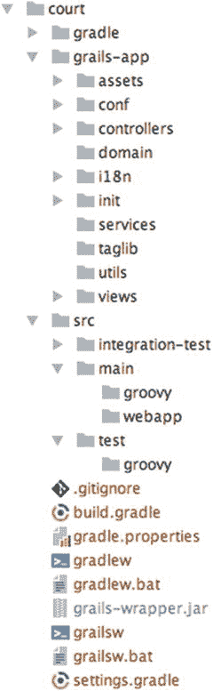

图 17-1. Grails 应用程序项目结构

注意

除了此布局之外，Grails 还会为应用程序创建一系列工作目录和文件（即，不打算直接修改的）。这些工作目录和文件放置在用户主目录下，名称为 `.grails/<grails_version>/`。

正如您从最后这个列表中所能注意到的，Grails 生成了一系列在大多数 Java 应用程序中常见的文件和目录。您将拥有一个名为 `src\main\groovy` 的目录用于存放源代码文件，以及一个 `src\main\web-app` 目录，其中包含 Java Web 应用程序的通用布局（例如，`/WEB-INF/`、`/META-INF/`、`css`、`images` 和 `js`）。开箱即用，Grails 通过一个命令将这些常见的 Java 应用程序结构组合在一起，为您节省了时间。

探索 Grails 应用程序的文件和目录结构

由于其中一些文件和目录是 Grails 特有的，我们将描述每个文件和目录的用途：

*   `gradle.properties`：用于定义应用程序的构建属性，包括 Grails 版本、Servlet 版本和应用程序名称。
*   `grails-app`：包含应用程序核心的目录，其中进一步包含以下文件夹：
    *   `assets`：包含应用程序静态资源（即 `.css` 和 `.js` 文件）的目录。
    *   `conf`：包含应用程序配置源的目录。
    *   `controllers`：包含应用程序控制器文件的目录。
    *   `domain`：包含应用程序领域文件的目录。
    *   `i18n`：包含应用程序国际化（i18n）文件的目录。
    *   `services`：包含应用程序服务文件的目录。
    *   `taglib`：包含应用程序标签库的目录。
    *   `utils`：包含应用程序工具文件的目录。
    *   `views`：包含应用程序视图文件的目录。
*   `src\main`：用于存放应用程序源代码文件的目录；包含一个名为 `groovy` 的子文件夹，用于存放用此语言编写的源代码（您可以添加一个 `java` 子文件夹来编写 Java 代码）。
*   `src\test`：用于存放应用程序单元测试文件的目录。
*   `src\integration-test`：用于存放应用程序集成测试文件的目录。
*   `web-app`：用于存放应用程序部署结构的目录；包含标准的 Web 归档（WAR）文件和目录结构（例如，`/WEB-INF/`、`/META-INF/`、`css`、`images` 和 `js`）。

运行应用程序

Grails 预配置为在 Apache Tomcat Web 容器上运行应用程序。与创建 Grails 应用程序类似，运行 Grails 应用程序的过程也是高度自动化的。

在 Grails 应用程序的根目录下，调用 `grails run-app`。此命令将根据需要触发应用程序的构建过程，同时启动 Apache Tomcat Web 容器并部署应用程序。

由于 Grails 基于约定运行，应用程序会部署在以项目名称命名的上下文下。因此，例如，名为 `court` 的应用程序会部署到 URL `http://localhost:8080/`。图 17-2 展示了 Grails 应用程序的默认主屏幕。

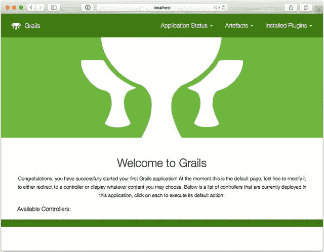

图 17-2. court Grails 应用程序的默认主屏幕

该应用程序仍处于其开箱即用状态。接下来，我们将说明如何创建您的第一个 Grails 构造，以实现更多节省时间的过程。

创建您的第一个 Grails 应用程序构造

现在您已经看到创建 Grails 应用程序是多么容易，让我们以控制器的形式引入一个应用程序构造。这将进一步说明 Grails 如何自动化 Java 应用程序开发过程中的一系列步骤。

在 Grails 应用程序的根目录下，调用 `grails create-controller welcome`。执行此命令将执行以下步骤：

1.  在应用程序目录 `grails-app/controllers` 下创建一个名为 `WelcomeController.groovy` 的控制器。
2.  在应用程序目录 `grails-app/views` 下创建一个名为 `welcome` 的目录。
3.  在应用程序目录 `src/u` 下创建一个名为 `WelcomeControllerSpec.groovy` 的测试类。

作为第一步，让我们分析 Grails 生成的控制器内容。`WelcomeController.groovy` 控制器的内容如下：

```
class WelcomeController {
def index {}
}
```

如果您不熟悉 Groovy，语法可能会显得别扭。但这只是一个名为 `WelcomeController` 的类，其中包含一个名为 `index` 的方法。其目的与您在第 3 章中创建的 Spring MVC 控制器相同。`WelcomeController` 代表一个控制器类，而方法 `index` 代表一个处理器方法。然而，在这种状态下，控制器什么也不做。将其修改为如下所示：

```
class WelcomeController {
Date now = new Date()
def index = {[today:now]}
}
```

第一个添加项是一个分配给 `now` 类字段的 `Date` 对象，用于表示系统日期。由于 `def index {}` 代表一个处理器方法，添加 `[today:now]` 用作返回值。在这种情况下，返回值代表一个名为 `today` 的变量，其值为 `now` 类字段，并且该变量的值将被传递给与该处理器方法关联的视图。


假设你有一个控制器和一个返回当前日期的处理方法，就可以创建相应的视图。如果你进入 `grails-app/views/welcome` 目录，会发现其中没有任何视图。然而，Grails 会尝试根据处理方法的名称，在这个目录下为 `WelcomeController` 控制器寻找一个视图；这同样是 Grails 采用的众多约定之一。

因此，请在该目录下创建一个名为 `index.gsp` 的 GSP 页面，内容如下：

```

欢迎

欢迎使用球场预约系统
今天是

```

这是一个标准的 GSP 页面，它使用了表达式和一个标签库。在编写 GSP 页面时，可以使用 `g` 标签来调用默认的标签库。`formatDate` 标签会渲染一个名为 `${today}` 的变量，这个变量正是名为 `index` 的控制器处理方法所返回的变量名。

接下来，从 Grails 应用的根目录执行命令 `grails run-app`。这会自动构建应用，编译控制器类，将文件复制到所需位置，同时启动 Apache Tomcat Web 容器并部署应用。

遵循相同的 Grails 约定流程，`WelcomeController` 及其处理方法和视图将通过上下文路径 `http://localhost:8080/welcome/` 被访问。由于 `index` 是上下文路径使用的默认页面，如果你打开浏览器访问 `http://localhost:8080/welcome/` 或显式 URL `http://localhost:8080/welcome/index`，你将看到之前那个渲染控制器返回的当前日期的 JSP 页面。请注意 URL 中缺少视图扩展名（例如 `.html`）。Grails 默认隐藏了视图技术；在更高级的 Grails 场景中，这样做的原因会更加明显。

当你重复创建应用控制器和视图所需的简单步骤时，请记住，你无需创建或修改任何配置文件，无需手动将文件复制到不同位置，也无需设置 Web 容器来运行应用。随着应用的推进，避免这些在 Java Web 应用中常见的脚手架步骤，可以极大地缩短开发时间。

将 Grails 应用导出为 WAR 文件

前面的步骤都是在 Grails 环境范围内执行的。也就是说，你依赖 Grails 来引导 Web 容器并运行应用。然而，当你想在生产环境中运行 Grails 应用时，你无疑需要生成一种格式，以便将应用部署到外部 Web 容器中，对于 Java 应用来说，这种格式就是 WAR 文件。

在 Grails 应用的根目录下，执行 `grails war` 命令。执行此命令会在根目录下生成一个名为 `<应用名称>-<应用版本>.war` 的 WAR 文件。这个 WAR 文件是一个自包含的文件，包含了在任何 Java 标准 Web 容器上运行 Grails 应用所需的所有必要元素。以球场应用为例，会在 Grails 应用的根目录下生成一个名为 `court-0.1.war` 的文件，应用版本取自 `application.properties` 文件中定义的 `app.version` 参数。

根据 Apache Tomcat 的部署约定，名为 `court-0.1.war` 的 WAR 文件可以通过 `http://localhost:8080/court-0.1/` 形式的 URL 访问。WAR 部署到 URL 的约定可能因 Java Web 容器（例如 Jetty 或 Oracle WebLogic）而异。

17-3. 获取 Grails 插件

问题

你希望在 Grails 应用中使用 Java 框架或 Java API 的功能，同时利用 Grails 技术来省去脚手架步骤。问题不仅仅是在应用中使用 Java 框架或 Java API（这可以通过简单地将相应的 JAR 包放入应用的 `lib` 目录来实现），而是要让 Java 框架或 Java API 与 Grails 紧密集成，这正是 Grails 插件所提供的功能。

所谓与 Grails 紧密集成，是指能够使用快捷指令（例如 `grails <插件任务>`）来执行特定的 Java 框架或 Java API 任务，或者能够在应用的类或配置文件中使用其功能，而无需采用脚手架步骤。

解决方案

实际上，Grails 自带了一些预安装的插件，尽管如果你只使用 Grails 的开箱即用功能，这一点并不明显。然而，有许多 Grails 插件可以使特定 Java 框架或 Java API 的使用过程像使用 Grails 核心功能一样高效。以下是一些比较流行的 Grails 插件：

*   App Engine：将 Google 的 App Engine SDK 和工具与 Grails 集成
*   Quartz：集成 Quartz 企业级任务调度器，用于调度任务并按指定的时间间隔或 cron 表达式执行
*   Spring WS：基于 Spring Web Services 项目，集成并支持 Web 服务的提供
*   Clojure：集成 Clojure，并允许在 Grails 工件中执行 Clojure 代码

要获取 Grails 插件的完整列表，可以执行命令 `grails list-plugins`。此命令会连接到 Grails 插件仓库并显示所有可用的 Grails 插件。此外，可以使用命令 `grails plugin-info <插件名称>` 来获取特定插件的详细信息。或者，你也可以访问位于 [`http://grails.org/plugin/home`](http://grails.org/plugin/home) 的 Grails 插件页面。

安装 Grails 插件就像向你的 `build.gradle` 文件中添加一个依赖一样简单；卸载则是相反的操作，将其从 `build.gradle` 文件中移除。

工作原理

Grails 插件遵循一系列约定，使其能够将特定的 Java 框架或 Java API 与 Grails 紧密集成。默认情况下，Grails 预装了 Apache Tomcat 和 Hibernate 插件。

除了这些默认插件之外，还可以按应用安装额外的插件。例如，要安装 Clojure 插件，你需要将以下依赖添加到 `build.gradle` 文件中：

```
dependencies {
compile "org.grails.plugins:clojure:2.0.0.RC4"
}
```

17-4. 在 Grails 环境中开发、生产与测试

问题

你希望根据应用运行的环境（例如开发、生产和测试）为同一个应用使用不同的参数。

解决方案

Grails 预见到 Java 应用可能会经历需要不同参数的各个阶段。这些阶段，Grails 称之为环境，例如可以是开发、生产和测试。

最明显的场景涉及数据源，你可能会为开发、生产和测试环境使用不同的持久化存储系统。由于每个存储系统会使用不同的连接参数，因此为多个环境配置参数，并让 Grails 根据应用的操作连接到相应的环境，会更加方便。

除了数据源，Grails 还为其他可能在不同应用环境间变化的参数提供了相同的功能，例如用于创建应用绝对链接的服务器 URL。

Grails 应用环境的配置参数在位于应用 `/grails-app/conf/` 目录下的文件中指定。

工作原理


根据您执行的操作，Grails 会自动选择最合适的环境：开发、生产或测试。例如，当您调用 `grails run-app` 命令时，这表示您仍在本地开发应用程序，因此会假定为开发环境。实际上，当您执行此命令时，在输出中您会看到类似下面的一行：

```
Environment set to development
```

这意味着为开发环境设置的任何参数都将用于构建、配置和运行应用程序。另一个例子是 `grails war` 命令。由于将 Grails 应用程序导出为独立的 WAR 文件意味着您将在外部 Web 容器上运行它，因此 Grails 会假定为生产环境。在此命令生成的输出中，您会找到类似下面的一行：

```
Environment set to production
```

这意味着为生产环境设置的任何参数都将用于构建、配置和导出应用程序。最后，如果您运行像 `grails test-app` 这样的命令，Grails 会假定为测试环境。这意味着为测试环境设置的任何参数都将用于构建、配置和运行测试。在此命令生成的输出中，您会找到类似下面的一行：

```
Environment set to test
```

在位于应用程序目录 `/grails-app/conf/` 下的 `application.yml` 文件中，您可以找到如下格式的章节：

```
environments:
development:
dataSource:
dbCreate: create-drop
url: jdbc:h2:mem:devDb;MVCC=TRUE;LOCK_TIMEOUT=10000;DB_CLOSE_ON_EXIT=FALSE
test:
dataSource:
dbCreate: update
url: jdbc:h2:mem:testDb;MVCC=TRUE;LOCK_TIMEOUT=10000;DB_CLOSE_ON_EXIT=FALSE
production:
dataSource:
dbCreate: none
url: jdbc:h2:./prodDb;MVCC=TRUE;LOCK_TIMEOUT=10000;DB_CLOSE_ON_EXIT=FALSE
```

在最后这个清单中，根据应用程序的环境，为持久化存储系统指定了不同的连接参数。这允许应用程序在不同的数据集上运行，因为您肯定不希望开发环境的修改发生在生产环境所使用的同一数据集上。需要注意的是，这并不意味着这些最后的示例是唯一允许根据应用程序环境进行配置的参数。您同样可以将任何参数放在相应的环境章节中。这些最后的示例仅仅代表了在应用程序的不同环境之间最可能发生变化的参数。

也可以根据给定的应用程序环境执行编程逻辑（例如，在类或脚本内部）。这是通过 `grails.util.Environment` 类实现的。以下清单说明了此过程：

```
import grails.util.Environment
...
...
switch(Environment.current) {
case Environment.DEVELOPMENT:
// 执行开发逻辑
break
case Environment.PRODUCTION:
// 执行生产逻辑
break
}
```

最后这段代码片段说明了类如何首先导入 `grails.util.Environment` 类。然后，根据包含应用程序运行环境的 `Environment.current` 值，代码使用 switch 条件语句根据此值执行逻辑。

这种情况在诸如发送电子邮件或执行地理定位等领域可能很常见。在开发环境中发送电子邮件或确定用户的位置是没有意义的，因为开发团队的位置无关紧要，而且也不需要应用程序的电子邮件通知。

最后，值得一提的是，您可以覆盖任何 Grails 命令使用的默认环境。

例如，默认情况下，`grails run-app` 命令使用为 `development` 环境指定的参数。如果出于某种原因，您想使用为生产环境指定的参数来运行此命令，可以使用以下指令：`grails prod run-app`。如果您想使用为测试环境指定的参数，也可以使用以下指令：`grails test run-app`。

同样，对于像 `grails test-app` 这样使用为测试环境指定参数的命令，您可以通过使用命令 `grails dev test-app` 来使用属于开发环境的参数。所有其他命令也是如此，只需在 `grails` 命令之后插入 `prod`、`test` 或 `dev` 关键字即可。

17-5. 创建应用程序的领域类

问题

您需要定义应用程序的领域类。

解决方案

领域类用于描述应用程序的主要元素和特性。如果应用程序是为处理预订而设计的，它很可能有一个用于保存预订的领域类。同样，如果预订与某个人相关联，应用程序将有一个用于保存人员信息的领域类。

在 Web 应用程序中，领域类通常是最先被定义的内容，因为这些类代表要保存到永久存储系统中的数据，以便与控制器交互，同时也代表要在视图中显示的数据。

在 Grails 中，领域类位于 `/grails-app/domain/` 目录下。与 Grails 中的大多数其他操作一样，可以通过执行一个简单的命令来创建领域类，格式如下：

```
grails create-domain-class 
```

最后这个命令会在 `/grails-app/domain/` 目录下生成一个名为 `<domain_class_name>.groovy` 的领域类骨架文件。

工作原理

Grails 会创建领域类骨架，但您仍然需要修改每个领域类以反映应用程序的目的。

让我们创建一个预订系统，类似于您在第 4 章中为体验 Spring MVC 而创建的那个。创建两个领域类，一个名为 `Reservation`，另一个名为 `Player`。为此，请执行以下命令：

```
grails create-domain-class Player
grails create-domain-class Reservation
```

执行这些命令后，一个名为 `Player.groovy` 的类文件和另一个名为 `Reservation.groovy` 的类文件会被放置在应用程序的 `/grails-app/domain/` 目录下。此外，还会为每个领域类在应用程序的 `src/test/groovy` 目录下生成相应的单元测试文件，不过测试将在配方 17-10 中讨论。接下来，打开 `Player.groovy` 类，将其内容编辑如下：

```
class Player {
static hasMany = [ reservations : Reservation ]
String name
String phone
static constraints = {
name(blank:false)
phone(blank:false)
}
}
```

第一个新增内容 `static hasMany = [ reservations : Reservation ]` 表示领域类之间的关系。此语句表明 `Player` 领域类有一个 reservations 字段，该字段关联了许多 `Reservation` 对象。接下来的语句表明 `Player` 领域类还有两个 `String` 字段，一个名为 `name`，另一个名为 `phone`。

剩下的元素 `static constraints = { }` 定义了领域类的约束条件。在这种情况下，声明 `name(blank:false)` 表明 `Player` 对象的 `name` 字段不能留空。声明 `phone(blank:false)` 表明除非提供了 `phone` 字段的值，否则无法创建 `Player` 对象。修改完 `Player` 领域类后，打开 `Reservation.groovy` 类来编辑其内容。


```
package court
import java.time.DayOfWeek
import java.time.LocalDateTime
class Reservation {
static belongsTo = Player
String courtName;
LocalDateTime date;
Player player;
String sportType;
static constraints = {
sportType(inList: ["Tennis", "Soccer"])
date(validator: { val, obj ->
if (val.getDayOfWeek() == DayOfWeek.SUNDAY && (val.getHour()  22)) {
return ['invalid.holidayHour']
} else if (val.getHour()  21) {
return ['invalid.weekdayHour']
}
})
}
}
```

添加到 `Reservation` 领域类的第一条语句 `static belongsTo = Player` 表明，一个 `Reservation` 对象始终属于一个 `Player` 对象。接下来的语句表明 `Reservation` 领域类包含一个名为 `courtName` 的 `String` 类型字段、一个名为 `date` 的 `LocalDateTime` 类型字段、一个名为 `player` 的 `Player` 类型字段，以及另一个名为 `sportType` 的 `String` 类型字段。

`Reservation` 领域类的约束比 `Player` 领域类稍微复杂一些。第一个约束 `sportType(inList:["Tennis", "Soccer"])` 将 `Reservation` 对象的 `sportType` 字段限制为字符串值 `Tennis` 或 `Soccer`。第二个约束是一个自定义验证器，用于确保 `Reservation` 对象的日期字段根据星期几处于特定的小时范围内。

现在你已经有了应用程序的领域类，就可以为应用程序创建相应的视图和控制器了。

不过，在继续之前，有必要先谈谈 Grails 领域类。虽然你在本教程中创建的领域类让你对定义 Grails 领域类所用的语法有了基本了解，但它们仅展示了 Grails 领域类可用功能的一小部分。

随着领域类之间的关系变得越来越复杂，定义 Grails 领域类时可能需要更复杂的结构。这是因为 Grails 依赖领域类来实现各种应用程序功能。

例如，如果从应用程序的持久化存储系统中更新或删除了一个领域对象，那么领域类之间的关系需要被良好地建立。如果关系没有良好建立，应用程序中就可能出现数据不一致的情况（例如，如果删除了一个人对象，其对应的预订也需要被删除，以避免应用程序预订状态不一致）。

同样，可以使用各种约束来强制领域类的结构。在某些情况下，如果约束过于复杂，通常会在创建某个领域类的对象之前，将其纳入应用程序的控制器中。不过，在本教程中，我们使用了模型约束来演示 Grails 领域类的设计。

17-6. 为应用程序的领域类生成 CRUD 控制器和视图

问题

你需要为应用程序的领域类生成创建、读取、更新和删除（CRUD）控制器和视图。

解决方案

应用程序的领域类本身用处不大。映射到领域类的数据仍然需要被创建、呈现给最终用户，并可能保存到持久化存储系统中以备将来使用。

在由持久化存储系统支持的网络应用程序中，这些对领域类的操作通常被称为 CRUD 操作。在大多数网络框架中，生成 CRUD 控制器和视图需要大量的工作。这是因为需要能够创建、读取、更新和删除持久化存储系统中领域对象的控制器，以及为最终用户创建、读取、更新和删除这些相同对象而创建相应的视图（例如，JSP 页面）。

然而，由于 Grails 基于约定运作，为应用程序的领域类生成 CRUD 控制器和视图的机制很简单。你可以执行以下命令来为应用程序的领域类生成相应的 CRUD 控制器和视图：

```
grails generate-all 
```

工作原理

Grails 能够检查应用程序的领域类，并生成必要的相应控制器和视图，以创建、读取、更新和删除属于应用程序领域类的实例。

例如，以你之前创建的 `Player` 领域类为例。要生成其 CRUD 控制器和视图，你只需从应用程序的根目录执行以下命令：

```
grails generate-all court.Player
```

类似的命令也适用于 `Reservation` 领域类。只需执行以下命令即可生成其 CRUD 控制器和视图：

```
grails generate-all court.Reservation
```

那么，执行这些步骤实际生成了什么呢？如果你看到了这些命令的输出，你会有相当清晰的概念，但我还是在此回顾一下这个过程。

1.  编译应用程序的类。
2.  在 `grails-app/i18n` 目录下生成 12 个属性文件，以支持应用程序的国际化（例如，`messages_<language>.properties`）。
3.  创建一个名为 `<domain_class>Controller.groovy` 的控制器，其中包含为关系型数据库管理系统（RDBMS）设计的 CRUD 操作，并将其放置在应用程序的 `grails-app/controllers` 目录下。
4.  创建与控制器类的 CRUD 操作相对应的四个视图，分别命名为 `create.gsp`、`edit.gsp`、`index.gsp` 和 `show.gsp`。请注意，`.gsp` 扩展名代表“Groovy Server Pages”，它相当于 JavaServer Pages，只是使用 Groovy 而非 Java 来声明程序语句。这些视图放置在应用程序的 `grails-app/views/<domain_class>` 目录下。

完成这些步骤后，你可以使用 `grails run-app` 启动 Grails 应用程序，并以最终用户的身份使用该应用程序。是的，你没看错；执行这些简单的命令后，应用程序现在就可以供最终用户使用了。这就是 Grails 基于约定运作的宗旨，通过一个单词的命令简化脚手架代码的创建。应用程序启动后，你可以在以下 URL 对 `Player` 领域类执行 CRUD 操作：

*   创建：`http://localhost:8080/player/create`
*   读取：`http://localhost:8080/player/list`（用于所有玩家）或 `http://localhost:8080/court/player/show/<player_id>`
*   更新：`http://localhost:8080/player/edit/<player_id>`
*   删除：`http://localhost:8080/player/delete/<player_id>`

每个视图之间的页面导航比这些 URL 所呈现的更为直观，但我们稍后会通过一些截图来说明。关于这些 URL，需要注意的一个重要点是它们的约定。注意模式 `<domain>/<app_name>/<domain_class>/<crud_action>/<object_id>`，其中 `<object_id>` 根据操作类型是可选的。

除了用于定义 URL 模式，这些约定还贯穿于应用程序的各个工件中。例如，如果你检查 `PlayerController.groovy` 控制器，你会发现其中包含以各种 `<crud_action>` 值命名的处理方法。同样，如果你检查应用程序的后端关系型数据库管理系统（RDBMS），你会注意到领域类对象是使用与 URL 中相同的 `<player_id>` 来保存的。

既然你已经了解了 CRUD 操作在 Grails 应用程序中的结构，那么请访问地址 `http://localhost:8080/player/create` 来创建一个 `Player` 对象。访问此页面后，你会看到一个 HTML 表单，其中包含你为 `Player` 领域类定义的相同字段值。


在 name 和 phone 字段中分别输入任意两个值并提交表单。你刚刚将一个 `Player` 对象持久化到了关系型数据库管理系统（RDBMS）中。默认情况下，Grails 预配置为使用 HSQLDB（一种内存型 RDBMS）。后续的配方将说明如何将其更改为其他 RDBMS；目前，HSQLDB 已经足够。

接下来，尝试提交相同的表单，但这次不输入任何值。Grails 不会持久化 `Player` 对象；相反，它会显示两条警告消息，指示 name 和 phone 字段不能为空，如图 17-3 所示。

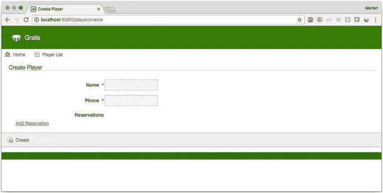

图 17-3.

在视图（本例中为 HTML 表单）中进行的 Grails 领域类验证

此验证过程之所以生效，是因为你在 `Player` 领域类中放置了 `name(blank:false)` 和 `phone(blank:false)` 这两个声明。你无需修改应用程序的控制器或视图，甚至无需为这些错误消息创建属性文件；一切均由 Grails 基于约定的方法处理。

注意

使用支持 HTML5 的浏览器时，你将无法提交该表单。两个输入元素都被标记为必填，这会阻止在这些浏览器中提交表单。这些规则也是基于前面提到的声明添加的。

尝试使用 `Player` 领域类的其余可用视图，直接从 Web 浏览器创建、读取、更新和删除对象，以感受 Grails 如何处理这些任务。

继续操作应用程序，你还可以通过以下 URL 对 `Reservation` 领域类执行 CRUD 操作：

*   创建：`http://localhost:8080/reservation/create`

*   读取：`http://localhost:8080/reservation/list`（用于所有预订）或 `http://localhost:8080/court/reservation/show/<reservation_id>`

*   更新：`http://localhost:8080/reservation/edit/<reservation_id>`

*   删除：`http://localhost:8080/reservation/delete/<reservation_id>`

这些最后的 URL 与 `Player` 领域类的 URL 用途相同：能够从 Web 界面创建、读取、更新和删除属于 `Reservation` 领域类的对象。

接下来，让我们分析用于创建 `Reservation` 对象的 HTML 表单，该表单位于 URL `http://localhost:8080/reservation/create`。图 17-4 展示了此表单。

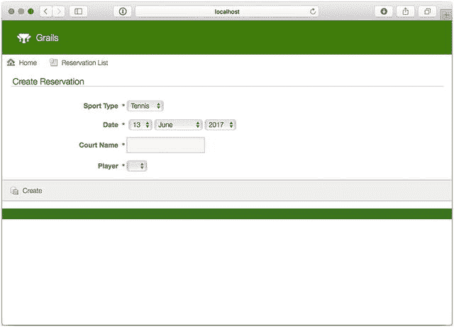

图 17-4.

Grails 领域类 HTML 表单，填充了来自另一个类的领域对象

图 17-4 在多个方面都很有趣。尽管 HTML 表单仍然是基于 `Reservation` 领域类的字段创建的，就像 `Player` 领域类的 HTML 表单一样，但请注意它包含多个预填充的 HTML 选择菜单。

第一个选择菜单属于 `sportType` 字段。由于此特定字段有一个定义约束，要求其字符串值必须为 `Soccer` 或 `Tennis`，因此 Grails 会自动向用户提供这些选项，而不是允许开放式字符串并在之后进行验证。

第二个选择菜单属于 `date` 字段。在这种情况下，Grails 会生成多个表示日期的 HTML 选择菜单，以使日期选择过程更容易，而不是允许开放式日期并在之后进行验证。

第三个选择菜单属于 player 字段。此选择菜单的选项不同，因为它们取自你为应用程序创建的 `Player` 对象。这些值是通过查询应用程序的 RDBMS 提取的；如果你添加另一个 `Player` 对象，它将自动出现在此选择菜单中。

此外，对 date 字段执行了验证过程。如果所选日期不符合特定范围，则 `Reservation` 对象无法持久化，并且表单上会出现一条警告消息。

目前你无法提交有效的 `Reservation`，因为 `date` 字段只接受 `date` 而不接受时间。要解决此问题，请打开 `views/reservation` 目录下的 `create.gsp`（以及 `edit.gsp`）文件。其中包含一个 `<f:all bean="reservation" />` 标签。此标签负责创建 HTML 表单，并根据字段类型渲染 HTML 输入元素。为了也能输入时间，请添加一个 `<g:datePicker />` 标签，并将 `date` 字段从默认表单中排除。

```

Date

```

`<g:datePicker />` 标签允许你指定 `precision` 值。当设置为 `minute` 时，它允许在日期旁边设置小时和分钟。现在，当选择适当的范围时，就可以存储 `Reservation` 了。

尝试使用 `Reservation` 领域类的其余可用视图，直接从 Web 浏览器创建、读取、更新和删除对象。

最后，为了全面了解情况，请认识到你的应用程序在几个步骤中已经完成的工作：验证输入；从 RDBMS 创建、读取、更新和删除对象；根据 RDBMS 中的数据完成 HTML 表单；以及支持国际化。而你甚至还没有修改过配置文件，没有被要求使用 HTML，也不需要处理 SQL 或对象关系映射器（ORM）。

17-7. 为消息属性实现国际化（I18n）

问题

你需要国际化 Grails 应用程序中使用的值。

解决方案

默认情况下，所有 Grails 应用程序都具备支持国际化的能力。在应用程序的 `/grails-app/i18n/` 文件夹中，你可以找到一系列用于定义 12 种语言消息的 `*.properties` 文件。这些 `*.properties` 文件中声明的值允许 Grails 应用程序根据用户的语言偏好或应用程序的默认语言显示消息。在 Grails 应用程序中，可以从包括视图（JSP 或 GSP 页面）或应用程序上下文在内的位置访问 `*.properties` 文件中声明的值。

工作原理

Grails 根据两个标准确定为用户使用哪个区域设置（即来自哪个国际化属性文件）：

*   应用程序的 `/grails-app/conf/spring/resource.groovy` 文件中的显式配置

*   用户的浏览器语言偏好

由于应用程序区域设置的显式配置优先于用户的浏览器语言偏好，因此应用程序的 `resource.groovy` 文件中不存在默认配置。这确保了如果用户的浏览器语言偏好设置为西班牙语（`es`）或德语（`de`），用户将收到来自西班牙语或德语属性文件（例如 `messages_es.properties` 或 `messages_de.properties`）的消息。另一方面，如果应用程序的 `resource.groovy` 文件配置为使用意大利语（`it`），则无论用户的浏览器语言偏好如何，用户都将始终收到来自意大利语属性文件（例如 `messages_it.properties`）的消息。

因此，仅当你希望强制用户使用特定的语言区域设置时，才应在应用程序的 `/grails-app/conf/spring/resource.groovy` 文件中定义显式配置。例如，也许你不想更新多个国际化属性文件，或者你只是看重统一性。

由于 Grails 国际化基于 Spring 的区域设置解析器，你需要将以下内容放入应用程序的 `/grails-app/conf/spring/resource.groovy` 文件中，以强制用户使用特定语言：

```
import org.springframework.web.servlet.i18n.SessionLocaleResolver
beans = {
localeResolver(SessionLocaleResolver) {
defaultLocale= Locale.ENGLISH
Locale.setDefault (Locale.ENGLISH)
}
}
```


通过使用这最后一条声明，任何访客都将收到来自英文属性文件（例如 `messages_en.properties`）的消息，无论其浏览器的语言偏好设置如何。同样值得一提的是，如果你指定了一个没有对应属性文件的区域设置，Grails 会回退到使用默认的 `messages.properties` 文件。该文件默认是英文的，但如果你愿意，也可以轻松修改其值以反映另一种语言。当用户的浏览器语言偏好作为定义选择标准时（例如，如果用户浏览器的语言偏好设置为中文，但不存在中文属性文件，Grails 就会回退到使用默认的 `messages.properties` 文件），也会出现同样的情况。

现在你已经了解了 Grails 如何确定选择哪个属性文件来提供本地化内容，让我们来看看 Grails `*.properties` 文件的语法：

```
default.paginate.next=Next
typeMismatch.java.net.URL=Property {0} must be a valid URL
default.blank.message=Property [{0}] of class [{1}] cannot be blank
default.invalid.email.message=Property [{0}] of class [{1}] with value [{2}] is not a valid e-mail address
default.invalid.range.message=Property [{0}] of class [{1}] with value [{2}] does not fall within the valid range from [{3}] to [{4}]
```

第一行是 `*.properties` 文件中最简单的声明。如果 Grails 在应用程序中遇到名为 `default.paginate.next` 的属性，它会将其替换为值 `Next`，或者根据用户确定的区域设置为该相同属性指定的任何其他值。

在某些情况下，可能需要提供更明确的消息，这些消息最好在调用本地化消息的地方确定。这就是键 `{0}`、`{1}`、`{2}`、`{3}` 和 `{4}` 的用途。它们是用于本地化属性的参数。通过这种方式，显示给用户的本地化消息可以传达更详细的信息。图 17-5 展示了根据用户浏览器语言偏好为法庭应用程序确定的本地化和参数化消息。

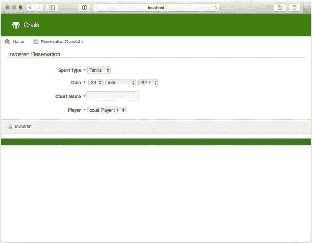

图 17-5.

Grails 本地化和参数化消息，根据用户浏览器语言偏好确定（从左到右，从上到下：西班牙语、德语、意大利语和法语）

掌握了这些知识后，在 Grails `message.properties` 文件中定义以下四个属性：

```
invalid.holidayHour=Invalid holiday hour
invalid.weekdayHour=Invalid weekday hour
welcome.title=Welcome to Grails
welcome.message=Welcome to Court Reservation System
```

接下来，是时候探索如何在 Grails 应用程序中定义属性占位符了。

在配方 17-5 中，你可能没有意识到，但你为 `Reservation` 领域类声明了一个本地化属性。在验证部分（`static constraints =  { }`），你创建了以下形式的语句：

```
return ['invalid.weekdayHour']
```

如果执行到这条语句，Grails 会尝试在属性文件中找到一个名为 `invalid.weekdayHour` 的属性，并根据用户确定的区域设置替换其值。也可以将本地化属性引入应用程序的视图中。例如，你可以修改配方 17-2 中创建并位于 `/court/grails-app/views/welcome/index.gsp` 的 GSP 页面，以使用以下内容：

```

Today is

```

这个 GSP 页面使用了 `<g:message/>` 标签。然后，使用 `code` 属性，定义了 `welcome.title` 和 `welcome.messsage` 这两个属性，一旦 JSP 被渲染，这两个属性都将被替换为相应的本地化值。

17-8. 更改永久存储系统

问题

你想将 Grails 应用程序的永久存储系统更改为你喜欢的 RDBMS。

解决方案

Grails 被设计为使用 RDBMS 作为永久存储系统。默认情况下，Grails 预配置为使用 HSQLDB。HSQLDB 是一个在部署应用程序时（即执行 `grails run-app`）由 Grails 自动启动的数据库。

然而，HSQLDB 的简单性也可能是其主要缺点。每次在开发和测试环境中重新启动应用程序时，由于 HSQLDB 被配置为在内存中运行，它会丢失所有数据。尽管在生产环境中，Grails 应用程序配置了 HSQLDB 以将数据永久存储在文件中，但对于某些应用程序需求来说，HSQLDB 的功能集可能被视为有限。

你可以通过修改位于 `grails-app/conf` 目录下的应用程序 `application.yml` 文件，来配置 Grails 使用另一个 RDBMS。在此文件中，你可以配置最多三个 RDBMS，分别对应应用程序所处的三个环境——开发、生产和测试。有关 Grails 应用程序中开发、生产和测试环境的更多信息，请参见配方 17-4。

工作原理

Grails 依赖标准的 Java JDBC 表示法来指定 RDBMS 连接参数，以及依赖每个 RDBMS 供应商提供的相应 JDBC 驱动程序，来创建、读取、更新和删除信息。

如果你更改 RDBMS，需要注意的一个重要方面是，Grails 使用一个名为 Groovy 对象关系映射器（GROM）的 ORM 来与 RDBMS 交互。GROM 背后的目的与其他所有 ORM 解决方案相同——让你能够专注于应用程序的业务逻辑，而无需担心 RDBMS 实现的特殊性，这些特殊性可能包括数据类型差异到直接使用 SQL 等。GROM 允许你设计应用程序的领域类，并将你的设计映射到你选择的 RDBMS。

设置 RDBMS 驱动程序

更改 Grails 默认 RDBMS 的第一步是，将你选择的 RDBMS 的 JDBC 驱动程序添加到 `gradle.build` 文件中。这允许应用程序访问将对象持久化到特定 RDBMS 所需的 JDBC 类。

配置 RDBMS 实例

第二步包括修改位于应用程序 `grails-app/conf` 目录下的 `application.yml` 文件。在此文件中，有三个用于定义 RDBMS 实例的部分。

每个 RDBMS 实例对应一个不同的可能应用程序环境：开发、生产和测试。根据你采取的操作，Grails 会选择其中一个实例来执行应用程序设计要执行的任何永久存储操作。有关 Grails 应用程序中开发、生产和测试环境的更多信息，请参见配方 17-4。

然而，在每个部分中声明 RDBMS 所使用的语法是相同的。表 17-1 包含了在 `dataSource` 定义中可用于配置 RDBMS 的各种属性。

表 17-1.

用于配置 RDBMS 的 dataSource 属性

属性
 |
  定义
 |

| --- | --- | --- | --- | --- |

`driverClassName`
 |
  JDBC 驱动程序的类名
 |

`username`
 |
  用于建立与 RDBMS 连接的用户名
 |

`password`
 |
  用于建立与 RDBMS 连接的密码
 |

`url`
 |
  RDBMS 的 URL 连接参数
 |

`pooled`
 |
  指示是否对 RDBMS 使用连接池；默认为 true
 |

`jndiName`
 |
  指示数据源的 JNDI 连接字符串（这是直接在 Grails 中配置 `driverClassName`、`username`、`password` 和 `url` 的替代方案，转而依赖在 Web 容器中配置的数据源）
 |

`logSql`
 |
  指示是否启用 SQL 日志记录
 |

`dialect`
 |
  指示执行操作的 RDBMS 方言
 |

`properties`
 |
  用于指示 RDBMS 操作的额外参数
 |

`dbCreate`
 |
  指示 RDBMS 数据定义语言（DDL）的自动生成
 |

dbCreate 值
 |
  定义
 |


`create-drop`
 |
  当 Grails 运行时，删除并重新创建 RDBMS DDL（警告：会删除 RDBMS 中所有现有数据）
 |

`create`
 |
  如果 RDBMS DDL 不存在则创建，若已存在则不修改（警告：会删除 RDBMS 中所有现有数据）
 |

`update`
 |
  如果 RDBMS DDL 不存在则创建，若已存在则更新
 |

如果你使用过 Java ORM（如 Hibernate 或 EclipseLink），那么表 17-1 中的参数应该相当熟悉。以下代码展示了 MySQL RDBMS 的 `dataSource` 定义：

```
dataSource:
dbCreate: update
pooled: true
jmxExport: true
driverClassName: com.mysql.jdbc.Driver
username: grails
password: groovy
```

在上述定义的属性中，最需要小心的是 `dbCreate`，因为它可能破坏 RDBMS 中的数据。在此例中，`update` 值是三个可用值中最保守的，如表 17-1 所述。

如果你使用的是生产环境的 RDBMS，那么 `dbCreate="update"` 无疑是首选策略，因为它不会破坏 RDBMS 中的任何数据。另一方面，如果 Grails 应用正在测试阶段，你可能希望每次测试运行时都清空 RDBMS 中的数据；因此，像 `dbCreate="create"` 或 `dbCreate="create-drop"` 这样的值会更常见。对于开发环境的 RDBMS，选择哪个选项作为更优策略，取决于 Grails 应用的开发进度。

Grails 还允许你使用在 Web 容器中配置的 RDBMS。在这种情况下，Web 容器（如 Apache Tomcat）会设置相应的 RDBMS 连接参数，并通过 JNDI 提供对 RDBMS 的访问。以下代码展示了通过 JNDI 访问 RDBMS 的 `dataSource` 定义：

```
dataSource:
jndiName: java:comp/env/grailsDataSource
```

最后，值得一提的是，你可以配置 `dataSource` 定义，使其在应用的不同环境中生效，同时为每个特定环境进一步指定属性。以下代码展示了这种配置：

```
dataSource:
driverClassName: com.mysql.jdbc.Driver
username: grails
environments:
production:
dataSource:
url: jdbc:mysql://localhost/grailsDBPro
password: production
development:
dataSource:
url: jdbc:mysql://localhost/grailsDBDev
password: development
```

如上代码所示，`dataSource` 的 `driverClassName` 和 `username` 属性是全局定义的，在所有环境中生效，而其他 `dataSource` 属性则针对每个单独的环境进行声明。

17-9. 自定义日志输出

问题

你想要自定义 Grails 应用生成的日志输出。

解决方案

Grails 依赖 Logback 来执行日志记录操作。因此，所有配置参数都在应用 `/grails-app/conf` 目录下的 `logback.groovy` 文件中指定。请注意，如果你更熟悉 Logback 的 XML 配置，可以用 `logback.xml` 文件替换它。

鉴于 Logback 日志记录的多功能性，Grails 应用的日志记录可以通过多种方式进行配置。这包括创建自定义 appender、日志级别、控制台输出、按构件记录日志以及自定义日志布局。

工作原理

Grails 预配置了一组基本参数。这些参数定义在应用 `/grails-app/conf` 目录下的 `logback.groovy` 文件中，具体如下：

```
import grails.util.BuildSettings
import grails.util.Environment
import org.springframework.boot.logging.logback.ColorConverter
import org.springframework.boot.logging.logback.WhitespaceThrowableProxyConverter
import java.nio.charset.Charset
conversionRule 'clr', ColorConverter
conversionRule 'wex', WhitespaceThrowableProxyConverter
// 有关配置的详细信息，请参阅 http://logback.qos.ch/manual/groovy.html
appender('STDOUT', ConsoleAppender) {
encoder(PatternLayoutEncoder) {
charset = Charset.forName('UTF-8')
pattern =
'%clr(%d{yyyy-MM-dd HH:mm:ss.SSS}){faint} ' + // 日期
'%clr(%5p) ' + // 日志级别
'%clr(---){faint} %clr([%15.15t]){faint} ' + // 线程
'%clr(%-40.40logger{39}){cyan} %clr(:){faint} ' + // 日志记录器
'%m%n%wex' // 消息
}
}
def targetDir = BuildSettings.TARGET_DIR
if (Environment.isDevelopmentMode() && targetDir != null) {
appender("FULL_STACKTRACE", FileAppender) {
file = "${targetDir}/stacktrace.log"
append = true
encoder(PatternLayoutEncoder) {
pattern = "%level %logger - %msg%n"
}
}
logger("StackTrace", ERROR, ['FULL_STACKTRACE'], false)
}
root(ERROR, ['STDOUT'])
```

在日志记录术语中，每个包被称为一个日志记录器（logger）。Logback 支持以下日志级别：`error`、`warn`、`info`、`debug` 和 `trace`。`error` 是最严重的级别。因此，Grails 遵循保守的默认日志策略，在其大多数包中使用 `error` 级别。指定一个不那么严重的级别（例如 `debug`）会导致产生大量日志信息，这在大多数情况下可能不实用。

默认情况下，所有日志消息都会发送到应用根目录下的 `stacktrace.log` 文件，并且（如果适用）发送到运行中应用的标准输出（即控制台）。当你执行 Grails 命令时，会观察到日志消息发送到标准输出。

配置自定义 Appender 和 Logger

Logback 依赖 appender 和 logger 来提供多功能的日志记录功能。Appender 是日志信息发送到的位置（例如文件或标准输出），而 logger 是生成日志信息的位置（例如类或包）。

Grails 配置了一个根 logger，所有其他 logger 都继承其行为。在 Grails 应用中，可以通过在应用的 `Logback.groovy` 文件中使用以下语句来自定义默认 logger：

```
root(ERROR, ['STDOUT'])
```

最后一条语句定义了一个 logger，使得 error 级别或更严重级别的消息被记录到标准输出。这就是为什么你可以看到来自其他 logger（例如类或包）的日志消息被发送到标准输出；它们都继承了根 logger 的行为，此外还指定了自己的日志级别。另一方面，Logback appender 提供了一种将日志消息发送到不同位置的方法。默认情况下有四种类型的 appender 可用。

*   `jdbc`：记录到 JDBC 连接的 appender
*   `console`：记录到标准输出的 appender
*   `file`：记录到文件的 appender
*   `rollingFile`：记录到一组滚动文件的 appender

要在 Grails 应用中定义 appender，你需要在应用的 `Logback.groovy` 文件中声明它们，如下所示：

```
def USER_HOME = System.getProperty("user.home")
appender('customlogfile', FileAppender) {
encoder(PatternLayoutEncoder) {
Pattern = "%d %level %thread %mdc %logger - %m%n"
}
file = '${USER_HOME}/logs/grails.log'
}
appender('rollinglogfile', RollingFileAppender) {
encoder(PatternLayoutEncoder) {
Pattern = "%d %level %thread %mdc %logger - %m%n"
}
rollingPolicy(TimeBasedRollingPolicy) {
FileNamePattern = "${USER_HOME}/logs/rolling-grails-%d{yyyy-MM}.log"
}
}
```

要使用 appender，你只需将它们添加到相应的 logger 中，以便它们可以接收输入。

以下声明说明了如何组合使用 appender、logger 和日志级别：

```
root(DEBUG, ['STDOUT','customlogfile'])
```


最后这段配置覆盖了默认的根日志记录器。它指示使用调试级别将日志消息同时输出到 `stdout` 附加器（即标准输出或控制台）和 `customlogfile` 附加器，后者代表在附加器部分定义的一个文件。请注意，调试级别会产生大量日志信息。

17-10. 运行单元测试和集成测试

问题

为了确保应用程序的类按预期工作，你需要对它们执行单元测试和集成测试。

解决方案

Grails 内置了对应用程序运行单元测试和集成测试的支持。之前当你生成 Grails 工件（例如应用程序的领域类）时，你可能记得会自动生成一系列测试类。

在 Grails 应用程序中，测试放置在应用程序的 `src/test` 或 `src/integration-test` 目录下。与 Grails 提供的其他功能类似，设置和配置应用程序测试的许多繁琐工作都由 Grails 处理。你只需专注于设计测试。

一旦你设计好应用程序的测试，在 Grails 中运行测试就像从应用程序的根目录执行 `grails test-app` 命令一样简单。

工作原理

Grails 会引导执行应用程序测试所需的环境。该环境包括库（即 JAR 文件）和持久存储系统（即关系数据库管理系统），以及执行单元测试和集成测试所需的任何其他工件。

让我们从分析执行 `grails test-app` 命令的输出开始，如图 17-6 所示。

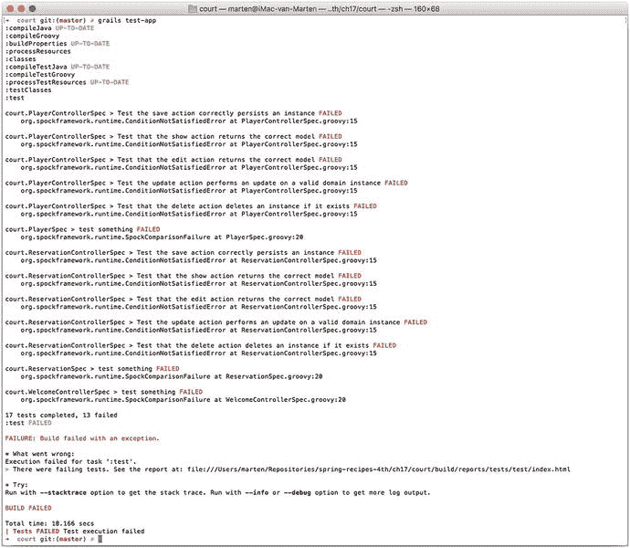

图 17-6.

测试输出

第一部分指示测试的执行情况，这些测试取自应用程序根目录下的 `src/test/groovy` 目录。在此例中，执行了 13 个失败和 4 个成功的单元测试，这些测试对应于创建应用程序领域类时生成的骨架测试类。由于这些测试类包含测试骨架，因此大多数测试都失败了。

第二部分指示测试是成功还是失败；在此例中，测试失败。结果以 HTML 报告的形式提供，并显示了链接；它们可以在项目的 `build/reports/tests/test` 目录中找到。

现在你已经了解了 Grails 如何执行测试，让我们修改预先存在的单元测试类，以纳入基于领域类逻辑的单元测试。鉴于 Grails 测试基于 JUnit 测试框架（ [`www.junit.org/`](http://www.junit.org/) ）。如果你不熟悉此框架，我们建议你查阅其文档以掌握其语法和方法。以下各节假定你对 JUnit 有基本的了解（另请参见第 16 章）。

将以下方法（即单元测试）添加到位于应用程序 `src/test/groovy` 目录下的 `PlayerSpec.groovy` 类中，并移除 `"test something"` 方法：

```
void "A valid player is constructed"() {
given:
def player = new Player(name: 'James', phone: '120-1111')
when: "validate is called"
def result = player.validate();
then: "it should be valid"
result
}
void "A player without a name is constructed"() {
given:
def player = new Player(name: '', phone: '120-1111')
when: "validate is called"
def result = player.validate();
then: "The name should be rejected"
!result
player.errors['name'].codes.contains('nullable')
}
void "A player without a phone is constructed"() {
given:
def player = new Player(name: 'James', phone: '')
when: "validate is called"
def result = player.validate()
then: "The phone number should be rejected."
!result
player.errors['phone'].codes.contains('nullable')
}
```

第一个单元测试创建一个 `Player` 对象，并用 name 字段和 phone 字段实例化它。根据 `Player` 领域类中声明的约束，这种类型的实例应始终有效。因此，语句 `assertTrue player.validate()` 确认此对象的验证始终为 `true`。

第二个和第三个单元测试也创建了一个 `Player` 对象。但是，请注意，在一个测试中，`Player` 对象是用空白的 `name` 字段实例化的，而在另一个测试中，`Player` 对象是用空白的 `phone` 字段实例化的。根据 `Player` 领域类中声明的约束，这两个实例都应始终无效。因此，`then:` 块中的 `!result` 语句用于确认此类对象的验证始终为 `false`。`player.errors['phone'].codes.contains('nullable')` 部分检查验证是否包含验证异常所需的代码。

接下来，将以下方法（即单元测试）添加到位于应用程序 `src/test/groovy` 目录下的 `ReservationSpec.groovy` 类中：

```
void testReservation() {
given:
def calendar = LocalDateTime.of(2017, 10, 13, 15, 00)
.toInstant(ZoneOffset.UTC)
def validDateReservation = Date.from(calendar)
def reservation = new Reservation(
sportType:'Tennis', courtName:'Main',
date:validDateReservation,player:new Player(name:'James',phone:'120-1111'))
expect:
reservation.validate()
}
void testOutOfRangeDateReservation() {
given:
def calendar = LocalDateTime.of(2017, 10, 13, 23, 00)
.toInstant(ZoneOffset.UTC)
def invalidDateReservation = Date.from(calendar)
def reservation = new Reservation(
sportType:'Tennis',courtName:'Main',
date:invalidDateReservation,player:new Player(name:'James',phone:'120-1111'))
expect:
!reservation.validate()
reservation.errors['date'].code == 'invalid.weekdayHour'
}
void testOutOfRangeSportTypeReservation() {
given:
def calendar = LocalDateTime.of(2017, 10, 13, 15, 00)
.toInstant(ZoneOffset.UTC)
def validDateReservation = Date.from(calendar)
def reservation = new Reservation(
sportType:'Baseball',courtName:'Main',
date:validDateReservation,player:new Player(name:'James',phone:'120-1111'))
expect:
!reservation.validate()
reservation.errors['sportType'].codes.contains('not.inList')
}
```

最后这段代码包含三个单元测试，旨在验证 `Reservation` 对象的完整性。第一个测试创建一个 `Reservation` 对象实例，并确认其对应的值通过了 `Reservation` 领域类的约束。第二个测试创建一个违反领域类 `date` 约束的 `Reservation` 对象，并确认此类实例无效。第三个测试创建一个违反领域类 `sportType` 约束的 `Reservation` 对象，并确认此类实例无效。

如果你执行 `grails test-app` 命令，Grails 会自动执行所有先前的测试，并将测试结果输出到应用程序的构建目录。

仍然存在失败的测试，特别是 `PlayerControllerSpec` 和 `ReservationControllerSpec`。打开后，有一个名为 `populateValidParams` 的方法，其中包含一个 `@TODO`。

```
def populateValidParams(params) {
assert params != null
// TODO: Populate valid properties like...
//params["name"] = 'someValidName'
assert false, "TODO: Provide a populateValidParams() implementation for this generated test suite"
}
```

要修复这些测试，需要修改它以向控制器提交正确的值。对于 `PlayerControllerSpec`，修改 `populateValidParams` 以包含 `params["name"]` 和 `params["phone"]`。

```
def populateValidParams(params) {
assert params != null
params["name"] = 'J. Doe'
params["phone"] = '555-123-4567'
}
```

对于 `ReservationControllerSpec`，修改如下：


```groovy
def populateValidParams(params) {
assert params != null
def calendar = LocalDateTime.of(2017, 10, 13, 12, 00)
.toInstant(ZoneOffset.UTC)
params["courtName"] = 'Tennis Court #1'
params["sportType"] = "Tennis"
params["date"] = Date.from(calendar)
params["player"] = new Player(name: "J. Doe", phone: "555-432-1234")
}
```

现在唯一仍然失败的测试是 `WelcomeControllerSpec`，你可以将其删除以获得成功的构建。

既然你已经为 Grails 应用程序创建了单元测试，接下来让我们探索集成测试的创建。

与单元测试不同，集成测试验证的是应用程序中更复杂的逻辑。各种领域类之间的交互或针对关系数据库管理系统（RDBMS）执行的操作，都属于集成测试的范畴。从这个意义上说，Grails 通过自动引导一个 RDBMS 和其他应用程序属性来执行集成测试，从而辅助了集成测试过程。“运行单元测试和集成测试的 Grails 差异”侧边栏包含了 Grails 为运行单元测试和集成测试所提供的不同方面的更多细节。

单元测试旨在验证单个领域类中包含的逻辑。正因如此，除了自动化执行此类测试外，Grails 不提供任何类型的引导属性来执行这些类型的测试。

集成测试旨在验证可能跨越一系列应用程序类的更复杂逻辑。因此，Grails 不仅会引导一个 RDBMS 用于针对这种持久化存储系统运行测试，还会引导领域类的动态方法以简化此类测试的创建。当然，与单元测试相比，这会给执行此类测试带来额外的开销。

同样值得一提的是，如果你仔细观察 Grails 为单元测试和集成测试生成的骨架测试类，会发现它们之间没有任何区别。唯一的区别是，放在集成测试目录中的测试可以访问前面提到的一系列特性，而放在单元测试目录中的测试则不能。你可以选择将单元测试放在集成测试目录中，但这需要你根据便利性与开销的权衡来决定。

接下来，通过执行以下命令为应用程序创建一个集成类：`grails create-integration-test CourtIntegrationTest`。这会在应用程序的 `src/integration-test/groovy` 目录下生成一个集成测试类。

将以下方法（即集成测试）合并到这个类中，以验证应用程序执行的 RDBMS 操作：

```groovy
void testQueries() {
given: "2 个现有玩家"
// 定义并保存玩家
def players = [ new Player(name:'James',phone:'120-1111'),
new Player(name:'Martha',phone:'999-9999')]
players*.save()
// 确认数据库中有两个玩家被保存
Player.list().size() == 2
when: "检索玩家 James"
// 按名称从数据库获取玩家
def testPlayer = Player.findByName('James')
then:  "电话号码应匹配"
// 确认电话号码
testPlayer.phone == '120-1111'
when: "更新玩家 James"
// 更新玩家名称
testPlayer.name = 'Marcus'
testPlayer.save()
then: "数据库中的名称应已更新"
// 从数据库获取更新后的玩家，但现在按电话号码查找
def updatedPlayer = Player.findByPhone('120-1111')
// 确认名称
updatedPlayer.name == 'Marcus'
when: "删除更新后的玩家"
// 删除玩家
updatedPlayer.delete()
then: "该玩家应从数据库中移除。"
// 确认数据库中只剩一个玩家
Player.list().size() == 1
// 确认 updatedPlayer 已被删除
def nonexistantPlayer = Player.findByPhone('120-1111')
nonexistantPlayer == null
}
```

最后这段代码对应用程序的 RDBMS 执行了一系列操作，从保存两个 `Player` 对象开始，然后对这些对象进行查询、更新和删除。每次操作后，都会执行一个验证步骤，以确保逻辑——在本例中位于 `PlayerController` 控制器类中——按预期运行（即控制器的 `list()` 方法返回 RDBMS 中正确的对象数量）。

默认情况下，Grails 针对 HSQLDB 执行 RDBMS 测试操作。不过，你可以使用任何你喜欢的 RDBMS。有关更改 Grails RDBMS 的详细信息，请参见配方 17-8。

最后，值得一提的是，如果你只想执行一种类型的测试（即单元测试或集成测试），可以使用命令标志 `-unit` 或 `-integration`。执行 `grails test-app -unit` 命令仅运行应用程序的单元测试，而执行 `grails test-app -integration` 命令仅运行应用程序的集成测试。如果你有大量这两种测试，这会很有帮助，因为它可以减少执行测试所需的总时间。

17-11. 使用自定义布局和模板

问题

你需要自定义布局和模板来显示应用程序的内容。

解决方案

默认情况下，Grails 会应用一个全局布局来显示应用程序的内容。这使得视图可以拥有最少的显示元素（例如 HTML、CSS 和 JavaScript），并从单独的位置继承其布局行为。

这种继承过程允许应用程序设计人员和图形设计人员分别进行工作，应用程序设计人员专注于创建包含必要数据的视图，而图形设计人员则专注于这些数据的布局（即美观性）。

你可以创建自定义布局，以包含复杂的 HTML 显示，以及自定义的 CSS 或 JavaScript 库。Grails 还支持模板的概念，其用途与布局相同，但应用于更细粒度的级别。此外，也可以使用模板来渲染控制器的输出，而不是像大多数控制器那样使用视图。

工作原理

在应用程序的 `/grails-app/view/` 目录下，你可以找到一个名为 `layouts` 的子目录，其中包含应用程序可用的布局。默认情况下，有一个名为 `main.gsp` 的文件，其内容如下：

```html

Toggle navigation

Grails

```

虽然看起来是一个简单的 HTML 文件，但最后这段代码包含了一些用作占位符的元素，以便应用程序视图（即 JSP 和 GSP 页面）继承相同的布局。

这些元素中的第一个是附加到 `<g:*>` 命名空间的 Groovy 标签。`<g:layoutTitle>` 标签用于定义布局标题部分的内容。如果某个视图继承了此布局的行为但缺少此值，Grails 会自动分配 Grails 值，如默认属性所示。另一方面，如果继承的视图具有此值，则会在其位置显示该值。

`<g:layoutHead>` 标签用于定义布局头部部分的内容。在继承此布局的视图头部中声明的任何值，在渲染时都会被放置在此位置。

`<asset:javascript src="application">` 标签允许任何继承此布局的视图自动访问 JavaScript 库。在渲染时，此元素会被转换为以下内容：`<script type="text/javascript" src="/court/assets/application.js"></script>`。请记住，JavaScript 库必须放置在 Grails 的 `/<app-name>/web-app/assets/javascripts` 子目录中；在本例中，`<app-name>` 对应的是 `court`。


继续往下看，你还会发现几个形如 `${assetPath*}` 的声明，它们带有 `src` 属性。这类语句由 Grails 翻译，以反映应用程序中包含的资源。例如，语句 `${assetPath(src: 'favicon.ico')}` 会被转换为 `/court/assets/images/favicon.ico`。请注意，转换后的值中会添加应用程序的名称（即上下文路径）。这使得布局可以在多个应用程序中重复使用，同时引用相同的图片，而该图片应放置在 Grails 的 `/court/web-app/assets/images` 子目录下。

现在你已经了解了 Grails 布局的结构，让我们来看看视图是如何继承其行为的。如果你打开之前由应用程序控制器生成的任何视图——`player`、`reservation` 或 `welcome`（也位于 `views` 目录下）——你会发现以下用于从 Grails 布局继承行为的语句：

```

`<meta>` 标签是一个标准的 HTML 标签，它对页面的显示没有影响，但 Grails 用它来检测视图应从哪个布局继承其行为。通过使用这最后一条语句，视图会自动使用名为 `main` 的布局进行渲染，这正是前面描述的模板。

进一步查看视图的结构，你会注意到所有生成的视图都被构建为独立的 HTML 页面；它们包含 `<html>`、`<body>` 以及其他类似的 HTML 标签，这与布局模板类似。然而，这并不意味着页面在渲染时会包含重复的 HTML 标签。Grails 会自动处理替换过程，将视图的 `<title>` 内容放入 `<g:layoutTitle>` 标签中，将视图的 `<body>` 内容放入 `<g:layoutBody />` 标签中，以此类推。

如果你从 Grails 视图中移除 `<meta>` 标签，会发生什么？从表面上看，这个问题的答案很明显：渲染视图时不会应用任何布局，这也意味着不会渲染任何视觉元素（例如图片、菜单和 CSS 边框）。然而，由于 Grails 基于约定进行操作，它总是会尝试根据控制器的名称来应用布局。

例如，即使与 reservation 控制器对应的视图没有关联的 `<meta name="layout">` 标签声明，如果应用程序的布局目录中存在名为 `reservation.gsp` 的布局，它也会被应用于该控制器对应的所有视图。

尽管布局为模块化应用程序的视图提供了极好的基础，但它们仅适用于视图的整个页面。为了提供更细粒度的方法，模板允许使视图页面的某些部分可重用。

以用于显示球员预订信息的 HTML 部分为例。你希望在所有与此控制器对应的视图上显示此信息作为提醒。将此 HTML 部分显式地放置在所有视图上，不仅会导致更多的初始工作，而且如果此类 HTML 部分发生更改，还可能导致更多的持续工作。为了简化这种包含过程，可以使用模板。以下代码展示了一个名为 `_reservationList.gsp` 的模板内容：

```

${fieldValue(bean:reservationInstance, field:'id')}
${fieldValue(bean:reservationInstance, field:'sportType')}
${fieldValue(bean:reservationInstance, field:'date')}
${fieldValue(bean:reservationInstance, field:'courtName')}
${fieldValue(bean:reservationInstance, field:'player')}

```

这最后一个模板生成一个 HTML 表格，该表格依赖于 Groovy 标签 `<g:each>` 和一个预订列表。用于命名文件的下划线（`_`）前缀是 Grails 用来区分模板和独立视图的表示法；模板总是以下划线开头。

要在视图中使用此模板，你需要使用此处说明的 `<g:render>` 标签：

```

在这种情况下，`<g:render>` 标签接受两个属性：`template` 属性用于指示模板的名称，`model` 属性用于传递模板所需的引用数据。`<g:render>` 标签的另一种变体包括模板的相对路径和绝对路径。通过声明 `template="reservationList"`，Grails 会尝试在与声明该模板的视图相同的目录中定位该模板。为了便于重用，可以从一个公共目录加载模板，此时会使用绝对路径。例如，一个包含 `template="/common/reservationList"` 形式语句的视图，会尝试在应用程序的 `grails-app/views/common` 目录下定位名为 `_reservationList.gsp` 的模板。

最后，值得一提的是，控制器也可以使用模板来渲染其输出。例如，大多数控制器使用以下语法将控制权返回给视图：

```
render view:'reservations', model:[reservationList:reservationList]
```

然而，也可以使用以下语法将控制权返回给模板：

```
render template:'reservationList', model:[reservationList:reservationList]
```

通过使用这最后一个渲染语句，Grails 会尝试定位一个名为 `_reservationList.gsp` 的模板。

17-12. 使用 GORM 查询

问题

你想对应用程序的 RDBMS 执行查询。

解决方案

Grails 使用 GORM（[`http://gorm.grails.org/latest/`](http://gorm.grails.org/latest/)）执行 RDBMS 操作。GORM 基于流行的 Java ORM Hibernate，允许 Grails 应用程序使用 Hibernate 查询语言（HQL）执行查询。然而，除了支持使用 HQL 之外，GORM 还拥有一系列内置功能，使得查询 RDBMS 变得非常简单。

工作原理

在 Grails 中，对 RDBMS 的查询通常从控制器内部执行。如果你检查任何 court 应用程序的控制器，最简单的查询之一如下：

```
Player.get(id)
```

此查询用于获取具有特定 ID 的 `Player` 对象。然而，在某些情况下，应用程序可能需要根据另一组条件执行查询。例如，court 应用程序中的 `Player` 对象具有 `name` 和 `phone` 字段，如 `Player` 域类中所定义。GORM 支持基于域类的字段名称进行查询。它通过提供 `findBy<field_name>` 形式的方法来实现这一点，如下所示：

```
Player.findByName('Henry')
Player.findByPhone('120-1111')
```

这两个语句用于查询 RDBMS 并根据姓名和电话号码获取 `Player` 对象。这些方法被称为动态查找器，因为 GORM 根据域类的字段提供了这些方法。

类似地，拥有自己字段名称的 `Reservation` 域类将具有诸如 `findByPlayer()`、`findByCourtName()` 和 `findByDate()` 之类的动态查找器。如你所见，这个过程简化了在 Java 应用程序中针对 RDBMS 创建查询的过程。

此外，动态查找器方法还可以使用比较器来进一步细化查询结果。以下代码片段说明了如何使用比较器来提取特定日期范围内的 `Reservation` 对象：

```
def now = new Date()
def tomorrow = now + 1
def reservations = Reservation.findByDateBetween( now, tomorrow )
```

除了 `Between` 比较器之外，在 court 应用程序中可能有用的另一个比较器是 `Like` 比较器。以下代码片段说明了如何使用 `Like` 比较器来提取名称以字母 A 开头的 `Player` 对象：

```
def letterAPlayers = Player.findByNameLike('A%')
```

表 17-2 描述了动态查找器方法可用的各种比较器。

表 17-2. GORM 动态查找器比较器

| GORM 比较器 | 查询条件 |
| :--- | :--- |
| `InList` | 如果值存在于给定的值列表中 |


`LessThan`
 |
  用于小于给定值的对象
 |

`LessThanEquals`
 |
  用于小于或等于给定值的对象
 |

`GreaterThan`
 |
  用于大于给定值的对象
 |

`GreaterThanEquals`
 |
  用于大于或等于给定值的对象
 |

`Like`
 |
  用于匹配给定值的对象
 |

`Ilike`
 |
  用于不区分大小写地匹配给定值的对象
 |

`NotEqual`
 |
  用于不等于给定值的对象
 |

`Between`
 |
  用于介于两个给定值之间的对象
 |

`IsNotNull`
 |
  用于非空对象；不使用参数
 |

`IsNull`
 |
  用于空对象；不使用参数
 |

GORM 还支持在构建动态查找器方法时使用布尔逻辑（`and`/`or`）。以下代码片段演示了如何查询同时满足特定球场名称和未来日期的 `Reservation` 对象：

```
def reservations = Reservation.findAllByCourtNameLikeAndDateGreaterThan("%main%", new Date()+7)
```

类似地，在上一个动态查找器方法中，也可以使用 `Or` 语句（而不是 `And`）来提取满足至少一个条件的 `Reservation` 对象。

最后，动态查找器方法还支持使用分页和排序来进一步优化查询。这是通过向动态查找器方法附加一个映射来实现的。以下代码片段说明了如何限制查询结果的数量，以及定义其排序和顺序属性：

```
def reservations = Reservation.findAllByCourtName("%main%", [ max: 3, sort: "date", order: "desc"] )
```

正如本教程开头所述，GORM 还支持使用 HQL 对关系数据库管理系统执行查询。虽然比前面的列表更冗长且更容易出错，但以下代码片段展示了几个使用 HQL 的等效查询：

```
def letterAPlayers = Player.findAll("from Player as p where p.name like 'A%'")
def reservations = Reservation.findAll("from Reservation as r
where r.courtName like '%main%' order by r.date desc", [ max: 3] )
```

17-13. 创建自定义标签

问题

你希望在 Grails 视图中执行无法通过预构建的 GSP 或 JSTL 标签实现的逻辑，但又不想在视图中包含代码。

解决方案

Grails 视图可以包含显示元素（例如 HTML 标签）、业务逻辑元素（例如 GSP 或 JSTL 标签）或直接的 Groovy 或 Java 代码来实现其显示目标。在某些情况下，视图可能需要显示元素和业务逻辑的独特组合。例如，按月显示特定玩家的预订信息需要使用自定义代码。为了简化此类组合的包含并便于在多个视图中重用，你可以使用自定义标签。

工作原理

要创建自定义标签，你可以使用 `grails create-taglib <tag-lib-name>` 命令。此命令会在应用程序的 `/grails-app/tag-lib/` 目录下为自定义标签库创建一个骨架类。

了解了这一点，让我们为球场应用程序创建一个自定义标签库，旨在显示特殊的预订优惠。第一个自定义标签将检测当前日期，并根据此信息显示特殊的预订优惠。最终结果是能够在应用程序的视图中使用像 `<g:promoDailyAd/>` 这样的标签，而不是在视图中放置内联代码或在控制器中执行此逻辑。

执行 `grails create-taglib DailyNotice` 命令来创建自定义标签库类。接下来，打开位于应用程序 `/grails-app/taglib/` 目录下生成的 `DailyNoticeTagLib.groovy` 类，并添加以下方法（即自定义标签）：

```
def promoDailyAd = { attrs, body ->
def dayoftheweek = Calendar.getInstance().get(Calendar.DAY_OF_WEEK)
out << body() << (dayoftheweek == 7 ?
"We have special reservation offers for Sunday!": "No special offers")
}
```

此方法的名称定义了自定义标签的名称。方法的第一个声明（`attrs`、`body`）代表自定义标签的输入值——其属性和主体。接下来，使用 `Calendar` 对象确定星期几。

之后，你可以找到一个基于星期几的条件语句。如果星期几是 7（星期六），条件语句解析为字符串 `"We have special reservation offers for Saturday!"`。否则，解析为 `"No special offers"`。

该字符串通过 `<<` 输出，并首先通过 `body()` 方法赋值，该方法代表自定义标签的主体，然后通过 `out` 赋值，代表自定义标签的输出。通过这种方式，你可以使用以下语法在应用程序的视图中声明自定义标签：

```

当包含此自定义标签的视图被渲染时，Grails 会执行支持类方法中的逻辑，并用结果替换它。这使得视图能够通过简单的声明，基于更复杂的逻辑来显示结果。

注意

此类标签在 GSP 页面中自动可用，但在 JSP 页面中不可用。为了使此自定义标签在 JSP 中正常工作，需要将其添加到名为 `grails.tld` 的相应标签库定义中。TLD 位于应用程序的 `/web-app/WEB-INF/tld/` 目录中。

自定义标签也可以依赖作为标签属性传入的输入参数来执行支持类的逻辑。以下代码说明了另一个自定义标签，它期望一个名为 `offerdate` 的属性来确定其结果：

```
def upcomingPromos  = { attrs, body ->
def dayoftheweek = attrs['offerdate']
out << body() << (dayoftheweek == 7 ?
"We have special reservation offers for Saturday!": "No special offers")
}
```

虽然与之前的自定义标签类似，但最后一个列表使用语句 `attrs['offerdate']` 来确定星期几。在这种情况下，`attrs` 表示作为输入参数传递给类方法的属性（即在视图中声明的属性）。因此，要使用这最后一个自定义标签，需要使用如下声明：

```

这种类型的自定义标签提供了更大的灵活性，因为其逻辑是基于视图中提供的数据执行的。甚至，还可以使用代表由控制器传递到视图的数据的变量，如下所示：

```

最后，关于 Grails 自定义标签中使用的命名空间——默认情况下，Grails 将自定义标签分配给 `<g:>` 命名空间。要使用自定义命名空间，需要在自定义标签库类的顶部声明命名空间字段。

```
class DailyNoticeTagLib {
static namespace = 'court'
def promoDailyAd = { attrs, body ->
...
}
def upcomingPromos  = { attrs, body ->
...
}
}
```

通过使用这最后一个语句，类的自定义标签被分配了它们自己的自定义命名空间，名为 `court`。使用自定义标签时，视图中的声明需要更改为以下内容：

17-14. 添加安全性

问题

你希望使用 Spring Security 来保护你的应用程序。

解决方案

使用 Grails Spring Security 插件（关于插件的一般信息，请参见教程 17-3）为你的应用程序应用安全性。

工作原理

要保护应用程序，你需要将 Grails 插件 `spring-security-core` 添加到应用程序中。为此，请打开 `build.gradle` 文件并将插件添加到其中。

```
dependencies {
compile "org.grails.plugins:spring-security-core:3.1.2"
}
```

现在插件已添加，运行 `grails compile` 将下载并安装该插件。

安装插件后，可以使用 `s2-quickstart` 命令设置安全性。此命令接受一个包名以及用于表示用户及其权限的类名。

```
grails s2-quickstart court SecUser SecRole
```

运行此命令将创建一个 `SecUser` 和 `SecRole` 域对象。它还会修改（或创建）`grails-app/conf/application.groovy` 文件。该文件将添加一个安全部分。


```
// 由 Spring Security Core 插件添加：
grails.plugin.springsecurity.userLookup.userDomainClassName = 'court.SecUser'
grails.plugin.springsecurity.userLookup.authorityJoinClassName = 'court.SecUserSecRole'
grails.plugin.springsecurity.authority.className = 'court.SecRole'
grails.plugin.springsecurity.controllerAnnotations.staticRules = [
[pattern: '/',               access: ['permitAll']],
[pattern: '/error',          access: ['permitAll']],
[pattern: '/index',          access: ['permitAll']],
[pattern: '/index.gsp',      access: ['permitAll']],
[pattern: '/shutdown',       access: ['permitAll']],
[pattern: '/assets/**',      access: ['permitAll']],
[pattern: '/**/js/**',       access: ['permitAll']],
[pattern: '/**/css/**',      access: ['permitAll']],
[pattern: '/**/images/**',   access: ['permitAll']],
[pattern: '/**/favicon.ico', access: ['permitAll']]
]
grails.plugin.springsecurity.filterChain.chainMap = [
[pattern: '/assets/**',      filters: 'none'],
[pattern: '/**/js/**',       filters: 'none'],
[pattern: '/**/css/**',      filters: 'none'],
[pattern: '/**/images/**',   filters: 'none'],
[pattern: '/**/favicon.ico', filters: 'none'],
[pattern: '/**',             filters: 'JOINED_FILTERS']
]
```

使用 `grails run-app` 运行应用程序时，应用程序将启动并应用安全设置。如果你尝试访问该应用程序，系统会提示你输入用户名和密码的登录界面（见图 17-7）。

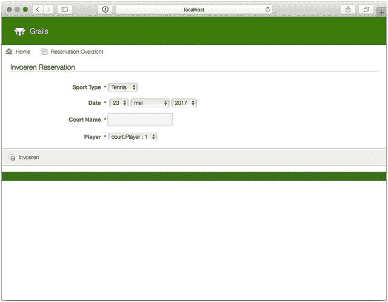

图 17-7.

添加安全设置后的登录界面

目前系统中没有用户和角色，因此暂时无法登录系统。

引导安全设置

要使用系统，你需要拥有密码和角色的用户，这些用户存在于实际运行的应用程序中。它们可以来自数据库、LDAP 目录，或者文件系统中的某些文件。你将在应用程序的引导脚本中添加一些用户。打开 `grails-app/init` 目录下的 `BootStrap.groovy` 文件，并向系统中添加两个用户和两个角色。

```
class BootStrap {
def init = { servletContext ->
def adminRole = new court.SecRole(authority: 'ROLE_ADMIN').save(flush: true)
def userRole = new court.SecRole(authority: 'ROLE_USER').save(flush: true)
def testUser = new  court.SecUser(username: 'user', password: 'password')
testUser.save(flush: true)
def testAdmin = new  court.SecUser(username: 'admin', password: 'secret')
testAdmin.save(flush: true)
court.SecUserSecRole.create testUser, userRole, true
court.SecUserSecRole.create testAdmin, adminRole, true
}
...
}
```

前两个角色 `ROLE_ADMIN` 和 `ROLE_USER` 被添加到系统中。接下来添加了两个用户，每个用户都带有用户名和密码。最后，建立了用户与角色之间的关联。

现在一切就绪，重启应用程序并登录系统（见图 17-8）。

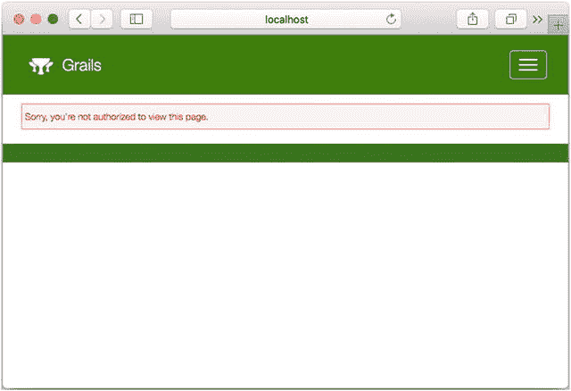

图 17-8.

使用用户登录后的系统

虽然你能够登录，但系统会显示一个页面，告知你无权访问所请求的页面。尽管系统中现在有了用户，但系统并不知道这些用户有权访问页面请求。为此，你需要添加配置，明确哪些 URL 允许被访问。

保护 URL

创建安全配置后，只添加了一些默认的 URL，这并不包含你应用程序的特定 URL。为此，请打开 `grails-app/conf` 目录下的 `application.groovy` 文件。

```
grails.plugin.springsecurity.controllerAnnotations.staticRules = [
[pattern: '/',               access: ['permitAll']],
[pattern: '/error',          access: ['permitAll']],
[pattern: '/index',          access: ['permitAll']],
[pattern: '/index.gsp',      access: ['permitAll']],
[pattern: '/shutdown',       access: ['permitAll']],
[pattern: '/assets/**',      access: ['permitAll']],
[pattern: '/**/js/**',       access: ['permitAll']],
[pattern: '/**/css/**',      access: ['permitAll']],
[pattern: '/**/images/**',   access: ['permitAll']],
[pattern: '/**/favicon.ico', access: ['permitAll']],
[pattern: '/player/**',      access: ['isAuthenticated()']],
[pattern: '/reservation/**', access: ['isAuthenticated()']]
]
```

注意新增的两项，一项针对网站的玩家部分，另一项针对预订部分。表达式 `/player/**` 是一种所谓的 Ant 风格模式，匹配所有以 `/player` 开头的内容。`permitAll` 表示任何人都可以访问网站的这些部分（主要用于静态和公共内容）。使用 `isAuthenticated()` 时，只有经过身份验证的用户才允许访问该网站。有关更多允许的表达式，请参阅第 7 章中关于 Spring Security 的配方。

重新构建并启动应用程序后，你应该能够再次访问玩家和预订界面。

使用注解实现安全控制

除了保护 URL，还可以保护方法；为此，你可以使用 `@Secured` 注解。让我们保护 create 方法，以便只有管理员才能创建新玩家。

```
import grails.plugin.springsecurity.annotation.Secured
class PlayerController {
...
@Secured(['ROLE_ADMIN'])
def create() {
respond new Player(params)
}
}
```

注意在 create 方法上添加了 `@Secured` 注解。该注解接受一个允许访问的角色数组。这里指定了 `ROLE_ADMIN`，因为访问权限仅限于管理员。`@Secured` 注解也可以放在类级别而不是方法级别，这将为类中的所有方法添加安全控制。以普通用户身份（使用 user/password）登录并尝试创建新玩家，将导致访问被拒绝的页面（与图 17-8 所示相同）。如果以管理员身份（使用 admin/secret）执行相同操作，则允许进入创建新玩家的界面。

总结

在本章中，你学习了如何使用 Grails 框架开发 Java Web 应用程序。你首先了解了 Grails 应用程序的结构，然后通过一个示例应用程序快速实践，该示例演示了 Web 应用程序中多个步骤的自动化。

通过各个配方，你学习了 Grails 如何在其自动化过程中使用约定来创建应用程序的视图、控制器、模型和配置文件。此外，你还了解了 Grails 插件的存在，这些插件用于在 Grails 上下文中自动化与相关 Java API 或框架相关的任务。然后，你探索了 Grails 如何根据应用程序的工作环境（可以是开发、测试或生产环境）分离配置参数并执行任务。

接着，你学习了 Grails 如何从应用程序的领域类生成相应的控制器和视图，用于对关系型数据库执行 CRUD 操作。随后，你探索了 Grails 的国际化、日志记录和测试功能。

接下来，你探索了用于模块化应用程序显示的 Grails 布局和模板，然后了解了 Grails 对象关系映射功能以及自定义标签的创建。

最后，你学习了如何将 Spring Security 应用于 Grails 项目，以及如何配置和使用它来保护 URL 和方法。

部署到云端

在过去的几年里，云技术发展迅速，许多公司现在提供以下类型的云解决方案：


*   平台即服务

*   基础设施即服务

*   软件即服务

**平台即服务**，顾名思义，是一个用于运行应用程序的完整平台。通常，你可以为应用程序选择一些想要使用的服务（如数据库、消息传递、日志记录等）。这些服务由谷歌（Google Cloud Platform）、Pivotal（CloudFoundry）和亚马逊（Amazon Web Services）等公司提供。

**基础设施即服务**提供虚拟机和其他资源等基础设施，用于构建你自己的部署平台。一些例子包括 VMware ESX 和 Oracle VirtualBox。

**软件即服务**是通过云交付的一个或多个软件，例如 Office 365 和 Google Apps for Work。

本章将重点介绍平台即服务云解决方案，特别是 Pivotal 提供的名为 CloudFoundry 的云解决方案。

A-1. 注册 CloudFoundry

问题

你想使用 CloudFoundry 来部署你的应用程序。

解决方案

在 [`http://run.pivotal.io`](http://run.pivotal.io) 注册 CloudFoundry。

工作原理

要能够部署到 CloudFoundry，你需要一个账户。导航到 [`http://run.pivotal.io`](http://run.pivotal.io) 并点击“免费注册”按钮（见图 A-1）。

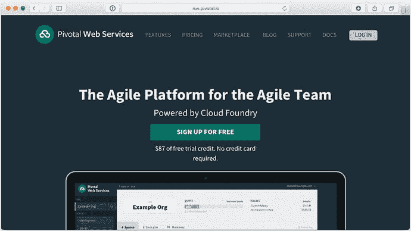

图 A-1.

CloudFoundry 注册界面

注册 CloudFoundry 非常简单，只需输入你的姓名、电子邮件地址和密码，然后点击“注册”按钮（见图 A-2）。

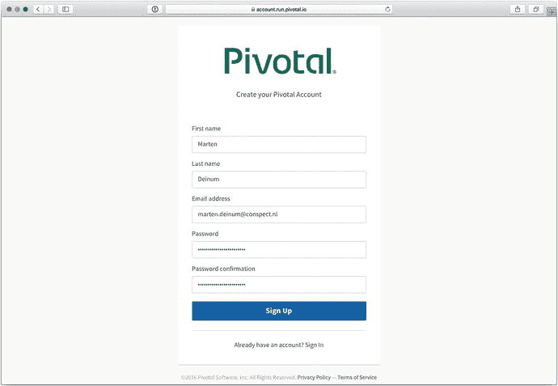

图 A-2.

CloudFoundry 注册表单

点击按钮后，你将收到一封包含链接的确认邮件。点击此链接后，你将跳转到确认页面（见图 A-3）。

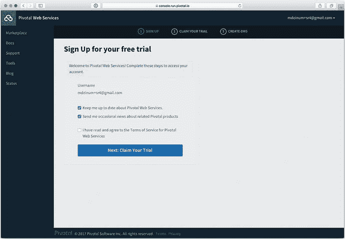

图 A-3.

CloudFoundry 确认页面

接受服务条款并点击“下一步：领取试用”按钮后，你将跳转到账户验证页面（见图 A-4），系统会要求你输入手机号码。

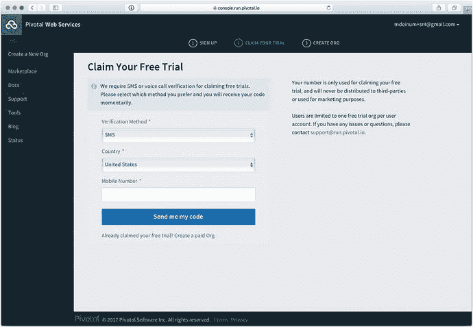

图 A-4.

CloudFoundry 账户验证页面

点击“发送验证码”按钮后，你的手机会收到一条包含验证码的短信。你可以在下一个验证页面输入此验证码（见图 A-5）。

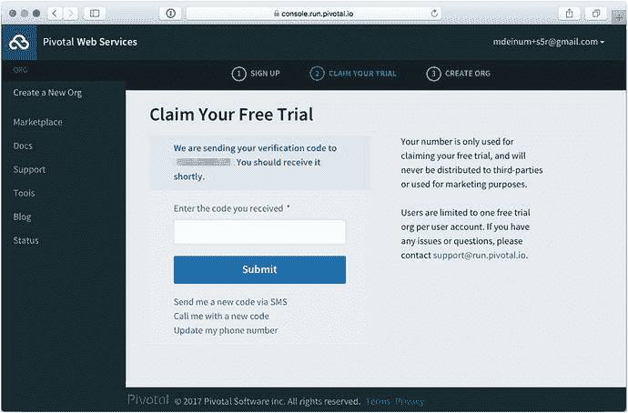

图 A-5.

输入验证码

输入验证码后，系统会要求你创建一个组织（见图 A-6）。这可以是项目名称或你的组织名称。组织名称必须是唯一的，如果你尝试使用已存在的组织名称，将会收到错误提示。

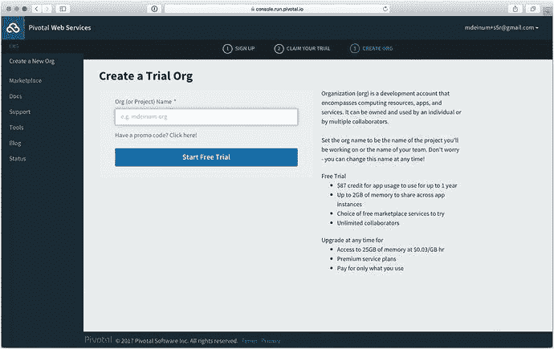

图 A-6.

输入组织名称

A-2. 安装并使用 CloudFoundry CLI

问题

你想使用 CloudFoundry CLI 工具来推送你的应用程序。

解决方案

下载并安装 CloudFoundry CLI 工具。

工作原理

要能够操作你的 CloudFoundry 实例，你需要一些工具。你可以在不同的 IDE 中找到这些工具，例如 Spring Source 的 Spring Tool Suite 和 Intellij 的 IDEA。然而，最强大的是命令行工具。要安装命令行工具，首先从 [`https://github.com/cloudfoundry/cli/releases`](https://github.com/cloudfoundry/cli/releases) 下载适合你系统的版本，或者你也可以使用包管理器来安装它们。选择并下载适合你系统的安装程序。安装完成后，这些工具就可以在命令行中使用了。

现在你需要设置命令行工具，因此打开一个终端并输入 `cf login`。系统会提示你输入 API、电子邮件和密码。API 的 URL 是你的 CloudFoundry 实例的 URL。对于本教程，你使用的是公共 API，因此 URL 是 [`https://api.run.pivotal.io`](https://api.run.pivotal.io)。电子邮件地址和密码是你注册时使用的。

接下来，它会询问要使用的组织和空间。你可以跳过这些，因为目前你只有一个组织和一个空间。

填写完这些问题后，配置会被写入用户主目录下 `.cf` 目录中的 `config.json` 文件。

让我们创建一个简单的 Hello World 应用程序并将其部署到 CloudFoundry。

```
package com.apress.springrecipes.cloud;
public class Main {
public static void main(String[] args) {
System.out.println("Hello World from CloudFoundry.");
}
}
```

这个类是一个带有 `main` 方法的基本 Java 类。它所做的只是向控制台打印一条消息。编译该文件并为其创建 JAR 后，就可以将其部署到 CloudFoundry。要部署，请在命令行中输入 `cf push <application-name> -p Recipe_a_2_i-4.0.0.jar`，其中 `<application-name>` 是你为应用程序取的一个好名字。在部署期间，输出应如图 A-7 所示。

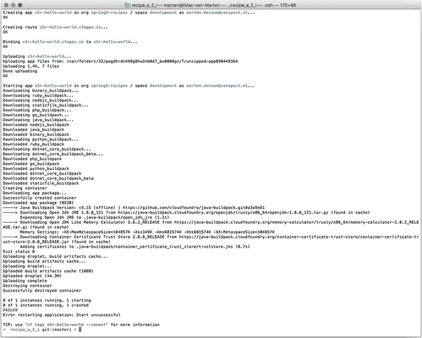

图 A-7.

应用程序部署的输出

首先要注意的是，启动应用程序似乎失败了。实际上，它确实启动了，但只是在控制台打印了一条消息，然后就立即退出了。对于 CloudFoundry 工具来说，这看起来像是启动失败，因为它在工具能够检测到它已启动之前就已经关闭了。

输出的第一行是在 CloudFoundry 上创建应用程序。它会预留一些空间并为其分配内存（默认是 1GB）。接下来，它会为公共应用程序创建路由 `<application-name>.cfapps.io`。此路由是带有 Web 界面的应用程序的入口点。对于当前应用程序来说，它没什么用（在 `cf push` 命令中添加 `--no-route` 选项可以防止创建路由）。

创建完成后，JAR 文件被上传。上传后，CloudFoundry 会检测它需要处理的是哪种类型的应用程序。当它确定类型后，相应的 buildpack 会被下载并添加。在这种情况下，意味着会安装 Java buildpack。之后，应用程序启动，工具将尝试检测应用程序是否成功启动。在这种情况下，它似乎失败了。

输入 `cf logs <application-name> --recent`，这将显示应用程序的最后日志记录（见图 A-8）。

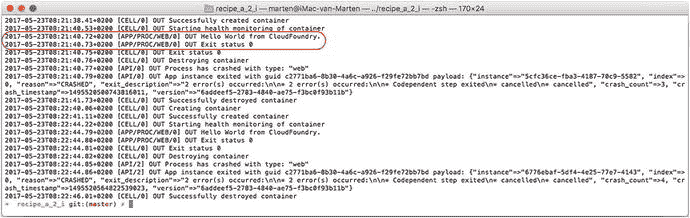

图 A-8.

应用程序的日志输出

日志中包含你放在 `System.out` 中的那一行。所以，它实际上确实启动了，但随后立即结束，这使得它无法通过健康检查，健康检查因此发出信号表明它已崩溃。


如前所述，CloudFoundry 使用所谓的 buildpack 来（可选地）构建和运行应用程序。CloudFoundry 支持多种不同的 buildpack。在命令行输入 `cf buildpacks` 将列出默认支持的 buildpack 列表（见图 A-9）。

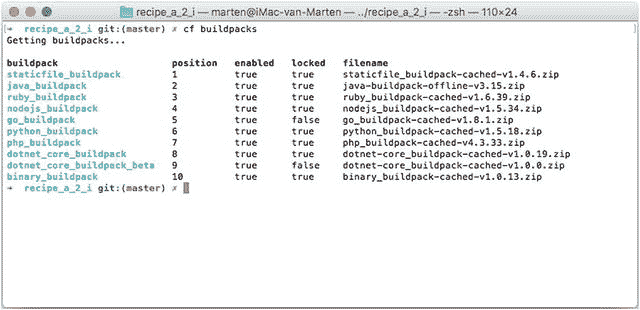

图 A-9. 默认支持的 buildpack

如您所见，它支持多种语言，例如 Ruby、Python、Go、Java，甚至 .NET，这意味着 CloudFoundry 不仅限于基于 Java 的应用程序。

A-3. 部署 Spring MVC 应用程序

问题

您希望将基于 Spring MVC 的应用程序部署到 CloudFoundry。

解决方案

使用 `cf push` 将 WAR 文件推送到 CloudFoundry。

工作原理

首先，您将创建一个要部署到 CloudFoundry 的 Web 应用程序。在将创建的应用程序部署到 CloudFoundry 之前，您将学习如何添加特定于云的配置以及如何绑定到服务。完成所有这些操作后，您将使用 `cf push` 将应用程序发布到 CloudFoundry。

创建应用程序

让我们从创建一个简单的基于 Spring MVC 的 Web 应用程序开始。首先创建一个 `ContactRepository` 接口。

```
package com.apress.springrecipes.cloud;
import java.util.List;
public interface ContactRepository {
List findAll();
void save(Contact c);
}
```

现在，为该接口创建一个基于 `Map` 的实现。

```
package com.apress.springrecipes.cloud;
import org.springframework.stereotype.Repository;
import java.util.ArrayList;
import java.util.HashMap;
import java.util.List;
import java.util.Map;
import java.util.concurrent.atomic.AtomicLong;
@Repository
public class MapBasedContactRepository implements ContactRepository {
private final AtomicLong SEQUENCE = new AtomicLong();
private Map contacts = new HashMap();
@Override
public List findAll() {
return new ArrayList(contacts.values());
}
@Override
public void save(Contact c) {
if (c.getId() <= 0) {
c.setId(SEQUENCE.incrementAndGet());
}
contacts.put(c.getId(), c);
}
}
```

当然，还需要一个 `Contact` 实体；这只是一个具有三个属性的简单类。

```
package com.apress.springrecipes.cloud;
public class Contact {
private long id;
private String name;
private String email;
public long getId() {
return id;
}
public void setId(long id) {
this .id = id;
}
public String getName() {
return name;
}
public void setName(String name) {
this .name = name;
}
public String getEmail() {
return email;
}
public void setEmail(String email) {
this .email = email;
}
}
```

由于这是一个 Web 应用程序，让我们创建一个控制器。

```
package com.apress.springrecipes.cloud.web;
import com.apress.springrecipes.cloud.Contact;
import com.apress.springrecipes.cloud.ContactRepository;
import org.springframework.beans.factory.annotation.Autowired;
import org.springframework.stereotype.Controller;
import org.springframework.ui.Model;
import org.springframework.web.bind.annotation.GetMapping;
import org.springframework.web.bind.annotation.ModelAttribute;
import org.springframework.web.bind.annotation.PostMapping;
import org.springframework.web.bind.annotation.RequestMapping;
@Controller
@RequestMapping("/contact")
public class ContactController {
private final ContactRepository contactRepository;
@Autowired
public ContactController(ContactRepository contactRepository) {
this .contactRepository = contactRepository;
}
@GetMapping
public String list(Model model) {
model.addAttribute("contacts", contactRepository.findAll());
return "list";
}
@GetMapping("/new")
public String newContact(Model model) {
model.addAttribute( new Contact());
return "contact";
}
@PostMapping("/new")
public String newContact(@ModelAttribute Contact contact) {
contactRepository.save(contact);
return "redirect:/contact";
}
}
```

这个控制器很简单。它有一个用于显示当前可用联系人列表的方法，还有一个用于添加新联系人的方法。接下来的两个视图需要创建在 `/WEB-INF/views` 目录中。首先，这是 `list.jsp` 文件：

```

Spring Recipes - Contact Sample

Contacts

Name  Email

${contact.name}  ${contact.email}

">New Contact

```

接下来，这是用于添加新联系人的 `contact.jsp` 文件：

```

Spring Recipes - Contact Sample

Contact

Contact Information

Name

Email Address

Save

```

以上就是所有的应用程序代码。剩下的部分是应用程序配置和一个用于启动应用程序的类。首先，这是应用程序配置：

```
package com.apress.springrecipes.cloud.config;
import org.springframework.context.annotation.ComponentScan;
import org.springframework.context.annotation.Configuration;
@ComponentScan(basePackages = {"com.apress.springrecipes.cloud"})
@Configuration
public class ContactConfiguration {}
```

应用程序配置相当简单。它只定义了一个组件扫描注解来检测服务和控制器。接下来，需要配置与 Web 相关的部分。

```
package com.apress.springrecipes.cloud.web;
import org.springframework.context.annotation.Bean;
import org.springframework.context.annotation.Configuration;
import org.springframework.web.servlet.config.annotation.DefaultServletHandlerConfigurer;
import org.springframework.web.servlet.config.annotation.EnableWebMvc;
import org.springframework.web.servlet.config.annotation.ViewControllerRegistry;
import org.springframework.web.servlet.config.annotation.WebMvcConfigurer;
import org.springframework.web.servlet.view.InternalResourceViewResolver;
@Configuration
@EnableWebMvc
public class ContactWebConfiguration implements WebMvcConfigurer {
@Override
public void configureDefaultServletHandling(DefaultServletHandlerConfigurer configurer) {
configurer.enable();
}
@Override
public void addViewControllers(ViewControllerRegistry registry) {
registry.addViewController("/").setViewName("redirect:/contact");
}
@Bean
public InternalResourceViewResolver internalResourceViewResolver() {
InternalResourceViewResolver viewResolver = new InternalResourceViewResolver();
viewResolver.setPrefix("/WEB-INF/views/");
viewResolver.setSuffix(".jsp");
return viewResolver;
}
}
```

最后缺失的部分是应用程序初始化器。

```
package com.apress.springrecipes.cloud.web;
import com.apress.springrecipes.cloud.config.ContactConfiguration;
import org.springframework.web.servlet.support.AbstractAnnotationConfigDispatcherServletInitializer;
public class ContactWebApplicationInitializer extends AbstractAnnotationConfigDispatcherServletInitializer {
@Override
protected Class[] getRootConfigClasses() {
return null ;
}
@Override
protected Class[] getServletConfigClasses() {
return new Class[] {ContactConfiguration.class, ContactWebConfiguration.class};
}
@Override
protected String[] getServletMappings() {
return new String[] {"/"} ;
}
}
```

现在一切就绪。构建 WAR 文件后，通过在命令行输入 `cf push <application-name> -p contact.war` 将其推送到 CloudFoundry。这将显示上传、安装 buildpack 和安装 Tomcat 的进度。成功部署后，应用程序可在 `<application-name>.cfapps.io` 访问（见图 A-10）。

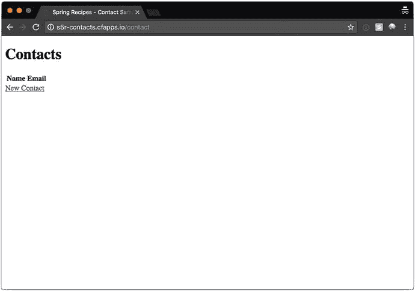

图 A-10. CloudFoundry 上的联系人应用程序

使用数据源

目前，应用程序将联系人信息存储在 `HashMap` 中。这对于测试目的来说很好，但对于真正的应用程序，数据需要存储在数据库中。首先，创建一个 JDBC 驱动的 `ContactRepository` 实现。


```
package com.apress.springrecipes.cloud;
import org.springframework.beans.factory.annotation.Autowired;
import org.springframework.jdbc.core.support.JdbcDaoSupport;
import org.springframework.stereotype.Service;
import javax.sql.DataSource;
import java.util.List;
@Service
public class JdbcContactRepository extends JdbcDaoSupport implements ContactRepository {
@Autowired
public JdbcContactRepository(DataSource dataSource) {
super .setDataSource(dataSource);
}
@Override
public List findAll() {
return getJdbcTemplate().query("select id, name, email from contact", (rs, rowNum) -> {
Contact contact = new Contact();
contact.setId(rs.getLong(1));
contact.setName(rs.getString(2));
contact.setEmail(rs.getString(3));
return contact;
});
}
@Override
public void save(Contact c) {
getJdbcTemplate().update("insert into contact (name, email) values (?, ?)", c.getName(), c.getEmail());
}
}
```

接下来，更新配置并添加 `DataSource` 和 `DataSourceInitializer` 类。

```
package com.apress.springrecipes.cloud.config;
import com.apress.springrecipes.cloud.ContactRepository;
import com.apress.springrecipes.cloud.JdbcContactRepository;
import org.springframework.context.annotation.Bean;
import org.springframework.context.annotation.ComponentScan;
import org.springframework.context.annotation.Configuration;
import org.springframework.core.io.ClassPathResource;
import org.springframework.jdbc.core.JdbcTemplate;
import org.springframework.jdbc.datasource.embedded.EmbeddedDatabaseBuilder;
import org.springframework.jdbc.datasource.embedded.EmbeddedDatabaseType;
import org.springframework.jdbc.datasource.init.DataSourceInitializer;
import org.springframework.jdbc.datasource.init.ResourceDatabasePopulator;
import javax.sql.DataSource;
@ComponentScan(basePackages = {"com.apress.springrecipes.cloud"})
@Configuration
public class ContactConfiguration {
@Bean
public DataSource dataSource() {
return new EmbeddedDatabaseBuilder().setType(EmbeddedDatabaseType.H2).build();
}
@Bean
public DataSourceInitializer dataSourceInitializer(DataSource dataSource) {
ResourceDatabasePopulator populator = new ResourceDatabasePopulator();
populator.addScript( new ClassPathResource("/sql/schema.sql"));
populator.setContinueOnError( true );
DataSourceInitializer initializer = new DataSourceInitializer();
initializer.setDataSource(dataSource);
initializer.setDatabasePopulator(populator);
return initializer;
}
}
```

为了测试和本地部署，此处使用内存中的 H2 数据库来配置该实例。
`EmbeddedDatabaseBuilder` 类用于创建 DataSource，而 `DataSourceInitializer` 类负责执行创建脚本。

再次构建 WAR 文件并部署到 CloudFoundry 后，应用程序应继续运行并使用内存数据库。
然而，您希望使用一个真正的数据库，而不是内存数据库，以便内容能够在重新部署、宕机等情况下得以持久保存。

CloudFoundry 在市场中提供了多种服务。要查看概览，请在命令行中输入 `cf marketplace`（或 `cf m`）（参见图 A-11）。

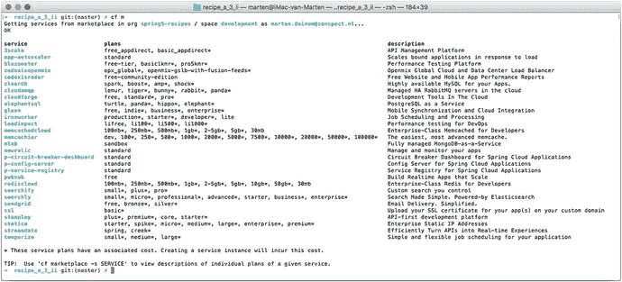

图 A-11.

CloudFoundry 服务概览

如您所见，这里有不同的服务，例如数据库实现、消息传递和电子邮件。对于本教程，需要一个数据库实例。有两个数据库选项：MySQL 和 PostgreSQL。选择您喜欢的一个并创建一个实例。要构建一个基本的 MySQL 实例，请输入 `cf create-service cleardb spark contacts-db`。数据库创建完成后，您需要将其绑定（使其可访问）到您的应用程序。输入 `cf bind-service <application-name> contacts-db`。

现在数据库已准备好可以使用。要使用它，只需重新启动或重新部署应用程序即可。

CloudFoundry 有一个名为 **自动重新配置** 的功能，默认情况下是启用的。它会查找特定类型的 bean，在本例中是 `DataSource`。它会尝试用您配置的服务提供的 DataSource 来替换它。然而，这仅在只有一个服务且只有一个该类型的 bean 时才有效。如果您有多个数据源，自动重新配置将无法工作。它适用于所有提供的服务，例如 AMQP 连接工厂和 MongoDB 实例。

访问云服务

尽管自动重新配置是一个不错的功能，但如前所述，它并不总是有效。不过，有一种简单的方法可以明确告诉 CloudFoundry 在部署时使用哪个服务。CloudFoundry 做的另一件好事是它会激活一个名为 `cloud` 的 profile。这个 profile 可用于判断应用程序是否部署在 CloudFoundry 上，因此，当部署在此处时，可以专门访问某些 bean。

需要两个额外的依赖项。

```
org.springframework.cloud 
spring-cloud-cloudfoundry-connector 
1.2.4.RELEASE

org.springframework.cloud 
spring-cloud-spring-service-connector 
1.2.4.RELEASE

```

这两个依赖项使得与 CloudFoundry 实例及其提供的服务进行交互变得容易。现在这些依赖项已可用，剩下的就是重新配置的问题了。

```
package com.apress.springrecipes.cloud.config;
import org.springframework.cloud.config.java.AbstractCloudConfig;
import org.springframework.context.annotation.Profile;
...
@Configuration
@ComponentScan(basePackages = {"com.apress.springrecipes.cloud"})
public class ContactConfiguration {
@Configuration
@Profile("default")
public static class LocalDatasourceConfiguration {
@Bean
public DataSource dataSource() {
return new EmbeddedDatabaseBuilder().setType(EmbeddedDatabaseType.H2).build();
}
}
@Configuration
@Profile("cloud")
public static class CloudDatasourceConfiguration extends AbstractCloudConfig {
@Bean
public DataSource dataSource() {
return connectionFactory().dataSource("contacts-db");
}
}
}
```

请注意这两个内部配置类。它们都带有 `@Profile` 注解。当没有激活 cloud profile 时，`LocalDataSourceConfiguration` 可用。仅当部署到云环境时，`CloudDataSourceConfiguration` 才可用。后者继承了 `AbstractCloudConfig` 类，该类提供了便捷的方法来访问所提供的服务。要获取数据源的引用，请在 `connectionFactory()` 方法上使用 `dataSource()` 查找方法。对于默认服务（数据源、MongoDB、Redis 等），它提供了便捷的访问方法。如果您开发并部署了自定义服务，则可以使用通用的 `service()` 方法来访问它们。

重新构建 WAR 并将其推送到 CloudFoundry 后，它仍然可以正常工作。

A-4\. 移除应用程序

问题

您想从 CloudFoundry 中移除一个应用程序。

解决方案

使用 CloudFoundry 工具从您的空间中删除该应用程序。

工作原理

要移除应用程序，您需要发出 `delete` 命令，而不是 `push`，让 CloudFoundry 移除该应用程序。要移除应用程序，请在命令行中输入 `cf delete <application-name>`。在确认您确实要删除该应用程序后，CloudFoundry 将开始移除该应用程序。

输出应类似于图 A-12 所示。

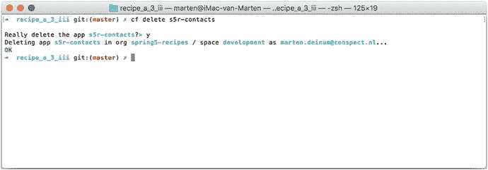

图 A-12.

从 CloudFoundry 移除应用程序的输出

总结


在本章中，你学习了如何将应用部署到 Pivotal 的 CloudFoundry 提供的云平台，以及如何从该平台移除应用。首先，你部署了一个没有任何外部连接的基础 Web 应用。之后，你添加了一个数据源，并学习了如何创建服务并将其绑定到你的应用。一旦服务可用，你就体验到了 CloudFoundry 提供的自动重配置功能。

最后，你探索了如何在应用配置中与云交互，而不是依赖自动重配置。

缓存

当程序中执行大量计算、数据检索速度缓慢或检索到的数据几乎从不变化时，应用缓存会非常有用。缓存是一种透明地存储和检索数据的能力，以便更快地向客户端提供数据。

在 Java 生态系统中，有多种缓存实现，从使用简单的 `Map` 实现到完全分布式缓存解决方案（例如 Oracle Coherence）。此外，还有久经考验且值得信赖的 Ehcache。

从 Java Enterprise Edition 7 开始，还有一个名为 JCache 的通用缓存 API（JSR-107）。针对此规范，存在多种实现（例如 Apache JCS、Hazelcast 和符合 JCache 规范的 Oracle Coherence）。

Spring 提供了一个缓存抽象，使得使用这些实现中的任何一种都更加容易，从而可以非常轻松地为你的应用添加缓存。在测试时，你可以使用基于简单 `Map` 的实现，而你的实际系统则可以使用 Oracle Coherence 集群进行缓存。

在本附录中，你将探索 Spring 的缓存抽象，并了解将缓存应用于应用的不同策略。

B-1. 使用 Ehcache 实现缓存

问题

你有一个包含大量计算任务的应用，并且希望缓存计算结果并重复使用。

解决方案

使用 Ehcache 存储计算结果。对于每次计算，检查结果是否已存在。如果存在，则返回缓存的值；如果不存在，则进行计算并将结果放入缓存。

工作原理

让我们创建 `CalculationService`，它通过使用 `Thread.sleep()` 方法来模拟大量计算。

```
package com.apress.springrecipes.caching;
import java.math.BigDecimal;
public class PlainCalculationService implements CalculationService {
@Override
public BigDecimal heavyCalculation(BigDecimal base, int power) {
try {
Thread.sleep(500);
} catch (InterruptedException e) {}
return base.pow(power);
}
}
```

如你所见，计算某个数的幂是一项繁重的计算。创建一个 `Main` 类来多次迭代运行此程序。

```
package com.apress.springrecipes.caching;
import java.math.BigDecimal;
public class Main {
public static final void main(String[] args) throws Exception {
CalculationService calculationService = new PlainCalculationService();
for (int i = 0; i < 10 ;i++) {
long start = System.currentTimeMillis();
System.out.println(calculationService.heavyCalculation(BigDecimal.valueOf(2L), 16));
long duration = System.currentTimeMillis() - start;
System.out.println("Took: " + duration);
}
}
}
```

`Main` 类将运行计算十次，并输出结果以及计算所花费的时间。运行时，你会看到每次计算的时间大约为 500 毫秒，这主要是由于 `Thread.sleep()` 造成的。

不使用 Spring 的 Ehcache

让我们通过引入缓存来改进系统。为此，你将使用纯 Ehcache。修改后的服务如下所示：

```
package com.apress.springrecipes.caching;
import net.sf.ehcache.Ehcache;
import net.sf.ehcache.Element;
import java.math.BigDecimal;
public class PlainCachingCalculationService implements CalculationService {
private final Ehcache cache;
public PlainCachingCalculationService(Ehcache cache) {
this .cache = cache;
}
@Override
public BigDecimal heavyCalculation(BigDecimal base, int power) {
String key = base +"^"+power;
Element result = cache.get(key);
if (result != null ) {
return (BigDecimal) result.getObjectValue();
}
try {
Thread.sleep(500);
} catch (InterruptedException e) {}
BigDecimal calculatedResult = base.pow(power);
cache.putIfAbsent( new Element(key, calculatedResult));
return calculatedResult;
}
}
```

首先注意服务中新增了一个缓存变量。该缓存通过构造函数注入。让我们看看更新后的 `heavyCalculation` 方法。它首先根据方法参数生成一个唯一键；此键用于从缓存中查找结果。如果找到，则返回该结果。如果没有缓存结果，则正常进行计算，计算完成后将其添加到缓存中；最后返回该值。

由于需要 Ehcache 缓存，`Main` 类需要修改，以便在构造服务之前引导 Ehcache 并查找缓存。更新后的 `Main` 类如下所示：

```
package com.apress.springrecipes.caching;
import net.sf.ehcache.CacheManager;
import net.sf.ehcache.Ehcache;
...
public class Main {
public static final void main(String[] args) throws Exception {
CacheManager cacheManager = CacheManager.getInstance();
Ehcache cache = cacheManager.getEhcache("calculations");
CalculationService calculationService = new PlainCachingCalculationService(cache);
...
cacheManager.shutdown();
}
}
```

首先需要构造一个 `CacheManager` 实例。为此，使用 `CacheManager` 类上的 `getInstance` 方法。该类将尝试从类路径根目录读取名为 `ehcache.xml` 的文件来配置缓存。接下来，请求一个名为 `calculations` 的缓存实例；生成的缓存被注入到 `PlainCachingCalculationService` 实例中。

`ehcache.xml` 文件是 Ehcache 的配置文件，内容如下：

这将配置 Ehcache 和你想要使用的特定缓存。它在内存中保留 100 个结果（`maxElementsInMemory`），持续 1 小时（`timeToLiveSeconds`）。当元素更多时，它会将这些元素存储到磁盘（`overflowToDisk`）。

运行 `Main` 类时，第一次计算大约需要 500 毫秒，而后续计算所需时间则少得多，大约为 0 到 1 毫秒。

使用带 Spring 的 Ehcache 进行配置

该应用与 Spring 集成，并将利用 Spring 来配置 `CacheManager` 和构造服务。为此，你需要进行一些 Spring 配置，并使用 `ApplicationContext` 对象来加载所有内容。配置如下：

```
package com.apress.springrecipes.caching.config;
import com.apress.springrecipes.caching.CalculationService;
import com.apress.springrecipes.caching.PlainCachingCalculationService;
import net.sf.ehcache.CacheManager;
import net.sf.ehcache.Ehcache;
import org.springframework.context.annotation.Bean;
import org.springframework.context.annotation.Configuration;
@Configuration
public class CalculationConfiguration {
@Bean
public CacheManager cacheManager() {
return CacheManager.getInstance();
}
@Bean
public CalculationService calculationService() {
Ehcache cache = cacheManager().getCache("calculations");
return new PlainCachingCalculationService(cache);
}
}
```

你还需要一个修改后的 `Main` 类，用于加载配置并从上下文中获取 `CalculationService` 类。


```
package com.apress.springrecipes.caching;
import com.apress.springrecipes.caching.config.CalculationConfiguration;
import org.springframework.context.ApplicationContext;
import org.springframework.context.annotation.AnnotationConfigApplicationContext;
import java.math.BigDecimal;
public class Main {
public static final void main(String[] args) throws Exception {
ApplicationContext context = new AnnotationConfigApplicationContext(CalculationConfiguration.class);
CalculationService calculationService = context.getBean(CalculationService.class);
for (int i = 0; i < 10 ;i++) {
long start = System.currentTimeMillis();
System.out.println(calculationService.heavyCalculation(BigDecimal.valueOf(2L), 16));
long duration = System.currentTimeMillis() - start;
System.out.println("Took: " + duration);
}
((AbstractApplicationContext) context).close();
}
}
```

虽然这减少了引导代码中对 Ehcache 的直接引用，但 `CalculationService` 类的实现仍然充斥着对 Ehcache 的引用。更不用说，手动缓存相当繁琐且容易出错，还会污染代码。如果缓存能像事务一样通过 AOP 应用，那就太好了。

**使用 Spring 配置 Ehcache**

Spring 包含一些 Ehcache 支持类，可以更轻松地配置 Ehcache 和获取缓存实例。要配置 Ehcache 的 `CacheManager`，可以使用 Spring 的 `EhCacheManagerFactoryBean`。要获取 `Cache` 实例，可以使用 `EhCacheFactoryBean`。

使用 `EhCacheManagerFactoryBean` 的好处是它可以利用 Spring 的资源加载机制来加载 Ehcache 的配置文件。它还允许轻松重用已有的 `CacheManager`，并允许你使用特定名称注册它。

如果缓存尚不存在，`EhCacheFactoryBean` 将自动创建一个。在之前的代码中，使用的缓存是显式定义的。`EhCacheFactoryBean` 会首先尝试定位一个已存在的显式配置的缓存；如果不存在，则会使用 `ehcache.xml` 中的 `defaultCache` 元素创建一个。

修改后的配置如下所示：

```
package com.apress.springrecipes.caching.config;
import com.apress.springrecipes.caching.CalculationService;
import com.apress.springrecipes.caching.PlainCachingCalculationService;
import org.springframework.cache.ehcache.EhCacheFactoryBean;
import org.springframework.cache.ehcache.EhCacheManagerFactoryBean;
import org.springframework.context.annotation.Bean;
import org.springframework.context.annotation.Configuration;
import org.springframework.core.io.ClassPathResource;
@Configuration
public class CalculationConfiguration {
@Bean
public EhCacheManagerFactoryBean cacheManager() {
EhCacheManagerFactoryBean factory = new EhCacheManagerFactoryBean();
factory.setConfigLocation( new ClassPathResource("ehcache.xml"));
return factory;
}
@Bean
public EhCacheFactoryBean calculationsCache() {
EhCacheFactoryBean factory = new EhCacheFactoryBean();
factory.setCacheManager(cacheManager().getObject());
factory.setCacheName("calculations");
return factory;
}
@Bean
public CalculationService calculationService() {
return new PlainCachingCalculationService(calculationsCache().getObject());
}
}
```

**B-2. 使用 Spring 的缓存抽象进行缓存**

**问题**

你有一个应用程序，其中包含一些计算量大的任务。你想缓存结果并重用，但同时你不想绑定到单一的缓存实现。

**解决方案**

使用 Ehcache 通过 Spring 的缓存抽象来存储计算结果。对于每次计算，检查结果是否已存在。如果存在，则返回缓存的值；如果不存在，则进行计算并将其放入缓存。

**工作原理**

首先，使用 Spring 的 `Cache` 类将缓存添加到你的应用程序中。其次，使用 `get()` 方法检查结果是否已存在。如果存在，则 `return`；如果不存在，则继续执行程序。计算完成后，将值添加到缓存中。

```
package com.apress.springrecipes.caching;
import org.springframework.cache.Cache;
import java.math.BigDecimal;
public class PlainCachingCalculationService implements CalculationService {
private final Cache cache;
public PlainCachingCalculationService(Cache cache) {
this .cache = cache;
}
@Override
public BigDecimal heavyCalculation(BigDecimal base, int power) {
String key = base +"^"+power;
BigDecimal result = cache.get(key, BigDecimal.class);
if (result != null ) {
return result;
}
try {
Thread.sleep(500);
} catch (InterruptedException e) {}
BigDecimal calculatedResult = base.pow(power);
cache.put(key, calculatedResult);
return calculatedResult;
}
}
```

接下来，需要配置 `CacheManager` 类。首先，使用 `ConcurrentMapCacheManager` 配置一个简单的基于 `Map` 的缓存，顾名思义，它在底层使用 `ConcurrentMap` 进行缓存。

```
package com.apress.springrecipes.caching.config;
...
import org.springframework.cache.CacheManager;
import org.springframework.cache.concurrent.ConcurrentMapCacheManager;
@Configuration
public class CalculationConfiguration {
@Bean
public CacheManager cacheManager() {
return new ConcurrentMapCacheManager();
}
@Bean
public CalculationService calculationService() {
return new PlainCachingCalculationService(cacheManager().getCache("calculations"));
}
}
```

你可以保持 `Main` 类不变。

**将 Ehcache 与 Spring 的缓存抽象一起使用**

虽然 `ConcurrentMapCacheManager` 看起来能胜任工作，但它不是一个完整的缓存实现。它只会向缓存中添加内容；没有缓存驱逐或缓存溢出功能。而 Ehcache 则具备所有这些功能。使用 Ehcache（或其他缓存实现，如 JCS 或 Hazelcast）只需进行配置即可。

要使用 Ehcache，首先使用 `EhCacheManagerFactoryBean` 配置 Ehcache，然后使用 `EhCacheCacheManager` 将其与 Spring 的缓存抽象挂钩。`PlainCachingCalculationService` 可以保持不变，因为它已经使用 Spring 的缓存抽象来使用缓存。

```
package com.apress.springrecipes.caching.config;
...
import org.springframework.cache.CacheManager;
import org.springframework.cache.ehcache.EhCacheCacheManager;
import org.springframework.cache.ehcache.EhCacheManagerFactoryBean;
@Configuration
public class CalculationConfiguration {
@Bean
public CacheManager cacheManager() {
EhCacheCacheManager cacheManager = new EhCacheCacheManager();
cacheManager.setCacheManager(ehCacheManagerFactoryBean().getObject());
return cacheManager;
}
@Bean
public EhCacheManagerFactoryBean ehCacheManagerFactoryBean() {
EhCacheManagerFactoryBean factory = new EhCacheManagerFactoryBean();
factory.setConfigLocation( new ClassPathResource("ehcache.xml"));
return factory;
}
@Bean
public CalculationService calculationService() {
return new PlainCachingCalculationService(cacheManager().getCache("calculations"));
}
}
```

**B-3. 使用 AOP 实现声明式缓存**

**问题**

缓存是一种横切关注点。手动应用缓存可能既繁琐又容易出错。更简单的方法是声明式地指定你期望的行为，而不规定如何实现该行为。

**解决方案**

Spring（自 3.1 版本起）提供了一种缓存通知，可以通过 `@EnableCaching` 启用。

**工作原理**

要启用声明式缓存，你必须在配置类中添加 `@EnableCaching`。这将注册一个 `CacheInterceptor` 或 `AnnotationCacheAspect` 类（取决于模式），该类将检测 `@Cacheable` 注解等。


```public BigDecimal heavyCalculation(BigDecimal base, int power) {
String key = base +"^"+power;
Element result = cache.get(key);
if (result != null ) {
return (BigDecimal) result.getObjectValue();
}
try {
Thread.sleep(500);
} catch (InterruptedException e) {}
BigDecimal calculatedResult = base.pow(power);
cache.putIfAbsent( new Element(key, calculatedResult));
return calculatedResult;
}
```

注册的通知替换了**粗体**中的代码，因为这部分主要是样板代码，需要在每个要引入缓存的方法中重复编写。移除样板代码后，剩下的代码如下：

```
@Override
public BigDecimal heavyCalculation(BigDecimal base, int power) {
try {
Thread.sleep(500);
} catch (InterruptedException e) {}
return base.pow(power);
}
```

要为此方法启用缓存，需要在方法上添加 `@Cacheable` 注解。该注解需要指定要使用的缓存名称（通过注解的 `value` 属性）。

```
@Override
@Cacheable("calculations")
public BigDecimal heavyCalculation(BigDecimal base, int power) { ... }
```

该注解还有另外三个属性：`key`、`condition` 和 `unless`。每个属性都接受一个在运行时评估的 SpEL 表达式。`key` 属性指定用于计算缓存键的方法参数。默认使用所有方法参数。`condition` 属性可用于定义应用缓存的条件。默认情况下始终缓存，并在实际方法调用之前执行。`unless` 属性的工作方式与 `condition` 属性类似，但它在实际方法调用之后执行。

**使用 Spring AOP**

`@EnableCaching` 注解的默认操作模式是使用纯 Spring AOP。这意味着将为 `CalculationService` 创建一个代理。配置如下所示：

```
package com.apress.springrecipes.caching.config;
import com.apress.springrecipes.caching.CalculationService;
import com.apress.springrecipes.caching.PlainCalculationService;
import org.springframework.cache.CacheManager;
import org.springframework.cache.annotation.EnableCaching;
import org.springframework.cache.ehcache.EhCacheCacheManager;
import org.springframework.cache.ehcache.EhCacheManagerFactoryBean;
import org.springframework.context.annotation.Bean;
import org.springframework.context.annotation.Configuration;
import org.springframework.core.io.ClassPathResource;
@Configuration
@EnableCaching
public class CalculationConfiguration {
@Bean
public CacheManager cacheManager() {
EhCacheCacheManager cacheManager = new EhCacheCacheManager();
cacheManager.setCacheManager(ehCacheManagerFactoryBean().getObject());
return cacheManager;
}
@Bean
public EhCacheManagerFactoryBean ehCacheManagerFactoryBean() {
EhCacheManagerFactoryBean factory = new EhCacheManagerFactoryBean();
factory.setConfigLocation( new ClassPathResource("ehcache.xml"));
return factory;
}
@Bean
public CalculationService calculationService() {
return new PlainCalculationService();
}
}
```

现在配置中有了 `@EnableCaching` 注解，而 `CalculationService` 只有 `@Cacheable` 注解，不再依赖缓存框架。

**使用 AspectJ**

使用 AspectJ 模式进行缓存只需将 `@EnableCaching` 注解的 `mode` 属性设置为 `ASPECTJ` 即可。根据使用的是编译时织入还是加载时织入，可能需要添加 `@EnableLoadTimeWeaving`。本示例假设代码使用加载时织入。为此，需要在配置类中添加上述注解。

```
package com.apress.springrecipes.caching.config;
...
import org.springframework.cache.annotation.EnableCaching;
import org.springframework.context.annotation.EnableLoadTimeWeaving;
@Configuration
@EnableLoadTimeWeaving
@EnableCaching(mode = AdviceMode.ASPECTJ)
public class CalculationConfiguration { ... }
```

关于加载时织入的更多信息，请参见配方 3-19。要运行主应用程序，需要使用所谓的 Java 代理启动。要使用加载时织入运行程序，请使用 `java -javaagent:./lib/spring-instrument-5.0.0.RELEASE.jar -jar Recipe_19_3_ii-4.0.0.jar`（从本配方的 `build/libs` 目录执行）。

**B-4. 配置自定义 KeyGenerator**

**问题**

默认的 `KeyGenerator` 基于方法参数生成键。您希望修改此行为。

**解决方案**

实现一个自定义的 `KeyGenerator`，采用所需的策略，并配置缓存支持以使用此自定义 `KeyGenerator`。

**工作原理**

缓存抽象使用 `KeyGenerator` 接口作为键生成的回调机制。默认情况下，它使用 `SimpleKeyGenerator` 类进行键生成。该类获取所有方法参数并计算哈希码，该哈希码用作键。

您可以实现自己的生成策略并使用它来生成键。为此，创建一个实现 `KeyGenerator` 接口并实现 `generate` 方法的类。

```
package com.apress.springrecipes.caching;
import org.springframework.cache.interceptor.KeyGenerator;
import java.lang.reflect.Method;
public class CustomKeyGenerator implements KeyGenerator {
@Override
public Object generate(Object target, Method method, Object ... params) {
return params[0] + "^" + params[1];
}
}
```

`CustomKeyGenerator` 获取第一个和第二个参数，并在它们之间附加一个 `^`（与示例中为缓存生成自定义键时的方式相同）。

接下来，将自定义实现与 Spring 中的缓存支持连接起来。为此，使用 `CachingConfigurer` 接口，该接口进一步配置 Spring 中的缓存支持。要实现它，可以使用 `CachingConfigurerSupport` 类仅覆盖要覆盖的配置部分。这里将覆盖 `keyGenerator` 和 `cacheManager`。

**注意**

不要忘记在覆盖的方法上添加 `@Bean` 注解，否则创建的实例将不会被 Spring 容器管理。

```
package com.apress.springrecipes.caching.config;
import org.springframework.cache.CacheManager;
import org.springframework.cache.annotation.CachingConfigurerSupport;
import org.springframework.cache.annotation.EnableCaching;
import org.springframework.cache.ehcache.EhCacheCacheManager;
import org.springframework.cache.ehcache.EhCacheManagerFactoryBean;
import org.springframework.cache.interceptor.KeyGenerator;
import org.springframework.context.annotation.Bean;
import org.springframework.context.annotation.Configuration;
import org.springframework.core.io.ClassPathResource;
import com.apress.springrecipes.caching.CalculationService;
import com.apress.springrecipes.caching.CustomKeyGenerator;
import com.apress.springrecipes.caching.PlainCalculationService;
@Configuration
@EnableCaching
public class CalculationConfiguration extends CachingConfigurerSupport {
@Bean
@Override
public CacheManager cacheManager() {
EhCacheCacheManager cacheManager = new EhCacheCacheManager();
cacheManager.setCacheManager(ehCacheManagerFactoryBean().getObject());
return cacheManager;
}
@Bean
@Override
public KeyGenerator keyGenerator() {
return new CustomKeyGenerator();
}
@Bean
public EhCacheManagerFactoryBean ehCacheManagerFactoryBean() {
EhCacheManagerFactoryBean factory = new EhCacheManagerFactoryBean();
factory.setConfigLocation( new ClassPathResource("ehcache.xml"));
return factory;
}
@Bean
public CalculationService calculationService() {
return new PlainCalculationService();
}
}
```

首先注意添加了 `CustomKeyGenerator`。


作为一个 Bean，以便随时可用。接下来你将看到
`CachingConfigurer` 的内部类
（你也可以创建一个普通的类，只要它实现了 `CachingConfigurer`
接口即可）。`CachingConfigurer` 的实现
返回了已配置好的 `CacheManager` 以及
`KeyGenerator`。当

使用 `CachingConfigurer` 时，
`CacheManager` 将
不再被自动检测，而必须通过 `CachingConfigurer` 进行配置。

B-5\. 向缓存添加和移除对象

问题

你希望在创建、更新或移除对象时，使用缓存逐出和缓存放入功能。

解决方案

在需要更新或使缓存中的对象失效的方法上，使用 `@CachePut` 和 `@CacheEvict`
注解。

工作原理

除了 `@Cacheable` 之外，Spring
还提供了 `@CachePut` 和 `@CacheEvict`
注解，它们分别用于向缓存中添加或移除对象（或使整个缓存失效）。

使用缓存时，你不仅希望缓存被填满，还希望它能与应用程序内部发生的事情保持同步，包括对象的更新和移除。对于结果需要更新缓存的方法，请添加 `@CachePut` 注解；对于使缓存中对象失效的方法，请使用 `@CacheEvict`
注解。

当使用 `CustomerRepository` 时，
从底层数据源获取客户信息非常耗时。你决定为这个仓库添加缓存。首先创建 `CustomerRepository`
接口。

```
package com.apress.springrecipes.caching;
public interface CustomerRepository {
Customer find(long customerId);
Customer create(String name);
void update(Customer customer);
void remove(long customerId);
}
```

你还需要一个 `Customer` 类。

```
package com.apress.springrecipes.caching;
import java.io.Serializable;
public class Customer implements Serializable {
private final long id;
private String name;
public Customer(long id) {
this .id = id;
}
public long getId() {
return id;
}
public String getName() {
return name;
}
public void setName(String name) {
this .name = name;
}
@Override
public String toString() {
return String.format("Customer [id=%d, name=%s]", this .id, this .name);
}
}
```

最后，`CustomerRepository` 接口的实现
基于 `HashMap`，因为它仅用于测试目的。通过调用 `Thread.sleep()` 来模拟缓慢的检索过程。

```
package com.apress.springrecipes.caching;
import org.springframework.cache.annotation.Cacheable;
import java.util.HashMap;
import java.util.Map;
import java.util.UUID;
public class MapBasedCustomerRepository implements CustomerRepository {
private final Map repository = new HashMap();
@Override
@Cacheable(value = "customers")
public Customer find(long customerId) {
try {
Thread.sleep(500);
} catch (InterruptedException e) {}
return repository.get(customerId);
}
@Override
public Customer create(String name) {
long id = UUID.randomUUID().getMostSignificantBits();
Customer customer = new Customer(id);
customer.setName(name);
repository.put(id, customer);
return customer;
}
@Override
public void update(Customer customer) {
repository.put(customer.getId(), customer);
}
@Override
public void remove(long customerId) {
repository.remove(customerId);
}
}
```

接下来，所有内容都需要通过一个配置类进行配置。

```
package com.apress.springrecipes.caching.config;
import com.apress.springrecipes.caching.CustomerRepository;
import com.apress.springrecipes.caching.MapBasedCustomerRepository;
import org.springframework.cache.CacheManager;
import org.springframework.cache.annotation.EnableCaching;
import org.springframework.cache.ehcache.EhCacheCacheManager;
import org.springframework.cache.ehcache.EhCacheManagerFactoryBean;
import org.springframework.context.annotation.Bean;
import org.springframework.context.annotation.Configuration;
import org.springframework.core.io.ClassPathResource;
@Configuration
@EnableCaching
public class CustomerConfiguration {
@Bean
public CacheManager cacheManager() {
EhCacheCacheManager cacheManager = new EhCacheCacheManager();
cacheManager.setCacheManager(ehCacheManagerFactoryBean().getObject());
return cacheManager;
}
@Bean
public EhCacheManagerFactoryBean ehCacheManagerFactoryBean() {
EhCacheManagerFactoryBean factory = new EhCacheManagerFactoryBean();
factory.setConfigLocation( new ClassPathResource("ehcache.xml"));
return factory;
}
@Bean
public CustomerRepository customerRepository() {
return new MapBasedCustomerRepository();
}
}
```

最后但同样重要的是，为了能够运行这个程序，你需要一个 `Main` 类。

```
package com.apress.springrecipes.caching;
import org.springframework.context.ApplicationContext;
import org.springframework.context.annotation.AnnotationConfigApplicationContext;
import org.springframework.context.support.AbstractApplicationContext;
import org.springframework.util.StopWatch;
import com.apress.springrecipes.caching.config.CustomerConfiguration;
public class Main {
public static final void main(String[] args) throws Exception {
ApplicationContext context =
new AnnotationConfigApplicationContext(CustomerConfiguration.class);
CustomerRepository customerRepository = context.getBean(CustomerRepository.class);
StopWatch sw = new StopWatch("Cache Evict and Put");
sw.start("Get 'Unknown Customer'");
Customer customer = customerRepository.find(1L);
System.out.println("Get 'Unknown Customer' (result) : " + customer);
sw.stop();
sw.start("Create New Customer");
customer = customerRepository.create("Marten Deinum");
System.out.println("Create new Customer (result) : " + customer);
sw.stop();
long customerId = customer.getId();
sw.start("Get 'New Customer 1'");
customer = customerRepository.find(customerId);
System.out.println("Get 'New Customer 1' (result) : " + customer);
sw.stop();
sw.start("Get 'New Customer 2'");
customer = customerRepository.find(customerId);
System.out.println("Get 'New Customer 2' (result) : " + customer);
sw.stop();
sw.start("Update Customer");
customer.setName("Josh Long");
customerRepository.update(customer);
sw.stop();
sw.start("Get 'Updated Customer 1'");
customer = customerRepository.find(customerId);
System.out.println("Get 'Updated Customer 1' (result) : " + customer);
sw.stop();
sw.start("Get 'Updated Customer 2'");
customer = customerRepository.find(customerId);
System.out.println("Get 'Updated Customer 2' (result) : " + customer);
sw.stop();
sw.start("Remove Customer");
customerRepository.remove(customer.getId());
sw.stop();
sw.start("Get 'Deleted Customer 1'");
customer = customerRepository.find(customerId);
System.out.println("Get 'Deleted Customer 1' (result) : " + customer);
sw.stop();
sw.start("Get 'Deleted Customer 2'");
customer = customerRepository.find(customerId);
System.out.println("Get 'Deleted Customer 2' (result) : " + customer);
sw.stop();
System.out.println();
System.out.println(sw.prettyPrint());
((AbstractApplicationContext) context).close();
}
}
```

首先要注意的是大量使用 `StopWatch` 的 `System.out` 调用。
这些调用用于展示程序运行时的行为。运行这个类后，输出应该类似于图 B-1 所示。

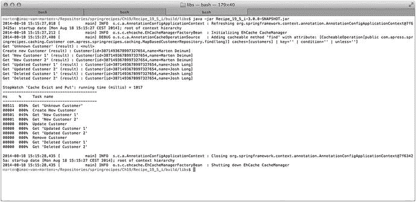

图 B-1.


运行 Main 的初始输出

运行程序后，输出中有几点值得注意。首先，在移除客户后，尝试查找已删除的客户时仍然会得到结果。这是因为只有当对象仍在正在使用的缓存中时，才会从仓库中移除它。其次，创建客户后的第一次获取操作耗时较长；如果能让创建的客户立即被缓存，效率会更高。第三，虽然从输出中不直接明显，但对象更新后的第一次获取操作非常快。更新对象后，应该移除缓存的实例。

注意

更新之所以看似有效，是因为我们更新的是与缓存中相同的 `Customer` 实例。如果更新是真正的 JDBC 更新，缓存将不会反映该更新！

使用 @CacheEvict 移除无效对象

当对象从底层仓库中移除时，它也必须从缓存中移除（或者可能需要使整个缓存失效）。为此，请在 `remove` 方法上添加 `@CacheEvict` 注解。现在，当此方法被调用时，具有相同键的对象将从缓存中移除。

```
package com.apress.springrecipes.caching;
import org.springframework.cache.annotation.CacheEvict;
...
public class MapBasedCustomerRepository implements CustomerRepository {
...
@Override
@CacheEvict(value="customers")
public void remove(long customerId) {
repository.remove(customerId);
}
}
```

请注意，`remove` 方法上的 `@CacheEvict` 注解需要指定要从中移除项的缓存名称。在本例中，缓存名称是 `customers`。它还有一些其他可用的属性（参见表 B-1）。

表 B-1.

@CacheEvict 属性

属性
 |
  描述
 |

| --- | --- | --- | --- | --- |

`key`
 |
  用于计算键的 SpEL 表达式。默认使用所有方法参数。
 |

`condition`
 |
  决定缓存是否失效的条件。
 |

`allEntries`
 |
  设置是否应清空整个缓存；默认为 false。
 |

`beforeInvocation`
 |
  设置应在方法调用之前还是之后（默认）使缓存失效。当在方法之前调用时，无论方法结果如何，缓存都将失效。
 |

再次运行 `Main` 程序时，输出略有变化（参见图 B-2）。

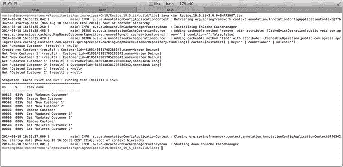

图 B-2.

向 remove 方法添加 @CacheEvict 后的输出

查看输出，很明显，当客户被移除后，不再有结果返回。当检索已删除的客户时，返回的是 `null`，而不是缓存的实例。接下来，让我们将 `@CacheEvict` 注解添加到 `update` 方法；更新后，应该再次从底层数据源检索对象。然而，将其添加到 `update` 方法会带来一个问题。该方法的参数是一个 `Customer` 值，而缓存使用客户的 ID 作为键。（请记住，默认的键生成策略使用所有方法参数来生成键；`find` 和 `remove` 方法都有一个 long 类型的方法参数。）

为了解决这个问题，你可以在 `key` 属性中编写一个简短的 SpEL 表达式。你希望它使用第一个参数的 `id` 属性作为键。`#customer.id` 表达式将处理此问题。它将引用名为 `customer` 的方法参数。

修改后的 update 方法如下所示：

```
package com.apress.springrecipes.caching;
...
import org.springframework.cache.annotation.CacheEvict;
public class MapBasedCustomerRepository implements CustomerRepository {
...
@Override
@CacheEvict(value="customers", key="#customer.id")
public void update(Customer customer) {
repository.put(customer.getId(), customer);
}
}
```

运行 `Main` 类后，时间信息显示，对更新后客户的第一次查找花费的时间稍长（参见图 B-3）。

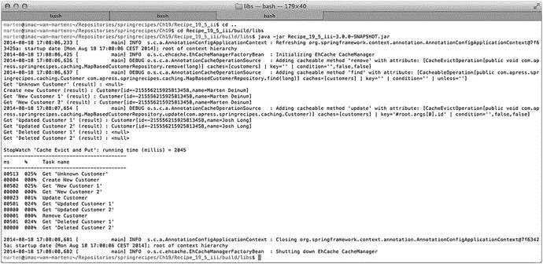

图 B-3.

向 update 方法添加 @CacheEvict 后的输出

使用 @CachePut 将对象放入缓存

`create` 方法根据当前输入创建一个 `Customer` 对象。创建后对该对象的第一次 `find` 操作需要一些时间才能完成。虽然它能工作，但可以通过让 `create` 方法将对象放入缓存来使其更快。

要使方法将值放入缓存，可以使用 `@CachePut` 注解。该注解需要指定要添加对象的缓存名称。这是通过 `value` 属性完成的。与其他注解一样，还有 `key`、`condition` 和 `unless` 属性。

```
package com.apress.springrecipes.caching;
import org.springframework.cache.annotation.CachePut;
...
public class MapBasedCustomerRepository implements CustomerRepository {
@Override
@CachePut(value="customers", key = "#result.id")
public Customer create(String name) { ... }
}
```

首先注意 `update` 方法上的 `@CachePut` 注解。它通过 `value` 属性指定了缓存名称 `customers`。需要 `key` 属性，因为通常创建对象的方法会返回要缓存的实际对象。然而，键通常不是对象本身，这就是为什么你需要为 `key` 属性指定一个 SpEL 表达式。`#result` 占位符允许访问返回的对象。由于 `Customer` 对象的 `id` 是键，因此表达式 `#result.id` 会产生所需的结果。

运行主程序的结果应类似于图 B-4。

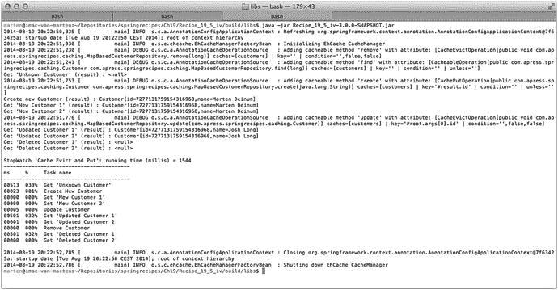

图 B-4.

向 update 方法添加 @CachePut 后的结果

现在，首次检索新创建的客户要快得多，因为对象是从缓存返回的，而不是从仓库中查找。

否决 @Cacheable 注解的结果

目前，`find` 方法会缓存所有结果，即使方法返回 `null`。禁用缓存可能并不可取。对于某些结果，你可以在 `@Cacheable` 注解上使用 `unless` 属性。当满足条件（一个 SpEL 表达式）时，返回的对象将不会被缓存。

```
package com.apress.springrecipes.caching;
import org.springframework.cache.annotation.Cacheable;
...
public class MapBasedCustomerRepository implements CustomerRepository {
@Override
@Cacheable(value = "customers", unless="#result == null")
public Customer find(long customerId) { ... }
...
}
```

请注意 `unless` 属性中的表达式。如果结果为 `null`，缓存将被否决。`#result` 占位符允许你访问从被调用方法返回的对象。这可用于编写表达式。这里的表达式是一个简单的 `null` 检查。

图 B-5 显示了排除 `null` 被缓存后的结果。对已删除客户的两次查找花费的时间大致相同。

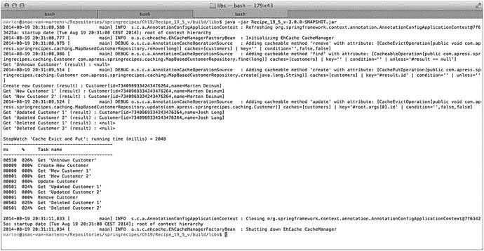

图 B-5.

排除 null 被缓存后的结果

B-6\. 将缓存与事务资源同步

问题

你希望你的缓存能够感知事务。

解决方案

某些 Spring 提供的 `CacheManager` 实现可以感知它们正在事务上下文中运行。`EhCacheCacheManager` 就是其中之一。要启用事务感知，请将 `transactionAware` 属性设置为 `true`。

工作原理


首先，创建一个 `CustomerRepository` 的事务性实现，例如使用 JDBC。

```
package com.apress.springrecipes.caching;
import java.sql.Connection;
import java.sql.PreparedStatement;
import java.sql.ResultSet;
import java.sql.SQLException;
import javax.sql.DataSource;
import org.springframework.cache.annotation.CacheEvict;
import org.springframework.cache.annotation.CachePut;
import org.springframework.cache.annotation.Cacheable;
import org.springframework.jdbc.core.JdbcTemplate;
import org.springframework.jdbc.core.PreparedStatementCreator;
import org.springframework.jdbc.core.RowMapper;
import org.springframework.jdbc.support.GeneratedKeyHolder;
import org.springframework.jdbc.support.KeyHolder;
import org.springframework.stereotype.Repository;
import org.springframework.transaction.annotation.Transactional;
@Repository
@Transactional
public class JdbcCustomerRepository implements CustomerRepository {
private final JdbcTemplate jdbc;
public JdbcCustomerRepository(DataSource dataSource) {
this .jdbc = new JdbcTemplate(dataSource);
}
@Override
@Cacheable(value = "customers")
public Customer find(long customerId) {
final String sql = "SELECT id, name FROM customer WHERE id=?";
return jdbc.query(sql, (rs, rowNum) -> {
Customer customer = new Customer(rs.getLong(1));
customer.setName(rs.getString(2));
return customer;
}, customerId).stream().findFirst().orElse( null );
}
@Override
@CachePut(value="customers", key = "#result.id")
public Customer create(String name) {
final String sql = "INSERT INTO customer (name) VALUES (?);";
KeyHolder keyHolder = new GeneratedKeyHolder();
jdbc.update(con -> {
PreparedStatement ps = con.prepareStatement(sql);
ps.setString(1, name);
return ps;
}, keyHolder);
Customer customer = new Customer(keyHolder.getKey().longValue());
customer.setName(name);
return customer;
}
@Override
@CacheEvict(value="customers", key="#customer.id")
public void update(Customer customer) {
final String sql = "UPDATE customer SET name=? WHERE id=?";
jdbc.update(sql, customer.getName(), customer.getId());
}
@Override
@CacheEvict(value="customers")
public void remove(long customerId) {
final String sql = "DELETE FROM customer WHERE id=?";
jdbc.update(sql, customerId);
}
}
```

现在，你需要将 `DataSource` 和 `DataSourceTransactionManager` 添加到配置中，当然还有 `JdbcCustomerRepository`。

```
@Bean
public CustomerRepository customerRepository(DataSource dataSource) {
return new JdbcCustomerRepository(dataSource);
}
@Bean
public DataSourceTransactionManager transactionManager(DataSource dataSource) {
return new DataSourceTransactionManager(dataSource);
}
@Bean
public DataSource dataSource() {
return new EmbeddedDatabaseBuilder()
.setType(EmbeddedDatabaseType.H2)
.setName("customers")
.addScript("classpath:/schema.sql").build();
}
```

`CUSTOMER` 表在以下 `schema.sql` 中定义：

```
CREATE TABLE customer (
id bigint AUTO_INCREMENT PRIMARY KEY ,
name VARCHAR(255) NOT NULL ,
);
```

最后，将 `EhCacheCacheManager` 的 `transactionAware` 属性设置为 `true`。将此属性设置为 `true` 将使用 `TransactionAwareCacheDecorator` 包装实际的 `Cache` 实例，该装饰器会将缓存上的操作注册到当前正在进行的事务中（如果没有可用事务，则直接执行）。

```
@Bean
public CacheManager cacheManager() {
EhCacheCacheManager cacheManager = new EhCacheCacheManager();
cacheManager.setCacheManager(ehCacheCacheManagerFactoryBean().getObject());
cacheManager.setTransactionAware( true );
return cacheManager;
}
```

现在，当你运行应用程序时，一切看起来应该仍然正常，但所有缓存操作都绑定到事务的成功执行上。因此，如果删除操作因异常而失败，`Customer` 仍将保留在缓存中。

B-7\. 使用 Redis 作为缓存提供程序

问题

你想使用 Redis 作为缓存提供程序。

解决方案


使用 Spring Data Redis 并配置一个 `RedisCacheManager` 对象来连接 Redis 实例。有关 Redis 和 Spring Data Redis 的更多信息，另请参阅第 12 章。

工作原理

首先，请确保 Redis 已启动并正在运行。

注意

`bin` 目录下有一个 `redis.sh` 文件，用于启动 Docker 化的 Redis 版本。

配置 RedisCacheManager

为了能够使用 Redis 进行缓存，你需要设置 `RedisCacheManager`，它将把缓存委托给 Redis。而 `RedisCacheManager` 又需要一个 `RedisTemplate` 类来执行其操作。

```
@Configuration
@EnableCaching
public class CustomerConfiguration {
@Bean
public RedisCacheManager cacheManager(RedisConnectionFactory connectionFactory) {
return RedisCacheManager.create(connectionFactory);
}
@Bean
public RedisConnectionFactory redisConnectionFactory() {
return new JedisConnectionFactory();
}
@Bean
public CustomerRepository customerRepository() {
return new MapBasedCustomerRepository();
}
}
```

要连接到 Redis，你需要设置 `JedisConnectionFactory`，它本身用于配置 `RedisCacheManager`。要创建一个 `RedisCacheManager` 对象，你可以将连接工厂传递给 `create` 方法，或者如果你想自定义缓存，可以使用 `builder` 方法。使用 `builder` 时，你可以自定义缓存名称、事务感知等属性。

你可以保持其余代码不变。运行主程序时，它将显示向缓存添加和移除对象等操作。

总结

在本章中，你了解了如何为应用程序添加缓存，以及这样做相当繁琐，尤其是当你想在代码的多个部分引入缓存时。你探索了纯 Ehcache API 和 Spring 的缓存抽象。在完成手动缓存后，你探索了使用 AOP 应用缓存，包括使用代理的纯 Spring AOP 和使用加载时织入的 AspectJ。

接下来，你学习了不同的注解：`@Cacheable`、`@CacheEvict` 和 `@CachePut`，以及它们如何影响应用程序的缓存行为。你还学习了如何使用 SpEL 表达式来检索用于缓存或缓存失效的正确键，以及如何影响 `@Cacheable` 注解的缓存行为。

最后一个方案介绍了 Spring Gemfire 作为一种缓存解决方案，并探讨了如何将其用作本地或远程缓存解决方案。

索引

A

访问控制

访问控制决策

AccessDecisionManager

AffirmativeBased

表达式

投票者创建

WebFlux 应用程序

访问控制条目 (ACE)

访问控制列表 (ACL)

访问控制决策

BasicLookupStrategy

Ehcache

JdbcMutableAclService

MutableAclService

设置

待办事项

@After 通知

@AfterReturning 通知

@AfterThrowing 通知

聚合器

AOP

ArithmeticCalculatorImpl 类

计数器操作

@DeclareParents

max() 和 min()

ApplicationEvent

ApplicationListener

@Around 通知

AspectJ

AspectJ 框架配置

AspectJ 加载时织入

add() 和 sub()

编译时织入

构造函数

编译后织入

Spring 加载时织入器

测试计算器

toString()

AspectJ 切入点表达式

ArithmeticCalculator 接口

声明切入点参数

@LoggingRequired

运算符

@Pointcut

签名模式

面向切面编程

通知注解

@After

@AfterReturning

@AfterThrowing

@Around

@EnableAspectJAutoProxy

连接点

POJO

异步处理

拦截器

请求处理

AsyncTaskExecutor

可调用

CompletableFuture

DeferredResult

ListenableFuture

返回类型

setAsyncSupported()

响应写入器

ResponseBodyEmitter

服务器推送事件

SseEmitter

Web 客户端

原子性、一致性、隔离性和持久性 (ACID)

用户认证

缓存用户详情

加密密码

内存定义

LDAP 仓库

仓库

SQL 语句

基于 WebFlux 的

认证

授权

感知接口

B

批处理

应用程序

固定宽度数据

解决方案

batchUpdate() 模板方法

@Bean 注解方法

Bean 工厂

Bean 管理的事务 (BMT)


BeanNameAware 接口

基于注解的 Bean 验证

Maven 项目

目标

预订领域类

规范

验证器注解

企业对企业（B2B）交易

C

缓存

结合 AOP

@Cacheable

@CacheEvict

@CachePut

配置类

CustomerRepository

自定义 KeyGenerator

Ehcache

CalculationService

配置

不使用 Spring

使用 Spring

Redis

Spring 的缓存抽象

StopWatch

事务性资源

回调方法

CloudFoundry

CLI 工具

移除应用

注册

确认页面

表单

首页

组织名称

验证页面

Spring MVC 应用

cf push

云服务

配置

Contact 实体

联系人应用

ContactRepository

数据源

创建视图

逗号分隔值（CSV）文件

@Component 注解

并发事务

容器管理事务（CMT）

内容协商

配置

ContentNegotiatingViewResolver

HTTP Accept 头

媒体类型

URL

Couchbase

CouchbaseVehicleRepository

安装

集群设置

默认桶

通知与注册

示例桶

设置，管理员用户

Spring Data 的

CouchbaseTemplate

CrudRepository

ReactiveCouchbaseRepository

存储与检索文档

CouchbaseCluster.create() 方法

CouchbaseVehicleRepository

JSON

openBucket() 方法

SerializableDocument 类

Vehicle

Vehicle 类

创建、读取、更新和删除（CRUD）控制器

凭证

跨站请求伪造（CSFR）

CSFR 保护

客户信息控制系统（CICS）

D

数据访问，JDBC

CRUD 操作

DAO

DriverManagerDataSource

异常处理

自定义

DataAccessException 层次结构

DuplicateKeyException

errorCode 与 SQLState

JndiDataSourceLookup

命名参数

ORM

参见 ORM 框架

属性

查询

findAll()

mapRow()

processRow()

queryForObject()

RowCallbackHandler

设置

模板创建

注入

JdbcDaoSupport 类

更新

batchUpdate()

参数值

PreparedStatement

PreparedStatementCreator

PreparedStatementSetter

数据访问对象（DAO）

数据定义语言（DDL）

声明式事务管理

设备检测

Spring Mobile

DeviceResolverHandlerInterceptor

DeviceResolverRequestFilter

不使用 Spring Mobile

引导

DeviceResolverRequestFilter

过滤器

查看应用

DeviceResolverHandlerInterceptor

DeviceResolverRequestFilter

调度器 Servlet

领域类

领域对象安全，ACL 服务

重复表单提交

E

Ehcache

CalculationService

配置

使用 Spring

不使用 Spring

@EnableGlobalMethodSecurity 注解

加密密码

错误处理

自定义处理器

异常类型

多错误通道

Excel 与 PDF 文件

AbstractPdfView 类

创建 Date 对象

创建解析器

日期参数

HTTP GET 处理方法

报表生成函数

解析器

视图类

XLS 文件

异常处理

自定义

DataAccessException 层次结构

DuplicateKeyException

errorCode 与 SQLState

外部资源数据

F

表单处理

控制器

自定义类型

模型属性对象

参考数据

服务处理

验证表单数据

值

创建视图

前端控制器

G

网关

定义

接口依赖

中间件

SimpleMessagingGateway

getMember 方法

GORM 动态查找器比较器

Gradle 命令行界面

Gradle 包装器

Grails

应用创建

控制器与处理方法

create-app court

create-controller welcome

文件与目录结构

GSP 页面

项目结构

运行应用

WAR

CRUD 控制器与应用领域类

自定义日志输出

自定义布局与模板

创建自定义标签

开发、生产与测试

领域类

GORM 查询

安装

国际化（I18n），消息属性

持久化存储系统

插件

安全

注解

引导安全

登录界面

SecUser 与 SecRole 领域对象

URL

单元与集成测试

Groovy 对象关系映射器（GORM）

H

使用控制器处理表单

注解

创建表单视图

Date 类

DateFormatter 类

重复表单提交

错误码

getAllSportTypes() 方法

HTML 表单

HTTP GET 请求

HTTP POST 请求

make() 方法

玩家对象字段

自定义类型的属性

参考数据

预订对象

服务处理

setupForm 处理方法

setupForm 方法

SportTypeConverter 类

submitForm 方法

成功预订


标签

验证表单数据

处理器拦截器，使用回调方法拦截请求

创建自定义

DispatcherServlet

实现接口

Java 配置

注册拦截器

Servlet 过滤器

URL

Hibernate 上下文会话

Hibernate 查询语言 (HQL)

Hibernate XML 映射

I

IllegalArgumentException

基础设施即服务

集成

聚合器

EAI

错误处理

ESB

文件系统

网关

参见 网关

JMS

MDP

ConnectionFactory

错误处理

messageDrivenChannelAdapter

messageProcessor

MessageHeaders

分割器

样式

转换器消息

消息的标头

消息的有效载荷

集成测试

AccountServiceImpl

数据库访问

JUnit

基于 REST 的客户端

Spring MVC 控制器

DepositController

InternalResourceViewResolver

JUnit

TestNG

TestContext 框架

测试夹具

TestNG

事务管理

IntelliJ IDE

Gradle 项目

Maven 项目

选择文件/目录

Spring 项目

拦截请求，处理器拦截器

回调方法

创建自定义

DispatcherServlet

实现接口

Java 配置

注册拦截器

Servlet 过滤器

URL

IoC 容器

J

Java 企业服务

契约优先的 SOAP Web 服务

生成的 WSDL 文件

生成的 XSD 文件

问题

示例 XML 消息

解决方案

使用 Spring 支持发送电子邮件

带附件（MIME 消息）

JavaMail API

MailSender

问题

解决方案

模板

工作

通过 HTTP 暴露服务

暴露 Hessian 服务

调用

问题

解决方案

通过 RMI 暴露服务

问题

解决方案

工作

使用 JAX-WS 的 SOAP Web 服务

问题

解决方案

使用 CXF

使用 JaxWsPortProxyFactoryBean

工作

使用 Spring-WS 的 SOAP Web 服务

问题

解决方案

工作

XML 编组

Spring 的 Quartz 支持

问题

解决方案

使用 Spring 支持

不使用 Spring 支持

Spring 的调度

问题

解决方案

工作

Java 管理扩展 (JMX)

问题

解决方案

Java 持久化 API (JPA)

Java 标准标签库 (JSTL)

Jaxb2Marshaller

JMX MBeans

访问远程 MBeans

问题

解决方案

通过代理

通过服务器连接

注册 Spring POJO

使用注解

管理接口

问题

用于通过 RMI 进行远程访问

服务器实例

解决方案

使用 Spring 支持

不使用 Spring 支持

工作

连接点

JPA 上下文会话

使用 REST 服务的 JSON

GSON

MappingJackson2JsonView

@ResponseBody

JSR-303 标准

Maven 项目

目标

Reservation 领域类

规范

验证器注解

JUnit

L

自定义 KeyGenerator

L

懒加载

LiteDeviceDelegatingViewResolver

登录，Web 应用程序

匿名登录

基于表单的登录

HTTP 基本认证

注销服务

记住我支持

安全配置

M

托管 Bean (MBeans)

将异常映射到视图

配置

@ControllerAdvice

defaultErrorView 属性

error.jsp

@ExceptionHandler

exceptionMappings 属性

InternalResourceViewResolver

reservation 服务

解析器 Bean

MappingJackson2JsonView

映射请求

文件扩展名

处理器方法

HTTP 请求

memberLogic

请求方法到注解的映射

URL 通配符

MarshallingView

Maven 命令行界面

媒体类型

消息驱动 POJO (MDP)

ConnectionFactory

错误处理

messageDrivenChannelAdapter

messageProcessor

MessageHeaders

模型-视图-控制器 (MVC)

视图

Web 应用程序

MongoDB

注解，映射信息

连接

下载

创建响应式仓库

设置与配置

Spring Data MongoDB 仓库

模板

N

Neo4j

下载与运行

@EnableNeo4jRepositories 注解

@EnableTransactionManagement

Hello World 程序

实现

映射对象，Neo4j OGM

Neo4jStarwarsRepository 类

Neo4jTransactionManager 实现

节点

Planet 和 Character 类

Planet 对象

PlanetRepository 和 CharacterRepository 类

关系图

远程连接

Spring 配置类

StarwarsRepository

StarwarsRepository 接口

O

对象关系映射 (ORM)

@Order 注解

ORM 框架

DAO

实体管理器工厂

实体/持久化类

Hibernate XML 映射

JPA 注解

JPA 引擎

元数据映射

资源工厂配置

Hibernate

JPA

P

分区

@PathVariable 注解

PDF 文件

AbstractPdfView 类

创建 Date 对象

创建解析器

日期参数

HTTP GET 处理器方法

报表生成函数

解析器

视图类

XLS 文件

权限

普通 Java 对象 (POJO)

ApplicationEvent


ApplicationListener

自动装配

@autowired 注解

构造函数

@inject 注解

@Primary 注解

@Qualifier 注解

@Resource 注解

@Scope 注解

感知接口

@Component

@Configurable

默认配置文件

初始化和销毁

@DependsOn

@Lazy

@Bean

@PostConstruct 和 @PreDestroy

实例工厂方法

加载配置文件

后置处理器

@Profile 注解

发布事件

@Required 注解

引用

Java 配置类

多个位置

setFileName() 方法

Spring 的工厂 Bean

静态工厂方法

@Value

平台即服务

PlatformTransactionManager

@Pointcut 注解

POJO 配置

@Component

构造函数

IoC 容器

Bean

过滤器

getBean()

Java 配置类

SequenceGenerator 类

@PostAuthorize 注解

@PostFilter 注解

postHandle() 方法

postProcessAfterInitialization() 方法

postProcessBeforeInitialization() 方法

@PreAuthorize 注解

@PreFilter 注解

preHandle() 方法

@Profile 注解

@Profile 注解

编程式事务管理

事务管理器 API

事务模板

发布事件

Q

Quartz

R

RDBMS 驱动程序

响应式处理器函数

响应式 REST 服务

消费 JSON

发布 JSON

Redis

配置

连接

下载与安装

RedisSerializer 实现

RedisTemplate

存储对象

RedisCacheManager

远程方法调用 (RMI)

渲染视图

@Required 注解

解析视图

Bean

配置

多个解析器

重定向前缀

资源包

XML 配置文件

ResourceBundleMessageSource

@ResponseBody 注解

RestMemberController

REST 服务

getForObject 方法

RestTemplate 类

检索数据

映射对象

参数化 URL

WADL

RestTemplate 类方法

富互联网应用 (RIA)

回滚事务属性

路由器

RowCallbackHandler

RSS 和 Atom 订阅源

AtomFeedView 类

buildFeedEntries

buildFeedMetadata

特性

订阅源结构

RssFeedView 类

Spring MVC 控制器

S

加盐安全哈希算法 (SSHA)

@Scope 注解

@Secured 注解

安全框架

访问控制

参见访问控制决策

认证用户

缓存用户详情

加密密码

内存定义

LDAP 仓库

仓库

SQL 语句

认证

授权

CSRF 保护

领域对象级别

参见访问控制列表 (ACL)

登录页面

登录，Web 应用

匿名登录

基于表单的登录

HTTP 基本认证

注销服务

记住我支持

安全配置

安全方法调用

URL 访问

在视图中

WebFlux 应用

安全标识 (SID)

SequenceGenerator 类

Servlet 过滤器

setActiveProfiles() 方法

setDefaultProfiles() 方法

站点偏好

SitePreferenceHandlerInterceptor

站点切换

软件即服务

拆分器

Spring 与 TaskExecutors

API

创建

ExecutorService

get()

可运行任务

SimpleAsyncTaskExecutor

submit()

SyncTaskExecutor

ThreadPoolTaskExecutor

Spring Batch

控制步骤执行

并发

带决策的条件步骤

带状态的条件步骤

问题

顺序步骤

解决方案

工作原理

数据读写

输入

ItemReader 和 ItemWriter 配置

作业配置

输出

问题

解决方案

工作原理

基础设施

问题

解决方案

工作原理

ItemReader 和 ItemWriter

问题

解决方案

工作原理

作业启动

问题

从命令行运行

按计划运行

解决方案

从 Web 应用运行

工作原理

作业参数化

访问参数

参数

问题

解决方案

在写入前处理输入

链式处理器

问题

解决方案

工作原理

重试

基于 AOP

问题

解决方案

模板

工作原理

回滚

运行时元数据模型

事务

问题

解决方案

Spring Data JPA

Spring Integration

Spring 消息

AMQP 消息

消息监听器

问题

解决方案

使用 Spring 模板支持

不使用 Spring 模板支持

Apache Kafka

将对象转换为负载

MessageConverter

消息监听器

问题

解决方案

使用 Spring 模板支持

缓存和池化 JMS 连接

问题

解决方案

工作原理

转换 JMS 消息

问题

解决方案

工作原理

管理 JMS 事务

问题

解决方案

工作原理

消息驱动的 POJO

转换 JMS 消息

管理 JMS 事务

消息监听器

问题

解决方案

发送和接收 JMS 消息

默认目标

JmsGatewaySupport 类，扩展

问题

解决方案


借助 Spring 的支持

无 Spring 支持时

运行中

Spring Mobile

detectdevices

参见设备检测

渲染视图

SitePreference

站点切换

Spring 表达式语言 (SpEL)

Spring Social

配置

Facebook 访问

FacebookConnectionFactory

FacebookTemplate

注册

设置页面

JdbcUsersConnectionRepository

模块

安全

配置

@EnableWebMvcSecurity

JdbcUserDetailsManager

登录页面

ProviderSignInUtils

设置

登录

用户名

服务提供商

配置

ConnectController

连接器与配置

WebApplicationInitializer

Twitter 访问

API 密钥与密钥

配置

注册

TwitterConnectionFactory

Twitter API

Spring Tool Suite (STS)

buildship STS 安装

定义可执行类

Gradle 项目

Java 构建工具

Maven 项目

操作系统

运行配置

Spring 项目创建

启动画面

Spring WebFlux

@Controller

@GetMapping

HttpHandler

@PostMapping

预约服务

设置

字符串与 void

Thymeleaf 视图

Spring Web Services (Spring-WS)

阶段事件驱动架构 (SEDA)

T

目标对象

测试

集成

参见集成测试

利息计算器

JUnit

TestContext

TestNG

单元

参见单元测试

TestNG

文本消息，本地化敏感

不同区域

独立网页

JSP 文件

消息源

资源包

超时与只读事务属性

工具箱

toString() 方法

事务管理

BookShop 接口

bookshop 数据库

声明式

DriverManagerDataSource

企业应用开发

实现

隔离

并发事务

级别

READ_UNCOMMITTED 与 READ_COMMITTED

REPEATABLE_READ

SERIALIZABLE

测试，bookshop 数据库

JdbcBookShop 类

JDBC 提交与回滚

JDBC 属性，应用数据库

加载时织入

编程式

传播行为

Bean 配置文件

bookshop 数据库，测试

Cashier 接口

checkout() 方法

REQUIRED

REQUIRES_NEW

属性

回滚

Spring IoC 容器

超时与只读事务属性

@Transactional 注解

事务方法

事务管理器 API

TransactionTemplate

事务隔离级别

Twitter API

U

单元测试

依赖类

隔离类

Spring MVC 控制器

桩

用户区域

Cookie

HTTP 请求头

区域解析器

paramName 属性

会话属性

URL 变更

V

验证表单数据

错误消息

HTTP POST 处理方法

@InitBinder 注解方法

reject() 方法

会话数据

有效的 Bean 作用域

@Value 注解

视图解析器

W

织入

Web 应用

基于注解的控制器类

@Controller 注解

球场预约系统

CourtServletContainerInitializer

创建 JSP 视图

部署目录

调度器 Servlet

DispatcherServlet 实例

前端控制器

@GetMapping 注解

处理方法

HTML 表单

HTTP GET 处理方法

HTTP POST 请求

Java EE 规范

Maven 项目

查询预约

请求

@RequestMapping 注解

有效的参数类型

视图解析器

WebApplicationInitializer

WEB-INF 目录

Web 应用描述语言 (WADL)

Web 客户端

exchange()

HTTP 请求方法

REST 服务

检索数据

映射对象

参数化 URL

WebSockets

配置

MessageMapping

STOMP

WebSocketHandler

向导表单控制器，多页表单

取消按钮

控制器处理方法

错误消息

getTargetPage 方法

处理方法

HashMap

HttpServletRequest 对象

@InitBinder 注解方法

make() 方法

makePeriodic() 方法

下一步按钮

PeriodicReservation 类

@PostMapping

reservationCourtForm.jsp

reservationPlayerForm.jsp

reservationTimeForm.jsp

validate() 方法

验证器类

X, Y, Z

基于 XML 的 REST 服务

getMember 方法

MarshallingView

@PathVariable

@ResponseBody

```

```

```

```

```

```
