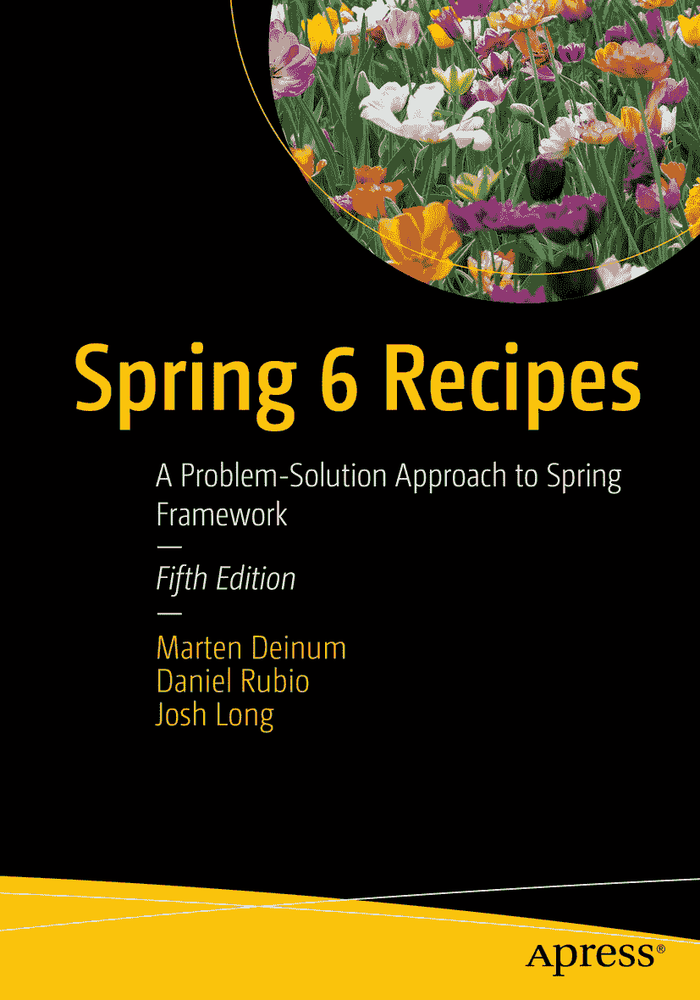

ISBN 978-1-4842-8648-7e-ISBN 978-1-4842-8649-4 [`doi.org/10.1007/978-1-4842-8649-4`](https://doi.org/10.1007/978-1-4842-8649-4) © Marten Deinum, Daniel Rubio, Josh Long 2023 本作品受版权保护。所有权利均由出版商独家许可，涉及材料的全部或部分内容，特别是翻译、重印、插图复用、朗诵、广播、微缩胶片复制或任何其他物理形式的复制权，以及信息存储与检索的传输权、电子改编、计算机软件，或目前已知或未来开发的类似或不同方法的使用权。本出版物中使用的一般描述性名称、注册商标、商标、服务标志等，即使未作明确声明，也不意味着这些名称不受相关保护法律和法规的约束，因此可自由用于一般用途。出版商、作者和编辑假定本书中的建议和信息在出版之日是真实准确的。出版商、作者或编辑均不对本文所含材料或可能存在的任何错误或遗漏提供明示或暗示的担保。出版商对已出版地图中的管辖权主张和机构归属保持中立。

本 Apress 印记由注册公司 APress Media, LLC（Springer Nature 的一部分）出版。

注册公司地址为：1 New York Plaza, New York, NY 10004, U.S.A.

## 引言

Spring Framework 仍在不断发展。它始终关乎选择。Java EE 专注于少数技术，这在很大程度上牺牲了其他更优的解决方案。当 Spring Framework 首次亮相时，很少有人会认同 Java EE 代表了当时的最佳架构。Spring 在热烈的欢呼声中登场，因为它旨在简化 Java EE。此后的每个版本都引入了新功能，旨在简化并赋能解决方案。

从 2.0 及更新版本开始，Spring Framework 开始面向多个平台。该框架一如既往地在现有平台之上提供服务，但尽可能与底层平台解耦。Java EE 仍然是一个重要的参考点，但不再是唯一目标。此外，Spring Framework 可在不同的云环境中运行。基于 Spring 构建的框架已经出现，以支持应用集成、批处理、消息传递等更多功能。Spring Framework 6 是一次重大升级；其基线已提升至 Java 17。Spring 5 引入了 Spring WebFlux，这是一个响应式编程 Web 框架；Spring 6 通过 R2DBC 扩展了对响应式数据库访问的支持，并进一步改进了响应式编程范式。Spring 6 还增加了对使用 GraalVM 进行 AOT（提前）编译的原生支持。最后，从 Java EE 到 Jakarta EE 的迁移也在 Spring 6 中完成，该版本面向更新的 API，同时也是一次破坏性变更。

这是这本优秀食谱书的第五版，它涵盖了更新后的框架，描述了新特性并解释了不同的配置选项。

我们无法描述 Spring 生态系统中的每一个项目，因此必须决定保留什么、添加什么以及更新什么。这是一个艰难的决定，但我们认为已经包含了最重要的内容。

## 本书读者对象

本书面向希望简化架构并解决 Jakarta EE 平台范围之外问题的 Java 开发者。如果你已经在项目中使用 Spring，那么更高级的章节会讨论你可能还不了解的新技术。如果你是框架新手，本书将帮助你快速上手。

本书假设你对 Java 和某种 IDE 有一定了解。虽然将 Java 专门用于客户端应用程序是可能的，也确实有用，但 Java 最大的社区存在于企业领域，而这也是你将看到这些技术发挥最大效益的地方。因此，我们假设读者对 Servlet API 等基本企业编程概念有一定了解。

## 本书结构

第 1 章“Spring 核心任务”概述了 Spring Framework，包括如何设置、它是什么以及如何使用。

第 2 章“Spring MVC”涵盖了使用 Spring Web MVC 框架进行基于 Web 的应用程序开发。

第 3 章“Spring MVC：REST 服务”介绍了 Spring 对 RESTful Web 服务的支持。

第 4 章“Spring WebFlux”介绍了 Web 的响应式编程。

第 5 章“Spring Security”概述了 Spring Security 项目，以帮助你更好地保护应用程序。

第 6 章“数据访问”讨论了如何使用 Spring 通过 Java 数据库连接（JDBC）、Hibernate/JPA 和 R2DBC 等 API 与数据存储进行通信。

第 7 章“Spring 事务管理”介绍了 Spring 强大事务管理设施背后的概念。

第 8 章“Spring Batch”介绍了 Spring Batch 框架，该框架提供了一种对传统上被视为大型机领域解决方案进行建模的方法。

第 9 章“使用 NoSQL 进行 Spring 数据访问”介绍了多个 Spring Data 组合项目，涵盖了不同的 NoSQL 技术。

第 10 章“Spring Java 企业服务与远程处理技术”向你介绍 JMX 支持、调度、电子邮件支持以及各种设施，包括 Spring Web Services（Spring-WS）项目。

第 11 章“Spring 消息传递”讨论了通过 JMS 和 RabbitMQ 以及简化的 Spring 抽象，将 Spring 与面向消息的中间件结合使用。

第 12 章“Spring 集成”讨论了使用 Spring Integration 框架集成不同的服务与数据。

第 13 章“Spring 测试”讨论了使用 Spring Framework 进行单元测试。

第 14 章“缓存”介绍了 Spring 缓存抽象，包括如何配置它以及如何为你的应用程序透明地添加缓存。

## 约定

有时，当我们希望你特别注意代码示例中的某一部分时，我们会将字体设为**粗体**。请注意，粗体并不一定反映与先前版本的代码变更。

当代码行过长无法适应页面宽度时，我们会使用代码续行符将其断开。请注意，当你输入代码时，必须将行连接起来，不留任何空格。

## 前置条件

由于 Java 编程语言具有平台无关性，你可以自由选择任何受支持的操作系统。不过，本书中的部分示例使用了特定平台的路径。在输入示例前，请根据你的操作系统格式进行相应调整。

为了充分利用本书，请安装 Java 开发工具包（JDK）19 或更高版本。建议安装 Java 集成开发环境（IDE）以简化开发流程。本书的示例代码基于 Gradle。如果你使用 Eclipse 并安装了 Gradle 插件，则可以在 Eclipse 中打开相同的代码，`CLASSPATH` 和依赖项将由 Gradle 元数据自动填充。

如果你使用 Eclipse，可能更倾向于使用 Spring Tools 4，因为它预装了在 Eclipse 中高效使用 Spring 框架所需的插件。如果你使用 IntelliJ IDEA，则需要启用 Gradle 和 Groovy 插件。

由于代码基于 Gradle，你需要安装 Gradle（7.5 或更高版本），**或者**使用提供的 Gradle Wrapper 脚本下载所需的 Gradle 版本。你可以通过 `gradle build` 或 `../../gradlew build（使用 Gradle Wrapper）` 来构建每个示例。

为方便起见，项目还提供了一些可启动 Docker 容器的脚本；如果你想使用这些脚本，需要在计算机上预先安装 Docker。

## 下载代码

本书的源代码可在 `github.com/apress-spring-6-recipes-5e` 下载。源代码按章节组织，每章包含一个或多个独立的示例。

## 联系作者

我们始终欢迎您就本书内容提出问题和反馈。您可以通过 `marten@deinum.biz` 联系 Marten Deinum。

致谢

致谢可能是本书中最难写的内容。我无法一一列出所有想要感谢的人，也难免会遗漏某些人。对此，我提前表示歉意。

虽然这是我撰写的第七本书，但如果没有 Apress 的优秀团队，我无法完成这项工作。特别感谢 Mark Powers 让我保持专注并按计划推进，感谢 Steve Anglin 给我机会撰写这本更新版，并在我因个人原因无法按时完成计划时依然支持我。感谢 Manuel Jordan，没有他的评论和建议，这本书不可能达到现在的水平。

感谢我的家人和朋友，在我无法陪伴他们的那些时光里给予理解；感谢我的潜水团队，原谅我错过的所有潜水和旅行。

最后但同样重要的是，我要感谢我的妻子 Djoke Deinum 和女儿们 Geeske 与 Sietske，感谢她们无尽的支持、爱和奉献，尽管我为了完成这本书牺牲了无数个夜晚、周末和假期。没有你们的支持，我可能早就放弃了这项事业。

> —Marten Deinum

关于作者 关于技术审校

