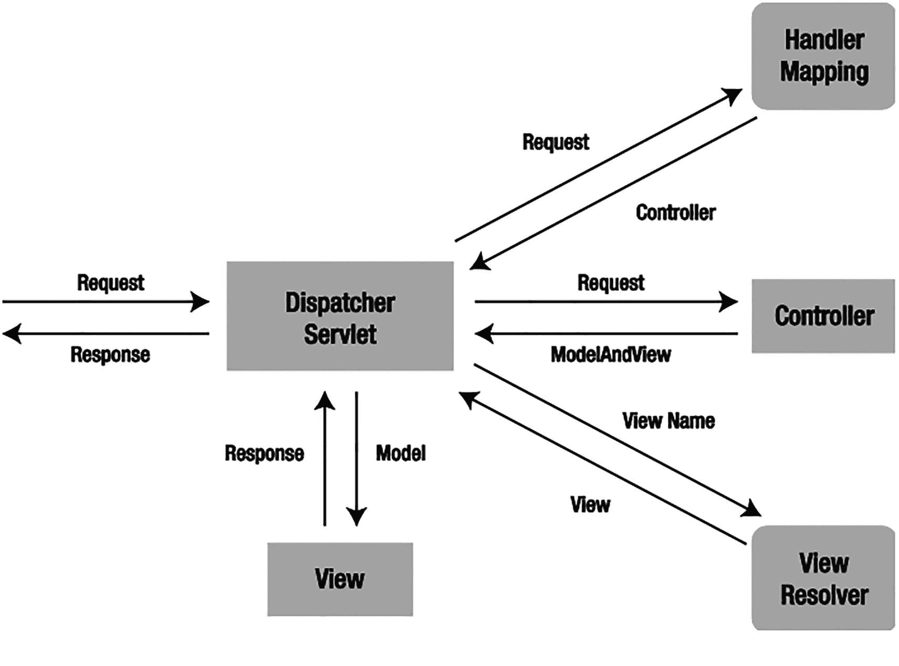

# 2. Spring MVC

MVC 是 Spring 框架的一个重要模块。它构建在强大的 Spring IoC 容器之上，并广泛利用容器的特性来简化其配置。

*模型-视图-控制器*（MVC）是 UI 设计中常见的设计模式。它通过分离应用程序中模型、视图和控制器的作用，将业务逻辑与 UI 解耦。*模型*负责封装应用程序数据以供视图呈现。*视图*应仅呈现这些数据，而不包含任何业务逻辑。*控制器*负责接收来自用户的请求，并调用后端服务进行业务处理。处理完成后，后端服务可能会返回一些数据供视图呈现。控制器收集这些数据并准备模型以供视图呈现。MVC 模式的核心思想是将业务逻辑与 UI 分离，使它们能够独立更改而互不影响。

在 Spring MVC 应用程序中，模型通常由服务层处理并由持久层持久化的对象组成。视图通常是使用 Java Server Pages、[Thymeleaf](https://thymeleaf.org/) 或 [FreeMarker](https://freemarker.apache.org/)（仅举几例）编写的模板。然而，也可以将视图定义为 PDF 文件、Excel 文件或 RESTful Web 服务。

完成本章后，你将能够使用 Spring MVC 开发 Java Web 应用程序。你还将了解 Spring MVC 的常见控制器和视图类型，包括已成为创建控制器事实标准的注解用法。此外，你将理解 Spring MVC 的基本原理，这将为后续章节中更高级的主题奠定基础。有关 Spring MVC 及其响应式对应物 Spring WebFlux 的全面深入解释，我们推荐《Pro Spring MVC with WebFlux》（Apress, 2021）。

灯泡图标表示提示信息。 要运行这些示例中的代码，你可以执行 `gradle build`，它将构建一个 WAR 文件以部署在 Jakarta EE 服务器上。然而，执行 `gradle docker` 将创建一个包含嵌入式 Tomcat 和已部署应用程序的 Docker 容器。使用 `gradle dockerRun` 将启动该容器，之后可通过 `http://localhost:8080` 访问。要能够做到这一点，需要安装 [Docker](https://docker.com/)。

## 2-1\. 使用 Spring MVC 开发一个简单的 Web 应用程序

### 问题

你想使用 Spring MVC 开发一个简单的 Web 应用程序，以学习该框架的基本概念和配置。


### 解决方案

Spring MVC 的核心组件是一个前端控制器。在最简单的 Spring MVC 应用中，这个控制器是你需要在 Java Web 部署描述符（即 `ServletContainerInitializer`）中配置的唯一 Servlet。Spring MVC 控制器——通常被称为 DispatcherServlet——充当 Spring MVC 框架的前端控制器，每个 Web 请求都必须经过它，以便它能够管理整个请求处理过程。

当 Web 请求发送到 Spring MVC 应用时，控制器首先接收该请求。然后，它会组织在 Spring 的 Web 应用上下文中配置的不同组件，或控制器自身存在的注解，所有这些组件都是处理请求所必需的。图 2-1 展示了 Spring MVC 中请求处理的主要流程。



从 Dispatcher Servlet 到 Spring MVC Web 应用的流程示意图。1. 请求被发送到处理器映射，并接收到控制器。2. 请求被发送到控制器，并接收到模型和视图。3. 视图名称被发送到视图解析器，并接收到视图。4. 模型被发送到视图，并接收到响应。

图 2-1

Spring MVC 中请求处理的主要流程

要在 Spring 中定义一个控制器类，该类必须使用 `@Controller` 或 `@RestController` 注解进行标记。

当一个使用 `@Controller` 注解的类（即控制器类）接收到请求时，它会寻找合适的处理器方法来处理该请求。这要求控制器类通过一个或多个处理器映射将每个请求映射到一个处理器方法。为此，控制器类的方法需要使用 `@RequestMapping` 注解进行修饰，使其成为处理器方法。

这些处理器方法的签名——正如你对任何标准类所期望的那样——是开放式的。你可以为处理器方法指定任意名称，并定义各种方法参数。同样，处理器方法可以返回一系列值中的任意一种（例如字符串或 void），具体取决于它所实现的应用程序逻辑。随着本书内容的深入，你将遇到使用 `@RequestMapping` 注解的处理器方法中可以使用的各种方法参数。以下是一个有效参数类型的部分列表，仅供你了解：

*   `HttpServletRequest` 或 `HttpServletResponse`
*   任意类型的请求参数，使用 `@RequestParam` 注解
*   任意类型的请求属性，使用 `@RequestAttribute` 注解
*   任意类型的模型属性，使用 `@ModelAttribute` 注解
*   传入请求中包含的 Cookie 值，使用 `@CookieValue` 注解
*   `Map` 或 `ModelMap`，用于处理器方法向模型添加属性
*   `Errors` 或 `BindingResult`，用于处理器方法访问命令对象的绑定和验证结果
*   `SessionStatus`，用于处理器方法通知其会话处理完成

一旦控制器类选择了合适的处理器方法，它就会使用该请求调用处理器方法的逻辑。通常，控制器的逻辑会调用后端服务来处理请求。此外，处理器方法的逻辑可能会向众多输入参数（例如 `HttpServletRequest`、`Map`、`Errors` 或 `SessionStatus`）中添加或移除信息，这些参数将成为正在进行的 Spring MVC 流程的一部分。

处理器方法完成请求处理后，它会将控制权委托给一个视图，该视图表示为处理器方法的返回值。为了提供灵活的方法，处理器方法的返回值并不代表视图的具体实现（例如 `user.jsp` 或 `report.pdf`），而是代表一个逻辑视图（例如 `user` 或 `report`）——注意没有文件扩展名。

处理器方法的返回值可以是表示逻辑视图名称的 `String`，也可以是 void，在这种情况下，将根据处理器方法或控制器的名称确定默认的逻辑视图名称。

为了将信息从控制器传递到视图，处理器方法返回的是逻辑视图名称（`String` 或 `void`）并不重要，因为处理器方法的输入参数将对视图可用。例如，如果处理器方法将 `Map` 和 `SessionStatus` 对象作为输入参数——并在处理器方法的逻辑中修改它们的内容——那么处理器方法返回的视图将可以访问这些相同的对象。

当控制器类接收到视图时，它会通过视图解析器将逻辑视图名称解析为特定的视图实现（例如 `user.jsp`、`todos.html` 或 `report.pdf`）。视图解析器是在 Web 应用上下文中配置的一个 bean，它实现了 `ViewResolver` 接口。其职责是为逻辑视图名称返回特定的视图实现（HTML、JSP、PDF 或其他）。

一旦控制器类将视图名称解析为视图实现，根据视图实现的设计，它会渲染由控制器处理器方法传递的对象（例如 `HttpServletRequest`、`Map`、`Errors` 或 `SessionStatus`）。视图的职责是向用户显示在处理器方法逻辑中添加的对象。


### 工作原理

假设你要为一家体育中心开发一个场地预订系统。该应用的用户界面基于 Web，以便用户可以在线预订。你希望使用 Spring MVC 来开发这个应用。首先，你需要创建以下领域类：

```
package com.apress.spring6recipes.court.domain;
import java.time.LocalDate;
public class Reservation {
private String courtName;
private LocalDate date;
private int hour;
private Player player;
private SportType sportType;
public Reservation() { }
public Reservation(String courtName, LocalDate date, int hour, Player player,
SportType sportType) {
this.courtName = courtName;
this.date = date;
this.hour = hour;
this.player = player;
this.sportType = sportType;
}
public String getCourtName() {
return courtName;
}
public void setCourtName(String courtName) {
this.courtName = courtName;
}
public LocalDate getDate() {
return date;
}
public void setDate(LocalDate date) {
this.date = date;
}
public int getHour() {
return hour;
}
public void setHour(int hour) {
this.hour = hour;
}
public Player getPlayer() {
return player;
}
public void setPlayer(Player player) {
this.player = player;
}
public SportType getSportType() {
return sportType;
}
public void setSportType(SportType sportType) {
this.sportType = sportType;
}
}
```

```
package com.apress.spring6recipes.court.domain;
public class Player {
private String name;
private String phone;
public Player() {
}
public Player(String name) {
this.name = name;
}
public String getName() {
return name;
}
public void setName(String name) {
this.name = name;
}
public String getPhone() {
return phone;
}
public void setPhone(String phone) {
this.phone = phone;
}
}
```

```
package com.apress.spring6recipes.court.domain;
public class SportType {
private int id;
private String name;
public SportType() {}
public SportType(int id, String name) {
this.id = id;
this.name = name;
}
public int getId() {
return id;
}
public void setId(int id) {
this.id = id;
}
public String getName() {
return name;
}
public void setName(String name) {
this.name = name;
}
}
```

然后，你在 `service` 子包中定义以下服务接口，以便向表示层提供预订功能：

```
package com.apress.spring6recipes.court.service;
import com.apress.spring6recipes.court.domain.Reservation;
import java.util.List;
public interface ReservationService {
List query(String courtName);
}
```

在生产应用中，你应该通过某种持久化方式来实现该接口。但为了简单起见，你可以将预订记录存储在内存中，并硬编码几条预订记录用于测试：

```
package com.apress.spring6recipes.court.service;
import com.apress.spring6recipes.court.domain.Reservation;
import java.util.List;
@Service
class InMemoryReservationService implements ReservationService {
private final List reservations =
Collections.synchronizedList(new ArrayList());
public InMemoryReservationService() {
var roger = new Player("Roger");
var james = new Player("James");
var date = LocalDate.of(2022, 10, 18);
reservations.add(new Reservation("Tennis #1", date, 16, roger, TENNIS));
reservations.add(new Reservation("Tennis #2", date, 20, james, TENNIS));
}
@Override
public List query(String courtName) {
return this.reservations.stream()
.filter( (r) -> StringUtils.startsWithIgnoreCase(r.getCourtName(), courtName))
.collect(Collectors.toList());
}
}
```

#### 设置 Spring MVC 应用

接下来，你需要创建一个 Spring MVC 应用布局。通常，使用 Spring MVC 开发的 Web 应用与标准 Java Web 应用的设置方式相同，只是你需要额外添加一些 Spring MVC 特有的配置文件和所需库。

Jakarta EE 规范定义了 Java Web 应用的有效目录结构，该结构由 Web 归档文件（WAR 文件）组成。例如，你需要在 `WEB-INF` 根目录下提供 Web 部署描述符，或者提供一个或多个实现 `ServletContainerInitializer` 的类。该 Web 应用的类文件和 JAR 文件应分别放在 `WEB-INF/classes` 和 `WEB-INF/lib` 目录中。

对于场地预订系统，请创建以下目录结构。请注意，高亮显示的文件是 Spring 特有的配置文件。

一个带字母 i 的图标，位于阴影圆圈内，表示信息符号。 要使用 Spring MVC 开发 Web 应用，你需要在 CLASSPATH 中添加所有常规的 Spring 依赖项（更多信息请参见第 1 章）以及 Spring Web 和 Spring MVC 依赖项。如果你使用 Maven，请将以下依赖项添加到 Maven 项目中：

**<dependency>**

  **<groupId>**`org.springframework`**</groupId>**

  **<artifactId>**`spring-webmvc`**</artifactId>**

  **<version>**`6.0.3`**</version>**

**</dependency>**

或者，在使用 Gradle 时添加以下依赖项：

`dependencies {`

  `implementation "org.springframework:spring-webmvc:6.0.3"`

`}`

`WEB-INF` 目录之外的文件可以通过 URL 直接供用户访问，因此 CSS 文件和图像文件必须放在那里。使用 Spring MVC 时，JSP 文件充当模板。框架会读取它们以生成动态内容，因此 JSP 文件应放在 `WEB-INF` 目录内，以防止直接访问。然而，某些应用服务器不允许 Web 应用内部读取 `WEB-INF` 内的文件。在这种情况下，你只能将它们放在 `WEB-INF` 目录之外。


#### 创建配置文件

Web 部署描述符（`web.xml` 或 `ServletContainerInitializer`）是 Java Web 应用程序的基本配置文件。在此文件中，您需要定义应用程序的 Servlet，以及 Web 请求如何映射到这些 Servlet。对于 Spring MVC 应用程序，您只需定义一个 `DispatcherServlet` 实例，它充当 Spring MVC 的前端控制器，当然，如果需要，您也可以定义多个。

在大型应用程序中，使用多个 `DispatcherServlet` 实例会很方便。这允许将 `DispatcherServlet` 实例指定给特定的 URL，从而使代码管理更轻松，并让各个团队成员能够处理应用程序的逻辑而不会相互干扰：

```
package com.apress.spring6recipes.court.web;
import com.apress.spring6recipes.court.config.CourtConfiguration;
import jakarta.servlet.ServletContainerInitializer;
import jakarta.servlet.ServletContext;
import jakarta.servlet.ServletException;
import org.springframework.web.context.support.AnnotationConfigWebApplicationContext;
import org.springframework.web.servlet.DispatcherServlet;
import java.util.Set;
public class CourtServletContainerInitializer implements ServletContainerInitializer {
public static final String MSG = "启动 Court Web 应用程序";
@Override
public void onStartup(Set> c, ServletContext ctx) throws ServletException {
ctx.log(MSG);
var applicationContext = new AnnotationConfigWebApplicationContext();
applicationContext.register(CourtConfiguration.class);
var dispatcherServlet = new DispatcherServlet(applicationContext);
var courtRegistration = ctx.addServlet("court", dispatcherServlet);
courtRegistration.addMapping("/");
courtRegistration.setLoadOnStartup(1);
}
}
```

在这个 `CourtServletContainerInitializer` 中，您定义了一个类型为 `DispatcherServlet` 的 Servlet。这是 Spring MVC 中的核心 Servlet 类，它接收 Web 请求并将其分派给适当的处理器。您将此 Servlet 的名称设置为 `court`，并使用 `/`（斜杠）映射所有 URL，斜杠代表根目录。请注意，URL 模式可以设置为更精细的模式。在较大的应用程序中，将模式委托给不同的 Servlet 可能更有意义，但为简单起见，应用程序中的所有 URL 都委托给单个 `court` Servlet。

为了让 `CourtServletContainerInitializer` 被检测到，您还需要在 `META-INF/services` 目录中添加一个名为 `jakarta.servlet.ServletContainerInitializer` 的文件。该文件的内容应为 `CourtServletContainerInitializer` 的全名。此文件由 Servlet 容器加载，并用于引导应用程序：

```
com.apress.spring6recipes.court.web.CourtServletContainerInitializer
```

最后，添加 `CourtConfiguration` 类，这是一个非常简单的 `@Configuration` 类：

```
package com.apress.spring6recipes.court.config;
import org.springframework.context.annotation.Bean;
import org.springframework.context.annotation.ComponentScan;
import org.springframework.context.annotation.Configuration;
import org.springframework.web.servlet.config.annotation.EnableWebMvc;
import org.springframework.web.servlet.view.InternalResourceViewResolver;
@Configuration
@ComponentScan("com.apress.spring6recipes.court")
@EnableWebMvc
public class CourtConfiguration {
}
```

它定义了一个 `@ComponentScan` 注解，该注解将扫描 `com.apress.spring6recipes.court` 包（及其子包）并注册所有检测到的 Bean（在本例中为 `InMemoryReservationService` 和尚未创建的带有 `@Controller` 注解的类）。它还指定了 `@EnableWebMvc` 注解，表明我们想要配置 Spring MVC。`@EnableWebMvc` 为 Spring MVC 应用程序进行了一些额外的设置（尽管 `DispatcherServlet` 本身也有一些默认设置），并允许通过使用 `WebMvcConfigurer` 实例来修改其配置（有关信息，请参阅后续的配方）。

#### 创建 Spring MVC 控制器

基于注解的控制器类可以是任意类，无需实现特定接口或扩展特定基类。您可以使用 `@Controller` 注解对其进行注解。控制器中可以定义一个或多个处理器方法来处理单个或多个操作。处理器方法的签名足够灵活，可以接受一系列参数。

`@RequestMapping` 注解可以应用于类级别或方法级别。第一种映射策略是将特定的 URL 模式映射到控制器类，然后将特定的 HTTP 方法映射到每个处理器方法：

```
package com.apress.spring6recipes.court.web;
import org.springframework.stereotype.Controller;
import org.springframework.ui.Model;
import org.springframework.web.bind.annotation.RequestMapping;
import org.springframework.web.bind.annotation.RequestMethod;
import java.time.LocalDate;
@Controller
@RequestMapping("/welcome")
public class WelcomeController {
@RequestMapping(method = RequestMethod.GET)
public String welcome(Model model) {
model.addAttribute("today", LocalDate.now());
return "/WEB-INF/jsp/welcome.jsp";
}
}
```

此控制器创建一个 `java.time.LocalDate` 对象来检索当前日期，然后将其作为属性添加到输入的 `Model` 对象中，以便目标视图可以显示它。

由于您已经在 `com.apress.spring6recipes.court` 包上激活了注解扫描，因此在部署时会检测到控制器类的注解。

`@Controller` 注解将类定义为 Spring MVC 控制器。`@RequestMapping` 注解更有趣，因为它包含属性，并且可以在类或处理器方法级别声明。此类中使用的第一个值 `("/welcome")` 用于指定控制器可操作的 URL，这意味着任何在 `/welcome` URL 上接收到的请求都由 `WelcomeController` 类处理。

一旦请求由控制器类处理，它会将调用委托给控制器中声明的默认 HTTP GET 处理器方法。这种行为的原因是，对 URL 发出的每个初始请求都是 HTTP GET 类型。因此，当控制器处理 `/welcome` URL 上的请求时，它会随后委托给默认的 HTTP GET 处理器方法进行处理。

注解 `@RequestMapping(method = RequestMethod.GET)` 用于将 `welcome` 方法装饰为控制器的默认 HTTP GET 处理器方法。值得一提的是，如果没有声明默认的 HTTP GET 处理器方法，则会抛出 `ServletException`，因此 Spring MVC 控制器至少需要有一个 URL 路由和默认的 HTTP GET 处理器方法，这一点很重要。

这种方法的另一种变体是在方法级别使用的 `@RequestMapping` 注解中同时声明两个值——URL 路由和默认的 HTTP GET 处理器方法。下面说明了这种声明方式：

```
package com.apress.spring6recipes.court.web;
import org.springframework.stereotype.Controller;
import org.springframework.ui.Model;
import org.springframework.web.bind.annotation.RequestMapping;
import org.springframework.web.bind.annotation.RequestMethod;
import java.time.LocalDate;
@Controller
public class WelcomeController {
@RequestMapping(path = "/welcome", method = RequestMethod.GET)
public String welcome(Model model) {
model.addAttribute("today", LocalDate.now());
return "/WEB-INF/jsp/welcome.jsp";
}
}
```

最后这种声明方式与之前的等效。`path`（或 `value`）属性指示处理器方法映射到的 URL，`method` 属性将处理器方法定义为控制器的默认 HTTP GET 方法。最后，还有一些方便的注解，如 `@GetMapping`、`@PostMapping` 等，以最小化配置。以下映射将执行与前面提到的声明相同的操作：


```
package com.apress.spring6recipes.court.web;
import org.springframework.stereotype.Controller;
import org.springframework.ui.Model;
import org.springframework.web.bind.annotation.GetMapping;
import java.time.LocalDate;
@Controller
public class WelcomeController {
@GetMapping("/welcome")
public String welcome(Model model) {
model.addAttribute("today", LocalDate.now());
return "/WEB-INF/jsp/welcome.jsp";
}
}
```

`@GetMapping` 让这个类变得更简洁，或许也更容易阅读。

最后一个控制器展示了 Spring MVC 的基本原理。然而，一个典型的控制器可能会调用后端服务进行业务处理。例如，你可以创建一个用于查询特定球场预订信息的控制器，如下所示：

```
package com.apress.spring6recipes.court.web;
import com.apress.spring6recipes.court.domain.Reservation;
import com.apress.spring6recipes.court.service.ReservationService;
import org.springframework.stereotype.Controller;
import org.springframework.ui.Model;
import org.springframework.web.bind.annotation.GetMapping;
import org.springframework.web.bind.annotation.PostMapping;
import org.springframework.web.bind.annotation.RequestMapping;
import org.springframework.web.bind.annotation.RequestParam;
@Controller
@RequestMapping("/reservationQuery")
public class ReservationQueryController {
private final ReservationService reservationService;
public ReservationQueryController(ReservationService reservationService) {
this.reservationService = reservationService;
}
@GetMapping
public void setupForm() {}
@PostMapping
public String sumbitForm(@RequestParam("courtName") String courtName, Model model) {
var reservations = java.util.Collections.emptyList();
if (courtName != null) {
reservations = reservationService.query(courtName);
}
model.addAttribute("reservations", reservations);
return "/WEB-INF/jsp/reservationQuery.jsp";
}
}
```

如前所述，控制器接下来会寻找一个默认的 HTTP GET 处理方法。由于公共的 `setupForm()` 方法为此目的分配了必要的 `@RequestMapping` 注解，因此接下来会调用它。

与之前的默认 HTTP GET 处理方法不同，请注意此方法没有输入参数，没有逻辑，并且返回值为 void。这意味着两件事。由于没有输入参数和逻辑，视图仅显示在实现模板（例如 JSP）中硬编码的数据，因为控制器没有添加任何数据。由于返回值为 void，将使用基于请求 URL 的默认视图名称。因此，由于请求 URL 是 `/reservationQuery`，因此假定返回一个名为 `reservationQuery` 的视图。

剩下的处理方法用 `@PostMapping` 注解修饰。乍一看，有两个处理方法只有类级别的 `/reservationQuery` URL 声明可能会令人困惑，但实际上非常简单。一个方法在 HTTP GET 请求发送到 `/reservationQuery` URL 时被调用，另一个方法在 HTTP POST 请求发送到同一个 URL 时被调用。

Web 应用中的大多数请求都是 HTTP GET 类型，而 HTTP POST 类型的请求通常在用户提交 HTML 表单时发出。因此，为了揭示更多应用的视图（我们稍后将描述），一个方法在 HTML 表单初始加载时（即 HTTP GET）被调用，而另一个方法在 HTML 表单提交时（即 HTTP POST）被调用。

仔细查看 HTTP POST 默认处理方法，注意两个输入参数。首先是 `@RequestParam("courtName") String courtName` 声明，用于提取名为 `courtName` 的请求参数。在这种情况下，HTTP POST 请求以 `/reservationQuery?courtName=<value>` 的形式到来。此声明使得该值在方法中可通过变量名 `courtName` 使用。其次，`Model` 声明用于定义一个对象，以便将数据传递到返回的视图中。

处理方法执行的逻辑包括使用控制器的 `reservationService`，利用 `courtName` 变量执行查询。从该查询获得的结果被分配给 `Model` 对象，该对象稍后将可供返回的视图用于显示。

最后，请注意该方法返回一个名为 `reservationQuery` 的视图。此方法也可以像默认的 HTTP GET 一样返回 `void`，并且由于请求 URL 的原因，会被分配到同一个 `reservationQuery` 默认视图。两种方法是一样的。

现在你已经了解了 Spring MVC 控制器的构成方式，是时候探索控制器处理方法将其结果委托给的视图了。

#### 创建 JSP 视图

Spring MVC 支持多种类型的视图，用于不同的表示技术。这些包括 JSP、HTML、PDF、Excel 工作表 (XLS)、XML、JSON（JavaScript 对象表示法）、Atom 和 RSS 源、JasperReports 以及其他第三方视图实现。

在 Spring MVC 应用中，视图大多使用模板语言编写；Jakarta EE 服务器默认提供的是使用 JSTL 编写的 JSP 模板。当 `DispatcherServlet` 接收到从处理方法返回的视图名称时，它会将逻辑视图名称解析为用于渲染的视图实现（另请参见配方 2-6）。例如，你可以在 Web 应用上下文的 `CourtConfiguration` 中配置 `InternalResourceViewResolver` bean，以将视图名称解析为 `/WEB-INF/jsp/` 目录中的 JSP 文件：

```
@Bean
public InternalResourceViewResolver internalResourceViewResolver() {
var viewResolver = new InternalResourceViewResolver();
viewResolver.setPrefix("/WEB-INF/jsp/");
viewResolver.setSuffix(".jsp");
return viewResolver;
}
```

通过使用这最后的配置，名为 `reservationQuery` 的逻辑视图被委托给位于 `/WEB-INF/jsp/reservationQuery.jsp` 的视图实现。了解这一点后，你可以为欢迎控制器创建以下 JSP 模板，将其命名为 `welcome.jsp` 并放在 `/WEB-INF/jsp/` 目录中：

```

欢迎

欢迎使用球场预订系统
今天是 ${today}。

```

接下来，你可以为预订查询控制器创建另一个 JSP 模板，并将其命名为 `reservationQuery.jsp` 以匹配视图名称：

```

预订查询

球场名称

球场名称
日期
小时
玩家

${reservation.courtName}
${reservation.date}
${reservation.hour}
${reservation.player.name}

```

在这个 JSP 模板中，你包含了一个供用户输入要查询的球场名称的表单，然后使用 `<c:forEach>` 标签循环遍历预订模型属性以生成结果表格。

#### 部署 Web 应用

在 Web 应用的开发过程中，我们强烈建议安装一个本地 Jakarta EE 应用服务器，该服务器附带一个用于测试和调试的 Web 容器。为了便于配置和部署，我们选择了 Apache Tomcat 10.1.x 作为 Web 容器。

此 Web 容器的部署目录位于 webapps 目录下。默认情况下，Tomcat 监听 8080 端口，并将应用部署到与应用 WAR 同名的上下文中。因此，如果你将应用打包成一个名为 `court.war` 的 WAR 文件，则可以通过以下 URL 访问欢迎控制器和预订查询控制器：

```
http://localhost:8080/court/welcome
http://localhost:8080/court/reservationQuery
```

灯泡图标表示提示信息。  该项目还可以创建一个包含应用的 Docker 容器：运行 `../../gradlew build docker` 来获取一个包含 Tomcat 和应用的容器。然后你可以启动一个 Docker 容器来测试应用（`../../gradlew dockerRun` 或手动使用 Docker 启动它）。


#### 使用 WebApplicationInitializer 引导应用程序

在上一节中，你创建了一个 `CourtServletContainerInitializer`，并在 `META-INF/services` 目录下添加了一个文件来引导应用程序。

现在，我们不再自行实现，而是利用 Spring 提供的便捷实现：`SpringServletContainerInitializer`。这个类实现了 `ServletContainerInitializer` 接口，并扫描类路径以查找 `WebApplicationInitializer` 接口的实现。幸运的是，Spring 提供了该接口的一些便捷实现，你可以将其用于应用程序。其中之一是 `AbstractAnnotationConfigDispatcherServletInitializer`：

```
package com.apress.spring6recipes.court.web;
import com.apress.spring6recipes.court.config.CourtConfiguration;
import org.springframework.web.servlet.support.AbstractAnnotationConfigDispatcherServletInitializer;
public class CourtWebApplicationInitializer
extends AbstractAnnotationConfigDispatcherServletInitializer {
@Override
protected Class[] getRootConfigClasses() {
return null;
}
@Override
protected Class[] getServletConfigClasses() {
return new Class[] { CourtConfiguration.class };
}
@Override
protected String[] getServletMappings() {
return new String[] { "/" };
}
}
```

新引入的 `CourtWebApplicationInitializer` 已经创建了一个 `DispatcherServlet`，因此你唯一需要做的就是在 `getServletMappings` 方法中配置映射，并在 `getServletConfigClasses` 中配置要加载的配置类。除了 Servlet 之外，还会可选地创建另一个组件，即 `ContextLoaderListener`；这是一个 `ServletContextListener`，它也会创建一个 `ApplicationContext`，该上下文将作为 `DispatcherServlet` 的父级 `ApplicationContext`。如果你有多个 Servlet 需要访问相同的 Bean（服务、数据源等），这将非常方便。

## 2-2\. 使用 @RequestMapping 映射请求

### 问题

当 `DispatcherServlet` 接收到 Web 请求时，它会尝试将请求分派给那些使用 `@Controller` 注解声明的各种控制器类。分派过程取决于控制器类及其处理方法中声明的各种 `@RequestMapping` 注解。你需要定义一种使用 `@RequestMapping` 注解映射请求的策略。

### 解决方案

在 Spring MVC 应用程序中，Web 请求通过控制器类中声明的一个或多个 `@RequestMapping` 注解映射到处理器。

处理器映射根据 URL 相对于上下文路径（即 Web 应用程序上下文的部署路径）和 Servlet 路径（即映射到 `DispatcherServlet` 的路径）的路径来匹配 URL。因此，例如，在 URL `http://localhost:8080/court/welcome` 中，要匹配的路径是 `/welcome`，因为上下文路径是 `/court`，并且没有 Servlet 路径——回想一下，在 `CourtWebApplicationInitializer` 中，Servlet 路径被声明为 `/`。

### 工作原理

#### 按方法映射请求

使用 `@RequestMapping` 注解的最简单策略是直接修饰处理方法。要使此策略生效，你必须使用包含 URL 模式的 `@RequestMapping` 注解来声明每个处理方法。如果处理器的 `@RequestMapping` 注解与请求的 URL 匹配，`DispatcherServlet` 就会将请求分派给该处理器来处理：

```
package com.apress.spring6recipes.court.web;
import com.apress.spring6recipes.court.domain.Member;
import com.apress.spring6recipes.court.service.MemberService;
import org.springframework.stereotype.Controller;
import org.springframework.ui.Model;
import org.springframework.web.bind.annotation.RequestMapping;
import org.springframework.web.bind.annotation.RequestMethod;
import org.springframework.web.bind.annotation.RequestParam;
@Controller
public class MemberController {
private MemberService memberService;
public MemberController(MemberService memberService) {
this.memberService = memberService;
}
@RequestMapping("/member/add")
public String addMember(Model model) {
model.addAttribute("member", new Member());
model.addAttribute("guests", memberService.list());
return "memberList";
}
@RequestMapping(value = { "/member/remove", "/member/delete" },
method = RequestMethod.GET)
public String removeMember(@RequestParam("memberName") String memberName) {
memberService.remove(memberName);
return "redirect:";
}
}
```

上面的代码清单展示了如何使用 `@RequestMapping` 注解将每个处理方法映射到特定的 URL。第二个处理方法演示了如何分配多个 URL，因此 `/member/remove` 和 `/member/delete` 都会触发该处理方法的执行。当未指定 `method` 时，它将匹配所有传入的 HTTP 方法类型（GET、POST、PUT 等）；可以通过指定用于映射的 `method` 来缩小匹配范围。


#### 按类映射请求

`@RequestMapping` 注解也可用于装饰控制器类。这使得处理器方法可以像配方 2-1 中的 `ReservationQueryController` 所示那样，放弃使用 `@RequestMapping` 注解，或者使用带有自身 `@RequestMapping` 注解的更细粒度 URL。为了实现更广泛的 URL 匹配，`@RequestMapping` 注解还支持使用通配符（即 `*`）。

以下列表展示了在 `@RequestMapping` 注解中使用 URL 通配符，以及在处理器方法的 `@RequestMapping` 注解上进行更细粒度 URL 匹配的示例：

```
package com.apress.spring6recipes.court.web;
import com.apress.spring6recipes.court.domain.Member;
import com.apress.spring6recipes.court.service.MemberService;
import org.springframework.stereotype.Controller;
import org.springframework.ui.Model;
import org.springframework.web.bind.annotation.PathVariable;
import org.springframework.web.bind.annotation.RequestMapping;
import org.springframework.web.bind.annotation.RequestMethod;
import org.springframework.web.bind.annotation.RequestParam;
@Controller
@RequestMapping("/member/*")
public class MemberController {
private MemberService memberService;
public MemberController(MemberService memberService) {
this.memberService = memberService;
}
@RequestMapping("/add")
public String addMember(Model model) {
model.addAttribute("member", new Member());
model.addAttribute("guests", memberService.list());
return "memberList";
}
@RequestMapping(path = { "/remove", "/delete" }, method = RequestMethod.GET)
public String removeMember(@RequestParam("memberName") String memberName) {
memberService.remove(memberName);
return "redirect:";
}
@RequestMapping("/display/{member}")
public String displayMember(@PathVariable("member") String member, Model model) {
model.addAttribute("member", memberService.find(member).orElse(null));
return "member";
}
@RequestMapping
public void memberList() {}
public void memberLogic(String memberName) {}
}
```

注意，类级别的 `@RequestMapping` 注解使用了 URL 通配符：`/member/*`。这会将所有对 `/member/` URL 的请求委托给该控制器的处理器方法。

前两个处理器方法使用了 `@RequestMapping` 注解。当对 `/member/add` URL 发起 HTTP GET 请求时，会调用 `addMember()` 方法；而当对 `/member/remove` 或 `/member/delete` URL 发起 HTTP GET 请求时，则会调用 `removeMember()` 方法。

第三个处理器方法使用特殊符号 `{path_variable}` 来指定其 `@RequestMapping` 的值。通过这种方式，URL 中的值可以作为输入传递给处理器方法。注意，该处理器方法声明了 `@PathVariable("member") String member`。这样一来，如果收到形如 `member/display/jdoe` 的请求，处理器方法就能访问到值为 `jdoe` 的 `member` 变量。这主要是一种让你无需处理处理器请求对象的便利机制，并且在设计 RESTful Web 服务时尤其有用。

第四个处理器方法也使用了 `@RequestMapping` 注解，但这次缺少了 URL 值。由于类级别使用了 `/member/*` URL 通配符，该处理器方法会作为“兜底”方法执行。因此，任何 URL 请求（例如 `/member/abcdefg` 或 `/member/randomroute`）都会触发此方法。注意其 `void` 返回值，这会使处理器方法默认按其名称（即 `memberList`）解析视图。

最后一个方法——`memberLogic`——没有任何 `@RequestMapping` 注解；这意味着该方法只是该类的一个工具方法，对 Spring MVC 没有影响。

#### 按 HTTP 请求类型映射请求

默认情况下，`@RequestMapping` 注解处理所有类型的传入请求。然而，在大多数情况下，我们不希望同一个方法同时处理 GET 和 POST 请求。为了区分 HTTP 请求，需要在 `@RequestMapping` 注解中明确指定请求类型，如下所示：

```
@RequestMapping(value= "processUser", method =  RequestMethod.POST)
public String submitForm(@ModelAttribute("member") Member member,
BindingResult result, Model model) {
}
```

你需要指定处理器方法 HTTP 类型的程度，取决于与控制器交互的内容和方式。大多数情况下，Web 浏览器主要使用 HTTP `GET` 和 HTTP `POST` 请求执行操作。然而，其他设备或应用程序（例如 RESTful Web 服务）可能需要支持其他 HTTP 请求类型。总共有九种不同的 HTTP 请求类型：`HEAD`、`GET`、`POST`、`PUT`、`DELETE`、`PATCH`、`TRACE`、`OPTIONS` 和 `CONNECT`。然而，支持处理所有这些请求类型超出了 MVC 控制器的范围，因为 Web 服务器和请求方需要支持这些 HTTP 请求类型。考虑到绝大多数 HTTP 请求都是 `GET` 或 `POST` 类型，你很少（甚至永远不会）需要实现对其他 HTTP 请求类型的支持。

对于最常用的请求方法，Spring MVC 提供了专门的注解。

*请求方法到注解的映射*

| 请求方法 | 注解 |
| --- | --- |
| POST | `@PostMapping` |
| GET | `@GetMapping` |
| DELETE | `@DeleteMapping` |
| PUT | `@PutMapping` |
| PATCH | `@PatchMapping` |

这些便捷注解都是专门的 `@RequestMapping` 注解，使得编写请求处理方法更加简洁：

```
@PostMapping("processUser")
public String submitForm(@ModelAttribute("member") Member member,
BindingResult result, Model model) {
}
```

像 .HTML 和 .JSP 这样的 URL 扩展名在哪里？

你可能已经注意到，在 `@RequestMapping` 注解中指定的所有 URL 中，都没有像 `.html` 或 `.jsp` 这样的文件扩展名。尽管这种做法并未被广泛采用，但它是符合 MVC 设计原则的良好实践。

控制器不应与任何指示视图技术（如 HTML 或 JSP）的扩展名绑定。这就是为什么控制器返回逻辑视图，并且匹配的 URL 应该声明时不带扩展名的原因。

在应用程序通常需要以不同格式（如 XML、JSON、PDF 或 XLS（Excel））提供相同内容的时代，应该由视图解析器来检查请求中提供的扩展名（如果有的话），并决定使用哪种视图技术。

在这个简短的介绍中，你已经看到了如何在 MVC 配置类中配置解析器，将逻辑视图映射到 JSP 文件，而全程无需使用像 `.jsp` 这样的 URL 文件扩展名。

在后续的配方中，你将学习 Spring MVC 如何使用这种无扩展名的 URL 方法，通过不同的视图技术来提供内容。

## 2-3. 使用处理器拦截器拦截请求

### 问题

Servlet API 定义的 Servlet 过滤器可以在每个 Web 请求被 Servlet 处理之前和之后进行预处理和后处理。你希望在 Spring 的 Web 应用上下文中配置具有类似过滤器功能的东西，以利用容器的特性。

此外，有时你可能希望对由 Spring MVC 处理器处理的 Web 请求进行预处理和后处理，并在这些处理器返回的模型属性传递给视图之前对其进行操作。


### 解决方案

Spring MVC 允许你通过处理器拦截器（handler interceptor）拦截 Web 请求，进行预处理和后处理。处理器拦截器在 Spring 的 Web 应用上下文中配置，因此它们可以利用任何容器特性，并引用容器中声明的任何 Bean。可以为特定的 URL 映射注册处理器拦截器，这样它只会拦截映射到特定 URL 的请求。

每个处理器拦截器都必须实现 `HandlerInterceptor` 接口，该接口包含三个需要你实现的回调方法：`preHandle()`、`postHandle()` 和 `afterCompletion()`。你只需要实现你需要用到的回调方法。第一个和第二个方法分别在处理器处理请求之前和之后被调用。第二个方法还允许你访问返回的 `ModelAndView` 对象，因此你可以操作其中的模型属性。最后一个方法在所有请求处理完成之后（即视图渲染之后）被调用。

### 工作原理

假设你要测量每个请求处理器处理每个 Web 请求的时间，并允许视图向用户显示这个时间。你可以为此创建一个自定义的处理器拦截器：

```
package com.apress.spring6recipes.court.web;
import jakarta.servlet.http.HttpServletRequest;
import jakarta.servlet.http.HttpServletResponse;
import org.springframework.util.StopWatch;
import org.springframework.web.servlet.HandlerInterceptor;
import org.springframework.web.servlet.ModelAndView;
public class MeasurementInterceptor implements HandlerInterceptor {
private static final String NAME = "MeasurementInterceptor.TIMER";
@Override
public boolean preHandle(HttpServletRequest request, HttpServletResponse response,
Object handler) {
var sw = new StopWatch();
sw.start();
request.setAttribute(NAME, sw);
return true;
}
@Override
public void postHandle(HttpServletRequest request, HttpServletResponse response,
Object handler, ModelAndView modelAndView) {
var timer = (StopWatch) request.getAttribute(NAME);
timer.stop();
modelAndView.addObject("processingTime", timer.getTotalTimeMillis());
}
}
```

在这个拦截器的 `preHandle()` 方法中，你创建一个 `StopWatch` 并启动它，然后将其保存到请求属性中。此方法应返回 `true`，以允许 `DispatcherServlet` 继续处理请求。否则，`DispatcherServlet` 会假定此方法已经处理了请求，因此 `DispatcherServlet` 会直接将响应返回给用户。然后，在 `postHandle()` 方法中，你检索 `StopWatch`，停止它，并获取总处理时间。

要注册一个拦截器，你需要使用 `WebMvcConfigurer`。这是一个接口，包含几个由 Spring Web MVC 配置使用的回调方法，用于执行一些特定的设置。你可以在现有的 `CourtConfiguration` 上实现此接口，或者为此提供一个单独的配置类。无论哪种方式，你都需要重写 `addInterceptors` 方法。该方法让你能够访问 `InterceptorRegistry`，你可以使用它来添加拦截器：

```
package com.apress.spring6recipes.court.config;
import com.apress.spring6recipes.court.web.MeasurementInterceptor;
import org.springframework.context.annotation.Bean;
import org.springframework.context.annotation.Configuration;
import org.springframework.web.servlet.config.annotation.InterceptorRegistry;
import org.springframework.web.servlet.config.annotation.WebMvcConfigurer;
@Configuration
public class InterceptorConfiguration implements WebMvcConfigurer {
@Override
public void addInterceptors(InterceptorRegistry registry) {
registry.addInterceptor(measurementInterceptor());
}
@Bean
public MeasurementInterceptor measurementInterceptor() {
return new MeasurementInterceptor();
}
}
```

现在，你可以在 `welcome.jsp` 中显示这个时间，以验证此拦截器的功能。由于 `WelcomeController` 没有太多事情要做，你可能会看到处理时间为 0 毫秒。如果是这种情况，你可以在此类中添加一个 sleep 语句，以看到更长的处理时间：

```

Welcome

Welcome to Court Reservation System
Today is ${today}.

Processing time : ${processingTime}ms.

```

默认情况下，`HandlerInterceptor` 应用于所有 `@Controller`。然而，有时你想要区分拦截器应用于哪些控制器。命名空间和基于 Java 的配置允许将拦截器映射到特定的 URL。这只是一个配置问题。以下是此功能的 Java 配置：

```
package com.apress.spring6recipes.court.config;
import com.apress.spring6recipes.court.web.ExtensionInterceptor;
import com.apress.spring6recipes.court.web.MeasurementInterceptor;
import org.springframework.context.annotation.Bean;
import org.springframework.context.annotation.Configuration;
import org.springframework.web.servlet.config.annotation.InterceptorRegistry;
import org.springframework.web.servlet.config.annotation.WebMvcConfigurer;
@Configuration
public class InterceptorConfiguration implements WebMvcConfigurer {
@Override
public void addInterceptors(InterceptorRegistry registry) {
registry.addInterceptor(measurementInterceptor());
registry.addInterceptor(summaryReportInterceptor())
.addPathPatterns("/reservationSummary*");
}
@Bean
public MeasurementInterceptor measurementInterceptor() {
return new MeasurementInterceptor();
}
@Bean
public ExtensionInterceptor summaryReportInterceptor() {
return new ExtensionInterceptor(cnm);
}
}
```

首先，新增了拦截器 Bean `summaryReportInterceptor`。此 Bean 的后备类的结构与 `measurementInterceptor` 相同（即它实现了 `HandlerInterceptor` 接口）。但是，此拦截器执行的逻辑应仅限于映射到 `/reservationSummary` URI 的特定控制器。在注册拦截器时，我们可以指定它映射到哪些 URL；默认情况下，这采用 ANT 风格的表达式。我们将此模式传递给 `addPathPatterns` 方法。还有一个 `excludePathPatterns` 方法，你可以使用它来排除某些 URL 的拦截器。

## 2-4. 解析用户区域设置

### 问题

为了使你的 Web 应用程序支持国际化，你必须识别每个用户的首选区域设置，并根据此区域设置显示内容。

### 解决方案

在 Spring MVC 应用程序中，用户的区域设置由区域设置解析器（locale resolver）识别，该解析器必须实现 `LocaleResolver` 接口。Spring MVC 提供了几个 `LocaleResolver` 实现，供你根据不同的标准解析区域设置。或者，你也可以通过实现此接口来创建自己的自定义区域设置解析器。

你可以通过在 Web 应用上下文中注册一个类型为 `LocaleResolver` 的 Bean 来定义区域设置解析器。你必须将区域设置解析器的 Bean 名称设置为 `localeResolver`，以便 `DispatcherServlet` 自动检测。请注意，每个 `DispatcherServlet` 只能注册一个区域设置解析器。

### 工作原理

#### 通过 HTTP 请求头解析区域设置

Spring 使用的默认区域设置解析器是 `AcceptHeaderLocaleResolver`。它通过检查 HTTP 请求的 `accept-language` 头来解析区域设置。此标头由用户的 Web 浏览器根据底层操作系统的区域设置进行设置。请注意，此区域设置解析器无法更改用户的区域设置，因为它无法修改用户操作系统的区域设置。


#### 通过会话属性解析区域设置

另一种解析区域设置的方式是使用 `SessionLocaleResolver`。它通过检查用户会话中的预定义属性来解析区域设置。如果会话属性不存在，此区域设置解析器会根据 `accept-language` HTTP 标头确定默认区域设置：

```
@Bean
public LocaleResolver localeResolver () {
var localeResolver = new SessionLocaleResolver();
localeResolver.setDefaultLocale(Locale.of("en"));
return localeResolver;
}
```

如果会话属性不存在，你可以为此解析器设置 `defaultLocale` 属性。请注意，此区域设置解析器能够通过修改存储区域设置的会话属性来更改用户的区域设置。

#### 通过 Cookie 解析区域设置

你也可以使用 `CookieLocaleResolver`，通过检查用户浏览器中的 Cookie 来解析区域设置。如果 Cookie 不存在，此区域设置解析器会根据 `accept-language` HTTP 标头确定默认区域设置：

```
@Bean
public LocaleResolver localeResolver() {
return new CookieLocaleResolver();
}
```

此区域设置解析器使用的 Cookie 可以通过构造函数提供 Cookie 名称来自定义。`cookieMaxAge` 属性指示此 Cookie 应持久保存多少秒；推荐的做法是传递一个 `Duration`（如示例所示）。值为 `-1` 表示此 Cookie 将在浏览器关闭后失效：

```
@Bean
public LocaleResolver localeResolver() {
var cookieLocaleResolver = new CookieLocaleResolver("language");
cookieLocaleResolver.setCookieMaxAge(Duration.ofHours(1));
cookieLocaleResolver.setDefaultLocale(Locale.of("en"));
return cookieLocaleResolver;
}
```

如果用户浏览器中不存在 Cookie，你也可以为此解析器设置 `defaultLocale` 属性。此区域设置解析器能够通过修改存储区域设置的 Cookie 来更改用户的区域设置。

#### 更改用户的区域设置

除了显式调用 `LocaleResolver.setLocale()` 来更改用户的区域设置外，你还可以将 `LocaleChangeInterceptor` 应用到你的处理器映射中。此拦截器会检测当前 HTTP 请求中是否存在一个特殊参数。该参数名称可以通过此拦截器的 `paramName` 属性进行自定义。如果当前请求中存在这样的参数，此拦截器会根据参数值更改用户的区域设置：

```
package com.apress.spring6recipes.court.config;
import org.springframework.context.annotation.Bean;
import org.springframework.context.annotation.Configuration;
import org.springframework.web.servlet.config.annotation.InterceptorRegistry;
import org.springframework.web.servlet.config.annotation.WebMvcConfigurer;
import org.springframework.web.servlet.i18n.CookieLocaleResolver;
import org.springframework.web.servlet.i18n.LocaleChangeInterceptor;
import java.time.Duration;
import java.util.Locale;
@Configuration
public class I18NConfiguration implements WebMvcConfigurer {
@Override
public void addInterceptors(InterceptorRegistry registry) {
registry.addInterceptor(localeChangeInterceptor());
}
@Bean
public LocaleChangeInterceptor localeChangeInterceptor() {
var localeChangeInterceptor = new LocaleChangeInterceptor();
localeChangeInterceptor.setParamName("language");
return localeChangeInterceptor;
}
@Bean
public CookieLocaleResolver localeResolver() {
var cookieLocaleResolver = new CookieLocaleResolver("language");
cookieLocaleResolver.setCookieMaxAge(Duration.ofHours(1));
cookieLocaleResolver.setDefaultLocale(Locale.of("en"));
return cookieLocaleResolver;
}
}
```

现在，任何带有 `language` 参数的 URL 都可以更改用户的区域设置。例如，以下两个 URL 分别将用户的区域设置更改为美国英语和德语：

```
http://localhost:8080/court/welcome?language=en_US
http://localhost:8080/court/welcome?language=de
```

然后，你可以在 `welcome.jsp` 中显示 HTTP 响应对象的区域设置，以验证区域设置拦截器的配置：

```

Welcome

Welcome to Court Reservation System
Today is ${today}.

Processing time : ${processingTime}ms.

Locale : ${pageContext.response.locale}

```

## 2-5\. 外部化区域设置敏感的文本消息

### 问题

在开发国际化 Web 应用程序时，你必须以用户偏好的区域设置来显示网页。你不想为不同的区域设置创建同一页面的不同版本。

### 解决方案

为了避免为不同区域设置创建页面的不同版本，你应该通过外部化区域设置敏感的文本消息，使你的网页独立于区域设置。Spring 能够通过使用消息源（必须实现 `MessageSource` 接口）为你解析文本消息。然后，你的 JSP 文件可以使用 Spring 标签库中定义的 `<spring:message>` 标签，根据给定的代码解析消息。

### 工作原理

你可以通过在 Web 应用程序上下文中注册一个类型为 `MessageSource` 的 Bean 来定义消息源。你必须将消息源的 Bean 名称设置为 `messageSource`，以便 `DispatcherServlet` 自动检测。请注意，每个 `DispatcherServlet` 只能注册一个消息源。`ResourceBundleMessageSource` 实现会根据不同的区域设置，从不同的资源包中解析消息。例如，你可以在 `WebConfiguration` 中注册它，以加载基本名称为 `messages` 的资源包：

```
@Bean
public MessageSource messageSource() {
var messageSource = new ResourceBundleMessageSource();
messageSource.setBasename("messages");
return messageSource;
}
```

然后，你创建两个资源包，`messages.properties` 和 `messages_de.properties`，分别存储默认区域设置和德语区域设置的消息。这些资源包应放在类路径的根目录下。在项目中，合适的位置是 `src/main/resources` 文件夹：

```
welcome.title=Welcome
welcome.message=Welcome to Court Reservation System
```

```
welcome.title=Willkommen
welcome.message=Willkommen zum Spielplatz-Reservierungssystem
```

现在，在诸如 `welcome.jsp` 的 JSP 文件中，你可以使用 `<spring:message>` 标签根据给定的代码解析消息。此标签会根据用户当前的区域设置自动解析消息。请注意，此标签定义在 Spring 的标签库中，因此你必须在 JSP 文件的顶部声明它：

```

Today is ${today}.

Processing time : ${processingTime}ms.

Locale : ${pageContext.response.locale}

```

在 `<spring:message>` 中，你可以指定当无法解析给定代码的消息时要输出的默认文本。

## 2-6\. 按名称解析视图

### 问题

处理器完成请求处理后，会返回一个逻辑视图名称。在这种情况下，`DispatcherServlet` 必须将控制权委托给视图模板，以便渲染信息。你希望为 `DispatcherServlet` 定义一个策略，使其能够根据逻辑名称解析视图。

### 解决方案

在 Spring MVC 应用程序中，视图由在 Web 应用程序上下文中声明的一个或多个视图解析器 Bean 来解析。这些 Bean 必须实现 `ViewResolver` 接口，以便 `DispatcherServlet` 自动检测它们。Spring MVC 提供了几种 `ViewResolver` 实现，供你使用不同的策略来解析视图。

### 工作原理


#### 基于模板名称和位置解析视图

解析视图的基本策略是将其直接映射到模板的名称和位置。视图解析器 `InternalResourceViewResolver` 通过 `prefix` 和 `suffix` 声明，将每个视图名称映射到应用程序的目录。要注册 `InternalResourceViewResolver`，你可以在 Web 应用程序上下文中声明一个此类型的 Bean：

```
package com.apress.spring6recipes.court.config;
import org.springframework.context.annotation.Bean;
import org.springframework.context.annotation.Configuration;
import org.springframework.web.servlet.view.InternalResourceViewResolver;
@Configuration
public class ViewResolverConfiguration {
@Bean
public InternalResourceViewResolver internalResourceViewResolver() {
var viewResolver = new InternalResourceViewResolver();
viewResolver.setPrefix("/WEB-INF/jsp/");
viewResolver.setSuffix(".jsp");
return viewResolver;
}
}
```

例如，`InternalResourceViewResolver` 会按以下方式解析视图名称 `welcome` 和 `reservationQuery`：

```
welcome --> /WEB-INF/jsp/welcome.jsp
reservationQuery --> /WEB-INF/jsp/reservationQuery.jsp
```

解析后的视图类型可以通过 `viewClass` 属性指定。默认情况下，如果类路径中存在 JSTL 库（即 `jstl.jar`），`InternalResourceViewResolver` 会将视图名称解析为 `JstlView` 类型的视图对象。因此，如果你的视图是包含 JSTL 标签的 JSP 模板，则可以省略 `viewClass` 属性。

`InternalResourceViewResolver` 很简单，但它只能解析可通过 Servlet API 的 `RequestDispatcher` 转发的内部资源视图（例如，内部 JSP 文件或 Servlet）。至于 Spring MVC 支持的其他视图类型，你必须使用其他 `ViewResolver` 实现来解析它们。Spring 本身支持以下技术。

表 2-1

支持的视图技术

| 视图技术 | ViewResolver |
| --- | --- |
| FreeMarker | `org.springframework.web.servlet.view.freemarker.FreeMarkerViewResolver` |
| Groovy 标记 | `org.springframework.web.servlet.view.groovy.GroovyMarkupViewResolver` |
| 脚本模板 (JSR-223) | `org.springframework.web.servlet.view.script.ScriptTemplateViewResolver` |
| XSLT | `org.springframework.web.servlet.view.xslt.XsltViewResolver` |
| Bean 名称 | `org.springframework.web.servlet.view.BeanNameViewResolver` |

使用 `BeanNameViewResolver`，你可以在配置中定义视图，并由该 `ViewResolver` 进行解析。这样，你还可以添加对 PDF、Excel、Atom 和 RSS 的支持。

#### 使用 ViewResolverRegistry 注册 ViewResolver

除了手动添加 Bean 并进行配置之外，另一种选择是使用 `ViewResolverRegistry` 来注册一个或多个 `ViewResolver`。这样做的好处是，对于开箱即用的支持技术（参见表 2-1），其上提供了一些有助于配置的工厂方法。这让你无需了解具体使用哪个 `ViewResolver`：

```
package com.apress.spring6recipes.court.config;
import org.springframework.context.annotation.Configuration;
import org.springframework.web.servlet.config.annotation.ViewResolverRegistry;
import org.springframework.web.servlet.config.annotation.WebMvcConfigurer;
@Configuration
public class ViewResolverConfiguration implements WebMvcConfigurer {
@Override
public void configureViewResolvers(ViewResolverRegistry registry) {
registry.jsp()
.prefix("/WEB-INF/jsp/")
.suffix(".jsp");
}
}
```

#### 重定向前缀

如果你在 Web 应用程序上下文中配置了 `InternalResourceViewResolver`（实际上任何 `UrlBasedViewResolver` 都支持 `redirect:` 前缀），它可以通过在视图名称中使用 `redirect:` 前缀来解析重定向视图。然后，视图名称的其余部分被视为重定向 URL。例如，视图名称 `redirect:welcome` 会触发对相对 URL `welcome` 的重定向。你也可以在视图名称中指定一个绝对 URL。

## 2-7\. 视图与内容协商

### 问题

你在控制器中依赖无扩展名的 URL——例如 `welcome`，而不是 `welcome.html` 或 `welcome.pdf`。你希望设计一种策略，以便为所有请求返回正确的内容和类型。

### 解决方案

当收到对 Web 应用程序的请求时，该请求包含一系列属性，允许处理框架（此处为 Spring MVC）确定要返回给请求方的正确内容和类型。Spring 支持的默认策略列于表 2-2 中。

表 2-2

内容协商策略

| 策略 | 描述 | 默认启用 | 属性 |
| --- | --- | --- | --- |
| HTTP `Accept` 头 | 检查 HTTP 请求的 `Accept` 头以确定要使用的媒体类型 | 是 | `ignoreAcceptHeader` |
| 文件/URL 扩展名 | 使用扩展名（`.pdf`、`.html` 等）来确定媒体类型 | 否 | `favorPathExtension` |
| 参数 | 使用请求中的参数来确定媒体类型 | 否 | `favorParameter` |

例如，如果对形如 `/reservationSummary.xml` 的 URL 发出请求，控制器能够检查扩展名并将其委托给代表 XML 视图的逻辑视图。然而，也可能出现对形如 `/reservationSummary` 的 URL 发出请求的情况。此请求应被委托给 XML 视图还是 HTML 视图？或者可能是其他类型的视图？通过 URL 无法判断。但是，与其为这类请求决定一个默认视图，不如检查请求的 HTTP Accept 头，以决定哪种类型的视图更合适。

在控制器中检查 HTTP Accept 头可能是一个混乱的过程。因此，Spring MVC 通过 `ContentNegotiatingViewResolver` 支持对头的检查，允许根据 URL 文件扩展名或 HTTP Accept 头值进行视图委托。


### 工作原理

关于 Spring MVC 内容协商，你首先需要了解的是，它被配置为一个解析器，就像配方 2-6 中展示的那些一样。Spring MVC 的内容协商解析器基于 `ContentNegotiatingViewResolver` 类。但在描述其工作原理之前，我们将先说明如何配置它并将其与其他解析器集成：

```
package com.apress.spring6recipes.court.config;
import org.springframework.context.annotation.Configuration;
import org.springframework.http.MediaType;
import org.springframework.web.servlet.config.annotation.ContentNegotiationConfigurer;
import org.springframework.web.servlet.config.annotation.ViewResolverRegistry;
import org.springframework.web.servlet.config.annotation.WebMvcConfigurer;
@Configuration
public class ViewResolverConfiguration implements WebMvcConfigurer {
@Override
public void configureContentNegotiation(ContentNegotiationConfigurer configurer) {
configurer.mediaType("html", MediaType.TEXT_HTML);
configurer.mediaType("xls", MediaType.valueOf("application/vnd.ms-excel"));
configurer.mediaType("pdf", MediaType.APPLICATION_PDF);
configurer.mediaType("xml", MediaType.APPLICATION_XML);
configurer.mediaType("json", MediaType.APPLICATION_JSON);
configurer.favorPathExtension(true);
}
@Override
public void configureViewResolvers(ViewResolverRegistry registry) {
registry.enableContentNegotiation();
registry.jsp("/WEB-INF/jsp/", ".jsp");
}
}
```

首先，我们需要配置内容协商。默认配置会添加一个 `ContentNegotiationManager`，可以通过重写 `configureContentNegotiation` 方法来配置它。通过 `mediaType` 方法，我们可以将支持的媒体类型添加到 `ContentNegotiationManager` 中。我们还启用了路径扩展，因为默认情况下它们是禁用的。

一个带有感叹号图标的阴影三角形。  `favorPathExtension` 已被弃用，并最终将从 Spring MVC 中移除。这是因为无扩展名的 URL 更受青睐，同时应使用 `Accept` 头来确定返回的内容类型。

要启用 `ContentNegotiatingViewResolver`，你还需要重写 `configureViewResolvers` 方法并调用 `enableContentNegotiation` 方法。这将把 `ContentNegotiatingViewResolver` 设置为在所有解析器中具有最高优先级，这是使内容协商解析器正常工作所必需的。该解析器具有最高优先级的原因在于，它本身并不解析视图，而是将解析工作委托给其他视图解析器（它会自动检测这些解析器）。由于一个不解析视图的解析器可能会让人困惑，我们将通过一个示例来详细说明。

假设一个控制器接收到对 `/reservationSummary.xml` 的请求。一旦处理方法完成，它会将控制权交给一个名为 `reservation` 的逻辑视图。此时，Spring MVC 的解析器开始发挥作用，其中第一个就是 `ContentNegotiatingViewResolver`，因为它具有最高优先级。

`ContentNegotiatingViewResolver` 首先根据以下标准确定请求的媒体类型：

如果启用了路径扩展，它会将请求路径扩展名（例如 `.html`、`.xml` 或 `.pdf`）与 `ContentNegotiationManager` Bean 配置中 `mediaTypes` 映射指定的默认媒体类型（例如 `text/html`）进行比对。如果请求路径有扩展名但在默认的 `mediaTypes` 部分中找不到匹配项，则会尝试使用 JavaBeans 激活框架中的 `FileTypeMap` 来确定扩展名的媒体类型。如果请求路径中没有扩展名，则使用请求的 HTTP `Accept` 头。对于对 `/reservationSummary.xml` 发出的请求，媒体类型在步骤 1 中被确定为 `application/xml`。然而，对于像 `/reservationSummary` 这样的 URL 发出的请求，媒体类型要到步骤 3 才能确定。

HTTP `Accept` 头包含诸如 `Accept: text/html` 或 `Accept: application/pdf` 之类的值；这些值有助于解析器在请求 URL 中没有扩展名的情况下，确定请求方期望的媒体类型。

此时，`ContentNegotiatingViewResolver` 拥有一个媒体类型和一个名为 `reservation` 的逻辑视图。基于此信息，它会根据剩余解析器的顺序进行迭代，以确定哪个视图能根据检测到的媒体类型最佳匹配该逻辑名称。

这个过程允许你拥有多个同名的逻辑视图，每个视图支持不同的媒体类型（例如 HTML、PDF 或 XLS），并由 `ContentNegotiatingViewResolver` 解析出最佳匹配项。在这种情况下，控制器的设计可以进一步简化，因为无需硬编码创建特定媒体类型所需的逻辑视图（例如 `pdfReservation`、`xlsReservation` 或 `htmlReservation`），而只需使用一个单一的视图（例如 `reservation`），让 `ContentNegotiatingViewResolver` 来决定最佳匹配。

此过程可能产生的一系列结果如下：

*   媒体类型被确定为 `application/pdf`。如果优先级最高（顺序值较小）的解析器包含一个映射到名为 `reservation` 的逻辑视图，但该视图不支持 `application/pdf` 类型，则不会匹配——查找过程会继续到剩余的解析器。

*   媒体类型被确定为 `application/pdf`。匹配到优先级最高（顺序值较小）且包含映射到名为 `reservation` 的逻辑视图并支持 `application/pdf` 的解析器。

*   媒体类型被确定为 `text/html`。有四个解析器包含名为 `reservation` 的逻辑视图，但映射到两个优先级最高解析器的视图不支持 `text/html`。最终匹配到剩余的那个包含名为 `reservation` 的视图映射且支持 `text/html` 的解析器。

这种视图搜索过程会自动在应用程序中配置的所有解析器上进行。如果你不希望回退到 `ContentNegotiatingViewResolver` 之外的配置，还可以在 `ContentNegotiatingViewResolver` Bean 中配置默认视图和解析器。

配方 2-11 将展示一个依赖 `ContentNegotiatingViewResolver` 来确定应用程序视图的控制器。

## 2-8. 将异常映射到视图

### 问题

当发生未知异常时，你的应用服务器通常会向用户显示令人不快的异常堆栈跟踪。你的用户与此堆栈跟踪无关，并会抱怨你的应用程序不够友好。此外，这也是一种潜在的安全风险，因为你可能会向用户暴露内部方法调用层次结构。虽然可以在 Web 应用程序的 `web.xml` 中配置在发生 HTTP 错误或类异常时显示友好的 JSP 页面，但 Spring MVC 支持一种更健壮的方法来管理类异常的视图。

### 解决方案

在 Spring MVC 应用程序中，你可以在 Web 应用程序上下文中注册一个或多个异常解析器 Bean 来解析未捕获的异常。这些 Bean 必须实现 `HandlerExceptionResolver` 接口，以便 `DispatcherServlet` 能够自动检测到它们。Spring MVC 自带了一个简单的异常解析器，用于将每一类异常映射到一个视图。


### 工作原理

假设您的预订服务因无法预订而抛出以下异常：

```
package com.apress.spring6recipes.court.service;
import java.time.LocalDate;
public class ReservationNotAvailableException extends RuntimeException {
public static final long serialVersionUID = 1L;
private final String courtName;
private final LocalDate date;
private final int hour;
public ReservationNotAvailableException(String courtName, LocalDate date, int hour) {
this.courtName = courtName;
this.date = date;
this.hour = hour;
}
public String getCourtName() {
return courtName;
}
public LocalDate getDate() {
return date;
}
public int getHour() {
return hour;
}
}
```

要处理未捕获的异常，您可以通过实现 `HandlerExceptionResolver` 接口来编写自定义异常解析器。通常，您需要将不同类别的异常映射到不同的错误页面。Spring MVC 提供了异常解析器 `SimpleMappingExceptionResolver`，供您在 Web 应用程序上下文中配置异常映射。例如，您可以在配置中注册以下异常解析器：

```
package com.apress.spring6recipes.court.config;
import com.apress.spring6recipes.court.service.ReservationNotAvailableException;
import org.springframework.context.annotation.Bean;
import org.springframework.context.annotation.Configuration;
import org.springframework.web.servlet.HandlerExceptionResolver;
import org.springframework.web.servlet.config.annotation.WebMvcConfigurer;
import org.springframework.web.servlet.handler.SimpleMappingExceptionResolver;
import java.util.List;
import java.util.Properties;
@Configuration
public class ErrorHandlingConfiguration implements WebMvcConfigurer {
@Override
public void configureHandlerExceptionResolvers(List resolvers) {
resolvers.add(handlerExceptionResolver());
}
@Bean
public HandlerExceptionResolver handlerExceptionResolver() {
var mappings = new Properties();
mappings.setProperty(ReservationNotAvailableException.class.getName(), "reservationNotAvailable");
var resolver = new SimpleMappingExceptionResolver();
resolver.setExceptionMappings(mappings);
resolver.setDefaultErrorView("error");
return resolver;
}
}
```

在这个异常解析器中，您为 `ReservationNotAvailableException` 定义了逻辑视图名称 `reservationNotAvailable`。您可以使用 `exceptionMappings` 属性添加任意数量的异常类，一直向下到更通用的异常类 `java.lang.Exception`。通过这种方式，根据异常类的类型，用户将看到与异常对应的视图。

属性 `defaultErrorView` 用于定义一个名为 error 的默认视图，当抛出的异常类未在 `exceptionMappings` 元素中映射时，将使用该视图。

处理相应的视图时，如果在您的 Web 应用程序上下文中配置了 `InternalResourceViewResolver`，则在无法预订时会显示以下 `reservationNotAvailable.jsp` 页面：

```

Reservation Not Available

Your reservation for ${exception.courtName} is not available on ${exception.date} at ${exception.hour}:00.

```

在错误页面中，可以通过变量 `${exception}` 访问异常实例，因此您可以向用户显示有关此异常的更多详细信息。

为任何未知异常定义一个默认错误页面是一个好习惯。您可以使用属性 `defaultErrorView` 定义一个默认视图，或者将页面映射到键 `java.lang.Exception` 作为映射的最后一项，这样如果之前没有匹配到其他条目，就会显示该页面。然后您可以按如下方式创建此视图的 JSP——`error.jsp`：

```

Error

An error has occurred. Please contact our administrator for details.

```

#### 使用 @ExceptionHandler 映射异常

除了配置 `HandlerExceptionResolver`，我们还可以使用 `@ExceptionHandler` 注解方法。它的工作方式与 `@RequestMapping` 注解类似：

```
@Controller
@RequestMapping("/reservationForm")
public class ReservationFormController {
@ExceptionHandler(ReservationNotAvailableException.class)
public String handle(ReservationNotAvailableException ex) {
return "reservationNotAvailable";
}
@ExceptionHandler
public String handleDefault(Exception e) {
return "error";
}
}
```

这里我们有两个使用 `@ExceptionHandler` 注解的方法。第一个用于处理特定的 `ReservationNotAvailableException`；第二个是通用的（捕获所有）异常处理方法。您也不再需要在 WebConfiguration 中指定 `HandlerExceptionResolver`。

使用 `@ExceptionHandler` 注解的方法可以有多种返回类型（类似于 `@RequestMapping` 方法）。这里我们只返回需要渲染的视图名称，但我们也可以返回 `ModelAndView`、`View` 等。

尽管使用 `@ExceptionHandler` 注解的方法非常强大且灵活，但当您将它们放在控制器中时，存在一个缺点。这些方法仅适用于它们所定义的控制器，因此如果异常发生在另一个控制器中（例如 `WelcomeController`），这些方法将不会被调用。通用的异常处理方法必须移到单独的类中，并且该类必须使用 `@ControllerAdvice` 注解：

```
package com.apress.spring6recipes.court.web;
import com.apress.spring6recipes.court.service.ReservationNotAvailableException;
import org.springframework.web.bind.annotation.ControllerAdvice;
import org.springframework.web.bind.annotation.ExceptionHandler;
@ControllerAdvice
public class ExceptionHandlingAdvice {
@ExceptionHandler(ReservationNotAvailableException.class)
public String handle(ReservationNotAvailableException ex) {
return "reservationNotAvailable";
}
@ExceptionHandler
public String handleDefault(Exception ex) {
return "error";
}
}
```

此类将应用于应用程序上下文中的所有控制器，因此得名 `@ControllerAdvice`。

## 2-9\. 使用控制器处理表单

### 问题

在 Web 应用程序中，您经常需要处理表单。表单控制器必须向用户显示表单，同时处理表单提交。表单处理可能是一项复杂且多变的任务。

### 解决方案

当用户与表单交互时，需要控制器支持两个操作。首先，当表单被初始请求时，它要求控制器通过 HTTP GET 请求显示表单，该请求将表单视图渲染给用户。然后，当表单提交时，会发出 HTTP POST 请求来处理表单中数据的验证和业务处理等事项。如果表单处理成功，则向用户渲染成功视图。否则，它会再次渲染带有错误的表单视图。

### 工作原理

假设您希望允许用户通过填写表单来进行球场预订。为了让您更好地了解控制器处理的数据，我们将首先介绍控制器的视图（即表单）。


#### 创建表单视图

让我们创建表单视图 `reservationForm.jsp`。该表单依赖于 Spring 的表单标签库，因为它简化了表单的数据绑定、错误消息的显示，以及在出现错误时重新显示用户输入的原始值：

```

Reservation Form

.error {
color: #ff0000;
font-weight: bold;
}

Court Name

Date

Hour

```

Spring 的 `<form:form>` 声明了两个属性：`method="post"` 属性用于指示表单在提交时执行 HTTP POST 请求，以及 `modelAttribute="reservation"` 属性用于指示表单数据绑定到名为 reservation 的模型。第一个属性你应该很熟悉，因为它用于大多数 HTML 表单。第二个属性在我们描述处理该表单的控制器时会变得更加清晰。

请记住，`<form:form>` 标签在发送给用户之前会被渲染成标准的 HTML，因此 `modelAttribute="reservation"` 并非对浏览器有用；该属性是作为生成实际 HTML 表单的一种工具。

接下来，你可以找到 `<form:errors>` 标签，用于定义在表单不符合控制器设定的规则时放置错误信息的位置。属性 `path="*"` 用于指示显示所有错误——鉴于通配符 *——而属性 `cssClass="error"` 用于指示用于显示错误的 CSS 格式化类。

接下来，你可以找到表单的各种 `<form:input>` 标签，以及另一组对应的 `<form:errors>` 标签。这些标签利用属性 `path` 来指示表单的字段，在本例中为 `courtName`、`date` 和 `hour`。

`<form:input>` 标签通过使用 `path` 属性绑定到与 `modelAttribute` 对应的属性。它们向用户显示字段的原始值，该值要么是绑定的属性值，要么是由于绑定错误而被拒绝的值。它们必须用在 `<form:form>` 标签内部，该标签定义了一个通过名称绑定到 `modelAttribute` 的表单。

最后，你可以找到标准的 HTML 标签 `<input type="submit" />`，它生成一个“提交”按钮并触发向服务器发送数据，随后是关闭表单的 `</form:form>` 标签。如果表单及其数据被正确处理，你需要创建一个成功视图来通知用户预约成功。下面展示的 `reservationSuccess.jsp` 就用于此目的：

```

Reservation Success

Your reservation has been made successfully.

```

由于表单中提交了无效值，也可能发生错误。例如，如果日期格式无效，或者 `hour` 字段出现了字母字符，控制器会设计为拒绝这些字段值。然后控制器会为每个错误生成一系列选择性错误代码，这些代码将返回给表单视图，并放置在 `<form:errors>` 标签内。

例如，对于 `date` 字段输入的无效值，控制器会生成以下错误代码：

```
typeMismatch.command.date
typeMismatch.date
typeMismatch.java.time.LocalDate
typeMismatch
```

如果你定义了 `ResourceBundleMessageSource`，可以在资源包中为相应的区域设置（例如，默认区域设置的 `messages.properties`）包含以下错误消息：

```
typeMismatch.date=无效的日期格式
typeMismatch.hour=无效的小时格式
```

如果处理表单数据时发生失败，相应的错误代码及其值就是返回给用户的内容。

现在你已经了解了与表单相关的视图结构，以及表单处理的数据，让我们来看看处理表单中提交的数据（即预约）的逻辑。

#### 创建表单的服务处理

这不是控制器，而是控制器用来处理表单数据的服务。首先，在 `ReservationService` 接口中定义一个 `make()` 方法：

```
package com.apress.spring6recipes.court.service;
import com.apress.spring6recipes.court.domain.Reservation;
public interface ReservationService {
void make(Reservation reservation) throws ReservationNotAvailableException;
}
```

然后，通过向存储预约的列表中添加一个 `Reservation` 项来实现这个 `make()` 方法。如果出现重复预约，则抛出 `ReservationNotAvailableException`：

```
package com.apress.spring6recipes.court.service;
@Service
class InMemoryReservationService implements ReservationService {
private final List reservations =
Collections.synchronizedList(new ArrayList());
@Override
public void make(Reservation res) throws ReservationNotAvailableException {
long cnt = reservations.stream()
.filter((r) -> Objects.equals(r.getCourtName(), res.getCourtName()))
.filter((r) -> Objects.equals(r.getDate(), res.getDate()))
.filter((r) -> r.getHour() == res.getHour()).count();
if (cnt > 0) {
throw new ReservationNotAvailableException(res.getCourtName(), res.getDate(),
res.getHour());
} else {
reservations.add(res);
}
}
}
```

现在你已经更好地理解了与控制器交互的两个元素——表单视图和预约服务类——让我们创建一个控制器来处理球场预约表单。


#### 创建表单控制器

用于处理表单的控制器，实际上使用了你在之前示例中已经用过的相同注解。那么，我们直接来看代码：

```
package com.apress.spring6recipes.court.web;
import com.apress.spring6recipes.court.domain.Reservation;
import com.apress.spring6recipes.court.service.ReservationService;
import org.springframework.stereotype.Controller;
import org.springframework.ui.Model;
import org.springframework.web.bind.annotation.GetMapping;
import org.springframework.web.bind.annotation.ModelAttribute;
import org.springframework.web.bind.annotation.PostMapping;
import org.springframework.web.bind.annotation.RequestMapping;
import org.springframework.web.bind.annotation.SessionAttributes;
@Controller
@RequestMapping("/reservationForm")
@SessionAttributes("reservation")
public class ReservationFormController {
private final ReservationService reservationService;
public ReservationFormController(ReservationService reservationService) {
this.reservationService = reservationService;
}
@GetMapping
public String setupForm(Model model) {
var reservation = new Reservation();
model.addAttribute("reservation", reservation);
return "reservationForm";
}
@PostMapping
public String submitForm(@ModelAttribute("reservation") Reservation reservation) {
reservationService.make(reservation);
return "redirect:reservationSuccess";
}
}
```

该控制器首先使用了标准的 `@Controller` 注解，以及 `@RequestMapping` 注解，通过以下 URL 即可访问该控制器：

```
http://localhost:8080/court/reservationForm
```

当你在浏览器中输入此 URL 时，它会向你的 Web 应用发送一个 HTTP GET 请求。这进而会触发 `setupForm` 方法的执行，该方法根据其 `@RequestMapping` 注解被指定用于处理此类请求。

`setupForm` 方法定义了一个 `Model` 对象作为输入参数，该对象用于将模型数据发送到视图（即表单）。在该处理方法内部，创建了一个空的 `Reservation` 对象，并将其作为属性添加到控制器的 `Model` 对象中。然后，控制器将执行流程返回给 `reservationForm` 视图，在此处该视图被解析为 `reservationForm.jsp`（即表单）。

这最后一个方法最重要的方面是添加了一个空的 `Reservation` 对象。如果你分析 `reservationForm.jsp` 表单，你会注意到 `<form:form>` 标签声明了一个属性 `modelAttribute="reservation"`。这意味着在渲染视图时，表单期望有一个名为 `reservation` 的对象可用，而这一点正是通过将其放入处理方法的 `Model` 中来实现的。事实上，进一步检查会发现，每个 `<form:input>` 标签的 `path` 值都对应于 `Reservation` 对象的字段名。由于表单是首次加载，显然应该提供一个空的 `Reservation` 对象。

在分析另一个控制器处理方法之前，另一个至关重要的方面是 `@SessionAttributes("reservation")` 注解——它在控制器类的顶部声明。由于表单可能包含错误，每次后续提交时丢失用户已经提供的任何有效数据可能会带来不便。为了解决这个问题，`@SessionAttributes` 被用来将预约字段保存到用户的会话中，这样无论表单被提交两次还是更多次，未来对预约字段的任何引用实际上都是在同一个引用上进行的。这也是在整个控制器中只创建一个 `Reservation` 对象并将其赋值给预约字段的原因。一旦在 HTTP GET 处理方法内部创建了空的 `Reservation` 对象，所有操作都在同一个对象上进行，因为它被分配给了用户的会话。

现在让我们把注意力转向首次提交表单。在你填写完表单字段后，提交表单会触发一个 HTTP POST 请求，该请求进而调用 `submitForm` 方法——因为该方法的 `@RequestMapping` 值与之匹配。`submitForm` 方法声明的输入参数有三个。`@ModelAttribute("reservation") Reservation reservation` 用于引用预约对象。`BindingResult` 对象包含用户新提交的数据。以及 `SessionStatus` 对象，用于在需要访问用户会话时使用。

在此阶段，该处理方法尚未整合验证或执行对用户会话的访问，而这正是 `BindingResult` 对象和 `SessionStatus` 对象的用途——我稍后会描述并整合它们。

该处理方法执行的唯一操作是 `reservationService.make(reservation);`。此操作使用预约对象的当前状态来调用预约服务。通常，在执行此类操作之前，会先对控制器对象进行验证。最后，请注意该处理方法返回一个名为 `redirect:reservationSuccess` 的视图。此例中视图的实际名称是 `reservationSuccess`，它会被解析为你之前创建的 `reservationSuccess.jsp` 页面。

视图名称中的 `redirect:` 前缀用于避免一个称为重复表单提交的问题。

当你在表单成功视图页面刷新网页时，你刚刚提交的表单会被再次提交。为了避免这个问题，你可以应用 post/redirect/get 设计模式，该模式建议在表单提交成功处理后重定向到另一个 URL，而不是直接返回一个 HTML 页面。这就是在视图名称前加上 `redirect:` 前缀的目的。


#### 初始化模型属性对象并预填充表单值

该表单旨在让用户进行预约。然而，如果你分析一下 `Reservation` 领域类，就会发现表单仍缺少两个字段才能创建完整的预约对象。其中一个字段是 `player` 字段，它对应一个 `Player` 对象。根据 `Player` 类定义，`Player` 对象同时包含 `name` 和 `phone` 字段。

那么，能否将 player 字段整合到表单视图和控制器中呢？我们先来分析表单视图：

```
Player Name

Player Phone

```

采用直接的方法，你可以添加两个额外的 `<form:input>` 标签，用于表示 `Player` 对象的字段。虽然这些表单声明很简单，但你也需要对控制器进行修改。回想一下，通过使用 `<form:input>` 标签，视图期望能够访问由控制器传递的、与 `<form:input>` 标签路径值匹配的模型对象。

尽管控制器的 HTTP GET 处理方法向最后一个视图返回了一个空的预约 `Reservation` 对象，但 `player` 属性为 `null`，因此在渲染表单时会引发异常。为了解决这个问题，你必须初始化一个空的 `Player` 对象，并将其赋值给返回给视图的 `Reservation` 对象：

```
@GetMapping
public String setupForm(@RequestParam(required = false, value = "username")
String username, Model model) {
var reservation = new Reservation();
reservation.setPlayer(new Player(username));
model.addAttribute("reservation", reservation);
return "reservationForm";
}
```

在这种情况下，创建空的 `Reservation` 对象后，使用 `setPlayer` 方法为其分配一个空的 `Player` 对象。此外，请注意 `Player` 对象的创建依赖于 `username` 值。这个特定值是从 `@RequestParam` 输入值中获取的，该参数也已添加到处理方法中。通过这种方式，可以使用作为请求参数传入的特定 `username` 值来创建 `Player` 对象，从而使表单的 `username` 字段预填充该值。

因此，举例来说，假设对表单的请求是通过以下方式发出的：

```
http://localhost:8080/court/reservationForm?username=Roger
```

这使得处理方法能够提取 `username` 参数来创建 `Player` 对象，进而将表单的用户名字段预填充为 `Roger` 值。值得注意的是，`username` 参数的 `@RequestParam` 注解使用了属性 `required=false`；这允许即使请求中不存在该参数，也能处理表单请求。

#### 提供表单参考数据

当请求表单控制器渲染表单视图时，它可能需要向表单提供某些类型的参考数据（例如，HTML 选择框中要显示的选项）。现在假设你希望允许用户在预订场地时选择运动类型——这是 `Reservation` 类中最后一个未处理的字段：

```
Sport Type

```

`<form:select>` 标签提供了一种生成下拉列表的方式，该列表包含由控制器传递给视图的值。因此，表单将 `sportType` 字段表示为一组 HTML `<select>` 元素，而不是之前需要用户输入文本值的开放式字段 `<input>`。

接下来，让我们看看控制器如何将 `sportType` 字段分配为模型属性。这个过程与之前的字段略有不同。

首先，让我们在 `ReservationService` 接口中定义 `getAllSportTypes()` 方法，用于检索所有可用的运动类型：

```
package com.apress.spring6recipes.court.service;
import com.apress.spring6recipes.court.domain.SportType;
import java.util.List;
public interface ReservationService {
List getAllSportTypes();
}
```

然后，你可以通过返回一个硬编码列表来实现此方法：

```
package com.apress.spring6recipes.court.service;
import com.apress.spring6recipes.court.domain.SportType;
import java.util.List;
@Service
class InMemoryReservationService implements ReservationService {
private static final SportType TENNIS = new SportType(1, "Tennis");
private static final SportType SOCCER = new SportType(2, "Soccer");
@Override
public List getAllSportTypes() {
return List.of(TENNIS, SOCCER);
}
}
```

现在你已经有了一个返回硬编码 `SportType` 对象列表的实现，让我们看看控制器如何关联此列表，以便将其返回给表单视图：

```
package com.apress.spring6recipes.court.web;
import com.apress.spring6recipes.court.domain.Player;
import com.apress.spring6recipes.court.domain.Reservation;
import com.apress.spring6recipes.court.domain.SportType;
import com.apress.spring6recipes.court.service.ReservationService;
import org.springframework.stereotype.Controller;
import org.springframework.ui.Model;
import org.springframework.web.bind.annotation.GetMapping;
import org.springframework.web.bind.annotation.RequestMapping;
import org.springframework.web.bind.annotation.RequestParam;
import org.springframework.web.bind.annotation.SessionAttributes;
import java.util.List;
@Controller
@RequestMapping("/reservationForm")
@SessionAttributes("reservation")
public class ReservationFormController {
private final ReservationService reservationService;
public ReservationFormController(ReservationService reservationService) {
this.reservationService = reservationService;
}
@ModelAttribute("sportTypes")
public List populateSportTypes() {
return reservationService.getAllSportTypes();
}
@GetMapping
public String setupForm(@RequestParam(required = false, value = "username")
String username, Model model) {
var reservation = new Reservation();
reservation.setPlayer(new Player(username));
model.addAttribute("reservation", reservation);
return "reservationForm";
}
}
```

请注意，负责向表单视图返回空 `Reservation` 对象的 `setupForm` 处理方法保持不变。

新增的部分，也是负责将 `SportType` 列表作为模型属性传递给表单视图的部分，是使用 `@ModelAttribute("sportTypes")` 注解修饰的方法。`@ModelAttribute` 注解用于定义全局模型属性，这些属性可供处理方法中使用的任何返回视图访问，其方式与处理方法声明 `Model` 对象作为输入参数并分配可在返回视图中访问的属性相同。

由于使用 `@ModelAttribute("sportTypes")` 注解修饰的方法的返回类型为 `List<SportType>`，并且调用了 `reservationService.getAllSportTypes()`，因此硬编码的 `TENNIS` 和 `SOCCER SportType` 对象被赋值给名为 `sportTypes` 的模型属性。最后一个模型属性在表单视图中用于填充下拉列表（即 `<form:select>` 标签）。


#### 自定义类型的绑定属性

当表单提交时，控制器会将表单字段值绑定到同名模型对象的属性上，在本例中即`Reservation`对象。然而，对于自定义类型的属性，除非你为其指定相应的属性编辑器，否则控制器无法进行转换。

例如，运动类型选择字段仅提交所选运动类型的 ID——这是 HTML `<select>` 字段的运作方式。因此，你必须通过属性编辑器将此 ID 转换为`SportType`对象。首先，你需要在`ReservationService`中提供`getSportType()`方法，以便通过 ID 检索`SportType`对象：

```
package com.apress.spring6recipes.court.service;
import com.apress.spring6recipes.court.domain.SportType;
public interface ReservationService {
SportType getSportType(int sportTypeId);
}
```

出于测试目的，你可以使用 switch/case 语句实现此方法：

```
package com.apress.spring6recipes.court.service;
import com.apress.spring6recipes.court.domain.SportType;
import org.springframework.stereotype.Service;
import java.util.List;
@Service
class InMemoryReservationService implements ReservationService {
private static final SportType TENNIS = new SportType(1, "Tennis");
private static final SportType SOCCER = new SportType(2, "Soccer");
@Override
public SportType getSportType(int sportTypeId) {
return switch (sportTypeId) {
case 1 -> TENNIS;
case 2 -> SOCCER;
default -> null;
};
}
}
```

然后，你创建`SportTypeConverter`类，将运动类型 ID 转换为`SportType`对象。此转换器需要`ReservationService`来执行查找：

```
package com.apress.spring6recipes.court.domain;
import com.apress.spring6recipes.court.service.ReservationService;
import org.springframework.core.convert.converter.Converter;
import org.springframework.stereotype.Component;
@Component
public class SportTypeConverter implements Converter {
private final ReservationService reservationService;
public SportTypeConverter(ReservationService reservationService) {
this.reservationService = reservationService;
}
@Override
public SportType convert(String source) {
var sportTypeId = Integer.parseInt(source);
return reservationService.getSportType(sportTypeId);
}
}
```

现在你已经拥有了将表单属性绑定到`SportType`等自定义类所需的支持类`SportTypeConverter`，接下来需要将其与控制器关联。为此，我们可以使用`WebMvcConfigurer`中的`addFormatters`方法。

通过在配置类中重写此方法，可以将自定义类型与控制器关联。这包括`SportTypeConverter`类以及`Date`等其他自定义类型。虽然我们之前没有提到`date`字段，但它与运动类型选择字段存在相同的问题。用户以文本值形式输入日期字段。为了让控制器将这些文本值分配给`Reservation`对象的日期字段，需要将日期字段与`Date`对象关联。鉴于`Date`类是 Java 语言的一部分，无需为此创建像`SportTypeConverter`这样的特殊类。Spring 框架已经为此包含了自定义类。

既然知道需要将`SportTypeConverter`类绑定到底层控制器，以下清单展示了配置类的修改内容：

```
package com.apress.spring6recipes.court.config;
import com.apress.spring6recipes.court.domain.SportTypeConverter;
import org.springframework.context.annotation.ComponentScan;
import org.springframework.context.annotation.Configuration;
import org.springframework.format.FormatterRegistry;
import org.springframework.web.servlet.config.annotation.EnableWebMvc;
import org.springframework.web.servlet.config.annotation.WebMvcConfigurer;
@Configuration
@ComponentScan("com.apress.spring6recipes.court")
@EnableWebMvc
public class CourtConfiguration implements WebMvcConfigurer {
private final SportTypeConverter sportTypeConverter;
public CourtConfiguration(SportTypeConverter sportTypeConverter) {
this.sportTypeConverter = sportTypeConverter;
}
@Override
public void addFormatters(FormatterRegistry registry) {
registry.addConverter(sportTypeConverter);
}
}
```

最后一个类中唯一的字段是`sportTypeConverter`，用于访问应用程序的`SportTypeConverter` bean。接下来，你可以看到用于绑定`SportTypeConverter`类的`addFormatters`方法。该方法属于`FormatterRegistry`对象，该对象作为输入参数传递给`addFormatters`方法。通过这种方式，每个基于注解的控制器（即使用@Controller 注解的类）都可以在其处理方法中访问相同的自定义转换器和格式化器。


#### 验证表单数据

当表单提交时，标准做法是在提交成功之前验证用户提供的数据。Spring MVC 通过实现 `Validator` 接口的验证器对象来支持验证。你可以编写以下验证器来检查必填表单字段是否已填写，以及预约时间在节假日和工作日是否有效：

```
package com.apress.spring6recipes.court.domain;
import org.springframework.stereotype.Component;
import org.springframework.validation.Errors;
import org.springframework.validation.ValidationUtils;
import org.springframework.validation.Validator;
import java.time.DayOfWeek;
@Component
public class ReservationValidator implements Validator {
@Override
public boolean supports(Class clazz) {
return Reservation.class.isAssignableFrom(clazz);
}
@Override
public void validate(Object target, Errors errors) {
ValidationUtils.rejectIfEmptyOrWhitespace(errors, "courtName", "required.courtName", "Court name is required.");
ValidationUtils.rejectIfEmpty(errors, "date", "required.date", "Date is required.");
ValidationUtils.rejectIfEmpty(errors, "hour", "required.hour", "Hour is required.");
ValidationUtils.rejectIfEmptyOrWhitespace(errors, "player.name", "required.playerName",
"Player name is required.");
ValidationUtils.rejectIfEmpty(errors, "sportType", "required.sportType", "Sport type is required.");
var reservation = (Reservation) target;
var date = reservation.getDate();
var hour = reservation.getHour();
if (date != null) {
if (date.getDayOfWeek() == DayOfWeek.SUNDAY) {
if (hour  22) {
errors.reject("invalid.holidayHour", "Invalid holiday hour.");
}
} else {
if (hour  21) {
errors.reject("invalid.weekdayHour", "Invalid weekday hour.");
}
}
}
}
}
```

在这个验证器中，你使用了 `ValidationUtils` 类中的工具方法，例如 `rejectIfEmptyOrWhitespace()` 和 `rejectIfEmpty()`，来验证必填表单字段。如果这些表单字段中的任何一个为空，这些方法将创建一个字段错误并将其绑定到该字段。这些方法的第二个参数是属性名称，而第三个和第四个参数分别是错误代码和默认错误消息。

你还需要检查预约时间在节假日和工作日是否有效。如果无效，应使用 `reject()` 方法创建一个对象错误，并将其绑定到预约对象，而不是某个字段。

由于验证器类使用了 `@Component` 注解进行标注，Spring 会尝试根据类名将该类实例化为一个 Bean，在本例中为 `reservationValidator`。

由于验证器在验证过程中可能会产生错误，因此你应该为错误代码定义消息，以便向用户显示。如果你定义了 `ResourceBundleMessageSource`，则可以在资源包中为相应的区域设置（例如，默认区域设置的 `messages.properties`）包含以下错误消息：

```
required.courtName=Court name is required
required.date=Date is required
required.hour=Hour is required
required.playerName=Player name is required
required.sportType=Sport type is required
invalid.holidayHour=Invalid holiday hour
invalid.weekdayHour=Invalid weekday hour
```

要应用此验证器，你需要对控制器进行以下修改：

```
package com.apress.spring6recipes.court.web;
import com.apress.spring6recipes.court.domain.Reservation;
import com.apress.spring6recipes.court.domain.ReservationValidator;
import org.springframework.stereotype.Controller;
import org.springframework.ui.Model;
import org.springframework.validation.BindingResult;
import org.springframework.validation.annotation.Validated;
import org.springframework.web.bind.WebDataBinder;
import org.springframework.web.bind.annotation.GetMapping;
import org.springframework.web.bind.annotation.InitBinder;
import org.springframework.web.bind.annotation.ModelAttribute;
import org.springframework.web.bind.annotation.PostMapping;
import org.springframework.web.bind.annotation.RequestMapping;
import org.springframework.web.bind.annotation.RequestParam;
import org.springframework.web.bind.annotation.SessionAttributes;
import org.springframework.web.bind.support.SessionStatus;
import java.util.List;
@Controller
@RequestMapping("/reservationForm")
public class ReservationFormController {
private final ReservationService reservationService;
private final ReservationValidator reservationValidator;
public ReservationFormController(ReservationService reservationService,
ReservationValidator reservationValidator) {
this.reservationService = reservationService;
this.reservationValidator = reservationValidator;
}
@PostMapping
public String submitForm(@ModelAttribute("reservation") @Validated
Reservation reservation, BindingResult result,
SessionStatus status) {
if (result.hasErrors()) {
return "reservationForm";
} else {
reservationService.make(reservation);
return "redirect:reservationSuccess";
}
}
@InitBinder
public void initBinder(WebDataBinder binder) {
binder.setValidator(reservationValidator);
}
}
```

对控制器的第一个新增内容是 `ReservationValidator` 字段，它使控制器能够访问验证器 Bean 的实例。

下一个修改发生在 HTTP POST 处理方法中，该方法在用户提交表单时始终被调用。在 `@ModelAttribute` 注解旁边，现在有一个 `@Validated` 注解；该注解会触发对象的验证。验证之后，`BindingResult` 参数对象包含验证过程的结果。因此，接下来会根据 `result.hasErrors()` 的值进行条件判断。如果验证类检测到错误，则该值为 `true`。

如果在验证过程中检测到错误，处理方法会返回视图 `reservationForm`，该视图对应同一个表单，以便用户可以重新提交信息。如果在验证过程中未检测到错误，则会调用 `reservationService.make(reservation);` 来执行预约，然后重定向到成功视图 `reservationSuccess`。

验证器的注册是在带有 `@InitBinder` 注解的方法中完成的。验证器被设置在 `WebDataBinder` 上，以便在绑定后使用。要注册验证器，需要使用 `setValidator` 方法。你也可以使用 `addValidators` 方法注册多个验证器；该方法接受一个可变参数，用于传入一个或多个 `Validator` 实例。

一个带阴影圆圈的字母 i 图标，代表信息符号。 `WebDataBinder` 也可用于注册额外的 `PropertyEditor`、`Converter` 和 `Formatter` 实例，以进行类型转换。这可以替代注册全局的 PropertyEditor、Converter 或 Formatter。


#### 使控制器会话数据过期

为了支持表单可能被多次提交且不会丢失用户在提交之间提供的数据，控制器依赖于使用`@SessionAttributes`注解。通过这样做，以`Reservation`对象表示的预订字段的引用会在请求之间保存。

然而，一旦表单成功提交并完成预订，就没有必要在用户的会话中保留`Reservation`对象了。实际上，如果用户在短时间内重新访问表单，若不及时移除，旧`Reservation`对象的残留数据可能会重新出现。

使用`@SessionAttributes`注解分配的值可以通过`SessionStatus`对象移除，该对象可作为输入参数传递给处理器方法。以下清单展示了如何使控制器的会话数据过期：

```
package com.apress.spring6recipes.court.web;
import com.apress.spring6recipes.court.domain.ReservationValidator;
import org.springframework.stereotype.Controller;
import org.springframework.ui.Model;
import org.springframework.validation.BindingResult;
import org.springframework.validation.annotation.Validated;
import org.springframework.web.bind.WebDataBinder;
import org.springframework.web.bind.annotation.GetMapping;
import org.springframework.web.bind.annotation.InitBinder;
import org.springframework.web.bind.annotation.ModelAttribute;
import org.springframework.web.bind.annotation.PostMapping;
import org.springframework.web.bind.annotation.RequestMapping;
import org.springframework.web.bind.annotation.RequestParam;
import org.springframework.web.bind.annotation.SessionAttributes;
import org.springframework.web.bind.support.SessionStatus;
import java.util.List;
@Controller
@RequestMapping("/reservationForm")
@SessionAttributes("reservation")
public class ReservationFormController {
private final ReservationService reservationService;
private final ReservationValidator reservationValidator;
public ReservationFormController(ReservationService reservationService,
ReservationValidator reservationValidator) {
this.reservationService = reservationService;
this.reservationValidator = reservationValidator;
}
}
@PostMapping
public String submitForm(@ModelAttribute("reservation") @Validated
Reservation reservation, BindingResult result,
SessionStatus status) {
if (result.hasErrors()) {
return "reservationForm";
} else {
reservationService.make(reservation);
status.setComplete();
return "redirect:reservationSuccess";
}
}
@InitBinder
public void initBinder(WebDataBinder binder) {
binder.setValidator(reservationValidator);
}
}
```

一旦处理器方法通过调用`reservationService.make(reservation);`执行预订，并在用户被重定向到成功页面之前，这正是使控制器会话数据过期的理想时机。这通过调用`SessionStatus`对象的`setComplete()`方法实现。就是这么简单。

## 2-10\. 使用注解进行 Bean 验证（Jakarta Bean Validation API）

### 问题

你希望在使用基于[Jakarta Bean Validation API](https://jakarta.ee/specifications/bean-validation/)的注解的 Web 应用程序中验证 Java Bean。

### 解决方案

Bean Validation 是一项规范，其目标是通过注解标准化 Java Bean 的验证。

在前面的示例中，你看到了 Spring 框架如何支持一种临时技术来验证 Bean。这要求你扩展 Spring 框架的某个类，为特定类型的 Java Bean 创建验证器类。

该标准的目标是直接在 Java Bean 类中使用注解。这样，验证规则可以直接指定在它们要验证的代码中，而不是像之前使用 Spring 框架类那样在单独的类中创建验证规则。


### 工作原理

首先，你需要使用必要的注解来修饰一个 Java Bean。要使用这些注解，需要在类路径中同时包含该 API 及其实现。最常用的是 Hibernate Validator 项目，它也是该 API 的参考实现。

*Jakarta Bean Validation 的 Gradle 依赖*

```
implementation group: 'jakarta.validation', name: 'jakarta.validation-api', version: '3.0.2'
runtimeOnly group: 'org.hibernate.validator', name: 'hibernate-validator', version: '8.0.0.Final'
```

*Jakarta Bean Validation 的 Maven 依赖*

```
jakarta.validation
jakarta.validation-api
3.0.2

org.hibernate.validation
hibernate-validator
8.0.0.Final
runtime

```

以下清单展示了（部分）用于球场预约应用程序的 `Reservation` 领域类，该类使用了 Jakarta Bean Validation 注解进行修饰：

```
package com.apress.spring6recipes.court.domain;
import jakarta.validation.Valid;
import jakarta.validation.constraints.Max;
import jakarta.validation.constraints.Min;
import jakarta.validation.constraints.NotNull;
import jakarta.validation.constraints.Size;
import java.time.LocalDate;
public class Reservation {
@NotNull
@Size(min = 4)
private String courtName;
@NotNull
private LocalDate date;
@Min(8)
@Max(22)
private int hour;
@Valid
private Player player;
@NotNull
private SportType sportType;
}
```

`courtName` 字段被分配了两个注解：`@NotNull` 注解表示该字段不能为空，`@Size` 注解用于表示该字段至少需要包含四个字符。

`date` 和 `sportType` 字段使用 `@NotNull` 注解，因为这些字段是必填项。

`hour` 字段使用 `@Min` 和 `@Max` 注解，因为它们是 `hour` 字段的下限和上限。

`Player` 领域类中的两个字段都使用了 `@NotNull` 注解；为了同时触发相关对象的验证，我们使用 `@Valid` 对其进行了注解。

现在你已经了解了如何使用 Jakarta Bean Validation 的注解来修饰 Java Bean 类，接下来让我们看看这些验证器注解是如何在控制器中生效的：

```
package com.apress.spring6recipes.court.web;
import jakarta.validation.Valid;
import org.springframework.stereotype.Controller;
import org.springframework.ui.Model;
import org.springframework.validation.BindingResult;
import org.springframework.web.bind.annotation.GetMapping;
import org.springframework.web.bind.annotation.ModelAttribute;
import org.springframework.web.bind.annotation.PostMapping;
import org.springframework.web.bind.annotation.RequestMapping;
import org.springframework.web.bind.annotation.RequestParam;
import org.springframework.web.bind.annotation.SessionAttributes;
import org.springframework.web.bind.support.SessionStatus;
@Controller
@RequestMapping("/reservationForm")
@SessionAttributes("reservation")
public class ReservationFormController {
private final ReservationService reservationService;
public ReservationFormController(ReservationService reservationService) {
this.reservationService = reservationService;
}
@PostMapping
public String submitForm(@ModelAttribute("reservation") @Valid
Reservation reservation, BindingResult result,
SessionStatus status) {
if (result.hasErrors()) {
return "reservationForm";
} else {
reservationService.make(reservation);
status.setComplete();
return "redirect:reservationSuccess";
}
}
}
```

该控制器与配方 2-9 中的控制器几乎相同。唯一的区别是缺少了 `@InitBinder` 注解的方法。如果类路径中存在 `jakarta.validation.Validator`，Spring MVC 会自动检测到它。我们在类路径中添加了 `hibernate-validator`，它就是一个实现。

接下来，你可以找到控制器的 HTTP POST 处理方法，用于处理用户数据的提交。由于该处理方法期望接收一个 `Reservation` 对象的实例（你已经用 JSR-303 注解对其进行了修饰），因此可以验证其数据。

`submitForm` 方法的其余部分与配方 2-9 完全相同。

## 2-11. 创建 Excel 和 PDF 视图

### 问题

尽管 HTML 是显示 Web 内容最常用的方法，但有时你的用户可能希望以 Excel 或 PDF 格式从 Web 应用程序中导出内容。在 Java 中，有几个库可以帮助生成 Excel 和 PDF 文件。然而，要在 Web 应用程序中直接使用这些库，你需要在后台生成文件，并以二进制附件的形式返回给用户。为此，你必须处理 HTTP 响应头和输出流。

### 解决方案

Spring 将 Excel 和 PDF 文件的生成集成到了其 MVC 框架中。你可以将 Excel 和 PDF 文件视为特殊类型的视图，因此可以在控制器中一致地处理 Web 请求，并将数据添加到模型中，以便传递给 Excel 和 PDF 视图。这样，你就不需要处理 HTTP 响应头和输出流了。Spring MVC 支持使用 [Apache POI 库](https://poi.apache.org/) 生成 Excel 文件。相应的视图类是 `AbstractXlsView`、`AbstractXlsxView` 和 `AbstractXlsxStreamingView`。PDF 文件由 [iText API](https://itext.com/) 生成，相应的视图类是 `AbstractPdfView`。


### 工作原理

假设您的用户希望生成某一天的预约摘要报告。他们希望报告能以 Excel、PDF 或基本 HTML 格式生成。对于此报告生成功能，您需要在服务层声明一个方法，该方法返回指定日期的所有预约：

```
package com.apress.spring6recipes.court.service;
import com.apress.spring6recipes.court.domain.Reservation;
import java.time.LocalDate;
import java.util.List;
public interface ReservationService {
List findByDate(LocalDate summaryDate);
}
```

然后，通过遍历所有已创建的预约，为该方法提供一个简单的实现：

```
package com.apress.spring6recipes.court.service;
import com.apress.spring6recipes.court.domain.Reservation;
import java.time.LocalDate;
import java.util.Objects;
import java.util.stream.Collectors;
@Service
class InMemoryReservationService implements ReservationService {
@Override
public List findByDate(LocalDate summaryDate) {
return reservations.stream()
.filter( (r) -> Objects.equals(r.getDate(), summaryDate))
}
```

现在，您可以编写一个简单的控制器，从 URL 中获取日期参数。日期参数被格式化为日期对象，并传递给服务层进行预约查询。该控制器依赖于配方 2-7 中描述的内容协商解析器；因此，控制器返回单个逻辑视图，并让解析器决定报告应以 Excel、PDF 还是默认的 HTML 网页格式生成：

```
package com.apress.spring6recipes.court.web;
import com.apress.spring6recipes.court.service.ReservationService;
import org.springframework.format.annotation.DateTimeFormat;
import org.springframework.stereotype.Controller;
import org.springframework.ui.Model;
import org.springframework.web.bind.ServletRequestBindingException;
import org.springframework.web.bind.annotation.ExceptionHandler;
import org.springframework.web.bind.annotation.RequestMapping;
import org.springframework.web.bind.annotation.RequestMethod;
import org.springframework.web.bind.annotation.RequestParam;
import java.text.ParseException;
import java.time.LocalDate;
@Controller
@RequestMapping("/reservationSummary*")
public class ReservationSummaryController {
private final ReservationService reservationService;
public ReservationSummaryController(ReservationService reservationService) {
this.reservationService = reservationService;
}
@RequestMapping(method = RequestMethod.GET)
public String generateSummary(
@RequestParam(value = "date") @DateTimeFormat(pattern = "yyyy-MM-dd") LocalDate selectedDate,
Model model) {
var reservations = reservationService.findByDate(selectedDate);
model.addAttribute("reservations", reservations);
return "reservationSummary";
}
@ExceptionHandler
public void handle(ServletRequestBindingException ex) {
if (ex.getRootCause() instanceof ParseException) {
throw new ReservationWebException("预约摘要的日期格式无效", ex);
}
}
}
```

该控制器仅包含一个默认的 HTTP GET 处理方法。该方法调用 `ReservationService` 上的 `findByDate` 方法，以获取该日期的 `Reservation` 对象列表。您还可以看到一个 `@ExceptionHandler`，用于处理日期参数中的错误。如果 `LocalDate` 的解析失败，则会抛出一个名为 `ReservationWebException` 的自定义异常。

如果没有引发错误，`Reservation` 列表将被放入控制器的 `Model` 对象中。完成后，该方法将控制权返回给 `reservationSummary` 视图。

请注意，尽管控制器支持 PDF、XLS 和 HTML 视图，但它只返回单个视图。这得益于 `ContentNegotiatingViewResolver`，它根据这个单一的视图名称决定使用多个视图中的哪一个。有关此解析器的更多信息，请参阅配方 2-7。

#### 创建 Excel 视图

可以通过扩展 `AbstractXlsView` 或 `AbstractXlsxView` 类来创建 Excel 视图。这里以 `AbstractXlsxView` 为例。在 `buildExcelDocument`() 方法中，您可以访问从控制器传递过来的模型以及一个预先创建的 Excel 工作簿。您的任务是用模型中的数据填充工作簿。

一个带阴影圆圈的字母 i 图标表示信息符号。 要在 Web 应用程序中使用 Apache POI 生成 Excel 文件，您必须在 CLASSPATH 中包含 Apache POI 依赖项。

*Apache POI 的 Gradle 依赖项*

`implementation group: 'org.apache.poi', name: 'poi-ooxml', version: '5.2.3'`

*Apache POI 的 Maven 依赖项*

**<dependency>**

  **<groupId>**`org.apache.poi`**</groupId>**

  **<artifactId>**`poi-ooxml`**</artifactId>**

  **<version>**`5.2.3`**</version>**

**</dependency>**

```
package com.apress.spring6recipes.court.web.view;
import com.apress.spring6recipes.court.domain.Reservation;
import jakarta.servlet.http.HttpServletRequest;
import jakarta.servlet.http.HttpServletResponse;
import org.apache.poi.ss.usermodel.Sheet;
import org.apache.poi.ss.usermodel.Workbook;
import org.springframework.web.servlet.view.document.AbstractXlsxView;
import java.time.format.DateTimeFormatter;
import java.util.List;
import java.util.Map;
public class ExcelReservationSummary extends AbstractXlsxView {
private static final DateTimeFormatter DATE_FORMAT = DateTimeFormatter.ofPattern("yyyy-MM-dd");
@Override
protected void buildExcelDocument(Map model, Workbook workbook,
HttpServletRequest request, HttpServletResponse response) {
@SuppressWarnings({ "unchecked" })
var reservations = (List) model.get("reservations");
var sheet = workbook.createSheet();
addHeaderRow(sheet);
reservations.forEach(reservation -> createRow(sheet, reservation));
}
private void addHeaderRow(Sheet sheet) {
var header = sheet.createRow(0);
header.createCell(0).setCellValue("场地名称");
header.createCell(1).setCellValue("日期");
header.createCell(2).setCellValue("小时");
header.createCell(3).setCellValue("玩家姓名");
header.createCell(4).setCellValue("玩家电话");
}
private void createRow(Sheet sheet, Reservation reservation) {
var row = sheet.createRow(sheet.getLastRowNum() + 1);
row.createCell(0).setCellValue(reservation.getCourtName());
row.createCell(1).setCellValue(DATE_FORMAT.format(reservation.getDate()));
row.createCell(2).setCellValue(reservation.getHour());
row.createCell(3).setCellValue(reservation.getPlayer().getName());
row.createCell(4).setCellValue(reservation.getPlayer().getPhone());
}
}
```

在前面的 Excel 视图中，您首先在工作簿中创建一个工作表。在此工作表中，您在第一行显示此报告的标题。然后，您遍历预约列表，为每个预约创建一行。

由于您在控制器中配置了 `@RequestMapping("/reservationSummary*")`，并且处理方法需要日期作为请求参数，因此您可以通过以下 URL 访问此 Excel 视图：

`http://localhost:8080/court/reservationSummary.xlsx?date=2022-01-14`


#### 创建 PDF 视图

PDF 视图通过扩展 `AbstractPdfView` 类来创建。在 `buildPdfDocument()` 方法中，你可以访问从控制器传递过来的模型，以及一个预先创建的 PDF 文档。你的任务是用模型中的数据填充该文档。

一个带阴影圆圈内的字母 i 图标，代表信息符号。 要在 Web 应用程序中使用 iText 生成 PDF 文件，你必须在 CLASSPATH 中包含 iText 或 LibrePDF 库。

*OpenPDF 的 Gradle 依赖*

`implementation group: 'com.github.librepdf', name: 'openpdf', version: '1.3.30'`

*OpenPDF 的 Maven 依赖*

**<dependency>**

  **<groupId>**`com.github.librepdf`**</groupId>**

  **<artifactId>**`openpdf`**</artifactId>**

  **<version>**`1.3.30`**</version>**

**</dependency>**

```
package com.apress.spring6recipes.court.web.view;
import com.apress.spring6recipes.court.domain.Reservation;
import com.lowagie.text.BadElementException;
import com.lowagie.text.Document;
import com.lowagie.text.Table;
import com.lowagie.text.pdf.PdfWriter;
import org.springframework.web.servlet.view.document.AbstractPdfView;
import jakarta.servlet.http.HttpServletRequest;
import jakarta.servlet.http.HttpServletResponse;
import java.time.format.DateTimeFormatter;
import java.util.List;
import java.util.Map;
public class PdfReservationSummary extends AbstractPdfView {
private static final DateTimeFormatter DATE_FORMAT = DateTimeFormatter.ISO_LOCAL_DATE;
@Override
protected void buildPdfDocument(Map model, Document document,
PdfWriter writer, HttpServletRequest request,
HttpServletResponse response) {
@SuppressWarnings("unchecked")
var reservations = (List) model.get("reservations");
var table = new Table(5);
addTableHeader(table);
reservations.forEach(reservation -> addContent(table, reservation));
document.add(table);
}
private void addContent(Table tab, Reservation res) throws BadElementException {
tab.addCell(res.getCourtName());
tab.addCell(DATE_FORMAT.format(res.getDate()));
tab.addCell(Integer.toString(res.getHour()));
tab.addCell(res.getPlayer().getName());
tab.addCell(res.getPlayer().getPhone());
}
private void addTableHeader(Table table) throws BadElementException {
table.addCell("Court Name");
table.addCell("Date");
table.addCell("Hour");
table.addCell("Player Name");
table.addCell("Player Phone");
}
}
```

由于你在控制器中配置了 `@RequestMapping("/reservationSummary*")`，并且处理器方法需要将日期作为请求参数，你可以通过以下 URL 访问此 PDF 视图：

```
http://localhost:8080/court/reservationSummary.pdf?date=2022-10-14
```

#### 为 Excel 和 PDF 视图创建解析器

在配方 2-6 中，你学习了将逻辑视图名称解析为特定视图实现的不同策略。其中一种策略是通过 bean 名称解析视图。`ContentNegotiatingViewResolver` 有一个小技巧，可以针对不同的内容类型解析多个同名的视图。它会尝试使用添加了前缀的名称来解析视图。因此，在我们的案例中，它将尝试解析 `reservationSummary.xls` 或 `reservationSummary.pdf`。我们需要确保已配置 `BeanNameViewResolver`，并且在 `ApplicationContext` 中使用正确的名称注册了这两个视图。

这导致了如下列表所示的配置：

```
package com.apress.spring6recipes.court.config;
import com.apress.spring6recipes.court.web.view.ExcelReservationSummary;
import com.apress.spring6recipes.court.web.view.PdfReservationSummary;
import org.springframework.context.annotation.Bean;
import org.springframework.context.annotation.Configuration;
import org.springframework.http.MediaType;
import org.springframework.web.servlet.config.annotation.ContentNegotiationConfigurer;
import org.springframework.web.servlet.config.annotation.ViewResolverRegistry;
import org.springframework.web.servlet.config.annotation.WebMvcConfigurer;
import org.springframework.web.servlet.view.BeanNameViewResolver;
@Configuration
public class ViewResolverConfiguration implements WebMvcConfigurer {
public static final MediaType APPLICATION_EXCEL = MediaType.valueOf("application/vnd.ms-excel");
@Override
public void configureContentNegotiation(ContentNegotiationConfigurer configurer) {
configurer.mediaType("html", MediaType.TEXT_HTML);
configurer.mediaType("pdf", MediaType.APPLICATION_PDF);
configurer.mediaType("xls", APPLICATION_EXCEL);
configurer.favorPathExtension(true);
}
@Override
public void configureViewResolvers(ViewResolverRegistry registry) {
registry.enableContentNegotiation();
registry.jsp("/WEB-INF/jsp/", ".jsp");
registry.viewResolver(new BeanNameViewResolver());
}
@Bean(name = "reservationSummary.pdf")
public PdfReservationSummary pdfReservationSummaryView() {
return new PdfReservationSummary();
}
@Bean(name = "reservationSummary.xls")
public ExcelReservationSummary excelReservationSummaryView() {
return new ExcelReservationSummary();
}
}
```

要请求 PDF 或 XLS 文件，你必须传递正确的 `Accept` 头（`application/pdf` 或 `application/vnd.ms-excel`）。然而，在不借助 JavaScript 的浏览器中，这很难实现。使用 cURL 或 HTTPie 等工具则相当容易。也可以选择基于 URL 路径启用内容协商，但不推荐这样做。要启用，请将 `ContentNegotiationConfigurer` 上的 `favorPathExtension` 属性设置为 `true`：

```
$ http http://localhost:8080/court/reservationSummary.pdf date==2022-10-18 Accept:application/pdf
```

现在，当请求 PDF 或 XLS 文件时，它将解析为正确的视图，并渲染 PDF 或 Excel 文档。


#### 创建基于日期的 PDF 和 XLS 文件名

浏览器应向用户弹出提示，例如“另存为 reservationSummary.pdf？”或“另存为 reservationSummary.xls？”。此约定基于用户请求资源的文件类型。然而，考虑到用户还在 URL 中提供了日期，一个很好的功能是可以自动弹出“另存为 ReservationSummary_2022_10_24.xlsx？”或“另存为 ReservationSummary_2022_10_14.pdf？”这样的提示。这可以通过应用一个拦截器来重写返回的 URL 来实现。以下清单展示了这个拦截器：

```
package com.apress.spring6recipes.court.web;
import jakarta.servlet.http.HttpServletRequest;
import jakarta.servlet.http.HttpServletResponse;
import org.springframework.web.servlet.HandlerInterceptor;
import org.springframework.web.servlet.ModelAndView;
public class ExtensionInterceptor implements HandlerInterceptor {
public void postHandle(HttpServletRequest request, HttpServletResponse response,
Object handler, ModelAndView modelAndView) throws Exception {
String reportName = null;
var reportDate = request.getParameter("date").replace("-", "_");
var path = request.getServletPath();
if (path.endsWith(".pdf")) {
reportName = "ReservationSummary_" + reportDate + ".pdf";
} else if (path.endsWith(".xlsx")) {
reportName = "ReservationSummary_" + reportDate + ".xlsx";
}
if (reportName != null) {
response.setHeader("Content-Disposition", "attachment; filename=" + reportName);
}
}
}
```

该拦截器会提取整个 URL，如果它包含 `.pdf` 或 `.xlsx` 扩展名。如果检测到此类扩展名，它会以 `ReservationSummary_<report_date>.<.pdf|.xlsx>` 的形式为返回的文件名创建一个值。为了确保用户收到这种形式的下载提示，HTTP 头 `Content-Disposition` 会被设置为这种文件名格式。

为了部署此拦截器，并使其仅应用于负责生成 PDF 和 XLS 文件的控制器对应的 URL，我们建议您查阅配方 2-3，其中包含了此特定配置以及关于拦截器类的更多细节。

在拦截器中进行内容协商和设置 HTTP 头

尽管此应用程序使用 `ContentNegotiatingViewResolver` 来选择适当的视图，但修改返回 URL 的过程超出了视图解析器的范围。因此，有必要使用拦截器来手动检查请求扩展名，并设置必要的 HTTP 头来修改传出的 URL。

## 2-12. 使用控制器进行异步请求处理

### 问题

为了减少 Servlet 容器的负载，您希望异步处理请求。

### 解决方案

当请求到来时，它会被同步处理，这会阻塞 HTTP 请求处理线程。您可以使用像 `Callable` 或 `DeferredResult` 这样的异步返回类型来解除该线程的阻塞。响应保持打开状态，并且可以写入。当某个调用需要一些时间才能完成时，这非常有用，您可以在后台处理它，而不是阻塞线程，并在完成后向用户返回一个值。

### 工作原理

#### 编写异步控制器

编写一个控制器并让它异步处理请求，只需更改控制器处理方法的返回类型即可。假设对 `ReserverationService.make` 的调用需要相当长的时间，但我们不想因此锁定服务器：

```
package com.apress.spring6recipes.court.web;
import com.apress.spring6recipes.court.domain.Player;
import com.apress.spring6recipes.court.domain.Reservation;
import com.apress.spring6recipes.court.domain.SportType;
import com.apress.spring6recipes.court.service.ReservationService;
import com.apress.spring6recipes.utils.Utils;
import jakarta.validation.Valid;
import org.springframework.stereotype.Controller;
import org.springframework.ui.Model;
import org.springframework.validation.BindingResult;
import org.springframework.web.bind.annotation.GetMapping;
import org.springframework.web.bind.annotation.ModelAttribute;
import org.springframework.web.bind.annotation.PostMapping;
import org.springframework.web.bind.annotation.RequestMapping;
import org.springframework.web.bind.annotation.RequestParam;
import org.springframework.web.bind.annotation.SessionAttributes;
import org.springframework.web.bind.support.SessionStatus;
import java.time.Duration;
import java.util.List;
import java.util.concurrent.Callable;
import java.util.concurrent.ThreadLocalRandom;
@Controller
@RequestMapping("/reservationForm")
@SessionAttributes("reservation")
public class ReservationFormController {
@PostMapping
public Callable submitForm(@ModelAttribute("reservation") @Valid
Reservation reservation,
BindingResult result, SessionStatus status) {
return () -> {
if (result.hasErrors()) {
return "reservationForm";
} else {
// 模拟一个慢速服务调用
Utils.sleep(Duration.ofMillis(ThreadLocalRandom.current().nextInt(1000)));
reservationService.make(reservation);
status.setComplete();
return "redirect:reservationSuccess";
}
};
}
}
```

如果您查看 `submitForm` 方法，它现在返回一个 `Callable<String>`，而不是直接返回一个 `String`。在新构建的 `Callable<String>` 内部，有一个 `Thread.sleep()` 来模拟在调用 `make` 方法之前的延迟。

Spring MVC 支持多种将以异步方式处理的返回类型：

*   `java.util.concurrent.Callable`

*   `org.springframework.web.context.request.async.DeferredResult;`

*   `java.util.concurrent.CompletionStage / java.util.concurrent.CompletableFuture`

*   `org.springframework.web.context.request.async.WebAsyncTask`

*   来自 Project Reactor、RxJava 3、SmallRye Mutiny 和 Kotlin 协程的响应式类型


#### 配置异步处理

要使用 Spring MVC 的异步处理功能，首先需要启用它。为此，你可以在注册过滤器或 Servlet 时调用 `setAsyncSupported()` 方法。

在编写 `WebApplicationInitializer` 时，你需要执行以下操作：

```
public class CourtWebApplicationInitializer implements WebApplicationInitializer {
public void onStartup(ServletContext ctx) {
var servlet = new DispatcherServlet();
var registration = ctx.addServlet("dispatcher", servlet);
registration.setAsyncSupported(true);
}
}
```

一个带阴影圆圈的字母 i 图标，代表信息符号。 在进行异步处理时，应用中所有的 Servlet 过滤器和 Servlet 都应将此属性设置为 `true`；否则，它将无法正常工作！

幸运的是，Spring 在这方面为我们提供了帮助。当使用 `AbstractAnnotationConfigDispatcherServletInitializer` 作为超类时，已注册的 `DispatcherServlet` 和过滤器的此属性默认会被设置为 `true`。要更改它，请重写 `isAsyncSupported()` 方法并实现逻辑以确定其应开启还是关闭。

接下来，你还需要配置一个 `AsyncTaskExecutor` 并将其注入到 MVC 配置中：

```
package com.apress.spring6recipes.court.config;
import org.springframework.context.annotation.Bean;
import org.springframework.context.annotation.Configuration;
import org.springframework.core.task.AsyncTaskExecutor;
import org.springframework.scheduling.concurrent.ThreadPoolTaskExecutor;
import org.springframework.web.servlet.config.annotation.AsyncSupportConfigurer;
import org.springframework.web.servlet.config.annotation.WebMvcConfigurer;
import java.time.Duration;
@Configuration
public class AsyncConfiguration implements WebMvcConfigurer {
@Override
public void configureAsyncSupport(AsyncSupportConfigurer configurer) {
configurer.setDefaultTimeout(Duration.ofSeconds(5).toMillis());
configurer.setTaskExecutor(mvcTaskExecutor());
}
@Bean
public AsyncTaskExecutor mvcTaskExecutor() {
var taskExecutor = new ThreadPoolTaskExecutor();
taskExecutor.setThreadGroupName("mvcTaskExecutor");
return taskExecutor;
}
}
```

要配置异步处理，你需要重写 `WebMvcConfigurationSupport` 的 `configureAsyncSupport` 方法。重写此方法使你可以访问 `AsyncSupportConfigurer`，并允许你设置 `defaultTimeout` 和要使用的 `AsyncTaskExecutor`。超时时间设置为 5 秒，并且你将使用 `ThreadPoolTaskExecutor` 作为执行器（另请参阅配方 1-23）。

现在，当进行预订时，你将在日志中看到类似以下内容：

```
2022-10-31 19:15:03.077 [http-nio-8080-exec-3] [DEBUG] WebAsyncManager - Started async request
2022-10-31 19:15:03.079 [http-nio-8080-exec-3] [DEBUG] DispatcherServlet - Exiting but response remains open for further handling
2022-10-31 19:15:03.970 [mvcTaskExecutor-1] [DEBUG] WebAsyncManager - Async result set, dispatch to /court/reservationForm
2022-10-31 19:15:03.972 [http-nio-8080-exec-4] [DEBUG] DispatcherServlet - "ASYNC" dispatch for POST "/court/reservationForm", parameters={masked}
2022-10-31 19:15:03.974 [http-nio-8080-exec-4] [DEBUG] RequestMappingHandlerAdapter - Resume with async result ["redirect:reservationSuccess"]
```

你会注意到，一个请求在某个线程上被处理，当该线程被释放后，另一个线程会继续处理并返回结果。

## 2-13\. 总结

在本章中，你学习了如何使用 Spring MVC 框架开发 Java Web 应用程序。Spring MVC 的核心组件是 `DispatcherServlet`，它充当一个前端控制器，将请求分派给适当的处理器来处理这些请求。在 Spring MVC 中，控制器是使用 `@Controller` 注解修饰的标准 Java 类。通过各个配方，你学习了如何利用 Spring MVC 控制器中使用的其他注解，其中包括用于指示访问 URL 的 `@RequestMapping`、用于自动注入 Bean 引用的 `@Autowired`，以及用于在用户会话中维护对象的 `@SessionAttributes` 等。你还学习了如何将拦截器集成到应用程序中，这允许你修改控制器中的请求和响应对象。此外，你探索了 Spring MVC 如何支持表单处理，包括使用 Spring 验证器和 Jakarta Bean Validation API 进行数据验证。你还探索了 Spring MVC 如何整合 SpEL 以简化某些配置任务，以及 Spring MVC 如何为不同的表示技术支持不同类型的视图。最后，你学习了如何利用 Servlet 异步 API 来处理请求。

