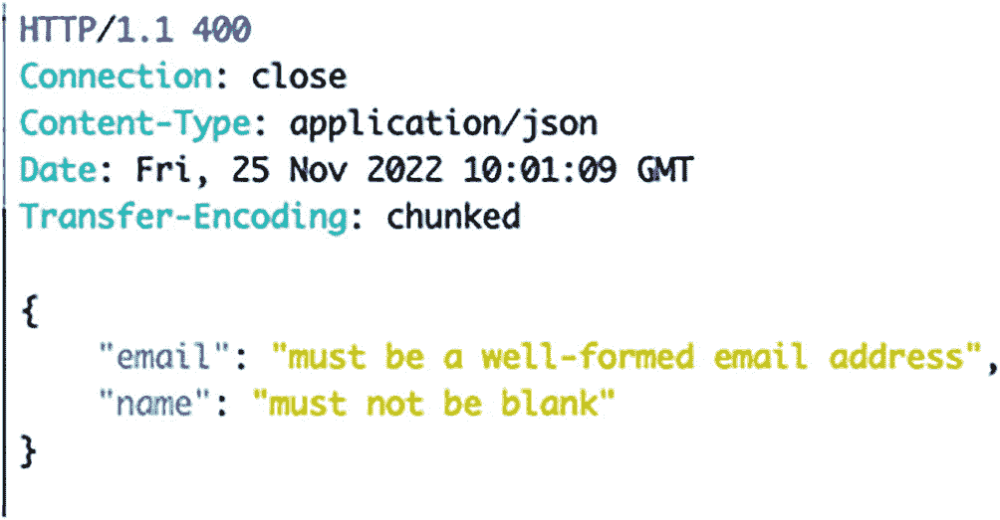
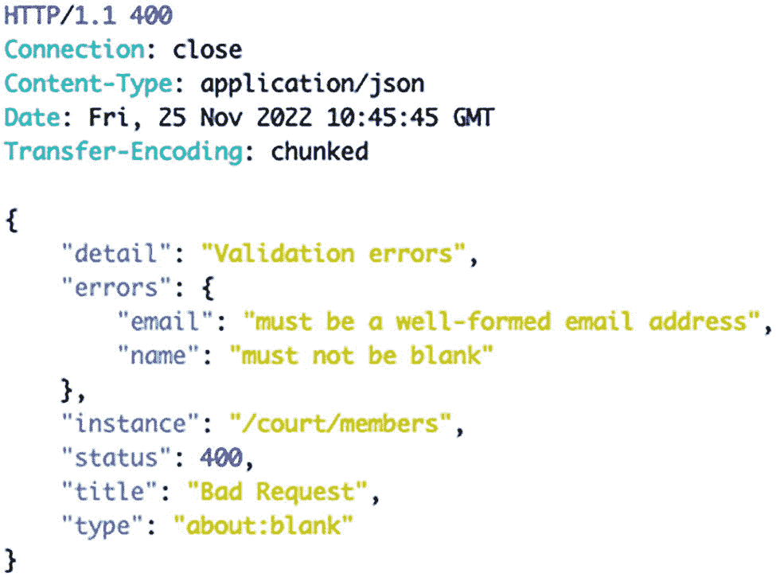
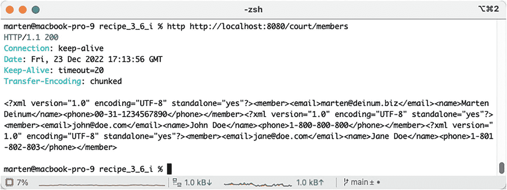
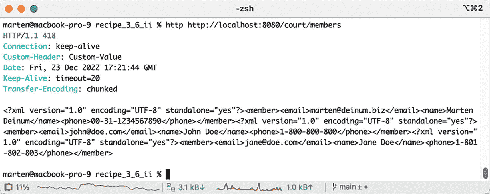
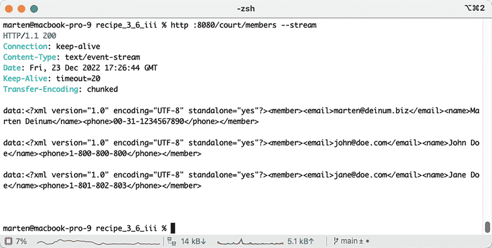
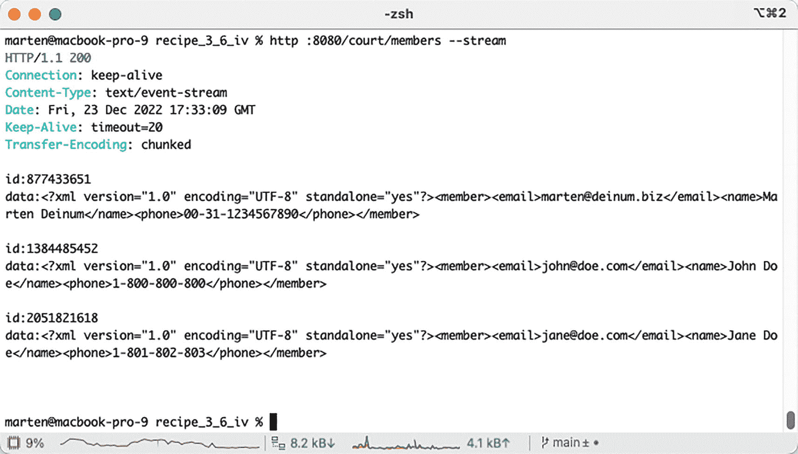

# 3. Spring MVC：REST 服务

在本章中，你将学习 Spring 如何处理表述性状态转移（通常以其缩写 REST 著称）。自 2000 年 [Roy Fielding](https://en.wikipedia.org/wiki/Roy_Fielding) 提出该术语以来，REST 对 Web 应用程序产生了重要影响。

基于 Web 协议（超文本传输协议，HTTP）的基础，REST 所提出的架构在 Web 服务的实现中变得越来越流行。Web 服务本身已成为 Web 上许多机器间通信的基石。许多组织做出的碎片化技术选择（例如 Java、Python、Ruby、.NET）使得需要一种能够弥合这些不同环境之间差距的解决方案。如何让一个基于 Java 的应用程序中的信息被一个用 Python 编写的应用程序访问？Java 应用程序如何从一个用 .NET 编写的应用程序获取信息？Web 服务填补了这一空白。

实现 Web 服务有多种方法，但 RESTful Web 服务已成为 Web 应用程序中最常见的选择。它们被一些最大的互联网门户网站（例如 Google 和 Yahoo）用来提供对其信息的访问，用于支持浏览器发出的 Ajax 调用，此外还为新闻提要（例如 RSS）等信息的分发提供了基础。

在本章中，你将学习 Spring 应用程序如何使用 REST，以便你可以使用这种流行的方法来访问和提供信息。

## 3-1\. 使用 REST 服务发布 XML

### 问题

你想使用 Spring 发布一个基于 XML 的 REST 服务。

### 解决方案

在 Spring 中设计 REST 服务有两种可能性。一种涉及将应用程序的数据作为 REST 服务发布；另一种涉及从第三方 REST 服务访问数据以在应用程序中使用。本配方描述了如何将应用程序的数据作为 REST 服务发布。配方 3-4 描述了如何从第三方 REST 服务访问数据。将应用程序的数据作为 REST 服务发布主要围绕使用 Spring MVC 注解 `@RequestMapping` 和 `@PathVariable`。通过使用这些注解来修饰 Spring MVC 处理器方法，Spring 应用程序能够将其数据作为 REST 服务发布。

此外，Spring 支持一系列生成 REST 服务负载的机制。本配方将探讨最简单的机制，即使用 Spring 的 `MarshallingView` 类。随着本章配方的深入，你将了解 Spring 支持的更高级的生成 REST 服务负载的机制。

### 工作原理

将 Web 应用程序的数据作为 REST 服务发布，或者用 Web 服务术语更技术性地称为“创建端点”，与你在第 4 章中探索的 Spring MVC 紧密相关。由于 Spring MVC 依赖 `@RequestMapping` 注解来修饰处理器方法并定义访问点（即 URL），因此它是定义 REST 服务端点的首选方式。


#### 使用 MarshallingView 生成 XML

以下示例展示了一个 Spring MVC 控制器类，其中包含一个定义 REST 服务端点的处理方法：

```
package com.apress.spring6recipes.court.web;
import com.apress.spring6recipes.court.domain.Members;
import com.apress.spring6recipes.court.service.MemberService;
import org.springframework.stereotype.Controller;
import org.springframework.ui.Model;
import org.springframework.web.bind.annotation.GetMapping;
@Controller
public class RestMemberController {
private final MemberService memberService;
public RestMemberController(MemberService memberService) {
this.memberService = memberService;
}
@GetMapping("/members")
public String getRestMembers(Model model) {
var members = new Members();
members.addMembers(memberService.findAll());
model.addAttribute("members", members);
return "membertemplate";
}
}
```

通过使用 `@GetMapping("/members")` 装饰控制器的处理方法，REST 服务端点可通过 http://[host_name]/[app-name]/members 访问。你可以观察到控制权被移交给一个名为 membertemplate 的逻辑视图。以下示例展示了用于定义名为 `membertemplate` 的逻辑视图的声明：

```
package com.apress.spring6recipes.court.web.config;
import com.apress.spring6recipes.court.domain.Member;
import com.apress.spring6recipes.court.domain.Members;
import org.springframework.context.annotation.Bean;
import org.springframework.context.annotation.ComponentScan;
import org.springframework.context.annotation.Configuration;
import org.springframework.oxm.Marshaller;
import org.springframework.oxm.jaxb.Jaxb2Marshaller;
import org.springframework.web.servlet.config.annotation.EnableWebMvc;
import org.springframework.web.servlet.view.BeanNameViewResolver;
import org.springframework.web.servlet.view.xml.MarshallingView;
import java.util.Map;
import static jakarta.xml.bind.Marshaller.JAXB_FORMATTED_OUTPUT;
@Configuration
@EnableWebMvc
@ComponentScan(basePackages = "com.apress.spring6recipes.court")
public class CourtRestConfiguration {
@Bean
public MarshallingView membertemplate(Marshaller marshaller) {
return new MarshallingView(marshaller);
}
@Bean
public Jaxb2Marshaller jaxb2Marshaller() {
var marshaller = new Jaxb2Marshaller();
marshaller.setClassesToBeBound(Member.class, Members.class);
marshaller.setMarshallerProperties(Map.of(JAXB_FORMATTED_OUTPUT, Boolean.TRUE));
return marshaller;
}
@Bean
public BeanNameViewResolver viewResolver() {
return new BeanNameViewResolver();
}
}
```

`membertemplate` 视图被定义为 `MarshallingView` 类型，这是一个通用类，允许使用 marshaller 来渲染响应。编组（Marshalling）是将对象的内存表示转换为数据格式的过程。因此，在这个特定案例中，marshaller 负责将 Members 和 Member 对象转换为 XML 数据格式。`MarshallingView` 使用的 marshaller 属于 Spring 提供的一系列 XML marshaller 之一。

Marshaller 本身也需要配置。我们选择使用 `Jaxb2Marshaller`，因为它简单且基于 Java 架构的 XML 绑定（JAXB）基础。但是，如果你更习惯使用 XStream 框架，你可能会发现使用 `XStreamMarshaller` 更容易。

`Jaxb2Marshaller` 需要配置一个名为 `classesToBeBound` 或 `contextPath` 的属性。对于 `classesToBeBound`，分配给此属性的类指示将要转换为 XML 的类（即对象）结构。以下示例展示了分配给 `Jaxb2Marshaller` 的 `Member` 和 `Members` 类：

```
package com.apress.spring6recipes.court.domain;
import jakarta.xml.bind.annotation.XmlRootElement;
@XmlRootElement
public class Member {
private String name;
private String email;
private String phone;
public Member() {}
public Member(String name, String phone, String email) {
this.name=name;
this.phone=phone;
this.email=email;
}
public String getEmail() {
return email;
}
public String getName() {
return name;
}
public String getPhone() {
return phone;
}
public void setEmail(String email) {
this.email = email;
}
public void setName(String name) {
this.name = name;
}
public void setPhone(String phone) {
this.phone = phone;
}
}
```

*Members* *类*

```
package com.apress.spring6recipes.court.domain;
import jakarta.xml.bind.annotation.XmlAccessType;
import jakarta.xml.bind.annotation.XmlAccessorType;
import jakarta.xml.bind.annotation.XmlElement;
import jakarta.xml.bind.annotation.XmlRootElement;
import java.util.ArrayList;
import java.util.List;
@XmlRootElement
@XmlAccessorType(XmlAccessType.FIELD)
public class Members {
@XmlElement(name = "member")
private List members = new ArrayList();
public List getMembers() {
return members;
}
public void setMembers(List members) {
this.members = members;
}
public void addMembers(Iterable members) {
members.forEach(member -> this.members.add(member));
}
}
```

注意 `Members` 类是一个用 `@XmlRootElement` 注解修饰的 POJO。此注解允许 `Jaxb2Marshaller` 检测类的（即对象的）字段并将其转换为 XML 数据（例如，`name=John` 转换为 `<name>john</name>`，`email=``john@doe.com` 转换为 `<email>``john@doe.com``</email>`）。

回顾一下所描述的内容，这意味着当向形如 `http://[host_name]//app-name]/members` 的 URL 发出请求时，相应的处理器负责创建一个 Members 对象，然后将其传递给名为 membertemplate 的逻辑视图。根据后一个视图的定义，使用 marshaller 将 `Members` 对象转换为 XML 负载，并返回给 REST 服务的请求方。REST 服务返回的 XML 负载如下例所示：

```

marten@deinum.biz
Marten Deinum
00-31-1234567890

john@doe.com
John Doe
1-800-800-800

jane@doe.com
Jane Doe
1-801-802-803

```

这最后一个 XML 负载代表了一种生成 REST 服务响应的非常简单的方法。随着本章内容的深入，你将学习到更复杂的方法，例如能够创建广泛使用的 REST 服务负载，如 RSS、Atom 和 JSON。

由于 REST 服务请求通常带有形如 `Accept: application/xml` 的 HTTP 头，配置了内容协商的 Spring MVC 可以决定为此类请求提供 XML（REST）负载，即使请求没有扩展名。这也允许无扩展名的请求以 HTML、PDF 和 XLS 等格式进行，所有这些都仅基于 HTTP 头。


#### 使用 @ResponseBody 生成 XML

使用 `MarshallingView` 生成 XML 是产生结果的一种方式。然而，当你希望为同一数据（例如 `Member` 对象列表）提供多种表示形式（如 JSON）时，添加另一个视图会变得繁琐。相反，我们可以依赖 Spring MVC 的 `HttpMessageConverter` 实现，将对象转换为用户请求的表示形式。以下清单展示了 `RestMemberController` 所做的修改：

```
package com.apress.spring6recipes.court.web;
import com.apress.spring6recipes.court.domain.Members;
import com.apress.spring6recipes.court.service.MemberService;
import org.springframework.stereotype.Controller;
import org.springframework.web.bind.annotation.GetMapping;
import org.springframework.web.bind.annotation.ResponseBody;
@Controller
public class RestMemberController {
private final MemberService memberService;
public RestMemberController(MemberService memberService) {
this.memberService = memberService;
}
@GetMapping("/members")
@ResponseBody
public Members getRestMembers() {
var members = new Members();
members.addMembers(memberService.findAll());
return members;
}
}
```

第一个变化是，我们现在额外使用 `@ResponseBody` 注解了控制器方法。这个注解告诉 Spring MVC，该方法的结果应作为响应的主体。由于我们需要 XML，这个编组工作由 Spring 提供的 `Jaxb2RootElementHttpMessageConverter` 完成。第二个变化是，由于使用了 `@ResponseBody` 注解，我们不再需要视图名称，而可以直接返回 `Members` 对象。

一个灯泡轮廓图标，代表提示。  除了在方法上使用 `@ResponseBody` 注解，你也可以用 `@RestController` 代替 `@Controller` 来注解你的控制器，这会产生相同的结果。如果你的单个控制器有多个方法，这种方式尤其方便。

这些修改也允许我们清理配置，因为我们不再需要 `MarshallingView` 和 `Jaxb2Marshaller`：

```
package com.apress.spring6recipes.court.web.config;
import org.springframework.context.annotation.ComponentScan;
import org.springframework.context.annotation.Configuration;
import org.springframework.web.servlet.config.annotation.EnableWebMvc;
@Configuration
@EnableWebMvc
@ComponentScan(basePackages = "com.apress.spring6recipes.court")
public class CourtRestConfiguration { }
```

当应用部署后，你从 `http://localhost:8080/court/members` 请求成员信息时，将得到与之前相同的结果：

```

marten@deinum.biz
Marten Deinum
00-31-1234567890

john@doe.com
John Doe
1-800-800-800

jane@doe.com
Jane Doe
1-801-802-803

```

#### 使用 @PathVariable 限制结果

REST 服务请求带有参数是很常见的。这样做是为了限制或过滤服务的负载。例如，形如 `http://[host_name]/[app-name]/members/353/` 的请求可用于专门检索成员 353 的信息。另一种变体可以是像 `http://[host_name]/[app-name]/reservations/07-07-2010/` 这样的请求，用于检索在日期 `07-07-2010` 所做的预订。

为了在 Spring 中使用参数构建 REST 服务，你需要使用 `@PathVariable` 注解。根据 Spring MVC 的约定，`@PathVariable` 注解作为输入参数添加到处理器方法中，以便在处理器方法体内使用。以下代码片段展示了使用 `@PathVariable` 注解的 REST 服务处理器方法：

```
@GetMapping("/members/{memberid}")
public Member getMember(@PathVariable("memberid") long memberID) {
return memberService.findById(memberID).orElse(null);
}
```

注意 `@RequestMapping` 的值包含 `{memberid}`。被 `{ }` 包围的值用于表示 URL 参数是变量。此外，注意处理器方法定义了一个输入参数 `@PathVariable("memberid") long memberID`。这个最后的声明将 URL 中的任何 `memberid` 值关联起来，并将其赋值给一个名为 `memberID` 的变量，该变量可在处理器方法内部访问。因此，形如 `/members/353/` 和 `/members/777/` 的 REST 端点将由这个最后的处理器方法处理，`memberID` 变量分别被赋值为 `353` 和 `777`。在处理器方法内部，可以通过 `memberID` 变量对成员 353 和 777 进行适当的查询，并将其作为 REST 服务的负载返回。

对 `http://localhost:8080/court/members/2` 的请求将返回 ID 为 2 的成员的 XML 表示：

```

john@doe.com
John Doe
1-800-800-800

```

#### 使用 ResponseEntity 通知客户端

用于检索单个 `Member` 实例的端点要么返回一个有效的成员，要么什么都不返回。这两种情况都会导致请求向客户端发送 HTTP 响应码 200，这意味着请求成功。然而，这可能不是用户所期望的。在处理资源时，我们应该告知用户资源无法找到的事实。理想情况下，我们希望返回 HTTP 响应码 404，表示未找到。以下代码片段展示了修改后的 getMember 方法：

```
@GetMapping("/members/{memberid}")
public ResponseEntity getMember(@PathVariable("memberid") long memberID) {
return memberService.findById(memberID)
.map(ResponseEntity::ok)
.orElseGet(() -> ResponseEntity.notFound().build());
}
```

方法的返回值已更改为 `ResponseEntity<Member>`。`ResponseEntity` 是 Spring MVC 中的一个类，它充当对象的包装器，将对象作为结果的主体，并附带一个 HTTP 状态码。当我们找到一个 `Member` 时，它会与 `HttpStatus.OK` 一起返回；后者对应 HTTP 状态码 200。当没有结果时，我们返回 `HttpStatus.NOT_FOUND`，对应 HTTP 状态码 404，表示未找到。

由于这是一个非常常见的模式，有一种更简单的方法可以实现这一点，即使用 `ResponseEntity.of`，它接受一个 `Optional` 方法，该方法已经包含了这种模式。这使得代码更简洁、更易读：

```
@GetMapping("/members/{memberid}")
public ResponseEntity getMember(@PathVariable("memberid") long memberID) {
return ResponseEntity.of(memberService.findById(memberID));
}
```

## 3-2\. 使用 REST 服务发布 JSON

### 问题

你想使用 Spring 发布一个基于 JSON（JavaScript 对象表示法）的 REST 服务。


### 解决方案

JSON 已成为 REST 服务最常用的负载格式。然而，与大多数依赖 XML 标记的 REST 服务负载不同，JSON 的特殊之处在于其内容是基于 JavaScript 语言的一种特殊表示法。在本方案中，除了依赖 Spring 的 REST 支持外，我们还将使用 Spring 自带的 `MappingJackson2JsonView` 类来简化 JSON 内容的发布。

一个信息符号，由阴影圆圈内的字母 i 图标表示。  `MappingJackson2JsonView` 类依赖于 Jackson JSON 处理器库（版本 2）的存在。

*Jackson 2 的 Gradle 依赖*

```
implementation group:'com.fasterxml.jackson.core', name: 'jackson-databind', version: '2.14.1'
```

*Jackson 2 的 Maven 依赖*

```
com.fasterxml.jackson.core
jackson-databind
2.14.1

```

*示例 1. 为何发布 JSON？*

你很可能需要设计以 JSON 作为负载的 REST 服务。这主要是因为浏览器的处理能力有限。虽然浏览器可以处理并提取发布 XML 负载的 REST 服务中的信息，但效率不高。而通过交付基于浏览器原生解释语言（JavaScript）的 JSON 负载，数据的处理和提取效率会更高。与 RSS 和 Atom 这类标准格式不同，JSON 除了其语法（稍后你将了解）外，无需遵循特定的结构。因此，JSON 元素的负载结构通常需要与负责应用程序设计的团队成员共同确定。

### 工作原理

首先，你需要确定要作为 JSON 负载发布的信息。这些信息可以存储在关系型数据库（RDBMS）或文本文件中，通过 JDBC 或对象/关系映射（ORM）访问，甚至可以是 Spring Bean 或其他类型构造的一部分。描述如何获取这些信息超出了本方案的范围，因此我们假设你将采用任何你认为合适的方式来访问它。如果你不熟悉 JSON，以下代码片段展示了这种格式的一个示例：

```
{
"members" : {
"members" : [ {
"name" : "Marten Deinum",
"phone" : "00-31-1234567890",
"email" : "marten@deinum.biz"
}, {
"name" : "John Doe",
"phone" : "1-800-800-800",
"email" : "john@doe.com"
}, {
"name" : "Jane Doe",
"phone" : "1-801-802-803",
"email" : "jane@doe.com"
} ]
}
}
```

如你所见，JSON 负载由文本和分隔符（如 {、}、[、]、: 和 "）组成。我们不会详细讨论使用哪种分隔符，但可以说，这种语法使得 JavaScript 引擎访问和操作数据比处理 XML 格式的数据更加容易。

#### 使用 MappingJackson2JsonView 生成 JSON

由于你已经在方案 3-1 中了解了如何使用 REST 服务发布数据，我们将直奔主题，展示在 Spring MVC 控制器中实现此过程所需的实际处理方法：

```
@GetMapping("/members")
public String getRestMembersJson(Model model) {
var members = new Members();
members.addMembers(memberService.findAll());
model.addAttribute("members", members);
return "jsonmembertemplate";
}
```

你可能注意到，这与方案 3-1 中提到的控制器方法非常相似。唯一的区别是我们返回了不同的视图名称。我们返回的视图名称 `jsonmembertemplate` 映射到一个 `MappingJackson2JsonView`。我们需要在配置类中配置此视图：

```
package com.apress.spring6recipes.court.web.config;
import org.springframework.context.annotation.Bean;
import org.springframework.context.annotation.ComponentScan;
import org.springframework.context.annotation.Configuration;
import org.springframework.web.servlet.config.annotation.EnableWebMvc;
import org.springframework.web.servlet.view.BeanNameViewResolver;
import org.springframework.web.servlet.view.json.MappingJackson2JsonView;
@Configuration
@EnableWebMvc
@ComponentScan(basePackages = "com.apress.spring6recipes.court")
public class CourtRestConfiguration {
@Bean
public MappingJackson2JsonView jsonmembertemplate() {
var view = new MappingJackson2JsonView();
view.setPrettyPrint(true);
return view;
}
@Bean
public BeanNameViewResolver viewResolver() {
return new BeanNameViewResolver();
}
}
```

`MappingJackson2JsonView` 使用 Jackson2 库在对象和 JSON 之间进行转换。它使用一个 Jackson `ObjectMapper` 实例进行转换。当向 `http://localhost:8080/court/members` 发起请求时，控制器方法将被调用，并返回一个 JSON 表示：

```
{
"members" : {
"members" : [ {
"name" : "Marten Deinum",
"phone" : "00-31-1234567890",
"email" : "marten@deinum.biz"
}, {
"name" : "John Doe",
"phone" : "1-800-800-800",
"email" : "john@doe.com"
}, {
"name" : "Jane Doe",
"phone" : "1-801-802-803",
"email" : "jane@doe.com"
} ]
}
}
```

现在，让我们将方案 3-1 中的方法和视图添加到我们的控制器中：

```
package com.apress.spring6recipes.court.web;
import com.apress.spring6recipes.court.domain.Members;
import com.apress.spring6recipes.court.service.MemberService;
import org.springframework.http.MediaType;
import org.springframework.stereotype.Controller;
import org.springframework.ui.Model;
import org.springframework.web.bind.annotation.GetMapping;
@Controller
public class RestMemberController {
private final MemberService memberService;
public RestMemberController(MemberService memberService) {
this.memberService = memberService;
}
@GetMapping(value = "/members", produces = MediaType.APPLICATION_XML_VALUE)
public String getRestMembersXml(Model model) {
prepareModel(model);
return "xmlmembertemplate";
}
@GetMapping(value = "/members", produces = MediaType.APPLICATION_JSON_VALUE)
public String getRestMembersJson(Model model) {
prepareModel(model);
return "jsonmembertemplate";
}
private void prepareModel(Model model) {
var members = new Members();
members.addMembers(memberService.findAll());
model.addAttribute("members", members);
}
}
```

现在我们有了 `getRestMembersXml` 和 `getRestMembersJson` 方法；两者基本相同，区别在于它们返回不同的视图名称。注意 `@GetMapping` 注解上的 `produces` 属性；它用于确定调用哪个方法。带有 XML 接受头的 `/members` 请求将生成 XML，而带有 JSON 接受头的 `/members` 请求将生成 JSON。然而，这种方法需要为每种支持的视图类型复制所有方法，对于企业级应用来说并非可行的解决方案。


#### 使用 @ResponseBody 生成 JSON

使用 `MappingJackson2JsonView` 生成 JSON 是产生结果的一种方式。然而，正如上一节所述，这可能会带来麻烦，尤其是在支持多种视图类型的情况下。相反，我们可以依赖 Spring MVC 的 `HttpMessageConverter` 实现，将对象转换为用户请求的表示形式。以下列表展示了 `RestMemberController` 所做的更改：

```
@Controller
public class RestMemberController {
@GetMapping("/members")
@ResponseBody
public Members getRestMembers() {
var members = new Members();
members.addMembers(memberService.findAll());
return members;
}
}
```

第一个变化是，我们现在额外使用 `@ResponseBody` 注解了控制器方法。这个注解告诉 Spring MVC，该方法的结果应作为响应的主体。由于我们需要 JSON，这个编组工作由 Spring 提供的 `MappingJackson2HttpMessageConverter` 完成。第二个变化是，由于使用了 `@ResponseBody` 注解，我们不再需要视图名称，而可以直接返回 Members 对象。

一个灯泡轮廓的图标，代表提示。  除了使用 `@ResponseBody` 注解方法，你也可以使用 `@RestController` 注解你的控制器，而不是 `@Controller`，这会产生相同的结果。如果你有一个包含多个方法的单一控制器，这尤其方便。

这些更改也允许我们清理配置，因为我们不再需要 `MappingJackson2JsonView`：

```
package com.apress.spring6recipes.court.web.config;
import org.springframework.context.annotation.ComponentScan;
import org.springframework.context.annotation.Configuration;
import org.springframework.web.servlet.config.annotation.EnableWebMvc;
@Configuration
@EnableWebMvc
@ComponentScan(basePackages = "com.apress.spring6recipes.court")
public class CourtRestConfiguration { }
```

当应用程序部署后，你从 `http://localhost:8080/court/members` 请求成员，并使用 JSON 的 `Accept` 头（`application/json`），它将给出与之前相同的结果：

```
{
"members" : {
"members" : [ {
"name" : "Marten Deinum",
"phone" : "00-31-1234567890",
"email" : "marten@deinum.biz"
}, {
"name" : "John Doe",
"phone" : "1-800-800-800",
"email" : "john@doe.com"
}, {
"name" : "Jane Doe",
"phone" : "1-801-802-803",
"email" : "jane@doe.com"
} ]
}
}
```

你可能已经注意到，`RestMemberController` 和 `CourtRestConfiguration` 现在与配方 3-1 中的完全相同。当调用 `http://localhost:8080/court/members` 并且 `Accept` 头是 XML（`application/xml`）时，你将获得 XML。

在没有额外配置的情况下，这是如何实现的？Spring MVC 会检测类路径中的内容；它会自动检测 JAXB2、Jackson/GSON 和 Rome（参见配方 3-4）。它会为可用的技术注册相应的 `HttpMessageConverter`。

#### 使用 GSON 生成 JSON

到目前为止，你一直在使用 Jackson 从我们的对象生成 JSON。另一个流行的库是 GSON，Spring 对其提供了开箱即用的支持。要使用 GSON，你需要将其添加到类路径中（代替 Jackson），然后它将被用来生成 JSON。

添加以下依赖项。

*GSON 的 Gradle 依赖项*

```
implementation  group: 'com.google.code.gson', name: 'gson', version: '2.10'
```

*GSON 的 Maven 依赖项*

```
<dependency>
<groupId>com.google.code.gson</groupId>
<artifactId>gson</artifactId>
<version>2.10</version>
</dependency>
```

就像使用 Jackson 一样，这就是使用 GSON 进行 JSON 序列化所需的全部操作。如果你启动应用程序并调用 `http://localhost:8080/court/members`，你仍然会收到 JSON，但现在是通过 GSON 实现的。

## 3-3\. 使用 REST 控制器接收负载

### 问题

你希望在控制器中接收 JSON、XML 或其他类型的受支持负载，以便向系统添加新记录。

### 解决方案

在控制器中接收 HTTP 负载是通过使用 `@RequestBody` 注解其中一个参数来实现的。`@RequestBody` 注解指示 Spring 将传入的 HTTP 负载反序列化到被注解的类型上。通常，你注解的参数是你想要存储到系统中的类型。除了仅接收负载外，还可以通过在 `@ResponseBody` 旁边添加 `@Valid` 注解来验证它。更多关于验证的信息可以在配方 2-10 中找到。

### 工作原理

通常，接收负载是在一个可以处理 POST 请求的方法中进行的，因此是一个使用 `@PostMapping` 注解的方法。该方法随后接收一个对象，这里是一个 `Member`，用于添加到数据库中。由于这是一个 `Member`，在接收单个 `Member` 以添加它时，我们可以使用相同的 XML 或 JSON 片段。

#### 使用 @RequestBody 接收并处理请求

*POST 请求的 JSON 示例*

```
{
"name" : "Nick Fury",
"phone" : "secret",
"email" : "nick.fury@shield.org"
}
```

*POST 请求的 XML 示例*

```
<member>
<name>Nick Fury</name>
<phone>secret</phone>
<email>nick.fury@shield.org</email>
</member>
```

现在数据结构已知，可以修改控制器来接收它：

```
@PostMapping
public ResponseEntity newMember(@RequestBody Member newMember) {
return ResponseEntity.ok(memberService.save(newMember));
}
```

`newMember` 方法已添加到控制器中。它通过 `@PostMapping` 注解与 POST 请求绑定。注意，`Member` 参数使用了 `@RequestBody` 注解；这会将请求体反序列化为该对象。最后，返回一个包含新创建实体的响应。

#### 验证请求负载

Spring 有一个验证抽象，可用于自动验证传入的请求。虽然你可以编写自己的 Spring 验证器实现，但最常见的用例是使用 Jakarta Bean Validation API（另请参见配方 2-10）。要启用验证支持，首先，你需要添加一个 Jakarta Bean Validation 提供者，例如 `hibernate-validator`。在 `@RequestBody` 注解旁边，在方法参数上添加一个额外的 `jakarta.validation.@Valid`：

```
@PostMapping
public ResponseEntity newMember(@Valid @RequestBody Member newMember) {
return ResponseEntity.ok(memberService.save(newMember));
}
```

在这段代码中，注意方法参数上添加了 `@Valid` 注解。这指示 Spring MVC 对 `Member` 对象应用验证。现在让我们向 `Member` 对象添加一些验证。`name` 和 `email` 字段是必需的；为此我们可以使用 `@NotBlank` 注解。`email` 字段还需要是一个有效的电子邮件地址，因此我们额外添加 `@Email` 来验证它。

一个信息符号，由阴影圆圈内的字母 i 图标表示。  要验证基于文本的字段中的内容，你可以使用 `@NotNull`、`@NotEmpty` 和 `@NotBlank`，但应该使用哪一个？`@NotNull` 仅检查字段是否不为 null，`@NotEmpty` 检查字段是否不为 null 且不是空字符串，而 `@NotBlank` 检查是否不为 null 且不是仅包含空格/控制字符的字符串。使用哪一个取决于你的需求。这里我们使用 `@NotBlank`，因为仅包含空格的名称并不是真正的名称。

*带有验证注解的 Member*

```
package com.apress.spring6recipes.court.domain;
import jakarta.validation.constraints.Email;
import jakarta.validation.constraints.NotBlank;
import jakarta.xml.bind.annotation.XmlRootElement;
@XmlRootElement
public class Member {
@NotBlank
private String name;
@NotBlank
@Email
private String email;
private String phone;
}
```

现在，当发送一个没有 `name` 或 `email` 或包含无效 `email` 的请求时，该请求将不会被处理，而是返回 HTTP 状态码 400（错误请求）。


#### 使用 Spring MVC 进行错误处理

Spring MVC 注册的默认错误处理器是 `ExceptionHandlerExceptionResolver` 和 `ResponseStatusExceptionResolver`。`ExceptionHandlerExceptionResolver` 会尝试查找带有 `@ExceptionHandler` 注解的方法，该方法可以处理抛出的异常；而 `ResponseStatusExceptionResolver` 则会使用抛出异常上的 `@ResponseStatus` 注解（如果存在）来确定响应状态码。

在我们的案例中，`ResponseStatusExceptionResolver` 正在解析错误，因为没有能够处理所抛出异常的 `@ExceptionHandler` 方法。让我们通过添加这样一个方法来改进错误处理。我们将返回一个更好的响应，指明请求的问题所在。

为此，让我们在 `RestMemberController` 中添加一个能够处理 `MethodArgumentNotValidException` 的 `@ExceptionHandler` 方法。`MethodArgumentNotValidException` 是在验证过程出现验证错误时抛出的异常。该异常本身包含错误消息以及更多信息：

```
@ExceptionHandler
@ResponseStatus(HttpStatus.BAD_REQUEST)
public Map handle(MethodArgumentNotValidException ex) {
return ex.getFieldErrors().stream()
.collect(
Collectors.toMap(FieldError::getField,
FieldError::getDefaultMessage));
}
```

该方法接收 `MethodArgumentNotValidException`，并将字段错误（包含验证错误）转换为由字段和错误消息组成的 `Map`。同时还有 `@ResponseStatus` 注解来指示要返回的状态码；在本例中，我们使用 HTTP 400 错误码。

编写 `@ExceptionHandler` 方法时，它可以接收多种不同类型的对象。其中一个是抛出的异常，但也可以包含许多请求处理方法所支持的内容。有关支持的最常用属性，请参见表 3-1。

**表 3-1**

**@ExceptionHandler 方法最常用的方法参数**

| 方法参数 | 描述 |
| --- | --- |
| 异常类型 | 将要处理的 `Exception` |
| `jakarta.servlet.ServletRequest``jakarta.servlet.ServletResponse` | 获取对请求和/或响应的访问权限 |
| `jakarta.servlet.http.HttpSession` | HTTP 会话（如果有） |
| `java.security.Principal` | 当前主体，即当前已认证的用户 |
| `java.util.Map``org.springframework.ui.Model``org.springframework.ui.ModelMap` | 用于错误响应的模型，始终为空。可用于向响应添加数据 |

这些是异常处理方法最常用的方法参数。

修改后的方法现在将处理错误情况并返回更友好的结果（参见图 3-1）。



一段代码片段。H T T P 转发斜杠 1 点 1 400。连接，关闭。内容类型，application j son。日期 2022 年 11 月 25 日。传输编码，分块。结果，必须是格式正确的电子邮件地址，名称不能为空。

**图 3-1**

错误结果

#### 使用 Spring MVC 和 RFC-7807 进行错误处理

随着 JSON 成为 Web 通信的事实标准，现在也有了一个（目前仍处于提议阶段）用于向客户端返回错误响应的标准。这就是 [RFC-7807](https://www.rfc-editor.org/rfc/rfc7807)，它可能更广为人知的名字是 HTTP 问题详情 API。该标准描述了一种响应，可以告知传入请求的问题所在或服务器上发生了什么。

该响应由几个包含信息的字段组成；所有字段都是可选的。此外，还可以用额外的字段和信息来扩展此响应。

| 字段 | 类型 | 描述 |
| --- | --- | --- |
| `type` | 字符串 | 表示错误的 URI，通常是一个描述状态码的链接 |
| `title` | 字符串 | 对问题所在的简短可读解释 |
| `status` | 数字 | HTTP 状态码 |
| `detail` | 字符串 | 对问题的可读解释 |
| `instance` | 字符串 | 指向导致问题的实际实例的 URI 引用，通常是调用的 URL |

除了这些字段，还可以有自己的扩展。

Spring 支持此标准，但默认未启用。该支持以可扩展的专用异常处理器的形式提供。

让我们重写上一节中的异常处理代码，以使用这种标准方法。为此，我们可以扩展 `org.springframework.web.servlet.mvc.method.annotation.ResponseEntityExceptionHandler` 类，并重写 `handleMethodArgumentNotValid` 方法来添加我们自己的自定义逻辑：

```
package com.apress.spring6recipes.court.web;
import org.springframework.context.i18n.LocaleContextHolder;
import org.springframework.http.HttpHeaders;
import org.springframework.http.HttpStatusCode;
import org.springframework.http.ResponseEntity;
import org.springframework.validation.FieldError;
import org.springframework.validation.ObjectError;
import org.springframework.web.bind.MethodArgumentNotValidException;
import org.springframework.web.bind.annotation.ControllerAdvice;
import org.springframework.web.context.request.WebRequest;
import org.springframework.web.servlet.mvc.method.annotation.ResponseEntityExceptionHandler;
import java.util.stream.Collectors;
@ControllerAdvice
public class CourtExceptionHandlers extends ResponseEntityExceptionHandler {
@Override
protected ResponseEntity handleMethodArgumentNotValid(MethodArgumentNotValidException ex,
HttpHeaders headers, HttpStatusCode status,
WebRequest request) {
var errors = ex.getAllErrors().stream()
.collect(Collectors.toMap(this::getKey, this::resolveMessage));
ex.getBody().setProperty("errors", errors);
return super.handleExceptionInternal(ex, null, headers, status, request);
}
private String getKey(ObjectError error) {
return (error instanceof FieldError fe) ? fe.getCode() : error.getObjectName();
}
private String resolveMessage(ObjectError error) {
return getMessageSource() != null
? getMessageSource().getMessage(error, LocaleContextHolder.getLocale())
: error.getDefaultMessage();
}
}
```

`CourtExceptionHandlers` 类本身带有 `@ControllerAdvice` 注解。带有 `@ControllerAdvice` 的类包含适用于所有控制器的逻辑，是放置异常处理代码的理想位置。该类还扩展了 `ResponseEntityExceptionHandler`，并且我们重写了 `handleMethodArgumentNotValid` 方法。

我们使用基类中的 `createProblemDetail` 辅助方法来创建初始的 `ProblemDetail` 对象。之前创建的错误映射仍然会被创建，并作为属性添加到 `ProblemDetail` 对象中。最后，我们使用另一个辅助方法来创建包含 `ProblemDetail` 对象的 `ResponseEntity`。完成此设置后，错误处理将返回符合 RFC-7807 的结果（参见图 3-2）。



一组带有合规结果的代码。包含针对电子邮件和名称的验证错误，以及实例为 court slash members，状态为 400，标题为 bad request，类型为 about colon blank。

**图 3-2**

问题详情错误响应

## 3-4. 使用 Spring 访问 REST 服务

### 问题

您希望从第三方（例如 Google、Yahoo、其他业务合作伙伴）访问 REST 服务，并在 Spring 应用程序中使用其负载。


### 解决方案

在 Spring 应用程序中访问第三方 REST 服务主要围绕使用 Spring 的 `RestTemplate` 类。`RestTemplate` 类的设计原则与许多其他 Spring *模板类（例如 `JdbcTemplate`、`JmsTemplate`）相同，通过提供默认行为来简化执行耗时任务的方法。这意味着在 Spring 应用程序中，调用 REST 服务和使用其返回的负载的过程得到了简化。

### 工作原理

在描述 `RestTemplate` 类的特性之前，有必要先探讨一下 REST 服务的生命周期，以便了解 `RestTemplate` 类实际执行的工作。最好通过浏览器来探索 REST 服务的生命周期，因此请在您的工作站上打开您常用的浏览器开始操作。首先需要一个 REST 服务端点。我们将重用我们在配方 3-2 中创建的端点。该端点应可通过 `http://localhost:8080/court/members.xml`（或 `.json`）访问。当您在浏览器中加载这个 REST 服务端点时，浏览器会执行一个 GET 请求，这是 REST 服务支持的最流行的 HTTP 请求之一。加载 REST 服务后，浏览器会显示类似如下的响应负载：

```

marten@deinum.biz
Marten Deinum
00-31-1234567890

john@doe.com
John Doe
1-800-800-800

jane@doe.com
Jane Doe
1-801-802-803

```

上述负载代表一个格式良好的 XML 片段，这与大多数 REST 服务的响应一致。负载的实际含义高度依赖于具体的 REST 服务。在此例中，XML 标签（`<members>`、`<member>` 等）是我们自己定义的，而每个 XML 标签中包含的字符数据则代表与 REST 服务请求相关的信息。

REST 服务消费者（即您）的任务是了解 REST 服务的负载结构（有时称为词汇表），以便正确处理其信息。尽管上述 REST 服务依赖于一种可被视为自定义词汇表的结构，但许多 REST 服务通常依赖于标准化词汇表（例如 RSS），这使得 REST 服务负载的处理方式更加统一。此外，还值得注意的是，一些 REST 服务会提供 Web 应用程序描述语言（WADL）契约，以方便负载的发现和使用。

现在您已经通过浏览器熟悉了 REST 服务的生命周期，我们可以看看如何使用 Spring 的 `RestTemplate` 类，以便将 REST 服务的负载整合到 Spring 应用程序中。鉴于 `RestTemplate` 类是为调用 REST 服务而设计的，因此其主要方法与 REST 的基础——即 HTTP 方法：`HEAD`、`GET`、`POST`、`PUT`、`DELETE` 和 `OPTIONS`——紧密相关也就不足为奇了。表 3-2 包含了 `RestTemplate` 类支持的主要方法。

**表 3-2** 基于 HTTP 请求方法的 RestTemplate 类方法

| 方法 | 描述 |
| --- | --- |
| `headForHeaders` | 执行 HTTP HEAD 操作 |
| `getForObject` | 执行 HTTP GET 操作，并将结果作为给定类的类型返回 |
| `getForEntity` | 执行 HTTP GET 操作，并返回一个 `ResponseEntity` |
| `patchForObject` | 执行 HTTP PATCH 操作，并将结果作为给定类的类型返回 |
| `postForLocation` | 执行 HTTP POST 操作，并返回 location 头的值 |
| `postForObject` | 执行 HTTP POST 操作，并将结果作为给定类的类型返回 |
| `postForEntity` | 执行 HTTP POST 操作，并返回一个 `ResponseEntity` |
| `put` | 执行 HTTP PUT 操作 |
| `delete` | 执行 HTTP DELETE 操作 |
| `optionsForAllow` | 执行 HTTP OPTIONS 操作 |
| `execute` | 可以执行除 CONNECT 之外的任何 HTTP 操作 |

正如您在表 3-2 中所见，`RestTemplate` 类的方法以一系列 HTTP 方法为前缀，包括 HEAD、GET、POST、PUT、DELETE 和 OPTIONS。此外，`execute` 方法作为一个通用方法，可以执行任何 HTTP 操作，包括更冷门的 HTTP TRACE 方法，但不包括 CONNECT 方法，因为 `execute` 方法底层使用的 `HttpMethod` 枚举不支持 CONNECT 方法。

一个带阴影圆圈内字母 i 图标的信息符号。  到目前为止，REST 服务中最常用的 HTTP 方法是 GET，因为它代表一种获取信息的安全操作（即不会修改任何数据）。另一方面，诸如 `PUT`、`POST` 和 `DELETE` 等 HTTP 方法旨在修改提供者的信息，这使得它们不太可能被 REST 服务提供者支持。对于需要进行数据修改的情况，许多提供者会选择 SOAP，这是一种替代 REST 服务的机制。

现在您已经了解了 `RestTemplate` 类的方法，我们可以继续调用您之前用浏览器调用的同一个 REST 服务了，只不过这次使用的是 Spring 框架的 Java 代码。下面的清单展示了一个访问 REST 服务并将其内容输出到 `System.out` 的类：

```
package com.apress.spring6recipes.court;
import org.springframework.web.client.RestTemplate;
public class Main {
public static void main(String[] args) {
var uri = "http://localhost:8080/court/members";
var restTemplate = new RestTemplate();
var result = restTemplate.getForObject(uri, String.class);
System.out.println(result);
}
}
```

一个火焰图标。  某些 REST 服务提供者会根据请求方限制对其数据源的访问。通常，拒绝访问是基于请求中存在的数据（例如 HTTP 头或 IP 地址）。因此，根据具体情况，即使数据源在另一种媒介中看起来工作正常（例如，您可能可以在浏览器中访问某个 REST 服务，但在尝试从 Spring 应用程序访问同一数据源时却收到拒绝访问的响应），提供者也可能返回拒绝访问的响应。这取决于 REST 提供者设定的使用条款。

第一行声明了在类体内访问 `RestTemplate` 类所需的导入语句。首先，我们需要创建一个 `RestTemplate` 的实例。接下来，您会看到对 `RestTemplate` 类的 `getForObject` 方法的调用，如表 3-2 所述，该方法用于执行 HTTP GET 操作——就像浏览器获取 REST 服务负载时执行的操作一样。关于这个方法，有两个重要的方面：它的响应和它的参数。

调用 `getForObject` 方法的响应被赋值给一个 `String` 对象。这意味着您在浏览器中看到的该 REST 服务的相同输出（即 XML 结构）被赋值给了一个字符串。即使您从未在 Java 中处理过 XML，您也可能意识到，将数据作为 Java 字符串进行提取和操作并非易事。换句话说，有些类比 `String` 对象更适合处理 XML 数据，以及随之而来的 REST 服务负载。目前请先记住这一点；本章的其他配方将说明如何更好地提取和操作从 REST 服务获得的数据。

传递给 `getForObject` 方法的参数包括实际的 REST 服务端点。第一个参数对应 URL（即端点）声明。请注意，该 URL 与您使用浏览器调用时使用的 URL 完全相同。

执行时，输出将与浏览器中的输出相同，只不过现在它被打印在控制台中。


#### 从参数化 URL 中检索数据

上一节展示了如何调用 URI 来检索数据，但如果 URI 需要参数该怎么办？我们不想将参数硬编码到 URL 中。借助 `RestTemplate`，我们可以使用带有占位符的 URL；这些占位符将在执行时被实际值替换。占位符使用 `{` 和 `}` 定义，与请求映射的方式相同（参见配方 3-1 和 3-2）。

URI `http://localhost:8080/court/members/{memberId}` 就是这样一个参数化 URI 的示例。为了能够调用此方法，我们需要为占位符传入一个值。我们可以通过使用 `Map` 并将其作为第三个参数传递给 `RestTemplate` 的 `getForObject` 方法来实现这一点：

```
package com.apress.spring6recipes.court;
import org.springframework.web.client.RestTemplate;
import java.util.Map;
public class Main {
public static void main(String[] args) {
var uri = "http://localhost:8080/court/members/{memberId}";
var params = Map.of("memberId", "1");
var restTemplate = new RestTemplate();
var result = restTemplate.getForObject(uri, String.class, params);
System.out.println(result);
}
}
```

最后这段代码使用了 `Map` 类，创建了一个包含相应 REST 服务参数的实例，随后将其传递给 `RestTemplate` 类的 `getForObject` 方法。通过向各种 `RestTemplate` 方法传递一系列 `String` 参数或单个 `Map` 参数所获得的结果是相同的。

#### 以映射对象形式检索数据

除了返回一个字符串供应用程序使用外，我们还可以（重复）使用 `Members` 和 `Member` 类来映射结果。无需将 `String.class` 作为第二个参数传入，而是传入 `Members.class`，响应结果将被映射到该类上：

```
package com.apress.spring6recipes.court;
import com.apress.spring6recipes.court.domain.Members;
import org.springframework.web.client.RestTemplate;
public class Main {
public static void main(String[] args) {
var uri = "http://localhost:8080/court/members";
var restTemplate = new RestTemplate();
var result = restTemplate.getForObject(uri, Members.class);
System.out.println(result);
}
}
```

`RestTemplate` 使用了与带有 `@ResponseBody` 标记方法的控制器相同的 `HttpMessageConverter` 基础设施。由于 JAXB2（以及 Jackson）会被自动检测到，因此映射到 JAXB 映射对象相当容易。

## 3-5. 发布 RSS 和 Atom 订阅源

### 问题

你希望在 Spring 应用程序中发布 RSS 或 Atom 订阅源。

### 解决方案

RSS 和 Atom 订阅源已成为发布信息的流行方式。对这些类型订阅源的访问是通过 REST 服务提供的，这意味着构建 REST 服务是发布 RSS 和 Atom 订阅源的前提条件。除了依赖 Spring 的 REST 支持外，依赖一个专门设计用于处理 RSS 和 Atom 订阅源特性的第三方库也很方便。这使得 REST 服务更容易发布这种类型的 XML 负载。为此，我们将使用 [Project Rome](https://rometools.github.io/rome/)。

一个灯泡轮廓图标，代表提示。  尽管 RSS 和 Atom 订阅源通常被归类为新闻订阅源，但它们已经超越了最初仅提供新闻的使用场景。如今，RSS 和 Atom 订阅源被用于以跨平台方式（即使用 XML）发布与博客、天气、旅行以及许多其他内容相关的信息。因此，如果你需要以跨平台方式发布任何类型的信息，鉴于 RSS 和 Atom 订阅源的广泛采用（例如，许多应用程序支持它们，并且许多开发者了解它们的结构），将其作为 RSS 或 Atom 订阅源发布可能是一个极佳的选择。


### 工作原理

首先，你需要确定希望发布为 RSS 或 Atom 新闻源的信息。这些信息可以存储在关系数据库或文本文件中，通过 JDBC 或 ORM 访问，也可以作为 Spring Bean 或其他类型构造的一部分。描述如何获取这些信息超出了本教程的范围，因此我们假设你将使用任何你认为合适的方式来访问它。一旦确定了要发布的信息，就需要将其结构化为 RSS 或 Atom 源，这正是 Project Rome 发挥作用的地方。

如果你不熟悉 Atom 源的结构，以下代码片段展示了该格式的一个示例：

```

Example Feed

2010-08-31T18:30:02Z

John Doe

urn:uuid:60a76c80-d399-11d9-b93C-0003939e0af6

Atom-Powered Robots Run Amok

urn:uuid:1225c695-cfb8-4ebb-aaaa-80da344efa6a
2010-08-31T18:30:02Z
Some text.

```

以下代码片段展示了 RSS 源结构的一个示例：

```

RSS Example
This is an example of an RSS feed
http://www.example.org/link.htm
Mon, 28 Aug 2006 11:12:55 -0400 
Tue, 31 Aug 2010 09:00:00 -0400

Item Example
This is an example of an Item
http://www.example.org/link.htm

Tue, 31 Aug 2010 09:00:00 -0400

```

从最后两个片段可以看出，RSS 和 Atom 源只是依赖一系列元素来发布信息的 XML 负载。虽然深入探讨 RSS 或 Atom 源结构的细节需要一本书的篇幅，但这两种格式都有一系列共同特征；其中最主要的是：

*   它们都有一个元数据部分来描述源的内容（例如，Atom 格式的 `<Author>` 和 `<title>` 元素，以及 RSS 格式的 `<description>` 和 `<pubDate>` 元素）。
*   它们都有重复的元素来描述信息（例如，Atom 源格式的 `<entry>` 元素和 RSS 源格式的 `<item>` 元素）。此外，每个重复元素也都有自己的元素集来进一步描述信息。
*   它们有多个版本。RSS 版本包括 0.90、0.91 Netscape、0.91 Userland、0.92、0.93、0.94、1.0 和 2.0。Atom 版本包括 0.3 和 1.0。Project Rome 允许你根据 Java 代码（例如 `String`、`Map` 或其他此类构造）中的可用信息，创建源的元数据部分、重复元素以及前面提到的任何版本。

要使用 Rome 类，你需要将依赖项添加到类路径中。

*Project Rome 的 Gradle 依赖项*

```
implementation group: 'com.rometools', name: 'rome', version: '1.18.0'
```

*Project Rome 的 Maven 依赖项*

```
com.rometools
rome
1.18.0

```

既然你已经了解了 RSS 或 Atom 源的结构，以及 Project Rome 在本教程中的作用，让我们来看一个负责向最终用户呈现源的 Spring MVC 控制器：

```
package com.apress.spring6recipes.court.web;
import com.apress.spring6recipes.court.feeds.TournamentContent;
import org.springframework.stereotype.Controller;
import org.springframework.ui.Model;
import org.springframework.web.bind.annotation.GetMapping;
import java.time.LocalDate;
import java.util.List;
@Controller
public class FeedController {
@GetMapping("/atomfeed")
public String getAtomFeed(Model model) {
var date = LocalDate.now();
var tournaments = List.of(
TournamentContent.of("ATP", date, "Australian Open", "www.australianopen.com"),
TournamentContent.of("ATP", date, "Roland Garros", "www.rolandgarros.com"),
TournamentContent.of("ATP", date, "Wimbledon", "www.wimbledon.org"),
TournamentContent.of("ATP", date, "US Open", "www.usopen.org"));
model.addAttribute("feedContent", tournaments);
return "atomfeedtemplate";
}
@GetMapping("/rssfeed")
public String getRSSFeed(Model model) {
prepareModel(model);
return "rssfeedtemplate";
}
private void prepareModel(Model model) {
var date = LocalDate.now();
var tournaments = List.of(
TournamentContent.of("FIFA", date, "World Cup", "www.fifa.com/worldcup/"),
TournamentContent.of("FIFA", date, "U-20 World Cup", "www.fifa.com/u20worldcup/"),
TournamentContent.of("FIFA", date, "U-17 World Cup", "www.fifa.com/u17worldcup/"),
TournamentContent.of("FIFA", date, "Confederations Cup", "www.fifa.com/confederationscup/"));
model.addAttribute("feedContent", tournaments);
}
}
```

最后一个 Spring MVC 控制器有两个处理方法：一个名为 `getAtomFeed()`，映射到形如 `http://[host_name]/[app-name]/atomfeed` 的 URL；另一个名为 `getRSSFeed()`，映射到形如 `http://[host_name]/[app-name]/rssfeed` 的 URL。

每个处理方法都定义了一个 `TournamentContent` 对象的 `List`，其中 `TournamentContent` 对象的支持类是一个 POJO。然后，这个 `List` 被分配给处理方法的模型对象，以便返回的视图可以访问它。每个处理方法的返回逻辑视图分别是 `atomfeedtemplate` 和 `rssfeedtemplate`。这些逻辑视图在 Spring 配置类中以如下方式定义：

```
package com.apress.spring6recipes.court.web.config;
import com.apress.spring6recipes.court.feeds.AtomFeedView;
import com.apress.spring6recipes.court.feeds.RSSFeedView;
import org.springframework.context.annotation.Bean;
import org.springframework.context.annotation.ComponentScan;
import org.springframework.context.annotation.Configuration;
import org.springframework.web.servlet.config.annotation.EnableWebMvc;
import org.springframework.web.servlet.view.BeanNameViewResolver;
@Configuration
@EnableWebMvc
@ComponentScan(basePackages = "com.apress.spring6recipes.court")
public class CourtRestConfiguration {
@Bean
public AtomFeedView atomfeedtemplate() {
return new AtomFeedView();
}
@Bean
public RSSFeedView rssfeedtemplate() {
return new RSSFeedView();
}
}
```

如你所见，每个逻辑视图都映射到一个类。每个类负责实现构建 Atom 或 RSS 视图所需的逻辑。如果你还记得第 2 章，我们使用了相同的方法（即使用类）来实现 PDF 和 Excel 视图。

对于 Atom 和 RSS 视图，Spring 提供了两个专门构建在 Project Rome 基础上的类。这些类是 `AbstractAtomFeedView` 和 `AbstractRssFeedView`。这些类提供了构建 Atom 或 RSS 源的基础，而无需处理每种格式的细节。

以下列表展示了 `AtomFeedView` 类，它实现了 `AbstractAtomFeedView` 类，并用于支持 `atomfeedtemplate` 逻辑视图：

```
package com.apress.spring6recipes.court.feeds;
import com.rometools.rome.feed.atom.Content;
import com.rometools.rome.feed.atom.Entry;
import com.rometools.rome.feed.atom.Feed;
import jakarta.servlet.http.HttpServletRequest;
import jakarta.servlet.http.HttpServletResponse;
import org.springframework.web.servlet.view.feed.AbstractAtomFeedView;
import java.time.LocalDate;
import java.time.ZoneId;
import java.time.format.DateTimeFormatter;
import java.util.Date;
import java.util.List;
import java.util.Map;
import java.util.stream.Collectors;
public class AtomFeedView extends AbstractAtomFeedView {
@Override
protected void buildFeedMetadata(Map model, Feed feed,
HttpServletRequest request) {
feed.setId("tag:tennis.org");
feed.setTitle("Grand Slam Tournaments");
@SuppressWarnings({ "unchecked" })
var tournaments = (List) model.get("feedContent");
var updated = tournaments.stream()
.map(TournamentContent::publicationDate).sorted().findFirst()
.map(this::toDate).orElse(null);
feed.setUpdated(updated);
}
@Override
protected List buildFeedEntries(Map model,
HttpServletRequest request,
HttpServletResponse response) {
@SuppressWarnings({ "unchecked" })
var tournaments = (List) model.get("feedContent");
return tournaments.stream().map(this::toEntry).collect(Collectors.toList());
}
private Entry toEntry(TournamentContent tc) {
var summary = new Content();
summary.setValue(String.format("%s - %s", tc.name(), tc.link()));
var entry = new Entry();
var date = DateTimeFormatter.ISO_DATE.format(tc.publicationDate());
entry.setId(String.format("tag:tennis.org,%s:%d", date, tc.id()));
entry.setTitle(String.format("%s - Posted by %s", tc.name(), tc.author()));
entry.setUpdated(toDate(tc.publicationDate()));
entry.setSummary(summary);
return entry;
}
private Date toDate(LocalDate in) {
return Date.from(in.atStartOfDay(ZoneId.systemDefault()).toInstant());
}
}
```

关于这个类，首先要注意的是，除了实现 Spring 框架提供的 `AbstractAtomFeedView` 类之外，它还从 `com.sun.syndication.feed.atom` 包中导入了几个 Project Rome 类。这样做之后，接下来唯一需要做的就是为从 `AbstractAtomFeedView` 类继承的两个方法提供源的实现细节：`buildFeedMetadata` 和 `buildFeedEntries`。

`buildFeedMetadata` 方法有三个输入参数：一个 `Map` 对象，表示用于构建源的数据（即在处理方法内部分配的数据，本例中是一个 `TournamentContent` 对象的 `List`）；一个基于 Project Rome 类的 `Feed` 对象，用于操作源本身；以及一个 `HttpServletRequest` 对象，以防需要操作 HTTP 请求。

在 `buildFeedMetadata` 方法内部，你可以看到对 `Feed` 对象的 setter 方法（例如 `setId`、`setTitle`、`setUpdated`）进行了多次调用。其中两次调用使用了硬编码字符串，而另一次调用则使用了在遍历源数据（即 Map 对象）后确定的值。所有这些调用都代表了对 Atom 源元数据信息的赋值。

一个信息符号，由带阴影圆圈内的字母 i 图标表示。  如果你想为 Atom 源的元数据部分分配更多值，并指定特定的 Atom 版本，请查阅 Project Rome 的 API。默认版本是 Atom 1.0。

`buildFeedEntries` 方法也有三个输入参数：一个 `Map` 对象，表示用于构建源的数据（即在处理方法内部分配的数据，本例中是一个 `TournamentContent` 对象的 `List`）；一个 `HttpServletRequest` 对象，以防需要操作 HTTP 请求；以及一个 `HttpServletResponse` 对象，以防需要操作 HTTP 响应。同样重要的是要注意，`buildFeedEntries` 方法返回一个对象的 `List`，在本例中，它对应于一个基于 Project Rome 类的 `Entry` 对象的 `List`，并包含 Atom 源的重复元素。

在 `buildFeedEntries` 方法内部，你可以看到访问了 `Map` 对象以获取在处理方法内部分配的 `feedContent` 对象。完成后，创建一个空的 `Entry` 对象 `List`。接下来，对包含 `TournamentContent` 对象 `List` 的 `feedContent` 对象执行循环，并为每个元素创建一个 `Entry` 对象，将其分配给顶层的 `Entry` 对象 `List`。循环结束后，该方法返回一个填充好的 `Entry` 对象 `List`。

一个信息符号，由带阴影圆圈内的字母 i 图标表示。  如果你想为 Atom 源的重复元素部分分配更多值，请查阅 Project Rome 的 API。

在部署最后一个类以及前面提到的 Spring MVC 控制器后，访问形如 `http://[host_name]/[app-name]/atomfeed.atom` 的 URL 将产生以下响应：

```
Grand Slam Tournaments
tag:tennis.org
2022-12-23T00:00:00Z

Australian Open - Posted by ATP
tag:tennis.org,2022-12-23:9
2022-12-23T00:00:00Z
Australian Open - www.australianopen.com

Roland Garros - Posted by ATP
tag:tennis.org,2022-12-23:10
2022-12-23T00:00:00Z
Roland Garros - www.rolandgarros.com

Wimbledon - Posted by ATP
tag:tennis.org,2022-12-23:11
2022-12-23T00:00:00Z
Wimbledon - www.wimbledon.org

US Open - Posted by ATP
tag:tennis.org,2022-12-23:12
2022-12-23T00:00:00Z
US Open - www.usopen.org

Grand Slam Tournaments
tag:tennis.org
2017-05-19T01:32:52Z

Australian Open - Posted by ATP
tag:tennis.org,2017-05-19:5
2017-05-19T01:32:52Z
Australian Open - www.australianopen.com

Roland Garros - Posted by ATP
tag:tennis.org,2017-05-19:6
2017-05-19T01:32:52Z
Roland Garros - www.rolandgarros.com

Wimbledon - Posted by ATP
tag:tennis.org,2017-05-19:7
2017-05-19T01:32:52Z
Wimbledon - www.wimbledon.org

US Open - Posted by ATP
tag:tennis.org,2017-05-19:8
2017-05-19T01:32:52Z
US Open - www.usopen.org

```

现在将注意力转向前面负责构建 RSS 源的 Spring MVC 控制器中的另一个处理方法——`getRSSFeed`，你会看到该过程与刚刚描述的构建 Atom 源的过程类似。该处理方法也创建了一个 `TournamentContent` 对象的 `List`，然后将其分配给处理方法的模型对象，以便返回的视图可以访问它。不过，本例中返回的逻辑视图现在对应于名为 `rssfeedtemplate` 的视图。如前所述，此逻辑视图映射到一个名为 `RssFeedView` 的类。

以下列表展示了 `RssFeedView` 类，它实现了 `AbstractRssFeedView` 类：

```
package com.apress.spring6recipes.court.feeds;
import com.rometools.rome.feed.rss.Channel;
import com.rometools.rome.feed.rss.Item;
import jakarta.servlet.http.HttpServletRequest;
import jakarta.servlet.http.HttpServletResponse;
import org.springframework.web.servlet.view.feed.AbstractRssFeedView;
import java.time.LocalDate;
import java.time.ZoneId;
import java.util.Date;
import java.util.List;
import java.util.Map;
import java.util.stream.Collectors;
public class RSSFeedView extends AbstractRssFeedView {
@Override
protected void buildFeedMetadata(Map model, Channel feed,
HttpServletRequest request) {
feed.setTitle("World Soccer Tournaments");
feed.setDescription("FIFA World Soccer Tournament Calendar");
feed.setLink("fifa.com");
@SuppressWarnings({ "unchecked" })
var tournaments = (List) model.get("feedContent");
var lastBuildDate = tournaments.stream()
.map(TournamentContent::publicationDate).sorted().findFirst()
.map(this::toDate).orElse(null);
feed.setLastBuildDate(lastBuildDate);
}
@Override
protected List buildFeedItems(Map model,
HttpServletRequest request,
HttpServletResponse response) {
@SuppressWarnings({ "unchecked" })
var tournamentList = (List) model.get("feedContent");
return tournamentList.stream().map(this::toItem).collect(Collectors.toList());
}
private Item toItem(TournamentContent tc) {
var item = new Item();
item.setAuthor(tc.author());
item.setTitle(String.format("%s - Posted by %s", tc.name(), tc.author()));
item.setPubDate(toDate(tc.publicationDate()));
item.setLink(tc.link());
return item;
}
private Date toDate(LocalDate in) {
return Date.from(in.atStartOfDay(ZoneId.systemDefault()).toInstant());
}
}
```

关于这个类，首先要注意的是，除了实现 Spring 框架提供的 `AbstractRssFeedView` 类之外，它还从 `com.sun.syndication.feed.rss` 包中导入了几个 Project Rome 类。这样做之后，接下来唯一需要做的就是为从 `AbstractRssFeedView` 类继承的两个方法提供源的实现细节：`buildFeedMetadata` 和 `buildFeedItems`。`buildFeedMetadata` 方法在本质上与用于构建 Atom 源的同名方法类似。注意，`buildFeedMetadata` 方法操作的是一个基于 Project Rome 类的 `Channel` 对象（用于构建 RSS 源），而不是用于构建 Atom 源的 `Feed` 对象。对 `Channel` 对象进行的 setter 方法调用（例如 `setTitle`、`setDescription`、`setLink`）代表了对 RSS 源元数据信息的赋值。`buildFeedItems` 方法，其名称与 Atom 对应的 `buildFeedEntries` 不同，之所以如此命名，是因为 Atom 源的重复元素称为 entries，而 RSS 源的重复元素称为 items。除了命名约定之外，它们的逻辑是相似的。

在 `buildFeedItems` 方法内部，你可以看到访问了 `Map` 对象以获取在处理方法内部分配的 `feedContent` 对象。完成后，创建一个空的 `Item` 对象 `List`。接下来，对包含 `TournamentContent` 对象 `List` 的 `feedContent` 对象执行循环，并为每个元素创建一个 `Item` 对象，将其分配给顶层的 `Item` 对象 `List`。循环结束后，该方法返回一个填充好的 `Item` 对象 `List`。

一个信息符号，由带阴影圆圈内的字母 i 图标表示。  如果你想为 RSS 源的元数据和重复元素部分分配更多值，并指定特定的 RSS 版本，请查阅 Project Rome 的 API。默认版本是 RSS 2.0。

当你部署最后一个类以及前面提到的 Spring MVC 控制器后，访问形如 `http://[host_name]/rssfeed.rss`（或 `http://[host_name]/rssfeed.xml`）的 URL 将产生以下响应：

```

World Soccer Tournaments
fifa.com
FIFA World Soccer Tournament Calendar
Fri, 23 Dec 2022 00:00:00 GMT

World Cup - Posted by FIFA
www.fifa.com/worldcup/
Fri, 23 Dec 2022 00:00:00 GMT
FIFA

U-20 World Cup - Posted by FIFA
www.fifa.com/u20worldcup/
Fri, 23 Dec 2022 00:00:00 GMT
FIFA

U-17 World Cup - Posted by FIFA
www.fifa.com/u17worldcup/
Fri, 23 Dec 2022 00:00:00 GMT
FIFA

Confederations Cup - Posted by FIFA
www.fifa.com/confederationscup/
Fri, 23 Dec 2022 00:00:00 GMT
FIFA

```


## 3-6\. 响应写入器

### 问题

你有一个服务或多次调用，并希望将响应分块发送给客户端。

### 解决方案

使用 `ResponseBodyEmitter`（或其同类 `SseEmitter`）来分块发送响应。

### 工作原理

#### 在响应中发送多个结果

Spring MVC 有一个名为 `ResponseBodyEmitter` 的类，当你希望向客户端返回多个对象，而不是单个结果（如视图名称或 `ModelAndView`）时，它特别有用。发送对象时，会使用 `HttpMessageConverter` 将其转换为结果。要使用 `ResponseBodyEmitter`，你需要以异步方式从请求处理方法中返回它（有关异步控制器的更多信息，请参见配方 2-12）。

修改 `RestMemberController` 的 `getRestMembers` 方法，使其返回一个 `ResponseBodyEmitter`，并将结果逐个发送给客户端：

```
package com.apress.spring6recipes.court.web;
import com.apress.spring6recipes.court.domain.Member;
import com.apress.spring6recipes.court.service.MemberService;
import com.apress.spring6recipes.utils.Utils;
import org.springframework.core.task.TaskExecutor;
import org.springframework.web.bind.annotation.GetMapping;
import org.springframework.web.bind.annotation.RequestMapping;
import org.springframework.web.bind.annotation.RestController;
import org.springframework.web.servlet.mvc.method.annotation.ResponseBodyEmitter;
import java.io.IOException;
import java.time.Duration;
@RestController
@RequestMapping("/members")
public class RestMemberController {
private final MemberService memberService;
private final TaskExecutor taskExecutor;
public RestMemberController(MemberService memberService, TaskExecutor taskExecutor) {
this.memberService = memberService;
this.taskExecutor = taskExecutor;
}
@GetMapping
public ResponseBodyEmitter getRestMembers() {
var emitter = new ResponseBodyEmitter();
taskExecutor.execute(() -> {
var members = memberService.findAll();
try {
for (var member : members) {
emitter.send(member);
Utils.sleep(Duration.ofMillis(25));
}
emitter.complete();
} catch (IOException ex) {
emitter.completeWithError(ex);
}
});
return emitter;
}
}
```

首先，创建一个 `ResponseBodyEmitter`，并在方法末尾返回它。接着，执行一个任务，该任务将使用 `MemberService.findAll` 方法查找所有成员。该调用的所有结果都通过 `ResponseBodyEmitter` 的 `send` 方法逐个返回（我们在元素之间添加了一个小延迟）。当所有对象都发送完毕后，需要调用 `complete()` 方法，以便负责发送响应的线程可以完成请求并释放出来处理下一个响应。当发生异常并且你想通知用户时，可以调用 `completeWithError`；该异常将通过 Spring MVC 的正常异常处理流程（另请参见配方 2-8），之后响应完成。

当使用 HTTPie 或 cURL 等工具时，调用 URL `http://localhost:8080/court/members` 将产生类似以下的结果。结果将被分块，状态码为 200（OK）（图 3-3）。



截图包含：H T T P 斜杠 1 点 1 200。连接为 keep alive，日期，Keep-Alive 为超时 20，传输编码为 chunked。分块结果包含以段落形式书写的 3 个人的详细信息。

图 3-3

分块结果

如果你想更改状态码或添加自定义标头，也可以将 `ResponseBodyEmitter` 包装在 `ResponseEntity` 中，这样可以自定义返回码、标头等：

```
@GetMapping
public ResponseEntity getRestMembers() {
var emitter = new ResponseBodyEmitter();
....
return ResponseEntity.status(HttpStatus.I_AM_A_TEAPOT)
.header("Custom-Header", "Custom-Value")
.body(emitter);
}
```

现在状态码将更改为 `418`，并且会包含一个自定义标头（见图 3-4）。



截图包含：H T T P 斜杠 1 点 1 418。连接为 keep alive，自定义标头为 custom value，日期，Keep-Alive 为超时 20，传输编码为 chunked。结果包含以段落形式书写的 3 个人的详细信息。

图 3-4

修改后的分块结果


#### 以事件形式发送多个结果

`ResponseBodyEmitter` 有一个同类组件叫 `SseEmitter`，它能够将事件从服务器推送给客户端。这利用了服务器发送事件（Server-Sent Events）技术。服务器发送事件是从服务器端发往客户端的消息，其内容类型标头为 `text/event-stream`。它们非常轻量，允许定义四个字段（参见表 3-3）。

表 3-3

服务器发送事件允许的字段

| 字段 | 描述 |
| --- | --- |
| `id` | 事件的 ID |
| `event` | 事件的类型 |
| `data` | 事件数据 |
| `retry` | 事件流的重新连接时间 |

要从请求处理方法发送事件，你需要创建一个 `SseEmitter` 实例，并将其从请求处理方法中返回。然后使用 `send` 方法向客户端发送单个元素：

```
@GetMapping
public ResponseBodyEmitter getRestMembers() {
var emitter = new SseEmitter();
taskExecutor.execute(() -> {
var members = memberService.findAll();
try {
for (var member : members) {
emitter.send(member);
Utils.sleep(Duration.ofMillis(50));
}
emitter.complete();
} catch (IOException ex) {
emitter.completeWithError(ex);
}
});
return emitter;
}
```

一个信息符号，由阴影圆圈内字母 i 的图标表示。 向客户端发送每个项目时会有延迟，这样你才能看到不同的事件依次传入。在实际代码中你不会这样做。

现在，当你使用 cURL 或 HTTPie 之类的工具调用 URL `http://localhost:8080/court/members` 时，你会看到事件一个接一个地传入（图 3-5）。



截图内容包括：HTTP/1.1 200。连接方式为 keep-alive，内容类型为 text/event-stream，日期，Keep-Alive 超时时间为 20，传输编码为 chunked。数据结果分为 3 段。

图 3-5

服务器发送事件的结果

注意 `Content-Type` 标头；其值为 `text/event-stream`，表示我们获取的是一个事件流。我们可以保持流打开状态，持续接收事件通知。你还会注意到，每个写入的对象都会被转换为 JSON；这是通过 `HttpMessageConverter` 完成的，就像普通的 `ResponseBodyEmitter` 一样。每个对象都作为事件数据写入 `data` 标签中。

如果你想向事件添加更多信息（填写表 3-3 中提到的其他字段），可以使用 `SseEventBuilder`；要获取其实例，可以调用 `SseEmitter` 上的 `event()` 工厂方法。让我们用它来用 `Member` 的哈希码填充 `id` 字段：

```
@GetMapping
public ResponseBodyEmitter getRestMembers() {
var emitter = new SseEmitter();
taskExecutor.execute(() -> {
var members = memberService.findAll();
try {
for (var member : members) {
var data = SseEmitter.event()
.id(String.valueOf(member.hashCode()))
.data(member);
emitter.send(data);
Utils.sleep(Duration.ofMillis(50));
}
emitter.complete();
} catch (IOException ex) {
emitter.completeWithError(ex);
}
});
return emitter;
}
```

现在，当你使用 cURL 之类的工具调用 URL `http://localhost:8080/court/members` 时，你会看到事件一个接一个地传入，并且现在它们同时包含 `id` 和 `data` 字段（参见图 3-6）。



截图内容包括：HTTP/1.1 200。连接方式为 keep-alive，内容类型为 text/event-stream，日期，Keep-Alive 超时时间为 20，传输编码为 chunked。结果包含以段落形式书写的 3 个人的详细信息。数据结果分为 3 段，并附有 ID。

图 3-6

服务器发送事件的结果

## 3-7\. 总结

在本章中，你学习了如何使用 Spring 开发和访问 REST 服务。REST 服务与 Spring MVC 紧密相关，控制器负责分发对 REST 服务的请求，以及访问第三方 REST 服务以获取信息用于应用程序内容。

你学习了 REST 服务如何利用 Spring MVC 控制器中使用的注解，包括用于指示服务端点的 @RequestMapping，以及用于指定过滤服务负载的访问参数的 `@PathVariable`。此外，你还了解了 Spring 的 XML 编组器，例如 `Jaxb2Marshaller`，它允许将应用程序对象转换为 XML 并作为 REST 服务的负载输出。你还学习了 Spring 的 `RestTemplate` 类，以及它如何支持一系列 HTTP 方法，包括 HEAD、GET、POST、PUT 和 DELETE——所有这些方法都允许你直接从 Spring 应用程序的上下文中访问第三方 REST 服务并对其执行操作。

接下来，你探索了如何通过利用 Project Rome API 在 Spring 应用程序中发布 Atom 和 RSS 提要。

最后，你快速了解了用于向客户端异步发送内容的 `ResponseBodyEmitter` 和 `SseEmitter`。

