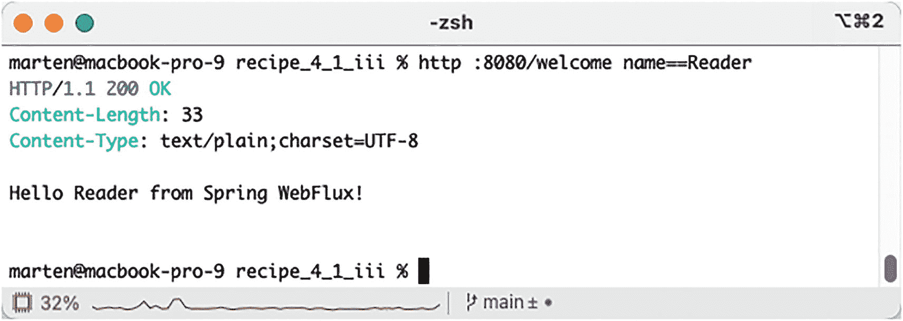
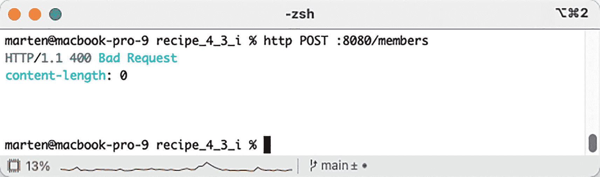
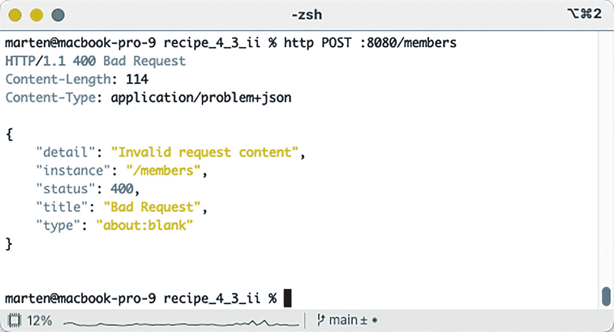
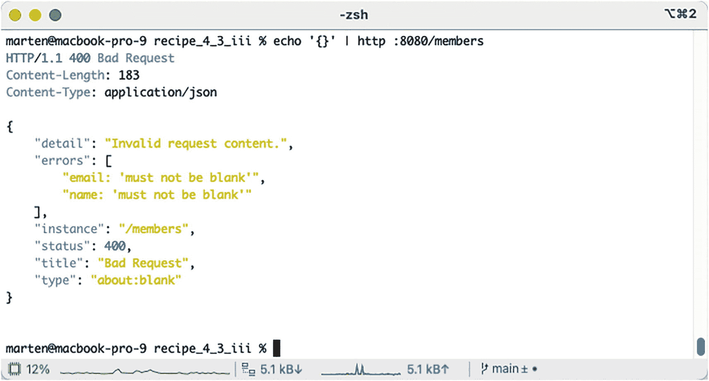
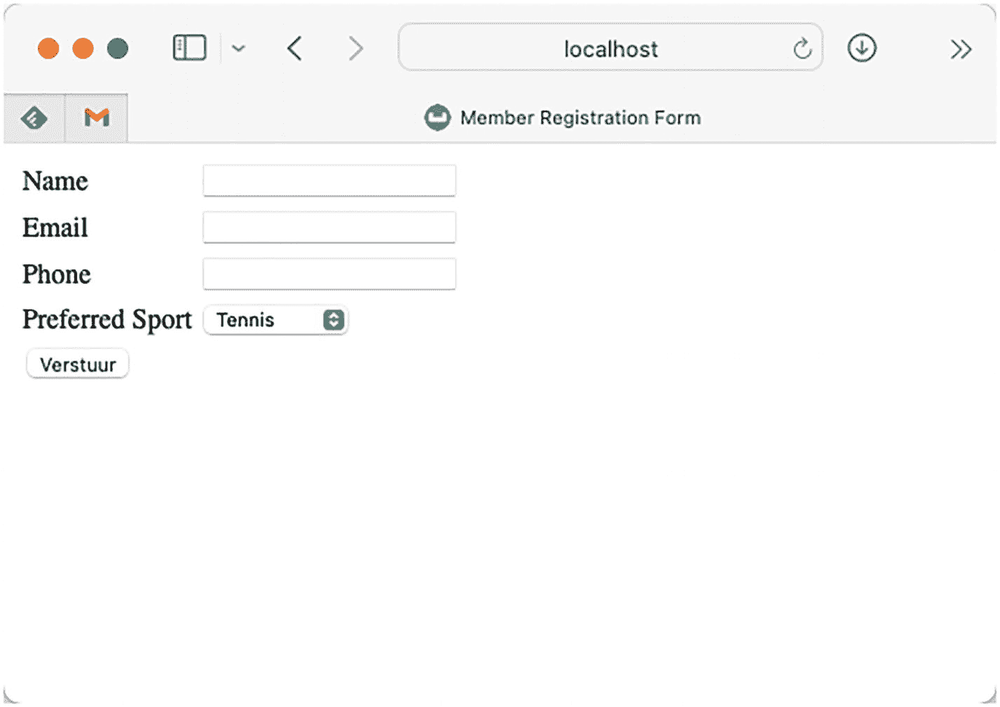
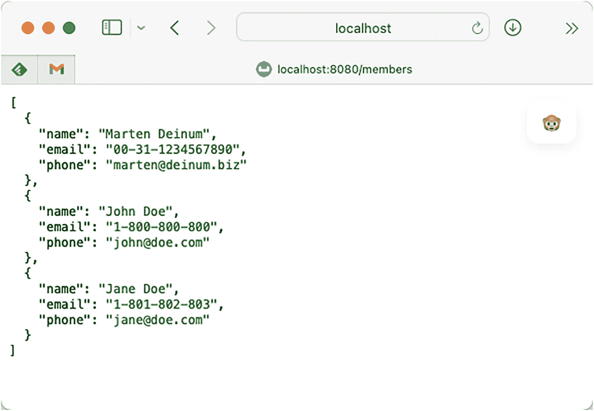

# 4. Spring WebFlux

当 Servlet API 最初发布时，大多数实现容器都采用每个请求一个线程的模式，这意味着线程会被阻塞，直到请求处理完成并将响应发送给客户端。然而，在早期，连接到互联网的设备远没有现在这么多。由于设备数量的增加，处理的 HTTP 请求数量也显著增长。由于这种增长，对于许多 Web 应用程序来说，保持线程阻塞已不再可行。在过去几年中，响应式编程兴起，借助 Spring，可以编写响应式 Web 应用程序。为了实现响应式，Spring 利用 [Project Reactor](https://projectreactor.io/) 作为 Reactive Streams API 的实现。深入探讨响应式编程超出了本书的范围，但简而言之，它是一种进行非阻塞函数式编程的方式。

传统上，在使用 Web 应用程序时，会有一个请求，HTML 在服务器端渲染，然后发送回客户端。在过去几年中，HTML 的渲染转移到了客户端，通信不再通过 HTML 进行，而是通过向客户端返回 JSON、XML 或其他表示形式。这传统上仍然是一个请求和响应周期，尽管是通过客户端通过 `XmlHttpRequest` 进行的异步调用来驱动的。然而，客户端和服务器之间还有其他通信方式。可以利用服务器发送事件实现从服务器到客户端的单向通信，而对于全双工通信，则可以使用 WebSocket。

## 4-1\. 使用 Spring WebFlux 开发响应式应用程序

### 问题

你想使用 Spring WebFlux 开发一个简单的响应式 Web 应用程序，以学习该框架的基本概念和配置。


### 解决方案

Spring WebFlux 最底层的组件是 `org.springframework.http.server.reactive.HttpHandler`；这是一个包含单个 `handle` 方法的接口：

```
package org.springframework.http.server.reactive;
import reactor.core.publisher.Mono;
public interface HttpHandler {
Mono handle(ServerHttpRequest request, ServerHttpResponse response);
}
```

`handle` 方法返回一个 `reactor.core.publisher.Mono<Void>`，这是响应式编程中表示返回 `void` 的方式。它接收两个参数：`ServerHttpRequest` 和 `ServerHttpResponse`，两者均来自 `org.springframework.http.server.reactive` 包。这些同样是接口，根据运行时所使用的容器，会创建接口的实例。为此，存在多个针对容器的适配器或桥接器。当在 Servlet 容器（支持非阻塞 IO）上运行时，会使用 `ServletHttpHandlerAdapter`（或其子类之一）将普通 Servlet 世界适配到响应式世界。当在原生响应式引擎（如 [Netty](https://projectreactor.io/docs/netty/release/reference/index.html)）上运行时，则会使用 `ReactorHttpHandlerAdapter`。

当 Web 请求发送到 Spring WebFlux 应用程序时，`HandlerAdapter` 首先接收该请求。然后，它会组织 Spring 应用上下文中配置的、处理请求所需的各种组件。

要在 Spring WebFlux 中定义控制器类，必须使用 `@Controller` 或 `@RestController` 注解标记该类（与 Spring MVC 相同——请参阅第 3 章和第 4 章），或者你也可以使用 `RouterFunction` 以函数式方式编写它们。

当带有 `@Controller` 注解的类（即控制器类）接收到请求时，它会寻找合适的处理方法（handler method）来处理该请求。这要求控制器类通过一个或多个处理器映射（handler mappings）将每个请求映射到一个处理方法。为此，控制器类的方法会使用 `@RequestMapping` 注解进行修饰，使其成为处理方法。

这些处理方法的签名——正如你对任何标准类所期望的那样——是开放式的。你可以为处理方法指定任意名称，并定义各种方法参数。同样，处理方法可以根据其实现的应用程序逻辑，返回一系列值中的任何一种（例如，字符串或 void）。以下仅是有效参数类型的部分列表，旨在让你有所了解：

*   `ServerHttpRequest` 或 `ServerHttpResponse`
*   来自 URL 的任意类型的请求参数，使用 `@RequestParam` 注解
*   任意类型的模型属性，使用 `@ModelAttribute` 注解
*   传入请求中包含的 Cookie 值，使用 `@CookieValue` 注解
*   任意类型的请求头值，使用 `@RequestHeader` 注解
*   任意类型的请求属性，使用 `@RequestAttribute` 注解
*   `Map` 或 `ModelMap`，供处理方法向模型添加属性
*   `WebSession`，用于会话

一旦控制器类选定了合适的处理方法，它就会使用该请求调用处理方法的逻辑。通常，控制器的逻辑会调用后端服务来处理请求。此外，处理方法的逻辑可能会向众多输入参数（例如 `ServerHttpRequest`、`Map` 或 `Errors`）中添加或移除信息，这些参数将构成后续流程的一部分。

在处理方法完成请求处理后，它会向客户端返回一个值。通常，该值会被序列化为 JSON 或 XML（参见配方 4-2）以供客户端消费。但它也可以是待渲染视图的名称（参见配方 4-4）。

### 工作原理

让我们创建一个简单的控制器，它可选地接受一个名称，并向客户端返回一条消息。

首先，我们需要 Spring WebFlux 的配置，然后是引导 Netty 并将配置传递给它所需的代码。最后，我们将编写控制器以响应式方式向客户端返回消息。

#### 设置 Spring WebFlux 应用程序

在能够使用和操作 Spring WebFlux 之前，你需要在类路径中添加一些依赖项，最明显的是 `spring-webflux`。为了充分利用应用程序的响应式特性，你还需要一个响应式运行时。这里我们选择使用 Project Reactor Netty。

*WebFlux 和 Netty 的 Gradle 依赖项*

```
implementation group: 'org.springframework', name: 'spring-webflux', version: '6.0.3'
implementation group: 'io.projectreactor.netty', name: 'reactor-netty-http', version: '1.1.0'
```

*WebFlux 和 Netty 的 Maven 依赖项*

```
<dependency>
    <groupId>org.springframework</groupId>
    <artifactId>spring-webflux</artifactId>
    <version>6.0.3</version>
</dependency>
<dependency>
    <groupId>io.projectreactor.netty</groupId>
    <artifactId>reactor-netty-http</artifactId>
    <version>1.1.0</version>
</dependency>
```

为了能够以响应式方式处理请求，你需要启用 WebFlux。这可以通过在 `@Configuration` 类上添加 `@EnableWebFlux` 来实现：

```
package com.apress.spring6recipes.reactive.court;
import org.springframework.context.annotation.ComponentScan;
import org.springframework.context.annotation.Configuration;
import org.springframework.web.reactive.config.EnableWebFlux;
import org.springframework.web.reactive.config.WebFluxConfigurer;
@Configuration
@EnableWebFlux
@ComponentScan
public class WebFluxConfiguration implements WebFluxConfigurer { }
```

`@EnableWebFlux` 注解正是开启响应式处理的关键。为了进一步配置 WebFlux，你可以实现 `WebFluxConfigurer` 并添加额外的转换器、视图解析器、编解码器等。


#### 引导应用程序

如何引导应用程序在一定程度上取决于你选择运行的运行时环境。对于所有受支持的容器（见表 4-1），都有不同的处理器适配器，以便运行时能够与 Spring WebFlux 的 `HttpHandler` 抽象协同工作。所有适配器类都位于 `org.springframework.http.server.reactive` 包中。

表 4-1

受支持的运行时环境与处理器适配器

| 运行时环境 | 适配器 |
| --- | --- |
| 任何 Servlet 容器 | `ServletHttpHandlerAdapter` |
| Tomcat | `TomcatHttpHandlerAdapter` |
| Jetty | `ServletHttpHandlerAdapter` |
| Reactor Netty | `ReactorHttpHandlerAdapter` |
| Reactor Netty 5 | `ReactorNetty2HttpHandlerAdapter` |
| Undertow | `UndertowHttpHandlerAdapter` |

一个带阴影圆圈的字母 i 图标，代表信息符号。 对于 Tomcat 和 Jetty，都可以使用常规的 `ServletHttpHandlerAdapter`；但为了更好的集成，建议使用特定于该容器的适配器。

在适配到运行时环境之前，你需要使用 `AnnotationConfigApplicationContext` 来引导应用程序，并用它来配置一个 `HttpHandler`。为了更轻松地配置 `HttpHandler`，可以使用 `HttpWebHandlerAdapter` 为给定的 `ApplicationContext` 进行配置：

```
var context = new AnnotationConfigApplicationContext(WebFluxConfiguration.class);
var handler = WebHttpHandlerBuilder.applicationContext(context).build();
```

接下来，你需要将 `HttpHandler` 适配到运行时环境。

对于 Reactor Netty，代码大致如下：

```
var adapter = new ReactorHttpHandlerAdapter(handler);
HttpServer.create().host("0.0.0.0").port(8080).handle(adapter).bind().block();
System.in.read();
```

首先，创建一个 `ReactorHttpHandlerAdapter`，该组件知道如何将 Reactor Netty 的处理方式适配到内部的 `HttpHandler`。接着，将此适配器作为处理器注册到新创建的 Reactor Netty 服务器上。

当将应用程序部署到 Servlet 容器时，你可以创建一个实现 `WebApplicationInitializer` 的类，并手动进行设置：

```
package com.apress.spring6recipes.reactive.court;
import jakarta.servlet.ServletContext;
import org.springframework.context.annotation.AnnotationConfigApplicationContext;
import org.springframework.http.server.reactive.ServletHttpHandlerAdapter;
import org.springframework.web.WebApplicationInitializer;
import org.springframework.web.server.adapter.WebHttpHandlerBuilder;
public class WebFluxInitializer implements WebApplicationInitializer {
@Override
public void onStartup(ServletContext servletContext) {
var context = new AnnotationConfigApplicationContext(WebFluxConfiguration.class);
var httpHandler = WebHttpHandlerBuilder.applicationContext(context).build();
var adapter = new ServletHttpHandlerAdapter(httpHandler);
var registration = servletContext.addServlet("dispatcher-handler", adapter);
registration.setLoadOnStartup(1);
registration.addMapping("/");
registration.setAsyncSupported(true);
}
}
```

首先，创建一个 `AnnotationConfigApplicationContext`，因为你希望使用注解进行配置，并将你的 `WebFluxConfiguration` 类传递给它。接着，你需要一个 `HttpHandler` 来处理和分发请求；为此，你使用了 `WebHttpHandlerBuilder` 类。这个 `HttpHandler` 需要作为 `Servlet` 注册到你正在使用的 Servlet 容器中；因此，你需要将其包装在 `ServletHttpHandlerAdapter` 中。为了能够进行响应式处理，`asyncSupported` 需要设置为 `true`。

为了使这个配置更简单，Spring WebFlux 提供了一个便捷的实现，你可以继承 `AbstractReactiveWebInitializer`。现在的配置如下所示：

```
package com.apress.spring6recipes.reactive.court;
import org.springframework.web.server.adapter.AbstractReactiveWebInitializer;
public class WebFluxInitializer extends AbstractReactiveWebInitializer {
@Override
protected Class[] getConfigClasses() {
return new Class[] { WebFluxConfiguration.class };
}
}
```

唯一需要实现的是 `getConfigClasses` 方法。所有其他活动部件现在都由 Spring WebFlux 提供的基础配置来处理。

现在，你已经准备好将应用程序运行在常规的 Servlet 容器上了。

一个带阴影圆圈的字母 i 图标，代表信息符号。 当在常规的 Servlet 容器上运行时，你不会获得完全的响应式能力。它只会利用 Servlet API 的异步特性和非阻塞 I/O；它不会提供诸如背压和弹性之类的特性（因为它仍然使用 Tomcat 底层的线程池/阻塞特性）。


#### 创建 Spring WebFlux 控制器

基于注解的控制器类可以是任意类，无需实现特定接口或继承特定基类。你可以使用 `@Controller` 或 `@RestController` 注解对其进行标注。一个控制器中可以定义一个或多个处理器方法来处理单个或多个操作。处理器方法的签名足够灵活，可以接受多种参数。（关于请求映射的更多信息，请参见配方 2-2。）

`@RequestMapping` 注解可以应用于类级别或方法级别。第一种映射策略是将特定的 URL 模式映射到控制器类，然后将特定的 HTTP 方法映射到每个处理器方法：

```
package com.apress.spring6recipes.reactive.court.web;
import org.springframework.web.bind.annotation.GetMapping;
import org.springframework.web.bind.annotation.RequestMapping;
import org.springframework.web.bind.annotation.RequestParam;
import org.springframework.web.bind.annotation.RestController;
import reactor.core.publisher.Mono;
@RestController
@RequestMapping("/welcome")
public class WelcomeController {
@GetMapping
public Mono welcome(@RequestParam(defaultValue = "World") String name) {
return Mono.just("Hello " + name+" from Spring WebFlux!");
}
}
```

该控制器接收一个可选的 `name` 参数（如果未提供，则默认为 `World`），并向客户端返回一条简单的消息。请注意返回类型 `Mono<String>`。这是 Project Reactor 中的响应式类型，表示单个返回值（或无返回值）。除了 Project Reactor，你还可以使用 [RxJava 3](https://reactivex.io/) 或 [Mutiny](https://smallrye.io/smallrye-mutiny/2.0.0/) 中的返回类型。

由于你已经使用 `@ComponentScan` 在 `com.apress.spring6recipes.reactive.court` 包上激活了注解扫描，因此在部署时会检测到控制器类的注解。

`@RestController` 注解将类定义为控制器。`@RequestMapping` 注解更有趣，因为它包含属性，并且可以在类或处理器方法级别声明。该类中使用的第一个值 `("/welcome")` 用于指定控制器可响应的 URL，这意味着任何发送到 `/welcome` URL 的请求都将由 `WelcomeController` 类处理。

一旦控制器类处理请求，它会将调用委托给控制器中声明的默认 HTTP GET 处理器方法。之所以如此，是因为对 URL 的每个初始请求都是 HTTP GET 类型。因此，当控制器处理 `/welcome` URL 上的请求时，它会随后委托给默认的 HTTP GET 处理器方法进行处理。

`@GetMapping` 注解用于将 welcome 方法装饰为控制器的默认 HTTP GET 处理器方法。值得一提的是，如果未声明默认的 HTTP GET 处理器方法，则会抛出 `ResponseStatusException`，因此 Spring WebFlux 控制器至少需要具备一个 URL 路由和默认的 HTTP GET 处理器方法，这一点至关重要。

这种方法的另一种变体是在方法级别使用的 `@GetMapping` 注解中同时声明 URL 路由和默认的 HTTP GET 处理器方法。如下所示：

```
@RestController
public class WelcomeController {
@GetMapping("/welcome")
public String welcome(Model model) { ... }
}
```

最后一个控制器说明了 Spring WebFlux 的基本原理。

#### 运行 Web 应用程序

根据运行时环境，你可以直接通过执行 `main` 方法来运行应用程序，或者构建一个 Web 归档文件（WAR）并将其部署到 Servlet 容器中。这里我们将使用响应式运行时并启动 `main` 方法。启动后，你可以使用浏览器或 cURL、HTTPie 等工具向 `http://localhost:8080/welcome` 发送请求，并获取问候信息（参见图 4-1）。



一个 zsh 输出页面的截图。它显示 HTTP/1.1 200 OK，内容长度为 33，内容类型为 text/plain，以及一条问候消息：Hello Reader from spring web flux。

图 4-1

欢迎控制器的调用与输出

灯泡图标表示提示信息。 该项目还可以使用应用程序创建一个 Docker 容器：运行 `gradle docker` 即可获得一个包含 Tomcat 和应用程序的容器。然后你可以启动 Docker 容器来测试应用程序（`gradle dockerRun`）。

## 4-2\. 使用响应式 REST 服务发布和消费 JSON

### 问题

你想使用 Spring WebFlux 开发一个简单的基于响应式 REST 的应用程序。

### 解决方案

使用 `@RestController` 注解和 Jackson 库，Spring WebFlux 可以发送和接收 JSON。要接收数据到对象中，请使用 `@RequestBody` 注解，它会将 JSON 反序列化为 Java 对象。

### 工作原理

首先，编写以下领域类，这是一个普通的类，目前还没有响应式特性。这里使用的类与配方 4-1 中常规 Servlet 版本的类相同：

```
package com.apress.spring6recipes.reactive.court.domain;
public record Member(String name, String email, String phone) { }
```

然后，定义以下服务接口，为表示层提供成员服务：

```
package com.apress.spring6recipes.reactive.court.service;
import com.apress.spring6recipes.reactive.court.domain.Member;
import reactor.core.publisher.Flux;
import reactor.core.publisher.Mono;
public interface MemberService {
Flux findAll();
Mono findById(long id);
Mono save(Member member);
}
```

注意 `findAll` 方法的返回类型，它返回一个 `Flux<Member>`，这意味着零个或多个成员。

在生产应用程序中，你应该使用数据存储持久化来实现此接口，并且最好支持响应式编程。但为了简单起见，你可以将成员存储在一个映射中，并硬编码几个成员用于测试目的：

```
package com.apress.spring6recipes.reactive.court.service;
import com.apress.spring6recipes.reactive.court.domain.Member;
import jakarta.annotation.PostConstruct;
import org.springframework.stereotype.Service;
import reactor.core.publisher.Flux;
import reactor.core.publisher.Mono;
import java.util.Map;
import java.util.concurrent.ConcurrentHashMap;
import java.util.concurrent.atomic.AtomicLong;
@Service
class InMemoryMemberService implements MemberService {
private final AtomicLong sequence = new AtomicLong(1);
private final Map members = new ConcurrentHashMap();
@PostConstruct
public void init() {
Flux.just(
new Member("Marten Deinum", "00-31-1234567890", "marten@deinum.biz"),
new Member("John Doe", "1-800-800-800", "john@doe.com"),
new Member("Jane Doe", "1-801-802-803", "jane@doe.com"))
.flatMap(this::save)
.subscribe();
}
@Override
public Flux findAll() {
return Flux.fromIterable(members.values());
}
@Override
public Mono findById(long id) {
return Mono.justOrEmpty(members.get(id));
}
@Override
public Mono save(Member member) {
var id = sequence.getAndIncrement();
this.members.put(id, member);
return Mono.just(member);
}
}
```

`findById` 方法返回一个包含 `Member` 的 `Mono`，如果未找到 `Member`，则返回一个空的 `Mono`。


#### 发布 JSON

通过在请求处理方法上添加 `@ResponseBody` 注解，输出将根据请求返回类型和类路径中可用的库，以 JSON、XML 或任何表示形式返回。除了在方法上使用 `@ResponseBody` 注解外，你还可以在类级别使用 `@RestController` 注解，它会自动为所有请求处理方法隐含 `@ResponseBody`。

让我们编写一个 REST 控制器，返回系统中的所有成员。为此，你需要使用 `@RestController` 注解一个类，并为其提供一个带有 `@GetMapping` 注解的方法，该方法返回一个 `Flux<Member>`：

```
package com.apress.spring6recipes.reactive.court.web;
import com.apress.spring6recipes.reactive.court.domain.Member;
import com.apress.spring6recipes.reactive.court.service.MemberService;
import org.springframework.web.bind.annotation.GetMapping;
import org.springframework.web.bind.annotation.RequestMapping;
import org.springframework.web.bind.annotation.RestController;
import reactor.core.publisher.Flux;
import reactor.core.publisher.Mono;
@RestController
@RequestMapping("/members")
public class MemberController {
private final MemberService memberService;
public MemberController(MemberService memberService) {
this.memberService = memberService;
}
@GetMapping
public Flux list() {
return memberService.findAll();
}
}
```

为了能够生成 JSON，Jackson JSON 库必须位于类路径中。Spring WebFlux 会检测其存在，并为此配置相应的消息 `Encoder`/`Decoder`。然后，这个 `Encoder`/`Decoder` 实现会被 `HttpMessageWriter`/`HttpMessageReader` 用来写入或读取 HTTP 消息（请求或响应的主体）。

当返回像这样的响应式类型时，它将以流式 JSON/XML 或服务器发送事件（参见配方 3-6）的形式流式传输到客户端。结果取决于客户端的 `Accept` 头。使用 HTTPie 并执行 `http http://localhost:8080/members` 将获得 JSON。当添加 `--stream` 时，结果将以服务器发送事件的形式发布。

#### 消费 JSON

除了生成 JSON，你还可以消费 JSON。为此，添加一个方法参数并使用 `@RequestBody` 对其进行注解。传入的请求体将被映射到该对象上。对于响应式控制器，你可以将其包装在 `Mono` 或 `Flux` 中，分别对应单个结果或多个结果：

```
@PostMapping
public Mono create(@RequestBody Member member) {
return memberService.save(member);
}
```

新方法已使用 `@PostMapping` 注解，以便它绑定到 POST HTTP 方法。它可以接收一个 `Member` 对象，并最终使用服务保存它。新创建的 `Member` 将返回给用户。

现在，当带有 JSON 主体的请求进来时，它将被反序列化为 `Member` 对象。为此，Spring WebFlux 与 Spring MVC 一样，使用转换器。转换委托给 `HttpMessageReader` 的实例，在本例中是 `DecoderHttpMessageReader`；该类将响应式流解码为对象。这又委托给一个 `Decoder`。由于我们希望使用 JSON（并且类路径中有 Jackson 2 JSON 库），它将为此使用 `Jackson2JsonDecoder`。`HttpMessageReader` 和 `Decoder` 实现是常规 Spring MVC 使用的 `HttpMessageConverter` 的响应式对应物。

使用 HTTPie 并发出以下请求 `http POST http://localhost:8080/members/ name="Josh Long" email="josh@example.com"` 将添加一个新成员。现在，当检索所有成员时，它将成为结果的一部分。

#### 验证传入的有效载荷

当接收有效载荷时，人们想知道它是否有效。使用 Spring WebFlux 时，可以通过使用 [Jakarta Bean Validation API](https://jakarta.ee/specifications/bean-validation/) 来实现这一点。这允许注解不同的字段以防止无效值。对于我们的成员，我们希望 `name` 和 `email` 是必需的（非空），并且 email 也必须是有效的电子邮件格式。为此，我们可以分别使用 `@NotBlank` 和 `@Email` 注解：

```
package com.apress.spring6recipes.reactive.court.domain;
import jakarta.validation.constraints.Email;
import jakarta.validation.constraints.NotBlank;
public record Member(@NotBlank String name,
@NotBlank @Email String email,
String phone) { }
```

为了使 Jakarta Bean Validation API 正常工作，我们还需要在类路径中有一个实现。Spring 支持 Hibernate Validator 项目。这需要作为依赖项添加到我们的应用程序中。默认情况下，Hibernate Validator 还需要一个 EL（表达式语言）实现。

*Gradle 依赖*

```
implementation group: 'jakarta.validation', name: 'jakarta.validation-api', version: '3.0.2'
runtimeOnly group: 'org.hibernate.validator', name: 'hibernate-validator', version: '8.0.0.Final'
runtimeOnly group: 'org.glassfish', name: 'jakarta.el', version: '4.0.2'
```

*Maven 依赖*

```
jakarta.validation
jakarta.validation-api
3.0.2

org.hibernate.validator
hibernate-validator
8.0.0.Final
runtime

org.glassfish
jakarta.el
4.0.2
runtime

```

最后，我们需要指示我们的控制器验证传入的有效载荷。为此，在 `@RequestBody` 注解旁边添加 `@Valid`：

```
@PostMapping
public Mono create(@Valid @RequestBody Member member) {
return memberService.save(member);
}
```

现在，当我们发送一个无效请求时，我们将收到一个 HTTP 状态码为 400（错误请求）的响应。然而，该响应并没有说明具体哪里出了问题（哪个字段或字段有什么问题）。为此，我们可以使用更详细的异常处理（参见配方 4-3）。

## 4-3\. 使用响应式控制器进行异常处理

### 问题

Web 应用程序必须处理异常，例如来自验证错误或数据库的一些技术错误。你希望向用户展示友好的错误信息并解释哪里出了问题。

### 解决方案

在 Spring WebFlux 中，你可以使用异常处理器将异常转换为有意义的错误响应。你可以在控制器中使用注解方法，或者使用控制器通知采用更全局的方法，使其适用于所有（或部分）控制器。

### 工作原理

配方 4-2 解释了如何接收请求体并对其进行验证。为了将验证异常转换为对客户端有意义的响应，你需要实现一个方法并使用 `@ExceptionHandler` 对其进行注解。与 `@RequestMapping` 注解的方法一样，`@ExceptionHandler` 注解的方法可以使用不同类型的对象来帮助编写有意义的错误信息。其中之一是被处理的 `Exception`。表 4-2 列出了另一组（有限的）可能性。

表 4-2

@ExceptionHandler 方法最常用的方法参数

| 方法参数 | 描述 |
| --- | --- |
| 异常类型 | 将被处理的 `Exception` |
| `ServerHttpRequest``ServerHttpResponse` | 获取对请求和/或响应的访问权限 |
| `ServerWebExchange` | 完整的当前 `ServerWebExchange`。包含所有 HTTP 相关信息（方法、请求、响应、会话等）的容器 |
| `java.security.Principal` | 当前主体，即当前已认证的用户 |
| `java.util.Map``org.springframework.ui.Model``org.springframework.ui.ModelMap` | 用于错误响应的模型，始终为空。可用于向响应添加数据 |
| `Errors``BindingResult` | 访问来自命令对象的验证和绑定结果的错误 |


#### 为验证错误创建异常处理器

`@ExceptionHandler` 注解可以应用于 `@Controller`/`@RestController` 注解的类中的方法，或者 `@ControllerAdvice` 注解的类中的方法。在第一种情况下，它仅处理来自该特定控制器的错误；在第二种情况下，它可以作为全局错误处理器，处理所有或部分控制器的错误。

在本节中，你将创建一个全局异常处理器，用于处理所有验证/绑定错误。为此，创建一个类并使用 `@ControllerAdvice` 注解。然后，添加一个方法。

灯泡图标表示提示信息。 除了 `@ControllerAdvice`，还有 `@RestControllerAdvice`。在本节中，你可以使用其中任意一个。主要区别在于 `@ControllerAdvice` 适用于所有控制器，而 `@RestControllerAdvice` 仅限于使用 `@RestController` 注解的控制器。

```
package com.apress.spring6recipes.reactive.court.web;
import org.springframework.validation.FieldError;
import org.springframework.web.bind.annotation.ControllerAdvice;
import org.springframework.web.bind.annotation.ExceptionHandler;
import org.springframework.web.bind.annotation.ResponseBody;
import org.springframework.web.bind.support.WebExchangeBindException;
import reactor.core.publisher.Flux;
@ControllerAdvice
public class GlobalErrorHandler {
@ExceptionHandler(WebExchangeBindException.class)
@ResponseBody
public Flux handleValidationErrors(WebExchangeBindException ex) {
return Flux.fromIterable(ex.getFieldErrors())
.map(this::toErrorMessage);
}
private ErrorMessage toErrorMessage(FieldError fe) {
return new ErrorMessage(fe.getField(), fe.getDefaultMessage());
}
record ErrorMessage(String field, String message) { }
}
```

使用 `@ExceptionHandler` 注解的方法将处理应用程序中发生的所有 `WebExchangeBindException`。它接收异常，获取字段错误，并将其转换为一个标识哪个字段出错以及具体错误信息的小对象。该方法还使用了 `@ResponseBody` 注解，表示我们希望将响应内容写入输出。支持多种返回类型；请参见表 4-3。

表 4-3

部分支持的返回类型

| 响应类型 | 描述 |
| --- | --- |
| 支持的响应式类型 | 支持 `Flux`/`Mono` 等类型，以及其他支持的响应式库中的类型 |
| `String` | 解释为要渲染的视图名称 |
| `java.util.Map``org.springframework.ui.Model` | 错误响应的模型——将根据 URL 渲染视图 |
| `View` | 要渲染的实际 `View` |
| `ErrorResponse``ProblemDetail` | 渲染 RFC-7807 响应，并在正文中包含详细信息 |

现在，当向 `http://localhost:8080/members` 提交一个空成员时，我们将收到状态码 400，表示响应无效（见图 4-2）。



一个来自 zsh 的输出页面截图。它显示 HTTP/1.1 400 错误请求，内容长度为 0。

图 4-2

异常输出

虽然 HTTP 状态码 400 是正确的，但它没有提供更多关于错误原因的详细信息。这时，问题详情 API（RFC-7807）可以通过标准化的方式提供更多信息来提供帮助。

#### 在 Spring WebFlux 中使用问题详情（RFC-7808）

Spring WebFlux 也像 Spring Web 一样，支持 HTTP API 的问题详情（[RFC-7807](https://www.rfc-editor.org/rfc/rfc7807)）。使用此功能有两种选择：你可以从 `@ExceptionHandler` 方法返回一个 `ProblemDetail`/`ErrorResponse`，或者扩展提供的 `ResponseEntityExceptionHandler` 以简化操作。

最简单的起点是扩展 `ResponseEntityExceptionHandler`。让我们修改 `GlobalErrorHandler`，使其扩展 `ResponseEntityExceptionHandler`：

```
package com.apress.spring6recipes.reactive.court.web;
import org.springframework.web.bind.annotation.ControllerAdvice;
import org.springframework.web.reactive.result.method.annotation.ResponseEntityExceptionHandler;
@ControllerAdvice
public class GlobalErrorHandler extends ResponseEntityExceptionHandler { }
```

现在，该类只是一个带有 extends 和 `@ControllerAdvice` 注解的类。这足以让 Spring WebFlux 返回包含问题详情信息的响应（见图 4-3）。



一个输出页面的截图。它显示 HTTP/1.1 400 错误请求，内容长度为 114。花括号内显示了一组 5 个输出：detail（详细信息）、invalid request content（无效请求内容）、instance（实例，/members）、status（状态，400）、title（标题，bad request）和 type（类型，about:blank）。

图 4-3

默认问题详情异常输出

然而，对于 `WebExchangeBindException`，信息仍然非常稀疏。如果它能包含哪些字段无效的信息就更好了。由于问题详情 RFC 允许扩展默认构建块，因此这非常容易实现。

由于我们已经扩展了 `ResponseEntityExceptionHandler`，我们可以重写 `handleWebExchangeBindException` 方法，并用所需信息丰富响应：

```
package com.apress.spring6recipes.reactive.court.web;
import java.util.Map;
import org.springframework.http.HttpHeaders;
import org.springframework.http.HttpStatusCode;
import org.springframework.http.ResponseEntity;
import org.springframework.web.bind.annotation.ControllerAdvice;
import org.springframework.web.bind.support.WebExchangeBindException;
import org.springframework.web.reactive.result.method.annotation.ResponseEntityExceptionHandler;
import org.springframework.web.server.MissingRequestValueException;
import org.springframework.web.server.ServerWebExchange;
import org.springframework.web.server.ServerWebInputException;
import reactor.core.publisher.Mono;
@ControllerAdvice
public class GlobalErrorHandler extends ResponseEntityExceptionHandler {
@Override
protected Mono> handleWebExchangeBindException(
WebExchangeBindException ex, HttpHeaders headers,
HttpStatusCode status, ServerWebExchange exchange) {
var locale = exchange.getLocaleContext().getLocale();
var errors = ex.resolveErrorMessages(getMessageSource(), locale);
ex.getBody().setProperty("errors", errors.values());
return super.handleExceptionInternal(ex, null, headers, status, exchange);
}
}
```

首先，我们解析可能存在的错误消息。为此，我们可以从父类获取 `MessageSource`，并从 `ServerWebExchange` 获取 `Locale`。我们将解析后的消息作为名为 `errors` 的新属性添加到问题详情响应中。我们可以这样做，因为 `WebExchangeBindException` 是 `ErrorResponse` 接口的实现，该接口允许这样做。为了方便起见，Spring 的 Web 处理部分抛出的所有异常都实现了该接口。

现在，当我们在请求中出错时，会得到一个漂亮的错误列表，解释请求中的问题（见图 4-4）。



一个输出页面的截图。它显示 HTTP/1.1 400 错误请求，内容长度为 183。花括号内显示了一组输出：detail（详细信息，invalid request content）、errors（错误，email 和 name 不能为空）、instance（实例，/members）、status（状态，400）、title（标题，bad request）、type（类型，about:blank）。

图 4-4

扩展的问题详情异常输出

## 4-4\. 使用响应式控制器处理表单


### 问题

在 Web 应用中，你经常需要处理表单。表单控制器既要向用户展示表单，也要处理表单提交。表单处理可能是一项复杂且多变的任务。

### 解决方案

当用户与表单交互时，需要控制器支持两个操作。首先，当表单被初次请求时，控制器通过 HTTP GET 请求向用户渲染表单视图。然后，当表单提交时，会发起 HTTP POST 请求来处理表单数据的验证和业务逻辑。如果表单处理成功，则向用户渲染成功视图；否则，重新渲染表单视图并显示错误信息。

### 工作原理

假设你想让用户通过填写表单来注册成为会员。为了更好地理解控制器处理的数据，我们将首先介绍控制器的视图（即表单）。

#### 创建表单视图

让我们创建表单视图 `member.html`。该表单依赖于 Thymeleaf 库，因为它能简化表单的数据绑定、错误消息的显示，以及在出错时重新显示用户输入的原始值。将此文件放置在 `src/main/resources/templates` 目录下，Thymeleaf 将从该目录读取模板（稍后会在本教程中配置）：

```

会员注册表单

.error {
color: #ff0000;
font-weight: bold;
}

姓名

邮箱

电话

```

该表单使用 Thymeleaf，通过 `form` 标签上的 `th:object=${member}` 将所有表单字段绑定到名为 `member` 的模型属性上。每个字段都会绑定并显示 `Member` 对象中对应字段的值，这正是 `th:field` 标签的作用。当字段存在错误时，通过 `th:errors` 标签显示这些错误。

最后，你可以看到标准的 HTML 标签 `<input type="submit" />`，它生成一个“提交”按钮，并触发数据发送到服务器。

如果表单及其数据被正确处理，你需要创建一个成功视图来通知用户注册成功。下面展示的 `member-success.html` 就用于此目的：

```

会员注册成功

您的注册已成功提交。

```

由于表单中提交了无效值，也可能发生错误。例如，如果 `email` 格式无效或缺少必填字段，控制器会拒绝这些字段值。然后控制器会为每个错误生成一系列错误代码，并通过 `th:errors` 标签将这些值返回给表单视图。

例如，对于 `email` 字段输入的无效值，数据绑定会生成以下错误代码：

```
typeMismatch.command.email
typeMismatch.email
typeMismatch.java.time.LocalDate
typeMismatch
```

如果你定义了 `ResourceBundleMessageSource`，可以在资源包中为相应区域设置添加以下错误消息（例如，默认区域设置的 `messages.properties`）（关于如何外部化本地化配置，请参见教程 2-5）：

```
typeMismatch.date=日期格式无效
typeMismatch.hour=小时格式无效
```

如果处理表单数据时发生失败，相应的错误代码及其值将返回给用户。

现在你已经了解了表单相关视图的结构以及表单处理的数据，让我们来看看处理表单中提交数据（即会员信息）的逻辑。

#### 创建表单的服务处理

我们可以复用之前教程中的 `MemberService`，为其定义一个接口和一个内存实现：

```
package com.apress.spring6recipes.reactive.court.service;
import com.apress.spring6recipes.reactive.court.domain.Member;
import reactor.core.publisher.Flux;
import reactor.core.publisher.Mono;
public interface MemberService {
Flux findAll();
Mono findById(long id);
Mono save(Member member);
}
```

```
package com.apress.spring6recipes.reactive.court.service;
import com.apress.spring6recipes.reactive.court.domain.Member;
import jakarta.annotation.PostConstruct;
import org.springframework.stereotype.Service;
import reactor.core.publisher.Flux;
import reactor.core.publisher.Mono;
import java.util.Map;
import java.util.concurrent.ConcurrentHashMap;
import java.util.concurrent.atomic.AtomicLong;
@Service
class InMemoryMemberService implements MemberService {
private final AtomicLong sequence = new AtomicLong(1);
private final Map members = new ConcurrentHashMap();
@PostConstruct
public void init() {
Flux.just(
new Member("Marten Deinum", "00-31-1234567890", "marten@deinum.biz"),
new Member("John Doe", "1-800-800-800", "john@doe.com"),
new Member("Jane Doe", "1-801-802-803", "jane@doe.com"))
.flatMap(this::save)
.subscribe();
}
@Override
public Flux findAll() {
return Flux.fromIterable(members.values());
}
@Override
public Mono findById(long id) {
return Mono.justOrEmpty(members.get(id));
}
@Override
public Mono save(Member member) {
var id = sequence.getAndIncrement();
this.members.put(id, member);
return Mono.just(member);
}
}
```

现在你已经更好地理解了与控制器交互的两个要素——表单视图和会员服务类——接下来让我们创建一个控制器来处理会员注册表单。


#### 创建表单的控制器

用于处理表单的控制器，实际上使用了你在之前示例中已经见过的那些注解。因此，我们直接来看代码：

```
package com.apress.spring6recipes.reactive.court.web;
import com.apress.spring6recipes.reactive.court.domain.Member;
import com.apress.spring6recipes.reactive.court.service.MemberService;
import org.springframework.stereotype.Controller;
import org.springframework.ui.Model;
import org.springframework.validation.BindingResult;
import org.springframework.web.bind.annotation.GetMapping;
import org.springframework.web.bind.annotation.ModelAttribute;
import org.springframework.web.bind.annotation.PostMapping;
import org.springframework.web.bind.annotation.RequestMapping;
import reactor.core.publisher.Mono;
@Controller
@RequestMapping("/members")
public class MemberController {
private final MemberService memberService;
public MemberController(MemberService memberService) {
this.memberService = memberService;
}
@GetMapping
public Mono add(Model model) {
model.addAttribute("member", new Member(null, null, null));
return Mono.just("member");
}
@PostMapping
public Mono create(@ModelAttribute("member") Member member,
BindingResult bindingResult) {
return Mono.just(member)
.map(memberService::save)
.then(Mono.just("redirect:member-success"));
}
}
```

该控制器首先使用了标准的 `@Controller` 注解，以及 `@RequestMapping` 注解，允许通过以下 URL 访问该控制器：

```
http://localhost:8080/members
```

当你在浏览器中输入此 URL 时，它会向你的 Web 应用发送一个 HTTP GET 请求。这进而会触发 `add` 方法的执行，该方法根据其 `@GetMapping` 注解被指定用于处理此类请求。

`add` 方法定义了一个 `Model` 对象作为输入参数，该对象用于将模型数据发送到视图（即表单）。在处理器方法内部，创建了一个空的 `Member` 对象，并将其作为属性添加到控制器的 `Model` 对象中。然后，控制器将执行流程返回到 `member` 视图，在此处该视图被解析为 `member.html`（即表单）。

这最后一个方法最重要的方面是添加了一个空的 `Member` 对象。如果你分析 `member.html` 中的表单，你会注意到 `form` 标签声明了一个属性 `th:object="${member}"`。这意味着在渲染视图时，表单期望存在一个名为 `member` 的对象，这通过将其放置在处理器方法的 `Model` 中来实现。事实上，进一步检查会发现，每个 `input` 标签的 `th:field=*{expression}` 值对应于 `Member` 对象的字段名。由于表单是首次加载，显然期望的是一个空的 `Member` 对象。

现在，让我们将注意力转向首次提交表单。在你填写完表单字段后，提交表单会触发一个 HTTP POST 请求，该请求进而调用 `create` 方法——这是基于该方法的 `@PostMapping` 值。

为 `create` 方法声明的输入字段是 `@ModelAttribute("member") Member member`，用于引用 member 对象，以及 `BindingResult` 对象，该对象包含用户新提交的数据。

此时，处理器方法尚未包含验证，而这正是 `BindingResult` 对象的用途。

处理器方法执行的唯一操作是 `memberService.save(member);`。此操作使用 member 对象的当前状态来调用 member 服务。

通常，在执行此类操作之前，会先对控制器对象进行验证。

最后，请注意处理器方法返回一个名为 `redirect:member-success` 的视图。此例中视图的实际名称是 `member-success`，它被解析为你之前创建的 `member-success.html` 页面。

视图名称中的 `redirect:` 前缀用于避免一个称为重复表单提交的问题。

当你在表单成功视图刷新网页时，刚刚提交的表单会被再次提交。为了避免这个问题，你可以应用 post/redirect/get 设计模式，该模式建议在表单提交成功处理后重定向到另一个 URL，而不是直接返回一个 HTML 页面。这就是在视图名称前加上 `redirect:` 前缀的目的。

#### 初始化模型属性对象并预填充表单值

该表单旨在注册新成员。然而，如果我们用一个现有成员预填充 `member` 变量，我们也可以使用该表单来编辑成员信息。

让我们向控制器添加一个方法，该方法将重用同一个视图，但会用现有的 `Member` 对象预填充模型：

```
@GetMapping("/{id}")
public Mono add(@PathVariable("id") long id, Model model) {
return memberService.findById(id)
.defaultIfEmpty(new Member(null, null, null))
.doOnNext( (member) -> model.addAttribute("member", member))
.then(Mono.just("member"));
}
```

该方法接收路径中的 `id` 变量，并使用它来检索现有成员。如果未找到任何内容，它将初始化一个空的 `Member` 实例，以便表单仍然可以渲染。`member.html` 无需更改。

现在，当调用 `http://localhost:8080/members/1` 时，它将打开一个表单字段已预填充的表单。这是由于在 HTML 中使用了 `th:object` 和 `th:field` 标签。这些标签由 Thymeleaf 处理，其值从模型（已在控制器方法中填充）中获取。


#### 提供表单参考数据

当表单控制器被请求渲染表单视图时，它可能需要向表单提供某些类型的参考数据（例如，在 HTML 选择框中显示的选项）。现在假设您希望允许会员选择他们通常注册的运动类型：

```
package com.apress.spring6recipes.reactive.court.domain;
public record SportType(int id, String name) { }
```

我们需要修改 `Member`，以便能够向其传递一个 `SportType`：

```
package com.apress.spring6recipes.reactive.court.domain;
public record Member(String name, String email,
String phone, SportType preferredType) {
public Member(String name, String email, String phone) {
this(name, email, phone, null);
}
}
```

请注意新增的构造函数。这是为了让我们的 `InMemoryMemberService` 仍然能够正常运行；否则，它会因找不到正确的构造函数而报错。

现在，在 `member.html` 中添加一个下拉菜单，以便能够从列表中选择一个 `SportType`。`SportType` 的列表将被添加到控制器中的模型里：

```

Preferred Sport

```

`<select>` 标签提供了一种生成下拉列表的方式，该列表的值由控制器传递给视图。因此，表单将 `preferredType` 字段表示为一组 HTML `<select>` 元素，而不是之前需要用户输入文本值的开放式字段——`<input>`。

接下来，让我们看看控制器如何将 `sportType` 字段作为模型属性进行赋值。这个过程与之前的字段略有不同。

为简单起见，我们添加一个简单的 `SportTypeRepository`，它持有一个内部运动类型列表，并公开一个列出所有类型以及查找特定类型的方法：

```
package com.apress.spring6recipes.reactive.court.web;
import com.apress.spring6recipes.reactive.court.domain.SportType;
import org.springframework.stereotype.Repository;
import reactor.core.publisher.Flux;
import java.util.List;
import java.util.Optional;
@Repository
public class SportTypeRepository {
private final List sportTypes = List.of(
new SportType(1, "Tennis"),
new SportType(2, "Soccer"),
new SportType(3, "Swimming"));
public Flux findAll() {
return Flux.fromIterable(this.sportTypes);
}
public Optional findById(int id) {
return sportTypes.stream().filter( (type) -> type.id() == id).findFirst();
}
}
```

现在您已经有了一个返回硬编码 `SportType` 对象列表的实现，让我们看看控制器如何关联这个列表，以便将其返回给表单视图：

```
package com.apress.spring6recipes.reactive.court.web;
import com.apress.spring6recipes.reactive.court.service.MemberService;
import org.springframework.stereotype.Controller;
import org.springframework.web.bind.annotation.GetMapping;
import org.springframework.web.bind.annotation.ModelAttribute;
import org.springframework.web.bind.annotation.PathVariable;
import org.springframework.web.bind.annotation.RequestMapping;
import reactor.core.publisher.Flux;
import reactor.core.publisher.Mono;
@Controller
@RequestMapping("/members")
public class MemberController {
private final MemberService memberService;
private final SportTypeRepository sportTypeRepository;
public MemberController(MemberService memberService,
SportTypeRepository sportTypeRepository) {
this.memberService = memberService;
this.sportTypeRepository = sportTypeRepository;
}
@ModelAttribute("sportTypes")
public Flux sportTypes() {
return sportTypeRepository.findAll();
}
@GetMapping("/{id}")
public Mono add(@PathVariable("id") long id, Model model) {
return memberService.findById(id)
.defaultIfEmpty(new Member(null, null, null, null))
.doOnNext( (member) -> model.addAttribute("member", member))
.then(Mono.just("member"));
}
}
```

请注意，负责将 `Member` 对象返回给表单视图的 `add` 处理方法保持不变。

新增的部分，以及负责将 `SportType` 列表作为模型属性传递给表单视图的部分，是使用 `@ModelAttribute("sportTypes")` 注解修饰的方法。`@ModelAttribute` 注解用于定义全局模型属性，这些属性可供处理程序方法中使用的任何返回视图访问，其方式与处理程序方法声明 `Model` 对象作为输入参数并分配可在返回视图中访问的属性相同。这最后一个模型属性在表单视图中用于填充下拉列表（即 `<select>` 标签）。生成的页面应类似于图 4-5 所示。



一个完整的会员注册表单页面截图，包含三个文本框（姓名、电子邮件和电话），以及一个用于选择偏好运动的下拉框。下方有一个外语按钮。

图 4-5

完整的会员表单


#### 自定义类型的绑定属性

当表单提交时，控制器会将表单字段值绑定到同名模型对象的属性上，此处为 `Member` 对象。然而，对于自定义类型的属性，除非你为其指定相应的属性编辑器，否则控制器无法进行转换。

例如，运动类型选择字段仅提交所选运动类型的 ID——这是 HTML `<select>` 字段的运作方式。因此，你需要通过属性编辑器将此 ID 转换为 `SportType` 对象。首先，我们需要确保有一个 `findById` 方法（或另一个根据输入返回请求对象的方法）：

```
public Optional findById(int id) {
return sportTypes.stream().filter( (type) -> type.id() == id).findFirst();
}
```

然后，创建 `SportTypeConverter` 类，将运动类型 ID 转换为 `SportType` 对象。此转换器需要 `SportTypeRepository` 来执行查找：

```
package com.apress.spring6recipes.reactive.court.web;
import com.apress.spring6recipes.reactive.court.domain.SportType;
import org.springframework.core.convert.converter.Converter;
import org.springframework.stereotype.Component;
@Component
public class SportTypeConverter implements Converter {
private final SportTypeRepository repository;
public SportTypeConverter(SportTypeRepository repository) {
this.repository = repository;
}
@Override
public SportType convert(String source) {
var sportTypeId = Integer.parseInt(source);
return repository.findById(sportTypeId).orElse(null);
}
}
```

现在，你已拥有将表单属性绑定到 `SportType` 等自定义类所需的支持类 `SportTypeConverter`，接下来需要将其与控制器关联。为此，我们可以使用 `WebFluxConfigurer` 中的 `addFormatters` 方法。

通过在配置类中重写此方法，自定义类型（如通过 `SportTypeConverter` 类的 `SportType`）即可与控制器关联：

```
package com.apress.spring6recipes.reactive.court;
import com.apress.spring6recipes.reactive.court.web.SportTypeConverter;
import org.springframework.context.annotation.Bean;
import org.springframework.context.annotation.ComponentScan;
import org.springframework.context.annotation.Configuration;
import org.springframework.format.FormatterRegistry;
import org.springframework.web.reactive.config.EnableWebFlux;
@Configuration
@EnableWebFlux
@ComponentScan
public class WebFluxConfiguration implements WebFluxConfigurer {
private final SportTypeConverter sportTypeConverter;
public WebFluxConfiguration(SportTypeConverter sportTypeConverter) {
this.sportTypeConverter = sportTypeConverter;
}
@Override
public void addFormatters(FormatterRegistry registry) {
registry.addConverter(this.sportTypeConverter);
}
}
```

最后一个类中唯一的字段对应 `sportTypeConverter`，用于访问应用程序的 `SportTypeConverter` bean。此转换器通过调用 `registry.addConverter` 在 `addFormatters` 方法中被添加到注册表中。通过这种方式，每个基于注解的控制器（即使用 `@Controller` 注解的类）都可以在其处理方法中访问相同的自定义转换器和格式化器。

#### 验证表单数据

当表单提交时，标准做法是在提交成功之前验证用户提供的数据。与 Spring MVC 类似，Spring WebFlux 通过实现 `Validator` 接口的验证器对象来支持验证。你可以编写自己的实现，但最常用的方法是使用 [Jakarta Bean Validation API](https://jakarta.ee/specifications/bean-validation/)。通过它，你可以向模型对象添加注解，Spring WebFlux 将自动为你验证它们。

为此，让我们向 `Member` 对象添加一些验证约束：

```
package com.apress.spring6recipes.reactive.court.domain;
import jakarta.validation.constraints.Email;
import jakarta.validation.constraints.NotBlank;
import jakarta.validation.constraints.NotNull;
public record Member(@NotBlank String name,
@NotBlank @Email String email,
String phone,
@NotNull SportType preferredType) {
}
```

`Member` 类现在定义了一些验证约束。`name` 字段是必填的（不允许空白值，如全空格或 `null`）；`email` 字段需要是有效的电子邮件地址且为必填项。最后，我们还需要一个 `preferredType`。

下一个修改发生在 HTTP POST 处理方法中，该方法在用户提交表单时始终被调用。在 `@ModelAttribute` 注解旁边，现在有一个 `@Valid` 注解；此注解会触发对象的验证。验证之后，结果参数 `BindingResult` 对象包含验证过程的结果。因此，接下来会基于 `result.hasErrors()` 的值进行条件判断。如果验证类检测到错误，此值为 `true`。

如果在验证过程中检测到错误，处理方法会返回视图 `member`，该视图对应同一个表单，以便用户可以重新提交信息。如果在验证过程中未检测到错误，流程则按之前的方式继续：

```
@PostMapping
public Mono create(@Valid @ModelAttribute("member") Member member,
BindingResult bindingResult) {
if (bindingResult.hasErrors()) {
return Mono.just("member");
}
return Mono.just(member)
.map(memberService::save)
.then(Mono.just("redirect:member-success"));
}
```

## 4-5\. 异步 Web 客户端

### 问题

你想从第三方（例如 Google、Yahoo、其他业务合作伙伴）访问 REST 服务，并在 Spring 应用程序中使用其负载。

### 解决方案

在 Spring 应用程序中访问第三方 REST 服务主要围绕使用 Spring `WebClient` 抽象。`WebClient` 的设计原则与许多其他 Spring *Template 类（例如 `JdbcTemplate`、`JmsTemplate`）相同，提供了一种简化的方法，并带有执行耗时任务的默认行为。

这意味着在 Spring 应用程序中，调用 REST 服务和使用其返回负载的过程得到了简化。


### 工作原理

在描述 `WebClient` 的特殊性之前，有必要先探究一下 REST 服务的生命周期，以便了解 `WebClient` 类实际执行的工作（参见技巧 3-4）。探究 REST 服务的生命周期最好通过浏览器进行，因此请在工作站上打开你常用的浏览器开始操作。

首先需要一个 REST 服务端点。我们将复用技巧 4-2 中创建的端点。该端点应位于 `http://localhost:8080/members`。如果你在浏览器中加载这个 REST 服务端点，浏览器会执行一个 GET 请求，这是 REST 服务支持的最流行的 HTTP 请求之一。加载 REST 服务后，浏览器会显示一个响应负载，如图 4-6 所示。



一个 JSON 网页输出页面的截图。输出显示三组参数，每组包含三个参数，分别用花括号括起来，名称为 name、email 和 phone。名称分别为 Marten Deinum、John Doe 和 Jane Doe。

图 4-6
结果 JSON

REST 服务消费者（即你）的任务是了解 REST 服务的负载结构（有时称为词汇表），以便正确处理其信息。虽然上述 REST 服务依赖于可被视为自定义词汇表的内容，但许多 REST 服务通常依赖标准化词汇表（例如 RSS），这使得 REST 服务负载的处理更加统一。此外，还值得注意的是，一些 REST 服务提供 Web 应用描述语言（WADL）契约，以方便负载的发现和消费。

现在你已经熟悉了使用浏览器进行 REST 服务的生命周期，我们可以看看如何使用 Spring 的 `WebClient` 类将 REST 服务的负载整合到 Spring 应用程序中。鉴于 `WebClient` 旨在调用 REST 服务，其主要方法与 REST 的基础——HTTP 方法紧密相关，这并不令人意外：`HEAD`、`GET`、`POST`、`PUT`、`DELETE` 和 `OPTIONS`。表 4-4 列出了 `WebClient` 类支持的主要方法。

表 4-4
基于 HTTP 请求方法的 WebClient 类方法

| 方法 | 描述 |
| --- | --- |
| create | 创建一个 `WebClient`（可选地，你可以提供一个默认 URL） |
| `head()` | 准备一个 HTTP HEAD 操作 |
| `get()` | 准备一个 HTTP GET 操作 |
| `post()` | 准备一个 HTTP POST 操作 |
| `put()` | 准备一个 HTTP PUT 操作 |
| `options()` | 准备一个 HTTP OPTIONS 操作 |
| `patch()` | 准备一个 HTTP PATCH 操作 |
| `delete()` | 准备一个 HTTP DELETE 操作 |

正如你在表 4-4 中所见，`WebClient` 的构建器方法模仿了 HTTP 方法，包括 HEAD、GET、POST、PUT、DELETE 和 OPTIONS。

一个带阴影圆圈的字母 i 图标，表示信息符号。 到目前为止，REST 服务中最常用的 HTTP 方法是 GET，因为它代表一种获取信息的安全操作（即它不会修改任何数据）。另一方面，诸如 `PUT`、`POST` 和 `DELETE` 之类的 HTTP 方法旨在修改提供者的信息，这使得它们不太可能被 REST 服务提供者支持。对于需要进行数据修改的情况，许多提供者选择使用 SOAP，这是一种替代 REST 服务的机制。

现在你已经了解了 `WebClient` 的基本构建器方法，我们可以继续调用之前用浏览器调用的同一个 REST 服务，只不过这次使用 Spring 框架的 Java 代码。以下清单展示了一个访问 REST 服务并将其内容返回给 `System.out` 的类：

```
package com.apress.spring6recipes.reactive.court;
import org.springframework.http.MediaType;
import org.springframework.web.reactive.function.client.WebClient;
import java.io.IOException;
public class Main {
public static void main(String[] args) throws IOException {
var url = "http://localhost:8080/";
WebClient.create(url).get().uri("/members")
.accept(MediaType.APPLICATION_JSON)
.exchangeToFlux( (cr) -> cr.bodyToFlux(String.class))
.subscribe(System.out::println);
System.in.read();
}
}
```

一个火焰图标的插图。 一些 REST 服务提供者根据请求方限制对其数据源的访问。通常，访问被拒绝是基于请求中存在的数据（例如 HTTP 头或 IP 地址）。因此，根据具体情况，即使数据源在另一种媒介中似乎正常工作（例如，你可能能够在浏览器中访问 REST 服务，但在尝试从 Spring 应用程序访问同一数据源时却收到访问被拒绝的响应），提供者也可能返回访问被拒绝的响应。这取决于 REST 提供者设定的使用条款。

前几行声明了在类主体中访问 `WebClient` 所需的导入语句。首先，我们需要使用 `WebClient.create` 创建一个 `WebClient` 实例。接下来，你可以看到对属于 `WebClient` 的 `get()` 方法的调用，如表 4-4 所述，该方法用于准备一个 HTTP GET 操作——就像浏览器为获取 REST 服务负载所执行的操作一样。接着，我们扩展基本 URL 以调用我们想要调用的 `http://localhost:8080/members`，并且我们希望获得 JSON，因此使用 `accept(MediaType.APPLICATION_JSON)`。

接下来，调用 `exchangeToFlux()` 会将配置从设置请求切换到定义响应处理。由于我们可能获得零个或多个元素，我们需要将 `ClientResponse` 主体转换为 `Flux`，因此使用 `exchangeToFlux`。如果你需要一个 `Mono`，请使用 `exchangeToMono` 转换为单元素结果。我们希望将每个元素写入 `System.out`，因此我们订阅它。

执行时，输出将与浏览器中的输出相同，只不过现在打印在控制台中。

#### 从参数化 URL 检索数据

上一节展示了如何调用 URI 来检索数据，但需要参数的 URI 呢？我们不想将参数硬编码到 URL 中。使用 `WebClient`，我们可以使用带有占位符的 URL；这些占位符将在执行时被实际值替换。占位符使用 { 和 } 定义，就像请求映射和路径变量一样。

URI `http://localhost:8080/members/{id}` 就是这样一个参数化 URI 的例子。为了能够调用此方法，我们需要为占位符传递一个值。我们可以通过将参数作为参数传递给 `WebClient` 的 `uri` 方法来实现：

```
public class Main {
public static void main(String[] args) throws Exception {
WebClient.create(url)
.get()
.uri("/members/{id}", "1")
.accept(MediaType.APPLICATION__JSON)
.exchangeToFlux( (cr) -> cr.bodyToFlux(String.class))
.subscribe(System.out::println);
System.in.read();    }
}
```


#### 以映射对象形式检索数据

除了返回一个在应用中使用的 `String`，我们也可以（重新）利用 `Member` 类来映射结果。无需将 `String.class` 作为参数传递给 `bodyToFlux` 方法，而是传递 `Member.class`，响应将被映射到这个类上：

```
package com.apress.spring6recipes.reactive.court;
import com.apress.spring6recipes.reactive.court.domain.Member;
import org.springframework.http.MediaType;
import org.springframework.web.reactive.function.client.WebClient;
import java.io.IOException;
public class ClientWithMapping {
public static void main(String[] args) throws IOException {
var url = "http://localhost:8080/";
WebClient.create(url).get().uri("/members")
.accept(MediaType.APPLICATION_JSON)
.exchangeToFlux( (cr) -> cr.bodyToFlux(Member.class))
.subscribe(System.out::println);
System.in.read();
}
}
```

`WebClient` 使用了与带有 `@ResponseBody` 标记方法的控制器相同的 `HttpMessageReader` 基础设施。由于 JAXB2（以及 Jackson）会被自动检测到，映射到对象变得相当容易。

## 4-6\. 编写响应式处理函数

### 问题

你想要编写能够响应传入请求的函数。

### 解决方案

你可以编写一个接受 `ServerRequest` 并返回 `Mono<ServerResponse>` 的方法，并将其映射为路由函数。

### 工作原理

除了使用 `@RequestMapping` 将请求映射到方法之外，你还可以编写本质上遵循 `HandlerFunction` 接口的函数：

```
package org.springframework.web.reactive.function.server;
import reactor.core.publisher.Mono;
@FunctionalInterface
public interface HandlerFunction {
Mono handle(ServerRequest request);
}
```

如上代码所示，`HandlerFunction` 基本上是一个接受 `ServerRequest` 作为参数并返回 `Mono<ServerResponse>` 的方法。`ServerRequest` 和 `ServerResponse` 都通过将其各个部分暴露为 `Mono` 或 `Flux` 流，提供了对底层请求和响应的完全响应式访问。

编写好函数后，可以使用 `RouterFunctions` 类将其映射到传入的请求。映射可以基于 URL、请求头、方法或自定义编写的实现 `RequestPredicate` 接口的类进行。默认可用的请求谓词可以通过 `RequestPredicates` 类访问。

#### 编写处理函数

让我们将 `MemberController` 重写为简单的请求处理函数，而不是一个控制器。

为此，请移除所有请求映射注解，并向该类添加一个简单的 `@Component`。虽然 `@Controller` 也能工作，但它实际上不再是一个控制器了。接下来，重写这些方法，使其符合 `HandlerFunction` 接口所定义的签名：

```
package com.apress.spring6recipes.reactive.court.web;
import com.apress.spring6recipes.reactive.court.domain.Member;
import com.apress.spring6recipes.reactive.court.service.MemberService;
import org.springframework.stereotype.Component;
import org.springframework.web.reactive.function.server.ServerRequest;
import org.springframework.web.reactive.function.server.ServerResponse;
import reactor.core.publisher.Mono;
@Component
public class MemberController {
private final MemberService memberService;
public MemberController(MemberService memberService) {
this.memberService = memberService;
}
public Mono list(ServerRequest request) {
return ServerResponse
.ok()
.body(memberService.findAll(), Member.class);
}
public Mono create(ServerRequest request) {
var member = request.bodyToMono(Member.class)
.flatMap(memberService::save);
return ServerResponse.ok().body(member, Member.class);
}
}
```

该类仍然需要将 `MemberService` 作为依赖项。注意 `list` 和 `create` 方法的变化。它们现在都返回一个 `Mono<ServerResponse>` 并接受一个 `ServerRequest` 作为输入。由于我们希望返回 HTTP 状态码 OK (200)，我们可以使用 `ServerResponse.ok()` 来构建该响应。我们需要添加一个 body，在本例中是 `Flux<Member>`，并且需要指定元素的类型 `Member.class`。由于响应式和泛型的特性，在组合函数时无法读取类型信息，因此需要后者。

在 `create` 方法中，发生了类似的事情，但首先我们使用 `bodyToMono` 将传入请求的 body 映射到一个 `Member`。然后使用这个结果最终调用 `MemberService` 上的 `save` 方法。

访问应用程序时，结果应与配方 4-4 中的相同（见图 4-5）。

#### 将请求路由到处理函数

由于我们现在拥有的是简单的函数，而不是基于注解的请求处理方法，因此需要以不同的方式进行路由。你可以使用 `RouterFunctions` 来进行映射：

```
@Bean
public RouterFunction membersRouter(MemberController handler) {
return RouterFunctions.route()
.GET("/members", handler::list)
.POST("/members", handler::create)
.build();
}
```

当 HTTP GET 请求到达 `/members` 时，将调用 `list` 方法；对于 HTTP POST 请求，将调用 `create` 方法。

`RequestPredicates.GET` 等同于编写 `RequestPredicates.method(HttpMethod.GET).and(RequestPredicates.path("/members"))`。你可以根据需要组合任意数量的 `RequestPredicate` 语句。以下是通过 `RequestPredicates` 类暴露的默认谓词（见表 4-5）。

表 4-5

默认可用的 RequestPredicates

| 方法 | 描述 |
| --- | --- |
| `method` | 用于 HTTP 方法的 RequestPredicate |
| `path` | 用于 URL 或 URL 部分的 RequestPredicate |
| `accept` | 用于 Accept 请求头以匹配请求的媒体类型的 RequestPredicate |
| `queryParam` | 用于检查查询参数是否存在的 RequestPredicate |
| `headers` | 用于检查请求头是否存在的 RequestPredicate |

`RequestPredicates` 辅助类还提供了 `GET`、`POST`、`PUT`、`DELETE`、`HEAD`、`PATCH` 和 `OPTIONS` 的简写方法。这让你无需组合两个表达式。

## 4-7\. 总结

在本章中，你学习了如何编写响应式控制器，这与前几章和配方中学到的内容并没有太大不同。这也展示了 Spring 抽象的强大之处。你可以对完全不同的技术使用几乎相同的编程模型。在编写了响应式控制器之后，你了解了如何编写响应式处理函数，这些函数可以以更函数式编程的方式完成响应式控制器所能完成的许多相同工作。

在此期间，你还了解了如何使用 `WebClient` 来异步消费 REST API。


