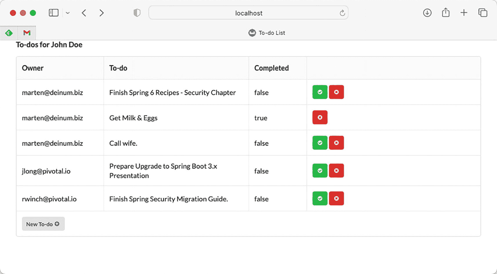
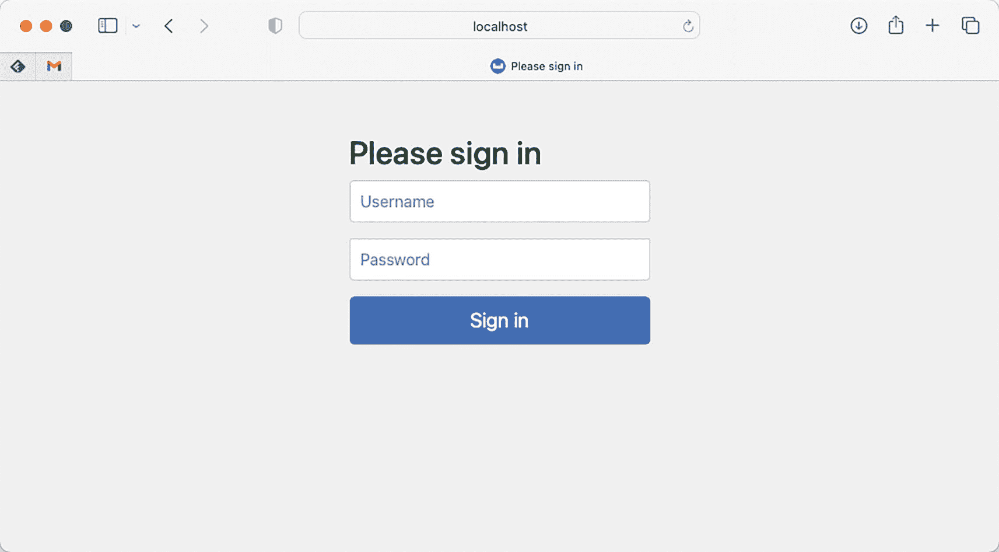

# 5. Spring Security

在本章中，你将学习如何使用 Spring Security 框架保护应用程序安全。Spring Security 最初被称为 Acegi Security，但在加入 Spring 项目组合后已更名。Spring Security 可用于保护任何 Java 应用程序，但主要用于基于 Web 的应用程序。Web 应用程序，尤其是那些可通过互联网访问的应用程序，如果未得到妥善保护，则容易受到黑客攻击。

如果你从未在应用程序中处理过安全问题，那么首先必须理解几个术语和概念。**认证**是验证主体身份是否与其声称的身份相符的过程。主体可以是用户、设备或系统，但最常见的是用户。主体必须提供身份证据才能通过认证。这种证据称为**凭证**，当目标主体是用户时，凭证通常是一个密码。

**授权**是向已认证用户授予权限的过程，以便该用户能够访问目标应用程序的特定资源。授权过程必须在认证过程之后执行。通常，权限是以角色的形式授予的。

**访问控制**意味着控制对应用程序资源的访问。它需要决定是否允许用户访问某个资源。这个决定称为访问控制决策，通过将资源的访问属性与用户被授予的权限或其他特征进行比较来做出。

完成本章后，你将理解基本的安全概念，并知道如何在 URL 访问级别、方法调用级别、视图渲染级别和领域对象级别保护你的 Web 应用程序。

一个带有字母 i 的图标，位于阴影圆圈内，代表信息符号。 在开始本章之前，请查看 `recipe_5_1_i` 的应用程序（另请查看 `recipe_5_shared` 的共享代码）。这是本章将使用的初始未受保护的应用程序。它是一个基本的待办事项应用，你可以在其中列出、创建和标记待办事项为已完成。部署应用程序后，你将看到如图 5-1 所示的内容。



一个本地主机窗口中标题为“John Doe 的待办事项”的 5x4 表格截图。列包括：所有者（包含电子邮件 ID 列表）、待办事项（需要完成的工作）、已完成（包含 true 或 false），最后一列有 2 个表示完成状态的图标。

图 5-1

初始待办事项应用程序

## 5-1. 保护 URL 访问

### 问题

许多 Web 应用程序都有一些特别重要且私密的特定 URL。你必须通过防止未经授权的访问来保护这些 URL。

### 解决方案

Spring Security 使你能够通过简单的配置，以声明式的方式保护 Web 应用程序的 URL 访问。它通过将 Servlet 过滤器应用于 HTTP 请求来处理安全问题。为了注册此过滤器并检测配置，Spring Security 提供了一个方便的基类 `AbstractSecurityWebApplicationInitializer` 供你继承。

Spring Security 允许你通过在 `@Bean` 方法中使用 `HttpSecurity` 类和 `WebSecurity` 类来配置 Web 应用程序安全，这些方法将（重新）配置 Spring Security 的部分功能。如果你的 Web 应用程序的安全需求简单且典型，你可以保持配置不变，并使用默认启用的安全设置，包括以下内容：

*   **基于表单的登录服务**：提供一个默认页面，其中包含供用户登录此应用程序的登录表单。

*   **HTTP 基本认证**：可以处理 HTTP 请求头中提供的基本认证凭据。它也可用于认证通过远程协议和 Web 服务发出的请求。

*   **注销服务**：提供一个映射到 URL 的处理程序，供用户注销此应用程序。

*   **匿名登录**：为匿名用户分配一个主体并授予权限，以便你可以像处理普通用户一样处理匿名用户。

*   **Servlet API 集成**：允许你通过标准 Servlet API（例如 `HttpServletRequest.isUserInRole()` 和 `HttpServletRequest.getUserPrincipal()`）访问 Web 应用程序中的安全信息。

*   **CSRF**：跨站请求伪造保护。它将创建一个令牌并将其放入 `HttpSession` 中。

*   **安全头**：例如禁用受保护包的缓存、XSS 保护、传输安全和 X-Frame 安全。

注册了这些安全服务后，你可以指定需要特定权限才能访问的 URL 模式。Spring Security 将根据你的配置执行安全检查。用户必须先登录应用程序才能访问安全的 URL，除非这些 URL 已开放匿名访问。Spring Security 提供了一组认证提供者供你选择。认证提供者负责认证用户并返回授予该用户的权限。

### 工作原理

首先，你需要在 `@Configuration` 类上应用 `@EnableWebSecurity` 注解来启用安全功能。由于我们的应用程序已设置组件扫描，因此会自动检测到此 `@Configuration` 类，并将安全功能应用于我们的应用程序。

```
package com.apress.spring6recipes.board.security;
import org.springframework.context.annotation.Configuration;
import org.springframework.security.config.annotation.web.configuration.EnableWebSecurity;
@Configuration
@EnableWebSecurity
public class TodoSecurityConfig { }
清单 5-1
简单的安全配置
```

一个带有字母 i 的图标，位于阴影圆圈内，代表信息符号。 虽然你可以将 Spring Security 配置在与 Web 层和服务层相同的配置类中，但最好将安全配置隔离在一个单独的类中（例如 `TodoSecurityConfig`）。

由于用于 HTTP 的 Spring Security 通过 Servlet 过滤器工作，我们也需要注册它。这可以通过继承 `AbstractSecurityWebApplicationInitializer` 轻松完成（参见以下清单）。

```
package com.apress.spring6recipes.board.security;
import org.springframework.security.web.context.AbstractSecurityWebApplicationInitializer;
public class TodoSecurityInitializer extends AbstractSecurityWebApplicationInitializer { }
清单 5-2
安全初始化器
```

`AbstractSecurityWebApplicationInitializer` 将自动检测包含安全配置的 `ApplicationContext`，并使用它来设置过滤器。如果在没有 Spring 的情况下使用 Spring Security（例如在 JAX-RS 应用程序中），你可以通过构造函数将配置传递给 `AbstractSecurityWebApplicationInitializer`（有一个接受配置类的构造函数）。

构建并部署应用程序后，尝试访问 `http://localhost:8080/todos/todos`，你现在将看到默认的 Spring Security 登录页面（参见图 5-2）。



一个本地主机下的登录页面截图，显示消息“请登录”，两个用于输入用户名和密码的文本框，以及一个“登录”选项。

图 5-2

默认的 Spring Security 登录页面


#### 保护 URL 访问

默认配置是 `org.springframework.security.config.annotation.web.configuration.HttpSecurityConfiguration` 类的一部分。该配置提供了一个类型为 `HttpSecurity` 的 bean，并带有默认配置。`org.springframework.security.config.annotation.web.configuration.WebSecurityConfiguration` 负责处理 Web 部分（设置用于应用安全性的过滤器链），并对该默认配置做出贡献。如果你查看后一个类，它会创建一个名为 `springSecurityFilterChain` 的 bean。在这里，你会看到它包含了 `anyRequest().authenticated()` 调用。这告诉 Spring Security，对于每一个传入的请求，你都必须通过系统进行身份验证。你还会看到，默认情况下启用了 HTTP 基本认证和基于表单的登录。基于表单的登录还包含一个默认的登录页面创建器，如果你没有显式指定登录页面，就会使用它。

```
@Bean(name = AbstractSecurityWebApplicationInitializer.DEFAULT_FILTER_NAME)
public Filter springSecurityFilterChain() throws Exception {
boolean hasFilterChain = !this.securityFilterChains.isEmpty();
if (!hasFilterChain) {
this.webSecurity.addSecurityFilterChainBuilder(() -> {
this.httpSecurity.authorizeHttpRequests((authorize) -> authorize.anyRequest().authenticated());
this.httpSecurity.formLogin(Customizer.withDefaults());
this.httpSecurity.httpBasic(Customizer.withDefaults());
return this.httpSecurity.build();
});
}
for (SecurityFilterChain securityFilterChain : this.securityFilterChains) {
this.webSecurity.addSecurityFilterChainBuilder(() -> securityFilterChain);
}
for (WebSecurityCustomizer customizer : this.webSecurityCustomizers) {
customizer.customize(this.webSecurity);
}
return this.webSecurity.build();
}
清单 5-3
来自 WebSecurityConfiguration 类的配置方法
```

让我们自己编写一些安全规则。除了仅仅需要登录之外，你还可以为 URL 编写一些强大的访问规则。为此，你需要创建一个方法，该方法接受 `HttpSecurityConfiguration` 提供的 `HttpSecurity` bean，并返回一个 `SecurityFilterChain`。当你自己提供 `SecurityFilterChain` 时，`WebSecurityConfiguration` 中的默认配置将不再适用，并且你还需要指定身份验证机制。

```
package com.apress.spring6recipes.board.security;
import org.springframework.context.annotation.Bean;
import org.springframework.context.annotation.Configuration;
import org.springframework.http.HttpMethod;
import org.springframework.security.config.Customizer;
import org.springframework.security.config.annotation.web.builders.HttpSecurity;
import org.springframework.security.config.annotation.web.configuration.EnableWebSecurity;
import org.springframework.security.core.userdetails.User;
import org.springframework.security.provisioning.InMemoryUserDetailsManager;
import org.springframework.security.provisioning.UserDetailsManager;
import org.springframework.security.web.SecurityFilterChain;
@Configuration
@EnableWebSecurity
public class TodoSecurityConfig {
@Bean
public UserDetailsManager userDetailsService() {
var user = User.withDefaultPasswordEncoder()
.username("user").password("user").authorities("USER").build();
var admin = User.withDefaultPasswordEncoder()
.username("admin").password("admin").authorities("USER", "ADMIN").build();
return new InMemoryUserDetailsManager(user, admin);
}
@Bean
public SecurityFilterChain securityFilterChain(HttpSecurity http) throws Exception {
http.csrf().disable();
http.formLogin(Customizer.withDefaults());
http.authorizeHttpRequests( auth ->
auth
.requestMatchers(HttpMethod.DELETE, "/todos/*").hasAuthority("ADMIN")
.requestMatchers("/todos", "/todos/*").hasAuthority("USER"));
return http.build();
}
}
清单 5-4
Todo 安全配置
```

使用 `authorizeHttpRequests()` 你开始保护你的 URL。然后你可以使用其中一个匹配器——这里你使用了 `requestMatchers`——来定义匹配规则以及用户需要拥有的权限。你已经将对 `/todos` 的所有访问权限限制为拥有 `USER` 权限的用户。要能够使用 DELETE 请求调用 `/todos`，你需要是具有 `ADMIN` 角色的用户。

大多数身份验证机制会使用 `UserDetailsService` 来查找用户。这是一个带有单个方法 `loadByUsername` 的接口，用于加载用户详细信息。在本示例中，我们将使用一个 `InMemoryUserDetailsManager`，它会在内部将用户存储在一个 `java.util.Map` 中。我们使用 `User.UserBuilder` 来创建一些用于测试目的的用户。通常，你不希望在生产应用程序中使用这种方法，而是使用数据库、LDAP 甚至令牌之类的东西来存储用户信息。

一个带有字母 i 的图标，位于带阴影的圆圈内，表示信息符号。 这里调用了禁用 CSRF 保护，目前这样做是为了避免禁用表单的正常工作。关于如何启用它，请参阅本示例的后续部分。

你可以将身份验证服务配置为常规 bean。Spring Security 支持多种用户身份验证方式，包括针对数据库或 LDAP 存储库进行身份验证。它还支持为简单的安全需求直接定义用户详细信息。你可以为每个用户指定一个 `username`、一个 `password` 以及一组 `authorities`。

现在，你可以重新部署此应用程序来测试其安全配置。你必须使用正确的用户名和密码登录此应用程序才能查看待办事项。最后，要删除一个待办事项，你必须以管理员身份登录。


#### 使用 CSRF 保护

通常建议保持 CSRF 的默认启用状态，因为这能降低跨站请求伪造攻击的风险。Spring Security 默认启用该功能，配置中的 `csrf().disable()` 代码行可以移除。当 CSRF 保护启用时，Spring Security 会将 `CsrfFilter` 添加到其用于保护的过滤器列表中。该过滤器转而使用 `CsrfTokenRepository` 的实现来生成和存储令牌。默认情况下，使用的是 `HttpSessionCsrfTokenRepository`，顾名思义，它将生成的令牌存储在 `HttpSession` 中。此外还有一个 `CookieCsrfTokenRepository`，它将令牌信息存储在 cookie 中。如果你想切换 `CsrfTokenRepository`，可以使用 `csrfTokenRepository()` 配置方法进行更改。你也可以使用此方法来配置显式定义的 `HttpSessionCsrfTokenRepository`、`CookieCsrfTokenRepository`，或者你自己实现的 `CsrfTokenRepository` 接口。目前我们将使用 `CookieCsrfTokenRepository`。

```
@Bean
public SecurityFilterChain securityFilterChain(HttpSecurity http)
throws Exception {
http.csrf().csrfTokenRepository(csrfTokenRepository());
}
private CookieCsrfTokenRepository csrfTokenRepository() {
return new CookieCsrfTokenRepository();
}
清单 5-5
待办事项安全配置
```

当 CSRF 启用时，登录后，尝试完成或删除待办事项在缺少 CSRF 令牌的情况下将会失败。要解决此问题，你需要在修改内容的请求中将 CSRF 令牌传回服务器。你可以通过在表单中添加一个 `hidden` 输入来轻松实现这一点。`CookieCsrfTokenRepository` 将令牌作为一个名为 `XSRF-TOKEN` 的 HTTP cookie 暴露出来（默认情况下如此，除非你显式配置了其他名称），对于表单，你可以使用 `parameterName` 和 `token` 属性。

将以下内容添加到需要将 CSRF 令牌作为提交一部分的表单中。

```
清单 5-6
CSRF 令牌隐藏表单字段
```

现在，当提交表单时，令牌将成为请求的一部分，你将能够再次完成或删除待办事项。

一个带字母 i 的图标，位于阴影圆圈内，代表信息符号。 由于应用程序使用 Thymeleaf 来渲染页面和表单，它会自动将隐藏输入字段添加到其处理的所有表单中。

`todo-create.html` 中也有一个表单；但是，由于它使用了 Spring MVC 表单标签，你无需修改它。当使用 Spring MVC 表单标签时，CSRF 令牌会自动添加到表单中。为了实现这一点，Spring Security 注册了一个 `org.springframework.security.web.servlet.support.csrf.CsrfRequestDataValueProcessor`，它负责将令牌添加到表单中。

## 5-2\. 登录 Web 应用程序

### 问题

一个安全的应用程序要求用户在访问某些安全功能之前先登录。这对于运行在开放互联网上的 Web 应用程序尤其重要，因为黑客可以轻易访问它们。大多数 Web 应用程序必须提供一种方式，让用户输入其凭据进行登录。

### 解决方案

Spring Security 支持多种用户登录 Web 应用程序的方式：

*   基于表单的登录

*   HTTP 基本认证

*   HTTP 摘要认证

*   OAuth2 认证

*   基于证书的认证 (X.509)

*   J2EE 认证（委托给底层的 Jakarta 容器）

你应用程序的某些部分可能允许匿名访问（例如，访问欢迎页面）。Spring Security 提供了一个匿名登录服务，可以为匿名用户分配一个主体并授予权限，这样你在定义安全策略时就可以像处理普通用户一样处理匿名用户。

Spring Security 还支持“记住我”登录，它能够在多个浏览器会话中记住用户的身份，这样用户在首次登录后无需再次登录。

### 工作原理

为了帮助你更好地单独理解各种登录机制，让我们首先研究一下默认的 Spring Security 配置。

```
@Bean(HTTPSECURITY_BEAN_NAME)
@Scope("prototype")
HttpSecurity httpSecurity() throws Exception {
// 移除了 http 元素的设置
http
.csrf(withDefaults())
.addFilter(webAsyncManagerIntegrationFilter)
.exceptionHandling(withDefaults())
.headers(withDefaults())
.sessionManagement(withDefaults())
.securityContext(withDefaults())
.requestCache(withDefaults())
.anonymous(withDefaults())
.servletApi(withDefaults())
.apply(new DefaultLoginPageConfigurer());
http.logout(withDefaults());
applyDefaultConfigurers(http);
return http;
}
清单 5-7
HttpSecurityConfiguration 中的 HttpSecurity Bean 方法
```

上述清单（清单 5-7）来自 `HttpSecurityConfiguration` 类，是提供给 `HttpSecurity` bean 的默认配置。每个需要 `HttpSecurity` 实例的方法都会收到自己的实例，因为它被定义为原型作用域（有关作用域的更多信息，请参见第 1 章）。

在 Spring Security 的工作中，`securityContext` 和 `exceptionHandling` 非常重要。没有这些基础，Spring Security 将无法在用户登录后存储用户信息，也无法对安全相关的异常进行适当的异常转换（这些异常会直接向上冒泡，可能会将你的一些内部信息暴露给外部世界）。

由于这是 `HttpSecurity`，因此它依赖于 Servlet API，通过 `servletApi()` 方法自动启用了与 Servlet API 的集成。

Spring Security 还会向响应中添加特定的头部，以禁用浏览器中的某些功能，例如添加 `X-Frame` 头部以禁止使用框架，添加 `X-Content-Type-Options` 以禁用内容嗅探等。

开箱即用，Spring Security 假设信息可以存储在 HTTP 会话中，因此它会设置基本的会话管理，以防止会话劫持，或至少使其更加困难。如配方 5-1 所述，`csrf` 保护也默认启用，并且通过 `HttpSessionCsrfTokenRepository` 将信息存储在 HTTP 会话中，这体现在 `csrf` 方法中。`requestCache` 用于将 HTTP Servlet 请求存储在缓存中，以便在登录后可以重新发出原始请求。同样，默认情况下，这存储在 HTTP 会话中。


#### HTTP 基本认证

HTTP 基本认证支持可通过 `httpBasic()` 方法进行配置。当需要 HTTP 基本认证时，浏览器通常会显示一个登录对话框或特定的登录页面供用户登录。

```
package com.apress.spring6recipes.board.security;
import org.springframework.context.annotation.Bean;
import org.springframework.context.annotation.Configuration;
import org.springframework.http.HttpMethod;
import org.springframework.security.config.Customizer;
import org.springframework.security.config.annotation.web.builders.HttpSecurity;
import org.springframework.security.config.annotation.web.configuration.EnableWebSecurity;
import org.springframework.security.web.SecurityFilterChain;
@Configuration
@EnableWebSecurity
public class TodoSecurityConfig {
@Bean
public SecurityFilterChain securityFilterChain(HttpSecurity http) throws Exception {
http.formLogin().disable();
http.httpBasic(Customizer.withDefaults());
http.authorizeHttpRequests(
auth -> auth
.requestMatchers(HttpMethod.DELETE, "/todos/*").hasAuthority("ADMIN")
.requestMatchers("/todos", "/todos/*").hasAuthority("USER"));
return http.build();
}
}
清单 5-8
Todo 安全配置——HTTP 基本认证
```

一个带字母 i 的图标，位于阴影圆内，代表信息符号。 当 HTTP 基本认证和基于表单的登录同时启用时，你将看到表单登录页面，而不是 HTTP 基本认证弹窗。

#### 基于表单的登录

基于表单的登录服务会渲染一个包含登录表单的网页，供用户输入登录信息并处理登录表单的提交。它通过 `formLogin` 方法进行配置。

```
package com.apress.spring6recipes.board.security;
import org.springframework.context.annotation.Bean;
import org.springframework.context.annotation.Configuration;
import org.springframework.http.HttpMethod;
import org.springframework.security.config.Customizer;
import org.springframework.security.config.annotation.web.builders.HttpSecurity;
import org.springframework.security.config.annotation.web.configuration.EnableWebSecurity;
import org.springframework.security.web.SecurityFilterChain;
@Configuration
@EnableWebSecurity
public class TodoSecurityConfig {
@Bean
public SecurityFilterChain securityFilterChain(HttpSecurity http)
throws Exception {
http.formLogin(Customizer.withDefaults());
http.httpBasic().disable();
http.authorizeHttpRequests(
auth -> auth
.requestMatchers(HttpMethod.DELETE, "/todos/*").hasAuthority("ADMIN")
.requestMatchers("/todos", "/todos/*").hasAuthority("USER"));
return http.build();
}
清单 5-9
Todo 安全配置——表单登录
```

默认情况下，Spring Security 会自动创建一个登录页面，并将其映射到 URL `/login`。因此，你可以在应用程序（例如，在 `todos.html` 中）添加一个指向此 URL 的链接用于登录。

```
">登录
清单 5-10
登录 URL 链接
```

如果你不喜欢默认的登录页面，你可以提供自己的自定义登录页面。例如，你可以在 `templates` 目录下创建以下 `login.html` 文件。

```

登录

body {
background-color: #DADADA;
}
body > .grid {
height: 100%;
}
.column {
max-width: 450px;
}

登录到您的账户

登录

清单 5-11
自定义登录页面
```

为了使用此登录页面，我们需要编写一个控制器，或者更确切地说，使用一个 `UrlFilenameViewController`，它将 URL 映射到视图的名称（有关控制器和视图的更多信息，请参见第 2 章）。这可以通过实现 `WebMvcConfigurer` 接口和 `addViewControllers` 方法轻松完成。

```
package com.apress.spring6recipes.board.security;
@Configuration
@EnableWebSecurity
public class TodoSecurityConfig implements WebMvcConfigurer {
@Override
public void addViewControllers(ViewControllerRegistry registry) {
registry.addViewController("/login").setViewName("login");
}
}
清单 5-12
Todo 安全配置——表单登录
```

如果你坚持使用 Spring Security 的默认命名，这足以渲染你自己的自定义登录页面。接下来，你需要指示 Spring Security 在请求登录时显示你的自定义登录页面；你必须在 `loginPage` 配置方法中指定其 URL。

```
@Configuration
@EnableWebSecurity
public class TodoSecurityConfig implements WebMvcConfigurer {
@Bean
public SecurityFilterChain securityFilterChain(HttpSecurity http) throws Exception {
http.formLogin().loginPage("/login").permitAll();
}
}
清单 5-13
Todo 安全配置——表单登录
```

请注意 `loginPage` 元素之后的 `permitAll`。如果没有这个，匿名用户将无法访问登录页面，因为它将受到 Spring Security 的保护。

如果当用户请求一个安全 URL 时，Spring Security 显示了登录页面，那么一旦登录成功，用户将被重定向到目标 URL。但是，如果用户直接通过其 URL 请求登录页面，默认情况下，登录成功后用户将被重定向到上下文路径的根目录（即 http://localhost:8080/）。如果你没有在 Web 部署描述符中定义欢迎页面，你可能希望在登录成功时将用户重定向到一个默认的目标 URL。

```
@Configuration
@EnableWebSecurity
public class TodoSecurityConfig implements WebMvcConfigurer {
@Bean
public SecurityFilterChain securityFilterChain(HttpSecurity http)
throws Exception {
http
.formLogin().loginPage("/login").defaultSuccessUrl("/todos");
return http.build();
}
}
清单 5-14
Todo 安全配置——带 defaultSuccessUrl 的表单登录
```

如果你使用 Spring Security 创建的默认登录页面，那么当登录失败时，Spring Security 将再次渲染登录页面并显示错误消息。但是，如果你指定了自定义登录页面，则必须配置身份验证失败 URL，以指定登录错误时要重定向到的 URL。例如，你可以再次重定向到自定义登录页面并附带错误请求参数。

```
@Configuration
@EnableWebSecurity
public class TodoSecurityConfig implements WebMvcConfigurer {
@Bean
public SecurityFilterChain securityFilterChain(HttpSecurity http)
throws Exception {
http
...
.formLogin()
.loginPage("/login")
.defaultSuccessUrl("/todos")
.failureUrl("/login?error=true");
return http.build();
}
}
清单 5-15
Todo 安全配置——带 failureUrl 的表单登录
```

然后，你的登录页面应测试 `error` 请求参数是否存在。如果发生错误，你需要通过访问会话范围属性 `SPRING_SECURITY_LAST_EXCEPTION` 来显示错误消息，该属性存储了当前用户的最后一次异常。

```

身份验证失败
原因：登录错误原因

清单 5-16
带错误显示的登录页面
```


#### 注销服务

注销服务提供了一个处理器来处理注销请求。可以通过 `logout()` 配置方法对其进行配置。

```
@Configuration
@EnableWebSecurity
public class TodoSecurityConfig implements WebMvcConfigurer {
@Bean
public SecurityFilterChain securityFilterChain(HttpSecurity http)
throws Exception {
http.logout();
return http.build();
}
}
代码清单 5-17
待办事项安全配置——注销服务
```

默认情况下，它映射到 URL `/logout`，并且仅响应 POST 请求。你可以在页面中添加一个小的 HTML 表单来执行注销操作。

```
Logout
代码清单 5-18
注销表单
```

一个带字母 i 的图标，位于带阴影的圆圈内，代表信息符号。 当使用 CSRF 保护时，不要忘记将 CSRF 令牌添加到表单中（参见配方 5-1）；否则，注销将失败。

默认情况下，注销成功后，用户会被重定向到上下文路径的根目录。但有时，你可能希望将用户引导至另一个 URL，这可以通过使用 `logoutSuccessUrl` 配置方法来实现。

```
@Configuration
@EnableWebSecurity
public class TodoSecurityConfig implements WebMvcConfigurer {
@Bean
public SecurityFilterChain securityFilterChain(HttpSecurity http)
throws Exception {
http.logout().logoutSuccessUrl("/logout-success");
return http.build();
}
}
代码清单 5-19
待办事项安全配置——带 logoutSuccessUrl 的注销服务
```

注销后，你可能会注意到，即使注销成功，使用浏览器的后退按钮时，你仍然能够看到之前的页面。这是因为浏览器缓存了这些页面。通过使用 `headers()` 配置方法启用安全标头，可以指示浏览器不要缓存页面。

```
@Configuration
@EnableWebSecurity
public class TodoSecurityConfig implements WebMvcConfigurer {
@Bean
public SecurityFilterChain securityFilterChain(HttpSecurity http)
throws Exception {
http.headers();
return http.build();
}
}
代码清单 5-20
待办事项安全配置——标头安全
```

除了无缓存标头之外，这还会禁用内容嗅探并启用 X-Frame 保护（更多信息请参见配方 5-1）。启用此功能后，使用浏览器的后退按钮时，你将被重定向回登录页面。

#### 匿名登录

匿名登录服务可以通过 Java 配置中的 `anonymous()` 方法进行配置，你可以自定义匿名用户的 `username` 和 `authorities`，其默认值分别为 `anonymousUser` 和 `ROLE_ANONYMOUS`：

```
@Configuration
@EnableWebSecurity
public class TodoSecurityConfig implements WebMvcConfigurer {
@Bean
public SecurityFilterChain securityFilterChain(HttpSecurity http)
throws Exception {
http.anonymous().principal("guest").authorities("ROLE_GUEST");
return http.build();
}
}
代码清单 5-21
待办事项安全配置——匿名登录
```

#### 记住我支持

记住我支持可以通过 Java 配置中的 `rememberMe()` 方法进行配置。默认情况下，它将 `username`、`password`、记住我过期时间以及一个私钥编码为一个令牌，并以 cookie 形式存储在用户浏览器中。下次用户访问同一个 Web 应用程序时，该令牌将被检测到，从而使用户能够自动登录。

```
@Configuration
@EnableWebSecurity
public class TodoSecurityConfig implements WebMvcConfigurer {
@Bean
public SecurityFilterChain securityFilterChain(HttpSecurity http)
throws Exception {
http.rememberMe();
return http.build();
}
}
代码清单 5-22
待办事项安全配置——记住我
```

然而，静态的记住我令牌可能会引发安全问题，因为它们可能被黑客捕获。Spring Security 支持滚动令牌以满足更高级的安全需求，但这需要一个数据库来持久化令牌。有关滚动记住我令牌部署的详细信息，请参考 Spring Security 参考文档。

## 5-3\. 认证用户

### 问题

当用户尝试登录你的应用程序以访问其安全资源时，你必须对用户的主体进行认证，并向该用户授予权限。

### 解决方案

在 Spring Security 中，认证由一个或多个 `AuthenticationProvider` 执行，它们以链式方式连接。如果这些提供者中的任何一个成功认证了用户，该用户将能够登录到应用程序。如果任何提供者报告用户已被禁用或锁定，或者凭据不正确，或者没有提供者能够认证该用户，那么该用户将无法登录此应用程序。

Spring Security 支持多种用户认证方式，并包含针对这些方式的内置提供者实现。你可以使用内置的 XML 元素轻松配置这些提供者。最常见的认证提供者会根据存储用户详细信息的用户仓库（例如，在应用程序的内存、关系数据库或 LDAP 仓库中）来认证用户。

在用户仓库中存储用户详细信息时，应避免以明文形式存储用户密码，因为这会使它们容易受到黑客攻击。相反，你应该始终在仓库中存储加密后的密码。一种典型的密码加密方式是使用单向哈希函数对密码进行编码。当用户输入密码登录时，你对该密码应用相同的哈希函数，并将结果与仓库中存储的结果进行比较。Spring Security 支持多种用于编码密码的算法（包括 MD5 和 SHA），并为这些算法提供了内置的密码编码器。

如果每次用户尝试登录时都从用户仓库中检索用户详细信息，你的应用程序可能会受到性能影响。这是因为用户仓库通常存储在远程，并且它必须执行某种查询来响应请求。因此，Spring Security 支持在本地内存和存储中缓存用户详细信息，以节省执行远程查询的开销。

### 工作原理

#### 使用内存定义认证用户

如果你的应用程序中只有少量用户，并且很少修改他们的详细信息，你可以考虑在 Spring Security 的配置文件中定义用户详细信息，这样它们将被加载到应用程序的内存中。

```
@Configuration
@EnableWebSecurity
public class TodoSecurityConfig implements WebMvcConfigurer {
@Bean
public UserDetailsManager userDetailsService() {
var user1 = User.withDefaultPasswordEncoder()
.username("marten@deinum.biz").password("user").authorities("USER").build();
var user2 = User.withDefaultPasswordEncoder()
.username("jdoe@does.net").password("unknown").disabled(true).authorities("USER").build();
var admin = User.withDefaultPasswordEncoder()
.username("admin@ya2do.io").password("admin").authorities("USER", "ADMIN").build();
return new InMemoryUserDetailsManager(user1, user2, admin);
}
}
代码清单 5-23
包含用户的 InMemoryUserDetailsManager
```

你可以使用 `User` 类和不同的 `with*` 方法来定义用户详细信息。这里我们使用 `withDefaultPasswordEncoder`，因为我们希望能够提供明文密码，但仍然对它们进行编码。对于每个用户，你可以指定 `username`、`password`、禁用状态以及一组授予的 `authorities`。被禁用的用户无法登录应用程序。


#### 针对数据库进行用户身份验证

更常见的情况是，用户详细信息应存储在数据库中以便于维护。Spring Security 内置了从数据库查询用户详细信息的功能。默认情况下，它会使用以下 SQL 语句查询包含权限在内的用户详细信息。

```
SELECT username, password, enabled
FROM   users
WHERE  username = ?
SELECT username, authority
FROM   authorities
WHERE  username = ?
清单 5-24
Spring Security 默认的 SQL 查询语句
```

为了让 Spring Security 使用这些 SQL 语句查询用户详细信息，你需要在数据库中创建相应的表。例如，你可以使用以下 SQL 语句在 `todo` 模式中创建它们。

```
-- Spring Security 用户/权限设置
-- 另请参阅 Spring Security 中的 users.ddl
CREATE TABLE USERS
(
USERNAME VARCHAR(50) NOT NULL,
PASSWORD VARCHAR(60) NOT NULL,
ENABLED  SMALLINT    NOT NULL DEFAULT 0,
PRIMARY KEY (USERNAME)
);
CREATE TABLE AUTHORITIES
(
USERNAME  VARCHAR(50) NOT NULL,
AUTHORITY VARCHAR(50) NOT NULL,
FOREIGN KEY (USERNAME) REFERENCES USERS
);
清单 5-25
Spring Security 的 USERS 和 AUTHORITIES 表
```

接下来，你可以向这些表中输入一些用户详细信息用于测试。这两个表的数据如表 5-1 和 5-2 所示。

表 5-2

AUTHORITIES 表的测试用户数据

| USERNAME | AUTHORITY |
| --- | --- |
| admin@ya2do.​io | ADMIN |
| admin@ya2do.​io | USER |
| marten@deinum.​biz | USER |
| jdoe@does.​net | USER |

表 5-1

USERS 表的测试用户数据

| USERNAME | PASSWORD | ENABLED |
| --- | --- | --- |
| admin@ya2do.​io | secret | 1 |
| marten@deinum.​biz | user | 1 |
| jdoe@does.​net | unknown | 0 |

为了让 Spring Security 访问这些表，你必须声明一个数据源，以便能够创建到该数据库的连接。在本例中，`DataSource` 已在 `TodoWebConfig` 中定义，我们可以通过参数将其注入到 `userDetailsService` 方法中。在 `userDetailsService` 中，我们构造了一个 `JdbcUserDetailsManager` 实例，它不仅能让我们查找用户，还能创建用户。如果你不需要创建用户，可以使用 `org.springframework.security.core.userdetails.jdbc.JdbcDaoImpl`，它只提供查找功能。

```
@Configuration
@EnableWebSecurity
public class TodoSecurityConfig implements WebMvcConfigurer {
@Bean
public UserDetailsManager userDetailsService(DataSource dataSource) {
var userDetailsManager = new JdbcUserDetailsManager(dataSource);
initializeUsers(userDetailsManager);
return userDetailsManager;
}
private void initializeUsers(JdbcUserDetailsManager users) {
var user1 = User.withDefaultPasswordEncoder()
.username("marten@deinum.biz").password("user").authorities("USER").build();
var user2 = User.withDefaultPasswordEncoder()
.username("jdoe@does.net").password("unknown").disabled(true).authorities("USER").build();
var admin = User.withDefaultPasswordEncoder()
.username("admin@ya2do.io").password("admin").authorities("USER", "ADMIN").build();
users.createUser(user1);
users.createUser(user2);
users.createUser(admin);
}
}
清单 5-26
使用 JDBC 的 Todo 安全配置
```

然而，在某些情况下，你可能已经在遗留数据库中定义了自己的用户仓库。例如，假设表是使用以下 SQL 语句创建的，并且 `MEMBER` 表中的所有用户都处于启用状态。

```
CREATE TABLE MEMBER (
ID          BIGINT         NOT NULL,
USERNAME    VARCHAR(50)    NOT NULL,
PASSWORD    VARCHAR(32)    NOT NULL,
PRIMARY KEY (ID)
);
CREATE TABLE MEMBER_ROLE (
MEMBER_ID    BIGINT         NOT NULL,
ROLE         VARCHAR(10)    NOT NULL,
FOREIGN KEY (MEMBER_ID) REFERENCES MEMBER
);
清单 5-27
遗留表结构（示例）
```

假设这些表中存储的遗留用户数据如表 5-3 和 5-4 所示。

表 5-4

MEMBER_ROLE 表中的遗留用户数据

| MEMBER_ID | ROLE |
| --- | --- |
| 1 | ROLE_ADMIN |
| 1 | ROLE_USER |
| 2 | ROLE_USER |

表 5-3

MEMBER 表中的遗留用户数据

| ID | USERNAME | PASSWORD |
| --- | --- | --- |
| 1 | admin@ya2do.​io | secret |
| 2 | marten@deinum.​biz | user |

幸运的是，Spring Security 也支持使用自定义 SQL 语句从遗留数据库中查询用户详细信息。你可以通过 `JdbcDaoImpl`/`JdbcUserDetailsManager` 的 `usersByUsernameQuery` 和 `authoritiesByUsernameQuery` 属性来指定用于查询用户信息和权限的语句。

```
@Configuration
@EnableWebSecurity
public class TodoSecurityConfig implements WebMvcConfigurer {
private static final String USERS_BY_USERNAME =
"SELECT username, password, 'true' as enabled FROM member WHERE username = ?";
private static final String AUTHORITIES_BY_USERNAME = """
SELECT member.username, member_role.role as authorities
FROM member, member_role
WHERE  member.username = ? AND member.id = member_role.member_id
""";
@Bean
public UserDetailsManager userDetailsService(DataSource dataSource) {
var userDetailsManager = new JdbcUserDetailsManager(dataSource);
userDetailsManager.setUsersByUsernameQuery(USERS_BY_USERNAME);
userDetailsManager.setAuthoritiesByUsernameQuery(AUTHORITIES_BY_USERNAME);
initializeUsers(userDetailsManager);
return userDetailsManager;
}
}
清单 5-28
使用自定义 JDBC 查询的 Todo 安全配置
```


#### 加密密码

到目前为止，你一直在使用默认配置的密码编码器（即 `BCryptPasswordEncoder`）来存储用户详细信息。或者更准确地说，它使用的是 `DelegatingPasswordEncoder`，该编码器会从密码中检测编码类型，并在未找到时使用默认编码。密码以 `{id}encodedPassword` 的格式存储，其中 `id` 指的是已配置的编码器。开箱即用，Spring Security 默认配置了以下编码器。

表 5-5

默认配置的密码编码器

| id | 密码编码器 | 编码方式 | 已弃用 |
| --- | --- | --- | --- |
| `bcrypt` | `BCryptPasswordEncoder` | BCrypt | 否 |
| `ldap` | `LdapShaPasswordEncoder` | SHA 和 SSHA | 是 |
| `MD4` | `Md4PasswordEncoder` | MD4 | 是 |
| `MD5` | `MessageDigestPasswordEncoder` | MD5 | 是 |
| `noop` | `NoOpPasswordEncoder` | 明文 | 是 |
| `pbkdf2` | `Pbkdf2PasswordEncoder` | PBKDF2 | 否 |
| `scrypt` | `SCryptPasswordEncoder` | SCrypt | 否 |
| `SHA-1` | `MessageDigestPasswordEncoder` | SHA-1 | 是 |
| `SHA-256` | `MessageDigestPasswordEncoder` | SHA-256 | 是 |
| `sha-256` | `StandardPasswordEncoder` | SHA-256 | 是 |
| `argon2` | `Argon2PasswordEncoder` | Argon2 | 否 |

其中一些提供的 `PasswordEncoders` 已被弃用，主要是为了向后兼容。如果你的应用程序中仍在使用其中之一，那么可能是时候升级到仍受支持的编码器了。不过，这需要用户重置密码，除非密码是以明文形式存储的。

除了依赖委托密码编码器，你也可以在配置中指定一个特定的编码器。如果配置中只有一个 `PasswordEncoder`，Spring Security 会自动检测并使用它。

```
@Configuration
@EnableWebSecurity
public class TodoSecurityConfig implements WebMvcConfigurer {
@Bean
public BCryptPasswordEncoder passwordEncoder() {
return new BCryptPasswordEncoder();
}
}
清单 5-29
使用显式 PasswordEncoder 的 Todo 安全配置
```

为了在密码字段中存储 BCrypt 哈希值，该字段的长度必须至少为 60 个字符（即 BCrypt 哈希值的长度）。如果你使用 SQL 脚本（如 `data.sql`）将数据插入数据库，则密码需要以编码形式插入。表 5-6 包含了测试用户的 BCrypt 编码密码。

表 5-6

USERS 表使用加密密码的测试用户数据

| 用户名 | 密码 | 已启用 |
| --- | --- | --- |
| admin@ya2do.​io | $2a$10$E3mPTZb50e7sSW15fDx8Ne7hDZpfDjrmMPTTUp8wVjLTu.G5oPYCO | 1 |
| marten@deinum.​biz | $2a$10$5VWqjwoMYnFRTTmbWCRZT.iY3WW8ny27kQuUL9yPK1/WJcPcBLFWO | 1 |
| jdoe@does.​net | $2a$10$cFKh0.XCUOA9L.in5smIiO2QIOT8.6ufQSwIIC.AVz26WctxhSWC6 | 0 |


#### 针对 LDAP 仓库进行用户身份验证

Spring Security 也支持通过访问 LDAP 仓库来验证用户身份。首先，你需要准备一些用户数据来填充 LDAP 仓库。我们使用 LDAP 数据交换格式（LDIF）来准备用户数据，这是一种用于导入和导出 LDAP 目录数据的标准纯文本数据格式。例如，创建包含以下内容的 `users.ldif` 文件。

```
dn: dc=spring6recipes,dc=com
objectClass: top
objectClass: domain
dc: spring6recipes
dn: ou=groups,dc=spring6recipes,dc=com
objectclass: top
objectclass: organizationalUnit
ou: groups
dn: ou=people,dc=spring6recipes,dc=com
objectclass: top
objectclass: organizationalUnit
ou: people
dn: uid=admin,ou=people,dc=spring6recipes,dc=com
objectclass: top
objectclass: uidObject
objectclass: person
uid: admin
cn: admin
sn: admin
userPassword: secret
dn: uid=user1,ou=people,dc=spring6recipes,dc=com
objectclass: top
objectclass: uidObject
objectclass: person
uid: user1
cn: user1
sn: user1
userPassword: 1111
dn: cn=admin,ou=groups,dc=spring6recipes,dc=com
objectclass: top
objectclass: groupOfNames
cn: admin
member: uid=admin,ou=people,dc=spring6recipes,dc=com
dn: cn=user,ou=groups,dc=spring6recipes,dc=com
objectclass: top
objectclass: groupOfNames
cn: user
member: uid=admin,ou=people,dc=spring6recipes,dc=com
member: uid=user1,ou=people,dc=spring6recipes,dc=com
清单 5-30
用于 LDAP 设置的 LDIF 文件
```

如果你不太理解这个 LDIF 文件，不必担心。你可能不需要经常使用这种文件格式来定义 LDAP 数据，因为大多数 LDAP 服务器都支持基于图形界面的配置。这个 `users.ldif` 文件包含以下内容：

*   默认的 LDAP 域：`dc=spring6recipes,dc=com`
*   用于存储组和用户的 groups 和 people 组织单元
*   密码分别为 `secret` 和 `1111` 的 `admin` 和 `user1` 用户
*   admin 组（包含 admin 用户）和 user 组（包含 `admin` 和 `user1` 用户）

为了测试，你可以在本地机器上安装一个 LDAP 服务器来托管这个用户仓库。为了方便安装和配置，我们推荐安装 [OpenDS](http://www.opends.org/)，这是一个基于 Java 的开源目录服务引擎，支持 LDAP。

带轮廓的灯泡图标表示一条提示信息。 在 `bin` 目录中，有一个 `ldap.sh` 脚本，它将启动一个 Docker 化的 OpenDS 版本，并导入前面提到的 `users.ldif`。请注意，此 LDAP 服务器的根用户和密码分别是 `cn=Directory Manager` 和 `ldap`。稍后，你将需要使用此用户来连接该服务器。

LDAP 服务器启动后，你可以配置 Spring Security 来针对其仓库验证用户身份。

使用 LDAP 有两种选择：一种是使用绑定认证，即使用给定的用户名/密码在 LDAP 服务器上对用户进行身份验证。另一种是使用密码认证，即从 LDAP 检索用户信息，但由 Spring Security 进行密码验证。后一种方法的缺点是你需要拥有一个对 LDAP 具有访问权限的只读用户，以便能够检索用户信息。使用 LDAP 最常见的方式是绑定认证。要启用此功能，你需要配置一个 `BindAuthenticator`。为了帮助完成设置，Spring Security 提供了 `LdapBindAuthenticationManagerFactory`。

在配置 `BindAuthenticator` 之前，我们需要与 LDAP 建立连接；为此，我们使用 `ContextSource`。Spring Security 提供了一个 `DefaultSpringSecurityContextSource` 来简化此操作。它的构造函数接受一个参数，即 LDAP 服务器 URL；基于此 URL，它将连接到我们的 LDAP 服务器。

`ContextSource` 被传递给 `authenticationManager` 方法，并用于配置 `BindAuthenticator` 和 `DefaultLdapAuthoritiesPopulator`。后者用于检索用户所属的组，并将其转换为 Spring Security 可用的权限。默认情况下，使用的是 `NullLdapAuthoritiesPopulator`，它可以对用户进行身份验证，但不会设置任何权限。

为了能够在 LDAP 中找到正确的用户，我们需要设置一个或多个 `userDnPatterns` 或一个 `userSearchFilter`。对于我们的应用程序，指定模式 `uid={0},ou=people` 就足够了，因为我们的所有用户都在 `people` 单元中。`{0}` 将被替换为从登录表单传入的用户名。对于 `DefaultLdapAuthoritiesPopulator`，我们需要一个 `groupSearchBase`，因此我们指定 `ou=groups`，因为这是包含组的单元。通过这种方式，该填充器将获取用户所属的组，并将其转换为权限。

```
@Configuration
@EnableWebSecurity
public class TodoSecurityConfig implements WebMvcConfigurer {
@Bean
public DefaultSpringSecurityContextSource contextSource() {
var url = "ldap://ldap-server:389/dc=spring6recipes,dc=com";
return new DefaultSpringSecurityContextSource(url);
}
@Bean
public AuthenticationManager authenticationManager(
DefaultSpringSecurityContextSource contextSource) {
var populator = new DefaultLdapAuthoritiesPopulator(contextSource, "ou=groups");
populator.setRolePrefix("");
var factory = new LdapBindAuthenticationManagerFactory(contextSource);
factory.setUserDnPatterns("uid={0},ou=people");
factory.setLdapAuthoritiesPopulator(populator);
return factory.createAuthenticationManager();
}
}
清单 5-31
用于 LDAP 的 Todo 安全配置
```

## 5-4\. 做出访问控制决策

### 问题

在身份验证过程中，应用程序会为成功通过身份验证的用户授予一组权限。当该用户尝试访问应用程序中的资源时，应用程序必须根据所授予的权限或其他特征来决定该资源是否可访问。

### 解决方案

决定用户是否被允许访问应用程序中资源的过程称为授权决策。该决策基于用户的身份验证状态以及资源的性质和访问属性。在 Spring Security 中，授权决策由授权管理器做出，这些管理器必须实现 `AuthorizationManager` 接口。你可以通过实现此接口自由创建自己的授权管理器，但 Spring Security 已经提供了几种实现。其中大多数可以通过 `http.authorizeHttpRequest` 或使用方法安全（参见 5-5 节）进行配置。


### 工作原理

我们已经在不知不觉中使用了这些 `AuthorizationManager` 实例。在表达式 `.requestMatchers("/todos", "/todos/*").hasAuthority("USER")` 中，`hasAuthority` 部分实际上使用了 `AuthorizationManager`，准确来说是 `AuthorityAuthorizationManager`。然而，这只是一个单一的实例。我们可以使用 `access` 方法来应用更多或特定的实例。例如，我们可以创建一个 `AuthorizationManager`，它只允许来自 localhost 的访问，而不是针对每个 URL。

```
package com.apress.spring6recipes.board.security;
import org.springframework.security.authorization.AuthorizationDecision;
import org.springframework.security.authorization.AuthorizationManager;
import org.springframework.security.core.Authentication;
import org.springframework.security.web.authentication.WebAuthenticationDetails;
import java.util.function.Supplier;
public class LocalhostAuthorizationManager implements AuthorizationManager {
@Override
public AuthorizationDecision check(Supplier authentication, T object) {
var auth = authentication.get();
var granted = false;
if (auth.getDetails() instanceof WebAuthenticationDetails details) {
String address = details.getRemoteAddress();
granted = address.equals("127.0.0.1") || address.equals("0:0:0:0:0:0:0:1");
}
return new AuthorizationDecision(granted);
}
}
清单 5-32
自定义 AuthorizationManager 实现
```

如果用户是一个 Web 客户端，其 IP 地址等于 `127.0.0.1` 或 `0:0:0:0:0:0:0:1`，则其投票者将决定允许访问；否则，访问将被拒绝。如果当前已认证的用户（通过 `Authentication` 对象表示）不是 Web 客户端，则访问也会被拒绝。

接下来，您必须定义一个自定义访问规则来包含此授权管理器。

```
.requestMatchers(HttpMethod.DELETE, "/todos/*").access(
AuthorizationManagers.allOf(
AuthorityAuthorizationManager.hasAuthority("ADMIN"),
new LocalhostAuthorizationManager()))
清单 5-33
Todo 安全配置——使用自定义授权管理器
```

有一个辅助类 `AuthorizationManagers`，可以更轻松地以“全部满足”或“任一满足”的方式组合多个授权管理器。这里我们希望两者都适用，因此我们使用 `allOf` 辅助方法来组合两者。现在也显式配置了 `AuthorityAuthorizationManager`，因为我们希望同时检查权限和 IP 地址。

#### 使用表达式做出访问控制决策

尽管授权管理器提供了一定程度的灵活性，但有时人们需要更复杂的访问控制规则或更高的灵活性。使用 Spring Security，还可以使用 Spring 表达式语言 (SpEL) 来创建强大的访问控制规则。Spring Security 开箱即用地支持一些表达式（参见表 5-7 的列表）。使用诸如 `and`、`or` 和 `not` 之类的结构，可以创建非常强大且灵活的表达式。

表 5-7

Spring Security 内置表达式

| 表达式 | 描述 |
| --- | --- |
| `hasRole('role')` 或 `hasAuthority('authority')` | 如果当前用户具有给定的角色/权限，则返回 true |
| `hasAnyRole('role1','role2')` / `hasAnyAuthority('auth1','auth2')` | 如果当前用户至少具有给定的角色之一，则返回 true |
| `hasIpAddress('ip-address')` | 如果当前用户具有给定的 IP 地址，则返回 true |
| `principal` | 当前用户 |
| `authentication` | 访问 Spring Security 认证对象 |
| `permitAll` | 始终评估为 true |
| `denyAll` | 始终评估为 false |
| `isAnonymous()` | 如果当前用户是匿名用户，则返回 true |
| `isRememberMe()` | 如果当前用户通过“记住我”功能登录，则返回 true |
| `isAuthenticated()` | 如果这不是匿名用户，则返回 true |
| `isFullyAuthenticated()` | 如果用户既不是匿名用户也不是“记住我”用户，则返回 true |

火焰图标插图。尽管角色和权限几乎相同，但它们的处理方式存在细微但重要的差异。使用 `hasRole` 时，将检查传入的角色值是否以 `ROLE_`（默认角色前缀）开头；如果不是，则在检查权限之前会添加此前缀。因此，`hasRole('ADMIN')` 实际上会检查当前用户是否具有 `ROLE_ADMIN` 权限。使用 `hasAuthority` 时，它将按原样检查该值。

```
auth
.requestMatchers(HttpMethod.DELETE, "/todos/*").access(
new WebExpressionAuthorizationManager("hasRole('ROLE_ADMIN') and
(hasIpAddress('127.0.0.1') or hasIpAddress('0:0:0:0:0:0:0:1'))"))
清单 5-34
Todo 安全配置——使用表达式
```

如果某人具有 ADMIN 角色并在本地机器上登录，则上述表达式将允许删除帖子。在上一节中，我们需要创建自己的自定义 `AuthorizationManager`。现在，您只需编写一个表达式即可。

#### 使用表达式通过 Spring Bean 做出访问控制决策

尽管 Spring Security 已经有几个内置函数可用于创建表达式，但也可以使用您自己的函数。在表达式中使用 `@` 语法，您可以引用应用程序上下文中的任何 bean。因此，您可以编写一个像 `@accessChecker.hasLocalAccess(authentication)` 这样的表达式，并提供一个名为 `accessChecker` 的 bean，该 bean 具有一个接受 `Authentication` 对象的 `hasLocalAccess` 方法。

```
package com.apress.spring6recipes.board.security;
import org.springframework.security.core.Authentication;
import org.springframework.security.web.authentication.WebAuthenticationDetails;
import org.springframework.stereotype.Component;
@Component
public class AccessChecker {
public boolean hasLocalAccess(Authentication authentication) {
var access = false;
if (authentication.getDetails() instanceof WebAuthenticationDetails details) {
var address = details.getRemoteAddress();
access = address.equals("127.0.0.1") || address.equals("0:0:0:0:0:0:0:1");
}
return access;
}
}
清单 5-35
AccessChecker 类
```

`AccessChecker` 仍然执行与之前的 `LocalhostAuthorizationManager` 相同的检查，但不需要扩展 Spring Security 类。

```
auth
.requestMatchers(HttpMethod.DELETE, "/todos/*").access(
new WebExpressionAuthorizationManager(
"hasRole('ROLE_ADMIN') and @accessChecker.hasLocalAccess(authentication)"))
清单 5-36
Todo 安全配置——使用包含 bean 的表达式
```

## 5-5. 保护方法调用

### 问题

作为保护 Web 层中 URL 访问的替代或补充，有时您可能需要保护服务层中的方法调用。例如，在单个控制器必须调用服务层中的多个方法的情况下，您可能希望对这些方法实施细粒度的安全控制。

### 解决方案

Spring Security 使您能够以声明方式保护方法调用。您可以使用 `@Secured`、`@PreAuthorize`/`@PostAuthorize` 或 `@PreFilter`/`@PostFilter` 注解来注解在 bean 接口或实现类中声明的方法，然后使用 `@EnableGlobalMethodSecurity` 注解为它们启用安全性。

### 工作原理


#### 使用注解保护方法

保护方法的方式是通过使用 `@Secured` 注解。例如，你可以在 `TodoServiceImpl` 中的每个方法上添加 `@Secured` 注解，并指定访问属性作为其值，该属性的类型为 `String[]`，可以包含一个或多个有权访问该方法的权限。

```
package com.apress.spring6recipes.board;
import org.springframework.security.access.annotation.Secured;
import org.springframework.stereotype.Service;
import org.springframework.transaction.annotation.Transactional;
import java.util.List;
import java.util.Optional;
@Service
@Transactional
class TodoServiceImpl implements TodoService {
private final TodoRepository todoRepository;
TodoServiceImpl(TodoRepository todoRepository) {
this.todoRepository = todoRepository;
}
@Override
@Secured("USER")
public List listTodos() {
return todoRepository.findAll();
}
@Override
@Secured("USER")
public void save(Todo todo) {
this.todoRepository.save(todo);
}
@Override
@Secured("USER")
public void complete(long id) {
findById(id)
.ifPresent((todo) -> {
todo.setCompleted(true);
todoRepository.save(todo);
});
}
@Override
@Secured({ "USER", "ADMIN" })
public void remove(long id) {
todoRepository.remove(id);
}
@Override
@Secured("USER")
public Optional findById(long id) {
return todoRepository.findOne(id);
}
}
清单 5-37
TodoService 实现——使用 @Secured
```

最后，你需要启用方法安全。为此，你必须在配置类中添加 `@EnableMethodSecurity` 注解。由于你想使用 `@Secured`，因此需要将 `securedEnabled` 属性设置为 `true`。

```
package com.apress.spring6recipes.board.security;
@Configuration
@EnableWebSecurity
@EnableMethodSecurity(securedEnabled = true)
public class TodoSecurityConfig implements WebMvcConfigurer {
}
清单 5-38
Todo 安全配置——已启用方法安全
```

一个带字母 i 的图标，位于阴影圆圈内，代表信息符号。 务必将 `@EnableMethodSecurity` 注解添加到包含你想要保护的 Bean 的应用上下文配置中！

#### 使用注解和表达式保护方法

如果你需要更复杂的安全规则，可以像 URL 保护一样，使用基于 SpEL 的安全表达式来保护你的应用程序。为此，你可以使用 `@PreAuthorize` 和 `@PostAuthorize` 注解。使用这些注解，你可以像编写基于 URL 的安全表达式一样编写基于安全的表达式。要启用对这些注解的处理，你需要在 `@EnableMethodSecurity` 上将 `prePostEnabled` 属性设置为 `true`（这也是默认值）。

```
package com.apress.spring6recipes.board.security;
@Configuration
@EnableWebSecurity
@EnableMethodSecurity(prePostEnabled = true)
public class TodoSecurityConfig implements WebMvcConfigurer {
}
清单 5-39
Todo 安全配置——已启用方法安全
```

现在，你可以使用 `@PreAuthorize` 和 `@PostAuthorize` 注解来保护你的应用程序。

```
package com.apress.spring6recipes.board;
import org.springframework.security.access.prepost.PostAuthorize;
import org.springframework.security.access.prepost.PreAuthorize;
import org.springframework.stereotype.Service;
import org.springframework.transaction.annotation.Transactional;
import java.util.List;
import java.util.Optional;
@Service
@Transactional
class TodoServiceImpl implements TodoService {
private final TodoRepository todoRepository;
TodoServiceImpl(TodoRepository todoRepository) {
this.todoRepository = todoRepository;
}
@Override
@PreAuthorize("hasAuthority('USER')")
public List listTodos() {
return todoRepository.findAll();
}
@Override
@PreAuthorize("hasAuthority('USER')")
public void save(Todo todo) {
this.todoRepository.save(todo);
}
@Override
@PreAuthorize("hasAuthority('USER')")
public void complete(long id) {
findById(id)
.ifPresent((todo) -> {
todo.setCompleted(true);
todoRepository.save(todo);
});
}
@Override
@PreAuthorize("hasAnyAuthority('USER', 'ADMIN')")
public void remove(long id) {
todoRepository.remove(id);
}
@Override
@PreAuthorize("hasAuthority('USER')")
@PostAuthorize("returnObject.owner == authentication.name")
public Optional findById(long id) {
return todoRepository.findOne(id);
}
}
清单 5-40
TodoService 实现——使用 @PreAuthorize/@PostAuthorize
```

`@PreAuthorize` 会在实际方法调用之前触发，而 `@PostAuthorize` 会在方法调用之后触发。你还可以编写安全表达式，并使用 `returnObject` 表达式来获取方法调用的结果。请参见 `findById` 方法上的表达式。现在，如果所有者以外的其他人试图访问该 `Todo`，则会抛出安全异常。

#### 使用注解和表达式进行过滤

除了 `@PreAuthorize` 和 `@PostAuthorize`，还有 `@PreFilter` 和 `@PostFilter` 注解。这两组注解的主要区别在于，如果安全规则不适用，`@*Authorize` 会抛出异常，而 `@*Filter` 则只是过滤掉你无权访问的元素的输入和输出变量。

目前，当调用 `listTodos` 时，会从数据库返回所有内容。你希望将检索所有元素的操作限制为具有 `ADMIN` 权限的用户，而其他用户只能看到自己的待办事项列表。这可以通过添加 `@PostFilter` 注解简单实现；添加 `@PostFilter("hasAuthority('ADMIN') or filterObject.owner ==` [`authentication.name`](http://authentication.name)`")` 将实现此规则。

```
@PostFilter("hasAnyAuthority('ADMIN') or filterObject.owner == authentication.name")
清单 5-41
TodoService（片段）实现——使用 @PostFilter
```

当你重新部署应用程序并以用户身份登录时，现在只会看到自己的待办事项；而使用具有 `ADMIN` 权限的用户登录时，你仍然可以看到所有可用的待办事项。有关 `@*Filter` 注解的更详细用法，请参见配方 5-7。

火焰图标插图。尽管 `@PostFilter` 和 `@PreFilter` 是一种非常简单的过滤方法输入/输出的方式，但请谨慎使用。当与大量结果一起使用时，它可能会严重影响应用程序的性能。

## 5-6\. 在视图中处理安全

### 问题

有时，你可能希望在 Web 应用程序的视图中显示用户的身份验证信息，例如主体名称和已授予的权限。此外，你可能希望根据用户的权限有条件地渲染视图内容。

### 解决方案

虽然你可以在 Thymeleaf 模板文件中编写一些表达式来检索所需的身份验证和/或授权信息，但这并非理想或高效的解决方案。Thymeleaf 和 Spring Security 提供了一个 Thymeleaf 方言，因此你可以在视图模板中使用标签和额外的表达式。使用这些表达式，你可以禁用视图某部分的渲染，或者显示额外的用户信息（如登录名等）。

### 工作原理


#### 显示认证信息

假设你希望在待办事项列表页面（即 `todos.html`）的页头中显示用户的**主体名称**和已授予的权限。首先，你需要为 Thymeleaf 添加安全方言（对于 JSP，你可以导入 Spring Security 标签库），并让 Thymeleaf 识别该方言。

```
@Bean
public SpringTemplateEngine templateEngine(ITemplateResolver templateResolver) {
var templateEngine = new SpringTemplateEngine();
templateEngine.setTemplateResolver(templateResolver);
templateEngine.addDialect(new SpringSecurityDialect());
return templateEngine;
}
清单 5-44
包含额外方言的待办事项 Web 配置
```

```
org.thymeleaf.extras
thymeleaf-extras-springsecurity6
3.1.1.RELEASE

清单 5-43
Thymeleaf 与 Spring Security 的 Maven 依赖
```

```
implementation group: 'org.thymeleaf.extras', name: 'thymeleaf-extras-springsecurity6', version: '3.1.1.RELEASE'
清单 5-42
Thymeleaf 与 Spring Security 的 Gradle 依赖
```

借助此方言，你将获得新的表达式对象，用于使用 `authentication` 和 `authorization`，从而可以编写同时适用于 Thymeleaf 和 Spring Security 表达式规则的表达式。`authentication` 对象会暴露当前用户的 `Authentication` 对象，供你渲染其属性或在表达式中使用。例如，你可以通过 `name` 属性渲染用户的主体名称。`authorization` 对象可用于将 Spring Security 表达式添加到你要渲染的页面（或页面的一部分）中。

```
John Doe 的待办事项
清单 5-45
使用认证表达式
```

#### 按条件渲染视图内容

如果你希望根据用户的权限按条件渲染视图内容，可以使用 `<sec:authorize>` 标签。例如，你可以根据用户的权限决定是否渲染消息作者。

```
...

清单 5-46
使用带安全表达式的授权
```

如果你希望仅当用户同时拥有某些权限时才渲染包含的内容，则需要在 `ifAllGranted` 属性中指定这些权限。否则，如果包含的内容在用户拥有任一权限时即可渲染，则需要在 `ifAnyGranted` 属性中指定这些权限。

```
...

清单 5-47
使用带安全表达式的授权
```

## 5-7\. 处理领域对象安全

### 问题

有时，你可能遇到复杂的安全需求，需要在领域对象级别处理安全问题。这意味着你必须允许每个领域对象针对不同的主体拥有不同的访问属性。

### 解决方案

Spring Security 提供了一个名为 ACL 的模块，允许每个领域对象拥有自己的访问控制列表（ACL）。一个 ACL 包含一个领域对象的对象标识，用于与该对象关联，同时还包含多个访问控制条目（ACE），每个 ACE 包含以下两个核心部分：

*   **权限**：ACE 的权限由特定的位掩码表示，每个位值对应一种特定的权限类型。`BasePermission` 类预定义了五种基本权限作为常量供你使用：READ（位 0 或整数 1）、WRITE（位 1 或整数 2）、CREATE（位 2 或整数 4）、DELETE（位 3 或整数 8）和 ADMINISTRATION（位 4 或整数 16）。你也可以使用其他未使用的位来定义自己的权限。

*   **安全标识（SID）**：每个 ACE 包含针对特定 SID 的权限。SID 可以是主体（`PrincipalSid`）或权限（`GrantedAuthoritySid`），用于与权限关联。除了定义 ACL 对象模型外，Spring Security 还定义了用于读取和维护该模型的 API，并为这些 API 提供了高性能的 JDBC 实现。为了简化 ACL 的使用，Spring Security 还提供了诸如访问决策投票器和表达式等工具，使你能够在应用程序中一致地使用 ACL 与其他安全工具。

### 工作原理

#### 设置 ACL 服务

Spring Security 提供了内置支持，用于将 ACL 数据存储在关系数据库中，并通过 JDBC 访问。首先，你需要在数据库中创建以下表来存储 ACL 数据。

```
CREATE TABLE ACL_SID(
ID         BIGINT        NOT NULL GENERATED BY DEFAULT AS IDENTITY,
PRINCIPAL  SMALLINT      NOT NULL,
SID        VARCHAR(100)  NOT NULL,
PRIMARY KEY (ID),
UNIQUE (SID, PRINCIPAL)
);
CREATE TABLE ACL_CLASS(
ID              BIGINT        NOT NULL GENERATED BY DEFAULT AS IDENTITY,
CLASS           VARCHAR(100)  NOT NULL,
CLASS_ID_TYPE   VARCHAR(100),
PRIMARY KEY (ID),
UNIQUE (CLASS)
);
CREATE TABLE ACL_OBJECT_IDENTITY(
ID                  BIGINT    NOT NULL GENERATED BY DEFAULT AS IDENTITY,
OBJECT_ID_CLASS     BIGINT    NOT NULL,
OBJECT_ID_IDENTITY  BIGINT    NOT NULL,
PARENT_OBJECT       BIGINT,
OWNER_SID           BIGINT,
ENTRIES_INHERITING  SMALLINT  NOT NULL,
PRIMARY KEY (ID),
UNIQUE (OBJECT_ID_CLASS, OBJECT_ID_IDENTITY),
FOREIGN KEY (PARENT_OBJECT)   REFERENCES ACL_OBJECT_IDENTITY,
FOREIGN KEY (OBJECT_ID_CLASS) REFERENCES ACL_CLASS,
FOREIGN KEY (OWNER_SID)       REFERENCES ACL_SID
);
CREATE TABLE ACL_ENTRY(
ID                  BIGINT    NOT NULL GENERATED BY DEFAULT AS IDENTITY,
ACL_OBJECT_IDENTITY BIGINT    NOT NULL,
ACE_ORDER           INT       NOT NULL,
SID                 BIGINT    NOT NULL,
MASK                INTEGER   NOT NULL,
GRANTING            SMALLINT  NOT NULL,
AUDIT_SUCCESS       SMALLINT  NOT NULL,
AUDIT_FAILURE       SMALLINT  NOT NULL,
PRIMARY KEY (ID),
UNIQUE (ACL_OBJECT_IDENTITY, ACE_ORDER),
FOREIGN KEY (ACL_OBJECT_IDENTITY) REFERENCES ACL_OBJECT_IDENTITY,
FOREIGN KEY (SID)                 REFERENCES ACL_SID
);
清单 5-48
ACL 表结构
```

Spring Security 定义了 API 并提供了 JDBC 实现，供你访问存储在这些表中的 ACL 数据，因此你很少需要直接从数据库访问 ACL 数据。由于每个领域对象都可以拥有自己的 ACL，你的应用程序中可能存在大量 ACL。幸运的是，Spring Security 支持缓存 ACL 对象，并为此使用了 Spring Cache 抽象。在示例中，我们将使用 Caffeine 作为缓存实现（有关 Spring 和缓存的更多信息，请参见第 14 章）。

```
@Bean
public Caffeine caffeine() {
return Caffeine.newBuilder().expireAfterWrite(Duration.ofMinutes(15));
}
@Bean
public CacheManager cacheManager(Caffeine caffeine) {
var cacheManager = new CaffeineCacheManager();
cacheManager.setCaffeine(caffeine);
return cacheManager;
}
清单 5-49
ACL 缓存配置
```

接下来，你需要为应用程序设置一个 ACL 服务。你需要使用一组普通的 Spring Bean 来配置此模块。因此，让我们创建一个名为 `TodoAclConfig` 的独立 Bean 配置类，用于存储 ACL 特定的配置。

在 ACL 配置文件中，核心 Bean 是 ACL 服务。在 Spring Security 中，有两个接口定义了 ACL 服务的操作：`AclService` 和 `MutableAclService`。`AclService` 定义了用于读取 ACL 的操作。`MutableAclService` 是 `AclService` 的子接口，定义了用于创建、更新和删除 ACL 的操作。如果你的应用程序只需要读取 ACL，你可以直接选择 `AclService` 的实现，例如 `JdbcAclService`。否则，你应该选择 `MutableAclService` 的实现，例如 `JdbcMutableAclService`。


```
package com.apress.spring6recipes.board.security;
import com.github.benmanes.caffeine.cache.Caffeine;
import org.springframework.cache.CacheManager;
import org.springframework.cache.caffeine.CaffeineCacheManager;
import org.springframework.context.annotation.Bean;
import org.springframework.context.annotation.Configuration;
import org.springframework.security.acls.AclEntryVoter;
import org.springframework.security.acls.AclPermissionEvaluator;
import org.springframework.security.acls.domain.AclAuthorizationStrategy;
import org.springframework.security.acls.domain.AclAuthorizationStrategyImpl;
import org.springframework.security.acls.domain.AuditLogger;
import org.springframework.security.acls.domain.BasePermission;
import org.springframework.security.acls.domain.ConsoleAuditLogger;
import org.springframework.security.acls.domain.DefaultPermissionGrantingStrategy;
import org.springframework.security.acls.domain.SpringCacheBasedAclCache;
import org.springframework.security.acls.jdbc.BasicLookupStrategy;
import org.springframework.security.acls.jdbc.JdbcMutableAclService;
import org.springframework.security.acls.jdbc.LookupStrategy;
import org.springframework.security.acls.model.AclCache;
import org.springframework.security.acls.model.AclService;
import org.springframework.security.acls.model.Permission;
import org.springframework.security.acls.model.PermissionGrantingStrategy;
import org.springframework.security.core.authority.SimpleGrantedAuthority;
import javax.sql.DataSource;
import java.time.Duration;
@Configuration
public class TodoAclConfig {
private final DataSource dataSource;
public TodoAclConfig(DataSource dataSource) {
this.dataSource = dataSource;
}
@Bean
public AclEntryVoter aclEntryVoter(AclService aclService) {
return new AclEntryVoter(aclService, "ACL_MESSAGE_DELETE",
new Permission[] { BasePermission.ADMINISTRATION, BasePermission.DELETE });
}
@Bean
public Caffeine caffeine() {
return Caffeine.newBuilder().expireAfterWrite(Duration.ofMinutes(15));
}
@Bean
public CacheManager cacheManager(Caffeine caffeine) {
var cacheManager = new CaffeineCacheManager();
cacheManager.setCaffeine(caffeine);
return cacheManager;
}
@Bean
public AuditLogger auditLogger() {
return new ConsoleAuditLogger();
}
@Bean
public PermissionGrantingStrategy permissionGrantingStrategy(AuditLogger auditLogger) {
return new DefaultPermissionGrantingStrategy(auditLogger);
}
@Bean
public AclAuthorizationStrategy aclAuthorizationStrategy() {
return new AclAuthorizationStrategyImpl(new SimpleGrantedAuthority("ADMIN"));
}
@Bean
public AclCache aclCache(CacheManager cacheManager,
PermissionGrantingStrategy permissionGrantingStrategy,
AclAuthorizationStrategy aclAuthorizationStrategy) {
var aclCache = cacheManager.getCache("aclCache");
return new SpringCacheBasedAclCache(aclCache, permissionGrantingStrategy,
aclAuthorizationStrategy);
}
@Bean
public LookupStrategy lookupStrategy(AclCache aclCache,
PermissionGrantingStrategy permissionGrantingStrategy,
AclAuthorizationStrategy aclAuthorizationStrategy) {
return new BasicLookupStrategy(this.dataSource, aclCache, aclAuthorizationStrategy, permissionGrantingStrategy);
}
@Bean
public AclService aclService(LookupStrategy lookupStrategy, AclCache aclCache) {
return new JdbcMutableAclService(this.dataSource, lookupStrategy, aclCache);
}
@Bean
public AclPermissionEvaluator permissionEvaluator(AclService aclService) {
return new AclPermissionEvaluator(aclService);
}
}
清单 5-50
Todo ACL 安全配置
```

此 ACL 配置文件中的核心 Bean 定义是 ACL 服务，它是一个 `JdbcMutableAclService` 实例，允许你维护 ACL。该类需要三个构造函数参数。第一个参数是用于创建连接到存储 ACL 数据的数据库的数据源。你应该事先定义一个数据源，以便在此处直接引用它（假设你已在同一数据库中创建了 ACL 表）。第三个构造函数参数是与 ACL 一起使用的缓存实例，你可以使用 Spring Cache 实现作为后端缓存实现来配置它。

Spring Security 提供的唯一实现是 `BasicLookupStrategy`，它使用标准且兼容的 SQL 语句执行基本查找。如果你想利用高级数据库功能来提高查找性能，可以通过实现 `LookupStrategy` 接口来创建自己的查找策略。`BasicLookupStrategy` 实例也需要一个数据源和一个缓存实例。此外，它还需要一个类型为 `AclAuthorizationStrategy` 的构造函数参数。该对象通过为每个属性类别指定所需的权限，来确定主体是否有权更改 ACL 的某些属性。对于上述配置，只有拥有 `ADMIN` 权限的用户才能分别更改 ACL 的所有权、ACE 的审计细节或其他 ACL 和 ACE 细节。最后，它需要一个类型为 `PermissionGrantingStrategy` 的构造函数参数。该对象的职责是检查 ACL 是否授予给定 `Sid` 其拥有的权限的访问权限。

最后，`JdbcMutableAclService` 嵌入了用于在关系数据库中维护 ACL 数据的标准 SQL 语句。然而，这些 SQL 语句可能并非与所有数据库产品兼容。例如，你必须为 Apache Derby 自定义标识查询语句。


#### 维护领域对象的 ACL

在后端服务和 DAO 中，你可以通过依赖注入，使用之前定义的 ACL 服务来维护领域对象的 ACL。对于你的待办事项服务，你需要在待办事项发布时为其创建 ACL，并在该待办事项被删除时删除对应的 ACL。

```
package com.apress.spring6recipes.board;
import org.springframework.security.access.prepost.PreAuthorize;
import org.springframework.security.acls.domain.GrantedAuthoritySid;
import org.springframework.security.acls.domain.ObjectIdentityImpl;
import org.springframework.security.acls.domain.PrincipalSid;
import org.springframework.security.acls.model.MutableAclService;
import org.springframework.stereotype.Service;
import org.springframework.transaction.annotation.Transactional;
import static org.springframework.security.acls.domain.BasePermission.DELETE;
import static org.springframework.security.acls.domain.BasePermission.READ;
import static org.springframework.security.acls.domain.BasePermission.WRITE;
@Service
@Transactional
class TodoServiceImpl implements TodoService {
private final TodoRepository todoRepository;
private final MutableAclService mutableAclService;
TodoServiceImpl(TodoRepository todoRepository, MutableAclService mutableAclService) {
this.todoRepository = todoRepository;
this.mutableAclService = mutableAclService;
}
@PreAuthorize("hasAuthority('USER')")
public void save(Todo todo) {
this.todoRepository.save(todo);
var oid = new ObjectIdentityImpl(Todo.class, todo.getId());
var acl = mutableAclService.createAcl(oid);
var principalSid = new PrincipalSid(todo.getOwner());
var authoritySid = new GrantedAuthoritySid("ADMIN");
acl.insertAce(0, READ, principalSid, true);
acl.insertAce(1, WRITE, principalSid, true);
acl.insertAce(2, DELETE, principalSid, true);
acl.insertAce(3, READ, authoritySid, true);
acl.insertAce(4, WRITE, authoritySid, true);
acl.insertAce(5, DELETE, authoritySid, true);
}
@PreAuthorize("hasPermission(#id, 'com.apress.springrecipes.board.Todo', 'delete')")
public void remove(long id) {
todoRepository.remove(id);
var oid = new ObjectIdentityImpl(Todo.class, id);
mutableAclService.deleteAcl(oid, false);
}
}
清单 5-51
带有 ACL 的 TodoService 实现
```

当用户创建待办事项时，你同时为该消息创建一个新的 ACL，并使用其 ID 作为 ACL 的对象标识。当用户删除待办事项时，你也需要删除相应的 ACL。对于一个新待办事项，你需要在它的 ACL 中插入以下 ACE：

*   待办事项的所有者可以对该待办事项执行 READ、WRITE 和 DELETE 操作。
*   拥有 ADMIN 权限的用户也可以对待办事项执行 READ、WRITE 和 DELETE 操作。

`JdbcMutableAclService` 要求调用它的方法启用事务，以便其 SQL 语句能够在事务内运行。关于如何启用事务，请参阅第 7 章的食谱。

#### 使用表达式进行访问控制决策

有了每个领域对象的 ACL，你就可以在涉及该对象的方法上，使用该对象的 ACL 来做出访问控制决策。例如，当用户尝试删除一个待办事项时，你可以查询该消息的 ACL，以确定该用户是否被允许删除此待办事项。

配置 ACL 可能是一项艰巨的任务。幸运的是，你可以使用注解和表达式来简化工作。我们可以使用 `@PreAuthorize` 和 `@PreFilter` 注解来检查某人是否被允许执行该方法或使用某些方法参数。`@PostAuthorize` 和 `@PostFilter` 可用于检查用户是否有权访问结果，或根据 ACL 过滤结果。要启用这些注解的处理，你需要将 `@EnableMethodSecurity` 注解的 `prePostEnabled` 属性设置为 `true`（这也是默认值）。

此外，你需要配置基础设施组件以使其能够做出决策。你需要设置一个 `AclPermissionEvaluator`，它用于评估对象的权限。由于你想使用 ACL 通过表达式来保护方法，因此需要自定义的权限评估器。`AclPermissionEvaluator` 需要一个 `AclService` 来获取它需要检查的对象的 ACL。当使用基于 Java 的配置时，这就足够了，因为 `PermissionEvaluator` 会被自动检测并连接到 `DefaultMethodSecurityExpressionHandler`。

现在，一切就绪，可以使用注解和表达式来控制我们的访问了。

```
package com.apress.springrecipes.board;
@Service
@Transactional
class TodoServiceImpl implements TodoService {
@Override
@PreAuthorize("hasAuthority('USER')")
@PostFilter("hasAnyAuthority('ADMIN') or hasPermission(filterObject, 'read')")
public List listTodos() {
}
@Override
@PreAuthorize("hasAuthority('USER')")
public void save(Todo todo) {
}
@Override
@PreAuthorize("hasPermission(#id, 'com.apress.springrecipes.board.Todo', 'write')")
public void complete(long id) {
}
@Override
@PreAuthorize("hasPermission(#id, 'com.apress.springrecipes.board.Todo', 'delete')")
public void remove(long id) {
}
@Override
@PostFilter("hasPermission(filterObject, 'read')")
public Optional findById(long id) {
}
}
清单 5-52
TodoService ACL 表达式
```

你可能注意到了不同的注解以及这些注解内部的表达式。`@PreAuthorize` 注解可用于检查某人是否拥有执行该方法的正确权限。表达式中的 `#message` 指的是名为 message 的方法参数。`hasPermission` 表达式是 Spring Security 的内置表达式（参见表 5-7）。

`@PostFilter` 注解允许你过滤集合，并移除那些某人无权读取的元素。在表达式中，关键字 `filterObject` 指的是集合中的一个元素。要保留在集合中，登录用户需要拥有读取权限。

`@PostAuthorize` 可用于检查单个返回值是否可以使用（即，用户是否拥有正确的权限）。要在表达式中使用返回值，请使用关键字 `returnObject`。

## 5-8\. 为 WebFlux 应用程序添加安全性

### 问题

你有一个使用 Spring WebFlux 构建的应用程序（参见第 4 章），并且你想为其添加安全性。

### 解决方案

通过在你的配置中添加 `@EnableWebFluxSecurity` 并创建一个包含安全配置的 `SecurityWebFilterChain` 来启用安全性。

### 工作原理

Spring WebFlux 应用程序在本质上与常规的 Spring MVC 应用程序有很大不同。尽管如此，Spring Security 仍致力于使配置尽可能简单（且一致），并尽可能与常规 Web 配置相似。


#### 保护 URL 访问

首先，让我们创建一个 `SecurityConfiguration` 类，并在该类上添加 `@EnableWebFluxSecurity` 注解。

```
@Configuration
@EnableWebFluxSecurity
public class SecurityConfiguration { }
代码清单 5-53
Spring WebFlux 的基本安全配置
```

`@EnableWebFluxSecurity` 配置会注册一个 `WebFluxConfigurer`（参见技巧 5-5），用于添加 `AuthenticationPrincipalArgumentResolver`，从而允许你将 `Authentication` 注入到 Spring WebFlux 处理器方法中。它还会注册 Spring Security 中的 `WebFluxSecurityConfiguration` 类，该类会检测 `SecurityWebFilterChain` 的实例（包含安全配置），并将其包装为一个 `WebFilter`（类似于常规的 Servlet 过滤器），Spring WebFlux 会使用这个 `WebFilter` 来为传入的请求添加行为（就像普通的 Servlet 过滤器一样）。

在不进行任何额外配置的情况下，Spring Security 将使用一些默认设置运行，这些设置包括写入某些 HTTP 头，并启用 `/logout` 的登出功能。接下来，它将同时启用 HTTP 基本认证和表单登录。出于安全考虑，现在所有被访问的 URL 都需要经过身份验证的用户。

`org.springframework.security.config.web.server.ServerHttpSecurity` 应该看起来很熟悉（参见技巧 5-1），它用于添加安全规则并进行进一步配置（例如添加/删除头以及配置登录方法）。通过 `authorizeExchange` 可以编写规则。这里我们保护 URL：`/welcome` 允许所有人访问，而 `/reservation` URL 仅对具有 `USER` 角色的用户可用。对于其他请求，则必须进行身份验证。最后，你需要调用 `build()` 来实际构建 `SecurityWebFilterChain`。

除了 `authorizeExchange`，还可以使用 `headers()` 配置方法为请求添加安全头（另请参见技巧 5-2），例如跨站脚本保护、缓存头等。

#### 用户身份验证

在基于 Spring WebFlux 的应用程序中进行用户身份验证是通过 `ReactiveAuthenticationManager` 完成的；这是一个包含单个 `authenticate` 方法的接口。你可以提供自己的实现，也可以使用提供的实现之一。第一个是 `UserDetailsRepositoryReactiveAuthenticationManager`，它包装了一个 `ReactiveUserDetailsService` 的实例。另一个实现 `ReactiveAuthenticationManagerAdapter` 是对常规 `AuthenticationManager` 的包装（参见技巧 5-3）。它会包装一个常规实例，这允许你以响应式的方式使用阻塞式实现。但这并不会使它们变成响应式；它们仍然会阻塞，但可以以这种方式重用。通过这种方式，你也可以为你的响应式应用程序使用 JDBC、LDAP 等。

在 Spring WebFlux 应用程序中配置 Spring Security 时，你可以将 `ReactiveAuthenticationManager` 的实例或 `ReactiveUserDetailsService` 添加到你的 Java 配置类中。当检测到后者时，它会自动被包装在 `UserDetailsRepositoryReactiveAuthenticationManager` 中。

```
package com.apress.spring6recipes.todo;
import org.springframework.context.annotation.Bean;
import org.springframework.context.annotation.Configuration;
import org.springframework.security.config.annotation.web.reactive.EnableWebFluxSecurity;
import org.springframework.security.core.userdetails.MapReactiveUserDetailsService;
import org.springframework.security.core.userdetails.User;
@Configuration
@EnableWebFluxSecurity
public class SecurityConfiguration {
@Bean
public MapReactiveUserDetailsService userDetailsRepository() {
var marten = User.withDefaultPasswordEncoder()
.username("marten").password("secret").authorities("USER").build();
var admin = User.withDefaultPasswordEncoder()
.username("admin").password("admin").authorities("USER", "ADMIN").build();
return new MapReactiveUserDetailsService(marten, admin);
}
}
代码清单 5-54
响应式待办事项安全配置
```

现在，如果你部署应用程序（或运行 `ReactorNettyBootstrap` 类）并访问 `http://localhost:8080/todos`，你会看到 Spring Security 的默认登录页面。它会渲染登录页面，因为我们请求的是一个会渲染网页的 URL；如果我们请求一个会返回 JSON（或需要 JSON）的 URL，则需要 HTTP 基本认证。

#### HTTP 基本认证

HTTP 基本认证支持可以通过 `httpBasic()` 方法进行配置。当需要 HTTP 基本认证时，浏览器通常会显示一个登录对话框或特定的登录页面供用户登录。

```
@Bean
public SecurityWebFilterChain springWebFilterChain(ServerHttpSecurity http) {
return http.httpBasic().and().build();
}
代码清单 5-55
响应式待办事项安全配置——HTTP 基本认证
```

#### 基于表单的登录

基于表单的登录服务会渲染一个包含登录表单的网页，供用户输入其登录详细信息，并处理登录表单的提交。它通过 `formLogin()` 方法进行配置。

```
@Bean
public SecurityWebFilterChain springWebFilterChain(ServerHttpSecurity http) {
return http.formLogin().and().build();
}
代码清单 5-56
响应式待办事项安全配置——表单登录
```

默认情况下，Spring Security 会自动创建一个登录页面，并将其映射到 URL `/login`。因此，你可以在你的应用程序中添加一个指向此 URL 的链接（例如，在 `todos.html` 中）用于登录。

```
">登录
代码清单 5-57
登录链接示例
```

如果你不喜欢默认的登录页面，你可以提供自己的自定义登录页面。例如，你可以在 `templates` 目录中创建以下 `login.html` 文件。

```

登录

body {
background-color: #DADADA;
}
body > .grid {
height: 100%;
}
.column {
max-width: 450px;
}

登录到您的账户

登录

认证失败

代码清单 5-58
自定义登录页面
```

为了使用这个登录页面，我们需要编写一个处理器。使用 `RouterFunction` 来实现这一点非常容易。我们需要将对 `/login` 的 `GET` 请求映射到一个名为 `login` 的视图。为此，我们可以向配置中添加一个 `RouterFunction` 类型的 bean，并使用 `RouterFunctions` 辅助类来添加一个处理器方法。

```
@Bean
public RouterFunction securityPages() {
return RouterFunctions
.route().GET("/login", (req) -> ServerResponse.ok().render("login")).build();
}
代码清单 5-59
登录页面 WebFlux 配置
```

如果你坚持使用 Spring Security 的默认命名，那么这足以渲染你自己的自定义登录页面。接下来，你需要指示 Spring Security 在请求登录时显示你的自定义登录页面。你必须在 `loginPage` 配置方法中指定其 URL。

```
@Bean
public SecurityWebFilterChain springWebFilterChain(ServerHttpSecurity http) {
return http
.formLogin( (formLogin) -> formLogin.loginPage("/login"))
.csrf(ServerHttpSecurity.CsrfSpec::disable)
.authorizeExchange( (auth) -> auth.pathMatchers("/login").permitAll())
.build();
}
代码清单 5-60
响应式待办事项安全配置——表单登录
```

请注意对 `/login` URL 的 `permitAll` 设置。如果没有这个设置，匿名用户将无法访问登录页面，因为它会处于 Spring Security 的保护之下。目前我们还禁用了 CSRF 保护；否则，由于需要 CSRF 令牌，我们将无法登录。请参阅下一节了解如何启用它。如果当用户请求安全 URL 时，Spring Security 显示了登录页面，那么一旦登录成功，用户将被重定向到目标 URL。


#### 使用 CSRF 保护

通常建议保留 CSRF 的默认启用状态，因为这能降低跨站请求伪造攻击的风险。Spring Security 默认启用该功能，配置中的 `csrf().disable()` 代码行可以移除。当 CSRF 保护启用时，Spring Security 会将 `CsrfWebFilter` 添加到其用于保护的过滤器列表中。该过滤器进而使用 `ServerCsrfTokenRepository` 的实现来生成和存储令牌。默认情况下使用的是 `WebSessionServerCsrfTokenRepository`，顾名思义，它将生成的令牌存储在 `Websession` 中。此外还有一个 `CookieServerCsrfTokenRepository`，它将令牌信息存储在 cookie 中。如果你想切换 `ServerCsrfTokenRepository`，可以使用 `csrfTokenRepository()` 配置方法进行更改。你也可以通过此方法配置显式定义的 `WebSessionServerCsrfTokenRepository`、`CookieServerCsrfTokenRepository`，或者你自己实现的 `ServerCsrfTokenRepository` 接口。目前我们将使用默认的 `WebSessionServerCsrfTokenRepository`。

当 CSRF 启用后，登录状态下，如果没有 CSRF 令牌，尝试完成或删除待办事项将会失败。要解决此问题，你需要在修改内容的请求中将 CSRF 令牌传回服务器。当使用受支持的视图技术（如 Thymeleaf）时，这通常可以借助 `CsrfRequestDataValueProcessor` 自动完成，它会将令牌暴露在已知位置。然而，要实现这一点，我们需要将 CSRF 令牌复制到特定的属性中。我们可以使用 `HandlerFilterFunction` 和 `@ControllerAdvice` 来以正确的名称暴露 `CsrfToken`。

```
@Bean
public RouterFunction securityPages() {
return RouterFunctions
.route().filter(csrfToken())
.GET("/login", (req) -> ServerResponse.ok().render("login")).build();
}
public HandlerFilterFunction csrfToken() {
var name = CsrfToken.class.getName();
return (req, next) -> req.exchange()
.getAttributeOrDefault(name, Mono.empty().ofType(CsrfToken.class))
.flatMap(token -> {
req.exchange()
.getAttributes()
.put(CsrfRequestDataValueProcessor.DEFAULT_CSRF_ATTR_NAME, token);
return next.handle(req);
});
}
清单 5-61
响应式待办事项安全配置——CSRF 配置
```

现在，上述过滤器将适用于 `RouterFunction`，但不适用于带有 `@(Rest)Controller` 注解的类。为此，需要添加一个 `@ControllerAdvice`，其中包含一个 `@ModelAttribute` 方法。该方法将在 `@(Rest)Controller` 的每个方法调用之前被调用。

```
package com.apress.spring6recipes.todo.web;
import org.springframework.security.web.reactive.result.view.CsrfRequestDataValueProcessor;
import org.springframework.security.web.server.csrf.CsrfToken;
import org.springframework.web.bind.annotation.ControllerAdvice;
import org.springframework.web.bind.annotation.ModelAttribute;
import org.springframework.web.server.ServerWebExchange;
import reactor.core.publisher.Mono;
@ControllerAdvice
public class SecurityControllerAdvice {
@ModelAttribute
public Mono csrfToken(ServerWebExchange exchange) {
Mono csrfToken = exchange.getAttribute(CsrfToken.class.getName());
return csrfToken.doOnSuccess( (token) -> exchange.getAttributes()
.put(CsrfRequestDataValueProcessor.DEFAULT_CSRF_ATTR_NAME, token));
}
}
清单 5-62
用于复制 CSRF 令牌的 ControllerAdvice
```

现在一切就绪，你可以在隐藏字段中暴露 CSRF 令牌。只需在表单中添加一个 `hidden` 输入即可轻松实现。`WebSessionServerCsrfTokenRepository` 将令牌暴露在会话中，对于表单，你可以使用 `parameterName` 和 `token` 属性。

将以下内容添加到完成和删除待办事项的两个表单中。

```
清单 5-63
表单的 CSRF 令牌隐藏字段
```

现在提交表单时，令牌将成为请求的一部分，你将能够再次完成或删除待办事项。

一个带字母 i 的图标，位于阴影圆圈内，代表信息符号。 由于应用程序使用 Thymeleaf 渲染页面和表单，它会自动为所有处理的表单添加隐藏输入字段。

`todo-create.html` 中也有一个表单；不过，由于该表单使用了 Spring MVC 表单标签，你无需修改它。使用 Spring MVC 表单标签时，CSRF 令牌会自动添加到表单中。为了实现这一点，Spring Security 注册了一个 `org.springframework.security.web.reactive.result.view.CsrfRequestDataValueProcessor`，它负责将令牌添加到表单中。


#### 做出访问控制决策

判断用户是否有权访问应用程序中的资源，这一决策被称为授权决策。它基于用户的认证状态以及资源的性质和访问属性来做出。在 Spring Security 中，授权决策由授权管理器做出，这些管理器必须实现 `ReactiveAuthorizationManager` 接口。你可以通过实现此接口自由创建自己的授权管理器，但 Spring Security 已经内置了多个实现。其中大部分可以通过 `http.authorizeExchange` 或使用方法安全性进行配置（参见配方 5-5）。

我们其实已经在不知不觉中使用这些授权管理器了。在表达式 `.pathMatchers("/login").permitAll()` 中，`permitAll` 部分实际上使用了一个 `ReactiveAuthorizationManager`，这是一个简单的管理器，始终返回 true 以允许访问。但这只是一个实例。我们可以通过便捷方法（参见表 5-8）或使用 `access` 方法应用更多此类管理器，以使用更复杂的函数来判断是否允许访问。

**表 5-8** Spring Security WebFlux 内置表达式

| 表达式 | 描述 |
| --- | --- |
| `hasRole('role')` 或 `hasAuthority('authority')` | 如果当前用户拥有指定角色，则返回 true |
| `hasAnyRole('role')` 或 `hasAnyAuthority('authority')` | 如果当前用户拥有指定角色之一，则返回 true |
| `permitAll()` | 始终评估为 `true` |
| `denyAll()` | 始终评估为 `false` |
| `authenticated()` | 如果用户已认证，则返回 `true` |
| `hasIpAddress()` | 如果用户拥有指定的 IP 地址（或范围），则返回 true |
| `access()` | 使用函数判断是否授予访问权限 |

一个火焰图标插图。尽管角色和权限几乎相同，但它们在处理方式上存在细微但重要的区别。使用 `hasRole` 时，会检查传入的角色值是否以 `ROLE_`（默认角色前缀）开头；如果不是，则在检查权限之前添加此前缀。因此，`hasRole('ADMIN')` 实际上会检查当前用户是否拥有 `ROLE_ADMIN` 权限。而使用 `hasAuthority` 时，则会按原样检查该值。

```
@Bean
public SecurityWebFilterChain springWebFilterChain(ServerHttpSecurity http) {
return http
.formLogin( (formLogin) -> formLogin.loginPage("/login"))
.csrf( (csrf) -> csrf.csrfTokenRepository(new CookieServerCsrfTokenRepository()))
.authorizeExchange( (auth) -> {
auth.pathMatchers("/login").permitAll();
auth.pathMatchers("/todos").hasAuthority("USER");
auth.pathMatchers(HttpMethod.DELETE, "/todos").access(this::todoRemoveAllowed);
}
)
.build();
}
private Mono todoRemoveAllowed(Mono authentication, AuthorizationContext context) {
return authentication
.map ( (auth) -> auth.getAuthorities().contains(new SimpleGrantedAuthority("ADMIN")) || isOwner(auth, context))
.map(AuthorizationDecision::new);
}
private boolean isOwner(Authentication auth, AuthorizationContext context) {
var id = Long.valueOf(context.getVariables().getOrDefault("id", "-1").toString());
return todoService.findById(id)
.map( (todo) -> Objects.equals(todo.getOwner(), auth.getName())).defaultIfEmpty(false).block();
}
清单 5-64
响应式待办事项安全配置
```

`access()` 表达式可用于编写非常强大的表达式。上述代码片段使用了 URL 中的路径参数 `{user}`，如果当前用户是实际用户或拥有 `ADMIN` 权限，则允许访问。`AuthorizationContext` 包含解析后的变量，你可以用它来比较 URI 中的名称。`Authentication` 包含 `GrantedAuthorities` 集合，你可以检查其中是否包含 `ROLE_ADMIN`。当然，你可以根据需要编写任意数量的复杂表达式。你可以检查 IP 地址、请求头等。

## 5-9\. 总结

在本章中，你学习了如何使用 Spring Security 保护应用程序。它可以用于保护任何 Java 应用程序，但主要用于 Web 应用程序。认证、授权和访问控制的概念在安全领域至关重要，因此你应该对它们有清晰的理解。

你通常需要保护关键 URL，防止未经授权的访问。Spring Security 可以帮助你以声明式方式实现这一点。它通过应用 Servlet 过滤器来处理安全性，这些过滤器可以通过简单的基于 Java 的配置进行配置。Spring Security 会自动为你配置基本的安全服务，并默认尽可能确保安全。

Spring Security 支持多种用户登录 Web 应用程序的方式，例如基于表单的登录和 HTTP 基本认证。它还提供了一个匿名登录服务，允许你将匿名用户像普通用户一样处理。记住我功能允许应用程序在多个浏览器会话中记住用户的身份。

Spring Security 支持多种用户认证方式，并为此内置了提供者实现。例如，它支持针对内存定义、关系数据库和 LDAP 仓库进行用户认证。你应该始终在用户仓库中存储加密后的密码，因为明文密码容易受到黑客攻击。Spring Security 还支持在本地缓存用户详细信息，以节省执行远程查询的开销。

判断用户是否有权访问给定资源的决策由访问决策管理器做出。Spring Security 内置了三个基于投票方法的访问决策管理器。它们都需要配置一组投票者来对访问控制决策进行投票。

Spring Security 使你能够以声明式方式保护方法调用，可以通过在 Bean 定义中嵌入安全拦截器，或者使用 AspectJ 切入点表达式或注解匹配多个方法。Spring Security 还允许你在 JSP 视图中显示用户的认证信息，并根据用户的权限有条件地渲染视图内容。

Spring Security 提供了一个 ACL 模块，允许每个领域对象拥有一个用于控制访问的 ACL。你可以使用 Spring Security 的高性能 API（通过 JDBC 实现）来读取和维护每个领域对象的 ACL。Spring Security 还提供了诸如访问决策投票者和 JSP 标签等工具，使你能够将 ACL 与其他安全工具一致地使用。

Spring Security 还支持保护基于 Spring WebFlux 的应用程序。在最后一个配方中，你探索了如何为此类应用程序添加安全性。


