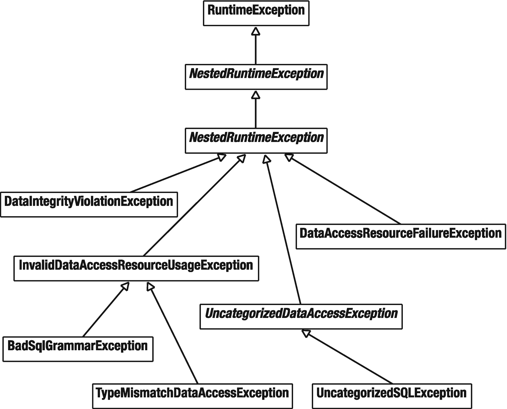

# 6. 数据访问

在本章中，你将学习 Spring 如何简化你的数据库访问任务（Spring 也能简化 NoSQL 和大数据任务，这将在第 9 章中介绍）。数据访问是大多数企业应用程序的常见需求，这些应用通常需要访问存储在关系数据库中的数据。作为 Java SE 的重要组成部分，Java 数据库连接（JDBC）定义了一套标准 API，让你能够以与供应商无关的方式访问关系数据库。

JDBC 的目的是提供一套 API，通过这些 API 你可以针对数据库执行 SQL 语句。然而，在使用 JDBC 时，你必须自行管理数据库相关资源，并显式处理数据库异常。为了让 JDBC 更易于使用，Spring 提供了一个用于与 JDBC 交互的抽象框架。作为 Spring JDBC 框架的核心，JDBC 模板旨在为不同类型的 JDBC 操作提供模板方法。每个模板方法负责控制整体流程，并允许你覆盖流程中的特定任务。

如果原始的 JDBC 无法满足你的需求，或者你认为你的应用程序可以从更高级别的抽象中受益，那么 Spring 对 ORM 解决方案的支持将会引起你的兴趣。在本章中，你还将学习如何将对象/关系映射（ORM）框架集成到你的 Spring 应用程序中。Spring 支持大多数流行的 ORM（或数据映射器）框架，包括 Hibernate 和 Java 持久化 API（JPA）。本章的重点将放在 Hibernate 和 JPA 上。不过，Spring 对 ORM 框架的支持是一致的，因此你可以轻松地将本章中的技术应用于其他 ORM 框架。

ORM 是一种将对象持久化到关系数据库中的技术。ORM 框架根据你提供的映射元数据（基于 XML 或注解）来持久化对象，例如类与表、属性与列之间的映射等。它在运行时生成用于对象持久化的 SQL 语句，因此除非你想利用数据库特定的功能或提供自己优化的 SQL 语句，否则你无需编写特定于数据库的 SQL 语句。与直接使用 JDBC 相比，ORM 框架可以显著减少应用程序的数据访问工作量。

Hibernate 是 Java 社区中一个流行的开源高性能 ORM 框架。Hibernate 支持大多数符合 JDBC 标准的数据库，并且可以使用特定的方言来访问特定的数据库。除了基本的 ORM 功能外，Hibernate 还支持更高级的功能，如缓存、级联和延迟加载。它还定义了一种名为 Hibernate 查询语言（HQL）的查询语言，让你能够编写简单但功能强大的对象查询。

JPA 为 Java SE 和 Java EE 平台中的对象持久化定义了一套标准的注解和 API。JPA 被定义为 [Jakarta Persistence](https://jakarta.ee/specifications/persistence/) 规范。JPA 只是一套标准 API，需要一个符合 JPA 规范的引擎来提供持久化服务。你可以将 JPA 与 JDBC API 进行比较，将 JPA 引擎与 JDBC 驱动程序进行比较。Hibernate 可以通过一个名为 Hibernate EntityManager 的扩展模块配置为符合 JPA 规范的引擎。本章将主要演示以 Hibernate 作为底层引擎的 JPA。

## 6-1. 直接使用 JDBC 的问题

假设你要开发一个车辆注册应用程序，其主要功能是对车辆记录进行基本的创建、读取、更新和删除（CRUD）操作。这些记录将存储在关系数据库中，并通过 JDBC 进行访问。首先，你设计了以下 `Vehicle` 类，它在 Java 中表示一辆车。

```
package com.apress.spring6recipes.vehicle;
public class Vehicle {
private String vehicleNo;
private String color;
private int wheel;
private int seat;
// 构造方法、Getter 和 Setter
...
}
清单 6-1
Vehicle 类
```

## 6-2. 设置应用程序数据库

你将使用的数据库是 PostgreSQL。

一个带阴影圆圈内字母 i 的图标，表示信息符号。 本章的示例代码在 `bin` 目录中提供了用于启动和连接到基于 Docker 的 PostgreSQL 实例的脚本。要启动该实例并创建数据库，请按照以下步骤操作：

1.  执行 `bin\postgres.sh`；这将下载并启动 Postgres Docker 容器。

2.  执行 `bin\psql.sh`；这将连接到正在运行的 Postgres 容器。

3.  执行 `CREATE DATABASE vehicle;` 来创建用于示例的数据库。

4.  接下来，你必须使用以下 SQL 语句创建 `VEHICLE` 表来存储车辆记录。默认情况下，此表将在 APP 数据库的 APP 数据库模式中创建：

```
CREATE TABLE VEHICLE (
VEHICLE_NO    VARCHAR(10)    NOT NULL,
COLOR         VARCHAR(10),
WHEEL         INT,
SEAT          INT,
PRIMARY KEY (VEHICLE_NO)
);
```

表 6-1

用于连接应用程序数据库的 JDBC 属性

| 属性 | 值 |
| --- | --- |
| 驱动类 | `org.postgresql.Driver` |
| URL | `jdbc:postgresql://localhost:5432/vehicle` |
| 用户名 | `postgres` |
| 密码 | `password` |

### 理解数据访问对象设计模式

一个典型的设计错误是将不同类型的逻辑（例如，表示逻辑、业务逻辑和数据访问逻辑）混合在单个大型模块中。这降低了模块的可重用性和可维护性，因为它引入了紧密耦合。数据访问对象（DAO）模式的总体目标是通过将数据访问逻辑与业务逻辑和表示逻辑分离来避免这些问题。该模式建议将数据访问逻辑封装在称为数据访问对象的独立模块中。

对于你的车辆注册应用程序，你可以抽象出插入、更新、删除和查询车辆的数据访问操作。这些操作应在 DAO 接口中声明，以允许使用不同的 DAO 实现技术。

```
package com.apress.spring6recipes.vehicle;
import java.util.Collection;
import java.util.List;
public interface VehicleDao {
void insert(Vehicle vehicle);
void update(Vehicle vehicle);
void delete(Vehicle vehicle);
Vehicle findByVehicleNo(String vehicleNo);
List findAll();
default void insert(Collection vehicles) {
vehicles.forEach(this::insert);
}
}
清单 6-2
VehicleDao 接口
```

JDBC API 的大部分内容都声明抛出 `java.sql.SQLException`。但由于此接口旨在仅抽象数据访问操作，因此它不应依赖于实现技术。因此，这个通用接口声明抛出 JDBC 特定的 `SQLException` 是不明智的。实现 DAO 接口时的一种常见做法是将此类异常包装在运行时异常中（可以是自定义的业务 Exception 子类，也可以是通用的异常）。


### 使用 JDBC 实现 DAO

要使用 JDBC 访问数据库，你需要为该 DAO 接口创建一个实现（例如 `JdbcVehicleDao`）。由于你的 DAO 实现必须连接数据库以执行 SQL 语句，你可以通过指定驱动类名、数据库 URL、用户名和密码来建立数据库连接。不过，你也可以从一个预先配置好的 `javax.sql.DataSource` 对象中获取数据库连接，而无需了解连接细节。

```
package com.apress.spring6recipes.vehicle;
import javax.sql.DataSource;
import java.sql.PreparedStatement;
import java.sql.ResultSet;
import java.sql.SQLException;
import java.util.ArrayList;
import java.util.List;
public class PlainJdbcVehicleDao implements VehicleDao {
private static final String INSERT_SQL = "INSERT INTO VEHICLE (COLOR, WHEEL, SEAT, VEHICLE_NO) VALUES (?, ?, ?, ?)";
private static final String UPDATE_SQL = "UPDATE VEHICLE SET COLOR=?,WHEEL=?,SEAT=? WHERE VEHICLE_NO=?";
private static final String SELECT_ALL_SQL = "SELECT * FROM VEHICLE";
private static final String SELECT_ONE_SQL = "SELECT * FROM VEHICLE WHERE VEHICLE_NO = ?";
private static final String DELETE_SQL = "DELETE FROM VEHICLE WHERE VEHICLE_NO=?";
private final DataSource dataSource;
public PlainJdbcVehicleDao(DataSource dataSource) {
this.dataSource = dataSource;
}
@Override
public void insert(Vehicle vehicle) {
try (var conn = dataSource.getConnection();
var ps = conn.prepareStatement(INSERT_SQL)) {
prepareStatement(ps, vehicle);
ps.executeUpdate();
} catch (SQLException e) {
throw new RuntimeException(e);
}
}
@Override
public Vehicle findByVehicleNo(String vehicleNo) {
try (var conn = dataSource.getConnection();
var ps = conn.prepareStatement(SELECT_ONE_SQL)) {
ps.setString(1, vehicleNo);
Vehicle vehicle = null;
try (var rs = ps.executeQuery()) {
if (rs.next()) {
vehicle = toVehicle(rs);
}
}
return vehicle;
} catch (SQLException e) {
throw new RuntimeException(e);
}
}
@Override
public void update(Vehicle vehicle) {
try (var conn = dataSource.getConnection();
var ps = conn.prepareStatement(UPDATE_SQL)) {
prepareStatement(ps, vehicle);
ps.executeUpdate();
} catch (SQLException e) {
throw new RuntimeException(e);
}
}
@Override
public void delete(Vehicle vehicle) {
try (var conn = dataSource.getConnection();
var ps = conn.prepareStatement(DELETE_SQL)) {
ps.setString(1, vehicle.getVehicleNo());
ps.executeUpdate();
} catch (SQLException e) {
throw new RuntimeException(e);
}
}
private Vehicle toVehicle(ResultSet rs) throws SQLException {
return new Vehicle(rs.getString("VEHICLE_NO"), rs.getString("COLOR"), rs.getInt("WHEEL"), rs.getInt("SEAT"));
}
private void prepareStatement(PreparedStatement ps, Vehicle vehicle) throws SQLException {
ps.setString(1, vehicle.getColor());
ps.setInt(2, vehicle.getWheel());
ps.setInt(3, vehicle.getSeat());
ps.setString(4, vehicle.getVehicleNo());
}
}
清单 6-3
纯 JDBC VehicleDao 实现
```

车辆插入操作是一个典型的 JDBC 更新场景。每次调用此方法时，你都会从数据源获取一个连接，并在此连接上执行 SQL 语句。你的 DAO 接口没有声明抛出任何受检异常，因此如果发生 `SQLException`，你必须将其包装成一个非受检的 `RuntimeException`。（本章稍后会详细讨论如何在 DAO 中处理异常。）此处展示的代码使用了所谓的 try-with-resources 机制，该机制会自动关闭已使用的资源（即 `Connection`、`PreparedStatement` 和 `ResultSet`）。如果你不使用 try-with-resources 块，则必须记得正确关闭已使用的资源。否则会导致连接泄漏。

这里将跳过 `update` 和 `delete` 操作，因为从技术角度来看，它们与插入操作非常相似。对于查询操作，除了执行 SQL 语句外，你还需要从返回的结果集中提取数据以构建车辆对象。`toVehicle` 方法是一个简单的辅助方法，用于复用映射逻辑，而 `prepareStatement` 方法则帮助为插入和更新方法设置参数。


### 在 Spring 中配置数据源

`javax.sql.DataSource` 接口是 JDBC 规范定义的一个标准接口，用于工厂化生产 `Connection` 实例。不同供应商和项目提供了多种数据源实现：HikariCP 和 Apache Commons DBCP 是流行的开源选择，大多数应用服务器也会提供自己的实现。由于它们都实现了通用的 `DataSource` 接口，因此在不同数据源实现之间切换非常容易。作为 Java 应用框架，Spring 也提供了几个便捷但功能较弱的数据源实现。最简单的是 `DriverManagerDataSource`，它会在每次请求连接时打开一个新连接。

```
package com.apress.spring6recipes.vehicle.config;
import javax.sql.DataSource;
import org.postgresql.Driver;
import org.springframework.context.annotation.Bean;
import org.springframework.context.annotation.Configuration;
import org.springframework.jdbc.datasource.SimpleDriverDataSource;
import com.apress.spring6recipes.vehicle.PlainJdbcVehicleDao;
import com.apress.spring6recipes.vehicle.VehicleDao;
@Configuration
public class VehicleConfiguration {
@Bean
public VehicleDao vehicleDao(DataSource dataSource) {
return new PlainJdbcVehicleDao(dataSource);
}
@Bean
public DataSource dataSource() {
var dataSource = new SimpleDriverDataSource();
dataSource.setDriverClass(Driver.class);
dataSource.setUrl("jdbc:postgresql://localhost:5432/vehicle");
dataSource.setUsername("postgres");
dataSource.setPassword("password");
return dataSource;
}
}
清单 6-4
车辆 JDBC 配置
```

`SimpleDriverDataSource`（及其同类 `DriverManagerDataSource`）并不是高效的数据源实现，因为它每次请求都会为客户端打开一个新连接。Spring 提供的另一个数据源实现是 `SingleConnectionDataSource`（`DriverManagerDataSource` 的子类）。顾名思义，它只维护一个单一连接，该连接始终被重用且从不关闭。显然，它不适用于多线程环境。

Spring 自身的数据源实现主要用于测试目的。然而，许多生产环境的数据源实现都支持连接池。例如，[HikariCP](https://github.com/brettwooldridge/HikariCP) 提供了 `HikariDataSource`，它接受与 `DriverManagerDataSource` 相同的连接属性，并允许你指定连接池的最小池大小和最大活动连接数等参数。

```
@Bean
public DataSource dataSource() {
var dataSource = new HikariDataSource();
dataSource.setDataSourceClassName("org.postgresql.ds.PGSimpleDataSource");
dataSource.setJdbcUrl("jdbc:postgresql://localhost:5432/vehicle");
dataSource.setUsername("postgres");
dataSource.setPassword("password");
dataSource.setMinimumIdle(2);
dataSource.setMaximumPoolSize(5);
return dataSource;
}
清单 6-5
使用连接池的车辆 JDBC 配置
```

一个带阴影圆圈内字母 i 的图标，代表信息符号。 要使用 HikariCP 提供的数据源实现，你必须将它们添加到你的 CLASSPATH 中。

*Gradle 依赖*

```
implementation 'com.zaxxer:HikariCP:5.0.1'
```

*Maven 依赖*

```
<dependency>
    <groupId>com.zaxxer</groupId>
    <artifactId>HikariCP</artifactId>
    <version>5.0.1</version>
</dependency>
```

许多 Jakarta EE 应用服务器都内置了数据源实现，你可以通过服务器控制台或配置文件进行配置。如果你在应用服务器中配置了一个数据源并暴露给 JNDI 查找，你可以使用 `JndiDataSourceLookup` 来查找它。

```
@Bean
public DataSource dataSource() {
return new JndiDataSourceLookup().getDataSource("jdbc/VehicleDS");
}
清单 6-6
JNDI 查找
```

### 运行 DAO

下面的 `Main` 类通过使用 DAO 向数据库插入一辆新车来测试它。如果成功，你可以立即从数据库中查询该车辆。

```
package com.apress.spring6recipes.vehicle;
import org.springframework.context.annotation.AnnotationConfigApplicationContext;
import com.apress.spring6recipes.vehicle.config.VehicleConfiguration;
public class Main {
public static void main(String[] args) throws Exception {
var cfg = VehicleConfiguration.class;
try (var ctx = new AnnotationConfigApplicationContext(cfg)) {
var vehicleDao = ctx.getBean(VehicleDao.class);
var vehicle = new Vehicle("TEM0001", "Red", 4, 4);
vehicleDao.insert(vehicle);
vehicle = vehicleDao.findByVehicleNo("TEM0001");
System.out.println(vehicle);
}
}
}
清单 6-7
主类
```

现在你可以直接使用 JDBC 实现一个 DAO。然而，从上面的 DAO 实现可以看出，大部分 JDBC 代码都是相似的，并且每次数据库操作都需要重复编写。这种冗余代码会使你的 DAO 方法变得冗长且可读性差。

### 更进一步

另一种方法是使用 ORM（对象/关系映射）工具，它允许你专门编写将领域模型中的实体映射到数据库表的逻辑。ORM 会反过来找出如何编写逻辑，以有效地将类的数据持久化到数据库中。这可以非常解放：你突然只需要关注你的业务和领域模型，而不必受数据库 SQL 解析器的摆布。当然，另一面是，你也放弃了对你客户端和数据库之间通信的完全控制——你必须信任 ORM 层会做正确的事情。

## 6-3\. 使用 JDBC 模板操作数据库

### 问题

使用 JDBC 既繁琐又充满了冗余的 API 调用，其中许多调用本可以为你管理。要实现一个 JDBC 更新操作，你必须执行以下任务，其中大部分是冗余的：

1.  从数据源获取数据库连接。
2.  从连接创建 PreparedStatement 对象。
3.  将参数绑定到 PreparedStatement 对象。
4.  执行 PreparedStatement 对象。
5.  处理 SQLException。

JDBC 是一个低级 API，但使用 JDBC 模板后，你需要处理的 API 表面区域会变得更具表现力（你花在细节上的时间更少，花在应用程序逻辑上的时间更多），并且更易于安全地使用。

### 解决方案

`org.springframework.jdbc.core.JdbcTemplate` 类声明了许多重载的 `update()` 模板方法，以控制整个更新过程。不同版本的 `update()` 方法允许你覆盖默认过程中不同的任务子集。Spring JDBC 框架预定义了多个回调接口来封装不同的任务子集。你可以实现其中一个回调接口，并将其实例传递给相应的 `update()` 方法以完成该过程。

### 工作原理


#### 使用语句创建器更新数据库

首先要介绍的回调接口是 `PreparedStatementCreator`。实现此接口是为了覆盖整个更新过程中的语句创建任务（任务 2）和参数绑定任务（任务 3）。要将车辆插入数据库，可以按如下方式实现 `PreparedStatementCreator` 接口。

```
package com.apress.spring6recipes.vehicle;
import java.sql.Connection;
import java.sql.PreparedStatement;
import java.sql.ResultSet;
import java.sql.SQLException;
import java.util.ArrayList;
import java.util.List;
import javax.sql.DataSource;
import org.springframework.jdbc.core.JdbcTemplate;
import org.springframework.jdbc.core.PreparedStatementCreator;
public class JdbcVehicleDao implements VehicleDao {
private void prepareStatement(PreparedStatement ps, Vehicle vehicle)
throws SQLException {
ps.setString(1, vehicle.getColor());
ps.setInt(2, vehicle.getWheel());
ps.setInt(3, vehicle.getSeat());
ps.setString(4, vehicle.getVehicleNo());
}
private class InsertVehicleStatementCreator implements PreparedStatementCreator {
private final Vehicle vehicle;
InsertVehicleStatementCreator(Vehicle vehicle) {
this.vehicle = vehicle;
}
@Override
public PreparedStatement createPreparedStatement(Connection conn)
throws SQLException {
var ps = conn.prepareStatement(INSERT_SQL);
prepareStatement(ps, this.vehicle);
return ps;
}
}
}
清单 6-8
基于 Spring JdbcTemplate 的 VehicleDao 实现
```

在实现 `PreparedStatementCreator` 接口时，你将获得数据库连接作为 `createPreparedStatement()` 方法的参数。在此方法中，你只需在此连接上创建一个 `PreparedStatement` 对象，并将参数绑定到此对象。最后，你必须将 `PreparedStatement` 对象作为方法的返回值返回。请注意，方法签名声明抛出 `SQLException`，这意味着你无需自行处理此类异常。由于你正在将此接口实现为 DAO 的内部类，因此可以从你的实现中调用 `prepareStatement` 辅助方法。

现在，你可以使用此语句创建器来简化车辆插入操作。首先，你必须创建一个 `JdbcTemplate` 类的实例，并为此模板传入数据源以从中获取连接。然后，你只需调用 `update()` 方法，并将你的语句创建器传入模板以完成更新过程。

```
package com.apress.spring6recipes.vehicle;
import java.sql.Connection;
import java.sql.PreparedStatement;
import java.sql.ResultSet;
import java.sql.SQLException;
import java.util.ArrayList;
import java.util.List;
import javax.sql.DataSource;
import org.springframework.jdbc.core.JdbcTemplate;
import org.springframework.jdbc.core.PreparedStatementCreator;
public class JdbcVehicleDao implements VehicleDao {
@Override
public void insert(Vehicle vehicle) {
var jdbcTemplate = new JdbcTemplate(this.dataSource);
jdbcTemplate.update(new InsertVehicleStatementCreator(vehicle));
}
}
清单 6-9
基于 Spring JdbcTemplate 的 VehicleDao 实现 - 使用 PreparedStatementCreator
```

通常，如果 `PreparedStatementCreator` 接口和其他回调接口仅在一个方法内使用，最好将它们实现为匿名内部类。这是因为你可以直接从内部类访问局部变量和方法参数，而无需将它们作为构造函数参数传递。使用局部变量时，这些变量必须标记为 `final`。

```
package com.apress.spring6recipes.vehicle;
import java.sql.Connection;
import java.sql.PreparedStatement;
import java.sql.ResultSet;
import java.sql.SQLException;
import java.util.ArrayList;
import java.util.List;
import javax.sql.DataSource;
import org.springframework.jdbc.core.JdbcTemplate;
public class JdbcVehicleDao implements VehicleDao {
@Override
public void insert(Vehicle vehicle) {
var jdbcTemplate = new JdbcTemplate(this.dataSource);
jdbcTemplate.update( (conn) -> {
var ps = conn.prepareStatement(INSERT_SQL);
prepareStatement(ps, vehicle);
return ps;
});
}
private void prepareStatement(PreparedStatement ps, Vehicle vehicle) throws SQLException {
ps.setString(1, vehicle.getColor());
ps.setInt(2, vehicle.getWheel());
ps.setInt(3, vehicle.getSeat());
ps.setString(4, vehicle.getVehicleNo());
}
}
清单 6-10
基于 Spring JdbcTemplate 的 VehicleDao 实现 - 使用匿名内部类
```

现在，你可以删除前面的 `InsertVehicleStatementCreator` 内部类，因为它将不再被使用。

#### 使用语句设置器更新数据库

第二个回调接口 `PreparedStatementSetter`，顾名思义，仅执行整个更新过程中的参数绑定任务（任务 3）。

`update()` 模板方法的另一个版本接受一个 SQL 语句和一个 `PreparedStatementSetter` 对象作为参数。此方法将根据你的 SQL 语句为你创建一个 `PreparedStatement` 对象。使用此接口，你只需将参数绑定到 `PreparedStatement` 对象（为此，你可以再次委托给 `prepareStatement` 方法）。

```
package com.apress.spring6recipes.vehicle;
...
import org.springframework.jdbc.core.JdbcTemplate;
import org.springframework.jdbc.core.PreparedStatementSetter;
public class JdbcVehicleDao implements VehicleDao {
...
public void insert(final Vehicle vehicle) {
JdbcTemplate jdbcTemplate = new JdbcTemplate(dataSource);
jdbcTemplate.update(INSERT_SQL, new PreparedStatementSetter() {
public void setValues(PreparedStatement ps)
throws SQLException {
prepareStatement(ps, vehicle);
}
});
}
}
清单 6-11
基于 Spring JdbcTemplate 的 VehicleDao 实现 - 使用 PreparedStatementSetter
```

或者更简洁地，它可以写成 Java lambda 表达式。

```
@Override
public void insert(Vehicle vehicle) {
var jdbcTemplate = new JdbcTemplate(this.dataSource);
jdbcTemplate.update(INSERT_SQL, ps -> prepareStatement(ps, vehicle));
}
清单 6-12
基于 Spring JdbcTemplate 的 VehicleDao 实现 - 使用 lambda 表达式
```

#### 使用 SQL 语句和参数值更新数据库

最后，`update()` 方法最简单的版本接受一个 SQL 语句和一个对象数组作为语句参数。它将根据你的 SQL 语句创建一个 `PreparedStatement` 对象，并为你绑定参数。因此，你无需覆盖更新过程中的任何任务。

```
}
@Override
public void insert(Vehicle vehicle) {
var jdbcTemplate = new JdbcTemplate(this.dataSource);
jdbcTemplate.update(INSERT_SQL, vehicle.getColor(), vehicle.getWheel(), vehicle.getSeat(),
vehicle.getVehicleNo());
清单 6-13
基于 Spring JdbcTemplate 的 VehicleDao 实现 - 带参数的简单更新
```

在介绍的 `update()` 方法的三种不同版本中，最后一种是最简单的，因为你无需实现任何回调接口。此外，我们成功移除了所有用于参数化查询的 set 风格方法。相比之下，第一种最灵活，因为你可以在 `PreparedStatement` 对象执行之前对其进行任何预处理。在实践中，你应该始终选择满足所有需求的最简单版本。

`JdbcTemplate` 类还提供了其他重载的 `update()` 方法。详情请参考 [Javadoc](https://docs.spring.io/spring-framework/docs/current/javadoc-api/org/springframework/jdbc/core/JdbcTemplate.html)。


### 批量更新数据库

假设你想向数据库中批量插入一批车辆。如果多次调用 `update()` 方法，由于 SQL 语句会被反复编译和执行，更新速度会非常慢。因此，最好使用批量更新来实现批量插入车辆。

`JdbcTemplate` 类也提供了几个用于批量更新操作的 `batchUpdate()` 模板方法。你将使用的方法接受一个 SQL 语句、一个项目集合、一个批量大小以及一个 `ParameterizedPreparedStatementSetter`。

```
package com.apress.spring6recipes.vehicle;
...
import org.springframework.jdbc.core.BatchPreparedStatementSetter;
import org.springframework.jdbc.core.JdbcTemplate;
public class JdbcVehicleDao implements VehicleDao {
...
@Override
public void insert(Collection vehicles) {
var jdbcTemplate = new JdbcTemplate(this.dataSource);
var ppss = new ParameterizedPreparedStatementSetter() {
@Override
public void setValues(PreparedStatement ps, Vehicle argument)
throws SQLException {
prepareStatement(ps, argument);
}
});
jdbcTemplate.batchUpdate(INSERT_SQL, vehicles, vehicles.size(), ppss);
}
}
清单 6-14
基于 Spring JdbcTemplate 的 VehicleDao 实现——使用 PreparedStatementSetter 进行批量插入
```

或者，也可以使用 Java lambda 表达式来实现。

```
@Override
public void insert(Collection vehicles) {
var jdbcTemplate = new JdbcTemplate(this.dataSource);
jdbcTemplate.batchUpdate(INSERT_SQL, vehicles, vehicles.size(), this::prepareStatement);
}
清单 6-15
基于 Spring JdbcTemplate 的 VehicleDao 实现——使用 lambda 表达式进行批量插入
```

你可以使用 `Main` 类中的以下代码片段来测试批量插入操作。

```
package com.apress.spring6recipes.vehicle;
import java.util.Arrays;
import java.util.List;
import org.springframework.context.ApplicationContext;
import org.springframework.context.annotation.AnnotationConfigApplicationContext;
import com.apress.spring6recipes.vehicle.config.VehicleConfiguration;
public class Main {
public static void main(String[] args) throws Exception {
var cfg = VehicleConfiguration.class;
try (var context = new AnnotationConfigApplicationContext(cfg)) {
var vehicleDao = context.getBean(VehicleDao.class);
var vehicle1 = new Vehicle("TEM0022", "Blue", 4, 4);
var vehicle2 = new Vehicle("TEM0023", "Black", 4, 6);
var vehicle3 = new Vehicle("TEM0024", "Green", 4, 5);
vehicleDao.insert(List.of(vehicle1, vehicle2, vehicle3));
vehicleDao.findAll().forEach(System.out::println);
}
}
}
清单 6-16
Main 类
```

## 6-4\. 使用 JDBC 模板查询数据库

### 问题

要实现 JDBC 查询操作，你需要执行以下任务，其中两项（任务 5 和 6）是相对于更新操作额外增加的：

1.  从数据源获取数据库连接。
2.  从连接创建 PreparedStatement 对象。
3.  将参数绑定到 PreparedStatement 对象。
4.  执行 PreparedStatement 对象。
5.  遍历返回的结果集。
6.  从结果集中提取数据。
7.  处理 SQLException。

然而，与业务逻辑相关的步骤只有查询的定义和从结果集中提取结果！其余部分最好由 JDBC 模板来处理。

### 解决方案

`JdbcTemplate` 类声明了许多重载的 `query()` 模板方法，用于控制整个查询过程。你可以通过实现 `PreparedStatementCreator` 和 `PreparedStatementSetter` 接口来覆盖语句创建（任务 2）和参数绑定（任务 3），就像你在更新操作中所做的那样。此外，Spring JDBC 框架支持多种方式来覆盖数据提取（任务 6）。

### 工作原理

#### 使用行回调处理程序提取数据

`RowCallbackHandler` 是允许你处理结果集当前行的主要接口。其中一个 `query()` 方法会为你遍历结果集，并为每一行调用你的 `RowCallbackHandler`。因此，对于返回结果集中的每一行，`processRow()` 方法都会被调用一次。

```
package com.apress.spring6recipes.vehicle;
@Override
public Vehicle findByVehicleNo(String vehicleNo) {
try (var conn = dataSource.getConnection();
var ps = conn.prepareStatement(SELECT_ONE_SQL)) {
ps.setString(1, vehicleNo);
Vehicle vehicle = null;
try (ResultSet rs = ps.executeQuery()) {
if (rs.next()) {
vehicle = toVehicle(rs);
}
}
ps.setString(1, vehicle.getVehicleNo());
清单 6-17
基于 Spring JdbcTemplate 的 VehicleDao 实现——纯 JDBC
```

使用 Java lambda 表达式时，代码会更简洁一些。

```
@Override
public Vehicle findByVehicleNo(String vehicleNo) {
var jdbcTemplate = new JdbcTemplate(dataSource);
var vehicle = new Vehicle();
jdbcTemplate.query(SELECT_ONE_SQL,
rs -> {
vehicle.setVehicleNo(rs.getString("VEHICLE_NO"));
vehicle.setColor(rs.getString("COLOR"));
vehicle.setWheel(rs.getInt("WHEEL"));
vehicle.setSeat(rs.getInt("SEAT"));
}, vehicleNo);
return vehicle;
}
清单 6-18
使用带有 lambda 回调的 JdbcTemplate 的方法
```

由于 SQL 查询最多返回一行，你可以创建一个车辆对象作为局部变量，并通过从结果集中提取数据来设置其属性。对于包含多行的结果集，你应该将对象收集到一个列表中。

灯泡图标表示提示信息。 `RowCallbackHandler` 的最佳用途并非像此处这样从查询方法返回结果，而是逐行处理记录，例如，将其导出到 CSV 或 Excel 文档中。


#### 使用行映射器提取数据

`RowMapper` 接口比 `RowCallbackHandler` 更通用。其目的是将结果集中的单行映射到自定义对象，因此它既可以应用于单行结果集，也可以应用于多行结果集。

从复用的角度来看，将 `RowMapper` 接口实现为普通类比实现为内部类更好。在该接口的 `mapRow()` 方法中，您需要构造代表一行的对象，并将其作为方法的返回值返回。

```
package com.apress.spring6recipes.vehicle;
import java.sql.ResultSet;
import java.sql.SQLException;
import org.springframework.jdbc.core.RowMapper;
public class JdbcVehicleDao implements VehicleDao {
private Vehicle toVehicle(ResultSet rs) throws SQLException {
return new Vehicle(rs.getString("VEHICLE_NO"), rs.getString("COLOR"), rs.getInt("WHEEL"), rs.getInt("SEAT"));
}
private class VehicleRowMapper implements RowMapper {
@Override
public Vehicle mapRow(ResultSet rs, int rowNum) throws SQLException {
return toVehicle(rs);
}
}
}
清单 6-19
基于 Spring JdbcTemplate 的 VehicleDao 实现 - 使用 RowMapper
```

如前所述，`RowMapper` 可用于单行或多行结果集。当查询唯一对象时（例如在 `findByVehicleNo()` 中），您必须调用 `JdbcTemplate` 的 `queryForObject()` 方法。

```
package com.apress.spring6recipes.vehicle;
import org.springframework.jdbc.core.JdbcTemplate;
public class JdbcVehicleDao implements VehicleDao {
@Override
public Vehicle findByVehicleNo(String vehicleNo) {
var jdbcTemplate = new JdbcTemplate(dataSource);
return jdbcTemplate.queryForObject(SELECT_ONE_SQL, new VehicleRowMapper(), vehicleNo);
}
}
清单 6-20
基于 Spring JdbcTemplate 的 VehicleDao 实现
```

Spring 提供了一个便捷的 `RowMapper` 实现 `BeanPropertyRowMapper`，它可以自动将行映射到指定类的新实例。请注意，指定的类必须是顶层类，并且必须有一个默认构造函数或无参构造函数。它首先实例化该类，然后通过匹配名称将每个列值映射到属性。它支持将属性名称（例如 `vehicleNo`）映射到相同的列名或带下划线的列名（例如 `VEHICLE_NO`）。

```
package com.apress.spring6recipes.vehicle;
import org.springframework.jdbc.core.BeanPropertyRowMapper;
import org.springframework.jdbc.core.JdbcTemplate;
public class JdbcVehicleDao implements VehicleDao {
@Override
public Vehicle findByVehicleNo(String vehicleNo) {
var jdbcTemplate = new JdbcTemplate(dataSource);
var mapper = BeanPropertyRowMapper.newInstance(Vehicle.class);
return jdbcTemplate.queryForObject(SELECT_ONE_SQL, mapper , vehicleNo);
}
}
清单 6-21
基于 Spring JdbcTemplate 的 VehicleDao 实现 - 使用 BeanPropertyRowMapper
```

#### 查询多行

现在，让我们看看如何查询包含多行的结果集。例如，假设您需要在 DAO 接口中有一个 `findAll()` 方法来获取所有车辆。

```
package com.apress.spring6recipes.vehicle;
...
public interface VehicleDao {
...
List findAll();
}
清单 6-22
VehicleDao 接口——findAll 声明
```

即使没有 `RowMapper` 的帮助，您仍然可以调用 `queryForList()` 方法并传入 SQL 语句。返回的结果将是一个映射列表。每个映射存储结果集的一行，并以列名作为键。

```
package com.apress.spring6recipes.vehicle;
import java.util.List;
import org.springframework.jdbc.core.JdbcTemplate;
public class JdbcVehicleDao implements VehicleDao {
@Override
public List findAll() {
var jdbcTemplate = new JdbcTemplate(dataSource);
var rows = jdbcTemplate.queryForList(SELECT_ALL_SQL);
return rows.stream().map(row -> {
var vehicle = new Vehicle();
vehicle.setVehicleNo((String) row.get("VEHICLE_NO"));
vehicle.setColor((String) row.get("COLOR"));
vehicle.setWheel((Integer) row.get("WHEEL"));
vehicle.setSeat((Integer) row.get("SEAT"));
return vehicle;
}).collect(Collectors.toList());
}
}
清单 6-23
基于 Spring JdbcTemplate 的 VehicleDao 实现 - 结果作为映射列表
```

您可以在 Main 类中使用以下代码片段测试您的 `findAll()` 方法。

```
package com.apress.spring6recipes.vehicle;
import org.springframework.context.annotation.AnnotationConfigApplicationContext;
import com.apress.spring6recipes.vehicle.config.VehicleConfiguration;
public class Main {
public static void main(String[] args) throws Exception {
var cfg = VehicleConfiguration.class;
try (var context = new AnnotationConfigApplicationContext(cfg)) {
var vehicleDao = context.getBean(VehicleDao.class);
var vehicles = vehicleDao.findAll();
for (var vehicle : vehicles) {
System.out.println("Vehicle No: " + vehicle.getVehicleNo());
System.out.println("Color: " + vehicle.getColor());
System.out.println("Wheel: " + vehicle.getWheel());
System.out.println("Seat: " + vehicle.getSeat());
}
}
}
}
清单 6-24
Main 类
```

如果您使用 `RowMapper` 对象来映射结果集中的行，您将从 `query()` 方法中获得一个映射对象的列表。

```
package com.apress.spring6recipes.vehicle;
...
import org.springframework.jdbc.core.BeanPropertyRowMapper;
import org.springframework.jdbc.core.JdbcTemplate;
public class JdbcVehicleDao implements VehicleDao {
...
public List findAll() {
var jdbcTemplate = new JdbcTemplate(dataSource);
var mapper = BeanPropertyRowMapper.newInstance(Vehicle.class)
return jdbcTemplate.query (SELECT_ALL_SQL, mapper);
}
}
清单 6-25
使用 RowMapper 的 JdbcTemplate 示例
```


#### 查询单个值

最后，我们来考虑查询单行单列结果集的情况。例如，在 DAO 接口中添加以下操作。

```
package com.apress.spring6recipes.vehicle;
public interface VehicleDao {
default String getColor(String vehicleNo) {
throw new IllegalStateException("Method is not implemented!");
}
default int countAll() {
throw new IllegalStateException("Method is not implemented!");
}
}
清单 6-26
使用 RowMapper 进行单值查找的 VehicleDao 接口
```

一个带阴影圆环中的字母 i 图标，代表信息符号。 这些方法被添加为 `default` 方法，以免破坏 `VehicleDao` 接口的现有实现。

要查询单个字符串值，可以调用重载的 `queryForObject()` 方法，该方法需要一个 `java.lang.Class` 类型的参数。此方法将帮助你将结果值映射到你指定的类型。

```
package com.apress.spring6recipes.vehicle;
public class JdbcVehicleDao implements VehicleDao {
private static final String COUNT_ALL_SQL = "SELECT COUNT(*) FROM VEHICLE";
private static final String SELECT_COLOR_SQL = "SELECT COLOR FROM VEHICLE WHERE VEHICLE_NO=?";
@Override
public String getColor(String vehicleNo) {
var jdbcTemplate = new JdbcTemplate(dataSource);
return jdbcTemplate.queryForObject(SELECT_COLOR_SQL, String.class, vehicleNo);
}
@Override
public int countAll() {
var jdbcTemplate = new JdbcTemplate(dataSource);
return jdbcTemplate.queryForObject(COUNT_ALL_SQL, Integer.class);
}
}
清单 6-27
基于 Spring JdbcTemplate 的 VehicleDao 实现——使用 queryForObject 进行计数
```

你可以使用 Main 类中的以下代码片段测试这两个方法。

```
package com.apress.spring6recipes.vehicle;
import org.springframework.context.annotation.AnnotationConfigApplicationContext;
import com.apress.spring6recipes.vehicle.config.VehicleConfiguration;
public class Main {
public static void main(String[] args) throws Exception {
var cfg = VehicleConfiguration.class;
try (var ctx = new AnnotationConfigApplicationContext(cfg)) {
var vehicleDao = ctx.getBean(VehicleDao.class);
var count = vehicleDao.countAll();
System.out.println("Vehicle Count: " + count);
var color = vehicleDao.getColor("TEM0001");
System.out.println("Color for [TEM0001]: " + color);
}
}
}
清单 6-28
Main 类
```

## 6-5\. 简化 JDBC 模板创建

### 问题

每次需要 `JdbcTemplate` 时都创建一个新实例效率不高，因为你必须重复编写创建语句，并且会产生创建新对象的开销。

### 解决方案

`JdbcTemplate` 类被设计为线程安全的，因此你可以在 IoC 容器中声明它的单个实例，并将此实例注入到所有 DAO 实例中。此外，Spring JDBC 框架提供了一个便捷的类 `org.springframework.jdbc.core.support.JdbcDaoSupport`，用于简化 DAO 的实现。该类声明了一个 `jdbcTemplate` 属性，该属性可以从 IoC 容器注入，或者从数据源自动创建，例如 `JdbcTemplate jdbcTemplate = new JdbcTemplate(dataSource)`。你的 DAO 可以继承此类以继承此属性。

### 工作原理

#### 注入 JDBC 模板

到目前为止，你在每个 DAO 方法中都创建了一个新的 `JdbcTemplate` 实例。实际上，你可以在类级别注入它，并在所有 DAO 方法中使用这个注入的实例。为简单起见，以下代码仅显示对 `insert()` 方法的更改。

```
package com.apress.spring6recipes.vehicle;
import org.springframework.jdbc.core.JdbcTemplate;
public class JdbcVehicleDao implements VehicleDao {
private final JdbcTemplate jdbcTemplate;
public JdbcVehicleDao(JdbcTemplate jdbcTemplate) {
this.jdbcTemplate = jdbcTemplate;
}
@Override
public void insert(Vehicle vehicle) {
jdbcTemplate.update(INSERT_SQL, vehicle.getColor(), vehicle.getWheel(),
vehicle.getSeat(), vehicle.getVehicleNo());
}
}
清单 6-29
在类级别注入 JdbcTemplate
```

JDBC 模板需要设置一个数据源。你可以通过 setter 方法或构造函数参数注入此属性。然后，你可以将此 JDBC 模板注入到你的 DAO 中。

```
package com.apress.spring6recipes.vehicle.config;
import javax.sql.DataSource;
import org.springframework.context.annotation.Bean;
import org.springframework.context.annotation.Configuration;
import org.springframework.jdbc.core.JdbcTemplate;
import com.apress.spring6recipes.vehicle.JdbcVehicleDao;
import com.apress.spring6recipes.vehicle.VehicleDao;
import com.zaxxer.hikari.HikariDataSource;
@Configuration
public class VehicleConfiguration {
@Bean
public VehicleDao vehicleDao(JdbcTemplate jdbcTemplate) {
return new JdbcVehicleDao(jdbcTemplate);
}
@Bean
public JdbcTemplate jdbcTemplate(DataSource dataSource) {
return new JdbcTemplate(dataSource);
}
@Bean
public DataSource dataSource() {
var dataSource = new HikariDataSource();
dataSource.setDataSourceClassName("org.postgresql.ds.PGSimpleDataSource");
dataSource.setJdbcUrl("jdbc:postgresql://localhost:5432/vehicle");
dataSource.setUsername("postgres");
dataSource.setPassword("password");
dataSource.setMinimumIdle(2);
dataSource.setMaximumPoolSize(5);
return dataSource;
}
}
清单 6-30
VehicleDao 配置
```

#### 扩展 JdbcDaoSupport 类

`org.springframework.jdbc.core.support.JdbcDaoSupport` 类具有 `setDataSource()` 方法和 `setJdbcTemplate()` 方法。你的 DAO 类可以继承此类以继承这些方法。然后，你可以直接注入 JDBC 模板，或者注入一个数据源供其创建 JDBC 模板。

在你的 DAO 方法中，你可以简单地调用 `getJdbcTemplate()` 方法来获取 JDBC 模板。你还必须从 DAO 类中删除 `dataSource` 和 `jdbcTemplate` 属性及其 setter 方法，因为它们已经被继承了。同样，为简单起见，仅显示对 `insert()` 方法的更改。

```
package com.apress.spring6recipes.vehicle;
public class JdbcVehicleDao implements VehicleDao {
private static final String INSERT_SQL = "INSERT INTO VEHICLE (COLOR, WHEEL, SEAT, VEHICLE_NO) VALUES (?, ?, ?, ?)";
public JdbcVehicleDao(JdbcTemplate jdbcTemplate) {
this.jdbcTemplate = jdbcTemplate;
}
@Override
public void insert(Vehicle vehicle) {
jdbcTemplate.update(INSERT_SQL, vehicle.getColor(), vehicle.getWheel(),
vehicle.getSeat(), vehicle.getVehicleNo());
}
清单 6-31
基于 Spring JdbcDaoSupport 的 VehicleDao 实现
```

通过扩展 `JdbcDaoSupport`，你的 DAO 类继承了 `setDataSource()` 方法。你可以将数据源注入到 DAO 实例中，供其创建 JDBC 模板。

```
@Configuration
public class VehicleConfiguration {
...
@Bean
public VehicleDao vehicleDao(DataSource dataSource) {
var vehicleDao = new JdbcVehicleDao();
vehicleDao.setDataSource(dataSource);
return vehicleDao;
}
}
清单 6-32
VehicleDao 配置
```

## 6-6\. 在 JDBC 模板中使用命名参数

### 问题

在经典的 JDBC 用法中，SQL 参数由占位符 `?` 表示，并按位置绑定。位置参数的问题在于，只要参数顺序发生变化，就必须同时更改参数绑定。对于包含许多参数的 SQL 语句，按位置匹配参数非常繁琐。

### 解决方案

在 Spring JDBC 框架中绑定 SQL 参数时的另一种选择是使用命名参数。顾名思义，命名 SQL 参数按名称（以冒号开头）指定，而不是按位置。命名参数更易于维护，并且还能提高可读性。在运行时，框架类会用占位符替换命名参数。`NamedParameterJdbcTemplate` 支持命名参数。


### 工作原理

在 SQL 语句中使用命名参数时，你可以将参数值以映射（Map）的形式提供，其中参数名作为键。

```
package com.apress.spring6recipes.vehicle;
...
import org.springframework.jdbc.core.namedparam.NamedParameterJdbcDaoSupport;
public class JdbcVehicleDao extends NamedParameterJdbcDaoSupport
implements VehicleDao {
private static final String INSERT_SQL = "INSERT INTO VEHICLE (COLOR, WHEEL, SEAT, VEHICLE_NO) VALUES (:color, :wheel, :seat, :vehicleNo)";
public void insert(Vehicle vehicle) {
getNamedParameterJdbcTemplate().update(INSERT_SQL, toParameterMap(vehicle));
}
private Map toParameterMap(Vehicle vehicle) {
var parameters = new HashMap();
parameters.put("vehicleNo", vehicle.getVehicleNo());
parameters.put("color", vehicle.getColor());
parameters.put("wheel", vehicle.getWheel());
parameters.put("seat", vehicle.getSeat());
return parameters;
}
...
}
清单 6-33
基于 Spring NamedParameterJdbcDaoSupport 的 VehicleDao 实现——使用 Map
```

你也可以提供一个 SQL 参数源，其职责是为命名 SQL 参数提供 SQL 参数值。`SqlParameterSource` 接口有三种实现。最基本的是 `MapSqlParameterSource`，它将一个 Map 包装为其参数源。在本例中，与上一个示例相比，这反而增加了开销，因为我们引入了一个额外的对象——`SqlParameterSource`。

```
package com.apress.spring6recipes.vehicle;
...
import org.springframework.jdbc.core.namedparam.MapSqlParameterSource;
import org.springframework.jdbc.core.namedparam.SqlParameterSource;
import org.springframework.jdbc.core.namedparam.NamedParameterJdbcDaoSupport;
public class JdbcVehicleDao extends NamedParameterJdbcDaoSupport
implements VehicleDao {
public void insert(Vehicle vehicle) {
var parameterSource = new MapSqlParameterSource(toParameterMap(vehicle));
getNamedParameterJdbcTemplate().update(INSERT_SQL, parameterSource);
}
...
}
清单 6-34
基于 Spring NamedParameterJdbcDaoSupport 的 VehicleDao 实现——使用 MapSqlParameterSource
```

当我们需要在传递给 update 方法的参数与其值的来源之间增加一层间接性时，它的威力就显现出来了。例如，如果我们想从 JavaBean 中获取属性呢？这正是 `SqlParameterSource` 中介开始发挥作用的地方！`SqlParameterSource` 是 `BeanPropertySqlParameterSource`，它将一个普通的 Java 对象包装为 SQL 参数源。对于每个命名参数，同名的属性将被用作参数值。

```
package com.apress.spring6recipes.vehicle;
import org.springframework.jdbc.core.namedparam.BeanPropertySqlParameterSource;
import org.springframework.jdbc.core.namedparam.SqlParameterSource;
import org.springframework.jdbc.core.namedparam.NamedParameterJdbcDaoSupport;
public class JdbcVehicleDao extends NamedParameterJdbcDaoSupport
implements VehicleDao {
public void insert(Vehicle vehicle) {
var parameterSource = new BeanPropertySqlParameterSource(vehicle);
getNamedParameterJdbcTemplate ().update(INSERT_SQL, parameterSource);
}
}
清单 6-35
基于 Spring NamedParameterJdbcDaoSupport 的 VehicleDao 实现——使用 BeanPropertySqlParameterSource
```

命名参数也可以用于批量更新。你可以提供一个 `Map`、一个数组或一个 `SqlParameterSource` 数组作为参数值。

```
package com.apress.spring6recipes.vehicle;
...
import org.springframework.jdbc.core.namedparam.BeanPropertySqlParameterSource;
import org.springframework.jdbc.core.namedparam.SqlParameterSource;
import org.springframework.jdbc.core.namedparam.NamedParameterJdbcDaoSupport;
public class JdbcVehicleDao extends NamedParameterJdbcDaoSupport implements VehicleDao {
...
@Override
public void insert(Collection vehicles) {
var sources = vehicles.stream()
.map(BeanPropertySqlParameterSource::new)
.toArray(SqlParameterSource[]::new);
getNamedParameterJdbcTemplate().batchUpdate(INSERT_SQL, sources);
}
}
清单 6-36
基于 Spring NamedParameterJdbcDaoSupport 的 VehicleDao 实现——批量更新
```

## 6-7\. 处理 Spring JDBC 框架中的异常

### 问题

许多 JDBC API 声明会抛出 `java.sql.SQLException`，这是一个必须捕获的受检异常。每次执行数据库操作时都要处理这类异常非常麻烦。你通常需要定义自己的策略来处理这类异常。否则可能导致异常处理不一致。

### 解决方案

Spring 框架为其数据访问模块（包括 JDBC 框架）提供了一致的数据访问异常处理机制。通常，Spring JDBC 框架抛出的所有异常都是 `org.springframework.dao.DataAccessException` 的子类，这是一种 `RuntimeException`，你不必强制捕获它。它是 Spring 数据访问模块中所有异常的根异常类。

图 6-1 仅展示了 Spring 数据访问模块中 `DataAccessException` 层次结构的一部分。总共定义了 30 多个异常类，用于不同类别的数据访问异常。



数据访问异常流程图。1，运行时异常来自 2 个嵌套的运行时异常。2，数据完整性违规、无效的数据访问资源使用、数据访问资源失败以及未分类的数据访问异常。错误的 SQL 语法、类型不匹配的数据访问属于无效的 DA，未分类的 SQL 属于未分类的 DA。

图 6-1
DataAccessException 层次结构中的常见异常类

### 工作原理


#### 理解 Spring JDBC 框架中的异常处理

到目前为止，在使用 JDBC 模板或 JDBC 操作对象时，你还没有显式地处理过 JDBC 异常。为了帮助你理解 Spring JDBC 框架的异常处理机制，让我们看看 `Main` 类中的以下代码片段，该片段用于插入一辆车。如果插入一辆车牌号重复的车辆会发生什么？

```
package com.apress.spring6recipes.vehicle;
import org.springframework.context.annotation.AnnotationConfigApplicationContext;
import com.apress.spring6recipes.vehicle.config.VehicleConfiguration;
public class Main {
public static void main(String[] args) throws Exception {
var cfg = VehicleConfiguration.class;
try (var context = new AnnotationConfigApplicationContext(cfg)) {
var vehicleDao = context.getBean(VehicleDao.class);
var vehicle = new Vehicle("EX0001", "Green", 4, 4);
vehicleDao.insert(vehicle);
}
}
}
代码清单 6-37
Main 类
```

如果你运行该方法两次，或者该车辆已插入数据库，它将抛出一个 `DuplicateKeyException`，这是 `DataAccessException` 的间接子类。在你的 DAO 方法中，你既不需要用 `try/catch` 块包围代码，也不需要在该方法签名中声明抛出异常。这是因为 `DataAccessException`（以及它的子类，包括 `DuplicateKeyException`）是一个非受检异常，你无需强制捕获它。`DataAccessException` 的直接父类是 `NestedRuntimeException`，这是一个核心的 Spring 异常类，它将另一个异常包装在 `RuntimeException` 中。

当你使用 Spring JDBC 框架的类时，它们会为你捕获 `SQLException`，并将其包装为 `DataAccessException` 的某个子类。由于此异常是 `RuntimeException`，你不需要捕获它。

但是，Spring JDBC 框架如何知道应该抛出 `DataAccessException` 层次结构中的哪个具体异常呢？它是通过查看捕获到的 `SQLException` 的 `errorCode` 和 `SQLState` 属性来判断的。由于 `DataAccessException` 将底层的 `SQLException` 包装为根本原因，你可以使用以下 catch 块来检查 `errorCode` 和 `SQLState` 属性。

```
package com.apress.spring6recipes.vehicle;
...
import java.sql.SQLException;
import org.springframework.dao.DataAccessException;
public class Main {
public static void main(String[] args) {
...
var vehicleDao = context.getBean(VehicleDao.class);
var vehicle = new Vehicle("EX0001", "Green", 4, 4);
try {
vehicleDao.insert(vehicle);
} catch (DataAccessException e) {
var sqle = (SQLExcption) e.getCause();
System.out.println("Error code: " + sqle.getErrorCode());
System.out.println("SQL state: " + sqle.getSQLState());
}
}
}
代码清单 6-38
Main 类
```

当你再次插入重复的车辆时，请注意 PostgreSQL 返回了以下错误码和 SQL 状态：

```
Error code : 0
SQL state : 23505
```

如果你查阅 PostgreSQL 参考手册，你会找到表 6-2 中所示的错误码描述。

表 6-2

PostgreSQL 错误码描述

| SQL 状态 | 消息文本 |
| --- | --- |
| 23505 | unique_violation |

Spring JDBC 框架如何知道状态 23505 应映射到 `DuplicateKeyException`？错误码和 SQL 状态是数据库特定的，这意味着不同的数据库产品可能为同一种错误返回不同的代码。此外，某些数据库产品会在 `errorCode` 属性中指定错误，而其他数据库产品（如 PostgreSQL）则会在 `SQLState` 属性中指定。

作为一个开放的 Java 应用框架，Spring 理解大多数流行数据库产品的错误码。然而，由于错误码数量庞大，它只能维护最常遇到的错误的映射。该映射定义在位于 `org.springframework.jdbc.support` 包中的 `sql-error-codes.xml` 文件中。以下是该文件中针对 PostgreSQL 的片段。

```

...

true

03000,42000,42601,42602,42622,42804,42P01

23000,23502,23503,23514

53000,53100,53200,53300

55P03

40P01

...

代码清单 6-39
来自 sql-error-codes.xml 文件的片段
```

`useSqlStateForTranslation` 属性意味着应使用 `SQLState` 属性（而非 `errorCode` 属性）来匹配错误码。最后，`SQLErrorCodes` 类定义了多个类别供你映射数据库错误码。代码 23505 属于 `dataIntegrityViolationCodes` 类别。

#### 自定义数据访问异常处理

Spring JDBC 框架仅映射众所周知的错误码。有时，你可能希望自己自定义映射。例如，你可能决定向现有类别添加更多代码，或为特定错误码定义自定义异常。

在表 6-2 中，错误码 23505 表示 PostgreSQL 中的重复键错误。它默认映射到 `DataIntegrityViolationException`。假设你想为此类错误创建一个自定义异常类型 `MyDuplicateKeyException`。它应该扩展 `DataIntegrityViolationException`，因为它也是一种数据完整性违反错误。请记住，要使异常能被 Spring JDBC 框架抛出，它必须与根异常类 `DataAccessException` 兼容。

```
package com.apress.spring6recipes.vehicle;
import org.springframework.dao.DataIntegrityViolationException;
public class MyDuplicateKeyException extends DataIntegrityViolationException {
public MyDuplicateKeyException(String msg) {
super(msg);
}
public MyDuplicateKeyException(String msg, Throwable cause) {
super(msg, cause);
}
}
代码清单 6-40
自定义异常类
```

默认情况下，Spring 会从位于 `org.springframework.jdbc.support` 包中的 `sql-error-codes.xml` 文件中查找异常。但是，你可以通过在类路径根目录下提供一个同名文件来覆盖某些映射。如果 Spring 能找到你的自定义文件，它将首先从你的映射中查找异常。但是，如果在那里没有找到合适的异常，Spring 将查找默认映射。

例如，假设你想将自定义的 `DuplicateKeyException` 类型映射到错误码 23505。你需要通过 `CustomSQLErrorCodesTranslation` bean 添加绑定，然后将此 bean 添加到 `customTranslations` 类别中。

```

true

com.apress.spring6recipes.vehicle.MyDuplicateKeyException

代码清单 6-41
自定义 sql-error-codes.xml 文件
```

现在，如果你移除包围车辆插入操作的 try/catch 块并插入一辆重复的车辆，Spring JDBC 框架将抛出 `MyDuplicateKeyException`。

但是，如果你对 `SQLErrorCodes` 类使用的基本代码到异常映射策略不满意，你可以进一步实现 `SQLExceptionTranslator` 接口，并通过 `setExceptionTranslator()` 方法将其实例注入到 JDBC 模板中。

## 6-8\. 直接使用 ORM 框架的问题

### 问题

你决定进入下一个层次——你有一个足够复杂的领域模型，手动为每个实体编写所有代码变得繁琐，因此你开始研究一些替代方案，比如 Hibernate。你惊讶地发现，虽然它们功能强大，但可能一点也不简单！

### 解决方案

让 Spring 来帮忙；它拥有处理 ORM 层的工具，其能力可与用于普通 JDBC 访问的工具相媲美。


### 工作原理

假设你正在为一家培训中心开发课程管理系统。你为该系统创建的第一个类是 `Course`。这个类被称为实体类或持久化类，因为它代表现实世界中的一个实体，并且其实例将被持久化到数据库中。请记住，对于每个要由 ORM 框架持久化的实体类，都需要一个无参的默认构造函数。

```
package com.apress.spring6recipes.course;
public class Course {
private Long id;
private String title;
private LocalDate beginDate;
private LocalDate endDate;
private int fee;
}
清单 6-42
Course 类
```

对于每个实体类，你必须定义一个标识符属性来唯一标识一个实体。最佳实践是定义一个自动生成的标识符，因为它没有业务含义，因此在任何情况下都不会被更改。此外，ORM 框架将使用此标识符来确定实体的状态。如果标识符值为 `null`，则该实体将被视为一个新的、未保存的实体。当此实体被持久化时，将执行一条 insert SQL 语句；否则，将执行一条 update 语句。为了允许标识符为 `null`，请为标识符选择原始包装类型，例如 `java.lang.Integer` 和 `java.lang.Long`。

在你的课程管理系统中，你需要一个 DAO 接口来封装数据访问逻辑。让我们在 `CourseDao` 接口中定义以下操作。

```
package com.apress.spring6recipes.course;
import java.util.List;
public interface CourseDao {
Course store(Course course);
void delete(Long courseId);
Course findById(Long courseId);
List findAll();
}
清单 6-43
CourseDao 接口
```

通常，在使用 ORM 持久化对象时，插入和更新操作会合并为一个操作（例如，store）。这是为了让 ORM 框架（而不是你）决定一个对象应该被插入还是更新。为了让 ORM 框架将你的对象持久化到数据库，它必须知道实体类的映射元数据。你必须以其支持的格式向它提供映射元数据。历史上，Hibernate 使用 XML 来提供映射元数据。然而，由于每个 ORM 框架可能有自己定义映射元数据的格式，JPA 定义了一组持久化注解，让你以标准格式定义映射元数据，这种格式更有可能在其他 ORM 框架中重用。

Hibernate 也支持使用 JPA 注解来定义映射元数据，因此，使用 Hibernate 和 JPA 映射和持久化对象基本上有三种不同的策略：

*   使用 Hibernate API 配合 Hibernate XML 映射来持久化对象
*   使用 Hibernate API 配合 JPA 注解来持久化对象
*   使用 JPA 配合 JPA 注解来持久化对象

Hibernate、JPA 和其他 ORM 框架的核心编程元素与 JDBC 类似。它们总结在表 6-3 中。

表 6-3

不同数据访问策略的核心编程元素

| 概念 | JDBC | Hibernate | JPA |
| --- | --- | --- | --- |
| 资源 | `Connection` | `Session` | `EntityManager` |
| 资源工厂 | `DataSource` | `SessionFactory` | `EntityManagerFactory` |
| 异常 | `SQLException` | `HibernateException` | `PersistenceException` |

在 Hibernate 中，对象持久化的核心接口是 `Session`，其实例可以从 `SessionFactory` 实例获取。在 JPA 中，对应的接口是 `EntityManager`，其实例可以从 `EntityManagerFactory` 实例获取。Hibernate 抛出的异常类型为 `HibernateException`，而 JPA 抛出的异常可能是 `PersistenceException` 类型，或其他 Java SE 异常，如 `IllegalArgumentException` 和 `IllegalStateException`。请注意，所有这些异常都是 `RuntimeException` 的子类，你不必强制捕获和处理它们。

#### 使用 Hibernate API 配合 JPA 注解持久化对象

JPA 注解由 [Jakarta Persistence](https://jakarta.ee/specifications/persistence/) 规范标准化，因此所有符合 JPA 规范的 ORM 框架（包括 Hibernate）都支持它们。此外，使用注解可以更方便地在同一个源文件中编辑映射元数据。

下面的 `Course` 类说明了如何使用 JPA 注解来定义映射元数据。

```
package com.apress.spring6recipes.course;
import jakarta.persistence.Column;
import jakarta.persistence.Entity;
import jakarta.persistence.GeneratedValue;
import jakarta.persistence.GenerationType;
import jakarta.persistence.Id;
import jakarta.persistence.Table;
import java.time.LocalDate;
import java.util.Objects;
@Entity
@Table(name = "COURSE")
public class Course {
@Id
@GeneratedValue(strategy = GenerationType.IDENTITY)
@Column(name = "ID")
private Long id;
@Column(name = "TITLE", length = 100, nullable = false)
private String title;
@Column(name = "BEGIN_DATE")
private LocalDate beginDate;
@Column(name = "END_DATE")
private LocalDate endDate;
@Column(name = "FEE")
private int fee;
}
清单 6-44
带有 JPA 注解的 Course 类
```

每个实体类都必须使用 `@Entity` 注解进行标注。你可以在此注解中为实体类指定一个表名。对于每个属性，你可以使用 `@Column` 注解指定列名和列详细信息。

每个实体类都必须有一个由 `@Id` 注解定义的标识符。你可以使用 `@GeneratedValue` 注解选择标识符生成策略。在这里，标识符将由表的标识列生成。

现在，让我们使用纯 Hibernate API 在 `hibernate` 子包中实现 DAO 接口。在调用 Hibernate API 进行对象持久化之前，你必须初始化一个 Hibernate 会话工厂（例如，在构造函数中）。

```
package com.apress.spring6recipes.course.hibernate;
import java.util.List;
import org.hibernate.SessionFactory;
import org.hibernate.cfg.AvailableSettings;
import org.hibernate.cfg.Configuration;
import com.apress.spring6recipes.course.Course;
import com.apress.spring6recipes.course.CourseDao;
public class HibernateCourseDao implements CourseDao {
private final SessionFactory sessionFactory;
public HibernateCourseDao() {
var url = "jdbc:postgresql://localhost:5432/course";
var configuration = new Configuration()
.setProperty(AvailableSettings.URL, url)
.setProperty(AvailableSettings.USER, "postgres")
.setProperty(AvailableSettings.PASS, "password")
.setProperty(AvailableSettings.SHOW_SQL, String.valueOf(true))
.setProperty(AvailableSettings.HBM2DDL_AUTO, "update")
.addClass(Course.class);
this.sessionFactory = configuration.buildSessionFactory();
}
@Override
public Course store(Course course) {
var session = sessionFactory.openSession();
try (session) {
session.getTransaction().begin();
if (course.getId() == null) {
session.persist(course);
} else {
session.merge(course);
}
session.getTransaction().commit();
return course;
} catch (RuntimeException e) {
session.getTransaction().rollback();
throw e;
}
}
@Override
public void delete(Long courseId) {
var session = sessionFactory.openSession();
try (session) {
session.getTransaction().begin();
Course course = session.get(Course.class, courseId);
session.remove(course);
session.getTransaction().commit();
} catch (RuntimeException e) {
session.getTransaction().rollback();
throw e;
}
}
@Override
public Course findById(Long courseId) {
try (var session = sessionFactory.openSession()) {
return session.find(Course.class, courseId);
}
}
@Override
public List findAll() {
try (var session = sessionFactory.openSession()) {
return session.createQuery("SELECT c FROM Course c", Course.class).getResultList();
}
}
}
清单 6-45
基于 Hibernate 的 CourseDao 实现
```


使用 Hibernate 的第一步是创建一个 `Configuration` 对象，并配置数据库设置（可以是 JDBC 连接属性或数据源的 JNDI 名称）、数据库方言、映射元数据的位置等属性。当使用 XML 映射文件定义映射元数据时，你可以使用 `addClass` 方法告诉 Hibernate 它需要管理哪些类。然后，你从这个 `Configuration` 对象构建一个 Hibernate 会话工厂。会话工厂的目的是为你生成会话，以便持久化你的对象。在持久化对象之前，你必须在数据库模式中创建表来存储对象数据。当使用像 Hibernate 这样的 ORM 框架时，你通常不需要自己设计表。如果你将 `hibernate.hbm2ddl.auto` 属性设置为 `update`，Hibernate 可以帮助你更新数据库模式，并在必要时创建表。

一个带阴影圆圈内字母 i 的图标，代表信息符号。 当然，你不应该在生产环境中启用此功能，但它可以极大地加快开发速度。

在上述 DAO 方法中，你首先从会话工厂打开一个会话。对于任何涉及数据库更新的操作，例如 `persist()` 和 `remove()`，你必须在该会话上启动一个 Hibernate 事务。如果操作成功完成，你就提交事务。否则，如果发生任何 `RuntimeException`，你就回滚事务。对于只读操作，例如 `get()` 和 HQL 查询，则无需启动事务。最后，你必须记得关闭会话以释放该会话持有的资源。

你可以创建以下 `Main` 类来测试运行所有 DAO 方法。它还演示了实体的典型生命周期。

```
package com.apress.spring6recipes.course;
import java.time.LocalDate;
import com.apress.spring6recipes.course.hibernate.HibernateCourseDao;
public class Main {
public static void main(String[] args) {
var courseDao = new HibernateCourseDao();
var course = new Course();
course.setTitle("Core Spring Framework 6");
course.setBeginDate(LocalDate.of(2022, 8, 1));
course.setEndDate(LocalDate.of(2022, 9, 1));
course.setFee(1000);
System.out.println("\nCourse before persisting");
System.out.println(course);
courseDao.store(course);
System.out.println("\nCourse after persisting");
System.out.println(course);
var courseId = course.getId();
var courseFromDb = courseDao.findById(courseId);
System.out.println("\nCourse fresh from database");
System.out.println(courseFromDb);
courseDao.delete(courseId);
System.exit(0);
}
}
Listing 6-46
Main 类
```


#### 使用 JPA 并以 Hibernate 作为引擎持久化对象

除了持久化注解之外，JPA 还定义了一套用于对象持久化的编程接口。然而，JPA 本身并非持久化实现；你需要选择一个符合 JPA 规范的引擎来提供持久化服务。Hibernate 可以通过 Hibernate EntityManager 来符合 JPA 规范。这样一来，Hibernate 就可以作为底层的 JPA 引擎来持久化对象。这让你既能保留在 Hibernate 上的宝贵投资（也许它更快，或者能更令你满意地处理某些操作），又能编写符合 JPA 规范、可在其他 JPA 引擎间移植的代码。这也是将代码库过渡到 JPA 的一种有效方式。新代码严格遵循 JPA API 编写，旧代码则逐步迁移到 JPA 接口。

在 Jakarta EE 环境中，你可以在 Java EE 容器中配置 JPA 引擎。但在 Java SE 应用程序中，你必须在本地设置引擎。JPA 的配置通过核心 XML 文件 `persistence.xml` 进行，该文件位于类路径根目录的 `META-INF` 目录下。在此文件中，你可以为底层引擎配置设置任何供应商特定的属性。当使用 Spring 配置 `EntityManagerFactory` 时，则无需此文件，配置可以通过 Spring 完成。

现在，让我们在类路径根目录的 `META-INF` 目录下创建 JPA 配置文件 `persistence.xml`。每个 JPA 配置文件包含一个或多个 `<persistence-unit>` 元素。一个持久化单元定义了一组持久化类以及它们的持久化方式。每个持久化单元需要一个名称用于标识。这里，我们为该持久化单元指定名称 `course`。

```

org.hibernate.jpa.HibernatePersistenceProvider
com.apress.spring6recipes.course.Course

清单 6-47
JPA persistence.xml 文件
```

在这个 JPA 配置文件中，你将 Hibernate 配置为底层的 JPA 引擎。注意，这里有一些通用的 `javax.persistence` 属性用于配置数据库的位置以及要使用的用户名/密码组合。接下来，还有一些 Hibernate 特定的属性用于配置方言以及 `hibernate.hbm2ddl.auto` 属性。最后，有一个 `<class>` 元素用于指定要映射的类。

在 Jakarta EE 环境中，Jakarta EE 容器能够为你管理实体管理器，并将其直接注入到你的组件中。但是，当你在 Jakarta EE 容器之外使用 JPA 时（例如，在 Java SE 应用程序中），你必须自己创建和维护实体管理器。

现在，让我们在 Java SE 应用程序中使用 JPA 实现 `CourseDao` 接口。在调用 JPA 进行对象持久化之前，你必须初始化一个实体管理器工厂。实体管理器工厂的目的是为你生成实体管理器，以便持久化你的对象。

```
package com.apress.spring6recipes.course.jpa;
import java.util.List;
import jakarta.persistence.EntityManagerFactory;
import jakarta.persistence.Persistence;
import com.apress.spring6recipes.course.Course;
import com.apress.spring6recipes.course.CourseDao;
public class JpaCourseDao implements CourseDao {
private final EntityManagerFactory entityManagerFactory
= Persistence.createEntityManagerFactory("course");
@Override
public Course store(Course course) {
var manager = entityManagerFactory.createEntityManager();
var tx = manager.getTransaction();
try {
tx.begin();
var persisted = manager.merge(course);
tx.commit();
return persisted;
} catch (RuntimeException e) {
tx.rollback();
throw e;
} finally {
manager.close();
}
}
@Override
public void delete(Long courseId) {
var manager = entityManagerFactory.createEntityManager();
var tx = manager.getTransaction();
try {
tx.begin();
Course course = manager.find(Course.class, courseId);
manager.remove(course);
tx.commit();
} catch (RuntimeException e) {
tx.rollback();
throw e;
} finally {
manager.close();
}
}
@Override
public Course findById(Long courseId) {
var manager = entityManagerFactory.createEntityManager();
try {
return manager.find(Course.class, courseId);
} finally {
manager.close();
}
}
@Override
public List findAll() {
var manager = entityManagerFactory.createEntityManager();
try {
return manager.createQuery("select course from Course course", Course.class).getResultList();
} finally {
manager.close();
}
}
}
清单 6-48
基于 JPA 的 CourseDao 实现
```

实体管理器工厂通过 `jakarta.persistence.Persistence` 类的静态方法 `createEntityManagerFactory()` 构建。你必须传入在 `persistence.xml` 中定义的持久化单元名称来创建实体管理器工厂。

在上述 DAO 方法中，你首先从实体管理器工厂创建一个实体管理器。对于任何涉及数据库更新的操作，例如 `merge()` 和 `remove()`，你必须在实体管理器上启动一个 JPA 事务。对于只读操作，例如 `find()` 和 JPA 查询，则无需启动事务。最后，你必须关闭实体管理器以释放资源。

你可以使用类似的 `Main` 类来测试这个 DAO，但这次，你需要实例化 JPA DAO 实现。

```
package com.apress.spring6recipes.course;
public class Main {
public static void main(String[] args) {
var courseDao = new JpaCourseDao();
}
清单 6-49
Main 类
```

在上述针对 Hibernate 和 JPA 的 DAO 实现中，每个 DAO 方法只有一两行代码不同。其余行都是你必须重复的样板例行任务。此外，每个 ORM 框架都有自己用于本地事务管理的 API。

## 6-9\. 在 Spring 中配置 ORM 资源工厂

### 问题

当单独使用 ORM 框架时，你必须使用其 API 配置其资源工厂。对于 Hibernate 和 JPA，你必须从原生 Hibernate API 和 JPA 构建会话工厂和实体管理器工厂。你别无选择，只能手动管理这些对象，而无法获得 Spring 的支持。

### 解决方案

Spring 提供了几个工厂 bean，让你可以在 IoC 容器中创建 Hibernate 会话工厂或 JPA 实体管理器工厂作为单例 bean。这些工厂可以通过依赖注入在多个 bean 之间共享。此外，这还允许会话工厂和实体管理器工厂与 Spring 的其他数据访问设施（如数据源和事务管理器）集成。

### 工作原理


#### 在 Spring 中配置 Hibernate SessionFactory

首先，让我们修改 `HibernateCourseDao`，使其通过依赖注入接受一个 session factory，而不是在构造函数中直接使用原生 Hibernate API 创建它。

```
package com.apress.spring6recipes.course.hibernate;
...
import org.hibernate.SessionFactory;
public class HibernateCourseDao implements CourseDao {
private final SessionFactory sessionFactory;
public HibernateCourseDao(SessionFactory sessionFactory) {
this.sessionFactory = sessionFactory;
}
...
}
清单 6-50
基于 Hibernate 的 CourseDao 实现
```

然后，创建一个配置类，用于将 Hibernate 作为 ORM 框架使用。你还可以在 Spring 的管理下声明一个 `HibernateCourseDao` 实例。

```
package com.apress.spring6recipes.course.config;
import java.util.Properties;
import org.hibernate.SessionFactory;
import org.hibernate.cfg.AvailableSettings;
import org.springframework.context.annotation.Bean;
import org.springframework.context.annotation.Configuration;
import org.springframework.orm.hibernate5.LocalSessionFactoryBuilder;
import com.apress.spring6recipes.course.Course;
import com.apress.spring6recipes.course.CourseDao;
import com.apress.spring6recipes.course.hibernate.HibernateCourseDao;
@Configuration
public class CourseConfiguration {
@Bean
public CourseDao courseDao(SessionFactory sessionFactory) {
return new HibernateCourseDao(sessionFactory);
}
@Bean
public SessionFactory sessionFactory() {
return new LocalSessionFactoryBuilder(null)
.addAnnotatedClasses(Course.class)
.addProperties(hibernateProperties())
.buildSessionFactory();
}
private Properties hibernateProperties() {
var url = "jdbc:postgresql://localhost:5432/course";
var properties = new Properties();
properties.setProperty(AvailableSettings.URL, url);
properties.setProperty(AvailableSettings.USER, "postgres");
properties.setProperty(AvailableSettings.PASS, "password");
properties.setProperty(AvailableSettings.SHOW_SQL, String.valueOf(true));
properties.setProperty(AvailableSettings.HBM2DDL_AUTO, "update");
return properties;
}
}
清单 6-51
课程配置 - 仅 SessionFactory
```

之前设置在 Hibernate 配置中的所有属性，现在都被转换为一个 `Properties` 对象，并添加到 `LocalSessionFactoryBuilder` 中。带注解的类通过 `addAnnotatedClasses` 方法传入，以便 Hibernate 最终能识别这个带注解的类。构建好的 `SessionFactory` 通过其构造函数传递给 `HibernateCourseDao`。

如果你的项目仍在使用 Hibernate 映射文件，你可以使用 `addDirectory` 和 `addFile` 方法来指定映射目录或文件。

现在，你可以修改 Main 类，从 Spring IoC 容器中获取 `HibernateCourseDao` 实例。

```
package com.apress.spring6recipes.course;
import org.springframework.context.annotation.AnnotationConfigApplicationContext;
import com.apress.spring6recipes.course.config.CourseConfiguration;
public class Main {
public static void main(String[] args) {
var cfg = CourseConfiguration.class;
try (var context = new AnnotationConfigApplicationContext(cfg)) {
var courseDao = context.getBean(CourseDao.class);
}
}
}
清单 6-52
Main 类
```

上述构建器通过加载 Hibernate 配置文件来创建 session factory，该配置文件包含数据库设置（JDBC 连接属性或数据源的 JNDI 名称）。现在，假设你在 Spring IoC 容器中定义了一个数据源。如果你想为你的 session factory 使用这个数据源，可以将其注入到 `LocalSessionFactoryBuilder` 的构造函数中。在此属性中指定的数据源将覆盖 Hibernate 配置中的数据库设置。如果设置了此项，Hibernate 设置不应再定义连接提供者，以避免无意义的双重配置。

```
package com.apress.spring6recipes.course.config;
import java.util.Properties;
import javax.sql.DataSource;
import org.hibernate.SessionFactory;
import org.hibernate.cfg.AvailableSettings;
import org.springframework.context.annotation.Bean;
import org.springframework.context.annotation.Configuration;
import org.springframework.orm.hibernate5.LocalSessionFactoryBuilder;
import com.apress.spring6recipes.course.Course;
import com.apress.spring6recipes.course.CourseDao;
import com.apress.spring6recipes.course.hibernate.HibernateCourseDao;
import com.zaxxer.hikari.HikariDataSource;
@Configuration
public class CourseConfiguration {
@Bean
public CourseDao courseDao(SessionFactory sessionFactory) {
return new HibernateCourseDao(sessionFactory);
}
@Bean
public DataSource dataSource() {
var dataSource = new HikariDataSource();
dataSource.setUsername("postgres");
dataSource.setPassword("password");
dataSource.setJdbcUrl("jdbc:postgresql://localhost:5432/course");
dataSource.setMinimumIdle(2);
dataSource.setMaximumPoolSize(5);
return dataSource;
}
@Bean
public SessionFactory sessionFactory(DataSource dataSource) {
return new LocalSessionFactoryBuilder(dataSource)
.addAnnotatedClasses(Course.class)
.addProperties(hibernateProperties())
.buildSessionFactory();
}
private Properties hibernateProperties() {
var properties = new Properties();
properties.setProperty(AvailableSettings.SHOW_SQL, String.valueOf(true));
properties.setProperty(AvailableSettings.HBM2DDL_AUTO, "update");
return properties;
}
}
清单 6-53
课程配置 - 带 DataSource 的 SessionFactory
```


#### 在 Spring 中配置 JPA 实体管理器工厂

首先，让我们修改 `JpaCourseDao`，使其通过依赖注入接受实体管理器工厂，而不是在类中直接创建它。

```
package com.apress.spring6recipes.course;
...
import javax.persistence.EntityManagerFactory;
import javax.persistence.Persistence;
public class JpaCourseDao implements CourseDao {
private final EntityManagerFactory entityManagerFactory;
public JpaCourseDao (EntityManagerFactory entityManagerFactory) {
this.entityManagerFactory = entityManagerFactory;
}
...
}
清单 6-54
基于 JPA 的 CourseDao 实现
```

让我们创建一个用于 JPA 的 Bean 配置文件。Spring 提供了一个工厂 Bean `LocalEntityManagerFactoryBean`，用于在 IoC 容器中创建实体管理器工厂。你必须指定 JPA 配置文件中定义的持久化单元名称。你还可以在 Spring 的管理下声明一个 `JpaCourseDao` 实例。

```
package com.apress.spring6recipes.course.config;
import jakarta.persistence.EntityManagerFactory;
import org.springframework.context.annotation.Bean;
import org.springframework.context.annotation.Configuration;
import org.springframework.orm.jpa.LocalEntityManagerFactoryBean;
import com.apress.spring6recipes.course.CourseDao;
import com.apress.spring6recipes.course.jpa.JpaCourseDao;
@Configuration
public class CourseConfiguration {
@Bean
public CourseDao courseDao(EntityManagerFactory entityManagerFactory) {
return new JpaCourseDao(entityManagerFactory);
}
@Bean
public LocalEntityManagerFactoryBean entityManagerFactory() {
var emf = new LocalEntityManagerFactoryBean();
emf.setPersistenceUnitName("course");
return emf;
}
}
清单 6-55
课程配置 - 使用现有的 persistence.xml
```

现在，你可以通过从 Spring IoC 容器中检索 `JpaCourseDao` 实例，使用 `Main` 类对其进行测试。

```
package com.apress.spring6recipes.course;
import org.springframework.context.annotation.AnnotationConfigApplicationContext;
import com.apress.spring6recipes.course.config.CourseConfiguration;
public class Main {
public static void main(String[] args) {
try (var context = new AnnotationConfigApplicationContext(CourseConfiguration.class)) {
var courseDao = context.getBean(CourseDao.class);
}
}
清单 6-56
Main 类
```

在 Jakarta EE 环境中，你可以通过 JNDI 从 Java EE 容器中查找实体管理器工厂。在 Spring 中，你可以使用 `JndiLocatorDelegate` 对象执行 JNDI 查找（这比构造一个同样可行的 `JndiObjectFactoryBean` 更简单）。

```
@Bean
public EntityManagerFactory entityManagerFactory() throws NamingException {
return JndiLocatorDelegate.createDefaultResourceRefLocator()
.lookup("jpa/coursePU", EntityManagerFactory.class);
}
清单 6-57
EntityManagerFactory 的 JNDI 查找
```

`LocalEntityManagerFactoryBean` 通过加载 JPA 配置文件（即 `persistence.xml`）来创建实体管理器工厂。Spring 支持通过另一个工厂 Bean `LocalContainerEntityManagerFactoryBean` 以更灵活的方式创建实体管理器工厂。它允许你覆盖 JPA 配置文件中的某些配置，例如数据源和数据库方言。因此，你可以利用 Spring 的数据访问设施来配置实体管理器工厂。

```
@Configuration
public class CourseConfiguration {
@Bean
public CourseDao courseDao(EntityManagerFactory entityManagerFactory) {
return new JpaCourseDao(entityManagerFactory);
}
@Bean
public LocalContainerEntityManagerFactoryBean entityManagerFactory(DataSource ds) {
var emf = new LocalContainerEntityManagerFactoryBean();
emf.setPersistenceUnitName("course");
emf.setDataSource(ds);
emf.setJpaVendorAdapter(jpaVendorAdapter());
return emf;
}
private JpaVendorAdapter jpaVendorAdapter() {
var jpaVendorAdapter = new HibernateJpaVendorAdapter();
jpaVendorAdapter.setShowSql(true);
jpaVendorAdapter.setGenerateDdl(true);
return jpaVendorAdapter;
}
@Bean
public DataSource dataSource() {
var dataSource = new HikariDataSource();
dataSource.setUsername("postgres");
dataSource.setPassword("password");
dataSource.setJdbcUrl("jdbc:postgresql://localhost:5432/course");
dataSource.setMinimumIdle(2);
dataSource.setMaximumPoolSize(5);
return dataSource;
}
}
清单 6-58
课程配置 - Spring 配置
```

在上述 Bean 配置中，你将一个数据源注入到该实体管理器工厂中。这将覆盖 JPA 配置文件中的数据库设置。你可以为 `LocalContainerEntityManagerFactoryBean` 设置一个 JPA 供应商适配器，以指定 JPA 引擎特定的属性。当使用 Hibernate 作为底层 JPA 引擎时，你应该选择 `HibernateJpaVendorAdapter`。该适配器不支持的其他属性可以在 `jpaProperties` 属性中指定。

现在，你的 JPA 配置文件（即 persistence.xml）可以简化为如下形式，因为其配置已迁移到 Spring。

```

com.apress.spring6recipes.course.Course

清单 6-59
简化的 JPA persistence.xml 文件
```

Spring 还使得**无需** `persistence.xml` 即可配置 JPA EntityManagerFactory 成为可能；如果需要，我们可以在 Spring 配置文件中完全配置它。我们需要指定 `packagesToScan` 属性，而不是 `persistenceUnitName`。之后，你可以完全移除 `persistence.xml`。

```
@Bean
public LocalContainerEntityManagerFactoryBean entityManagerFactory(DataSource dataSource) {
var emf = new LocalContainerEntityManagerFactoryBean();
emf.setDataSource(dataSource);
emf.setJpaVendorAdapter(jpaVendorAdapter());
emf.setPackagesToScan("com.apress.spring6recipes.course");
return emf;
}
清单 6-60
课程配置 - 仅 Spring 配置
```

## 6-10\. 使用 Hibernate 的上下文会话持久化对象

### 问题

你想编写一个基于纯 Hibernate API 的 DAO，但仍然依赖 Spring 管理的事务。

### 解决方案

从 Hibernate 3 开始，会话工厂可以为你管理上下文会话，并允许你通过 `org.hibernate.SessionFactory` 上的 `getCurrentSession()` 方法检索它们。在单个事务内，每次调用 `getCurrentSession()` 方法都会获得相同的会话。这确保了每个事务只有一个 Hibernate 会话，因此它能很好地与 Spring 的事务管理支持协同工作。


### 工作原理

要使用上下文会话方法，你的 DAO 方法需要能够访问会话工厂，这可以通过 setter 方法或构造函数参数进行注入。然后，在每个 DAO 方法中，你从会话工厂获取上下文会话，并使用它进行对象持久化。

```
package com.apress.spring6recipes.course.hibernate;
import java.util.List;
import org.hibernate.SessionFactory;
import org.springframework.stereotype.Repository;
import org.springframework.transaction.annotation.Transactional;
import com.apress.spring6recipes.course.Course;
import com.apress.spring6recipes.course.CourseDao;
@Repository
public class HibernateCourseDao implements CourseDao {
private final SessionFactory sessionFactory;
public HibernateCourseDao(SessionFactory sessionFactory) {
this.sessionFactory = sessionFactory;
}
@Override
@Transactional
public Course store(Course course) {
var session = sessionFactory.getCurrentSession();
if (course.getId() == null) {
session.persist(course);
} else {
course = session.merge(course);
}
return course;
}
@Override
@Transactional
public void delete(Long courseId) {
var session = sessionFactory.getCurrentSession();
var course = session.getReference(Course.class, courseId);
session.remove(course);
}
@Override
@Transactional(readOnly = true)
public Course findById(Long courseId) {
var session = sessionFactory.getCurrentSession();
return session.get(Course.class, courseId);
}
@Override
@Transactional(readOnly = true)
public List findAll() {
var session = sessionFactory.getCurrentSession();
return session.createQuery("from Course", Course.class).list();
}
}
清单 6-61
基于 Hibernate 的 CourseDao 实现
```

请注意，你所有的 DAO 方法都必须设置为事务性的。这是必需的，因为 Spring 通过 Hibernate 的上下文会话支持与 Hibernate 集成。Spring 拥有自己的 Hibernate `CurrentSessionContext` 接口实现。它会尝试查找一个事务，如果找不到，就会报错，抱怨没有 Hibernate 会话绑定到当前线程。你可以通过在每个方法或整个类上标注 `@Transactional` 来实现这一点。这确保了 DAO 方法内的持久化操作将在同一个事务中执行，因此也由同一个会话执行。此外，如果服务层组件的方法调用了多个 DAO 方法，并且它将自己的事务传播给这些方法，那么所有这些 DAO 方法也将在同一个会话中运行。

火焰图标示意图。 当使用 Spring 配置 Hibernate 时，请确保**不要**设置 **hibernate.current_session_context_class** 属性，因为这会干扰 Spring 正确管理事务的能力。仅当你需要 JTA 事务时，才应设置此属性。

在 Bean 配置文件中，你需要为此应用程序声明一个 `HibernateTransactionManager` 实例，并通过 `@EnableTransactionManagement` 启用声明式事务管理。

```
@Configuration
@EnableTransactionManagement
public class CourseConfiguration {
return new HibernateTransactionManager(sf);
}
}
清单 6-62
课程配置 - Hibernate 事务管理
```

当调用 Hibernate 会话的原生方法时，抛出的异常将是原生类型的 `HibernateException`。如果你希望将 Hibernate 异常转换为 Spring 的 `DataAccessException` 以实现一致的异常处理，则必须在需要异常转换的 DAO 类上应用 `@Repository` 注解。

```
package com.apress.spring6recipes.course.hibernate;
import org.springframework.stereotype.Repository;
@Repository
public class HibernateCourseDao implements CourseDao {
public List findAll() {
清单 6-63
基于 Hibernate 的 CourseDao 实现
```

`PersistenceExceptionTranslationPostProcessor` 负责将原生 Hibernate 异常转换为 Spring `DataAccessException` 层次结构中的数据访问异常。这个 Bean 后处理器只会转换那些标注了 `@Repository` 的 Bean 的异常。当使用基于 Java 的配置时，这个 Bean 会在 `AnnotationConfigApplicationContext` 中自动注册。因此，无需显式为其声明 Bean。

在 Spring 中，`@Repository` 是一个构造型注解。通过标注它，组件类可以通过组件扫描被自动检测到。你可以在此注解中指定组件名称，并让 Spring IoC 容器自动注入会话工厂。

```
package com.apress.spring6recipes.course.hibernate;
...
import org.hibernate.SessionFactory;
import org.springframework.beans.factory.annotation.Autowired;
import org.springframework.stereotype.Repository;
@Repository("courseDao")
public class HibernateCourseDao implements CourseDao {
private final SessionFactory sessionFactory;
public HibernateCourseDao (SessionFactory sessionFactory) {
this.sessionFactory = sessionFactory;
}
...
}
清单 6-64
带有 @Repository 的基于 Hibernate 的 CourseDao 实现
```

然后，你可以简单地添加 `@ComponentScan` 注解，并删除原始的 `HibernateCourseDao` Bean 声明。

```
@Configuration
@EnableTransactionManagement
@ComponentScan("com.apress.spring6recipes.course")
public class CourseConfiguration { ... }
清单 6-65
带有组件扫描的课程配置
```

## 6-11. 使用 JPA 的上下文注入持久化对象

### 问题

在 Jakarta EE 环境中，Jakarta EE 容器可以为你管理实体管理器，并将其直接注入到你的 EJB 组件中。EJB 组件可以简单地对注入的实体管理器执行持久化操作，而无需过多关心实体管理器的创建和事务管理。

### 解决方案

最初，`@PersistenceContext` 注解用于 EJB 组件中的实体管理器注入。Spring 也可以通过 Bean 后处理器来解释此注解。它会将一个实体管理器注入到带有此注解的属性中。Spring 确保你在单个事务内的所有持久化操作都将由同一个实体管理器处理。


### 工作原理

要使用上下文注入方法，你可以在 DAO 中声明一个实体管理器字段，并使用 `@PersistenceContext` 注解对其进行标注。Spring 会向该字段注入一个实体管理器，供你持久化对象。

```
package com.apress.spring6recipes.course.jpa;
import java.util.List;
import jakarta.persistence.EntityManager;
import jakarta.persistence.PersistenceContext;
import jakarta.persistence.TypedQuery;
import org.springframework.transaction.annotation.Transactional;
import com.apress.spring6recipes.course.Course;
import com.apress.spring6recipes.course.CourseDao;
public class JpaCourseDao implements CourseDao {
@PersistenceContext
private EntityManager entityManager;
@Override
@Transactional
public Course store(Course course) {
return entityManager.merge(course);
}
@Override
@Transactional
public void delete(Long courseId) {
Course course = entityManager.find(Course.class, courseId);
entityManager.remove(course);
}
@Override
@Transactional(readOnly = true)
public Course findById(Long courseId) {
return entityManager.find(Course.class, courseId);
}
@Override
@Transactional(readOnly = true)
public List findAll() {
TypedQuery query = entityManager.createQuery("SELECT c FROM Course c", Course.class);
return query.getResultList();
}
}
清单 6-66
基于 JPA 的 CourseDao 实现
```

你可以为每个 DAO 方法或整个 DAO 类标注 `@Transactional`，以使所有这些方法具有事务性。这确保了单个方法内的持久化操作将在同一个事务中执行，因此也由同一个实体管理器执行。

在 Bean 配置文件中，你必须声明一个 `JpaTransactionManager` 实例，并通过 `@EnableTransactionManagement` 启用声明式事务管理。使用基于 Java 的配置时，`PersistenceAnnotationBeanPostProcessor` 实例会自动注册，用于将实体管理器注入到标注了 `@PersistenceContext` 的属性中。

```
package com.apress.spring6recipes.course.config;
import jakarta.persistence.EntityManagerFactory;
import javax.sql.DataSource;
import org.hibernate.dialect.PostgreSQL95Dialect;
import org.springframework.context.annotation.Bean;
import org.springframework.context.annotation.Configuration;
import org.springframework.orm.jpa.JpaTransactionManager;
import org.springframework.orm.jpa.JpaVendorAdapter;
import org.springframework.orm.jpa.LocalContainerEntityManagerFactoryBean;
import org.springframework.orm.jpa.vendor.HibernateJpaVendorAdapter;
import org.springframework.transaction.annotation.EnableTransactionManagement;
import com.apress.spring6recipes.course.CourseDao;
import com.apress.spring6recipes.course.jpa.JpaCourseDao;
import com.zaxxer.hikari.HikariDataSource;
@Configuration
@EnableTransactionManagement
public class CourseConfiguration {
@Bean
public CourseDao courseDao() {
return new JpaCourseDao();
}
@Bean
public LocalContainerEntityManagerFactoryBean entityManagerFactory(DataSource ds) {
var emf = new LocalContainerEntityManagerFactoryBean();
emf.setPackagesToScan("com.apress.springrecipes.course");
emf.setDataSource(ds);
emf.setJpaVendorAdapter(jpaVendorAdapter());
return emf;
}
private JpaVendorAdapter jpaVendorAdapter() {
var jpaVendorAdapter = new HibernateJpaVendorAdapter();
jpaVendorAdapter.setShowSql(true);
jpaVendorAdapter.setGenerateDdl(true);
return jpaVendorAdapter;
}
@Bean
public DataSource dataSource() {
var dataSource = new HikariDataSource();
dataSource.setUsername("postgres");
dataSource.setPassword("password");
dataSource.setJdbcUrl("jdbc:postgresql://localhost:5432/course");
dataSource.setMinimumIdle(2);
dataSource.setMaximumPoolSize(5);
return dataSource;
}
@Bean
public JpaTransactionManager transactionManager(EntityManagerFactory emf) {
return new JpaTransactionManager(emf);
}
}
清单 6-67
课程配置 - JPA 事务管理
```

`PersistenceAnnotationBeanPostProcessor` 也可以将实体管理器工厂注入到带有 `@PersistenceUnit` 注解的属性中。这允许你自行创建实体管理器并管理事务。这与通过 setter 方法注入实体管理器工厂没有区别。

```
package com.apress.spring6recipes.course;
...
import javax.persistence.EntityManagerFactory;
import javax.persistence.PersistenceUnit;
public class JpaCourseDao implements CourseDao {
@PersistenceContext
private EntityManager entityManager;
@PersistenceUnit
private EntityManagerFactory entityManagerFactory;
...
}
清单 6-68
展示 JPA 注解的基于 JPA 的 CourseDao 实现
```

当调用 JPA 实体管理器的原生方法时，抛出的异常将是原生类型的 `PersistenceException` 或其他 Java SE 异常，如 `IllegalArgumentException` 和 `IllegalStateException`。如果你希望 JPA 异常被转换为 Spring 的 `DataAccessException`，则必须对你的 DAO 类应用 `@Repository` 注解。

```
package com.apress.spring6recipes.course.jpa;
import java.util.List;
import org.springframework.stereotype.Repository;
import org.springframework.transaction.annotation.Transactional;
import com.apress.spring6recipes.course.Course;
import com.apress.spring6recipes.course.CourseDao;
import jakarta.persistence.EntityManager;
import jakarta.persistence.PersistenceContext;
@Repository("courseDao")
public class JpaCourseDao implements CourseDao {
@PersistenceContext
private EntityManager entityManager;
@Transactional
public Course store(Course course) {
return entityManager.merge(course);
}
@Transactional
public void delete(Long courseId) {
var course = entityManager.getReference(Course.class, courseId);
entityManager.remove(course);
}
@Transactional(readOnly = true)
public Course findById(Long courseId) {
return entityManager.find(Course.class, courseId);
}
@Transactional(readOnly = true)
public List findAll() {
return entityManager.createQuery("select c from Course c", Course.class).getResultList();
}
}
清单 6-69
带有 @Repository 的基于 JPA 的 CourseDao 实现
```

`PersistenceExceptionTranslationPostProcessor` 实例会将原生的 JPA 异常转换为 Spring 的 `DataAccessException` 层次结构中的异常。使用基于 Java 的配置时，此 Bean 会在 `AnnotationConfigApplicationContext` 中自动注册。因此，无需显式为其声明 Bean。

## 6-12\. 使用 Spring Data JPA 简化 JPA

### 问题

即使使用 JPA，编写数据访问代码也可能是一项繁琐且重复的任务。你通常需要访问 `EntityManager` 或 `EntityManagerFactory`，并且必须创建查询——更不用说，当有大量 DAO 时，需要为所有不同的实体重复声明 `findById` 和 `findAll` 方法。

### 解决方案

Spring Data JPA 允许你（就像 Spring 本身一样）专注于重要的部分，而不是完成此任务所需的样板代码。它还为最常用的数据访问方法（例如 `findAll`、`delete`、`save` 等）提供了默认实现。


### 工作原理

要使用 Spring Data JPA，你需要继承其提供的某个接口。这些接口会被自动检测，并在运行时生成对应的默认仓库实现。大多数情况下，继承 `CrudRepository` 接口就足够了。

```
package com.apress.spring6recipes.course;
import com.apress.spring6recipes.course.Course;
import org.springframework.data.repository.CrudRepository;
public interface CourseRepository extends CrudRepository{}
清单 6-70
基于 Spring Data JPA 的 CourseRepository
```

仅此即可对 `Course` 实体执行所有必要的 CRUD 操作。在继承 Spring Data 接口时，我们必须指定实体类型 `Course` 以及主键类型 `Long`。这些信息用于在运行时生成仓库。

带阴影圆圈内字母 i 的图标表示信息符号。 你也可以继承 `JpaRepository`，它添加了一些 JPA 特有的方法（如 `flush`、`saveAndFlush`），并提供了支持分页/排序的查询方法。

要启用对 Spring Data 仓库的检测，请添加 Spring Data JPA 提供的 `@EnableJpaRepositories` 注解。

```
@Configuration
@EnableTransactionManagement
@EnableJpaRepositories("com.apress.spring6recipes.course")
public class CourseConfiguration { ... }
清单 6-71
Spring Data JPA 课程配置
```

这将引导 Spring Data JPA 启动，并构建一个可用的仓库。默认情况下，所有仓库方法都标记了 `@Transactional` 注解，因此无需额外添加注解。

现在，你可以通过从 Spring IoC 容器中获取 `CourseRepository` 实例，并使用 `Main` 类对其进行测试。

```
package com.apress.spring6recipes.course.datajpa;
...
import org.springframework.context.ApplicationContext;
import org.springframework.context.support.ClassPathXmlApplicationContext;
public class Main {
public static void main(String[] args) {
var context = new AnnotationConfigApplicationContext(CourseConfiguration.class);
var repository = context.getBean(CourseRepository.class);
...
}
}
清单 6-72
Main 类
```

其他所有功能，如异常转换、事务管理以及 `EntityManagerFactory` 的便捷配置，同样适用于基于 Spring Data JPA 的仓库。它只是让你的工作变得更加轻松，让你能够专注于重要的事情。

## 6-13\. 使用 R2DBC 进行响应式数据库访问

大多数 Java 开发者都了解或至少听说过 JDBC API（参见本章开头部分）。然而，JDBC 本质上是阻塞的，在响应式编程环境中表现不佳。对于响应式编程和 SQL 数据库，有 [R2DBC](https://r2dbc.io/) 可供使用。这是由社区开发的一个底层响应式 API（更准确地说是 SPI）。多个数据库已经基于此 SPI 实现了驱动程序，例如（但不限于）PostgreSQL、Oracle、MySQL 和 H2。


### 纯 R2DBC 的问题

虽然 R2DBC 在某种程度上提供了一套 API，但它或多或少只是作为供驱动程序实现的一组接口。这是一个相当底层的 API，使用起来可能比较繁琐。让我们来看一个纯 R2DBC 实现的仓库，并使用 JDBC 中的 `Vehicle` 示例。

首先，我们需要一个 `Vehicle` 类。

```
package com.apress.spring6recipes.vehicle;
import java.util.Objects;
public class Vehicle {
private String vehicleNo;
private String color;
private int wheel;
private int seat;
public Vehicle() {}
public Vehicle(String vehicleNo, String color, int wheel, int seat) {
this.vehicleNo = vehicleNo;
this.color = color;
this.wheel = wheel;
this.seat = seat;
}
public String getColor() {
return color;
}
public void setColor(String color) {
this.color = color;
}
public int getSeat() {
return seat;
}
public void setSeat(int seat) {
this.seat = seat;
}
public String getVehicleNo() {
return vehicleNo;
}
public void setVehicleNo(String vehicleNo) {
this.vehicleNo = vehicleNo;
}
public int getWheel() {
return wheel;
}
public void setWheel(int wheel) {
this.wheel = wheel;
}
@Override
public boolean equals(Object o) {
if (this == o)
return true;
if (vehicleNo != null && o instanceof Vehicle vehicle) {
return Objects.equals(this.vehicleNo, vehicle.vehicleNo);
}
return false;
}
@Override
public int hashCode() {
return Objects.hash(vehicleNo);
}
@Override
public String toString() {
var fmt = "Vehicle [vehicleNo='%s', color='%s', wheel=%d, seat=%d]";
return String.format(fmt, vehicleNo, color, wheel, seat);
}
}
清单 6-73
Vehicle 类
```

接下来，我们需要一个响应式版本的 `VehicleDao` 接口。方法的返回类型要么是 `Mono`（零个或一个值），要么是 `Flux`（零个或多个值）。我们也可以使用其他支持的响应式类型，比如 RxJava 3 或 Mutiny Rye。但这里我们使用 Project Reactor。

```
package com.apress.spring6recipes.vehicle;
import io.r2dbc.spi.ConnectionFactory;
import io.r2dbc.spi.Result;
import io.r2dbc.spi.Row;
import io.r2dbc.spi.Statement;
import reactor.core.publisher.Flux;
import reactor.core.publisher.Mono;
public class R2dbcVehicleDao implements VehicleDao {
private static final String INSERT_SQL = "INSERT INTO VEHICLE (COLOR, WHEEL, SEAT, VEHICLE_NO) VALUES ($1, $2, $3, $4)";
private static final String SELECT_ALL_SQL = "SELECT * FROM VEHICLE";
private static final String SELECT_ONE_SQL = "SELECT * FROM VEHICLE WHERE VEHICLE_NO = $1";
private static final String DELETE_SQL = "DELETE FROM VEHICLE WHERE VEHICLE_NO=$1";
private final ConnectionFactory connectionFactory;
public R2dbcVehicleDao(ConnectionFactory connectionFactory) {
this.connectionFactory = connectionFactory;
}
@Override
public Mono save(Vehicle vehicle) {
return Mono.usingWhen(
connectionFactory.create(),
c -> Mono.from(prepareStatement(c.createStatement(INSERT_SQL), vehicle).execute())
.flatMap(res -> Mono.from(res.getRowsUpdated()))
.doOnNext( (cnt) -> System.out.printf("Rows inserted: %d%n", cnt)),
c -> c.close())
.then(this.findByVehicleNo(vehicle.getVehicleNo()));
}
@Override
public Mono findByVehicleNo(String vehicleNo) {
return Mono.usingWhen(
connectionFactory.create(),
con ->  Mono.from(con.createStatement(SELECT_ONE_SQL).bind("$1", vehicleNo).execute())
.flatMap((rs) -> Mono.from(rs.map((row, meta) -> toVehicle(row)))),
c -> c.close());
}
@Override
public Flux findAll() {
return Flux.usingWhen(
connectionFactory.create(),
con -> Flux.from(con.createStatement(SELECT_ALL_SQL).execute())
.flatMap((rs) -> Flux.from(rs.map((row, meta) -> toVehicle(row)))),
con -> con.close());
}
@Override
public Mono delete(Vehicle vehicle) {
return Mono.usingWhen(
connectionFactory.create(),
con ->  Mono.from(con.createStatement(DELETE_SQL).bind("$1", vehicle.getVehicleNo()).execute())
.flatMap(res -> Mono.from(res.getRowsUpdated()))
.doOnNext( (cnt) -> System.out.printf("Rows deleted: %d%n", cnt)),
c -> c.close()).then();
}
private Statement prepareStatement(Statement st, Vehicle vehicle) {
return st.bind("$1", vehicle.getColor())
.bind("$2", vehicle.getWheel())
.bind("$3", vehicle.getSeat())
.bind("$4", vehicle.getVehicleNo());
}
private Vehicle toVehicle(Row row) {
return new Vehicle(row.get("VEHICLE_NO", String.class),
row.get("COLOR", String.class),
row.get("WHEEL", Integer.class),
row.get("SEAT", Integer.class));
}
}
清单 6-75
基于 Project Reactor R2DBC 的 VehicleDao 实现
```

```
package com.apress.spring6recipes.vehicle;
import reactor.core.publisher.Flux;
import reactor.core.publisher.Mono;
public interface VehicleDao {
Mono save(Vehicle vehicle);
Mono findByVehicleNo(String vehicleNo);
Flux findAll();
Mono delete(Vehicle vehicle);
}
清单 6-74
响应式 VehicleDao 接口
```

`R2dbcVehicleDao` 需要一些解释。要连接到我们的数据库，我们需要一个 `ConnectionFactory`，它是 JDBC 中 `Datasource` 的响应式等价物。我们需要它来获取一个 `Connection`，用于创建一个或多个 `Statement`，进而执行查询。由于 R2DBC 并不关心我们使用哪个响应式运行时，它返回的都是响应式 API 中的顶层 `Publisher`，因此我们需要在代码中使用 `Mono` 或 `Flux` 进行一些包装。当我们执行一个 `Statement` 时，会得到一个 `Result`，我们可以用它来获取被更改的行数，或者获取 `Row` 并将其映射到我们想要的结果（这里是一个 `Vehicle`）。

最后，当所有代码执行完毕后，我们需要确保关闭连接以防止连接泄漏。使用 `Mono.usingWhen`/`Flux.usingWhen`，我们可以稍微简化代码。第一个语句是创建资源（`Connection`），该资源在第二个语句中使用。最后一个语句在响应式管道完成（无论成功与否）时被调用，并将关闭连接。

我们还需要为 `ConnectionFactory` 和 `VehicleDao` 提供一些配置。

```
package com.apress.spring6recipes.vehicle.config;
import static io.r2dbc.spi.ConnectionFactoryOptions.DATABASE;
import static io.r2dbc.spi.ConnectionFactoryOptions.DRIVER;
import static io.r2dbc.spi.ConnectionFactoryOptions.HOST;
import static io.r2dbc.spi.ConnectionFactoryOptions.PASSWORD;
import static io.r2dbc.spi.ConnectionFactoryOptions.PORT;
import static io.r2dbc.spi.ConnectionFactoryOptions.USER;
import org.springframework.context.annotation.Bean;
import org.springframework.context.annotation.Configuration;
import org.springframework.core.io.ClassPathResource;
import org.springframework.r2dbc.connection.init.ConnectionFactoryInitializer;
import org.springframework.r2dbc.connection.init.ResourceDatabasePopulator;
import com.apress.spring6recipes.vehicle.R2dbcVehicleDao;
import io.r2dbc.spi.ConnectionFactories;
import io.r2dbc.spi.ConnectionFactory;
import io.r2dbc.spi.ConnectionFactoryOptions;
@Configuration
public class VehicleConfiguration {
@Bean
public R2dbcVehicleDao vehicleDao(ConnectionFactory cf) {
return new R2dbcVehicleDao(cf);
}
@Bean
public ConnectionFactory connectionFactory() {
var options = ConnectionFactoryOptions.builder()
.option(DRIVER, "postgresql")
.option(HOST, "localhost").option(PORT, 5432)
.option(DATABASE, "vehicle")
.option(USER, "postgres").option(PASSWORD, "password")
.build();
return ConnectionFactories.get(options);
}
@Bean
public ConnectionFactoryInitializer initializer(ConnectionFactory cf) {
var initializer = new ConnectionFactoryInitializer();
initializer.setConnectionFactory(cf);
initializer.setDatabasePopulator(new ResourceDatabasePopulator(
new ClassPathResource("/sql/vehicle.sql")));
return initializer;
}
}
清单 6-76
响应式车辆配置
```

`ConnectionFactory` 需要连接数据库的信息。这里我们通过构建器模式使用 `ConnectionFactoryOptions` 来提供这些信息。还有一个 `ConnectionFactories.get` 方法，它接受一个字符串形式的 URL，很像 JDBC 中使用的 JDBC URL。然后，`ConnectionFactory` 被注入到 `R2dbcVehicleDao` 中，并被 `ConnectionFactoryInitializer` 使用。`ConnectionFactoryInitializer` 将创建 `vehicle` 表，以便我们在代码中使用它。

最后，我们需要一个类来运行所有这些。

```
package com.apress.spring6recipes.vehicle;
import java.util.concurrent.CountDownLatch;
import org.springframework.context.annotation.AnnotationConfigApplicationContext;
import com.apress.spring6recipes.vehicle.config.VehicleConfiguration;
import reactor.core.publisher.Flux;
public class Main {
public static void main(String[] args) throws Exception {
var cfg = VehicleConfiguration.class;
try (var ctx = new AnnotationConfigApplicationContext(cfg)) {
var vehicleDao = ctx.getBean(VehicleDao.class);
var vehicle1 = new Vehicle("TEM0442", "Blue", 4, 4);
var vehicle2 = new Vehicle("TEM0443", "Black", 4, 6);
var latch = new CountDownLatch(1);
var vehicles = Flux.just(vehicle1, vehicle2);
vehicles.flatMap(vehicleDao::save)
.thenMany(vehicleDao.findAll().doOnNext(System.out::println).flatMap(vehicleDao::delete))
.doOnTerminate(latch::countDown).subscribe();
latch.await();
}
}
}
清单 6-77
Main 类
```

主类将存储两辆车，检索它们，将信息打印到控制台，最后再次删除它们。


### 问题

你想要使用响应式编程，并希望利用常规的 SQL 数据库进行持久化。

### 解决方案

使用 R2DBC 作为驱动程序，并让 Spring 和 Spring Data R2DBC 帮助你处理响应式资源。

### 工作原理

由于 R2DBC 本身是一个相当底层的 API，因此建议使用客户端 API。幸运的是，Spring 框架本身就提供了这样一个客户端——`DatabaseClient`；它是 Spring 框架 `spring-r2dbc` 模块的一部分。[Spring Data R2DBC](https://spring.io/projects/spring-data-r2dbc) 在 Spring R2DBC 的基础上进一步构建，并支持类似仓库（Repository）的方式（就像使用 JPA 一样）。

一个带阴影圆圈的字母 i 图标，代表信息符号。 在使用 Spring R2DBC 或 Spring Data R2DBC 之前，需要将相关的 jar 包添加到类路径中。使用 Maven 时，添加以下依赖：

```
org.postgresql
r2dbc-postgresql
1.0.0.RELEASE

org.springframework
spring-r2dbc
6.0.3

org.springframework.data
spring-data-r2dbc
3.0.0

```

或者使用 Gradle 时，添加以下内容：

```
implementation group: 'org.postgresql', name: 'r2dbc-postgresql', version: '1.0.0.RELEASE'
implementation group: 'org.springframework', name: 'spring-r2dbc', version: '6.0.3'
implementation group: 'org.springframework.data', name: 'spring-data-r2dbc', version: '3.0.0'
```

#### Spring R2DBC DatabaseClient

Spring R2DBC 提供了一个 `DatabaseClient`，非常类似于 JDBC 的 `JdbcTemplate`。它使得使用 R2DBC 更加容易。它仍然需要 `ConnectionFactory` 来管理连接并与 R2DBC 交互，但大部分工作已被抽象化。

首先，我们需要修改 `R2dbcVehicleDao`，使其使用 `DatabaseClient` 而不是 `ConnectionFactory`。

```
package com.apress.spring6recipes.vehicle;
import org.springframework.r2dbc.core.DatabaseClient;
import io.r2dbc.spi.Row;
import reactor.core.publisher.Flux;
import reactor.core.publisher.Mono;
public class R2dbcVehicleDao implements VehicleDao {
private static final String INSERT_SQL = "INSERT INTO VEHICLE (COLOR, WHEEL, SEAT, VEHICLE_NO) VALUES ($1, $2, $3, $4)";
private static final String UPDATE_SQL = "UPDATE VEHICLE SET COLOR=$1,WHEEL=$2,SEAT=$3 WHERE VEHICLE_NO=$4";
private static final String SELECT_ALL_SQL = "SELECT * FROM VEHICLE";
private static final String SELECT_ONE_SQL = "SELECT * FROM VEHICLE WHERE VEHICLE_NO = $1";
private static final String DELETE_SQL = "DELETE FROM VEHICLE WHERE VEHICLE_NO=$1";
private final DatabaseClient client;
public R2dbcVehicleDao(DatabaseClient client) {
this.client = client;
}
@Override
public Mono save(Vehicle vehicle) {
return prepareStatement(client.sql(INSERT_SQL), vehicle)
.fetch()
.rowsUpdated().doOnNext((cnt) -> System.out.printf("Rows inserted: %d%n", cnt))
.then(this.findByVehicleNo(vehicle.getVehicleNo()));
}
@Override
public Mono findByVehicleNo(String vehicleNo) {
return client.sql(SELECT_ONE_SQL)
.bind("$1", vehicleNo)
.map( (r, rmd) -> toVehicle(r))
.one();
}
@Override
public Flux findAll() {
return client.sql(SELECT_ALL_SQL)
.map( (r, rmd) -> toVehicle(r))
.all();
}
@Override
public Mono delete(Vehicle vehicle) {
return client.sql(DELETE_SQL)
.bind("$1", vehicle.getVehicleNo())
.fetch().rowsUpdated()
.doOnNext( (cnt) -> System.out.printf("Rows deleted: %d%n", cnt))
.then();
}
private DatabaseClient.GenericExecuteSpec prepareStatement(DatabaseClient.GenericExecuteSpec st, Vehicle vehicle) {
return st.bind("$1", vehicle.getColor())
.bind("$2", vehicle.getWheel())
.bind("$3", vehicle.getSeat())
.bind("$4", vehicle.getVehicleNo());
}
private Vehicle toVehicle(Row row) {
return new Vehicle(row.get("VEHICLE_NO", String.class),
row.get("COLOR", String.class),
row.get("WHEEL", Integer.class),
row.get("SEAT", Integer.class));
}
}
清单 6-78
基于 DatabaseClient 的 VehicleDao 实现
```

`DatabaseClient` 使得使用 R2DBC 更加容易。我们现在不再需要管理连接；所有这些都由它替我们完成。执行查询（即使是修改查询）都是通过调用 `fetch` 方法完成的。执行 select 查询时，我们可以映射结果，并根据需要，通过调用 `all` 返回一个 `Flux`，或通过调用 `one` 返回一个 `Mono`。代码现在看起来更简洁，并且更专注于我们想要做的事情。

接下来，需要对配置进行略微修改。除了 `ConnectionFactory` 之外，我们还需要一个 `DatabaseClient`。

```
package com.apress.spring6recipes.vehicle.config;
import static io.r2dbc.spi.ConnectionFactoryOptions.DATABASE;
import static io.r2dbc.spi.ConnectionFactoryOptions.DRIVER;
import static io.r2dbc.spi.ConnectionFactoryOptions.HOST;
import static io.r2dbc.spi.ConnectionFactoryOptions.PASSWORD;
import static io.r2dbc.spi.ConnectionFactoryOptions.PORT;
import static io.r2dbc.spi.ConnectionFactoryOptions.USER;
import org.springframework.context.annotation.Bean;
import org.springframework.context.annotation.Configuration;
import org.springframework.core.io.ClassPathResource;
import org.springframework.r2dbc.connection.init.ConnectionFactoryInitializer;
import org.springframework.r2dbc.connection.init.ResourceDatabasePopulator;
import org.springframework.r2dbc.core.DatabaseClient;
import com.apress.spring6recipes.vehicle.R2dbcVehicleDao;
import io.r2dbc.spi.ConnectionFactories;
import io.r2dbc.spi.ConnectionFactory;
import io.r2dbc.spi.ConnectionFactoryOptions;
@Configuration
public class VehicleConfiguration {
@Bean
public ConnectionFactory connectionFactory() {
var options = ConnectionFactoryOptions.builder()
.option(DRIVER, "postgresql")
.option(HOST, "localhost").option(PORT, 5432)
.option(DATABASE, "vehicle")
.option(USER, "postgres").option(PASSWORD, "password")
.build();
return ConnectionFactories.get(options);
}
@Bean
public DatabaseClient databaseClient(ConnectionFactory cf) {
return DatabaseClient.create(cf);
}
@Bean
public R2dbcVehicleDao vehicleDao(DatabaseClient dc) {
return new R2dbcVehicleDao(dc);
}
@Bean
public ConnectionFactoryInitializer initializer(ConnectionFactory cf) {
var initializer = new ConnectionFactoryInitializer();
initializer.setConnectionFactory(cf);
initializer.setDatabasePopulator(new ResourceDatabasePopulator(
new ClassPathResource("/sql/vehicle.sql")));
return initializer;
}
}
清单 6-79
响应式车辆配置 - 使用 DatabaseClient
```

主类可以保持不变，运行代码时，输出结果仍然相同。


#### Spring Data R2DBC 模板

通过使用 Spring Data R2DBC 提供的 `R2dbcEntityTemplate`，代码可以变得更加简洁。它利用 `Vehicle` 类本身，通过 `@Id`、`@Column` 和 `@Table` 等 Spring Data 注解来确定查询需求。`@Id` 是必需的，用于标记实体的主键字段。`@Column` 和 `@Table` 是可选的，默认情况下，使用的表名与类名相同，字段会映射到列名。如果它们不一致，你可以通过添加 `@Column` 和/或 `@Table` 注解来指定。

对于我们的 `Vehicle` 类，我们只需要在 `vehicleNo` 字段上添加 `@Id` 注解。类的其余部分可以保持不变。

```
package com.apress.spring6recipes.vehicle;
import java.util.Objects;
import org.springframework.data.annotation.Id;
public class Vehicle {
@Id
private String vehicleNo;
}
清单 6-80
带有 @Id 注解的 Vehicle 类
```

接下来，我们需要修改 `R2dbcVehicleDao`，使其使用 `R2dbcEntityTemplate` 而不是 `DatabaseClient`。

```
package com.apress.spring6recipes.vehicle;
import static org.springframework.data.relational.core.query.Criteria.where;
import static org.springframework.data.relational.core.query.Query.query;
import org.springframework.data.r2dbc.core.R2dbcEntityTemplate;
import org.springframework.r2dbc.core.DatabaseClient;
import io.r2dbc.spi.Row;
import reactor.core.publisher.Flux;
import reactor.core.publisher.Mono;
public class R2dbcVehicleDao implements VehicleDao {
private final R2dbcEntityTemplate template;
public R2dbcVehicleDao(R2dbcEntityTemplate template) {
this.template = template;
}
@Override
public Mono save(Vehicle vehicle) {
return template.insert(vehicle);
}
@Override
public Mono findByVehicleNo(String vehicleNo) {
var query = query(where("vehicleNo").is(vehicleNo));
return template.selectOne(query, Vehicle.class);
}
@Override
public Flux findAll() {
return template.select(Vehicle.class).all();
}
@Override
public Mono delete(Vehicle vehicle) {
return template.delete(vehicle).then();
}
}
清单 6-81
基于 R2dbcEntityTemplate 的 VehicleDao 实现
```

现在的实现使用了 `R2dbcEntityTemplate`，我们不再需要指定 SQL 查询（如果需要或想要，仍然可以指定），插入和选择操作也变得简单得多。我们只需将 `Vehicle` 实例传递给模板的 `insert` 方法进行持久化，剩下的工作将由它处理。对于选择操作，我们可以定义一个 `Query`，它基本上就是待生成 SQL 的 where 子句，然后使用它来选择单行或多行（一个 `Mono` 或一个 `Flux`）。总而言之，现在的代码更加清晰，也更容易理解。

最后，Spring Data R2DBC 还通过提供一个包含所有必需组件的基类来简化配置。我们唯一需要提供的是 `ConnectionFactory`。这个基类是 `AbstractR2dbcConfiguration`，它要求实现一个方法，即 `connectionFactory`。

```
@Configuration
@EnableR2dbcRepositories("com.apress.spring6recipes.vehicle")
public class VehicleConfiguration extends AbstractR2dbcConfiguration {
@Override
@Bean
public ConnectionFactory connectionFactory() {
var options = ConnectionFactoryOptions.builder()
.option(DRIVER, "postgresql")
.option(HOST, "localhost").option(PORT, 5432)
.option(DATABASE, "vehicle")
.option(USER, "postgres").option(PASSWORD, "password")
.build();
return ConnectionFactories.get(options);
}
@Bean
public R2dbcVehicleDao vehicleDao(R2dbcEntityTemplate template) {
return new R2dbcVehicleDao(template);
}
}
清单 6-82
使用 Spring Data R2DBC 基类的车辆配置（片段）
```

`AbstractR2dbcConfiguration` 将负责配置一个 `DatabaseClient` 和一个 `R2dbcEntityTemplate` 供我们使用。

#### Spring Data R2DBC 仓库

最后，我们甚至可以通过让 `R2dbcVehicleDao` 继承 Spring Data 的 `ReactiveCrudRepository` 并在配置中启用 R2DBC 仓库支持，来完全移除其实现。

`VehicleDao` 接口现在可以继承 `ReactiveCrudRepository`，并移除除 `findByVehicleNo` 之外的所有方法（尽管由于它也是主键，我们也可以使用 `findById`！）：

```
package com.apress.spring6recipes.vehicle;
import org.springframework.data.r2dbc.repository.Query;
import org.springframework.data.r2dbc.repository.R2dbcRepository;
import org.springframework.data.repository.reactive.ReactiveCrudRepository;
import reactor.core.publisher.Flux;
import reactor.core.publisher.Mono;
public interface VehicleDao extends ReactiveCrudRepository {
Mono findByVehicleNo(String vehicleNo);
}
```

接下来，在配置中，需要添加 `@EnableR2dbcRepositories` 注解，并且可以移除 `R2dbcVehicleDao` 的配置：

```
package com.apress.spring6recipes.vehicle.config;
import static io.r2dbc.spi.ConnectionFactoryOptions.DATABASE;
import static io.r2dbc.spi.ConnectionFactoryOptions.DRIVER;
import static io.r2dbc.spi.ConnectionFactoryOptions.HOST;
import static io.r2dbc.spi.ConnectionFactoryOptions.PASSWORD;
import static io.r2dbc.spi.ConnectionFactoryOptions.PORT;
import static io.r2dbc.spi.ConnectionFactoryOptions.USER;
import org.springframework.context.annotation.Bean;
import org.springframework.context.annotation.Configuration;
import org.springframework.core.io.ClassPathResource;
import org.springframework.data.r2dbc.config.AbstractR2dbcConfiguration;
import org.springframework.data.r2dbc.repository.config.EnableR2dbcRepositories;
import org.springframework.r2dbc.connection.init.ConnectionFactoryInitializer;
import org.springframework.r2dbc.connection.init.ResourceDatabasePopulator;
import io.r2dbc.spi.ConnectionFactories;
import io.r2dbc.spi.ConnectionFactory;
import io.r2dbc.spi.ConnectionFactoryOptions;
@Configuration
@EnableR2dbcRepositories("com.apress.spring6recipes.vehicle")
public class VehicleConfiguration extends AbstractR2dbcConfiguration {
@Bean
public ConnectionFactory connectionFactory() {
var options = ConnectionFactoryOptions.builder()
.option(DRIVER, "postgresql")
.option(HOST, "localhost").option(PORT, 5432)
.option(DATABASE, "vehicle")
.option(USER, "postgres").option(PASSWORD, "password")
.build();
return ConnectionFactories.get(options);
}
@Bean
public ConnectionFactoryInitializer initializer(ConnectionFactory cf) {
var initializer = new ConnectionFactoryInitializer();
initializer.setConnectionFactory(cf);
initializer.setDatabasePopulator(new ResourceDatabasePopulator(
new ClassPathResource("/sql/vehicle.sql")));
return initializer;
}
}
```

通过 `@EnableR2dbcRepositories`，我们指示 Spring 注册支持类，以便根据其在指定包中检测到的接口创建动态仓库。它需要一些基础设施，但其中大部分由 `AbstractR2dbcConfiguration` 提供，我们只需要提供 `ConnectionFactory`。

原始的 main 类仍然可以工作，能够保存车辆、检索它们，并最终再次删除它们。然而，我们编写的代码比最初要少得多，也简单得多。


## 6-14\. 总结

本章讨论了如何使用 Spring 对 JDBC、Hibernate + JPA 以及 R2DBC 的支持。你学习了如何配置一个 `DataSource` 来连接数据库，以及如何使用 Spring 的 `JdbcTemplate` 和 `NamedParameterJdbcTemplate` 来摆脱代码中繁琐的样板式处理。你还了解了如何使用工具基类来构建基于 JDBC 和 Hibernate 的 DAO 类，以及如何利用 Spring 对构造型注解和组件扫描的支持来轻松构建新的 DAO 和服务。

接下来是关于 Hibernate 和 JPA 的探讨，以及 Spring 和 Spring Data 如何帮助你减少需要编写的代码量，并降低在此类环境中编程的复杂性。

最后一项技术 R2DBC 在数据库领域相对较新。它允许对数据库进行响应式访问。直接使用 R2DBC 相当繁琐，但通过使用 Spring R2DBC 和 Spring Data R2DBC，可以使其变得简单得多，复杂度也更低。

