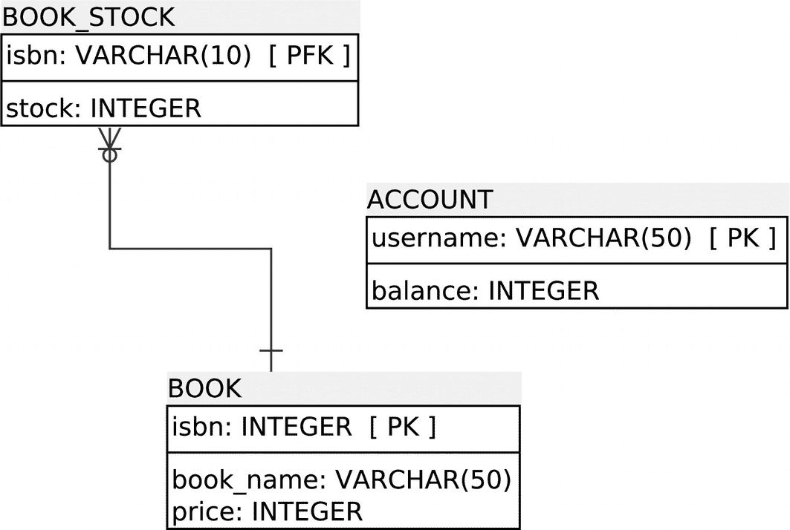
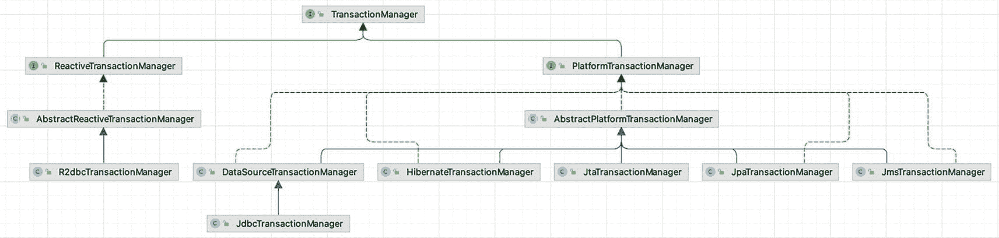
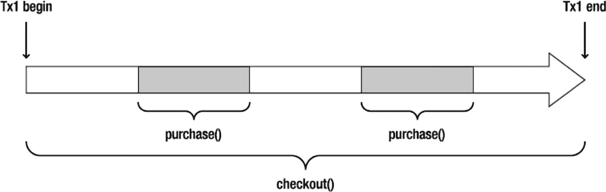
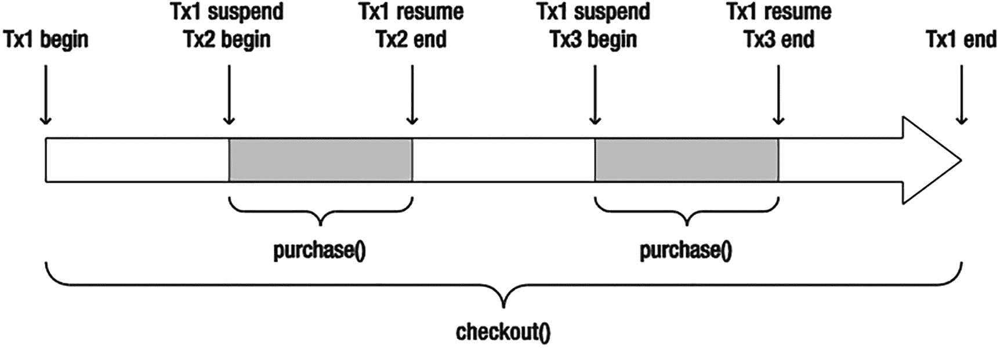

# 7. Spring 事务管理

在本章中，你将学习事务的基本概念以及 Spring 在事务管理方面的能力。事务管理是企业应用中确保数据完整性和一致性的关键技术。Spring 作为一个企业应用框架，在不同的事务管理 API 之上提供了一个抽象层。作为应用程序开发者，你可以使用 Spring 的事务管理工具，而无需深入了解底层的事务管理 API。

与 EJB 中的 Bean 管理事务（BMT）和容器管理事务（CMT）方法类似，Spring 同时支持编程式事务管理和声明式事务管理。Spring 事务支持的目标是通过向 POJO 添加事务能力，提供一种 EJB 事务的替代方案。

编程式事务管理是通过在业务方法中嵌入事务管理代码来实现的，以控制事务的提交和回滚。通常，如果方法正常完成，则提交事务；如果方法抛出特定类型的异常，则回滚事务。使用编程式事务管理，你可以定义自己的规则来提交和回滚事务。

然而，当以编程方式管理事务时，你必须在每个事务性操作中包含事务管理代码。因此，样板式的事务代码会在每个此类操作中重复出现。此外，你很难为不同的应用程序启用或禁用事务管理。如果你对 AOP 有扎实的理解，可能已经注意到事务管理是一种横切关注点。

在大多数情况下，声明式事务管理优于编程式事务管理。它是通过声明将事务管理代码与业务方法分离来实现的。事务管理作为一种横切关注点，可以通过 AOP 方法进行模块化。Spring 通过 Spring AOP 框架支持声明式事务管理。这可以帮助你更轻松地为应用程序启用事务，并定义一致的事务策略。声明式事务管理的灵活性不如编程式事务管理。

编程式事务管理允许你通过代码控制事务——根据你的需要显式地启动、提交和加入事务。你可以指定一组事务属性，以精细的粒度定义事务。Spring 支持的事务属性包括传播行为、隔离级别、回滚规则、事务超时以及事务是否为只读。这些属性允许你进一步自定义事务的行为。

完成本章后，你将能够在应用程序中应用不同的事务管理策略。此外，你将熟悉不同的事务属性，以便精细地定义事务。

在某些情况下，当你认为添加 Spring 代理不值得麻烦或可以忽略其性能损失时，编程式事务管理是一个好主意。此时，你可以自行访问原生事务并手动控制事务。一个更便捷的选择是使用 `TransactionTemplate` 类，它提供了一个模板方法，围绕该方法启动一个事务边界，然后提交事务，从而避免了 Spring 代理的开销。


## 7-1\. 事务管理的问题

事务管理是企业应用开发中确保数据完整性和一致性的关键技术。没有事务管理，你的数据和资源可能会被破坏，并处于不一致的状态。在并发和分布式环境中，事务管理对于从意外错误中恢复尤为重要。

简单来说，事务是一系列被视为单个工作单元的操作。这些操作要么全部完成，要么完全不生效。如果所有操作都顺利，事务应被永久提交。相反，如果其中任何一个操作出错，事务应回滚到初始状态，就像什么都没发生过一样。

事务的概念可以用四个关键属性来描述——原子性（Atomicity）、一致性（Consistency）、隔离性（Isolation）和持久性（Durability），即 ACID：

*   **原子性**：事务是由一系列操作组成的原子操作。事务的原子性确保这些操作要么全部完成，要么完全不生效。

*   **一致性**：一旦事务的所有操作完成，事务即被提交。此时，你的数据和资源将处于符合业务规则的一致状态。

*   **隔离性**：由于可能有许多事务同时处理同一数据集，每个事务应与其他事务隔离，以防止数据损坏。

*   **持久性**：一旦事务完成，其结果应是持久的，能够承受任何系统故障（想象一下，如果在事务提交过程中机器突然断电）。通常，事务的结果会被写入持久化存储。

为了理解事务管理的重要性，我们先从一个从在线书店购买书籍的例子开始。首先，你需要在数据库中为这个应用创建一个新的模式。我们选择使用 PostgreSQL 作为这些示例的数据库。本章的源代码包含一个 `bin` 目录，其中有两个脚本：一个（`postgres.sh`）用于下载 Docker 容器并启动一个默认的 Postgres 实例，另一个（`psql.sh`）用于连接到正在运行的 Postgres 实例。连接数据库所需的属性可以在表 7-1 中找到。

一个信息符号，由带阴影圆圈内的字母 i 图标表示。 本章的示例代码在 `bin` 目录中提供了用于启动和连接到基于 Docker 的 PostgreSQL 实例的脚本。要启动实例并创建数据库，请遵循以下步骤：

1.  执行 `bin\postgres.sh`；这将下载并启动 Postgres Docker 容器。

2.  执行 `bin\psql.sh`；这将连接到正在运行的 Postgres 容器。

3.  执行 `CREATE DATABASE bookstore` 来创建用于示例的数据库。

表 7-1

连接应用数据库的 JDBC 属性

| 属性 | 值 |
| --- | --- |
| 驱动类 | org.postgresql.Driver |
| URL | jdbc:postgresql://localhost:5432/bookstore |
| 用户名 | postgres |
| 密码 | password |

对于你的书店应用，你需要一个存储数据的地方。你将创建一个简单的数据库来管理书籍和账户。

这些表的实体关系（ER）图如图 7-1 所示。



一个块图包含 3 个块，分别是顶部的 BOOK STOCK（包含 isbn 和 stock），连接到 BOOK（包含 isbn、book name 和 price）。右侧是 ACCOUNT 块，包含 username 和 balance。

图 7-1

BOOK_STOCK 描述了给定 BOOK 的库存数量

现在，让我们为上述模型创建 SQL。执行 `bin\psql.sh` 命令连接到正在运行的容器并打开 `psql` 工具。

将以下 SQL 粘贴到 shell 中并验证其成功执行。

```
CREATE TABLE BOOK (
ISBN         VARCHAR(50)    NOT NULL,
BOOK_NAME    VARCHAR(100)   NOT NULL,
PRICE        INT,
PRIMARY KEY (ISBN)
);
CREATE TABLE BOOK_STOCK (
ISBN     VARCHAR(50)    NOT NULL,
STOCK    INT            NOT NULL,
PRIMARY KEY (ISBN),
CONSTRAINT positive_stock CHECK (STOCK >= 0)
);
CREATE TABLE ACCOUNT (
USERNAME    VARCHAR(50)    NOT NULL,
BALANCE     INT            NOT NULL,
PRIMARY KEY (USERNAME),
CONSTRAINT positive_balance CHECK (BALANCE >= 0)
);
清单 7-1
书店表
```

一个信息符号，由带阴影圆圈内的字母 i 图标表示。 这种类型的实际应用可能会使用 decimal 类型的价格字段，但使用 `int` 可以使编程更易于理解，因此这里保留为 `int`。

`BOOK` 表存储基本的书籍信息，如书名和价格，以书籍 ISBN 作为主键。`BOOK_STOCK` 表跟踪每本书的库存。库存值通过 `CHECK` 约束限制为正数。虽然 `CHECK` 约束类型在 SQL-99 中定义，但并非所有数据库引擎都支持它。如果你的数据库引擎不支持 `CHECK` 约束，请查阅其文档以了解类似的约束支持。最后，`ACCOUNT` 表存储客户账户及其余额。同样，余额被限制为正数。

你书店的操作在以下 `BookShop` 接口中定义。目前，只有一个操作：`purchase`。

```
package com.apress.spring6recipes.bookshop;
public interface BookShop {
void purchase(String isbn, String username);
}
清单 7-2
书店接口
```

因为你将使用 JDBC 实现此接口，所以创建以下 `JdbcBookShop` 类。为了更好地理解事务的本质，让我们在不借助 Spring JDBC 支持的情况下实现这个类。

```
package com.apress.spring6recipes.bookshop;
import java.sql.SQLException;
import javax.sql.DataSource;
public class JdbcBookShop implements BookShop {
private final DataSource dataSource;
public JdbcBookShop(DataSource dataSource) {
this.dataSource = dataSource;
}
public void purchase(String isbn, String username) {
try (var conn = dataSource.getConnection()) {
int price;
var PRICE_SQL = "SELECT PRICE FROM BOOK WHERE ISBN = ?";
try (var stmt1 = conn.prepareStatement(PRICE_SQL)) {
stmt1.setString(1, isbn);
try (var rs = stmt1.executeQuery()) {
rs.next();
price = rs.getInt("PRICE");
}
}
var STOCK_SQL = "UPDATE BOOK_STOCK SET STOCK = STOCK - 1 WHERE ISBN = ?";
try (var stmt2 = conn.prepareStatement(STOCK_SQL)) {
stmt2.setString(1, isbn);
stmt2.executeUpdate();
var BALANCE_SQL = "UPDATE ACCOUNT SET BALANCE = BALANCE - ? WHERE USERNAME = ?";
try (var stmt3 = conn.prepareStatement(BALANCE_SQL)) {
stmt3.setInt(1, price);
stmt3.setString(2, username);
stmt3.executeUpdate();
}
}
} catch (SQLException e) {
throw new RuntimeException(e);
}
}
}
清单 7-3
书店 JDBC 实现
```

对于 `purchase()` 操作，你总共需要执行三条 SQL 语句。第一条是查询书籍价格。第二条和第三条分别更新书籍库存和账户余额。然后，你可以在 Spring IoC 容器中声明一个 bookshop 实例来提供购买服务。为简单起见，你可以使用 `DriverManagerDataSource`，它为每个请求打开一个新的数据库连接。

一个信息符号，由带阴影圆圈内的字母 i 图标表示。 要访问 PostgreSQL 数据库，你必须将 Postgres 客户端库添加到你的 CLASSPATH 中。


```
package com.apress.spring6recipes.bookshop.config;
import javax.sql.DataSource;
import org.springframework.context.annotation.Bean;
import org.springframework.context.annotation.Configuration;
import org.springframework.jdbc.datasource.DriverManagerDataSource;
import com.apress.spring6recipes.bookshop.JdbcBookShop;
@Configuration
public class BookstoreConfiguration {
@Bean
public DriverManagerDataSource dataSource() {
var dataSource = new DriverManagerDataSource();
dataSource.setDriverClassName(org.postgresql.Driver.class.getName());
dataSource.setUrl("jdbc:postgresql://localhost:5432/bookstore");
dataSource.setUsername("postgres");
dataSource.setPassword("password");
return dataSource;
}
@Bean
public JdbcBookShop bookShop(DataSource dataSource) {
return new JdbcBookShop(dataSource);
}
}
清单 7-4
书店配置
```

为了演示没有事务管理时可能出现的问题，假设你的书店数据库中已录入表 7-2、7-3 和 7-4 所示的数据。

表 7-4
用于测试事务的 ACCOUNT 表示例数据

| USERNAME | BALANCE |
| --- | --- |
| user1 | 20 |

表 7-3
用于测试事务的 BOOK_STOCK 表示例数据

| ISBN | STOCK |
| --- | --- |
| 0001 | 10 |

表 7-2
用于测试事务的 BOOK 表示例数据

| ISBN | BOOK_NAME | PRICE |
| --- | --- | --- |
| 0001 | 第一本书 | 30 |

然后，编写以下 `Main` 类，用于让用户 user1 购买 ISBN 为 0001 的书籍。由于该用户的账户只有 20 美元，资金不足以购买这本书。

```
package com.apress.spring6recipes.bookshop;
import com.apress.spring6recipes.bookshop.config.BookstoreConfiguration;
import org.springframework.context.annotation.AnnotationConfigApplicationContext;
public class Main {
public static void main(String[] args) {
var cfg = BookstoreConfiguration.class;
try(var context = new AnnotationConfigApplicationContext(cfg)) {
var bookShop = context.getBean(BookShop.class);
bookShop.purchase("0001", "user1");
}
}
}
清单 7-5
用于测试书店应用的 Main 类
```

当你运行此应用时，会遇到一个 `SQLException`，因为 `ACCOUNT` 表的 CHECK 约束被违反了。这是预期结果，因为你试图扣减的金额超过了账户余额。

然而，如果你检查 `BOOK_STOCK` 表中该书的库存，你会发现它被这次失败的操作意外扣减了！原因在于，你在第三个语句抛出异常之前，已经执行了第二个 SQL 语句来扣减库存。

如你所见，缺乏事务管理会导致数据处于不一致状态。为了避免这种不一致，你的 `purchase` 操作中的三个 SQL 语句应该在一个事务内执行。一旦事务中的任何操作失败，整个事务就应该回滚，以撤销已执行操作所做的所有更改。

### 使用 JDBC 的提交和回滚管理事务

使用 JDBC 更新数据库时，默认情况下，每个 SQL 语句在执行后都会立即提交。这种行为称为自动提交。然而，它不允许你为操作管理事务。JDBC 支持通过显式调用连接上的 `commit()` 和 `rollback()` 方法来实现原始的事务管理策略。但在执行此操作之前，你必须关闭默认开启的自动提交。

```
package com.apress.spring6recipes.bookshop;
public class JdbcBookShop implements BookShop {
public void purchase(String isbn, String username) {
try (var conn = dataSource.getConnection()) {
try {
conn.setAutoCommit(false);
int price;
var BOOK_SQL = "SELECT PRICE FROM BOOK WHERE ISBN = ?";
try (var stmt1 = conn.prepareStatement(BOOK_SQL)) {
stmt1.setString(1, isbn);
try (var rs = stmt1.executeQuery()) {
rs.next();
price = rs.getInt("PRICE");
}
}
var STOCK_SQL = "UPDATE BOOK_STOCK SET STOCK = STOCK - 1 WHERE ISBN = ?";
try (var stmt2 = conn
.prepareStatement(STOCK_SQL)) {
stmt2.setString(1, isbn);
stmt2.executeUpdate();
}
var ACCOUNT_SQL = "UPDATE ACCOUNT SET BALANCE = BALANCE - ? WHERE USERNAME = ?";
try (var stmt3 = conn
.prepareStatement(ACCOUNT_SQL)) {
stmt3.setInt(1, price);
stmt3.setString(2, username);
stmt3.executeUpdate();
}
conn.commit();
} catch (SQLException ex) {
conn.rollback();
throw ex;
}
} catch (SQLException ex) {
throw new RuntimeException(ex);
}
}
}
清单 7-6
带事务的书店 JDBC 实现
```

数据库连接的自动提交行为可以通过调用 `setAutoCommit()` 方法来改变。默认情况下，自动提交是开启的，会在每个 SQL 语句执行后立即提交。要启用事务管理，你必须关闭此默认行为，并且仅当所有 SQL 语句都成功执行后才提交连接。如果任何语句出错，你必须回滚此连接所做的所有更改。

现在，如果你再次运行应用，当用户余额不足以购买书籍时，书籍库存将不会被扣减。

虽然你可以通过显式提交和回滚 JDBC 连接来管理事务，但为此所需的代码是样板代码，你必须在不同的方法中重复编写。此外，这段代码是 JDBC 特有的，因此一旦你选择了另一种数据访问技术，它也需要更改。Spring 的事务支持提供了一套与技术无关的工具，包括事务管理器（例如 `org.springframework.transaction.PlatformTransactionManager`）、事务模板（例如 `org.springframework.transaction.support.TransactionTemplate`）以及事务声明支持，以简化你的事务管理任务。

## 7-2. 选择事务管理器实现

### 问题

通常，如果你的应用只涉及单一数据源，你可以简单地通过调用数据库连接上的 `commit()` 和 `rollback()` 方法来管理事务。然而，如果你的事务跨越多个数据源，或者你更倾向于利用 Java EE 应用服务器提供的事务管理能力，你可以选择 Jakarta 事务 API（JTA）。此外，对于不同的对象/关系映射框架（如 Hibernate 和 JPA），你可能需要调用不同的专有事务 API。

因此，你必须为不同的技术处理不同的事务 API。这会使你很难从一套 API 切换到另一套。


### 解决方案

Spring 从不同的事务管理 API 中抽象出了一套通用的事务设施。作为应用程序开发者，你可以直接使用 Spring 的事务设施，而无需深入了解底层的事务 API。借助这些设施，你的事务管理代码将与任何特定的事务技术无关。

Spring 核心的事务管理抽象基于 `PlatformTransactionManager` 接口。它封装了一组与技术无关的事务管理方法。请记住，无论你在 Spring 中选择哪种事务管理策略（编程式或声明式），都需要一个事务管理器。`PlatformTransactionManager` 接口提供了三个用于处理事务的方法：

*   `TransactionStatus getTransaction(TransactionDefinition definition) throws TransactionException`

*   `void commit(TransactionStatus status) throws TransactionException;`

*   `void rollback(TransactionStatus status) throws TransactionException;`

Spring 的响应式事务管理抽象基于 `ReactiveTransactionManager` 接口，该接口与常规的 `PlatformTransactionManager` 非常相似，但采用了响应式风格。`ReactiveTransactionManager` 接口提供了三个用于处理事务的方法：

*   `Mono<ReactiveTransaction> getReactiveTransaction(TransactionDefinition definition) throws TransactionException;`

*   `Mono<Void> commit(ReactiveTransaction transaction) throws TransactionException;`

*   `Mono<Void> rollback(ReactiveTransaction transaction) throws TransactionException;`

### 工作原理

`PlatformTransactionManager` 和 `ReactiveTransactionManager` 是所有 Spring 事务管理器的通用接口。Spring 为这些接口提供了几个内置实现，用于配合不同的事务管理 API：

*   如果你的应用程序只需要处理单个数据源，并通过 JDBC 访问它，那么 `DataSourceTransactionManager` 就能满足你的需求。

*   如果你在 Jakarta EE 应用服务器上使用 JTA 进行事务管理，则应使用 `JtaTransactionManager` 从应用服务器查找事务。此外，`JtaTransactionManager` 也适用于分布式事务（跨多个资源的事务）。请注意，虽然通常使用 JTA 事务管理器来集成应用服务器的事务管理器，但你也可以使用独立的 JTA 事务管理器，例如 Atomikos。

*   如果你使用对象/关系映射框架来访问数据库，则应为此框架选择相应的事务管理器，例如 `HibernateTransactionManager` 或 `JpaTransactionManager`。

*   当使用 R2DBC 时，你需要 `R2dbcTransactionManager`。

图 7-2 展示了 Spring 中可用的常见实现。



一个流程图。从底部开始，J D B C 事务管理器连接到 DataSource 事务管理器，后者再与另外 4 个管理器一起连接到 Platform 事务管理器，最终到达事务管理器。左侧，R 2 D B C 事务管理器连接到 Abstract Reactive 和 Reactive 事务管理器，最终到达事务管理器。

图 7-2

Spring 中常见的事务管理器实现

事务管理器在 Spring IoC 容器中作为一个普通 Bean 进行声明。例如，以下 Bean 配置声明了一个 `DataSourceTransactionManager` 实例。它需要一个 `DataSource`，以便能够管理由此数据源创建的连接的事务。

```
@Bean
public DataSourceTransactionManager transactionManager(DataSource dataSource) {
return new DataSourceTransactionManager(dataSource)
}
清单 7-7
DataSourceTransactionManager 的 Bean
```

## 7-3\. 使用事务管理器 API 以编程方式管理事务

### 问题

你需要在业务方法中精确控制何时提交和回滚事务，但又不想直接处理底层的事务 API。

### 解决方案

Spring 的事务管理器提供了一个与技术无关的 API，允许你通过调用 `getTransaction()` 方法启动一个新事务（或获取当前活动的事务），并通过调用 `commit()` 和 `rollback()` 方法来管理它。由于 `PlatformTransactionManager` 是事务管理的抽象单元，因此你调用的事务管理方法保证是与技术无关的。

### 工作原理

尽管 `PlatformTransactionManager` 和 `ReactiveTransactionManager` 本质相似，但它们的编程模型不同。不过，对于两者，你都需要在应用上下文中声明一个 Bean，并将其注入到要使用它的类中。首先，我们将展示如何使用 `PlatformTransactionManager`，然后再展示如何使用 `ReactiveTransactionManager`。


#### 使用与配置 PlatformTransactionManager

为了演示如何使用事务管理器 API，让我们创建一个新类 `TransactionalJdbcBookShop`，它将使用 Spring JDBC 模板。由于该类需要处理事务管理器，因此需要添加一个 `PlatformTransactionManager` 类型的字段，并允许通过构造函数进行注入。

```
package com.apress.spring6recipes.bookshop;
import org.springframework.dao.DataAccessException;
import org.springframework.jdbc.core.support.JdbcDaoSupport;
import org.springframework.transaction.PlatformTransactionManager;
import org.springframework.transaction.TransactionDefinition;
import org.springframework.transaction.TransactionStatus;
import org.springframework.transaction.support.DefaultTransactionDefinition;
import javax.sql.DataSource;
public class TransactionalJdbcBookShop extends JdbcDaoSupport implements BookShop {
private final PlatformTransactionManager transactionManager;
public TransactionalJdbcBookShop(PlatformTransactionManager transactionManager, DataSource dataSource) {
this.transactionManager = transactionManager;
setDataSource(dataSource);
}
public void purchase(String isbn, String username) {
var def = new DefaultTransactionDefinition();
var status = transactionManager.getTransaction(def);
try {
var BOOK_SQL = "SELECT PRICE FROM BOOK WHERE ISBN = ?";
var price = getJdbcTemplate().queryForObject(BOOK_SQL, Integer.class, isbn);
var STOCK_SQL = "UPDATE BOOK_STOCK SET STOCK = STOCK - 1 WHERE ISBN = ?";
getJdbcTemplate().update(STOCK_SQL, isbn);
var BALANCE_SQL = "UPDATE ACCOUNT SET BALANCE = BALANCE - ? WHERE USERNAME = ?";
getJdbcTemplate().update(BALANCE_SQL, price, username);
transactionManager.commit(status);
}
catch (DataAccessException e) {
transactionManager.rollback(status);
throw e;
}
}
}
清单 7-8 使用 PlatformTransactionManager 的书店 JDBC 实现
```

在开始一个新事务之前，你需要在 `TransactionDefinition` 类型的事务定义对象中指定事务属性。对于这个示例，你可以简单地创建一个 `DefaultTransactionDefinition` 实例来使用默认的事务属性。

一旦有了事务定义，你就可以通过调用 `getTransaction()` 方法，要求事务管理器使用该定义启动一个新事务。然后，它会返回一个 `TransactionStatus` 对象来跟踪事务状态。如果所有语句都成功执行，你可以通过传入事务状态来要求事务管理器提交此事务。由于 Spring JDBC 模板抛出的所有异常都是 `DataAccessException` 的子类，因此当捕获到此类异常时，你可以要求事务管理器回滚事务。

在这个类中，你声明了通用类型 `PlatformTransactionManager` 的事务管理器属性。现在，你需要注入一个合适的事务管理器实现。由于你只处理单个数据源并通过 JDBC 访问它，因此应选择 `DataSourceTransactionManager`。同时，你还需要注入一个 `DataSource`，因为该类是 Spring 的 `JdbcDaoSupport` 的子类，而后者需要它。

```
@Configuration
public class BookstoreConfiguration {
@Bean
public DataSourceTransactionManager transactionManager(DataSource dataSource) {
return new DataSourceTransactionManager(dataSource);
}
@Bean
public TransactionalJdbcBookShop bookShop(DataSource dataSource, PlatformTransactionManager transactionManager) {
return new TransactionalJdbcBookShop(transactionManager, dataSource);
}
}
清单 7-9 书店配置
```

#### 使用与配置 ReactiveTransactionManager

为了演示如何使用响应式事务管理器 API，让我们创建一个新类 `TransactionalR2dbcBookShop`，它将使用 Spring R2DBC 的 `DatabaseClient`。由于该类需要处理事务管理器，因此需要添加一个 `ReactiveTransactionManager` 类型的字段，并允许通过构造函数进行注入。

```
package com.apress.spring6recipes.bookshop.reactive;
import org.springframework.r2dbc.core.DatabaseClient;
import org.springframework.transaction.ReactiveTransactionManager;
import org.springframework.transaction.support.DefaultTransactionDefinition;
import io.r2dbc.spi.ConnectionFactory;
import reactor.core.publisher.Mono;
public class TransactionalR2dbcBookShop implements BookShop {
private final ReactiveTransactionManager txManager;
private final DatabaseClient client;
public TransactionalR2dbcBookShop(ReactiveTransactionManager txManager,
ConnectionFactory cf) {
this.txManager = txManager;
this.client = DatabaseClient.create(cf);
}
public Mono purchase(String isbn, String username) {
var def = new DefaultTransactionDefinition();
var tx = txManager.getReactiveTransaction(def);
var BOOK_SQL = "SELECT PRICE FROM BOOK WHERE ISBN = $1";
var STOCK_SQL = "UPDATE BOOK_STOCK SET STOCK = STOCK - 1 WHERE ISBN = $1";
var BALANCE_SQL = "UPDATE ACCOUNT SET BALANCE = BALANCE - $1 WHERE USERNAME = $2";
return tx.flatMap((status) -> {
var price = client.sql(BOOK_SQL).bind("$1", isbn)
.map((row, meta) -> row.get("PRICE", Integer.class))
.one();
var stock = price.doOnNext((p) -> client.sql(STOCK_SQL)
.bind("$1", price).fetch());
var balance = stock.doOnNext((p) -> client.sql(BALANCE_SQL)
.bind("$1", price)
.bind("$2", username).fetch());
return balance.then(txManager.commit(status))
.onErrorResume((ex) -> txManager.rollback(status).then(Mono.error(ex)));
});
}
}
清单 7-10 使用 ReactiveTransactionManager 的响应式书店实现
```

在开始一个新事务之前，你需要在 `TransactionDefinition` 类型的事务定义对象中指定事务属性。对于这个示例，你可以简单地创建一个 `DefaultTransactionDefinition` 实例来使用默认的事务属性。

一旦有了事务定义，你就可以通过调用 `getReactiveTransaction()` 方法，要求事务管理器使用该定义启动一个新事务。然后，它会返回一个 `Mono<ReactiveTransaction>` 对象来跟踪事务状态。如果所有语句都成功执行，你可以通过传入事务状态来要求事务管理器提交此事务。如果发生错误，则执行回滚。

在这个类中，你声明了通用类型 `ReactiveTransactionManager` 的事务管理器属性。现在，你需要注入一个合适的事务管理器实现。由于你只处理单个数据源并通过 R2DBC 访问它，因此应选择 `R2dbcTransactionManager`。同时，你还需要注入一个 `ConnectionFactory`，以便能够创建 `DatabaseClient` 来执行数据访问。

```
@Configuration
public class ReactiveBookstoreConfiguration {
@Bean
public R2dbcTransactionManager transactionManager(ConnectionFactory cf) {
return new R2dbcTransactionManager(cf);
}
@Bean
public TransactionalR2dbcBookShop bookShop(ReactiveTransactionManager txManager, ConnectionFactory cf) {
return new TransactionalR2dbcBookShop(txManager, cf);
}
}
清单 7-11 响应式书店配置
```

## 7-4\. 使用事务模板以编程方式管理事务

### 问题

假设你有一个代码块（并非整个业务方法体），它有以下事务需求：

*   在代码块开始时启动一个新事务。

*   在代码块成功完成后提交事务。

*   如果代码块中抛出异常，则回滚事务。

如果你直接调用 Spring 的事务管理器 API，事务管理代码可以以与技术无关的方式进行通用化。然而，你可能不希望为每个类似的代码块重复编写样板代码。


### 解决方案

Spring 为常规数据访问和响应式数据访问都提供了一种模板方法来管理事务。对于常规数据访问，你可以使用 `TransactionTemplate`；对于响应式数据访问，则有 `TransactionalOperator`。这两个类都简化了编程式事务管理。它们以一种你无需显式启动、提交或回滚事务的方式简化了操作。传递给任一 `execute` 方法的 `TransactionCallback` 中的代码就是事务单元。事务将在执行时启动，并在结束时提交（或回滚）。

Spring 提供的模板对象是轻量级的，通常可以丢弃或重新创建而不会影响性能。例如，JDBC 模板可以通过 `DataSource` 引用即时重新创建，同样，`TransactionTemplate` 也可以通过提供事务管理器引用来重新创建。当然，你也可以直接在 Spring 应用上下文中创建一个。

### 工作原理

#### 使用 TransactionTemplate

与 JDBC 模板类似，Spring 也提供了 `TransactionTemplate` 来帮助你控制整个事务管理流程和事务异常处理。你只需将代码块封装在实现 `TransactionCallback` 接口的回调类中，并将其传递给 `TransactionTemplate` 的 execute 方法执行即可。这样，你就不需要为这个代码块重复编写样板式的事务管理代码了。

`TransactionTemplate` 是基于事务管理器创建的，就像 JDBC 模板是基于数据源创建的一样。事务模板执行一个封装了事务代码块的事务回调对象。你可以将回调接口实现为单独的类或内部类。如果实现为内部类，则必须将方法参数声明为 final 才能访问。

```
package com.apress.spring6recipes.bookshop;
import org.springframework.jdbc.core.support.JdbcDaoSupport;
import org.springframework.transaction.PlatformTransactionManager;
import org.springframework.transaction.TransactionStatus;
import org.springframework.transaction.support.TransactionCallbackWithoutResult;
import org.springframework.transaction.support.TransactionTemplate;
import javax.sql.DataSource;
public class TransactionalJdbcBookShop extends JdbcDaoSupport implements BookShop {
private final PlatformTransactionManager transactionManager;
public TransactionalJdbcBookShop(PlatformTransactionManager txManager, DataSource ds) {
this.transactionManager = txManager;
setDataSource(ds);
}
public void purchase(final String isbn, final String username) {
var txTemplate = new TransactionTemplate(transactionManager);
txTemplate.execute(new TransactionCallbackWithoutResult() {
protected void doInTransactionWithoutResult(TransactionStatus ts) {
var BOOK_SQL = "SELECT PRICE FROM BOOK WHERE ISBN = ?";
int price = getJdbcTemplate().queryForObject(BOOK_SQL, Integer.class, isbn);
var STOCK_SQL = "UPDATE BOOK_STOCK SET STOCK = STOCK - 1 WHERE ISBN = ?";
getJdbcTemplate().update(STOCK_SQL, isbn);
var BALANCE_SQL = "UPDATE ACCOUNT SET BALANCE = BALANCE - ? WHERE USERNAME = ?";
getJdbcTemplate().update(BALANCE_SQL, price, username);
}
});
}
}
清单 7-12
使用 TransactionTemplate 的 Bookstore JDBC 实现 - 注入 PlatformTransactionManager
```

`TransactionTemplate` 可以接受一个事务回调对象，该对象实现 `TransactionCallback` 接口，或者是该接口的一个框架提供的实现类 `TransactionCallbackWithoutResult` 的实例。对于 `purchase()` 方法中用于扣除图书库存和账户余额的代码块，没有返回值，因此使用 `TransactionCallbackWithoutResult` 即可。对于任何有返回值的代码块，则应使用 `TransactionCallback<T>` 接口。回调对象的返回值最终将由模板的 `T execute()` 方法返回。其主要好处是，启动、回滚或提交事务的责任已被移除。

在回调对象执行期间，如果它抛出了非受检异常（例如，`RuntimeException` 和 `DataAccessException` 属于此类），或者你在 `doInTransactionWithoutResult` 方法中显式调用了 `TransactionStatus` 参数的 `setRollbackOnly()` 方法，则事务将被回滚。否则，事务将在回调对象完成后提交。

在 Bean 配置文件中，bookshop Bean 仍然需要一个事务管理器来创建 `TransactionTemplate`。

```
@Configuration
public class BookstoreConfiguration {
@Bean
public DataSourceTransactionManager transactionManager(DataSource ds) {
return new DataSourceTransactionManager(ds);
}
@Bean
public TransactionalJdbcBookShop bookShop(PlatformTransactionManager ptm,
DataSource dataSource) {
return new TransactionalJdbcBookShop(ptm, dataSource);
}
}
清单 7-13
Bookstore 配置
```

你也可以让 IoC 容器注入一个事务模板，而不是直接创建它。因为事务模板处理所有事务，所以你的类不再需要引用事务管理器。

```
package com.apress.spring6recipes.bookshop;
import org.springframework.jdbc.core.support.JdbcDaoSupport;
import org.springframework.transaction.TransactionStatus;
import org.springframework.transaction.support.TransactionCallbackWithoutResult;
import org.springframework.transaction.support.TransactionTemplate;
import javax.sql.DataSource;
public class TransactionalJdbcBookShop extends JdbcDaoSupport implements BookShop {
private final TransactionTemplate transactionTemplate;
public TransactionalJdbcBookShop(TransactionTemplate txTemplate, DataSource ds) {
this.transactionTemplate = txTemplate;
setDataSource(ds);
}
public void purchase(final String isbn, final String username) {
transactionTemplate.execute(new TransactionCallbackWithoutResult() {
protected void doInTransactionWithoutResult(TransactionStatus ts) {
var BOOK_SQL = "SELECT PRICE FROM BOOK WHERE ISBN = ?";
int price = getJdbcTemplate().queryForObject(BOOK_SQL, Integer.class, isbn);
var STOCK_SQL = "UPDATE BOOK_STOCK SET STOCK = STOCK - 1 WHERE ISBN = ?";
getJdbcTemplate().update(STOCK_SQL, isbn);
var BALANCE_SQL = "UPDATE ACCOUNT SET BALANCE = BALANCE - ? WHERE USERNAME = ?";
getJdbcTemplate().update(BALANCE_SQL, price, username);
}
});
}
}
清单 7-14
使用注入的 TransactionTemplate 的 Bookstore JDBC 实现
```

然后，在 Bean 配置文件中定义一个事务模板，并将其注入到你的 bookshop Bean 中，而不是注入事务管理器。请注意，事务模板实例可以用于多个事务性 Bean，因为它是一个线程安全对象。最后，不要忘记为你的事务模板设置事务管理器属性。

```
@Configuration
public class BookstoreConfiguration {
@Bean
public DataSourceTransactionManager transactionManager(DataSource dataSource) {
return new DataSourceTransactionManager(dataSource);
}
@Bean
public TransactionTemplate transactionTemplate(PlatformTransactionManager ptm) {
return new TransactionTemplate(ptm);
}
@Bean
public TransactionalJdbcBookShop bookShop(DataSource ds, TransactionTemplate tt) {
return new TransactionalJdbcBookShop(tt, ds);
}
}
清单 7-15
Bookstore 配置
```


#### 使用 TransactionalOperator

`TransactionalOperator` 基于事务管理器创建。它执行一个封装了事务性代码块的事务回调对象。你可以将回调接口实现为单独的类或内部类。如果实现为内部类，则必须将方法参数声明为 `final` 才能访问。

```
package com.apress.spring6recipes.bookshop.reactive;
import org.springframework.r2dbc.core.DatabaseClient;
import org.springframework.transaction.ReactiveTransactionManager;
import org.springframework.transaction.reactive.TransactionalOperator;
import io.r2dbc.spi.ConnectionFactory;
import reactor.core.publisher.Mono;
public class TransactionalR2dbcBookShop implements BookShop {
private final ReactiveTransactionManager txManager;
private final DatabaseClient client;
public TransactionalR2dbcBookShop(ReactiveTransactionManager txManager,
ConnectionFactory cf) {
this.txManager = txManager;
this.client = DatabaseClient.create(cf);
}
public Mono purchase(String isbn, String username) {
var tx = TransactionalOperator.create(txManager);
var BOOK_SQL = "SELECT PRICE FROM BOOK WHERE ISBN = $1";
var STOCK_SQL = "UPDATE BOOK_STOCK SET STOCK = STOCK - 1 WHERE ISBN = $1";
var BALANCE_SQL = "UPDATE ACCOUNT SET BALANCE = BALANCE - $1 WHERE USERNAME = $2";
var price = client.sql(BOOK_SQL).bind("$1", isbn)
.map((row, meta) -> row.get("PRICE", Integer.class))
.one();
var stock = price.doOnNext((p) -> client.sql(STOCK_SQL)
.bind("$1", price).fetch());
var balance = stock.doOnNext((p) -> client.sql(BALANCE_SQL)
.bind("$1", price)
.bind("$2", username).fetch());
return balance.as(tx::transactional).then();
}
}
清单 7-16
使用注入的 TransactionalOperator 实现的响应式书店
```

`TransactionalOperator` 可以接受一个实现了 `TransactionCallback` 接口的事务回调对象。回调对象的返回值最终会由模板的 `T execute()` 方法返回。其主要好处是，启动、回滚或提交事务的责任已被移除。

在回调对象执行期间，如果它抛出了非受检异常（例如，`RuntimeException` 和 `DataAccessException` 属于此类），或者你在 `execute` 方法中显式地对 `ReactiveTransaction` 参数调用了 `setRollbackOnly()`，则事务将被回滚。否则，事务将在回调对象完成后提交。

在 Bean 配置文件中，bookshop Bean 仍然需要一个事务管理器来创建 `TransactionalOperator`。

```
@Configuration
public class ReactiveBookstoreConfiguration {
@Bean
public R2dbcTransactionManager transactionManager(ConnectionFactory cf) {
return new R2dbcTransactionManager(cf);
}
@Bean
public TransactionalR2dbcBookShop bookShop(ReactiveTransactionManager rtm, ConnectionFactory cf) {
return new TransactionalR2dbcBookShop(rtm, cf);
}
}
清单 7-17
响应式书店配置
```

你也可以让 IoC 容器注入一个 `TransactionalOperator`，而不是直接创建它。因为 `TransactionalOperator` 处理所有事务，所以你的类不再需要引用事务管理器。

```
package com.apress.spring6recipes.bookshop.reactive;
import org.springframework.r2dbc.core.DatabaseClient;
import org.springframework.transaction.reactive.TransactionalOperator;
import io.r2dbc.spi.ConnectionFactory;
import reactor.core.publisher.Mono;
public class TransactionalR2dbcBookShop implements BookShop {
private final TransactionalOperator txOperator;
private final DatabaseClient client;
public TransactionalR2dbcBookShop(TransactionalOperator txOperator,
ConnectionFactory cf) {
this.txOperator = txOperator;
this.client = DatabaseClient.create(cf);
}
public Mono purchase(String isbn, String username) {
var BOOK_SQL = "SELECT PRICE FROM BOOK WHERE ISBN = $1";
var STOCK_SQL = "UPDATE BOOK_STOCK SET STOCK = STOCK - 1 WHERE ISBN = $1";
var BALANCE_SQL = "UPDATE ACCOUNT SET BALANCE = BALANCE - $1 WHERE USERNAME = $2";
var price = client.sql(BOOK_SQL).bind("$1", isbn)
.map((row, meta) -> row.get("PRICE", Integer.class))
.one();
var stock = price.doOnNext((p) -> client.sql(STOCK_SQL)
.bind("$1", price).fetch());
var balance = stock.doOnNext((p) -> client.sql(BALANCE_SQL)
.bind("$1", price)
.bind("$2", username).fetch());
return balance.as(txOperator::transactional).then();
}
}
清单 7-18
使用注入的 TransactionalOperator 实现的响应式书店
```

然后，在 Bean 配置文件中定义一个 `TransactionalOperator`，并将其注入到你的 bookshop Bean 中，而不是注入事务管理器。请注意，`TransactionalOperator` 实例可以用于多个事务性 Bean，因为它是一个线程安全对象。

```
@Configuration
public class ReactiveBookstoreConfiguration {
@Bean
public R2dbcTransactionManager transactionManager(ConnectionFactory cf) {
return new R2dbcTransactionManager(cf);
}
清单 7-19
响应式书店配置
```

## 7-5\. 使用 @Transactional 注解声明式管理事务

### 问题

在 Bean 配置文件中声明事务需要了解 AOP 概念，例如切点、通知和顾问。缺乏这方面知识的开发者可能会觉得启用声明式事务管理很困难。

### 解决方案

Spring 允许你通过简单地在事务性方法上添加 `@Transactional` 注解，并在配置类上添加 `@EnableTransactionManagement` 注解来声明事务。


### 工作原理

要将一个方法定义为事务性方法，只需使用 `@Transactional` 对其进行注解即可。请注意，由于 Spring AOP 基于代理的限制，你只应对 `public` 方法进行注解。

```
package com.apress.spring6recipes.bookshop;
import org.springframework.jdbc.core.support.JdbcDaoSupport;
import org.springframework.transaction.annotation.Transactional;
import javax.sql.DataSource;
public class JdbcBookShop extends JdbcDaoSupport implements BookShop {
public JdbcBookShop(DataSource dataSource) {
setDataSource(dataSource);
}
@Transactional
public void purchase(String isbn, String username) {
var BOOK_SQL = "SELECT PRICE FROM BOOK WHERE ISBN = ?";
int price = getJdbcTemplate().queryForObject(BOOK_SQL, Integer.class, isbn);
var STOCK_SQL = "UPDATE BOOK_STOCK SET STOCK = STOCK - 1 WHERE ISBN = ?";
getJdbcTemplate().update(STOCK_SQL, isbn);
var BALANCE_SQL = "UPDATE ACCOUNT SET BALANCE = BALANCE - ? WHERE USERNAME = ?";
getJdbcTemplate().update(BALANCE_SQL, price, username);
}
}
清单 7-20
使用 @Transactional 的 JDBC 书店实现
```

请注意，由于我们继承了 `JdbcDaoSupport`，因此不再需要 `DataSource` 的修改器；请将其从你的 DAO 类中移除。

```
package com.apress.spring6recipes.bookshop.reactive;
import org.springframework.r2dbc.core.DatabaseClient;
import org.springframework.transaction.annotation.Transactional;
import io.r2dbc.spi.ConnectionFactory;
import reactor.core.publisher.Mono;
public class TransactionalR2dbcBookShop implements BookShop {
private final DatabaseClient client;
public TransactionalR2dbcBookShop(ConnectionFactory cf) {
this.client = DatabaseClient.create(cf);
}
@Transactional
public Mono purchase(String isbn, String username) {
var BOOK_SQL = "SELECT PRICE FROM BOOK WHERE ISBN = $1";
var STOCK_SQL = "UPDATE BOOK_STOCK SET STOCK = STOCK - 1 WHERE ISBN = $1";
var BALANCE_SQL = "UPDATE ACCOUNT SET BALANCE = BALANCE - $1 WHERE USERNAME = $2";
var price = client.sql(BOOK_SQL).bind("$1", isbn)
.map((row, meta) -> row.get("PRICE", Integer.class))
.one();
var stock = price.doOnNext((p) -> client.sql(STOCK_SQL).bind("$1", price).fetch());
var balance = stock.doOnNext((p) -> client.sql(BALANCE_SQL)
.bind("$1", price)
.bind("$2", username).fetch());
return balance.then();
}
}
清单 7-21
使用 @Transactional 的响应式书店实现
```

你可以在方法级别或类级别应用 `@Transactional` 注解。当将此注解应用于类时，该类中的所有 `public` 方法都将被定义为事务性方法。虽然你可以将 `@Transactional` 应用于接口或接口中的方法声明，但不建议这样做，因为它可能无法与基于类的代理（即 CGLIB 代理）正常工作。

在 Java 配置类中，你必须添加 `@EnableTransactionManagement` 注解。这就是使其工作所需的全部内容。Spring 将为 IoC 容器中声明的 bean 中带有 `@Transactional` 的方法，或带有 `@Transactional` 的类中的方法提供通知。因此，Spring 可以为这些方法管理事务。

```
@Configuration
@EnableTransactionManagement
public class BookstoreConfiguration {  ... }
清单 7-22
@EnableTransactionManagement 的配置
```

## 7-6\. 设置传播事务属性

### 问题

当一个事务性方法被另一个方法调用时，有必要指定事务应如何传播。例如，该方法可以继续在现有事务内运行，或者它可以启动一个新事务并在其自身的事务内运行。

### 解决方案

事务的传播行为可以通过传播事务属性来指定。Spring 定义了七种传播行为，如表 7-5 所示。这些行为定义在 `org.springframework.transaction.TransactionDefinition` 接口中。请注意，并非所有类型的事务管理器都支持所有这些传播行为。它们的行为取决于底层资源。例如，数据库可能支持不同的隔离级别，这限制了事务管理器可以支持的传播行为。

表 7-5

Spring 支持的传播行为

| 传播行为 | 描述 |
| --- | --- |
| REQUIRED | 如果当前存在一个正在进行的事务，则当前方法应在此事务内运行。否则，它应启动一个新事务并在其自身的事务内运行。 |
| REQUIRES_NEW | 当前方法必须启动一个新事务并在其自身的事务内运行。如果当前存在一个正在进行的事务，则应将其挂起。 |
| SUPPORTS | 如果当前存在一个正在进行的事务，则当前方法可以在此事务内运行。否则，不必在事务内运行。 |
| NOT_SUPPORTED | 当前方法不应在事务内运行。如果当前存在一个正在进行的事务，则应将其挂起。 |
| MANDATORY | 当前方法必须在事务内运行。如果当前没有正在进行的事务，则会抛出异常。 |
| NEVER | 当前方法不应在事务内运行。如果当前存在一个正在进行的事务，则会抛出异常。 |
| NESTED | 如果当前存在一个正在进行的事务，则当前方法应在此事务的嵌套事务内运行。否则，它应启动一个新事务并在其自身的事务内运行。此功能是 Spring 独有的（而之前的传播行为在 Jakarta EE 事务传播中有对应的实现）。此行为适用于诸如批处理等情况，其中你有一个长时间运行的过程（想象一下处理 100 万条记录），并且你希望将提交分块处理。因此，你每处理 10,000 条记录提交一次。如果出现问题，你回滚嵌套事务，并且只丢失了 10,000 条记录的工作量（而不是整个 100 万条）。 |


### 工作原理

当一个事务性方法被另一个方法调用时，就会发生事务传播。例如，假设一位顾客想在书店收银台结账购买所有书籍。为了支持此操作，你定义了如下 `Cashier` 接口。

```
package com.apress.spring6recipes.bookshop;
import java.util.List;
public interface Cashier {
void checkout(List isbns, String username);
}
清单 7-23
Cashier 接口
```

你可以通过多次调用 `bookshop` bean 的 `purchase()` 方法，将购买操作委托给它来实现此接口。请注意，`checkout()` 方法通过应用 `@Transactional` 注解被设置为事务性的。

```
package com.apress.spring6recipes.bookshop;
import java.util.List;
import org.springframework.transaction.annotation.Transactional;
public class BookShopCashier implements Cashier {
private final BookShop bookShop;
public BookShopCashier(BookShop bookShop) {
this.bookShop = bookShop;
}
@Transactional
public void checkout(List isbns, String username) {
isbns.forEach(isbn -> bookShop.purchase(isbn, username));
}
}
清单 7-24
Cashier 实现
```

然后，在你的 bean 配置文件中定义一个 cashier bean，并引用 bookshop bean 来购买书籍。

```
@Configuration
@EnableTransactionManagement()
public class BookstoreConfiguration {
...
@Bean
public Cashier cashier(BookShop bookShop) {
return new BookShopCashier(bookShop);
}
}
清单 7-25
Cashier 的书店配置
```

为了说明事务的传播行为，请在书店数据库中输入表 7-6、7-7 和 7-8 中显示的数据。

表 7-8

用于测试传播行为的 ACCOUNT 表中的示例数据

| USERNAME | BALANCE |
| --- | --- |
| user1 | 40 |

表 7-7

用于测试传播行为的 BOOK_STOCK 表中的示例数据

| ISBN | STOCK |
| --- | --- |
| 0001 | 10 |
| 0002 | 10 |

表 7-6

用于测试传播行为的 BOOK 表中的示例数据

| ISBN | BOOK_NAME | PRICE |
| --- | --- | --- |
| 0001 | 第一本书 | 30 |
| 0002 | 第二本书 | 50 |

#### REQUIRED 传播行为

当用户 user1 从收银台结账购买这两本书时，其余额足够购买第一本书，但不足以购买第二本。

```
package com.apress.spring6recipes.bookshop;
import java.util.List;
import com.apress.spring6recipes.bookshop.config.BookstoreConfiguration;
import org.springframework.context.annotation.AnnotationConfigApplicationContext;
public class Main {
public static void main(String[] args) {
var cfg =BookstoreConfiguration.class;
try (var context = new AnnotationConfigApplicationContext(cfg)) {
var isbnList = List.of("0001", "0002");
var cashier = context.getBean(Cashier.class);
cashier.checkout(isbnList, "user1");
}
}
}
清单 7-26
用于测试 Cashier 的主类
```

当 bookshop 的 `purchase()` 方法被另一个事务性方法（例如 `checkout()`）调用时，默认情况下它将在现有事务内运行。这种默认的传播行为称为 REQUIRED。这意味着只有一个事务，其边界是 `checkout()` 方法的开始和结束。该事务仅在 `checkout()` 方法结束时提交。因此，用户将无法购买任何一本书。

图 7-3 说明了 REQUIRED 传播行为。



一个箭头图，左侧输入为 T x 1，箭头内部有两个交替的块表示 purchase，并以输出 T x 1 end 结束。从 T x 1 begin 到 T x 1 end 表示 checkout 方法。

图 7-3

REQUIRED 事务传播行为

然而，如果 `purchase()` 方法被一个非事务性方法调用，并且当前没有正在运行的事务，那么它将启动一个新事务并在其自己的事务内运行。传播事务属性可以在 `@Transactional` 注解中定义。例如，你可以为此属性设置 REQUIRED 行为，如下所示。实际上，这并非必要，因为它是默认行为。

```
package com.apress.spring6recipes.bookshop.spring;
...
import org.springframework.transaction.annotation.Propagation;
import org.springframework.transaction.annotation.Transactional;
public class BookShopCashier implements Cashier {
...
@Transactional(propagation = Propagation.REQUIRED)
public void checkout(List isbns, String username) {
...
}
}
清单 7-28
使用带有 propagation REQUIRED 的 @Transactional 的 Cashier
```

```
package com.apress.spring6recipes.bookshop.spring;
...
import org.springframework.transaction.annotation.Propagation;
import org.springframework.transaction.annotation.Transactional;
public class JdbcBookShop extends JdbcDaoSupport implements BookShop {
@Transactional(propagation = Propagation.REQUIRED)
public void purchase(String isbn, String username) {
...
}
}
清单 7-27
使用带有 propagation REQUIRED 的 @Transactional 的书店
```

#### REQUIRES_NEW 传播行为

另一种常见的传播行为是 REQUIRES_NEW。它表示该方法必须启动一个新事务并在其新事务内运行。如果当前有一个正在运行的事务，则应首先将其挂起（例如，`BookShopCashier` 上的 `checkout` 方法，其传播行为为 REQUIRED）。

```
package com.apress.spring6recipes.bookshop.spring;
...
import org.springframework.transaction.annotation.Propagation;
import org.springframework.transaction.annotation.Transactional;
public class JdbcBookShop extends JdbcDaoSupport implements BookShop {
@Transactional(propagation = Propagation.REQUIRES_NEW)
public void purchase(String isbn, String username) {
...
}
}
清单 7-29
使用带有 propagation REQUIRES_NEW 的 @Transactional 的书店
```

在这种情况下，总共将启动三个事务。第一个事务由 `checkout()` 方法启动，但当第一个 `purchase()` 方法被调用时，第一个事务将被挂起，并启动一个新事务。在第一个 `purchase()` 方法结束时，新事务完成并提交。当第二个 `purchase()` 方法被调用时，将启动另一个新事务。然而，该事务将失败并回滚。因此，第一本书将成功购买，而第二本则不会。图 7-4 说明了 REQUIRES_NEW 传播行为。



一个箭头图，左侧输入为 T x 1，接着是 T x 1 suspend T x 2 begin，T x 1 resume T x 2 end，T x 1 suspend T x 3 begin，T x 1 resume T x 3 end，并以 T x 1 end 结束。箭头内部的两个块表示 purchase。从 T x 1 begin 到 T x 1 end 表示 checkout 方法。

图 7-4

REQUIRES_NEW 事务传播行为

## 7-7\. 设置隔离事务属性

### 问题

当同一应用程序或不同应用程序的多个事务同时操作同一数据集时，可能会出现许多意外问题。你必须指定你希望事务如何相互隔离。


### 解决方案

并发事务所引发的问题可分为以下四类：

*   **脏读**：对于事务 T1 和 T2，T1 读取了 T2 已更新但尚未提交的字段。之后，如果 T2 回滚，T1 读取的字段将是临时且无效的。

*   **不可重复读**：对于事务 T1 和 T2，T1 读取了一个字段，随后 T2 更新了该字段。之后，如果 T1 再次读取同一字段，其值将发生变化。

*   **幻读**：对于事务 T1 和 T2，T1 从表中读取了一些行，随后 T2 向表中插入了新行。之后，如果 T1 再次读取同一张表，将会出现额外的行。

*   **丢失更新**：对于事务 T1 和 T2，它们都选择了一行进行更新，并基于该行的状态对其进行了修改。因此，当第二个提交的事务本应等待第一个事务提交后再执行其选择操作时，其中一个事务覆盖了另一个事务的更新。

理论上，事务之间应完全隔离（即可串行化），以避免上述所有问题。然而，这种隔离级别会对性能产生巨大影响，因为事务必须按串行顺序执行。在实践中，为了提升性能，事务可以在较低的隔离级别下运行。

事务的隔离级别可以通过事务隔离属性来指定。Spring 支持五种隔离级别，如表 7-9 所示。这些级别定义在 `org.springframework.transaction.TransactionDefinition` 接口中。

表 7-9

Spring 支持的隔离级别

| 隔离级别 | 描述 |
| --- | --- |
| DEFAULT | 使用底层数据库的默认隔离级别。对于大多数数据库，默认隔离级别是 READ_COMMITTED。 |
| READ_UNCOMMITTED | 允许一个事务读取其他事务未提交的更改。可能会发生脏读、不可重复读和幻读问题。 |
| READ_COMMITTED | 允许一个事务仅读取其他事务已提交的更改。可以避免脏读问题，但仍可能发生不可重复读和幻读问题。 |
| REPEATABLE_READ | 确保一个事务可以多次从某个字段读取相同的值。在该事务持续期间，禁止其他事务对该字段进行更新。可以避免脏读和不可重复读问题，但仍可能发生幻读问题。 |
| SERIALIZABLE | 确保一个事务可以多次从表中读取相同的行。在该事务持续期间，禁止其他事务对该表进行插入、更新和删除操作。可以避免所有并发问题，但性能会较低。 |

一个信息符号，由带阴影圆圈内的字母 i 图标表示。 事务隔离由底层数据库引擎支持，而非应用程序或框架。然而，并非所有数据库引擎都支持所有这些隔离级别。你可以通过调用 `java.sql.Connection` 接口上的 `setTransactionIsolation()` 方法来更改 JDBC 连接的隔离级别。

### 工作原理

为了说明并发事务所引发的问题，让我们为你的书店新增两个操作，用于增加和检查图书库存。

```
package com.apress.spring6recipes.bookshop;
public interface BookShop {
void purchase(String isbn, String username);
void increaseStock(String isbn, int stock);
int checkStock(String isbn);
}
清单 7-30
修改后的 BookShop 接口
```

然后，你按如下方式实现这些操作。请注意，这两个操作必须声明为事务性的。

```
package com.apress.spring6recipes.bookshop;
import com.apress.spring6recipes.utils.Utils;
import org.springframework.jdbc.core.support.JdbcDaoSupport;
import org.springframework.transaction.annotation.Isolation;
import org.springframework.transaction.annotation.Transactional;
import javax.sql.DataSource;
public class JdbcBookShop extends JdbcDaoSupport implements BookShop {
public JdbcBookShop(DataSource dataSource) {
setDataSource(dataSource);
}
@Transactional
public void purchase(String isbn, String username) {
var BOOK_SQL = "SELECT PRICE FROM BOOK WHERE ISBN = ?";
int price = getJdbcTemplate().queryForObject(BOOK_SQL, Integer.class, isbn);
var STOCK_SQL = "UPDATE BOOK_STOCK SET STOCK = STOCK - 1 WHERE ISBN = ?";
getJdbcTemplate().update(STOCK_SQL, isbn);
var BALANCE_SQL = "UPDATE ACCOUNT SET BALANCE = BALANCE - ? WHERE USERNAME = ?";
getJdbcTemplate().update(BALANCE_SQL, price, username);
}
@Transactional
public void increaseStock(String isbn, int stock) {
String threadName = Thread.currentThread().getName();
System.out.println(threadName + " - 准备增加图书库存");
var STOCK_SQL = "UPDATE BOOK_STOCK SET STOCK = STOCK + ? WHERE ISBN = ?";
getJdbcTemplate().update(STOCK_SQL, stock, isbn);
System.out.println(threadName + " - 图书库存增加了 " + stock);
sleep(threadName);
System.out.println(threadName + " - 图书库存已回滚");
throw new RuntimeException("误操作增加库存");
}
@Transactional(isolation = Isolation.READ_UNCOMMITTED)
public int checkStock(String isbn) {
String threadName = Thread.currentThread().getName();
System.out.println(threadName + " - 准备检查图书库存");
var STOCK_SQL = "SELECT STOCK FROM BOOK_STOCK WHERE ISBN = ?";
int stock = getJdbcTemplate().queryForObject(STOCK_SQL, Integer.class, isbn);
System.out.println(threadName + " - 图书库存为 " + stock);
sleep(threadName);
return stock;
}
private void sleep(String threadName) {
System.out.println(threadName + " - 休眠中");
Utils.sleep(10000);
System.out.println(threadName + " - 唤醒");
}
}
清单 7-31
修改后的 BookShop 实现
```

为了模拟并发，你的操作需要由多个线程执行。你可以通过 println 语句跟踪操作的当前状态。对于每个操作，你会在 SQL 语句执行前后向控制台打印几条消息。这些消息应包含线程名称，以便你知道当前是哪个线程在执行操作。

每个操作执行完 SQL 语句后，你让线程休眠 10 秒钟。如你所知，事务会在操作完成后立即提交或回滚。插入休眠语句有助于延迟提交或回滚。对于 `increase()` 操作，你最终会抛出一个 `RuntimeException` 来导致事务回滚。让我们来看一个运行这些示例的简单客户端。

在开始隔离级别示例之前，请将表 7-10 和 7-11 中的数据输入到你的书店数据库中。（注意：本例中不需要 `ACCOUNT` 表。）

表 7-11

用于测试隔离级别的 BOOK_STOCK 表中的示例数据

| ISBN | STOCK |
| --- | --- |
| 0001 | 10 |

表 7-10

用于测试隔离级别的 BOOK 表中的示例数据

| ISBN | BOOK_NAME | PRICE |
| --- | --- | --- |
| 0001 | 第一本书 | 30 |


#### READ_UNCOMMITTED 和 READ_COMMITTED 隔离级别

READ_UNCOMMITTED 是最低的隔离级别，它允许一个事务读取其他事务所做的未提交更改。你可以在 `checkStock()` 方法的 `@Transaction` 注解中设置此隔离级别。

```
package com.apress.spring6recipes.bookshop.spring;
...
import org.springframework.transaction.annotation.Isolation;
import org.springframework.transaction.annotation.Transactional;
public class JdbcBookShop extends JdbcDaoSupport implements BookShop {
...
@Transactional(isolation = Isolation.READ_UNCOMMITTED)
public int checkStock(String isbn) {
...
}
}
清单 7-32
使用 READ_UNCOMMITTED 隔离级别的 BookShop
```

你可以创建一些线程来试验这种事务隔离级别。在下面的 `Main` 类中，你将创建两个线程。线程 1 增加图书库存，而线程 2 检查图书库存。线程 1 比线程 2 早启动 5 秒。

```
package com.apress.spring6recipes.bookshop;
import com.apress.spring6recipes.bookshop.config.BookstoreConfiguration;
import com.apress.spring6recipes.utils.Utils;
import org.springframework.context.annotation.AnnotationConfigApplicationContext;
public class Main {
public static void main(String[] args) {
var cfg = BookstoreConfiguration.class;
try (var context = new AnnotationConfigApplicationContext(cfg)) {
var bookShop = context.getBean(BookShop.class);
var thread1 = new Thread(() -> {
try {
bookShop.increaseStock("0001", 5);
} catch (RuntimeException e) {
}
}, "线程 1");
var thread2 = new Thread(() -> bookShop.checkStock("0001"), "线程 2");
thread1.start();
Utils.sleep(5000);
thread2.start();
}
}
}
清单 7-33
Main 类
```

如果你运行该应用程序，将得到以下结果。

```
线程 1 - 准备增加图书库存
线程 1 - 图书库存增加了 5
线程 1 - 正在休眠
线程 2 - 准备检查图书库存
线程 2 - 图书库存为 15
线程 2 - 正在休眠
线程 1 - 唤醒
线程 1 - 图书库存已回滚
线程 2 - 唤醒
清单 7-34
控制台输出
```

首先，线程 1 增加了图书库存，然后进入休眠。此时，线程 1 的事务尚未回滚。在线程 1 休眠期间，线程 2 启动并尝试读取图书库存。使用 READ_UNCOMMITTED 隔离级别，线程 2 能够读取到已被未提交事务更新的库存值。

然而，当线程 1 唤醒时，其事务因 `RuntimeException` 而回滚，因此线程 2 读取的值是临时且无效的。这个问题被称为脏读，因为一个事务可能读取到“脏”数据。

为了避免脏读问题，你应该将 `checkStock()` 的隔离级别提升为 READ_COMMITTED。

```
package com.apress.spring6recipes.bookshop.spring;
...
import org.springframework.transaction.annotation.Isolation;
import org.springframework.transaction.annotation.Transactional;
public class JdbcBookShop extends JdbcDaoSupport implements BookShop {
...
@Transactional(isolation = Isolation.READ_COMMITTED)
public int checkStock(String isbn) {
...
}
}
清单 7-35
使用 READ_COMMITTED 隔离级别的 BookShop
```

如果你再次运行该应用程序，线程 2 将无法读取图书库存，直到线程 1 回滚了事务。通过这种方式，可以防止一个事务读取另一个未提交事务已更新的字段，从而避免脏读问题。

```
线程 1 - 准备增加图书库存
线程 1 - 图书库存增加了 5
线程 1 - 正在休眠
线程 2 - 准备检查图书库存
线程 1 - 唤醒
线程 1 - 图书库存已回滚
线程 2 - 图书库存为 10
线程 2 - 正在休眠
线程 2 - 唤醒
清单 7-36
控制台输出
```

为了使底层数据库支持 READ_COMMITTED 隔离级别，它可能会在已更新但尚未提交的行上获取一个更新锁。然后，其他事务必须等待，直到该更新锁被释放（当持有锁的事务提交或回滚时发生），才能读取该行。

#### REPEATABLE_READ 隔离级别

现在，让我们重构线程以演示另一个并发问题。交换两个线程的任务，使得线程 1 在线程 2 增加图书库存之前检查图书库存。

```
package com.apress.spring6recipes.bookshop;
import com.apress.spring6recipes.bookshop.config.BookstoreConfiguration;
import com.apress.spring6recipes.utils.Utils;
import org.springframework.context.annotation.AnnotationConfigApplicationContext;
public class Main {
public static void main(String[] args) {
try (var context = new AnnotationConfigApplicationContext(BookstoreConfiguration.class)) {
var bookShop = context.getBean(BookShop.class);
var thread1 = new Thread(() -> bookShop.checkStock("0001"), "线程 1");
var thread2 = new Thread(() -> {
try {
bookShop.increaseStock("0001", 5);
} catch (RuntimeException e) {
}
}, "线程 2");
thread1.start();
Utils.sleep(5000);
thread2.start();
}
}
}
清单 7-37
Main 类
```

如果你运行该应用程序，将得到以下结果。

```
线程 1 - 准备检查图书库存
线程 1 - 图书库存为 10
线程 1 - 正在休眠
线程 2 - 准备增加图书库存
线程 2 - 图书库存增加了 5
线程 2 - 正在休眠
线程 1 - 唤醒
线程 2 - 唤醒
线程 2 - 图书库存已回滚
清单 7-38
控制台输出
```

首先，线程 1 读取了图书库存，然后进入休眠。此时，线程 1 的事务尚未提交。在线程 1 休眠期间，线程 2 启动并尝试增加图书库存。使用 READ_COMMITTED 隔离级别，线程 2 能够更新已被未提交事务读取的库存值。

然而，如果线程 1 再次读取图书库存，该值将与其第一次读取的值不同。这个问题被称为不可重复读，因为一个事务可能对同一个字段读取到不同的值。

为了避免不可重复读问题，你应该将 `checkStock()` 的隔离级别提升为 `REPEATABLE_READ`。

```
package com.apress.spring6recipes.bookshop.spring;
...
import org.springframework.transaction.annotation.Isolation;
import org.springframework.transaction.annotation.Transactional;
public class JdbcBookShop extends JdbcDaoSupport implements BookShop {
...
@Transactional(isolation = Isolation.REPEATABLE_READ)
public int checkStock(String isbn) {
...
}
}
清单 7-39
使用 REPEATABLE_READ 隔离级别的 BookShop
```

如果你再次运行该应用程序，线程 2 将无法更新图书库存，直到线程 1 提交了事务。通过这种方式，可以防止一个事务更新另一个未提交事务已读取的值，从而避免不可重复读问题。

```
线程 1 - 准备检查图书库存
线程 1 - 图书库存为 10
线程 1 - 正在休眠
线程 2 - 准备增加图书库存
线程 1 - 唤醒
线程 2 - 图书库存增加了 5
线程 2 - 正在休眠
线程 2 - 唤醒
线程 2 - 图书库存已回滚
清单 7-40
控制台输出
```

为了使底层数据库支持 `REPEATABLE_READ` 隔离级别，它可能会在已读取但尚未提交的行上获取一个读锁。然后，其他事务必须等待，直到该读锁被释放（当持有锁的事务提交或回滚时发生），才能更新该行。


#### SERIALIZABLE 隔离级别

当一个事务从表中读取了若干行后，另一个事务向同一张表中插入了新行。如果第一个事务再次读取同一张表，它会发现一些与第一次读取时不同的额外行。这个问题被称为幻读。实际上，幻读与不可重复读非常相似，但涉及多行数据。

为了避免幻读问题，你应该将隔离级别提升到最高：SERIALIZABLE。请注意，这个隔离级别是最慢的，因为它可能会获取整个表的读锁。在实践中，你应该始终选择能够满足你需求的最低隔离级别。

## 7-8\. 设置回滚事务属性

### 问题

默认情况下，只有非受检异常（即 `RuntimeException` 和 `Error` 类型）会导致事务回滚，而受检异常则不会。有时，你可能希望打破这个规则，设置自己的异常来回滚事务。

### 解决方案

可以通过回滚事务属性来指定哪些异常会导致事务回滚或不回滚。任何未在此属性中明确指定的异常都将按照默认回滚规则处理（即非受检异常回滚，受检异常不回滚）。

### 工作原理

事务的回滚规则可以在 `@Transactional` 注解中通过 `rollbackFor` 和 `noRollbackFor` 属性来定义。这两个属性被声明为 `Class[]` 类型，因此你可以为每个属性指定多个异常。

```
package com.apress.spring6recipes.bookshop.spring;
...
import org.springframework.transaction.annotation.Propagation;
import org.springframework.transaction.annotation.Transactional;
import java.io.IOException;
public class JdbcBookShop extends JdbcDaoSupport implements BookShop {
...
@Transactional(
propagation = Propagation.REQUIRES_NEW,
rollbackFor = IOException.class,
noRollbackFor = ArithmeticException.class)
public void purchase(String isbn, String username) throws Exception{
throw new ArithmeticException();
}
}
清单 7-41
带有 @Transactional 属性的 BookShop
```

## 7-9\. 设置超时和只读事务属性

### 问题

由于事务可能会获取行和表上的锁，长时间运行的事务会占用资源并影响整体性能。此外，如果事务只读取数据而不更新数据，数据库引擎可以对此事务进行优化。你可以指定这些属性来提高应用程序的性能。

### 解决方案

`timeout` 事务属性（一个以秒为单位的整数）指示事务在被强制回滚之前可以存活多长时间。这可以防止长时间运行的事务占用资源。只读属性指示此事务将只读取数据而不更新数据。`read-only` 标志只是一个提示，用于让资源优化事务，如果尝试写入，资源不一定会导致失败。

### 工作原理

`timeout` 和 `read-only` 事务属性可以在 `@Transactional` 注解中定义。请注意，超时时间以秒为单位。

```
package com.apress.spring6recipes.bookshop.spring;
...
import org.springframework.transaction.annotation.Isolation;
import org.springframework.transaction.annotation.Transactional;
public class JdbcBookShop extends JdbcDaoSupport implements BookShop {
...
@Transactional(
isolation = Isolation.REPEATABLE_READ,
timeout = 30,
readOnly = true)
public int checkStock(String isbn) {
...
}
}
清单 7-42
带有 @Transactional 属性 timeout/read-only 的 BookShop
```

## 7-10\. 使用加载时织入管理事务

### 问题

默认情况下，Spring 的声明式事务管理是通过其 AOP 框架启用的。然而，由于 Spring AOP 只能通知 IoC 容器中声明的 bean 的公共方法，因此你只能在此范围内使用 Spring AOP 管理事务。有时，你可能希望管理非公共方法或在 Spring IoC 容器外部创建的对象（例如领域对象）的事务。

### 解决方案

Spring 提供了一个名为 `AnnotationTransactionAspect` 的 AspectJ 切面，它可以管理任何对象的任何方法的事务，即使这些方法是非公共的，或者对象是在 Spring IoC 容器外部创建的。该切面将管理任何带有 `@Transactional` 注解的方法的事务。你可以选择 AspectJ 的编译时织入或加载时织入来启用此切面。

### 工作原理

要在加载时将切面织入到你的领域类中，你必须在配置类上添加 `@EnableLoadTimeWeaving` 注解。要启用 Spring 的 `AnnotationTransactionAspect` 进行事务管理，你只需定义 `@EnableTransactionManagement` 注解并将其 `mode` 属性设置为 `ASPECTJ`。`@EnableTransactionManagement` 注解的 mode 属性接受两个值：`ASPECTJ` 和 `PROXY`。`ASPECTJ` 规定容器应使用加载时或编译时织入来启用事务通知。这需要 `spring-instrument` jar 包位于 classpath 中，并在加载时或编译时进行适当的配置。

或者，`PROXY` 规定容器应使用 Spring AOP 机制。需要注意的是，`ASPECTJ` 模式不支持在接口上配置 `@Transactional` 注解。然后事务切面将自动启用。你还必须为此切面提供一个事务管理器。默认情况下，它将查找一个名为 `transactionManager` 的事务管理器。

```
package com.apress.spring6recipes.bookshop;
@Configuration
@EnableTransactionManagement(mode = AdviceMode.ASPECTJ)
@EnableLoadTimeWeaving
public class BookstoreConfiguration { ... }
清单 7-43
用于加载时织入的 Bookstore 配置
```

一个信息符号，由带阴影圆圈内的字母 i 图标表示。 要使用 Spring 的 AspectJ 切面库，你必须在 CLASSPATH 中包含 `spring-aspects` 模块。要启用加载时织入，我们还需要包含一个 java agent；这在 `spring-instrument` 模块中可用。

对于一个简单的 Java 应用程序，你可以通过将 Spring agent 指定为 VM 参数，在加载时将切面织入到你的类中。

```
java -javaagent:lib/spring-instrument-6.0.3.RELEASE.jar -jar recipe_7_10_i.jar
清单 7-44
要执行的 Shell 命令
```

## 7-11\. 总结

本章讨论了事务以及为什么应该使用它们。你探讨了 Jakarta EE 历史上采用的事务管理方法，然后了解了 Spring 框架提供的方法有何不同。你探索了在代码中显式使用事务以及通过注解驱动的切面隐式使用事务。你设置了一个数据库，并使用事务来强制数据库保持有效状态。

在下一章中，你将探索 Spring Batch。Spring Batch 提供了可用作批处理作业基础的基础设施和组件。


