# 9. 使用 NoSQL 进行 Spring 数据访问

大多数应用程序使用关系型数据库，如 Oracle、MySQL 或 PostgreSQL；然而，数据存储不仅仅局限于 SQL 数据库。还有：

1.  关系型数据库（Oracle、MySQL、PostgreSQL 等）
2.  文档存储（MongoDB、Couchbase）
3.  键值存储（Redis、Voldemort）
4.  列存储（Cassandra）
5.  图存储（Neo4j、Apache Giraph）

尽管这些不同的技术（甚至不同的实现）各有其用途，但它们也可能难以使用或配置。此外，有时你可能会觉得编写了大量重复的样板代码来处理事务和错误转换。

Spring Data 项目可以帮助简化工作；它可以帮助配置不同技术的样板代码。每个集成模块都将支持异常转换到 Spring 一致的 `DataAccessException` 层次结构，并支持使用 Spring 的模板方法。Spring Data 还为某些技术提供了跨存储解决方案，这意味着你的模型的一部分可以存储在关系型数据库中（使用 JPA），而另一部分可以存储在图存储或文档存储中。

一个灯泡轮廓图标，代表信息提示。  尽管每个部分都描述了如何下载和安装所需的持久化存储，但 `bin` 目录中包含的脚本可以为每种持久化存储设置 Docker 容器。

## 9-1\. 使用 MongoDB

### 问题

你想使用 MongoDB 来存储和检索文档。

### 解决方案

下载并配置 MongoDB。

### 工作原理

#### 下载并启动 MongoDB

首先，从 [`www.mongodb.org`](http://www.mongodb.org) 下载 MongoDB。选择适用于当前系统的版本，并按照手册中的安装说明进行操作（[`https://docs.mongodb.org/manual/installation/`](https://docs.mongodb.org/manual/installation/)）。安装完成后，即可启动 MongoDB。要启动 MongoDB，请在命令行中执行 `mongodb` 命令（见图 9-1）。这将在端口 27017 上启动一个 MongoDB 服务器。如果需要使用不同的端口，可以在启动服务器时在命令行中指定 `--port` 选项。

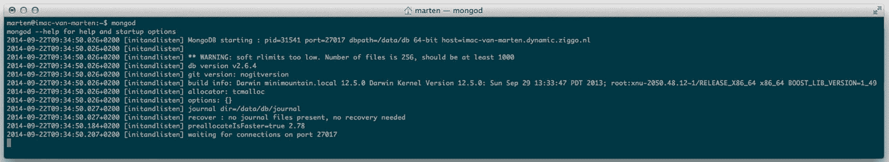

一张显示 mongo d b 命令执行后输出的截图。该行以“mongo D B starting”开头，以“waiting for connections on port 27017”结尾。

图 9-1

MongoDB 初始启动后的输出

存储数据的默认位置是 `\data\db`（对于 Windows 用户，这是从安装 MongoDB 的磁盘根目录开始计算的！）。要更改路径，请在命令行中使用 `--dbpath` 选项。请确保该目录存在并且 MongoDB 对其具有写入权限。


#### 连接到 MongoDB

要连接到 MongoDB，需要一个 `Mongo` 实例。该实例可用于获取要使用的数据库以及实际的底层集合。让我们创建一个使用 MongoDB 的小型系统。首先，创建一个用于存储的对象。

```
package com.apress.spring6recipes.nosql;
public record Vehicle(String vehicleNo, String color, int wheel, int seat) { }
清单 9-1
Vehicle 记录
```

为了操作这个对象，创建一个仓库接口。

```
package com.apress.spring6recipes.nosql;
import java.util.List;
public interface VehicleRepository {
long count();
void save(Vehicle vehicle);
void delete(Vehicle vehicle);
List findAll();
Vehicle findByVehicleNo(String vehicleNo);
}
清单 9-2
VehicleRepository 接口
```

针对 MongoDB，创建 `VehicleRepository` 的实现 `MongoVehicleRepository`。

```
package com.apress.spring6recipes.nosql;
import com.mongodb.client.MongoClient;
import com.mongodb.client.MongoCollection;
import org.bson.Document;
import java.util.List;
import java.util.stream.Collectors;
import java.util.stream.StreamSupport;
import static com.mongodb.client.model.Filters.eq;
public class MongoVehicleRepository implements VehicleRepository {
private final MongoClient mongo;
private final String collectionName;
private final String databaseName;
public MongoVehicleRepository(MongoClient mongo, String databaseName,
String collectionName) {
this.mongo = mongo;
this.databaseName = databaseName;
this.collectionName = collectionName;
}
@Override
public long count() {
return getCollection().countDocuments();
}
@Override
public void save(Vehicle vehicle) {
var dbVehicle = transform(vehicle);
getCollection().insertOne(dbVehicle);
}
@Override
public void delete(Vehicle vehicle) {
getCollection().deleteOne(eq("vehicleNo", vehicle.vehicleNo()));
}
@Override
public List findAll() {
return StreamSupport.stream(getCollection().find().spliterator(), false)
.map(this::transform)
.collect(Collectors.toList());
}
@Override
public Vehicle findByVehicleNo(String vehicleNo) {
return transform(getCollection().find(eq("vehicleNo", vehicleNo)).first());
}
private MongoCollection getCollection() {
return mongo.getDatabase(databaseName).getCollection(collectionName);
}
private Vehicle transform(Document dbVehicle) {
if (dbVehicle == null) {
return null;
}
return new Vehicle(
dbVehicle.getString("vehicleNo"),
dbVehicle.getString("color"),
dbVehicle.getInteger("wheel"),
dbVehicle.getInteger("seat"));
}
private Document transform(Vehicle vehicle) {
return new Document("vehicleNo", vehicle.vehicleNo())
.append("color", vehicle.color())
.append("wheel", vehicle.wheel())
.append("seat", vehicle.seat());
}
}
清单 9-3
VehicleRepository 的 MongoDB 实现
```

首先，注意构造函数；它接受三个参数。第一个是实际的 MongoDB 客户端，第二个是要使用的数据库名称，最后一个是存储对象的集合名称。MongoDB 中的文档存储在集合中，而集合属于某个数据库。

为了便于访问所使用的 `MongoCollection`，提供了 `getCollection` 方法，该方法获取与数据库的 `connection` 并返回配置好的 `MongoCollection`。然后可以使用这个 `MongoCollection` 来执行诸如存储、删除或更新文档等操作。

`save` 方法会首先尝试更新现有文档。如果失败，则会为给定的 `Vehicle` 创建一个新文档。为了存储对象，首先将领域对象 `Vehicle` 转换为 `Document`。`Document` 接受我们 `Vehicle` 对象不同属性的键/值对。当查询文档时，会使用相同的 `Document`。给定对象上存在的键/值对用于查找文档。可以在仓库的 `findByVehicleNo` 方法中找到一个示例。与车辆对象之间的转换通过两个 `transform` 方法完成。

要使用这个类，创建以下 `Main` 类。

```
package com.apress.spring6recipes.nosql;
import com.mongodb.client.MongoClients;
public class Main {
private static final String DB_NAME = "vehicledb";
private static final String COUNT = "车辆数量: %d%n";
public static void main(String[] args) {
try (var mongo = MongoClients.create()) {
var repository = new MongoVehicleRepository(mongo, DB_NAME, "vehicles");
System.out.printf(COUNT, repository.count());
repository.save(new Vehicle("TEM0001", "RED", 4, 4));
repository.save(new Vehicle("TEM0002", "RED", 4, 4));
System.out.printf(COUNT, repository.count());
var v = repository.findByVehicleNo("TEM0001");
System.out.println(v);
var vehicleList = repository.findAll();
System.out.printf(COUNT, vehicleList.size());
vehicleList.forEach(System.out::println);
System.out.printf(COUNT, repository.count());
mongo.getDatabase(DB_NAME).drop();
}
}
}
清单 9-4
运行代码的 Main 类
```

主类构造了一个 `MongoClient` 实例（通过使用 `MongoClients` 辅助类），该实例将尝试连接到本地主机上 MongoDB 实例的 `27017` 端口。如果需要其他端口或主机，还有一个 `create` 方法，它接受连接字符串或 `MongoClientSettings` 作为参数，用于更具体的配置。接下来，构造一个 `MongoVehicleRepository` 实例。传入之前创建的 `MongoClient`，以及数据库名称 `vehicledb` 和集合名称 `vehicles`。

接下来的几行代码将向数据库中插入两辆车，尝试查找它们，最后删除它们。主类中的最后几行将删除数据库。在使用生产数据库时，后者是你不想做的事情。最后，try-with-resources 块将关闭用于与 MongoDB 通信的 `MongoClient`。

所有示例的输出应与下面列出的相同：

```
车辆数量: 0
车辆数量: 2
Vehicle[vehicleNo=TEM0001, color=RED, wheel=4, seat=4]
车辆数量: 2
Vehicle[vehicleNo=TEM0001, color=RED, wheel=4, seat=4]
Vehicle[vehicleNo=TEM0002, color=RED, wheel=4, seat=4]
车辆数量: 2
```


#### 使用 Spring 进行配置

`MongoClient` 和 `MongoVehicleRepository` 的设置与配置可以轻松地迁移到 Spring 配置中。

```
package com.apress.spring6recipes.nosql.config;
import com.apress.spring6recipes.nosql.MongoVehicleRepository;
import com.apress.spring6recipes.nosql.VehicleRepository;
import com.mongodb.client.MongoClient;
import com.mongodb.client.MongoClients;
import org.springframework.context.annotation.Bean;
import org.springframework.context.annotation.Configuration;
@Configuration
public class MongoConfiguration {
private static final String DB_NAME = "vehicledb";
private static final String COLLECTION_NAME = "vehicles";
@Bean
public MongoClient mongo() {
return MongoClients.create();
}
@Bean
public MongoVehicleRepository vehicleRepository(MongoClient mongo) {
return new MongoVehicleRepository(mongo, DB_NAME, COLLECTION_NAME);
}
}
清单 9-5
使用 MongoDB 的 Spring @Configuration
```

以下添加了 `@PreDestroy` 注解的方法已被添加到 `MongoVehicleRepository` 中，用于处理数据库的清理工作。

```
@PreDestroy
public void cleanUp() {
mongo.getDatabase(databaseName).drop();
}
}
清单 9-6
为 Spring 添加了 PreDestroy 方法的 MongoVehicleRepository
```

最后，需要更新 `Main` 程序以反映这些更改。

```
package com.apress.spring6recipes.nosql;
import com.apress.spring6recipes.nosql.config.MongoConfiguration;
import org.springframework.context.annotation.AnnotationConfigApplicationContext;
import java.util.List;
public class Main {
private static final String COUNT = "Number of Vehicles: %d%n";
public static void main(String[] args) {
var cfg = MongoConfiguration.class;
try (var ctx = new AnnotationConfigApplicationContext(cfg)) {
var repository = ctx.getBean(VehicleRepository.class);
System.out.printf(COUNT, repository.count());
repository.save(new Vehicle("TEM0001", "RED", 4, 4));
repository.save(new Vehicle("TEM0002", "RED", 4, 4));
System.out.printf(COUNT, repository.count());
var v = repository.findByVehicleNo("TEM0001");
System.out.println(v);
var vehicleList = repository.findAll();
System.out.printf(COUNT, vehicleList.size());
vehicleList.forEach(System.out::println);
System.out.printf(COUNT, repository.count());
}
}
}
清单 9-7
运行代码的 Main 类
```

配置由 `AnnotationConfigApplicationContext` 加载。从该上下文中获取 `VehicleRepository` bean 并用于执行操作。当运行上下文的代码关闭时，会触发 `MongoVehicleRepository` 中的 `cleanUp` 方法。

#### 使用 MongoTemplate 简化 MongoDB 代码

目前，`MongoVehicleRepository` 使用的是原生 MongoDB API。虽然不算特别复杂，但仍需要了解该 API。此外，还有一些重复性任务，例如与 `Vehicle` 对象之间的映射。使用 `MongoTemplate` 可以大大简化该仓库。

一个信息符号，由带阴影圆圈内的字母 i 图标表示。  在使用 [Spring Data MongoDB](https://spring.io/projects/spring-data-mongodb) 之前，需要将相关的 jar 包添加到类路径中。使用 Maven 时，添加以下依赖：

```
org.springframework.data
spring-data-mongodb
4.0.0

```

或者在使用 Gradle 时添加以下内容：

`compile 'org.springframework.data:spring-data-mongodb:4.0.0'`

```
package com.apress.spring6recipes.nosql;
import jakarta.annotation.PreDestroy;
import org.springframework.data.mongodb.core.MongoTemplate;
import org.springframework.data.mongodb.core.query.Query;
import java.util.List;
import static org.springframework.data.mongodb.core.query.Criteria.where;
public class MongoVehicleRepository implements VehicleRepository {
private final MongoTemplate mongo;
private final String collectionName;
public MongoVehicleRepository(MongoTemplate mongo, String collectionName) {
this.mongo = mongo;
this.collectionName = collectionName;
}
@Override
public long count() {
return mongo.count(new Query(), collectionName);
}
@Override
public void save(Vehicle vehicle) {
mongo.save(vehicle, collectionName);
}
@Override
public void delete(Vehicle vehicle) {
mongo.remove(vehicle, collectionName);
}
@Override
public List findAll() {
return mongo.findAll(Vehicle.class, collectionName);
}
@Override
public Vehicle findByVehicleNo(String vehicleNo) {
var query = new Query(where("vehicleNo").is(vehicleNo));
return mongo.findOne(query, Vehicle.class, collectionName);
}
@PreDestroy
public void cleanUp() {
mongo.execute(db -> {
db.drop();
return null;
});
}
}
清单 9-8
使用 MongoTemplate 的 MongoVehicleRepository
```

使用 `MongoTemplate` 后，代码看起来简洁得多。它几乎为所有操作提供了便捷方法：`save`、`update` 和 `delete`。此外，它还拥有一个非常出色的查询构建器方法（参见 `findByVehicleNo` 方法）。不再需要与 Mongo 类进行映射，因此也无需再创建 `Document`。这个负担现在由 `MongoTemplate` 处理。为了将 `Vehicle` 对象转换为 MongoDB 类，会使用 `MongoConverter`。默认情况下，使用的是 `MappingMongoConverter`。该映射器将属性映射到属性名称，反之亦然，同时还会尝试进行正确的数据类型转换。如果需要特定的映射，可以编写自己的 `MongoConverter` 实现，并将其注册到 `MongoTemplate` 中。

由于使用了 `MongoTemplate`，配置也需要进行修改。

```
package com.apress.spring6recipes.nosql.config;
import com.apress.spring6recipes.nosql.MongoVehicleRepository;
import com.mongodb.client.MongoClient;
import org.springframework.context.annotation.Bean;
import org.springframework.context.annotation.Configuration;
import org.springframework.data.mongodb.core.MongoClientFactoryBean;
import org.springframework.data.mongodb.core.MongoTemplate;
@Configuration
public class MongoConfiguration {
private static final String DB_NAME = "vehicledb";
private static final String COLLECTION_NAME = "vehicles";
@Bean
public MongoTemplate mongo(MongoClient mongo) throws Exception {
return new MongoTemplate(mongo, DB_NAME);
}
@Bean
public MongoClientFactoryBean mongoFactoryBean() {
return new MongoClientFactoryBean();
}
@Bean
public MongoVehicleRepository vehicleRepository(MongoTemplate mongo) {
return new MongoVehicleRepository(mongo, COLLECTION_NAME);
}
}
清单 9-9
为 MongoTemplate 修改后的 MongoConfiguration 类
```

注意 `MongoClientFactoryBean` 的使用。它使得 `MongoClient` 的设置变得简单。虽然这不是使用 `MongoTemplate` 的强制要求，但它让客户端的配置更加容易。

`MongoTemplate` 有多个构造函数。这里使用的构造函数接受一个 `MongoClient` 实例和要使用的数据库名称。为了解析数据库，会使用 `MongoDatabaseFactory` 的实例，默认是 `SimpleMongoClientDatabaseFactory`。在大多数情况下这已经足够，但如果出现特殊情况，例如加密连接，扩展默认实现也相当容易。最后，`MongoTemplate` 连同集合名称一起被注入到 `MongoVehicleRepository` 中。

还需要对 `Vehicle` 对象进行最后的补充。需要有一个字段来存储生成的 ID。这可以是一个名为 `id` 的字段，也可以是一个带有 Spring Data `@Id` 注解的字段。

```
package com.apress.spring6recipes.nosql;
public record Vehicle(String id, String vehicleNo, String color, int wheel, int seat) { }
清单 9-10
包含 id 字段的 Vehicle 记录
```


#### 使用注解指定映射信息

目前，`MongoVehicleRepository` 需要知道我们要访问的集合名称。如果能在要存储的对象（此处为 `Vehicle`）上指定该信息，将会更简单、更灵活。借助 Spring Data Mongo，可以使用 `@Document` 注解实现这一点，就像 JPA 的 `@Table` 注解一样。

```
package com.apress.spring6recipes.nosql;
import org.springframework.data.mongodb.core.mapping.Document;
@Document(collection = "vehicles")
public record Vehicle(String id, String vehicleNo, String color, int wheel, int seat) { }
代码清单 9-11
带有 @Document 注解的 Vehicle 记录
```

`@Document` 注解可以接受三个属性：`collection`、`language` 和 `collation`。`collection` 属性用于指定要使用的集合名称；`language` 属性用于指定此对象的语言。`collation` 属性可用于指定字符串比较的语言特定规则，例如字母大小写和重音符号的规则。现在映射信息已位于 `Vehicle` 类上，可以从 `MongoVehicleRepository` 中移除集合名称。

```
package com.apress.spring6recipes.nosql;
import jakarta.annotation.PreDestroy;
import org.springframework.data.mongodb.core.MongoTemplate;
import org.springframework.data.mongodb.core.query.Query;
import java.util.List;
import static org.springframework.data.mongodb.core.query.Criteria.where;
public class MongoVehicleRepository implements VehicleRepository {
private final MongoTemplate mongo;
public MongoVehicleRepository(MongoTemplate mongo) {
this.mongo = mongo;
}
@Override
public long count() {
return mongo.count(new Query(), Vehicle.class);
}
@Override
public void save(Vehicle vehicle) {
mongo.save(vehicle);
}
@Override
public void delete(Vehicle vehicle) {
mongo.remove(vehicle);
}
@Override
public List findAll() {
return mongo.findAll(Vehicle.class);
}
@Override
public Vehicle findByVehicleNo(String vehicleNo) {
var query = new Query(where("vehicleNo").is(vehicleNo));
return mongo.findOne(query, Vehicle.class);
}
@PreDestroy
public void cleanUp() {
mongo.execute(db -> {
db.drop();
return null;
});
}
}
代码清单 9-12
修改后的 MongoVehicleRepository（不含集合名称）
```

当然，集合名称也可以从 `MongoVehicleRepository` 的配置中移除。配置的其余部分（`MongoTemplate` 等）可以保持不变。

```
package com.apress.spring6recipes.nosql.config;
import org.springframework.context.annotation.Bean;
import org.springframework.context.annotation.Configuration;
@Configuration
public class MongoConfiguration {
@Bean
public MongoVehicleRepository vehicleRepository(MongoTemplate mongo) {
return new MongoVehicleRepository(mongo);
}
}
代码清单 9-13
修改后的 MongoVehicleRepository 配置
```

运行 `Main` 类时，结果应与之前相同。

#### 创建 Spring Data MongoDB 仓库

尽管代码已经大幅减少，不再需要与 MongoDB 类进行映射，也不再需要传递集合名称，但它还可以进一步精简。利用 Spring Data Mongo 的另一个特性，可以完全移除 `MongoVehicleRepository` 的完整实现。

首先，需要修改配置。

```
package com.apress.spring6recipes.nosql.config;
import com.mongodb.client.MongoClient;
import org.springframework.context.annotation.Bean;
import org.springframework.context.annotation.Configuration;
import org.springframework.data.mongodb.core.MongoClientFactoryBean;
import org.springframework.data.mongodb.core.MongoTemplate;
import org.springframework.data.mongodb.repository.config.EnableMongoRepositories;
@Configuration
@EnableMongoRepositories(basePackages = "com.apress.spring6recipes.nosql")
public class MongoConfiguration {
public static final String DB_NAME = "vehicledb";
@Bean
public MongoTemplate mongoTemplate(MongoClient mongo) {
return new MongoTemplate(mongo, DB_NAME);
}
@Bean
public MongoClientFactoryBean mongoFactoryBean() {
return new MongoClientFactoryBean();
}
}
代码清单 9-14
MongoDB 配置
```

首先，注意移除了构造 `MongoVehicleRepository` 的 `@Bean` 方法。其次，注意添加了 `@EnableMongoRepositories` 注解。这启用了对扩展 Spring Data `Repository` 接口（或其子接口之一）且用于带有 `@Document` 注解的领域对象的接口的检测。

为了让 Spring Data 检测到我们的 `VehicleRepository`，我们需要让它扩展 `CrudRepository` 或其子接口之一，例如 `MongoRepository`。

```
package com.apress.spring6recipes.nosql;
import org.springframework.data.mongodb.repository.MongoRepository;
public interface VehicleRepository extends MongoRepository {
Vehicle findByVehicleNo(String vehicleNo);
}
代码清单 9-15
基于 Spring Data 的 VehicleRepository 接口
```

你可能想知道所有方法都去哪了。它们已经在父接口中定义好了，因此可以从这个接口中移除。`findByVehicleNo` 方法仍然保留。此方法仍将用于通过 `vehicleNo` 属性查找 `Vehicle`。所有 `findBy` 方法都会被转换为 MongoDB 查询。`findBy` 之后的部分被解释为属性名称。还可以使用不同的运算符（如 `and`、`or` 和 `between`）编写更复杂的查询。

现在再次运行 `Main` 类，结果应该仍然相同；然而，实际编写的用于与 MongoDB 交互的代码已经最小化了。


#### 创建响应式 Spring Data MongoDB 仓库

除了创建传统的 MongoDB 仓库，也可以创建响应式仓库。这可以通过继承 `ReactiveMongoRepository`（或其他响应式仓库接口）来实现。这将把返回单个值以及零个或多个元素的方法的返回类型分别改为 `Mono` 和 `Flux`。

一个信息符号，由带阴影圆圈内的字母 i 图标表示。  如果你想使用 RxJava 而不是 Project Reactor，请继承 `RxJava3*Repository` 接口之一，并使用 `Single` 或 `Observable` 代替 `Mono` 或 `Flux`。

要能够使用响应式仓库实现，首先必须使用 MongoDB 驱动程序的响应式实现，并配置 Spring Data 使用该驱动程序。为简化操作，你可以继承 `AbstractReactiveMongoConfiguration` 并实现两个必需的方法：`getDatabaseName` 和 `reactiveMongoClient`。

```
package com.apress.spring6recipes.nosql.config;
import com.mongodb.reactivestreams.client.MongoClient;
import com.mongodb.reactivestreams.client.MongoClients;
import org.springframework.context.annotation.Bean;
import org.springframework.context.annotation.Configuration;
import org.springframework.data.mongodb.config.AbstractReactiveMongoConfiguration;
import org.springframework.data.mongodb.repository.config.EnableReactiveMongoRepositories;
@Configuration
@EnableReactiveMongoRepositories(basePackages = "com.apress.spring6recipes.nosql")
public class MongoConfiguration extends AbstractReactiveMongoConfiguration {
private static final String DB_NAME = "vehicledb";
@Bean
@Override
public MongoClient reactiveMongoClient() {
return MongoClients.create();
}
@Override
protected String getDatabaseName() {
return DB_NAME;
}
}
代码清单 9-16
响应式 MongoDB 配置
```

另一个变化是使用了 `@EnableReactiveMongoRepositories` 而不是 `@EnableMongoRepositories`。仍然需要数据库名称，并且需要使用响应式驱动程序连接到 MongoDB 实例。为此，你可以使用 `MongoClients.create` 方法之一；这里可以直接使用默认方法。

接下来，修改 `VehicleRepository` 以继承 `ReactiveMongoRepository`，使其变为响应式。你还需要将 `findByVehicleNo` 方法的返回类型改为 `Mono<Vehicle>`，而不是普通的 `Vehicle`。

```
package com.apress.spring6recipes.nosql;
import org.springframework.data.mongodb.repository.ReactiveMongoRepository;
import reactor.core.publisher.Mono;
public interface VehicleRepository extends ReactiveMongoRepository {
Mono findByVehicleNo(String vehicleNo);
}
代码清单 9-17
基于响应式 Spring Data 的 VehicleRepository 接口
```

最后一个需要修改的部分是用于测试这一切的 `Main` 类。我们不希望使用阻塞调用，而是希望使用一系列待调用的方法。

```
package com.apress.spring6recipes.nosql;
import com.apress.spring6recipes.nosql.config.MongoConfiguration;
import org.springframework.context.annotation.AnnotationConfigApplicationContext;
import reactor.core.publisher.Flux;
import java.util.concurrent.CountDownLatch;
public class Main {
private static final String COUNT = "车辆数量: %d%n";
public static void main(String[] args) throws Exception {
var cfg = MongoConfiguration.class;
try (var ctx = new AnnotationConfigApplicationContext(cfg)) {
var repository = ctx.getBean(VehicleRepository.class);
var countDownLatch = new CountDownLatch(1);
repository.count().doOnSuccess(cnt -> System.out.printf(COUNT, cnt))
.thenMany(repository.saveAll(
Flux.just(
new Vehicle(null, "TEM0001", "RED", 4, 4),
new Vehicle(null, "TEM0002", "RED", 4, 4))))
.last()
.then(repository.count()).doOnSuccess(cnt -> System.out.printf(COUNT, cnt))
.then(repository.findByVehicleNo("TEM0001")).doOnSuccess(System.out::println)
.then(repository.deleteAll())
.doOnTerminate(countDownLatch::countDown)
.then(repository.count()).subscribe(cnt -> System.out.printf(COUNT, cnt));
countDownLatch.await();
}
}
}
代码清单 9-18
运行代码的 Main 类
```

流程从计数开始，成功后，将 `Vehicle` 实例放入 MongoDB。当添加完 `last()` 车辆后，再次进行计数，接着执行查询，随后执行 `deleteAll`。所有这些方法都以响应式方式一个接一个地调用，由事件触发。因为我们不想使用 `block()` 方法进行阻塞，所以使用 `CountDownLatch` 等待代码执行；在所有记录删除后计数器递减，之后程序将继续执行。诚然，这仍然是阻塞的，但在完整的响应式栈中使用时，你可能会从最后一个 `then` 返回 `Mono` 并进行进一步组合，或者将输出交给 Spring WebFlux 控制器（参见第 4 章）。

## 9-2\. 使用 Redis

### 问题

你想要利用 Redis 存储数据。

### 解决方案

下载并安装 Redis，然后使用 Spring 和 Spring Data 访问 Redis 实例。

### 工作原理

Redis 是一种内存数据结构存储，可用作数据库、缓存（参见第 14 章）、消息代理或流式引擎。这里我们将探讨其数据存储能力。为此，Redis 提供了列表、（有序）集合、哈希、字符串、位图、地理空间索引和流。为了获得高性能，Redis 使用内存数据集。根据你的情况，你可以定期将其存储到磁盘，或者持续追加提交日志。

#### 下载并启动 Redis

Redis 可以从 [`https://redis.io/download`](https://redis.io/download) 下载。在撰写本文时，7.0 版本是最近发布的稳定版本。安装说明可查阅 [`https://redis.io/docs/getting-started/installation/`](https://redis.io/docs/getting-started/installation/)，其中包含大多数操作系统的说明。

下载并安装 Redis 后，在命令行中使用 `redis-server` 命令启动它。启动后，输出应类似于图 9-2 所示。它将输出进程 ID（PID）和其监听的端口号（默认 6379）。

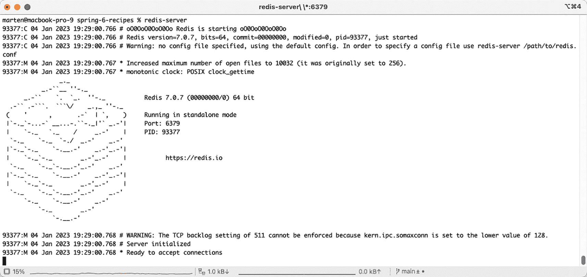

一张标题为“redis-server 双反斜杠星号. 6379”的截图，展示了执行 redis-server 命令后的输出。结尾显示：服务器已初始化，准备接受连接。

图 9-2
启动 Redis 后的输出


#### 连接 Redis

要连接 Redis，需要一个客户端，就像连接数据库需要 JDBC 驱动一样。有多种客户端可供选择。完整的列表可以在 Redis 网站上找到（[`https://redis.io/clients`](https://redis.io/clients)）。本方案将使用 Jedis 客户端，因为它非常活跃，并且得到了 Redis 团队的推荐。

一个信息符号，由阴影圆圈内的字母 i 图标表示。  需要将 Jedis 的相关依赖添加到类路径中。使用 Maven 时，添加以下依赖：

```
redis.clients
jedis
4.3.1

```

或者，使用 Gradle 时添加以下内容：

`compile 'redis.clients:jedis:4.3.1'`

让我们从一个简单的 Hello World 示例开始，看看是否能够连接到 Redis。

```
package com.apress.spring6recipes.nosql;
import redis.clients.jedis.Jedis;
import static redis.clients.jedis.Protocol.DEFAULT_PORT;
public class Main {
public static void main(String[] args) {
try (var jedis = new Jedis("localhost", DEFAULT_PORT)) {
jedis.set("msg", "Hello World, from Redis!");
System.out.println(jedis.get("msg"));
}
}
}
代码清单 9-19
使用 Jedis 客户端
```

创建一个 Jedis 客户端，并传入要连接的主机名和端口，本例中为 `localhost` 和默认端口（6379）。Jedis 客户端的 `set` 方法会将一条消息存入存储中，而 `get` 方法则用于再次检索该消息。除了简单的对象，你还可以让 Redis 模拟 `List` 或 `Map`。

```
package com.apress.spring6recipes.nosql;
import redis.clients.jedis.Jedis;
import static redis.clients.jedis.Protocol.DEFAULT_PORT;
public class Main {
public static void main(String[] args) {
try (var jedis = new Jedis("localhost", DEFAULT_PORT)) {
jedis.rpush("authors", "Marten Deinum", "Josh Long", "Daniel Rubio", "Gary Mak");
System.out.println("Authors: " + jedis.lrange("authors", 0, -1));
jedis.hset("sr_5", "authors", "Josh Long, Marten Deinum");
jedis.hset("sr_5", "published", "2019");
jedis.hset("sr_6", "authors", "Josh Long, Marten Deinum");
jedis.hset("sr_6", "published", "2023");
System.out.println("Spring 5 Recipes " + jedis.hgetAll("sr_5"));
System.out.println("Spring 6 Recipes " + jedis.hgetAll("sr_6"));
}
}
}
代码清单 9-20
运行代码的主类
```

使用 `rpush` 和 `lpush` 可以向列表中添加元素。`rpush` 将元素添加到列表末尾，`lpush` 则将元素添加到列表开头。要检索它们，可以使用 `lrange` 和 `rrange` 方法。`lrange` 从左侧开始，并接受起始索引和结束索引。示例中使用了 `-1`，表示所有元素。

要向映射（map）中添加元素，请使用 `hset`；它接受一个 `key`、一个 `field` 和一个 `value`。另一种选择是使用 `hmset`（多重设置），它接受一个 `Map<String, String>` 或 `Map<byte[], byte[]>` 作为参数。

#### 使用 Redis 存储对象

Redis 是一个键值存储，只能处理 `String` 或 `byte[]` 类型。键也是如此。因此，在 Redis 中存储对象并不像其他技术那样直接。对象在存储之前需要序列化为 `String` 或 `byte[]`。

让我们复用方案 9-1 中的 `Vehicle` 记录，并使用 Jedis 客户端进行存储和检索。

```
package com.apress.spring6recipes.nosql;
import java.io.Serializable;
public record Vehicle (String vehicleNo, String color, int wheel, int seat)
implements Serializable {
}
代码清单 9-21
Vehicle 记录
```

我们还要声明一个 `VehicleRepository` 接口（与方案 9-1 中 MongoDB 的接口相同）。

```
package com.apress.spring6recipes.nosql;
import java.util.List;
public interface VehicleRepository {
long count();
void save(Vehicle vehicle);
void delete(Vehicle vehicle);
List findAll();
Vehicle findByVehicleNo(String vehicleNo);
}
代码清单 9-22
VehicleRepository 接口
```

最后，是 Redis 的 `VehicleRepository` 实现。

```
package com.apress.spring6recipes.nosql;
import java.util.List;
import org.springframework.util.SerializationUtils;
import jakarta.annotation.PreDestroy;
import redis.clients.jedis.Jedis;
public class RedisVehicleRepository implements VehicleRepository {
private static final String DB_NAME = "vehicles";
private final Jedis jedis;
public RedisVehicleRepository(Jedis jedis) {
this.jedis = jedis;
}
@Override
public long count() {
return jedis.hkeys(DB_NAME.getBytes()).size();
}
@Override
public void save(Vehicle vehicle) {
var key = vehicle.vehicleNo();
var vehicleArray = SerializationUtils.serialize(vehicle);
jedis.hset(DB_NAME.getBytes(), key.getBytes(), vehicleArray);
}
@Override
public void delete(Vehicle vehicle) {
jedis.hdel(DB_NAME.getBytes(), vehicle.vehicleNo().getBytes());
}
@Override
public List findAll() {
return jedis.hkeys(DB_NAME).stream()
.map(this::findByVehicleNo).toList();
}
@Override
public Vehicle findByVehicleNo(String vehicleNo) {
var vehicleArray = jedis.hget(DB_NAME.getBytes(), vehicleNo.getBytes());
return (Vehicle) SerializationUtils.deserialize(vehicleArray);
}
@PreDestroy
public void cleanUp() {
findAll().forEach(this::delete);
}
}
代码清单 9-23
Redis VehicleRepository 实现
```

该仓库需要使用我们之前用过的 `Jedis` 客户端来存储我们想要的对象。由于 Redis 中并没有真正的表，我们可以使用哈希类型，它类似于一种分布式映射。我们将使用 `vehicles` 作为哈希的键，这样我们就可以将车辆添加到生成的哈希中。哈希键被转换为 `byte[]`，并且由于我们的 `Vehicle` 是 `Serializable` 的，我们也可以将其转换为 `byte[]`。

一个信息符号，由阴影圆圈内的字母 i 图标表示。  使用 Java 序列化时，需要实现 `java.io.Serializable` 接口。这是为了使对象对 Java 可序列化。在存储对象之前，需要将其转换为 `byte[]`。在 Java 中，`ObjectOutputStream` 可以写入对象，`ByteArrayOutputStream` 可以写入 `byte[]`。要将 `byte[]` 再次转换回对象，`ObjectInputStream` 和 `ByteArrayInputStream` 会有所帮助。Spring 为此提供了一个辅助类 `org.springframework.util.SerializationUtils`，它提供了 `serialize` 和 `deserialize` 辅助方法。

一个带有倒置 i 的阴影三角形图标。  该实现并非基于 Redis 的仓库的最优化实现；它仅作为本方案的示例。

现在，在主类中，让我们创建一些 `Vehicle` 实例，并使用我们的仓库进行存储和检索。


```
package com.apress.spring6recipes.nosql;
import org.springframework.context.annotation.AnnotationConfigApplicationContext;
import com.apress.spring6recipes.nosql.config.RedisConfig;
public class Main {
private static final String COUNT = "Number of Vehicles: %d%n";
public static void main(String[] args) {
var cfg = RedisConfig.class;
try (var ctx = new AnnotationConfigApplicationContext(cfg)) {
var repository = ctx.getBean(VehicleRepository.class);
System.out.printf(COUNT, repository.count());
repository.save(new Vehicle("TEM0001", "RED", 4, 4));
repository.save(new Vehicle("TEM0002", "RED", 4, 4));
System.out.printf(COUNT, repository.count());
var v = repository.findByVehicleNo("TEM0001");
System.out.println(v);
var vehicleList = repository.findAll();
System.out.printf(COUNT, vehicleList.size());
vehicleList.forEach(System.out::println);
System.out.printf(COUNT, repository.count());
}
}
}
代码清单 9-24
主类
```

另一种选择是使用对象的`String`表示形式。将`Vehicle`转换为 XML 或 JSON，这比使用`byte[]`更灵活。让我们看看如何使用优秀的 Jackson JSON 库将对象转换为 JSON。

```
package com.apress.spring6recipes.nosql;
import java.util.List;
import org.springframework.util.SerializationUtils;
import com.fasterxml.jackson.core.JsonProcessingException;
import com.fasterxml.jackson.databind.ObjectMapper;
import jakarta.annotation.PreDestroy;
import redis.clients.jedis.Jedis;
public class RedisVehicleRepository implements VehicleRepository{
private static final String DB_NAME = "vehicles";
private final Jedis jedis;
private final ObjectMapper mapper;
public RedisVehicleRepository(Jedis jedis, ObjectMapper mapper) {
this.jedis = jedis;
this.mapper = mapper;
}
@Override
public long count() {
return jedis.hkeys(DB_NAME).size();
}
@Override
public void save(Vehicle vehicle) {
try {
var vehicleJson = mapper.writeValueAsString(vehicle);
jedis.hset(DB_NAME, vehicle.vehicleNo(), vehicleJson);
} catch (JsonProcessingException e) {
throw new RuntimeException(e);
}
}
@Override
public void delete(Vehicle vehicle) {
jedis.hdel(DB_NAME, vehicle.vehicleNo());
}
@Override
public List findAll() {
return jedis.hkeys(DB_NAME).stream()
.map(this::findByVehicleNo).toList();
}
@Override
public Vehicle findByVehicleNo(String vehicleNo) {
var vehicleJson = jedis.hget(DB_NAME, vehicleNo);
try {
return mapper.readValue(vehicleJson, Vehicle.class);
} catch (JsonProcessingException ex) {
throw new RuntimeException(ex);
}
}
@PreDestroy
public void cleanUp() {
findAll().forEach(this::delete);
}
}
代码清单 9-25
Redis Vehicle 实现——存储 JSON
```

首先，需要一个 Jackson `ObjectMapper`的实例。该对象用于与 JSON 进行相互转换。在写入时，使用`writeValueAsString`方法将对象转换为 JSON 字符串。然后，这个`String`被存储在 Redis 中。接着，再次读取该字符串并将其传递给`ObjectMapper`的`readValue`方法。根据类型参数（此处为`Vehicle.class`），构造一个对象，并将 JSON 映射到给定类的实例。

在使用 Redis 时存储对象并非易事，有些人认为这不是 Redis 的预期用途（即存储复杂的对象结构）。

#### 配置和使用 RedisTemplate

根据用于连接 Redis 的客户端库，使用 Redis API 可能会更困难。为了统一这一点，可以使用`RedisTemplate`。它可以与大多数现有的 Redis Java 客户端配合使用。除了提供统一的方法外，它还负责将任何异常转换为 Spring 的`DataAccessException`层次结构。这使其能够与任何现有的数据访问很好地集成，并允许使用 Spring 的事务支持。

一个信息符号，由带阴影圆圈内的字母 i 图标表示。  在使用[Spring Data Redis](https://spring.io/projects/spring-data-redis)之前，需要将相关的 jar 包添加到类路径中。使用 Maven 时，添加以下依赖：

```
org.springframework.data
spring-data-redis
3.0.0

```

或者在使用 Gradle 时添加以下内容：

`compile 'org.springframework.data:spring-data-redis:3.0.0'`

`RedisTemplate`需要一个`RedisConnectionFactory`来获取连接。`RedisConnectionFactory`是一个接口，有多个实现可用。在这种情况下，需要`JedisConnectionFactory`。

```
package com.apress.spring6recipes.nosql.config;
import com.apress.spring6recipes.nosql.RedisVehicleRepository;
import com.apress.spring6recipes.nosql.Vehicle;
import org.springframework.context.annotation.Bean;
import org.springframework.context.annotation.Configuration;
import org.springframework.data.redis.connection.RedisConnectionFactory;
import org.springframework.data.redis.connection.jedis.JedisConnectionFactory;
import org.springframework.data.redis.core.RedisTemplate;
@Configuration
public class RedisConfig {
@Bean
public RedisTemplate redisTemplate(
RedisConnectionFactory connectionFactory) {
var template = new RedisTemplate();
template.setConnectionFactory(connectionFactory);
return template;
}
@Bean
public RedisConnectionFactory redisConnectionFactory() {
return new JedisConnectionFactory();
}
@Bean
public RedisVehicleRepository vehicleRepository(RedisTemplate redis) {
return new RedisVehicleRepository(redis);
}
}
代码清单 9-26
RedisTemplate 配置
```

注意`redisTemplate` bean 方法的返回类型。`RedisTemplate`是一个泛型类，需要指定键和值的类型。在这种情况下，`key`的类型是字符串，`value`的类型是`Vehicle`。在存储和检索对象时，`RedisTemplate`会负责转换。转换是通过`RedisSerializer`完成的，这是一个接口，有多个实现可用（见表 9-1）。默认的`RedisSerializer`，即`JdkSerializationRedisSerializer`，使用标准的 Java 序列化将对象转换为`byte[]`并还原。

表 9-1

默认的 RedisSerializer 实现

| 名称 | 描述 |
| --- | --- |
| `ByteArrayRedisSerializer` | 按原样存储`byte[]`并返回相同内容。 |
| `GenericToStringSerializer` | `String`到`byte[]`的序列化器，在转换为`byte[]`之前，使用 Spring 的`ConversionService`将对象转换为`String`。 |
| `GenericJackson2ToStringSerializer` | 使用 Jackson 2 ObjectMapper 通过动态类型读写 JSON。 |
| `Jackson2JsonRedisRedisSerializer` | 使用 Jackson 2 ObjectMapper 通过静态类型读写 JSON（每种对象类型需要一个序列化器）。 |
| `JdkSerializationRedisSerializer` | 使用默认的 Java 序列化和反序列化，是默认使用的实现。 |
| `OxmSerializer` | 使用 Spring 的`Marshaller`和`Unmarshaller`读写 XML。 |
| `StringRedisSerializer` | 简单的`String`到`byte[]`转换器。 |

为了能够使用`RedisTemplate`，需要修改`RedisVehicleRepository`类。我们之前使用的`Main`类可以保持不变。


```
```
package com.apress.spring6recipes.nosql;
import java.util.List;
import java.util.Map;
import org.springframework.dao.DataAccessException;
import org.springframework.data.redis.connection.DataType;
import org.springframework.data.redis.connection.RedisConnection;
import org.springframework.data.redis.core.RedisCallback;
import org.springframework.data.redis.core.RedisTemplate;
import org.springframework.data.redis.core.ScanOptions;
import com.fasterxml.jackson.core.JsonProcessingException;
import jakarta.annotation.PreDestroy;
public class RedisVehicleRepository implements VehicleRepository{
private static final String DB_NAME = "vehicles";
private final RedisTemplate redis;
public RedisVehicleRepository(RedisTemplate redis) {
this.redis = redis;
}
@Override
public long count() {
return redis.opsForHash().size(DB_NAME);
}
@Override
public void save(Vehicle vehicle) {
redis.opsForHash().put(DB_NAME, vehicle.vehicleNo(), vehicle);
}
@Override
public void delete(Vehicle vehicle) {
redis.opsForHash().delete(DB_NAME, vehicle.vehicleNo());
}
@Override
public List findAll() {
try (var cursor = redis.opsForHash().scan(DB_NAME, ScanOptions.NONE)) {
return cursor.stream()
.map(Map.Entry::getValue)
.map(Vehicle.class::cast).toList();
}
}
@Override
public Vehicle findByVehicleNo(String vehicleNo) {
return (Vehicle) redis.opsForHash().get(DB_NAME, vehicleNo);
}
@PreDestroy
public void cleanUp() {
findAll().forEach(this::delete);
}
}
清单 9-27
基于 RedisTemplate 的 VehicleRepository 实现
```

这里最大的优势在于可以直接使用对象，而模板负责处理对象与存储格式之间的转换工作。请注意 `set` 方法如何接受 `String` 和 `Vehicle` 作为参数，而不仅仅是 `String` 或 `byte[]`。这使得代码更易读且更易于维护。默认情况下使用 JDK 序列化。若要使用 Jackson，则需要配置不同的 `RedisSerializer`。

```
package com.apress.spring6recipes.nosql.config;
@Configuration
public class RedisConfig {
@Bean
public RedisTemplate redisTemplate(
RedisConnectionFactory connectionFactory) {
var template = new RedisTemplate();
template.setConnectionFactory(connectionFactory);
template.setDefaultSerializer(new GenericJackson2JsonRedisSerializer());
template.setEnableTransactionSupport(true);
return template;
return new JedisConnectionFactory();
清单 9-28
VehicleRepository 配置
```

现在 `RedisTemplate` 将使用 Jackson 的 `ObjectMapper` 来执行序列化和反序列化。其余代码可以保持不变。再次运行主程序时，它仍然可以工作，并且对象将以 JSON 格式存储。当 Redis 在事务中使用时，它也可以参与同一事务。为此，需要将 `RedisTemplate` 上的 `enableTransactionSupport` 属性设置为 `true`。这将在事务提交时，确保在事务内部执行 Redis 操作。

#### 创建 Spring Data Redis 仓库

使用 `RedisTemplate` 的仓库简化了 Redis 的操作。然而，对于许多用例来说，还可以进一步简化。与 JPA 类似，Spring Data Redis 也提供了通过扩展 Spring Data 基类来编写仓库的选项，然后使用开箱即用的方法。为此，需要扩展 Spring Data 的 `Repository` 接口（或其子接口之一）。

底层仍会使用 `RedisTemplate`，但代码会更加简洁。实际上，整个 `RedisVehicleRepository` 可以被移除，而 `VehicleRepository` 可以直接扩展 `CrudRepository` 接口。

首先，可以修改配置。

```
package com.apress.spring6recipes.nosql.config;
import com.apress.spring6recipes.nosql.Vehicle;
import org.springframework.context.annotation.Bean;
import org.springframework.context.annotation.Configuration;
import org.springframework.data.redis.connection.RedisConnectionFactory;
import org.springframework.data.redis.connection.jedis.JedisConnectionFactory;
import org.springframework.data.redis.core.RedisTemplate;
import org.springframework.data.redis.repository.configuration.EnableRedisRepositories;
import org.springframework.data.redis.serializer.GenericJackson2JsonRedisSerializer;
@Configuration
@EnableRedisRepositories(basePackages = "com.apress.spring6recipes.nosql")
public class RedisConfig {
@Bean
public RedisTemplate redisTemplate(
RedisConnectionFactory connectionFactory) {
var template = new RedisTemplate();
template.setConnectionFactory(connectionFactory);
template.setDefaultSerializer(new GenericJackson2JsonRedisSerializer());
template.setEnableTransactionSupport(true);
return template;
}
@Bean
public RedisConnectionFactory redisConnectionFactory() {
return new JedisConnectionFactory();
}
}
清单 9-29
Spring Data Redis 配置
```

首先，注意移除了构建 `RedisVehicleRepository` 的 `@Bean` 方法。其次，注意添加了 `@EnableRedisRepositories` 注解。这启用了对扩展 Spring Data `Repository` 接口（或其子接口之一）并用于领域对象的接口的检测。

Spring Data 需要知道 `Vehicle` 的哪个字段用作键。默认情况下，它会查找名为 `id` 的字段或使用 `org.springframework.data.annotation.Id` 注解的字段。对于 `Vehicle`，我们添加一个名为 `id` 的额外字段。要定义键空间（之前使用的哈希），可以在类上添加 `@RedisHash` 注解。默认情况下，它会使用类名 `Vehicle` 作为键空间。我们想使用 `vehicles`，因此需要显式添加它。最后，`vehicleNo` 字段需要添加 `@Indexed` 注解；没有这个注解，该字段将无法在查询中使用。这将为该字段生成一个二级索引，以便在查询中使用。

```
package com.apress.spring6recipes.nosql;
import java.util.UUID;
import org.springframework.data.annotation.Id;
import org.springframework.data.redis.core.RedisHash;
import org.springframework.data.redis.core.index.Indexed;
@RedisHash("vehicles")
public record Vehicle (String id, @Indexed String vehicleNo, String color, int wheel, int seat) {
public Vehicle(String vehicleNo, String color, int wheel, int seat) {
this(UUID.randomUUID().toString(), vehicleNo, color, wheel, seat);
}
}
清单 9-30
修改后的 Vehicle 类
```

最后，是待使用的 `VehicleRepository` 接口。

```
package com.apress.spring6recipes.nosql;
import org.springframework.data.repository.ListCrudRepository;
public interface VehicleRepository extends ListCrudRepository {
Vehicle findByVehicleNo(String vehicleNo);
}
清单 9-31
Spring Data VehicleRepository
```


你可能会好奇那些方法都去哪了。它们已经在超接口中定义好了，因此可以从这个接口中移除。`findByVehicleNo` 方法仍然保留。该方法将继续用于通过 `vehicleNo` 属性查找 `Vehicle` 对象。所有 `findBy` 方法都被转换成了 Redis 查询。`findBy` 之后的部分会被解释为属性名。还可以使用不同的运算符（如 `and`、`or` 和 `between`）编写更复杂的查询。

一个信息符号，由带阴影圆圈内的字母 i 图标表示。  为了方便，我们继承了 `ListCrudRepository`。现在 `findAll` 返回的是 `List` 而不是 `Iterable`。

现在再次运行 `Main` 类，应该仍能得到相同的输出。不过，实际编写的用于操作 Redis 的代码已经被精简到最少。

```
package com.apress.spring6recipes.nosql;
import org.springframework.context.annotation.AnnotationConfigApplicationContext;
import com.apress.spring6recipes.nosql.config.RedisConfig;
public class Main {
private static final String COUNT = "Number of Vehicles: %d%n";
public static void main(String[] args) {
var cfg = RedisConfig.class;
try (var ctx = new AnnotationConfigApplicationContext(cfg)) {
var repository = ctx.getBean(VehicleRepository.class);
System.out.printf(COUNT, repository.count());
repository.save(new Vehicle("TEM0001", "RED", 4, 4));
repository.save(new Vehicle("TEM0002", "RED", 4, 4));
System.out.printf(COUNT, repository.count());
var v = repository.findByVehicleNo("TEM0001");
System.out.println(v);
var vehicleList = repository.findAll();
System.out.printf(COUNT, vehicleList.size());
vehicleList.forEach(System.out::println);
System.out.printf(COUNT, repository.count());
repository.deleteAll();
}
}
}
清单 9-32
Main 类
```


#### 创建响应式 Spring Data Redis 仓库

除了创建传统的 Redis 仓库，也可以创建响应式仓库。然而，由于在撰写本文时，Spring Data Redis 还没有针对仓库风格的响应式对应实现，只有 `ReactiveRedisTemplate`，这意味着我们需要自己实现仓库。要使用 `ReactiveRedisTemplate`，我们还必须使用响应式驱动程序实现并相应地修改配置。

```
package com.apress.spring6recipes.nosql.config;
import org.springframework.context.annotation.Bean;
import org.springframework.context.annotation.Configuration;
import org.springframework.data.redis.connection.ReactiveRedisConnectionFactory;
import org.springframework.data.redis.connection.RedisConnectionFactory;
import org.springframework.data.redis.connection.jedis.JedisConnectionFactory;
import org.springframework.data.redis.connection.lettuce.LettuceConnectionFactory;
import org.springframework.data.redis.core.ReactiveRedisTemplate;
import org.springframework.data.redis.core.RedisTemplate;
import org.springframework.data.redis.serializer.GenericJackson2JsonRedisSerializer;
import org.springframework.data.redis.serializer.Jackson2JsonRedisSerializer;
import org.springframework.data.redis.serializer.RedisSerializationContext;
import org.springframework.data.redis.serializer.RedisSerializer;
import org.springframework.data.redis.serializer.StringRedisSerializer;
import com.apress.spring6recipes.nosql.RedisVehicleRepository;
import com.apress.spring6recipes.nosql.Vehicle;
@Configuration
public class RedisConfig {
@Bean
public ReactiveRedisTemplate redisTemplate(
ReactiveRedisConnectionFactory connectionFactory) {
RedisSerializationContext.RedisSerializationContextBuilder builder =
RedisSerializationContext.newSerializationContext(new StringRedisSerializer());
var serializer = new Jackson2JsonRedisSerializer(Vehicle.class);
RedisSerializationContext context = builder.hashValue(serializer).build();
return new ReactiveRedisTemplate(connectionFactory, context);
}
@Bean
public ReactiveRedisConnectionFactory redisConnectionFactory() {
return new LettuceConnectionFactory("localhost", 6379);
}
@Bean
public RedisVehicleRepository vehicleRepository(ReactiveRedisTemplate redis) {
return new RedisVehicleRepository(redis);
}
}
清单 9-33
响应式 Redis 配置
```

为了能够使用响应式仓库实现，首先必须使用 Redis 驱动程序的响应式实现。由于 Jedis 驱动程序不是响应式的，我们需要切换到 [Lettuce](https://lettuce.io/) 驱动程序。该驱动程序由 `LettuceConnectionFactory` 使用（它可以以常规方式使用，并且既是阻塞式也是非阻塞式驱动程序）。需要 `ReactiveRedisConnectionFactory` 来创建 `ReactiveRedisTemplate`。除了 `RedisSerializationContext` 之外，它还保存了如何序列化键和值（包括常规值和哈希值）的信息。由于我们想使用常规的 `String`，我们使用 `StringRedisSerializer` 作为默认序列化器，而对于 `hashValue`，我们想使用 Jackson JSON 库，因此使用 `Jackson2JsonRedisSerializer`。通过这种方式，我们构建了 `ReactiveRedisTemplate` 并将其注入到我们的 `RedisVehicleRepository` 中。

接下来，将 `VehicleRepository` 改为使用 `ReactiveRedisTemplate`，使其成为响应式的。你还需要将方法的返回类型改为 `Mono`（零个或一个值）或 `Flux`（零个或多个值）。我们也可以使用其他支持的响应式类型，如 RxJava3 或 Mutiny Rye。但这里我们使用 Project Reactor。

```
package com.apress.spring6recipes.nosql;
import java.util.Map;
import org.springframework.data.redis.core.ReactiveRedisTemplate;
import org.springframework.data.redis.core.ScanOptions;
import jakarta.annotation.PreDestroy;
import reactor.core.publisher.Flux;
import reactor.core.publisher.Mono;
public class RedisVehicleRepository implements VehicleRepository{
private static final String DB_NAME = "vehicles";
private final ReactiveRedisTemplate redis;
public RedisVehicleRepository(ReactiveRedisTemplate redis) {
this.redis = redis;
}
@Override
public Mono count() {
return redis.opsForHash().size(DB_NAME);
}
@Override
public Mono save(Vehicle vehicle) {
return redis.opsForHash().put(DB_NAME, vehicle.vehicleNo(), vehicle).then();
}
@Override
public Mono delete(Vehicle vehicle) {
return redis.opsForHash().remove(DB_NAME, vehicle.vehicleNo()).then();
}
@Override
public Flux findAll() {
return redis.opsForHash().scan(DB_NAME, ScanOptions.NONE)
.map(Map.Entry::getValue)
.cast(Vehicle.class);
}
@Override
public Mono findByVehicleNo(String vehicleNo) {
return redis.opsForHash().get(DB_NAME, vehicleNo).cast(Vehicle.class);
}
@PreDestroy
public void cleanUp() {
findAll().map(this::delete).subscribe();
}
}
清单 9-34
基于响应式 Spring Data 的 VehicleRepository 接口
```

最后一个需要更改的部分是用于测试所有这些功能的 `Main` 类。我们不使用阻塞调用，而是希望使用一个方法流来调用。

```
package com.apress.spring6recipes.nosql;
import java.util.concurrent.CountDownLatch;
import org.springframework.context.annotation.AnnotationConfigApplicationContext;
import com.apress.spring6recipes.nosql.config.RedisConfig;
import reactor.core.publisher.Flux;
public class Main {
private static final String COUNT = "Number of Vehicles: %d%n";
public static void main(String[] args) throws Exception {
var cfg = RedisConfig.class;
try (var ctx = new AnnotationConfigApplicationContext(cfg)) {
var repository = ctx.getBean(VehicleRepository.class);
var countDownLatch = new CountDownLatch(1);
var vehicles = Flux.just(
new Vehicle("TEM0001", "RED", 4, 4),
new Vehicle("TEM0002", "RED", 4, 4));
repository.count().doOnSuccess(cnt -> System.out.printf(COUNT, cnt))
.thenMany(vehicles.flatMap(repository::save))
.then(repository.count()).doOnSuccess(cnt -> System.out.printf(COUNT, cnt))
.then(repository.findByVehicleNo("TEM0001")).doOnSuccess(System.out::println)
.doOnTerminate(countDownLatch::countDown)
.then(repository.count()).subscribe(cnt -> System.out.printf(COUNT, cnt));
countDownLatch.await();
}
}
}
清单 9-35
运行代码的 Main 类
```

流程从计数开始，当计数成功时，`Vehicle` 实例被放入 Redis。当车辆被添加后，再次进行计数，然后进行查询。所有这些方法都以响应式方式一个接一个地调用，由事件触发。因为我们不想使用 `block()` 方法进行阻塞，所以我们使用 `CountDownLatch` 等待代码执行；在所有记录删除后，计数器递减，之后程序将继续执行。诚然，这仍然是阻塞的，当在完整的响应式堆栈中使用时，你可能会从最后一个 `then` 返回 `Mono` 并进行进一步组合，或者将输出交给 Spring WebFlux 控制器（参见第 4 章）。

## 9-3\. 使用 Neo4j

### 问题

你想在应用程序中使用 Neo4j。

### 解决方案

使用 Spring Data Neo4j 库来访问 Neo4j。

### 工作原理


#### 下载并运行 Neo4j

Neo4j 可以从 Neo4j 官网（[`https://neo4j.com/download/`](https://neo4j.com/download/)）下载。对于本教程，下载社区版就足够了；不过，它也应该能与 Neo4j 的商业版本兼容。Windows 用户可以运行安装程序进行安装。Mac 和 Linux 用户可以解压归档文件，然后在解压后的目录中，通过 `bin/neo4j` 启动。Mac 用户也可以使用 Homebrew（[`https://brew.sh`](https://brew.sh/)）通过 `brew install neo4j` 来安装 Neo4j；然后可以在命令行中使用 `neo4j start` 启动。

在命令行启动后，输出应该类似于清单 9-36 所示。

```
2023-01-05 19:48:37.589+0000 INFO  Starting...
2023-01-05 19:48:38.495+0000 INFO  This instance is ServerId{5511a206} (5511a206-9cc1-4cd0-af11-4c4b10c0a779)
2023-01-05 19:48:40.121+0000 INFO  ======== Neo4j 4.4.16 ========
2023-01-05 19:48:42.298+0000 INFO  Initializing system graph model for component 'security-users' with version -1 and status UNINITIALIZED
2023-01-05 19:48:42.312+0000 INFO  Setting up initial user from defaults: neo4j
2023-01-05 19:48:42.313+0000 INFO  Creating new user 'neo4j' (passwordChangeRequired=true, suspended=false)
2023-01-05 19:48:42.333+0000 INFO  Setting version for 'security-users' to 3
2023-01-05 19:48:42.337+0000 INFO  After initialization of system graph model component 'security-users' have version 3 and status CURRENT
2023-01-05 19:48:42.345+0000 INFO  Performing postInitialization step for component 'security-users' with version 3 and status CURRENT
2023-01-05 19:48:42.992+0000 INFO  Bolt enabled on 0.0.0.0:7687.
2023-01-05 19:48:44.269+0000 INFO  Remote interface available at
2023-01-05 19:48:44.275+0000 INFO  id: 402C3B3CDF4CFDC5FF07BC34F4FD765ADD00594BCF495D316D110FFFC9A38C10
2023-01-05 19:48:44.275+0000 INFO  name: system
2023-01-05 19:48:44.275+0000 INFO  creationDate: 2023-01-05T19:48:40.843Z
2023-01-05 19:48:44.275+0000 INFO  Started.
清单 9-36
Neo4j 启动输出
```

#### 启动 Neo4j

让我们从为 Neo4j 创建一个简单的“Hello World”开始。创建一个 `Main` 类，该类连接到服务器，向 Neo4j 添加一些数据，然后再次检索这些数据。

```
package com.apress.spring6recipes.nosql;
import org.neo4j.driver.GraphDatabase;
import java.util.stream.Collectors;
import static org.neo4j.driver.Values.parameters;
public class Main {
private static final String URL = "bolt://localhost:7687";
private static final String CREATE_QUERY = "CREATE (:Greetings {msg: $msg})";
private static final String MATCH_QUERY = "MATCH (g) RETURN g.msg";
private static final String DELETE_ALL_QUERY = "MATCH (n) DETACH DELETE n";
public static void main(String[] args) {
try (var driver = GraphDatabase.driver(URL)) {
try (var session = driver.session()) {
session.writeTransaction(tx -> {
tx.run(CREATE_QUERY, parameters("msg", "Hello"));
tx.run(CREATE_QUERY, parameters("msg", "World"));
return null;
});
var readResult = session.readTransaction(tx -> {
var res = tx.run(MATCH_QUERY);
return res.stream().map(it -> it.get(0).asString()).collect(Collectors.joining(" "));
});
System.out.println("After Read: \n\t" + readResult);
session.run(DELETE_ALL_QUERY);
}
}
}
}
清单 9-37
Main 类
```

这个 main 方法将使用 Bolt 协议连接到 Neo4j 服务器。接着，它将启动一个事务并创建两个节点。然后，检索所有节点，并将 `msg` 属性的值打印到控制台。Neo4j 擅长遍历节点之间的关系。它为此进行了特别优化（就像其他图数据存储一样）。

一个信息符号，由带阴影圆圈内的字母 i 图标表示。 需要将 Neo4j 的相关依赖添加到类路径中。使用 Maven 时，添加以下依赖：

```
org.neo4j
neo4j
5.3.0

org.neo4j.driver
neo4j-java-driver
5.3.1

```

或者，使用 Gradle 时添加以下内容：

```
implementation group: 'org.neo4j', name: 'neo4j', version: '5.3.0'
implementation group: 'org.neo4j.driver', name: 'neo4j-java-driver', version: '5.3.1'
```

让我们创建一些彼此之间存在关系的节点。

```
package com.apress.spring6recipes.nosql;
import org.neo4j.driver.GraphDatabase;
import java.util.Map;
public class Main {
private static final String URL = "bolt://localhost:7687";
private static final String CREATE_CHARACTER_QUERY = "CREATE (:Character {name: $name})";
private static final String CREATE_PLANET_QUERY = "CREATE (:Planet {name: $name})";
private static final String CREATE_PLANET_REL_QUERY = "MATCH (a:Character), (b:Planet) WHERE a.name=$cname AND b.name=$pname CREATE (a)-[r:LOCATION]->(b)";
private static final String CREATE_FRIENDS_REL_QUERY = "MATCH (a:Character), (b:Character) WHERE a.name=$aname AND b.name=$bname CREATE (a)-[r:FRIENDS_WITH]->(b)";
private static final String CREATE_MASTER_REL_QUERY = "MATCH (a:Character), (b:Character) WHERE a.name=$aname AND b.name=$bname CREATE (a)-[r:MASTER_OF]->(b)";
private static final String DELETE_ALL_QUERY = "MATCH (n) DETACH DELETE n";
public static void main(String[] args) {
try (var driver = GraphDatabase.driver(URL)) {
try (var session = driver.session()) {
// 角色
session.run(CREATE_CHARACTER_QUERY, Map.of("name", "Yoda"));
session.run(CREATE_CHARACTER_QUERY, Map.of("name", "Luke Skywalker"));
session.run(CREATE_CHARACTER_QUERY, Map.of("name", "Leia Organa"));
session.run(CREATE_CHARACTER_QUERY, Map.of("name", "Han Solo"));
// 星球
session.run(CREATE_PLANET_QUERY, Map.of("name", "Dagobah"));
session.run(CREATE_PLANET_QUERY, Map.of("name", "Tatooine"));
session.run(CREATE_PLANET_QUERY, Map.of("name", "Alderaan"));
// 关系
session.run(CREATE_PLANET_REL_QUERY, Map.of("cname", "Yoda", "pname", "Dagobah"));
session.run(CREATE_PLANET_REL_QUERY, Map.of("cname", "Leia Organa", "pname", "Alderaan"));
session.run(CREATE_PLANET_REL_QUERY, Map.of("cname", "Luke Skywalker", "pname", "Tatooine"));
session.run(CREATE_FRIENDS_REL_QUERY, Map.of("aname", "Luke Skywalker", "bname", "Han Solo"));
session.run(CREATE_FRIENDS_REL_QUERY, Map.of("aname", "Leia Organa", "bname", "Han Solo"));
session.run(CREATE_FRIENDS_REL_QUERY, Map.of("aname", "Leia Organa", "bname", "Luke Skywalker"));
session.run(CREATE_MASTER_REL_QUERY, Map.of("aname", "Yoda", "bname", "Luke Skywalker"));
}
try (var session = driver.session()) {
var result = session.run("MATCH (n) RETURN n.name as name");
result.stream()
.flatMap(m -> m.fields().stream())
.map(row -> row.key() + " : " + row.value().asString())
.forEach(System.out::println);
session.run(DELETE_ALL_QUERY);
}
}
}
}
清单 9-38
Main 类
```

这段代码反映了《星球大战》宇宙的一小部分。它包含了角色及其所在地点（实际上是星球）。人物之间也存在关系（关系图见图 9-3）。

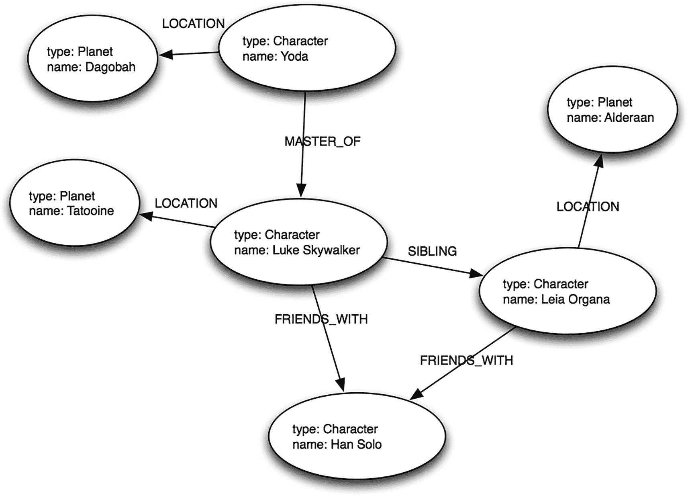

一个关系图，展示了《星球大战》宇宙中的角色和地点。卢克·天行者，与汉·索罗是朋友，是莱娅·奥加纳的兄弟姐妹，所在地点是奥德兰和塔图因。顶部是尤达，他是卢克·天行者的师父，所在地点是达戈巴。

图 9-3

示例中的关系

这些关系是通过将角色与另一个角色或星球进行匹配（取决于关系类型）来创建的。插入所有数据后，它将执行 Cypher 查询 `MATCH (n) RETURN n.name as name`。这将选择所有节点并返回所有节点的 name 属性。


#### 使用 Neo4j 映射对象

到目前为止的代码都处于相当低的层级，并且局限于使用纯 Neo4j 和 Cypher 查询。创建和操作节点非常繁琐。理想情况下，我们应该使用 `Planet` 和 `Character` 类，并让这些类能够从 Neo4j 中存储/检索。

首先，创建 `Planet` 和 `Character` 类。

```
package com.apress.spring6recipes.nosql;
import java.util.ArrayList;
import java.util.Collections;
import java.util.List;
public class Character {
private final String name;
private final List friends = new ArrayList();
private String id;
private Planet location;
private Character apprentice;
public Character(String name) {
this.name=name;
}
public String getId() {
return id;
}
void setId(String id) {
this.id=id;
}
public String getName() {
return name;
}
public Planet getLocation() {
return location;
}
public void setLocation(Planet location) {
this.location = location;
}
public Character getApprentice() {
return apprentice;
}
public void setApprentice(Character apprentice) {
this.apprentice = apprentice;
}
public List getFriends() {
return Collections.unmodifiableList(friends);
}
public void addFriend(Character friend) {
friends.add(friend);
}
}
代码清单 9-40
Character 类
```

```
package com.apress.spring6recipes.nosql;
public class Planet {
private final String name;
private String id;
public Planet(String name) {
this.name = name;
}
public String getId() {
return id;
}
void setId(String id) {
this.id=id;
}
public String getName() {
return name;
}
}
代码清单 9-39
Planet 类
```

`Planet` 类非常简单。它有一个 `id` 属性和一个 `name` 属性。`Character` 类则稍微复杂一些。它同样拥有 `id` 和 `name` 属性，但还包含一些用于表示关系的额外属性。其中包括用于 `LOCATION` 关系的 `location` 属性、用于 `FRIENDS_WITH` 关系的 `Characters` 集合，以及用于 `MASTER_OF` 关系的 `apprentice` 属性。

为了能够存储这些类，让我们创建一个 `StarwarsRepository` 接口来封装保存操作。

```
package com.apress.spring6recipes.nosql;
public interface StarwarsRepository {
Planet save(Planet planet);
Character save(Character charachter);
}
代码清单 9-41
StarwarsRepository 接口
```

以下是针对 Neo4j 的实现。

```
package com.apress.spring6recipes.nosql;
import org.neo4j.driver.Driver;
import java.util.Map;
class Neo4jStarwarsRepository implements StarwarsRepository {
private static final String CREATE_PLANET_QUERY = "CREATE (a:Planet {id: randomUUID(), name: $name}) RETURN a.id";
private static final String CREATE_CHARACTER_QUERY = "CREATE (a:Character {id: randomUUID(), name: $name}) RETURN a.id";
private static final String CREATE_PLANET_REL_QUERY = "MATCH (a:Character), (b:Planet) WHERE a.id=$aid AND b.id=$bid CREATE (a)-[r:LOCATION]->(b)";
private static final String CREATE_FRIENDS_REL_QUERY = "MATCH (a:Character), (b:Character) WHERE a.id=$aid AND b.id=$bid CREATE (a)-[r:FRIENDS_WITH]->(b)";
private static final String CREATE_MASTER_REL_QUERY = "MATCH (a:Character), (b:Character) WHERE a.id=$aid AND b.id=$bid CREATE (a)-[r:MASTER_OF]->(b)";
private final Driver db;
Neo4jStarwarsRepository(Driver db) {
this.db = db;
}
@Override
public Planet save(Planet planet) {
if (planet.getId() != null) {
return planet;
}
try (var session = db.session()) {
var res = session.run(CREATE_PLANET_QUERY, Map.of("name", planet.getName()));
planet.setId(res.single().get(0).asString());
return planet;
}
}
@Override
public Character save(Character charr) {
if (charr.getId() != null) {
return charr;
}
try (var session = db.session()) {
session.executeWrite(tx -> {
var res = tx.run(CREATE_CHARACTER_QUERY, Map.of( "name", charr.getName()));
charr.setId(res.single().get(0).asString());
if (charr.getLocation() != null) {
var location = save(charr.getLocation());
tx.run(CREATE_PLANET_REL_QUERY, Map.of("aid", charr.getId(),
"bid", location.getId()));
}
for (var friend : charr.getFriends()) {
friend = save(friend);
tx.run(CREATE_FRIENDS_REL_QUERY, Map.of("aid", charr.getId(),
"bid", friend.getId()));
}
if (charr.getApprentice() != null) {
var apprentice = save(charr.getApprentice());
tx.run(CREATE_MASTER_REL_QUERY, Map.of("aid", charr.getId(),
"bid", apprentice.getId()));
}
return null;
});
}
return charr;
}
}
代码清单 9-42
Neo4j StarwarsRepository 实现类
```

为了将对象存储到 Neo4j 中，这里做了很多工作。对于 `Planet` 来说相当简单。首先，检查它是否已经被持久化（在这种情况下 id 不为 null）；如果没有，则启动一个事务，创建一个节点，设置 `name` 属性，并将 `id` 传回给 `Planet` 对象。然而，对于 `Character` 类来说，情况稍微复杂一些，因为需要考虑所有关系。

一个灯泡轮廓的图标，代表一个信息提示。  不建议使用 Neo4j 生成的技术 ID，因此我们在 Neo4j 中生成了 `id`。你也可以创建自己的 ID 生成器（或使用客户端生成的 UUID）并直接存储它们。这里我们选择让 Neo4j 处理 ID 并将其复制回对象。

需要修改 `Main` 类以反映对类的更改。

```
package com.apress.spring6recipes.nosql;
import org.neo4j.driver.GraphDatabase;
import java.util.stream.Stream;
public class Main {
private static final String URL = "bolt://localhost:7687";
private static final String DELETE_ALL_QUERY = "MATCH (n) DETACH DELETE n";
public static void main(String[] args) {
try (var driver = GraphDatabase.driver(URL)) {
var repository = new Neo4jStarwarsRepository(driver);
// 行星
var dagobah = new Planet("Dagobah");
var alderaan = new Planet("Alderaan");
var tatooine = new Planet("Tatooine");
Stream.of(dagobah, alderaan, tatooine).forEach(repository::save);
// 角色
var han = new Character("Han Solo");
var leia = new Character("Leia Organa");
leia.setLocation(alderaan);
leia.addFriend(han);
var luke = new Character("Luke Skywalker");
luke.setLocation(tatooine);
luke.addFriend(han);
luke.addFriend(leia);
var yoda = new Character("Yoda");
yoda.setLocation(dagobah);
yoda.setApprentice(luke);
Stream.of(han, luke, leia, yoda).forEach(repository::save);
try(var session = driver.session()) {
var result = session.run("MATCH (n) RETURN n.name as name");
result.stream()
.flatMap(m -> m.fields().stream())
.map(row -> row.key() + " : " + row.value() + ";")
.forEach(System.out::println);
session.run(DELETE_ALL_QUERY);
}
}
}
}
代码清单 9-43
Main 类
```

执行结果应该仍然与之前相同。然而，主要区别在于，现在的代码使用的是领域对象，而不是直接操作节点。


#### 使用 Spring 配置 Neo4j

目前尚未引入 Spring。现在我们将 `Driver` 和 `Neo4JstarwarsRepository` 迁移至 Spring 配置类中。为此，需要创建一个 `StarwarsConfig` 类。

```
package com.apress.spring6recipes.nosql;
import org.neo4j.driver.Driver;
import org.neo4j.driver.GraphDatabase;
import org.springframework.beans.factory.annotation.Value;
import org.springframework.context.annotation.Bean;
import org.springframework.context.annotation.Configuration;
import org.springframework.context.annotation.PropertySource;
import org.springframework.context.support.PropertySourcesPlaceholderConfigurer;
@Configuration
@PropertySource("classpath:/application.properties")
public class StarwarsConfig {
@Bean
public Driver driver(@Value("${neo4j.url}") String url) {
return GraphDatabase.driver(url);
}
@Bean
public Neo4jStarwarsRepository starwarsRepository(Driver driver) {
return new Neo4jStarwarsRepository(driver);
}
@Bean
public static PropertySourcesPlaceholderConfigurer pspc() {
return new PropertySourcesPlaceholderConfigurer();
}
}
代码清单 9-44
StarwarsConfig
```

`Driver` 和 `Neo4JStarwarsRepository` 的创建已移至配置类中。`url` 的配置已移至属性文件 `application.properties`，该文件通过添加的 `@PropertySource` 加载，并通过 `PropertySourcesPlaceholderConfigurer` 进行转换。这样，针对不同环境配置不同的 URL 就更加方便了。

```
neo4j.url=bolt://localhost:7687
代码清单 9-45
应用程序属性
```

配置创建完成后，还需要对 `Main` 类进行一些微调。我们需要启动 Spring 上下文，并从中获取所需的 Bean。

```
package com.apress.spring6recipes.nosql;
import org.neo4j.driver.Driver;
import org.springframework.context.annotation.AnnotationConfigApplicationContext;
import java.util.stream.Stream;
public class Main {
public static void main(String[] args) {
var cfg = StarwarsConfig.class;
try (var ctx = new AnnotationConfigApplicationContext(cfg)) {
var repository = ctx.getBean(StarwarsRepository.class);
var driver = ctx.getBean(Driver.class);
try(var session = driver.session()) {
var result = session.run("MATCH (n) RETURN n.name as name");
result.stream()
.flatMap(m -> m.fields().stream())
.map(row -> row.key() + " : " + row.value() + ";")
.forEach(System.out::println);
}
}
}
代码清单 9-46
Main 类
```

#### 使用 Spring Data Neo4j 的 Neo4jTemplate

为了更便捷地使用 Neo4j，[Spring Data Neo4j 项目](https://spring.io/projects/spring-data-neo4j)应运而生。除了提供 `Neo4jTemplate` 和 `Neo4jTransactionManager` 等辅助工具外，它还是一个对象映射框架。它允许使用 `@Node` 注解标记类，使其能够作为 Neo4j 的领域对象使用，这与 JPA 中的 `@Entity` 注解类似。如果要使用 Spring Data Neo4j 提供的类和辅助工具，我们需要从注解领域对象开始。

一个信息符号，由带阴影圆圈内的字母 i 图标表示。  需要将 Spring Data Neo4j 的相关依赖添加到类路径中。使用 Maven 时，添加以下依赖：

```
org.springframework.data
spring-data-neo4j
7.0.0

```

或者使用 Gradle 时，添加以下内容：

```
implementation group: 'org.springframework.data', name: 'spring-data-neo4j', version: '7.0.0'
```

`Character` 和 `Planet` 类需要添加 `@Node` 注解。这会将它们标记为 Neo4j 的节点。接下来，我们需要使用 `@Id` 注解指定要用作标识符的字段。最后，由于我们要生成 UUID，因此使用 `@GeneratedValue` 注解。我们还指定了 `UUIDStringGenerator` 作为生成 ID 的类。代码清单 9-47 展示了 `Planet` 类的修改。其余部分可与代码清单 9-39 保持一致。

```
package com.apress.spring6recipes.nosql;
import org.springframework.data.neo4j.core.schema.GeneratedValue;
import org.springframework.data.neo4j.core.schema.Id;
import org.springframework.data.neo4j.core.schema.Node;
import org.springframework.data.neo4j.core.support.UUIDStringGenerator;
@Node
public class Planet {
private final String name;
@Id
@GeneratedValue(UUIDStringGenerator.class)
private String id;
}
代码清单 9-47
带有映射注解的 Planet 类
```

`Character` 类需要更多注解来映射其中的关系。这时就需要用到 `@Relationship` 注解。朋友列表对应 **FRIENDS_WITH** 关系，`apprentice` 字段对应 **MASTER_OF** 关系，最后 `location` 字段对应 **LOCATION** 关系。在 `FRIENDS_WITH` 关系上还需要一个额外的 `@AccessType` 注解；由于我们没有 `setFriends` 方法，因此需要指示 Spring Data 对此使用基于字段的访问。最后，添加了一个 `toString` 方法，以便我们可以用它来向控制台打印信息。

```
package com.apress.spring6recipes.nosql;
import org.springframework.data.annotation.AccessType;
import org.springframework.data.neo4j.core.schema.GeneratedValue;
import org.springframework.data.neo4j.core.schema.Id;
import org.springframework.data.neo4j.core.schema.Node;
import org.springframework.data.neo4j.core.schema.Relationship;
import org.springframework.data.neo4j.core.support.UUIDStringGenerator;
import java.util.ArrayList;
import java.util.Collections;
import java.util.List;
@Node
public class Character {
private final String name;
@Relationship(type="FRIENDS_WITH")
private @AccessType(AccessType.Type.FIELD) List friends = new ArrayList();
@Id
@GeneratedValue(UUIDStringGenerator.class)
private String id;
@Relationship(type = "LOCATION")
private Planet location;
@Relationship(type = "MASTER_OF")
private Character apprentice;
@Override
public String toString() {
return String.format("Character[name=%s, planet=%s]",
this.name, this.location != null ? this.location.getName() : "");
}
代码清单 9-48
带有映射注解的 Character 类
```

让我们通过使用 Spring 管理的事务和 `Neo4jTemplate` 来清理 `Neo4jStarwarsRepository`，同时新增两个方法，用于从 Neo4j 中查找所有 `Planet` 和 `Character` 实例。


```
package com.apress.spring6recipes.nosql;
import jakarta.annotation.PreDestroy;
import org.springframework.data.neo4j.core.Neo4jTemplate;
import org.springframework.stereotype.Repository;
import org.springframework.transaction.annotation.Transactional;
@Repository
@Transactional
class Neo4jStarwarsRepository implements StarwarsRepository {
private final Neo4jTemplate neo4j;
Neo4jStarwarsRepository(Neo4jTemplate neo4j) {
this.neo4j = neo4j;
}
@Override
public Planet save(Planet planet) {
return neo4j.save(planet);
}
@Override
public Character save(Character character) {
return neo4j.save(character);
}
@Override
public Iterable findAllCharacters() {
return neo4j.find(Character.class).all();
}
@Override
public Iterable findAllPlanets() {
return neo4j.find(Planet.class).all();
}
@PreDestroy
public void cleanUp() {
// 关闭时清理
neo4j.deleteAll(Character.class);
neo4j.deleteAll(Planet.class);
}
}
清单 9-49
Spring Data Neo4jStarwarsRepository
```

现在，该类使用了 `@Transactional` 注解，构造函数接收一个 `Neo4jTemplate`。两个 `save` 方法都直接调用了 `Neo4jTemplate` 上的 `save` 方法。`findAll` 方法也委托给了 `Neo4jTemplate.findAll` 方法。该方法接受一个类型参数，并返回一个 `FluentFindOperation.ExecutableQuery`。我们可以通过使用该对象的 `matching` 方法来限制结果，但由于我们需要所有结果，因此直接调用 `all()`。

最后，我们需要修改 `StarwarsConfig`，以包含一个 `Neo4jClient`（用于构造 `Neo4jTemplate`）和一个 `Neo4jTransactionManager`，以启用 Spring 管理的事务。

```
package com.apress.spring6recipes.nosql;
import org.neo4j.driver.Driver;
import org.neo4j.driver.GraphDatabase;
import org.springframework.beans.factory.annotation.Value;
import org.springframework.context.annotation.Bean;
import org.springframework.context.annotation.Configuration;
import org.springframework.context.annotation.PropertySource;
import org.springframework.context.support.PropertySourcesPlaceholderConfigurer;
import org.springframework.data.neo4j.core.Neo4jClient;
import org.springframework.data.neo4j.core.Neo4jTemplate;
import org.springframework.data.neo4j.core.transaction.Neo4jTransactionManager;
import org.springframework.transaction.annotation.EnableTransactionManagement;
@Configuration
@PropertySource("classpath:/application.properties")
@EnableTransactionManagement
public class StarwarsConfig {
@Bean
public Driver driver(@Value("${neo4j.url}") String url) {
return GraphDatabase.driver(url);
}
@Bean
public Neo4jClient neo4jClient(Driver driver) {
return Neo4jClient.create(driver);
}
@Bean
public Neo4jTemplate neo4jTemplate(Neo4jClient neo4jClient) {
return new Neo4jTemplate(neo4jClient);
}
@Bean
public Neo4jStarwarsRepository starwarsRepository(Neo4jTemplate neo4jTemplate) {
return new Neo4jStarwarsRepository(neo4jTemplate);
}
@Bean
public Neo4jTransactionManager transactionManager(Driver driver) {
return Neo4jTransactionManager.with(driver).build();
}
@Bean
public static PropertySourcesPlaceholderConfigurer pspc() {
return new PropertySourcesPlaceholderConfigurer();
}
}
清单 9-50
使用 Neo4jTemplate 的 StarwarsConfig
```

为了启用注解驱动的事务，我们添加了 `@EnableTransactionManagement`，这需要一个 `PlatformTransactionManager`，在本例中为 `Neo4jTransactionManager`。`Neo4jClient` 是对所使用的 Neo4j 驱动程序的封装，是 Spring Data Neo4j 的基本构建块。最后，`Neo4jTemplate` 使用 `Neo4jClient` 来生成和执行查询。然后，将 `Neo4jTemplate` 注入到 `Neo4jStarwarsRepository` 中。

为了运行此代码，`Main` 类也需要进行一些小的修改，主要涉及结果的读取（修改内容请参见清单 9-51）。

```
public static void main(String[] args) {
try (var ctx = new AnnotationConfigApplicationContext(StarwarsConfig.class)) {
var repository = ctx.getBean(StarwarsRepository.class);
repository.findAllCharacters().forEach(System.out::println);
repository.findAllPlanets().forEach(System.out::println);
}
}
清单 9-51
主类的修改
```

#### 使用 Spring Data Neo4j 仓库

代码已经大大简化。`Neo4jTemplate` 和 `Neo4jTransactionManager` 的使用使得与 Neo4j 配合处理实体变得更加容易。它甚至可以更简单。与 Spring Data 的 JPA 版本一样，它可以为你生成仓库。你唯一需要做的就是编写一个接口。让我们创建一个 `PlanetRepository` 和 `CharacterRepository` 来操作实体。

```
package com.apress.spring6recipes.nosql;
import org.springframework.data.repository.CrudRepository;
public interface CharacterRepository extends CrudRepository { }
清单 9-52
基于 Spring Data Neo4j 的 CharacterRepository
```

这是 `PlanetRepository`。

```
package com.apress.spring6recipes.nosql;
import org.springframework.data.repository.CrudRepository;
public interface PlanetRepository extends CrudRepository { }
清单 9-53
基于 Spring Data Neo4j 的 PlanetRepository
```

这些仓库都扩展了 `CrudRepository`，但也可以扩展 `PagingAndSortingRepository` 或专门的 `Neo4jRepository` 接口。对于本示例来说，`CrudRepository` 已经足够。

接下来，将 `StarwarsRepository` 及其实现重命名为 `StarwarsService`，因为它实际上不再是一个仓库。实现也需要更改，以操作这些仓库而不是 `Neo4jTemplate`。为了方便起见，还添加了一个 `printAll` 方法。

```
package com.apress.spring6recipes.nosql;
/**
* Created by marten on 10-10-14.
*/
public interface StarwarsService {
Planet save(Planet planet);
Character save(Character charachter);
void printAll();
}
清单 9-54
StarwarsService 接口
```

这是修改后的 `Neo4jStarwarsService`。

```
package com.apress.spring6recipes.nosql;
import jakarta.annotation.PreDestroy;
import org.springframework.stereotype.Service;
import org.springframework.transaction.annotation.Transactional;
@Service
@Transactional
class Neo4jStarwarsService implements StarwarsService {
private final PlanetRepository planetRepository;
private final CharacterRepository characterRepository;
Neo4jStarwarsService(PlanetRepository planetRepository,
CharacterRepository characterRepository) {
this.planetRepository = planetRepository;
this.characterRepository = characterRepository;
}
@Override
public Planet save(Planet planet) {
return planetRepository.save(planet);
}
@Override
public Character save(Character character) {
return characterRepository.save(character);
}
@Override
public void printAll() {
planetRepository.findAll().forEach(System.out::println);
characterRepository.findAll().forEach(System.out::println);
}
@PreDestroy
public void cleanUp() {
// 关闭时清理
characterRepository.deleteAll();
planetRepository.deleteAll();
}
}
清单 9-55
StarwarsService 实现
```

现在所有操作都在特定的仓库接口上执行。这些接口本身不会创建实例。为了启用创建功能，需要在配置类中添加 `@EnableNeo4jRepositories` 注解。同时添加 `@ComponentScan`，以便检测到 `StarwarsService` 并自动装配。

```
@Configuration
@PropertySource("classpath:/application.properties")
@EnableTransactionManagement
@ComponentScan
@EnableNeo4jRepositories
public class StarwarsConfig {
}
清单 9-56
Spring Data StarwarsConfig
```

注意 `@EnableNeo4jRepositories` 注解。该注解会扫描配置的基础包以查找仓库。当找到一个仓库时，会创建一个动态实现。该实现最终委托给 `Neo4jTemplate`。

最后，修改 `Main` 类以使用重构后的 `StarwarsService`。


```
package com.apress.spring6recipes.nosql;
import org.springframework.context.annotation.AnnotationConfigApplicationContext;
import java.util.stream.Stream;
public class Main {
public static void main(String[] args) {
try (var ctx = new AnnotationConfigApplicationContext(StarwarsConfig.class)) {
var service = ctx.getBean(StarwarsService.class);
service.printAll();
}
}
}
代码清单 9-57
Main 类——修改
```

现在所有组件都已修改为使用动态创建的 Spring Data Neo4j 仓库。

#### 简化 Spring Neo4j 配置

目前，`StarwarsConfig` 手动配置了所有活动部件：`Neo4jClient`、`Neo4jTemplate` 等。虽然你已经了解到所有这些组件都在 Spring Data Neo4j 仓库底层被使用，但这并不意味着你想要手动配置它们。通常，不同应用之间唯一变化的是 `Driver` 的配置。Spring Data Neo4j 认识到了这一点，并提供了一个基础配置类 `AbstractNeo4jConfig`，你可以继承它。继承此类时，你只需实现 `driver` 方法并用 `@Bean` 注解标记，其他所有部分都会自动配置。

```
package com.apress.spring6recipes.nosql;
import org.neo4j.driver.Driver;
import org.neo4j.driver.GraphDatabase;
import org.springframework.beans.factory.annotation.Value;
import org.springframework.context.annotation.Bean;
import org.springframework.context.annotation.ComponentScan;
import org.springframework.context.annotation.Configuration;
import org.springframework.context.annotation.PropertySource;
import org.springframework.context.support.PropertySourcesPlaceholderConfigurer;
import org.springframework.data.neo4j.config.AbstractNeo4jConfig;
import org.springframework.data.neo4j.repository.config.EnableNeo4jRepositories;
import org.springframework.transaction.annotation.EnableTransactionManagement;
@Configuration
@PropertySource("classpath:/application.properties")
@EnableTransactionManagement
@ComponentScan
@EnableNeo4jRepositories
public class StarwarsConfig extends AbstractNeo4jConfig {
@Value("${neo4j.url}")
private String url;
@Override
@Bean
public Driver driver() {
return GraphDatabase.driver(url);
}
@Bean
public static PropertySourcesPlaceholderConfigurer pspc() {
return new PropertySourcesPlaceholderConfigurer();
}
}
代码清单 9-58
使用基础类的 StarwarsConfig
```


#### 使用 Spring Data Neo4j 响应式仓库

除了阻塞式仓库，也可以使用响应式仓库。对于返回零个或一个元素的方法（如 `findById`），它将返回一个 `Mono`；对于返回零个或多个元素的方法（如 `findAll`），它将返回一个 `Flux`。默认的 Neo4j Java 驱动程序已内置响应式支持。要使用响应式编程方式，你需要在类路径中包含 RxJava3 或 Project Reactor，并使用相应的仓库 `RxJava3CrudRepository` 或 `ReactiveCrudRepository`（或 Neo4j 专用的 `ReactiveNeo4jRepository`）。我们将使用 `ReactiveCrudRepository` 来启用响应式访问。

首先，修改仓库，使其继承 `ReactiveCrudRepository` 而非普通的 `CrudRepository`。

```
package com.apress.spring6recipes.nosql;
import org.springframework.data.repository.reactive.ReactiveCrudRepository;
public interface PlanetRepository extends ReactiveCrudRepository { }
清单 9-60
响应式 PlanetRepository
```

```
package com.apress.spring6recipes.nosql;
import org.springframework.data.repository.reactive.ReactiveCrudRepository;
public interface CharacterRepository extends ReactiveCrudRepository { }
清单 9-59
响应式 CharacterRepository
```

接下来，我们需要修改 `StarwarsService`（清单 9-61）和 `Neo4jStarwarsService`（清单 9-62）的实现，使其也变为响应式。

```
package com.apress.spring6recipes.nosql;
import jakarta.annotation.PreDestroy;
import org.springframework.stereotype.Service;
import org.springframework.transaction.annotation.Transactional;
import reactor.core.publisher.Mono;
@Service
@Transactional
class Neo4jStarwarsService implements StarwarsService {
private final PlanetRepository planetRepository;
private final CharacterRepository characterRepository;
Neo4jStarwarsService(PlanetRepository planetRepository,
CharacterRepository characterRepository) {
this.planetRepository = planetRepository;
this.characterRepository = characterRepository;
}
@Override
public Mono save(Planet planet) {
return planetRepository.save(planet);
}
@Override
public Mono save(Character character) {
return characterRepository.save(character);
}
@Override
public Mono printAll() {
return planetRepository.findAll().doOnNext(System.out::println)
.thenMany(characterRepository.findAll().doOnNext(System.out::println)).then();
}
@PreDestroy
public Mono deleteAll() {
return characterRepository.deleteAll()
.then(planetRepository.deleteAll());
}
}
清单 9-62
响应式 StarwarsService 实现
```

```
package com.apress.spring6recipes.nosql;
import reactor.core.publisher.Mono;
public interface StarwarsService {
Mono save(Planet planet);
Mono save(Character charachter);
Mono printAll();
Mono deleteAll();
}
清单 9-61
响应式 StarwarsService
```

由于我们现在使用了 Spring Data Neo4j 的响应式部分，配置也需要相应调整。我们可以继承 `AbstractReactiveNeo4jConfig` 类来帮助设置相关部分，并只需实现 `driver` 方法。同时，我们需要将 `@EnableNeo4jRepositories` 替换为 `@EnableReactiveNeo4jRepositories`。参见清单 9-63。

```
package com.apress.spring6recipes.nosql;
import org.neo4j.driver.Driver;
import org.neo4j.driver.GraphDatabase;
import org.springframework.beans.factory.annotation.Value;
import org.springframework.context.annotation.Bean;
import org.springframework.context.annotation.ComponentScan;
import org.springframework.context.annotation.Configuration;
import org.springframework.context.annotation.PropertySource;
import org.springframework.context.support.PropertySourcesPlaceholderConfigurer;
import org.springframework.data.neo4j.config.AbstractReactiveNeo4jConfig;
import org.springframework.data.neo4j.repository.config.EnableReactiveNeo4jRepositories;
import org.springframework.transaction.annotation.EnableTransactionManagement;
@Configuration
@PropertySource("classpath:/application.properties")
@EnableTransactionManagement
@ComponentScan
@EnableReactiveNeo4jRepositories
public class StarwarsConfig extends AbstractReactiveNeo4jConfig {
@Value("${neo4j.url}")
private String url;
@Override
@Bean
public Driver driver() {
return GraphDatabase.driver(url);
}
@Bean
public static PropertySourcesPlaceholderConfigurer pspc() {
return new PropertySourcesPlaceholderConfigurer();
}
}
清单 9-63
响应式 Neo4j 配置
```

最后，我们的 `Main` 类需要修改，以便在响应式管道中调用方法。

```
package com.apress.spring6recipes.nosql;
import org.springframework.context.annotation.AnnotationConfigApplicationContext;
import reactor.core.publisher.Flux;
import reactor.core.publisher.Mono;
import java.util.concurrent.CountDownLatch;
public class Main {
public static void main(String[] args) throws Exception {
try (var ctx = new AnnotationConfigApplicationContext(StarwarsConfig.class)) {
var service = ctx.getBean(StarwarsService.class);
// 行星
var dagobah = new Planet("Dagobah");
var alderaan = new Planet("Alderaan");
var tatooine = new Planet("Tatooine");
var planets = Flux.just(dagobah, alderaan, tatooine);
// 角色
var han = new Character("Han Solo");
var leia = new Character("Leia Organa");
var luke = new Character("Luke Skywalker");
var yoda = new Character("Yoda");
leia.setLocation(alderaan);
leia.addFriend(han);
luke.setLocation(tatooine);
luke.addFriend(han);
luke.addFriend(leia);
yoda.setLocation(dagobah);
yoda.setApprentice(luke);
var characters = Flux.just(han, luke, leia, yoda);
var countDownLatch = new CountDownLatch(1);
planets.flatMap(service::save)
.thenMany(characters.concatMap(service::save))
.then(service.printAll())
.then(service.deleteAll())
.doOnTerminate(countDownLatch::countDown).subscribe();
countDownLatch.await();
}
}
}
清单 9-64
响应式主类
```

现在，主类对行星和角色使用了 `Flux` 而非 `Stream`。当行星保存后，角色被保存，完成后，我们像之前一样打印所有内容。因为我们不想使用 `block()` 方法阻塞，所以我们使用 `CountDownLatch` 等待代码执行；在所有记录删除后计数器递减，之后程序将继续执行。诚然，这仍然是阻塞的，但在完整的响应式栈中使用时，你可能会从最后一个 `then` 返回 `Mono`，并进行进一步组合，或将输出交给 Spring WebFlux 控制器（参见第 4 章）。

## 9-4\. 使用 Couchbase

### 问题

你想在应用程序中使用 Couchbase 来存储文档。

### 解决方案

首先，下载、安装并设置 Couchbase。然后使用 [Spring Data Couchbase](https://spring.io/projects/spring-data-couchbase) 项目在数据存储中存储和检索文档。

### 工作原理

#### 下载并安装 Couchbase

Couchbase 可以从 [`www.Couchbase.com/downloads`](http://www.couchbase.com/downloads) 下载，支持包括 Windows 在内的多种操作系统。在撰写本文时，7.1 版本是最新版本，也是本食谱所使用的版本。

一个灯泡轮廓图标，表示信息提示。  `bin` 目录还包含一个 `Couchbase.sh` 脚本，可在 Docker 容器中启动 Couchbase，省去安装步骤。


#### 设置 Couchbase

下载并启动 Couchbase 后，打开浏览器并访问 http://localhost:8091，您将看到一个类似于图 9-4 的页面。您可以启动一个新集群，也可以加入一个现有集群。本教程中，您将启动一个新集群。因此，请点击 **设置新集群** 按钮。

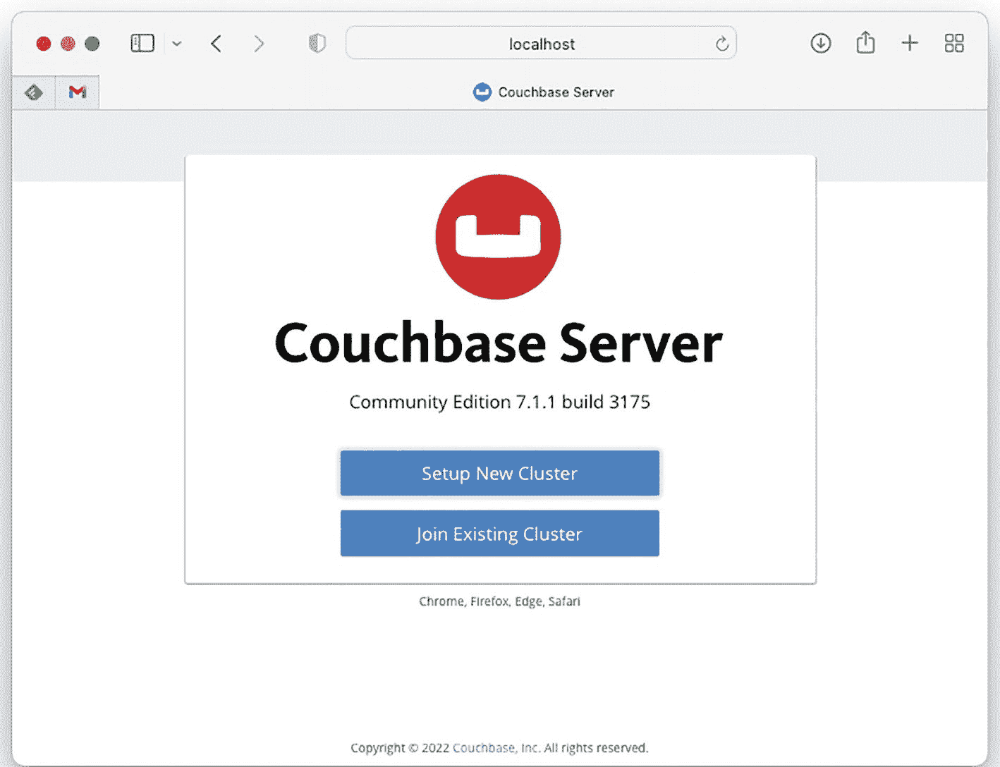

Couchbase Server 社区版 7.1.1（构建版本 3175）的窗口截图。其中包含以下选项：设置新集群，以及加入现有集群。

图 9-4

安装 Couchbase

在下一个屏幕（见图 9-5）中，您可以配置集群，并指定集群名称、用户名和用户密码。对于集群名称，您可以使用 `vehicle-cluster`。用户名为 `s6r-user`，密码为 `s6r-password`，当然您也可以自行选择（请记住在代码示例中也使用这些信息！）。现在点击 **下一步：接受条款** 按钮。

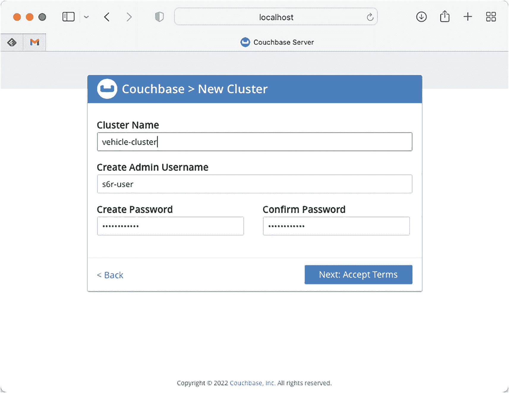

截图显示了 Couchbase 的“新集群”部分。它包含以下字段：集群名称、创建管理员用户名、创建密码和确认密码。“接受条款”选项位于右下角。

图 9-5

安装 Couchbase`—`新集群 (1/2)

在下一个屏幕（图 9-6）中，您需要勾选复选框以同意**条款和条件**。然后点击 **配置磁盘、内存、服务**。

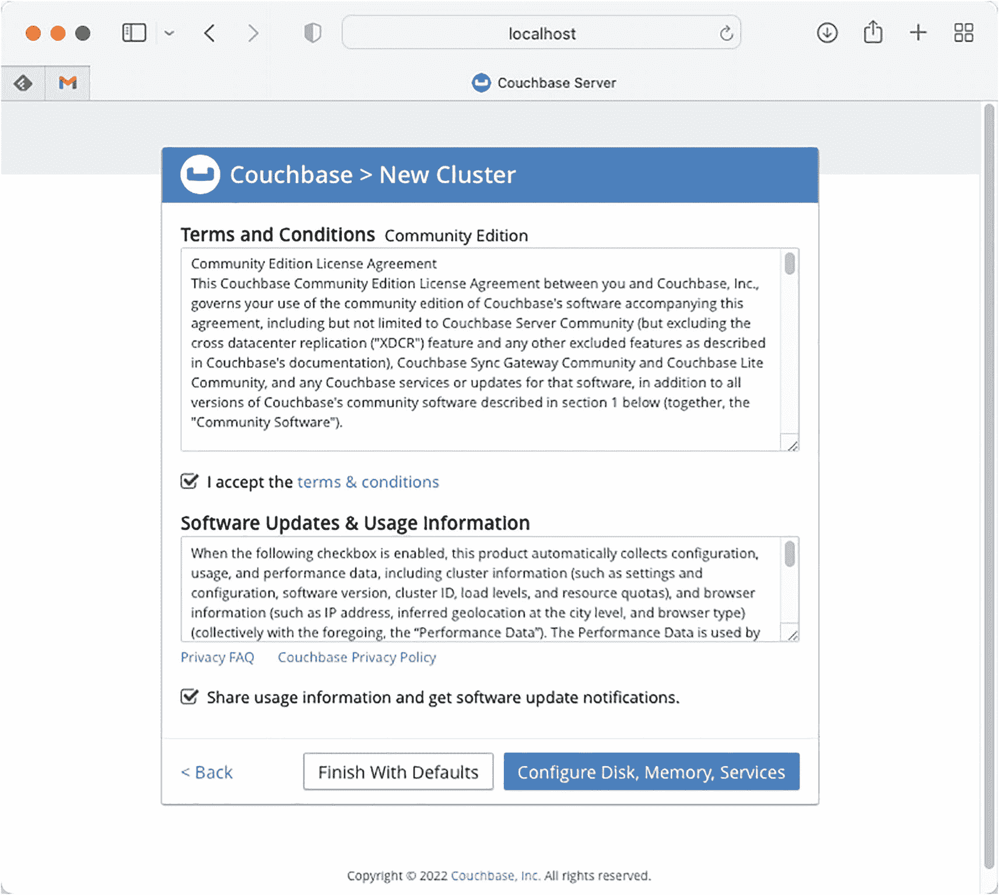

截图显示了“新集群”选项下的“条款和条件”部分。以下选项已启用：我接受条款和条件、共享使用信息并获取软件更新通知。右下角的“配置磁盘、内存和服务”按钮已高亮显示。

图 9-6

安装 Couchbase`—`新集群 (2/2)

一个信息符号，由带阴影圆圈内的字母 i 图标表示。 如果您正在运行 Docker 化的 Couchbase，则需要减少**数据 RAM 配额**，因为该配额是有限的。

以下屏幕（图 9-7）允许您配置内存和大小限制。保留默认设置，然后点击 **保存并完成**。

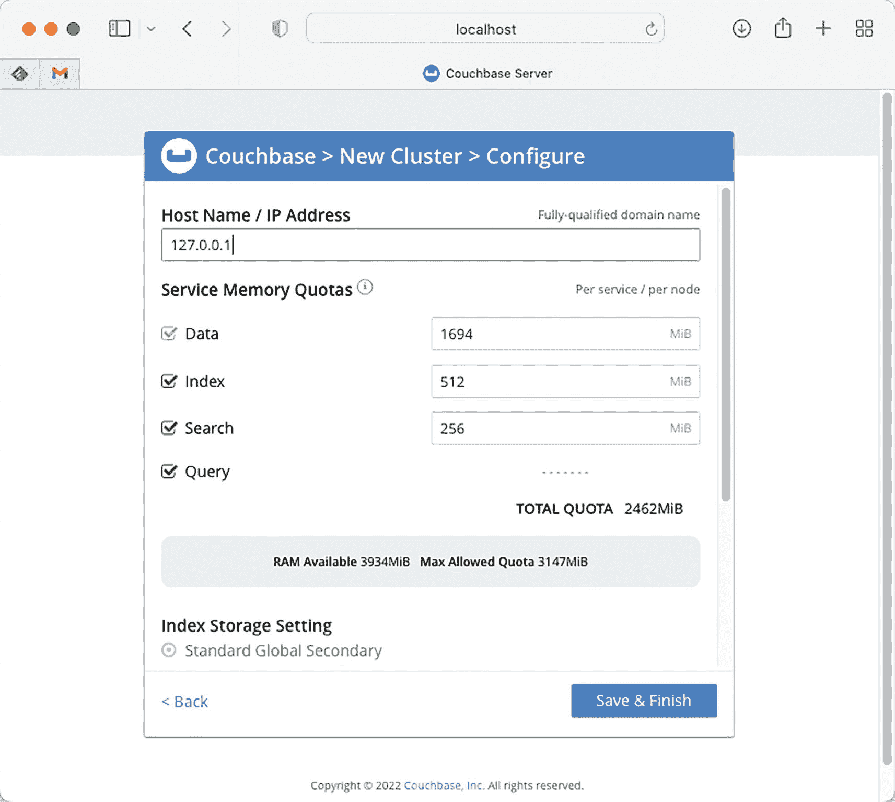

截图显示了 Couchbase 中“新集群”选项的“配置”部分。它包括主机名或 IP 地址，以及服务内存配额。服务内存配额启用了以下选项：数据、索引、搜索和查询。底部的“保存并完成”按钮已高亮显示。

图 9-7

安装 Couchbase`—`配置集群

稍等片刻后，您将看到 Couchbase 的管理控制台/浏览器界面，并显示一条消息，提示您尚未配置任何存储桶（图 9-8）。

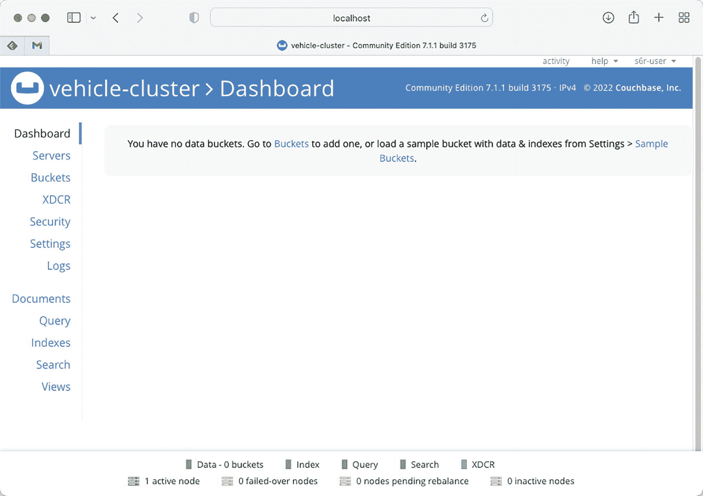

vehicle 集群中仪表盘屏幕的截图。它说明了如何创建存储桶。左侧面板包含以下选项：服务器、存储桶、XDCR、安全、设置和日志。

图 9-8

安装 Couchbase`—`创建存储桶 (1/3)

要创建存储桶，请点击 **存储桶** 导航至“存储桶”页面。随后您将看到存储桶管理页面（图 9-9）。

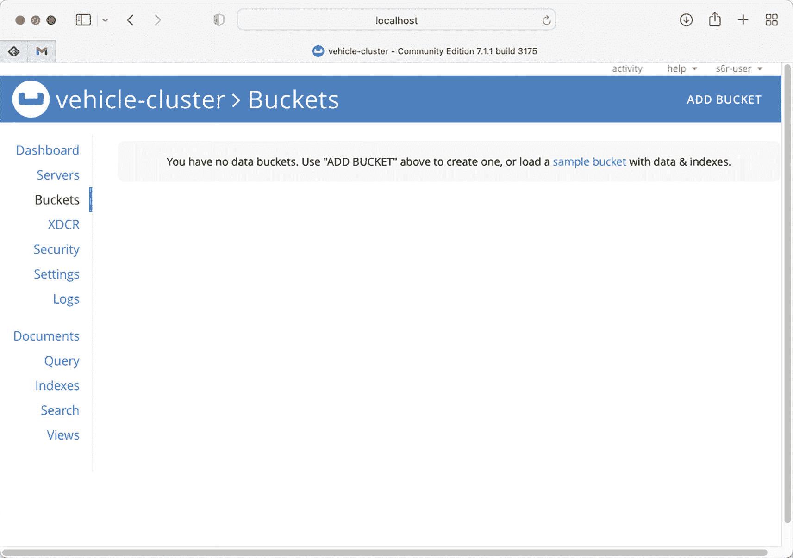

vehicle 集群中存储桶屏幕的截图。它说明了如何创建存储桶。左侧面板中，“存储桶”选项已被选中。

图 9-9

安装 Couchbase`—`创建存储桶 (2/3)

这里我们再次看到提示没有配置任何存储桶的消息。点击右上角的 **添加存储桶** 链接，打开添加存储桶的向导（图 9-10）。

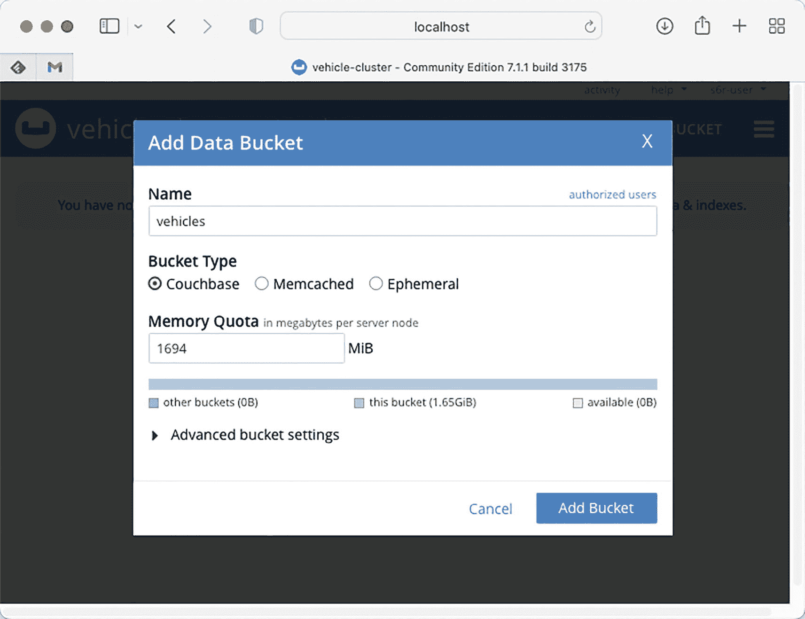

标题为“添加数据存储桶”的截图包含以下字段：名称、存储桶类型和内存配额。在“存储桶类型”下，选中了 Couchbase 单选按钮。右下角的“添加存储桶”按钮已高亮显示。

图 9-10

安装 Couchbase`—`创建存储桶 (3/3)

在此屏幕中，您可以创建一个存储桶并配置其设置。对于本教程，我们将保留默认设置，这已经足够了。名称选择 `vehicles`，因为您将在此存储车辆数据。填写完必填字段并根据需要配置设置（或保留默认设置）后，点击 **添加存储桶** 按钮。这将创建一个存储桶，其中包含一个默认的作用域和集合，两者均恰当地命名为 `_default`。


#### 使用 Couchbase 存储与检索文档

要在 Couchbase 中存储对象，你需要创建一个能够容纳多种类型内容的文档，例如 `Serializable` 对象、JSON、`String` 日期，或是以 Netty `ByteBuf` 形式存在的二进制数据。不过，主要的内容类型是 JSON。这样你也能将其与其他技术配合使用。如果使用二进制内容，则只能局限于基于 Java 的解决方案。在本篇食谱中，我们将使用 JSON 内容。

在 Couchbase 中存储对象之前，你需要先连接到集群。要连接 Couchbase，我们需要一个 `Cluster` 才能访问你在设置 Couchbase 时创建的 `Bucket`。你可以使用 `Cluster` 类来建立与之前设置的集群的连接。得到的 `Cluster` 可用于通过 `bucket()` 方法打开一个 `Bucket`。在本篇食谱中，我们将使用 `default` 桶和最简单的集群设置。

首先，创建一个 `Vehicle` 类（或复用食谱 9-1 中的类），你将把它存储到 Couchbase 中。

```
package com.apress.spring6recipes.nosql;
public record Vehicle(String vehicleNo, String color, int wheel, int seat) { }
列表 9-65
Vehicle 类
```

为了与 Couchbase 通信，你将创建一个仓库。首先，定义接口。

```
package com.apress.spring6recipes.nosql;
public interface VehicleRepository {
void save(Vehicle vehicle);
void delete(Vehicle vehicle);
Vehicle findByVehicleNo(String vehicleNo);
}
列表 9-66
VehicleRepository 接口
```

接下来是实现部分，它将处理 Couchbase 中的 `Vehicle`。

```
package com.apress.spring6recipes.nosql;
import com.couchbase.client.java.Bucket;
class CouchbaseVehicleRepository implements VehicleRepository {
private final Bucket bucket;
public CouchbaseVehicleRepository(Bucket bucket) {
this.bucket = bucket;
}
@Override
public void save(Vehicle vehicle) {
bucket.defaultCollection()
.upsert(vehicle.vehicleNo(), vehicle);
}
@Override
public void delete(Vehicle vehicle) {
bucket.defaultCollection().remove(vehicle.vehicleNo());
}
@Override
public Vehicle findByVehicleNo(String vehicleNo) {
return bucket.defaultCollection().get(vehicleNo).contentAs(Vehicle.class);
}
}
列表 9-67
Couchbase VehicleRepository 实现
```

仓库需要一个 `Bucket` 来存储文档。它类似于数据库中的表（`Bucket` 就像表，而 `Cluster` 更像整个数据库）。存储 `Vehicle` 时，它会被转换为 JSON，并且 `vehicleNo` 被用作 ID。之后会调用 `upsert` 方法。该方法会根据文档是否已存在来执行 `update` 或 `insert` 操作。Couchbase 自带了自己的 JSON 编组框架（Jackson 的重新打包版本），因此在存储 Java 对象时，它会使用该框架将其转换为 JSON（读取时则会将其转换回 Java 对象）。

让我们创建一个 `Main` 类，用于在桶中存储和检索 `Vehicle` 的数据。

```
package com.apress.spring6recipes.nosql;
import com.couchbase.client.java.Cluster;
public class Main {
public static void main(String[] args) {
try (var cluster = Cluster.connect("couchbase://127.0.0.1", "s6r-user", "s6r-password")){
var bucket = cluster.bucket("vehicles");
var vehicleRepository = new CouchbaseVehicleRepository(bucket);
vehicleRepository.save(new Vehicle("TEM0001", "GREEN", 3, 1));
vehicleRepository.save(new Vehicle("TEM0004", "RED", 4, 2));
var v1 = vehicleRepository.findByVehicleNo("TEM0001");
var v2 = vehicleRepository.findByVehicleNo("TEM0004");
System.out.println("Vehicle: " + v1);
System.out.println("Vehicle: " + v2);
vehicleRepository.delete(v1);
vehicleRepository.delete(v2);
}
}
}
列表 9-68
Main 类
```

首先，使用 `CouchbaseCluster.connect()` 方法建立与 `Cluster` 的连接。这将根据给定的 URL、用户名和密码连接到集群。在生产环境中使用 Couchbase 时，你可能希望使用其他 `connect` 方法，传入要连接的主机列表，或者使用 `ClusterOptions` 和 `ClusterEnvironment` 设置更多属性（例如 `queryTimeout`、`searchTimeout` 等）。对于本篇食谱，使用默认设置就足够了。接下来，你需要指定用于存储和检索文档的 `Bucket`（即最初创建的名为 `vehicles` 的桶）；使用 `cluster.bucket("vehicles")` 即可。

`Bucket` 用于创建 `CouchbaseVehicleRepository` 的实例。之后，存储、检索并再次删除两个 `Vehicles`（以免本篇食谱留下杂乱数据）。最后，关闭连接。

一个信息符号，由阴影圆圈内的字母 i 图标表示。  需要将 Spring Data Couchbase 的相关依赖添加到类路径中。使用 Maven 时，添加以下依赖：

```
org.springframework.data
spring-data-couchbase
5.0.0

```

或者使用 Gradle 时添加以下内容：

`implementation group: 'org.springframework.data', name: 'spring-data-couchbase', version: '5.0.0'`

#### 使用 Spring

目前所有配置都在 `Main` 类中。让我们将配置部分移至 `CouchbaseConfiguration` 类，并使用它来引导应用程序。

```
package com.apress.spring6recipes.nosql;
import com.couchbase.client.java.Bucket;
import com.couchbase.client.java.Cluster;
import org.springframework.context.annotation.Bean;
import org.springframework.context.annotation.Configuration;
@Configuration
public class CouchbaseConfiguration {
@Bean
public Cluster cluster() {
return Cluster.connect("couchbase://127.0.0.1", "s6r-user", "s6r-password");
}
@Bean
public Bucket bucket(Cluster cluster) {
return cluster.bucket("vehicles");
}
@Bean
public CouchbaseVehicleRepository vehicleRepository(Bucket bucket) {
return new CouchbaseVehicleRepository(bucket);
}
}
列表 9-69
Couchbase 配置类
```

`Cluster` 上的 `close` 方法会被自动调用，因为它是预定义的 `destroyMethods` 之一，会被自动检测到。`CouchbaseVehicleRepository` 的构造方式仍然相同，但现在你向它传递的是一个 Spring 管理的 bean。

修改 `Main` 类以使用 `CouchbaseConfiguration`。

```
package com.apress.spring6recipes.nosql;
import org.springframework.context.annotation.AnnotationConfigApplicationContext;
public class Main {
public static void main(String[] args) {
var cfg = CouchbaseConfiguration.class;
try (var ctx = new AnnotationConfigApplicationContext(cfg)) {
VehicleRepository vehicleRepository = ctx.getBean(VehicleRepository.class);
vehicleRepository.save(new Vehicle("TEM0001", "GREEN", 3, 1));
vehicleRepository.save(new Vehicle("TEM0004", "RED", 4, 2));
var v1 = vehicleRepository.findByVehicleNo("TEM0001");
var v2 = vehicleRepository.findByVehicleNo("TEM0004");
System.out.println("Vehicle: " + v1);
System.out.println("Vehicle: " + v2);
vehicleRepository.delete(v1);
vehicleRepository.delete(v2);
}
}
}
列表 9-70
Main 类
```

`VehicleRepository` 从构建的 `ApplicationContext` 中获取，并且仍然有 `Vehicle` 实例在 Couchbase 集群中被存储、检索和删除。


#### 使用 Spring Data CouchbaseTemplate

虽然通过 Java 和 Jackson 将 JSON 映射到 Couchbase 相当直接，但在处理较大存储库或使用特定索引和 N1QL 查询时，会变得相当繁琐。更不用说，如果你想将其集成到也使用其他数据存储方式的应用程序中。Spring Data Couchbase 项目包含一个 `CouchbaseTemplate`，它接管了你目前在存储库中执行的部分管道工作，例如与 JSON 之间的映射，以及将异常转换为 `DataAccessException`，这将使其更容易与 Spring 使用的其他数据访问技术集成。

首先，重写存储库以使用 `CouchbaseTemplate`。

```
package com.apress.spring6recipes.nosql;
import org.springframework.data.couchbase.core.CouchbaseTemplate;
public class CouchbaseVehicleRepository implements VehicleRepository {
private final CouchbaseTemplate couchbase;
public CouchbaseVehicleRepository(CouchbaseTemplate couchbase) {
this.couchbase = couchbase;
}
@Override
public void save(Vehicle vehicle) {
couchbase.upsertById(Vehicle.class).one(vehicle);
}
@Override
public void delete(Vehicle vehicle) {
couchbase.removeById(Vehicle.class).one(vehicle.getVehicleNo());
}
@Override
public Vehicle findByVehicleNo(String vehicleNo) {
return couchbase.findById(Vehicle.class).one(vehicleNo);
}
}
清单 9-71
使用 CouchbaseTemplate 的 VehicleRepository
```

现在，存储库缩减为仅几行代码。为了能够存储 `Vehicle`，你需要对 `Vehicle` 对象进行注解，因为它需要知道使用哪个字段作为 ID。

```
package com.apress.spring6recipes.nosql;
import org.springframework.data.annotation.Id;
import org.springframework.data.couchbase.core.mapping.Field;
public record Vehicle(@Id String vehicleNo,
@Field String color,
@Field int wheel,
@Field int seat) { }
清单 9-72
带有注解的 Vehicle 类
```

字段 `vehicleNo` 已使用 `@Id` 注解进行标注，其他字段则使用了 `@Field`。虽然后者并非必需，但建议指定它。你还可以使用 `@Field` 注解为 JSON 属性的名称指定一个不同的名称，这在需要将现有文档映射到 Java 对象时会很方便。

最后，你需要在配置类中配置一个 `CouchbaseTemplate`。

```
package com.apress.spring6recipes.nosql;
import com.couchbase.client.java.Cluster;
import org.springframework.context.annotation.Bean;
import org.springframework.context.annotation.Configuration;
import org.springframework.data.couchbase.CouchbaseClientFactory;
import org.springframework.data.couchbase.SimpleCouchbaseClientFactory;
import org.springframework.data.couchbase.core.CouchbaseTemplate;
import org.springframework.data.couchbase.core.convert.CouchbaseConverter;
import org.springframework.data.couchbase.core.convert.MappingCouchbaseConverter;
@Configuration
public class CouchbaseConfiguration {
@Bean
public Cluster cluster() {
return Cluster.connect("couchbase://127.0.0.1", "s6r-user", "s6r-password");
}
@Bean
public CouchbaseClientFactory couchbaseClientFactory(Cluster cluster) {
return new SimpleCouchbaseClientFactory(cluster, "vehicles", null);
}
@Bean
public CouchbaseConverter couchbaseConverter() {
return new MappingCouchbaseConverter();
}
@Bean
public CouchbaseTemplate couchbaseTemplate(CouchbaseClientFactory ccf,
CouchbaseConverter couchbaseConverter) {
return new CouchbaseTemplate(ccf, couchbaseConverter);
}
@Bean
public CouchbaseVehicleRepository vehicleRepository(CouchbaseTemplate template) {
return new CouchbaseVehicleRepository(template);
}
}
清单 9-73
Couchbase 配置
```

一个 `CouchbaseTemplate` 需要一个 `CouchebaseClientFactory` 和一个 `CouchebaseConverter`。`CouchebaseClientFactory` 是一个 Spring Data Couchbase 组件，负责处理与 Couchbase 集群的连接（因此，我们将 `Cluster` 传递给它）。`MappingCouchebaseConverter` 用于在对象与 Couchbase 之间进行映射，并处理 Couchbase 不直接支持的类型。

当运行 `Main` 类时，访问仍然可用，并且存储、检索和删除操作仍然有效。

为了使配置更简单，Spring Data Couchbase 提供了一个基础配置类 `AbstractCouchbaseConfiguration`，你可以继承它。这样，你就不再需要配置 Spring Data Couchbase 特定的组件了。

```
package com.apress.spring6recipes.nosql;
import org.springframework.context.annotation.Bean;
import org.springframework.context.annotation.Configuration;
import org.springframework.data.couchbase.config.AbstractCouchbaseConfiguration;
import org.springframework.data.couchbase.core.CouchbaseTemplate;
@Configuration
public class CouchbaseConfiguration extends AbstractCouchbaseConfiguration {
@Override
public String getConnectionString() {
return "couchbase://127.0.0.1";
}
@Override
public String getUserName() {
return "s6r-user";
}
@Override
public String getPassword() {
return "s6r-password";
}
@Override
public String getBucketName() {
return "vehicles";
}
@Bean
public CouchbaseVehicleRepository vehicleRepository(CouchbaseTemplate template) {
return new CouchbaseVehicleRepository(template);
}
}
清单 9-74
使用基础类的 Couchbase 配置
```

现在，配置继承了 `AbstractCouchbaseConfiguration` 基础类，你只需要提供存储桶的连接 URL、用户名和密码。基础配置类提供了 `CouchbaseTemplate` 及其所需的所有对象。

#### 使用 Spring Data Couchbase 存储库

与其他技术一样，Spring Data Couchbase 也提供了指定接口并在运行时拥有实际存储库实现的功能。这样，你只需要创建一个接口，而无需创建具体的实现。为此，与其他 Spring Data 项目一样，你需要继承 `CrudRepository`。请注意，如果你需要 `CouchbaseRepository` 的功能，也可以继承它。在本示例中，我们将使用 `CrudRepository`。

```
package com.apress.spring6recipes.nosql;
import org.springframework.data.repository.CrudRepository;
public interface VehicleRepository extends CrudRepository { }
清单 9-75
基于 Spring Data Couchbase 的 VehicleRepository 接口
```

如你所见，该接口不再有方法，因为所有 CRUD 方法都已提供。

接下来，需要在配置类上添加 `@EnableCouchbaseRepositories` 注解。

```
package com.apress.spring6recipes.nosql;
import org.springframework.context.annotation.Configuration;
import org.springframework.data.couchbase.config.AbstractCouchbaseConfiguration;
import org.springframework.data.couchbase.repository.config.EnableCouchbaseRepositories;
@Configuration
@EnableCouchbaseRepositories
public class CouchbaseConfiguration extends AbstractCouchbaseConfiguration {
}
清单 9-76
Spring Data Couchbase 配置
```

最后，`Main` 类需要稍作修改，因为你需要使用 `findById` 方法代替 `findByVehicleNo`。

```
package com.apress.spring6recipes.nosql;
import org.springframework.context.annotation.AnnotationConfigApplicationContext;
public class Main {
public static void main(String[] args) {
try (var context = new AnnotationConfigApplicationContext(CouchbaseConfiguration.class)) {
VehicleRepository vehicleRepository = context.getBean(VehicleRepository.class);
vehicleRepository.save(new Vehicle("TEM0001", "GREEN", 3, 1));
vehicleRepository.save(new Vehicle("TEM0004", "RED", 4, 2));
vehicleRepository.findById("TEM0001").ifPresent(System.out::println);
vehicleRepository.findById("TEM0004").ifPresent(System.out::println);
vehicleRepository.deleteById("TEM0001");
vehicleRepository.deleteById("TEM0004");
}
}
}
清单 9-77
Main 类
```

`findById` 方法返回一个 `java.util.Optional`，因此你可以使用 `ifPresent` 方法将其打印到控制台。


#### 使用 Spring Data Reactive Couchbase 仓库

除了阻塞式仓库，还可以使用 `ReactiveCouchbaseRepository` 来获得响应式仓库。现在，对于返回零个或一个元素的方法（如 `findById`），它将返回一个 `Mono`；对于返回零个或多个元素的方法（如 `findAll`），它将返回一个 `Flux`。默认的 Couchbase 驱动已经内置了响应式支持。要使用此功能，你需要在类路径中包含 RxJava 和 RxJava Reactive Streams。要使用 `ReactiveCouchbaseRepository` 中的响应式类型，你还需要在类路径中包含 Project Reactor。

要为 Couchbase 配置响应式仓库，请修改 `CouchbaseConfiguration`。使用 `@EnableReactiveCouchbaseRepositories` 代替 `@EnableCouchbaseRepositories`。

```
package com.apress.spring6recipes.nosql;
import org.springframework.context.annotation.Configuration;
import org.springframework.data.couchbase.config.AbstractCouchbaseConfiguration;
import org.springframework.data.couchbase.repository.config.EnableReactiveCouchbaseRepositories;
@Configuration
@EnableReactiveCouchbaseRepositories
public class CouchbaseConfiguration extends AbstractCouchbaseConfiguration {
清单 9-78
响应式 Couchbase 配置
```

配置的其余部分与常规的 Couchbase 配置保持一致。我们仍然需要连接到同一个 Couchbase 服务器并使用同一个存储桶。

接下来，对于 `VehicleRepository`，让它扩展 `ReactiveCrudRepository` 而不是 `CrudRepository`。

```
package com.apress.spring6recipes.nosql;
import org.springframework.data.couchbase.repository.ReactiveCouchbaseRepository;
public interface VehicleRepository
extends ReactiveCouchbaseRepository { }
清单 9-79
响应式 Spring Data VehicleRepository 接口
```

这基本上就是获得一个响应式仓库所需的全部操作。为了能够进行测试，你还需要修改 `Main` 类。

```
package com.apress.spring6recipes.nosql;
import org.springframework.context.annotation.AnnotationConfigApplicationContext;
import reactor.core.publisher.Flux;
import java.util.concurrent.CountDownLatch;
public class Main {
public static void main(String[] args) throws InterruptedException {
try (var ctx = new AnnotationConfigApplicationContext(CouchbaseConfiguration.class)) {
var repository = ctx.getBean(VehicleRepository.class);
var countDownLatch = new CountDownLatch(1);
repository.saveAll(Flux.just(new Vehicle("TEM0001", "GREEN", 3, 1), //
new Vehicle("TEM0004", "RED", 4, 2)))
.last()
.then(repository.findById("TEM0001")).doOnSuccess(System.out::println)
.then(repository.findById("TEM0004")).doOnSuccess(System.out::println)
.then(repository.deleteById(Flux.just("TEM0001", "TEM00004")))
.doOnTerminate(countDownLatch::countDown)
.subscribe();
countDownLatch.await();
}
}
}
清单 9-80
Main 类
```

创建 `ApplicationContext` 和获取 `VehicleRepository` 的方式并无不同。然而，在此之后，我们有一个依次执行的方法调用链。首先，你向数据存储中添加两个 `Vehicle` 实例。当 `last()` 一个被保存后，你将查询仓库以获取每个实例。完成后，所有内容再次被删除。为了让所有操作都能完成，你可以选择 `block()` 或自行等待。通常，在响应式系统中应避免使用 `block()`，因此这里使用了 `CountDownLatch`。当 `deleteById` 方法完成时，`CountDownLatch` 会递减。`countDownLatch.await()` 会等待计数器归零，然后结束程序。

## 9-5. 总结

在本节中，你初步了解了不同类型的数据存储，包括如何使用它们，以及如何利用 Spring Data 系列的不同模块简化使用过程。你首先以 MongoDB 的形式了解了文档型存储，以及 Spring Data MongoDB 模块的使用。接下来，你了解了键值存储，其中使用 Redis 作为实现，并使用了 Spring Data Redis 模块。随后，你简要了解了基于图的数据存储，本例中为 Neo4j 与 Spring Data Neo4j，并构建了一个用于存储实体的仓库。你最后了解的数据存储是 Couchbase 与 Spring Data Couchbase。对于所有数据存储，你都了解了其基本用法，以及 Spring Data 如何帮助简化配置和数据存储的使用。由于响应式编程也非常流行，我们还深入探讨了使用 Spring Data 和各种数据存储（在需要时使用响应式驱动）以及 Project Reactor 进行响应式编程。

# 10. Spring Java 企业服务与远程调用技术

在本章中，你将学习 Spring 对最常见 Java 企业服务的支持：Java 管理扩展（JMX）、使用 Jakarta Mail 发送电子邮件，以及使用或不使用 Quartz 进行任务调度。此外，你还将学习 Spring 对 SOAP Web 服务的支持。

JMX 是 Java SE 的一部分，是一种用于管理和监控系统资源（如设备、应用程序、对象和服务驱动网络）的技术。这些资源被表示为托管 Bean（MBean）。Spring 支持 JMX，可以将任何 Spring Bean 导出为模型 MBean，而无需针对 JMX API 进行编程。此外，Spring 可以轻松访问远程 MBean。

Jakarta Mail 是在 Java 中发送电子邮件的标准 API 和实现。Spring 进一步提供了一个抽象层，以独立于实现的方式发送电子邮件。

在 Java 平台上调度任务主要有两种选择：JDK Timer 和 Quartz Scheduler。JDK Timer 提供了与 JDK 捆绑的简单任务调度功能。与 JDK Timer 相比，Quartz 提供了更强大的作业调度功能。对于这两种选择，Spring 都提供了实用类，可以在 Bean 配置文件中配置调度任务，而无需直接使用任一 API。

你将学习如何使用 Spring Web Services（Spring-WS）创建和使用 SOAP Web 服务。

最后几节将介绍如何使用 [Java Flight Recorder](https://www.oracle.com/java/technologies/jdk-mission-control.html) (JFR) 以及 [Micrometer API](https://micrometer.io/) 来深入了解应用程序的行为和用法。

## 10-1. 将 Spring POJO 注册为 JMX MBean

### 问题

你想将 Java 应用程序中的对象注册为 JMX MBean，以便能够查看正在运行的服务并在运行时操纵其状态。这将允许你执行以下任务：重新运行批处理作业、调用方法以及更改配置元数据。

### 解决方案

Spring 支持 JMX，允许你将其 IoC 容器中的任何 Bean 导出为模型 MBean。这可以通过简单地声明一个 `MBeanExporter` 实例来完成。借助 Spring 的 JMX 支持，你无需直接处理 JMX API。此外，Spring 允许你声明 [JSR-160](https://www.jcp.org/en/jsr/detail%253Fid%253D160)（Java 管理扩展远程 API）连接器，通过使用工厂 Bean，在特定协议上暴露 MBean 以供远程访问。Spring 为服务器和客户端都提供了工厂 Bean。

Spring 的 JMX 支持还提供了其他机制，你可以通过这些机制来组装 MBean 的管理接口。这些选项包括使用方法名称、接口和注解来导出 Bean。Spring 还可以自动检测并导出 IoC 容器中声明的、并使用 Spring 定义的 JMX 特定注解进行注解的 Bean 作为 MBean。


### 工作原理

假设你正在开发一个用于将文件从一个目录复制到另一个目录的工具。让我们来设计这个工具的接口。

```
package com.apress.spring6recipes.replicator;
import java.io.IOException;
public interface FileReplicator {
String getSrcDir();
void setSrcDir(String srcDir);
String getDestDir();
void setDestDir(String destDir);
void replicate() throws IOException;
}
代码清单 10-1
FileReplicator 接口
```

源目录和目标目录被设计为复制器对象的属性，而不是方法参数。这意味着每个文件复制器实例仅针对特定的源目录和目标目录复制文件。你可以在应用程序中创建多个复制器实例。

但在实现这个复制器之前，让我们先创建另一个接口，该接口根据文件名将文件从一个目录复制到另一个目录。

```
package com.apress.spring6recipes.replicator;
import java.nio.file.Path;
public interface FileCopier {
void copyFile(Path srcFile, Path destDir);
}
代码清单 10-2
FileCopier 接口
```

实现这个文件复制器有多种策略。例如，你可以利用 Java NIO 类。

```
package com.apress.spring6recipes.replicator;
import java.io.IOException;
import java.nio.file.Files;
import java.nio.file.Path;
public class NioFileCopier implements FileCopier {
@Override
public void copyFile(Path srcFile, Path destDir) {
var destFile = destDir.resolve(srcFile.getFileName());
try {
Files.copy(srcFile, destFile);
} catch (IOException ex) {
throw new IllegalStateException("Cannot copy file.", ex);
}
}
}
代码清单 10-3
FileCopier 实现
```

借助文件复制器，你可以实现文件复制器，如下面的代码示例所示。

```
package com.apress.spring6recipes.replicator;
import java.io.IOException;
import java.nio.file.Files;
import java.nio.file.Path;
public class JMXFileReplicator implements FileReplicator {
private String srcDir;
private String destDir;
private FileCopier fileCopier;
public String getSrcDir() {
return srcDir;
}
public void setSrcDir(String srcDir) {
this.srcDir = srcDir;
}
public String getDestDir() {
return destDir;
}
public void setDestDir(String destDir) {
this.destDir = destDir;
}
public FileCopier getFileCopier() {
return fileCopier;
}
public void setFileCopier(FileCopier fileCopier) {
this.fileCopier = fileCopier;
}
@Override
public synchronized void replicate() throws IOException {
var files = Path.of(srcDir);
try (var fileList = Files.list(files)) {
fileList.filter(Files::isRegularFile)
.forEach(it -> fileCopier.copyFile(it, Path.of(destDir)));
}
}
}
代码清单 10-4
文件复制实现
```

每次调用 `replicate()` 方法时，源目录中的所有文件都会被复制到目标目录。为了避免并发复制引起的意外问题，将此方法声明为 `synchronized`。

现在，你可以在一个 Java 配置类中配置一个或多个文件复制器实例。`documentReplicator` 实例需要引用两个目录：一个用于读取文件的源目录，以及一个用于备份文件的目标目录。此示例中的代码尝试从操作系统用户主目录中名为 `docs` 的目录读取文件，然后复制到操作系统用户主目录中名为 `docs_backup` 的文件夹。

当这个 Bean 启动时，如果这两个目录不存在，则会创建它们。

一个灯泡的轮廓示意图。  “主目录”因操作系统而异，但在 Unix 系统上，它通常是 `~` 所解析到的目录。在 Linux 机器上，该文件夹可能是 `/home/user`。在 Mac OS X 上，该文件夹可能是 `/Users/user`，而在 Windows 上，它可能类似于 `C:\Documents and Settings\user`。

```
package com.apress.spring6recipes.replicator.config;
import com.apress.spring6recipes.replicator.FileCopier;
import com.apress.spring6recipes.replicator.JMXFileReplicator;
import com.apress.spring6recipes.replicator.NioFileCopier;
import jakarta.annotation.PostConstruct;
import org.springframework.beans.factory.annotation.Value;
import org.springframework.context.annotation.Bean;
import org.springframework.context.annotation.Configuration;
import java.io.IOException;
import java.nio.file.Files;
import java.nio.file.Path;
@Configuration
public class FileReplicatorConfig {
@Value("#{systemProperties['user.home']}/docs")
private String srcDir;
@Value("#{systemProperties['user.home']}/docs_backup")
private String destDir;
@Bean
public NioFileCopier fileCopier() {
return new NioFileCopier();
}
@Bean
public JMXFileReplicator documentReplicator(FileCopier fileCopier) {
var fRep = new JMXFileReplicator();
fRep.setSrcDir(srcDir);
fRep.setDestDir(destDir);
fRep.setFileCopier(fileCopier);
return fRep;
}
@PostConstruct
public void verifyDirectoriesExist() throws IOException {
Files.createDirectories(Path.of(srcDir));
Files.createDirectories(Path.of(destDir));
}
}
代码清单 10-5
文件复制器配置
```

首先，使用 `@Value` 注解声明了两个字段，以获取用户主目录的访问权限，并定义源目录和目标目录。接着，使用 `@Bean` 注解创建了两个 Bean 实例。注意 `verifyDirectoriesExist()` 方法上的 `@PostConstruct` 注解，它确保了源目录和目标目录的存在。

现在我们已经有了应用程序的核心 Bean，接下来让我们看看如何将 Bean 注册为 MBean 并进行访问。


#### 无需 Spring 支持注册 MBean

首先，我们来看看如何直接使用 JMX API 注册一个模型 MBean。在下面的主类中，你从 IoC 容器中获取 `FileReplicator` Bean，并将其注册为一个用于管理和监控的 MBean。所有属性和方法都包含在该 MBean 的管理接口中。

```
package com.apress.spring6recipes.replicator;
import com.apress.spring6recipes.replicator.config.FileReplicatorConfig;
import org.springframework.context.annotation.AnnotationConfigApplicationContext;
import javax.management.JMException;
import javax.management.ObjectName;
import javax.management.modelmbean.DescriptorSupport;
import javax.management.modelmbean.InvalidTargetObjectTypeException;
import javax.management.modelmbean.ModelMBeanAttributeInfo;
import javax.management.modelmbean.ModelMBeanInfoSupport;
import javax.management.modelmbean.ModelMBeanOperationInfo;
import javax.management.modelmbean.RequiredModelMBean;
import java.io.IOException;
import java.lang.management.ManagementFactory;
public class Main {
public static void main(String[] args) throws IOException {
var cfg = FileReplicatorConfig.class;
try (var ctx = new AnnotationConfigApplicationContext(cfg)) {
var documentReplicator = ctx.getBean(FileReplicator.class);
try {
var mbeanServer = ManagementFactory.getPlatformMBeanServer();
var objectName = new ObjectName("bean:name=documentReplicator");
var mbean = new RequiredModelMBean();
mbean.setManagedResource(documentReplicator, "objectReference");
var srcDirDescriptor = new DescriptorSupport(
"name=SrcDir", "descriptorType=attribute",
"getMethod=getSrcDir", "setMethod=setSrcDir");
var srcDirInfo = new ModelMBeanAttributeInfo(
"SrcDir", "java.lang.String", "Source directory",
true, true, false, srcDirDescriptor);
var destDirDescriptor = new DescriptorSupport(
"name=DestDir", "descriptorType=attribute",
"getMethod=getDestDir", "setMethod=setDestDir");
var destDirInfo = new ModelMBeanAttributeInfo(
"DestDir", "java.lang.String", "Destination directory",
true, true, false, destDirDescriptor);
var getSrcDirInfo = new ModelMBeanOperationInfo(
"Get source directory",
FileReplicator.class.getMethod("getSrcDir"));
var setSrcDirInfo = new ModelMBeanOperationInfo(
"Set source directory",
FileReplicator.class.getMethod("setSrcDir", String.class));
var getDestDirInfo = new ModelMBeanOperationInfo(
"Get destination directory",
FileReplicator.class.getMethod("getDestDir"));
var setDestDirInfo = new ModelMBeanOperationInfo(
"Set destination directory",
FileReplicator.class.getMethod("setDestDir", String.class));
var replicateInfo = new ModelMBeanOperationInfo(
"Replicate files",
FileReplicator.class.getMethod("replicate"));
var mbeanInfo = new ModelMBeanInfoSupport(
"FileReplicator", "File replicator",
new ModelMBeanAttributeInfo[]{srcDirInfo, destDirInfo},
null,
new ModelMBeanOperationInfo[]{getSrcDirInfo, setSrcDirInfo,
getDestDirInfo, setDestDirInfo, replicateInfo},
null
);
mbean.setModelMBeanInfo(mbeanInfo);
mbeanServer.registerMBean(mbean, objectName);
} catch (JMException | InvalidTargetObjectTypeException |
NoSuchMethodException ex) {
System.err.println(ex);
}
}
System.in.read();
}
}
清单 10-6
主类
```

要注册一个 MBean，你需要一个 `javax.managment.MBeanServer`。你可以调用静态方法 `ManagementFactory.getPlatformMBeanServer()` 来定位一个平台 MBean 服务器。如果不存在 MBean 服务器，它会创建一个，然后注册该服务器实例以供将来使用。每个 MBean 都需要一个包含域名的 MBean 对象名称。上述 MBean 在域 `bean` 下以名称 `documentReplicator` 注册。

从上述代码可以看出，对于每个 MBean 属性和 MBean 操作，你需要创建一个 `ModelMBeanAttributeInfo` 对象和一个 `ModelMBeanOperationInfo` 对象来描述它。之后，你必须通过组装上述信息来创建一个 `ModelMBeanInfo` 对象，用于描述 MBean 的管理接口。关于这些类型使用的详细信息，你可以查阅它们的 Javadocs。此外，在调用 JMX API 时，你必须处理 JMX 特有的异常。这些异常是必须处理的受检异常。请注意，在使用 JMX 客户端工具查看应用程序内部状态之前，必须防止应用程序终止。使用 `System.in.read()` 从控制台请求一个按键是一个不错的选择。

最后，你必须添加 VM 参数 `-Dcom.sun.management.jmxremote` 来启用对此应用程序的本地监控。如果你使用的是本书的源代码，可以使用以下命令。

```
java -Dcom.sun.management.jmxremote -jar  recipe_10_1_i-6.0.0.jar
清单 10-7
运行 Shell 命令
```

现在，你可以使用任何 JMX 客户端工具在本地监控你的 MBean。最简单的工具是 JConsole，它随 JDK 一起提供。要启动 JConsole，请执行位于 JDK 安装目录 `bin` 目录下的 `jconsole` 可执行文件。

当 JConsole 启动时，你可以在连接窗口的“本地进程”选项卡中看到已启用 JMX 的应用程序列表。选择与正在运行的 Spring 应用程序相对应的进程（即 `recipe_10_1_i-1.0-6.0.0.jar`）。如图 10-1 所示。

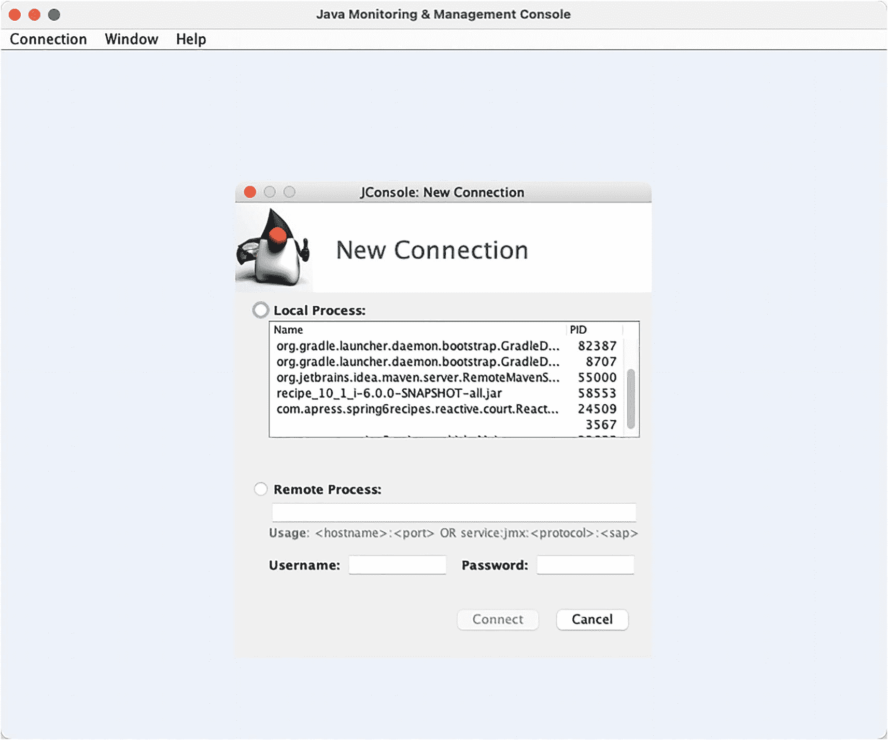

JConsole 新建连接窗口的截图。它列出了正在运行的本地进程的名称。它有一个未激活的远程进程字段，以及用户名和密码字段。

图 10-1

JConsole 启动窗口

火焰燃烧的图标。  如果你使用的是 Windows 系统，你可能在 JConsole 中看不到任何进程。这是一个已知的 bug，即 JConsole 无法检测到正在运行的 Java 进程。要解决此问题，你需要确保用户在临时文件夹中有一个 `hsperfdata` 文件夹。Java 和 JConsole 使用此文件夹来跟踪正在运行的进程，但它可能不存在。例如，如果你以用户 John.Doe 身份运行应用程序，请确保以下路径存在：`C:\Users\John.Doe\AppData\Local\Temp\hsperfdata_John.Doe\`。

连接到复制器应用程序后，转到 **MBeans** 选项卡。接下来，单击左侧树中的 **bean** 文件夹，选择 `documentReplicator`，然后选择“操作”部分。在主屏幕上，你将看到一系列用于调用 Bean 操作的按钮。要调用 `replicate()`，只需单击“replicate”按钮。此屏幕如图 10-2 所示。

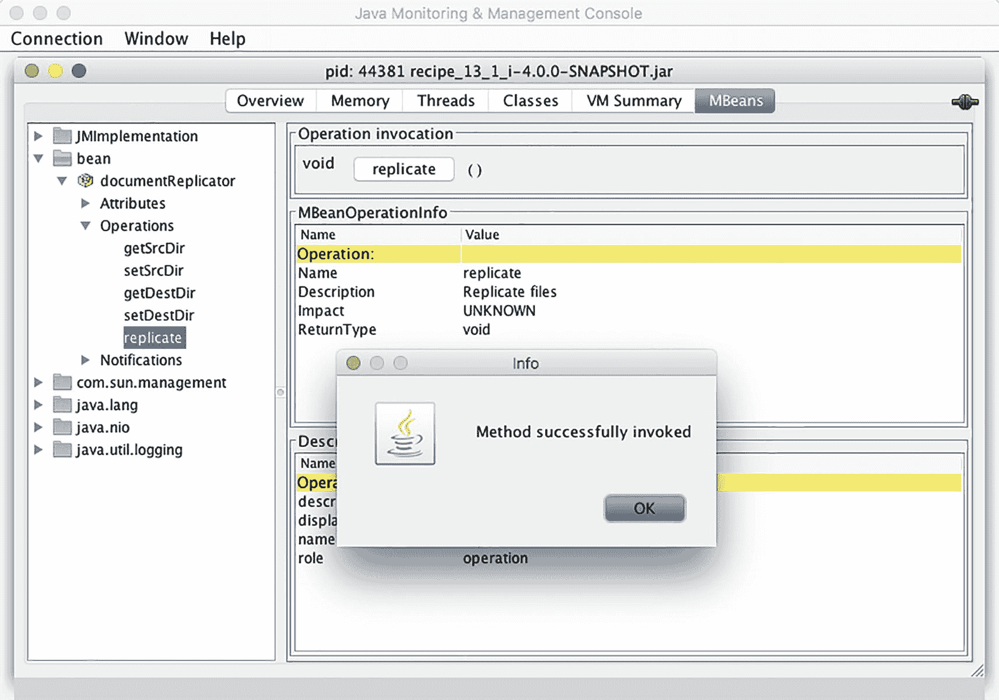

一个名为“pid recipe snapshot dot jar”的窗口截图，其中突出显示了 replicate 操作和 MBeans 选项卡。窗口内打开了一个标题为“info”的对话框，消息为“method successfully invoked”。下方有一个“OK”按钮。

图 10-2

JConsole 模拟 Spring Bean 操作

你将看到一个“Method successfully invoked”弹出窗口。通过此操作，源文件夹中的所有文件都将与目标文件夹中的文件进行复制/同步。


#### 使用 Spring 支持注册 MBean

之前的应用程序直接使用了 JMX API。正如你在主应用程序类中所见，其中包含大量难以编写、管理和有时难以理解的代码。要将 Spring IoC 容器中配置的 Bean 导出为 MBean，你只需创建一个 `MBeanExporter` 实例，并指定要导出的 Bean，以它们的 MBean 对象名称作为键。这可以通过添加以下配置类来实现。请注意，`beansToExport` 映射中的键被用作对应条目值所引用的 Bean 的 `ObjectName`。

```
package com.apress.spring6recipes.replicator.config;
import org.springframework.context.annotation.Bean;
import org.springframework.context.annotation.Configuration;
import org.springframework.jmx.export.MBeanExporter;
import java.util.Map;
@Configuration
public class JmxConfig {
@Bean
public MBeanExporter mbeanExporter() {
var beansToExport = Map.of(
"bean:name=documentReplicator", "documentReplicator");
var mbeanExporter = new MBeanExporter();
mbeanExporter.setBeans(beansToExport);
return mbeanExporter;
}
}
清单 10-8
JMX 配置
```

上述配置将 `FileReplicator` Bean 导出为 MBean，位于域 bean 下，名称为 `documentReplicator`。默认情况下，所有公共属性都作为属性包含在内，所有公共方法（`java.lang.Object` 中的方法除外）都作为操作包含在 MBean 的管理接口中。借助 Spring JMX，应用程序中的主类可以缩减为以下几行。

```
package com.apress.spring6recipes.replicator;
import org.springframework.context.annotation.AnnotationConfigApplicationContext;
import java.io.IOException;
public class Main {
public static void main(String[] args) throws IOException {
var cfg = "com.apress.spring6recipes.replicator.config";
try (var ctx = new AnnotationConfigApplicationContext(cfg)) {
System.in.read();
}
}
}
清单 10-9
主类
```

#### 处理多个 MBean 服务器实例

Spring 的 `MBeanExporter` 方法可以隐式定位 MBean 服务器实例并向其注册 MBean。JDK 在你首次定位 MBean 服务器时创建它，因此无需显式创建 MBean 服务器。如果应用程序在提供 MBean 服务器的环境（例如 Java 应用服务器）中运行，情况也是如此。

但是，如果你有多个 MBean 服务器在运行，则需要告诉 `mbeanServer` Bean 它应该绑定到哪个服务器。你可以通过指定服务器的 `agentId` 来实现。例如，要在 JConsole 中找出给定服务器的 `agentId`，请转到 MBeans 选项卡，然后在左侧树中转到 JMImplementation ➤ MBeanServerDelegate ➤ Attributes ➤ MBeanServerId。在那里，你将看到字符串值（参见图 10-3）。

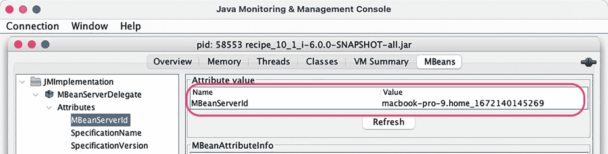

一个 Java 监控与管理控制台窗口内打开了一个所有点 jar 窗口的快照。属性名称和值被高亮显示，并用轮廓线框出。在左侧窗格中，M bean server I D 被选中。

图 10-3

代理 ID 属性

在我们的本地机器上，该值为 `macbook-pro-9.home_1672140145269`。要启用它，请配置 MBeanServer 的 `agentId` 属性。

```
@Bean
public MBeanServerFactoryBean mbeanServer() {
var mbeanServer = new MBeanServerFactoryBean();
mbeanServer.setLocateExistingServerIfPossible(true);
mbeanServer.setAgentId("macbook-pro-9.home_1672140145269");
return mbeanServer;
}
清单 10-10
代理 ID 配置
```

如果你的上下文中存在多个 MBean 服务器实例，你可以显式地为 `MBeanExporter` 指定一个特定的 MBean 服务器来导出你的 MBean。在这种情况下，`MBeanExporter` 将不会定位 MBean 服务器；它将使用指定的 MBean 服务器实例。此属性用于在存在多个 MBean 服务器时指定一个特定的 MBean 服务器。

```
@Bean
public MBeanExporter mbeanExporter(MBeanServer server) {
var mbeanExporter = new MBeanExporter();
mbeanExporter.setBeans(beansToExport());
mbeanExporter.setServer(server);
return mbeanExporter;
}
@Bean
public MBeanServerFactoryBean mbeanServer() {
var mbeanServer = new MBeanServerFactoryBean();
mbeanServer.setLocateExistingServerIfPossible(true);
return mbeanServer;
}
清单 10-11
带有显式 MBeanServer 的 MBeanExporter
```

#### 组装 MBean 的管理接口

默认情况下，Spring 的 `MBeanExporter` 将 Bean 的所有公共属性导出为 MBean 属性，所有公共方法导出为 MBean 操作。但你可以使用 MBean 汇编器来组装 MBean 的管理接口。Spring 中最简单的 MBean 汇编器是 `MethodNameBasedMBeanInfoAssembler`，它允许你指定要导出的方法名称。

```
package com.apress.spring6recipes.replicator.config;
import org.springframework.context.annotation.Bean;
import org.springframework.context.annotation.Configuration;
import org.springframework.jmx.export.MBeanExporter;
import org.springframework.jmx.export.assembler.MBeanInfoAssembler;
import org.springframework.jmx.export.assembler.MethodNameBasedMBeanInfoAssembler;
import java.util.Map;
@Configuration
public class JmxConfig {
@Bean
public MBeanExporter mbeanExporter(MBeanInfoAssembler assembler) {
var mbeanExporter = new MBeanExporter();
mbeanExporter.setBeans(Map.of("bean:name=documentReplicator", "documentReplicator"));
mbeanExporter.setAssembler(assembler);
return mbeanExporter;
}
@Bean
public MBeanInfoAssembler assembler() {
var assembler = new MethodNameBasedMBeanInfoAssembler();
assembler.setManagedMethods("getSrcDir", "setSrcDir", "getDestDir", "setDestDir", "replicate");
return assembler;
}
}
清单 10-12
JMX 配置 - MethodNameBasedMBeanInfoAssembler
```

另一个 MBean 汇编器是 `InterfaceBasedMBeanInfoAssembler`，它导出你指定接口中定义的所有方法。

```
@Bean
public MBeanInfoAssembler assembler() {
var assembler = new InterfaceBasedMBeanInfoAssembler();
assembler.setManagedInterfaces(FileReplicator.class);
return assembler;
}
清单 10-13
JMX 配置 - InterfaceBasedMBeanInfoAssembler
```

Spring 还提供了 `MetadataMBeanInfoAssembler`，用于根据 Bean 类中的元数据来组装 MBean 的管理接口。对于使用 JDK 注解标注的 Bean 类，你需要指定一个 `AnnotationJmxAttributeSource` 实例作为 `MetadataMBeanInfoAssembler` 的属性源。

```
@Bean
public MBeanInfoAssembler assembler() {
var assembler = new MetadataMBeanInfoAssembler();
assembler.setAttributeSource(new AnnotationJmxAttributeSource());
return assembler;
}
清单 10-14
JMX 配置 - MetadataMBeanInfoAssembler
```

然后，你使用 `@ManagedResource`、`@ManagedAttribute` 和 `@ManagedOperation` 注解来标注你的 Bean 类和方法，以便 `MetadataMBeanInfoAssembler` 为此 Bean 组装管理接口。这些注解很容易理解。它们会暴露它们所标注的元素。如果你有一个符合 JavaBean 规范的属性，JMX 将使用术语“属性”。类本身被称为“资源”。在 JMX 中，方法被称为“操作”。了解这些后，很容易看出以下代码的作用。


```
package com.apress.spring6recipes.replicator;
import org.springframework.jmx.export.annotation.ManagedAttribute;
import org.springframework.jmx.export.annotation.ManagedOperation;
import org.springframework.jmx.export.annotation.ManagedResource;
import java.io.IOException;
import java.nio.file.Files;
import java.nio.file.Path;
@ManagedResource(description = "文件复制器")
public class JMXFileReplicator implements FileReplicator {
private String srcDir;
private String destDir;
private FileCopier fileCopier;
@ManagedAttribute(description = "获取源目录")
public String getSrcDir() {
return srcDir;
}
@ManagedAttribute(description = "设置源目录")
public void setSrcDir(String srcDir) {
this.srcDir = srcDir;
}
@ManagedAttribute(description = "获取目标目录")
public String getDestDir() {
return destDir;
}
@ManagedAttribute(description = "设置目标目录")
public void setDestDir(String destDir) {
this.destDir = destDir;
}
public FileCopier getFileCopier() {
return fileCopier;
}
public void setFileCopier(FileCopier fileCopier) {
this.fileCopier = fileCopier;
}
@ManagedOperation(description = "复制文件")
public synchronized void replicate() throws IOException {
var files = Path.of(srcDir);
try (var fileList = Files.list(files)) {
fileList.filter(Files::isRegularFile)
.forEach(it -> fileCopier.copyFile(it, Path.of(destDir)));
}
}
}
清单 10-15
带有 JMX 注解的 FileReplicator
```

#### 使用注解注册 MBean

除了使用 `MBeanExporter` 显式导出 bean 之外，你还可以简单地配置其子类 `AnnotationMBeanExporter`，使其自动检测 IoC 容器中声明的 bean 中的 MBean。你无需为此导出器配置 MBean 装配器，因为它默认使用带有 `AnnotationJmxAttributeSource` 的 `MetadataMBeanInfoAssembler`。你可以删除之前用于此注册的 bean 和装配器属性，只保留以下内容。

```
package com.apress.spring6recipes.replicator.config;
import org.springframework.context.annotation.Bean;
import org.springframework.context.annotation.Configuration;
import org.springframework.jmx.export.MBeanExporter;
import org.springframework.jmx.export.annotation.AnnotationMBeanExporter;
@Configuration
public class JmxConfig {
@Bean
public MBeanExporter mbeanExporter() {
return new AnnotationMBeanExporter();
}
}
清单 10-16
JMX 配置 - AnnotationMBeanExporter
```

`AnnotationMBeanExporter` 会检测 IoC 容器中任何使用 `@ManagedResource` 注解配置的 bean，并将其导出为 MBean。默认情况下，此导出器会将 bean 导出到与其包名同名的域中。此外，它使用 bean 在 IoC 容器中的名称作为其 MBean 名称，并使用 bean 的短类名作为其类型。因此，`documentReplicator` bean 将在以下 MBean 对象名称下导出：`com.apress.spring6recipes.replicator:name=documentReplicator, type=JMXFileReplicator`。

如果你不想使用包名作为域名，可以通过添加 `defaultDomain` 属性为导出器设置默认域。

```
package com.apress.spring6recipes.replicator.config;
import org.springframework.context.annotation.Bean;
import org.springframework.context.annotation.Configuration;
import org.springframework.jmx.export.MBeanExporter;
import org.springframework.jmx.export.annotation.AnnotationMBeanExporter;
@Configuration
public class JmxConfig {
@Bean
public MBeanExporter mbeanExporter() {
var mbeanExporter = new AnnotationMBeanExporter();
mbeanExporter.setDefaultDomain("bean");
return mbeanExporter;
}
}
清单 10-17
JMX 配置 - 带有默认域的 AnnotationMBeanExporter
```

将默认域设置为 bean 后，`documentReplicator` bean 将在以下 MBean 对象名称下导出：

```
bean:name=documentReplicator,type=JMXFileReplicator
```

此外，你可以在 `@ManagedResource` 注解的 `objectName` 属性中指定 bean 的 MBean 对象名称。例如，你可以通过使用以下注解来将文件复制器作为 MBean 导出。

```
package com.apress.spring6recipes.replicator;
import org.springframework.jmx.export.annotation.ManagedAttribute;
import org.springframework.jmx.export.annotation.ManagedOperation;
import org.springframework.jmx.export.annotation.ManagedResource;
import java.io.IOException;
import java.nio.file.Files;
import java.nio.file.Path;
@ManagedResource(
description = "文件复制器",
objectName = "bean:name=fileCopier,type=JMXFileReplicator")
public class JMXFileReplicator implements FileReplicator {
}
清单 10-18
设置了 objectName 的 JMX 文件复制器
```

然而，以这种方式指定对象名称仅适用于你将在 IoC 容器中创建单个实例的类（例如，文件复制器），而不适用于你可能创建多个实例的类（例如，文件复制器）。这是因为你只能为一个类指定一个对象名称。因此，你不应该在不更改名称的情况下尝试多次运行同一个服务器。

最后，另一种可能性是依赖 Spring 来导出使用 `@ManagedResource` 装饰的 MBean。为此，你需要在配置类中添加 `@EnableMBeanExport`。这会告诉 Spring 导出任何使用 `@ManagedResource` 装饰的 bean。

```
package com.apress.spring6recipes.replicator.config;
import java.io.IOException;
public class FileReplicatorConfig {
@Value("#{systemProperties['user.home']}/docs")
清单 10-19
带有 @EnableMBeanExport 的配置
```

由于存在 `@EnableMBeanExport`，bean `documentReplicator` 会被导出为 MBean，因为它使用了 `@ManagedResource` 注解进行装饰。

## 10-2\. 发布和监听 JMX 通知

### 问题

你希望从你的 MBean 发布 JMX 通知，并使用 JMX 通知监听器来监听它们。

### 解决方案

Spring 允许你的 bean 通过 `NotificationPublisher` 接口发布 JMX 通知。你还可以在 IoC 容器中注册标准的 JMX 通知监听器来监听 JMX 通知。

### 工作原理


#### 发布 JMX 通知

Spring IoC 容器支持将要导出为 MBean 的 Bean 发布 JMX 通知。这些 Bean 必须实现 `NotificationPublisherAware` 接口，以获取 `NotificationPublisher` 的访问权限，从而能够发布通知。

```
package com.apress.spring6recipes.replicator;
import org.springframework.jmx.export.notification.NotificationPublisher;
import org.springframework.jmx.export.notification.NotificationPublisherAware;
@ManagedResource(description = "文件复制器")
public class JMXFileReplicator implements FileReplicator, NotificationPublisherAware {
private final AtomicInteger sequenceNumber = new AtomicInteger();
private NotificationPublisher notificationPublisher;
@ManagedOperation(description = "复制文件")
public synchronized void replicate() throws IOException {
var files = Path.of(srcDir);
try (var fileList = Files.list(files)) {
fileList.filter(Files::isRegularFile)
.forEach(it -> fileCopier.copyFile(it, Path.of(destDir)));
}
var seqNumber = sequenceNumber.incrementAndGet();
var notification =new Notification("replication.complete", this, seqNumber);
notificationPublisher.sendNotification(notification);
}
@Override
public void setNotificationPublisher(NotificationPublisher notificationPublisher) {
this.notificationPublisher = notificationPublisher;
}
}
清单 10-20
FileReplicator——发布通知
```

在这个文件复制器中，每当复制开始或完成时，你都会发送一条 JMX 通知。该通知既可以在控制台的标准输出中看到，也可以在 MBean 选项卡的 JConsole 通知菜单中看到，如图 10-4 所示。

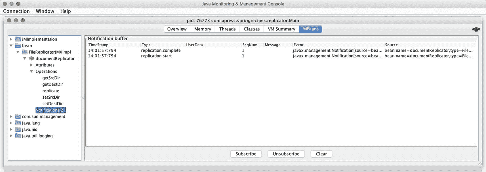

一个名为“spring recipes dot replicator dot main”的窗口截图，其中选中了 M Bean 选项卡。左侧窗格中选中了“操作”下的“通知 2”。右侧是一个通知缓冲区屏幕，显示时间戳、类型、序列号、事件和来源。

图 10-4

JConsole 中报告的 MBean 事件

要在 JConsole 中查看通知，你必须首先点击底部出现的“订阅”按钮，如图 10-4 所示。然后，当使用 MBean“操作”部分中的 JConsole 按钮调用 `replicate()` 方法时，你将看到两条新通知到达。通知构造函数中的第一个参数是通知类型，第二个参数是通知来源，最后一个参数是序列号。

#### 监听 JMX 通知

现在，让我们创建一个通知监听器来监听 JMX 通知。由于监听器会收到多种不同类型的通知，例如当 MBean 的属性发生更改时会收到 `javax.management.AttributeChangeNotification`，因此你必须过滤出那些你感兴趣处理的通知。

```
package com.apress.spring6recipes.replicator;
import javax.management.Notification;
import javax.management.NotificationListener;
public class ReplicationNotificationListener implements NotificationListener {
public void handleNotification(Notification not, Object handback) {
if (not.getType().startsWith("replication")) {
System.out.printf("%s %s #%d%n",
not.getSource(), not.getType(), not.getSequenceNumber());
}
}
}
清单 10-21
NotificationListener 实现
```

然后，你可以将此通知监听器注册到你的 MBean 导出器中，以监听来自特定 MBean 发出的通知。

```
@Bean
public ReplicationNotificationListener replicationNotificationListener() {
return new ReplicationNotificationListener();
}
@Bean
public AnnotationMBeanExporter mbeanExporter(NotificationListener nl) {
var mbeanExporter = new AnnotationMBeanExporter();
mbeanExporter.setDefaultDomain("bean");
mbeanExporter.setNotificationListenerMappings(
Map.of("bean:name=documentReplicator,type=JMXFileReplicator", nl));
return mbeanExporter;
}
清单 10-22
JMX 配置
```

## 10-3\. 在 Spring 中暴露和访问远程 JMX MBean

### 问题

你想要访问运行在由 JMX 连接器暴露的远程 MBean 服务器上的 JMX MBean。当直接使用 JMX API 访问远程 MBean 时，你必须编写复杂的 JMX 特定代码。

### 解决方案

Spring 提供了两种方法来简化远程 MBean 的访问。首先，它提供了一个工厂 Bean，用于以声明方式创建 MBean 服务器连接。通过此服务器连接，你可以查询和更新 MBean 的属性，以及调用其操作。其次，Spring 提供了另一个工厂 Bean，允许你为远程 MBean 创建代理。通过此代理，你可以像操作本地 Bean 一样操作远程 MBean。

### 工作原理

#### 通过 JMX 连接器服务器暴露 MBean

如果你希望你的 MBean 能够被远程访问，你需要为 JMX 启用一个远程协议。JSR-160 定义了通过 JMX 连接器进行 JMX 远程处理的标准。Spring 允许你通过 `ConnectorServerFactoryBean` 创建一个 JMX 连接器服务器。默认情况下，`ConnectorServerFactoryBean` 会创建并启动一个绑定到服务 URL `service:jmx:jmxmp://localhost:9875` 的 JMX 连接器服务器，该服务器通过 JMX 消息协议（JMXMP）暴露 JMX 连接器。然而，大多数 JMX 实现并不支持 JMXMP。因此，你应该为你的 JMX 连接器选择一个广泛支持的远程协议，例如 RMI。要通过特定协议暴露你的 JMX 连接器，你需要为其提供服务 URL。

```
package com.apress.spring6recipes.replicator.config;
import org.springframework.context.annotation.Bean;
import org.springframework.context.annotation.Configuration;
import org.springframework.context.annotation.Import;
import org.springframework.jmx.support.ConnectorServerFactoryBean;
@Configuration
@Import(FileReplicatorConfig.class)
public class JmxServerConfiguration {
@Bean
public ConnectorServerFactoryBean connectorServerFactoryBean() {
var url ="service:jmx:rmi://localhost/jndi/rmi://localhost:1099/replicator";
var connectorServer = new ConnectorServerFactoryBean();
connectorServer.setServiceUrl(url);
return connectorServer;
}
}
清单 10-23
JMX 服务器配置
```

一个带阴影圆圈的字母 i 图标。  为了能够通过 RMI 暴露 Bean，你需要一个 RMI 注册表。通常，在使用应用服务器时，这是默认可用的。在独立运行时，你需要在命令行上运行 Java 提供的 `rmiregistry`。本示例假定该注册表正在运行。

你指定上述 URL 是为了将你的 JMX 连接器绑定到监听 localhost 的 1099 端口的 RMI 注册表。该注册表的默认端口是 1099，但你可以在其端口属性中指定另一个端口。

现在，你的 MBean 可以通过 RMI 进行远程访问了。请注意，无需像之前的应用那样使用 JMX 标志 `-Dcom.sun.management.jmxremote` 来启动启用 RMI 的应用。当 JConsole 启动时，你可以在连接窗口的“远程进程”部分的服务 URL 中输入 `service:jmx:rmi://localhost/jndi/rmi://localhost:1099/replicator`。如图 10-5 所示。

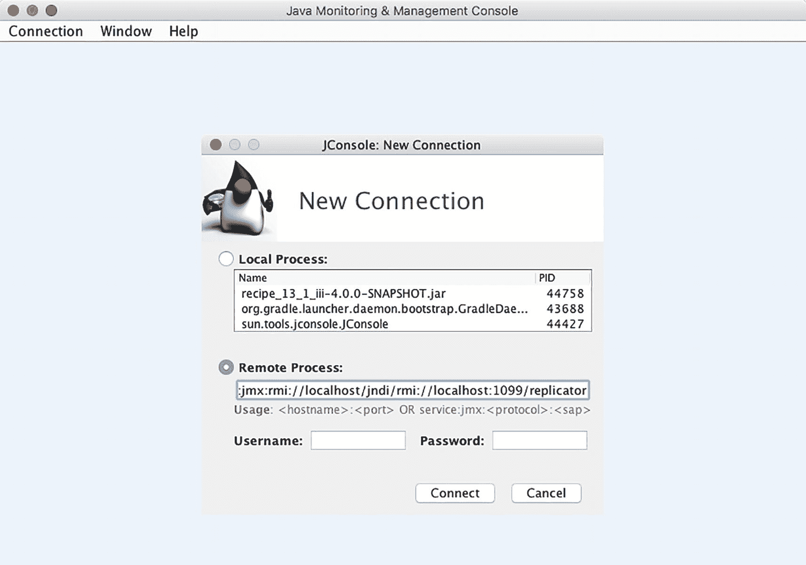

一个 J Console 新建连接窗口的截图。它列出了正在运行的本地进程的名称。它有一个选中的远程进程字段，以及用户名和密码字段。

图 10-5

连接到 `service:jmx:rmi://localhost/jndi/rmi://localhost:1099/replicator`

一旦连接建立，你就可以像之前的示例一样调用 Bean 的方法了。


#### 通过 MBean 服务器连接访问远程 MBean

JMX 客户端需要 MBean 服务器连接才能访问在远程 MBean 服务器上运行的 MBean。Spring 提供了 `org.springframework.jmx.support.MBeanServerConnectionFactoryBean`，供你以声明方式创建与远程支持 JSR-160 的 MBean 服务器的连接。你需要提供服务 URL 供其定位 MBean 服务器。现在，让我们在你的客户端 Bean 配置类中声明这个工厂 Bean。

```
package com.apress.spring6recipes.replicator.config;
import org.springframework.context.annotation.Bean;
import org.springframework.context.annotation.Configuration;
import org.springframework.jmx.support.MBeanServerConnectionFactoryBean;
import java.net.MalformedURLException;
@Configuration
public class JmxClientConfiguration {
@Bean
public MBeanServerConnectionFactoryBean mbeanServerConnection()
throws MalformedURLException {
var url = "service:jmx:rmi://localhost/jndi/rmi://localhost:1099/replicator";
var mBeanServerConnectionFactoryBean = new MBeanServerConnectionFactoryBean();
mBeanServerConnectionFactoryBean.setServiceUrl(url);
return mBeanServerConnectionFactoryBean;
}
}
清单 10-24
JMX 客户端配置 - MBean 服务器连接
```

通过此工厂 Bean 创建的 MBean 服务器连接，你可以访问和操作在端口 1099 上运行的 RMI 服务器中的 MBean。

在两端建立连接后，你可以通过 `getAttribute()` 和 `setAttribute()` 方法查询和更新 MBean 的属性，只需提供 MBean 的对象名称和属性名称。你还可以使用 `invoke()` 方法调用 MBean 的操作。

```
package com.apress.spring6recipes.replicator;
import com.apress.spring6recipes.replicator.config.JmxClientConfiguration;
import org.springframework.context.annotation.AnnotationConfigApplicationContext;
import javax.management.Attribute;
import javax.management.MBeanServerConnection;
import javax.management.ObjectName;
public class Client {
public static void main(String[] args) throws Exception {
var cfg = JmxClientConfiguration.class;
try (var context = new AnnotationConfigApplicationContext(cfg)) {
var mbeanServerConnection = context.getBean(MBeanServerConnection.class);
var srcDir = (String) mbeanServerConnection.getAttribute(mbeanName, "SrcDir");
var destDir = new Attribute("DestDir", srcDir + "_backup");
mbeanServerConnection.setAttribute(mbeanName, destDir);
mbeanServerConnection.invoke(mbeanName, "replicate", null, null);
}
清单 10-25
JMX 客户端 - MBean 服务器连接
```

此外，让我们创建一个 JMX 通知监听器，以便监听文件复制通知。

```
package com.apress.spring6recipes.replicator;
import javax.management.Notification;
import javax.management.NotificationListener;
public class ReplicationNotificationListener implements NotificationListener {
public void handleNotification(Notification notification, Object handback) {
if (notification.getType().startsWith("replication")) {
System.out.println(
notification.getSource() + " " +
notification.getType() + " #" +
notification.getSequenceNumber());
}
}
}
清单 10-26
复制通知监听器
```

你可以将此通知监听器注册到 MBean 服务器连接，以监听从此 MBean 服务器发出的通知。

```
var name = "bean:name=documentReplicator,type=JMXFileReplicator";
var mbeanName = new ObjectName(name);
var listener = new ReplicationNotificationListener();
mbeanServerConnection.addNotificationListener(mbeanName, listener, null, null);
清单 10-27
监听器的创建与注册
```

运行此应用程序客户端后，请检查 RMI 服务器应用程序的 JConsole——使用“远程进程”，地址为 `service:jmx:rmi://localhost/jndi/rmi://localhost:1099/replicator`。在 MBeans 选项卡的“通知”菜单下，你将看到类型为 `jmx.attribute.change` 的新通知，如图 10-6 所示。

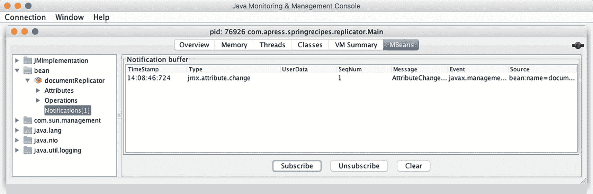

一个显示 spring recipes replicator 主窗口的截图，已选中 M Beans 选项卡。左侧窗格中选中了“操作”下的“通知 1”。右侧是一个通知缓冲区屏幕，显示时间戳、类型、消息、事件和来源。

图 10-6

通过 RMI 调用的 JConsole 通知事件

#### 通过 MBean 代理访问远程 MBean

Spring 提供的另一种远程 MBean 访问方法是通过 MBeanProxy，它可以通过 `MBeanProxyFactoryBean` 创建。

```
package com.apress.spring6recipes.replicator.config;
import com.apress.spring6recipes.replicator.FileReplicator;
import org.springframework.context.annotation.Bean;
import org.springframework.context.annotation.Configuration;
import org.springframework.jmx.access.MBeanProxyFactoryBean;
@Configuration
public class JmxClientConfiguration {
@Bean
public MBeanProxyFactoryBean fileReplicatorProxy() throws Exception {
var url = "service:jmx:rmi://localhost/jndi/rmi://localhost:1099/replicator";
var name = "bean:name=documentReplicator,type=JMXFileReplicator";
var fileReplicatorProxy = new MBeanProxyFactoryBean();
fileReplicatorProxy.setServiceUrl(url);
fileReplicatorProxy.setObjectName(name);
fileReplicatorProxy.setProxyInterface(FileReplicator.class);
return fileReplicatorProxy;
}
}
清单 10-28
JMX 客户端配置 - MBean 代理
```

你需要指定要代理的 MBean 的对象名称和服务器连接。最重要的是代理接口，其本地方法调用将在后台转换为远程 MBean 调用。现在，你可以像操作本地 Bean 一样，通过此代理操作远程 MBean。之前直接在 MBean 服务器连接上调用的 MBean 操作可以简化为如下形式。

```
package com.apress.spring6recipes.replicator;
import com.apress.spring6recipes.replicator.config.JmxClientConfiguration;
import org.springframework.context.annotation.AnnotationConfigApplicationContext;
public class Client {
public static void main(String[] args) throws Exception {
var cfg = "bean:name=documentReplicator,type=JMXFileReplicator";
try (var ctx = new AnnotationConfigApplicationContext(cfg)) {
var fileReplicatorProxy = ctx.getBean(FileReplicator.class);
var srcDir = fileReplicatorProxy.getSrcDir();
fileReplicatorProxy.setDestDir(srcDir + "_backup");
fileReplicatorProxy.replicate();
}
}
}
清单 10-29
JMX 客户端 - 使用代理
```

## 10-4\. 使用 Spring 的邮件支持发送邮件

### 问题

许多应用程序需要发送邮件。在 Java 应用程序中，你可以使用 [Jakarta Mail API](https://jakarta.ee/specifications/mail/) 发送邮件。但是，使用 Jakarta Mail 时，你必须处理特定的邮件会话和异常。因此，应用程序会变得依赖 Jakarta Mail，并且难以切换到其他邮件 API。

### 解决方案

Spring 的邮件支持通过提供一个抽象且与实现无关的 API 来发送邮件，从而简化了邮件发送过程。Spring 邮件支持的核心接口是 `MailSender`。`Jakarta MailSender` 接口是 `MailSender` 的子接口，它包含了专门的 Jakarta Mail 特性，例如多用途互联网邮件扩展（MIME）消息支持。要发送包含 HTML 内容、内嵌图片或附件的邮件，你必须将其作为 MIME 消息发送。


### 工作原理

假设您希望前面食谱中的文件复制应用程序在发生任何错误时通知管理员。首先，您需要创建以下 `ErrorNotifier` 接口，其中包含一个用于通知文件复制错误的方法。

```
package com.apress.spring6recipes.replicator;
public interface ErrorNotifier {
void notifyCopyError(String srcDir, String destDir, String filename);
}
清单 10-30
ErrorNotifier 接口
```

一个带阴影圆圈的字母 i 图标。  在发生错误时调用此通知器的任务留给您来完成。由于您可以将错误处理视为一个横切关注点，因此 AOP 将是解决此问题的理想方案。您可以编写一个异常通知（after throwing advice）来调用此通知器。

接下来，您可以实现此接口，以您选择的方式发送通知。最常见的方式是发送电子邮件。在以这种方式实现接口之前，您可能需要一个支持简单邮件传输协议（SMTP）的本地邮件服务器用于测试目的。我们推荐安装 [GreenMail](https://greenmail-mail-test.github.io/greenmail/)，它非常易于安装和配置。您也可以运行 `greenmail.sh` 脚本来启动一个 Docker 容器。默认情况下，GreenMail 使用偏移量为 3000 的邮件端口，因此 SMTP 端口不是 25 而是 3025，POP3 端口不是 110 而是 3110。

#### 使用 Jakarta Mail API 发送电子邮件

现在，让我们看看如何使用 Jakarta Mail API 发送电子邮件。在使用 Jakarta Mail API 之前，您需要添加该 API 的依赖项。

```
com.sun.mail
jakarta.mail
2.0.1

清单 10-32
Maven 依赖项
```

```
implementation group: 'com.sun.mail', name: 'jakarta.mail', version: '2.0.1'
清单 10-31
Gradle 依赖项
```

您可以实现 `ErrorNotifier` 接口，以便在发生错误时发送电子邮件通知。

```
package com.apress.spring6recipes.replicator;
import jakarta.mail.Message;
import jakarta.mail.MessagingException;
import jakarta.mail.Session;
import jakarta.mail.Transport;
import jakarta.mail.internet.InternetAddress;
import jakarta.mail.internet.MimeMessage;
import java.util.Properties;
public class EmailErrorNotifier implements ErrorNotifier {
private static final String MSG = """
尊敬的 Administrator，
复制以下文件时发生错误：
源目录：%s
目标目录：%s
文件名：%s
""";
@Override
public void notifyCopyError(String srcDir, String destDir, String filename) {
var props = new Properties();
props.put("mail.smtp.host", "localhost");
props.put("mail.smtp.port", "3025");
props.put("mail.smtp.username", "system");
props.put("mail.smtp.password", "12345");
var session = Session.getDefaultInstance(props, null);
try {
var message = new MimeMessage(session);
message.setFrom(new InternetAddress("system@localhost"));
message.setRecipients(Message.RecipientType.TO,
InternetAddress.parse("admin@localhost"));
message.setSubject("文件复制错误");
message.setText(String.format(MSG, srcDir, destDir, filename));
Transport.send(message);
} catch (MessagingException e) {
throw new RuntimeException(e);
}
}
}
清单 10-33
使用 Jakarta Mail API 的 EmailErrorNotifier
```

首先，您通过定义属性打开一个连接到 SMTP 服务器的邮件会话。然后，您从此会话创建一个消息来构建您的电子邮件。之后，您通过调用 `Transport.send()` 发送电子邮件。在处理 Jakarta Mail API 时，您必须处理受检异常 `MessagingException`。请注意，所有这些类、接口和异常都由 Jakarta Mail 定义。

接下来，在 Spring IoC 容器中声明一个 `EmailErrorNotifier` 实例，以便在文件复制错误时发送电子邮件通知。

```
package com.apress.spring6recipes.replicator.config;
import com.apress.spring6recipes.replicator.EmailErrorNotifier;
import com.apress.spring6recipes.replicator.ErrorNotifier;
import org.springframework.context.annotation.Bean;
import org.springframework.context.annotation.Configuration;
@Configuration
public class MailConfiguration {
@Bean
public ErrorNotifier errorNotifier() {
return new EmailErrorNotifier();
}
}
清单 10-34
邮件配置
```

您可以编写以下 `Main` 类来测试 `EmailErrorNotifier`。运行后，您可以配置您的电子邮件应用程序，通过 POP3 从您的电子邮件服务器接收邮件。

```
package com.apress.spring6recipes.replicator;
import com.apress.spring6recipes.replicator.config.MailConfiguration;
import org.springframework.context.annotation.AnnotationConfigApplicationContext;
public class Main {
public static void main(String[] args) {
var cfg = MailConfiguration.class;
try (var ctx = new AnnotationConfigApplicationContext(cfg)) {
var errorNotifier = ctx.getBean(ErrorNotifier.class);
errorNotifier.notifyCopyError("c:/documents", "d:/documents", "spring.doc");
}
}
}
清单 10-35
Main 类
```

要验证邮件是否已发送，您可以登录 GreenMail 附带的 POP 服务器。您可以使用控制台 telnet 到端口 3110，并运行以下命令来查看用户 admin 的邮件，其密码与创建时设置的密码相同。

```
> telnet localhost 3110
+OK POP3 GreenMail Server v1.6.10 ready
USER admin@localhost
+OK
PASS admin@localhost
+OK
LIST
+ OK 1 698
RETR 1
+OK Message follows
...
清单 10-36
来自 telnet 的控制台输入/输出
```


#### 使用 Spring 的 MailSender 发送邮件

现在，让我们看看如何借助 Spring 的 `MailSender` 接口发送邮件，该接口可以在其 `send()` 方法中发送 `SimpleMailMessage`。使用此接口，你的代码不再依赖于 Jakarta Mail，并且更易于测试。

```
package com.apress.spring6recipes.replicator;
import org.springframework.mail.MailSender;
import org.springframework.mail.SimpleMailMessage;
public class EmailErrorNotifier implements ErrorNotifier {
private static final String MSG = """
尊敬的 Administrator，
复制以下文件时发生错误：
源目录：%s
目标目录：%s
文件名：%s
""";
private final MailSender mailSender;
public EmailErrorNotifier(MailSender mailSender) {
this.mailSender = mailSender;
}
@Override
public void notifyCopyError(String srcDir, String destDir, String filename) {
var message = new SimpleMailMessage();
message.setFrom("system@localhost");
message.setTo("admin@localhost");
message.setSubject("文件复制错误");
message.setText(String.format(MSG, srcDir, destDir, filename));
mailSender.send(message);
}
}
清单 10-37
使用 Jakarta MailSender 的 EmailErrorNotifier
```

接下来，你需要在 Bean 配置文件中配置一个 `MailSender` 实现，并将其注入到 `EmailErrorNotifier` 中。在 Spring 中，该接口的唯一实现是 `JavaMailSenderImpl`，它使用 Jakarta Mail 发送邮件。

```
package com.apress.spring6recipes.replicator.config;
import com.apress.spring6recipes.replicator.EmailErrorNotifier;
import com.apress.spring6recipes.replicator.ErrorNotifier;
import org.springframework.context.annotation.Bean;
import org.springframework.context.annotation.Configuration;
import org.springframework.mail.javamail.JavaMailSender;
import org.springframework.mail.javamail.JavaMailSenderImpl;
@Configuration
public class MailConfiguration {
@Bean
public ErrorNotifier errorNotifier(JavaMailSender mailSender) {
return new EmailErrorNotifier(mailSender);
}
@Bean
public JavaMailSenderImpl mailSender() {
var mailSender = new JavaMailSenderImpl();
mailSender.setHost("localhost");
mailSender.setPort(3025);
mailSender.setUsername("system");
mailSender.setPassword("12345");
return mailSender;
}
}
清单 10-38
包含 Jakarta MailSender 的 MailConfiguration
```

`JavaMailSenderImpl` 使用的默认端口是标准的 SMTP 端口 25，因此如果你的邮件服务器在此端口上监听 SMTP，你可以直接省略此属性。此外，如果你的 SMTP 服务器不需要用户认证，则无需设置 `username` 和 `password`。

如果你在 Java 应用服务器中配置了 Jakarta Mail 会话，你可以首先借助 `JndiLocatorDelegate` 查找它。

```
@Bean
public Session mailSession() throws NamingException {
return JndiLocatorDelegate
.createDefaultResourceRefLocator()
.lookup("mail/Session", Session.class);
}
清单 10-39
邮件会话的 JNDI 查找
```

你可以将 Jakarta Mail 会话注入到 `JavaMailSenderImpl` 中供其使用。在这种情况下，你不再需要设置主机、端口、用户名或密码。

```
@Bean
public JavaMailSenderImpl mailSender(Session mailSession) {
var mailSender = new JavaMailSenderImpl();
mailSender.setSession(mailSession);
return mailSender;
}
清单 10-40
注入邮件会话的 MailSender
```

#### 定义邮件模板

在方法体中从头构建邮件消息效率不高，因为你必须硬编码邮件属性。此外，用 Java 字符串编写邮件文本可能比较困难。你可以考虑在 Bean 配置文件中定义邮件消息模板，并从中构建新的邮件消息。

```
package com.apress.spring6recipes.replicator.config;
import com.apress.spring6recipes.replicator.EmailErrorNotifier;
import com.apress.spring6recipes.replicator.ErrorNotifier;
import org.springframework.context.annotation.Bean;
import org.springframework.context.annotation.Configuration;
import org.springframework.mail.SimpleMailMessage;
import org.springframework.mail.javamail.JavaMailSender;
import org.springframework.mail.javamail.JavaMailSenderImpl;
@Configuration
public class MailConfiguration {
private static final String MSG = """
尊敬的 Administrator，
复制以下文件时发生错误：
源目录：%s
目标目录：%s
文件名：%s
""";
@Bean
public ErrorNotifier errorNotifier(JavaMailSender mailSender,
SimpleMailMessage template) {
return new EmailErrorNotifier(mailSender, template);
}
@Bean
public JavaMailSenderImpl mailSender() {
var mailSender = new JavaMailSenderImpl();
mailSender.setHost("localhost");
mailSender.setPort(3025);
mailSender.setUsername("system");
mailSender.setPassword("12345");
return mailSender;
}
@Bean
public SimpleMailMessage copyErrorMailMessage() {
var message = new SimpleMailMessage();
message.setFrom("system@localhost");
message.setTo("admin@localhost");
message.setSubject("文件复制错误");
message.setText(MSG);
return message;
}
}
清单 10-41
使用 SimpleMailMessage 作为模板的 MailConfiguration
```

请注意，在前面的消息文本中，你包含了占位符 `%s`，这些占位符将通过 `String.format()` 被消息参数替换。当然，你也可以使用强大的模板语言（如 Thymeleaf 或 FreeMarker）根据模板生成消息文本。将邮件消息模板与 Bean 配置文件分离也是一个好习惯。

每次发送邮件时，你可以从注入的模板构建一个新的 `SimpleMailMessage` 实例。然后，你可以使用 `String.format()` 生成消息文本，将 `%s` 占位符替换为你的消息参数。

```
package com.apress.spring6recipes.replicator;
import org.springframework.mail.MailSender;
import org.springframework.mail.SimpleMailMessage;
public class EmailErrorNotifier implements ErrorNotifier {
private final MailSender mailSender;
private final SimpleMailMessage template;
public EmailErrorNotifier(MailSender mailSender, SimpleMailMessage template) {
this.mailSender = mailSender;
this.template = template;
}
@Override
public void notifyCopyError(String srcDir, String destDir, String filename) {
var message = new SimpleMailMessage(template);
message.setText(String.format(
template.getText(), srcDir, destDir, filename));
mailSender.send(message);
}
}
清单 10-42
使用模板消息的 EmailErrorNotifier
```


#### 发送带附件的邮件（MIME 消息）

到目前为止，你使用的 `SimpleMailMessage` 类只能发送简单的纯文本邮件。要发送包含 HTML 内容、内嵌图片或附件的邮件，你需要构建并发送 MIME 消息。Jakarta Mail 通过 `jakarta.mail.internet.MimeMessage` 类支持 MIME。

首先，你必须使用 `JavaMailSender` 接口，而不是其父接口 `MailSender`。你注入的 `JavaMailSenderImpl` 实例确实实现了这个接口，因此无需修改 bean 配置。以下通知器将 Spring 的 bean 配置文件作为邮件附件发送给管理员。

```
package com.apress.spring6recipes.replicator;
import jakarta.mail.MessagingException;
import jakarta.mail.internet.MimeMessage;
import org.springframework.core.io.ClassPathResource;
import org.springframework.mail.MailParseException;
import org.springframework.mail.SimpleMailMessage;
import org.springframework.mail.javamail.JavaMailSender;
import org.springframework.mail.javamail.MimeMessageHelper;
public class EmailErrorNotifier implements ErrorNotifier {
private final JavaMailSender mailSender;
private final SimpleMailMessage template;
public EmailErrorNotifier(JavaMailSender mailSender,
SimpleMailMessage template) {
this.mailSender = mailSender;
this.template = template;
}
@Override
public void notifyCopyError(String srcDir, String destDir, String filename) {
var message = mailSender.createMimeMessage();
try {
var helper = new MimeMessageHelper(message, true);
helper.setFrom(template.getFrom());
helper.setTo(template.getTo());
helper.setSubject(template.getSubject());
helper.setText(String.format(
template.getText(), srcDir, destDir, filename));
helper.addAttachment("beans.xml", new ClassPathResource("beans.xml"));
} catch (MessagingException e) {
throw new MailParseException(e);
}
mailSender.send(message);
}
}
清单 10-43
发送 MIME 消息的 EmailErrorNotifier
```

与 `SimpleMailMessage` 不同，`MimeMessage` 类由 Jakarta Mail 定义，因此你只能通过调用 `mailSender.createMimeMessage()` 来实例化它。Spring 提供了辅助类 `MimeMessageHelper` 来简化 `MimeMessage` 的操作。它允许你从 Spring 资源对象添加附件。然而，这个辅助类的操作仍然可能抛出 Jakarta Mail 的 `MessagingException`。为了保持一致性，你必须将此异常转换为 Spring 的邮件运行时异常。Spring 提供了另一种构建 MIME 消息的方法，即通过实现 `MimeMessagePreparator` 接口。

```
package com.apress.spring6recipes.replicator;
import jakarta.mail.internet.MimeMessage;
import org.springframework.core.io.ClassPathResource;
import org.springframework.mail.SimpleMailMessage;
import org.springframework.mail.javamail.JavaMailSender;
import org.springframework.mail.javamail.MimeMessageHelper;
import org.springframework.mail.javamail.MimeMessagePreparator;
public class EmailErrorNotifier implements ErrorNotifier {
private final JavaMailSender mailSender;
private final SimpleMailMessage template;
public EmailErrorNotifier(JavaMailSender mailSender,
SimpleMailMessage template) {
this.mailSender = mailSender;
this.template = template;
}
@Override
public void notifyCopyError(
final String srcDir, final String destDir, final String filename) {
MimeMessagePreparator preparator = (mimeMessage) -> {
var helper = new MimeMessageHelper(mimeMessage, true);
helper.setFrom(template.getFrom());
helper.setTo(template.getTo());
helper.setSubject(template.getSubject());
helper.setText(String.format(
template.getText(), srcDir, destDir, filename));
helper.addAttachment("beans.xml", new ClassPathResource("beans.xml"));
};
mailSender.send(preparator);
}
}
清单 10-44
使用 MimeMessagePreparator 的 EmailErrorNotifier
```

在 `prepare()` 方法中，你可以准备 `MimeMessage` 对象，该对象是为 `Jakarta MailSender` 预先创建的。如果抛出任何异常，它将被自动转换为 Spring 的邮件运行时异常。

一个灯泡的轮廓示意图。  由于它是一个函数式接口，你可以将其编写为 lambda 表达式。

## 10-5\. 使用 Spring 的 Quartz 支持调度任务

### 问题

你的应用程序有一个高级调度需求，希望使用 Quartz 调度器来实现。这种需求可能看似复杂，例如能够在任意时间或奇怪的间隔运行（“每隔一个周四，但仅在上午 10 点到下午 2 点之间”）。此外，你希望以声明式的方式配置调度作业。

### 解决方案

Spring 为 Quartz 提供了实用类，使你无需针对 Quartz API 进行编程即可调度作业。

### 工作原理


#### 使用不带 Spring 支持的 Quartz

要使用 Quartz 进行任务调度，首先需要实现 `Job` 接口来创建一个任务。例如，以下任务执行了之前食谱中设计的文件复制器的 `replicate()` 方法。它通过 `JobExecutionContext` 对象获取一个任务数据映射——这是 Quartz 中用于定义任务的概念。

```
package com.apress.spring6recipes.replicator;
import org.quartz.Job;
import org.quartz.JobExecutionContext;
import org.quartz.JobExecutionException;
import java.io.IOException;
public class FileReplicationJob implements Job {
@Override
public void execute(JobExecutionContext context)
throws JobExecutionException {
var dataMap = context.getJobDetail().getJobDataMap();
var fileReplicator = (FileReplicator) dataMap.get("fileReplicator");
try {
fileReplicator.replicate();
} catch (IOException e) {
throw new JobExecutionException(e);
}
}
}
清单 10-45
用于文件复制的 Quartz 任务
```

创建任务后，你需要使用 Quartz API 对其进行配置和调度。例如，以下调度器每 60 秒运行一次文件复制任务，首次执行延迟 5 秒。

```
package com.apress.spring6recipes.replicator;
import com.apress.spring6recipes.replicator.config.FileReplicatorConfig;
import org.quartz.JobBuilder;
import org.quartz.JobDataMap;
import org.quartz.SimpleScheduleBuilder;
import org.quartz.TriggerBuilder;
import org.quartz.impl.StdSchedulerFactory;
import org.springframework.context.annotation.AnnotationConfigApplicationContext;
import java.util.Date;
public class Main {
public static void main(String[] args) throws Exception {
var cfg = FileReplicatorConfig.class;
try (var ctx = new AnnotationConfigApplicationContext(cfg)) {
var documentReplicator = ctx.getBean(FileReplicator.class);
var jobDataMap = new JobDataMap();
jobDataMap.put("fileReplicator", documentReplicator);
var job = JobBuilder.newJob(FileReplicationJob.class)
.withIdentity("documentReplicationJob")
.storeDurably()
.usingJobData(jobDataMap)
.build();
var trigger = TriggerBuilder.newTrigger()
.withIdentity("documentReplicationTrigger")
.startAt(new Date(System.currentTimeMillis() + 5000))
.forJob(job)
.withSchedule(SimpleScheduleBuilder.simpleSchedule()
.withIntervalInSeconds(60)
.repeatForever())
.build();
var scheduler = new StdSchedulerFactory().getScheduler();
scheduler.start();
scheduler.scheduleJob(job, trigger);
}
}
}
清单 10-46
主类
```

在 `Main` 类中，首先创建一个任务映射。本例中只有一个任务，其中键是一个描述性名称，值是该任务的对象引用。接着，在 `JobDetail` 对象中定义文件复制任务的详细信息，并在其 `jobDataMap` 属性中准备任务数据。然后，创建一个 `SimpleTrigger` 对象来配置调度属性。最后，创建一个调度器，使用此触发器来运行任务。

Quartz 支持多种调度类型，以便在不同时间间隔运行任务。调度作为触发器的一部分进行定义。在最新版本中，Quartz 的调度包括 `SimpleScheduleBuilder`、`CronScheduleBuilder`、`CalendarIntervalScheduleBuilder` 和 `DailyTimeIntervalScheduleBuilder`。`SimpleScheduleBuilder` 允许你通过设置开始时间、结束时间、重复间隔和重复次数等属性来调度任务。`CronScheduleBuilder` 接受一个 Unix cron 表达式，用于指定任务的运行时间。例如，你可以用以下 `CronScheduleBuilder` 替换之前的 `SimpleScheduleBuilder`，以便在每天 17:30 运行任务：`.withSchedule(CronScheduleBuilder.cronSchedule("0 30 17 * * ?"))`。一个 cron 表达式由七个字段组成（最后一个字段可选），字段之间用空格分隔。表 10-1 展示了 cron 表达式的字段说明。

表 10-1
Cron 表达式的字段说明

| 位置 | 字段名 | 范围 |
| --- | --- | --- |
| 1 | 秒 | 0–59 |
| 2 | 分钟 | 0–59 |
| 3 | 小时 | 0–23 |
| 4 | 月份中的日期 | 1–31 |
| 5 | 月份 | 1–12 或 JAN–DEC |
| 6 | 星期中的日期 | 1–7 或 SUN–SAT |
| 7 | 年份（可选） | 1970–2099 |

cron 表达式的每个部分可以指定一个具体值（例如 3）、一个范围（例如 1–5）、一个列表（例如 1, 3, 5）、一个通配符（* 匹配所有值）或一个问号（? 用于“月份中的日期”和“星期中的日期”字段之一，以匹配其中一个字段，但不同时匹配两者）。`CalendarIntervalScheduleBuilder` 允许你基于日历时间（日、周、月、年）来调度任务，而 `DailyTimeIntervalScheduleBuilder` 则提供了便捷工具来设置任务的结束时间（例如 `endingDailyAt()` 和 `endingDailyAfterCount()` 等方法）。


#### 在 Spring 的支持下使用 Quartz

使用 Quartz 时，你可以通过实现 `Job` 接口来创建任务，并通过 `JobExecutionContext` 从任务数据映射中获取数据。为了将任务类与 Quartz API 解耦，Spring 提供了 `QuartzJobBean`，你可以通过扩展它来使用 setter 方法获取任务数据。`QuartzJobBean` 会将任务数据映射转换为属性，并通过 setter 方法注入这些属性。

```
package com.apress.spring6recipes.replicator;
import org.quartz.JobExecutionContext;
import org.quartz.JobExecutionException;
import org.springframework.scheduling.quartz.QuartzJobBean;
import java.io.IOException;
public class FileReplicationJob extends QuartzJobBean {
private FileReplicator fileReplicator;
public void setFileReplicator(FileReplicator fileReplicator) {
this.fileReplicator = fileReplicator;
}
protected void executeInternal(JobExecutionContext context)
throws JobExecutionException {
try {
fileReplicator.replicate();
} catch (IOException e) {
throw new JobExecutionException(e);
}
}
}
清单 10-47
使用 Spring 基类的 Quartz 任务
```

然后，你可以通过 `JobDetailBean` 在 Spring 的 Bean 配置文件中配置一个 Quartz `JobDetail` 对象。默认情况下，Spring 会使用该 Bean 的名称作为任务名称。你可以通过设置 `name` 属性来修改它。

```
@Bean
public JobDetailFactoryBean documentReplicationJob(FileReplicator fileReplicator) {
var documentReplicationJob = new JobDetailFactoryBean();
documentReplicationJob.setJobClass(FileReplicationJob.class);
documentReplicationJob.setDurability(true);
documentReplicationJob.setJobDataAsMap(Collections.singletonMap("fileReplicator", fileReplicator));
return documentReplicationJob;
}
清单 10-48
Quartz 配置
```

Spring 还提供了 `MethodInvokingJobDetailFactoryBean`，用于定义执行特定对象单个方法的任务。这省去了你创建任务类的麻烦。你可以使用以下任务详情来替换之前的配置。

```
@Bean
public MethodInvokingJobDetailFactoryBean documentReplicationJob(FileReplicator fileReplicator) {
MethodInvokingJobDetailFactoryBean documentReplicationJob =
new MethodInvokingJobDetailFactoryBean();
documentReplicationJob.setTargetObject(fileReplicator);
documentReplicationJob.setTargetMethod("replicatie");
return documentReplicationJob;
}
清单 10-49
MethodInvokingJobDetailFactoryBean Bean 示例
```

一旦定义了任务，你就可以配置一个 Quartz 触发器。Spring 支持 `SimpleTriggerFactoryBean` 和 `CronTriggerFactoryBean`。`SimpleTriggerFactoryBean` 需要引用一个 `JobDetail` 对象，并为调度属性（如开始时间和重复次数）提供常用值。

```
@Bean
public SimpleTriggerFactoryBean documentReplicationTrigger(JobDetail documentReplicationJob) {
var documentReplicationTrigger = new SimpleTriggerFactoryBean();
documentReplicationTrigger.setJobDetail(documentReplicationJob);
documentReplicationTrigger.setStartDelay(5000);
documentReplicationTrigger.setRepeatInterval(60000);
return documentReplicationTrigger;
}
清单 10-50
SimpleTriggerFactoryBean 的 Quartz 配置
```

你也可以使用 `CronTriggerFactoryBean` 来配置类似 cron 表达式的调度。

```
@Bean
public SimpleTriggerFactoryBean documentReplicationTrigger(JobDetail documentReplicationJob) {
var documentReplicationTrigger = new SimpleTriggerFactoryBean();
documentReplicationTrigger.setJobDetail(documentReplicationJob);
documentReplicationTrigger.setStartDelay(5000);
documentReplicationTrigger.setRepeatInterval(60000);
return documentReplicationTrigger;
}
清单 10-51
CronTriggerFactoryBean 的 Quartz 配置
```

最后，一旦你有了 Quartz 任务和触发器，就可以配置一个 `SchedulerFactoryBean` 实例来创建用于运行触发器的 `Scheduler` 对象。你可以在该工厂 Bean 中指定多个触发器。

```
@Bean
public SchedulerFactoryBean scheduler(Trigger[] triggers) {
var scheduler = new SchedulerFactoryBean();
scheduler.setTriggers(triggers);
return scheduler;
}
清单 10-52
SchedulerFactoryBean 的 Quartz 配置
```

现在，你可以通过以下 `Main` 类轻松启动调度器。这样，你就不需要编写任何一行用于调度任务的代码了。

```
package com.apress.spring6recipes.replicator;
import com.apress.spring6recipes.replicator.config.FileReplicatorConfig;
import com.apress.spring6recipes.replicator.config.QuartzConfiguration;
import org.springframework.context.annotation.AnnotationConfigApplicationContext;
public class Main {
public static void main(String[] args) {
var cfg = "com.apress.spring6recipes.replicator.config";
try (var ctx = new AnnotationConfigApplicationContext(cfg)) {}
}
}
清单 10-53
Main 类
```

## 10-6\. 使用 Spring 的调度功能安排任务

### 问题

你希望以一致的方式安排方法调用，可以使用 cron 表达式、固定间隔或固定速率，并且不希望仅仅为了这个目的而使用 Quartz。

### 解决方案

Spring 支持配置 `TaskExecutor` 和 `TaskScheduler`。这种能力，加上使用 `@Scheduled` 注解安排方法执行的功能，使得 Spring 的调度支持能够以最少的麻烦工作：你只需要一个方法、一个注解，并启用注解扫描器即可。


### 工作原理

让我们回顾一下上一个示例中的例子：我们想要使用 cron 表达式在 Bean 上调度对复制方法的调用。我们的配置类如下所示。

```
package com.apress.spring6recipes.replicator.config;
import org.springframework.context.annotation.Bean;
import org.springframework.context.annotation.Configuration;
import org.springframework.scheduling.TaskScheduler;
import org.springframework.scheduling.annotation.EnableScheduling;
import org.springframework.scheduling.concurrent.ThreadPoolTaskScheduler;
@Configuration
@EnableScheduling
public class SchedulingConfiguration {
@Bean
public TaskScheduler taskScheduler() {
var taskScheduler = new ThreadPoolTaskScheduler();
taskScheduler.setThreadNamePrefix("s6r-scheduler-");
taskScheduler.setPoolSize(10);
return taskScheduler;
}
}
清单 10-54
调度配置
```

我们通过指定 `@EnableScheduling` 来启用注解驱动的调度支持。这将注册一个 Bean，用于扫描应用程序上下文中的 Bean，查找 `@Scheduled` 注解。我们还配置了一个名为 `taskScheduler` 的 `ThreadPoolTaskScheduler`，因为我们希望为线程名称设置前缀，并且希望同时调度十个任务。我们将池大小设置为 10。调度支持会自动检测单个 `TaskScheduler`，或者通过名称 `taskScheduler` 检测它。

```
package com.apress.spring6recipes.replicator;
import org.springframework.scheduling.annotation.Scheduled;
import java.io.IOException;
import java.nio.file.Files;
import java.nio.file.Path;
public class SimpleFileReplicator implements FileReplicator {
@Scheduled(fixedDelay = 60_000)
public synchronized void replicate() throws IOException {
var files = Path.of(srcDir);
try (var fileList = Files.list(files)) {
fileList.filter(Files::isRegularFile)
.forEach(it -> fileCopier.copyFile(it, Path.of(destDir)));
}
}
}
清单 10-55
带有调度的 Simple FileReplicator 实现
```

请注意，我们已经在 `replicate()` 方法上使用了 `@Scheduled` 注解。在这里，我们告诉调度器每 60 秒执行一次该方法。或者，我们也可以为 `@Scheduled` 注解指定一个 `fixedRate` 值，该值将测量连续启动之间的时间，然后触发下一次运行。

```
@Scheduled(fixedRate = 60_000)
public synchronized void replicate() throws IOException { ... }
清单 10-56
带有 fixedRate 的 Simple FileReplicator 实现
```

最后，我们可能希望对方法的执行进行更复杂的控制。在这种情况下，我们可以使用 cron 表达式，就像我们在 Quartz 示例中所做的那样。

```
@Scheduled( cron = "0/60 * * * * ? " )
public synchronized void replicate() throws IOException { ... }
清单 10-57
带有 cron 表达式的 Simple FileReplicator 实现
```

在 Java 中也支持配置所有这些内容。如果你不想或无法向现有的 Bean 方法添加注解，这可能会很有用。下面展示了我们如何使用 Spring 的 `ScheduledTaskRegistrar` 重新创建上述以注解为中心的示例。你可以通过让配置类（或其他 Spring 组件）实现 `SchedulingConfigurer` 接口并实现 `configureTasks` 方法来访问 `ScheduledTaskRegistrar`。

```
package com.apress.spring6recipes.replicator.config;
import com.apress.spring6recipes.replicator.FileReplicator;
import org.springframework.context.annotation.Bean;
import org.springframework.context.annotation.Configuration;
import org.springframework.scheduling.TaskScheduler;
import org.springframework.scheduling.annotation.EnableScheduling;
import org.springframework.scheduling.annotation.SchedulingConfigurer;
import org.springframework.scheduling.concurrent.ThreadPoolTaskScheduler;
import org.springframework.scheduling.config.ScheduledTaskRegistrar;
import java.io.IOException;
import java.time.Duration;
@Configuration
@EnableScheduling
public class SchedulingConfiguration implements SchedulingConfigurer {
private final FileReplicator fileReplicator;
public SchedulingConfiguration(FileReplicator fileReplicator) {
this.fileReplicator = fileReplicator;
}
@Override
public void configureTasks(ScheduledTaskRegistrar taskRegistrar) {
taskRegistrar.addFixedDelayTask(() -> {
try {
fileReplicator.replicate();
} catch (IOException e) {
e.printStackTrace();
}
}, Duration.ofSeconds(60));
}
@Bean
public TaskScheduler taskScheduler() {
var taskScheduler = new ThreadPoolTaskScheduler();
taskScheduler.setThreadNamePrefix("s6r-scheduler-");
taskScheduler.setPoolSize(10);
return taskScheduler;
}
}
清单 10-58
调度配置 - 手动配置任务
```

## 10-7\. 契约优先的 SOAP Web 服务简介

### 问题

你想要开发一个契约优先的 SOAP Web 服务。

### 解决方案

有两种开发 SOAP Web 服务的方法。一种称为“代码优先”，这意味着你从一个 Java 类开始，然后逐步构建出 WSDL 契约。另一种方法称为“契约优先”，这意味着你从一个 XML 数据契约（比 WSDL 更简单的东西）开始，然后向内构建一个 Java 类来实现该服务。要为“契约优先”的 SOAP Web 服务创建数据契约，你需要一个 XSD 文件或 XML 模式文件，用于描述服务支持的操作和数据。需要 XSD 文件的原因是，在“底层”，SOAP 服务客户端和服务器之间的通信是以 XSD 文件中定义的 XML 形式进行的。然而，由于正确编写 XSD 文件可能很困难，最好先创建示例 XML 消息，然后从中生成 XSD 文件。然后，利用 XSD 文件，你可以借助 Spring-WS 之类的工具，从 XSD 文件出发构建 SOAP Web 服务。

### 工作原理

#### 创建示例 XML 消息

让我们使用 SOAP“契约优先”方法创建一个天气服务。因此，你需要编写一个 SOAP 服务，该服务能够根据城市和日期传达天气信息，返回最低温度、最高温度和平均温度。与其一头扎进去编写代码来支持该功能，不如使用“契约优先”方法，用如下所示的 XML 消息来描述特定城市和日期的温度。

```
5.0
10.0
8.0

清单 10-59
示例 XML 响应
```

这是为天气服务以 SOAP“契约优先”方式建立数据契约的第一步。现在让我们定义一些操作。你希望允许客户端查询特定城市在多个日期的温度。每个请求包含一个城市元素和多个日期元素。我们还将为此请求指定命名空间，以避免与其他 XML 文档发生命名冲突。让我们创建这个 XML 消息并将其保存到一个名为 `request.xml` 的文件中。

```
Houston
2021-12-01
2021-12-08
2021-12-15

清单 10-60
示例 XML 请求
```

对上述类型请求的响应将包含多个 `TemperatureInfo` 元素，每个元素代表特定城市和日期的温度，与请求的日期相对应。让我们创建这个 XML 消息并将其保存到一个名为 `response.xml` 的文件中。

```

5.0
10.0
8.0

4.0
13.0
7.0

10.0
18.0
15.0

清单 10-61
示例 XML 响应
```


#### 从示例 XML 消息生成 XSD 文件

现在，你可以根据前面的示例 XML 消息生成 XSD 文件。大多数 XML 工具和企业级 Java IDE 都能通过几个 XML 文件生成 XSD 文件。这里，我们将使用 [Apache XMLBeans](https://xmlbeans.apache.org/) 来生成 XSD 文件。

一个带阴影圆圈的字母 i 图标。 你可以从 Apache XMLBeans 网站下载 Apache XMLBeans（例如 v5.1.1 版本），并将其解压到你选择的目录中即可完成安装。

Apache XMLBeans 提供了一个名为 `inst2xsd` 的工具，用于从 XML 文件生成 XSD 文件。它支持多种设计类型来生成 XSD 文件。最简单的一种称为俄罗斯套娃设计，它会为目标 XSD 文件生成局部元素和局部类型。由于你的 XML 消息中没有使用枚举类型，因此可以禁用枚举生成功能。你可以执行以下命令，从之前的 XML 文件生成 XSD 文件。

```
inst2xsd -design rd -enumerations never request.xml response.xml
代码清单 10-62
生成 XSD 的命令
```

生成的 XSD 文件默认名为 `schema0.xsd`，位于同一目录下。我们将其重命名为 `temperature.xsd`。

```

代码清单 10-63
天气服务的 XSD 模式
```

#### 优化生成的 XSD 文件

如你所见，生成的 XSD 文件允许客户端查询无限日期的温度。如果你想对最大和最小查询日期添加约束，可以修改 `maxOccurs` 和 `minOccurs` 属性。

```

代码清单 10-64
经过修改的天气服务 XSD 模式
```

#### 预览生成的 WSDL 文件

稍后你将详细了解，[Spring-WS](https://spring.io/projects/spring-ws) 能够根据 XSD 文件自动生成 WSDL 契约。以下代码片段展示了用于此目的的 Spring Bean 配置——我们将在下一个配方中介绍如何使用此代码片段，该配方描述了如何使用 Spring-WS 构建 SOAP Web 服务。

```
@Bean
public XsdSchema temperatureSchema() {
var xsd = new ClassPathResource("/META-INF/xsd/temperature.xsd");
return new SimpleXsdSchema(xsd);
}
代码清单 10-65
WSDL 的示例 Bean 配置
```

这里，我们将预览生成的 WSDL 文件，以便更好地理解服务契约。为简洁起见，省略了不太重要的部分。

```

...

...

代码清单 10-66
使用 Spring-WS 生成的 WSDL
```

在 `Weather` 端口类型中，定义了一个 `GetTemperatures` 操作，其名称源自输入和输出消息的前缀（即 `<GetTemperaturesRequest>` 和 `<GetTemperaturesResponse>`）。这两个元素的定义包含在 `<wsdl:types>` 部分中，如数据契约所定义。

现在，有了 WSDL 契约，你就可以生成必要的 Java 接口，然后为每个最初以 XML 消息形式存在的操作编写后端代码。下一配方将详细探讨这一完整技术，该过程将使用 Spring-WS。

## 10-8\. 使用 Spring-WS 暴露和调用 SOAP Web 服务

### 问题

你有一个 XSD 文件，想要开发一个“契约优先”的 SOAP Web 服务，但不知道如何或使用什么来实现该“契约优先”的 SOAP 服务。

Spring-WS 从设计之初就支持“契约优先”的 SOAP Web 服务。然而，这并不意味着 Spring-WS 是在 Java 中创建 SOAP Web 服务的唯一方式。像 CXF 这样的 JAX-WS 实现也支持这种技术。尽管如此，在 Spring 应用程序的上下文中，Spring-WS 是实现“契约优先”SOAP Web 服务更成熟、更自然的方法。描述其他 Java 的“契约优先”SOAP 技术将超出 Spring 框架的范围。

### 解决方案

Spring-WS 提供了一套用于开发“契约优先”SOAP Web 服务的工具。构建 Spring-WS Web 服务的基本任务包括：

*   为 Spring-WS 设置并配置一个 Spring MVC 应用程序。

*   将 Web 服务请求映射到端点。

*   创建服务端点来处理请求消息并返回响应消息。

*   为 Web 服务发布 WSDL 文件。

### 工作原理

#### 设置 Spring-WS 应用程序

要使用 Spring-WS 实现 Web 服务，首先创建一个 Web 应用程序初始化器类，以引导一个包含 SOAP Web 服务的 Web 应用程序。你需要配置 `MessageDispatcherServlet`，它是 Spring-WS 的一部分。该 Servlet 专门负责将 Web 服务消息分派到适当的端点，并检测 Spring-WS 的框架设施。

```
package com.apress.spring6recipes.weather.config;
import org.springframework.ws.transport.http.support.AbstractAnnotationConfigMessageDispatcherServletInitializer;
public class Initializer extends AbstractAnnotationConfigMessageDispatcherServletInitializer {
@Override
protected Class[] getRootConfigClasses() {
return null;
}
@Override
protected Class[] getServletConfigClasses() {
return new Class[]{SpringWsConfiguration.class};
}
}
代码清单 10-67
Spring-WS 的 WebApplicationInitializer
```

为了简化配置，你可以继承 `AbstractAnnotationConfigMessageDispatcherServletInitializer` 基类。你需要为其提供构成 `rootConfig` 和 `servletConfig` 的配置类；前者可以为 `null`，而后者是必需的。

上述配置将使用 `SpringWsConfiguration` 类引导一个 `MessageDispatcherServlet`，并默认将其注册到 `/services/` **和** `.wsdl` URL。

```
package com.apress.spring6recipes.weather.config;
import org.springframework.context.annotation.Bean;
import org.springframework.context.annotation.ComponentScan;
import org.springframework.context.annotation.Configuration;
import org.springframework.core.io.ClassPathResource;
import org.springframework.ws.config.annotation.EnableWs;
import org.springframework.ws.wsdl.wsdl11.DefaultWsdl11Definition;
import org.springframework.xml.xsd.SimpleXsdSchema;
import org.springframework.xml.xsd.XsdSchema;
@Configuration
@EnableWs
@ComponentScan("com.apress.spring6recipes.weather")
public class SpringWsConfiguration {
}
代码清单 10-68
Spring-WS 配置
```

`SpringWsConfiguration` 类使用了 `@EnableWs` 注解，该注解会注册必要的 Bean 以使 `MessageDispatcherServlet` 正常工作。同时，`@ComponentScan` 注解会扫描 `@Service` 和 `@Endpoint` Bean。


#### 创建服务端点

Spring-WS 支持通过 `@Endpoint` 注解将任意类标注为服务端点，使其可作为 Web 服务访问。除了 `@Endpoint` 注解外，你还需要使用 `@PayloadRoot` 注解来标注处理方法，以映射服务请求。每个处理方法还依赖 `@ResponsePayload` 和 `@RequestPayload` 注解来处理传入和传出的服务数据。

```
package com.apress.spring6recipes.weather;
import org.dom4j.DocumentHelper;
import org.dom4j.Element;
import org.dom4j.Node;
import org.dom4j.XPath;
import org.dom4j.xpath.DefaultXPath;
import org.springframework.ws.server.endpoint.annotation.Endpoint;
import org.springframework.ws.server.endpoint.annotation.PayloadRoot;
import org.springframework.ws.server.endpoint.annotation.RequestPayload;
import org.springframework.ws.server.endpoint.annotation.ResponsePayload;
import java.time.LocalDate;
import java.time.format.DateTimeFormatter;
import java.util.Map;
@Endpoint
public class TemperatureEndpoint {
private static final String namespaceUri = "http://spring6recipes.apress.com/weather/schemas";
private final WeatherService weatherService;
private final XPath cityPath;
private final XPath datePath;
public TemperatureEndpoint(WeatherService weatherService) {
this.weatherService = weatherService;
// 创建 XPath 对象，包含命名空间
var namespaceUris = Map.of("weather", namespaceUri);
cityPath = new DefaultXPath("/weather:GetTemperaturesRequest/weather:city");
cityPath.setNamespaceURIs(namespaceUris);
datePath = new DefaultXPath("/weather:GetTemperaturesRequest/weather:date");
datePath.setNamespaceURIs(namespaceUris);
}
@PayloadRoot(localPart = "GetTemperaturesRequest", namespace = namespaceUri)
@ResponsePayload
public Element getTemperature(@RequestPayload Element requestElement) {
// 从请求消息中提取服务参数
var city = cityPath.valueOf(requestElement);
var dates = datePath.selectNodes(requestElement).stream()
.map(Node::getText)
.map(ds -> LocalDate.parse(ds, DateTimeFormatter.ISO_DATE))
.toList();
// 调用后端服务处理请求
var temperatures =
weatherService.getTemperatures(city, dates);
// 根据后端服务结果构建响应消息
var responseDocument = DocumentHelper.createDocument();
var responseElement = responseDocument.addElement(
"GetTemperaturesResponse", namespaceUri);
temperatures.forEach(temp -> map(responseElement, temp));
return responseElement;
}
private Element map(Element root, TemperatureInfo temperature) {
var temperatureElement = root.addElement("TemperatureInfo");
temperatureElement.addAttribute("city", temperature.city());
temperatureElement.addAttribute("date", temperature.date().format(DateTimeFormatter.ISO_DATE));
temperatureElement.addElement("min").setText(Double.toString(temperature.min()));
temperatureElement.addElement("max").setText(Double.toString(temperature.max()));
temperatureElement.addElement("average").setText(Double.toString(temperature.average()));
return temperatureElement;
}
}
清单 10-69
天气服务端点
```

在 `@PayloadRoot` 注解中，你需要指定要处理的负载根元素的本地名称（`getTemperaturesRequest`）和命名空间（[`http://spring6recipes.apress.com/weather/schemas`](http://spring6recipes.apress.com/weather/schemas)）。接着，方法上标注了 `@ResponsePayload`，表明方法的返回值是服务响应数据。此外，方法的输入参数标注了 `@RequestPayload` 注解，表明它是服务输入值。

然后在处理方法内部，你首先从请求消息中提取服务参数。这里使用 XPath 来帮助定位元素。XPath 对象在构造函数中创建，以便在后续请求处理中复用。请注意，你必须在 XPath 表达式中包含命名空间，否则它们将无法正确定位元素。提取服务参数后，你调用后端服务来处理请求。由于此端点已在 Spring IoC 容器中配置，它可以通过依赖注入轻松引用其他 Bean。最后，你根据后端服务的结果构建响应消息。在此示例中，我们使用了 dom4j 库，它提供了丰富的 API 来构建 XML 消息。但你也可以使用任何其他你希望的 XML 处理 API 或 Java 解析器（例如 DOM）。

由于你已经在 `SpringWsConfiguration` 类中定义了 `@ComponentScan`，Spring 会自动拾取所有 Spring-WS 注解，并将端点部署到 Servlet 中。

#### 发布 WSDL 文件

完成 SOAP Web 服务的最后一步是发布 WSDL 文件。在 Spring-WS 中，你无需手动编写 WSDL 文件。只需向 `SpringWsConfiguration` 类添加一个 Bean 即可。

```
@Bean
public DefaultWsdl11Definition temperature() {
var temperature = new DefaultWsdl11Definition();
temperature.setPortTypeName("Weather");
temperature.setLocationUri("/");
temperature.setSchema(temperatureSchema());
return temperature;
}
@Bean
public XsdSchema temperatureSchema() {
var xsd = new ClassPathResource("/META-INF/xsd/temperature.xsd")
return new SimpleXsdSchema(xsd);
}
清单 10-70
XSD 和 WSDL 配置
```

`DefaultWsdl11Definition` 类要求你指定两个属性：服务的 `portTypeName` 和部署最终 WSDL 的 `locationUri`。此外，它还要求你指定用于创建 WSDL 的 XSD 文件的位置——有关如何创建 XSD 文件的详细信息，请参阅之前的配方。在此示例中，XSD 文件将位于应用程序的 `META-INF` 目录中。由于你已在 XSD 文件中定义了 `<GetTemperaturesRequest>` 和 `<GetTemperaturesResponse>`，并且将端口类型名称指定为 `Weather`，WSDL 构建器将为你生成以下 WSDL 端口类型和操作。以下片段取自生成的 WSDL 文件。

```

清单 10-71
WSDL 端口类型定义
```

最后，你可以通过将定义的 Bean 名称与 `.wsdl` 后缀拼接来访问此 WSDL 文件。假设 Web 应用程序打包在名为 `springws` 的 WAR 文件中，那么服务将部署在 `http://localhost:8080/springws/`——因为初始化器中的 Spring-WS Servlet 部署在 `/services` 目录下——并且 WSDL 文件的 URL 将是 `http://localhost:8080/springws/services/weather/temperature.wsdl`，前提是 WSDL 定义的 Bean 名称为 temperature。


#### 使用 Spring-WS 调用 SOAP Web 服务

现在，让我们创建一个 Spring-WS 客户端，根据天气服务发布的契约来调用它。你可以通过解析请求和响应的 XML 消息来创建 Spring-WS 客户端。作为示例，我们将使用 dom4j 来实现。当然，你也可以自由选择任何其他 XML 解析 API。

为了屏蔽客户端的底层调用细节，我们将创建一个本地代理来调用 SOAP Web 服务。该代理也实现了 `WeatherService` 接口，并将本地方法调用转换为远程 SOAP Web 服务调用。

```
package com.apress.spring6recipes.weather;
import org.dom4j.DocumentHelper;
import org.dom4j.Element;
import org.dom4j.io.DocumentResult;
import org.dom4j.io.DocumentSource;
import org.springframework.ws.client.core.WebServiceTemplate;
import java.time.LocalDate;
import java.time.format.DateTimeFormatter;
import java.util.List;
public class WeatherServiceProxy implements WeatherService {
private static final String uri = "http://spring6recipes.apress.com/weather/schemas";
private final WebServiceTemplate webServiceTemplate;
public WeatherServiceProxy(WebServiceTemplate webServiceTemplate) {
this.webServiceTemplate = webServiceTemplate;
}
@Override
public List getTemperatures(String city, List dates) {
// 根据方法参数构建请求文档
var doc = DocumentHelper.createDocument();
var el = doc.addElement("GetTemperaturesRequest", uri);
el.addElement("city").setText(city);
dates.forEach(date -> el.addElement("date")
.setText(date.format(DateTimeFormatter.ISO_DATE)));
// 调用远程 Web 服务
var source = new DocumentSource(doc);
var result = new DocumentResult();
webServiceTemplate.sendSourceAndReceiveToResult(source, result);
// 从响应文档中提取结果
var responseDocument = result.getDocument();
var responseElement = responseDocument.getRootElement();
return responseElement.elements("TemperatureInfo")
.stream().map( (e) -> this.map(city, e))
.toList();
}
private TemperatureInfo map(String city, Element element) {
var date = LocalDate.parse(element.attributeValue("date"), DateTimeFormatter.ISO_DATE);
var min = Double.parseDouble(element.elementText("min"));
var max = Double.parseDouble(element.elementText("max"));
var average = Double.parseDouble(element.elementText("average"));
return new TemperatureInfo(city, date, min, max, average);
}
}
代码清单 10-72
WeatherServiceProxy 接口
```

在 `getTemperatures()` 方法中，你首先使用 dom4j API 构建请求消息。`WebServiceTemplate` 提供了一个 `sendSourceAndReceiveToResult()` 方法，该方法接受 `java.xml.transform.Source` 和 `java.xml.transform.Result` 对象作为参数。你需要构建一个 dom4j `DocumentSource` 对象来包装你的请求文档，并创建一个新的 dom4j `DocumentResult` 对象，供该方法将响应文档写入其中。最后，你获取响应消息并从中提取结果。

编写好服务代理后，我们可以在配置类中声明它，然后使用一个独立的类来调用它。

```
package com.apress.spring6recipes.weather.config;
import com.apress.spring6recipes.weather.WeatherService;
import com.apress.spring6recipes.weather.WeatherServiceClient;
import com.apress.spring6recipes.weather.WeatherServiceProxy;
import org.springframework.context.annotation.Bean;
import org.springframework.context.annotation.Configuration;
import org.springframework.ws.client.core.WebServiceTemplate;
@Configuration
public class SpringWsClientConfiguration {
@Bean
public WeatherServiceClient weatherServiceClient(WeatherService weatherService) {
return new WeatherServiceClient(weatherService);
}
@Bean
public WeatherServiceProxy weatherServiceProxy(WebServiceTemplate wst) {
return new WeatherServiceProxy(wst);
}
@Bean
public WebServiceTemplate webServiceTemplate() {
var webServiceTemplate = new WebServiceTemplate();
webServiceTemplate.setDefaultUri("http://localhost:8080/springws/services");
return webServiceTemplate;
}
}
代码清单 10-73
天气服务客户端配置
```

请注意，`webServiceTemplate` 的 `defaultUri` 值被设置为前面章节中为 Spring-WS 端点定义的端点地址。一旦配置被应用程序加载，你就可以使用以下类来调用 SOAP 服务。

```
package com.apress.spring6recipes.weather;
import com.apress.spring6recipes.weather.config.SpringWsClientConfiguration;
import org.springframework.context.annotation.AnnotationConfigApplicationContext;
public class SpringWSInvokerClient {
public static void main(String[] args) {
var cfg = SpringWsClientConfiguration.class;
try (var context = new AnnotationConfigApplicationContext(cfg)) {
var client = context.getBean(WeatherServiceClient.class);
var temperature = client.getTodayTemperature("Houston");
System.out.println("最低温度 : " + temperature.min());
System.out.println("最高温度 : " + temperature.max());
System.out.println("平均温度 : " + temperature.average());
}
}
}
代码清单 10-74
天气服务客户端
```

## 10-9\. 使用 Spring-WS 和 XML 编组技术开发 SOAP Web 服务

### 问题

在使用契约优先的方法开发 Web 服务时，你必须处理请求和响应的 XML 消息。如果直接使用 XML 解析 API 来解析 XML 消息，你将不得不使用底层 API 逐个处理 XML 元素，这是一项繁琐且低效的任务。

### 解决方案

Spring-WS 支持使用 XML 编组技术，将对象编组和解组为 XML 文档，或从 XML 文档解组为对象。通过这种方式，你可以处理对象属性，而不是 XML 元素。这项技术也被称为对象/XML 映射（OXM），因为你实际上是在对象和 XML 文档之间进行映射。要使用 XML 编组技术实现端点，你可以为其配置一个 XML 编组器。表 10-2 列出了 Spring 为不同 XML 编组 API 提供的编组器。

表 10-2

不同 XML 编组 API 的编组器

| API | 编组器 |
| --- | --- |
| JAXB | `org.springframework.oxm.jaxb.Jaxb2Marshaller` |
| XStream | `org.springframework.oxm.xstream.XStreamMarshaller` |

Spring-WS 客户端可以使用这种编组和解组技术来简化 XML 数据处理。

### 工作原理


#### 使用 XML 编组创建服务端点

Spring-WS 支持多种 XML 编组 API，包括 JAXB 和 XStream。作为示例，你将使用 JAXB 作为编组器创建一个服务端点。使用其他 XML 编组 API 的方法非常相似。使用 XML 编组的第一步是根据 XML 消息格式创建对象模型。这个模型通常可以由编组 API 生成。对于某些编组 API，对象模型必须由它们生成，以便它们可以插入编组特定的信息。使用 JAXB 时，你通常从 XSD 开始，并基于它生成 Java 类。

要从 XSD 生成 Java 类，你需要一个名为 `xjc` 的工具，它将 XSD 转换为 Java 对象（或从 Java 对象生成模式）。JAXB 的 XJC 可以从 [Jakarta EE 主页](https://eclipse-ee4j.github.io/jaxb-ri/3.0.0/docs/ch04.html)下载。下载并解压后，`xjc` 启动脚本位于 `bin` 目录中。

要生成类，请执行以下命令（从你下载 `xjc` 程序的目录）。

```
xjc /spring-6-recipes/code/ch10/recipe_10_9_SpringWS_Server/src/main/resources/META-INF/xsd/temperature.xsd
清单 10-75
XJC 命令行
```

这将生成四个 Java 类，你可以将它们复制到项目的源代码中。

一个灯泡的轮廓插图。  当使用像 Gradle 或 Maven 这样的构建工具时，有插件可以在构建项目时生成代码；这将使你免于手动从 XSD 生成 Java 代码。

```
package com.apress.spring6recipes.weather.schemas;
@XmlAccessorType(XmlAccessType.FIELD)
@XmlType(name = "", propOrder = {
"city",
"date"
})
@XmlRootElement(name = "GetTemperaturesRequest")
public class GetTemperaturesRequest {
protected List date;
}
package com.apress.spring6recipes.weather.schemas;
@XmlAccessorType(XmlAccessType.FIELD)
@XmlType(name = "", propOrder = {
"temperatureInfo"
})
@XmlRootElement(name = "GetTemperaturesResponse")
public class GetTemperaturesResponse {
@XmlElement(name = "TemperatureInfo", required = true)
protected List temperatureInfo;
}
清单 10-76
JAXB 生成的请求和响应
```

创建对象模型后，你可以轻松地在任何端点上集成编组。让我们将此技术应用于上一个配方中介绍的端点。

```
package com.apress.spring6recipes.weather;
import com.apress.spring6recipes.weather.schemas.GetTemperaturesRequest;
import com.apress.spring6recipes.weather.schemas.GetTemperaturesResponse;
import org.springframework.ws.server.endpoint.annotation.Endpoint;
import org.springframework.ws.server.endpoint.annotation.PayloadRoot;
import org.springframework.ws.server.endpoint.annotation.RequestPayload;
import org.springframework.ws.server.endpoint.annotation.ResponsePayload;
import javax.xml.datatype.DatatypeConfigurationException;
import javax.xml.datatype.DatatypeFactory;
import java.time.LocalDate;
@Endpoint
public class TemperatureEndpoint {
private static final String namespaceUri = "http://spring6recipes.apress.com/weather/schemas";
private final WeatherService weatherService;
public TemperatureEndpoint(WeatherService weatherService) {
this.weatherService = weatherService;
}
@PayloadRoot(localPart = "GetTemperaturesRequest", namespace = namespaceUri)
@ResponsePayload
public GetTemperaturesResponse getTemperature(@RequestPayload GetTemperaturesRequest request) {
// 从请求消息中提取服务参数
var city = request.getCity();
var dates = request.getDate().stream()
.map(ds -> LocalDate.of(ds.getYear(), ds.getMonth(), ds.getDay()))
.toList();
// 调用后端服务处理请求
var temperatures =
weatherService.getTemperatures(city, dates);
// 根据后端服务的结果构建响应消息
var response = new GetTemperaturesResponse();
temperatures.forEach(temp -> response.getTemperatureInfo().add(map(temp)));
return response;
}
private GetTemperaturesResponse.TemperatureInfo map(TemperatureInfo temperature) {
var temperatureInfo = new GetTemperaturesResponse.TemperatureInfo();
temperatureInfo.setCity(temperature.city());
temperatureInfo.setMax(temperature.max());
temperatureInfo.setMin(temperature.min());
temperatureInfo.setAverage(temperature.average());
try {
temperatureInfo.setDate(DatatypeFactory.newInstance().newXMLGregorianCalendar(temperature.date().toString()));
} catch (DatatypeConfigurationException e) {
throw new IllegalStateException(e);
}
return temperatureInfo;
}
}
清单 10-77
温度端点
```

请注意，在这个新的方法端点中，你所要做的就是处理请求对象并返回响应对象。然后，它将被编组为响应 XML 消息。除了这个端点修改之外，编组端点还需要设置 `marshaller` 和 `unmarshaller` 属性。通常，你可以为这两个属性指定一个单一的编组器。对于 JAXB，你声明一个 `Jaxb2Marshaller` bean 作为编组器，并配置要扫描的包（包含生成的类的包）。除了编组器，我们还需要注册一个 `MethodArgumentResolver` 和 `MethodReturnValueHandler` 来实际处理方法参数和返回类型的编组。为此，我们扩展 `WsConfigurerAdapter` 并重写 `addArgumentResolvers` 和 `addReturnValueHandlers` 方法，并将 `MarshallingPayloadMethodProcessor` 添加到这两个列表中。

```
package com.apress.spring6recipes.weather.config;
import org.springframework.context.annotation.Bean;
import org.springframework.context.annotation.ComponentScan;
import org.springframework.context.annotation.Configuration;
import org.springframework.core.io.ClassPathResource;
import org.springframework.oxm.jaxb.Jaxb2Marshaller;
import org.springframework.ws.config.annotation.EnableWs;
import org.springframework.ws.config.annotation.WsConfigurerAdapter;
import org.springframework.ws.server.endpoint.adapter.method.MarshallingPayloadMethodProcessor;
import org.springframework.ws.server.endpoint.adapter.method.MethodArgumentResolver;
import org.springframework.ws.server.endpoint.adapter.method.MethodReturnValueHandler;
import org.springframework.ws.wsdl.wsdl11.DefaultWsdl11Definition;
import org.springframework.xml.xsd.SimpleXsdSchema;
import org.springframework.xml.xsd.XsdSchema;
import java.util.List;
@Configuration
@EnableWs
@ComponentScan("com.apress.spring6recipes.weather")
public class SpringWsConfiguration extends WsConfigurerAdapter {
@Bean
public DefaultWsdl11Definition temperature() {
var temperature = new DefaultWsdl11Definition();
temperature.setPortTypeName("Weather");
temperature.setLocationUri("/");
temperature.setSchema(temperatureSchema());
return temperature;
}
@Bean
public XsdSchema temperatureSchema() {
var xsd = new ClassPathResource("/META-INF/xsd/temperature.xsd");
return new SimpleXsdSchema(xsd);
}
@Bean
public Jaxb2Marshaller marshaller() {
var marshaller = new Jaxb2Marshaller();
marshaller.setPackagesToScan("com.apress.spring6recipes.weather.schemas");
return marshaller;
}
@Override
public void addArgumentResolvers(List argumentResolvers) {
argumentResolvers.add(new MarshallingPayloadMethodProcessor(marshaller()));
}
@Override
public void addReturnValueHandlers(List returnValueHandlers) {
returnValueHandlers.add(new MarshallingPayloadMethodProcessor(marshaller()));
}
}
清单 10-78
使用 JAXB 编组器的 Spring-WS 配置
```


#### 使用 XML 编组调用 Web 服务

Spring-WS 客户端还可以将请求和响应对象与 XML 消息进行编组和解组。例如，我们将使用 JAXB 作为编组器创建一个客户端，以便你可以重用服务端点中的对象模型 `GetTemperaturesRequest`、`GetTemperaturesResponse` 和 `TemperatureInfo`。让我们通过 XML 编组来实现服务代理。`WebServiceTemplate` 提供了一个 `marshalSendAndReceive()` 方法，该方法接受一个请求对象作为方法参数，该对象将被编组为请求消息。此方法必须返回一个响应对象，该对象将从响应消息中解组。

```
package com.apress.spring6recipes.weather;
import com.apress.spring6recipes.weather.schemas.GetTemperaturesRequest;
import com.apress.spring6recipes.weather.schemas.GetTemperaturesResponse;
import org.springframework.ws.client.core.WebServiceTemplate;
import javax.xml.datatype.DatatypeConfigurationException;
import javax.xml.datatype.DatatypeFactory;
import java.time.LocalDate;
import java.util.List;
public class WeatherServiceProxy implements WeatherService {
private final WebServiceTemplate webServiceTemplate;
public WeatherServiceProxy(WebServiceTemplate webServiceTemplate) throws Exception {
this.webServiceTemplate = webServiceTemplate;
}
public List getTemperatures(String city, List dates) {
var request = createRequest(city, dates);
var response = (GetTemperaturesResponse) webServiceTemplate.marshalSendAndReceive(request);
return response.getTemperatureInfo().stream().map( (ti) -> map(city, ti)).toList();
}
private TemperatureInfo map(String city, GetTemperaturesResponse.TemperatureInfo info) {
var date = info.getDate();
var min = info.getMin();
var max = info.getMax();
var average = info.getAverage();
return new TemperatureInfo(city, LocalDate.of(date.getYear(), date.getMonth(), date.getDay()),
min, max, average);
}
private GetTemperaturesRequest createRequest(String city, List dates) {
var request = new GetTemperaturesRequest();
request.setCity(city);
dates.forEach(ld -> {
try {
request.getDate().add(DatatypeFactory.newInstance().newXMLGregorianCalendar(ld.toString()));
} catch (DatatypeConfigurationException e) {
throw new IllegalStateException(e);
}
});
return request;
}
}
清单 10-79
带编组功能的天气服务代理
```

当使用 XML 编组时，`WebServiceTemplate` 需要同时设置 `marshaller` 和 `unmarshaller` 属性。通常，你可以为这两个属性指定同一个编组器。对于 JAXB，你需要声明一个 `Jaxb2Marshaller` bean 作为编组器。

```
package com.apress.spring6recipes.weather.config;
import com.apress.spring6recipes.weather.WeatherService;
import com.apress.spring6recipes.weather.WeatherServiceClient;
import com.apress.spring6recipes.weather.WeatherServiceProxy;
import org.springframework.context.annotation.Bean;
import org.springframework.context.annotation.Configuration;
import org.springframework.oxm.Marshaller;
import org.springframework.oxm.jaxb.Jaxb2Marshaller;
import org.springframework.ws.client.core.WebServiceTemplate;
@Configuration
public class SpringWsClientConfiguration {
@Bean
public WeatherServiceClient weatherServiceClient(WeatherService weatherService) {
return new WeatherServiceClient(weatherService);
}
@Bean
public WeatherServiceProxy weatherServiceProxy(WebServiceTemplate webServiceTemplate)
throws Exception {
return new WeatherServiceProxy(webServiceTemplate);
}
@Bean
public Jaxb2Marshaller marshaller() {
var marshaller = new Jaxb2Marshaller();
marshaller.setPackagesToScan("com.apress.spring6recipes.weather.schemas");
return marshaller;
}
@Bean
public WebServiceTemplate webServiceTemplate(Marshaller marshaller) {
var webServiceTemplate = new WebServiceTemplate(marshaller);
webServiceTemplate.setDefaultUri("http://localhost:8080/springws/services");
return webServiceTemplate;
}
}
清单 10-80
Spring-WS 客户端配置
```

## 10-10. 使用 Java Flight Recorder 调查应用程序启动

### 问题

你想调查基于 Spring 的应用程序的启动过程，并使用 Java Flight Recorder (JFR) 确定哪些方面可以改进。Java Flight Recorder 是一种用于记录 JVM 上运行应用程序的诊断和性能分析信息的工具。它几乎不会带来性能开销，这使得它在几乎所有环境中都很有用。JFR 将收集有关其运行的 JVM 以及其运行的应用程序的数据。

### 解决方案

核心 Spring 容器提供了一个 API 来监控应用程序上下文的设置和启动。这个 API，即 `ApplicationStartup` 接口，有一个实现 `FlightRecorderApplicationStartup`，可用于发布 JFR 事件。但是，默认情况下 `ApplicationStartup` 是一个空操作，不执行任何操作，因此你需要激活它。

启用 `FlightRecorderApplicationStartup` 后，你还需要指示 JDK 记录 JFR 事件。最后，要调查这些事件，你需要一个像 [Java Mission Control](https://jdk.java.net/jmc/) 这样的工具。

### 工作原理

首先，我们需要设置要使用的正确的 `ApplicationStartup` 实现。接下来，我们将使用正确的命令行属性启动，最后我们将能够检查这些事件。


#### 启用 JFR 事件处理

要启用 JFR 事件发布，我们需要使用 `FlightRecorderApplicationStartup` 类来配置应用程序上下文，而不是默认的无操作实现。你可以通过调用 `setApplicationStartup` 方法来实现这一点，该方法定义在大多数（并非所有）应用程序上下文实现所使用的一个基类中。注册之后，调用 `refresh` 来启动加载应用程序上下文。

```
package com.apress.spring6recipes.replicator;
import org.springframework.context.annotation.AnnotationConfigApplicationContext;
import org.springframework.core.metrics.jfr.FlightRecorderApplicationStartup;
public class Main {
public static void main(String[] args) throws Exception {
var cfg = "com.apress.spring6recipes.replicator.config";
try (var ctx = new AnnotationConfigApplicationContext()) {
ctx.setApplicationStartup(new FlightRecorderApplicationStartup());
ctx.scan(cfg);
ctx.refresh();
System.in.read();
}
}
}
清单 10-81
包含 ApplicationStartup 配置的 Main 类
```

然而，仅凭这些配置，事件并不会被记录。为此，你需要在 JVM 中添加 `StartFlightRecording` 属性。

```
java -XX:StartFlightRecording:filename=recording.jfr,duration=30s -jar recipe_10_10_i.jar
清单 10-82
Java 启动命令
```

这将启动应用程序并启用飞行记录。它会将事件写入名为 `recording.jfr` 的文件中，并记录 30 秒的数据。

另一种选择是在运行中启用飞行记录，即在正在运行的应用程序中启用。你可以使用 `jcmd` 命令来实现。通过进程资源管理器（Windows）或基于 Unix 系统上的 `ps` 命令，你需要确定要启用飞行记录的 Java 进程的进程 ID。假设进程 ID 是 4321。那么以下命令将启用飞行记录。

```
jcmd 4321 JFR.start duration=30s filename=recording.jfr
清单 10-83
JCMD 启动命令
```

启动飞行记录时，你会在控制台中看到一些输出，表明已启动。

```
[0.462s][info][jfr,startup] Started recording 1\. The result will be written to:
[0.462s][info][jfr,startup]
[0.462s][info][jfr,startup] /Users/marten/Repositories/apress/spring-6-recipes/code/recording.jfr
[0.481s][info][jfr,startup] Started recording 2\. The result will be written to:
[0.481s][info][jfr,startup]
[0.481s][info][jfr,startup] /Users/marten/Repositories/apress/spring-6-recipes/code/recording.jfr
清单 10-84
已启用飞行记录的输出
```

停止应用程序后，你可以在 Java Mission Control 中打开 `recording.jfr` 文件来观察事件（参见图 10-7）。

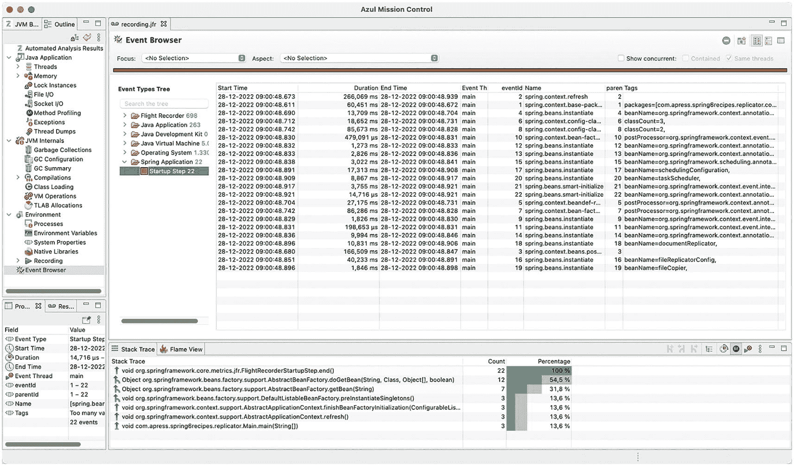

Azul Mission Control 窗口的截图。一个 recording.jfr 选项卡已打开，显示事件浏览器。在中央窗格中，选中了 startup step 22 选项卡。

图 10-7

Java Mission Control

如你所见，有几个以 `spring.*` 命名的事件，它们都对应于应用程序上下文和/或其中 Bean 的生命周期的某个部分。这使得它成为一个非常强大的工具，有助于识别应用程序启动的哪些部分拖慢了速度。

#### 发布 JFR 事件

除了发布标准事件之外，还可以发布/写入你自己的事件。要实现这一点，你需要获取正在使用的 `ApplicationStartup` 实例，并使用其 `start` 方法来创建一个 `StartupStep`。完成后，你可以在提供的 `StartupStep` 上调用 `end` 来记录该事件。要获取在此上下文中使用的 `ApplicationStartup` 的引用，你可以实现 `ApplicationStartupAware` 接口以使其被注入。使用 `@Autowired` 可能不起作用，因为基于注解的处理可能尚未完全初始化。

让我们在通过 `ScheduledTaskRegistrar` 注册任务时发布一个事件。

```
package com.apress.spring6recipes.replicator.config;
import com.apress.spring6recipes.replicator.FileReplicator;
import org.springframework.context.ApplicationStartupAware;
import org.springframework.context.annotation.Bean;
import org.springframework.context.annotation.Configuration;
import org.springframework.core.metrics.ApplicationStartup;
import org.springframework.scheduling.TaskScheduler;
import org.springframework.scheduling.annotation.EnableScheduling;
import org.springframework.scheduling.annotation.SchedulingConfigurer;
import org.springframework.scheduling.concurrent.ThreadPoolTaskScheduler;
import org.springframework.scheduling.config.ScheduledTaskRegistrar;
import java.io.IOException;
import java.time.Duration;
@Configuration
@EnableScheduling
public class SchedulingConfiguration implements SchedulingConfigurer, ApplicationStartupAware {
private final FileReplicator fileReplicator;
private ApplicationStartup applicationStartup;
public SchedulingConfiguration(FileReplicator fileReplicator) {
this.fileReplicator = fileReplicator;
}
@Override
public void configureTasks(ScheduledTaskRegistrar taskRegistrar) {
var step = applicationStartup.start("s6r.register-task");
taskRegistrar.addFixedDelayTask(() -> {
try {
fileReplicator.replicate();
} catch (IOException e) {
e.printStackTrace();
}
}, Duration.ofSeconds(60));
step.end();
}
...
@Override
public void setApplicationStartup(ApplicationStartup applicationStartup) {
this.applicationStartup=applicationStartup;
}
}
清单 10-85
包含事件的调度配置
```

现在，当你使用适当的设置（参见清单 10-83）运行应用程序时，你将看到此事件也被注册（参见图 10-8）。

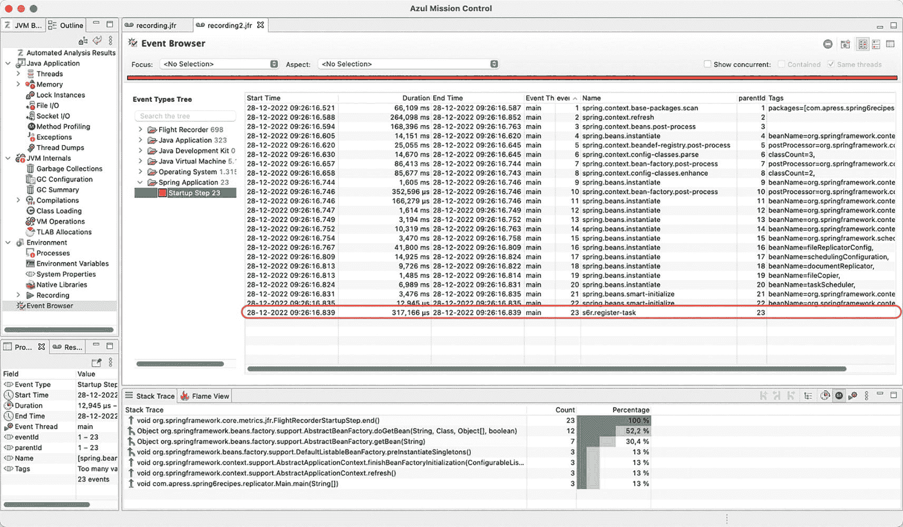

Azul Mission Control 窗口的截图。一个 recording2.jfr 选项卡已打开，显示事件浏览器。在中央窗格中，选中了 startup step 23 选项卡。事件浏览器中的最后一条结果被高亮显示。

图 10-8

Java Mission Control——已注册的事件

注册事件相对容易。你还可以使用额外的标签来丰富事件（就像 `spring.*` 命名空间中的那些一样）。例如，你可以添加一个包含你注册的任务/作业名称的标签。

```
public void configureTasks(ScheduledTaskRegistrar taskRegistrar) {
var step = applicationStartup.start("s6r.register-task");
step.tag("task", "file-replicator");
taskRegistrar.addFixedDelayTask(() -> {
try {
fileReplicator.replicate();
} catch (IOException e) {
e.printStackTrace();
}
}, Duration.ofSeconds(60));
step.end();
}
清单 10-86
包含带标签事件的调度配置
```

使用 `StartupStep` 上的 `tag` 方法创建的标签，现在也将随事件一起写入，并在进行调查时显示在 Java Mission Control 中。


## 10-11\. 使用 Micrometer 观测应用程序

在技巧 10-10 中，我们探讨了 Java Flight Recorder。虽然它是一个强大的工具，但对于 Spring 应用程序而言，它主要用于监控应用程序的启动。它无法替代 Java 分析器或像 [Micrometer](https://micrometer.io/) 这样的指标库。然而，当需要时，Spring 也内置了与 Micrometer 的集成，Spring 投资组合中的许多项目（如 Spring Security、Spring Data 等）也同样如此。

近年来，Micrometer API 已成为记录指标和对应用程序进行追踪的事实标准。Micrometer 可以与许多不同的监控系统集成，例如 [Prometheus](https://prometheus.io/)、[Influx](https://www.influxdata.com/) 和 [New Relic](https://newrelic.com/)。

为了提供更好的集成，Spring 在其内部嵌入了对 Micrometer API 的支持，默认使用一个无操作注册表，但可以配置为将数据发送到受支持的监控系统之一。

### 问题

你正在使用 Prometheus 来收集应用程序的指标，并且希望你的基于 Spring 的应用程序也能将指标发送到这个 Prometheus 实例。

### 解决方案

Micrometer 定义了 `Observation`（观测）的概念，它允许你的应用程序同时支持指标和追踪。指标包括计时器、仪表和计数器，它们提供了一种收集应用程序运行时行为统计数据的方法，例如，正在处理的 HTTP 请求数量及其相应的结果。指标有助于分析性能、应用程序使用模式和错误率。追踪则提供了对应用程序整体架构的更全面视图，使你能够跟踪整个系统中的请求（HTTP、消息等）。

#### Micrometer 概念

以下是 Micrometer 观测概念的快速概览：

*   `Observation` 是对应用程序中发生事件的真实记录。`Observation` 由 `ObservationHandler` 处理，以提供指标和/或追踪。

*   每个观测都有一个 `ObservationContext` 实现，它保存了该 `Observation` 的所有相关元数据。例如，对于 HTTP 请求，它将保存 HTTP 方法、响应状态等。

*   每个 `Observation` 由一个或多个 `KeyValues` 组成。在 HTTP 请求的情况下，这些将是 HTTP 方法、响应状态、处理时间等。`KeyValues` 被提供给一个 `ObservationConvention` 实现（有很多种），该实现与特定的 `ObservationContext` 实现相关联。

*   当 `KeyValue` 的可能值数量有限且可数时（例如，HTTP 方法只有少数几种），`KeyValues` 被称为“低基数”。低基数值仅贡献给指标。

*   当 `KeyValue` 的可能值数量（可能）无限时（例如 URL），`KeyValues` 被称为“高基数”。高基数值仅贡献给追踪。

*   最后，还有一个 `ObservationDocumentation`，它记录了一个领域内所有可能的观测，描述了预期的键名及其含义。

为了记录指标，我们需要配置一个 `MeterRegistry`，以便 `Observation` 实例可以使用它来创建计数器、计时器等。不同的技术有不同的 `MeterRegistry` 实现。这里我们将使用 JMX 版本，即 `JmxMeterRegistry`。

### 工作原理

要将指标发布到 JMX，我们需要在类路径中包含相应的实现。为此，我们需要添加一个依赖项。

```
io.micrometer
micrometer-registry-jmx
1.10.2

代码清单 10-88
Maven 依赖
```

```
implementation group: 'io.micrometer', name: 'micrometer-registry-jmx', version: '1.10.2'
代码清单 10-87
Gradle 依赖
```

添加依赖后，我们可以配置应用程序来记录和发送指标。让我们重用技巧 3-3 和 3-4 中的应用程序，以在服务器和客户端上启用指标。

#### 客户端的 Micrometer 配置

让我们从客户端开始。首先，我们需要配置一个 `JmxMeterRegistry`。使用这个 `MeterRegistry`，我们可以构造一个 `ObservationHandler`，与 `ObservationRegistry` 一起使用，通过 JMX 创建和发布指标。

```
@Bean
public JmxMeterRegistry meterRegistry() {
return new JmxMeterRegistry(JmxConfig.DEFAULT, Clock.SYSTEM);
}
@Bean
public ObservationRegistry observationRegistry(MeterRegistry meterRegistry) {
var registry = ObservationRegistry.create();
var handler = new DefaultMeterObservationHandler(meterRegistry);
registry.observationConfig().observationHandler(handler);
return registry;
}
@Bean
public RestTemplate restTemplate(ObservationRegistry observationRegistry) {
var restTemplate = new RestTemplate();
restTemplate.setObservationRegistry(observationRegistry);
return restTemplate;
}
代码清单 10-89
客户端指标配置
```

然后，我们可以使用 `MeterRegistry` 通过提供一个 `ObservationHandler` 来配置 `ObservationRegistry`。为此，我们可以使用 `DefaultMeterObservationHandler`。你可以看到，我们使用 `ObservationRegistry` 上的工厂方法 `create` 来为我们创建一个实例，而不是使用默认的无操作实现。可以通过调用 `observationConfig` 方法来获取和修改配置。通过它，我们可以将 `DefaultMeterObservationHandler` 添加到处理程序列表中。这样，就实现了 Micrometer 与发布到 JMX 的集成。剩下的就是配置 `RestTemplate` 以使用 `ObservationRegistry` 来创建指标。为此，我们只需将已创建的 `ObservationRegistry` 设置到 `RestTemplate` 中即可。完成所有这些设置后，我们现在可以执行请求并同时收集指标。这些指标可以通过 JMX 访问（参见图 10-9）。

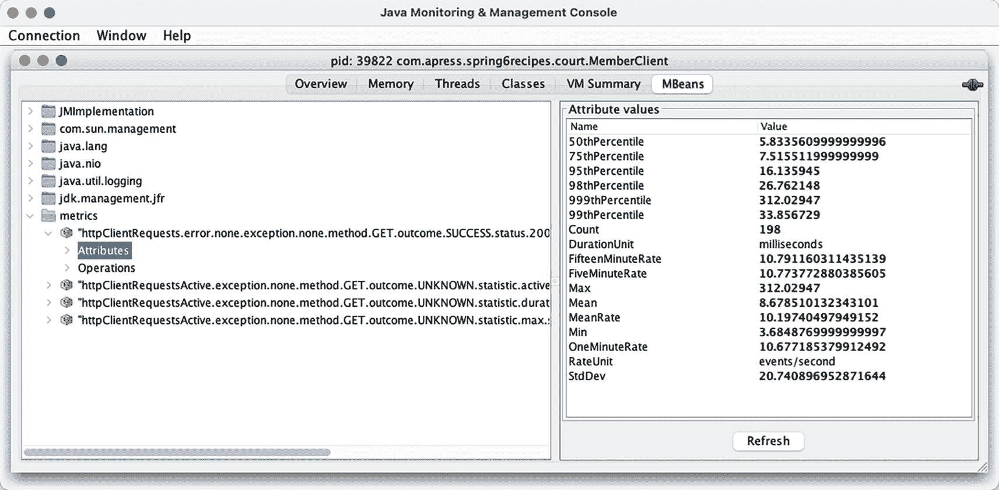

一个显示 PID Spring 6 Recipes dot court dot member client 窗口的截图，其中 M Beans 选项卡被选中。左侧窗口选中了 Attributes 选项，右侧窗口显示了 17 个属性值。

图 10-9

通过 JMX 查看的客户端指标

现在指标已通过 JMX 发布；然而，同样的方法也适用于 Prometheus、Ganglia、New Relic 等，只需提供正确的 `MeterRegistry` 并将其暴露给 `ObservationRegistry` 即可。你甚至可以通过多次调用 `observationHandler` 来添加多个实现。例如，你可以结合 JMX 和 Prometheus 来暴露指标。


#### 服务器的 Micrometer 配置

要配置服务器，我们需要相同的 `MeterRegistry` 和 `ObservationRegistry`，但无需将 `ObservationRegistry` 添加到 `RestTemplate`（除非你在服务器应用中使用它），而是注册一个 Servlet 过滤器来创建指标。`org.springframework.web.filter.ServerHttpObservationFilter` 在收到 HTTP 请求时就会开始创建指标。

```
@Bean
public JmxMeterRegistry meterRegistry() {
return new JmxMeterRegistry(JmxConfig.DEFAULT, Clock.SYSTEM);
}
@Bean
public ObservationRegistry observationRegistry(MeterRegistry meterRegistry) {
var registry = ObservationRegistry.create();
var handler = new DefaultMeterObservationHandler(meterRegistry);
registry.observationConfig().observationHandler(handler);
return registry;
}
@Bean
public ServerHttpObservationFilter metricsFilter(ObservationRegistry or) {
return new ServerHttpObservationFilter(or);
}
清单 10-90
服务器指标配置
```

`MeterRegistry` 和 `ObservationRegistry` 的注册方式完全相同。但请注意，这里添加了 `ServerHttpObservationFilter`，它将为服务器创建 HTTP 指标。

由于我们在应用程序上下文中配置了过滤器，这对 Tomcat 来说并非直接可见。为此，我们可以使用 `DelegatingFilterProxy`。顾名思义，它会将请求委托给另一个过滤器。在这种情况下，它会在应用程序上下文中查找一个与我们传入的名称相匹配的 Bean，并且该 Bean 必须是一个 Servlet 过滤器。然后，它会将调用委托给这个由 Spring 管理的过滤器。通过这种方法，你可以在应用程序上下文中配置过滤器，但仍然可以在 Servlet 容器中使用它们。Spring Security（参见第 5 章）也使用了相同的方法。

在 `CourtRestApplicationInitializer` 中，我们需要添加这个 `DelegatingFilterProxy`。这可以通过重写 `getServletFilters` 方法来实现。

```
package com.apress.spring6recipes.court.web;
import org.springframework.web.filter.DelegatingFilterProxy;
import org.springframework.web.servlet.support.AbstractAnnotationConfigDispatcherServletInitializer;
import jakarta.servlet.Filter;
public class CourtRestApplicationInitializer extends AbstractAnnotationConfigDispatcherServletInitializer {
@Override
protected Filter[] getServletFilters() {
return new Filter[] {
new DelegatingFilterProxy("metricsFilter")
};
}
}
清单 10-91
Servlet 过滤器配置
```

部署应用程序并启动客户端（以便有一些传入和已处理的请求）后，你可以将 JConsole 连接到 Tomcat 实例并查看指标（参见图 10-10）。

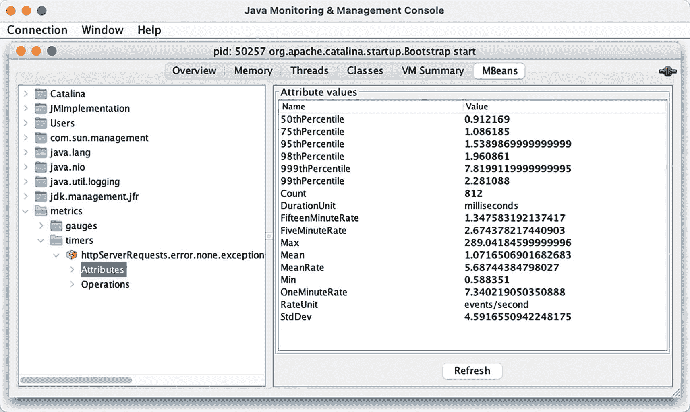

一个显示 org.apache.bootstrap.start 窗口的截图，其中选中了 MBeans 选项卡。左侧窗口选中了 Attributes 选项，右侧窗口显示了 17 个属性值。

图 10-10
通过 JMX 查看服务器指标

#### 通过 MeterBinder 暴露额外指标

除了通过 `Observation` 为 `RestTemplate`、`WebClient` 或 Servlet 过滤器创建指标外，你还可以使用 `MeterBinder` 来暴露系统中特定部分的指标。例如，显示缓存使用情况、JVM 运行时间或 JVM 内存统计信息的指标。为此，你可以使用 `MeterBinder` 并实现它以暴露所需的指标。

Micrometer 已经提供了相当多的 `MeterBinder` 实现供你使用。表 10-3 列出了其中一部分。

表 10-3
Micrometer MeterBinder 实现

| 名称 | 描述 |
| --- | --- |
| `DiskSpaceMetrics` | 暴露系统磁盘空间使用情况的指标 |
| `HibernateMetrics` | 来自 Hibernate 的指标，如查询统计、实体、缓存命中率等 |
| `JvmGcMetrics` | GC 指标 |
| `JvmMemoryMetrics` | 各种内存指标和缓冲池 |
| `JvmThreadMetrics` | 线程指标，包括总数、守护线程数、存活数等 |
| `ProcessorMetrics` | CPU 使用率指标 |
| `TomcatMetrics` | Tomcat 指标，如 HTTP 会话数、线程数等 |
| `UptimeMetrics` | 系统运行时间的计时器 |

使用这些实现最简单的方法是将所有你想要的 `MeterBinder` 实现注册为应用程序上下文中的 Bean，然后让一个额外的组件从上下文中获取所有这些 Bean（参见第 1 章），遍历它们并调用 `MeterBinder.bindTo` 方法。`bindTo` 方法需要之前注册的 `MeterRegistry` 才能正常工作。

使用以下组件，你可以轻松配置要使用的 `MeterBinder`。

```
package com.apress.spring6recipes.court;
import org.springframework.beans.factory.ObjectProvider;
import org.springframework.stereotype.Component;
import io.micrometer.core.instrument.MeterRegistry;
import io.micrometer.core.instrument.binder.MeterBinder;
import jakarta.annotation.PostConstruct;
@Component
public class MeterBinderRegistrar {
private final MeterRegistry registry;
private final ObjectProvider binders;
public MeterBinderRegistrar(MeterRegistry registry,
ObjectProvider binders) {
this.registry = registry;
this.binders = binders;
}
@PostConstruct
public void register() {
this.binders
.forEach( (b) -> b.bindTo(this.registry));
}
}
清单 10-92
MeterBinderRegistrar 类
```

对于每个检测到的 `MeterBinder`，它会在构造后调用 `bindTo` 方法。这里优先使用 `ObjectProvider`，因为它会延迟 `MeterBinder` 实现的构造。如果使用集合，则可能会强制进行急切初始化。有关核心任务和容器的更多信息，请参见第 1 章。

现在，你可以创建一个配置，注册一些 `MeterBinder` 实例来暴露指标。让我们暴露内存、线程和运行时间指标（参见清单 10-93）。

```
@Configuration
class MeterBindersConfiguration {
@Bean
public UptimeMetrics uptimeMetrics() {
return new UptimeMetrics();
}
@Bean
public JvmThreadMetrics jvmThreadMetrics() {
return new JvmThreadMetrics();
}
@Bean
public JvmMemoryMetrics jvmMemoryMetrics() {
return new JvmMemoryMetrics();
}
}
清单 10-93
MeterBinder 配置类
```

现在，当重启客户端（或服务器，如果你将配置放在服务器中）时，你可以看到暴露了额外的指标（参见图 10-11）。

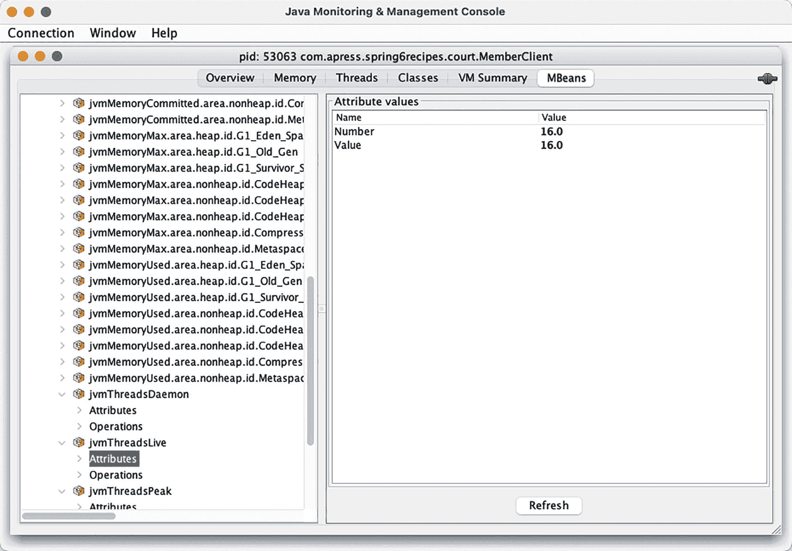

一个显示 spring 6 recipes.court.member.client 窗口的截图，其中选中了 MBeans 选项卡。左侧窗格选中了 jvm threads live 下的 Attributes 选项，右侧窗格显示了 2 个参数的属性值。

图 10-11
通过 JMX 查看额外指标

## 10-12\. 总结

本章讨论了 JMX 及其一些相关规范。你学习了如何将 Spring Bean 导出为 JMX MBeans，以及如何从客户端（无论是远程还是本地）使用这些 MBeans，这通过 Spring 的代理实现。你还在 Spring 中发布和监听了 JMX 服务器上的通知事件。你还学习了如何在 Spring 的帮助下执行邮件任务，包括如何创建邮件模板和发送带附件的邮件（MIME 消息）。你还学习了如何使用 Quartz 调度器以及 Spring 的任务命名空间来调度任务。

虽然 REST 在基于 Web 的应用程序之间的通信中已占据主导地位，但 SOAP 仍然是一个有效的选择。我们讨论了契约优先的 SOAP Web 服务，以及如何利用 Spring-WS 创建和使用这类服务。

最后，我们探讨了 Spring 中一些可观测性支持，包括 Java Flight Recorder 以及与 Micrometer API 集成的可能性。


# 11. Spring 消息

在本章中，你将了解 Spring 对消息传递的支持。消息传递是一种非常强大的技术，可用于扩展应用程序。它允许将原本可能压垮服务的工作排队处理，同时也鼓励采用解耦架构。例如，一个组件可能只消费基于 `java.util.Map` 键值对的单一消息。这种松散的契约使其成为多个不同系统之间可行的通信枢纽。

在本章中，我们会频繁提及“主题”和“队列”。消息传递解决方案旨在解决两种架构需求：从应用程序中的一个已知点向另一个已知点传递消息，以及从应用程序中的一个点向多个未知点传递消息。这些模式分别相当于中间件中的面对面交谈和通过扩音器对一屋子人说话。

如果你希望将消息队列中的消息广播给一组正在“监听”该消息的未知客户端（就像扩音器的比喻），那么请将消息发送到“主题”。如果你希望将消息发送给单个已知客户端，那么请通过“队列”发送。

到本章结束时，你将能够使用 Spring 创建和访问基于消息的中间件。本章还将为你提供消息传递的一般实用知识，这将有助于你理解下一章关于 Spring Integration 的内容。

我们将研究消息抽象，以及如何使用它与 JMS、AMQP 和 Apache Kafka 协同工作。对于每种技术，Spring 都通过基于模板的方法简化了使用，便于轻松发送和接收消息。此外，Spring 还允许在其 IoC 容器中声明的 Bean 监听消息并对其做出响应。它对每种技术都采用了相同的方法。

一个信息符号，由带阴影圆圈内的字母 i 图标表示。 在 `bin` 目录中，有几个脚本用于启动不同消息提供者的 Docker 化版本：用于 JMS 的 ActiveMQ Artemis、用于 AMQP 的 RabbitMQ，以及最后的 Apache Kafka。

## 11-1. 使用 Spring 发送和接收 JMS 消息

### 问题

要发送或接收 JMS 消息，你必须执行以下任务：

1.  在消息代理上创建 JMS 连接工厂。
2.  创建 JMS 目标，可以是队列或主题。
3.  从连接工厂打开 JMS 上下文。
4.  使用消息生产者或消费者发送或接收 JMS 消息。
5.  处理 `JMSException`，这是一个必须处理的受检异常。
6.  关闭 JMS 连接工厂和 JMS 上下文。

如你所见，发送或接收一条简单的 JMS 消息需要编写大量代码。事实上，这些任务大多是样板代码，每次处理 JMS 时都需要重复执行。

### 解决方案

Spring 提供了一种基于模板的解决方案来简化 JMS 代码。使用 JMS 模板（Spring 框架类 `JmsTemplate`），你可以用更少的代码发送和接收 JMS 消息。该模板处理样板任务，并将 JMS API 的 `JMSException` 层次结构转换为 Spring 的运行时异常 `org.springframework.jms.JmsException` 层次结构。

### 工作原理

假设你正在开发一个邮局系统，该系统包含两个子系统：前台子系统和后台子系统。当前台收到邮件时，它会将邮件传递给后台进行分类和投递。同时，前台子系统会向后台子系统发送一条 JMS 消息，通知其有新邮件。邮件信息由以下记录表示。

```
package com.apress.spring6recipes.post;
public record Mail(String mailId, String country, double weight) { }
清单 11-1
Mail 类
```

发送和接收邮件信息的方法定义在 `FrontDesk` 和 `BackOffice` 接口中，如下所示。

```
package com.apress.spring6recipes.post;
public interface BackOffice {
Mail receiveMail();
}
清单 11-3
BackOffice 接口
```

```
package com.apress.spring6recipes.post;
public interface FrontDesk {
void sendMail(Mail mail);
}
清单 11-2
FrontDesk 接口
```


#### 不使用 Spring 的 JMS 模板支持发送和接收消息

首先，我们来看看如何在不使用 Spring 的 JMS 模板支持的情况下发送和接收 JMS 消息。下面的 `FrontDeskImpl` 类直接使用 JMS API 发送 JMS 消息。

```
package com.apress.spring6recipes.post;
import jakarta.jms.Session;
import org.apache.activemq.artemis.jms.client.ActiveMQConnectionFactory;
import org.apache.activemq.artemis.jms.client.ActiveMQQueue;
import java.util.Map;
public class FrontDeskImpl implements FrontDesk {
public void sendMail(Mail mail) {
try (var cf = new ActiveMQConnectionFactory("tcp://localhost:61616");
var ctx = cf.createContext(Session.AUTO_ACKNOWLEDGE)) {
var destination = new ActiveMQQueue("mail.queue");
var mapContext = Map.of(
"mailId", mail.mailId(),
"country", mail.country(),
"weight", mail.weight());
ctx.createProducer().send(destination, mapContext);
}
}
}
Listing 11-4
Plain JMS FrontDesk implementation
```

在上述 `sendMail()` 方法中，你首先使用 ActiveMQ 提供的类创建了 JMS 特定的 `ConnectionFactory`（即 `ActiveMQConnectionFactory`）和 `Destination`（即 `ActiveMQQueue`）对象。如果你在 localhost 上运行，消息代理 URL 是 ActiveMQ 的默认地址。在 JMS 中，有两种类型的目标地址：队列（queue）和主题（topic）。

正如本章开头所述，队列用于点对点通信模型，而主题用于发布-订阅通信模型。由于你是从前台向后台以点对点方式发送 JMS 消息，因此应该使用消息队列。你也可以使用 `ActiveMQTopic` 类轻松创建一个主题作为目标地址。

接下来，在发送消息之前，你必须创建一个上下文和消息生产者。JMS API 中定义了多种消息类型，包括 `TextMessage`、`MapMessage`、`BytesMessage`、`ObjectMessage` 和 `StreamMessage`。`MapMessage` 以键/值对的形式包含消息内容，类似于一个映射。所有这些类型都是接口，它们都实现了 `Message` 接口。`JMSProducer` 提供了多个 `send` 方法，这些方法接受不同类型，例如 `java.util.Map`、`byte[]` 等。每个 `send` 方法都对应 JMS 提供的一种消息类型。同时，有时你需要处理 JMS API 可能抛出的 `JMSException`。最后，你必须记得关闭会话和连接以释放系统资源。使用 try-with-resources 有助于自动关闭它们。

另一方面，下面的 `BackOfficeImpl` 类直接使用 JMS API 接收 JMS 消息。

```
package com.apress.spring6recipes.post;
import jakarta.jms.JMSException;
import jakarta.jms.JMSRuntimeException;
import jakarta.jms.MapMessage;
import jakarta.jms.Message;
import jakarta.jms.Session;
import org.apache.activemq.artemis.jms.client.ActiveMQConnectionFactory;
import org.apache.activemq.artemis.jms.client.ActiveMQQueue;
public class BackOfficeImpl implements BackOffice {
public Mail receiveMail() {
try (var cf = new ActiveMQConnectionFactory("tcp://localhost:61616");
var ctx = cf.createContext(Session.AUTO_ACKNOWLEDGE)) {
var destination = new ActiveMQQueue("mail.queue");
var consumer = ctx.createConsumer(destination);
var message = consumer.receive();
return convert(message);
} catch (JMSException ex) {
throw new RuntimeException(ex.getMessage(), ex);
}
}
private Mail convert(Message msg) throws JMSException {
var message = (MapMessage) msg;
return new Mail(message.getString("mailId"),
message.getString("country"),
message.getDouble("weight"));
}
}
Listing 11-5
Plain JMS BackOffice implementation
```

此方法中的大部分代码与发送 JMS 消息的代码类似，区别在于你创建了一个消息消费者，并从中接收 JMS 消息。

当使用 `JMSConsumer` 接收消息时，你可以调用它提供的某个 `receive` 方法。有些方法允许指定超时时间，另一些方法则用于获取特定类型消息的特定负载（例如 `java.util.Map`、`byte[]` 等）。这里我们期望收到一个 `MapMessage`，因此可以直接通过调用 `receiveBody(Map.class)` 来获取负载。然而，这里我们选择使用简单的 `receive()` 方法，它会返回一个 `MapMessage`。

最后，让我们为前台子系统（例如 `FrontOfficeConfiguration`）和后台子系统（例如 `BackOfficeConfiguration`）创建两个配置类。

```
package com.apress.spring6recipes.post.config;
import org.springframework.context.annotation.Bean;
import org.springframework.context.annotation.Configuration;
import com.apress.spring6recipes.post.BackOfficeImpl;
@Configuration
public class BackOfficeConfiguration {
@Bean
public BackOfficeImpl backOffice() {
return new BackOfficeImpl();
}
}
Listing 11-7
BackOffice configuration
```

```
package com.apress.spring6recipes.post.config;
import org.springframework.context.annotation.Bean;
import org.springframework.context.annotation.Configuration;
import com.apress.spring6recipes.post.FrontDeskImpl;
@Configuration
public class FrontOfficeConfiguration {
@Bean
public FrontDeskImpl frontDesk() {
return new FrontDeskImpl();
}
}
Listing 11-6
FrontDesk configuration
```

现在，前台和后台子系统已经基本准备好发送和接收 JMS 消息了。但在进行最后一步之前，请先启动 ActiveMQ 消息代理（如果尚未启动）。

一个带有轮廓的灯泡图标，表示信息提示。  你可以轻松监控 ActiveMQ Artemis 消息代理的活动。在默认安装中，你可以打开 http://localhost:8161/console 查看 `mail.queue`（这些示例中使用的队列）的情况。

接下来，让我们创建几个主类来运行消息系统：一个用于前台子系统——`FrontDeskMain` 类，另一个用于后台子系统——`BackOfficeMain` 类。

```
package com.apress.spring6recipes.post;
import com.apress.spring6recipes.post.config.BackOfficeConfiguration;
import org.springframework.context.annotation.AnnotationConfigApplicationContext;
public class BackOfficeMain {
public static void main(String[] args) {
var cfg = BackOfficeConfiguration.class;
try (var context = new AnnotationConfigApplicationContext(cfg)) {
var backOffice = context.getBean(BackOffice.class);
var mail = backOffice.receiveMail();
System.out.printf("Recieved: %s%n", mail);
}
}
}
Listing 11-9
Main class—BackOffice
```

```
package com.apress.spring6recipes.post;
import com.apress.spring6recipes.post.config.FrontOfficeConfiguration;
import org.springframework.context.annotation.AnnotationConfigApplicationContext;
public class FrontDeskMain {
public static void main(String[] args) {
var cfg = FrontOfficeConfiguration.class;
try (var context = new AnnotationConfigApplicationContext(cfg)) {
var frontDesk = context.getBean(FrontDesk.class);
frontDesk.sendMail(new Mail("1234", "US", 1.5));
}
}
}
Listing 11-8
Main class—FrontDesk
```

每次你使用上述 `FrontDeskMain` 类运行前台应用程序时，都会向代理发送一条消息；每次你使用上述 `BackOfficeMain` 类运行后台应用程序时，都会尝试从代理获取一条消息。


#### 使用 Spring 的 JMS 模板发送和接收消息

Spring 提供了 `JmsTemplate`，可以简化你的 JMS 代码。要使用此模板发送 JMS 消息，你只需调用 `send()` 方法并提供消息目的地，以及一个 `MessageCreator` 对象，该对象用于创建你要发送的 JMS 消息。`MessageCreator` 对象通常实现为匿名内部类。

```
package com.apress.spring6recipes.post;
import jakarta.jms.Destination;
import org.springframework.jms.core.JmsTemplate;
public class FrontDeskImpl implements FrontDesk {
private final JmsTemplate jmsTemplate;
private final Destination destination;
public FrontDeskImpl(JmsTemplate jmsTemplate, Destination destination) {
this.jmsTemplate = jmsTemplate;
this.destination = destination;
}
public void sendMail(Mail mail) {
jmsTemplate.send(destination, session -> {
var message = session.createMapMessage();
message.setString("mailId", mail.mailId());
message.setString("country", mail.country());
message.setDouble("weight", mail.weight());
return message;
});
}
}
清单 11-10
JMS 模板 FrontDesk 实现
```

请注意，内部类只能访问封闭方法中实际上是 final 的参数或变量。`MessageCreator` 接口只声明了一个 `createMessage()` 方法供你实现。在此方法中，你使用提供的 JMS 会话创建并返回你的 JMS 消息。

JMS 模板帮助你获取和释放 JMS 连接和会话，并发送由你的 `MessageCreator` 对象创建的 JMS 消息。此外，它还将 JMS API 的 `JMSException` 层次结构转换为 Spring 的 JMS 运行时异常层次结构，其基类异常是 `org.springframework.jms.JmsException`。你可以捕获从 `send` 方法及其变体抛出的 `JmsException`，然后根据需要在 catch 块中采取行动。

在前台子系统的 bean 配置文件中，你声明了一个 JMS 模板，该模板引用 JMS 连接工厂来打开连接。然后，你将此模板以及消息目的地注入到你的前台 bean 中。

```
package com.apress.spring6recipes.post.config;
import com.apress.spring6recipes.post.FrontDeskImpl;
import jakarta.jms.ConnectionFactory;
import jakarta.jms.Queue;
import org.apache.activemq.artemis.jms.client.ActiveMQConnectionFactory;
import org.apache.activemq.artemis.jms.client.ActiveMQQueue;
import org.springframework.context.annotation.Bean;
import org.springframework.context.annotation.Configuration;
import org.springframework.jms.core.JmsTemplate;
@Configuration
public class FrontOfficeConfiguration {
@Bean
public ConnectionFactory connectionFactory() {
return new ActiveMQConnectionFactory("tcp://localhost:61616");
}
@Bean
public Queue mailDestination() {
return new ActiveMQQueue("mail.queue");
}
@Bean
public JmsTemplate jmsTemplate(ConnectionFactory cf) {
return new JmsTemplate(cf);
}
@Bean
public FrontDeskImpl frontDesk(JmsTemplate jms, Queue destination) {
return new FrontDeskImpl(jms, destination);
}
}
清单 11-11
FrontDesk 配置
```

要使用 JMS 模板接收 JMS 消息，你可以通过提供消息目的地来调用 `receive()` 方法。此方法返回一个 JMS 消息 `javax.jms.Message`，其类型是基础的 JMS 消息类型（即一个接口），因此你必须在进一步处理之前将其转换为适当的类型。

```
package com.apress.spring6recipes.post;
import jakarta.jms.Destination;
import jakarta.jms.JMSException;
import jakarta.jms.MapMessage;
import jakarta.jms.Message;
import org.springframework.jms.core.JmsTemplate;
import org.springframework.jms.support.JmsUtils;
public class BackOfficeImpl implements BackOffice {
private final JmsTemplate jmsTemplate;
private final Destination destination;
public BackOfficeImpl(JmsTemplate jmsTemplate, Destination destination) {
this.jmsTemplate = jmsTemplate;
this.destination = destination;
}
public Mail receiveMail() {
var message = jmsTemplate.receive(destination);
try {
return message != null ? convert(message) : null;
} catch (JMSException e) {
throw JmsUtils.convertJmsAccessException(e);
}
}
private Mail convert(Message msg) throws JMSException {
var message = (MapMessage) msg;
return new Mail(message.getString("mailId"),
message.getString("country"),
message.getDouble("weight"));
}
}
清单 11-12
JMS 模板 BackOffice 实现
```

然而，在从接收到的 `MapMessage` 对象中提取信息时，你仍然需要处理 JMS API 的 `JMSException`。这与框架的默认行为形成鲜明对比，在调用 `JmsTemplate` 上的方法时，框架会自动为你映射异常。为了使此方法抛出的异常类型保持一致，你必须调用 `JmsUtils.convertJmsAccessException()` 将 JMS API 的 `JMSException` 转换为 Spring 的 `JmsException`。

在后端子系统的 bean 配置文件中，你声明了一个 JMS 模板，并将其与消息目的地一起注入到你的后台 bean 中。

```
package com.apress.spring6recipes.post.config;
import com.apress.spring6recipes.post.BackOfficeImpl;
import jakarta.jms.ConnectionFactory;
import jakarta.jms.Queue;
import org.apache.activemq.artemis.jms.client.ActiveMQConnectionFactory;
import org.apache.activemq.artemis.jms.client.ActiveMQQueue;
import org.springframework.context.annotation.Bean;
import org.springframework.context.annotation.Configuration;
import org.springframework.jms.core.JmsTemplate;
@Configuration
public class BackOfficeConfiguration {
@Bean
public ConnectionFactory connectionFactory() {
return new ActiveMQConnectionFactory("tcp://localhost:61616");
}
@Bean
public Queue mailDestination() {
return new ActiveMQQueue("mail.queue");
}
@Bean
public JmsTemplate jmsTemplate(ConnectionFactory cf) {
var jmsTemplate = new JmsTemplate();
jmsTemplate.setConnectionFactory(cf);
jmsTemplate.setReceiveTimeout(10000);
return jmsTemplate;
}
@Bean
public BackOfficeImpl backOffice(JmsTemplate jms, Queue destination) {
return new BackOfficeImpl(jms, destination);
}
}
清单 11-13
BackOffice 配置
```

请特别注意 JMS 模板的 `receiveTimeout` 属性；它指定了等待的毫秒数。默认情况下，此模板会在目的地无限期等待 JMS 消息，同时调用线程会被阻塞。为了避免长时间等待消息，你应该为此模板指定一个接收超时时间。如果在指定时间内目的地没有可用消息，JMS 模板的 `receive()` 方法将返回 `null` 消息。

在你的应用程序中，接收消息的主要用途可能是你期望对某事做出响应，或者希望按时间间隔检查消息，处理消息，然后暂停直到下一个时间间隔。如果你打算接收消息并作为服务响应它们，你很可能希望使用本章后面描述的消息驱动 POJO 功能。在那里，我们讨论了一种机制，该机制将持续等待消息，并在消息到达时通过回调你的应用程序来处理它们。


#### 向默认目标发送和接收消息

无需为每个 JMS 模板的 `send()` 和 `receive()` 方法调用指定消息目标，你可以为 JMS 模板指定一个默认目标。这样，你就不再需要将其注入到消息发送者和接收者 Bean 中。以下清单展示了 `FrontOfficeConfiguration` 的修改；同样的修改也适用于 `BackOfficeConfiguration`。

```
package com.apress.spring6recipes.post.config;
@Configuration
public class FrontOfficeConfiguration {
@Bean
public JmsTemplate jmsTemplate(ConnectionFactory cf, Queue destination) {
var jmsTemplate = new JmsTemplate();
jmsTemplate.setConnectionFactory(cf);
jmsTemplate.setDefaultDestination(destination);
return jmsTemplate;
}
@Bean
public FrontDeskImpl frontDesk(JmsTemplate jms) {
return new FrontDeskImpl(jms);
}
}
清单 11-14
配置了默认目标的 FrontDesk 配置
```

为 JMS 模板指定默认目标后，你可以从消息发送者和接收者类中删除消息目标的构造函数参数。现在，当你调用 `send()` 和 `receive()` 方法时，不再需要指定消息目标。

此外，除了为 JMS 模板指定 `Destination` 接口的实例，你还可以指定目标名称，让 JMS 模板为你解析它，这样你就可以从两个 Bean 配置类中删除目标属性声明。这通过设置 `defaultDestinationName` 属性来实现。

```
package com.apress.spring6recipes.post.config;
@Configuration
public class FrontOfficeConfiguration {
@Bean
public JmsTemplate jmsTemplate(ConnectionFactory cf) {
var jmsTemplate = new JmsTemplate();
jmsTemplate.setConnectionFactory(cf);
jmsTemplate.setDefaultDestinationName("mail.queue");
return jmsTemplate;
}
}
清单 11-15
配置了默认目标名称的 FrontDesk 配置
```

#### 扩展 JmsGatewaySupport 类

JMS 发送者和接收者类也可以扩展 `JmsGatewaySupport` 来获取 JMS 模板。对于扩展 `JmsGatewaySupport` 以创建其 JMS 模板的类，你有以下两种选择：

*   为 `JmsGatewaySupport` 注入一个 JMS 连接工厂，使其自动创建一个 JMS 模板。但是，如果这样做，你将无法配置 JMS 模板的详细信息。

*   为 `JmsGatewaySupport` 注入一个由你创建和配置的 JMS 模板。

其中，如果你必须自己配置 JMS 模板，第二种方法更合适。你可以从发送者和接收者类中删除私有字段 `jmsTemplate` 及其构造函数参数。当你需要访问 JMS 模板时，只需调用 `getJmsTemplate()` 即可。

```
package com.apress.spring6recipes.post;
import jakarta.jms.JMSException;
import jakarta.jms.MapMessage;
import jakarta.jms.Message;
import org.springframework.jms.core.support.JmsGatewaySupport;
import org.springframework.jms.support.JmsUtils;
public class BackOfficeImpl extends JmsGatewaySupport implements BackOffice {
public Mail receiveMail() {
var message = getJmsTemplate().receive();
try {
return message != null ? convert(message) : null;
} catch (JMSException e) {
throw JmsUtils.convertJmsAccessException(e);
}
}
private Mail convert(Message msg) throws JMSException {
var message = (MapMessage) msg;
return new Mail(message.getString("mailId"),
message.getString("country"),
message.getDouble("weight"));
}
}
清单 11-17
扩展 JmsGatewaySupport 的 BackOffice 实现
```

```
package com.apress.spring6recipes.post;
import org.springframework.jms.core.support.JmsGatewaySupport;
public class FrontDeskImpl extends JmsGatewaySupport implements FrontDesk {
public void sendMail(final Mail mail) {
getJmsTemplate().send(session -> {
var message = session.createMapMessage();
message.setString("mailId", mail.mailId());
message.setString("country", mail.country());
message.setDouble("weight", mail.weight());
return message;
});
}
}
清单 11-16
扩展 JmsGatewaySupport 的 FrontDesk 实现
```

## 11-2\. 转换 JMS 消息

### 问题

你的应用程序从消息队列接收消息，但需要将这些消息从 JMS 特定类型转换为业务特定类。

### 解决方案

Spring 提供了 `SimpleMessageConverter` 的实现，用于处理将接收到的 JMS 消息转换为业务对象，以及将业务对象转换为 JMS 消息。你可以利用默认转换器，也可以提供自己的转换器。


### 工作原理

前面的示例处理了原始的 JMS 消息。Spring 的 JMS 模板可以通过消息转换器，帮助你在 Java 对象与 JMS 消息之间进行转换。默认情况下，JMS 模板使用 `SimpleMessageConverter` 来将 `TextMessage` 与字符串相互转换、将 `BytesMessage` 与字节数组相互转换、将 `MapMessage` 与映射（Map）相互转换，以及将 `ObjectMessage` 与可序列化对象相互转换。

对于上一个示例中的前台和后台类，你可以使用 `convertAndSend()` 和 `receiveAndConvert()` 方法来发送和接收映射，其中映射会被转换为 `MapMessage` 或从 `MapMessage` 转换回来。

```
package com.apress.spring6recipes.post;
import jakarta.jms.JMSException;
import org.springframework.jms.core.support.JmsGatewaySupport;
import org.springframework.jms.support.JmsUtils;
import java.util.Map;
public class BackOfficeImpl extends JmsGatewaySupport implements BackOffice {
public Mail receiveMail() {
var message = (Map) getJmsTemplate().receiveAndConvert();
try {
return message != null ? convert(message) : null;
} catch (JMSException e) {
throw JmsUtils.convertJmsAccessException(e);
}
}
private Mail convert(Map msg) throws JMSException {
return new Mail(
(String) msg.get("mailId"),
(String) msg.get("country"),
(Double) msg.get("weight"));
}
}
清单 11-19
使用 receiveAndConvert 的后台实现
```

```
package com.apress.spring6recipes.post;
import org.springframework.jms.core.support.JmsGatewaySupport;
import java.util.Map;
public class FrontDeskImpl extends JmsGatewaySupport implements FrontDesk {
public void sendMail(final Mail mail) {
var map = Map.of(
"mailId", mail.mailId(),
"country", mail.country(),
"weight", mail.weight());
getJmsTemplate().convertAndSend(map);
}
}
清单 11-18
使用 convertAndSend 的前台实现
```

你也可以通过实现 `MessageConverter` 接口来创建自定义消息转换器，用于转换邮件对象。

```
package com.apress.spring6recipes.post;
import jakarta.jms.JMSException;
import jakarta.jms.MapMessage;
import jakarta.jms.Message;
import jakarta.jms.Session;
import org.springframework.jms.support.converter.MessageConversionException;
import org.springframework.jms.support.converter.MessageConverter;
public class MailMessageConverter implements MessageConverter {
public Object fromMessage(Message message) throws JMSException,
MessageConversionException {
var mapMessage = (MapMessage) message;
return new Mail(
mapMessage.getString("mailId"),
mapMessage.getString("country"),
mapMessage.getDouble("weight"));
}
public Message toMessage(Object object, Session session) throws JMSException,
MessageConversionException {
var mail = (Mail) object;
var message = session.createMapMessage();
message.setString("mailId", mail.mailId());
message.setString("country", mail.country());
message.setDouble("weight", mail.weight());
return message;
}
}
清单 11-20
MessageConverter 实现
```

要应用此消息转换器，你需要将其注入到 JMS 模板中。

```
@Configuration
public class BackOfficeConfiguration {
...
@Bean
public JmsTemplate jmsTemplate() {
JmsTemplate jmsTemplate = new JmsTemplate();
jmsTemplate.setMessageConverter(new MailMessageConverter());
...
return jmsTemplate;
}
}
清单 11-21
使用 MessageConverter 的 JmsTemplate 配置
```

当你为 JMS 模板显式设置消息转换器时，它将覆盖默认的 `SimpleMessageConverter`。现在，你可以调用 JMS 模板的 `convertAndSend()` 和 `receiveAndConvert()` 方法来发送和接收 `Mail` 对象。

```
package com.apress.spring6recipes.post;
...
public class BackOfficeImpl extends JmsGatewaySupport implements BackOffice {
public Mail receiveMail() {
return (Mail) getJmsTemplate().receiveAndConvert();
}
}
清单 11-23
使用 receiveAndConvert 和 MessageConverter 的后台实现
```

```
package com.apress.spring6recipes.post;
...
public class FrontDeskImpl extends JmsGatewaySupport implements FrontDesk {
public void sendMail(Mail mail) {
getJmsTemplate().convertAndSend(mail);
}
}
清单 11-22
使用 convertAndSend 和 MessageConverter 的前台实现
```

## 11-3\. 管理 JMS 事务

### 问题

你希望参与 JMS 事务，以便消息的接收和发送具有事务性。

### 解决方案

你可以使用与任何 Spring 组件相同的事务策略。根据需要利用 Spring 的 `TransactionManager` 实现，并将行为注入到 Bean 中。

### 工作原理

当在单个方法中生成或消费多个 JMS 消息时，如果中间发生错误，目标位置生成或消费的 JMS 消息可能会处于不一致状态。你必须用事务包围该方法以避免此问题。（有关事务的更多信息，请参见第 7 章。）

在 Spring 中，JMS 事务管理与其他数据访问策略保持一致。例如，你可以使用 `@Transactional` 注解来标注需要事务管理的方法。

```
package com.apress.spring6recipes.post;
import org.springframework.jms.core.support.JmsGatewaySupport;
import org.springframework.transaction.annotation.Transactional;
public class BackOfficeImpl extends JmsGatewaySupport implements BackOffice {
@Transactional
public Mail receiveMail() {
return (Mail) getJmsTemplate().receiveAndConvert();
}
}
清单 11-25
支持事务的后台实现
```

```
package com.apress.spring6recipes.post;
import org.springframework.jms.core.support.JmsGatewaySupport;
import org.springframework.transaction.annotation.Transactional;
public class FrontDeskImpl extends JmsGatewaySupport implements FrontDesk {
@Transactional
public void sendMail(final Mail mail) {
getJmsTemplate().convertAndSend(mail);
}
}
清单 11-24
支持事务的前台实现
```

然后，在两个 Java 配置类中，添加 `@EnableTransactionManagement` 并声明一个事务管理器。本地 JMS 事务对应的事务管理器是 `JmsTransactionManager`，它需要引用 JMS 连接工厂。

```
package com.apress.spring6recipes.post.config;
import org.springframework.jms.connection.JmsTransactionManager;
import org.springframework.transaction.annotation.EnableTransactionManagement;
@Configuration
@EnableTransactionManagement
public class FrontOfficeConfiguration {
@Bean
public ConnectionFactory connectionFactory() {
}
@Bean
public JmsTransactionManager transactionManager(ConnectionFactory cf) {
return new JmsTransactionManager(cf);
}
}
清单 11-26
支持事务的前台配置
```

如果你需要跨多个资源（例如数据源和 ORM 资源工厂）进行事务管理，或者需要分布式事务管理，则必须在应用服务器中配置 JTA 事务并使用 `JtaTransactionManager`。请注意，为了支持多资源事务，JMS 连接工厂必须符合 XA 标准（即必须支持分布式事务）。

## 11-4\. 在 Spring 中创建消息驱动的 POJO

### 问题

当你在 JMS 消息消费者上调用 `receive()` 方法来接收消息时，调用线程会被阻塞，直到有消息可用。该线程除了等待什么也做不了。这种消息接收方式称为同步接收，因为应用程序必须等待消息到达才能完成其工作。你可以创建一个消息驱动的 POJO（MDP）来支持 JMS 消息的异步接收。MDP 使用 `@JmsListener` 注解进行装饰。

一个由带阴影圆圈内字母 i 图标表示的信息符号。  在本示例的上下文中，消息驱动的 POJO 或 MDP 指的是一个能够监听 JMS 消息且无需任何特定运行时要求的 POJO。它并不指代符合 EJB 规范、需要 EJB 容器的消息驱动 Bean（MDB）。


### 解决方案

Spring 允许在其 IoC 容器中声明的 Bean 像基于 EJB 规范的 MDB 一样监听 JMS 消息。由于 Spring 为 POJO 添加了消息监听能力，因此它们被称为消息驱动 POJO（MDP）。

### 工作原理

假设你想在邮局的后台办公室添加一块电子板，以便实时显示从前台到达的邮件信息。当前台发送一条包含邮件信息的 JMS 消息时，后台子系统可以监听这些消息并将其显示在电子板上。为了获得更好的系统性能，你应该采用异步 JMS 接收方式，以避免阻塞接收这些 JMS 消息的线程。

#### 使用消息监听器监听 JMS 消息

首先，创建一个消息监听器来监听 JMS 消息。该消息监听器提供了与之前食谱中 `BackOfficeImpl` 使用 `JmsTemplate` 的方法不同的替代方案。监听器也可以从代理中消费消息。例如，以下 `MailListener` 监听包含邮件信息的 JMS 消息。

```
package com.apress.spring6recipes.post;
import jakarta.jms.JMSException;
import jakarta.jms.MapMessage;
import jakarta.jms.Message;
import jakarta.jms.MessageListener;
import org.springframework.jms.support.JmsUtils;
public class MailListener implements MessageListener {
public void onMessage(Message message) {
try {
var mail = convert(message);
displayMail(mail);
} catch (JMSException e) {
throw JmsUtils.convertJmsAccessException(e);
}
}
private Mail convert(Message msg) throws JMSException {
var message = (MapMessage) msg;
return new Mail(message.getString("mailId"),
message.getString("country"),
message.getDouble("weight"));
}
private void displayMail(Mail mail) {
System.out.printf("Received: %s%n", mail);
}
}
清单 11-27
邮件监听器实现
```

消息监听器必须实现 `jakarta.jms.MessageListener` 接口。当 JMS 消息到达时，`onMessage()` 方法将被调用，并将消息作为方法参数传入。在此示例中，你只需将邮件信息输出到控制台。请注意，从 `MapMessage` 对象中提取消息信息时，需要处理 JMS API 的 `JMSException`。你可以调用 `JmsUtils.convertJmsAccessException()` 将其转换为 Spring 的运行时异常 `JmsException`。

接下来，你需要在后台办公室的配置中配置此监听器。仅声明此监听器不足以监听 JMS 消息。你需要一个消息监听器容器来监控消息目标上的 JMS 消息，并在消息到达时触发你的消息监听器。

```
package com.apress.spring6recipes.post.config;
import com.apress.spring6recipes.post.MailListener;
import jakarta.jms.ConnectionFactory;
import org.apache.activemq.artemis.jms.client.ActiveMQConnectionFactory;
import org.springframework.context.annotation.Bean;
import org.springframework.context.annotation.Configuration;
import org.springframework.jms.listener.SimpleMessageListenerContainer;
@Configuration
public class BackOfficeConfiguration {
@Bean
public ConnectionFactory connectionFactory() {
return new ActiveMQConnectionFactory("tcp://localhost:61616");
}
@Bean
public MailListener mailListener() {
return new MailListener();
}
@Bean
public Object container(ConnectionFactory cf, MailListener msgListener) {
var smlc = new SimpleMessageListenerContainer();
smlc.setConnectionFactory(cf);
smlc.setDestinationName("mail.queue");
smlc.setMessageListener(msgListener);
return smlc;
}
}
清单 11-28
后台办公室配置
```

Spring 在 `org.springframework.jms.listener` 包中提供了多种类型的消息监听器容器供你选择，其中 `SimpleMessageListenerContainer` 和 `DefaultMessageListenerContainer` 是最常用的。`SimpleMessageListenerContainer` 是最简单的，不支持事务。如果你在接收消息时有事务需求，则必须使用 `DefaultMessageListenerContainer`。

现在，你可以启动消息监听器了。由于我们不需要调用 Bean 来触发消息消费——监听器会为我们完成——因此以下仅启动 Spring IoC 容器的主类就足够了。

```
package com.apress.spring6recipes.post;
import com.apress.spring6recipes.post.config.BackOfficeConfiguration;
import org.springframework.context.annotation.AnnotationConfigApplicationContext;
public class BackOfficeMain {
public static void main(String[] args) throws Exception {
var cfg = BackOfficeConfiguration.class;
try (var ctx = new AnnotationConfigApplicationContext(cfg)) {
System.in.read();
}
}
}
清单 11-29
后台办公室主类
```

当你启动此 BackOffice 应用程序时，它将监听消息代理（即 ActiveMQ）上的消息。一旦 FrontDesk 应用程序向代理发送消息，BackOffice 应用程序就会做出反应并将消息显示到控制台。


#### 使用 POJO 监听 JMS 消息

虽然实现 `MessageListener` 接口的监听器可以监听消息，但在 Spring IoC 容器中声明的任意 bean 同样可以做到。这意味着 bean 既与 Spring 框架接口解耦，也与 JMS 的 `MessageListener` 接口解耦。要使该 bean 的方法在消息到达时被触发，它可以使用以下类型作为其方法参数。

表 11-1

支持的方法参数

| 类型 | 描述 |
| --- | --- |
| `jakarta.jms.Session` | 获取基于 JMS 的会话。 |
| `jakarta.jms.Message``jakarta.jms.BytesMessage``jakarta.jms.MapMessage``jakarta.jms.ObjectMessage``jakarta.jms.TextMessage` | 用于访问原始 JMS 消息。 |
| `org.springframework.messaging.Message` | 用于访问 Spring Messaging 抽象消息。 |
| 带有 `@Payload` 注解的参数 | 用于获取消息的有效载荷，包括通过 `@Valid` 进行验证和类型转换。 |
| `@Header` | 用于提取特定的标头值，包括标准的 JMS 标头。 |
| `@Headers` | 用于提取所有标头；类型必须是 `java.util.Map`。 |
| `org.springframework.messaging.MessageHeaders` | 用于访问所有标头。 |
| `org.springframework.messaging.support.MessageHeaderAccessor``org.springframework.jms.support.JmsMessageHeaderAccessor` | 以类型安全的方式便捷地访问所有标头。 |

例如，你声明一个接受 `Map<String, ?>` 作为参数的方法，并用 `@JmsListener` 注解它。这个类不再需要实现 `MessageListener` 接口。

```
package com.apress.spring6recipes.post;
import org.springframework.jms.annotation.JmsListener;
import java.util.Map;
public class MailListener {
@JmsListener(destination = "mail.queue")
public void displayMail(Map map) {
var mail = convert(map);
displayMail(mail);
}
private Mail convert(Map msg) {
return new Mail(
(String) msg.get("mailId"),
(String) msg.get("country"),
(Double) msg.get("weight"));
}
private void displayMail(Mail mail) {
System.out.printf("Received: %s%n", mail);
}
}
清单 11-30
使用 @JmsListener 的邮件监听器实现
```

为了检测 `@JmsListener` 注解，你需要在配置类上添加 `@EnableJms` 注解，并且需要注册一个 `JmsListenerContainerFactory`，默认情况下它会以名称 `jmsListenerContainerFactory` 被检测到。

POJO 通过 `JmsListenerContainerFactory` 注册到监听器容器。这个工厂创建并配置一个 `MessageListenerContainer`，并将注解的方法作为消息监听器注册到其中。你可以实现自己的 `JmsListenerContainerFactory` 版本，但通常使用提供的类之一就足够了：`SimpleJmsListenerContainerFactory` 和 `DefaultJmsListenerContainerFactory`。前者创建 `SimpleMessageListenerContainer` 的实例，而后者创建 `DefaultMessageListenerContainer`。

目前我们将使用 `SimpleJmsListenerContainerFactory`。如果需要，我们可以轻松切换到 `DefaultMessageListenerContainer`，例如，当需要事务或使用 `TaskExecutor` 进行异步处理时。

```
package com.apress.spring6recipes.post.config;
import com.apress.spring6recipes.post.MailListener;
import jakarta.jms.ConnectionFactory;
import org.apache.activemq.artemis.jms.client.ActiveMQConnectionFactory;
import org.springframework.context.annotation.Bean;
import org.springframework.context.annotation.Configuration;
import org.springframework.jms.annotation.EnableJms;
import org.springframework.jms.config.SimpleJmsListenerContainerFactory;
import org.springframework.jms.connection.CachingConnectionFactory;
@Configuration
@EnableJms
public class BackOfficeConfiguration {
@Bean
public ConnectionFactory connectionFactory() {
return new ActiveMQConnectionFactory("tcp://localhost:61616");
}
@Bean
public MailListener mailListener() {
return new MailListener();
}
@Bean
public SimpleJmsListenerContainerFactory jmsListenerContainerFactory(ConnectionFactory cf) {
var listenerContainerFactory = new SimpleJmsListenerContainerFactory();
listenerContainerFactory.setConnectionFactory(cf);
return listenerContainerFactory;
}
}
清单 11-31
后台办公室配置
```

#### 转换 JMS 消息

你也可以创建一个消息转换器，用于从包含邮件信息的 JMS 消息中转换邮件对象。由于消息监听器只接收消息，`toMessage()` 方法不会被调用，因此你可以简单地为其返回 `null`。但是，如果你也使用此消息转换器发送消息，则必须实现此方法。以下示例重印了之前编写的 `MailMessageConverter` 类。

```
package com.apress.spring6recipes.post;
import jakarta.jms.JMSException;
import jakarta.jms.MapMessage;
import jakarta.jms.Message;
import jakarta.jms.Session;
import org.springframework.jms.support.converter.MessageConversionException;
import org.springframework.jms.support.converter.MessageConverter;
public class MailMessageConverter implements MessageConverter {
public Object fromMessage(Message message)
throws JMSException, MessageConversionException {
var mapMessage = (MapMessage) message;
return new Mail(
mapMessage.getString("mailId"),
mapMessage.getString("country"),
mapMessage.getDouble("weight"));
}
public Message toMessage(Object object, Session session)
throws JMSException, MessageConversionException {
var mail = (Mail) object;
var message = session.createMapMessage();
message.setString("mailId", mail.mailId());
message.setString("country", mail.country());
message.setDouble("weight", mail.weight());
return message;
}
}
清单 11-32
MessageConverter 实现
```

消息转换器应应用于监听器容器工厂，以便在调用你的 POJO 方法之前将消息转换为对象。

```
package com.apress.spring6recipes.post.config;
import com.apress.spring6recipes.post.MailListener;
import com.apress.spring6recipes.post.MailMessageConverter;
import jakarta.jms.ConnectionFactory;
import org.apache.activemq.artemis.jms.client.ActiveMQConnectionFactory;
import org.springframework.context.annotation.Bean;
import org.springframework.context.annotation.Configuration;
import org.springframework.jms.annotation.EnableJms;
import org.springframework.jms.config.SimpleJmsListenerContainerFactory;
@Configuration
@EnableJms
public class BackOfficeConfiguration {
@Bean
public ConnectionFactory connectionFactory() {
return new ActiveMQConnectionFactory("tcp://localhost:61616");
}
@Bean
public MailListener mailListener() {
return new MailListener();
}
@Bean
public SimpleJmsListenerContainerFactory jmsListenerContainerFactory(ConnectionFactory cf) {
var listenerContainerFactory = new SimpleJmsListenerContainerFactory();
listenerContainerFactory.setConnectionFactory(cf);
listenerContainerFactory.setMessageConverter(new MailMessageConverter());
return listenerContainerFactory;
}
}
清单 11-33
后台办公室配置
```

使用此消息转换器，你的 POJO 的监听器方法可以接受一个邮件对象作为方法参数。

```
package com.apress.spring6recipes.post;
import org.springframework.jms.annotation.JmsListener;
public class MailListener {
@JmsListener(destination = "mail.queue")
public void displayMail(Mail mail) {
System.out.printf("Received: %s%n", mail);
}
}
清单 11-34
后台办公室配置
```


#### 管理 JMS 事务

如前所述，`SimpleMessageListenerContainer` 不支持事务。因此，如果你需要为消息监听器方法提供事务管理，则必须改用 `DefaultMessageListenerContainer`。对于本地 JMS 事务，你只需启用其 `sessionTransacted` 属性，你的监听器方法就会在本地 JMS 事务（相对于 XA 事务）中运行。要使用 `DefaultMessageListenerContainer`，请将 `SimpleJmsListenerContainerFactory` 更改为 `DefaultJmsListenerContainerFactory`，并配置 `sessionTransacted` 属性。

```
@Bean
public DefaultJmsListenerContainerFactory jmsListenerContainerFactory(ConnectionFactory cf) {
var listenerContainerFactory = new DefaultJmsListenerContainerFactory();
listenerContainerFactory.setConnectionFactory(cf);
listenerContainerFactory.setMessageConverter(new MailMessageConverter());
listenerContainerFactory.setSessionTransacted(true);
return listenerContainerFactory;
}
清单 11-35
后台办公室配置
```

然而，如果你希望监听器参与 JTA 事务，则需要声明一个 `JtaTransactionManager` 实例，并将其注入到你的监听器容器工厂中。

## 11-5\. 缓存和池化 JMS 连接

### 问题

在本章中，为简单起见，我们一直使用 `org.apache.activemq.artemis.jms.client.ActiveMQConnectionFactory` 实例作为连接工厂来探索 Spring 的 JMS 支持。这在实践中并非最佳选择。与所有事物一样，这里也存在性能方面的考量。

问题的关键在于 `JmsTemplate` 在每次调用时都会关闭会话和消费者。这意味着它会销毁所有这些对象并释放内存。这种做法是“安全的”，但性能不佳，因为某些创建的对象（如消费者）本应是长期存在的。这种行为源于在应用服务器环境中使用 `JmsTemplate`，在这种环境中，通常使用应用服务器的连接工厂，并且该工厂在内部提供了连接池。在这种环境下，恢复所有对象只是将它们归还到池中，这才是理想的行为。

### 解决方案

对此没有“一刀切”的解决方案。你需要权衡你所追求的特性，并做出相应的反应。

### 工作原理

通常，当你使用 `JmsTemplate` 发布消息时，需要一个提供某种池化和缓存功能的连接工厂。寻找池化连接工厂的首选位置可能是你的应用服务器。它很可能默认就提供了一个。

就像 JDBC 有 HikariCP 这样的连接池一样，JMS 也有一个连接池解决方案。[Pooled-JMS](https://github.com/messaginghub/pooled-jms) 项目，顾名思义，提供了一个 JMS 连接池，无论使用哪种 JMS 实现，它都能工作。我们可以用它来处理连接、会话、消费者和生产者的缓存。以下配置在独立配置中池化了一个连接工厂。在发布消息时，它可以作为之前示例的直接替代品。

```
@Bean
public ConnectionFactory connectionFactory() {
return new ActiveMQConnectionFactory("tcp://localhost:61616");
}
@Bean
@Primary
public JmsPoolConnectionFactory pooledConnectionFactory(ConnectionFactory cf) {
var pooledCf = new JmsPoolConnectionFactory();
pooledCf.setConnectionFactory(cf);
return pooledCf;
}
清单 11-36
使用 Pooled-JMS 的后台办公室配置
```

一个信息符号，由字母 i 的图标表示，位于阴影圆圈内。  由于我们声明了两个 `ConnectionFactory` 实例，我们需要将用于注入的那个声明为 `@Primary`。另请参阅第 1 章。

如果你正在接收消息，你仍然可以追求更高的效率，因为 `JmsTemplate` 每次也会构造一个新的 `jakarta.jms.MessageConsumer`。在这种情况下，你有几种替代方案：使用 Spring 的各种 `org.springframework.jms.listener.MessageListenerContainer` 实现（MDP），因为它们能正确地缓存消费者；或者使用 Spring 的 `ConnectionFactory` 实现。第一个实现 `org.springframework.jms.connection.SingleConnectionFactory` 每次返回相同的底层 JMS 连接（根据 JMS API，这是线程安全的），并忽略对 `close()` 方法的调用。

通常，这个实现与 JMS API 配合良好。一个较新的替代方案是 `org.springframework.jms.connection.CachingConnectionFactory`。首先，其明显优势在于能够缓存多个实例。其次，它缓存了所使用的 `jakarta.jms.Session`、`jakarta.jms.MessageProducer` 和 `jakarta.jms.MessageConsumer` 实例。最后，它不依赖于你的 JMS 连接工厂实现。

```
@Bean
@Primary
public ConnectionFactory cachingConnectionFactory(ConnectionFactory cf) {
return new CachingConnectionFactory(cf);
}
清单 11-37
CachingConnectionFactory Bean
```

## 11-6\. 使用 Spring 发送和接收 AMQP 消息

### 问题

你想使用 RabbitMQ 发送和接收消息。

### 解决方案

[Spring AMQP 项目](http://projects.spring.io/spring-amqp/) 提供了对 AMQP 的便捷访问和使用。它拥有与 Spring JMS 类似的支持。它附带了一个 `RabbitTemplate`，提供了基本的发送和接收选项。它还附带了一个 `org.springframework.amqp.rabbit.listener.MessageListenerContainer` 选项，该选项模仿了 Spring JMS。

### 工作原理

首先，看看如何使用 `RabbitTemplate` 发送消息。要访问 `RabbitTemplate`，最简单的方法是扩展 `RabbitGatewaySupport`。以下部分是使用 `RabbitTemplate` 的 `FrontDeskImpl`。为了能够使用这些类，请将以下依赖项添加到类路径中。

```
org.springframework.amqp
spring-rabbit
3.0.0

com.rabbitmq
amqp-client
5.16.0

清单 11-39
Maven 依赖项
```

```
implementation group: 'org.springframework.amqp', name: 'spring-rabbit', version: '3.0.0'
implementation group: 'com.rabbitmq', name: 'amqp-client', version: '5.16.0'
清单 11-38
Gradle 依赖项
```


#### 无需 Spring 模板支持即可收发消息

首先，我们来看看如何在不使用 Spring 模板支持的情况下发送和接收消息。下面的`FrontDeskImpl`类使用原生 API 向 RabbitMQ 发送消息。

```
package com.apress.spring6recipes.post;
import java.io.IOException;
import java.nio.charset.StandardCharsets;
import java.util.concurrent.TimeoutException;
import com.fasterxml.jackson.databind.ObjectMapper;
import com.rabbitmq.client.ConnectionFactory;
public class FrontDeskImpl implements FrontDesk {
private static final String QUEUE_NAME = "mail.queue";
public void sendMail(final Mail mail) {
var connectionFactory = new ConnectionFactory();
connectionFactory.setHost("localhost");
connectionFactory.setUsername("guest");
connectionFactory.setPassword("guest");
connectionFactory.setPort(5672);
try (var connection = connectionFactory.newConnection();
var channel = connection.createChannel()) {
channel.queueDeclare(QUEUE_NAME, true, false, false, null);
var message = new ObjectMapper().writeValueAsString(mail);
channel.basicPublish("", QUEUE_NAME, null, message.getBytes(StandardCharsets.UTF_8));
System.out.printf("Send: %s%n", message);
} catch (IOException | TimeoutException ex) {
throw new RuntimeException(ex);
}
}
}
清单 11-40
原生 AMQP FrontDesk 实现
```

首先，创建一个`com.rabbitmq.client.ConnectionFactory`来获取与 RabbitMQ 的`com.rabbitmq.client.Connection`连接；我们将其配置为连接`localhost`，并提供了用户名/密码组合。接着，需要获取一个`com.rabbitmq.client.Channel`来最终声明一个队列。然后，传入的`Mail`消息会使用 Jackson 的`ObjectMapper`转换为 JSON 格式，最后发送到队列。发送时需要指定交换机；我们使用默认交换机，因此提供空字符串。路由键则使用队列名称。我们不需要在消息上设置任何额外属性，最后为要发送的消息正文创建一个`byte[]`。

在创建连接和发送消息时，需要处理可能出现的各种异常，发送完成后还需要正确关闭并释放`Connection`，这同样可能抛出异常。

在能够发送和接收 AMQP 消息之前，需要先安装一个 AMQP 消息代理。

一个由带阴影圆圈内的字母 i 图标表示的信息符号。  在`bin`目录中有一个`rabbitmq.sh`脚本，它会下载并在 Docker 容器中启动一个 RabbitMQ 代理。

下面的`BackOfficeImpl`使用原生 RabbitMQ API 接收消息。

```
package com.apress.spring6recipes.post;
import com.fasterxml.jackson.databind.ObjectMapper;
import com.rabbitmq.client.AMQP;
import com.rabbitmq.client.ConnectionFactory;
import com.rabbitmq.client.DefaultConsumer;
import com.rabbitmq.client.Envelope;
import java.io.IOException;
import java.util.concurrent.TimeoutException;
public class BackOfficeImpl implements BackOffice {
private static final String QUEUE_NAME = "mail.queue";
private MailListener mailListener = new MailListener();
@Override
public Mail receiveMail() {
var connectionFactory = new ConnectionFactory();
connectionFactory.setHost("localhost");
connectionFactory.setUsername("guest");
connectionFactory.setPassword("guest");
connectionFactory.setPort(5672);
try (var connection = connectionFactory.newConnection();
var channel = connection.createChannel() ) {
channel.queueDeclare(QUEUE_NAME, true, false, false, null);
var consumer = new DefaultConsumer(channel) {
@Override
public void handleDelivery(String consumerTag, Envelope envelope, AMQP.BasicProperties properties, byte[] body)
throws IOException {
var mail = new ObjectMapper().readValue(body, Mail.class);
mailListener.displayMail(mail);
}
};
channel.basicConsume(QUEUE_NAME, true, consumer);
} catch (IOException | TimeoutException e) {
throw new RuntimeException(e);
}
return null;
}
}
清单 11-41
原生 AMQP BackOffice 实现
```

这段代码与`FrontDeskImpl`大致相同，区别在于我们现在注册了一个`com.rabbitmq.client.Consumer`来检索消息。无需实现完整的`Consumer`接口，我们可以利用`com.rabbitmq.client.DefaultConsumer`。在这个`Consumer`中，我们再次使用 Jackson 将消息映射为`Mail`对象，并将其传递给`MailListener`，后者会将转换后的消息打印到控制台。使用`Channel`时，可以添加一个`Consumer`，当收到消息时该消费者会被调用。一旦通过`basicConsume`方法将消费者注册到`Channel`，它就会立即就绪。

如果你已经运行了`FrontDeskImpl`，你会看到消息很快被接收进来。


#### 使用 Spring 的模板支持发送消息

`FrontDeskImpl` 类继承了 `RabbitGatewaySupport`；该类会根据我们传入的配置来配置一个 `RabbitTemplate`。要发送消息，我们使用 `getRabbitOperations` 方法来获取模板。接着，为了转换并发送消息，我们使用 `convertAndSend` 方法。该方法会先使用 `MessageConverter` 将消息转换为 JSON，然后将其发送到我们已配置的队列中。

```
package com.apress.spring6recipes.post;
import org.springframework.amqp.rabbit.core.RabbitGatewaySupport;
public class FrontDeskImpl extends RabbitGatewaySupport implements FrontDesk {
public void sendMail(final Mail mail) {
getRabbitOperations().convertAndSend(mail);
}
}
清单 11-42
Spring AMQP FrontDesk 实现
```

让我们来看一下配置。

```
package com.apress.spring6recipes.post.config;
import org.springframework.amqp.rabbit.connection.CachingConnectionFactory;
import org.springframework.amqp.rabbit.connection.ConnectionFactory;
import org.springframework.amqp.rabbit.core.RabbitTemplate;
import org.springframework.amqp.support.converter.Jackson2JsonMessageConverter;
import org.springframework.context.annotation.Bean;
import org.springframework.context.annotation.Configuration;
import com.apress.spring6recipes.post.FrontDeskImpl;
@Configuration
public class FrontOfficeConfiguration {
@Bean
public ConnectionFactory connectionFactory() {
var connectionFactory = new CachingConnectionFactory("127.0.0.1");
connectionFactory.setUsername("guest");
connectionFactory.setPassword("guest");
connectionFactory.setPort(5672);
return connectionFactory;
}
@Bean
public RabbitTemplate rabbitTemplate(ConnectionFactory cf) {
var rabbitTemplate = new RabbitTemplate();
rabbitTemplate.setConnectionFactory(cf);
rabbitTemplate.setMessageConverter(new Jackson2JsonMessageConverter());
rabbitTemplate.setRoutingKey("mail.queue");
return rabbitTemplate;
}
@Bean
public FrontDeskImpl frontDesk(RabbitTemplate amqp) {
var frontDesk = new FrontDeskImpl();
frontDesk.setRabbitOperations(amqp);
return frontDesk;
}
}
清单 11-43
Spring AMQP FrontDesk 配置
```

该配置与 JMS 配置非常相似。我们需要一个 `ConnectionFactory` 来连接到我们的 RabbitMQ 代理。我们使用 `CachingConnectionFactory`，以便可以重用连接。接下来是 `RabbitTemplate`，它使用该连接并拥有一个 `MessageConverter` 来转换消息。消息会使用 Jackson2 库转换为 JSON，因此配置了 `Jackson2JsonMessageConverter`。最后，`RabbitTemplate` 被传入 `FrontDeskImpl`，以便其可供使用。

一个信息符号，由字母 i 的图标表示，位于带阴影的圆圈内。  我们在此处配置了一个 `RabbitTemplate`，而不是将 `ConnectionFactory` 传递给 `FrontDeskImpl`，因为我们也想修改所使用的 `MessageConverter`。`RabbitGatewaySupport` 只允许注入 `ConnectionFactory` 或 `RabbitTemplate`。

```
package com.apress.spring6recipes.post;
import com.apress.spring6recipes.post.config.FrontOfficeConfiguration;
import org.springframework.context.annotation.AnnotationConfigApplicationContext;
public class FrontDeskMain {
public static void main(String[] args) throws Exception {
var cfg = FrontOfficeConfiguration.class;
try (var context = new AnnotationConfigApplicationContext(cfg)) {
var frontDesk = context.getBean(FrontDesk.class);
frontDesk.sendMail(new Mail("1234", "US", 1.5));
System.in.read();
}
}
}
清单 11-44
FrontDesk 主类
```

#### 使用消息监听器监听 AMQP 消息

Spring AMQP 支持 `MessageListenerContainer` 来检索消息，其方式与 Spring JMS 对 JMS 的支持相同。Spring AMQP 提供了 `@RabbitListener` 注解，用于指示基于 AMQP 的消息监听器。

让我们来看一下所使用的 `MessageListener`。

```
package com.apress.spring6recipes.post;
import org.springframework.amqp.rabbit.annotation.RabbitListener;
public class MailListener {
@RabbitListener(queues = "mail.queue")
public void displayMail(Mail mail) {
System.out.printf("Received: %s%n", mail);
}
}
清单 11-45
MailListener 实现
```

`MailListener` 与配方 11-4 中为接收 JMS 消息而创建的监听器几乎相同。不过，这里使用了 `@RabbitListener` 注解。

```
package com.apress.spring6recipes.post.config;
import com.apress.spring6recipes.post.MailListener;
import org.springframework.amqp.rabbit.annotation.EnableRabbit;
import org.springframework.amqp.rabbit.config.SimpleRabbitListenerContainerFactory;
import org.springframework.amqp.rabbit.connection.CachingConnectionFactory;
import org.springframework.amqp.rabbit.connection.ConnectionFactory;
import org.springframework.amqp.support.converter.Jackson2JsonMessageConverter;
import org.springframework.context.annotation.Bean;
import org.springframework.context.annotation.Configuration;
@Configuration
@EnableRabbit
public class BackOfficeConfiguration {
@Bean
public SimpleRabbitListenerContainerFactory rabbitListenerContainerFactory(ConnectionFactory cf) {
var containerFactory = new SimpleRabbitListenerContainerFactory();
containerFactory.setConnectionFactory(cf);
containerFactory.setMessageConverter(new Jackson2JsonMessageConverter());
return containerFactory;
}
@Bean
public ConnectionFactory connectionFactory() {
var connectionFactory = new CachingConnectionFactory("127.0.0.1");
connectionFactory.setUsername("guest");
connectionFactory.setPassword("guest");
connectionFactory.setPort(5672);
return connectionFactory;
}
@Bean
public MailListener mailListener() {
return new MailListener();
}
}
清单 11-46
Spring AMQP BackOffice 配置
```

要启用基于 AMQP 注解的监听器，需要在配置类上添加 `@EnableRabbit` 注解。由于每个监听器都需要一个 `MessageListenerContainer`，我们需要配置一个 `RabbitListenerContainerFactory`，它负责创建这些容器。默认情况下，`@EnableRabbit` 逻辑会查找名为 `rabbitListenerContainerFactory` 的 Bean。

`RabbitListenerContainerFactory` 需要一个 `ConnectionFactory`；为此我们使用了 `CachingConnectionFactory`。在 `MessageListenerContainer` 调用 `MailListener.displayMail` 方法之前，它需要使用 `Jackson2JsonMessageConverter` 将 JSON 格式的消息负载转换为 `Mail` 对象。

要监听消息，请创建一个包含 main 方法的类，该方法只需构建应用程序上下文即可。

```
package com.apress.spring6recipes.post;
import com.apress.spring6recipes.post.config.BackOfficeConfiguration;
import org.springframework.context.annotation.AnnotationConfigApplicationContext;
public class BackOfficeMain {
public static void main(String[] args) throws Exception {
var cfg = BackOfficeConfiguration.class;
try (var context = new AnnotationConfigApplicationContext(cfg)) {
System.in.read();
}
}
}
清单 11-47
BackOffice 主类
```

## 11-7\. 使用 Spring Kafka 发送和接收消息

### 问题

你想使用 Apache Kafka 发送和接收消息。

### 解决方案

[Spring for Apache Kafka](http://projects.spring.io/spring-kafka/) 项目提供了对 Apache Kafka 的便捷访问和使用。它使用 Spring Messaging 抽象，提供了与 Spring JMS 类似的支持。它附带了一个 `KafkaTemplate`，提供了基本的发送选项。它还附带了一个 `org.springframework.kafka.listener.MessageListenerContainer` 选项，该选项模仿了 Spring JMS，可以通过 `@EnableKafka` 启用。


### 工作原理

首先，需要在项目中添加必要的依赖项。

```
org.apache.kafka
kafka-clients
3.3.1

org.apache.kafka
kafka-clients
3.3.1

清单 11-49
Maven 依赖
```

```
implementation group: 'org.springframework.kafka', name: 'spring-kafka', version: '3.0.1'
implementation group: 'org.apache.kafka', name: 'kafka-clients', version: '3.3.1'
清单 11-48
Gradle 依赖
```

#### 使用 Spring 的模板支持发送消息

让我们从重写 `FrontDeskImpl` 开始，使用 `KafkaTemplate` 发送消息。为此，我们实际上需要一个实现了 `KafkaOperations` 接口的对象，而 `KafkaTemplate` 正是该接口的实现。

```
package com.apress.spring6recipes.post;
import com.fasterxml.jackson.core.JsonProcessingException;
import com.fasterxml.jackson.databind.ObjectMapper;
import org.springframework.kafka.core.KafkaOperations;
public class FrontDeskImpl implements FrontDesk {
private final KafkaOperations kafkaOperations;
public FrontDeskImpl(KafkaOperations kafkaOperations) {
this.kafkaOperations = kafkaOperations;
}
public void sendMail(final Mail mail) {
var result = kafkaOperations.send("mails", convertToJson(mail));
result.whenComplete((sendResult, ex) -> {
if (ex == null) {
System.out.println("结果（成功）: " + sendResult.getRecordMetadata());
} else {
ex.printStackTrace();
}
});
}
private String convertToJson(Mail mail) {
try {
return new ObjectMapper().writeValueAsString(mail);
} catch (JsonProcessingException ex) {
throw new IllegalArgumentException(ex);
}
}
}
清单 11-50
Kafka FrontDesk 实现
```

请注意 `kafkaOperations` 字段，它接受一个 `KafkaOperations<Integer, String>` 类型的参数。这意味着我们发送的消息，其键（在发送消息时生成）是 `Integer` 类型，而消息体是 `String` 类型。因此，我们需要将传入的 `Mail` 实例转换为 `String`。这个转换工作由 `convertToJson` 方法使用 Jackson2 的 `ObjectMapper` 完成。消息将被发送到 `mails` 主题，该主题是 `send` 方法的第一个参数；第二个参数是要发送的有效载荷（即转换后的 `Mail` 消息）。

使用 Kafka 发送消息通常是一个异步操作，`KafkaOperations.send` 方法通过返回一个 `CompletableFuture` 来体现这一点。它是一个普通的 `Future`，因此你可以调用 `get()` 方法使其变为阻塞操作，或者注册一个回调来获知操作的成功或失败。

接下来，我们需要创建一个配置类，用于配置 `FrontDeskImpl` 中使用的 `KafkaTemplate`。

```
package com.apress.spring6recipes.post.config;
import com.apress.spring6recipes.post.FrontDeskImpl;
import org.apache.kafka.clients.producer.ProducerConfig;
import org.apache.kafka.common.serialization.IntegerSerializer;
import org.apache.kafka.common.serialization.StringSerializer;
import org.springframework.context.annotation.Bean;
import org.springframework.context.annotation.Configuration;
import org.springframework.kafka.core.DefaultKafkaProducerFactory;
import org.springframework.kafka.core.KafkaTemplate;
import org.springframework.kafka.core.ProducerFactory;
import java.util.Map;
@Configuration
public class FrontOfficeConfiguration {
@Bean
public KafkaTemplate kafkaTemplate(ProducerFactory pf) {
return new KafkaTemplate(pf);
}
@Bean
public ProducerFactory producerFactory() {
return new DefaultKafkaProducerFactory(producerFactoryProperties());
}
@Bean
public Map producerFactoryProperties() {
var properties = Map.of(
ProducerConfig.BOOTSTRAP_SERVERS_CONFIG, "localhost:9092",
ProducerConfig.KEY_SERIALIZER_CLASS_CONFIG, IntegerSerializer.class,
ProducerConfig.VALUE_SERIALIZER_CLASS_CONFIG, StringSerializer.class);
return properties;
}
@Bean
public FrontDeskImpl frontDesk(KafkaTemplate kafka) {
return new FrontDeskImpl(kafka);
}
}
清单 11-51
前台配置
```

上述配置创建了一个基本配置的 `KafkaTemplate`。我们需要配置 `KafkaTemplate` 所使用的 `ProducerFactory`；它至少需要指定要连接的 URL，并且需要告知它我们想要将消息序列化为哪种键和值类型。URL 通过 `ProducerConfig.BOOTSTRAP_SERVERS_CONFIG` 指定；该配置可以接受一个或多个要连接的服务器。`ProducerConfig.KEY_SERIALIZER_CLASS_CONFIG` 和 `ProducerConfig.VALUE_SERIALIZER_CLASS_CONFIG` 分别配置了所使用的键序列化器和值序列化器。由于我们想要使用 `Integer` 作为键、`String` 作为值，因此分别配置了 `IntegerSerializer` 和 `StringSerializer`。

最后，构建好的 `KafkaTemplate` 被传递给 `FrontDeskImpl`。要运行前台应用程序，以下主类就足够了。

```
package com.apress.spring6recipes.post;
import com.apress.spring6recipes.post.config.FrontOfficeConfiguration;
import org.springframework.context.annotation.AnnotationConfigApplicationContext;
public class FrontDeskMain {
public static void main(String[] args) throws Exception {
var cfg = FrontOfficeConfiguration.class;
try (var context = new AnnotationConfigApplicationContext(cfg)) {
var frontDesk = context.getBean(FrontDesk.class);
frontDesk.sendMail(new Mail("1234", "US", 1.5));
System.in.read();
}
}
}
清单 11-52
FrontDesk 主类
```

这将启动前台并通过 Kafka 发送一条消息。


#### 使用 Spring Kafka 监听消息

Spring Kafka 也提供了消息监听容器，用于监听主题上的消息，这与 Spring JMS 和 Spring AMQP 类似。要启用这些容器的使用，我们需要在配置类上添加 `@EnableKafka`，并使用 `@KafkaListener` 创建和配置 Kafka 消费者。

首先，我们来创建监听器，这只需在带有单个参数的方法上标注 `@KafkaListener` 即可。

```
package com.apress.spring6recipes.post;
import org.springframework.kafka.annotation.KafkaListener;
public class MailListener {
@KafkaListener(topics = "mails")
public void displayMail(String mail) {
System.out.printf(" Received: %s%n", mail);
}
}
清单 11-53
Kafka 的 MailListener
```

目前我们关注的是原始的基于 `String` 的有效载荷，因为这是将要发送的内容。

接下来，我们需要配置监听器容器。

```
package com.apress.spring6recipes.post.config;
import com.apress.spring6recipes.post.MailListener;
import org.apache.kafka.clients.consumer.ConsumerConfig;
import org.apache.kafka.common.serialization.IntegerDeserializer;
import org.apache.kafka.common.serialization.StringDeserializer;
import org.springframework.context.annotation.Bean;
import org.springframework.context.annotation.Configuration;
import org.springframework.kafka.annotation.EnableKafka;
import org.springframework.kafka.config.ConcurrentKafkaListenerContainerFactory;
import org.springframework.kafka.config.KafkaListenerContainerFactory;
import org.springframework.kafka.core.ConsumerFactory;
import org.springframework.kafka.core.DefaultKafkaConsumerFactory;
import org.springframework.kafka.listener.ConcurrentMessageListenerContainer;
import java.util.Map;
@Configuration
@EnableKafka
public class BackOfficeConfiguration {
@Bean
public KafkaListenerContainerFactory> kafkaListenerContainerFactory(
ConsumerFactory cf) {
var factory = new ConcurrentKafkaListenerContainerFactory();
factory.setConsumerFactory(cf);
return factory;
}
@Bean
public ConsumerFactory consumerFactory() {
return new DefaultKafkaConsumerFactory(consumerConfiguration());
}
@Bean
public Map consumerConfiguration() {
return Map.of(
ConsumerConfig.BOOTSTRAP_SERVERS_CONFIG, "localhost:9092",
ConsumerConfig.KEY_DESERIALIZER_CLASS_CONFIG, IntegerDeserializer.class,
ConsumerConfig.VALUE_DESERIALIZER_CLASS_CONFIG, StringDeserializer.class,
ConsumerConfig.GROUP_ID_CONFIG, "group1");
}
@Bean
public MailListener mailListener() {
return new MailListener();
}
}
清单 11-54
后台办公室配置
```

该配置与客户端非常相似。我们需要传递用于连接 Apache Kafka 的 URL，并且由于我们要反序列化消息，因此需要指定键和值的反序列化器。最后，我们还需要添加一个组 ID；否则，我们将无法连接到 Kafka。URL 通过 `ConsumerConfig.BOOTSTRAP_SERVERS_CONFIG` 传递，使用的键和值反序列化器分别是用于键（因为键是整数）的 `IntegerDeserializer` 和用于有效载荷（因为有效载荷是 `String`）的 `StringDeserializer`。最后，设置组属性。

有了这些属性，我们就可以配置 `KafkaListenerContainerFactory`，这是一个用于创建基于 Kafka 的 `MessageListenerContainer` 的工厂。该容器由添加 `@EnableKafka` 注解所启用的功能在内部使用。对于每个标注了 `@KafkaListener` 的方法，都会创建一个 `MessageListenerContainer`。

要运行后台办公室应用程序，我们需要加载此配置并让其开始监听。

```
package com.apress.spring6recipes.post;
import org.springframework.context.annotation.AnnotationConfigApplicationContext;
import com.apress.spring6recipes.post.config.BackOfficeConfiguration;
public class BackOfficeMain {
public static void main(String[] args) throws Exception {
var cfg = BackOfficeConfiguration.class;
try (var ctx = new AnnotationConfigApplicationContext(cfg)) {
System.in.read();
}
}
}
清单 11-55
后台办公室主程序
```

现在，当前台应用程序启动时，`Mail` 消息将被转换为 `String` 并通过 Kafka 发送到后台办公室，产生如下输出：

```
Received: {"mailId":"1234","country":"US","weight":1.5}
```

#### 使用 MessageConverter 将有效载荷转换为对象

我们的监听器现在接收一个 `String`，但如果能自动将其转换回 `Mail` 对象就更好了。通过对配置进行一些调整，这很容易实现。这里使用的 `KafkaListenerContainerFactory` 接受一个 `MessageConverter`，为了自动将 `String` 转换为我们想要的对象，我们可以向其传递一个 `StringJsonMessageConverter`。这将获取 `String` 并将其转换为在标注了 `@KafkaListener` 的方法中作为参数指定的对象。

首先，更新配置。

```
package com.apress.spring6recipes.post.config;
import org.springframework.kafka.support.converter.StringJsonMessageConverter;
import java.util.Map;
@Configuration
@EnableKafka
public class BackOfficeConfiguration {
@Bean
public KafkaListenerContainerFactory> kafkaListenerContainerFactory(
ConsumerFactory cf) {
var factory = new ConcurrentKafkaListenerContainerFactory();
factory.setConsumerFactory(cf);
factory.setMessageConverter(new StringJsonMessageConverter());
return factory;
}
}
清单 11-56
后台办公室配置
```

接下来，我们需要修改 `MailListener`，使其使用 `Mail` 对象而不是普通的 `String`。

```
package com.apress.spring6recipes.post;
import org.springframework.kafka.annotation.KafkaListener;
public class MailListener {
@KafkaListener(topics = "mails")
public void displayMail(Mail mail) {
System.out.printf(" Received: %s%n", mail);
}
}
清单 11-57
修改后的 MailListener
```

当运行后台办公室和前台程序时，消息仍然会被发送和接收。


#### 将对象转换为消息载荷

在前台应用程序中，`Mail` 实例被手动转换为 JSON 字符串。虽然这并不困难，但如果框架能透明地完成这一转换就更好了。通过配置 `JsonSerializer` 而非 `StringSerializer` 即可实现这一点。

```
package com.apress.spring6recipes.post.config;
import com.apress.spring6recipes.post.FrontDeskImpl;
import org.apache.kafka.clients.producer.ProducerConfig;
import org.apache.kafka.common.serialization.IntegerSerializer;
import org.springframework.context.annotation.Bean;
import org.springframework.context.annotation.Configuration;
import org.springframework.kafka.core.DefaultKafkaProducerFactory;
import org.springframework.kafka.core.KafkaTemplate;
import org.springframework.kafka.core.ProducerFactory;
import org.springframework.kafka.support.serializer.JsonSerializer;
import java.util.Map;
@Configuration
public class FrontOfficeConfiguration {
@Bean
public KafkaTemplate kafkaTemplate(ProducerFactory pf) {
return new KafkaTemplate(pf);
}
@Bean
public ProducerFactory producerFactory() {
return new DefaultKafkaProducerFactory(producerFactoryProperties());
}
@Bean
public Map producerFactoryProperties() {
var properties  = Map.of(
ProducerConfig.BOOTSTRAP_SERVERS_CONFIG, "localhost:9092",
ProducerConfig.KEY_SERIALIZER_CLASS_CONFIG, IntegerSerializer.class,
ProducerConfig.VALUE_SERIALIZER_CLASS_CONFIG, JsonSerializer.class);
return properties;
}
@Bean
public FrontDeskImpl frontDesk(KafkaTemplate kafka) {
return new FrontDeskImpl(kafka);
}
}
清单 11-58
前台办公室配置
```

现在我们不再使用 `KafkaTemplate<Integer, String>`，而是使用 `KafkaTemplate<Integer, Object>`，因为我们现在能够将序列化为 `String` 的对象发送到 Kafka。

`FrontDeskImpl` 现在也可以进行清理，因为 JSON 转换现在由 `KafkaTemplate` 处理。

```
package com.apress.spring6recipes.post;
import org.springframework.kafka.core.KafkaOperations;
public class FrontDeskImpl implements FrontDesk {
private final KafkaOperations kafkaOperations;
public FrontDeskImpl(KafkaOperations kafkaOperations) {
this.kafkaOperations = kafkaOperations;
}
public void sendMail(final Mail mail) {
var result = kafkaOperations.send("mails", mail);
result.whenComplete((sendResult, ex) -> {
if (ex == null) {
System.out.println("结果（成功）: " + sendResult.getRecordMetadata());
} else {
ex.printStackTrace();
}
});
}
}
清单 11-59
前台实现
```

## 11-8\. 总结

本章探讨了 Spring 的消息支持以及如何使用它来构建面向消息的架构。你学习了如何使用不同的消息解决方案来生产和消费消息。针对不同的消息解决方案，你了解了如何使用 `MessageListenerContainer` 构建消息驱动的 POJO。

我们研究了 JMS 和 AMQP 与 ActiveMQ（一个可靠的开源消息队列）的结合，并简要了解了 Apache Kafka。

下一章将探讨 Spring Integration，这是一个类似 ESB 的框架，用于构建应用程序集成解决方案，类似于 Mule ESB。你将能够利用本章获得的知识，借助 Spring Integration 将你的面向消息的应用程序提升到新的高度。

# 12. Spring Integration

在本章中，你将学习企业应用集成（EAI）背后的原理，许多现代应用程序都使用它来解耦组件之间的依赖关系。Spring 框架提供了一个强大且可扩展的框架，称为 [Spring Integration](https://spring.io/projects/spring-integration)。Spring Integration 为不同系统和数据提供的解耦级别，与核心 Spring 框架为应用程序内部组件提供的解耦级别相同。本章旨在为你提供所有必要的知识，以理解 EAI 中涉及的模式，理解什么是企业服务总线（ESB），并最终理解如何使用 Spring Integration 构建解决方案。如果你使用过 EAI 服务器或 ESB，你会发现 Spring Integration 明显比你以前可能使用过的任何东西都简单。

完成本章后，你将能够编写相当复杂的 Spring Integration 解决方案来集成应用程序，让它们共享服务和数据。你还将学习 Spring Integration 的多种配置选项。如果你愿意，Spring Integration 可以完全在标准 XML 命名空间中进行配置，但你可能会发现使用注解和 XML 的混合方法更自然。你还将了解为什么对于具有经典企业应用集成背景的人来说，Spring Integration 是一个非常有吸引力的替代方案。如果你以前使用过 ESB，例如 Mule 或 ServiceMix，或者经典的 EAI 服务器，例如 Axway Integrator 或 TIBCO ActiveMatrix，那么这里解释的习语应该很熟悉，并且配置会非常直接。

## 12-1\. 使用 EAI 将一个系统与另一个系统集成

### 问题

你有两个需要通过外部接口相互通信的应用程序。你需要在应用程序的服务和/或它们的数据之间建立连接。

### 解决方案

你需要采用 EAI，这是一门使用一组众所周知的模式来集成应用程序和数据的学科。这些模式在一本名为 *Enterprise Integration Patterns*（Gregor Hohpe、Bobby Woolf 及其同事著）的里程碑式书籍中得到了有用的总结和体现。如今，这些模式已成为标准，是现代 ESB 的通用语言。

### 工作原理


#### 选择集成风格

存在多种集成风格，每种风格都最适合特定类型的应用和需求。基本前提很简单：你的应用无法使用某个系统的原生机制直接与另一个系统通信。因此，你可以设计一种桥接连接，在现有系统之上构建、抽象或绕过其某些特性，从而为调用系统带来优势。每个应用需要抽象的内容各不相同。有时是位置，有时是调用的同步或异步特性，有时是消息传递协议。选择集成风格有许多标准，涉及你希望应用与服务器之间的耦合程度、消息格式的要求等。从某种意义上说，TCP/IP 是所有集成技术中最著名的，因为它将一个应用与另一个应用的服务器解耦。

你可能已经构建过使用以下部分或全部集成风格的应用（而且很可能使用了 Spring！）。例如，共享数据库可以轻松通过 Spring 的 JDBC 支持实现。

四种集成风格如下：

*   **文件传输**：让每个应用生成包含共享数据的文件供其他应用消费，同时消费其他应用生成的文件。

*   **共享数据库**：让应用将需要共享的数据存储在公共数据库中。这通常表现为一个可供不同应用访问的数据库。这通常不是首选方法，因为它意味着将数据暴露给可能不尊重你已设定（但未成文）约束的不同客户端。使用视图和存储过程有时可以让这种方案成为可能，但并不理想。与数据库通信本身并没有特别的支持，但你可以构建一个端点，将 SQL 数据库中的新结果作为消息负载处理。与数据库的集成往往不是细粒度或面向消息的，而是面向批处理的。毕竟，数据库中新增加的一百万行数据与其说是一个事件，不如说是一个批处理！因此，毫不奇怪，Spring Batch（在第 8 章中讨论）为面向 JDBC 的输入和输出提供了出色的支持。

*   **远程过程调用**：让每个应用暴露其部分过程，以便可以远程调用它们，并让其他应用调用这些过程以启动行为并交换数据。Spring Integration 提供了对优化 RPC（远程过程调用，如 SOAP 和 RMI）交换的特定支持。

*   **消息传递**：让每个应用连接到一个公共消息系统，并使用消息交换数据和调用行为。这种风格也描述了其他异步或多播发布/订阅架构。从某种意义上说，ESB 或 EAI 容器（如 Spring Integration）让你能够像处理消息队列一样处理大多数其他风格：请求进入一个队列，被管理、响应或转发到另一个队列。

#### 基于 ESB 解决方案构建

现在你已经知道了如何处理集成，接下来就是实际实现它。在当今世界，你有很多选择。如果需求足够常见，大多数中间件或框架都会以某种方式满足它。JEE、.NET 和其他平台能很好地处理常见情况：SOAP、XML-RPC、EJB 或二进制远程调用等二进制层、JMS 或 MQ 抽象。然而，如果需求有些特殊，或者你需要进行大量配置，那么可能就需要 ESB。ESB 是一种中间件，它遵循 EAI 描述的模式精神，提供了一种高级方法来建模集成。ESB 提供了一种可管理的配置格式，用于以简单的高级格式编排集成的不同部分。

Spring Integration 是 SpringSource 产品组合中的一个 API，它为建模许多与 Spring 良好配合的集成场景提供了强大的机制。与许多其他 ESB 相比，Spring Integration 具有许多优势，尤其是其框架的轻量级特性。新兴的 ESB 市场充满了选择。有些是经过改造的旧版 EAI 服务器，以适应以 ESB 为中心的架构。有些是真正的 ESB，从一开始就为此而构建。还有一些则不过是带有适配器的消息队列。

事实上，如果你正在寻找一个极其强大的 EAI 服务器（与 JEE 平台集成且价格不菲），你可以考虑 Axway Integrator。它几乎无所不能。TIBCO 和 webMethods 等供应商因其提供了处理企业集成的出色工具而声名鹊起（并随后被收购）。这些选项虽然强大，但通常非常昂贵且以中间件为中心：你的集成被部署到中间件上。

标准化尝试，例如 Java 业务集成（JBI），已在某种程度上被证明是成功的，并且存在基于这些标准的优秀兼容 ESB（例如 OpenESB 和 ServiceMix）。ESB 市场的思想领袖之一是 Mule ESB，它享有良好声誉；它是免费/开源的、社区友好且轻量级。这些特性也使 Spring Integration 具有吸引力。通常，你只需要与另一个开放系统通信，而不想为比某些房子还贵的中间件申请采购批准！

每个 Spring Integration 应用都是完全嵌入式的，不需要服务器基础设施。事实上，你可以将集成部署在另一个应用内部，也许是在你的 Web 应用端点中。Spring Integration 颠覆了大多数 ESB 的部署范式：你将 Spring Integration 部署到你的应用中，而不是将你的应用部署到 Spring Integration 中。没有启动和停止脚本，也没有需要守护的端口。最简单的可运行 Spring Integration 应用就是一个简单的 Java `public static void main()` 方法来启动 Spring 上下文。

```
package com.apress.spring6recipes.springintegration;
import org.springframework.context.annotation.AnnotationConfigApplicationContext;
public class Main {
public static void main(String [] args){
var cfg = IntegrationConfiguration.class;
try (var ctx = new AnnotationConfigApplicationContext(cfg)) {}
}
}
清单 12-1
Main 类
```

你创建了一个标准的 Spring 应用上下文并启动了它。Spring 应用上下文的内容将在后续的配方中讨论，但了解它有多么简单是有帮助的。你可以决定将上下文提升到 Web 应用、EJB 容器或任何其他你想要的环境中。事实上，你可以使用 Spring Integration 来驱动 Swing/JavaFX 应用中的电子邮件轮询功能！它可以根据你的需要做到尽可能轻量。

## 12-2\. 使用 JMS 集成两个系统

### 问题

你希望构建一个集成，使用 JMS 将一个应用连接到另一个应用。JMS 为 Java 应用在现代中间件上提供了位置和时间上的解耦。你希望应用更复杂的路由，并希望将代码与消息来源（在本例中为 JMS 队列或主题）的具体细节隔离开来。


### 解决方案

虽然你可以通过常规的 JMS 代码、EJB 对消息驱动 Bean（MDB）的支持，或使用核心 Spring 的消息驱动 POJO（MDP）支持来实现这一点，但这些方法都必然是为处理特定来自 JMS 的消息而编写的。你的代码与 JMS 紧密耦合。使用 ESB 可以让你对处理消息的代码隐藏消息的来源。你将使用此解决方案作为了解如何构建 Spring Integration 解决方案的简便途径。Spring Integration 提供了一种处理 JMS 的简便方法，就像你在核心 Spring 容器中使用 MDP 一样。然而在这里，你可以设想将 JMS 中间件替换为电子邮件，而响应消息的代码可以保持不变。

### 工作原理


#### 使用 Spring Integration 构建消息驱动 POJO (MDP)

你可能还记得第 11 章的内容，Spring 可以通过使用消息驱动 POJO 来替代消息驱动 Bean 的功能。对于任何想要构建处理消息队列中消息的应用程序的人来说，这是一个强大的解决方案。你将构建一个 MDP，但会使用 Spring Integration 更简洁的配置来配置它，并提供一个非常基础的集成示例。这个集成所做的全部工作就是接收一个入站 JMS 消息（其负载类型为 `Map<String,Object>`）并将其写入日志。

与标准的 MDP 一样，需要配置 `ConnectionFactory`。下面是一个配置类。你可以在创建 Spring `ApplicationContext` 时将其作为参数传入（就像你在上一个示例的 `Main` 类中所做的那样）。

```
package com.apress.spring6recipes.springintegration;
import jakarta.jms.ConnectionFactory;
import org.apache.activemq.artemis.jms.client.ActiveMQConnectionFactory;
import org.springframework.context.annotation.Bean;
import org.springframework.context.annotation.ComponentScan;
import org.springframework.context.annotation.Configuration;
import org.springframework.integration.config.EnableIntegration;
import org.springframework.integration.dsl.IntegrationFlow;
import org.springframework.integration.jms.dsl.Jms;
import org.springframework.jms.connection.CachingConnectionFactory;
import org.springframework.jms.core.JmsTemplate;
@Configuration
@EnableIntegration
public class IntegrationConfiguration {
@Bean
public CachingConnectionFactory connectionFactory() {
var connectionFactory = new ActiveMQConnectionFactory("tcp://localhost:61616");
return new CachingConnectionFactory(connectionFactory);
}
@Bean
public JmsTemplate jmsTemplate(ConnectionFactory connectionFactory) {
return new JmsTemplate(connectionFactory);
}
@Bean
public InboundHelloWorldJMSMessageProcessor messageProcessor() {
return new InboundHelloWorldJMSMessageProcessor();
}
@Bean
public IntegrationFlow jmsInbound(ConnectionFactory connectionFactory,
InboundHelloWorldJMSMessageProcessor messageProcessor) {
return IntegrationFlow
.from(Jms.messageDrivenChannelAdapter(connectionFactory).extractPayload(true).destination("recipe-12-2"))
.handle(messageProcessor)
.get();
}
}
清单 12-2
Spring Integration 配置
```

请注意 `@EnableIntegration`；这将引入 Spring Integration 运行所需的组件，并在配置类中检测所需的 Bean 和配置。其余部分则是一个相当普通的 Java 配置类。你定义 `connectionFactory` 的方式与配置标准 MDP 时完全相同。`JmsTemplate` 也存在，因此我们可以使用它从主类发送消息。

然后，你定义此解决方案特有的任何 Bean：在本例中，是一个响应来自消息队列的消息的 Bean，即 `messageProcessor`。服务激活器是 Spring Integration 中的一个通用端点，用于调用功能——无论是服务中的操作、常规 POJO 中的某个例程，还是你想要的任何其他功能——以响应输入通道上发送的消息。虽然这将在后面详细讨论，但这里之所以有趣，仅仅是因为你用它来响应消息。这些 Bean 共同构成了解决方案中的协作者，这个示例相当具有代表性，展示了大多数集成的样子：你定义协作组件，然后使用 Spring Integration Java DSL 定义流程，从而配置解决方案本身。

一个灯泡轮廓图标。  此外，还有 Spring Integration Groovy DSL。

配置从 `IntegrationFlow` 开始，它用于定义消息如何在系统中流动。流程从定义 `messageDrivenChannelAdapter` 开始，它基本上从 `recipe-12-2` 目标接收消息，并将它们传递给 Spring Integration 通道。由于我们只想要负载（请参阅下一部分），因此我们指定了 `extractPayload(true)`。顾名思义，`messageDrivenChannelAdapter` 是一个适配器。适配器是一个知道如何与特定类型的子系统通信，并将该子系统上的消息转换为可在 Spring Integration 总线中使用的消息的组件。适配器也反向执行相同操作，即接收 Spring Integration 总线上的消息，并将其转换为特定子系统能够理解的消息。这与服务激活器（将在后面介绍）不同，因为它旨在作为总线与外部端点之间的通用连接。而服务激活器仅帮助你在收到消息时调用应用程序的业务逻辑。你在业务逻辑中做什么（是否连接到另一个系统）完全取决于你。

下一个组件是服务激活器，它监听进入该通道的消息，并通过 `handle` 方法调用所引用的 Bean，在本例中就是之前定义的 `messageProcessor` Bean。由于组件的方法上带有 `@ServiceActivator` 注解，Spring Integration 知道要调用哪个方法。

```
package com.apress.spring6recipes.springintegration;
import org.slf4j.Logger;
import org.slf4j.LoggerFactory;
import org.springframework.integration.annotation.ServiceActivator;
import org.springframework.messaging.Message;
import java.util.Map;
public class InboundHelloWorldJMSMessageProcessor {
private final Logger logger = LoggerFactory.getLogger(getClass());
@ServiceActivator
public void handleIncomingJmsMessage(
Message> inboundJmsMessage) {
var payload = inboundJmsMessage.getPayload();
logger.info("Received: {}", payload);
}
}
清单 12-3
服务激活器
```

请注意，有一个注解 `@ServiceActivator`，它告诉 Spring 将此组件及其方法配置为来自通道的消息负载的接收者，该负载作为 `Message<Map<String, Object>> inboundJmsMessage` 传递给该方法。在前面的配置中，`extractPayload(true)` 告诉 Spring Integration 从 JMS 队列中获取消息的负载（在本例中为 `Map<String,Object>`），将其提取出来，并作为正在通过 Spring Integration 通道移动的消息的负载（类型为 `org.springframework.messaging.Message`）进行传递。不要将 Spring 的 `Message` 与 JMS 的 `Message` 接口混淆，尽管它们有一些相似之处。如果你没有指定 `extractPayload` 选项，那么 Spring `Message` 接口上的负载类型将是 `jakarta.jms.Message`。提取负载的责任将落在你（开发者）身上，但有时访问该信息是有用的。如果重写以处理解包 `jakarta.jms.Message`，该示例看起来会略有不同。

```
package com.apress.spring6recipes.springintegration;
import jakarta.jms.JMSException;
import jakarta.jms.MapMessage;
import org.slf4j.Logger;
import org.slf4j.LoggerFactory;
import org.springframework.integration.annotation.ServiceActivator;
import org.springframework.messaging.Message;
import java.util.Map;
public class InboundHelloWorldJMSMessageProcessor {
private final Logger logger = LoggerFactory.getLogger(getClass());
@ServiceActivator
public void handleIncomingJmsMessageWithPayloadNotExtracted(
Message msgWithJmsMessageAsPayload) throws Throwable {
var payload = (MapMessage) msgWithJmsMessageAsPayload.getPayload();
logger.debug("Received: {}", convert(payload));
}
private Map convert(MapMessage msg) throws JMSException {
return Map.of(
"firstName", msg.getString("firstName"),
"lastName", msg.getString("lastName"),
"id", msg.getLong("id"));
}
}
清单 12-4
服务激活器 - 未提取负载
```

你可以将负载类型指定为方法参数的类型。例如，如果来自 JMS 的消息负载类型是 `Cat`，那么方法原型同样可以是 `public void handleIncomingJmsMessageWithPayloadNotExtracted(Cat inboundJmsMessage) throws Throwable`。Spring Integration 会找出正确的处理方式。在本例中，我们更倾向于访问 Spring 的 `Message`，因为它包含可用于检查的有用标头值。

另请注意，你不需要指定 `throws Throwable`。在 Spring Integration 中，错误处理可以像你想要的那样通用或具体。

在示例中，你使用 `@ServiceActivator` 来调用集成结束时的功能。但是，你可以通过从方法返回值，将激活的响应转发到下一个通道。返回值的类型将用于确定系统中发送的下一条消息。如果你返回一个 `Message`，它将直接被发送。如果你返回的不是 `Message`，则该值将被包装为 `Message` 实例中的负载，并成为最终发送到处理管道中下一个组件的下一条 `Message`。此 `Message` 将在服务激活器上配置的输出通道上发送。不要求输出通道上发送的消息与输入通道上来的消息具有相同的类型；这是一种转换消息类型的有效方式。服务激活器是一个非常灵活的组件，可用于挂接到你的系统并帮助塑造集成。

这个解决方案相当直接，就单个 JMS 队列的配置而言，它并不比直接的 MDP 更有优势，因为需要克服一个额外的间接层。Spring Integration 的功能使得构建复杂的集成比 Spring Core 更容易，因为配置是集中式的。你可以鸟瞰整个集成，路由和处理都集中在一起，因此你可以更好地重新定位集成中的组件。然而，正如你将看到的，Spring Integration 并非旨在与 EJB 和 Spring Core 竞争；它在那些无法使用 EJB3 或 Spring Core 自然构建的解决方案中大放异彩。


## 12-3\. 查询 Spring Integration 消息以获取上下文信息

### 问题

你希望获取进入 Spring Integration 处理管道的消息的更多信息，而不仅仅是消息类型隐含提供的内容。

### 解决方案

查询 Spring Integration 的 `Message` 以获取该消息特有的标头信息。这些值以映射（类型为 `Map<String,Object>`）中的标头值形式枚举。

### 工作原理


#### 妙用 MessageHeaders：乐趣与收益

Spring 的 `Message` 接口是一个通用包装器，它包含一个指向消息实际载荷的指针，以及提供上下文消息元数据的标头。你可以操作或扩充这些元数据，以启用/增强下游组件的功能；例如，通过电子邮件发送消息时，指定 TO/FROM 标头会非常有用。

当你向框架暴露一个类来处理某些需求（例如为服务激活器组件或转换器组件提供的逻辑）时，总会有机会与 `Message` 和消息标头进行交互。请记住，Spring Integration 会通过处理管道推送 `Message`。每个与 `Message` 实例交互的组件都必须对其执行操作、进行处理或将其转发。向这些组件提供信息，以及获取关于组件中到目前为止发生的情况的信息的一种方法，就是查询 `MessageHeaders`。

在使用 Spring Integration 时，有几个值你应该了解（见表 12-1 和 12-2）。这些常量在 `org.springframework.messaging.MessageHeaders` 和 `org.springframework.integration.IntegrationMessageHeaderAccessor` 类中公开。

表 12-1

核心 Spring Messaging 中的常见标头

| 常量 | 描述 |
| --- | --- |
| `ID` | 这是由 Spring Integration 引擎分配给消息的唯一值。 |
| `TIMESTAMP` | 分配给消息的时间戳。 |
| `REPLY_CHANNEL` | 当前组件的输出应发送到的通道的字符串名称。此值可被覆盖。 |
| `ERROR_CHANNEL` | 如果异常冒泡到运行时，当前组件的输出应发送到的通道的字符串名称。此值可被覆盖。 |
| `CONTENT_TYPE` | 消息的内容类型（MIME 类型），主要用于 WebSocket 消息。 |

除了 Spring Messaging 定义的标头之外，Spring Integration 中还有一些常用的标头。这些标头定义在 `org.springframework.integration.IntegrationMessageHeaderAccessor` 类中（见表 12-2）。

表 12-2

Spring Integration 中的常见标头

| 常量 | 描述 |
| --- | --- |
| `CORRELATION_ID` | 这是可选的。某些组件（如聚合器）使用它来在某种处理管道中将消息分组在一起。 |
| `EXPIRATION_DATE` | 某些组件将其用作处理的时间阈值，超过该时间后组件将不再等待处理。 |
| `PRIORITY` | 消息的优先级；数字越大表示优先级越高。 |
| `SEQUENCE_NUMBER` | 消息排序的顺序，通常与排序器一起使用。 |
| `SEQUENCE_SIZE` | 序列的大小，以便聚合器知道何时停止等待更多消息并继续前进。这在实现“连接”功能时非常有用。 |
| `DUPLICATE_MESSAGE` | 如果幂等接收器检测到消息是重复的，则为 `true`。 |
| `DELIVERY_ATTEMPT` | 当消息驱动适配器支持重试时，此标头包含当前的传递尝试次数。 |
| `CLOSEABLE_RESOURCE` | 如果消息附加到可关闭的资源（如 FTP 会话或文件资源）。 |

某些标头值特定于源消息载荷的类型；例如，来自文件系统上文件的载荷与来自 JMS 队列的载荷不同，而后者又与来自电子邮件系统的消息不同。这些不同的组件通常打包在自己的 JAR 中，并且通常有一些类提供用于访问这些标头的常量。组件特定标头的一个示例是在 `org.springframework.integration.file.FileHeaders` 上为文件定义的常量：`FILENAME` 和 `PREFIX`。当然，如果有疑问，你可以手动枚举这些值，因为标头只是一个 `java.util.Map` 实例。

```
package com.apress.spring6recipes.springintegration;
import org.slf4j.Logger;
import org.slf4j.LoggerFactory;
import org.springframework.integration.annotation.ServiceActivator;
import org.springframework.messaging.Message;
import java.io.File;
public class InboundFileMessageServiceActivator {
private final Logger logger = LoggerFactory.getLogger(getClass());
@ServiceActivator
public void interrogateMessage(Message message) {
var headers = message.getHeaders();
headers.forEach( (k,v) -> logger.debug("{} : {}", k, v));
}
}
清单 12-5
通过 Message 访问标头
```

这些标头允许你查询这些消息的特定功能，而无需在不需要时将它们作为具体的接口依赖暴露出来。它们还可以用于帮助处理，并允许你向下游组件指定自定义元数据。为下游组件提供额外数据的行为称为消息富化。消息富化是指你获取给定 `Message` 的标头并向其中添加内容，通常是为了处理管道中下游组件的好处。你可以想象处理一条消息，将客户添加到客户关系管理（CRM）系统中，该系统会调用第三方网站来建立信用评级。此信用信息被添加到标头中，以便负责添加客户或拒绝客户的下游组件可以做出决策。

另一种访问标头元数据的方法是简单地将它们作为参数传递给组件的方法。你只需使用 `@Header` 注解标注该参数，Spring Integration 就会处理其余部分。

```
package com.apress.spring6recipes.springintegration;
import org.slf4j.Logger;
import org.slf4j.LoggerFactory;
import org.springframework.integration.annotation.ServiceActivator;
import org.springframework.integration.file.FileHeaders;
import org.springframework.messaging.MessageHeaders;
import org.springframework.messaging.handler.annotation.Header;
import java.io.File;
public class InboundFileMessageServiceActivator {
private final Logger logger = LoggerFactory.getLogger(getClass());
@ServiceActivator
public void interrogateMessage(
@Header(MessageHeaders.ID) String uuid,
@Header(FileHeaders.FILENAME) String fileName, File file) {
var msg = "the id of the message is {}, and name of the file payload is {}";
logger.debug(msg, uuid, fileName);
}
}
清单 12-6
通过 @Header 访问单个标头
```

你还可以让 Spring Integration 传递 `Map<String,Object>`，方法是用 `@Headers` 注解该类型的参数。

```
package com.apress.spring6recipes.springintegration;
import org.slf4j.Logger;
import org.slf4j.LoggerFactory;
import org.springframework.integration.annotation.ServiceActivator;
import org.springframework.integration.file.FileHeaders;
import org.springframework.messaging.MessageHeaders;
import org.springframework.messaging.handler.annotation.Headers;
import java.io.File;
import java.util.Map;
public class InboundFileMessageServiceActivator {
private final Logger logger = LoggerFactory.getLogger(InboundFileMessageServiceActivator.class);
@ServiceActivator
public void interrogateMessage(
@Headers Map headers, File file) {
var msg = "the id of the message is {}, and name of the file payload is {}";
var id = headers.get(MessageHeaders.ID);
var filename = headers.get(FileHeaders.FILENAME);
logger.debug(msg, id, filename);
}
}
清单 12-7
通过 @Headers 访问标头
```

## 12-4\. 使用文件系统集成两个系统


### 问题

你希望构建一个解决方案，能够获取知名共享文件系统中的文件，并将其作为与另一个系统集成的通道。例如，你的应用程序每小时生成一个包含所有新增客户的逗号分隔值（CSV）转储文件。公司的第三方财务系统通过一个进程来更新这些销售数据，该进程会检查挂载在网络文件系统上的共享文件夹，并处理 CSV 记录。这里需要一种方法，将新文件的出现视为总线上的一个事件。

### 解决方案

你大致知道如何使用标准技术来构建这个方案，但你想要更优雅的实现。让 Spring Integration 将你从文件系统的事件驱动特性以及文件输入/输出需求中解放出来，转而专注于编写处理 `java.io.File` 有效载荷本身的代码。通过这种方式，你可以编写可进行单元测试的代码，该代码接收输入并通过将客户添加到财务系统来做出响应。功能完成后，你可以在 Spring Integration 管道中对其进行配置，并让 Spring Integration 在文件系统上识别到新文件时调用你的功能。这是事件驱动架构（EDA）的一个示例。EDA 让你忽略事件是如何生成的，而专注于对事件做出反应，这与事件驱动的 GUI 让你将代码的关注点从控制用户如何触发动作，转移到实际对调用本身做出反应的方式非常相似。Spring Integration 使其成为构建松耦合解决方案的自然方法。事实上，这段代码看起来应该与你为 JMS 队列构建的解决方案非常相似，因为它只是另一个接受参数（一个 Spring Integration `Message<T>`，一个与消息有效载荷类型相同的参数等）的类。

### 工作原理

#### 处理文件系统时需关注的问题

构建一个与 JMS 通信的解决方案已是老生常谈。相反，让我们考虑一下使用共享文件系统构建解决方案可能是什么样子。想象一下，在没有 ESB 解决方案的情况下如何构建它。你需要某种机制来定期轮询文件系统并检测新文件。也许需要 Quartz 和某种缓存？你需要快速读取这些文件，然后将有效载荷高效地传递给处理逻辑。最后，你的系统需要处理该有效载荷。

Spring Integration 将你从所有这些基础设施代码中解放出来；你只需要进行配置。然而，处理基于文件系统的集成存在一些问题需要你自己解决。在幕后，Spring Integration 仍然在处理轮询文件系统和检测新文件。它不可能为你的应用程序提供一个语义上完全正确的关于文件何时“完全”写入的判断，因此，提供一种规避方法是你自己的责任。

有几种方法可供选择。你可以先写入一个文件，然后再写入另一个零字节文件。该文件的存在意味着可以安全地假设实际的有效载荷已就绪。配置 Spring Integration 来查找该文件。如果找到它，就知道还有另一个文件（可能具有相同的名称但不同的文件扩展名？），并且可以开始读取/处理它。另一个类似的解决方案是让客户端（“生产者”）使用 Spring Integration 用于轮询目录的 glob 模式无法检测到的名称将文件写入目录。然后，在写入完成后，如果你信任你的文件系统能正确处理，就执行 `mv` 命令。

让我们重新审视第一个解决方案，但这次使用基于文件的适配器。配置在概念上与之前相同，只是适配器的配置发生了变化，并且随之而来的是 JMS 适配器的大量配置（如连接工厂）消失了。相反，你告诉 Spring Integration 消息将来自另一个源：文件系统。

```
package com.apress.spring6recipes.springintegration;
import org.springframework.beans.factory.annotation.Value;
import org.springframework.context.annotation.Bean;
import org.springframework.context.annotation.Configuration;
import org.springframework.integration.config.EnableIntegration;
import org.springframework.integration.dsl.IntegrationFlow;
import org.springframework.integration.dsl.Pollers;
import org.springframework.integration.file.dsl.Files;
import java.io.File;
import java.time.Duration;
@Configuration
@EnableIntegration
public class IntegrationConfiguration {
@Bean
public InboundHelloWorldFileMessageProcessor messageProcessor() {
return new InboundHelloWorldFileMessageProcessor();
}
@Bean
public IntegrationFlow inboundFileFlow(
@Value("${user.home}/inboundFiles/new/") File directory) {
return IntegrationFlow
.from(
Files.inboundAdapter(directory).patternFilter("*.csv"),
c -> c.poller(Pollers.fixedRate(Duration.ofSeconds(10))))
.handle(messageProcessor())
.get();
}
}
清单 12-8
集成配置
```

这实际上并不是你从未见过的东西。`Files.inboundAdapter` 的代码是唯一的新元素。`@ServiceActivator` 的代码已更改，以反映你期望接收类型为 `Message<java.io.File>` 的消息。

```
package com.apress.spring6recipes.springintegration;
import java.io.File;
import org.slf4j.Logger;
import org.slf4j.LoggerFactory;
import org.springframework.integration.annotation.ServiceActivator;
import org.springframework.messaging.Message;
public class InboundHelloWorldFileMessageProcessor {
private final Logger logger = LoggerFactory.getLogger(getClass());
@ServiceActivator
public void handleIncomingFileMessage(Message inbound) {
var filePayload = inbound.getPayload();
logger.debug("absolute path: {}, size: {}",
filePayload.getAbsolutePath(), filePayload.length());
}
}
清单 12-9
修改后的服务激活器
```

## 12-5\. 将消息从一种类型转换为另一种类型

### 问题

你希望将消息发送到总线，并在进一步处理之前对其进行转换。通常，这样做是为了使消息适应下游组件的需求。你可能还希望通过丰富消息来转换它——添加额外的头部或扩充有效载荷，以便处理管道中的下游组件能够从中受益。

### 解决方案

使用转换器组件接收一个具有某种有效载荷类型的 `Message<T>`，并输出一个具有不同有效载荷类型的 `Message<T>`。你还可以使用转换器为下游处理管道中的组件添加额外的头部或更新头部的值。

### 工作原理

Spring Integration 提供了一个转换器消息端点，以允许扩充消息头部或转换消息本身。在 Spring Integration 中，组件被链接在一起，一个组件的输出通过为该组件调用的方法返回。该方法的返回值通过组件的“回复通道”传递给下一个组件，下一个组件将其作为输入参数接收。转换器组件允许你更改返回对象的类型或添加额外的头部，并且这个更新后的对象会被传递给链中的下一个组件。


#### 修改消息的有效载荷

转换器组件的配置与你目前所见到的内容非常一致。

```
package com.apress.spring6recipes.springintegration;
import org.springframework.integration.annotation.Transformer;
import org.springframework.messaging.Message;
import java.util.Map;
public class InboundJMSMessageToCustomerTransformer {
@Transformer
public Customer transformJMSMapToCustomer(Message> inboundSprignIntegrationMessage) {
var jmsPayload = inboundSprignIntegrationMessage.getPayload();
return convert(jmsPayload);
}
private Customer convert(Map payload) {
return new Customer(
(Long) payload.get("id"),
(String) payload.get("firstName"),
(String) payload.get("lastName"),
(String) payload.getOrDefault("telephone", null),
(Float) payload.getOrDefault("creditScore", 0f));
}
}
清单 12-10
消息转换器
```

这里并没有发生什么特别复杂的事情：传入了一个类型为 `Map<String,Object>` 的 `Message`。手动提取这些值，并用它们来构建一个 `Customer` 类型的对象。返回 `Customer` 对象，其效果是将其传递到该组件的回复通道上。配置中的下一个组件将接收此对象作为其类型为 `Customer` 的输入 `Message`。

```
package com.apress.spring6recipes.springintegration;
public record Customer(
long id, String firstName, String lastName,
String telephone, float creditScore) {
}
清单 12-11
Customer 类
```

解决方案与你之前看到的大致相同，但有一个新的转换器方法。

```
package com.apress.spring6recipes.springintegration;
import jakarta.jms.ConnectionFactory;
import org.apache.activemq.artemis.jms.client.ActiveMQConnectionFactory;
import org.springframework.context.annotation.Bean;
import org.springframework.context.annotation.ComponentScan;
import org.springframework.context.annotation.Configuration;
import org.springframework.integration.config.EnableIntegration;
import org.springframework.integration.dsl.IntegrationFlow;
import org.springframework.integration.jms.dsl.Jms;
import org.springframework.jms.connection.CachingConnectionFactory;
import org.springframework.jms.core.JmsTemplate;
@Configuration
@EnableIntegration
public class IntegrationConfiguration {
@Bean
public CachingConnectionFactory connectionFactory() {
var connectionFactory = new ActiveMQConnectionFactory("tcp://localhost:61616");
return new CachingConnectionFactory(connectionFactory);
}
@Bean
public JmsTemplate jmsTemplate(ConnectionFactory connectionFactory) {
return new JmsTemplate(connectionFactory);
}
@Bean
public InboundJMSMessageToCustomerTransformer customerTransformer() {
return new InboundJMSMessageToCustomerTransformer();
}
@Bean
public InboundCustomerServiceActivator customerServiceActivator() {
return new InboundCustomerServiceActivator();
}
@Bean
public IntegrationFlow jmsInbound(ConnectionFactory connectionFactory) {
return IntegrationFlow
.from(Jms.messageDrivenChannelAdapter(connectionFactory)
.extractPayload(true).destination("recipe-12-5"))
.transform(customerTransformer())
.handle(customerServiceActivator())
.get();
}
}
清单 12-12
包含转换器的集成配置
```

在这里，你指定了一个 `messageDrivenChannelAdapter`，它将传入的内容移动到 `InboundJMSMessageToCustomerTransformer`，后者将其转换为一个 `Customer`。然后，该 `Customer` 被发送到 `InboundCustomerServiceActivator`。

现在，下一个组件中的代码可以毫无顾虑地声明对 `Customer` 类的依赖。通过转换器，你可以从任意数量的源接收消息并将其转换为 `Customer`，从而可以重用 `InboundCustomerServiceActivator`。

```
package com.apress.spring6recipes.springintegration;
import org.slf4j.Logger;
import org.slf4j.LoggerFactory;
import org.springframework.integration.annotation.ServiceActivator;
import org.springframework.messaging.Message;
public class InboundCustomerServiceActivator {
private final Logger logger = LoggerFactory.getLogger(getClass());
@ServiceActivator
public void doSomethingWithCustomer(Message customerMessage) {
var customer = customerMessage.getPayload();
logger.debug("Received: {}", customer);
}
}
清单 12-13
接收客户的服务激活器
```

#### 修改消息的标头

有时仅更改消息的有效载荷是不够的。有时你需要同时更新有效载荷和标头。这样做会稍微有趣一些，因为它涉及到使用 `MessageBuilder` 类，该类允许你使用任何指定的有效载荷和任何指定的标头数据来创建新的 `Message` 对象。在这种情况下，配置是相同的。

```
package com.apress.spring6recipes.springintegration;
import org.springframework.integration.annotation.Transformer;
import org.springframework.integration.support.MessageBuilder;
import org.springframework.messaging.Message;
import java.util.Map;
public class InboundJMSMessageToCustomerTransformer {
@Transformer
public Message transformJMSMapToCustomer(
Message> inboundSprignIntegrationMessage) {
var jmsPayload = inboundSprignIntegrationMessage.getPayload();
var customer = convert(jmsPayload);
return MessageBuilder.withPayload(customer)
.copyHeadersIfAbsent(inboundSprignIntegrationMessage.getHeaders())
.setHeaderIfAbsent("randomlySelectedForSurvey", Math.random() > .5)
.build();
}
private Customer convert(Map payload) {
return new Customer(
(Long) payload.get("id"),
(String) payload.get("firstName"),
(String) payload.get("lastName"),
(String) payload.getOrDefault("telephone", null),
(Float) payload.getOrDefault("creditScore", 0f));
}
}
清单 12-14
使用 MessageBuilder 的消息转换器
```

和之前一样，这段代码只是一个带有输入和输出的方法。输出是使用 `MessageBuilder` 动态构建的，用于创建一条消息，该消息具有与输入消息相同的有效载荷，同时复制现有的标头并添加一个额外的标头：`randomlySelectedForSurvey`。我们不能重用现有的消息，因为在 Spring Messaging 和 Spring Integration 中，消息默认是不可变的，因此需要创建新消息并复制标头。

## 12-6\. 使用 Spring Integration 进行错误处理

### 问题

Spring Integration 将分布在不同节点、计算机、服务、协议和语言栈上的系统整合在一起。实际上，一个 Spring Integration 解决方案甚至可能无法在与启动时大致相同的时间段内完成。因此，对于任何具有异步行为的组件，异常处理永远不可能像单线程中的语言级 try/catch 块那样简单。这意味着，对于你可能构建的许多类型的解决方案（使用任何类型的通道和队列），都需要一种向创建错误的组件发出错误信号的方式，这种方式是分布式的且自然的。因此，错误可能会通过 JMS 队列发送到另一个大洲，或者在同一进程内通过不同线程的队列发送。

### 解决方案

使用 Spring Integration 对错误通道的支持，既可以通过代码隐式实现，也可以显式实现。

### 工作原理

Spring Integration 提供了捕获异常并将其发送到你选择的错误通道的能力。默认情况下，它是一个名为 `errorChannel` 的全局通道。默认情况下，Spring Integration 会向此通道注册一个 `LoggingHandler`，它除了记录异常和堆栈跟踪之外什么也不做。为了使其工作，我们必须告诉消息驱动通道适配器，我们希望将错误发送到 `errorChannel`。我们可以通过配置错误通道属性来实现这一点。

```
@Bean
public IntegrationFlow jmsInbound(ConnectionFactory connectionFactory) {
return IntegrationFlow
.from(Jms.messageDrivenChannelAdapter(connectionFactory)
.extractPayload(true).destination("recipe-12-6")
.errorChannel("errorChannel"))
.transform(customerTransformer())
.handle(customerServiceActivator())
.get();
}
清单 12-15
用于错误通道的集成配置
```


#### 自定义处理器处理异常

当然，你也可以让组件订阅此通道的消息，以覆盖异常处理行为。你可以创建一个类，每当 `errorChannel` 上有消息传入时，该类就会被调用。

```
@Bean
public DefaultErrorHandlingServiceActivator errorHandlingServiceActivator() {
return new DefaultErrorHandlingServiceActivator();
}
@Bean
public IntegrationFlow errorFlow() {
return IntegrationFlow
.from("errorChannel")
.handle(errorHandlingServiceActivator())
.get();
}
清单 12-16
自定义处理器的集成配置
```

这段 Java 代码与你预期完全一致。当然，从 `errorChannel` 接收错误消息的组件不一定是服务激活器。我们在这里使用它只是为了方便。以下服务激活器的代码展示了为 `errorChannel` 构建处理器时可能用到的一些机制。

```
package com.apress.spring6recipes.springintegration;
import org.slf4j.Logger;
import org.slf4j.LoggerFactory;
import org.springframework.integration.annotation.ServiceActivator;
import org.springframework.messaging.Message;
import org.springframework.messaging.MessagingException;
public class DefaultErrorHandlingServiceActivator {
private final Logger logger = LoggerFactory.getLogger(getClass());
@ServiceActivator
public void handleThrowable(Message errorMessage) {
var throwable = errorMessage.getPayload();
logger.error("Message: {}", throwable.getMessage(), throwable);
if (throwable instanceof MessagingException me) {
Message failedMessage = me.getFailedMessage();
if (failedMessage != null) {
// 对原始消息进行处理
}
} else {
// 这是在你创建的某个组件的代码执行过程中抛出的异常
}
}
}
清单 12-17
用于错误处理的服务激活器
```

所有从 Spring Integration 组件抛出的错误都是 `MessagingException` 的子类。`MessagingException` 携带了一个指向导致错误的原始 `Message` 的指针，你可以通过分析它来获取更多上下文信息。在示例中，你使用了 `instanceof` 判断。显然，能够根据异常类型委托给自定义异常处理器会非常有用。

#### 根据异常类型路由到自定义处理器

有时，需要更具体的错误处理。在以下代码中，该路由器被配置为异常类型路由器，它监听 `errorChannel`。然后，它根据异常类型作为判断条件，决定将结果发送到哪个通道。

```
@Bean
public ErrorMessageExceptionTypeRouter exceptionTypeRouter() {
var mappings = Map.of(
MyCustomException.class.getName(), "customExceptionChannel",
RuntimeException.class.getName(), "runtimeExceptionChannel",
MessageHandlingException.class.getName(), "messageHandlingExceptionChannel"
);
var router = new ErrorMessageExceptionTypeRouter();
router.setChannelMappings(mappings);
return router;
}
@Bean
public IntegrationFlow errorFlow() {
return IntegrationFlow
.from("errorChannel")
.route(exceptionTypeRouter())
.get();
}
清单 12-18
包含异常路由的集成配置
```

#### 构建包含多个错误通道的解决方案

前面的示例对于简单情况可能效果不错，但不同的集成通常需要不同的错误处理方法，这意味着将所有错误发送到同一个通道最终会导致一个包含大量 switch 语句的类，过于复杂而难以维护。相反，更好的做法是将错误消息有选择地路由到每个集成最合适的错误通道。这避免了将所有错误处理集中化。一种实现方法是显式指定给定集成错误的去向通道。以下示例展示了一个组件（服务激活器），它在收到消息后，会添加一个指示错误通道名称的消息头。Spring Integration 将使用该消息头，并将处理此消息过程中遇到的错误转发到该通道。

```
package com.apress.springrecipes.springintegration;
import org.springframework.integration.annotation.ServiceActivator;
import org.springframework.integration.core.Message;
import org.springframework.integration.core.MessageHeaders;
import org.springframework.integration.message.MessageBuilder;
public class ServiceActivatorThatSpecifiesErrorChannel {
@ServiceActivator
public Message startIntegrationFlow(Message firstMessage)
throws Throwable {
return MessageBuilder.fromMessage(firstMessage).
setHeaderIfAbsent( MessageHeaders.ERROR_CHANNEL,
"errorChannelForMySolution").build();
}
}
清单 12-19
将错误通道作为消息头添加的服务激活器
```

因此，所有来自使用此组件的集成的错误都将被定向到 `errorChannelForMySolution`，你可以将任何你喜欢的组件订阅到该通道。

## 12-7. 分支集成控制：拆分器与聚合器

### 问题

你希望将流程从一个组件分支到多个组件，可以是同时分发，也可以根据条件分发到单个组件。

### 解决方案

你可以使用拆分器组件，以及它的搭档——聚合器组件，来分别实现流程的分支与合并控制。

### 工作原理

ESB 的基本基石之一是路由。你已经看到组件如何串联起来形成序列，其中流程大多是线性的。某些解决方案需要将一条消息拆分成多个组成部分。一个可能的原因是，有些问题本质上是并行的，并且彼此之间不依赖对方来完成。你应该尽可能追求并行化带来的效率提升。


#### 使用拆分器

将大型负载拆分为具有独立处理流程的单独消息通常非常有用。在 Spring Integration 中，这是通过使用拆分器组件来实现的。拆分器接收一条输入消息，并询问你（组件的使用者）应根据什么依据来拆分该 `Message`：你需要负责提供拆分功能。一旦你告诉 Spring Integration 如何拆分 `Message`，它就会将每个结果转发到拆分器组件的输出通道上。在某些情况下，Spring Integration 自带了一些无需自定义即可使用的实用拆分器。一个例子是用于沿 XPath 查询（`XPathMessageSplitter`）对 XML 负载进行分区的拆分器。

拆分器的一个实用应用示例可能是包含多行数据的文本文件，每一行都需要被处理。你的目标是能够将每一行提交给一个负责处理的服务。所需的是提取每一行并将每一行作为新的 `Message` 转发的方法。此类解决方案的配置如下所示。

```
package com.apress.spring6recipes.springintegration;
import org.springframework.beans.factory.annotation.Value;
import org.springframework.context.annotation.Bean;
import org.springframework.context.annotation.Configuration;
import org.springframework.integration.config.EnableIntegration;
import org.springframework.integration.dsl.IntegrationFlow;
import org.springframework.integration.dsl.Pollers;
import org.springframework.integration.file.dsl.Files;
import java.io.File;
import java.time.Duration;
@Configuration
@EnableIntegration
public class IntegrationConfiguration {
@Bean
public CustomerBatchFileSplitter splitter() {
return new CustomerBatchFileSplitter();
}
@Bean
public CustomerDeletionServiceActivator customerDeletionServiceActivator() {
return new CustomerDeletionServiceActivator();
}
@Bean
public IntegrationFlow fileSplitAndDelete(
@Value("file:${user.home}/customerstoremove/new/") File inputDirectory) {
var poller = Pollers.fixedRate(Duration.ofSeconds(1));
return IntegrationFlow.from(
Files.inboundAdapter(inputDirectory)
.patternFilter("customerstoremove-*.txt"), c -> c.poller(poller))
.split(splitter())
.handle(customerDeletionServiceActivator())
.get();
}
}
清单 12-20
集成配置
```

此配置与之前的解决方案并没有太大区别。Java 代码也几乎相同，只是由 `@Splitter` 注解标注的方法的返回类型是 `java.util.Collection`。

```
package com.apress.spring6recipes.springintegration;
import org.springframework.integration.annotation.Splitter;
import java.io.File;
import java.io.IOException;
import java.nio.file.Files;
import java.util.Collection;
public class CustomerBatchFileSplitter {
@Splitter
public Collection splitAFile(File file) throws IOException {
System.out.printf("正在读取 %s....%n", file.getAbsolutePath());
return Files.readAllLines(file.toPath());
}
}
清单 12-21
拆分器示例
```

消息负载以 `java.io.File` 的形式传入，并读取其内容。返回结果（一个集合或数组值——在本例中为 `Collection<String>`）。Spring Integration 对结果执行一种 for-each 循环，将集合中的每个值发送到拆分器的输出通道（在本例中为隐式通道，因为未显式提供任何通道）。通常，你拆分消息是为了让各个部分能够被转发到更专注的处理流程中。由于消息更易于管理，处理需求也随之降低。这在许多不同的架构中都是如此：在 map/reduce 解决方案中，任务被拆分然后并行处理；在 BPM 系统中，fork/join 结构允许控制流并行进行，从而可以更快地完成整体工作成果。


#### 使用聚合器

在某些时候，你需要执行反向操作：将多条消息合并为一条，并创建一个可以返回到输出通道的单一结果。`@Aggregator` 会收集一系列消息（基于你帮助 Spring Integration 在消息之间建立的某种关联性），然后向下游组件发布一条单一消息。假设你知道系统中有 22 个参与者会发送 22 条不同的消息，但你不知道它们何时到达。这类似于一家公司拍卖合同，在选定最终供应商之前，会收集所有不同供应商的投标。公司不能在收到所有公司的投标之前接受任何一份投标，否则，就有过早签订一份不符合公司最佳利益合同的风险。聚合器非常适合构建此类逻辑。

Spring Integration 有多种关联传入消息的方式。为了确定需要读取多少条消息才能停止，它使用了 `SimpleSequenceSizeReleaseStrategy` 类，该类会读取一个众所周知的标头值（参见表 12-2）来计算需要查找的消息数量，并记录消息相对于预期总数的索引（例如，3/22）。（聚合器通常在分割器之后使用。因此，默认的标头值由分割器提供，但你完全可以自己创建标头参数。）

对于你可能不知道消息数量，但知道在已知时间内会收到共享某个公共标头值的消息的情况，Spring Integration 提供了 `HeaderAttributeCorrelationStrategy`。通过这种方式，它知道所有具有该值的消息都来自同一组，就像你的姓氏标识你是某个更大群体的一部分一样。

让我们重新审视上一个示例。假设文件已被分割（按行分割，每行属于一个新客户）并随后进行了处理。现在，你想要重新聚合这些客户，并同时对所有人进行一些清理工作。在此示例中，你使用了默认的完成策略和关联策略，因此你可以在集成流配置中使用默认的 `aggregate()`。结果被传递给另一个服务激活器，该激活器将打印一个小摘要。

```
package com.apress.spring6recipes.springintegration;
import java.io.File;
import java.time.Duration;
import java.util.concurrent.TimeUnit;
import org.springframework.beans.factory.annotation.Value;
import org.springframework.context.annotation.Bean;
import org.springframework.context.annotation.Configuration;
import org.springframework.integration.config.EnableIntegration;
import org.springframework.integration.dsl.IntegrationFlow;
import org.springframework.integration.dsl.Pollers;
import org.springframework.integration.file.dsl.Files;
@Configuration
@EnableIntegration
public class IntegrationConfiguration {
@Bean
public CustomerBatchFileSplitter splitter() {
return new CustomerBatchFileSplitter();
}
@Bean
public CustomerDeletionServiceActivator customerDeletionServiceActivator() {
return new CustomerDeletionServiceActivator();
}
@Bean
public SummaryServiceActivator summaryServiceActivator() {
return new SummaryServiceActivator();
}
@Bean
public IntegrationFlow fileSplitAndDelete(
@Value("file:${user.home}/customerstoremove/new/") File inputDirectory) throws Exception {
var poller = Pollers.fixedRate(Duration.ofSeconds(1));
return IntegrationFlow.from(
Files.inboundAdapter(
inputDirectory).patternFilter("customerstoremove-*.txt"),c -> c.poller(poller)).split(splitter())
.handle(customerDeletionServiceActivator())
.aggregate().handle(summaryServiceActivator()).get();
}
}
清单 12-22
集成配置
```

`SummaryServiceActivator` 的 Java 代码非常简单。

```
package com.apress.spring6recipes.springintegration;
import org.springframework.integration.annotation.ServiceActivator;
import java.util.Collection;
public class SummaryServiceActivator {
@ServiceActivator
public void summary(Collection customers) {
System.out.printf("Removed %s customers.%n", customers.size());
}
}
清单 12-23
摘要服务激活器
```

## 12-8\. 使用路由器进行条件路由

### 问题

你希望根据某些标准有条件地将消息路由到不同的处理流程。这相当于企业应用集成（EAI）中的 if/else 分支。

### 解决方案

你可以使用路由器组件根据某些谓词来改变处理流程。你也可以使用路由器将一条消息多播给多个订阅者（就像你使用分割器所做的那样）。

### 工作原理

使用路由器，你可以指定一个已知的通道列表，传入的 `Message` 应该被传递到这些通道上。这具有一些强大的含义。这意味着你可以有条件地改变流程，也意味着你可以将 `Message` 转发到你想要的任意多（或少）个通道。有一些方便的默认路由器可用于满足常见需求，例如基于负载类型的路由（`PayloadTypeRouter`）和路由到一组或一个通道列表（`RecipientListRouter`）。

例如，想象一个处理管道，它将信用评分高的客户路由到一个服务，而将信用评分较低的客户路由到另一个流程，在该流程中，信息被排队等待人工审计和验证周期。配置一如既往地非常简单。在下面的示例中，我们展示了配置。一个路由器元素 `CustomerCreditScoreRouter` 将路由逻辑委托给一个类。

```
@Bean
public IntegrationFlow fileSplitAndDelete(@Value
("file:${user.home}/customerstoimport/new/") File inputDirectory) throws Exception {
return IntegrationFlow.from(
Files.inboundAdapter(inputDirectory)
.patternFilter("customers-*.txt"), c -> c.poller(Pollers.fixedRate(Duration.ofSeconds(1))))
.split(splitter())
.transform(transformer())
.route(c -> c.getCreditScore() > 770,
m -> m
.channelMapping(Boolean.TRUE, "safeCustomerChannel")
.channelMapping(Boolean.FALSE, "riskyCustomerChannel").applySequence(false)
).get();
}
清单 12-24
集成配置——内联路由器
```

或者，你也可以使用一个带有 `@Router` 注解方法的类。它感觉很像工作流引擎的条件元素，甚至像 JSF 的后台 bean 方法，因为它将路由逻辑从代码中分离到 XML 配置中，将决策延迟到运行时。在示例中，返回的字符串是 `Message` 应该通过的通道名称。

```
package com.apress.spring6recipes.springintegration;
import org.springframework.integration.annotation.Router;
public class CustomerCreditScoreRouter {
@Router
public String routeByCustomerCreditScore(Customer customer) {
if (customer.creditScore() > 770) {
return "safeCustomerChannel";
} else {
return "riskyCustomerChannel";
}
}
}
清单 12-25
集成配置——专用路由器
```

如果你决定不让 `Message` 通过并希望停止处理，可以返回 `null` 而不是 `String`。

## 12-9\. 使用 Spring Batch 进行事件分阶段处理

### 问题

你有一个包含一百万条记录的文件。这个文件太大，无法作为一个事件来处理；将每一行作为一个事件来响应要自然得多。

### 解决方案

Spring Batch（参见第 8 章）非常适合这类解决方案。它允许你获取一个输入文件或负载，并可靠地、系统地将它分解为企业服务总线（ESB）可以处理的事件。


### 工作原理

Spring Integration 确实支持将文件读取到总线中，而 Spring Batch 也支持为数据提供自定义的、唯一的端点。然而，就像妈妈常说的：“能做不代表应该做。”尽管看起来两者有很多重叠之处，但实际上它们是有区别的（尽管很细微）。虽然两个系统都能处理文件、消息队列或任何你能想到的、通过编写代码与之通信的对象，但 Spring Integration 并不擅长处理大型负载，因为将像包含百万行数据、可能需要数小时处理的大型文件作为事件来处理是非常困难的。这对 ESB 来说负担太重了。在这一点上，*事件*一词已失去意义。CSV 文件中的百万条记录不是总线上的一个事件；它是一个包含百万条记录的文件，而每条记录本身可能才是事件。这是一个微妙的区别。

一个包含百万行数据的文件需要被分解成更小的事件。Spring Batch 可以在这方面提供帮助：它允许你系统地读取、应用验证，并可选择跳过和重试无效记录。处理过程可以在 Spring Integration 这样的 ESB 上启动。Spring Batch 和 Spring Integration 可以结合使用，构建真正可扩展的解耦系统。

阶段式事件驱动架构（SEDA）是一种处理此类处理场景的架构风格。在 SEDA 中，你通过将负载分阶段放入队列来减轻架构组件的负担，并且只允许下游组件能够处理的部分继续前进。换句话说，想象一下视频处理。如果你运营一个拥有百万用户上传视频的网站，这些视频需要被转码，而你只有十台服务器，那么如果你的系统试图在收到上传视频后立即处理每个视频，系统就会崩溃。转码可能需要数小时，并且在工作时会占用一个 CPU（或多个 CPU！）。最明智的做法是存储文件，然后根据容量允许，逐个处理。这样，处理转码的节点上的负载就得到了管理。总是只有足够的工作量让机器保持高效运转，但不会过载。

同样，没有任何处理系统（如 ESB）能够一次高效地处理百万条记录。要努力将更大的事件和消息分解成更小的。让我们设想一个假设的解决方案，旨在处理代表每小时销售数据的批处理文件，这些文件用于订单履行。批处理文件被放置到一个挂载点上，Spring Integration 正在监控该挂载点。Spring Integration 一看到新文件就会启动处理。Spring Integration 将文件信息告知 Spring Batch，并异步启动一个 Spring Batch 作业。

Spring Batch 读取文件，将记录转换为对象，并将输出写入一个 JMS 主题，同时使用一个键将原始批处理与 JMS 消息关联起来。自然，这需要半天时间才能完成，但确实能完成。Spring Integration 完全不知道它半天前启动的作业现在已经完成，它开始逐个从主题中取出消息。处理记录以进行履行的过程将开始。涉及多个组件的简单处理可以在 ESB 上启动。

如果履行是一个长期运行的过程，涉及许多参与者的长期对话状态，那么也许每个记录的履行可以交给 BPM 引擎处理。BPM 引擎会将不同的参与者和工作列表串联起来，并允许工作持续数天，而不是 Spring Integration 更擅长的毫秒级时间框架。在这个例子中，我们讨论了使用 Spring Batch 作为跳板来减轻下游组件的负载。在这种情况下，下游组件又是一个 Spring Integration 进程，它接收工作并将其设置为流入 BPM 引擎，在那里可以开始最终处理。Spring Integration 可以使用目录轮询作为启动批处理作业的触发器，并开始提供要处理的文件名。为了从 Spring Integration 启动作业，Spring Batch 提供了 `JobLaunchingMessageHandler`。这个类接收一个 `JobLaunchRequest` 来确定启动哪个作业以及使用哪些参数。你必须创建一个转换器，将传入的 `Message<File>` 转换为 `JobLaunchRequest`。

转换器可能如下所示。

```
package com.apress.spring6recipes.springintegration;
import org.springframework.batch.core.Job;
import org.springframework.batch.core.JobParametersBuilder;
import org.springframework.batch.integration.launch.JobLaunchRequest;
import org.springframework.integration.annotation.Transformer;
import java.io.File;
public class FileToJobLaunchRequestTransformer {
private final Job job;
private final String fileParameterName;
public FileToJobLaunchRequestTransformer(Job job, String fileParameterName) {
this.job=job;
this.fileParameterName=fileParameterName;
}
@Transformer
public JobLaunchRequest transform(File file) {
var builder = new JobParametersBuilder();
builder.addString(fileParameterName, file.getAbsolutePath());
return new JobLaunchRequest(job, builder.toJobParameters());
}
}
清单 12-26
JobLaunchRequest 的转换器
```

转换器需要一个 `Job` 和一个 `filename` 参数来构造。该参数在 Spring Batch 作业中用于确定需要加载哪个文件。传入的消息被转换为 `JobLaunchRequest`，并使用文件的完整路径作为参数值。此请求可用于启动批处理作业。

为了将所有内容连接起来，可以使用以下配置（注意，此处省略了 Spring Batch 的设置；有关设置 Spring Batch 的信息，请参见第 8 章）。

```
package com.apress.spring6recipes.springintegration;
import org.springframework.batch.core.Job;
import org.springframework.batch.core.launch.JobLauncher;
import org.springframework.batch.integration.launch.JobLaunchingMessageHandler;
import org.springframework.beans.factory.annotation.Value;
import org.springframework.context.annotation.Bean;
import org.springframework.integration.dsl.IntegrationFlow;
import org.springframework.integration.dsl.Pollers;
import org.springframework.integration.file.dsl.Files;
import java.io.File;
import java.time.Duration;
public class IntegrationConfiguration {
@Bean
public FileToJobLaunchRequestTransformer transformer(Job job) {
return new FileToJobLaunchRequestTransformer(job, "filename");
}
@Bean
public JobLaunchingMessageHandler jobLaunchingMessageHandler(JobLauncher launcher) {
return new JobLaunchingMessageHandler(launcher);
}
@Bean
public IntegrationFlow fileToBatchFlow(
@Value("file:${user.home}/customerstoimport/new/") File directory,
FileToJobLaunchRequestTransformer transformer,
JobLaunchingMessageHandler handler) {
return IntegrationFlow
.from(
Files.inboundAdapter(directory)
.patternFilter("customers-*.txt"),
c -> c.poller(Pollers.fixedRate(Duration.ofSeconds(1))))
.transform(transformer)
.handle(handler)
.get();
}
}
清单 12-27
集成配置——Spring Batch 集成
```

`FileToJobLaunchRequestTransformer` 和 `JobLaunchingMessageHandler` 都已配置好。使用文件入站通道适配器来轮询文件。当检测到文件时，一条消息会被放置到通道上。配置了一个链来监听该通道。当收到消息时，首先进行转换，然后传递给 `JobLaunchingMessageHandler`。

现在，将启动一个批处理作业来处理该文件。一个典型的作业可能会使用 `FlatFileItemReader` 来实际读取通过 `filename` 参数传递的文件。可以使用 `JmsItemWriter` 将每读取一行的消息写入主题。在 Spring Integration 中，可以使用 JMS 入站通道适配器来接收消息并进行处理。

## 12-10\. 使用网关


### 问题

你希望向服务的客户端暴露一个接口，同时隐藏服务是基于消息中间件实现的事实。

### 解决方案

使用网关（gateway）——这一模式源自经典著作《企业集成模式》（*Enterprise Integration Patterns*，Gregor Hohpe 与 Bobby Woolf 合著，Addison-Wesley 出版社，2004 年），并在 Spring Integration 中得到了广泛支持。

### 工作原理

网关是一种独特的模式，虽然与许多其他模式相似，但最终因其独特性而值得单独探讨。在前面的示例中，你使用了适配器（adapter）来让两个系统通过外部的、松散耦合的中间件组件进行通信。这个外部组件可以是任何东西：文件系统、JMS 队列/主题、Twitter 等等。

你也了解外观模式（façade），它通过一个精简的接口来抽象其他组件的功能，以提供更粗粒度的功能。例如，你可以使用外观模式构建一个面向假期规划的接口，该接口进一步抽象了租车、酒店预订和机票预订系统的繁琐细节。

而构建网关的目的，则是为你的系统提供一个接口，使客户端与系统中的中间件或消息传递机制隔离开来，从而让客户端不依赖于 JMS 或 Spring Integration 等 API。网关允许你对系统的输入和输出表达编译时的约束。

你可能有多个理由这样做。首先，它更清晰。如果你有权限要求客户端遵循某个接口，那么网关是提供该接口的好方法。你对中间件的使用可以成为一个实现细节。也许你的架构中的消息中间件是为了利用异步消息传递带来的性能提升，但你并不希望这些性能提升以牺牲精确、明确的外部接口为代价。

这一特性——将消息传递隐藏在 POJO 接口背后的能力——非常有趣，并且一直是其他几个项目的关注焦点。Lingo 是来自 [Codehaus.​org](http://codehaus.org) 的一个项目（目前已不再活跃开发），它曾拥有一个专门针对 JMS 和 Java EE 连接器架构（JCA——最初用于讨论 Java 加密架构，但现在更常用于指代 Java EE 连接器架构）的特性。此后，其开发者已转向 Apache Camel 项目。

在本方案中，你将探索 Spring Integration 对消息网关的核心支持，并了解其对消息交换模式的支持。然后，你将看到如何从面向客户端的接口中完全移除实现细节。

#### MessagingGatewaySupport

对网关最基础的支持来自 Spring Integration 的 `MessagingGatewaySupport` 类。该类提供了指定请求发送通道和响应接收通道的能力。最后，还可以指定回复发送的通道。这使你能够在现有消息系统之上表达“输入-输出”和“仅输入”模式。该类支持以负载（payload）为单位进行工作，使你免于处理消息发送和接收的繁琐细节。这已经是一个抽象层次。可以想象，你可以使用 `MessagingGatewaySupport` 和 Spring Integration 的通道概念来与文件系统、JMS、电子邮件或任何其他系统交互，并仅处理负载和通道。Spring Integration 已经为你提供了一些实现，以支持诸如 Web 服务和 JMS 等常见端点。

让我们来看一个使用通用消息网关的示例。在这个示例中，你将向一个服务激活器发送消息，然后接收响应。你将手动与 `MessagingGatewaySupport` 交互，以便了解它有多么便捷。

由于 `MessagingGatewaySupport` 是一个抽象类，我们定义一个小的子类来利用该类提供的支持。

```
package com.apress.spring6recipes.springintegration;
import org.springframework.integration.gateway.MessagingGatewaySupport;
public class SimpleMessagingGateway extends MessagingGatewaySupport {
@SuppressWarnings("unchecked")
public  T convertSendAndReceive(Object payload) {
return (T) super.sendAndReceive(payload);
}
}
列表 12-28
简单消息网关
```

该类继承自 `MessagingGatewaySupport`，并添加了一个 `convertSendAndReceive` 方法，该方法调用父类提供的 `sendAndReceive` 方法，并将响应转换为适当的类型。

```
package com.apress.spring6recipes.springintegration;
import org.springframework.context.annotation.AnnotationConfigApplicationContext;
import org.springframework.integration.gateway.GatewayProxyFactoryBean;
import org.springframework.messaging.MessageChannel;
public class Main {
public static void main(String[] args) {
var cfg = AdditionConfiguration.class;
try (var ctx = new AnnotationConfigApplicationContext(cfg)) {
var request = ctx.getBean("request", MessageChannel.class);
var response = ctx.getBean("response", MessageChannel.class);
var gateway = new GatewayProxyFactoryBean();
gateway.setDefaultRequestChannel(request);
gateway.setDefaultReplyChannel(response);
gateway.setBeanFactory(ctx);
gateway.afterPropertiesSet();;
gateway.start();
var msgGateway = new SimpleMessagingGateway();
msgGateway.setRequestChannel(request);
msgGateway.setReplyChannel(response);
msgGateway.setBeanFactory(ctx);
msgGateway.afterPropertiesSet();
msgGateway.start();
Number result = msgGateway.convertSendAndReceive(new Operands(22, 4));
System.out.printf("Result: %f%n", result.floatValue());
}
}
}
列表 12-29
主类
```

接口交互非常直接。`SimpleMessagingGateway` 需要一个请求通道和一个响应通道，其余工作由它协调完成。在这个例子中，你只是将请求转发给一个服务激活器，该激活器对操作数进行加法运算，并将结果发送到回复通道。配置非常精简，因为大部分工作都在那五行 Java 代码中完成了。

```
package com.apress.spring6recipes.springintegration;
import org.springframework.context.annotation.Bean;
import org.springframework.context.annotation.Configuration;
import org.springframework.integration.config.EnableIntegration;
import org.springframework.integration.dsl.IntegrationFlow;
@Configuration
@EnableIntegration
public class AdditionConfiguration {
@Bean
public AdditionService additionService() {
return new AdditionService();
}
@Bean
public IntegrationFlow additionFlow() {
return IntegrationFlow.from("request")
.handle(additionService(), "add")
.channel("response").get();
}
}
列表 12-30
集成配置
```

该配置使用了 `request` 通道；任何接收到的内容都会被传递给 `AdditionService` 并调用其 `add` 方法。`add` 方法的结果随后被放置到 `response` 通道上，以便感兴趣的各方获取。由于我们的 `SimpleMessagingGateway` 将 `Operands` 对象放入了 `request` 通道，它将从 `response` 通道返回结果（参见列表 12-29 中的主类）。


#### 打破接口依赖

前面的示例展示了后台发生的情况。你只与 Spring Integration 接口打交道，并与端点的细微差别隔离开来。然而，仍然存在大量推断出的约束，客户端可能很容易违反这些约束。最简单的解决方案是将消息传递隐藏在接口后面。让我们来看一个虚构的酒店预订搜索引擎的构建。搜索酒店可能需要很长时间，理想情况下，处理过程应卸载到单独的服务器上。JMS 是一个理想的解决方案，因为你可以实现积极的消费者模式，并通过简单地添加更多消费者来进行扩展。在此示例中，客户端仍然会阻塞等待结果，但服务器不会过载或处于阻塞状态。

你将构建两个 Spring Integration 解决方案：一个用于客户端（其中将包含网关），另一个用于服务本身，该服务很可能位于一个独立的主机上，仅通过已知的消息队列与客户端连接。

让我们先来看客户端配置。客户端配置首先声明了一个 `ConnectionFactory`。然后，你声明了一个流程，该流程从 `VacationService` 接口的网关开始。网关元素的存在仅仅是为了标识组件和接口，代理将转换为该接口并使其对客户端可用。JMS 出站网关是完成大部分工作的组件。它接收你创建的消息，并将其发送到请求 JMS 目的地，同时设置回复头等。最后，你声明了一个通用的网关元素，它完成了大部分魔法般的工作。

```
package com.apress.spring6recipes.springintegration;
import com.apress.spring6recipes.springintegration.myholiday.VacationService;
import org.apache.activemq.artemis.jms.client.ActiveMQConnectionFactory;
import org.springframework.context.annotation.Bean;
import org.springframework.context.annotation.Configuration;
import org.springframework.integration.config.EnableIntegration;
import org.springframework.integration.dsl.IntegrationFlow;
import org.springframework.integration.jms.dsl.Jms;
import org.springframework.jms.connection.CachingConnectionFactory;
@Configuration
@EnableIntegration
public class ClientIntegrationConfig {
@Bean
public CachingConnectionFactory connectionFactory() {
var connectionFactory = new ActiveMQConnectionFactory("tcp://localhost:61616");
return new CachingConnectionFactory(connectionFactory);
}
@Bean
public IntegrationFlow vacationGatewayFlow() {
return IntegrationFlow
.from(VacationService.class)
.handle(
Jms.outboundGateway(connectionFactory())
.requestDestination("inboundHotelReservationSearchDestination")
.replyDestination("outboundHotelReservationSearchResultsDestination"))
.get();
}
}
清单 12-31
集成配置——客户端
```

为了能够将 `VacationService` 本身用作网关，需要使用 `@MessagingGateway` 注解对其进行标注，并且作为入口点的方法需要使用 `@Gateway` 进行标注。

```
package com.apress.spring6recipes.springintegration.myholiday;
import org.springframework.integration.annotation.Gateway;
import org.springframework.integration.annotation.MessagingGateway;
import java.util.List;
@MessagingGateway
public interface VacationService {
@Gateway
List findHotels(HotelReservationSearch search);
}
清单 12-32
度假服务接口
```

这是面向客户端的接口。通过网关组件暴露的面向客户端的接口与最终处理消息的服务的接口之间没有耦合。我们为服务和客户端使用相同的接口，以简化理解所有内容所需的名称。这与传统的同步远程处理不同，在传统的同步远程处理中，服务接口和客户端接口是匹配的。

在此示例中，我们使用了两个非常简单的对象进行演示：`HotelReservationSearch` 和 `HotelReservation`。这些对象本身毫无特别之处；它们是简单的 POJO，实现了 `Serializable` 接口，并包含一些访问器/修改器来充实示例领域。

```
package com.apress.spring6recipes.springintegration.myholiday;
import java.io.Serializable;
import java.time.LocalDate;
public record HotelReservationSearch (
int roomsDesired, LocalDate start,
LocalDate stop, double maxPrice) implements Serializable {
}
package com.apress.spring6recipes.springintegration.myholiday;
import java.io.Serializable;
import java.util.Objects;
import java.util.UUID;
public record HotelReservation(String id, String hotelName, double price)
implements Serializable {
public HotelReservation(String hotelName, double price) {
this(UUID.randomUUID().toString(), hotelName, price);
}
}
清单 12-33
HotelReservationSearch 和 HotelReservation
```

客户端 Java 代码演示了这一切是如何结合在一起的：

```
package com.apress.spring6recipes.springintegration;
import java.time.LocalDate;
import org.springframework.context.annotation.AnnotationConfigApplicationContext;
import com.apress.spring6recipes.springintegration.myholiday.HotelReservationSearch;
import com.apress.spring6recipes.springintegration.myholiday.VacationService;
public class Main {
public static void main(String[] args) throws Throwable {
try (var serverCtx = new AnnotationConfigApplicationContext(ServerIntegrationContext.class);
var clientCtx = new AnnotationConfigApplicationContext(ClientIntegrationConfig.class)) {
var vacationService = clientCtx.getBean(VacationService.class);
var now = LocalDate.now();
var start = now.plusDays(1);
var stop = now.plusDays(8);
var hotelReservationSearch = new HotelReservationSearch(2, start, stop, 200f);
var results = vacationService.findHotels(hotelReservationSearch);
System.out.printf("Found %s results.%n", results.size());
results.forEach(r -> System.out.printf("\t%s%n", r));
}
}
}
```

没有比这更简洁的了！完全没有 Spring Integration 接口。你发出请求，搜索完成，处理完成后你就能得到结果。此设置的服务实现很有趣，不是因为添加了什么，而是因为缺少了什么：

```
package com.apress.spring6recipes.springintegration;
import org.apache.activemq.artemis.jms.client.ActiveMQConnectionFactory;
import org.springframework.context.annotation.Bean;
import org.springframework.context.annotation.Configuration;
import org.springframework.integration.config.EnableIntegration;
import org.springframework.integration.dsl.IntegrationFlow;
import org.springframework.integration.jms.dsl.Jms;
import org.springframework.jms.connection.CachingConnectionFactory;
import com.apress.spring6recipes.springintegration.myholiday.VacationServiceImpl;
@Configuration
@EnableIntegration
public class ServerIntegrationContext {
@Bean
public CachingConnectionFactory connectionFactory() {
var url = "tcp://localhost:61616";
var connectionFactory = new ActiveMQConnectionFactory(url);
return new CachingConnectionFactory(connectionFactory);
}
@Bean
public VacationServiceImpl vacationService() {
return new VacationServiceImpl();
}
@Bean
public IntegrationFlow serverIntegrationFlow() {
return IntegrationFlow.from(
Jms.inboundGateway(connectionFactory())
.requestDestination("inboundHotelReservationSearchDestination"))
.handle(vacationService()).get();
}
}
```


在这里，你定义了一个入站 JMS 网关。来自入站 JMS 网关的消息被放置到一个通道上，该通道的消息会按预期转发给服务激活器。服务激活器负责处理实际业务。有趣的是，这里没有为服务激活器或入站 JMS 网关提及任何响应通道。服务激活器会查找回复通道，但找不到，因此它使用了由入站 JMS 网关组件创建的回复通道，而该网关组件又是根据入站 JMS 消息中的标头元数据创建了回复通道。因此，一切无需显式指定即可正常工作。

该实现是该接口的一个简单且无实际用途的实现：

```
package com.apress.spring6recipes.springintegration.myholiday;
import com.apress.spring6recipes.utils.Utils;
import jakarta.annotation.PostConstruct;
import org.springframework.integration.annotation.ServiceActivator;
import java.util.List;
import java.util.concurrent.TimeUnit;
public class VacationServiceImpl implements VacationService {
private List hotelReservations;
@PostConstruct
public void afterPropertiesSet() {
hotelReservations = List.of(
new HotelReservation("Bilton", 243.200F),
new HotelReservation("East Western", 75.0F),
new HotelReservation("Thairfield Inn", 70F),
new HotelReservation("Park In The Inn", 200.00F));
}
@ServiceActivator
public List findHotels(HotelReservationSearch search) {
Utils.sleep(1, TimeUnit.SECONDS);
return this.hotelReservations.stream()
.filter((hr) -> hr.price() <= search.maxPrice())
.toList();
}
}
```

## 12-11\. 总结

本章讨论了如何使用 Spring Integration 构建集成解决方案，Spring Integration 是一个构建在 Spring 框架之上的、类似 ESB 的框架。你了解了企业应用集成（EAI）的核心概念。你学习了如何处理几种集成场景，包括 JMS 和文件轮询。

在下一章中，你将探索 Spring 在测试领域的能力。

# 13. Spring 测试

在本章中，你将学习用于测试 Java 应用程序的基本技术，以及 Spring 框架提供的测试支持特性。这些特性可以使你的测试任务更轻松，并引导你实现更好的应用程序设计。通常，使用 Spring 框架和依赖注入模式开发的应用程序易于测试。

测试是确保软件开发质量的关键活动。测试有多种类型，包括单元测试、集成测试、功能测试、系统测试、性能测试和验收测试。Spring 的测试支持侧重于单元测试和集成测试，但它也可以帮助进行其他类型的测试。测试可以手动执行，也可以自动执行。然而，由于自动化测试可以在开发过程的不同阶段重复且持续地运行，因此强烈推荐使用，尤其是在敏捷开发过程中。Spring 框架是一个适合此类过程的敏捷框架。

Java 平台上有许多可用的测试框架。目前，[JUnit](https://junit.org/junit5/) 和 [TestNG](https://testng.org/doc/) 是最流行的。JUnit 在 Java 社区中历史悠久，用户群体庞大。TestNG 是另一个流行的 Java 测试框架。

Spring 的测试支持特性由 Spring TestContext 框架提供。该框架通过以下概念抽象了底层测试框架：

*   测试上下文：它封装了测试执行时的上下文，包括应用程序上下文、测试类、当前测试实例、当前测试方法和当前测试异常。

*   测试上下文管理器：它为测试管理测试上下文，并在预定义的测试执行点触发测试执行监听器，这些点包括：准备测试实例时、执行测试方法之前（在任何特定于框架的初始化方法之前）以及执行测试方法之后（在任何特定于框架的清理方法之后）。

*   测试执行监听器：它定义了一个监听器接口；通过实现该接口，你可以监听测试执行事件。TestContext 框架为常见的测试特性提供了几个测试执行监听器，但你也可以自由创建自己的监听器。

Spring 为 JUnit、JUnit Jupiter 和 TestNG 提供了便捷的 TestContext 支持类，这些类预先注册了特定的测试执行监听器。你可以简单地继承这些支持类来使用 TestContext 框架，而无需了解太多框架细节。

完成本章后，你将理解测试的基本概念和技术，以及流行的 Java 测试框架 JUnit 和 TestNG。你还将能够使用 Spring TestContext 框架创建单元测试和集成测试。

## 13-1\. 使用 JUnit 和 TestNG 创建测试

### 问题

你想为你的 Java 应用程序创建自动化测试，以便可以重复运行它们来确保应用程序的正确性。

### 解决方案

Java 平台上最流行的测试框架是 JUnit 和 TestNG。JUnit 和 TestNG 都允许你使用 `@Test` 注解来标注测试方法，这样任意方法都可以作为测试用例运行。

### 实现原理

假设你要为一家银行开发一个系统。为了确保系统的质量，你必须测试它的每个部分。首先，让我们考虑一个利息计算器，其接口定义如下。

```
package com.apress.spring6recipes.bank;
public interface InterestCalculator {
void setRate(double rate);
double calculate(double amount, double year);
}
清单 13-1
InterestCalculator 接口
```

每个利息计算器都需要设置一个固定的利率。现在，你可以使用一个简单的利息公式来实现这个计算器。

```
package com.apress.spring6recipes.bank;
public class SimpleInterestCalculator implements InterestCalculator {
private double rate;
@Override
public void setRate(double rate) {
this.rate = rate;
}
@Override
public double calculate(double amount, double year) {
if (amount < 0 || year < 0) {
throw new IllegalArgumentException("Amount or year must be positive");
}
return amount * year * rate;
}
}
清单 13-2
InterestCalculator 实现
```

接下来，你将使用流行的测试框架 JUnit Jupiter 和 TestNG 来测试这个简单的利息计算器。

一个带有灯泡轮廓的图标。 通常，测试及其目标类位于同一个包中，但测试的源文件与其他类的源文件（例如 `src`）存储在不同的目录中（例如 `test`）。


#### 使用 JUnit 进行测试

测试用例是带有 `@Test` 注解的方法。要设置数据，你可以使用 `@BeforeEach` 注解一个方法。要清理资源，你可以使用 `@AfterEach` 注解一个方法。你还可以使用 `@BeforeAll` 或 `@AfterAll` 注解一个 `static` 方法，使其在类中所有测试用例之前或之后运行一次。

你需要直接调用 `org.junit.jupiter.api.Assertions` 类中声明的 `static` 断言方法。不过，你可以通过 `static` 导入语句导入所有断言方法。你可以创建以下 JUnit Jupiter 测试用例来测试你的简单利息计算器。

一个带有灯泡轮廓的图标。 另一个流行的选择是使用 [AssertJ](https://assertj.github.io/doc/) 库来编写清晰简洁的断言。

一个带有字母 i 的图标，位于阴影圆圈内，代表信息符号。 要编译和运行为 JUnit Jupiter 创建的测试用例，你需要在 CLASSPATH 中包含 JUnit Jupiter。如果你使用 Maven，请将以下依赖项添加到你的项目中：

```
org.junit.jupiter
junit-jupiter
5.9.1

```

或者，为 Gradle 添加以下内容：

`testImplementation 'org.junit.jupiter:junit-jupiter:5.9.1'`

```
package com.apress.spring6recipes.bank;
import org.junit.jupiter.api.BeforeEach;
import org.junit.jupiter.api.Test;
import static org.junit.jupiter.api.Assertions.assertEquals;
import static org.junit.jupiter.api.Assertions.assertThrows;
class SimpleInterestCalculatorTests {
private InterestCalculator interestCalculator;
@BeforeEach
void init() {
interestCalculator = new SimpleInterestCalculator();
interestCalculator.setRate(0.05);
}
@Test
void calculate() {
var interest = interestCalculator.calculate(10000, 2);
assertEquals(1000.0,interest, 0);
}
@Test
void illegalCalculate() {
assertThrows(IllegalArgumentException.class,
() -> interestCalculator.calculate(-10000, 2));
}
}
清单 13-3
JUnit Jupiter InterestCalculator 测试
```

JUnit Jupiter 提供了一个强大的功能，允许你在测试用例中预期抛出异常。你可以使用 `Assertions` 类中的 `assertThrows` 方法来编写对预期异常结果的期望。

#### 使用 JUnit 进行数据驱动测试

JUnit Jupiter 的另一个特性是你可以轻松编写数据驱动的测试。为此，需要一个参数源。JUnit Jupiter 提供了几个开箱即用的参数源，例如 `@CsvSource`（使用内联 CSV 作为源）和 `@MethodSource`（使用方法作为源）。该机制是可扩展的，因此你也可以编写自己的参数源。

我们可以扩展之前的测试，使用带有 `@MethodSource` 注解的方法来生成参数。测试方法需要修改以接收这些参数，以便它们可以被使用。通过这些更改，为不同的数据变体编写测试变得更加容易。

```
package com.apress.spring6recipes.bank;
import org.junit.jupiter.api.BeforeEach;
import org.junit.jupiter.params.ParameterizedTest;
import org.junit.jupiter.params.provider.Arguments;
import org.junit.jupiter.params.provider.MethodSource;
import java.util.stream.Stream;
import static org.junit.jupiter.api.Assertions.assertEquals;
import static org.junit.jupiter.api.Assertions.assertThrows;
class SimpleInterestCalculatorTests {
private InterestCalculator interestCalculator;
@BeforeEach
void init() {
interestCalculator = new SimpleInterestCalculator();
interestCalculator.setRate(0.05);
}
private static Stream calculateSource() {
return Stream.of(
Arguments.of(10000.0, 2, 1000.0),
Arguments.of(10000.0, 1, 500.0)
);
}
private static Stream illegalCalculateSource() {
return Stream.of(
Arguments.of(-10000.0, 2),
Arguments.of(10000.0, -2),
Arguments.of(-10000.0, -2)
);
}
@ParameterizedTest
@MethodSource("calculateSource")
void calculate(double amount, double year, double expectedInterest) {
var interest = interestCalculator.calculate(amount, year);
assertEquals(expectedInterest,interest, 0);
}
@ParameterizedTest
@MethodSource("illegalCalculateSource")
void illegalCalculate(double amount, double year) {
assertThrows(IllegalArgumentException.class,
() -> interestCalculator.calculate(amount, year));
}
}
清单 13-4
使用 @MethodSource 的数据驱动测试
```

如果你运行此测试，`calculate` 方法将运行两次，因为 `calculateSource` 返回两个数据集；而 `illegalCalculate` 方法将运行三次，因为 `illegalCalculateSource` 返回三个数据集。

#### 使用 TestNG 进行测试

TestNG 测试看起来与 JUnit 测试非常相似，不同之处在于你必须使用 TestNG 框架定义的类和注解类型。

一个带有字母 i 的图标，位于阴影圆圈内，代表信息符号。 要编译和运行为 TestNG 创建的测试用例，你需要在 CLASSPATH 中添加 TestNG。如果你使用 Maven，请将以下依赖项添加到你的项目中：

```
org.testng
testng
7.6.1

```

或者，为 Gradle 添加以下内容：

`testImplementation 'org.testng:testng:7.6.1'`

```
package com.apress.spring6recipes.bank;
import org.testng.annotations.BeforeMethod;
import org.testng.annotations.Test;
import static org.testng.Assert.assertEquals;
public class SimpleInterestCalculatorTests {
private InterestCalculator interestCalculator;
@BeforeMethod
public void init() {
interestCalculator = new SimpleInterestCalculator();
interestCalculator.setRate(0.05);
}
@Test
public void calculate() {
var interest = interestCalculator.calculate(10000, 2);
assertEquals(interest, 1000.0);
}
@Test(expectedExceptions = IllegalArgumentException.class)
public void illegalCalculate() {
interestCalculator.calculate(-10000, 2);
}
}
清单 13-5
TestNG InterestCalculator 测试
```

一个带有灯泡轮廓的图标。 如果你使用 Eclipse 进行开发，可以从 [`https://testng.org/doc/eclipse.html`](https://testng.org/doc/eclipse.html) 下载并安装 TestNG Eclipse 插件，以便在 Eclipse 中运行 TestNG 测试。同样，如果所有测试通过，你将看到绿色条，否则将看到红色条。


#### 使用 TestNG 进行数据驱动测试

TestNG 的强大特性之一是其对数据驱动测试的内置支持。TestNG 将测试数据与测试逻辑清晰分离，这样你就可以针对不同的数据集多次运行同一个测试方法。在 TestNG 中，测试数据集由数据提供者提供，这些数据提供者是带有 `@DataProvider` 注解的方法。

```
package com.apress.spring6recipes.bank;
import org.testng.annotations.BeforeMethod;
import org.testng.annotations.DataProvider;
import org.testng.annotations.Test;
import static org.testng.Assert.assertEquals;
public class SimpleInterestCalculatorTests {
private InterestCalculator interestCalculator;
@BeforeMethod
public void init() {
interestCalculator = new SimpleInterestCalculator();
interestCalculator.setRate(0.05);
}
@DataProvider(name = "legal")
public Object[][] createLegalInterestParameters() {
return new Object[][] {
new Object[] { 10000, 2, 1000.0 },
new Object[] {10000.0, 1, 500.0}};
}
@DataProvider(name = "illegal")
public Object[][] createIllegalInterestParameters() {
return new Object[][] {
new Object[] { -10000, 2 },
new Object[] { 10000, -2 },
new Object[] { -10000, -2 } };
}
@Test(dataProvider = "legal")
public void calculate(double amount, double year, double result) {
double interest = interestCalculator.calculate(amount, year);
assertEquals(interest, result);
}
@Test(dataProvider = "illegal", expectedExceptions = IllegalArgumentException.class)
public void illegalCalculate(double amount, double year) {
interestCalculator.calculate(amount, year);
}
}
清单 13-6
数据驱动的 TestNG InterestCalculator 测试
```

如果你用 TestNG 运行上述测试，`calculate()` 方法将执行两次，因为合法数据提供者返回了两个数据集；而 `illegalCalculate()` 方法将执行三次，因为非法数据提供者返回了三个数据集。

## 13-2. 创建单元测试和集成测试

### 问题

一种常见的测试技术是，先独立测试应用程序的每个模块，然后再将它们组合起来测试。你希望将此技巧应用于 Java 应用程序的测试中。

### 解决方案

单元测试用于测试单个编程单元。在面向对象语言中，一个单元通常是一个类或一个方法。单元测试的范围是单个单元，但在现实世界中，大多数单元无法独立工作。它们通常需要与其他单元协作才能完成任务。当测试一个依赖于其他单元的单元时，你可以应用的一种常见技术是使用桩（stub）和模拟对象（mock object）来模拟这些依赖关系。这两者都可以降低由依赖关系引起的单元测试复杂性。

桩是一个对象，它用测试所需的最少方法数量来模拟一个依赖对象。这些方法以预定的方式实现，通常使用硬编码的数据。桩还公开了一些方法，供测试验证桩的内部状态。与桩相反，模拟对象通常知道其方法在测试中应如何被调用。然后，模拟对象会验证实际调用的方法是否与预期一致。在 Java 中，有几个库可以帮助创建模拟对象，例如 Mockito、EasyMock 和 jMock。桩和模拟对象的主要区别在于，桩通常用于状态验证，而模拟对象用于行为验证。

相比之下，集成测试用于将多个单元作为一个整体进行组合测试。它们测试单元之间的集成和交互是否正确。这些单元中的每一个都应该已经通过单元测试进行了测试，因此集成测试通常在单元测试之后进行。

最后，请注意，使用接口与实现分离原则以及依赖注入模式开发的应用程序，无论是单元测试还是集成测试，都易于测试。这是因为该原则和模式可以降低应用程序不同单元之间的耦合度。

### 工作原理

#### 为隔离的类创建单元测试

银行系统的核心功能应围绕客户账户进行设计。首先，你创建以下领域类 `Account`，并带有自定义的 `equals()` 和 `hashCode()` 方法。

```
package com.apress.spring6recipes.bank;
import java.util.Objects;
public class Account {
private final String accountNo;
private double balance;
public Account(String accountNo, double balance) {
this.accountNo = accountNo;
this.balance = balance;
}
public String getAccountNo() {
return accountNo;
}
public double getBalance() {
return balance;
}
public void setBalance(double balance) {
this.balance = balance;
}
@Override
public boolean equals(Object o) {
if (this == o)
return true;
if (o instanceof Account account)
return Objects.equals(accountNo, account.accountNo);
return false;
}
@Override
public int hashCode() {
return Objects.hash(accountNo);
}
@Override
public String toString() {
return String.format("Account [accountNo='%s', balance=%d]", accountNo, balance);
}
}
清单 13-7
Account 类
```

接下来，你定义以下 DAO 接口，用于在银行系统的持久化层中持久化账户对象。

```
package com.apress.spring6recipes.bank;
public interface AccountDao {
void createAccount(Account account);
void updateAccount(Account account);
void removeAccount(Account account);
Account findAccount(String accountNo);
}
清单 13-8
AccountDao 接口
```

为了演示单元测试的概念，我们通过使用 `java.util.Map` 来存储账户对象，从而实现此接口。`AccountNotFoundException` 和 `DuplicateAccountException` 类是 `RuntimeException` 的子类，你应该能够自己创建它们。

```
package com.apress.spring6recipes.bank;
import java.util.Map;
import java.util.concurrent.ConcurrentHashMap;
class InMemoryAccountDao implements AccountDao {
private final Map accounts = new ConcurrentHashMap();
boolean accountExists(String accountNo) {
return accounts.containsKey(accountNo);
}
@Override
public void createAccount(Account account) {
if (accountExists(account.getAccountNo())) {
throw new DuplicateAccountException();
}
accounts.put(account.getAccountNo(), account);
}
@Override
public void updateAccount(Account account) {
if (!accountExists(account.getAccountNo())) {
throw new AccountNotFoundException();
}
accounts.put(account.getAccountNo(), account);
}
@Override
public void removeAccount(Account account) {
if (!accountExists(account.getAccountNo())) {
throw new AccountNotFoundException();
}
accounts.remove(account.getAccountNo());
}
@Override
public Account findAccount(String accountNo) {
var account = accounts.get(accountNo);
if (account == null) {
throw new AccountNotFoundException();
}
return account;
}
}
清单 13-9
内存中的 AccountDao 实现
```

现在，让我们使用 JUnit 为这个 DAO 实现创建单元测试。由于此类不直接依赖于其他类，因此很容易测试。为了确保此类在异常情况和正常情况下的都能正常工作，你还应该为其创建异常测试用例。通常，异常测试用例期望抛出异常。


```
package com.apress.spring6recipes.bank;
import org.junit.jupiter.api.BeforeEach;
import org.junit.jupiter.api.Test;
import static org.junit.jupiter.api.Assertions.*;
class InMemoryAccountDaoTests {
private static final String EXISTING_ACCOUNT_NO = "1234";
private static final String NEW_ACCOUNT_NO = "5678";
private Account existingAccount;
private Account newAccount;
private InMemoryAccountDao accountDao;
@BeforeEach
void init() {
existingAccount = new Account(EXISTING_ACCOUNT_NO, 100);
newAccount = new Account(NEW_ACCOUNT_NO, 200);
accountDao = new InMemoryAccountDao();
accountDao.createAccount(existingAccount);
}
@Test
void accountExists() {
assertTrue(accountDao.accountExists(EXISTING_ACCOUNT_NO));
assertFalse(accountDao.accountExists(NEW_ACCOUNT_NO));
}
@Test
void createNewAccount() {
accountDao.createAccount(newAccount);
assertEquals(newAccount, accountDao.findAccount(NEW_ACCOUNT_NO));
}
@Test
void createDuplicateAccount() {
assertThrows(DuplicateAccountException.class,
() -> accountDao.createAccount(existingAccount));
}
@Test
void updateExistedAccount() {
existingAccount.setBalance(150);
accountDao.updateAccount(existingAccount);
assertEquals(existingAccount, accountDao.findAccount(EXISTING_ACCOUNT_NO));
}
@Test
void updateNotExistedAccount() {
assertThrows(AccountNotFoundException.class,
() ->accountDao.updateAccount(newAccount));
}
@Test
void removeExistedAccount() {
accountDao.removeAccount(existingAccount);
assertFalse(accountDao.accountExists(EXISTING_ACCOUNT_NO));
}
@Test
void removeNotExistedAccount() {
assertThrows(AccountNotFoundException.class,
() -> accountDao.removeAccount(newAccount));
}
@Test
void findExistedAccount() {
var account = accountDao.findAccount(EXISTING_ACCOUNT_NO);
assertEquals(existingAccount, account);
}
@Test
void findNotExistedAccount() {
assertThrows(AccountNotFoundException.class,
() -> accountDao.findAccount(NEW_ACCOUNT_NO));
}
}
清单 13-10
内存 AccountDao 的 JUnit Jupiter 测试
```

#### 使用桩对象和模拟对象为依赖类创建单元测试

测试一个独立的类很容易，因为你无需考虑其依赖项如何工作以及如何正确设置它们。然而，测试一个依赖于其他类或服务（例如数据库服务和网络服务）结果的类会稍微困难一些。例如，让我们考虑服务层中的以下 `AccountService` 接口。

```
package com.apress.spring6recipes.bank;
public interface AccountService {
void createAccount(String accountNo);
void removeAccount(String accountNo);
void deposit(String accountNo, double amount);
void withdraw(String accountNo, double amount);
double getBalance(String accountNo);
}
清单 13-11
AccountService 接口
```

该服务接口的实现必须依赖于持久层中的 `AccountDao` 对象来持久化账户对象。`InsufficientBalanceException` 类也是你需要创建的 `RuntimeException` 的子类。

```
package com.apress.spring6recipes.bank;
class SimpleAccountService implements AccountService {
private final AccountDao accountDao;
public SimpleAccountService(AccountDao accountDao) {
this.accountDao = accountDao;
}
@Override
public void createAccount(String accountNo) {
accountDao.createAccount(new Account(accountNo, 0));
}
@Override
public void removeAccount(String accountNo) {
var account = accountDao.findAccount(accountNo);
accountDao.removeAccount(account);
}
@Override
public void deposit(String accountNo, double amount) {
var account = accountDao.findAccount(accountNo);
account.setBalance(account.getBalance() + amount);
accountDao.updateAccount(account);
}
@Override
public void withdraw(String accountNo, double amount) {
var account = accountDao.findAccount(accountNo);
if (account.getBalance() < amount) {
throw new InsufficientBalanceException();
}
account.setBalance(account.getBalance() - amount);
accountDao.updateAccount(account);
}
@Override
public double getBalance(String accountNo) {
return accountDao.findAccount(accountNo).getBalance();
}
}
清单 13-12
Simple AccountService 实现
```

在单元测试中，一种用于降低依赖关系复杂性的常用技术是使用桩对象。桩对象必须实现与目标对象相同的接口，以便它可以替代目标对象。例如，你可以为 `AccountDao` 创建一个桩对象，该桩对象存储单个客户账户，并且仅实现 `findAccount()` 和 `updateAccount()` 方法，因为 `deposit()` 和 `withdraw()` 方法需要它们。

```
package com.apress.spring6recipes.bank;
import org.junit.jupiter.api.BeforeEach;
import org.junit.jupiter.api.Test;
import static org.junit.jupiter.api.Assertions.assertEquals;
import static org.junit.jupiter.api.Assertions.assertThrows;
public class SimpleAccountServiceStubTests {
private static final String TEST_ACCOUNT_NO = "1234";
private AccountDaoStub accountDaoStub;
private SimpleAccountService accountService;
@BeforeEach
public void init() {
accountDaoStub = new AccountDaoStub();
accountDaoStub.accountNo = TEST_ACCOUNT_NO;
accountDaoStub.balance = 100;
accountService = new SimpleAccountService(accountDaoStub);
}
@Test
void deposit() {
accountService.deposit(TEST_ACCOUNT_NO, 50);
assertEquals(TEST_ACCOUNT_NO, accountDaoStub.accountNo);
assertEquals(150, accountDaoStub.balance, 0);
}
@Test
void withdrawWithSufficientBalance() {
accountService.withdraw(TEST_ACCOUNT_NO, 50);
assertEquals(TEST_ACCOUNT_NO, accountDaoStub.accountNo);
assertEquals(50, accountDaoStub.balance, 0);
}
@Test
void withdrawWithInsufficientBalance() {
assertThrows(InsufficientBalanceException.class, () ->
accountService.withdraw(TEST_ACCOUNT_NO, 150));
}
/**
* 针对 {@code AccountDao} 的部分实现桩对象
*/
private static class AccountDaoStub implements AccountDao {
private String accountNo;
private double balance;
public void createAccount(Account account) {}
public void removeAccount(Account account) {}
public Account findAccount(String accountNo) {
return new Account(this.accountNo, this.balance);
}
public void updateAccount(Account account) {
this.accountNo = account.getAccountNo();
this.balance = account.getBalance();
}
}
}
清单 13-13
使用测试桩对象的 AccountService JUnit Jupiter 测试
```

然而，自己编写桩对象需要大量编码。一种更高效的技术是使用模拟对象。Mockito 库能够动态创建模拟对象，这些对象以记录/回放机制工作。

一个带阴影圆圈的字母 i 图标，代表信息符号。 要使用 [Mockito](https://mockito.org/) 进行测试，你必须将其添加到你的 CLASSPATH 中。如果你使用 Maven，请将以下依赖项添加到你的项目中：

```
org.mockito
mockito-core
4.10.0
test

```

或者在使用 Gradle 时添加以下内容：

`testImplementation 'org.mockito:mockito-core:4.10.0'`


```
package com.apress.spring6recipes.bank;
import org.junit.jupiter.api.BeforeEach;
import org.junit.jupiter.api.Test;
import static org.junit.jupiter.api.Assertions.assertThrows;
import static org.mockito.Mockito.any;
import static org.mockito.Mockito.mock;
import static org.mockito.Mockito.times;
import static org.mockito.Mockito.verify;
import static org.mockito.Mockito.when;
class SimpleAccountServiceMockTests {
private static final String TEST_ACCOUNT_NO = "1234";
private AccountDao accountDao;
private SimpleAccountService accountService;
@BeforeEach
public void init() {
accountDao = mock(AccountDao.class);
accountService = new SimpleAccountService(accountDao);
}
@Test
void deposit() {
var account = new Account(TEST_ACCOUNT_NO, 100);
when(accountDao.findAccount(TEST_ACCOUNT_NO)).thenReturn(account);
accountService.deposit(TEST_ACCOUNT_NO, 50);
verify(accountDao, times(1)).findAccount(any(String.class));
verify(accountDao, times(1)).updateAccount(account);
}
@Test
void withdrawWithSufficientBalance() {
var account = new Account(TEST_ACCOUNT_NO, 100);
when(accountDao.findAccount(TEST_ACCOUNT_NO)).thenReturn(account);
accountService.withdraw(TEST_ACCOUNT_NO, 50);
verify(accountDao, times(1)).findAccount(any(String.class));
verify(accountDao, times(1)).updateAccount(account);
}
@Test
public void testWithdrawWithInsufficientBalance() {
var account = new Account(TEST_ACCOUNT_NO, 100);
when(accountDao.findAccount(TEST_ACCOUNT_NO)).thenReturn(account);
assertThrows(InsufficientBalanceException.class, () ->
accountService.withdraw(TEST_ACCOUNT_NO, 150));
}
}
清单 13-14
使用 Mockito 的 AccountService JUnit Jupiter 测试
```

使用 Mockito，你可以为任意接口或类动态创建模拟对象。可以指示这个模拟对象在方法调用时具有特定行为，并且你可以用它来选择性地验证某些事情是否已经发生。在你的测试中，你希望 `findAccount` 方法返回一个特定的 `Account` 对象。为此，你使用 `Mockito.when` 方法，然后你可以返回一个值、抛出一个异常，或者使用 `Answer` 执行更复杂的操作。模拟对象的默认行为是返回 `null`。你使用 `Mockito.verify` 方法对已发生的事情进行选择性验证。你需要确保我们的 `findAccount` 方法被调用，并且账户被更新。

除了手动调用 `Mockito.mock` 来创建要使用的模拟对象之外，还可以使用 Mockito 的 JUnit Jupiter 扩展。为此，你需要用 `@ExtendWith(MockitoExtension.class)` 注解测试类，并用 `@Mock` 注解模拟对象的字段。接收模拟对象的类的字段可以用 `@InjectMocks` 注解。有了这些设置，你现在可以移除 `@BeforeEach` 方法，因为所有设置现在都由 Mockito 扩展完成。

```
package com.apress.spring6recipes.bank;
import org.junit.jupiter.api.Test;
import org.junit.jupiter.api.extension.ExtendWith;
import org.mockito.InjectMocks;
import org.mockito.Mock;
import org.mockito.junit.jupiter.MockitoExtension;
import static org.junit.jupiter.api.Assertions.assertThrows;
import static org.mockito.Mockito.any;
import static org.mockito.Mockito.times;
import static org.mockito.Mockito.verify;
import static org.mockito.Mockito.when;
@ExtendWith(MockitoExtension.class)
class SimpleAccountServiceMockTests {
private static final String TEST_ACCOUNT_NO = "1234";
@Mock
private AccountDao accountDao;
@InjectMocks
private SimpleAccountService accountService;
@Test
void deposit() {
var account = new Account(TEST_ACCOUNT_NO, 100);
when(accountDao.findAccount(TEST_ACCOUNT_NO)).thenReturn(account);
accountService.deposit(TEST_ACCOUNT_NO, 50);
verify(accountDao, times(1)).findAccount(any(String.class));
verify(accountDao, times(1)).updateAccount(account);
}
@Test
void withdrawWithSufficientBalance() {
var account = new Account(TEST_ACCOUNT_NO, 100);
when(accountDao.findAccount(TEST_ACCOUNT_NO)).thenReturn(account);
accountService.withdraw(TEST_ACCOUNT_NO, 50);
verify(accountDao, times(1)).findAccount(any(String.class));
verify(accountDao, times(1)).updateAccount(account);
}
@Test
public void testWithdrawWithInsufficientBalance() {
var account = new Account(TEST_ACCOUNT_NO, 100);
when(accountDao.findAccount(TEST_ACCOUNT_NO)).thenReturn(account);
assertThrows(InsufficientBalanceException.class,
() -> accountService.withdraw(TEST_ACCOUNT_NO, 150));
}
}
清单 13-15
使用 MockitoExtension 的 AccountService JUnit Jupiter 测试
```

#### 创建集成测试

集成测试用于组合测试多个单元，以确保这些单元正确集成并能正确交互。例如，你可以创建一个集成测试，使用 `InMemoryAccountDao` 作为 DAO 实现来测试 `SimpleAccountService`。

```
package com.apress.spring6recipes.bank;
import org.junit.jupiter.api.AfterEach;
import org.junit.jupiter.api.BeforeEach;
import org.junit.jupiter.api.Test;
import static org.junit.jupiter.api.Assertions.assertEquals;
public class SimpleAccountServiceTests {
private static final String TEST_ACCOUNT_NO = "1234";
private AccountService accountService;
@BeforeEach
void init() {
accountService = new SimpleAccountService(new InMemoryAccountDao());
accountService.createAccount(TEST_ACCOUNT_NO);
accountService.deposit(TEST_ACCOUNT_NO, 100);
}
@Test
public void deposit() {
accountService.deposit(TEST_ACCOUNT_NO, 50);
assertEquals(150, accountService.getBalance(TEST_ACCOUNT_NO), 0);
}
@Test
public void withDraw() {
accountService.withdraw(TEST_ACCOUNT_NO, 50);
assertEquals(50, accountService.getBalance(TEST_ACCOUNT_NO), 0);
}
@AfterEach
public void cleanup() {
accountService.removeAccount(TEST_ACCOUNT_NO);
}
}
清单 13-16
基于 JUnit Jupiter 的 AccountService 集成测试
```

## 13-3\. 在集成测试中管理应用上下文

### 问题

在为 Spring 应用创建集成测试时，你必须访问在应用上下文中声明的 bean。如果没有 Spring 的测试支持，你必须在测试的初始化方法（JUnit 中带有 `@BeforeEach` 或 `@BeforeAll` 的方法）中手动加载应用上下文。然而，由于初始化方法在每个测试方法或测试类之前被调用，相同的应用上下文可能会被多次重新加载。在一个包含许多 bean 的大型应用中，加载应用上下文可能需要大量时间，这会导致你的测试运行缓慢。


### 解决方案

Spring 的测试支持设施可以帮助你管理测试中的应用上下文，包括从一个或多个 Bean 配置文件加载上下文，并在多次测试执行之间缓存它。应用上下文将在单个 JVM 内的所有测试中被缓存，并使用配置文件位置作为键。因此，你的测试可以运行得更快，无需多次重新加载相同的应用上下文。

TestContext 框架提供了几个默认注册的测试执行监听器（见表 13-1）。

表 13-1

默认测试执行监听器

| TestExecutionListener | 描述 |
| --- | --- |
| `ApplicationEventsTestExecutionListener` | 通过使用 `ApplicationEvents` 辅助工具，增加对测试应用事件的支持。仅当测试类本身使用 `@RecordApplicationEvents` 注解时才有效。 |
| `DependencyInjectionTestExecutionListener` | 将依赖项（包括托管的应用上下文）注入到你的测试中。 |
| `DirtiesContextTestExecutionListener`、`DirtiesContextBeforeModesTestExecutionListener` | 处理 `@DirtiesContext` 注解，并在必要时重新加载应用上下文。 |
| `EventPublishingTestExecutionListener` | 通过 Spring 应用事件基础设施发布测试执行事件。 |
| `SqlScriptsTestExecutionListener` | 检测测试中的 `@Sql` 注解，并在测试开始前执行 SQL。 |
| `TransactionalTestExecutionListener` | 处理测试用例中的 `@Transactional` 注解，并在测试结束时执行回滚。 |
| `ServletTestExecutionListener` | 当检测到 `@WebAppConfiguration` 注解时，处理 Web 应用上下文的加载。 |

为了让 TestContext 框架管理应用上下文，你的测试类需要在内部与测试上下文管理器集成。为了方便起见，TestContext 框架提供了执行此操作的支持类，如表 13-2 所示。这些类与测试上下文管理器集成，并实现了 `ApplicationContextAware` 接口，因此它们可以通过受保护的字段 `applicationContext` 提供对托管应用上下文的访问。

你的测试类可以直接扩展相应的 TestContext 支持类，或者为你的测试框架使用 TestContext 集成类。

表 13-2

用于上下文管理的 TestContext 支持类

| 测试框架 | TestContext 支持类 | TestContext 集成类 |
| --- | --- | --- |
| JUnit 4 | `AbstractJUnit4SpringContextTests` | `SpringRunner` |
| JUnit Jupiter |   | `SpringExtension` |
| TestNG | `AbstractTestNGSpringContextTests` |   |

如果你使用 JUnit 或 TestNG，你可以自行将测试类与测试上下文管理器集成，并直接实现 `ApplicationContextAware` 接口，而无需扩展 TestContext 支持类。这样，你的测试类就不会绑定到 TestContext 框架的类层次结构，因此你可以扩展自己的基类。在 JUnit Jupiter 中，你可以简单地使用扩展 `SpringExtension` 来运行测试，从而集成测试上下文管理器。然而，在 TestNG 中，你必须手动与测试上下文管理器集成。

### 工作原理

首先，使用 `@Service` 注解 `SimpleAccountService`。这样你就可以使用组件扫描来检测它。接下来，创建一个配置来启用该组件扫描，并将 `InMemoryAccountDao` 添加为 `@Bean` 方法。

```
package com.apress.spring6recipes.bank;
import org.springframework.context.annotation.Bean;
import org.springframework.context.annotation.Configuration;
@Configuration
public class BankConfiguration {
@Bean
public InMemoryAccountDao accountDao() {
return new InMemoryAccountDao();
}
}
清单 13-17
配置类
```

一个带阴影圆圈的字母 i 图标，表示信息符号。 我们为 `InMemoryAccountDao` 创建了一个 `@Bean`，因为在本章后面我们将添加一个额外的实现。如果我们使用注解并检测它，Spring 会检测到两个实例并感到困惑，因此对服务使用组件扫描，对 `InMemoryAccountDao` 使用 Bean 方法。

#### 在 JUnit 中使用 TestContext 框架访问 ApplicationContext

如果你使用 JUnit 通过 TestContext 框架创建测试，你将有两个选项来访问托管的应用上下文：通过实现 `ApplicationContextAware` 接口，或者在 `ApplicationContext` 类型的字段上使用 `@Autowired`。对于后一种选项，你必须显式指定一个 Spring 特定的测试扩展来运行你的测试，即 `SpringExtension`。你可以在类级别的 `@ExtendWith` 注解中指定它。

```
package com.apress.spring6recipes.bank;
import org.junit.jupiter.api.AfterEach;
import org.junit.jupiter.api.BeforeEach;
import org.junit.jupiter.api.Test;
import org.junit.jupiter.api.extension.ExtendWith;
import org.springframework.beans.factory.annotation.Autowired;
import org.springframework.context.ApplicationContext;
import org.springframework.test.context.ContextConfiguration;
import org.springframework.test.context.junit.jupiter.SpringExtension;
import static org.junit.jupiter.api.Assertions.assertEquals;
@ExtendWith(SpringExtension.class)
@ContextConfiguration(classes = BankConfiguration.class)
class AccountServiceContextTests {
private static final String TEST_ACCOUNT_NO = "1234";
@Autowired
private ApplicationContext applicationContext;
private AccountService accountService;
@BeforeEach
public void init() {
accountService = applicationContext.getBean(AccountService.class);
accountService.createAccount(TEST_ACCOUNT_NO);
accountService.deposit(TEST_ACCOUNT_NO, 100);
}
@Test
public void deposit() {
accountService.deposit(TEST_ACCOUNT_NO, 50);
assertEquals(150.0, accountService.getBalance(TEST_ACCOUNT_NO), 0);
}
@Test
public void withDraw() {
accountService.withdraw(TEST_ACCOUNT_NO, 50);
assertEquals(50, accountService.getBalance(TEST_ACCOUNT_NO), 50);
}
@AfterEach
public void cleanup() {
accountService.removeAccount(TEST_ACCOUNT_NO);
}
}
清单 13-18
Spring 驱动的 AccountService JUnit Jupiter 测试
```


#### 在 TestNG 中使用 TestContext 框架访问 ApplicationContext

要在 TestNG 中使用 TestContext 框架访问受管理的应用上下文，你可以继承 TestContext 支持类 `AbstractTestNGSpringContextTests`。该类也实现了 `ApplicationContextAware` 接口。

```
package com.apress.spring6recipes.bank;
import org.springframework.test.context.ContextConfiguration;
import org.springframework.test.context.testng.AbstractTestNGSpringContextTests;
import org.testng.annotations.AfterMethod;
import org.testng.annotations.BeforeMethod;
import org.testng.annotations.Test;
import static org.testng.Assert.assertEquals;
@ContextConfiguration(classes = BankConfiguration.class)
public class AccountServiceContextTests extends AbstractTestNGSpringContextTests {
private static final String TEST_ACCOUNT_NO = "1234";
private AccountService accountService;
@BeforeMethod
public void init() {
accountService = applicationContext.getBean(AccountService.class);
accountService.createAccount(TEST_ACCOUNT_NO);
accountService.deposit(TEST_ACCOUNT_NO, 100);
}
@Test
public void deposit() {
accountService.deposit(TEST_ACCOUNT_NO, 50);
assertEquals(accountService.getBalance(TEST_ACCOUNT_NO), 150, 0);
}
@Test
public void withDraw() {
accountService.withdraw(TEST_ACCOUNT_NO, 50);
assertEquals(accountService.getBalance(TEST_ACCOUNT_NO), 50, 0);
}
@AfterMethod
public void cleanup() {
accountService.removeAccount(TEST_ACCOUNT_NO);
}
}
清单 13-19
Spring 驱动的 AccountService TestNG 测试
```

除了手动从 `ApplicationContext` 获取 bean，你也可以使用 `@Autowired` 来获取测试所需的依赖。

如果你不希望你的 TestNG 测试类继承 TestContext 支持类，你可以像在 JUnit 中那样实现 `ApplicationContextAware` 接口。但是，你需要自行集成测试上下文管理器。详情请参考 `AbstractTestNGSpringContextTests` 的源代码。

## 13-4. 向集成测试注入测试夹具

### 问题

Spring 应用集成测试的测试夹具大多是应用上下文中声明的 bean。你可能希望 Spring 通过依赖注入自动注入测试夹具，从而省去手动从应用上下文中检索它们的麻烦。

### 解决方案

Spring 的测试支持设施可以自动将受管理应用上下文中的 bean 作为测试夹具注入到你的测试中。你可以简单地在测试的 setter 方法或字段上使用 Spring 的 `@Autowired` 注解或 JSR-250 的 `@Resource` 注解，让夹具自动注入。对于 `@Autowired`，夹具将按类型注入；对于 `@Resource`，则按名称注入（另请参阅关于依赖注入的第 1 章；此处适用相同规则）。

### 实现原理

#### 在 JUnit 中使用 TestContext 框架注入测试夹具

当使用 TestContext 框架创建测试时，你可以通过在字段或 setter 方法上标注 `@Autowired` 或 `@Resource` 注解，从受管理的应用上下文中注入测试夹具。在 JUnit 中，你可以将 `SpringExtension` 指定为测试扩展。

```
package com.apress.spring6recipes.bank;
import org.junit.jupiter.api.AfterEach;
import org.junit.jupiter.api.BeforeEach;
import org.springframework.test.context.junit.jupiter.SpringExtension;
import static org.junit.jupiter.api.Assertions.assertEquals;
@ExtendWith(SpringExtension.class)
@ContextConfiguration(classes = BankConfiguration.class)
class AccountServiceContextTests {
@Autowired
private AccountService accountService;
@BeforeEach
void init() {
accountService.createAccount(TEST_ACCOUNT_NO);
accountService.deposit(TEST_ACCOUNT_NO, 100);
}
}
清单 13-20
带有注入测试夹具的 JUnit Jupiter 测试
```

如果你在测试的字段或 setter 方法上标注了 `@Autowired`，它将通过按类型自动装配的方式注入。你还可以通过在 `@Qualifier` 注解中提供 bean 的名称来指定自动装配的候选 bean。但是，如果你希望按名称自动装配字段或 setter 方法，可以使用 `@Resource` 注解。

#### 在 TestNG 中使用 TestContext 框架注入测试夹具

在 TestNG 中，你可以继承 TestContext 支持类 `AbstractTestNGSpringContextTests`，从受管理的应用上下文中注入测试夹具。

```
package com.apress.spring6recipes.bank;
import org.springframework.beans.factory.annotation.Autowired;
import org.springframework.test.context.ContextConfiguration;
import org.springframework.test.context.testng.AbstractTestNGSpringContextTests;
import org.testng.annotations.BeforeMethod;
import static org.testng.Assert.assertEquals;
@ContextConfiguration(classes = BankConfiguration.class)
public class AccountServiceContextTests extends AbstractTestNGSpringContextTests {
private static final String TEST_ACCOUNT_NO = "1234";
@Autowired
private AccountService accountService;
@BeforeMethod
public void init() {
accountService.createAccount(TEST_ACCOUNT_NO);
accountService.deposit(TEST_ACCOUNT_NO, 100);
}
}
清单 13-21
带有注入测试夹具的 TestNG 测试
```

## 13-5. 在集成测试中管理事务

### 问题

为访问数据库的应用创建集成测试时，你通常会在初始化方法中准备测试数据。每个测试方法运行后，可能会修改数据库中的数据。因此，你必须清理数据库，以确保下一个测试方法能从一致的状态开始运行。结果，你需要开发许多数据库清理任务。

### 解决方案

Spring 的测试支持设施可以为每个测试方法创建并回滚一个事务，这样你在一个测试方法中所做的更改就不会影响下一个测试方法。这也能省去你开发清理任务来清理数据库的麻烦。

TestContext 框架提供了一个与事务管理相关的测试执行监听器。如果你没有显式指定自己的监听器，默认情况下它会注册到测试上下文管理器中。

`TransactionalTestExecutionListener`：它处理类级别或方法级别的 `@Transactional` 注解，并让方法自动在事务中运行。

你的测试类可以继承对应测试框架的 TestContext 支持类，如表 13-3 所示，以便其测试方法在事务中运行。这些类集成了测试上下文管理器，并在类级别启用了 `@Transactional`。请注意，bean 配置文件中也需要一个事务管理器。

表 13-3

用于事务管理的 TestContext 支持类

| 测试框架 | TestContext 支持类* |
| --- | --- |
| JUnit | `AbstractTransactionalJUnit4SpringContextTests` |
| TestNG | `AbstractTransactionalTestNGSpringContextTests` |

这些 TestContext 支持类除了启用 `DependencyInjectionTestExecutionListener` 和 `DirtiesContextTestExecutionListener` 之外，还启用了 `TransactionalTestExecutionListener` 和 `SqlScriptsTestExecutionListener`。

在 JUnit 和 JUnit Jupiter 中，你也可以简单地在类级别或方法级别标注 `@Transactional`，让测试方法在事务中运行，而无需继承 TestContext 支持类。但是，为了集成测试上下文管理器，你必须使用测试运行器 `SpringRunner`（针对 JUnit 4）和 `SpringExtension`（针对 JUnit Jupiter）来运行测试。


### 工作原理

假设我们要将银行系统的账户信息存储在关系型数据库中。你可以选择任何支持事务且符合 JDBC 规范的数据库引擎，然后在其上执行以下 SQL 语句来创建 `ACCOUNT` 表。为了测试，我们将使用一个内存中的 H2 数据库。

```
CREATE TABLE ACCOUNT (
ACCOUNT_NO    VARCHAR(10)    NOT NULL,
BALANCE       NUMERIC(20,2)  NOT NULL,
PRIMARY KEY (ACCOUNT_NO)
);
清单 13-22
银行 SQL 文件
```

接下来，你需要创建一个新的 DAO 实现，该实现使用 JDBC 来访问数据库。你可以利用 `JdbcTemplate` 来简化操作。有关 `JdbcTemplate` 和一般数据访问的更多信息，请参见第 6 章。

```
package com.apress.spring6recipes.bank;
import org.springframework.jdbc.core.JdbcTemplate;
import org.springframework.jdbc.core.support.JdbcDaoSupport;
import org.springframework.stereotype.Repository;
class JdbcAccountDao implements AccountDao {
private final JdbcTemplate jdbcTemplate;
JdbcAccountDao(JdbcTemplate jdbcTemplate) {
this.jdbcTemplate=jdbcTemplate;
}
@Override
public void createAccount(Account account) {
var sql = "INSERT INTO ACCOUNT (ACCOUNT_NO, BALANCE) VALUES (?, ?)";
this.jdbcTemplate.update(sql, account.getAccountNo(), account.getBalance());
}
@Override
public void updateAccount(Account account) {
var sql = "UPDATE ACCOUNT SET BALANCE = ? WHERE ACCOUNT_NO = ?";
this.jdbcTemplate.update(sql, account.getBalance(), account.getAccountNo());
}
@Override
public void removeAccount(Account account) {
var sql = "DELETE FROM ACCOUNT WHERE ACCOUNT_NO = ?";
this.jdbcTemplate.update(sql, account.getAccountNo());
}
@Override
public Account findAccount(String accountNo) {
var sql = "SELECT BALANCE FROM ACCOUNT WHERE ACCOUNT_NO = ?";
var balance = this.jdbcTemplate.queryForObject(sql, Double.class, accountNo);
return new Account(accountNo, balance);
}
}
清单 13-23
基于 JDBC 的 AccountDao 实现
```

在创建集成测试来测试使用此 DAO 持久化账户对象的 `AccountService` 实例之前，你需要在配置类中将 `InMemoryAccountDao` 替换为此 DAO，并同时配置目标数据源和 `JdbcTemplate`：

```
package com.apress.spring6recipes.bank;
import org.h2.Driver;
import org.springframework.context.annotation.Bean;
import org.springframework.context.annotation.ComponentScan;
import org.springframework.context.annotation.Configuration;
import org.springframework.jdbc.core.JdbcTemplate;
import org.springframework.jdbc.datasource.DataSourceTransactionManager;
import org.springframework.jdbc.datasource.SimpleDriverDataSource;
import org.springframework.transaction.annotation.EnableTransactionManagement;
import javax.sql.DataSource;
@Configuration
@EnableTransactionManagement
@ComponentScan
public class BankConfiguration {
@Bean
public SimpleDriverDataSource dataSource() {
var dataSource = new SimpleDriverDataSource();
dataSource.setDriverClass(Driver.class);
dataSource.setUrl("jdbc:h2:mem:bank-testing");
dataSource.setUsername("sa");
dataSource.setPassword("");
return dataSource;
}
@Bean
public DataSourceTransactionManager transactionManager(DataSource dataSource) {
return new DataSourceTransactionManager(dataSource);
}
@Bean
public JdbcTemplate jdbcTemplate(DataSource dataSource) {
return new JdbcTemplate(dataSource);
}
@Bean
public JdbcAccountDao accountDao(JdbcTemplate jdbcTemplate) {
return new JdbcAccountDao(jdbcTemplate);
}
}
```

一个带阴影圆圈内字母 i 的图标，代表信息符号。 要使用 H2，你必须将其作为依赖项添加到类路径中。

*H2 的 Maven 依赖*

```
<dependency>
    <groupId>com.h2database</groupId>
    <artifactId>h2</artifactId>
    <version>2.1.214</version>
</dependency>
```

*H2 的 Gradle 依赖*

`testImplementation 'com.h2database:h2:2.1.214'`

#### 在 JUnit 中使用 TestContext 框架管理事务

当使用 TestContext 框架创建测试时，你可以通过在类或方法级别上标注 `@Transactional` 来让测试方法在事务内运行。对于 JUnit Jupiter，你可以为测试类指定 `SpringExtension`，这样它就不需要继承支持类了。

```
package com.apress.spring6recipes.bank;
import org.springframework.beans.factory.annotation.Autowired;
import org.springframework.test.context.ContextConfiguration;
import org.springframework.test.context.junit.jupiter.SpringExtension;
import org.springframework.transaction.annotation.Transactional;
@ExtendWith(SpringExtension.class)
@ContextConfiguration(classes = BankConfiguration.class)
@Transactional
class AccountServiceContextTests {
private static final String TEST_ACCOUNT_NO = "1234";
@Autowired
private AccountService accountService;
@BeforeEach
void init() {
accountService.createAccount(TEST_ACCOUNT_NO);
accountService.deposit(TEST_ACCOUNT_NO, 100);
}
}
清单 13-24
支持事务的 JUnit Jupiter AccountService 测试
```

如果你用 `@Transactional` 标注了一个测试类，那么它的所有测试方法都将在事务内运行。另一种选择是仅用 `@Transactional` 标注单个方法，而不是整个类。

默认情况下，测试方法的事务会在结束时回滚。你可以使用 `@Rollback` 注解来覆盖这个类级别的回滚行为，该注解需要一个 `Boolean` 值；这可以在整个类级别或每个方法级别上指定。

一个带阴影圆圈内字母 i 的图标，代表信息符号。 带有 `@BeforeEach` 或 `@AfterEach` 注解的方法将与测试方法在同一个事务内执行。如果你有需要在事务之前或之后执行初始化或清理任务的方法，则必须使用 `@BeforeTransaction` 或 `@AfterTransaction` 来标注它们。

最后，你还需要在 Bean 配置文件中配置一个事务管理器。默认情况下，会使用类型为 `PlatformTransactionManager` 的 Bean，但你可以在 `@Transactional` 注解的 `transactionManager` 属性中通过指定名称来指定另一个事务管理器。

#### 在 TestNG 中使用 TestContext 框架管理事务

要创建在事务内运行的 TestNG 测试，你的测试类可以继承 TestContext 支持类 `AbstractTransactionalTestNGSpringContextTests`，以便其方法在事务内运行。

```
package com.apress.spring6recipes.bank;
import org.springframework.beans.factory.annotation.Autowired;
import org.springframework.test.context.ContextConfiguration;
import org.springframework.test.context.testng.AbstractTransactionalTestNGSpringContextTests;
import org.testng.annotations.BeforeMethod;
import org.testng.annotations.Test;
import static org.testng.Assert.assertEquals;
@ContextConfiguration(classes = BankConfiguration.class)
public class AccountServiceContextTests
extends AbstractTransactionalTestNGSpringContextTests {
private static final String TEST_ACCOUNT_NO = "1234";
@Autowired
private AccountService accountService;
@BeforeMethod
public void init() {
accountService.createAccount(TEST_ACCOUNT_NO);
accountService.deposit(TEST_ACCOUNT_NO, 100);
}
}
清单 13-25
支持事务的 TestNG AccountService 测试
```

## 13-6\. 集成测试 Spring MVC 控制器

### 问题

在 Web 应用程序中，你希望对使用 Spring MVC 框架开发的 Web 控制器进行集成测试。


### 解决方案

Spring MVC 控制器由 `DispatcherServlet` 通过 HTTP 请求对象调用。处理完请求后，控制器将其返回给 `DispatcherServlet` 以渲染视图。对 Spring MVC 控制器以及其他 Web 应用框架中的 Web 控制器进行集成测试的主要挑战在于：在测试环境中模拟 HTTP 请求对象和响应对象，以及为测试搭建模拟环境。幸运的是，Spring 在 Spring 测试支持中提供了 Mock MVC 部分。这使得搭建模拟 Servlet 环境变得简单。

Spring Mock MVC 将根据你的配置设置一个 `WebApplicationContext`。接着，你可以使用 `MockMvc` API 来模拟 HTTP 请求并验证结果。

### 工作原理

在我们的银行应用中，我们希望对 `DepositController`（清单 13-26）进行集成测试。在开始测试之前，我们需要创建一个配置类来配置与 Web 相关的 Bean（清单 13-27）。

```
package com.apress.spring6recipes.bank.web.config;
import org.springframework.context.annotation.Bean;
import org.springframework.context.annotation.ComponentScan;
import org.springframework.context.annotation.Configuration;
import org.springframework.web.servlet.ViewResolver;
import org.springframework.web.servlet.config.annotation.EnableWebMvc;
import org.springframework.web.servlet.view.InternalResourceViewResolver;
@Configuration
@EnableWebMvc
@ComponentScan(basePackages = "com.apress.spring6recipes.bank.web")
public class BankWebConfiguration {
@Bean
public ViewResolver viewResolver() {
var viewResolver = new InternalResourceViewResolver();
viewResolver.setPrefix("/WEB-INF/views/");
viewResolver.setSuffix(".jsp");
return viewResolver;
}
}
清单 13-27
银行 Web 配置
```

```
package com.apress.spring6recipes.bank.web;
import com.apress.spring6recipes.bank.AccountService;
import org.springframework.stereotype.Controller;
import org.springframework.ui.Model;
import org.springframework.ui.ModelMap;
import org.springframework.web.bind.annotation.PostMapping;
import org.springframework.web.bind.annotation.RequestMapping;
import org.springframework.web.bind.annotation.RequestParam;
@Controller
public class DepositController {
private final AccountService accountService;
public DepositController(AccountService accountService) {
this.accountService = accountService;
}
@PostMapping("/deposit")
public String deposit(@RequestParam("accountNo") String accountNo,
@RequestParam("amount") double amount,
Model model) {
accountService.deposit(accountNo, amount);
model.addAttribute("accountNo", accountNo);
model.addAttribute("balance", accountService.getBalance(accountNo));
return "success";
}
}
清单 13-26
DepositController 类
```

该配置通过使用 `@EnableWebMvc` 注解启用了基于注解的控制器。接着，你希望使用 `@ComponentScan` 注解自动拾取带有 `@Controller` 注解的 Bean。最后，有一个 `InternalResourceViewResolver`，它将视图名称转换为通常由浏览器渲染的 URL，你现在将在控制器中对此进行验证。

现在基于 Web 的配置已经就绪，我们可以开始创建集成测试了。该测试必须加载我们的 `BankWebConfiguration` 类，并且还必须使用 `@WebAppConfiguration` 进行注解，以告知 TestContext 框架我们需要一个 `WebApplicationContext` 而不是常规的 `ApplicationContext`。

#### 使用 JUnit 对 Spring MVC 控制器进行集成测试

在 JUnit Jupiter 中，使用 `SpringExtension` 来运行测试是最简单的方法。

```
package com.apress.spring6recipes.bank.web;
import static org.springframework.test.web.servlet.request.MockMvcRequestBuilders.post;
import static org.springframework.test.web.servlet.result.MockMvcResultMatchers.forwardedUrl;
import static org.springframework.test.web.servlet.result.MockMvcResultMatchers.status;
import org.junit.jupiter.api.BeforeEach;
import org.junit.jupiter.api.Test;
import org.junit.jupiter.api.extension.ExtendWith;
import org.springframework.beans.factory.annotation.Autowired;
import org.springframework.test.context.ContextConfiguration;
import org.springframework.test.context.junit.jupiter.SpringExtension;
import org.springframework.test.context.web.WebAppConfiguration;
import org.springframework.test.web.servlet.MockMvc;
import org.springframework.test.web.servlet.setup.MockMvcBuilders;
import org.springframework.web.context.WebApplicationContext;
import com.apress.spring6recipes.bank.Account;
import com.apress.spring6recipes.bank.AccountDao;
import com.apress.spring6recipes.bank.BankConfiguration;
import com.apress.spring6recipes.bank.web.config.BankWebConfiguration;
@ExtendWith(SpringExtension.class)
@ContextConfiguration(classes = {
BankWebConfiguration.class,
BankConfiguration.class })
@WebAppConfiguration
class DepositControllerContextTests {
private static final String ACCOUNT_PARAM = "accountNo";
private static final String AMOUNT_PARAM = "amount";
private static final String TEST_ACCOUNT_NO = "1234";
private static final String TEST_AMOUNT = "50.0";
@Autowired
private WebApplicationContext webApplicationContext;
@Autowired
private AccountDao accountDao;
private MockMvc mockMvc;
@BeforeEach
public void init() {
accountDao.createAccount(new Account(TEST_ACCOUNT_NO, 100));
mockMvc = MockMvcBuilders
.webAppContextSetup(webApplicationContext)
.build();
}
@Test
void deposit() throws Exception {
mockMvc.perform(
post("/deposit")
.param(ACCOUNT_PARAM, TEST_ACCOUNT_NO)
.param(AMOUNT_PARAM, TEST_AMOUNT))
.andExpect(forwardedUrl("/WEB-INF/views/success.jsp"))
.andExpect(status().isOk());
}
}
清单 13-28
JUnit Jupiter DepositController 测试类
```

在 `init` 方法中，你通过使用便捷的 `MockMvcBuilders` 来准备 `MockMvc` 对象。使用工厂方法 `webAppContextSetup`，我们可以利用已加载的 `WebApplicationContext` 来初始化 `MockMvc` 对象。`MockMvc` 对象基本上模拟了 `DispatcherServlet` 的行为，而 `DispatcherServlet` 是你将在基于 Spring MVC 的应用中使用的。它将使用传入的 `WebApplicationContext` 来配置处理器映射和视图解析策略，并且还会应用任何已配置的拦截器。

此外，还设置了一个测试账户，以便我们有一些数据可以操作。

在 `deposit` 测试方法中，使用初始化后的 `MockMvc` 对象来模拟一个带有两个请求参数 `accountNo` 和 `amount` 的 POST 请求，发送到 `/deposit` URL。`MockMvcRequestBuilders.get` 工厂方法会生成一个 `RequestBuilder` 实例，该实例被传递给 `MockMvc.perform` 方法。

`perform` 方法返回一个 `ResultActions` 对象，该对象可用于对返回结果进行断言和某些操作。最后，有两个断言用于验证一切是否按预期工作。`DepositController` 返回 `success` 作为视图名称，由于 `ViewResolver` 的配置，这应该会导致转发到 `/WEB-INF/views/success.jsp`。请求的返回码应为 200（OK），可以通过 `status().isOk()` 或 `status().is(200)` 进行测试。


#### 使用 TestNG 对 Spring MVC 控制器进行集成测试

Spring Mock MVC 也可以与 TestNG 一起使用。扩展适当的基类 `AbstractTransactionalTestNGSpringContextTests` 并添加 `@WebAppConfiguration` 注解。

```
package com.apress.spring6recipes.bank.web;
import com.apress.spring6recipes.bank.Account;
import com.apress.spring6recipes.bank.AccountDao;
import com.apress.spring6recipes.bank.BankConfiguration;
import com.apress.spring6recipes.bank.web.config.BankWebConfiguration;
import org.springframework.beans.factory.annotation.Autowired;
import org.springframework.test.context.ContextConfiguration;
import org.springframework.test.context.testng.AbstractTestNGSpringContextTests;
import org.springframework.test.context.web.WebAppConfiguration;
import org.springframework.test.web.servlet.MockMvc;
import org.springframework.test.web.servlet.result.MockMvcResultMatchers;
import org.springframework.test.web.servlet.setup.MockMvcBuilders;
import org.springframework.web.context.WebApplicationContext;
import org.testng.annotations.BeforeMethod;
import org.testng.annotations.Test;
import static org.springframework.test.web.servlet.request.MockMvcRequestBuilders.get;
import static org.springframework.test.web.servlet.request.MockMvcRequestBuilders.post;
import static org.springframework.test.web.servlet.result.MockMvcResultHandlers.print;
import static org.springframework.test.web.servlet.result.MockMvcResultMatchers.forwardedUrl;
import static org.springframework.test.web.servlet.result.MockMvcResultMatchers.status;
@ContextConfiguration(classes = {
BankWebConfiguration.class,
BankConfiguration.class })
@WebAppConfiguration
public class DepositControllerContextTests extends AbstractTestNGSpringContextTests {
private static final String ACCOUNT_PARAM = "accountNo";
private static final String AMOUNT_PARAM = "amount";
private static final String TEST_ACCOUNT_NO = "1234";
private static final String TEST_AMOUNT = "50.0";
@Autowired
private WebApplicationContext webApplicationContext;
@Autowired
private AccountDao accountDao;
private MockMvc mockMvc;
@BeforeMethod
public void init() {
accountDao.createAccount(new Account(TEST_ACCOUNT_NO, 100));
mockMvc = MockMvcBuilders
.webAppContextSetup(webApplicationContext)
.build();
}
@Test
public void deposit() throws Exception {
mockMvc.perform(post("/deposito")
.param(ACCOUNT_PARAM, TEST_ACCOUNT_NO)
.param(AMOUNT_PARAM, TEST_AMOUNT))
.andExpect(forwardedUrl("/WEB-INF/views/success.jsp"))
.andExpect(status().isOk());
}
}
清单 13-29
JUnit Jupiter DepositController 测试类
```

## 13-7\. REST 客户端的集成测试

### 问题

你想为基于 `RestTemplate` 的客户端编写一个集成测试。

### 解决方案

在编写基于 REST 的客户端的集成测试时，你不想依赖外部服务的可用性。你可以使用模拟服务器编写一个集成测试，让它返回预期结果，而不是调用真实的端点。

### 工作原理

在银行工作时，你需要验证人们输入的账号。你可以实现自己的验证逻辑，也可以重用现有的验证逻辑。你将实现一个 IBAN 验证服务，该服务将使用 [`https://openiban.com`](https://openiban.com/) 上提供的 API。

首先，编写一个定义契约的接口。

```
package com.apress.spring6recipes.bank.web;
public interface IBANValidationClient {
IBANValidationResult validate(String iban);
}
清单 13-30
IBAN 验证客户端接口
```

`IBANValidationResult` 包含对验证端点的调用结果。

```
package com.apress.spring6recipes.bank.web;
import java.util.ArrayList;
import java.util.HashMap;
import java.util.List;
import java.util.Map;
public record IBANValidationResult(
boolean valid,
List messages,
String iban,
Map bankData) {
}
清单 13-31
IBAN 验证结果 DTO
```

接下来，编写 `OpenIBANValidationClient`，它将使用 `RestTemplate` 与 API 通信。为了便于访问 `RestTemplate`，你可以扩展 `RestGatewaySupport`。

```
package com.apress.spring6recipes.bank.web;
import org.springframework.stereotype.Service;
import org.springframework.web.client.support.RestGatewaySupport;
@Service
class OpenIBANValidationClient extends RestGatewaySupport
implements IBANValidationClient {
private static final String URL_TEMPLATE =
"https://openiban.com/validate/{IBAN_NUMBER}?getBIC=true&validateBankCode=true";
@Override
public IBANValidationResult validate(String iban) {
return getRestTemplate()
.getForObject(URL_TEMPLATE, IBANValidationResult.class, iban);
}
}
清单 13-32
IBAN 验证客户端 RestTemplate 实现
```

接下来，你将创建一个测试，为 `OpenIBANValidationClient` 构建一个 `MockRestServiceServer`，并将其配置为针对预期请求返回特定的 JSON 结果。

```
package com.apress.spring6recipes.bank.web;
import org.junit.jupiter.api.BeforeEach;
import org.junit.jupiter.api.Test;
import org.springframework.core.io.ClassPathResource;
import org.springframework.http.MediaType;
import org.springframework.test.web.client.MockRestServiceServer;
import static org.junit.jupiter.api.Assertions.assertFalse;
import static org.junit.jupiter.api.Assertions.assertTrue;
import static org.springframework.test.web.client.match.MockRestRequestMatchers.requestTo;
import static org.springframework.test.web.client.response.MockRestResponseCreators.withSuccess;
public class OpenIBANValidationClientTest {
private final OpenIBANValidationClient client = new OpenIBANValidationClient();
private MockRestServiceServer mockRestServiceServer;
@BeforeEach
public void init() {
mockRestServiceServer = MockRestServiceServer.createServer(client);
}
@Test
public void validIban() {
var json = new ClassPathResource("NL87TRIO0396451440-result.json");
var expectedUri = "https://openiban.com/validate/NL87TRIO0396451440?getBIC=true&validateBankCode=true";
mockRestServiceServer
.expect(requestTo(expectedUri))
.andRespond(withSuccess(json, MediaType.APPLICATION_JSON));
var result = client.validate("NL87TRIO0396451440");
assertTrue(result.valid());
}
@Test
public void invalidIban() {
var expectedUri = "https://openiban.com/validate/NL28XXXX389242218?getBIC=true&validateBankCode=true";
var json = new ClassPathResource("NL28XXXX389242218-result.json");
mockRestServiceServer
.expect(requestTo(expectedUri))
.andRespond(withSuccess(json, MediaType.APPLICATION_JSON));
var result = client.validate("NL28XXXX389242218");
assertFalse(result.valid());
}
}
清单 13-33
IBAN 验证客户端测试
```

测试类包含两个测试方法，它们非常相似。在 `init` 方法中，你使用 `OpenIBANValidationClient` 创建一个 `MockRestServiceServer`（这是可行的，因为它扩展了 `RestGatewaySupport`）。另一种选择是使用接受 `RestTemplate` 的 `create` 方法；然后传入你的客户端正在使用的 `RestTemplate`。在测试方法中，你使用一个 URL 设置预期，现在当该 URL 被调用时，将返回来自类路径的 JSON 响应作为答案（清单 13-34 和 13-35）。

```
{
"valid": false,
"messages": [
"Validation failed.",
"Invalid bank code: XXXX",
"No BIC found for bank code: XXXX"
],
"iban": "NL28XXXX0389242218",
"bankData": {
"bankCode": "",
"name": ""
},
"checkResults": {
"bankCode": false
}
}
清单 13-35
JSON 响应文件（无效）
```

```
{
"valid": true,
"messages": [
"Bank code valid: TRIO"
],
"iban": "NL87TRIO0396451440",
"bankData": {
"bankCode": "TRIO",
"name": "TRIODOS BANK NV",
"bic": "TRIONL2U"
},
"checkResults": {
"bankCode": true
}
}
清单 13-34
JSON 响应文件（有效）
```

为了进行测试，你可能希望使用服务器的一些已知响应，为此你可以使用来自真实系统的一些记录结果，或者它们可能已经提供了用于测试的结果。


## 13-8\. 使用 Testcontainers 进行集成测试

### 问题

你希望使用真实的数据库进行测试，而不是像 H2 这样的内存数据库。

### 解决方案

使用 Testcontainers 启动一个 Docker 化的数据库版本用于测试。

### 工作原理

配方 13-5 解释了如何执行依赖事务和数据库的测试。在那个配方中，你使用了 H2 作为数据库实现。然而，在实际环境中，你可能会使用更健壮的数据库，如 PostgreSQL、DB2 或 MySQL 等。对于大多数数据库，都有 Docker 化的版本可供使用，例如用于测试。借助 [Testcontainers](https://testcontainers.org/) 及其与测试库的集成，现在可以使用真实的数据库进行测试。

#### 将 Testcontainers 与 JUnit Jupiter 结合使用

首先，需要添加一些依赖项，包括要使用的容器类型以及 JUnit Jupiter 的集成库。

*Maven 依赖*

```
org.testcontainers
junit-jupiter
1.17.3

org.testcontainers
postgresql
1.17.3

```

*Gradle 依赖*

```
testImplementation 'org.testcontainers:junit-jupiter:1.17.3'
testImplementation 'org.testcontainers:postgresql:1.17.3'
```

要将 Testcontainers 与 JUnit Jupiter 结合使用，有一个测试扩展，可以通过在测试上添加 `@Testcontainers` 注解来启用。接下来，你需要指定要使用的容器；对于这个测试，我们使用 `PostgreSQLContainer`，因为它用于数据库驱动的测试。不过，还有许多其他容器可用于不同的数据库、消息传递实现等。你甚至可以通过使用 `GenericContainer` 来指定自己的容器。

```
package com.apress.spring6recipes.bank;
import org.junit.jupiter.api.BeforeEach;
import org.junit.jupiter.api.Test;
import org.junit.jupiter.api.extension.ExtendWith;
import org.springframework.beans.factory.annotation.Autowired;
import org.springframework.test.context.ActiveProfiles;
import org.springframework.test.context.ContextConfiguration;
import org.springframework.test.context.DynamicPropertyRegistry;
import org.springframework.test.context.DynamicPropertySource;
import org.springframework.test.context.jdbc.Sql;
import org.springframework.test.context.junit.jupiter.SpringExtension;
import org.springframework.transaction.annotation.Transactional;
import org.testcontainers.containers.PostgreSQLContainer;
import org.testcontainers.junit.jupiter.Container;
import org.testcontainers.junit.jupiter.Testcontainers;
import static org.junit.jupiter.api.Assertions.assertEquals;
@ExtendWith(SpringExtension.class)
@Testcontainers
@ContextConfiguration(classes = BankConfiguration.class)
@Transactional
@ActiveProfiles("jdbc")
@Sql(scripts = { "classpath:/bank.sql" })
class AccountServiceContextTests {
@Container
private static final PostgreSQLContainer POSTGRES =
new PostgreSQLContainer("postgres:14.5");
private static final String TEST_ACCOUNT_NO = "1234";
@Autowired
private AccountService accountService;
@DynamicPropertySource
static void registerPgProperties(DynamicPropertyRegistry registry) {
registry.add("jdbc.driver",   POSTGRES::getDriverClassName);
registry.add("jdbc.url",      POSTGRES::getJdbcUrl);
registry.add("jdbc.username", POSTGRES::getUsername);
registry.add("jdbc.password", POSTGRES::getPassword);
}
@BeforeEach
public void init() {
accountService.createAccount(TEST_ACCOUNT_NO);
accountService.deposit(TEST_ACCOUNT_NO, 100);
}
@Test
void deposit() {
accountService.deposit(TEST_ACCOUNT_NO, 50);
assertEquals(150, accountService.getBalance(TEST_ACCOUNT_NO), 0);
}
@Test
void withDraw() {
accountService.withdraw(TEST_ACCOUNT_NO, 50);
assertEquals(50, accountService.getBalance(TEST_ACCOUNT_NO), 0);
}
}
清单 13-36 使用 Testcontainers 的 JUnit Jupiter AccountService 测试
```

注意 `PostgreSQLContainer` 上的 `static` 关键字；这将使容器在整个测试类中启动一次，并在所有测试运行后关闭。也可以移除 `static`，这样做的话，容器将在每个要运行的测试中启动和停止。使用哪种方式取决于用例和测试内容。使用 `static` 容器具有容器复用的优势，因此速度更快。

启动容器后，由于端口是动态的，我们需要将这些信息提供给应用程序。Spring TestContext 框架为此提供了一个动态属性源。（有关外部配置的更多信息，请参见第 1 章。）要使用它，请在测试类中用一个 `static` 方法标注 `@DynamicPropertySource`，并向应用程序注册所需的配置（参见 `registerPgProperties` 方法）。

此处设置的属性将覆盖应用程序中通过常规 `@PropertySource` 加载的属性。

类的其余部分可以与配方 13-5 保持一致，因为你正在执行的测试是相同的。现在运行测试时，将启动一个 PostgreSQL 实例（如果需要，会先下载），创建模式（得益于 `@Sql` 注解），然后运行测试。


#### 将 Testcontainers 与 TestNG 结合使用

Testcontainers 没有为 TestNG 提供支持库，因此需要一些手动操作。需要使用 TestNG 的生命周期方法 `@BeforeSuite` 和 `@AfterSuite` 来启动和停止容器。由于 Spring Test 需要与 TestNG 集成的方式，`@BeforeMethod` 或 `@BeforeClass` 将无法正常工作。

```
package com.apress.spring6recipes.bank;
import org.springframework.beans.factory.annotation.Autowired;
import org.springframework.test.context.ActiveProfiles;
import org.springframework.test.context.ContextConfiguration;
import org.springframework.test.context.DynamicPropertyRegistry;
import org.springframework.test.context.DynamicPropertySource;
import org.springframework.test.context.jdbc.Sql;
import org.springframework.test.context.testng.AbstractTransactionalTestNGSpringContextTests;
import org.testcontainers.containers.PostgreSQLContainer;
import org.testng.annotations.AfterSuite;
import org.testng.annotations.BeforeMethod;
import org.testng.annotations.BeforeSuite;
import org.testng.annotations.Test;
import static org.testng.Assert.assertEquals;
@ContextConfiguration(classes = BankConfiguration.class)
@ActiveProfiles("jdbc")
@Sql(scripts = { "classpath:/bank.sql" })
public class AccountServiceContextTests extends AbstractTransactionalTestNGSpringContextTests {
private static final PostgreSQLContainer POSTGRES =
new PostgreSQLContainer("postgres:14.5");
private static final String TEST_ACCOUNT_NO = "1234";
@Autowired
private AccountService accountService;
@DynamicPropertySource
static void registerPgProperties(DynamicPropertyRegistry registry) {
registry.add("jdbc.driver",   POSTGRES::getDriverClassName);
registry.add("jdbc.url",      POSTGRES::getJdbcUrl);
registry.add("jdbc.username", POSTGRES::getUsername);
registry.add("jdbc.password", POSTGRES::getPassword);
}
@BeforeSuite
public static void start() {
POSTGRES.start();
}
@AfterSuite
public static void stop() {
POSTGRES.stop();
}
@BeforeMethod
public void init() {
accountService.createAccount(TEST_ACCOUNT_NO);
accountService.deposit(TEST_ACCOUNT_NO, 100);
}
@Test
public void deposit() {
accountService.deposit(TEST_ACCOUNT_NO, 50);
assertEquals(accountService.getBalance(TEST_ACCOUNT_NO), 150, 0);
}
@Test
public void withDraw() {
accountService.withdraw(TEST_ACCOUNT_NO, 50);
assertEquals(accountService.getBalance(TEST_ACCOUNT_NO), 50, 0);
}
}
代码清单 13-37
使用 Testcontainers 的 TestNG AccountService 测试
```

启动容器后，由于端口是动态的，我们需要将这些信息提供给应用程序。Spring TestContext 框架为此提供了动态属性源。（有关外部配置的更多信息，请参见第 1 章。）要使用它，请使用 `@DynamicPropertySource` 注解一个 `static` 方法，并向应用程序注册所需的配置（参见 `registerPgProperties` 方法）。

此处设置的属性将覆盖从应用程序中使用的常规 `@PropertySource` 加载的属性。

类的其余部分可以与配方 13-5 中的相同，因为您要执行的测试是相同的。现在，运行测试时，将启动一个 PostgreSQL 实例（如果需要，会先下载），创建模式，然后运行测试。

## 13-9\. 本章小结

在本章中，您学习了测试 Java 应用程序中使用的基本概念和技术。JUnit Jupiter 和 TestNG 是 Java 平台上最流行的测试框架。单元测试用于测试单个编程单元，在面向对象语言中通常是一个类或方法。当测试依赖于其他单元的单元时，您可以使用桩和模拟对象来模拟其依赖项，从而使测试更简单。相比之下，集成测试用于将多个单元作为一个整体进行测试。

在 Web 层，控制器通常难以测试。Spring 为 Servlet API 提供了模拟对象，以便您可以轻松模拟 Web 请求和响应对象来测试 Web 控制器。还有 Spring Mock MVC 可用于轻松地对控制器进行集成测试。适用于控制器的内容也适用于基于 REST 的客户端。为了帮助您测试这些客户端，Spring 提供了 `MockRestServiceServer`，您可以使用它来模拟外部系统。

Spring 的测试支持工具可以通过从 Bean 配置文件加载应用程序上下文并在多次测试执行之间缓存它们来管理测试的应用程序上下文。您可以在测试中访问受管理的应用程序上下文，并且测试夹具会自动从应用程序上下文中注入。此外，如果您的测试涉及数据库更新，Spring 可以为它们管理事务，以便在一个测试方法中所做的更改将被回滚，从而不会影响下一个测试方法。这也适用于使用 Testcontainers 运行以使用真实数据存储或消息传递解决方案的测试。

# 14. 缓存

当程序中执行繁重的计算、数据检索速度缓慢或检索到的数据几乎从不更改时，应用缓存可能会很有用。缓存是一种透明地存储和检索数据的能力，以便可以更快地向客户端提供数据。

在 Java 生态系统中，有多种缓存实现，从使用简单的 `Map` 实现到完全分布式缓存解决方案（例如 [Coherence](https://docs.oracle.com/en/middleware/fusion-middleware/coherence/)）。此外，还有久经考验且值得信赖的 Ehcache 和 [Caffeine](https://github.com/ben-manes/caffeine)。

还有一个名为 JCache 的通用缓存 API（[JSR-107](https://www.jcp.org/en/jsr/detail%253Fid%253D107)）；该规范有多种实现（例如 Apache JCS 和 Hazelcast）。此外，Oracle Coherence 也符合 JCache 规范。

Spring 提供了一个缓存抽象，以便更轻松地使用这些实现中的任何一个，这使得向应用程序添加缓存变得非常容易。对于测试，您可以使用基于简单映射的实现，而您的实际系统将使用 Oracle Coherence 集群进行缓存。

在本章中，您将探索 Spring 的缓存抽象，并了解将缓存应用于应用程序的不同策略。

## 14-1\. 使用 Caffeine 进行缓存

### 问题

您有一个包含一些繁重计算任务的应用程序。您希望缓存结果并重复使用它。

### 解决方案

使用 [Caffeine](https://github.com/ben-manes/caffeine) 存储计算结果。对于每次计算，检查结果是否已存在。如果存在，则返回缓存的值，否则进行计算并将其放入缓存。

您需要将 Caffeine 作为依赖项添加到您的类路径中。

```
com.github.ben-manes.caffeine
caffeine
3.1.2

代码清单 14-2
Maven 依赖
```

```
implementation group: 'com.github.ben-manes.caffeine', name: 'caffeine', version: '3.1.2'
代码清单 14-1
Gradle 依赖
```


### 工作原理

首先，我们创建一个 `CalculationService`，通过休眠来模拟繁重的计算。

```
package com.apress.spring6recipes.caching;
import com.apress.spring6recipes.utils.Utils;
import java.math.BigDecimal;
class PlainCalculationService implements CalculationService {
@Override
public BigDecimal heavyCalculation(BigDecimal base, int power) {
return calculate(base, power);
}
private BigDecimal calculate(BigDecimal base, int power) {
Utils.sleep(500);
return base.pow(power);
}
}
清单 14-3
PlainCalculationService
```

可以看出，幂运算是一项非常繁重的计算。创建一个 `Main` 类，通过几次迭代来运行此程序。

```
package com.apress.spring6recipes.caching;
import java.math.BigDecimal;
public class Main {
public static final void main(String[] args) throws Exception {
var calculationService = new PlainCalculationService();
for (int i = 0; i < 5; i++) {
var start = System.currentTimeMillis();
var result = calculationService.heavyCalculation(BigDecimal.valueOf(2L), 16);
var duration = System.currentTimeMillis() - start;
System.out.printf("Result: %.0f, Took: %dms%n", result, duration);
}
}
}
清单 14-4
Main 类
```

主类将运行五次计算，并输出结果以及计算所花费的时间。运行时，你会看到每次计算的时间大约为 500 毫秒，这主要是由于 `Thread.sleep()` 造成的。

```
Result: 65536, Took: 513ms
Result: 65536, Took: 504ms
Result: 65536, Took: 504ms
Result: 65536, Took: 501ms
Result: 65536, Took: 504ms
清单 14-5
控制台输出
```

#### 在无 Spring 环境下使用 Caffeine

让我们通过引入缓存来改进系统。为此，你将使用纯 Caffeine。修改后的服务如下所示。

```
package com.apress.spring6recipes.caching;
import com.apress.spring6recipes.utils.Utils;
import com.github.benmanes.caffeine.cache.Cache;
import java.math.BigDecimal;
class PlainCachingCalculationService implements CalculationService {
private final Cache cache;
public PlainCachingCalculationService(Cache cache) {
this.cache = cache;
}
@Override
public BigDecimal heavyCalculation(BigDecimal base, int power) {
var key = base + "^" + power;
return cache.get(key, k -> this.calculate(base, power));
}
private BigDecimal calculate(BigDecimal base, int power) {
Utils.sleep(500);
return base.pow(power);
}
}
清单 14-6
带缓存的 PlainCalculationService
```

首先，注意服务中新增了一个 `cache` 变量。这个缓存通过构造函数注入。让我们看看更新后的 `heavyCalculation` 方法。首先，它根据方法参数生成一个唯一键；这个键用于从缓存中查找结果。如果找到，则返回该结果。如果没有缓存结果，则正常进行计算，计算后将值添加到缓存中，最后返回该值。所有这些都封装在 `cache.get` 方法中，该方法允许传入一个 `java.util.function.Function` 来生成值。在这个例子中，我们以 lambda 表达式的形式传入该函数。

由于需要 Caffeine 缓存，`Main` 类需要修改，以便在构造服务之前引导一个 Caffeine 缓存。更新后的 `Main` 类如下所示。

```
package com.apress.spring6recipes.caching;
import com.github.benmanes.caffeine.cache.Cache;
import com.github.benmanes.caffeine.cache.Caffeine;
import java.math.BigDecimal;
import java.time.Duration;
public class Main {
public static final void main(String[] args) throws Exception {
Cache cache = Caffeine.newBuilder()
.maximumSize(1000)
.expireAfterWrite(Duration.ofMinutes(5)).build();
var calculationService = new PlainCachingCalculationService(cache);
for (int i = 0; i < 5; i++) {
var start = System.currentTimeMillis();
var result = calculationService.heavyCalculation(BigDecimal.valueOf(2L), 16);
var duration = System.currentTimeMillis() - start;
System.out.printf("Result: %.0f, Took: %dms%n", result, duration);
}
}
}
清单 14-7
Main 类
```

我们使用 `Caffeine` 构建器来生成一个缓存。有多个选项，但现在我们创建一个简单的缓存，它可以容纳 1000 个条目（`maximumSize`），并且每个条目在 5 分钟后过期（`expireAfterWrite`）。创建的 `Cache` 随后被注入到 `PlainCachingCalculationService` 中。

运行主类时，第一次计算大约需要 500 毫秒，而后续的计算则少得多，大约在 0 到 1 毫秒之间。

```
Result: 65536, Took: 529ms
Result: 65536, Took: 0ms
Result: 65536, Took: 0ms
Result: 65536, Took: 0ms
Result: 65536, Took: 0ms
清单 14-8
控制台输出
```

#### 在 Spring 环境下使用 Caffeine 进行配置

应用程序与 Spring 集成，并将利用 Spring 来配置 `Cache` 和构建服务。为此，你需要进行一些 Spring 配置，并使用 `ApplicationContext` 来加载所有内容。配置如下。

```
package com.apress.spring6recipes.caching.config;
import com.apress.spring6recipes.caching.CalculationService;
import com.apress.spring6recipes.caching.PlainCachingCalculationService;
import com.github.benmanes.caffeine.cache.Cache;
import com.github.benmanes.caffeine.cache.Caffeine;
import org.springframework.context.annotation.Bean;
import org.springframework.context.annotation.Configuration;
import java.math.BigDecimal;
import java.time.Duration;
@Configuration
public class CalculationConfiguration {
@Bean
public Cache calculationsCache() {
return Caffeine.newBuilder()
.maximumSize(1000)
.expireAfterWrite(Duration.ofMinutes(5)).build();
}
@Bean
public CalculationService calculationService(Cache cache) {
return new PlainCachingCalculationService(cache);
}
}
清单 14-9
配置
```

你还需要一个修改后的 `Main` 类，用于加载配置并从上下文中获取 `CalculationService`。

```
package com.apress.spring6recipes.caching;
import com.apress.spring6recipes.caching.config.CalculationConfiguration;
import org.springframework.context.annotation.AnnotationConfigApplicationContext;
import java.math.BigDecimal;
public class Main {
public static final void main(String[] args) {
var cfg = CalculationConfiguration.class;
try (var context = new AnnotationConfigApplicationContext(cfg)) {
var calculationService = context.getBean(CalculationService.class);
for (int i = 0; i < 5; i++) {
var start = System.currentTimeMillis();
var result = calculationService.heavyCalculation(BigDecimal.valueOf(2L), 16);
var duration = System.currentTimeMillis() - start;
System.out.printf("Result: %.0f, Took: %dms%n", result, duration);
}
}
}
}
清单 14-10
Main 类
```

虽然这减少了引导代码中对 Caffeine 的直接引用，但 `CalculationService` 的实现中仍然充斥着对 Caffeine 的引用。更不用说手动缓存相当繁琐且容易出错，会污染代码。如果能像事务一样，通过 AOP 简单地应用缓存，那就太好了。

## 14-2\. 使用 Spring 的缓存抽象进行缓存

### 问题

你有一个包含一些繁重计算任务的应用程序。你希望缓存结果并重用，但同时不想绑定到单一的缓存实现。

### 解决方案

使用 Caffeine 通过 Spring 的缓存抽象来存储计算结果。对于每次计算，检查结果是否已存在。如果存在，则返回缓存的值；如果不存在，则进行计算并将其放入缓存。


### 工作原理

首先，使用 Spring 的 `Cache` 抽象为你的应用程序添加缓存。其次，使用 `get()` 方法检查结果是否已存在。如果存在，则返回；如果不存在，则继续执行程序。计算完成后，该值会被添加到缓存中。

```
package com.apress.spring6recipes.caching;
import com.apress.spring6recipes.utils.Utils;
import org.springframework.cache.Cache;
import java.math.BigDecimal;
public class PlainCachingCalculationService implements CalculationService {
private final Cache cache;
public PlainCachingCalculationService(Cache cache) {
this.cache = cache;
}
@Override
public BigDecimal heavyCalculation(BigDecimal base, int power) {
var key = base + "^" + power;
var result = cache.get(key, BigDecimal.class);
if (result != null) {
return result;
}
Utils.sleep(500);
var calculatedResult = base.pow(power);
cache.putIfAbsent(key, calculatedResult);
return calculatedResult;
}
}
清单 14-11
使用 Spring 缓存抽象的 CalculationService
```

接下来，需要配置 `CacheManager`。首先，通过使用 `ConcurrentMapCacheManager` 配置一个基于简单 `java.util.Map` 的缓存，顾名思义，它在底层使用 `java.util.concurrent.ConcurrentMap` 进行缓存。

```
package com.apress.spring6recipes.caching.config;
import com.apress.spring6recipes.caching.CalculationService;
import com.apress.spring6recipes.caching.PlainCachingCalculationService;
import org.springframework.cache.CacheManager;
import org.springframework.cache.concurrent.ConcurrentMapCacheManager;
import org.springframework.context.annotation.Bean;
import org.springframework.context.annotation.Configuration;
@Configuration
public class CalculationConfiguration {
@Bean
public CacheManager cacheManager() {
return new ConcurrentMapCacheManager();
}
@Bean
public CalculationService calculationService(CacheManager cacheManager) {
var cache = cacheManager.getCache("calculations");
return new PlainCachingCalculationService(cache);
}
}
清单 14-12
使用 ConcurrentMap 作为缓存的 CalculationConfiguration
```

`PlainCachingCalculationService` 需要一个 `Cache` 实例来运行。可以通过调用 `CacheManager` 的 `getCache` 方法来获取要使用的 `Cache` 实例。这里，我们获取名为 `calculations` 的缓存并将其注入到 `PlainCachingCalculationService` 中。

`Main` 类可以保持不变。

#### 将 Caffeine 与 Spring 的缓存抽象结合使用

尽管 `ConcurrentMapCacheManager` 看起来能完成工作，但它并不是一个完整的缓存实现。它只会向缓存中添加内容；没有缓存驱逐或缓存溢出功能。而 Caffeine 则具备所有这些功能。使用 Caffeine（或其他缓存实现，如 Ehcache 或 Hazelcast）只是一个配置问题。

要使用 Caffeine，请使用 `CaffeineCacheManager` 将其与 Spring 的缓存抽象连接起来。`PlainCachingCalculationService` 可以保持不变，因为它已经使用 Spring 的缓存抽象来使用缓存。默认情况下，Spring 会在请求时动态创建缓存。

```
package com.apress.spring6recipes.caching.config;
import com.apress.spring6recipes.caching.CalculationService;
import com.apress.spring6recipes.caching.PlainCachingCalculationService;
import com.github.benmanes.caffeine.cache.Caffeine;
import org.springframework.cache.CacheManager;
import org.springframework.cache.caffeine.CaffeineCacheManager;
import org.springframework.context.annotation.Bean;
import org.springframework.context.annotation.Configuration;
import java.time.Duration;
@Configuration
public class CalculationConfiguration {
@Bean
public CacheManager cacheManager() {
var caffeine = Caffeine.newBuilder()
.maximumSize(1000)
.expireAfterWrite(Duration.ofMinutes(5));
var cacheManager = new CaffeineCacheManager();
cacheManager.setCaffeine(caffeine);
return cacheManager;
}
@Bean
public CalculationService calculationService(CacheManager cacheManager) {
var cache = cacheManager.getCache("calculations");
return new PlainCachingCalculationService(cache);
}
}
清单 14-13
使用 Caffeine 作为缓存的 CalculationConfiguration
```

## 14-3\. 使用 AOP 进行声明式缓存

### 问题

缓存是一种横切关注点。手动应用缓存可能既繁琐又容易出错。更简单的方法是声明式地指定你期望的行为，而不是规定如何实现该行为。

### 解决方案

Spring 提供了一个缓存通知，可以通过 `@EnableCaching` 启用。

### 工作原理

要启用声明式缓存，你必须在配置类上添加 `@EnableCaching`。这将注册一个 `CacheInterceptor` 或 `AnnotationCacheAspect`（取决于模式），它们会检测 `@Cacheable` 等注解。注册的通知会替换用于缓存的代码，因为这些代码主要是样板代码，并且需要在每个我们想要引入缓存的方法中重复。当移除样板代码后，剩下的代码如下所示。

```
@Override
public BigDecimal heavyCalculation(BigDecimal base, int power) {
return calculate(base, power);
}
private BigDecimal calculate(BigDecimal base, int power) {
Utils.sleep(500);
return base.pow(power);
}
清单 14-14
没有缓存的 PlainCalculationService
```

要为此方法启用缓存，你需要在方法上放置 `@Cacheable` 注解。此注解需要指定要使用的缓存名称（通过使用注解的 `value` 属性）。

```
@Override
@Cacheable("calculations")
public BigDecimal heavyCalculation(BigDecimal base, int power) {
}
清单 14-15
带有 @Cacheable 的 PlainCalculationService
```

此注解还有另外三个属性：`key`、`condition` 和 `unless`。这些属性中的每一个都接受一个 SpEL 表达式，该表达式在运行时求值。`key` 属性指定使用哪些方法参数来计算用于缓存的键；默认是使用所有方法参数。`condition` 属性可用于定义应用缓存的条件；默认是始终缓存，并在实际方法调用之前调用。`unless` 属性的工作方式与 `condition` 属性类似；但是，它是在方法调用完成后用于确定是否应缓存结果（例如跳过 `null` 值）。

#### 使用 Spring AOP

`@EnableCaching` 注解的默认操作模式是使用普通的 Spring AOP。这意味着将为 `CalculationService` 创建一个代理。配置如下所示。

```
package com.apress.spring6recipes.caching.config;
import com.apress.spring6recipes.caching.CalculationService;
import com.apress.spring6recipes.caching.PlainCalculationService;
import com.github.benmanes.caffeine.cache.Caffeine;
import org.springframework.cache.CacheManager;
import org.springframework.cache.annotation.EnableCaching;
import org.springframework.cache.caffeine.CaffeineCacheManager;
import org.springframework.context.annotation.Bean;
import org.springframework.context.annotation.Configuration;
import java.time.Duration;
@Configuration
@EnableCaching
public class CalculationConfiguration {
@Bean
public CacheManager cacheManager() {
var caffeine = Caffeine.newBuilder()
.maximumSize(1000)
.expireAfterWrite(Duration.ofMinutes(5));
var cacheManager = new CaffeineCacheManager();
cacheManager.setCaffeine(caffeine);
return cacheManager;
}
@Bean
public CalculationService calculationService() {
return new PlainCalculationService();
}
}
清单 14-16
缓存配置
```

该配置现在有一个 `@EnableCaching` 注解，并且所使用的 `CalculationService` 只有 `@Cacheable` 注解，没有对缓存框架的依赖。


#### 使用 AspectJ

使用 AspectJ 模式进行缓存非常简单，只需将 `@EnableCaching` 注解的 `mode` 属性设置为 `ASPECTJ` 即可。根据使用的是编译时织入还是加载时织入，可能需要添加 `@EnableLoadTimeWeaving`。本示例假设代码使用加载时织入，因此需要在配置类中添加上述注解。

```
package com.apress.spring6recipes.caching.config;
import org.springframework.cache.annotation.EnableCaching;
import org.springframework.context.annotation.AdviceMode;
import org.springframework.context.annotation.Configuration;
import org.springframework.context.annotation.EnableLoadTimeWeaving;
@Configuration
@EnableLoadTimeWeaving
@EnableCaching(mode = AdviceMode.ASPECTJ)
public class CalculationConfiguration {
}
清单 14-17
用于加载时织入的缓存配置
```

关于加载时织入的更多信息，请参见配方 1-20。要运行主应用程序，必须使用所谓的 Java 代理来启动它。要使用加载时织入运行程序，请使用 `java -javaagent:./lib/spring-instrument-6.0.3.RELEASE.jar -jar recipe_14_3_ii-6.0.0-all.jar`（从本配方的 `build/libs` 目录执行）。

## 14-4. 配置自定义 KeyGenerator

### 问题

默认的 `KeyGenerator` 基于方法参数生成键。您希望修改此行为。

### 解决方案

使用所需的策略实现一个自定义的 `KeyGenerator`，并配置缓存支持以使用此自定义的 `KeyGenerator`。

### 工作原理

缓存抽象使用 `KeyGenerator` 接口作为键生成的回调机制。默认情况下，它使用 `SimpleKeyGenerator` 类进行键生成。该类获取所有方法参数并为其计算哈希码，此哈希值用作键。

您可以实现自己的生成策略并用它来生成键。为此，创建一个实现 `KeyGenerator` 接口并实现 `generate` 方法的类。

```
package com.apress.spring6recipes.caching;
import org.springframework.cache.interceptor.KeyGenerator;
import java.lang.reflect.Method;
public class CustomKeyGenerator implements KeyGenerator {
@Override
public Object generate(Object target, Method method, Object... params) {
return params[0] + "^" + params[1];
}
}
清单 14-18
自定义键生成器实现
```

`CustomKeyGenerator` 获取第一个和第二个参数，并在它们之间用 `^` 连接（与之前示例中为缓存生成自定义键时的做法相同）。

接下来，将自定义实现与 Spring 中的缓存支持进行连接。为此，使用 `CachingConfigurer` 接口，该接口用于进一步配置 Spring 中的缓存支持。您只需实现想要覆盖的配置部分。在这里，您将覆盖 `keyGenerator` 和 `cacheManager`。

一个带阴影圆圈内字母 i 的图标，代表信息符号。  不要忘记在被覆盖的方法上添加 `@Bean`；否则，创建的实例将不会被 Spring 容器管理。

```
package com.apress.spring6recipes.caching.config;
import com.apress.spring6recipes.caching.CalculationService;
import com.apress.spring6recipes.caching.CustomKeyGenerator;
import com.apress.spring6recipes.caching.PlainCalculationService;
import com.github.benmanes.caffeine.cache.Caffeine;
import org.springframework.cache.CacheManager;
import org.springframework.cache.annotation.CachingConfigurer;
import org.springframework.cache.annotation.EnableCaching;
import org.springframework.cache.caffeine.CaffeineCacheManager;
import org.springframework.cache.interceptor.KeyGenerator;
import org.springframework.context.annotation.Bean;
import org.springframework.context.annotation.Configuration;
import java.time.Duration;
@Configuration
@EnableCaching
public class CalculationConfiguration implements CachingConfigurer {
@Bean
@Override
public CacheManager cacheManager() {
var caffeine = Caffeine.newBuilder()
.maximumSize(1000)
.expireAfterWrite(Duration.ofMinutes(5));
var cacheManager = new CaffeineCacheManager();
cacheManager.setCaffeine(caffeine);
return cacheManager;
}
@Bean
@Override
public KeyGenerator keyGenerator() {
return new CustomKeyGenerator();
}
@Bean
public CalculationService calculationService() {
return new PlainCalculationService();
}
}
清单 14-19
使用自定义键生成器的缓存配置
```

请注意 `CachingConfigurer` 中两个被覆盖的方法。第一个是 `cacheManager`，用于将我们的 `CacheManager` 注册到缓存基础设施中。如果没有显式定义，缓存基础设施将尝试自动检测默认的 `CacheManager`（上下文中唯一的 `CacheManager` 或标记为 primary 的那个）。接下来是被覆盖的 `keyGenerator` 方法，它将提供用于我们缓存的 `KeyGenerator`。

## 14-5. 向缓存添加对象和从缓存中移除对象

### 问题

您希望在对象被创建、更新或移除时使用缓存逐出和缓存放入。

### 解决方案

在您想要更新或使缓存中对象失效的方法上使用 `@CachePut` 和 `@CacheEvict` 注解。


### 工作原理

除了 `@Cacheable` 之外，Spring 还提供了 `@CachePut` 和 `@CacheEvict` 注解，分别用于向缓存中添加和移除对象（或使整个缓存失效）。

使用缓存时，你不仅希望缓存被填满，还希望它能与应用程序内部的操作保持同步，包括对象的更新和移除。对于结果会更新缓存的方法，请添加 `@CachePut` 注解；对于使缓存中对象失效的方法，请使用 `@CacheEvict` 注解。

有一个 `CustomerRepository`，从底层数据源获取客户信息非常耗时。因此决定为该仓库添加缓存。首先，创建 `CustomerRepository` 接口。

```
package com.apress.spring6recipes.caching;
public interface CustomerRepository {
Customer find(long customerId);
Customer create(String name);
void update(Customer customer);
void remove(long customerId);
}
清单 14-20
CustomerRepository 接口
```

还需要一个 `Customer` 记录。

```
package com.apress.spring6recipes.caching;
public record Customer(long id, String name) { }
清单 14-21
Customer 类
```

最后，`CustomerRepository` 接口的实现基于 `ConcurrentHashMap`，因为这仅用于测试目的。通过调用 `sleep()` 来模拟缓慢的检索过程。

```
package com.apress.spring6recipes.caching;
import com.apress.spring6recipes.utils.Utils;
import org.springframework.cache.annotation.Cacheable;
import java.util.Map;
import java.util.concurrent.ConcurrentHashMap;
import java.util.concurrent.atomic.AtomicLong;
public class MapBasedCustomerRepository implements CustomerRepository {
private final AtomicLong idGenerator = new AtomicLong();
private final Map customers = new ConcurrentHashMap();
@Override
@Cacheable(value = "customers")
public Customer find(long customerId) {
Utils.sleep(500);
return customers.get(customerId);
}
@Override
public Customer create(String name) {
var id = idGenerator.incrementAndGet();
return customers.computeIfAbsent(id, key -> new Customer(key, name));
}
@Override
public void update(Customer customer) {
customers.put(customer.id(), customer);
}
@Override
public void remove(long customerId) {
customers.remove(customerId);
}
}
清单 14-22
基于 Map 的 CustomerRepository 实现
```

接下来，需要使用一个配置类来配置所有内容。

```
package com.apress.spring6recipes.caching.config;
import com.apress.spring6recipes.caching.CustomerRepository;
import com.apress.spring6recipes.caching.MapBasedCustomerRepository;
import com.github.benmanes.caffeine.cache.Caffeine;
import org.springframework.cache.CacheManager;
import org.springframework.cache.annotation.EnableCaching;
import org.springframework.cache.caffeine.CaffeineCacheManager;
import org.springframework.context.annotation.Bean;
import org.springframework.context.annotation.Configuration;
import java.time.Duration;
@Configuration
@EnableCaching
public class CustomerConfiguration {
@Bean
public CacheManager cacheManager() {
var caffeine = Caffeine.newBuilder()
.maximumSize(1000)
.expireAfterWrite(Duration.ofMinutes(5));
var cacheManager = new CaffeineCacheManager();
cacheManager.setCaffeine(caffeine);
return cacheManager;
}
@Bean
public CustomerRepository customerRepository() {
return new MapBasedCustomerRepository();
}
}
清单 14-23
配置类
```

最后但同样重要的是，为了能够运行这个程序，需要一个 `Main` 类。

```
package com.apress.spring6recipes.caching;
import com.apress.spring6recipes.caching.config.CustomerConfiguration;
import org.springframework.context.annotation.AnnotationConfigApplicationContext;
import org.springframework.util.StopWatch;
public class Main {
public static void main(String[] args) {
var cfg = CustomerConfiguration.class;
try (var context = new AnnotationConfigApplicationContext(cfg)) {
var customerRepository = context.getBean(CustomerRepository.class);
var sw = new StopWatch("缓存驱逐与更新");
sw.start("获取'未知客户'");
var customer = customerRepository.find(System.currentTimeMillis());
System.out.println("获取'未知客户' (结果) : " + customer);
sw.stop();
sw.start("创建新客户");
customer = customerRepository.create("Marten Deinum");
System.out.println("创建新客户 (结果) : " + customer);
sw.stop();
long customerId = customer.id();
sw.start("获取'新客户 1'");
customer = customerRepository.find(customerId);
System.out.println("获取'新客户 1' (结果) : " + customer);
sw.stop();
sw.start("获取'新客户 2'");
customer = customerRepository.find(customerId);
System.out.println("获取'新客户 2' (结果) : " + customer);
sw.stop();
sw.start("更新客户");
customer = new Customer(customer.id(), "Josh Long");
customerRepository.update(customer);
sw.stop();
sw.start("获取'已更新客户 1'");
customer = customerRepository.find(customerId);
System.out.println("获取'已更新客户 1' (结果) : " + customer);
sw.stop();
sw.start("获取'已更新客户 2'");
customer = customerRepository.find(customerId);
System.out.println("获取'已更新客户 2' (结果) : " + customer);
sw.stop();
sw.start("移除客户");
customerRepository.remove(customer.id());
sw.stop();
sw.start("获取'已删除客户 1'");
customer = customerRepository.find(customerId);
System.out.println("获取'已删除客户 1' (结果) : " + customer);
sw.stop();
sw.start("获取'已删除客户 2'");
customer = customerRepository.find(customerId);
System.out.println("获取'已删除客户 2' (结果) : " + customer);
sw.stop();
System.out.println();
System.out.println(sw.prettyPrint());
}
}
}
清单 14-24
Main 类
```

首先要注意的是大量使用了 `StopWatch` 的 `System.out` 调用。这些调用用于展示程序运行时的行为。运行此类后，输出应类似于图 14-1 所示。

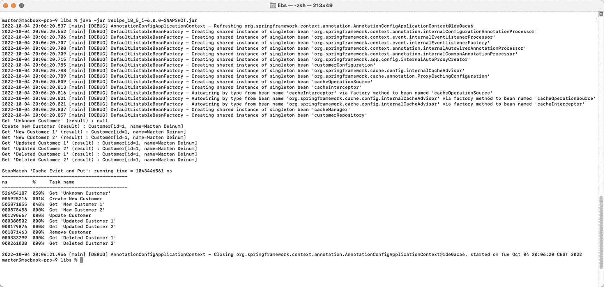

一个输出页面的截图。它显示了共享实例的创建日期和时间，并获取了带有 ID 和名称的客户详细信息。秒表运行时间为 1043446561 纳秒。

图 14-1

运行 Main 的初始输出

在运行程序的输出中，有几点需要注意。首先，在移除客户后，尝试查找已删除的客户时仍然会得到结果。这是因为对象仅从仓库中移除。如果它仍在缓存中，则会使用缓存中的对象。其次，创建客户后的第一次获取操作耗时较长。如果能让创建的客户立即被缓存，效率会更高。第三，虽然从输出中不直接明显，但更新对象后的第一次获取操作实际上非常快。更新对象后，应该移除缓存中的实例。


#### 使用 @CacheEvict 移除无效对象

当对象从底层存储库中移除时，它也必须从缓存中移除（或者可能需要使整个缓存失效）。为此，需要在 `remove` 方法上添加 `@CacheEvict` 注解。现在，当此方法被调用时，具有相同键的对象将从缓存中移除。

```
package com.apress.spring6recipes.caching;
import org.springframework.cache.annotation.CacheEvict;
public class MapBasedCustomerRepository implements CustomerRepository {
@Override
@CacheEvict("customers")
public void remove(long customerId) {
customers.remove(customerId);
}
}
清单 14-25
带有 @CacheEvict 的 CustomerRepository
```

请注意，remove 方法上的 `@CacheEvict` 注解需要指定要从中移除项目的缓存名称。在本例中，缓存名称是 `customers`。它还有一些其他可用的属性（见表 14-1）。

表 14-1

@CacheEvict 属性

| 属性 | 描述 |
| --- | --- |
| `key` | 用于计算键的 SpEL 表达式。默认使用所有方法参数。 |
| `keyGenerator` | 用于生成键的 Bean 名称。与 `key` 互斥。 |
| `condition` | 决定缓存是否失效的条件。 |
| `allEntries` | 是否清空整个缓存；默认为 false。 |
| `beforeInvocation` | 是否在方法调用之前（默认是之后）使缓存失效。当在方法之前调用时，无论方法结果如何（成功或异常），缓存都会失效。 |

再次运行 `Main` 程序时，输出略有变化（见图 14-2）。

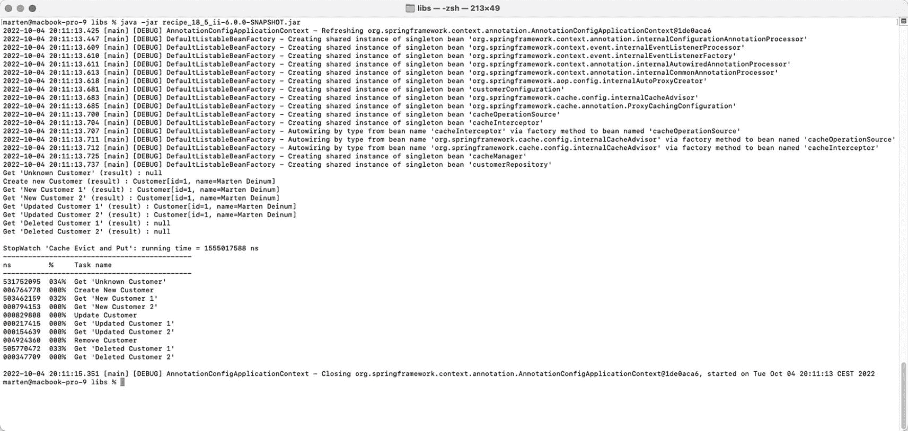

输出页面的截图。它显示了共享实例的创建日期和时间，并获取了客户及其 ID 和姓名的详细信息。秒表运行时间为 1555017588 纳秒。

图 14-2

在 remove 方法上添加 @CacheEvict 后的输出

查看输出，很明显，当客户被移除后，不再有结果。检索已删除的客户时，返回的是 `null` 而不是缓存实例。接下来，让我们将 `@CacheEvict` 注解添加到 update 方法中。更新后，应再次从底层数据源检索对象。然而，将其添加到 update 方法会产生一个问题。方法参数是一个 `Customer`，而缓存使用客户的 `id` 作为键。（请记住，默认的键生成策略使用所有方法参数来生成键；find 和 remove 方法都有一个 long 类型的方法参数。）

为了解决这个问题，我们可以在 key 属性中编写一个简短的 SpEL 表达式。我们希望它使用第一个参数的 ID 属性作为键。`#customer.id` 表达式将处理这个问题。它将引用名为 `customer` 的方法参数。

修改后的 `update` 方法如下所示。

```
package com.apress.spring6recipes.caching;
import org.springframework.cache.annotation.CacheEvict;
public class MapBasedCustomerRepository implements CustomerRepository {
@Override
@CacheEvict(value="customers", key = "#customer.id")
public void update(Customer customer) {
customers.put(customer.id(), customer);
}
}
清单 14-26
在 update 方法上带有 @CacheEvict 的 CustomerRepository
```

运行主程序后，计时信息显示，对更新后的客户进行首次查找所需的时间稍长（见图 14-3）。

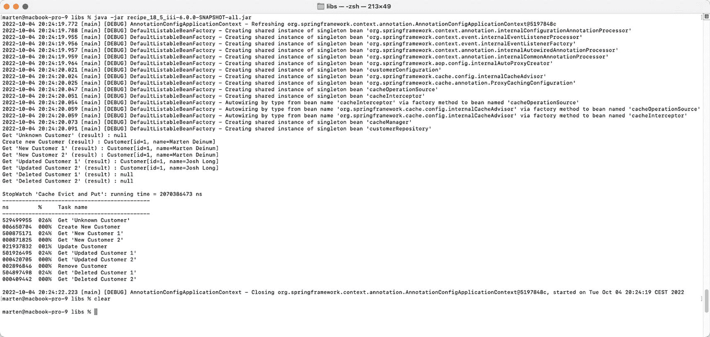

输出页面的截图。它显示了共享实例的创建日期和时间，并获取了客户及其 ID 和姓名的详细信息。秒表运行时间为 2070386473 纳秒。

图 14-3

在 update 方法上添加 @CacheEvict 后的输出

#### 使用 @CachePut 将对象放入缓存

create 方法根据当前输入创建一个 `Customer` 对象。创建后对该对象的首次查找需要一些时间才能完成。虽然它能工作，但可以通过让 create 方法将对象放入缓存来使其更快。

要使方法将值放入缓存，可以使用 `@CachePut` 注解。该注解需要指定要添加对象的缓存名称；这通过 `value` 属性完成。与其他注解一样，它也有 `key`、`condition` 和 `unless` 属性。

```
package com.apress.spring6recipes.caching;
import org.springframework.cache.annotation.CacheEvict;
import java.util.concurrent.atomic.AtomicLong;
public class MapBasedCustomerRepository implements CustomerRepository {
@Override
@CachePut(value="customers", key = "#result.id")
public Customer create(String name) {
}
}
清单 14-27
带有 @CachePut 的 CustomerRepository
```

首先，请注意 create 方法上的 `@CachePut` 注解。它通过 `value` 属性指定了缓存名称 `customers`。需要 `key` 属性，因为通常创建对象的方法会返回要缓存的实际对象。然而，键通常不是对象本身，因此需要为 `key` 属性指定一个 SpEL 表达式。`#result` 占位符提供了对返回对象的访问。由于 `Customer` 对象的 `id` 是键，因此表达式 `#result.id` 会产生所需的结果。

运行主程序的结果应与图 14-4 中的结果相当。

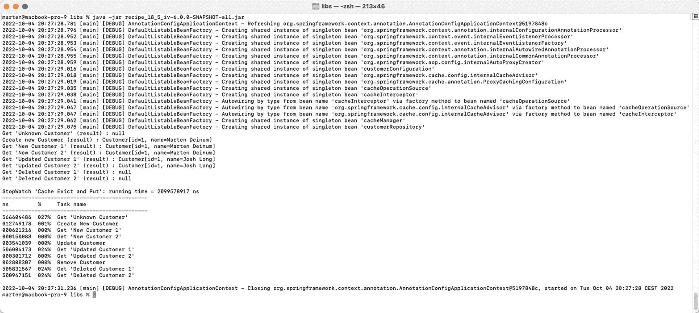

输出页面的截图。它显示了共享实例的创建日期和时间，并获取了客户及其 ID 和姓名的详细信息。秒表运行时间为 2099578917 纳秒。

图 14-4

在 create 方法上添加 @CachePut 后的结果

现在，首次检索新创建的客户要快得多，因为对象是从缓存返回的，而不是从存储库中查找。

#### 否决 @Cacheable 注解的结果

目前，`find` 方法会缓存所有结果，即使方法返回 `null`。禁用缓存可能是不希望的。对于某些结果，可以在 `@Cacheable` 注解上使用 `unless` 属性。当满足条件（一个 SpEL 表达式）时，返回的对象将不会被缓存。

```
package com.apress.spring6recipes.caching;
import org.springframework.cache.annotation.CacheEvict;
import java.util.concurrent.atomic.AtomicLong;
public class MapBasedCustomerRepository implements CustomerRepository {
@Override
@Cacheable(value = "customers", unless="#result == null")
public Customer find(long customerId) {
}
}
清单 14-28
带有 @Cacheable 的 CustomerRepository
```

请注意 `unless` 属性中的表达式。如果结果为 `null`，缓存将被否决。`#result` 占位符提供了对从被调用方法返回的对象的访问。这可用于编写表达式。这里的表达式是一个简单的 `null` 检查。

图 14-5 显示了排除 null 被缓存后的结果。对已删除客户的两次查找所需时间大致相同。

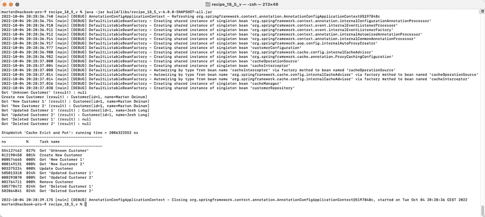

输出页面的截图。它显示了共享实例的创建日期和时间，并获取了客户及其 ID 和姓名的详细信息。秒表运行时间为 2086322552 纳秒。

图 14-5

排除 null 被缓存后的结果

## 14-6\. 将缓存与事务资源同步

### 问题

您希望您的缓存能够感知事务。


### 解决方案

部分 Spring 提供的 `CacheManager` 实现能够感知它们运行在事务上下文中。`JCacheCacheManager` 就是其中之一。要启用事务感知，请将 `transactionAware` 属性设置为 `true`。对于那些默认不支持事务感知的实现，你可以将它们包装在 `TransactionAwareCacheManagerProxy` 中，使其具备事务感知能力。

### 工作原理

首先，创建一个 `CustomerRepository` 的事务性实现，例如，使用 `JdbcTemplate`（更多信息请参见第 6 章）。

```
package com.apress.spring6recipes.caching;
import org.springframework.cache.annotation.CacheEvict;
import org.springframework.cache.annotation.CachePut;
import org.springframework.cache.annotation.Cacheable;
import org.springframework.jdbc.core.JdbcTemplate;
import org.springframework.jdbc.support.GeneratedKeyHolder;
import org.springframework.stereotype.Repository;
import org.springframework.transaction.annotation.Transactional;
import javax.sql.DataSource;
import java.sql.Statement;
@Repository
@Transactional
public class JdbcCustomerRepository implements CustomerRepository {
private final JdbcTemplate jdbc;
public JdbcCustomerRepository(JdbcTemplate jdbc) {
this.jdbc = jdbc;
}
@Override
@Cacheable(value = "customers")
public Customer find(long customerId) {
var sql = "SELECT id, name FROM customer WHERE id=?";
return jdbc.queryForObject(sql, (rs, rowNum) ->
new Customer(rs.getLong(1), rs.getString(2)));
}
@Override
@CachePut(value = "customers", key = "#result.id")
public Customer create(String name) {
var sql = "INSERT INTO customer (name) VALUES (?);";
var keyHolder = new GeneratedKeyHolder();
jdbc.update(con -> {
var ps = con.prepareStatement(sql, Statement.RETURN_GENERATED_KEYS);
ps.setString(1, name);
return ps;
}, keyHolder);
return new Customer(keyHolder.getKey().longValue(), name);
}
@Override
@CacheEvict(value = "customers", key = "#customer.id")
public void update(Customer customer) {
var sql = "UPDATE customer SET name=? WHERE id=?";
jdbc.update(sql, customer.name(), customer.id());
}
@Override
@CacheEvict(value = "customers")
public void remove(long customerId) {
var sql = "DELETE FROM customer WHERE id=?";
jdbc.update(sql, customerId);
}
}
清单 14-29
CustomerRepository JDBC 实现
```

现在，你需要在配置中添加 `DataSource`、`JdbcTemplate`、`DataSourceTransactionManager`，当然还有 `JdbcCustomerRepository`。

```
@Bean
public CustomerRepository customerRepository(JdbcTemplate jdbc) {
return new JdbcCustomerRepository(jdbc);
}
@Bean
public DataSourceTransactionManager transactionManager(DataSource dataSource) {
return new DataSourceTransactionManager(dataSource);
}
@Bean
public DataSource dataSource() {
return new EmbeddedDatabaseBuilder()
.setType(EmbeddedDatabaseType.H2)
.setName("customers")
.addScript("classpath:/schema.sql").build();
}
@Bean
public JdbcTemplate jdbcTemplate(DataSource ds) {
return new JdbcTemplate(ds);
}
清单 14-30
CustomerRepository JDBC 配置
```

`CUSTOMER` 表在以下 `schema.sql` 中定义。

```
CREATE TABLE customer (
id bigint AUTO_INCREMENT PRIMARY KEY,
name VARCHAR(255) NOT NULL
);
清单 14-31
Customer 表
```

最后，我们需要将 `CaffeineCacheManager` 包装在 `TransactionAwareCacheManagerProxy` 中。这样做会将实际的 `Cache` 实例包装在一个 `TransactionAwareCacheDecorator` 中，该装饰器会将缓存操作注册到当前正在进行的事务中（如果没有可用事务，则直接执行）。

```
@Bean
public CacheManager cacheManager() {
var caffeine = Caffeine.newBuilder()
.maximumSize(1000)
.expireAfterWrite(Duration.ofMinutes(5));
var cacheManager = new CaffeineCacheManager();
cacheManager.setCaffeine(caffeine);
return new TransactionAwareCacheManagerProxy(cacheManager);
}
清单 14-32
包装在事务感知代理中的 CaffeineCacheManager
```

现在，当你运行时，一切看起来应该仍然正常，但所有缓存操作现在都绑定到事务的成功执行上。因此，如果删除操作因异常而失败，`Customer` 仍将保留在缓存中。

## 14-7\. 使用 Redis 作为缓存提供者

### 问题

你想使用 Redis 作为缓存提供者。

### 解决方案

使用 [Spring Data Redis](https://spring.io/projects/spring-data-redis) 并配置一个 `RedisCacheManager` 来连接到 Redis 实例。有关 Redis 和 Spring Data Redis 的更多信息，另请参见第 9 章。

你需要在类路径中包含 Redis 和 Spring Data Redis 的依赖项。

```
redis.clients
jedis
4.3.1

org.springframework.data
spring-data-redis
3.0.0

清单 14-34
Maven 依赖项
```

```
implementation group: 'redis.clients', name: 'jedis', version: '4.3.1'
implementation group: 'org.springframework.data', name: 'spring-data-redis', version: '3.0.0'
清单 14-33
Gradle 依赖项
```

### 工作原理

首先，确保 Redis 已启动并正在运行。

一个带阴影圆圈内字母 i 的图标，表示信息符号。  `bin` 目录中有一个 `redis.sh` 脚本，用于启动 Docker 化的 Redis 版本。

#### 配置 RedisCacheManager

为了能够使用 Redis 进行缓存，你需要设置 `RedisCacheManager`，它将把缓存委托给 Redis。而 `RedisCacheManager` 又需要一个 `RedisConnectionFactory` 来执行其操作。还可以更改所使用的 `Serializer`，例如使用 `Jackson` 来存储 JSON 而不是 `byte[]`。

```
package com.apress.spring6recipes.caching.config;
import com.apress.spring6recipes.caching.CustomerRepository;
import com.apress.spring6recipes.caching.MapBasedCustomerRepository;
import org.springframework.cache.annotation.EnableCaching;
import org.springframework.context.annotation.Bean;
import org.springframework.context.annotation.Configuration;
import org.springframework.data.redis.cache.RedisCacheManager;
import org.springframework.data.redis.connection.RedisConnectionFactory;
import org.springframework.data.redis.connection.jedis.JedisConnectionFactory;
@Configuration
@EnableCaching
public class CustomerConfiguration {
@Bean
public RedisCacheManager cacheManager(RedisConnectionFactory connectionFactory) {
return RedisCacheManager.create(connectionFactory);
}
@Bean
public RedisConnectionFactory redisConnectionFactory() {
return new JedisConnectionFactory();
}
@Bean
public CustomerRepository customerRepository() {
return new MapBasedCustomerRepository();
}
}
清单 14-35
使用 Redis 的配置
```

要连接到 Redis，你需要设置 `JedisConnectionFactory`，它本身用于配置 `RedisCacheManager`。使用默认配置时，我们存储的对象需要实现 `Serializable`，因此我们的 `Customer` 记录也需要实现此接口。

其余代码可以保持不变。运行主程序时，它将显示向缓存添加和从缓存移除对象等操作。


## 14-8\. 总结

首先，你发现了如何为应用程序添加缓存，以及这样做相当繁琐，尤其是当你想在代码的多个部分引入缓存时。你探索了纯 Caffeine 缓存 API 和 Spring 的缓存抽象。在完成手动缓存后，你探索了使用 AOP 应用缓存，包括使用代理的纯 Spring AOP 和使用加载时织入的 AspectJ。

接下来，你了解了不同的注解：`@Cacheable`、`@CacheEvict` 和 `@CachePut`，以及它们如何影响应用程序的缓存行为。你还学习了如何使用 SpEL 表达式来检索用于缓存或缓存失效的正确键，以及如何影响 `@Cacheable` 注解的缓存行为。

最后一个方案介绍了 Redis 作为缓存解决方案，并探讨了如何将其用作本地或远程缓存解决方案。


索引 A AbstractFactoryBean 类 AbstractTestNGSpringContextTests AbstractTransactionalTestNGSpringContextTests 访问控制 访问控制决策 认证过程 AuthorityAuthorizationManager 授权决策 AuthorizationManager Bean 表达式 用户 WebFlux 访问控制条目 (ACEs) 访问控制列表 (ACL) Account 对象 AccountDao AccountNotFoundException 类 AccountService 接口实现 Jupiter 测试集成 Mockito MockitoExtension 存根 ACCOUNT 表 Acegi Security ActiveMQ ActiveMQTopic 类 addArgumentResolvers addReturnValueHandlers @AfterAll @AfterEach @AfterSuite 方法 AMQP AnnotationCacheAspect AnnotationJmxAttributeSource AnnotationMBeanExporter anonymous() 方法 Apache Kafka Apache Tomcat Apache XMLBeans ApplicationContext ApplicationContextAware 接口 应用程序 数据库创建 DAO JDBC 属性 应用程序编程接口 (API) 应用服务器供应商 ApplicationStartup ApplicationStartupAware 接口 架构需求 AspectJ 方面 配置 编译时织入 加载时织入 切入点表达式 方法签名模式 运算符 参数 类型签名模式 网站 aspectOf() 方法 面向切面编程 (AOP) 通知 @After 通知 @AfterReturning 通知 @AfterThrowing 通知 @Around 通知 @Before 通知 定义 注解 方面 @After 通知 @AfterReturning 通知 @AfterThrowing 通知 @Around 通知 @Before 通知 定义 @Aspect 计算 计算器接口 类 @DeclareParents 动态代理 @EnableAspectJAutoProxy 实现 接口 切入点 POJO 类 运行时 StandardArithmeticCalculator 方面 切入点 方面优先级 Assertions 类 assertThrows 方法 异步请求处理 异步控制器 异步处理 返回类型 原子性 原子性、一致性、隔离性和持久性 (ACID) 属性 认证用户 数据库 JDBC 遗留数据库 SQL 语句 表 加密密码 内存中定义 LDAP 配置 ContextSource LDIF 文件 选项 测试用户 users.ldif 文件 密码 用户详情 用户仓库 WebFlux 认证 认证机制 认证提供者 授权 授权管理器 自动提交 @Autowired 注解 B 后端服务 BackOffice 应用 BackOfficeConfiguration BackOfficeImpl 类 BackOffice 接口 BackOfficeMain 类 后台子系统 BackOffPolicy 银行 Web 配置 basicConsume 方法 批处理 BCrypt 哈希 Bean @Bean 注解 Bean 管理事务 (BMT) @Bean 方法 beansToExport 映射 Bean 验证 控制器 字段 Gradle 依赖 处理器方法 Java Bean Maven 依赖 Reservation 领域类 submitForm 方法 验证规则 @BeforeAll @BeforeClass @BeforeEach 方法 @BeforeMethod BeforeSuite 方法 bin 目录 bindTo 方法 binpsql.sh 命令 block() 方法 BookShop 接口 Bookshop 数据库 BOOK_STOCK 表 Bookstore 应用 业务流程管理 (BPM) 企业对企业 (B2B) BytesMessage C @Cacheable 注解 @Cacheable Spring @CacheEvict 注解 cache.get 方法 CacheInterceptor CacheManager @CachePut 注解 缓存 缓存实例 缓存变量 Caffeine 声明式定义 KeyGenerator 配置 java.util.Map Map 实现 对象，添加/删除 Redis Spring 的缓存抽象 同步 CachingConfigurer 接口 CachingConnectionFactory Caffeine CalculationService 计算存储 依赖 幂运算 Spring，带/不带 Thread.sleep() CaffeineCacheManager calculate() 方法 calculateSource CalculationService CalendarIntervalScheduleBuilder Cashier 接口 checkout() 方法 checkStock() 方法 基于块的处理 面向块的处理 逗号分隔值 (CSV) commit() 方法 CommonJ WorkManager CompletableFuture 组件 @ComponentScan 注解 com.rabbitmq.client.Channel com.rabbitmq.client.Connection com.rabbitmq.client.ConnectionFactory com.rabbitmq.client.Consumer com.rabbitmq.client.DefaultConsumer 并发 ConcurrentHashMap ConcurrentMapCacheManager 并发事务 bookshop 数据库 脏读 隔离级别 丢失更新 不可重复读 操作 幻读问题 READ_COMMITTED READ_UNCOMMITTED REPEATABLE_READ SERIALIZABLE condition 属性 配置类 configureTasks 方法 ConnectionFactory ConnectorServerFactoryBean 一致性 ConsumerConfig.BOOTSTRAP_SERVERS_CONFIG 容器管理事务 (CMT) “契约优先” SOAP Java 技术 契约优先 SOAP Web 服务 数据契约 问题 定义 解决方案 WSDL 文件 预览 XML 消息 XSD 文件 @Controller 注解 控制器 异步 创建 表单 请求处理 convertAndSend() convertToJson 方法 CouchbaseCluster.connect() 方法 CourtRestApplicationInitializer createMessage() 方法 创建、读取、更新和删除 (CRUD) CronScheduleBuilder CronTriggerFactoryBean 跨站请求伪造 (CSRF) CookieCsrfTokenRepository CsrfFilter csrfTokenRepository() 删除 禁用 启用 表单标签 隐藏输入 属性 Todo 安全配置 WebFlux CrudRepository 接口 @CsvSource #customer.id 表达式 Customer 对象 客户信息控制系统 (CICS) Customer 对象 客户关系管理 (CRM) CustomerRepository 接口 自定义 KeyGenerator 缓存抽象 CachingConfigurer 自定义实现 generate 方法 生成策略 方法参数 D DailyTimeIntervalScheduleBuilder 数据访问异常处理 工厂 操作 策略 数据访问对象 (DAO) 应用程序 数据库 实现 Main 类 数据定义语言 (DDL) 数据驱动测试，@MethodSource 数据驱动 TestNG InterestCalculator 测试 数据，外部资源 BannerLoader 类 banner 属性 banner.txt. 文件 Bean 属性 类路径 文件前缀 Java Config 类 图例 文件路径 @PostConstruct 属性文件 @PropertySource showBanner() 方法 URL @DataProvider 注解 DataSourceTransactionManager Dcom.sun.management.jmxremote 声明式缓存 注解 属性 AOP AspectJ @Cacheable 注解 @EnableCaching 声明式事务管理 defaultDestinationName 属性 defaultDomain 属性 DefaultJmsListenerContainerFactory DefaultMessageListenerContainer DefaultMeterObservationHandler DefaultWsdl11Definition 类 DelegatingFilterProxy deleteById 方法 DependencyInjectionTestExecutionListener 类 DepositController 类 deposit 测试方法 DirtiesContextTestExecutionListener 类 DispatcherServlet Docker 容器 @Document 注解 documentReplicator DocumentResult 对象 DocumentSource 对象 领域对象安全 ACL 访问控制决策 ADMIN 权限 BasicLookupStrategy 缓存配置 配置文件 数据 JdbcMutableAclService 维护 PermissionGrantingStrategy 安全配置 服务 表 权限 SID dom4j 库 DuplicateAccountException 类 持久性 @DynamicPropertySource E Ehcache EmailErrorNotifier 嵌入式系统 @EnableBatchProcessing 注解 @EnableCaching 注解 @EnableCouchbaseRepositories 注解 @EnableJms 注解 @EnableKafka @EnableLoadTimeWeaving 注解 @EnableMBeanExport @EnableMongoRepositories 注解 @EnableNeo4jRepositories 注解 @EnableRabbit @EnableRedisRepositories 注解 @EnableScheduling 注解 @EnableTransactionManagement 注解 enableTransactionSupport 属性 @EnableWebMvc 注解 @EnableWs endingDailyAfterCount() endingDailyAt() @Endpoint 注解 企业应用集成 (EAI) ESB 集成风格 模式 企业集成模式 企业服务总线 (ESB) 实体关系 (ER) 图 equals() 方法 错误处理 方法 自定义处理器 errorChannel 异常路由 异常 服务激活器 ErrorNotifier 接口 基于事件的通信模型 事件驱动架构 (EDA) Excel 和 PDF 视图 ContentNegotiatingViewResolver 控制器 创建 AbstractPdfView 类 AbstractXlsxView Excel 文件 PDF 文件 工作表 URL 日期参数 依赖 文件名 处理器方法 实现 Reservation 列表 预订 解析器 异常处理 自定义 数据访问 DataAccessException DuplicateKeyException 错误代码 Main 类 NestedRuntimeException 属性 SQLException useSqlStateForTranslation 表达式语言 (EL) @ExtendWith 注解 @ExtendWith(MockitoExtension.class) extMessage F faultTolerant() 方法 FileCopier 实现 FileCopier 接口 文件复制 实现 FileReplicator fixedRate 值 实现 JMX 注解 发布 通知 文件系统 方法 CSV EDA 基于文件的适配器 功能 集成 配置 问题 java.io.File 负载 服务激活器 findAccount() 方法 findById 方法 findByVehicleNo 方法 find 方法 FixedBackOffPolicy 固定宽度数据 FlightRecorderApplicationStartup 类 formLogin 方法 表单 绑定 属性，自定义类型 控制器 法院 预约 HTTP POST 请求 成员 模型属性 对象 预填充 引用数据 处理器方法 实现 成员表单 member.html @ModelAttribute <select> 标签 运动类型 SportTypeRepository 服务 处理 会话数据 验证，数据 @Component 错误 处理器方法 无效性 方法 修改 验证器 视图 FrontDesk 应用 FrontDesk 配置 FrontDeskImpl FrontDesk 接口 FrontDeskMain 类 前台子系统 FrontOfficeConfiguration G 网关 编译时约束 功能 隐藏消息传递接口 客户端配置 客户端面向 HotelReservation HotelReservationSearch 实现 Java 代码 JMS 搜索 酒店服务激活器 VacationService MessagingGatewaySupport 通用缓存 API (JSR-107) @GeneratedValue 注解 GenericContainer get() 方法 getAttribute() 方法 getBean() 方法 getCache 方法 getJmsTemplate() 方法 getNextValue() 方法 getRabbitOperations 方法 getReactiveTransaction() 方法 getSequence() 方法 getServletFilters 方法 GetTemperatures 操作 GetTemperaturesRequest 对象模型 GetTemperaturesResponse 对象模型 getTransaction() 方法 Gradle 依赖 GreenMail greenmail.sh 脚本 H 处理器函数 HandlerFunction 接口 请求，路由 RouterFunctions 类 编写 hashCode() 方法 @Headers heavyCalculation 方法 Hibernate Hibernate 上下文会话 @ComponentScan CourseDao 实现 CurrentSessionContext DAO 方法 getCurrentSession() 方法 HibernateTransactionManager 原生方法 PersistenceExceptionTranslationPostProcessor @Repository @Transactional Hibernate EntityManager Hibernate 查询语言 (HQL) 高基数 HikariCP HTML httpBasic() 方法 超文本传输协议 (HTTP) I IBAN 验证 客户端接口 Client RestTemplate 实现 客户端测试 DTO ifPresent 方法 illegalCalculate() 方法 illegalCalculateSource increase() 操作 init 方法 InMemoryAccountDao 实例工厂方法 inst2xsd InsufficientBalanceException 类 IntegerDeserializer IntegerSerializer 集成测试 REST 客户端 IBANValidationResult IBAN 验证服务 OpenIBANValidationClient 基于 RestTemplate 的客户端 Testcontainers 集成测试 InterestCalculator 实现 InterestCalculator 接口 InterfaceBasedMBeanInfoAssembler InternalResourceViewResolver 国际化 (I18N) 文本消息 应用上下文 Cashier 类 getMessage() 方法 Java Config 文件 Main 类 MessageSource 资源包 setBasenames 方法 setCacheSeconds 方法 互联网 互联网门户 控制反转 (IoC) 容器 应用上下文 Bean 工厂 Bean @Controller 过滤器 实例 使用 invoke() 方法 隔离 itemSqlParameterSourceProvider 属性 J Jackson2JsonMessageConverter Jakarta EE jakarta.jms.BytesMessage jakarta.jms.MapMessage jakarta.jms.Message jakarta.jms.MessageConsumer jakarta.jms.MessageListener jakarta.jms.ObjectMessage jakarta.jms.Session jakarta.jms.TextMessage Jakarta Mail jakarta.mail.internet.MimeMessage 类 Jakarta MailSender Jakarta Mail 会话 Jakarta 事务 API (JTA) Java Java XML 绑定架构 (JAXB) 基础 Java 业务集成 (JBI) Java Config 类 注解 @Bean Bean 实例化 @Component @Configuration 创建 DAO 实现 实例 IoC 容器 nextValue() 方法 Sequence 类 序列号 SimpleSequenceDao 类 Java 加密架构 (JCA) Java 数据库连接 (JDBC) API 数据库 批量更新 参数值 SQL 语句 语句创建器 语句设置器 任务 update() 方法 异常处理 参见异常处理 命名参数 BeanPropertySqlParameterSource 实现 NamedParameterJdbcTemplate 参数值 SQL 参数 SqlParameterSource 查询操作 JdbcTemplate 类 多行 RowCallbackHandler RowMapper 单值 任务 模板 创建 注入 JdbcDaoSupport 类 JdbcTemplate 类 Vehicle 类 Java 开发工具包 (JDK) Java Flight Recorder (JFR) ApplicationStartup 实现 定义 事件处理 事件发布 Spring 容器 java.lang.Object JavaMailSender 接口 JavaMailSenderImpl Java 管理扩展 (JMX) 客户端配置 Dcom.sun.management.jmxremote 标志 文件复制器 远程 API 服务器配置 特定注解 Java Mission Control Java 持久化 API (JPA) CourseDao Course 实体 CrudRepository DAO 方法 数据访问代码 数据访问方法 @EnableJpaRepositories 实体管理器工厂 Hibernate 引擎 Jakarta EE Main 类 persistence.xml 属性 @Transactional Java 平台 JavaScript 对象表示法 (JSON) 依赖 GSON 信息 MappingJackson2JsonView 类 负载 发布 @ResponseBody Java 测试框架 java.util.concurrent.ConcurrentMap java.util.function.Function java.util.Map javax.jms.Message javax.management.AttributeChangeNotification javax.managment.MBeanServer java.xml.transform.Result 对象 java.xml.transform.Source 对象 JAXB 生成的请求和响应 Jaxb2Marshaller Bean JAX-WS 实现 JCacheCacheManager jcmd 命令 JCMD 启动命令 JConsole JdbcBookShop 类 JdbcTemplate JedisConnectionFactory JMS API ConnectionFactory ESB FrontDesk 实现 MDP 参见消息驱动 POJO (MDP) JMSException receiveTimeout 属性 JMSException JmsGatewaySupport 类 @JmsListener 注解 JmsListenerContainerFactory JMS 消息 后台子系统 前台子系统 JMSConsumer JmsGatewaySupport jmsTemplate 与 POJO 邮局系统 receive() 方法 发送或接收 Spring 的 JMS 模板支持 基于模板的解决方案 JMSProducer JmsTemplate JmsTransactionManager JMS 事务 JtaTransactionManager 事务管理 JmsUtils.convertJmsAccessException() JMX 消息传递协议 (JMXMP) JmxMeterRegistry JMX 通知 监听 问题 定义 发布 解决方案 JndiLocatorDelegate jobDataMap 属性 JobDetail 对象 JobDetailBean JobExecutionContext 对象 JobRegistryBeanPostProcessor 连接点 JPA 的上下文 注入 Bean 配置文件 课程 配置 CourseDao 实现 Jakarta EE 环境 原生方法 PersistenceAnnotationBeanPostProcessor @PersistenceContext PersistenceExceptionTranslationPostProcessor @PersistenceUnit @Repository @Transactional JsonSerializer JtaTransactionManager JEE 连接器架构 (JCA) JUnit Jupiter DepositController 测试类 JUnit Jupiter InterestCalculator 测试 K Kafka FrontDesk 实现 @KafkaListener KafkaListenerContainerFactory KafkaOperations KafkaOperations.send 方法 KafkaTemplate Key 属性 KeyValues L LDAP 数据交换格式 (LDIF) 加载时织入 (LTW) aop.xml 文件 环绕通知 AspectJ 织入器 缓存 调用 切入点 复杂对象 复杂记录 实现 接口 包 spring 加载时织入器 测试 区域敏感文本消息 locationUri logout() 配置方法 低基数 M Mail 实例 MailListener MailListener.displayMail 方法 MailMessageConverter 类 mailSender.createMimeMessage() MailSender 实现 MailSender 接口 @ManagedAttribute 注解 托管 Bean (MBean) @ManagedOperation 注解 @ManagedResource 注解 ManagementFactory.getPlatformMBeanServer() 方法 MapJobRegistry 实例 MapMessage MarshallingPayloadMethodProcessor marshalSendAndReceive() 方法 Maven 依赖 MBeanExporter MBeanProxyFactoryBean MBean agentId 汇编器 属性 实例 管理接口 MBeanExporter mbeanServer Bean 对象名称 管理接口 MessageConverter MessageCreator MessageDispatcherServlet 消息驱动 Bean (MDB) 消息驱动 POJO (MDP) 适配器 Bean 配置 ConnectionFactory @EnableIntegration 错误处理 功能 IntegrationFlow jakarta.jms.Message @JmsListener 注解 JmsTemplate Map<String,Object> Message messageDrivenChannelAdapter 消息监听器，JMS 消息 messageProcessor 消息 负载 服务激活器 MessageListener 接口 MessageListenerContainer MessagingException 消息传递解决方案 MetadataMBeanInfoAssembler META-INF 目录 MeterBinder MeterBinder.bindTo 方法 MeterBinder 配置类 MeterBinderRegistrar 类 MeterRegistry MethodArgumentResolver MethodInvokingJobDetailFactoryBean MethodNameBasedMBeanInfoAssembler MethodReturnValueHandler @MethodSource Micrometer API 客户端 度量配置 事实上的标准 Java 分析器 MeterBinder 实现 度量 监控系统 无操作注册表 观察 Prometheus 服务器 度量配置 MimeMessage 类 MimeMessage 对象 MimeMessageHelper 类 MimeMessagePreparator 接口 Mockito.mock Mockito.verify 方法 Mockito.when 方法 MockMvc 对象 MockMvcBuilders MockMvc.perform 方法 MockMvcRequestBuilders.get 工厂方法 Mock 对象 MockRestServiceServer ModelMBeanAttributeInfo 对象 ModelMBeanInfo 对象 ModelMBeanOperationInfo 对象 模型 模型-视图-控制器 (MVC) 业务逻辑，UI 依赖 调度过程 异常解析器 favorPathExtension 处理器拦截器，Web 请求 addInterceptors 方法 Bean @Controllers 创建 HandlerInterceptor 接口 Java 配置 preHandle() 方法 注册 sleep 语句 URL 映射 WebMvcConfigurer welcome.jsp Java Web 应用 JSP 文件 模型 URL 扩展 视图类 视图 Web 应用 参见 Web 应用 WEB-INF 目录 Web 请求 注解 类 HTTP 请求方法 路径 @RequestMapping MongoClients.create 方法 MongoDatabaseFactory MongoDB 连接 Couchbase 配置 CouchbaseRepository CouchbaseTemplate 创建 桶 下载 安装 ReactiveCouchbaseRepository 检索 设置 Spring Data 存储 下载 映射信息 MongoTemplate MongoVehicleRepository Neo4j 应用属性 字符类 CharacterRepository 下载 映射对象 Neo4jStarwarsRepository Neo4jTemplate 响应式仓库 简化配置 Spring 配置类 启动 StarwarsRepository 接口 StarwarsService Redis 连接 下载 Jedis 客户端 JSON 主类 输出 响应式仓库 RedisSerializer RedisTemplate Spring Data 存储对象 VehicleRepository 仓库 spring，配置 多用途互联网邮件扩展 (MIME) N Neo4jTemplate.findAll 方法 next() 方法 noRollback() 方法 NotificationListener 实现 NotificationPublisher NotificationPublisherAware 接口 O ObjectMapper ObjectMessage objectName 属性 面向对象语言 ObjectProvider 对象/关系映射 (ORM) 核心编程元素 课程类 CourseDao 课程管理系统 定义 实体类 Hibernate Hibernate 会话工厂 配置类 课程配置 数据源 HibernateCourseDao Main 类 方法 属性 标识符 JPA 实体管理器工厂 Bean 配置文件 课程配置 数据源 Jakarta EE 环境 JNDI JpaCourseDao LocalEntityManagerFactoryBean Main 类 packagesToScan persistence.xml 文件 元数据 持久化对象 资源工厂 数据访问 Hibernate JPA SQL 语句 策略 对象/XML 映射 (OXM) observationConfig 方法 ObservationContext 实现 ObservationConvention 实现 ObservationDocumentation ObservationHandler Observation 实例 ObservationRegistry onMessage() 方法 Oracle Coherence 集群 org.apache.activemq.artemis.jms.client.ActiveMQConnectionFactory org.junit.jupiter.api.Assertions 类 org.springframework.amqp.rabbit.listener.MessageListenerContainer 选项 org.springframework.jms.connection.CachingConnectionFactory org.springframework.jms.connection.SingleConnectionFactory org.springframework.jms.JmsException org.springframework.jms.listener 包 org.springframework.jms.support.JmsMessageHeaderAccessor org.springframework.jmx.support.MBeanServerConnectionFactoryBean org.springframework.messaging.Message org.springframework.messaging.MessageHeaders org.springframework.messaging.support.MessageHeaderAccessor org.springframework.web.filter.ServerHttpObservationFilter P 密码编码器 @Payload 注解参数 @PayloadRoot 注解 负载 错误处理 MVC RFC-7807 HTTP @PostMapping @RequestBody 验证 PlainCachingCalculationService PlainCalculationService 普通 Java 对象 (POJO) AOP 应用层 感知接口 Bean 后处理器 通信 应用上下文 ApplicationEventPublisher ApplicationListener 接口 基于事件的 IoC 容器 监听事件 发布事件 发送者 @Component 构造函数 Battery 类 Disc 类 调用 IoC 容器 Java Config 类 Product 类 商店应用 领域对象，AOP 方面 Complex 类 复杂对象 @Configurable @EnableSpringConfigured 格式化器 Spring Bean 环境/配置文件 默认配置文件 Java Config 类 加载配置文件 场景 工厂 Bean 初始化/销毁 属性 @Bean 回调方法 Cashier 类 closeFile() 方法 @DependsOn 懒加载 openFile() 方法 @PostConstruct @PreDestroy @Inject 实例工厂方法 Java Config 类 参见 Java Config 类 引用/自动装配 @Autowired Bean 构造函数参数 创建 getIfUnique() 方法 @Import Java Config 类 java.util.Optional 方法参数 ObjectProvider prefixGenerator 属性 @Primary @Qualifier required 属性 @Resource 作用域 Bean 作用域 getBean() 方法 product Bean @Scope 商店应用 ShoppingCart 类 购物车实例 状态，AOP 调用 计数 Counter 接口 创建 接口 实现类 Main 类 静态工厂方法 任务 PlatformTransactionManager 接口 portTypeName 服务 后编译时织入 @PostConstuct 注解 PostgreSQLContainer 邮局系统 prepare() 方法 进程 ID (PID) ProducerConfig.BOOTSTRAP_SERVERS_CONFIG ProducerConfig.KEY_SERIALIZER_CLASS_CONFIG ProducerConfig.VALUE_SERIALIZER_CLASS_CONFIG ProducerFactory 编程式事务管理 Project Reactor 传播 事务属性 @PropertySource 注解 ps 命令 发布-订阅通信模型 purchase() 方法 purchase() 操作 Q @Qualifier 注解 Quartz 任务 QuartzJobBean Quartz 调度器 Quartz 调度 Quartz 触发器 R RabbitGatewaySupport @RabbitListener RabbitListenerContainerFactory RabbitMQ rabbitmq.sh RabbitTemplate ReactiveTransactionManager 接口 READ_COMMITTED 隔离级别 只读事务属性 readValue 方法 receive() 方法 receiveAndConvert() receiveBody(Map.class) recording.jfr 文件 Redis 缓存提供者 依赖 RedisCacheManager RedisCacheManager RedisConnectionFactory @RedisHash 注解 redisTemplate Bean 方法 RedisVehicleRepository 类 注册 Bean，函数式方式 BeanDefinition 多个 Bean 简单 Bean registerPgProperties 方法 注册 Spring POJO，JMX MBean 注解 组装管理接口 文件复制器 实例 Java NIO 类 多个服务器实例 问题定义 解决方案 源和目标目录 Spring 的支持，带/不带 @Relationship 注解 rememberMe() 方法 远程分块技术 远程 JMX MBean JMX 连接器服务器，暴露 MBeanProxy MBean 服务器连接 远程过程调用 (RPC) 远程进程 remove 方法 REPEATABLE_READ 隔离级别 replicate() 函数 replicate() 方法 表述性状态转移 (REST) 服务 访问 消费者 端点 getForObject 方法 HTTP 的方法 映射对象 参数 负载 提供者 RestTemplate 类 System.out 第三方 URL 数据 设计 HTTP 的方法 JSON 参见 JavaScript 对象表示法 (JSON) 生命周期 机制 负载 参见负载 提供者 请求 WebClient WebFlux XML 参见 XML RequestBuilder 实例 @RequestPayload 注解 request.xml 文件 REQUIRED 传播行为 REQUIRES_NEW 传播行为 @Resource 注解 @ResponsePayload 注解 响应写入器 分块结果 事件 Content-Type 头 send 方法 服务器发送事件 SseEventBuilder URL MemberService.findAll 方法 ResponseBodyEmitter 类 状态码 URL response.xml 文件 REST 客户端 RestGatewaySupport RestTemplate 类 ResultActions 对象 #result 占位符 retryLimit() 方法 RetryTemplate RMI @Rollback 注解 rollback() 方法 回滚事务属性 rootConfig RSS 和 Atom 提要 AbstractAtomFeedView 类 AbstractRssFeedView 类 AtomFeedView 类 buildFeedEntries 方法 buildFeedItems 方法 buildFeedMetadata 方法 特性 依赖 信息 逻辑视图 MVC 控制器 Project Rome REST 服务 RssFeedView 类 结构 TournamentContent 对象 URL 使用 R2DBC ConnectionFactory DatabaseClient fetch 方法 响应式车辆配置 R2dbcVehicleDao 依赖 Main 类 项目反应器 仓库 R2dbcVehicleDao 语句 模板 Vehicle 类 VehicleDao runRegistrationsJob(java.time.LocalDateTime date) 方法 RuntimeException 俄罗斯套娃设计 S @Scheduled 注解 ScheduledTaskRegistrar SchedulerFactoryBean 实例 调度任务，Spring 的 Quartz 支持 问题定义 解决方案 Spring 的支持，带/不带 调度任务，Spring 的调度注解 注解驱动的调度支持 cron 表达式 问题定义 replicate() 方法 解决方案 调度配置 SchedulingConfigurer 接口 schema.sql schema0.xsd 文件 安全标识 (SID) send() 方法 sendSourceAndReceiveToResult() 方法 ServerHttpObservationFilter @Service 服务数据对象 (SDO) Servlet API servletConfig Servlet 过滤器 sessionTransacted 属性 setApplicationStartup 方法 setAttribute() 方法 setAutoCommit() 方法 setFriends 方法 Shell 命令 SimpleAccountService SimpleJmsListenerContainerFactory SimpleJobRepository SimpleKeyGenerator 类 SimpleMailMessage 类 简单邮件传输协议 (SMTP) SimpleMessageConverter SimpleMessageListenerContainer SimpleMongoClientDatabaseFactory SimpleScheduleBuilder SimpleTrigger 对象 SimpleTriggerFactoryBean skipLimit() 方法 SOAP “契约优先”方法 SOAP Web 服务，Spring-WS 应用 设置 基本任务 <GetTemperaturesResponse> 调用 问题 定义 发布 WSDL 文件 服务端点 创建 split() 方法 Spring 感知接口 类 ClassPathResource 类 数据源 过滤器 表达式 框架 GenericApplicationContext IoC 容器 JMX 支持 资源加载器机制 资源机制 单例 模板支持 TestContext 框架 TransactionManager 实现 Spring 应用上下文 注解 配置 文件 初始化 方法 JUnit/TestNG TestContext 框架 TestContext 集成类 测试上下文管理器 Spring Batch 链式处理器 命令行 组件 下游 并发 CSV 项目读取器 每日销售 决策 端点 文件 基础设施 输入 集成 ItemReader/ItemWriter 任务配置 jobInstance ID JobLaunchingMessageHandler JobParameters JobRepository 任务，参数 启动任务 输出 参数化任务 处理输入，写入 读取/写入 重试 AOP 配置 模板 回滚 扩展 调度 框架 顺序步骤 和 Spring Integration 状态 步骤执行 事务 用户注册 SQL Web 应用 Spring 驱动的 AccountService TestNG 测试 Spring 表达式语言 (SpEL) SpringExtension Spring Integration 聚合器 EAI 参见企业应用集成 (EAI) 错误处理 参见错误处理 事件 BPM 引擎 配置 ESB 文件 JmsItemWriter JobLaunchingMessageHandler JobLaunchRequest SEDA Spring Batch 转换器 异常处理 文件系统 参见文件系统 网关 参见网关 JMS 参见 JMS 消息 访问 头 类 丰富 @Header 注解 头 Map<String,Object> Message 接口 负载 处理管道 消息转换 组件 头 Message<T> 负载 路由器 路由解决方案 分割器 和 Spring Batch Spring Java 企业服务 契约优先 SOAP Web 服务 邮件支持 JFR JMX MBean JMX 通知 Micrometer API Quartz 支持 调度任务 SOAP Web 服务 XML 消息 Spring Kafka Spring 管理的过滤器 Spring MVC 控制器 基于注解的控制器 DepositController DispatcherServlet 与集成测试，JUnit MockMvc API WebApplicationContext 基于 Web 的配置 Spring 代理 Spring Quartz 集成 SpringRunner Spring 的缓存抽象 CacheManager Caffeine 计算 get() 方法 PlainCachingCalculationService Spring Security 访问决策管理器 ACL 匿名登录 认证用户 参见认证用户 认证 认证提供者 授权决策 配置 @EnableWebSecurity exceptionHandling 头 HTTP 初始化器 登录页面 方法调用 注解 表达式 过滤 服务层 记住我登录 安全检查 securityContext 设置 SQL 语句 URL 访问 参见 URL 访问 用户的认证信息 用户登录 使用 视图 认证信息 内容，渲染 Thymeleaf Web 应用 参见 Web 应用 WebFlux 参见 WebFlux Spring 的邮件支持 邮件模板 文件复制器 应用 Jakarta Mail API Spring 的 MailSender 接口 问题定义 SMTP 解决方案 Spring 的测试 数据驱动测试，JUnit 特性 Java 平台 JUnit 支持设施 系统质量 TestContext 支持类 TestNG 测试 单元/集成测试 Spring Web Services (Spring-WS) SpringWsConfiguration 类 @Sql 注解 SqlScriptsTestExecutionListener 类 阶段事件驱动架构 (SEDA) start 方法 StartFlightRecording 属性 StartupStep StarwarsConfig 类 静态方法 StopWatch StreamMessage StringDeserializer String.format() StringJsonMessageConverter StringSerializer 存根 同步接收 System.in.read() System.out T 标签 TaskExecutors 应用上下文 环境 ExecutorService 实现 倡议 集成 接口 jakarta.enterprise.concurrent Java EE Java SE Quartz Runnable ScheduledExecutorFactoryBean 调度服务 SimpleAsyncTaskExecutor submit() 方法 SyncTaskExecuto TaskExecutorAdapter 线程 ThreadPoolTaskExecutor TaskSchedulers TemperatureInfo 元素 TemperatureInfo 对象模型 temperature.xsd 文件 @Test 注解 @Testcontainers 注解 TestContext 框架 测试上下文管理器 TestContext 支持类 测试执行监听器 测试夹具 注入 应用上下文 集成测试 TestContext 框架 测试框架 TestNG 框架 TestNG InterestCalculator 测试 T execute() 方法 TextMessage 线程 ThreadPoolTaskScheduler Thymeleaf 超时 事务属性 Todo 应用 toMessage() toString 方法 @Transactional 注解 TransactionalTestExecutionListener 类 事务性 TestNG AccountService 测试 transactionAware TransactionAwareCacheDecorator TransactionAwareCacheManagerProxy 事务感知写入器 TransactionDefinition 接口 事务管理器 transactionManager 属性 事务传播 事务管理 AccountService 实例 API 创建和回滚 DAO 实现 数据库访问 实现 JDBC PlatformTransactionManager ReactiveTransactionManager TestContext 框架 TestContext 支持类 测试执行监听器 @Transactional 类 TransactionalOperator TransactionTemplate 事务模板 Transport.send() U 单元测试 定义 依赖类 隔离类 方法 unless 属性 updateAccount() 方法 update() 方法 URL 访问 authorizeHttpRequests() 默认配置 基于表单的登录 InMemoryUserDetailsManager SecurityFilterChain 安全规则 Todo 安全配置 未授权访问 User.UserBuilder WebSecurityConfiguration 类 用户区域设置 cookie HTTP 请求头 LocaleResolver LocaleResolver.setLocale() paramName 属性 会话属性 URL welcome.jsp UserRegistrationService 接口 V @Value 注解 value 属性 VehicleRepository 接口 verifyDirectoriesExist() ViewResolver 视图 Bean 内容协商配置 ContentNegotiatingViewResolver ContentNegotiationManager 控制器的设计 HTTP 头 集成 结果 路径扩展 请求 策略 DispatcherServlet 异常 defaultErrorView 属性 error.jsp 错误页面 @ExceptionHandler exceptionMappings 属性 异常解析器 InternalResourceViewResolver 预订服务 未捕获异常 表单 名称/位置 重定向 前缀 ViewResolverRegistry W 天气服务客户端 WeatherService 接口 织入 @WebAppConfiguration 注解 webAppContextSetup WebApplicationContext 注解 Web 应用描述语言 (WADL) WebApplicationInitializer Web 应用 匿名访问 匿名登录 参数类型 配置 配置文件 控制器类 控制器 属性 @Controller 控制器类 处理器方法 映射对象 包 参数 @RequestMapping 请求 reservationQuery，预订，法院 法院预订系统 数据 部署 领域类 异常 基于表单的登录 addViewControllers 方法 自定义登录页面 错误消息 formLogin 方法 loginPage 配置方法 登录 URL 链接 URL WebMvcConfigurer 接口 formLogin 方法 表单 前端控制器 处理器方法 HTML HTTP 基本认证 HttpSecurity 实例 HttpSecurityConfiguration 类 信息，传递 JSP 视图 注销服务 生产应用 记住我支持 请求处理 预订 服务接口 设置 URL 访问 用户 登录 视图实现 视图解析器 WebApplicationInitializer Web 请求 web.xml Web 归档 (WAR) Web 客户端 构建器方法 数据 映射对象 URL exchangeToFlux() HTTP 的方法 JSON REST 服务 消费者端点 生命周期 提供者 System.out 第三方 WebClient 类 WebClient.create WebFlux 访问控制决策 认证用户 CSRF @EnableWebFluxSecurity 异常处理 异常处理器 @ExceptionHandler 方法参数 问题详情 基于表单的登录 HTTP 基本认证 JSON 消费 发布 负载 REST 服务 领域类 findById 方法 成员 生产应用 服务接口 URL 访问 Web 应用 参数类型 引导 组件 控制器类 控制器 处理器方法 接口 Netty 运行时 设置 Web 请求 Web 服务 WebServiceTemplate Websockets writeValueAsString 方法 WsConfigurerAdapter WSDL X, Y, Z XJC 命令行 xjc 工具 XML 控制器类 Jaxb2Marshaller 编组器 MarshallingView Members 类 membertemplate @PathVariable 负载 发布 @ResponseBody ResponseEntity URL Web 应用 XML 编组技术 编组器/解组器 属性 OXM 服务端点 创建 Spring-WS 客户端 Web 服务 XPath 表达式 XSD
