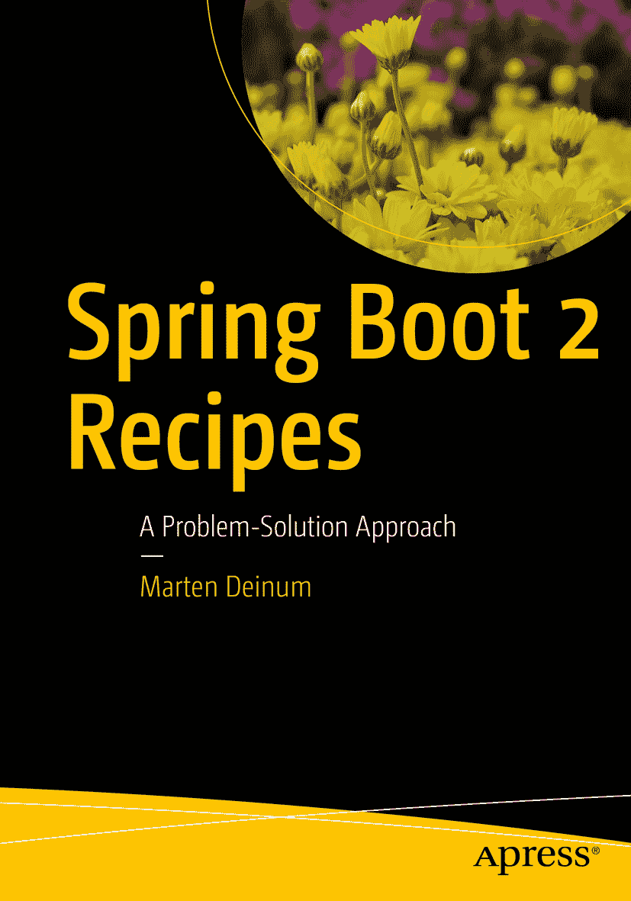

ISBN 978-1-4842-3962-9 e-ISBN 978-1-4842-3963-6 [`doi.org/10.1007/978-1-4842-3963-6`](https://doi.org/10.1007/978-1-4842-3963-6) 美国国会图书馆控制号：2018964913 © Marten Deinum 2018 本作品受版权保护。出版商保留所有权利，涉及材料的全部或部分内容，特别是翻译、重印、重用插图、朗诵、广播、微缩胶片复制或任何其他物理形式的复制，以及传输或信息存储与检索、电子改编、计算机软件，或现在已知或以后开发的类似或不同方法的权利。本书中可能出现商标名称、标识和图像。我们并未在每次出现商标名称、标识或图像时使用商标符号，而是仅以编辑方式使用这些名称、标识和图像，以利于商标所有者，且无意侵犯商标权。本出版物中使用的商品名称、商标、服务标志及类似术语，即使未明确标识，也不应被视为对其是否受专有权利保护的表达意见。尽管本书中的建议和信息在出版时被认为是真实准确的，但作者、编辑和出版商均不对可能存在的任何错误或遗漏承担法律责任。出版商对本书所含内容不作任何明示或暗示的保证。本书通过 Springer Science+Business Media New York 在全球图书贸易中发行，地址：233 Spring Street, 6th Floor, New York, NY 10013。电话：1-800-SPRINGER，传真：(201) 348-4505，电子邮件：orders-ny@springer-sbm.com，或访问 www.springeronline.com。Apress Media, LLC 是一家加利福尼亚有限责任公司，其唯一成员（所有者）是 Springer Science + Business Media Finance Inc (SSBM Finance Inc)。SSBM Finance Inc 是一家特拉华州公司。

*献给我的妻子和女儿。*

*我爱你们。*

引言

欢迎阅读《Spring Boot 2 实战秘籍》第一版。本书将重点介绍如何使用 Spring Boot 2.1 及其支持的项目（如 Spring Security、Spring AMQP 等）进行软件开发。

## 本书读者对象

本书面向希望简化应用程序开发并缩短应用编写启动时间的开发者。向您介绍 Spring Boot 将简化您的应用程序配置。充分利用 Spring Boot 的全部功能也能简化您的部署和管理工作。

本书假定您熟悉 Java、Spring 以及某种 IDE。本书不会解释 Spring 或相关项目的所有内部机制和深入工作原理。如需深入了解，请参阅《Spring 5 实战秘籍》或《Pro Spring MVC》。

## 本书结构

第 1 章“Spring Boot 简介”快速概述了 Spring Boot 及其入门方法。

第 2 章“Spring Boot 基础”涵盖了如何使用 Spring Boot 定义和配置 Bean 以及进行依赖注入的基本场景。

第 3 章“Spring MVC”介绍了使用 Spring MVC 进行基于 Web 的应用程序开发。

第 4 章“Spring MVC 异步”介绍了使用 Spring MVC 进行异步 Web 应用程序开发。

第 5 章“Spring WebFlux”介绍了使用 Spring WebFlux 进行响应式 Web 应用程序开发。

第 6 章“Spring Security”概述了如何使用 Spring Security 保护您的 Spring Boot 应用程序。

第 7 章“数据访问”解释了如何访问数据库或 MongoDB 等数据存储。

第 8 章“Java 企业服务”介绍了如何使用 Spring Boot 中的 JMX、邮件和调度等企业服务。

第 9 章“消息传递”介绍了如何使用 Spring Boot 通过 JMS 和 RabbitMQ 进行消息传递。

第 10 章“Spring Boot Actuator”解释了如何使用 Spring Boot Actuator 中的健康检查和指标端点等生产就绪功能。

第 11 章“打包”涵盖了如何通过使应用程序可执行或将其封装到 Docker 容器中来打包和部署您的 Spring Boot 应用程序。

### 约定

有时，当我们希望您特别注意代码示例中的某一部分时，我们会将该部分字体加粗。请注意，加粗部分不一定反映与先前版本的代码差异。

如果某行代码过长，无法适应页面宽度，我们将使用代码续行符进行换行。请注意，当您尝试输入代码时，必须自行连接该行，且不留空格。

### 先决条件

由于 Java 编程语言是平台无关的，您可以自由选择任何受支持的操作系统。但是，本书中的某些示例使用了特定于平台的路径。在输入示例之前，请根据您的操作系统格式进行相应转换。

为了充分利用本书，请安装 JDK 11 ^(¹) 或更高版本。您应安装一个 Java IDE 以简化开发。对于本书，大部分示例代码基于 Maven ^(²)，并且大多数 IDE 都内置了对 Maven 管理类路径的支持。所有示例都使用了 Maven Wrapper ^(³)，因此您不一定需要安装 Maven 就能从命令行构建示例。

示例有时需要安装额外的库，例如 PostgreSQL、ActiveMQ 等；为此，本书使用了 Docker。^(⁴) 当然，您也可以在自己的机器上安装这些库，而不是使用 Docker，但为了使用方便（并且不污染您的系统），推荐使用 Docker。

### 下载代码

本书的源代码可通过点击位于 [`www.apress.com/9781484239629`](http://www.apress.com/9781484239629) 的“下载源代码”链接获取。源代码按章节组织，每章包含一个或多个独立的示例。

### 联系作者

我们始终欢迎您就本书内容提出问题和反馈。您可以通过电子邮件 `marten@deinum.biz` 或 Twitter `@mdeinum` 联系 Marten Deinum。

致谢

尽管这是我（合）著的第四本书，但我仍然对创作一本书所需的大量工作感到惊讶。这不仅是我撰写内容的工作，还包括 Apress 出版社非常优秀的同仁们的付出。从我的第一本书开始，我就意识到写书很难；然而，撰写关于前沿技术（Spring Boot 2.1）的书籍则更加困难。针对预发布/测试版软件编写内容，会导致需要重写示例和内容。这有时让我，也让我猜测我的编辑经理（Mark Powers）抓狂。所以，我很抱歉不得不重写和制作这么多内容，而且总体花费的时间比我最初设想的要长。不过，最终的结果是一本使用 Java 11 并涵盖 Spring Boot 2.1 的全新书籍。

我衷心感谢 Apress 的所有同仁，感谢他们努力让我按计划进行，同时保持高质量和内容。感谢你们给我机会完成我的第四本书，并给予支持。非常感谢你们所有人。

一本书的完成并非孤立无援，如果没有审阅者 Manuel Jordan 的评论和建议，书中的某些部分可能会大不相同。所以，Manuel，感谢你的评论、建议以及审阅本书所花费的时间（并主动联系我）。

感谢我的家人和朋友，感谢他们在我缺席时的理解，也再次感谢我的潜水伙伴们，我错过了那么多的潜水和旅行。

最后但同样重要的是，我要感谢我的妻子 Djoke Deinum 和女儿们 Geeske 与 Sietske，感谢她们无尽的支持、爱和奉献，尽管我为了完成这本书而度过了无数个漫长的夜晚，牺牲了周末和假期。没有你们的支持，我可能早就放弃了这项努力。

### 关于作者与技术审阅者

### 关于作者

### 关于技术审阅者

脚注 1   2   3   4

