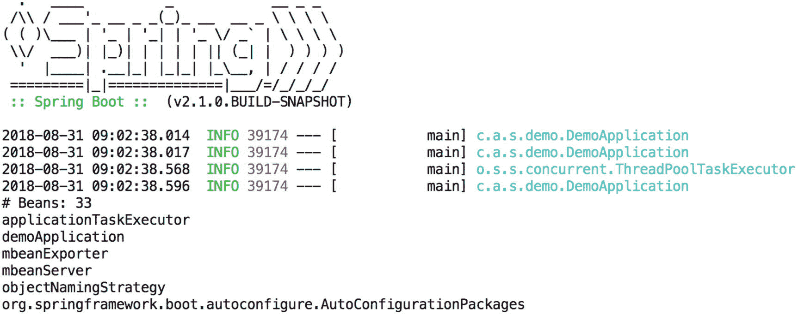
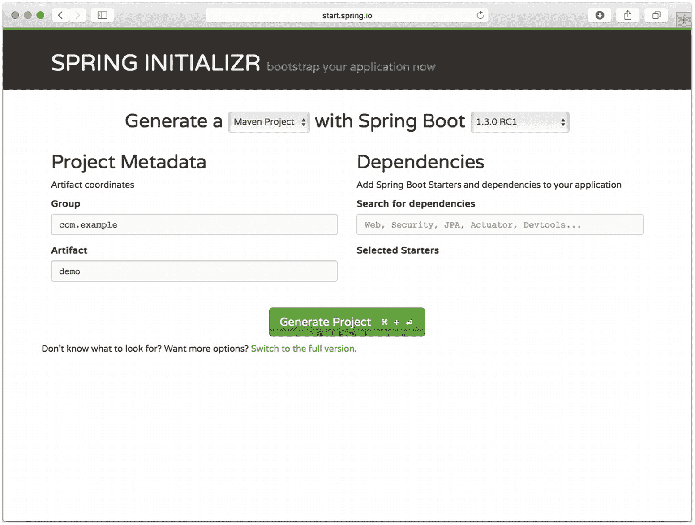
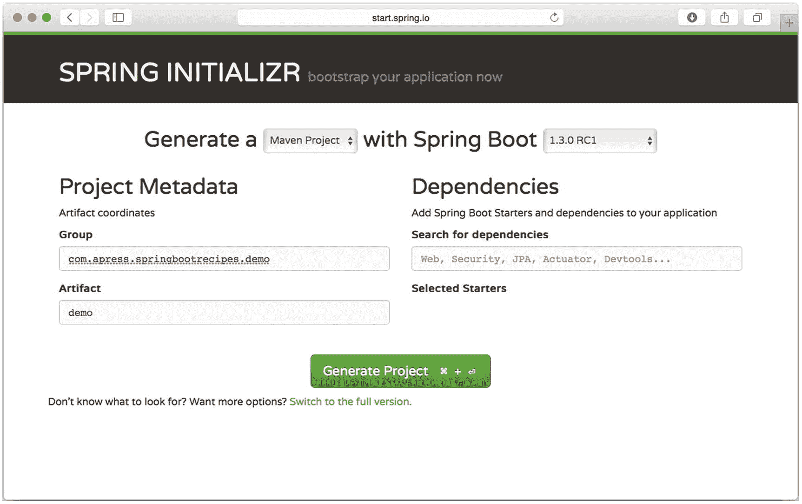
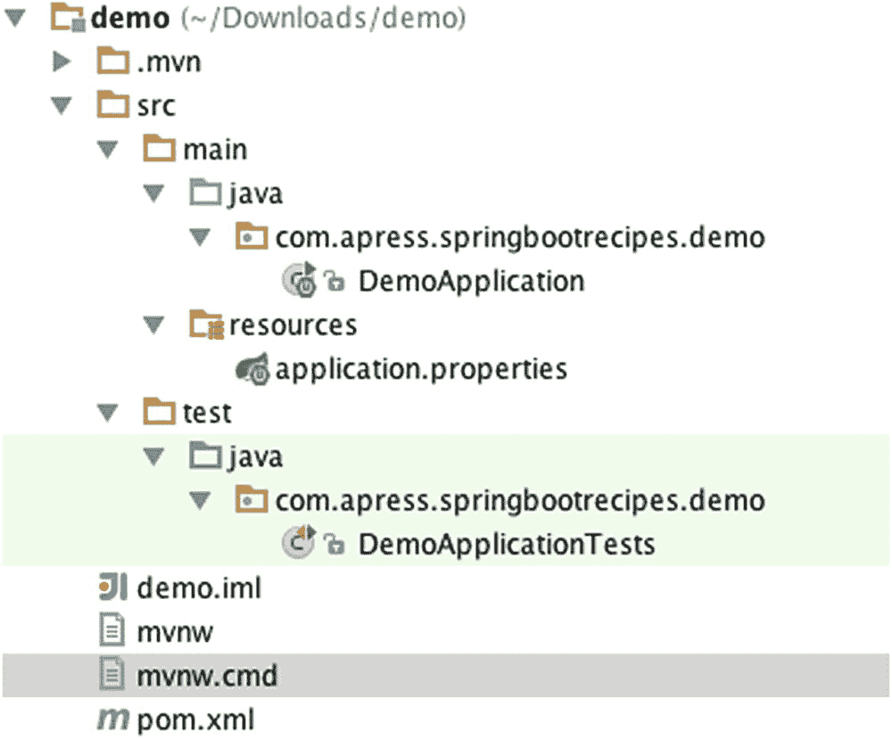

# 1. Spring Boot — 简介

在本章中，您将简要了解 Spring Boot。Spring Boot 的核心是 Spring 框架；Spring Boot 扩展了该框架，使其能够实现自动配置等功能。

*Spring Boot 让创建可以“直接运行”的、独立的、生产级的基于 Spring 的应用程序变得容易。我们对 Spring 平台和第三方库持有自己的观点，以便您可以以最少的麻烦开始。大多数 Spring Boot 应用程序只需要很少的 Spring 配置。*

——摘自 Spring Boot 参考指南

Spring Boot 为 JMS、JDBC、JPA、RabbitMQ 等基础设施提供了自动配置。Spring Boot 还为 Spring Integration、Spring Batch、Spring Security 等不同框架提供了自动配置。当检测到这些框架或功能时，Spring Boot 会使用有主见但合理的默认值对它们进行配置。

源代码使用 Maven 进行构建。Maven 将负责获取必要的依赖项、编译代码以及创建构件（通常是一个 jar 文件）。此外，如果某个方案说明了多种方法，源代码会使用罗马数字对各种示例进行分类（例如，Recipe_2_1_i、Recipe_2_1_ii、Recipe_2_1_iii 等）。

### 提示

要构建每个应用程序，请进入 Recipe 目录（例如，ch2/recipe_2_1_i/）并执行 `mvnw` 命令来编译源代码。源代码编译完成后，会创建一个包含应用程序可执行文件的 `target` 子目录。然后，您可以从命令行运行该应用程序 JAR（例如，`java -jar target/Recipe_2_1_i.jar`）。

## 1.1 使用 Maven 创建 Spring Boot 应用程序

### 问题

您希望开始使用 Spring Boot 和 Maven 开发应用程序。

### 解决方案

创建一个 Maven 构建文件 `pom.xml`，并添加所需的依赖项。要启动应用程序，请创建一个包含 `main` 方法的 Java 类来引导应用程序。

### 工作原理

假设您要创建一个简单的应用程序，该应用程序引导一个 `SpringApplication`（Spring Boot 应用程序的主入口点），从 `ApplicationContext` 获取所有 bean，并将它们输出到控制台。

#### 创建 **pom.xml**

在开始编码之前，您需要创建 `pom.xml` 文件，Maven 使用该文件来确定需要做什么。使用 Spring Boot 最简单的方法是将 `spring-boot-starter-parent` 作为应用程序的 `parent`。

```
org.springframework.boot
spring-boot-starter-parent
2.1.0.RELEASE

```

接下来，您需要添加一些 Spring 依赖项才能开始使用 Spring；为此，将 `spring-boot-starter` 作为依赖项添加到您的 `pom.xml` 中。

```

org.springframework.boot
spring-boot-starter

```

请注意，不需要版本或其他信息；所有这些都由 `spring-boot-starter-parent` 作为应用程序的父级来管理。`spring-boot-starter` 将引入启动一个非常基础的 Spring Boot 应用程序所需的所有核心依赖项，例如 Spring 框架、用于日志记录的 Logback 以及 Spring Boot 本身。

完整的 `pom.xml` 现在应该如下所示。

```

4.0.0
com.apress.springbootrecipes
chapter_1_1
2.0.0

org.springframework.boot
spring-boot-starter-parent
2.1.0.RELEASE

org.springframework.boot
spring-boot-starter

```

#### 创建应用程序类

让我们创建一个带有 `main` 方法的 `DemoApplication` 类。`main` 方法使用 `DemoApplication.class` 和来自 main 方法的参数调用 `SpringApplication.run`。`run` 方法返回一个 `ApplicationContext`，用于从 `ApplicationContext` 检索 bean 名称。这些名称被排序后打印到控制台。

生成的类如下所示：

```
package com.apress.springbootrecipes.demo;
import org.springframework.boot.SpringApplication;
import org.springframework.boot.autoconfigure.EnableAutoConfiguration;
import org.springframework.context.annotation.ComponentScan;
import org.springframework.context.annotation.Configuration;
import java.util.Arrays;
@Configuration
@EnableAutoConfiguration
@ComponentScan
public class DemoApplication {
public static void main(String[] args) {
var ctx = SpringApplication.run(DemoApplication.class, args);
System.out.println("# Beans: " + ctx.getBeanDefinitionCount());
var names = ctx.getBeanDefinitionNames();
Arrays.sort(names);
Arrays.asList(names).forEach(System.out::println);
}
}
```

这是一个带有 `main` 方法的常规 Java 类。您可以从 IDE 运行此类。当应用程序运行时，它将显示类似于图 1-1 的输出。



图 1-1

运行应用程序的输出

代码和注解发生了什么？`@Configuration` 注解使此类成为一个 Spring Java 配置类。通常，在创建应用程序时，您还需要拾取其他组件；为此，添加 `@ComponentScan` 注解。最后，为了让 Spring Boot 执行其自动配置，添加 `@EnableAutoConfiguration` 注解。


#### 简化应用类

查看该类定义，会发现它上面有三个注解。

```
@Configuration
@EnableAutoConfiguration
@ComponentScan
public class DemoApplication { ... }
```

在编写基于 Spring Boot 的应用时，大多数情况下都需要所有这些注解。这段代码可以通过使用 `@SpringBootApplication` 注解来简化。类头将变为：

```
@SpringBootApplication
public class DemoApplication { ... }
```

`@SpringBootApplication` 注解是一个所谓的组合注解，它由之前所需的那些注解组成。

```
@Target({ElementType.TYPE})
@Retention(RetentionPolicy.RUNTIME)
@Documented
@Inherited
@SpringBootConfiguration
@EnableAutoConfiguration
@ComponentScan
public @interface SpringBootApplication { ... }
```

`@SpringBootApplication` 与之前提到的注解之间有一个区别。这里使用的是 `@SpringBootConfiguration` 注解，而不是 `@Configuration` 注解。`@SpringBootConfiguration` 是一个专门的 `@Configuration` 注解。它表明这是一个基于 Spring Boot 的应用。在你的应用中使用 `@SpringBootConfiguration` 时，只能有一个类被此注解标注！

## 1.2 使用 Gradle 创建 Spring Boot 应用

### 问题

你想使用 Spring Boot 和 Gradle 开始开发一个应用。

### 解决方案

创建一个 Gradle 构建文件 `build.gradle`，并添加所需的依赖。要启动应用，创建一个包含 `main` 方法的 Java 类来引导应用。

### 实现原理

假设你要创建一个简单的应用，该应用引导一个 `SpringApplication`，从 `ApplicationContext` 中获取所有 bean，并将它们输出到控制台。

#### 创建 **build.gradle**

首先，你需要创建一个 `build.gradle`，并使用 Gradle 正确管理 Spring Boot 依赖所需的两个插件。Spring Boot 需要一个特殊的 Gradle 插件（Spring Boot Gradle 插件），以及一个用于扩展 Gradle 默认依赖管理能力的插件（依赖管理插件）。要启用并配置这些插件，请在 `build.gradle` 中创建一个 `buildscript` 任务。

```
buildscript {
ext {
springBootVersion = '2.1.0.RELEASE'
}
repositories {
mavenCentral()
}
dependencies {
classpath("org.springframework.boot:spring-boot-gradle-plugin:${springBootVersion}")
}
}
```

此任务现在将正确配置要使用的 Spring Boot 插件。接下来，你需要指定要使用的插件；由于这是一个基于 Java 的项目，你至少需要 `Java` 插件，并且由于本书是关于 Spring Boot 的，你还需要 `org.springframework.boot` 插件。最后，你需要包含 `io.spring.dependency-management` 插件，以便让 Spring Boot Starters 管理依赖。

```
apply plugin: 'java'
apply plugin: 'org.springframework.boot'
apply plugin: 'io.spring.dependency-management'
```

最后，你需要添加所需的依赖；与配方 1.1 一样，添加 `spring-boot-starter` 依赖。

```
dependencies {
compile 'org.springframework.boot:spring-boot-starter'
}
```

注意依赖项上没有指定具体版本。无需指定版本并让其自动管理，是由于使用了 `io.spring.dependency-management` 插件，该插件与 Maven 一样，可以简化依赖管理。

完整的 `build.gradle` 现在应该如下所示：

```
buildscript {
ext {
springBootVersion = '2.1.0.RELEASE'
}
repositories {
mavenCentral()
}
dependencies {
classpath("org.springframework.boot:spring-boot-gradle-plugin:${springBootVersion}")
}
}
apply plugin: 'java'
apply plugin: 'org.springframework.boot'
apply plugin: 'io.spring.dependency-management'
dependencies {
compile 'org.springframework.boot:spring-boot-starter'
}
repositories {
mavenCentral()
}
```

#### 创建应用类

让我们创建一个包含 `main` 方法的 `DemoApplication` 类。`main` 方法调用 `SpringApplication.run`，并传入 `DemoApplication.class` 以及来自 main 方法的参数。`run` 方法返回一个 `ApplicationContext`，用于从 `ApplicationContext` 中检索 bean 名称。这些名称被排序后打印到控制台。

最终的类如下所示：

```
package com.apress.springbootrecipes.demo;
import org.springframework.boot.SpringApplication;
import org.springframework.boot.autoconfigure.SpringBootApplication;
import java.util.Arrays;
@SpringBootApplication
public class DemoApplication {
public static void main(String[] args) {
var ctx = SpringApplication.run(DemoApplication.class, args);
System.out.println("# Beans: " + ctx.getBeanDefinitionCount());
var names = ctx.getBeanDefinitionNames();
Arrays.sort(names);
Arrays.asList(names).forEach(System.out::println);
}
}
```

这个类是一个带有 `main` 方法的普通 Java 类。你可以从 IDE 中运行此类。当应用运行时，它将显示类似于图 1-2 的输出。


图 1-2

运行应用的输出

## 1.3 使用 Spring Initializr 创建 Spring Boot 应用

### 问题

你想使用 Spring Initializr 启动一个 Spring Boot 应用。

### 解决方案

访问 [`http://start.spring.io`](http://start.spring.io) ，选择 Spring Boot 版本以及你认为需要的不同依赖，然后下载项目。


### 工作原理

首先，访问 [`http://start.spring.io`](http://start.spring.io)，这将打开 Spring Initializr（图 1-3）。



图 1-3

Spring Initializr

现在选择你想要生成的项目类型（Maven 或 Gradle）。选择你想要使用的 Spring Boot 版本，建议选择最新的版本。接下来，在 Group 字段中输入 `com.apress.springbootrecipes`，Artifact 字段保留默认值 `demo`（图 1-4）。



图 1-4

填写值后的 Spring Initializr

最后点击 **Generate Project** 按钮，这将触发下载一个 `demo.zip` 文件。解压该 zip 文件，并将项目导入到你的 IDE 中。导入后，你应该会看到类似图 1-5 的结构。



图 1-5

导入后的项目

打开 `pom.xml` 并将其与配方 1.1（或配方 1.2 中的 build.gradle）进行比较。两者非常相似，但有两个不同之处需要注意。首先，多了一个依赖项 `spring-boot-starter-test`。它引入了所需的测试依赖项，如 Spring Test、Mockito、Junit 4 和 AssertJ。有了这一个依赖项，你就可以开始测试了。

第二个不同之处在于，现在多了一个配置了 `spring-boot-maven-plugin` 的构建部分。

```

org.springframework.boot
spring-boot-maven-plugin

```

这个插件负责创建 fat JAR。它会获取原始 JAR，并将所有依赖项重新打包到其中。这样，你只需将 JAR 文件交给运维团队即可。运维团队只需执行 `java -jar <your-application>.jar` 即可启动应用程序，无需将其部署到 Servlet 容器或 JEE 容器中。

#### 实现一个简单的应用程序

打开 DemoApplication 并更新其内容，以统计并从 ApplicationContext 中获取 Bean。

```
package com.apress.springbootrecipes.demo;
import org.springframework.boot.SpringApplication;
import org.springframework.boot.autoconfigure.SpringBootApplication;
import java.util.Arrays;
@SpringBootApplication
public class DemoApplication {
public static void main(String[] args) {
var ctx = SpringApplication.run(DemoApplication.class, args);
System.out.println("# Beans: " + ctx.getBeanDefinitionCount());
var names = ctx.getBeanDefinitionNames();
Arrays.sort(names);
Arrays.asList(names).forEach(System.out::println);
}
}
```

#### 构建 JAR

使用 Spring Initializr 时，所有项目都附带 Maven Wrapper（如果使用 Gradle，则附带 Gradle Wrapper），以便更轻松地构建应用程序。要使用包装脚本，请打开命令行。导航到项目所在的目录。最后，执行 `./mvnw package` 或 `./gradlew build`。这将在 `target`（或 `build/libs`）目录中创建可执行的构件。

现在 JAR 已构建完成，让我们执行它并看看会发生什么。输入 `java -jar target/demo-0.0.1-SNAPSHOT.jar`（或 `java -jar build/libs/demo-0.0.1-SNAPSHOT.jar`），观察应用程序启动并从上下文中列出 Bean（见图 1-1 和 1-2）。

## 1.4 总结

在本章中，我们了解了如何使用 Spring Boot 启动开发。我们探讨了如何使用 Maven 和 Gradle 入门，最后还了解了如何使用 Spring Initializr 入门。

在下一章中，我们将介绍 Spring Boot 应用程序的基本配置，如何定义 Bean，如何使用属性文件，以及如何覆盖属性。

