# 3. Spring MVC

当 Spring Boot 在类路径上发现相关类时，它会自动配置一个 Web 应用程序。它还会启动一个嵌入式服务器（默认情况下，它将启动一个嵌入式 Tomcat）^(¹¹)

## 3.1 Spring MVC 入门

### 问题

你想使用 Spring Boot 来驱动一个 Spring MVC 应用程序。

### 解决方案

Spring Boot 将为 Spring MVC 所需的组件进行自动配置。要启用此功能，Spring Boot 需要能够在类路径上检测到 Spring MVC 类。为此，你需要将 `spring-boot-starter-web` 添加为依赖项。


### 工作原理

在你的项目中，添加 `spring-boot-starter-web` 依赖。

```
org.springframework.boot
spring-boot-starter-web

```

这样做会为 Spring MVC 添加所需的依赖。现在 Spring Boot 能够检测到这些类，并会进行额外的配置来设置 `DispatcherServlet`。它还会添加启动嵌入式 Tomcat 服务器所需的所有 JAR 文件。

```
package com.apress.springbootrecipes.hello;
import org.springframework.boot.SpringApplication;
import org.springframework.boot.autoconfigure.SpringBootApplication;
@SpringBootApplication
public class HelloWorldApplication {
public static void main(String[] args) {
SpringApplication.run(HelloWorldApplication.class, args);
}
}
```

这几行代码足以启动嵌入式 Tomcat 服务器，并拥有一个预配置的 Spring MVC 设置。当你启动应用程序时，你将看到类似于图 3-1 的输出。

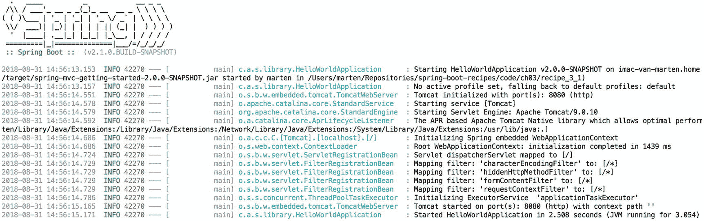

图 3-1

启动输出日志

**当你启动 `HelloWorldApplication` 时，会发生以下事情：**

表 3-1

自动注册的 Servlet 过滤器

| 过滤器 | 描述 |
| --- | --- |
| `CharacterEncodingFilter` | 默认强制编码为 `UTF-8`，可通过设置 `spring.http.encoding.charset` 属性进行配置。可通过将 `spring.http.encoding.enabled` 设置为 `false` 来禁用 |
| `HiddenHttpMethodFilter` | 允许使用名为 `_method` 的隐藏表单字段来指定实际的 HTTP 方法。可通过将 `spring.mvc.hiddenmethod.filter.enabled` 设置为 `false` 来禁用 |
| `FormContentFilter` | 将包装 `PUT`、`PATCH` 和 `DELETE` 请求，以便这些请求也能受益于绑定。可通过将 `spring.mvc.formcontent.filter.enabled` 设置为 `false` 来禁用 |
| `RequestContextFilter` | 将当前请求暴露给当前线程，以便你即使在非 Spring MVC 应用程序（如 Jersey）中也能使用 `RequestContextHolder` 和 `LocaleContextHolder` |

1.  在端口 8080（默认）上启动嵌入式 Tomcat 服务器
2.  注册并启用几个默认的 Servlet 过滤器（表 3-1）
3.  为 `.css`、`.js` 和 `favicon.ico` 等内容设置静态资源处理
4.  启用与 WebJars^(¹²) 的集成
5.  设置基本的错误处理功能
6.  使用所需组件（即 `ViewResolvers`、I18N 等）预配置 `DispatcherServlet`

在当前状态下，`HelloWorldApplication` 除了启动服务器外不做任何事情。让我们添加一个控制器来返回一些信息。

```
package com.apress.springbootrecipes.hello;
import org.springframework.web.bind.annotation.GetMapping;
import org.springframework.web.bind.annotation.RestController;
@RestController
public class HelloWorldController {
@GetMapping("/")
public String hello() {
return "Hello World, from Spring Boot 2!";
}
}
```

这个 `HelloWorldController` 将被注册到 `/` URL，当被调用时，将返回短语 `Hello World from Spring Boot 2!`。`@RestController` 表明这是一个 `@Controller`，因此会被 Spring Boot 检测到。此外，它还为所有请求处理方法添加了 `@ResponseBody` 注解，指示应将结果发送给客户端。`@GetMapping` 将 `hello` 方法映射到到达 `/` 的每个 GET 请求。我们也可以写成 `@RequestMapping(value="/", method=RequestMethod.GET)`。

当重新启动 `HelloWorldApplication` 时，`HelloWorldController` 将被检测并处理。现在，当使用 `curl` 或 `http` 等工具访问 `http://localhost:8080/` 时，结果应如图 3-2 所示。

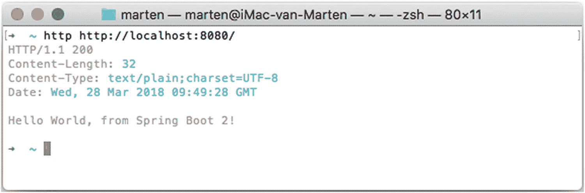

图 3-2

控制器输出

#### 测试

现在应用程序正在运行并返回结果，是时候为控制器添加测试了（理想情况下，你应该先编写测试！）。Spring 已经拥有一些令人印象深刻的测试功能，而 Spring Boot 又增加了更多。使用 Spring Boot 测试控制器变得非常简单。

```
package com.apress.springbootrecipes.hello;
import org.junit.Test;
import org.junit.runner.RunWith;
import org.springframework.beans.factory.annotation.Autowired;
import org.springframework.boot.test.autoconfigure.web.servlet.WebMvcTest;
import org.springframework.http.MediaType;
import org.springframework.test.context.junit4.SpringRunner;
import org.springframework.test.web.servlet.MockMvc;
import org.springframework.test.web.servlet.request.MockMvcRequestBuilders;
import staticorg.springframework.test.web.servlet.result.MockMvcResultMatchers.content;
import staticorg.springframework.test.web.servlet.result.MockMvcResultMatchers.status;
@RunWith(SpringRunner.class)
@WebMvcTest(HelloWorldController.class)
public class HelloWorldControllerTest {
@Autowired
private MockMvc mockMvc;
@Test
public void testHelloWorldController() throws Exception {
mockMvc.perform(MockMvcRequestBuilders.get("/"))
.andExpect(status().isOk())
.andExpect(content().string("Hello World, from Spring Boot 2!"))
.andExpect(content().contentTypeCompatibleWith(MediaType.TEXT_PLAIN));
}
}
```

`@RunWith(SpringRunner.class)` 用于指示 JUnit 使用这个特定的运行器。这个特殊的运行器是将 Spring 测试框架与 JUnit 集成的关键。`@WebMvcTest` 指示 Spring 测试框架为测试这个特定控制器设置一个应用程序上下文。它将启动一个最小的 Spring Boot 应用程序，仅包含与 Web 相关的 bean，如 `@Controller`、`@ControllerAdvice` 等。此外，它还会预配置 Spring Test Mock MVC 支持，然后可以自动注入。

Spring Test Mock MVC 可用于模拟向控制器发起 HTTP 请求，并对结果进行一些预期。这里我们使用 `GET` 调用 `/`，并期望得到 HTTP 200（即 OK）响应，以及纯文本消息 `Hello World, from Spring Boot 2!`。

## 3.2 使用 Spring MVC 暴露 REST 资源

### 问题

你想使用 Spring MVC 来暴露基于 REST 的资源 `@WebMvcTest`。

### 解决方案

你需要一个 JSON 库来进行 JSON 编组（尽管你也可以使用 XML 和其他格式，因为内容协商^(¹³)是 REST 的一部分）。在本方案中，我们将使用 Jackson^(¹⁴) 库来处理 JSON 转换。

### 工作原理

假设你为一家图书馆工作，需要开发一个 REST API 来列出和搜索图书。

`spring-boot-starter-web` 依赖（另请参见方案 3.1）默认已经包含了所需的 Jackson 库。

```
org.springframework.boot
spring-boot-starter-web

```


### 注意

你也可以使用 Google GSON 库；只需使用相应的 GSON 依赖即可。

由于你正在为图书馆开发应用程序，它很可能包含书籍，因此让我们创建一个 `Book` 类。

```
package com.apress.springbootrecipes.library;
import java.util.*;
public class Book {
private String isbn;
private String title;
private List authors = new ArrayList();
public Book() {}
public Book(String isbn, String title, String... authors) {
this.isbn = isbn;
this.title = title;
this.authors.addAll(Arrays.asList(authors));
}
public String getIsbn() {
return isbn;
}
public void setIsbn(String isbn) {
this.isbn = isbn;
}
public String getTitle() {
return title;
}
public void setTitle(String title) {
this.title = title;
}
public void setAuthors(List authors) {
this.authors = authors;
}
public List getAuthors() {
return Collections.unmodifiableList(authors);
}
@Override
public boolean equals(Object o) {
if (this == o) return true;
if (o == null || getClass() != o.getClass()) return false;
Book book = (Book) o;
return Objects.equals(isbn, book.isbn);
}
@Override
public int hashCode() {
return Objects.hash(isbn);
}
@Override
public String toString() {
return String.format("Book [isbn=%s, title=%s, authors=%s]",
this.isbn, this.title, this.authors);
}
}
```

一本书由其 ISBN 号定义；它有一个 `title` 和一个或多个 `authors`。

你还需要一个服务来处理图书馆中的书籍。让我们为 `BookService` 定义一个接口和实现。

```
package com.apress.springbootrecipes.library;
import java.util.Optional;
public interface BookService {
Iterable findAll();
Book create(Book book);
Optional find(String isbn);
}
```

目前，该实现是一个简单的内存实现。

```
package com.apress.springbootrecipes.library;
import org.springframework.stereotype.Service;
import java.util.Map;
import java.util.Optional;
import java.util.concurrent.ConcurrentHashMap;
@Service
class InMemoryBookService implements BookService {
private final Map books = new ConcurrentHashMap();
@Override
public Iterable findAll() {
return books.values();
}
@Override
public Book create(Book book) {
books.put(book.getIsbn(), book);
return book;
}
@Override
public Optional find(String isbn) {
return Optional.ofNullable(books.get(isbn));
}
}
```

该服务已使用 `@Service` 注解，以便 Spring Boot 能够检测到它并创建其实例。

```
package com.apress.springbootrecipes.library;
import org.springframework.boot.ApplicationRunner;
import org.springframework.boot.SpringApplication;
import org.springframework.boot.autoconfigure.SpringBootApplication;
import org.springframework.context.annotation.Bean;
@SpringBootApplication
public class LibraryApplication {
public static void main(String[] args) {
SpringApplication.run(LibraryApplication.class, args);
}
@Bean
public ApplicationRunner booksInitializer(BookService bookService) {
return args -> {
bookService.create(
new Book("9780061120084", "杀死一只知更鸟", "哈珀·李"));
bookService.create(
new Book("9780451524935", "1984", "乔治·奥威尔"));
bookService.create(
new Book("9780618260300", "霍比特人", "J.R.R.托尔金"));
};
}
}
```

`LibraryApplication` 将检测所有类并启动服务器。启动时，它将预先注册三本书，以便我们的图书馆中有一些数据。

要将 `Book` 暴露为 REST 资源，请创建一个类 `BookController`，并使用 `@RestController` 对其进行注解。Spring Boot 将检测此类并创建其实例。使用 `@RequestMapping`（以及 `@GetMapping` 和 `@PostMapping`），你可以编写方法来处理传入的请求。

### 注意

除了 `@RestController`，你也可以使用 `@Controller` 并在每个请求处理方法上添加 `@ResponseBody`。使用 `@RestController` 会隐式地将 `@ResponseBody` 添加到请求处理方法中。

```
package com.apress.springbootrecipes.library.rest;
import com.apress.springbootrecipes.library.Book;
import com.apress.springbootrecipes.library.BookService;
import org.springframework.http.ResponseEntity;
import org.springframework.web.bind.annotation.*;
import org.springframework.web.util.UriComponentsBuilder;
import java.net.URI;
@RestController
@RequestMapping("/books")
public class BookController {
private final BookService bookService;
public BookController(BookService bookService) {
this.bookService = bookService;
}
@GetMapping
public Iterable list() {
return bookService.findAll();
}
@GetMapping("/{isbn}")
public ResponseEntity get(@PathVariable("isbn") String isbn) {
return bookService.find(isbn)
.map(ResponseEntity::ok)
.orElse(ResponseEntity.notFound().build());
}
@PostMapping
public Book create(@RequestBody Book book,
UriComponentsBuilder uriBuilder) {
Book created = bookService.create(book);
URI newBookUri = uriBuilder.path("/books/{isbn}").build(created.getIsbn());
return ResponseEntity.created(newBookUri).body(created);
}
}
```

由于类上的 `@RequestMapping("/books")` 注解，控制器将被映射到 `/books` 路径。对于对 `/books` 的 GET 请求，将调用 `list` 方法。当使用 GET 请求调用 `/books/<isbn>` 时，将调用 `get` 方法并返回单本书的结果，或者当找不到书时返回 404 响应状态。最后，你可以通过对 `/books` 发出 POST 请求来向图书馆添加书籍；然后 `create` 方法将被调用，传入请求的正文将被转换为书籍。

应用程序启动后，你可以使用 HTTPie^(¹⁵) 或 cURL^(¹⁶) 来检索书籍。当使用 `HTTPie` 访问 `http://localhost:8080/books` 时，你应该会看到类似于图 3-3 的输出。

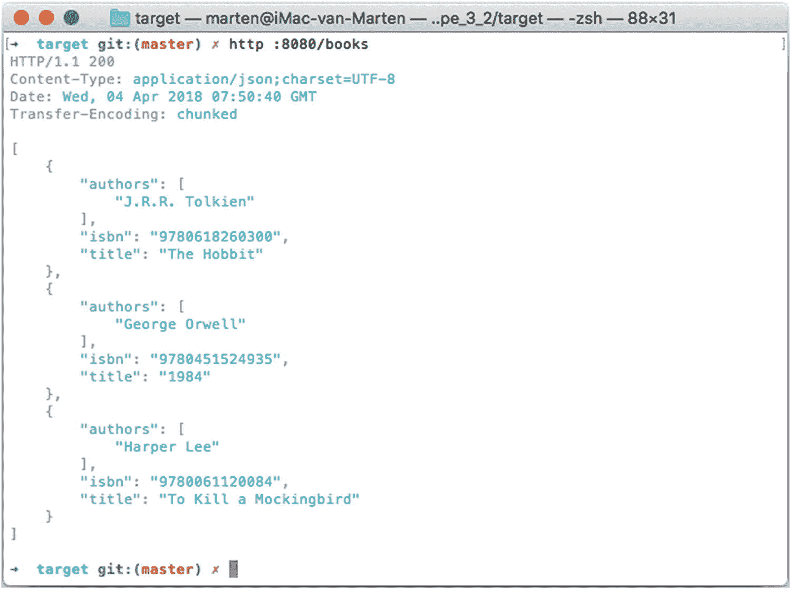

图 3-3

书籍列表的 JSON 输出

对 `http://localhost:8080/books/9780451524935` 的请求将返回单本书的结果，在本例中是乔治·奥威尔的 **1984**。使用未知的 ISBN 将导致 404。

当发出 POST 请求时，我们可以向列表中添加一本新书。

```
http POST :8080/books \
title="指环王" \
isbn="9780618640157" \
authors:='["J.R.R.托尔金"]'
```

如果操作正确，此调用的结果将是新添加的书籍和一个 location 标头。现在，当你获取书籍列表时，它应该包含四本书，而不是开始时的那三本。

发生的情况是，HTTPie 将参数转换为 JSON 请求正文，然后由 Jackson 库读取并转换为 `Book`。

```
{
"title": "指环王",
"isbn": "9780618640157",
"authors": ["J.R.R.托尔金"]
}
```

默认情况下，Jackson 将使用 getter 和 setter 将 JSON 映射到对象。发生的情况是，使用默认的无参构造函数创建一个新的 `Book` 实例，并通过 setter 设置所有属性。例如，对于 `title` 属性，会调用 `setTitle`，等等。


#### 测试 **@RestController**

为确保控制器按预期工作，需要编写测试来验证其正确行为。

```
Package com.apress.springbootrecipes.library.rest;
import com.apress.springbootrecipes.library.Book;
import com.apress.springbootrecipes.library.BookService;
import org.junit.Test;
import org.junit.runner.RunWith;
import org.springframework.beans.factory.annotation.Autowired;
import org.springframework.boot.test.autoconfigure.web.servlet.WebMvcTest;
import org.springframework.boot.test.mock.mockito.MockBean;
import org.springframework.test.context.junit4.SpringRunner;
import org.springframework.test.web.servlet.MockMvc;
import org.springframework.test.web.servlet.result.MockMvcResultMatchers;
import java.util.Arrays;
import java.util.Optional;
import static org.hamcrest.Matchers.*;
import static org.mockito.ArgumentMatchers.anyString;
import static org.mockito.Mockito.when;
import static org.springframework.test.web.servlet.request.MockMvcRequestBuilders.get;
import static org.springframework.test.web.servlet.result.MockMvcResultMatchers.status;
@RunWith(SpringRunner.class)
@WebMvcTest(BookController.class)
public class BookControllerTest {
@Autowired
private MockMvc mockMvc;
@MockBean
private BookService bookService;
@Test
public void shouldReturnListOfBooks() throws Exception {
when(bookService.findAll()).thenReturn(Arrays.asList(
new Book("123", "Spring 5 Recipes", "Marten Deinum", "Josh Long"),
new Book("321", "Pro Spring MVC", "Marten Deinum", "Colin Yates")));
mockMvc.perform(get("/books"))
.andExpect(status().isOk())
.andExpect(jsonPath("$", hasSize(2)))
.andExpect(jsonPath("$[*].isbn", containsInAnyOrder("123", "321")))
.andExpect(jsonPath("$[*].title",
containsInAnyOrder ("Spring 5 Recipes", "Pro Spring MVC")));
}
@Test
public void shouldReturn404WhenBookNotFound() throws Exception {
when(bookService.find(anyString())).thenReturn(Optional.empty());
mockMvc.perform(get("/books/123")).andExpect(status().isNotFound());
}
@Test
public void shouldReturnBookWhenFound() throws Exception {
when(bookService.find(anyString())).thenReturn(
Optional.of(
new Book("123", "Spring 5 Recipes", "Marten Deinum", "Josh Long")));
mockMvc.perform(get("/books/123"))
.andExpect(status().isOk())
.andExpect(jsonPath("$.isbn", equalTo("123")))
.andExpect(jsonPath("$.title", equalTo("Spring 5 Recipes")));
}
}
```

该测试使用 `@WebMvcTest` 创建基于 `MockMvc` 的测试，并会创建一个最小化的 Spring Boot 应用来运行控制器。控制器需要一个 `BookService` 实例，因此我们使用 `@MockBean` 注解让框架为其创建一个模拟对象。在不同的测试方法中，我们模拟了预期的行为（例如返回书籍列表、返回空的 `Optional` 等）。

### 注意

Spring Boot 使用 Mockito ^(¹⁷) 通过 `@MockBean` 创建模拟对象。

此外，测试还使用了 JsonPath^(¹⁸) 库，以便使用表达式来验证 JSON 结果。JsonPath 之于 JSON，就如同 Xpath 之于 XML。

## 3.3 在 Spring Boot 中使用 Thymeleaf

### 问题

希望使用 Thymeleaf 来渲染应用程序的页面。

### 解决方案

添加 Thymeleaf 的依赖，并创建一个常规的 `@Controller` 来确定视图并填充模型。

### 工作原理

首先，需要在项目中添加 `spring-boot-starter-thymeleaf` 依赖，以获取所需的 Thymeleaf^(¹⁹) 依赖。

```
org.springframework.boot
spring-boot-starter-thymeleaf

```

添加此依赖后，你将获得 Thymeleaf 库以及 Thymeleaf Spring 方言，从而使两者能够良好集成。由于这两个库的存在，Spring Boot 将自动配置 `ThymeleafViewResolver`。

`ThymeleafViewResolver` 需要一个 Thymeleaf `ItemplateEngine` 来解析和渲染视图。一个特殊的 `SpringTemplateEngine` 将预先配置好 `SpringDialect`，以便你可以在 Thymeleaf 页面中使用 SpEL。

为了配置 Thymeleaf，Spring Boot 在 `spring.thymeleaf` 命名空间中暴露了多个属性（表 3-2）。

表 3-2

Thymeleaf 属性

| 属性 | 描述 |
| --- | --- |
| `spring.thymeleaf.prefix` | `ViewResolver` 使用的前缀，默认为 `classpath:/templates/` |
| `Spring.thymeleaf.suffix` | `ViewResolver` 使用的后缀，默认为 `.html` |
| `spring.thymeleaf.encoding` | 模板的编码，默认为 `UTF-8` |
| `spring.thymeleaf.check-template` | 渲染前是否检查模板是否存在，默认为 `true` |
| `Spring.thymeleaf.check-template-location` | 是否检查模板位置是否存在，默认为 `true` |
| `Spring.thymeleaf.mode` | 使用的 Thymeleaf `TemplateMode`，默认为 `HTML` |
| `Spring.thymeleaf.cache` | 是否缓存已解析的模板，默认为 `true` |
| `Spring.thymeleaf.template-resolver-order` | `ViewResolver` 的顺序，默认为 1 |
| `Spring.thymeleaf.view-names` | 可通过此 `ViewResolver` 解析的视图名称（逗号分隔） |
| `spring.thymeleaf.excluded-view-names` | 被排除解析的视图名称（逗号分隔） |
| `Spring.thymeleaf.enabled` | 是否启用 Thymeleaf，默认为 `true` |
| `Spring.thymeleaf.enable-spring-el-compiler` | 是否启用 SpEL 表达式编译，默认为 `false` |
| `Spring.thymeleaf.servlet.content-type` | 用于写入 HTTP 响应的 Content-Type 值，默认为 `text/html` |

#### 添加索引页面

首先，为应用程序添加一个索引页面。在 `src/main/resources/templates` 目录（默认位置）下创建一个 `index.html` 文件。

```

Spring Boot Recipes – 图书馆

图书馆
书籍列表

```

这只是一个基本的 HTML5 页面，为 Thymeleaf 添加了一些小改动。首先，使用 `xmlns:th="` [`http://www.thymeleaf.org`](http://www.thymeleaf.org) `"` 来启用 Thymeleaf 的命名空间。该命名空间通过 `th:href` 在链接中使用。`@{/books.html}` 将由 Thymeleaf 扩展为正确的链接，并放置在链接的实际 `href` 属性中。

现在，运行应用程序并访问主页（http://localhost:8080/），你将看到一个包含书籍概览链接的页面（图 3-4）。

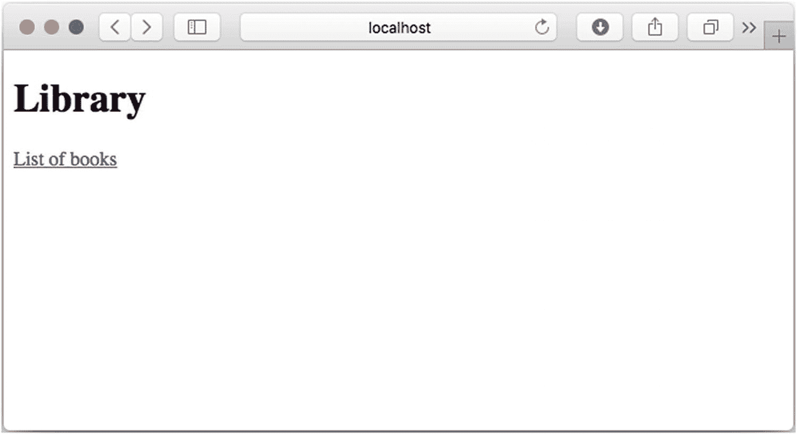

图 3-4

渲染后的索引页面


#### 添加控制器和视图

当点击首页提供的链接时，我们希望看到一个显示图书馆中可用书籍列表的页面（图 3-5）。为此，需要添加两个部分：首先是一个能够处理请求并准备模型的控制器，其次是一个用于渲染书籍列表的视图。

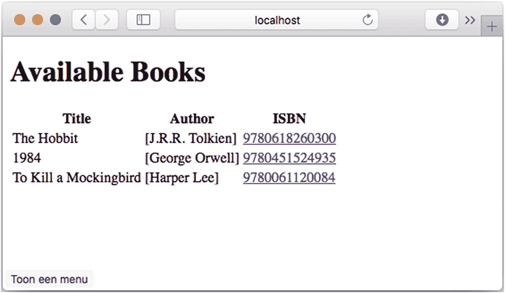

图 3-5

书籍列表页面

让我们添加一个控制器，它将用书籍列表填充模型，并选择要渲染的视图名称。控制器是一个用 `@Controller` 注解的类，其中包含请求处理方法（用 `@RequestMapping` 或本示例中的 `@GetMapping` 注解的方法，`@GetMapping` 是 `@RequestMapping` 的一种特化形式）。

```
package com.apress.springbootrecipes.library.web;
@Controller
public class BookController {
private final BookService bookService;
public BookController(BookService bookService) {
this.bookService = bookService;
}
@GetMapping("/books.html")
public String all(Model model) {
model.addAttribute("books", bookService.findAll());
return "books/list";
}
}
```

`BookController` 需要 `BookService`，以便获取要显示的书籍列表。`all` 方法将 `org.springframework.ui.Model` 作为方法参数，这样我们就可以将书籍列表放入模型中。请求处理方法可以有不同的参数^(²⁰)；其中之一就是 `Model` 类。在 `all` 方法中，我们使用 `BookService` 从数据存储中检索所有书籍，并通过 `model.addAttribute` 将其添加到模型中。现在，书籍列表在模型中可以通过键 `books` 获取。

最后，我们返回要渲染的视图名称 `books/list`。这个名称会被传递给 `ThymeleafViewResolver`，并解析为路径 classpath:/templates/books/list.html。

现在，控制器和请求处理方法已经添加完毕，我们需要创建视图。在 `src/main/templates/books` 目录下创建一个 `list.html` 文件。

```

Library - Available Books

Available Books

Title
Author
ISBN

Title
Authors

```

这又是一个使用 Thymeleaf 语法的 HTML5 页面。该页面将使用 `th:each` 表达式渲染书籍列表。它会从模型中的 `books` 属性获取所有书籍，并为每本书创建一行。行中的每一列都会使用 `th:text` 表达式包含一些文本；它将打印书籍的标题、作者和 ISBN。表格的最后一列包含一个指向书籍详情的链接。它使用 `th:href` 表达式构建 URL。注意 `()` 之间的表达式；这将添加 `isbn` 请求参数。

启动应用程序并点击首页上的链接后，您将看到一个显示图书馆内容的页面，如图 3-5 所示。

#### 添加详情页面

最后，当点击表格中的 ISBN 号码时，您希望看到一个显示详情的页面。该链接包含一个名为 `isbn` 的请求参数，我们可以在控制器中检索并使用它来查找书籍。请求参数可以通过用 `@RequestParam` 注解的方法参数来获取。

以下方法将处理 GET 请求，将请求参数映射到方法参数，并包含模型，以便我们可以将书籍添加到模型中。

```
@GetMapping(value = "/books.html", params = "isbn")
public String get(@RequestParam("isbn") String isbn, Model model) {
bookService.find(isbn)
.ifPresent(book -> model.addAttribute("book", book));
return "books/details";
}
```

控制器将渲染 `books/details` 页面。将 `details.html` 添加到 `src/main/resources/templates/books` 目录中。

```

Library - Available Books

Title
authors
ISBN

Not Found

```

这个 HTML5 Thymeleaf 模板将渲染页面上的两个可用块之一。要么找到了书籍并显示详情，要么显示未找到消息。这是通过使用 `th:if` 表达式实现的。未找到消息的 `isbn` 通过使用 `param` 作为前缀从请求参数中获取。`${param.isbn}` 将获取 `isbn` 请求参数。

## 3.4 处理异常

### 问题

您想要自定义 Spring Boot 显示的默认白标错误页面。

### 解决方案

添加一个额外的 `error.html` 作为自定义错误页面，或者为特定的 HTTP 错误代码（例如 `404.html` 和 `500.html`）添加特定的错误页面。


### 工作原理

Spring Boot 默认启用错误处理功能，并会显示一个默认的错误页面。通过将 `server.error.whitelabel.enabled` 属性设置为 `false`，可以完全禁用此功能。禁用后，异常处理将由 Servlet 容器接管，而非 Spring 和 Spring Boot 提供的通用异常处理机制。

还有一些其他属性可用于配置 whitelabel 错误页面，主要涉及模型中包含哪些内容，以便可选地用于显示。相关属性请参见表 3-3。

表 3-3

错误处理属性

| 属性 | 描述 |
| --- | --- |
| server.error.whitelabel.enabled | 是否启用 whitelabel 错误页面，默认值为 `true` |
| server.error.path | 错误页面的路径，默认值为 `/error` |
| server.error.include-exception | 是否在模型中包含异常名称，默认值为 `false` |
| server.error.include-stacktrace | 是否在模型中包含堆栈跟踪，默认值为 `never` |

首先，我们在 `BookController` 中添加一个强制触发异常的方法。

```
@GetMapping("/books/500")
public void error() {
throw new NullPointerException("Dummy NullPointerException.");
}
```

这将抛出一个异常，因此当访问 `http://localhost:8080/books/500` 时，会显示 whitelabel 错误页面（见图 3-6）。

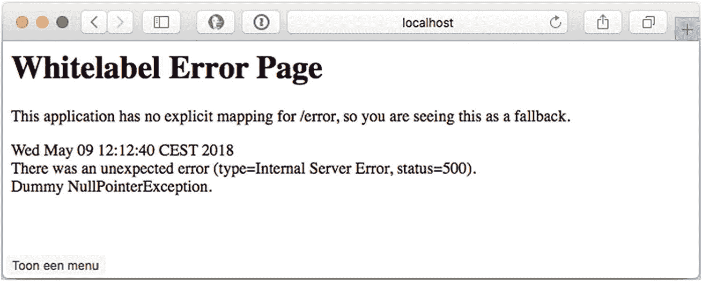

图 3-6

默认错误页面

如果找不到错误页面，则会显示此页面。要覆盖此行为，请在 `src/main/resources/templates` 目录中添加一个 `error.html` 文件。

```

Spring Boot Recipes - Library

Oops something went wrong, we don't know what but we are going to work on it!

Status

Error

Message

Exception

Stacktrace

```

现在，当应用程序启动并发生异常时，将显示此自定义错误页面（图 3-7）。该页面将由您选择的视图技术渲染（本例中使用 Thymeleaf）。

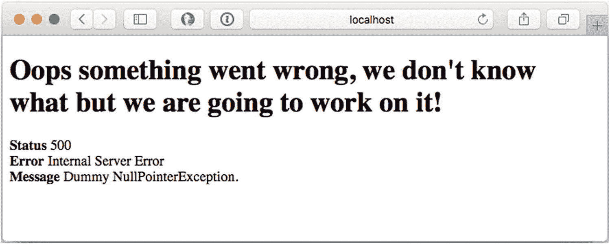

图 3-7

自定义错误页面

如果现在将 `server.error.include-exception` 设置为 `true`，并将 `server.error.include-stacktrace` 设置为 `always`，则自定义错误页面还将包含异常的类名和堆栈跟踪（图 3-8）。

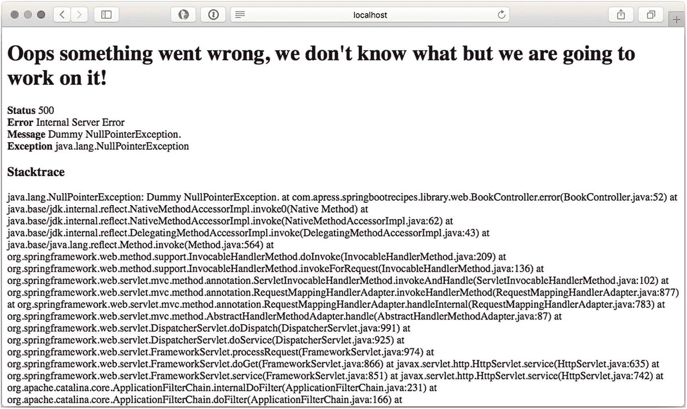

图 3-8

包含堆栈跟踪的自定义错误页面

除了提供通用的自定义错误页面外，您还可以为特定的 HTTP 状态码添加错误页面。这可以通过在 `src/main/resources/templates/error` 目录中添加 `<http-status>.html` 文件来实现。让我们添加一个 `404.html`，用于显示未知 URL 的错误页面。

```

Spring Boot Recipes - Library - Resource Not Found

Oops the page couldn't be located.

```

当导航到应用程序未知的 URL 时，将渲染此页面；而触发异常时，仍会显示自定义错误页面，如图 3-7 和图 3-8 所示。

### 提示

您还可以添加 `4xx.html` 或 `5xx.html`，为所有 400 或 500 范围内的 HTTP 状态码提供自定义错误页面。

#### 向模型添加属性

默认情况下，Spring Boot 会在模型中包含错误页面的属性，如表 3-4 所示。

表 3-4

默认错误模型属性

| 属性 | 描述 |
| --- | --- |
| timestamp | 提取错误的时间 |
| status | 状态码 |
| error | 错误原因 |
| exception | 根异常的类名（如果已配置） |
| message | 异常消息 |
| errors | 来自 `BindingResult` 的任何 `ObjectError`（使用绑定和/或验证时） |
| trace | 异常堆栈跟踪（如果已配置） |
| path | 引发异常时的 URL 路径 |

这一切都是通过使用 `ErrorAttributes` 组件完成的。默认使用和配置的是 `DefaultErrorAttributes`。您可以创建自己的 `ErrorAttributes` 处理器来创建自定义模型，或扩展 `DefaultErrorAttributes` 以添加额外属性。

```
package com.apress.springbootrecipes.library;
import org.springframework.boot.web.servlet.error.DefaultErrorAttributes;
import org.springframework.web.context.request.WebRequest;
import java.util.Map;
public class CustomizedErrorAttributes extends DefaultErrorAttributes {
@Override
public Map getErrorAttributes(WebRequest webRequest, boolean includeStackTrace) {
Map errorAttributes =
super.getErrorAttributes(webRequest, includeStackTrace);
errorAttributes.put("parameters", webRequest.getParameterMap());
return errorAttributes;
}
}
```

`CustomizedErrorAttributes` 将在默认属性之外，将原始请求参数添加到模型中。下一步是在 LibraryApplication 中将其配置为一个 bean。Spring Boot 将检测到它，并使用它来代替默认配置。

```
@Bean
public CustomizedErrorAttributes errorAttributes() {
return new CustomizedErrorAttributes();
}
```

最后，您可能希望在 `error.html` 中使用这些额外属性。

```
Parameters

```

当上述部分包含在您的 `error.html` 中时，它将打印模型中可用参数映射的内容（图 3-9）。

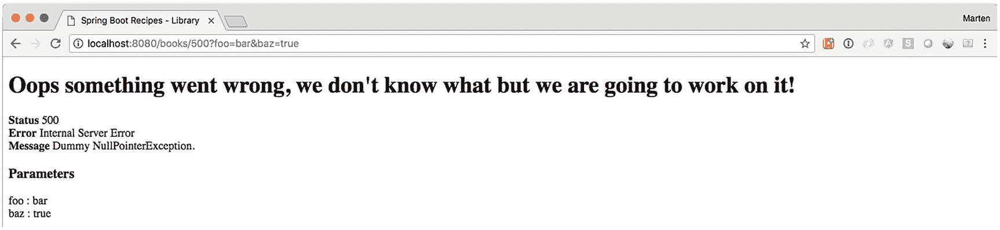

图 3-9

包含参数的自定义错误页面

## 3.5 国际化您的应用程序

### 问题

在开发国际化 Web 应用程序时，您需要根据用户的首选区域设置显示网页。您不希望为不同的区域设置创建同一页面的不同版本。

### 解决方案

为了避免为不同区域设置创建页面的不同版本，您应该通过外部化区域设置敏感的文本消息，使网页独立于区域设置。Spring 能够通过使用消息源（必须实现 `MessageSource` 接口）为您解析文本消息。在页面模板中，您可以使用特殊标签或查找消息。

### 工作原理

当 Spring Boot 在 `src/main/resources`（默认位置）中找到 `messages.properties` 时，它会自动配置一个 `MessageSource`。此 `messages.properties` 包含应用程序中要使用的默认消息。Spring Boot 将使用请求中的 `Accept-Language` 标头来确定当前请求应使用哪个区域设置（有关如何更改此行为，请参见配方 3.6）。

有一些属性可以改变 `MessageSource` 对缺失翻译、缓存等的响应方式。有关这些属性的概述，请参见表 3-5。

表 3-5

I18N 属性

| 属性 | 描述 |
| --- | --- |
| `spring.messages.basename` | 以逗号分隔的基名称列表，默认值为 `messages` |
| `spring.messages.encoding` | 消息包编码，默认值为 `UTF-8` |
| `spring.messages.always-use-message-format` | 是否对所有消息应用 `MessageFormat`，默认值为 `false` |
| `spring.messages.fallback-to-system-locale` | 当找不到检测到的区域设置的资源包时，回退到系统区域设置。禁用时，将从默认文件加载默认值。默认值为 `true` |
| `spring.messages.use-code-as-default-message` | 当找不到消息时，使用消息代码作为默认消息，而不是抛出 `NoSuchMessageException`。默认值为 `false` |
| `spring.messages.cache-duration` | 缓存持续时间，默认值为永久 |


### 提示

将应用部署到云端或其他外部托管平台时，将 `spring.messages.fallback-to-system-locale` 设置为 `false` 会很有用。这样你可以控制应用的默认语言，而不是受制于（你无法控制的）部署环境。

在 `src/main/resources` 目录下添加一个 `messages.properties` 文件。

```
main.title=Spring Boot Recipes - Library
index.title=Library
index.books.link=List of books
books.list.title=Available Books
books.list.table.title=Title
books.list.table.author=Author
books.list.table.isbn=ISBN
```

现在修改模板以使用这些翻译；以下是修改后的 `index.html` 文件。

```

Spring Boot Recipes - Library

Library
List of books

```

对于 Thymeleaf，你可以在 `th:text` 属性中使用 `#{...​}` 表达式；这将（由于自动的 Spring 集成）从 `MessageSource` 解析消息。重新启动应用后，输出看起来没有任何变化。然而，所有文本现在都来自 `messages.properties`。

现在让我们添加一个 `messages_nl.properties` 文件，用于网站的荷兰语翻译。

```
main.title=Spring Boot Recipes - Bibliotheek
index.title=Bibliotheek
index.books.link=Lijst van boeken
books.list.title=Beschikbare Boeken
books.list.table.title=Titel
books.list.table.author=Auteur
books.list.table.isbn=ISBN
```

现在，当将 accept header 更改为荷兰语时，网站将翻译为荷兰语（图 3-10）。

### 提示

更改浏览器的语言可能并不那么容易，对于 Chrome 和 Firefox，有一些插件可以让你轻松切换 `Accept-Language` header。

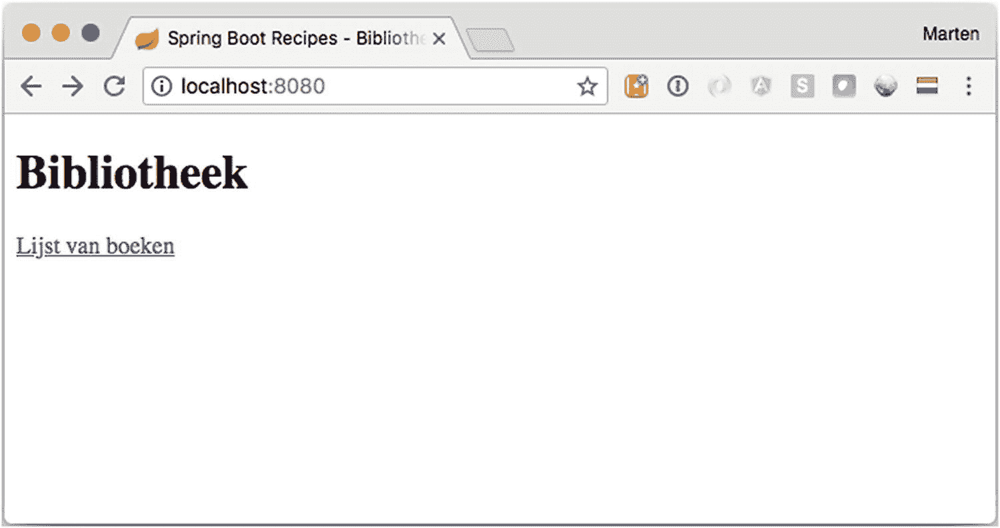

图 3-10

荷兰语主页

## 3.6 解析用户区域设置

### 问题

为了使你的 Web 应用支持国际化，你必须识别每个用户偏好的区域设置，并根据此区域设置显示内容。

### 解决方案

在 Spring MVC 应用中，用户的区域设置由区域设置解析器识别，该解析器必须实现 `LocaleResolver` 接口。Spring MVC 提供了多个 `LocaleResolver` 实现，供你根据不同的标准解析区域设置。或者，你也可以通过实现此接口来创建自己的自定义区域设置解析器。

Spring Boot 允许你设置 `spring.mvc.locale-resolver` 属性。此属性可以设置为 `ACCEPT`（默认值）或 `FIXED`。前者将创建一个 `AcceptHeaderLocaleResolver`；后者将创建一个 `FixedLocaleResolver`。

你也可以通过在 Web 应用上下文中注册一个类型为 `LocaleResolver` 的 bean 来定义区域设置解析器。你必须将区域设置解析器的 bean 名称设置为 `localeResolver`，以便它可以被自动检测到。

### 工作原理

Spring MVC 提供了 `LocaleResolver` 接口的几个默认实现。还提供了一个 `HandlerInterceptor`，允许用户覆盖他们想要使用的区域设置，即 `LocaleChangeInterceptor`。

#### 通过 HTTP 请求头解析区域设置

Spring Boot 注册的默认区域设置解析器是 `AcceptHeaderLocaleResolver`。它通过检查 HTTP 请求的 `Accept-Language` header 来解析区域设置。此 header 由用户的 Web 浏览器根据底层操作系统的区域设置进行设置。

### 注意

`AcceptHeaderLocaleResolver` 无法更改用户的区域设置，因为它无法修改用户操作系统的区域设置。

```
@Bean
public LocaleResolver localeResolver () {
return new AcceptHeaderLocaleResolver();
}
```

#### 通过会话属性解析区域设置

解析区域设置的另一个选项是使用 `SessionLocaleResolver`。它通过检查用户会话中的预定义属性来解析区域设置。如果会话属性不存在，此区域设置解析器将从 `Accept-Language` HTTP header 确定默认区域设置。

```
@Bean
public LocaleResolver localeResolver () {
SessionLocaleResolver localeResolver = new SessionLocaleResolver();
localeResolver.setDefaultLocale(new Locale("en"));
return localeResolver;
}
```

如果会话属性不存在，你可以为此解析器设置 `defaultLocale` 属性。请注意，此区域设置解析器能够通过更改存储区域设置的会话属性来更改用户的区域设置。

#### 通过 Cookie 解析区域设置

你也可以使用 `CookieLocaleResolver` 通过检查用户浏览器中的 cookie 来解析区域设置。如果 cookie 不存在，此区域设置解析器将从 `Accept-Language` HTTP header 确定默认区域设置。

```
@Bean
public LocaleResolver localeResolver() {
return new CookieLocaleResolver();
}
```

此区域设置解析器使用的 cookie 可以通过设置 `cookieName` 和 `cookieMaxAge` 属性进行自定义。`cookieMaxAge` 属性指示此 cookie 应持久保存多少秒。值 `-1` 表示此 cookie 将在浏览器关闭后失效。

```
@Bean
public LocaleResolver localeResolver() {
CookieLocaleResolver cookieLocaleResolver = new CookieLocaleResolver();
cookieLocaleResolver.setCookieName("language");
cookieLocaleResolver.setCookieMaxAge(3600);
cookieLocaleResolver.setDefaultLocale(new Locale("en"));
return cookieLocaleResolver;
}
```

如果用户浏览器中不存在 cookie，你也可以为此解析器设置 `defaultLocale` 属性。此区域设置解析器能够通过更改存储区域设置的 cookie 来更改用户的区域设置。

#### 使用固定区域设置

`FixedLocaleResolver` 始终返回相同的固定区域设置。默认情况下，它返回 JVM 的默认区域设置，但可以通过设置 `defaultLocale` 属性来配置为返回不同的区域设置。

```
@Bean
public LocaleResolver localeResolver() {
FixedLocaleResolver cookieLocaleResolver = new FixedLocaleResolver();
cookieLocaleResolver.setDefaultLocale(new Locale("en"));
return cookieLocaleResolver;
}
```

### 注意

`FixedLocaleResolver` 无法更改用户的区域设置，因为顾名思义，它是固定的。

#### 更改用户的区域设置

除了通过显式调用 `LocaleResolver.setLocale()` 来更改用户的区域设置外，你还可以将 `LocaleChangeInterceptor` 应用于你的处理器映射。此拦截器检测当前 HTTP 请求中是否存在特殊参数。参数名称可以通过此拦截器的 `paramName` 属性进行自定义（默认为 `locale`）。如果当前请求中存在此类参数，此拦截器将根据参数值更改用户的区域设置。

为了能够更改区域设置，必须使用允许更改的 `LocaleResolver`。

```
@Bean
public LocaleResolver localeResolver() {
return new CookieLocaleResolver();
}
```

要更改区域设置，请将 `LocaleChangeInterceptor` 添加为 bean 并将其注册为拦截器；对于后者，请使用 `WebMvcConfigurer` 的 `addInterceptors` 方法。


### 注意

除了将其添加到 `@SpringBootApplication` 之外，你也可以创建一个专门的 `@Configuration` 注解类来注册拦截器。请注意**不要**在该类上添加 `@EnableWebMvc`，因为这会禁用 Spring Boot 的自动配置！

```
@SpringBootApplication
public class LibraryApplication implements WebMvcConfigurer {
@Override
public void addInterceptors(InterceptorRegistry registry) {
registry.addInterceptor(localeChangeInterceptor());
}
@Bean
public LocaleChangeInterceptor localeChangeInterceptor() {
return new LocaleChangeInterceptor();
}
@Bean
public LocaleResolver localeResolver() {
return new CookieLocaleResolver();
}
}
```

现在，将以下代码片段添加到 `index.html` 中：

```
语言

NL |
EN

```

将键值对添加到 `messages.properties` 文件中。

```
main.language.nl=荷兰语
main.language.en=英语
```

现在，当选择其中一种语言时，页面将重新渲染并以所选语言显示；当你继续浏览时，其余页面也将以所选语言显示。

## 3.7 选择并配置嵌入式服务器

### 问题

你想使用 Jetty 作为嵌入式容器，而不是默认的 Tomcat 容器。

### 解决方案

排除 Tomcat 运行时并包含 Jetty 运行时。Spring Boot 会自动检测类路径上是否存在 Tomcat、Jetty 或 Undertow，并相应地配置容器。

### 工作原理

Spring Boot 原生支持 Tomcat、Jetty 和 Undertow 作为嵌入式 Servlet 容器。默认情况下，Spring Boot 使用 Tomcat 作为容器（通过 `spring-boot-starter-web` 工件中的 `spring-boot-starter-tomcat` 依赖项体现）。可以使用属性来配置容器，其中一些属性适用于所有容器，另一些则特定于某个容器。全局属性以 `server.` 或 `server.servlet` 为前缀，而容器特定的属性则以 `server.<container>` 开头（其中 `container` 是 `tomcat`、`jetty` 或 `undertow`）。

#### 通用配置属性

如表 3-6 所示，有几个通用的服务器属性可用。

表 3-6

通用服务器属性

| 属性 | 描述 |
| --- | --- |
| `server.port` | HTTP 服务器端口，默认为 `8080` |
| `server.address` | 要绑定的 IP 地址，默认为 `0.0.0.0`（即所有适配器） |
| `server.use-forward-headers` | 是否应将 `X-Forwarded-*` 标头应用于当前请求，默认未设置，使用所选 Servlet 容器的默认值 |
| `server.server-header` | 要发送的服务器名称的标头名称，默认为空 |
| `server.max-http-header-size` | HTTP 标头的最大大小，默认为 `0`（无限制） |
| `server.connection-timeout` | HTTP 连接器在关闭前等待下一个请求的超时时间。默认为空，交由容器处理；值为 `-1` 表示无限期，永不超时。 |
| `server.http2.enabled` | 如果当前容器支持，则启用 Http2 支持。默认为 `false` |
| `server.compression.enabled` | 是否启用 HTTP 压缩，默认为 `false` |
| `server.compression.mime-types` | 应用压缩的 MIME 类型列表，以逗号分隔 |
| `server.compression.excluded-user-agents` | 应禁用压缩的用户代理列表，以逗号分隔 |
| `server.compression.min-response-size` | 应用压缩的最小请求大小，默认为 `2048` |
| `server.servlet.context-path` | 应用程序的主上下文路径，默认为作为根应用程序启动 |
| `server.servlet.path` | 主 `DispatcherServlet` 的路径，默认为 `/` |
| `server.servlet.application` `-display-name` | 在容器中用作显示名称的名称，默认为 `application` |
| `server.servlet.context-parameters` | Servlet 容器上下文/初始化参数 |

由于嵌入式容器都遵循 Servlet 规范，因此也支持 JSP 页面，并且默认启用该支持。Spring Boot 可以轻松更改 JSP 提供程序，甚至完全禁用该支持。公开的属性见表 3-7。

表 3-7

与 JSP 相关的服务器属性

| 属性 | 描述 |
| --- | --- |
| `server.servlet.jsp.registered` | 是否应注册 JSP Servlet，默认为 `true` |
| `server.servlet.jsp.class-name` | JSP Servlet 类名，默认为 `org.apache.jasper.servlet.JspServlet`，因为 Tomcat 和 Jetty 都使用 Jasper 作为 JSP 实现 |
| `server.servlet.jsp.init-parameters` | JSP Servlet 的上下文参数 |


### 注意

不推荐在 Spring Boot 应用程序中使用 JSP，且其使用范围有限。^(²¹)

使用 Spring MVC 时，您可能希望利用 HTTP Session 来存储属性（通常与 Spring Security 结合使用，用于存储 CSRF 令牌等）。通用的 Servlet 配置也允许您配置 HTTP Session 及其存储方式（cookie、URL 等）。相关属性请参见表 3-8。

表 3-8

HTTP Session 相关服务器属性

| `server.servlet.session.timeout` | Session 超时时间，默认 30 分钟 |
| `server.servlet.session.tracking-modes` | Session 跟踪模式，可选 `cookie`、`url` 和 `ssl` 中的一个或多个。默认为空，由容器决定 |
| `server.servlet.session.persistent` | Session 数据是否在重启之间持久化，默认 `false` |
| `server.servlet.session.cookie.name` | 用于存储 Session 标识符的 Cookie 名称。默认为空，由容器默认值决定 |
| `server.servlet.session.cookie.domain` | Session Cookie 使用的域名值。默认为空，由容器默认值决定 |
| `server.servlet.session.cookie.path` | Session Cookie 使用的路径值。默认为空，由容器默认值决定 |
| `server.servlet.session.cookie.comment` | Session Cookie 的注释。默认为空，由容器默认值决定 |
| `server.servlet.session.cookie.http-only` | Session Cookie 是否仅可通过 HTTP 访问，默认为空，由容器默认值决定 |
| `server.servlet.session.cookie.secure` | Cookie 是否仅通过 SSL 发送，默认为空，由容器默认值决定 |
| `server.servlet.session.cookie.max-age` | Session Cookie 的生命周期。默认为空，由容器默认值决定 |
| `server.servlet.session.session-store-directory.directory` | 用于持久化 Cookie 的目录名称。必须是一个已存在的目录 |

最后，Spring Boot 通过暴露少量属性使得配置 SSL 变得非常简单，请参见表 3-9 以及配方 3.8 了解如何配置 SSL。

表 3-9

SSL 相关服务器属性

| 属性 | 描述 |
| --- | --- |
| `server.ssl.enabled` | 是否启用 SSL，默认 `true` |
| `server.ssl.ciphers` | 支持的 SSL 加密套件，默认为空 |
| `server.ssl.client-auth` | SSL 客户端认证是可选（`WANT`）还是必需（`NEED`）。默认为空 |
| `server.ssl.protocol` | 使用的 SSL 协议，默认 `TLS` |
| `server.ssl.enabled-protocols` | 启用的 SSL 协议，默认为空 |
| `server.ssl.key-alias` | 用于标识密钥库中密钥的别名，默认为空 |
| `server.ssl.key-password` | 访问密钥库中密钥的密码，默认为空 |
| `server.ssl.key-store` | 密钥库的位置，通常是一个 JKS 文件，默认为空 |
| `server.ssl.key-store-password` | 访问密钥库的密码，默认为空 |
| `server.ssl.key-store-type` | 密钥库的类型，默认为空 |
| `server.ssl.key-store-provider` | 密钥库的提供者，默认为空 |
| `server.ssl.trust-store` | 信任库的位置 |
| `server.ssl.trust-store-password` | 访问信任库的密码，默认为空 |
| `server.ssl.trust-store-type` | 信任库的类型，默认为空 |
| `server.ssl.trust-store-provider` | 信任库的提供者，默认为空 |

### 注意

上述表格中提到的所有属性**仅**在使用嵌入式容器运行应用程序时适用。当部署到外部容器（即部署 WAR 文件）时，这些设置不适用！

由于我们使用的是 Thymeleaf，可以禁用 JSP Servlet 的注册；同时我们也可以更改端口和压缩设置。请在 `application.properties` 中添加以下内容：

```
server.port=8081
server.compression.enabled=true
server.servlet.jsp.registered=false
```

现在，当（重新）启动时，您的应用程序页面（当足够大时）将被压缩，并且服务器将在端口 `8081` 而非 `8080` 上运行。

### 注意

`server.servlet.context-path` 和 `server.servlet.path` 之间存在区别。查看 URL `http://localhost:8080/books` 时，它由几个部分组成。首先是协议（通常是 `http` 或 `https`）；然后是您要访问的服务器的地址和端口，接着是 `context-path`（默认部署在根路径的 `/`），其后是 `servlet-path`。`server.context-path` 是您应用程序的主 URL；例如，如果我们设置 `server.context-path=/library`，则整个应用程序可通过 `/library` URL 访问。（`DispatcherServlet` 仍然监听 `context-path` 内的 `/`）。现在，如果我们设置 `server.path=/dispatch`，则需要使用 `/library/dispatch/books` 来访问书籍。

接下来，如果我们添加了第二个 `DispatcherServlet`，并将其路径配置为 `/services`，那么它可以通过 `/library/services` 访问。两个 `DispatcherServlet` 都将在主 `context-path` `/library` 内处于活动状态。

#### 更改运行时容器

当包含 `spring-boot-starter-web` 依赖时，它会自动包含对 Tomcat 容器的依赖，因为它本身依赖于 `spring-boot-starter-tomcat` 工件。要启用不同的 Servlet 容器，需要排除 `spring-boot-starter-tomcat`，并包含 `spring-boot-starter-jetty` 或 `spring-boot-starter-undertow` 之一。

```
org.springframework.boot
spring-boot-starter-web

org.springframework.boot
spring-boot-starter-tomcat

org.springframework.boot
spring-boot-starter-jetty

```

在 Maven 中，您可以在 `<dependency>` 内部使用 `<exclusion>` 元素来排除依赖。

现在，当应用程序启动时，它将使用 Jetty 而不是 Tomcat（图 3-11）。

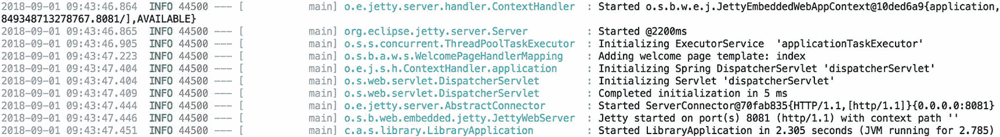

图 3-11

使用 Jetty 容器的引导日志

## 3.8 为 Servlet 容器配置 SSL

### 问题

您希望应用程序除了通过 HTTP 访问外（或替代 HTTP），还能通过 HTTPS 访问。

### 解决方案

获取一个证书，将其放入密钥库，并使用 `server.ssl` 命名空间配置该密钥库。然后 Spring Boot 将自动配置服务器，使其仅能通过 HTTPS 访问。

### 工作原理

使用 `server.ssl.key-store`（及相关属性），您可以配置嵌入式容器仅接受 HTTPS 连接。在配置 SSL 之前，您需要拥有一个证书来保护您的应用程序。通常，您会希望从证书颁发机构（如 VeriSign 或 Let's Encrypt）获取证书。但是，出于开发目的，您可以使用自签名证书（请参阅**创建自签名证书**部分）。

#### 创建自签名证书

Java 附带了一个名为 `keytool` 的工具，可用于生成证书等。

```
keytool -genkey -keyalg RSA -alias sb2-recipes -keystore sb2-recipes.pfx -storepass password -validity 3600 -keysize 4096 -storetype pkcs12
```

上述命令将指示 `keytool` 使用 RSA 算法生成一个密钥，并将其放入名为 `sb2-recipes.pfx` 的密钥库中，别名为 `sb2-recipes`，有效期为 3600 天。运行该命令时，它会询问一些问题；请相应回答（或留空）。之后，将生成一个名为 `sb2-recipes.pfx` 的文件，其中包含证书并使用密码保护。

将此文件放入 `src/main/resources` 文件夹中，以便它作为应用程序的一部分被打包，并且 Spring Boot 可以轻松访问它。


### 警告

使用自签名证书会在浏览器中产生警告，提示网站不安全且未受保护，因为该证书并非由受信任的机构签发（另请参见图 3-12）。

#### 配置 Spring Boot 使用密钥库

Spring Boot 需要了解密钥库的信息，才能配置嵌入式容器。为此，请使用 `server.ssl.key-store` 属性。你还需要指定密钥库的类型（`pkcs12`）和密码。

```
server.ssl.key-store=classpath:sb2-recipes.pfx
server.ssl.key-store-type=pkcs12
server.ssl.key-store-password=password
server.ssl.key-password=password
server.ssl.key-alias=sb2-recipes
```

现在，当打开 http://localhost:8080/books.html 页面时，它将通过 https 提供服务（尽管会有警告）。参见图 3-12。

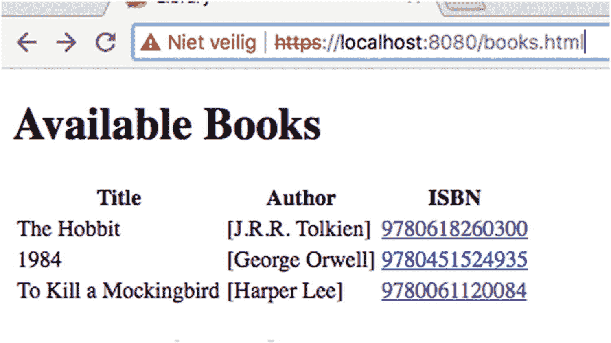

图 3-12

HTTPS 访问

#### 同时支持 HTTP 和 HTTPS

Spring Boot 默认只启动一个连接器：要么是 HTTP，要么是 HTTPS，但不会同时启动两者。如果你想同时支持 HTTP 和 HTTPS，则需要手动添加一个额外的连接器。最简单的方法是自行创建 HTTP 连接器，并让 Spring Boot 设置 SSL 部分。

首先，配置 Spring Boot 在端口 8443 上启动服务器。

```
server.port=8443
```

要向嵌入式 Tomcat 添加额外的连接器，你需要将 `TomcatServletWebServerFactory` 作为 bean 添加到上下文中。通常，Spring Boot 会检测容器并选择要使用的 `WebServerFactory`；但是，由于需要进行自定义，我们需要手动添加它。此 bean 可以添加到带有 `@Configuration` 注解的类或 `LibraryApplication` 类中。

```
@Bean
public TomcatServletWebServerFactory tomcatServletWebServerFactory() {
var factory = new TomcatServletWebServerFactory();
factory.addAdditionalTomcatConnectors(httpConnector());
return factory;
}
private Connector httpConnector() {
var connector = new Connector(TomcatServletWebServerFactory.DEFAULT_PROTOCOL);
connector.setScheme("http");
connector.setPort(8080);
connector.setSecure(false);
return connector;
}
```

这将在端口 8080 上添加一个额外的连接器。现在，应用程序将同时可以通过端口 8080 和 8443 访问。使用 Spring Security，你可以强制通过 HTTPS 而非 HTTP 访问应用程序的某些部分。

### 提示

如果你不想显式配置 `TomcatServletWebServerFactory`，也可以使用 `BeanPostProcessor` 向 `TomcatServletWebServerFactory` 注册额外的 Tomcat `Connector`。这样，你可以为不同的嵌入式容器实现此功能，而不是局限于单一容器。

```
@Bean
public BeanPostProcessor addHttpConnectorProcessor() {
return new BeanPostProcessor() {
@Override
public Object postProcessBeforeInitialization(Object bean, String beanName)
throws BeansException {
if (bean instanceof TomcatServletWebServerFactory) {
var factory = (TomcatServletWebServerFactory) bean;
factory.addAdditionalTomcatConnectors(httpConnector());
}
return bean;
}
};
}
```

#### 将 HTTP 重定向到 HTTPS

除了同时支持 HTTP 和 HTTPS，另一种选择是仅支持 HTTPS，并将流量从 HTTP 重定向到 HTTPS。其配置与同时支持 HTTP 和 HTTPS 时类似。但是，现在你需要配置连接器，将所有来自 8080 端口的流量重定向到 8443 端口。

```
@Bean
public TomcatServletWebServerFactory tomcatServletWebServerFactory() {
var factory = new TomcatServletWebServerFactory();
factory.addAdditionalTomcatConnectors(httpConnector());
factory.addContextCustomizers(securityCustomizer());
return factory;
}
private Connector httpConnector() {
var connector = new Connector(TomcatServletWebServerFactory.DEFAULT_PROTOCOL);
connector.setScheme("http");
connector.setPort(8080);
connector.setSecure(false);
connector.setRedirectPort(8443);
return connector;
}
private TomcatContextCustomizer securityCustomizer() {
return context -> {
var securityConstraint = new SecurityConstraint();
securityConstraint.setUserConstraint("CONFIDENTIAL");
var collection = new SecurityCollection();
collection.addPattern("/*");
securityConstraint.addCollection(collection);
context.addConstraint(securityConstraint);
};
}
```

现在，`httpConnector` 设置了 `redirectPort`，以便知道要使用哪个端口。最后，你需要使用 `SecurityConstraint` 保护所有 URL。使用 Spring Boot，你可以使用专门的 `TomcatContextCustomizer` 在 Tomcat 的 `Context` 启动之前对其进行后处理。该约束使所有内容（由于使用了 `/*` 作为模式）都变为机密（允许使用 `NONE`、`INTEGRAL` 或 `CONFIDENTIAL` 之一），结果是所有内容都将重定向到 https。

脚注 1   2   3   4   5   6   7   8   9   10   11

