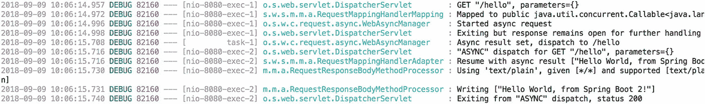
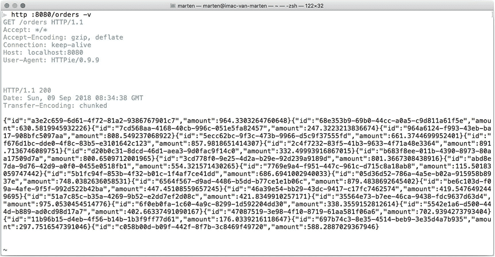
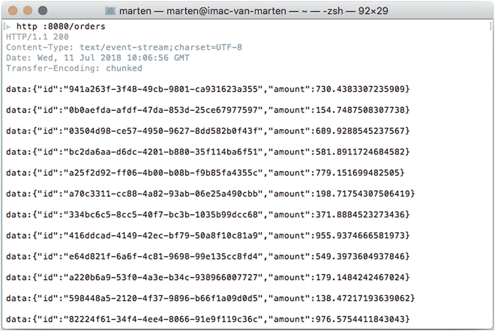
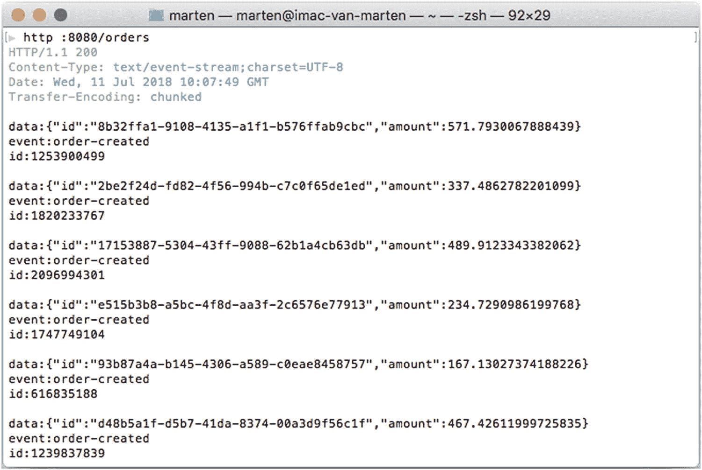
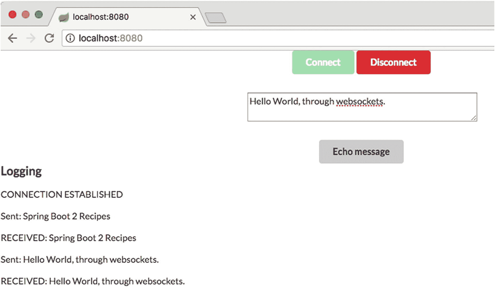
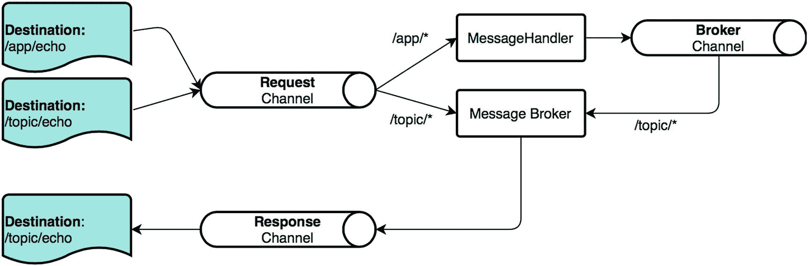

# 4. Spring MVC - 异步

当 Servlet API 发布时，大多数实现它的容器都采用每个请求一个线程的模式。这意味着一个线程会被阻塞，直到请求处理完成并将响应发送给客户端。

在早期，连接到互联网的设备远没有现在这么多。由于设备数量的增加，处理的 HTTP 请求数量也随之增长。由于这种增长，对于许多 Web 应用程序来说，保持线程阻塞的状态已不再可行。

从 Servlet 3 规范开始，可以异步处理 HTTP 请求。这是通过释放处理 HTTP 请求的线程来实现的。新线程将在后台运行，一旦结果可用，就会将其写入客户端。这一切都可以在符合 Servlet 3.1 规范的 Servlet 容器中以非阻塞方式完成。所有使用的资源也必须是非阻塞的。

在过去的几年里，响应式编程也兴起起来。从 Spring 5 开始，可以编写响应式 Web 应用程序。为了实现响应式，Spring 使用 Project Reactor 作为 Reactive Streams API 的实现。深入探讨响应式编程超出了本书的范围。简而言之，响应式编程是一种进行非阻塞函数式编程的方式。

在使用 Web 应用程序时，会有一个请求，HTML 在服务器端渲染，然后发送回客户端。在过去的几年里，HTML 的渲染转移到了客户端。通信通过向客户端返回 JSON、XML 或其他表示形式来完成。

这仍然是一个请求和响应周期，尽管是通过客户端通过 `XmlHttpRequest` 进行的异步调用来驱动的。客户端和服务器之间还有其他通信方式。可以使用服务器发送事件（Server-Sent-Events）进行单向通信。对于全双工通信，可以使用 Web Socket。

在构建常规 Web 应用程序时，添加 `spring-boot-starter-web` 作为依赖项。在构建响应式应用程序时，添加 `spring-boot-starter-webflux`。

## 4.1 使用控制器和 TaskExecutor 进行异步请求处理

### 问题

为了减少 Servlet 容器的吞吐量，您希望异步处理请求。


### 解决方案

当请求到达时，它会以同步方式处理，这会阻塞处理 HTTP 请求的线程。响应保持打开状态并可写入。例如，当某个调用需要较长时间才能完成时，与其阻塞线程，不如在后台处理该调用，并在完成后向用户返回一个值。

### 工作原理

Spring MVC 支持方法返回多种类型；表 4-1 中的返回类型会以异步方式处理。

表 4-1

异步返回类型

| 类型 | 描述 |
| --- | --- |
| `DeferredResult<V>` | 由另一个线程产生的异步结果 |
| `ListenableFuture` | 由另一个线程产生的异步结果，是 `DeferredResult` 的等效替代方案 |
| `CompletionStage` <v>/</v> `CompletableFuture` | 由另一个线程产生的异步结果，是 `DeferredResult` 的等效替代方案 |
| `Callable` | 一个异步计算，计算完成后产生结果 |
| `ResponseBodyEmitter` | 可用于异步地向响应写入多个对象 |
| `SseEmitter` | 可用于异步地写入服务器推送事件 |
| `StreamingResponseBody` | 可用于异步地写入 `OutputStream`。 |

#### 编写异步控制器

编写一个控制器并让其异步处理请求，只需更改控制器处理方法的返回类型即可（参见表 4-1）。假设对 `HelloWorldController.hello` 的调用需要相当长的时间，但我们不希望因此阻塞服务器。

#### 使用 Callable

```
package com.apress.springbootrecipes.library;
import org.springframework.web.bind.annotation.GetMapping;
import org.springframework.web.bind.annotation.RestController;
import java.util.concurrent.Callable;
import java.util.concurrent.ThreadLocalRandom;
@RestController
public class HelloWorldController {
@GetMapping
public Callable hello() {
return () -> {
Thread.sleep(ThreadLocalRandom.current().nextInt(5000));
return "Hello World, from Spring Boot 2!";
};
}
}
```

现在，`hello` 方法返回一个 `Callable<String>`，而不是直接返回一个 `String`。在新构建的 `Callable<String>` 内部，有一个随机等待时间来模拟将消息返回给客户端之前的延迟。

现在，当进行预订时，您将在日志中看到类似于图 4-1 的内容。



图 4-1

日志输出

您会注意到，请求处理是在某个线程（此处为 `nio-8080-exec-1`）上启动的。另一个线程（此处为 `task-1`）负责处理并返回结果。最后，请求被再次分派到 `DispatcherServlet`，以便在另一个线程（此处为 `nio-8080-exec-2`）上处理结果。

#### 使用 CompletableFuture

将方法的签名更改为返回 `CompletableFuture<String>`，并使用 `TaskExecutor` 来异步执行代码。

```
@RestController
public class HelloWorldController {
private final TaskExecutor taskExecutor;
public HelloWorldController(TaskExecutor taskExecutor) {
this.taskExecutor = taskExecutor;
}
@GetMapping
public CompletableFuture hello() {
return CompletableFuture.supplyAsync(() -> {
randomDelay();
return "Hello World, from Spring Boot 2!";
}, taskExecutor);
}
private void randomDelay() {
try {
Thread.sleep(ThreadLocalRandom.current().nextInt(5000));
} catch (InterruptedException e) {
Thread.currentThread().interrupt();
}
}
}
```

调用 `supplyAsync`（或者当使用 `void` 时，使用 `runAsync`）会提交一个任务。它返回一个 `CompletableFuture`。这里我们使用了同时接受 `Supplier` 和 `Executor` 的 `supplyAsync` 方法。这样，我们就可以重用 `TaskExecutor` 进行异步处理。如果使用只接受 `Supplier` 的 `supplyAsync` 方法，它将在 JVM 上可用的默认 fork/join 池中执行。

当返回 `CompletableFuture` 时，您可以利用它的所有特性，例如组合和链式调用多个 `CompletableFuture` 实例。

#### 测试异步控制器

与常规控制器一样，Spring MVC 测试框架可用于测试异步控制器。

创建一个测试类，并使用 `@WebMvcTest(HelloWorldController.class)` 和 `@RunWith(SpringRunner.class)` 对其进行注解。`@WebMvcTest` 将引导一个最小的 Spring Boot 应用程序，其中包含测试控制器所需的内容。它会自动配置 Spring MockMvc，并将其自动注入到测试中。

```
@RunWith(SpringRunner.class)
@WebMvcTest(HelloWorldController.class)
public class HelloWorldControllerTest {
@Autowired
private MockMvc mockMvc;
@Test
public void testHelloWorldController() throws Exception {
MvcResult mvcResult = mockMvc.perform(get("/"))
.andExpect(request().asyncStarted())
.andDo(MockMvcResultHandlers.log())
.andReturn();
mockMvc.perform(asyncDispatch(mvcResult))
.andExpect(status().isOk())
.andExpect(content().contentTypeCompatibleWith(TEXT_PLAIN))
.andExpect(content().string("Hello World, from Spring Boot 2!"));
}
}
```

异步 Web 测试与常规 Web 测试的主要区别在于需要启动异步分派。首先，执行初始请求并验证异步是否已启动。出于调试目的，您可以使用 `MockMvcResultHandlers.log()` 记录结果。接下来，应用 `asyncDispatch`。最后，我们可以断言预期的响应。

#### 配置异步处理

根据您的需求，您可能还希望为异步请求处理配置一个显式的 `TaskExecutor`，而不是使用 Spring Boot 提供的默认 `TaskExecutor`。

要配置异步处理，您需要重写 `WebMvcConfigurer` 的 `configureAsyncSupport` 方法。重写此方法可以让您访问 `AsyncSupportConfigurer`。这允许您设置要使用的 AsyncTaskExecutor（以及其他配置）。

```
@SpringBootApplication
public class HelloWorldApplication implements WebMvcConfigurer {
public static void main(String[] args) {
SpringApplication.run(HelloWorldApplication.class, args);
}
@Override
public void configureAsyncSupport(AsyncSupportConfigurer configurer) {
configurer.setTaskExecutor(mvcTaskExecutor());
}
@Bean
public ThreadPoolTaskExecutor mvcTaskExecutor() {
ThreadPoolTaskExecutor taskExecutor = new ThreadPoolTaskExecutor();
taskExecutor.setThreadNamePrefix("mvc-task-");
return taskExecutor;
}
}
```

## 4.2 响应写入器

### 问题

您有一个服务（或多个调用），希望收集结果并将响应发送给客户端。

### 解决方案

使用 `ResponseBodyEmitter`（或其子类 `SseEmitter`）来收集并将响应发送给客户端。

### 工作原理


#### 在响应中发送多个结果

Spring MVC 有一个名为 `ResponseBodyEmitter` 的类，当你希望向客户端返回多个对象而不是单个结果时，这个类非常有用。发送对象时，会使用 `HttpMessageConverter` 将其转换为结果。要使用 `ResponseBodyEmitter`，你需要构造它，并从请求处理方法中返回它。

创建一个 `OrderController`，其中包含一个返回 `ResponseBodyEmitter` 的 `orders` 方法，并将结果逐个发送给客户端。

首先创建 `Order` 和 `OrderService`。

```
public class Order {
private String id;
private BigDecimal amount;
public Order() {
}
public Order(String id, BigDecimal amount) {
this.id=id;
this.amount = amount;
}
public String getId() {
return id;
}
public void setId(String id) {
this.id = id;
}
public BigDecimal getAmount() {
return amount;
}
public void setAmount(BigDecimal amount) {
this.amount = amount;
}
@Override
public String toString() {
return String.format("Order [id='%s', amount=%4.2f]", id, amount);
}
}
```

然后添加一个简单的 `OrderService` 来保存订单。

```
@Service
public class OrderService {
private final List orders = new ArrayList();
@PostConstruct
public void setup() {
createOrders();
}
public Iterable findAll() {
return List.copyOf(orders);
}
private Iterable createOrders() {
for (int i = 0; i < 25; i++) {
this.orders.add(createOrder());
}
return orders;
}
private Order createOrder() {
String id = UUID.randomUUID().toString();
double amount = ThreadLocalRandom.current().nextDouble(1000.00d);
return new Order(id, BigDecimal.valueOf(amount));
}
}
```

现在创建 `OrderController`。

```
@RestController
public class OrderController {
private final OrderService orderService;
public OrderController(OrderService orderService) {
this.orderService = orderService;
}
@GetMapping("/orders")
public ResponseBodyEmitter orders() {
var emitter = new ResponseBodyEmitter();
var executor = Executors.newSingleThreadExecutor();
executor.execute(() -> {
var orders = orderService.findAll();
try {
for (var order : orders) {
randomDelay();
emitter.send(order);
}
emitter.complete();
} catch (IOException e) {
emitter.completeWithError(e);
}
});
executor.shutdown();
return emitter;
}
private void randomDelay() {
try {
Thread.sleep(ThreadLocalRandom.current().nextInt(150));
} catch (InterruptedException e) {
Thread.currentThread().interrupt();
}
}
}
```

首先创建一个 `ResponseBodyEmitter`，并在方法末尾返回它。接下来执行一个任务，该任务将使用 `OrderService.findAll` 方法查询订单。该调用的所有结果都通过 `ResponseBodyEmitter` 的 `send` 方法逐个返回。当所有对象都发送完毕后，需要调用 `complete()` 方法，以便负责发送响应的线程可以完成请求并释放资源以处理下一个响应。当发生异常并且你想通知用户时，可以调用 `completeWithError`；该异常将通过 Spring MVC 的正常异常处理流程，之后响应完成。

当使用 httpie 或 curl 等工具时，调用 URL `http://localhost:8080/orders` 将产生类似于图 4-2 所示的结果。



图 4-2

ResponseBodyEmitter 的输出

最后，让我们为这个控制器编写一个测试。使用 `@RunWith(SpringRunner.class)` 和 `@WebMvcTest(OrderController.class)` 注解一个类，以获得一个 Web 切片测试。`OrderController` 需要一个 `OrderService`，通过在 `OrderService` 字段上使用 `@MockBean` 来模拟它。

```
@RunWith(SpringRunner.class)
@WebMvcTest(OrderController.class)
public class OrderControllerTest {
@Autowired
private MockMvc mockMvc;
@MockBean
private OrderService orderService;
@Test
public void foo() throws Exception {
when(orderService.findAll())
.thenReturn(List.of(new Order("1234", BigDecimal.TEN)));
MvcResult mvcResult =
mockMvc.perform(get("/orders"))
.andExpect(request().asyncStarted())
.andDo(MockMvcResultHandlers.log())
.andReturn();
mockMvc.perform(asyncDispatch(mvcResult))
.andDo(MockMvcResultHandlers.log())
.andExpect(status().isOk())
.andExpect(content().json("{\"id\":\"1234\",\"amount\":10}"));
}
}
```

测试方法首先在模拟的 `OrderService` 上注册行为，以返回单个 `Order` 实例。接下来，我们使用 `MockMvc` 对 `/orders` 端点执行 `get` 请求。由于这是一个异步控制器，请求应启动异步处理。接下来，我们模拟异步分发，并对实际响应编写断言。结果应该是一个包含 `id` 和 `amount` 的单个 JSON 元素。

#### 以事件形式发送多个结果

`SseEmitter` 可以将事件从服务器传递给客户端。服务器发送事件是从服务器到客户端的消息。它们的 `Content-Type` 头为 `text/event-stream`。它们非常轻量，只有四个字段（表 4-2）。

表 4-2

服务器发送事件允许的字段

| 字段 | 描述 |
| --- | --- |
| id | 事件的 ID |
| event | 事件的类型 |
| data | 事件数据 |
| retry | 事件流的重新连接时间 |

要从请求处理方法发送事件，你需要创建一个 `SseEmitter` 实例，并从请求处理方法中返回它。然后使用 `send` 方法将单个元素发送给客户端。

```
@GetMapping("/orders")
public SseEmitter orders() {
SseEmitter emitter = new SseEmitter();
ExecutorService executor = Executors.newSingleThreadExecutor();
executor.execute(() -> {
var orders = orderService.findAll();
try {
for (var order : orders) {
randomDelay();
emitter.send(order);
}
emitter.complete();
} catch (IOException e) {
emitter.completeWithError(e);
}
});
executor.shutdown();
return emitter;
}
```


### 注意

向客户端发送每个项目时存在延迟；这只是为了让您看到不同事件的传入，在实际代码中不应这样做。

现在，当调用 URL `http://localhost:8080/orders` 时，您会看到事件逐个传入（图 4-3）。



图 4-3

服务器推送事件结果

请注意，`Content-Type` 标头的值为 `text/event-stream`，表示我们获取的是一个事件流。该流可以保持打开状态并持续接收事件通知。每个写入的对象都会通过 `HttpMessageConverter` 转换为 JSON。每个对象都会作为事件数据写入 `data` 标签中。

如果您想向事件添加更多信息（填写表 4-2 中提到的其他字段），请使用 `SseEventBuilder`。`SseEmitter` 的 `event()` 工厂方法会创建一个实例。使用它来填充 `id` 和 `event` 字段。

```
@GetMapping("/orders")
public SseEmitter orders() {
SseEmitter emitter = new SseEmitter();
ExecutorService executor = Executors.newSingleThreadExecutor();
executor.execute(() -> {
var orders = orderService.findAll();
try {
for (var order : orders) {
randomDelay();
var eventBuilder = event();
emitter.send(
eventBuilder
.data(order)
.name("order-created")
.id(String.valueOf(order.hashCode())));
}
emitter.complete();
} catch (IOException e) {
emitter.completeWithError(e);
}
});
executor.shutdown();
return emitter;
}
```

现在，当调用 URL `http://localhost:8080/orders` 时，事件会包含 `id`、`event` 和 `data` 字段。



图 4-4

订单端点输出

### 注意

微软的浏览器（Internet Explorer 或 Edge）不支持服务器推送事件；要使其在微软浏览器上工作，您需要使用 polyfill。^(²²)

## 4.3 WebSocket

### 问题

您希望通过 Web 实现客户端到服务器的双向通信。

### 解决方案

使用 WebSocket 实现客户端与服务器之间的双向通信。与 HTTP 不同，WebSocket 提供全双工通信。

### 工作原理

对 WebSocket 的完整解释超出了本教程的范围；然而，有一点值得提及：HTTP 与 WebSocket 之间的关系实际上非常薄弱。WebSocket 仅利用 HTTP 进行初始握手，将连接从普通 HTTP 升级为 TCP 套接字连接。

#### 配置 WebSocket 支持

第一步是添加对 `spring-boot-starter-websocket` 的依赖，这将引入所需的依赖项，并会在 Spring Boot 中自动配置 WebSocket 支持。

要启用 WebSocket 的使用，只需在应用程序中添加 `@EnableWebSocket` 注解即可。具体做法是将该注解添加到带有 `@SpringBootApplication` 注解的类或带有 `@Configuration` 注解的类上。

```
@SpringBootApplication
@EnableWebSocket
public class EchoApplication implements WebSocketConfigurer { ... }
```


#### 创建 WebSocketHandler

要处理 WebSocket 消息和生命周期事件（握手、连接建立等），你需要创建一个 `WebSocketHandler` 并将其注册到一个端点 URL。

`WebSocketHandler` 定义了五个需要实现的方法（表 4-3），如果你直接实现该接口的话。不过，Spring 已经提供了一个很好的类层次结构供你利用。在编写自定义处理器时，通常只需扩展 `TextWebSocketHandler` 或 `BinaryWebSocketHandler` 即可，顾名思义，它们分别可以处理文本或二进制消息。

表 4-3

WebSocketHandler 方法

| 方法 | 描述 |
| --- | --- |
| `afterConnectionEstablished` | 当 WebSocket 连接打开并准备就绪时调用 |
| `handleMessage` | 当此处理器收到 WebSocket 消息时调用 |
| `handleTransportError` | 当发生错误时调用 |
| `afterConnectionClosed` | 在 WebSocket 连接关闭后调用 |
| `supportsPartialMessages` | 如果此处理器支持部分消息：若设为 `true`，则 WebSocket 消息可能通过多次调用到达。 |

通过扩展 `TextWebSocketHandler` 创建 `EchoHandler`，并实现 `afterConnectionEstablished` 和 `handleTextMessage` 方法。

```
package com.apress.springbootrecipes.echo;
import org.springframework.web.socket.TextMessage;
import org.springframework.web.socket.WebSocketSession;
import org.springframework.web.socket.handler.TextWebSocketHandler;
public class EchoHandler extends TextWebSocketHandler {
@Override
public void afterConnectionEstablished(WebSocketSession session)
throws Exception {
session.sendMessage(new TextMessage("CONNECTION ESTABLISHED"));
}
@Override
protected void handleTextMessage(WebSocketSession session,
TextMessage message) throws Exception {
var msg = message.getPayload();
session.sendMessage(new TextMessage("RECEIVED: " + msg));
}
}
```

当连接建立时，会向客户端发送一条 `TextMessage`，告知连接已建立。当收到 `TextMessage` 时，会提取其负载（实际消息），加上前缀 `RECEIVED` 后发送回客户端。

接下来，你需要将此处理器注册到一个 URI；为此，你可以创建一个实现 `WebSocketConfigurer` 的 `@Configuration` 类，并在 `registerWebSocketHandlers` 方法中注册它。将此接口添加到 `EchoApplication` 类中。

```
package com.apress.springbootrecipes.echo;
import org.springframework.boot.SpringApplication;
import org.springframework.boot.autoconfigure.SpringBootApplication;
import org.springframework.context.annotation.Bean;
import org.springframework.web.socket.config.annotation.EnableWebSocket;
import org.springframework.web.socket.config.annotation.WebSocketConfigurer;
import org.springframework.web.socket.config.annotation.WebSocketHandlerRegistry;
@SpringBootApplication
@EnableWebSocket
public class EchoApplication implements WebSocketConfigurer {
public static void main(String[] args) {
SpringApplication.run(EchoApplication.class, args);
}
@Bean
public EchoHandler echoHandler() {
return new EchoHandler();
}
@Override
public void registerWebSocketHandlers(WebSocketHandlerRegistry registry) {
registry.addHandler(echoHandler(), "/echo");
}
}
```

首先，将 `EchoHandler` 注册为一个 Bean，以便将其绑定到 URI。在 `registerWebSocketHandlers` 方法中，你可以使用 `WebSocketHandlerRegistry` 来注册处理器。通过 `addHandler` 方法，你可以将处理器注册到一个 URI，本例中为 `/echo`。通过此配置，我们可以使用 `ws://localhost:8080/echo` URL 从客户端打开 WebSocket 连接。

现在服务器已就绪，我们需要一个客户端来连接我们的 WebSocket 端点。为此，你需要一些 JavaScript 和 HTML。编写以下 `app.js` 并将其放置在 `src/main/resources/static` 目录中。

```
var ws = null;
var url = "ws://localhost:8080/echo";
function setConnected(connected) {
document.getElementById('connect').disabled = connected;
document.getElementById('disconnect').disabled = !connected;
document.getElementById('echo').disabled = !connected;
}
function connect() {
ws = new WebSocket(url);
ws.onopen = function () {
setConnected(true);
};
ws.onmessage = function (event) {
log(event.data);
};
ws.onclose = function (event) {
setConnected(false);
log('Info: Closing Connection.');
};
}
function disconnect() {
if (ws != null) {
ws.close();
ws = null;
}
setConnected(false);
}
function echo() {
if (ws != null) {
var message = document.getElementById('message').value;
log('Sent: ' + message);
ws.send(message);
} else {
alert('connection not established, please connect.');
}
}
function log(message) {
var console = document.getElementById('logging');
var p = document.createElement('p');
p.appendChild(document.createTextNode(message));
console.appendChild(p);
while (console.childNodes.length > 12) {
console.removeChild(console.firstChild);
}
console.scrollTop = console.scrollHeight;
}
```

这里有几个函数。第一个 `connect` 将在点击 **Connect** 按钮时被调用；这将打开一个到 `ws://localhost:8080/echo` 的 WebSocket 连接，该地址正是之前创建并注册的处理器。连接到服务器会创建一个 `WebSocket` JavaScript 对象，使你能够在客户端监听消息。这里定义了 `onopen`、`onmessage` 和 `onclose` 回调。其中最重要的是 `onmessage`，因为每当有消息从服务器传入时它都会被调用；此方法简单地调用 `log` 函数，该函数会将接收到的消息添加到屏幕上的 `logging` 元素中。

接下来是 `disconnect`，它将关闭 WebSocket 连接并清理 JavaScript 对象。最后是 `echo` 函数，它将在点击 **Echo Message** 按钮时被调用。给定的消息将被发送到服务器（并最终被返回）。

为了使用 `app.js`，在 `src/main/resources/static` 中添加以下 `index.html`。

```

Connect
Disconnect

Echo message

Logging

```

现在部署应用程序时，你可以连接到 `http://localhost:8080` 上的 echo WebSocket 服务，发送消息并让它们被返回（图 4-5）。



图 4-5

WebSocket 客户端输出

#### 单元测试 WebSocketHandler

你需要编写一个单元测试来确保 `EchoHandler` 确实按预期工作。要对 `EchoHandler` 进行单元测试，编写一个测试并使用 Mockito（或其他模拟框架）来模拟 WebSocket 部分。

```
package com.apress.springbootrecipes.echo;
import org.junit.Test;
import org.springframework.web.socket.TextMessage;
import org.springframework.web.socket.WebSocketSession;
import static org.mockito.ArgumentMatchers.eq;
import static org.mockito.Mockito.*;
public class EchoHandlerTest {
private final EchoHandler handler = new EchoHandler();
@Test
public void shouldEchoMessage() throws Exception {
var mockSession = mock(WebSocketSession.class);
var msg = new TextMessage("Hello World!");
handler.handleTextMessage(mockSession, msg);
verify(mockSession, times(1))
.sendMessage(eq(new TextMessage("RECEIVED: Hello World!")));
}
}
```

该测试构造了一个 `EchoHandler` 实例。在测试方法中，`WebSocketSession` 被模拟。`TextMessage` 可以直接构造。使用模拟的 `WebSocketSession` 和 `TextMessage`，我们调用 `handleTextMessage`。为了验证它是否按预期工作，我们在模拟的 `WebSocketSession` 上验证其行为。


#### 集成测试纯 WebSocket

编写集成测试稍微复杂一些。需要建立与服务器的 WebSocket 连接，并手动发送消息并检查响应。但在此之前，需要先启动服务器。

要启动服务器，请使用 `@RunWith(SpringRunner.class)` 和 `@SpringBootTest` `(webEnvironment = SpringBootTest.WebEnvironment.RANDOM_PORT)` 注解一个类。我们实际上希望启动应用程序，而不是默认的 `WebEnvironment.MOCK`。在 `int` 字段上使用 `@LocalServerPort` 注解来获取实际的端口值。该值用于构造要连接的 `URI`。

```
@RunWith(SpringRunner.class)
@SpringBootTest(webEnvironment = SpringBootTest.WebEnvironment.RANDOM_PORT)
public class EchoHandlerIntegrationTest {
@LocalServerPort
private int port;
}
```

使用默认的 Java WebSocket API 测试 WebSocket 相当容易。为了进行测试，你可以编写一个基本的 WebSocket 客户端，用于记录接收到的消息和会话。使用 `@ClientEndpoint` 注解一个类，并使用 `@OnOpen`、`@OnClose` 和 `@OnMessage` 注解该类中的方法。这些被注解的方法将分别在连接打开、关闭和接收到消息时接收回调。接下来有两个辅助方法：`sendTextAndWait` 和 `closeAndWait`。`sendTextAndWait` 将使用 `Session` 发送消息并等待响应。`closeAndWait` 将 `close` 会话并等待确认。最后，还有一些 getter 方法用于获取状态并在测试方法中进行验证。

将 `SimpleTestClientEndpoint` 作为静态内嵌类添加到 `EchoHandlerIntegrationTest` 中。

```
@ClientEndpoint
public static class SimpleTestClientEndpoint {
private List received = new ArrayList();
private Session session;
private CloseReason closeReason;
private boolean closed = false;
@OnOpen
public void onOpen(Session session) {
this.session = session;
}
@OnClose
public void onClose(Session session, CloseReason reason) {
this.closeReason = reason;
this.closed = true;
}
@OnMessage
public void onMessage(String message) {
this.received.add(message);
}
public void sendTextAndWait(String text, long timeout)
throws IOException, InterruptedException {
var current = received.size();
session.getBasicRemote().sendText(text);
wait(() -> received.size() == current, timeout);
}
public void closeAndWait(long timeout)
throws IOException, InterruptedException {
if (session != null && !closed) {
session.close();
}
wait(() -> closeReason == null, timeout);
}
private void wait(Supplier condition, long timeout)
throws InterruptedException {
var waited = 0;
while (condition.get() && waited  getReceived() {
return this.received;
}
public boolean isClosed() {
return closed;
}
}
```

现在辅助类已就绪，可以编写测试了。使用 WebSocket `ContainerProvider` 获取容器。在进行实际连接之前，必须使用 `port` 字段构造 URI。接下来，使用 `connectToServer` 方法，通过 `SimpleTestClientEndpoint` 的实例连接到服务器。连接后，向服务器发送一条文本消息，等待一段时间，然后关闭连接（仅用于清理资源）。最后一步是对接收到的消息进行一些断言。这里我们期望恰好收到两条消息。

```
@Test
public void sendAndReceiveMessage() throws Exception {
var container = ContainerProvider.getWebSocketContainer();
var uri = URI.create("ws://localhost:" + port + "/echo");
var testClient = new SimpleTestClientEndpoint();
container.connectToServer(testClient, uri);
testClient.sendTextAndWait("Hello World!", 200);
testClient.closeAndWait(2);
assertThat(testClient.getReceived())
.containsExactly("CONNECTION ESTABLISHED", "RECEIVED: Hello World!");
}
```

## 4.4 使用 STOMP 的 WebSocket

### 问题

你想通过 WebSocket 使用 STOMP（**简单/流式文本定向消息协议**）与服务器通信。

### 解决方案

配置消息代理，并在 `@Controller` 注解的类中使用 `@MessageMapping` 注解的方法来处理消息。

### 工作原理

我们来谈谈如何使用 WebSocket 创建一个或多或少涉及消息传递的应用程序。虽然你可以直接使用 WebSocket 协议，但该协议允许你使用子协议。Spring WebSocket 支持的协议之一就是 STOMP。

STOMP 是一种非常简单的面向文本的协议。它是为 Ruby 和 Python 等脚本语言连接消息代理而创建的。STOMP 可以用于任何可靠的、双向的网络协议，如 TCP 以及 WebSocket。该协议本身是面向文本的，但消息的有效负载并不严格受此限制；它也可以包含二进制数据。

在使用 Spring WebSocket 支持配置和使用 STOMP 时，WebSocket 应用程序充当所有已连接客户端的代理。该代理可以是内存代理，也可以是支持 STOMP 协议的实际成熟的企业级解决方案（如 RabbitMQ 或 ActiveMQ）。在后一种情况下，Spring WebSocket 应用程序充当实际代理的中继。为了添加基于 WebSocket 的消息传递，Spring 使用了 Spring Messaging 抽象。


#### 使用 STOMP 与 @MessageMapping

为了能够接收消息，你需要在 `@Controller` 中使用 `@MessageMapping` 注解标记一个方法，并告知它从哪个目标地址接收消息。让我们修改 `EchoHandler`（来自之前的配方），使其支持注解方式。

```
package com.apress.springbootrecipes.echo;
import org.springframework.messaging.handler.annotation.MessageMapping;
import org.springframework.messaging.handler.annotation.SendTo;
import org.springframework.stereotype.Controller;
@Controller
public class EchoHandler {
@MessageMapping("/echo")
@SendTo("/topic/echo")
public String echo(String msg) {
return "RECEIVED: " + msg;
}
}
```

当消息到达 `/app/echo` 目标地址时，它会被传递给带有 `@MessageMapping` 注解的方法。注意该方法上还有 `@SendTo("/topic/echo")` 注解，这指示 Spring 将结果（一个 `String`）发送到该主题。

配置消息代理并添加一个用于接收消息的端点。为此，在 `EchoApplication` 上添加 `@EnableWebSocketMessageBroker` 注解，并让它实现 `WebSocketMessageBrokerConfigurer` 接口。

```
package com.apress.springbootrecipes.echo;
import org.springframework.boot.SpringApplication;
import org.springframework.boot.autoconfigure.SpringBootApplication;
import org.springframework.messaging.simp.config.MessageBrokerRegistry;
import org.springframework.web.socket.config.annotation.EnableWebSocketMessageBroker;
import org.springframework.web.socket.config.annotation.StompEndpointRegistry;
import org.springframework.web.socket.config.annotation.WebSocketMessageBrokerConfigurer;
@SpringBootApplication
@EnableWebSocketMessageBroker
public class EchoApplication implements WebSocketMessageBrokerConfigurer {
@Override
public void configureMessageBroker(MessageBrokerRegistry registry) {
registry.enableSimpleBroker("/topic");
registry.setApplicationDestinationPrefixes("/app");
}
@Override
public void registerStompEndpoints(StompEndpointRegistry registry) {
registry.addEndpoint("/echo-endpoint");
}
public static void main(String[] args) {
SpringApplication.run(EchoApplication.class, args);
}
}
```

`@EnableWebSocketMessageBroker` 注解将启用通过 WebSocket 进行消息传递的功能。消息代理在 `configureMessageBroker` 方法中进行配置。这里使用的是简单消息代理。若要连接到企业级消息代理，请使用 `registry.enableStompBrokerRelay` 来连接实际的代理。

为了区分由代理处理的消息和由应用处理的消息，使用了不同的前缀（图 4-6）。任何以 `/topic` 开头的目标地址的消息都将传递给代理；任何以 `/app` 开头的目标地址的消息都将发送给消息处理器（即带有 `@MessageMapping` 注解的方法）。



图 4-6

WebSocket STOMP 通道与路由

最后一部分是注册一个 WebSocket 端点，用于监听传入的 STOMP 消息，在本例中它映射到 `/echo-endpoint`。

修改客户端以使用 STOMP 而非纯 WebSocket。HTML 文件可以基本保持不变。你需要一个额外的库才能在浏览器中使用 STOMP；本配方使用了 **webstomp-client** ^(²³)，但你可以使用其他不同的库。

最大的变化在 `app.js` 文件中。

```
var ws = null;
var url = "ws://localhost:8080/echo";
function setConnected(connected) {
document.getElementById('connect').disabled = connected;
document.getElementById('disconnect').disabled = !connected;
document.getElementById('echo').disabled = !connected;
}
function connect() {
ws = webstomp.client(url, {protocols: ['v11.stomp', 'v12.stomp']});
ws.connect({}, function(frame) {
setConnected(true);
log(frame);
ws.subscribe('/topic/echo', function(message){
log(message.body);
})
});
}
function disconnect() {
if (ws != null) {
ws.disconnect();
ws = null;
}
setConnected(false);
}
function echo() {
if (ws != null) {
var message = document.getElementById('message').value;
log('Sent: ' + message);
ws.send("/app/echo", message);
} else {
alert('connection not established, please connect.');
}
}
function log(message) {
var console = document.getElementById('logging');
var p = document.createElement('p');
p.appendChild(document.createTextNode(message));
console.appendChild(p);
while (console.childNodes.length > 12) {
console.removeChild(console.firstChild);
}
console.scrollTop = console.scrollHeight;
}
```

`connect` 函数现在使用 `webstomp.client` 来创建一个连接到我们代理的 STOMP 客户端。连接成功后，客户端会订阅 `/topic/echo` 并接收发布到该主题的消息。`echo` 函数已被修改，使用客户端的 `send` 方法将消息发送到 `/app/echo` 目标地址。

启动应用并打开客户端后，你仍然可以发送和接收消息，但现在使用的是 STOMP 子协议。你甚至可以连接多个浏览器，每个浏览器都会看到 `/topic/echo` 目标地址上的消息，因为它充当了一个主题。

在编写带有 `@MessageMapping` 注解的方法时，你可以使用多种方法参数和注解（表 4-4）来获取消息的更多或更少信息。默认情况下，单个参数会被映射到消息的有效负载；`MessageConverter` 会将消息有效负载转换为所需的类型。

表 4-4

支持的方法参数与注解

| **类型** | **描述** |
| --- | --- |
| `Message` | 实际的底层消息，包括头部和正文 |
| `@Payload` | 消息的有效负载（默认）；参数也可以使用 `@Validated` 注解进行验证。 |
| `@Header` | 从 `Message` 中获取指定的头部信息 |
| `@Headers` | 可以放在 `Map` 参数上，以获取所有 `Message` 头部信息 |
| `MessageHeaders` | 所有 `Message` 头部信息 |
| `Principal` | 当前用户（如果已设置） |

#### 对处理器进行单元测试

为处理器编写单元测试相对简单。该方法接受一个 `String` 并返回一个 `String`。测试时，只需调用该方法并断言返回值即可。

```
package com.apress.springbootrecipes.echo;
import org.junit.Test;
import static org.assertj.core.api.Assertions.assertThat;
public class EchoHandlerTest {
private final EchoHandler handler = new EchoHandler();
@Test
public void shouldEchoMessage() throws Exception {
var msg = "Hello World!";
assertThat(handler.echo(msg)).isEqualTo("RECEIVED: " + msg);
}
}
```


#### 使用 STOMP 进行集成测试

要进行集成测试，你需要启动应用程序（可能使用随机端口），构建一个 STOMP 客户端，然后发送一条消息。测试的最后部分（发送和接收）是异步的，因此这会使测试变得稍微困难一些。首先，在随机端口上启动应用程序，并在测试类中获取该随机端口。

```
@RunWith(SpringRunner.class)
@SpringBootTest(webEnvironment = SpringBootTest.WebEnvironment.RANDOM_PORT)
public class EchoHandlerIntegrationTest {
@LocalServerPort
private int port;
}
```

`@RunWith` 指示 JUnit 使用 `SpringRunner` 来执行测试。`@SpringBootTest` 将启动应用程序，并且由于 `WebEnvironment.RANDOM_PORT` 的设置，它会在一个随机端口上启动。通过在 `int` 字段上添加 `@LocalServerPort` 注解，我们可以获取实际的端口。

接下来，为了进行测试，你可以使用 Spring 客户端库中的 `WebSocketStompClient` 连接到服务器并订阅一个主题。为了接收某个主题上的消息，编写一个继承自 `StompSessionHandlerAdapter` 的类，并重写 `getPayloadType` 和 `handleFrame` 方法。由于我们不会复用这个类，它可以作为 `EchoHandlerIntegrationTest` 类内部的一个 `static` 嵌套类。

```
private static class TestStompFrameHandler extends StompSessionHandlerAdapter {
private final CompletableFuture answer;
private TestStompFrameHandler(CompletableFuture answer) {
this.answer = answer;
}
@Override
public Type getPayloadType(StompHeaders headers) {
return byte[].class;
}
@Override
public void handleFrame(StompHeaders headers, Object payload) {
answer.complete(new String((byte[]) payload));
}
}
```

由于 WebSocket 的异步特性，我们需要一种机制来阻塞，直到收到响应。为了传递结果，我们使用 `CompletableFuture`，在进行断言时，我们可以使用 `get` 方法来阻塞，直到收到答案（或超时）。

对于测试用例，我们需要创建一个 STOMP 客户端，并使用它连接到 STOMP 代理，订阅 `/topic/echo` 以接收消息，最后发送一条消息并检查结果。

```
@RunWith(SpringRunner.class)
@SpringBootTest(webEnvironment = SpringBootTest.WebEnvironment.RANDOM_PORT)
public class EchoHandlerIntegrationTest {
@LocalServerPort
private int port;
private WebSocketStompClient stompClient;
private List sessions = new ArrayList();
@Before
public void setup() {
var webSocketClient = new StandardWebSocketClient();
stompClient = new WebSocketStompClient(webSocketClient);
}
@After
public void cleanUp() {
this.sessions.forEach(StompSession::disconnect);
this.sessions.clear();
}
@Test
public void shouldSendAndReceiveMessage() throws Exception {
CompletableFuture answer = new CompletableFuture();
var stompSession = connectAndSubscribe(answer);
stompSession.send("/app/echo", "Hello World!".getBytes());
var result = answer.get(1, TimeUnit.SECONDS);
assertThat(result).isEqualTo("RECEIVED: Hello World!");
}
private StompSession connectAndSubscribe(CompletableFuture answer)
throws InterruptedException, ExecutionException, TimeoutException {
var uri = "ws://localhost:" + port + "/echo-endpoint";
var stompSession =
stompClient.connect(uri, new StompSessionHandlerAdapter() {})
.get(1, TimeUnit.SECONDS);
stompSession.subscribe("/topic/echo",
new TestStompFrameHandler(answer));
this.sessions.add(stompSession);
return stompSession;
}
...
}
```

在 `@Before` 方法中创建了 `WebSocketStompClient`，它使用 `StandardWebSocketClient` 作为传输层。在 `@After` 方法中，我们清理所有已连接到代理的会话（确保不留任何痕迹）。`connectAndSubscribe` 方法使用 `WebSocketStompClient` 连接到代理，并在此处配置为等待 1 秒以完成连接。然后使用 `StompSession` 订阅之前创建的 `TestStompFrameHandler`，并传入 `CompletableFuture`。当然，你也可以不使用这个辅助方法，但通常你需要更多的集成测试，而通过这种方式你可以创建可复用的代码片段。最后是实际的测试：首先连接并订阅，然后向服务器发送 `Hello World!`，并期望在 1 秒（或更短）内得到响应。最后将结果与预期结果进行比对。

脚注 1   2

