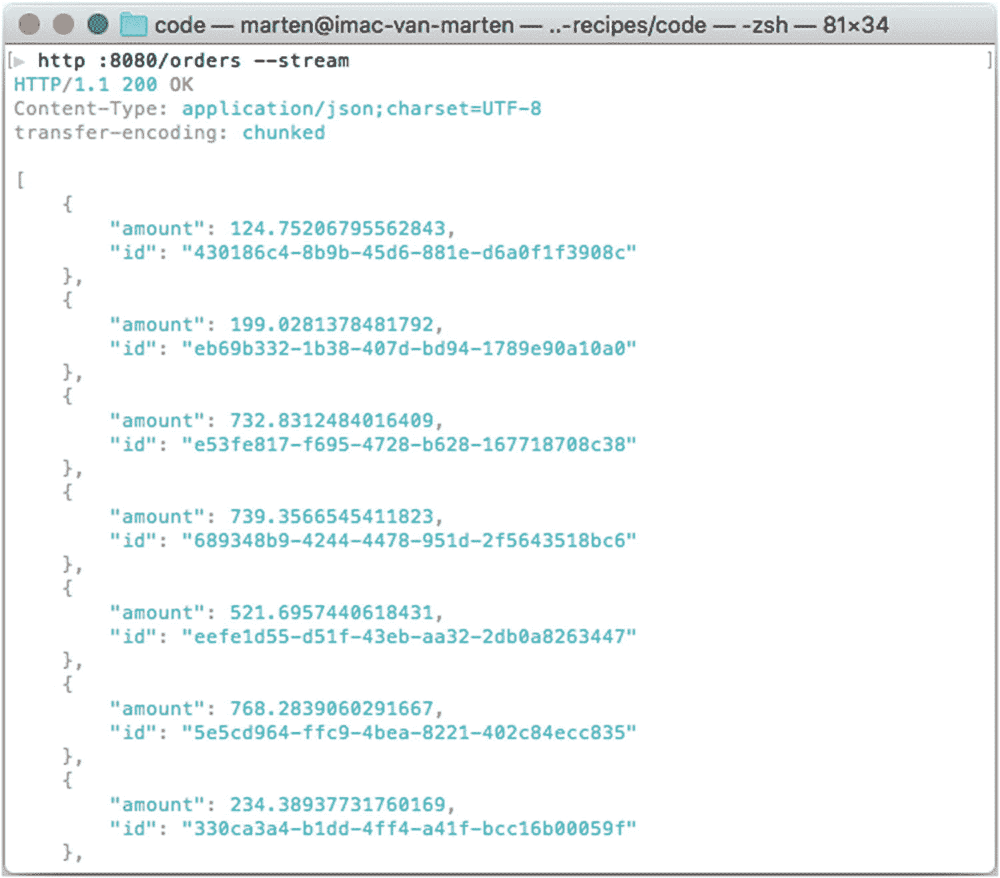
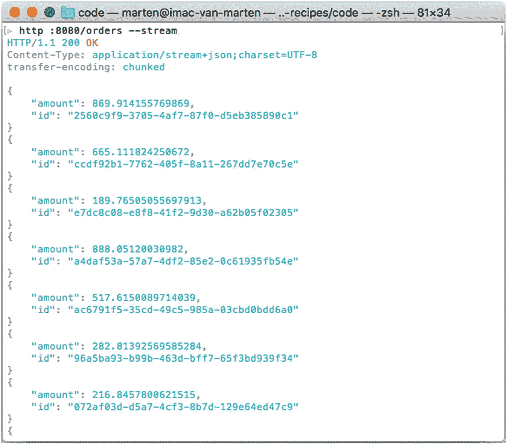
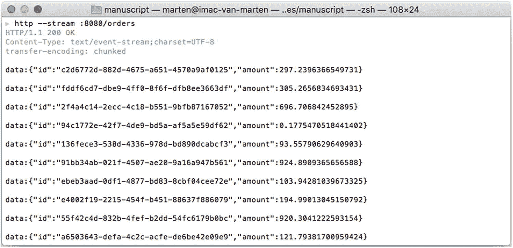
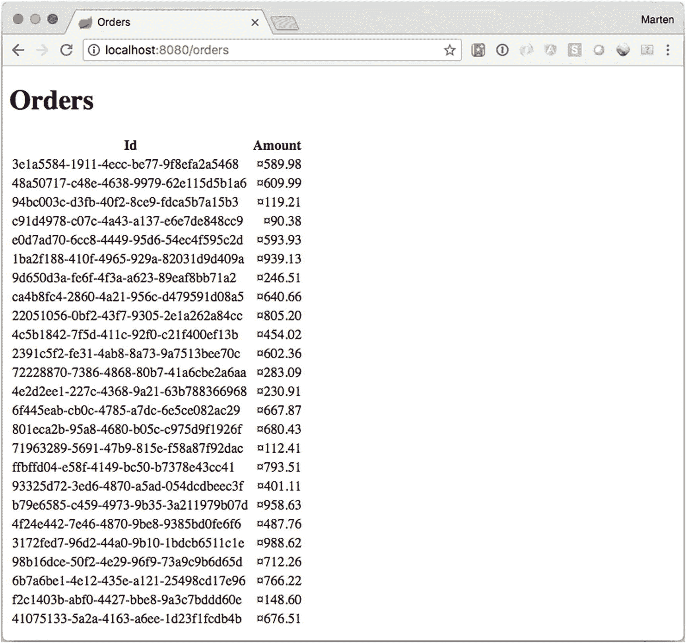
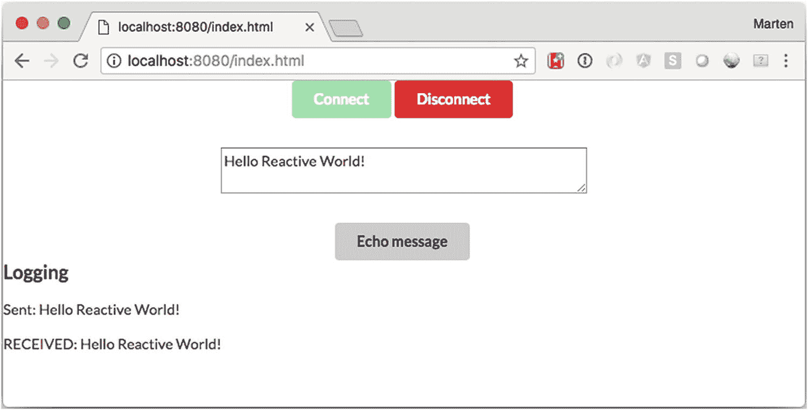

# 5. Spring WebFlux

## 5.1 使用 Spring WebFlux 开发响应式应用

### 问题

你想使用 Spring WebFlux 开发一个简单的响应式 Web 应用程序，以学习该框架的基本概念和配置。


### 解决方案

Spring WebFlux 最底层的组件是 `HttpHandler`，它是一个包含单个 `handle` 方法的接口。

```
public interface HttpHandler {
Mono handle(ServerHttpRequest request, ServerHttpResponse response);
}
```

`handle` 方法返回一个 `Mono<Void>`，这是响应式编程中表示返回 `void` 的方式。它接收来自 `org.springframework.http.server.reactive` 包中的 `ServerHttpRequest` 和 `ServerHttpResponse` 对象。这些同样是接口，根据运行时所使用的容器，会创建相应的接口实例。为此，存在多种针对不同容器的适配器或桥接器；当运行在支持非阻塞 IO 的 Servlet 3.1 容器上时，会使用 `ServletHttpHandlerAdapter`（或其子类）来从普通的 Servlet 世界适配到响应式世界。当运行在像 Netty^(²⁴) 这样的原生响应式引擎上时，则会使用 `ReactorHttpHandlerAdapter`。

当 Web 请求发送到 Spring WebFlux 应用程序时，`HandlerAdapter` 首先接收该请求。然后，它会组织在 Spring 应用上下文中配置的各种组件——这些组件都是处理请求所必需的。

要在 Spring WebFlux 中定义一个控制器类，需要使用 `@Controller` 或 `@RestController` 注解标记该类（这与 Spring MVC 相同；参见第 3 章）。

当一个被 `@Controller` 注解的类（即控制器类）接收到请求时，它会寻找合适的处理器方法来处理该请求。这要求控制器类通过一个或多个处理器映射将每个请求映射到一个处理器方法。为此，控制器类的方法需要使用 `@RequestMapping` 注解进行修饰，使其成为处理器方法。

这些处理器方法的签名——正如你对任何标准类所期望的那样——是开放式的。你可以为处理器方法指定任意名称，并定义各种方法参数。同样，处理器方法可以返回一系列值中的任何一种（例如 `String` 或 `void`），具体取决于它所实现的应用程序逻辑。以下只是有效参数类型的部分列表，旨在让你有个概念。

1.  `ServerHttpRequest` 或 `ServerHttpResponse`
2.  来自 URL 的任意类型的请求参数，使用 `@RequestParam` 注解
3.  传入请求中包含的 Cookie 值，使用 `@CookieValue` 注解
4.  任意类型的请求头值，使用 `@RequestHeader` 注解
5.  任意类型的请求属性，使用 `@RequestAttribute` 注解
6.  `Map` 或 `ModelMap`，用于处理器方法向模型添加属性
7.  `WebSession`，用于会话

一旦控制器类选定了合适的处理器方法，它就会使用该请求调用处理器方法的逻辑。通常，控制器的逻辑会调用后端服务来处理请求。此外，处理器方法的逻辑可能会从众多输入参数（例如 `ServerHttpRequest`、`Map` 或 `Errors`）中添加或删除信息，这些参数将构成后续流程的一部分。

处理器方法处理完请求后，它会将控制权委托给一个视图，该视图表示为处理器方法的返回值。为了提供灵活的方法，处理器方法的返回值并不代表视图的具体实现（例如 `user.html` 或 `report.pdf`），而是代表一个逻辑视图（例如 `user` 或 `report`）——注意没有文件扩展名。

处理器方法的返回值可以是表示逻辑视图名称的 `String`，也可以是 `void`，在后一种情况下，会根据处理器方法或控制器的名称来确定默认的逻辑视图名称。

为了将信息从控制器传递到视图，处理器方法返回的是逻辑视图名称（`String` 或 `void`）并不重要，因为处理器方法的输入参数将对视图可用。

例如，如果处理器方法将 `Map` 和 `Model` 对象作为输入参数——并在处理器方法的逻辑中修改它们的内容——那么这些相同的对象将对处理器方法返回的视图可访问。

当控制器类接收到视图时，它会通过视图解析器将逻辑视图名称解析为特定的视图实现（例如 `user.html` 或 `report.fmt`）。视图解析器是在 Web 应用上下文中配置的一个 bean，它实现了 `ViewResolver` 接口。其职责是为逻辑视图名称返回一个特定的视图实现。

一旦控制器类将视图名称解析为视图实现，根据视图实现的设计，它会渲染由控制器处理器方法传递的对象（例如 `ServerHttpRequest`、`Map`、`Errors` 或 `WebSession`）。视图的职责是将处理器方法逻辑中添加的对象展示给用户。

### 工作原理

让我们编写一个来自配方 4-1 的 `HelloWorldApplication` 的响应式版本。

```
package com.apress.springbootrecipes.helloworld;
import org.springframework.web.bind.annotation.GetMapping;
import org.springframework.web.bind.annotation.RestController;
import reactor.core.publisher.Mono;
@RestController
public class HelloWorldController {
@GetMapping
public Mono hello() {
return Mono.just("Hello World, from Spring Boot 2!");
}
}
```

注意，`hello` 方法的返回类型是 `Mono<String>`，而不是普通的 `String`。`Mono` 正是使其具有响应式特性的关键。

#### 设置 Spring WebFlux 应用程序

为了能够以响应式方式处理请求，你需要启用 WebFlux。这可以通过添加对 `spring-boot-starter-webflux` 的依赖来实现。

```
org.springframework.boot
spring-boot-starter-webflux

```

这会引入所需的依赖项，例如 `spring-webflux` 和 Project Reactor（[`http://www.projectreactor.io`](http://www.projectreactor.io)）的依赖项。它还包括一个响应式运行时，默认情况下是 Netty。

现在一切已配置完毕，最后要做的是创建一个应用程序类。

```
package com.apress.springbootrecipes.library;
import org.springframework.boot.SpringApplication;
import org.springframework.boot.autoconfigure.SpringBootApplication;
@SpringBootApplication
public class HelloWorldApplication {
public static void main(String[] args) {
SpringApplication.run(HelloWorldApplication.class, args);
}
}
```

Spring Boot 将检测响应式运行时，并使用 `server.*` 属性对其进行配置（参见配方 3-7）。

#### 创建 Spring WebFlux 控制器

基于注解的控制器类可以是任意类，不需要实现特定接口或继承特定基类。你可以使用 `@Controller` 或 `@RestController` 注解对其进行注解。控制器中可以定义一个或多个处理器方法来处理单个或多个操作。处理器方法的签名足够灵活，可以接受一系列参数。

```
package com.apress.springbootrecipes.helloworld;
import org.springframework.web.bind.annotation.GetMapping;
import org.springframework.web.bind.annotation.RestController;
import reactor.core.publisher.Mono;
@RestController
public class HelloWorldController {
@GetMapping("/hello")
public Mono hello() {
return Mono.just("Hello World, from Reactive Spring Boot 2!");
}
}
```

注解 `@GetMapping` 用于将 `hello` 方法修饰为控制器的 HTTP GET 处理器方法。值得一提的是，如果没有声明默认的 HTTP GET 处理器方法，则会抛出 `ServletException`——因此控制器至少拥有一个 URL 路由和至少一个处理器方法至关重要。由于 `@GetMapping` 中的表达式，该方法绑定到 `/hello`。

当对 `/hello` 发起请求时，它将响应式地返回 `Hello World, from Reactive Spring Boot 2!`，尽管客户端不会注意到这一点。对于客户端来说，它仍然是一个普通的 HTTP 请求。


#### 响应式控制器的单元测试

对控制器进行集成测试有两种方式。第一种是直接编写测试，创建 `HelloWorldController` 的实例，调用其方法，并对结果进行断言。第二种是使用 `@WebFluxTest` 注解来创建测试。后者会启动一个包含 Web 基础设施的最小化应用上下文，你可以使用 `MockMvc` 来测试控制器。这种方式介于纯单元测试和完整集成测试之间。

```
package com.apress.springbootrecipes.helloworld;
import org.junit.Test;
import reactor.core.publisher.Mono;
import reactor.test.StepVerifier;
public class HelloWorldControllerTest {
private final HelloWorldController controller = new HelloWorldController();
@Test
public void shouldSayHello() {
Mono result = controller.hello();
StepVerifier.create(result)
.expectNext("Hello World, from Reactive Spring Boot 2!")
.verifyComplete();
}
}
```

这是一个基础的单元测试。它实例化了控制器，并直接调用了待测试的方法。它使用了 `reactive-test` 模块中的 `StepVerifier` 来简化测试过程。调用 `hello` 方法后，使用 `StepVerifier` 对结果进行验证。

添加 `reactive-test` 依赖的方式如下：

```
io.projectreactor
reactor-test
test

```

第二种选择是针对特定控制器使用 `@WebFluxTest`。

```
@RunWith(SpringRunner.class)
@WebFluxTest(HelloWorldController.class)
public class HelloWorldControllerSliceTest {
@Autowired
private WebTestClient webClient;
@Test
public void shouldSayHello() {
webClient.get().uri("/hello").accept(MediaType.TEXT_PLAIN)
.exchange()
.expectStatus().isOk()
.expectBody(String.class)
.isEqualTo("Hello World, from Reactive Spring Boot 2!");
}
}
```

此测试会启动一个最小化的 Spring Boot 上下文，并自动检测项目中所有与 Web 相关的 Bean，例如 `@ControllerAdvice`、`@Controller` 等。现在不再直接调用 `HelloWorldController`，而是使用特殊的 `WebTestClient` 来声明一个请求 `.get().uri("/hello")`，并通过 `exchange()` 以非阻塞方式发送该请求。最后，对断言/期望进行验证。预期该请求应返回 OK 状态，并包含指定的响应体。

#### 响应式控制器的集成测试

集成测试看起来与上一节的 `@WebFluxTest` 非常相似。主要区别在于使用 `@SpringBootTest` 而不是 `@WebFluxTest`。使用 `@SpringBootTest` 会启动完整的应用程序，包括所有其他 Bean（服务、仓库等）。通过 `webEnvironment` 可以指定要使用的环境：可选值有 `RANDOM_PORT`、`MOCK`（默认）、`DEFINED_PORT` 和 `NONE`。这里我们使用随机端口，并再次使用 `WebTestClient` 来发起请求。

```
@RunWith(SpringRunner.class)
@SpringBootTest(webEnvironment = SpringBootTest.WebEnvironment.RANDOM_PORT)
public class HelloWorldControllerIntegrationTest {
@Autowired
private WebTestClient webClient;
@Test
public void shouldSayHello() {
webClient.get().uri("/hello").accept(MediaType.TEXT_PLAIN)
.exchange()
.expectStatus().isOk()
.expectBody(String.class)
.isEqualTo("Hello World, from Reactive Spring Boot 2!");
}
}
```

请求被发送到内嵌服务器，之后验证结果的状态和响应体内容是否正确。

### 注意

当使用 `MOCK`（也是默认值）作为 `webEnvironment` 时，必须添加 `@AutoConfigureWebTestClient` 注解才能获取用于测试的 `WebTestClient`。

## 5.2 使用响应式 REST 服务进行发布和消费

### 问题

你想要编写一个能够生成 JSON 的响应式 REST 端点。

### 解决方案

与常规的 `@RestController` 一样，你可以返回一个普通对象或对象列表，这些对象将被发送给客户端。为了使它们具有响应式特性，你需要将这些返回值包装成对应的响应式类型：`Mono` 或 `Flux`。


### 工作原理

让我们从编写一个响应式的 `OrderService` 开始。每个方法将返回一个 `Mono<Order>` 或 `Flux<Order>`。

```
package com.apress.springbootrecipes.order;
@Service
public class OrderService {
private final Map orders = new ConcurrentHashMap(10);
@PostConstruct
public void init() {
OrderGenerator generator = new OrderGenerator();
for (int i = 0; i  findById(String id) {
return Mono.justOrEmpty(orders.get(id));
}
public Mono save(Mono order) {
return order.map(this::save);
}
private Order save(Order order) {
orders.put(order.getId(), order);
return order;
}
public Flux orders() {
return Flux.fromIterable(orders.values()).delayElements(Duration.ofMillis(128));
}
}
```

`OrderService` 在启动时创建 25 个随机订单。它提供了一些简单的方法来获取或保存订单。当检索所有订单时，它会延迟 128 毫秒再返回。除了这个服务，还需要创建一个基础的 `Order` 类和 `OrderGenerator`。

```
package com.apress.springbootrecipes.order;
// 导入已省略
public class Order {
private String id;
private BigDecimal amount;
public Order() {
}
public Order(String id, BigDecimal amount) {
this.id=id;
this.amount = amount;
}
public String getId() {
return id;
}
public void setId(String id) {
this.id = id;
}
public BigDecimal getAmount() {
return amount;
}
public void setAmount(BigDecimal amount) {
this.amount = amount;
}
@Override
public String toString() {
return String.format("Order [id='%s', amount=%4.2f]", id, amount);
}
@Override
public boolean equals(Object o) {
if (this == o) return true;
if (o == null || getClass() != o.getClass()) return false;
Order order = (Order) o;
return Objects.equals(id, order.id) &&
Objects.equals(amount, order.amount);
}
@Override
public int hashCode() {
return Objects.hash(id, amount);
}
}
```

这是完整的 `Order` 类；它只包含一个 id 和一个总金额。

`OrderGenerator` 是一个用于创建 `Order` 实例的简单组件。

```
package com.apress.springbootrecipes.order;
import java.math.BigDecimal;
import java.util.UUID;
import java.util.concurrent.ThreadLocalRandom;
public class OrderGenerator {
public Order generate() {
var amount = ThreadLocalRandom.current().nextDouble(1000.00);
return new Order(UUID.randomUUID().toString(),
BigDecimal.valueOf(amount));
}
}
```

需要一个 `OrderController` 来将 `Order` 暴露为 REST 资源。

```
package com.apress.springbootrecipes.order.web;
import com.apress.springbootrecipes.order.Order;
import com.apress.springbootrecipes.order.OrderService;
import org.springframework.web.bind.annotation.*;
import reactor.core.publisher.Flux;
import reactor.core.publisher.Mono;
@RestController
@RequestMapping("/orders")
public class OrderController {
private final OrderService orderService;
OrderController(OrderService orderService) {
this.orderService = orderService;
}
@PostMapping
public Mono store(@RequestBody Mono order) {
return orderService.save(order);
}
@GetMapping("/{id}")
public Mono find(@PathVariable("id") String id) {
return orderService.findById(id);
}
@GetMapping
public Flux list() {
return orderService.orders();
}
}
```

`OrderController` 映射到 `/orders`，支持列出所有订单或单个订单，以及添加/修改订单。为了启动所有组件，需要一个简单的 `OrderApplication`。

```
package com.apress.springbootrecipes.order;
import org.springframework.boot.SpringApplication;
import org.springframework.boot.autoconfigure.SpringBootApplication;
@SpringBootApplication
public class OrderApplication {
public static void main(String[] args) {
SpringApplication.run(OrderApplication.class, args);
}
}
```

使用类似 cUrl 或 httpie 的工具，你可以查询端点。

执行 `http http://localhost:8080/orders --stream` 应该会列出系统中的所有订单（图 5-1），而 `http http://localhost:8080/orders/{some-id}` 应该会列出单个订单。



图 5-1

获取所有订单的结果

#### 流式 JSON

对 `/orders` 的调用结果并不是流式的，而是阻塞的。它会在发送结果之前先收集所有结果。另请参见图 5-1 中的 Content-Type 标头；它被设置为 `application/json`。要流式传输结果，它应该是 `application/stream+json`。为此，修改控制器的 `list` 方法。

```
@GetMapping(produces = MediaType.APPLICATION_STREAM_JSON_VALUE)
public Flux list() {
return orderService.orders();
}
```

注意 `produces = MediaType.APPLICATION_STREAM_JSON_VALUE`。这指示 Spring 在某个部分准备就绪时流式传输结果。重新启动应用程序，再次执行 `http http://localhost:8080/orders --stream`。结果将缓慢地流式传入，直到没有更多内容可消费（图 5-2）。



图 5-2

流式传输所有订单的结果

结果也略有变化：不再返回一个订单数组（见图 5-1），而是返回单个订单（见图 5-2）。

#### 服务器发送事件

除了使用 JSON 流，还可以使用服务器发送事件。使用 WebFlux，只需将 `@GetMapping` 中的 produces 改为 `MediaType.TEXT_EVENT_STREAM_VALUE` 即可。然后事件将被写入。

```
@GetMapping(produces = MediaType.TEXT_EVENT_STREAM_VALUE)
public Flux list() {
return orderService.orders();
}
```

重新启动应用程序，再次执行 `http http://localhost:8080/orders --stream`。结果将以事件的形式缓慢地流式传入，直到没有更多内容可消费（图 5-3）。请注意，内容类型已更改为 `text/event-stream`。



图 5-3

以事件形式流式传输所有订单的结果


#### 编写集成测试

使用 `WebTestClient` 和 `MOCK` Web 环境（也可以使用 `RANDOM_PORT` 代替 `MOCK`），可以非常轻松地为 `OrderController` 编写集成测试。

```
package com.apress.springbootrecipes.order.web;
import com.apress.springbootrecipes.order.Order;
import org.junit.Test;
import org.junit.runner.RunWith;
import org.springframework.beans.factory.annotation.Autowired;
import org.springframework.boot.test.autoconfigure.web.reactive.AutoConfigureWebTestClient;
import org.springframework.boot.test.context.SpringBootTest;
import org.springframework.test.annotation.DirtiesContext;
import org.springframework.test.context.junit4.SpringRunner;
import org.springframework.test.web.reactive.server.WebTestClient;
import java.math.BigDecimal;
@RunWith(SpringRunner.class)
@SpringBootTest(webEnvironment = SpringBootTest.WebEnvironment.MOCK)
@AutoConfigureWebTestClient
@DirtiesContext(classMode = DirtiesContext.ClassMode.AFTER_EACH_TEST_METHOD)
public class OrderControllerIntegrationTest {
@Autowired
private WebTestClient webTestClient;
@Test
public void listOrders() {
webTestClient.get().uri("/orders")
.exchange()
.expectStatus().isOk()
.expectBodyList(Order.class).hasSize(25);
}
@Test
public void addAndGetOrder() {
var order = new Order("test1", BigDecimal.valueOf(1234.56));
webTestClient.post().uri("/orders").syncBody(order)
.exchange()
.expectStatus().isOk()
.expectBody(Order.class).isEqualTo(order);
webTestClient.get().uri("/orders/{id}", order.getId())
.exchange()
.expectStatus().isOk()
.expectBody(Order.class).isEqualTo(order);
}
}
```

这里需要 `@DirtiesContext`，因为 `OrderService` 是一个有状态的 Bean。因此，在向集合中添加一个 `Order` 后，需要为下一个测试重置它。由于使用了带有模拟环境的 `@SpringBootTest`，测试将启动完整的应用程序。对于模拟环境，需要 `@AutoConfigureWebTestClient` 来获取 `WebTestClient`。`WebTestClient` 使得构建请求并将其发送到服务器变得容易。发送响应后，它可以对结果进行断言。

## 5.3 使用 Thymeleaf 作为模板引擎

### 问题

你希望在基于 WebFlux 的应用程序中渲染视图。

### 解决方案

使用 Thymeleaf 创建视图，并以响应式方式返回视图名称并填充模型。

### 工作原理

添加对 `spring-boot-starter-webflux` 和 `spring-boot-starter-thymeleaf` 的依赖。这足以让 Spring Boot 自动配置 Thymeleaf 以在 WebFlux 应用程序中使用。

```
org.springframework.boot
spring-boot-starter-webflux

org.springframework.boot
spring-boot-starter-thymeleaf

```

添加此依赖后，你将获得 Thymeleaf 库以及 Thymeleaf Spring 方言，以便它们能够很好地集成。由于这两个库的存在，Spring Boot 将自动配置 `ThymeleafReactiveViewResolver`。

`ThymeleafReactiveViewResolver` 需要一个 Thymeleaf `ISpringWebFluxTemplateEngine` 才能解析和渲染视图。一个特殊的 `SpringWebFluxTemplateEngine` 将预先配置好 `SpringDialect`，以便你可以在 Thymeleaf 页面中使用 SpEL。

为了配置 Thymeleaf，Spring Boot 在 `spring.thymeleaf` 和 `spring.thymeleaf.reactive` 命名空间中公开了几个属性（表 5-1）。

表 5-1

常见的 Thymeleaf 属性

| 属性 | 描述 |
| --- | --- |
| `spring.thymeleaf.prefix` | 用于 `ViewResolver` 的 `前缀`，默认为 `classpath:/templates/` |
| `spring.thymeleaf.suffix` | 用于 `ViewResolver` 的 `后缀`，默认为 `.html` |
| `spring.thymeleaf.encoding` | 模板的编码，默认为 `UTF-8` |
| `spring.thymeleaf.check-template` | 在渲染前检查模板是否存在，默认为 `true`。 |
| `spring.thymeleaf.check-template-location` | 检查模板位置是否存在。默认为 true。 |
| `spring.thymeleaf.mode` | 要使用的 Thymeleaf `TemplateMode`，默认为 `HTML` |
| `spring.thymeleaf.cache` | 解析后的模板是否应被缓存，默认为 `true` |
| `spring.thymeleaf.template-resolver-order` | `ViewResolver` 的顺序，默认为 1 |
| `spring.thymeleaf.view-names` | 可以使用此 `ViewResolver` 解析的视图名称（逗号分隔） |
| `spring.thymeleaf.exclude-view-names` | 被排除解析的视图名称（逗号分隔） |
| `spring.thymeleaf.enabled` | 是否启用 Thymeleaf，默认为 `true` |
| `spring.thymeleaf.enable-spring-el-compiler` | 启用 SpEL 表达式的编译，默认为 `false` |
| `spring.thymeleaf.reactive.max-chunk-size` | 用于写入响应的数据缓冲区的最大大小（以字节为单位）。默认为 0 |
| `spring.thymeleaf.reactive.media-types` | 此视图技术支持的媒体类型，例如 `text/html` |
| `spring.thymeleaf.reactive.full-mode-view-names` | 应以 FULL 模式运行的视图名称的逗号分隔列表。默认为无。FULL 模式基本上意味着阻塞模式。 |
| `spring.thymeleaf.reactive.chunked-mode-view-names` | 应以分块模式运行的视图名称的逗号分隔列表 |

#### 使用 Thymeleaf 视图

首先在 `src/main/resources/templates` 目录中创建一个 `index.html`。

```

Spring Boot - 订单

订单管理系统
订单列表

```

此页面将渲染一个包含单个链接的简单页面，该链接指向 `/orders`。此 URL 使用 `th:href` 标签渲染，该标签会将 `/orders` 扩展为正确的 URL。接下来，编写一个控制器来选择要渲染的页面。

```
package com.apress.springbootrecipes.order.web
@Controller
class IndexController {
@GetMapping
public String index() {
return "index";
}
}
```

编写一个 `OrderController`，它将返回 `orders/list` 作为视图名称，并将 `Flux<Order>` 添加到模型中。

```
package com.apress.springbootrecipes.order.web
@Controller
@RequestMapping("/orders")
class OrderController {
private final OrderService orderService;
OrderController(OrderService orderService) {
this.orderService = orderService;
}
@GetMapping
public Mono list(Model model) {
var orders = orderService.orders();
model.addAttribute("orders", orders);
return Mono.just("orders/list");
}
}
```

关于 `Order`、`OrderService` 及相关对象，请参见配方 5.2。

现在控制器和其他所需组件已准备就绪，需要一个视图。在 `src/main/resources/templates/orders` 目录中创建一个 `list.html`。此页面将渲染一个表格，显示不同订单的 id 和金额。

```

订单

订单

编号
金额

```

最后，`OrderApplication` 用于启动应用程序。

```
@SpringBootApplication
public class OrderApplication {
public static void main(String[] args) {
SpringApplication.run(OrderApplication.class, args);
}
}
```

现在，启动应用程序并点击链接，你将看到一个显示订单的页面。参见图 5-4。



图 5-4

订单列表


#### 提升响应速度

运行应用程序并打开页面时，您需要等待一段时间页面才会开始渲染。当渲染页面且模型包含 `Flux` 时，默认会等待整个 `Flux` 被消费完毕，之后才开始渲染页面。其行为本质上与检索 `Collection` 而非 `Flux` 类似。为了更快开始渲染页面并实现流式传输，请将 `Flux` 包装在 `ReactiveDataDriverContextVariable` 中。

```
@GetMapping
public Mono list(Model model) {
var orders = orderService.orders();
model.addAttribute("orders", new ReactiveDataDriverContextVariable(orders, 5));
return Mono.just("orders/list");
}
```

`list` 方法看起来相同，但请注意 `Flux` 被包装在了 `ReactiveDataDriverContextVariable` 中。一旦接收到五个元素，它就会开始渲染，并持续渲染页面直至接收完所有数据。现在打开订单页面时，您会看到表格逐渐增长，直到所有订单都被读取完毕。

## 5.4 WebFlux 与 WebSocket

### 问题

您希望在响应式应用程序中使用 WebSocket。

### 解决方案

将 `javax.websocket-api` 作为依赖项引入，并使用响应式的 `WebSocketHandler` 接口来实现处理器。

### 工作原理

在 `spring-boot-starter-webflux` 旁边添加 `javax.websocket-api` 依赖项，就足以在响应式应用程序中启用 WebSocket 支持。

```
org.springframework.boot
spring-boot-starter-webflux

javax.websocket
javax.websocket-api
1.1

```

Spring WebFlux 要求使用 WebSocket 1.1 版本。如果使用 1.0 版本，代码将无法运行。

接下来，使用 `WebSocketHandler` 来实现一个响应式处理器。

```
package com.apress.springbootrecipes.echo;
import org.springframework.web.reactive.socket.WebSocketHandler;
import org.springframework.web.reactive.socket.WebSocketSession;
import reactor.core.publisher.Mono;
public class EchoHandler implements WebSocketHandler {
@Override
public Mono handle(WebSocketSession session) {
return session.send(
session.receive()
.map( msg -> "RECEIVED: " + msg.getPayloadAsText())
.map(session::textMessage));
}
}
```

`EchoHandler` 会接收一条消息，并返回在其前面加上“RECEIVED: ”前缀的消息（非响应式版本请参见配方 4.4）。

使用 WebFlux 设置 WebSocket 需要注册几个组件。首先我们需要处理器。处理器需要使用 `SimpleUrlHandlerMapping` 映射到一个 URL。我们需要能够调用处理器的组件，此处为 `WebSocketHandlerAdapter`。最后一步是让 `WebSocketHandlerAdapter` 理解传入的响应式运行时请求。由于我们使用 Netty（默认），我们需要使用 `ReactorNettyRequestUpgradeStrategy` 配置一个 `WebSocketService`。

```
package com.apress.springbootrecipes.echo;
import org.springframework.boot.SpringApplication;
import org.springframework.boot.autoconfigure.SpringBootApplication;
import org.springframework.context.annotation.Bean;
import org.springframework.core.Ordered;
import org.springframework.web.reactive.HandlerMapping;
import org.springframework.web.reactive.handler.SimpleUrlHandlerMapping;
import org.springframework.web.reactive.socket.WebSocketHandler;
import org.springframework.web.reactive.socket.server.WebSocketService;
import org.springframework.web.reactive.socket.server.support.HandshakeWebSocketService;
import org.springframework.web.reactive.socket.server.support.WebSocketHandlerAdapter;
import org.springframework.web.reactive.socket.server.upgrade.ReactorNettyRequestUpgradeStrategy;
import java.util.HashMap;
import java.util.Map;
@SpringBootApplication
public class EchoApplication {
public static void main(String[] args) {
SpringApplication.run(EchoApplication.class, args);
}
@Bean
public EchoHandler echoHandler() {
return new EchoHandler();
}
@Bean
public HandlerMapping handlerMapping() {
Map map = new HashMap();
map.put("/echo", echoHandler());
var mapping = new SimpleUrlHandlerMapping();
mapping.setUrlMap(map);
mapping.setOrder(Ordered.HIGHEST_PRECEDENCE);
return mapping;
}
@Bean
public WebSocketHandlerAdapter handlerAdapter() {
return new WebSocketHandlerAdapter(webSocketService());
}
@Bean
public WebSocketService webSocketService() {
var strategy = new ReactorNettyRequestUpgradeStrategy();
return new HandshakeWebSocketService(strategy);
}
}
```

现在您可以启动服务器，并使用 WebFlux 处理 WebSocket。

#### HTML 与 JavaScript 回声客户端

现在服务器已就绪，我们需要一个客户端来连接我们的 WebSocket 端点。为此，您需要一些 JavaScript 和 HTML。编写以下 `app.js` 并将其放置在 `src/main/resources/static` 目录中。

```
var ws = null;
var url = "ws://localhost:8080/echo";
function setConnected(connected) {
document.getElementById('connect').disabled = connected;
document.getElementById('disconnect').disabled = !connected;
document.getElementById('echo').disabled = !connected;
}
function connect() {
ws = new WebSocket(url);
ws.onopen = function () {
setConnected(true);
};
ws.onmessage = function (event) {
log(event.data);
};
ws.onclose = function (event) {
setConnected(false);
log('Info: Closing Connection.');
};
}
function disconnect() {
if (ws != null) {
ws.close();
ws = null;
}
setConnected(false);
}
function echo() {
if (ws != null) {
var message = document.getElementById('message').value;
log('Sent: ' + message);
ws.send(message);
} else {
alert('connection not established, please connect.');
}
}
function log(message) {
var console = document.getElementById('logging');
var p = document.createElement('p');
p.appendChild(document.createTextNode(message));
console.appendChild(p);
while (console.childNodes.length > 12) {
console.removeChild(console.firstChild);
}
console.scrollTop = console.scrollHeight;
}
```

这里有几个函数。第一个 `connect` 会在按下 **Connect** 按钮时被调用；这将打开一个到 `ws://localhost:8080/echo` 的 WebSocket 连接，该地址正是之前创建并注册的处理器。连接到服务器会创建一个 `WebSocket` JavaScript 对象，这使您能够在客户端监听消息和事件。这里定义了 `onopen`、`onmessage` 和 `onclose` 回调。最重要的是 `onmessage`，因为每当有消息从服务器传入时它都会被调用；此方法简单地调用 `log` 函数，该函数会将接收到的消息添加到屏幕上的 `logging` 元素中。

接下来是 `disconnect`，它将关闭 WebSocket 连接并清理 JavaScript 对象。最后是 `echo` 函数，它会在按下 **Echo message** 按钮时被调用。给定的消息将被发送到服务器（并最终被返回）。

要使用 `app.js`，请添加以下 `index.html`。

```

Connect
Disconnect

Echo message

Logging

```

现在部署应用程序后，您可以连接到回声 WebSocket 服务，发送一些消息，并让它们被返回（图 5-5）。



图 5-5

WebSocket 客户端输出


#### 编写集成测试

编写集成测试需要一些准备工作。需要与服务器建立 WebSocket 连接，手动发送消息并检查响应。但在此之前，需要先启动服务器。

要启动服务器，请使用 `@RunWith(SpringRunner.class)` 和 `@SpringBootTest(webEnvironment = SpringBootTest.WebEnvironment.RANDOM_PORT)` 注解一个类。我们实际上希望启动应用程序，而不是默认的 `WebEnvironment.MOCK`。在 `int` 字段上使用 `@LocalServerPort` 注解来获取实际的端口值。该值用于构造要连接的 `URI`。

```
package com.apress.springbootrecipes.echo;
@RunWith(SpringRunner.class)
@SpringBootTest(webEnvironment = SpringBootTest.WebEnvironment.RANDOM_PORT)
public class EchoHandlerIntegrationTest {
@LocalServerPort
private int port;
}
```

使用默认的 Java WebSocket API 测试 WebSocket 相当容易。为了进行测试，你可以编写一个基本的 WebSocket 客户端，用于记录接收到的消息和会话。为此，你需要一个 WebSocket 客户端，例如 Tomcat。

```
org.apache.tomcat.embed
tomcat-embed-websocket
test

```

然而，添加此客户端将导致启动 Tomcat 服务器，而不是我们想要的响应式 Netty。将以下内容添加到 `EchoHandlerIntegrationTest` 中以规避此问题。

```
public class EchoHandlerIntegrationTest {
// 类的其余部分已省略
@Configuration
@Import(EchoApplication.class)
public static class EchoHandlerIntegrationTestConfiguratation {
@Bean
public NettyReactiveWebServerFactory webServerFactory() {
return new NettyReactiveWebServerFactory();
}
}
}
```

这个额外的 `@Configuration` 类将显式启动 Netty 而不是 Tomcat。这样，我们就能在与正常运行应用程序时相同的运行时环境下进行测试。根据你的客户端（或测试方式），这可能不是必需的。

现在，使用 `@ClientEndpoint` 注解一个类，并使用 `@OnOpen`、`@OnClose` 和 `@OnMessage` 注解该类中的方法。这些带注解的方法将分别在连接打开、关闭和收到消息时接收回调。接下来是两个辅助方法：`sendTextAndWait` 和 `closeAndWait`。`sendTextAndWait` 将使用 `Session` 发送消息并等待响应。`closeAndWait` 将关闭会话并等待确认。最后，还有一些 getter 方法用于获取状态并在测试方法中进行验证。

```
@ClientEndpoint
public static class SimpleTestClientEndpoint {
private List received = new ArrayList();
private Session session;
private CloseReason closeReason;
private boolean closed = false;
@OnOpen
public void onOpen(Session session) {
this.session = session;
}
@OnClose
public void onClose(Session session, CloseReason reason) {
this.closeReason = reason;
this.closed = true;
}
@OnMessage
public void onMessage(String message) {
this.received.add(message);
}
public void sendTextAndWait(String text, long timeout)
throws IOException, InterruptedException {
var current = received.size();
session.getBasicRemote().sendText(text);
wait(() -> received.size() == current, timeout);
}
public void closeAndWait(long timeout)
throws IOException, InterruptedException {
if (session != null && !closed) {
session.close();
}
wait(() -> closeReason == null, timeout);
}
private void wait(Supplier condition, long timeout)
throws InterruptedException {
var waited = 0;
while (condition.get() && waited  getReceived() {
return this.received;
}
public boolean isClosed() {
return closed;
}
}
```

现在辅助类已就绪，可以编写测试了。使用 WebSocket `ContainerProvider` 获取容器。在进行实际连接之前，必须使用 `port` 字段构造 URI。接下来，使用 `connectToServer` 方法，通过 `SimpleTestClientEndpoint` 的实例连接到服务器。连接后，向服务器发送一条文本消息，等待一段时间，然后关闭连接（仅用于清理资源）。最后一步是对接收到的消息进行一些断言。

```
@Test
public void sendAndReceiveMessage() throws Exception {
var container = ContainerProvider.getWebSocketContainer();
var uri = URI.create("ws://localhost:" + port + "/echo");
var testClient = new SimpleTestClientEndpoint();
container.connectToServer(testClient, uri);
testClient.sendTextAndWait("Hello World!", 200);
testClient.closeAndWait(2);
assertThat(testClient.getReceived())
.containsExactly("RECEIVED: Hello World!");
}
```

脚注 1

