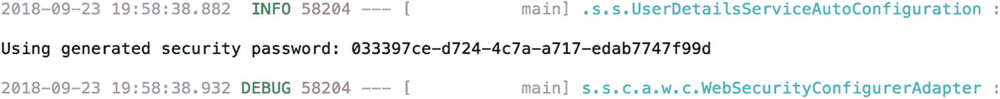
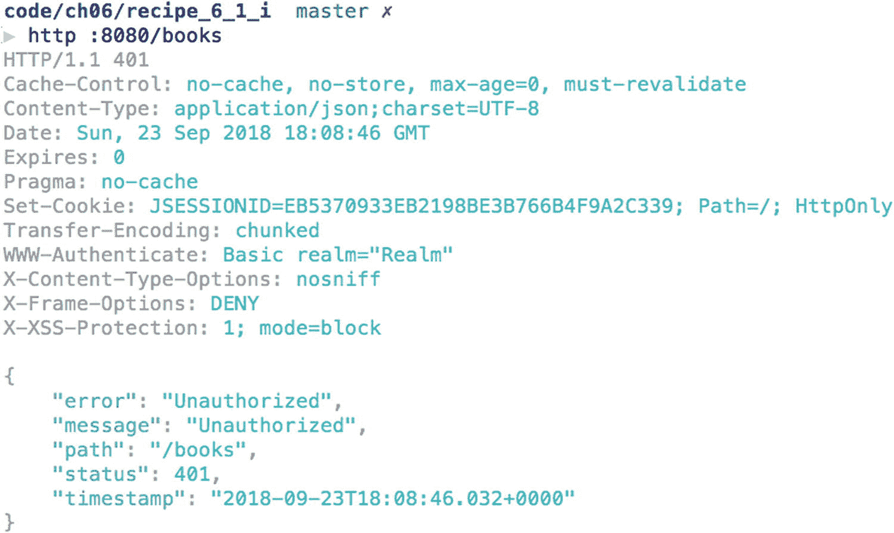
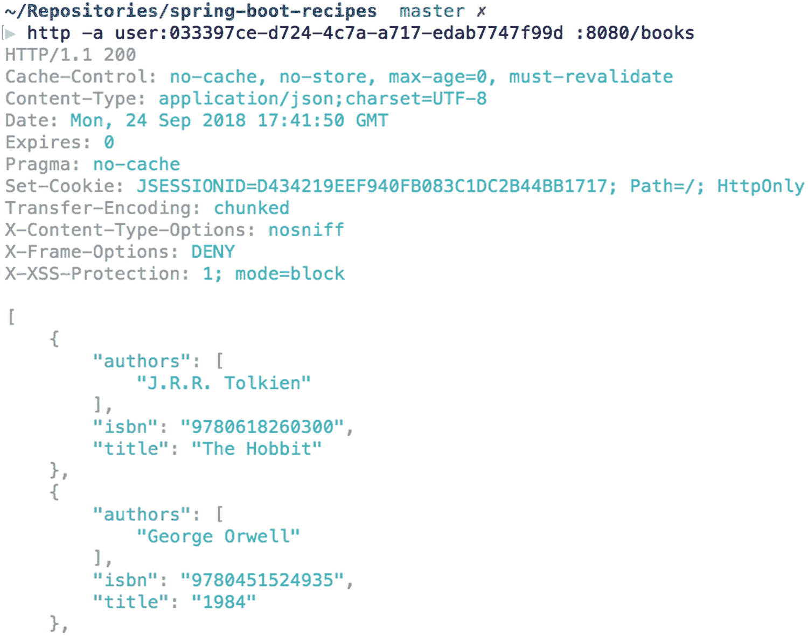
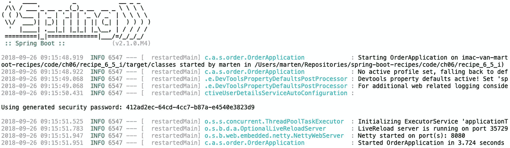
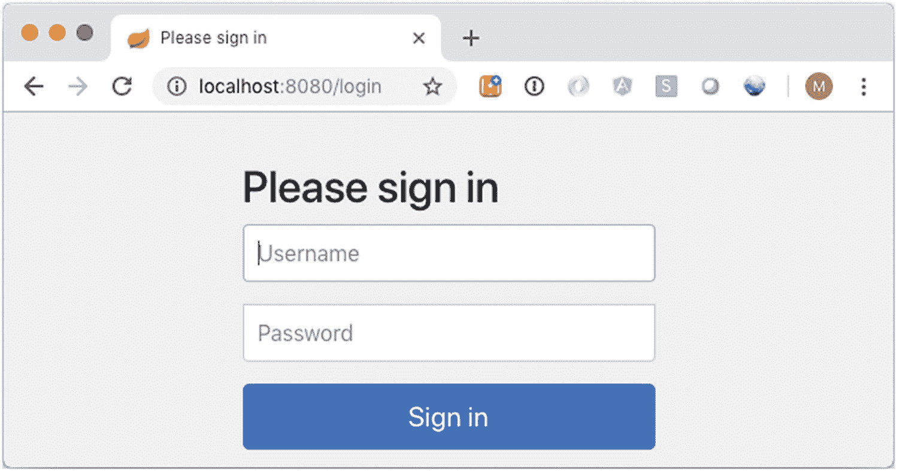

# 6. Spring Security

在本章中，我们将了解 Spring Boot 的 Spring Security^(²⁵) 集成。Spring Security 可用于应用程序的用户身份验证和授权。Spring Security 的身份验证和授权过程都具有可插拔机制，并且默认支持不同的机制。对于身份验证，Spring Security 开箱即用地支持 JDBC、LDAP 和属性文件。

## 6.1 在 Spring Boot 应用程序中启用安全性

### 问题

你有一个基于 Spring Boot 的应用程序，并且希望在此应用程序中启用安全性。

### 解决方案

添加 `spring-boot-starter-security` 作为依赖项，以便为你的应用程序自动配置和设置安全性。

### 工作原理

首先，你需要将 Spring Security 的库引入到你的应用程序中；为此，你可以将 `spring-boot-starter-security` 添加到依赖项列表中。

```
org.springframework.boot
spring-boot-starter-security

```

这将把 `spring-security-core`、`spring-security-config` 和 `spring-security-web` 依赖项添加到你的项目中。Spring Boot 会检测这些 JAR 文件中某些类的可用性，并据此自动启用安全性。

Spring Boot 将按以下方式配置 Spring Security：使用基本身份验证和表单登录进行身份验证；启用 HTTP 安全标头；Servlet API 集成；匿名登录；以及禁用资源缓存。


### 警告

Spring Boot 会添加一个默认用户，名为 `user`，并附带一个随机生成的密码，该密码可在启动日志中查看。这仅用于测试、原型开发或演示；请勿在生产系统中使用生成的用户！

当将依赖 `spring-boot-starter-security` 添加到配方 3.2 时，它会自动保护所有暴露的端点。启动时，生成的密码会被记录（图 6-1）。

表 6-1

默认用户的属性

| 属性 | 描述 |
| --- | --- |
| `spring.security.user.name` | 默认用户名，默认为 `user` |
| `spring.security.user.password` | 默认用户的密码，默认为生成的 `UUID` |
| `spring.security.user.roles` | 默认用户的角色。默认为空 |



图 6-1

生成的密码输出

Spring Boot 暴露了一些用于配置默认用户的属性；这些属性可以在 `spring.security` 命名空间中找到（表 6-1）。

添加依赖并启动 `LibraryApplication` 后，端点将被保护。当尝试从 `http://localhost:8080/books` 获取书籍列表时，结果将是一个 HTTP 状态码为 401（未授权）的响应（图 6-2）。



图 6-2

未认证的访问结果

当添加正确的认证头（用户名 `user`，密码来自日志或 `spring.security.user.password` 属性中指定的值）时，结果将是常规的书籍列表（图 6-3）。



图 6-3

已认证的访问结果

#### 测试安全性

当使用 Spring Security 保护端点并结合 `@WebMvcTest` 时，安全基础设施将自动应用。Spring Security 提供了一些有用的注解来帮助编写测试（表 6-2）。

### 注意

如果你想在没有安全性的情况下测试控制器，可以通过将 `@WebMvcTest` 上的 `secure` 属性设置为 `false` 来禁用安全性；其默认值为 `true`。

表 6-2

用于测试的 Spring Security 注解

| 注解 | 描述 |
| --- | --- |
| `@WithMockUser` | 以具有给定 `username`、`password` 和 `roles`/`authorities` 的用户身份运行 |
| `@WithAnonymousUser` | 以匿名用户身份运行 |
| `@WithUserDetails` | 以配置了名称的用户身份运行，会在 `UserDetailsService` 中进行查找 |

要使用这些注解，必须添加对 `spring-security-test` 的依赖。

```
org.springframework.security
spring-security-test
test

```

有了这个依赖，就可以扩展并修复来自配方 3.2 的 `BookControllerTest`。如果你不介意在测试中禁用安全性，可以在测试类上添加 `@WebMvcTest` `(value = BookController.class, secure = false)`。这样，安全过滤器就不会被添加，从而禁用安全性。测试将运行并通过。

```
@RunWith(SpringRunner.class)
@WebMvcTest(value = BookController.class, secure = false)
public class BookControllerUnsecuredTest { ... }
```

然而，如果你想在启用安全性的情况下进行测试，就需要对测试类做一些小的修改。首先，添加 `@WithMockUser` 以使用已认证的用户运行。其次，由于 Spring Security 默认启用了 CSRF^(²⁶) 保护，因此需要在请求中添加一个头或参数。当使用 Mock MVC 时，Spring Security 为此提供了一个 `RequestPostProcessor`，即 `CsrfRequestPostProcessor`。`SecurityMockMvcRequestPostProcessors` 包含了一些工厂方法，可以方便地使用它们。

```
@RunWith(SpringRunner.class)
@WebMvcTest(BookController.class)
@WithMockUser
public class BookControllerSecuredTest {
@Test
public void shouldAddBook() throws Exception {
when(bookService.create(any(Book.class))).thenReturn(new Book("123456789", "Test Book Stored", "T. Author"));
mockMvc.perform(post("/books")
.contentType(MediaType.APPLICATION_JSON)
.content("{ \"isbn\" : \"123456789\"}, \"title\" : \"Test Book\", \"authors\" : [\"T. Author\"]")
.with(csrf()))
.andExpect(status().isCreated())
.andExpect(header()
.string("Location", "http://localhost/books/123456789"));
}
}
```

现在，测试使用了 `@WithMockUser` 中指定的用户；这里使用了默认用户，用户名为 `user`，密码为 `password`。`with(csrf())` 这一行负责将 CSRF 令牌添加到请求中。

使用哪个选项取决于你的需求。例如，如果在控制器中需要当前用户，那么应该启用安全性，并使用 `@WithMockUser` 或 `@WithUserDetails`。如果不是这种情况，并且你可以在没有安全性的情况下测试控制器（并且你没有额外的安全规则 [参见配方 6.2]），那么你可以在禁用安全性的情况下运行。

#### 集成测试安全性

当使用 `@SpringBootTest` 编写集成测试时，能否使用 `@With*` 注解取决于具体情况。使用默认的模拟环境时，它仍然可以工作。

```
@RunWith(SpringRunner.class)
@SpringBootTest
@WithMockUser
@AutoConfigureMockMvc
public class BookControllerIntegrationMockTest { ... }
```

这个测试将创建一个几乎完整的应用程序，但仍然使用 Mock MVC 来访问端点。它仍然在与测试相同的进程中运行，这就是为什么 `@WithMockUser` 和 `with(csrf())` 仍然有效的原因。当在外部端口上运行测试时，它将不再有效。

要在某个端口上测试应用程序，你需要通过测试客户端 `TestRestTemplate` 和/或 `WebTestClient` 运行测试，并传递认证头，或者通过在集成测试中首先执行基于表单的登录来实现流程。要编写一个成功的集成测试，请注入 `TestRestTemplate`，并在执行实际请求之前使用 `withBasicAuth` 辅助方法来设置基本认证头。


### 提示

在编写此测试并使用默认用户时，你可能想通过 `spring.security.user.password` 设置一个默认密码。本示例使用 `@TestPropertySource` 来实现，但你也可以将其添加到 `application.properties` 中。

```
@RunWith(SpringRunner.class)
@SpringBootTest(webEnvironment = SpringBootTest.WebEnvironment.RANDOM_PORT)
@TestPropertySource(properties = "spring.security.user.password=s3cr3t")
public class BookControllerIntegrationTest {
@Autowired
private TestRestTemplate testRestTemplate;
@MockBean
private BookService bookService;
@Test
public void shouldReturnListOfBooks() throws Exception {
when(bookService.findAll()).thenReturn(Arrays.asList(
new Book("123", "Spring 5 Recipes", "Marten Deinum", "Josh Long"),
new Book("321", "Pro Spring MVC", "Marten Deinum", "Colin Yates")));
ResponseEntity books = testRestTemplate
.withBasicAuth("user", "s3cr3t")
.getForEntity("/books", Book[].class);
assertThat(books.getStatusCode()).isEqualTo(HttpStatus.OK);
assertThat(books.getBody()).hasSize(2);
}
}
```

该测试使用默认配置的 `TestRestTemplate` 发起请求。`withBasicAuth` 使用默认的 `user` 和预设的 `s3cr3t` 作为用户名和密码发送给服务器。`getForEntity` 可用于获取结果，包括关于响应的一些附加信息。通过 `ResponseEntity` 还可以验证状态码等。

在测试基于 WebFlux 的应用程序时，需要使用 `WebTestClient` 代替 `TestRestTemplate`（有关 Spring WebFlux 的更多信息，请参见第 5 章）。`WebTestClient` 提供了 `headers()` 函数来向请求添加额外的头部信息。它暴露了 `HttpHeaders`，而 `HttpHeaders` 又提供了便捷的 `setBasicAuth` 方法来应用基本认证。

```
@RunWith(SpringRunner.class)
@SpringBootTest(webEnvironment = SpringBootTest.WebEnvironment.RANDOM_PORT)
@TestPropertySource(properties = "spring.security.user.password=s3cr3t")
public class BookControllerIntegrationWebClientTest {
@Autowired
private WebTestClient webTestClient;
@MockBean
private BookService bookService;
@Test
public void shouldReturnListOfBooks() throws Exception {
when(bookService.findAll()).thenReturn(Arrays.asList(
new Book("123", "Spring 5 Recipes", "Marten Deinum", "Josh Long"),
new Book("321", "Pro Spring MVC", "Marten Deinum", "Colin Yates")));
webTestClient
.get()
.uri("/books")
.headers( headers -> headers.setBasicAuth("user", "s3cr3t"))
.exchange()
.expectStatus().isOk()
.expectBodyList(Book.class).hasSize(2);
}
}
```

请求被构建并通过 `exchange()` “触发”。然后期望结果是 HTTP 200（OK），并且结果包含两本书。

## 6.2 登录 Web 应用程序

### 问题

一个安全的应用程序要求其用户在访问某些安全功能之前先登录。这对于运行在开放互联网上的应用程序尤其重要，因为黑客可以轻易地访问它们。大多数应用程序必须提供一种方式，让用户输入其凭据来登录。

### 解决方案

Spring Security 支持多种方式让用户登录 Web 应用程序。它通过提供一个包含登录表单的默认网页来支持基于表单的登录。你也可以提供一个自定义网页作为登录页面。此外，Spring Security 通过处理 HTTP 请求头中呈现的基本认证凭据来支持 HTTP 基本认证。HTTP 基本认证也可用于对通过远程协议和 Web 服务发出的请求进行认证。

你应用程序的某些部分可能允许匿名访问（例如，访问欢迎页面）。Spring Security 提供了一个匿名登录服务，可以为匿名用户分配一个主体并授予权限，这样在定义安全策略时，你可以像处理普通用户一样处理匿名用户。

Spring Security 还支持“记住我”登录，它能够在多个浏览器会话中记住用户的身份，这样用户在首次登录后无需再次登录。

### 工作原理

当找不到显式的 `WebSecurityConfigurerAdapter` 时，Spring Boot 会启用默认的安全设置。当找到一个或多个时，它将使用这些配置来配置安全性。

为了帮助你更好地理解各种登录机制，我们首先禁用默认的安全配置。

### 警告

通常建议保留默认设置，只禁用你不需要的部分，例如 `httpBasic().disable()`，而不是禁用所有安全默认设置！

```
@Configuration
public class LibrarySecurityConfig extends WebSecurityConfigurerAdapter {
public LibrarySecurityConfig() {
super(true); // 禁用默认配置
}
}
```

请注意，如果你启用了 HTTP 自动配置，接下来介绍的登录服务将自动注册。但是，如果你禁用了默认配置或想要自定义这些服务，则必须显式配置相应的功能。

在启用认证功能之前，你需要先启用基本的 Spring Security 要求；你至少需要配置异常处理和安全上下文集成。

```
@Override
protected void configure(HttpSecurity http) {
http.securityContext()
.and()
.exceptionHandling();
}
```

没有这些基础，Spring Security 在登录后不会存储用户，也不会对安全相关的异常进行适当的异常转换（它们会直接冒泡，这可能会将你的一些内部信息暴露给外部）。你可能还想启用 Servlet API 集成，以便可以在视图中使用 `HttpServletRequest` 上的方法进行检查。

```
@Override
protected void configure(HttpSecurity http) {
http.servletApi();
}
```

#### HTTP 基本认证

HTTP 基本认证支持可以通过 `httpBasic()` 方法进行配置。当需要 HTTP 基本认证时，浏览器通常会显示一个登录对话框或特定于浏览器的登录页面供用户登录。

```
@Configuration
public class LibrarySecurityConfig extends WebSecurityConfigurerAdapter {
@Override
protected void configure(HttpSecurity http) throws Exception {
http
...
.httpBasic();
}
}
```


#### 基于表单的登录

基于表单的登录服务会渲染一个包含登录表单的网页，供用户输入登录信息并处理表单提交。该功能通过 `formLogin` 方法进行配置。

```
@Configuration
public class LibrarySecurityConfig extends WebSecurityConfigurerAdapter {
@Override
protected void configure(HttpSecurity http) throws Exception {
http
...
.formLogin();
}
}
```

默认情况下，Spring Security 会自动创建一个登录页面，并将其映射到 URL `/login`。因此，你可以在应用程序中添加一个指向该 URL 的链接（例如，在配方 3.3 的 `index.html` 中）：

```
Login
```

如果你不喜欢默认的登录页面，可以提供一个自定义的登录页面。例如，你可以在 `src/main/resources/templates` 目录下创建以下 `login.html` 文件（使用 Thymeleaf 时）。由于默认开启了 CSRF 保护，你需要在表单中添加一个 CSRF 令牌，这就是隐藏字段的作用。如果你禁用了 CSRF（不推荐），则应删除此行。

```

Login

body {
background-color: #DADADA;
}
body > .grid {
height: 100%;
}
.column {
max-width: 450px;
}

登录到您的账户

Login

```

为了让 Spring Security 在请求登录时显示你的自定义登录页面，你需要在 `loginPage` 配置方法中指定其 URL。

```
@Configuration
public class LibrarySecurityConfig extends WebSecurityConfigurerAdapter {
@Override
protected void configure(HttpSecurity http) throws Exception {
http
...
.formLogin().loginPage("/login");
}
}
```

最后，添加一个视图解析器，将 `/login` 映射到 `login.html` 页面。为此，你可以让 `LibrarySecurityConfig` 实现 `WebMvcConfigurer` 接口，并重写 `addViewControllers` 方法。

```
@Configuration
public class LibrarySecurityConfig extends WebSecurityConfigurerAdapter
implements WebMvcConfigurer {
...
public void addViewControllers(ViewControllerRegistry registry) {
registry.addViewController("/login").setViewName("login");
}
}
```

如果用户在请求安全 URL 时，Spring Security 显示了登录页面，那么登录成功后用户将被重定向到目标 URL。但是，如果用户直接通过其 URL 请求登录页面，默认情况下，登录成功后用户将被重定向到上下文路径的根目录（即 `http://localhost:8080/`）。如果你没有在 Web 部署描述符中定义欢迎页面，你可能希望在登录成功时将用户重定向到一个默认的目标 URL。

```
@Configuration
public class LibrarySecurityConfig extends WebSecurityConfigurerAdapter
implements WebMvcConfigurer {
@Override
protected void configure(HttpSecurity http) throws Exception {
http
...
.formLogin().loginPage("/login").defaultSuccessUrl("/books");
}
}
```

如果你使用 Spring Security 创建的默认登录页面，那么当登录失败时，Spring Security 会重新渲染登录页面并显示错误消息。但是，如果你指定了自定义登录页面，则必须配置 `authentication-failure-url` 来指定登录错误时要重定向到的 URL。例如，你可以再次重定向到自定义登录页面，并附带错误请求参数。

```
@Configuration
public class LibrarySecurityConfig extends WebSecurityConfigurerAdapter
implements WebMvcConfigurer {
@Override
protected void configure(HttpSecurity http) throws Exception {
http
...
.formLogin()
.loginPage("/login.html")
.defaultSuccessUrl("/books")
.failureUrl("/login.html?error=true");
}
}
```

然后，你的登录页面应检查是否存在 `error` 请求参数。如果发生错误，你需要通过访问会话范围属性 `SPRING_SECURITY_LAST_EXCEPTION` 来显示错误消息，该属性存储了 Spring Security 为当前用户抛出的最后一个 `Exception`。

```
...

认证失败
原因：

```

#### 注销服务

注销服务提供了一个处理注销请求的处理器。它可以通过 `logout()` 配置方法进行配置。

```
@Configuration
public class LibrarySecurityConfig extends WebSecurityConfigurerAdapter
implements WebMvcConfigurer {
@Override
protected void configure(HttpSecurity http) throws Exception {
http
...
.and()
.logout();
}
}
```

默认情况下，它被映射到 URL `/logout`，并且仅响应 POST 请求。你可以在页面中添加一个小的 HTML 表单来执行注销操作。

```
Logout
```

### 注意

使用 CSRF 保护时，不要忘记在表单中添加 CSRF 令牌，否则注销将失败。

默认情况下，注销成功后用户将被重定向到上下文路径的根目录，但有时你可能希望将用户引导到另一个 URL，这可以通过使用 `logoutSuccessUrl` 配置方法来实现。

```
@Configuration
public class LibrarySecurityConfig extends WebSecurityConfigurerAdapter
implements WebMvcConfigurer {
@Override
protected void configure(HttpSecurity http) throws Exception {
http
...
.and()
.logout().logoutSuccessUrl("/");
}
}
```

注销后，你可能会注意到，即使注销成功，使用浏览器的后退按钮仍然可以看到之前的页面。这是因为浏览器缓存了这些页面。通过使用 `headers()` 配置方法启用安全标头，可以指示浏览器不要缓存页面。

```
@Configuration
public class LibrarySecurityConfig extends WebSecurityConfigurerAdapter
implements WebMvcConfigurer {
@Override
protected void configure(HttpSecurity http) throws Exception {
http
...
.and()
.headers();
}
}
```

除了无缓存标头之外，这还会禁用内容嗅探并启用 X-Frame 保护。启用此功能后，使用浏览器的后退按钮时，你将被重定向到登录页面。

#### 匿名登录

匿名登录服务可以通过 Java 配置中的 `anonymous()` 方法进行配置，你可以在其中自定义匿名用户的 `username` 和 `authorities`，其默认值分别为 `anonymousUser` 和 `ROLE_ANONYMOUS`。

```
@Configuration
public class LibrarySecurityConfig extends WebSecurityConfigurerAdapter
implements WebMvcConfigurer {
@Override
protected void configure(HttpSecurity http) throws Exception {
http
...
.and()
.anonymous().principal("guest").authorities("ROLE_GUEST");
}
}
```

#### 记住我支持

记住我功能可以通过 Java 配置中的 `rememberMe()` 方法进行配置。默认情况下，它将 `username`、`password`、记住我过期时间以及一个私钥编码为令牌，并将其作为 cookie 存储在用户的浏览器中。下次用户访问同一个 Web 应用程序时，将检测到此令牌，从而使用户能够自动登录。

```
@Configuration
public class LibrarySecurityConfig extends WebSecurityConfigurerAdapter
implements WebMvcConfigurer {
@Override
protected void configure(HttpSecurity http) throws Exception {
http
...
.and()
.rememberMe();
}
}
```

然而，静态的记住我令牌可能会引发安全问题，因为它们可能被黑客捕获。Spring Security 支持滚动令牌以满足更高级的安全需求，但这需要数据库来持久化令牌。有关滚动记住我令牌部署的详细信息，请参阅 Spring Security 参考文档。

## 6.3 认证用户

### 问题

当用户尝试登录你的应用程序以访问其安全资源时，你必须对用户的主体进行认证，并向该用户授予权限。


### 解决方案

在 Spring Security 中，认证由一个或多个 `AuthenticationProvider` 执行，它们以链式结构连接。如果其中任何一个提供者成功验证了用户，该用户就能登录到应用程序。如果某个提供者报告用户被禁用、锁定或凭据不正确，或者没有任何提供者能够验证用户，那么该用户将无法登录此应用程序。

Spring Security 支持多种用户认证方式，并为此提供了内置的提供者实现。你可以通过内置的 XML 元素轻松配置这些提供者。最常见的认证提供者会针对存储用户详细信息的用户仓库（例如，在应用程序内存、关系数据库或 LDAP 仓库中）来验证用户。

在仓库中存储用户详细信息时，应避免以明文形式存储用户密码，因为这会使它们容易受到黑客攻击。相反，你应该始终在仓库中存储加密后的密码。一种典型的密码加密方式是使用单向哈希函数对密码进行编码。当用户输入密码登录时，你对该密码应用相同的哈希函数，并将结果与仓库中存储的密码进行比较。Spring Security 支持多种密码编码算法（包括 BCrypt 和 SCrypt），并为这些算法提供了内置的密码编码器。

### 工作原理

#### 使用内存定义进行用户认证

如果你的应用程序中只有少量用户，并且很少修改他们的详细信息，你可以考虑在 Spring Security 的配置文件中定义用户详细信息，这样它们将被加载到应用程序的内存中。

```
@Configuration
public class LibrarySecurityConfig extends WebSecurityConfigurerAdapter {
...
@Override
protected void configure(AuthenticationManagerBuilder auth)
throws Exception {
UserDetails adminUser = User.withDefaultPasswordEncoder()
.username("admin@books.io")
.password("secret")
.authorities("ADMIN","USER").build();
UserDetails normalUser = User.withDefaultPasswordEncoder()
.username("marten@books.io")
.password("user")
.authorities("USER").build();
UserDetails disabledUser = User.withDefaultPasswordEncoder()
.username("marten@books.io")
.password("user")
.disabled(true)
.authorities("USER").build();
auth.inMemoryAuthentication()
.withUser(adminUser)
.withUser(normalUser)
.withUser(disabledUser);
}
}
```

使用通过 `User.withDefaultPasswordEncoder()` 获取的 `UserBuild`，你可以构建带有加密密码的用户。它将使用 Spring Security 默认的密码编码器（默认情况下使用 BCrypt 编码）。你可以通过 `inMemoryAuthentication()` 方法添加用户详细信息；使用 `withUser` 方法，你可以定义用户。对于每个用户，你可以指定 `username`、`password`、禁用状态以及一组授予的 `authorities`。被禁用的用户无法登录应用程序。

#### 针对数据库进行用户认证

更常见的情况是，用户详细信息应存储在数据库中以便于维护。Spring Security 内置了从数据库查询用户详细信息的支持。默认情况下，它使用以下 SQL 语句查询用户详细信息（包括权限）：

```
SELECT username, password, enabled
FROM   users
WHERE  username = ?
SELECT username, authority
FROM   authorities
WHERE  username = ?
```

为了让 Spring Security 使用这些 SQL 语句查询用户详细信息，你必须在数据库中创建相应的表。例如，你可以使用以下 SQL 语句在数据库中创建它们：

```
CREATE TABLE USERS (
USERNAME    VARCHAR(50)    NOT NULL,
PASSWORD    VARCHAR(50)    NOT NULL,
ENABLED     SMALLINT       NOT NULL,
PRIMARY KEY (USERNAME)
);
CREATE TABLE AUTHORITIES (
USERNAME    VARCHAR(50)    NOT NULL,
AUTHORITY   VARCHAR(50)    NOT NULL,
FOREIGN KEY (USERNAME) REFERENCES USERS
);
```

接下来，你可以向这些表中输入一些用户详细信息用于测试。这两个表的数据如表 6-3 和表 6-4 所示。

表 6-3

USERS 表的测试用户数据

| USERNAME | PASSWORD | ENABLED |
| --- | --- | --- |
| admin@books.io | {noop}secret | 1 |
| marten@books.io | {noop}user | 1 |
| jdoe@books.net | {noop}unknown | 0 |

### 注意

密码字段中的 `{noop}` 表示存储的密码未应用任何加密。Spring Security 使用委托来确定使用哪种编码方法；值可以是 `{bcrypt}`、`{scrypt}`、`{pbkdf2}` 和 `{sha256}`。`{sha256}` 主要用于兼容性考虑，应视为不安全。

表 6-4

AUTHORITIES 表的测试用户数据

| USERNAME | AUTHORITY |
| --- | --- |
| admin@books.io | ADMIN |
| admin@books.io | USER |
| marten@books.io | USER |
| jdoe@books.net | USER |

为了让 Spring Security 访问这些表，你必须声明一个数据源，以便能够创建到该数据库的连接。

对于 Java 配置，使用 `jdbcAuthentication()` 配置方法并向其传递一个 `DataSource`。通常，这将是 Spring Boot 配置的 `DataSource`，可以通过 `spring.datasource` 属性进行配置（更多详情请参见配方 7.1）。

```
@Configuration
public class LibrarySecurityConfig extends WebSecurityConfigurerAdapter {
@Autowired
private DataSource dataSource;
@Override
protected void configure(AuthenticationManagerBuilder auth)
throws Exception {
auth.jdbcAuthentication().dataSource(dataSource);
}
}
```

然而，在某些情况下，你可能已经在遗留数据库中定义了自己的用户仓库。例如，假设表是使用以下 SQL 语句创建的，并且 `MEMBER` 表中的所有用户都处于启用状态：

```
CREATE TABLE MEMBER (
ID          BIGINT         NOT NULL,
USERNAME    VARCHAR(50)    NOT NULL,
PASSWORD    VARCHAR(32)    NOT NULL,
PRIMARY KEY (ID)
);
CREATE TABLE MEMBER_ROLE (
MEMBER_ID    BIGINT         NOT NULL,
ROLE         VARCHAR(10)    NOT NULL,
FOREIGN KEY (MEMBER_ID) REFERENCES MEMBER
);
```

假设这些表中存储的遗留用户数据如表 6-5 和表 6-6 所示。

表 6-6

MEMBER_ROLE 表中的遗留用户数据

| MEMBER_ID | ROLE |
| --- | --- |
| 1 | ROLE_ADMIN |
| 1 | ROLE_USER |
| 2 | ROLE_USER |

表 6-5

MEMBER 表中的遗留用户数据

| ID | USERNAME | PASSWORD |
| --- | --- | --- |
| 1 | admin@ya2do.io | {noop}secret |
| 2 | marten@ya2do.io | {noop}user |

幸运的是，Spring Security 也支持使用自定义 SQL 语句从遗留数据库查询用户详细信息。你可以使用 `usersByUsernameQuery()` 和 `authoritiesByUsernameQuery()` 配置方法来指定查询用户信息和权限的语句。

```
@Configuration
public class LibrarySecurityConfig extends WebSecurityConfigurerAdapter {
...
@Override
protected void configure(AuthenticationManagerBuilder auth)
throws Exception {
auth.jdbcAuthentication()
.dataSource(dataSource)
.usersByUsernameQuery(
"SELECT username, password, 'true' as enabled " +
"FROM member WHERE username = ?")
.authoritiesByUsernameQuery(
"SELECT member.username, member_role.role as authorities " +
"FROM member, member_role " +
"WHERE  member.username = ? AND member.id = member_role.member_id");
}
}
```

#### 加密密码

到目前为止，你一直在以明文密码存储用户详细信息。但这种方法容易受到黑客攻击，因此你应该在存储密码之前对其进行加密。Spring Security 支持多种密码加密算法。例如，你可以选择 BCrypt（一种单向哈希算法）来加密你的密码。


### 注意

你可能需要一个辅助工具来为密码计算 BCrypt 哈希值。你可以通过在线方式完成，例如 [`www.browserling.com/tools/bcrypt`](http://www.browserling.com/tools/bcrypt) ，或者直接创建一个包含 `main` 方法的类，并使用 Spring Security 的 `BCryptPasswordEncoder`。

当然，你必须将加密后的密码存储在数据库表中，而不是明文密码，如表 6-7 所示。为了在密码字段中存储 BCrypt 哈希值，该字段的长度必须至少为 68 个字符（即 BCrypt 哈希值的长度加上加密类型 `{bcrypt}`）。

表 6-7

USERS 表使用加密密码的测试用户数据

| 用户名 | 密码 | 启用状态 |
| --- | --- | --- |
| admin@ya2do.io | {bcrypt}$2a$10$E3mPTZb50e7sSW15fDx8Ne7hDZpfDjrmMPTTUp8wVjLTu.G5oPYCO | 1 |
| marten@ya2do.io | {bcrypt}$2a$10$5VWqjwoMYnFRTTmbWCRZT.iY3WW8ny27kQuUL9yPK1/WJcPcBLFWO | 1 |
| jdoe@does.net | {bcrypt}$2a$10$cFKh0.XCUOA9L.in5smIiO2QIOT8.6ufQSwIIC.AVz26WctxhSWC6 | 0 |

## 6.4 制定访问控制决策

### 问题

在身份验证过程中，应用程序会为成功通过身份验证的用户授予一组权限。当该用户尝试访问应用程序中的资源时，应用程序必须根据所授予的权限或其他特征来决定该资源是否可访问。

### 解决方案

决定用户是否被允许访问应用程序中资源的过程称为访问控制决策。该决策基于用户的身份验证状态以及资源的性质和访问属性做出。

### 工作原理

使用 Spring Security，可以利用 Spring 表达式语言（SpEL）创建强大的访问控制规则。Spring Security 开箱即用地支持多种表达式（列表见表 6-8）。通过使用 `and`、`or` 和 `not` 等结构，可以创建非常强大且灵活的表达式。

表 6-8

Spring Security 内置表达式

| 表达式 | 描述 |
| --- | --- |
| hasRole(‘role’) 或 hasAuthority(‘authority’) | 如果当前用户拥有给定角色，则返回 true |
| hasAnyRole(‘role1’,‘role2’) / hasAnyAuthority(‘auth1’,‘auth2’) | 如果当前用户至少拥有给定角色之一，则返回 true |
| hasIpAddress(‘ip-address’) | 如果当前用户拥有给定的 IP 地址，则返回 true |
| principal | 当前用户 |
| Authentication | 访问 Spring Security 的身份验证对象 |
| permitAll | 始终评估为 true |
| denyAll | 始终评估为 false |
| isAnonymous() | 如果当前用户是匿名用户，则返回 true |
| isRememberMe() | 如果当前用户通过“记住我”功能登录，则返回 true |
| isAuthenticated() | 如果当前用户不是匿名用户，则返回 true |
| isFullyAuthenticated() | 如果当前用户既不是匿名用户也不是“记住我”用户，则返回 true |

### 警告

尽管角色和权限几乎相同，但它们的处理方式存在细微但重要的区别。使用 `hasRole` 时，会检查传入的角色值是否以 `ROLE_`（默认角色前缀）开头；如果不是，则在检查权限之前会添加此前缀。因此，`hasRole('ADMIN')` 实际上会检查当前用户是否拥有 `ROLE_ADMIN` 权限。而使用 `hasAuthority` 时，则会按原样检查该值。

以下表达式将允许具有 ADMIN 角色或在本地机器上登录的用户删除书籍。在定义匹配器时，可以通过 `access` 方法（而不是某个 `has*` 方法）来编写此类表达式。

```
@Configuration
public class LibrarySecurityConfig extends WebSecurityConfigurerAdapter {
...
@Override
protected void configure(HttpSecurity http) throws Exception {
http
.authorizeRequests()
.antMatchers(HttpMethod.GET, "/books*").hasAnyRole("USER", "GUEST")
.antMatchers(HttpMethod.POST, "/books*").hasRole("USER")
.antMatchers(HttpMethod.DELETE, "/books*")
.access("hasRole('ROLE_ADMIN') or hasIpAddress('127.0.0.1') " +
"or hasIpAddress('0:0:0:0:0:0:0:1')")
...
}
}
```

#### 使用表达式通过 Spring Bean 制定访问控制决策

在表达式中使用 `@` 语法，可以调用应用程序上下文中的任何 Bean。因此，你可以编写类似 `@accessChecker.hasLocalAccess` `(authentication)` 的表达式，并提供一个名为 `accessChecker` 的 Bean，该 Bean 包含一个接受 `Authentication` 对象的 `hasLocalAccess` 方法。

```
package com.apress.springbootrecipes.library.security;
import org.springframework.security.core.Authentication;
import org.springframework.security.web.authentication.WebAuthenticationDetails;
@Component
public class AccessChecker {
public boolean hasLocalAccess(Authentication authentication) {
boolean access = false;
if (authentication.getDetails() instanceof WebAuthenticationDetails) {
WebAuthenticationDetails details =
(WebAuthenticationDetails) authentication.getDetails();
String address = details.getRemoteAddress();
access = address.equals("127.0.0.1") ||
address.equals("0:0:0:0:0:0:0:1");
}
return access;
}
}
```

`AccessChecker` 执行与之前编写的自定义表达式处理器相同的检查，但无需扩展 Spring Security 类。

```
@Override
protected void configure(HttpSecurity http) throws Exception {
http.authorizeRequests()
.antMatchers(HttpMethod,POST, "/books*").hasAuthority("USER")
.antMatchers(HttpMethod.DELETE, "/books*")
.access("hasAuthority('ADMIN') " +
"or @accessChecker.hasLocalAccess(authentication)");
...
}
```

#### 使用注解和表达式保护方法

你可以使用 `@PreAuthorize` 和 `@PostAuthorize` 注解来保护方法调用，而不仅仅是保护 URL。`@PreAuthorize` 在方法调用之前进行检查，而 `@PostAuthorize` 在方法调用之后进行检查，可用于对返回值进行安全检查。使用这些注解，你可以像编写基于 URL 的安全表达式一样编写基于安全性的表达式。要启用注解处理，请在安全配置中添加 `@EnableGlobalMethodSecurity` 注解，并将 `prePostEnabled` 属性设置为 `true`。

```
@Configuration
@EnableGlobalMethodSecurity(prePostEnabled = true)
public class LibrarySecurityConfig extends WebSecurityConfigurerAdapter { ... }
```

现在，你可以使用 `@PreAuthorize` 注解来保护你的应用程序。

```
package com.apress.springbootrecipes.library;
import org.springframework.security.access.prepost.PreAuthorize;
import org.springframework.stereotype.Service;
import java.util.Map;
import java.util.Optional;
import java.util.concurrent.ConcurrentHashMap;
@Service
class InMemoryBookService implements BookService {
private final Map books = new ConcurrentHashMap();
@Override
@PreAuthorize("isAuthenticated()")
public Iterable findAll() {
return books.values();
}
@Override
@PreAuthorize("hasAuthority('USER')")
public Book create(Book book) {
books.put(book.getIsbn(), book);
return book;
}
@Override
@PreAuthorize("hasAuthority('ADMIN') or @accessChecker.hasLocalAccess(authentication)")
public void remove(Book book) {
books.remove(book.getIsbn());
}
@Override
@PreAuthorize("isAuthenticated()")
public Optional find(String isbn) {
return Optional.ofNullable(books.get(isbn));
}
}
```

`@PreAuthorize` 注解会触发 Spring Security 验证其中的表达式。如果验证成功，则授予访问权限；否则，将抛出异常，并向用户提示其没有访问权限。

## 6.5 为 WebFlux 应用程序添加安全性

### 问题

你有一个使用 Spring Web Flux 构建的应用程序（参见第 5 章），并且希望使用 Spring Security 来保护它。


### 解决方案

当将 Spring Security 作为依赖项添加到基于 WebFlux 的应用程序时，Spring Boot 会自动启用安全功能。它会向应用程序添加一个带有 `@EnableWebFluxSecurity` 注解的配置类。`@EnableWebFluxSecurity` 注解随后会导入默认的 Spring Security `WebFluxSecurityConfiguration`。

### 工作原理

Spring WebFlux 应用程序在本质上与常规的 Spring MVC 应用程序有很大不同；尽管如此，Spring Boot 和 Spring Security 仍致力于让构建安全的 WebFlux 应用程序变得更加容易。

要启用安全功能，请将 `spring-boot-starter-security` 添加到你的 WebFlux 应用程序中（来自配方 5.3）。

```
org.springframework.boot
spring-boot-starter-security

```

这会将 `spring-security-core`、`spring-security-config` 和 `spring-security-web` 依赖项添加到你的项目中。Spring Boot 会检测这些 JAR 文件中某些类的可用性，并据此自动启用安全功能。

Spring Boot 将使用以下方式配置 Spring Security：使用基本认证和表单登录进行身份验证；启用 HTTP 安全标头；并要求登录才能访问任何资源。

### 警告

Spring Boot 会添加一个默认用户，名为 `user`，并附带一个生成的密码，该密码会在启动日志中显示。这仅用于测试、原型设计或演示；请勿在生产系统中使用生成的用户！

当将依赖项 `spring-boot-starter-security` 添加到配方 5.3 时，它会自动保护所有暴露的端点。在启动时，生成的密码会被记录下来（图 6-4）。



图 6-4

安全的 WebFlux 输出

现在，当尝试访问 `http://localhost:8080/` 时，将显示一个登录页面（图 6-5）。



图 6-5

默认登录页面

#### 保护 URL 访问

可以通过添加自定义的 `SecurityWebFilterChain` 来配置访问规则。首先，让我们创建一个 `OrdersSecurityConfiguration`。

```
@Configuration
public class OrdersSecurityConfiguration { ... }
```

Spring Security 中的 `WebFluxSecurityConfiguration` 类会检测 `SecurityWebFilterChain` 的实例（包含安全配置），该实例被包装为一个 `WebFilter`，而 `WebFilter` 又被 WebFlux 用于为传入请求添加行为（就像普通的 Servlet 过滤器一样）。

目前，该配置仅启用了安全功能；让我们添加一些安全规则。

```
@Bean
SecurityWebFilterChain springWebFilterChain(ServerHttpSecurity http) throws Exception {
return http
.authorizeExchange()
.pathMatchers("/").permitAll()
.pathMatchers("/orders*").hasRole("USER")
.anyExchange().authenticated()
.and().build();
}
```

`ServerHttpSecurity` 应该看起来很熟悉（请参阅本章中的其他配方），它用于添加安全规则并进行进一步配置（例如添加/删除标头和配置登录方法）。通过 `authorizeExchange`，可以编写规则，其中对于安全的 URL，`/` 允许所有人访问，而 `/orders` URL 仅对角色 `USER` 可用。对于其他请求，你至少需要进行身份验证。最后，你需要调用 `build()` 来实际构建 `SecurityWebFilterChain`。

除了 `authorizeExchange`，还可以使用 `headers()` 配置方法向请求添加安全标头，使用 `csrf()` 添加 CSRF 保护等。

#### 登录 WebFlux 应用程序

你可以通过显式配置来覆盖默认配置的某些部分；你可以覆盖所使用的身份验证管理器以及用于存储安全上下文的存储库。身份验证管理器是自动检测的；你只需要注册一个类型为 `ReactiveAuthenticationManager` 或 `UserDetailsRepository` 的 Bean。

你还可以通过配置 `ServerSecurityContextRepository` 来配置 `SecurityContext` 的存储位置。默认使用的实现是 `WebSessionServerSecurityContextRepository`，它将上下文存储在 `WebSession` 中。另一个默认实现是 `NoOpServerSecurityContextRepository`，它用于无状态应用程序。

```
@Bean
SecurityWebFilterChain springWebFilterChain(HttpSecurity http) throws Exception {
return http
.httpBasic().
.and().formLogin().
.authenticationManager(new CustomReactiveAuthenticationManager())
.securityContextRepository(
new ServerWebExchangeAttributeSecurityContextRepository())
.and().build();
}
```

这将使用 `CustomReactiveAuthenticationManager` 和无状态的 `NoOpServerSecurityContextRepository` 覆盖默认值。但是，对于我们的应用程序，我们将坚持使用默认值。

#### 验证用户身份

在基于 Spring WebFlux 的应用程序中，用户身份验证是通过 `ReactiveAuthenticationManager` 完成的；这是一个包含单个 `authenticate` 方法的接口。你可以提供自己的实现，或者使用两个提供的实现之一。第一个是 `UserDetailsRepositoryAuthenticationManager`，它包装了一个 `ReactiveUserDetailsService` 实例。

### 注意

`ReactiveUserDetailsService` 只有一个实现，即 `MapReactiveUserDetailsService`，这是一个内存实现。你可以基于响应式数据存储（如 MongoDB 或 Couchbase）提供自己的实现。

另一个实现 `ReactiveAuthenticationManagerAdapter` 实际上是常规 `AuthenticationManager` 的包装器。它将包装一个常规实例，因此你可以以响应式方式使用阻塞式实现。这并不会使它们变成响应式：它们仍然会阻塞，但这种方式使它们可重用。通过这种方式，你也可以为你的响应式应用程序使用 JDBC、LDAP 等。

在 Spring WebFlux 应用程序中配置 Spring Security 时，你可以将 `ReactiveAuthenticationManager` 的实例或 `UserDetailsRepository` 添加到你的 Java 配置类中。当检测到后者时，它将自动被包装在 `UserDetailsRepositoryAuthenticationManager` 中。

```
@Bean
public MapUserDetailsRepository userDetailsRepository() {
UserDetails marten =
User.withUsername("marten").password("secret")
.roles("USER").build();
UserDetails admin =
User.withUsername("admin").password("admin")
.roles("USER","ADMIN").build();
return new MapUserDetailsRepository(marten, admin);
}
```

现在，当你运行应用程序时，你可以自由访问 `/` 页面，但当访问以 `/orders` 开头的 URL 时，你会看到一个登录表单（见图 6-5）。输入预定义用户的凭据后，你应该被允许访问请求的 URL。

#### 做出访问控制决策

在应用程序的某个时刻，你需要根据用户拥有的权限或角色来授予用户访问权限。Spring Security 提供了一些内置表达式（表 6-9）来处理这个问题。

表 6-9

Spring Security WebFlux 内置表达式

| 表达式 | 描述 |
| --- | --- |
| `hasRole('role') 或 hasAuthority('authority')` | 如果当前用户拥有给定角色，则返回 true |
| `permitAll()` | 始终评估为 `true` |
| `denyAll()` | 始终评估为 `false` |
| `authenticated()` | 如果用户已通过身份验证，则返回 `true` |
| `access()` | 使用函数来确定是否授予访问权限 |


### 注意

尽管角色（role）和权限（authority）几乎相同，但在处理方式上存在细微但重要的差异。使用 `hasRole` 时，会检查传入的角色值是否以 `ROLE_`（默认角色前缀）开头；如果不是，则会在检查权限前自动添加该前缀。因此，`hasRole('ADMIN')` 实际上会检查当前用户是否拥有 `ROLE_ADMIN` 权限。而使用 `hasAuthority` 时，则会直接按原值进行检查。

```
@Bean
SecurityWebFilterChain springWebFilterChain(HttpSecurity http) throws Exception {
return http
.authorizeExchange()
.pathMatchers("/").permitAll()
.pathMatchers("/orders*").access(this::ordersAllowed)
.anyExchange().authenticated()
.and()
.build();
}
private Mono ordersAllowed(Mono authentication, AuthorizationContext context) {
return authentication
.map( a.getAuthorities()
.contains(new SimpleGrantedAuthority("ROLE_ADMIN")))
.map( AuthorizationDecision::new);
}
```

`access()` 表达式可用于编写非常强大的表达式。上述代码片段允许当前用户拥有 `ROLE_ADMIN` 权限时访问。`Authentication` 对象包含 `GrantedAuthorities` 集合，你可以从中检查是否包含 `ROLE_ADMIN`。当然，你也可以编写任意复杂的表达式：例如检查 IP 地址、请求头等。

## 6.6 本章小结

在本章中，你学习了如何使用 Spring Security 保护 Spring Boot 应用程序。它可用于保护任何 Java 应用程序，但主要用于基于 Web 的应用程序。认证、授权和访问控制的概念在安全领域至关重要，因此你应当对其有清晰的理解。

通常，你需要通过阻止未经授权的访问来保护关键 URL。Spring Security 可以帮助你以声明式方式实现这一点。它通过应用 Servlet 过滤器来处理安全性，这些过滤器可以通过简单的基于 Java 的配置进行配置。Spring Security 会自动为你配置基本的安全服务，并默认尽可能保证安全。

Spring Security 支持多种用户登录 Web 应用程序的方式，例如基于表单的登录和 HTTP Basic 认证。它还提供匿名登录服务，允许你将匿名用户视为普通用户处理。“记住我”功能允许应用程序在多个浏览器会话中记住用户的身份。

Spring Security 支持多种用户认证方式，并内置了相应的提供者实现。例如，它支持针对内存定义、关系数据库和 LDAP 仓库进行用户认证。你应始终在用户仓库中存储加密后的密码，因为明文密码容易受到黑客攻击。Spring Security 还支持在本地缓存用户详细信息，以节省执行远程查询的开销。

用户是否被允许访问给定资源的决策由访问决策管理器做出。Spring Security 提供了三种基于投票方式的访问决策管理器。它们都需要配置一组投票者，以便对访问控制决策进行投票。

Spring Security 允许你使用 `@PreAuthorize` 和 `@PostAuthorize` 注解以声明式方式保护方法调用。

Spring Security 还支持保护基于 Spring WebFlux 的应用程序。在最后一个示例中，你探索了如何为此类应用程序添加安全性。

脚注 1   2

