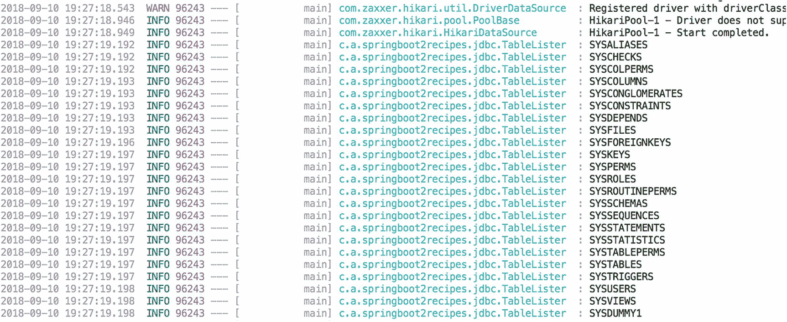
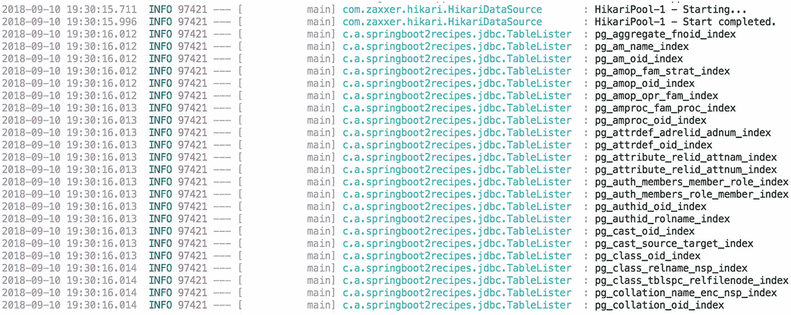
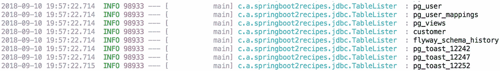
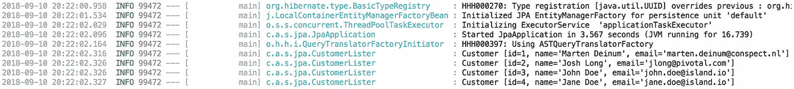

# 7. 数据访问

在使用数据库时，首先需要的是与数据库的连接。在 Java 中，连接通过 `javax.sql.DataSource` 获取。Spring 提供了多种开箱即用的 `DataSource` 实现，例如 `DriverManagerDataSource` 和 `SimpleDriverDataSource`。然而，这些实现并非连接池，主要应视为用于测试而非生产环境。对于生产系统，你应使用像 HikariCP^(²⁷) 这样合适的连接池。

### 提示

在 `db` 文件夹中有一个 `Dockerfile`，它将构建一个自动创建数据库的 PostgreSQL^(²⁸)。使用 `docker build -t sb2r-postgres` 构建它。然后可以使用 `docker run -p 5432:5432 -it sb2r-postgres` 运行它。

## 7.1 配置数据源

### 问题

你需要从应用程序访问数据库。

### 解决方案

使用 `spring.datasource.url`、`spring.datasource.username` 和 `spring.datasource.password` 属性，让 Spring Boot 配置一个 `DataSource`。

### 工作原理

要配置 `DataSource`，Spring Boot 需要存在连接池或嵌入式数据库（如 H2、HSQLDB 或 Derby）。Spring Boot 会自动检测 HikariCP、Tomcat JDBC 和 Commons DBCP2 连接池（按此顺序）。要使用连接池，请配置 `spring.datasource.url`、`spring.datasource.username` 和 `spring.datasource.password` 属性。可以通过添加 `spring-boot-starter-jdbc` 依赖来启用 JDBC 支持。这将引入使用 JDBC 所需的所有依赖。

```
org.springframework.boot
spring-boot-starter-jdbc

```

包含的依赖项有 `spring-jdbc`、`spring-tx` 以及作为默认连接池的 HikariCP。

#### 使用嵌入式 `DataSource`

当 Spring Boot 检测到 H2、HSQLDB 或 Derby 时，它将默认使用检测到的嵌入式实现启动一个嵌入式数据库。这在编写测试或为业务准备演示时非常有用。让 Spring Boot 创建它只需包含所需的依赖即可。

```
org.apache.derby
derby
runtime

```

现在，Spring Boot 将检测到 Derby 并引导一个嵌入式 `DataSource`。让我们编写一个应用程序来列出数据库中的表。

```
package com.apress.springboot2recipes.jdbc;
import org.slf4j.Logger;
import org.slf4j.LoggerFactory;
import org.springframework.boot.ApplicationArguments;
import org.springframework.boot.ApplicationRunner;
import org.springframework.boot.SpringApplication;
import org.springframework.boot.autoconfigure.SpringBootApplication;
import org.springframework.stereotype.Component;
import javax.sql.DataSource;
@SpringBootApplication
public class JdbcApplication {
public static void main(String[] args) {
SpringApplication.run(JdbcApplication.class, args);
}
}
@Component
class TableLister implements ApplicationRunner {
private final Logger logger = LoggerFactory.getLogger(getClass());
private final DataSource dataSource;
TableLister(DataSource dataSource) {
this.dataSource = dataSource;
}
@Override
public void run(ApplicationArguments args) throws Exception {
try (var con = dataSource.getConnection();
var rs = con.getMetaData().getTables(null, null, "%", null)) {
while (rs.next()) {
logger.info("{}", rs.getString(3));
}
}
}
}
```

当应用程序运行时，它将创建一个 `TableLister` 实例，并且该实例将接收配置好的 `DataSource`。Spring Boot 随后会检测到它是一个 `ApplicationRunner`，并调用 `run` 方法。`run` 方法从 `DataSource` 获取一个 `Connection`，并使用 `DatabaseMetaData`（来自 JDBC）获取数据库中的表。现在，运行应用程序时，它应显示类似于图 7-1 所示的输出。



图 7-1

Derby 的 TableLister 输出


#### 使用外部数据库

要连接数据库，你需要一个 JDBC 驱动；本示例使用 PostgreSQL，因此需要包含该数据库的驱动。

```
org.postgresql
postgresql

```

现在，配置单个数据源只需在 `application.properties` 中包含相关属性。对于本示例附带的 Docker 化 PostgreSQL 数据库，数据源配置如下所示；请根据需要替换为你自己的配置。

```
spring.datasource.url=jdbc:postgresql://localhost:5432/customers
spring.datasource.username=customers
spring.datasource.password=customers
```

`spring.datasource.url` 告诉数据源连接地址，`spring.datasource.username` 和 `spring.datasource.password` 配置连接时使用的用户名和密码。你也可以指定 `spring.datasource.driver-class-name` 来指定要使用的 JDBC 驱动类；通常 Spring Boot 会根据传入的 URL 自动检测要使用的驱动。如果你想使用非默认驱动（出于性能或日志记录原因），也可以在此指定。

运行 `JdbcApplication` 时，输出应类似于图 7-2 所示；与 Derby 相比，现在有了一系列不同的表。



图 7-2

PostgreSQL 的 TableLister 输出

#### 从 JNDI 获取 `DataSource`

如果你将 Spring Boot 应用程序部署到应用服务器（或者有远程 JNDI 服务器），并希望使用预配置的 `DataSource`，则可以使用 `spring.datasource.jndi-name` 属性让 Spring Boot 知道你想从 JNDI 获取 `DataSource`。

```
spring.datasource.jndi-name=java:jdbc/customers
```

#### 配置连接池

Spring Boot 使用的默认连接池是 HikariCP。当包含 `spring-boot-starter-jdbc` 依赖（或其他与数据库相关的依赖）时，它会自动引入。Spring Boot 会使用一些默认设置来配置连接池；但是，你可能希望覆盖这些设置（增加或减少最大连接数、设置超时等）。HikariCP 的配置选项位于 `spring.datasource.hikari` 命名空间下（表 7-1）。

表 7-1

HikariCP 常用连接池设置

| 属性 | 描述 |
| --- | --- |
| `spring.datasource.hikari.connection-timeout` | 客户端等待从池中获取连接的最大毫秒数。默认 30 秒 |
| `spring.datasource.hikari.leak-detection-threshold` | 连接离开池后，在记录可能连接泄漏的消息之前可以经过的毫秒数。默认 0（实际禁用） |
| `spring.datasource.hikari.idle-timeout` | 连接在池中允许空闲的最大毫秒数。默认 10 分钟 |
| `spring.datasource.hikari.validation-timeout` | 池等待连接被验证为存活的最大毫秒数。默认 5 秒 |
| `spring.datasource.hikari.connection-test-query` | 用于测试连接有效性的 SQL 查询。**注意：** 通常 JDBC 4.0（或更高版本）驱动不需要！默认无。 |
| `spring.datasource.hikari.maximum-pool-size` | 池中将保持的最大连接数。默认 10 个连接 |
| `spring.datasource.hikari.minimum-idle` | 池中维护的最小空闲连接数。默认 10 个连接 |

还有更多属性可供使用，但列表相当长，表 7-1 中提到的属性是最常用的。

### 注意

Tomcat JDBC 的属性位于 `spring.datasource.tomcat` 命名空间下，Commons DBCP2 的属性位于 `spring.datasource.dbcp2` 命名空间下。

要将数据源配置为最大五个连接、最小两个连接，以及阈值为 20 秒的泄漏检测，需要添加以下配置。

```
spring.datasource.hikari.maximum-pool-size=5
spring.datasource.hikari.minimum-idle=2
spring.datasource.hikari.leak-detection-threshold=20000
```


#### 使用 Spring Boot 初始化数据库

当使用现有数据库时，您可能已经拥有现成的表、视图和存储过程。然而，当您创建一个新数据库时，它是空的，您需要自己创建表。使用 Spring Boot，这得到了开箱即用的支持。您可以添加一个 `schema.sql` 来初始化模式（表、视图等），以及一个 `data.sql` 来向表中插入数据。Spring Boot 还允许您提供 `schema-<db-platform>.sql` 和 `data-<db-platform>.sql` 来执行特定于数据库的初始化。`<db-platform>` 的值从 `spring.datasource.platform` 属性中读取（另请参见表 7-2）。使用 Derby 时，您可以添加一个 `schema-derby.sql` 等。模式和数据的文件名可以通过 `spring.datasource.schema` 和 `spring.datasource.data` 属性进行更改。有关可用属性的描述，请参见表 7-2。

表 7-2

数据源初始化属性

| 属性 | 描述 |
| --- | --- |
| `spring.datasource.continue-on-error` | 是否在初始化数据库时发生错误时停止，默认为 `false` |
| `spring.datasource.data` | 数据（DML）脚本资源引用，默认为 `classpath:data` |
| `spring.datasource.data-password` | 执行 DML 脚本的数据库密码，默认为普通密码 |
| `spring.datasource.data-username` | 执行 DML 脚本的数据库用户名，默认为普通用户名 |
| `spring.datasource.initialization-mode` | 使用可用的 DDL 和 DML 脚本初始化数据源。默认为 `EMBEDDED`，可更改为 `NEVER` 或 `ALWAYS` |
| `spring.datasource.platform` | 在 DDL 或 DML 脚本中使用的平台（例如 schema-${platform}.sql 或 data-${platform}.sql）。默认为 `all`。 |
| `spring.datasource.schema` | 数据（DDL）脚本资源引用，默认为 `classpath:schema` |
| `spring.datasource.schema-password` | 执行 DDL 脚本的数据库密码，默认为普通密码。 |
| `spring.datasource.schema-username` | 执行 DDL 脚本的数据库用户名，默认为普通用户名 |
| `spring.datasource.separator` | SQL 初始化脚本中的语句分隔符。默认为 `;` |
| `spring.datasource.sql-script-encoding` | SQL 脚本编码。默认为平台编码 |

让我们创建一个 `customer` 表并向其中插入一些数据。要创建该表，请将以下 `schema.sql` 添加到 `src/main/resources` 目录：

```
DROP TABLE IF EXISTS customer;
CREATE TABLE customer (
id SERIAL PRIMARY KEY,
name VARCHAR(100) NOT NULL,
email VARCHAR(255) NOT NULL,
UNIQUE(name)
);
```

要插入数据，请将 `data.sql` 添加到 `src/main/resources` 目录。

```
INSERT INTO customer (name, email) VALUES
('Marten Deinum', 'marten.deinum@conspect.nl'),
('Josh Long', 'jlong@pivotal.com'),
('John Doe', 'john.doe@island.io'),
('Jane Doe', 'jane.doe@island.io');
```

为了验证这是否有效，让我们添加另一个 `ApplicationRunner`，它使用 `DataSource` 打印 `customer` 表的内容。

```
package com.apress.springboot2recipes.jdbc;
// 导入已省略
@SpringBootApplication
public class JdbcApplication {
public static void main(String[] args) {
SpringApplication.run(JdbcApplication.class, args);
}
}
... // 其他代码已省略
@Component
class CustomerLister implements ApplicationRunner {
private final Logger logger = LoggerFactory.getLogger(getClass());
private final DataSource dataSource;
CustomerLister(DataSource dataSource) {
this.dataSource = dataSource;
}
@Override
public void run(ApplicationArguments args) throws Exception {
var query = "SELECT id, name, email FROM customer";
try (var con = dataSource.getConnection();
var stmt = con.createStatement();
var rs = stmt.executeQuery(query)) {
while (rs.next()) {
logger.info("Customer [id={}, name={}, email={}]",
rs.getLong(1), rs.getString(2), rs.getString(3));
}
}
}
}
```

对于嵌入式数据库，数据库初始化始终是开启的，因此当使用 Derby、H2 或 HSQLDB 时，默认是开启的。当使用外部数据库时，默认情况下不会进行初始化。要更改此行为，您可以将 `spring.datasource.initialization-mode` 属性切换为 `always`，这样它就会始终运行。

```
spring.datasource.initialization-mode=always
```

当应用程序启动时，您现在将看到数据库中的客户列表被打印在日志中。

#### 使用 Flyway 初始化数据库

在开发应用程序时，您希望对数据库迁移有更多的控制。使用 `schema.sql` 和 `data.sql` 可以非常快速有效地工作，但最终维护起来会很麻烦。Spring Boot 也支持 Flyway^(²⁹)，简单来说，它是数据库模式的版本控制。它允许您增量地更改/更新数据库模式。要使用 Flyway，首先要做的是添加对 Flyway 本身的依赖。

```
org.flywaydb
flyway-core

```

Spring Boot 会检测到 Flyway 的存在，并假定您想使用它来进行数据库迁移。迁移脚本应位于 `src/main/resources` 中的 `db/migration` 文件夹内。

```
CREATE TABLE customer (
id SERIAL PRIMARY KEY,
name VARCHAR(100) NOT NULL,
email VARCHAR(255) NOT NULL,
UNIQUE(name)
);
INSERT INTO customer (name, email) VALUES
('Marten Deinum', 'marten.deinum@conspect.nl'),
('Josh Long', 'jlong@pivotal.com'),
('John Doe', 'john.doe@island.io'),
('Jane Doe', 'jane.doe@island.io');
```

当这个 SQL 被放入 `db/migration` 文件夹中的 `V1__first.sql` 时，它将在启动时执行（假设数据库为空）。默认的命名约定是 `V<序列>__<名称>.sql`，用于确定要执行的内容。一旦脚本被执行，您就不能（也不应该）修改该脚本。这会导致 Flyway 阻止您的应用程序启动。它会检测已执行脚本中的更改。

运行应用程序时，客户列表仍应被列出。您会注意到表列表中多了一个表（图 7-3），即 `flyway_schema_history`。该表包含 Flyway 用于检测（和保护）数据库更改的元数据。



图 7-3

包含 Flyway 的表列表

您还可以使用几个属性来配置 Spring Boot 中的 Flyway。有关最常用的属性，请参见表 7-3。

表 7-3

常用的 Flyway 属性

| 属性 | 描述 |
| --- | --- |
| `spring.flyway.enabled` | 是否启用 Flyway，默认为 `true` |
| `spring.flyway.locations` | 迁移脚本的位置，默认为 `classpath:db/migration` |
| `spring.flyway.url` | 要迁移的数据库的 JDBC URL，未设置时使用默认配置的 `DataSource` |
| `spring.flyway.user` | 如果 Flyway 使用自己的 `DataSource` 配置，则用于数据库的用户名 |
| `spring.flyway.password` | 如果 Flyway 使用自己的 `DataSource` 配置，则用于数据库的密码 |

## 7.2 使用 JdbcTemplate

### 问题

您希望使用 `JdbcTemplate` 或 `NamedParameterJdbcTemplate` 来获得更好的 JDBC 体验。

### 解决方案

使用自动配置的 `JdbcTemplate` 或 `NamedParameterJdbcTemplate` 来执行查询并处理结果。


### 工作原理

Spring Boot 默认会配置一个 `JdbcTemplate` 和 `NamedParameterJdbcTemplate`，并且当它检测到单个候选 `DataSource` 时就会进行配置。单个候选 `DataSource` 意味着要么只有一个 `DataSource`，要么有一个使用 `@Primary` 标记为主资源的 `DataSource`。由于 `JdbcTemplate` 已经可用，你可以用它来编写 JDBC 代码。将 `CustomerLister` 重写为使用 `JdbcTemplate` 而不是普通的 `DataSource`，将使代码更易于阅读，从而更易于处理。

### 注意

`NamedParameterJdbcTemplate` 与 `JdbcTemplate` 类似，其主要优势在于能够在查询中使用命名参数，而不是常规的 JDBC 占位符。

```
@Component
class CustomerLister implements ApplicationRunner {
private final Logger logger = LoggerFactory.getLogger(getClass());
private final JdbcTemplate jdbc;
CustomerLister(JdbcTemplate jdbc) {
this.jdbc = jdbc;
}
@Override
public void run(ApplicationArguments args) {
var query = "SELECT id, name, email FROM customer";
jdbc.query(query, rs -> {
logger.info("Customer [id={}, name={}, email={}]",
rs.getLong(1), rs.getString(2), rs.getString(3));
});
}
}
```

`JdbcTemplate` 用于通过 `query` 方法执行查询；该方法接受一个 `String` 和一个 `RowCallbackHandler`。`JdbcTemplate` 将执行查询，并为每一行调用 `RowCallbackHandler`，后者负责记录该行。运行应用程序时，输出仍然相同，但代码变得更简洁了。

`JdbcTemplate` 还有一个可能更熟悉的 `RowMapper` 接口，它可用于将 `ResultSet` 中的一行映射到一个 Java 对象。让我们创建一个 `Customer` 类，并使用 `RowMapper` 从数据库创建 `Customer` 实例。

```
package com.apress.springboot2recipes.jdbc;
import java.util.Objects;
public class Customer {
private final long id;
private final String name;
private final String email;
Customer(long id, String name, String email) {
this.id = id;
this.name = name;
this.email = email;
}
public long getId() {
return id;
}
public String getName() {
return name;
}
public String getEmail() {
return email;
}
@Override
public boolean equals(Object o) {
if (this == o) return true;
if (o == null || getClass() != o.getClass()) return false;
Customer customer = (Customer) o;
return id == customer.id &&
Objects.equals(name, customer.name) &&
Objects.equals(email, customer.email);
}
@Override
public int hashCode() {
return Objects.hash(id, name, email);
}
@Override
public String toString() {
return "Customer [" +
"id=" + id +", name='" + name + '\" +
", email='" + email + '\" + ']';
}
}
```

接下来，我们创建一个仓库接口来定义契约，并创建一个基于 JDBC 的实现。

```
package com.apress.springboot2recipes.jdbc;
import java.util.List;
public interface CustomerRepository {
List findAll();
Customer findById(long id);
Customer save(Customer customer);
}
```

接下来，该实现使用 `JdbcTemplate` 和一个 `RowMapper` 将结果映射到 `Customer` 对象。

```
package com.apress.springboot2recipes.jdbc;
import org.springframework.jdbc.core.JdbcTemplate;
import org.springframework.jdbc.support.GeneratedKeyHolder;
import org.springframework.stereotype.Repository;
import java.sql.PreparedStatement;
import java.sql.ResultSet;
import java.sql.SQLException;
import java.util.List;
@Repository
class JdbcCustomerRepository implements CustomerRepository {
private static final String ALL_QUERY =
"SELECT id, name, email FROM customer";
private static final String BY_ID_QUERY =
"SELECT id, name, email FROM customer WHERE id=?";
private static final String INSERT_QUERY =
"INSERT INTO customer (name, email) VALUES (?,?)";
private final JdbcTemplate jdbc;
JdbcCustomerRepository(JdbcTemplate jdbc) {
this.jdbc = jdbc;
}
@Override
public List findAll() {
return jdbc.query(ALL_QUERY, (rs, rowNum) -> toCustomer(rs));
}
@Override
public Customer findById(long id) {
return jdbc.queryForObject(BY_ID_QUERY, (rs, rowNum) -> toCustomer(rs), id);
}
@Override
public Customer save(Customer customer) {
var keyHolder = new GeneratedKeyHolder();
jdbc.update(con -> {
var ps = con.prepareStatement(INSERT_QUERY);
ps.setString(1, customer.getName());
ps.setString(2, customer.getEmail());
return ps;
}, keyHolder);
return new Customer(keyHolder.getKey().longValue(),
customer.getName(), customer.getEmail());
}
private Customer toCustomer(ResultSet rs) throws SQLException {
var id = rs.getLong(1);
var name = rs.getString(2);
var email = rs.getString(3);
return new Customer(id, name, email);
}
}
```

`JdbcCustomerRepository` 使用 `JdbcTemplate` 和 `RowMapper`（通过 lambda 表达式）将 `ResultSet` 转换为 `Customer`。现在，`CustomerListener` 可以使用 `CustomerRepository` 从数据库中获取所有 `Customer` 并将其打印到控制台。

```
@Component
class CustomerLister implements ApplicationRunner {
private final Logger logger = LoggerFactory.getLogger(getClass());
private final CustomerRepository customers;
CustomerLister(CustomerRepository customers) {
this.customers = customers;
}
@Override
public void run(ApplicationArguments args) {
customers.findAll()
.forEach( customer -> logger.info("{}", customer));
}
}
```

由于所有 JDBC 代码都已移至 `JdbcCustomerRepository`，该类变得非常简单。它注入了一个 `CustomerRepository`，并使用 `findAll` 方法获取数据库内容，并为每个客户打印一行。

#### 测试 JDBC 代码

测试 JDBC 代码时需要数据库，通常使用像 H2、Derby 或 HSQLDB 这样的嵌入式数据库进行测试。Spring Boot 使得为 JDBC 代码编写测试变得非常容易。基于 JDBC 的测试可以使用 `@JdbcTest` 注解，Spring Boot 将创建一个仅包含 JDBC 相关 bean（如 `DataSource` 和事务管理器）的最小化应用程序。

让我们为 `JdbcCustomerRepository` 编写一个测试，并使用 H2 作为嵌入式数据库。首先，将 H2 添加为测试依赖项。

```
com.h2database
h2
test

```

接下来创建 `JdbcCustomerRepositoryTest`。

```
@RunWith(SpringRunner.class)
@JdbcTest(includeFilters =
@ComponentScan.Filter(
type= FilterType.REGEX,
pattern = "com.apress.springboot2recipes.jdbc.*Repository"))
@TestPropertySource(properties = "spring.flyway.enabled=false")
public class JdbcCustomerRepositoryTest {
@Autowired
private JdbcCustomerRepository repository;
}
```

`@RunWith(SpringRunner.class)` 通过一个特殊的 JUnit 运行器执行测试，以引导 Spring 测试上下文框架。`@JdbcTest` 会将预配置的 `DataSource` 替换为嵌入式数据源（本例中为 H2）。由于我们还想创建仓库的实例，我们添加了一个 `includeFilters`，并为其提供了一个正则表达式来匹配我们的 `JdbcCustomerRepository`。

最后，还有 `@TestPropertySource(properties = "spring.flyway.enabled=false")`，它表示我们希望禁用 Flyway。该应用程序使用 Flyway 来管理模式；然而，这些脚本是为 PostgreSQL 编写的，而不是 H2。为了测试，我们希望禁用 Flyway，并提供一个基于 H2 的 `schema.sql` 来创建模式。


### 注意

这是使用与生产系统（PostgreSQL）不同的数据库（H2）进行测试的缺点之一。你需要要么维护两套数据库模式脚本，要么在测试中使用与生产系统相同的数据库。

在 `src/test/resources` 中创建一个 `schema.sql` 文件，并添加以下 DDL 语句：

```
CREATE TABLE customer (
id BIGINT AUTO_INCREMENT PRIMARY KEY,
name VARCHAR(100) NOT NULL,
email VARCHAR(255) NOT NULL,
UNIQUE(name)
);
```

现在编写一个测试，验证记录是否正确插入。

```
@Test
public void insertNewCustomer() {
assertThat(repository.findAll()).isEmpty();
Customer customer = repository.save(new Customer(-1, "T. Testing", "t.testing@test123.tst"));
assertThat(customer.getId()).isGreaterThan(-1L);
assertThat(customer.getName()).isEqualTo("T. Testing");
assertThat(customer.getEmail()).isEqualTo("t.testing@test123.tst");
assertThat(repository.findById(customer.getId())).isEqualTo(customer);
}
```

该测试首先断言数据库为空——这并非必需，但有助于检测其他测试是否污染了数据库。接着，通过调用 `JdbcCustomerRepository` 的 `save` 方法向数据库添加一个 `Customer` 对象。然后验证生成的 `Customer` 对象是否包含 ID，以及 `name` 和 `email` 属性是否存在。最后，再次检索该 `Customer` 对象并进行比较，确认其一致。

你可以添加的另一个测试是 `findAll` 方法。当插入两条记录时，调用 `findAll` 应返回两条记录。

```
@Test
public void findAllCustomers() {
assertThat(repository.findAll()).isEmpty();
repository.save(new Customer(-1, "T. Testing1", "t.testing@test123.tst"));
repository.save(new Customer(-1, "T. Testing2", "t.testing@test123.tst"));
assertThat(repository.findAll()).hasSize(2);
}
```

当然，还可以有更多断言，但数据保存的正确性已在另一个测试方法中得到验证。

## 7.3 使用 JPA

### 问题

你想在 Spring Boot 应用程序中使用 JPA。

### 解决方案

Spring Boot 会自动检测 Hibernate 的存在，所需的 JPA 类将利用该信息来配置 `EntityManagerFactory`。

### 工作原理

Spring Boot 通过 Hibernate 提供了对 JPA 的开箱即用支持。^(³⁰) 当检测到 Hibernate 时，将使用先前配置的 `DataSource`（参见配方 7.1）自动配置一个 `EntityManagerFactory`。

首先，你需要将 `hibernate-core` 和 `spring-orm` 作为依赖项添加到项目中。不过，更简单的方法是将 `spring-boot-starter-data-jpa` 依赖项添加到项目中（尽管这也会将 `spring-data-jpa` 作为依赖项引入）。

```
org.springframework.boot
spring-boot-starter-data-jpa

```

这将把所有必要的依赖项添加到类路径中。

#### 使用纯 JPA 仓库

要使 JPA 正常工作，你必须对系统中表示实体的类进行注解。在我们的系统中，我们将从数据库存储和检索 `Customer` 对象。我们需要使用 `@Entity` 注解将其标记为实体。JPA 实体类需要有一个默认的无参构造函数（可以是包级私有），并且需要一个使用 `@Id` 注解的字段来标记主键。

```
@Entity
public class Customer {
@Id
@GeneratedValue(strategy = GenerationType.IDENTITY)
private long id;
@Column(nullable = false)
private final String name;
@Column(nullable = false)
private final String email;
Customer() {
this(null,null);
}
// 其他代码已省略
}
```

接下来，创建 `CustomerRepository`（参见配方 7.2）的 JPA 实现；要使用 JPA，你必须获取 `EntityManager`。这可以通过声明一个字段并使用 `@PersistenceContext` 注解来实现。

```
package com.apress.springboot2recipes.jpa;
import org.springframework.stereotype.Repository;
import javax.persistence.EntityManager;
import javax.persistence.PersistenceContext;
import java.util.List;
@Repository
class JpaCustomerRepository implements CustomerRepository {
@PersistenceContext
private EntityManager em;
@Override
public List findAll() {
var query = em.createQuery("SELECT c FROM Customer c", Customer.class);
return query.getResultList();
}
@Override
public Customer findById(long id) {
return em.find(Customer.class, id);
}
@Override
public Customer save(Customer customer) {
em.persist(customer);
return customer;
}
}
```

以下应用程序类（类似于配方 7.2 中的类）将从数据库中读取所有 `Customer` 对象并将其打印到日志中（图 7-4）。



图 7-4

JPA Customer 输出

```
package com.apress.springboot2recipes.jpa;
import org.slf4j.Logger;
import org.slf4j.LoggerFactory;
import org.springframework.boot.ApplicationArguments;
import org.springframework.boot.ApplicationRunner;
import org.springframework.boot.SpringApplication;
import org.springframework.boot.autoconfigure.SpringBootApplication;
import org.springframework.stereotype.Component;
@SpringBootApplication
public class JpaApplication {
public static void main(String[] args) {
SpringApplication.run(JpaApplication.class, args);
}
}
@Component
class CustomerLister implements ApplicationRunner {
private final Logger logger = LoggerFactory.getLogger(getClass());
private final CustomerRepository customers;
CustomerLister(CustomerRepository customers) {
this.customers = customers;
}
@Override
public void run(ApplicationArguments args) {
customers.findAll()
.forEach( customer -> logger.info("{}", customer));
}
}
```

你可以使用一些配置选项来配置应用程序中的 `EntityManagerFactory`；这些属性可以在 `spring.jpa` 命名空间中找到。

表 7-4

JPA 属性

| 属性 | 描述 |
| --- | --- |
| `spring.jpa.database` | 要操作的目标数据库，默认自动检测。 |
| `spring.jpa.database-platform` | 要操作的目标数据库名称，默认自动检测。可用于指定要使用的特定 Hibernate `Dialect`。 |
| `spring.jpa.generate-ddl` | 启动时初始化模式，默认为 `false`。 |
| `spring.jpa.show-sql` | 启用 SQL 语句日志记录，默认为 `false`。 |
| `spring.jpa.open-in-view` | 注册 `OpenEntityManagerInViewInterceptor`。将 `EntityManager` 绑定到请求处理线程。默认为 `true`。 |
| `spring.jpa.hibernate.ddl-auto` | `hibernate.hbm2ddl.auto` 属性的简写。默认为 `none`，对于嵌入式数据库为 `create-drop`。 |
| `spring.jpa.hibernate.use-new-id-generator-mappings` | `hibernate.id.new_generator_mappings` 属性的简写。未显式设置时，默认为 `true`。 |
| `spring.jpa.hibernate.naming.implicit-strategy` | 隐式命名策略的完全限定名，默认为 `org.springframework.boot.orm.jpa.hibernate.SpringPhysicalNamingStrategy.` |
| `spring.jpa.hibernate.naming.physical-strategy` | 物理命名策略的完全限定名，默认为 `org.springframework.boot.orm.jpa.hibernate.SpringImplicitNamingStrategy.` |
| `spring.jpa.mapping-resources` | 包含实体映射的附加 XML 文件（使用 XML 而非 Java）。类似于 JPA 指定的 `orm.xml`。 |
| `spring.jpa.properties` `.*` | 要设置在 JPA 提供程序上的附加属性。 |

如果你想要配置 Hibernate 的高级特性，例如批量处理时的获取大小 `hibernate.jdbc.fetch_size` 或批处理大小 `hibernate.jdbc.batch_size`，`spring.jpa.properties` 会非常有用。

```
spring.jpa.properties.hibernate.jdbc.fetch_size=250
spring.jpa.properties.hibernate.jdbc.batch_size=50
```

这将在 JPA 提供程序上设置这些属性。


#### 使用 Spring Data JPA 仓库

与其编写自己的仓库（这可能是一项繁琐且重复的任务），你也可以让 Spring Data JPA^(³¹) 为你完成繁重的工作。无需自行实现，你可以扩展 Spring Data 中的 `CrudRepository` 接口，并在运行时获得一个可用的仓库。这让你免于编写数据访问代码。当 Spring Boot 在类路径上检测到 Spring Data JPA 时，它也会自动配置它。

```
public interface CustomerRepository extends CrudRepository { }
```

这就是你所需要的全部；`findAll`、`findById` 和 `save` 等方法均由 Spring Data JPA 开箱即用地提供。你可以移除 `JpaCustomerRepository` 的实现。由于 `CrudRepository<Customer, Long>`，Spring Data 知道它可以查询 `Customer` 实例，并且其 id 字段类型为 `Long`。

运行应用程序应产生与之前相同的输出（参见图 7-4）。

Spring Data JPA 只有一个可用属性，即显式启用或禁用它。它默认是启用的。将 `spring.data.jpa.repositories.enabled` 设置为 `false` 将禁用 Spring Data JPA。

#### 包含来自不同包的实体

默认情况下，Spring Boot 会从 `@SpringBootApplication` 注解类所在的包开始检测组件、仓库和实体。但是，如果你有位于不同包中但仍需包含的实体，该怎么办？为此，你可以使用 `@EntityScan` 注解；它的工作方式类似于 `@ComponentScan`，但针对的是 `@Entity` 注解的 bean。

```
package com.apress.springboot2recipes.order;
import javax.persistence.Entity;
import javax.persistence.Id;
import java.util.Objects;
@Entity
public class Order {
@Id
private long id;
private String number;
public long getId() {
return id;
}
public void setId(long id) {
this.id = id;
}
public String getNumber() {
return number;
}
public void setNumber(String number) {
this.number = number;
}
// 其他方法已省略
}
```

这个 `Order` 类位于 `com.apress.springboot2recipes.order` 包中，而 `@SpringBootApplication` 注解的类位于 `com.apress.springboot2.recipes.jpa` 包中，因此它未被覆盖。为了让这个实体被检测到，你可以在 `@SpringBootApplication` 注解的类（或一个普通的 `@Configuration` 类）上添加 `@EntityScan` 注解，并指定要扫描的包。

```
@SpringBootApplication
@EntityScan({
"com.apress.springboot2recipes.order",
"com.apress.springboot2recipes.jpa" })
```

添加此注解后，`Order` 实体将被检测到，并且 JPA 可以访问它。

#### 测试 JPA 仓库

在测试 JPA 代码时，需要数据库，通常使用嵌入式数据库（如 H2、Derby 或 HSQLDB）进行测试。Spring Boot 使得为 JPA 编写测试变得非常容易。基于 JPA 的测试可以使用 `@DataJpaTest` 注解，Spring Boot 将创建一个最小的应用程序，其中仅包含与 JPA 相关的 bean，例如 `DataSource`、事务管理器，以及（如果需要）Spring Data JPA 仓库。

让我们为 `CustomerRepository` 编写一个测试，并使用 H2 作为嵌入式数据库。首先，将 H2 添加为测试依赖项。

```
com.h2database
h2
test

```

接下来，创建 `CustomerRepositoryTest`。

```
@RunWith(SpringRunner.class)
@DataJpaTest
@TestPropertySource(properties = "spring.flyway.enabled=false")
public class CustomerRepositoryTest {
@Autowired
private CustomerRepository repository;
@Autowired
private TestEntityManager testEntityManager
}
```

`@RunWith(SpringRunner.class)` 通过一个特殊的 JUnit 运行器来执行测试，以引导 Spring 测试上下文框架。`@DataJpaTest` 将用嵌入式数据库（此处为 H2）替换预配置的 `DataSource`。它还将引导 JPA 组件，并在检测到时引导 Spring Data JPA 仓库。

Spring Boot 还提供了一个 `TestEntityManager`，它提供了一些便捷方法，可以轻松地存储和查找用于测试的数据。

最后是 `@TestPropertySource(properties = "spring.flyway.enabled=false")`，它表示我们要禁用 Flyway。应用程序使用 Flyway 来管理模式；但是，这些脚本是为 PostgreSQL 编写的，而不是 H2。对于测试，你可以让 Hibernate 管理模式，这也是在 Spring Boot 中使用嵌入式数据库时的默认设置。

现在，编写一个测试来检查记录是否正确插入。

```
@Test
public void insertNewCustomer() {
assertThat(repository.findAll()).isEmpty();
Customer customer = repository.save(new Customer(-1, "T. Testing", "t.testing@test123.tst"));
assertThat(customer.getId()).isGreaterThan(-1L);
assertThat(customer.getName()).isEqualTo("T. Testing");
assertThat(customer.getEmail()).isEqualTo("t.testing@test123.tst");
assertThat(repository.findById(customer.getId())).isEqualTo(customer);
}
```

此测试首先断言数据库为空——并非必需，但有助于检测其他测试是否污染了数据库。接下来，通过调用 `CustomerRepository` 上的 `save` 方法将一个 `Customer` 添加到数据库。验证生成的 `Customer` 是否具有 id，以及 `name` 和 `email` 属性是否存在。最后，再次检索该 `Customer` 并进行比较，确认相同。

你可以添加的另一个测试是 `findAll` 方法。当插入两条记录时，调用 `findAll` 应检索到两条记录。

```
@Test
public void findAllCustomers() {
assertThat(repository.findAll()).isEmpty();
repository.save(new Customer(-1, "T. Testing1", "t.testing@test123.tst"));
repository.save(new Customer(-1, "T. Testing2", "t.testing@test123.tst"));
assertThat(repository.findAll()).hasSize(2);
}
```

当然，还可以有更多断言，但保存数据的验证已在另一个测试方法中完成。

## 7.4 使用原生 Hibernate

### 问题

你有一些使用原生 Hibernate API（`Session` 和/或 `SessionFactory`）的代码，希望与 Spring Boot 一起使用。

### 解决方案

使用 `EntityManager` 或 `EntityManagerFactory` 来获取原生的 Hibernate 对象，例如 `Session` 或 `SessionFactory`。

### 工作原理

在将旧代码迁移到 Spring Boot 或使用第三方库时，将所有内容迁移到 JPA 可能并不总是可行的。你希望按原样使用该代码，或尽可能少地修改。有两种方法可以使用原生 Hibernate API：从当前的 `EntityManager` 获取 `Session`，或者配置 `SessionFactory`。你想要或能够使用哪种方法，取决于你对使用原生 Hibernate API 的代码的控制程度。


#### 使用 **EntityManager** 获取 **Session**

要获取底层的 Hibernate `Session`，可以使用 `unwrap` 方法。该方法在 JPA 2.0 中引入，旨在提供一种统一且便捷的方式来获取底层 JPA 实现类的实例，适用于确实需要访问原生类的场景。

```
package com.apress.springboot2recipes.jpa;
import org.hibernate.Session;
import org.springframework.stereotype.Repository;
import javax.persistence.EntityManager;
import javax.persistence.PersistenceContext;
import javax.transaction.Transactional;
import java.util.List;
@Repository
@Transactional
class HibernateCustomerRepository implements CustomerRepository {
@PersistenceContext
private EntityManager em;
private Session getSession() {
return em.unwrap(Session.class);
}
@Override
public List findAll() {
return getSession().createQuery("SELECT c FROM Customer c", Customer.class).getResultList();
}
@Override
public Customer findById(long id) {
return getSession().find(Customer.class, id);
}
@Override
public Customer save(Customer customer) {
getSession().persist(customer);
return customer;
}
}
```

`HibernateCustomerRepository` 通过注入获取 `EntityManager`，并使用 `unwrap` 方法获取 `Session`（参见 `getSession` 方法）。现在，你可以使用 Hibernate `Session` 来执行查询等操作。

#### 使用 **SessionFactory**

从 Hibernate 5.2 开始，Hibernate `SessionFactory` 扩展了 `EntityManagerFactory`，因此可用于创建 `Session` 和 `EntityManager`。Spring 5.1 在 `LocalSessionFactoryBean` 中添加了对这一特性的支持，可用于混合使用原生 Hibernate 代码和 JPA 代码。

要配置 `SessionFactory` Bean，请使用 `LocalSessionFactoryBean`。

```
@Bean
public LocalSessionFactoryBean sessionFactory(DataSource dataSource) {
Properties properties = new Properties();
properties.setProperty(DIALECT,
"org.hibernate.dialect.PostgreSQL95Dialect");
LocalSessionFactoryBean sessionFactoryBean = new LocalSessionFactoryBean();
sessionFactoryBean.setDataSource(dataSource);
sessionFactoryBean.setPackagesToScan("com.apress.springboot2recipes.jpa");
sessionFactoryBean.setHibernateProperties(properties);
return sessionFactoryBean;
}
```

`SessionFactory` 需要一个 `DataSource` 来获取数据库连接，一个方言来生成 SQL，并且需要知道实体类的位置。这是 `SessionFactory` 所需的最小配置。无需添加 `HibernateTransactionManager`，因为默认配置的 `JpaTransactionManager` 可以处理事务。然而，由于 JPA 存在一些限制（尤其是在事务传播级别方面），你可能希望添加 `HibernateTransactionManager`，它不受这些限制的影响。

修改后的 `HibernateCustomerRepository` 使用 `SessionFactory` 的 `getCurrentSession` 方法来获取 `Session`。

```
@Repository
@Transactional
class HibernateCustomerRepository implements CustomerRepository {
private final SessionFactory sf;
HibernateCustomerRepository(SessionFactory sf) {
this.sf=sf;
}
private Session getSession() {
return sf.getCurrentSession();
}
// 未修改的方法已省略
}
```

### 注意

由于 `SessionFactory` 也可以创建 `EntityManager`，因此配方 7-3 中的 `CustomerRepository` 同样可以使用！

## 7.5 Spring Data MongoDB

### 问题

你希望在 Spring Boot 应用程序中使用 MongoDB。

### 解决方案

将 Mongo 驱动程序添加为依赖项，并使用 `spring.data.mongodb` 属性让 Spring Boot 将 `MongoTemplate` 配置到正确的 MongoDB。

### 工作原理

Spring Boot 会自动检测 MongoDB 驱动程序以及 Spring Data MongoDB 类的存在。如果检测到这些组件，MongoDB 以及 `MongoTemplate`（等组件）将自动为你配置好。


#### 使用 MongoTemplate

连接建立后，你就可以使用它了，理想情况下是通过 `MongoTemplate` 来简化文档的存储和检索。首先，你需要一个要存储的文档；让我们创建一个想要持久化的 `Customer` 对象。

```
package com.apress.springboot2recipes.mongo;
public class Customer {
private String id;
private final String name;
private final String email;
Customer() {
this(null,null);
}
Customer(String name, String email) {
this.name = name;
this.email = email;
}
public String getId() {
return id;
}
public String getName() {
return name;
}
public String getEmail() {
return email;
}
// equals(), hashCode() and toString() 已省略
}
```

`id` 字段会自动映射到 MongoDB 的 `_id` 文档标识符。如果你想使用其他字段，可以使用 Spring Data 的 `@Id` 注解来指定应使用的字段。

让我们创建一个 `CustomerRepository`，以便可以保存和检索实例。

```
package com.apress.springboot2recipes.mongo;
import java.util.List;
public interface CustomerRepository {
List findAll();
Customer findById(long id);
Customer save(Customer customer);
}
```

MongoDB 的 CustomerRepository 是通过使用 `MongoTemplate` 来实现的。

```
package com.apress.springboot2recipes.mongo;
import org.springframework.data.mongodb.core.MongoTemplate;
import org.springframework.stereotype.Repository;
import java.util.List;
@Repository
class MongoCustomerRepository implements CustomerRepository {
private final MongoTemplate mongoTemplate;
MongoCustomerRepository(MongoTemplate mongoTemplate) {
this.mongoTemplate = mongoTemplate;
}
@Override
public List findAll() {
return mongoTemplate.findAll(Customer.class);
}
@Override
public Customer findById(long id) {
return mongoTemplate.findById(id, Customer.class);
}
@Override
public Customer save(Customer customer) {
mongoTemplate.save(customer);
return customer;
}
}
```

`MongoCustomerRepository` 使用预配置的 `MongoTemplate` 在 Mongo 中存储和检索客户。

要使用所有部分，首先需要在 MongoDB 中有一些数据；可以使用 `ApplicationRunner` 来插入一些数据。

```
@Component
@Order(1)
class DataInitializer implements ApplicationRunner {
private final CustomerRepository customers;
DataInitializer(CustomerRepository customers) {
this.customers = customers;
}
@Override
public void run(ApplicationArguments args) throws Exception {
List.of(
new Customer("Marten Deinum", "marten.deinum@conspect.nl"),
new Customer("Josh Long", "jlong@pivotal.io"),
new Customer("John Doe", "john.doe@island.io"),
new Customer("Jane Doe", "jane.doe@island.io"))
.forEach(customers::save);
}
}
```

`DataInitializer` 将使用 `CustomerRepository` 将一些 `Customer` 实例保存到 MongoDB 中。注意我们使用了 `@Order`，我们希望它首先执行，这可以通过显式地对 bean 进行排序来强制执行。

接下来创建一个 `ApplicationRunner` 来从 MongoDB 中检索所有客户。

```
@Component
class CustomerLister implements ApplicationRunner {
private final Logger logger = LoggerFactory.getLogger(getClass());
private final CustomerRepository customers;
CustomerLister(CustomerRepository customers) {
this.customers = customers;
}
@Override
public void run(ApplicationArguments args) {
customers.findAll().forEach( customer -> logger.info("{}", customer));
}
}
```

这个监听器将使用 `CustomerRepository` 从数据库加载所有客户，并在日志中打印一行信息。

最后是引导所有这些的应用程序类（包括前面提到的两个 `ApplicationListeners`）。

```
package com.apress.springboot2recipes.mongo;
import org.slf4j.Logger;
import org.slf4j.LoggerFactory;
import org.springframework.boot.ApplicationArguments;
import org.springframework.boot.ApplicationRunner;
import org.springframework.boot.SpringApplication;
import org.springframework.boot.autoconfigure.SpringBootApplication;
import org.springframework.core.annotation.Order;
import org.springframework.stereotype.Component;
import java.util.Arrays;
@SpringBootApplication
public class MongoApplication {
public static void main(String[] args) {
SpringApplication.run(MongoApplication.class, args);
}
}
@Component
@Order(1)
class DataInitializer implements ApplicationRunner {
private final CustomerRepository customers;
DataInitializer(CustomerRepository customers) {
this.customers = customers;
}
@Override
public void run(ApplicationArguments args) throws Exception {
List.of(
new Customer("Marten Deinum", "marten.deinum@conspect.nl"),
new Customer("Josh Long", "jlong@pivotal.io"),
new Customer("John Doe", "john.doe@island.io"),
new Customer("Jane Doe", "jane.doe@island.io"))
.forEach(customers::save);
}
}
@Component
class CustomerLister implements ApplicationRunner {
private final Logger logger = LoggerFactory.getLogger(getClass());
private final CustomerRepository customers;
CustomerLister(CustomerRepository customers) {
this.customers = customers;
}
@Override
public void run(ApplicationArguments args) {
customers.findAll().forEach( customer -> logger.info("{}", customer));
}
}
```

运行应用程序时，它会自动连接到 MongoDB 实例，将数据插入其中，最后检索数据并将其打印到日志中。

你需要一个 MongoDB 实例来存储和检索文档。你可以使用嵌入式 MongoDB（非常适合测试），也可以连接到实际的 MongoDB 实例。

#### 使用嵌入式 MongoDB

一个易于使用的项目是 Embedded MongoDB^(³²)；它会在 Spring Boot 启动时自动启动一个 MongoDB。Spring Boot 甚至通过 `spring.mongodb.embedded` 命名空间中的属性（表 7-5）为这个嵌入式 MongoDB 提供了广泛的支持。要实现这一点，唯一需要做的就是添加必要的依赖项。

表 7-5

嵌入式 MongoDB 属性

| 属性 | 描述 |
| --- | --- |
| `spring.mongodb.embedded.version` | 要使用的 MongoDB 版本。默认值为 `3.2.2` |
| `spring.mongodb.embedded.features` | 要启用的功能列表，默认仅启用 `sync-delay`。 |
| `spring.mongodb.embedded.storage.database-dir` | 存储数据的目录 |
| `spring.mongodb.embedded.storage.oplog-size` | 日志的大小，以兆字节为单位。 |
| `spring.mongodb.embedded.storage.repl-set-name-dir` | 副本集的名称，默认值为 `null`。 |

```
de.flapdoodle.embed
de.flapdoodle.embed.mongo

```

现在，当运行 `MongoApplication` 时，它也会自动引导 MongoDB，并在应用程序停止时将其关闭。

#### 连接到外部 MongoDB


### 注意

`bin` 目录中包含一个 `mongo.sh` 脚本，该脚本将使用 Docker 启动一个 MongoDB 实例。

当启动 `MongoApplication` 且未使用嵌入式 MongoDB 时，默认情况下它会尝试连接到 `localhost` 上端口为 `27017` 的 MongoDB 服务器。如果这不是您想要连接的位置，请使用 `spring.data.mongodb` 属性（表 7-6）来配置正确的位置。

表 7-6

MongoDB 属性

| 属性 | 描述 |
| --- | --- |
| `spring.data.mongodb.uri` | Mongo 数据库 URI，包含凭据、设置等。默认为 `mongodb://localhost/test` |
| `spring.data.mongodb.username` | Mongo 服务器的登录用户。默认为无 |
| `spring.data.mongodb.password` | Mongo 服务器的登录密码。默认为无 |
| `spring.data.mongodb.host` | MongoDB 服务器的主机名（或 IP 地址）。默认回退为 `localhost` |
| `spring.data.mongodb.port` | MongoDB 服务器的端口。默认回退为 `27017` |
| `spring.data.mongodb.database` | 要使用的 MongoDB 数据库/集合的名称 |
| `spring.data.mongodb.field-naming-strategy` | 用于将对象字段映射到文档字段的 `FieldNamingStrategy` 的完全限定名。默认为 `PropertyNameFieldNamingStrategy` |
| `spring.data.mongodb.authentication-database` | 用于身份验证的 MongoDB 名称。默认为 `spring.data.mongodb.database` 的值 |
| `spring.data.mongodb.grid-fs-database` | 要连接的 MongoDB 名称。默认为 `spring.data.mongodb.database` 的值 |

### 警告

`spring.data.mongodb.username`、`spring.data.mongodb.password`、`spring.data.mongodb.host`、`spring.data.mongodb.port` 和 `spring.data.mongodb.database` 仅支持 MongoDB 2.0；对于 MongoDB 3.0 及以上版本，您必须使用 `spring.data.mongodb.uri` 属性！

虽然您可以使用 Spring Boot 来配置 `MongoClient`，但如果您需要更多控制权，可以随时自行将 `MongoDbFactory` 或 `MongoClient` 指定为 Bean，Spring Boot 将不会自动配置 `MongoClient`。它仍然会检测 Spring Data MongoDB 类并启用仓库支持。

#### 使用 Spring Data MongoDB 仓库

除了自行编写仓库实现，您还可以使用 Spring Data MongoDB 为您创建仓库（就像使用 Spring Data JPA 一样）。为此，您需要扩展 Spring Data 提供的 `Repository` 接口之一。最简单的方法是扩展 `CrudRepository` 或 `MongoRepository`。

```
public interface CustomerRepository extends MongoRepository
{ }
```

这就是我们获得一个功能完整的仓库所需的全部代码，您可以移除 `MongoCustomerRepository` 的实现。这将为您提供 `save`、`findAll`、`findById` 以及更多方法。

应用程序仍将运行，插入一些客户，并在日志中列出它们。

#### 响应式 MongoDB 仓库

除了使用常规的阻塞操作，MongoDB 也可以以响应式方式使用。为此，请使用 `spring-boot-starter-data-mongodb-reactive` 替代 `spring-boot-starter-data-mongodb`。此依赖项将包含所需的响应式库和 MongoDB 响应式驱动程序。

```
org.springframework.boot
spring-boot-starter-data-mongodb-reactive

```

依赖项就绪后，您可以将 `CustomerRepository` 变为响应式仓库。这只需根据您的需求扩展 `ReactiveRepository`、`ReactiveSortingRepository` 或 `ReactiveMongoRepository` 即可。

```
public interface CustomerRepository
extends ReactiveMongoRepository { }
```

现在，由于 `CustomerRepository` 扩展了 `ReactiveMongoRepository`，所有方法都返回 `Flux`（零个或多个元素）或 `Mono`（零个或一个元素）。

### 注意

默认实现使用 Project Reactor^(³³) 作为响应式框架；但是，您也可以使用 RxJava。^(³⁴) 此时，您将使用 `Observable` 或 `Single` 替代 `Flux` 和 `Mono`。为此，您需要扩展 `RxJava2CrudRepository` 或 `RxJava2SortingRepository`。

`DataInitializer` 也需要变为响应式。

```
@Component
@Order(1)
class DataInitializer implements ApplicationRunner {
private final CustomerRepository customers;
DataInitializer(CustomerRepository customers) {
this.customers = customers;
}
@Override
public void run(ApplicationArguments args) throws Exception {
customers.deleteAll()
.thenMany(
Flux.just(
new Customer("Marten Deinum", "marten.deinum@conspect.nl"),
new Customer("Josh Long", "jlong@pivotal.io"),
new Customer("John Doe", "john.doe@island.io"),
new Customer("Jane Doe", "jane.doe@island.io"))
).flatMap(customers::save).subscribe(System.out::println);
}
}
```

首先，它删除所有数据，然后我们创建新的 `Customer` 对象并将其添加到仓库中。最后，我们需要订阅此数据流，否则什么也不会发生。除了订阅，您也可以使用 `block`，但在响应式应用程序中应避免阻塞。

最后，`CustomerListener` 也需要变为响应式。

```
@Component
class CustomerLister implements ApplicationRunner {
private final Logger logger = LoggerFactory.getLogger(getClass());
private final CustomerRepository customers;
CustomerLister(CustomerRepository customers) {
this.customers = customers;
}
@Override
public void run(ApplicationArguments args) {
customers.findAll().subscribe(customer -> logger.info("{}", customer));
}
}
```

它将从仓库中 `findAll` 所有客户，并为每个客户在日志文件中打印一行。

启动应用程序时，您可能不会在日志文件中看到任何内容。由于应用程序的响应式特性，它会很快完成，`CustomerListener` 没有时间注册自身并开始监听。为防止应用程序关闭，请添加 `System.in.read()`；这将使应用程序保持运行，直到您按下回车键。通常，在运行应用程序时不需要这样做，因为应用程序是作为服务/Web 应用程序暴露的，它会自动保持运行。

```
public static void main(String[] args) throws IOException {
SpringApplication.run(ReactiveMongoApplication.class, args);
System.in.read();
}
```

现在，当运行应用程序时，您将看到客户数据从 MongoDB 中检索出来并打印在日志中。这看起来可能没有太大区别，但数据检索的方式完全不同。通过对 `DataInitializer` 进行一个小修改，这一点可以变得清晰；让我们将每个元素的插入延迟 250 毫秒。

```
@Component
@Order(1)
class DataInitializer implements ApplicationRunner {
private final CustomerRepository customers;
DataInitializer(CustomerRepository customers) {
this.customers = customers;
}
@Override
public void run(ApplicationArguments args) throws Exception {
customers.deleteAll().thenMany(
Flux.just(
new Customer("Marten Deinum", "marten.deinum@conspect.nl"),
new Customer("Josh Long", "jlong@pivotal.io"),
new Customer("John Doe", "john.doe@island.io"),
new Customer("Jane Doe", "jane.doe@island.io"))
).delayElements(Duration.ofMillis(250))
.flatMap(customers::save)
.subscribe(System.out::println);
}
}
```

现在，每个单独元素的插入将被延迟 250 毫秒。当运行应用程序时，您会看到客户监听器也需要一些时间才能让每个元素出现。


#### 测试 Mongo 仓库

在测试 MongoDB 代码时，会使用一个正在运行的 MongoDB 实例；而进行测试时，通常使用嵌入式 MongoDB。Spring Boot 通过 `@DataMongoTest` 使得为 MongoDB 编写测试变得非常容易。Spring Boot 将创建一个仅包含 MongoDB 相关 Bean 的最小化应用程序，并启动一个嵌入式 MongoDB（如果检测到的话）。

让我们为 `CustomerRepository` 编写一个测试，并使用嵌入式 MongoDB。首先，将嵌入式 MongoDB 添加为测试依赖项。

```
de.flapdoodle.embed
de.flapdoodle.embed.mongo
test

```

接下来创建 `CustomerRepositoryTest`。

```
@RunWith(SpringRunner.class)
@DataMongoTest
public class CustomerRepositoryTest {
@Autowired
private CustomerRepository repository;
@After
public void cleanUp() {
repository.deleteAll();
}
}
```

`@RunWith(SpringRunner.class)` 通过一个特殊的 JUnit 运行器来执行测试，以引导 Spring 测试上下文框架。`@DataMongoTest` 将用嵌入式 MongoDB 替换预配置的 MongoDB（如果它在类路径上）。它还会引导 MongoDB 组件，并在检测到时引导 Spring Data Mongo 仓库。

每次测试后，我们希望确保嵌入式 MongoDB 不包含任何数据。这可以通过添加一个带有 `@After` 注解的方法，并在仓库上调用 `deleteAll` 来实现。该方法将在每个执行的测试方法之后被调用。

现在编写一个测试，检查记录是否正确插入。

```
@Test
public void insertNewCustomer() {
assertThat(repository.findAll()).isEmpty();
Customer customer = repository.save(new Customer(-1, "T. Testing", "t.testing@test123.tst"));
assertThat(customer.getId()).isGreaterThan(-1L);
assertThat(customer.getName()).isEqualTo("T. Testing");
assertThat(customer.getEmail()).isEqualTo("t.testing@test123.tst");
assertThat(repository.findById(customer.getId())).isEqualTo(customer);
}
```

该测试首先断言数据库为空——这并非必需，但有助于检测其他测试是否污染了数据库。接着，通过在 `CustomerRepository` 上调用 `save` 方法，将一个 `Customer` 添加到数据库中。验证生成的 `Customer` 是否具有 id，以及 `name` 和 `email` 属性是否存在。最后，再次检索该 `Customer` 并进行比较，确认它们相同。

你可以添加的另一个测试是 `findAll` 方法。当插入两条记录时，调用 `findAll` 应检索到两条记录。

```
@Test
public void findAllCustomers() {
assertThat(repository.findAll()).isEmpty();
repository.save(new Customer(-1, "T. Testing1", "t.testing@test123.tst"));
repository.save(new Customer(-1, "T. Testing2", "t.testing@test123.tst"));
assertThat(repository.findAll()).hasSize(2);
}
```

当然，还可以有更多断言，但保存数据的操作已在另一个测试方法中得到验证。

脚注 1   2   3   4   5   6   7   8

