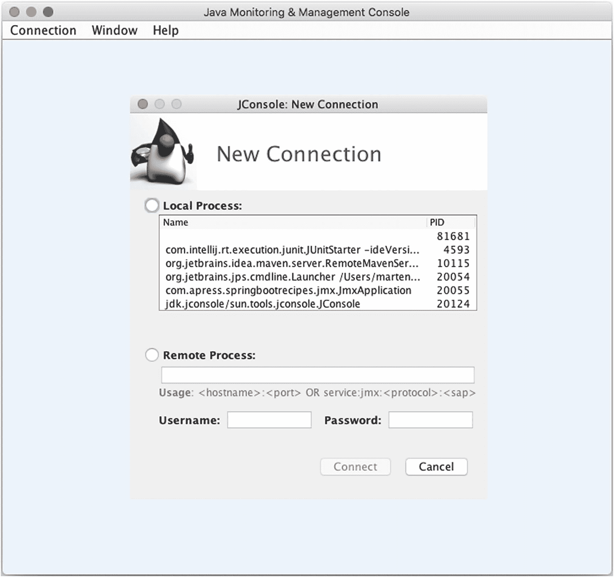
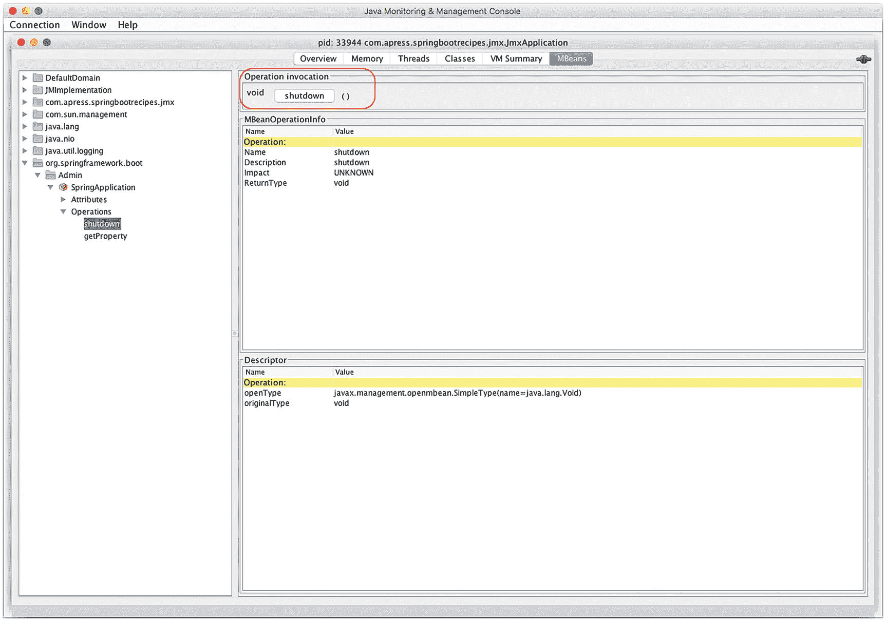
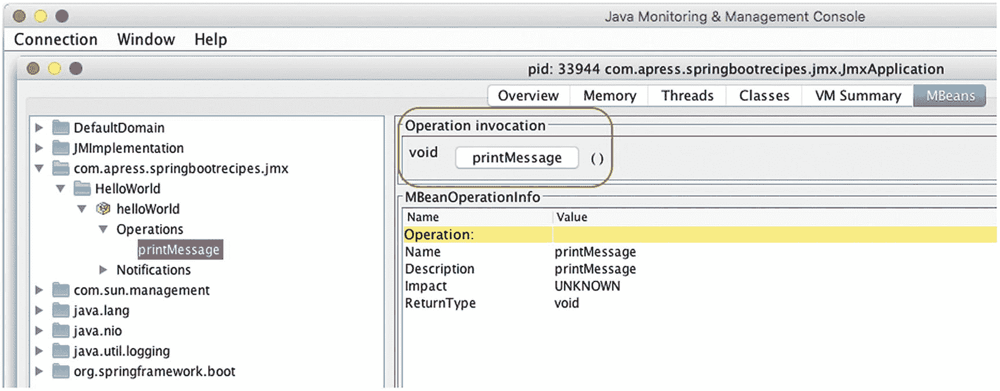
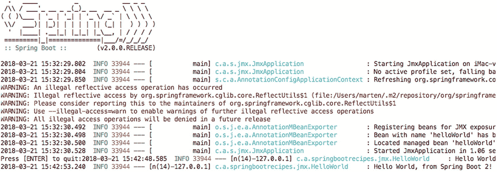

# 8. Java 企业级服务

在本章中，你将学习 Spring 对最常见 Java 企业级服务的支持：Java 管理扩展（JMX）、使用 JavaMail 发送电子邮件、后台处理以及任务调度。

JMX 是 JavaSE 的一部分，是一种用于管理和监控系统资源（如设备、应用程序、对象和服务驱动网络）的技术。这些资源被表示为托管 Bean（MBean）。Spring 通过将任何 Spring Bean 导出为模型 MBean 来支持 JMX，而无需针对 JMX API 进行编程。此外，Spring 可以轻松访问远程 MBean。

JavaMail 是 Java 中用于发送电子邮件的标准 API 和实现。Spring 进一步提供了一个抽象层，以独立于实现的方式发送电子邮件。

## 8.1 Spring 异步处理

### 问题

你希望异步调用一个包含长时间运行方法的方法。

### 解决方案

Spring 支持配置 `TaskExecutor`，并能够异步执行带有 `@Async` 注解的方法。这可以以透明的方式完成，无需进行异步执行的常规设置。然而，Spring Boot 不会自动检测异步方法执行的需求。必须使用 `@EnableAsync` 配置注解来启用此支持。

### 工作原理

让我们编写一个组件，以异步方式向控制台打印一些内容。

```
package com.apress.springbootrecipes.scheduling;
import org.slf4j.Logger;
import org.slf4j.LoggerFactory;
import org.springframework.scheduling.annotation.Async;
import org.springframework.scheduling.annotation.Scheduled;
import org.springframework.stereotype.Component;
@Component
public class HelloWorld {
private static final Logger logger = LoggerFactory.getLogger(HelloWorld.class);
@Async
public void printMessage() throws InterruptedException {
Thread.sleep(500);
logger.info("Hello World, from Spring Boot 2!");
}
}
```

该类将等待 500 毫秒，然后向日志记录器打印内容。注意方法上的 `@Async` 注解；这表示该方法可以以异步方式执行。但是，必须为 Spring Boot 应用程序显式启用此支持。

要启用异步处理，需要 `@EnableAsync` 配置注解。最简单的解决方案是将此注解添加到你的应用程序类中。

```
package com.apress.springbootrecipes.scheduling;
import org.springframework.boot.ApplicationRunner;
import org.springframework.boot.SpringApplication;
import org.springframework.boot.autoconfigure.SpringBootApplication;
import org.springframework.context.annotation.Bean;
import org.springframework.scheduling.annotation.EnableAsync;
import org.springframework.scheduling.annotation.EnableScheduling;
import java.io.IOException;
@SpringBootApplication
@EnableAsync
public class ThreadingApplication {
public static void main(String[] args) throws IOException {
SpringApplication.run(ThreadingApplication.class, args);
System.out.println("Press [ENTER] to quit:");
System.in.read();
}
@Bean
public ApplicationRunner startupRunner(HelloWorld hello) {
return (args) -> {hello.printMessage();};
}
}
```

Spring Boot 默认会创建一个名为 `applicationTaskExecutor` 的 `TaskExecutor`。当添加 `@EnableAsync` 时，它将自动检测此实例并将其用于方法的异步执行，同时还会启用对 `@Async` 注解方法的检测。

`System.in.read` 的存在是为了防止应用程序关闭，以便后台任务可以完成处理。当按下 ENTER 键时，程序将退出。通常，在开发 Web 应用程序时，你不需要这样的东西。


#### 配置 TaskExecutor

Spring Boot 会自动配置一个 `ThreadPoolTaskExecutor`。这可以通过 `spring.task.execution` 命名空间下的属性进行配置（表 8-1）。

表 8-1

Spring Boot 任务执行器属性

| **属性** | **描述** |
| --- | --- |
| `spring.task.execution.pool.core-size` | 核心线程数，默认为 8 |
| `spring.task.execution.pool.max-size` | 最大线程数，默认为 `Integer.MAX_VALUE` |
| `spring.task.execution.pool.queue-capacity` | 队列容量。默认无限制，此时会忽略 `max-size` 属性。 |
| `spring.task.execution.pool.keep-alive` | 线程在终止前可以保持空闲的时间限制 |
| `spring.task.execution.thread-name-prefix` | 新创建线程名称的前缀。默认为 `task-` |
| `spring.task.execution.pool.allow-core-thread-timeout` | 是否允许核心线程超时，默认为 true。这允许线程池动态增长和收缩。 |

将以下内容添加到 `application.properties` 中，将覆盖部分默认值。

```
spring.task.execution.pool.core-size=4
spring.task.execution.pool.max-size=16
spring.task.execution.pool.queue-capacity=125
spring.task.execution.thread-name-prefix=sbr-exec-
```

现在重新运行应用程序，线程名称将以 `sbr-exec` 开头。它将启动四个线程，并最多增长到 16 个。要启用线程池大小调整，需要为队列容量指定一个固定数值。过大（或无限制）的队列容量不会自动增加线程数量。

#### 使用 TaskExecutorBuilder 创建 TaskExecutor

如果需要构造一个 `TaskExecutor`，Spring Boot 提供了 `TaskExecutorBuilder`。这个构建器类使得构造 `ThreadPoolTaskExecutor` 更加容易。它允许我们设置与表 8-1 中相同的属性。

```
@Bean
public TaskExecutor customTaskExecutor(TaskExecutorBuilder builder) {
return builder.corePoolSize(4)
.maxPoolSize(16)
.queueCapacity(125)
.threadNamePrefix("sbr-exec-").build();
}
```

如果由于某种原因，你的应用程序中存在多个 `TaskExecutor` 实例，你需要将其中一个标记为 `@Primary` 以用作默认的 `TaskExecutor`，或者使用 `AsyncConfigurer` 接口并实现 `taskExecutor` 方法来返回要使用的默认 `TaskExecutor`。

```
@SpringBootApplication
@EnableAsync
public class ThreadingApplication implements AsyncConfigurer {
@Bean
public ThreadPoolTaskExecutor taskExecutor() { ... }
@Override
public Executor getAsyncExecutor() {
return taskExecutor();
}
}
```

## 8.2 Spring 任务调度

### 问题

你希望以一致的方式调度方法调用，可以使用 cron 表达式、固定间隔或固定速率。

#### 解决方案

Spring 支持配置 `TaskExecutor` 和 `TaskScheduler`。此功能结合使用 `@Scheduled` 注解调度方法执行的能力，使得 Spring 的调度支持几乎无需额外配置：你只需要一个方法、一个注解，并启用注解扫描器即可。Spring Boot 不会自动检测调度需求；你需要使用 `@EnableScheduling` 注解自行启用。

### 工作原理

让我们编写一个组件，该组件每四秒在日志中输出一条消息。创建一个 Java 类，并在方法上使用 `@Scheduled` 注解，以指示该方法需要被调用。使用 `fixedRate=4000` 作为参数，它将每四秒运行一次。如果你想使用 cron 表达式，可以在 `@Scheduled` 注解上设置 `cron` 属性。

```
package com.apress.springbootrecipes.scheduling;
import org.slf4j.Logger;
import org.slf4j.LoggerFactory;
import org.springframework.scheduling.annotation.Scheduled;
import org.springframework.stereotype.Component;
@Component
public class HelloWorld {
private static final Logger logger =
LoggerFactory.getLogger(HelloWorld.class);
@Scheduled(fixedRate = 4000)
public void printMessage() {
logger.info("Hello World, from Spring Boot 2!");
}
}
```

`@Component` 将确保它被 Spring Boot 检测到。

接下来要做的是为你的应用程序启用调度。最简单的解决方案是使用 `@EnableScheduling` 注解应用程序类。当然，你也可以将其放在其他带有 `@Configuration` 注解的类上。

```
package com.apress.springbootrecipes.scheduling;
import org.springframework.boot.SpringApplication;
import org.springframework.boot.autoconfigure.SpringBootApplication;
import org.springframework.scheduling.annotation.EnableScheduling;
@SpringBootApplication
@EnableScheduling
public class SchedulingApplication {
public static void main(String[] args) {
SpringApplication.run(SchedulingApplication.class, args);
}
}
```

`@EnableScheduling` 将启用对 `@Scheduled` 注解方法的检测，并注册一个用于调度任务的 `TaskScheduler`。当在应用程序上下文中检测到单个 `TaskScheduler` 时，它将使用该实例，而不是创建一个新的。

运行 `SchedulingApplication` 将在大约每四秒在日志中输出一条信息。

除了使用 `@Scheduled` 注解，你也可以使用 Java 代码来调度方法。如果你无法在你希望定期执行的方法上放置 `@Scheduled` 注解，或者你只是想减少注解的使用，那么可能需要这样做。为此，你可以使用 `SchedulingConfigurer`，它有一个用于配置额外任务的单一回调方法。

```
@SpringBootApplication
@EnableScheduling
public class SchedulingApplication implements SchedulingConfigurer {
@Autowired
private HelloWorld helloWorld;
public static void main(String[] args) {
SpringApplication.run(SchedulingApplication.class, args);
}
@Override
public void configureTasks(ScheduledTaskRegistrar taskRegistrar) {
taskRegistrar.addFixedRateTask(
() -> helloWorld.printMessage()
, 4000);
}
}
```

## 8.3 发送电子邮件

当在类路径上检测到邮件属性和 Java 邮件库时，Spring Boot 将自动配置发送邮件的能力。在本节中，我们将了解如何设置属性以及如何使用 Spring Boot 发送电子邮件。

### 问题

你希望从 Spring Boot 应用程序发送电子邮件。

### 解决方案

Spring 的电子邮件支持通过提供一个抽象且与实现无关的 API 来发送电子邮件，从而简化了电子邮件的发送。Spring 电子邮件支持的核心接口是 `MailSender`。`JavaMailSender` 接口是 `MailSender` 的子接口，它包含了专门的 JavaMail 特性，例如多用途互联网邮件扩展（MIME 消息）支持。要发送包含 HTML 内容、内嵌图片或附件的电子邮件，你必须将其作为 MIME 消息发送。当在类路径上找到 `javax.mail` 类并且设置了相应的 `spring.mail` 属性时，Spring Boot 将自动配置 `JavaMailSender`。


### 工作原理

首先，需要在依赖列表中添加 `spring-boot-starter-mail` 依赖。这将把必要的 `javax.mail` 以及 `spring-context` 依赖添加到类路径中。

```
org.springframework.boot
spring-boot-starter-mail

```

#### 配置 JavaMailSender

要能够发送邮件，你需要配置相应的 `spring.mail` 属性（表 8-2）。至少需要 `spring.mail.host` 属性；其他属性是可选的。

表 8-2

Spring Boot 邮件属性

| **属性** | **描述** |
| --- | --- |
| `spring.mail.host` | SMTP 服务器主机 |
| `spring.mail.port` | SMTP 服务器端口（默认 25） |
| `spring.mail.username` | 用于连接 SMTP 服务器的用户名 |
| `spring.mail.password` | 用于连接 SMTP 服务器的密码 |
| `spring.mail.protocol` | SMTP 服务器使用的协议（默认 `smtp`） |
| `spring.mail.test-connection` | 启动时测试 SMTP 服务器是否可用（默认 `false`） |
| `spring.mail.default-encoding` | MIME 消息使用的编码（默认 `UTF-8`） |
| `spring.mail.properties.*` | 要在 JavaMail Session 上设置的附加属性 |
| `spring.mail.jndi-name` | JavaMail Session 的 JNDI 名称，可在部署到 JEE 服务器时使用，该服务器在 JNDI 中预配置了 JavaMail Session。 |

接下来，你至少需要定义 `spring.mail.host` 属性才能发送邮件。

```
spring.mail.host=localhost
spring.mail.port=3025
```

### 注意

本配方的代码使用 GreenMail 作为 SMTP 服务器；可以通过 `bin` 目录中的 `smtp.sh` 脚本运行一个已配置的实例。默认情况下，它会在端口 3025 上暴露一个 SMTP 服务器。

#### 发送纯文本电子邮件

添加了依赖和 `spring.mail` 属性后，Spring Boot 会将一个预配置的 `JavaMailSenderImpl` 作为 bean 添加到 `ApplicationContext` 中。这个 bean 可以通过 `@Autowired` 字段、构造函数或（如下所示）作为 `@Bean` 注解方法中的依赖项自动注入到组件中。

```
package com.apress.springbootrecipes.mailsender;
import org.springframework.boot.ApplicationRunner;
import org.springframework.boot.SpringApplication;
import org.springframework.boot.autoconfigure.SpringBootApplication;
import org.springframework.context.annotation.Bean;
import org.springframework.mail.javamail.JavaMailSender;
import org.springframework.mail.javamail.MimeMessageHelper;
import javax.mail.Message;
@SpringBootApplication
public class MailSenderApplication {
public static void main(String[] args) {
SpringApplication.run(MailSenderApplication.class, args);
}
@Bean
public ApplicationRunner startupMailSender(JavaMailSender mailSender) {
return (args) -> {
mailSender.send((msg) -> {
var helper = new MimeMessageHelper(msg);
helper.setTo("recipient@some.where");
helper.setFrom("spring-boot-2-recipes@apress.com");
helper.setSubject("Status message");
helper.setText("All is well.");
});
};
}
}
```

`MailSenderApplication` 在应用程序完成启动后会发送一封电子邮件。`startupMailSender` 是一个 `ApplicationRunner`（参见第 2 章），它使用预配置的 `JavaMailSender` 来发送邮件消息。

#### 使用 Thymeleaf 作为电子邮件模板

Spring Boot 对使用 Thymeleaf^(³⁵) 作为模板解决方案提供了很好的支持；然而，默认设置主要用于将 Thymeleaf 用于网页。不过，将 Thymeleaf 用于电子邮件模板也是完全可行的。

首先，添加 `spring-boot-starter-thymeleaf` 作为依赖。这将引入所有需要的 Thymeleaf 依赖，并自动配置 Thymeleaf `TemplateEngine`，我们需要它来生成 HTML 内容。

```
org.springframework.boot
spring-boot-starter-thymeleaf

```

默认情况下，Spring 配置的 Thymeleaf `TemplateEngine` 会从 `src/main/resources` 下的 `templates` 目录解析 HTML 模板。向此目录添加一个名为 `email.html` 的文件，并从中制作一封漂亮的电子邮件消息。

```

此处将包含一些电子邮件内容。

此致
敬礼

您的应用程序

```

`th:text` 是一个 Thymeleaf 标签，它会用该属性的值替换内容。当然，我们需要从邮件发送/生成代码中为该属性传递一个值。

```
package com.apress.springbootrecipes.mailsender;
import org.springframework.boot.ApplicationRunner;
import org.springframework.boot.SpringApplication;
import org.springframework.boot.autoconfigure.SpringBootApplication;
import org.springframework.context.annotation.Bean;
import org.springframework.context.i18n.LocaleContextHolder;
import org.springframework.mail.javamail.JavaMailSender;
import org.springframework.mail.javamail.MimeMessageHelper;
import org.thymeleaf.context.Context;
import org.thymeleaf.spring5.SpringTemplateEngine;
import javax.mail.Message;
import java.util.Collections;
@SpringBootApplication
public class MailSenderApplication {
public static void main(String[] args) {
SpringApplication.run(MailSenderApplication.class, args);
}
@Bean
public ApplicationRunner startupMailSender(
JavaMailSender mailSender,
SpringTemplateEngine templateEngine) {
return (args) -> {
mailSender.send((msg) -> {
var helper = new MimeMessageHelper(msg);
helper.setTo("recipient@some.where");
helper.setFrom("spring-boot-2-recipes@apress.com");
helper.setSubject("Status message");
var context =  new Context(
LocaleContextHolder.getLocale(),
Collections.singletonMap("msg", "All is well!"));
var body = templateEngine.process("email.html", context);
helper.setText(body, true);
});
};
}
}
```

这段代码与之前的代码仍然非常相似，但区别在于现在我们有了一个 `SpringTemplateEngine` 可供使用，来为我们的电子邮件生成 HTML 内容。我们使用 `process` 方法选择要渲染的模板 `email.html`，并传入一个 `Context` 对象。Thymeleaf 使用 `Context` 对象来解析属性，在我们的例子中是 `msg` 属性。

## 8.4 注册 JMX MBean

### 问题

你希望在 Spring Boot 应用程序中将一个对象注册为 JMX MBean，以便能够查看正在运行的服务并在运行时操作其状态。这将允许你执行诸如重新运行批处理作业、调用方法和更改配置元数据等任务。

### 解决方案

Spring Boot 默认启用 Spring JMX 支持，并会检测带有 `@ManagedResource` 注解的 bean，并将它们注册到 JMX 服务器。


### 工作原理

首先，我们来检查一下 Spring Boot 默认启用的 JMX 支持。让我们创建一个简单的 Spring Boot 应用程序，它将持续运行，并使用 JConsole 来检查正在运行的应用程序。

```
package com.apress.springbootrecipes.jmx;
import org.springframework.boot.SpringApplication;
import org.springframework.boot.autoconfigure.SpringBootApplication;
import java.io.IOException;
@SpringBootApplication
public class JmxApplication {
public static void main(String[] args) throws IOException {
SpringApplication.run(JmxApplication.class, args);
System.out.print("Press [ENTER] to quit:");
System.in.read();
}
}
```

当应用程序运行时，你可以启动 `jconsole`，系统会提示你选择一个屏幕，你可以在其中选择要连接的本地进程。选择正在运行 `JmxApplication` 的那个进程（图 8-1）。



图 8-1

JConsole 进程选择

选择进程后，转到 **MBeans** 选项卡，打开 `org.springframework.boot` 菜单以及屏幕左侧其下的所有内容。在 `SpringApplication` 上有一个 `shutdown` 操作，你可以调用它。调用后，它将关闭应用程序（图 8-2）。



图 8-2

调用 shutdown 方法

为了配置 JMX，Spring Boot 提供了三个属性（表 8-3）。

表 8-3

Spring Boot JMX 属性

| **属性** | **描述** |
| --- | --- |
| `spring.jmx.enabled` | 是否启用 JMX（默认为 `true`） |
| `spring.jmx.server` | 要使用的 JMX MBeanServer 的 bean 名称（默认为 `mbeanServer`）。通常仅在应用程序上下文中手动注册了 `MBeanServer` 时才需要。 |
| `spring.jmx.default-domain` | 用于注册 bean 的 JMX 域名（默认为包名） |

由于 Spring Boot 默认启用了 JMX 和 Spring 对 JMX 的支持，因此暴露一个 bean 非常简单。要暴露一个 bean，它需要具有 `@ManagedResource` 注解，并且要暴露的操作需要带有 `@ManagedOperation` 注解。

```
package com.apress.springbootrecipes.jmx;
import org.slf4j.Logger;
import org.slf4j.LoggerFactory;
import org.springframework.jmx.export.annotation.ManagedOperation;
import org.springframework.jmx.export.annotation.ManagedResource;
import org.springframework.scheduling.annotation.Async;
import org.springframework.stereotype.Component;
@Component
@ManagedResource
public class HelloWorld {
private static final Logger logger =
LoggerFactory.getLogger(HelloWorld.class);
@ManagedOperation
public void printMessage() {
logger.info("Hello World, from Spring Boot 2!");
}
}
```

当应用程序重新启动并且 JConsole 重新连接到运行 `JmxApplication` 的进程后，你会注意到左侧菜单中出现了一个 `com.apress.springbootrecipes.jmx` 叶子节点。展开所有节点，在 Operations 叶子节点中，你将找到 `printMessage` 操作（图 8-3）。



图 8-3

调用 printMessage 方法

当调用 `printMessage` 方法时，控制台将打印消息（图 8-4）。



图 8-4

控制台输出

脚注 1

