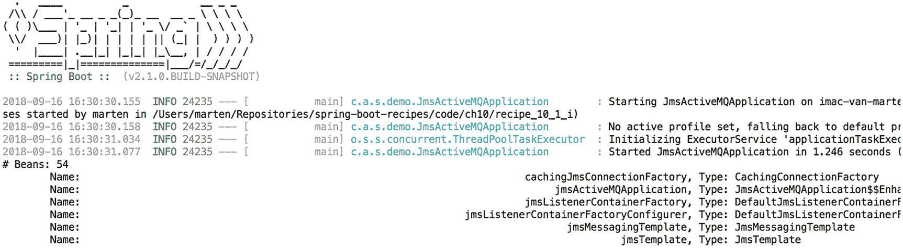
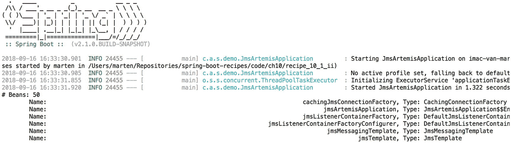

# 9. 消息传递

## 9.1 配置 JMS

### 问题

你想在 Spring Boot 应用程序中使用 JMS，并且需要连接到 JMS 代理。

### 解决方案

Spring Boot 支持对 ActiveMQ^(³⁶) 和 Artemis^(³⁷) 的自动配置。添加其中一个 JMS 提供程序，并分别在 `spring.activemq` 和 `spring.artemis` 命名空间中设置一些属性，就足够了。

### 工作原理

通过声明你选择的 JMS 提供程序的依赖，Spring Boot 将自动为你配置 `ConnectionFactory` 和查找目标（`DestinationResolver`）的策略。这也可以通过使用 JNDI 来完成，如果你需要对 `ConnectionFactory` 进行更多控制，最终的解决方案是自己完成所有配置。

为支持的 JMS 提供程序添加依赖非常简单，因为 Spring Boot 为它们提供了启动项目；对于 JNDI，你需要自己包含 JMS 依赖。

#### 使用 ActiveMQ

使用 ActiveMQ 时，首先要做的是包含 `spring-boot-starter-activemq`，这将引入所有需要的 JMS 和 ActiveMQ 依赖以开始使用。它将包含 `spring-jms` 依赖和 ActiveMQ 的客户端库。

```
org.springframework.boot
spring-boot-starter-activemq

```

默认情况下，如果没有给出明确的代理配置，Spring Boot 将启动一个嵌入式代理。可以使用 `spring.activemq` 命名空间中的属性来更改配置（参见表 9-1）。

表 9-1

ActiveMQ 配置属性

| 属性 | 描述 |
| --- | --- |
| `spring.activemq.broker-url` | 要连接的代理的 URL，对于内存代理默认为 `vm://localhost?broker.persistent=false`，否则为 `tcp://localhost:61616` |
| `spring.activemq.user` | 用于连接代理的用户名，默认为空 |
| `spring.activemq.password` | 用于连接代理的密码，默认为空 |
| `spring.activemq.in-memory` | 是否应使用嵌入式代理，默认为 `true`。当显式设置了 `spring.activemq.broker-url` 时忽略 |
| `spring.activemq.non-blocking-redelivery` | 在重新传递回滚消息之前停止消息传递；启用时消息顺序将无法保证！默认为 `false` |
| `spring.activemq.close-timeout` | 等待关闭生效的时间，默认为 15 秒 |
| `spring.activemq.send-timeout` | 等待代理响应的时间，默认为 0（无限制） |
| `spring.activemq.packages.trust-all` | 使用 Java 序列化发送 JMS 消息时，是否信任所有包中的类，默认为无（需要显式设置包） |
| `spring.activemq.packages.trusted` | 要信任的特定包的逗号分隔列表 |

一个简单的应用程序，用于列出所有名称中包含 `jms` 的 bean，这应该包括一个名为 `cachingJmsConnectionFactory` 的 bean。

```
@SpringBootApplication
public class JmsActiveMQApplication {
private static final String MSG = "\tName: %100s, Type: %s\n";
public static void main(String[] args) {
var ctx = SpringApplication.run(JmsActiveMQApplication.class, args);
System.out.println("# Beans: " + ctx.getBeanDefinitionCount());
var names = ctx.getBeanDefinitionNames();
Stream.of(names)
.filter(name -> name.toLowerCase().contains("jms"))
.forEach(name -> {
Object bean = ctx.getBean(name);
System.out.printf(MSG, name, bean.getClass().getSimpleName());
});
}
}
```

运行上述代码时，它会将所有名称中包含 `jms` 的 bean 的名称和类型打印到控制台。输出应类似于图 9-1 所示。



图 9-1

ActiveMQ bean 输出


#### 使用 Artemis

使用 Artemis 时，首先要做的是引入 `spring-boot-starter-artemis`。这将拉取所有必要的 JMS 和 Artemis 依赖项以便开始使用。它会包含 `spring-jms` 依赖项以及 Artemis 的库。

表 9-2

Artemis 配置属性

| 属性 | 描述 |
| --- | --- |
| `spring.artemis.host` | 连接 Artemis 代理的主机名，默认为 `localhost` |
| `spring.artemis.port` | 连接 Artemis 代理的端口号，默认为 `61616` |
| `spring.artemis.user` | 连接 Artemis 代理的用户名，默认为空 |
| `spring.artemis.password` | 连接 Artemis 代理的密码，默认为空 |
| `spring.artemis.mode` | 操作模式，可以是 `native` 或 `embedded`，默认不设置，会自动检测模式。如果找到嵌入式类，将以嵌入式模式运行 |

```
org.springframework.boot
spring-boot-starter-artemis

```

一个简单的应用程序，用于列出所有名称中包含 `jms` 的 Bean，这应该包含一个名为 `cachingJmsConnectionFactory` 的 Bean。

```
@SpringBootApplication
public class JmsActiveMQApplication {
private static final String MSG = "\t 名称: %100s, 类型: %s\n";
public static void main(String[] args) {
var ctx = SpringApplication.run(JmsActiveMQApplication.class, args);
System.out.println("# Bean 数量: " + ctx.getBeanDefinitionCount());
var names = ctx.getBeanDefinitionNames();
Stream.of(names)
.filter(name -> name.toLowerCase().contains("jms"))
.sorted(Comparator.naturalOrder())
.forEach(name -> {
Object bean = ctx.getBean(name);
System.out.printf(MSG, name, bean.getClass().getSimpleName());
});
}
}
```

运行时，输出将如图 9-2 所示。



图 9-2

Artemis Bean 输出

### 注意

您可能会想，在使用 Artemis 时，您的配置中是否仍然存在 `ActiveMQConnectionFactory`。Artemis 基于 ActiveMQ，因此与其共享类。

Artemis 可以以嵌入式模式使用（就像 ActiveMQ 一样）；然后它将启动一个嵌入式代理。要进行配置，`spring.artemis.embedded` 命名空间中公开了几个属性（参见表 9-3）。嵌入式模式需要将 `artemis-server` 作为额外的依赖项。

表 9-3

Artemis 嵌入式配置属性

| 属性 | 描述 |
| --- | --- |
| `spring.artemis.embedded.enabled` | 是否启用嵌入式模式，默认为 `true` |
| `spring.artemis.embedded.persistent` | 消息是否持久化，默认为 `false` |
| `spring.artemis.embedded.data-directory` | 用于存储日志的目录，仅在 `persistent` 为 `true` 时有用。默认为 Java 临时目录。 |
| `spring.artemis.embedded.queues` | 启动时要创建的队列列表，以逗号分隔 |
| `spring.artemis.embedded.topics` | 启动时要创建的主题列表，以逗号分隔 |
| `spring.artemis.embedded.cluster-password` | 集群密码，默认自动生成 |

```
org.apache.activemq
artemis-server

```

##### JNDI

将 Spring Boot 应用程序部署到 JEE 容器时，您很可能也想使用该容器中预先注册的 `ConnectionFactory`。要启用此功能，您需要依赖 `spring-jms` 库和 `javax.jms-api`（后者可能可以标记为 provided，因为它将由您的 JEE 容器提供）。您可以使用其中一个 starter 并排除显式的 ActiveMQ 或 Artemis 依赖项；但是，仅声明所需的依赖项更简单明了。

```
org.springframework
spring-jms

javax.jms
javax.jms-api
provided

```

当 JNDI 可用时，Spring Boot 将首先尝试在 JNDI 注册表中以众所周知的名称 `java:/JmsXA` 和 `java:/XAConnectionFactory` 或通过 `spring.jms.jndi-name` 属性指定的名称来检测 `ConnectionFactory`。此外，它还会自动创建一个 `JndiDestinationResolver`，以便队列和主题也会在 JNDI 中被检测到；默认情况下，允许回退到动态创建目标。

```
spring.jms.jndi-name=java:/jms/connectionFactory
```

完成这些设置并构建好您的 WAR（参见配方 11.2）后，您现在可以将应用程序部署到 JEE 容器，并重用现有的 `ConnectionFactory`。

#### 手动配置

配置 JMS 的最后一种方法是进行手动配置。为此，您至少需要 `spring-jms` 和 `javax.jms-api` 依赖项，以及可能用于您正在使用的 JMS 代理的一些客户端库。在以下情况下可能需要手动配置：

1.  Spring Boot 无法自动配置您的 `ConnectionFactory`。

2.  需要对 `ConnectionFactory` 进行大量设置。

3.  需要多个 `ConnectionFactory` 实例。

要配置 `ConnectionFactory`，您可以添加一个带有 `@Bean` 注解的方法来构造一个。

```
@Bean
public ConnectionFactory connectionFactory() {
var connectionFactory = new ActiveMQConnectionFactory("vm://localhost?broker.persistent=false");
connectionFactory.setClientID("someId");
connectionFactory.setCloseTimeout(125);
return connectionFactory;
}
```

这将为 ActiveMQ 创建一个 `ConnectionFactory`；它将使用一个非持久化的嵌入式代理，并设置 `clientId` 和 `closeTimeout`。当 Spring Boot 检测到预先配置的 `ConnectionFactory` 时，它不会尝试自己创建一个。

## 9.2 使用 JMS 发送消息

### 问题

您希望通过 JMS 向其他系统发送消息。

### 解决方案

使用 Spring Boot 提供的 `JmsTemplate` 来发送和（可选地）转换消息。


### 工作原理

使用 Spring Boot 时，当检测到 JMS 和单个 `ConnectionFactory`，它会自动配置一个 `JmsTemplate`，可用于发送和转换消息。Spring Boot 在 `spring.jms.template` 命名空间中暴露了属性，可用于配置 `JmsTemplate`。

#### 使用 **JmsTemplate** 发送消息

要通过 JMS 发送消息，你可以使用 `JmsTemplate` 上的 `send` 或 `sendAndConvert` 方法。让我们编写一个组件，每秒将包含当前日期和时间的消息放入队列。

```
@Component
class MessageSender {
private final JmsTemplate jms;
MessageSender(JmsTemplate jms) {
this.jms = jms;
}
@Scheduled(fixedRate = 1000)
public void sendTime() {
jms.convertAndSend("time-queue", "Current Date & Time is: " +
LocalDateTime.now());
}
}
```

`JmsTemplate` 通过构造函数自动注入，由于定时调度，我们将在一个名为 `time-queue` 的队列上收到包含当前日期和时间的消息。要运行此代码，你需要一个带有 `@EnableScheduling` 注解的 `@SpringBootApplication` 类，以便处理 `@Scheduled`。

```
@SpringBootApplication
@EnableScheduling
public class JmsSenderApplication {
public static void main(String[] args) {
SpringApplication.run(JmsSenderApplication.class, args);
}
}
```

现在运行此类时，看起来似乎没有发生太多事情，但消息正在填充队列。我们可以编写一个简单的集成测试来检查此代码是否正常工作。

```
package com.apress.springbootrecipes.demo;
import org.junit.Test;
import org.junit.runner.RunWith;
import org.springframework.beans.factory.annotation.Autowired;
import org.springframework.boot.test.context.SpringBootTest;
import org.springframework.jms.core.JmsTemplate;
import org.springframework.test.context.junit4.SpringRunner;
import javax.jms.JMSException;
import javax.jms.Message;
import javax.jms.TextMessage;
import static org.assertj.core.api.Assertions.assertThat;
@RunWith(SpringRunner.class)
@SpringBootTest
public class JmsSenderApplicationTest {
@Autowired
private JmsTemplate jms;
@Test
public void shouldSendMessage() throws JMSException {
Message message = jms.receive("time-queue");
assertThat(message)
.isInstanceOf(TextMessage.class);
assertThat(((TextMessage) message).getText())
.startsWith("Current Date & Time is: ");
}
}
```

这个 JUnit 测试将启动应用程序并开始发送消息。在测试中，我们使用 `JmsTemplate` 来 `receive` 消息，并对其进行一些断言，以查看消息是否确实已发送并包含我们期望的内容。由于我们尚未进行任何配置，测试将使用嵌入式 JMS 代理。运行测试时，它应该通过，因为消息将被发送和接收。

### 提示

在为消息传递编写测试时，你可能希望设置 `JmsTemplate` 的 `receive-timeout` 属性，因为默认情况下会无限期等待消息到达；然而，在 500 毫秒后，你可能希望测试失败。你可以通过将 `spring.jms.template.receive-timeout=500ms` 添加到 `application.properties` 来实现这一点。

#### 配置 **JmsTemplate**

Spring Boot 在 `spring.jms.template` 命名空间中提供了属性来配置 `JmsTemplate`（表 9-4）。

表 9-4

`JmsTemplate` 属性

| 属性 | 描述 |
| --- | --- |
| `spring.jms.template.default-destination` | 当未指定特定目标时，用于发送和接收操作的默认目标 |
| `spring.jms.template.delivery-delay` | 发送消息的投递延迟 |
| `spring.jms.template.delivery-mode` | 投递模式，`persistent` 或 `non-persistent`，当显式设置时将 `qos-enabled` 设置为 `true` |
| `spring.jms.template.priority` | 发送消息时的优先级。默认为无，当显式设置时将 `qos-enabled` 设置为 `true` |
| `spring.jms.template.qos-enabled` | 是否启用 QOS（服务质量）。启用后，将设置消息的优先级、投递模式和生存时间。默认为 `false` |
| `spring.jms.template.receive-timeout` | 接收调用的超时时间。默认为无限期 |
| `spring.jms.template.time-to-live` | JMS 消息的生存时间，设置时将 `qos-enabled` 设置为 `true` |
| `spring.jms.pub-sub-domain` | 默认目标是主题还是队列。默认为 `false`，表示队列 |

除了这些属性之外，如果能够找到 Bean 的唯一实例，`JmsTemplate` 还将自动配置一个 `DestinationResolver` 和 `MessageConverter`。如果找不到唯一实例，将使用默认值，即 `DynamicDestinationResolver` 和 `SimpleMessageConverter`（表 9-5）。

表 9-5

`SimpleMessageConverter` 类到 JMS 消息的转换器

| 类型 | JMS 消息类型 |
| --- | --- |
| `java.lang.String` | `javax.jms.TextMessage` |
| `java.util.Map` | `javax.jms.MapMessage` |
| `java.io.Serializable` | `javax.jms.ObjectMessage` |
| `byte[]` | `javax.jms.BytesMessage` |

让我们向 `orders` 队列发送一个 `Order`。使用 Jackson 发送 JSON，而不是使用 Java 序列化机制。

```
public class Order {
private String id;
private BigDecimal amount;
public Order() {
}
public Order(String id, BigDecimal amount) {
this.id=id;
this.amount = amount;
}
// 为简洁起见，省略了 Getter/Setter
@Override
public String toString() {
return String.format("Order [id='%s', amount=%4.2f]", id, amount);
}
}
```

这就是我们要发送的简单订单。

现在我们需要一个发送器，它构造一个 `Order` 并使用 `JmsTemplate` 将其放入队列。

```
@Component
class OrderSender {
private final JmsTemplate jms;
OrderSender(JmsTemplate jms) {
this.jms = jms;
}
@Scheduled(fixedRate = 1000)
public void sendTime() {
var id = UUID.randomUUID().toString();
var amount = ThreadLocalRandom.current().nextDouble(1000.00d);
var order = new Order(id, BigDecimal.valueOf(amount));
jms.convertAndSend("orders", order);
}
}
```

这与之前编写的 `MessageSender` 没有太大区别，但现在它创建了一个包含一些随机生成数据的 `Order`，并将其发送到 `orders` 队列。运行此代码时，实际上会失败。转换失败，因为 `Order` 没有实现 `Serializable`，而这是将 `Order` 转换为 `ObjectMessage` 所必需的（参见表 9-5）。然而，我们希望使用 JSON 来实现这一点；需要一个不同的 `MessageConverter`，确切地说是 `MappingJackson2MessageConverter`。它使用 Jackson 将对象编组和解组为 JSON。它应该作为 Bean 添加到配置中。

首先，你需要将 Jackson 的依赖项添加到构建配置中。

```
com.fasterxml.jackson.core
jackson-core

```

接下来，你可以配置 `MappingJackson2MessageConverter`。

```
@SpringBootApplication
@EnableScheduling
public class JmsSenderApplication {
public static void main(String[] args) {
SpringApplication.run(JmsSenderApplication.class, args);
}
@Bean
public MappingJackson2MessageConverter messageConverter() {
var messageConverter = new MappingJackson2MessageConverter();
messageConverter.setTypeIdPropertyName("content-type");
messageConverter.setTypeIdMappings(
Collections.singletonMap("order", Order.class));
return messageConverter;
}
}
```

`typeIdPropertyName` 是一个必需属性，指示存储消息实际类型的属性名称。如果不进行进一步配置，将使用类的完全限定名（FQN）。使用 `typeIdMappings`，你可以指定将哪个类型映射到哪个类，反之亦然。如果未指定，则类的 FQN 将用作映射中的类型。发送 `Order` 时，`content-type` 标头将包含值 `order`。


### 提示

通常，显式定义类型映射是一个好主意。这样，你就不必在 Java 层面上将两个或多个应用程序显式绑定在一起。它们可以使用自己的映射，将 `order` 映射到各自的 `Order` 类。

完成上述配置后，我们可以编写一个测试来验证订单是否确实被发送。

```
@RunWith(SpringRunner.class)
@SpringBootTest
public class JmsSenderApplicationTest {
@Autowired
private JmsTemplate jms;
@Test
public void shouldReceiveOrderPlain() throws Exception {
Message message = jms.receive("orders");
assertThat(message)
.isInstanceOf(BytesMessage.class);
BytesMessage msg = (BytesMessage) message;
ObjectMapper mapper = new ObjectMapper();
byte[] content = new byte[(int) msg.getBodyLength()];
msg.readBytes(content);
Order order = mapper.readValue( content, Order.class);
assertThat(order).hasNoNullFieldsOrProperties();
}
@Test
public void shouldReceiveOrderWithConversion() throws Exception {
Order order = (Order) jms.receiveAndConvert("orders");
System.out.println(order);
assertThat(order).hasNoNullFieldsOrProperties();
}
}
```

这里有两个测试方法：第一个是普通方法，手动将消息转换为 `Order`；而第二个方法使用 `receiveAndConvert` 方法，让转换自动完成。这旨在展示 `MessageConverter` 的作用，以及它如何使你的代码更具可读性。`MappingJackson2MessageConverter` 将 `Order` 转换为 `BytesMessages`。要使用 `TextMessage`，你可以将 `targetType` 属性设置为 `TEXT`。然后，你将收到一个 `TextMessage`，其负载是一个 JSON 格式的 `String`。

## 9.3 使用 JMS 接收消息

### 问题

你想从 JMS 目的地读取消息，以便在应用程序中处理它们。

### 解决方案

创建一个类，并使用 `@JmsListener` 注解方法，将其绑定到一个目的地并处理传入的消息。

### 工作原理

你可以创建一个 POJO，并使用 `@JmsListener` 注解其方法。Spring 会检测到这一点，并为其创建一个 JMS 监听器。Spring Boot 暴露了属性，用于在 `spring.jms.listener` 命名空间下配置监听器。

#### 接收消息

让我们创建一个服务，用于监听来自配方 9.2 中发送者发送的消息。

```
@Component
class CurrentDateTimeService {
@JmsListener(destination = "time-queue")
public void handle(Message msg) throws JMSException {
Assert.state(msg instanceof TextMessage, "Can only handle TextMessage.");
System.out.println("[RECEIVED] - " + ((TextMessage) msg).getText());
}
}
```

这是一个普通的类，其方法使用了 `@JmsListener` 注解，该注解至少需要一个 `destination` 属性，以便知道从哪里检索消息。它接受一个 `javax.jms.Message` 参数，我们验证其为 `TextMessage` 类型，并将内容打印到控制台。`@JmsListener` 注解方法的方法签名具有一定的灵活性，因为它允许使用多个参数，这些参数可以是注解类型的，也可以是特定类型的（表 9-6）。

表 9-6

允许的方法参数类型

| 类型 | 描述 |
| --- | --- |
| `java.lang.String` | 获取消息负载为 `String`，仅适用于 `TextMessage` |
| `java.util.Map` | 获取消息负载为 `Map`，仅适用于 `MapMessage` |
| `byte[]` | 获取消息负载为 `byte[]`，仅适用于 `BytesMessage` |
| 可序列化对象 | 从 `ObjectMessage` 反序列化对象 |
| `javax.jms.Message` | 获取实际的 JMS 消息 |
| `javax.jms.Session` | 访问 `Session`，例如用于发送自定义回复 |
| `@Header` 注解的元素 | 从 JMS 消息中提取一个标头 |
| `@Headers` 注解的元素 | 仅可用于 `java.util.Map`，以获取所有 JMS 消息标头 |

监听器可以简化，只需使用 `String` 作为方法参数，而无需我们自己处理 `javax.jms.Message`。

```
@Component
class CurrentDateTimeService {
@JmsListener(destination = "time-queue")
public void handle(String msg) {
System.out.println("[RECEIVED] - " + msg);
}
}
```

#### 配置监听器容器

Spring 使用 `JmsListenerContainerFactory` 来创建支持 `@JmsListener` 注解所需的基础设施。Spring Boot 配置了一个默认的工厂，可以使用 `spring.jms.listener` 命名空间下的属性进行配置。如果这还不够，你始终可以配置自己的实例，并手动完成所有配置选项。当 Spring Boot 在上下文中检测到 `JmsListenerContainerFactory` 时，它将不再创建。

表 9-7

监听器容器属性

| 属性 | 描述 |
| --- | --- |
| `spring.jms.listener.acknowledge-mode` | 容器的确认模式，默认为自动。 |
| `spring.jms.listener.auto-startup` | 启动时自动启动容器。默认值为 `true` |
| `spring.jms.listener.concurrency` | 并发消费者的最小数量。默认值为 none，导致 1 个并发消费者（Spring 默认值）。 |
| `spring.jms.listener.max-concurrency` | 并发消费者的最大数量。默认值为 none，导致 1 个并发消费者（Spring 默认值）。 |
| `spring.jms.pub-sub-domain` | 默认目的地是主题。默认值为 `false`，表示队列。 |

默认配置的 `JmsListenerContainerFactory` 也会检测单个、唯一的 `DestinationResolver` 和 `MessageConverter`，如果找到，则会使用它们；否则，它将使用 Spring 默认的 `DynamicDestinationResolver` 和 `SimpleMessageConverter`（更多信息请参见配方 9.2）。

#### 使用自定义 **MessageConverter**

如果你想通过 JMS 将对象作为 JSON 发送到下一个系统，该怎么办？你可以依赖 Java 序列化，但这通常不被推荐，因为它会使系统紧密耦合。使用 JSON 或 XML 来传输对象/消息是更好的方式。使用 Spring JMS，只需配置一个不同的 `MessageConverter` 即可（发送部分也请参见配方 9.2）。

```
@Bean
public MappingJackson2MessageConverter messageConverter() {
var messageConverter = new MappingJackson2MessageConverter();
messageConverter.setTypeIdPropertyName("content-type");
messageConverter.setTypeIdMappings(singletonMap("order", Order.class));
return messageConverter;
}
```

`MappingJackson2MessageConverter` 默认需要一个属性名来存放内容类型的标识符。该标识符将从 JMS 消息的标头中读取（这里我们将其设置为 `content-type`）。接下来，我们可以选择性地定义类型与类之间的映射。由于我们希望能够将对象映射到 `Order` 类，我们将其指定为内容类型 `order` 的映射。

```
@Component
class OrderService {
@JmsListener(destination = "orders")
public void handle(Order order) {
System.out.println("[RECEIVED] - " + order);
}
}
```

监听器接收 `Order` 对象，因为 Spring JMS 会负责接收和转换消息。如果你将此监听器与配方 9.2 中的订单发送者结合使用，你将看到源源不断的订单流入。


#### 发送回复

有时在接收消息时，您希望返回一个答案或触发流程的另一部分。使用 Spring Messaging 可以轻松实现：您只需从处理器方法中返回想要发送的内容即可。要确定将响应发送到何处，您可以添加一个额外的 `@SendTo` 注解来指定目标。让我们修改示例，将 `OrderConfirmation` 发送到 `order-confirmations` 队列。

```
@Component
class OrderService {
@JmsListener(destination = "orders")
@SendTo("order-confirmations")
public OrderConfirmation handle(Order order) {
System.out.println("[RECEIVED] - " + order);
return new OrderConfirmation(order.getId());
}
}
```

`OrderService` 略有变化；现在它在处理订单后会返回一个 `OrderConfirmation`。通过 `@SendTo` 注解，我们指定了将结果放入哪个目标。

让我们为 `OrderConfirmation` 对象创建另一个监听器，以便能够看到它们的到来。

```
@Component
class OrderConfirmationService {
@JmsListener(destination = "order-confirmations")
public void handle(OrderConfirmation confirmation) {
System.out.println("[RECEIVED] - " + confirmation);
}
}
```

最后是 `OrderConfirmation` 类。它将根据传入的消息构建。

```
public class OrderConfirmation {
private String orderId;
public OrderConfirmation() {}
public OrderConfirmation(String orderId) {
this.orderId = orderId;
}
public String getOrderId() {
return orderId;
}
public void setOrderId(String orderId) {
this.orderId = orderId;
}
@Override
public String toString() {
return String.format("OrderConfirmation [orderId='%s']", orderId);
}
}
```

运行应用程序时，您将看到首先接收到订单，接着接收到 `OrderConfirmation`。

## 9.4 配置 RabbitMQ

### 问题

您希望在 Spring Boot 应用程序中使用 AMQP 消息传递，并且需要连接到 RabbitMQ 代理。

### 解决方案

配置适当的 `spring.rabbitmq` 属性（至少需要 `spring.rabbitmq.host`）以连接到交换机，并能够发送和接收消息。

### 工作原理

当 Spring Boot 在类路径上检测到 RabbitMQ 客户端库时，它会自动创建一个 `ConnectionFactory`。要开始使用，您需要添加 `spring-boot-starter-amqp` 依赖项；这将引入所有必需的依赖项。

```
org.springframework.boot
spring-boot-starter-amqp

```

现在您可以使用 `spring.rabbitmq` 属性连接到代理。

```
spring.rabbitmq.host=localhost
spring.rabbitmq.port=5672
spring.rabbitmq.username=guest
spring.rabbitmq.password=guest
```

上述配置是连接到 RabbitMQ 默认实例所需的全部内容，并且也是 Spring Boot 使用的默认值。

表 9-8

常见的 RabbitMQ 属性

| 属性 | 描述 |
| --- | --- |
| `spring.rabbitmq.addresses` | 客户端应连接的地址列表，以逗号分隔 |
| `spring.rabbitmq.connection-timeout` | 连接超时。默认为 none，`0` 表示永不超时 |
| `spring.rabbitmq.host` | RabbitMQ 主机，默认为 `localhost` |
| `spring.rabbitmq.port` | RabbitMQ 端口，默认为 `5672` |
| `spring.rabbitmq.username` | 用于连接的用户名，默认为 `guest` |
| `spring.rabbitmq.password` | 用于连接的密码，默认为 `guest` |
| `spring.rabbitmq.virtual-host` | 连接到代理时使用的虚拟主机 |

## 9.5 使用 RabbitMQ 发送消息

### 问题

您希望向 RabbitMQ 代理发送一条消息，以便该消息能够传递给接收者。

### 解决方案

使用 `RabbitTemplate`，您可以向交换机发送消息并提供路由键。

### 工作原理

当 Spring Boot 找到一个唯一的 `ConnectionFactory` 时，它会自动配置一个 `RabbitTemplate`；此模板可用于向队列发送消息。

#### 配置 **RabbitTemplate**

如果 Spring Boot 能够找到一个唯一的 `ConnectionFactory`，并且配置中不存在 `RabbitTemplate`，它将自动配置一个 `RabbitTemplate`。Spring Boot 允许我们通过 `spring.rabbitmq.template` 命名空间中的属性来修改已配置的 `RabbitTemplate`（表 9-9）。

表 9-9

RabbitTemplate 配置属性

| 属性 | 描述 |
| --- | --- |
| `spring.rabbitmq.template.exchange` | 用于发送操作的默认交换机名称，默认为 none |
| `spring.rabbitmq.template.routing-key` | 用于发送操作的默认路由键值，默认为 none |
| `spring.rabbitmq.template.receive-timeout` | 接收操作的超时时间。默认为 0，无超时 |
| `spring.rabbitmq.template.reply-timeout` | 发送并接收操作的超时时间。默认为 5 秒 |

Spring Boot 还使得使用 `RabbitTemplate` 配置重试逻辑变得容易；默认情况下它是禁用的。通过在 `application.properties` 中设置 `spring.rabbitmq.template.retry.enabled=true` 即可启用。现在，当发送失败时，它将额外尝试两次发送消息。要更改重试次数或间隔，您可以使用 `spring.rabbitmq.template.retry` 命名空间中的属性（表 9-10）。

表 9-10

RabbitTemplate 重试配置

| 属性 | 描述 |
| --- | --- |
| `spring.rabbitmq.template.retry.enabled` | 启用发布重试，默认为 false |
| `spring.rabbitmq.template.retry.max-attempts` | 尝试投递消息的次数，默认为 3 |
| `spring.rabbitmq.template.retry.initial-interval` | 第一次和第二次发布尝试之间的持续时间，默认为 1 秒 |
| `spring.rabbitmq.template.retry.max-interval` | 尝试投递消息的次数，默认为 10 秒 |
| `spring.rabbitmq.template.retry.multiplier` | 应用于前一个间隔的乘数，默认为 1.0 |

#### 发送简单消息

使用 `RabbitTemplate` 发送消息可以通过 `convertAndSend` 方法完成。它至少需要路由键和要在消息中发送的对象。

```
@Component
class HelloWorldSender {
private final RabbitTemplate rabbit;
HelloWorldSender(RabbitTemplate rabbit) {
this.rabbit = rabbit;
}
@Scheduled(fixedRate = 500)
public void sendTime() {
rabbit.convertAndSend("hello",
"Hello World, from Spring Boot 2, over RabbitMQ!");
}
}
```

`HelloWorldSender` 将通过构造函数注入 `RabbitTemplate`。每 500 毫秒，一条消息将被发送到默认交换机，路由键为 `hello`。由于它被发送到默认交换机，一个名为 `hello` 的队列将被自动创建。您可以在 RabbitMQ 管理控制台（默认为 `http://localhost:15672`）中检查队列中的消息数量。

编写一个测试来验证应用程序的正确行为。由于没有用于 RabbitMQ 的嵌入式代理，您需要使用 `@MockBean` 来模拟 `RabbitTemplate`。在 `@Test` 方法中，使用适当的参数验证方法调用。

```
@RunWith(SpringRunner.class)
@SpringBootTest
public class RabbitSenderApplicationTest {
@MockBean
private RabbitTemplate rabbitTemplate;
@Test
public void shouldSendAtLeastASingleMessage() {
verify(rabbitTemplate, Mockito.atLeastOnce())
.convertAndSend("hello",
"Hello World, from Spring Boot 2, over RabbitMQ!");
}
}
```

### 提示

有一些方法可以使用 Docker 或嵌入式进程^(³⁸) 来启动 RabbitMQ。源代码中包含一个使用嵌入式进程的测试。


#### 发送对象

要向 RabbitMQ 发送消息，消息负载必须转换为 `byte[]`。对于 `String` 类型，通过调用 `String.getBytes` 即可轻松实现。然而，发送对象时就会变得比较麻烦。默认实现会检查对象是否实现了 `Serializable` 接口，如果是，则使用 Java 序列化将对象转换为 `byte[]`。使用 Java 序列化并非最佳方案，特别是当你需要向非 Java 客户端发送消息时。

`RabbitTemplate` 使用 `MessageConverter` 来委托消息的创建。默认情况下，它使用 `SimpleMessageConverter`，该转换器实现了上述策略。但是，也有多种实现使用 XML（`MarshallingMessageConverter`）或 JSON（`Jackson2JsonMessageConverter`）来处理实际负载（而非 Java 序列化）。

Spring Boot 会自动检测配置的 `MessageConverter`，并将其同时用于 `RabbitTemplate` 和监听器（参见配方 9.5）。

```
@Bean
public Jackson2JsonMessageConverter jsonMessageConverter() {
return new Jackson2JsonMessageConverter();
}
```

这足以将 `SimpleMessageConverter` 更改为 `Jackson2JsonMessageConverter`。

让我们创建一个 `Order`，并使用 `RabbitTemplate` 通过 `new-order` 路由键将其发送到 `orders` 交换机。

```
package com.apress.springbootrecipes.demo;
import java.math.BigDecimal;
public class Order {
private String id;
private BigDecimal amount;
public Order() {
}
public Order(String id, BigDecimal amount) {
this.id=id;
this.amount = amount;
}
public String getId() {
return id;
}
public void setId(String id) {
this.id = id;
}
public BigDecimal getAmount() {
return amount;
}
public void setAmount(BigDecimal amount) {
this.amount = amount;
}
@Override
public String toString() {
return String.format("Order [id='%s', amount=%4.2f]", id, amount);
}
}
```

现在我们有了一个订单，让我们创建一个定时方法，定期发送一条包含随机订单的消息。

```
@Component
class OrderSender {
private final RabbitTemplate rabbit;
OrderSender(RabbitTemplate rabbit) {
this.rabbit = rabbit;
}
@Scheduled(fixedRate = 256)
public void sendTime() {
var id = UUID.randomUUID().toString();
var amount = ThreadLocalRandom.current().nextDouble(1000.00d);
var order = new Order(id, BigDecimal.valueOf(amount));
rabbit.convertAndSend("orders", "new-order", order);
}
}
```

它会创建一个 `Order`，其金额随机，最大为 1000.00。然后，它会使用 `convertAndSend` 方法，通过 `new-order` 路由键将其发送到 `orders` 交换机。

测试将再次使用 `@MockBean` 创建一个 `RabbitTemplate` 的模拟对象，并测试方法的调用。

```
@RunWith(SpringRunner.class)
@SpringBootTest
public class RabbitSenderApplicationTest {
@MockBean
private RabbitTemplate rabbitTemplate;
@Test
public void shouldSendAtLeastASingleMessage() {
verify(rabbitTemplate, atLeastOnce())
.convertAndSend(
eq("orders"),
eq("new-order"),
any(Order.class));
}
}
```

##### 编写集成测试

添加一个嵌入式 RabbitMQ 服务器的依赖，以便从测试用例中轻松启动它。

```
io.arivera.oss
embedded-rabbitmq
1.3.0
test

```

接下来，创建一个 `RabbitSenderApplicationIntegrationTestConfiguration`，其中包含运行集成测试所需的额外配置。

```
@TestConfiguration
public class RabbitSenderApplicationIntegrationTestConfiguration {
@Bean(initMethod = "start", destroyMethod = "stop")
public EmbeddedRabbitMq embeddedRabbitMq() {
EmbeddedRabbitMqConfig config = new
EmbeddedRabbitMqConfig.Builder()
.rabbitMqServerInitializationTimeoutInMillis(10000).build();
return new EmbeddedRabbitMq(config);
}
@Bean
public Queue newOrderQueue() {
return QueueBuilder.durable("new-order").build();
}
@Bean
public Exchange ordersExchange() {
return ExchangeBuilder.topicExchange("orders").durable(true).build();
}
@Bean
public Binding newOrderQueueBinding(Queue queue, Exchange exchange) {
return BindingBuilder.bind(queue).to(exchange)
.with("new-order").noargs();
}
}
```

该配置包括嵌入式 RabbitMQ 定义、`Queue` 和 `Exchange` 定义，以及最后将 `Queue` 与 `Exchange` 通过 `routingKey` 绑定的 `Binding`。

需要队列和绑定才能接收消息，否则消息只会停留在交换机上（或者根据配置被丢弃）。

集成测试将加载应用程序和额外的配置。它将使用 `RabbitTemplate` 来接收消息。

```
@RunWith(SpringRunner.class)
@SpringBootTest(classes = {
RabbitSenderApplication.class,
RabbitSenderApplicationIntegrationTestConfiguration.class })
public class RabbitSenderApplicationIntegrationTest {
@Autowired
private RabbitTemplate rabbitTemplate;
@Test
public void shouldSendAtLeastASingleMessage() {
Message msg = rabbitTemplate.receive("new-order", 1500);
assertThat(msg).isNotNull();
assertThat(msg.getBody()).isNotEmpty();
assertThat(msg.getMessageProperties().getReceivedExchange())
.isEqualTo("orders");
assertThat(msg.getMessageProperties().getReceivedRoutingKey())
.isEqualTo("new-order");
assertThat(msg.getMessageProperties().getContentType())
.isEqualTo(MediaType.APPLICATION_JSON_VALUE);
}
}
```

此测试将加载应用程序和额外的配置类。这是通过在 `@SpringBootApplication` 注解上指定 `classes` 属性来完成的。当测试启动时，它将从配置中定义的 `new-order` 队列接收一条消息。接收到的消息将用于对消息进行断言，例如编码（`application/json`）、路由键等。

## 9.6 使用 RabbitMQ 接收消息

### 问题

你想从 RabbitMQ 接收消息。

### 解决方案

使用 `@RabbitListener` 注解一个方法，会将其绑定到一个队列并使其能够接收消息。

### 工作原理

一个包含 `@RabbitListener` 注解方法的 Bean 将被用作传入消息的消息监听器。会构造一个消息监听器容器，并且注解的方法将接收传入的消息。消息监听器容器可以通过 `spring.rabbitmq.listener` 命名空间中的属性进行配置。

表 9-11

Rabbit 监听器属性

| 属性 | 描述 |
| --- | --- |
| `spring.rabbitmq.listener.type` | 监听器容器类型 `direct` 或 `simple`，默认为 `simple` |
| `spring.rabbitmq.listener.simple.acknowledge-mode` | 容器确认模式，默认为 none |
| `spring.rabbitmq.listener.simple.prefetch` | 单个请求中处理的消息数量，默认为 none |
| `spring.rabbitmq.listener.simple.default-requeue-rejected` | 是否应将拒绝的投递重新入队 |
| `spring.rabbitmq.listener.simple.concurrency` | 监听器调用线程的最小数量 |
| `spring.rabbitmq.listener.simple.max-concurrency` | 监听器调用线程的最大数量 |
| `spring.rabbitmq.listener.simple.transaction-size` | 单个事务中处理的消息数量。为获得最佳效果，应小于或等于预取大小 |
| `spring.rabbitmq.listener.direct.acknowledge-mode` | 容器确认模式，默认为 none |
| `spring.rabbitmq.listener.direct.prefetch` | 单个请求中处理的消息数量，默认为 none |
| `spring.rabbitmq.listener.direct.default-requeue-rejected` | 是否应将拒绝的投递重新入队 |
| `spring.rabbitmq.listener.direct.consumers-per-queue` | 每个队列的消费者数量。默认为 1 |


#### 接收简单消息

只需一个带有 `@RabbitListener` 注解的组件，即可开始从 RabbitMQ 接收消息。

```
@Component
class HelloWorldReceiver {
@RabbitListener( queues = "hello")
public void receive(String msg) {
System.out.println("Received: " + msg);
}
}
```

上述组件将接收来自 `hello` 队列的所有消息，并将其打印到控制台。这对于简单的负载或接收对象能够从消息负载中反序列化的情况非常适用。然而，当发送对象或复杂消息时，可能更倾向于使用 JSON 或 XML。

#### 接收对象

要接收更复杂的对象而不依赖 Java 序列化，你需要配置一个 `MessageConverter`（另请参阅配方 9.4）。配置好的 `MessageConverter` 将被消息监听器容器使用，以将传入的负载转换为 `@RabbitListener` 注解方法所需的对象。

```
@Bean
public Jackson2JsonMessageConverter jsonMessageConverter() {
return new Jackson2JsonMessageConverter();
}
```

要配置 `MessageConverter`，创建一个带有 `@Bean` 注解的方法，并构造你想要使用的转换器。这里的转换器是基于 Jackson 2 的，但还有一个用于解组 XML 的转换器，即 `MarshallingMessageConverter`。

```
@Component
class OrderService {
@RabbitListener(bindings = @QueueBinding(
exchange = @Exchange(name="orders", type = ExchangeTypes.TOPIC),
value = @Queue(name = "incoming-orders"),
key = "new-order"
))
public void handle(Order order) {
System.out.println("[RECEIVED] - " + order);
}
}
```

上述监听器将使用 `orders` 交换机（这是一个主题交换机），并使用 `new-order` 路由键为 `incoming-orders` 队列创建绑定。启动时，如果交换机和队列尚不存在，它们将自动创建。传入的消息将使用 `Jackson2JsonMessageConverter` 转换为 `Order` 对象。

#### 接收消息并发送回复

在接收消息时，可能需要向客户端发送响应或与不同的消息进行通信；可以在非 void 方法上使用 `@RabbitListener`。它会创建一个结果消息，并将其放置到具有路由键的交换机上；这需要在 `@SendTo` 注解中指定。

```
@Component
class OrderService {
@RabbitListener(bindings = @QueueBinding(
exchange = @Exchange(name="orders", type = ExchangeTypes.TOPIC),
value = @Queue(name = "incoming-orders"),
key = "new-order"
))
@SendTo("orders/order-confirmation")
public OrderConfirmation handle(Order order) {
System.out.println("[RECEIVED] - " + order);
return new OrderConfirmation(order.getId());
}
}
```

当接收到 `Order` 并处理完成后，将发送一个 `OrderConfirmation`；`@SendTo` 注解（来自通用的 Spring Messaging 组件）包含了交换机和路由键。`/` 之前的部分是交换机，之后的部分是路由键，因此模式为 `<exchange>/<routing-key>`。交换机或路由键的值可以为空（或两者都为空）；在这种情况下，将使用默认配置的交换机和路由键。这里将使用 `orders` 交换机，并将 `order-confirmation` 作为路由键。

可以使用另一个监听器来处理 `OrderConfirmation` 消息。

```
@Component
class OrderConfirmationService {
@RabbitListener(bindings = @QueueBinding(
exchange = @Exchange(name="orders", type = ExchangeTypes.TOPIC),
value = @Queue(name = "order-confirmations"),
key = "order-confirmation"
))
public void handle(OrderConfirmation confirmation) {
System.out.println("[RECEIVED] - " + confirmation);
}
}
```

它将使用 `order-confirmation` 路由键创建一个名为 `order-confirmations` 的队列，并将其绑定到 `orders` 交换机上（就像之前创建的 `OrderService` 一样）。运行代码时，结合配方 9.4 中的发送者，你应该能够接收到 `Order` 实例，并看到它们也会被确认。

脚注 1   2   3

