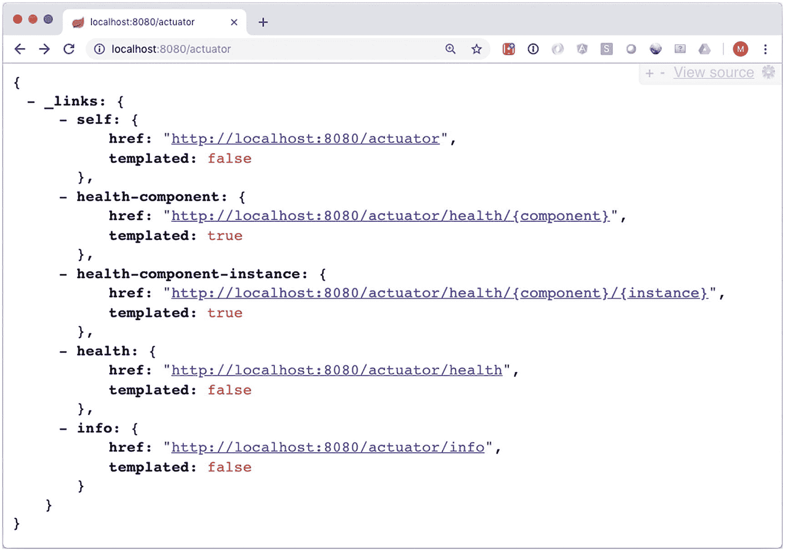
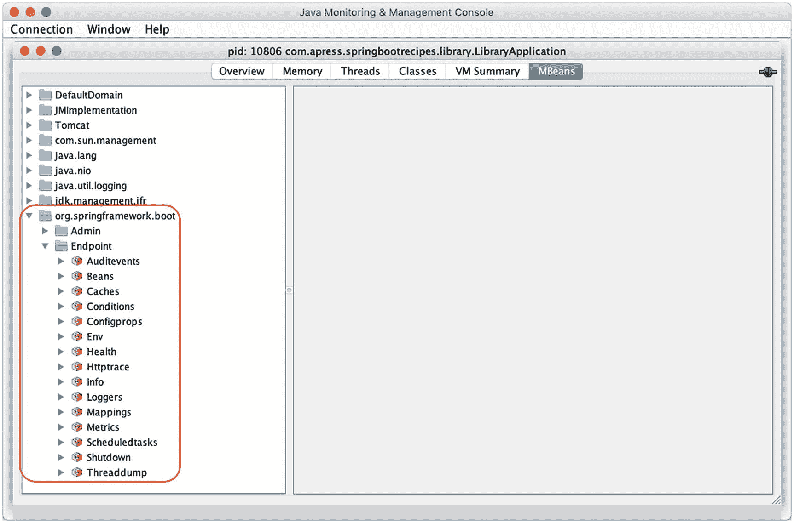
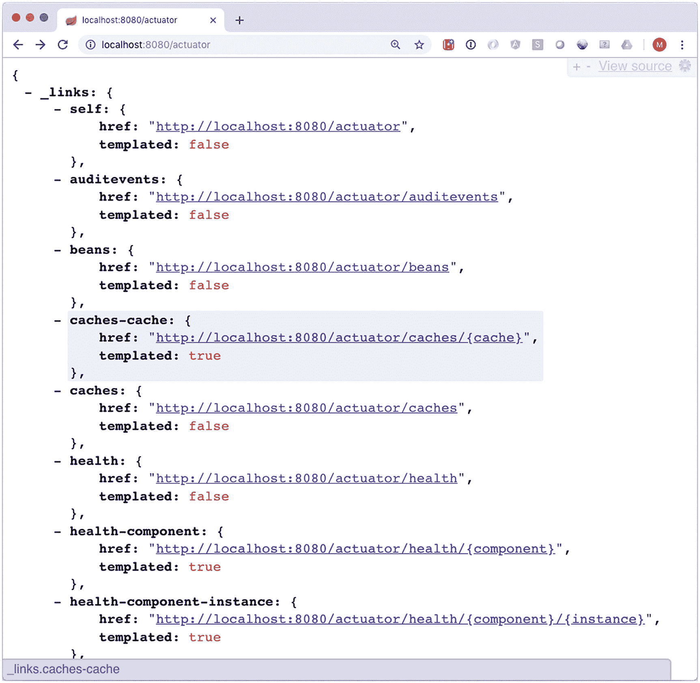
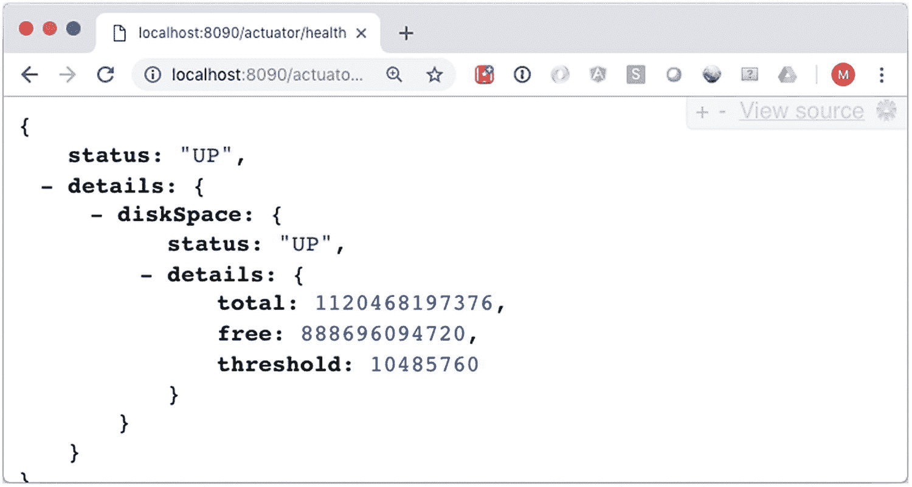
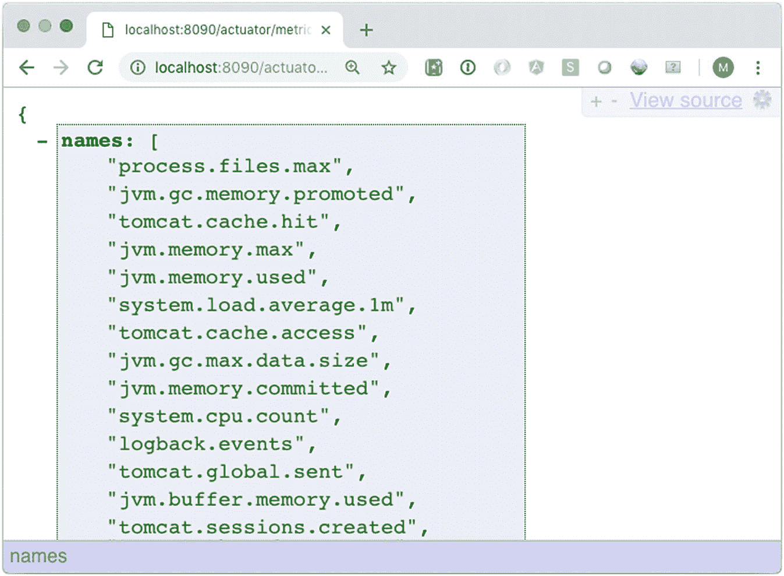
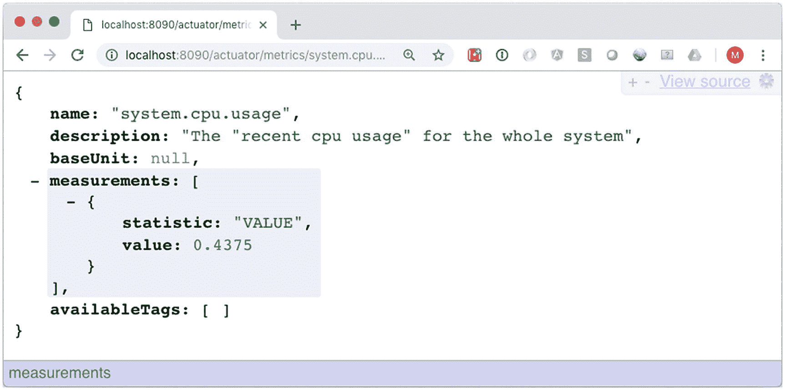
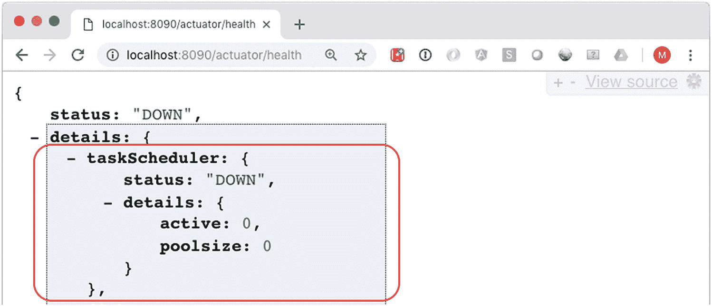
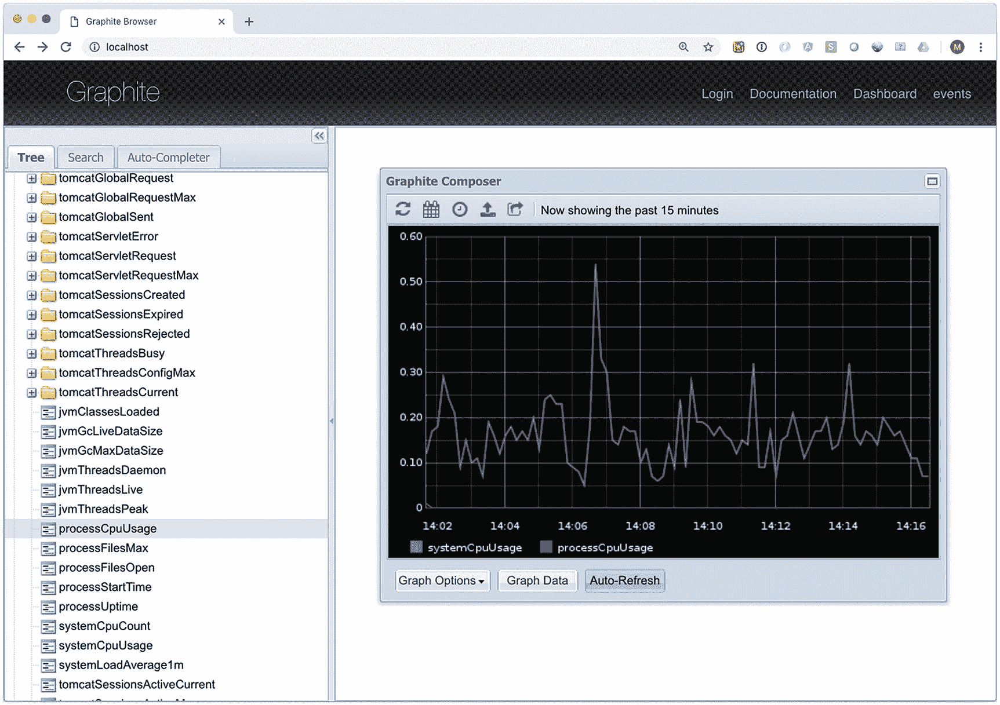

# 10. Spring Boot Actuator

在开发应用程序时，你通常也希望能够监控应用程序的行为。Spring Boot 通过引入 Spring Boot Actuator 使得这一过程变得非常简单。Spring Boot Actuator 向相关方公开应用程序的健康状况和指标。这可以通过 JMX、HTTP 实现，或者导出到外部系统。

健康端点可以告知应用程序和/或其所运行系统的健康状况。它会检测数据库是否正常运行、报告磁盘空间等。指标端点则公开使用情况和性能统计数据，例如请求数量、最长请求时间、最快请求时间、连接池利用率等。

所有这些指标在启用后，既可以通过 JMX 或 HTTP 查看，也可以自动导出到外部系统，如 Graphite、InfluxDB 等。

## 10.1 启用和配置 Spring Boot Actuator

### 问题

你希望在应用程序中启用健康检查和指标功能，以便能够监控应用程序的状态。

### 解决方案

将 `spring-boot-starter-actuator` 依赖添加到你的项目中，健康检查和指标功能将被启用并公开给你的应用程序。可以通过 `management` 命名空间下的属性进行额外配置。


### 工作原理

当添加 `spring-boot-starter-actuator` 依赖后，Spring Boot 会根据应用程序上下文中的 Bean 自动设置健康检查和指标。具体暴露哪些健康检查和指标，取决于已启用的 Bean 和功能。当检测到 `DataSource` 时，系统会收集并暴露其指标以及健康状态。Spring Boot 对许多组件（如 Hibernate、RabbitMQ、缓存等）都采用此机制。

要启用 Actuator，请将依赖添加到您的应用程序中（此处假设以配方 3.3 的源码为起点）。

```
org.springframework.boot
spring-boot-starter-actuator

```

现在，启动应用程序时，Spring Boot 将配置好 Actuator，并且可以通过 JMX（图 10-1，关于如何使用 JConsole 请参见配方 8.4）和 Web（默认路径为 `/actuator`）进行访问（见图 10-2）。



图 10-2

HTTP 暴露的指标



图 10-1

JMX 暴露的指标

您会注意到，JMX 暴露的端点比 HTTP 多得多。HTTP 仅暴露 `/actuator/health` 和 `/actuator/info`。而 JMX 暴露了更多端点。这是出于安全考虑：`/actuator` 是公开暴露的，因此您不希望所有人都能看到所有信息。可以通过 `management.endpoints.web.exposure.include` 和 `management.endpoints.web.exposure.exclude` 属性来配置要暴露的内容。在 `include` 中使用 `*` 将向 Web 暴露所有端点。

```
management.endpoints.web.exposure.include=*
```

将上述配置添加到 `application.properties` 后，Web 将暴露与 JMX 相同的功能（图 10-3）。



图 10-3

HTTP 暴露的指标（全部）

#### 配置管理服务器

默认情况下，Actuator 与常规应用程序使用相同的端口和地址（`http://localhost:8080`）。但是，将管理端点运行在不同的端口上非常容易（也很常见）。这可以通过 `management.server` 命名空间中的属性进行配置；其中大多数属性模仿了常规 `server` 命名空间中的属性（表 10-1）。

表 10-1

管理服务器属性

| 属性 | 描述 |
| --- | --- |
| `management.server.add-application-context-header` | 向响应中添加一个包含应用程序上下文名称的 `X-Application-Context` 头 |
| `management.server.port` | 管理服务器运行的端口，默认与 `server.port` 相同 |
| `management.server.address` | 要绑定的网络地址，默认与 `server.address` 相同（即 `0.0.0.0` 所有地址） |
| `management.server.servlet.context-path` | 管理服务器的上下文路径，默认为空，即 `/` |
| `management.server.ssl.*` | 用于为管理服务器配置 SSL 的 SSL 属性（关于如何配置 SSL，请参见配方 3.8） |

将以下内容添加到 `application.properties` 中，将在单独的端口上运行管理端点，并添加 `X-Application-Context` 头。

```
management.server.add-application-context-header=true
management.server.port=8090
```

重新启动应用程序后，管理端点现在可在 `http://localhost:8090/actuator` 上访问。将 Actuator 运行在不同的端口上，其好处是可以通过在防火墙上阻止该端口来将其对公共互联网隐藏，仅允许本地访问。

### 注意

`management.server` 属性仅在使用嵌入式服务器时有效；当部署到外部服务器时，这些属性将不再适用！

#### 配置单个管理端点

可以通过 `management.endpoint.<endpoint-name>` 命名空间中的属性来配置单个端点。大多数端点至少有一个 `enabled` 属性和一个 `cache.time-to-live` 属性。前者用于启用或禁用端点，后者用于指定端点结果的缓存时间（表 10-2）。

表 10-2

端点配置属性

| 属性 | 描述 |
| --- | --- |
| `management.endpoint.<endpoint-name>.enabled` | 特定端点是否启用，通常默认为 `true`，有时取决于某个功能的可用性（例如，如果 Flyway 不存在，则启用 flyway 端点将不会产生任何效果） |
| `management.endpoint.<endpoint-name>.cache.time-to-live` | 响应的缓存时间，默认为 0ms，表示不缓存 |
| `management.endpoint.health.show-details` | 是否显示健康端点的详细信息，默认为 `never`，可更改为 `always` 或 `when-authorized` |
| `management.endpoint.health.roles` | 允许查看详细信息的角色（与 `show-details` 的 `when-authorized` 值一起使用） |

将 `management.endpoint.health.show-details=always` 添加到 `application.properties` 中，将显示有关应用程序健康状况的更多信息。默认情况下，它只显示 UP，但现在您可以查看应用程序健康信息的不同部分（图 10-4）。



图 10-4

扩展的健康端点输出

#### 保护管理端点

当 Spring Boot 同时检测到 Spring Boot Actuator 和 Spring Security 时，它会自动启用对管理端点的安全访问。访问端点时，将显示一个基本登录提示，要求输入用户名和密码。Spring Boot 会生成一个默认的 `user`，用户名为 user，并附带一个生成的密码（参见配方 6.1）用于登录。

在 `spring-boot-starter-actuator` 之外再添加 `spring-boot-starter-security` 就足以保护管理端点的安全。

```
org.springframework.boot
spring-boot-starter-security

```

这将在您的应用程序和管理端点中启用安全性。现在，当访问端点 `http://localhost:8090/actuator` 时，将显示一个基本登录提示。输入正确的凭据后，您应该仍然能够看到结果。

#### 配置健康检查

Spring Boot Actuator 的功能之一是进行健康检查。这些检查通过 `http://localhost:8090/actuator/health` 暴露；如果应用程序处于 UP 或 DOWN 状态，则会生成相应结果。健康端点会调用系统中所有可用的 `HealthIndicator`，并在端点中报告这些信息。可以通过设置 `management.health.<health-indicator>.enabled` 属性来控制哪些 `HealthIndicator` 存在。对于不可用的功能（例如，在没有 `DataSource` 的情况下尝试获取其信息），将属性设置为 `true` 是无效的。

```
management.health.diskspace.enabled=false
```

这将禁用磁盘空间的健康检查，并且它不再属于健康检查的一部分。


#### 配置指标

Spring Boot Actuator 的功能之一是暴露指标。这些指标可通过 `http://localhost:8090/actuator/metrics` 访问；这将为你的应用程序生成一个可用指标列表（图 10-5）。



图 10-5

当前可用指标列表

可以通过访问 `http://localhost:8090/actuator/metrics/{指标名称}` 来获取某个指标的更多信息，例如，`http://localhost:8090/actuator/metrics/system.cpu.usage` 将显示当前的 CPU 使用率（图 10-6）。



图 10-6

详细的 CPU 指标

Spring Boot 使用 micrometer.io^(³⁹) 来记录指标。对于 Spring Boot 检测到的功能，指标默认是启用的。因此，如果检测到 `DataSource`，指标就会被启用。要禁用指标，请将它们添加到 `management.metrics.enable` 属性中。这是一个包含键值对的映射，用于指定哪些指标需要启用。

```
management.metrics.enable.system=false
management.metrics.enable.tomcat=false
```

上述配置将禁用 `system` 和 `tomcat` 指标。当在 `http://localhost:8090/actuator/metrics` 查看指标时，它们将不再出现在列表中。

## 10.2 创建自定义健康检查和指标

### 问题

你的应用程序需要暴露某些默认不可用的指标，并执行健康检查。

### 解决方案

健康检查和指标是可插拔的，`HealthIndicator` 和 `MetricBinder` 类型的 Bean 会被自动注册，以提供额外的健康检查和/或指标。任务是创建一个实现所需接口的类，并将该类的实例注册为 Bean，使其能够为健康和指标功能做出贡献。

### 工作原理

假设已经存在对 Spring Boot Actuator 的依赖，你可以立即开始编写实现。假设你有一个使用 `TaskScheduler` 的应用程序，并且希望为其添加一些指标和健康检查功能。（添加 `@EnableScheduling` 就足以让 Spring Boot 创建一个默认的 `TaskScheduler`。）

首先，让我们编写 `HealthIndicator`。你可以直接实现 `HealthIndicator` 接口，或者使用便捷的 `AbstractHealthIndicator` 作为基类。

```
package com.apress.springbootrecipes.library.actuator;
import org.springframework.boot.actuate.health.AbstractHealthIndicator;
import org.springframework.boot.actuate.health.Health;
import org.springframework.scheduling.concurrent.ThreadPoolTaskScheduler;
import org.springframework.stereotype.Component;
@Component
class TaskSchedulerHealthIndicator extends AbstractHealthIndicator {
private final ThreadPoolTaskScheduler taskScheduler;
TaskSchedulerHealthIndicator(ThreadPoolTaskScheduler taskScheduler) {
this.taskScheduler = taskScheduler;
}
@Override
protected void doHealthCheck(Health.Builder builder) throws Exception {
int poolSize = taskScheduler.getPoolSize();
int active = taskScheduler.getActiveCount();
int free = poolSize - active;
builder
.withDetail("active", taskScheduler.getActiveCount())
.withDetail("poolsize", taskScheduler.getPoolSize());
if (poolSize > 0 && free <= 1) {
builder.down();
} else {
builder.up();
}
}
}
```

`TaskSchedulerHealthIndicator` 对给定的 `ThreadPoolTaskExecutor` 进行操作。如果可用于调度任务的线程数为一个或更少，它将状态报告为 `down`。`poolSize > 0` 这个条件是因为底层 `Executor` 的创建会延迟到需要时才进行；在此之前，`poolSize` 将报告为 `0`。返回值中包含 `poolsize` 和 `active` 线程数，仅用于提供信息。

`TaskSchedulerMetrics` 实现了 micrometer.io 中的 `MeterBinder` 接口。它将 `active` 和 `pool-size` 暴露给指标注册表。

```
package com.apress.springbootrecipes.library.actuator;
import io.micrometer.core.instrument.FunctionCounter;
import io.micrometer.core.instrument.MeterRegistry;
import io.micrometer.core.instrument.binder.MeterBinder;
import org.springframework.scheduling.concurrent.ThreadPoolTaskScheduler;
import org.springframework.stereotype.Component;
@Component
class TaskSchedulerMetrics implements MeterBinder {
private final ThreadPoolTaskScheduler taskScheduler;
TaskSchedulerMetrics(ThreadPoolTaskScheduler taskScheduler) {
this.taskScheduler = taskScheduler;
}
@Override
public void bindTo(MeterRegistry registry) {
FunctionCounter
.builder("task.scheduler.active", taskScheduler,
ThreadPoolTaskScheduler::getActiveCount)
.register(registry);
FunctionCounter
.builder("task.scheduler.pool-size", taskScheduler,
ThreadPoolTaskScheduler::getPoolSize)
.register(registry);
}
}
```

现在，在 `LibraryApplication` 上放置 `@EnableScheduling` 并重启应用程序后，`TaskScheduler` 的指标和健康检查信息将被报告（图 10-7）。



图 10-7

TaskScheduler 健康检查

## 10.3 导出指标

### 问题

你想将指标导出到外部系统，以创建仪表板来监控应用程序。

### 解决方案

使用 Graphite 等受支持的系统之一，并定期将指标推送到该系统。在你的应用程序中包含一个 micrometer.io 注册表依赖（除了 `spring-boot-starter-actuator` 依赖之外），指标将自动被导出。默认情况下，数据会每分钟推送到服务器。

### 工作原理

导出指标是 Micrometer.io 库的一部分，它支持多种服务，如 Graphite、DataDog、Ganglia 或常规的 StatsD。本方案使用 Graphite，因此需要添加对 `micrometer-registry-graphite` 的依赖。

```
io.micrometer
micrometer-registry-graphite

```

理论上，如果 Graphite ([`https://graphiteapp.org`](https://graphiteapp.org)) 运行在 `localhost` 上并使用默认端口，这足以将指标发布到 Graphite。然而，Spring Boot 通过暴露一些属性（通常在 `management.metrics.export.<注册表名称>` 命名空间下）使得配置变得简单（表 10-3）。

表 10-3

通用指标导出属性

| 属性 | 描述 |
| --- | --- |
| `management.metrics.export.<注册表名称>.enabled` | 是否启用指标导出。当在类路径上检测到该库时，默认为 `true` |
| `management.metrics.export.<注册表名称>.host` | 发送指标的主机，通常是 `localhost` 或服务的已知 URL（如 SignalFX、DataDog 等） |
| `management.metrics.export.<注册表名称>.port` | 发送指标的端口，默认为所需服务的已知端口 |
| `management.metrics.export.<注册表名称>.step` | 发送指标的频率，默认为 1 分钟 |
| `management.metrics.export.<注册表名称>.rate-units` | 用于报告速率的基本时间单位，默认为 `seconds` |
| `management.metrics.export.<注册表名称>.duration-units` | 用于报告持续时间的基本时间单位，默认为 `milliseconds` |

要每十秒而不是每分钟报告一次指标，请将以下内容添加到 `application.properties` 中：

```
management.metrics.export.graphite.step=10s
```


### 注意

`bin` 目录中包含一个 `graphite.sh` 脚本，该脚本使用 Docker 启动一个 Graphite 实例。

现在，指标将每十秒发布到 Graphite。如果你启动应用程序并在 `http://localhost` 上打开 Graphite（假设你正在运行前述 Docker 容器），则可以创建 CPU 使用率的图表（图 10-8）。



图 10-8

Graphite CPU 图表

脚注 1

